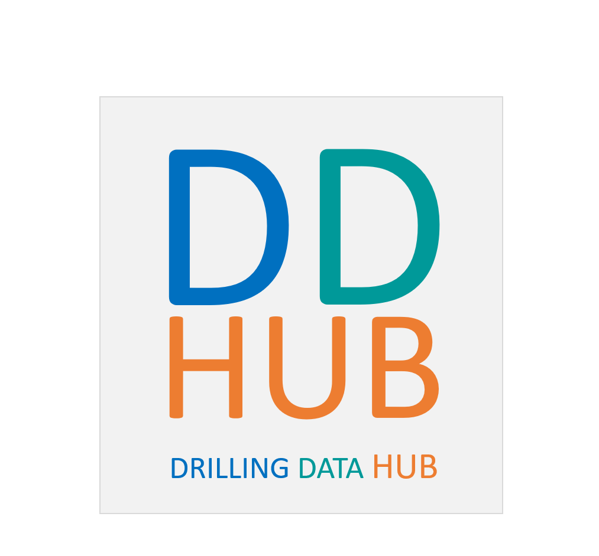

# DDHub semantic model
The DDHub semantical model is intended to facilitate semantic interoperability between drilling applications, in particular *drilling automation systems* (DAS). 

## Drilling interoperability

There exist several definitions of interoperability. [Wikipedia](https://en.wikipedia.org/wiki/Interoperability) gives the following definition:

>Interoperability is a characteristic of a product or system, whose interfaces are completely understood, to work with other products or systems, at present or in the future, in either implementation or access, without any restrictions.

Distinction is made between *syntactic, semantic and cross-domain* interoperabilities in the same [article](https://en.wikipedia.org/wiki/Interoperability#Types):

>If two or more systems use a common data formats and communication protocols and are capable of communicating with each other, they exhibit syntactic interoperability. XML and SQL are examples of common data formats and protocols. Lower-level data formats also contribute to syntactic interoperability, ensuring that alphabetical characters are stored in the same ASCII or a Unicode format in all the communicating systems.

>Beyond the ability of two or more computer systems to exchange information, semantic interoperability is the ability to automatically interpret the information exchanged meaningfully and accurately in order to produce useful results as defined by the end users of both systems. To achieve semantic interoperability, both sides must refer to a common information exchange reference model. The content of the information exchange requests are unambiguously defined: what is sent is the same as what is understood. The possibility of promoting this result by user-driven convergence of disparate interpretations of the same information has been the object of study by research prototypes such as S3DB.

>Cross-domain interoperability involves multiple social, organizational, political, legal entities working together for a common interest and/or information exchange.

We use our own definitions of interoperability, and introduce the **_Levels of Drilling interoperability_**:

 
 
1. **_Technical_**: drilling systems can exchange binary signals with each other’s but there are no requirements that the systems are capable to make sense of the binary data, e.g. data are transmitted through high speed telemetry, yet the provider of the high speed telemetry is unable to decipher the information that passes through its network.
2. **_Syntactical_**: there is a protocol that allows to send/receive numerical values between drilling systems under access control, e.g. OPC-UA used in a key/tag structure, WITSML log objects allow to exchange Booleans, enumerations, integers, floating-point values, yet without human interpretation to connect to the right tag or mnemonics, it is not possible to interpret the meaning of the data.
3. **_Semantic_**: There is an agreement about the meaning of exchanged data between drilling systems, e.g. WITS0, OPC-UA’s RIM & DIM, WITSML’s drilling data model (except logs), DDHub semantic network allow to exchange drilling data either based on an pre-agreed static data model description (WITS0, RIM DIM, WITSML) or a dynamic description (DDHub).
4. **_Dynamic_**: New drilling data information can be added on the fly and drilling systems can interpret the meaning the data, e.g. DDHub allows to describe new signals or configurations that have never been thought earlier.
5. **_Organizational_**: Different disciplines can exchange drilling data regardless of their different domain perspectives, e.g.  geologists, geo-physicists, reservoir engineers, petro-physicists, geo-mechanics have all different views on drilling data than drilling engineers and all of them are equally valid.

The DDHub's ambition is to enable interoperability levels 3 and 4, namely *Semantic* and *Dynamic* interoperability. Levels 1 and 2 are therefore assumed.

## Interoperability requirements

 Among the many scenarios encountered on a drilling rig, the following generic ones serve as main drivers for the development. They can be interpreted as general requirements for the DDHub's functionalities:
- a DAS connects to the rig's real-time data. The identification of the available signals has to be done automatically, as well as the eventual choice between multiple signals representing the same type of data. 
- a DAS is informed when new data is made avalable by other participants. It can then reconfigure itself if the newly arrived data is relevant. 
- a DAS can correctly interpret unexpected information, such as measurements of a type never encountered before, and use it if relevant to its own purpose. 

## Focus on drilling data

The DDHub provides standardized ways of representing the meaning of the various signals involved in drilling operations, enabling DAS to interpret them correctly, without ambiguity. It it therefore *signal-centered*:
- it **does not** intend to describe the rig, wellbore, fluids or trajectory. This function is left to wellbore configuration storage systems, based on WitsML data models for example. It may nevertheless refer to such configruation elements. 
- Its role is **not** to store and/or provide the signals themselves. This function is left to existing data exchange technologies such as OPC-UA, Wits, WitsML... There is nevertheless a connection between the DDHub and the real-time data management systems: the DDHub aims to provide contextual information about the data available via those systems, and need to be properly integrated in the real-time data ecosystem. 

## Drilling data semantics: topics

In order to fullfill the interoperability requirements several aspects attached to drilling data need to be covered by the semantical model. 

### **Data structure**
Any signal available from a drilling rig has a special structure: Its type (integer, boolean, floating point) is an element of the structure. The other aspect relates to its dimensions. Scalar quantities are typically represented as single elements, but multi-dimensional quantities require the use of arrays of possibly high dimensions. When using arrays it is important to interpret the various dimensions correctly. For example an array with 3 velocity entries can be interpreted as the tridimensional velocity vector attached to a single point in the wellbore or as three independent uniaxial velocities of three different points. 

The *data structure* topic will provide means to facilitate the interpretation of the data's structure. 

### **Quantities and units**
Unit management is often a source of human errors, because of the constant case needed for potential conversions. In this topic, we will expose the necessary information to render transparent the conversion mechanisms. 

This is done by a distinction between the following concepts:
- *Quantity*: a combination of exponents attached to the fundamental base quantities that are mass, length, time, electric current, thermodynamic temperature, amount of substance and luminous intensity. All physical quantities are derived from those: for example, a velocity has a length exponent of 1 and a time exponent of -1, while a pressure has a length exponent of -1, a mass exponent of 1 and a time exponent of -2.
- *Measurable quantity*: this is nothing more than a quantity enriched with a meaningful precision value, expressed in SI. This variable guides the comparison between values. Indeed, pressures on a drilling rig can be used in many different contexts. Pump pressures, formation strength or shear stresses are all pressures but differ by several order of magnitudes. One cannot use a single comparison accuracy for all of them, and we therefore distinguish between pump pressure quantity, formation strength quantity and drilling fluid shear stress quantity by providing different meaningful precisions. 
- *Unit*: when associated to a quantity, any value has a default unit, given by the SI units associated to the base quantities. However, one can chose alternative units: those are characterized by two factors *a* and *b* that control the conversion from the SI value *x*: *ax+b*.  
- *Unit system*: a unit system is a set of associations between *measurable quantities* and units. For example, the SI unit system associate to any measurable quantity the SI unit corresponding to the base quantity. One can consider for example a unit system that associates  bar to pump-pressures, mega-pascal to formation strength and pascal to fluid shear stress.  

### **Uncertainties**
Uncertainties are ubiquitous in the drilling industry. Sensor readings, wellbore positioning, geological prognosis, real-time simulations are all associated to specific types of uncertainties. This topic will provide the necessary data structure to represent the different forms that uncertainties can take. 

Proper representation of uncertainties requires to link drilling data together: indeed, while one can associate to most sensor values a fixed precision and accuracy, this is not necessarily the case for calculated signals. The uncertainty associated with a simulated pump-pressure will typically depend on the flow-rate and the current depth, and will therefore be dynamic. The components of the uncertainty description will then be drilling signals themselves. 

### **Data validity**
Knowing when a given signal is reliable and when it is not is essential to guarantee robustness of autoamtion systems. There ar at least two requirements related to the estimation of data validity:
- it should be possible to express the validity of specific signals. For example, downhole signals transmitted via mud-pulse telemetry should be disregarded when the circulation rate is below a given threshold. Consumer application can therefore evaluate themselves the validity of the signals
- it should be possible to notify to the consumer applications that a signal suddenly became invalid. 

The *data validity* topic will provide the necessary semantical model to fulfill those requirements. Note that, just as for the uncertainties, cross-references between drilling signals will be necessary. 

### **Time management**
Time management is a central thematic when consuming real-time drilling data. Because of the multiplicity of sources of a drilling rig, signals are often not synchronized, different clocks can be used for time stamping and various transmission delays can be observed. 
It is in most existing system impossible to provide all the information that enables adequate interpretation of the signal's time behaviour. This will be treated in this topic. 

### **Data flow and processing**
Drilling signals can be different in nature: very few are raw measurements, most are processed to some extent. The processing can be limited to a simple sensor transfer function, but can also imply conversions, corrections, derivations, filtering... 
Simulated signals are also of course processed by nature, although the nature of the processing is quite different and involves more advanced computations. 

It can be important for a consumer application to know the nature of the corrections made to a specific measurement. For example, knowing that a default block weight is added to a hookload measured from a sub attached to the top-drive, so that the resulting value ressembles a classical dead-line hookload is of primary importance for any application analysing the hookload. 

All this information can be made available via data flow *charts*, that represent, under the form of processing graphs, the relations between the different components of the rig data ecosystem. Such graphs will form the basis of our representation. Note that this allows to also infer the signal's nature (measured, derived, calculated...) and its role in the drilling process control. 

### **Dependencies**
Remark: the name is ambiguous, something like *contextual dependencies* should be used instead. 

Many signals only have meaning when associated with contextual information. Often, this information consists in other signals. This creates strong dependencies between drilling signals. For example, the correct interpretation of a fluid density requires the knowledge of the pressure and temperature associated to the measurement. 
This topic provides the necessary structures to express the different types of inter-dependencies between drilling datas.  

### **Physical locations**
Most drilling signals, in particular those associated to physical/material properties, are *physically located* in the wellbore. For a measurement, this location typically corresponds to the location of the corresponding sensor. 

This topic provides means to represent the location of drilling data. Note that it is a complex task, that can requires combination of references. For example, a downhole measurement's location is naturally given by the position of the MWD sensor in a curvilinear reference frame. The frame is defined by the wellbore's trajectory, is pointing upward with an origin defined by the bit's location. The coordinates of the sensor within that frame is the distance between the sensor and the bit. This representation links the location to another one (the origin of the frame is the bit's location). The latter one is defined within another curvilinear frame: the curve is still the wellbore trajectory, but the origin is now (for example) the drill-floor, and the coordinate of the bit location within this frame is given by the bit depth, i.e. a signal. 

This example shows that precise localization of signals requires complex links between multiple locations and signals. 

### **Logical positions**
Apart from physical position, it is important for some automation system to locate signals within some logical reference: the position of a pressure within the hydraulic network, or of a tension within the force transmission system. This topic provides the necessary structures to properly express those logical positions. 

