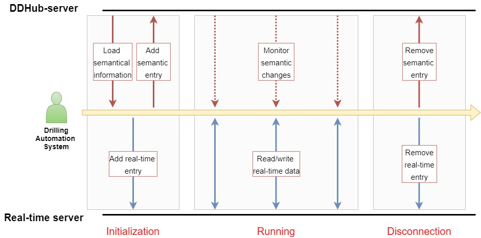

# DDHub architecture

This is a draft document. 

Power point for the figure is [here](https://teams.microsoft.com/l/file/4FA424BB-A6EA-4B35-8B39-78A97F59C310?tenantId=70a6eba4-9671-45d2-b83e-432e06502242&fileType=pptx&objectUrl=https%3A%2F%2Fnorce.sharepoint.com%2Fsites%2FP103492_DSIS%2FShared%20Documents%2FWP1%20-%20A1.2%20Standard%20implementation%2FArchitecture%2FDesign.pptx&baseUrl=https%3A%2F%2Fnorce.sharepoint.com%2Fsites%2FP103492_DSIS&serviceName=teams&threadId=19:82b8bbc4e636484fb62e56a2c04f78b5@thread.tacv2&groupId=c19c30cd-78fb-40c2-bfa6-d3c0631680c5);


## Roles, functions and APIs

In the following, the prefix *DDHub-S* denotes semantical behaviour, while *DDHub-RT* denotes real-time data related behaviour. 

- _**DDHub-S consumer**_: an application that accesses the semantical information as provided by the DDHub system. We distinguish three sub-types of consumers:
  - _**DDHub-S loader**_: an application that loads (parts of) the semantical graph for internal analysis. 
  - _**DDHub-S querier**_: an application that sends specific queries to the DDHub system, and expects answers in return
  - _**DDHub-S monitor**_: an application that expects notifications whenever (relevant) changes to the semantical graph are made. 
- _**DDHub-S producer**_: an application that adds or remove nodes or edges to the semantical graph.
- _**DDHub-S provider**_: an application that edits a node in the semantical graph. The edition of data properties is thus considered different from the edition of object properties. 

Even if the DDHub functionalities do not cover the management of the real-time signals themselves, it can be useful to define the equivalent functions for the real-time part: 
- _**DDHub-RT consumer**_: an application that reads real-time signals
- _**DDHub-RT producer**_: an application that instanciates an new real-time signal
- _**DDHub-RT provider**_: an application that modifies the value of a real-time signal

The DDHub functions are automatically associated to method signatures:

- _**DDHub-S loader**_: 
```
Get: returns the entire semantical graph
Get(argument): returns a limited part of the semantical graph. The argument specifies the limitations of the Get call
```
- _**DDHub-S querier**_: 
```
Get(query): returns the identifiers of the nodes in the stored semantical graph that satisfy the query argument
```
- _**DDHub-S monitor**_: 
```
Subscribe(arguments): establishes a subscription mechanism such that notification events are launched as soon as changes are made to the semantical graph. The arguments can be used to limit the scope of the changes. 
```
- _**DDHub-S producer**_: 
```
Add(graph): adds the input graph to the central storage
Remove(graph): removes the input graph from the central storage
Add(graph, arguments): adds the input graph to the central storage. The extra arguments can be used to specify which nodes are expected to be found in the central storage.  
Remove(graph, arguments)
```
- _**DDHub-S provider**_: 
```
Update(nodes): updates the data properties of the node passed as argument. 
```


## Scenario

