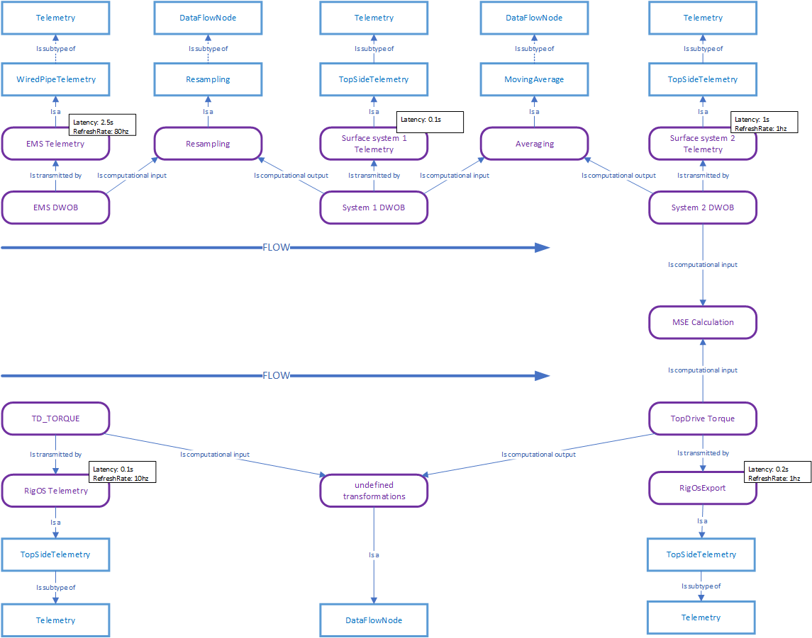
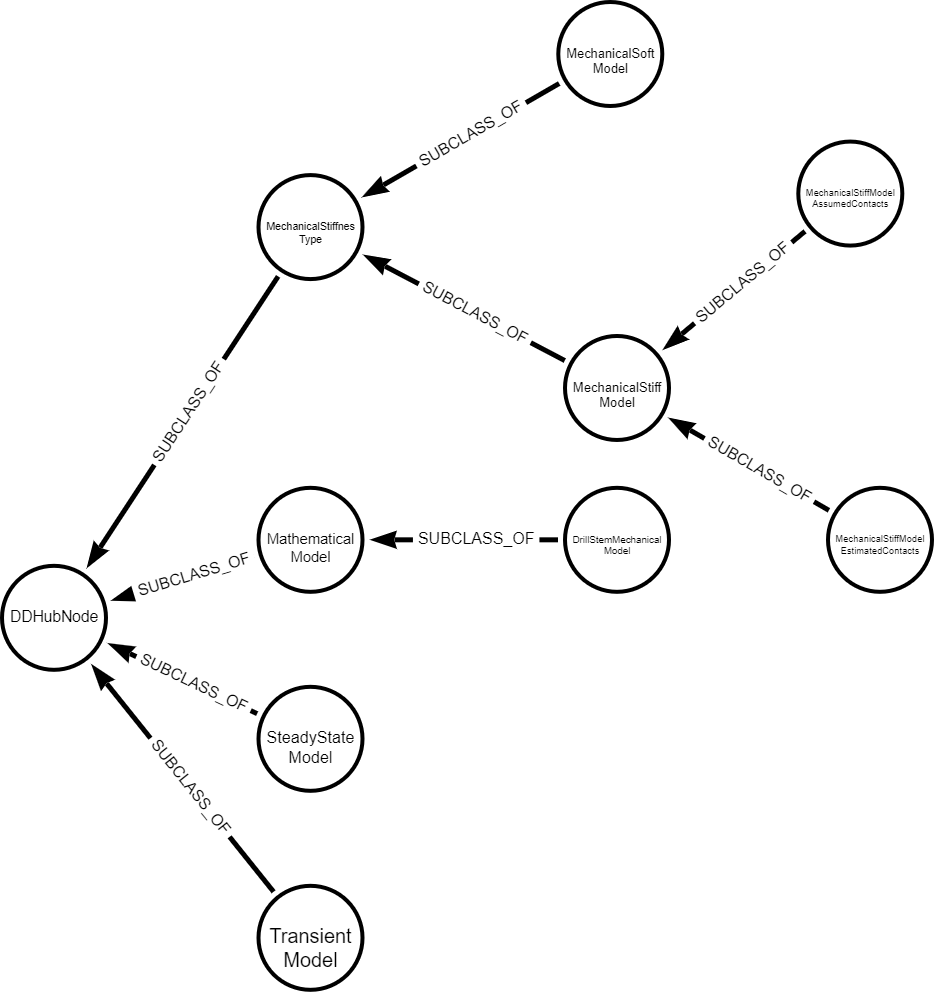
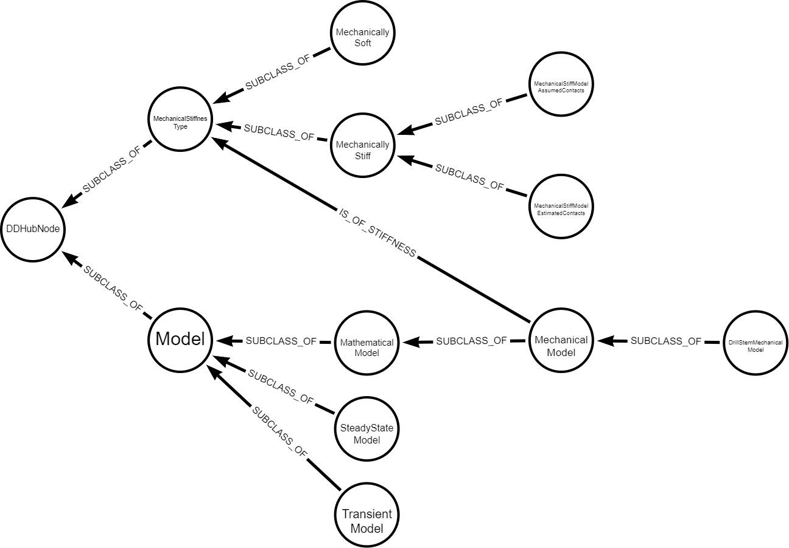

# Open Questions

## Telemetry
* Author: Espen Solbu
* Date: Dec 01 - 2021
* Reference to: [DataTransmission](./definitions/DataTransmission.md)
* Status: Open

My understanding:

### Questions

* Q: Do we include a notion of "protocols", like WITS0, WITSML, OPC-UA into telemetry, or should we introduce this as separate Noun (Protocol)? (these also introduce latency etc).
   * Q: If we include new Noun 'Protocol', Do we believe this is associated with the telemetry system (telemetry uses protocol) or to the signal instance (is transmitted over protocol) or the DataFlowNode?
* Q: Should examples of Telemetry be tool product names (eg NOV BlackStar II for Mudpulse), or more oriented to solutions/systems? (e.g. Tolteq iSeries MWD Platform) 
* Q: I am under the impression that if we follow a signal DataFlow, we will have optional references to Telemetry for each "signal instance". Is this correct? Or do we assume that if we go to the "endnode" for 
   the flow, then the associated Telemetry node will give us the aggregated values for hops, latency etc?
* Q: If we introduce concepts such as delay or latency, how do we allow for aggregation of these? (to understand "total latency"). I can see several Noun's introduce latency, e.g. DataFlowNode, Telemetry, Protocol (if we introduce that)
* Q: It the assumption that Telemetry is linked to DrillingData correct?
* Q: Shall we introduce abstract telemetry classes for things like data passing between one logical system and the next? (or just use either TopSideTelemetry, or Telemetry)?

## Mechanical Model
* Author: Espen Solbu
* Date: Nov 19 - 2021
* Reference to: [MechanicalSoftModel](./definitions/MechanicalModel.md#MechanicalSoftModel)
* Comments: Benoit Daireaux, Nov 25 2021
* Status: Resolved

The models [MechanicalSoftModel](./definitions/MechanicalModel.md#MechanicalSoftModel) and [MechanicalStiffModel](./definitions/MechanicalModel.md#MechanicalStiffModel) are currently children of [MechanicalStiffnessType](./definitions/MechanicalModel.md#MechanicalStiffnessType-) with a dangling reference IsOfMechanicalStiffnessType to these stiffnesstypes from a nonexisting MechanicalModel Noun.

This seems to be invalid according to the 'is_a' rule, and i would think it more logical to subclass these from a MechanicalModel again subclassing Model, but it may be my understanding is lacking. 

Current interpretation:

Proposal:

### Questions

* Q: Is the definition file itself a parent Noun? Aka the "MechanicalModel.md" does that in itself define a MechanicalModel Noun? Or should the MechanicalModel be explicitly defined? if so, in Model.md or in MechanicalModel.md?
  - A: I don't think the file should imply an implicit noun. Intuitively, the file corresponds to a category, or even a namespace. In the 1st phase of he project, we used such an informal notion of category/topic, that was only an annotation to the noun/verb definitions. Such an approach should be sufficient. 
  - A: Both the Model and MechanicalModel nouns shold be explicitely defined in the deifition file. 
* Q: Similarly, should Model be explicitly described? or is this implicit from the Model.md file? Or is the Model noun not needed?
  - A: The Model noun should be explicitely defined in some definition file. We should probably introduce another file, Model.md. Generally speaking: having many small files helps for edition (small units are easier to edit) but render the overview difficult. In particular, the management of links between items becomes untractable. I suggest we simplify slightly the template, and use automated actions to generate correct links. This can be the topic of a discussion.    
* Q: Is the modelling of MechanicalSoftModel and MechanicalStiffModel as subclass of MechanicalStiffnessType intentional
  - A: I agree with your comments and proposal. The same probably applies to steady state vs transient. 

