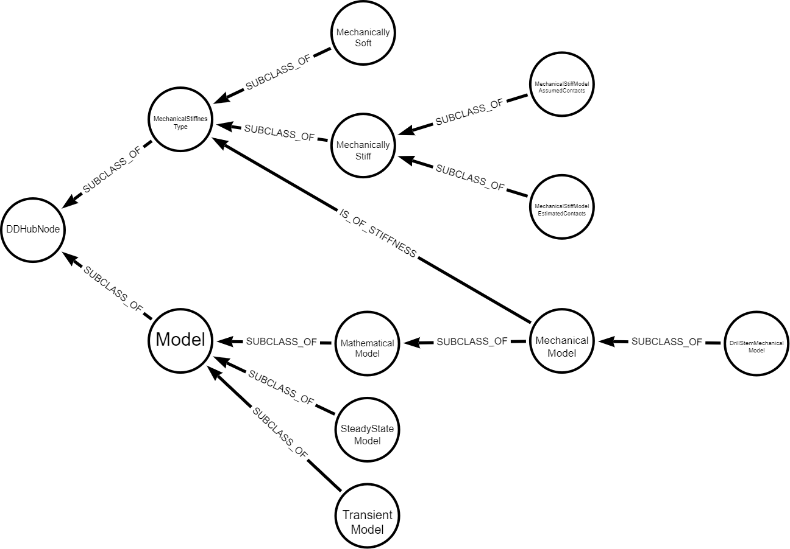

# Open Questions

## Mechanical Model
* Author: Espen Solbu
* Date: Nov 19 - 2021
* Reference to: [MechanicalSoftModel](./definitions/MechanicalModel.md#MechanicalSoftModel)
* Comments: Benoit Daireaux, Nov 25 2021

The models [MechanicalSoftModel](./definitions/MechanicalModel.md#MechanicalSoftModel) and [MechanicalStiffModel](./definitions/MechanicalModel.md#MechanicalStiffModel) are currently children of [MechanicalStiffnessType](./definitions/MechanicalModel.md#MechanicalStiffnessType-) with a dangling reference IsOfMechanicalStiffnessType to these stiffnesstypes from a nonexisting MechanicalModel Noun.

This seems to be invalid according to the 'is_a' rule, and i would think it more logical to subclass these from a MechanicalModel again subclassing Model, but it may be my understanding is lacking. 

Current interpretation:

Proposal:

### Questions

* Is the definition file itself a parent Noun? Aka the "MechanicalModel.md" does that in itself define a MechanicalModel Noun? Or should the MechanicalModel be explicitly defined? if so, in Model.md or in MechanicalModel.md?

- Answers:
  - I don't think the file should imply an implicit noun. Intuitively, the file corresponds to a category, or even a namespace. In the 1st phase of he project, we used such an informal notion of category/topic, that was only an annotation to the noun/verb definitions. Such an approach should be sufficient. 
  - Both the Model and MechanicalModel nouns shold be explicitely defined in the deifition file. 
* Similarly, should Model be explicitly described? or is this implicit from the Model.md file? Or is the Model noun not needed?
- The Model noun should be explicitely defined in some definition file. We should probably introduce another file, Model.md. Generally speaking: having many small files helps for edition (small units are easier to edit) but render the overview difficult. In particular, the management of links between items becomes untractable. I suggest we simplify slightly the template, and use automated actions to generate correct links. This can be the topic of a discussion.    
* Is the modelling of MechanicalSoftModel and MechanicalStiffModel as subclass of MechanicalStiffnessType intentional

- I agree with your comments and proposal. The same probably applies to steady state vs transient. 

