# Definition sets
## ADCS<!-- DEFINITION SET HEADER -->
- Description: 
this definition set refers to the various functions an ADCS implements. It is to be used for the ADCS capability description.

## DataDependencies<!-- DEFINITION SET HEADER -->
- Description: 
this definition set covers the physical dependence of a `DrillingDatPoint` on something else.

## DataFlow<!-- DEFINITION SET HEADER -->
- Description: 
this category refers to the data processing. It should probably be renamed accordingly. It should define and organize the different types of processing encountered during drilling operations. A Thursday session was devoted to those items. Note that in the current version, control flow is also included: a controller is seen as a special type of processing unit, that generates commands based on measurements and set-points. This can of course be modified if deemed necessary. Note also that transmission is included there as well. A telemetry system is seen as a processing unit that only duplicates a signal, and a delay is associated to the duplication process. While this is a useful way of looking at telemetry, it is probably not intuitive enough.

## DataProviders<!-- DEFINITION SET HEADER -->
- Description: 
description of the different actors involved in the well construction process

## DataTransmission<!-- DEFINITION SET HEADER -->
- Description: 
this category contains all nouns and verbs used to describe the rig's telemetry, for each signal. Downhole telemetry has focus.

## DataValidity<!-- DEFINITION SET HEADER -->
- Description: 
this category contains all the nouns and verbs used to described the validity of signals. Some signals are for example only valid while off-slips, downhole signals transmitted via mud-pulse telemetry require circulation.

## DrillingDataSemantics<!-- DEFINITION SET HEADER -->
- Description: 
this is the part associated to the signal's description themselves. Dimensionality, data type are the main items to be described.

## DrillingEquipment<!-- DEFINITION SET HEADER -->
- Description: 
in this category fall all the standard equipment encountered on a drilling rig. Note that the goal of the vocabulary is not to provide a detailed description of the rig. Therefore we only consider nouns that can help providing a signal context.

## DrillingIncident<!-- DEFINITION SET HEADER -->
- Description: 
this category refers mostly to the description of drilling incidents.

## DWISSemantics<!-- DEFINITION SET HEADER -->
- Description: 
definitions of the base noun and verb. All verbs and nouns in the DWIS vocabulary are children of those.

## EndPoints<!-- DEFINITION SET HEADER -->
- Description: 
this is the part associated to the description of external end-points.

## Hydraulics<!-- DEFINITION SET HEADER -->
- Description: 
this part refers to the hydraulic circuit, and should only contain the "abstract" or conceptual part of the vocabulary. Additional nouns coming from the drilling equipment category will be used when constructing the semantic graphs.

## MeasurableQuantityTypes<!-- DEFINITION SET HEADER -->
## MechanicalModel<!-- DEFINITION SET HEADER -->
- Description: 
specialized vocabulary for the modelling of the drilling mechanics. Covers in particular the so-called torque and drag models

## Mechanics<!-- DEFINITION SET HEADER -->
- Description: 
this part refers to the mechanical circuit, and should only contain the "abstract" or conceptual part of the vocabulary. Additional nouns coming from the drilling equipment category will be used when constructing the semantic graphs.

## Model<!-- DEFINITION SET HEADER -->
- Description: 
high level and generic vocabulary for mathematical models of the drilling process

## PhysicalLocation<!-- DEFINITION SET HEADER -->
- Description: 
this category contains the vocabulary necessary to specify the location of various items on a rig. Coordinate systems are the main element here.

## Quantities<!-- DEFINITION SET HEADER -->
- Description: 
quantities and units

## QuantityTypes<!-- DEFINITION SET HEADER -->
## SignalPrototypes<!-- DEFINITION SET HEADER -->
- Description: 
this is description set for specialization of signa prototypes.

## TimeManagement<!-- DEFINITION SET HEADER -->
- Description: 
this category referes mostly to the description of the various clocks that can be encoutered on a rig, and their synchronization status with respect to each other.

## Uncertainty<!-- DEFINITION SET HEADER -->
- Description: 
this category contains the nouns and verbs required to describe the various types of uncertainty attached to drilling signals. Uncertainties can be related to sensor characteristics, calculations, model calibration, data assimilation.

# Nouns
## ActivableFunction <!-- NOUN -->
- Display name: Activable Function
- Parent class: [DWISNoun](#DWISNoun)
- Attributes:
  - HasFunction
    - Type: string
    - Description: this attribute describes the purpose of the activable function.
- Description: 
An `ActivableFunction` is an ADCS function that can be activated. Here activation means that the
function may run immediately or that it is enabled and can trigger if some conditions are respected.
- Definition set: ADCS
- Examples:
```dwis ADCSFunction
ActivableFunction:ADCSFunction
ControlSystem:DCS
DrillingContractor:Contractor
DCS IsProvidedBy Contractor
DCS BelongsToClass DataProvider
ActivableFunction IsProvidedBy DCS
```
An example semantic graph looks like as follow:
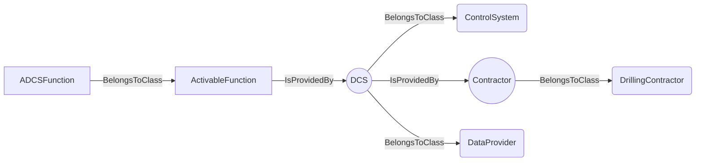
An example SparQL query looks like this:
```sparql
PREFIX rdf: <http://www.w3.org/1999/02/22-rdf-syntax-ns#>
PREFIX ddhub: <http://ddhub.no/>
PREFIX quantity: <http://ddhub.no/UnitAndQuantity>
SELECT ?ADCSFunction
WHERE {
	?ADCSFunction rdf:type ddhub:ActivableFunction .
	?DCS rdf:type ddhub:ControlSystem .
	?Contractor rdf:type ddhub:DrillingContractor .
	?DCS ddhub:IsProvidedBy ?Attribute000 .
	?DCS rdf:type ddhub:DataProvider .
	?ActivableFunction ddhub:IsProvidedBy ?Attribute001 .
  FILTER (
	?Attribute000 = Contractor
	&& 	?Attribute001 = DCS
  )
}
```
This example describes all `ActivableFunction` provided by the drilling control system, `DCS`. The `DCS` is 
defined as a `ControlSystem` provided by a drilling contractor.
## RunnableFunction <!-- NOUN -->
- Display name: Runnable Function
- Parent class: [ActivableFunction](#ActivableFunction)
- Attributes:
  - IsAuxiliary
    - Type: boolean
    - Description: This attribute specifies if the function is a main or an auxilary one. A main function impacts
    substantially the drilling process while an auxiliary function does not impact or only in limited fashion the
    drilling process. Example of a main functions are: Hoist, Tag Bottom, Start Circulation, Start Rotation,
    Stop Circulation, Stop Rotation, Drill, Pull Out,Run In, Pull Out With Lubrication, Run In With Lubrication, Ream Up,
    Ream Down,Test Friction, Reciprocate, Test Pressure Integrity, Place Cement, .... Example of auxiliary functions
    are: Boost Riser Flow, Down Link from ADCS, Rock Pipe, ...
- Description: 
A runnable function is a function that starts to run immediately when activated.
- Definition set: ADCS
- Examples:
```dwis runnableFunction
RunnableFunction:runnableFunction
runnableFunction IsAuxiliary false
ControlSystem:DCS
DrillingContractor:Contractor
DCS IsProvidedBy Contractor
DCS BelongsToClass DataProvider
runnableFunction IsProvidedBy DCS
```
An example semantic graph looks like as follow:
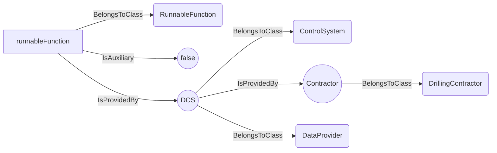
An example SparQL query looks like this:
```sparql
PREFIX rdf: <http://www.w3.org/1999/02/22-rdf-syntax-ns#>
PREFIX ddhub: <http://ddhub.no/>
PREFIX quantity: <http://ddhub.no/UnitAndQuantity>
SELECT ?runnableFunction
WHERE {
	?runnableFunction rdf:type ddhub:RunnableFunction .
	?runnableFunction ddhub:IsAuxiliary ?Attribute000 .
	?DCS rdf:type ddhub:ControlSystem .
	?Contractor rdf:type ddhub:DrillingContractor .
	?DCS ddhub:IsProvidedBy ?Attribute001 .
	?DCS rdf:type ddhub:DataProvider .
	?runnableFunction ddhub:IsProvidedBy ?Attribute002 .
  FILTER (
	?Attribute000 = false
	&& 	?Attribute001 = Contractor
	&& 	?Attribute002 = DCS
  )
}
```
This example describes all the main runnable functions provided by the drilling control system, `DCS`. The `DCS` is 
defined as a `ControlSystem` provided by a drilling contractor.
## ControllerFunction <!-- NOUN -->
- Display name: Controller Function
- Parent class: [RunnableFunction](#RunnableFunction)
- Description: 
A `ControllerFunction` is a `RunnableFunction` that executes a feedback control loop to follow as closely
as possible one or several desired values. A typical example of `ControllerFunction` is the `AutoDriller`. An `AutoDriller` 
follows as closely as possible, for instance, a desired `WOB`.
- Definition set: ADCS
- Examples:
```dwis autoDriller
ControllerFunction:autoDriller
autoDriller HasFunction "Drill"
autoDriller IsAuxiliary false
ControlSystem:DCS
DrillingContractor:Contractor
DCS IsProvidedBy Contractor
DCS BelongsToClass DataProvider
autoDriller IsProvidedBy DCS
```
An example semantic graph looks like as follow:
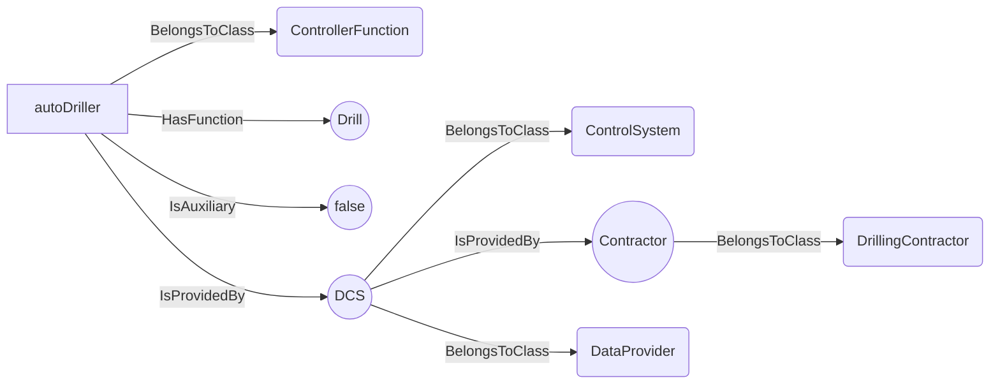
An example SparQL query looks like this:
```sparql
PREFIX rdf: <http://www.w3.org/1999/02/22-rdf-syntax-ns#>
PREFIX ddhub: <http://ddhub.no/>
PREFIX quantity: <http://ddhub.no/UnitAndQuantity>
SELECT ?autoDriller
WHERE {
	?autoDriller rdf:type ddhub:ControllerFunction .
	?autoDriller ddhub:HasFunction ?Attribute000 .
	?autoDriller ddhub:IsAuxiliary ?Attribute001 .
	?DCS rdf:type ddhub:ControlSystem .
	?Contractor rdf:type ddhub:DrillingContractor .
	?DCS ddhub:IsProvidedBy ?Attribute002 .
	?DCS rdf:type ddhub:DataProvider .
	?autoDriller ddhub:IsProvidedBy ?Attribute003 .
  FILTER (
	?Attribute000 = "Drill"
	&& 	?Attribute001 = false
	&& 	?Attribute002 = Contractor
	&& 	?Attribute003 = DCS
  )
}
```
This example describes the auto driller provided by the drilling control system, `DCS`. The `DCS` is 
defined as a `ControlSystem` provided by a drilling contractor. It is a main function and its purpose is to `Drill`.
## ProcedureFunction <!-- NOUN -->
- Display name: Procedure Function
- Parent class: [RunnableFunction](#RunnableFunction)
- Description: 
A `ProcedureFunction` is a `RunnableFunction` that executes a finites state automaton, i.e., a graph of
transitions between states. It should be noted that a `ProcedureFunction` may use control algorithms while being in one
state or when transiting from state to state. An example of `ProcedureFunction` is a friction test. A friction test has
at least three states: rotation off bottom, pick-up without rotation, slack-off without rotation. The transitions 
between the different states may depend on the implementation. Each of those states uses a controller, one that controls
the rotational speed and one that controls the axial speed.
- Definition set: ADCS
- Examples:
```dwis frictionTest
ProcedureFunction:frictionTest
frictionTest HasFunction "FrictionTest"
FrictionTest IsAuxiliary false
ControlSystem:DCS
DrillingContractor:Contractor
DCS IsProvidedBy Contractor
DCS BelongsToClass DataProvider
frictionTest IsProvidedBy DCS
```
An example semantic graph looks like as follow:
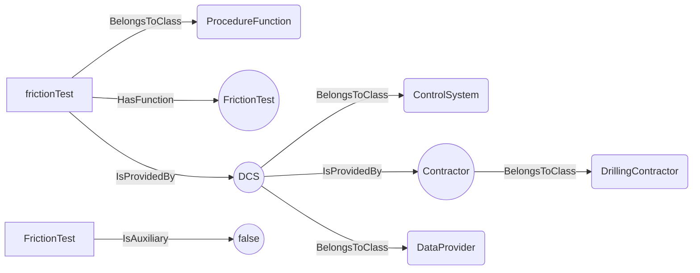
An example SparQL query looks like this:
```sparql
PREFIX rdf: <http://www.w3.org/1999/02/22-rdf-syntax-ns#>
PREFIX ddhub: <http://ddhub.no/>
PREFIX quantity: <http://ddhub.no/UnitAndQuantity>
SELECT ?frictionTest
WHERE {
	?frictionTest rdf:type ddhub:ProcedureFunction .
	?frictionTest ddhub:HasFunction ?Attribute000 .
	?FrictionTest ddhub:IsAuxiliary ?Attribute001 .
	?DCS rdf:type ddhub:ControlSystem .
	?Contractor rdf:type ddhub:DrillingContractor .
	?DCS ddhub:IsProvidedBy ?Attribute002 .
	?DCS rdf:type ddhub:DataProvider .
	?frictionTest ddhub:IsProvidedBy ?Attribute003 .
  FILTER (
	?Attribute000 = "FrictionTest"
	&& 	?Attribute001 = false
	&& 	?Attribute002 = Contractor
	&& 	?Attribute003 = DCS
  )
}
```
This example describes the friction test procedure provided by the drilling control system, `DCS`. The `DCS` is 
defined as a `ControlSystem` provided by a drilling contractor. It is a main function and its purpose is to perform a
`FrictionTest`.
## ProtectionFunction <!-- NOUN -->
- Display name: Protection Function
- Parent class: [ActivableFunction](#ActivableFunction)
- Description: 
A `ProtectionFunction` is an `ActivableFunction`. It must be activated to have an effect, but the effect
is to protect the drilling process, either by protecting the inputs to the drilling machines to avoid generating 
a drilling incident, or to detect an abnormal drilling process state and react to the situation.
detected.
- Definition set: ADCS
- Examples:
```dwis protectionFunction
ProtectionFunction:protectionFunction
ControlSystem:DCS
DrillingContractor:Contractor
DCS IsProvidedBy Contractor
DCS BelongsToClass DataProvider
protectionFunction IsProvidedBy DCS
```
An example semantic graph looks like as follow:
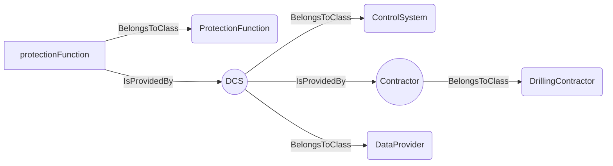
An example SparQL query looks like this:
```sparql
PREFIX rdf: <http://www.w3.org/1999/02/22-rdf-syntax-ns#>
PREFIX ddhub: <http://ddhub.no/>
PREFIX quantity: <http://ddhub.no/UnitAndQuantity>
SELECT ?protectionFunction
WHERE {
	?protectionFunction rdf:type ddhub:ProtectionFunction .
	?DCS rdf:type ddhub:ControlSystem .
	?Contractor rdf:type ddhub:DrillingContractor .
	?DCS ddhub:IsProvidedBy ?Attribute000 .
	?DCS rdf:type ddhub:DataProvider .
	?protectionFunction ddhub:IsProvidedBy ?Attribute001 .
  FILTER (
	?Attribute000 = Contractor
	&& 	?Attribute001 = DCS
  )
}
```
This example describes all the protection functions of the drilling control system, `DCS`. The `DCS` is 
defined as a `ControlSystem` provided by a drilling contractor.
## FDIRFunction <!-- NOUN -->
- Display name: FDIR Function
- Parent class: [ProtectionFunction](#ProtectionFunction)
- Description: 
A `FDIRFunction` is a `ProtectionFunction` that reacts to a particular state of the drilling process. FDIR
- Definition set: ADCS
- Examples:
```dwis packOffDectionAndReaction
FDIRFunction:packOffDetectionAndReaction
packOffDetectionAndReaction HasFunction "PackOffFDIR"
ControlSystem:DCS
DrillingContractor:Contractor
DCS IsProvidedBy Contractor
DCS BelongsToClass DataProvider
packOffDetectionAndReaction IsProvidedBy DCS
```
An example semantic graph looks like as follow:
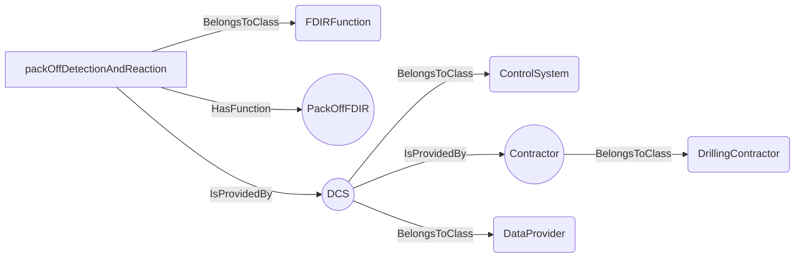
An example SparQL query looks like this:
```sparql
PREFIX rdf: <http://www.w3.org/1999/02/22-rdf-syntax-ns#>
PREFIX ddhub: <http://ddhub.no/>
PREFIX quantity: <http://ddhub.no/UnitAndQuantity>
SELECT ?packOffDectionAndReaction
WHERE {
	?packOffDetectionAndReaction rdf:type ddhub:FDIRFunction .
	?packOffDetectionAndReaction ddhub:HasFunction ?Attribute000 .
	?DCS rdf:type ddhub:ControlSystem .
	?Contractor rdf:type ddhub:DrillingContractor .
	?DCS ddhub:IsProvidedBy ?Attribute001 .
	?DCS rdf:type ddhub:DataProvider .
	?packOffDetectionAndReaction ddhub:IsProvidedBy ?Attribute002 .
  FILTER (
	?Attribute000 = "PackOffFDIR"
	&& 	?Attribute001 = Contractor
	&& 	?Attribute002 = DCS
  )
}
```
This example describes the `packOffDetectionAndReaction` fault detection and isolation procedure of the drilling control
system for pack-off events, `DCS`. The `DCS` is defined as a `ControlSystem` provided by a drilling contractor.
## SOEFunction <!-- NOUN -->
- Display name: SOE Function
- Parent class: [ProtectionFunction](#ProtectionFunction)
- Description: 
A `SOEFunction` is a `ProtectionFunction` that limits the commands that are send to the drilling machines
to avoid generating a drilling incident. SOE stands for Safe Operating Envelope. A `SOEFunction` protects the inputs
of the drilling process. An example `SOEFunction` is a swab/surge limits protection. This function limits the axial acceleration
and speed of the drill-stem to avoid generate swabbing pressure below the maximum of the collapse and pore pressure, and
surging pressure above the fracturing pressure.
- Definition set: ADCS
- Examples:
```dwis swabSurgeLimits
SOEFunction:swabSurgeLimits
swabSurgeLimits HasFunction "SwabSurgeSOE"
ControlSystem:DCS
DrillingContractor:Contractor
DCS IsProvidedBy Contractor
DCS BelongsToClass DataProvider
swabSurgeLimits IsProvidedBy DCS
```
An example semantic graph looks like as follow:
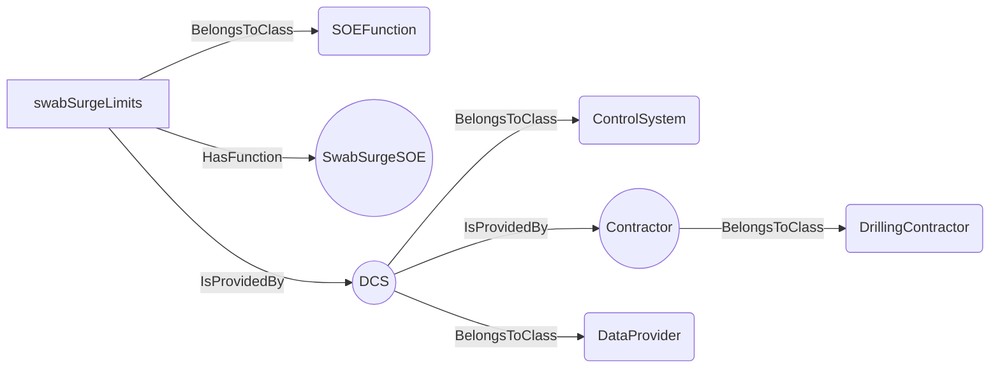
An example SparQL query looks like this:
```sparql
PREFIX rdf: <http://www.w3.org/1999/02/22-rdf-syntax-ns#>
PREFIX ddhub: <http://ddhub.no/>
PREFIX quantity: <http://ddhub.no/UnitAndQuantity>
SELECT ?swabSurgeLimits
WHERE {
	?swabSurgeLimits rdf:type ddhub:SOEFunction .
	?swabSurgeLimits ddhub:HasFunction ?Attribute000 .
	?DCS rdf:type ddhub:ControlSystem .
	?Contractor rdf:type ddhub:DrillingContractor .
	?DCS ddhub:IsProvidedBy ?Attribute001 .
	?DCS rdf:type ddhub:DataProvider .
	?swabSurgeLimits ddhub:IsProvidedBy ?Attribute002 .
  FILTER (
	?Attribute000 = "SwabSurgeSOE"
	&& 	?Attribute001 = Contractor
	&& 	?Attribute002 = DCS
  )
}
```
This example describes the `swabSurgeLimits` safe operating envelope limits to avoid detrimental swab/surge pressures in 
the open hole section of the borehole. 
## DataFlowNode <!-- NOUN -->
- Display name: DataFlowNode
- Parent class: [DWISNoun](#DWISNoun)
- Definition set: DataFlow
## Plan <!-- NOUN -->
- Display name: Plan
- Parent class: [DataFlowNode](#DataFlowNode)
- Definition set: DataFlow
## OperationalPlan <!-- NOUN -->
- Display name: OperationalPlan
- Parent class: [Plan](#Plan)
- Definition set: DataFlow
## DrillingProgram <!-- NOUN -->
- Display name: DrillingProgram
- Parent class: [Plan](#Plan)
- Definition set: DataFlow
## RigActionPlan <!-- NOUN -->
- Display name: RigActionPlan
- Parent class: [Plan](#Plan)
- Definition set: DataFlow
## ComputedState <!-- NOUN -->
- Display name: ComputedState
- Parent class: [ComputationUnit](#ComputationUnit)
- Description: 
A state represents the current configuation of a system.
- Definition set: DataFlow
## ProceduralState <!-- NOUN -->
- Display name: ComputedProceduralState
- Parent class: [ComputedState](#ComputedState)
- Definition set: DataFlow
## ProcessState <!-- NOUN -->
- Display name: ComputedProcessState
- Parent class: [ComputedState](#ComputedState)
- Definition set: DataFlow
## PhysicalState <!-- NOUN -->
- Display name: ComputedPhysicalState
- Parent class: [ComputedState](#ComputedState)
- Definition set: DataFlow
## ComputationUnit <!-- NOUN -->
- Display name: ComputationUnit
- Parent class: [DataFlowNode](#DataFlowNode)
- Description: 
Denotes a complex computation unit, typically based on advanced numerical modeling
- Definition set: DataFlow
## Advisor <!-- NOUN -->
- Display name: Advisor
- Parent class: [ComputationUnit](#ComputationUnit)
- Attributes:
  - AdviceType
    - Type: string
    - Description: 
- Definition set: DataFlow
## Simulator <!-- NOUN -->
- Display name: Simulator
- Parent class: [ComputationUnit](#ComputationUnit)
- Definition set: DataFlow
## Controller <!-- NOUN -->
- Display name: Controller
- Parent class: [DataFlowNode](#DataFlowNode)
- Definition set: DataFlow
## ControlSystem <!-- NOUN -->
- Display name: ControlSystem
- Parent class: [DataFlowNode](#DataFlowNode)
- Definition set: DataFlow
## DrawWorksControlSystem <!-- NOUN -->
- Display name: DrawWorksControlSystem
- Parent class: [ControlSystem](#ControlSystem)
- Definition set: DataFlow
## MudPumpsControlSystem <!-- NOUN -->
- Display name: MudPumpsControlSystem
- Parent class: [ControlSystem](#ControlSystem)
- Definition set: DataFlow
## TopDriveControlSystem <!-- NOUN -->
- Display name: TopDriveControlSystem
- Parent class: [ControlSystem](#ControlSystem)
- Definition set: DataFlow
## BOPControlSystem <!-- NOUN -->
- Display name: BOPControlSystem
- Parent class: [ControlSystem](#ControlSystem)
- Definition set: DataFlow
## RigChokeControlSystem <!-- NOUN -->
- Display name: RigChokeControlSystem
- Parent class: [ControlSystem](#ControlSystem)
- Definition set: DataFlow
## MeasurementDevice <!-- NOUN -->
- Display name: MeasurementDevice
- Parent class: [DataFlowNode](#DataFlowNode)
- Description: 
Denotes a physical sensor
- Definition set: DataFlow
## Transformation <!-- NOUN -->
- Display name: Transformation
- Parent class: [DataFlowNode](#DataFlowNode)
- Description: 
Represents a transformation applied to some signals that produces other signals
- Definition set: DataFlow
## DirectTransformation <!-- NOUN -->
- Display name: DirectTransformation
- Parent class: [Transformation](#Transformation)
- Description: 
Direct transformations are performed using only the current value of their inputs, time is not involved
- Definition set: DataFlow
## Aggregation <!-- NOUN -->
- Display name: Aggregation
- Parent class: [DirectTransformation](#DirectTransformation)
- Definition set: DataFlow
## ForceFromLoadPinsTransformation <!-- NOUN -->
- Display name: ForceFromLoadPinsTransformation
- Parent class: [DirectTransformation](#DirectTransformation)
- Definition set: DataFlow
## ForceToLoadTransformation <!-- NOUN -->
- Display name: ForceToLoadTransformation
- Parent class: [DirectTransformation](#DirectTransformation)
- Definition set: DataFlow
## MeasuredDepthToTrueVerticalDepthTransformation <!-- NOUN -->
- Display name: MeasuredDepthToTrueVerticalDepthTransformation
- Parent class: [DirectTransformation](#DirectTransformation)
- Definition set: DataFlow
## MeasuredDepthTranslation <!-- NOUN -->
- Display name: MeasuredDepthTranslation
- Parent class: [DirectTransformation](#DirectTransformation)
- Definition set: DataFlow
## PressureToEquivalentDensityTransformation <!-- NOUN -->
- Display name: PressureToEquivalentDensityTransformation
- Parent class: [DirectTransformation](#DirectTransformation)
- Definition set: DataFlow
## PressureToForceTransformation <!-- NOUN -->
- Display name: PressureToForceTransformation
- Parent class: [DirectTransformation](#DirectTransformation)
- Definition set: DataFlow
## TorqueToForceTransformation <!-- NOUN -->
- Display name: TorqueToForceTransformation
- Parent class: [DirectTransformation](#DirectTransformation)
- Definition set: DataFlow
## SignalProcessingUnit <!-- NOUN -->
- Display name: SignalProcessingUnit
- Parent class: [Transformation](#Transformation)
- Description: 
Represent any signal processing applied prior to the distribution of the considered signal. Signal processing refers to e.g. noise removal, filtering,..
- Definition set: DataFlow
## Filter <!-- NOUN -->
- Display name: Filter
- Parent class: [SignalProcessingUnit](#SignalProcessingUnit)
- Definition set: DataFlow
## BandPassFilter <!-- NOUN -->
- Display name: BandPassFilter
- Parent class: [Filter](#Filter)
- Attributes:
  - MinFrequency
    - Type: double
    - Description: 
  - MaxFrequency
    - Type: double
    - Description: 
- Definition set: DataFlow
## HighPassFilter <!-- NOUN -->
- Display name: HighPassFilter
- Parent class: [Filter](#Filter)
- Attributes:
  - CutOffFrequency
    - Type: double
    - Description: 
- Definition set: DataFlow
## LowPassFilter <!-- NOUN -->
- Display name: LowPassFilter
- Parent class: [Filter](#Filter)
- Attributes:
  - CutOffFrequency
    - Type: double
    - Description: 
- Definition set: DataFlow
## MovingAverage <!-- NOUN -->
- Display name: MovingAverage
- Parent class: [Filter](#Filter)
- Definition set: DataFlow
## MovingStandardDeviation <!-- NOUN -->
- Display name: MovingStandardDeviation
- Parent class: [Filter](#Filter)
- Definition set: DataFlow
## MovingMin <!-- NOUN -->
- Display name: MovingMin
- Parent class: [Filter](#Filter)
- Definition set: DataFlow
## MovingMax <!-- NOUN -->
- Display name: MovingMax
- Parent class: [Filter](#Filter)
- Definition set: DataFlow
## NumberOfSampleMovingAverage <!-- NOUN -->
- Display name: NumberOfSampleMovingAverage
- Parent class: [MovingAverage](#MovingAverage)
- Attributes:
  - NumberOfSamples
    - Type: int
    - Description: 
- Definition set: DataFlow
## TimeWindowMovingAverage <!-- NOUN -->
- Display name: TimeWindowMovingAverage
- Parent class: [MovingAverage](#MovingAverage)
- Attributes:
  - TimeWindow
    - Type: double
    - Description: 
- Definition set: DataFlow
## TimeBasedTransformation <!-- NOUN -->
- Display name: TimeBasedTransformation
- Parent class: [Transformation](#Transformation)
- Description: 
Transformations that apply only to time series: time derivations, time integration, averaging...
- Definition set: DataFlow
## Buffering <!-- NOUN -->
- Display name: Buffering
- Parent class: [TimeBasedTransformation](#TimeBasedTransformation)
- Attributes:
  - BufferingInterval
    - Type: double
    - Description: 
- Definition set: DataFlow
## Derivation <!-- NOUN -->
- Display name: Derivation
- Parent class: [TimeBasedTransformation](#TimeBasedTransformation)
- Definition set: DataFlow
## Integration <!-- NOUN -->
- Display name: Integration
- Parent class: [TimeBasedTransformation](#TimeBasedTransformation)
- Definition set: DataFlow
## RangeExtraction <!-- NOUN -->
- Display name: RangeExtraction
- Parent class: [TimeBasedTransformation](#TimeBasedTransformation)
- Definition set: DataFlow
## NumberOfItemsRangeExtraction <!-- NOUN -->
- Display name: NumberOfItemsRangeExtraction
- Parent class: [RangeExtraction](#RangeExtraction)
- Attributes:
  - NumberOfItems
    - Type: int
    - Description: 
- Definition set: DataFlow
## TimeWindowRangeExtraction <!-- NOUN -->
- Display name: TimeWindowRangeExtraction
- Parent class: [RangeExtraction](#RangeExtraction)
- Attributes:
  - TimeWindow
    - Type: double
    - Description: 
- Definition set: DataFlow
## Resampling <!-- NOUN -->
- Display name: Resampling
- Parent class: [TimeBasedTransformation](#TimeBasedTransformation)
- Attributes:
  - ResamplingRate
    - Type: double
    - Description: 
  - ResamplingDelay
    - Type: double
    - Description: 
  - Validity
    - Type: double
    - Description: 
- Definition set: DataFlow
## TransmissionLine <!-- NOUN -->
- Display name: TransmissionLine
- Parent class: [DataFlowNode](#DataFlowNode)
- Definition set: DataFlow
## UserInterface <!-- NOUN -->
- Display name: UserInterface
- Parent class: [DataFlowNode](#DataFlowNode)
- Definition set: DataFlow
## DataProvider <!-- NOUN -->
- Display name: DataProvider
- Parent class: [DWISNoun](#DWISNoun)
- Attributes:
  - ProviderName
    - Type: string
    - Description: 
- Description: 
A data provider is any sources for data
- Definition set: DataProviders
## OperatingCompany <!-- NOUN -->
- Display name: OperatingCompany
- Parent class: [DataProvider](#DataProvider)
- Attributes:
  - ProviderName
    - Type: string
    - Description: 
- Description: 
An operating company is an entity that holds the rights to explore, develop, and produce hydrocarbon resources from a particular oil or gas field or lease
- Definition set: DataProviders
## ServiceCompany <!-- NOUN -->
- Display name: ServiceCompany
- Parent class: [DataProvider](#DataProvider)
- Attributes:
  - ProviderName
    - Type: string
    - Description: 
- Description: 
A service company is an entity that provides services during the well construction.
- Definition set: DataProviders
## DirectionalServiceCompany <!-- NOUN -->
- Display name: DirectionalServiceCompany
- Parent class: [ServiceCompany](#ServiceCompany)
- Attributes:
  - ProviderName
    - Type: string
    - Description: 
- Description: 
A directional service company is an entity that provides services for downhole directional drilling and downhole measurements.
- Definition set: DataProviders
## DrillingFluidProvider <!-- NOUN -->
- Display name: DrillingFluidProvider
- Parent class: [ServiceCompany](#ServiceCompany)
- Attributes:
  - ProviderName
    - Type: string
    - Description: 
- Description: 
A drilling fluid provider is a company that provides and maintains the drilling fluids during well construction.
- Definition set: DataProviders
## LoggingServiceCompany <!-- NOUN -->
- Display name: LoggingServiceCompany
- Parent class: [ServiceCompany](#ServiceCompany)
- Attributes:
  - ProviderName
    - Type: string
    - Description: 
- Description: 
A logging service company is an entity that gathers measured information during well construction.
- Definition set: DataProviders
## CementingServiceCompany <!-- NOUN -->
- Display name: CementingServiceCompany
- Parent class: [ServiceCompany](#ServiceCompany)
- Attributes:
  - ProviderName
    - Type: string
    - Description: 
- Definition set: DataProviders
## DataAnalysisServiceCompany <!-- NOUN -->
- Display name: DataAnalysisServiceCompany
- Parent class: [ServiceCompany](#ServiceCompany)
- Attributes:
  - ProviderName
    - Type: string
    - Description: 
- Description: 
A data analysis service company is an entity that analyses measured data and provide new information from these measurements.
- Definition set: DataProviders
## DrillingContractor <!-- NOUN -->
- Display name: DrillingContractor
- Parent class: [DataProvider](#DataProvider)
- Attributes:
  - ProviderName
    - Type: string
    - Description: 
- Definition set: DataProviders
## DWISInternalService <!-- NOUN -->
- Display name: DWISInternalService
- Parent class: [DataProvider](#DataProvider)
- Attributes:
  - ProviderName
    - Type: string
    - Description: 
- Description: 
A DWIS internal service is an internal component of the DWIS infrastructure that generates information that can be used by any systems connected to the DWIS infrastructure.
- Definition set: DataProviders
## DWISDDHub <!-- NOUN -->
- Display name: DWISDDHub
- Parent class: [DWISInternalService](#DWISInternalService)
- Definition set: DataProviders
## DWISDrillingProcessStateInterpreter <!-- NOUN -->
- Display name: DWISDrillingProcessStateInterpreter
- Parent class: [DWISInternalService](#DWISInternalService)
- Definition set: DataProviders
## DWISAdviceComposer <!-- NOUN -->
- Display name: DWISAdviceComposer
- Parent class: [DWISInternalService](#DWISInternalService)
- Definition set: DataProviders
## DWISScheduler <!-- NOUN -->
- Display name: DWISScheduler
- Parent class: [DWISInternalService](#DWISInternalService)
- Definition set: DataProviders
## DWISContextualDataBuilder <!-- NOUN -->
- Display name: DWISContextualDataBuilder
- Parent class: [DWISInternalService](#DWISInternalService)
- Definition set: DataProviders
## DWISLogger <!-- NOUN -->
- Display name: DWISLogger
- Parent class: [DWISInternalService](#DWISInternalService)
- Definition set: DataProviders
## DWISADCSInterface <!-- NOUN -->
- Display name: DWISADCSInterface
- Parent class: [DWISInternalService](#DWISInternalService)
- Definition set: DataProviders
## DWISADCSCapabilityDescriptor <!-- NOUN -->
- Display name: DWISADCSCapabilityDescriptor
- Parent class: [DWISInternalService](#DWISInternalService)
- Definition set: DataProviders
## Telemetry <!-- NOUN -->
- Display name: Telemetry
- Parent class: [DWISNoun](#DWISNoun)
- Attributes:
  - NumberOfRepeaters
    - Type: int
    - Description: 
  - DistanceBetweenRepeaters
    - Type: double
    - Description: 
  - AverageDelayByRepeater
    - Type: double
    - Description: 
- Description: 
Technology used for transferring the data from its main origin.
- Definition set: DataTransmission
## DownHoleTelemetry <!-- NOUN -->
- Display name: DownHoleTelemetry
- Parent class: [Telemetry](#Telemetry)
- Definition set: DataTransmission
- Examples:
Technology that allows transfer of downhole data to the surface.
## MudPulseTelemetry <!-- NOUN -->
- Display name: MudPulseTelemetry
- Parent class: [DownHoleTelemetry](#DownHoleTelemetry)
- Description: 
A method that allows transfer of downhole data to the surface via pressure pulses sent trough the drilling fluid.
- Definition set: DataTransmission
- Examples:
NOV BlackStar II dual-telemetry MWD
## ElectromagneticTelemetry <!-- NOUN -->
- Display name: ElectromagneticTelemetry
- Parent class: [DownHoleTelemetry](#DownHoleTelemetry)
- Description: 
A method that allows transfer of downhole data to the surface via electromagnetic waves sent trough the drilling formation.
- Definition set: DataTransmission
- Examples:
APS SureShot-EM, NOV BlackStar II EM MWD
## WiredPipeTelemetry <!-- NOUN -->
- Display name: WiredPipeTelemetry
- Parent class: [DownHoleTelemetry](#DownHoleTelemetry)
- Description: 
A method that allows transfer of downhole data to the surface via electrical connections through the drill string.
- Definition set: DataTransmission
- Examples:
Intelliserv Wired Drill Pipe, Reelwell DualLink
## TopSideTelemetry <!-- NOUN -->
- Display name: TopSideTelemetry
- Parent class: [Telemetry](#Telemetry)
- Description: 
Method that allows transfer of data from surface systems.
- Definition set: DataTransmission
- Examples:
NOVOS, Cyberbase, DEAL
## ValidityCondition <!-- NOUN -->
- Display name: ValidityCondition
- Parent class: [DWISNoun](#DWISNoun)
- Definition set: DataValidity
## ConnectedCondition <!-- NOUN -->
- Display name: ConnectedCondition
- Parent class: [ValidityCondition](#ValidityCondition)
- Definition set: DataValidity
## EQ <!-- NOUN -->
- Display name: EQ
- Parent class: [ValidityCondition](#ValidityCondition)
- Definition set: DataValidity
## GT <!-- NOUN -->
- Display name: GT
- Parent class: [ValidityCondition](#ValidityCondition)
- Definition set: DataValidity
## LT <!-- NOUN -->
- Display name: LT
- Parent class: [ValidityCondition](#ValidityCondition)
- Definition set: DataValidity
## DataType <!-- NOUN -->
- Display name: Data Type
- Parent class: [DWISNoun](#DWISNoun)
- Definition set: DrillingDataSemantics
## ContinuousDataType <!-- NOUN -->
- Display name: Continuous Data Type
- Parent class: [DataType](#DataType)
- Definition set: DrillingDataSemantics
## NormalizedDataType <!-- NOUN -->
- Display name: Normalized Data Type
- Parent class: [ContinuousDataType](#ContinuousDataType)
- Description: 
between 0 and 1
- Definition set: DrillingDataSemantics
## DiscreteDataType <!-- NOUN -->
- Display name: Discrete Data Type
- Parent class: [DataType](#DataType)
- Definition set: DrillingDataSemantics
## EnumerationDataType <!-- NOUN -->
- Display name: Enumeration Data Type
- Parent class: [DiscreteDataType](#DiscreteDataType)
- Definition set: DrillingDataSemantics
## BooleanDataType <!-- NOUN -->
- Display name: Boolean Data Type
- Parent class: [EnumerationDataType](#EnumerationDataType)
- Definition set: DrillingDataSemantics
## StringDataType <!-- NOUN -->
- Display name: String Data Type
- Parent class: [DataType](#DataType)
- Definition set: DrillingDataSemantics
## DrillingDataPoint <!-- NOUN -->
- Display name: DrillingDataPoint
- Parent class: [DWISNoun](#DWISNoun)
- Attributes:
  - IsValid
    - Type: bool
    - Description: 
- Description: 
Main type of DDHub data. Represents a drilling signal.
Can be a dynamic signal (linked to a ValueNode) or a static parameter. 
- Definition set: DrillingDataSemantics
## PrototypeData <!-- NOUN -->
- Display name: PrototypeData
- Parent class: [DrillingDataPoint](#DrillingDataPoint)
- Definition set: DrillingDataSemantics
## ProcessData <!-- NOUN -->
- Display name: ProcessData
- Parent class: [DrillingDataPoint](#DrillingDataPoint)
- Definition set: DrillingDataSemantics
## SetPoint <!-- NOUN -->
- Display name: Set-point
- Parent class: [ProcessData](#ProcessData)
- Definition set: DrillingDataSemantics
## Command <!-- NOUN -->
- Display name: Command
- Parent class: [ProcessData](#ProcessData)
- Definition set: DrillingDataSemantics
## Recommendation <!-- NOUN -->
- Display name: Recommendation
- Parent class: [ProcessData](#ProcessData)
- Definition set: DrillingDataSemantics
## RecommendedTarget <!-- NOUN -->
- Display name: RecommendedTarget
- Parent class: [Recommendation](#Recommendation)
- Definition set: DrillingDataSemantics
## RecommendedMinimum <!-- NOUN -->
- Display name: RecommendedMinimum
- Parent class: [Recommendation](#Recommendation)
- Definition set: DrillingDataSemantics
## RecommendedMaximum <!-- NOUN -->
- Display name: RecommendedMaximum
- Parent class: [Recommendation](#Recommendation)
- Definition set: DrillingDataSemantics
## Advice <!-- NOUN -->
- Display name: Advice
- Parent class: [ProcessData](#ProcessData)
- Definition set: DrillingDataSemantics
## AdvisedTarget <!-- NOUN -->
- Display name: AdvisedTarget
- Parent class: [Advice](#Advice)
- Definition set: DrillingDataSemantics
## AdvisedMinimum <!-- NOUN -->
- Display name: AdvisedMinimum
- Parent class: [Advice](#Advice)
- Definition set: DrillingDataSemantics
## AdvisedMaximum <!-- NOUN -->
- Display name: AdvisedMaximum
- Parent class: [Advice](#Advice)
- Definition set: DrillingDataSemantics
## Limit <!-- NOUN -->
- Display name: Limit
- Parent class: [ProcessData](#ProcessData)
- Definition set: DrillingDataSemantics
## MinimumLimit <!-- NOUN -->
- Display name: Minimum Limit
- Parent class: [Limit](#Limit)
- Definition set: DrillingDataSemantics
## MaximumLimit <!-- NOUN -->
- Display name: Maximum Limit
- Parent class: [Limit](#Limit)
- Definition set: DrillingDataSemantics
## PhysicalData <!-- NOUN -->
- Display name: PhysicalData
- Parent class: [DrillingDataPoint](#DrillingDataPoint)
- Definition set: DrillingDataSemantics
## Measurement <!-- NOUN -->
- Display name: Measurement
- Parent class: [PhysicalData](#PhysicalData)
- Description: 
The noun Measurement represents individuals that are measured by some instrument and which value can be compared with another measurement.
- Definition set: DrillingDataSemantics
## DerivedMeasurement <!-- NOUN -->
- Display name: DerivedMeasurement
- Parent class: [Measurement](#Measurement)
- Definition set: DrillingDataSemantics
## CorrectedMeasurement <!-- NOUN -->
- Display name: CorrectedMeasurement
- Parent class: [Measurement](#Measurement)
- Definition set: DrillingDataSemantics
## ComputedData <!-- NOUN -->
- Display name: ComputedData
- Parent class: [PhysicalData](#PhysicalData)
- Definition set: DrillingDataSemantics
## DrillingSignal <!-- NOUN -->
- Display name: DrillingSignal
- Parent class: [DWISNoun](#DWISNoun)
- Attributes:
  - Value
    - Type: object
    - Description: 
- Description: 
Data structure used to store the streaming drilling data.
- Definition set: DrillingDataSemantics
## DynamicDrillingSignal <!-- NOUN -->
- Display name: DynamicDrillingSignal
- Parent class: [DrillingSignal](#DrillingSignal)
- Attributes:
  - TimeStampAtSource
    - Type: DateTime
    - Description: this is a UTC date-time value corresponding to the time at which the value has been taken.
  - TimeStampAcquisition
    - Type: DateTime
    - Description: this is a UTC date-time value at which the value has been acquired by the data acquisition system.
- Definition set: DrillingDataSemantics
## Equipment <!-- NOUN -->
- Display name: <equipment>
- Parent class: [DWISNoun](#DWISNoun)
- Definition set: DrillingEquipment
## RigEquipment <!-- NOUN -->
- Display name: <Rig Equipment>
- Parent class: [Equipment](#Equipment)
- Definition set: DrillingEquipment
## PowerGenerationSystem <!-- NOUN -->
- Display name: Power Generation System
- Parent class: [RigEquipment](#RigEquipment)
- Definition set: DrillingEquipment
## PowerGenerators <!-- NOUN -->
- Display name: Power Generators
- Parent class: [PowerGenerationSystem](#PowerGenerationSystem)
- Definition set: DrillingEquipment
## ElectricalControlSystem <!-- NOUN -->
- Display name: Electrical Control System
- Parent class: [PowerGenerationSystem](#PowerGenerationSystem)
- Definition set: DrillingEquipment
## PowerScrSystem <!-- NOUN -->
- Display name: Power SCR System
- Parent class: [PowerGenerationSystem](#PowerGenerationSystem)
- Definition set: DrillingEquipment
## HoistingSystem <!-- NOUN -->
- Display name: Hoisting  System
- Parent class: [RigEquipment](#RigEquipment)
- Definition set: DrillingEquipment
## RackAndPinionHoistingSystem <!-- NOUN -->
- Display name: Rack and Pinion Hoisting System
- Parent class: [HoistingSystem](#HoistingSystem)
- Definition set: DrillingEquipment
## RamHoistingSystem <!-- NOUN -->
- Display name: Ram Hoisting System
- Parent class: [HoistingSystem](#HoistingSystem)
- Definition set: DrillingEquipment
## Derrick <!-- NOUN -->
- Display name: Derrick
- Parent class: [HoistingSystem](#HoistingSystem)
- Definition set: DrillingEquipment
## ConventionalDerrick <!-- NOUN -->
- Display name: Conventional Derrick
- Parent class: [Derrick](#Derrick)
- Definition set: DrillingEquipment
## SlantDerrick <!-- NOUN -->
- Display name: Slant Derrick
- Parent class: [Derrick](#Derrick)
- Definition set: DrillingEquipment
## QuadristandDerrick <!-- NOUN -->
- Display name: Quadri-Stand Derrick
- Parent class: [Derrick](#Derrick)
- Definition set: DrillingEquipment
## TripleStandDerrick <!-- NOUN -->
- Display name: Triple Stand Derrick
- Parent class: [Derrick](#Derrick)
- Definition set: DrillingEquipment
## DoubleStandDerrick <!-- NOUN -->
- Display name: Double Stand Derrick
- Parent class: [Derrick](#Derrick)
- Definition set: DrillingEquipment
## SingleJointDerrick <!-- NOUN -->
- Display name: Single Joint Derrick
- Parent class: [Derrick](#Derrick)
- Definition set: DrillingEquipment
## Drawworks <!-- NOUN -->
- Display name: Drawworks
- Parent class: [HoistingSystem](#HoistingSystem)
- Definition set: DrillingEquipment
## StandardElectricalDrawworks <!-- NOUN -->
- Display name: Standard Electrical Drawworks
- Parent class: [Drawworks](#Drawworks)
- Definition set: DrillingEquipment
## MechanicalDrawworks <!-- NOUN -->
- Display name: Mechanical Drawworks
- Parent class: [Drawworks](#Drawworks)
- Definition set: DrillingEquipment
## DieselElectricalDrawworks <!-- NOUN -->
- Display name: Diesel Electrical Drawworks
- Parent class: [Drawworks](#Drawworks)
- Definition set: DrillingEquipment
## RamRig <!-- NOUN -->
- Display name: Ram Rig
- Parent class: [Drawworks](#Drawworks)
- Definition set: DrillingEquipment
## MechanicalBlock <!-- NOUN -->
- Display name: Mechanical Block
- Parent class: [HoistingSystem](#HoistingSystem)
- Definition set: DrillingEquipment
## TravellingBlock <!-- NOUN -->
- Display name: Travelling Block
- Parent class: [MechanicalBlock](#MechanicalBlock)
- Definition set: DrillingEquipment
## CrownBlock <!-- NOUN -->
- Display name: Crown Block
- Parent class: [MechanicalBlock](#MechanicalBlock)
- Definition set: DrillingEquipment
## Hook <!-- NOUN -->
- Display name: Hook
- Parent class: [HoistingSystem](#HoistingSystem)
- Definition set: DrillingEquipment
## DrillLine <!-- NOUN -->
- Display name: Drill Line
- Parent class: [HoistingSystem](#HoistingSystem)
- Definition set: DrillingEquipment
## ActiveLine <!-- NOUN -->
- Display name: Active Line
- Parent class: [DrillLine](#DrillLine)
- Definition set: DrillingEquipment
## DeadLine <!-- NOUN -->
- Display name: Dead Line
- Parent class: [DrillLine](#DrillLine)
- Definition set: DrillingEquipment
## SupportLine <!-- NOUN -->
- Display name: Support Line
- Parent class: [DrillLine](#DrillLine)
- Definition set: DrillingEquipment
## DrillLineFastener <!-- NOUN -->
- Display name: Drill Line Fastener
- Parent class: [HoistingSystem](#HoistingSystem)
- Definition set: DrillingEquipment
## DeadLineAnchor <!-- NOUN -->
- Display name: Dead Line Anchor
- Parent class: [DrillLineFastener](#DrillLineFastener)
- Definition set: DrillingEquipment
## SurfaceRotationSystem <!-- NOUN -->
- Display name: Surface Rotation System
- Parent class: [RigEquipment](#RigEquipment)
- Definition set: DrillingEquipment
## TopDrive <!-- NOUN -->
- Display name: Top Drive
- Parent class: [SurfaceRotationSystem](#SurfaceRotationSystem)
- Definition set: DrillingEquipment
## TorqueTrack <!-- NOUN -->
- Display name: Torque Track
- Parent class: [TopDrive](#TopDrive)
- Definition set: DrillingEquipment
## TorqueBushing <!-- NOUN -->
- Display name: Torque Bushing
- Parent class: [TopDrive](#TopDrive)
- Definition set: DrillingEquipment
## SwivelSub <!-- NOUN -->
- Display name: Swivel Sub
- Parent class: [TopDrive](#TopDrive)
- Definition set: DrillingEquipment
## ExtendFrame <!-- NOUN -->
- Display name: Extend Frame
- Parent class: [TopDrive](#TopDrive)
- Definition set: DrillingEquipment
## Quill <!-- NOUN -->
- Display name: Quill
- Parent class: [TopDrive](#TopDrive)
- Definition set: DrillingEquipment
## MainframeAssembly <!-- NOUN -->
- Display name: Mainframe Assembly
- Parent class: [TopDrive](#TopDrive)
- Definition set: DrillingEquipment
## LoadNut <!-- NOUN -->
- Display name: Load Nut
- Parent class: [TopDrive](#TopDrive)
- Definition set: DrillingEquipment
## RotaryTable <!-- NOUN -->
- Display name: Rotary Table
- Parent class: [SurfaceRotationSystem](#SurfaceRotationSystem)
- Definition set: DrillingEquipment
## RotaryTableBushings <!-- NOUN -->
- Display name: Rotary Table Bushings
- Parent class: [RotaryTable](#RotaryTable)
- Definition set: DrillingEquipment
## Kelly <!-- NOUN -->
- Display name: Kelly
- Parent class: [RotaryTable](#RotaryTable)
- Definition set: DrillingEquipment
## KellyHose <!-- NOUN -->
- Display name: Kelly Hose
- Parent class: [Kelly](#Kelly)
- Definition set: DrillingEquipment
## KellyBushing <!-- NOUN -->
- Display name: Kelly Bushing
- Parent class: [Kelly](#Kelly)
- Definition set: DrillingEquipment
## KellyJoint <!-- NOUN -->
- Display name: Kelly Joint
- Parent class: [Kelly](#Kelly)
- Definition set: DrillingEquipment
## KellySwivel <!-- NOUN -->
- Display name: Kelly Swivel
- Parent class: [Kelly](#Kelly)
- Definition set: DrillingEquipment
## WellControlSystem <!-- NOUN -->
- Display name: Well Control System
- Parent class: [RigEquipment](#RigEquipment)
- Definition set: DrillingEquipment
## BellNipple <!-- NOUN -->
- Display name: Bell Nipple
- Parent class: [WellControlSystem](#WellControlSystem)
- Definition set: DrillingEquipment
## Accumulator <!-- NOUN -->
- Display name: Accumulator
- Parent class: [WellControlSystem](#WellControlSystem)
- Definition set: DrillingEquipment
## BopStack <!-- NOUN -->
- Display name: BOP Stack
- Parent class: [WellControlSystem](#WellControlSystem)
- Definition set: DrillingEquipment
## SurfaceBop <!-- NOUN -->
- Display name: Surface BOP
- Parent class: [BopStack](#BopStack)
- Definition set: DrillingEquipment
## LandBop <!-- NOUN -->
- Display name: Land BOP
- Parent class: [BopStack](#BopStack)
- Definition set: DrillingEquipment
## SubseaBop <!-- NOUN -->
- Display name: Subsea BOP
- Parent class: [BopStack](#BopStack)
- Definition set: DrillingEquipment
## BopElement <!-- NOUN -->
- Display name: BOP Element
- Parent class: [WellControlSystem](#WellControlSystem)
- Definition set: DrillingEquipment
## AnnularPreventer <!-- NOUN -->
- Display name: Annular Preventer
- Parent class: [BopElement](#BopElement)
- Definition set: DrillingEquipment
## PipeRam <!-- NOUN -->
- Display name: Pipe Ram
- Parent class: [BopElement](#BopElement)
- Definition set: DrillingEquipment
## ShearRam <!-- NOUN -->
- Display name: Shear  Ram
- Parent class: [BopElement](#BopElement)
- Definition set: DrillingEquipment
## BlindRam <!-- NOUN -->
- Display name: Blind Ram
- Parent class: [BopElement](#BopElement)
- Definition set: DrillingEquipment
## AdapterSpool <!-- NOUN -->
- Display name: Adapter Spool
- Parent class: [WellControlSystem](#WellControlSystem)
- Definition set: DrillingEquipment
## SpacingSpool <!-- NOUN -->
- Display name: Spacing Spool
- Parent class: [WellControlSystem](#WellControlSystem)
- Definition set: DrillingEquipment
## ChokeManifold <!-- NOUN -->
- Display name: Choke Manifold
- Parent class: [WellControlSystem](#WellControlSystem)
- Definition set: DrillingEquipment
## ChokeValve <!-- NOUN -->
- Display name: Choke Valve
- Parent class: [ChokeManifold](#ChokeManifold)
- Definition set: DrillingEquipment
## ChokeValveGatevalve <!-- NOUN -->
- Display name: Gate Valve
- Parent class: [ChokeValve](#ChokeValve)
- Definition set: DrillingEquipment
## KillLine <!-- NOUN -->
- Display name: Kill Line
- Parent class: [WellControlSystem](#WellControlSystem)
- Definition set: DrillingEquipment
## ChokeLine <!-- NOUN -->
- Display name: Choke Line
- Parent class: [WellControlSystem](#WellControlSystem)
- Definition set: DrillingEquipment
## ControlLines <!-- NOUN -->
- Display name: Control Lines
- Parent class: [WellControlSystem](#WellControlSystem)
- Definition set: DrillingEquipment
## Diverter <!-- NOUN -->
- Display name: Diverter
- Parent class: [WellControlSystem](#WellControlSystem)
- Definition set: DrillingEquipment
## DiverterLine <!-- NOUN -->
- Display name: Diverter Line
- Parent class: [Diverter](#Diverter)
- Definition set: DrillingEquipment
## DiverterLineHanger <!-- NOUN -->
- Display name: Diverter Line Hanger
- Parent class: [Diverter](#Diverter)
- Definition set: DrillingEquipment
## VentOverboardLine <!-- NOUN -->
- Display name: Vent (Overboard) Line
- Parent class: [Diverter](#Diverter)
- Definition set: DrillingEquipment
## ControlManifold <!-- NOUN -->
- Display name: Control Manifold
- Parent class: [WellControlSystem](#WellControlSystem)
- Definition set: DrillingEquipment
## Ibop <!-- NOUN -->
- Display name: IBOP
- Parent class: [WellControlSystem](#WellControlSystem)
- Definition set: DrillingEquipment
## KellyValve <!-- NOUN -->
- Display name: Kelly Valve
- Parent class: [WellControlSystem](#WellControlSystem)
- Definition set: DrillingEquipment
## FloatValveNonreturnValve <!-- NOUN -->
- Display name: Float Valve (Non-Return Valve)
- Parent class: [WellControlSystem](#WellControlSystem)
- Definition set: DrillingEquipment
## PlungerFloatValvesF <!-- NOUN -->
- Display name: Plunger Float Valves (F)
- Parent class: [FloatValveNonreturnValve](#FloatValveNonreturnValve)
- Definition set: DrillingEquipment
## PortedPlungerValvesFa <!-- NOUN -->
- Display name: Ported Plunger Valves (FA)
- Parent class: [FloatValveNonreturnValve](#FloatValveNonreturnValve)
- Definition set: DrillingEquipment
## FlapperFloatValvesG <!-- NOUN -->
- Display name: Flapper Float Valves (G)
- Parent class: [FloatValveNonreturnValve](#FloatValveNonreturnValve)
- Definition set: DrillingEquipment
## MpdChoke <!-- NOUN -->
- Display name: MPD Choke
- Parent class: [WellControlSystem](#WellControlSystem)
- Definition set: DrillingEquipment
## WellheadXmasTree <!-- NOUN -->
- Display name: Wellhead (Xmas) Tree
- Parent class: [WellControlSystem](#WellControlSystem)
- Definition set: DrillingEquipment
## CirculationSystem <!-- NOUN -->
- Display name: Circulation System
- Parent class: [RigEquipment](#RigEquipment)
- Definition set: DrillingEquipment
## MudPump <!-- NOUN -->
- Display name: Mud Pump
- Parent class: [CirculationSystem](#CirculationSystem)
- Definition set: DrillingEquipment
## PistonMudPump <!-- NOUN -->
- Display name: Piston Mud Pump
- Parent class: [MudPump](#MudPump)
- Definition set: DrillingEquipment
## PulsationDampener <!-- NOUN -->
- Display name: Pulsation Dampener
- Parent class: [PistonMudPump](#PistonMudPump)
- Definition set: DrillingEquipment
## Piston <!-- NOUN -->
- Display name: Piston
- Parent class: [PistonMudPump](#PistonMudPump)
- Definition set: DrillingEquipment
## Liner <!-- NOUN -->
- Display name: Liner
- Parent class: [PistonMudPump](#PistonMudPump)
- Definition set: DrillingEquipment
## Cylinders <!-- NOUN -->
- Display name: Cylinders
- Parent class: [PistonMudPump](#PistonMudPump)
- Definition set: DrillingEquipment
## Action <!-- NOUN -->
- Display name: Action
- Parent class: [PistonMudPump](#PistonMudPump)
- Definition set: DrillingEquipment
## SingleActing <!-- NOUN -->
- Display name: Single Acting
- Parent class: [Action](#Action)
- Definition set: DrillingEquipment
## DualActing <!-- NOUN -->
- Display name: Dual Acting
- Parent class: [Action](#Action)
- Definition set: DrillingEquipment
## PlungerMudPump <!-- NOUN -->
- Display name: Plunger Mud Pump
- Parent class: [MudPump](#MudPump)
- Definition set: DrillingEquipment
## CentrifugalMudPump <!-- NOUN -->
- Display name: Centrifugal Mud Pump
- Parent class: [MudPump](#MudPump)
- Definition set: DrillingEquipment
## HydraulicMudPump <!-- NOUN -->
- Display name: Hydraulic Mud Pump
- Parent class: [MudPump](#MudPump)
- Definition set: DrillingEquipment
## DiaphragmMudPump <!-- NOUN -->
- Display name: Diaphragm Mud Pump
- Parent class: [MudPump](#MudPump)
- Definition set: DrillingEquipment
## PeristalticMudPump <!-- NOUN -->
- Display name: Peristaltic Mud Pump
- Parent class: [MudPump](#MudPump)
- Definition set: DrillingEquipment
## RiserLiftPump <!-- NOUN -->
- Display name: Riser Lift Pump
- Parent class: [CirculationSystem](#CirculationSystem)
- Definition set: DrillingEquipment
## FillPump <!-- NOUN -->
- Display name: Fill Pump
- Parent class: [CirculationSystem](#CirculationSystem)
- Definition set: DrillingEquipment
## BackPressurePump <!-- NOUN -->
- Display name: Back Pressure Pump
- Parent class: [CirculationSystem](#CirculationSystem)
- Definition set: DrillingEquipment
## BoosterPump <!-- NOUN -->
- Display name: Booster Pump
- Parent class: [CirculationSystem](#CirculationSystem)
- Definition set: DrillingEquipment
## DrillingFluid <!-- NOUN -->
- Display name: Drilling Fluid
- Parent class: [CirculationSystem](#CirculationSystem)
- Definition set: DrillingEquipment
## DrillWater <!-- NOUN -->
- Display name: Drill Water
- Parent class: [DrillingFluid](#DrillingFluid)
- Definition set: DrillingEquipment
## PotableWater <!-- NOUN -->
- Display name: Potable Water
- Parent class: [DrillingFluid](#DrillingFluid)
- Definition set: DrillingEquipment
## SeaWater <!-- NOUN -->
- Display name: Sea Water
- Parent class: [DrillingFluid](#DrillingFluid)
- Definition set: DrillingEquipment
## OilBasedMudObm <!-- NOUN -->
- Display name: Oil Based Mud (OBM)
- Parent class: [DrillingFluid](#DrillingFluid)
- Definition set: DrillingEquipment
## WaterBasedMudWbm <!-- NOUN -->
- Display name: Water Based Mud (WBM)
- Parent class: [DrillingFluid](#DrillingFluid)
- Definition set: DrillingEquipment
## SyntheticOilBasedMudSobm <!-- NOUN -->
- Display name: Synthetic Oil Based Mud (SOBM)
- Parent class: [DrillingFluid](#DrillingFluid)
- Definition set: DrillingEquipment
## SpudMud <!-- NOUN -->
- Display name: Spud Mud
- Parent class: [DrillingFluid](#DrillingFluid)
- Definition set: DrillingEquipment
## MudPits <!-- NOUN -->
- Display name: Mud Pits
- Parent class: [CirculationSystem](#CirculationSystem)
- Definition set: DrillingEquipment
## ActiveDrillingSystem <!-- NOUN -->
- Display name: Active (Drilling) System
- Parent class: [MudPits](#MudPits)
- Definition set: DrillingEquipment
## TripTank <!-- NOUN -->
- Display name: Trip Tank
- Parent class: [MudPits](#MudPits)
- Definition set: DrillingEquipment
## MixingTank <!-- NOUN -->
- Display name: Mixing Tank
- Parent class: [MudPits](#MudPits)
- Definition set: DrillingEquipment
## ReservePit <!-- NOUN -->
- Display name: Reserve Pit
- Parent class: [MudPits](#MudPits)
- Definition set: DrillingEquipment
## SlugSettlingPit <!-- NOUN -->
- Display name: Slug (Settling) Pit
- Parent class: [MudPits](#MudPits)
- Definition set: DrillingEquipment
## SurgeTank <!-- NOUN -->
- Display name: Surge Tank
- Parent class: [MudPits](#MudPits)
- Definition set: DrillingEquipment
## StorageTank <!-- NOUN -->
- Display name: Storage Tank
- Parent class: [MudPits](#MudPits)
- Definition set: DrillingEquipment
## SandTrap <!-- NOUN -->
- Display name: Sand Trap
- Parent class: [MudPits](#MudPits)
- Definition set: DrillingEquipment
## ChemicalTank <!-- NOUN -->
- Display name: Chemical Tank
- Parent class: [MudPits](#MudPits)
- Definition set: DrillingEquipment
## BulkTank <!-- NOUN -->
- Display name: Bulk Tank
- Parent class: [MudPits](#MudPits)
- Definition set: DrillingEquipment
## ShaleShakers <!-- NOUN -->
- Display name: Shale Shakers
- Parent class: [CirculationSystem](#CirculationSystem)
- Definition set: DrillingEquipment
## ShakerHopper <!-- NOUN -->
- Display name: Shaker Hopper
- Parent class: [ShaleShakers](#ShaleShakers)
- Definition set: DrillingEquipment
## ShakerDecks <!-- NOUN -->
- Display name: Shaker Decks
- Parent class: [ShaleShakers](#ShaleShakers)
- Definition set: DrillingEquipment
## ShakerScreens <!-- NOUN -->
- Display name: Shaker Screens
- Parent class: [ShakerDecks](#ShakerDecks)
- Definition set: DrillingEquipment
## ShakerScreenMeshSize <!-- NOUN -->
- Display name: Shaker Screen Mesh Size
- Parent class: [ShakerDecks](#ShakerDecks)
- Definition set: DrillingEquipment
## ShakerCascadeLevels <!-- NOUN -->
- Display name: Shaker Cascade Levels
- Parent class: [ShaleShakers](#ShaleShakers)
- Definition set: DrillingEquipment
## Centrifuge <!-- NOUN -->
- Display name: Centrifuge
- Parent class: [CirculationSystem](#CirculationSystem)
- Definition set: DrillingEquipment
## Degasser <!-- NOUN -->
- Display name: Degasser
- Parent class: [CirculationSystem](#CirculationSystem)
- Definition set: DrillingEquipment
## CentrifugalDegasser <!-- NOUN -->
- Display name: Centrifugal Degasser
- Parent class: [Degasser](#Degasser)
- Definition set: DrillingEquipment
## VacuumDegasser <!-- NOUN -->
- Display name: Vacuum Degasser
- Parent class: [Degasser](#Degasser)
- Definition set: DrillingEquipment
## AfmAutofluidMeasSkid <!-- NOUN -->
- Display name: AFM (Auto-Fluid Meas.) Skid
- Parent class: [CirculationSystem](#CirculationSystem)
- Definition set: DrillingEquipment
## Hydrocyclones <!-- NOUN -->
- Display name: Hydrocyclones
- Parent class: [CirculationSystem](#CirculationSystem)
- Definition set: DrillingEquipment
## MudLines <!-- NOUN -->
- Display name: Mud Lines
- Parent class: [CirculationSystem](#CirculationSystem)
- Definition set: DrillingEquipment
## MudStandpipeManifold <!-- NOUN -->
- Display name: Mud Standpipe Manifold
- Parent class: [MudLines](#MudLines)
- Definition set: DrillingEquipment
## MudStandpipe <!-- NOUN -->
- Display name: Mud Standpipe
- Parent class: [MudLines](#MudLines)
- Definition set: DrillingEquipment
## MudHose <!-- NOUN -->
- Display name: Mud Hose
- Parent class: [MudLines](#MudLines)
- Definition set: DrillingEquipment
## Gooseneck <!-- NOUN -->
- Display name: Gooseneck
- Parent class: [MudLines](#MudLines)
- Definition set: DrillingEquipment
## FlowLine <!-- NOUN -->
- Display name: Flow Line
- Parent class: [MudLines](#MudLines)
- Definition set: DrillingEquipment
## MarineSystem <!-- NOUN -->
- Display name: Marine System
- Parent class: [RigEquipment](#RigEquipment)
- Definition set: DrillingEquipment
## DrillingRiser <!-- NOUN -->
- Display name: Drilling Riser
- Parent class: [MarineSystem](#MarineSystem)
- Definition set: DrillingEquipment
## MarineRiser <!-- NOUN -->
- Display name: Marine Riser
- Parent class: [DrillingRiser](#DrillingRiser)
- Definition set: DrillingEquipment
## SurfaceRiser <!-- NOUN -->
- Display name: Surface Riser
- Parent class: [DrillingRiser](#DrillingRiser)
- Definition set: DrillingEquipment
## LowPressureRiser <!-- NOUN -->
- Display name: Low Pressure Riser
- Parent class: [SurfaceRiser](#SurfaceRiser)
- Definition set: DrillingEquipment
## HighPressureRiser <!-- NOUN -->
- Display name: High Pressure Riser
- Parent class: [SurfaceRiser](#SurfaceRiser)
- Definition set: DrillingEquipment
## BallJoint <!-- NOUN -->
- Display name: Ball Joint
- Parent class: [DrillingRiser](#DrillingRiser)
- Definition set: DrillingEquipment
## CompletionWorkoverRiser <!-- NOUN -->
- Display name: Completion Workover Riser
- Parent class: [MarineSystem](#MarineSystem)
- Definition set: DrillingEquipment
## LowerMarineRiserPackageLmrp <!-- NOUN -->
- Display name: Lower Marine Riser Package (LMRP)
- Parent class: [MarineSystem](#MarineSystem)
- Definition set: DrillingEquipment
## BoosterLine <!-- NOUN -->
- Display name: Booster Line
- Parent class: [MarineSystem](#MarineSystem)
- Definition set: DrillingEquipment
## SlipJoint <!-- NOUN -->
- Display name: Slip Joint
- Parent class: [MarineSystem](#MarineSystem)
- Definition set: DrillingEquipment
## SpiderGimbal <!-- NOUN -->
- Display name: Spider Gimbal
- Parent class: [MarineSystem](#MarineSystem)
- Definition set: DrillingEquipment
## MarineRiserTensionerMrtRing <!-- NOUN -->
- Display name: Marine Riser Tensioner (MRT) ring
- Parent class: [MarineSystem](#MarineSystem)
- Definition set: DrillingEquipment
## RiserTensioners <!-- NOUN -->
- Display name: Riser Tensioners
- Parent class: [MarineSystem](#MarineSystem)
- Definition set: DrillingEquipment
## ConductorTensioners <!-- NOUN -->
- Display name: Conductor Tensioners
- Parent class: [MarineSystem](#MarineSystem)
- Definition set: DrillingEquipment
## RiserRecoilSystem <!-- NOUN -->
- Display name: Riser Recoil System
- Parent class: [MarineSystem](#MarineSystem)
- Definition set: DrillingEquipment
## LandingJoint <!-- NOUN -->
- Display name: Landing Joint
- Parent class: [MarineSystem](#MarineSystem)
- Definition set: DrillingEquipment
## Rov <!-- NOUN -->
- Display name: ROV
- Parent class: [MarineSystem](#MarineSystem)
- Definition set: DrillingEquipment
## BallastSystem <!-- NOUN -->
- Display name: Ballast System
- Parent class: [MarineSystem](#MarineSystem)
- Definition set: DrillingEquipment
## Beacons <!-- NOUN -->
- Display name: Beacons
- Parent class: [MarineSystem](#MarineSystem)
- Definition set: DrillingEquipment
## JackupLegs <!-- NOUN -->
- Display name: Jack-Up Legs
- Parent class: [MarineSystem](#MarineSystem)
- Definition set: DrillingEquipment
## MooringSystem <!-- NOUN -->
- Display name: Mooring System
- Parent class: [MarineSystem](#MarineSystem)
- Definition set: DrillingEquipment
## MooringLines <!-- NOUN -->
- Display name: Mooring lines
- Parent class: [MooringSystem](#MooringSystem)
- Definition set: DrillingEquipment
## Anchors <!-- NOUN -->
- Display name: Anchors
- Parent class: [MooringSystem](#MooringSystem)
- Definition set: DrillingEquipment
## MarineFuel <!-- NOUN -->
- Display name: Marine Fuel
- Parent class: [MarineSystem](#MarineSystem)
- Definition set: DrillingEquipment
## MudLineSystem <!-- NOUN -->
- Display name: Mud Line System
- Parent class: [MarineSystem](#MarineSystem)
- Definition set: DrillingEquipment
## StormLoop <!-- NOUN -->
- Display name: Storm Loop
- Parent class: [MarineSystem](#MarineSystem)
- Definition set: DrillingEquipment
## HeaveCompensationSystem <!-- NOUN -->
- Display name: Heave Compensation System
- Parent class: [MarineSystem](#MarineSystem)
- Definition set: DrillingEquipment
## DrillFloorSystems <!-- NOUN -->
- Display name: Drill Floor Systems
- Parent class: [RigEquipment](#RigEquipment)
- Definition set: DrillingEquipment
## DrillFloorStructure <!-- NOUN -->
- Display name: Drill Floor Structure
- Parent class: [DrillFloorSystems](#DrillFloorSystems)
- Definition set: DrillingEquipment
## DogHouse <!-- NOUN -->
- Display name: Dog House
- Parent class: [DrillFloorStructure](#DrillFloorStructure)
- Definition set: DrillingEquipment
## RigFloor <!-- NOUN -->
- Display name: Rig Floor
- Parent class: [DrillFloorStructure](#DrillFloorStructure)
- Definition set: DrillingEquipment
## Mousehole <!-- NOUN -->
- Display name: Mousehole
- Parent class: [DrillFloorStructure](#DrillFloorStructure)
- Definition set: DrillingEquipment
## DrillFloorSubstructure <!-- NOUN -->
- Display name: Drill Floor Substructure
- Parent class: [DrillFloorStructure](#DrillFloorStructure)
- Definition set: DrillingEquipment
## DrillFloorEquipment <!-- NOUN -->
- Display name: Drill Floor Equipment
- Parent class: [DrillFloorSystems](#DrillFloorSystems)
- Definition set: DrillingEquipment
## DrillersConsole <!-- NOUN -->
- Display name: Drillers Console
- Parent class: [DrillFloorEquipment](#DrillFloorEquipment)
- Definition set: DrillingEquipment
## IronRoughneck <!-- NOUN -->
- Display name: Iron Roughneck
- Parent class: [DrillFloorEquipment](#DrillFloorEquipment)
- Definition set: DrillingEquipment
## DrillPipeElevator <!-- NOUN -->
- Display name: Drill Pipe Elevator
- Parent class: [DrillFloorEquipment](#DrillFloorEquipment)
- Definition set: DrillingEquipment
## ElevatorBailsLinks <!-- NOUN -->
- Display name: Elevator Bails / Links
- Parent class: [DrillFloorEquipment](#DrillFloorEquipment)
- Definition set: DrillingEquipment
## DrillPipeTongs <!-- NOUN -->
- Display name: Drill Pipe Tongs
- Parent class: [DrillFloorEquipment](#DrillFloorEquipment)
- Definition set: DrillingEquipment
## ManualPipeTongs <!-- NOUN -->
- Display name: Manual Pipe Tongs
- Parent class: [DrillPipeTongs](#DrillPipeTongs)
- Definition set: DrillingEquipment
## PowerPipeTongs <!-- NOUN -->
- Display name: Power Pipe Tongs
- Parent class: [DrillPipeTongs](#DrillPipeTongs)
- Definition set: DrillingEquipment
## CasingTongs <!-- NOUN -->
- Display name: Casing Tongs
- Parent class: [DrillPipeTongs](#DrillPipeTongs)
- Definition set: DrillingEquipment
## RotarySlips <!-- NOUN -->
- Display name: Rotary Slips
- Parent class: [DrillFloorEquipment](#DrillFloorEquipment)
- Definition set: DrillingEquipment
## ManualSlips <!-- NOUN -->
- Display name: Manual Slips
- Parent class: [RotarySlips](#RotarySlips)
- Definition set: DrillingEquipment
## PowerSlips <!-- NOUN -->
- Display name: Power Slips
- Parent class: [RotarySlips](#RotarySlips)
- Definition set: DrillingEquipment
## PneumaticSlips <!-- NOUN -->
- Display name: Pneumatic Slips
- Parent class: [RotarySlips](#RotarySlips)
- Definition set: DrillingEquipment
## StabbingGuide <!-- NOUN -->
- Display name: Stabbing Guide
- Parent class: [DrillFloorEquipment](#DrillFloorEquipment)
- Definition set: DrillingEquipment
## SafetyClamps <!-- NOUN -->
- Display name: Safety Clamps
- Parent class: [DrillFloorEquipment](#DrillFloorEquipment)
- Definition set: DrillingEquipment
## RotatingControlDeviceRcd <!-- NOUN -->
- Display name: Rotating Control Device (RCD)
- Parent class: [DrillFloorEquipment](#DrillFloorEquipment)
- Definition set: DrillingEquipment
## Dolly <!-- NOUN -->
- Display name: Dolly
- Parent class: [DrillFloorEquipment](#DrillFloorEquipment)
- Definition set: DrillingEquipment
## DollyRail <!-- NOUN -->
- Display name: Dolly Rail
- Parent class: [DrillFloorEquipment](#DrillFloorEquipment)
- Definition set: DrillingEquipment
## SlickLine <!-- NOUN -->
- Display name: Slick Line
- Parent class: [DrillFloorEquipment](#DrillFloorEquipment)
- Definition set: DrillingEquipment
## CementingEquipment <!-- NOUN -->
- Display name: Cementing Equipment
- Parent class: [RigEquipment](#RigEquipment)
- Definition set: DrillingEquipment
## CementPump <!-- NOUN -->
- Display name: Cement Pump
- Parent class: [CementingEquipment](#CementingEquipment)
- Definition set: DrillingEquipment
## CementSlurry <!-- NOUN -->
- Display name: Cement Slurry
- Parent class: [CementingEquipment](#CementingEquipment)
- Definition set: DrillingEquipment
## CementSpacer <!-- NOUN -->
- Display name: Cement Spacer
- Parent class: [CementingEquipment](#CementingEquipment)
- Definition set: DrillingEquipment
## CementStand <!-- NOUN -->
- Display name: Cement Stand
- Parent class: [CementingEquipment](#CementingEquipment)
- Definition set: DrillingEquipment
## CementStinger <!-- NOUN -->
- Display name: Cement Stinger
- Parent class: [CementingEquipment](#CementingEquipment)
- Definition set: DrillingEquipment
## CementUnit <!-- NOUN -->
- Display name: Cement Unit
- Parent class: [CementingEquipment](#CementingEquipment)
- Definition set: DrillingEquipment
## CementHead <!-- NOUN -->
- Display name: Cement Head
- Parent class: [CementingEquipment](#CementingEquipment)
- Definition set: DrillingEquipment
## CementLines <!-- NOUN -->
- Display name: Cement Lines
- Parent class: [CementingEquipment](#CementingEquipment)
- Definition set: DrillingEquipment
## CementManifold <!-- NOUN -->
- Display name: Cement Manifold
- Parent class: [CementingEquipment](#CementingEquipment)
- Definition set: DrillingEquipment
## WellTestingEquipment <!-- NOUN -->
- Display name: Well Testing Equipment
- Parent class: [RigEquipment](#RigEquipment)
- Definition set: DrillingEquipment
## TestingTools <!-- NOUN -->
- Display name: Testing Tools
- Parent class: [WellTestingEquipment](#WellTestingEquipment)
- Definition set: DrillingEquipment
## TestPlug <!-- NOUN -->
- Display name: Test Plug
- Parent class: [WellTestingEquipment](#WellTestingEquipment)
- Definition set: DrillingEquipment
## SubseaTestTree <!-- NOUN -->
- Display name: Subsea Test Tree
- Parent class: [WellTestingEquipment](#WellTestingEquipment)
- Definition set: DrillingEquipment
## TestTools <!-- NOUN -->
- Display name: Test Tools
- Parent class: [WellTestingEquipment](#WellTestingEquipment)
- Definition set: DrillingEquipment
## Seperator <!-- NOUN -->
- Display name: Seperator
- Parent class: [WellTestingEquipment](#WellTestingEquipment)
- Definition set: DrillingEquipment
## SafetyEquipment <!-- NOUN -->
- Display name: Safety Equipment
- Parent class: [RigEquipment](#RigEquipment)
- Definition set: DrillingEquipment
## FireSafetySystems <!-- NOUN -->
- Display name: Fire Safety Systems
- Parent class: [SafetyEquipment](#SafetyEquipment)
- Definition set: DrillingEquipment
## GasSafetySystems <!-- NOUN -->
- Display name: Gas Safety Systems
- Parent class: [SafetyEquipment](#SafetyEquipment)
- Definition set: DrillingEquipment
## ThirdPartyRigEquipment <!-- NOUN -->
- Display name: Third Party Rig Equipment
- Parent class: [RigEquipment](#RigEquipment)
- Definition set: DrillingEquipment
## ThirdPartyTools <!-- NOUN -->
- Display name: Third Party Tools
- Parent class: [ThirdPartyRigEquipment](#ThirdPartyRigEquipment)
- Definition set: DrillingEquipment
## MudLoggingEquipment <!-- NOUN -->
- Display name: Mud Logging Equipment
- Parent class: [RigEquipment](#RigEquipment)
- Definition set: DrillingEquipment
## CuttingsSamplingEquipment <!-- NOUN -->
- Display name: Cuttings Sampling Equipment
- Parent class: [MudLoggingEquipment](#MudLoggingEquipment)
- Definition set: DrillingEquipment
## CuttingsAnalysisEquipmnet <!-- NOUN -->
- Display name: Cuttings Analysis Equipmnet
- Parent class: [MudLoggingEquipment](#MudLoggingEquipment)
- Definition set: DrillingEquipment
## GasAnalysisEquipment <!-- NOUN -->
- Display name: Gas Analysis Equipment
- Parent class: [MudLoggingEquipment](#MudLoggingEquipment)
- Definition set: DrillingEquipment
## FlowAnalysisEquipment <!-- NOUN -->
- Display name: Flow Analysis Equipment
- Parent class: [MudLoggingEquipment](#MudLoggingEquipment)
- Definition set: DrillingEquipment
## Tubulars <!-- NOUN -->
- Display name: <Tubulars>
- Parent class: [Equipment](#Equipment)
- Definition set: DrillingEquipment
## DrillString <!-- NOUN -->
- Display name: Drill String
- Parent class: [Tubulars](#Tubulars)
- Definition set: DrillingEquipment
## BottomholeAssembly <!-- NOUN -->
- Display name: Bottomhole Assembly
- Parent class: [DrillString](#DrillString)
- Definition set: DrillingEquipment
## DrillPipe <!-- NOUN -->
- Display name: Drill Pipe
- Parent class: [DrillString](#DrillString)
- Definition set: DrillingEquipment
## CompressiveDrillPipe <!-- NOUN -->
- Display name: Compressive Drill Pipe
- Parent class: [DrillString](#DrillString)
- Definition set: DrillingEquipment
## DrillCollars <!-- NOUN -->
- Display name: Drill Collars
- Parent class: [DrillString](#DrillString)
- Definition set: DrillingEquipment
## NonmagneticCollars <!-- NOUN -->
- Display name: Non-Magnetic Collars
- Parent class: [DrillString](#DrillString)
- Definition set: DrillingEquipment
## ShortDc <!-- NOUN -->
- Display name: Short DC
- Parent class: [DrillString](#DrillString)
- Definition set: DrillingEquipment
## Heavyweight <!-- NOUN -->
- Display name: Heavyweight
- Parent class: [DrillString](#DrillString)
- Definition set: DrillingEquipment
## PupJoints <!-- NOUN -->
- Display name: Pup joints
- Parent class: [DrillString](#DrillString)
- Definition set: DrillingEquipment
## Stabilizers <!-- NOUN -->
- Display name: Stabilizers
- Parent class: [DrillString](#DrillString)
- Definition set: DrillingEquipment
## BladeShape <!-- NOUN -->
- Display name: Blade Shape
- Parent class: [Stabilizers](#Stabilizers)
- Definition set: DrillingEquipment
## Dynamic <!-- NOUN -->
- Display name: dynamic
- Parent class: [BladeShape](#BladeShape)
- Definition set: DrillingEquipment
## Melon <!-- NOUN -->
- Display name: melon
- Parent class: [BladeShape](#BladeShape)
- Definition set: DrillingEquipment
## Spiral <!-- NOUN -->
- Display name: spiral
- Parent class: [BladeShape](#BladeShape)
- Definition set: DrillingEquipment
## Straight <!-- NOUN -->
- Display name: straight
- Parent class: [BladeShape](#BladeShape)
- Definition set: DrillingEquipment
## Variable <!-- NOUN -->
- Display name: variable
- Parent class: [BladeShape](#BladeShape)
- Definition set: DrillingEquipment
## BladeType <!-- NOUN -->
- Display name: Blade Type
- Parent class: [Stabilizers](#Stabilizers)
- Definition set: DrillingEquipment
## Clampon <!-- NOUN -->
- Display name: clamp-on
- Parent class: [BladeType](#BladeType)
- Definition set: DrillingEquipment
## Integral <!-- NOUN -->
- Display name: integral
- Parent class: [BladeType](#BladeType)
- Definition set: DrillingEquipment
## Sleeve <!-- NOUN -->
- Display name: sleeve
- Parent class: [BladeType](#BladeType)
- Definition set: DrillingEquipment
## BladeTypeWelded <!-- NOUN -->
- Display name: welded
- Parent class: [BladeType](#BladeType)
- Definition set: DrillingEquipment
## BladeDiameter <!-- NOUN -->
- Display name: Blade Diameter
- Parent class: [Stabilizers](#Stabilizers)
- Definition set: DrillingEquipment
## BladeLength <!-- NOUN -->
- Display name: Blade Length
- Parent class: [Stabilizers](#Stabilizers)
- Definition set: DrillingEquipment
## Nonmagnetic <!-- NOUN -->
- Display name: Non-Magnetic
- Parent class: [Stabilizers](#Stabilizers)
- Definition set: DrillingEquipment
## NearBit <!-- NOUN -->
- Display name: Near Bit
- Parent class: [Stabilizers](#Stabilizers)
- Definition set: DrillingEquipment
## Nonrotating <!-- NOUN -->
- Display name: Non-Rotating
- Parent class: [Stabilizers](#Stabilizers)
- Definition set: DrillingEquipment
## Steerable <!-- NOUN -->
- Display name: Steerable
- Parent class: [Stabilizers](#Stabilizers)
- Definition set: DrillingEquipment
## Grouping <!-- NOUN -->
- Display name: Grouping
- Parent class: [DrillString](#DrillString)
- Definition set: DrillingEquipment
## Stands <!-- NOUN -->
- Display name: Stands
- Parent class: [Grouping](#Grouping)
- Definition set: DrillingEquipment
## Doubles <!-- NOUN -->
- Display name: Doubles
- Parent class: [Grouping](#Grouping)
- Definition set: DrillingEquipment
## Singles <!-- NOUN -->
- Display name: Singles
- Parent class: [Grouping](#Grouping)
- Definition set: DrillingEquipment
## MiscSubs <!-- NOUN -->
- Display name: Misc. Subs
- Parent class: [DrillString](#DrillString)
- Definition set: DrillingEquipment
## Subbent <!-- NOUN -->
- Display name: sub-bent
- Parent class: [MiscSubs](#MiscSubs)
- Definition set: DrillingEquipment
## Subbit <!-- NOUN -->
- Display name: sub-bit
- Parent class: [MiscSubs](#MiscSubs)
- Definition set: DrillingEquipment
## Subbumper <!-- NOUN -->
- Display name: sub-bumper
- Parent class: [MiscSubs](#MiscSubs)
- Definition set: DrillingEquipment
## Subcatcher <!-- NOUN -->
- Display name: sub-catcher
- Parent class: [MiscSubs](#MiscSubs)
- Definition set: DrillingEquipment
## Subcirculation <!-- NOUN -->
- Display name: sub-circulation
- Parent class: [MiscSubs](#MiscSubs)
- Definition set: DrillingEquipment
## Subcone <!-- NOUN -->
- Display name: sub-cone
- Parent class: [MiscSubs](#MiscSubs)
- Definition set: DrillingEquipment
## Subcrossover <!-- NOUN -->
- Display name: sub-crossover
- Parent class: [MiscSubs](#MiscSubs)
- Definition set: DrillingEquipment
## Subdart <!-- NOUN -->
- Display name: sub-dart
- Parent class: [MiscSubs](#MiscSubs)
- Definition set: DrillingEquipment
## Subfilter <!-- NOUN -->
- Display name: sub-filter
- Parent class: [MiscSubs](#MiscSubs)
- Definition set: DrillingEquipment
## Subfloat <!-- NOUN -->
- Display name: sub-float
- Parent class: [MiscSubs](#MiscSubs)
- Definition set: DrillingEquipment
## Subjetting <!-- NOUN -->
- Display name: sub-jetting
- Parent class: [MiscSubs](#MiscSubs)
- Definition set: DrillingEquipment
## Subjunk <!-- NOUN -->
- Display name: sub-junk
- Parent class: [MiscSubs](#MiscSubs)
- Definition set: DrillingEquipment
## Suborienting <!-- NOUN -->
- Display name: sub-orienting
- Parent class: [MiscSubs](#MiscSubs)
- Definition set: DrillingEquipment
## Subported <!-- NOUN -->
- Display name: sub-ported
- Parent class: [MiscSubs](#MiscSubs)
- Definition set: DrillingEquipment
## SubpressureRelief <!-- NOUN -->
- Display name: sub-pressure relief
- Parent class: [MiscSubs](#MiscSubs)
- Definition set: DrillingEquipment
## SubpumpOut <!-- NOUN -->
- Display name: sub-pump out
- Parent class: [MiscSubs](#MiscSubs)
- Definition set: DrillingEquipment
## Subrestrictor <!-- NOUN -->
- Display name: sub-restrictor
- Parent class: [MiscSubs](#MiscSubs)
- Definition set: DrillingEquipment
## Subsaver <!-- NOUN -->
- Display name: sub-saver
- Parent class: [MiscSubs](#MiscSubs)
- Definition set: DrillingEquipment
## Subshock <!-- NOUN -->
- Display name: sub-shock
- Parent class: [MiscSubs](#MiscSubs)
- Definition set: DrillingEquipment
## SubsideEntry <!-- NOUN -->
- Display name: sub-side entry
- Parent class: [MiscSubs](#MiscSubs)
- Definition set: DrillingEquipment
## Substop <!-- NOUN -->
- Display name: sub-stop
- Parent class: [MiscSubs](#MiscSubs)
- Definition set: DrillingEquipment
## CasingString <!-- NOUN -->
- Display name: Casing String
- Parent class: [Tubulars](#Tubulars)
- Definition set: DrillingEquipment
## ConductorDrivePipe <!-- NOUN -->
- Display name: Conductor (Drive Pipe)
- Parent class: [CasingString](#CasingString)
- Definition set: DrillingEquipment
## Casing <!-- NOUN -->
- Display name: Casing
- Parent class: [CasingString](#CasingString)
- Definition set: DrillingEquipment
## Liners <!-- NOUN -->
- Display name: Liners
- Parent class: [CasingString](#CasingString)
- Definition set: DrillingEquipment
## Centralizers <!-- NOUN -->
- Display name: Centralizers
- Parent class: [CasingString](#CasingString)
- Definition set: DrillingEquipment
## Crossover <!-- NOUN -->
- Display name: Crossover
- Parent class: [CasingString](#CasingString)
- Definition set: DrillingEquipment
## Connection <!-- NOUN -->
- Display name: Connection
- Parent class: [CasingString](#CasingString)
- Definition set: DrillingEquipment
## Box <!-- NOUN -->
- Display name: box
- Parent class: [Connection](#Connection)
- Definition set: DrillingEquipment
## Flange <!-- NOUN -->
- Display name: flange
- Parent class: [Connection](#Connection)
- Definition set: DrillingEquipment
## Mandrel <!-- NOUN -->
- Display name: mandrel
- Parent class: [Connection](#Connection)
- Definition set: DrillingEquipment
## Pin <!-- NOUN -->
- Display name: pin
- Parent class: [Connection](#Connection)
- Definition set: DrillingEquipment
## ConnectionWelded <!-- NOUN -->
- Display name: welded
- Parent class: [Connection](#Connection)
- Definition set: DrillingEquipment
## Selfsealingthreaded <!-- NOUN -->
- Display name: self-sealing-threaded
- Parent class: [Connection](#Connection)
- Definition set: DrillingEquipment
## Expandables <!-- NOUN -->
- Display name: Expandables
- Parent class: [Tubulars](#Tubulars)
- Definition set: DrillingEquipment
## TubingString <!-- NOUN -->
- Display name: Tubing String
- Parent class: [Tubulars](#Tubulars)
- Definition set: DrillingEquipment
## ScreenString <!-- NOUN -->
- Display name: Screen String
- Parent class: [Tubulars](#Tubulars)
- Definition set: DrillingEquipment
## TubularConnection <!-- NOUN -->
- Display name: Tubular Connection
- Parent class: [Tubulars](#Tubulars)
- Definition set: DrillingEquipment
## TubularConfiguration <!-- NOUN -->
- Display name: Tubular Configuration
- Parent class: [Tubulars](#Tubulars)
- Definition set: DrillingEquipment
## PinDown <!-- NOUN -->
- Display name: Pin Down
- Parent class: [TubularConfiguration](#TubularConfiguration)
- Definition set: DrillingEquipment
## PinUp <!-- NOUN -->
- Display name: Pin Up
- Parent class: [TubularConfiguration](#TubularConfiguration)
- Definition set: DrillingEquipment
## Boxbox <!-- NOUN -->
- Display name: Box-Box
- Parent class: [TubularConfiguration](#TubularConfiguration)
- Definition set: DrillingEquipment
## Pinpin <!-- NOUN -->
- Display name: Pin-Pin
- Parent class: [TubularConfiguration](#TubularConfiguration)
- Definition set: DrillingEquipment
## DownholeEquipment <!-- NOUN -->
- Display name: <Downhole Equipment>
- Parent class: [Equipment](#Equipment)
- Definition set: DrillingEquipment
## DrillingEquipment <!-- NOUN -->
- Display name: Drilling Equipment
- Parent class: [DownholeEquipment](#DownholeEquipment)
- Definition set: DrillingEquipment
## DrillstemTerminator <!-- NOUN -->
- Display name: Drillstem Terminator
- Parent class: [DrillingEquipment](#DrillingEquipment)
- Definition set: DrillingEquipment
## DrillingBit <!-- NOUN -->
- Display name: Drilling Bit
- Parent class: [DrillstemTerminator](#DrillstemTerminator)
- Definition set: DrillingEquipment
## RollingCutter <!-- NOUN -->
- Display name: Rolling Cutter
- Parent class: [DrillingBit](#DrillingBit)
- Definition set: DrillingEquipment
## Milltooth <!-- NOUN -->
- Display name: MillTooth
- Parent class: [RollingCutter](#RollingCutter)
- Definition set: DrillingEquipment
## InsertTci <!-- NOUN -->
- Display name: Insert (TCI)
- Parent class: [RollingCutter](#RollingCutter)
- Definition set: DrillingEquipment
## FixedCutter <!-- NOUN -->
- Display name: Fixed Cutter
- Parent class: [DrillingBit](#DrillingBit)
- Definition set: DrillingEquipment
## Pdc <!-- NOUN -->
- Display name: PDC
- Parent class: [FixedCutter](#FixedCutter)
- Definition set: DrillingEquipment
## Diamond <!-- NOUN -->
- Display name: Diamond
- Parent class: [FixedCutter](#FixedCutter)
- Definition set: DrillingEquipment
## PdcCore <!-- NOUN -->
- Display name: PDC Core
- Parent class: [FixedCutter](#FixedCutter)
- Definition set: DrillingEquipment
## DiamondCore <!-- NOUN -->
- Display name: Diamond Core
- Parent class: [FixedCutter](#FixedCutter)
- Definition set: DrillingEquipment
## HybridKymera <!-- NOUN -->
- Display name: Hybrid (Kymera)
- Parent class: [DrillingBit](#DrillingBit)
- Definition set: DrillingEquipment
## Nozzles <!-- NOUN -->
- Display name: Nozzles
- Parent class: [DrillingBit](#DrillingBit)
- Definition set: DrillingEquipment
## BullNose <!-- NOUN -->
- Display name: Bull Nose
- Parent class: [DrillstemTerminator](#DrillstemTerminator)
- Definition set: DrillingEquipment
## Reamers <!-- NOUN -->
- Display name: Reamers
- Parent class: [DrillingEquipment](#DrillingEquipment)
- Definition set: DrillingEquipment
## RollerReamers <!-- NOUN -->
- Display name: Roller reamers
- Parent class: [Reamers](#Reamers)
- Definition set: DrillingEquipment
## RfidReamers <!-- NOUN -->
- Display name: RFID reamers
- Parent class: [Reamers](#Reamers)
- Definition set: DrillingEquipment
## NearbitReamers <!-- NOUN -->
- Display name: Near-bit reamers
- Parent class: [Reamers](#Reamers)
- Definition set: DrillingEquipment
## FixedBladeReamers <!-- NOUN -->
- Display name: Fixed blade reamers
- Parent class: [Reamers](#Reamers)
- Definition set: DrillingEquipment
## BicenterReamerBit <!-- NOUN -->
- Display name: Bi-center reamer bit
- Parent class: [Reamers](#Reamers)
- Definition set: DrillingEquipment
## ExpandableReamers <!-- NOUN -->
- Display name: Expandable reamers
- Parent class: [Reamers](#Reamers)
- Definition set: DrillingEquipment
## HoleOpener <!-- NOUN -->
- Display name: Hole Opener
- Parent class: [DrillingEquipment](#DrillingEquipment)
- Definition set: DrillingEquipment
## Underreamers <!-- NOUN -->
- Display name: Underreamers
- Parent class: [HoleOpener](#HoleOpener)
- Definition set: DrillingEquipment
## FixedBlade <!-- NOUN -->
- Display name: Fixed Blade
- Parent class: [HoleOpener](#HoleOpener)
- Definition set: DrillingEquipment
## CoringTool <!-- NOUN -->
- Display name: Coring Tool
- Parent class: [DrillingEquipment](#DrillingEquipment)
- Definition set: DrillingEquipment
## InnerBarrel <!-- NOUN -->
- Display name: Inner Barrel
- Parent class: [CoringTool](#CoringTool)
- Definition set: DrillingEquipment
## OuterBarrel <!-- NOUN -->
- Display name: Outer Barrel
- Parent class: [CoringTool](#CoringTool)
- Definition set: DrillingEquipment
## DownholeMotor <!-- NOUN -->
- Display name: Downhole Motor
- Parent class: [DrillingEquipment](#DrillingEquipment)
- Definition set: DrillingEquipment
## TurbineMotor <!-- NOUN -->
- Display name: Turbine Motor
- Parent class: [DownholeMotor](#DownholeMotor)
- Definition set: DrillingEquipment
## PositiveDisplacementMotor <!-- NOUN -->
- Display name: Positive Displacement Motor
- Parent class: [DownholeMotor](#DownholeMotor)
- Definition set: DrillingEquipment
## OilBearing <!-- NOUN -->
- Display name: Oil Bearing
- Parent class: [DownholeMotor](#DownholeMotor)
- Definition set: DrillingEquipment
## MudLubeBearing <!-- NOUN -->
- Display name: Mud Lube Bearing
- Parent class: [DownholeMotor](#DownholeMotor)
- Definition set: DrillingEquipment
## SteerableMotor <!-- NOUN -->
- Display name: Steerable Motor
- Parent class: [DownholeMotor](#DownholeMotor)
- Definition set: DrillingEquipment
## InstrumentedMotor <!-- NOUN -->
- Display name: Instrumented Motor
- Parent class: [DownholeMotor](#DownholeMotor)
- Definition set: DrillingEquipment
## AdjustableKickoffSub <!-- NOUN -->
- Display name: Adjustable Kick-Off Sub
- Parent class: [DrillingEquipment](#DrillingEquipment)
- Definition set: DrillingEquipment
## RotarySteerableSystems <!-- NOUN -->
- Display name: Rotary Steerable Systems
- Parent class: [DrillingEquipment](#DrillingEquipment)
- Definition set: DrillingEquipment
## Pointthebit <!-- NOUN -->
- Display name: Point-The-Bit
- Parent class: [RotarySteerableSystems](#RotarySteerableSystems)
- Definition set: DrillingEquipment
## Pushthebit <!-- NOUN -->
- Display name: Push-The-Bit
- Parent class: [RotarySteerableSystems](#RotarySteerableSystems)
- Definition set: DrillingEquipment
## ContinuousProportional <!-- NOUN -->
- Display name: Continuous Proportional
- Parent class: [RotarySteerableSystems](#RotarySteerableSystems)
- Definition set: DrillingEquipment
## JettingAssembly <!-- NOUN -->
- Display name: Jetting Assembly
- Parent class: [DrillingEquipment](#DrillingEquipment)
- Definition set: DrillingEquipment
## HammerAssembly <!-- NOUN -->
- Display name: Hammer Assembly
- Parent class: [DrillingEquipment](#DrillingEquipment)
- Definition set: DrillingEquipment
## JarringAssembly <!-- NOUN -->
- Display name: Jarring Assembly
- Parent class: [DrillingEquipment](#DrillingEquipment)
- Definition set: DrillingEquipment
## JarAction <!-- NOUN -->
- Display name: Jar Action
- Parent class: [JarringAssembly](#JarringAssembly)
- Definition set: DrillingEquipment
## MechanicalJar <!-- NOUN -->
- Display name: Mechanical Jar
- Parent class: [JarringAssembly](#JarringAssembly)
- Definition set: DrillingEquipment
## HydraulicJar <!-- NOUN -->
- Display name: Hydraulic Jar
- Parent class: [JarringAssembly](#JarringAssembly)
- Definition set: DrillingEquipment
## HydromechanicalJar <!-- NOUN -->
- Display name: Hydro-Mechanical Jar
- Parent class: [JarringAssembly](#JarringAssembly)
- Definition set: DrillingEquipment
## Accelerator <!-- NOUN -->
- Display name: Accelerator
- Parent class: [JarringAssembly](#JarringAssembly)
- Definition set: DrillingEquipment
## Casingwhiledrilling <!-- NOUN -->
- Display name: Casing-While-Drilling
- Parent class: [DrillingEquipment](#DrillingEquipment)
- Definition set: DrillingEquipment
## DirectionalCasingWhileDrilling <!-- NOUN -->
- Display name: Directional Casing While Drilling
- Parent class: [Casingwhiledrilling](#Casingwhiledrilling)
- Definition set: DrillingEquipment
## LinerDrilling <!-- NOUN -->
- Display name: Liner Drilling
- Parent class: [DrillingEquipment](#DrillingEquipment)
- Definition set: DrillingEquipment
## SteerableLinerDrilling <!-- NOUN -->
- Display name: Steerable Liner Drilling
- Parent class: [LinerDrilling](#LinerDrilling)
- Definition set: DrillingEquipment
## CirculationSub <!-- NOUN -->
- Display name: Circulation Sub
- Parent class: [DrillingEquipment](#DrillingEquipment)
- Definition set: DrillingEquipment
## Whipstock <!-- NOUN -->
- Display name: Whipstock
- Parent class: [DrillingEquipment](#DrillingEquipment)
- Definition set: DrillingEquipment
## FishingTools <!-- NOUN -->
- Display name: Fishing Tools
- Parent class: [DrillingEquipment](#DrillingEquipment)
- Definition set: DrillingEquipment
## Overshot <!-- NOUN -->
- Display name: Overshot
- Parent class: [FishingTools](#FishingTools)
- Definition set: DrillingEquipment
## Spear <!-- NOUN -->
- Display name: Spear
- Parent class: [FishingTools](#FishingTools)
- Definition set: DrillingEquipment
## JunkBasket <!-- NOUN -->
- Display name: Junk Basket
- Parent class: [FishingTools](#FishingTools)
- Definition set: DrillingEquipment
## Thruster <!-- NOUN -->
- Display name: Thruster
- Parent class: [DrillingEquipment](#DrillingEquipment)
- Definition set: DrillingEquipment
## ActiveVibrationTools <!-- NOUN -->
- Display name: Active Vibration Tools
- Parent class: [DrillingEquipment](#DrillingEquipment)
- Definition set: DrillingEquipment
## BhaVibrationDampers <!-- NOUN -->
- Display name: BHA Vibration Dampers
- Parent class: [ActiveVibrationTools](#ActiveVibrationTools)
- Definition set: DrillingEquipment
## VibrationIsolators <!-- NOUN -->
- Display name: Vibration Isolators
- Parent class: [ActiveVibrationTools](#ActiveVibrationTools)
- Definition set: DrillingEquipment
## NearBitVibrationDampers <!-- NOUN -->
- Display name: Near Bit Vibration Dampers
- Parent class: [ActiveVibrationTools](#ActiveVibrationTools)
- Definition set: DrillingEquipment
## IsolationSeal <!-- NOUN -->
- Display name: Isolation Seal
- Parent class: [DrillingEquipment](#DrillingEquipment)
- Definition set: DrillingEquipment
## CasingEquipment <!-- NOUN -->
- Display name: Casing Equipment
- Parent class: [DownholeEquipment](#DownholeEquipment)
- Definition set: DrillingEquipment
## CasingMillingTools <!-- NOUN -->
- Display name: Casing Milling Tools
- Parent class: [CasingEquipment](#CasingEquipment)
- Definition set: DrillingEquipment
## MillCasingCutting <!-- NOUN -->
- Display name: mill casing cutting
- Parent class: [CasingMillingTools](#CasingMillingTools)
- Definition set: DrillingEquipment
## MillDress <!-- NOUN -->
- Display name: mill dress
- Parent class: [CasingMillingTools](#CasingMillingTools)
- Definition set: DrillingEquipment
## MillFlatBottom <!-- NOUN -->
- Display name: mill flat bottom
- Parent class: [CasingMillingTools](#CasingMillingTools)
- Definition set: DrillingEquipment
## MillHollow <!-- NOUN -->
- Display name: mill hollow
- Parent class: [CasingMillingTools](#CasingMillingTools)
- Definition set: DrillingEquipment
## MillPackerPickerAssembly <!-- NOUN -->
- Display name: mill packer picker assembly
- Parent class: [CasingMillingTools](#CasingMillingTools)
- Definition set: DrillingEquipment
## MillPilot <!-- NOUN -->
- Display name: mill pilot
- Parent class: [CasingMillingTools](#CasingMillingTools)
- Definition set: DrillingEquipment
## MillPolish <!-- NOUN -->
- Display name: mill polish
- Parent class: [CasingMillingTools](#CasingMillingTools)
- Definition set: DrillingEquipment
## MillSection <!-- NOUN -->
- Display name: mill section
- Parent class: [CasingMillingTools](#CasingMillingTools)
- Definition set: DrillingEquipment
## MillTaper <!-- NOUN -->
- Display name: mill taper
- Parent class: [CasingMillingTools](#CasingMillingTools)
- Definition set: DrillingEquipment
## MillWashover <!-- NOUN -->
- Display name: mill washover
- Parent class: [CasingMillingTools](#CasingMillingTools)
- Definition set: DrillingEquipment
## MillWatermelon <!-- NOUN -->
- Display name: mill watermelon
- Parent class: [CasingMillingTools](#CasingMillingTools)
- Definition set: DrillingEquipment
## CasingLinerEquipment <!-- NOUN -->
- Display name: Casing Liner Equipment
- Parent class: [CasingEquipment](#CasingEquipment)
- Definition set: DrillingEquipment
## CasingHead <!-- NOUN -->
- Display name: Casing Head
- Parent class: [CasingEquipment](#CasingEquipment)
- Definition set: DrillingEquipment
## ShoeTrack <!-- NOUN -->
- Display name: Shoe Track
- Parent class: [CasingEquipment](#CasingEquipment)
- Definition set: DrillingEquipment
## FloatCollar <!-- NOUN -->
- Display name: Float Collar
- Parent class: [CasingEquipment](#CasingEquipment)
- Definition set: DrillingEquipment
## FloatShoe <!-- NOUN -->
- Display name: Float Shoe
- Parent class: [CasingEquipment](#CasingEquipment)
- Definition set: DrillingEquipment
## LinerPacker <!-- NOUN -->
- Display name: Liner Packer
- Parent class: [CasingEquipment](#CasingEquipment)
- Definition set: DrillingEquipment
## DownholeValveAssembly <!-- NOUN -->
- Display name: Downhole Valve Assembly
- Parent class: [CasingEquipment](#CasingEquipment)
- Definition set: DrillingEquipment
## PerforatingGuns <!-- NOUN -->
- Display name: Perforating Guns
- Parent class: [CasingEquipment](#CasingEquipment)
- Definition set: DrillingEquipment
## Hangers <!-- NOUN -->
- Display name: Hangers
- Parent class: [CasingEquipment](#CasingEquipment)
- Definition set: DrillingEquipment
## TubingHanger <!-- NOUN -->
- Display name: Tubing Hanger
- Parent class: [Hangers](#Hangers)
- Definition set: DrillingEquipment
## CasingHanger <!-- NOUN -->
- Display name: Casing Hanger
- Parent class: [Hangers](#Hangers)
- Definition set: DrillingEquipment
## LinerHanger <!-- NOUN -->
- Display name: Liner Hanger
- Parent class: [Hangers](#Hangers)
- Definition set: DrillingEquipment
## Plugs <!-- NOUN -->
- Display name: Plugs
- Parent class: [CasingEquipment](#CasingEquipment)
- Definition set: DrillingEquipment
## InnerString <!-- NOUN -->
- Display name: Inner String
- Parent class: [CasingEquipment](#CasingEquipment)
- Definition set: DrillingEquipment
## LandingString <!-- NOUN -->
- Display name: Landing String
- Parent class: [CasingEquipment](#CasingEquipment)
- Definition set: DrillingEquipment
## CasingShoe <!-- NOUN -->
- Display name: Casing Shoe
- Parent class: [CasingEquipment](#CasingEquipment)
- Definition set: DrillingEquipment
## CasingCutter <!-- NOUN -->
- Display name: Casing Cutter
- Parent class: [CasingEquipment](#CasingEquipment)
- Definition set: DrillingEquipment
## LoggingEquipment <!-- NOUN -->
- Display name: Logging Equipment
- Parent class: [DownholeEquipment](#DownholeEquipment)
- Definition set: DrillingEquipment
## EquipmentTelemetry <!-- NOUN -->
- Display name: Telemetry
- Parent class: [LoggingEquipment](#LoggingEquipment)
- Definition set: DrillingEquipment
## MudPulse <!-- NOUN -->
- Display name: Mud Pulse
- Parent class: [EquipmentTelemetry](#EquipmentTelemetry)
- Definition set: DrillingEquipment
## WiredPipe <!-- NOUN -->
- Display name: Wired Pipe
- Parent class: [EquipmentTelemetry](#EquipmentTelemetry)
- Definition set: DrillingEquipment
## Electromagnetic <!-- NOUN -->
- Display name: Electro-Magnetic
- Parent class: [EquipmentTelemetry](#EquipmentTelemetry)
- Definition set: DrillingEquipment
## Acoustic <!-- NOUN -->
- Display name: Acoustic
- Parent class: [EquipmentTelemetry](#EquipmentTelemetry)
- Definition set: DrillingEquipment
## Hybrid <!-- NOUN -->
- Display name: Hybrid
- Parent class: [EquipmentTelemetry](#EquipmentTelemetry)
- Definition set: DrillingEquipment
## WireCable <!-- NOUN -->
- Display name: Wire Cable
- Parent class: [EquipmentTelemetry](#EquipmentTelemetry)
- Definition set: DrillingEquipment
## PowerSystems <!-- NOUN -->
- Display name: Power Systems
- Parent class: [LoggingEquipment](#LoggingEquipment)
- Definition set: DrillingEquipment
## DownholeAlternator <!-- NOUN -->
- Display name: Downhole Alternator
- Parent class: [PowerSystems](#PowerSystems)
- Definition set: DrillingEquipment
## DownholeBatteries <!-- NOUN -->
- Display name: Downhole Batteries
- Parent class: [PowerSystems](#PowerSystems)
- Definition set: DrillingEquipment
## SurfacePower <!-- NOUN -->
- Display name: Surface Power
- Parent class: [PowerSystems](#PowerSystems)
- Definition set: DrillingEquipment
## LoggingWhileDrillingTools <!-- NOUN -->
- Display name: Logging While Drilling Tools
- Parent class: [LoggingEquipment](#LoggingEquipment)
- Definition set: DrillingEquipment
## LoggingWhileDrillingToolsAcoustictools <!-- NOUN -->
- Display name: Acoustic Tools
- Parent class: [LoggingWhileDrillingTools](#LoggingWhileDrillingTools)
- Definition set: DrillingEquipment
## AzimuthalTools <!-- NOUN -->
- Display name: Azimuthal Tools
- Parent class: [LoggingWhileDrillingTools](#LoggingWhileDrillingTools)
- Definition set: DrillingEquipment
## LoggingWhileDrillingToolsElectricalpropagation <!-- NOUN -->
- Display name: Electrical Propagation
- Parent class: [LoggingWhileDrillingTools](#LoggingWhileDrillingTools)
- Definition set: DrillingEquipment
## LoggingWhileDrillingToolsElectricalresistivity <!-- NOUN -->
- Display name: Electrical Resistivity
- Parent class: [LoggingWhileDrillingTools](#LoggingWhileDrillingTools)
- Definition set: DrillingEquipment
## FormationTestTools <!-- NOUN -->
- Display name: Formation Test Tools
- Parent class: [LoggingWhileDrillingTools](#LoggingWhileDrillingTools)
- Definition set: DrillingEquipment
## ImagingTools <!-- NOUN -->
- Display name: Imaging Tools
- Parent class: [LoggingWhileDrillingTools](#LoggingWhileDrillingTools)
- Definition set: DrillingEquipment
## LoggingWhileDrillingToolsNmrtools <!-- NOUN -->
- Display name: NMR Tools
- Parent class: [LoggingWhileDrillingTools](#LoggingWhileDrillingTools)
- Definition set: DrillingEquipment
## LoggingWhileDrillingToolsNucleartools <!-- NOUN -->
- Display name: Nuclear Tools
- Parent class: [LoggingWhileDrillingTools](#LoggingWhileDrillingTools)
- Definition set: DrillingEquipment
## LoggingWhileDrillingToolsSeismictools <!-- NOUN -->
- Display name: Seismic Tools
- Parent class: [LoggingWhileDrillingTools](#LoggingWhileDrillingTools)
- Definition set: DrillingEquipment
## MeasurementWhileDrillingTools <!-- NOUN -->
- Display name: Measurement While Drilling Tools
- Parent class: [LoggingEquipment](#LoggingEquipment)
- Definition set: DrillingEquipment
## DirectionalTool <!-- NOUN -->
- Display name: Directional Tool
- Parent class: [MeasurementWhileDrillingTools](#MeasurementWhileDrillingTools)
- Definition set: DrillingEquipment
## MechanicsAndVibrationTools <!-- NOUN -->
- Display name: Mechanics and Vibration Tools
- Parent class: [MeasurementWhileDrillingTools](#MeasurementWhileDrillingTools)
- Definition set: DrillingEquipment
## PwdPressure <!-- NOUN -->
- Display name: PWD - Pressure
- Parent class: [MeasurementWhileDrillingTools](#MeasurementWhileDrillingTools)
- Definition set: DrillingEquipment
## WirelineLoggingTools <!-- NOUN -->
- Display name: Wireline Logging Tools
- Parent class: [LoggingEquipment](#LoggingEquipment)
- Definition set: DrillingEquipment
## OpenholeTools <!-- NOUN -->
- Display name: Openhole Tools
- Parent class: [WirelineLoggingTools](#WirelineLoggingTools)
- Definition set: DrillingEquipment
## CasedHoleTools <!-- NOUN -->
- Display name: Cased Hole Tools
- Parent class: [WirelineLoggingTools](#WirelineLoggingTools)
- Definition set: DrillingEquipment
## ProductionTools <!-- NOUN -->
- Display name: Production Tools
- Parent class: [WirelineLoggingTools](#WirelineLoggingTools)
- Definition set: DrillingEquipment
## WirelineLoggingToolsElectricalresistivity <!-- NOUN -->
- Display name: Electrical Resistivity
- Parent class: [WirelineLoggingTools](#WirelineLoggingTools)
- Definition set: DrillingEquipment
## WirelineLoggingToolsElectricalpropagation <!-- NOUN -->
- Display name: Electrical Propagation
- Parent class: [WirelineLoggingTools](#WirelineLoggingTools)
- Definition set: DrillingEquipment
## SpontaneousPotential <!-- NOUN -->
- Display name: Spontaneous Potential
- Parent class: [WirelineLoggingTools](#WirelineLoggingTools)
- Definition set: DrillingEquipment
## WirelineLoggingToolsNucleartools <!-- NOUN -->
- Display name: Nuclear Tools
- Parent class: [WirelineLoggingTools](#WirelineLoggingTools)
- Definition set: DrillingEquipment
## WirelineLoggingToolsNmrtools <!-- NOUN -->
- Display name: NMR Tools
- Parent class: [WirelineLoggingTools](#WirelineLoggingTools)
- Definition set: DrillingEquipment
## WirelineLoggingToolsAcoustictools <!-- NOUN -->
- Display name: Acoustic Tools
- Parent class: [WirelineLoggingTools](#WirelineLoggingTools)
- Definition set: DrillingEquipment
## DipmeterAndImagingTools <!-- NOUN -->
- Display name: Dipmeter & Imaging Tools
- Parent class: [WirelineLoggingTools](#WirelineLoggingTools)
- Definition set: DrillingEquipment
## FormationTestingAndSampling <!-- NOUN -->
- Display name: Formation Testing and Sampling
- Parent class: [WirelineLoggingTools](#WirelineLoggingTools)
- Definition set: DrillingEquipment
## WirelineLoggingToolsSeismictools <!-- NOUN -->
- Display name: Seismic Tools
- Parent class: [WirelineLoggingTools](#WirelineLoggingTools)
- Definition set: DrillingEquipment
## CasingCollarLocator <!-- NOUN -->
- Display name: Casing Collar Locator
- Parent class: [WirelineLoggingTools](#WirelineLoggingTools)
- Definition set: DrillingEquipment
## FluidDensityTools <!-- NOUN -->
- Display name: Fluid Density Tools
- Parent class: [WirelineLoggingTools](#WirelineLoggingTools)
- Definition set: DrillingEquipment
## FlowmeterTools <!-- NOUN -->
- Display name: Flowmeter Tools
- Parent class: [WirelineLoggingTools](#WirelineLoggingTools)
- Definition set: DrillingEquipment
## CementBondLoggingTools <!-- NOUN -->
- Display name: Cement Bond Logging Tools
- Parent class: [WirelineLoggingTools](#WirelineLoggingTools)
- Definition set: DrillingEquipment
## PressureLoggingTools <!-- NOUN -->
- Display name: Pressure Logging Tools
- Parent class: [WirelineLoggingTools](#WirelineLoggingTools)
- Definition set: DrillingEquipment
## CoiledTubingEquipment <!-- NOUN -->
- Display name: <Coiled Tubing Equipment>
- Parent class: [Equipment](#Equipment)
- Definition set: DrillingEquipment
## CoiledTubingReel <!-- NOUN -->
- Display name: Coiled Tubing Reel
- Parent class: [CoiledTubingEquipment](#CoiledTubingEquipment)
- Definition set: DrillingEquipment
## InjectorHead <!-- NOUN -->
- Display name: Injector Head
- Parent class: [CoiledTubingEquipment](#CoiledTubingEquipment)
- Definition set: DrillingEquipment
## TubingGuideArch <!-- NOUN -->
- Display name: Tubing guide arch
- Parent class: [CoiledTubingEquipment](#CoiledTubingEquipment)
- Definition set: DrillingEquipment
## PowerSupply <!-- NOUN -->
- Display name: Power supply
- Parent class: [CoiledTubingEquipment](#CoiledTubingEquipment)
- Definition set: DrillingEquipment
## ControlConsole <!-- NOUN -->
- Display name: Control console
- Parent class: [CoiledTubingEquipment](#CoiledTubingEquipment)
- Definition set: DrillingEquipment
## ControlAndMonitoringEquipment <!-- NOUN -->
- Display name: Control and monitoring equipment
- Parent class: [ControlConsole](#ControlConsole)
- Definition set: DrillingEquipment
## DownholeCtConnectors <!-- NOUN -->
- Display name: Downhole CT connectors
- Parent class: [CoiledTubingEquipment](#CoiledTubingEquipment)
- Definition set: DrillingEquipment
## CtBhaComponents <!-- NOUN -->
- Display name: CT BHA Components
- Parent class: [CoiledTubingEquipment](#CoiledTubingEquipment)
- Definition set: DrillingEquipment
## WellcontrolStackEquipment <!-- NOUN -->
- Display name: Well-control stack equipment
- Parent class: [CoiledTubingEquipment](#CoiledTubingEquipment)
- Definition set: DrillingEquipment
## GenericEquipment <!-- NOUN -->
- Display name: <Generic Equipment>
- Parent class: [Equipment](#Equipment)
- Definition set: DrillingEquipment
## GenericEquipmentGatevalve <!-- NOUN -->
- Display name: Gate Valve
- Parent class: [GenericEquipment](#GenericEquipment)
- Definition set: DrillingEquipment
## ThreeWayManifold <!-- NOUN -->
- Display name: Three Way Manifold
- Parent class: [GenericEquipment](#GenericEquipment)
- Definition set: DrillingEquipment
## ThreeWayValve <!-- NOUN -->
- Display name: Three Way Valve
- Parent class: [GenericEquipment](#GenericEquipment)
- Definition set: DrillingEquipment
## DrillingIncident <!-- NOUN -->
- Display name: DrillingIncident
- Parent class: [DWISNoun](#DWISNoun)
- Definition set: DrillingIncident
## AbnormalOscillation <!-- NOUN -->
- Display name: Abnormal Oscillation
- Parent class: [DrillingIncident](#DrillingIncident)
- Definition set: DrillingIncident
## AbnormalAxialOscillation <!-- NOUN -->
- Display name: Abnormal Axial Oscillation
- Parent class: [AbnormalOscillation](#AbnormalOscillation)
- Definition set: DrillingIncident
## AbnormalTorsionalOscillation <!-- NOUN -->
- Display name: Abnormal Torsional Oscillation
- Parent class: [AbnormalOscillation](#AbnormalOscillation)
- Definition set: DrillingIncident
## AbnormalLateralOscillation <!-- NOUN -->
- Display name: Abnormal Lateral Oscillation
- Parent class: [AbnormalOscillation](#AbnormalOscillation)
- Definition set: DrillingIncident
## StickSlip <!-- NOUN -->
- Display name: Stick-slip
- Parent class: [AbnormalTorsionalOscillation](#AbnormalTorsionalOscillation)
- Definition set: DrillingIncident
## HFTO <!-- NOUN -->
- Display name: High Frequency Torsional Oscillation
- Parent class: [AbnormalTorsionalOscillation](#AbnormalTorsionalOscillation)
- Definition set: DrillingIncident
## Whirling <!-- NOUN -->
- Display name: Whirling
- Parent class: [AbnormalLateralOscillation](#AbnormalLateralOscillation)
- Definition set: DrillingIncident
## ForwardWhirl <!-- NOUN -->
- Display name: Forward Whirl
- Parent class: [Whirling](#Whirling)
- Definition set: DrillingIncident
## BackwardWhirl <!-- NOUN -->
- Display name: Backward Whirl
- Parent class: [Whirling](#Whirling)
- Definition set: DrillingIncident
## ChaoticWhirl <!-- NOUN -->
- Display name: Chaotic Whirl
- Parent class: [Whirling](#Whirling)
- Definition set: DrillingIncident
## Shock <!-- NOUN -->
- Display name: Shock
- Parent class: [AbnormalLateralOscillation](#AbnormalLateralOscillation)
- Definition set: DrillingIncident
## TwistOff <!-- NOUN -->
- Display name: TwistOff
- Parent class: [DrillingIncident](#DrillingIncident)
- Definition set: DrillingIncident
## Overpull <!-- NOUN -->
- Display name: Overpull
- Parent class: [DrillingIncident](#DrillingIncident)
- Definition set: DrillingIncident
## Underpull <!-- NOUN -->
- Display name: Underpull
- Parent class: [DrillingIncident](#DrillingIncident)
- Definition set: DrillingIncident
## Influx <!-- NOUN -->
- Display name: Influx
- Parent class: [DrillingIncident](#DrillingIncident)
- Definition set: DrillingIncident
## LossCirculation <!-- NOUN -->
- Display name: LossCirculation
- Parent class: [DrillingIncident](#DrillingIncident)
- Definition set: DrillingIncident
## HoleCollapse <!-- NOUN -->
- Display name: HoleCollapse
- Parent class: [DrillingIncident](#DrillingIncident)
- Definition set: DrillingIncident
## StuckPipe <!-- NOUN -->
- Display name: StuckPipe
- Parent class: [DrillingIncident](#DrillingIncident)
- Definition set: DrillingIncident
## PipeWashout <!-- NOUN -->
- Display name: PipeWashout
- Parent class: [DrillingIncident](#DrillingIncident)
- Definition set: DrillingIncident
## FormationWashout <!-- NOUN -->
- Display name: FormationWashout
- Parent class: [DrillingIncident](#DrillingIncident)
- Definition set: DrillingIncident
## OverTorque <!-- NOUN -->
- Display name: OverTorque
- Parent class: [DrillingIncident](#DrillingIncident)
- Definition set: DrillingIncident
## Plugged <!-- NOUN -->
- Display name: Plugged
- Parent class: [DrillingIncident](#DrillingIncident)
- Definition set: DrillingIncident
## DWISNoun <!-- NOUN -->
- Display name: DWIS noun
- Description: 
Nouns refer to the nature of a node in the graph. Implicitely a noun refers to a "is a" relation between the instance node and the noun. This is the root class for all the nouns defined in the DWIS vocabulary.
- Definition set: DWISSemantics
- Examples:
`DWISNoun` is not really intended to be used directly neither when defining semantic facts nor in sparql queries.
## DataEndPoint <!-- NOUN -->
- Display name: DataEndPoint
- Parent class: [DWISNoun](#DWISNoun)
- Attributes:
  - EndPointDescription
    - Type: string
    - Description: 
- Definition set: EndPoints
## WitsMLTimeBasedLogEndPoint <!-- NOUN -->
- Display name: WitsMLTimeBasedLogEndPoint
- Parent class: [DataEndPoint](#DataEndPoint)
- Attributes:
  - WellUID
    - Type: string
    - Description: 
  - WellName
    - Type: string
    - Description: 
  - WellboreUID
    - Type: string
    - Description: 
  - WellboreName
    - Type: string
    - Description: 
  - LogUID
    - Type: string
    - Description: 
  - LogName
    - Type: string
    - Description: 
  - Mnemonic
    - Type: string
    - Description: 
- Definition set: EndPoints
## EndPointMapping <!-- NOUN -->
- Display name: EndPointMapping
- Parent class: [DWISNoun](#DWISNoun)
- Attributes:
  - FixedIndices
    - Type: int[]
    - Description: 
  - ValuesIndices
    - Type: int[]
    - Description: 
  - MeasurementIndex
    - Type: int
    - Description: 
- Definition set: EndPoints
## PressureReference <!-- NOUN -->
- Display name: PressureReference
- Parent class: [DWISNoun](#DWISNoun)
- Definition set: Hydraulics
## AbsolutePressureReference <!-- NOUN -->
- Display name: AbsolutePressureReference
- Parent class: [PressureReference](#PressureReference)
- Definition set: Hydraulics
## RelativePressureReference <!-- NOUN -->
- Display name: RelativePressureReference
- Parent class: [PressureReference](#PressureReference)
- Definition set: Hydraulics
## GaugePressureReference <!-- NOUN -->
- Display name: GaugePressureReference
- Parent class: [RelativePressureReference](#RelativePressureReference)
- Definition set: Hydraulics
## HydraulicElementState <!-- NOUN -->
- Display name: HydraulicElementState
- Parent class: [DWISNoun](#DWISNoun)
- Definition set: Hydraulics
## HydraulicConnectedState <!-- NOUN -->
- Display name: HydraulicConnectedState
- Parent class: [HydraulicElementState](#HydraulicElementState)
- Attributes:
  - Value
    - Type: bool
    - Description: 
- Definition set: Hydraulics
## HydraulicLogicalElement <!-- NOUN -->
- Display name: HydraulicLogicalElement
- Parent class: [DWISNoun](#DWISNoun)
- Definition set: Hydraulics
## HydraulicBranch <!-- NOUN -->
- Display name: HydraulicBranch
- Parent class: [HydraulicLogicalElement](#HydraulicLogicalElement)
- Definition set: Hydraulics
## Annular <!-- NOUN -->
- Display name: Annular
- Parent class: [HydraulicBranch](#HydraulicBranch)
- Definition set: Hydraulics
## BHAAnnular <!-- NOUN -->
- Display name: BHAAnnular
- Parent class: [Annular](#Annular)
- Definition set: Hydraulics
## DrillPipesAnnular <!-- NOUN -->
- Display name: DrillPipesAnnular
- Parent class: [Annular](#Annular)
- Definition set: Hydraulics
## OpenChannel <!-- NOUN -->
- Display name: OpenChannel
- Parent class: [HydraulicBranch](#HydraulicBranch)
- Definition set: Hydraulics
## RectangularChannel <!-- NOUN -->
- Display name: RectangularChannel
- Parent class: [OpenChannel](#OpenChannel)
- Definition set: Hydraulics
## SemiCircularChannel <!-- NOUN -->
- Display name: SemiCircularChannel
- Parent class: [OpenChannel](#OpenChannel)
- Definition set: Hydraulics
## Pipe <!-- NOUN -->
- Display name: Pipe
- Parent class: [HydraulicBranch](#HydraulicBranch)
- Definition set: Hydraulics
## BHAInner <!-- NOUN -->
- Display name: BHAInner
- Parent class: [Pipe](#Pipe)
- Definition set: Hydraulics
## DrillPipesInner <!-- NOUN -->
- Display name: DrillPipesInner
- Parent class: [Pipe](#Pipe)
- Definition set: Hydraulics
## OpenHole <!-- NOUN -->
- Display name: OpenHole
- Parent class: [Pipe](#Pipe)
- Definition set: Hydraulics
## ReturnFlowLine <!-- NOUN -->
- Display name: ReturnFlowLine
- Parent class: [Pipe](#Pipe)
- Definition set: Hydraulics
## HydraulicJunction <!-- NOUN -->
- Display name: HydraulicJunction
- Parent class: [HydraulicLogicalElement](#HydraulicLogicalElement)
- Attributes:
  - LeftToRight
    - Type: bool
    - Description: Indicates whether the fluid can flow from the left branch to the right branch though the junction
  - RightToLeft
    - Type: bool
    - Description: Indicates whether the fluid can flow from the right branch to the left branch though the junction
- Specialization:
  - LeftToRight = true
  - RightToLeft = true
- Definition set: Hydraulics
## Tank <!-- NOUN -->
- Display name: Tank
- Parent class: [HydraulicLogicalElement](#HydraulicLogicalElement)
- Definition set: Hydraulics
## MudMixing <!-- NOUN -->
- Display name: MudMixing
- Parent class: [HydraulicJunction](#HydraulicJunction)
- Definition set: Hydraulics
## HydraulicNetwork <!-- NOUN -->
- Display name: HydraulicNetwork
- Parent class: [HydraulicLogicalElement](#HydraulicLogicalElement)
- Definition set: Hydraulics
## DownholeHydraulicNetwork <!-- NOUN -->
- Display name: DownholeHydraulicNetwork
- Parent class: [HydraulicNetwork](#HydraulicNetwork)
- Definition set: Hydraulics
## TopsideHydraulicNetwork <!-- NOUN -->
- Display name: TopsideHydraulicNetwork
- Parent class: [HydraulicNetwork](#HydraulicNetwork)
- Definition set: Hydraulics
## MPDMainFlowPath <!-- NOUN -->
- Display name: MPDMainFlowPath
- Parent class: [TopsideHydraulicNetwork](#TopsideHydraulicNetwork)
- Definition set: Hydraulics
## MPDAlternateFlowPath <!-- NOUN -->
- Display name: MPDAlternateFlowPath
- Parent class: [TopsideHydraulicNetwork](#TopsideHydraulicNetwork)
- Definition set: Hydraulics
## FluidComponent <!-- NOUN -->
- Display name: FluidComponent
- Parent class: [DWISNoun](#DWISNoun)
- Definition set: Hydraulics
## LiquidComponent <!-- NOUN -->
- Display name: LiquidComponent
- Parent class: [FluidComponent](#FluidComponent)
- Definition set: Hydraulics
## FormationLiquidComponent <!-- NOUN -->
- Display name: FormationLiquidComponent
- Parent class: [LiquidComponent](#LiquidComponent)
- Definition set: Hydraulics
## DrillingFluidLiquidComponent <!-- NOUN -->
- Display name: DrillingFluidLiquidComponent
- Parent class: [LiquidComponent](#LiquidComponent)
- Definition set: Hydraulics
## DrillingFluidOilComponent <!-- NOUN -->
- Display name: OilComponent
- Parent class: [DrillingFluidLiquidComponent](#DrillingFluidLiquidComponent)
- Definition set: Hydraulics
## DrillingFluidWaterComponent <!-- NOUN -->
- Display name: WaterComponent
- Parent class: [DrillingFluidLiquidComponent](#DrillingFluidLiquidComponent)
- Definition set: Hydraulics
## GasComponent <!-- NOUN -->
- Display name: GasComponent
- Parent class: [FluidComponent](#FluidComponent)
- Definition set: Hydraulics
## FormationGasComponent <!-- NOUN -->
- Display name: FormationGasComponent
- Parent class: [GasComponent](#GasComponent)
- Definition set: Hydraulics
## DrillingFluidGasComponent <!-- NOUN -->
- Display name: DrillingFluidGasComponent
- Parent class: [GasComponent](#GasComponent)
- Definition set: Hydraulics
## SolidComponent <!-- NOUN -->
- Display name: SolidComponent
- Parent class: [FluidComponent](#FluidComponent)
- Definition set: Hydraulics
## DrillingFluidSolidComponent <!-- NOUN -->
- Display name: DrillingFluidSolidComponent
- Parent class: [SolidComponent](#SolidComponent)
- Definition set: Hydraulics
## HighGravitySolidComponent <!-- NOUN -->
- Display name: HighGravitySolidComponent
- Parent class: [DrillingFluidSolidComponent](#DrillingFluidSolidComponent)
- Definition set: Hydraulics
## LowGravitySolidComponent <!-- NOUN -->
- Display name: LowGravitySolidComponent
- Parent class: [DrillingFluidSolidComponent](#DrillingFluidSolidComponent)
- Definition set: Hydraulics
## FormationSolidComponent <!-- NOUN -->
- Display name: FormationSolidComponent
- Parent class: [SolidComponent](#SolidComponent)
- Definition set: Hydraulics
## CuttingsComponent <!-- NOUN -->
- Display name: CuttingsComponent
- Parent class: [FormationSolidComponent](#FormationSolidComponent)
- Definition set: Hydraulics
## CavingsComponent <!-- NOUN -->
- Display name: CavingsComponent
- Parent class: [FormationSolidComponent](#FormationSolidComponent)
- Definition set: Hydraulics
- Examples:
  
## ConsistencyIndexRheologyQuantity <!-- NOUN -->
- Display name: ConsistencyIndexRheology
- Parent class: [MeasurableQuantity](#MeasurableQuantity)
- Specialization:
  - MeaningfulPrecision = 0.0001
- Description: 
Dynamic viscosity is a measure of a fluid's resistance to shear or flow when a force is applied. It quantifies how thick or thin the fluid is.
The dimension of dynamic viscosity is:
$$[ML^{-1}T^{-1}]$$.
The SI unit for **dynamic viscosity** is: pascal second with the associated unit label $Pa \cdot s$
The consistency index in rheology measures a fluid's resistance to flow; it quantifies the fluid's viscosity and how it changes with shear rate.
The meaningful precision of a consistency index in rheology is typically: 0.0001 Pa•s
- Definition set: MeasurableQuantityTypes
- Examples:
``` dwis ConsistencyIndexRheology-Value
DynamicDrillingSignal:ConsistencyIndexRheology_Value
Measurement:ConsistencyIndexRheology_Signal
ConsistencyIndexRheology_Signal HasDynamicValue ConsistencyIndexRheology_Value
ConsistencyIndexRheology_Signal IsOfMeasurableQuantity ConsistencyIndexRheology
```
An example semantic graph looks like as follow:
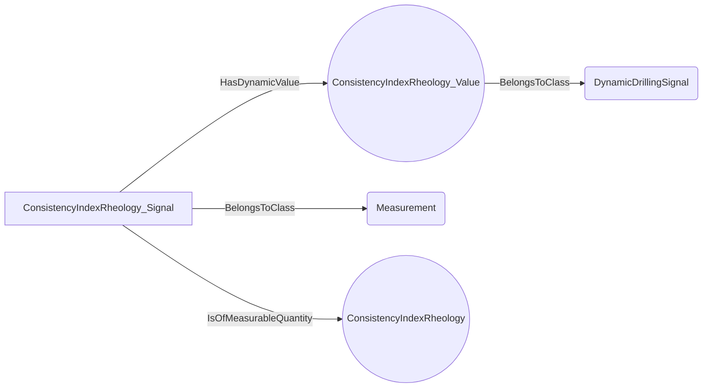
An example SparQL query looks like this:
```sparql
PREFIX rdf: <http://www.w3.org/1999/02/22-rdf-syntax-ns#>
PREFIX ddhub: <http://ddhub.no/>
PREFIX quantity: <http://ddhub.no/UnitAndQuantity>
SELECT ?ConsistencyIndexRheology-Value
WHERE {
	?ConsistencyIndexRheology_Value rdf:type ddhub:DynamicDrillingSignal .
	?ConsistencyIndexRheology_Signal rdf:type ddhub:Measurement .
	?ConsistencyIndexRheology_Signal ddhub:HasDynamicValue ?Attribute000 .
	?ConsistencyIndexRheology_Signal ddhub:IsOfMeasurableQuantity ?Attribute001 .
  FILTER (
	?Attribute000 = ConsistencyIndexRheology_Value
	&& 	?Attribute001 = ConsistencyIndexRheology
  )
}
```
## ElectricTensionQuantity <!-- NOUN -->
- Display name: ElectricTension
- Parent class: [MeasurableQuantity](#MeasurableQuantity)
- Specialization:
  - MeaningfulPrecision = 0.01
- Description: 
Electric tension is the difference in electric potential between two points.In a static electric field, it corresponds to the work needed per unit of charge to move a positive test charge from the first point to the second point.
The dimension of electric tension is:
$$[L^{2}MI^{-1}T^{-3}]$$.
The SI unit for **electric tension** is: volt with the associated unit label $V$
- Definition set: MeasurableQuantityTypes
- Examples:
``` dwis ElectricTension-Value
DynamicDrillingSignal:ElectricTension_Value
Measurement:ElectricTension_Signal
ElectricTension_Signal HasDynamicValue ElectricTension_Value
ElectricTension_Signal IsOfMeasurableQuantity ElectricTension
```
An example semantic graph looks like as follow:
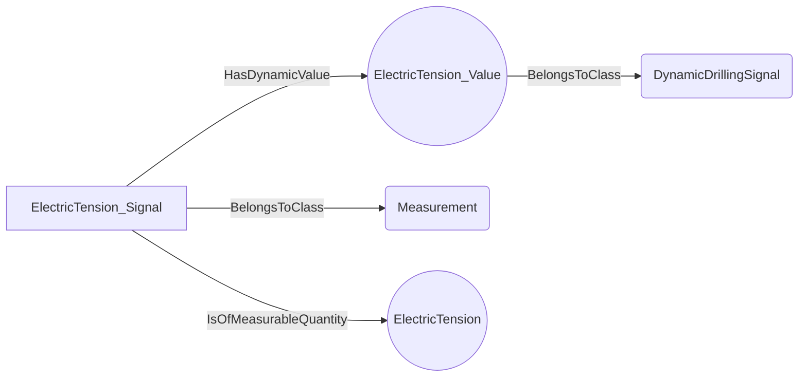
An example SparQL query looks like this:
```sparql
PREFIX rdf: <http://www.w3.org/1999/02/22-rdf-syntax-ns#>
PREFIX ddhub: <http://ddhub.no/>
PREFIX quantity: <http://ddhub.no/UnitAndQuantity>
SELECT ?ElectricTension-Value
WHERE {
	?ElectricTension_Value rdf:type ddhub:DynamicDrillingSignal .
	?ElectricTension_Signal rdf:type ddhub:Measurement .
	?ElectricTension_Signal ddhub:HasDynamicValue ?Attribute000 .
	?ElectricTension_Signal ddhub:IsOfMeasurableQuantity ?Attribute001 .
  FILTER (
	?Attribute000 = ElectricTension_Value
	&& 	?Attribute001 = ElectricTension
  )
}
```
## ImageScaleQuantity <!-- NOUN -->
- Display name: ImageScale
- Parent class: [MeasurableQuantity](#MeasurableQuantity)
- Specialization:
  - MeaningfulPrecision = 0.001
- Description: 
Image scale refers to the resolution or level of detail in an image.
The dimension of image scale is:
$$[L^{-1}]$$.
The SI unit for **image scale** is: dot per metre with the associated unit label $dpm$
- Definition set: MeasurableQuantityTypes
- Examples:
``` dwis ImageScale-Value
DynamicDrillingSignal:ImageScale_Value
Measurement:ImageScale_Signal
ImageScale_Signal HasDynamicValue ImageScale_Value
ImageScale_Signal IsOfMeasurableQuantity ImageScale
```
An example semantic graph looks like as follow:
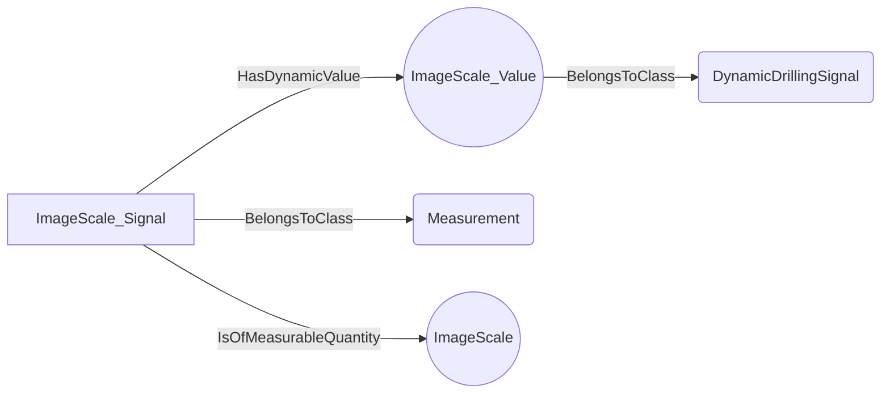
An example SparQL query looks like this:
```sparql
PREFIX rdf: <http://www.w3.org/1999/02/22-rdf-syntax-ns#>
PREFIX ddhub: <http://ddhub.no/>
PREFIX quantity: <http://ddhub.no/UnitAndQuantity>
SELECT ?ImageScale-Value
WHERE {
	?ImageScale_Value rdf:type ddhub:DynamicDrillingSignal .
	?ImageScale_Signal rdf:type ddhub:Measurement .
	?ImageScale_Signal ddhub:HasDynamicValue ?Attribute000 .
	?ImageScale_Signal ddhub:IsOfMeasurableQuantity ?Attribute001 .
  FILTER (
	?Attribute000 = ImageScale_Value
	&& 	?Attribute001 = ImageScale
  )
}
```
## DiameterSmallQuantity <!-- NOUN -->
- Display name: DiameterSmall
- Parent class: [MeasurableQuantity](#MeasurableQuantity)
- Specialization:
  - MeaningfulPrecision = 0.0001
- Description: 
Length is a measure of distance.
The dimension of length is:
$$[L]$$.
The SI unit for **length** is: metre with the associated unit label $m$
The meaningful precision of small diameter is typically: 0.0001 m
- Definition set: MeasurableQuantityTypes
- Examples:
``` dwis DiameterSmall-Value
DynamicDrillingSignal:DiameterSmall_Value
Measurement:DiameterSmall_Signal
DiameterSmall_Signal HasDynamicValue DiameterSmall_Value
DiameterSmall_Signal IsOfMeasurableQuantity DiameterSmall
```
An example semantic graph looks like as follow:
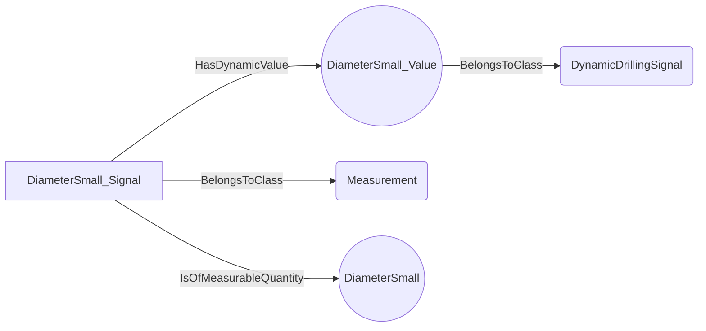
An example SparQL query looks like this:
```sparql
PREFIX rdf: <http://www.w3.org/1999/02/22-rdf-syntax-ns#>
PREFIX ddhub: <http://ddhub.no/>
PREFIX quantity: <http://ddhub.no/UnitAndQuantity>
SELECT ?DiameterSmall-Value
WHERE {
	?DiameterSmall_Value rdf:type ddhub:DynamicDrillingSignal .
	?DiameterSmall_Signal rdf:type ddhub:Measurement .
	?DiameterSmall_Signal ddhub:HasDynamicValue ?Attribute000 .
	?DiameterSmall_Signal ddhub:IsOfMeasurableQuantity ?Attribute001 .
  FILTER (
	?Attribute000 = DiameterSmall_Value
	&& 	?Attribute001 = DiameterSmall
  )
}
```
## DimensionLessStandardQuantity <!-- NOUN -->
- Display name: DimensionLessStandard
- Parent class: [MeasurableQuantity](#MeasurableQuantity)
- Specialization:
  - MeaningfulPrecision = 0.001
- Description: 
As its name indicates, a dimensionless quantity has no dimension:
The meaningful precision of standard dimensionless values is typically: 0.001 
- Definition set: MeasurableQuantityTypes
- Examples:
``` dwis DimensionLessStandard-Value
DynamicDrillingSignal:DimensionLessStandard_Value
Measurement:DimensionLessStandard_Signal
DimensionLessStandard_Signal HasDynamicValue DimensionLessStandard_Value
DimensionLessStandard_Signal IsOfMeasurableQuantity DimensionLessStandard
```
An example semantic graph looks like as follow:
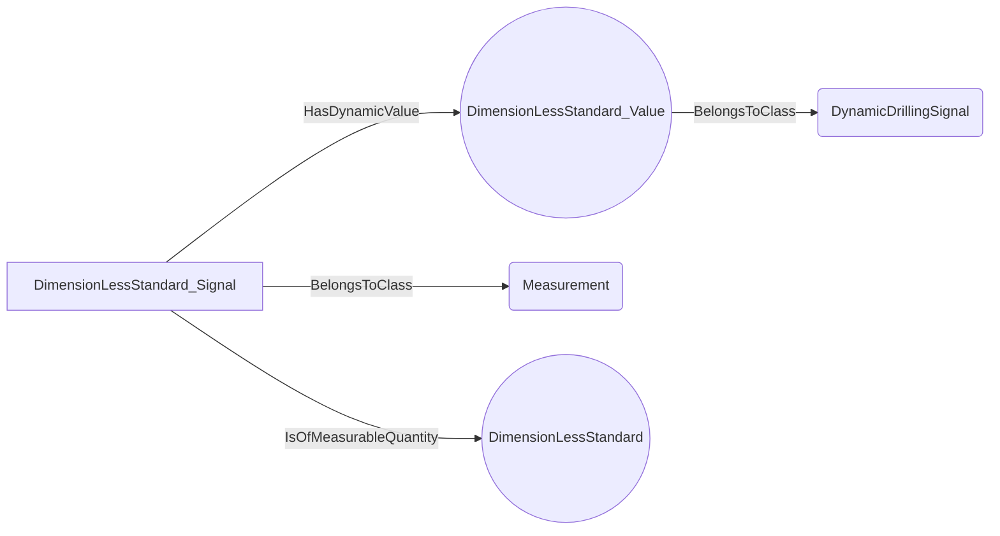
An example SparQL query looks like this:
```sparql
PREFIX rdf: <http://www.w3.org/1999/02/22-rdf-syntax-ns#>
PREFIX ddhub: <http://ddhub.no/>
PREFIX quantity: <http://ddhub.no/UnitAndQuantity>
SELECT ?DimensionLessStandard-Value
WHERE {
	?DimensionLessStandard_Value rdf:type ddhub:DynamicDrillingSignal .
	?DimensionLessStandard_Signal rdf:type ddhub:Measurement .
	?DimensionLessStandard_Signal ddhub:HasDynamicValue ?Attribute000 .
	?DimensionLessStandard_Signal ddhub:IsOfMeasurableQuantity ?Attribute001 .
  FILTER (
	?Attribute000 = DimensionLessStandard_Value
	&& 	?Attribute001 = DimensionLessStandard
  )
}
```
## EarthMagneticFluxDensityQuantity <!-- NOUN -->
- Display name: EarthMagneticFluxDensity
- Parent class: [MeasurableQuantity](#MeasurableQuantity)
- Specialization:
  - MeaningfulPrecision = 1E-09
- Description: 
Magnetic flux density is the measure of the strength of a magnetic field per unit area through which the magnetic flux passes. It indicates how concentrated the magnetic field is.
The dimension of magnetic flux density is:
$$[MI^{-1}T^{-2}]$$.
The SI unit for **magnetic flux density** is: tesla with the associated unit label $T$
Earth's magnetic flux density refers to the strength and direction of the Earth's magnetic field at a specific location.
The meaningful precision of earth magnetic flux density is: 1E-09 T
- Definition set: MeasurableQuantityTypes
- Examples:
``` dwis EarthMagneticFluxDensity-Value
DynamicDrillingSignal:EarthMagneticFluxDensity_Value
Measurement:EarthMagneticFluxDensity_Signal
EarthMagneticFluxDensity_Signal HasDynamicValue EarthMagneticFluxDensity_Value
EarthMagneticFluxDensity_Signal IsOfMeasurableQuantity EarthMagneticFluxDensity
```
An example semantic graph looks like as follow:
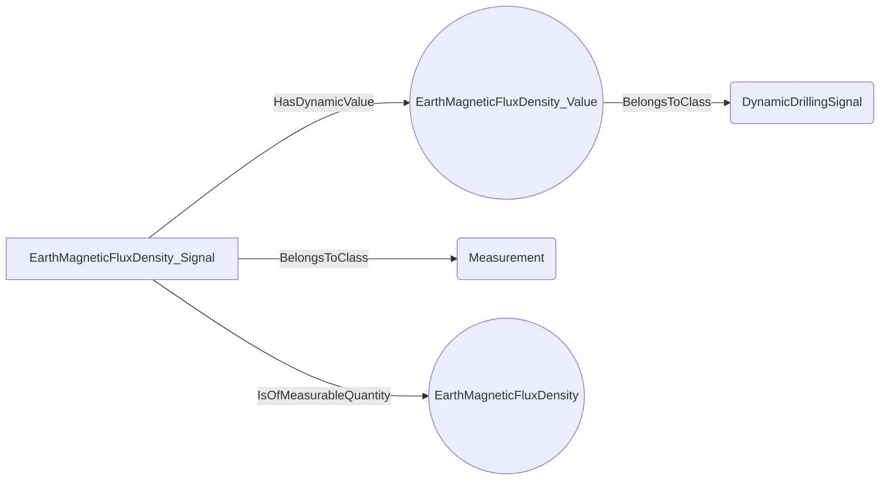
An example SparQL query looks like this:
```sparql
PREFIX rdf: <http://www.w3.org/1999/02/22-rdf-syntax-ns#>
PREFIX ddhub: <http://ddhub.no/>
PREFIX quantity: <http://ddhub.no/UnitAndQuantity>
SELECT ?EarthMagneticFluxDensity-Value
WHERE {
	?EarthMagneticFluxDensity_Value rdf:type ddhub:DynamicDrillingSignal .
	?EarthMagneticFluxDensity_Signal rdf:type ddhub:Measurement .
	?EarthMagneticFluxDensity_Signal ddhub:HasDynamicValue ?Attribute000 .
	?EarthMagneticFluxDensity_Signal ddhub:IsOfMeasurableQuantity ?Attribute001 .
  FILTER (
	?Attribute000 = EarthMagneticFluxDensity_Value
	&& 	?Attribute001 = EarthMagneticFluxDensity
  )
}
```
## ElasticModulusQuantity <!-- NOUN -->
- Display name: ElasticModulus
- Parent class: [MeasurableQuantity](#MeasurableQuantity)
- Specialization:
  - MeaningfulPrecision = 10000
- Description: 
Pressure is the force applied per unit area on a surface.
The dimension of pressure is:
$$[ML^{-1}T^{-2}]$$.
The SI unit for **pressure** is: pascal with the associated unit label $Pa$
Elastic modulus is a measure of a material's ability to resist deformation under stress. It quantifies the ratio of stress to strain in the material's elastic region
The meaningful precision of an elastic modulus is typically: 10000 Pa
- Definition set: MeasurableQuantityTypes
- Examples:
``` dwis ElasticModulus-Value
DynamicDrillingSignal:ElasticModulus_Value
Measurement:ElasticModulus_Signal
ElasticModulus_Signal HasDynamicValue ElasticModulus_Value
ElasticModulus_Signal IsOfMeasurableQuantity ElasticModulus
```
An example semantic graph looks like as follow:

An example SparQL query looks like this:
```sparql
PREFIX rdf: <http://www.w3.org/1999/02/22-rdf-syntax-ns#>
PREFIX ddhub: <http://ddhub.no/>
PREFIX quantity: <http://ddhub.no/UnitAndQuantity>
SELECT ?ElasticModulus-Value
WHERE {
	?ElasticModulus_Value rdf:type ddhub:DynamicDrillingSignal .
	?ElasticModulus_Signal rdf:type ddhub:Measurement .
	?ElasticModulus_Signal ddhub:HasDynamicValue ?Attribute000 .
	?ElasticModulus_Signal ddhub:IsOfMeasurableQuantity ?Attribute001 .
  FILTER (
	?Attribute000 = ElasticModulus_Value
	&& 	?Attribute001 = ElasticModulus
  )
}
```
## LengthSmallQuantity <!-- NOUN -->
- Display name: LengthSmall
- Parent class: [MeasurableQuantity](#MeasurableQuantity)
- Specialization:
  - MeaningfulPrecision = 1E-05
- Description: 
Length is a measure of distance.
The dimension of length is:
$$[L]$$.
The SI unit for **length** is: metre with the associated unit label $m$
The meaningful precision of small length is typically: 1E-05 m
- Definition set: MeasurableQuantityTypes
- Examples:
``` dwis LengthSmall-Value
DynamicDrillingSignal:LengthSmall_Value
Measurement:LengthSmall_Signal
LengthSmall_Signal HasDynamicValue LengthSmall_Value
LengthSmall_Signal IsOfMeasurableQuantity LengthSmall
```
An example semantic graph looks like as follow:
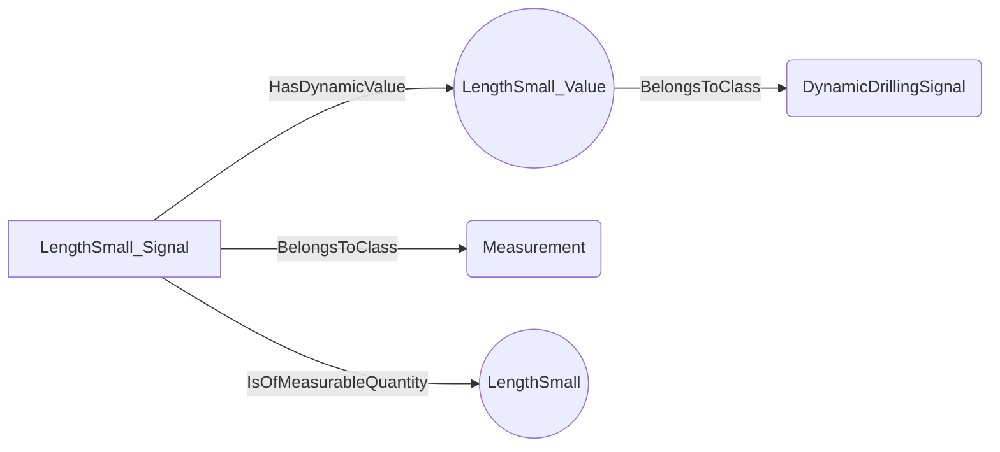
An example SparQL query looks like this:
```sparql
PREFIX rdf: <http://www.w3.org/1999/02/22-rdf-syntax-ns#>
PREFIX ddhub: <http://ddhub.no/>
PREFIX quantity: <http://ddhub.no/UnitAndQuantity>
SELECT ?LengthSmall-Value
WHERE {
	?LengthSmall_Value rdf:type ddhub:DynamicDrillingSignal .
	?LengthSmall_Signal rdf:type ddhub:Measurement .
	?LengthSmall_Signal ddhub:HasDynamicValue ?Attribute000 .
	?LengthSmall_Signal ddhub:IsOfMeasurableQuantity ?Attribute001 .
  FILTER (
	?Attribute000 = LengthSmall_Value
	&& 	?Attribute001 = LengthSmall
  )
}
```
## RotationalFrequencyQuantity <!-- NOUN -->
- Display name: RotationalFrequency
- Parent class: [MeasurableQuantity](#MeasurableQuantity)
- Specialization:
  - MeaningfulPrecision = 0.016666666666666666
- Description: 
Rotation frequency is the number of complete rotations or cycles an object makes per unit of time.
The dimension of rotational frequency is:
$$[T^{-1}]$$.
- Definition set: MeasurableQuantityTypes
- Examples:
``` dwis RotationalFrequency-Value
DynamicDrillingSignal:RotationalFrequency_Value
Measurement:RotationalFrequency_Signal
RotationalFrequency_Signal HasDynamicValue RotationalFrequency_Value
RotationalFrequency_Signal IsOfMeasurableQuantity RotationalFrequency
```
An example semantic graph looks like as follow:
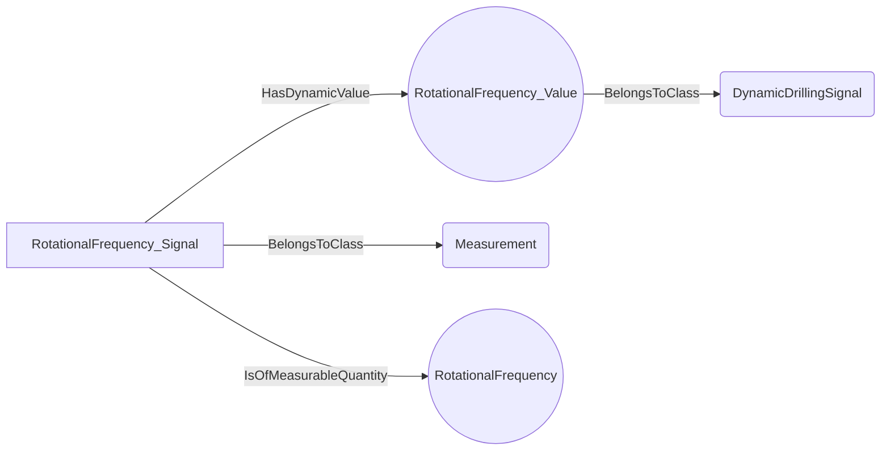
An example SparQL query looks like this:
```sparql
PREFIX rdf: <http://www.w3.org/1999/02/22-rdf-syntax-ns#>
PREFIX ddhub: <http://ddhub.no/>
PREFIX quantity: <http://ddhub.no/UnitAndQuantity>
SELECT ?RotationalFrequency-Value
WHERE {
	?RotationalFrequency_Value rdf:type ddhub:DynamicDrillingSignal .
	?RotationalFrequency_Signal rdf:type ddhub:Measurement .
	?RotationalFrequency_Signal ddhub:HasDynamicValue ?Attribute000 .
	?RotationalFrequency_Signal ddhub:IsOfMeasurableQuantity ?Attribute001 .
  FILTER (
	?Attribute000 = RotationalFrequency_Value
	&& 	?Attribute001 = RotationalFrequency
  )
}
```
## VolumeLargeQuantity <!-- NOUN -->
- Display name: VolumeLarge
- Parent class: [MeasurableQuantity](#MeasurableQuantity)
- Specialization:
  - MeaningfulPrecision = 0.1
- Description: 
A volume is the amount of three-dimensional space occupied by a body.
The dimension of volume is:
$$[L^{3}]$$.
The SI unit for **volume** is: cubic metre with the associated unit label $m^{3}$
The meaningful precision of a large volume is typically: 0.1 m³
- Definition set: MeasurableQuantityTypes
- Examples:
``` dwis VolumeLarge-Value
DynamicDrillingSignal:VolumeLarge_Value
Measurement:VolumeLarge_Signal
VolumeLarge_Signal HasDynamicValue VolumeLarge_Value
VolumeLarge_Signal IsOfMeasurableQuantity VolumeLarge
```
An example semantic graph looks like as follow:
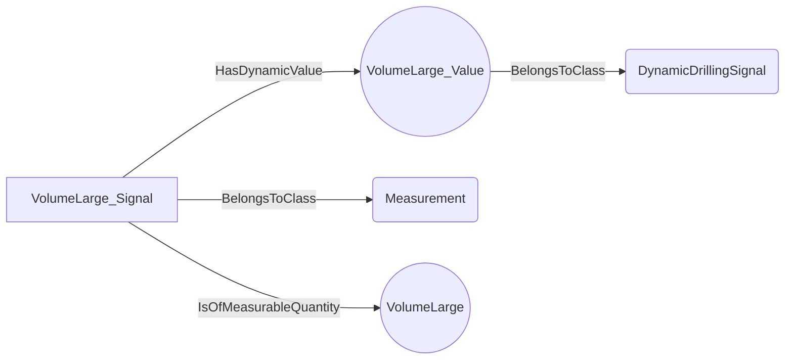
An example SparQL query looks like this:
```sparql
PREFIX rdf: <http://www.w3.org/1999/02/22-rdf-syntax-ns#>
PREFIX ddhub: <http://ddhub.no/>
PREFIX quantity: <http://ddhub.no/UnitAndQuantity>
SELECT ?VolumeLarge-Value
WHERE {
	?VolumeLarge_Value rdf:type ddhub:DynamicDrillingSignal .
	?VolumeLarge_Signal rdf:type ddhub:Measurement .
	?VolumeLarge_Signal ddhub:HasDynamicValue ?Attribute000 .
	?VolumeLarge_Signal ddhub:IsOfMeasurableQuantity ?Attribute001 .
  FILTER (
	?Attribute000 = VolumeLarge_Value
	&& 	?Attribute001 = VolumeLarge
  )
}
```
## ProportionStandardQuantity <!-- NOUN -->
- Display name: ProportionStandard
- Parent class: [MeasurableQuantity](#MeasurableQuantity)
- Specialization:
  - MeaningfulPrecision = 0.001
- Description: 
A proportion is the ratio of two quantities with the same dimension. It represents how one quantity compares to another in relative terms.
A proportion is dimensionless:
The meaningful precision of a standard proportion is typically: 0.001 
- Definition set: MeasurableQuantityTypes
- Examples:
``` dwis ProportionStandard-Value
DynamicDrillingSignal:ProportionStandard_Value
Measurement:ProportionStandard_Signal
ProportionStandard_Signal HasDynamicValue ProportionStandard_Value
ProportionStandard_Signal IsOfMeasurableQuantity ProportionStandard
```
An example semantic graph looks like as follow:
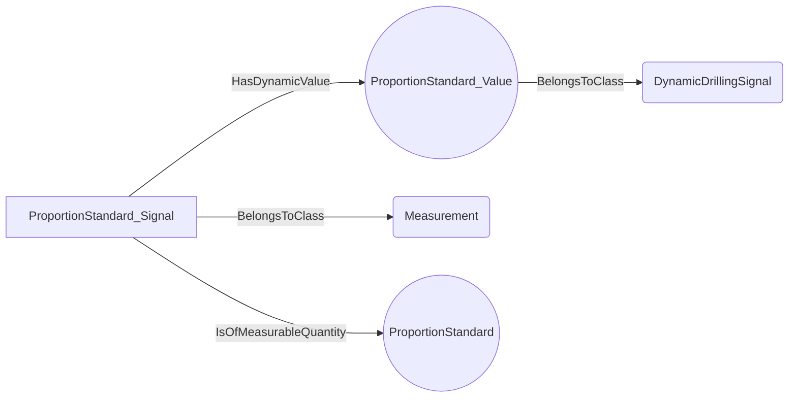
An example SparQL query looks like this:
```sparql
PREFIX rdf: <http://www.w3.org/1999/02/22-rdf-syntax-ns#>
PREFIX ddhub: <http://ddhub.no/>
PREFIX quantity: <http://ddhub.no/UnitAndQuantity>
SELECT ?ProportionStandard-Value
WHERE {
	?ProportionStandard_Value rdf:type ddhub:DynamicDrillingSignal .
	?ProportionStandard_Signal rdf:type ddhub:Measurement .
	?ProportionStandard_Signal ddhub:HasDynamicValue ?Attribute000 .
	?ProportionStandard_Signal ddhub:IsOfMeasurableQuantity ?Attribute001 .
  FILTER (
	?Attribute000 = ProportionStandard_Value
	&& 	?Attribute001 = ProportionStandard
  )
}
```
## LengthStandardQuantity <!-- NOUN -->
- Display name: LengthStandard
- Parent class: [MeasurableQuantity](#MeasurableQuantity)
- Specialization:
  - MeaningfulPrecision = 0.001
- Description: 
Length is a measure of distance.
The dimension of length is:
$$[L]$$.
The SI unit for **length** is: metre with the associated unit label $m$
The meaningful precision of a standard length is typically: 0.001 m
- Definition set: MeasurableQuantityTypes
- Examples:
``` dwis LengthStandard-Value
DynamicDrillingSignal:LengthStandard_Value
Measurement:LengthStandard_Signal
LengthStandard_Signal HasDynamicValue LengthStandard_Value
LengthStandard_Signal IsOfMeasurableQuantity LengthStandard
```
An example semantic graph looks like as follow:

An example SparQL query looks like this:
```sparql
PREFIX rdf: <http://www.w3.org/1999/02/22-rdf-syntax-ns#>
PREFIX ddhub: <http://ddhub.no/>
PREFIX quantity: <http://ddhub.no/UnitAndQuantity>
SELECT ?LengthStandard-Value
WHERE {
	?LengthStandard_Value rdf:type ddhub:DynamicDrillingSignal .
	?LengthStandard_Signal rdf:type ddhub:Measurement .
	?LengthStandard_Signal ddhub:HasDynamicValue ?Attribute000 .
	?LengthStandard_Signal ddhub:IsOfMeasurableQuantity ?Attribute001 .
  FILTER (
	?Attribute000 = LengthStandard_Value
	&& 	?Attribute001 = LengthStandard
  )
}
```
## FluidShearRateQuantity <!-- NOUN -->
- Display name: FluidShearRate
- Parent class: [MeasurableQuantity](#MeasurableQuantity)
- Specialization:
  - MeaningfulPrecision = 0.01
- Description: 
Frequency is the number of occurrences of a repeating event per unit of time.
The dimension of frequency is:
$$[T^{-1}]$$.
The SI unit for **frequency** is: hertz with the associated unit label $Hz$
Shear rate in a fluid is the rate at which adjacent layers of the fluid move relative to each other, typically expressed as the change in velocity per unit distance between the layers. It measures how quickly the fluid is being deformed by shear stress.
The meaningful precision of a shear rate for a fluid is typically: 0.01 Hz
- Definition set: MeasurableQuantityTypes
- Examples:
``` dwis FluidShearRate-Value
DynamicDrillingSignal:FluidShearRate_Value
Measurement:FluidShearRate_Signal
FluidShearRate_Signal HasDynamicValue FluidShearRate_Value
FluidShearRate_Signal IsOfMeasurableQuantity FluidShearRate
```
An example semantic graph looks like as follow:
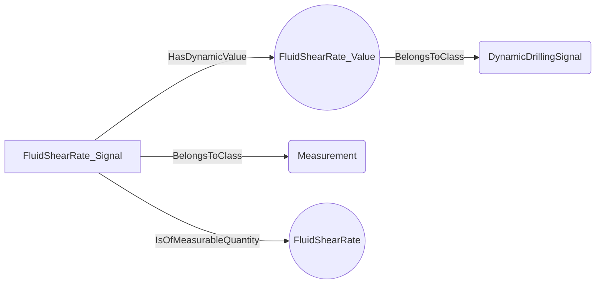
An example SparQL query looks like this:
```sparql
PREFIX rdf: <http://www.w3.org/1999/02/22-rdf-syntax-ns#>
PREFIX ddhub: <http://ddhub.no/>
PREFIX quantity: <http://ddhub.no/UnitAndQuantity>
SELECT ?FluidShearRate-Value
WHERE {
	?FluidShearRate_Value rdf:type ddhub:DynamicDrillingSignal .
	?FluidShearRate_Signal rdf:type ddhub:Measurement .
	?FluidShearRate_Signal ddhub:HasDynamicValue ?Attribute000 .
	?FluidShearRate_Signal ddhub:IsOfMeasurableQuantity ?Attribute001 .
  FILTER (
	?Attribute000 = FluidShearRate_Value
	&& 	?Attribute001 = FluidShearRate
  )
}
```
## FluidShearStressQuantity <!-- NOUN -->
- Display name: FluidShearStress
- Parent class: [MeasurableQuantity](#MeasurableQuantity)
- Specialization:
  - MeaningfulPrecision = 0.0001
- Description: 
Pressure is the force applied per unit area on a surface.
The dimension of pressure is:
$$[ML^{-1}T^{-2}]$$.
The SI unit for **pressure** is: pascal with the associated unit label $Pa$
Shear stress in a fluid is the force per unit area exerted parallel to the fluid's surface, causing layers of the fluid to slide relative to each other. It measures the fluid's resistance to this shearing action.
The meaningful precision of a shear stress for a fluid is typically: 0.0001 Pa
- Definition set: MeasurableQuantityTypes
- Examples:
``` dwis FluidShearStress-Value
DynamicDrillingSignal:FluidShearStress_Value
Measurement:FluidShearStress_Signal
FluidShearStress_Signal HasDynamicValue FluidShearStress_Value
FluidShearStress_Signal IsOfMeasurableQuantity FluidShearStress
```
An example semantic graph looks like as follow:
```mermaid
graph LR
	N0000[FluidShearStress_Value] -->|BelongsToClass| N0001(DynamicDrillingSignal) 
	N0002[FluidShearStress_Signal] -->|BelongsToClass| N0003(Measurement) 
	N0002[FluidShearStress_Signal] -->|HasDynamicValue| N0000((FluidShearStress_Value)) 
	N0002[FluidShearStress_Signal] -->|IsOfMeasurableQuantity| N0004((FluidShearStress)) 
```
An example SparQL query looks like this:
```sparql
PREFIX rdf: <http://www.w3.org/1999/02/22-rdf-syntax-ns#>
PREFIX ddhub: <http://ddhub.no/>
PREFIX quantity: <http://ddhub.no/UnitAndQuantity>
SELECT ?FluidShearStress-Value
WHERE {
	?FluidShearStress_Value rdf:type ddhub:DynamicDrillingSignal .
	?FluidShearStress_Signal rdf:type ddhub:Measurement .
	?FluidShearStress_Signal ddhub:HasDynamicValue ?Attribute000 .
	?FluidShearStress_Signal ddhub:IsOfMeasurableQuantity ?Attribute001 .
  FILTER (
	?Attribute000 = FluidShearStress_Value
	&& 	?Attribute001 = FluidShearStress
  )
}
```
## TorqueSmallQuantity <!-- NOUN -->
- Display name: TorqueSmall
- Parent class: [MeasurableQuantity](#MeasurableQuantity)
- Specialization:
  - MeaningfulPrecision = 1E-05
- Description: 
A torque is a measure of the rotational force applied to a body around an axis.
The dimension of torque is:
$$[L^{2}MT^{-2}]$$.
The SI unit for **torque** is: newton metre with the associated unit label $N \cdot m$
The meaningful precision of small torque is typically: 1E-05 N•m
- Definition set: MeasurableQuantityTypes
- Examples:
``` dwis TorqueSmall-Value
DynamicDrillingSignal:TorqueSmall_Value
Measurement:TorqueSmall_Signal
TorqueSmall_Signal HasDynamicValue TorqueSmall_Value
TorqueSmall_Signal IsOfMeasurableQuantity TorqueSmall
```
An example semantic graph looks like as follow:
```mermaid
graph LR
	N0000[TorqueSmall_Value] -->|BelongsToClass| N0001(DynamicDrillingSignal) 
	N0002[TorqueSmall_Signal] -->|BelongsToClass| N0003(Measurement) 
	N0002[TorqueSmall_Signal] -->|HasDynamicValue| N0000((TorqueSmall_Value)) 
	N0002[TorqueSmall_Signal] -->|IsOfMeasurableQuantity| N0004((TorqueSmall)) 
```
An example SparQL query looks like this:
```sparql
PREFIX rdf: <http://www.w3.org/1999/02/22-rdf-syntax-ns#>
PREFIX ddhub: <http://ddhub.no/>
PREFIX quantity: <http://ddhub.no/UnitAndQuantity>
SELECT ?TorqueSmall-Value
WHERE {
	?TorqueSmall_Value rdf:type ddhub:DynamicDrillingSignal .
	?TorqueSmall_Signal rdf:type ddhub:Measurement .
	?TorqueSmall_Signal ddhub:HasDynamicValue ?Attribute000 .
	?TorqueSmall_Signal ddhub:IsOfMeasurableQuantity ?Attribute001 .
  FILTER (
	?Attribute000 = TorqueSmall_Value
	&& 	?Attribute001 = TorqueSmall
  )
}
```
## RotationalFrequencySmallQuantity <!-- NOUN -->
- Display name: RotationalFrequencySmall
- Parent class: [MeasurableQuantity](#MeasurableQuantity)
- Specialization:
  - MeaningfulPrecision = 0.00016666
- Description: 
Rotation frequency is the number of complete rotations or cycles an object makes per unit of time.
The dimension of rotational frequency is:
$$[T^{-1}]$$.
The meaningful precision of small rotational frequency is typically: 0.00016666 Hz
- Definition set: MeasurableQuantityTypes
- Examples:
``` dwis RotationalFrequencySmall-Value
DynamicDrillingSignal:RotationalFrequencySmall_Value
Measurement:RotationalFrequencySmall_Signal
RotationalFrequencySmall_Signal HasDynamicValue RotationalFrequencySmall_Value
RotationalFrequencySmall_Signal IsOfMeasurableQuantity RotationalFrequencySmall
```
An example semantic graph looks like as follow:
```mermaid
graph LR
	N0000[RotationalFrequencySmall_Value] -->|BelongsToClass| N0001(DynamicDrillingSignal) 
	N0002[RotationalFrequencySmall_Signal] -->|BelongsToClass| N0003(Measurement) 
	N0002[RotationalFrequencySmall_Signal] -->|HasDynamicValue| N0000((RotationalFrequencySmall_Value)) 
	N0002[RotationalFrequencySmall_Signal] -->|IsOfMeasurableQuantity| N0004((RotationalFrequencySmall)) 
```
An example SparQL query looks like this:
```sparql
PREFIX rdf: <http://www.w3.org/1999/02/22-rdf-syntax-ns#>
PREFIX ddhub: <http://ddhub.no/>
PREFIX quantity: <http://ddhub.no/UnitAndQuantity>
SELECT ?RotationalFrequencySmall-Value
WHERE {
	?RotationalFrequencySmall_Value rdf:type ddhub:DynamicDrillingSignal .
	?RotationalFrequencySmall_Signal rdf:type ddhub:Measurement .
	?RotationalFrequencySmall_Signal ddhub:HasDynamicValue ?Attribute000 .
	?RotationalFrequencySmall_Signal ddhub:IsOfMeasurableQuantity ?Attribute001 .
  FILTER (
	?Attribute000 = RotationalFrequencySmall_Value
	&& 	?Attribute001 = RotationalFrequencySmall
  )
}
```
## ProportionSmallQuantity <!-- NOUN -->
- Display name: ProportionSmall
- Parent class: [MeasurableQuantity](#MeasurableQuantity)
- Specialization:
  - MeaningfulPrecision = 1E-08
- Description: 
A proportion is the ratio of two quantities with the same dimension. It represents how one quantity compares to another in relative terms.
A proportion is dimensionless:
The meaningful precision of small proportion is typically: 1E-08 
- Definition set: MeasurableQuantityTypes
- Examples:
``` dwis ProportionSmall-Value
DynamicDrillingSignal:ProportionSmall_Value
Measurement:ProportionSmall_Signal
ProportionSmall_Signal HasDynamicValue ProportionSmall_Value
ProportionSmall_Signal IsOfMeasurableQuantity ProportionSmall
```
An example semantic graph looks like as follow:
```mermaid
graph LR
	N0000[ProportionSmall_Value] -->|BelongsToClass| N0001(DynamicDrillingSignal) 
	N0002[ProportionSmall_Signal] -->|BelongsToClass| N0003(Measurement) 
	N0002[ProportionSmall_Signal] -->|HasDynamicValue| N0000((ProportionSmall_Value)) 
	N0002[ProportionSmall_Signal] -->|IsOfMeasurableQuantity| N0004((ProportionSmall)) 
```
An example SparQL query looks like this:
```sparql
PREFIX rdf: <http://www.w3.org/1999/02/22-rdf-syntax-ns#>
PREFIX ddhub: <http://ddhub.no/>
PREFIX quantity: <http://ddhub.no/UnitAndQuantity>
SELECT ?ProportionSmall-Value
WHERE {
	?ProportionSmall_Value rdf:type ddhub:DynamicDrillingSignal .
	?ProportionSmall_Signal rdf:type ddhub:Measurement .
	?ProportionSmall_Signal ddhub:HasDynamicValue ?Attribute000 .
	?ProportionSmall_Signal ddhub:IsOfMeasurableQuantity ?Attribute001 .
  FILTER (
	?Attribute000 = ProportionSmall_Value
	&& 	?Attribute001 = ProportionSmall
  )
}
```
## PorosityQuantity <!-- NOUN -->
- Display name: Porosity
- Parent class: [MeasurableQuantity](#MeasurableQuantity)
- Specialization:
  - MeaningfulPrecision = 0.001
- Description: 
A proportion is the ratio of two quantities with the same dimension. It represents how one quantity compares to another in relative terms.
A proportion is dimensionless:
Porosity is the measure of the void spaces or pores within a material, expressed as a fraction or percentage of the total volume.
The meaningful precision of porosity is typically: 0.001 
- Definition set: MeasurableQuantityTypes
- Examples:
``` dwis Porosity-Value
DynamicDrillingSignal:Porosity_Value
Measurement:Porosity_Signal
Porosity_Signal HasDynamicValue Porosity_Value
Porosity_Signal IsOfMeasurableQuantity Porosity
```
An example semantic graph looks like as follow:
```mermaid
graph LR
	N0000[Porosity_Value] -->|BelongsToClass| N0001(DynamicDrillingSignal) 
	N0002[Porosity_Signal] -->|BelongsToClass| N0003(Measurement) 
	N0002[Porosity_Signal] -->|HasDynamicValue| N0000((Porosity_Value)) 
	N0002[Porosity_Signal] -->|IsOfMeasurableQuantity| N0004((Porosity)) 
```
An example SparQL query looks like this:
```sparql
PREFIX rdf: <http://www.w3.org/1999/02/22-rdf-syntax-ns#>
PREFIX ddhub: <http://ddhub.no/>
PREFIX quantity: <http://ddhub.no/UnitAndQuantity>
SELECT ?Porosity-Value
WHERE {
	?Porosity_Value rdf:type ddhub:DynamicDrillingSignal .
	?Porosity_Signal rdf:type ddhub:Measurement .
	?Porosity_Signal ddhub:HasDynamicValue ?Attribute000 .
	?Porosity_Signal ddhub:IsOfMeasurableQuantity ?Attribute001 .
  FILTER (
	?Attribute000 = Porosity_Value
	&& 	?Attribute001 = Porosity
  )
}
```
## StrokeFrequencyQuantity <!-- NOUN -->
- Display name: StrokeFrequency
- Parent class: [MeasurableQuantity](#MeasurableQuantity)
- Specialization:
  - MeaningfulPrecision = 0.016666666666666666
- Description: 
A stroke frequency is the number of stokes per unit time
The meaningful precision of a stroke frequency is typically: 0.016666666666666666 Hz
- Definition set: MeasurableQuantityTypes
- Examples:
``` dwis StrokeFrequency-Value
DynamicDrillingSignal:StrokeFrequency_Value
Measurement:StrokeFrequency_Signal
StrokeFrequency_Signal HasDynamicValue StrokeFrequency_Value
StrokeFrequency_Signal IsOfMeasurableQuantity StrokeFrequency
```
An example semantic graph looks like as follow:
```mermaid
graph LR
	N0000[StrokeFrequency_Value] -->|BelongsToClass| N0001(DynamicDrillingSignal) 
	N0002[StrokeFrequency_Signal] -->|BelongsToClass| N0003(Measurement) 
	N0002[StrokeFrequency_Signal] -->|HasDynamicValue| N0000((StrokeFrequency_Value)) 
	N0002[StrokeFrequency_Signal] -->|IsOfMeasurableQuantity| N0004((StrokeFrequency)) 
```
An example SparQL query looks like this:
```sparql
PREFIX rdf: <http://www.w3.org/1999/02/22-rdf-syntax-ns#>
PREFIX ddhub: <http://ddhub.no/>
PREFIX quantity: <http://ddhub.no/UnitAndQuantity>
SELECT ?StrokeFrequency-Value
WHERE {
	?StrokeFrequency_Value rdf:type ddhub:DynamicDrillingSignal .
	?StrokeFrequency_Signal rdf:type ddhub:Measurement .
	?StrokeFrequency_Signal ddhub:HasDynamicValue ?Attribute000 .
	?StrokeFrequency_Signal ddhub:IsOfMeasurableQuantity ?Attribute001 .
  FILTER (
	?Attribute000 = StrokeFrequency_Value
	&& 	?Attribute001 = StrokeFrequency
  )
}
```
## ShockRateQuantity <!-- NOUN -->
- Display name: ShockRate
- Parent class: [MeasurableQuantity](#MeasurableQuantity)
- Specialization:
  - MeaningfulPrecision = 0.016666666666666666
- Description: 
A shock rate is the number of shocks per unit time.
The meaningful precision of shock rate is typically: 0.016666666666666666 Hz/s
- Definition set: MeasurableQuantityTypes
- Examples:
``` dwis ShockRate-Value
DynamicDrillingSignal:ShockRate_Value
Measurement:ShockRate_Signal
ShockRate_Signal HasDynamicValue ShockRate_Value
ShockRate_Signal IsOfMeasurableQuantity ShockRate
```
An example semantic graph looks like as follow:
```mermaid
graph LR
	N0000[ShockRate_Value] -->|BelongsToClass| N0001(DynamicDrillingSignal) 
	N0002[ShockRate_Signal] -->|BelongsToClass| N0003(Measurement) 
	N0002[ShockRate_Signal] -->|HasDynamicValue| N0000((ShockRate_Value)) 
	N0002[ShockRate_Signal] -->|IsOfMeasurableQuantity| N0004((ShockRate)) 
```
An example SparQL query looks like this:
```sparql
PREFIX rdf: <http://www.w3.org/1999/02/22-rdf-syntax-ns#>
PREFIX ddhub: <http://ddhub.no/>
PREFIX quantity: <http://ddhub.no/UnitAndQuantity>
SELECT ?ShockRate-Value
WHERE {
	?ShockRate_Value rdf:type ddhub:DynamicDrillingSignal .
	?ShockRate_Signal rdf:type ddhub:Measurement .
	?ShockRate_Signal ddhub:HasDynamicValue ?Attribute000 .
	?ShockRate_Signal ddhub:IsOfMeasurableQuantity ?Attribute001 .
  FILTER (
	?Attribute000 = ShockRate_Value
	&& 	?Attribute001 = ShockRate
  )
}
```
## AccelerationDrillingQuantity <!-- NOUN -->
- Display name: AccelerationDrilling
- Parent class: [MeasurableQuantity](#MeasurableQuantity)
- Specialization:
  - MeaningfulPrecision = 0.001
- Description: 
**Acceleration** is defined as the rate of change of velocity with respect to time. Velocity itself is the rate of change of displacement (or position) with respect to time. Therefore, acceleration is the rate of change of displacement twice with respect to time.
Let's break this down:
1. **Displacement** (or position) has the dimension of **Length(L)**.
2. **Velocity** is displacement per unit time:
$$\text{Velocity} = \frac{\text{Length}}{\text{Time}} = \frac{L}{T}$$
So, the dimension of velocity is **$[L T^{ -1}]$**.
3. **Acceleration** is the rate of change of velocity with respect to time:
$$\text{Acceleration} = \frac{\text{Velocity}}{\text{Time}} = \frac{L T^{ -1}}{T} = L T ^{-2}$$
Therefore, the dimension of acceleration is $[LT^{-2}]$.
The SI unit for **acceleration** is: metre per second squared with the associated unit label $\frac{m}{s^{2}}$
The meaningful precision of acceleration in the drilling context is typically: 0.001 m/s²
- Definition set: MeasurableQuantityTypes
- Examples:
``` dwis AccelerationDrilling-Value
DynamicDrillingSignal:AccelerationDrilling_Value
Measurement:AccelerationDrilling_Signal
AccelerationDrilling_Signal HasDynamicValue AccelerationDrilling_Value
AccelerationDrilling_Signal IsOfMeasurableQuantity AccelerationDrilling
```
An example semantic graph looks like as follow:
```mermaid
graph LR
	N0000[AccelerationDrilling_Value] -->|BelongsToClass| N0001(DynamicDrillingSignal) 
	N0002[AccelerationDrilling_Signal] -->|BelongsToClass| N0003(Measurement) 
	N0002[AccelerationDrilling_Signal] -->|HasDynamicValue| N0000((AccelerationDrilling_Value)) 
	N0002[AccelerationDrilling_Signal] -->|IsOfMeasurableQuantity| N0004((AccelerationDrilling)) 
```
An example SparQL query looks like this:
```sparql
PREFIX rdf: <http://www.w3.org/1999/02/22-rdf-syntax-ns#>
PREFIX ddhub: <http://ddhub.no/>
PREFIX quantity: <http://ddhub.no/UnitAndQuantity>
SELECT ?AccelerationDrilling-Value
WHERE {
	?AccelerationDrilling_Value rdf:type ddhub:DynamicDrillingSignal .
	?AccelerationDrilling_Signal rdf:type ddhub:Measurement .
	?AccelerationDrilling_Signal ddhub:HasDynamicValue ?Attribute000 .
	?AccelerationDrilling_Signal ddhub:IsOfMeasurableQuantity ?Attribute001 .
  FILTER (
	?Attribute000 = AccelerationDrilling_Value
	&& 	?Attribute001 = AccelerationDrilling
  )
}
```
## AngleGradientPerLengthDrillingQuantity <!-- NOUN -->
- Display name: AngleGradientPerLengthDrilling
- Parent class: [MeasurableQuantity](#MeasurableQuantity)
- Specialization:
  - MeaningfulPrecision = 0.00017453292519943296
- Description: 
Consider a situation where you have a length $L$ along which an angle $\theta$ changes. The angle variation gradient is defined as the **rate of change of the angle** per unit change in length. Mathematically, it can be expressed as: 
$$\text{ Angle Variation Gradient} = \frac{ d\theta}{ dL}$$
where: 
- Definition set: MeasurableQuantityTypes
- Examples:
``` dwis AngleGradientPerLengthDrilling-Value
DynamicDrillingSignal:AngleGradientPerLengthDrilling_Value
Measurement:AngleGradientPerLengthDrilling_Signal
AngleGradientPerLengthDrilling_Signal HasDynamicValue AngleGradientPerLengthDrilling_Value
AngleGradientPerLengthDrilling_Signal IsOfMeasurableQuantity AngleGradientPerLengthDrilling
```
An example semantic graph looks like as follow:
```mermaid
graph LR
	N0000[AngleGradientPerLengthDrilling_Value] -->|BelongsToClass| N0001(DynamicDrillingSignal) 
	N0002[AngleGradientPerLengthDrilling_Signal] -->|BelongsToClass| N0003(Measurement) 
	N0002[AngleGradientPerLengthDrilling_Signal] -->|HasDynamicValue| N0000((AngleGradientPerLengthDrilling_Value)) 
	N0002[AngleGradientPerLengthDrilling_Signal] -->|IsOfMeasurableQuantity| N0004((AngleGradientPerLengthDrilling)) 
```
An example SparQL query looks like this:
```sparql
PREFIX rdf: <http://www.w3.org/1999/02/22-rdf-syntax-ns#>
PREFIX ddhub: <http://ddhub.no/>
PREFIX quantity: <http://ddhub.no/UnitAndQuantity>
SELECT ?AngleGradientPerLengthDrilling-Value
WHERE {
	?AngleGradientPerLengthDrilling_Value rdf:type ddhub:DynamicDrillingSignal .
	?AngleGradientPerLengthDrilling_Signal rdf:type ddhub:Measurement .
	?AngleGradientPerLengthDrilling_Signal ddhub:HasDynamicValue ?Attribute000 .
	?AngleGradientPerLengthDrilling_Signal ddhub:IsOfMeasurableQuantity ?Attribute001 .
  FILTER (
	?Attribute000 = AngleGradientPerLengthDrilling_Value
	&& 	?Attribute001 = AngleGradientPerLengthDrilling
  )
}
```
## AngleMagneticFluxDensitySurveyInstrumentDrillingQuantity <!-- NOUN -->
- Display name: AngleMagneticFluxDensitySurveyInstrumentDrilling
- Parent class: [MeasurableQuantity](#MeasurableQuantity)
- Specialization:
  - MeaningfulPrecision = 1E-09
- Description: 
The **angle magnetic flux density** is the product of an angle by a magnetic flux density. Let's break it down step by step:
1. Magnetic Flux Density
The **magnetic flux density** $\mathbf{B}$ is a measure of the strength and direction of the magnetic field at a particular point in space. It represents the amount of magnetic flux passing through a unit area perpendicular to the direction of the magnetic field. In simpler terms, it describes how dense or concentrated the magnetic field lines are in a given region.It can be expressed in terms of the fundamental dimensions as:
$$[M][T]^{-2}[I]^{-1}$$
Where:
- Definition set: MeasurableQuantityTypes
- Examples:
``` dwis AngleMagneticFluxDensitySurveyInstrumentDrilling-Value
DynamicDrillingSignal:AngleMagneticFluxDensitySurveyInstrumentDrilling_Value
Measurement:AngleMagneticFluxDensitySurveyInstrumentDrilling_Signal
AngleMagneticFluxDensitySurveyInstrumentDrilling_Signal HasDynamicValue AngleMagneticFluxDensitySurveyInstrumentDrilling_Value
AngleMagneticFluxDensitySurveyInstrumentDrilling_Signal IsOfMeasurableQuantity AngleMagneticFluxDensitySurveyInstrumentDrilling
```
An example semantic graph looks like as follow:
```mermaid
graph LR
	N0000[AngleMagneticFluxDensitySurveyInstrumentDrilling_Value] -->|BelongsToClass| N0001(DynamicDrillingSignal) 
	N0002[AngleMagneticFluxDensitySurveyInstrumentDrilling_Signal] -->|BelongsToClass| N0003(Measurement) 
	N0002[AngleMagneticFluxDensitySurveyInstrumentDrilling_Signal] -->|HasDynamicValue| N0000((AngleMagneticFluxDensitySurveyInstrumentDrilling_Value)) 
	N0002[AngleMagneticFluxDensitySurveyInstrumentDrilling_Signal] -->|IsOfMeasurableQuantity| N0004((AngleMagneticFluxDensitySurveyInstrumentDrilling)) 
```
An example SparQL query looks like this:
```sparql
PREFIX rdf: <http://www.w3.org/1999/02/22-rdf-syntax-ns#>
PREFIX ddhub: <http://ddhub.no/>
PREFIX quantity: <http://ddhub.no/UnitAndQuantity>
SELECT ?AngleMagneticFluxDensitySurveyInstrumentDrilling-Value
WHERE {
	?AngleMagneticFluxDensitySurveyInstrumentDrilling_Value rdf:type ddhub:DynamicDrillingSignal .
	?AngleMagneticFluxDensitySurveyInstrumentDrilling_Signal rdf:type ddhub:Measurement .
	?AngleMagneticFluxDensitySurveyInstrumentDrilling_Signal ddhub:HasDynamicValue ?Attribute000 .
	?AngleMagneticFluxDensitySurveyInstrumentDrilling_Signal ddhub:IsOfMeasurableQuantity ?Attribute001 .
  FILTER (
	?Attribute000 = AngleMagneticFluxDensitySurveyInstrumentDrilling_Value
	&& 	?Attribute001 = AngleMagneticFluxDensitySurveyInstrumentDrilling
  )
}
```
## AngularAccelerationDrillingQuantity <!-- NOUN -->
- Display name: AngularAccelerationDrilling
- Parent class: [MeasurableQuantity](#MeasurableQuantity)
- Specialization:
  - MeaningfulPrecision = 0.01
- Description: 
An angular acceleration is the second derivative compared to time of a plan angle: $\frac{d^2\theta}{dt^2}$.
The dimension of angular acceleration is:
$$[{\theta}T^{-2}]$$.
The SI unit for **angular acceleration** is: radian per second squared with the associated unit label $\frac{rad}{s^{2}}$
The meaningful precision of angular acceleration in the drilling context is typically: 0.01 rad/s²
- Definition set: MeasurableQuantityTypes
- Examples:
``` dwis AngularAccelerationDrilling-Value
DynamicDrillingSignal:AngularAccelerationDrilling_Value
Measurement:AngularAccelerationDrilling_Signal
AngularAccelerationDrilling_Signal HasDynamicValue AngularAccelerationDrilling_Value
AngularAccelerationDrilling_Signal IsOfMeasurableQuantity AngularAccelerationDrilling
```
An example semantic graph looks like as follow:
```mermaid
graph LR
	N0000[AngularAccelerationDrilling_Value] -->|BelongsToClass| N0001(DynamicDrillingSignal) 
	N0002[AngularAccelerationDrilling_Signal] -->|BelongsToClass| N0003(Measurement) 
	N0002[AngularAccelerationDrilling_Signal] -->|HasDynamicValue| N0000((AngularAccelerationDrilling_Value)) 
	N0002[AngularAccelerationDrilling_Signal] -->|IsOfMeasurableQuantity| N0004((AngularAccelerationDrilling)) 
```
An example SparQL query looks like this:
```sparql
PREFIX rdf: <http://www.w3.org/1999/02/22-rdf-syntax-ns#>
PREFIX ddhub: <http://ddhub.no/>
PREFIX quantity: <http://ddhub.no/UnitAndQuantity>
SELECT ?AngularAccelerationDrilling-Value
WHERE {
	?AngularAccelerationDrilling_Value rdf:type ddhub:DynamicDrillingSignal .
	?AngularAccelerationDrilling_Signal rdf:type ddhub:Measurement .
	?AngularAccelerationDrilling_Signal ddhub:HasDynamicValue ?Attribute000 .
	?AngularAccelerationDrilling_Signal ddhub:IsOfMeasurableQuantity ?Attribute001 .
  FILTER (
	?Attribute000 = AngularAccelerationDrilling_Value
	&& 	?Attribute001 = AngularAccelerationDrilling
  )
}
```
## AngularVelocityDrillingQuantity <!-- NOUN -->
- Display name: AngularVelocityDrilling
- Parent class: [MeasurableQuantity](#MeasurableQuantity)
- Specialization:
  - MeaningfulPrecision = 0.01
- Description: 
An angular velocity is the first derivative compared to time of a plan angle: $\frac{d\theta}{dt}$.
The dimension of angular velocity is:
$$[{\theta}T^{-1}]$$.
The SI unit for **angular velocity** is: radian per second with the associated unit label $\frac{rad}{s}$
The meaningful precision of angular velocity in the drilling context is typically: 0.01 rad/s
- Definition set: MeasurableQuantityTypes
- Examples:
``` dwis AngularVelocityDrilling-Value
DynamicDrillingSignal:AngularVelocityDrilling_Value
Measurement:AngularVelocityDrilling_Signal
AngularVelocityDrilling_Signal HasDynamicValue AngularVelocityDrilling_Value
AngularVelocityDrilling_Signal IsOfMeasurableQuantity AngularVelocityDrilling
```
An example semantic graph looks like as follow:
```mermaid
graph LR
	N0000[AngularVelocityDrilling_Value] -->|BelongsToClass| N0001(DynamicDrillingSignal) 
	N0002[AngularVelocityDrilling_Signal] -->|BelongsToClass| N0003(Measurement) 
	N0002[AngularVelocityDrilling_Signal] -->|HasDynamicValue| N0000((AngularVelocityDrilling_Value)) 
	N0002[AngularVelocityDrilling_Signal] -->|IsOfMeasurableQuantity| N0004((AngularVelocityDrilling)) 
```
An example SparQL query looks like this:
```sparql
PREFIX rdf: <http://www.w3.org/1999/02/22-rdf-syntax-ns#>
PREFIX ddhub: <http://ddhub.no/>
PREFIX quantity: <http://ddhub.no/UnitAndQuantity>
SELECT ?AngularVelocityDrilling-Value
WHERE {
	?AngularVelocityDrilling_Value rdf:type ddhub:DynamicDrillingSignal .
	?AngularVelocityDrilling_Signal rdf:type ddhub:Measurement .
	?AngularVelocityDrilling_Signal ddhub:HasDynamicValue ?Attribute000 .
	?AngularVelocityDrilling_Signal ddhub:IsOfMeasurableQuantity ?Attribute001 .
  FILTER (
	?Attribute000 = AngularVelocityDrilling_Value
	&& 	?Attribute001 = AngularVelocityDrilling
  )
}
```
## AngularVelocitySurveyInstrumentDrillingQuantity <!-- NOUN -->
- Display name: AngularVelocitySurveyInstrumentDrilling
- Parent class: [MeasurableQuantity](#MeasurableQuantity)
- Specialization:
  - MeaningfulPrecision = 1E-07
- Description: 
An angular velocity is the first derivative compared to time of a plan angle: $\frac{d\theta}{dt}$.
The dimension of angular velocity is:
$$[{\theta}T^{-1}]$$.
The SI unit for **angular velocity** is: radian per second with the associated unit label $\frac{rad}{s}$
The meaningful precision of angular velocity related to survey instrument performance models in the drilling context is typically: 1E-07 rad•T
- Definition set: MeasurableQuantityTypes
- Examples:
``` dwis AngularVelocitySurveyInstrumentDrilling-Value
DynamicDrillingSignal:AngularVelocitySurveyInstrumentDrilling_Value
Measurement:AngularVelocitySurveyInstrumentDrilling_Signal
AngularVelocitySurveyInstrumentDrilling_Signal HasDynamicValue AngularVelocitySurveyInstrumentDrilling_Value
AngularVelocitySurveyInstrumentDrilling_Signal IsOfMeasurableQuantity AngularVelocitySurveyInstrumentDrilling
```
An example semantic graph looks like as follow:
```mermaid
graph LR
	N0000[AngularVelocitySurveyInstrumentDrilling_Value] -->|BelongsToClass| N0001(DynamicDrillingSignal) 
	N0002[AngularVelocitySurveyInstrumentDrilling_Signal] -->|BelongsToClass| N0003(Measurement) 
	N0002[AngularVelocitySurveyInstrumentDrilling_Signal] -->|HasDynamicValue| N0000((AngularVelocitySurveyInstrumentDrilling_Value)) 
	N0002[AngularVelocitySurveyInstrumentDrilling_Signal] -->|IsOfMeasurableQuantity| N0004((AngularVelocitySurveyInstrumentDrilling)) 
```
An example SparQL query looks like this:
```sparql
PREFIX rdf: <http://www.w3.org/1999/02/22-rdf-syntax-ns#>
PREFIX ddhub: <http://ddhub.no/>
PREFIX quantity: <http://ddhub.no/UnitAndQuantity>
SELECT ?AngularVelocitySurveyInstrumentDrilling-Value
WHERE {
	?AngularVelocitySurveyInstrumentDrilling_Value rdf:type ddhub:DynamicDrillingSignal .
	?AngularVelocitySurveyInstrumentDrilling_Signal rdf:type ddhub:Measurement .
	?AngularVelocitySurveyInstrumentDrilling_Signal ddhub:HasDynamicValue ?Attribute000 .
	?AngularVelocitySurveyInstrumentDrilling_Signal ddhub:IsOfMeasurableQuantity ?Attribute001 .
  FILTER (
	?Attribute000 = AngularVelocitySurveyInstrumentDrilling_Value
	&& 	?Attribute001 = AngularVelocitySurveyInstrumentDrilling
  )
}
```
## AreaDrillingQuantity <!-- NOUN -->
- Display name: AreaDrilling
- Parent class: [MeasurableQuantity](#MeasurableQuantity)
- Specialization:
  - MeaningfulPrecision = 1E-06
- Description: 
Area is the measure of the extent of a surface or the size of a two-dimensional shape.
The dimension of area is:
$$[L^{2}]$$.
The SI unit for **area** is: square metre with the associated unit label $m^{2}$
The meaningful precision of area in the drilling context is typically: 1E-06 m²
- Definition set: MeasurableQuantityTypes
- Examples:
``` dwis AreaDrilling-Value
DynamicDrillingSignal:AreaDrilling_Value
Measurement:AreaDrilling_Signal
AreaDrilling_Signal HasDynamicValue AreaDrilling_Value
AreaDrilling_Signal IsOfMeasurableQuantity AreaDrilling
```
An example semantic graph looks like as follow:
```mermaid
graph LR
	N0000[AreaDrilling_Value] -->|BelongsToClass| N0001(DynamicDrillingSignal) 
	N0002[AreaDrilling_Signal] -->|BelongsToClass| N0003(Measurement) 
	N0002[AreaDrilling_Signal] -->|HasDynamicValue| N0000((AreaDrilling_Value)) 
	N0002[AreaDrilling_Signal] -->|IsOfMeasurableQuantity| N0004((AreaDrilling)) 
```
An example SparQL query looks like this:
```sparql
PREFIX rdf: <http://www.w3.org/1999/02/22-rdf-syntax-ns#>
PREFIX ddhub: <http://ddhub.no/>
PREFIX quantity: <http://ddhub.no/UnitAndQuantity>
SELECT ?AreaDrilling-Value
WHERE {
	?AreaDrilling_Value rdf:type ddhub:DynamicDrillingSignal .
	?AreaDrilling_Signal rdf:type ddhub:Measurement .
	?AreaDrilling_Signal ddhub:HasDynamicValue ?Attribute000 .
	?AreaDrilling_Signal ddhub:IsOfMeasurableQuantity ?Attribute001 .
  FILTER (
	?Attribute000 = AreaDrilling_Value
	&& 	?Attribute001 = AreaDrilling
  )
}
```
## AxialVelocityDrillingQuantity <!-- NOUN -->
- Display name: AxialVelocityDrilling
- Parent class: [MeasurableQuantity](#MeasurableQuantity)
- Specialization:
  - MeaningfulPrecision = 0.01
- Description: 
A velocity is the time derivative of a position or a displacement: $\frac{dx}{dt}$, where $x$ is a position and $t$ is time.
The dimension of velocity is:
$$[LT^{-1}]$$.
The SI unit for **velocity** is: metre per second with the associated unit label $\frac{m}{s}$
The meaningful precision of velocity in the drilling context is typically: 0.01 m/s
- Definition set: MeasurableQuantityTypes
- Examples:
``` dwis AxialVelocityDrilling-Value
DynamicDrillingSignal:AxialVelocityDrilling_Value
Measurement:AxialVelocityDrilling_Signal
AxialVelocityDrilling_Signal HasDynamicValue AxialVelocityDrilling_Value
AxialVelocityDrilling_Signal IsOfMeasurableQuantity AxialVelocityDrilling
```
An example semantic graph looks like as follow:
```mermaid
graph LR
	N0000[AxialVelocityDrilling_Value] -->|BelongsToClass| N0001(DynamicDrillingSignal) 
	N0002[AxialVelocityDrilling_Signal] -->|BelongsToClass| N0003(Measurement) 
	N0002[AxialVelocityDrilling_Signal] -->|HasDynamicValue| N0000((AxialVelocityDrilling_Value)) 
	N0002[AxialVelocityDrilling_Signal] -->|IsOfMeasurableQuantity| N0004((AxialVelocityDrilling)) 
```
An example SparQL query looks like this:
```sparql
PREFIX rdf: <http://www.w3.org/1999/02/22-rdf-syntax-ns#>
PREFIX ddhub: <http://ddhub.no/>
PREFIX quantity: <http://ddhub.no/UnitAndQuantity>
SELECT ?AxialVelocityDrilling-Value
WHERE {
	?AxialVelocityDrilling_Value rdf:type ddhub:DynamicDrillingSignal .
	?AxialVelocityDrilling_Signal rdf:type ddhub:Measurement .
	?AxialVelocityDrilling_Signal ddhub:HasDynamicValue ?Attribute000 .
	?AxialVelocityDrilling_Signal ddhub:IsOfMeasurableQuantity ?Attribute001 .
  FILTER (
	?Attribute000 = AxialVelocityDrilling_Value
	&& 	?Attribute001 = AxialVelocityDrilling
  )
}
```
## BlockVelocityDrillingQuantity <!-- NOUN -->
- Display name: BlockVelocityDrilling
- Parent class: [MeasurableQuantity](#MeasurableQuantity)
- Specialization:
  - MeaningfulPrecision = 0.01
- Description: 
A velocity is the time derivative of a position or a displacement: $\frac{dx}{dt}$, where $x$ is a position and $t$ is time.
The dimension of velocity is:
$$[LT^{-1}]$$.
The SI unit for **velocity** is: metre per second with the associated unit label $\frac{m}{s}$
The meaningful precision of block velocity in the drilling context is typically: 0.01 m/s
- Definition set: MeasurableQuantityTypes
- Examples:
``` dwis BlockVelocityDrilling-Value
DynamicDrillingSignal:BlockVelocityDrilling_Value
Measurement:BlockVelocityDrilling_Signal
BlockVelocityDrilling_Signal HasDynamicValue BlockVelocityDrilling_Value
BlockVelocityDrilling_Signal IsOfMeasurableQuantity BlockVelocityDrilling
```
An example semantic graph looks like as follow:
```mermaid
graph LR
	N0000[BlockVelocityDrilling_Value] -->|BelongsToClass| N0001(DynamicDrillingSignal) 
	N0002[BlockVelocityDrilling_Signal] -->|BelongsToClass| N0003(Measurement) 
	N0002[BlockVelocityDrilling_Signal] -->|HasDynamicValue| N0000((BlockVelocityDrilling_Value)) 
	N0002[BlockVelocityDrilling_Signal] -->|IsOfMeasurableQuantity| N0004((BlockVelocityDrilling)) 
```
An example SparQL query looks like this:
```sparql
PREFIX rdf: <http://www.w3.org/1999/02/22-rdf-syntax-ns#>
PREFIX ddhub: <http://ddhub.no/>
PREFIX quantity: <http://ddhub.no/UnitAndQuantity>
SELECT ?BlockVelocityDrilling-Value
WHERE {
	?BlockVelocityDrilling_Value rdf:type ddhub:DynamicDrillingSignal .
	?BlockVelocityDrilling_Signal rdf:type ddhub:Measurement .
	?BlockVelocityDrilling_Signal ddhub:HasDynamicValue ?Attribute000 .
	?BlockVelocityDrilling_Signal ddhub:IsOfMeasurableQuantity ?Attribute001 .
  FILTER (
	?Attribute000 = BlockVelocityDrilling_Value
	&& 	?Attribute001 = BlockVelocityDrilling
  )
}
```
## CableDiameterDrillingQuantity <!-- NOUN -->
- Display name: CableDiameterDrilling
- Parent class: [MeasurableQuantity](#MeasurableQuantity)
- Specialization:
  - MeaningfulPrecision = 0.0005
- Description: 
Length is a measure of distance.
The dimension of length is:
$$[L]$$.
The SI unit for **length** is: metre with the associated unit label $m$
The meaningful precision of small length is typically: 0.0005 m
The meaningful precision of a cable diameter in the drilling context is typically: 0.0005 m
- Definition set: MeasurableQuantityTypes
- Examples:
``` dwis CableDiameterDrilling-Value
DynamicDrillingSignal:CableDiameterDrilling_Value
Measurement:CableDiameterDrilling_Signal
CableDiameterDrilling_Signal HasDynamicValue CableDiameterDrilling_Value
CableDiameterDrilling_Signal IsOfMeasurableQuantity CableDiameterDrilling
```
An example semantic graph looks like as follow:
```mermaid
graph LR
	N0000[CableDiameterDrilling_Value] -->|BelongsToClass| N0001(DynamicDrillingSignal) 
	N0002[CableDiameterDrilling_Signal] -->|BelongsToClass| N0003(Measurement) 
	N0002[CableDiameterDrilling_Signal] -->|HasDynamicValue| N0000((CableDiameterDrilling_Value)) 
	N0002[CableDiameterDrilling_Signal] -->|IsOfMeasurableQuantity| N0004((CableDiameterDrilling)) 
```
An example SparQL query looks like this:
```sparql
PREFIX rdf: <http://www.w3.org/1999/02/22-rdf-syntax-ns#>
PREFIX ddhub: <http://ddhub.no/>
PREFIX quantity: <http://ddhub.no/UnitAndQuantity>
SELECT ?CableDiameterDrilling-Value
WHERE {
	?CableDiameterDrilling_Value rdf:type ddhub:DynamicDrillingSignal .
	?CableDiameterDrilling_Signal rdf:type ddhub:Measurement .
	?CableDiameterDrilling_Signal ddhub:HasDynamicValue ?Attribute000 .
	?CableDiameterDrilling_Signal ddhub:IsOfMeasurableQuantity ?Attribute001 .
  FILTER (
	?Attribute000 = CableDiameterDrilling_Value
	&& 	?Attribute001 = CableDiameterDrilling
  )
}
```
## CapillaryPressureDrillingQuantity <!-- NOUN -->
- Display name: CapillaryPressureDrilling
- Parent class: [MeasurableQuantity](#MeasurableQuantity)
- Specialization:
  - MeaningfulPrecision = 0.1
- Description: 
Pressure is the force applied per unit area on a surface.
The dimension of pressure is:
$$[ML^{-1}T^{-2}]$$.
The SI unit for **pressure** is: pascal with the associated unit label $Pa$
The meaningful precision of capilary pressure in the drilling context is typically: 0.1 Pa
- Definition set: MeasurableQuantityTypes
- Examples:
``` dwis CapillaryPressureDrilling-Value
DynamicDrillingSignal:CapillaryPressureDrilling_Value
Measurement:CapillaryPressureDrilling_Signal
CapillaryPressureDrilling_Signal HasDynamicValue CapillaryPressureDrilling_Value
CapillaryPressureDrilling_Signal IsOfMeasurableQuantity CapillaryPressureDrilling
```
An example semantic graph looks like as follow:
```mermaid
graph LR
	N0000[CapillaryPressureDrilling_Value] -->|BelongsToClass| N0001(DynamicDrillingSignal) 
	N0002[CapillaryPressureDrilling_Signal] -->|BelongsToClass| N0003(Measurement) 
	N0002[CapillaryPressureDrilling_Signal] -->|HasDynamicValue| N0000((CapillaryPressureDrilling_Value)) 
	N0002[CapillaryPressureDrilling_Signal] -->|IsOfMeasurableQuantity| N0004((CapillaryPressureDrilling)) 
```
An example SparQL query looks like this:
```sparql
PREFIX rdf: <http://www.w3.org/1999/02/22-rdf-syntax-ns#>
PREFIX ddhub: <http://ddhub.no/>
PREFIX quantity: <http://ddhub.no/UnitAndQuantity>
SELECT ?CapillaryPressureDrilling-Value
WHERE {
	?CapillaryPressureDrilling_Value rdf:type ddhub:DynamicDrillingSignal .
	?CapillaryPressureDrilling_Signal rdf:type ddhub:Measurement .
	?CapillaryPressureDrilling_Signal ddhub:HasDynamicValue ?Attribute000 .
	?CapillaryPressureDrilling_Signal ddhub:IsOfMeasurableQuantity ?Attribute001 .
  FILTER (
	?Attribute000 = CapillaryPressureDrilling_Value
	&& 	?Attribute001 = CapillaryPressureDrilling
  )
}
```
## CompressibilityDrillingQuantity <!-- NOUN -->
- Display name: CompressibilityDrilling
- Parent class: [MeasurableQuantity](#MeasurableQuantity)
- Specialization:
  - MeaningfulPrecision = 1E-13
- Description: 
Compressibility is the measure of how much a substance's volume decreases under pressure. It indicates how easily a material or fluid can be compressed and is typically expressed as a change in volume per unit change in pressure.
The dimension of compressibility is:
$$[T^{2}LM^{-1}]$$.
The SI unit for **compressibility** is: inverse pascal with the associated unit label $\frac{1}{Pa}$
The meaningful precision of compressibility in the drilling context is typically: 1E-13 1/Pa
- Definition set: MeasurableQuantityTypes
- Examples:
``` dwis CompressibilityDrilling-Value
DynamicDrillingSignal:CompressibilityDrilling_Value
Measurement:CompressibilityDrilling_Signal
CompressibilityDrilling_Signal HasDynamicValue CompressibilityDrilling_Value
CompressibilityDrilling_Signal IsOfMeasurableQuantity CompressibilityDrilling
```
An example semantic graph looks like as follow:
```mermaid
graph LR
	N0000[CompressibilityDrilling_Value] -->|BelongsToClass| N0001(DynamicDrillingSignal) 
	N0002[CompressibilityDrilling_Signal] -->|BelongsToClass| N0003(Measurement) 
	N0002[CompressibilityDrilling_Signal] -->|HasDynamicValue| N0000((CompressibilityDrilling_Value)) 
	N0002[CompressibilityDrilling_Signal] -->|IsOfMeasurableQuantity| N0004((CompressibilityDrilling)) 
```
An example SparQL query looks like this:
```sparql
PREFIX rdf: <http://www.w3.org/1999/02/22-rdf-syntax-ns#>
PREFIX ddhub: <http://ddhub.no/>
PREFIX quantity: <http://ddhub.no/UnitAndQuantity>
SELECT ?CompressibilityDrilling-Value
WHERE {
	?CompressibilityDrilling_Value rdf:type ddhub:DynamicDrillingSignal .
	?CompressibilityDrilling_Signal rdf:type ddhub:Measurement .
	?CompressibilityDrilling_Signal ddhub:HasDynamicValue ?Attribute000 .
	?CompressibilityDrilling_Signal ddhub:IsOfMeasurableQuantity ?Attribute001 .
  FILTER (
	?Attribute000 = CompressibilityDrilling_Value
	&& 	?Attribute001 = CompressibilityDrilling
  )
}
```
## CurvatureDrillingQuantity <!-- NOUN -->
- Display name: CurvatureDrilling
- Parent class: [MeasurableQuantity](#MeasurableQuantity)
- Specialization:
  - MeaningfulPrecision = 5.817764173314432E-06
- Description: 
A curvature is the second derivative of a position compared to the curvilinear abscissa: $\frac{d^2x}{ds^2}$, where $x$ is the position and $s$ is the curvilinear abscissa.
The dimension of curvature is:
$$[{\theta}L^{-1}]$$.
The SI unit for **curvature** is: radian per metre with the associated unit label $\frac{rad}{m}$
The meaningful precision of curvature in the drilling context is typically: 5.817764173314432E-06 rad/m
- Definition set: MeasurableQuantityTypes
- Examples:
``` dwis CurvatureDrilling-Value
DynamicDrillingSignal:CurvatureDrilling_Value
Measurement:CurvatureDrilling_Signal
CurvatureDrilling_Signal HasDynamicValue CurvatureDrilling_Value
CurvatureDrilling_Signal IsOfMeasurableQuantity CurvatureDrilling
```
An example semantic graph looks like as follow:
```mermaid
graph LR
	N0000[CurvatureDrilling_Value] -->|BelongsToClass| N0001(DynamicDrillingSignal) 
	N0002[CurvatureDrilling_Signal] -->|BelongsToClass| N0003(Measurement) 
	N0002[CurvatureDrilling_Signal] -->|HasDynamicValue| N0000((CurvatureDrilling_Value)) 
	N0002[CurvatureDrilling_Signal] -->|IsOfMeasurableQuantity| N0004((CurvatureDrilling)) 
```
An example SparQL query looks like this:
```sparql
PREFIX rdf: <http://www.w3.org/1999/02/22-rdf-syntax-ns#>
PREFIX ddhub: <http://ddhub.no/>
PREFIX quantity: <http://ddhub.no/UnitAndQuantity>
SELECT ?CurvatureDrilling-Value
WHERE {
	?CurvatureDrilling_Value rdf:type ddhub:DynamicDrillingSignal .
	?CurvatureDrilling_Signal rdf:type ddhub:Measurement .
	?CurvatureDrilling_Signal ddhub:HasDynamicValue ?Attribute000 .
	?CurvatureDrilling_Signal ddhub:IsOfMeasurableQuantity ?Attribute001 .
  FILTER (
	?Attribute000 = CurvatureDrilling_Value
	&& 	?Attribute001 = CurvatureDrilling
  )
}
```
## DepthDrillingQuantity <!-- NOUN -->
- Display name: DepthDrilling
- Parent class: [MeasurableQuantity](#MeasurableQuantity)
- Specialization:
  - MeaningfulPrecision = 0.001
- Description: 
Length is a measure of distance.
The dimension of length is:
$$[L]$$.
The SI unit for **length** is: metre with the associated unit label $m$
The meaningful precision of depth in the drilling context is typically: 0.001 m
- Definition set: MeasurableQuantityTypes
- Examples:
``` dwis DepthDrilling-Value
DynamicDrillingSignal:DepthDrilling_Value
Measurement:DepthDrilling_Signal
DepthDrilling_Signal HasDynamicValue DepthDrilling_Value
DepthDrilling_Signal IsOfMeasurableQuantity DepthDrilling
```
An example semantic graph looks like as follow:
```mermaid
graph LR
	N0000[DepthDrilling_Value] -->|BelongsToClass| N0001(DynamicDrillingSignal) 
	N0002[DepthDrilling_Signal] -->|BelongsToClass| N0003(Measurement) 
	N0002[DepthDrilling_Signal] -->|HasDynamicValue| N0000((DepthDrilling_Value)) 
	N0002[DepthDrilling_Signal] -->|IsOfMeasurableQuantity| N0004((DepthDrilling)) 
```
An example SparQL query looks like this:
```sparql
PREFIX rdf: <http://www.w3.org/1999/02/22-rdf-syntax-ns#>
PREFIX ddhub: <http://ddhub.no/>
PREFIX quantity: <http://ddhub.no/UnitAndQuantity>
SELECT ?DepthDrilling-Value
WHERE {
	?DepthDrilling_Value rdf:type ddhub:DynamicDrillingSignal .
	?DepthDrilling_Signal rdf:type ddhub:Measurement .
	?DepthDrilling_Signal ddhub:HasDynamicValue ?Attribute000 .
	?DepthDrilling_Signal ddhub:IsOfMeasurableQuantity ?Attribute001 .
  FILTER (
	?Attribute000 = DepthDrilling_Value
	&& 	?Attribute001 = DepthDrilling
  )
}
```
## DiameterPipeDrillingQuantity <!-- NOUN -->
- Display name: DiameterPipeDrilling
- Parent class: [MeasurableQuantity](#MeasurableQuantity)
- Specialization:
  - MeaningfulPrecision = 0.0001
- Description: 
Length is a measure of distance.
The dimension of length is:
$$[L]$$.
The SI unit for **length** is: metre with the associated unit label $m$
The meaningful precision of small length is typically: 0.0001 m
The meaningful precision of pipe diameter in the drilling context is typically: 0.0001 m
- Definition set: MeasurableQuantityTypes
- Examples:
``` dwis DiameterPipeDrilling-Value
DynamicDrillingSignal:DiameterPipeDrilling_Value
Measurement:DiameterPipeDrilling_Signal
DiameterPipeDrilling_Signal HasDynamicValue DiameterPipeDrilling_Value
DiameterPipeDrilling_Signal IsOfMeasurableQuantity DiameterPipeDrilling
```
An example semantic graph looks like as follow:
```mermaid
graph LR
	N0000[DiameterPipeDrilling_Value] -->|BelongsToClass| N0001(DynamicDrillingSignal) 
	N0002[DiameterPipeDrilling_Signal] -->|BelongsToClass| N0003(Measurement) 
	N0002[DiameterPipeDrilling_Signal] -->|HasDynamicValue| N0000((DiameterPipeDrilling_Value)) 
	N0002[DiameterPipeDrilling_Signal] -->|IsOfMeasurableQuantity| N0004((DiameterPipeDrilling)) 
```
An example SparQL query looks like this:
```sparql
PREFIX rdf: <http://www.w3.org/1999/02/22-rdf-syntax-ns#>
PREFIX ddhub: <http://ddhub.no/>
PREFIX quantity: <http://ddhub.no/UnitAndQuantity>
SELECT ?DiameterPipeDrilling-Value
WHERE {
	?DiameterPipeDrilling_Value rdf:type ddhub:DynamicDrillingSignal .
	?DiameterPipeDrilling_Signal rdf:type ddhub:Measurement .
	?DiameterPipeDrilling_Signal ddhub:HasDynamicValue ?Attribute000 .
	?DiameterPipeDrilling_Signal ddhub:IsOfMeasurableQuantity ?Attribute001 .
  FILTER (
	?Attribute000 = DiameterPipeDrilling_Value
	&& 	?Attribute001 = DiameterPipeDrilling
  )
}
```
## DiameterPoreDrillingQuantity <!-- NOUN -->
- Display name: DiameterPoreDrilling
- Parent class: [MeasurableQuantity](#MeasurableQuantity)
- Specialization:
  - MeaningfulPrecision = 1E-07
- Description: 
Length is a measure of distance.
The dimension of length is:
$$[L]$$.
The SI unit for **length** is: metre with the associated unit label $m$
The meaningful precision of small length is typically: 1E-07 m
The meaningful precision of pore diameter in the drilling context is typically: 1E-07 m
- Definition set: MeasurableQuantityTypes
- Examples:
``` dwis DiameterPoreDrilling-Value
DynamicDrillingSignal:DiameterPoreDrilling_Value
Measurement:DiameterPoreDrilling_Signal
DiameterPoreDrilling_Signal HasDynamicValue DiameterPoreDrilling_Value
DiameterPoreDrilling_Signal IsOfMeasurableQuantity DiameterPoreDrilling
```
An example semantic graph looks like as follow:
```mermaid
graph LR
	N0000[DiameterPoreDrilling_Value] -->|BelongsToClass| N0001(DynamicDrillingSignal) 
	N0002[DiameterPoreDrilling_Signal] -->|BelongsToClass| N0003(Measurement) 
	N0002[DiameterPoreDrilling_Signal] -->|HasDynamicValue| N0000((DiameterPoreDrilling_Value)) 
	N0002[DiameterPoreDrilling_Signal] -->|IsOfMeasurableQuantity| N0004((DiameterPoreDrilling)) 
```
An example SparQL query looks like this:
```sparql
PREFIX rdf: <http://www.w3.org/1999/02/22-rdf-syntax-ns#>
PREFIX ddhub: <http://ddhub.no/>
PREFIX quantity: <http://ddhub.no/UnitAndQuantity>
SELECT ?DiameterPoreDrilling-Value
WHERE {
	?DiameterPoreDrilling_Value rdf:type ddhub:DynamicDrillingSignal .
	?DiameterPoreDrilling_Signal rdf:type ddhub:Measurement .
	?DiameterPoreDrilling_Signal ddhub:HasDynamicValue ?Attribute000 .
	?DiameterPoreDrilling_Signal ddhub:IsOfMeasurableQuantity ?Attribute001 .
  FILTER (
	?Attribute000 = DiameterPoreDrilling_Value
	&& 	?Attribute001 = DiameterPoreDrilling
  )
}
```
## DrillStemMaterialStrengthDrillingQuantity <!-- NOUN -->
- Display name: DrillStemMaterialStrengthDrilling
- Parent class: [MeasurableQuantity](#MeasurableQuantity)
- Specialization:
  - MeaningfulPrecision = 10000
- Description: 
Material strength refers to the ability of a material to withstand an applied force or load without failing or deforming. It measures how much stress a material can endure before it breaks, bends, or permanently deforms, often categorized into types like tensile, compressive, and shear strength.
The dimension of material strength is:
$$[ML^{-1}T^{-2}]$$.
The SI unit for **material strength** is: pascal with the associated unit label $Pa$
The meaningful precision of drill stem material strength in the drilling context is typically: 10000 Pa
- Definition set: MeasurableQuantityTypes
- Examples:
``` dwis DrillStemMaterialStrengthDrilling-Value
DynamicDrillingSignal:DrillStemMaterialStrengthDrilling_Value
Measurement:DrillStemMaterialStrengthDrilling_Signal
DrillStemMaterialStrengthDrilling_Signal HasDynamicValue DrillStemMaterialStrengthDrilling_Value
DrillStemMaterialStrengthDrilling_Signal IsOfMeasurableQuantity DrillStemMaterialStrengthDrilling
```
An example semantic graph looks like as follow:
```mermaid
graph LR
	N0000[DrillStemMaterialStrengthDrilling_Value] -->|BelongsToClass| N0001(DynamicDrillingSignal) 
	N0002[DrillStemMaterialStrengthDrilling_Signal] -->|BelongsToClass| N0003(Measurement) 
	N0002[DrillStemMaterialStrengthDrilling_Signal] -->|HasDynamicValue| N0000((DrillStemMaterialStrengthDrilling_Value)) 
	N0002[DrillStemMaterialStrengthDrilling_Signal] -->|IsOfMeasurableQuantity| N0004((DrillStemMaterialStrengthDrilling)) 
```
An example SparQL query looks like this:
```sparql
PREFIX rdf: <http://www.w3.org/1999/02/22-rdf-syntax-ns#>
PREFIX ddhub: <http://ddhub.no/>
PREFIX quantity: <http://ddhub.no/UnitAndQuantity>
SELECT ?DrillStemMaterialStrengthDrilling-Value
WHERE {
	?DrillStemMaterialStrengthDrilling_Value rdf:type ddhub:DynamicDrillingSignal .
	?DrillStemMaterialStrengthDrilling_Signal rdf:type ddhub:Measurement .
	?DrillStemMaterialStrengthDrilling_Signal ddhub:HasDynamicValue ?Attribute000 .
	?DrillStemMaterialStrengthDrilling_Signal ddhub:IsOfMeasurableQuantity ?Attribute001 .
  FILTER (
	?Attribute000 = DrillStemMaterialStrengthDrilling_Value
	&& 	?Attribute001 = DrillStemMaterialStrengthDrilling
  )
}
```
## DrillStringMagneticFluxDrillingQuantity <!-- NOUN -->
- Display name: DrillStringMagneticFluxDrilling
- Parent class: [MeasurableQuantity](#MeasurableQuantity)
- Specialization:
  - MeaningfulPrecision = 1E-07
- Description: 
Magnetic flux is the measure of the total magnetic field passing through a given area. It quantifies the strength and distribution of a magnetic field over a surface.
The dimension of magnetic flux is:
$$[L^{2}MI^{-1}T^{-2}]$$.
The SI unit for **magnetic flux** is: weber with the associated unit label $Wb$
The meaningful precision of magnetic flux in the drilling context is typically: 1E-07 Wb
- Definition set: MeasurableQuantityTypes
- Examples:
``` dwis DrillStringMagneticFluxDrilling-Value
DynamicDrillingSignal:DrillStringMagneticFluxDrilling_Value
Measurement:DrillStringMagneticFluxDrilling_Signal
DrillStringMagneticFluxDrilling_Signal HasDynamicValue DrillStringMagneticFluxDrilling_Value
DrillStringMagneticFluxDrilling_Signal IsOfMeasurableQuantity DrillStringMagneticFluxDrilling
```
An example semantic graph looks like as follow:
```mermaid
graph LR
	N0000[DrillStringMagneticFluxDrilling_Value] -->|BelongsToClass| N0001(DynamicDrillingSignal) 
	N0002[DrillStringMagneticFluxDrilling_Signal] -->|BelongsToClass| N0003(Measurement) 
	N0002[DrillStringMagneticFluxDrilling_Signal] -->|HasDynamicValue| N0000((DrillStringMagneticFluxDrilling_Value)) 
	N0002[DrillStringMagneticFluxDrilling_Signal] -->|IsOfMeasurableQuantity| N0004((DrillStringMagneticFluxDrilling)) 
```
An example SparQL query looks like this:
```sparql
PREFIX rdf: <http://www.w3.org/1999/02/22-rdf-syntax-ns#>
PREFIX ddhub: <http://ddhub.no/>
PREFIX quantity: <http://ddhub.no/UnitAndQuantity>
SELECT ?DrillStringMagneticFluxDrilling-Value
WHERE {
	?DrillStringMagneticFluxDrilling_Value rdf:type ddhub:DynamicDrillingSignal .
	?DrillStringMagneticFluxDrilling_Signal rdf:type ddhub:Measurement .
	?DrillStringMagneticFluxDrilling_Signal ddhub:HasDynamicValue ?Attribute000 .
	?DrillStringMagneticFluxDrilling_Signal ddhub:IsOfMeasurableQuantity ?Attribute001 .
  FILTER (
	?Attribute000 = DrillStringMagneticFluxDrilling_Value
	&& 	?Attribute001 = DrillStringMagneticFluxDrilling
  )
}
```
## DurationDrillingQuantity <!-- NOUN -->
- Display name: DurationDrilling
- Parent class: [MeasurableQuantity](#MeasurableQuantity)
- Specialization:
  - MeaningfulPrecision = 0.001
- Description: 
Time is a continuous, measurable progression in which events occur, from the past through the present to the future.
The dimension of time is:
$$[T]$$.
The SI unit for **time** is: second with the associated unit label $s$
The meaningful precision of time in the drilling context is typically: 0.001 s
- Definition set: MeasurableQuantityTypes
- Examples:
``` dwis DurationDrilling-Value
DynamicDrillingSignal:DurationDrilling_Value
Measurement:DurationDrilling_Signal
DurationDrilling_Signal HasDynamicValue DurationDrilling_Value
DurationDrilling_Signal IsOfMeasurableQuantity DurationDrilling
```
An example semantic graph looks like as follow:
```mermaid
graph LR
	N0000[DurationDrilling_Value] -->|BelongsToClass| N0001(DynamicDrillingSignal) 
	N0002[DurationDrilling_Signal] -->|BelongsToClass| N0003(Measurement) 
	N0002[DurationDrilling_Signal] -->|HasDynamicValue| N0000((DurationDrilling_Value)) 
	N0002[DurationDrilling_Signal] -->|IsOfMeasurableQuantity| N0004((DurationDrilling)) 
```
An example SparQL query looks like this:
```sparql
PREFIX rdf: <http://www.w3.org/1999/02/22-rdf-syntax-ns#>
PREFIX ddhub: <http://ddhub.no/>
PREFIX quantity: <http://ddhub.no/UnitAndQuantity>
SELECT ?DurationDrilling-Value
WHERE {
	?DurationDrilling_Value rdf:type ddhub:DynamicDrillingSignal .
	?DurationDrilling_Signal rdf:type ddhub:Measurement .
	?DurationDrilling_Signal ddhub:HasDynamicValue ?Attribute000 .
	?DurationDrilling_Signal ddhub:IsOfMeasurableQuantity ?Attribute001 .
  FILTER (
	?Attribute000 = DurationDrilling_Value
	&& 	?Attribute001 = DurationDrilling
  )
}
```
## DynamicViscosityDrillingQuantity <!-- NOUN -->
- Display name: DynamicViscosityDrilling
- Parent class: [MeasurableQuantity](#MeasurableQuantity)
- Specialization:
  - MeaningfulPrecision = 0.0001
- Description: 
Dynamic viscosity is a measure of a fluid's resistance to shear or flow when a force is applied. It quantifies how thick or thin the fluid is.
The dimension of dynamic viscosity is:
$$[ML^{-1}T^{-1}]$$.
The SI unit for **dynamic viscosity** is: pascal second with the associated unit label $Pa \cdot s$
The meaningful precision of dynamic viscosity in the drilling context is typically: 0.0001 Pa•s
- Definition set: MeasurableQuantityTypes
- Examples:
``` dwis DynamicViscosityDrilling-Value
DynamicDrillingSignal:DynamicViscosityDrilling_Value
Measurement:DynamicViscosityDrilling_Signal
DynamicViscosityDrilling_Signal HasDynamicValue DynamicViscosityDrilling_Value
DynamicViscosityDrilling_Signal IsOfMeasurableQuantity DynamicViscosityDrilling
```
An example semantic graph looks like as follow:
```mermaid
graph LR
	N0000[DynamicViscosityDrilling_Value] -->|BelongsToClass| N0001(DynamicDrillingSignal) 
	N0002[DynamicViscosityDrilling_Signal] -->|BelongsToClass| N0003(Measurement) 
	N0002[DynamicViscosityDrilling_Signal] -->|HasDynamicValue| N0000((DynamicViscosityDrilling_Value)) 
	N0002[DynamicViscosityDrilling_Signal] -->|IsOfMeasurableQuantity| N0004((DynamicViscosityDrilling)) 
```
An example SparQL query looks like this:
```sparql
PREFIX rdf: <http://www.w3.org/1999/02/22-rdf-syntax-ns#>
PREFIX ddhub: <http://ddhub.no/>
PREFIX quantity: <http://ddhub.no/UnitAndQuantity>
SELECT ?DynamicViscosityDrilling-Value
WHERE {
	?DynamicViscosityDrilling_Value rdf:type ddhub:DynamicDrillingSignal .
	?DynamicViscosityDrilling_Signal rdf:type ddhub:Measurement .
	?DynamicViscosityDrilling_Signal ddhub:HasDynamicValue ?Attribute000 .
	?DynamicViscosityDrilling_Signal ddhub:IsOfMeasurableQuantity ?Attribute001 .
  FILTER (
	?Attribute000 = DynamicViscosityDrilling_Value
	&& 	?Attribute001 = DynamicViscosityDrilling
  )
}
```
## ElongationGradientPerLengthDrillingQuantity <!-- NOUN -->
- Display name: ElongationGradientPerLengthDrilling
- Parent class: [MeasurableQuantity](#MeasurableQuantity)
- Specialization:
  - MeaningfulPrecision = 1E-05
- Description: 
An elongation gradient per length is the first derivative of an elongation compared to a distance: $\frac{d\epsilon}{ds}$, where $\epsilon$ is an elongation and $s$ is a distance.
It is dimensionless.
The SI unit for **elongation gradient per length** is: metre per metre with the associated unit label $\frac{m}{m}$
The meaningful precision of elongation gradient per length in the drilling context is typically: 1E-05 m/m
- Definition set: MeasurableQuantityTypes
- Examples:
``` dwis ElongationGradientPerLengthDrilling-Value
DynamicDrillingSignal:ElongationGradientPerLengthDrilling_Value
Measurement:ElongationGradientPerLengthDrilling_Signal
ElongationGradientPerLengthDrilling_Signal HasDynamicValue ElongationGradientPerLengthDrilling_Value
ElongationGradientPerLengthDrilling_Signal IsOfMeasurableQuantity ElongationGradientPerLengthDrilling
```
An example semantic graph looks like as follow:
```mermaid
graph LR
	N0000[ElongationGradientPerLengthDrilling_Value] -->|BelongsToClass| N0001(DynamicDrillingSignal) 
	N0002[ElongationGradientPerLengthDrilling_Signal] -->|BelongsToClass| N0003(Measurement) 
	N0002[ElongationGradientPerLengthDrilling_Signal] -->|HasDynamicValue| N0000((ElongationGradientPerLengthDrilling_Value)) 
	N0002[ElongationGradientPerLengthDrilling_Signal] -->|IsOfMeasurableQuantity| N0004((ElongationGradientPerLengthDrilling)) 
```
An example SparQL query looks like this:
```sparql
PREFIX rdf: <http://www.w3.org/1999/02/22-rdf-syntax-ns#>
PREFIX ddhub: <http://ddhub.no/>
PREFIX quantity: <http://ddhub.no/UnitAndQuantity>
SELECT ?ElongationGradientPerLengthDrilling-Value
WHERE {
	?ElongationGradientPerLengthDrilling_Value rdf:type ddhub:DynamicDrillingSignal .
	?ElongationGradientPerLengthDrilling_Signal rdf:type ddhub:Measurement .
	?ElongationGradientPerLengthDrilling_Signal ddhub:HasDynamicValue ?Attribute000 .
	?ElongationGradientPerLengthDrilling_Signal ddhub:IsOfMeasurableQuantity ?Attribute001 .
  FILTER (
	?Attribute000 = ElongationGradientPerLengthDrilling_Value
	&& 	?Attribute001 = ElongationGradientPerLengthDrilling
  )
}
```
## EnergyDensityDrillingQuantity <!-- NOUN -->
- Display name: EnergyDensityDrilling
- Parent class: [MeasurableQuantity](#MeasurableQuantity)
- Specialization:
  - MeaningfulPrecision = 0.01
- Description: 
Energy density is the amount of energy stored per unit volume or mass of a substance or system.
The dimension of energy density is:
$$[ML^{-1}T^{-2}]$$.
The SI unit for **energy density** is: joule per cubic metre with the associated unit label $\frac{J}{m^{3}}$
The meaningful precision of energy density in the drilling context is typically: 0.01 J/m³
- Definition set: MeasurableQuantityTypes
- Examples:
``` dwis EnergyDensityDrilling-Value
DynamicDrillingSignal:EnergyDensityDrilling_Value
Measurement:EnergyDensityDrilling_Signal
EnergyDensityDrilling_Signal HasDynamicValue EnergyDensityDrilling_Value
EnergyDensityDrilling_Signal IsOfMeasurableQuantity EnergyDensityDrilling
```
An example semantic graph looks like as follow:
```mermaid
graph LR
	N0000[EnergyDensityDrilling_Value] -->|BelongsToClass| N0001(DynamicDrillingSignal) 
	N0002[EnergyDensityDrilling_Signal] -->|BelongsToClass| N0003(Measurement) 
	N0002[EnergyDensityDrilling_Signal] -->|HasDynamicValue| N0000((EnergyDensityDrilling_Value)) 
	N0002[EnergyDensityDrilling_Signal] -->|IsOfMeasurableQuantity| N0004((EnergyDensityDrilling)) 
```
An example SparQL query looks like this:
```sparql
PREFIX rdf: <http://www.w3.org/1999/02/22-rdf-syntax-ns#>
PREFIX ddhub: <http://ddhub.no/>
PREFIX quantity: <http://ddhub.no/UnitAndQuantity>
SELECT ?EnergyDensityDrilling-Value
WHERE {
	?EnergyDensityDrilling_Value rdf:type ddhub:DynamicDrillingSignal .
	?EnergyDensityDrilling_Signal rdf:type ddhub:Measurement .
	?EnergyDensityDrilling_Signal ddhub:HasDynamicValue ?Attribute000 .
	?EnergyDensityDrilling_Signal ddhub:IsOfMeasurableQuantity ?Attribute001 .
  FILTER (
	?Attribute000 = EnergyDensityDrilling_Value
	&& 	?Attribute001 = EnergyDensityDrilling
  )
}
```
## MassDensityRateOfChangeDrillingQuantity <!-- NOUN -->
- Display name: MassDensityRateOfChangeDrilling
- Parent class: [MeasurableQuantity](#MeasurableQuantity)
- Specialization:
  - MeaningfulPrecision = 0.001
- Description: 
A mass density rate of change is the time derivative of a mass density: $\frac{d\rho}{dt}$, where $\rho$ is the mass density and $t$ is time.
The dimension of mass density rate of change is:
$$[MT^{-1}L^{-3}]$$.
The SI unit for **mass density rate of change** is: kilogram per cubic metre per second with the associated unit label $\frac{\frac{kg}{m^{3}}}{s}$
The meaningful precision of mass density rate of change in the drilling context is typically: 0.001 kg/m³/s
- Definition set: MeasurableQuantityTypes
- Examples:
``` dwis MassDensityRateOfChangeDrilling-Value
DynamicDrillingSignal:MassDensityRateOfChangeDrilling_Value
Measurement:MassDensityRateOfChangeDrilling_Signal
MassDensityRateOfChangeDrilling_Signal HasDynamicValue MassDensityRateOfChangeDrilling_Value
MassDensityRateOfChangeDrilling_Signal IsOfMeasurableQuantity MassDensityRateOfChangeDrilling
```
An example semantic graph looks like as follow:
```mermaid
graph LR
	N0000[MassDensityRateOfChangeDrilling_Value] -->|BelongsToClass| N0001(DynamicDrillingSignal) 
	N0002[MassDensityRateOfChangeDrilling_Signal] -->|BelongsToClass| N0003(Measurement) 
	N0002[MassDensityRateOfChangeDrilling_Signal] -->|HasDynamicValue| N0000((MassDensityRateOfChangeDrilling_Value)) 
	N0002[MassDensityRateOfChangeDrilling_Signal] -->|IsOfMeasurableQuantity| N0004((MassDensityRateOfChangeDrilling)) 
```
An example SparQL query looks like this:
```sparql
PREFIX rdf: <http://www.w3.org/1999/02/22-rdf-syntax-ns#>
PREFIX ddhub: <http://ddhub.no/>
PREFIX quantity: <http://ddhub.no/UnitAndQuantity>
SELECT ?MassDensityRateOfChangeDrilling-Value
WHERE {
	?MassDensityRateOfChangeDrilling_Value rdf:type ddhub:DynamicDrillingSignal .
	?MassDensityRateOfChangeDrilling_Signal rdf:type ddhub:Measurement .
	?MassDensityRateOfChangeDrilling_Signal ddhub:HasDynamicValue ?Attribute000 .
	?MassDensityRateOfChangeDrilling_Signal ddhub:IsOfMeasurableQuantity ?Attribute001 .
  FILTER (
	?Attribute000 = MassDensityRateOfChangeDrilling_Value
	&& 	?Attribute001 = MassDensityRateOfChangeDrilling
  )
}
```
## MassDensityGradientPerTemperatureDrillingQuantity <!-- NOUN -->
- Display name: MassDensityGradientPerTemperatureDrilling
- Parent class: [MeasurableQuantity](#MeasurableQuantity)
- Specialization:
  - MeaningfulPrecision = 0.001
- Description: 
A mass density gradient per temperature is the first derivative of a mass density compared to temperature: $\frac{d\rho}{dT}$, where $\rho$ is a mass density and $T$ is temperature.
The dimension of mass density gradient per temperature is:
$$[MK^{-1}L^{-3}]$$.
The SI unit for **mass density gradient per temperature** is: kilogram per cubic metre per kelvin with the associated unit label $\frac{\frac{kg}{m^{3}}}{K}$
The meaningful precision of mass density gradient per temperature in the drilling context is typically: 0.001 kg/m³/K
- Definition set: MeasurableQuantityTypes
- Examples:
``` dwis MassDensityGradientPerTemperatureDrilling-Value
DynamicDrillingSignal:MassDensityGradientPerTemperatureDrilling_Value
Measurement:MassDensityGradientPerTemperatureDrilling_Signal
MassDensityGradientPerTemperatureDrilling_Signal HasDynamicValue MassDensityGradientPerTemperatureDrilling_Value
MassDensityGradientPerTemperatureDrilling_Signal IsOfMeasurableQuantity MassDensityGradientPerTemperatureDrilling
```
An example semantic graph looks like as follow:
```mermaid
graph LR
	N0000[MassDensityGradientPerTemperatureDrilling_Value] -->|BelongsToClass| N0001(DynamicDrillingSignal) 
	N0002[MassDensityGradientPerTemperatureDrilling_Signal] -->|BelongsToClass| N0003(Measurement) 
	N0002[MassDensityGradientPerTemperatureDrilling_Signal] -->|HasDynamicValue| N0000((MassDensityGradientPerTemperatureDrilling_Value)) 
	N0002[MassDensityGradientPerTemperatureDrilling_Signal] -->|IsOfMeasurableQuantity| N0004((MassDensityGradientPerTemperatureDrilling)) 
```
An example SparQL query looks like this:
```sparql
PREFIX rdf: <http://www.w3.org/1999/02/22-rdf-syntax-ns#>
PREFIX ddhub: <http://ddhub.no/>
PREFIX quantity: <http://ddhub.no/UnitAndQuantity>
SELECT ?MassDensityGradientPerTemperatureDrilling-Value
WHERE {
	?MassDensityGradientPerTemperatureDrilling_Value rdf:type ddhub:DynamicDrillingSignal .
	?MassDensityGradientPerTemperatureDrilling_Signal rdf:type ddhub:Measurement .
	?MassDensityGradientPerTemperatureDrilling_Signal ddhub:HasDynamicValue ?Attribute000 .
	?MassDensityGradientPerTemperatureDrilling_Signal ddhub:IsOfMeasurableQuantity ?Attribute001 .
  FILTER (
	?Attribute000 = MassDensityGradientPerTemperatureDrilling_Value
	&& 	?Attribute001 = MassDensityGradientPerTemperatureDrilling
  )
}
```
## MassDensityGradientPerLengthDrillingQuantity <!-- NOUN -->
- Display name: MassDensityGradientPerLengthDrilling
- Parent class: [MeasurableQuantity](#MeasurableQuantity)
- Specialization:
  - MeaningfulPrecision = 0.001
- Description: 
A mass density gradient per length is the first derivative of a mass density compared to a distance: $\frac{d\rho}{ds}$, where $\rho$ is the mass density and $s$ is a distance.
The dimension of mass density gradient per length is:
$$[ML^{-4}]$$.
The SI unit for **mass density gradient per length** is: kilogram per cubic metre per metre with the associated unit label $\frac{\frac{kg}{m^{3}}}{m}$
The meaningful precision of mass density gradient per length in the drilling context is typically: 0.001 kg/m³/m
- Definition set: MeasurableQuantityTypes
- Examples:
``` dwis MassDensityGradientPerLengthDrilling-Value
DynamicDrillingSignal:MassDensityGradientPerLengthDrilling_Value
Measurement:MassDensityGradientPerLengthDrilling_Signal
MassDensityGradientPerLengthDrilling_Signal HasDynamicValue MassDensityGradientPerLengthDrilling_Value
MassDensityGradientPerLengthDrilling_Signal IsOfMeasurableQuantity MassDensityGradientPerLengthDrilling
```
An example semantic graph looks like as follow:
```mermaid
graph LR
	N0000[MassDensityGradientPerLengthDrilling_Value] -->|BelongsToClass| N0001(DynamicDrillingSignal) 
	N0002[MassDensityGradientPerLengthDrilling_Signal] -->|BelongsToClass| N0003(Measurement) 
	N0002[MassDensityGradientPerLengthDrilling_Signal] -->|HasDynamicValue| N0000((MassDensityGradientPerLengthDrilling_Value)) 
	N0002[MassDensityGradientPerLengthDrilling_Signal] -->|IsOfMeasurableQuantity| N0004((MassDensityGradientPerLengthDrilling)) 
```
An example SparQL query looks like this:
```sparql
PREFIX rdf: <http://www.w3.org/1999/02/22-rdf-syntax-ns#>
PREFIX ddhub: <http://ddhub.no/>
PREFIX quantity: <http://ddhub.no/UnitAndQuantity>
SELECT ?MassDensityGradientPerLengthDrilling-Value
WHERE {
	?MassDensityGradientPerLengthDrilling_Value rdf:type ddhub:DynamicDrillingSignal .
	?MassDensityGradientPerLengthDrilling_Signal rdf:type ddhub:Measurement .
	?MassDensityGradientPerLengthDrilling_Signal ddhub:HasDynamicValue ?Attribute000 .
	?MassDensityGradientPerLengthDrilling_Signal ddhub:IsOfMeasurableQuantity ?Attribute001 .
  FILTER (
	?Attribute000 = MassDensityGradientPerLengthDrilling_Value
	&& 	?Attribute001 = MassDensityGradientPerLengthDrilling
  )
}
```
## MassDensityDrillingQuantity <!-- NOUN -->
- Display name: MassDensityDrilling
- Parent class: [MeasurableQuantity](#MeasurableQuantity)
- Specialization:
  - MeaningfulPrecision = 1
- Description: 
Mass density is the amount of mass per unit volume of a substance.
The dimension of mass density is:
$$[ML^{-3}]$$.
The SI unit for **mass density** is: kilogram per cubic metre with the associated unit label $\frac{kg}{m^{3}}$
The meaningful precision of mass density in the drilling context is typically: 1 kg/m³
- Definition set: MeasurableQuantityTypes
- Examples:
``` dwis MassDensityDrilling-Value
DynamicDrillingSignal:MassDensityDrilling_Value
Measurement:MassDensityDrilling_Signal
MassDensityDrilling_Signal HasDynamicValue MassDensityDrilling_Value
MassDensityDrilling_Signal IsOfMeasurableQuantity MassDensityDrilling
```
An example semantic graph looks like as follow:
```mermaid
graph LR
	N0000[MassDensityDrilling_Value] -->|BelongsToClass| N0001(DynamicDrillingSignal) 
	N0002[MassDensityDrilling_Signal] -->|BelongsToClass| N0003(Measurement) 
	N0002[MassDensityDrilling_Signal] -->|HasDynamicValue| N0000((MassDensityDrilling_Value)) 
	N0002[MassDensityDrilling_Signal] -->|IsOfMeasurableQuantity| N0004((MassDensityDrilling)) 
```
An example SparQL query looks like this:
```sparql
PREFIX rdf: <http://www.w3.org/1999/02/22-rdf-syntax-ns#>
PREFIX ddhub: <http://ddhub.no/>
PREFIX quantity: <http://ddhub.no/UnitAndQuantity>
SELECT ?MassDensityDrilling-Value
WHERE {
	?MassDensityDrilling_Value rdf:type ddhub:DynamicDrillingSignal .
	?MassDensityDrilling_Signal rdf:type ddhub:Measurement .
	?MassDensityDrilling_Signal ddhub:HasDynamicValue ?Attribute000 .
	?MassDensityDrilling_Signal ddhub:IsOfMeasurableQuantity ?Attribute001 .
  FILTER (
	?Attribute000 = MassDensityDrilling_Value
	&& 	?Attribute001 = MassDensityDrilling
  )
}
```
## FluidVelocityDrillingQuantity <!-- NOUN -->
- Display name: FluidVelocityDrilling
- Parent class: [MeasurableQuantity](#MeasurableQuantity)
- Specialization:
  - MeaningfulPrecision = 0.01
- Description: 
A velocity is the time derivative of a position or a displacement: $\frac{dx}{dt}$, where $x$ is a position and $t$ is time.
The dimension of velocity is:
$$[LT^{-1}]$$.
The SI unit for **velocity** is: metre per second with the associated unit label $\frac{m}{s}$
The meaningful precision of fluid velocity in the drilling context is typically: 0.01 m/s
- Definition set: MeasurableQuantityTypes
- Examples:
``` dwis FluidVelocityDrilling-Value
DynamicDrillingSignal:FluidVelocityDrilling_Value
Measurement:FluidVelocityDrilling_Signal
FluidVelocityDrilling_Signal HasDynamicValue FluidVelocityDrilling_Value
FluidVelocityDrilling_Signal IsOfMeasurableQuantity FluidVelocityDrilling
```
An example semantic graph looks like as follow:
```mermaid
graph LR
	N0000[FluidVelocityDrilling_Value] -->|BelongsToClass| N0001(DynamicDrillingSignal) 
	N0002[FluidVelocityDrilling_Signal] -->|BelongsToClass| N0003(Measurement) 
	N0002[FluidVelocityDrilling_Signal] -->|HasDynamicValue| N0000((FluidVelocityDrilling_Value)) 
	N0002[FluidVelocityDrilling_Signal] -->|IsOfMeasurableQuantity| N0004((FluidVelocityDrilling)) 
```
An example SparQL query looks like this:
```sparql
PREFIX rdf: <http://www.w3.org/1999/02/22-rdf-syntax-ns#>
PREFIX ddhub: <http://ddhub.no/>
PREFIX quantity: <http://ddhub.no/UnitAndQuantity>
SELECT ?FluidVelocityDrilling-Value
WHERE {
	?FluidVelocityDrilling_Value rdf:type ddhub:DynamicDrillingSignal .
	?FluidVelocityDrilling_Signal rdf:type ddhub:Measurement .
	?FluidVelocityDrilling_Signal ddhub:HasDynamicValue ?Attribute000 .
	?FluidVelocityDrilling_Signal ddhub:IsOfMeasurableQuantity ?Attribute001 .
  FILTER (
	?Attribute000 = FluidVelocityDrilling_Value
	&& 	?Attribute001 = FluidVelocityDrilling
  )
}
```
## ForceGradientPerLengthDrillingQuantity <!-- NOUN -->
- Display name: ForceGradientPerLengthDrilling
- Parent class: [MeasurableQuantity](#MeasurableQuantity)
- Specialization:
  - MeaningfulPrecision = 1
- Description: 
A force gradient per length is the first derivative compared to a distance of a force: $\frac{dF}{ds}$ where $F$ is a force and $s$ is a distance.
The dimension of force gradient per length is:
$$[MT^{-2}]$$.
The SI unit for **force gradient per length** is: newton per metre with the associated unit label $\frac{N}{m}$
The meaningful precision of force gradient per length in the drilling context is typically: 1 N/m
- Definition set: MeasurableQuantityTypes
- Examples:
``` dwis ForceGradientPerLengthDrilling-Value
DynamicDrillingSignal:ForceGradientPerLengthDrilling_Value
Measurement:ForceGradientPerLengthDrilling_Signal
ForceGradientPerLengthDrilling_Signal HasDynamicValue ForceGradientPerLengthDrilling_Value
ForceGradientPerLengthDrilling_Signal IsOfMeasurableQuantity ForceGradientPerLengthDrilling
```
An example semantic graph looks like as follow:
```mermaid
graph LR
	N0000[ForceGradientPerLengthDrilling_Value] -->|BelongsToClass| N0001(DynamicDrillingSignal) 
	N0002[ForceGradientPerLengthDrilling_Signal] -->|BelongsToClass| N0003(Measurement) 
	N0002[ForceGradientPerLengthDrilling_Signal] -->|HasDynamicValue| N0000((ForceGradientPerLengthDrilling_Value)) 
	N0002[ForceGradientPerLengthDrilling_Signal] -->|IsOfMeasurableQuantity| N0004((ForceGradientPerLengthDrilling)) 
```
An example SparQL query looks like this:
```sparql
PREFIX rdf: <http://www.w3.org/1999/02/22-rdf-syntax-ns#>
PREFIX ddhub: <http://ddhub.no/>
PREFIX quantity: <http://ddhub.no/UnitAndQuantity>
SELECT ?ForceGradientPerLengthDrilling-Value
WHERE {
	?ForceGradientPerLengthDrilling_Value rdf:type ddhub:DynamicDrillingSignal .
	?ForceGradientPerLengthDrilling_Signal rdf:type ddhub:Measurement .
	?ForceGradientPerLengthDrilling_Signal ddhub:HasDynamicValue ?Attribute000 .
	?ForceGradientPerLengthDrilling_Signal ddhub:IsOfMeasurableQuantity ?Attribute001 .
  FILTER (
	?Attribute000 = ForceGradientPerLengthDrilling_Value
	&& 	?Attribute001 = ForceGradientPerLengthDrilling
  )
}
```
## ForceDrillingQuantity <!-- NOUN -->
- Display name: ForceDrilling
- Parent class: [MeasurableQuantity](#MeasurableQuantity)
- Specialization:
  - MeaningfulPrecision = 0.1
- Description: 
A force is an influence that can cause an object to change its velocity unless counterbalanced by other forces.
The dimension of force is:
$$[LMT^{-2}]$$.
The SI unit for **force** is: newton with the associated unit label $N$
The meaningful precision of force in the drilling context is typically: 0.1 N
- Definition set: MeasurableQuantityTypes
- Examples:
``` dwis ForceDrilling-Value
DynamicDrillingSignal:ForceDrilling_Value
Measurement:ForceDrilling_Signal
ForceDrilling_Signal HasDynamicValue ForceDrilling_Value
ForceDrilling_Signal IsOfMeasurableQuantity ForceDrilling
```
An example semantic graph looks like as follow:
```mermaid
graph LR
	N0000[ForceDrilling_Value] -->|BelongsToClass| N0001(DynamicDrillingSignal) 
	N0002[ForceDrilling_Signal] -->|BelongsToClass| N0003(Measurement) 
	N0002[ForceDrilling_Signal] -->|HasDynamicValue| N0000((ForceDrilling_Value)) 
	N0002[ForceDrilling_Signal] -->|IsOfMeasurableQuantity| N0004((ForceDrilling)) 
```
An example SparQL query looks like this:
```sparql
PREFIX rdf: <http://www.w3.org/1999/02/22-rdf-syntax-ns#>
PREFIX ddhub: <http://ddhub.no/>
PREFIX quantity: <http://ddhub.no/UnitAndQuantity>
SELECT ?ForceDrilling-Value
WHERE {
	?ForceDrilling_Value rdf:type ddhub:DynamicDrillingSignal .
	?ForceDrilling_Signal rdf:type ddhub:Measurement .
	?ForceDrilling_Signal ddhub:HasDynamicValue ?Attribute000 .
	?ForceDrilling_Signal ddhub:IsOfMeasurableQuantity ?Attribute001 .
  FILTER (
	?Attribute000 = ForceDrilling_Value
	&& 	?Attribute001 = ForceDrilling
  )
}
```
## HeatTransferCoefficientDrillingQuantity <!-- NOUN -->
- Display name: HeatTransferCoefficientDrilling
- Parent class: [MeasurableQuantity](#MeasurableQuantity)
- Specialization:
  - MeaningfulPrecision = 0.0001
- Description: 
Heat transfer coefficient is a measure of the efficiency with which heat is transferred between a solid surface and a fluid (or between two fluids) per unit area and temperature difference.
The dimension of heat transfer coefficient is:
$$[MK^{-1}T^{-3}]$$.
The SI unit for **heat transfer coefficient** is: watt per square metre per kelvin with the associated unit label $\frac{W}{m^{2} \cdot K}$
The meaningful precision of heat transfer coefficient in the drilling context is typically: 0.0001 W/m²/K
- Definition set: MeasurableQuantityTypes
- Examples:
``` dwis HeatTransferCoefficientDrilling-Value
DynamicDrillingSignal:HeatTransferCoefficientDrilling_Value
Measurement:HeatTransferCoefficientDrilling_Signal
HeatTransferCoefficientDrilling_Signal HasDynamicValue HeatTransferCoefficientDrilling_Value
HeatTransferCoefficientDrilling_Signal IsOfMeasurableQuantity HeatTransferCoefficientDrilling
```
An example semantic graph looks like as follow:
```mermaid
graph LR
	N0000[HeatTransferCoefficientDrilling_Value] -->|BelongsToClass| N0001(DynamicDrillingSignal) 
	N0002[HeatTransferCoefficientDrilling_Signal] -->|BelongsToClass| N0003(Measurement) 
	N0002[HeatTransferCoefficientDrilling_Signal] -->|HasDynamicValue| N0000((HeatTransferCoefficientDrilling_Value)) 
	N0002[HeatTransferCoefficientDrilling_Signal] -->|IsOfMeasurableQuantity| N0004((HeatTransferCoefficientDrilling)) 
```
An example SparQL query looks like this:
```sparql
PREFIX rdf: <http://www.w3.org/1999/02/22-rdf-syntax-ns#>
PREFIX ddhub: <http://ddhub.no/>
PREFIX quantity: <http://ddhub.no/UnitAndQuantity>
SELECT ?HeatTransferCoefficientDrilling-Value
WHERE {
	?HeatTransferCoefficientDrilling_Value rdf:type ddhub:DynamicDrillingSignal .
	?HeatTransferCoefficientDrilling_Signal rdf:type ddhub:Measurement .
	?HeatTransferCoefficientDrilling_Signal ddhub:HasDynamicValue ?Attribute000 .
	?HeatTransferCoefficientDrilling_Signal ddhub:IsOfMeasurableQuantity ?Attribute001 .
  FILTER (
	?Attribute000 = HeatTransferCoefficientDrilling_Value
	&& 	?Attribute001 = HeatTransferCoefficientDrilling
  )
}
```
## HydraulicConductivityDrillingQuantity <!-- NOUN -->
- Display name: HydraulicConductivityDrilling
- Parent class: [MeasurableQuantity](#MeasurableQuantity)
- Specialization:
  - MeaningfulPrecision = 0.001
- Description: 
A velocity is the time derivative of a position or a displacement: $\frac{dx}{dt}$, where $x$ is a position and $t$ is time.
The dimension of velocity is:
$$[LT^{-1}]$$.
The SI unit for **velocity** is: metre per second with the associated unit label $\frac{m}{s}$
The meaningful precision of hydraulic conductivity in the drilling context is typically: 0.001 m/s
- Definition set: MeasurableQuantityTypes
- Examples:
``` dwis HydraulicConductivityDrilling-Value
DynamicDrillingSignal:HydraulicConductivityDrilling_Value
Measurement:HydraulicConductivityDrilling_Signal
HydraulicConductivityDrilling_Signal HasDynamicValue HydraulicConductivityDrilling_Value
HydraulicConductivityDrilling_Signal IsOfMeasurableQuantity HydraulicConductivityDrilling
```
An example semantic graph looks like as follow:
```mermaid
graph LR
	N0000[HydraulicConductivityDrilling_Value] -->|BelongsToClass| N0001(DynamicDrillingSignal) 
	N0002[HydraulicConductivityDrilling_Signal] -->|BelongsToClass| N0003(Measurement) 
	N0002[HydraulicConductivityDrilling_Signal] -->|HasDynamicValue| N0000((HydraulicConductivityDrilling_Value)) 
	N0002[HydraulicConductivityDrilling_Signal] -->|IsOfMeasurableQuantity| N0004((HydraulicConductivityDrilling)) 
```
An example SparQL query looks like this:
```sparql
PREFIX rdf: <http://www.w3.org/1999/02/22-rdf-syntax-ns#>
PREFIX ddhub: <http://ddhub.no/>
PREFIX quantity: <http://ddhub.no/UnitAndQuantity>
SELECT ?HydraulicConductivityDrilling-Value
WHERE {
	?HydraulicConductivityDrilling_Value rdf:type ddhub:DynamicDrillingSignal .
	?HydraulicConductivityDrilling_Signal rdf:type ddhub:Measurement .
	?HydraulicConductivityDrilling_Signal ddhub:HasDynamicValue ?Attribute000 .
	?HydraulicConductivityDrilling_Signal ddhub:IsOfMeasurableQuantity ?Attribute001 .
  FILTER (
	?Attribute000 = HydraulicConductivityDrilling_Value
	&& 	?Attribute001 = HydraulicConductivityDrilling
  )
}
```
## InterfacialTensionDrillingQuantity <!-- NOUN -->
- Display name: InterfacialTensionDrilling
- Parent class: [MeasurableQuantity](#MeasurableQuantity)
- Specialization:
  - MeaningfulPrecision = 0.0001
- Description: 
Interfacial tension is the force per unit length acting along the boundary between two immiscible liquids, resisting their mixing.
The dimension of interfacial tension is:
$$[MT^{-2}]$$.
The SI unit for **interfacial tension** is: newton per metre with the associated unit label $\frac{N}{m}$
The meaningful precision of interfacial tension in the drilling context is typically: 0.0001 N/m
- Definition set: MeasurableQuantityTypes
- Examples:
``` dwis InterfacialTensionDrilling-Value
DynamicDrillingSignal:InterfacialTensionDrilling_Value
Measurement:InterfacialTensionDrilling_Signal
InterfacialTensionDrilling_Signal HasDynamicValue InterfacialTensionDrilling_Value
InterfacialTensionDrilling_Signal IsOfMeasurableQuantity InterfacialTensionDrilling
```
An example semantic graph looks like as follow:
```mermaid
graph LR
	N0000[InterfacialTensionDrilling_Value] -->|BelongsToClass| N0001(DynamicDrillingSignal) 
	N0002[InterfacialTensionDrilling_Signal] -->|BelongsToClass| N0003(Measurement) 
	N0002[InterfacialTensionDrilling_Signal] -->|HasDynamicValue| N0000((InterfacialTensionDrilling_Value)) 
	N0002[InterfacialTensionDrilling_Signal] -->|IsOfMeasurableQuantity| N0004((InterfacialTensionDrilling)) 
```
An example SparQL query looks like this:
```sparql
PREFIX rdf: <http://www.w3.org/1999/02/22-rdf-syntax-ns#>
PREFIX ddhub: <http://ddhub.no/>
PREFIX quantity: <http://ddhub.no/UnitAndQuantity>
SELECT ?InterfacialTensionDrilling-Value
WHERE {
	?InterfacialTensionDrilling_Value rdf:type ddhub:DynamicDrillingSignal .
	?InterfacialTensionDrilling_Signal rdf:type ddhub:Measurement .
	?InterfacialTensionDrilling_Signal ddhub:HasDynamicValue ?Attribute000 .
	?InterfacialTensionDrilling_Signal ddhub:IsOfMeasurableQuantity ?Attribute001 .
  FILTER (
	?Attribute000 = InterfacialTensionDrilling_Value
	&& 	?Attribute001 = InterfacialTensionDrilling
  )
}
```
## MassGradientPerLengthDrillingQuantity <!-- NOUN -->
- Display name: MassGradientPerLengthDrilling
- Parent class: [MeasurableQuantity](#MeasurableQuantity)
- Specialization:
  - MeaningfulPrecision = 0.05
- Description: 
A mass gradient per length is the first derivative of a mass compared to a distance: $\frac{dm}{ds}$, where $m$ is a mass and $s$ is a distance.
The dimension of mass gradient per length is:
$$[ML^{-1}]$$.
The SI unit for **mass gradient per length** is: kilogram per metre with the associated unit label $\frac{kg}{m}$
The meaningful precision of mass gradient per length in the drilling context is typically: 0.05 kg/m
- Definition set: MeasurableQuantityTypes
- Examples:
``` dwis MassGradientPerLengthDrilling-Value
DynamicDrillingSignal:MassGradientPerLengthDrilling_Value
Measurement:MassGradientPerLengthDrilling_Signal
MassGradientPerLengthDrilling_Signal HasDynamicValue MassGradientPerLengthDrilling_Value
MassGradientPerLengthDrilling_Signal IsOfMeasurableQuantity MassGradientPerLengthDrilling
```
An example semantic graph looks like as follow:
```mermaid
graph LR
	N0000[MassGradientPerLengthDrilling_Value] -->|BelongsToClass| N0001(DynamicDrillingSignal) 
	N0002[MassGradientPerLengthDrilling_Signal] -->|BelongsToClass| N0003(Measurement) 
	N0002[MassGradientPerLengthDrilling_Signal] -->|HasDynamicValue| N0000((MassGradientPerLengthDrilling_Value)) 
	N0002[MassGradientPerLengthDrilling_Signal] -->|IsOfMeasurableQuantity| N0004((MassGradientPerLengthDrilling)) 
```
An example SparQL query looks like this:
```sparql
PREFIX rdf: <http://www.w3.org/1999/02/22-rdf-syntax-ns#>
PREFIX ddhub: <http://ddhub.no/>
PREFIX quantity: <http://ddhub.no/UnitAndQuantity>
SELECT ?MassGradientPerLengthDrilling-Value
WHERE {
	?MassGradientPerLengthDrilling_Value rdf:type ddhub:DynamicDrillingSignal .
	?MassGradientPerLengthDrilling_Signal rdf:type ddhub:Measurement .
	?MassGradientPerLengthDrilling_Signal ddhub:HasDynamicValue ?Attribute000 .
	?MassGradientPerLengthDrilling_Signal ddhub:IsOfMeasurableQuantity ?Attribute001 .
  FILTER (
	?Attribute000 = MassGradientPerLengthDrilling_Value
	&& 	?Attribute001 = MassGradientPerLengthDrilling
  )
}
```
## MassDrillingQuantity <!-- NOUN -->
- Display name: MassDrilling
- Parent class: [MeasurableQuantity](#MeasurableQuantity)
- Specialization:
  - MeaningfulPrecision = 0.1
- Description: 
Mass can be experimentally defined as a measure of the body's inertia, meaning the resistance to acceleration (change of velocity) when a net force is applied. The object's mass also determines the strength of its gravitational attraction to other bodies.
The dimension of mass is:
$$[M]$$.
The SI unit for **mass** is: kilogram with the associated unit label $kg$
The meaningful precision of mass density in the drilling context is typically: 0.1 kg
- Definition set: MeasurableQuantityTypes
- Examples:
``` dwis MassDrilling-Value
DynamicDrillingSignal:MassDrilling_Value
Measurement:MassDrilling_Signal
MassDrilling_Signal HasDynamicValue MassDrilling_Value
MassDrilling_Signal IsOfMeasurableQuantity MassDrilling
```
An example semantic graph looks like as follow:
```mermaid
graph LR
	N0000[MassDrilling_Value] -->|BelongsToClass| N0001(DynamicDrillingSignal) 
	N0002[MassDrilling_Signal] -->|BelongsToClass| N0003(Measurement) 
	N0002[MassDrilling_Signal] -->|HasDynamicValue| N0000((MassDrilling_Value)) 
	N0002[MassDrilling_Signal] -->|IsOfMeasurableQuantity| N0004((MassDrilling)) 
```
An example SparQL query looks like this:
```sparql
PREFIX rdf: <http://www.w3.org/1999/02/22-rdf-syntax-ns#>
PREFIX ddhub: <http://ddhub.no/>
PREFIX quantity: <http://ddhub.no/UnitAndQuantity>
SELECT ?MassDrilling-Value
WHERE {
	?MassDrilling_Value rdf:type ddhub:DynamicDrillingSignal .
	?MassDrilling_Signal rdf:type ddhub:Measurement .
	?MassDrilling_Signal ddhub:HasDynamicValue ?Attribute000 .
	?MassDrilling_Signal ddhub:IsOfMeasurableQuantity ?Attribute001 .
  FILTER (
	?Attribute000 = MassDrilling_Value
	&& 	?Attribute001 = MassDrilling
  )
}
```
## MassRateDrillingQuantity <!-- NOUN -->
- Display name: MassRateDrilling
- Parent class: [MeasurableQuantity](#MeasurableQuantity)
- Specialization:
  - MeaningfulPrecision = 0.0001
- Description: 
A mass rate is the time derivative of a mass: $\frac{dm}{dt}$, where $m$ is a mass and $t$ is time.
The dimension of mass rate is:
$$[MT^{-1}]$$.
The SI unit for **mass rate** is: kilogram per second with the associated unit label $\frac{kg}{s}$
The meaningful precision of mass rate in the drilling context is typically: 0.0001 kg/s
- Definition set: MeasurableQuantityTypes
- Examples:
``` dwis MassRateDrilling-Value
DynamicDrillingSignal:MassRateDrilling_Value
Measurement:MassRateDrilling_Signal
MassRateDrilling_Signal HasDynamicValue MassRateDrilling_Value
MassRateDrilling_Signal IsOfMeasurableQuantity MassRateDrilling
```
An example semantic graph looks like as follow:
```mermaid
graph LR
	N0000[MassRateDrilling_Value] -->|BelongsToClass| N0001(DynamicDrillingSignal) 
	N0002[MassRateDrilling_Signal] -->|BelongsToClass| N0003(Measurement) 
	N0002[MassRateDrilling_Signal] -->|HasDynamicValue| N0000((MassRateDrilling_Value)) 
	N0002[MassRateDrilling_Signal] -->|IsOfMeasurableQuantity| N0004((MassRateDrilling)) 
```
An example SparQL query looks like this:
```sparql
PREFIX rdf: <http://www.w3.org/1999/02/22-rdf-syntax-ns#>
PREFIX ddhub: <http://ddhub.no/>
PREFIX quantity: <http://ddhub.no/UnitAndQuantity>
SELECT ?MassRateDrilling-Value
WHERE {
	?MassRateDrilling_Value rdf:type ddhub:DynamicDrillingSignal .
	?MassRateDrilling_Signal rdf:type ddhub:Measurement .
	?MassRateDrilling_Signal ddhub:HasDynamicValue ?Attribute000 .
	?MassRateDrilling_Signal ddhub:IsOfMeasurableQuantity ?Attribute001 .
  FILTER (
	?Attribute000 = MassRateDrilling_Value
	&& 	?Attribute001 = MassRateDrilling
  )
}
```
## PlaneAngleDrillingQuantity <!-- NOUN -->
- Display name: PlaneAngleDrilling
- Parent class: [MeasurableQuantity](#MeasurableQuantity)
- Specialization:
  - MeaningfulPrecision = 0.00017453292519943296
- Description: 
A plane angle is the angle formed between two intersecting lines or planes in a two-dimensional or three-dimensional space.
The dimension of plane angle is:
$$[{\theta}]$$.
The SI unit for **plane angle** is: radian with the associated unit label $rad$
The meaningful precision of plane angle in the drilling context is typically: 0.00017453292519943296 rad
- Definition set: MeasurableQuantityTypes
- Examples:
``` dwis PlaneAngleDrilling-Value
DynamicDrillingSignal:PlaneAngleDrilling_Value
Measurement:PlaneAngleDrilling_Signal
PlaneAngleDrilling_Signal HasDynamicValue PlaneAngleDrilling_Value
PlaneAngleDrilling_Signal IsOfMeasurableQuantity PlaneAngleDrilling
```
An example semantic graph looks like as follow:
```mermaid
graph LR
	N0000[PlaneAngleDrilling_Value] -->|BelongsToClass| N0001(DynamicDrillingSignal) 
	N0002[PlaneAngleDrilling_Signal] -->|BelongsToClass| N0003(Measurement) 
	N0002[PlaneAngleDrilling_Signal] -->|HasDynamicValue| N0000((PlaneAngleDrilling_Value)) 
	N0002[PlaneAngleDrilling_Signal] -->|IsOfMeasurableQuantity| N0004((PlaneAngleDrilling)) 
```
An example SparQL query looks like this:
```sparql
PREFIX rdf: <http://www.w3.org/1999/02/22-rdf-syntax-ns#>
PREFIX ddhub: <http://ddhub.no/>
PREFIX quantity: <http://ddhub.no/UnitAndQuantity>
SELECT ?PlaneAngleDrilling-Value
WHERE {
	?PlaneAngleDrilling_Value rdf:type ddhub:DynamicDrillingSignal .
	?PlaneAngleDrilling_Signal rdf:type ddhub:Measurement .
	?PlaneAngleDrilling_Signal ddhub:HasDynamicValue ?Attribute000 .
	?PlaneAngleDrilling_Signal ddhub:IsOfMeasurableQuantity ?Attribute001 .
  FILTER (
	?Attribute000 = PlaneAngleDrilling_Value
	&& 	?Attribute001 = PlaneAngleDrilling
  )
}
```
## PowerDrillingQuantity <!-- NOUN -->
- Display name: PowerDrilling
- Parent class: [MeasurableQuantity](#MeasurableQuantity)
- Specialization:
  - MeaningfulPrecision = 0.1
- Description: 
Power is the rate at which work is done or energy is transferred over time.
The dimension of power is:
$$[L^{2}MT^{-3}]$$.
The SI unit for **power** is: watt with the associated unit label $W$
The meaningful precision of power in the drilling context is typically: 0.1 W
- Definition set: MeasurableQuantityTypes
- Examples:
``` dwis PowerDrilling-Value
DynamicDrillingSignal:PowerDrilling_Value
Measurement:PowerDrilling_Signal
PowerDrilling_Signal HasDynamicValue PowerDrilling_Value
PowerDrilling_Signal IsOfMeasurableQuantity PowerDrilling
```
An example semantic graph looks like as follow:
```mermaid
graph LR
	N0000[PowerDrilling_Value] -->|BelongsToClass| N0001(DynamicDrillingSignal) 
	N0002[PowerDrilling_Signal] -->|BelongsToClass| N0003(Measurement) 
	N0002[PowerDrilling_Signal] -->|HasDynamicValue| N0000((PowerDrilling_Value)) 
	N0002[PowerDrilling_Signal] -->|IsOfMeasurableQuantity| N0004((PowerDrilling)) 
```
An example SparQL query looks like this:
```sparql
PREFIX rdf: <http://www.w3.org/1999/02/22-rdf-syntax-ns#>
PREFIX ddhub: <http://ddhub.no/>
PREFIX quantity: <http://ddhub.no/UnitAndQuantity>
SELECT ?PowerDrilling-Value
WHERE {
	?PowerDrilling_Value rdf:type ddhub:DynamicDrillingSignal .
	?PowerDrilling_Signal rdf:type ddhub:Measurement .
	?PowerDrilling_Signal ddhub:HasDynamicValue ?Attribute000 .
	?PowerDrilling_Signal ddhub:IsOfMeasurableQuantity ?Attribute001 .
  FILTER (
	?Attribute000 = PowerDrilling_Value
	&& 	?Attribute001 = PowerDrilling
  )
}
```
## PressureGradientPerLengthDrillingQuantity <!-- NOUN -->
- Display name: PressureGradientPerLengthDrilling
- Parent class: [MeasurableQuantity](#MeasurableQuantity)
- Specialization:
  - MeaningfulPrecision = 10000
- Description: 
A pressure gradient per length is the first derivative of a pressure compared to a distance: $\frac{dp}{ds}$, where $p$ is a pressure and $s$ is a distance.
The dimension of pressure gradient per length is:
$$[ML^{-2}T^{-2}]$$.
The SI unit for **pressure gradient per length** is: pascal per metre with the associated unit label $\frac{Pa}{m}$
The meaningful precision of pressure gradient per length in the drilling context is typically: 10000 Pa/m
- Definition set: MeasurableQuantityTypes
- Examples:
``` dwis PressureGradientPerLengthDrilling-Value
DynamicDrillingSignal:PressureGradientPerLengthDrilling_Value
Measurement:PressureGradientPerLengthDrilling_Signal
PressureGradientPerLengthDrilling_Signal HasDynamicValue PressureGradientPerLengthDrilling_Value
PressureGradientPerLengthDrilling_Signal IsOfMeasurableQuantity PressureGradientPerLengthDrilling
```
An example semantic graph looks like as follow:
```mermaid
graph LR
	N0000[PressureGradientPerLengthDrilling_Value] -->|BelongsToClass| N0001(DynamicDrillingSignal) 
	N0002[PressureGradientPerLengthDrilling_Signal] -->|BelongsToClass| N0003(Measurement) 
	N0002[PressureGradientPerLengthDrilling_Signal] -->|HasDynamicValue| N0000((PressureGradientPerLengthDrilling_Value)) 
	N0002[PressureGradientPerLengthDrilling_Signal] -->|IsOfMeasurableQuantity| N0004((PressureGradientPerLengthDrilling)) 
```
An example SparQL query looks like this:
```sparql
PREFIX rdf: <http://www.w3.org/1999/02/22-rdf-syntax-ns#>
PREFIX ddhub: <http://ddhub.no/>
PREFIX quantity: <http://ddhub.no/UnitAndQuantity>
SELECT ?PressureGradientPerLengthDrilling-Value
WHERE {
	?PressureGradientPerLengthDrilling_Value rdf:type ddhub:DynamicDrillingSignal .
	?PressureGradientPerLengthDrilling_Signal rdf:type ddhub:Measurement .
	?PressureGradientPerLengthDrilling_Signal ddhub:HasDynamicValue ?Attribute000 .
	?PressureGradientPerLengthDrilling_Signal ddhub:IsOfMeasurableQuantity ?Attribute001 .
  FILTER (
	?Attribute000 = PressureGradientPerLengthDrilling_Value
	&& 	?Attribute001 = PressureGradientPerLengthDrilling
  )
}
```
## PressureLossConstantDrillingQuantity <!-- NOUN -->
- Display name: PressureLossConstantDrilling
- Parent class: [MeasurableQuantity](#MeasurableQuantity)
- Specialization:
  - MeaningfulPrecision = 0.1
- Description: 
The pressure loss constant is a parameter used to quantify the resistance to flow in a system, such as a pipe or more complex tubulars, which leads to a reduction in pressure. It helps in calculating the pressure drop due to friction or other factors in fluid dynamics.
The dimension of pressure loss constant is:
$$[L^{4}]$$.
The SI unit for **pressure loss constant** is: pressure loss constant SI with the associated unit label $(\frac{m^{3}}{s})^{2} \cdot \frac{(\frac{kg}{m^{3}})}{Pa}$
The meaningful precision of pressure loss constant in the drilling context is typically: 0.1 (m³/s)²•(kg/m³)/Pa
- Definition set: MeasurableQuantityTypes
- Examples:
``` dwis PressureLossConstantDrilling-Value
DynamicDrillingSignal:PressureLossConstantDrilling_Value
Measurement:PressureLossConstantDrilling_Signal
PressureLossConstantDrilling_Signal HasDynamicValue PressureLossConstantDrilling_Value
PressureLossConstantDrilling_Signal IsOfMeasurableQuantity PressureLossConstantDrilling
```
An example semantic graph looks like as follow:
```mermaid
graph LR
	N0000[PressureLossConstantDrilling_Value] -->|BelongsToClass| N0001(DynamicDrillingSignal) 
	N0002[PressureLossConstantDrilling_Signal] -->|BelongsToClass| N0003(Measurement) 
	N0002[PressureLossConstantDrilling_Signal] -->|HasDynamicValue| N0000((PressureLossConstantDrilling_Value)) 
	N0002[PressureLossConstantDrilling_Signal] -->|IsOfMeasurableQuantity| N0004((PressureLossConstantDrilling)) 
```
An example SparQL query looks like this:
```sparql
PREFIX rdf: <http://www.w3.org/1999/02/22-rdf-syntax-ns#>
PREFIX ddhub: <http://ddhub.no/>
PREFIX quantity: <http://ddhub.no/UnitAndQuantity>
SELECT ?PressureLossConstantDrilling-Value
WHERE {
	?PressureLossConstantDrilling_Value rdf:type ddhub:DynamicDrillingSignal .
	?PressureLossConstantDrilling_Signal rdf:type ddhub:Measurement .
	?PressureLossConstantDrilling_Signal ddhub:HasDynamicValue ?Attribute000 .
	?PressureLossConstantDrilling_Signal ddhub:IsOfMeasurableQuantity ?Attribute001 .
  FILTER (
	?Attribute000 = PressureLossConstantDrilling_Value
	&& 	?Attribute001 = PressureLossConstantDrilling
  )
}
```
## PressureDrillingQuantity <!-- NOUN -->
- Display name: PressureDrilling
- Parent class: [MeasurableQuantity](#MeasurableQuantity)
- Specialization:
  - MeaningfulPrecision = 10000
- Description: 
Pressure is the force applied per unit area on a surface.
The dimension of pressure is:
$$[ML^{-1}T^{-2}]$$.
The SI unit for **pressure** is: pascal with the associated unit label $Pa$
The meaningful precision of pressure in the drilling context is typically: 10000 Pa
- Definition set: MeasurableQuantityTypes
- Examples:
``` dwis PressureDrilling-Value
DynamicDrillingSignal:PressureDrilling_Value
Measurement:PressureDrilling_Signal
PressureDrilling_Signal HasDynamicValue PressureDrilling_Value
PressureDrilling_Signal IsOfMeasurableQuantity PressureDrilling
```
An example semantic graph looks like as follow:
```mermaid
graph LR
	N0000[PressureDrilling_Value] -->|BelongsToClass| N0001(DynamicDrillingSignal) 
	N0002[PressureDrilling_Signal] -->|BelongsToClass| N0003(Measurement) 
	N0002[PressureDrilling_Signal] -->|HasDynamicValue| N0000((PressureDrilling_Value)) 
	N0002[PressureDrilling_Signal] -->|IsOfMeasurableQuantity| N0004((PressureDrilling)) 
```
An example SparQL query looks like this:
```sparql
PREFIX rdf: <http://www.w3.org/1999/02/22-rdf-syntax-ns#>
PREFIX ddhub: <http://ddhub.no/>
PREFIX quantity: <http://ddhub.no/UnitAndQuantity>
SELECT ?PressureDrilling-Value
WHERE {
	?PressureDrilling_Value rdf:type ddhub:DynamicDrillingSignal .
	?PressureDrilling_Signal rdf:type ddhub:Measurement .
	?PressureDrilling_Signal ddhub:HasDynamicValue ?Attribute000 .
	?PressureDrilling_Signal ddhub:IsOfMeasurableQuantity ?Attribute001 .
  FILTER (
	?Attribute000 = PressureDrilling_Value
	&& 	?Attribute001 = PressureDrilling
  )
}
```
## RandomWalkDrillingQuantity <!-- NOUN -->
- Display name: RandomWalkDrilling
- Parent class: [MeasurableQuantity](#MeasurableQuantity)
- Specialization:
  - MeaningfulPrecision = 1E-05
- Description: 
A random walk is a mathematical concept describing a path consisting of a series of random steps or movements, where each step's direction or magnitude is determined probabilistically. It is used to model various phenomena in fields like physics, finance, and computer science.
The dimension of random walk is:
$$[{\theta}T^{-0.5}]$$.
The SI unit for **random walk** is: radian per square root second with the associated unit label $\frac{rad}{\sqrt{s}}$
The meaningful precision of random walk in the drilling context is typically: 1E-05 rad/√s
- Definition set: MeasurableQuantityTypes
- Examples:
``` dwis RandomWalkDrilling-Value
DynamicDrillingSignal:RandomWalkDrilling_Value
Measurement:RandomWalkDrilling_Signal
RandomWalkDrilling_Signal HasDynamicValue RandomWalkDrilling_Value
RandomWalkDrilling_Signal IsOfMeasurableQuantity RandomWalkDrilling
```
An example semantic graph looks like as follow:
```mermaid
graph LR
	N0000[RandomWalkDrilling_Value] -->|BelongsToClass| N0001(DynamicDrillingSignal) 
	N0002[RandomWalkDrilling_Signal] -->|BelongsToClass| N0003(Measurement) 
	N0002[RandomWalkDrilling_Signal] -->|HasDynamicValue| N0000((RandomWalkDrilling_Value)) 
	N0002[RandomWalkDrilling_Signal] -->|IsOfMeasurableQuantity| N0004((RandomWalkDrilling)) 
```
An example SparQL query looks like this:
```sparql
PREFIX rdf: <http://www.w3.org/1999/02/22-rdf-syntax-ns#>
PREFIX ddhub: <http://ddhub.no/>
PREFIX quantity: <http://ddhub.no/UnitAndQuantity>
SELECT ?RandomWalkDrilling-Value
WHERE {
	?RandomWalkDrilling_Value rdf:type ddhub:DynamicDrillingSignal .
	?RandomWalkDrilling_Signal rdf:type ddhub:Measurement .
	?RandomWalkDrilling_Signal ddhub:HasDynamicValue ?Attribute000 .
	?RandomWalkDrilling_Signal ddhub:IsOfMeasurableQuantity ?Attribute001 .
  FILTER (
	?Attribute000 = RandomWalkDrilling_Value
	&& 	?Attribute001 = RandomWalkDrilling
  )
}
```
## RotationalFrequencyRateOfChangeDrillingQuantity <!-- NOUN -->
- Display name: RotationalFrequencyRateOfChangeDrilling
- Parent class: [MeasurableQuantity](#MeasurableQuantity)
- Specialization:
  - MeaningfulPrecision = 0.016666666666666666
- Description: 
A frequency rate of change is the time derivative of a frequency: $\frac{df}{dt}$, where $f$ is a frequency and $t$ is time.
The dimension of frequency rate of change is:
$$[T^{-2}]$$.
The SI unit for **frequency rate of change** is: hertz per second with the associated unit label $\frac{Hz}{s}$
A rotation frequency rate of change is the time derivative of a rotation frequency.
The meaningful precision of rotational frequency is typically: 0.016666666666666666 Hz/s
The meaningful precision of rotational frequency rate of change in the drilling context is typically: 0.016666666666666666 Hz/s
- Definition set: MeasurableQuantityTypes
- Examples:
``` dwis RotationalFrequencyRateOfChangeDrilling-Value
DynamicDrillingSignal:RotationalFrequencyRateOfChangeDrilling_Value
Measurement:RotationalFrequencyRateOfChangeDrilling_Signal
RotationalFrequencyRateOfChangeDrilling_Signal HasDynamicValue RotationalFrequencyRateOfChangeDrilling_Value
RotationalFrequencyRateOfChangeDrilling_Signal IsOfMeasurableQuantity RotationalFrequencyRateOfChangeDrilling
```
An example semantic graph looks like as follow:
```mermaid
graph LR
	N0000[RotationalFrequencyRateOfChangeDrilling_Value] -->|BelongsToClass| N0001(DynamicDrillingSignal) 
	N0002[RotationalFrequencyRateOfChangeDrilling_Signal] -->|BelongsToClass| N0003(Measurement) 
	N0002[RotationalFrequencyRateOfChangeDrilling_Signal] -->|HasDynamicValue| N0000((RotationalFrequencyRateOfChangeDrilling_Value)) 
	N0002[RotationalFrequencyRateOfChangeDrilling_Signal] -->|IsOfMeasurableQuantity| N0004((RotationalFrequencyRateOfChangeDrilling)) 
```
An example SparQL query looks like this:
```sparql
PREFIX rdf: <http://www.w3.org/1999/02/22-rdf-syntax-ns#>
PREFIX ddhub: <http://ddhub.no/>
PREFIX quantity: <http://ddhub.no/UnitAndQuantity>
SELECT ?RotationalFrequencyRateOfChangeDrilling-Value
WHERE {
	?RotationalFrequencyRateOfChangeDrilling_Value rdf:type ddhub:DynamicDrillingSignal .
	?RotationalFrequencyRateOfChangeDrilling_Signal rdf:type ddhub:Measurement .
	?RotationalFrequencyRateOfChangeDrilling_Signal ddhub:HasDynamicValue ?Attribute000 .
	?RotationalFrequencyRateOfChangeDrilling_Signal ddhub:IsOfMeasurableQuantity ?Attribute001 .
  FILTER (
	?Attribute000 = RotationalFrequencyRateOfChangeDrilling_Value
	&& 	?Attribute001 = RotationalFrequencyRateOfChangeDrilling
  )
}
```
## IsobaricSpecificHeatCapacityDrillingQuantity <!-- NOUN -->
- Display name: IsobaricSpecificHeatCapacityDrilling
- Parent class: [MeasurableQuantity](#MeasurableQuantity)
- Specialization:
  - MeaningfulPrecision = 0.01
- Description: 
Isobaric specific heat capacity is the amount of heat required to raise the temperature of one unit mass of a substance by one unit of temperature at constant pressure. It indicates how much heat energy a material can store.
The dimension of specific heat capacity is:
$$[L^{2}K^{-1}T^{-2}]$$.
The SI unit for **isobaric specific heat capacity** is: joule per kilogram kelvin with the associated unit label $\frac{J}{kg \cdot K}$
The meaningful precision of specific heat capacity in the drilling context is typically: 0.01 J/kg•K
- Definition set: MeasurableQuantityTypes
- Examples:
``` dwis IsobaricSpecificHeatCapacityDrilling-Value
DynamicDrillingSignal:IsobaricSpecificHeatCapacityDrilling_Value
Measurement:IsobaricSpecificHeatCapacityDrilling_Signal
IsobaricSpecificHeatCapacityDrilling_Signal HasDynamicValue IsobaricSpecificHeatCapacityDrilling_Value
IsobaricSpecificHeatCapacityDrilling_Signal IsOfMeasurableQuantity IsobaricSpecificHeatCapacityDrilling
```
An example semantic graph looks like as follow:
```mermaid
graph LR
	N0000[IsobaricSpecificHeatCapacityDrilling_Value] -->|BelongsToClass| N0001(DynamicDrillingSignal) 
	N0002[IsobaricSpecificHeatCapacityDrilling_Signal] -->|BelongsToClass| N0003(Measurement) 
	N0002[IsobaricSpecificHeatCapacityDrilling_Signal] -->|HasDynamicValue| N0000((IsobaricSpecificHeatCapacityDrilling_Value)) 
	N0002[IsobaricSpecificHeatCapacityDrilling_Signal] -->|IsOfMeasurableQuantity| N0004((IsobaricSpecificHeatCapacityDrilling)) 
```
An example SparQL query looks like this:
```sparql
PREFIX rdf: <http://www.w3.org/1999/02/22-rdf-syntax-ns#>
PREFIX ddhub: <http://ddhub.no/>
PREFIX quantity: <http://ddhub.no/UnitAndQuantity>
SELECT ?IsobaricSpecificHeatCapacityDrilling-Value
WHERE {
	?IsobaricSpecificHeatCapacityDrilling_Value rdf:type ddhub:DynamicDrillingSignal .
	?IsobaricSpecificHeatCapacityDrilling_Signal rdf:type ddhub:Measurement .
	?IsobaricSpecificHeatCapacityDrilling_Signal ddhub:HasDynamicValue ?Attribute000 .
	?IsobaricSpecificHeatCapacityDrilling_Signal ddhub:IsOfMeasurableQuantity ?Attribute001 .
  FILTER (
	?Attribute000 = IsobaricSpecificHeatCapacityDrilling_Value
	&& 	?Attribute001 = IsobaricSpecificHeatCapacityDrilling
  )
}
```
## IsobaricSpecificHeatCapacityGradientPerTemperatureDrillingQuantity <!-- NOUN -->
- Display name: IsobaricSpecificHeatCapacityGradientPerTemperatureDrilling
- Parent class: [MeasurableQuantity](#MeasurableQuantity)
- Specialization:
  - MeaningfulPrecision = 0.01
- Description: 
An isobaric specific heat capacity gradient per temperature is the first derivative of an isobaric specific heat capacity compared to temperature: $\frac{dC_p}{dT}$, where $C_p$ is a isobaric specific heat capacity and $T$ is a temperature.
The dimension of specific heat capacity gradient per temperature is:
$$[L^{2}T^{-2}K^{-2}]$$.
The SI unit for **isobaric specific heat capacity gradient per temperature** is: joule per kilogram squared kelvin with the associated unit label $\frac{J}{kg \cdot K^{2}}$
The meaningful precision of isobaric specific heat capacity gradient per temperature in the drilling context is typically: 0.01 J/kg•K²
- Definition set: MeasurableQuantityTypes
- Examples:
``` dwis IsobaricSpecificHeatCapacityGradientPerTemperatureDrilling-Value
DynamicDrillingSignal:IsobaricSpecificHeatCapacityGradientPerTemperatureDrilling_Value
Measurement:IsobaricSpecificHeatCapacityGradientPerTemperatureDrilling_Signal
IsobaricSpecificHeatCapacityGradientPerTemperatureDrilling_Signal HasDynamicValue IsobaricSpecificHeatCapacityGradientPerTemperatureDrilling_Value
IsobaricSpecificHeatCapacityGradientPerTemperatureDrilling_Signal IsOfMeasurableQuantity IsobaricSpecificHeatCapacityGradientPerTemperatureDrilling
```
An example semantic graph looks like as follow:
```mermaid
graph LR
	N0000[IsobaricSpecificHeatCapacityGradientPerTemperatureDrilling_Value] -->|BelongsToClass| N0001(DynamicDrillingSignal) 
	N0002[IsobaricSpecificHeatCapacityGradientPerTemperatureDrilling_Signal] -->|BelongsToClass| N0003(Measurement) 
	N0002[IsobaricSpecificHeatCapacityGradientPerTemperatureDrilling_Signal] -->|HasDynamicValue| N0000((IsobaricSpecificHeatCapacityGradientPerTemperatureDrilling_Value)) 
	N0002[IsobaricSpecificHeatCapacityGradientPerTemperatureDrilling_Signal] -->|IsOfMeasurableQuantity| N0004((IsobaricSpecificHeatCapacityGradientPerTemperatureDrilling)) 
```
An example SparQL query looks like this:
```sparql
PREFIX rdf: <http://www.w3.org/1999/02/22-rdf-syntax-ns#>
PREFIX ddhub: <http://ddhub.no/>
PREFIX quantity: <http://ddhub.no/UnitAndQuantity>
SELECT ?IsobaricSpecificHeatCapacityGradientPerTemperatureDrilling-Value
WHERE {
	?IsobaricSpecificHeatCapacityGradientPerTemperatureDrilling_Value rdf:type ddhub:DynamicDrillingSignal .
	?IsobaricSpecificHeatCapacityGradientPerTemperatureDrilling_Signal rdf:type ddhub:Measurement .
	?IsobaricSpecificHeatCapacityGradientPerTemperatureDrilling_Signal ddhub:HasDynamicValue ?Attribute000 .
	?IsobaricSpecificHeatCapacityGradientPerTemperatureDrilling_Signal ddhub:IsOfMeasurableQuantity ?Attribute001 .
  FILTER (
	?Attribute000 = IsobaricSpecificHeatCapacityGradientPerTemperatureDrilling_Value
	&& 	?Attribute001 = IsobaricSpecificHeatCapacityGradientPerTemperatureDrilling
  )
}
```
## StickDurationDrillingQuantity <!-- NOUN -->
- Display name: StickDurationDrilling
- Parent class: [MeasurableQuantity](#MeasurableQuantity)
- Specialization:
  - MeaningfulPrecision = 0.001
- Description: 
Time is a continuous, measurable progression in which events occur, from the past through the present to the future.
The dimension of time is:
$$[T]$$.
The SI unit for **time** is: second with the associated unit label $s$
The meaningful precision of stick duration in the drilling context is typically: 0.001 s
- Definition set: MeasurableQuantityTypes
- Examples:
``` dwis StickDurationDrilling-Value
DynamicDrillingSignal:StickDurationDrilling_Value
Measurement:StickDurationDrilling_Signal
StickDurationDrilling_Signal HasDynamicValue StickDurationDrilling_Value
StickDurationDrilling_Signal IsOfMeasurableQuantity StickDurationDrilling
```
An example semantic graph looks like as follow:
```mermaid
graph LR
	N0000[StickDurationDrilling_Value] -->|BelongsToClass| N0001(DynamicDrillingSignal) 
	N0002[StickDurationDrilling_Signal] -->|BelongsToClass| N0003(Measurement) 
	N0002[StickDurationDrilling_Signal] -->|HasDynamicValue| N0000((StickDurationDrilling_Value)) 
	N0002[StickDurationDrilling_Signal] -->|IsOfMeasurableQuantity| N0004((StickDurationDrilling)) 
```
An example SparQL query looks like this:
```sparql
PREFIX rdf: <http://www.w3.org/1999/02/22-rdf-syntax-ns#>
PREFIX ddhub: <http://ddhub.no/>
PREFIX quantity: <http://ddhub.no/UnitAndQuantity>
SELECT ?StickDurationDrilling-Value
WHERE {
	?StickDurationDrilling_Value rdf:type ddhub:DynamicDrillingSignal .
	?StickDurationDrilling_Signal rdf:type ddhub:Measurement .
	?StickDurationDrilling_Signal ddhub:HasDynamicValue ?Attribute000 .
	?StickDurationDrilling_Signal ddhub:IsOfMeasurableQuantity ?Attribute001 .
  FILTER (
	?Attribute000 = StickDurationDrilling_Value
	&& 	?Attribute001 = StickDurationDrilling
  )
}
```
## ReciprocalLengthSurveyInstrumentDrillingQuantity <!-- NOUN -->
- Display name: ReciprocalLengthSurveyInstrumentDrilling
- Parent class: [MeasurableQuantity](#MeasurableQuantity)
- Specialization:
  - MeaningfulPrecision = 1E-08
- Description: 
A wave number is the number of wave lengths per unit distance.
The dimension of wave number is:
$$[L^{-1}]$$.
The SI unit for **wave number** is: reciprocal metre with the associated unit label $\frac{1}{m}$
The meaningful precision of reciprocal length related to survey instrument performance models in the drilling context is typically: 1E-08 1/m
- Definition set: MeasurableQuantityTypes
- Examples:
``` dwis ReciprocalLengthSurveyInstrumentDrilling-Value
DynamicDrillingSignal:ReciprocalLengthSurveyInstrumentDrilling_Value
Measurement:ReciprocalLengthSurveyInstrumentDrilling_Signal
ReciprocalLengthSurveyInstrumentDrilling_Signal HasDynamicValue ReciprocalLengthSurveyInstrumentDrilling_Value
ReciprocalLengthSurveyInstrumentDrilling_Signal IsOfMeasurableQuantity ReciprocalLengthSurveyInstrumentDrilling
```
An example semantic graph looks like as follow:
```mermaid
graph LR
	N0000[ReciprocalLengthSurveyInstrumentDrilling_Value] -->|BelongsToClass| N0001(DynamicDrillingSignal) 
	N0002[ReciprocalLengthSurveyInstrumentDrilling_Signal] -->|BelongsToClass| N0003(Measurement) 
	N0002[ReciprocalLengthSurveyInstrumentDrilling_Signal] -->|HasDynamicValue| N0000((ReciprocalLengthSurveyInstrumentDrilling_Value)) 
	N0002[ReciprocalLengthSurveyInstrumentDrilling_Signal] -->|IsOfMeasurableQuantity| N0004((ReciprocalLengthSurveyInstrumentDrilling)) 
```
An example SparQL query looks like this:
```sparql
PREFIX rdf: <http://www.w3.org/1999/02/22-rdf-syntax-ns#>
PREFIX ddhub: <http://ddhub.no/>
PREFIX quantity: <http://ddhub.no/UnitAndQuantity>
SELECT ?ReciprocalLengthSurveyInstrumentDrilling-Value
WHERE {
	?ReciprocalLengthSurveyInstrumentDrilling_Value rdf:type ddhub:DynamicDrillingSignal .
	?ReciprocalLengthSurveyInstrumentDrilling_Signal rdf:type ddhub:Measurement .
	?ReciprocalLengthSurveyInstrumentDrilling_Signal ddhub:HasDynamicValue ?Attribute000 .
	?ReciprocalLengthSurveyInstrumentDrilling_Signal ddhub:IsOfMeasurableQuantity ?Attribute001 .
  FILTER (
	?Attribute000 = ReciprocalLengthSurveyInstrumentDrilling_Value
	&& 	?Attribute001 = ReciprocalLengthSurveyInstrumentDrilling
  )
}
```
## TemperatureGradientPerLengthDrillingQuantity <!-- NOUN -->
- Display name: TemperatureGradientPerLengthDrilling
- Parent class: [MeasurableQuantity](#MeasurableQuantity)
- Specialization:
  - MeaningfulPrecision = 0.001
- Description: 
A temperature gradient per lenth is the first derivative of a temperature compared to a distance: $\frac{dT}{ds}$, where $T$ is a temperature and $s$ is a distance.
The dimension of temperature gradient per length is:
$$[KL^{-1}]$$.
The SI unit for **temperature gradient per length** is: kelvin per metre with the associated unit label $\frac{K}{m}$
The meaningful precision of temperature gradient per length in the drilling context is typically: 0.001 K/m
- Definition set: MeasurableQuantityTypes
- Examples:
``` dwis TemperatureGradientPerLengthDrilling-Value
DynamicDrillingSignal:TemperatureGradientPerLengthDrilling_Value
Measurement:TemperatureGradientPerLengthDrilling_Signal
TemperatureGradientPerLengthDrilling_Signal HasDynamicValue TemperatureGradientPerLengthDrilling_Value
TemperatureGradientPerLengthDrilling_Signal IsOfMeasurableQuantity TemperatureGradientPerLengthDrilling
```
An example semantic graph looks like as follow:
```mermaid
graph LR
	N0000[TemperatureGradientPerLengthDrilling_Value] -->|BelongsToClass| N0001(DynamicDrillingSignal) 
	N0002[TemperatureGradientPerLengthDrilling_Signal] -->|BelongsToClass| N0003(Measurement) 
	N0002[TemperatureGradientPerLengthDrilling_Signal] -->|HasDynamicValue| N0000((TemperatureGradientPerLengthDrilling_Value)) 
	N0002[TemperatureGradientPerLengthDrilling_Signal] -->|IsOfMeasurableQuantity| N0004((TemperatureGradientPerLengthDrilling)) 
```
An example SparQL query looks like this:
```sparql
PREFIX rdf: <http://www.w3.org/1999/02/22-rdf-syntax-ns#>
PREFIX ddhub: <http://ddhub.no/>
PREFIX quantity: <http://ddhub.no/UnitAndQuantity>
SELECT ?TemperatureGradientPerLengthDrilling-Value
WHERE {
	?TemperatureGradientPerLengthDrilling_Value rdf:type ddhub:DynamicDrillingSignal .
	?TemperatureGradientPerLengthDrilling_Signal rdf:type ddhub:Measurement .
	?TemperatureGradientPerLengthDrilling_Signal ddhub:HasDynamicValue ?Attribute000 .
	?TemperatureGradientPerLengthDrilling_Signal ddhub:IsOfMeasurableQuantity ?Attribute001 .
  FILTER (
	?Attribute000 = TemperatureGradientPerLengthDrilling_Value
	&& 	?Attribute001 = TemperatureGradientPerLengthDrilling
  )
}
```
## TemperatureDrillingQuantity <!-- NOUN -->
- Display name: TemperatureDrilling
- Parent class: [MeasurableQuantity](#MeasurableQuantity)
- Specialization:
  - MeaningfulPrecision = 0.01
- Description: 
Temperature is a measure of the average kinetic energy of particles in a substance, indicating how hot or cold the substance is.
The dimension of temperature is:
$$[K]$$.
The SI unit for **temperature** is: kelvin with the associated unit label $K$
The meaningful precision of temperature in the drilling context is typically: 0.01 K
- Definition set: MeasurableQuantityTypes
- Examples:
``` dwis TemperatureDrilling-Value
DynamicDrillingSignal:TemperatureDrilling_Value
Measurement:TemperatureDrilling_Signal
TemperatureDrilling_Signal HasDynamicValue TemperatureDrilling_Value
TemperatureDrilling_Signal IsOfMeasurableQuantity TemperatureDrilling
```
An example semantic graph looks like as follow:
```mermaid
graph LR
	N0000[TemperatureDrilling_Value] -->|BelongsToClass| N0001(DynamicDrillingSignal) 
	N0002[TemperatureDrilling_Signal] -->|BelongsToClass| N0003(Measurement) 
	N0002[TemperatureDrilling_Signal] -->|HasDynamicValue| N0000((TemperatureDrilling_Value)) 
	N0002[TemperatureDrilling_Signal] -->|IsOfMeasurableQuantity| N0004((TemperatureDrilling)) 
```
An example SparQL query looks like this:
```sparql
PREFIX rdf: <http://www.w3.org/1999/02/22-rdf-syntax-ns#>
PREFIX ddhub: <http://ddhub.no/>
PREFIX quantity: <http://ddhub.no/UnitAndQuantity>
SELECT ?TemperatureDrilling-Value
WHERE {
	?TemperatureDrilling_Value rdf:type ddhub:DynamicDrillingSignal .
	?TemperatureDrilling_Signal rdf:type ddhub:Measurement .
	?TemperatureDrilling_Signal ddhub:HasDynamicValue ?Attribute000 .
	?TemperatureDrilling_Signal ddhub:IsOfMeasurableQuantity ?Attribute001 .
  FILTER (
	?Attribute000 = TemperatureDrilling_Value
	&& 	?Attribute001 = TemperatureDrilling
  )
}
```
## TensionDrillingQuantity <!-- NOUN -->
- Display name: TensionDrilling
- Parent class: [MeasurableQuantity](#MeasurableQuantity)
- Specialization:
  - MeaningfulPrecision = 100
- Description: 
Tension is the pulling or stretching force transmitted axially along an object such as a string, rope, chain, rod, truss member, or other object, so as to stretch or pull apart the object. In terms of force, it is the opposite of compression. Tension might also be described as the action-reaction pair of forces acting at each end of an object.
The dimension of tension is:
$$[LMT^{-2}]$$.
The meaningful precision of tension in the drilling context is typically: 100 N
- Definition set: MeasurableQuantityTypes
- Examples:
``` dwis TensionDrilling-Value
DynamicDrillingSignal:TensionDrilling_Value
Measurement:TensionDrilling_Signal
TensionDrilling_Signal HasDynamicValue TensionDrilling_Value
TensionDrilling_Signal IsOfMeasurableQuantity TensionDrilling
```
An example semantic graph looks like as follow:
```mermaid
graph LR
	N0000[TensionDrilling_Value] -->|BelongsToClass| N0001(DynamicDrillingSignal) 
	N0002[TensionDrilling_Signal] -->|BelongsToClass| N0003(Measurement) 
	N0002[TensionDrilling_Signal] -->|HasDynamicValue| N0000((TensionDrilling_Value)) 
	N0002[TensionDrilling_Signal] -->|IsOfMeasurableQuantity| N0004((TensionDrilling)) 
```
An example SparQL query looks like this:
```sparql
PREFIX rdf: <http://www.w3.org/1999/02/22-rdf-syntax-ns#>
PREFIX ddhub: <http://ddhub.no/>
PREFIX quantity: <http://ddhub.no/UnitAndQuantity>
SELECT ?TensionDrilling-Value
WHERE {
	?TensionDrilling_Value rdf:type ddhub:DynamicDrillingSignal .
	?TensionDrilling_Signal rdf:type ddhub:Measurement .
	?TensionDrilling_Signal ddhub:HasDynamicValue ?Attribute000 .
	?TensionDrilling_Signal ddhub:IsOfMeasurableQuantity ?Attribute001 .
  FILTER (
	?Attribute000 = TensionDrilling_Value
	&& 	?Attribute001 = TensionDrilling
  )
}
```
## ThermalConductivityDrillingQuantity <!-- NOUN -->
- Display name: ThermalConductivityDrilling
- Parent class: [MeasurableQuantity](#MeasurableQuantity)
- Specialization:
  - MeaningfulPrecision = 0.01
- Description: 
Thermal conductivity is a material's ability to conduct heat. It measures how efficiently heat is transferred through a material when there is a temperature difference.
The dimension of thermal conductivity is:
$$[LMK^{-1}T^{-3}]$$.
The SI unit for **thermal conductivity** is: watt per metre kelvin with the associated unit label $\frac{W}{m \cdot K}$
The meaningful precision of thermal conductivity in the drilling context is typically: 0.01 W/m•K
- Definition set: MeasurableQuantityTypes
- Examples:
``` dwis ThermalConductivityDrilling-Value
DynamicDrillingSignal:ThermalConductivityDrilling_Value
Measurement:ThermalConductivityDrilling_Signal
ThermalConductivityDrilling_Signal HasDynamicValue ThermalConductivityDrilling_Value
ThermalConductivityDrilling_Signal IsOfMeasurableQuantity ThermalConductivityDrilling
```
An example semantic graph looks like as follow:
```mermaid
graph LR
	N0000[ThermalConductivityDrilling_Value] -->|BelongsToClass| N0001(DynamicDrillingSignal) 
	N0002[ThermalConductivityDrilling_Signal] -->|BelongsToClass| N0003(Measurement) 
	N0002[ThermalConductivityDrilling_Signal] -->|HasDynamicValue| N0000((ThermalConductivityDrilling_Value)) 
	N0002[ThermalConductivityDrilling_Signal] -->|IsOfMeasurableQuantity| N0004((ThermalConductivityDrilling)) 
```
An example SparQL query looks like this:
```sparql
PREFIX rdf: <http://www.w3.org/1999/02/22-rdf-syntax-ns#>
PREFIX ddhub: <http://ddhub.no/>
PREFIX quantity: <http://ddhub.no/UnitAndQuantity>
SELECT ?ThermalConductivityDrilling-Value
WHERE {
	?ThermalConductivityDrilling_Value rdf:type ddhub:DynamicDrillingSignal .
	?ThermalConductivityDrilling_Signal rdf:type ddhub:Measurement .
	?ThermalConductivityDrilling_Signal ddhub:HasDynamicValue ?Attribute000 .
	?ThermalConductivityDrilling_Signal ddhub:IsOfMeasurableQuantity ?Attribute001 .
  FILTER (
	?Attribute000 = ThermalConductivityDrilling_Value
	&& 	?Attribute001 = ThermalConductivityDrilling
  )
}
```
## TorqueDrillingQuantity <!-- NOUN -->
- Display name: TorqueDrilling
- Parent class: [MeasurableQuantity](#MeasurableQuantity)
- Specialization:
  - MeaningfulPrecision = 0.1
- Description: 
A torque is a measure of the rotational force applied to a body around an axis.
The dimension of torque is:
$$[L^{2}MT^{-2}]$$.
The SI unit for **torque** is: newton metre with the associated unit label $N \cdot m$
The meaningful precision of torque in the drilling context is typically: 0.1 N•m
- Definition set: MeasurableQuantityTypes
- Examples:
``` dwis TorqueDrilling-Value
DynamicDrillingSignal:TorqueDrilling_Value
Measurement:TorqueDrilling_Signal
TorqueDrilling_Signal HasDynamicValue TorqueDrilling_Value
TorqueDrilling_Signal IsOfMeasurableQuantity TorqueDrilling
```
An example semantic graph looks like as follow:
```mermaid
graph LR
	N0000[TorqueDrilling_Value] -->|BelongsToClass| N0001(DynamicDrillingSignal) 
	N0002[TorqueDrilling_Signal] -->|BelongsToClass| N0003(Measurement) 
	N0002[TorqueDrilling_Signal] -->|HasDynamicValue| N0000((TorqueDrilling_Value)) 
	N0002[TorqueDrilling_Signal] -->|IsOfMeasurableQuantity| N0004((TorqueDrilling)) 
```
An example SparQL query looks like this:
```sparql
PREFIX rdf: <http://www.w3.org/1999/02/22-rdf-syntax-ns#>
PREFIX ddhub: <http://ddhub.no/>
PREFIX quantity: <http://ddhub.no/UnitAndQuantity>
SELECT ?TorqueDrilling-Value
WHERE {
	?TorqueDrilling_Value rdf:type ddhub:DynamicDrillingSignal .
	?TorqueDrilling_Signal rdf:type ddhub:Measurement .
	?TorqueDrilling_Signal ddhub:HasDynamicValue ?Attribute000 .
	?TorqueDrilling_Signal ddhub:IsOfMeasurableQuantity ?Attribute001 .
  FILTER (
	?Attribute000 = TorqueDrilling_Value
	&& 	?Attribute001 = TorqueDrilling
  )
}
```
## VolumeDrillingQuantity <!-- NOUN -->
- Display name: VolumeDrilling
- Parent class: [MeasurableQuantity](#MeasurableQuantity)
- Specialization:
  - MeaningfulPrecision = 0.0001
- Description: 
A volume is the amount of three-dimensional space occupied by a body.
The dimension of volume is:
$$[L^{3}]$$.
The SI unit for **volume** is: cubic metre with the associated unit label $m^{3}$
The meaningful precision of volume in the drilling context is typically: 0.0001 m³
- Definition set: MeasurableQuantityTypes
- Examples:
``` dwis VolumeDrilling-Value
DynamicDrillingSignal:VolumeDrilling_Value
Measurement:VolumeDrilling_Signal
VolumeDrilling_Signal HasDynamicValue VolumeDrilling_Value
VolumeDrilling_Signal IsOfMeasurableQuantity VolumeDrilling
```
An example semantic graph looks like as follow:
```mermaid
graph LR
	N0000[VolumeDrilling_Value] -->|BelongsToClass| N0001(DynamicDrillingSignal) 
	N0002[VolumeDrilling_Signal] -->|BelongsToClass| N0003(Measurement) 
	N0002[VolumeDrilling_Signal] -->|HasDynamicValue| N0000((VolumeDrilling_Value)) 
	N0002[VolumeDrilling_Signal] -->|IsOfMeasurableQuantity| N0004((VolumeDrilling)) 
```
An example SparQL query looks like this:
```sparql
PREFIX rdf: <http://www.w3.org/1999/02/22-rdf-syntax-ns#>
PREFIX ddhub: <http://ddhub.no/>
PREFIX quantity: <http://ddhub.no/UnitAndQuantity>
SELECT ?VolumeDrilling-Value
WHERE {
	?VolumeDrilling_Value rdf:type ddhub:DynamicDrillingSignal .
	?VolumeDrilling_Signal rdf:type ddhub:Measurement .
	?VolumeDrilling_Signal ddhub:HasDynamicValue ?Attribute000 .
	?VolumeDrilling_Signal ddhub:IsOfMeasurableQuantity ?Attribute001 .
  FILTER (
	?Attribute000 = VolumeDrilling_Value
	&& 	?Attribute001 = VolumeDrilling
  )
}
```
## VolumetricFlowRateOfChangeDrillingQuantity <!-- NOUN -->
- Display name: VolumetricFlowRateOfChangeDrilling
- Parent class: [MeasurableQuantity](#MeasurableQuantity)
- Specialization:
  - MeaningfulPrecision = 1E-06
- Description: 
A volumetric flow rate of change is the time derivative of a volumetric flowrate: $\frac{dQ}{dt}$, where $Q$ is a volumetric flowrate and $t$ is time.
The dimension of volumetric flow rate of change is:
$$[L^{3}T^{-2}]$$.
The SI unit for **volumetric flow Rate rate of change** is: cubic metre per second squared with the associated unit label $\frac{m^{3}}{s^{2}}$
The meaningful precision of volumetric flow rate of change in the drilling context is typically: 1E-06 m³/s²
- Definition set: MeasurableQuantityTypes
- Examples:
``` dwis VolumetricFlowRateOfChangeDrilling-Value
DynamicDrillingSignal:VolumetricFlowRateOfChangeDrilling_Value
Measurement:VolumetricFlowRateOfChangeDrilling_Signal
VolumetricFlowRateOfChangeDrilling_Signal HasDynamicValue VolumetricFlowRateOfChangeDrilling_Value
VolumetricFlowRateOfChangeDrilling_Signal IsOfMeasurableQuantity VolumetricFlowRateOfChangeDrilling
```
An example semantic graph looks like as follow:
```mermaid
graph LR
	N0000[VolumetricFlowRateOfChangeDrilling_Value] -->|BelongsToClass| N0001(DynamicDrillingSignal) 
	N0002[VolumetricFlowRateOfChangeDrilling_Signal] -->|BelongsToClass| N0003(Measurement) 
	N0002[VolumetricFlowRateOfChangeDrilling_Signal] -->|HasDynamicValue| N0000((VolumetricFlowRateOfChangeDrilling_Value)) 
	N0002[VolumetricFlowRateOfChangeDrilling_Signal] -->|IsOfMeasurableQuantity| N0004((VolumetricFlowRateOfChangeDrilling)) 
```
An example SparQL query looks like this:
```sparql
PREFIX rdf: <http://www.w3.org/1999/02/22-rdf-syntax-ns#>
PREFIX ddhub: <http://ddhub.no/>
PREFIX quantity: <http://ddhub.no/UnitAndQuantity>
SELECT ?VolumetricFlowRateOfChangeDrilling-Value
WHERE {
	?VolumetricFlowRateOfChangeDrilling_Value rdf:type ddhub:DynamicDrillingSignal .
	?VolumetricFlowRateOfChangeDrilling_Signal rdf:type ddhub:Measurement .
	?VolumetricFlowRateOfChangeDrilling_Signal ddhub:HasDynamicValue ?Attribute000 .
	?VolumetricFlowRateOfChangeDrilling_Signal ddhub:IsOfMeasurableQuantity ?Attribute001 .
  FILTER (
	?Attribute000 = VolumetricFlowRateOfChangeDrilling_Value
	&& 	?Attribute001 = VolumetricFlowRateOfChangeDrilling
  )
}
```
## VolumetricFlowrateDrillingQuantity <!-- NOUN -->
- Display name: VolumetricFlowrateDrilling
- Parent class: [MeasurableQuantity](#MeasurableQuantity)
- Specialization:
  - MeaningfulPrecision = 0.0001
- Description: 
A volumetric flowrate is the volume of fluid that passes per unit time: $\frac{dV}{dt}$, where $V$ is a volume and $t$ is time.
The dimension of volumetric flowrate is:
$$[L^{3}T^{-1}]$$.
The SI unit for **volumetric flow rate** is: cubic metre per second with the associated unit label $\frac{m^{3}}{s}$
The meaningful precision of volumetric flowrate in the drilling context is typically: 0.0001 ft³/s
- Definition set: MeasurableQuantityTypes
- Examples:
``` dwis VolumetricFlowrateDrilling-Value
DynamicDrillingSignal:VolumetricFlowrateDrilling_Value
Measurement:VolumetricFlowrateDrilling_Signal
VolumetricFlowrateDrilling_Signal HasDynamicValue VolumetricFlowrateDrilling_Value
VolumetricFlowrateDrilling_Signal IsOfMeasurableQuantity VolumetricFlowrateDrilling
```
An example semantic graph looks like as follow:
```mermaid
graph LR
	N0000[VolumetricFlowrateDrilling_Value] -->|BelongsToClass| N0001(DynamicDrillingSignal) 
	N0002[VolumetricFlowrateDrilling_Signal] -->|BelongsToClass| N0003(Measurement) 
	N0002[VolumetricFlowrateDrilling_Signal] -->|HasDynamicValue| N0000((VolumetricFlowrateDrilling_Value)) 
	N0002[VolumetricFlowrateDrilling_Signal] -->|IsOfMeasurableQuantity| N0004((VolumetricFlowrateDrilling)) 
```
An example SparQL query looks like this:
```sparql
PREFIX rdf: <http://www.w3.org/1999/02/22-rdf-syntax-ns#>
PREFIX ddhub: <http://ddhub.no/>
PREFIX quantity: <http://ddhub.no/UnitAndQuantity>
SELECT ?VolumetricFlowrateDrilling-Value
WHERE {
	?VolumetricFlowrateDrilling_Value rdf:type ddhub:DynamicDrillingSignal .
	?VolumetricFlowrateDrilling_Signal rdf:type ddhub:Measurement .
	?VolumetricFlowrateDrilling_Signal ddhub:HasDynamicValue ?Attribute000 .
	?VolumetricFlowrateDrilling_Signal ddhub:IsOfMeasurableQuantity ?Attribute001 .
  FILTER (
	?Attribute000 = VolumetricFlowrateDrilling_Value
	&& 	?Attribute001 = VolumetricFlowrateDrilling
  )
}
```
## FormationResistivityDrillingQuantity <!-- NOUN -->
- Display name: FormationResistivityDrilling
- Parent class: [MeasurableQuantity](#MeasurableQuantity)
- Specialization:
  - MeaningfulPrecision = 0.01
- Description: 
Electric resistivity is a material's inherent property that measures how strongly it resists the flow of electric current.
The dimension of resistivity is:
$$[L^{3}MI^{-2}T^{-3}]$$.
The SI unit for **electric resistivity** is: ohm metre with the associated unit label $\Omega \cdot m$
The meaningful precision of formation electric resistivity in the drilling context is typically: 0.01 Ω•m
- Definition set: MeasurableQuantityTypes
- Examples:
``` dwis FormationResistivityDrilling-Value
DynamicDrillingSignal:FormationResistivityDrilling_Value
Measurement:FormationResistivityDrilling_Signal
FormationResistivityDrilling_Signal HasDynamicValue FormationResistivityDrilling_Value
FormationResistivityDrilling_Signal IsOfMeasurableQuantity FormationResistivityDrilling
```
An example semantic graph looks like as follow:
```mermaid
graph LR
	N0000[FormationResistivityDrilling_Value] -->|BelongsToClass| N0001(DynamicDrillingSignal) 
	N0002[FormationResistivityDrilling_Signal] -->|BelongsToClass| N0003(Measurement) 
	N0002[FormationResistivityDrilling_Signal] -->|HasDynamicValue| N0000((FormationResistivityDrilling_Value)) 
	N0002[FormationResistivityDrilling_Signal] -->|IsOfMeasurableQuantity| N0004((FormationResistivityDrilling)) 
```
An example SparQL query looks like this:
```sparql
PREFIX rdf: <http://www.w3.org/1999/02/22-rdf-syntax-ns#>
PREFIX ddhub: <http://ddhub.no/>
PREFIX quantity: <http://ddhub.no/UnitAndQuantity>
SELECT ?FormationResistivityDrilling-Value
WHERE {
	?FormationResistivityDrilling_Value rdf:type ddhub:DynamicDrillingSignal .
	?FormationResistivityDrilling_Signal rdf:type ddhub:Measurement .
	?FormationResistivityDrilling_Signal ddhub:HasDynamicValue ?Attribute000 .
	?FormationResistivityDrilling_Signal ddhub:IsOfMeasurableQuantity ?Attribute001 .
  FILTER (
	?Attribute000 = FormationResistivityDrilling_Value
	&& 	?Attribute001 = FormationResistivityDrilling
  )
}
```
## FormationStrengthDrillingQuantity <!-- NOUN -->
- Display name: FormationStrengthDrilling
- Parent class: [MeasurableQuantity](#MeasurableQuantity)
- Specialization:
  - MeaningfulPrecision = 10000
- Description: 
Material strength refers to the ability of a material to withstand an applied force or load without failing or deforming. It measures how much stress a material can endure before it breaks, bends, or permanently deforms, often categorized into types like tensile, compressive, and shear strength.
The dimension of material strength is:
$$[ML^{-1}T^{-2}]$$.
The SI unit for **material strength** is: pascal with the associated unit label $Pa$
The meaningful precision of formation strength in the drilling context is typically: 10000 Pa
- Definition set: MeasurableQuantityTypes
- Examples:
``` dwis FormationStrengthDrilling-Value
DynamicDrillingSignal:FormationStrengthDrilling_Value
Measurement:FormationStrengthDrilling_Signal
FormationStrengthDrilling_Signal HasDynamicValue FormationStrengthDrilling_Value
FormationStrengthDrilling_Signal IsOfMeasurableQuantity FormationStrengthDrilling
```
An example semantic graph looks like as follow:
```mermaid
graph LR
	N0000[FormationStrengthDrilling_Value] -->|BelongsToClass| N0001(DynamicDrillingSignal) 
	N0002[FormationStrengthDrilling_Signal] -->|BelongsToClass| N0003(Measurement) 
	N0002[FormationStrengthDrilling_Signal] -->|HasDynamicValue| N0000((FormationStrengthDrilling_Value)) 
	N0002[FormationStrengthDrilling_Signal] -->|IsOfMeasurableQuantity| N0004((FormationStrengthDrilling)) 
```
An example SparQL query looks like this:
```sparql
PREFIX rdf: <http://www.w3.org/1999/02/22-rdf-syntax-ns#>
PREFIX ddhub: <http://ddhub.no/>
PREFIX quantity: <http://ddhub.no/UnitAndQuantity>
SELECT ?FormationStrengthDrilling-Value
WHERE {
	?FormationStrengthDrilling_Value rdf:type ddhub:DynamicDrillingSignal .
	?FormationStrengthDrilling_Signal rdf:type ddhub:Measurement .
	?FormationStrengthDrilling_Signal ddhub:HasDynamicValue ?Attribute000 .
	?FormationStrengthDrilling_Signal ddhub:IsOfMeasurableQuantity ?Attribute001 .
  FILTER (
	?Attribute000 = FormationStrengthDrilling_Value
	&& 	?Attribute001 = FormationStrengthDrilling
  )
}
```
## GammaRayIndexDrillingQuantity <!-- NOUN -->
- Display name: GammaRayIndexDrilling
- Parent class: [MeasurableQuantity](#MeasurableQuantity)
- Specialization:
  - MeaningfulPrecision = 0.001
- Description: 
The Gamma Ray API is a unit used in the petroleum industry to measure the natural gamma radiation of formations. Specifically, the Gamma Ray Index (GRI) is used in well logging to measure the gamma ray activity of the rock surrounding the borehole.
Gamma rays are a form of electromagnetic radiation, and in well logging, they are used to assess the radioactive content of the formations, which helps in identifying rock types (shales, sandstones, etc.).
Since the Gamma Ray API is a measure of gamma radiation intensity, let's break down its physical nature:
- Definition set: MeasurableQuantityTypes
- Examples:
``` dwis GammaRayIndexDrilling-Value
DynamicDrillingSignal:GammaRayIndexDrilling_Value
Measurement:GammaRayIndexDrilling_Signal
GammaRayIndexDrilling_Signal HasDynamicValue GammaRayIndexDrilling_Value
GammaRayIndexDrilling_Signal IsOfMeasurableQuantity GammaRayIndexDrilling
```
An example semantic graph looks like as follow:
```mermaid
graph LR
	N0000[GammaRayIndexDrilling_Value] -->|BelongsToClass| N0001(DynamicDrillingSignal) 
	N0002[GammaRayIndexDrilling_Signal] -->|BelongsToClass| N0003(Measurement) 
	N0002[GammaRayIndexDrilling_Signal] -->|HasDynamicValue| N0000((GammaRayIndexDrilling_Value)) 
	N0002[GammaRayIndexDrilling_Signal] -->|IsOfMeasurableQuantity| N0004((GammaRayIndexDrilling)) 
```
An example SparQL query looks like this:
```sparql
PREFIX rdf: <http://www.w3.org/1999/02/22-rdf-syntax-ns#>
PREFIX ddhub: <http://ddhub.no/>
PREFIX quantity: <http://ddhub.no/UnitAndQuantity>
SELECT ?GammaRayIndexDrilling-Value
WHERE {
	?GammaRayIndexDrilling_Value rdf:type ddhub:DynamicDrillingSignal .
	?GammaRayIndexDrilling_Signal rdf:type ddhub:Measurement .
	?GammaRayIndexDrilling_Signal ddhub:HasDynamicValue ?Attribute000 .
	?GammaRayIndexDrilling_Signal ddhub:IsOfMeasurableQuantity ?Attribute001 .
  FILTER (
	?Attribute000 = GammaRayIndexDrilling_Value
	&& 	?Attribute001 = GammaRayIndexDrilling
  )
}
```
## GasShowDrillingQuantity <!-- NOUN -->
- Display name: GasShowDrilling
- Parent class: [MeasurableQuantity](#MeasurableQuantity)
- Specialization:
  - MeaningfulPrecision = 1E-07
- Description: 
A proportion is the ratio of two quantities with the same dimension. It represents how one quantity compares to another in relative terms.
A proportion is dimensionless:
The meaningful precision of gas show in the drilling context is typically: 1E-07 
- Definition set: MeasurableQuantityTypes
- Examples:
``` dwis GasShowDrilling-Value
DynamicDrillingSignal:GasShowDrilling_Value
Measurement:GasShowDrilling_Signal
GasShowDrilling_Signal HasDynamicValue GasShowDrilling_Value
GasShowDrilling_Signal IsOfMeasurableQuantity GasShowDrilling
```
An example semantic graph looks like as follow:
```mermaid
graph LR
	N0000[GasShowDrilling_Value] -->|BelongsToClass| N0001(DynamicDrillingSignal) 
	N0002[GasShowDrilling_Signal] -->|BelongsToClass| N0003(Measurement) 
	N0002[GasShowDrilling_Signal] -->|HasDynamicValue| N0000((GasShowDrilling_Value)) 
	N0002[GasShowDrilling_Signal] -->|IsOfMeasurableQuantity| N0004((GasShowDrilling)) 
```
An example SparQL query looks like this:
```sparql
PREFIX rdf: <http://www.w3.org/1999/02/22-rdf-syntax-ns#>
PREFIX ddhub: <http://ddhub.no/>
PREFIX quantity: <http://ddhub.no/UnitAndQuantity>
SELECT ?GasShowDrilling-Value
WHERE {
	?GasShowDrilling_Value rdf:type ddhub:DynamicDrillingSignal .
	?GasShowDrilling_Signal rdf:type ddhub:Measurement .
	?GasShowDrilling_Signal ddhub:HasDynamicValue ?Attribute000 .
	?GasShowDrilling_Signal ddhub:IsOfMeasurableQuantity ?Attribute001 .
  FILTER (
	?Attribute000 = GasShowDrilling_Value
	&& 	?Attribute001 = GasShowDrilling
  )
}
```
## GasVolumetricFlowRateDrillingQuantity <!-- NOUN -->
- Display name: GasVolumetricFlowRateDrilling
- Parent class: [MeasurableQuantity](#MeasurableQuantity)
- Specialization:
  - MeaningfulPrecision = 0.01
- Description: 
A volumetric flowrate is the volume of fluid that passes per unit time: $\frac{dV}{dt}$, where $V$ is a volume and $t$ is time.
The dimension of volumetric flowrate is:
$$[L^{3}T^{-1}]$$.
The SI unit for **volumetric flow rate** is: cubic metre per second with the associated unit label $\frac{m^{3}}{s}$
The meaningful precision of gas volumetric flowrate in the drilling context is typically: 0.01 m³/s
- Definition set: MeasurableQuantityTypes
- Examples:
``` dwis GasVolumetricFlowRateDrilling-Value
DynamicDrillingSignal:GasVolumetricFlowRateDrilling_Value
Measurement:GasVolumetricFlowRateDrilling_Signal
GasVolumetricFlowRateDrilling_Signal HasDynamicValue GasVolumetricFlowRateDrilling_Value
GasVolumetricFlowRateDrilling_Signal IsOfMeasurableQuantity GasVolumetricFlowRateDrilling
```
An example semantic graph looks like as follow:
```mermaid
graph LR
	N0000[GasVolumetricFlowRateDrilling_Value] -->|BelongsToClass| N0001(DynamicDrillingSignal) 
	N0002[GasVolumetricFlowRateDrilling_Signal] -->|BelongsToClass| N0003(Measurement) 
	N0002[GasVolumetricFlowRateDrilling_Signal] -->|HasDynamicValue| N0000((GasVolumetricFlowRateDrilling_Value)) 
	N0002[GasVolumetricFlowRateDrilling_Signal] -->|IsOfMeasurableQuantity| N0004((GasVolumetricFlowRateDrilling)) 
```
An example SparQL query looks like this:
```sparql
PREFIX rdf: <http://www.w3.org/1999/02/22-rdf-syntax-ns#>
PREFIX ddhub: <http://ddhub.no/>
PREFIX quantity: <http://ddhub.no/UnitAndQuantity>
SELECT ?GasVolumetricFlowRateDrilling-Value
WHERE {
	?GasVolumetricFlowRateDrilling_Value rdf:type ddhub:DynamicDrillingSignal .
	?GasVolumetricFlowRateDrilling_Signal rdf:type ddhub:Measurement .
	?GasVolumetricFlowRateDrilling_Signal ddhub:HasDynamicValue ?Attribute000 .
	?GasVolumetricFlowRateDrilling_Signal ddhub:IsOfMeasurableQuantity ?Attribute001 .
  FILTER (
	?Attribute000 = GasVolumetricFlowRateDrilling_Value
	&& 	?Attribute001 = GasVolumetricFlowRateDrilling
  )
}
```
## HeightDrillingQuantity <!-- NOUN -->
- Display name: HeightDrilling
- Parent class: [MeasurableQuantity](#MeasurableQuantity)
- Specialization:
  - MeaningfulPrecision = 0.001
- Description: 
Length is a measure of distance.
The dimension of length is:
$$[L]$$.
The SI unit for **length** is: metre with the associated unit label $m$
The meaningful precision of height in the drilling context is typically: 0.001 m
- Definition set: MeasurableQuantityTypes
- Examples:
``` dwis HeightDrilling-Value
DynamicDrillingSignal:HeightDrilling_Value
Measurement:HeightDrilling_Signal
HeightDrilling_Signal HasDynamicValue HeightDrilling_Value
HeightDrilling_Signal IsOfMeasurableQuantity HeightDrilling
```
An example semantic graph looks like as follow:
```mermaid
graph LR
	N0000[HeightDrilling_Value] -->|BelongsToClass| N0001(DynamicDrillingSignal) 
	N0002[HeightDrilling_Signal] -->|BelongsToClass| N0003(Measurement) 
	N0002[HeightDrilling_Signal] -->|HasDynamicValue| N0000((HeightDrilling_Value)) 
	N0002[HeightDrilling_Signal] -->|IsOfMeasurableQuantity| N0004((HeightDrilling)) 
```
An example SparQL query looks like this:
```sparql
PREFIX rdf: <http://www.w3.org/1999/02/22-rdf-syntax-ns#>
PREFIX ddhub: <http://ddhub.no/>
PREFIX quantity: <http://ddhub.no/UnitAndQuantity>
SELECT ?HeightDrilling-Value
WHERE {
	?HeightDrilling_Value rdf:type ddhub:DynamicDrillingSignal .
	?HeightDrilling_Signal rdf:type ddhub:Measurement .
	?HeightDrilling_Signal ddhub:HasDynamicValue ?Attribute000 .
	?HeightDrilling_Signal ddhub:IsOfMeasurableQuantity ?Attribute001 .
  FILTER (
	?Attribute000 = HeightDrilling_Value
	&& 	?Attribute001 = HeightDrilling
  )
}
```
## HookLoadDrillingQuantity <!-- NOUN -->
- Display name: HookLoadDrilling
- Parent class: [MeasurableQuantity](#MeasurableQuantity)
- Specialization:
  - MeaningfulPrecision = 100
- Description: 
Mass can be experimentally defined as a measure of the body's inertia, meaning the resistance to acceleration (change of velocity) when a net force is applied. The object's mass also determines the strength of its gravitational attraction to other bodies.
The dimension of mass is:
$$[M]$$.
The SI unit for **mass** is: kilogram with the associated unit label $kg$
The meaningful precision of hook load in the drilling context is typically: 100 kg
- Definition set: MeasurableQuantityTypes
- Examples:
``` dwis HookLoadDrilling-Value
DynamicDrillingSignal:HookLoadDrilling_Value
Measurement:HookLoadDrilling_Signal
HookLoadDrilling_Signal HasDynamicValue HookLoadDrilling_Value
HookLoadDrilling_Signal IsOfMeasurableQuantity HookLoadDrilling
```
An example semantic graph looks like as follow:
```mermaid
graph LR
	N0000[HookLoadDrilling_Value] -->|BelongsToClass| N0001(DynamicDrillingSignal) 
	N0002[HookLoadDrilling_Signal] -->|BelongsToClass| N0003(Measurement) 
	N0002[HookLoadDrilling_Signal] -->|HasDynamicValue| N0000((HookLoadDrilling_Value)) 
	N0002[HookLoadDrilling_Signal] -->|IsOfMeasurableQuantity| N0004((HookLoadDrilling)) 
```
An example SparQL query looks like this:
```sparql
PREFIX rdf: <http://www.w3.org/1999/02/22-rdf-syntax-ns#>
PREFIX ddhub: <http://ddhub.no/>
PREFIX quantity: <http://ddhub.no/UnitAndQuantity>
SELECT ?HookLoadDrilling-Value
WHERE {
	?HookLoadDrilling_Value rdf:type ddhub:DynamicDrillingSignal .
	?HookLoadDrilling_Signal rdf:type ddhub:Measurement .
	?HookLoadDrilling_Signal ddhub:HasDynamicValue ?Attribute000 .
	?HookLoadDrilling_Signal ddhub:IsOfMeasurableQuantity ?Attribute001 .
  FILTER (
	?Attribute000 = HookLoadDrilling_Value
	&& 	?Attribute001 = HookLoadDrilling
  )
}
```
## NozzleDiameterDrillingQuantity <!-- NOUN -->
- Display name: NozzleDiameterDrilling
- Parent class: [MeasurableQuantity](#MeasurableQuantity)
- Specialization:
  - MeaningfulPrecision = 0.0001
- Description: 
Length is a measure of distance.
The dimension of length is:
$$[L]$$.
The SI unit for **length** is: metre with the associated unit label $m$
The meaningful precision of small length is typically: 0.0001 m
The meaningful precision of nozzle diameter in the drilling context is typically: 0.0001 m
- Definition set: MeasurableQuantityTypes
- Examples:
``` dwis NozzleDiameterDrilling-Value
DynamicDrillingSignal:NozzleDiameterDrilling_Value
Measurement:NozzleDiameterDrilling_Signal
NozzleDiameterDrilling_Signal HasDynamicValue NozzleDiameterDrilling_Value
NozzleDiameterDrilling_Signal IsOfMeasurableQuantity NozzleDiameterDrilling
```
An example semantic graph looks like as follow:
```mermaid
graph LR
	N0000[NozzleDiameterDrilling_Value] -->|BelongsToClass| N0001(DynamicDrillingSignal) 
	N0002[NozzleDiameterDrilling_Signal] -->|BelongsToClass| N0003(Measurement) 
	N0002[NozzleDiameterDrilling_Signal] -->|HasDynamicValue| N0000((NozzleDiameterDrilling_Value)) 
	N0002[NozzleDiameterDrilling_Signal] -->|IsOfMeasurableQuantity| N0004((NozzleDiameterDrilling)) 
```
An example SparQL query looks like this:
```sparql
PREFIX rdf: <http://www.w3.org/1999/02/22-rdf-syntax-ns#>
PREFIX ddhub: <http://ddhub.no/>
PREFIX quantity: <http://ddhub.no/UnitAndQuantity>
SELECT ?NozzleDiameterDrilling-Value
WHERE {
	?NozzleDiameterDrilling_Value rdf:type ddhub:DynamicDrillingSignal .
	?NozzleDiameterDrilling_Signal rdf:type ddhub:Measurement .
	?NozzleDiameterDrilling_Signal ddhub:HasDynamicValue ?Attribute000 .
	?NozzleDiameterDrilling_Signal ddhub:IsOfMeasurableQuantity ?Attribute001 .
  FILTER (
	?Attribute000 = NozzleDiameterDrilling_Value
	&& 	?Attribute001 = NozzleDiameterDrilling
  )
}
```
## SurfacePoreDrillingQuantity <!-- NOUN -->
- Display name: SurfacePoreDrilling
- Parent class: [MeasurableQuantity](#MeasurableQuantity)
- Specialization:
  - MeaningfulPrecision = 1E-13
- Description: 
Area is the measure of the extent of a surface or the size of a two-dimensional shape.
The dimension of area is:
$$[L^{2}]$$.
The SI unit for **area** is: square metre with the associated unit label $m^{2}$
The meaningful precision of pore surface in the drilling context is typically: 1E-13 m²
- Definition set: MeasurableQuantityTypes
- Examples:
``` dwis SurfacePoreDrilling-Value
DynamicDrillingSignal:SurfacePoreDrilling_Value
Measurement:SurfacePoreDrilling_Signal
SurfacePoreDrilling_Signal HasDynamicValue SurfacePoreDrilling_Value
SurfacePoreDrilling_Signal IsOfMeasurableQuantity SurfacePoreDrilling
```
An example semantic graph looks like as follow:
```mermaid
graph LR
	N0000[SurfacePoreDrilling_Value] -->|BelongsToClass| N0001(DynamicDrillingSignal) 
	N0002[SurfacePoreDrilling_Signal] -->|BelongsToClass| N0003(Measurement) 
	N0002[SurfacePoreDrilling_Signal] -->|HasDynamicValue| N0000((SurfacePoreDrilling_Value)) 
	N0002[SurfacePoreDrilling_Signal] -->|IsOfMeasurableQuantity| N0004((SurfacePoreDrilling)) 
```
An example SparQL query looks like this:
```sparql
PREFIX rdf: <http://www.w3.org/1999/02/22-rdf-syntax-ns#>
PREFIX ddhub: <http://ddhub.no/>
PREFIX quantity: <http://ddhub.no/UnitAndQuantity>
SELECT ?SurfacePoreDrilling-Value
WHERE {
	?SurfacePoreDrilling_Value rdf:type ddhub:DynamicDrillingSignal .
	?SurfacePoreDrilling_Signal rdf:type ddhub:Measurement .
	?SurfacePoreDrilling_Signal ddhub:HasDynamicValue ?Attribute000 .
	?SurfacePoreDrilling_Signal ddhub:IsOfMeasurableQuantity ?Attribute001 .
  FILTER (
	?Attribute000 = SurfacePoreDrilling_Value
	&& 	?Attribute001 = SurfacePoreDrilling
  )
}
```
## PositionDrillingQuantity <!-- NOUN -->
- Display name: PositionDrilling
- Parent class: [MeasurableQuantity](#MeasurableQuantity)
- Specialization:
  - MeaningfulPrecision = 0.01
- Description: 
Length is a measure of distance.
The dimension of length is:
$$[L]$$.
The SI unit for **length** is: metre with the associated unit label $m$
The meaningful precision of position in the drilling context is typically: 0.01 m
- Definition set: MeasurableQuantityTypes
- Examples:
``` dwis PositionDrilling-Value
DynamicDrillingSignal:PositionDrilling_Value
Measurement:PositionDrilling_Signal
PositionDrilling_Signal HasDynamicValue PositionDrilling_Value
PositionDrilling_Signal IsOfMeasurableQuantity PositionDrilling
```
An example semantic graph looks like as follow:
```mermaid
graph LR
	N0000[PositionDrilling_Value] -->|BelongsToClass| N0001(DynamicDrillingSignal) 
	N0002[PositionDrilling_Signal] -->|BelongsToClass| N0003(Measurement) 
	N0002[PositionDrilling_Signal] -->|HasDynamicValue| N0000((PositionDrilling_Value)) 
	N0002[PositionDrilling_Signal] -->|IsOfMeasurableQuantity| N0004((PositionDrilling)) 
```
An example SparQL query looks like this:
```sparql
PREFIX rdf: <http://www.w3.org/1999/02/22-rdf-syntax-ns#>
PREFIX ddhub: <http://ddhub.no/>
PREFIX quantity: <http://ddhub.no/UnitAndQuantity>
SELECT ?PositionDrilling-Value
WHERE {
	?PositionDrilling_Value rdf:type ddhub:DynamicDrillingSignal .
	?PositionDrilling_Signal rdf:type ddhub:Measurement .
	?PositionDrilling_Signal ddhub:HasDynamicValue ?Attribute000 .
	?PositionDrilling_Signal ddhub:IsOfMeasurableQuantity ?Attribute001 .
  FILTER (
	?Attribute000 = PositionDrilling_Value
	&& 	?Attribute001 = PositionDrilling
  )
}
```
## RateOfPenetrationDrillingQuantity <!-- NOUN -->
- Display name: RateOfPenetrationDrilling
- Parent class: [MeasurableQuantity](#MeasurableQuantity)
- Specialization:
  - MeaningfulPrecision = 2.77778E-05
- Description: 
A velocity is the time derivative of a position or a displacement: $\frac{dx}{dt}$, where $x$ is a position and $t$ is time.
The dimension of velocity is:
$$[LT^{-1}]$$.
The SI unit for **velocity** is: metre per second with the associated unit label $\frac{m}{s}$
The meaningful precision of rate of penetration in the drilling context is typically: 2.77778E-05 m/min
- Definition set: MeasurableQuantityTypes
- Examples:
``` dwis RateOfPenetrationDrilling-Value
DynamicDrillingSignal:RateOfPenetrationDrilling_Value
Measurement:RateOfPenetrationDrilling_Signal
RateOfPenetrationDrilling_Signal HasDynamicValue RateOfPenetrationDrilling_Value
RateOfPenetrationDrilling_Signal IsOfMeasurableQuantity RateOfPenetrationDrilling
```
An example semantic graph looks like as follow:
```mermaid
graph LR
	N0000[RateOfPenetrationDrilling_Value] -->|BelongsToClass| N0001(DynamicDrillingSignal) 
	N0002[RateOfPenetrationDrilling_Signal] -->|BelongsToClass| N0003(Measurement) 
	N0002[RateOfPenetrationDrilling_Signal] -->|HasDynamicValue| N0000((RateOfPenetrationDrilling_Value)) 
	N0002[RateOfPenetrationDrilling_Signal] -->|IsOfMeasurableQuantity| N0004((RateOfPenetrationDrilling)) 
```
An example SparQL query looks like this:
```sparql
PREFIX rdf: <http://www.w3.org/1999/02/22-rdf-syntax-ns#>
PREFIX ddhub: <http://ddhub.no/>
PREFIX quantity: <http://ddhub.no/UnitAndQuantity>
SELECT ?RateOfPenetrationDrilling-Value
WHERE {
	?RateOfPenetrationDrilling_Value rdf:type ddhub:DynamicDrillingSignal .
	?RateOfPenetrationDrilling_Signal rdf:type ddhub:Measurement .
	?RateOfPenetrationDrilling_Signal ddhub:HasDynamicValue ?Attribute000 .
	?RateOfPenetrationDrilling_Signal ddhub:IsOfMeasurableQuantity ?Attribute001 .
  FILTER (
	?Attribute000 = RateOfPenetrationDrilling_Value
	&& 	?Attribute001 = RateOfPenetrationDrilling
  )
}
```
## WeightOnBitDrillingQuantity <!-- NOUN -->
- Display name: WeightOnBitDrilling
- Parent class: [MeasurableQuantity](#MeasurableQuantity)
- Specialization:
  - MeaningfulPrecision = 10
- Description: 
Mass can be experimentally defined as a measure of the body's inertia, meaning the resistance to acceleration (change of velocity) when a net force is applied. The object's mass also determines the strength of its gravitational attraction to other bodies.
The dimension of mass is:
$$[M]$$.
The SI unit for **mass** is: kilogram with the associated unit label $kg$
The meaningful precision of weight on bit in the drilling context is typically: 10 kg
- Definition set: MeasurableQuantityTypes
- Examples:
``` dwis WeightOnBitDrilling-Value
DynamicDrillingSignal:WeightOnBitDrilling_Value
Measurement:WeightOnBitDrilling_Signal
WeightOnBitDrilling_Signal HasDynamicValue WeightOnBitDrilling_Value
WeightOnBitDrilling_Signal IsOfMeasurableQuantity WeightOnBitDrilling
```
An example semantic graph looks like as follow:
```mermaid
graph LR
	N0000[WeightOnBitDrilling_Value] -->|BelongsToClass| N0001(DynamicDrillingSignal) 
	N0002[WeightOnBitDrilling_Signal] -->|BelongsToClass| N0003(Measurement) 
	N0002[WeightOnBitDrilling_Signal] -->|HasDynamicValue| N0000((WeightOnBitDrilling_Value)) 
	N0002[WeightOnBitDrilling_Signal] -->|IsOfMeasurableQuantity| N0004((WeightOnBitDrilling)) 
```
An example SparQL query looks like this:
```sparql
PREFIX rdf: <http://www.w3.org/1999/02/22-rdf-syntax-ns#>
PREFIX ddhub: <http://ddhub.no/>
PREFIX quantity: <http://ddhub.no/UnitAndQuantity>
SELECT ?WeightOnBitDrilling-Value
WHERE {
	?WeightOnBitDrilling_Value rdf:type ddhub:DynamicDrillingSignal .
	?WeightOnBitDrilling_Signal rdf:type ddhub:Measurement .
	?WeightOnBitDrilling_Signal ddhub:HasDynamicValue ?Attribute000 .
	?WeightOnBitDrilling_Signal ddhub:IsOfMeasurableQuantity ?Attribute001 .
  FILTER (
	?Attribute000 = WeightOnBitDrilling_Value
	&& 	?Attribute001 = WeightOnBitDrilling
  )
}
```
## ThermalConductivityGradientPerTemperatureDrillingQuantity <!-- NOUN -->
- Display name: ThermalConductivityGradientPerTemperatureDrilling
- Parent class: [MeasurableQuantity](#MeasurableQuantity)
- Specialization:
  - MeaningfulPrecision = 0.01
- Description: 
A thermal conductivity gradient per temperature is the first derivative of a thermal conductivity compared to temperature: $\frac{dk}{dT}$, where $k$ is a thermal conductivity and $T$ is temperature. 
The dimension of thermal conductivity gradient per temperature is:
$$[LMK^{-2}T^{-3}]$$.
The SI unit for **thermal conductivity gradient per temperature** is: watt per metre kelvin per kelvin with the associated unit label $\frac{(\frac{W}{(m \cdot K)}}{K}$
The meaningful precision of thermal conductivity gradient per temperature in the drilling context is typically: 0.01 (W/(m•K))/K
- Definition set: MeasurableQuantityTypes
- Examples:
``` dwis ThermalConductivityGradientPerTemperatureDrilling-Value
DynamicDrillingSignal:ThermalConductivityGradientPerTemperatureDrilling_Value
Measurement:ThermalConductivityGradientPerTemperatureDrilling_Signal
ThermalConductivityGradientPerTemperatureDrilling_Signal HasDynamicValue ThermalConductivityGradientPerTemperatureDrilling_Value
ThermalConductivityGradientPerTemperatureDrilling_Signal IsOfMeasurableQuantity ThermalConductivityGradientPerTemperatureDrilling
```
An example semantic graph looks like as follow:
```mermaid
graph LR
	N0000[ThermalConductivityGradientPerTemperatureDrilling_Value] -->|BelongsToClass| N0001(DynamicDrillingSignal) 
	N0002[ThermalConductivityGradientPerTemperatureDrilling_Signal] -->|BelongsToClass| N0003(Measurement) 
	N0002[ThermalConductivityGradientPerTemperatureDrilling_Signal] -->|HasDynamicValue| N0000((ThermalConductivityGradientPerTemperatureDrilling_Value)) 
	N0002[ThermalConductivityGradientPerTemperatureDrilling_Signal] -->|IsOfMeasurableQuantity| N0004((ThermalConductivityGradientPerTemperatureDrilling)) 
```
An example SparQL query looks like this:
```sparql
PREFIX rdf: <http://www.w3.org/1999/02/22-rdf-syntax-ns#>
PREFIX ddhub: <http://ddhub.no/>
PREFIX quantity: <http://ddhub.no/UnitAndQuantity>
SELECT ?ThermalConductivityGradientPerTemperatureDrilling-Value
WHERE {
	?ThermalConductivityGradientPerTemperatureDrilling_Value rdf:type ddhub:DynamicDrillingSignal .
	?ThermalConductivityGradientPerTemperatureDrilling_Signal rdf:type ddhub:Measurement .
	?ThermalConductivityGradientPerTemperatureDrilling_Signal ddhub:HasDynamicValue ?Attribute000 .
	?ThermalConductivityGradientPerTemperatureDrilling_Signal ddhub:IsOfMeasurableQuantity ?Attribute001 .
  FILTER (
	?Attribute000 = ThermalConductivityGradientPerTemperatureDrilling_Value
	&& 	?Attribute001 = ThermalConductivityGradientPerTemperatureDrilling
  )
}
```
## TorqueGradientPerLengthDrillingQuantity <!-- NOUN -->
- Display name: TorqueGradientPerLengthDrilling
- Parent class: [MeasurableQuantity](#MeasurableQuantity)
- Specialization:
  - MeaningfulPrecision = 1
- Description: 
A torque gradient per length is the first derivative of torque compared to a distance: $\frac{d\tau}{ds}$, where $\tau$ is a torque and $s$ is a distance.
The dimension of torque gradient per length is:
$$[LMT^{-2}]$$.
The SI unit for **torque gradient per length** is: newton metre per metre with the associated unit label $\frac{N \cdot m}{m}$
The meaningful precision of torque gradient per length in the drilling context is typically: 1 N•m/m
- Definition set: MeasurableQuantityTypes
- Examples:
``` dwis TorqueGradientPerLengthDrilling-Value
DynamicDrillingSignal:TorqueGradientPerLengthDrilling_Value
Measurement:TorqueGradientPerLengthDrilling_Signal
TorqueGradientPerLengthDrilling_Signal HasDynamicValue TorqueGradientPerLengthDrilling_Value
TorqueGradientPerLengthDrilling_Signal IsOfMeasurableQuantity TorqueGradientPerLengthDrilling
```
An example semantic graph looks like as follow:
```mermaid
graph LR
	N0000[TorqueGradientPerLengthDrilling_Value] -->|BelongsToClass| N0001(DynamicDrillingSignal) 
	N0002[TorqueGradientPerLengthDrilling_Signal] -->|BelongsToClass| N0003(Measurement) 
	N0002[TorqueGradientPerLengthDrilling_Signal] -->|HasDynamicValue| N0000((TorqueGradientPerLengthDrilling_Value)) 
	N0002[TorqueGradientPerLengthDrilling_Signal] -->|IsOfMeasurableQuantity| N0004((TorqueGradientPerLengthDrilling)) 
```
An example SparQL query looks like this:
```sparql
PREFIX rdf: <http://www.w3.org/1999/02/22-rdf-syntax-ns#>
PREFIX ddhub: <http://ddhub.no/>
PREFIX quantity: <http://ddhub.no/UnitAndQuantity>
SELECT ?TorqueGradientPerLengthDrilling-Value
WHERE {
	?TorqueGradientPerLengthDrilling_Value rdf:type ddhub:DynamicDrillingSignal .
	?TorqueGradientPerLengthDrilling_Signal rdf:type ddhub:Measurement .
	?TorqueGradientPerLengthDrilling_Signal ddhub:HasDynamicValue ?Attribute000 .
	?TorqueGradientPerLengthDrilling_Signal ddhub:IsOfMeasurableQuantity ?Attribute001 .
  FILTER (
	?Attribute000 = TorqueGradientPerLengthDrilling_Value
	&& 	?Attribute001 = TorqueGradientPerLengthDrilling
  )
}
```
## PorousMediumPermeabilityDrillingQuantity <!-- NOUN -->
- Display name: PorousMediumPermeabilityDrilling
- Parent class: [MeasurableQuantity](#MeasurableQuantity)
- Specialization:
  - MeaningfulPrecision = 1E-10
- Description: 
The permeability is a property of porous medium that quantifies its ability to allow fluids to pass through it.
The dimension of porous medium permeability is:
$$[L^{2}]$$.
The SI unit for **porous medium permeability** is: square metre with the associated unit label $m^{2}$
The meaningful precision of permeability in the drilling context is typically: 1E-10 m²
- Definition set: MeasurableQuantityTypes
- Examples:
``` dwis PorousMediumPermeabilityDrilling-Value
DynamicDrillingSignal:PorousMediumPermeabilityDrilling_Value
Measurement:PorousMediumPermeabilityDrilling_Signal
PorousMediumPermeabilityDrilling_Signal HasDynamicValue PorousMediumPermeabilityDrilling_Value
PorousMediumPermeabilityDrilling_Signal IsOfMeasurableQuantity PorousMediumPermeabilityDrilling
```
An example semantic graph looks like as follow:
```mermaid
graph LR
	N0000[PorousMediumPermeabilityDrilling_Value] -->|BelongsToClass| N0001(DynamicDrillingSignal) 
	N0002[PorousMediumPermeabilityDrilling_Signal] -->|BelongsToClass| N0003(Measurement) 
	N0002[PorousMediumPermeabilityDrilling_Signal] -->|HasDynamicValue| N0000((PorousMediumPermeabilityDrilling_Value)) 
	N0002[PorousMediumPermeabilityDrilling_Signal] -->|IsOfMeasurableQuantity| N0004((PorousMediumPermeabilityDrilling)) 
```
An example SparQL query looks like this:
```sparql
PREFIX rdf: <http://www.w3.org/1999/02/22-rdf-syntax-ns#>
PREFIX ddhub: <http://ddhub.no/>
PREFIX quantity: <http://ddhub.no/UnitAndQuantity>
SELECT ?PorousMediumPermeabilityDrilling-Value
WHERE {
	?PorousMediumPermeabilityDrilling_Value rdf:type ddhub:DynamicDrillingSignal .
	?PorousMediumPermeabilityDrilling_Signal rdf:type ddhub:Measurement .
	?PorousMediumPermeabilityDrilling_Signal ddhub:HasDynamicValue ?Attribute000 .
	?PorousMediumPermeabilityDrilling_Signal ddhub:IsOfMeasurableQuantity ?Attribute001 .
  FILTER (
	?Attribute000 = PorousMediumPermeabilityDrilling_Value
	&& 	?Attribute001 = PorousMediumPermeabilityDrilling
  )
}
```
## DrillStemMechanicalModel <!-- NOUN -->
- Display name: Drill-stem mechanical model
- Parent class: [MathematicalModel](#MathematicalModel)
- Description: 
A mechanical model for a drill-stem. Another name for drill-stem mechanical models is a torque and drag model.
- Definition set: MechanicalModel
## MechanicalStiffnessType <!-- NOUN -->
- Display name: Mechanical stiffness type
- Parent class: [DWISNoun](#DWISNoun)
- Description: 
A description of how the drill-stem stiffness is modelled.
- Definition set: MechanicalModel
## MechanicalSoftModel <!-- NOUN -->
- Display name: Mechanical soft model
- Parent class: [MechanicalStiffnessType](#MechanicalStiffnessType)
- Description: 
An infinitively soft model assumes that the drill-stem deforms without any resistance when compressive loads are applied.
- Definition set: MechanicalModel
## MechanicalStiffModel <!-- NOUN -->
- Display name: Mechanical stiff model
- Parent class: [MechanicalStiffnessType](#MechanicalStiffnessType)
- Description: 
A stiff mechanical model considers that the drill-stem can deform laterally when put in compression.
- Definition set: MechanicalModel
## MechanicalStiffModelAssumedContacts <!-- NOUN -->
- Display name: Mechanical stiff model with assumed contacts
- Parent class: [MechanicalStiffModel](#MechanicalStiffModel)
- Description: 
Such a stiff mechanical model presuposes the position of the contact points.
- Definition set: MechanicalModel
## MechanicalStiffModelEstimatedContacts <!-- NOUN -->
- Display name: Mechanical stiff model with estimated contacts
- Parent class: [MechanicalStiffModel](#MechanicalStiffModel)
- Description: 
Such a stiff mechanical model estimates the position of the contact points.
- Definition set: MechanicalModel
## TangencyLength <!-- NOUN -->
- Display name: Tangency length
- Parent class: [DWISNoun](#DWISNoun)
- Description: 
the position along the drill-string, counted from the bit, from which we can consider that the pipes direction is tangential with the borehole direction.
- Definition set: MechanicalModel
## MechanicalElementState <!-- NOUN -->
- Display name: MechanicalElementState
- Parent class: [DWISNoun](#DWISNoun)
- Attributes:
  - Value
    - Type: bool
    - Description: 
- Definition set: Mechanics
## MechanicallyClosedState <!-- NOUN -->
- Display name: MechanicallyClosedState
- Parent class: [MechanicalElementState](#MechanicalElementState)
- Definition set: Mechanics
## MechanicallyOpenState <!-- NOUN -->
- Display name: MechanicallyOpenState
- Parent class: [MechanicalElementState](#MechanicalElementState)
- Definition set: Mechanics
## MechanicallyActiveState <!-- NOUN -->
- Display name: MechanicallyActiveState
- Parent class: [MechanicalElementState](#MechanicalElementState)
- Definition set: Mechanics
## MechanicallyInactiveState <!-- NOUN -->
- Display name: MechanicallyInactiveState
- Parent class: [MechanicalElementState](#MechanicalElementState)
- Definition set: Mechanics
## MechanicallyConnectedState <!-- NOUN -->
- Display name: MechanicallyConnectedState
- Parent class: [MechanicalElementState](#MechanicalElementState)
- Definition set: Mechanics
## MechanicalLogicalElement <!-- NOUN -->
- Display name: MechanicalLogicalElement
- Parent class: [DWISNoun](#DWISNoun)
- Definition set: Mechanics
## MotionType <!-- NOUN -->
- Display name: MotionType
- Parent class: [DWISNoun](#DWISNoun)
- Definition set: Mechanics
## AxialMotionType <!-- NOUN -->
- Display name: AxialMotionType
- Parent class: [MotionType](#MotionType)
- Definition set: Mechanics
## TorsionalMotionType <!-- NOUN -->
- Display name: TorsionalMotionType
- Parent class: [MotionType](#MotionType)
- Definition set: Mechanics
## LateralMotionType <!-- NOUN -->
- Display name: LateralMotionType
- Parent class: [MotionType](#MotionType)
- Definition set: Mechanics
## ModelType <!-- NOUN -->
- Display name: ModelType
- Parent class: [DWISNoun](#DWISNoun)
- Definition set: Model
## DeterministicModel <!-- NOUN -->
- Display name: DeterministicModel
- Parent class: [ModelType](#ModelType)
- Definition set: Model
## StochasticModel <!-- NOUN -->
- Display name: StochasticModel
- Parent class: [ModelType](#ModelType)
- Definition set: Model
## MathematicalModel <!-- NOUN -->
- Display name: Mathematical model
- Parent class: [DWISNoun](#DWISNoun)
- Description: 
A model for which the state variables do not change with time.
- Definition set: Model
## SteadyStateModel <!-- NOUN -->
- Display name: Steady state model
- Parent class: [MathematicalModel](#MathematicalModel)
- Description: 
A model for which the state variables do not change with time.
- Definition set: Model
## TransientModel <!-- NOUN -->
- Display name: Transient model
- Parent class: [MathematicalModel](#MathematicalModel)
- Description: 
A model for which the state variables changes with time.
- Definition set: Model
## ModelledDegreeOfFreedom <!-- NOUN -->
- Display name: Modelled degree of freedom
- Parent class: [DWISNoun](#DWISNoun)
- Description: 
In physics and chemistry, a degree of freedom is an independent physical parameter in the formal description of the state of a physical system. A model may account for some or all of the degrees of freedom of the physical system.
- Definition set: Model
- Examples:
Axial, rotational...
## AxialModelling <!-- NOUN -->
- Display name: Axial modelling
- Parent class: [ModelledDegreeOfFreedom](#ModelledDegreeOfFreedom)
- Description: 
The model accounts for the axial movement of some parts of the physical system.
- Definition set: Model
- Examples:
A hydraulic model accounts for the axial velocity of fluid inside a pipe or an annulus. A torque and drag model accounts for the axial displacement of a drill-stem.
## RotationalModelling <!-- NOUN -->
- Display name: Rotational modelling
- Parent class: [ModelledDegreeOfFreedom](#ModelledDegreeOfFreedom)
- Description: 
The model accounts for the rotational movement of some parts of the physical system.
- Definition set: Model
- Examples:
A hydraulic model accounts for the effect of pipe rotation on the fluid velocity in an annulus. A torque and drag model accounts for the rotational movement of a drill-stem.
## LateralModelling <!-- NOUN -->
- Display name: Lateral modelling
- Parent class: [ModelledDegreeOfFreedom](#ModelledDegreeOfFreedom)
- Description: 
The model accounts for the lateral movement of some parts of the physical system.
- Definition set: Model
- Examples:
A hydraulic model accounts for the effect of the lateral pipe displacement on the fluid velocity in an annulus. A torque and drag model accounts for the lateral  movement of a drill-stem.
## RadialModelling <!-- NOUN -->
- Display name: Radial modelling
- Parent class: [LateralModelling](#LateralModelling)
- Description: 
The model accounts for the radial movement of some parts of the physical system.
- Definition set: Model
- Examples:
A hydraulic model accounts for the effect of the radial pipe displacement on the fluid velocity in an annulus. A torque and drag model accounts for the radial  movement of a drill-stem.
## AngularLateralModelling <!-- NOUN -->
- Display name: Angular lateral modelling
- Parent class: [LateralModelling](#LateralModelling)
- Description: 
The model accounts for the angular lateral movement of some parts of the physical system.
- Definition set: Model
- Examples:
A hydraulic model accounts for the effect of the pipe wobbling on the fluid velocity in an annulus. A torque and drag model accounts for the wobbling of a drill-stem.
## TangentialModelling <!-- NOUN -->
- Display name: Tangential modelling
- Parent class: [LateralModelling](#LateralModelling)
- Description: 
The model accounts for the change of tangential direction of some parts of the physical system.
- Definition set: Model
- Examples:
A hydraulic model accounts for the effect of the pipe ondulation on the fluid velocity in an annulus. A torque and drag model accounts for the ondulation of a drill-stem.
## VerticalOndulationModelling <!-- NOUN -->
- Display name: Vertical ondulation modelling
- Parent class: [TangentialModelling](#TangentialModelling)
- Description: 
The model accounts for the change of inclination of some parts of the physical system.
- Definition set: Model
- Examples:
A hydraulic model accounts for the effect of the pipe vertical ondulation on the fluid velocity in an annulus. A torque and drag model accounts for the vertical ondulation of a drill-stem.
## HorizontalOndulationModelling <!-- NOUN -->
- Display name: Horizontal ondulation modelling
- Parent class: [TangentialModelling](#TangentialModelling)
- Description: 
The model accounts for the change of azimuth of some parts of the physical system.
- Definition set: Model
- Examples:
A hydraulic model accounts for the effect of the pipe horizontal ondulation on the fluid velocity in an annulus. A torque and drag model accounts for the horizontal ondulation of a drill-stem.
## ModellingDimensions <!-- NOUN -->
- Display name: Modelling dimensions
- Parent class: [DWISNoun](#DWISNoun)
- Description: 
The number of dimensions that are accounted by the model
- Definition set: Model
## OneDModelling <!-- NOUN -->
- Display name: 1D modelling
- Parent class: [ModellingDimensions](#ModellingDimensions)
- Description: 
The model only accounts for one dimension
- Definition set: Model
- Examples:
A hydraulic model only considers the axial direction for the flow in a pipe and in an annulus.
## TwoDModelling <!-- NOUN -->
- Display name: 2D modelling
- Parent class: [ModellingDimensions](#ModellingDimensions)
- Description: 
The model only accounts for two dimensions
- Definition set: Model
- Examples:
A hydraulic calculation considers the fluid velocity field in a cross-section but does not consider the axial direction. A heat transfer model considers the radial and axial heat transfer but assumes complete angular symmetry.
## ThreeDModelling <!-- NOUN -->
- Display name: 3D modelling
- Parent class: [ModellingDimensions](#ModellingDimensions)
- Description: 
The model only accounts for three dimensions
- Definition set: Model
- Examples:
A hydraulic calculation considers the fluid velocity field in a cross-section and in the axial direction. A heat transfer model considers the radial, angular and axial heat transfer.
## ModellingDiscretization <!-- NOUN -->
- Display name: Modelling discretization
- Parent class: [DWISNoun](#DWISNoun)
- Description: 
A characteristic of the discretization made by the model.
- Definition set: Model
## BoundaryDiscretization <!-- NOUN -->
- Display name: Boundary discretization
- Parent class: [ModellingDiscretization](#ModellingDiscretization)
- Description: 
A model only considers the bounds of the physical system and does not apply any intermediate discretization.
- Definition set: Model
- Examples:
The Kaasa model (https://doi.org/10.2118/143097-PA) is an example of hydraulic model that only accounts for the boundaries and does not utilize any intermediate discretization.
## StrainWaveBasedDiscretization <!-- NOUN -->
- Display name: Strain-wave based discretization
- Parent class: [ModellingDiscretization](#ModellingDiscretization)
- Description: 
A model can properly estimate values at the level of strain wave propagation.
- Definition set: Model
- Examples:
A transient mechanical model that is compatible with modelling acoustic waves in the drill-string.
## MassTransferBasedDiscretization <!-- NOUN -->
- Display name: Elasticity based discretization
- Parent class: [ModellingDiscretization](#ModellingDiscretization)
- Description: 
A model can properly estimate values at the level of mass transfer propagation.
- Definition set: Model
- Examples:
A transient mechanical model that is compatible with modelling axial, rotationa and lateral drill-string displacement. A transient hydraulic model that is compatible with modelling fluid mass transfer inside the string and the annulus.
## Location <!-- NOUN -->
- Display name: Location
- Parent class: [DWISNoun](#DWISNoun)
- Description: 
Physical location for a signal. Refers to: 1) a reference frame (via the HasReferenceFrame relation), that works as a system of coordinates 2) an origin (of type Location) via the HasReferenceFrameOrigin relation.
 - some coordinates
- Definition set: PhysicalLocation
## VerticalReferenceLocation <!-- NOUN -->
- Display name: VerticalReferenceLocation
- Parent class: [Location](#Location)
- Definition set: PhysicalLocation
## WGS84VerticalLocation <!-- NOUN -->
- Display name: WGS84VerticalLocation
- Parent class: [VerticalReferenceLocation](#VerticalReferenceLocation)
- Definition set: PhysicalLocation
## CasingFlangeVerticalLocation <!-- NOUN -->
- Display name: CasingFlangeVerticalLocation
- Parent class: [VerticalReferenceLocation](#VerticalReferenceLocation)
- Definition set: PhysicalLocation
## CrownValveVerticalLocation <!-- NOUN -->
- Display name: CrownValveVerticalLocation
- Parent class: [VerticalReferenceLocation](#VerticalReferenceLocation)
- Definition set: PhysicalLocation
## DerrickFloorVerticalLocation <!-- NOUN -->
- Display name: DerrickFloorVerticalLocation
- Parent class: [VerticalReferenceLocation](#VerticalReferenceLocation)
- Definition set: PhysicalLocation
## KellyBushingVerticalLocation <!-- NOUN -->
- Display name: KellyBushingVerticalLocation
- Parent class: [VerticalReferenceLocation](#VerticalReferenceLocation)
- Definition set: PhysicalLocation
## RotaryTableVerticalLocation <!-- NOUN -->
- Display name: RotaryTableVerticalLocation
- Parent class: [VerticalReferenceLocation](#VerticalReferenceLocation)
- Definition set: PhysicalLocation
## StickUpHeightVerticalLocation <!-- NOUN -->
- Display name: StickUpHeightVerticalLocation
- Parent class: [VerticalReferenceLocation](#VerticalReferenceLocation)
- Definition set: PhysicalLocation
## MinDrillHeightVerticalLocation <!-- NOUN -->
- Display name: MinDrillHeightVerticalLocation
- Parent class: [VerticalReferenceLocation](#VerticalReferenceLocation)
- Definition set: PhysicalLocation
## WellHeadVerticalLocation <!-- NOUN -->
- Display name: WellHeadVerticalLocation
- Parent class: [VerticalReferenceLocation](#VerticalReferenceLocation)
- Definition set: PhysicalLocation
## GroundLevelVerticalLocation <!-- NOUN -->
- Display name: GroundLevelVerticalLocation
- Parent class: [VerticalReferenceLocation](#VerticalReferenceLocation)
- Definition set: PhysicalLocation
## SeaFloorVerticalLocation <!-- NOUN -->
- Display name: SeaFloorVerticalLocation
- Parent class: [VerticalReferenceLocation](#VerticalReferenceLocation)
- Definition set: PhysicalLocation
## LowestAstronomicalTideVerticalLocation <!-- NOUN -->
- Display name: LowestAstronomicalTideVerticalLocation
- Parent class: [VerticalReferenceLocation](#VerticalReferenceLocation)
- Definition set: PhysicalLocation
## MeanSeaLevelVerticalLocation <!-- NOUN -->
- Display name: MeanSeaLevelVerticalLocation
- Parent class: [VerticalReferenceLocation](#VerticalReferenceLocation)
- Definition set: PhysicalLocation
## MeanHigherHighWaterVerticalLocation <!-- NOUN -->
- Display name: MeanHigherHighWaterVerticalLocation
- Parent class: [VerticalReferenceLocation](#VerticalReferenceLocation)
- Definition set: PhysicalLocation
## MeanHighWaterVerticalLocation <!-- NOUN -->
- Display name: MeanHighWaterVerticalLocation
- Parent class: [VerticalReferenceLocation](#VerticalReferenceLocation)
- Definition set: PhysicalLocation
## MeanLowerLowWaterVerticalLocation <!-- NOUN -->
- Display name: MeanLowerLowWaterVerticalLocation
- Parent class: [VerticalReferenceLocation](#VerticalReferenceLocation)
- Definition set: PhysicalLocation
## MeanLowWaterVerticalLocation <!-- NOUN -->
- Display name: MeanLowWaterVerticalLocation
- Parent class: [VerticalReferenceLocation](#VerticalReferenceLocation)
- Definition set: PhysicalLocation
## MeanTideLevelVerticalLocation <!-- NOUN -->
- Display name: MeanTideLevelVerticalLocation
- Parent class: [VerticalReferenceLocation](#VerticalReferenceLocation)
- Definition set: PhysicalLocation
## KickOffVerticalLocation <!-- NOUN -->
- Display name: KickOffVerticalLocation
- Parent class: [VerticalReferenceLocation](#VerticalReferenceLocation)
- Definition set: PhysicalLocation
## PositionReferenceLocation <!-- NOUN -->
- Display name: PositionReferenceLocation
- Parent class: [Location](#Location)
- Definition set: PhysicalLocation
## WGS84PositionLocation <!-- NOUN -->
- Display name: WGS84PositionLocation
- Parent class: [PositionReferenceLocation](#PositionReferenceLocation)
- Definition set: PhysicalLocation
## WellHeadPositionLocation <!-- NOUN -->
- Display name: WellHeadPositionLocation
- Parent class: [PositionReferenceLocation](#PositionReferenceLocation)
- Definition set: PhysicalLocation
## ClusterPositionLocation <!-- NOUN -->
- Display name: ClusterPositionLocation
- Parent class: [PositionReferenceLocation](#PositionReferenceLocation)
- Definition set: PhysicalLocation
## LeaseLinePositionLocation <!-- NOUN -->
- Display name: LeaseLinePositionLocation
- Parent class: [PositionReferenceLocation](#PositionReferenceLocation)
- Definition set: PhysicalLocation
## AxialReferenceLocation <!-- NOUN -->
- Display name: AxialReferenceLocation
- Parent class: [Location](#Location)
- Definition set: PhysicalLocation
## BottomShoulderAxialLocation <!-- NOUN -->
- Display name: BottomShoulderAxialLocation
- Parent class: [AxialReferenceLocation](#AxialReferenceLocation)
- Definition set: PhysicalLocation
## TopShoulderAxialLocation <!-- NOUN -->
- Display name: TopShoulderAxialLocation
- Parent class: [AxialReferenceLocation](#AxialReferenceLocation)
- Definition set: PhysicalLocation
## AbscissaReferenceLocation <!-- NOUN -->
- Display name: AbscissaReferenceLocation
- Parent class: [Location](#Location)
- Definition set: PhysicalLocation
## BottomOfStringReferenceLocation <!-- NOUN -->
- Display name: BottomOfStringReferenceLocation
- Parent class: [AbscissaReferenceLocation](#AbscissaReferenceLocation)
- Definition set: PhysicalLocation
## TopOfStringReferenceLocation <!-- NOUN -->
- Display name: TopOfStringReferenceLocation
- Parent class: [AbscissaReferenceLocation](#AbscissaReferenceLocation)
- Definition set: PhysicalLocation
## ToolJoint1ReferenceLocation <!-- NOUN -->
- Display name: ToolJoint1ReferenceLocation
- Parent class: [AbscissaReferenceLocation](#AbscissaReferenceLocation)
- Definition set: PhysicalLocation
## ToolJoint2ReferenceLocation <!-- NOUN -->
- Display name: ToolJoint2ReferenceLocation
- Parent class: [AbscissaReferenceLocation](#AbscissaReferenceLocation)
- Definition set: PhysicalLocation
## ToolJoint3ReferenceLocation <!-- NOUN -->
- Display name: ToolJoint3ReferenceLocation
- Parent class: [AbscissaReferenceLocation](#AbscissaReferenceLocation)
- Definition set: PhysicalLocation
## ToolJoint4ReferenceLocation <!-- NOUN -->
- Display name: ToolJoint4ReferenceLocation
- Parent class: [AbscissaReferenceLocation](#AbscissaReferenceLocation)
- Definition set: PhysicalLocation
## LastCasingShoeReferenceLocation <!-- NOUN -->
- Display name: LastCasingShoeReferenceLocation
- Parent class: [AbscissaReferenceLocation](#AbscissaReferenceLocation)
- Definition set: PhysicalLocation
## HoleBottomLocation <!-- NOUN -->
- Display name: HoleBottomLocation
- Parent class: [AbscissaReferenceLocation](#AbscissaReferenceLocation)
- Definition set: PhysicalLocation
## TopOfRatHoleLocation <!-- NOUN -->
- Display name: TopOfRatHoleLocation
- Parent class: [AbscissaReferenceLocation](#AbscissaReferenceLocation)
- Definition set: PhysicalLocation
## LedgeLocation <!-- NOUN -->
- Display name: LedgeLocation
- Parent class: [AbscissaReferenceLocation](#AbscissaReferenceLocation)
- Definition set: PhysicalLocation
## CuttingsBedLocation <!-- NOUN -->
- Display name: CuttingsBedLocation
- Parent class: [AbscissaReferenceLocation](#AbscissaReferenceLocation)
- Definition set: PhysicalLocation
## FormationFluidTransferLocation <!-- NOUN -->
- Display name: FormationFluidTransferLocation
- Parent class: [AbscissaReferenceLocation](#AbscissaReferenceLocation)
- Definition set: PhysicalLocation
## DifferentialStickingLocation <!-- NOUN -->
- Display name: DifferentialStickingLocation
- Parent class: [AbscissaReferenceLocation](#AbscissaReferenceLocation)
- Definition set: PhysicalLocation
## FormationCollapseLocation <!-- NOUN -->
- Display name: FormationCollapseLocation
- Parent class: [AbscissaReferenceLocation](#AbscissaReferenceLocation)
- Definition set: PhysicalLocation
## PipeWashoutLocation <!-- NOUN -->
- Display name: PipeWashoutLocation
- Parent class: [AbscissaReferenceLocation](#AbscissaReferenceLocation)
- Definition set: PhysicalLocation
## FormationWashoutLocation <!-- NOUN -->
- Display name: FormationWashoutLocation
- Parent class: [AbscissaReferenceLocation](#AbscissaReferenceLocation)
- Definition set: PhysicalLocation
## AngleReferenceLocation <!-- NOUN -->
- Display name: AngleReferenceLocation
- Parent class: [Location](#Location)
- Definition set: PhysicalLocation
## ScribeLineAngleLocation <!-- NOUN -->
- Display name: ScribeLineAngleLocation
- Parent class: [AngleReferenceLocation](#AngleReferenceLocation)
- Definition set: PhysicalLocation
## GravityHighSideAngleLocation <!-- NOUN -->
- Display name: GravityHighSideAngleLocation
- Parent class: [AngleReferenceLocation](#AngleReferenceLocation)
- Definition set: PhysicalLocation
## MagneticHighSideAngleLocation <!-- NOUN -->
- Display name: MagneticHighSideAngleLocation
- Parent class: [AngleReferenceLocation](#AngleReferenceLocation)
- Definition set: PhysicalLocation
## UpperSideAngleLocation <!-- NOUN -->
- Display name: UpperSideAngleLocation
- Parent class: [AngleReferenceLocation](#AngleReferenceLocation)
- Definition set: PhysicalLocation
## AzimuthReferenceLocation <!-- NOUN -->
- Display name: AzimuthReferenceLocation
- Parent class: [Location](#Location)
- Definition set: PhysicalLocation
## TrueNorthAzimuthLocation <!-- NOUN -->
- Display name: TrueNorthAzimuthLocation
- Parent class: [AzimuthReferenceLocation](#AzimuthReferenceLocation)
- Definition set: PhysicalLocation
## MagneticNorthAzimuthLocation <!-- NOUN -->
- Display name: MagneticNorthAzimuthLocation
- Parent class: [AzimuthReferenceLocation](#AzimuthReferenceLocation)
- Definition set: PhysicalLocation
## GridNorthAzimuthLocation <!-- NOUN -->
- Display name: GridNorthAzimuthLocation
- Parent class: [AzimuthReferenceLocation](#AzimuthReferenceLocation)
- Definition set: PhysicalLocation
## ReferenceFrame <!-- NOUN -->
- Display name: ReferenceFrame
- Parent class: [DWISNoun](#DWISNoun)
- Description: 
Represents a system of coordinates
- Definition set: PhysicalLocation
## OneDimensionalReferenceFrame <!-- NOUN -->
- Display name: OneDimensionalReferenceFrame
- Parent class: [ReferenceFrame](#ReferenceFrame)
- Attributes:
  - PostiveUpward
    - Type: bool
    - Description: 
- Definition set: PhysicalLocation
## AngleReferenceFrame <!-- NOUN -->
- Display name: AngleReferenceFrame
- Parent class: [OneDimensionalReferenceFrame](#OneDimensionalReferenceFrame)
- Definition set: PhysicalLocation
## OneDimensionalCartesianReferenceFrame <!-- NOUN -->
- Display name: OneDimensionalCartesianReferenceFrame
- Parent class: [OneDimensionalReferenceFrame](#OneDimensionalReferenceFrame)
- Definition set: PhysicalLocation
## VerticalDepthFrame <!-- NOUN -->
- Display name: VerticalDepthFrame
- Parent class: [OneDimensionalCartesianReferenceFrame](#OneDimensionalCartesianReferenceFrame)
- Definition set: PhysicalLocation
## OneDimensionalCurviLinearReferenceFrame <!-- NOUN -->
- Display name: OneDimensionalCurviLinearReferenceFrame
- Parent class: [OneDimensionalReferenceFrame](#OneDimensionalReferenceFrame)
- Definition set: PhysicalLocation
## DrillStringCenterLineFrame <!-- NOUN -->
- Display name: DrillStringCenterLineFrame
- Parent class: [OneDimensionalCurviLinearReferenceFrame](#OneDimensionalCurviLinearReferenceFrame)
- Definition set: PhysicalLocation
## WellboreCenterLineFrame <!-- NOUN -->
- Display name: WellboreCenterLineFrame
- Parent class: [OneDimensionalCurviLinearReferenceFrame](#OneDimensionalCurviLinearReferenceFrame)
- Definition set: PhysicalLocation
## DepthAndAngleFrame <!-- NOUN -->
- Display name: DepthAndAngleFrame
- Parent class: [ReferenceFrame](#ReferenceFrame)
- Definition set: PhysicalLocation
## TwoDimensionalReferenceFrame <!-- NOUN -->
- Display name: TwoDimensionalReferenceFrame
- Parent class: [ReferenceFrame](#ReferenceFrame)
- Definition set: PhysicalLocation
## CartesianTwoDimensionalReferenceFrame <!-- NOUN -->
- Display name: CartesianTwoDimensionalReferenceFrame
- Parent class: [TwoDimensionalReferenceFrame](#TwoDimensionalReferenceFrame)
- Definition set: PhysicalLocation
## NorthEastFrame <!-- NOUN -->
- Display name: NorthEastFrame
- Parent class: [CartesianTwoDimensionalReferenceFrame](#CartesianTwoDimensionalReferenceFrame)
- Definition set: PhysicalLocation
## PolarReferenceFrame <!-- NOUN -->
- Display name: PolarReferenceFrame
- Parent class: [TwoDimensionalReferenceFrame](#TwoDimensionalReferenceFrame)
- Definition set: PhysicalLocation
## RiemannianManifoldTwoDimensionalReferenceFrame <!-- NOUN -->
- Display name: RiemannianManifoldTwoDimensionalReferenceFrame
- Parent class: [TwoDimensionalReferenceFrame](#TwoDimensionalReferenceFrame)
- Definition set: PhysicalLocation
## ThreeDimensionalReferenceFrame <!-- NOUN -->
- Display name: ThreeDimensionalReferenceFrame
- Parent class: [ReferenceFrame](#ReferenceFrame)
- Definition set: PhysicalLocation
## CartesianThreeDimensionalReferenceFrame <!-- NOUN -->
- Display name: CartesianThreeDimensionalReferenceFrame
- Parent class: [ThreeDimensionalReferenceFrame](#ThreeDimensionalReferenceFrame)
- Definition set: PhysicalLocation
## NorthEastTVDFrame <!-- NOUN -->
- Display name: NorthEastTVDFrame
- Parent class: [CartesianThreeDimensionalReferenceFrame](#CartesianThreeDimensionalReferenceFrame)
- Definition set: PhysicalLocation
## FrenetSerretReferenceFrame <!-- NOUN -->
- Display name: FrenetSerretReferenceFrame
- Parent class: [ThreeDimensionalReferenceFrame](#ThreeDimensionalReferenceFrame)
- Definition set: PhysicalLocation
## RiemannianManifoldThreeDimensionalReferenceFrame <!-- NOUN -->
- Display name: RiemannianManifoldThreeDimensionalReferenceFrame
- Parent class: [ThreeDimensionalReferenceFrame](#ThreeDimensionalReferenceFrame)
- Definition set: PhysicalLocation
## CylindricalReferenceFrame <!-- NOUN -->
- Display name: CylindricalReferenceFrame
- Parent class: [ThreeDimensionalReferenceFrame](#ThreeDimensionalReferenceFrame)
- Definition set: PhysicalLocation
## SphericalReferenceFrame <!-- NOUN -->
- Display name: SphericalReferenceFrame
- Parent class: [ThreeDimensionalReferenceFrame](#ThreeDimensionalReferenceFrame)
- Definition set: PhysicalLocation
## FourDimensionalReferenceFrame <!-- NOUN -->
- Display name: FourDimensionalReferenceFrame
- Parent class: [ReferenceFrame](#ReferenceFrame)
- Definition set: PhysicalLocation
## CartesianFourDimensionalReferenceFrame <!-- NOUN -->
- Display name: CartesianFourDimensionalReferenceFrame
- Parent class: [FourDimensionalReferenceFrame](#FourDimensionalReferenceFrame)
- Definition set: PhysicalLocation
## RiemannianManifoldFourDimensionalReferenceFrame <!-- NOUN -->
- Display name: RiemannianManifoldFourDimensionalReferenceFrame
- Parent class: [FourDimensionalReferenceFrame](#FourDimensionalReferenceFrame)
- Definition set: PhysicalLocation
## MeasurableQuantity <!-- NOUN -->
- Display name: MeasurableQuantity
- Parent class: [DWISNoun](#DWISNoun)
- Attributes:
  - MeaningfulPrecision
    - Type: double
    - Description: 
- Description: 
Represents a quantity that allows meaningful comparisons.
Are related by a Quantity via the "IsObservableFrom" relation. 
Context dependent: for example, Fluid density and Equivalent Circulating Density are represented as two different "Measurable quantities", although they both refer to the same base SI quantities. 
- Definition set: Quantities
## MeasurableQuantityUnitAssociation <!-- NOUN -->
- Display name: MeasurableQuantityUnitAssociation
- Parent class: [DWISNoun](#DWISNoun)
- Definition set: Quantities
## Quantity <!-- NOUN -->
- Display name: Quantity
- Parent class: [DWISNoun](#DWISNoun)
- Attributes:
  - L
    - Type: double
    - Description: Length exponent.
    SI Unit: meter (m)
  - M
    - Type: double
    - Description: Mass exponent.
    SI Unit: Kilogram (kg)
  - T
    - Type: double
    - Description: Time exponent.
    SI Unit: Second (s)
  - I
    - Type: double
    - Description: Electric current exponent.
    SI Unit: Ampere (A)
  - ThT
    - Type: double
    - Description: Thermodynamic temperature exponent.
    SI Unit: Kelvin (K)
  - N
    - Type: double
    - Description: Amount of substance exponent.
    SI Unit: Mole (N)
  - J
    - Type: double
    - Description: Luminous intensity exponent.
    SI Unit: Candela (cd)
  - Theta
    - Type: double
    - Description: plane angle exponent.
    SI Unit: radian (rad)
  - Omega
    - Type: double
    - Description: solid angle exponent.
    SI Unit: steradian (sr)
  - SIUnit
    - Type: string
    - Description: 
- Specialization:
  - L = 0
  - T = 0
  - M = 0
  - I = 0
  - ThT = 0
  - N = 0
  - J = 0
  - Theta = 0
  - Omega = 0
- Definition set: Quantities
## Unit <!-- NOUN -->
- Display name: Unit
- Parent class: [DWISNoun](#DWISNoun)
- Attributes:
  - Symbol
    - Type: string
    - Description: 
  - ConversionFactorA
    - Type: double
    - Description: Unit conversion from SI unit is performed as:
    ConvertedValue = ConversionFactorA + SIValue * ConversionFactorB
  - ConversionFactorB
    - Type: double
    - Description: Unit conversion from SI unit is performed as:
    ConvertedValue = ConversionFactorA + SIValue * ConversionFactorB
- Definition set: Quantities
## UnitSystem <!-- NOUN -->
- Display name: UnitSystem
- Parent class: [DWISNoun](#DWISNoun)
- Description: 
A set of associations between measurable quantities and units
- Definition set: Quantities
## AccelerationQuantity <!-- NOUN -->
- Display name: Acceleration
- Parent class: [Quantity](#Quantity)
- Specialization:
  - L = 1
  - T = -2
- Description: 
**Acceleration** is defined as the rate of change of velocity with respect to time. Velocity itself is the rate of change of displacement (or position) with respect to time. Therefore, acceleration is the rate of change of displacement twice with respect to time.
Let's break this down:
1. **Displacement** (or position) has the dimension of **Length(L)**.
2. **Velocity** is displacement per unit time:
$$\text{Velocity} = \frac{\text{Length}}{\text{Time}} = \frac{L}{T}$$
So, the dimension of velocity is **$[L T^{ -1}]$**.
3. **Acceleration** is the rate of change of velocity with respect to time:
$$\text{Acceleration} = \frac{\text{Velocity}}{\text{Time}} = \frac{L T^{ -1}}{T} = L T ^{-2}$$
Therefore, the dimension of acceleration is $[LT^{-2}]$.
The SI unit for **acceleration** is: metre per second squared with the associated unit label $\frac{m}{s^{2}}$
- Definition set: QuantityTypes
- Examples:
``` dwis Acceleration-Value
DynamicDrillingSignal:Acceleration_Value
Measurement:Acceleration_Signal
Acceleration_Signal HasDynamicValue Acceleration_Value
Acceleration_Signal IsOfMeasurableQuantity Acceleration
```
An example semantic graph looks like as follow:
```mermaid
graph LR
	N0000[Acceleration_Value] -->|BelongsToClass| N0001(DynamicDrillingSignal) 
	N0002[Acceleration_Signal] -->|BelongsToClass| N0003(Measurement) 
	N0002[Acceleration_Signal] -->|HasDynamicValue| N0000((Acceleration_Value)) 
	N0002[Acceleration_Signal] -->|IsOfMeasurableQuantity| N0004((Acceleration)) 
```
An example SparQL query looks like this:
```sparql
PREFIX rdf: <http://www.w3.org/1999/02/22-rdf-syntax-ns#>
PREFIX ddhub: <http://ddhub.no/>
PREFIX quantity: <http://ddhub.no/UnitAndQuantity>
SELECT ?Acceleration-Value
WHERE {
	?Acceleration_Value rdf:type ddhub:DynamicDrillingSignal .
	?Acceleration_Signal rdf:type ddhub:Measurement .
	?Acceleration_Signal ddhub:HasDynamicValue ?Attribute000 .
	?Acceleration_Signal ddhub:IsOfMeasurableQuantity ?Attribute001 .
  FILTER (
	?Attribute000 = Acceleration_Value
	&& 	?Attribute001 = Acceleration
  )
}
```
## AmountSubstanceQuantity <!-- NOUN -->
- Display name: AmountSubstance
- Parent class: [Quantity](#Quantity)
- Specialization:
  - N = 1
- Description: 
The **amount of substance** refers to the quantity of entities (such as atoms, molecules, ions, or other particles) in a system.The standard unit used to measure the amount of substance is the **mole** (mol). One mole corresponds to $6.022×10^{23}$ entities (Avogadro's number) of the given substance.
This is one of the nine fundamental dimensions in the International System of Units (SI).A fundamental quantity does not depend on any combinations of other fundamental dimensions.It is denoted $[N]$.
The SI unit for **amount substance** is: mole with the associated unit label $mol$
- Definition set: QuantityTypes
- Examples:
``` dwis AmountSubstance-Value
DynamicDrillingSignal:AmountSubstance_Value
Measurement:AmountSubstance_Signal
AmountSubstance_Signal HasDynamicValue AmountSubstance_Value
AmountSubstance_Signal IsOfMeasurableQuantity AmountSubstance
```
An example semantic graph looks like as follow:
```mermaid
graph LR
	N0000[AmountSubstance_Value] -->|BelongsToClass| N0001(DynamicDrillingSignal) 
	N0002[AmountSubstance_Signal] -->|BelongsToClass| N0003(Measurement) 
	N0002[AmountSubstance_Signal] -->|HasDynamicValue| N0000((AmountSubstance_Value)) 
	N0002[AmountSubstance_Signal] -->|IsOfMeasurableQuantity| N0004((AmountSubstance)) 
```
An example SparQL query looks like this:
```sparql
PREFIX rdf: <http://www.w3.org/1999/02/22-rdf-syntax-ns#>
PREFIX ddhub: <http://ddhub.no/>
PREFIX quantity: <http://ddhub.no/UnitAndQuantity>
SELECT ?AmountSubstance-Value
WHERE {
	?AmountSubstance_Value rdf:type ddhub:DynamicDrillingSignal .
	?AmountSubstance_Signal rdf:type ddhub:Measurement .
	?AmountSubstance_Signal ddhub:HasDynamicValue ?Attribute000 .
	?AmountSubstance_Signal ddhub:IsOfMeasurableQuantity ?Attribute001 .
  FILTER (
	?Attribute000 = AmountSubstance_Value
	&& 	?Attribute001 = AmountSubstance
  )
}
```
## AngleGradientPerLengthQuantity <!-- NOUN -->
- Display name: AngleGradientPerLength
- Parent class: [Quantity](#Quantity)
- Specialization:
  - L = -1
  - Theta = 1
- Description: 
Consider a situation where you have a length $L$ along which an angle $\theta$ changes. The angle variation gradient is defined as the **rate of change of the angle** per unit change in length. Mathematically, it can be expressed as: 
$$\text{ Angle Variation Gradient} = \frac{ d\theta}{ dL}$$
where: 
- Definition set: QuantityTypes
- Examples:
``` dwis AngleGradientPerLength-Value
DynamicDrillingSignal:AngleGradientPerLength_Value
Measurement:AngleGradientPerLength_Signal
AngleGradientPerLength_Signal HasDynamicValue AngleGradientPerLength_Value
AngleGradientPerLength_Signal IsOfMeasurableQuantity AngleGradientPerLength
```
An example semantic graph looks like as follow:
```mermaid
graph LR
	N0000[AngleGradientPerLength_Value] -->|BelongsToClass| N0001(DynamicDrillingSignal) 
	N0002[AngleGradientPerLength_Signal] -->|BelongsToClass| N0003(Measurement) 
	N0002[AngleGradientPerLength_Signal] -->|HasDynamicValue| N0000((AngleGradientPerLength_Value)) 
	N0002[AngleGradientPerLength_Signal] -->|IsOfMeasurableQuantity| N0004((AngleGradientPerLength)) 
```
An example SparQL query looks like this:
```sparql
PREFIX rdf: <http://www.w3.org/1999/02/22-rdf-syntax-ns#>
PREFIX ddhub: <http://ddhub.no/>
PREFIX quantity: <http://ddhub.no/UnitAndQuantity>
SELECT ?AngleGradientPerLength-Value
WHERE {
	?AngleGradientPerLength_Value rdf:type ddhub:DynamicDrillingSignal .
	?AngleGradientPerLength_Signal rdf:type ddhub:Measurement .
	?AngleGradientPerLength_Signal ddhub:HasDynamicValue ?Attribute000 .
	?AngleGradientPerLength_Signal ddhub:IsOfMeasurableQuantity ?Attribute001 .
  FILTER (
	?Attribute000 = AngleGradientPerLength_Value
	&& 	?Attribute001 = AngleGradientPerLength
  )
}
```
## AngleMagneticFluxDensityQuantity <!-- NOUN -->
- Display name: AngleMagneticFluxDensity
- Parent class: [Quantity](#Quantity)
- Specialization:
  - M = 1
  - T = -2
  - I = -1
  - Theta = 1
- Description: 
The **angle magnetic flux density** is the product of an angle by a magnetic flux density. Let's break it down step by step:
1. Magnetic Flux Density
The **magnetic flux density** $\mathbf{B}$ is a measure of the strength and direction of the magnetic field at a particular point in space. It represents the amount of magnetic flux passing through a unit area perpendicular to the direction of the magnetic field. In simpler terms, it describes how dense or concentrated the magnetic field lines are in a given region.It can be expressed in terms of the fundamental dimensions as:
$$[M][T]^{-2}[I]^{-1}$$
Where:
- Definition set: QuantityTypes
- Examples:
``` dwis AngleMagneticFluxDensity-Value
DynamicDrillingSignal:AngleMagneticFluxDensity_Value
Measurement:AngleMagneticFluxDensity_Signal
AngleMagneticFluxDensity_Signal HasDynamicValue AngleMagneticFluxDensity_Value
AngleMagneticFluxDensity_Signal IsOfMeasurableQuantity AngleMagneticFluxDensity
```
An example semantic graph looks like as follow:
```mermaid
graph LR
	N0000[AngleMagneticFluxDensity_Value] -->|BelongsToClass| N0001(DynamicDrillingSignal) 
	N0002[AngleMagneticFluxDensity_Signal] -->|BelongsToClass| N0003(Measurement) 
	N0002[AngleMagneticFluxDensity_Signal] -->|HasDynamicValue| N0000((AngleMagneticFluxDensity_Value)) 
	N0002[AngleMagneticFluxDensity_Signal] -->|IsOfMeasurableQuantity| N0004((AngleMagneticFluxDensity)) 
```
An example SparQL query looks like this:
```sparql
PREFIX rdf: <http://www.w3.org/1999/02/22-rdf-syntax-ns#>
PREFIX ddhub: <http://ddhub.no/>
PREFIX quantity: <http://ddhub.no/UnitAndQuantity>
SELECT ?AngleMagneticFluxDensity-Value
WHERE {
	?AngleMagneticFluxDensity_Value rdf:type ddhub:DynamicDrillingSignal .
	?AngleMagneticFluxDensity_Signal rdf:type ddhub:Measurement .
	?AngleMagneticFluxDensity_Signal ddhub:HasDynamicValue ?Attribute000 .
	?AngleMagneticFluxDensity_Signal ddhub:IsOfMeasurableQuantity ?Attribute001 .
  FILTER (
	?Attribute000 = AngleMagneticFluxDensity_Value
	&& 	?Attribute001 = AngleMagneticFluxDensity
  )
}
```
## AngularAccelerationQuantity <!-- NOUN -->
- Display name: AngularAcceleration
- Parent class: [Quantity](#Quantity)
- Specialization:
  - T = -2
  - Theta = 1
- Description: 
An angular acceleration is the second derivative compared to time of a plan angle: $\frac{d^2\theta}{dt^2}$.
The dimension of angular acceleration is:
$$[{\theta}T^{-2}]$$.
The SI unit for **angular acceleration** is: radian per second squared with the associated unit label $\frac{rad}{s^{2}}$
- Definition set: QuantityTypes
- Examples:
``` dwis AngularAcceleration-Value
DynamicDrillingSignal:AngularAcceleration_Value
Measurement:AngularAcceleration_Signal
AngularAcceleration_Signal HasDynamicValue AngularAcceleration_Value
AngularAcceleration_Signal IsOfMeasurableQuantity AngularAcceleration
```
An example semantic graph looks like as follow:
```mermaid
graph LR
	N0000[AngularAcceleration_Value] -->|BelongsToClass| N0001(DynamicDrillingSignal) 
	N0002[AngularAcceleration_Signal] -->|BelongsToClass| N0003(Measurement) 
	N0002[AngularAcceleration_Signal] -->|HasDynamicValue| N0000((AngularAcceleration_Value)) 
	N0002[AngularAcceleration_Signal] -->|IsOfMeasurableQuantity| N0004((AngularAcceleration)) 
```
An example SparQL query looks like this:
```sparql
PREFIX rdf: <http://www.w3.org/1999/02/22-rdf-syntax-ns#>
PREFIX ddhub: <http://ddhub.no/>
PREFIX quantity: <http://ddhub.no/UnitAndQuantity>
SELECT ?AngularAcceleration-Value
WHERE {
	?AngularAcceleration_Value rdf:type ddhub:DynamicDrillingSignal .
	?AngularAcceleration_Signal rdf:type ddhub:Measurement .
	?AngularAcceleration_Signal ddhub:HasDynamicValue ?Attribute000 .
	?AngularAcceleration_Signal ddhub:IsOfMeasurableQuantity ?Attribute001 .
  FILTER (
	?Attribute000 = AngularAcceleration_Value
	&& 	?Attribute001 = AngularAcceleration
  )
}
```
## AngularVelocityQuantity <!-- NOUN -->
- Display name: AngularVelocity
- Parent class: [Quantity](#Quantity)
- Specialization:
  - T = -1
  - Theta = 1
- Description: 
An angular velocity is the first derivative compared to time of a plan angle: $\frac{d\theta}{dt}$.
The dimension of angular velocity is:
$$[{\theta}T^{-1}]$$.
The SI unit for **angular velocity** is: radian per second with the associated unit label $\frac{rad}{s}$
- Definition set: QuantityTypes
- Examples:
``` dwis AngularVelocity-Value
DynamicDrillingSignal:AngularVelocity_Value
Measurement:AngularVelocity_Signal
AngularVelocity_Signal HasDynamicValue AngularVelocity_Value
AngularVelocity_Signal IsOfMeasurableQuantity AngularVelocity
```
An example semantic graph looks like as follow:
```mermaid
graph LR
	N0000[AngularVelocity_Value] -->|BelongsToClass| N0001(DynamicDrillingSignal) 
	N0002[AngularVelocity_Signal] -->|BelongsToClass| N0003(Measurement) 
	N0002[AngularVelocity_Signal] -->|HasDynamicValue| N0000((AngularVelocity_Value)) 
	N0002[AngularVelocity_Signal] -->|IsOfMeasurableQuantity| N0004((AngularVelocity)) 
```
An example SparQL query looks like this:
```sparql
PREFIX rdf: <http://www.w3.org/1999/02/22-rdf-syntax-ns#>
PREFIX ddhub: <http://ddhub.no/>
PREFIX quantity: <http://ddhub.no/UnitAndQuantity>
SELECT ?AngularVelocity-Value
WHERE {
	?AngularVelocity_Value rdf:type ddhub:DynamicDrillingSignal .
	?AngularVelocity_Signal rdf:type ddhub:Measurement .
	?AngularVelocity_Signal ddhub:HasDynamicValue ?Attribute000 .
	?AngularVelocity_Signal ddhub:IsOfMeasurableQuantity ?Attribute001 .
  FILTER (
	?Attribute000 = AngularVelocity_Value
	&& 	?Attribute001 = AngularVelocity
  )
}
```
## AreaQuantity <!-- NOUN -->
- Display name: Area
- Parent class: [Quantity](#Quantity)
- Specialization:
  - L = 2
- Description: 
Area is the measure of the extent of a surface or the size of a two-dimensional shape.
The dimension of area is:
$$[L^{2}]$$.
The SI unit for **area** is: square metre with the associated unit label $m^{2}$
- Definition set: QuantityTypes
- Examples:
``` dwis Area-Value
DynamicDrillingSignal:Area_Value
Measurement:Area_Signal
Area_Signal HasDynamicValue Area_Value
Area_Signal IsOfMeasurableQuantity Area
```
An example semantic graph looks like as follow:
```mermaid
graph LR
	N0000[Area_Value] -->|BelongsToClass| N0001(DynamicDrillingSignal) 
	N0002[Area_Signal] -->|BelongsToClass| N0003(Measurement) 
	N0002[Area_Signal] -->|HasDynamicValue| N0000((Area_Value)) 
	N0002[Area_Signal] -->|IsOfMeasurableQuantity| N0004((Area)) 
```
An example SparQL query looks like this:
```sparql
PREFIX rdf: <http://www.w3.org/1999/02/22-rdf-syntax-ns#>
PREFIX ddhub: <http://ddhub.no/>
PREFIX quantity: <http://ddhub.no/UnitAndQuantity>
SELECT ?Area-Value
WHERE {
	?Area_Value rdf:type ddhub:DynamicDrillingSignal .
	?Area_Signal rdf:type ddhub:Measurement .
	?Area_Signal ddhub:HasDynamicValue ?Attribute000 .
	?Area_Signal ddhub:IsOfMeasurableQuantity ?Attribute001 .
  FILTER (
	?Attribute000 = Area_Value
	&& 	?Attribute001 = Area
  )
}
```
## CompressibilityQuantity <!-- NOUN -->
- Display name: Compressibility
- Parent class: [Quantity](#Quantity)
- Specialization:
  - L = 1
  - M = -1
  - T = 2
- Description: 
Compressibility is the measure of how much a substance's volume decreases under pressure. It indicates how easily a material or fluid can be compressed and is typically expressed as a change in volume per unit change in pressure.
The dimension of compressibility is:
$$[T^{2}LM^{-1}]$$.
The SI unit for **compressibility** is: inverse pascal with the associated unit label $\frac{1}{Pa}$
- Definition set: QuantityTypes
- Examples:
``` dwis Compressibility-Value
DynamicDrillingSignal:Compressibility_Value
Measurement:Compressibility_Signal
Compressibility_Signal HasDynamicValue Compressibility_Value
Compressibility_Signal IsOfMeasurableQuantity Compressibility
```
An example semantic graph looks like as follow:
```mermaid
graph LR
	N0000[Compressibility_Value] -->|BelongsToClass| N0001(DynamicDrillingSignal) 
	N0002[Compressibility_Signal] -->|BelongsToClass| N0003(Measurement) 
	N0002[Compressibility_Signal] -->|HasDynamicValue| N0000((Compressibility_Value)) 
	N0002[Compressibility_Signal] -->|IsOfMeasurableQuantity| N0004((Compressibility)) 
```
An example SparQL query looks like this:
```sparql
PREFIX rdf: <http://www.w3.org/1999/02/22-rdf-syntax-ns#>
PREFIX ddhub: <http://ddhub.no/>
PREFIX quantity: <http://ddhub.no/UnitAndQuantity>
SELECT ?Compressibility-Value
WHERE {
	?Compressibility_Value rdf:type ddhub:DynamicDrillingSignal .
	?Compressibility_Signal rdf:type ddhub:Measurement .
	?Compressibility_Signal ddhub:HasDynamicValue ?Attribute000 .
	?Compressibility_Signal ddhub:IsOfMeasurableQuantity ?Attribute001 .
  FILTER (
	?Attribute000 = Compressibility_Value
	&& 	?Attribute001 = Compressibility
  )
}
```
## CurvatureQuantity <!-- NOUN -->
- Display name: Curvature
- Parent class: [Quantity](#Quantity)
- Specialization:
  - L = -1
  - Theta = 1
- Description: 
A curvature is the second derivative of a position compared to the curvilinear abscissa: $\frac{d^2x}{ds^2}$, where $x$ is the position and $s$ is the curvilinear abscissa.
The dimension of curvature is:
$$[{\theta}L^{-1}]$$.
The SI unit for **curvature** is: radian per metre with the associated unit label $\frac{rad}{m}$
- Definition set: QuantityTypes
- Examples:
``` dwis Curvature-Value
DynamicDrillingSignal:Curvature_Value
Measurement:Curvature_Signal
Curvature_Signal HasDynamicValue Curvature_Value
Curvature_Signal IsOfMeasurableQuantity Curvature
```
An example semantic graph looks like as follow:
```mermaid
graph LR
	N0000[Curvature_Value] -->|BelongsToClass| N0001(DynamicDrillingSignal) 
	N0002[Curvature_Signal] -->|BelongsToClass| N0003(Measurement) 
	N0002[Curvature_Signal] -->|HasDynamicValue| N0000((Curvature_Value)) 
	N0002[Curvature_Signal] -->|IsOfMeasurableQuantity| N0004((Curvature)) 
```
An example SparQL query looks like this:
```sparql
PREFIX rdf: <http://www.w3.org/1999/02/22-rdf-syntax-ns#>
PREFIX ddhub: <http://ddhub.no/>
PREFIX quantity: <http://ddhub.no/UnitAndQuantity>
SELECT ?Curvature-Value
WHERE {
	?Curvature_Value rdf:type ddhub:DynamicDrillingSignal .
	?Curvature_Signal rdf:type ddhub:Measurement .
	?Curvature_Signal ddhub:HasDynamicValue ?Attribute000 .
	?Curvature_Signal ddhub:IsOfMeasurableQuantity ?Attribute001 .
  FILTER (
	?Attribute000 = Curvature_Value
	&& 	?Attribute001 = Curvature
  )
}
```
## MassDensityGradientPerLengthQuantity <!-- NOUN -->
- Display name: MassDensityGradientPerLength
- Parent class: [Quantity](#Quantity)
- Specialization:
  - L = -4
  - M = 1
- Description: 
A mass density gradient per length is the first derivative of a mass density compared to a distance: $\frac{d\rho}{ds}$, where $\rho$ is the mass density and $s$ is a distance.
The dimension of mass density gradient per length is:
$$[ML^{-4}]$$.
The SI unit for **mass density gradient per length** is: kilogram per cubic metre per metre with the associated unit label $\frac{\frac{kg}{m^{3}}}{m}$
- Definition set: QuantityTypes
- Examples:
``` dwis MassDensityGradientPerLength-Value
DynamicDrillingSignal:MassDensityGradientPerLength_Value
Measurement:MassDensityGradientPerLength_Signal
MassDensityGradientPerLength_Signal HasDynamicValue MassDensityGradientPerLength_Value
MassDensityGradientPerLength_Signal IsOfMeasurableQuantity MassDensityGradientPerLength
```
An example semantic graph looks like as follow:
```mermaid
graph LR
	N0000[MassDensityGradientPerLength_Value] -->|BelongsToClass| N0001(DynamicDrillingSignal) 
	N0002[MassDensityGradientPerLength_Signal] -->|BelongsToClass| N0003(Measurement) 
	N0002[MassDensityGradientPerLength_Signal] -->|HasDynamicValue| N0000((MassDensityGradientPerLength_Value)) 
	N0002[MassDensityGradientPerLength_Signal] -->|IsOfMeasurableQuantity| N0004((MassDensityGradientPerLength)) 
```
An example SparQL query looks like this:
```sparql
PREFIX rdf: <http://www.w3.org/1999/02/22-rdf-syntax-ns#>
PREFIX ddhub: <http://ddhub.no/>
PREFIX quantity: <http://ddhub.no/UnitAndQuantity>
SELECT ?MassDensityGradientPerLength-Value
WHERE {
	?MassDensityGradientPerLength_Value rdf:type ddhub:DynamicDrillingSignal .
	?MassDensityGradientPerLength_Signal rdf:type ddhub:Measurement .
	?MassDensityGradientPerLength_Signal ddhub:HasDynamicValue ?Attribute000 .
	?MassDensityGradientPerLength_Signal ddhub:IsOfMeasurableQuantity ?Attribute001 .
  FILTER (
	?Attribute000 = MassDensityGradientPerLength_Value
	&& 	?Attribute001 = MassDensityGradientPerLength
  )
}
```
## MassDensityGradientPerTemperatureQuantity <!-- NOUN -->
- Display name: MassDensityGradientPerTemperature
- Parent class: [Quantity](#Quantity)
- Specialization:
  - L = -3
  - M = 1
  - ThT = -1
- Description: 
A mass density gradient per temperature is the first derivative of a mass density compared to temperature: $\frac{d\rho}{dT}$, where $\rho$ is a mass density and $T$ is temperature.
The dimension of mass density gradient per temperature is:
$$[MK^{-1}L^{-3}]$$.
The SI unit for **mass density gradient per temperature** is: kilogram per cubic metre per kelvin with the associated unit label $\frac{\frac{kg}{m^{3}}}{K}$
- Definition set: QuantityTypes
- Examples:
``` dwis MassDensityGradientPerTemperature-Value
DynamicDrillingSignal:MassDensityGradientPerTemperature_Value
Measurement:MassDensityGradientPerTemperature_Signal
MassDensityGradientPerTemperature_Signal HasDynamicValue MassDensityGradientPerTemperature_Value
MassDensityGradientPerTemperature_Signal IsOfMeasurableQuantity MassDensityGradientPerTemperature
```
An example semantic graph looks like as follow:
```mermaid
graph LR
	N0000[MassDensityGradientPerTemperature_Value] -->|BelongsToClass| N0001(DynamicDrillingSignal) 
	N0002[MassDensityGradientPerTemperature_Signal] -->|BelongsToClass| N0003(Measurement) 
	N0002[MassDensityGradientPerTemperature_Signal] -->|HasDynamicValue| N0000((MassDensityGradientPerTemperature_Value)) 
	N0002[MassDensityGradientPerTemperature_Signal] -->|IsOfMeasurableQuantity| N0004((MassDensityGradientPerTemperature)) 
```
An example SparQL query looks like this:
```sparql
PREFIX rdf: <http://www.w3.org/1999/02/22-rdf-syntax-ns#>
PREFIX ddhub: <http://ddhub.no/>
PREFIX quantity: <http://ddhub.no/UnitAndQuantity>
SELECT ?MassDensityGradientPerTemperature-Value
WHERE {
	?MassDensityGradientPerTemperature_Value rdf:type ddhub:DynamicDrillingSignal .
	?MassDensityGradientPerTemperature_Signal rdf:type ddhub:Measurement .
	?MassDensityGradientPerTemperature_Signal ddhub:HasDynamicValue ?Attribute000 .
	?MassDensityGradientPerTemperature_Signal ddhub:IsOfMeasurableQuantity ?Attribute001 .
  FILTER (
	?Attribute000 = MassDensityGradientPerTemperature_Value
	&& 	?Attribute001 = MassDensityGradientPerTemperature
  )
}
```
## MassDensityQuantity <!-- NOUN -->
- Display name: MassDensity
- Parent class: [Quantity](#Quantity)
- Specialization:
  - L = -3
  - M = 1
- Description: 
Mass density is the amount of mass per unit volume of a substance.
The dimension of mass density is:
$$[ML^{-3}]$$.
The SI unit for **mass density** is: kilogram per cubic metre with the associated unit label $\frac{kg}{m^{3}}$
- Definition set: QuantityTypes
- Examples:
``` dwis MassDensity-Value
DynamicDrillingSignal:MassDensity_Value
Measurement:MassDensity_Signal
MassDensity_Signal HasDynamicValue MassDensity_Value
MassDensity_Signal IsOfMeasurableQuantity MassDensity
```
An example semantic graph looks like as follow:
```mermaid
graph LR
	N0000[MassDensity_Value] -->|BelongsToClass| N0001(DynamicDrillingSignal) 
	N0002[MassDensity_Signal] -->|BelongsToClass| N0003(Measurement) 
	N0002[MassDensity_Signal] -->|HasDynamicValue| N0000((MassDensity_Value)) 
	N0002[MassDensity_Signal] -->|IsOfMeasurableQuantity| N0004((MassDensity)) 
```
An example SparQL query looks like this:
```sparql
PREFIX rdf: <http://www.w3.org/1999/02/22-rdf-syntax-ns#>
PREFIX ddhub: <http://ddhub.no/>
PREFIX quantity: <http://ddhub.no/UnitAndQuantity>
SELECT ?MassDensity-Value
WHERE {
	?MassDensity_Value rdf:type ddhub:DynamicDrillingSignal .
	?MassDensity_Signal rdf:type ddhub:Measurement .
	?MassDensity_Signal ddhub:HasDynamicValue ?Attribute000 .
	?MassDensity_Signal ddhub:IsOfMeasurableQuantity ?Attribute001 .
  FILTER (
	?Attribute000 = MassDensity_Value
	&& 	?Attribute001 = MassDensity
  )
}
```
## MassDensityRateOfChangeQuantity <!-- NOUN -->
- Display name: MassDensityRateOfChange
- Parent class: [Quantity](#Quantity)
- Specialization:
  - L = -3
  - M = 1
  - T = -1
- Description: 
A mass density rate of change is the time derivative of a mass density: $\frac{d\rho}{dt}$, where $\rho$ is the mass density and $t$ is time.
The dimension of mass density rate of change is:
$$[MT^{-1}L^{-3}]$$.
The SI unit for **mass density rate of change** is: kilogram per cubic metre per second with the associated unit label $\frac{\frac{kg}{m^{3}}}{s}$
- Definition set: QuantityTypes
- Examples:
``` dwis MassDensityRateOfChange-Value
DynamicDrillingSignal:MassDensityRateOfChange_Value
Measurement:MassDensityRateOfChange_Signal
MassDensityRateOfChange_Signal HasDynamicValue MassDensityRateOfChange_Value
MassDensityRateOfChange_Signal IsOfMeasurableQuantity MassDensityRateOfChange
```
An example semantic graph looks like as follow:
```mermaid
graph LR
	N0000[MassDensityRateOfChange_Value] -->|BelongsToClass| N0001(DynamicDrillingSignal) 
	N0002[MassDensityRateOfChange_Signal] -->|BelongsToClass| N0003(Measurement) 
	N0002[MassDensityRateOfChange_Signal] -->|HasDynamicValue| N0000((MassDensityRateOfChange_Value)) 
	N0002[MassDensityRateOfChange_Signal] -->|IsOfMeasurableQuantity| N0004((MassDensityRateOfChange)) 
```
An example SparQL query looks like this:
```sparql
PREFIX rdf: <http://www.w3.org/1999/02/22-rdf-syntax-ns#>
PREFIX ddhub: <http://ddhub.no/>
PREFIX quantity: <http://ddhub.no/UnitAndQuantity>
SELECT ?MassDensityRateOfChange-Value
WHERE {
	?MassDensityRateOfChange_Value rdf:type ddhub:DynamicDrillingSignal .
	?MassDensityRateOfChange_Signal rdf:type ddhub:Measurement .
	?MassDensityRateOfChange_Signal ddhub:HasDynamicValue ?Attribute000 .
	?MassDensityRateOfChange_Signal ddhub:IsOfMeasurableQuantity ?Attribute001 .
  FILTER (
	?Attribute000 = MassDensityRateOfChange_Value
	&& 	?Attribute001 = MassDensityRateOfChange
  )
}
```
## DimensionlessQuantity <!-- NOUN -->
- Display name: Dimensionless
- Parent class: [Quantity](#Quantity)
- Description: 
As its name indicates, a dimensionless quantity has no dimension:
- Definition set: QuantityTypes
- Examples:
``` dwis Dimensionless-Value
DynamicDrillingSignal:Dimensionless_Value
Measurement:Dimensionless_Signal
Dimensionless_Signal HasDynamicValue Dimensionless_Value
Dimensionless_Signal IsOfMeasurableQuantity Dimensionless
```
An example semantic graph looks like as follow:
```mermaid
graph LR
	N0000[Dimensionless_Value] -->|BelongsToClass| N0001(DynamicDrillingSignal) 
	N0002[Dimensionless_Signal] -->|BelongsToClass| N0003(Measurement) 
	N0002[Dimensionless_Signal] -->|HasDynamicValue| N0000((Dimensionless_Value)) 
	N0002[Dimensionless_Signal] -->|IsOfMeasurableQuantity| N0004((Dimensionless)) 
```
An example SparQL query looks like this:
```sparql
PREFIX rdf: <http://www.w3.org/1999/02/22-rdf-syntax-ns#>
PREFIX ddhub: <http://ddhub.no/>
PREFIX quantity: <http://ddhub.no/UnitAndQuantity>
SELECT ?Dimensionless-Value
WHERE {
	?Dimensionless_Value rdf:type ddhub:DynamicDrillingSignal .
	?Dimensionless_Signal rdf:type ddhub:Measurement .
	?Dimensionless_Signal ddhub:HasDynamicValue ?Attribute000 .
	?Dimensionless_Signal ddhub:IsOfMeasurableQuantity ?Attribute001 .
  FILTER (
	?Attribute000 = Dimensionless_Value
	&& 	?Attribute001 = Dimensionless
  )
}
```
## DynamicViscosityQuantity <!-- NOUN -->
- Display name: DynamicViscosity
- Parent class: [Quantity](#Quantity)
- Specialization:
  - L = -1
  - M = 1
  - T = -1
- Description: 
Dynamic viscosity is a measure of a fluid's resistance to shear or flow when a force is applied. It quantifies how thick or thin the fluid is.
The dimension of dynamic viscosity is:
$$[ML^{-1}T^{-1}]$$.
The SI unit for **dynamic viscosity** is: pascal second with the associated unit label $Pa \cdot s$
- Definition set: QuantityTypes
- Examples:
``` dwis DynamicViscosity-Value
DynamicDrillingSignal:DynamicViscosity_Value
Measurement:DynamicViscosity_Signal
DynamicViscosity_Signal HasDynamicValue DynamicViscosity_Value
DynamicViscosity_Signal IsOfMeasurableQuantity DynamicViscosity
```
An example semantic graph looks like as follow:
```mermaid
graph LR
	N0000[DynamicViscosity_Value] -->|BelongsToClass| N0001(DynamicDrillingSignal) 
	N0002[DynamicViscosity_Signal] -->|BelongsToClass| N0003(Measurement) 
	N0002[DynamicViscosity_Signal] -->|HasDynamicValue| N0000((DynamicViscosity_Value)) 
	N0002[DynamicViscosity_Signal] -->|IsOfMeasurableQuantity| N0004((DynamicViscosity)) 
```
An example SparQL query looks like this:
```sparql
PREFIX rdf: <http://www.w3.org/1999/02/22-rdf-syntax-ns#>
PREFIX ddhub: <http://ddhub.no/>
PREFIX quantity: <http://ddhub.no/UnitAndQuantity>
SELECT ?DynamicViscosity-Value
WHERE {
	?DynamicViscosity_Value rdf:type ddhub:DynamicDrillingSignal .
	?DynamicViscosity_Signal rdf:type ddhub:Measurement .
	?DynamicViscosity_Signal ddhub:HasDynamicValue ?Attribute000 .
	?DynamicViscosity_Signal ddhub:IsOfMeasurableQuantity ?Attribute001 .
  FILTER (
	?Attribute000 = DynamicViscosity_Value
	&& 	?Attribute001 = DynamicViscosity
  )
}
```
## ElectricCapacitanceQuantity <!-- NOUN -->
- Display name: ElectricCapacitance
- Parent class: [Quantity](#Quantity)
- Specialization:
  - L = -2
  - M = -1
  - T = 4
  - I = 2
- Description: 
lectric capacitance is the ability of a capacitor or a component to store electrical charge per unit voltage applied across it.
The dimension of electric capacitance is:
$$[T^{4}I^{2}M^{-1}L^{-2}]$$.
The SI unit for **electric capacitance** is: farad with the associated unit label $F$
- Definition set: QuantityTypes
- Examples:
``` dwis ElectricCapacitance-Value
DynamicDrillingSignal:ElectricCapacitance_Value
Measurement:ElectricCapacitance_Signal
ElectricCapacitance_Signal HasDynamicValue ElectricCapacitance_Value
ElectricCapacitance_Signal IsOfMeasurableQuantity ElectricCapacitance
```
An example semantic graph looks like as follow:
```mermaid
graph LR
	N0000[ElectricCapacitance_Value] -->|BelongsToClass| N0001(DynamicDrillingSignal) 
	N0002[ElectricCapacitance_Signal] -->|BelongsToClass| N0003(Measurement) 
	N0002[ElectricCapacitance_Signal] -->|HasDynamicValue| N0000((ElectricCapacitance_Value)) 
	N0002[ElectricCapacitance_Signal] -->|IsOfMeasurableQuantity| N0004((ElectricCapacitance)) 
```
An example SparQL query looks like this:
```sparql
PREFIX rdf: <http://www.w3.org/1999/02/22-rdf-syntax-ns#>
PREFIX ddhub: <http://ddhub.no/>
PREFIX quantity: <http://ddhub.no/UnitAndQuantity>
SELECT ?ElectricCapacitance-Value
WHERE {
	?ElectricCapacitance_Value rdf:type ddhub:DynamicDrillingSignal .
	?ElectricCapacitance_Signal rdf:type ddhub:Measurement .
	?ElectricCapacitance_Signal ddhub:HasDynamicValue ?Attribute000 .
	?ElectricCapacitance_Signal ddhub:IsOfMeasurableQuantity ?Attribute001 .
  FILTER (
	?Attribute000 = ElectricCapacitance_Value
	&& 	?Attribute001 = ElectricCapacitance
  )
}
```
## ElectricCurrentQuantity <!-- NOUN -->
- Display name: ElectricCurrent
- Parent class: [Quantity](#Quantity)
- Specialization:
  - I = 1
- Description: 
Electric current is the flow of electric charge through a conductor or circuit.
The dimension of electric current is:
$$[I]$$.
The SI unit for **electric current** is: ampere with the associated unit label $A$
- Definition set: QuantityTypes
- Examples:
``` dwis ElectricCurrent-Value
DynamicDrillingSignal:ElectricCurrent_Value
Measurement:ElectricCurrent_Signal
ElectricCurrent_Signal HasDynamicValue ElectricCurrent_Value
ElectricCurrent_Signal IsOfMeasurableQuantity ElectricCurrent
```
An example semantic graph looks like as follow:
```mermaid
graph LR
	N0000[ElectricCurrent_Value] -->|BelongsToClass| N0001(DynamicDrillingSignal) 
	N0002[ElectricCurrent_Signal] -->|BelongsToClass| N0003(Measurement) 
	N0002[ElectricCurrent_Signal] -->|HasDynamicValue| N0000((ElectricCurrent_Value)) 
	N0002[ElectricCurrent_Signal] -->|IsOfMeasurableQuantity| N0004((ElectricCurrent)) 
```
An example SparQL query looks like this:
```sparql
PREFIX rdf: <http://www.w3.org/1999/02/22-rdf-syntax-ns#>
PREFIX ddhub: <http://ddhub.no/>
PREFIX quantity: <http://ddhub.no/UnitAndQuantity>
SELECT ?ElectricCurrent-Value
WHERE {
	?ElectricCurrent_Value rdf:type ddhub:DynamicDrillingSignal .
	?ElectricCurrent_Signal rdf:type ddhub:Measurement .
	?ElectricCurrent_Signal ddhub:HasDynamicValue ?Attribute000 .
	?ElectricCurrent_Signal ddhub:IsOfMeasurableQuantity ?Attribute001 .
  FILTER (
	?Attribute000 = ElectricCurrent_Value
	&& 	?Attribute001 = ElectricCurrent
  )
}
```
## ElongationGradientPerLengthQuantity <!-- NOUN -->
- Display name: ElongationGradientPerLength
- Parent class: [Quantity](#Quantity)
- Description: 
An elongation gradient per length is the first derivative of an elongation compared to a distance: $\frac{d\epsilon}{ds}$, where $\epsilon$ is an elongation and $s$ is a distance.
It is dimensionless.
The SI unit for **elongation gradient per length** is: metre per metre with the associated unit label $\frac{m}{m}$
- Definition set: QuantityTypes
- Examples:
``` dwis ElongationGradientPerLength-Value
DynamicDrillingSignal:ElongationGradientPerLength_Value
Measurement:ElongationGradientPerLength_Signal
ElongationGradientPerLength_Signal HasDynamicValue ElongationGradientPerLength_Value
ElongationGradientPerLength_Signal IsOfMeasurableQuantity ElongationGradientPerLength
```
An example semantic graph looks like as follow:
```mermaid
graph LR
	N0000[ElongationGradientPerLength_Value] -->|BelongsToClass| N0001(DynamicDrillingSignal) 
	N0002[ElongationGradientPerLength_Signal] -->|BelongsToClass| N0003(Measurement) 
	N0002[ElongationGradientPerLength_Signal] -->|HasDynamicValue| N0000((ElongationGradientPerLength_Value)) 
	N0002[ElongationGradientPerLength_Signal] -->|IsOfMeasurableQuantity| N0004((ElongationGradientPerLength)) 
```
An example SparQL query looks like this:
```sparql
PREFIX rdf: <http://www.w3.org/1999/02/22-rdf-syntax-ns#>
PREFIX ddhub: <http://ddhub.no/>
PREFIX quantity: <http://ddhub.no/UnitAndQuantity>
SELECT ?ElongationGradientPerLength-Value
WHERE {
	?ElongationGradientPerLength_Value rdf:type ddhub:DynamicDrillingSignal .
	?ElongationGradientPerLength_Signal rdf:type ddhub:Measurement .
	?ElongationGradientPerLength_Signal ddhub:HasDynamicValue ?Attribute000 .
	?ElongationGradientPerLength_Signal ddhub:IsOfMeasurableQuantity ?Attribute001 .
  FILTER (
	?Attribute000 = ElongationGradientPerLength_Value
	&& 	?Attribute001 = ElongationGradientPerLength
  )
}
```
## EnergyDensityQuantity <!-- NOUN -->
- Display name: EnergyDensity
- Parent class: [Quantity](#Quantity)
- Specialization:
  - L = -1
  - M = 1
  - T = -2
- Description: 
Energy density is the amount of energy stored per unit volume or mass of a substance or system.
The dimension of energy density is:
$$[ML^{-1}T^{-2}]$$.
The SI unit for **energy density** is: joule per cubic metre with the associated unit label $\frac{J}{m^{3}}$
- Definition set: QuantityTypes
- Examples:
``` dwis EnergyDensity-Value
DynamicDrillingSignal:EnergyDensity_Value
Measurement:EnergyDensity_Signal
EnergyDensity_Signal HasDynamicValue EnergyDensity_Value
EnergyDensity_Signal IsOfMeasurableQuantity EnergyDensity
```
An example semantic graph looks like as follow:
```mermaid
graph LR
	N0000[EnergyDensity_Value] -->|BelongsToClass| N0001(DynamicDrillingSignal) 
	N0002[EnergyDensity_Signal] -->|BelongsToClass| N0003(Measurement) 
	N0002[EnergyDensity_Signal] -->|HasDynamicValue| N0000((EnergyDensity_Value)) 
	N0002[EnergyDensity_Signal] -->|IsOfMeasurableQuantity| N0004((EnergyDensity)) 
```
An example SparQL query looks like this:
```sparql
PREFIX rdf: <http://www.w3.org/1999/02/22-rdf-syntax-ns#>
PREFIX ddhub: <http://ddhub.no/>
PREFIX quantity: <http://ddhub.no/UnitAndQuantity>
SELECT ?EnergyDensity-Value
WHERE {
	?EnergyDensity_Value rdf:type ddhub:DynamicDrillingSignal .
	?EnergyDensity_Signal rdf:type ddhub:Measurement .
	?EnergyDensity_Signal ddhub:HasDynamicValue ?Attribute000 .
	?EnergyDensity_Signal ddhub:IsOfMeasurableQuantity ?Attribute001 .
  FILTER (
	?Attribute000 = EnergyDensity_Value
	&& 	?Attribute001 = EnergyDensity
  )
}
```
## ForceGradientPerLengthQuantity <!-- NOUN -->
- Display name: ForceGradientPerLength
- Parent class: [Quantity](#Quantity)
- Specialization:
  - M = 1
  - T = -2
- Description: 
A force gradient per length is the first derivative compared to a distance of a force: $\frac{dF}{ds}$ where $F$ is a force and $s$ is a distance.
The dimension of force gradient per length is:
$$[MT^{-2}]$$.
The SI unit for **force gradient per length** is: newton per metre with the associated unit label $\frac{N}{m}$
- Definition set: QuantityTypes
- Examples:
``` dwis ForceGradientPerLength-Value
DynamicDrillingSignal:ForceGradientPerLength_Value
Measurement:ForceGradientPerLength_Signal
ForceGradientPerLength_Signal HasDynamicValue ForceGradientPerLength_Value
ForceGradientPerLength_Signal IsOfMeasurableQuantity ForceGradientPerLength
```
An example semantic graph looks like as follow:
```mermaid
graph LR
	N0000[ForceGradientPerLength_Value] -->|BelongsToClass| N0001(DynamicDrillingSignal) 
	N0002[ForceGradientPerLength_Signal] -->|BelongsToClass| N0003(Measurement) 
	N0002[ForceGradientPerLength_Signal] -->|HasDynamicValue| N0000((ForceGradientPerLength_Value)) 
	N0002[ForceGradientPerLength_Signal] -->|IsOfMeasurableQuantity| N0004((ForceGradientPerLength)) 
```
An example SparQL query looks like this:
```sparql
PREFIX rdf: <http://www.w3.org/1999/02/22-rdf-syntax-ns#>
PREFIX ddhub: <http://ddhub.no/>
PREFIX quantity: <http://ddhub.no/UnitAndQuantity>
SELECT ?ForceGradientPerLength-Value
WHERE {
	?ForceGradientPerLength_Value rdf:type ddhub:DynamicDrillingSignal .
	?ForceGradientPerLength_Signal rdf:type ddhub:Measurement .
	?ForceGradientPerLength_Signal ddhub:HasDynamicValue ?Attribute000 .
	?ForceGradientPerLength_Signal ddhub:IsOfMeasurableQuantity ?Attribute001 .
  FILTER (
	?Attribute000 = ForceGradientPerLength_Value
	&& 	?Attribute001 = ForceGradientPerLength
  )
}
```
## ForceQuantity <!-- NOUN -->
- Display name: Force
- Parent class: [Quantity](#Quantity)
- Specialization:
  - L = 1
  - M = 1
  - T = -2
- Description: 
A force is an influence that can cause an object to change its velocity unless counterbalanced by other forces.
The dimension of force is:
$$[LMT^{-2}]$$.
The SI unit for **force** is: newton with the associated unit label $N$
- Definition set: QuantityTypes
- Examples:
``` dwis Force-Value
DynamicDrillingSignal:Force_Value
Measurement:Force_Signal
Force_Signal HasDynamicValue Force_Value
Force_Signal IsOfMeasurableQuantity Force
```
An example semantic graph looks like as follow:
```mermaid
graph LR
	N0000[Force_Value] -->|BelongsToClass| N0001(DynamicDrillingSignal) 
	N0002[Force_Signal] -->|BelongsToClass| N0003(Measurement) 
	N0002[Force_Signal] -->|HasDynamicValue| N0000((Force_Value)) 
	N0002[Force_Signal] -->|IsOfMeasurableQuantity| N0004((Force)) 
```
An example SparQL query looks like this:
```sparql
PREFIX rdf: <http://www.w3.org/1999/02/22-rdf-syntax-ns#>
PREFIX ddhub: <http://ddhub.no/>
PREFIX quantity: <http://ddhub.no/UnitAndQuantity>
SELECT ?Force-Value
WHERE {
	?Force_Value rdf:type ddhub:DynamicDrillingSignal .
	?Force_Signal rdf:type ddhub:Measurement .
	?Force_Signal ddhub:HasDynamicValue ?Attribute000 .
	?Force_Signal ddhub:IsOfMeasurableQuantity ?Attribute001 .
  FILTER (
	?Attribute000 = Force_Value
	&& 	?Attribute001 = Force
  )
}
```
## FrequencyQuantity <!-- NOUN -->
- Display name: Frequency
- Parent class: [Quantity](#Quantity)
- Specialization:
  - T = -1
- Description: 
Frequency is the number of occurrences of a repeating event per unit of time.
The dimension of frequency is:
$$[T^{-1}]$$.
The SI unit for **frequency** is: hertz with the associated unit label $Hz$
- Definition set: QuantityTypes
- Examples:
``` dwis Frequency-Value
DynamicDrillingSignal:Frequency_Value
Measurement:Frequency_Signal
Frequency_Signal HasDynamicValue Frequency_Value
Frequency_Signal IsOfMeasurableQuantity Frequency
```
An example semantic graph looks like as follow:
```mermaid
graph LR
	N0000[Frequency_Value] -->|BelongsToClass| N0001(DynamicDrillingSignal) 
	N0002[Frequency_Signal] -->|BelongsToClass| N0003(Measurement) 
	N0002[Frequency_Signal] -->|HasDynamicValue| N0000((Frequency_Value)) 
	N0002[Frequency_Signal] -->|IsOfMeasurableQuantity| N0004((Frequency)) 
```
An example SparQL query looks like this:
```sparql
PREFIX rdf: <http://www.w3.org/1999/02/22-rdf-syntax-ns#>
PREFIX ddhub: <http://ddhub.no/>
PREFIX quantity: <http://ddhub.no/UnitAndQuantity>
SELECT ?Frequency-Value
WHERE {
	?Frequency_Value rdf:type ddhub:DynamicDrillingSignal .
	?Frequency_Signal rdf:type ddhub:Measurement .
	?Frequency_Signal ddhub:HasDynamicValue ?Attribute000 .
	?Frequency_Signal ddhub:IsOfMeasurableQuantity ?Attribute001 .
  FILTER (
	?Attribute000 = Frequency_Value
	&& 	?Attribute001 = Frequency
  )
}
```
## FrequencyRateOfChangeQuantity <!-- NOUN -->
- Display name: FrequencyRateOfChange
- Parent class: [Quantity](#Quantity)
- Specialization:
  - T = -2
- Description: 
A frequency rate of change is the time derivative of a frequency: $\frac{df}{dt}$, where $f$ is a frequency and $t$ is time.
The dimension of frequency rate of change is:
$$[T^{-2}]$$.
The SI unit for **frequency rate of change** is: hertz per second with the associated unit label $\frac{Hz}{s}$
- Definition set: QuantityTypes
- Examples:
``` dwis FrequencyRateOfChange-Value
DynamicDrillingSignal:FrequencyRateOfChange_Value
Measurement:FrequencyRateOfChange_Signal
FrequencyRateOfChange_Signal HasDynamicValue FrequencyRateOfChange_Value
FrequencyRateOfChange_Signal IsOfMeasurableQuantity FrequencyRateOfChange
```
An example semantic graph looks like as follow:
```mermaid
graph LR
	N0000[FrequencyRateOfChange_Value] -->|BelongsToClass| N0001(DynamicDrillingSignal) 
	N0002[FrequencyRateOfChange_Signal] -->|BelongsToClass| N0003(Measurement) 
	N0002[FrequencyRateOfChange_Signal] -->|HasDynamicValue| N0000((FrequencyRateOfChange_Value)) 
	N0002[FrequencyRateOfChange_Signal] -->|IsOfMeasurableQuantity| N0004((FrequencyRateOfChange)) 
```
An example SparQL query looks like this:
```sparql
PREFIX rdf: <http://www.w3.org/1999/02/22-rdf-syntax-ns#>
PREFIX ddhub: <http://ddhub.no/>
PREFIX quantity: <http://ddhub.no/UnitAndQuantity>
SELECT ?FrequencyRateOfChange-Value
WHERE {
	?FrequencyRateOfChange_Value rdf:type ddhub:DynamicDrillingSignal .
	?FrequencyRateOfChange_Signal rdf:type ddhub:Measurement .
	?FrequencyRateOfChange_Signal ddhub:HasDynamicValue ?Attribute000 .
	?FrequencyRateOfChange_Signal ddhub:IsOfMeasurableQuantity ?Attribute001 .
  FILTER (
	?Attribute000 = FrequencyRateOfChange_Value
	&& 	?Attribute001 = FrequencyRateOfChange
  )
}
```
## HeatTransferCoefficientQuantity <!-- NOUN -->
- Display name: HeatTransferCoefficient
- Parent class: [Quantity](#Quantity)
- Specialization:
  - M = 1
  - T = -3
  - ThT = -1
- Description: 
Heat transfer coefficient is a measure of the efficiency with which heat is transferred between a solid surface and a fluid (or between two fluids) per unit area and temperature difference.
The dimension of heat transfer coefficient is:
$$[MK^{-1}T^{-3}]$$.
The SI unit for **heat transfer coefficient** is: watt per square metre per kelvin with the associated unit label $\frac{W}{m^{2} \cdot K}$
- Definition set: QuantityTypes
- Examples:
``` dwis HeatTransferCoefficient-Value
DynamicDrillingSignal:HeatTransferCoefficient_Value
Measurement:HeatTransferCoefficient_Signal
HeatTransferCoefficient_Signal HasDynamicValue HeatTransferCoefficient_Value
HeatTransferCoefficient_Signal IsOfMeasurableQuantity HeatTransferCoefficient
```
An example semantic graph looks like as follow:
```mermaid
graph LR
	N0000[HeatTransferCoefficient_Value] -->|BelongsToClass| N0001(DynamicDrillingSignal) 
	N0002[HeatTransferCoefficient_Signal] -->|BelongsToClass| N0003(Measurement) 
	N0002[HeatTransferCoefficient_Signal] -->|HasDynamicValue| N0000((HeatTransferCoefficient_Value)) 
	N0002[HeatTransferCoefficient_Signal] -->|IsOfMeasurableQuantity| N0004((HeatTransferCoefficient)) 
```
An example SparQL query looks like this:
```sparql
PREFIX rdf: <http://www.w3.org/1999/02/22-rdf-syntax-ns#>
PREFIX ddhub: <http://ddhub.no/>
PREFIX quantity: <http://ddhub.no/UnitAndQuantity>
SELECT ?HeatTransferCoefficient-Value
WHERE {
	?HeatTransferCoefficient_Value rdf:type ddhub:DynamicDrillingSignal .
	?HeatTransferCoefficient_Signal rdf:type ddhub:Measurement .
	?HeatTransferCoefficient_Signal ddhub:HasDynamicValue ?Attribute000 .
	?HeatTransferCoefficient_Signal ddhub:IsOfMeasurableQuantity ?Attribute001 .
  FILTER (
	?Attribute000 = HeatTransferCoefficient_Value
	&& 	?Attribute001 = HeatTransferCoefficient
  )
}
```
## InterfacialTensionQuantity <!-- NOUN -->
- Display name: InterfacialTension
- Parent class: [Quantity](#Quantity)
- Specialization:
  - M = 1
  - T = -2
- Description: 
Interfacial tension is the force per unit length acting along the boundary between two immiscible liquids, resisting their mixing.
The dimension of interfacial tension is:
$$[MT^{-2}]$$.
The SI unit for **interfacial tension** is: newton per metre with the associated unit label $\frac{N}{m}$
- Definition set: QuantityTypes
- Examples:
``` dwis InterfacialTension-Value
DynamicDrillingSignal:InterfacialTension_Value
Measurement:InterfacialTension_Signal
InterfacialTension_Signal HasDynamicValue InterfacialTension_Value
InterfacialTension_Signal IsOfMeasurableQuantity InterfacialTension
```
An example semantic graph looks like as follow:
```mermaid
graph LR
	N0000[InterfacialTension_Value] -->|BelongsToClass| N0001(DynamicDrillingSignal) 
	N0002[InterfacialTension_Signal] -->|BelongsToClass| N0003(Measurement) 
	N0002[InterfacialTension_Signal] -->|HasDynamicValue| N0000((InterfacialTension_Value)) 
	N0002[InterfacialTension_Signal] -->|IsOfMeasurableQuantity| N0004((InterfacialTension)) 
```
An example SparQL query looks like this:
```sparql
PREFIX rdf: <http://www.w3.org/1999/02/22-rdf-syntax-ns#>
PREFIX ddhub: <http://ddhub.no/>
PREFIX quantity: <http://ddhub.no/UnitAndQuantity>
SELECT ?InterfacialTension-Value
WHERE {
	?InterfacialTension_Value rdf:type ddhub:DynamicDrillingSignal .
	?InterfacialTension_Signal rdf:type ddhub:Measurement .
	?InterfacialTension_Signal ddhub:HasDynamicValue ?Attribute000 .
	?InterfacialTension_Signal ddhub:IsOfMeasurableQuantity ?Attribute001 .
  FILTER (
	?Attribute000 = InterfacialTension_Value
	&& 	?Attribute001 = InterfacialTension
  )
}
```
## LengthQuantity <!-- NOUN -->
- Display name: Length
- Parent class: [Quantity](#Quantity)
- Specialization:
  - L = 1
- Description: 
Length is a measure of distance.
The dimension of length is:
$$[L]$$.
The SI unit for **length** is: metre with the associated unit label $m$
- Definition set: QuantityTypes
- Examples:
``` dwis Length-Value
DynamicDrillingSignal:Length_Value
Measurement:Length_Signal
Length_Signal HasDynamicValue Length_Value
Length_Signal IsOfMeasurableQuantity Length
```
An example semantic graph looks like as follow:
```mermaid
graph LR
	N0000[Length_Value] -->|BelongsToClass| N0001(DynamicDrillingSignal) 
	N0002[Length_Signal] -->|BelongsToClass| N0003(Measurement) 
	N0002[Length_Signal] -->|HasDynamicValue| N0000((Length_Value)) 
	N0002[Length_Signal] -->|IsOfMeasurableQuantity| N0004((Length)) 
```
An example SparQL query looks like this:
```sparql
PREFIX rdf: <http://www.w3.org/1999/02/22-rdf-syntax-ns#>
PREFIX ddhub: <http://ddhub.no/>
PREFIX quantity: <http://ddhub.no/UnitAndQuantity>
SELECT ?Length-Value
WHERE {
	?Length_Value rdf:type ddhub:DynamicDrillingSignal .
	?Length_Signal rdf:type ddhub:Measurement .
	?Length_Signal ddhub:HasDynamicValue ?Attribute000 .
	?Length_Signal ddhub:IsOfMeasurableQuantity ?Attribute001 .
  FILTER (
	?Attribute000 = Length_Value
	&& 	?Attribute001 = Length
  )
}
```
## LuminousIntensityQuantity <!-- NOUN -->
- Display name: LuminousIntensity
- Parent class: [Quantity](#Quantity)
- Specialization:
  - J = 1
- Description: 
Luminous intensity is the measure of the amount of visible light emitted by a source in a particular direction.
The dimension of luminous intensity is:
$$[J]$$.
The SI unit for **luminous intensity** is: candela with the associated unit label $cd$
- Definition set: QuantityTypes
- Examples:
``` dwis LuminousIntensity-Value
DynamicDrillingSignal:LuminousIntensity_Value
Measurement:LuminousIntensity_Signal
LuminousIntensity_Signal HasDynamicValue LuminousIntensity_Value
LuminousIntensity_Signal IsOfMeasurableQuantity LuminousIntensity
```
An example semantic graph looks like as follow:
```mermaid
graph LR
	N0000[LuminousIntensity_Value] -->|BelongsToClass| N0001(DynamicDrillingSignal) 
	N0002[LuminousIntensity_Signal] -->|BelongsToClass| N0003(Measurement) 
	N0002[LuminousIntensity_Signal] -->|HasDynamicValue| N0000((LuminousIntensity_Value)) 
	N0002[LuminousIntensity_Signal] -->|IsOfMeasurableQuantity| N0004((LuminousIntensity)) 
```
An example SparQL query looks like this:
```sparql
PREFIX rdf: <http://www.w3.org/1999/02/22-rdf-syntax-ns#>
PREFIX ddhub: <http://ddhub.no/>
PREFIX quantity: <http://ddhub.no/UnitAndQuantity>
SELECT ?LuminousIntensity-Value
WHERE {
	?LuminousIntensity_Value rdf:type ddhub:DynamicDrillingSignal .
	?LuminousIntensity_Signal rdf:type ddhub:Measurement .
	?LuminousIntensity_Signal ddhub:HasDynamicValue ?Attribute000 .
	?LuminousIntensity_Signal ddhub:IsOfMeasurableQuantity ?Attribute001 .
  FILTER (
	?Attribute000 = LuminousIntensity_Value
	&& 	?Attribute001 = LuminousIntensity
  )
}
```
## MagneticFluxDensityQuantity <!-- NOUN -->
- Display name: MagneticFluxDensity
- Parent class: [Quantity](#Quantity)
- Specialization:
  - M = 1
  - T = -2
  - I = -1
- Description: 
Magnetic flux density is the measure of the strength of a magnetic field per unit area through which the magnetic flux passes. It indicates how concentrated the magnetic field is.
The dimension of magnetic flux density is:
$$[MI^{-1}T^{-2}]$$.
The SI unit for **magnetic flux density** is: tesla with the associated unit label $T$
- Definition set: QuantityTypes
- Examples:
``` dwis MagneticFluxDensity-Value
DynamicDrillingSignal:MagneticFluxDensity_Value
Measurement:MagneticFluxDensity_Signal
MagneticFluxDensity_Signal HasDynamicValue MagneticFluxDensity_Value
MagneticFluxDensity_Signal IsOfMeasurableQuantity MagneticFluxDensity
```
An example semantic graph looks like as follow:
```mermaid
graph LR
	N0000[MagneticFluxDensity_Value] -->|BelongsToClass| N0001(DynamicDrillingSignal) 
	N0002[MagneticFluxDensity_Signal] -->|BelongsToClass| N0003(Measurement) 
	N0002[MagneticFluxDensity_Signal] -->|HasDynamicValue| N0000((MagneticFluxDensity_Value)) 
	N0002[MagneticFluxDensity_Signal] -->|IsOfMeasurableQuantity| N0004((MagneticFluxDensity)) 
```
An example SparQL query looks like this:
```sparql
PREFIX rdf: <http://www.w3.org/1999/02/22-rdf-syntax-ns#>
PREFIX ddhub: <http://ddhub.no/>
PREFIX quantity: <http://ddhub.no/UnitAndQuantity>
SELECT ?MagneticFluxDensity-Value
WHERE {
	?MagneticFluxDensity_Value rdf:type ddhub:DynamicDrillingSignal .
	?MagneticFluxDensity_Signal rdf:type ddhub:Measurement .
	?MagneticFluxDensity_Signal ddhub:HasDynamicValue ?Attribute000 .
	?MagneticFluxDensity_Signal ddhub:IsOfMeasurableQuantity ?Attribute001 .
  FILTER (
	?Attribute000 = MagneticFluxDensity_Value
	&& 	?Attribute001 = MagneticFluxDensity
  )
}
```
## MagneticFluxQuantity <!-- NOUN -->
- Display name: MagneticFlux
- Parent class: [Quantity](#Quantity)
- Specialization:
  - L = 2
  - M = 1
  - T = -2
  - I = -1
- Description: 
Magnetic flux is the measure of the total magnetic field passing through a given area. It quantifies the strength and distribution of a magnetic field over a surface.
The dimension of magnetic flux is:
$$[L^{2}MI^{-1}T^{-2}]$$.
The SI unit for **magnetic flux** is: weber with the associated unit label $Wb$
- Definition set: QuantityTypes
- Examples:
``` dwis MagneticFlux-Value
DynamicDrillingSignal:MagneticFlux_Value
Measurement:MagneticFlux_Signal
MagneticFlux_Signal HasDynamicValue MagneticFlux_Value
MagneticFlux_Signal IsOfMeasurableQuantity MagneticFlux
```
An example semantic graph looks like as follow:
```mermaid
graph LR
	N0000[MagneticFlux_Value] -->|BelongsToClass| N0001(DynamicDrillingSignal) 
	N0002[MagneticFlux_Signal] -->|BelongsToClass| N0003(Measurement) 
	N0002[MagneticFlux_Signal] -->|HasDynamicValue| N0000((MagneticFlux_Value)) 
	N0002[MagneticFlux_Signal] -->|IsOfMeasurableQuantity| N0004((MagneticFlux)) 
```
An example SparQL query looks like this:
```sparql
PREFIX rdf: <http://www.w3.org/1999/02/22-rdf-syntax-ns#>
PREFIX ddhub: <http://ddhub.no/>
PREFIX quantity: <http://ddhub.no/UnitAndQuantity>
SELECT ?MagneticFlux-Value
WHERE {
	?MagneticFlux_Value rdf:type ddhub:DynamicDrillingSignal .
	?MagneticFlux_Signal rdf:type ddhub:Measurement .
	?MagneticFlux_Signal ddhub:HasDynamicValue ?Attribute000 .
	?MagneticFlux_Signal ddhub:IsOfMeasurableQuantity ?Attribute001 .
  FILTER (
	?Attribute000 = MagneticFlux_Value
	&& 	?Attribute001 = MagneticFlux
  )
}
```
## MassGradientPerLengthQuantity <!-- NOUN -->
- Display name: MassGradientPerLength
- Parent class: [Quantity](#Quantity)
- Specialization:
  - L = -1
  - M = 1
- Description: 
A mass gradient per length is the first derivative of a mass compared to a distance: $\frac{dm}{ds}$, where $m$ is a mass and $s$ is a distance.
The dimension of mass gradient per length is:
$$[ML^{-1}]$$.
The SI unit for **mass gradient per length** is: kilogram per metre with the associated unit label $\frac{kg}{m}$
- Definition set: QuantityTypes
- Examples:
``` dwis MassGradientPerLength-Value
DynamicDrillingSignal:MassGradientPerLength_Value
Measurement:MassGradientPerLength_Signal
MassGradientPerLength_Signal HasDynamicValue MassGradientPerLength_Value
MassGradientPerLength_Signal IsOfMeasurableQuantity MassGradientPerLength
```
An example semantic graph looks like as follow:
```mermaid
graph LR
	N0000[MassGradientPerLength_Value] -->|BelongsToClass| N0001(DynamicDrillingSignal) 
	N0002[MassGradientPerLength_Signal] -->|BelongsToClass| N0003(Measurement) 
	N0002[MassGradientPerLength_Signal] -->|HasDynamicValue| N0000((MassGradientPerLength_Value)) 
	N0002[MassGradientPerLength_Signal] -->|IsOfMeasurableQuantity| N0004((MassGradientPerLength)) 
```
An example SparQL query looks like this:
```sparql
PREFIX rdf: <http://www.w3.org/1999/02/22-rdf-syntax-ns#>
PREFIX ddhub: <http://ddhub.no/>
PREFIX quantity: <http://ddhub.no/UnitAndQuantity>
SELECT ?MassGradientPerLength-Value
WHERE {
	?MassGradientPerLength_Value rdf:type ddhub:DynamicDrillingSignal .
	?MassGradientPerLength_Signal rdf:type ddhub:Measurement .
	?MassGradientPerLength_Signal ddhub:HasDynamicValue ?Attribute000 .
	?MassGradientPerLength_Signal ddhub:IsOfMeasurableQuantity ?Attribute001 .
  FILTER (
	?Attribute000 = MassGradientPerLength_Value
	&& 	?Attribute001 = MassGradientPerLength
  )
}
```
## MassRateQuantity <!-- NOUN -->
- Display name: MassRate
- Parent class: [Quantity](#Quantity)
- Specialization:
  - M = 1
  - T = -1
- Description: 
A mass rate is the time derivative of a mass: $\frac{dm}{dt}$, where $m$ is a mass and $t$ is time.
The dimension of mass rate is:
$$[MT^{-1}]$$.
The SI unit for **mass rate** is: kilogram per second with the associated unit label $\frac{kg}{s}$
- Definition set: QuantityTypes
- Examples:
``` dwis MassRate-Value
DynamicDrillingSignal:MassRate_Value
Measurement:MassRate_Signal
MassRate_Signal HasDynamicValue MassRate_Value
MassRate_Signal IsOfMeasurableQuantity MassRate
```
An example semantic graph looks like as follow:
```mermaid
graph LR
	N0000[MassRate_Value] -->|BelongsToClass| N0001(DynamicDrillingSignal) 
	N0002[MassRate_Signal] -->|BelongsToClass| N0003(Measurement) 
	N0002[MassRate_Signal] -->|HasDynamicValue| N0000((MassRate_Value)) 
	N0002[MassRate_Signal] -->|IsOfMeasurableQuantity| N0004((MassRate)) 
```
An example SparQL query looks like this:
```sparql
PREFIX rdf: <http://www.w3.org/1999/02/22-rdf-syntax-ns#>
PREFIX ddhub: <http://ddhub.no/>
PREFIX quantity: <http://ddhub.no/UnitAndQuantity>
SELECT ?MassRate-Value
WHERE {
	?MassRate_Value rdf:type ddhub:DynamicDrillingSignal .
	?MassRate_Signal rdf:type ddhub:Measurement .
	?MassRate_Signal ddhub:HasDynamicValue ?Attribute000 .
	?MassRate_Signal ddhub:IsOfMeasurableQuantity ?Attribute001 .
  FILTER (
	?Attribute000 = MassRate_Value
	&& 	?Attribute001 = MassRate
  )
}
```
## MaterialStrengthQuantity <!-- NOUN -->
- Display name: MaterialStrength
- Parent class: [Quantity](#Quantity)
- Specialization:
  - L = -1
  - M = 1
  - T = -2
- Description: 
Material strength refers to the ability of a material to withstand an applied force or load without failing or deforming. It measures how much stress a material can endure before it breaks, bends, or permanently deforms, often categorized into types like tensile, compressive, and shear strength.
The dimension of material strength is:
$$[ML^{-1}T^{-2}]$$.
The SI unit for **material strength** is: pascal with the associated unit label $Pa$
- Definition set: QuantityTypes
- Examples:
``` dwis MaterialStrength-Value
DynamicDrillingSignal:MaterialStrength_Value
Measurement:MaterialStrength_Signal
MaterialStrength_Signal HasDynamicValue MaterialStrength_Value
MaterialStrength_Signal IsOfMeasurableQuantity MaterialStrength
```
An example semantic graph looks like as follow:
```mermaid
graph LR
	N0000[MaterialStrength_Value] -->|BelongsToClass| N0001(DynamicDrillingSignal) 
	N0002[MaterialStrength_Signal] -->|BelongsToClass| N0003(Measurement) 
	N0002[MaterialStrength_Signal] -->|HasDynamicValue| N0000((MaterialStrength_Value)) 
	N0002[MaterialStrength_Signal] -->|IsOfMeasurableQuantity| N0004((MaterialStrength)) 
```
An example SparQL query looks like this:
```sparql
PREFIX rdf: <http://www.w3.org/1999/02/22-rdf-syntax-ns#>
PREFIX ddhub: <http://ddhub.no/>
PREFIX quantity: <http://ddhub.no/UnitAndQuantity>
SELECT ?MaterialStrength-Value
WHERE {
	?MaterialStrength_Value rdf:type ddhub:DynamicDrillingSignal .
	?MaterialStrength_Signal rdf:type ddhub:Measurement .
	?MaterialStrength_Signal ddhub:HasDynamicValue ?Attribute000 .
	?MaterialStrength_Signal ddhub:IsOfMeasurableQuantity ?Attribute001 .
  FILTER (
	?Attribute000 = MaterialStrength_Value
	&& 	?Attribute001 = MaterialStrength
  )
}
```
## PorousMediumPermeabilityQuantity <!-- NOUN -->
- Display name: PorousMediumPermeability
- Parent class: [Quantity](#Quantity)
- Specialization:
  - L = 2
- Description: 
The permeability is a property of porous medium that quantifies its ability to allow fluids to pass through it.
The dimension of porous medium permeability is:
$$[L^{2}]$$.
The SI unit for **porous medium permeability** is: square metre with the associated unit label $m^{2}$
- Definition set: QuantityTypes
- Examples:
``` dwis PorousMediumPermeability-Value
DynamicDrillingSignal:PorousMediumPermeability_Value
Measurement:PorousMediumPermeability_Signal
PorousMediumPermeability_Signal HasDynamicValue PorousMediumPermeability_Value
PorousMediumPermeability_Signal IsOfMeasurableQuantity PorousMediumPermeability
```
An example semantic graph looks like as follow:
```mermaid
graph LR
	N0000[PorousMediumPermeability_Value] -->|BelongsToClass| N0001(DynamicDrillingSignal) 
	N0002[PorousMediumPermeability_Signal] -->|BelongsToClass| N0003(Measurement) 
	N0002[PorousMediumPermeability_Signal] -->|HasDynamicValue| N0000((PorousMediumPermeability_Value)) 
	N0002[PorousMediumPermeability_Signal] -->|IsOfMeasurableQuantity| N0004((PorousMediumPermeability)) 
```
An example SparQL query looks like this:
```sparql
PREFIX rdf: <http://www.w3.org/1999/02/22-rdf-syntax-ns#>
PREFIX ddhub: <http://ddhub.no/>
PREFIX quantity: <http://ddhub.no/UnitAndQuantity>
SELECT ?PorousMediumPermeability-Value
WHERE {
	?PorousMediumPermeability_Value rdf:type ddhub:DynamicDrillingSignal .
	?PorousMediumPermeability_Signal rdf:type ddhub:Measurement .
	?PorousMediumPermeability_Signal ddhub:HasDynamicValue ?Attribute000 .
	?PorousMediumPermeability_Signal ddhub:IsOfMeasurableQuantity ?Attribute001 .
  FILTER (
	?Attribute000 = PorousMediumPermeability_Value
	&& 	?Attribute001 = PorousMediumPermeability
  )
}
```
## PlaneAngleQuantity <!-- NOUN -->
- Display name: PlaneAngle
- Parent class: [Quantity](#Quantity)
- Specialization:
  - Theta = 1
- Description: 
A plane angle is the angle formed between two intersecting lines or planes in a two-dimensional or three-dimensional space.
The dimension of plane angle is:
$$[{\theta}]$$.
The SI unit for **plane angle** is: radian with the associated unit label $rad$
- Definition set: QuantityTypes
- Examples:
``` dwis PlaneAngle-Value
DynamicDrillingSignal:PlaneAngle_Value
Measurement:PlaneAngle_Signal
PlaneAngle_Signal HasDynamicValue PlaneAngle_Value
PlaneAngle_Signal IsOfMeasurableQuantity PlaneAngle
```
An example semantic graph looks like as follow:
```mermaid
graph LR
	N0000[PlaneAngle_Value] -->|BelongsToClass| N0001(DynamicDrillingSignal) 
	N0002[PlaneAngle_Signal] -->|BelongsToClass| N0003(Measurement) 
	N0002[PlaneAngle_Signal] -->|HasDynamicValue| N0000((PlaneAngle_Value)) 
	N0002[PlaneAngle_Signal] -->|IsOfMeasurableQuantity| N0004((PlaneAngle)) 
```
An example SparQL query looks like this:
```sparql
PREFIX rdf: <http://www.w3.org/1999/02/22-rdf-syntax-ns#>
PREFIX ddhub: <http://ddhub.no/>
PREFIX quantity: <http://ddhub.no/UnitAndQuantity>
SELECT ?PlaneAngle-Value
WHERE {
	?PlaneAngle_Value rdf:type ddhub:DynamicDrillingSignal .
	?PlaneAngle_Signal rdf:type ddhub:Measurement .
	?PlaneAngle_Signal ddhub:HasDynamicValue ?Attribute000 .
	?PlaneAngle_Signal ddhub:IsOfMeasurableQuantity ?Attribute001 .
  FILTER (
	?Attribute000 = PlaneAngle_Value
	&& 	?Attribute001 = PlaneAngle
  )
}
```
## PowerQuantity <!-- NOUN -->
- Display name: Power
- Parent class: [Quantity](#Quantity)
- Specialization:
  - L = 2
  - M = 1
  - T = -3
- Description: 
Power is the rate at which work is done or energy is transferred over time.
The dimension of power is:
$$[L^{2}MT^{-3}]$$.
The SI unit for **power** is: watt with the associated unit label $W$
- Definition set: QuantityTypes
- Examples:
``` dwis Power-Value
DynamicDrillingSignal:Power_Value
Measurement:Power_Signal
Power_Signal HasDynamicValue Power_Value
Power_Signal IsOfMeasurableQuantity Power
```
An example semantic graph looks like as follow:
```mermaid
graph LR
	N0000[Power_Value] -->|BelongsToClass| N0001(DynamicDrillingSignal) 
	N0002[Power_Signal] -->|BelongsToClass| N0003(Measurement) 
	N0002[Power_Signal] -->|HasDynamicValue| N0000((Power_Value)) 
	N0002[Power_Signal] -->|IsOfMeasurableQuantity| N0004((Power)) 
```
An example SparQL query looks like this:
```sparql
PREFIX rdf: <http://www.w3.org/1999/02/22-rdf-syntax-ns#>
PREFIX ddhub: <http://ddhub.no/>
PREFIX quantity: <http://ddhub.no/UnitAndQuantity>
SELECT ?Power-Value
WHERE {
	?Power_Value rdf:type ddhub:DynamicDrillingSignal .
	?Power_Signal rdf:type ddhub:Measurement .
	?Power_Signal ddhub:HasDynamicValue ?Attribute000 .
	?Power_Signal ddhub:IsOfMeasurableQuantity ?Attribute001 .
  FILTER (
	?Attribute000 = Power_Value
	&& 	?Attribute001 = Power
  )
}
```
## PressureGradientPerLengthQuantity <!-- NOUN -->
- Display name: PressureGradientPerLength
- Parent class: [Quantity](#Quantity)
- Specialization:
  - L = -2
  - M = 1
  - T = -2
- Description: 
A pressure gradient per length is the first derivative of a pressure compared to a distance: $\frac{dp}{ds}$, where $p$ is a pressure and $s$ is a distance.
The dimension of pressure gradient per length is:
$$[ML^{-2}T^{-2}]$$.
The SI unit for **pressure gradient per length** is: pascal per metre with the associated unit label $\frac{Pa}{m}$
- Definition set: QuantityTypes
- Examples:
``` dwis PressureGradientPerLength-Value
DynamicDrillingSignal:PressureGradientPerLength_Value
Measurement:PressureGradientPerLength_Signal
PressureGradientPerLength_Signal HasDynamicValue PressureGradientPerLength_Value
PressureGradientPerLength_Signal IsOfMeasurableQuantity PressureGradientPerLength
```
An example semantic graph looks like as follow:
```mermaid
graph LR
	N0000[PressureGradientPerLength_Value] -->|BelongsToClass| N0001(DynamicDrillingSignal) 
	N0002[PressureGradientPerLength_Signal] -->|BelongsToClass| N0003(Measurement) 
	N0002[PressureGradientPerLength_Signal] -->|HasDynamicValue| N0000((PressureGradientPerLength_Value)) 
	N0002[PressureGradientPerLength_Signal] -->|IsOfMeasurableQuantity| N0004((PressureGradientPerLength)) 
```
An example SparQL query looks like this:
```sparql
PREFIX rdf: <http://www.w3.org/1999/02/22-rdf-syntax-ns#>
PREFIX ddhub: <http://ddhub.no/>
PREFIX quantity: <http://ddhub.no/UnitAndQuantity>
SELECT ?PressureGradientPerLength-Value
WHERE {
	?PressureGradientPerLength_Value rdf:type ddhub:DynamicDrillingSignal .
	?PressureGradientPerLength_Signal rdf:type ddhub:Measurement .
	?PressureGradientPerLength_Signal ddhub:HasDynamicValue ?Attribute000 .
	?PressureGradientPerLength_Signal ddhub:IsOfMeasurableQuantity ?Attribute001 .
  FILTER (
	?Attribute000 = PressureGradientPerLength_Value
	&& 	?Attribute001 = PressureGradientPerLength
  )
}
```
## PressureLossConstantQuantity <!-- NOUN -->
- Display name: PressureLossConstant
- Parent class: [Quantity](#Quantity)
- Specialization:
  - L = 4
- Description: 
The pressure loss constant is a parameter used to quantify the resistance to flow in a system, such as a pipe or more complex tubulars, which leads to a reduction in pressure. It helps in calculating the pressure drop due to friction or other factors in fluid dynamics.
The dimension of pressure loss constant is:
$$[L^{4}]$$.
The SI unit for **pressure loss constant** is: pressure loss constant SI with the associated unit label $(\frac{m^{3}}{s})^{2} \cdot \frac{(\frac{kg}{m^{3}})}{Pa}$
- Definition set: QuantityTypes
- Examples:
``` dwis PressureLossConstant-Value
DynamicDrillingSignal:PressureLossConstant_Value
Measurement:PressureLossConstant_Signal
PressureLossConstant_Signal HasDynamicValue PressureLossConstant_Value
PressureLossConstant_Signal IsOfMeasurableQuantity PressureLossConstant
```
An example semantic graph looks like as follow:
```mermaid
graph LR
	N0000[PressureLossConstant_Value] -->|BelongsToClass| N0001(DynamicDrillingSignal) 
	N0002[PressureLossConstant_Signal] -->|BelongsToClass| N0003(Measurement) 
	N0002[PressureLossConstant_Signal] -->|HasDynamicValue| N0000((PressureLossConstant_Value)) 
	N0002[PressureLossConstant_Signal] -->|IsOfMeasurableQuantity| N0004((PressureLossConstant)) 
```
An example SparQL query looks like this:
```sparql
PREFIX rdf: <http://www.w3.org/1999/02/22-rdf-syntax-ns#>
PREFIX ddhub: <http://ddhub.no/>
PREFIX quantity: <http://ddhub.no/UnitAndQuantity>
SELECT ?PressureLossConstant-Value
WHERE {
	?PressureLossConstant_Value rdf:type ddhub:DynamicDrillingSignal .
	?PressureLossConstant_Signal rdf:type ddhub:Measurement .
	?PressureLossConstant_Signal ddhub:HasDynamicValue ?Attribute000 .
	?PressureLossConstant_Signal ddhub:IsOfMeasurableQuantity ?Attribute001 .
  FILTER (
	?Attribute000 = PressureLossConstant_Value
	&& 	?Attribute001 = PressureLossConstant
  )
}
```
## PressureQuantity <!-- NOUN -->
- Display name: Pressure
- Parent class: [Quantity](#Quantity)
- Specialization:
  - L = -1
  - M = 1
  - T = -2
- Description: 
Pressure is the force applied per unit area on a surface.
The dimension of pressure is:
$$[ML^{-1}T^{-2}]$$.
The SI unit for **pressure** is: pascal with the associated unit label $Pa$
- Definition set: QuantityTypes
- Examples:
``` dwis Pressure-Value
DynamicDrillingSignal:Pressure_Value
Measurement:Pressure_Signal
Pressure_Signal HasDynamicValue Pressure_Value
Pressure_Signal IsOfMeasurableQuantity Pressure
```
An example semantic graph looks like as follow:
```mermaid
graph LR
	N0000[Pressure_Value] -->|BelongsToClass| N0001(DynamicDrillingSignal) 
	N0002[Pressure_Signal] -->|BelongsToClass| N0003(Measurement) 
	N0002[Pressure_Signal] -->|HasDynamicValue| N0000((Pressure_Value)) 
	N0002[Pressure_Signal] -->|IsOfMeasurableQuantity| N0004((Pressure)) 
```
An example SparQL query looks like this:
```sparql
PREFIX rdf: <http://www.w3.org/1999/02/22-rdf-syntax-ns#>
PREFIX ddhub: <http://ddhub.no/>
PREFIX quantity: <http://ddhub.no/UnitAndQuantity>
SELECT ?Pressure-Value
WHERE {
	?Pressure_Value rdf:type ddhub:DynamicDrillingSignal .
	?Pressure_Signal rdf:type ddhub:Measurement .
	?Pressure_Signal ddhub:HasDynamicValue ?Attribute000 .
	?Pressure_Signal ddhub:IsOfMeasurableQuantity ?Attribute001 .
  FILTER (
	?Attribute000 = Pressure_Value
	&& 	?Attribute001 = Pressure
  )
}
```
## ProportionQuantity <!-- NOUN -->
- Display name: Proportion
- Parent class: [Quantity](#Quantity)
- Description: 
A proportion is the ratio of two quantities with the same dimension. It represents how one quantity compares to another in relative terms.
A proportion is dimensionless:
- Definition set: QuantityTypes
- Examples:
``` dwis Proportion-Value
DynamicDrillingSignal:Proportion_Value
Measurement:Proportion_Signal
Proportion_Signal HasDynamicValue Proportion_Value
Proportion_Signal IsOfMeasurableQuantity Proportion
```
An example semantic graph looks like as follow:
```mermaid
graph LR
	N0000[Proportion_Value] -->|BelongsToClass| N0001(DynamicDrillingSignal) 
	N0002[Proportion_Signal] -->|BelongsToClass| N0003(Measurement) 
	N0002[Proportion_Signal] -->|HasDynamicValue| N0000((Proportion_Value)) 
	N0002[Proportion_Signal] -->|IsOfMeasurableQuantity| N0004((Proportion)) 
```
An example SparQL query looks like this:
```sparql
PREFIX rdf: <http://www.w3.org/1999/02/22-rdf-syntax-ns#>
PREFIX ddhub: <http://ddhub.no/>
PREFIX quantity: <http://ddhub.no/UnitAndQuantity>
SELECT ?Proportion-Value
WHERE {
	?Proportion_Value rdf:type ddhub:DynamicDrillingSignal .
	?Proportion_Signal rdf:type ddhub:Measurement .
	?Proportion_Signal ddhub:HasDynamicValue ?Attribute000 .
	?Proportion_Signal ddhub:IsOfMeasurableQuantity ?Attribute001 .
  FILTER (
	?Attribute000 = Proportion_Value
	&& 	?Attribute001 = Proportion
  )
}
```
## RandomWalkQuantity <!-- NOUN -->
- Display name: RandomWalk
- Parent class: [Quantity](#Quantity)
- Specialization:
  - T = -0.5
  - Theta = 1
- Description: 
A random walk is a mathematical concept describing a path consisting of a series of random steps or movements, where each step's direction or magnitude is determined probabilistically. It is used to model various phenomena in fields like physics, finance, and computer science.
The dimension of random walk is:
$$[{\theta}T^{-0.5}]$$.
The SI unit for **random walk** is: radian per square root second with the associated unit label $\frac{rad}{\sqrt{s}}$
- Definition set: QuantityTypes
- Examples:
``` dwis RandomWalk-Value
DynamicDrillingSignal:RandomWalk_Value
Measurement:RandomWalk_Signal
RandomWalk_Signal HasDynamicValue RandomWalk_Value
RandomWalk_Signal IsOfMeasurableQuantity RandomWalk
```
An example semantic graph looks like as follow:
```mermaid
graph LR
	N0000[RandomWalk_Value] -->|BelongsToClass| N0001(DynamicDrillingSignal) 
	N0002[RandomWalk_Signal] -->|BelongsToClass| N0003(Measurement) 
	N0002[RandomWalk_Signal] -->|HasDynamicValue| N0000((RandomWalk_Value)) 
	N0002[RandomWalk_Signal] -->|IsOfMeasurableQuantity| N0004((RandomWalk)) 
```
An example SparQL query looks like this:
```sparql
PREFIX rdf: <http://www.w3.org/1999/02/22-rdf-syntax-ns#>
PREFIX ddhub: <http://ddhub.no/>
PREFIX quantity: <http://ddhub.no/UnitAndQuantity>
SELECT ?RandomWalk-Value
WHERE {
	?RandomWalk_Value rdf:type ddhub:DynamicDrillingSignal .
	?RandomWalk_Signal rdf:type ddhub:Measurement .
	?RandomWalk_Signal ddhub:HasDynamicValue ?Attribute000 .
	?RandomWalk_Signal ddhub:IsOfMeasurableQuantity ?Attribute001 .
  FILTER (
	?Attribute000 = RandomWalk_Value
	&& 	?Attribute001 = RandomWalk
  )
}
```
## RelativeTemperatureQuantity <!-- NOUN -->
- Display name: RelativeTemperature
- Parent class: [Quantity](#Quantity)
- Specialization:
  - ThT = 1
- Description: 
Relative temperature is a measure of temperature expressed in relation to a reference point or baseline, often used to compare temperature differences rather than absolute values.
The dimension of relative temperature is:
$$[K]$$.
The SI unit for **relative temperature** is: kelvin with the associated unit label $K$
- Definition set: QuantityTypes
- Examples:
``` dwis RelativeTemperature-Value
DynamicDrillingSignal:RelativeTemperature_Value
Measurement:RelativeTemperature_Signal
RelativeTemperature_Signal HasDynamicValue RelativeTemperature_Value
RelativeTemperature_Signal IsOfMeasurableQuantity RelativeTemperature
```
An example semantic graph looks like as follow:
```mermaid
graph LR
	N0000[RelativeTemperature_Value] -->|BelongsToClass| N0001(DynamicDrillingSignal) 
	N0002[RelativeTemperature_Signal] -->|BelongsToClass| N0003(Measurement) 
	N0002[RelativeTemperature_Signal] -->|HasDynamicValue| N0000((RelativeTemperature_Value)) 
	N0002[RelativeTemperature_Signal] -->|IsOfMeasurableQuantity| N0004((RelativeTemperature)) 
```
An example SparQL query looks like this:
```sparql
PREFIX rdf: <http://www.w3.org/1999/02/22-rdf-syntax-ns#>
PREFIX ddhub: <http://ddhub.no/>
PREFIX quantity: <http://ddhub.no/UnitAndQuantity>
SELECT ?RelativeTemperature-Value
WHERE {
	?RelativeTemperature_Value rdf:type ddhub:DynamicDrillingSignal .
	?RelativeTemperature_Signal rdf:type ddhub:Measurement .
	?RelativeTemperature_Signal ddhub:HasDynamicValue ?Attribute000 .
	?RelativeTemperature_Signal ddhub:IsOfMeasurableQuantity ?Attribute001 .
  FILTER (
	?Attribute000 = RelativeTemperature_Value
	&& 	?Attribute001 = RelativeTemperature
  )
}
```
## ElectricResistivityQuantity <!-- NOUN -->
- Display name: ElectricResistivity
- Parent class: [Quantity](#Quantity)
- Specialization:
  - L = 3
  - M = 1
  - T = -3
  - I = -2
- Description: 
Electric resistivity is a material's inherent property that measures how strongly it resists the flow of electric current.
The dimension of resistivity is:
$$[L^{3}MI^{-2}T^{-3}]$$.
The SI unit for **electric resistivity** is: ohm metre with the associated unit label $\Omega \cdot m$
- Definition set: QuantityTypes
- Examples:
``` dwis ElectricResistivity-Value
DynamicDrillingSignal:ElectricResistivity_Value
Measurement:ElectricResistivity_Signal
ElectricResistivity_Signal HasDynamicValue ElectricResistivity_Value
ElectricResistivity_Signal IsOfMeasurableQuantity ElectricResistivity
```
An example semantic graph looks like as follow:
```mermaid
graph LR
	N0000[ElectricResistivity_Value] -->|BelongsToClass| N0001(DynamicDrillingSignal) 
	N0002[ElectricResistivity_Signal] -->|BelongsToClass| N0003(Measurement) 
	N0002[ElectricResistivity_Signal] -->|HasDynamicValue| N0000((ElectricResistivity_Value)) 
	N0002[ElectricResistivity_Signal] -->|IsOfMeasurableQuantity| N0004((ElectricResistivity)) 
```
An example SparQL query looks like this:
```sparql
PREFIX rdf: <http://www.w3.org/1999/02/22-rdf-syntax-ns#>
PREFIX ddhub: <http://ddhub.no/>
PREFIX quantity: <http://ddhub.no/UnitAndQuantity>
SELECT ?ElectricResistivity-Value
WHERE {
	?ElectricResistivity_Value rdf:type ddhub:DynamicDrillingSignal .
	?ElectricResistivity_Signal rdf:type ddhub:Measurement .
	?ElectricResistivity_Signal ddhub:HasDynamicValue ?Attribute000 .
	?ElectricResistivity_Signal ddhub:IsOfMeasurableQuantity ?Attribute001 .
  FILTER (
	?Attribute000 = ElectricResistivity_Value
	&& 	?Attribute001 = ElectricResistivity
  )
}
```
## SolidAngleQuantity <!-- NOUN -->
- Display name: SolidAngle
- Parent class: [Quantity](#Quantity)
- Specialization:
  - Omega = 1
- Description: 
A solid angle is a three-dimensional angle that measures the portion of a sphere's surface subtended by an object. It is the 3D equivalent of a planar angle in two dimensions.
The dimension of solid angle is:
$$[{\Omega}]$$.
The SI unit for **solid angle** is: steradian with the associated unit label $sr$
- Definition set: QuantityTypes
- Examples:
``` dwis SolidAngle-Value
DynamicDrillingSignal:SolidAngle_Value
Measurement:SolidAngle_Signal
SolidAngle_Signal HasDynamicValue SolidAngle_Value
SolidAngle_Signal IsOfMeasurableQuantity SolidAngle
```
An example semantic graph looks like as follow:
```mermaid
graph LR
	N0000[SolidAngle_Value] -->|BelongsToClass| N0001(DynamicDrillingSignal) 
	N0002[SolidAngle_Signal] -->|BelongsToClass| N0003(Measurement) 
	N0002[SolidAngle_Signal] -->|HasDynamicValue| N0000((SolidAngle_Value)) 
	N0002[SolidAngle_Signal] -->|IsOfMeasurableQuantity| N0004((SolidAngle)) 
```
An example SparQL query looks like this:
```sparql
PREFIX rdf: <http://www.w3.org/1999/02/22-rdf-syntax-ns#>
PREFIX ddhub: <http://ddhub.no/>
PREFIX quantity: <http://ddhub.no/UnitAndQuantity>
SELECT ?SolidAngle-Value
WHERE {
	?SolidAngle_Value rdf:type ddhub:DynamicDrillingSignal .
	?SolidAngle_Signal rdf:type ddhub:Measurement .
	?SolidAngle_Signal ddhub:HasDynamicValue ?Attribute000 .
	?SolidAngle_Signal ddhub:IsOfMeasurableQuantity ?Attribute001 .
  FILTER (
	?Attribute000 = SolidAngle_Value
	&& 	?Attribute001 = SolidAngle
  )
}
```
## IsobaricSpecificHeatCapacityQuantity <!-- NOUN -->
- Display name: IsobaricSpecificHeatCapacity
- Parent class: [Quantity](#Quantity)
- Specialization:
  - L = 2
  - T = -2
  - ThT = -1
- Description: 
Isobaric specific heat capacity is the amount of heat required to raise the temperature of one unit mass of a substance by one unit of temperature at constant pressure. It indicates how much heat energy a material can store.
The dimension of specific heat capacity is:
$$[L^{2}K^{-1}T^{-2}]$$.
The SI unit for **isobaric specific heat capacity** is: joule per kilogram kelvin with the associated unit label $\frac{J}{kg \cdot K}$
- Definition set: QuantityTypes
- Examples:
``` dwis IsobaricSpecificHeatCapacity-Value
DynamicDrillingSignal:IsobaricSpecificHeatCapacity_Value
Measurement:IsobaricSpecificHeatCapacity_Signal
IsobaricSpecificHeatCapacity_Signal HasDynamicValue IsobaricSpecificHeatCapacity_Value
IsobaricSpecificHeatCapacity_Signal IsOfMeasurableQuantity IsobaricSpecificHeatCapacity
```
An example semantic graph looks like as follow:
```mermaid
graph LR
	N0000[IsobaricSpecificHeatCapacity_Value] -->|BelongsToClass| N0001(DynamicDrillingSignal) 
	N0002[IsobaricSpecificHeatCapacity_Signal] -->|BelongsToClass| N0003(Measurement) 
	N0002[IsobaricSpecificHeatCapacity_Signal] -->|HasDynamicValue| N0000((IsobaricSpecificHeatCapacity_Value)) 
	N0002[IsobaricSpecificHeatCapacity_Signal] -->|IsOfMeasurableQuantity| N0004((IsobaricSpecificHeatCapacity)) 
```
An example SparQL query looks like this:
```sparql
PREFIX rdf: <http://www.w3.org/1999/02/22-rdf-syntax-ns#>
PREFIX ddhub: <http://ddhub.no/>
PREFIX quantity: <http://ddhub.no/UnitAndQuantity>
SELECT ?IsobaricSpecificHeatCapacity-Value
WHERE {
	?IsobaricSpecificHeatCapacity_Value rdf:type ddhub:DynamicDrillingSignal .
	?IsobaricSpecificHeatCapacity_Signal rdf:type ddhub:Measurement .
	?IsobaricSpecificHeatCapacity_Signal ddhub:HasDynamicValue ?Attribute000 .
	?IsobaricSpecificHeatCapacity_Signal ddhub:IsOfMeasurableQuantity ?Attribute001 .
  FILTER (
	?Attribute000 = IsobaricSpecificHeatCapacity_Value
	&& 	?Attribute001 = IsobaricSpecificHeatCapacity
  )
}
```
## IsobaricSpecificHeatCapacityGradientPerTemperatureQuantity <!-- NOUN -->
- Display name: IsobaricSpecificHeatCapacityGradientPerTemperature
- Parent class: [Quantity](#Quantity)
- Specialization:
  - L = 2
  - T = -2
  - ThT = -2
- Description: 
An isobaric specific heat capacity gradient per temperature is the first derivative of an isobaric specific heat capacity compared to temperature: $\frac{dC_p}{dT}$, where $C_p$ is a isobaric specific heat capacity and $T$ is a temperature.
The dimension of specific heat capacity gradient per temperature is:
$$[L^{2}T^{-2}K^{-2}]$$.
The SI unit for **isobaric specific heat capacity gradient per temperature** is: joule per kilogram squared kelvin with the associated unit label $\frac{J}{kg \cdot K^{2}}$
- Definition set: QuantityTypes
- Examples:
``` dwis IsobaricSpecificHeatCapacityGradientPerTemperature-Value
DynamicDrillingSignal:IsobaricSpecificHeatCapacityGradientPerTemperature_Value
Measurement:IsobaricSpecificHeatCapacityGradientPerTemperature_Signal
IsobaricSpecificHeatCapacityGradientPerTemperature_Signal HasDynamicValue IsobaricSpecificHeatCapacityGradientPerTemperature_Value
IsobaricSpecificHeatCapacityGradientPerTemperature_Signal IsOfMeasurableQuantity IsobaricSpecificHeatCapacityGradientPerTemperature
```
An example semantic graph looks like as follow:
```mermaid
graph LR
	N0000[IsobaricSpecificHeatCapacityGradientPerTemperature_Value] -->|BelongsToClass| N0001(DynamicDrillingSignal) 
	N0002[IsobaricSpecificHeatCapacityGradientPerTemperature_Signal] -->|BelongsToClass| N0003(Measurement) 
	N0002[IsobaricSpecificHeatCapacityGradientPerTemperature_Signal] -->|HasDynamicValue| N0000((IsobaricSpecificHeatCapacityGradientPerTemperature_Value)) 
	N0002[IsobaricSpecificHeatCapacityGradientPerTemperature_Signal] -->|IsOfMeasurableQuantity| N0004((IsobaricSpecificHeatCapacityGradientPerTemperature)) 
```
An example SparQL query looks like this:
```sparql
PREFIX rdf: <http://www.w3.org/1999/02/22-rdf-syntax-ns#>
PREFIX ddhub: <http://ddhub.no/>
PREFIX quantity: <http://ddhub.no/UnitAndQuantity>
SELECT ?IsobaricSpecificHeatCapacityGradientPerTemperature-Value
WHERE {
	?IsobaricSpecificHeatCapacityGradientPerTemperature_Value rdf:type ddhub:DynamicDrillingSignal .
	?IsobaricSpecificHeatCapacityGradientPerTemperature_Signal rdf:type ddhub:Measurement .
	?IsobaricSpecificHeatCapacityGradientPerTemperature_Signal ddhub:HasDynamicValue ?Attribute000 .
	?IsobaricSpecificHeatCapacityGradientPerTemperature_Signal ddhub:IsOfMeasurableQuantity ?Attribute001 .
  FILTER (
	?Attribute000 = IsobaricSpecificHeatCapacityGradientPerTemperature_Value
	&& 	?Attribute001 = IsobaricSpecificHeatCapacityGradientPerTemperature
  )
}
```
## StressQuantity <!-- NOUN -->
- Display name: Stress
- Parent class: [Quantity](#Quantity)
- Specialization:
  - L = -1
  - M = 1
  - T = -2
- Description: 
Stress in a material is the internal force per unit area that arises when the material is subjected to external forces or loads. It reflects how much the material is being compressed, stretched, or sheared.
The dimension of stress is:
$$[ML^{-1}T^{-2}]$$.
The SI unit for **stress** is: pascal with the associated unit label $Pa$
- Definition set: QuantityTypes
- Examples:
``` dwis Stress-Value
DynamicDrillingSignal:Stress_Value
Measurement:Stress_Signal
Stress_Signal HasDynamicValue Stress_Value
Stress_Signal IsOfMeasurableQuantity Stress
```
An example semantic graph looks like as follow:
```mermaid
graph LR
	N0000[Stress_Value] -->|BelongsToClass| N0001(DynamicDrillingSignal) 
	N0002[Stress_Signal] -->|BelongsToClass| N0003(Measurement) 
	N0002[Stress_Signal] -->|HasDynamicValue| N0000((Stress_Value)) 
	N0002[Stress_Signal] -->|IsOfMeasurableQuantity| N0004((Stress)) 
```
An example SparQL query looks like this:
```sparql
PREFIX rdf: <http://www.w3.org/1999/02/22-rdf-syntax-ns#>
PREFIX ddhub: <http://ddhub.no/>
PREFIX quantity: <http://ddhub.no/UnitAndQuantity>
SELECT ?Stress-Value
WHERE {
	?Stress_Value rdf:type ddhub:DynamicDrillingSignal .
	?Stress_Signal rdf:type ddhub:Measurement .
	?Stress_Signal ddhub:HasDynamicValue ?Attribute000 .
	?Stress_Signal ddhub:IsOfMeasurableQuantity ?Attribute001 .
  FILTER (
	?Attribute000 = Stress_Value
	&& 	?Attribute001 = Stress
  )
}
```
## TemperatureGradientPerLengthQuantity <!-- NOUN -->
- Display name: TemperatureGradientPerLength
- Parent class: [Quantity](#Quantity)
- Specialization:
  - L = -1
  - ThT = 1
- Description: 
A temperature gradient per lenth is the first derivative of a temperature compared to a distance: $\frac{dT}{ds}$, where $T$ is a temperature and $s$ is a distance.
The dimension of temperature gradient per length is:
$$[KL^{-1}]$$.
The SI unit for **temperature gradient per length** is: kelvin per metre with the associated unit label $\frac{K}{m}$
- Definition set: QuantityTypes
- Examples:
``` dwis TemperatureGradientPerLength-Value
DynamicDrillingSignal:TemperatureGradientPerLength_Value
Measurement:TemperatureGradientPerLength_Signal
TemperatureGradientPerLength_Signal HasDynamicValue TemperatureGradientPerLength_Value
TemperatureGradientPerLength_Signal IsOfMeasurableQuantity TemperatureGradientPerLength
```
An example semantic graph looks like as follow:
```mermaid
graph LR
	N0000[TemperatureGradientPerLength_Value] -->|BelongsToClass| N0001(DynamicDrillingSignal) 
	N0002[TemperatureGradientPerLength_Signal] -->|BelongsToClass| N0003(Measurement) 
	N0002[TemperatureGradientPerLength_Signal] -->|HasDynamicValue| N0000((TemperatureGradientPerLength_Value)) 
	N0002[TemperatureGradientPerLength_Signal] -->|IsOfMeasurableQuantity| N0004((TemperatureGradientPerLength)) 
```
An example SparQL query looks like this:
```sparql
PREFIX rdf: <http://www.w3.org/1999/02/22-rdf-syntax-ns#>
PREFIX ddhub: <http://ddhub.no/>
PREFIX quantity: <http://ddhub.no/UnitAndQuantity>
SELECT ?TemperatureGradientPerLength-Value
WHERE {
	?TemperatureGradientPerLength_Value rdf:type ddhub:DynamicDrillingSignal .
	?TemperatureGradientPerLength_Signal rdf:type ddhub:Measurement .
	?TemperatureGradientPerLength_Signal ddhub:HasDynamicValue ?Attribute000 .
	?TemperatureGradientPerLength_Signal ddhub:IsOfMeasurableQuantity ?Attribute001 .
  FILTER (
	?Attribute000 = TemperatureGradientPerLength_Value
	&& 	?Attribute001 = TemperatureGradientPerLength
  )
}
```
## TemperatureQuantity <!-- NOUN -->
- Display name: Temperature
- Parent class: [Quantity](#Quantity)
- Specialization:
  - ThT = 1
- Description: 
Temperature is a measure of the average kinetic energy of particles in a substance, indicating how hot or cold the substance is.
The dimension of temperature is:
$$[K]$$.
The SI unit for **temperature** is: kelvin with the associated unit label $K$
- Definition set: QuantityTypes
- Examples:
``` dwis Temperature-Value
DynamicDrillingSignal:Temperature_Value
Measurement:Temperature_Signal
Temperature_Signal HasDynamicValue Temperature_Value
Temperature_Signal IsOfMeasurableQuantity Temperature
```
An example semantic graph looks like as follow:
```mermaid
graph LR
	N0000[Temperature_Value] -->|BelongsToClass| N0001(DynamicDrillingSignal) 
	N0002[Temperature_Signal] -->|BelongsToClass| N0003(Measurement) 
	N0002[Temperature_Signal] -->|HasDynamicValue| N0000((Temperature_Value)) 
	N0002[Temperature_Signal] -->|IsOfMeasurableQuantity| N0004((Temperature)) 
```
An example SparQL query looks like this:
```sparql
PREFIX rdf: <http://www.w3.org/1999/02/22-rdf-syntax-ns#>
PREFIX ddhub: <http://ddhub.no/>
PREFIX quantity: <http://ddhub.no/UnitAndQuantity>
SELECT ?Temperature-Value
WHERE {
	?Temperature_Value rdf:type ddhub:DynamicDrillingSignal .
	?Temperature_Signal rdf:type ddhub:Measurement .
	?Temperature_Signal ddhub:HasDynamicValue ?Attribute000 .
	?Temperature_Signal ddhub:IsOfMeasurableQuantity ?Attribute001 .
  FILTER (
	?Attribute000 = Temperature_Value
	&& 	?Attribute001 = Temperature
  )
}
```
## ThermalConductivityQuantity <!-- NOUN -->
- Display name: ThermalConductivity
- Parent class: [Quantity](#Quantity)
- Specialization:
  - L = 1
  - M = 1
  - T = -3
  - ThT = -1
- Description: 
Thermal conductivity is a material's ability to conduct heat. It measures how efficiently heat is transferred through a material when there is a temperature difference.
The dimension of thermal conductivity is:
$$[LMK^{-1}T^{-3}]$$.
The SI unit for **thermal conductivity** is: watt per metre kelvin with the associated unit label $\frac{W}{m \cdot K}$
- Definition set: QuantityTypes
- Examples:
``` dwis ThermalConductivity-Value
DynamicDrillingSignal:ThermalConductivity_Value
Measurement:ThermalConductivity_Signal
ThermalConductivity_Signal HasDynamicValue ThermalConductivity_Value
ThermalConductivity_Signal IsOfMeasurableQuantity ThermalConductivity
```
An example semantic graph looks like as follow:
```mermaid
graph LR
	N0000[ThermalConductivity_Value] -->|BelongsToClass| N0001(DynamicDrillingSignal) 
	N0002[ThermalConductivity_Signal] -->|BelongsToClass| N0003(Measurement) 
	N0002[ThermalConductivity_Signal] -->|HasDynamicValue| N0000((ThermalConductivity_Value)) 
	N0002[ThermalConductivity_Signal] -->|IsOfMeasurableQuantity| N0004((ThermalConductivity)) 
```
An example SparQL query looks like this:
```sparql
PREFIX rdf: <http://www.w3.org/1999/02/22-rdf-syntax-ns#>
PREFIX ddhub: <http://ddhub.no/>
PREFIX quantity: <http://ddhub.no/UnitAndQuantity>
SELECT ?ThermalConductivity-Value
WHERE {
	?ThermalConductivity_Value rdf:type ddhub:DynamicDrillingSignal .
	?ThermalConductivity_Signal rdf:type ddhub:Measurement .
	?ThermalConductivity_Signal ddhub:HasDynamicValue ?Attribute000 .
	?ThermalConductivity_Signal ddhub:IsOfMeasurableQuantity ?Attribute001 .
  FILTER (
	?Attribute000 = ThermalConductivity_Value
	&& 	?Attribute001 = ThermalConductivity
  )
}
```
## ThermalConductivityGradientPerTemperatureQuantity <!-- NOUN -->
- Display name: ThermalConductivityGradientPerTemperature
- Parent class: [Quantity](#Quantity)
- Specialization:
  - L = 1
  - M = 1
  - T = -3
  - ThT = -2
- Description: 
A thermal conductivity gradient per temperature is the first derivative of a thermal conductivity compared to temperature: $\frac{dk}{dT}$, where $k$ is a thermal conductivity and $T$ is temperature. 
The dimension of thermal conductivity gradient per temperature is:
$$[LMK^{-2}T^{-3}]$$.
The SI unit for **thermal conductivity gradient per temperature** is: watt per metre kelvin per kelvin with the associated unit label $\frac{(\frac{W}{(m \cdot K)}}{K}$
- Definition set: QuantityTypes
- Examples:
``` dwis ThermalConductivityGradientPerTemperature-Value
DynamicDrillingSignal:ThermalConductivityGradientPerTemperature_Value
Measurement:ThermalConductivityGradientPerTemperature_Signal
ThermalConductivityGradientPerTemperature_Signal HasDynamicValue ThermalConductivityGradientPerTemperature_Value
ThermalConductivityGradientPerTemperature_Signal IsOfMeasurableQuantity ThermalConductivityGradientPerTemperature
```
An example semantic graph looks like as follow:
```mermaid
graph LR
	N0000[ThermalConductivityGradientPerTemperature_Value] -->|BelongsToClass| N0001(DynamicDrillingSignal) 
	N0002[ThermalConductivityGradientPerTemperature_Signal] -->|BelongsToClass| N0003(Measurement) 
	N0002[ThermalConductivityGradientPerTemperature_Signal] -->|HasDynamicValue| N0000((ThermalConductivityGradientPerTemperature_Value)) 
	N0002[ThermalConductivityGradientPerTemperature_Signal] -->|IsOfMeasurableQuantity| N0004((ThermalConductivityGradientPerTemperature)) 
```
An example SparQL query looks like this:
```sparql
PREFIX rdf: <http://www.w3.org/1999/02/22-rdf-syntax-ns#>
PREFIX ddhub: <http://ddhub.no/>
PREFIX quantity: <http://ddhub.no/UnitAndQuantity>
SELECT ?ThermalConductivityGradientPerTemperature-Value
WHERE {
	?ThermalConductivityGradientPerTemperature_Value rdf:type ddhub:DynamicDrillingSignal .
	?ThermalConductivityGradientPerTemperature_Signal rdf:type ddhub:Measurement .
	?ThermalConductivityGradientPerTemperature_Signal ddhub:HasDynamicValue ?Attribute000 .
	?ThermalConductivityGradientPerTemperature_Signal ddhub:IsOfMeasurableQuantity ?Attribute001 .
  FILTER (
	?Attribute000 = ThermalConductivityGradientPerTemperature_Value
	&& 	?Attribute001 = ThermalConductivityGradientPerTemperature
  )
}
```
## TimeQuantity <!-- NOUN -->
- Display name: Time
- Parent class: [Quantity](#Quantity)
- Specialization:
  - T = 1
- Description: 
Time is a continuous, measurable progression in which events occur, from the past through the present to the future.
The dimension of time is:
$$[T]$$.
The SI unit for **time** is: second with the associated unit label $s$
- Definition set: QuantityTypes
- Examples:
``` dwis Time-Value
DynamicDrillingSignal:Time_Value
Measurement:Time_Signal
Time_Signal HasDynamicValue Time_Value
Time_Signal IsOfMeasurableQuantity Time
```
An example semantic graph looks like as follow:
```mermaid
graph LR
	N0000[Time_Value] -->|BelongsToClass| N0001(DynamicDrillingSignal) 
	N0002[Time_Signal] -->|BelongsToClass| N0003(Measurement) 
	N0002[Time_Signal] -->|HasDynamicValue| N0000((Time_Value)) 
	N0002[Time_Signal] -->|IsOfMeasurableQuantity| N0004((Time)) 
```
An example SparQL query looks like this:
```sparql
PREFIX rdf: <http://www.w3.org/1999/02/22-rdf-syntax-ns#>
PREFIX ddhub: <http://ddhub.no/>
PREFIX quantity: <http://ddhub.no/UnitAndQuantity>
SELECT ?Time-Value
WHERE {
	?Time_Value rdf:type ddhub:DynamicDrillingSignal .
	?Time_Signal rdf:type ddhub:Measurement .
	?Time_Signal ddhub:HasDynamicValue ?Attribute000 .
	?Time_Signal ddhub:IsOfMeasurableQuantity ?Attribute001 .
  FILTER (
	?Attribute000 = Time_Value
	&& 	?Attribute001 = Time
  )
}
```
## TorqueGradientPerLengthQuantity <!-- NOUN -->
- Display name: TorqueGradientPerLength
- Parent class: [Quantity](#Quantity)
- Specialization:
  - L = 1
  - M = 1
  - T = -2
- Description: 
A torque gradient per length is the first derivative of torque compared to a distance: $\frac{d\tau}{ds}$, where $\tau$ is a torque and $s$ is a distance.
The dimension of torque gradient per length is:
$$[LMT^{-2}]$$.
The SI unit for **torque gradient per length** is: newton metre per metre with the associated unit label $\frac{N \cdot m}{m}$
- Definition set: QuantityTypes
- Examples:
``` dwis TorqueGradientPerLength-Value
DynamicDrillingSignal:TorqueGradientPerLength_Value
Measurement:TorqueGradientPerLength_Signal
TorqueGradientPerLength_Signal HasDynamicValue TorqueGradientPerLength_Value
TorqueGradientPerLength_Signal IsOfMeasurableQuantity TorqueGradientPerLength
```
An example semantic graph looks like as follow:
```mermaid
graph LR
	N0000[TorqueGradientPerLength_Value] -->|BelongsToClass| N0001(DynamicDrillingSignal) 
	N0002[TorqueGradientPerLength_Signal] -->|BelongsToClass| N0003(Measurement) 
	N0002[TorqueGradientPerLength_Signal] -->|HasDynamicValue| N0000((TorqueGradientPerLength_Value)) 
	N0002[TorqueGradientPerLength_Signal] -->|IsOfMeasurableQuantity| N0004((TorqueGradientPerLength)) 
```
An example SparQL query looks like this:
```sparql
PREFIX rdf: <http://www.w3.org/1999/02/22-rdf-syntax-ns#>
PREFIX ddhub: <http://ddhub.no/>
PREFIX quantity: <http://ddhub.no/UnitAndQuantity>
SELECT ?TorqueGradientPerLength-Value
WHERE {
	?TorqueGradientPerLength_Value rdf:type ddhub:DynamicDrillingSignal .
	?TorqueGradientPerLength_Signal rdf:type ddhub:Measurement .
	?TorqueGradientPerLength_Signal ddhub:HasDynamicValue ?Attribute000 .
	?TorqueGradientPerLength_Signal ddhub:IsOfMeasurableQuantity ?Attribute001 .
  FILTER (
	?Attribute000 = TorqueGradientPerLength_Value
	&& 	?Attribute001 = TorqueGradientPerLength
  )
}
```
## TorqueQuantity <!-- NOUN -->
- Display name: Torque
- Parent class: [Quantity](#Quantity)
- Specialization:
  - L = 2
  - M = 1
  - T = -2
- Description: 
A torque is a measure of the rotational force applied to a body around an axis.
The dimension of torque is:
$$[L^{2}MT^{-2}]$$.
The SI unit for **torque** is: newton metre with the associated unit label $N \cdot m$
- Definition set: QuantityTypes
- Examples:
``` dwis Torque-Value
DynamicDrillingSignal:Torque_Value
Measurement:Torque_Signal
Torque_Signal HasDynamicValue Torque_Value
Torque_Signal IsOfMeasurableQuantity Torque
```
An example semantic graph looks like as follow:
```mermaid
graph LR
	N0000[Torque_Value] -->|BelongsToClass| N0001(DynamicDrillingSignal) 
	N0002[Torque_Signal] -->|BelongsToClass| N0003(Measurement) 
	N0002[Torque_Signal] -->|HasDynamicValue| N0000((Torque_Value)) 
	N0002[Torque_Signal] -->|IsOfMeasurableQuantity| N0004((Torque)) 
```
An example SparQL query looks like this:
```sparql
PREFIX rdf: <http://www.w3.org/1999/02/22-rdf-syntax-ns#>
PREFIX ddhub: <http://ddhub.no/>
PREFIX quantity: <http://ddhub.no/UnitAndQuantity>
SELECT ?Torque-Value
WHERE {
	?Torque_Value rdf:type ddhub:DynamicDrillingSignal .
	?Torque_Signal rdf:type ddhub:Measurement .
	?Torque_Signal ddhub:HasDynamicValue ?Attribute000 .
	?Torque_Signal ddhub:IsOfMeasurableQuantity ?Attribute001 .
  FILTER (
	?Attribute000 = Torque_Value
	&& 	?Attribute001 = Torque
  )
}
```
## VelocityQuantity <!-- NOUN -->
- Display name: Velocity
- Parent class: [Quantity](#Quantity)
- Specialization:
  - L = 1
  - T = -1
- Description: 
A velocity is the time derivative of a position or a displacement: $\frac{dx}{dt}$, where $x$ is a position and $t$ is time.
The dimension of velocity is:
$$[LT^{-1}]$$.
The SI unit for **velocity** is: metre per second with the associated unit label $\frac{m}{s}$
- Definition set: QuantityTypes
- Examples:
``` dwis Velocity-Value
DynamicDrillingSignal:Velocity_Value
Measurement:Velocity_Signal
Velocity_Signal HasDynamicValue Velocity_Value
Velocity_Signal IsOfMeasurableQuantity Velocity
```
An example semantic graph looks like as follow:
```mermaid
graph LR
	N0000[Velocity_Value] -->|BelongsToClass| N0001(DynamicDrillingSignal) 
	N0002[Velocity_Signal] -->|BelongsToClass| N0003(Measurement) 
	N0002[Velocity_Signal] -->|HasDynamicValue| N0000((Velocity_Value)) 
	N0002[Velocity_Signal] -->|IsOfMeasurableQuantity| N0004((Velocity)) 
```
An example SparQL query looks like this:
```sparql
PREFIX rdf: <http://www.w3.org/1999/02/22-rdf-syntax-ns#>
PREFIX ddhub: <http://ddhub.no/>
PREFIX quantity: <http://ddhub.no/UnitAndQuantity>
SELECT ?Velocity-Value
WHERE {
	?Velocity_Value rdf:type ddhub:DynamicDrillingSignal .
	?Velocity_Signal rdf:type ddhub:Measurement .
	?Velocity_Signal ddhub:HasDynamicValue ?Attribute000 .
	?Velocity_Signal ddhub:IsOfMeasurableQuantity ?Attribute001 .
  FILTER (
	?Attribute000 = Velocity_Value
	&& 	?Attribute001 = Velocity
  )
}
```
## VolumeQuantity <!-- NOUN -->
- Display name: Volume
- Parent class: [Quantity](#Quantity)
- Specialization:
  - L = 3
- Description: 
A volume is the amount of three-dimensional space occupied by a body.
The dimension of volume is:
$$[L^{3}]$$.
The SI unit for **volume** is: cubic metre with the associated unit label $m^{3}$
- Definition set: QuantityTypes
- Examples:
``` dwis Volume-Value
DynamicDrillingSignal:Volume_Value
Measurement:Volume_Signal
Volume_Signal HasDynamicValue Volume_Value
Volume_Signal IsOfMeasurableQuantity Volume
```
An example semantic graph looks like as follow:
```mermaid
graph LR
	N0000[Volume_Value] -->|BelongsToClass| N0001(DynamicDrillingSignal) 
	N0002[Volume_Signal] -->|BelongsToClass| N0003(Measurement) 
	N0002[Volume_Signal] -->|HasDynamicValue| N0000((Volume_Value)) 
	N0002[Volume_Signal] -->|IsOfMeasurableQuantity| N0004((Volume)) 
```
An example SparQL query looks like this:
```sparql
PREFIX rdf: <http://www.w3.org/1999/02/22-rdf-syntax-ns#>
PREFIX ddhub: <http://ddhub.no/>
PREFIX quantity: <http://ddhub.no/UnitAndQuantity>
SELECT ?Volume-Value
WHERE {
	?Volume_Value rdf:type ddhub:DynamicDrillingSignal .
	?Volume_Signal rdf:type ddhub:Measurement .
	?Volume_Signal ddhub:HasDynamicValue ?Attribute000 .
	?Volume_Signal ddhub:IsOfMeasurableQuantity ?Attribute001 .
  FILTER (
	?Attribute000 = Volume_Value
	&& 	?Attribute001 = Volume
  )
}
```
## VolumetricFlowRateOfChangeQuantity <!-- NOUN -->
- Display name: VolumetricFlowRateOfChange
- Parent class: [Quantity](#Quantity)
- Specialization:
  - L = 3
  - T = -2
- Description: 
A volumetric flow rate of change is the time derivative of a volumetric flowrate: $\frac{dQ}{dt}$, where $Q$ is a volumetric flowrate and $t$ is time.
The dimension of volumetric flow rate of change is:
$$[L^{3}T^{-2}]$$.
The SI unit for **volumetric flow Rate rate of change** is: cubic metre per second squared with the associated unit label $\frac{m^{3}}{s^{2}}$
- Definition set: QuantityTypes
- Examples:
``` dwis VolumetricFlowRateOfChange-Value
DynamicDrillingSignal:VolumetricFlowRateOfChange_Value
Measurement:VolumetricFlowRateOfChange_Signal
VolumetricFlowRateOfChange_Signal HasDynamicValue VolumetricFlowRateOfChange_Value
VolumetricFlowRateOfChange_Signal IsOfMeasurableQuantity VolumetricFlowRateOfChange
```
An example semantic graph looks like as follow:
```mermaid
graph LR
	N0000[VolumetricFlowRateOfChange_Value] -->|BelongsToClass| N0001(DynamicDrillingSignal) 
	N0002[VolumetricFlowRateOfChange_Signal] -->|BelongsToClass| N0003(Measurement) 
	N0002[VolumetricFlowRateOfChange_Signal] -->|HasDynamicValue| N0000((VolumetricFlowRateOfChange_Value)) 
	N0002[VolumetricFlowRateOfChange_Signal] -->|IsOfMeasurableQuantity| N0004((VolumetricFlowRateOfChange)) 
```
An example SparQL query looks like this:
```sparql
PREFIX rdf: <http://www.w3.org/1999/02/22-rdf-syntax-ns#>
PREFIX ddhub: <http://ddhub.no/>
PREFIX quantity: <http://ddhub.no/UnitAndQuantity>
SELECT ?VolumetricFlowRateOfChange-Value
WHERE {
	?VolumetricFlowRateOfChange_Value rdf:type ddhub:DynamicDrillingSignal .
	?VolumetricFlowRateOfChange_Signal rdf:type ddhub:Measurement .
	?VolumetricFlowRateOfChange_Signal ddhub:HasDynamicValue ?Attribute000 .
	?VolumetricFlowRateOfChange_Signal ddhub:IsOfMeasurableQuantity ?Attribute001 .
  FILTER (
	?Attribute000 = VolumetricFlowRateOfChange_Value
	&& 	?Attribute001 = VolumetricFlowRateOfChange
  )
}
```
## VolumetricFlowRateQuantity <!-- NOUN -->
- Display name: VolumetricFlowRate
- Parent class: [Quantity](#Quantity)
- Specialization:
  - L = 3
  - T = -1
- Description: 
A volumetric flowrate is the volume of fluid that passes per unit time: $\frac{dV}{dt}$, where $V$ is a volume and $t$ is time.
The dimension of volumetric flowrate is:
$$[L^{3}T^{-1}]$$.
The SI unit for **volumetric flow rate** is: cubic metre per second with the associated unit label $\frac{m^{3}}{s}$
- Definition set: QuantityTypes
- Examples:
``` dwis VolumetricFlowRate-Value
DynamicDrillingSignal:VolumetricFlowRate_Value
Measurement:VolumetricFlowRate_Signal
VolumetricFlowRate_Signal HasDynamicValue VolumetricFlowRate_Value
VolumetricFlowRate_Signal IsOfMeasurableQuantity VolumetricFlowRate
```
An example semantic graph looks like as follow:
```mermaid
graph LR
	N0000[VolumetricFlowRate_Value] -->|BelongsToClass| N0001(DynamicDrillingSignal) 
	N0002[VolumetricFlowRate_Signal] -->|BelongsToClass| N0003(Measurement) 
	N0002[VolumetricFlowRate_Signal] -->|HasDynamicValue| N0000((VolumetricFlowRate_Value)) 
	N0002[VolumetricFlowRate_Signal] -->|IsOfMeasurableQuantity| N0004((VolumetricFlowRate)) 
```
An example SparQL query looks like this:
```sparql
PREFIX rdf: <http://www.w3.org/1999/02/22-rdf-syntax-ns#>
PREFIX ddhub: <http://ddhub.no/>
PREFIX quantity: <http://ddhub.no/UnitAndQuantity>
SELECT ?VolumetricFlowRate-Value
WHERE {
	?VolumetricFlowRate_Value rdf:type ddhub:DynamicDrillingSignal .
	?VolumetricFlowRate_Signal rdf:type ddhub:Measurement .
	?VolumetricFlowRate_Signal ddhub:HasDynamicValue ?Attribute000 .
	?VolumetricFlowRate_Signal ddhub:IsOfMeasurableQuantity ?Attribute001 .
  FILTER (
	?Attribute000 = VolumetricFlowRate_Value
	&& 	?Attribute001 = VolumetricFlowRate
  )
}
```
## WaveNumberQuantity <!-- NOUN -->
- Display name: WaveNumber
- Parent class: [Quantity](#Quantity)
- Specialization:
  - L = -1
- Description: 
A wave number is the number of wave lengths per unit distance.
The dimension of wave number is:
$$[L^{-1}]$$.
The SI unit for **wave number** is: reciprocal metre with the associated unit label $\frac{1}{m}$
- Definition set: QuantityTypes
- Examples:
``` dwis WaveNumber-Value
DynamicDrillingSignal:WaveNumber_Value
Measurement:WaveNumber_Signal
WaveNumber_Signal HasDynamicValue WaveNumber_Value
WaveNumber_Signal IsOfMeasurableQuantity WaveNumber
```
An example semantic graph looks like as follow:
```mermaid
graph LR
	N0000[WaveNumber_Value] -->|BelongsToClass| N0001(DynamicDrillingSignal) 
	N0002[WaveNumber_Signal] -->|BelongsToClass| N0003(Measurement) 
	N0002[WaveNumber_Signal] -->|HasDynamicValue| N0000((WaveNumber_Value)) 
	N0002[WaveNumber_Signal] -->|IsOfMeasurableQuantity| N0004((WaveNumber)) 
```
An example SparQL query looks like this:
```sparql
PREFIX rdf: <http://www.w3.org/1999/02/22-rdf-syntax-ns#>
PREFIX ddhub: <http://ddhub.no/>
PREFIX quantity: <http://ddhub.no/UnitAndQuantity>
SELECT ?WaveNumber-Value
WHERE {
	?WaveNumber_Value rdf:type ddhub:DynamicDrillingSignal .
	?WaveNumber_Signal rdf:type ddhub:Measurement .
	?WaveNumber_Signal ddhub:HasDynamicValue ?Attribute000 .
	?WaveNumber_Signal ddhub:IsOfMeasurableQuantity ?Attribute001 .
  FILTER (
	?Attribute000 = WaveNumber_Value
	&& 	?Attribute001 = WaveNumber
  )
}
```
## MassQuantity <!-- NOUN -->
- Display name: Mass
- Parent class: [Quantity](#Quantity)
- Specialization:
  - M = 1
- Description: 
Mass can be experimentally defined as a measure of the body's inertia, meaning the resistance to acceleration (change of velocity) when a net force is applied. The object's mass also determines the strength of its gravitational attraction to other bodies.
The dimension of mass is:
$$[M]$$.
The SI unit for **mass** is: kilogram with the associated unit label $kg$
- Definition set: QuantityTypes
- Examples:
``` dwis Mass-Value
DynamicDrillingSignal:Mass_Value
Measurement:Mass_Signal
Mass_Signal HasDynamicValue Mass_Value
Mass_Signal IsOfMeasurableQuantity Mass
```
An example semantic graph looks like as follow:
```mermaid
graph LR
	N0000[Mass_Value] -->|BelongsToClass| N0001(DynamicDrillingSignal) 
	N0002[Mass_Signal] -->|BelongsToClass| N0003(Measurement) 
	N0002[Mass_Signal] -->|HasDynamicValue| N0000((Mass_Value)) 
	N0002[Mass_Signal] -->|IsOfMeasurableQuantity| N0004((Mass)) 
```
An example SparQL query looks like this:
```sparql
PREFIX rdf: <http://www.w3.org/1999/02/22-rdf-syntax-ns#>
PREFIX ddhub: <http://ddhub.no/>
PREFIX quantity: <http://ddhub.no/UnitAndQuantity>
SELECT ?Mass-Value
WHERE {
	?Mass_Value rdf:type ddhub:DynamicDrillingSignal .
	?Mass_Signal rdf:type ddhub:Measurement .
	?Mass_Signal ddhub:HasDynamicValue ?Attribute000 .
	?Mass_Signal ddhub:IsOfMeasurableQuantity ?Attribute001 .
  FILTER (
	?Attribute000 = Mass_Value
	&& 	?Attribute001 = Mass
  )
}
```
## EnergyQuantity <!-- NOUN -->
- Display name: Energy
- Parent class: [Quantity](#Quantity)
- Specialization:
  - L = 2
  - M = 1
  - T = -2
- Description: 
Energy is the quantitative property that is transferred to a body or to a physical system, recognizable in the performance of work and in the form of heat and light. Energy is a conserved quantity—the law of conservation of energy states that energy can be converted in form, but not created or destroyed; matter and energy may also be converted to one another.
The dimension of energy is:
$$[L^{2}MT^{-2}]$$.
The SI unit for **energy** is: joule with the associated unit label $J$
- Definition set: QuantityTypes
- Examples:
``` dwis Energy-Value
DynamicDrillingSignal:Energy_Value
Measurement:Energy_Signal
Energy_Signal HasDynamicValue Energy_Value
Energy_Signal IsOfMeasurableQuantity Energy
```
An example semantic graph looks like as follow:
```mermaid
graph LR
	N0000[Energy_Value] -->|BelongsToClass| N0001(DynamicDrillingSignal) 
	N0002[Energy_Signal] -->|BelongsToClass| N0003(Measurement) 
	N0002[Energy_Signal] -->|HasDynamicValue| N0000((Energy_Value)) 
	N0002[Energy_Signal] -->|IsOfMeasurableQuantity| N0004((Energy)) 
```
An example SparQL query looks like this:
```sparql
PREFIX rdf: <http://www.w3.org/1999/02/22-rdf-syntax-ns#>
PREFIX ddhub: <http://ddhub.no/>
PREFIX quantity: <http://ddhub.no/UnitAndQuantity>
SELECT ?Energy-Value
WHERE {
	?Energy_Value rdf:type ddhub:DynamicDrillingSignal .
	?Energy_Signal rdf:type ddhub:Measurement .
	?Energy_Signal ddhub:HasDynamicValue ?Attribute000 .
	?Energy_Signal ddhub:IsOfMeasurableQuantity ?Attribute001 .
  FILTER (
	?Attribute000 = Energy_Value
	&& 	?Attribute001 = Energy
  )
}
```
## GravitationalLoadQuantity <!-- NOUN -->
- Display name: GravitationalLoad
- Parent class: [Quantity](#Quantity)
- Specialization:
  - M = 1
- Description: 
Mass can be experimentally defined as a measure of the body's inertia, meaning the resistance to acceleration (change of velocity) when a net force is applied. The object's mass also determines the strength of its gravitational attraction to other bodies.
The dimension of mass is:
$$[M]$$.
The SI unit for **mass** is: kilogram with the associated unit label $kg$
- Definition set: QuantityTypes
- Examples:
``` dwis GravitationalLoad-Value
DynamicDrillingSignal:GravitationalLoad_Value
Measurement:GravitationalLoad_Signal
GravitationalLoad_Signal HasDynamicValue GravitationalLoad_Value
GravitationalLoad_Signal IsOfMeasurableQuantity GravitationalLoad
```
An example semantic graph looks like as follow:
```mermaid
graph LR
	N0000[GravitationalLoad_Value] -->|BelongsToClass| N0001(DynamicDrillingSignal) 
	N0002[GravitationalLoad_Signal] -->|BelongsToClass| N0003(Measurement) 
	N0002[GravitationalLoad_Signal] -->|HasDynamicValue| N0000((GravitationalLoad_Value)) 
	N0002[GravitationalLoad_Signal] -->|IsOfMeasurableQuantity| N0004((GravitationalLoad)) 
```
An example SparQL query looks like this:
```sparql
PREFIX rdf: <http://www.w3.org/1999/02/22-rdf-syntax-ns#>
PREFIX ddhub: <http://ddhub.no/>
PREFIX quantity: <http://ddhub.no/UnitAndQuantity>
SELECT ?GravitationalLoad-Value
WHERE {
	?GravitationalLoad_Value rdf:type ddhub:DynamicDrillingSignal .
	?GravitationalLoad_Signal rdf:type ddhub:Measurement .
	?GravitationalLoad_Signal ddhub:HasDynamicValue ?Attribute000 .
	?GravitationalLoad_Signal ddhub:IsOfMeasurableQuantity ?Attribute001 .
  FILTER (
	?Attribute000 = GravitationalLoad_Value
	&& 	?Attribute001 = GravitationalLoad
  )
}
```
## HydraulicConductivityQuantity <!-- NOUN -->
- Display name: HydraulicConductivity
- Parent class: [Quantity](#Quantity)
- Specialization:
  - L = 1
  - T = -1
- Description: 
A velocity is the time derivative of a position or a displacement: $\frac{dx}{dt}$, where $x$ is a position and $t$ is time.
The dimension of velocity is:
$$[LT^{-1}]$$.
The SI unit for **velocity** is: metre per second with the associated unit label $\frac{m}{s}$
- Definition set: QuantityTypes
- Examples:
``` dwis HydraulicConductivity-Value
DynamicDrillingSignal:HydraulicConductivity_Value
Measurement:HydraulicConductivity_Signal
HydraulicConductivity_Signal HasDynamicValue HydraulicConductivity_Value
HydraulicConductivity_Signal IsOfMeasurableQuantity HydraulicConductivity
```
An example semantic graph looks like as follow:
```mermaid
graph LR
	N0000[HydraulicConductivity_Value] -->|BelongsToClass| N0001(DynamicDrillingSignal) 
	N0002[HydraulicConductivity_Signal] -->|BelongsToClass| N0003(Measurement) 
	N0002[HydraulicConductivity_Signal] -->|HasDynamicValue| N0000((HydraulicConductivity_Value)) 
	N0002[HydraulicConductivity_Signal] -->|IsOfMeasurableQuantity| N0004((HydraulicConductivity)) 
```
An example SparQL query looks like this:
```sparql
PREFIX rdf: <http://www.w3.org/1999/02/22-rdf-syntax-ns#>
PREFIX ddhub: <http://ddhub.no/>
PREFIX quantity: <http://ddhub.no/UnitAndQuantity>
SELECT ?HydraulicConductivity-Value
WHERE {
	?HydraulicConductivity_Value rdf:type ddhub:DynamicDrillingSignal .
	?HydraulicConductivity_Signal rdf:type ddhub:Measurement .
	?HydraulicConductivity_Signal ddhub:HasDynamicValue ?Attribute000 .
	?HydraulicConductivity_Signal ddhub:IsOfMeasurableQuantity ?Attribute001 .
  FILTER (
	?Attribute000 = HydraulicConductivity_Value
	&& 	?Attribute001 = HydraulicConductivity
  )
}
```
## RotationalFrequencyRateOfChangeQuantity <!-- NOUN -->
- Display name: RotationalFrequencyRateOfChange
- Parent class: [Quantity](#Quantity)
- Specialization:
  - T = -2
- Description: 
A frequency rate of change is the time derivative of a frequency: $\frac{df}{dt}$, where $f$ is a frequency and $t$ is time.
The dimension of frequency rate of change is:
$$[T^{-2}]$$.
The SI unit for **frequency rate of change** is: hertz per second with the associated unit label $\frac{Hz}{s}$
A rotation frequency rate of change is the time derivative of a rotation frequency.
The meaningful precision of rotational frequency is typically:  Hz/s
- Definition set: QuantityTypes
- Examples:
``` dwis RotationalFrequencyRateOfChange-Value
DynamicDrillingSignal:RotationalFrequencyRateOfChange_Value
Measurement:RotationalFrequencyRateOfChange_Signal
RotationalFrequencyRateOfChange_Signal HasDynamicValue RotationalFrequencyRateOfChange_Value
RotationalFrequencyRateOfChange_Signal IsOfMeasurableQuantity RotationalFrequencyRateOfChange
```
An example semantic graph looks like as follow:
```mermaid
graph LR
	N0000[RotationalFrequencyRateOfChange_Value] -->|BelongsToClass| N0001(DynamicDrillingSignal) 
	N0002[RotationalFrequencyRateOfChange_Signal] -->|BelongsToClass| N0003(Measurement) 
	N0002[RotationalFrequencyRateOfChange_Signal] -->|HasDynamicValue| N0000((RotationalFrequencyRateOfChange_Value)) 
	N0002[RotationalFrequencyRateOfChange_Signal] -->|IsOfMeasurableQuantity| N0004((RotationalFrequencyRateOfChange)) 
```
An example SparQL query looks like this:
```sparql
PREFIX rdf: <http://www.w3.org/1999/02/22-rdf-syntax-ns#>
PREFIX ddhub: <http://ddhub.no/>
PREFIX quantity: <http://ddhub.no/UnitAndQuantity>
SELECT ?RotationalFrequencyRateOfChange-Value
WHERE {
	?RotationalFrequencyRateOfChange_Value rdf:type ddhub:DynamicDrillingSignal .
	?RotationalFrequencyRateOfChange_Signal rdf:type ddhub:Measurement .
	?RotationalFrequencyRateOfChange_Signal ddhub:HasDynamicValue ?Attribute000 .
	?RotationalFrequencyRateOfChange_Signal ddhub:IsOfMeasurableQuantity ?Attribute001 .
  FILTER (
	?Attribute000 = RotationalFrequencyRateOfChange_Value
	&& 	?Attribute001 = RotationalFrequencyRateOfChange
  )
}
```
## TensionQuantity <!-- NOUN -->
- Display name: Tension
- Parent class: [Quantity](#Quantity)
- Specialization:
  - L = 1
  - M = 1
  - T = -2
- Description: 
Tension is the pulling or stretching force transmitted axially along an object such as a string, rope, chain, rod, truss member, or other object, so as to stretch or pull apart the object. In terms of force, it is the opposite of compression. Tension might also be described as the action-reaction pair of forces acting at each end of an object.
The dimension of tension is:
$$[LMT^{-2}]$$.
- Definition set: QuantityTypes
- Examples:
``` dwis Tension-Value
DynamicDrillingSignal:Tension_Value
Measurement:Tension_Signal
Tension_Signal HasDynamicValue Tension_Value
Tension_Signal IsOfMeasurableQuantity Tension
```
An example semantic graph looks like as follow:
```mermaid
graph LR
	N0000[Tension_Value] -->|BelongsToClass| N0001(DynamicDrillingSignal) 
	N0002[Tension_Signal] -->|BelongsToClass| N0003(Measurement) 
	N0002[Tension_Signal] -->|HasDynamicValue| N0000((Tension_Value)) 
	N0002[Tension_Signal] -->|IsOfMeasurableQuantity| N0004((Tension)) 
```
An example SparQL query looks like this:
```sparql
PREFIX rdf: <http://www.w3.org/1999/02/22-rdf-syntax-ns#>
PREFIX ddhub: <http://ddhub.no/>
PREFIX quantity: <http://ddhub.no/UnitAndQuantity>
SELECT ?Tension-Value
WHERE {
	?Tension_Value rdf:type ddhub:DynamicDrillingSignal .
	?Tension_Signal rdf:type ddhub:Measurement .
	?Tension_Signal ddhub:HasDynamicValue ?Attribute000 .
	?Tension_Signal ddhub:IsOfMeasurableQuantity ?Attribute001 .
  FILTER (
	?Attribute000 = Tension_Value
	&& 	?Attribute001 = Tension
  )
}
```
## ActiveVolume <!-- NOUN -->
- Display name: ActiveVolume
- Parent class: [PrototypeData](#PrototypeData)
- Definition set: SignalPrototypes
## Azimuth <!-- NOUN -->
- Display name: Azimuth
- Parent class: [PrototypeData](#PrototypeData)
- Definition set: SignalPrototypes
## BitDepth <!-- NOUN -->
- Display name: BitDepth
- Parent class: [PrototypeData](#PrototypeData)
- Description: 
Curvilinear abscissa of the bottom of the bit, in the reference frame centered in the wellbore.
- Definition set: SignalPrototypes
## DensityIn <!-- NOUN -->
- Display name: DensityIn
- Parent class: [PrototypeData](#PrototypeData)
- Definition set: SignalPrototypes
## DensityOut <!-- NOUN -->
- Display name: DensityOut
- Parent class: [PrototypeData](#PrototypeData)
- Definition set: SignalPrototypes
## DownholeECD <!-- NOUN -->
- Display name: DownholeECD
- Parent class: [PrototypeData](#PrototypeData)
- Definition set: SignalPrototypes
## DownholePressure <!-- NOUN -->
- Display name: DownholePressure
- Parent class: [PrototypeData](#PrototypeData)
- Definition set: SignalPrototypes
## DownholeRPM <!-- NOUN -->
- Display name: DownholeRPM
- Parent class: [PrototypeData](#PrototypeData)
- Definition set: SignalPrototypes
## DownholeTemperature <!-- NOUN -->
- Display name: DownholeTemperature
- Parent class: [PrototypeData](#PrototypeData)
- Definition set: SignalPrototypes
## DownholeTorque <!-- NOUN -->
- Display name: DownholeTorque
- Parent class: [PrototypeData](#PrototypeData)
- Definition set: SignalPrototypes
## FlowRateIn <!-- NOUN -->
- Display name: FlowRateIn
- Parent class: [PrototypeData](#PrototypeData)
- Definition set: SignalPrototypes
## FlowRateOut <!-- NOUN -->
- Display name: FlowRateOut
- Parent class: [PrototypeData](#PrototypeData)
- Definition set: SignalPrototypes
## HoleDepth <!-- NOUN -->
- Display name: HoleDepth
- Parent class: [PrototypeData](#PrototypeData)
- Definition set: SignalPrototypes
## HookLoad <!-- NOUN -->
- Display name: HookLoad
- Parent class: [PrototypeData](#PrototypeData)
- Definition set: SignalPrototypes
## HookPosition <!-- NOUN -->
- Display name: HookPosition
- Parent class: [PrototypeData](#PrototypeData)
- Definition set: SignalPrototypes
## HookVelocity <!-- NOUN -->
- Display name: HookVelocity
- Parent class: [PrototypeData](#PrototypeData)
- Definition set: SignalPrototypes
## Inclination <!-- NOUN -->
- Display name: Inclination
- Parent class: [PrototypeData](#PrototypeData)
- Definition set: SignalPrototypes
## MeasuredDepth <!-- NOUN -->
- Display name: MeasuredDepth
- Parent class: [PrototypeData](#PrototypeData)
- Definition set: SignalPrototypes
## PumpRate <!-- NOUN -->
- Display name: PumpRate
- Parent class: [PrototypeData](#PrototypeData)
- Definition set: SignalPrototypes
## ROP <!-- NOUN -->
- Display name: ROP
- Parent class: [PrototypeData](#PrototypeData)
- Definition set: SignalPrototypes
## SPP <!-- NOUN -->
- Display name: SPP
- Parent class: [PrototypeData](#PrototypeData)
- Definition set: SignalPrototypes
## SurfaceRPM <!-- NOUN -->
- Display name: SurfaceRPM
- Parent class: [PrototypeData](#PrototypeData)
- Definition set: SignalPrototypes
## SurfaceTorque <!-- NOUN -->
- Display name: SurfaceTorque
- Parent class: [PrototypeData](#PrototypeData)
- Definition set: SignalPrototypes
## TemperatureIn <!-- NOUN -->
- Display name: TemperatureIn
- Parent class: [PrototypeData](#PrototypeData)
- Definition set: SignalPrototypes
## TemperatureOut <!-- NOUN -->
- Display name: TemperatureOut
- Parent class: [PrototypeData](#PrototypeData)
- Definition set: SignalPrototypes
## TopOfStringPosition <!-- NOUN -->
- Display name: TopOfStringPosition
- Parent class: [PrototypeData](#PrototypeData)
- Definition set: SignalPrototypes
## WOB <!-- NOUN -->
- Display name: WOB
- Parent class: [PrototypeData](#PrototypeData)
- Definition set: SignalPrototypes
## PorePressure <!-- NOUN -->
- Display name: PorePressure
- Parent class: [PrototypeData](#PrototypeData)
- Definition set: SignalPrototypes
## PorePressureGradient <!-- NOUN -->
- Display name: PorePressureGradient
- Parent class: [PrototypeData](#PrototypeData)
- Definition set: SignalPrototypes
## FracturingPressure <!-- NOUN -->
- Display name: FracturingPressure
- Parent class: [PrototypeData](#PrototypeData)
- Definition set: SignalPrototypes
## FracturingPressureGradient <!-- NOUN -->
- Display name: FracturingPressureGradient
- Parent class: [PrototypeData](#PrototypeData)
- Definition set: SignalPrototypes
## CollapsePressure <!-- NOUN -->
- Display name: CollapsePressure
- Parent class: [PrototypeData](#PrototypeData)
- Definition set: SignalPrototypes
## CollapsePressureGradient <!-- NOUN -->
- Display name: CollapsePressureGradient
- Parent class: [PrototypeData](#PrototypeData)
- Definition set: SignalPrototypes
## ShearRate <!-- NOUN -->
- Display name: Shear rate
- Parent class: [PrototypeData](#PrototypeData)
- Definition set: SignalPrototypes
## ShearStress <!-- NOUN -->
- Display name: Shear stress
- Parent class: [PrototypeData](#PrototypeData)
- Definition set: SignalPrototypes
## MinimumHorizontalStress <!-- NOUN -->
- Display name: MinimumHorizontalStress
- Parent class: [PrototypeData](#PrototypeData)
- Definition set: SignalPrototypes
## MinimumHorizontalStressGradient <!-- NOUN -->
- Display name: MinimumHorizontalStressGradient
- Parent class: [PrototypeData](#PrototypeData)
- Definition set: SignalPrototypes
## OverburdenPressure <!-- NOUN -->
- Display name: OverburdenPressure
- Parent class: [PrototypeData](#PrototypeData)
- Definition set: SignalPrototypes
## OverburdenPressureGradient <!-- NOUN -->
- Display name: OverburdenPressureGradient
- Parent class: [PrototypeData](#PrototypeData)
- Definition set: SignalPrototypes
## BOPOpening <!-- NOUN -->
- Display name: BOPOpening
- Parent class: [PrototypeData](#PrototypeData)
- Definition set: SignalPrototypes
## BOPPressure <!-- NOUN -->
- Display name: BOPPressure
- Parent class: [PrototypeData](#PrototypeData)
- Definition set: SignalPrototypes
## MPDChokeOpening <!-- NOUN -->
- Display name: MPDChokeOpening
- Parent class: [PrototypeData](#PrototypeData)
- Definition set: SignalPrototypes
## MPDChokePressure <!-- NOUN -->
- Display name: MPDChokePressure
- Parent class: [PrototypeData](#PrototypeData)
- Definition set: SignalPrototypes
## MPDPumpRate <!-- NOUN -->
- Display name: MPDPumpRate
- Parent class: [PrototypeData](#PrototypeData)
- Definition set: SignalPrototypes
## MPDPumpFlowRate <!-- NOUN -->
- Display name: MPDPumpFlowRate
- Parent class: [PrototypeData](#PrototypeData)
- Definition set: SignalPrototypes
## GasFlowRate <!-- NOUN -->
- Display name: GasFlowRate
- Parent class: [PrototypeData](#PrototypeData)
- Definition set: SignalPrototypes
## BackPressurePumpPressure <!-- NOUN -->
- Display name: BackPressurePumpPressure
- Parent class: [PrototypeData](#PrototypeData)
- Definition set: SignalPrototypes
## MechanicalSpecificEnergy <!-- NOUN -->
- Display name: Mechanical Specific Energy
- Parent class: [PrototypeData](#PrototypeData)
- Definition set: SignalPrototypes
## Clock <!-- NOUN -->
- Display name: Clock
- Parent class: [DWISNoun](#DWISNoun)
- Attributes:
  - LeapSeconds
    - Type: int
    - Description: 
  - Stratum
    - Type: int
    - Description: 
  - NetworkSynchronizationLatencyAverage
    - Type: double
    - Description: 
  - NetworkSynchronizationLatencyStandardDeviation
    - Type: double
    - Description: 
  - Resolution
    - Type: double
    - Description: 
  - MaximumFluctuations
    - Type: double
    - Description: 
- Description: 
Represents a clock
- Definition set: TimeManagement
## SynchronizationGroup <!-- NOUN -->
- Display name: SynchronizationGroup
- Parent class: [DWISNoun](#DWISNoun)
- Attributes:
  - SynchronizationDelay
    - Type: double
    - Description: 
  - SamplingRate
    - Type: double
    - Description: 
- Definition set: TimeManagement
## TimeReference <!-- NOUN -->
- Display name: TimeReference
- Parent class: [DWISNoun](#DWISNoun)
- Definition set: TimeManagement
## AbsoluteTimeReference <!-- NOUN -->
- Display name: AbsoluteTimeReference
- Parent class: [TimeReference](#TimeReference)
- Definition set: TimeManagement
## RelativeTimeReference <!-- NOUN -->
- Display name: RelativeTimeReference
- Parent class: [TimeReference](#TimeReference)
- Definition set: TimeManagement
## GPSReference <!-- NOUN -->
- Display name: AbsoluteTimeReference
- Parent class: [TimeReference](#TimeReference)
- Definition set: TimeManagement
## UTCReference <!-- NOUN -->
- Display name: AbsoluteTimeReference
- Parent class: [TimeReference](#TimeReference)
- Definition set: TimeManagement
## LocalTimeReference <!-- NOUN -->
- Display name: LocalTimeReference
- Parent class: [RelativeTimeReference](#RelativeTimeReference)
- Definition set: TimeManagement
## TimeSpanReference <!-- NOUN -->
- Display name: TimeSpanReference
- Parent class: [RelativeTimeReference](#RelativeTimeReference)
- Definition set: TimeManagement
- Examples:
  
## SignalUncertainty <!-- NOUN -->
- Display name: SignalUncertainty
- Parent class: [DWISNoun](#DWISNoun)
- Description: 
Represent the uncertainty associated to a `DrillingDataPoint`.
- Definition set: Uncertainty
- Examples:
This noun is not intended to be used directly in describing a signal. However, it can be useful when formulating a query and then it serves as a generic way to check if there are facts related to uncertainty description for a `DrillingDataPoint`.
```dwis dataPoint
DrillingDataPoint:dataPoint
SignalUncertainty:uncertainty
dataPoint HasUncertainty uncertainty
```
An example semantic graph looks like as follow:
```mermaid
graph LR
	N0000[dataPoint] -->|BelongsToClass| N0001(DrillingDataPoint) 
	N0002[uncertainty] -->|BelongsToClass| N0003(SignalUncertainty) 
	N0000[dataPoint] -->|HasUncertainty| N0002((uncertainty)) 
```
An example SparQL query looks like this:
```sparql
PREFIX rdf: <http://www.w3.org/1999/02/22-rdf-syntax-ns#>
PREFIX ddhub: <http://ddhub.no/>
PREFIX quantity: <http://ddhub.no/UnitAndQuantity>
SELECT ?dataPoint
WHERE {
	?dataPoint rdf:type ddhub:DrillingDataPoint .
	?uncertainty rdf:type ddhub:SignalUncertainty .
	?dataPoint ddhub:HasUncertainty ?Attribute000 .
  FILTER (
	?Attribute000 = uncertainty
  )
}
```
This query returns all the `DrillingDataPoint` for which an uncertainty is given.
## GaussianUncertainty <!-- NOUN -->
- Display name: GaussianUncertainty
- Parent class: [SignalUncertainty](#SignalUncertainty)
- Description: 
The uncertainty is represented by a Gaussian distribution, i.e., with a `Mean` and a `StandardDeviation`, $\mathcal{N}(\overline{x},{\sigma_{x}}^2)$ where $\overline{x}$ is the `Mean` value and $\sigma_{x}$ is the `StandardDeviation`.
- Definition set: Uncertainty
- Examples:
```dwis Signal#01 Signal#02
DrillingDataPoint:ddp#01
GaussianUncertainty:GU#01
ddp#01 HasUncertainty GU#01
DrillingDataPoint:Mean#01
DrillingDataPoint:StdDev#01
GU#01 HasUncertaintyMean Mean#01
GU#01 HasUncertaintyStandardDeviation StdDev#01
DynamicDrillingSignal:Signal#01
DynamicDrillingSignal:Signal#02
Mean#01 HasDynamicValue Signal#01
StdDev#01 HasDynamicValue Signal#02
```
An example semantic graph looks like as follow:
```mermaid
graph LR
	N0000[ddp#01] -->|BelongsToClass| N0001(DrillingDataPoint) 
	N0002[GU#01] -->|BelongsToClass| N0003(GaussianUncertainty) 
	N0000[ddp#01] -->|HasUncertainty| N0002((GU#01)) 
	N0004[Mean#01] -->|BelongsToClass| N0001(DrillingDataPoint) 
	N0005[StdDev#01] -->|BelongsToClass| N0001(DrillingDataPoint) 
	N0002[GU#01] -->|HasUncertaintyMean| N0004((Mean#01)) 
	N0002[GU#01] -->|HasUncertaintyStandardDeviation| N0005((StdDev#01)) 
	N0006[Signal#01] -->|BelongsToClass| N0007(DynamicDrillingSignal) 
	N0008[Signal#02] -->|BelongsToClass| N0007(DynamicDrillingSignal) 
	N0004[Mean#01] -->|HasDynamicValue| N0006((Signal#01)) 
	N0005[StdDev#01] -->|HasDynamicValue| N0008((Signal#02)) 
```
An example SparQL query looks like this:
```sparql
PREFIX rdf: <http://www.w3.org/1999/02/22-rdf-syntax-ns#>
PREFIX ddhub: <http://ddhub.no/>
PREFIX quantity: <http://ddhub.no/UnitAndQuantity>
SELECT ?Signal#01, ?Signal#02
WHERE {
	?ddp#01 rdf:type ddhub:DrillingDataPoint .
	?GU#01 rdf:type ddhub:GaussianUncertainty .
	?ddp#01 ddhub:HasUncertainty ?Attribute000 .
	?Mean#01 rdf:type ddhub:DrillingDataPoint .
	?StdDev#01 rdf:type ddhub:DrillingDataPoint .
	?GU#01 ddhub:HasUncertaintyMean ?Attribute001 .
	?GU#01 ddhub:HasUncertaintyStandardDeviation ?Attribute002 .
	?Signal#01 rdf:type ddhub:DynamicDrillingSignal .
	?Signal#02 rdf:type ddhub:DynamicDrillingSignal .
	?Mean#01 ddhub:HasDynamicValue ?Attribute003 .
	?StdDev#01 ddhub:HasDynamicValue ?Attribute004 .
  FILTER (
	?Attribute000 = GU#01
	&& 	?Attribute001 = Mean#01
	&& 	?Attribute002 = StdDev#01
	&& 	?Attribute003 = Signal#01
	&& 	?Attribute004 = Signal#02
  )
}
```
In this example, `ddp#01` is a `DrillingDataPoint` that has an uncertainty `GU#01`, which is a Gaussian distribution that is described by a `Mean` value called `Mean#01` and a `StandardDeviation` value called `StdDev#01`. `Mean#01` is a live signal that is attached to `Signal#01`. Similarly `StdDev#01` is a live signal attached to `Signal#02`.
## GenericUncertainty <!-- NOUN -->
- Display name: GenericUncertainty
- Parent class: [SignalUncertainty](#SignalUncertainty)
- Description: 
The uncertainty is represented by a `Histogram`.
- Definition set: Uncertainty
- Examples:
```dwis Signal#01
DrillingDataPoint:ddp#01
GenericUncertainty:GU#01
ddp#01 HasUncertainty GU#01
DrillingDataPoint:Histo#01
GU#01 HasUncertaintyHistogram Histo#01
DynamicDrillingSignal:Signal#01
Histo#01 HasDynamicValue Signal#01
```
An example semantic graph looks like as follow:
```mermaid
graph LR
	N0000[ddp#01] -->|BelongsToClass| N0001(DrillingDataPoint) 
	N0002[GU#01] -->|BelongsToClass| N0003(GenericUncertainty) 
	N0000[ddp#01] -->|HasUncertainty| N0002((GU#01)) 
	N0004[Histo#01] -->|BelongsToClass| N0001(DrillingDataPoint) 
	N0002[GU#01] -->|HasUncertaintyHistogram| N0004((Histo#01)) 
	N0005[Signal#01] -->|BelongsToClass| N0006(DynamicDrillingSignal) 
	N0004[Histo#01] -->|HasDynamicValue| N0005((Signal#01)) 
```
An example SparQL query looks like this:
```sparql
PREFIX rdf: <http://www.w3.org/1999/02/22-rdf-syntax-ns#>
PREFIX ddhub: <http://ddhub.no/>
PREFIX quantity: <http://ddhub.no/UnitAndQuantity>
SELECT ?Signal#01
WHERE {
	?ddp#01 rdf:type ddhub:DrillingDataPoint .
	?GU#01 rdf:type ddhub:GenericUncertainty .
	?ddp#01 ddhub:HasUncertainty ?Attribute000 .
	?Histo#01 rdf:type ddhub:DrillingDataPoint .
	?GU#01 ddhub:HasUncertaintyHistogram ?Attribute001 .
	?Signal#01 rdf:type ddhub:DynamicDrillingSignal .
	?Histo#01 ddhub:HasDynamicValue ?Attribute002 .
  FILTER (
	?Attribute000 = GU#01
	&& 	?Attribute001 = Histo#01
	&& 	?Attribute002 = Signal#01
  )
}
```
In this example, `ddp#01` is a `DrillingDataPoint` that has an uncertainty `GU#01`, which is a general probability distribution that is described by a histogram called `Histo#01`. `Histo#01` is a live signal that is attached to `Signal#01`.
## MinMaxUncertainty <!-- NOUN -->
- Display name: MinMaxUncertainty
- Parent class: [SignalUncertainty](#SignalUncertainty)
- Description: 
The uncertainty is represented by a uniform probability distribution between a `Min` and a `Max` value.
- Definition set: Uncertainty
- Examples:
```dwis Signal#01 Signal#02
DrillingDataPoint:ddp#01
MinMaxUncertainty:GU#01
ddp#01 HasUncertainty GU#01
DrillingDataPoint:Min#01
DrillingDataPoint:Max#01
GU#01 HasUncertaintyMin Min#01
GU#01 HasUncertaintyMax Max#01
DynamicDrillingSignal:Signal#01
DynamicDrillingSignal:Signal#02
Min#01 HasDynamicValue Signal#01
Max#01 HasDynamicValue Signal#02
```
An example semantic graph looks like as follow:
```mermaid
graph LR
	N0000[ddp#01] -->|BelongsToClass| N0001(DrillingDataPoint) 
	N0002[GU#01] -->|BelongsToClass| N0003(MinMaxUncertainty) 
	N0000[ddp#01] -->|HasUncertainty| N0002((GU#01)) 
	N0004[Min#01] -->|BelongsToClass| N0001(DrillingDataPoint) 
	N0005[Max#01] -->|BelongsToClass| N0001(DrillingDataPoint) 
	N0002[GU#01] -->|HasUncertaintyMin| N0004((Min#01)) 
	N0002[GU#01] -->|HasUncertaintyMax| N0005((Max#01)) 
	N0006[Signal#01] -->|BelongsToClass| N0007(DynamicDrillingSignal) 
	N0008[Signal#02] -->|BelongsToClass| N0007(DynamicDrillingSignal) 
	N0004[Min#01] -->|HasDynamicValue| N0006((Signal#01)) 
	N0005[Max#01] -->|HasDynamicValue| N0008((Signal#02)) 
```
An example SparQL query looks like this:
```sparql
PREFIX rdf: <http://www.w3.org/1999/02/22-rdf-syntax-ns#>
PREFIX ddhub: <http://ddhub.no/>
PREFIX quantity: <http://ddhub.no/UnitAndQuantity>
SELECT ?Signal#01, ?Signal#02
WHERE {
	?ddp#01 rdf:type ddhub:DrillingDataPoint .
	?GU#01 rdf:type ddhub:MinMaxUncertainty .
	?ddp#01 ddhub:HasUncertainty ?Attribute000 .
	?Min#01 rdf:type ddhub:DrillingDataPoint .
	?Max#01 rdf:type ddhub:DrillingDataPoint .
	?GU#01 ddhub:HasUncertaintyMin ?Attribute001 .
	?GU#01 ddhub:HasUncertaintyMax ?Attribute002 .
	?Signal#01 rdf:type ddhub:DynamicDrillingSignal .
	?Signal#02 rdf:type ddhub:DynamicDrillingSignal .
	?Min#01 ddhub:HasDynamicValue ?Attribute003 .
	?Max#01 ddhub:HasDynamicValue ?Attribute004 .
  FILTER (
	?Attribute000 = GU#01
	&& 	?Attribute001 = Min#01
	&& 	?Attribute002 = Max#01
	&& 	?Attribute003 = Signal#01
	&& 	?Attribute004 = Signal#02
  )
}
```
In this example, `ddp#01` is a `DrillingDataPoint` that has an uncertainty `GU#01`, which is a uniform probability distribution that is described by a `Min` value called `Min#01` and a `Max` value called `Max#01`. `Min#01` is a live signal that is attached to `Signal#01`. Similarly `Max#01` is a live signal attached to `Signal#02`.
## FullScaleUncertainty <!-- NOUN -->
- Display name: FullScaleUncertainty
- Parent class: [GaussianUncertainty](#GaussianUncertainty)
- Attributes:
  - FullScale
    - Type: double
    - Description: The total range of measurement of the signal, i.e., $\left| max - min \right|$. The value is expected to be in the same physical quantity as the sensor value.
  - ProportionError
    - Type: double
    - Description: The proportion error on the signal. The value is expected to be a dimensionless physical quantity between 0 and 1 in SI unit. This proportion is applied to the `Fullscale` to obtain the standard deviation of the Gaussian probability distribution that describes the uncertainty of the signal. The mean value of that Gaussian distribution is the signal value.
- Description: 
The uncertainty on the signal is described as a Gaussian distribution with a standard deviation that is calculated using a proportion of the maximum range of the signal. The `Fullscale` or `ProportionError` can either be defined as attribute values, for example when they have fixed values, or using facts utilizing the verbs `HasFullScale` or repectively `HasProportionError` when these values may change through time.
- Definition set: Uncertainty
- Examples:
```dwis Signal#01 Signal#02
DrillingDataPoint:ddp#01
FullScaleUncertainty:GU#01
ddp#01 HasUncertainty GU#01
DrillingDataPoint:FullScale#01
DrillingDataPoint:ErrProp#01
GU#01 HasFullScale FullScale#01
GU#01 HasProportionError ErrProp#01
DrillingSignal:Signal#01
DrillingSignal:Signal#02
FullScale#01 HasStaticValue Signal#01
ErrProp#01 HasStaticValue Signal#02
```
An example semantic graph looks like as follow:
```mermaid
graph LR
	N0000[ddp#01] -->|BelongsToClass| N0001(DrillingDataPoint) 
	N0002[GU#01] -->|BelongsToClass| N0003(FullScaleUncertainty) 
	N0000[ddp#01] -->|HasUncertainty| N0002((GU#01)) 
	N0004[FullScale#01] -->|BelongsToClass| N0001(DrillingDataPoint) 
	N0005[ErrProp#01] -->|BelongsToClass| N0001(DrillingDataPoint) 
	N0002[GU#01] -->|HasFullScale| N0004((FullScale#01)) 
	N0002[GU#01] -->|HasProportionError| N0005((ErrProp#01)) 
	N0006[Signal#01] -->|BelongsToClass| N0007(DrillingSignal) 
	N0008[Signal#02] -->|BelongsToClass| N0007(DrillingSignal) 
	N0004[FullScale#01] -->|HasStaticValue| N0006((Signal#01)) 
	N0005[ErrProp#01] -->|HasStaticValue| N0008((Signal#02)) 
```
An example SparQL query looks like this:
```sparql
PREFIX rdf: <http://www.w3.org/1999/02/22-rdf-syntax-ns#>
PREFIX ddhub: <http://ddhub.no/>
PREFIX quantity: <http://ddhub.no/UnitAndQuantity>
SELECT ?Signal#01, ?Signal#02
WHERE {
	?ddp#01 rdf:type ddhub:DrillingDataPoint .
	?GU#01 rdf:type ddhub:FullScaleUncertainty .
	?ddp#01 ddhub:HasUncertainty ?Attribute000 .
	?FullScale#01 rdf:type ddhub:DrillingDataPoint .
	?ErrProp#01 rdf:type ddhub:DrillingDataPoint .
	?GU#01 ddhub:HasFullScale ?Attribute001 .
	?GU#01 ddhub:HasProportionError ?Attribute002 .
	?Signal#01 rdf:type ddhub:DrillingSignal .
	?Signal#02 rdf:type ddhub:DrillingSignal .
	?FullScale#01 ddhub:HasStaticValue ?Attribute003 .
	?ErrProp#01 ddhub:HasStaticValue ?Attribute004 .
  FILTER (
	?Attribute000 = GU#01
	&& 	?Attribute001 = FullScale#01
	&& 	?Attribute002 = ErrProp#01
	&& 	?Attribute003 = Signal#01
	&& 	?Attribute004 = Signal#02
  )
}
```
In this example, `ddp#01` is a `DrillingDataPoint` that has an uncertainty `GU#01`, which is representing a sensor having a Gaussian probability distibution that is described using a `ProportionError` (called `ErrProp#01`) of a `FullScale` value called `FullScale#01`. `FullScale#01` is a static signal that is attached to `Signal#01`. Similarly `ErrProp#01` is a static signal attached to `Signal#02`.
## SensorUncertainty <!-- NOUN -->
- Display name: SensorUncertainty
- Parent class: [GaussianUncertainty](#GaussianUncertainty)
- Attributes:
  - Accuracy
    - Type: double
    - Description: The standard deviation of the systematic bias component of the uncertainty of the sensor. The assumed mean value of the attached Gaussian distribution is the measured value. The value is expected to be in the same physical quantity as the sensor value.
  - Precision
    - Type: double
    - Description: The standard deviation of the repetitive error component of the uncertainty of the sensor. The assumed mean value of the attached Gaussian distribution is the measured value. The value is expected to be in the same physical quantity as the sensor value.
- Description: 
The uncertainty of the sensor is described by a systematic bias and repetitive error. The systematic bias is referred to as the `Accuracy` while the repetitive error is referred to as the `Precision`. The standard deviation of the overall Gaussian distribution is $\sqrt{\sigma^2{_a}+\sigma^2{_p}}$ where $\sigma_a$ is the accuracy and $\sigma_p$ is the precision. The `Accuracy` or the `Precision` can either be defined as attribute values, for example when they have fixed values, or using another facts utilizing the verbs `HasAccuracy` or respectively `HasPrecision` when these values may change through time.
- Definition set: Uncertainty
- Examples:
```dwis Signal#01 Signal#02
DrillingDataPoint:ddp#01
SensorUncertainty:GU#01
ddp#01 HasUncertainty GU#01
DrillingDataPoint:Acc#01
DrillingDataPoint:Prec#01
GU#01 HasUncertaintyAccuracy Acc#01
GU#01 HasUncertaintyPrecision Prec#01
DrillingSignal:Signal#01
DrillingSignal:Signal#02
Acc#01 HasStaticValue Signal#01
Prec#01 HasStaticValue Signal#02
```
An example semantic graph looks like as follow:
```mermaid
graph LR
	N0000[ddp#01] -->|BelongsToClass| N0001(DrillingDataPoint) 
	N0002[GU#01] -->|BelongsToClass| N0003(SensorUncertainty) 
	N0000[ddp#01] -->|HasUncertainty| N0002((GU#01)) 
	N0004[Acc#01] -->|BelongsToClass| N0001(DrillingDataPoint) 
	N0005[Prec#01] -->|BelongsToClass| N0001(DrillingDataPoint) 
	N0002[GU#01] -->|HasUncertaintyAccuracy| N0004((Acc#01)) 
	N0002[GU#01] -->|HasUncertaintyPrecision| N0005((Prec#01)) 
	N0006[Signal#01] -->|BelongsToClass| N0007(DrillingSignal) 
	N0008[Signal#02] -->|BelongsToClass| N0007(DrillingSignal) 
	N0004[Acc#01] -->|HasStaticValue| N0006((Signal#01)) 
	N0005[Prec#01] -->|HasStaticValue| N0008((Signal#02)) 
```
An example SparQL query looks like this:
```sparql
PREFIX rdf: <http://www.w3.org/1999/02/22-rdf-syntax-ns#>
PREFIX ddhub: <http://ddhub.no/>
PREFIX quantity: <http://ddhub.no/UnitAndQuantity>
SELECT ?Signal#01, ?Signal#02
WHERE {
	?ddp#01 rdf:type ddhub:DrillingDataPoint .
	?GU#01 rdf:type ddhub:SensorUncertainty .
	?ddp#01 ddhub:HasUncertainty ?Attribute000 .
	?Acc#01 rdf:type ddhub:DrillingDataPoint .
	?Prec#01 rdf:type ddhub:DrillingDataPoint .
	?GU#01 ddhub:HasUncertaintyAccuracy ?Attribute001 .
	?GU#01 ddhub:HasUncertaintyPrecision ?Attribute002 .
	?Signal#01 rdf:type ddhub:DrillingSignal .
	?Signal#02 rdf:type ddhub:DrillingSignal .
	?Acc#01 ddhub:HasStaticValue ?Attribute003 .
	?Prec#01 ddhub:HasStaticValue ?Attribute004 .
  FILTER (
	?Attribute000 = GU#01
	&& 	?Attribute001 = Acc#01
	&& 	?Attribute002 = Prec#01
	&& 	?Attribute003 = Signal#01
	&& 	?Attribute004 = Signal#02
  )
}
```
In this example, `ddp#01` is a `DrillingDataPoint` that has an uncertainty `GU#01`, which is representing a sensor having a Gaussian probability distibution that is described using an `Accuracy` (called `Acc#01`)  and a `Precision` called `Prec#01`. `Acc#01` is a static signal that is attached to `Signal#01`. Similarly `Prec#01` is a static signal attached to `Signal#02`.
# Verbs
## IsEnablingSignalFor <!-- VERB -->
- Display name: Is Enabling Signal For
- Parent verb: [DWISVerb](#DWISVerb)
- Subject class: [DrillingDataPoint](#DrillingDataPoint)
- Object class: [ActivableFunction](#ActivableFunction)
- Definition set: ADCS
- Description: 
This verb is used to define a `DrillingDataPoint` that is used to enable or disable an `ActivableFunction`.
It is expected that the `DrillingDataPoint` is a Boolean value.
- Examples:
```dwis packOffDectionAndReaction
FDIRFunction:packOffDetectionAndReaction
packOffDetectionAndReaction HasFunction "PackOffFDIR"
ControlSystem:DCS
DrillingContractor:Contractor
DCS IsProvidedBy Contractor
DCS BelongsToClass DataProvider
packOffDetectionAndReaction IsProvidedBy DCS
Command:enableSignalPackOffDetectionFDIR
enableSignalPackOffDetectionFDIR BelongsToClass BooleanDataType
enableSignalPackOffDetectionFDIR IsEnablingSignalFor packOffDetectionAndReaction
```
An example semantic graph looks like as follow:
```mermaid
graph LR
	N0000[packOffDetectionAndReaction] -->|BelongsToClass| N0001(FDIRFunction) 
	N0000[packOffDetectionAndReaction] -->|HasFunction| N0002(("PackOffFDIR")) 
	N0003[DCS] -->|BelongsToClass| N0004(ControlSystem) 
	N0005[Contractor] -->|BelongsToClass| N0006(DrillingContractor) 
	N0003[DCS] -->|IsProvidedBy| N0005((Contractor)) 
	N0003[DCS] -->|BelongsToClass| N0007(DataProvider) 
	N0000[packOffDetectionAndReaction] -->|IsProvidedBy| N0003((DCS)) 
	N0008[enableSignalPackOffDetectionFDIR] -->|BelongsToClass| N0009(Command) 
	N0008[enableSignalPackOffDetectionFDIR] -->|BelongsToClass| N0010(BooleanDataType) 
	N0008[enableSignalPackOffDetectionFDIR] -->|IsEnablingSignalFor| N0000((packOffDetectionAndReaction)) 
```
An example SparQL query looks like this:
```sparql
PREFIX rdf: <http://www.w3.org/1999/02/22-rdf-syntax-ns#>
PREFIX ddhub: <http://ddhub.no/>
PREFIX quantity: <http://ddhub.no/UnitAndQuantity>
SELECT ?packOffDectionAndReaction
WHERE {
	?packOffDetectionAndReaction rdf:type ddhub:FDIRFunction .
	?packOffDetectionAndReaction ddhub:HasFunction ?Attribute000 .
	?DCS rdf:type ddhub:ControlSystem .
	?Contractor rdf:type ddhub:DrillingContractor .
	?DCS ddhub:IsProvidedBy ?Attribute001 .
	?DCS rdf:type ddhub:DataProvider .
	?packOffDetectionAndReaction ddhub:IsProvidedBy ?Attribute002 .
	?enableSignalPackOffDetectionFDIR rdf:type ddhub:Command .
	?enableSignalPackOffDetectionFDIR rdf:type ddhub:BooleanDataType .
	?enableSignalPackOffDetectionFDIR ddhub:IsEnablingSignalFor ?Attribute003 .
  FILTER (
	?Attribute000 = "PackOffFDIR"
	&& 	?Attribute001 = Contractor
	&& 	?Attribute002 = DCS
	&& 	?Attribute003 = packOffDetectionAndReaction
  )
}
```
This example describes that the `Command` signal `enableSignalPackOffDetectionFDIR` is used to enable/disable the `FDIRFunction`.
## IsActivatedSignalFor <!-- VERB -->
- Display name: Is Activated Signal For
- Parent verb: [DWISVerb](#DWISVerb)
- Subject class: [DrillingDataPoint](#DrillingDataPoint)
- Object class: [ActivableFunction](#ActivableFunction)
- Definition set: ADCS
- Description: 
This verb is used to define a `DrillingDataPoint` that indicates if the `ActivableFunction` is activated or
not. It is expected that the `DrillingDataPoint` is a Boolean value.
- Examples:
```dwis packOffDectionAndReaction
FDIRFunction:packOffDetectionAndReaction
packOffDetectionAndReaction HasFunction "PackOffFDIR"
ControlSystem:DCS
DrillingContractor:Contractor
DCS IsProvidedBy Contractor
DCS BelongsToClass DataProvider
packOffDetectionAndReaction IsProvidedBy DCS
ComputedData:activatedSignalPackOffDetectionFDIR
activatedSignalPackOffDetectionFDIR BelongsToClass BooleanDataType
activatedSignalPackOffDetectionFDIR IsEnablingSignalFor packOffDetectionAndReaction
```
An example semantic graph looks like as follow:
```mermaid
graph LR
	N0000[packOffDetectionAndReaction] -->|BelongsToClass| N0001(FDIRFunction) 
	N0000[packOffDetectionAndReaction] -->|HasFunction| N0002(("PackOffFDIR")) 
	N0003[DCS] -->|BelongsToClass| N0004(ControlSystem) 
	N0005[Contractor] -->|BelongsToClass| N0006(DrillingContractor) 
	N0003[DCS] -->|IsProvidedBy| N0005((Contractor)) 
	N0003[DCS] -->|BelongsToClass| N0007(DataProvider) 
	N0000[packOffDetectionAndReaction] -->|IsProvidedBy| N0003((DCS)) 
	N0008[activatedSignalPackOffDetectionFDIR] -->|BelongsToClass| N0009(ComputedData) 
	N0008[activatedSignalPackOffDetectionFDIR] -->|BelongsToClass| N0010(BooleanDataType) 
	N0008[activatedSignalPackOffDetectionFDIR] -->|IsEnablingSignalFor| N0000((packOffDetectionAndReaction)) 
```
An example SparQL query looks like this:
```sparql
PREFIX rdf: <http://www.w3.org/1999/02/22-rdf-syntax-ns#>
PREFIX ddhub: <http://ddhub.no/>
PREFIX quantity: <http://ddhub.no/UnitAndQuantity>
SELECT ?packOffDectionAndReaction
WHERE {
	?packOffDetectionAndReaction rdf:type ddhub:FDIRFunction .
	?packOffDetectionAndReaction ddhub:HasFunction ?Attribute000 .
	?DCS rdf:type ddhub:ControlSystem .
	?Contractor rdf:type ddhub:DrillingContractor .
	?DCS ddhub:IsProvidedBy ?Attribute001 .
	?DCS rdf:type ddhub:DataProvider .
	?packOffDetectionAndReaction ddhub:IsProvidedBy ?Attribute002 .
	?activatedSignalPackOffDetectionFDIR rdf:type ddhub:ComputedData .
	?activatedSignalPackOffDetectionFDIR rdf:type ddhub:BooleanDataType .
	?activatedSignalPackOffDetectionFDIR ddhub:IsEnablingSignalFor ?Attribute003 .
  FILTER (
	?Attribute000 = "PackOffFDIR"
	&& 	?Attribute001 = Contractor
	&& 	?Attribute002 = DCS
	&& 	?Attribute003 = packOffDetectionAndReaction
  )
}
```
This example describes that the `ComputedData` signal `activatedSignalPackOffDetectionFDIR` informs whether the 
`packOffDetectionAndReaction` FDIR function is activated or not.
## AllowEnablementSignalFor <!-- VERB -->
- Display name: Allow Enablement Signal For
- Parent verb: [DWISVerb](#DWISVerb)
- Subject class: [DrillingDataPoint](#DrillingDataPoint)
- Object class: [ActivableFunction](#ActivableFunction)
- Definition set: ADCS
- Description: 
This verb is used to define a `DrillingDataPoint` tells if it is allowed or not to enable or
disable an activable function. It is expected that the `DrillingDataPoint` is a Boolean value. If the signal is true,
then it is possible to enable or disable the function using the signal associated with `IsEnablingSignalFor`. If it is
false, it is not allowed to enable or disable the `ActivableFunction`, meaning that the signal associated with `IsEnablingSignalFor`
is ignored.
- Examples:
```dwis packOffDectionAndReaction
FDIRFunction:packOffDetectionAndReaction
packOffDetectionAndReaction HasFunction "PackOffFDIR"
ControlSystem:DCS
DrillingContractor:Contractor
DCS IsProvidedBy Contractor
DCS BelongsToClass DataProvider
packOffDetectionAndReaction IsProvidedBy DCS
ComputedData:allowEnablementSignalPackOffDetectionFDIR
allowEnablementSignalPackOffDetectionFDIR BelongsToClass BooleanDataType
allowEnablementSignalPackOffDetectionFDIR IsEnablingSignalFor packOffDetectionAndReaction
Command:enableSignalPackOffDetectionFDIR
enableSignalPackOffDetectionFDIR BelongsToClass BooleanDataType
enableSignalPackOffDetectionFDIR IsEnablingSignalFor packOffDetectionAndReaction
```
An example semantic graph looks like as follow:
```mermaid
graph LR
	N0000[packOffDetectionAndReaction] -->|BelongsToClass| N0001(FDIRFunction) 
	N0000[packOffDetectionAndReaction] -->|HasFunction| N0002(("PackOffFDIR")) 
	N0003[DCS] -->|BelongsToClass| N0004(ControlSystem) 
	N0005[Contractor] -->|BelongsToClass| N0006(DrillingContractor) 
	N0003[DCS] -->|IsProvidedBy| N0005((Contractor)) 
	N0003[DCS] -->|BelongsToClass| N0007(DataProvider) 
	N0000[packOffDetectionAndReaction] -->|IsProvidedBy| N0003((DCS)) 
	N0008[allowEnablementSignalPackOffDetectionFDIR] -->|BelongsToClass| N0009(ComputedData) 
	N0008[allowEnablementSignalPackOffDetectionFDIR] -->|BelongsToClass| N0010(BooleanDataType) 
	N0008[allowEnablementSignalPackOffDetectionFDIR] -->|IsEnablingSignalFor| N0000((packOffDetectionAndReaction)) 
	N0011[enableSignalPackOffDetectionFDIR] -->|BelongsToClass| N0012(Command) 
	N0011[enableSignalPackOffDetectionFDIR] -->|BelongsToClass| N0010(BooleanDataType) 
	N0011[enableSignalPackOffDetectionFDIR] -->|IsEnablingSignalFor| N0000((packOffDetectionAndReaction)) 
```
An example SparQL query looks like this:
```sparql
PREFIX rdf: <http://www.w3.org/1999/02/22-rdf-syntax-ns#>
PREFIX ddhub: <http://ddhub.no/>
PREFIX quantity: <http://ddhub.no/UnitAndQuantity>
SELECT ?packOffDectionAndReaction
WHERE {
	?packOffDetectionAndReaction rdf:type ddhub:FDIRFunction .
	?packOffDetectionAndReaction ddhub:HasFunction ?Attribute000 .
	?DCS rdf:type ddhub:ControlSystem .
	?Contractor rdf:type ddhub:DrillingContractor .
	?DCS ddhub:IsProvidedBy ?Attribute001 .
	?DCS rdf:type ddhub:DataProvider .
	?packOffDetectionAndReaction ddhub:IsProvidedBy ?Attribute002 .
	?allowEnablementSignalPackOffDetectionFDIR rdf:type ddhub:ComputedData .
	?allowEnablementSignalPackOffDetectionFDIR rdf:type ddhub:BooleanDataType .
	?allowEnablementSignalPackOffDetectionFDIR ddhub:IsEnablingSignalFor ?Attribute003 .
	?enableSignalPackOffDetectionFDIR rdf:type ddhub:Command .
	?enableSignalPackOffDetectionFDIR rdf:type ddhub:BooleanDataType .
	?enableSignalPackOffDetectionFDIR ddhub:IsEnablingSignalFor ?Attribute004 .
  FILTER (
	?Attribute000 = "PackOffFDIR"
	&& 	?Attribute001 = Contractor
	&& 	?Attribute002 = DCS
	&& 	?Attribute003 = packOffDetectionAndReaction
	&& 	?Attribute004 = packOffDetectionAndReaction
  )
}
```
This example describes that the `ComputedData` signal `allowEnablementSignalPackOffDetectionFDIR` tells whether the 
`packOffDetectionAndReaction` FDIR function can be allowed to be enabled or not. The state of the signal `allowEnablementSignalPackOffDetectionFDIR`
has an impact on whether the signal `enableSignalPackOffDetectionFDIR` is used or ignored.
## IsIdlingSignalFor <!-- VERB -->
- Display name: Is Idling Signal For
- Parent verb: [DWISVerb](#DWISVerb)
- Subject class: [DrillingDataPoint](#DrillingDataPoint)
- Object class: [RunnableFunction](#RunnableFunction)
- Definition set: ADCS
- Description: 
This verb is used to indicate a `DrillingDataPoint` that tells if the function is in an idle state.
A function that is idle must be enabled but does not perform any particular control on the machines. For instance, a 
`ProcedureFunction` that has reached its terminal state or a `ControllerFunction` that cannot control anymore its 
parameter because a limit is reached, e.g., autodriller when reaching the `MinDrillHeightVerticalLocation`, or an FDIR
function when there are no incidents that is detected. A SOE function is in idle state, if the used set-points are
within the limits, but if the limits are applied then the idle state is false, because the function acts on the set-points.
- Examples:
```dwis packOffDectionAndReaction
FDIRFunction:packOffDetectionAndReaction
packOffDetectionAndReaction HasFunction "PackOffFDIR"
ControlSystem:DCS
DrillingContractor:Contractor
DCS IsProvidedBy Contractor
DCS BelongsToClass DataProvider
packOffDetectionAndReaction IsProvidedBy DCS
ComputedData:idlingSignalPackOffDetectionFDIR
idlingSignalPackOffDetectionFDIR BelongsToClass BooleanDataType
idlingSignalPackOffDetectionFDIR IsIdlingSignalFor packOffDetectionAndReaction
ComputedData:activatedSignalPackOffDetectionFDIR
activatedSignalPackOffDetectionFDIR BelongsToClass BooleanDataType
activatedSignalPackOffDetectionFDIR IsEnablingSignalFor packOffDetectionAndReaction
```
An example semantic graph looks like as follow:
```mermaid
graph LR
	N0000[packOffDetectionAndReaction] -->|BelongsToClass| N0001(FDIRFunction) 
	N0000[packOffDetectionAndReaction] -->|HasFunction| N0002(("PackOffFDIR")) 
	N0003[DCS] -->|BelongsToClass| N0004(ControlSystem) 
	N0005[Contractor] -->|BelongsToClass| N0006(DrillingContractor) 
	N0003[DCS] -->|IsProvidedBy| N0005((Contractor)) 
	N0003[DCS] -->|BelongsToClass| N0007(DataProvider) 
	N0000[packOffDetectionAndReaction] -->|IsProvidedBy| N0003((DCS)) 
	N0008[idlingSignalPackOffDetectionFDIR] -->|BelongsToClass| N0009(ComputedData) 
	N0008[idlingSignalPackOffDetectionFDIR] -->|BelongsToClass| N0010(BooleanDataType) 
	N0008[idlingSignalPackOffDetectionFDIR] -->|IsIdlingSignalFor| N0000((packOffDetectionAndReaction)) 
	N0011[activatedSignalPackOffDetectionFDIR] -->|BelongsToClass| N0009(ComputedData) 
	N0011[activatedSignalPackOffDetectionFDIR] -->|BelongsToClass| N0010(BooleanDataType) 
	N0011[activatedSignalPackOffDetectionFDIR] -->|IsEnablingSignalFor| N0000((packOffDetectionAndReaction)) 
```
An example SparQL query looks like this:
```sparql
PREFIX rdf: <http://www.w3.org/1999/02/22-rdf-syntax-ns#>
PREFIX ddhub: <http://ddhub.no/>
PREFIX quantity: <http://ddhub.no/UnitAndQuantity>
SELECT ?packOffDectionAndReaction
WHERE {
	?packOffDetectionAndReaction rdf:type ddhub:FDIRFunction .
	?packOffDetectionAndReaction ddhub:HasFunction ?Attribute000 .
	?DCS rdf:type ddhub:ControlSystem .
	?Contractor rdf:type ddhub:DrillingContractor .
	?DCS ddhub:IsProvidedBy ?Attribute001 .
	?DCS rdf:type ddhub:DataProvider .
	?packOffDetectionAndReaction ddhub:IsProvidedBy ?Attribute002 .
	?idlingSignalPackOffDetectionFDIR rdf:type ddhub:ComputedData .
	?idlingSignalPackOffDetectionFDIR rdf:type ddhub:BooleanDataType .
	?idlingSignalPackOffDetectionFDIR ddhub:IsIdlingSignalFor ?Attribute003 .
	?activatedSignalPackOffDetectionFDIR rdf:type ddhub:ComputedData .
	?activatedSignalPackOffDetectionFDIR rdf:type ddhub:BooleanDataType .
	?activatedSignalPackOffDetectionFDIR ddhub:IsEnablingSignalFor ?Attribute004 .
  FILTER (
	?Attribute000 = "PackOffFDIR"
	&& 	?Attribute001 = Contractor
	&& 	?Attribute002 = DCS
	&& 	?Attribute003 = packOffDetectionAndReaction
	&& 	?Attribute004 = packOffDetectionAndReaction
  )
}
```
This example describes that the `ComputedData` signal `idlingSignalPackOffDetectionFDIR` informs whether the `packOffDetectionAndReaction`
FDIR function is in an idle state or not. Logically, this signal has a meaning only if the signal `activatedSignalPackOffDetectionFDIR` is
true.
## IsUserControllableExtraMarginSignalFor <!-- VERB -->
- Display name: Is User Controllable Extra Margin Signal For
- Parent verb: [DWISVerb](#DWISVerb)
- Subject class: [DrillingDataPoint](#DrillingDataPoint)
- Object class: [FDIRFunction](#FDIRFunction)
- Definition set: ADCS
- Description: 
This verb is used to indicate that a `DrillingDataPoint` used by an `FDIRFunction`, extends the calculated
threshold value for the fault detection by a user-defined amount. The value of this signal is supposed to be interpreted
in absolute value. If it is negative, then it is its magnitude that is used. This allows the end-user to increase the margin for
detection of an incident. 
- Examples:
```dwis packOffDectionAndReaction
FDIRFunction:packOffDetectionAndReaction
packOffDetectionAndReaction HasFunction "PackOffFDIR"
ControlSystem:DCS
DrillingContractor:Contractor
DCS IsProvidedBy Contractor
DCS BelongsToClass DataProvider
packOffDetectionAndReaction IsProvidedBy DCS
Command:extraMarginUserDefinedSignalPackOffDetectionFDIR
extraMarginUserDefinedSignalPackOffDetectionFDIR BelongsToClass ContinuousDataType
extraMarginUserDefinedSignalPackOffDetectionFDIR IsUserControllableExtraMarginSignalFor packOffDetectionAndReaction
```
An example semantic graph looks like as follow:
```mermaid
graph LR
	N0000[packOffDetectionAndReaction] -->|BelongsToClass| N0001(FDIRFunction) 
	N0000[packOffDetectionAndReaction] -->|HasFunction| N0002(("PackOffFDIR")) 
	N0003[DCS] -->|BelongsToClass| N0004(ControlSystem) 
	N0005[Contractor] -->|BelongsToClass| N0006(DrillingContractor) 
	N0003[DCS] -->|IsProvidedBy| N0005((Contractor)) 
	N0003[DCS] -->|BelongsToClass| N0007(DataProvider) 
	N0000[packOffDetectionAndReaction] -->|IsProvidedBy| N0003((DCS)) 
	N0008[extraMarginUserDefinedSignalPackOffDetectionFDIR] -->|BelongsToClass| N0009(Command) 
	N0008[extraMarginUserDefinedSignalPackOffDetectionFDIR] -->|BelongsToClass| N0010(ContinuousDataType) 
	N0008[extraMarginUserDefinedSignalPackOffDetectionFDIR] -->|IsUserControllableExtraMarginSignalFor| N0000((packOffDetectionAndReaction)) 
```
An example SparQL query looks like this:
```sparql
PREFIX rdf: <http://www.w3.org/1999/02/22-rdf-syntax-ns#>
PREFIX ddhub: <http://ddhub.no/>
PREFIX quantity: <http://ddhub.no/UnitAndQuantity>
SELECT ?packOffDectionAndReaction
WHERE {
	?packOffDetectionAndReaction rdf:type ddhub:FDIRFunction .
	?packOffDetectionAndReaction ddhub:HasFunction ?Attribute000 .
	?DCS rdf:type ddhub:ControlSystem .
	?Contractor rdf:type ddhub:DrillingContractor .
	?DCS ddhub:IsProvidedBy ?Attribute001 .
	?DCS rdf:type ddhub:DataProvider .
	?packOffDetectionAndReaction ddhub:IsProvidedBy ?Attribute002 .
	?extraMarginUserDefinedSignalPackOffDetectionFDIR rdf:type ddhub:Command .
	?extraMarginUserDefinedSignalPackOffDetectionFDIR rdf:type ddhub:ContinuousDataType .
	?extraMarginUserDefinedSignalPackOffDetectionFDIR ddhub:IsUserControllableExtraMarginSignalFor ?Attribute003 .
  FILTER (
	?Attribute000 = "PackOffFDIR"
	&& 	?Attribute001 = Contractor
	&& 	?Attribute002 = DCS
	&& 	?Attribute003 = packOffDetectionAndReaction
  )
}
```
This example descibes that the `Command` signal `extraMarginUserDefinedSignalPackOffDetectionFDIR` is used to extend
the threshold detection for pressure by a user defined value.
## IsUsedExtraMarginSignalFor <!-- VERB -->
- Display name: Is Used Extra Margin Signal For
- Parent verb: [DWISVerb](#DWISVerb)
- Subject class: [DrillingDataPoint](#DrillingDataPoint)
- Object class: [FDIRFunction](#FDIRFunction)
- Definition set: ADCS
- Description: 
This verb is used to indicate a `DrillingDataPoint` used by an `FDIRFunction` tells whether the
extra margin signal is used or not by the FDIR function. This signal is expected to be a boolean value.
- Examples:
```dwis packOffDectionAndReaction
FDIRFunction:packOffDetectionAndReaction
packOffDetectionAndReaction HasFunction "PackOffFDIR"
ControlSystem:DCS
DrillingContractor:Contractor
DCS IsProvidedBy Contractor
DCS BelongsToClass DataProvider
packOffDetectionAndReaction IsProvidedBy DCS
ComputedData:usedExtraMarginSignal
usedExtraMarginSignal BelongsToClass BooleanDataType
usedExtraMarginSignal IsUsedExtraMarginSignalFor packOffDetectionAndReaction
Command:extraMarginUserDefinedSignalPackOffDetectionFDIR
extraMarginUserDefinedSignalPackOffDetectionFDIR BelongsToClass ContinuousDataType
extraMarginUserDefinedSignalPackOffDetectionFDIR IsUserControllableExtraMarginSignalFor packOffDetectionAndReaction
```
An example semantic graph looks like as follow:
```mermaid
graph LR
	N0000[packOffDetectionAndReaction] -->|BelongsToClass| N0001(FDIRFunction) 
	N0000[packOffDetectionAndReaction] -->|HasFunction| N0002(("PackOffFDIR")) 
	N0003[DCS] -->|BelongsToClass| N0004(ControlSystem) 
	N0005[Contractor] -->|BelongsToClass| N0006(DrillingContractor) 
	N0003[DCS] -->|IsProvidedBy| N0005((Contractor)) 
	N0003[DCS] -->|BelongsToClass| N0007(DataProvider) 
	N0000[packOffDetectionAndReaction] -->|IsProvidedBy| N0003((DCS)) 
	N0008[usedExtraMarginSignal] -->|BelongsToClass| N0009(ComputedData) 
	N0008[usedExtraMarginSignal] -->|BelongsToClass| N0010(BooleanDataType) 
	N0008[usedExtraMarginSignal] -->|IsUsedExtraMarginSignalFor| N0000((packOffDetectionAndReaction)) 
	N0011[extraMarginUserDefinedSignalPackOffDetectionFDIR] -->|BelongsToClass| N0012(Command) 
	N0011[extraMarginUserDefinedSignalPackOffDetectionFDIR] -->|BelongsToClass| N0013(ContinuousDataType) 
	N0011[extraMarginUserDefinedSignalPackOffDetectionFDIR] -->|IsUserControllableExtraMarginSignalFor| N0000((packOffDetectionAndReaction)) 
```
An example SparQL query looks like this:
```sparql
PREFIX rdf: <http://www.w3.org/1999/02/22-rdf-syntax-ns#>
PREFIX ddhub: <http://ddhub.no/>
PREFIX quantity: <http://ddhub.no/UnitAndQuantity>
SELECT ?packOffDectionAndReaction
WHERE {
	?packOffDetectionAndReaction rdf:type ddhub:FDIRFunction .
	?packOffDetectionAndReaction ddhub:HasFunction ?Attribute000 .
	?DCS rdf:type ddhub:ControlSystem .
	?Contractor rdf:type ddhub:DrillingContractor .
	?DCS ddhub:IsProvidedBy ?Attribute001 .
	?DCS rdf:type ddhub:DataProvider .
	?packOffDetectionAndReaction ddhub:IsProvidedBy ?Attribute002 .
	?usedExtraMarginSignal rdf:type ddhub:ComputedData .
	?usedExtraMarginSignal rdf:type ddhub:BooleanDataType .
	?usedExtraMarginSignal ddhub:IsUsedExtraMarginSignalFor ?Attribute003 .
	?extraMarginUserDefinedSignalPackOffDetectionFDIR rdf:type ddhub:Command .
	?extraMarginUserDefinedSignalPackOffDetectionFDIR rdf:type ddhub:ContinuousDataType .
	?extraMarginUserDefinedSignalPackOffDetectionFDIR ddhub:IsUserControllableExtraMarginSignalFor ?Attribute004 .
  FILTER (
	?Attribute000 = "PackOffFDIR"
	&& 	?Attribute001 = Contractor
	&& 	?Attribute002 = DCS
	&& 	?Attribute003 = packOffDetectionAndReaction
	&& 	?Attribute004 = packOffDetectionAndReaction
  )
}
```
This example describes a `ComputedData` signal that indicates whether an extra margin value is used for the threshold
detection. This extra margin is describes by `extraMarginUserDefinedSignalPackOffDetectionFDIR`.
## IsArmedSignalFor <!-- VERB -->
- Display name: Is Armed Signal For
- Parent verb: [DWISVerb](#DWISVerb)
- Subject class: [DrillingDataPoint](#DrillingDataPoint)
- Object class: [FDIRFunction](#FDIRFunction)
- Definition set: ADCS
- Description: 
This verb is used to indicate a `DrillingDataPoint` used by an `FDIRFunction` tells if the FDIR function is armed and operative.
The signal is supposed to be a Boolean value.
The FDIR function may be active, but the current state of the drilling process may imply that the function cannot be
triggered. For instance, a pack-off FDIR may be active but would react only if the flow is supposed to be steady state.
- Examples:
```dwis packOffDectionAndReaction
FDIRFunction:packOffDetectionAndReaction
packOffDetectionAndReaction HasFunction "PackOffFDIR"
ControlSystem:DCS
DrillingContractor:Contractor
DCS IsProvidedBy Contractor
DCS BelongsToClass DataProvider
packOffDetectionAndReaction IsProvidedBy DCS
ComputedData:armedSignalPackOffDetectionFDIR
armedSignalPackOffDetectionFDIR BelongsToClass BooleanValue
armedSignalPackOffDetectionFDIR IsArmedSignalFor packOffDetectionAndReaction
ComputedData:activatedSignalPackOffDetectionFDIR
activatedSignalPackOffDetectionFDIR BelongsToClass BooleanDataType
activatedSignalPackOffDetectionFDIR IsEnablingSignalFor packOffDetectionAndReaction
```
An example semantic graph looks like as follow:
```mermaid
graph LR
	N0000[packOffDetectionAndReaction] -->|BelongsToClass| N0001(FDIRFunction) 
	N0000[packOffDetectionAndReaction] -->|HasFunction| N0002(("PackOffFDIR")) 
	N0003[DCS] -->|BelongsToClass| N0004(ControlSystem) 
	N0005[Contractor] -->|BelongsToClass| N0006(DrillingContractor) 
	N0003[DCS] -->|IsProvidedBy| N0005((Contractor)) 
	N0003[DCS] -->|BelongsToClass| N0007(DataProvider) 
	N0000[packOffDetectionAndReaction] -->|IsProvidedBy| N0003((DCS)) 
	N0008[armedSignalPackOffDetectionFDIR] -->|BelongsToClass| N0009(ComputedData) 
	N0008[armedSignalPackOffDetectionFDIR] -->|BelongsToClass| N0010(BooleanValue) 
	N0008[armedSignalPackOffDetectionFDIR] -->|IsArmedSignalFor| N0000((packOffDetectionAndReaction)) 
	N0011[activatedSignalPackOffDetectionFDIR] -->|BelongsToClass| N0009(ComputedData) 
	N0011[activatedSignalPackOffDetectionFDIR] -->|BelongsToClass| N0012(BooleanDataType) 
	N0011[activatedSignalPackOffDetectionFDIR] -->|IsEnablingSignalFor| N0000((packOffDetectionAndReaction)) 
```
An example SparQL query looks like this:
```sparql
PREFIX rdf: <http://www.w3.org/1999/02/22-rdf-syntax-ns#>
PREFIX ddhub: <http://ddhub.no/>
PREFIX quantity: <http://ddhub.no/UnitAndQuantity>
SELECT ?packOffDectionAndReaction
WHERE {
	?packOffDetectionAndReaction rdf:type ddhub:FDIRFunction .
	?packOffDetectionAndReaction ddhub:HasFunction ?Attribute000 .
	?DCS rdf:type ddhub:ControlSystem .
	?Contractor rdf:type ddhub:DrillingContractor .
	?DCS ddhub:IsProvidedBy ?Attribute001 .
	?DCS rdf:type ddhub:DataProvider .
	?packOffDetectionAndReaction ddhub:IsProvidedBy ?Attribute002 .
	?armedSignalPackOffDetectionFDIR rdf:type ddhub:ComputedData .
	?armedSignalPackOffDetectionFDIR rdf:type ddhub:BooleanValue .
	?armedSignalPackOffDetectionFDIR ddhub:IsArmedSignalFor ?Attribute003 .
	?activatedSignalPackOffDetectionFDIR rdf:type ddhub:ComputedData .
	?activatedSignalPackOffDetectionFDIR rdf:type ddhub:BooleanDataType .
	?activatedSignalPackOffDetectionFDIR ddhub:IsEnablingSignalFor ?Attribute004 .
  FILTER (
	?Attribute000 = "PackOffFDIR"
	&& 	?Attribute001 = Contractor
	&& 	?Attribute002 = DCS
	&& 	?Attribute003 = packOffDetectionAndReaction
	&& 	?Attribute004 = packOffDetectionAndReaction
  )
}
```
This example describes a `ComputedData` signal used by an `FDIRFunction` to indicate when the packoff detection can trigger.
It also uses an `activatedSignalPackOffDetectionFDIR` signal that indicates when the function is active or not.
## IsTriggeredSignalFor <!-- VERB -->
- Display name: Is Triggered Signal For
- Parent verb: [DWISVerb](#DWISVerb)
- Subject class: [DrillingDataPoint](#DrillingDataPoint)
- Object class: [FDIRFunction](#FDIRFunction)
- Definition set: ADCS
- Description: 
This verb is used to indicate a `DrillingDataPoint` tells whether an `FDIRFunction` has been triggered
or not. This signal is expected to be a Boolean value. The signal is expected to be true from the moment the FDIR has triggered
to the moment it has recovered from the incident, if it has a recovery procedure, or to the moment the control is given
back to the end-user, in case of failure of the recovery procedure or at the end of the isolation procedure.
- Examples:
 ```dwis packOffDectionAndReaction
FDIRFunction:packOffDetectionAndReaction
packOffDetectionAndReaction HasFunction "PackOffFDIR"
ControlSystem:DCS
DrillingContractor:Contractor
DCS IsProvidedBy Contractor
DCS BelongsToClass DataProvider
packOffDetectionAndReaction IsProvidedBy DCS
ComputedData:triggeredSignalPackOffDetectionFDIR
triggeredSignalPackOffDetectionFDIR BelongsToClass BooleanValue
triggeredSignalPackOffDetectionFDIR IsTriggeredSignalFor packOffDetectionAndReaction
```
An example semantic graph looks like as follow:
```mermaid
graph LR
	N0000[packOffDetectionAndReaction] -->|BelongsToClass| N0001(FDIRFunction) 
	N0000[packOffDetectionAndReaction] -->|HasFunction| N0002(("PackOffFDIR")) 
	N0003[DCS] -->|BelongsToClass| N0004(ControlSystem) 
	N0005[Contractor] -->|BelongsToClass| N0006(DrillingContractor) 
	N0003[DCS] -->|IsProvidedBy| N0005((Contractor)) 
	N0003[DCS] -->|BelongsToClass| N0007(DataProvider) 
	N0000[packOffDetectionAndReaction] -->|IsProvidedBy| N0003((DCS)) 
	N0008[triggeredSignalPackOffDetectionFDIR] -->|BelongsToClass| N0009(ComputedData) 
	N0008[triggeredSignalPackOffDetectionFDIR] -->|BelongsToClass| N0010(BooleanValue) 
	N0008[triggeredSignalPackOffDetectionFDIR] -->|IsTriggeredSignalFor| N0000((packOffDetectionAndReaction)) 
```
An example SparQL query looks like this:
```sparql
PREFIX rdf: <http://www.w3.org/1999/02/22-rdf-syntax-ns#>
PREFIX ddhub: <http://ddhub.no/>
PREFIX quantity: <http://ddhub.no/UnitAndQuantity>
SELECT ?packOffDectionAndReaction
WHERE {
	?packOffDetectionAndReaction rdf:type ddhub:FDIRFunction .
	?packOffDetectionAndReaction ddhub:HasFunction ?Attribute000 .
	?DCS rdf:type ddhub:ControlSystem .
	?Contractor rdf:type ddhub:DrillingContractor .
	?DCS ddhub:IsProvidedBy ?Attribute001 .
	?DCS rdf:type ddhub:DataProvider .
	?packOffDetectionAndReaction ddhub:IsProvidedBy ?Attribute002 .
	?triggeredSignalPackOffDetectionFDIR rdf:type ddhub:ComputedData .
	?triggeredSignalPackOffDetectionFDIR rdf:type ddhub:BooleanValue .
	?triggeredSignalPackOffDetectionFDIR ddhub:IsTriggeredSignalFor ?Attribute003 .
  FILTER (
	?Attribute000 = "PackOffFDIR"
	&& 	?Attribute001 = Contractor
	&& 	?Attribute002 = DCS
	&& 	?Attribute003 = packOffDetectionAndReaction
  )
}
```
This example describes a `ComputedData` signal used by an `FDIRFunction` to indicate when whether the packoff detection
is triggered. 
## IsIdlingAfterTriggeredSignalFor <!-- VERB -->
- Display name: Is Idling After Triggered Signal For
- Parent verb: [DWISVerb](#DWISVerb)
- Subject class: [DrillingDataPoint](#DrillingDataPoint)
- Object class: [FDIRFunction](#FDIRFunction)
- Definition set: ADCS
- Description: 
This verb is used to indicate that a `DrillingDataPoint` tells whether the isolation or the recovery
- Examples:
```dwis packOffDectionAndReaction
FDIRFunction:packOffDetectionAndReaction
packOffDetectionAndReaction HasFunction "PackOffFDIR"
ControlSystem:DCS
DrillingContractor:Contractor
DCS IsProvidedBy Contractor
DCS BelongsToClass DataProvider
packOffDetectionAndReaction IsProvidedBy DCS
ComputedData:idleAfterTriggeredSignalPackOffDetectionFDIR
idleAfterTriggeredSignalPackOffDetectionFDIR BelongsToClass BooleanValue
idleAfterTriggeredSignalPackOffDetectionFDIR IsIdlingAfterTriggeredSignalFor packOffDetectionAndReaction
ComputedData:triggeredSignalPackOffDetectionFDIR
triggeredSignalPackOffDetectionFDIR BelongsToClass BooleanValue
triggeredSignalPackOffDetectionFDIR IsTriggeredSignalFor packOffDetectionAndReaction
```
An example semantic graph looks like as follow:
```mermaid
graph LR
	N0000[packOffDetectionAndReaction] -->|BelongsToClass| N0001(FDIRFunction) 
	N0000[packOffDetectionAndReaction] -->|HasFunction| N0002(("PackOffFDIR")) 
	N0003[DCS] -->|BelongsToClass| N0004(ControlSystem) 
	N0005[Contractor] -->|BelongsToClass| N0006(DrillingContractor) 
	N0003[DCS] -->|IsProvidedBy| N0005((Contractor)) 
	N0003[DCS] -->|BelongsToClass| N0007(DataProvider) 
	N0000[packOffDetectionAndReaction] -->|IsProvidedBy| N0003((DCS)) 
	N0008[idleAfterTriggeredSignalPackOffDetectionFDIR] -->|BelongsToClass| N0009(ComputedData) 
	N0008[idleAfterTriggeredSignalPackOffDetectionFDIR] -->|BelongsToClass| N0010(BooleanValue) 
	N0008[idleAfterTriggeredSignalPackOffDetectionFDIR] -->|IsIdlingAfterTriggeredSignalFor| N0000((packOffDetectionAndReaction)) 
	N0011[triggeredSignalPackOffDetectionFDIR] -->|BelongsToClass| N0009(ComputedData) 
	N0011[triggeredSignalPackOffDetectionFDIR] -->|BelongsToClass| N0010(BooleanValue) 
	N0011[triggeredSignalPackOffDetectionFDIR] -->|IsTriggeredSignalFor| N0000((packOffDetectionAndReaction)) 
```
An example SparQL query looks like this:
```sparql
PREFIX rdf: <http://www.w3.org/1999/02/22-rdf-syntax-ns#>
PREFIX ddhub: <http://ddhub.no/>
PREFIX quantity: <http://ddhub.no/UnitAndQuantity>
SELECT ?packOffDectionAndReaction
WHERE {
	?packOffDetectionAndReaction rdf:type ddhub:FDIRFunction .
	?packOffDetectionAndReaction ddhub:HasFunction ?Attribute000 .
	?DCS rdf:type ddhub:ControlSystem .
	?Contractor rdf:type ddhub:DrillingContractor .
	?DCS ddhub:IsProvidedBy ?Attribute001 .
	?DCS rdf:type ddhub:DataProvider .
	?packOffDetectionAndReaction ddhub:IsProvidedBy ?Attribute002 .
	?idleAfterTriggeredSignalPackOffDetectionFDIR rdf:type ddhub:ComputedData .
	?idleAfterTriggeredSignalPackOffDetectionFDIR rdf:type ddhub:BooleanValue .
	?idleAfterTriggeredSignalPackOffDetectionFDIR ddhub:IsIdlingAfterTriggeredSignalFor ?Attribute003 .
	?triggeredSignalPackOffDetectionFDIR rdf:type ddhub:ComputedData .
	?triggeredSignalPackOffDetectionFDIR rdf:type ddhub:BooleanValue .
	?triggeredSignalPackOffDetectionFDIR ddhub:IsTriggeredSignalFor ?Attribute004 .
  FILTER (
	?Attribute000 = "PackOffFDIR"
	&& 	?Attribute001 = Contractor
	&& 	?Attribute002 = DCS
	&& 	?Attribute003 = packOffDetectionAndReaction
	&& 	?Attribute004 = packOffDetectionAndReaction
  )
}
```
This example describes a `ComputedData` signal of an `FDIRFunction` that tells whether the isolation or the recovery 
procedures have reached a terminal state and have not managed to recover from the incident, therefore waiting to
return to manual mode. There is also an `triggeredSignalPackOffDetectionFDIR` signal that tells whether the function
has triggered or not.
## IsImpactDescriptionSignalFor <!-- VERB -->
- Display name: Is Impact Description Signal For
- Parent verb: [DWISVerb](#DWISVerb)
- Subject class: [DrillingDataPoint](#DrillingDataPoint)
- Object class: [FDIRFunction](#FDIRFunction)
- Definition set: ADCS
- Description: 
This verbs is used to indicate that a `DrillingDataPoint` used by an `FDIRFunction` can be used to
describe the impact of the function on the drilling process. This signal is supposed to be string value.
- Examples:
```dwis packOffDectionAndReaction
FDIRFunction:packOffDetectionAndReaction
packOffDetectionAndReaction HasFunction "PackOffFDIR"
ControlSystem:DCS
DrillingContractor:Contractor
DCS IsProvidedBy Contractor
DCS BelongsToClass DataProvider
packOffDetectionAndReaction IsProvidedBy DCS
Command:impactDescriptionSignalPackOffDetectionFDIR
impactDescriptionSignalPackOffDetectionFDIR BelongsToClass StringDataType
impactDescriptionSignalPackOffDetectionFDIR IsImpactDescriptionSignalFor packOffDetectionAndReaction
```
An example semantic graph looks like as follow:
```mermaid
graph LR
	N0000[packOffDetectionAndReaction] -->|BelongsToClass| N0001(FDIRFunction) 
	N0000[packOffDetectionAndReaction] -->|HasFunction| N0002(("PackOffFDIR")) 
	N0003[DCS] -->|BelongsToClass| N0004(ControlSystem) 
	N0005[Contractor] -->|BelongsToClass| N0006(DrillingContractor) 
	N0003[DCS] -->|IsProvidedBy| N0005((Contractor)) 
	N0003[DCS] -->|BelongsToClass| N0007(DataProvider) 
	N0000[packOffDetectionAndReaction] -->|IsProvidedBy| N0003((DCS)) 
	N0008[impactDescriptionSignalPackOffDetectionFDIR] -->|BelongsToClass| N0009(Command) 
	N0008[impactDescriptionSignalPackOffDetectionFDIR] -->|BelongsToClass| N0010(StringDataType) 
	N0008[impactDescriptionSignalPackOffDetectionFDIR] -->|IsImpactDescriptionSignalFor| N0000((packOffDetectionAndReaction)) 
```
An example SparQL query looks like this:
```sparql
PREFIX rdf: <http://www.w3.org/1999/02/22-rdf-syntax-ns#>
PREFIX ddhub: <http://ddhub.no/>
PREFIX quantity: <http://ddhub.no/UnitAndQuantity>
SELECT ?packOffDectionAndReaction
WHERE {
	?packOffDetectionAndReaction rdf:type ddhub:FDIRFunction .
	?packOffDetectionAndReaction ddhub:HasFunction ?Attribute000 .
	?DCS rdf:type ddhub:ControlSystem .
	?Contractor rdf:type ddhub:DrillingContractor .
	?DCS ddhub:IsProvidedBy ?Attribute001 .
	?DCS rdf:type ddhub:DataProvider .
	?packOffDetectionAndReaction ddhub:IsProvidedBy ?Attribute002 .
	?impactDescriptionSignalPackOffDetectionFDIR rdf:type ddhub:Command .
	?impactDescriptionSignalPackOffDetectionFDIR rdf:type ddhub:StringDataType .
	?impactDescriptionSignalPackOffDetectionFDIR ddhub:IsImpactDescriptionSignalFor ?Attribute003 .
  FILTER (
	?Attribute000 = "PackOffFDIR"
	&& 	?Attribute001 = Contractor
	&& 	?Attribute002 = DCS
	&& 	?Attribute003 = packOffDetectionAndReaction
  )
}
```
This example describes a `Command` signal of an `FDIRFunction` that is used to inform the ADCS about the impact of
triggering the FDIR function.
## IsDependentOn <!-- VERB -->
- Display name: IsDependentOn
- Parent verb: [DWISVerb](#DWISVerb)
- Subject class: [DrillingDataPoint](#DrillingDataPoint)
- Object class: [DWISNoun](#DWISNoun)
- Definition set: DataDependencies
- Description: 
This verb is used to describe a general dependence relationship between a `DrillingDataPoint` and something else.
- Examples:
```dwis DerrickFloorElevation HeaveElevation TideElevation
DerickFloorVerticalLocation:DerrickFloor
DerivedMeasurement:DerrickFloorElevation
Measurement:HeaveElevation
Measurement:TideElevation
DerrickFloorElevation IsOfMeasurableQuantity Height
DerrickFloorElevation IsPhysicallyLocatedAt DerrickFloor
HeaveElevation IsOfMeasurableQuantity Height
TideElevation IsOfMeasurableQuantity Height
DerrickFloorElevation IsDependentOn HeaveElevation
DerrickFloorElevation IsDependentOn TideElevation
```
An example semantic graph looks like as follow:
```mermaid
graph LR
	N0000[DerrickFloor] -->|BelongsToClass| N0001(DerickFloorVerticalLocation) 
	N0002[DerrickFloorElevation] -->|BelongsToClass| N0003(DerivedMeasurement) 
	N0004[HeaveElevation] -->|BelongsToClass| N0005(Measurement) 
	N0006[TideElevation] -->|BelongsToClass| N0005(Measurement) 
	N0002[DerrickFloorElevation] -->|IsOfMeasurableQuantity| N0007((Height)) 
	N0002[DerrickFloorElevation] -->|IsPhysicallyLocatedAt| N0000((DerrickFloor)) 
	N0004[HeaveElevation] -->|IsOfMeasurableQuantity| N0007((Height)) 
	N0006[TideElevation] -->|IsOfMeasurableQuantity| N0007((Height)) 
	N0002[DerrickFloorElevation] -->|IsDependentOn| N0004((HeaveElevation)) 
	N0002[DerrickFloorElevation] -->|IsDependentOn| N0006((TideElevation)) 
```
An example SparQL query looks like this:
```sparql
PREFIX rdf: <http://www.w3.org/1999/02/22-rdf-syntax-ns#>
PREFIX ddhub: <http://ddhub.no/>
PREFIX quantity: <http://ddhub.no/UnitAndQuantity>
SELECT ?DerrickFloorElevation, ?HeaveElevation, ?TideElevation
WHERE {
	?DerrickFloor rdf:type ddhub:DerickFloorVerticalLocation .
	?DerrickFloorElevation rdf:type ddhub:DerivedMeasurement .
	?HeaveElevation rdf:type ddhub:Measurement .
	?TideElevation rdf:type ddhub:Measurement .
	?DerrickFloorElevation ddhub:IsOfMeasurableQuantity ?Attribute000 .
	?DerrickFloorElevation ddhub:IsPhysicallyLocatedAt ?Attribute001 .
	?HeaveElevation ddhub:IsOfMeasurableQuantity ?Attribute002 .
	?TideElevation ddhub:IsOfMeasurableQuantity ?Attribute003 .
	?DerrickFloorElevation ddhub:IsDependentOn ?Attribute004 .
	?DerrickFloorElevation ddhub:IsDependentOn ?Attribute005 .
  FILTER (
	?Attribute000 = Height
	&& 	?Attribute001 = DerrickFloor
	&& 	?Attribute002 = Height
	&& 	?Attribute003 = Height
	&& 	?Attribute004 = HeaveElevation
	&& 	?Attribute005 = TideElevation
  )
}
```
In this example, it is described that the derrick floor elevation, `DerrickFloorElevation`, 
depends on the heave measurement, `HeaveElevation`, and the tide measurement, `TideElevation`.
## HasPressureReference <!-- VERB -->
- Display name: HasPressureReference
- Parent verb: [IsDependentOn](#IsDependentOn)
- Subject class: [DrillingDataPoint](#DrillingDataPoint)
- Object class: [DrillingDataPoint](#DrillingDataPoint)
- Definition set: DataDependencies
- Description: 
This verb is a specialization of `IsDependentOn` and refers to the specific dependence on a pressure reference.
- Examples:
```dwis MeasuredDrillingFluidDensity MeasuredTemperature MeasuredPressure
Measurement:MeasuredDrillingFluidDensity
Measurement:MeasuredTemperature
Measurement:MeasuredPressure
MeasuredDrillingFluidDensity IsOfMeasurableQuantity DrillingDensity
MeasuredTemperature IsOfMeasurableQuantity DrillingTemperature
MeasuredPressure IsOfMeasurableQuantity DrillingPressure
MeasuredDrillingFluidDensity HasTemperatureReference MeasuredTemperature
MeasuredDrillingFluidDensity HasPressureReference MeasuredPressure
```
An example semantic graph looks like as follow:
```mermaid
graph LR
	N0000[MeasuredDrillingFluidDensity] -->|BelongsToClass| N0001(Measurement) 
	N0002[MeasuredTemperature] -->|BelongsToClass| N0001(Measurement) 
	N0003[MeasuredPressure] -->|BelongsToClass| N0001(Measurement) 
	N0000[MeasuredDrillingFluidDensity] -->|IsOfMeasurableQuantity| N0004((DrillingDensity)) 
	N0002[MeasuredTemperature] -->|IsOfMeasurableQuantity| N0005((DrillingTemperature)) 
	N0003[MeasuredPressure] -->|IsOfMeasurableQuantity| N0006((DrillingPressure)) 
	N0000[MeasuredDrillingFluidDensity] -->|HasTemperatureReference| N0002((MeasuredTemperature)) 
	N0000[MeasuredDrillingFluidDensity] -->|HasPressureReference| N0003((MeasuredPressure)) 
```
An example SparQL query looks like this:
```sparql
PREFIX rdf: <http://www.w3.org/1999/02/22-rdf-syntax-ns#>
PREFIX ddhub: <http://ddhub.no/>
PREFIX quantity: <http://ddhub.no/UnitAndQuantity>
SELECT ?MeasuredDrillingFluidDensity, ?MeasuredTemperature, ?MeasuredPressure
WHERE {
	?MeasuredDrillingFluidDensity rdf:type ddhub:Measurement .
	?MeasuredTemperature rdf:type ddhub:Measurement .
	?MeasuredPressure rdf:type ddhub:Measurement .
	?MeasuredDrillingFluidDensity ddhub:IsOfMeasurableQuantity ?Attribute000 .
	?MeasuredTemperature ddhub:IsOfMeasurableQuantity ?Attribute001 .
	?MeasuredPressure ddhub:IsOfMeasurableQuantity ?Attribute002 .
	?MeasuredDrillingFluidDensity ddhub:HasTemperatureReference ?Attribute003 .
	?MeasuredDrillingFluidDensity ddhub:HasPressureReference ?Attribute004 .
  FILTER (
	?Attribute000 = DrillingDensity
	&& 	?Attribute001 = DrillingTemperature
	&& 	?Attribute002 = DrillingPressure
	&& 	?Attribute003 = MeasuredTemperature
	&& 	?Attribute004 = MeasuredPressure
  )
}
```
In this example, it is described that `MeasuredDrillingFluidDensity`, which is a measurement of the measurable quantity
`DrillingDensity` has a dependence on pressure and temperature, and that the associated measured pressure can be found
at `MeasuredPressure`.
## HasTemperatureReference <!-- VERB -->
- Display name: HasTemperatureReference
- Parent verb: [IsDependentOn](#IsDependentOn)
- Subject class: [DrillingDataPoint](#DrillingDataPoint)
- Object class: [DrillingDataPoint](#DrillingDataPoint)
- Definition set: DataDependencies
- Description: 
This verb is a specialization of `IsDependentOn` and refers to the specific dependence on a temperature reference.
- Examples:
```dwis MeasuredDrillingFluidDensity MeasuredTemperature MeasuredPressure
Measurement:MeasuredDrillingFluidDensity
Measurement:MeasuredTemperature
Measurement:MeasuredPressure
MeasuredDrillingFluidDensity IsOfMeasurableQuantity DrillingDensity
MeasuredTemperature IsOfMeasurableQuantity DrillingTemperature
MeasuredPressure IsOfMeasurableQuantity DrillingPressure
MeasuredDrillingFluidDensity HasTemperatureReference MeasuredTemperature
MeasuredDrillingFluidDensity HasPressureReference MeasuredPressure
```
An example semantic graph looks like as follow:
```mermaid
graph LR
	N0000[MeasuredDrillingFluidDensity] -->|BelongsToClass| N0001(Measurement) 
	N0002[MeasuredTemperature] -->|BelongsToClass| N0001(Measurement) 
	N0003[MeasuredPressure] -->|BelongsToClass| N0001(Measurement) 
	N0000[MeasuredDrillingFluidDensity] -->|IsOfMeasurableQuantity| N0004((DrillingDensity)) 
	N0002[MeasuredTemperature] -->|IsOfMeasurableQuantity| N0005((DrillingTemperature)) 
	N0003[MeasuredPressure] -->|IsOfMeasurableQuantity| N0006((DrillingPressure)) 
	N0000[MeasuredDrillingFluidDensity] -->|HasTemperatureReference| N0002((MeasuredTemperature)) 
	N0000[MeasuredDrillingFluidDensity] -->|HasPressureReference| N0003((MeasuredPressure)) 
```
An example SparQL query looks like this:
```sparql
PREFIX rdf: <http://www.w3.org/1999/02/22-rdf-syntax-ns#>
PREFIX ddhub: <http://ddhub.no/>
PREFIX quantity: <http://ddhub.no/UnitAndQuantity>
SELECT ?MeasuredDrillingFluidDensity, ?MeasuredTemperature, ?MeasuredPressure
WHERE {
	?MeasuredDrillingFluidDensity rdf:type ddhub:Measurement .
	?MeasuredTemperature rdf:type ddhub:Measurement .
	?MeasuredPressure rdf:type ddhub:Measurement .
	?MeasuredDrillingFluidDensity ddhub:IsOfMeasurableQuantity ?Attribute000 .
	?MeasuredTemperature ddhub:IsOfMeasurableQuantity ?Attribute001 .
	?MeasuredPressure ddhub:IsOfMeasurableQuantity ?Attribute002 .
	?MeasuredDrillingFluidDensity ddhub:HasTemperatureReference ?Attribute003 .
	?MeasuredDrillingFluidDensity ddhub:HasPressureReference ?Attribute004 .
  FILTER (
	?Attribute000 = DrillingDensity
	&& 	?Attribute001 = DrillingTemperature
	&& 	?Attribute002 = DrillingPressure
	&& 	?Attribute003 = MeasuredTemperature
	&& 	?Attribute004 = MeasuredPressure
  )
}
```
In this example, it is described that `MeasuredDrillingFluidDensity`, which is a measurement of the measurable quantity
`DrillingDensity` has a dependence on pressure and temperature, and that the associated measured temperaure can be found
at `MeasuredTemperature`.
## HasElevationReference <!-- VERB -->
- Display name: HasElevationReference
- Parent verb: [IsDependentOn](#IsDependentOn)
- Subject class: [DrillingDataPoint](#DrillingDataPoint)
- Object class: [Location](#Location)
- Definition set: DataDependencies
- Description: 
This verb is a specialization of `IsDependentOn` and refers to the specific dependence on an elevation reference.
- Examples:
```dwis MeasuredStandPipePressure DerrickFloorElevation HeaveElevation TideElevation
Measurement:MeasuredStandPipePressure
DerickFloorVerticalLocation:DerrickFloor
DerivedMeasurement:DerrickFloorElevation
Measurement:HeaveElevation
Measurement:TideElevation
StandPipe:StandPipeElement
MechanicalLogicalElement:LogicalRepresentationStandPipe
MeasuredStandPipePressure HasElevationReference DerrickFloor
LogicalRepresentationStandPipe IsAMechanicalRepresentationFor StandPipeElement
MeasuredStandPipePressure IsMechanicallyLocatedAt LogicalRepresentationStandPipe
MeasuredStandPipePressure IsOfMeasurableQuantity DrillingPressure
DerrickFloorElevation IsOfMeasurableQuantity Height
DerrickFloorElevation IsPhysicallyLocatedAt DerrickFloor
HeaveElevation IsOfMeasurableQuantity Height
TideElevation IsOfMeasurableQuantity Height
WGS84VerticalLocation:VerticalDatum
HeaveElevation HasElevationReference VerticalDatum
TideElevation HasElevationReference VerticalDatum
DerrickFloorElevation IsDependentOn HeaveElevation
DerrickFloorElevation IsDependentOn TideElevation
```
An example semantic graph looks like as follow:
```mermaid
graph LR
	N0000[MeasuredStandPipePressure] -->|BelongsToClass| N0001(Measurement) 
	N0002[DerrickFloor] -->|BelongsToClass| N0003(DerickFloorVerticalLocation) 
	N0004[DerrickFloorElevation] -->|BelongsToClass| N0005(DerivedMeasurement) 
	N0006[HeaveElevation] -->|BelongsToClass| N0001(Measurement) 
	N0007[TideElevation] -->|BelongsToClass| N0001(Measurement) 
	N0008[StandPipeElement] -->|BelongsToClass| N0009(StandPipe) 
	N0010[LogicalRepresentationStandPipe] -->|BelongsToClass| N0011(MechanicalLogicalElement) 
	N0000[MeasuredStandPipePressure] -->|HasElevationReference| N0002((DerrickFloor)) 
	N0010[LogicalRepresentationStandPipe] -->|IsAMechanicalRepresentationFor| N0008((StandPipeElement)) 
	N0000[MeasuredStandPipePressure] -->|IsMechanicallyLocatedAt| N0010((LogicalRepresentationStandPipe)) 
	N0000[MeasuredStandPipePressure] -->|IsOfMeasurableQuantity| N0012((DrillingPressure)) 
	N0004[DerrickFloorElevation] -->|IsOfMeasurableQuantity| N0013((Height)) 
	N0004[DerrickFloorElevation] -->|IsPhysicallyLocatedAt| N0002((DerrickFloor)) 
	N0006[HeaveElevation] -->|IsOfMeasurableQuantity| N0013((Height)) 
	N0007[TideElevation] -->|IsOfMeasurableQuantity| N0013((Height)) 
	N0014[VerticalDatum] -->|BelongsToClass| N0015(WGS84VerticalLocation) 
	N0006[HeaveElevation] -->|HasElevationReference| N0014((VerticalDatum)) 
	N0007[TideElevation] -->|HasElevationReference| N0014((VerticalDatum)) 
	N0004[DerrickFloorElevation] -->|IsDependentOn| N0006((HeaveElevation)) 
	N0004[DerrickFloorElevation] -->|IsDependentOn| N0007((TideElevation)) 
```
An example SparQL query looks like this:
```sparql
PREFIX rdf: <http://www.w3.org/1999/02/22-rdf-syntax-ns#>
PREFIX ddhub: <http://ddhub.no/>
PREFIX quantity: <http://ddhub.no/UnitAndQuantity>
SELECT ?MeasuredStandPipePressure, ?DerrickFloorElevation, ?HeaveElevation, ?TideElevation
WHERE {
	?MeasuredStandPipePressure rdf:type ddhub:Measurement .
	?DerrickFloor rdf:type ddhub:DerickFloorVerticalLocation .
	?DerrickFloorElevation rdf:type ddhub:DerivedMeasurement .
	?HeaveElevation rdf:type ddhub:Measurement .
	?TideElevation rdf:type ddhub:Measurement .
	?StandPipeElement rdf:type ddhub:StandPipe .
	?LogicalRepresentationStandPipe rdf:type ddhub:MechanicalLogicalElement .
	?MeasuredStandPipePressure ddhub:HasElevationReference ?Attribute000 .
	?LogicalRepresentationStandPipe ddhub:IsAMechanicalRepresentationFor ?Attribute001 .
	?MeasuredStandPipePressure ddhub:IsMechanicallyLocatedAt ?Attribute002 .
	?MeasuredStandPipePressure ddhub:IsOfMeasurableQuantity ?Attribute003 .
	?DerrickFloorElevation ddhub:IsOfMeasurableQuantity ?Attribute004 .
	?DerrickFloorElevation ddhub:IsPhysicallyLocatedAt ?Attribute005 .
	?HeaveElevation ddhub:IsOfMeasurableQuantity ?Attribute006 .
	?TideElevation ddhub:IsOfMeasurableQuantity ?Attribute007 .
	?VerticalDatum rdf:type ddhub:WGS84VerticalLocation .
	?HeaveElevation ddhub:HasElevationReference ?Attribute008 .
	?TideElevation ddhub:HasElevationReference ?Attribute009 .
	?DerrickFloorElevation ddhub:IsDependentOn ?Attribute010 .
	?DerrickFloorElevation ddhub:IsDependentOn ?Attribute011 .
  FILTER (
	?Attribute000 = DerrickFloor
	&& 	?Attribute001 = StandPipeElement
	&& 	?Attribute002 = LogicalRepresentationStandPipe
	&& 	?Attribute003 = DrillingPressure
	&& 	?Attribute004 = Height
	&& 	?Attribute005 = DerrickFloor
	&& 	?Attribute006 = Height
	&& 	?Attribute007 = Height
	&& 	?Attribute008 = VerticalDatum
	&& 	?Attribute009 = VerticalDatum
	&& 	?Attribute010 = HeaveElevation
	&& 	?Attribute011 = TideElevation
  )
}
```
In this example, it is described that the standpipe pressure measurement, `MeasuredStandPipePressure`, depends on
the derrick floor elevation, `DerrickFloor`, elevation and that the derrick floor elevation depends on the heave
elevation and on the tide elevation, which in turn have an elevation reference compared to the vertical datum, which
here is WGS84.
## Controls <!-- VERB -->
- Display name: Controls
- Parent verb: [DWISVerb](#DWISVerb)
- Subject class: [DWISNoun](#DWISNoun)
- Object class: [DWISNoun](#DWISNoun)
- Definition set: DataFlow
## HasFunction <!-- VERB -->
- Display name: HasFunction
- Parent verb: [DWISVerb](#DWISVerb)
- Subject class: [DrillingDataPoint](#DrillingDataPoint)
- Object class: [DataFlowNode](#DataFlowNode)
- Definition set: DataFlow
## IsCommandFor <!-- VERB -->
- Display name: IsCommandFor
- Parent verb: [HasFunction](#HasFunction)
- Subject class: [DrillingDataPoint](#DrillingDataPoint)
- Object class: [DWISNoun](#DWISNoun)
- Definition set: DataFlow
## IsComputationInput <!-- VERB -->
- Display name: Is Computation Input
- Parent verb: [HasFunction](#HasFunction)
- Subject class: [DrillingDataPoint](#DrillingDataPoint)
- Object class: [ComputationUnit](#ComputationUnit)
- Definition set: DataFlow
## IsLimitFor <!-- VERB -->
- Display name: Is Limit For
- Parent verb: [HasFunction](#HasFunction)
- Subject class: [DrillingDataPoint](#DrillingDataPoint)
- Object class: [DWISNoun](#DWISNoun)
- Definition set: DataFlow
## IsMinimumLimitFor <!-- VERB -->
- Display name: Is Minimum Limit For
- Parent verb: [IsLimitFor](#IsLimitFor)
- Subject class: [DrillingDataPoint](#DrillingDataPoint)
- Object class: [DWISNoun](#DWISNoun)
- Definition set: DataFlow
## IsMaximumLimitFor <!-- VERB -->
- Display name: Is Maximum Limit For
- Parent verb: [IsLimitFor](#IsLimitFor)
- Subject class: [DrillingDataPoint](#DrillingDataPoint)
- Object class: [DWISNoun](#DWISNoun)
- Definition set: DataFlow
## IsSetPointFor <!-- VERB -->
- Display name: Is Set-Point For
- Parent verb: [HasFunction](#HasFunction)
- Subject class: [DrillingDataPoint](#DrillingDataPoint)
- Object class: [Controller](#Controller)
- Definition set: DataFlow
## IsSetPointRecommendationFor <!-- VERB -->
- Display name: Is Set-Point Recommendation For
- Parent verb: [HasFunction](#HasFunction)
- Subject class: [DrillingDataPoint](#DrillingDataPoint)
- Object class: [ControlSystem](#ControlSystem)
- Definition set: DataFlow
## IsSetPointAdviceFor <!-- VERB -->
- Display name: Is Set-Point Advice For
- Parent verb: [HasFunction](#HasFunction)
- Subject class: [DrillingDataPoint](#DrillingDataPoint)
- Object class: [ControlSystem](#ControlSystem)
- Definition set: DataFlow
## IsSetPointMinimumRecommendationFor <!-- VERB -->
- Display name: Is Set-Point Minimum Recommendation For
- Parent verb: [HasFunction](#HasFunction)
- Subject class: [DrillingDataPoint](#DrillingDataPoint)
- Object class: [ControlSystem](#ControlSystem)
- Definition set: DataFlow
## IsSetPointMinimumAdviceFor <!-- VERB -->
- Display name: Is Set-Point Minimum Advice For
- Parent verb: [HasFunction](#HasFunction)
- Subject class: [DrillingDataPoint](#DrillingDataPoint)
- Object class: [ControlSystem](#ControlSystem)
- Definition set: DataFlow
## IsSetPointMaximumRecommendationFor <!-- VERB -->
- Display name: Is Set-Point Maximum Recommendation For
- Parent verb: [HasFunction](#HasFunction)
- Subject class: [DrillingDataPoint](#DrillingDataPoint)
- Object class: [ControlSystem](#ControlSystem)
- Definition set: DataFlow
## IsSetPointMaximumAdviceFor <!-- VERB -->
- Display name: Is Set-Point Maximum Advice For
- Parent verb: [HasFunction](#HasFunction)
- Subject class: [DrillingDataPoint](#DrillingDataPoint)
- Object class: [ControlSystem](#ControlSystem)
- Definition set: DataFlow
## IsTransformationInput <!-- VERB -->
- Display name: IsTransformationInput
- Parent verb: [HasFunction](#HasFunction)
- Subject class: [DrillingDataPoint](#DrillingDataPoint)
- Object class: [Transformation](#Transformation)
- Definition set: DataFlow
## IsBufferingInput <!-- VERB -->
- Display name: IsBufferingInput
- Parent verb: [IsTransformationInput](#IsTransformationInput)
- Subject class: [DrillingDataPoint](#DrillingDataPoint)
- Object class: [Buffering](#Buffering)
- Definition set: DataFlow
## IsDerivationInput <!-- VERB -->
- Display name: IsDerivationInput
- Parent verb: [IsTransformationInput](#IsTransformationInput)
- Subject class: [DWISNoun](#DWISNoun)
- Object class: [DWISNoun](#DWISNoun)
- Definition set: DataFlow
## IsResamplingInput <!-- VERB -->
- Display name: IsResamplingInput
- Parent verb: [IsTransformationInput](#IsTransformationInput)
- Subject class: [DrillingDataPoint](#DrillingDataPoint)
- Object class: [Resampling](#Resampling)
- Definition set: DataFlow
## IsTransmissionInput <!-- VERB -->
- Display name: IsTransmissionInput
- Parent verb: [HasFunction](#HasFunction)
- Subject class: [DrillingDataPoint](#DrillingDataPoint)
- Object class: [TransmissionLine](#TransmissionLine)
- Definition set: DataFlow
## IsGeneratedBy <!-- VERB -->
- Display name: IsGeneratedBy
- Parent verb: [DWISVerb](#DWISVerb)
- Subject class: [DrillingDataPoint](#DrillingDataPoint)
- Object class: [DataFlowNode](#DataFlowNode)
- Definition set: DataFlow
## IsComputedBy <!-- VERB -->
- Display name: IsComputedBy
- Parent verb: [IsGeneratedBy](#IsGeneratedBy)
- Subject class: [DWISNoun](#DWISNoun)
- Object class: [DWISNoun](#DWISNoun)
- Definition set: DataFlow
## IsMeasuredBy <!-- VERB -->
- Display name: IsMeasuredBy
- Parent verb: [IsGeneratedBy](#IsGeneratedBy)
- Subject class: [DWISNoun](#DWISNoun)
- Object class: [DWISNoun](#DWISNoun)
- Definition set: DataFlow
## IsRecordedFrom <!-- VERB -->
- Display name: IsRecordedFrom
- Parent verb: [IsGeneratedBy](#IsGeneratedBy)
- Subject class: [DWISNoun](#DWISNoun)
- Object class: [DWISNoun](#DWISNoun)
- Definition set: DataFlow
## IsTransformationOutput <!-- VERB -->
- Display name: IsTransformationOutput
- Parent verb: [IsGeneratedBy](#IsGeneratedBy)
- Subject class: [DrillingDataPoint](#DrillingDataPoint)
- Object class: [DataFlowNode](#DataFlowNode)
- Definition set: DataFlow
## IsBufferingOutput <!-- VERB -->
- Display name: IsBufferingOutput
- Parent verb: [IsTransformationOutput](#IsTransformationOutput)
- Subject class: [DrillingDataPoint](#DrillingDataPoint)
- Object class: [Buffering](#Buffering)
- Definition set: DataFlow
## IsDerivedFrom <!-- VERB -->
- Display name: IsDerivedFrom
- Parent verb: [IsTransformationOutput](#IsTransformationOutput)
- Subject class: [DWISNoun](#DWISNoun)
- Object class: [DWISNoun](#DWISNoun)
- Definition set: DataFlow
## IsIntegratedFrom <!-- VERB -->
- Display name: IsIntegratedFrom
- Parent verb: [IsTransformationOutput](#IsTransformationOutput)
- Subject class: [DWISNoun](#DWISNoun)
- Object class: [DWISNoun](#DWISNoun)
- Definition set: DataFlow
## IsResampledBy <!-- VERB -->
- Display name: IsResampledBy
- Parent verb: [IsTransformationOutput](#IsTransformationOutput)
- Subject class: [DrillingDataPoint](#DrillingDataPoint)
- Object class: [Resampling](#Resampling)
- Definition set: DataFlow
## IsTransmissionOutput <!-- VERB -->
- Display name: IsTransmissionOutput
- Parent verb: [IsGeneratedBy](#IsGeneratedBy)
- Subject class: [DrillingDataPoint](#DrillingDataPoint)
- Object class: [TransmissionLine](#TransmissionLine)
- Definition set: DataFlow
## IsProcessedBy <!-- VERB -->
- Display name: IsProcessedBy
- Parent verb: [DWISVerb](#DWISVerb)
- Subject class: [DWISNoun](#DWISNoun)
- Object class: [DWISNoun](#DWISNoun)
- Definition set: DataFlow
## IsProvidedBy <!-- VERB -->
- Display name: IsProvidedBy
- Parent verb: [DWISVerb](#DWISVerb)
- Subject class: [DWISNoun](#DWISNoun)
- Object class: [DataProvider](#DataProvider)
- Definition set: DataProviders
## IsProvidedTo <!-- VERB -->
- Display name: IsProvidedTo
- Parent verb: [DWISVerb](#DWISVerb)
- Subject class: [DWISNoun](#DWISNoun)
- Object class: [DataProvider](#DataProvider)
- Definition set: DataProviders
## IsTransmittedBy <!-- VERB -->
- Display name: IsTransmittedBy
- Parent verb: [DWISVerb](#DWISVerb)
- Subject class: [DrillingDataPoint](#DrillingDataPoint)
- Object class: [Telemetry](#Telemetry)
- Definition set: DataTransmission
- Description: 
Expresses that a signal is transmitted by some given telemetry system
- Examples:
EMS DWOB is transmitted by WiredPipeTelemetry
## IsConditionedBy <!-- VERB -->
- Display name: IsConditionedBy
- Parent verb: [DWISVerb](#DWISVerb)
- Subject class: [DrillingDataPoint](#DrillingDataPoint)
- Object class: [ValidityCondition](#ValidityCondition)
- Definition set: DataValidity
## IsConditionInput <!-- VERB -->
- Display name: IsConditionInput
- Parent verb: [DWISVerb](#DWISVerb)
- Subject class: [DrillingDataPoint](#DrillingDataPoint)
- Object class: [ValidityCondition](#ValidityCondition)
- Definition set: DataValidity
## IsConditionLeft <!-- VERB -->
- Display name: IsConditionLeft
- Parent verb: [IsConditionInput](#IsConditionInput)
- Subject class: [DWISNoun](#DWISNoun)
- Object class: [DWISNoun](#DWISNoun)
- Definition set: DataValidity
## IsConditionRight <!-- VERB -->
- Display name: IsConditionRight
- Parent verb: [IsConditionInput](#IsConditionInput)
- Subject class: [DWISNoun](#DWISNoun)
- Object class: [DWISNoun](#DWISNoun)
- Definition set: DataValidity
## IsValidBy <!-- VERB -->
- Display name: IsValidBy
- Parent verb: [DWISVerb](#DWISVerb)
- Subject class: [DWISNoun](#DWISNoun)
- Object class: [DWISNoun](#DWISNoun)
- Definition set: DataValidity
## HasDomain <!-- VERB -->
- Display name: HasDomain
- Parent verb: [DWISVerb](#DWISVerb)
- Subject class: [DrillingDataPoint](#DrillingDataPoint)
- Object class: [DrillingDataPoint](#DrillingDataPoint)
- Definition set: DrillingDataSemantics
## HasTimeIntervalDomain <!-- VERB -->
- Display name: HasTimeIntervalDomain
- Parent verb: [HasDomain](#HasDomain)
- Subject class: [DrillingDataPoint](#DrillingDataPoint)
- Object class: [DrillingDataPoint](#DrillingDataPoint)
- Definition set: DrillingDataSemantics
## HasValue <!-- VERB -->
- Display name: HasValue
- Parent verb: [DWISVerb](#DWISVerb)
- Subject class: [DrillingDataPoint](#DrillingDataPoint)
- Object class: [DrillingSignal](#DrillingSignal)
- Definition set: DrillingDataSemantics
## HasDynamicValue <!-- VERB -->
- Display name: HasDynamicValue
- Parent verb: [HasValue](#HasValue)
- Subject class: [DrillingDataPoint](#DrillingDataPoint)
- Object class: [DynamicDrillingSignal](#DynamicDrillingSignal)
- Definition set: DrillingDataSemantics
## HasStaticValue <!-- VERB -->
- Display name: HasStaticValue
- Parent verb: [HasValue](#HasValue)
- Subject class: [DrillingDataPoint](#DrillingDataPoint)
- Object class: [DrillingSignal](#DrillingSignal)
- Definition set: DrillingDataSemantics
## IsToBeComparedWith <!-- VERB -->
- Display name: IsToBeComparedWith
- Parent verb: [DWISVerb](#DWISVerb)
- Subject class: [DrillingDataPoint](#DrillingDataPoint)
- Object class: [DrillingDataPoint](#DrillingDataPoint)
- Definition set: DrillingDataSemantics
## IsToBeGreaterThan <!-- VERB -->
- Display name: IsToBeGreaterThan
- Parent verb: [IsToBeComparedWith](#IsToBeComparedWith)
- Subject class: [DrillingDataPoint](#DrillingDataPoint)
- Object class: [DrillingDataPoint](#DrillingDataPoint)
- Definition set: DrillingDataSemantics
## IsToBeGreaterOrEqualThan <!-- VERB -->
- Display name: IsToBeGreaterOrEqualThan
- Parent verb: [IsToBeGreaterThan](#IsToBeGreaterThan)
- Subject class: [DrillingDataPoint](#DrillingDataPoint)
- Object class: [DrillingDataPoint](#DrillingDataPoint)
- Definition set: DrillingDataSemantics
## IsToBeStrictlyGreaterThan <!-- VERB -->
- Display name: IsToBeStrictlyGreaterThan
- Parent verb: [IsToBeGreaterThan](#IsToBeGreaterThan)
- Subject class: [DrillingDataPoint](#DrillingDataPoint)
- Object class: [DrillingDataPoint](#DrillingDataPoint)
- Definition set: DrillingDataSemantics
## IsToBeSmallerThan <!-- VERB -->
- Display name: IsToBeSmallerThan
- Parent verb: [IsToBeComparedWith](#IsToBeComparedWith)
- Subject class: [DrillingDataPoint](#DrillingDataPoint)
- Object class: [DrillingDataPoint](#DrillingDataPoint)
- Definition set: DrillingDataSemantics
## IsToBeSmallerOrEqualThan <!-- VERB -->
- Display name: IsToBeSmallerOrEqualThan
- Parent verb: [IsToBeSmallerThan](#IsToBeSmallerThan)
- Subject class: [DrillingDataPoint](#DrillingDataPoint)
- Object class: [DrillingDataPoint](#DrillingDataPoint)
- Definition set: DrillingDataSemantics
## IsToBeStrictlySmallerThan <!-- VERB -->
- Display name: IsToBeStrictlySmallerThan
- Parent verb: [IsToBeSmallerThan](#IsToBeSmallerThan)
- Subject class: [DrillingDataPoint](#DrillingDataPoint)
- Object class: [DrillingDataPoint](#DrillingDataPoint)
- Definition set: DrillingDataSemantics
## IsToBeEqualTo <!-- VERB -->
- Display name: IsToBeEqualTo
- Parent verb: [IsToBeComparedWith](#IsToBeComparedWith)
- Subject class: [DrillingDataPoint](#DrillingDataPoint)
- Object class: [DrillingDataPoint](#DrillingDataPoint)
- Definition set: DrillingDataSemantics
## IsToBeDifferentFrom <!-- VERB -->
- Display name: IsToBeDifferentFrom
- Parent verb: [IsToBeComparedWith](#IsToBeComparedWith)
- Subject class: [DrillingDataPoint](#DrillingDataPoint)
- Object class: [DrillingDataPoint](#DrillingDataPoint)
- Definition set: DrillingDataSemantics
## IsSubPartOf <!-- VERB -->
- Display name: IsSubPartOf
- Parent verb: [DWISVerb](#DWISVerb)
- Subject class: [DrillingEquipment](#DrillingEquipment)
- Object class: [DrillingEquipment](#DrillingEquipment)
- Definition set: DrillingEquipment
## IsRelatedToDrillingIncident <!-- VERB -->
- Display name: IsRelatedToDrillingIncident
- Parent verb: [DWISVerb](#DWISVerb)
- Subject class: [DrillingDataPoint](#DrillingDataPoint)
- Object class: [DrillingIncident](#DrillingIncident)
- Definition set: DrillingIncident
## DWISVerb <!-- VERB -->
- Display name: DWIS verb
- Subject class: [DWISNoun](#DWISNoun)
- Object class: [DWISNoun](#DWISNoun)
- Definition set: DWISSemantics
- Description: 
This is the root class for all verbs defined in the DWIS vocabulary. It is used to define a relation between a subject, which can be of any `DWISNoun` and an object, also of any type of `DWISNoun`.
- Examples:
`DWISVerb` is not really intended to be used directly neither when defining facts nor in sparql queries.
## BelongsToClass <!-- VERB -->
- Display name: Belongs To Class
- Parent verb: [DWISVerb](#DWISVerb)
- Subject class: [DWISNoun](#DWISNoun)
- Object class: [DWISNoun](#DWISNoun)
- Definition set: DWISSemantics
- Description: 
The verb is used between a node and a Noun, i.e., a class. Semantically it can be considered as a synonym to `rdf:type`. It has been introduced to overcome limitations from OPC-UA that does not allow for multiple inheritance. Note that the same node can be in relation using `BelongsToClass` to several classes.
- Examples:
```ddhub
BitDepth:dat#01
DerivedMeasurement:dat#01
BitDepth:dat#02
ComputedData:dat#02
```
In this example, `dat#01` is a `BitDepth` that is a derived measurement, while `dat#02` is a `BitDepth` that has been estimated.
If one use the following sparql query:
```sparql
PREFIX rdf: <http://www.w3.org/1999/02/22-rdf-syntax-ns#>
PREFIX ddhub: <http://ddhub.no/>
SELECT ?dataPoint 
WHERE {
			?dataPoint rdf:type ddhub:BitDepth .
}
```
one obtain the result:
```
dat#01 dat#02
```
If now the sparql query is:
```sparql
PREFIX rdf: <http://www.w3.org/1999/02/22-rdf-syntax-ns#>
PREFIX ddhub: <http://ddhub.no/>
SELECT ?dataPoint 
WHERE {
			?dataPoint rdf:type ddhub:BitDepth .
			?dataPoint ddhub:BelongsToClass ddhub:Measurement .
}
```
one obtain the result:
```
dat#01
```
## HasEndPoint <!-- VERB -->
- Display name: HasEndPoint
- Parent verb: [DWISVerb](#DWISVerb)
- Subject class: [DrillingSignal](#DrillingSignal)
- Object class: [DataEndPoint](#DataEndPoint)
- Definition set: EndPoints
## HasPressureReferenceType <!-- VERB -->
- Display name: HasPressureReferenceType
- Parent verb: [DWISVerb](#DWISVerb)
- Subject class: [DrillingDataPoint](#DrillingDataPoint)
- Object class: [PressureReference](#PressureReference)
- Definition set: Hydraulics
## EndsHydraulicBranchDecomposition <!-- VERB -->
- Display name: EndsHydraulicBranchDecomposition
- Parent verb: [DWISVerb](#DWISVerb)
- Subject class: [HydraulicBranch](#HydraulicBranch)
- Object class: [HydraulicBranch](#HydraulicBranch)
- Definition set: Hydraulics
## IsAHydraulicRepresentationFor <!-- VERB -->
- Display name: IsAHydraulicRepresentationFor
- Parent verb: [DWISVerb](#DWISVerb)
- Subject class: [HydraulicLogicalElement](#HydraulicLogicalElement)
- Object class: [DrillingEquipment](#DrillingEquipment)
- Definition set: Hydraulics
## HasBranchComponent <!-- VERB -->
- Display name: HasBranchComponent
- Parent verb: [DWISVerb](#DWISVerb)
- Subject class: [HydraulicNetwork](#HydraulicNetwork)
- Object class: [HydraulicBranch](#HydraulicBranch)
- Definition set: Hydraulics
## HasBranchCoordinateSystem <!-- VERB -->
- Display name: HasBranchCoordinateSystem
- Parent verb: [DWISVerb](#DWISVerb)
- Subject class: [HydraulicBranch](#HydraulicBranch)
- Object class: [ReferenceFrame](#ReferenceFrame)
- Definition set: Hydraulics
## HasHydraulicState <!-- VERB -->
- Display name: HasHydraulicState
- Parent verb: [DWISVerb](#DWISVerb)
- Subject class: [HydraulicJunction](#HydraulicJunction)
- Object class: [HydraulicElementState](#HydraulicElementState)
- Definition set: Hydraulics
## HasHydraulicStateValueFrom <!-- VERB -->
- Display name: HasHydraulicStateValueFrom
- Parent verb: [DWISVerb](#DWISVerb)
- Subject class: [DWISNoun](#DWISNoun)
- Object class: [DWISNoun](#DWISNoun)
- Definition set: Hydraulics
## HasLeftBranchCoordinates <!-- VERB -->
- Display name: HasLeftBranchCoordinates
- Parent verb: [DWISVerb](#DWISVerb)
- Subject class: [HydraulicJunction](#HydraulicJunction)
- Object class: [DrillingDataPoint](#DrillingDataPoint)
- Definition set: Hydraulics
## HasRightBranchCoordinates <!-- VERB -->
- Display name: HasRightBranchCoordinates
- Parent verb: [DWISVerb](#DWISVerb)
- Subject class: [HydraulicJunction](#HydraulicJunction)
- Object class: [DrillingDataPoint](#DrillingDataPoint)
- Definition set: Hydraulics
## IsHydraulicallyLocatedAt <!-- VERB -->
- Display name: IsHydraulicallyLocatedAt
- Parent verb: [DWISVerb](#DWISVerb)
- Subject class: [DrillingDataPoint](#DrillingDataPoint)
- Object class: [HydraulicLogicalElement](#HydraulicLogicalElement)
- Definition set: Hydraulics
## IsEquivalentCirculationDensityAt <!-- VERB -->
- Display name: IsEquivalentCirculationDensityAt
- Parent verb: [IsHydraulicallyLocatedAt](#IsHydraulicallyLocatedAt)
- Subject class: [DrillingDataPoint](#DrillingDataPoint)
- Object class: [HydraulicLogicalElement](#HydraulicLogicalElement)
- Definition set: Hydraulics
## IsFluidDensityAt <!-- VERB -->
- Display name: IsFluidDensityAt
- Parent verb: [IsHydraulicallyLocatedAt](#IsHydraulicallyLocatedAt)
- Subject class: [DrillingDataPoint](#DrillingDataPoint)
- Object class: [HydraulicLogicalElement](#HydraulicLogicalElement)
- Definition set: Hydraulics
## IsFluidTemperatureAt <!-- VERB -->
- Display name: IsFluidTemperatureAt
- Parent verb: [IsHydraulicallyLocatedAt](#IsHydraulicallyLocatedAt)
- Subject class: [DrillingDataPoint](#DrillingDataPoint)
- Object class: [HydraulicLogicalElement](#HydraulicLogicalElement)
- Definition set: Hydraulics
## IsFluidVelocityAt <!-- VERB -->
- Display name: IsFluidVelocityAt
- Parent verb: [IsHydraulicallyLocatedAt](#IsHydraulicallyLocatedAt)
- Subject class: [DrillingDataPoint](#DrillingDataPoint)
- Object class: [HydraulicLogicalElement](#HydraulicLogicalElement)
- Definition set: Hydraulics
## IsOpeningRatioAt <!-- VERB -->
- Display name: IsOpeningRatioAt
- Parent verb: [IsHydraulicallyLocatedAt](#IsHydraulicallyLocatedAt)
- Subject class: [DrillingDataPoint](#DrillingDataPoint)
- Object class: [HydraulicLogicalElement](#HydraulicLogicalElement)
- Definition set: Hydraulics
## IsVolumeAt <!-- VERB -->
- Display name: IsVolumeAt
- Parent verb: [IsHydraulicallyLocatedAt](#IsHydraulicallyLocatedAt)
- Subject class: [DrillingDataPoint](#DrillingDataPoint)
- Object class: [Tank](#Tank)
- Definition set: Hydraulics
## IsHydraulicEstimationAt <!-- VERB -->
- Display name: IsHydraulicEstimationAt
- Parent verb: [IsHydraulicallyLocatedAt](#IsHydraulicallyLocatedAt)
- Subject class: [DrillingDataPoint](#DrillingDataPoint)
- Object class: [HydraulicLogicalElement](#HydraulicLogicalElement)
- Definition set: Hydraulics
## IsHydraulicMaximumAllowedRateOfChangeAt <!-- VERB -->
- Display name: IsHydraulicMaximumAllowedRateOfChangeAt
- Parent verb: [IsHydraulicallyLocatedAt](#IsHydraulicallyLocatedAt)
- Subject class: [DrillingDataPoint](#DrillingDataPoint)
- Object class: [HydraulicLogicalElement](#HydraulicLogicalElement)
- Definition set: Hydraulics
## IsHydraulicMaximumAllowedValueAt <!-- VERB -->
- Display name: IsHydraulicMaximumAllowedValueAt
- Parent verb: [IsHydraulicallyLocatedAt](#IsHydraulicallyLocatedAt)
- Subject class: [DrillingDataPoint](#DrillingDataPoint)
- Object class: [HydraulicLogicalElement](#HydraulicLogicalElement)
- Definition set: Hydraulics
## IsHydraulicMeasurementAt <!-- VERB -->
- Display name: IsHydraulicMeasurementAt
- Parent verb: [IsHydraulicallyLocatedAt](#IsHydraulicallyLocatedAt)
- Subject class: [DrillingDataPoint](#DrillingDataPoint)
- Object class: [HydraulicLogicalElement](#HydraulicLogicalElement)
- Definition set: Hydraulics
## IsMassFlowRateAt <!-- VERB -->
- Display name: IsMassFlowRateAt
- Parent verb: [IsHydraulicallyLocatedAt](#IsHydraulicallyLocatedAt)
- Subject class: [DrillingDataPoint](#DrillingDataPoint)
- Object class: [HydraulicLogicalElement](#HydraulicLogicalElement)
- Definition set: Hydraulics
## IsPressureAt <!-- VERB -->
- Display name: IsPressureAt
- Parent verb: [IsHydraulicallyLocatedAt](#IsHydraulicallyLocatedAt)
- Subject class: [DrillingDataPoint](#DrillingDataPoint)
- Object class: [HydraulicLogicalElement](#HydraulicLogicalElement)
- Definition set: Hydraulics
## IsPressureGradientAt <!-- VERB -->
- Display name: IsPressureGradientAt
- Parent verb: [IsHydraulicallyLocatedAt](#IsHydraulicallyLocatedAt)
- Subject class: [DrillingDataPoint](#DrillingDataPoint)
- Object class: [HydraulicLogicalElement](#HydraulicLogicalElement)
- Definition set: Hydraulics
## IsVolumetricFlowRateAt <!-- VERB -->
- Display name: IsVolumetricFlowRateAt
- Parent verb: [IsHydraulicallyLocatedAt](#IsHydraulicallyLocatedAt)
- Subject class: [DrillingDataPoint](#DrillingDataPoint)
- Object class: [HydraulicLogicalElement](#HydraulicLogicalElement)
- Definition set: Hydraulics
## IsHydraulicConnectedTo <!-- VERB -->
- Display name: IsHydraulicConnectedTo
- Parent verb: [DWISVerb](#DWISVerb)
- Subject class: [HydraulicLogicalElement](#HydraulicLogicalElement)
- Object class: [HydraulicLogicalElement](#HydraulicLogicalElement)
- Definition set: Hydraulics
## HasEndJunction <!-- VERB -->
- Display name: HasEndJunction
- Parent verb: [IsHydraulicConnectedTo](#IsHydraulicConnectedTo)
- Subject class: [HydraulicBranch](#HydraulicBranch)
- Object class: [HydraulicJunction](#HydraulicJunction)
- Definition set: Hydraulics
## HasLeftBranch <!-- VERB -->
- Display name: HasLeftBranch
- Parent verb: [IsHydraulicConnectedTo](#IsHydraulicConnectedTo)
- Subject class: [HydraulicJunction](#HydraulicJunction)
- Object class: [HydraulicBranch](#HydraulicBranch)
- Definition set: Hydraulics
## HasRightBranch <!-- VERB -->
- Display name: HasRightBranch
- Parent verb: [IsHydraulicConnectedTo](#IsHydraulicConnectedTo)
- Subject class: [HydraulicJunction](#HydraulicJunction)
- Object class: [HydraulicBranch](#HydraulicBranch)
- Definition set: Hydraulics
## HasStartJunction <!-- VERB -->
- Display name: HasStartJunction
- Parent verb: [IsHydraulicConnectedTo](#IsHydraulicConnectedTo)
- Subject class: [HydraulicBranch](#HydraulicBranch)
- Object class: [HydraulicJunction](#HydraulicJunction)
- Definition set: Hydraulics
## StartsHydraulicBranchDecomposition <!-- VERB -->
- Display name: StartsHydraulicBranchDecomposition
- Parent verb: [DWISVerb](#DWISVerb)
- Subject class: [DWISNoun](#DWISNoun)
- Object class: [DWISNoun](#DWISNoun)
- Definition set: Hydraulics
## ConcernsAFluidComponent <!-- VERB -->
- Display name: ConcernsAFluidComponent
- Parent verb: [DWISVerb](#DWISVerb)
- Subject class: [DrillingDataPoint](#DrillingDataPoint)
- Object class: [FluidComponent](#FluidComponent)
- Definition set: Hydraulics
## IsOfMechanicalStiffnessType <!-- VERB -->
- Display name: Is of mechanical stiffness type
- Parent verb: [DWISVerb](#DWISVerb)
- Subject class: [DrillStemMechanicalModel](#DrillStemMechanicalModel)
- Object class: [MechanicalStiffnessType](#MechanicalStiffnessType)
- Definition set: MechanicalModel
- Description: 
A relation to describe how the drill-stem mechanical model manage stiffness.
## IsAMechanicalRepresentationFor <!-- VERB -->
- Display name: IsAMechanicalRepresentationFor
- Parent verb: [DWISVerb](#DWISVerb)
- Subject class: [MechanicalLogicalElement](#MechanicalLogicalElement)
- Object class: [DrillingEquipment](#DrillingEquipment)
- Definition set: Mechanics
## HasMechanicalState <!-- VERB -->
- Display name: HasMechanicalState
- Parent verb: [DWISVerb](#DWISVerb)
- Subject class: [MechanicalLogicalElement](#MechanicalLogicalElement)
- Object class: [MechanicalElementState](#MechanicalElementState)
- Definition set: Mechanics
## HasMechanicalStateValueFrom <!-- VERB -->
- Display name: HasMechanicalStateValueFrom
- Parent verb: [DWISVerb](#DWISVerb)
- Subject class: [MechanicalElementState](#MechanicalElementState)
- Object class: [DrillingDataPoint](#DrillingDataPoint)
- Definition set: Mechanics
## IsMechanicallyConnectedTo <!-- VERB -->
- Display name: IsMechanicallyConnectTo
- Parent verb: [DWISVerb](#DWISVerb)
- Subject class: [MechanicalLogicalElement](#MechanicalLogicalElement)
- Object class: [MechanicalLogicalElement](#MechanicalLogicalElement)
- Definition set: Mechanics
## IsMechanicallyLocatedAt <!-- VERB -->
- Display name: IsMechanicallyLocatedAt
- Parent verb: [DWISVerb](#DWISVerb)
- Subject class: [DrillingDataPoint](#DrillingDataPoint)
- Object class: [MechanicalLogicalElement](#MechanicalLogicalElement)
- Definition set: Mechanics
## IsForMotionType <!-- VERB -->
- Display name: IsForMotionType
- Parent verb: [DWISVerb](#DWISVerb)
- Subject class: [DrillingDataPoint](#DrillingDataPoint)
- Object class: [MotionType](#MotionType)
- Definition set: Mechanics
## HasMotionType <!-- VERB -->
- Display name: HasMotionType
- Parent verb: [DWISVerb](#DWISVerb)
- Subject class: [MechanicalLogicalElement](#MechanicalLogicalElement)
- Object class: [MotionType](#MotionType)
- Definition set: Mechanics
## HasCoordinates <!-- VERB -->
- Display name: HasCoordinates
- Parent verb: [DWISVerb](#DWISVerb)
- Subject class: [Location](#Location)
- Object class: [DrillingDataPoint](#DrillingDataPoint)
- Definition set: PhysicalLocation
## HasReferenceFrame <!-- VERB -->
- Display name: HasReferenceFrame
- Parent verb: [DWISVerb](#DWISVerb)
- Subject class: [DrillingDataPoint](#DrillingDataPoint)
- Object class: [ReferenceFrame](#ReferenceFrame)
- Definition set: PhysicalLocation
## HasReferenceFrameOrigin <!-- VERB -->
- Display name: HasReferenceFrameOrigin
- Parent verb: [DWISVerb](#DWISVerb)
- Subject class: [ReferenceFrame](#ReferenceFrame)
- Object class: [Location](#Location)
- Definition set: PhysicalLocation
## IsPhysicallyLocatedAt <!-- VERB -->
- Display name: IsPhysicallyLocatedAt
- Parent verb: [DWISVerb](#DWISVerb)
- Subject class: [DrillingDataPoint](#DrillingDataPoint)
- Object class: [Location](#Location)
- Definition set: PhysicalLocation
## AssociatesMeasurableQuantity <!-- VERB -->
- Display name: AssociatesMeasurableQuantity
- Parent verb: [DWISVerb](#DWISVerb)
- Subject class: [MeasurableQuantityUnitAssociation](#MeasurableQuantityUnitAssociation)
- Object class: [MeasurableQuantity](#MeasurableQuantity)
- Definition set: Quantities
## AssociatesUnit <!-- VERB -->
- Display name: AssociatesUnit
- Parent verb: [DWISVerb](#DWISVerb)
- Subject class: [MeasurableQuantityUnitAssociation](#MeasurableQuantityUnitAssociation)
- Object class: [Unit](#Unit)
- Definition set: Quantities
## HasUnitAssociation <!-- VERB -->
- Display name: HasUnitAssociation
- Parent verb: [DWISVerb](#DWISVerb)
- Subject class: [UnitSystem](#UnitSystem)
- Object class: [MeasurableQuantityUnitAssociation](#MeasurableQuantityUnitAssociation)
- Definition set: Quantities
## IsObservableFrom <!-- VERB -->
- Display name: IsObservableFrom
- Parent verb: [DWISVerb](#DWISVerb)
- Subject class: [DWISNoun](#DWISNoun)
- Object class: [DWISNoun](#DWISNoun)
- Definition set: Quantities
## IsOfBaseQuantity <!-- VERB -->
- Display name: IsOfBaseQuantity
- Parent verb: [DWISVerb](#DWISVerb)
- Subject class: [MeasurableQuantity](#MeasurableQuantity)
- Object class: [Quantity](#Quantity)
- Definition set: Quantities
## IsOfMeasurableQuantity <!-- VERB -->
- Display name: IsOfMeasurableQuantity
- Parent verb: [DWISVerb](#DWISVerb)
- Subject class: [DrillingSignal](#DrillingSignal)
- Object class: [MeasurableQuantity](#MeasurableQuantity)
- Definition set: Quantities
## IsUnitForQuantity <!-- VERB -->
- Display name: IsUnitForQuantity
- Parent verb: [DWISVerb](#DWISVerb)
- Subject class: [Unit](#Unit)
- Object class: [Quantity](#Quantity)
- Definition set: Quantities
## HasSIUnit <!-- VERB -->
- Display name: HasSIUnit
- Parent verb: [DWISVerb](#DWISVerb)
- Subject class: [Quantity](#Quantity)
- Object class: [Unit](#Unit)
- Definition set: Quantities
## HasUnitOfMeasure <!-- VERB -->
- Display name: HasUnitOfMeasure
- Parent verb: [DWISVerb](#DWISVerb)
- Subject class: [DrillingSignal](#DrillingSignal)
- Object class: [Unit](#Unit)
- Definition set: Quantities
## BelongsToSynchronizationGroup <!-- VERB -->
- Display name: BelongsToSynchronizationGroup
- Parent verb: [DWISVerb](#DWISVerb)
- Subject class: [Resampling](#Resampling)
- Object class: [SynchronizationGroup](#SynchronizationGroup)
- Definition set: TimeManagement
## HasAcquisitionClock <!-- VERB -->
- Display name: HasAcquisitionClock
- Parent verb: [DWISVerb](#DWISVerb)
- Subject class: [DrillingDataPoint](#DrillingDataPoint)
- Object class: [Clock](#Clock)
- Definition set: TimeManagement
## HasSourceClock <!-- VERB -->
- Display name: HasSourceClock
- Parent verb: [DWISVerb](#DWISVerb)
- Subject class: [DrillingDataPoint](#DrillingDataPoint)
- Object class: [Clock](#Clock)
- Definition set: TimeManagement
## HasSourceTime <!-- VERB -->
- Display name: HasSourceTime
- Parent verb: [DWISVerb](#DWISVerb)
- Subject class: [DrillingDataPoint](#DrillingDataPoint)
- Object class: [DrillingDataPoint](#DrillingDataPoint)
- Definition set: TimeManagement
## HasAcquisitionTime <!-- VERB -->
- Display name: HasAcquisitionTime
- Parent verb: [DWISVerb](#DWISVerb)
- Subject class: [DrillingDataPoint](#DrillingDataPoint)
- Object class: [DrillingDataPoint](#DrillingDataPoint)
- Definition set: TimeManagement
## HasTransmissionDelay <!-- VERB -->
- Display name: HasTransmissionDelay
- Parent verb: [DWISVerb](#DWISVerb)
- Subject class: [DrillingDataPoint](#DrillingDataPoint)
- Object class: [DrillingDataPoint](#DrillingDataPoint)
- Definition set: TimeManagement
## IsSynchronizationGroupInput <!-- VERB -->
- Display name: IsSynchronizationGroupInput
- Parent verb: [DWISVerb](#DWISVerb)
- Subject class: [DrillingDataPoint](#DrillingDataPoint)
- Object class: [SynchronizationGroup](#SynchronizationGroup)
- Definition set: TimeManagement
## IsSynchronizationGroupOutput <!-- VERB -->
- Display name: IsSynchronizationGroupOutput
- Parent verb: [DWISVerb](#DWISVerb)
- Subject class: [DrillingDataPoint](#DrillingDataPoint)
- Object class: [SynchronizationGroup](#SynchronizationGroup)
- Definition set: TimeManagement
## HasTimeReference <!-- VERB -->
- Display name: HasTimeReference
- Parent verb: [DWISVerb](#DWISVerb)
- Subject class: [DrillingDataPoint](#DrillingDataPoint)
- Object class: [TimeReference](#TimeReference)
- Definition set: TimeManagement
## HasUncertainty <!-- VERB -->
- Display name: HasUncertainty
- Parent verb: [DWISVerb](#DWISVerb)
- Subject class: [DrillingDataPoint](#DrillingDataPoint)
- Object class: [SignalUncertainty](#SignalUncertainty)
- Definition set: Uncertainty
- Description: 
This verb allows to associate a `SignalUncertainty` to a `DrillingDataPoint`.
- Examples:
```dwis Signal#01 Signal#02
DrillingDataPoint:ddp#01
GaussianUncertainty:GU#01
ddp#01 HasUncertainty GU#01
DrillingDataPoint:Mean#01
DrillingDataPoint:StdDev#01
GU#01 HasUncertaintyMean Mean#01
GU#01 HasUncertaintyStandardDeviation StdDev#01
DynamicDrillingSignal:Signal#01
DynamicDrillingSignal:Signal#02
Mean#01 HasDynamicValue Signal#01
StdDev#01 HasDynamicValue Signal#02
```
An example semantic graph looks like as follow:
```mermaid
graph LR
	N0000[ddp#01] -->|BelongsToClass| N0001(DrillingDataPoint) 
	N0002[GU#01] -->|BelongsToClass| N0003(GaussianUncertainty) 
	N0000[ddp#01] -->|HasUncertainty| N0002((GU#01)) 
	N0004[Mean#01] -->|BelongsToClass| N0001(DrillingDataPoint) 
	N0005[StdDev#01] -->|BelongsToClass| N0001(DrillingDataPoint) 
	N0002[GU#01] -->|HasUncertaintyMean| N0004((Mean#01)) 
	N0002[GU#01] -->|HasUncertaintyStandardDeviation| N0005((StdDev#01)) 
	N0006[Signal#01] -->|BelongsToClass| N0007(DynamicDrillingSignal) 
	N0008[Signal#02] -->|BelongsToClass| N0007(DynamicDrillingSignal) 
	N0004[Mean#01] -->|HasDynamicValue| N0006((Signal#01)) 
	N0005[StdDev#01] -->|HasDynamicValue| N0008((Signal#02)) 
```
An example SparQL query looks like this:
```sparql
PREFIX rdf: <http://www.w3.org/1999/02/22-rdf-syntax-ns#>
PREFIX ddhub: <http://ddhub.no/>
PREFIX quantity: <http://ddhub.no/UnitAndQuantity>
SELECT ?Signal#01, ?Signal#02
WHERE {
	?ddp#01 rdf:type ddhub:DrillingDataPoint .
	?GU#01 rdf:type ddhub:GaussianUncertainty .
	?ddp#01 ddhub:HasUncertainty ?Attribute000 .
	?Mean#01 rdf:type ddhub:DrillingDataPoint .
	?StdDev#01 rdf:type ddhub:DrillingDataPoint .
	?GU#01 ddhub:HasUncertaintyMean ?Attribute001 .
	?GU#01 ddhub:HasUncertaintyStandardDeviation ?Attribute002 .
	?Signal#01 rdf:type ddhub:DynamicDrillingSignal .
	?Signal#02 rdf:type ddhub:DynamicDrillingSignal .
	?Mean#01 ddhub:HasDynamicValue ?Attribute003 .
	?StdDev#01 ddhub:HasDynamicValue ?Attribute004 .
  FILTER (
	?Attribute000 = GU#01
	&& 	?Attribute001 = Mean#01
	&& 	?Attribute002 = StdDev#01
	&& 	?Attribute003 = Signal#01
	&& 	?Attribute004 = Signal#02
  )
}
```
## HasUncertaintyAccuracy <!-- VERB -->
- Display name: HasUncertaintyAccuracy
- Parent verb: [DWISVerb](#DWISVerb)
- Subject class: [SensorUncertainty](#SensorUncertainty)
- Object class: [DrillingDataPoint](#DrillingDataPoint)
- Definition set: Uncertainty
- Description: 
This verb allows to associate a `DrillingDataPoint` as the `Accuracy` of a `SensorUncertainty`
- Examples:
```dwis Signal#01 Signal#02
DrillingDataPoint:ddp#01
SensorUncertainty:GU#01
ddp#01 HasUncertainty GU#01
DrillingDataPoint:Acc#01
DrillingDataPoint:Prec#01
GU#01 HasUncertaintyAccuracy Acc#01
GU#01 HasUncertaintyPrecision Prec#01
DrillingSignal:Signal#01
DrillingSignal:Signal#02
Acc#01 HasStaticValue Signal#01
Prec#01 HasStaticValue Signal#02
```
An example semantic graph looks like as follow:
```mermaid
graph LR
	N0000[ddp#01] -->|BelongsToClass| N0001(DrillingDataPoint) 
	N0002[GU#01] -->|BelongsToClass| N0003(SensorUncertainty) 
	N0000[ddp#01] -->|HasUncertainty| N0002((GU#01)) 
	N0004[Acc#01] -->|BelongsToClass| N0001(DrillingDataPoint) 
	N0005[Prec#01] -->|BelongsToClass| N0001(DrillingDataPoint) 
	N0002[GU#01] -->|HasUncertaintyAccuracy| N0004((Acc#01)) 
	N0002[GU#01] -->|HasUncertaintyPrecision| N0005((Prec#01)) 
	N0006[Signal#01] -->|BelongsToClass| N0007(DrillingSignal) 
	N0008[Signal#02] -->|BelongsToClass| N0007(DrillingSignal) 
	N0004[Acc#01] -->|HasStaticValue| N0006((Signal#01)) 
	N0005[Prec#01] -->|HasStaticValue| N0008((Signal#02)) 
```
An example SparQL query looks like this:
```sparql
PREFIX rdf: <http://www.w3.org/1999/02/22-rdf-syntax-ns#>
PREFIX ddhub: <http://ddhub.no/>
PREFIX quantity: <http://ddhub.no/UnitAndQuantity>
SELECT ?Signal#01, ?Signal#02
WHERE {
	?ddp#01 rdf:type ddhub:DrillingDataPoint .
	?GU#01 rdf:type ddhub:SensorUncertainty .
	?ddp#01 ddhub:HasUncertainty ?Attribute000 .
	?Acc#01 rdf:type ddhub:DrillingDataPoint .
	?Prec#01 rdf:type ddhub:DrillingDataPoint .
	?GU#01 ddhub:HasUncertaintyAccuracy ?Attribute001 .
	?GU#01 ddhub:HasUncertaintyPrecision ?Attribute002 .
	?Signal#01 rdf:type ddhub:DrillingSignal .
	?Signal#02 rdf:type ddhub:DrillingSignal .
	?Acc#01 ddhub:HasStaticValue ?Attribute003 .
	?Prec#01 ddhub:HasStaticValue ?Attribute004 .
  FILTER (
	?Attribute000 = GU#01
	&& 	?Attribute001 = Acc#01
	&& 	?Attribute002 = Prec#01
	&& 	?Attribute003 = Signal#01
	&& 	?Attribute004 = Signal#02
  )
}
```
In this example, `ddp#01` is a `DrillingDataPoint` that has an uncertainty `GU#01`, which is representing a sensor having a Gaussian probability distibution that is described using an `Accuracy` (called `Acc#01`)  and a `Precision` called `Prec#01`. `Acc#01` is a static signal that is attached to `Signal#01`. Similarly `Prec#01` is a static signal attached to `Signal#02`.
## HasUncertaintyPrecision <!-- VERB -->
- Display name: HasUncertaintyPrecision
- Parent verb: [DWISVerb](#DWISVerb)
- Subject class: [SensorUncertainty](#SensorUncertainty)
- Object class: [DrillingDataPoint](#DrillingDataPoint)
- Definition set: Uncertainty
- Description: 
This verb is used to associate a `DrillingDataPoint` as the `Precision` of a `SensorUncertainty`
- Examples:
```dwis Signal#01 Signal#02
DrillingDataPoint:ddp#01
SensorUncertainty:GU#01
ddp#01 HasUncertainty GU#01
DrillingDataPoint:Acc#01
DrillingDataPoint:Prec#01
GU#01 HasUncertaintyAccuracy Acc#01
GU#01 HasUncertaintyPrecision Prec#01
DrillingSignal:Signal#01
DrillingSignal:Signal#02
Acc#01 HasStaticValue Signal#01
Prec#01 HasStaticValue Signal#02
```
An example semantic graph looks like as follow:
```mermaid
graph LR
	N0000[ddp#01] -->|BelongsToClass| N0001(DrillingDataPoint) 
	N0002[GU#01] -->|BelongsToClass| N0003(SensorUncertainty) 
	N0000[ddp#01] -->|HasUncertainty| N0002((GU#01)) 
	N0004[Acc#01] -->|BelongsToClass| N0001(DrillingDataPoint) 
	N0005[Prec#01] -->|BelongsToClass| N0001(DrillingDataPoint) 
	N0002[GU#01] -->|HasUncertaintyAccuracy| N0004((Acc#01)) 
	N0002[GU#01] -->|HasUncertaintyPrecision| N0005((Prec#01)) 
	N0006[Signal#01] -->|BelongsToClass| N0007(DrillingSignal) 
	N0008[Signal#02] -->|BelongsToClass| N0007(DrillingSignal) 
	N0004[Acc#01] -->|HasStaticValue| N0006((Signal#01)) 
	N0005[Prec#01] -->|HasStaticValue| N0008((Signal#02)) 
```
An example SparQL query looks like this:
```sparql
PREFIX rdf: <http://www.w3.org/1999/02/22-rdf-syntax-ns#>
PREFIX ddhub: <http://ddhub.no/>
PREFIX quantity: <http://ddhub.no/UnitAndQuantity>
SELECT ?Signal#01, ?Signal#02
WHERE {
	?ddp#01 rdf:type ddhub:DrillingDataPoint .
	?GU#01 rdf:type ddhub:SensorUncertainty .
	?ddp#01 ddhub:HasUncertainty ?Attribute000 .
	?Acc#01 rdf:type ddhub:DrillingDataPoint .
	?Prec#01 rdf:type ddhub:DrillingDataPoint .
	?GU#01 ddhub:HasUncertaintyAccuracy ?Attribute001 .
	?GU#01 ddhub:HasUncertaintyPrecision ?Attribute002 .
	?Signal#01 rdf:type ddhub:DrillingSignal .
	?Signal#02 rdf:type ddhub:DrillingSignal .
	?Acc#01 ddhub:HasStaticValue ?Attribute003 .
	?Prec#01 ddhub:HasStaticValue ?Attribute004 .
  FILTER (
	?Attribute000 = GU#01
	&& 	?Attribute001 = Acc#01
	&& 	?Attribute002 = Prec#01
	&& 	?Attribute003 = Signal#01
	&& 	?Attribute004 = Signal#02
  )
}
```
In this example, `ddp#01` is a `DrillingDataPoint` that has an uncertainty `GU#01`, which is representing a sensor having a Gaussian probability distibution that is described using an `Accuracy` (called `Acc#01`)  and a `Precision` called `Prec#01`. `Acc#01` is a static signal that is attached to `Signal#01`. Similarly `Prec#01` is a static signal attached to `Signal#02`.
## HasUncertaintyMin <!-- VERB -->
- Display name: HasUncertaintyMin
- Parent verb: [DWISVerb](#DWISVerb)
- Subject class: [MinMaxUncertainty](#MinMaxUncertainty)
- Object class: [DrillingDataPoint](#DrillingDataPoint)
- Definition set: Uncertainty
- Description: 
This verb is used to associate a `DrillingDataPoint` as the `Min` value of `MinMaxUncertainty`
- Examples:
```dwis Signal#01 Signal#02
DrillingDataPoint:ddp#01
MinMaxUncertainty:GU#01
ddp#01 HasUncertainty GU#01
DrillingDataPoint:Min#01
DrillingDataPoint:Max#01
GU#01 HasUncertaintyMin Min#01
GU#01 HasUncertaintyMax Max#01
DynamicDrillingSignal:Signal#01
DynamicDrillingSignal:Signal#02
Min#01 HasDynamicValue Signal#01
Max#01 HasDynamicValue Signal#02
```
An example semantic graph looks like as follow:
```mermaid
graph LR
	N0000[ddp#01] -->|BelongsToClass| N0001(DrillingDataPoint) 
	N0002[GU#01] -->|BelongsToClass| N0003(MinMaxUncertainty) 
	N0000[ddp#01] -->|HasUncertainty| N0002((GU#01)) 
	N0004[Min#01] -->|BelongsToClass| N0001(DrillingDataPoint) 
	N0005[Max#01] -->|BelongsToClass| N0001(DrillingDataPoint) 
	N0002[GU#01] -->|HasUncertaintyMin| N0004((Min#01)) 
	N0002[GU#01] -->|HasUncertaintyMax| N0005((Max#01)) 
	N0006[Signal#01] -->|BelongsToClass| N0007(DynamicDrillingSignal) 
	N0008[Signal#02] -->|BelongsToClass| N0007(DynamicDrillingSignal) 
	N0004[Min#01] -->|HasDynamicValue| N0006((Signal#01)) 
	N0005[Max#01] -->|HasDynamicValue| N0008((Signal#02)) 
```
An example SparQL query looks like this:
```sparql
PREFIX rdf: <http://www.w3.org/1999/02/22-rdf-syntax-ns#>
PREFIX ddhub: <http://ddhub.no/>
PREFIX quantity: <http://ddhub.no/UnitAndQuantity>
SELECT ?Signal#01, ?Signal#02
WHERE {
	?ddp#01 rdf:type ddhub:DrillingDataPoint .
	?GU#01 rdf:type ddhub:MinMaxUncertainty .
	?ddp#01 ddhub:HasUncertainty ?Attribute000 .
	?Min#01 rdf:type ddhub:DrillingDataPoint .
	?Max#01 rdf:type ddhub:DrillingDataPoint .
	?GU#01 ddhub:HasUncertaintyMin ?Attribute001 .
	?GU#01 ddhub:HasUncertaintyMax ?Attribute002 .
	?Signal#01 rdf:type ddhub:DynamicDrillingSignal .
	?Signal#02 rdf:type ddhub:DynamicDrillingSignal .
	?Min#01 ddhub:HasDynamicValue ?Attribute003 .
	?Max#01 ddhub:HasDynamicValue ?Attribute004 .
  FILTER (
	?Attribute000 = GU#01
	&& 	?Attribute001 = Min#01
	&& 	?Attribute002 = Max#01
	&& 	?Attribute003 = Signal#01
	&& 	?Attribute004 = Signal#02
  )
}
```
In this example, `ddp#01` is a `DrillingDataPoint` that has an uncertainty `GU#01`, which is a uniform probability distribution that is described by a `Min` value called `Min#01` and a `Max` value called `Max#01`. `Min#01` is a live signal that is attached to `Signal#01`. Similarly `Max#01` is a live signal attached to `Signal#02`.
## HasUncertaintyMax <!-- VERB -->
- Display name: HasUncertaintyMax
- Parent verb: [DWISVerb](#DWISVerb)
- Subject class: [MinMaxUncertainty](#MinMaxUncertainty)
- Object class: [DrillingDataPoint](#DrillingDataPoint)
- Definition set: Uncertainty
- Description: 
This verb is used to associate a `DrillingDataPoint` as the `Max` value of a `MinMaxUncertainty`
- Examples:
```dwis Signal#01 Signal#02
DrillingDataPoint:ddp#01
MinMaxUncertainty:GU#01
ddp#01 HasUncertainty GU#01
DrillingDataPoint:Min#01
DrillingDataPoint:Max#01
GU#01 HasUncertaintyMin Min#01
GU#01 HasUncertaintyMax Max#01
DynamicDrillingSignal:Signal#01
DynamicDrillingSignal:Signal#02
Min#01 HasDynamicValue Signal#01
Max#01 HasDynamicValue Signal#02
```
An example semantic graph looks like as follow:
```mermaid
graph LR
	N0000[ddp#01] -->|BelongsToClass| N0001(DrillingDataPoint) 
	N0002[GU#01] -->|BelongsToClass| N0003(MinMaxUncertainty) 
	N0000[ddp#01] -->|HasUncertainty| N0002((GU#01)) 
	N0004[Min#01] -->|BelongsToClass| N0001(DrillingDataPoint) 
	N0005[Max#01] -->|BelongsToClass| N0001(DrillingDataPoint) 
	N0002[GU#01] -->|HasUncertaintyMin| N0004((Min#01)) 
	N0002[GU#01] -->|HasUncertaintyMax| N0005((Max#01)) 
	N0006[Signal#01] -->|BelongsToClass| N0007(DynamicDrillingSignal) 
	N0008[Signal#02] -->|BelongsToClass| N0007(DynamicDrillingSignal) 
	N0004[Min#01] -->|HasDynamicValue| N0006((Signal#01)) 
	N0005[Max#01] -->|HasDynamicValue| N0008((Signal#02)) 
```
An example SparQL query looks like this:
```sparql
PREFIX rdf: <http://www.w3.org/1999/02/22-rdf-syntax-ns#>
PREFIX ddhub: <http://ddhub.no/>
PREFIX quantity: <http://ddhub.no/UnitAndQuantity>
SELECT ?Signal#01, ?Signal#02
WHERE {
	?ddp#01 rdf:type ddhub:DrillingDataPoint .
	?GU#01 rdf:type ddhub:MinMaxUncertainty .
	?ddp#01 ddhub:HasUncertainty ?Attribute000 .
	?Min#01 rdf:type ddhub:DrillingDataPoint .
	?Max#01 rdf:type ddhub:DrillingDataPoint .
	?GU#01 ddhub:HasUncertaintyMin ?Attribute001 .
	?GU#01 ddhub:HasUncertaintyMax ?Attribute002 .
	?Signal#01 rdf:type ddhub:DynamicDrillingSignal .
	?Signal#02 rdf:type ddhub:DynamicDrillingSignal .
	?Min#01 ddhub:HasDynamicValue ?Attribute003 .
	?Max#01 ddhub:HasDynamicValue ?Attribute004 .
  FILTER (
	?Attribute000 = GU#01
	&& 	?Attribute001 = Min#01
	&& 	?Attribute002 = Max#01
	&& 	?Attribute003 = Signal#01
	&& 	?Attribute004 = Signal#02
  )
}
```
In this example, `ddp#01` is a `DrillingDataPoint` that has an uncertainty `GU#01`, which is a uniform probability distribution that is described by a `Min` value called `Min#01` and a `Max` value called `Max#01`. `Min#01` is a live signal that is attached to `Signal#01`. Similarly `Max#01` is a live signal attached to `Signal#02`.
## HasUncertaintyMean <!-- VERB -->
- Display name: HasUncertaintyMean
- Parent verb: [DWISVerb](#DWISVerb)
- Subject class: [GaussianUncertainty](#GaussianUncertainty)
- Object class: [DrillingDataPoint](#DrillingDataPoint)
- Definition set: Uncertainty
- Description: 
This verb is used to associate a `DrillingDataPoint` as the `Mean` value of a `GaussianUncertainty`
- Examples:
```dwis Signal#01 Signal#02
DrillingDataPoint:ddp#01
GaussianUncertainty:GU#01
ddp#01 HasUncertainty GU#01
DrillingDataPoint:Mean#01
DrillingDataPoint:StdDev#01
GU#01 HasUncertaintyMean Mean#01
GU#01 HasUncertaintyStandardDeviation StdDev#01
DynamicDrillingSignal:Signal#01
DynamicDrillingSignal:Signal#02
Mean#01 HasDynamicValue Signal#01
StdDev#01 HasDynamicValue Signal#02
```
An example semantic graph looks like as follow:
```mermaid
graph LR
	N0000[ddp#01] -->|BelongsToClass| N0001(DrillingDataPoint) 
	N0002[GU#01] -->|BelongsToClass| N0003(GaussianUncertainty) 
	N0000[ddp#01] -->|HasUncertainty| N0002((GU#01)) 
	N0004[Mean#01] -->|BelongsToClass| N0001(DrillingDataPoint) 
	N0005[StdDev#01] -->|BelongsToClass| N0001(DrillingDataPoint) 
	N0002[GU#01] -->|HasUncertaintyMean| N0004((Mean#01)) 
	N0002[GU#01] -->|HasUncertaintyStandardDeviation| N0005((StdDev#01)) 
	N0006[Signal#01] -->|BelongsToClass| N0007(DynamicDrillingSignal) 
	N0008[Signal#02] -->|BelongsToClass| N0007(DynamicDrillingSignal) 
	N0004[Mean#01] -->|HasDynamicValue| N0006((Signal#01)) 
	N0005[StdDev#01] -->|HasDynamicValue| N0008((Signal#02)) 
```
An example SparQL query looks like this:
```sparql
PREFIX rdf: <http://www.w3.org/1999/02/22-rdf-syntax-ns#>
PREFIX ddhub: <http://ddhub.no/>
PREFIX quantity: <http://ddhub.no/UnitAndQuantity>
SELECT ?Signal#01, ?Signal#02
WHERE {
	?ddp#01 rdf:type ddhub:DrillingDataPoint .
	?GU#01 rdf:type ddhub:GaussianUncertainty .
	?ddp#01 ddhub:HasUncertainty ?Attribute000 .
	?Mean#01 rdf:type ddhub:DrillingDataPoint .
	?StdDev#01 rdf:type ddhub:DrillingDataPoint .
	?GU#01 ddhub:HasUncertaintyMean ?Attribute001 .
	?GU#01 ddhub:HasUncertaintyStandardDeviation ?Attribute002 .
	?Signal#01 rdf:type ddhub:DynamicDrillingSignal .
	?Signal#02 rdf:type ddhub:DynamicDrillingSignal .
	?Mean#01 ddhub:HasDynamicValue ?Attribute003 .
	?StdDev#01 ddhub:HasDynamicValue ?Attribute004 .
  FILTER (
	?Attribute000 = GU#01
	&& 	?Attribute001 = Mean#01
	&& 	?Attribute002 = StdDev#01
	&& 	?Attribute003 = Signal#01
	&& 	?Attribute004 = Signal#02
  )
}
```
## HasUncertaintyStandardDeviation <!-- VERB -->
- Display name: HasUncertaintyStandardDeviation
- Parent verb: [DWISVerb](#DWISVerb)
- Subject class: [GaussianUncertainty](#GaussianUncertainty)
- Object class: [DrillingDataPoint](#DrillingDataPoint)
- Definition set: Uncertainty
- Description: 
This verb is used to associate a `DrillingDataPoint` as the `StandardDeviation` value of a `GaussianUncertainty`
- Examples:
```dwis Signal#01 Signal#02
DrillingDataPoint:ddp#01
GaussianUncertainty:GU#01
ddp#01 HasUncertainty GU#01
DrillingDataPoint:Mean#01
DrillingDataPoint:StdDev#01
GU#01 HasUncertaintyMean Mean#01
GU#01 HasUncertaintyStandardDeviation StdDev#01
DynamicDrillingSignal:Signal#01
DynamicDrillingSignal:Signal#02
Mean#01 HasDynamicValue Signal#01
StdDev#01 HasDynamicValue Signal#02
```
An example semantic graph looks like as follow:
```mermaid
graph LR
	N0000[ddp#01] -->|BelongsToClass| N0001(DrillingDataPoint) 
	N0002[GU#01] -->|BelongsToClass| N0003(GaussianUncertainty) 
	N0000[ddp#01] -->|HasUncertainty| N0002((GU#01)) 
	N0004[Mean#01] -->|BelongsToClass| N0001(DrillingDataPoint) 
	N0005[StdDev#01] -->|BelongsToClass| N0001(DrillingDataPoint) 
	N0002[GU#01] -->|HasUncertaintyMean| N0004((Mean#01)) 
	N0002[GU#01] -->|HasUncertaintyStandardDeviation| N0005((StdDev#01)) 
	N0006[Signal#01] -->|BelongsToClass| N0007(DynamicDrillingSignal) 
	N0008[Signal#02] -->|BelongsToClass| N0007(DynamicDrillingSignal) 
	N0004[Mean#01] -->|HasDynamicValue| N0006((Signal#01)) 
	N0005[StdDev#01] -->|HasDynamicValue| N0008((Signal#02)) 
```
An example SparQL query looks like this:
```sparql
PREFIX rdf: <http://www.w3.org/1999/02/22-rdf-syntax-ns#>
PREFIX ddhub: <http://ddhub.no/>
PREFIX quantity: <http://ddhub.no/UnitAndQuantity>
SELECT ?Signal#01, ?Signal#02
WHERE {
	?ddp#01 rdf:type ddhub:DrillingDataPoint .
	?GU#01 rdf:type ddhub:GaussianUncertainty .
	?ddp#01 ddhub:HasUncertainty ?Attribute000 .
	?Mean#01 rdf:type ddhub:DrillingDataPoint .
	?StdDev#01 rdf:type ddhub:DrillingDataPoint .
	?GU#01 ddhub:HasUncertaintyMean ?Attribute001 .
	?GU#01 ddhub:HasUncertaintyStandardDeviation ?Attribute002 .
	?Signal#01 rdf:type ddhub:DynamicDrillingSignal .
	?Signal#02 rdf:type ddhub:DynamicDrillingSignal .
	?Mean#01 ddhub:HasDynamicValue ?Attribute003 .
	?StdDev#01 ddhub:HasDynamicValue ?Attribute004 .
  FILTER (
	?Attribute000 = GU#01
	&& 	?Attribute001 = Mean#01
	&& 	?Attribute002 = StdDev#01
	&& 	?Attribute003 = Signal#01
	&& 	?Attribute004 = Signal#02
  )
}
```
## HasProportionError <!-- VERB -->
- Display name: HasProportionError
- Parent verb: [DWISVerb](#DWISVerb)
- Subject class: [FullScaleUncertainty](#FullScaleUncertainty)
- Object class: [DrillingDataPoint](#DrillingDataPoint)
- Definition set: Uncertainty
- Description: 
This verb is used to associate a `DrillingDataPoint` as the `ProportionError` value of a `FullScaleUncertainty`
- Examples:
```dwis Signal#01 Signal#02
DrillingDataPoint:ddp#01
FullScaleUncertainty:GU#01
ddp#01 HasUncertainty GU#01
DrillingDataPoint:FullScale#01
DrillingDataPoint:ErrProp#01
GU#01 HasFullScale FullScale#01
GU#01 HasProportionError ErrProp#01
DrillingSignal:Signal#01
DrillingSignal:Signal#02
FullScale#01 HasStaticValue Signal#01
ErrProp#01 HasStaticValue Signal#02
```
An example semantic graph looks like as follow:
```mermaid
graph LR
	N0000[ddp#01] -->|BelongsToClass| N0001(DrillingDataPoint) 
	N0002[GU#01] -->|BelongsToClass| N0003(FullScaleUncertainty) 
	N0000[ddp#01] -->|HasUncertainty| N0002((GU#01)) 
	N0004[FullScale#01] -->|BelongsToClass| N0001(DrillingDataPoint) 
	N0005[ErrProp#01] -->|BelongsToClass| N0001(DrillingDataPoint) 
	N0002[GU#01] -->|HasFullScale| N0004((FullScale#01)) 
	N0002[GU#01] -->|HasProportionError| N0005((ErrProp#01)) 
	N0006[Signal#01] -->|BelongsToClass| N0007(DrillingSignal) 
	N0008[Signal#02] -->|BelongsToClass| N0007(DrillingSignal) 
	N0004[FullScale#01] -->|HasStaticValue| N0006((Signal#01)) 
	N0005[ErrProp#01] -->|HasStaticValue| N0008((Signal#02)) 
```
An example SparQL query looks like this:
```sparql
PREFIX rdf: <http://www.w3.org/1999/02/22-rdf-syntax-ns#>
PREFIX ddhub: <http://ddhub.no/>
PREFIX quantity: <http://ddhub.no/UnitAndQuantity>
SELECT ?Signal#01, ?Signal#02
WHERE {
	?ddp#01 rdf:type ddhub:DrillingDataPoint .
	?GU#01 rdf:type ddhub:FullScaleUncertainty .
	?ddp#01 ddhub:HasUncertainty ?Attribute000 .
	?FullScale#01 rdf:type ddhub:DrillingDataPoint .
	?ErrProp#01 rdf:type ddhub:DrillingDataPoint .
	?GU#01 ddhub:HasFullScale ?Attribute001 .
	?GU#01 ddhub:HasProportionError ?Attribute002 .
	?Signal#01 rdf:type ddhub:DrillingSignal .
	?Signal#02 rdf:type ddhub:DrillingSignal .
	?FullScale#01 ddhub:HasStaticValue ?Attribute003 .
	?ErrProp#01 ddhub:HasStaticValue ?Attribute004 .
  FILTER (
	?Attribute000 = GU#01
	&& 	?Attribute001 = FullScale#01
	&& 	?Attribute002 = ErrProp#01
	&& 	?Attribute003 = Signal#01
	&& 	?Attribute004 = Signal#02
  )
}
```
In this example, `ddp#01` is a `DrillingDataPoint` that has an uncertainty `GU#01`, which is representing a sensor having a Gaussian probability distibution that is described using a `ProportionError` (called `ErrProp#01`) of a `FullScale` value called `FullScale#01`. `FullScale#01` is a static signal that is attached to `Signal#01`. Similarly `ErrProp#01` is a static signal attached to `Signal#02`.
## HasFullScale <!-- VERB -->
- Display name: HasFullScale
- Parent verb: [DWISVerb](#DWISVerb)
- Subject class: [FullScaleUncertainty](#FullScaleUncertainty)
- Object class: [DrillingDataPoint](#DrillingDataPoint)
- Definition set: Uncertainty
- Description: 
This verb is used to associate a `DrillingDataPoint` as the `FullScale` value of a `FullScaleUncertainty`
- Examples:
```dwis Signal#01 Signal#02
DrillingDataPoint:ddp#01
FullScaleUncertainty:GU#01
ddp#01 HasUncertainty GU#01
DrillingDataPoint:FullScale#01
DrillingDataPoint:ErrProp#01
GU#01 HasFullScale FullScale#01
GU#01 HasProportionError ErrProp#01
DrillingSignal:Signal#01
DrillingSignal:Signal#02
FullScale#01 HasStaticValue Signal#01
ErrProp#01 HasStaticValue Signal#02
```
An example semantic graph looks like as follow:
```mermaid
graph LR
	N0000[ddp#01] -->|BelongsToClass| N0001(DrillingDataPoint) 
	N0002[GU#01] -->|BelongsToClass| N0003(FullScaleUncertainty) 
	N0000[ddp#01] -->|HasUncertainty| N0002((GU#01)) 
	N0004[FullScale#01] -->|BelongsToClass| N0001(DrillingDataPoint) 
	N0005[ErrProp#01] -->|BelongsToClass| N0001(DrillingDataPoint) 
	N0002[GU#01] -->|HasFullScale| N0004((FullScale#01)) 
	N0002[GU#01] -->|HasProportionError| N0005((ErrProp#01)) 
	N0006[Signal#01] -->|BelongsToClass| N0007(DrillingSignal) 
	N0008[Signal#02] -->|BelongsToClass| N0007(DrillingSignal) 
	N0004[FullScale#01] -->|HasStaticValue| N0006((Signal#01)) 
	N0005[ErrProp#01] -->|HasStaticValue| N0008((Signal#02)) 
```
An example SparQL query looks like this:
```sparql
PREFIX rdf: <http://www.w3.org/1999/02/22-rdf-syntax-ns#>
PREFIX ddhub: <http://ddhub.no/>
PREFIX quantity: <http://ddhub.no/UnitAndQuantity>
SELECT ?Signal#01, ?Signal#02
WHERE {
	?ddp#01 rdf:type ddhub:DrillingDataPoint .
	?GU#01 rdf:type ddhub:FullScaleUncertainty .
	?ddp#01 ddhub:HasUncertainty ?Attribute000 .
	?FullScale#01 rdf:type ddhub:DrillingDataPoint .
	?ErrProp#01 rdf:type ddhub:DrillingDataPoint .
	?GU#01 ddhub:HasFullScale ?Attribute001 .
	?GU#01 ddhub:HasProportionError ?Attribute002 .
	?Signal#01 rdf:type ddhub:DrillingSignal .
	?Signal#02 rdf:type ddhub:DrillingSignal .
	?FullScale#01 ddhub:HasStaticValue ?Attribute003 .
	?ErrProp#01 ddhub:HasStaticValue ?Attribute004 .
  FILTER (
	?Attribute000 = GU#01
	&& 	?Attribute001 = FullScale#01
	&& 	?Attribute002 = ErrProp#01
	&& 	?Attribute003 = Signal#01
	&& 	?Attribute004 = Signal#02
  )
}
```
In this example, `ddp#01` is a `DrillingDataPoint` that has an uncertainty `GU#01`, which is representing a sensor having a Gaussian probability distibution that is described using a `ProportionError` (called `ErrProp#01`) of a `FullScale` value called `FullScale#01`. `FullScale#01` is a static signal that is attached to `Signal#01`. Similarly `ErrProp#01` is a static signal attached to `Signal#02`.
## HasUncertaintyHistogram <!-- VERB -->
- Display name: HasUncertaintyHistogram
- Parent verb: [DWISVerb](#DWISVerb)
- Subject class: [GenericUncertainty](#GenericUncertainty)
- Object class: [DrillingDataPoint](#DrillingDataPoint)
- Definition set: Uncertainty
- Description: 
This verb is used to associated a `DrillingDataPoint` as the `Histogram` value of a `GenericUncertainty`
- Examples:
```dwis Signal#01
DrillingDataPoint:ddp#01
GenericUncertainty:GU#01
ddp#01 HasUncertainty GU#01
DrillingDataPoint:Histo#01
GU#01 HasUncertaintyHistogram Histo#01
DynamicDrillingSignal:Signal#01
Histo#01 HasDynamicValue Signal#01
```
An example semantic graph looks like as follow:
```mermaid
graph LR
	N0000[ddp#01] -->|BelongsToClass| N0001(DrillingDataPoint) 
	N0002[GU#01] -->|BelongsToClass| N0003(GenericUncertainty) 
	N0000[ddp#01] -->|HasUncertainty| N0002((GU#01)) 
	N0004[Histo#01] -->|BelongsToClass| N0001(DrillingDataPoint) 
	N0002[GU#01] -->|HasUncertaintyHistogram| N0004((Histo#01)) 
	N0005[Signal#01] -->|BelongsToClass| N0006(DynamicDrillingSignal) 
	N0004[Histo#01] -->|HasDynamicValue| N0005((Signal#01)) 
```
An example SparQL query looks like this:
```sparql
PREFIX rdf: <http://www.w3.org/1999/02/22-rdf-syntax-ns#>
PREFIX ddhub: <http://ddhub.no/>
PREFIX quantity: <http://ddhub.no/UnitAndQuantity>
SELECT ?Signal#01
WHERE {
	?ddp#01 rdf:type ddhub:DrillingDataPoint .
	?GU#01 rdf:type ddhub:GenericUncertainty .
	?ddp#01 ddhub:HasUncertainty ?Attribute000 .
	?Histo#01 rdf:type ddhub:DrillingDataPoint .
	?GU#01 ddhub:HasUncertaintyHistogram ?Attribute001 .
	?Signal#01 rdf:type ddhub:DynamicDrillingSignal .
	?Histo#01 ddhub:HasDynamicValue ?Attribute002 .
  FILTER (
	?Attribute000 = GU#01
	&& 	?Attribute001 = Histo#01
	&& 	?Attribute002 = Signal#01
  )
}
```
In this example, `ddp#01` is a `DrillingDataPoint` that has an uncertainty `GU#01`, which is a general probability distribution that is described by a histogram called `Histo#01`. `Histo#01` is a live signal that is attached to `Signal#01`.
