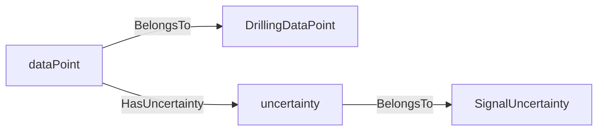
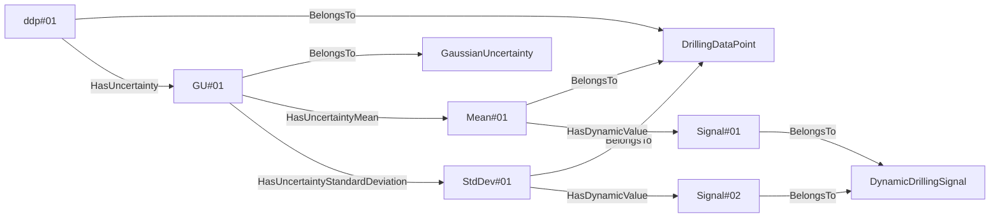
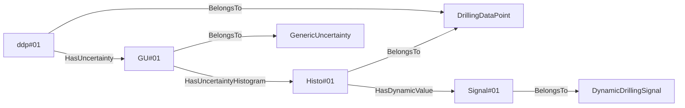
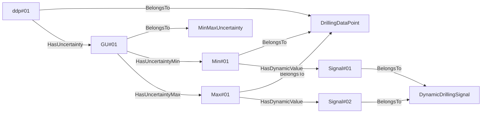
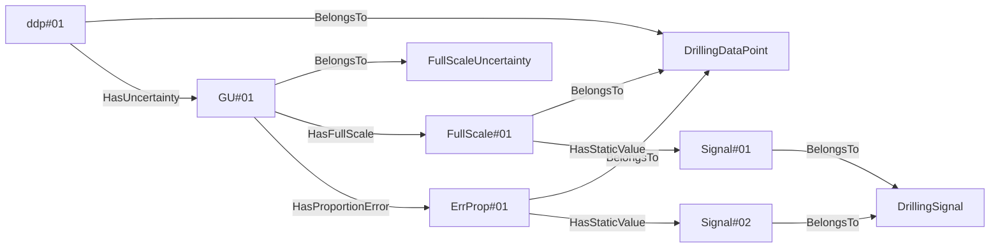
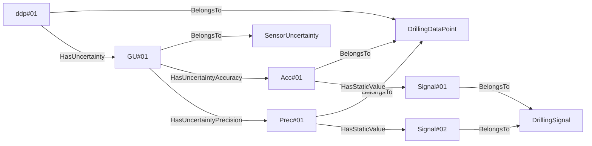
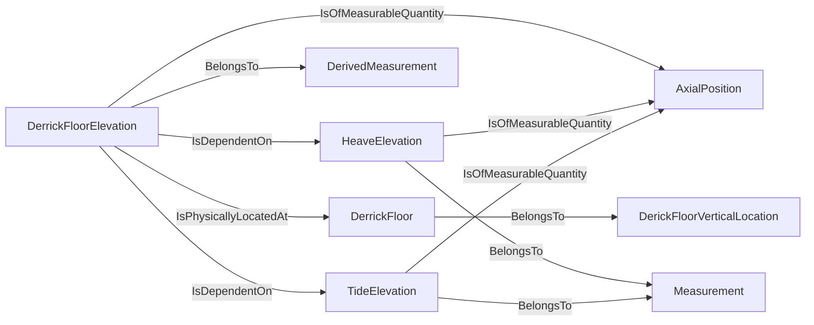
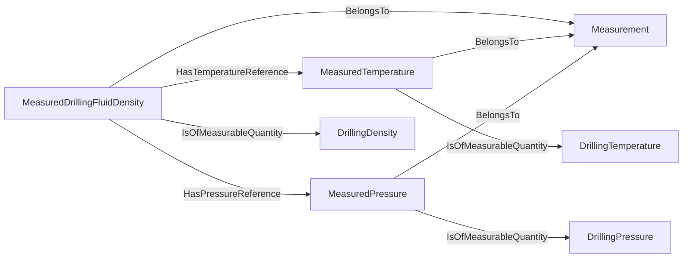
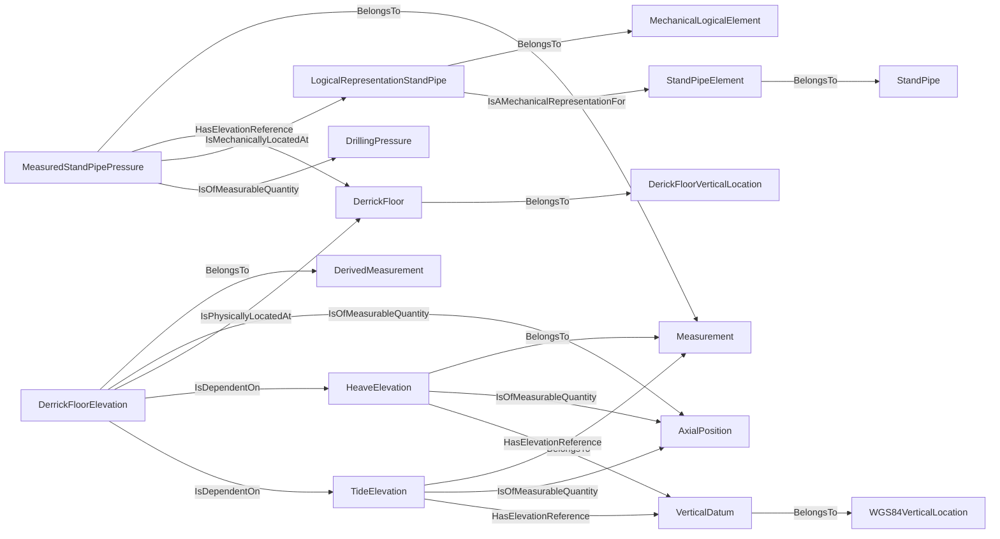
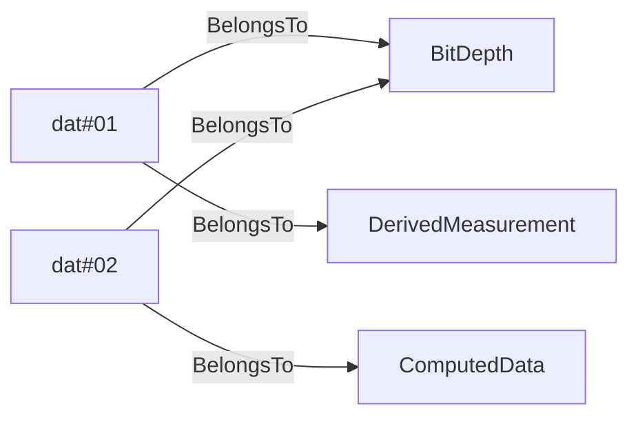

# Definition sets
## ADCS<!-- DEFINITION SET HEADER -->
- Description: 
this category refers to the various functions an ADCS implements. It is to be used for the ADCS capability description.

## DataDependencies<!-- DEFINITION SET HEADER -->
- Description: 
this definition set covers the physical dependence of a `DrillingDatPoint` on something else.

## DataFlow<!-- DEFINITION SET HEADER -->
- Description: 
this category refers to the data processing. It should probably be renamed accordingly. It should define and organize the different types of processing encountered during drilling operations. A Thursday session was devoted to those items. Note that in the current version, control flow is also included: a controller is seen as a special type of processing unit, that generates commands based on measurements and set-points. This can of course be modified if deemed necessary. Note also that transmission is included there as well. A telemetry system is seen as a processing unit that only duplicates a signal, and a delay is associated to the duplication process. While this is a useful way of looking at telemetry, it is probably not intuitive enough.

## DataProviders<!-- DEFINITION SET HEADER -->
- Description: 
description of the different actors involved in the well construction process

## DataTransmission<!-- DEFINITION SET HEADER -->
- Description: 
this category contains all nouns and verbs used to describe the rig's telemetry, for each signal. Downhole telemetry has focus.

## DataValidity<!-- DEFINITION SET HEADER -->
- Description: 
this category contains all the nouns and verbs used to described the validity of signals. Some signals are for example only valid while off-slips, downhole signals transmitted via mud-pulse telemetry require circulation.

## DrillingDataSemantics<!-- DEFINITION SET HEADER -->
- Description: 
this is the part associated to the signal's description themselves. Dimensionality, data type are the main items to be described.

## DrillingEquipment<!-- DEFINITION SET HEADER -->
- Description: 
in this category fall all the standard equipment encountered on a drilling rig. Note that the goal of the vocabulary is not to provide a detailed description of the rig. Therefore we only consider nouns that can help providing a signal context.

## DrillingIncident<!-- DEFINITION SET HEADER -->
- Description: 
this category refers mostly to the description of drilling incidents.

## DWISSemantics<!-- DEFINITION SET HEADER -->
- Description: 
definitions of the base noun and verb. All verbs and nouns in the DWIS vocabulary are children of those.

## EndPoints<!-- DEFINITION SET HEADER -->
- Description: 
this is the part associated to the description of external end-points.

## Hydraulics<!-- DEFINITION SET HEADER -->
- Description: 
this part refers to the hydraulic circuit, and should only contain the "abstract" or conceptual part of the vocabulary. Additional nouns coming from the drilling equipment category will be used when constructing the semantic graphs.

## MechanicalModel<!-- DEFINITION SET HEADER -->
- Description: 
specialized vocabulary for the modelling of the drilling mechanics. Covers in particular the so-called torque and drag models

## Mechanics<!-- DEFINITION SET HEADER -->
- Description: 
this part refers to the mechanical circuit, and should only contain the "abstract" or conceptual part of the vocabulary. Additional nouns coming from the drilling equipment category will be used when constructing the semantic graphs.

## Model<!-- DEFINITION SET HEADER -->
- Description: 
high level and generic vocabulary for mathematical models of the drilling process

## PhysicalLocation<!-- DEFINITION SET HEADER -->
- Description: 
this category contains the vocabulary necessary to specify the location of various items on a rig. Coordinate systems are the main element here.

## Quantities<!-- DEFINITION SET HEADER -->
- Description: 
quantities and units

## SignalPrototypes<!-- DEFINITION SET HEADER -->
- Description: 
this is description set for specialization of signa prototypes.

## TimeManagement<!-- DEFINITION SET HEADER -->
- Description: 
this category referes mostly to the description of the various clocks that can be encoutered on a rig, and their synchronization status with respect to each other.

## Uncertainty<!-- DEFINITION SET HEADER -->
- Description: 
this category contains the nouns and verbs required to describe the various types of uncertainty attached to drilling signals. Uncertainties can be related to sensor characteristics, calculations, model calibration, data assimilation.

# Nouns
## ActivableFunction <!-- NOUN -->
- Display name: Activable Function
- Parent class: [DWISNoun](#DWISNoun)
- Description: 

- Definition set: ADCS
- Examples:
## RunnableFunction <!-- NOUN -->
- Display name: Runnable Function
- Parent class: [ActivableFunction](#ActivableFunction)
- Attributes:
  - MainFunction
    - Type: string
    - Description: 
  - AuxiliaryFunction
    - Type: string
    - Description: 
- Description: 

- Definition set: ADCS
- Examples:
## ProtectionFunction <!-- NOUN -->
- Display name: Protection Function
- Parent class: [ActivableFunction](#ActivableFunction)
- Description: 

- Definition set: ADCS
- Examples:
## FDIRFunction <!-- NOUN -->
- Display name: FDIR Function
- Parent class: [ProtectionFunction](#ProtectionFunction)
- Description: 

- Definition set: ADCS
- Examples:
## SOEFunction <!-- NOUN -->
- Display name: SOE Function
- Parent class: [ProtectionFunction](#ProtectionFunction)
- Description: 

- Definition set: ADCS
- Examples:
## ControllerFunction <!-- NOUN -->
- Display name: Controller Function
- Parent class: [RunnableFunction](#RunnableFunction)
- Description: 

- Definition set: ADCS
- Examples:
## ProcedureFunction <!-- NOUN -->
- Display name: Procedure Function
- Parent class: [RunnableFunction](#RunnableFunction)
- Description: 

- Definition set: ADCS
- Examples:
## DataFlowNode <!-- NOUN -->
- Display name: DataFlowNode
- Parent class: [DWISNoun](#DWISNoun)
- Description: 

- Definition set: DataFlow
- Examples:
## Plan <!-- NOUN -->
- Display name: Plan
- Parent class: [DataFlowNode](#DataFlowNode)
- Description: 

- Definition set: DataFlow
- Examples:
## OperationalPlan <!-- NOUN -->
- Display name: OperationalPlan
- Parent class: [Plan](#Plan)
- Description: 

- Definition set: DataFlow
- Examples:
## DrillingProgram <!-- NOUN -->
- Display name: DrillingProgram
- Parent class: [Plan](#Plan)
- Description: 

- Definition set: DataFlow
- Examples:
## RigActionPlan <!-- NOUN -->
- Display name: RigActionPlan
- Parent class: [Plan](#Plan)
- Description: 

- Definition set: DataFlow
- Examples:
## ComputedState <!-- NOUN -->
- Display name: ComputedState
- Parent class: [ComputationUnit](#ComputationUnit)
- Description: 
A state represents the current configuation of a system.
- Definition set: DataFlow
- Examples:
## ProceduralState <!-- NOUN -->
- Display name: ComputedProceduralState
- Parent class: [ComputedState](#ComputedState)
- Description: 

- Definition set: DataFlow
- Examples:
## ProcessState <!-- NOUN -->
- Display name: ComputedProcessState
- Parent class: [ComputedState](#ComputedState)
- Description: 

- Definition set: DataFlow
- Examples:
## PhysicalState <!-- NOUN -->
- Display name: ComputedPhysicalState
- Parent class: [ComputedState](#ComputedState)
- Description: 

- Definition set: DataFlow
- Examples:
## ComputationUnit <!-- NOUN -->
- Display name: ComputationUnit
- Parent class: [DataFlowNode](#DataFlowNode)
- Description: 
Denotes a complex computation unit, typically based on advanced numerical modeling
- Definition set: DataFlow
- Examples:
## Advisor <!-- NOUN -->
- Display name: Advisor
- Parent class: [ComputationUnit](#ComputationUnit)
- Attributes:
  - AdviceType
    - Type: string
    - Description: 
- Description: 

- Definition set: DataFlow
- Examples:
## Simulator <!-- NOUN -->
- Display name: Simulator
- Parent class: [ComputationUnit](#ComputationUnit)
- Description: 

- Definition set: DataFlow
- Examples:
## Controller <!-- NOUN -->
- Display name: Controller
- Parent class: [DataFlowNode](#DataFlowNode)
- Description: 

- Definition set: DataFlow
- Examples:
## ControlSystem <!-- NOUN -->
- Display name: ControlSystem
- Parent class: [DataFlowNode](#DataFlowNode)
- Description: 

- Definition set: DataFlow
- Examples:
## DrawWorksControlSystem <!-- NOUN -->
- Display name: DrawWorksControlSystem
- Parent class: [ControlSystem](#ControlSystem)
- Description: 

- Definition set: DataFlow
- Examples:
## MudPumpsControlSystem <!-- NOUN -->
- Display name: MudPumpsControlSystem
- Parent class: [ControlSystem](#ControlSystem)
- Description: 

- Definition set: DataFlow
- Examples:
## TopDriveControlSystem <!-- NOUN -->
- Display name: TopDriveControlSystem
- Parent class: [ControlSystem](#ControlSystem)
- Description: 

- Definition set: DataFlow
- Examples:
## BOPControlSystem <!-- NOUN -->
- Display name: BOPControlSystem
- Parent class: [ControlSystem](#ControlSystem)
- Description: 

- Definition set: DataFlow
- Examples:
## RigChokeControlSystem <!-- NOUN -->
- Display name: RigChokeControlSystem
- Parent class: [ControlSystem](#ControlSystem)
- Description: 

- Definition set: DataFlow
- Examples:
## MeasurementDevice <!-- NOUN -->
- Display name: MeasurementDevice
- Parent class: [DataFlowNode](#DataFlowNode)
- Description: 
Denotes a physical sensor
- Definition set: DataFlow
- Examples:
## Transformation <!-- NOUN -->
- Display name: Transformation
- Parent class: [DataFlowNode](#DataFlowNode)
- Description: 
Represents a transformation applied to some signals that produces other signals
- Definition set: DataFlow
- Examples:
## DirectTransformation <!-- NOUN -->
- Display name: DirectTransformation
- Parent class: [Transformation](#Transformation)
- Description: 
Direct transformations are performed using only the current value of their inputs, time is not involved
- Definition set: DataFlow
- Examples:
## Aggregation <!-- NOUN -->
- Display name: Aggregation
- Parent class: [DirectTransformation](#DirectTransformation)
- Description: 

- Definition set: DataFlow
- Examples:
## ForceFromLoadPinsTransformation <!-- NOUN -->
- Display name: ForceFromLoadPinsTransformation
- Parent class: [DirectTransformation](#DirectTransformation)
- Description: 

- Definition set: DataFlow
- Examples:
## ForceToLoadTransformation <!-- NOUN -->
- Display name: ForceToLoadTransformation
- Parent class: [DirectTransformation](#DirectTransformation)
- Description: 

- Definition set: DataFlow
- Examples:
## MeasuredDepthToTrueVerticalDepthTransformation <!-- NOUN -->
- Display name: MeasuredDepthToTrueVerticalDepthTransformation
- Parent class: [DirectTransformation](#DirectTransformation)
- Description: 

- Definition set: DataFlow
- Examples:
## MeasuredDepthTranslation <!-- NOUN -->
- Display name: MeasuredDepthTranslation
- Parent class: [DirectTransformation](#DirectTransformation)
- Description: 

- Definition set: DataFlow
- Examples:
## PressureToEquivalentDensityTransformation <!-- NOUN -->
- Display name: PressureToEquivalentDensityTransformation
- Parent class: [DirectTransformation](#DirectTransformation)
- Description: 

- Definition set: DataFlow
- Examples:
## PressureToForceTransformation <!-- NOUN -->
- Display name: PressureToForceTransformation
- Parent class: [DirectTransformation](#DirectTransformation)
- Description: 

- Definition set: DataFlow
- Examples:
## TorqueToForceTransformation <!-- NOUN -->
- Display name: TorqueToForceTransformation
- Parent class: [DirectTransformation](#DirectTransformation)
- Description: 

- Definition set: DataFlow
- Examples:
## SignalProcessingUnit <!-- NOUN -->
- Display name: SignalProcessingUnit
- Parent class: [Transformation](#Transformation)
- Description: 
Represent any signal processing applied prior to the distribution of the considered signal. Signal processing refers to e.g. noise removal, filtering,..
- Definition set: DataFlow
- Examples:
## Filter <!-- NOUN -->
- Display name: Filter
- Parent class: [SignalProcessingUnit](#SignalProcessingUnit)
- Description: 

- Definition set: DataFlow
- Examples:
## BandPassFilter <!-- NOUN -->
- Display name: BandPassFilter
- Parent class: [Filter](#Filter)
- Attributes:
  - MinFrequency
    - Type: double
    - Description: 
  - MaxFrequency
    - Type: double
    - Description: 
- Description: 

- Definition set: DataFlow
- Examples:
## HighPassFilter <!-- NOUN -->
- Display name: HighPassFilter
- Parent class: [Filter](#Filter)
- Attributes:
  - CutOffFrequency
    - Type: double
    - Description: 
- Description: 

- Definition set: DataFlow
- Examples:
## LowPassFilter <!-- NOUN -->
- Display name: LowPassFilter
- Parent class: [Filter](#Filter)
- Attributes:
  - CutOffFrequency
    - Type: double
    - Description: 
- Description: 

- Definition set: DataFlow
- Examples:
## MovingAverage <!-- NOUN -->
- Display name: MovingAverage
- Parent class: [Filter](#Filter)
- Description: 

- Definition set: DataFlow
- Examples:
## MovingStandardDeviation <!-- NOUN -->
- Display name: MovingStandardDeviation
- Parent class: [Filter](#Filter)
- Description: 

- Definition set: DataFlow
- Examples:
## MovingMin <!-- NOUN -->
- Display name: MovingMin
- Parent class: [Filter](#Filter)
- Description: 

- Definition set: DataFlow
- Examples:
## MovingMax <!-- NOUN -->
- Display name: MovingMax
- Parent class: [Filter](#Filter)
- Description: 

- Definition set: DataFlow
- Examples:
## NumberOfSampleMovingAverage <!-- NOUN -->
- Display name: NumberOfSampleMovingAverage
- Parent class: [MovingAverage](#MovingAverage)
- Attributes:
  - NumberOfSamples
    - Type: int
    - Description: 
- Description: 

- Definition set: DataFlow
- Examples:
## TimeWindowMovingAverage <!-- NOUN -->
- Display name: TimeWindowMovingAverage
- Parent class: [MovingAverage](#MovingAverage)
- Attributes:
  - TimeWindow
    - Type: double
    - Description: 
- Description: 

- Definition set: DataFlow
- Examples:
## TimeBasedTransformation <!-- NOUN -->
- Display name: TimeBasedTransformation
- Parent class: [Transformation](#Transformation)
- Description: 
Transformations that apply only to time series: time derivations, time integration, averaging...
- Definition set: DataFlow
- Examples:
## Buffering <!-- NOUN -->
- Display name: Buffering
- Parent class: [TimeBasedTransformation](#TimeBasedTransformation)
- Attributes:
  - BufferingInterval
    - Type: double
    - Description: 
- Description: 

- Definition set: DataFlow
- Examples:
## Derivation <!-- NOUN -->
- Display name: Derivation
- Parent class: [TimeBasedTransformation](#TimeBasedTransformation)
- Description: 

- Definition set: DataFlow
- Examples:
## Integration <!-- NOUN -->
- Display name: Integration
- Parent class: [TimeBasedTransformation](#TimeBasedTransformation)
- Description: 

- Definition set: DataFlow
- Examples:
## RangeExtraction <!-- NOUN -->
- Display name: RangeExtraction
- Parent class: [TimeBasedTransformation](#TimeBasedTransformation)
- Description: 

- Definition set: DataFlow
- Examples:
## NumberOfItemsRangeExtraction <!-- NOUN -->
- Display name: NumberOfItemsRangeExtraction
- Parent class: [RangeExtraction](#RangeExtraction)
- Attributes:
  - NumberOfItems
    - Type: int
    - Description: 
- Description: 

- Definition set: DataFlow
- Examples:
## TimeWindowRangeExtraction <!-- NOUN -->
- Display name: TimeWindowRangeExtraction
- Parent class: [RangeExtraction](#RangeExtraction)
- Attributes:
  - TimeWindow
    - Type: double
    - Description: 
- Description: 

- Definition set: DataFlow
- Examples:
## Resampling <!-- NOUN -->
- Display name: Resampling
- Parent class: [TimeBasedTransformation](#TimeBasedTransformation)
- Attributes:
  - ResamplingRate
    - Type: double
    - Description: 
  - ResamplingDelay
    - Type: double
    - Description: 
  - Validity
    - Type: double
    - Description: 
- Description: 

- Definition set: DataFlow
- Examples:
## TransmissionLine <!-- NOUN -->
- Display name: TransmissionLine
- Parent class: [DataFlowNode](#DataFlowNode)
- Description: 

- Definition set: DataFlow
- Examples:
## UserInterface <!-- NOUN -->
- Display name: UserInterface
- Parent class: [DataFlowNode](#DataFlowNode)
- Description: 

- Definition set: DataFlow
- Examples:
## DataProvider <!-- NOUN -->
- Display name: DataProvider
- Parent class: [DWISNoun](#DWISNoun)
- Attributes:
  - ProviderName
    - Type: string
    - Description: 
- Description: 
A data provider is any sources for data
- Definition set: DataProviders
- Examples:
## OperatingCompany <!-- NOUN -->
- Display name: OperatingCompany
- Parent class: [DataProvider](#DataProvider)
- Attributes:
  - ProviderName
    - Type: string
    - Description: 
- Description: 
An operating company is an entity that holds the rights to explore, develop, and produce hydrocarbon resources from a particular oil or gas field or lease
- Definition set: DataProviders
- Examples:
## ServiceCompany <!-- NOUN -->
- Display name: ServiceCompany
- Parent class: [DataProvider](#DataProvider)
- Attributes:
  - ProviderName
    - Type: string
    - Description: 
- Description: 
A service company is an entity that provides services during the well construction.
- Definition set: DataProviders
- Examples:
## DirectionalServiceCompany <!-- NOUN -->
- Display name: DirectionalServiceCompany
- Parent class: [ServiceCompany](#ServiceCompany)
- Attributes:
  - ProviderName
    - Type: string
    - Description: 
- Description: 
A directional service company is an entity that provides services for downhole directional drilling and downhole measurements.
- Definition set: DataProviders
- Examples:
## DrillingFluidProvider <!-- NOUN -->
- Display name: DrillingFluidProvider
- Parent class: [ServiceCompany](#ServiceCompany)
- Attributes:
  - ProviderName
    - Type: string
    - Description: 
- Description: 
A drilling fluid provider is a company that provides and maintains the drilling fluids during well construction.
- Definition set: DataProviders
- Examples:
## LoggingServiceCompany <!-- NOUN -->
- Display name: LoggingServiceCompany
- Parent class: [ServiceCompany](#ServiceCompany)
- Attributes:
  - ProviderName
    - Type: string
    - Description: 
- Description: 
A logging service company is an entity that gathers measured information during well construction.
- Definition set: DataProviders
- Examples:
## CementingServiceCompany <!-- NOUN -->
- Display name: CementingServiceCompany
- Parent class: [ServiceCompany](#ServiceCompany)
- Attributes:
  - ProviderName
    - Type: string
    - Description: 
- Description: 

- Definition set: DataProviders
- Examples:
## DataAnalysisServiceCompany <!-- NOUN -->
- Display name: DataAnalysisServiceCompany
- Parent class: [ServiceCompany](#ServiceCompany)
- Attributes:
  - ProviderName
    - Type: string
    - Description: 
- Description: 
A data analysis service company is an entity that analyses measured data and provide new information from these measurements.
- Definition set: DataProviders
- Examples:
## DrillingContractor <!-- NOUN -->
- Display name: DrillingContractor
- Parent class: [DataProvider](#DataProvider)
- Attributes:
  - ProviderName
    - Type: string
    - Description: 
- Description: 

- Definition set: DataProviders
- Examples:
## DWISInternalService <!-- NOUN -->
- Display name: DWISInternalService
- Parent class: [DataProvider](#DataProvider)
- Attributes:
  - ProviderName
    - Type: string
    - Description: 
- Description: 
A DWIS internal service is an internal component of the DWIS infrastructure that generates information that can be used by any systems connected to the DWIS infrastructure.
- Definition set: DataProviders
- Examples:
## DWISDDHub <!-- NOUN -->
- Display name: DWISDDHub
- Parent class: [DWISInternalService](#DWISInternalService)
- Description: 

- Definition set: DataProviders
- Examples:
## DWISDrillingProcessStateInterpreter <!-- NOUN -->
- Display name: DWISDrillingProcessStateInterpreter
- Parent class: [DWISInternalService](#DWISInternalService)
- Description: 

- Definition set: DataProviders
- Examples:
## DWISAdviceComposer <!-- NOUN -->
- Display name: DWISAdviceComposer
- Parent class: [DWISInternalService](#DWISInternalService)
- Description: 

- Definition set: DataProviders
- Examples:
## DWISScheduler <!-- NOUN -->
- Display name: DWISScheduler
- Parent class: [DWISInternalService](#DWISInternalService)
- Description: 

- Definition set: DataProviders
- Examples:
## DWISContextualDataBuilder <!-- NOUN -->
- Display name: DWISContextualDataBuilder
- Parent class: [DWISInternalService](#DWISInternalService)
- Description: 

- Definition set: DataProviders
- Examples:
## DWISLogger <!-- NOUN -->
- Display name: DWISLogger
- Parent class: [DWISInternalService](#DWISInternalService)
- Description: 

- Definition set: DataProviders
- Examples:
## DWISADCSInterface <!-- NOUN -->
- Display name: DWISADCSInterface
- Parent class: [DWISInternalService](#DWISInternalService)
- Description: 

- Definition set: DataProviders
- Examples:
## DWISADCSCapabilityDescriptor <!-- NOUN -->
- Display name: DWISADCSCapabilityDescriptor
- Parent class: [DWISInternalService](#DWISInternalService)
- Description: 

- Definition set: DataProviders
- Examples:
## Telemetry <!-- NOUN -->
- Display name: Telemetry
- Parent class: [DWISNoun](#DWISNoun)
- Attributes:
  - NumberOfRepeaters
    - Type: int
    - Description: 
  - DistanceBetweenRepeaters
    - Type: double
    - Description: 
  - AverageDelayByRepeater
    - Type: double
    - Description: 
- Description: 
Technology used for transferring the data from its main origin.
- Definition set: DataTransmission
- Examples:
## DownHoleTelemetry <!-- NOUN -->
- Display name: DownHoleTelemetry
- Parent class: [Telemetry](#Telemetry)
- Description: 

- Definition set: DataTransmission
- Examples:
Technology that allows transfer of downhole data to the surface.
## MudPulseTelemetry <!-- NOUN -->
- Display name: MudPulseTelemetry
- Parent class: [DownHoleTelemetry](#DownHoleTelemetry)
- Description: 
A method that allows transfer of downhole data to the surface via pressure pulses sent trough the drilling fluid.
- Definition set: DataTransmission
- Examples:
NOV BlackStar II dual-telemetry MWD
## ElectromagneticTelemetry <!-- NOUN -->
- Display name: ElectromagneticTelemetry
- Parent class: [DownHoleTelemetry](#DownHoleTelemetry)
- Description: 
A method that allows transfer of downhole data to the surface via electromagnetic waves sent trough the drilling formation.
- Definition set: DataTransmission
- Examples:
APS SureShot-EM, NOV BlackStar II EM MWD
## WiredPipeTelemetry <!-- NOUN -->
- Display name: WiredPipeTelemetry
- Parent class: [DownHoleTelemetry](#DownHoleTelemetry)
- Description: 
A method that allows transfer of downhole data to the surface via electrical connections through the drill string.
- Definition set: DataTransmission
- Examples:
Intelliserv Wired Drill Pipe, Reelwell DualLink
## TopSideTelemetry <!-- NOUN -->
- Display name: TopSideTelemetry
- Parent class: [Telemetry](#Telemetry)
- Description: 
Method that allows transfer of data from surface systems.
- Definition set: DataTransmission
- Examples:
NOVOS, Cyberbase, DEAL
## ValidityCondition <!-- NOUN -->
- Display name: ValidityCondition
- Parent class: [DWISNoun](#DWISNoun)
- Description: 

- Definition set: DataValidity
- Examples:
## ConnectedCondition <!-- NOUN -->
- Display name: ConnectedCondition
- Parent class: [ValidityCondition](#ValidityCondition)
- Description: 

- Definition set: DataValidity
- Examples:
## EQ <!-- NOUN -->
- Display name: EQ
- Parent class: [ValidityCondition](#ValidityCondition)
- Description: 

- Definition set: DataValidity
- Examples:
## GT <!-- NOUN -->
- Display name: GT
- Parent class: [ValidityCondition](#ValidityCondition)
- Description: 

- Definition set: DataValidity
- Examples:
## LT <!-- NOUN -->
- Display name: LT
- Parent class: [ValidityCondition](#ValidityCondition)
- Description: 

- Definition set: DataValidity
- Examples:
## DataType <!-- NOUN -->
- Display name: DataType
- Parent class: [DWISNoun](#DWISNoun)
- Description: 

- Definition set: DrillingDataSemantics
- Examples:
## ContinuousDataType <!-- NOUN -->
- Display name: ContinuousDataType
- Parent class: [DataType](#DataType)
- Description: 

- Definition set: DrillingDataSemantics
- Examples:
## NormalizedDataType <!-- NOUN -->
- Display name: NormalizedDataType
- Parent class: [ContinuousDataType](#ContinuousDataType)
- Description: 
between 0 and 1
- Definition set: DrillingDataSemantics
- Examples:
## DiscreteDataType <!-- NOUN -->
- Display name: DiscreteDataType
- Parent class: [DataType](#DataType)
- Description: 

- Definition set: DrillingDataSemantics
- Examples:
## EnumerationDataType <!-- NOUN -->
- Display name: EnumerationDataType
- Parent class: [DiscreteDataType](#DiscreteDataType)
- Description: 

- Definition set: DrillingDataSemantics
- Examples:
## BooleanDataType <!-- NOUN -->
- Display name: BooleanDataType
- Parent class: [EnumerationDataType](#EnumerationDataType)
- Description: 

- Definition set: DrillingDataSemantics
- Examples:
## DrillingDataPoint <!-- NOUN -->
- Display name: DrillingDataPoint
- Parent class: [DWISNoun](#DWISNoun)
- Attributes:
  - IsValid
    - Type: bool
    - Description: 
- Description: 
Main type of DDHub data. Represents a drilling signal.
Can be a dynamic signal (linked to a ValueNode) or a static parameter. 
- Definition set: DrillingDataSemantics
- Examples:
## PrototypeData <!-- NOUN -->
- Display name: PrototypeData
- Parent class: [DrillingDataPoint](#DrillingDataPoint)
- Description: 

- Definition set: DrillingDataSemantics
- Examples:
## ProcessData <!-- NOUN -->
- Display name: ProcessData
- Parent class: [DrillingDataPoint](#DrillingDataPoint)
- Description: 

- Definition set: DrillingDataSemantics
- Examples:
## SetPoint <!-- NOUN -->
- Display name: Set-point
- Parent class: [ProcessData](#ProcessData)
- Description: 

- Definition set: DrillingDataSemantics
- Examples:
## Command <!-- NOUN -->
- Display name: Command
- Parent class: [ProcessData](#ProcessData)
- Description: 

- Definition set: DrillingDataSemantics
- Examples:
## Recommendation <!-- NOUN -->
- Display name: Recommendation
- Parent class: [ProcessData](#ProcessData)
- Description: 

- Definition set: DrillingDataSemantics
- Examples:
## RecommendedTarget <!-- NOUN -->
- Display name: RecommendedTarget
- Parent class: [Recommendation](#Recommendation)
- Description: 

- Definition set: DrillingDataSemantics
- Examples:
## RecommendedMinimum <!-- NOUN -->
- Display name: RecommendedMinimum
- Parent class: [Recommendation](#Recommendation)
- Description: 

- Definition set: DrillingDataSemantics
- Examples:
## RecommendedMaximum <!-- NOUN -->
- Display name: RecommendedMaximum
- Parent class: [Recommendation](#Recommendation)
- Description: 

- Definition set: DrillingDataSemantics
- Examples:
## Advice <!-- NOUN -->
- Display name: Advice
- Parent class: [ProcessData](#ProcessData)
- Description: 

- Definition set: DrillingDataSemantics
- Examples:
## AdvisedTarget <!-- NOUN -->
- Display name: AdvisedTarget
- Parent class: [Advice](#Advice)
- Description: 

- Definition set: DrillingDataSemantics
- Examples:
## AdvisedMinimum <!-- NOUN -->
- Display name: AdvisedMinimum
- Parent class: [Advice](#Advice)
- Description: 

- Definition set: DrillingDataSemantics
- Examples:
## AdvisedMaximum <!-- NOUN -->
- Display name: AdvisedMaximum
- Parent class: [Advice](#Advice)
- Description: 

- Definition set: DrillingDataSemantics
- Examples:
## Limit <!-- NOUN -->
- Display name: Limit
- Parent class: [ProcessData](#ProcessData)
- Description: 

- Definition set: DrillingDataSemantics
- Examples:
## MinimumLimit <!-- NOUN -->
- Display name: Minimum Limit
- Parent class: [Limit](#Limit)
- Description: 

- Definition set: DrillingDataSemantics
- Examples:
## MaximumLimit <!-- NOUN -->
- Display name: Maximum Limit
- Parent class: [Limit](#Limit)
- Description: 

- Definition set: DrillingDataSemantics
- Examples:
## PhysicalData <!-- NOUN -->
- Display name: PhysicalData
- Parent class: [DrillingDataPoint](#DrillingDataPoint)
- Description: 

- Definition set: DrillingDataSemantics
- Examples:
## Measurement <!-- NOUN -->
- Display name: Measurement
- Parent class: [PhysicalData](#PhysicalData)
- Description: 
The noun Measurement represents individuals that are measured by some instrument and which value can be compared with another measurement.
- Definition set: DrillingDataSemantics
- Examples:
## DerivedMeasurement <!-- NOUN -->
- Display name: DerivedMeasurement
- Parent class: [Measurement](#Measurement)
- Description: 

- Definition set: DrillingDataSemantics
- Examples:
## CorrectedMeasurement <!-- NOUN -->
- Display name: CorrectedMeasurement
- Parent class: [Measurement](#Measurement)
- Description: 

- Definition set: DrillingDataSemantics
- Examples:
## ComputedData <!-- NOUN -->
- Display name: ComputedData
- Parent class: [PhysicalData](#PhysicalData)
- Description: 

- Definition set: DrillingDataSemantics
- Examples:
## DrillingSignal <!-- NOUN -->
- Display name: DrillingSignal
- Parent class: [DWISNoun](#DWISNoun)
- Attributes:
  - Value
    - Type: object
    - Description: 
- Description: 
Data structure used to store the streaming drilling data.
- Definition set: DrillingDataSemantics
- Examples:
## DynamicDrillingSignal <!-- NOUN -->
- Display name: DynamicDrillingSignal
- Parent class: [DrillingSignal](#DrillingSignal)
- Attributes:
  - TimeStampAtSource
    - Type: DateTime
    - Description: this is a UTC date-time value corresponding to the time at which the value has been taken.
  - TimeStampAcquisition
    - Type: DateTime
    - Description: this is a UTC date-time value at which the value has been acquired by the data acquisition system.
- Description: 

- Definition set: DrillingDataSemantics
- Examples:
## DrillingEquipment <!-- NOUN -->
- Display name: DrillingEquipment
- Parent class: [DWISNoun](#DWISNoun)
- Description: 

- Definition set: DrillingEquipment
- Examples:
## Pit <!-- NOUN -->
- Display name: Pit
- Parent class: [DrillingEquipment](#DrillingEquipment)
- Description: 

- Definition set: DrillingEquipment
- Examples:
## ActivePit <!-- NOUN -->
- Display name: ActivePit
- Parent class: [Pit](#Pit)
- Description: 

- Definition set: DrillingEquipment
- Examples:
## ReservePit <!-- NOUN -->
- Display name: ReservePit
- Parent class: [Pit](#Pit)
- Description: 

- Definition set: DrillingEquipment
- Examples:
## SlugPit <!-- NOUN -->
- Display name: SlugPit
- Parent class: [Pit](#Pit)
- Description: 

- Definition set: DrillingEquipment
- Examples:
## TripTank <!-- NOUN -->
- Display name: TripTank
- Parent class: [Pit](#Pit)
- Description: 

- Definition set: DrillingEquipment
- Examples:
## AnnulusTerminator <!-- NOUN -->
- Display name: AnnulusTerminator
- Parent class: [DrillingEquipment](#DrillingEquipment)
- Description: 

- Definition set: DrillingEquipment
- Examples:
## Riser <!-- NOUN -->
- Display name: Riser
- Parent class: [DrillingEquipment](#DrillingEquipment)
- Description: 

- Definition set: DrillingEquipment
- Examples:
## MarineRiser <!-- NOUN -->
- Display name: MarineRiser
- Parent class: [Riser](#Riser)
- Description: 

- Definition set: DrillingEquipment
- Examples:
## SurfaceRiser <!-- NOUN -->
- Display name: SurfaceRiser
- Parent class: [Riser](#Riser)
- Description: 

- Definition set: DrillingEquipment
- Examples:
## LowPressureRiser <!-- NOUN -->
- Display name: LowPressureRiser
- Parent class: [SurfaceRiser](#SurfaceRiser)
- Description: 

- Definition set: DrillingEquipment
- Examples:
## HighPressureRiser <!-- NOUN -->
- Display name: HighPressureRiser
- Parent class: [SurfaceRiser](#SurfaceRiser)
- Description: 

- Definition set: DrillingEquipment
- Examples:
## SlipJoint <!-- NOUN -->
- Display name: SlipJoint
- Parent class: [DrillingEquipment](#DrillingEquipment)
- Description: 

- Definition set: DrillingEquipment
- Examples:
## BellNipple <!-- NOUN -->
- Display name: BellNipple
- Parent class: [AnnulusTerminator](#AnnulusTerminator)
- Description: 

- Definition set: DrillingEquipment
- Examples:
## Diverter <!-- NOUN -->
- Display name: Diverter
- Parent class: [AnnulusTerminator](#AnnulusTerminator)
- Description: 

- Definition set: DrillingEquipment
- Examples:
## FlowLine <!-- NOUN -->
- Display name: FlowLine
- Parent class: [DrillingEquipment](#DrillingEquipment)
- Description: 

- Definition set: DrillingEquipment
- Examples:
## RotatingControlDevice <!-- NOUN -->
- Display name: RotatingControlDevice
- Parent class: [DrillingEquipment](#DrillingEquipment)
- Description: 

- Definition set: DrillingEquipment
- Examples:
## IsolationSeal <!-- NOUN -->
- Display name: IsolationSeal
- Parent class: [DrillingEquipment](#DrillingEquipment)
- Description: 

- Definition set: DrillingEquipment
- Examples:
## BlowOutPreventerStack <!-- NOUN -->
- Display name: BlowOutPreventerStack
- Parent class: [DrillingEquipment](#DrillingEquipment)
- Description: 

- Definition set: DrillingEquipment
- Examples:
## BlowOutPreventerElement <!-- NOUN -->
- Display name: BlowOutPreventerElement
- Parent class: [DrillingEquipment](#DrillingEquipment)
- Description: 

- Definition set: DrillingEquipment
- Examples:
## AnnularPreventer <!-- NOUN -->
- Display name: AnnularPreventer
- Parent class: [BlowOutPreventerElement](#BlowOutPreventerElement)
- Description: 

- Definition set: DrillingEquipment
- Examples:
## BOPRam <!-- NOUN -->
- Display name: BOPRam
- Parent class: [BlowOutPreventerElement](#BlowOutPreventerElement)
- Description: 

- Definition set: DrillingEquipment
- Examples:
## BOPShearRam <!-- NOUN -->
- Display name: BOPShearRam
- Parent class: [BlowOutPreventerElement](#BlowOutPreventerElement)
- Description: 

- Definition set: DrillingEquipment
- Examples:
## DrillStemTerminator <!-- NOUN -->
- Display name: DrillStemTerminator
- Parent class: [DrillingEquipment](#DrillingEquipment)
- Description: 

- Definition set: DrillingEquipment
- Examples:
## Bit <!-- NOUN -->
- Display name: Bit
- Parent class: [DrillStemTerminator](#DrillStemTerminator)
- Description: 

- Definition set: DrillingEquipment
- Examples:
## BullNose <!-- NOUN -->
- Display name: BullNose
- Parent class: [DrillStemTerminator](#DrillStemTerminator)
- Description: 

- Definition set: DrillingEquipment
- Examples:
## CasingShoe <!-- NOUN -->
- Display name: CasingShoe
- Parent class: [DrillStemTerminator](#DrillStemTerminator)
- Description: 

- Definition set: DrillingEquipment
- Examples:
## Dolly <!-- NOUN -->
- Display name: Dolly
- Parent class: [DrillingEquipment](#DrillingEquipment)
- Description: 

- Definition set: DrillingEquipment
- Examples:
## DollyRail <!-- NOUN -->
- Display name: DollyRail
- Parent class: [DrillingEquipment](#DrillingEquipment)
- Description: 

- Definition set: DrillingEquipment
- Examples:
## DrillLine <!-- NOUN -->
- Display name: DrillLine
- Parent class: [DrillingEquipment](#DrillingEquipment)
- Description: 

- Definition set: DrillingEquipment
- Examples:
## ActiveLine <!-- NOUN -->
- Display name: ActiveLine
- Parent class: [DrillLine](#DrillLine)
- Description: 

- Definition set: DrillingEquipment
- Examples:
## DeadLine <!-- NOUN -->
- Display name: DeadLine
- Parent class: [DrillLine](#DrillLine)
- Description: 

- Definition set: DrillingEquipment
- Examples:
## SupportLine <!-- NOUN -->
- Display name: SupportLine
- Parent class: [DrillLine](#DrillLine)
- Description: 

- Definition set: DrillingEquipment
- Examples:
## DrillLineFastener <!-- NOUN -->
- Display name: DrillLineFastener
- Parent class: [DrillingEquipment](#DrillingEquipment)
- Description: 

- Definition set: DrillingEquipment
- Examples:
## DeadLineAnchor <!-- NOUN -->
- Display name: DeadLineAnchor
- Parent class: [DrillLineFastener](#DrillLineFastener)
- Description: 

- Definition set: DrillingEquipment
- Examples:
## DrawWorks <!-- NOUN -->
- Display name: DrawWorks
- Parent class: [HoistingSystem](#HoistingSystem)
- Description: 

- Definition set: DrillingEquipment
- Examples:
## RackAndPinionHoistingSystem <!-- NOUN -->
- Display name: RackAndPinionHoistingSystem
- Parent class: [HoistingSystem](#HoistingSystem)
- Description: 

- Definition set: DrillingEquipment
- Examples:
## RamHoistingSystem <!-- NOUN -->
- Display name: RamHoistingSystem
- Parent class: [HoistingSystem](#HoistingSystem)
- Description: 

- Definition set: DrillingEquipment
- Examples:
## DrillStem <!-- NOUN -->
- Display name: DrillStem
- Parent class: [DrillingEquipment](#DrillingEquipment)
- Description: 

- Definition set: DrillingEquipment
- Examples:
## DrillString <!-- NOUN -->
- Display name: DrillString
- Parent class: [DrillStem](#DrillStem)
- Description: 

- Definition set: DrillingEquipment
- Examples:
## CasingString <!-- NOUN -->
- Display name: CasingString
- Parent class: [DrillStem](#DrillStem)
- Description: 

- Definition set: DrillingEquipment
- Examples:
## Liner <!-- NOUN -->
- Display name: Liner
- Parent class: [DrillStem](#DrillStem)
- Description: 

- Definition set: DrillingEquipment
- Examples:
## TubingString <!-- NOUN -->
- Display name: TubingString
- Parent class: [DrillStem](#DrillStem)
- Description: 

- Definition set: DrillingEquipment
- Examples:
## ScreenString <!-- NOUN -->
- Display name: ScreenString
- Parent class: [DrillStem](#DrillStem)
- Description: 

- Definition set: DrillingEquipment
- Examples:
## CoiledTubing <!-- NOUN -->
- Display name: CoiledTubing
- Parent class: [DrillStem](#DrillStem)
- Description: 

- Definition set: DrillingEquipment
- Examples:
## Elevator <!-- NOUN -->
- Display name: Elevator
- Parent class: [DrillingEquipment](#DrillingEquipment)
- Description: 

- Definition set: DrillingEquipment
- Examples:
## GateValve <!-- NOUN -->
- Display name: GateValve
- Parent class: [DrillingEquipment](#DrillingEquipment)
- Description: 

- Definition set: DrillingEquipment
- Examples:
## Choke <!-- NOUN -->
- Display name: Choke
- Parent class: [GateValve](#GateValve)
- Description: 

- Definition set: DrillingEquipment
- Examples:
## RigChoke <!-- NOUN -->
- Display name: RigChoke
- Parent class: [Choke](#Choke)
- Description: 

- Definition set: DrillingEquipment
- Examples:
## FloatValve <!-- NOUN -->
- Display name: FloatValve
- Parent class: [GateValve](#GateValve)
- Description: 

- Definition set: DrillingEquipment
- Examples:
## MPDChoke <!-- NOUN -->
- Display name: MPDChoke
- Parent class: [Choke](#Choke)
- Description: 

- Definition set: DrillingEquipment
- Examples:
## MechanicalBlock <!-- NOUN -->
- Display name: MechanicalBlock
- Parent class: [DrillingEquipment](#DrillingEquipment)
- Description: 

- Definition set: DrillingEquipment
- Examples:
## CrownBlock <!-- NOUN -->
- Display name: CrownBlock
- Parent class: [MechanicalBlock](#MechanicalBlock)
- Description: 

- Definition set: DrillingEquipment
- Examples:
## TravellingBlock <!-- NOUN -->
- Display name: TravellingBlock
- Parent class: [MechanicalBlock](#MechanicalBlock)
- Description: 

- Definition set: DrillingEquipment
- Examples:
## Pump <!-- NOUN -->
- Display name: Pump
- Parent class: [DrillingEquipment](#DrillingEquipment)
- Description: 

- Definition set: DrillingEquipment
- Examples:
## CementPump <!-- NOUN -->
- Display name: CementPump
- Parent class: [Pump](#Pump)
- Description: 

- Definition set: DrillingEquipment
- Examples:
## MudPump <!-- NOUN -->
- Display name: MudPump
- Parent class: [Pump](#Pump)
- Description: 

- Definition set: DrillingEquipment
- Examples:
## BoosterPump <!-- NOUN -->
- Display name: BoosterPump
- Parent class: [Pump](#Pump)
- Description: 

- Definition set: DrillingEquipment
- Examples:
## BackPressurePump <!-- NOUN -->
- Display name: BackPressurePump
- Parent class: [Pump](#Pump)
- Description: 

- Definition set: DrillingEquipment
- Examples:
## FillPump <!-- NOUN -->
- Display name: FillPump
- Parent class: [Pump](#Pump)
- Description: 

- Definition set: DrillingEquipment
- Examples:
## LiftPump <!-- NOUN -->
- Display name: LiftPump
- Parent class: [Pump](#Pump)
- Description: 

- Definition set: DrillingEquipment
- Examples:
## ShaleShakers <!-- NOUN -->
- Display name: ShaleShakers
- Parent class: [DrillingEquipment](#DrillingEquipment)
- Description: 

- Definition set: DrillingEquipment
- Examples:
## Slips <!-- NOUN -->
- Display name: Slips
- Parent class: [DrillingEquipment](#DrillingEquipment)
- Description: 

- Definition set: DrillingEquipment
- Examples:
## ManualSlips <!-- NOUN -->
- Display name: ManualSlips
- Parent class: [Slips](#Slips)
- Description: 

- Definition set: DrillingEquipment
- Examples:
## PowerSlips <!-- NOUN -->
- Display name: PowerSlips
- Parent class: [Slips](#Slips)
- Description: 

- Definition set: DrillingEquipment
- Examples:
## PneumaticSlips <!-- NOUN -->
- Display name: PneumaticSlips
- Parent class: [PowerSlips](#PowerSlips)
- Description: 

- Definition set: DrillingEquipment
- Examples:
## HydraulicSlips <!-- NOUN -->
- Display name: PneumaticSlips
- Parent class: [PowerSlips](#PowerSlips)
- Description: 

- Definition set: DrillingEquipment
- Examples:
## SurfacePipe <!-- NOUN -->
- Display name: SurfacePipe
- Parent class: [DrillingEquipment](#DrillingEquipment)
- Description: 

- Definition set: DrillingEquipment
- Examples:
## StandPipe <!-- NOUN -->
- Display name: StandPipe
- Parent class: [SurfacePipe](#SurfacePipe)
- Description: 

- Definition set: DrillingEquipment
- Examples:
## MudHose <!-- NOUN -->
- Display name: MudHose
- Parent class: [SurfacePipe](#SurfacePipe)
- Description: 

- Definition set: DrillingEquipment
- Examples:
## ThreeWayManifold <!-- NOUN -->
- Display name: ThreeWayManifold
- Parent class: [DrillingEquipment](#DrillingEquipment)
- Description: 

- Definition set: DrillingEquipment
- Obsolete: true
- Will be removed by: 12/31/2024
- Replaced by: ThreeWayValve
- Examples:
## ThreeWayValve <!-- NOUN -->
- Display name: ThreeWayValve
- Parent class: [DrillingEquipment](#DrillingEquipment)
- Description: 

- Definition set: DrillingEquipment
- Examples:
## ThreeWayValveInternalValve <!-- NOUN -->
- Display name: ThreeWayValveInternalValve
- Parent class: [DrillingEquipment](#DrillingEquipment)
- Description: 

- Definition set: DrillingEquipment
- Examples:
## StringRotationSystem <!-- NOUN -->
- Display name: StringRotationSystem
- Parent class: [DrillingEquipment](#DrillingEquipment)
- Description: 

- Definition set: DrillingEquipment
- Examples:
## RotaryTable <!-- NOUN -->
- Display name: RotaryTable
- Parent class: [StringRotationSystem](#StringRotationSystem)
- Description: 

- Definition set: DrillingEquipment
- Examples:
## Kelly <!-- NOUN -->
- Display name: Kelly
- Parent class: [DrillingEquipment](#DrillingEquipment)
- Description: 

- Definition set: DrillingEquipment
- Examples:
## TopDrive <!-- NOUN -->
- Display name: TopDrive
- Parent class: [StringRotationSystem](#StringRotationSystem)
- Description: 

- Definition set: DrillingEquipment
- Examples:
## TopDriveBody <!-- NOUN -->
- Display name: TopDriveBody
- Parent class: [DrillingEquipment](#DrillingEquipment)
- Description: 

- Definition set: DrillingEquipment
- Examples:
## TopDriveHook <!-- NOUN -->
- Display name: TopDriveHook
- Parent class: [DrillingEquipment](#DrillingEquipment)
- Description: 

- Definition set: DrillingEquipment
- Examples:
## TopDriveShaft <!-- NOUN -->
- Display name: TopDriveShaft
- Parent class: [DrillingEquipment](#DrillingEquipment)
- Description: 

- Definition set: DrillingEquipment
- Examples:
## HoleEnlargementElement <!-- NOUN -->
- Display name: HoleEnlargementElement
- Parent class: [DrillingEquipment](#DrillingEquipment)
- Description: 

- Definition set: DrillingEquipment
- Examples:
## UnderReamer <!-- NOUN -->
- Display name: UnderReamer
- Parent class: [HoleEnlargementElement](#HoleEnlargementElement)
- Description: 

- Definition set: DrillingEquipment
- Examples:
## HoleOpener <!-- NOUN -->
- Display name: HoleOpener
- Parent class: [HoleEnlargementElement](#HoleEnlargementElement)
- Description: 

- Definition set: DrillingEquipment
- Examples:
## CirculationSub <!-- NOUN -->
- Display name: CirculationSub
- Parent class: [DrillingEquipment](#DrillingEquipment)
- Description: 

- Definition set: DrillingEquipment
- Examples:
## PortedFloat <!-- NOUN -->
- Display name: PortedFloat
- Parent class: [DrillingEquipment](#DrillingEquipment)
- Description: 

- Definition set: DrillingEquipment
- Examples:
## Whipstock <!-- NOUN -->
- Display name: Whipstock
- Parent class: [DrillingEquipment](#DrillingEquipment)
- Description: 

- Definition set: DrillingEquipment
- Examples:
## Plug <!-- NOUN -->
- Display name: Plug
- Parent class: [DrillingEquipment](#DrillingEquipment)
- Description: 

- Definition set: DrillingEquipment
- Examples:
## BearingAssembly <!-- NOUN -->
- Display name: BearingAssembly
- Parent class: [DrillingEquipment](#DrillingEquipment)
- Description: 

- Definition set: DrillingEquipment
- Examples:
## MPDScreen <!-- NOUN -->
- Display name: MPDScreen
- Parent class: [DrillingEquipment](#DrillingEquipment)
- Description: 

- Definition set: DrillingEquipment
- Examples:
## HeaveCompensation <!-- NOUN -->
- Display name: HeaveCompensation
- Parent class: [DrillingEquipment](#DrillingEquipment)
- Description: 

- Definition set: DrillingEquipment
- Examples:
## HoistingSystem <!-- NOUN -->
- Display name: HoistingSystem
- Parent class: [DrillingEquipment](#DrillingEquipment)
- Description: 

- Definition set: DrillingEquipment
- Examples:
## Rig <!-- NOUN -->
- Display name: Rig
- Parent class: [DrillingEquipment](#DrillingEquipment)
- Description: 

- Definition set: DrillingEquipment
- Examples:
## Sea <!-- NOUN -->
- Display name: Sea
- Parent class: [DrillingEquipment](#DrillingEquipment)
- Description: 

- Definition set: DrillingEquipment
- Examples:
## Ground <!-- NOUN -->
- Display name: Ground
- Parent class: [DrillingEquipment](#DrillingEquipment)
- Description: 

- Definition set: DrillingEquipment
- Examples:
## DrillingIncident <!-- NOUN -->
- Display name: DrillingIncident
- Parent class: [DWISNoun](#DWISNoun)
- Description: 

- Definition set: DrillingIncident
- Examples:
## TwistOff <!-- NOUN -->
- Display name: TwistOff
- Parent class: [DrillingIncident](#DrillingIncident)
- Description: 

- Definition set: DrillingIncident
- Examples:
## Overpull <!-- NOUN -->
- Display name: Overpull
- Parent class: [DrillingIncident](#DrillingIncident)
- Description: 

- Definition set: DrillingIncident
- Examples:
## Underpull <!-- NOUN -->
- Display name: Underpull
- Parent class: [DrillingIncident](#DrillingIncident)
- Description: 

- Definition set: DrillingIncident
- Examples:
## Influx <!-- NOUN -->
- Display name: Influx
- Parent class: [DrillingIncident](#DrillingIncident)
- Description: 

- Definition set: DrillingIncident
- Examples:
## LossCirculation <!-- NOUN -->
- Display name: LossCirculation
- Parent class: [DrillingIncident](#DrillingIncident)
- Description: 

- Definition set: DrillingIncident
- Examples:
## HoleCollapse <!-- NOUN -->
- Display name: HoleCollapse
- Parent class: [DrillingIncident](#DrillingIncident)
- Description: 

- Definition set: DrillingIncident
- Examples:
## StuckPipe <!-- NOUN -->
- Display name: StuckPipe
- Parent class: [DrillingIncident](#DrillingIncident)
- Description: 

- Definition set: DrillingIncident
- Examples:
## PipeWashout <!-- NOUN -->
- Display name: PipeWashout
- Parent class: [DrillingIncident](#DrillingIncident)
- Description: 

- Definition set: DrillingIncident
- Examples:
## FormationWashout <!-- NOUN -->
- Display name: FormationWashout
- Parent class: [DrillingIncident](#DrillingIncident)
- Description: 

- Definition set: DrillingIncident
- Examples:
## OverTorque <!-- NOUN -->
- Display name: OverTorque
- Parent class: [DrillingIncident](#DrillingIncident)
- Description: 

- Definition set: DrillingIncident
- Examples:
## Plugged <!-- NOUN -->
- Display name: Plugged
- Parent class: [DrillingIncident](#DrillingIncident)
- Description: 

- Definition set: DrillingIncident
- Examples:
## DWISNoun <!-- NOUN -->
- Display name: DWIS noun
- Description: 
Nouns refer to the nature of a node in the graph. Implicitely a noun refers to a "is a" relation between the instance node and the noun. This is the root class for all the nouns defined in the DWIS vocabulary.
- Definition set: DWISSemantics
- Examples:
`DWISNoun` is not really intended to be used directly neither when defining semantic facts nor in sparql queries.
## DataEndPoint <!-- NOUN -->
- Display name: DataEndPoint
- Parent class: [DWISNoun](#DWISNoun)
- Attributes:
  - EndPointDescription
    - Type: string
    - Description: 
- Description: 

- Definition set: EndPoints
- Examples:
## WitsMLTimeBasedLogEndPoint <!-- NOUN -->
- Display name: WitsMLTimeBasedLogEndPoint
- Parent class: [DataEndPoint](#DataEndPoint)
- Attributes:
  - WellUID
    - Type: string
    - Description: 
  - WellName
    - Type: string
    - Description: 
  - WellboreUID
    - Type: string
    - Description: 
  - WellboreName
    - Type: string
    - Description: 
  - LogUID
    - Type: string
    - Description: 
  - LogName
    - Type: string
    - Description: 
  - Mnemonic
    - Type: string
    - Description: 
- Description: 

- Definition set: EndPoints
- Examples:
## EndPointMapping <!-- NOUN -->
- Display name: EndPointMapping
- Parent class: [DWISNoun](#DWISNoun)
- Attributes:
  - FixedIndices
    - Type: int[]
    - Description: 
  - ValuesIndices
    - Type: int[]
    - Description: 
  - MeasurementIndex
    - Type: int
    - Description: 
- Description: 

- Definition set: EndPoints
- Examples:
## PressureReference <!-- NOUN -->
- Display name: PressureReference
- Parent class: [DWISNoun](#DWISNoun)
- Description: 

- Definition set: Hydraulics
- Examples:
## AbsolutePressureReference <!-- NOUN -->
- Display name: AbsolutePressureReference
- Parent class: [PressureReference](#PressureReference)
- Description: 

- Definition set: Hydraulics
- Examples:
## RelativePressureReference <!-- NOUN -->
- Display name: RelativePressureReference
- Parent class: [PressureReference](#PressureReference)
- Description: 

- Definition set: Hydraulics
- Examples:
## GaugePressureReference <!-- NOUN -->
- Display name: GaugePressureReference
- Parent class: [RelativePressureReference](#RelativePressureReference)
- Description: 

- Definition set: Hydraulics
- Examples:
## HydraulicElementState <!-- NOUN -->
- Display name: HydraulicElementState
- Parent class: [DWISNoun](#DWISNoun)
- Description: 

- Definition set: Hydraulics
- Examples:
## HydraulicConnectedState <!-- NOUN -->
- Display name: HydraulicConnectedState
- Parent class: [HydraulicElementState](#HydraulicElementState)
- Attributes:
  - Value
    - Type: bool
    - Description: 
- Description: 

- Definition set: Hydraulics
- Examples:
## HydraulicLogicalElement <!-- NOUN -->
- Display name: HydraulicLogicalElement
- Parent class: [DWISNoun](#DWISNoun)
- Description: 

- Definition set: Hydraulics
- Examples:
## HydraulicBranch <!-- NOUN -->
- Display name: HydraulicBranch
- Parent class: [HydraulicLogicalElement](#HydraulicLogicalElement)
- Description: 

- Definition set: Hydraulics
- Examples:
## Annular <!-- NOUN -->
- Display name: Annular
- Parent class: [HydraulicBranch](#HydraulicBranch)
- Description: 

- Definition set: Hydraulics
- Examples:
## BHAAnnular <!-- NOUN -->
- Display name: BHAAnnular
- Parent class: [Annular](#Annular)
- Description: 

- Definition set: Hydraulics
- Examples:
## DrillPipesAnnular <!-- NOUN -->
- Display name: DrillPipesAnnular
- Parent class: [Annular](#Annular)
- Description: 

- Definition set: Hydraulics
- Examples:
## OpenChannel <!-- NOUN -->
- Display name: OpenChannel
- Parent class: [HydraulicBranch](#HydraulicBranch)
- Description: 

- Definition set: Hydraulics
- Examples:
## RectangularChannel <!-- NOUN -->
- Display name: RectangularChannel
- Parent class: [OpenChannel](#OpenChannel)
- Description: 

- Definition set: Hydraulics
- Examples:
## SemiCircularChannel <!-- NOUN -->
- Display name: SemiCircularChannel
- Parent class: [OpenChannel](#OpenChannel)
- Description: 

- Definition set: Hydraulics
- Examples:
## Pipe <!-- NOUN -->
- Display name: Pipe
- Parent class: [HydraulicBranch](#HydraulicBranch)
- Description: 

- Definition set: Hydraulics
- Examples:
## BHAInner <!-- NOUN -->
- Display name: BHAInner
- Parent class: [Pipe](#Pipe)
- Description: 

- Definition set: Hydraulics
- Examples:
## DrillPipesInner <!-- NOUN -->
- Display name: DrillPipesInner
- Parent class: [Pipe](#Pipe)
- Description: 

- Definition set: Hydraulics
- Examples:
## OpenHole <!-- NOUN -->
- Display name: OpenHole
- Parent class: [Pipe](#Pipe)
- Description: 

- Definition set: Hydraulics
- Examples:
## ReturnFlowLine <!-- NOUN -->
- Display name: ReturnFlowLine
- Parent class: [Pipe](#Pipe)
- Description: 

- Definition set: Hydraulics
- Examples:
## HydraulicJunction <!-- NOUN -->
- Display name: HydraulicJunction
- Parent class: [HydraulicLogicalElement](#HydraulicLogicalElement)
- Attributes:
  - LeftToRight
    - Type: bool
    - Description: Indicates whether the fluid can flow from the left branch to the right branch though the junction
  - RightToLeft
    - Type: bool
    - Description: Indicates whether the fluid can flow from the right branch to the left branch though the junction
- Specialization:
  - LeftToRight = true
  - RightToLeft = true
- Description: 

- Definition set: Hydraulics
- Examples:
## Tank <!-- NOUN -->
- Display name: Tank
- Parent class: [HydraulicLogicalElement](#HydraulicLogicalElement)
- Description: 

- Definition set: Hydraulics
- Examples:
## MudMixing <!-- NOUN -->
- Display name: MudMixing
- Parent class: [HydraulicJunction](#HydraulicJunction)
- Description: 

- Definition set: Hydraulics
- Examples:
## HydraulicNetwork <!-- NOUN -->
- Display name: HydraulicNetwork
- Parent class: [HydraulicLogicalElement](#HydraulicLogicalElement)
- Description: 

- Definition set: Hydraulics
- Examples:
## DownholeHydraulicNetwork <!-- NOUN -->
- Display name: DownholeHydraulicNetwork
- Parent class: [HydraulicNetwork](#HydraulicNetwork)
- Description: 

- Definition set: Hydraulics
- Examples:
## TopsideHydraulicNetwork <!-- NOUN -->
- Display name: TopsideHydraulicNetwork
- Parent class: [HydraulicNetwork](#HydraulicNetwork)
- Description: 

- Definition set: Hydraulics
- Examples:
## MPDMainFlowPath <!-- NOUN -->
- Display name: MPDMainFlowPath
- Parent class: [TopsideHydraulicNetwork](#TopsideHydraulicNetwork)
- Description: 

- Definition set: Hydraulics
- Examples:
## MPDAlternateFlowPath <!-- NOUN -->
- Display name: MPDAlternateFlowPath
- Parent class: [TopsideHydraulicNetwork](#TopsideHydraulicNetwork)
- Description: 

- Definition set: Hydraulics
- Examples:
## FluidComponent <!-- NOUN -->
- Display name: FluidComponent
- Parent class: [DWISNoun](#DWISNoun)
- Description: 

- Definition set: Hydraulics
- Examples:
## LiquidComponent <!-- NOUN -->
- Display name: LiquidComponent
- Parent class: [FluidComponent](#FluidComponent)
- Description: 

- Definition set: Hydraulics
- Examples:
## FormationLiquidComponent <!-- NOUN -->
- Display name: FormationLiquidComponent
- Parent class: [LiquidComponent](#LiquidComponent)
- Description: 

- Definition set: Hydraulics
- Examples:
## DrillingFluidLiquidComponent <!-- NOUN -->
- Display name: DrillingFluidLiquidComponent
- Parent class: [LiquidComponent](#LiquidComponent)
- Description: 

- Definition set: Hydraulics
- Examples:
## DrillingFluidOilComponent <!-- NOUN -->
- Display name: OilComponent
- Parent class: [DrillingFluidLiquidComponent](#DrillingFluidLiquidComponent)
- Description: 

- Definition set: Hydraulics
- Examples:
## DrillingFluidWaterComponent <!-- NOUN -->
- Display name: WaterComponent
- Parent class: [DrillingFluidLiquidComponent](#DrillingFluidLiquidComponent)
- Description: 

- Definition set: Hydraulics
- Examples:
## GasComponent <!-- NOUN -->
- Display name: GasComponent
- Parent class: [FluidComponent](#FluidComponent)
- Description: 

- Definition set: Hydraulics
- Examples:
## FormationGasComponent <!-- NOUN -->
- Display name: FormationGasComponent
- Parent class: [GasComponent](#GasComponent)
- Description: 

- Definition set: Hydraulics
- Examples:
## DrillingFluidGasComponent <!-- NOUN -->
- Display name: DrillingFluidGasComponent
- Parent class: [GasComponent](#GasComponent)
- Description: 

- Definition set: Hydraulics
- Examples:
## SolidComponent <!-- NOUN -->
- Display name: SolidComponent
- Parent class: [FluidComponent](#FluidComponent)
- Description: 

- Definition set: Hydraulics
- Examples:
## DrillingFluidSolidComponent <!-- NOUN -->
- Display name: DrillingFluidSolidComponent
- Parent class: [SolidComponent](#SolidComponent)
- Description: 

- Definition set: Hydraulics
- Examples:
## HighGravitySolidComponent <!-- NOUN -->
- Display name: HighGravitySolidComponent
- Parent class: [DrillingFluidSolidComponent](#DrillingFluidSolidComponent)
- Description: 

- Definition set: Hydraulics
- Examples:
## LowGravitySolidComponent <!-- NOUN -->
- Display name: LowGravitySolidComponent
- Parent class: [DrillingFluidSolidComponent](#DrillingFluidSolidComponent)
- Description: 

- Definition set: Hydraulics
- Examples:
## FormationSolidComponent <!-- NOUN -->
- Display name: FormationSolidComponent
- Parent class: [SolidComponent](#SolidComponent)
- Description: 

- Definition set: Hydraulics
- Examples:
## CuttingsComponent <!-- NOUN -->
- Display name: CuttingsComponent
- Parent class: [FormationSolidComponent](#FormationSolidComponent)
- Description: 

- Definition set: Hydraulics
- Examples:
## CavingsComponent <!-- NOUN -->
- Display name: CavingsComponent
- Parent class: [FormationSolidComponent](#FormationSolidComponent)
- Description: 

- Definition set: Hydraulics
- Examples:
  
## DrillStemMechanicalModel <!-- NOUN -->
- Display name: Drill-stem mechanical model
- Parent class: [MathematicalModel](#MathematicalModel)
- Description: 
A mechanical model for a drill-stem. Another name for drill-stem mechanical models is a torque and drag model.
- Definition set: MechanicalModel
- Examples:
## MechanicalStiffnessType <!-- NOUN -->
- Display name: Mechanical stiffness type
- Parent class: [DWISNoun](#DWISNoun)
- Description: 
A description of how the drill-stem stiffness is modelled.
- Definition set: MechanicalModel
- Examples:
## MechanicalSoftModel <!-- NOUN -->
- Display name: Mechanical soft model
- Parent class: [MechanicalStiffnessType](#MechanicalStiffnessType)
- Description: 
An infinitively soft model assumes that the drill-stem deforms without any resistance when compressive loads are applied.
- Definition set: MechanicalModel
- Examples:
## MechanicalStiffModel <!-- NOUN -->
- Display name: Mechanical stiff model
- Parent class: [MechanicalStiffnessType](#MechanicalStiffnessType)
- Description: 
A stiff mechanical model considers that the drill-stem can deform laterally when put in compression.
- Definition set: MechanicalModel
- Examples:
## MechanicalStiffModelAssumedContacts <!-- NOUN -->
- Display name: Mechanical stiff model with assumed contacts
- Parent class: [MechanicalStiffModel](#MechanicalStiffModel)
- Description: 
Such a stiff mechanical model presuposes the position of the contact points.
- Definition set: MechanicalModel
- Examples:
## MechanicalStiffModelEstimatedContacts <!-- NOUN -->
- Display name: Mechanical stiff model with estimated contacts
- Parent class: [MechanicalStiffModel](#MechanicalStiffModel)
- Description: 
Such a stiff mechanical model estimates the position of the contact points.
- Definition set: MechanicalModel
- Examples:
## TangencyLength <!-- NOUN -->
- Display name: Tangency length
- Parent class: [DWISNoun](#DWISNoun)
- Description: 
the position along the drill-string, counted from the bit, from which we can consider that the pipes direction is tangential with the borehole direction.
- Definition set: MechanicalModel
- Examples:
## MechanicalElementState <!-- NOUN -->
- Display name: MechanicalElementState
- Parent class: [DWISNoun](#DWISNoun)
- Attributes:
  - Value
    - Type: bool
    - Description: 
- Description: 

- Definition set: Mechanics
- Examples:
## MechanicallyClosedState <!-- NOUN -->
- Display name: MechanicallyClosedState
- Parent class: [MechanicalElementState](#MechanicalElementState)
- Description: 

- Definition set: Mechanics
- Examples:
## MechanicallyOpenState <!-- NOUN -->
- Display name: MechanicallyOpenState
- Parent class: [MechanicalElementState](#MechanicalElementState)
- Description: 

- Definition set: Mechanics
- Examples:
## MechanicallyActiveState <!-- NOUN -->
- Display name: MechanicallyActiveState
- Parent class: [MechanicalElementState](#MechanicalElementState)
- Description: 

- Definition set: Mechanics
- Examples:
## MechanicallyInactiveState <!-- NOUN -->
- Display name: MechanicallyInactiveState
- Parent class: [MechanicalElementState](#MechanicalElementState)
- Description: 

- Definition set: Mechanics
- Examples:
## MechanicallyConnectedState <!-- NOUN -->
- Display name: MechanicallyConnectedState
- Parent class: [MechanicalElementState](#MechanicalElementState)
- Description: 

- Definition set: Mechanics
- Examples:
## MechanicalLogicalElement <!-- NOUN -->
- Display name: MechanicalLogicalElement
- Parent class: [DWISNoun](#DWISNoun)
- Description: 

- Definition set: Mechanics
- Examples:
## MotionType <!-- NOUN -->
- Display name: MotionType
- Parent class: [DWISNoun](#DWISNoun)
- Description: 

- Definition set: Mechanics
- Examples:
## AxialMotionType <!-- NOUN -->
- Display name: AxialMotionType
- Parent class: [MotionType](#MotionType)
- Description: 

- Definition set: Mechanics
- Examples:
## TorsionalMotionType <!-- NOUN -->
- Display name: TorsionalMotionType
- Parent class: [MotionType](#MotionType)
- Description: 

- Definition set: Mechanics
- Examples:
## LateralMotionType <!-- NOUN -->
- Display name: LateralMotionType
- Parent class: [MotionType](#MotionType)
- Description: 

- Definition set: Mechanics
- Examples:
## ModelType <!-- NOUN -->
- Display name: ModelType
- Parent class: [DWISNoun](#DWISNoun)
- Description: 

- Definition set: Model
- Examples:
## DeterministicModel <!-- NOUN -->
- Display name: DeterministicModel
- Parent class: [ModelType](#ModelType)
- Description: 

- Definition set: Model
- Examples:
## StochasticModel <!-- NOUN -->
- Display name: StochasticModel
- Parent class: [ModelType](#ModelType)
- Description: 

- Definition set: Model
- Examples:
## MathematicalModel <!-- NOUN -->
- Display name: Mathematical model
- Parent class: [DWISNoun](#DWISNoun)
- Description: 
A model for which the state variables do not change with time.
- Definition set: Model
- Examples:
## SteadyStateModel <!-- NOUN -->
- Display name: Steady state model
- Parent class: [MathematicalModel](#MathematicalModel)
- Description: 
A model for which the state variables do not change with time.
- Definition set: Model
- Examples:
## TransientModel <!-- NOUN -->
- Display name: Transient model
- Parent class: [MathematicalModel](#MathematicalModel)
- Description: 
A model for which the state variables changes with time.
- Definition set: Model
- Examples:
## ModelledDegreeOfFreedom <!-- NOUN -->
- Display name: Modelled degree of freedom
- Parent class: [DWISNoun](#DWISNoun)
- Description: 
In physics and chemistry, a degree of freedom is an independent physical parameter in the formal description of the state of a physical system. A model may account for some or all of the degrees of freedom of the physical system.
- Definition set: Model
- Examples:
Axial, rotational...
## AxialModelling <!-- NOUN -->
- Display name: Axial modelling
- Parent class: [ModelledDegreeOfFreedom](#ModelledDegreeOfFreedom)
- Description: 
The model accounts for the axial movement of some parts of the physical system.
- Definition set: Model
- Examples:
A hydraulic model accounts for the axial velocity of fluid inside a pipe or an annulus. A torque and drag model accounts for the axial displacement of a drill-stem.
## RotationalModelling <!-- NOUN -->
- Display name: Rotational modelling
- Parent class: [ModelledDegreeOfFreedom](#ModelledDegreeOfFreedom)
- Description: 
The model accounts for the rotational movement of some parts of the physical system.
- Definition set: Model
- Examples:
A hydraulic model accounts for the effect of pipe rotation on the fluid velocity in an annulus. A torque and drag model accounts for the rotational movement of a drill-stem.
## LateralModelling <!-- NOUN -->
- Display name: Lateral modelling
- Parent class: [ModelledDegreeOfFreedom](#ModelledDegreeOfFreedom)
- Description: 
The model accounts for the lateral movement of some parts of the physical system.
- Definition set: Model
- Examples:
A hydraulic model accounts for the effect of the lateral pipe displacement on the fluid velocity in an annulus. A torque and drag model accounts for the lateral  movement of a drill-stem.
## RadialModelling <!-- NOUN -->
- Display name: Radial modelling
- Parent class: [LateralModelling](#LateralModelling)
- Description: 
The model accounts for the radial movement of some parts of the physical system.
- Definition set: Model
- Examples:
A hydraulic model accounts for the effect of the radial pipe displacement on the fluid velocity in an annulus. A torque and drag model accounts for the radial  movement of a drill-stem.
## AngularLateralModelling <!-- NOUN -->
- Display name: Angular lateral modelling
- Parent class: [LateralModelling](#LateralModelling)
- Description: 
The model accounts for the angular lateral movement of some parts of the physical system.
- Definition set: Model
- Examples:
A hydraulic model accounts for the effect of the pipe wobbling on the fluid velocity in an annulus. A torque and drag model accounts for the wobbling of a drill-stem.
## TangentialModelling <!-- NOUN -->
- Display name: Tangential modelling
- Parent class: [LateralModelling](#LateralModelling)
- Description: 
The model accounts for the change of tangential direction of some parts of the physical system.
- Definition set: Model
- Examples:
A hydraulic model accounts for the effect of the pipe ondulation on the fluid velocity in an annulus. A torque and drag model accounts for the ondulation of a drill-stem.
## VerticalOndulationModelling <!-- NOUN -->
- Display name: Vertical ondulation modelling
- Parent class: [TangentialModelling](#TangentialModelling)
- Description: 
The model accounts for the change of inclination of some parts of the physical system.
- Definition set: Model
- Examples:
A hydraulic model accounts for the effect of the pipe vertical ondulation on the fluid velocity in an annulus. A torque and drag model accounts for the vertical ondulation of a drill-stem.
## HorizontalOndulationModelling <!-- NOUN -->
- Display name: Horizontal ondulation modelling
- Parent class: [TangentialModelling](#TangentialModelling)
- Description: 
The model accounts for the change of azimuth of some parts of the physical system.
- Definition set: Model
- Examples:
A hydraulic model accounts for the effect of the pipe horizontal ondulation on the fluid velocity in an annulus. A torque and drag model accounts for the horizontal ondulation of a drill-stem.
## ModellingDimensions <!-- NOUN -->
- Display name: Modelling dimensions
- Parent class: [DWISNoun](#DWISNoun)
- Description: 
The number of dimensions that are accounted by the model
- Definition set: Model
- Examples:
## OneDModelling <!-- NOUN -->
- Display name: 1D modelling
- Parent class: [ModellingDimensions](#ModellingDimensions)
- Description: 
The model only accounts for one dimension
- Definition set: Model
- Examples:
A hydraulic model only considers the axial direction for the flow in a pipe and in an annulus.
## TwoDModelling <!-- NOUN -->
- Display name: 2D modelling
- Parent class: [ModellingDimensions](#ModellingDimensions)
- Description: 
The model only accounts for two dimensions
- Definition set: Model
- Examples:
A hydraulic calculation considers the fluid velocity field in a cross-section but does not consider the axial direction. A heat transfer model considers the radial and axial heat transfer but assumes complete angular symmetry.
## ThreeDModelling <!-- NOUN -->
- Display name: 3D modelling
- Parent class: [ModellingDimensions](#ModellingDimensions)
- Description: 
The model only accounts for three dimensions
- Definition set: Model
- Examples:
A hydraulic calculation considers the fluid velocity field in a cross-section and in the axial direction. A heat transfer model considers the radial, angular and axial heat transfer.
## ModellingDiscretization <!-- NOUN -->
- Display name: Modelling discretization
- Parent class: [DWISNoun](#DWISNoun)
- Description: 
A characteristic of the discretization made by the model.
- Definition set: Model
- Examples:
## BoundaryDiscretization <!-- NOUN -->
- Display name: Boundary discretization
- Parent class: [ModellingDiscretization](#ModellingDiscretization)
- Description: 
A model only considers the bounds of the physical system and does not apply any intermediate discretization.
- Definition set: Model
- Examples:
The Kaasa model (https://doi.org/10.2118/143097-PA) is an example of hydraulic model that only accounts for the boundaries and does not utilize any intermediate discretization.
## StrainWaveBasedDiscretization <!-- NOUN -->
- Display name: Strain-wave based discretization
- Parent class: [ModellingDiscretization](#ModellingDiscretization)
- Description: 
A model can properly estimate values at the level of strain wave propagation.
- Definition set: Model
- Examples:
A transient mechanical model that is compatible with modelling acoustic waves in the drill-string.
## MassTransferBasedDiscretization <!-- NOUN -->
- Display name: Elasticity based discretization
- Parent class: [ModellingDiscretization](#ModellingDiscretization)
- Description: 
A model can properly estimate values at the level of mass transfer propagation.
- Definition set: Model
- Examples:
A transient mechanical model that is compatible with modelling axial, rotationa and lateral drill-string displacement. A transient hydraulic model that is compatible with modelling fluid mass transfer inside the string and the annulus.
## Location <!-- NOUN -->
- Display name: Location
- Parent class: [DWISNoun](#DWISNoun)
- Description: 
Physical location for a signal. Refers to: 1) a reference frame (via the HasReferenceFrame relation), that works as a system of coordinates 2) an origin (of type Location) via the HasReferenceFrameOrigin relation.
 - some coordinates
- Definition set: PhysicalLocation
- Examples:
## VerticalReferenceLocation <!-- NOUN -->
- Display name: VerticalReferenceLocation
- Parent class: [Location](#Location)
- Description: 

- Definition set: PhysicalLocation
- Examples:
## WGS84VerticalLocation <!-- NOUN -->
- Display name: WGS84VerticalLocation
- Parent class: [VerticalReferenceLocation](#VerticalReferenceLocation)
- Description: 

- Definition set: PhysicalLocation
- Examples:
## CasingFlangeVerticalLocation <!-- NOUN -->
- Display name: CasingFlangeVerticalLocation
- Parent class: [VerticalReferenceLocation](#VerticalReferenceLocation)
- Description: 

- Definition set: PhysicalLocation
- Examples:
## CrownValveVerticalLocation <!-- NOUN -->
- Display name: CrownValveVerticalLocation
- Parent class: [VerticalReferenceLocation](#VerticalReferenceLocation)
- Description: 

- Definition set: PhysicalLocation
- Examples:
## DerrickFloorVerticalLocation <!-- NOUN -->
- Display name: DerrickFloorVerticalLocation
- Parent class: [VerticalReferenceLocation](#VerticalReferenceLocation)
- Description: 

- Definition set: PhysicalLocation
- Examples:
## KellyBushingVerticalLocation <!-- NOUN -->
- Display name: KellyBushingVerticalLocation
- Parent class: [VerticalReferenceLocation](#VerticalReferenceLocation)
- Description: 

- Definition set: PhysicalLocation
- Examples:
## RotaryTableVerticalLocation <!-- NOUN -->
- Display name: RotaryTableVerticalLocation
- Parent class: [VerticalReferenceLocation](#VerticalReferenceLocation)
- Description: 

- Definition set: PhysicalLocation
- Examples:
## StickUpHeightVerticalLocation <!-- NOUN -->
- Display name: StickUpHeightVerticalLocation
- Parent class: [VerticalReferenceLocation](#VerticalReferenceLocation)
- Description: 

- Definition set: PhysicalLocation
- Examples:
## MinDrillHeightVerticalLocation <!-- NOUN -->
- Display name: MinDrillHeightVerticalLocation
- Parent class: [VerticalReferenceLocation](#VerticalReferenceLocation)
- Description: 

- Definition set: PhysicalLocation
- Examples:
## WellHeadVerticalLocation <!-- NOUN -->
- Display name: WellHeadVerticalLocation
- Parent class: [VerticalReferenceLocation](#VerticalReferenceLocation)
- Description: 

- Definition set: PhysicalLocation
- Examples:
## GroundLevelVerticalLocation <!-- NOUN -->
- Display name: GroundLevelVerticalLocation
- Parent class: [VerticalReferenceLocation](#VerticalReferenceLocation)
- Description: 

- Definition set: PhysicalLocation
- Examples:
## SeaFloorVerticalLocation <!-- NOUN -->
- Display name: SeaFloorVerticalLocation
- Parent class: [VerticalReferenceLocation](#VerticalReferenceLocation)
- Description: 

- Definition set: PhysicalLocation
- Examples:
## LowestAstronomicalTideVerticalLocation <!-- NOUN -->
- Display name: LowestAstronomicalTideVerticalLocation
- Parent class: [VerticalReferenceLocation](#VerticalReferenceLocation)
- Description: 

- Definition set: PhysicalLocation
- Examples:
## MeanSeaLevelVerticalLocation <!-- NOUN -->
- Display name: MeanSeaLevelVerticalLocation
- Parent class: [VerticalReferenceLocation](#VerticalReferenceLocation)
- Description: 

- Definition set: PhysicalLocation
- Examples:
## MeanHigherHighWaterVerticalLocation <!-- NOUN -->
- Display name: MeanHigherHighWaterVerticalLocation
- Parent class: [VerticalReferenceLocation](#VerticalReferenceLocation)
- Description: 

- Definition set: PhysicalLocation
- Examples:
## MeanHighWaterVerticalLocation <!-- NOUN -->
- Display name: MeanHighWaterVerticalLocation
- Parent class: [VerticalReferenceLocation](#VerticalReferenceLocation)
- Description: 

- Definition set: PhysicalLocation
- Examples:
## MeanLowerLowWaterVerticalLocation <!-- NOUN -->
- Display name: MeanLowerLowWaterVerticalLocation
- Parent class: [VerticalReferenceLocation](#VerticalReferenceLocation)
- Description: 

- Definition set: PhysicalLocation
- Examples:
## MeanLowWaterVerticalLocation <!-- NOUN -->
- Display name: MeanLowWaterVerticalLocation
- Parent class: [VerticalReferenceLocation](#VerticalReferenceLocation)
- Description: 

- Definition set: PhysicalLocation
- Examples:
## MeanTideLevelVerticalLocation <!-- NOUN -->
- Display name: MeanTideLevelVerticalLocation
- Parent class: [VerticalReferenceLocation](#VerticalReferenceLocation)
- Description: 

- Definition set: PhysicalLocation
- Examples:
## KickOffVerticalLocation <!-- NOUN -->
- Display name: KickOffVerticalLocation
- Parent class: [VerticalReferenceLocation](#VerticalReferenceLocation)
- Description: 

- Definition set: PhysicalLocation
- Examples:
## PositionReferenceLocation <!-- NOUN -->
- Display name: PositionReferenceLocation
- Parent class: [Location](#Location)
- Description: 

- Definition set: PhysicalLocation
- Examples:
## WGS84PositionLocation <!-- NOUN -->
- Display name: WGS84PositionLocation
- Parent class: [PositionReferenceLocation](#PositionReferenceLocation)
- Description: 

- Definition set: PhysicalLocation
- Examples:
## WellHeadPositionLocation <!-- NOUN -->
- Display name: WellHeadPositionLocation
- Parent class: [PositionReferenceLocation](#PositionReferenceLocation)
- Description: 

- Definition set: PhysicalLocation
- Examples:
## ClusterPositionLocation <!-- NOUN -->
- Display name: ClusterPositionLocation
- Parent class: [PositionReferenceLocation](#PositionReferenceLocation)
- Description: 

- Definition set: PhysicalLocation
- Examples:
## LeaseLinePositionLocation <!-- NOUN -->
- Display name: LeaseLinePositionLocation
- Parent class: [PositionReferenceLocation](#PositionReferenceLocation)
- Description: 

- Definition set: PhysicalLocation
- Examples:
## AxialReferenceLocation <!-- NOUN -->
- Display name: AxialReferenceLocation
- Parent class: [Location](#Location)
- Description: 

- Definition set: PhysicalLocation
- Examples:
## BottomShoulderAxialLocation <!-- NOUN -->
- Display name: BottomShoulderAxialLocation
- Parent class: [AxialReferenceLocation](#AxialReferenceLocation)
- Description: 

- Definition set: PhysicalLocation
- Examples:
## TopShoulderAxialLocation <!-- NOUN -->
- Display name: TopShoulderAxialLocation
- Parent class: [AxialReferenceLocation](#AxialReferenceLocation)
- Description: 

- Definition set: PhysicalLocation
- Examples:
## AbscissaReferenceLocation <!-- NOUN -->
- Display name: AbscissaReferenceLocation
- Parent class: [Location](#Location)
- Description: 

- Definition set: PhysicalLocation
- Examples:
## BottomOfStringReferenceLocation <!-- NOUN -->
- Display name: BottomOfStringReferenceLocation
- Parent class: [AbscissaReferenceLocation](#AbscissaReferenceLocation)
- Description: 

- Definition set: PhysicalLocation
- Examples:
## TopOfStringReferenceLocation <!-- NOUN -->
- Display name: TopOfStringReferenceLocation
- Parent class: [AbscissaReferenceLocation](#AbscissaReferenceLocation)
- Description: 

- Definition set: PhysicalLocation
- Examples:
## ToolJoint1ReferenceLocation <!-- NOUN -->
- Display name: ToolJoint1ReferenceLocation
- Parent class: [AbscissaReferenceLocation](#AbscissaReferenceLocation)
- Description: 

- Definition set: PhysicalLocation
- Examples:
## ToolJoint2ReferenceLocation <!-- NOUN -->
- Display name: ToolJoint2ReferenceLocation
- Parent class: [AbscissaReferenceLocation](#AbscissaReferenceLocation)
- Description: 

- Definition set: PhysicalLocation
- Examples:
## ToolJoint3ReferenceLocation <!-- NOUN -->
- Display name: ToolJoint3ReferenceLocation
- Parent class: [AbscissaReferenceLocation](#AbscissaReferenceLocation)
- Description: 

- Definition set: PhysicalLocation
- Examples:
## ToolJoint4ReferenceLocation <!-- NOUN -->
- Display name: ToolJoint4ReferenceLocation
- Parent class: [AbscissaReferenceLocation](#AbscissaReferenceLocation)
- Description: 

- Definition set: PhysicalLocation
- Examples:
## LastCasingShoeReferenceLocation <!-- NOUN -->
- Display name: LastCasingShoeReferenceLocation
- Parent class: [AbscissaReferenceLocation](#AbscissaReferenceLocation)
- Description: 

- Definition set: PhysicalLocation
- Examples:
## HoleBottomLocation <!-- NOUN -->
- Display name: HoleBottomLocation
- Parent class: [AbscissaReferenceLocation](#AbscissaReferenceLocation)
- Description: 

- Definition set: PhysicalLocation
- Examples:
## TopOfRatHoleLocation <!-- NOUN -->
- Display name: TopOfRatHoleLocation
- Parent class: [AbscissaReferenceLocation](#AbscissaReferenceLocation)
- Description: 

- Definition set: PhysicalLocation
- Examples:
## LedgeLocation <!-- NOUN -->
- Display name: LedgeLocation
- Parent class: [AbscissaReferenceLocation](#AbscissaReferenceLocation)
- Description: 

- Definition set: PhysicalLocation
- Examples:
## CuttingsBedLocation <!-- NOUN -->
- Display name: CuttingsBedLocation
- Parent class: [AbscissaReferenceLocation](#AbscissaReferenceLocation)
- Description: 

- Definition set: PhysicalLocation
- Examples:
## FormationFluidTransferLocation <!-- NOUN -->
- Display name: FormationFluidTransferLocation
- Parent class: [AbscissaReferenceLocation](#AbscissaReferenceLocation)
- Description: 

- Definition set: PhysicalLocation
- Examples:
## DifferentialStickingLocation <!-- NOUN -->
- Display name: DifferentialStickingLocation
- Parent class: [AbscissaReferenceLocation](#AbscissaReferenceLocation)
- Description: 

- Definition set: PhysicalLocation
- Examples:
## FormationCollapseLocation <!-- NOUN -->
- Display name: FormationCollapseLocation
- Parent class: [AbscissaReferenceLocation](#AbscissaReferenceLocation)
- Description: 

- Definition set: PhysicalLocation
- Examples:
## PipeWashoutLocation <!-- NOUN -->
- Display name: PipeWashoutLocation
- Parent class: [AbscissaReferenceLocation](#AbscissaReferenceLocation)
- Description: 

- Definition set: PhysicalLocation
- Examples:
## FormationWashoutLocation <!-- NOUN -->
- Display name: FormationWashoutLocation
- Parent class: [AbscissaReferenceLocation](#AbscissaReferenceLocation)
- Description: 

- Definition set: PhysicalLocation
- Examples:
## AngleReferenceLocation <!-- NOUN -->
- Display name: AngleReferenceLocation
- Parent class: [Location](#Location)
- Description: 

- Definition set: PhysicalLocation
- Examples:
## ScribeLineAngleLocation <!-- NOUN -->
- Display name: ScribeLineAngleLocation
- Parent class: [AngleReferenceLocation](#AngleReferenceLocation)
- Description: 

- Definition set: PhysicalLocation
- Examples:
## GravityHighSideAngleLocation <!-- NOUN -->
- Display name: GravityHighSideAngleLocation
- Parent class: [AngleReferenceLocation](#AngleReferenceLocation)
- Description: 

- Definition set: PhysicalLocation
- Examples:
## MagneticHighSideAngleLocation <!-- NOUN -->
- Display name: MagneticHighSideAngleLocation
- Parent class: [AngleReferenceLocation](#AngleReferenceLocation)
- Description: 

- Definition set: PhysicalLocation
- Examples:
## UpperSideAngleLocation <!-- NOUN -->
- Display name: UpperSideAngleLocation
- Parent class: [AngleReferenceLocation](#AngleReferenceLocation)
- Description: 

- Definition set: PhysicalLocation
- Examples:
## AzimuthReferenceLocation <!-- NOUN -->
- Display name: AzimuthReferenceLocation
- Parent class: [Location](#Location)
- Description: 

- Definition set: PhysicalLocation
- Examples:
## TrueNorthAzimuthLocation <!-- NOUN -->
- Display name: TrueNorthAzimuthLocation
- Parent class: [AzimuthReferenceLocation](#AzimuthReferenceLocation)
- Description: 

- Definition set: PhysicalLocation
- Examples:
## MagneticNorthAzimuthLocation <!-- NOUN -->
- Display name: MagneticNorthAzimuthLocation
- Parent class: [AzimuthReferenceLocation](#AzimuthReferenceLocation)
- Description: 

- Definition set: PhysicalLocation
- Examples:
## GridNorthAzimuthLocation <!-- NOUN -->
- Display name: GridNorthAzimuthLocation
- Parent class: [AzimuthReferenceLocation](#AzimuthReferenceLocation)
- Description: 

- Definition set: PhysicalLocation
- Examples:
## ReferenceFrame <!-- NOUN -->
- Display name: ReferenceFrame
- Parent class: [DWISNoun](#DWISNoun)
- Description: 
Represents a system of coordinates
- Definition set: PhysicalLocation
- Examples:
## OneDimensionalReferenceFrame <!-- NOUN -->
- Display name: OneDimensionalReferenceFrame
- Parent class: [ReferenceFrame](#ReferenceFrame)
- Attributes:
  - PostiveUpward
    - Type: bool
    - Description: 
- Description: 

- Definition set: PhysicalLocation
- Examples:
## AngleReferenceFrame <!-- NOUN -->
- Display name: AngleReferenceFrame
- Parent class: [OneDimensionalReferenceFrame](#OneDimensionalReferenceFrame)
- Description: 

- Definition set: PhysicalLocation
- Examples:
## OneDimensionalCartesianReferenceFrame <!-- NOUN -->
- Display name: OneDimensionalCartesianReferenceFrame
- Parent class: [OneDimensionalReferenceFrame](#OneDimensionalReferenceFrame)
- Description: 

- Definition set: PhysicalLocation
- Examples:
## VerticalDepthFrame <!-- NOUN -->
- Display name: VerticalDepthFrame
- Parent class: [OneDimensionalCartesianReferenceFrame](#OneDimensionalCartesianReferenceFrame)
- Description: 

- Definition set: PhysicalLocation
- Examples:
## OneDimensionalCurviLinearReferenceFrame <!-- NOUN -->
- Display name: OneDimensionalCurviLinearReferenceFrame
- Parent class: [OneDimensionalReferenceFrame](#OneDimensionalReferenceFrame)
- Description: 

- Definition set: PhysicalLocation
- Examples:
## DrillStringCenterLineFrame <!-- NOUN -->
- Display name: DrillStringCenterLineFrame
- Parent class: [OneDimensionalCurviLinearReferenceFrame](#OneDimensionalCurviLinearReferenceFrame)
- Description: 

- Definition set: PhysicalLocation
- Examples:
## WellboreCenterLineFrame <!-- NOUN -->
- Display name: WellboreCenterLineFrame
- Parent class: [OneDimensionalCurviLinearReferenceFrame](#OneDimensionalCurviLinearReferenceFrame)
- Description: 

- Definition set: PhysicalLocation
- Examples:
## DepthAndAngleFrame <!-- NOUN -->
- Display name: DepthAndAngleFrame
- Parent class: [ReferenceFrame](#ReferenceFrame)
- Description: 

- Definition set: PhysicalLocation
- Examples:
## TwoDimensionalReferenceFrame <!-- NOUN -->
- Display name: TwoDimensionalReferenceFrame
- Parent class: [ReferenceFrame](#ReferenceFrame)
- Description: 

- Definition set: PhysicalLocation
- Examples:
## CartesianTwoDimensionalReferenceFrame <!-- NOUN -->
- Display name: CartesianTwoDimensionalReferenceFrame
- Parent class: [TwoDimensionalReferenceFrame](#TwoDimensionalReferenceFrame)
- Description: 

- Definition set: PhysicalLocation
- Examples:
## NorthEastFrame <!-- NOUN -->
- Display name: NorthEastFrame
- Parent class: [CartesianTwoDimensionalReferenceFrame](#CartesianTwoDimensionalReferenceFrame)
- Description: 

- Definition set: PhysicalLocation
- Examples:
## PolarReferenceFrame <!-- NOUN -->
- Display name: PolarReferenceFrame
- Parent class: [TwoDimensionalReferenceFrame](#TwoDimensionalReferenceFrame)
- Description: 

- Definition set: PhysicalLocation
- Examples:
## RiemannianManifoldTwoDimensionalReferenceFrame <!-- NOUN -->
- Display name: RiemannianManifoldTwoDimensionalReferenceFrame
- Parent class: [TwoDimensionalReferenceFrame](#TwoDimensionalReferenceFrame)
- Description: 

- Definition set: PhysicalLocation
- Examples:
## ThreeDimensionalReferenceFrame <!-- NOUN -->
- Display name: ThreeDimensionalReferenceFrame
- Parent class: [ReferenceFrame](#ReferenceFrame)
- Description: 

- Definition set: PhysicalLocation
- Examples:
## CartesianThreeDimensionalReferenceFrame <!-- NOUN -->
- Display name: CartesianThreeDimensionalReferenceFrame
- Parent class: [ThreeDimensionalReferenceFrame](#ThreeDimensionalReferenceFrame)
- Description: 

- Definition set: PhysicalLocation
- Examples:
## NorthEastTVDFrame <!-- NOUN -->
- Display name: NorthEastTVDFrame
- Parent class: [CartesianThreeDimensionalReferenceFrame](#CartesianThreeDimensionalReferenceFrame)
- Description: 

- Definition set: PhysicalLocation
- Examples:
## FrenetSerretReferenceFrame <!-- NOUN -->
- Display name: FrenetSerretReferenceFrame
- Parent class: [ThreeDimensionalReferenceFrame](#ThreeDimensionalReferenceFrame)
- Description: 

- Definition set: PhysicalLocation
- Examples:
## RiemannianManifoldThreeDimensionalReferenceFrame <!-- NOUN -->
- Display name: RiemannianManifoldThreeDimensionalReferenceFrame
- Parent class: [ThreeDimensionalReferenceFrame](#ThreeDimensionalReferenceFrame)
- Description: 

- Definition set: PhysicalLocation
- Examples:
## CylindricalReferenceFrame <!-- NOUN -->
- Display name: CylindricalReferenceFrame
- Parent class: [ThreeDimensionalReferenceFrame](#ThreeDimensionalReferenceFrame)
- Description: 

- Definition set: PhysicalLocation
- Examples:
## SphericalReferenceFrame <!-- NOUN -->
- Display name: SphericalReferenceFrame
- Parent class: [ThreeDimensionalReferenceFrame](#ThreeDimensionalReferenceFrame)
- Description: 

- Definition set: PhysicalLocation
- Examples:
## FourDimensionalReferenceFrame <!-- NOUN -->
- Display name: FourDimensionalReferenceFrame
- Parent class: [ReferenceFrame](#ReferenceFrame)
- Description: 

- Definition set: PhysicalLocation
- Examples:
## CartesianFourDimensionalReferenceFrame <!-- NOUN -->
- Display name: CartesianFourDimensionalReferenceFrame
- Parent class: [FourDimensionalReferenceFrame](#FourDimensionalReferenceFrame)
- Description: 

- Definition set: PhysicalLocation
- Examples:
## RiemannianManifoldFourDimensionalReferenceFrame <!-- NOUN -->
- Display name: RiemannianManifoldFourDimensionalReferenceFrame
- Parent class: [FourDimensionalReferenceFrame](#FourDimensionalReferenceFrame)
- Description: 

- Definition set: PhysicalLocation
- Examples:
## MeasurableQuantity <!-- NOUN -->
- Display name: MeasurableQuantity
- Parent class: [DWISNoun](#DWISNoun)
- Attributes:
  - MeaningfulPrecision
    - Type: double
    - Description: 
- Description: 
Represents a quantity that allows meaningful comparisons.
Are related by a Quantity via the "IsObservableFrom" relation. 
Context dependent: for example, Fluid density and Equivalent Circulating Density are represented as two different "Measurable quantities", although they both refer to the same base SI quantities. 
- Definition set: Quantities
- Examples:
## BitTorqueQuantity <!-- NOUN -->
- Display name: BitTorqueQuantity
- Parent class: [MeasurableQuantity](#MeasurableQuantity)
- Description: 

- Definition set: Quantities
- Examples:
## BlockAccelerationQuantity <!-- NOUN -->
- Display name: BlockAccelerationQuantity
- Parent class: [MeasurableQuantity](#MeasurableQuantity)
- Description: 

- Definition set: Quantities
- Examples:
## BlockPositionQuantity <!-- NOUN -->
- Display name: BlockPositionQuantity
- Parent class: [MeasurableQuantity](#MeasurableQuantity)
- Description: 

- Definition set: Quantities
- Examples:
## BlockVelocityQuantity <!-- NOUN -->
- Display name: BlockVelocityQuantity
- Parent class: [MeasurableQuantity](#MeasurableQuantity)
- Description: 

- Definition set: Quantities
- Examples:
## DepthQuantity <!-- NOUN -->
- Display name: DepthQuantity
- Parent class: [MeasurableQuantity](#MeasurableQuantity)
- Description: 

- Definition set: Quantities
- Examples:
## DownholePressureQuantity <!-- NOUN -->
- Display name: DownholePressureQuantity
- Parent class: [MeasurableQuantity](#MeasurableQuantity)
- Description: 

- Definition set: Quantities
- Examples:
## EMWQuantity <!-- NOUN -->
- Display name: EMWQuantity
- Parent class: [MeasurableQuantity](#MeasurableQuantity)
- Description: 

- Definition set: Quantities
- Examples:
## FlowRateQuantity <!-- NOUN -->
- Display name: FlowRateQuantity
- Parent class: [MeasurableQuantity](#MeasurableQuantity)
- Description: 

- Definition set: Quantities
- Examples:
## FluidDensityInQuantity <!-- NOUN -->
- Display name: FluidDensityInQuantity
- Parent class: [MeasurableQuantity](#MeasurableQuantity)
- Description: 

- Definition set: Quantities
- Examples:
## FluidTemperatureInQuantity <!-- NOUN -->
- Display name: FluidTemperatureInQuantity
- Parent class: [MeasurableQuantity](#MeasurableQuantity)
- Description: 

- Definition set: Quantities
- Examples:
## FormationPorosityQuantity <!-- NOUN -->
- Display name: FormationPorosityQuantity
- Parent class: [MeasurableQuantity](#MeasurableQuantity)
- Description: 

- Definition set: Quantities
- Examples:
## HookloadQuantity <!-- NOUN -->
- Display name: HookloadQuantity
- Parent class: [MeasurableQuantity](#MeasurableQuantity)
- Description: 

- Definition set: Quantities
- Examples:
## PumpRateQuantity <!-- NOUN -->
- Display name: PumpRateQuantity
- Parent class: [MeasurableQuantity](#MeasurableQuantity)
- Description: 

- Definition set: Quantities
- Examples:
## Resistivity <!-- NOUN -->
- Display name: Resistivity
- Parent class: [MeasurableQuantity](#MeasurableQuantity)
- Description: 

- Definition set: Quantities
- Examples:
## RockDensityQuantity <!-- NOUN -->
- Display name: RockDensityQuantity
- Parent class: [MeasurableQuantity](#MeasurableQuantity)
- Description: 

- Definition set: Quantities
- Examples:
## SPPQuantity <!-- NOUN -->
- Display name: SPPQuantity
- Parent class: [MeasurableQuantity](#MeasurableQuantity)
- Description: 

- Definition set: Quantities
- Examples:
## SurfaceRPMQuantity <!-- NOUN -->
- Display name: SurfaceRPMQuantity
- Parent class: [MeasurableQuantity](#MeasurableQuantity)
- Description: 

- Definition set: Quantities
- Examples:
## SurfaceTorqueQuantity <!-- NOUN -->
- Display name: SurfaceTorqueQuantity
- Parent class: [MeasurableQuantity](#MeasurableQuantity)
- Description: 

- Definition set: Quantities
- Examples:
## TopOfStringForceQuantity <!-- NOUN -->
- Display name: TopOfStringForceQuantity
- Parent class: [MeasurableQuantity](#MeasurableQuantity)
- Description: 

- Definition set: Quantities
- Examples:
## TVDQuantity <!-- NOUN -->
- Display name: TVDQuantity
- Parent class: [MeasurableQuantity](#MeasurableQuantity)
- Description: 

- Definition set: Quantities
- Examples:
## WOBQuantity <!-- NOUN -->
- Display name: WOBQuantity
- Parent class: [MeasurableQuantity](#MeasurableQuantity)
- Description: 

- Definition set: Quantities
- Examples:
## MeasurableQuantityUnitAssociation <!-- NOUN -->
- Display name: MeasurableQuantityUnitAssociation
- Parent class: [DWISNoun](#DWISNoun)
- Description: 

- Definition set: Quantities
- Examples:
## Quantity <!-- NOUN -->
- Display name: Quantity
- Parent class: [DWISNoun](#DWISNoun)
- Attributes:
  - L
    - Type: int
    - Description: Length exponent.
  - M
    - Type: int
    - Description: Mass exponent.
  - T
    - Type: int
    - Description: Time exponent.
  - I
    - Type: int
    - Description: Electric current exponent.
  - ThT
    - Type: int
    - Description: Thermodynamic temperature exponent.
  - N
    - Type: int
    - Description: Amount of substance exponent.
  - J
    - Type: int
    - Description: Luminous intensity exponent.
  - SIUnit
    - Type: string
    - Description: 
- Specialization:
  - L = 0
  - T = 0
  - M = 0
  - I = 0
  - ThT = 0
  - N = 0
  - J = 0
- Description: 

- Definition set: Quantities
- Examples:
## AccelerationQuantity <!-- NOUN -->
- Display name: AccelerationQuantity
- Parent class: [Quantity](#Quantity)
- Specialization:
  - L = 1
  - T = -2
  - Name = Acceleration quantity
- Description: 

- Definition set: Quantities
- Examples:
## AreaQuantity <!-- NOUN -->
- Display name: AreaQuantity
- Parent class: [Quantity](#Quantity)
- Specialization:
  - L = 2
- Description: 

- Definition set: Quantities
- Examples:
## ElectricResistivityQuantity <!-- NOUN -->
- Display name: ElectricResistivityQuantity
- Parent class: [Quantity](#Quantity)
- Specialization:
  - L = 3
  - M = 1
  - T = -3
  - I = -2
- Description: 

- Definition set: Quantities
- Examples:
## ForceQuantity <!-- NOUN -->
- Display name: ForceQuantity
- Parent class: [Quantity](#Quantity)
- Specialization:
  - L = 1
  - M = 1
  - T = -2
- Description: 

- Definition set: Quantities
- Examples:
## FrequencyQuantity <!-- NOUN -->
- Display name: FrequencyQuantity
- Parent class: [Quantity](#Quantity)
- Specialization:
  - T = -1
- Description: 

- Definition set: Quantities
- Examples:
## LengthQuantity <!-- NOUN -->
- Display name: LengthQuantity
- Parent class: [Quantity](#Quantity)
- Specialization:
  - L = 1
- Description: 

- Definition set: Quantities
- Examples:
## MassDensityQuantity <!-- NOUN -->
- Display name: MassDensityQuantity
- Parent class: [Quantity](#Quantity)
- Specialization:
  - L = 3
  - M = 1
- Description: 

- Definition set: Quantities
- Examples:
## MassQuantity <!-- NOUN -->
- Display name: MassQuantity
- Parent class: [Quantity](#Quantity)
- Specialization:
  - M = 1
- Description: 

- Definition set: Quantities
- Examples:
## MassRate <!-- NOUN -->
- Display name: MassRate
- Parent class: [Quantity](#Quantity)
- Specialization:
  - M = 1
  - T = -1
- Description: 

- Definition set: Quantities
- Examples:
## PowerQuantity <!-- NOUN -->
- Display name: PowerQuantity
- Parent class: [Quantity](#Quantity)
- Specialization:
  - L = 2
  - M = 1
  - T = -3
- Description: 

- Definition set: Quantities
- Examples:
## PressureQuantity <!-- NOUN -->
- Display name: PressureQuantity
- Parent class: [Quantity](#Quantity)
- Specialization:
  - L = -1
  - M = 1
  - T = 2
- Description: 

- Definition set: Quantities
- Examples:
## ProportionQuantity <!-- NOUN -->
- Display name: ProportionQuantity
- Parent class: [Quantity](#Quantity)
- Description: 

- Definition set: Quantities
- Examples:
## TemperatureQuantity <!-- NOUN -->
- Display name: TemperatureQuantity
- Parent class: [Quantity](#Quantity)
- Specialization:
  - ThT = 1
- Description: 

- Definition set: Quantities
- Examples:
## TorqueQuantity <!-- NOUN -->
- Display name: TorqueQuantity
- Parent class: [Quantity](#Quantity)
- Specialization:
  - L = 2
  - M = 1
  - T = -2
- Description: 

- Definition set: Quantities
- Examples:
## VelocityQuantity <!-- NOUN -->
- Display name: VelocityQuantity
- Parent class: [Quantity](#Quantity)
- Specialization:
  - L = 1
  - T = -1
- Description: 

- Definition set: Quantities
- Examples:
## VolumeQuantity <!-- NOUN -->
- Display name: VolumeQuantity
- Parent class: [Quantity](#Quantity)
- Specialization:
  - L = 3
- Description: 

- Definition set: Quantities
- Examples:
## VolumetricRateQuantity <!-- NOUN -->
- Display name: VolumetricRateQuantity
- Parent class: [Quantity](#Quantity)
- Specialization:
  - L = 3
  - T = -1
- Description: 

- Definition set: Quantities
- Examples:
## VolumetricFlowateRateOfChangeQuantity <!-- NOUN -->
- Display name: VolumetricFlowateRateOfChangeQuantity
- Parent class: [Quantity](#Quantity)
- Specialization:
  - L = 3
  - T = -2
- Description: 

- Definition set: Quantities
- Examples:
## Unit <!-- NOUN -->
- Display name: Unit
- Parent class: [DWISNoun](#DWISNoun)
- Attributes:
  - Symbol
    - Type: string
    - Description: 
  - ConversionFactorA
    - Type: double
    - Description: Unit conversion from SI unit is performed as:
  - ConversionFactorB
    - Type: double
    - Description: Unit conversion from SI unit is performed as:
- Description: 

- Definition set: Quantities
- Examples:
## UnitSystem <!-- NOUN -->
- Display name: UnitSystem
- Parent class: [DWISNoun](#DWISNoun)
- Description: 
A set of associations between measurable quantities and units
- Definition set: Quantities
- Examples:
## ActiveVolume <!-- NOUN -->
- Display name: ActiveVolume
- Parent class: [PrototypeData](#PrototypeData)
- Description: 

- Definition set: SignalPrototypes
- Examples:
## Azimuth <!-- NOUN -->
- Display name: Azimuth
- Parent class: [PrototypeData](#PrototypeData)
- Description: 

- Definition set: SignalPrototypes
- Examples:
## BitDepth <!-- NOUN -->
- Display name: BitDepth
- Parent class: [PrototypeData](#PrototypeData)
- Description: 
Curvilinear abscissa of the bottom of the bit, in the reference frame centered in the wellbore.
- Definition set: SignalPrototypes
- Examples:
## DensityIn <!-- NOUN -->
- Display name: DensityIn
- Parent class: [PrototypeData](#PrototypeData)
- Description: 

- Definition set: SignalPrototypes
- Examples:
## DensityOut <!-- NOUN -->
- Display name: DensityOut
- Parent class: [PrototypeData](#PrototypeData)
- Description: 

- Definition set: SignalPrototypes
- Examples:
## DownholeECD <!-- NOUN -->
- Display name: DownholeECD
- Parent class: [PrototypeData](#PrototypeData)
- Description: 

- Definition set: SignalPrototypes
- Examples:
## DownholePressure <!-- NOUN -->
- Display name: DownholePressure
- Parent class: [PrototypeData](#PrototypeData)
- Description: 

- Definition set: SignalPrototypes
- Examples:
## DownholeRPM <!-- NOUN -->
- Display name: DownholeRPM
- Parent class: [PrototypeData](#PrototypeData)
- Description: 

- Definition set: SignalPrototypes
- Examples:
## DownholeTemperature <!-- NOUN -->
- Display name: DownholeTemperature
- Parent class: [PrototypeData](#PrototypeData)
- Description: 

- Definition set: SignalPrototypes
- Examples:
## DownholeTorque <!-- NOUN -->
- Display name: DownholeTorque
- Parent class: [PrototypeData](#PrototypeData)
- Description: 

- Definition set: SignalPrototypes
- Examples:
## FlowRateIn <!-- NOUN -->
- Display name: FlowRateIn
- Parent class: [PrototypeData](#PrototypeData)
- Description: 

- Definition set: SignalPrototypes
- Examples:
## FlowRateOut <!-- NOUN -->
- Display name: FlowRateOut
- Parent class: [PrototypeData](#PrototypeData)
- Description: 

- Definition set: SignalPrototypes
- Examples:
## HoleDepth <!-- NOUN -->
- Display name: HoleDepth
- Parent class: [PrototypeData](#PrototypeData)
- Description: 

- Definition set: SignalPrototypes
- Examples:
## HookLoad <!-- NOUN -->
- Display name: HookLoad
- Parent class: [PrototypeData](#PrototypeData)
- Description: 

- Definition set: SignalPrototypes
- Examples:
## HookPosition <!-- NOUN -->
- Display name: HookPosition
- Parent class: [PrototypeData](#PrototypeData)
- Description: 

- Definition set: SignalPrototypes
- Examples:
## HookVelocity <!-- NOUN -->
- Display name: HookVelocity
- Parent class: [PrototypeData](#PrototypeData)
- Description: 

- Definition set: SignalPrototypes
- Examples:
## Inclination <!-- NOUN -->
- Display name: Inclination
- Parent class: [PrototypeData](#PrototypeData)
- Description: 

- Definition set: SignalPrototypes
- Examples:
## MeasuredDepth <!-- NOUN -->
- Display name: MeasuredDepth
- Parent class: [PrototypeData](#PrototypeData)
- Description: 

- Definition set: SignalPrototypes
- Examples:
## PumpRate <!-- NOUN -->
- Display name: PumpRate
- Parent class: [PrototypeData](#PrototypeData)
- Description: 

- Definition set: SignalPrototypes
- Examples:
## ROP <!-- NOUN -->
- Display name: ROP
- Parent class: [PrototypeData](#PrototypeData)
- Description: 

- Definition set: SignalPrototypes
- Examples:
## SPP <!-- NOUN -->
- Display name: SPP
- Parent class: [PrototypeData](#PrototypeData)
- Description: 

- Definition set: SignalPrototypes
- Examples:
## SurfaceRPM <!-- NOUN -->
- Display name: SurfaceRPM
- Parent class: [PrototypeData](#PrototypeData)
- Description: 

- Definition set: SignalPrototypes
- Examples:
## SurfaceTorque <!-- NOUN -->
- Display name: SurfaceTorque
- Parent class: [PrototypeData](#PrototypeData)
- Description: 

- Definition set: SignalPrototypes
- Examples:
## TemperatureIn <!-- NOUN -->
- Display name: TemperatureIn
- Parent class: [PrototypeData](#PrototypeData)
- Description: 

- Definition set: SignalPrototypes
- Examples:
## TemperatureOut <!-- NOUN -->
- Display name: TemperatureOut
- Parent class: [PrototypeData](#PrototypeData)
- Description: 

- Definition set: SignalPrototypes
- Examples:
## TopOfStringPosition <!-- NOUN -->
- Display name: TopOfStringPosition
- Parent class: [PrototypeData](#PrototypeData)
- Description: 

- Definition set: SignalPrototypes
- Examples:
## WOB <!-- NOUN -->
- Display name: WOB
- Parent class: [PrototypeData](#PrototypeData)
- Description: 

- Definition set: SignalPrototypes
- Examples:
## PorePressure <!-- NOUN -->
- Display name: PorePressure
- Parent class: [PrototypeData](#PrototypeData)
- Description: 

- Definition set: SignalPrototypes
- Examples:
## PorePressureGradient <!-- NOUN -->
- Display name: PorePressureGradient
- Parent class: [PrototypeData](#PrototypeData)
- Description: 

- Definition set: SignalPrototypes
- Examples:
## FracturingPressure <!-- NOUN -->
- Display name: FracturingPressure
- Parent class: [PrototypeData](#PrototypeData)
- Description: 

- Definition set: SignalPrototypes
- Examples:
## FracturingPressureGradient <!-- NOUN -->
- Display name: FracturingPressureGradient
- Parent class: [PrototypeData](#PrototypeData)
- Description: 

- Definition set: SignalPrototypes
- Examples:
## CollapsePressure <!-- NOUN -->
- Display name: CollapsePressure
- Parent class: [PrototypeData](#PrototypeData)
- Description: 

- Definition set: SignalPrototypes
- Examples:
## CollapsePressureGradient <!-- NOUN -->
- Display name: CollapsePressureGradient
- Parent class: [PrototypeData](#PrototypeData)
- Description: 

- Definition set: SignalPrototypes
- Examples:
## ShearRate <!-- NOUN -->
- Display name: Shear rate
- Parent class: [PrototypeData](#PrototypeData)
- Description: 

- Definition set: SignalPrototypes
- Examples:
## ShearStress <!-- NOUN -->
- Display name: Shear stress
- Parent class: [PrototypeData](#PrototypeData)
- Description: 

- Definition set: SignalPrototypes
- Examples:
## MinimumHorizontalStress <!-- NOUN -->
- Display name: MinimumHorizontalStress
- Parent class: [PrototypeData](#PrototypeData)
- Description: 

- Definition set: SignalPrototypes
- Examples:
## MinimumHorizontalStressGradient <!-- NOUN -->
- Display name: MinimumHorizontalStressGradient
- Parent class: [PrototypeData](#PrototypeData)
- Description: 

- Definition set: SignalPrototypes
- Examples:
## OverburdenPressure <!-- NOUN -->
- Display name: OverburdenPressure
- Parent class: [PrototypeData](#PrototypeData)
- Description: 

- Definition set: SignalPrototypes
- Examples:
## OverburdenPressureGradient <!-- NOUN -->
- Display name: OverburdenPressureGradient
- Parent class: [PrototypeData](#PrototypeData)
- Description: 

- Definition set: SignalPrototypes
- Examples:
## BOPOpening <!-- NOUN -->
- Display name: BOPOpening
- Parent class: [PrototypeData](#PrototypeData)
- Description: 

- Definition set: SignalPrototypes
- Examples:
## BOPPressure <!-- NOUN -->
- Display name: BOPPressure
- Parent class: [PrototypeData](#PrototypeData)
- Description: 

- Definition set: SignalPrototypes
- Examples:
## MPDChokeOpening <!-- NOUN -->
- Display name: MPDChokeOpening
- Parent class: [PrototypeData](#PrototypeData)
- Description: 

- Definition set: SignalPrototypes
- Examples:
## MPDChokePressure <!-- NOUN -->
- Display name: MPDChokePressure
- Parent class: [PrototypeData](#PrototypeData)
- Description: 

- Definition set: SignalPrototypes
- Examples:
## MPDPumpRate <!-- NOUN -->
- Display name: MPDPumpRate
- Parent class: [PrototypeData](#PrototypeData)
- Description: 

- Definition set: SignalPrototypes
- Examples:
## MPDPumpFlowRate <!-- NOUN -->
- Display name: MPDPumpFlowRate
- Parent class: [PrototypeData](#PrototypeData)
- Description: 

- Definition set: SignalPrototypes
- Examples:
## GasFlowRate <!-- NOUN -->
- Display name: GasFlowRate
- Parent class: [PrototypeData](#PrototypeData)
- Description: 

- Definition set: SignalPrototypes
- Examples:
## BackPressurePumpPressure <!-- NOUN -->
- Display name: BackPressurePumpPressure
- Parent class: [PrototypeData](#PrototypeData)
- Description: 

- Definition set: SignalPrototypes
- Examples:
## MechanicalSpecificEnergy <!-- NOUN -->
- Display name: Mechanical Specific Energy
- Parent class: [PrototypeData](#PrototypeData)
- Description: 

- Definition set: SignalPrototypes
- Examples:
## Clock <!-- NOUN -->
- Display name: Clock
- Parent class: [DWISNoun](#DWISNoun)
- Attributes:
  - LeapSeconds
    - Type: int
    - Description: 
  - Stratum
    - Type: int
    - Description: 
  - NetworkSynchronizationLatencyAverage
    - Type: double
    - Description: 
  - NetworkSynchronizationLatencyStandardDeviation
    - Type: double
    - Description: 
  - Resolution
    - Type: double
    - Description: 
  - MaximumFluctuations
    - Type: double
    - Description: 
- Description: 
Represents a clock
- Definition set: TimeManagement
- Examples:
## SynchronizationGroup <!-- NOUN -->
- Display name: SynchronizationGroup
- Parent class: [DWISNoun](#DWISNoun)
- Attributes:
  - SynchronizationDelay
    - Type: double
    - Description: 
  - SamplingRate
    - Type: double
    - Description: 
- Description: 

- Definition set: TimeManagement
- Examples:
## TimeReference <!-- NOUN -->
- Display name: TimeReference
- Parent class: [DWISNoun](#DWISNoun)
- Description: 

- Definition set: TimeManagement
- Examples:
## AbsoluteTimeReference <!-- NOUN -->
- Display name: AbsoluteTimeReference
- Parent class: [TimeReference](#TimeReference)
- Description: 

- Definition set: TimeManagement
- Examples:
## RelativeTimeReference <!-- NOUN -->
- Display name: RelativeTimeReference
- Parent class: [TimeReference](#TimeReference)
- Description: 

- Definition set: TimeManagement
- Examples:
## GPSReference <!-- NOUN -->
- Display name: AbsoluteTimeReference
- Parent class: [TimeReference](#TimeReference)
- Description: 

- Definition set: TimeManagement
- Examples:
## UTCReference <!-- NOUN -->
- Display name: AbsoluteTimeReference
- Parent class: [TimeReference](#TimeReference)
- Description: 

- Definition set: TimeManagement
- Examples:
## LocalTimeReference <!-- NOUN -->
- Display name: LocalTimeReference
- Parent class: [RelativeTimeReference](#RelativeTimeReference)
- Description: 

- Definition set: TimeManagement
- Examples:
## TimeSpanReference <!-- NOUN -->
- Display name: TimeSpanReference
- Parent class: [RelativeTimeReference](#RelativeTimeReference)
- Description: 

- Definition set: TimeManagement
- Examples:
  
## SignalUncertainty <!-- NOUN -->
- Display name: SignalUncertainty
- Parent class: [DWISNoun](#DWISNoun)
- Description: 
Represent the uncertainty associated to a `DrillingDataPoint`.
- Definition set: Uncertainty
- Examples:
This noun is not intended to be used directly in describing a signal. However, it can be useful when formulating a query and then it serves as a generic way to check if there are facts related to uncertainty description for a `DrillingDataPoint`.
```ddhub dataPoint
DrillingDataPoint:dataPoint
SignalUncertainty:uncertainty
dataPoint HasUncertainty uncertainty
```
An example semantic graph looks like as follow:

An example SparQL query looks like this:
```sparql
PREFIX rdf: <http://www.w3.org/1999/02/22-rdf-syntax-ns#>
PREFIX ddhub: <http://ddhub.no/>
PREFIX quantity: <http://ddhub.no/UnitAndQuantity>
SELECT ?dataPoint
WHERE {
	?dataPoint rdf:type ddhub:DrillingDataPoint .
	?uncertainty rdf:type ddhub:SignalUncertainty .
	?dataPoint ddhub:HasUncertainty ?uncertainty .
}
```
This query returns all the `DrillingDataPoint` for which an uncertainty is given.
## GaussianUncertainty <!-- NOUN -->
- Display name: GaussianUncertainty
- Parent class: [SignalUncertainty](#SignalUncertainty)
- Description: 
The uncertainty is represented by a Gaussian distribution, i.e., with a `Mean` and a `StandardDeviation`, $\mathcal{N}(\overline{x},{\sigma_{x}}^2)$ where $\overline{x}$ is the `Mean` value and $\sigma_{x}$ is the `StandardDeviation`.
- Definition set: Uncertainty
- Examples:
```ddhub Signal#01 Signal#02
DrillingDataPoint:ddp#01
GaussianUncertainty:GU#01
ddp#01 HasUncertainty GU#01
DrillingDataPoint:Mean#01
DrillingDataPoint:StdDev#01
GU#01 HasUncertaintyMean Mean#01
GU#01 HasUncertaintyStandardDeviation StdDev#01
DynamicDrillingSignal:Signal#01
DynamicDrillingSignal:Signal#02
Mean#01 HasDynamicValue Signal#01
StdDev#01 HasDynamicValue Signal#02
```
An example semantic graph looks like as follow:

An example SparQL query looks like this:
```sparql
PREFIX rdf: <http://www.w3.org/1999/02/22-rdf-syntax-ns#>
PREFIX ddhub: <http://ddhub.no/>
PREFIX quantity: <http://ddhub.no/UnitAndQuantity>
SELECT ?Signal#01, ?Signal#02
WHERE {
	?ddp#01 rdf:type ddhub:DrillingDataPoint .
	?GU#01 rdf:type ddhub:GaussianUncertainty .
	?ddp#01 ddhub:HasUncertainty ?GU#01 .
	?Mean#01 rdf:type ddhub:DrillingDataPoint .
	?StdDev#01 rdf:type ddhub:DrillingDataPoint .
	?GU#01 ddhub:HasUncertaintyMean ?Mean#01 .
	?GU#01 ddhub:HasUncertaintyStandardDeviation ?StdDev#01 .
	?Signal#01 rdf:type ddhub:DynamicDrillingSignal .
	?Signal#02 rdf:type ddhub:DynamicDrillingSignal .
	?Mean#01 ddhub:HasDynamicValue ?Signal#01 .
	?StdDev#01 ddhub:HasDynamicValue ?Signal#02 .
}
```
In this example, `ddp#01` is a `DrillingDataPoint` that has an uncertainty `GU#01`, which is a Gaussian distribution that is described by a `Mean` value called `Mean#01` and a `StandardDeviation` value called `StdDev#01`. `Mean#01` is a live signal that is attached to `Signal#01`. Similarly `StdDev#01` is a live signal attached to `Signal#02`.
## GenericUncertainty <!-- NOUN -->
- Display name: GenericUncertainty
- Parent class: [SignalUncertainty](#SignalUncertainty)
- Description: 
The uncertainty is represented by a `Histogram`.
- Definition set: Uncertainty
- Examples:
```ddhub Signal#01
DrillingDataPoint:ddp#01
GenericUncertainty:GU#01
ddp#01 HasUncertainty GU#01
DrillingDataPoint:Histo#01
GU#01 HasUncertaintyHistogram Histo#01
DynamicDrillingSignal:Signal#01
Histo#01 HasDynamicValue Signal#01
```
An example semantic graph looks like as follow:

An example SparQL query looks like this:
```sparql
PREFIX rdf: <http://www.w3.org/1999/02/22-rdf-syntax-ns#>
PREFIX ddhub: <http://ddhub.no/>
PREFIX quantity: <http://ddhub.no/UnitAndQuantity>
SELECT ?Signal#01
WHERE {
	?ddp#01 rdf:type ddhub:DrillingDataPoint .
	?GU#01 rdf:type ddhub:GenericUncertainty .
	?ddp#01 ddhub:HasUncertainty ?GU#01 .
	?Histo#01 rdf:type ddhub:DrillingDataPoint .
	?GU#01 ddhub:HasUncertaintyHistogram ?Histo#01 .
	?Signal#01 rdf:type ddhub:DynamicDrillingSignal .
	?Histo#01 ddhub:HasDynamicValue ?Signal#01 .
}
```
In this example, `ddp#01` is a `DrillingDataPoint` that has an uncertainty `GU#01`, which is a general probability distribution that is described by a histogram called `Histo#01`. `Histo#01` is a live signal that is attached to `Signal#01`.
## MinMaxUncertainty <!-- NOUN -->
- Display name: MinMaxUncertainty
- Parent class: [SignalUncertainty](#SignalUncertainty)
- Description: 
The uncertainty is represented by a uniform probability distribution between a `Min` and a `Max` value.
- Definition set: Uncertainty
- Examples:
```ddhub Signal#01 Signal#02
DrillingDataPoint:ddp#01
MinMaxUncertainty:GU#01
ddp#01 HasUncertainty GU#01
DrillingDataPoint:Min#01
DrillingDataPoint:Max#01
GU#01 HasUncertaintyMin Min#01
GU#01 HasUncertaintyMax Max#01
DynamicDrillingSignal:Signal#01
DynamicDrillingSignal:Signal#02
Min#01 HasDynamicValue Signal#01
Max#01 HasDynamicValue Signal#02
```
An example semantic graph looks like as follow:

An example SparQL query looks like this:
```sparql
PREFIX rdf: <http://www.w3.org/1999/02/22-rdf-syntax-ns#>
PREFIX ddhub: <http://ddhub.no/>
PREFIX quantity: <http://ddhub.no/UnitAndQuantity>
SELECT ?Signal#01, ?Signal#02
WHERE {
	?ddp#01 rdf:type ddhub:DrillingDataPoint .
	?GU#01 rdf:type ddhub:MinMaxUncertainty .
	?ddp#01 ddhub:HasUncertainty ?GU#01 .
	?Min#01 rdf:type ddhub:DrillingDataPoint .
	?Max#01 rdf:type ddhub:DrillingDataPoint .
	?GU#01 ddhub:HasUncertaintyMin ?Min#01 .
	?GU#01 ddhub:HasUncertaintyMax ?Max#01 .
	?Signal#01 rdf:type ddhub:DynamicDrillingSignal .
	?Signal#02 rdf:type ddhub:DynamicDrillingSignal .
	?Min#01 ddhub:HasDynamicValue ?Signal#01 .
	?Max#01 ddhub:HasDynamicValue ?Signal#02 .
}
```
In this example, `ddp#01` is a `DrillingDataPoint` that has an uncertainty `GU#01`, which is a uniform probability distribution that is described by a `Min` value called `Min#01` and a `Max` value called `Max#01`. `Min#01` is a live signal that is attached to `Signal#01`. Similarly `Max#01` is a live signal attached to `Signal#02`.
## FullScaleUncertainty <!-- NOUN -->
- Display name: FullScaleUncertainty
- Parent class: [GaussianUncertainty](#GaussianUncertainty)
- Attributes:
  - FullScale
    - Type: double
    - Description: The total range of measurement of the signal, i.e., $\left| max - min \right|$. The value is expected to be in the same physical quantity as the sensor value.
  - ProportionError
    - Type: double
    - Description: The proportion error on the signal. The value is expected to be a dimensionless physical quantity between 0 and 1 in SI unit. This proportion is applied to the `Fullscale` to obtain the standard deviation of the Gaussian probability distribution that describes the uncertainty of the signal. The mean value of that Gaussian distribution is the signal value.
- Description: 
The uncertainty on the signal is described as a Gaussian distribution with a standard deviation that is calculated using a proportion of the maximum range of the signal. The `Fullscale` or `ProportionError` can either be defined as attribute values, for example when they have fixed values, or using facts utilizing the verbs `HasFullScale` or repectively `HasProportionError` when these values may change through time.
- Definition set: Uncertainty
- Examples:
```ddhub Signal#01 Signal#02
DrillingDataPoint:ddp#01
FullScaleUncertainty:GU#01
ddp#01 HasUncertainty GU#01
DrillingDataPoint:FullScale#01
DrillingDataPoint:ErrProp#01
GU#01 HasFullScale FullScale#01
GU#01 HasProportionError ErrProp#01
DrillingSignal:Signal#01
DrillingSignal:Signal#02
FullScale#01 HasStaticValue Signal#01
ErrProp#01 HasStaticValue Signal#02
```
An example semantic graph looks like as follow:

An example SparQL query looks like this:
```sparql
PREFIX rdf: <http://www.w3.org/1999/02/22-rdf-syntax-ns#>
PREFIX ddhub: <http://ddhub.no/>
PREFIX quantity: <http://ddhub.no/UnitAndQuantity>
SELECT ?Signal#01, ?Signal#02
WHERE {
	?ddp#01 rdf:type ddhub:DrillingDataPoint .
	?GU#01 rdf:type ddhub:FullScaleUncertainty .
	?ddp#01 ddhub:HasUncertainty ?GU#01 .
	?FullScale#01 rdf:type ddhub:DrillingDataPoint .
	?ErrProp#01 rdf:type ddhub:DrillingDataPoint .
	?GU#01 ddhub:HasFullScale ?FullScale#01 .
	?GU#01 ddhub:HasProportionError ?ErrProp#01 .
	?Signal#01 rdf:type ddhub:DrillingSignal .
	?Signal#02 rdf:type ddhub:DrillingSignal .
	?FullScale#01 ddhub:HasStaticValue ?Signal#01 .
	?ErrProp#01 ddhub:HasStaticValue ?Signal#02 .
}
```
In this example, `ddp#01` is a `DrillingDataPoint` that has an uncertainty `GU#01`, which is representing a sensor having a Gaussian probability distibution that is described using a `ProportionError` (called `ErrProp#01`) of a `FullScale` value called `FullScale#01`. `FullScale#01` is a static signal that is attached to `Signal#01`. Similarly `ErrProp#01` is a static signal attached to `Signal#02`.
## SensorUncertainty <!-- NOUN -->
- Display name: SensorUncertainty
- Parent class: [GaussianUncertainty](#GaussianUncertainty)
- Attributes:
  - Accuracy
    - Type: double
    - Description: The standard deviation of the systematic bias component of the uncertainty of the sensor. The assumed mean value of the attached Gaussian distribution is the measured value. The value is expected to be in the same physical quantity as the sensor value.
  - Precision
    - Type: double
    - Description: The standard deviation of the repetitive error component of the uncertainty of the sensor. The assumed mean value of the attached Gaussian distribution is the measured value. The value is expected to be in the same physical quantity as the sensor value.
- Description: 
The uncertainty of the sensor is described by a systematic bias and repetitive error. The systematic bias is referred to as the `Accuracy` while the repetitive error is referred to as the `Precision`. The standard deviation of the overall Gaussian distribution is $\sqrt{\sigma^2{_a}+\sigma^2{_p}}$ where $\sigma_a$ is the accuracy and $\sigma_p$ is the precision. The `Accuracy` or the `Precision` can either be defined as attribute values, for example when they have fixed values, or using another facts utilizing the verbs `HasAccuracy` or respectively `HasPrecision` when these values may change through time.
- Definition set: Uncertainty
- Examples:
```ddhub Signal#01 Signal#02
DrillingDataPoint:ddp#01
SensorUncertainty:GU#01
ddp#01 HasUncertainty GU#01
DrillingDataPoint:Acc#01
DrillingDataPoint:Prec#01
GU#01 HasUncertaintyAccuracy Acc#01
GU#01 HasUncertaintyPrecision Prec#01
DrillingSignal:Signal#01
DrillingSignal:Signal#02
Acc#01 HasStaticValue Signal#01
Prec#01 HasStaticValue Signal#02
```
An example semantic graph looks like as follow:

An example SparQL query looks like this:
```sparql
PREFIX rdf: <http://www.w3.org/1999/02/22-rdf-syntax-ns#>
PREFIX ddhub: <http://ddhub.no/>
PREFIX quantity: <http://ddhub.no/UnitAndQuantity>
SELECT ?Signal#01, ?Signal#02
WHERE {
	?ddp#01 rdf:type ddhub:DrillingDataPoint .
	?GU#01 rdf:type ddhub:SensorUncertainty .
	?ddp#01 ddhub:HasUncertainty ?GU#01 .
	?Acc#01 rdf:type ddhub:DrillingDataPoint .
	?Prec#01 rdf:type ddhub:DrillingDataPoint .
	?GU#01 ddhub:HasUncertaintyAccuracy ?Acc#01 .
	?GU#01 ddhub:HasUncertaintyPrecision ?Prec#01 .
	?Signal#01 rdf:type ddhub:DrillingSignal .
	?Signal#02 rdf:type ddhub:DrillingSignal .
	?Acc#01 ddhub:HasStaticValue ?Signal#01 .
	?Prec#01 ddhub:HasStaticValue ?Signal#02 .
}
```
In this example, `ddp#01` is a `DrillingDataPoint` that has an uncertainty `GU#01`, which is representing a sensor having a Gaussian probability distibution that is described using an `Accuracy` (called `Acc#01`)  and a `Precision` called `Prec#01`. `Acc#01` is a static signal that is attached to `Signal#01`. Similarly `Prec#01` is a static signal attached to `Signal#02`.
# Verbs
## IsEnablingSignalFor <!-- VERB -->
- Display name: IsEnablingSignalFor
- Parent verb: [DWISVerb](#DWISVerb)
- Subject class: [DWISNoun](#DWISNoun)
- Object class: [ActivableFunction](#ActivableFunction)
- Definition set: ADCS
- Description: 

- Examples:
## IsActivatedSignalFor <!-- VERB -->
- Display name: IsActivatedSignalFor
- Parent verb: [DWISVerb](#DWISVerb)
- Subject class: [DWISNoun](#DWISNoun)
- Object class: [ActivableFunction](#ActivableFunction)
- Definition set: ADCS
- Description: 

- Examples:
## IsAllowEnablementSignalFor <!-- VERB -->
- Display name: IsAllowEnablementSignalFor
- Parent verb: [DWISVerb](#DWISVerb)
- Subject class: [DWISNoun](#DWISNoun)
- Object class: [ActivableFunction](#ActivableFunction)
- Definition set: ADCS
- Description: 

- Examples:
## IsIdlingSignalFor <!-- VERB -->
- Display name: IsIdlingSignalFor
- Parent verb: [DWISVerb](#DWISVerb)
- Subject class: [DWISNoun](#DWISNoun)
- Object class: [RunnableFunction](#RunnableFunction)
- Definition set: ADCS
- Description: 

- Examples:
## IsUserControllableExtraMarginSignalFor <!-- VERB -->
- Display name: IsUserControllableExtraMarginSignalFor
- Parent verb: [DWISVerb](#DWISVerb)
- Subject class: [DWISNoun](#DWISNoun)
- Object class: [FDIRFunction](#FDIRFunction)
- Definition set: ADCS
- Description: 

- Examples:
## IsUsedDefinedExtraMarginSignalFor <!-- VERB -->
- Display name: IsUsedDefinedExtraMarginSignalFor
- Parent verb: [DWISVerb](#DWISVerb)
- Subject class: [DWISNoun](#DWISNoun)
- Object class: [FDIRFunction](#FDIRFunction)
- Definition set: ADCS
- Description: 

- Examples:
## IsArmedSignalFor <!-- VERB -->
- Display name: IsArmedSignalFor
- Parent verb: [DWISVerb](#DWISVerb)
- Subject class: [DWISNoun](#DWISNoun)
- Object class: [FDIRFunction](#FDIRFunction)
- Definition set: ADCS
- Description: 

- Examples:
## IsTriggeredSignalFor <!-- VERB -->
- Display name: IsTriggeredSignalFor
- Parent verb: [DWISVerb](#DWISVerb)
- Subject class: [DWISNoun](#DWISNoun)
- Object class: [FDIRFunction](#FDIRFunction)
- Definition set: ADCS
- Description: 

- Examples:
## IsIdlingAfterTriggeredSignalFor <!-- VERB -->
- Display name: IsIdlingAfterTriggeredSignalFor
- Parent verb: [DWISVerb](#DWISVerb)
- Subject class: [DWISNoun](#DWISNoun)
- Object class: [FDIRFunction](#FDIRFunction)
- Definition set: ADCS
- Description: 

- Examples:
## IsImpactDescriptionSignalFor <!-- VERB -->
- Display name: IsImpactDescriptionSignalFor
- Parent verb: [DWISVerb](#DWISVerb)
- Subject class: [DWISNoun](#DWISNoun)
- Object class: [FDIRFunction](#FDIRFunction)
- Definition set: ADCS
- Description: 

- Examples:
## IsDependentOn <!-- VERB -->
- Display name: IsDependentOn
- Parent verb: [DWISVerb](#DWISVerb)
- Subject class: [DrillingDataPoint](#DrillingDataPoint)
- Object class: [DWISNoun](#DWISNoun)
- Definition set: DataDependencies
- Description: 
This verb is used to describe a general dependence relationship between a `DrillingDataPoint` and something else.
- Examples:
```ddhub DerrickFloorElevation HeaveElevation TideElevation
DerickFloorVerticalLocation:DerrickFloor
DerivedMeasurement:DerrickFloorElevation
Measurement:HeaveElevation
Measurement:TideElevation
DerrickFloorElevation IsOfMeasurableQuantity AxialPosition
DerrickFloorElevation IsPhysicallyLocatedAt DerrickFloor
HeaveElevation IsOfMeasurableQuantity AxialPosition
TideElevation IsOfMeasurableQuantity AxialPosition
DerrickFloorElevation IsDependentOn HeaveElevation
DerrickFloorElevation IsDependentOn TideElevation
```
An example semantic graph looks like as follow:

An example SparQL query looks like this:
```sparql
PREFIX rdf: <http://www.w3.org/1999/02/22-rdf-syntax-ns#>
PREFIX ddhub: <http://ddhub.no/>
PREFIX quantity: <http://ddhub.no/UnitAndQuantity>
SELECT ?DerrickFloorElevation, ?HeaveElevation, ?TideElevation
WHERE {
	?DerrickFloor rdf:type ddhub:DerickFloorVerticalLocation .
	?DerrickFloorElevation rdf:type ddhub:DerivedMeasurement .
	?HeaveElevation rdf:type ddhub:Measurement .
	?TideElevation rdf:type ddhub:Measurement .
	?DerrickFloorElevation ddhub:IsOfMeasurableQuantity ?AxialPosition .
	?DerrickFloorElevation ddhub:IsPhysicallyLocatedAt ?DerrickFloor .
	?HeaveElevation ddhub:IsOfMeasurableQuantity ?AxialPosition .
	?TideElevation ddhub:IsOfMeasurableQuantity ?AxialPosition .
	?DerrickFloorElevation ddhub:IsDependentOn ?HeaveElevation .
	?DerrickFloorElevation ddhub:IsDependentOn ?TideElevation .
}
```
In this example, it is described that the derrick floor elevation, `DerrickFloorElevation`, 
depends on the heave measurement, `HeaveElevation`, and the tide measurement, `TideElevation`.
## HasPressureReference <!-- VERB -->
- Display name: HasPressureReference
- Parent verb: [IsDependentOn](#IsDependentOn)
- Subject class: [DrillingDataPoint](#DrillingDataPoint)
- Object class: [DrillingDataPoint](#DrillingDataPoint)
- Definition set: DataDependencies
- Description: 
This verb is a specialization of `IsDependentOn` and refers to the specific dependence on a pressure reference.
- Examples:
```ddhub MeasuredDrillingFluidDensity MeasuredTemperature MeasuredPressure
Measurement:MeasuredDrillingFluidDensity
Measurement:MeasuredTemperature
Measurement:MeasuredPressure
MeasuredDrillingFluidDensity IsOfMeasurableQuantity DrillingDensity
MeasuredTemperature IsOfMeasurableQuantity DrillingTemperature
MeasuredPressure IsOfMeasurableQuantity DrillingPressure
MeasuredDrillingFluidDensity HasTemperatureReference MeasuredTemperature
MeasuredDrillingFluidDensity HasPressureReference MeasuredPressure
```
An example semantic graph looks like as follow:

An example SparQL query looks like this:
```sparql
PREFIX rdf: <http://www.w3.org/1999/02/22-rdf-syntax-ns#>
PREFIX ddhub: <http://ddhub.no/>
PREFIX quantity: <http://ddhub.no/UnitAndQuantity>
SELECT ?MeasuredDrillingFluidDensity, ?MeasuredTemperature, ?MeasuredPressure
WHERE {
	?MeasuredDrillingFluidDensity rdf:type ddhub:Measurement .
	?MeasuredTemperature rdf:type ddhub:Measurement .
	?MeasuredPressure rdf:type ddhub:Measurement .
	?MeasuredDrillingFluidDensity ddhub:IsOfMeasurableQuantity ?DrillingDensity .
	?MeasuredTemperature ddhub:IsOfMeasurableQuantity ?DrillingTemperature .
	?MeasuredPressure ddhub:IsOfMeasurableQuantity ?DrillingPressure .
	?MeasuredDrillingFluidDensity ddhub:HasTemperatureReference ?MeasuredTemperature .
	?MeasuredDrillingFluidDensity ddhub:HasPressureReference ?MeasuredPressure .
}
```
In this example, it is described that `MeasuredDrillingFluidDensity`, which is a measurement of the measurable quantity
`DrillingDensity` has a dependence on pressure and temperature, and that the associated measured pressure can be found
at `MeasuredPressure`.
## HasTemperatureReference <!-- VERB -->
- Display name: HasTemperatureReference
- Parent verb: [IsDependentOn](#IsDependentOn)
- Subject class: [DrillingDataPoint](#DrillingDataPoint)
- Object class: [DrillingDataPoint](#DrillingDataPoint)
- Definition set: DataDependencies
- Description: 
This verb is a specialization of `IsDependentOn` and refers to the specific dependence on a temperature reference.
- Examples:
```ddhub MeasuredDrillingFluidDensity MeasuredTemperature MeasuredPressure
Measurement:MeasuredDrillingFluidDensity
Measurement:MeasuredTemperature
Measurement:MeasuredPressure
MeasuredDrillingFluidDensity IsOfMeasurableQuantity DrillingDensity
MeasuredTemperature IsOfMeasurableQuantity DrillingTemperature
MeasuredPressure IsOfMeasurableQuantity DrillingPressure
MeasuredDrillingFluidDensity HasTemperatureReference MeasuredTemperature
MeasuredDrillingFluidDensity HasPressureReference MeasuredPressure
```
An example semantic graph looks like as follow:

An example SparQL query looks like this:
```sparql
PREFIX rdf: <http://www.w3.org/1999/02/22-rdf-syntax-ns#>
PREFIX ddhub: <http://ddhub.no/>
PREFIX quantity: <http://ddhub.no/UnitAndQuantity>
SELECT ?MeasuredDrillingFluidDensity, ?MeasuredTemperature, ?MeasuredPressure
WHERE {
	?MeasuredDrillingFluidDensity rdf:type ddhub:Measurement .
	?MeasuredTemperature rdf:type ddhub:Measurement .
	?MeasuredPressure rdf:type ddhub:Measurement .
	?MeasuredDrillingFluidDensity ddhub:IsOfMeasurableQuantity ?DrillingDensity .
	?MeasuredTemperature ddhub:IsOfMeasurableQuantity ?DrillingTemperature .
	?MeasuredPressure ddhub:IsOfMeasurableQuantity ?DrillingPressure .
	?MeasuredDrillingFluidDensity ddhub:HasTemperatureReference ?MeasuredTemperature .
	?MeasuredDrillingFluidDensity ddhub:HasPressureReference ?MeasuredPressure .
}
```
In this example, it is described that `MeasuredDrillingFluidDensity`, which is a measurement of the measurable quantity
`DrillingDensity` has a dependence on pressure and temperature, and that the associated measured temperaure can be found
at `MeasuredTemperature`.
## HasElevationReference <!-- VERB -->
- Display name: HasElevationReference
- Parent verb: [IsDependentOn](#IsDependentOn)
- Subject class: [DrillingDataPoint](#DrillingDataPoint)
- Object class: [Location](#Location)
- Definition set: DataDependencies
- Description: 
This verb is a specialization of `IsDependentOn` and refers to the specific dependence on an elevation reference.
- Examples:
```ddhub MeasuredStandPipePressure DerrickFloorElevation HeaveElevation TideElevation
Measurement:MeasuredStandPipePressure
DerickFloorVerticalLocation:DerrickFloor
DerivedMeasurement:DerrickFloorElevation
Measurement:HeaveElevation
Measurement:TideElevation
StandPipe:StandPipeElement
MechanicalLogicalElement:LogicalRepresentationStandPipe
MeasuredStandPipePressure HasElevationReference DerrickFloor
LogicalRepresentationStandPipe IsAMechanicalRepresentationFor StandPipeElement
MeasuredStandPipePressure IsMechanicallyLocatedAt LogicalRepresentationStandPipe
MeasuredStandPipePressure IsOfMeasurableQuantity DrillingPressure
DerrickFloorElevation IsOfMeasurableQuantity AxialPosition
DerrickFloorElevation IsPhysicallyLocatedAt DerrickFloor
HeaveElevation IsOfMeasurableQuantity AxialPosition
TideElevation IsOfMeasurableQuantity AxialPosition
WGS84VerticalLocation:VerticalDatum
HeaveElevation HasElevationReference VerticalDatum
TideElevation HasElevationReference VerticalDatum
DerrickFloorElevation IsDependentOn HeaveElevation
DerrickFloorElevation IsDependentOn TideElevation
```
An example semantic graph looks like as follow:

An example SparQL query looks like this:
```sparql
PREFIX rdf: <http://www.w3.org/1999/02/22-rdf-syntax-ns#>
PREFIX ddhub: <http://ddhub.no/>
PREFIX quantity: <http://ddhub.no/UnitAndQuantity>
SELECT ?MeasuredStandPipePressure, ?DerrickFloorElevation, ?HeaveElevation, ?TideElevation
WHERE {
	?MeasuredStandPipePressure rdf:type ddhub:Measurement .
	?DerrickFloor rdf:type ddhub:DerickFloorVerticalLocation .
	?DerrickFloorElevation rdf:type ddhub:DerivedMeasurement .
	?HeaveElevation rdf:type ddhub:Measurement .
	?TideElevation rdf:type ddhub:Measurement .
	?StandPipeElement rdf:type ddhub:StandPipe .
	?LogicalRepresentationStandPipe rdf:type ddhub:MechanicalLogicalElement .
	?MeasuredStandPipePressure ddhub:HasElevationReference ?DerrickFloor .
	?LogicalRepresentationStandPipe ddhub:IsAMechanicalRepresentationFor ?StandPipeElement .
	?MeasuredStandPipePressure ddhub:IsMechanicallyLocatedAt ?LogicalRepresentationStandPipe .
	?MeasuredStandPipePressure ddhub:IsOfMeasurableQuantity ?DrillingPressure .
	?DerrickFloorElevation ddhub:IsOfMeasurableQuantity ?AxialPosition .
	?DerrickFloorElevation ddhub:IsPhysicallyLocatedAt ?DerrickFloor .
	?HeaveElevation ddhub:IsOfMeasurableQuantity ?AxialPosition .
	?TideElevation ddhub:IsOfMeasurableQuantity ?AxialPosition .
	?VerticalDatum rdf:type ddhub:WGS84VerticalLocation .
	?HeaveElevation ddhub:HasElevationReference ?VerticalDatum .
	?TideElevation ddhub:HasElevationReference ?VerticalDatum .
	?DerrickFloorElevation ddhub:IsDependentOn ?HeaveElevation .
	?DerrickFloorElevation ddhub:IsDependentOn ?TideElevation .
}
```
In this example, it is described that the standpipe pressure measurement, `MeasuredStandPipePressure`, depends on
the derrick floor elevation, `DerrickFloor`, elevation and that the derrick floor elevation depends on the heave
elevation and on the tide elevation, which in turn have an elevation reference compared to the vertical datum, which
here is WGS84.
## Controls <!-- VERB -->
- Display name: Controls
- Parent verb: [DWISVerb](#DWISVerb)
- Subject class: [DWISNoun](#DWISNoun)
- Object class: [DWISNoun](#DWISNoun)
- Definition set: DataFlow
- Description: 

- Examples:
## HasFunction <!-- VERB -->
- Display name: HasFunction
- Parent verb: [DWISVerb](#DWISVerb)
- Subject class: [DrillingDataPoint](#DrillingDataPoint)
- Object class: [DataFlowNode](#DataFlowNode)
- Definition set: DataFlow
- Description: 

- Examples:
## IsCommandFor <!-- VERB -->
- Display name: IsCommandFor
- Parent verb: [HasFunction](#HasFunction)
- Subject class: [DrillingDataPoint](#DrillingDataPoint)
- Object class: [DWISNoun](#DWISNoun)
- Definition set: DataFlow
- Description: 

- Examples:
## IsComputationInput <!-- VERB -->
- Display name: Is Computation Input
- Parent verb: [HasFunction](#HasFunction)
- Subject class: [DrillingDataPoint](#DrillingDataPoint)
- Object class: [ComputationUnit](#ComputationUnit)
- Definition set: DataFlow
- Description: 

- Examples:
## IsLimitFor <!-- VERB -->
- Display name: Is Limit For
- Parent verb: [HasFunction](#HasFunction)
- Subject class: [DrillingDataPoint](#DrillingDataPoint)
- Object class: [DWISNoun](#DWISNoun)
- Definition set: DataFlow
- Description: 

- Examples:
## IsMinimumLimitFor <!-- VERB -->
- Display name: Is Minimum Limit For
- Parent verb: [IsLimitFor](#IsLimitFor)
- Subject class: [DrillingDataPoint](#DrillingDataPoint)
- Object class: [DWISNoun](#DWISNoun)
- Definition set: DataFlow
- Description: 

- Examples:
## IsMaximumLimitFor <!-- VERB -->
- Display name: Is Maximum Limit For
- Parent verb: [IsLimitFor](#IsLimitFor)
- Subject class: [DrillingDataPoint](#DrillingDataPoint)
- Object class: [DWISNoun](#DWISNoun)
- Definition set: DataFlow
- Description: 

- Examples:
## IsSetPointFor <!-- VERB -->
- Display name: Is Set-Point For
- Parent verb: [HasFunction](#HasFunction)
- Subject class: [DrillingDataPoint](#DrillingDataPoint)
- Object class: [Controller](#Controller)
- Definition set: DataFlow
- Description: 

- Examples:
## IsSetPointRecommendationFor <!-- VERB -->
- Display name: Is Set-Point Recommendation For
- Parent verb: [HasFunction](#HasFunction)
- Subject class: [DrillingDataPoint](#DrillingDataPoint)
- Object class: [ControlSystem](#ControlSystem)
- Definition set: DataFlow
- Description: 

- Examples:
## IsSetPointAdviceFor <!-- VERB -->
- Display name: Is Set-Point Advice For
- Parent verb: [HasFunction](#HasFunction)
- Subject class: [DrillingDataPoint](#DrillingDataPoint)
- Object class: [ControlSystem](#ControlSystem)
- Definition set: DataFlow
- Description: 

- Examples:
## IsSetPointMinimumRecommendationFor <!-- VERB -->
- Display name: Is Set-Point Minimum Recommendation For
- Parent verb: [HasFunction](#HasFunction)
- Subject class: [DrillingDataPoint](#DrillingDataPoint)
- Object class: [ControlSystem](#ControlSystem)
- Definition set: DataFlow
- Description: 

- Examples:
## IsSetPointMinimumAdviceFor <!-- VERB -->
- Display name: Is Set-Point Minimum Advice For
- Parent verb: [HasFunction](#HasFunction)
- Subject class: [DrillingDataPoint](#DrillingDataPoint)
- Object class: [ControlSystem](#ControlSystem)
- Definition set: DataFlow
- Description: 

- Examples:
## IsSetPointMaximumRecommendationFor <!-- VERB -->
- Display name: Is Set-Point Maximum Recommendation For
- Parent verb: [HasFunction](#HasFunction)
- Subject class: [DrillingDataPoint](#DrillingDataPoint)
- Object class: [ControlSystem](#ControlSystem)
- Definition set: DataFlow
- Description: 

- Examples:
## IsSetPointMaximumAdviceFor <!-- VERB -->
- Display name: Is Set-Point Maximum Advice For
- Parent verb: [HasFunction](#HasFunction)
- Subject class: [DrillingDataPoint](#DrillingDataPoint)
- Object class: [ControlSystem](#ControlSystem)
- Definition set: DataFlow
- Description: 

- Examples:
## IsTransformationInput <!-- VERB -->
- Display name: IsTransformationInput
- Parent verb: [HasFunction](#HasFunction)
- Subject class: [DrillingDataPoint](#DrillingDataPoint)
- Object class: [Transformation](#Transformation)
- Definition set: DataFlow
- Description: 

- Examples:
## IsBufferingInput <!-- VERB -->
- Display name: IsBufferingInput
- Parent verb: [IsTransformationInput](#IsTransformationInput)
- Subject class: [DrillingDataPoint](#DrillingDataPoint)
- Object class: [Buffering](#Buffering)
- Definition set: DataFlow
- Description: 

- Examples:
## IsDerivationInput <!-- VERB -->
- Display name: IsDerivationInput
- Parent verb: [IsTransformationInput](#IsTransformationInput)
- Subject class: [DWISNoun](#DWISNoun)
- Object class: [DWISNoun](#DWISNoun)
- Definition set: DataFlow
- Description: 

- Examples:
## IsResamplingInput <!-- VERB -->
- Display name: IsResamplingInput
- Parent verb: [IsTransformationInput](#IsTransformationInput)
- Subject class: [DrillingDataPoint](#DrillingDataPoint)
- Object class: [Resampling](#Resampling)
- Definition set: DataFlow
- Description: 

- Examples:
## IsTransmissionInput <!-- VERB -->
- Display name: IsTransmissionInput
- Parent verb: [HasFunction](#HasFunction)
- Subject class: [DrillingDataPoint](#DrillingDataPoint)
- Object class: [TransmissionLine](#TransmissionLine)
- Definition set: DataFlow
- Description: 

- Examples:
## IsGeneratedBy <!-- VERB -->
- Display name: IsGeneratedBy
- Parent verb: [DWISVerb](#DWISVerb)
- Subject class: [DrillingDataPoint](#DrillingDataPoint)
- Object class: [DataFlowNode](#DataFlowNode)
- Definition set: DataFlow
- Description: 

- Examples:
## IsComputedBy <!-- VERB -->
- Display name: IsComputedBy
- Parent verb: [IsGeneratedBy](#IsGeneratedBy)
- Subject class: [DWISNoun](#DWISNoun)
- Object class: [DWISNoun](#DWISNoun)
- Definition set: DataFlow
- Description: 

- Examples:
## IsMeasuredBy <!-- VERB -->
- Display name: IsMeasuredBy
- Parent verb: [IsGeneratedBy](#IsGeneratedBy)
- Subject class: [DWISNoun](#DWISNoun)
- Object class: [DWISNoun](#DWISNoun)
- Definition set: DataFlow
- Description: 

- Examples:
## IsRecordedFrom <!-- VERB -->
- Display name: IsRecordedFrom
- Parent verb: [IsGeneratedBy](#IsGeneratedBy)
- Subject class: [DWISNoun](#DWISNoun)
- Object class: [DWISNoun](#DWISNoun)
- Definition set: DataFlow
- Description: 

- Examples:
## IsTransformationOutput <!-- VERB -->
- Display name: IsTransformationOutput
- Parent verb: [IsGeneratedBy](#IsGeneratedBy)
- Subject class: [DrillingDataPoint](#DrillingDataPoint)
- Object class: [DataFlowNode](#DataFlowNode)
- Definition set: DataFlow
- Description: 

- Examples:
## IsBufferingOutput <!-- VERB -->
- Display name: IsBufferingOutput
- Parent verb: [IsTransformationOutput](#IsTransformationOutput)
- Subject class: [DrillingDataPoint](#DrillingDataPoint)
- Object class: [Buffering](#Buffering)
- Definition set: DataFlow
- Description: 

- Examples:
## IsDerivedFrom <!-- VERB -->
- Display name: IsDerivedFrom
- Parent verb: [IsTransformationOutput](#IsTransformationOutput)
- Subject class: [DWISNoun](#DWISNoun)
- Object class: [DWISNoun](#DWISNoun)
- Definition set: DataFlow
- Description: 

- Examples:
## IsIntegratedFrom <!-- VERB -->
- Display name: IsIntegratedFrom
- Parent verb: [IsTransformationOutput](#IsTransformationOutput)
- Subject class: [DWISNoun](#DWISNoun)
- Object class: [DWISNoun](#DWISNoun)
- Definition set: DataFlow
- Description: 

- Examples:
## IsResampledBy <!-- VERB -->
- Display name: IsResampledBy
- Parent verb: [IsTransformationOutput](#IsTransformationOutput)
- Subject class: [DrillingDataPoint](#DrillingDataPoint)
- Object class: [Resampling](#Resampling)
- Definition set: DataFlow
- Description: 

- Examples:
## IsTransmissionOutput <!-- VERB -->
- Display name: IsTransmissionOutput
- Parent verb: [IsGeneratedBy](#IsGeneratedBy)
- Subject class: [DrillingDataPoint](#DrillingDataPoint)
- Object class: [TransmissionLine](#TransmissionLine)
- Definition set: DataFlow
- Description: 

- Examples:
## IsProcessedBy <!-- VERB -->
- Display name: IsProcessedBy
- Parent verb: [DWISVerb](#DWISVerb)
- Subject class: [DWISNoun](#DWISNoun)
- Object class: [DWISNoun](#DWISNoun)
- Definition set: DataFlow
- Description: 

- Examples:
## IsProvidedBy <!-- VERB -->
- Display name: IsProvidedBy
- Parent verb: [DWISVerb](#DWISVerb)
- Subject class: [DWISNoun](#DWISNoun)
- Object class: [DataProvider](#DataProvider)
- Definition set: DataProviders
- Description: 

- Examples:
## IsProvidedTo <!-- VERB -->
- Display name: IsProvidedTo
- Parent verb: [DWISVerb](#DWISVerb)
- Subject class: [DWISNoun](#DWISNoun)
- Object class: [DataProvider](#DataProvider)
- Definition set: DataProviders
- Description: 

- Examples:
## IsTransmittedBy <!-- VERB -->
- Display name: IsTransmittedBy
- Parent verb: [DWISVerb](#DWISVerb)
- Subject class: [DrillingDataPoint](#DrillingDataPoint)
- Object class: [Telemetry](#Telemetry)
- Definition set: DataTransmission
- Description: 
Expresses that a signal is transmitted by some given telemetry system
- Examples:
EMS DWOB is transmitted by WiredPipeTelemetry
## IsConditionedBy <!-- VERB -->
- Display name: IsConditionedBy
- Parent verb: [DWISVerb](#DWISVerb)
- Subject class: [DrillingDataPoint](#DrillingDataPoint)
- Object class: [ValidityCondition](#ValidityCondition)
- Definition set: DataValidity
- Description: 

- Examples:
## IsConditionInput <!-- VERB -->
- Display name: IsConditionInput
- Parent verb: [DWISVerb](#DWISVerb)
- Subject class: [DrillingDataPoint](#DrillingDataPoint)
- Object class: [ValidityCondition](#ValidityCondition)
- Definition set: DataValidity
- Description: 

- Examples:
## IsConditionLeft <!-- VERB -->
- Display name: IsConditionLeft
- Parent verb: [IsConditionInput](#IsConditionInput)
- Subject class: [DWISNoun](#DWISNoun)
- Object class: [DWISNoun](#DWISNoun)
- Definition set: DataValidity
- Description: 

- Examples:
## IsConditionRight <!-- VERB -->
- Display name: IsConditionRight
- Parent verb: [IsConditionInput](#IsConditionInput)
- Subject class: [DWISNoun](#DWISNoun)
- Object class: [DWISNoun](#DWISNoun)
- Definition set: DataValidity
- Description: 

- Examples:
## IsValidBy <!-- VERB -->
- Display name: IsValidBy
- Parent verb: [DWISVerb](#DWISVerb)
- Subject class: [DWISNoun](#DWISNoun)
- Object class: [DWISNoun](#DWISNoun)
- Definition set: DataValidity
- Description: 

- Examples:
## HasDomain <!-- VERB -->
- Display name: HasDomain
- Parent verb: [DWISVerb](#DWISVerb)
- Subject class: [DrillingDataPoint](#DrillingDataPoint)
- Object class: [DrillingDataPoint](#DrillingDataPoint)
- Definition set: DrillingDataSemantics
- Description: 

- Examples:
## HasTimeIntervalDomain <!-- VERB -->
- Display name: HasTimeIntervalDomain
- Parent verb: [HasDomain](#HasDomain)
- Subject class: [DrillingDataPoint](#DrillingDataPoint)
- Object class: [DrillingDataPoint](#DrillingDataPoint)
- Definition set: DrillingDataSemantics
- Description: 

- Examples:
## HasValue <!-- VERB -->
- Display name: HasValue
- Parent verb: [DWISVerb](#DWISVerb)
- Subject class: [DrillingDataPoint](#DrillingDataPoint)
- Object class: [DrillingSignal](#DrillingSignal)
- Definition set: DrillingDataSemantics
- Description: 

- Examples:
## HasDynamicValue <!-- VERB -->
- Display name: HasDynamicValue
- Parent verb: [HasValue](#HasValue)
- Subject class: [DrillingDataPoint](#DrillingDataPoint)
- Object class: [DynamicDrillingSignal](#DynamicDrillingSignal)
- Definition set: DrillingDataSemantics
- Description: 

- Examples:
## HasStaticValue <!-- VERB -->
- Display name: HasStaticValue
- Parent verb: [HasValue](#HasValue)
- Subject class: [DrillingDataPoint](#DrillingDataPoint)
- Object class: [DrillingSignal](#DrillingSignal)
- Definition set: DrillingDataSemantics
- Description: 

- Examples:
## IsToBeComparedWith <!-- VERB -->
- Display name: IsToBeComparedWith
- Parent verb: [DWISVerb](#DWISVerb)
- Subject class: [DrillingDataPoint](#DrillingDataPoint)
- Object class: [DrillingDataPoint](#DrillingDataPoint)
- Definition set: DrillingDataSemantics
- Description: 

- Examples:
## IsToBeGreaterThan <!-- VERB -->
- Display name: IsToBeGreaterThan
- Parent verb: [IsToBeComparedWith](#IsToBeComparedWith)
- Subject class: [DrillingDataPoint](#DrillingDataPoint)
- Object class: [DrillingDataPoint](#DrillingDataPoint)
- Definition set: DrillingDataSemantics
- Description: 

- Examples:
## IsToBeGreaterOrEqualThan <!-- VERB -->
- Display name: IsToBeGreaterOrEqualThan
- Parent verb: [IsToBeGreaterThan](#IsToBeGreaterThan)
- Subject class: [DrillingDataPoint](#DrillingDataPoint)
- Object class: [DrillingDataPoint](#DrillingDataPoint)
- Definition set: DrillingDataSemantics
- Description: 

- Examples:
## IsToBeStrictlyGreaterThan <!-- VERB -->
- Display name: IsToBeStrictlyGreaterThan
- Parent verb: [IsToBeGreaterThan](#IsToBeGreaterThan)
- Subject class: [DrillingDataPoint](#DrillingDataPoint)
- Object class: [DrillingDataPoint](#DrillingDataPoint)
- Definition set: DrillingDataSemantics
- Description: 

- Examples:
## IsToBeSmallerThan <!-- VERB -->
- Display name: IsToBeSmallerThan
- Parent verb: [IsToBeComparedWith](#IsToBeComparedWith)
- Subject class: [DrillingDataPoint](#DrillingDataPoint)
- Object class: [DrillingDataPoint](#DrillingDataPoint)
- Definition set: DrillingDataSemantics
- Description: 

- Examples:
## IsToBeSmallerOrEqualThan <!-- VERB -->
- Display name: IsToBeSmallerOrEqualThan
- Parent verb: [IsToBeSmallerThan](#IsToBeSmallerThan)
- Subject class: [DrillingDataPoint](#DrillingDataPoint)
- Object class: [DrillingDataPoint](#DrillingDataPoint)
- Definition set: DrillingDataSemantics
- Description: 

- Examples:
## IsToBeStrictlySmallerThan <!-- VERB -->
- Display name: IsToBeStrictlySmallerThan
- Parent verb: [IsToBeSmallerThan](#IsToBeSmallerThan)
- Subject class: [DrillingDataPoint](#DrillingDataPoint)
- Object class: [DrillingDataPoint](#DrillingDataPoint)
- Definition set: DrillingDataSemantics
- Description: 

- Examples:
## IsToBeEqualTo <!-- VERB -->
- Display name: IsToBeEqualTo
- Parent verb: [IsToBeComparedWith](#IsToBeComparedWith)
- Subject class: [DrillingDataPoint](#DrillingDataPoint)
- Object class: [DrillingDataPoint](#DrillingDataPoint)
- Definition set: DrillingDataSemantics
- Description: 

- Examples:
## IsToBeDifferentFrom <!-- VERB -->
- Display name: IsToBeDifferentFrom
- Parent verb: [IsToBeComparedWith](#IsToBeComparedWith)
- Subject class: [DrillingDataPoint](#DrillingDataPoint)
- Object class: [DrillingDataPoint](#DrillingDataPoint)
- Definition set: DrillingDataSemantics
- Description: 

- Examples:
## IsSubPartOf <!-- VERB -->
- Display name: IsSubPartOf
- Parent verb: [DWISVerb](#DWISVerb)
- Subject class: [DrillingEquipment](#DrillingEquipment)
- Object class: [DrillingEquipment](#DrillingEquipment)
- Definition set: DrillingEquipment
- Description: 

- Examples:
## IsRelatedToDrillingIncident <!-- VERB -->
- Display name: IsRelatedToDrillingIncident
- Parent verb: [DWISVerb](#DWISVerb)
- Subject class: [DrillingDataPoint](#DrillingDataPoint)
- Object class: [DrillingIncident](#DrillingIncident)
- Definition set: DrillingIncident
- Description: 

- Examples:
## DWISVerb <!-- VERB -->
- Display name: DWIS verb
- Subject class: [DWISNoun](#DWISNoun)
- Object class: [DWISNoun](#DWISNoun)
- Definition set: DWISSemantics
- Description: 
This is the root class for all verbs defined in the DWIS vocabulary. It is used to define a relation between a subject, which can be of any `DWISNoun` and an object, also of any type of `DWISNoun`.
- Examples:
`DWISVerb` is not really intended to be used directly neither when defining facts nor in sparql queries.
## BelongsToClass <!-- VERB -->
- Display name: Belongs To Class
- Parent verb: [DWISVerb](#DWISVerb)
- Subject class: [DWISNoun](#DWISNoun)
- Object class: [DWISNoun](#DWISNoun)
- Definition set: DWISSemantics
- Description: 
The verb is used between a node and a Noun, i.e., a class. Semantically it can be considered as a synonym to `rdf:type`. It has been introduced to overcome limitations from OPC-UA that does not allow for multiple inheritance. Note that the same node can be in relation using `BelongsToClass` to several classes.
- Examples:
```ddhub
BitDepth:dat#01
DerivedMeasurement:dat#01
BitDepth:dat#02
ComputedData:dat#02
```
An example semantic graph looks like as follow:

In this example, `dat#01` is a `BitDepth` that is a derived measurement, while `dat#02` is a `BitDepth` that has been estimated.
If one use the following sparql query:
```sparql
PREFIX rdf: <http://www.w3.org/1999/02/22-rdf-syntax-ns#>
PREFIX ddhub: <http://ddhub.no/>
SELECT ?dataPoint 
WHERE {
			?dataPoint rdf:type ddhub:BitDepth .
}
```
one obtain the result:
```
dat#01 dat#02
```
If now the sparql query is:
```sparql
PREFIX rdf: <http://www.w3.org/1999/02/22-rdf-syntax-ns#>
PREFIX ddhub: <http://ddhub.no/>
SELECT ?dataPoint 
WHERE {
			?dataPoint rdf:type ddhub:BitDepth .
			?dataPoint ddhub:BelongsToClass ddhub:Measurement .
}
```
one obtain the result:
```
dat#01
```
## HasEndPoint <!-- VERB -->
- Display name: HasEndPoint
- Parent verb: [DWISVerb](#DWISVerb)
- Subject class: [DrillingSignal](#DrillingSignal)
- Object class: [DataEndPoint](#DataEndPoint)
- Definition set: EndPoints
- Description: 

- Examples:
## HasPressureReferenceType <!-- VERB -->
- Display name: HasPressureReferenceType
- Parent verb: [DWISVerb](#DWISVerb)
- Subject class: [DrillingDataPoint](#DrillingDataPoint)
- Object class: [PressureReference](#PressureReference)
- Definition set: Hydraulics
- Description: 

- Examples:
## EndsHydraulicBranchDecomposition <!-- VERB -->
- Display name: EndsHydraulicBranchDecomposition
- Parent verb: [DWISVerb](#DWISVerb)
- Subject class: [HydraulicBranch](#HydraulicBranch)
- Object class: [HydraulicBranch](#HydraulicBranch)
- Definition set: Hydraulics
- Description: 

- Examples:
## IsAHydraulicRepresentationFor <!-- VERB -->
- Display name: IsAHydraulicRepresentationFor
- Parent verb: [DWISVerb](#DWISVerb)
- Subject class: [HydraulicLogicalElement](#HydraulicLogicalElement)
- Object class: [DrillingEquipment](#DrillingEquipment)
- Definition set: Hydraulics
- Description: 

- Examples:
## HasBranchComponent <!-- VERB -->
- Display name: HasBranchComponent
- Parent verb: [DWISVerb](#DWISVerb)
- Subject class: [HydraulicNetwork](#HydraulicNetwork)
- Object class: [HydraulicBranch](#HydraulicBranch)
- Definition set: Hydraulics
- Description: 

- Examples:
## HasBranchCoordinateSystem <!-- VERB -->
- Display name: HasBranchCoordinateSystem
- Parent verb: [DWISVerb](#DWISVerb)
- Subject class: [HydraulicBranch](#HydraulicBranch)
- Object class: [ReferenceFrame](#ReferenceFrame)
- Definition set: Hydraulics
- Description: 

- Examples:
## HasHydraulicState <!-- VERB -->
- Display name: HasHydraulicState
- Parent verb: [DWISVerb](#DWISVerb)
- Subject class: [HydraulicJunction](#HydraulicJunction)
- Object class: [HydraulicElementState](#HydraulicElementState)
- Definition set: Hydraulics
- Description: 

- Examples:
## HasHydraulicStateValueFrom <!-- VERB -->
- Display name: HasHydraulicStateValueFrom
- Parent verb: [DWISVerb](#DWISVerb)
- Subject class: [DWISNoun](#DWISNoun)
- Object class: [DWISNoun](#DWISNoun)
- Definition set: Hydraulics
- Description: 

- Examples:
## HasLeftBranchCoordinates <!-- VERB -->
- Display name: HasLeftBranchCoordinates
- Parent verb: [DWISVerb](#DWISVerb)
- Subject class: [HydraulicJunction](#HydraulicJunction)
- Object class: [DrillingDataPoint](#DrillingDataPoint)
- Definition set: Hydraulics
- Description: 

- Examples:
## HasRightBranchCoordinates <!-- VERB -->
- Display name: HasRightBranchCoordinates
- Parent verb: [DWISVerb](#DWISVerb)
- Subject class: [HydraulicJunction](#HydraulicJunction)
- Object class: [DrillingDataPoint](#DrillingDataPoint)
- Definition set: Hydraulics
- Description: 

- Examples:
## IsHydraulicallyLocatedAt <!-- VERB -->
- Display name: IsHydraulicallyLocatedAt
- Parent verb: [DWISVerb](#DWISVerb)
- Subject class: [DrillingDataPoint](#DrillingDataPoint)
- Object class: [HydraulicLogicalElement](#HydraulicLogicalElement)
- Definition set: Hydraulics
- Description: 

- Examples:
## IsEquivalentCirculationDensityAt <!-- VERB -->
- Display name: IsEquivalentCirculationDensityAt
- Parent verb: [IsHydraulicallyLocatedAt](#IsHydraulicallyLocatedAt)
- Subject class: [DrillingDataPoint](#DrillingDataPoint)
- Object class: [HydraulicLogicalElement](#HydraulicLogicalElement)
- Definition set: Hydraulics
- Description: 

- Examples:
## IsFluidDensityAt <!-- VERB -->
- Display name: IsFluidDensityAt
- Parent verb: [IsHydraulicallyLocatedAt](#IsHydraulicallyLocatedAt)
- Subject class: [DrillingDataPoint](#DrillingDataPoint)
- Object class: [HydraulicLogicalElement](#HydraulicLogicalElement)
- Definition set: Hydraulics
- Description: 

- Examples:
## IsFluidTemperatureAt <!-- VERB -->
- Display name: IsFluidTemperatureAt
- Parent verb: [IsHydraulicallyLocatedAt](#IsHydraulicallyLocatedAt)
- Subject class: [DrillingDataPoint](#DrillingDataPoint)
- Object class: [HydraulicLogicalElement](#HydraulicLogicalElement)
- Definition set: Hydraulics
- Description: 

- Examples:
## IsFluidVelocityAt <!-- VERB -->
- Display name: IsFluidVelocityAt
- Parent verb: [IsHydraulicallyLocatedAt](#IsHydraulicallyLocatedAt)
- Subject class: [DrillingDataPoint](#DrillingDataPoint)
- Object class: [HydraulicLogicalElement](#HydraulicLogicalElement)
- Definition set: Hydraulics
- Description: 

- Examples:
## IsOpeningRatioAt <!-- VERB -->
- Display name: IsOpeningRatioAt
- Parent verb: [IsHydraulicallyLocatedAt](#IsHydraulicallyLocatedAt)
- Subject class: [DrillingDataPoint](#DrillingDataPoint)
- Object class: [HydraulicLogicalElement](#HydraulicLogicalElement)
- Definition set: Hydraulics
- Description: 

- Examples:
## IsVolumeAt <!-- VERB -->
- Display name: IsVolumeAt
- Parent verb: [IsHydraulicallyLocatedAt](#IsHydraulicallyLocatedAt)
- Subject class: [DrillingDataPoint](#DrillingDataPoint)
- Object class: [Tank](#Tank)
- Definition set: Hydraulics
- Description: 

- Examples:
## IsHydraulicEstimationAt <!-- VERB -->
- Display name: IsHydraulicEstimationAt
- Parent verb: [IsHydraulicallyLocatedAt](#IsHydraulicallyLocatedAt)
- Subject class: [DrillingDataPoint](#DrillingDataPoint)
- Object class: [HydraulicLogicalElement](#HydraulicLogicalElement)
- Definition set: Hydraulics
- Description: 

- Examples:
## IsHydraulicMaximumAllowedRateOfChangeAt <!-- VERB -->
- Display name: IsHydraulicMaximumAllowedRateOfChangeAt
- Parent verb: [IsHydraulicallyLocatedAt](#IsHydraulicallyLocatedAt)
- Subject class: [DrillingDataPoint](#DrillingDataPoint)
- Object class: [HydraulicLogicalElement](#HydraulicLogicalElement)
- Definition set: Hydraulics
- Description: 

- Examples:
## IsHydraulicMaximumAllowedValueAt <!-- VERB -->
- Display name: IsHydraulicMaximumAllowedValueAt
- Parent verb: [IsHydraulicallyLocatedAt](#IsHydraulicallyLocatedAt)
- Subject class: [DrillingDataPoint](#DrillingDataPoint)
- Object class: [HydraulicLogicalElement](#HydraulicLogicalElement)
- Definition set: Hydraulics
- Description: 

- Examples:
## IsHydraulicMeasurementAt <!-- VERB -->
- Display name: IsHydraulicMeasurementAt
- Parent verb: [IsHydraulicallyLocatedAt](#IsHydraulicallyLocatedAt)
- Subject class: [DrillingDataPoint](#DrillingDataPoint)
- Object class: [HydraulicLogicalElement](#HydraulicLogicalElement)
- Definition set: Hydraulics
- Description: 

- Examples:
## IsMassFlowRateAt <!-- VERB -->
- Display name: IsMassFlowRateAt
- Parent verb: [IsHydraulicallyLocatedAt](#IsHydraulicallyLocatedAt)
- Subject class: [DrillingDataPoint](#DrillingDataPoint)
- Object class: [HydraulicLogicalElement](#HydraulicLogicalElement)
- Definition set: Hydraulics
- Description: 

- Examples:
## IsPressureAt <!-- VERB -->
- Display name: IsPressureAt
- Parent verb: [IsHydraulicallyLocatedAt](#IsHydraulicallyLocatedAt)
- Subject class: [DrillingDataPoint](#DrillingDataPoint)
- Object class: [HydraulicLogicalElement](#HydraulicLogicalElement)
- Definition set: Hydraulics
- Description: 

- Examples:
## IsPressureGradientAt <!-- VERB -->
- Display name: IsPressureGradientAt
- Parent verb: [IsHydraulicallyLocatedAt](#IsHydraulicallyLocatedAt)
- Subject class: [DrillingDataPoint](#DrillingDataPoint)
- Object class: [HydraulicLogicalElement](#HydraulicLogicalElement)
- Definition set: Hydraulics
- Description: 

- Examples:
## IsVolumetricFlowRateAt <!-- VERB -->
- Display name: IsVolumetricFlowRateAt
- Parent verb: [IsHydraulicallyLocatedAt](#IsHydraulicallyLocatedAt)
- Subject class: [DrillingDataPoint](#DrillingDataPoint)
- Object class: [HydraulicLogicalElement](#HydraulicLogicalElement)
- Definition set: Hydraulics
- Description: 

- Examples:
## IsHydraulicConnectedTo <!-- VERB -->
- Display name: IsHydraulicConnectedTo
- Parent verb: [DWISVerb](#DWISVerb)
- Subject class: [HydraulicLogicalElement](#HydraulicLogicalElement)
- Object class: [HydraulicLogicalElement](#HydraulicLogicalElement)
- Definition set: Hydraulics
- Description: 

- Examples:
## HasEndJunction <!-- VERB -->
- Display name: HasEndJunction
- Parent verb: [IsHydraulicConnectedTo](#IsHydraulicConnectedTo)
- Subject class: [HydraulicBranch](#HydraulicBranch)
- Object class: [HydraulicJunction](#HydraulicJunction)
- Definition set: Hydraulics
- Description: 

- Examples:
## HasLeftBranch <!-- VERB -->
- Display name: HasLeftBranch
- Parent verb: [IsHydraulicConnectedTo](#IsHydraulicConnectedTo)
- Subject class: [HydraulicJunction](#HydraulicJunction)
- Object class: [HydraulicBranch](#HydraulicBranch)
- Definition set: Hydraulics
- Description: 

- Examples:
## HasRightBranch <!-- VERB -->
- Display name: HasRightBranch
- Parent verb: [IsHydraulicConnectedTo](#IsHydraulicConnectedTo)
- Subject class: [HydraulicJunction](#HydraulicJunction)
- Object class: [HydraulicBranch](#HydraulicBranch)
- Definition set: Hydraulics
- Description: 

- Examples:
## HasStartJunction <!-- VERB -->
- Display name: HasStartJunction
- Parent verb: [IsHydraulicConnectedTo](#IsHydraulicConnectedTo)
- Subject class: [HydraulicBranch](#HydraulicBranch)
- Object class: [HydraulicJunction](#HydraulicJunction)
- Definition set: Hydraulics
- Description: 

- Examples:
## StartsHydraulicBranchDecomposition <!-- VERB -->
- Display name: StartsHydraulicBranchDecomposition
- Parent verb: [DWISVerb](#DWISVerb)
- Subject class: [DWISNoun](#DWISNoun)
- Object class: [DWISNoun](#DWISNoun)
- Definition set: Hydraulics
- Description: 

- Examples:
## ConcernsAFluidComponent <!-- VERB -->
- Display name: ConcernsAFluidComponent
- Parent verb: [DWISVerb](#DWISVerb)
- Subject class: [DrillingDataPoint](#DrillingDataPoint)
- Object class: [FluidComponent](#FluidComponent)
- Definition set: Hydraulics
- Description: 

- Examples:
## IsOfMechanicalStiffnessType <!-- VERB -->
- Display name: Is of mechanical stiffness type
- Parent verb: [DWISVerb](#DWISVerb)
- Subject class: [DrillStemMechanicalModel](#DrillStemMechanicalModel)
- Object class: [MechanicalStiffnessType](#MechanicalStiffnessType)
- Definition set: MechanicalModel
- Description: 
A relation to describe how the drill-stem mechanical model manage stiffness.
- Examples:
## IsAMechanicalRepresentationFor <!-- VERB -->
- Display name: IsAMechanicalRepresentationFor
- Parent verb: [DWISVerb](#DWISVerb)
- Subject class: [MechanicalLogicalElement](#MechanicalLogicalElement)
- Object class: [DrillingEquipment](#DrillingEquipment)
- Definition set: Mechanics
- Description: 

- Examples:
## HasMechanicalState <!-- VERB -->
- Display name: HasMechanicalState
- Parent verb: [DWISVerb](#DWISVerb)
- Subject class: [MechanicalLogicalElement](#MechanicalLogicalElement)
- Object class: [MechanicalElementState](#MechanicalElementState)
- Definition set: Mechanics
- Description: 

- Examples:
## HasMechanicalStateValueFrom <!-- VERB -->
- Display name: HasMechanicalStateValueFrom
- Parent verb: [DWISVerb](#DWISVerb)
- Subject class: [MechanicalElementState](#MechanicalElementState)
- Object class: [DrillingDataPoint](#DrillingDataPoint)
- Definition set: Mechanics
- Description: 

- Examples:
## IsMechanicallyConnectedTo <!-- VERB -->
- Display name: IsMechanicallyConnectTo
- Parent verb: [DWISVerb](#DWISVerb)
- Subject class: [MechanicalLogicalElement](#MechanicalLogicalElement)
- Object class: [MechanicalLogicalElement](#MechanicalLogicalElement)
- Definition set: Mechanics
- Description: 

- Examples:
## IsMechanicallyLocatedAt <!-- VERB -->
- Display name: IsMechanicallyLocatedAt
- Parent verb: [DWISVerb](#DWISVerb)
- Subject class: [DrillingDataPoint](#DrillingDataPoint)
- Object class: [MechanicalLogicalElement](#MechanicalLogicalElement)
- Definition set: Mechanics
- Description: 

- Examples:
## IsForMotionType <!-- VERB -->
- Display name: IsForMotionType
- Parent verb: [DWISVerb](#DWISVerb)
- Subject class: [DrillingDataPoint](#DrillingDataPoint)
- Object class: [MotionType](#MotionType)
- Definition set: Mechanics
- Description: 

- Examples:
## HasMotionType <!-- VERB -->
- Display name: HasMotionType
- Parent verb: [DWISVerb](#DWISVerb)
- Subject class: [MechanicalLogicalElement](#MechanicalLogicalElement)
- Object class: [MotionType](#MotionType)
- Definition set: Mechanics
- Description: 

- Examples:
## HasCoordinates <!-- VERB -->
- Display name: HasCoordinates
- Parent verb: [DWISVerb](#DWISVerb)
- Subject class: [Location](#Location)
- Object class: [DrillingDataPoint](#DrillingDataPoint)
- Definition set: PhysicalLocation
- Description: 

- Examples:
## HasReferenceFrame <!-- VERB -->
- Display name: HasReferenceFrame
- Parent verb: [DWISVerb](#DWISVerb)
- Subject class: [DrillingDataPoint](#DrillingDataPoint)
- Object class: [ReferenceFrame](#ReferenceFrame)
- Definition set: PhysicalLocation
- Description: 

- Examples:
## HasReferenceFrameOrigin <!-- VERB -->
- Display name: HasReferenceFrameOrigin
- Parent verb: [DWISVerb](#DWISVerb)
- Subject class: [ReferenceFrame](#ReferenceFrame)
- Object class: [Location](#Location)
- Definition set: PhysicalLocation
- Description: 

- Examples:
## IsPhysicallyLocatedAt <!-- VERB -->
- Display name: IsPhysicallyLocatedAt
- Parent verb: [DWISVerb](#DWISVerb)
- Subject class: [DrillingDataPoint](#DrillingDataPoint)
- Object class: [Location](#Location)
- Definition set: PhysicalLocation
- Description: 

- Examples:
## AssociatesMeasurableQuantity <!-- VERB -->
- Display name: AssociatesMeasurableQuantity
- Parent verb: [DWISVerb](#DWISVerb)
- Subject class: [MeasurableQuantityUnitAssociation](#MeasurableQuantityUnitAssociation)
- Object class: [MeasurableQuantity](#MeasurableQuantity)
- Definition set: Quantities
- Description: 

- Examples:
## AssociatesUnit <!-- VERB -->
- Display name: AssociatesUnit
- Parent verb: [DWISVerb](#DWISVerb)
- Subject class: [MeasurableQuantityUnitAssociation](#MeasurableQuantityUnitAssociation)
- Object class: [Unit](#Unit)
- Definition set: Quantities
- Description: 

- Examples:
## HasUnitAssociation <!-- VERB -->
- Display name: HasUnitAssociation
- Parent verb: [DWISVerb](#DWISVerb)
- Subject class: [UnitSystem](#UnitSystem)
- Object class: [MeasurableQuantityUnitAssociation](#MeasurableQuantityUnitAssociation)
- Definition set: Quantities
- Description: 

- Examples:
## IsObservableFrom <!-- VERB -->
- Display name: IsObservableFrom
- Parent verb: [DWISVerb](#DWISVerb)
- Subject class: [DWISNoun](#DWISNoun)
- Object class: [DWISNoun](#DWISNoun)
- Definition set: Quantities
- Description: 

- Examples:
## IsOfBaseQuantity <!-- VERB -->
- Display name: IsOfBaseQuantity
- Parent verb: [DWISVerb](#DWISVerb)
- Subject class: [MeasurableQuantity](#MeasurableQuantity)
- Object class: [Quantity](#Quantity)
- Definition set: Quantities
- Description: 

- Examples:
## IsOfMeasurableQuantity <!-- VERB -->
- Display name: IsOfMeasurableQuantity
- Parent verb: [DWISVerb](#DWISVerb)
- Subject class: [DrillingSignal](#DrillingSignal)
- Object class: [MeasurableQuantity](#MeasurableQuantity)
- Definition set: Quantities
- Description: 

- Examples:
## IsUnitForQuantity <!-- VERB -->
- Display name: IsUnitForQuantity
- Parent verb: [DWISVerb](#DWISVerb)
- Subject class: [Unit](#Unit)
- Object class: [Quantity](#Quantity)
- Definition set: Quantities
- Description: 

- Examples:
## HasSIUnit <!-- VERB -->
- Display name: HasSIUnit
- Parent verb: [DWISVerb](#DWISVerb)
- Subject class: [Quantity](#Quantity)
- Object class: [Unit](#Unit)
- Definition set: Quantities
- Description: 

- Examples:
## HasUnitOfMeasure <!-- VERB -->
- Display name: HasUnitOfMeasure
- Parent verb: [DWISVerb](#DWISVerb)
- Subject class: [DrillingSignal](#DrillingSignal)
- Object class: [Unit](#Unit)
- Definition set: Quantities
- Description: 

- Examples:
## BelongsToSynchronizationGroup <!-- VERB -->
- Display name: BelongsToSynchronizationGroup
- Parent verb: [DWISVerb](#DWISVerb)
- Subject class: [Resampling](#Resampling)
- Object class: [SynchronizationGroup](#SynchronizationGroup)
- Definition set: TimeManagement
- Description: 

- Examples:
## HasAcquisitionClock <!-- VERB -->
- Display name: HasAcquisitionClock
- Parent verb: [DWISVerb](#DWISVerb)
- Subject class: [DrillingDataPoint](#DrillingDataPoint)
- Object class: [Clock](#Clock)
- Definition set: TimeManagement
- Description: 

- Examples:
## HasSourceClock <!-- VERB -->
- Display name: HasSourceClock
- Parent verb: [DWISVerb](#DWISVerb)
- Subject class: [DrillingDataPoint](#DrillingDataPoint)
- Object class: [Clock](#Clock)
- Definition set: TimeManagement
- Description: 

- Examples:
## HasTransmissionDelay <!-- VERB -->
- Display name: HasTransmissionDelay
- Parent verb: [DWISVerb](#DWISVerb)
- Subject class: [DrillingDataPoint](#DrillingDataPoint)
- Object class: [DrillingDataPoint](#DrillingDataPoint)
- Definition set: TimeManagement
- Description: 

- Examples:
## IsSynchronizationGroupInput <!-- VERB -->
- Display name: IsSynchronizationGroupInput
- Parent verb: [DWISVerb](#DWISVerb)
- Subject class: [DrillingDataPoint](#DrillingDataPoint)
- Object class: [SynchronizationGroup](#SynchronizationGroup)
- Definition set: TimeManagement
- Description: 

- Examples:
## IsSynchronizationGroupOutput <!-- VERB -->
- Display name: IsSynchronizationGroupOutput
- Parent verb: [DWISVerb](#DWISVerb)
- Subject class: [DrillingDataPoint](#DrillingDataPoint)
- Object class: [SynchronizationGroup](#SynchronizationGroup)
- Definition set: TimeManagement
- Description: 

- Examples:
## HasTimeReference <!-- VERB -->
- Display name: HasTimeReference
- Parent verb: [DWISVerb](#DWISVerb)
- Subject class: [DrillingDataPoint](#DrillingDataPoint)
- Object class: [TimeReference](#TimeReference)
- Definition set: TimeManagement
- Description: 

- Examples:
## HasUncertainty <!-- VERB -->
- Display name: HasUncertainty
- Parent verb: [DWISVerb](#DWISVerb)
- Subject class: [DrillingDataPoint](#DrillingDataPoint)
- Object class: [SignalUncertainty](#SignalUncertainty)
- Definition set: Uncertainty
- Description: 
This verb allows to associate a `SignalUncertainty` to a `DrillingDataPoint`.
- Examples:
```ddhub Signal#01 Signal#02
DrillingDataPoint:ddp#01
GaussianUncertainty:GU#01
ddp#01 HasUncertainty GU#01
DrillingDataPoint:Mean#01
DrillingDataPoint:StdDev#01
GU#01 HasUncertaintyMean Mean#01
GU#01 HasUncertaintyStandardDeviation StdDev#01
DynamicDrillingSignal:Signal#01
DynamicDrillingSignal:Signal#02
Mean#01 HasDynamicValue Signal#01
StdDev#01 HasDynamicValue Signal#02
```
An example semantic graph looks like as follow:

An example SparQL query looks like this:
```sparql
PREFIX rdf: <http://www.w3.org/1999/02/22-rdf-syntax-ns#>
PREFIX ddhub: <http://ddhub.no/>
PREFIX quantity: <http://ddhub.no/UnitAndQuantity>
SELECT ?Signal#01, ?Signal#02
WHERE {
	?ddp#01 rdf:type ddhub:DrillingDataPoint .
	?GU#01 rdf:type ddhub:GaussianUncertainty .
	?ddp#01 ddhub:HasUncertainty ?GU#01 .
	?Mean#01 rdf:type ddhub:DrillingDataPoint .
	?StdDev#01 rdf:type ddhub:DrillingDataPoint .
	?GU#01 ddhub:HasUncertaintyMean ?Mean#01 .
	?GU#01 ddhub:HasUncertaintyStandardDeviation ?StdDev#01 .
	?Signal#01 rdf:type ddhub:DynamicDrillingSignal .
	?Signal#02 rdf:type ddhub:DynamicDrillingSignal .
	?Mean#01 ddhub:HasDynamicValue ?Signal#01 .
	?StdDev#01 ddhub:HasDynamicValue ?Signal#02 .
}
```
## HasUncertaintyAccuracy <!-- VERB -->
- Display name: HasUncertaintyAccuracy
- Parent verb: [DWISVerb](#DWISVerb)
- Subject class: [SensorUncertainty](#SensorUncertainty)
- Object class: [DrillingDataPoint](#DrillingDataPoint)
- Definition set: Uncertainty
- Description: 
This verb allows to associate a `DrillingDataPoint` as the `Accuracy` of a `SensorUncertainty`
- Examples:
```ddhub Signal#01 Signal#02
DrillingDataPoint:ddp#01
SensorUncertainty:GU#01
ddp#01 HasUncertainty GU#01
DrillingDataPoint:Acc#01
DrillingDataPoint:Prec#01
GU#01 HasUncertaintyAccuracy Acc#01
GU#01 HasUncertaintyPrecision Prec#01
DrillingSignal:Signal#01
DrillingSignal:Signal#02
Acc#01 HasStaticValue Signal#01
Prec#01 HasStaticValue Signal#02
```
An example semantic graph looks like as follow:

An example SparQL query looks like this:
```sparql
PREFIX rdf: <http://www.w3.org/1999/02/22-rdf-syntax-ns#>
PREFIX ddhub: <http://ddhub.no/>
PREFIX quantity: <http://ddhub.no/UnitAndQuantity>
SELECT ?Signal#01, ?Signal#02
WHERE {
	?ddp#01 rdf:type ddhub:DrillingDataPoint .
	?GU#01 rdf:type ddhub:SensorUncertainty .
	?ddp#01 ddhub:HasUncertainty ?GU#01 .
	?Acc#01 rdf:type ddhub:DrillingDataPoint .
	?Prec#01 rdf:type ddhub:DrillingDataPoint .
	?GU#01 ddhub:HasUncertaintyAccuracy ?Acc#01 .
	?GU#01 ddhub:HasUncertaintyPrecision ?Prec#01 .
	?Signal#01 rdf:type ddhub:DrillingSignal .
	?Signal#02 rdf:type ddhub:DrillingSignal .
	?Acc#01 ddhub:HasStaticValue ?Signal#01 .
	?Prec#01 ddhub:HasStaticValue ?Signal#02 .
}
```
In this example, `ddp#01` is a `DrillingDataPoint` that has an uncertainty `GU#01`, which is representing a sensor having a Gaussian probability distibution that is described using an `Accuracy` (called `Acc#01`)  and a `Precision` called `Prec#01`. `Acc#01` is a static signal that is attached to `Signal#01`. Similarly `Prec#01` is a static signal attached to `Signal#02`.
## HasUncertaintyPrecision <!-- VERB -->
- Display name: HasUncertaintyPrecision
- Parent verb: [DWISVerb](#DWISVerb)
- Subject class: [SensorUncertainty](#SensorUncertainty)
- Object class: [DrillingDataPoint](#DrillingDataPoint)
- Definition set: Uncertainty
- Description: 
This verb is used to associate a `DrillingDataPoint` as the `Precision` of a `SensorUncertainty`
- Examples:
```ddhub Signal#01 Signal#02
DrillingDataPoint:ddp#01
SensorUncertainty:GU#01
ddp#01 HasUncertainty GU#01
DrillingDataPoint:Acc#01
DrillingDataPoint:Prec#01
GU#01 HasUncertaintyAccuracy Acc#01
GU#01 HasUncertaintyPrecision Prec#01
DrillingSignal:Signal#01
DrillingSignal:Signal#02
Acc#01 HasStaticValue Signal#01
Prec#01 HasStaticValue Signal#02
```
An example semantic graph looks like as follow:

An example SparQL query looks like this:
```sparql
PREFIX rdf: <http://www.w3.org/1999/02/22-rdf-syntax-ns#>
PREFIX ddhub: <http://ddhub.no/>
PREFIX quantity: <http://ddhub.no/UnitAndQuantity>
SELECT ?Signal#01, ?Signal#02
WHERE {
	?ddp#01 rdf:type ddhub:DrillingDataPoint .
	?GU#01 rdf:type ddhub:SensorUncertainty .
	?ddp#01 ddhub:HasUncertainty ?GU#01 .
	?Acc#01 rdf:type ddhub:DrillingDataPoint .
	?Prec#01 rdf:type ddhub:DrillingDataPoint .
	?GU#01 ddhub:HasUncertaintyAccuracy ?Acc#01 .
	?GU#01 ddhub:HasUncertaintyPrecision ?Prec#01 .
	?Signal#01 rdf:type ddhub:DrillingSignal .
	?Signal#02 rdf:type ddhub:DrillingSignal .
	?Acc#01 ddhub:HasStaticValue ?Signal#01 .
	?Prec#01 ddhub:HasStaticValue ?Signal#02 .
}
```
In this example, `ddp#01` is a `DrillingDataPoint` that has an uncertainty `GU#01`, which is representing a sensor having a Gaussian probability distibution that is described using an `Accuracy` (called `Acc#01`)  and a `Precision` called `Prec#01`. `Acc#01` is a static signal that is attached to `Signal#01`. Similarly `Prec#01` is a static signal attached to `Signal#02`.
## HasUncertaintyMin <!-- VERB -->
- Display name: HasUncertaintyMin
- Parent verb: [DWISVerb](#DWISVerb)
- Subject class: [MinMaxUncertainty](#MinMaxUncertainty)
- Object class: [DrillingDataPoint](#DrillingDataPoint)
- Definition set: Uncertainty
- Description: 
This verb is used to associate a `DrillingDataPoint` as the `Min` value of `MinMaxUncertainty`
- Examples:
```ddhub Signal#01 Signal#02
DrillingDataPoint:ddp#01
MinMaxUncertainty:GU#01
ddp#01 HasUncertainty GU#01
DrillingDataPoint:Min#01
DrillingDataPoint:Max#01
GU#01 HasUncertaintyMin Min#01
GU#01 HasUncertaintyMax Max#01
DynamicDrillingSignal:Signal#01
DynamicDrillingSignal:Signal#02
Min#01 HasDynamicValue Signal#01
Max#01 HasDynamicValue Signal#02
```
An example semantic graph looks like as follow:

An example SparQL query looks like this:
```sparql
PREFIX rdf: <http://www.w3.org/1999/02/22-rdf-syntax-ns#>
PREFIX ddhub: <http://ddhub.no/>
PREFIX quantity: <http://ddhub.no/UnitAndQuantity>
SELECT ?Signal#01, ?Signal#02
WHERE {
	?ddp#01 rdf:type ddhub:DrillingDataPoint .
	?GU#01 rdf:type ddhub:MinMaxUncertainty .
	?ddp#01 ddhub:HasUncertainty ?GU#01 .
	?Min#01 rdf:type ddhub:DrillingDataPoint .
	?Max#01 rdf:type ddhub:DrillingDataPoint .
	?GU#01 ddhub:HasUncertaintyMin ?Min#01 .
	?GU#01 ddhub:HasUncertaintyMax ?Max#01 .
	?Signal#01 rdf:type ddhub:DynamicDrillingSignal .
	?Signal#02 rdf:type ddhub:DynamicDrillingSignal .
	?Min#01 ddhub:HasDynamicValue ?Signal#01 .
	?Max#01 ddhub:HasDynamicValue ?Signal#02 .
}
```
In this example, `ddp#01` is a `DrillingDataPoint` that has an uncertainty `GU#01`, which is a uniform probability distribution that is described by a `Min` value called `Min#01` and a `Max` value called `Max#01`. `Min#01` is a live signal that is attached to `Signal#01`. Similarly `Max#01` is a live signal attached to `Signal#02`.
## HasUncertaintyMax <!-- VERB -->
- Display name: HasUncertaintyMax
- Parent verb: [DWISVerb](#DWISVerb)
- Subject class: [MinMaxUncertainty](#MinMaxUncertainty)
- Object class: [DrillingDataPoint](#DrillingDataPoint)
- Definition set: Uncertainty
- Description: 
This verb is used to associate a `DrillingDataPoint` as the `Max` value of a `MinMaxUncertainty`
- Examples:
```ddhub Signal#01 Signal#02
DrillingDataPoint:ddp#01
MinMaxUncertainty:GU#01
ddp#01 HasUncertainty GU#01
DrillingDataPoint:Min#01
DrillingDataPoint:Max#01
GU#01 HasUncertaintyMin Min#01
GU#01 HasUncertaintyMax Max#01
DynamicDrillingSignal:Signal#01
DynamicDrillingSignal:Signal#02
Min#01 HasDynamicValue Signal#01
Max#01 HasDynamicValue Signal#02
```
An example semantic graph looks like as follow:

An example SparQL query looks like this:
```sparql
PREFIX rdf: <http://www.w3.org/1999/02/22-rdf-syntax-ns#>
PREFIX ddhub: <http://ddhub.no/>
PREFIX quantity: <http://ddhub.no/UnitAndQuantity>
SELECT ?Signal#01, ?Signal#02
WHERE {
	?ddp#01 rdf:type ddhub:DrillingDataPoint .
	?GU#01 rdf:type ddhub:MinMaxUncertainty .
	?ddp#01 ddhub:HasUncertainty ?GU#01 .
	?Min#01 rdf:type ddhub:DrillingDataPoint .
	?Max#01 rdf:type ddhub:DrillingDataPoint .
	?GU#01 ddhub:HasUncertaintyMin ?Min#01 .
	?GU#01 ddhub:HasUncertaintyMax ?Max#01 .
	?Signal#01 rdf:type ddhub:DynamicDrillingSignal .
	?Signal#02 rdf:type ddhub:DynamicDrillingSignal .
	?Min#01 ddhub:HasDynamicValue ?Signal#01 .
	?Max#01 ddhub:HasDynamicValue ?Signal#02 .
}
```
In this example, `ddp#01` is a `DrillingDataPoint` that has an uncertainty `GU#01`, which is a uniform probability distribution that is described by a `Min` value called `Min#01` and a `Max` value called `Max#01`. `Min#01` is a live signal that is attached to `Signal#01`. Similarly `Max#01` is a live signal attached to `Signal#02`.
## HasUncertaintyMean <!-- VERB -->
- Display name: HasUncertaintyMean
- Parent verb: [DWISVerb](#DWISVerb)
- Subject class: [GaussianUncertainty](#GaussianUncertainty)
- Object class: [DrillingDataPoint](#DrillingDataPoint)
- Definition set: Uncertainty
- Description: 
This verb is used to associate a `DrillingDataPoint` as the `Mean` value of a `GaussianUncertainty`
- Examples:
```ddhub Signal#01 Signal#02
DrillingDataPoint:ddp#01
GaussianUncertainty:GU#01
ddp#01 HasUncertainty GU#01
DrillingDataPoint:Mean#01
DrillingDataPoint:StdDev#01
GU#01 HasUncertaintyMean Mean#01
GU#01 HasUncertaintyStandardDeviation StdDev#01
DynamicDrillingSignal:Signal#01
DynamicDrillingSignal:Signal#02
Mean#01 HasDynamicValue Signal#01
StdDev#01 HasDynamicValue Signal#02
```
An example semantic graph looks like as follow:

An example SparQL query looks like this:
```sparql
PREFIX rdf: <http://www.w3.org/1999/02/22-rdf-syntax-ns#>
PREFIX ddhub: <http://ddhub.no/>
PREFIX quantity: <http://ddhub.no/UnitAndQuantity>
SELECT ?Signal#01, ?Signal#02
WHERE {
	?ddp#01 rdf:type ddhub:DrillingDataPoint .
	?GU#01 rdf:type ddhub:GaussianUncertainty .
	?ddp#01 ddhub:HasUncertainty ?GU#01 .
	?Mean#01 rdf:type ddhub:DrillingDataPoint .
	?StdDev#01 rdf:type ddhub:DrillingDataPoint .
	?GU#01 ddhub:HasUncertaintyMean ?Mean#01 .
	?GU#01 ddhub:HasUncertaintyStandardDeviation ?StdDev#01 .
	?Signal#01 rdf:type ddhub:DynamicDrillingSignal .
	?Signal#02 rdf:type ddhub:DynamicDrillingSignal .
	?Mean#01 ddhub:HasDynamicValue ?Signal#01 .
	?StdDev#01 ddhub:HasDynamicValue ?Signal#02 .
}
```
## HasUncertaintyStandardDeviation <!-- VERB -->
- Display name: HasUncertaintyStandardDeviation
- Parent verb: [DWISVerb](#DWISVerb)
- Subject class: [GaussianUncertainty](#GaussianUncertainty)
- Object class: [DrillingDataPoint](#DrillingDataPoint)
- Definition set: Uncertainty
- Description: 
This verb is used to associate a `DrillingDataPoint` as the `StandardDeviation` value of a `GaussianUncertainty`
- Examples:
```ddhub Signal#01 Signal#02
DrillingDataPoint:ddp#01
GaussianUncertainty:GU#01
ddp#01 HasUncertainty GU#01
DrillingDataPoint:Mean#01
DrillingDataPoint:StdDev#01
GU#01 HasUncertaintyMean Mean#01
GU#01 HasUncertaintyStandardDeviation StdDev#01
DynamicDrillingSignal:Signal#01
DynamicDrillingSignal:Signal#02
Mean#01 HasDynamicValue Signal#01
StdDev#01 HasDynamicValue Signal#02
```
An example semantic graph looks like as follow:

An example SparQL query looks like this:
```sparql
PREFIX rdf: <http://www.w3.org/1999/02/22-rdf-syntax-ns#>
PREFIX ddhub: <http://ddhub.no/>
PREFIX quantity: <http://ddhub.no/UnitAndQuantity>
SELECT ?Signal#01, ?Signal#02
WHERE {
	?ddp#01 rdf:type ddhub:DrillingDataPoint .
	?GU#01 rdf:type ddhub:GaussianUncertainty .
	?ddp#01 ddhub:HasUncertainty ?GU#01 .
	?Mean#01 rdf:type ddhub:DrillingDataPoint .
	?StdDev#01 rdf:type ddhub:DrillingDataPoint .
	?GU#01 ddhub:HasUncertaintyMean ?Mean#01 .
	?GU#01 ddhub:HasUncertaintyStandardDeviation ?StdDev#01 .
	?Signal#01 rdf:type ddhub:DynamicDrillingSignal .
	?Signal#02 rdf:type ddhub:DynamicDrillingSignal .
	?Mean#01 ddhub:HasDynamicValue ?Signal#01 .
	?StdDev#01 ddhub:HasDynamicValue ?Signal#02 .
}
```
## HasProportionError <!-- VERB -->
- Display name: HasProportionError
- Parent verb: [DWISVerb](#DWISVerb)
- Subject class: [FullScaleUncertainty](#FullScaleUncertainty)
- Object class: [DrillingDataPoint](#DrillingDataPoint)
- Definition set: Uncertainty
- Description: 
This verb is used to associate a `DrillingDataPoint` as the `ProportionError` value of a `FullScaleUncertainty`
- Examples:
```ddhub Signal#01 Signal#02
DrillingDataPoint:ddp#01
FullScaleUncertainty:GU#01
ddp#01 HasUncertainty GU#01
DrillingDataPoint:FullScale#01
DrillingDataPoint:ErrProp#01
GU#01 HasFullScale FullScale#01
GU#01 HasProportionError ErrProp#01
DrillingSignal:Signal#01
DrillingSignal:Signal#02
FullScale#01 HasStaticValue Signal#01
ErrProp#01 HasStaticValue Signal#02
```
An example semantic graph looks like as follow:

An example SparQL query looks like this:
```sparql
PREFIX rdf: <http://www.w3.org/1999/02/22-rdf-syntax-ns#>
PREFIX ddhub: <http://ddhub.no/>
PREFIX quantity: <http://ddhub.no/UnitAndQuantity>
SELECT ?Signal#01, ?Signal#02
WHERE {
	?ddp#01 rdf:type ddhub:DrillingDataPoint .
	?GU#01 rdf:type ddhub:FullScaleUncertainty .
	?ddp#01 ddhub:HasUncertainty ?GU#01 .
	?FullScale#01 rdf:type ddhub:DrillingDataPoint .
	?ErrProp#01 rdf:type ddhub:DrillingDataPoint .
	?GU#01 ddhub:HasFullScale ?FullScale#01 .
	?GU#01 ddhub:HasProportionError ?ErrProp#01 .
	?Signal#01 rdf:type ddhub:DrillingSignal .
	?Signal#02 rdf:type ddhub:DrillingSignal .
	?FullScale#01 ddhub:HasStaticValue ?Signal#01 .
	?ErrProp#01 ddhub:HasStaticValue ?Signal#02 .
}
```
In this example, `ddp#01` is a `DrillingDataPoint` that has an uncertainty `GU#01`, which is representing a sensor having a Gaussian probability distibution that is described using a `ProportionError` (called `ErrProp#01`) of a `FullScale` value called `FullScale#01`. `FullScale#01` is a static signal that is attached to `Signal#01`. Similarly `ErrProp#01` is a static signal attached to `Signal#02`.
## HasFullScale <!-- VERB -->
- Display name: HasFullScale
- Parent verb: [DWISVerb](#DWISVerb)
- Subject class: [FullScaleUncertainty](#FullScaleUncertainty)
- Object class: [DrillingDataPoint](#DrillingDataPoint)
- Definition set: Uncertainty
- Description: 
This verb is used to associate a `DrillingDataPoint` as the `FullScale` value of a `FullScaleUncertainty`
- Examples:
```ddhub Signal#01 Signal#02
DrillingDataPoint:ddp#01
FullScaleUncertainty:GU#01
ddp#01 HasUncertainty GU#01
DrillingDataPoint:FullScale#01
DrillingDataPoint:ErrProp#01
GU#01 HasFullScale FullScale#01
GU#01 HasProportionError ErrProp#01
DrillingSignal:Signal#01
DrillingSignal:Signal#02
FullScale#01 HasStaticValue Signal#01
ErrProp#01 HasStaticValue Signal#02
```
An example semantic graph looks like as follow:

An example SparQL query looks like this:
```sparql
PREFIX rdf: <http://www.w3.org/1999/02/22-rdf-syntax-ns#>
PREFIX ddhub: <http://ddhub.no/>
PREFIX quantity: <http://ddhub.no/UnitAndQuantity>
SELECT ?Signal#01, ?Signal#02
WHERE {
	?ddp#01 rdf:type ddhub:DrillingDataPoint .
	?GU#01 rdf:type ddhub:FullScaleUncertainty .
	?ddp#01 ddhub:HasUncertainty ?GU#01 .
	?FullScale#01 rdf:type ddhub:DrillingDataPoint .
	?ErrProp#01 rdf:type ddhub:DrillingDataPoint .
	?GU#01 ddhub:HasFullScale ?FullScale#01 .
	?GU#01 ddhub:HasProportionError ?ErrProp#01 .
	?Signal#01 rdf:type ddhub:DrillingSignal .
	?Signal#02 rdf:type ddhub:DrillingSignal .
	?FullScale#01 ddhub:HasStaticValue ?Signal#01 .
	?ErrProp#01 ddhub:HasStaticValue ?Signal#02 .
}
```
In this example, `ddp#01` is a `DrillingDataPoint` that has an uncertainty `GU#01`, which is representing a sensor having a Gaussian probability distibution that is described using a `ProportionError` (called `ErrProp#01`) of a `FullScale` value called `FullScale#01`. `FullScale#01` is a static signal that is attached to `Signal#01`. Similarly `ErrProp#01` is a static signal attached to `Signal#02`.
## HasUncertaintyHistogram <!-- VERB -->
- Display name: HasUncertaintyHistogram
- Parent verb: [DWISVerb](#DWISVerb)
- Subject class: [GenericUncertainty](#GenericUncertainty)
- Object class: [DrillingDataPoint](#DrillingDataPoint)
- Definition set: Uncertainty
- Description: 
This verb is used to associated a `DrillingDataPoint` as the `Histogram` value of a `GenericUncertainty`
- Examples:
```ddhub Signal#01
DrillingDataPoint:ddp#01
GenericUncertainty:GU#01
ddp#01 HasUncertainty GU#01
DrillingDataPoint:Histo#01
GU#01 HasUncertaintyHistogram Histo#01
DynamicDrillingSignal:Signal#01
Histo#01 HasDynamicValue Signal#01
```
An example semantic graph looks like as follow:
```mermaid
graph LR
	N0000[ddp#01] -->|BelongsTo| N0001[DrillingDataPoint] 
	N0002[GU#01] -->|BelongsTo| N0003[GenericUncertainty] 
	N0000[ddp#01] -->|HasUncertainty| N0002[GU#01] 
	N0004[Histo#01] -->|BelongsTo| N0001[DrillingDataPoint] 
	N0002[GU#01] -->|HasUncertaintyHistogram| N0004[Histo#01] 
	N0005[Signal#01] -->|BelongsTo| N0006[DynamicDrillingSignal] 
	N0004[Histo#01] -->|HasDynamicValue| N0005[Signal#01] 
```
An example SparQL query looks like this:
```sparql
PREFIX rdf: <http://www.w3.org/1999/02/22-rdf-syntax-ns#>
PREFIX ddhub: <http://ddhub.no/>
PREFIX quantity: <http://ddhub.no/UnitAndQuantity>
SELECT ?Signal#01
WHERE {
	?ddp#01 rdf:type ddhub:DrillingDataPoint .
	?GU#01 rdf:type ddhub:GenericUncertainty .
	?ddp#01 ddhub:HasUncertainty ?GU#01 .
	?Histo#01 rdf:type ddhub:DrillingDataPoint .
	?GU#01 ddhub:HasUncertaintyHistogram ?Histo#01 .
	?Signal#01 rdf:type ddhub:DynamicDrillingSignal .
	?Histo#01 ddhub:HasDynamicValue ?Signal#01 .
}
```
In this example, `ddp#01` is a `DrillingDataPoint` that has an uncertainty `GU#01`, which is a general probability distribution that is described by a histogram called `Histo#01`. `Histo#01` is a live signal that is attached to `Signal#01`.
