# Definition sets
## ADCS<!-- DEFINITION SET HEADER -->
- Description: 
this definition set refers to the various functions an ADCS implements. It is to be used for the ADCS capability description.

## AdvisorySystemAdvice<!-- DEFINITION SET HEADER -->
- Description: 
this is the part associated to advices provided by advisory systems.

## ContextualData<!-- DEFINITION SET HEADER -->
- Description: 
This category defines the vocabulary to describe contextual data.

## DataDependencies<!-- DEFINITION SET HEADER -->
- Description: 
this definition set covers the physical dependence of a `DrillingDatPoint` on something else.

## DataFlow<!-- DEFINITION SET HEADER -->
- Description: 
this category refers to the data processing. It should probably be renamed accordingly. It should define and organize the different types of processing encountered during drilling operations. A Thursday session was devoted to those items. Note that in the current version, control flow is also included: a controller is seen as a special type of processing unit, that generates commands based on measurements and set-points. This can of course be modified if deemed necessary. Note also that transmission is included there as well. A telemetry system is seen as a processing unit that only duplicates a signal, and a delay is associated to the duplication process. While this is a useful way of looking at telemetry, it is probably not intuitive enough.

## DataProviders<!-- DEFINITION SET HEADER -->
- Description: 
description of the different actors involved in the well construction process

## DataTransmission<!-- DEFINITION SET HEADER -->
- Description: 
this category contains all nouns and verbs used to describe the rig's telemetry, for each signal. Downhole telemetry has focus.

## DataValidity<!-- DEFINITION SET HEADER -->
- Description: 
this category contains all the nouns and verbs used to described the validity of signals. Some signals are for example only valid while off-slips, downhole signals transmitted via mud-pulse telemetry require circulation.

## DrillingDataSemantics<!-- DEFINITION SET HEADER -->
- Description: 
this is the part associated to the signal's description themselves. Dimensionality, data type are the main items to be described.

## DrillingEquipment<!-- DEFINITION SET HEADER -->
- Description: 
in this category fall all the standard equipment encountered on a drilling rig. Note that the goal of the vocabulary is not to provide a detailed description of the rig. Therefore we only consider nouns that can help providing a signal context.

## DrillingFeature<!-- DEFINITION SET HEADER -->
- Description: 
this definition set refers various drilling features that something may support.

## DrillingIncident<!-- DEFINITION SET HEADER -->
- Description: 
this category refers mostly to the description of drilling incidents.

## DrillingLimit<!-- DEFINITION SET HEADER -->
- Description: 
this category refers mostly to the description of drilling limits.

## DrillingObjective<!-- DEFINITION SET HEADER -->
- Description: 
this category refers mostly to the description of drilling objectives.

## DrillingProcedure<!-- DEFINITION SET HEADER -->
- Description: 
this category refers mostly to the description of drilling procedures.

## DWISSemantics<!-- DEFINITION SET HEADER -->
- Description: 
definitions of the base noun and verb. All verbs and nouns in the DWIS vocabulary are children of those.

## EndPoints<!-- DEFINITION SET HEADER -->
- Description: 
this is the part associated to the description of external end-points.

## Hydraulics<!-- DEFINITION SET HEADER -->
- Description: 
this part refers to the hydraulic circuit, and should only contain the "abstract" or conceptual part of the vocabulary. Additional nouns coming from the drilling equipment category will be used when constructing the semantic graphs.

## MeasurableQuantityTypes<!-- DEFINITION SET HEADER -->
## MechanicalModel<!-- DEFINITION SET HEADER -->
- Description: 
specialized vocabulary for the modelling of the drilling mechanics. Covers in particular the so-called torque and drag models

## Mechanics<!-- DEFINITION SET HEADER -->
- Description: 
this part refers to the mechanical circuit, and should only contain the "abstract" or conceptual part of the vocabulary. Additional nouns coming from the drilling equipment category will be used when constructing the semantic graphs.

## Model<!-- DEFINITION SET HEADER -->
- Description: 
high level and generic vocabulary for mathematical models of the drilling process

## PhysicalLocation<!-- DEFINITION SET HEADER -->
- Description: 
this category contains the vocabulary necessary to specify the location of various items on a rig. Coordinate systems are the main element here.

## Quantities<!-- DEFINITION SET HEADER -->
- Description: 
quantities and units

## QuantityTypes<!-- DEFINITION SET HEADER -->
## SignalPrototypes<!-- DEFINITION SET HEADER -->
- Description: 
this is description set for specialization of signa prototypes.

## TimeManagement<!-- DEFINITION SET HEADER -->
- Description: 
this category referes mostly to the description of the various clocks that can be encoutered on a rig, and their synchronization status with respect to each other.

## Uncertainty<!-- DEFINITION SET HEADER -->
- Description: 
this category contains the nouns and verbs required to describe the various types of uncertainty attached to drilling signals. Uncertainties can be related to sensor characteristics, calculations, model calibration, data assimilation.

## UnitTypes<!-- DEFINITION SET HEADER -->
# Nouns
## ActivableFunction <!-- NOUN -->
- Display name: ActivableFunction
- Parent class: [DWISNoun](#DWISNoun)
- Description: 
An `ActivableFunction` is an ADCS function that can be activated. Here activation means that the
function may run immediately or that it is enabled and can trigger if some conditions are respected.
- Definition set: ADCS
- Examples:
```dwis ADCSFunction
ActivableFunction:ADCSFunction
ControlSystem:DCS
DrillingContractor:Contractor
DCS IsProvidedBy Contractor
DCS BelongsToClass DataProvider
ActivableFunction IsProvidedBy DCS
```
An example semantic graph looks like as follow:
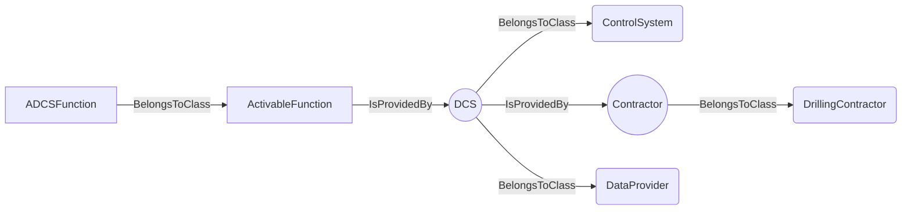
```mermaid
graph LR
	N0000[ADCSFunction] -->|BelongsToClass| N0001(ActivableFunction) 
	N0002[DCS] -->|BelongsToClass| N0003(ControlSystem) 
	N0004[Contractor] -->|BelongsToClass| N0005(DrillingContractor) 
	N0002[DCS] -->|IsProvidedBy| N0004((Contractor)) 
	N0002[DCS] -->|BelongsToClass| N0006(DataProvider) 
	N0001[ActivableFunction] -->|IsProvidedBy| N0002((DCS)) 
```
An example SparQL query looks like this:
```sparql
PREFIX rdf: <http://www.w3.org/1999/02/22-rdf-syntax-ns#>
PREFIX ddhub: <http://ddhub.no/>
PREFIX quantity: <http://ddhub.no/UnitAndQuantity>
SELECT ?ADCSFunction
WHERE {
	?ADCSFunction rdf:type ddhub:ActivableFunction .
	?DCS rdf:type ddhub:ControlSystem .
	?Contractor rdf:type ddhub:DrillingContractor .
	?DCS rdf:type ddhub:DataProvider .
  FILTER (
	?Attribute000 = Contractor
	&& 	?Attribute001 = DCS
  )
}
```
This example describes all `ActivableFunction` provided by the drilling control system, `DCS`. The `DCS` is 
defined as a `ControlSystem` provided by a drilling contractor.
## RunnableFunction <!-- NOUN -->
- Display name: RunnableFunction
- Parent class: [ActivableFunction](#ActivableFunction)
- Attributes:
  - IsAuxiliary
    - Type: boolean
    - Description: This attribute specifies if the function is a main or an auxilary one. A main function impacts
    substantially the drilling process while an auxiliary function does not impact or only in limited fashion the
    drilling process. Example of a main functions are: Hoist, Tag Bottom, Start Circulation, Start Rotation,
    Stop Circulation, Stop Rotation, Drill, Pull Out,Run In, Pull Out With Lubrication, Run In With Lubrication, Ream Up,
    Ream Down,Test Friction, Reciprocate, Test Pressure Integrity, Place Cement, .... Example of auxiliary functions
    are: Boost Riser Flow, Down Link from ADCS, Rock Pipe, ...
- Description: 
A runnable function is a function that starts to run immediately when activated.
- Definition set: ADCS
- Examples:
```dwis runnableFunction
RunnableFunction:runnableFunction
runnableFunction.IsAuxiliary = "false"
ControlSystem:DCS
DrillingContractor:Contractor
DCS IsProvidedBy Contractor
DCS BelongsToClass DataProvider
runnableFunction IsProvidedBy DCS
```
An example semantic graph looks like as follow:
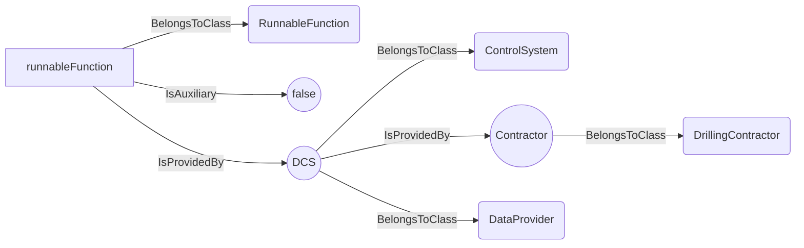
```mermaid
graph LR
	N0000[runnableFunction] -->|BelongsToClass| N0001(RunnableFunction) 
	N0000[runnableFunction] -->|IsAuxiliary| N0002(("false")) 
	N0003[DCS] -->|BelongsToClass| N0004(ControlSystem) 
	N0005[Contractor] -->|BelongsToClass| N0006(DrillingContractor) 
	N0003[DCS] -->|IsProvidedBy| N0005((Contractor)) 
	N0003[DCS] -->|BelongsToClass| N0007(DataProvider) 
	N0000[runnableFunction] -->|IsProvidedBy| N0003((DCS)) 
```
An example SparQL query looks like this:
```sparql
PREFIX rdf: <http://www.w3.org/1999/02/22-rdf-syntax-ns#>
PREFIX ddhub: <http://ddhub.no/>
PREFIX quantity: <http://ddhub.no/UnitAndQuantity>
SELECT ?runnableFunction
WHERE {
	?runnableFunction rdf:type ddhub:RunnableFunction .
	?runnableFunction ddhub:IsAuxiliary ?Attribute000 .
	?DCS rdf:type ddhub:ControlSystem .
	?Contractor rdf:type ddhub:DrillingContractor .
	?DCS rdf:type ddhub:DataProvider .
  FILTER (
	?Attribute000 = "false"
	&& 	?Attribute001 = Contractor
	&& 	?Attribute002 = DCS
  )
}
```
This example describes all the main runnable functions provided by the drilling control system, `DCS`. The `DCS` is 
defined as a `ControlSystem` provided by a drilling contractor.
## ControllerFunction <!-- NOUN -->
- Display name: Controller Function
- Parent class: [RunnableFunction](#RunnableFunction)
- Description: 
A `ControllerFunction` is a `RunnableFunction` that executes a feedback control loop to follow as closely
as possible one or several desired values. A typical example of `ControllerFunction` is the `AutoDriller`. An `AutoDriller` 
follows as closely as possible, for instance, a desired `WOB`.
- Definition set: ADCS
- Examples:
```dwis autoDriller
ControllerFunction:autoDriller
StableAxialVelocityObjective:stableROP
autoDriller ImplementsObjective stableROP
autoDriller.IsAuxiliary = "false"
ControlSystem:DCS
DrillingContractor:Contractor
DCS IsProvidedBy Contractor
DCS BelongsToClass DataProvider
autoDriller IsProvidedBy DCS
```
An example semantic graph looks like as follow:
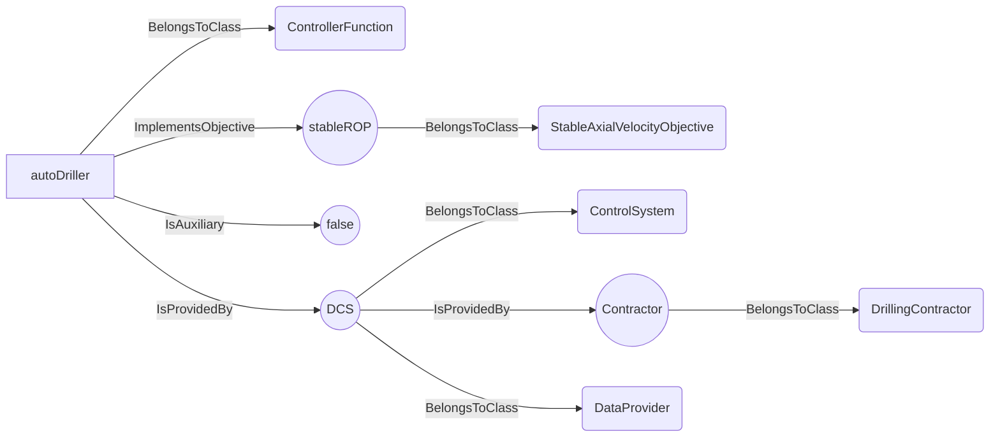
```mermaid
graph LR
	N0000[autoDriller] -->|BelongsToClass| N0001(ControllerFunction) 
	N0002[stableROP] -->|BelongsToClass| N0003(StableAxialVelocityObjective) 
	N0000[autoDriller] -->|ImplementsObjective| N0002((stableROP)) 
	N0000[autoDriller] -->|IsAuxiliary| N0004(("false")) 
	N0005[DCS] -->|BelongsToClass| N0006(ControlSystem) 
	N0007[Contractor] -->|BelongsToClass| N0008(DrillingContractor) 
	N0005[DCS] -->|IsProvidedBy| N0007((Contractor)) 
	N0005[DCS] -->|BelongsToClass| N0009(DataProvider) 
	N0000[autoDriller] -->|IsProvidedBy| N0005((DCS)) 
```
An example SparQL query looks like this:
```sparql
PREFIX rdf: <http://www.w3.org/1999/02/22-rdf-syntax-ns#>
PREFIX ddhub: <http://ddhub.no/>
PREFIX quantity: <http://ddhub.no/UnitAndQuantity>
SELECT ?autoDriller
WHERE {
	?autoDriller rdf:type ddhub:ControllerFunction .
	?stableROP rdf:type ddhub:StableAxialVelocityObjective .
	?autoDriller ddhub:IsAuxiliary ?Attribute001 .
	?DCS rdf:type ddhub:ControlSystem .
	?Contractor rdf:type ddhub:DrillingContractor .
	?DCS rdf:type ddhub:DataProvider .
  FILTER (
	?Attribute000 = stableROP
	&& 	?Attribute001 = "false"
	&& 	?Attribute002 = Contractor
	&& 	?Attribute003 = DCS
  )
}
```
This example describes the auto driller provided by the drilling control system, `DCS`. The `DCS` is 
defined as a `ControlSystem` provided by a drilling contractor. It is a main function and its purpose is to `Drill`.
## ProcedureFunction <!-- NOUN -->
- Display name: Procedure Function
- Parent class: [RunnableFunction](#RunnableFunction)
- Description: 
A `ProcedureFunction` is a `RunnableFunction` that executes a finites state automaton, i.e., a graph of
transitions between states. It should be noted that a `ProcedureFunction` may use control algorithms while being in one
state or when transiting from state to state. An example of `ProcedureFunction` is a friction test. A friction test has
at least three states: rotation off bottom, pick-up without rotation, slack-off without rotation. The transitions 
between the different states may depend on the implementation. Each of those states uses a controller, one that controls
the rotational speed and one that controls the axial speed.
- Definition set: ADCS
- Examples:
```dwis frictionTest
ProcedureFunction:frictionTest
FrictionTestProcedure:frictionTestProcedure
frictionTest ImplementsProcedure frictionTestProcedure
FrictionTest.IsAuxiliary = "false"
ControlSystem:DCS
DrillingContractor:Contractor
DCS IsProvidedBy Contractor
DCS BelongsToClass DataProvider
frictionTest IsProvidedBy DCS
```
An example semantic graph looks like as follow:
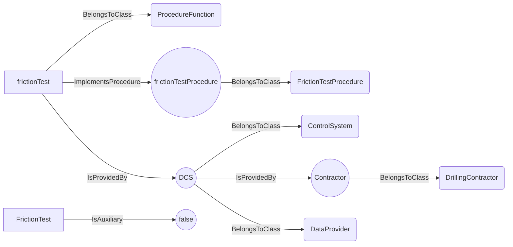
```mermaid
graph LR
	N0000[frictionTest] -->|BelongsToClass| N0001(ProcedureFunction) 
	N0002[frictionTestProcedure] -->|BelongsToClass| N0003(FrictionTestProcedure) 
	N0000[frictionTest] -->|ImplementsProcedure| N0002((frictionTestProcedure)) 
	N0004[FrictionTest] -->|IsAuxiliary| N0005(("false")) 
	N0006[DCS] -->|BelongsToClass| N0007(ControlSystem) 
	N0008[Contractor] -->|BelongsToClass| N0009(DrillingContractor) 
	N0006[DCS] -->|IsProvidedBy| N0008((Contractor)) 
	N0006[DCS] -->|BelongsToClass| N0010(DataProvider) 
	N0000[frictionTest] -->|IsProvidedBy| N0006((DCS)) 
```
An example SparQL query looks like this:
```sparql
PREFIX rdf: <http://www.w3.org/1999/02/22-rdf-syntax-ns#>
PREFIX ddhub: <http://ddhub.no/>
PREFIX quantity: <http://ddhub.no/UnitAndQuantity>
SELECT ?frictionTest
WHERE {
	?frictionTest rdf:type ddhub:ProcedureFunction .
	?frictionTestProcedure rdf:type ddhub:FrictionTestProcedure .
	?FrictionTest ddhub:IsAuxiliary ?Attribute001 .
	?DCS rdf:type ddhub:ControlSystem .
	?Contractor rdf:type ddhub:DrillingContractor .
	?DCS rdf:type ddhub:DataProvider .
  FILTER (
	?Attribute000 = frictionTestProcedure
	&& 	?Attribute001 = "false"
	&& 	?Attribute002 = Contractor
	&& 	?Attribute003 = DCS
  )
}
```
This example describes the friction test procedure provided by the drilling control system, `DCS`. The `DCS` is 
defined as a `ControlSystem` provided by a drilling contractor. It is a main function and its purpose is to perform a
`FrictionTest`.
## ProtectionFunction <!-- NOUN -->
- Display name: Protection Function
- Parent class: [ActivableFunction](#ActivableFunction)
- Description: 
A `ProtectionFunction` is an `ActivableFunction`. It must be activated to have an effect, but the effect
is to protect the drilling process, either by protecting the inputs to the drilling machines to avoid generating 
a drilling incident, or to detect an abnormal drilling process state and react to the situation.
detected.
- Definition set: ADCS
- Examples:
```dwis protectionFunction
ProtectionFunction:protectionFunction
ControlSystem:DCS
DrillingContractor:Contractor
DCS IsProvidedBy Contractor
DCS BelongsToClass DataProvider
protectionFunction IsProvidedBy DCS
```
An example semantic graph looks like as follow:
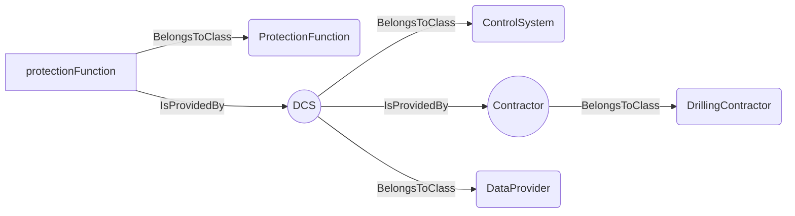
```mermaid
graph LR
	N0000[protectionFunction] -->|BelongsToClass| N0001(ProtectionFunction) 
	N0002[DCS] -->|BelongsToClass| N0003(ControlSystem) 
	N0004[Contractor] -->|BelongsToClass| N0005(DrillingContractor) 
	N0002[DCS] -->|IsProvidedBy| N0004((Contractor)) 
	N0002[DCS] -->|BelongsToClass| N0006(DataProvider) 
	N0000[protectionFunction] -->|IsProvidedBy| N0002((DCS)) 
```
An example SparQL query looks like this:
```sparql
PREFIX rdf: <http://www.w3.org/1999/02/22-rdf-syntax-ns#>
PREFIX ddhub: <http://ddhub.no/>
PREFIX quantity: <http://ddhub.no/UnitAndQuantity>
SELECT ?protectionFunction
WHERE {
	?protectionFunction rdf:type ddhub:ProtectionFunction .
	?DCS rdf:type ddhub:ControlSystem .
	?Contractor rdf:type ddhub:DrillingContractor .
	?DCS rdf:type ddhub:DataProvider .
  FILTER (
	?Attribute000 = Contractor
	&& 	?Attribute001 = DCS
  )
}
```
This example describes all the protection functions of the drilling control system, `DCS`. The `DCS` is 
defined as a `ControlSystem` provided by a drilling contractor.
## FDIRFunction <!-- NOUN -->
- Display name: FDIR Function
- Parent class: [ProtectionFunction](#ProtectionFunction)
- Description: 
A `FDIRFunction` is a `ProtectionFunction` that reacts to a particular state of the drilling process. FDIR
stands for Fault Detection, Isolation and Recovery. An FDIR protects the drilling process by looking at its outputs.
When that state is detected, then an isolation procedure is run, and if successful and defined, a recovery procedure is
thereafter executed. In case of success of the recovery procedure, the drilling process is resumed. In all other cases,
the system returns in manual mode, usually using the safe mode management procedure. An example of `FDIRFunction` is an
packoff detection and reaction procedure.
- Definition set: ADCS
- Examples:
```dwis packOffDectionAndReaction
FDIRFunction:packOffDetectionAndReaction
PackOffIncident:packOffIncident
packOffDetectionAndReaction ManagesIncident packOffIncident
ControlSystem:DCS
DrillingContractor:Contractor
DCS IsProvidedBy Contractor
DCS BelongsToClass DataProvider
packOffDetectionAndReaction IsProvidedBy DCS
```
An example semantic graph looks like as follow:
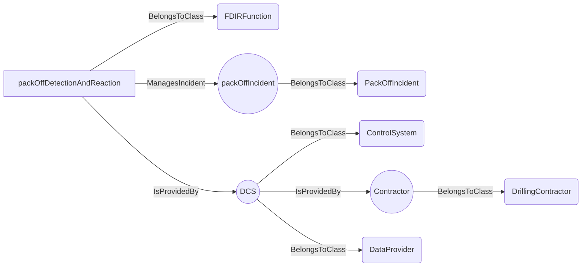
```mermaid
graph LR
	N0000[packOffDetectionAndReaction] -->|BelongsToClass| N0001(FDIRFunction) 
	N0002[packOffIncident] -->|BelongsToClass| N0003(PackOffIncident) 
	N0000[packOffDetectionAndReaction] -->|ManagesIncident| N0002((packOffIncident)) 
	N0004[DCS] -->|BelongsToClass| N0005(ControlSystem) 
	N0006[Contractor] -->|BelongsToClass| N0007(DrillingContractor) 
	N0004[DCS] -->|IsProvidedBy| N0006((Contractor)) 
	N0004[DCS] -->|BelongsToClass| N0008(DataProvider) 
	N0000[packOffDetectionAndReaction] -->|IsProvidedBy| N0004((DCS)) 
```
An example SparQL query looks like this:
```sparql
PREFIX rdf: <http://www.w3.org/1999/02/22-rdf-syntax-ns#>
PREFIX ddhub: <http://ddhub.no/>
PREFIX quantity: <http://ddhub.no/UnitAndQuantity>
SELECT ?packOffDectionAndReaction
WHERE {
	?packOffDetectionAndReaction rdf:type ddhub:FDIRFunction .
	?packOffIncident rdf:type ddhub:PackOffIncident .
	?DCS rdf:type ddhub:ControlSystem .
	?Contractor rdf:type ddhub:DrillingContractor .
	?DCS rdf:type ddhub:DataProvider .
  FILTER (
	?Attribute000 = packOffIncident
	&& 	?Attribute001 = Contractor
	&& 	?Attribute002 = DCS
  )
}
```
This example describes the `packOffDetectionAndReaction` fault detection and isolation procedure of the drilling control
system for pack-off events, `DCS`. The `DCS` is defined as a `ControlSystem` provided by a drilling contractor.
## SOEFunction <!-- NOUN -->
- Display name: SOE Function
- Parent class: [ProtectionFunction](#ProtectionFunction)
- Description: 
A `SOEFunction` is a `ProtectionFunction` that limits the commands that are send to the drilling machines
to avoid generating a drilling incident. SOE stands for Safe Operating Envelope. A `SOEFunction` protects the inputs
of the drilling process. An example `SOEFunction` is a swab/surge limits protection. This function limits the axial acceleration
and speed of the drill-stem to avoid generate swabbing pressure below the maximum of the collapse and pore pressure, and
surging pressure above the fracturing pressure.
- Definition set: ADCS
- Examples:
```dwis swabSurgeLimits
SOEFunction:swabSurgeLimits
AxialVelocityLimit:swabSurgeLimit
swabSurgeLimits ImplementsLimit swabSurgeLimit
ControlSystem:DCS
DrillingContractor:Contractor
DCS IsProvidedBy Contractor
DCS BelongsToClass DataProvider
swabSurgeLimits IsProvidedBy DCS
```
An example semantic graph looks like as follow:
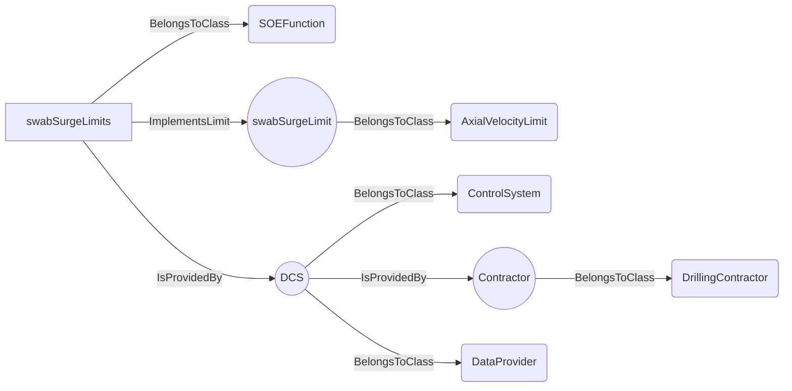
```mermaid
graph LR
	N0000[swabSurgeLimits] -->|BelongsToClass| N0001(SOEFunction) 
	N0002[swabSurgeLimit] -->|BelongsToClass| N0003(AxialVelocityLimit) 
	N0000[swabSurgeLimits] -->|ImplementsLimit| N0002((swabSurgeLimit)) 
	N0004[DCS] -->|BelongsToClass| N0005(ControlSystem) 
	N0006[Contractor] -->|BelongsToClass| N0007(DrillingContractor) 
	N0004[DCS] -->|IsProvidedBy| N0006((Contractor)) 
	N0004[DCS] -->|BelongsToClass| N0008(DataProvider) 
	N0000[swabSurgeLimits] -->|IsProvidedBy| N0004((DCS)) 
```
An example SparQL query looks like this:
```sparql
PREFIX rdf: <http://www.w3.org/1999/02/22-rdf-syntax-ns#>
PREFIX ddhub: <http://ddhub.no/>
PREFIX quantity: <http://ddhub.no/UnitAndQuantity>
SELECT ?swabSurgeLimits
WHERE {
	?swabSurgeLimits rdf:type ddhub:SOEFunction .
	?swabSurgeLimit rdf:type ddhub:AxialVelocityLimit .
	?DCS rdf:type ddhub:ControlSystem .
	?Contractor rdf:type ddhub:DrillingContractor .
	?DCS rdf:type ddhub:DataProvider .
  FILTER (
	?Attribute000 = swabSurgeLimit
	&& 	?Attribute001 = Contractor
	&& 	?Attribute002 = DCS
  )
}
```
This example describes the `swabSurgeLimits` safe operating envelope limits to avoid detrimental swab/surge pressures in 
the open hole section of the borehole. 
## AdvisorySystemAdvice <!-- NOUN -->
- Display name: Advisory System Advice
- Parent class: [JSonDataType](#JSonDataType)
- Description: 
An advisory system provides one or several advices. These advices are structured data that are stored as a JSon
string. 
- Definition set: AdvisorySystemAdvice
- Examples:
``` dwis adviceInfo
DynamicDrillingSignal:adviceInfo
AdvisorySystemAdvice:adviceInfo_1
adviceInfo_1 HasDynamicValue adviceInfo
ServiceCompany:serviceCompany
adviceInfo_1 IsProvidedBy serviceCompany
Advisor:computationUnit
adviceInfo_1 IsRecommendedBy computationUnit
ActivableFunction:activableFunction
adviceInfo_1 IsRecommendedFor activableFunction
DWISAdviceComposer:adviceComposer
adviceInfo_1 IsProvidedTo adviceComposer
DWISScheduler:scheduler
adviceInfo_1 IsProvidedTo scheduler
```
An example semantic graph looks like as follow:
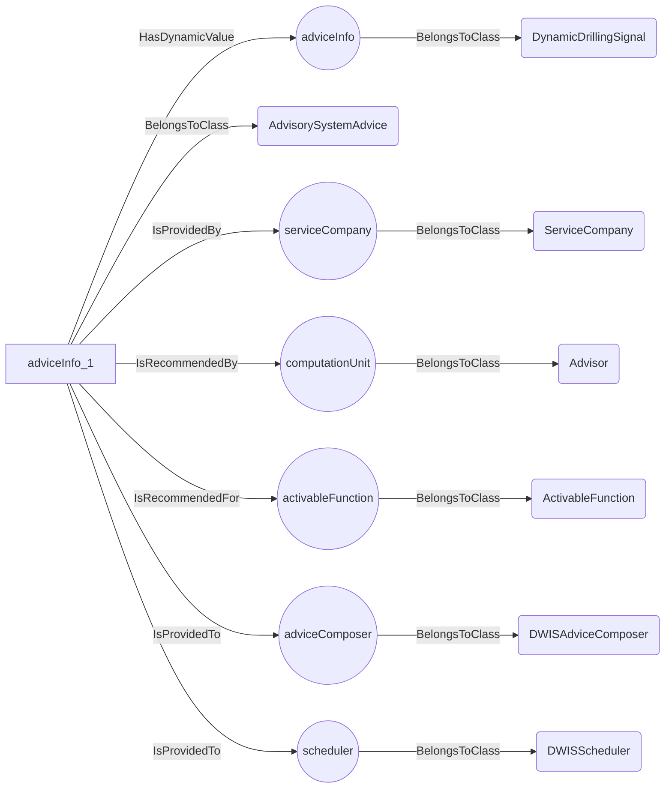
```mermaid
graph LR
	N0000[adviceInfo] -->|BelongsToClass| N0001(DynamicDrillingSignal) 
	N0002[adviceInfo_1] -->|BelongsToClass| N0003(AdvisorySystemAdvice) 
	N0002[adviceInfo_1] -->|HasDynamicValue| N0000((adviceInfo)) 
	N0004[serviceCompany] -->|BelongsToClass| N0005(ServiceCompany) 
	N0002[adviceInfo_1] -->|IsProvidedBy| N0004((serviceCompany)) 
	N0006[computationUnit] -->|BelongsToClass| N0007(Advisor) 
	N0002[adviceInfo_1] -->|IsRecommendedBy| N0006((computationUnit)) 
	N0008[activableFunction] -->|BelongsToClass| N0009(ActivableFunction) 
	N0002[adviceInfo_1] -->|IsRecommendedFor| N0008((activableFunction)) 
	N0010[adviceComposer] -->|BelongsToClass| N0011(DWISAdviceComposer) 
	N0002[adviceInfo_1] -->|IsProvidedTo| N0010((adviceComposer)) 
	N0012[scheduler] -->|BelongsToClass| N0013(DWISScheduler) 
	N0002[adviceInfo_1] -->|IsProvidedTo| N0012((scheduler)) 
```
An example SparQL query looks like this:
```sparql
PREFIX rdf: <http://www.w3.org/1999/02/22-rdf-syntax-ns#>
PREFIX ddhub: <http://ddhub.no/>
PREFIX quantity: <http://ddhub.no/UnitAndQuantity>
SELECT ?adviceInfo
WHERE {
	?adviceInfo rdf:type ddhub:DynamicDrillingSignal .
	?adviceInfo_1 rdf:type ddhub:AdvisorySystemAdvice .
	?serviceCompany rdf:type ddhub:ServiceCompany .
	?computationUnit rdf:type ddhub:Advisor .
	?activableFunction rdf:type ddhub:ActivableFunction .
	?adviceComposer rdf:type ddhub:DWISAdviceComposer .
	?scheduler rdf:type ddhub:DWISScheduler .
  FILTER (
	?Attribute000 = adviceInfo
	&& 	?Attribute001 = serviceCompany
	&& 	?Attribute002 = computationUnit
	&& 	?Attribute003 = activableFunction
	&& 	?Attribute004 = adviceComposer
	&& 	?Attribute005 = scheduler
  )
}
```
## DigitalTwinAdvice <!-- NOUN -->
- Display name: Digital Twin Advice
- Parent class: [AdvisorySystemAdvice](#AdvisorySystemAdvice)
- Description: 
A digital twin simulates the drilling operation using the boundary conditions applied to the drilling system.
It provides information about the plausible values that can be expected anywhere along the drilling system. These results
are stored in a DigitalTwinAdvice.
- Definition set: AdvisorySystemAdvice
- Examples:
``` dwis digitalTwinAdvice
DynamicDrillingSignal:digitalTwinAdvice
DigitalTwinAdvice:digitalTwinAdvice_1
digitalTwinAdvice_1 HasDynamicValue digitalTwinAdvice
OperatingCompany:operatingCompany
digitalTwinAdvice_1 IsProvidedBy operatingCompany
Simulator:simulator
digitalTwinAdvice_1 IsRecommendedBy simulator
DWISDrillingProcessStateInterpreter:microStateInterpreter
digitalTwinAdvice_1 IsProvidedTo microStateInterpreter
```
An example semantic graph looks like as follow:
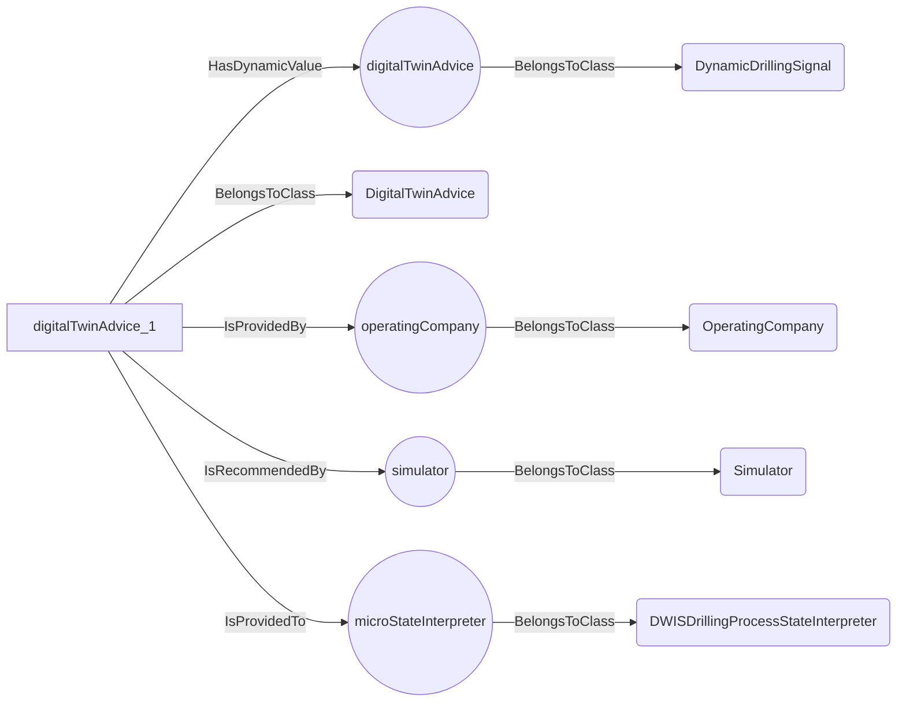
```mermaid
graph LR
	N0000[digitalTwinAdvice] -->|BelongsToClass| N0001(DynamicDrillingSignal) 
	N0002[digitalTwinAdvice_1] -->|BelongsToClass| N0003(DigitalTwinAdvice) 
	N0002[digitalTwinAdvice_1] -->|HasDynamicValue| N0000((digitalTwinAdvice)) 
	N0004[operatingCompany] -->|BelongsToClass| N0005(OperatingCompany) 
	N0002[digitalTwinAdvice_1] -->|IsProvidedBy| N0004((operatingCompany)) 
	N0006[simulator] -->|BelongsToClass| N0007(Simulator) 
	N0002[digitalTwinAdvice_1] -->|IsRecommendedBy| N0006((simulator)) 
	N0008[microStateInterpreter] -->|BelongsToClass| N0009(DWISDrillingProcessStateInterpreter) 
	N0002[digitalTwinAdvice_1] -->|IsProvidedTo| N0008((microStateInterpreter)) 
```
An example SparQL query looks like this:
```sparql
PREFIX rdf: <http://www.w3.org/1999/02/22-rdf-syntax-ns#>
PREFIX ddhub: <http://ddhub.no/>
PREFIX quantity: <http://ddhub.no/UnitAndQuantity>
SELECT ?digitalTwinAdvice
WHERE {
	?digitalTwinAdvice rdf:type ddhub:DynamicDrillingSignal .
	?digitalTwinAdvice_1 rdf:type ddhub:DigitalTwinAdvice .
	?operatingCompany rdf:type ddhub:OperatingCompany .
	?simulator rdf:type ddhub:Simulator .
	?microStateInterpreter rdf:type ddhub:DWISDrillingProcessStateInterpreter .
  FILTER (
	?Attribute000 = digitalTwinAdvice
	&& 	?Attribute001 = operatingCompany
	&& 	?Attribute002 = simulator
	&& 	?Attribute003 = microStateInterpreter
  )
}
```
## DrillingStandardProcedureAdvice <!-- NOUN -->
- Display name: Drilling Standard Procedure Advice
- Parent class: [AdvisorySystemAdvice](#AdvisorySystemAdvice)
- Description: 
A drilling standard procedure advisor provides parameters for a standard procedure like starting the mud pumps or
running a friction test.
- Definition set: AdvisorySystemAdvice
- Examples:
The circulation startup procedure defines how to start the mud pumps in order to fill the pipes, break circulation and 
establish a suitable flowrate in the drill-stem.
``` dwis circulationStartupProcedureInfo
DynamicDrillingSignal:circulationStartupProcedureInfo
DrillingStandardProcedureAdvice:circulationStartupProcedureInfo_1
circulationStartupProcedureInfo_1 HasDynamicValue circulationStartupProcedureInfo
CirculationStartupProcedure:circulationStartupProcedure
circulationStartupProcedureInfo_1 IsRelatedToDrillingProcedure circulationStartupProcedure
ServiceCompany:serviceCompany
circulationStartupProcedureInfo_1 IsProvidedBy serviceCompany
Advisor:computationUnit
circulationStartupProcedureInfo_1 IsRecommendedBy computationUnit
ProcedureFunction:procedureFunction
procedureFunction ImplementsProcedure circulationStartupProcedure
circulationStartupProcedureInfo_1 IsRecommendedFor procedureFunction
DWISAdviceComposer:adviceComposer
circulationStartupProcedureInfo_1 IsProvidedTo adviceComposer
DWISScheduler:scheduler
circulationStartupProcedureInfo_1 IsProvidedTo scheduler
```
An example semantic graph looks like as follow:
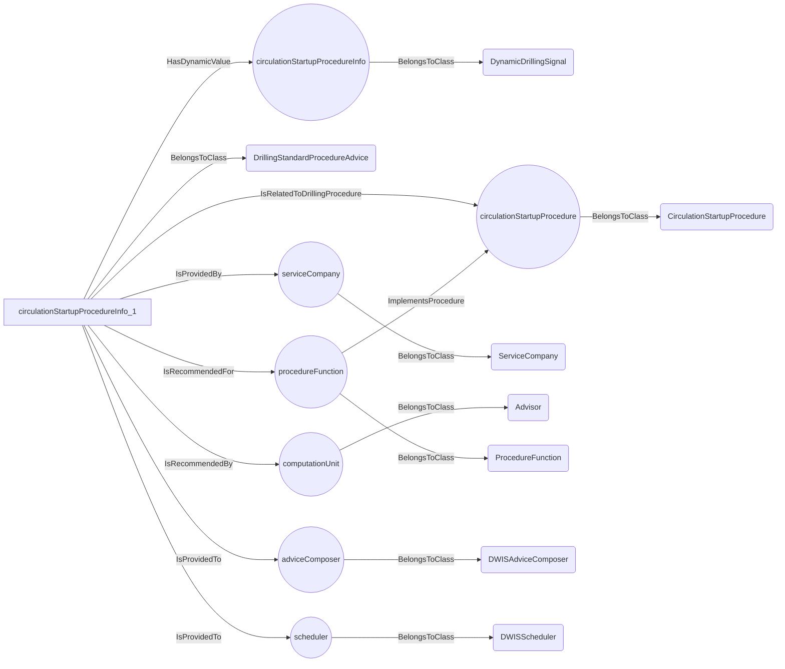
```mermaid
graph LR
	N0000[circulationStartupProcedureInfo] -->|BelongsToClass| N0001(DynamicDrillingSignal) 
	N0002[circulationStartupProcedureInfo_1] -->|BelongsToClass| N0003(DrillingStandardProcedureAdvice) 
	N0002[circulationStartupProcedureInfo_1] -->|HasDynamicValue| N0000((circulationStartupProcedureInfo)) 
	N0004[circulationStartupProcedure] -->|BelongsToClass| N0005(CirculationStartupProcedure) 
	N0002[circulationStartupProcedureInfo_1] -->|IsRelatedToDrillingProcedure| N0004((circulationStartupProcedure)) 
	N0006[serviceCompany] -->|BelongsToClass| N0007(ServiceCompany) 
	N0002[circulationStartupProcedureInfo_1] -->|IsProvidedBy| N0006((serviceCompany)) 
	N0008[computationUnit] -->|BelongsToClass| N0009(Advisor) 
	N0002[circulationStartupProcedureInfo_1] -->|IsRecommendedBy| N0008((computationUnit)) 
	N0010[procedureFunction] -->|BelongsToClass| N0011(ProcedureFunction) 
	N0010[procedureFunction] -->|ImplementsProcedure| N0004((circulationStartupProcedure)) 
	N0002[circulationStartupProcedureInfo_1] -->|IsRecommendedFor| N0010((procedureFunction)) 
	N0012[adviceComposer] -->|BelongsToClass| N0013(DWISAdviceComposer) 
	N0002[circulationStartupProcedureInfo_1] -->|IsProvidedTo| N0012((adviceComposer)) 
	N0014[scheduler] -->|BelongsToClass| N0015(DWISScheduler) 
	N0002[circulationStartupProcedureInfo_1] -->|IsProvidedTo| N0014((scheduler)) 
```
An example SparQL query looks like this:
```sparql
PREFIX rdf: <http://www.w3.org/1999/02/22-rdf-syntax-ns#>
PREFIX ddhub: <http://ddhub.no/>
PREFIX quantity: <http://ddhub.no/UnitAndQuantity>
SELECT ?circulationStartupProcedureInfo
WHERE {
	?circulationStartupProcedureInfo rdf:type ddhub:DynamicDrillingSignal .
	?circulationStartupProcedureInfo_1 rdf:type ddhub:DrillingStandardProcedureAdvice .
	?circulationStartupProcedure rdf:type ddhub:CirculationStartupProcedure .
	?serviceCompany rdf:type ddhub:ServiceCompany .
	?computationUnit rdf:type ddhub:Advisor .
	?procedureFunction rdf:type ddhub:ProcedureFunction .
	?adviceComposer rdf:type ddhub:DWISAdviceComposer .
	?scheduler rdf:type ddhub:DWISScheduler .
  FILTER (
	?Attribute000 = circulationStartupProcedureInfo
	&& 	?Attribute001 = circulationStartupProcedure
	&& 	?Attribute002 = serviceCompany
	&& 	?Attribute003 = computationUnit
	&& 	?Attribute004 = circulationStartupProcedure
	&& 	?Attribute005 = procedureFunction
	&& 	?Attribute006 = adviceComposer
	&& 	?Attribute007 = scheduler
  )
}
```
The circulation stop procedure defines how to stop the mud pumps in a way that limit potential bull-heading effects 
that could result in undesired downhole pressure conditions with regards to the geo-pressure window.
``` dwis circulationStopProcedureInfo
DynamicDrillingSignal:circulationStopProcedureInfo
DrillingStandardProcedureAdvice:circulationStopProcedureInfo_1
circulationStopProcedureInfo_1 HasDynamicValue circulationStopProcedureInfo
CirculationStopProcedure:circulationStopProcedure
circulationStopProcedureInfo_1 IsRelatedToDrillingProcedure circulationStopProcedure
ServiceCompany:serviceCompany
circulationStopProcedureInfo_1 IsProvidedBy serviceCompany
Advisor:computationUnit
circulationStopProcedureInfo_1 IsRecommendedBy computationUnit
ProcedureFunction:procedureFunction
procedureFunction ImplementsProcedure circulationStopProcedure
circulationStopProcedureInfo_1 IsRecommendedFor procedureFunction
DWISAdviceComposer:adviceComposer
circulationStopProcedureInfo_1 IsProvidedTo adviceComposer
DWISScheduler:scheduler
circulationStopProcedureInfo_1 IsProvidedTo scheduler
```
An example semantic graph looks like as follow:
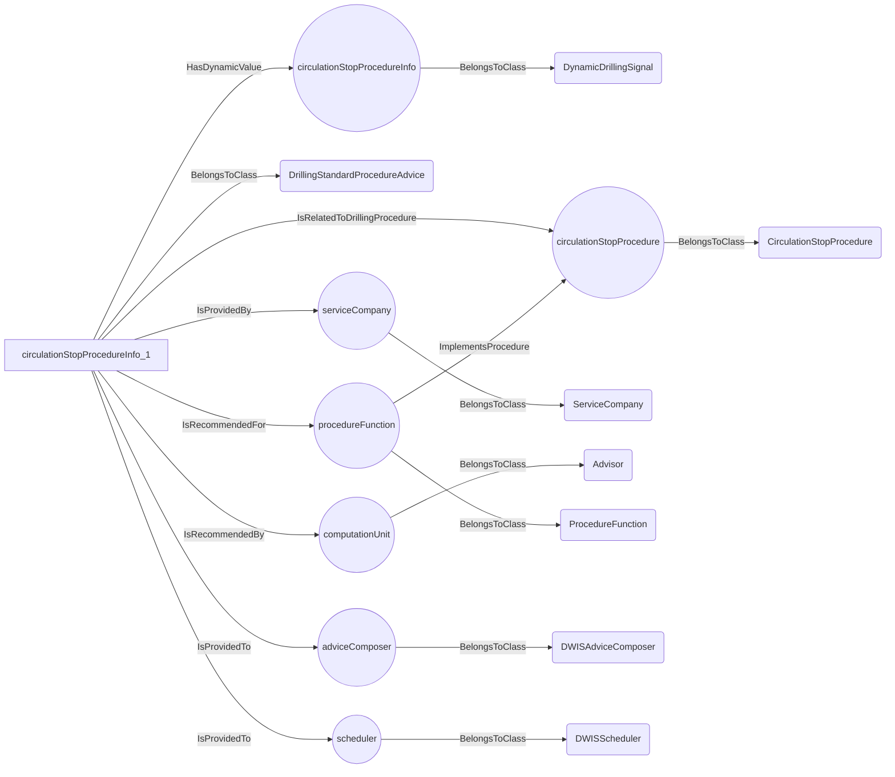
```mermaid
graph LR
	N0000[circulationStopProcedureInfo] -->|BelongsToClass| N0001(DynamicDrillingSignal) 
	N0002[circulationStopProcedureInfo_1] -->|BelongsToClass| N0003(DrillingStandardProcedureAdvice) 
	N0002[circulationStopProcedureInfo_1] -->|HasDynamicValue| N0000((circulationStopProcedureInfo)) 
	N0004[circulationStopProcedure] -->|BelongsToClass| N0005(CirculationStopProcedure) 
	N0002[circulationStopProcedureInfo_1] -->|IsRelatedToDrillingProcedure| N0004((circulationStopProcedure)) 
	N0006[serviceCompany] -->|BelongsToClass| N0007(ServiceCompany) 
	N0002[circulationStopProcedureInfo_1] -->|IsProvidedBy| N0006((serviceCompany)) 
	N0008[computationUnit] -->|BelongsToClass| N0009(Advisor) 
	N0002[circulationStopProcedureInfo_1] -->|IsRecommendedBy| N0008((computationUnit)) 
	N0010[procedureFunction] -->|BelongsToClass| N0011(ProcedureFunction) 
	N0010[procedureFunction] -->|ImplementsProcedure| N0004((circulationStopProcedure)) 
	N0002[circulationStopProcedureInfo_1] -->|IsRecommendedFor| N0010((procedureFunction)) 
	N0012[adviceComposer] -->|BelongsToClass| N0013(DWISAdviceComposer) 
	N0002[circulationStopProcedureInfo_1] -->|IsProvidedTo| N0012((adviceComposer)) 
	N0014[scheduler] -->|BelongsToClass| N0015(DWISScheduler) 
	N0002[circulationStopProcedureInfo_1] -->|IsProvidedTo| N0014((scheduler)) 
```
An example SparQL query looks like this:
```sparql
PREFIX rdf: <http://www.w3.org/1999/02/22-rdf-syntax-ns#>
PREFIX ddhub: <http://ddhub.no/>
PREFIX quantity: <http://ddhub.no/UnitAndQuantity>
SELECT ?circulationStopProcedureInfo
WHERE {
	?circulationStopProcedureInfo rdf:type ddhub:DynamicDrillingSignal .
	?circulationStopProcedureInfo_1 rdf:type ddhub:DrillingStandardProcedureAdvice .
	?circulationStopProcedure rdf:type ddhub:CirculationStopProcedure .
	?serviceCompany rdf:type ddhub:ServiceCompany .
	?computationUnit rdf:type ddhub:Advisor .
	?procedureFunction rdf:type ddhub:ProcedureFunction .
	?adviceComposer rdf:type ddhub:DWISAdviceComposer .
	?scheduler rdf:type ddhub:DWISScheduler .
  FILTER (
	?Attribute000 = circulationStopProcedureInfo
	&& 	?Attribute001 = circulationStopProcedure
	&& 	?Attribute002 = serviceCompany
	&& 	?Attribute003 = computationUnit
	&& 	?Attribute004 = circulationStopProcedure
	&& 	?Attribute005 = procedureFunction
	&& 	?Attribute006 = adviceComposer
	&& 	?Attribute007 = scheduler
  )
}
```
The rotation startup procedure controls the steps to start the rotation of the drill-stem to reach a target rotational
speed while attempting to avoid having too large torsional oscillations.
``` dwis rotationStartupProcedureInfo
DynamicDrillingSignal:rotationStartupProcedureInfo
DrillingStandardProcedureAdvice:rotationStartupProcedureInfo_1
rotationStartupProcedureInfo_1 HasDynamicValue rotationStartupProcedureInfo
RotationStartupProcedure:rotationStartupProcedure
rotationStartupProcedureInfo_1 IsRelatedToDrillingProcedure rotationStartupProcedure
ServiceCompany:serviceCompany
rotationStartupProcedureInfo_1 IsProvidedBy serviceCompany
Advisor:computationUnit
rotationStartupProcedureInfo_1 IsRecommendedBy computationUnit
ProcedureFunction:procedureFunction
procedureFunction ImplementsProcedure rotationStartupProcedure
rotationStartupProcedureInfo_1 IsRecommendedFor procedureFunction
DWISAdviceComposer:adviceComposer
rotationStartupProcedureInfo_1 IsProvidedTo adviceComposer
DWISScheduler:scheduler
rotationStartupProcedureInfo_1 IsProvidedTo scheduler
```
An example semantic graph looks like as follow:
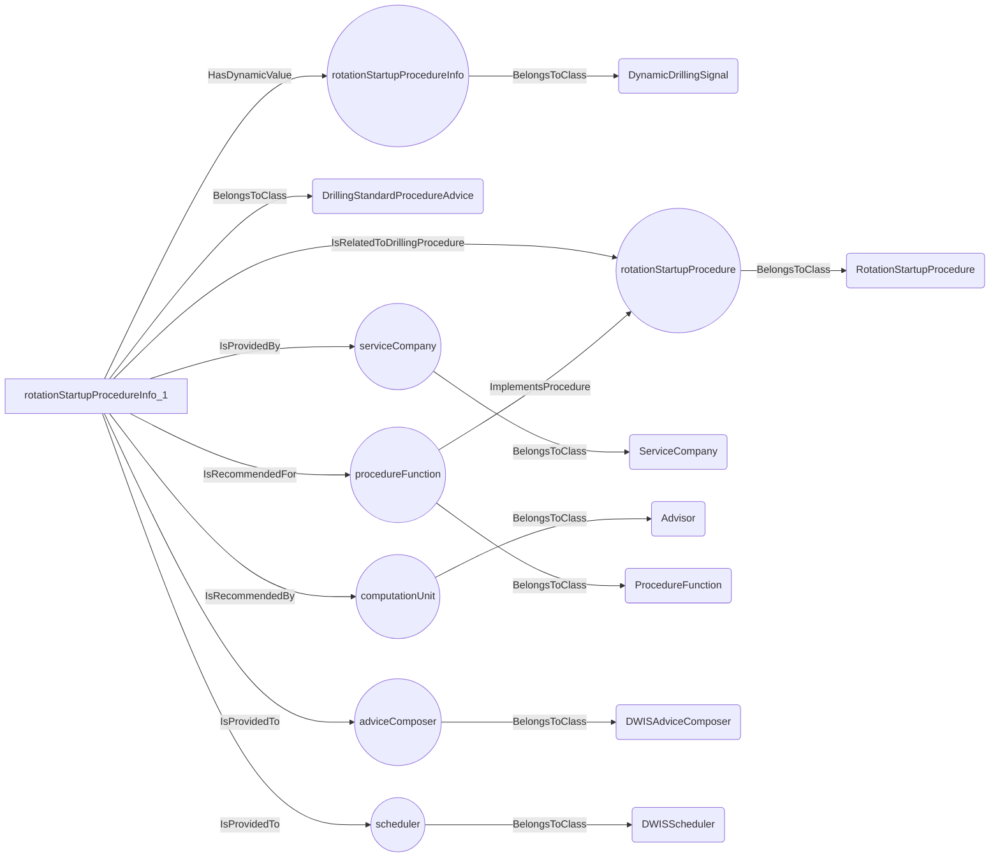
```mermaid
graph LR
	N0000[rotationStartupProcedureInfo] -->|BelongsToClass| N0001(DynamicDrillingSignal) 
	N0002[rotationStartupProcedureInfo_1] -->|BelongsToClass| N0003(DrillingStandardProcedureAdvice) 
	N0002[rotationStartupProcedureInfo_1] -->|HasDynamicValue| N0000((rotationStartupProcedureInfo)) 
	N0004[rotationStartupProcedure] -->|BelongsToClass| N0005(RotationStartupProcedure) 
	N0002[rotationStartupProcedureInfo_1] -->|IsRelatedToDrillingProcedure| N0004((rotationStartupProcedure)) 
	N0006[serviceCompany] -->|BelongsToClass| N0007(ServiceCompany) 
	N0002[rotationStartupProcedureInfo_1] -->|IsProvidedBy| N0006((serviceCompany)) 
	N0008[computationUnit] -->|BelongsToClass| N0009(Advisor) 
	N0002[rotationStartupProcedureInfo_1] -->|IsRecommendedBy| N0008((computationUnit)) 
	N0010[procedureFunction] -->|BelongsToClass| N0011(ProcedureFunction) 
	N0010[procedureFunction] -->|ImplementsProcedure| N0004((rotationStartupProcedure)) 
	N0002[rotationStartupProcedureInfo_1] -->|IsRecommendedFor| N0010((procedureFunction)) 
	N0012[adviceComposer] -->|BelongsToClass| N0013(DWISAdviceComposer) 
	N0002[rotationStartupProcedureInfo_1] -->|IsProvidedTo| N0012((adviceComposer)) 
	N0014[scheduler] -->|BelongsToClass| N0015(DWISScheduler) 
	N0002[rotationStartupProcedureInfo_1] -->|IsProvidedTo| N0014((scheduler)) 
```
An example SparQL query looks like this:
```sparql
PREFIX rdf: <http://www.w3.org/1999/02/22-rdf-syntax-ns#>
PREFIX ddhub: <http://ddhub.no/>
PREFIX quantity: <http://ddhub.no/UnitAndQuantity>
SELECT ?rotationStartupProcedureInfo
WHERE {
	?rotationStartupProcedureInfo rdf:type ddhub:DynamicDrillingSignal .
	?rotationStartupProcedureInfo_1 rdf:type ddhub:DrillingStandardProcedureAdvice .
	?rotationStartupProcedure rdf:type ddhub:RotationStartupProcedure .
	?serviceCompany rdf:type ddhub:ServiceCompany .
	?computationUnit rdf:type ddhub:Advisor .
	?procedureFunction rdf:type ddhub:ProcedureFunction .
	?adviceComposer rdf:type ddhub:DWISAdviceComposer .
	?scheduler rdf:type ddhub:DWISScheduler .
  FILTER (
	?Attribute000 = rotationStartupProcedureInfo
	&& 	?Attribute001 = rotationStartupProcedure
	&& 	?Attribute002 = serviceCompany
	&& 	?Attribute003 = computationUnit
	&& 	?Attribute004 = rotationStartupProcedure
	&& 	?Attribute005 = procedureFunction
	&& 	?Attribute006 = adviceComposer
	&& 	?Attribute007 = scheduler
  )
}
```
The rotation stop procedure controls the path for stopping the rotation of the drill-stem and remove as much torque 
along the drill-stem as possible.
``` dwis rotationStopProcedureInfo
DynamicDrillingSignal:rotationStopProcedureInfo
DrillingStandardProcedureAdvice:rotationStopProcedureInfo_1
rotationStopProcedureInfo_1 HasDynamicValue rotationStopProcedureInfo
RotationStopProcedure:rotationStopProcedure
rotationStopProcedureInfo_1 IsRelatedToDrillingProcedure rotationStopProcedure
ServiceCompany:serviceCompany
rotationStopProcedureInfo_1 IsProvidedBy serviceCompany
Advisor:computationUnit
rotationStopProcedureInfo_1 IsRecommendedBy computationUnit
ProcedureFunction:procedureFunction
procedureFunction ImplementsProcedure rotationStopProcedure
rotationStopProcedureInfo_1 IsRecommendedFor procedureFunction
DWISAdviceComposer:adviceComposer
rotationStopProcedureInfo_1 IsProvidedTo adviceComposer
DWISScheduler:scheduler
rotationStopProcedureInfo_1 IsProvidedTo scheduler
```
An example semantic graph looks like as follow:
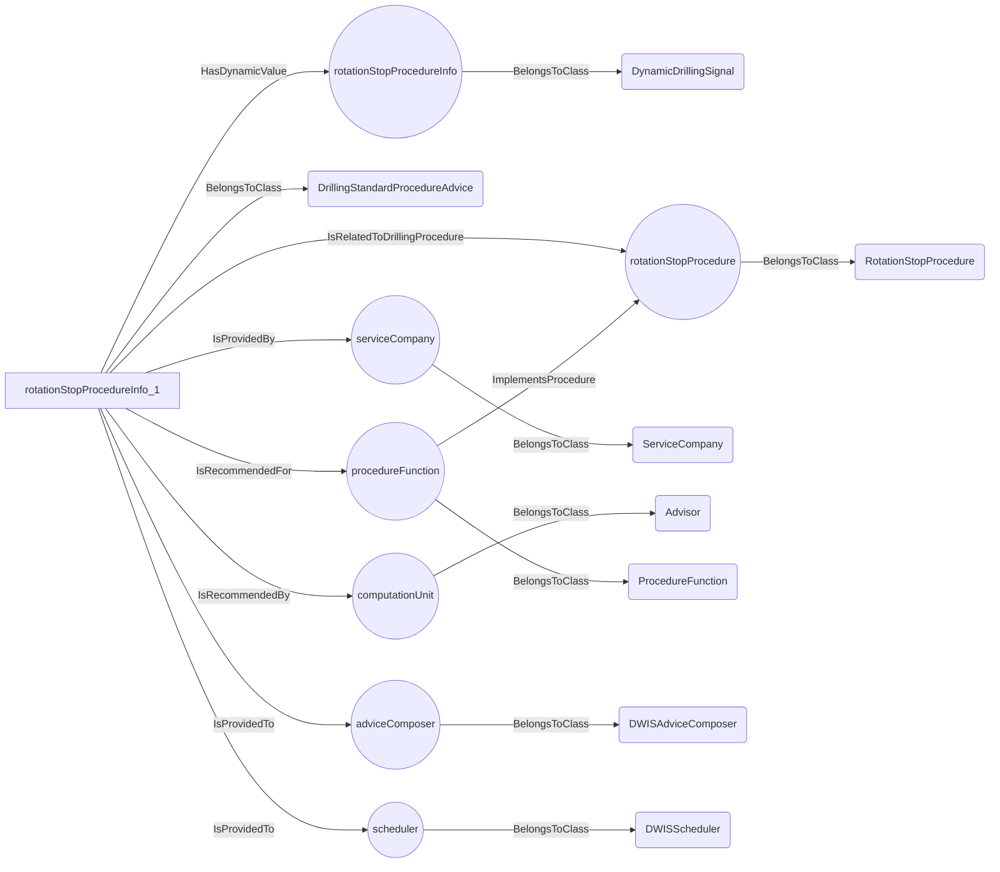
```mermaid
graph LR
	N0000[rotationStopProcedureInfo] -->|BelongsToClass| N0001(DynamicDrillingSignal) 
	N0002[rotationStopProcedureInfo_1] -->|BelongsToClass| N0003(DrillingStandardProcedureAdvice) 
	N0002[rotationStopProcedureInfo_1] -->|HasDynamicValue| N0000((rotationStopProcedureInfo)) 
	N0004[rotationStopProcedure] -->|BelongsToClass| N0005(RotationStopProcedure) 
	N0002[rotationStopProcedureInfo_1] -->|IsRelatedToDrillingProcedure| N0004((rotationStopProcedure)) 
	N0006[serviceCompany] -->|BelongsToClass| N0007(ServiceCompany) 
	N0002[rotationStopProcedureInfo_1] -->|IsProvidedBy| N0006((serviceCompany)) 
	N0008[computationUnit] -->|BelongsToClass| N0009(Advisor) 
	N0002[rotationStopProcedureInfo_1] -->|IsRecommendedBy| N0008((computationUnit)) 
	N0010[procedureFunction] -->|BelongsToClass| N0011(ProcedureFunction) 
	N0010[procedureFunction] -->|ImplementsProcedure| N0004((rotationStopProcedure)) 
	N0002[rotationStopProcedureInfo_1] -->|IsRecommendedFor| N0010((procedureFunction)) 
	N0012[adviceComposer] -->|BelongsToClass| N0013(DWISAdviceComposer) 
	N0002[rotationStopProcedureInfo_1] -->|IsProvidedTo| N0012((adviceComposer)) 
	N0014[scheduler] -->|BelongsToClass| N0015(DWISScheduler) 
	N0002[rotationStopProcedureInfo_1] -->|IsProvidedTo| N0014((scheduler)) 
```
An example SparQL query looks like this:
```sparql
PREFIX rdf: <http://www.w3.org/1999/02/22-rdf-syntax-ns#>
PREFIX ddhub: <http://ddhub.no/>
PREFIX quantity: <http://ddhub.no/UnitAndQuantity>
SELECT ?rotationStopProcedureInfo
WHERE {
	?rotationStopProcedureInfo rdf:type ddhub:DynamicDrillingSignal .
	?rotationStopProcedureInfo_1 rdf:type ddhub:DrillingStandardProcedureAdvice .
	?rotationStopProcedure rdf:type ddhub:RotationStopProcedure .
	?serviceCompany rdf:type ddhub:ServiceCompany .
	?computationUnit rdf:type ddhub:Advisor .
	?procedureFunction rdf:type ddhub:ProcedureFunction .
	?adviceComposer rdf:type ddhub:DWISAdviceComposer .
	?scheduler rdf:type ddhub:DWISScheduler .
  FILTER (
	?Attribute000 = rotationStopProcedureInfo
	&& 	?Attribute001 = rotationStopProcedure
	&& 	?Attribute002 = serviceCompany
	&& 	?Attribute003 = computationUnit
	&& 	?Attribute004 = rotationStopProcedure
	&& 	?Attribute005 = procedureFunction
	&& 	?Attribute006 = adviceComposer
	&& 	?Attribute007 = scheduler
  )
}
```
The hoist procedure is used to move the top of the drill-stem from one elevation to another elevation while minimizing
the side effects of swab and surge.
``` dwis hoistProcedureInfo
DynamicDrillingSignal:hoistProcedureInfo
DrillingStandardProcedureAdvice:hoistProcedureInfo_1
hoistProcedureInfo_1 HasDynamicValue hoistProcedureInfo
HoistProcedure:hoistProcedure
hoistProcedureInfo_1 IsRelatedToDrillingProcedure hoistProcedure
ServiceCompany:serviceCompany
hoistProcedureInfo_1 IsProvidedBy serviceCompany
Advisor:computationUnit
hoistProcedureInfo_1 IsRecommendedBy computationUnit
ProcedureFunction:procedureFunction
procedureFunction ImplementsProcedure hoistProcedure
hoistProcedureInfo_1 IsRecommendedFor procedureFunction
DWISAdviceComposer:adviceComposer
hoistProcedureInfo_1 IsProvidedTo adviceComposer
DWISScheduler:scheduler
hoistProcedureInfo_1 IsProvidedTo scheduler
```
An example semantic graph looks like as follow:
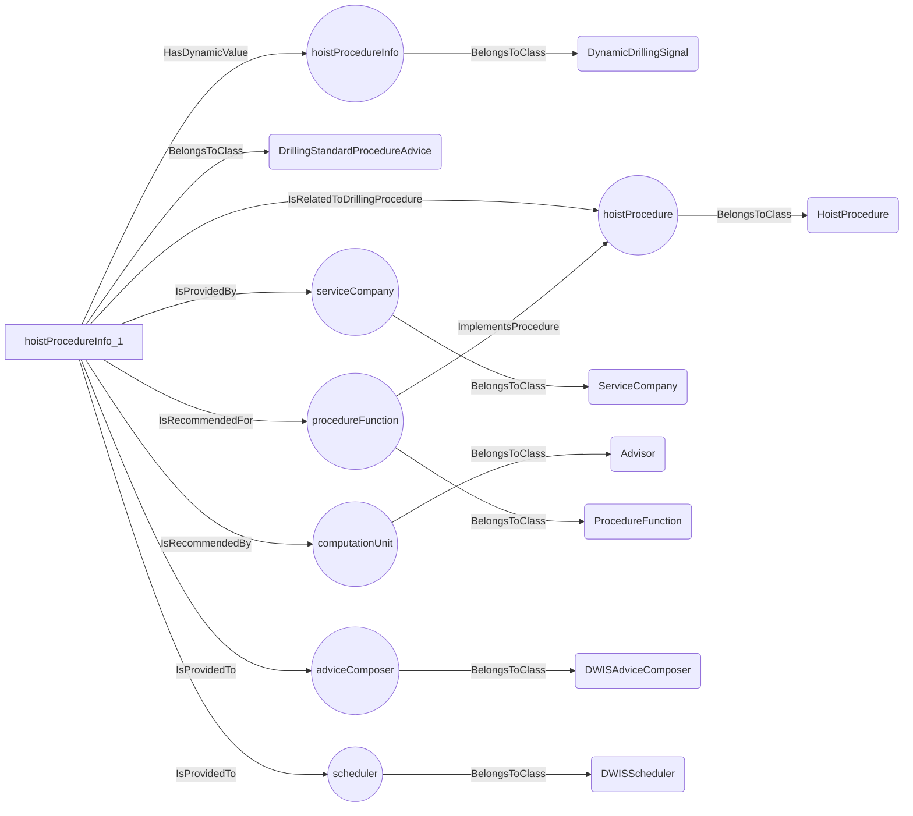
```mermaid
graph LR
	N0000[hoistProcedureInfo] -->|BelongsToClass| N0001(DynamicDrillingSignal) 
	N0002[hoistProcedureInfo_1] -->|BelongsToClass| N0003(DrillingStandardProcedureAdvice) 
	N0002[hoistProcedureInfo_1] -->|HasDynamicValue| N0000((hoistProcedureInfo)) 
	N0004[hoistProcedure] -->|BelongsToClass| N0005(HoistProcedure) 
	N0002[hoistProcedureInfo_1] -->|IsRelatedToDrillingProcedure| N0004((hoistProcedure)) 
	N0006[serviceCompany] -->|BelongsToClass| N0007(ServiceCompany) 
	N0002[hoistProcedureInfo_1] -->|IsProvidedBy| N0006((serviceCompany)) 
	N0008[computationUnit] -->|BelongsToClass| N0009(Advisor) 
	N0002[hoistProcedureInfo_1] -->|IsRecommendedBy| N0008((computationUnit)) 
	N0010[procedureFunction] -->|BelongsToClass| N0011(ProcedureFunction) 
	N0010[procedureFunction] -->|ImplementsProcedure| N0004((hoistProcedure)) 
	N0002[hoistProcedureInfo_1] -->|IsRecommendedFor| N0010((procedureFunction)) 
	N0012[adviceComposer] -->|BelongsToClass| N0013(DWISAdviceComposer) 
	N0002[hoistProcedureInfo_1] -->|IsProvidedTo| N0012((adviceComposer)) 
	N0014[scheduler] -->|BelongsToClass| N0015(DWISScheduler) 
	N0002[hoistProcedureInfo_1] -->|IsProvidedTo| N0014((scheduler)) 
```
An example SparQL query looks like this:
```sparql
PREFIX rdf: <http://www.w3.org/1999/02/22-rdf-syntax-ns#>
PREFIX ddhub: <http://ddhub.no/>
PREFIX quantity: <http://ddhub.no/UnitAndQuantity>
SELECT ?hoistProcedureInfo
WHERE {
	?hoistProcedureInfo rdf:type ddhub:DynamicDrillingSignal .
	?hoistProcedureInfo_1 rdf:type ddhub:DrillingStandardProcedureAdvice .
	?hoistProcedure rdf:type ddhub:HoistProcedure .
	?serviceCompany rdf:type ddhub:ServiceCompany .
	?computationUnit rdf:type ddhub:Advisor .
	?procedureFunction rdf:type ddhub:ProcedureFunction .
	?adviceComposer rdf:type ddhub:DWISAdviceComposer .
	?scheduler rdf:type ddhub:DWISScheduler .
  FILTER (
	?Attribute000 = hoistProcedureInfo
	&& 	?Attribute001 = hoistProcedure
	&& 	?Attribute002 = serviceCompany
	&& 	?Attribute003 = computationUnit
	&& 	?Attribute004 = hoistProcedure
	&& 	?Attribute005 = procedureFunction
	&& 	?Attribute006 = adviceComposer
	&& 	?Attribute007 = scheduler
  )
}
```
The tag bottom procedure is used to tag the bottom hole and establish the drilling parameters.
``` dwis tagBottomProcedureInfo
DynamicDrillingSignal:tagBottomProcedureInfo
DrillingStandardProcedureAdvice:tagBottomProcedureInfo_1
tagBottomProcedureInfo_1 HasDynamicValue tagBottomProcedureInfo
TagBottomProcedure:tagBottomProcedure
tagBottomProcedureInfo_1 IsRelatedToDrillingProcedure tagBottomProcedure
ServiceCompany:serviceCompany
tagBottomProcedureInfo_1 IsProvidedBy serviceCompany
Advisor:computationUnit
tagBottomProcedureInfo_1 IsRecommendedBy computationUnit
ProcedureFunction:procedureFunction
procedureFunction ImplementsProcedure tagBottomProcedure
tagBottomProcedureInfo_1 IsRecommendedFor procedureFunction
DWISAdviceComposer:adviceComposer
tagBottomProcedureInfo_1 IsProvidedTo adviceComposer
DWISScheduler:scheduler
tagBottomProcedureInfo_1 IsProvidedTo scheduler
```
An example semantic graph looks like as follow:
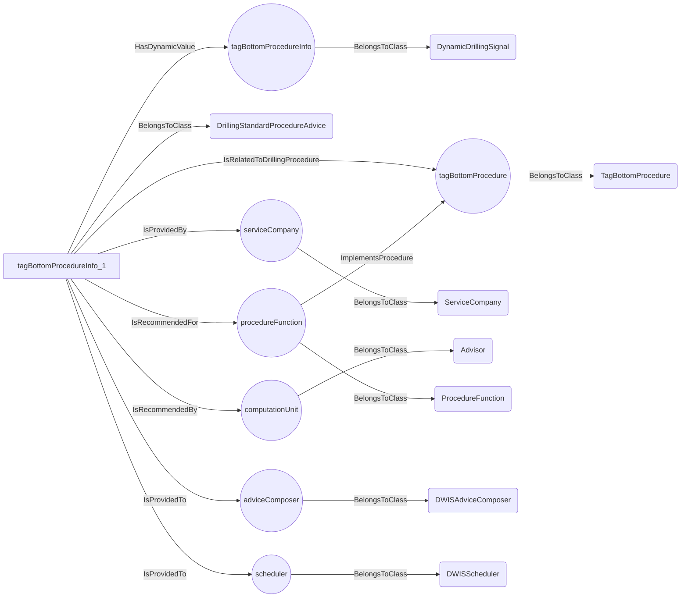
```mermaid
graph LR
	N0000[tagBottomProcedureInfo] -->|BelongsToClass| N0001(DynamicDrillingSignal) 
	N0002[tagBottomProcedureInfo_1] -->|BelongsToClass| N0003(DrillingStandardProcedureAdvice) 
	N0002[tagBottomProcedureInfo_1] -->|HasDynamicValue| N0000((tagBottomProcedureInfo)) 
	N0004[tagBottomProcedure] -->|BelongsToClass| N0005(TagBottomProcedure) 
	N0002[tagBottomProcedureInfo_1] -->|IsRelatedToDrillingProcedure| N0004((tagBottomProcedure)) 
	N0006[serviceCompany] -->|BelongsToClass| N0007(ServiceCompany) 
	N0002[tagBottomProcedureInfo_1] -->|IsProvidedBy| N0006((serviceCompany)) 
	N0008[computationUnit] -->|BelongsToClass| N0009(Advisor) 
	N0002[tagBottomProcedureInfo_1] -->|IsRecommendedBy| N0008((computationUnit)) 
	N0010[procedureFunction] -->|BelongsToClass| N0011(ProcedureFunction) 
	N0010[procedureFunction] -->|ImplementsProcedure| N0004((tagBottomProcedure)) 
	N0002[tagBottomProcedureInfo_1] -->|IsRecommendedFor| N0010((procedureFunction)) 
	N0012[adviceComposer] -->|BelongsToClass| N0013(DWISAdviceComposer) 
	N0002[tagBottomProcedureInfo_1] -->|IsProvidedTo| N0012((adviceComposer)) 
	N0014[scheduler] -->|BelongsToClass| N0015(DWISScheduler) 
	N0002[tagBottomProcedureInfo_1] -->|IsProvidedTo| N0014((scheduler)) 
```
An example SparQL query looks like this:
```sparql
PREFIX rdf: <http://www.w3.org/1999/02/22-rdf-syntax-ns#>
PREFIX ddhub: <http://ddhub.no/>
PREFIX quantity: <http://ddhub.no/UnitAndQuantity>
SELECT ?tagBottomProcedureInfo
WHERE {
	?tagBottomProcedureInfo rdf:type ddhub:DynamicDrillingSignal .
	?tagBottomProcedureInfo_1 rdf:type ddhub:DrillingStandardProcedureAdvice .
	?tagBottomProcedure rdf:type ddhub:TagBottomProcedure .
	?serviceCompany rdf:type ddhub:ServiceCompany .
	?computationUnit rdf:type ddhub:Advisor .
	?procedureFunction rdf:type ddhub:ProcedureFunction .
	?adviceComposer rdf:type ddhub:DWISAdviceComposer .
	?scheduler rdf:type ddhub:DWISScheduler .
  FILTER (
	?Attribute000 = tagBottomProcedureInfo
	&& 	?Attribute001 = tagBottomProcedure
	&& 	?Attribute002 = serviceCompany
	&& 	?Attribute003 = computationUnit
	&& 	?Attribute004 = tagBottomProcedure
	&& 	?Attribute005 = procedureFunction
	&& 	?Attribute006 = adviceComposer
	&& 	?Attribute007 = scheduler
  )
}
```
The reciprocation procedure is used to ream up and down with the same stand. The main purpose is often to clean the hole
while avoiding to wash out the formation.
``` dwis reciprocationProcedureInfo
DynamicDrillingSignal:reciprocationProcedureInfo
DrillingStandardProcedureAdvice:reciprocationProcedureInfo_1
reciprocationProcedureInfo_1 HasDynamicValue reciprocationProcedureInfo
ReciprocationProcedure:reciprocationProcedure
reciprocationProcedureInfo_1 IsRelatedToDrillingProcedure reciprocationProcedure
ServiceCompany:serviceCompany
reciprocationProcedureInfo_1 IsProvidedBy serviceCompany
Advisor:computationUnit
reciprocationProcedureInfo_1 IsRecommendedBy computationUnit
ProcedureFunction:procedureFunction
procedureFunction ImplementsProcedure reciprocationProcedure
reciprocationProcedureInfo_1 IsRecommendedFor procedureFunction
DWISAdviceComposer:adviceComposer
reciprocationProcedureInfo_1 IsProvidedTo adviceComposer
DWISScheduler:scheduler
reciprocationProcedureInfo_1 IsProvidedTo scheduler
```
An example semantic graph looks like as follow:
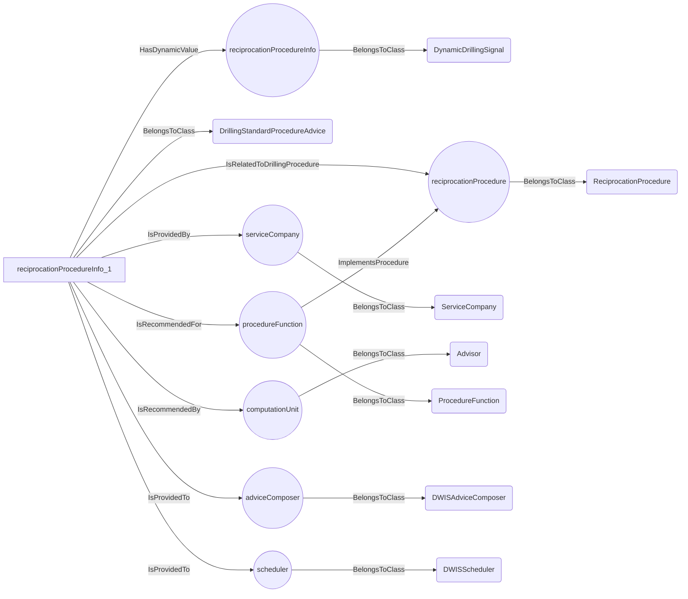
```mermaid
graph LR
	N0000[reciprocationProcedureInfo] -->|BelongsToClass| N0001(DynamicDrillingSignal) 
	N0002[reciprocationProcedureInfo_1] -->|BelongsToClass| N0003(DrillingStandardProcedureAdvice) 
	N0002[reciprocationProcedureInfo_1] -->|HasDynamicValue| N0000((reciprocationProcedureInfo)) 
	N0004[reciprocationProcedure] -->|BelongsToClass| N0005(ReciprocationProcedure) 
	N0002[reciprocationProcedureInfo_1] -->|IsRelatedToDrillingProcedure| N0004((reciprocationProcedure)) 
	N0006[serviceCompany] -->|BelongsToClass| N0007(ServiceCompany) 
	N0002[reciprocationProcedureInfo_1] -->|IsProvidedBy| N0006((serviceCompany)) 
	N0008[computationUnit] -->|BelongsToClass| N0009(Advisor) 
	N0002[reciprocationProcedureInfo_1] -->|IsRecommendedBy| N0008((computationUnit)) 
	N0010[procedureFunction] -->|BelongsToClass| N0011(ProcedureFunction) 
	N0010[procedureFunction] -->|ImplementsProcedure| N0004((reciprocationProcedure)) 
	N0002[reciprocationProcedureInfo_1] -->|IsRecommendedFor| N0010((procedureFunction)) 
	N0012[adviceComposer] -->|BelongsToClass| N0013(DWISAdviceComposer) 
	N0002[reciprocationProcedureInfo_1] -->|IsProvidedTo| N0012((adviceComposer)) 
	N0014[scheduler] -->|BelongsToClass| N0015(DWISScheduler) 
	N0002[reciprocationProcedureInfo_1] -->|IsProvidedTo| N0014((scheduler)) 
```
An example SparQL query looks like this:
```sparql
PREFIX rdf: <http://www.w3.org/1999/02/22-rdf-syntax-ns#>
PREFIX ddhub: <http://ddhub.no/>
PREFIX quantity: <http://ddhub.no/UnitAndQuantity>
SELECT ?reciprocationProcedureInfo
WHERE {
	?reciprocationProcedureInfo rdf:type ddhub:DynamicDrillingSignal .
	?reciprocationProcedureInfo_1 rdf:type ddhub:DrillingStandardProcedureAdvice .
	?reciprocationProcedure rdf:type ddhub:ReciprocationProcedure .
	?serviceCompany rdf:type ddhub:ServiceCompany .
	?computationUnit rdf:type ddhub:Advisor .
	?procedureFunction rdf:type ddhub:ProcedureFunction .
	?adviceComposer rdf:type ddhub:DWISAdviceComposer .
	?scheduler rdf:type ddhub:DWISScheduler .
  FILTER (
	?Attribute000 = reciprocationProcedureInfo
	&& 	?Attribute001 = reciprocationProcedure
	&& 	?Attribute002 = serviceCompany
	&& 	?Attribute003 = computationUnit
	&& 	?Attribute004 = reciprocationProcedure
	&& 	?Attribute005 = procedureFunction
	&& 	?Attribute006 = adviceComposer
	&& 	?Attribute007 = scheduler
  )
}
```
A friction test procedure is used to measure the free rotating weight and torque and the pick-up and slack-off weights.
``` dwis frictionTestProcedureInfo
DynamicDrillingSignal:frictionTestProcedureInfo
DrillingStandardProcedureAdvice:frictionTestProcedureInfo_1
frictionTestProcedureInfo_1 HasDynamicValue frictionTestProcedureInfo
FrictionTestProcedure:frictionTestProcedure
frictionTestProcedureInfo_1 IsRelatedToDrillingProcedure frictionTestProcedure
ServiceCompany:serviceCompany
frictionTestProcedureInfo_1 IsProvidedBy serviceCompany
Advisor:computationUnit
frictionTestProcedureInfo_1 IsRecommendedBy computationUnit
ProcedureFunction:procedureFunction
procedureFunction ImplementsProcedure frictionTestProcedure
frictionTestProcedureInfo_1 IsRecommendedFor procedureFunction
DWISAdviceComposer:adviceComposer
frictionTestProcedureInfo_1 IsProvidedTo adviceComposer
DWISScheduler:scheduler
frictionTestProcedureInfo_1 IsProvidedTo scheduler
```
An example semantic graph looks like as follow:
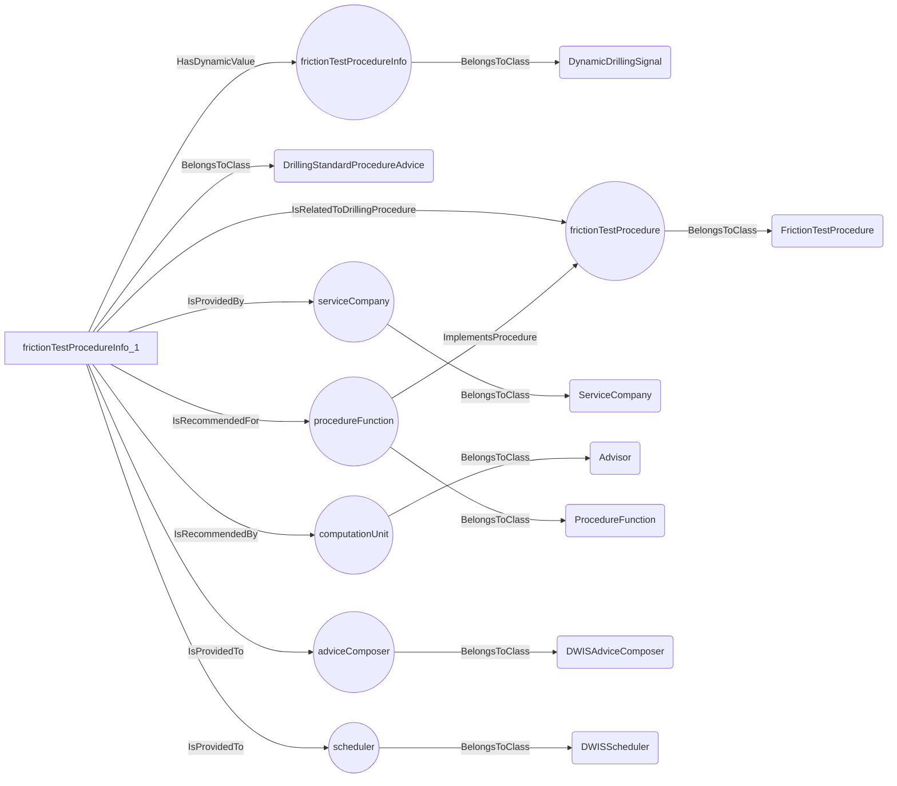
```mermaid
graph LR
	N0000[frictionTestProcedureInfo] -->|BelongsToClass| N0001(DynamicDrillingSignal) 
	N0002[frictionTestProcedureInfo_1] -->|BelongsToClass| N0003(DrillingStandardProcedureAdvice) 
	N0002[frictionTestProcedureInfo_1] -->|HasDynamicValue| N0000((frictionTestProcedureInfo)) 
	N0004[frictionTestProcedure] -->|BelongsToClass| N0005(FrictionTestProcedure) 
	N0002[frictionTestProcedureInfo_1] -->|IsRelatedToDrillingProcedure| N0004((frictionTestProcedure)) 
	N0006[serviceCompany] -->|BelongsToClass| N0007(ServiceCompany) 
	N0002[frictionTestProcedureInfo_1] -->|IsProvidedBy| N0006((serviceCompany)) 
	N0008[computationUnit] -->|BelongsToClass| N0009(Advisor) 
	N0002[frictionTestProcedureInfo_1] -->|IsRecommendedBy| N0008((computationUnit)) 
	N0010[procedureFunction] -->|BelongsToClass| N0011(ProcedureFunction) 
	N0010[procedureFunction] -->|ImplementsProcedure| N0004((frictionTestProcedure)) 
	N0002[frictionTestProcedureInfo_1] -->|IsRecommendedFor| N0010((procedureFunction)) 
	N0012[adviceComposer] -->|BelongsToClass| N0013(DWISAdviceComposer) 
	N0002[frictionTestProcedureInfo_1] -->|IsProvidedTo| N0012((adviceComposer)) 
	N0014[scheduler] -->|BelongsToClass| N0015(DWISScheduler) 
	N0002[frictionTestProcedureInfo_1] -->|IsProvidedTo| N0014((scheduler)) 
```
An example SparQL query looks like this:
```sparql
PREFIX rdf: <http://www.w3.org/1999/02/22-rdf-syntax-ns#>
PREFIX ddhub: <http://ddhub.no/>
PREFIX quantity: <http://ddhub.no/UnitAndQuantity>
SELECT ?frictionTestProcedureInfo
WHERE {
	?frictionTestProcedureInfo rdf:type ddhub:DynamicDrillingSignal .
	?frictionTestProcedureInfo_1 rdf:type ddhub:DrillingStandardProcedureAdvice .
	?frictionTestProcedure rdf:type ddhub:FrictionTestProcedure .
	?serviceCompany rdf:type ddhub:ServiceCompany .
	?computationUnit rdf:type ddhub:Advisor .
	?procedureFunction rdf:type ddhub:ProcedureFunction .
	?adviceComposer rdf:type ddhub:DWISAdviceComposer .
	?scheduler rdf:type ddhub:DWISScheduler .
  FILTER (
	?Attribute000 = frictionTestProcedureInfo
	&& 	?Attribute001 = frictionTestProcedure
	&& 	?Attribute002 = serviceCompany
	&& 	?Attribute003 = computationUnit
	&& 	?Attribute004 = frictionTestProcedure
	&& 	?Attribute005 = procedureFunction
	&& 	?Attribute006 = adviceComposer
	&& 	?Attribute007 = scheduler
  )
}
```
The slow circulation rate procedure is used to measure the pressure losses of the drilling system in conditions close
to what would be necessary while circulating out a kick.
``` dwis slowCirculationRateProcedureInfo
DynamicDrillingSignal:slowCirculationRateProcedureInfo
DrillingStandardProcedureAdvice:slowCirculationRateProcedureInfo_1
slowCirculationRateProcedureInfo_1 HasDynamicValue slowCirculationRateProcedureInfo
SlowCirculationRateProcedure:slowCirculationRateProcedure
slowCirculationRateProcedureInfo_1 IsRelatedToDrillingProcedure slowCirculationRateProcedure
ServiceCompany:serviceCompany
slowCirculationRateProcedureInfo_1 IsProvidedBy serviceCompany
Advisor:computationUnit
slowCirculationRateProcedureInfo_1 IsRecommendedBy computationUnit
ProcedureFunction:procedureFunction
procedureFunction ImplementsProcedure slowCirculationRateProcedure
slowCirculationRateProcedureInfo_1 IsRecommendedFor procedureFunction
DWISAdviceComposer:adviceComposer
slowCirculationRateProcedureInfo_1 IsProvidedTo adviceComposer
DWISScheduler:scheduler
slowCirculationRateProcedureInfo_1 IsProvidedTo scheduler
```
An example semantic graph looks like as follow:
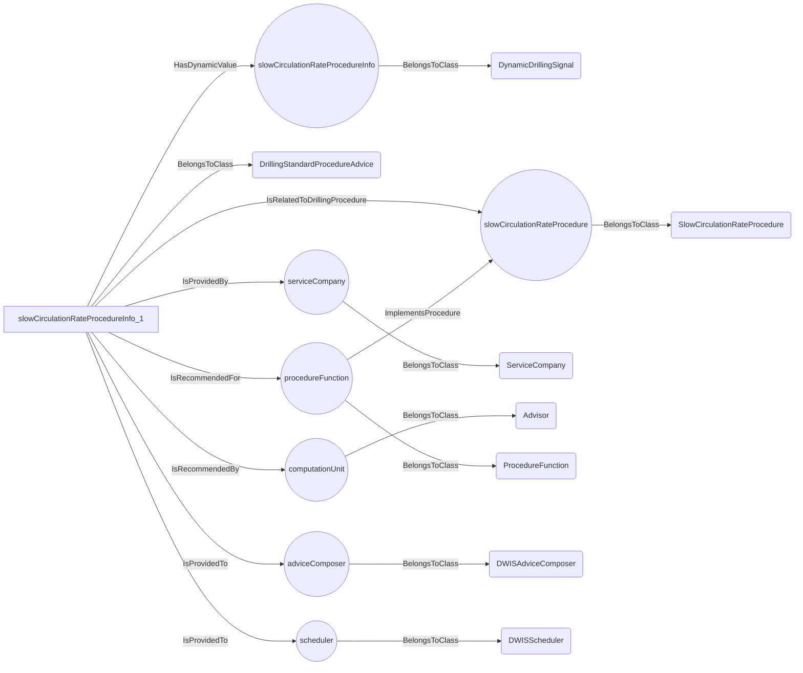
```mermaid
graph LR
	N0000[slowCirculationRateProcedureInfo] -->|BelongsToClass| N0001(DynamicDrillingSignal) 
	N0002[slowCirculationRateProcedureInfo_1] -->|BelongsToClass| N0003(DrillingStandardProcedureAdvice) 
	N0002[slowCirculationRateProcedureInfo_1] -->|HasDynamicValue| N0000((slowCirculationRateProcedureInfo)) 
	N0004[slowCirculationRateProcedure] -->|BelongsToClass| N0005(SlowCirculationRateProcedure) 
	N0002[slowCirculationRateProcedureInfo_1] -->|IsRelatedToDrillingProcedure| N0004((slowCirculationRateProcedure)) 
	N0006[serviceCompany] -->|BelongsToClass| N0007(ServiceCompany) 
	N0002[slowCirculationRateProcedureInfo_1] -->|IsProvidedBy| N0006((serviceCompany)) 
	N0008[computationUnit] -->|BelongsToClass| N0009(Advisor) 
	N0002[slowCirculationRateProcedureInfo_1] -->|IsRecommendedBy| N0008((computationUnit)) 
	N0010[procedureFunction] -->|BelongsToClass| N0011(ProcedureFunction) 
	N0010[procedureFunction] -->|ImplementsProcedure| N0004((slowCirculationRateProcedure)) 
	N0002[slowCirculationRateProcedureInfo_1] -->|IsRecommendedFor| N0010((procedureFunction)) 
	N0012[adviceComposer] -->|BelongsToClass| N0013(DWISAdviceComposer) 
	N0002[slowCirculationRateProcedureInfo_1] -->|IsProvidedTo| N0012((adviceComposer)) 
	N0014[scheduler] -->|BelongsToClass| N0015(DWISScheduler) 
	N0002[slowCirculationRateProcedureInfo_1] -->|IsProvidedTo| N0014((scheduler)) 
```
An example SparQL query looks like this:
```sparql
PREFIX rdf: <http://www.w3.org/1999/02/22-rdf-syntax-ns#>
PREFIX ddhub: <http://ddhub.no/>
PREFIX quantity: <http://ddhub.no/UnitAndQuantity>
SELECT ?slowCirculationRateProcedureInfo
WHERE {
	?slowCirculationRateProcedureInfo rdf:type ddhub:DynamicDrillingSignal .
	?slowCirculationRateProcedureInfo_1 rdf:type ddhub:DrillingStandardProcedureAdvice .
	?slowCirculationRateProcedure rdf:type ddhub:SlowCirculationRateProcedure .
	?serviceCompany rdf:type ddhub:ServiceCompany .
	?computationUnit rdf:type ddhub:Advisor .
	?procedureFunction rdf:type ddhub:ProcedureFunction .
	?adviceComposer rdf:type ddhub:DWISAdviceComposer .
	?scheduler rdf:type ddhub:DWISScheduler .
  FILTER (
	?Attribute000 = slowCirculationRateProcedureInfo
	&& 	?Attribute001 = slowCirculationRateProcedure
	&& 	?Attribute002 = serviceCompany
	&& 	?Attribute003 = computationUnit
	&& 	?Attribute004 = slowCirculationRateProcedure
	&& 	?Attribute005 = procedureFunction
	&& 	?Attribute006 = adviceComposer
	&& 	?Attribute007 = scheduler
  )
}
```
The pressure integrity test procedure is used to either check that the formation can hold the maximum expected downhole
pressure (formation integrity test) or to test the strength of the formation and the minimum horizontal stress (leak-off test and 
extended leakoff test).
``` dwis pressureIntegrityTestProcedureInfo
DynamicDrillingSignal:pressureIntegrityTestProcedureInfo
DrillingStandardProcedureAdvice:pressureIntegrityTestProcedureInfo_1
pressureIntegrityTestProcedureInfo_1 HasDynamicValue pressureIntegrityTestProcedureInfo
PressureIntegrityTestProcedure:pressureIntegrityTestProcedure
pressureIntegrityTestProcedureInfo_1 IsRelatedToDrillingProcedure pressureIntegrityTestProcedure
ServiceCompany:serviceCompany
pressureIntegrityTestProcedureInfo_1 IsProvidedBy serviceCompany
Advisor:computationUnit
pressureIntegrityTestProcedureInfo_1 IsRecommendedBy computationUnit
ProcedureFunction:procedureFunction
procedureFunction ImplementsProcedure pressureIntegrityTestProcedure
pressureIntegrityTestProcedureInfo_1 IsRecommendedFor procedureFunction
DWISAdviceComposer:adviceComposer
pressureIntegrityTestProcedureInfo_1 IsProvidedTo adviceComposer
DWISScheduler:scheduler
pressureIntegrityTestProcedureInfo_1 IsProvidedTo scheduler
```
An example semantic graph looks like as follow:
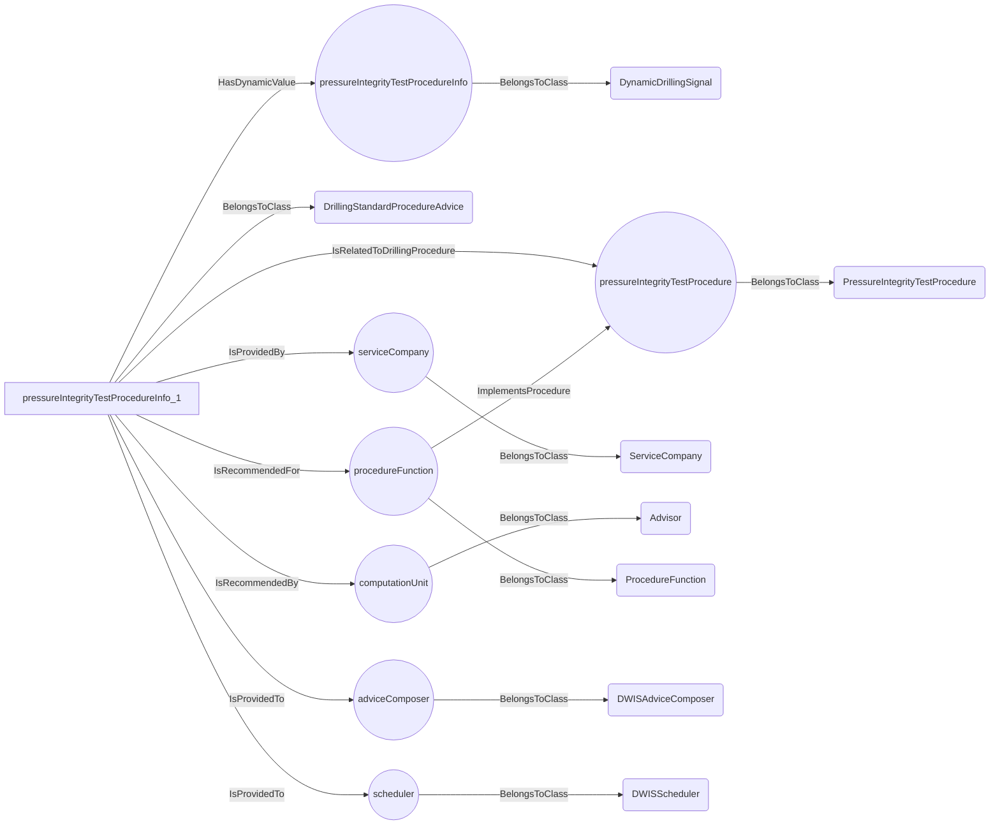
```mermaid
graph LR
	N0000[pressureIntegrityTestProcedureInfo] -->|BelongsToClass| N0001(DynamicDrillingSignal) 
	N0002[pressureIntegrityTestProcedureInfo_1] -->|BelongsToClass| N0003(DrillingStandardProcedureAdvice) 
	N0002[pressureIntegrityTestProcedureInfo_1] -->|HasDynamicValue| N0000((pressureIntegrityTestProcedureInfo)) 
	N0004[pressureIntegrityTestProcedure] -->|BelongsToClass| N0005(PressureIntegrityTestProcedure) 
	N0002[pressureIntegrityTestProcedureInfo_1] -->|IsRelatedToDrillingProcedure| N0004((pressureIntegrityTestProcedure)) 
	N0006[serviceCompany] -->|BelongsToClass| N0007(ServiceCompany) 
	N0002[pressureIntegrityTestProcedureInfo_1] -->|IsProvidedBy| N0006((serviceCompany)) 
	N0008[computationUnit] -->|BelongsToClass| N0009(Advisor) 
	N0002[pressureIntegrityTestProcedureInfo_1] -->|IsRecommendedBy| N0008((computationUnit)) 
	N0010[procedureFunction] -->|BelongsToClass| N0011(ProcedureFunction) 
	N0010[procedureFunction] -->|ImplementsProcedure| N0004((pressureIntegrityTestProcedure)) 
	N0002[pressureIntegrityTestProcedureInfo_1] -->|IsRecommendedFor| N0010((procedureFunction)) 
	N0012[adviceComposer] -->|BelongsToClass| N0013(DWISAdviceComposer) 
	N0002[pressureIntegrityTestProcedureInfo_1] -->|IsProvidedTo| N0012((adviceComposer)) 
	N0014[scheduler] -->|BelongsToClass| N0015(DWISScheduler) 
	N0002[pressureIntegrityTestProcedureInfo_1] -->|IsProvidedTo| N0014((scheduler)) 
```
An example SparQL query looks like this:
```sparql
PREFIX rdf: <http://www.w3.org/1999/02/22-rdf-syntax-ns#>
PREFIX ddhub: <http://ddhub.no/>
PREFIX quantity: <http://ddhub.no/UnitAndQuantity>
SELECT ?pressureIntegrityTestProcedureInfo
WHERE {
	?pressureIntegrityTestProcedureInfo rdf:type ddhub:DynamicDrillingSignal .
	?pressureIntegrityTestProcedureInfo_1 rdf:type ddhub:DrillingStandardProcedureAdvice .
	?pressureIntegrityTestProcedure rdf:type ddhub:PressureIntegrityTestProcedure .
	?serviceCompany rdf:type ddhub:ServiceCompany .
	?computationUnit rdf:type ddhub:Advisor .
	?procedureFunction rdf:type ddhub:ProcedureFunction .
	?adviceComposer rdf:type ddhub:DWISAdviceComposer .
	?scheduler rdf:type ddhub:DWISScheduler .
  FILTER (
	?Attribute000 = pressureIntegrityTestProcedureInfo
	&& 	?Attribute001 = pressureIntegrityTestProcedure
	&& 	?Attribute002 = serviceCompany
	&& 	?Attribute003 = computationUnit
	&& 	?Attribute004 = pressureIntegrityTestProcedure
	&& 	?Attribute005 = procedureFunction
	&& 	?Attribute006 = adviceComposer
	&& 	?Attribute007 = scheduler
  )
}
```
The flow-check procedure is used to check the well is stable (no influx of formation fluids) while ensuring that the
drill-stem will not get stuck during the test.
``` dwis flowCheckProcedureInfo
DynamicDrillingSignal:flowCheckProcedureInfo
DrillingStandardProcedureAdvice:flowCheckProcedureInfo_1
flowCheckProcedureInfo_1 HasDynamicValue flowCheckProcedureInfo
FlowCheckProcedure:flowCheckProcedure
flowCheckProcedureInfo_1 IsRelatedToDrillingProcedure flowCheckProcedure
ServiceCompany:serviceCompany
flowCheckProcedureInfo_1 IsProvidedBy serviceCompany
Advisor:computationUnit
flowCheckProcedureInfo_1 IsRecommendedBy computationUnit
ProcedureFunction:procedureFunction
procedureFunction ImplementsProcedure flowCheckProcedure
flowCheckProcedureInfo_1 IsRecommendedFor procedureFunction
DWISAdviceComposer:adviceComposer
flowCheckProcedureInfo_1 IsProvidedTo adviceComposer
DWISScheduler:scheduler
flowCheckProcedureInfo_1 IsProvidedTo scheduler
```
An example semantic graph looks like as follow:
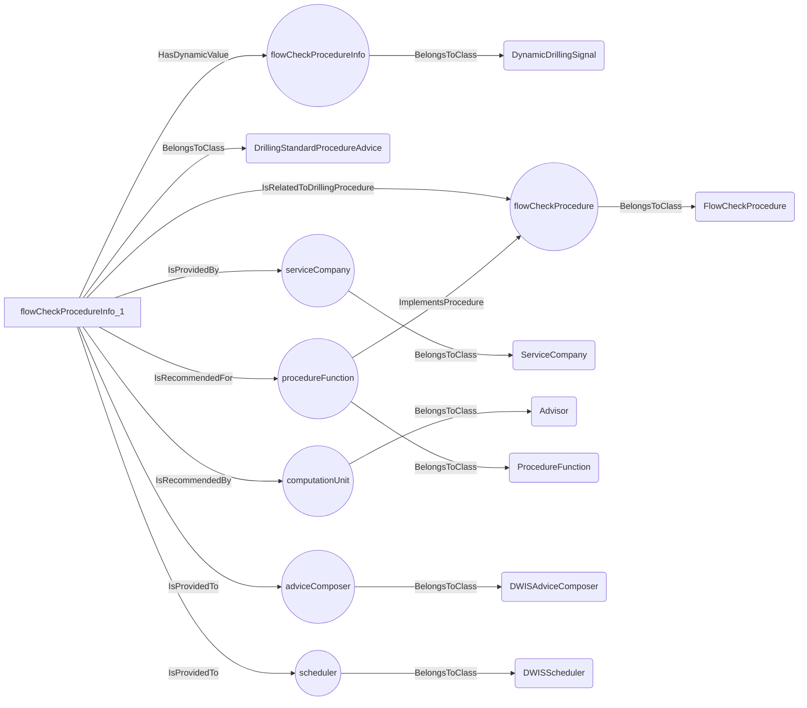
```mermaid
graph LR
	N0000[flowCheckProcedureInfo] -->|BelongsToClass| N0001(DynamicDrillingSignal) 
	N0002[flowCheckProcedureInfo_1] -->|BelongsToClass| N0003(DrillingStandardProcedureAdvice) 
	N0002[flowCheckProcedureInfo_1] -->|HasDynamicValue| N0000((flowCheckProcedureInfo)) 
	N0004[flowCheckProcedure] -->|BelongsToClass| N0005(FlowCheckProcedure) 
	N0002[flowCheckProcedureInfo_1] -->|IsRelatedToDrillingProcedure| N0004((flowCheckProcedure)) 
	N0006[serviceCompany] -->|BelongsToClass| N0007(ServiceCompany) 
	N0002[flowCheckProcedureInfo_1] -->|IsProvidedBy| N0006((serviceCompany)) 
	N0008[computationUnit] -->|BelongsToClass| N0009(Advisor) 
	N0002[flowCheckProcedureInfo_1] -->|IsRecommendedBy| N0008((computationUnit)) 
	N0010[procedureFunction] -->|BelongsToClass| N0011(ProcedureFunction) 
	N0010[procedureFunction] -->|ImplementsProcedure| N0004((flowCheckProcedure)) 
	N0002[flowCheckProcedureInfo_1] -->|IsRecommendedFor| N0010((procedureFunction)) 
	N0012[adviceComposer] -->|BelongsToClass| N0013(DWISAdviceComposer) 
	N0002[flowCheckProcedureInfo_1] -->|IsProvidedTo| N0012((adviceComposer)) 
	N0014[scheduler] -->|BelongsToClass| N0015(DWISScheduler) 
	N0002[flowCheckProcedureInfo_1] -->|IsProvidedTo| N0014((scheduler)) 
```
An example SparQL query looks like this:
```sparql
PREFIX rdf: <http://www.w3.org/1999/02/22-rdf-syntax-ns#>
PREFIX ddhub: <http://ddhub.no/>
PREFIX quantity: <http://ddhub.no/UnitAndQuantity>
SELECT ?flowCheckProcedureInfo
WHERE {
	?flowCheckProcedureInfo rdf:type ddhub:DynamicDrillingSignal .
	?flowCheckProcedureInfo_1 rdf:type ddhub:DrillingStandardProcedureAdvice .
	?flowCheckProcedure rdf:type ddhub:FlowCheckProcedure .
	?serviceCompany rdf:type ddhub:ServiceCompany .
	?computationUnit rdf:type ddhub:Advisor .
	?procedureFunction rdf:type ddhub:ProcedureFunction .
	?adviceComposer rdf:type ddhub:DWISAdviceComposer .
	?scheduler rdf:type ddhub:DWISScheduler .
  FILTER (
	?Attribute000 = flowCheckProcedureInfo
	&& 	?Attribute001 = flowCheckProcedure
	&& 	?Attribute002 = serviceCompany
	&& 	?Attribute003 = computationUnit
	&& 	?Attribute004 = flowCheckProcedure
	&& 	?Attribute005 = procedureFunction
	&& 	?Attribute006 = adviceComposer
	&& 	?Attribute007 = scheduler
  )
}
```
The cementing procedure is used to displace the correct amount of cement at the right position while cleaning the borehole
to ensure good conditions for the cement setting.
``` dwis cementProcedureInfo
DynamicDrillingSignal:cementProcedureInfo
DrillingStandardProcedureAdvice:cementProcedureInfo_1
cementProcedureInfo_1 HasDynamicValue cementProcedureInfo
CementingProcedure:cementingProcedure
cementProcedureInfo_1 IsRelatedToDrillingProcedure cementingProcedure
ServiceCompany:serviceCompany
cementProcedureInfo_1 IsProvidedBy serviceCompany
Advisor:computationUnit
cementProcedureInfo_1 IsRecommendedBy computationUnit
ProcedureFunction:procedureFunction
procedureFunction ImplementsProcedure cementingProcedure
cementProcedureInfo_1 IsRecommendedFor procedureFunction
DWISAdviceComposer:adviceComposer
cementProcedureInfo_1 IsProvidedTo adviceComposer
DWISScheduler:scheduler
cementProcedureInfo_1 IsProvidedTo scheduler
```
An example semantic graph looks like as follow:
```mermaid
graph LR
	N0000[cementProcedureInfo] -->|BelongsToClass| N0001(DynamicDrillingSignal) 
	N0002[cementProcedureInfo_1] -->|BelongsToClass| N0003(DrillingStandardProcedureAdvice) 
	N0002[cementProcedureInfo_1] -->|HasDynamicValue| N0000((cementProcedureInfo)) 
	N0004[cementingProcedure] -->|BelongsToClass| N0005(CementingProcedure) 
	N0002[cementProcedureInfo_1] -->|IsRelatedToDrillingProcedure| N0004((cementingProcedure)) 
	N0006[serviceCompany] -->|BelongsToClass| N0007(ServiceCompany) 
	N0002[cementProcedureInfo_1] -->|IsProvidedBy| N0006((serviceCompany)) 
	N0008[computationUnit] -->|BelongsToClass| N0009(Advisor) 
	N0002[cementProcedureInfo_1] -->|IsRecommendedBy| N0008((computationUnit)) 
	N0010[procedureFunction] -->|BelongsToClass| N0011(ProcedureFunction) 
	N0010[procedureFunction] -->|ImplementsProcedure| N0004((cementingProcedure)) 
	N0002[cementProcedureInfo_1] -->|IsRecommendedFor| N0010((procedureFunction)) 
	N0012[adviceComposer] -->|BelongsToClass| N0013(DWISAdviceComposer) 
	N0002[cementProcedureInfo_1] -->|IsProvidedTo| N0012((adviceComposer)) 
	N0014[scheduler] -->|BelongsToClass| N0015(DWISScheduler) 
	N0002[cementProcedureInfo_1] -->|IsProvidedTo| N0014((scheduler)) 
```
An example SparQL query looks like this:
```sparql
PREFIX rdf: <http://www.w3.org/1999/02/22-rdf-syntax-ns#>
PREFIX ddhub: <http://ddhub.no/>
PREFIX quantity: <http://ddhub.no/UnitAndQuantity>
SELECT ?cementProcedureInfo
WHERE {
	?cementProcedureInfo rdf:type ddhub:DynamicDrillingSignal .
	?cementProcedureInfo_1 rdf:type ddhub:DrillingStandardProcedureAdvice .
	?cementingProcedure rdf:type ddhub:CementingProcedure .
	?serviceCompany rdf:type ddhub:ServiceCompany .
	?computationUnit rdf:type ddhub:Advisor .
	?procedureFunction rdf:type ddhub:ProcedureFunction .
	?adviceComposer rdf:type ddhub:DWISAdviceComposer .
	?scheduler rdf:type ddhub:DWISScheduler .
  FILTER (
	?Attribute000 = cementProcedureInfo
	&& 	?Attribute001 = cementingProcedure
	&& 	?Attribute002 = serviceCompany
	&& 	?Attribute003 = computationUnit
	&& 	?Attribute004 = cementingProcedure
	&& 	?Attribute005 = procedureFunction
	&& 	?Attribute006 = adviceComposer
	&& 	?Attribute007 = scheduler
  )
}
```
The downlinking procedure is used to manipulate the flowrate/pressure or rotational speed to send a coded message to 
the rotary steerable system.
``` dwis downlinkProcedureInfo
DynamicDrillingSignal:downlinkProcedureInfo
DrillingStandardProcedureAdvice:downlinkProcedureInfo_1
downlinkProcedureInfo_1 HasDynamicValue downlinkProcedureInfo
DownlinkingProcedure:downlinkingProcedure
downlinkProcedureInfo_1 IsRelatedToDrillingProcedure downlinkingProcedure
ServiceCompany:serviceCompany
downlinkProcedureInfo_1 IsProvidedBy serviceCompany
Advisor:computationUnit
downlinkProcedureInfo_1 IsRecommendedBy computationUnit
ProcedureFunction:procedureFunction
procedureFunction ImplementsProcedure downlinkingProcedure
downlinkProcedureInfo_1 IsRecommendedFor procedureFunction
DWISAdviceComposer:adviceComposer
downlinkProcedureInfo_1 IsProvidedTo adviceComposer
DWISScheduler:scheduler
downlinkProcedureInfo_1 IsProvidedTo scheduler
```
An example semantic graph looks like as follow:
```mermaid
graph LR
	N0000[downlinkProcedureInfo] -->|BelongsToClass| N0001(DynamicDrillingSignal) 
	N0002[downlinkProcedureInfo_1] -->|BelongsToClass| N0003(DrillingStandardProcedureAdvice) 
	N0002[downlinkProcedureInfo_1] -->|HasDynamicValue| N0000((downlinkProcedureInfo)) 
	N0004[downlinkingProcedure] -->|BelongsToClass| N0005(DownlinkingProcedure) 
	N0002[downlinkProcedureInfo_1] -->|IsRelatedToDrillingProcedure| N0004((downlinkingProcedure)) 
	N0006[serviceCompany] -->|BelongsToClass| N0007(ServiceCompany) 
	N0002[downlinkProcedureInfo_1] -->|IsProvidedBy| N0006((serviceCompany)) 
	N0008[computationUnit] -->|BelongsToClass| N0009(Advisor) 
	N0002[downlinkProcedureInfo_1] -->|IsRecommendedBy| N0008((computationUnit)) 
	N0010[procedureFunction] -->|BelongsToClass| N0011(ProcedureFunction) 
	N0010[procedureFunction] -->|ImplementsProcedure| N0004((downlinkingProcedure)) 
	N0002[downlinkProcedureInfo_1] -->|IsRecommendedFor| N0010((procedureFunction)) 
	N0012[adviceComposer] -->|BelongsToClass| N0013(DWISAdviceComposer) 
	N0002[downlinkProcedureInfo_1] -->|IsProvidedTo| N0012((adviceComposer)) 
	N0014[scheduler] -->|BelongsToClass| N0015(DWISScheduler) 
	N0002[downlinkProcedureInfo_1] -->|IsProvidedTo| N0014((scheduler)) 
```
An example SparQL query looks like this:
```sparql
PREFIX rdf: <http://www.w3.org/1999/02/22-rdf-syntax-ns#>
PREFIX ddhub: <http://ddhub.no/>
PREFIX quantity: <http://ddhub.no/UnitAndQuantity>
SELECT ?downlinkProcedureInfo
WHERE {
	?downlinkProcedureInfo rdf:type ddhub:DynamicDrillingSignal .
	?downlinkProcedureInfo_1 rdf:type ddhub:DrillingStandardProcedureAdvice .
	?downlinkingProcedure rdf:type ddhub:DownlinkingProcedure .
	?serviceCompany rdf:type ddhub:ServiceCompany .
	?computationUnit rdf:type ddhub:Advisor .
	?procedureFunction rdf:type ddhub:ProcedureFunction .
	?adviceComposer rdf:type ddhub:DWISAdviceComposer .
	?scheduler rdf:type ddhub:DWISScheduler .
  FILTER (
	?Attribute000 = downlinkProcedureInfo
	&& 	?Attribute001 = downlinkingProcedure
	&& 	?Attribute002 = serviceCompany
	&& 	?Attribute003 = computationUnit
	&& 	?Attribute004 = downlinkingProcedure
	&& 	?Attribute005 = procedureFunction
	&& 	?Attribute006 = adviceComposer
	&& 	?Attribute007 = scheduler
  )
}
```
The toolface orientation procedure is used to manipulate the top of string angular position to ensure that the downhole
motor toolface is set to a desired set-point.
``` dwis toolfaceOrientationProcedureInfo
DynamicDrillingSignal:toolfaceOrientationProcedureInfo
DrillingStandardProcedureAdvice:toolfaceOrientationProcedureInfo_1
toolfaceOrientationProcedureInfo_1 HasDynamicValue toolfaceOrientationProcedureInfo
ToolfaceOrientationProcedure:toolfaceOrientationProcedure
toolfaceOrientationProcedureInfo_1 IsRelatedToDrillingProcedure toolfaceOrientationProcedure
ServiceCompany:serviceCompany
toolfaceOrientationProcedureInfo_1 IsProvidedBy serviceCompany
Advisor:computationUnit
toolfaceOrientationProcedureInfo_1 IsRecommendedBy computationUnit
ProcedureFunction:procedureFunction
procedureFunction ImplementsProcedure toolfaceOrientationProcedure
toolfaceOrientationProcedureInfo_1 IsRecommendedFor procedureFunction
DWISAdviceComposer:adviceComposer
toolfaceOrientationProcedureInfo_1 IsProvidedTo adviceComposer
DWISScheduler:scheduler
toolfaceOrientationProcedureInfo_1 IsProvidedTo scheduler
```
An example semantic graph looks like as follow:
```mermaid
graph LR
	N0000[toolfaceOrientationProcedureInfo] -->|BelongsToClass| N0001(DynamicDrillingSignal) 
	N0002[toolfaceOrientationProcedureInfo_1] -->|BelongsToClass| N0003(DrillingStandardProcedureAdvice) 
	N0002[toolfaceOrientationProcedureInfo_1] -->|HasDynamicValue| N0000((toolfaceOrientationProcedureInfo)) 
	N0004[toolfaceOrientationProcedure] -->|BelongsToClass| N0005(ToolfaceOrientationProcedure) 
	N0002[toolfaceOrientationProcedureInfo_1] -->|IsRelatedToDrillingProcedure| N0004((toolfaceOrientationProcedure)) 
	N0006[serviceCompany] -->|BelongsToClass| N0007(ServiceCompany) 
	N0002[toolfaceOrientationProcedureInfo_1] -->|IsProvidedBy| N0006((serviceCompany)) 
	N0008[computationUnit] -->|BelongsToClass| N0009(Advisor) 
	N0002[toolfaceOrientationProcedureInfo_1] -->|IsRecommendedBy| N0008((computationUnit)) 
	N0010[procedureFunction] -->|BelongsToClass| N0011(ProcedureFunction) 
	N0010[procedureFunction] -->|ImplementsProcedure| N0004((toolfaceOrientationProcedure)) 
	N0002[toolfaceOrientationProcedureInfo_1] -->|IsRecommendedFor| N0010((procedureFunction)) 
	N0012[adviceComposer] -->|BelongsToClass| N0013(DWISAdviceComposer) 
	N0002[toolfaceOrientationProcedureInfo_1] -->|IsProvidedTo| N0012((adviceComposer)) 
	N0014[scheduler] -->|BelongsToClass| N0015(DWISScheduler) 
	N0002[toolfaceOrientationProcedureInfo_1] -->|IsProvidedTo| N0014((scheduler)) 
```
An example SparQL query looks like this:
```sparql
PREFIX rdf: <http://www.w3.org/1999/02/22-rdf-syntax-ns#>
PREFIX ddhub: <http://ddhub.no/>
PREFIX quantity: <http://ddhub.no/UnitAndQuantity>
SELECT ?toolfaceOrientationProcedureInfo
WHERE {
	?toolfaceOrientationProcedureInfo rdf:type ddhub:DynamicDrillingSignal .
	?toolfaceOrientationProcedureInfo_1 rdf:type ddhub:DrillingStandardProcedureAdvice .
	?toolfaceOrientationProcedure rdf:type ddhub:ToolfaceOrientationProcedure .
	?serviceCompany rdf:type ddhub:ServiceCompany .
	?computationUnit rdf:type ddhub:Advisor .
	?procedureFunction rdf:type ddhub:ProcedureFunction .
	?adviceComposer rdf:type ddhub:DWISAdviceComposer .
	?scheduler rdf:type ddhub:DWISScheduler .
  FILTER (
	?Attribute000 = toolfaceOrientationProcedureInfo
	&& 	?Attribute001 = toolfaceOrientationProcedure
	&& 	?Attribute002 = serviceCompany
	&& 	?Attribute003 = computationUnit
	&& 	?Attribute004 = toolfaceOrientationProcedure
	&& 	?Attribute005 = procedureFunction
	&& 	?Attribute006 = adviceComposer
	&& 	?Attribute007 = scheduler
  )
}
```
## DrillingControlAdvice <!-- NOUN -->
- Display name: Drilling Control Advice
- Parent class: [AdvisorySystemAdvice](#AdvisorySystemAdvice)
- Description: 
A drilling control advisor provides information on how to control a part of the drilling process to stay as close
as possible to one or several desired values.
- Definition set: AdvisorySystemAdvice
- Examples:
A ROP management controller adjusts the parameters of the auto-driller to manage the ROP. The ROP management may concern
potential problems with drill-string buckling, passing the bit founder point, vibration and cuttings transport.
``` dwis ROPManagementControllerInfo
DynamicDrillingSignal:ROPManagementControllerInfo
DrillingControlAdvice:ROPManagementControllerInfo_1
ROPManagementControllerInfo_1 HasDynamicValue ROPManagementControllerInfo
ROPLimit:ROPLimit_1
ROPManagementControllerInfo_1 HasControlLimit ROPLimit_1
WOBLimit:WOBLimit_1
ROPManagementControllerInfo_1 HasControlLimit WOBLimit_1
DifferentialPressureLimit:differentialPressureLimit
ROPManagementControllerInfo_1 HasControlLimit differentialPressureLimit
BottomOfStringReferenceLocation:bottomOfStringLocation
StableAxialVelocityObjective:stableAxialVelocityObjective
stableAxialVelocityObjective IsPhysicallyLocatedAt bottomOfStringLocation
ROPManagementControllerInfo_1 IsRelatedToDrillingObjective stableAxialVelocityObjective
StableAxialForceObjective:stableWOBObjective
stableWOBObjective IsPhysicallyLocatedAt bottomOfStringLocation
ROPManagementControllerInfo_1 IsRelatedToDrillingObjective stableWOBObjective
StablePressureObjective:stableDifferentialPressure
ROPManagementControllerInfo_1 IsRelatedToDrillingObjective stableDifferentialPressure
ServiceCompany:serviceCompany
ROPManagementControllerInfo_1 IsProvidedBy serviceCompany
Advisor:computationUnit
ROPManagementControllerInfo_1 IsRecommendedBy computationUnit
ControllerFunction:autoDriller
autoDriller ImplementsObjective stableAxialVelocityObjective
autoDriller ImplementsObjective stableWOBObjective
autoDriller ImplementsObjective stableDifferentialPressure
ROPManagementControllerInfo_1 IsRecommendedFor autoDriller
DWISAdviceComposer:adviceComposer
ROPManagementControllerInfo_1 IsProvidedTo adviceComposer
DWISScheduler:scheduler
ROPManagementControllerInfo_1 IsProvidedTo scheduler
```
An example semantic graph looks like as follow:
```mermaid
graph LR
	N0000[ROPManagementControllerInfo] -->|BelongsToClass| N0001(DynamicDrillingSignal) 
	N0002[ROPManagementControllerInfo_1] -->|BelongsToClass| N0003(DrillingControlAdvice) 
	N0002[ROPManagementControllerInfo_1] -->|HasDynamicValue| N0000((ROPManagementControllerInfo)) 
	N0004[ROPLimit_1] -->|BelongsToClass| N0005(ROPLimit) 
	N0002[ROPManagementControllerInfo_1] -->|HasControlLimit| N0004((ROPLimit_1)) 
	N0006[WOBLimit_1] -->|BelongsToClass| N0007(WOBLimit) 
	N0002[ROPManagementControllerInfo_1] -->|HasControlLimit| N0006((WOBLimit_1)) 
	N0008[differentialPressureLimit] -->|BelongsToClass| N0009(DifferentialPressureLimit) 
	N0002[ROPManagementControllerInfo_1] -->|HasControlLimit| N0008((differentialPressureLimit)) 
	N0010[bottomOfStringLocation] -->|BelongsToClass| N0011(BottomOfStringReferenceLocation) 
	N0012[stableAxialVelocityObjective] -->|BelongsToClass| N0013(StableAxialVelocityObjective) 
	N0012[stableAxialVelocityObjective] -->|IsPhysicallyLocatedAt| N0010((bottomOfStringLocation)) 
	N0002[ROPManagementControllerInfo_1] -->|IsRelatedToDrillingObjective| N0012((stableAxialVelocityObjective)) 
	N0014[stableWOBObjective] -->|BelongsToClass| N0015(StableAxialForceObjective) 
	N0014[stableWOBObjective] -->|IsPhysicallyLocatedAt| N0010((bottomOfStringLocation)) 
	N0002[ROPManagementControllerInfo_1] -->|IsRelatedToDrillingObjective| N0014((stableWOBObjective)) 
	N0016[stableDifferentialPressure] -->|BelongsToClass| N0017(StablePressureObjective) 
	N0002[ROPManagementControllerInfo_1] -->|IsRelatedToDrillingObjective| N0016((stableDifferentialPressure)) 
	N0018[serviceCompany] -->|BelongsToClass| N0019(ServiceCompany) 
	N0002[ROPManagementControllerInfo_1] -->|IsProvidedBy| N0018((serviceCompany)) 
	N0020[computationUnit] -->|BelongsToClass| N0021(Advisor) 
	N0002[ROPManagementControllerInfo_1] -->|IsRecommendedBy| N0020((computationUnit)) 
	N0022[autoDriller] -->|BelongsToClass| N0023(ControllerFunction) 
	N0022[autoDriller] -->|ImplementsObjective| N0012((stableAxialVelocityObjective)) 
	N0022[autoDriller] -->|ImplementsObjective| N0014((stableWOBObjective)) 
	N0022[autoDriller] -->|ImplementsObjective| N0016((stableDifferentialPressure)) 
	N0002[ROPManagementControllerInfo_1] -->|IsRecommendedFor| N0022((autoDriller)) 
	N0024[adviceComposer] -->|BelongsToClass| N0025(DWISAdviceComposer) 
	N0002[ROPManagementControllerInfo_1] -->|IsProvidedTo| N0024((adviceComposer)) 
	N0026[scheduler] -->|BelongsToClass| N0027(DWISScheduler) 
	N0002[ROPManagementControllerInfo_1] -->|IsProvidedTo| N0026((scheduler)) 
```
An example SparQL query looks like this:
```sparql
PREFIX rdf: <http://www.w3.org/1999/02/22-rdf-syntax-ns#>
PREFIX ddhub: <http://ddhub.no/>
PREFIX quantity: <http://ddhub.no/UnitAndQuantity>
SELECT ?ROPManagementControllerInfo
WHERE {
	?ROPManagementControllerInfo rdf:type ddhub:DynamicDrillingSignal .
	?ROPManagementControllerInfo_1 rdf:type ddhub:DrillingControlAdvice .
	?ROPLimit_1 rdf:type ddhub:ROPLimit .
	?WOBLimit_1 rdf:type ddhub:WOBLimit .
	?differentialPressureLimit rdf:type ddhub:DifferentialPressureLimit .
	?bottomOfStringLocation rdf:type ddhub:BottomOfStringReferenceLocation .
	?stableAxialVelocityObjective rdf:type ddhub:StableAxialVelocityObjective .
	?stableWOBObjective rdf:type ddhub:StableAxialForceObjective .
	?stableDifferentialPressure rdf:type ddhub:StablePressureObjective .
	?serviceCompany rdf:type ddhub:ServiceCompany .
	?computationUnit rdf:type ddhub:Advisor .
	?autoDriller rdf:type ddhub:ControllerFunction .
	?adviceComposer rdf:type ddhub:DWISAdviceComposer .
	?scheduler rdf:type ddhub:DWISScheduler .
  FILTER (
	?Attribute000 = ROPManagementControllerInfo
	&& 	?Attribute001 = ROPLimit_1
	&& 	?Attribute002 = WOBLimit_1
	&& 	?Attribute003 = differentialPressureLimit
	&& 	?Attribute004 = bottomOfStringLocation
	&& 	?Attribute005 = stableAxialVelocityObjective
	&& 	?Attribute006 = bottomOfStringLocation
	&& 	?Attribute007 = stableWOBObjective
	&& 	?Attribute008 = stableDifferentialPressure
	&& 	?Attribute009 = serviceCompany
	&& 	?Attribute010 = computationUnit
	&& 	?Attribute011 = stableAxialVelocityObjective
	&& 	?Attribute012 = stableWOBObjective
	&& 	?Attribute013 = stableDifferentialPressure
	&& 	?Attribute014 = autoDriller
	&& 	?Attribute015 = adviceComposer
	&& 	?Attribute016 = scheduler
  )
}
```
When using a downhole motor for directional drilling, pipe rocking is used to assist with weight transmission during
slide periods.
``` dwis pipeRockingControllerInfo
DynamicDrillingSignal:pipeRockingControllerInfo
DrillingControlAdvice:pipeRockingControllerInfo_1
pipeRockingControllerInfo_1 HasDynamicValue pipeRockingControllerInfo
BottomOfStringReferenceLocation:bottomOfStringLocation
WeightTransferObjective:weightTransferObjective
weightTransferObjective IsPhysicallyLocatedAt bottomOfStringLocation
pipeRockingControllerInfo_1 IsRelatedToDrillingObjective weightTransferObjective
ServiceCompany:serviceCompany
pipeRockingControllerInfo_1 IsProvidedBy serviceCompany
Advisor:computationUnit
pipeRockingControllerInfo_1 IsRecommendedBy computationUnit
ControllerFunction:pipeRocking
pipeRocking ImplementsObjective weightTransferObjective
pipeRockingControllerInfo_1 IsRecommendedFor pipeRocking
DWISAdviceComposer:adviceComposer
pipeRockingControllerInfo_1 IsProvidedTo adviceComposer
DWISScheduler:scheduler
pipeRockingControllerInfo_1 IsProvidedTo scheduler
```
An example semantic graph looks like as follow:
```mermaid
graph LR
	N0000[pipeRockingControllerInfo] -->|BelongsToClass| N0001(DynamicDrillingSignal) 
	N0002[pipeRockingControllerInfo_1] -->|BelongsToClass| N0003(DrillingControlAdvice) 
	N0002[pipeRockingControllerInfo_1] -->|HasDynamicValue| N0000((pipeRockingControllerInfo)) 
	N0004[bottomOfStringLocation] -->|BelongsToClass| N0005(BottomOfStringReferenceLocation) 
	N0006[weightTransferObjective] -->|BelongsToClass| N0007(WeightTransferObjective) 
	N0006[weightTransferObjective] -->|IsPhysicallyLocatedAt| N0004((bottomOfStringLocation)) 
	N0002[pipeRockingControllerInfo_1] -->|IsRelatedToDrillingObjective| N0006((weightTransferObjective)) 
	N0008[serviceCompany] -->|BelongsToClass| N0009(ServiceCompany) 
	N0002[pipeRockingControllerInfo_1] -->|IsProvidedBy| N0008((serviceCompany)) 
	N0010[computationUnit] -->|BelongsToClass| N0011(Advisor) 
	N0002[pipeRockingControllerInfo_1] -->|IsRecommendedBy| N0010((computationUnit)) 
	N0012[pipeRocking] -->|BelongsToClass| N0013(ControllerFunction) 
	N0012[pipeRocking] -->|ImplementsObjective| N0006((weightTransferObjective)) 
	N0002[pipeRockingControllerInfo_1] -->|IsRecommendedFor| N0012((pipeRocking)) 
	N0014[adviceComposer] -->|BelongsToClass| N0015(DWISAdviceComposer) 
	N0002[pipeRockingControllerInfo_1] -->|IsProvidedTo| N0014((adviceComposer)) 
	N0016[scheduler] -->|BelongsToClass| N0017(DWISScheduler) 
	N0002[pipeRockingControllerInfo_1] -->|IsProvidedTo| N0016((scheduler)) 
```
An example SparQL query looks like this:
```sparql
PREFIX rdf: <http://www.w3.org/1999/02/22-rdf-syntax-ns#>
PREFIX ddhub: <http://ddhub.no/>
PREFIX quantity: <http://ddhub.no/UnitAndQuantity>
SELECT ?pipeRockingControllerInfo
WHERE {
	?pipeRockingControllerInfo rdf:type ddhub:DynamicDrillingSignal .
	?pipeRockingControllerInfo_1 rdf:type ddhub:DrillingControlAdvice .
	?bottomOfStringLocation rdf:type ddhub:BottomOfStringReferenceLocation .
	?weightTransferObjective rdf:type ddhub:WeightTransferObjective .
	?serviceCompany rdf:type ddhub:ServiceCompany .
	?computationUnit rdf:type ddhub:Advisor .
	?pipeRocking rdf:type ddhub:ControllerFunction .
	?adviceComposer rdf:type ddhub:DWISAdviceComposer .
	?scheduler rdf:type ddhub:DWISScheduler .
  FILTER (
	?Attribute000 = pipeRockingControllerInfo
	&& 	?Attribute001 = bottomOfStringLocation
	&& 	?Attribute002 = weightTransferObjective
	&& 	?Attribute003 = serviceCompany
	&& 	?Attribute004 = computationUnit
	&& 	?Attribute005 = weightTransferObjective
	&& 	?Attribute006 = pipeRocking
	&& 	?Attribute007 = adviceComposer
	&& 	?Attribute008 = scheduler
  )
}
```
A stick-slip mitigation controller attempts at damping stick-slip oscillations by controlling the drill-string rotation 
system.
``` dwis stickSlipMitigationControllerInfo
DynamicDrillingSignal:stickSlipMitigationControllerInfo
DrillingControlAdvice:stickSlipMitigationControllerInfo_1
stickSlipMitigationControllerInfo_1 HasDynamicValue stickSlipMitigationControllerInfo
BottomOfStringReferenceLocation:bottomOfStringLocation
StableRotationalVelocityObjective:stableRotationalVelocityObjective
stableRotationalVelocityObjective IsPhysicallyLocatedAt bottomOfStringLocation
stickSlipMitigationControllerInfo_1 IsRelatedToDrillingObjective stableRotationalVelocityObjective
ServiceCompany:serviceCompany
stickSlipMitigationControllerInfo_1 IsProvidedBy serviceCompany
Advisor:computationUnit
stickSlipMitigationControllerInfo_1 IsRecommendedBy computationUnit
ControllerFunction:stickSlipMitigation
stickSlipMitigation ImplementsObjective stableRotationalVelocityObjective
stickSlipMitigationControllerInfo_1 IsRecommendedFor stickSlipMitigation
DWISAdviceComposer:adviceComposer
stickSlipMitigationControllerInfo_1 IsProvidedTo adviceComposer
DWISScheduler:scheduler
stickSlipMitigationControllerInfo_1 IsProvidedTo scheduler
```
An example semantic graph looks like as follow:
```mermaid
graph LR
	N0000[stickSlipMitigationControllerInfo] -->|BelongsToClass| N0001(DynamicDrillingSignal) 
	N0002[stickSlipMitigationControllerInfo_1] -->|BelongsToClass| N0003(DrillingControlAdvice) 
	N0002[stickSlipMitigationControllerInfo_1] -->|HasDynamicValue| N0000((stickSlipMitigationControllerInfo)) 
	N0004[bottomOfStringLocation] -->|BelongsToClass| N0005(BottomOfStringReferenceLocation) 
	N0006[stableRotationalVelocityObjective] -->|BelongsToClass| N0007(StableRotationalVelocityObjective) 
	N0006[stableRotationalVelocityObjective] -->|IsPhysicallyLocatedAt| N0004((bottomOfStringLocation)) 
	N0002[stickSlipMitigationControllerInfo_1] -->|IsRelatedToDrillingObjective| N0006((stableRotationalVelocityObjective)) 
	N0008[serviceCompany] -->|BelongsToClass| N0009(ServiceCompany) 
	N0002[stickSlipMitigationControllerInfo_1] -->|IsProvidedBy| N0008((serviceCompany)) 
	N0010[computationUnit] -->|BelongsToClass| N0011(Advisor) 
	N0002[stickSlipMitigationControllerInfo_1] -->|IsRecommendedBy| N0010((computationUnit)) 
	N0012[stickSlipMitigation] -->|BelongsToClass| N0013(ControllerFunction) 
	N0012[stickSlipMitigation] -->|ImplementsObjective| N0006((stableRotationalVelocityObjective)) 
	N0002[stickSlipMitigationControllerInfo_1] -->|IsRecommendedFor| N0012((stickSlipMitigation)) 
	N0014[adviceComposer] -->|BelongsToClass| N0015(DWISAdviceComposer) 
	N0002[stickSlipMitigationControllerInfo_1] -->|IsProvidedTo| N0014((adviceComposer)) 
	N0016[scheduler] -->|BelongsToClass| N0017(DWISScheduler) 
	N0002[stickSlipMitigationControllerInfo_1] -->|IsProvidedTo| N0016((scheduler)) 
```
An example SparQL query looks like this:
```sparql
PREFIX rdf: <http://www.w3.org/1999/02/22-rdf-syntax-ns#>
PREFIX ddhub: <http://ddhub.no/>
PREFIX quantity: <http://ddhub.no/UnitAndQuantity>
SELECT ?stickSlipMitigationControllerInfo
WHERE {
	?stickSlipMitigationControllerInfo rdf:type ddhub:DynamicDrillingSignal .
	?stickSlipMitigationControllerInfo_1 rdf:type ddhub:DrillingControlAdvice .
	?bottomOfStringLocation rdf:type ddhub:BottomOfStringReferenceLocation .
	?stableRotationalVelocityObjective rdf:type ddhub:StableRotationalVelocityObjective .
	?serviceCompany rdf:type ddhub:ServiceCompany .
	?computationUnit rdf:type ddhub:Advisor .
	?stickSlipMitigation rdf:type ddhub:ControllerFunction .
	?adviceComposer rdf:type ddhub:DWISAdviceComposer .
	?scheduler rdf:type ddhub:DWISScheduler .
  FILTER (
	?Attribute000 = stickSlipMitigationControllerInfo
	&& 	?Attribute001 = bottomOfStringLocation
	&& 	?Attribute002 = stableRotationalVelocityObjective
	&& 	?Attribute003 = serviceCompany
	&& 	?Attribute004 = computationUnit
	&& 	?Attribute005 = stableRotationalVelocityObjective
	&& 	?Attribute006 = stickSlipMitigation
	&& 	?Attribute007 = adviceComposer
	&& 	?Attribute008 = scheduler
  )
}
```
## DrillingSafeOperatingEnvelopeAdvice <!-- NOUN -->
- Display name: Drilling Safe Operating Envelope Advice
- Parent class: [AdvisorySystemAdvice](#AdvisorySystemAdvice)
- Description: 
A safe operating envelope (SOE) advisor provides information on the limits that shall be used when controlling the drilling
process to avoid possible drilling incidents.
- Definition set: AdvisorySystemAdvice
- Examples:
The min-max axial velocity SOE is used to limit the axial drill-strem velocity to avoid generating swab and surge 
pressures that exceeds the geo-pressure window.
``` dwis minMaxAxialVelocitySOEInfo
DynamicDrillingSignal:minMaxAxialVelocitySOEInfo
DrillingSafeOperatingEnvelopeAdvice:minMaxAxialVelocitySOEInfo_1
minMaxAxialVelocitySOEInfo_1 HasDynamicValue minMaxAxialVelocitySOEInfo
AxialVelocityLimit:axialVelocityLimit
minMaxAxialVelocitySOEInfo_1 IsRelatedToDrillingLimit axialVelocityLimit
ServiceCompany:serviceCompany
minMaxAxialVelocitySOEInfo_1 IsProvidedBy serviceCompany
Advisor:computationUnit
minMaxAxialVelocitySOEInfo_1 IsRecommendedBy computationUnit
SOEFunction:soeFunction
soeFunction ImplementsLimit axialVelocityLimit
minMaxAxialVelocitySOEInfo_1 IsRecommendedFor soeFunction
DWISAdviceComposer:adviceComposer
minMaxAxialVelocitySOEInfo_1 IsProvidedTo adviceComposer
DWISScheduler:scheduler
minMaxAxialVelocitySOEInfo_1 IsProvidedTo scheduler
```
An example semantic graph looks like as follow:
```mermaid
graph LR
	N0000[minMaxAxialVelocitySOEInfo] -->|BelongsToClass| N0001(DynamicDrillingSignal) 
	N0002[minMaxAxialVelocitySOEInfo_1] -->|BelongsToClass| N0003(DrillingSafeOperatingEnvelopeAdvice) 
	N0002[minMaxAxialVelocitySOEInfo_1] -->|HasDynamicValue| N0000((minMaxAxialVelocitySOEInfo)) 
	N0004[axialVelocityLimit] -->|BelongsToClass| N0005(AxialVelocityLimit) 
	N0002[minMaxAxialVelocitySOEInfo_1] -->|IsRelatedToDrillingLimit| N0004((axialVelocityLimit)) 
	N0006[serviceCompany] -->|BelongsToClass| N0007(ServiceCompany) 
	N0002[minMaxAxialVelocitySOEInfo_1] -->|IsProvidedBy| N0006((serviceCompany)) 
	N0008[computationUnit] -->|BelongsToClass| N0009(Advisor) 
	N0002[minMaxAxialVelocitySOEInfo_1] -->|IsRecommendedBy| N0008((computationUnit)) 
	N0010[soeFunction] -->|BelongsToClass| N0011(SOEFunction) 
	N0010[soeFunction] -->|ImplementsLimit| N0004((axialVelocityLimit)) 
	N0002[minMaxAxialVelocitySOEInfo_1] -->|IsRecommendedFor| N0010((soeFunction)) 
	N0012[adviceComposer] -->|BelongsToClass| N0013(DWISAdviceComposer) 
	N0002[minMaxAxialVelocitySOEInfo_1] -->|IsProvidedTo| N0012((adviceComposer)) 
	N0014[scheduler] -->|BelongsToClass| N0015(DWISScheduler) 
	N0002[minMaxAxialVelocitySOEInfo_1] -->|IsProvidedTo| N0014((scheduler)) 
```
An example SparQL query looks like this:
```sparql
PREFIX rdf: <http://www.w3.org/1999/02/22-rdf-syntax-ns#>
PREFIX ddhub: <http://ddhub.no/>
PREFIX quantity: <http://ddhub.no/UnitAndQuantity>
SELECT ?minMaxAxialVelocitySOEInfo
WHERE {
	?minMaxAxialVelocitySOEInfo rdf:type ddhub:DynamicDrillingSignal .
	?minMaxAxialVelocitySOEInfo_1 rdf:type ddhub:DrillingSafeOperatingEnvelopeAdvice .
	?axialVelocityLimit rdf:type ddhub:AxialVelocityLimit .
	?serviceCompany rdf:type ddhub:ServiceCompany .
	?computationUnit rdf:type ddhub:Advisor .
	?soeFunction rdf:type ddhub:SOEFunction .
	?adviceComposer rdf:type ddhub:DWISAdviceComposer .
	?scheduler rdf:type ddhub:DWISScheduler .
  FILTER (
	?Attribute000 = minMaxAxialVelocitySOEInfo
	&& 	?Attribute001 = axialVelocityLimit
	&& 	?Attribute002 = serviceCompany
	&& 	?Attribute003 = computationUnit
	&& 	?Attribute004 = axialVelocityLimit
	&& 	?Attribute005 = soeFunction
	&& 	?Attribute006 = adviceComposer
	&& 	?Attribute007 = scheduler
  )
}
```
The min-max flowrate SOE is used to limit the flowrate in order to stay below the fracturing pressure limit of the open
hole formation and have a sufficient flowrate to transport cuttings to the surface.
``` dwis minMaxFlowRateSOEInfo
DynamicDrillingSignal:minMaxFlowRateSOEInfo
DrillingSafeOperatingEnvelopeAdvice:minMaxFlowRateSOEInfo_1
minMaxFlowRateSOEInfo_1 HasDynamicValue minMaxFlowRateSOEInfo
FlowrateLimit:flowrateLimit
minMaxFlowRateSOEInfo_1 IsRelatedToDrillingLimit flowrateLimit
ServiceCompany:serviceCompany
minMaxFlowRateSOEInfo_1 IsProvidedBy serviceCompany
Advisor:computationUnit
minMaxFlowRateSOEInfo_1 IsRecommendedBy computationUnit
SOEFunction:soeFunction
soeFunction ImplementsLimit flowrateLimit
minMaxFlowRateSOEInfo_1 IsRecommendedFor soeFunction
DWISAdviceComposer:adviceComposer
minMaxFlowRateSOEInfo_1 IsProvidedTo adviceComposer
DWISScheduler:scheduler
minMaxFlowRateSOEInfo_1 IsProvidedTo scheduler
```
An example semantic graph looks like as follow:
```mermaid
graph LR
	N0000[minMaxFlowRateSOEInfo] -->|BelongsToClass| N0001(DynamicDrillingSignal) 
	N0002[minMaxFlowRateSOEInfo_1] -->|BelongsToClass| N0003(DrillingSafeOperatingEnvelopeAdvice) 
	N0002[minMaxFlowRateSOEInfo_1] -->|HasDynamicValue| N0000((minMaxFlowRateSOEInfo)) 
	N0004[flowrateLimit] -->|BelongsToClass| N0005(FlowrateLimit) 
	N0002[minMaxFlowRateSOEInfo_1] -->|IsRelatedToDrillingLimit| N0004((flowrateLimit)) 
	N0006[serviceCompany] -->|BelongsToClass| N0007(ServiceCompany) 
	N0002[minMaxFlowRateSOEInfo_1] -->|IsProvidedBy| N0006((serviceCompany)) 
	N0008[computationUnit] -->|BelongsToClass| N0009(Advisor) 
	N0002[minMaxFlowRateSOEInfo_1] -->|IsRecommendedBy| N0008((computationUnit)) 
	N0010[soeFunction] -->|BelongsToClass| N0011(SOEFunction) 
	N0010[soeFunction] -->|ImplementsLimit| N0004((flowrateLimit)) 
	N0002[minMaxFlowRateSOEInfo_1] -->|IsRecommendedFor| N0010((soeFunction)) 
	N0012[adviceComposer] -->|BelongsToClass| N0013(DWISAdviceComposer) 
	N0002[minMaxFlowRateSOEInfo_1] -->|IsProvidedTo| N0012((adviceComposer)) 
	N0014[scheduler] -->|BelongsToClass| N0015(DWISScheduler) 
	N0002[minMaxFlowRateSOEInfo_1] -->|IsProvidedTo| N0014((scheduler)) 
```
An example SparQL query looks like this:
```sparql
PREFIX rdf: <http://www.w3.org/1999/02/22-rdf-syntax-ns#>
PREFIX ddhub: <http://ddhub.no/>
PREFIX quantity: <http://ddhub.no/UnitAndQuantity>
SELECT ?minMaxFlowRateSOEInfo
WHERE {
	?minMaxFlowRateSOEInfo rdf:type ddhub:DynamicDrillingSignal .
	?minMaxFlowRateSOEInfo_1 rdf:type ddhub:DrillingSafeOperatingEnvelopeAdvice .
	?flowrateLimit rdf:type ddhub:FlowrateLimit .
	?serviceCompany rdf:type ddhub:ServiceCompany .
	?computationUnit rdf:type ddhub:Advisor .
	?soeFunction rdf:type ddhub:SOEFunction .
	?adviceComposer rdf:type ddhub:DWISAdviceComposer .
	?scheduler rdf:type ddhub:DWISScheduler .
  FILTER (
	?Attribute000 = minMaxFlowRateSOEInfo
	&& 	?Attribute001 = flowrateLimit
	&& 	?Attribute002 = serviceCompany
	&& 	?Attribute003 = computationUnit
	&& 	?Attribute004 = flowrateLimit
	&& 	?Attribute005 = soeFunction
	&& 	?Attribute006 = adviceComposer
	&& 	?Attribute007 = scheduler
  )
}
```
The min-max rotational speed SOE limits the drill-stem rotational speed to avoid unwanted drill-stem vibrations while at
the same time be sufficient to facilitate cuttings transport.
``` dwis minMaxRotationalSpeedSOEInfo
DynamicDrillingSignal:minMaxRotationalSpeedSOEInfo
DrillingSafeOperatingEnvelopeAdvice:minMaxRotationalSpeedSOEInfo_1
minMaxRotationalSpeedSOEInfo_1 HasDynamicValue minMaxRotationalSpeedSOEInfo
RotationalVelocityLimit:rotationalVelocityLimit
minMaxRotationalSpeedSOEInfo_1 IsRelatedToDrillingLimit rotationalVelocityLimit
ServiceCompany:serviceCompany
minMaxRotationalSpeedSOEInfo_1 IsProvidedBy serviceCompany
Advisor:computationUnit
minMaxRotationalSpeedSOEInfo_1 IsRecommendedBy computationUnit
SOEFunction:soeFunction
soeFunction ImplementsLimit rotationalVelocityLimit
minMaxRotationalSpeedSOEInfo_1 IsRecommendedFor soeFunction
DWISAdviceComposer:adviceComposer
minMaxRotationalSpeedSOEInfo_1 IsProvidedTo adviceComposer
DWISScheduler:scheduler
minMaxRotationalSpeedSOEInfo_1 IsProvidedTo scheduler
```
An example semantic graph looks like as follow:
```mermaid
graph LR
	N0000[minMaxRotationalSpeedSOEInfo] -->|BelongsToClass| N0001(DynamicDrillingSignal) 
	N0002[minMaxRotationalSpeedSOEInfo_1] -->|BelongsToClass| N0003(DrillingSafeOperatingEnvelopeAdvice) 
	N0002[minMaxRotationalSpeedSOEInfo_1] -->|HasDynamicValue| N0000((minMaxRotationalSpeedSOEInfo)) 
	N0004[rotationalVelocityLimit] -->|BelongsToClass| N0005(RotationalVelocityLimit) 
	N0002[minMaxRotationalSpeedSOEInfo_1] -->|IsRelatedToDrillingLimit| N0004((rotationalVelocityLimit)) 
	N0006[serviceCompany] -->|BelongsToClass| N0007(ServiceCompany) 
	N0002[minMaxRotationalSpeedSOEInfo_1] -->|IsProvidedBy| N0006((serviceCompany)) 
	N0008[computationUnit] -->|BelongsToClass| N0009(Advisor) 
	N0002[minMaxRotationalSpeedSOEInfo_1] -->|IsRecommendedBy| N0008((computationUnit)) 
	N0010[soeFunction] -->|BelongsToClass| N0011(SOEFunction) 
	N0010[soeFunction] -->|ImplementsLimit| N0004((rotationalVelocityLimit)) 
	N0002[minMaxRotationalSpeedSOEInfo_1] -->|IsRecommendedFor| N0010((soeFunction)) 
	N0012[adviceComposer] -->|BelongsToClass| N0013(DWISAdviceComposer) 
	N0002[minMaxRotationalSpeedSOEInfo_1] -->|IsProvidedTo| N0012((adviceComposer)) 
	N0014[scheduler] -->|BelongsToClass| N0015(DWISScheduler) 
	N0002[minMaxRotationalSpeedSOEInfo_1] -->|IsProvidedTo| N0014((scheduler)) 
```
An example SparQL query looks like this:
```sparql
PREFIX rdf: <http://www.w3.org/1999/02/22-rdf-syntax-ns#>
PREFIX ddhub: <http://ddhub.no/>
PREFIX quantity: <http://ddhub.no/UnitAndQuantity>
SELECT ?minMaxRotationalSpeedSOEInfo
WHERE {
	?minMaxRotationalSpeedSOEInfo rdf:type ddhub:DynamicDrillingSignal .
	?minMaxRotationalSpeedSOEInfo_1 rdf:type ddhub:DrillingSafeOperatingEnvelopeAdvice .
	?rotationalVelocityLimit rdf:type ddhub:RotationalVelocityLimit .
	?serviceCompany rdf:type ddhub:ServiceCompany .
	?computationUnit rdf:type ddhub:Advisor .
	?soeFunction rdf:type ddhub:SOEFunction .
	?adviceComposer rdf:type ddhub:DWISAdviceComposer .
	?scheduler rdf:type ddhub:DWISScheduler .
  FILTER (
	?Attribute000 = minMaxRotationalSpeedSOEInfo
	&& 	?Attribute001 = rotationalVelocityLimit
	&& 	?Attribute002 = serviceCompany
	&& 	?Attribute003 = computationUnit
	&& 	?Attribute004 = rotationalVelocityLimit
	&& 	?Attribute005 = soeFunction
	&& 	?Attribute006 = adviceComposer
	&& 	?Attribute007 = scheduler
  )
}
```
## DrillingFaultDetectionIsolationAndRecoveryAdvice <!-- NOUN -->
- Display name: Drilling Fault Detection Isolation and Recovery Advice
- Parent class: [AdvisorySystemAdvice](#AdvisorySystemAdvice)
- Description: 
A fault detection, isolation and recovery (FDIR) advisor provides information on how to detect an drilling incident
and parameters to procedure that is executed when a drilling incident is detected in order to first to isolate the drilling incident
and then possibly recover from that incident.
- Definition set: AdvisorySystemAdvice
- Examples:
A pack-off FDIR function detects an abornormal dowhole pressure and executes a procedure to avoid fracturing the
open hole formation and possibly continues with a procedure to remediate the cause of the pack-off and return to normal conditions.
``` dwis PackOffFDIRInfo
DynamicDrillingSignal:PackOffFDIRInfo
DrillingFaultDetectionIsolationAndRecoveryAdvice:PackOffFDIRInfo_1
PackOffFDIRInfo_1 HasDynamicValue PackOffFDIRInfo
PackOff:packOffIncident
PackOffFDIRInfo_1 IsRelatedToDrillingIncident packOffIncident
DataAnalysisServiceCompany:dataAnalysisServiceCompany_1
PackOffFDIRInfo_1 IsProvidedBy dataAnalysisServiceCompany_1
Advisor:computationUnit
PackOffFDIRInfo_1 IsRecommendedBy computationUnit
FDIRFunction:FDIRFunction_1
FDIRFunction_1 ManagesIncident packOffIncident
PackOffFDIRInfo_1 IsRecommendedFor FDIRFunction_1
DWISAdviceComposer:adviceComposer
PackOffFDIRInfo_1 IsProvidedTo adviceComposer
```
An example semantic graph looks like as follow:
```mermaid
graph LR
	N0000[PackOffFDIRInfo] -->|BelongsToClass| N0001(DynamicDrillingSignal) 
	N0002[PackOffFDIRInfo_1] -->|BelongsToClass| N0003(DrillingFaultDetectionIsolationAndRecoveryAdvice) 
	N0002[PackOffFDIRInfo_1] -->|HasDynamicValue| N0000((PackOffFDIRInfo)) 
	N0004[packOffIncident] -->|BelongsToClass| N0005(PackOff) 
	N0002[PackOffFDIRInfo_1] -->|IsRelatedToDrillingIncident| N0004((packOffIncident)) 
	N0006[dataAnalysisServiceCompany_1] -->|BelongsToClass| N0007(DataAnalysisServiceCompany) 
	N0002[PackOffFDIRInfo_1] -->|IsProvidedBy| N0006((dataAnalysisServiceCompany_1)) 
	N0008[computationUnit] -->|BelongsToClass| N0009(Advisor) 
	N0002[PackOffFDIRInfo_1] -->|IsRecommendedBy| N0008((computationUnit)) 
	N0010[FDIRFunction_1] -->|BelongsToClass| N0011(FDIRFunction) 
	N0010[FDIRFunction_1] -->|ManagesIncident| N0004((packOffIncident)) 
	N0002[PackOffFDIRInfo_1] -->|IsRecommendedFor| N0010((FDIRFunction_1)) 
	N0012[adviceComposer] -->|BelongsToClass| N0013(DWISAdviceComposer) 
	N0002[PackOffFDIRInfo_1] -->|IsProvidedTo| N0012((adviceComposer)) 
```
An example SparQL query looks like this:
```sparql
PREFIX rdf: <http://www.w3.org/1999/02/22-rdf-syntax-ns#>
PREFIX ddhub: <http://ddhub.no/>
PREFIX quantity: <http://ddhub.no/UnitAndQuantity>
SELECT ?PackOffFDIRInfo
WHERE {
	?PackOffFDIRInfo rdf:type ddhub:DynamicDrillingSignal .
	?PackOffFDIRInfo_1 rdf:type ddhub:DrillingFaultDetectionIsolationAndRecoveryAdvice .
	?packOffIncident rdf:type ddhub:PackOff .
	?dataAnalysisServiceCompany_1 rdf:type ddhub:DataAnalysisServiceCompany .
	?computationUnit rdf:type ddhub:Advisor .
	?FDIRFunction_1 rdf:type ddhub:FDIRFunction .
	?adviceComposer rdf:type ddhub:DWISAdviceComposer .
  FILTER (
	?Attribute000 = PackOffFDIRInfo
	&& 	?Attribute001 = packOffIncident
	&& 	?Attribute002 = dataAnalysisServiceCompany_1
	&& 	?Attribute003 = computationUnit
	&& 	?Attribute004 = packOffIncident
	&& 	?Attribute005 = FDIRFunction_1
	&& 	?Attribute006 = adviceComposer
  )
}
```
An overpull/underpull function detects an abnormal hook-load either while moving upward (overpull) or downward (underpull).
It reacts to the situation by stopping the axial movement and possibly starts other actions to remediate for the cause of the abnormal
hook-load with the objective to return to normal conditions.
``` dwis overpullUnderpullFDIRInfo
DynamicDrillingSignal:overpullUnderpullFDIRInfo
DrillingFaultDetectionIsolationAndRecoveryAdvice:overpullUnderpullFDIRInfo_1
overpullUnderpullFDIRInfo_1 HasDynamicValue overpullUnderpullFDIRInfo
Overpull:overpullIncident
overpullUnderpullFDIRInfo_1 IsRelatedToDrillingIncident overpullIncident
Underpull:underpullIncident
overpullUnderpullFDIRInfo_1 IsRelatedToDrillingIncident underpullIncident
ServiceCompany:serviceCompany
overpullUnderpullFDIRInfo_1 IsProvidedBy serviceCompany
Advisor:computationUnit
overpullUnderpullFDIRInfo_1 IsRecommendedBy computationUnit
FDIRFunction:FDIRFunction_1
FDIRFunction_1 ManagesIncident overpullIncident
FDIRFunction_1 ManagesIncident underpullIncident
overpullUnderpullFDIRInfo_1 IsRecommendedFor FDIRFunction_1
DWISAdviceComposer:adviceComposer
overpullUnderpullFDIRInfo_1 IsProvidedTo adviceComposer
```
An example semantic graph looks like as follow:
```mermaid
graph LR
	N0000[overpullUnderpullFDIRInfo] -->|BelongsToClass| N0001(DynamicDrillingSignal) 
	N0002[overpullUnderpullFDIRInfo_1] -->|BelongsToClass| N0003(DrillingFaultDetectionIsolationAndRecoveryAdvice) 
	N0002[overpullUnderpullFDIRInfo_1] -->|HasDynamicValue| N0000((overpullUnderpullFDIRInfo)) 
	N0004[overpullIncident] -->|BelongsToClass| N0005(Overpull) 
	N0002[overpullUnderpullFDIRInfo_1] -->|IsRelatedToDrillingIncident| N0004((overpullIncident)) 
	N0006[underpullIncident] -->|BelongsToClass| N0007(Underpull) 
	N0002[overpullUnderpullFDIRInfo_1] -->|IsRelatedToDrillingIncident| N0006((underpullIncident)) 
	N0008[serviceCompany] -->|BelongsToClass| N0009(ServiceCompany) 
	N0002[overpullUnderpullFDIRInfo_1] -->|IsProvidedBy| N0008((serviceCompany)) 
	N0010[computationUnit] -->|BelongsToClass| N0011(Advisor) 
	N0002[overpullUnderpullFDIRInfo_1] -->|IsRecommendedBy| N0010((computationUnit)) 
	N0012[FDIRFunction_1] -->|BelongsToClass| N0013(FDIRFunction) 
	N0012[FDIRFunction_1] -->|ManagesIncident| N0004((overpullIncident)) 
	N0012[FDIRFunction_1] -->|ManagesIncident| N0006((underpullIncident)) 
	N0002[overpullUnderpullFDIRInfo_1] -->|IsRecommendedFor| N0012((FDIRFunction_1)) 
	N0014[adviceComposer] -->|BelongsToClass| N0015(DWISAdviceComposer) 
	N0002[overpullUnderpullFDIRInfo_1] -->|IsProvidedTo| N0014((adviceComposer)) 
```
An example SparQL query looks like this:
```sparql
PREFIX rdf: <http://www.w3.org/1999/02/22-rdf-syntax-ns#>
PREFIX ddhub: <http://ddhub.no/>
PREFIX quantity: <http://ddhub.no/UnitAndQuantity>
SELECT ?overpullUnderpullFDIRInfo
WHERE {
	?overpullUnderpullFDIRInfo rdf:type ddhub:DynamicDrillingSignal .
	?overpullUnderpullFDIRInfo_1 rdf:type ddhub:DrillingFaultDetectionIsolationAndRecoveryAdvice .
	?overpullIncident rdf:type ddhub:Overpull .
	?underpullIncident rdf:type ddhub:Underpull .
	?serviceCompany rdf:type ddhub:ServiceCompany .
	?computationUnit rdf:type ddhub:Advisor .
	?FDIRFunction_1 rdf:type ddhub:FDIRFunction .
	?adviceComposer rdf:type ddhub:DWISAdviceComposer .
  FILTER (
	?Attribute000 = overpullUnderpullFDIRInfo
	&& 	?Attribute001 = overpullIncident
	&& 	?Attribute002 = underpullIncident
	&& 	?Attribute003 = serviceCompany
	&& 	?Attribute004 = computationUnit
	&& 	?Attribute005 = overpullIncident
	&& 	?Attribute006 = underpullIncident
	&& 	?Attribute007 = FDIRFunction_1
	&& 	?Attribute008 = adviceComposer
  )
}
```
This is the same as for an OverpullUnderpullFDIRAdvice but only deals with overpulls.
``` dwis overpullFDIRInfo
DynamicDrillingSignal:overpullFDIRInfo
DrillingFaultDetectionIsolationAndRecoveryAdvice:overpullFDIRInfo_1
overpullFDIRInfo_1 HasDynamicValue overpullFDIRInfo
Overpull:overpullIncident
overpullFDIRInfo_1 IsRelatedToDrillingIncident overpullIncident
ServiceCompany:serviceCompany
overpullFDIRInfo_1 IsProvidedBy serviceCompany
Advisor:computationUnit
overpullFDIRInfo_1 IsRecommendedBy computationUnit
FDIRFunction:FDIRFunction_1
FDIRFunction_1 ManagesIncident overpullIncident
overpullFDIRInfo_1 IsRecommendedFor FDIRFunction_1
DWISAdviceComposer:adviceComposer
overpullFDIRInfo_1 IsProvidedTo adviceComposer
```
An example semantic graph looks like as follow:
```mermaid
graph LR
	N0000[overpullFDIRInfo] -->|BelongsToClass| N0001(DynamicDrillingSignal) 
	N0002[overpullFDIRInfo_1] -->|BelongsToClass| N0003(DrillingFaultDetectionIsolationAndRecoveryAdvice) 
	N0002[overpullFDIRInfo_1] -->|HasDynamicValue| N0000((overpullFDIRInfo)) 
	N0004[overpullIncident] -->|BelongsToClass| N0005(Overpull) 
	N0002[overpullFDIRInfo_1] -->|IsRelatedToDrillingIncident| N0004((overpullIncident)) 
	N0006[serviceCompany] -->|BelongsToClass| N0007(ServiceCompany) 
	N0002[overpullFDIRInfo_1] -->|IsProvidedBy| N0006((serviceCompany)) 
	N0008[computationUnit] -->|BelongsToClass| N0009(Advisor) 
	N0002[overpullFDIRInfo_1] -->|IsRecommendedBy| N0008((computationUnit)) 
	N0010[FDIRFunction_1] -->|BelongsToClass| N0011(FDIRFunction) 
	N0010[FDIRFunction_1] -->|ManagesIncident| N0004((overpullIncident)) 
	N0002[overpullFDIRInfo_1] -->|IsRecommendedFor| N0010((FDIRFunction_1)) 
	N0012[adviceComposer] -->|BelongsToClass| N0013(DWISAdviceComposer) 
	N0002[overpullFDIRInfo_1] -->|IsProvidedTo| N0012((adviceComposer)) 
```
An example SparQL query looks like this:
```sparql
PREFIX rdf: <http://www.w3.org/1999/02/22-rdf-syntax-ns#>
PREFIX ddhub: <http://ddhub.no/>
PREFIX quantity: <http://ddhub.no/UnitAndQuantity>
SELECT ?overpullFDIRInfo
WHERE {
	?overpullFDIRInfo rdf:type ddhub:DynamicDrillingSignal .
	?overpullFDIRInfo_1 rdf:type ddhub:DrillingFaultDetectionIsolationAndRecoveryAdvice .
	?overpullIncident rdf:type ddhub:Overpull .
	?serviceCompany rdf:type ddhub:ServiceCompany .
	?computationUnit rdf:type ddhub:Advisor .
	?FDIRFunction_1 rdf:type ddhub:FDIRFunction .
	?adviceComposer rdf:type ddhub:DWISAdviceComposer .
  FILTER (
	?Attribute000 = overpullFDIRInfo
	&& 	?Attribute001 = overpullIncident
	&& 	?Attribute002 = serviceCompany
	&& 	?Attribute003 = computationUnit
	&& 	?Attribute004 = overpullIncident
	&& 	?Attribute005 = FDIRFunction_1
	&& 	?Attribute006 = adviceComposer
  )
}
```
This is the same as for an OverpullUnderpullFDIRAdvice but only deals with underpulls.
``` dwis underpullFDIRInfo
DynamicDrillingSignal:underpullFDIRInfo
DrillingFaultDetectionIsolationAndRecoveryAdvice:underpullFDIRInfo_1
underpullFDIRInfo_1 HasDynamicValue underpullFDIRInfo
Underpull:underpullIncident
underpullFDIRInfo_1 IsRelatedToDrillingIncident underpullIncident
ServiceCompany:serviceCompany
underpullFDIRInfo_1 IsProvidedBy serviceCompany
Advisor:computationUnit
underpullFDIRInfo_1 IsRecommendedBy computationUnit
FDIRFunction:FDIRFunction_1
FDIRFunction_1 ManagesIncident underpullIncident
underpullFDIRInfo_1 IsRecommendedFor FDIRFunction_1
DWISAdviceComposer:adviceComposer
underpullFDIRInfo_1 IsProvidedTo adviceComposer
```
An example semantic graph looks like as follow:
```mermaid
graph LR
	N0000[underpullFDIRInfo] -->|BelongsToClass| N0001(DynamicDrillingSignal) 
	N0002[underpullFDIRInfo_1] -->|BelongsToClass| N0003(DrillingFaultDetectionIsolationAndRecoveryAdvice) 
	N0002[underpullFDIRInfo_1] -->|HasDynamicValue| N0000((underpullFDIRInfo)) 
	N0004[underpullIncident] -->|BelongsToClass| N0005(Underpull) 
	N0002[underpullFDIRInfo_1] -->|IsRelatedToDrillingIncident| N0004((underpullIncident)) 
	N0006[serviceCompany] -->|BelongsToClass| N0007(ServiceCompany) 
	N0002[underpullFDIRInfo_1] -->|IsProvidedBy| N0006((serviceCompany)) 
	N0008[computationUnit] -->|BelongsToClass| N0009(Advisor) 
	N0002[underpullFDIRInfo_1] -->|IsRecommendedBy| N0008((computationUnit)) 
	N0010[FDIRFunction_1] -->|BelongsToClass| N0011(FDIRFunction) 
	N0010[FDIRFunction_1] -->|ManagesIncident| N0004((underpullIncident)) 
	N0002[underpullFDIRInfo_1] -->|IsRecommendedFor| N0010((FDIRFunction_1)) 
	N0012[adviceComposer] -->|BelongsToClass| N0013(DWISAdviceComposer) 
	N0002[underpullFDIRInfo_1] -->|IsProvidedTo| N0012((adviceComposer)) 
```
An example SparQL query looks like this:
```sparql
PREFIX rdf: <http://www.w3.org/1999/02/22-rdf-syntax-ns#>
PREFIX ddhub: <http://ddhub.no/>
PREFIX quantity: <http://ddhub.no/UnitAndQuantity>
SELECT ?underpullFDIRInfo
WHERE {
	?underpullFDIRInfo rdf:type ddhub:DynamicDrillingSignal .
	?underpullFDIRInfo_1 rdf:type ddhub:DrillingFaultDetectionIsolationAndRecoveryAdvice .
	?underpullIncident rdf:type ddhub:Underpull .
	?serviceCompany rdf:type ddhub:ServiceCompany .
	?computationUnit rdf:type ddhub:Advisor .
	?FDIRFunction_1 rdf:type ddhub:FDIRFunction .
	?adviceComposer rdf:type ddhub:DWISAdviceComposer .
  FILTER (
	?Attribute000 = underpullFDIRInfo
	&& 	?Attribute001 = underpullIncident
	&& 	?Attribute002 = serviceCompany
	&& 	?Attribute003 = computationUnit
	&& 	?Attribute004 = underpullIncident
	&& 	?Attribute005 = FDIRFunction_1
	&& 	?Attribute006 = adviceComposer
  )
}
```
An overtorque FDIR function reacts to abnormal torque conditions. The rotation is stopped and possibly counter measures
are applied to remediate the cause of the overtorque with the objective to return to normal conditions.
``` dwis overtorqueFDIRInfo
DynamicDrillingSignal:overtorqueFDIRInfo
DrillingFaultDetectionIsolationAndRecoveryAdvice:overtorqueFDIRInfo_1
overtorqueFDIRInfo_1 HasDynamicValue overtorqueFDIRInfo
OverTorque:overTorqueIncident
overtorqueFDIRInfo_1 IsRelatedToDrillingIncident overTorqueIncident
ServiceCompany:serviceCompany
overtorqueFDIRInfo_1 IsProvidedBy serviceCompany
Advisor:computationUnit
overtorqueFDIRInfo_1 IsRecommendedBy computationUnit
FDIRFunction:FDIRFunction_1
FDIRFunction_1 ManagesIncident overTorqueIncident
overtorqueFDIRInfo_1 IsRecommendedFor FDIRFunction_1
DWISAdviceComposer:adviceComposer
overtorqueFDIRInfo_1 IsProvidedTo adviceComposer
```
An example semantic graph looks like as follow:
```mermaid
graph LR
	N0000[overtorqueFDIRInfo] -->|BelongsToClass| N0001(DynamicDrillingSignal) 
	N0002[overtorqueFDIRInfo_1] -->|BelongsToClass| N0003(DrillingFaultDetectionIsolationAndRecoveryAdvice) 
	N0002[overtorqueFDIRInfo_1] -->|HasDynamicValue| N0000((overtorqueFDIRInfo)) 
	N0004[overTorqueIncident] -->|BelongsToClass| N0005(OverTorque) 
	N0002[overtorqueFDIRInfo_1] -->|IsRelatedToDrillingIncident| N0004((overTorqueIncident)) 
	N0006[serviceCompany] -->|BelongsToClass| N0007(ServiceCompany) 
	N0002[overtorqueFDIRInfo_1] -->|IsProvidedBy| N0006((serviceCompany)) 
	N0008[computationUnit] -->|BelongsToClass| N0009(Advisor) 
	N0002[overtorqueFDIRInfo_1] -->|IsRecommendedBy| N0008((computationUnit)) 
	N0010[FDIRFunction_1] -->|BelongsToClass| N0011(FDIRFunction) 
	N0010[FDIRFunction_1] -->|ManagesIncident| N0004((overTorqueIncident)) 
	N0002[overtorqueFDIRInfo_1] -->|IsRecommendedFor| N0010((FDIRFunction_1)) 
	N0012[adviceComposer] -->|BelongsToClass| N0013(DWISAdviceComposer) 
	N0002[overtorqueFDIRInfo_1] -->|IsProvidedTo| N0012((adviceComposer)) 
```
An example SparQL query looks like this:
```sparql
PREFIX rdf: <http://www.w3.org/1999/02/22-rdf-syntax-ns#>
PREFIX ddhub: <http://ddhub.no/>
PREFIX quantity: <http://ddhub.no/UnitAndQuantity>
SELECT ?overtorqueFDIRInfo
WHERE {
	?overtorqueFDIRInfo rdf:type ddhub:DynamicDrillingSignal .
	?overtorqueFDIRInfo_1 rdf:type ddhub:DrillingFaultDetectionIsolationAndRecoveryAdvice .
	?overTorqueIncident rdf:type ddhub:OverTorque .
	?serviceCompany rdf:type ddhub:ServiceCompany .
	?computationUnit rdf:type ddhub:Advisor .
	?FDIRFunction_1 rdf:type ddhub:FDIRFunction .
	?adviceComposer rdf:type ddhub:DWISAdviceComposer .
  FILTER (
	?Attribute000 = overtorqueFDIRInfo
	&& 	?Attribute001 = overTorqueIncident
	&& 	?Attribute002 = serviceCompany
	&& 	?Attribute003 = computationUnit
	&& 	?Attribute004 = overTorqueIncident
	&& 	?Attribute005 = FDIRFunction_1
	&& 	?Attribute006 = adviceComposer
  )
}
```
A gain-loss FDIR reacts to influx of formation fluids in the borehole or losses of drilling fluids to the formation. 
After detection, procedures may be applied to control the gain or loss situation.
``` dwis gainLossFDIRInfo
DynamicDrillingSignal:gainLossFDIRInfo
DrillingFaultDetectionIsolationAndRecoveryAdvice:gainLossFDIRInfo_1
gainLossFDIRInfo_1 HasDynamicValue gainLossFDIRInfo
Influx:influxIncident
gainLossFDIRInfo_1 IsRelatedToDrillingIncident influxIncident
LossCirculation:lossCirculationIncident
gainLossFDIRInfo_1 IsRelatedToDrillingIncident lossCirculationIncident
ServiceCompany:serviceCompany
gainLossFDIRInfo_1 IsProvidedBy serviceCompany
Advisor:computationUnit
gainLossFDIRInfo_1 IsRecommendedBy computationUnit
FDIRFunction:FDIRFunction_1
FDIRFunction_1 ManagesIncident influxIncident
FDIRFunction_1 ManagesIncident lossCirculationIncident
gainLossFDIRInfo_1 IsRecommendedFor FDIRFunction_1
DWISAdviceComposer:adviceComposer
gainLossFDIRInfo_1 IsProvidedTo adviceComposer
```
An example semantic graph looks like as follow:
```mermaid
graph LR
	N0000[gainLossFDIRInfo] -->|BelongsToClass| N0001(DynamicDrillingSignal) 
	N0002[gainLossFDIRInfo_1] -->|BelongsToClass| N0003(DrillingFaultDetectionIsolationAndRecoveryAdvice) 
	N0002[gainLossFDIRInfo_1] -->|HasDynamicValue| N0000((gainLossFDIRInfo)) 
	N0004[influxIncident] -->|BelongsToClass| N0005(Influx) 
	N0002[gainLossFDIRInfo_1] -->|IsRelatedToDrillingIncident| N0004((influxIncident)) 
	N0006[lossCirculationIncident] -->|BelongsToClass| N0007(LossCirculation) 
	N0002[gainLossFDIRInfo_1] -->|IsRelatedToDrillingIncident| N0006((lossCirculationIncident)) 
	N0008[serviceCompany] -->|BelongsToClass| N0009(ServiceCompany) 
	N0002[gainLossFDIRInfo_1] -->|IsProvidedBy| N0008((serviceCompany)) 
	N0010[computationUnit] -->|BelongsToClass| N0011(Advisor) 
	N0002[gainLossFDIRInfo_1] -->|IsRecommendedBy| N0010((computationUnit)) 
	N0012[FDIRFunction_1] -->|BelongsToClass| N0013(FDIRFunction) 
	N0012[FDIRFunction_1] -->|ManagesIncident| N0004((influxIncident)) 
	N0012[FDIRFunction_1] -->|ManagesIncident| N0006((lossCirculationIncident)) 
	N0002[gainLossFDIRInfo_1] -->|IsRecommendedFor| N0012((FDIRFunction_1)) 
	N0014[adviceComposer] -->|BelongsToClass| N0015(DWISAdviceComposer) 
	N0002[gainLossFDIRInfo_1] -->|IsProvidedTo| N0014((adviceComposer)) 
```
An example SparQL query looks like this:
```sparql
PREFIX rdf: <http://www.w3.org/1999/02/22-rdf-syntax-ns#>
PREFIX ddhub: <http://ddhub.no/>
PREFIX quantity: <http://ddhub.no/UnitAndQuantity>
SELECT ?gainLossFDIRInfo
WHERE {
	?gainLossFDIRInfo rdf:type ddhub:DynamicDrillingSignal .
	?gainLossFDIRInfo_1 rdf:type ddhub:DrillingFaultDetectionIsolationAndRecoveryAdvice .
	?influxIncident rdf:type ddhub:Influx .
	?lossCirculationIncident rdf:type ddhub:LossCirculation .
	?serviceCompany rdf:type ddhub:ServiceCompany .
	?computationUnit rdf:type ddhub:Advisor .
	?FDIRFunction_1 rdf:type ddhub:FDIRFunction .
	?adviceComposer rdf:type ddhub:DWISAdviceComposer .
  FILTER (
	?Attribute000 = gainLossFDIRInfo
	&& 	?Attribute001 = influxIncident
	&& 	?Attribute002 = lossCirculationIncident
	&& 	?Attribute003 = serviceCompany
	&& 	?Attribute004 = computationUnit
	&& 	?Attribute005 = influxIncident
	&& 	?Attribute006 = lossCirculationIncident
	&& 	?Attribute007 = FDIRFunction_1
	&& 	?Attribute008 = adviceComposer
  )
}
```
It is similar to the gain-loss FDIR advice but only focuses on a kick situation.
``` dwis kickFDIRInfo
DynamicDrillingSignal:kickFDIRInfo
DrillingFaultDetectionIsolationAndRecoveryAdvice:kickFDIRInfo_1
kickFDIRInfo_1 HasDynamicValue kickFDIRInfo
Influx:influxIncident
kickFDIRInfo_1 IsRelatedToDrillingIncident influxIncident
ServiceCompany:serviceCompany
kickFDIRInfo_1 IsProvidedBy serviceCompany
Advisor:computationUnit
kickFDIRInfo_1 IsRecommendedBy computationUnit
FDIRFunction:FDIRFunction_1
FDIRFunction_1 ManagesIncident influxIncident
kickFDIRInfo_1 IsRecommendedFor FDIRFunction_1
DWISAdviceComposer:adviceComposer
kickFDIRInfo_1 IsProvidedTo adviceComposer
```
An example semantic graph looks like as follow:
```mermaid
graph LR
	N0000[kickFDIRInfo] -->|BelongsToClass| N0001(DynamicDrillingSignal) 
	N0002[kickFDIRInfo_1] -->|BelongsToClass| N0003(DrillingFaultDetectionIsolationAndRecoveryAdvice) 
	N0002[kickFDIRInfo_1] -->|HasDynamicValue| N0000((kickFDIRInfo)) 
	N0004[influxIncident] -->|BelongsToClass| N0005(Influx) 
	N0002[kickFDIRInfo_1] -->|IsRelatedToDrillingIncident| N0004((influxIncident)) 
	N0006[serviceCompany] -->|BelongsToClass| N0007(ServiceCompany) 
	N0002[kickFDIRInfo_1] -->|IsProvidedBy| N0006((serviceCompany)) 
	N0008[computationUnit] -->|BelongsToClass| N0009(Advisor) 
	N0002[kickFDIRInfo_1] -->|IsRecommendedBy| N0008((computationUnit)) 
	N0010[FDIRFunction_1] -->|BelongsToClass| N0011(FDIRFunction) 
	N0010[FDIRFunction_1] -->|ManagesIncident| N0004((influxIncident)) 
	N0002[kickFDIRInfo_1] -->|IsRecommendedFor| N0010((FDIRFunction_1)) 
	N0012[adviceComposer] -->|BelongsToClass| N0013(DWISAdviceComposer) 
	N0002[kickFDIRInfo_1] -->|IsProvidedTo| N0012((adviceComposer)) 
```
An example SparQL query looks like this:
```sparql
PREFIX rdf: <http://www.w3.org/1999/02/22-rdf-syntax-ns#>
PREFIX ddhub: <http://ddhub.no/>
PREFIX quantity: <http://ddhub.no/UnitAndQuantity>
SELECT ?kickFDIRInfo
WHERE {
	?kickFDIRInfo rdf:type ddhub:DynamicDrillingSignal .
	?kickFDIRInfo_1 rdf:type ddhub:DrillingFaultDetectionIsolationAndRecoveryAdvice .
	?influxIncident rdf:type ddhub:Influx .
	?serviceCompany rdf:type ddhub:ServiceCompany .
	?computationUnit rdf:type ddhub:Advisor .
	?FDIRFunction_1 rdf:type ddhub:FDIRFunction .
	?adviceComposer rdf:type ddhub:DWISAdviceComposer .
  FILTER (
	?Attribute000 = kickFDIRInfo
	&& 	?Attribute001 = influxIncident
	&& 	?Attribute002 = serviceCompany
	&& 	?Attribute003 = computationUnit
	&& 	?Attribute004 = influxIncident
	&& 	?Attribute005 = FDIRFunction_1
	&& 	?Attribute006 = adviceComposer
  )
}
```
It is similar to the gain-loss FDIR advice but only focuses on a loss circulation situation.
``` dwis lossCirculationFDIRInfo
DynamicDrillingSignal:lossCirculationFDIRInfo
DrillingFaultDetectionIsolationAndRecoveryAdvice:lossCirculationFDIRInfo_1
lossCirculationFDIRInfo_1 HasDynamicValue lossCirculationFDIRInfo
LossCirculation:lossCirculationIncident
lossCirculationFDIRInfo_1 IsRelatedToDrillingIncident lossCirculationIncident
ServiceCompany:serviceCompany
lossCirculationFDIRInfo_1 IsProvidedBy serviceCompany
Advisor:computationUnit
lossCirculationFDIRInfo_1 IsRecommendedBy computationUnit
FDIRFunction:FDIRFunction_1
FDIRFunction_1 ManagesIncident lossCirculationIncident
lossCirculationFDIRInfo_1 IsRecommendedFor FDIRFunction_1
DWISAdviceComposer:adviceComposer
lossCirculationFDIRInfo_1 IsProvidedTo adviceComposer
```
An example semantic graph looks like as follow:
```mermaid
graph LR
	N0000[lossCirculationFDIRInfo] -->|BelongsToClass| N0001(DynamicDrillingSignal) 
	N0002[lossCirculationFDIRInfo_1] -->|BelongsToClass| N0003(DrillingFaultDetectionIsolationAndRecoveryAdvice) 
	N0002[lossCirculationFDIRInfo_1] -->|HasDynamicValue| N0000((lossCirculationFDIRInfo)) 
	N0004[lossCirculationIncident] -->|BelongsToClass| N0005(LossCirculation) 
	N0002[lossCirculationFDIRInfo_1] -->|IsRelatedToDrillingIncident| N0004((lossCirculationIncident)) 
	N0006[serviceCompany] -->|BelongsToClass| N0007(ServiceCompany) 
	N0002[lossCirculationFDIRInfo_1] -->|IsProvidedBy| N0006((serviceCompany)) 
	N0008[computationUnit] -->|BelongsToClass| N0009(Advisor) 
	N0002[lossCirculationFDIRInfo_1] -->|IsRecommendedBy| N0008((computationUnit)) 
	N0010[FDIRFunction_1] -->|BelongsToClass| N0011(FDIRFunction) 
	N0010[FDIRFunction_1] -->|ManagesIncident| N0004((lossCirculationIncident)) 
	N0002[lossCirculationFDIRInfo_1] -->|IsRecommendedFor| N0010((FDIRFunction_1)) 
	N0012[adviceComposer] -->|BelongsToClass| N0013(DWISAdviceComposer) 
	N0002[lossCirculationFDIRInfo_1] -->|IsProvidedTo| N0012((adviceComposer)) 
```
An example SparQL query looks like this:
```sparql
PREFIX rdf: <http://www.w3.org/1999/02/22-rdf-syntax-ns#>
PREFIX ddhub: <http://ddhub.no/>
PREFIX quantity: <http://ddhub.no/UnitAndQuantity>
SELECT ?lossCirculationFDIRInfo
WHERE {
	?lossCirculationFDIRInfo rdf:type ddhub:DynamicDrillingSignal .
	?lossCirculationFDIRInfo_1 rdf:type ddhub:DrillingFaultDetectionIsolationAndRecoveryAdvice .
	?lossCirculationIncident rdf:type ddhub:LossCirculation .
	?serviceCompany rdf:type ddhub:ServiceCompany .
	?computationUnit rdf:type ddhub:Advisor .
	?FDIRFunction_1 rdf:type ddhub:FDIRFunction .
	?adviceComposer rdf:type ddhub:DWISAdviceComposer .
  FILTER (
	?Attribute000 = lossCirculationFDIRInfo
	&& 	?Attribute001 = lossCirculationIncident
	&& 	?Attribute002 = serviceCompany
	&& 	?Attribute003 = computationUnit
	&& 	?Attribute004 = lossCirculationIncident
	&& 	?Attribute005 = FDIRFunction_1
	&& 	?Attribute006 = adviceComposer
  )
}
```
A hole collapse FDIR detects whether a formation collapse is occurring. Possibly counter measures are applied to contain
the side effects of the hole collapse.
``` dwis HoleCollapseFDIRInfo
DynamicDrillingSignal:HoleCollapseFDIRInfo
DrillingFaultDetectionIsolationAndRecoveryAdvice:HoleCollapseFDIRInfo_1
HoleCollapseFDIRInfo_1 HasDynamicValue HoleCollapseFDIRInfo
HoleCollapse:holeCollapseIncident
HoleCollapseFDIRInfo_1 IsRelatedToDrillingIncident holeCollapseIncident
ServiceCompany:serviceCompany
HoleCollapseFDIRInfo_1 IsProvidedBy serviceCompany
Advisor:computationUnit
HoleCollapseFDIRInfo_1 IsRecommendedBy computationUnit
FDIRFunction:FDIRFunction_1
FDIRFunction_1 ManagesIncident holeCollapseIncident
HoleCollapseFDIRInfo_1 IsRecommendedFor FDIRFunction_1
DWISAdviceComposer:adviceComposer
HoleCollapseFDIRInfo_1 IsProvidedTo adviceComposer
```
An example semantic graph looks like as follow:
```mermaid
graph LR
	N0000[HoleCollapseFDIRInfo] -->|BelongsToClass| N0001(DynamicDrillingSignal) 
	N0002[HoleCollapseFDIRInfo_1] -->|BelongsToClass| N0003(DrillingFaultDetectionIsolationAndRecoveryAdvice) 
	N0002[HoleCollapseFDIRInfo_1] -->|HasDynamicValue| N0000((HoleCollapseFDIRInfo)) 
	N0004[holeCollapseIncident] -->|BelongsToClass| N0005(HoleCollapse) 
	N0002[HoleCollapseFDIRInfo_1] -->|IsRelatedToDrillingIncident| N0004((holeCollapseIncident)) 
	N0006[serviceCompany] -->|BelongsToClass| N0007(ServiceCompany) 
	N0002[HoleCollapseFDIRInfo_1] -->|IsProvidedBy| N0006((serviceCompany)) 
	N0008[computationUnit] -->|BelongsToClass| N0009(Advisor) 
	N0002[HoleCollapseFDIRInfo_1] -->|IsRecommendedBy| N0008((computationUnit)) 
	N0010[FDIRFunction_1] -->|BelongsToClass| N0011(FDIRFunction) 
	N0010[FDIRFunction_1] -->|ManagesIncident| N0004((holeCollapseIncident)) 
	N0002[HoleCollapseFDIRInfo_1] -->|IsRecommendedFor| N0010((FDIRFunction_1)) 
	N0012[adviceComposer] -->|BelongsToClass| N0013(DWISAdviceComposer) 
	N0002[HoleCollapseFDIRInfo_1] -->|IsProvidedTo| N0012((adviceComposer)) 
```
An example SparQL query looks like this:
```sparql
PREFIX rdf: <http://www.w3.org/1999/02/22-rdf-syntax-ns#>
PREFIX ddhub: <http://ddhub.no/>
PREFIX quantity: <http://ddhub.no/UnitAndQuantity>
SELECT ?HoleCollapseFDIRInfo
WHERE {
	?HoleCollapseFDIRInfo rdf:type ddhub:DynamicDrillingSignal .
	?HoleCollapseFDIRInfo_1 rdf:type ddhub:DrillingFaultDetectionIsolationAndRecoveryAdvice .
	?holeCollapseIncident rdf:type ddhub:HoleCollapse .
	?serviceCompany rdf:type ddhub:ServiceCompany .
	?computationUnit rdf:type ddhub:Advisor .
	?FDIRFunction_1 rdf:type ddhub:FDIRFunction .
	?adviceComposer rdf:type ddhub:DWISAdviceComposer .
  FILTER (
	?Attribute000 = HoleCollapseFDIRInfo
	&& 	?Attribute001 = holeCollapseIncident
	&& 	?Attribute002 = serviceCompany
	&& 	?Attribute003 = computationUnit
	&& 	?Attribute004 = holeCollapseIncident
	&& 	?Attribute005 = FDIRFunction_1
	&& 	?Attribute006 = adviceComposer
  )
}
```
A pipe washout FDIR reacts to a situation during which a leak between the drill-string and the annulus is detected. Possible
remedial actions may be applied to limit the side effects of the pipe washout.
``` dwis pipeWashoutFDIRInfo
DynamicDrillingSignal:pipeWashoutFDIRInfo
DrillingFaultDetectionIsolationAndRecoveryAdvice:pipeWashoutFDIRInfo_1
pipeWashoutFDIRInfo_1 HasDynamicValue pipeWashoutFDIRInfo
PipeWashout:pipeWashoutIncident
pipeWashoutFDIRInfo_1 IsRelatedToDrillingIncident pipeWashoutIncident
ServiceCompany:serviceCompany
pipeWashoutFDIRInfo_1 IsProvidedBy serviceCompany
Advisor:computationUnit
pipeWashoutFDIRInfo_1 IsRecommendedBy computationUnit
FDIRFunction:FDIRFunction_1
FDIRFunction_1 ManagesIncident pipeWashoutIncident
pipeWashoutFDIRInfo_1 IsRecommendedFor FDIRFunction_1
DWISAdviceComposer:adviceComposer
pipeWashoutFDIRInfo_1 IsProvidedTo adviceComposer
```
An example semantic graph looks like as follow:
```mermaid
graph LR
	N0000[pipeWashoutFDIRInfo] -->|BelongsToClass| N0001(DynamicDrillingSignal) 
	N0002[pipeWashoutFDIRInfo_1] -->|BelongsToClass| N0003(DrillingFaultDetectionIsolationAndRecoveryAdvice) 
	N0002[pipeWashoutFDIRInfo_1] -->|HasDynamicValue| N0000((pipeWashoutFDIRInfo)) 
	N0004[pipeWashoutIncident] -->|BelongsToClass| N0005(PipeWashout) 
	N0002[pipeWashoutFDIRInfo_1] -->|IsRelatedToDrillingIncident| N0004((pipeWashoutIncident)) 
	N0006[serviceCompany] -->|BelongsToClass| N0007(ServiceCompany) 
	N0002[pipeWashoutFDIRInfo_1] -->|IsProvidedBy| N0006((serviceCompany)) 
	N0008[computationUnit] -->|BelongsToClass| N0009(Advisor) 
	N0002[pipeWashoutFDIRInfo_1] -->|IsRecommendedBy| N0008((computationUnit)) 
	N0010[FDIRFunction_1] -->|BelongsToClass| N0011(FDIRFunction) 
	N0010[FDIRFunction_1] -->|ManagesIncident| N0004((pipeWashoutIncident)) 
	N0002[pipeWashoutFDIRInfo_1] -->|IsRecommendedFor| N0010((FDIRFunction_1)) 
	N0012[adviceComposer] -->|BelongsToClass| N0013(DWISAdviceComposer) 
	N0002[pipeWashoutFDIRInfo_1] -->|IsProvidedTo| N0012((adviceComposer)) 
```
An example SparQL query looks like this:
```sparql
PREFIX rdf: <http://www.w3.org/1999/02/22-rdf-syntax-ns#>
PREFIX ddhub: <http://ddhub.no/>
PREFIX quantity: <http://ddhub.no/UnitAndQuantity>
SELECT ?pipeWashoutFDIRInfo
WHERE {
	?pipeWashoutFDIRInfo rdf:type ddhub:DynamicDrillingSignal .
	?pipeWashoutFDIRInfo_1 rdf:type ddhub:DrillingFaultDetectionIsolationAndRecoveryAdvice .
	?pipeWashoutIncident rdf:type ddhub:PipeWashout .
	?serviceCompany rdf:type ddhub:ServiceCompany .
	?computationUnit rdf:type ddhub:Advisor .
	?FDIRFunction_1 rdf:type ddhub:FDIRFunction .
	?adviceComposer rdf:type ddhub:DWISAdviceComposer .
  FILTER (
	?Attribute000 = pipeWashoutFDIRInfo
	&& 	?Attribute001 = pipeWashoutIncident
	&& 	?Attribute002 = serviceCompany
	&& 	?Attribute003 = computationUnit
	&& 	?Attribute004 = pipeWashoutIncident
	&& 	?Attribute005 = FDIRFunction_1
	&& 	?Attribute006 = adviceComposer
  )
}
```
A twist-off FDIR reacts to the case of the undesired separation of part of the drill-stem. Possibly, a procedure may
be applied to remediate the parting of the drill-stem, like trying to reconnect if the cause of the separation was a back-off at the
level of one connection.
``` dwis twistOffFDIRInfo
DynamicDrillingSignal:twistOffFDIRInfo
DrillingFaultDetectionIsolationAndRecoveryAdvice:twistOffFDIRInfo_1
twistOffFDIRInfo_1 HasDynamicValue twistOffFDIRInfo
TwistOff:twistOffIncident
twistOffFDIRInfo_1 IsRelatedToDrillingIncident twistOffIncident
ServiceCompany:serviceCompany
twistOffFDIRInfo_1 IsProvidedBy serviceCompany
Advisor:computationUnit
twistOffFDIRInfo_1 IsRecommendedBy computationUnit
FDIRFunction:FDIRFunction_1
FDIRFunction_1 ManagesIncident twistOffIncident
twistOffFDIRInfo_1 IsRecommendedFor FDIRFunction_1
DWISAdviceComposer:adviceComposer
twistOffFDIRInfo_1 IsProvidedTo adviceComposer
```
An example semantic graph looks like as follow:
```mermaid
graph LR
	N0000[twistOffFDIRInfo] -->|BelongsToClass| N0001(DynamicDrillingSignal) 
	N0002[twistOffFDIRInfo_1] -->|BelongsToClass| N0003(DrillingFaultDetectionIsolationAndRecoveryAdvice) 
	N0002[twistOffFDIRInfo_1] -->|HasDynamicValue| N0000((twistOffFDIRInfo)) 
	N0004[twistOffIncident] -->|BelongsToClass| N0005(TwistOff) 
	N0002[twistOffFDIRInfo_1] -->|IsRelatedToDrillingIncident| N0004((twistOffIncident)) 
	N0006[serviceCompany] -->|BelongsToClass| N0007(ServiceCompany) 
	N0002[twistOffFDIRInfo_1] -->|IsProvidedBy| N0006((serviceCompany)) 
	N0008[computationUnit] -->|BelongsToClass| N0009(Advisor) 
	N0002[twistOffFDIRInfo_1] -->|IsRecommendedBy| N0008((computationUnit)) 
	N0010[FDIRFunction_1] -->|BelongsToClass| N0011(FDIRFunction) 
	N0010[FDIRFunction_1] -->|ManagesIncident| N0004((twistOffIncident)) 
	N0002[twistOffFDIRInfo_1] -->|IsRecommendedFor| N0010((FDIRFunction_1)) 
	N0012[adviceComposer] -->|BelongsToClass| N0013(DWISAdviceComposer) 
	N0002[twistOffFDIRInfo_1] -->|IsProvidedTo| N0012((adviceComposer)) 
```
An example SparQL query looks like this:
```sparql
PREFIX rdf: <http://www.w3.org/1999/02/22-rdf-syntax-ns#>
PREFIX ddhub: <http://ddhub.no/>
PREFIX quantity: <http://ddhub.no/UnitAndQuantity>
SELECT ?twistOffFDIRInfo
WHERE {
	?twistOffFDIRInfo rdf:type ddhub:DynamicDrillingSignal .
	?twistOffFDIRInfo_1 rdf:type ddhub:DrillingFaultDetectionIsolationAndRecoveryAdvice .
	?twistOffIncident rdf:type ddhub:TwistOff .
	?serviceCompany rdf:type ddhub:ServiceCompany .
	?computationUnit rdf:type ddhub:Advisor .
	?FDIRFunction_1 rdf:type ddhub:FDIRFunction .
	?adviceComposer rdf:type ddhub:DWISAdviceComposer .
  FILTER (
	?Attribute000 = twistOffFDIRInfo
	&& 	?Attribute001 = twistOffIncident
	&& 	?Attribute002 = serviceCompany
	&& 	?Attribute003 = computationUnit
	&& 	?Attribute004 = twistOffIncident
	&& 	?Attribute005 = FDIRFunction_1
	&& 	?Attribute006 = adviceComposer
  )
}
```
A motor stall FDIR detects when a downhole motor stalls. A procedure is applied to regain rotation of the rotor of the
downhole motor.
``` dwis motorStallFDIRInfo
DynamicDrillingSignal:motorStallFDIRInfo
DrillingFaultDetectionIsolationAndRecoveryAdvice:motorStallFDIRInfo_1
motorStallFDIRInfo_1 HasDynamicValue motorStallFDIRInfo
MotorStall:motorStallIncident
motorStallFDIRInfo_1 IsRelatedToDrillingIncident motorStallIncident
ServiceCompany:serviceCompany
motorStallFDIRInfo_1 IsProvidedBy serviceCompany
Advisor:computationUnit
motorStallFDIRInfo_1 IsRecommendedBy computationUnit
FDIRFunction:FDIRFunction_1
FDIRFunction_1 ManagesIncident motorStallIncident
motorStallFDIRInfo_1 IsRecommendedFor FDIRFunction_1
DWISAdviceComposer:adviceComposer
motorStallFDIRInfo_1 IsProvidedTo adviceComposer
```
An example semantic graph looks like as follow:
```mermaid
graph LR
	N0000[motorStallFDIRInfo] -->|BelongsToClass| N0001(DynamicDrillingSignal) 
	N0002[motorStallFDIRInfo_1] -->|BelongsToClass| N0003(DrillingFaultDetectionIsolationAndRecoveryAdvice) 
	N0002[motorStallFDIRInfo_1] -->|HasDynamicValue| N0000((motorStallFDIRInfo)) 
	N0004[motorStallIncident] -->|BelongsToClass| N0005(MotorStall) 
	N0002[motorStallFDIRInfo_1] -->|IsRelatedToDrillingIncident| N0004((motorStallIncident)) 
	N0006[serviceCompany] -->|BelongsToClass| N0007(ServiceCompany) 
	N0002[motorStallFDIRInfo_1] -->|IsProvidedBy| N0006((serviceCompany)) 
	N0008[computationUnit] -->|BelongsToClass| N0009(Advisor) 
	N0002[motorStallFDIRInfo_1] -->|IsRecommendedBy| N0008((computationUnit)) 
	N0010[FDIRFunction_1] -->|BelongsToClass| N0011(FDIRFunction) 
	N0010[FDIRFunction_1] -->|ManagesIncident| N0004((motorStallIncident)) 
	N0002[motorStallFDIRInfo_1] -->|IsRecommendedFor| N0010((FDIRFunction_1)) 
	N0012[adviceComposer] -->|BelongsToClass| N0013(DWISAdviceComposer) 
	N0002[motorStallFDIRInfo_1] -->|IsProvidedTo| N0012((adviceComposer)) 
```
An example SparQL query looks like this:
```sparql
PREFIX rdf: <http://www.w3.org/1999/02/22-rdf-syntax-ns#>
PREFIX ddhub: <http://ddhub.no/>
PREFIX quantity: <http://ddhub.no/UnitAndQuantity>
SELECT ?motorStallFDIRInfo
WHERE {
	?motorStallFDIRInfo rdf:type ddhub:DynamicDrillingSignal .
	?motorStallFDIRInfo_1 rdf:type ddhub:DrillingFaultDetectionIsolationAndRecoveryAdvice .
	?motorStallIncident rdf:type ddhub:MotorStall .
	?serviceCompany rdf:type ddhub:ServiceCompany .
	?computationUnit rdf:type ddhub:Advisor .
	?FDIRFunction_1 rdf:type ddhub:FDIRFunction .
	?adviceComposer rdf:type ddhub:DWISAdviceComposer .
  FILTER (
	?Attribute000 = motorStallFDIRInfo
	&& 	?Attribute001 = motorStallIncident
	&& 	?Attribute002 = serviceCompany
	&& 	?Attribute003 = computationUnit
	&& 	?Attribute004 = motorStallIncident
	&& 	?Attribute005 = FDIRFunction_1
	&& 	?Attribute006 = adviceComposer
  )
}
```
A whirl FDIR reacts to situation during which there is possibly harming whirling along the drill-stem. Counter-measures
may be applied to stop the whirling and return to normal conditions.
``` dwis whirlFDIRInfo
DynamicDrillingSignal:whirlFDIRInfo
DrillingFaultDetectionIsolationAndRecoveryAdvice:whirlFDIRInfo_1
whirlFDIRInfo_1 HasDynamicValue whirlFDIRInfo
Whirling:whirlingIncident
whirlFDIRInfo_1 IsRelatedToDrillingIncident whirlingIncident
ServiceCompany:serviceCompany
whirlFDIRInfo_1 IsProvidedBy serviceCompany
Advisor:computationUnit
whirlFDIRInfo_1 IsRecommendedBy computationUnit
FDIRFunction:FDIRFunction_1
FDIRFunction_1 ManagesIncident whirlingIncident
whirlFDIRInfo_1 IsRecommendedFor FDIRFunction_1
DWISAdviceComposer:adviceComposer
whirlFDIRInfo_1 IsProvidedTo adviceComposer
```
An example semantic graph looks like as follow:
```mermaid
graph LR
	N0000[whirlFDIRInfo] -->|BelongsToClass| N0001(DynamicDrillingSignal) 
	N0002[whirlFDIRInfo_1] -->|BelongsToClass| N0003(DrillingFaultDetectionIsolationAndRecoveryAdvice) 
	N0002[whirlFDIRInfo_1] -->|HasDynamicValue| N0000((whirlFDIRInfo)) 
	N0004[whirlingIncident] -->|BelongsToClass| N0005(Whirling) 
	N0002[whirlFDIRInfo_1] -->|IsRelatedToDrillingIncident| N0004((whirlingIncident)) 
	N0006[serviceCompany] -->|BelongsToClass| N0007(ServiceCompany) 
	N0002[whirlFDIRInfo_1] -->|IsProvidedBy| N0006((serviceCompany)) 
	N0008[computationUnit] -->|BelongsToClass| N0009(Advisor) 
	N0002[whirlFDIRInfo_1] -->|IsRecommendedBy| N0008((computationUnit)) 
	N0010[FDIRFunction_1] -->|BelongsToClass| N0011(FDIRFunction) 
	N0010[FDIRFunction_1] -->|ManagesIncident| N0004((whirlingIncident)) 
	N0002[whirlFDIRInfo_1] -->|IsRecommendedFor| N0010((FDIRFunction_1)) 
	N0012[adviceComposer] -->|BelongsToClass| N0013(DWISAdviceComposer) 
	N0002[whirlFDIRInfo_1] -->|IsProvidedTo| N0012((adviceComposer)) 
```
An example SparQL query looks like this:
```sparql
PREFIX rdf: <http://www.w3.org/1999/02/22-rdf-syntax-ns#>
PREFIX ddhub: <http://ddhub.no/>
PREFIX quantity: <http://ddhub.no/UnitAndQuantity>
SELECT ?whirlFDIRInfo
WHERE {
	?whirlFDIRInfo rdf:type ddhub:DynamicDrillingSignal .
	?whirlFDIRInfo_1 rdf:type ddhub:DrillingFaultDetectionIsolationAndRecoveryAdvice .
	?whirlingIncident rdf:type ddhub:Whirling .
	?serviceCompany rdf:type ddhub:ServiceCompany .
	?computationUnit rdf:type ddhub:Advisor .
	?FDIRFunction_1 rdf:type ddhub:FDIRFunction .
	?adviceComposer rdf:type ddhub:DWISAdviceComposer .
  FILTER (
	?Attribute000 = whirlFDIRInfo
	&& 	?Attribute001 = whirlingIncident
	&& 	?Attribute002 = serviceCompany
	&& 	?Attribute003 = computationUnit
	&& 	?Attribute004 = whirlingIncident
	&& 	?Attribute005 = FDIRFunction_1
	&& 	?Attribute006 = adviceComposer
  )
}
```
A differential sticking FDIR detects when the drill-stem is differentially stuck. It possibly applies counter-measures 
to free the drill-stem.
``` dwis differentialStickingFDIRInfo
DynamicDrillingSignal:differentialStickingFDIRInfo
DrillingFaultDetectionIsolationAndRecoveryAdvice:differentialStickingFDIRInfo_1
differentialStickingFDIRInfo_1 HasDynamicValue differentialStickingFDIRInfo
DifferentiallyStuck:differentiallyStuckIncident
differentialStickingFDIRInfo_1 IsRelatedToDrillingIncident differentiallyStuckIncident
ServiceCompany:serviceCompany
differentialStickingFDIRInfo_1 IsProvidedBy serviceCompany
Advisor:computationUnit
differentialStickingFDIRInfo_1 IsRecommendedBy computationUnit
FDIRFunction:FDIRFunction_1
FDIRFunction_1 ManagesIncident differentiallyStuckIncident
differentialStickingFDIRInfo_1 IsRecommendedFor FDIRFunction_1
DWISAdviceComposer:adviceComposer
differentialStickingFDIRInfo_1 IsProvidedTo adviceComposer
```
An example semantic graph looks like as follow:
```mermaid
graph LR
	N0000[differentialStickingFDIRInfo] -->|BelongsToClass| N0001(DynamicDrillingSignal) 
	N0002[differentialStickingFDIRInfo_1] -->|BelongsToClass| N0003(DrillingFaultDetectionIsolationAndRecoveryAdvice) 
	N0002[differentialStickingFDIRInfo_1] -->|HasDynamicValue| N0000((differentialStickingFDIRInfo)) 
	N0004[differentiallyStuckIncident] -->|BelongsToClass| N0005(DifferentiallyStuck) 
	N0002[differentialStickingFDIRInfo_1] -->|IsRelatedToDrillingIncident| N0004((differentiallyStuckIncident)) 
	N0006[serviceCompany] -->|BelongsToClass| N0007(ServiceCompany) 
	N0002[differentialStickingFDIRInfo_1] -->|IsProvidedBy| N0006((serviceCompany)) 
	N0008[computationUnit] -->|BelongsToClass| N0009(Advisor) 
	N0002[differentialStickingFDIRInfo_1] -->|IsRecommendedBy| N0008((computationUnit)) 
	N0010[FDIRFunction_1] -->|BelongsToClass| N0011(FDIRFunction) 
	N0010[FDIRFunction_1] -->|ManagesIncident| N0004((differentiallyStuckIncident)) 
	N0002[differentialStickingFDIRInfo_1] -->|IsRecommendedFor| N0010((FDIRFunction_1)) 
	N0012[adviceComposer] -->|BelongsToClass| N0013(DWISAdviceComposer) 
	N0002[differentialStickingFDIRInfo_1] -->|IsProvidedTo| N0012((adviceComposer)) 
```
An example SparQL query looks like this:
```sparql
PREFIX rdf: <http://www.w3.org/1999/02/22-rdf-syntax-ns#>
PREFIX ddhub: <http://ddhub.no/>
PREFIX quantity: <http://ddhub.no/UnitAndQuantity>
SELECT ?differentialStickingFDIRInfo
WHERE {
	?differentialStickingFDIRInfo rdf:type ddhub:DynamicDrillingSignal .
	?differentialStickingFDIRInfo_1 rdf:type ddhub:DrillingFaultDetectionIsolationAndRecoveryAdvice .
	?differentiallyStuckIncident rdf:type ddhub:DifferentiallyStuck .
	?serviceCompany rdf:type ddhub:ServiceCompany .
	?computationUnit rdf:type ddhub:Advisor .
	?FDIRFunction_1 rdf:type ddhub:FDIRFunction .
	?adviceComposer rdf:type ddhub:DWISAdviceComposer .
  FILTER (
	?Attribute000 = differentialStickingFDIRInfo
	&& 	?Attribute001 = differentiallyStuckIncident
	&& 	?Attribute002 = serviceCompany
	&& 	?Attribute003 = computationUnit
	&& 	?Attribute004 = differentiallyStuckIncident
	&& 	?Attribute005 = FDIRFunction_1
	&& 	?Attribute006 = adviceComposer
  )
}
```
## ContextualData <!-- NOUN -->
- Display name: Contextual Data
- Parent class: [JSonDataType](#JSonDataType)
- Description: 
Contextual data are structured objects stored in a JSon string.
- Definition set: ContextualData
## Plan <!-- NOUN -->
- Display name: Plan
- Parent class: [ContextualData](#ContextualData)
- Description: 
A plan is a description of the actions that shall be undertaken to reach an objective
- Definition set: ContextualData
## OperationalPlan <!-- NOUN -->
- Display name: Operational Plan
- Parent class: [Plan](#Plan)
- Description: 
An operational plan is the day-to-day list of activities that shall be performed to contruct a well.
- Definition set: ContextualData
- Examples:
``` dwis operationalPlan_0
DynamicDrillingSignal:operationalPlan_0
OperationalPlan:OperationalPlan_1
OperationalPlan_1 HasDynamicValue operationalPlan_0
OperatingCompany:operatingCompany_1
OperationalPlan_1 IsProvidedBy operatingCompany_1
```
An example semantic graph looks like as follow:
```mermaid
graph LR
	N0000[operationalPlan_0] -->|BelongsToClass| N0001(DynamicDrillingSignal) 
	N0002[OperationalPlan_1] -->|BelongsToClass| N0003(OperationalPlan) 
	N0002[OperationalPlan_1] -->|HasDynamicValue| N0000((operationalPlan_0)) 
	N0004[operatingCompany_1] -->|BelongsToClass| N0005(OperatingCompany) 
	N0002[OperationalPlan_1] -->|IsProvidedBy| N0004((operatingCompany_1)) 
```
An example SparQL query looks like this:
```sparql
PREFIX rdf: <http://www.w3.org/1999/02/22-rdf-syntax-ns#>
PREFIX ddhub: <http://ddhub.no/>
PREFIX quantity: <http://ddhub.no/UnitAndQuantity>
SELECT ?operationalPlan_0
WHERE {
	?operationalPlan_0 rdf:type ddhub:DynamicDrillingSignal .
	?OperationalPlan_1 rdf:type ddhub:OperationalPlan .
	?operatingCompany_1 rdf:type ddhub:OperatingCompany .
  FILTER (
	?Attribute000 = operationalPlan_0
	&& 	?Attribute001 = operatingCompany_1
  )
}
```
## DrillingProgram <!-- NOUN -->
- Display name: Drilling Program
- Parent class: [Plan](#Plan)
- Description: 
A drilling program is a set of procedures that are necessary to construct a well.
- Definition set: ContextualData
- Examples:
``` dwis drillingProgram_0
DynamicDrillingSignal:drillingProgram_0
DrillingProgram:drillingProgram_1
drillingProgram_1 HasDynamicValue drillingProgram_0
OperatingCompany:operatingCompany_1
drillingProgram_1 IsProvidedBy operatingCompany_1
```
An example semantic graph looks like as follow:
```mermaid
graph LR
	N0000[drillingProgram_0] -->|BelongsToClass| N0001(DynamicDrillingSignal) 
	N0002[drillingProgram_1] -->|BelongsToClass| N0003(DrillingProgram) 
	N0002[drillingProgram_1] -->|HasDynamicValue| N0000((drillingProgram_0)) 
	N0004[operatingCompany_1] -->|BelongsToClass| N0005(OperatingCompany) 
	N0002[drillingProgram_1] -->|IsProvidedBy| N0004((operatingCompany_1)) 
```
An example SparQL query looks like this:
```sparql
PREFIX rdf: <http://www.w3.org/1999/02/22-rdf-syntax-ns#>
PREFIX ddhub: <http://ddhub.no/>
PREFIX quantity: <http://ddhub.no/UnitAndQuantity>
SELECT ?drillingProgram_0
WHERE {
	?drillingProgram_0 rdf:type ddhub:DynamicDrillingSignal .
	?drillingProgram_1 rdf:type ddhub:DrillingProgram .
	?operatingCompany_1 rdf:type ddhub:OperatingCompany .
  FILTER (
	?Attribute000 = drillingProgram_0
	&& 	?Attribute001 = operatingCompany_1
  )
}
```
## RigActionPlan <!-- NOUN -->
- Display name: Rig Action Plan
- Parent class: [Plan](#Plan)
- Description: 
A rig action plan is a set of steps and rules that shall be conducted to fulfil a particulat activity when constructing a well.
- Definition set: ContextualData
- Examples:
``` dwis rigActionPlan_0
DynamicDrillingSignal:rigActionPlan_0
RigActionPlan:rigActionPlan_1
rigActionPlan_1 HasDynamicValue rigActionPlan_0
OperatingCompany:operatingCompany_1
rigActionPlan_1 IsProvidedBy operatingCompany_1
DWISScheduler:scheduler_1
rigActionPlan_1 IsProvidedTo scheduler_1
```
An example semantic graph looks like as follow:
```mermaid
graph LR
	N0000[rigActionPlan_0] -->|BelongsToClass| N0001(DynamicDrillingSignal) 
	N0002[rigActionPlan_1] -->|BelongsToClass| N0003(RigActionPlan) 
	N0002[rigActionPlan_1] -->|HasDynamicValue| N0000((rigActionPlan_0)) 
	N0004[operatingCompany_1] -->|BelongsToClass| N0005(OperatingCompany) 
	N0002[rigActionPlan_1] -->|IsProvidedBy| N0004((operatingCompany_1)) 
	N0006[scheduler_1] -->|BelongsToClass| N0007(DWISScheduler) 
	N0002[rigActionPlan_1] -->|IsProvidedTo| N0006((scheduler_1)) 
```
An example SparQL query looks like this:
```sparql
PREFIX rdf: <http://www.w3.org/1999/02/22-rdf-syntax-ns#>
PREFIX ddhub: <http://ddhub.no/>
PREFIX quantity: <http://ddhub.no/UnitAndQuantity>
SELECT ?rigActionPlan_0
WHERE {
	?rigActionPlan_0 rdf:type ddhub:DynamicDrillingSignal .
	?rigActionPlan_1 rdf:type ddhub:RigActionPlan .
	?operatingCompany_1 rdf:type ddhub:OperatingCompany .
	?scheduler_1 rdf:type ddhub:DWISScheduler .
  FILTER (
	?Attribute000 = rigActionPlan_0
	&& 	?Attribute001 = operatingCompany_1
	&& 	?Attribute002 = scheduler_1
  )
}
```
## HierarchicalStateMachineRigActionPlan <!-- NOUN -->
- Display name: HSM Rig Action Plan
- Parent class: [RigActionPlan](#RigActionPlan)
- Description: 
A rig action plan described as a hierarchical state machine (Harel chart). Such a machine is specific to a given task. The set of all available machine forms the overal rig action plan.
- Definition set: ContextualData
## ConfigurationData <!-- NOUN -->
- Display name: Configuration Data
- Parent class: [ContextualData](#ContextualData)
- Description: 
Configuration data is used to configure a computation unit.
- Definition set: ContextualData
- Examples:
``` dwis configurationData_0
DynamicDrillingSignal:configurationData_0
ConfigurationData:configurationData_1
configurationData_1 HasDynamicValue configurationData_0
OperatingCompany:operatingCompany_1
configurationData_1 IsProvidedBy operatingCompany_1
DWISDrillingProcessStateInterpreter:microStateInterpreter_1
configurationData_1 IsProvidedTo microStateInterpreter_1
configurationData_1 IsLimitFor microStateInterpreter_1
```
An example semantic graph looks like as follow:
```mermaid
graph LR
	N0000[configurationData_0] -->|BelongsToClass| N0001(DynamicDrillingSignal) 
	N0002[configurationData_1] -->|BelongsToClass| N0003(ConfigurationData) 
	N0002[configurationData_1] -->|HasDynamicValue| N0000((configurationData_0)) 
	N0004[operatingCompany_1] -->|BelongsToClass| N0005(OperatingCompany) 
	N0002[configurationData_1] -->|IsProvidedBy| N0004((operatingCompany_1)) 
	N0006[microStateInterpreter_1] -->|BelongsToClass| N0007(DWISDrillingProcessStateInterpreter) 
	N0002[configurationData_1] -->|IsProvidedTo| N0006((microStateInterpreter_1)) 
	N0002[configurationData_1] -->|IsLimitFor| N0006((microStateInterpreter_1)) 
```
An example SparQL query looks like this:
```sparql
PREFIX rdf: <http://www.w3.org/1999/02/22-rdf-syntax-ns#>
PREFIX ddhub: <http://ddhub.no/>
PREFIX quantity: <http://ddhub.no/UnitAndQuantity>
SELECT ?configurationData_0
WHERE {
	?configurationData_0 rdf:type ddhub:DynamicDrillingSignal .
	?configurationData_1 rdf:type ddhub:ConfigurationData .
	?operatingCompany_1 rdf:type ddhub:OperatingCompany .
	?microStateInterpreter_1 rdf:type ddhub:DWISDrillingProcessStateInterpreter .
  FILTER (
	?Attribute000 = configurationData_0
	&& 	?Attribute001 = operatingCompany_1
	&& 	?Attribute002 = microStateInterpreter_1
	&& 	?Attribute003 = microStateInterpreter_1
  )
}
```
## OperationalStep <!-- NOUN -->
- Display name: Operational Step
- Parent class: [ContextualData](#ContextualData)
- Description: 
An operation step is a possible element of a rig action plan.
- Definition set: ContextualData
## PhaseStep <!-- NOUN -->
- Display name: Phase Step
- Parent class: [OperationalStep](#OperationalStep)
- Description: 
A phase step is at the first level of a rig action plan.
- Definition set: ContextualData
- Examples:
``` dwis rigActionPlan_0 phaseStep_0
DynamicDrillingSignal:phaseStep_0
PhaseStep:phaseStep_1
phaseStep_1 HasDynamicValue phaseStep_0
DynamicDrillingSignal:rigActionPlan_0
RigActionPlan:rigActionPlan_1
rigActionPlan_1 HasDynamicValue rigActionPlan_0
rigActionPlan_1 HasOperationalStep phaseStep_1
```
An example semantic graph looks like as follow:
```mermaid
graph LR
	N0000[phaseStep_0] -->|BelongsToClass| N0001(DynamicDrillingSignal) 
	N0002[phaseStep_1] -->|BelongsToClass| N0003(PhaseStep) 
	N0002[phaseStep_1] -->|HasDynamicValue| N0000((phaseStep_0)) 
	N0004[rigActionPlan_0] -->|BelongsToClass| N0001(DynamicDrillingSignal) 
	N0005[rigActionPlan_1] -->|BelongsToClass| N0006(RigActionPlan) 
	N0005[rigActionPlan_1] -->|HasDynamicValue| N0004((rigActionPlan_0)) 
	N0005[rigActionPlan_1] -->|HasOperationalStep| N0002((phaseStep_1)) 
```
An example SparQL query looks like this:
```sparql
PREFIX rdf: <http://www.w3.org/1999/02/22-rdf-syntax-ns#>
PREFIX ddhub: <http://ddhub.no/>
PREFIX quantity: <http://ddhub.no/UnitAndQuantity>
SELECT ?rigActionPlan_0, ?phaseStep_0
WHERE {
	?phaseStep_0 rdf:type ddhub:DynamicDrillingSignal .
	?phaseStep_1 rdf:type ddhub:PhaseStep .
	?rigActionPlan_0 rdf:type ddhub:DynamicDrillingSignal .
	?rigActionPlan_1 rdf:type ddhub:RigActionPlan .
  FILTER (
	?Attribute000 = phaseStep_0
	&& 	?Attribute001 = rigActionPlan_0
	&& 	?Attribute002 = phaseStep_1
  )
}
```
## ActionStep <!-- NOUN -->
- Display name: Action Step
- Parent class: [OperationalStep](#OperationalStep)
- Description: 
An action step is at the second level of a rig action plan.
- Definition set: ContextualData
- Examples:
``` dwis rigActionPlan_0 phaseStep_0 actionStep_0
DynamicDrillingSignal:actionStep_0
ActionStep:actionStep_1
actionStep_1 HasDynamicValue actionStep_0
DynamicDrillingSignal:phaseStep_0
PhaseStep:phaseStep_1
phaseStep_1 HasDynamicValue phaseStep_0
DynamicDrillingSignal:rigActionPlan_0
RigActionPlan:rigActionPlan_1
rigActionPlan_1 HasDynamicValue rigActionPlan_0
rigActionPlan_1 HasOperationalStep phaseStep_1
actionStep_1 IsAnActionOf phaseStep_1
```
An example semantic graph looks like as follow:
```mermaid
graph LR
	N0000[actionStep_0] -->|BelongsToClass| N0001(DynamicDrillingSignal) 
	N0002[actionStep_1] -->|BelongsToClass| N0003(ActionStep) 
	N0002[actionStep_1] -->|HasDynamicValue| N0000((actionStep_0)) 
	N0004[phaseStep_0] -->|BelongsToClass| N0001(DynamicDrillingSignal) 
	N0005[phaseStep_1] -->|BelongsToClass| N0006(PhaseStep) 
	N0005[phaseStep_1] -->|HasDynamicValue| N0004((phaseStep_0)) 
	N0007[rigActionPlan_0] -->|BelongsToClass| N0001(DynamicDrillingSignal) 
	N0008[rigActionPlan_1] -->|BelongsToClass| N0009(RigActionPlan) 
	N0008[rigActionPlan_1] -->|HasDynamicValue| N0007((rigActionPlan_0)) 
	N0008[rigActionPlan_1] -->|HasOperationalStep| N0005((phaseStep_1)) 
	N0002[actionStep_1] -->|IsAnActionOf| N0005((phaseStep_1)) 
```
An example SparQL query looks like this:
```sparql
PREFIX rdf: <http://www.w3.org/1999/02/22-rdf-syntax-ns#>
PREFIX ddhub: <http://ddhub.no/>
PREFIX quantity: <http://ddhub.no/UnitAndQuantity>
SELECT ?rigActionPlan_0, ?phaseStep_0, ?actionStep_0
WHERE {
	?actionStep_0 rdf:type ddhub:DynamicDrillingSignal .
	?actionStep_1 rdf:type ddhub:ActionStep .
	?phaseStep_0 rdf:type ddhub:DynamicDrillingSignal .
	?phaseStep_1 rdf:type ddhub:PhaseStep .
	?rigActionPlan_0 rdf:type ddhub:DynamicDrillingSignal .
	?rigActionPlan_1 rdf:type ddhub:RigActionPlan .
  FILTER (
	?Attribute000 = actionStep_0
	&& 	?Attribute001 = phaseStep_0
	&& 	?Attribute002 = rigActionPlan_0
	&& 	?Attribute003 = phaseStep_1
	&& 	?Attribute004 = phaseStep_1
  )
}
```
## TaskStep <!-- NOUN -->
- Display name: Task Step
- Parent class: [OperationalStep](#OperationalStep)
- Description: 
A task step is at the third level of a rig action plan.
- Definition set: ContextualData
- Examples:
``` dwis rigActionPlan_0 phaseStep_0 actionStep_0 taskStep_0
DynamicDrillingSignal:taskStep_0
TaskStep:taskStep_1
taskStep_1 HasDynamicValue taskStep_0
DynamicDrillingSignal:actionStep_0
ActionStep:actionStep_1
actionStep_1 HasDynamicValue actionStep_0
DynamicDrillingSignal:phaseStep_0
PhaseStep:phaseStep_1
phaseStep_1 HasDynamicValue phaseStep_0
DynamicDrillingSignal:rigActionPlan_0
RigActionPlan:rigActionPlan_1
rigActionPlan_1 HasDynamicValue rigActionPlan_0
rigActionPlan_1 HasOperationalStep phaseStep_1
actionStep_1 IsAnActionOf phaseStep_1
taskStep_1 IsATaskOf actionStep_1
```
An example semantic graph looks like as follow:
```mermaid
graph LR
	N0000[taskStep_0] -->|BelongsToClass| N0001(DynamicDrillingSignal) 
	N0002[taskStep_1] -->|BelongsToClass| N0003(TaskStep) 
	N0002[taskStep_1] -->|HasDynamicValue| N0000((taskStep_0)) 
	N0004[actionStep_0] -->|BelongsToClass| N0001(DynamicDrillingSignal) 
	N0005[actionStep_1] -->|BelongsToClass| N0006(ActionStep) 
	N0005[actionStep_1] -->|HasDynamicValue| N0004((actionStep_0)) 
	N0007[phaseStep_0] -->|BelongsToClass| N0001(DynamicDrillingSignal) 
	N0008[phaseStep_1] -->|BelongsToClass| N0009(PhaseStep) 
	N0008[phaseStep_1] -->|HasDynamicValue| N0007((phaseStep_0)) 
	N0010[rigActionPlan_0] -->|BelongsToClass| N0001(DynamicDrillingSignal) 
	N0011[rigActionPlan_1] -->|BelongsToClass| N0012(RigActionPlan) 
	N0011[rigActionPlan_1] -->|HasDynamicValue| N0010((rigActionPlan_0)) 
	N0011[rigActionPlan_1] -->|HasOperationalStep| N0008((phaseStep_1)) 
	N0005[actionStep_1] -->|IsAnActionOf| N0008((phaseStep_1)) 
	N0002[taskStep_1] -->|IsATaskOf| N0005((actionStep_1)) 
```
An example SparQL query looks like this:
```sparql
PREFIX rdf: <http://www.w3.org/1999/02/22-rdf-syntax-ns#>
PREFIX ddhub: <http://ddhub.no/>
PREFIX quantity: <http://ddhub.no/UnitAndQuantity>
SELECT ?rigActionPlan_0, ?phaseStep_0, ?actionStep_0, ?taskStep_0
WHERE {
	?taskStep_0 rdf:type ddhub:DynamicDrillingSignal .
	?taskStep_1 rdf:type ddhub:TaskStep .
	?actionStep_0 rdf:type ddhub:DynamicDrillingSignal .
	?actionStep_1 rdf:type ddhub:ActionStep .
	?phaseStep_0 rdf:type ddhub:DynamicDrillingSignal .
	?phaseStep_1 rdf:type ddhub:PhaseStep .
	?rigActionPlan_0 rdf:type ddhub:DynamicDrillingSignal .
	?rigActionPlan_1 rdf:type ddhub:RigActionPlan .
  FILTER (
	?Attribute000 = taskStep_0
	&& 	?Attribute001 = actionStep_0
	&& 	?Attribute002 = phaseStep_0
	&& 	?Attribute003 = rigActionPlan_0
	&& 	?Attribute004 = phaseStep_1
	&& 	?Attribute005 = phaseStep_1
	&& 	?Attribute006 = actionStep_1
  )
}
```
## Context <!-- NOUN -->
- Display name: Context
- Parent class: [OperationalStep](#OperationalStep)
- Description: 
A context is at the fourth level of a rig action plan.
- Definition set: ContextualData
- Examples:
``` dwis rigActionPlan_0 phaseStep_0 actionStep_0 taskStep_0 context_0
DynamicDrillingSignal:contextStep_0
Context:contextStep_1
contextStep_1 HasDynamicValue contextStep_0
DynamicDrillingSignal:taskStep_0
TaskStep:taskStep_1
taskStep_1 HasDynamicValue taskStep_0
DynamicDrillingSignal:actionStep_0
ActionStep:actionStep_1
actionStep_1 HasDynamicValue actionStep_0
DynamicDrillingSignal:phaseStep_0
PhaseStep:phaseStep_1
phaseStep_1 HasDynamicValue phaseStep_0
DynamicDrillingSignal:rigActionPlan_0
RigActionPlan:rigActionPlan_1
rigActionPlan_1 HasDynamicValue rigActionPlan_0
rigActionPlan_1 HasOperationalStep phaseStep_1
actionStep_1 IsAnActionOf phaseStep_1
taskStep_1 IsATaskOf actionStep_1
contextStep_1 IsAContextOf taskStep_1
```
An example semantic graph looks like as follow:
```mermaid
graph LR
	N0000[contextStep_0] -->|BelongsToClass| N0001(DynamicDrillingSignal) 
	N0002[contextStep_1] -->|BelongsToClass| N0003(Context) 
	N0002[contextStep_1] -->|HasDynamicValue| N0000((contextStep_0)) 
	N0004[taskStep_0] -->|BelongsToClass| N0001(DynamicDrillingSignal) 
	N0005[taskStep_1] -->|BelongsToClass| N0006(TaskStep) 
	N0005[taskStep_1] -->|HasDynamicValue| N0004((taskStep_0)) 
	N0007[actionStep_0] -->|BelongsToClass| N0001(DynamicDrillingSignal) 
	N0008[actionStep_1] -->|BelongsToClass| N0009(ActionStep) 
	N0008[actionStep_1] -->|HasDynamicValue| N0007((actionStep_0)) 
	N0010[phaseStep_0] -->|BelongsToClass| N0001(DynamicDrillingSignal) 
	N0011[phaseStep_1] -->|BelongsToClass| N0012(PhaseStep) 
	N0011[phaseStep_1] -->|HasDynamicValue| N0010((phaseStep_0)) 
	N0013[rigActionPlan_0] -->|BelongsToClass| N0001(DynamicDrillingSignal) 
	N0014[rigActionPlan_1] -->|BelongsToClass| N0015(RigActionPlan) 
	N0014[rigActionPlan_1] -->|HasDynamicValue| N0013((rigActionPlan_0)) 
	N0014[rigActionPlan_1] -->|HasOperationalStep| N0011((phaseStep_1)) 
	N0008[actionStep_1] -->|IsAnActionOf| N0011((phaseStep_1)) 
	N0005[taskStep_1] -->|IsATaskOf| N0008((actionStep_1)) 
	N0002[contextStep_1] -->|IsAContextOf| N0005((taskStep_1)) 
```
An example SparQL query looks like this:
```sparql
PREFIX rdf: <http://www.w3.org/1999/02/22-rdf-syntax-ns#>
PREFIX ddhub: <http://ddhub.no/>
PREFIX quantity: <http://ddhub.no/UnitAndQuantity>
SELECT ?rigActionPlan_0, ?phaseStep_0, ?actionStep_0, ?taskStep_0, ?context_0
WHERE {
	?contextStep_0 rdf:type ddhub:DynamicDrillingSignal .
	?contextStep_1 rdf:type ddhub:Context .
	?taskStep_0 rdf:type ddhub:DynamicDrillingSignal .
	?taskStep_1 rdf:type ddhub:TaskStep .
	?actionStep_0 rdf:type ddhub:DynamicDrillingSignal .
	?actionStep_1 rdf:type ddhub:ActionStep .
	?phaseStep_0 rdf:type ddhub:DynamicDrillingSignal .
	?phaseStep_1 rdf:type ddhub:PhaseStep .
	?rigActionPlan_0 rdf:type ddhub:DynamicDrillingSignal .
	?rigActionPlan_1 rdf:type ddhub:RigActionPlan .
  FILTER (
	?Attribute000 = contextStep_0
	&& 	?Attribute001 = taskStep_0
	&& 	?Attribute002 = actionStep_0
	&& 	?Attribute003 = phaseStep_0
	&& 	?Attribute004 = rigActionPlan_0
	&& 	?Attribute005 = phaseStep_1
	&& 	?Attribute006 = phaseStep_1
	&& 	?Attribute007 = actionStep_1
	&& 	?Attribute008 = taskStep_1
  )
}
```
## WellBoreData <!-- NOUN -->
- Display name: Wellbore Data
- Parent class: [ContextualData](#ContextualData)
- Definition set: ContextualData
- Examples:
``` dwis wellBoreData_0
DynamicDrillingSignal:wellBoreData_0
WellBoreData:wellBoreData_1
wellBoreData_1 HasDynamicValue wellBoreData_0
OperatingCompany:operatingCompany_1
wellBoreData_1 IsProvidedBy operatingCompany_1
DWISContextualDataBuilder:contextualDataBuilder_1
wellBoreData_1 IsProvidedTo contextualDataBuilder_1
```
An example semantic graph looks like as follow:
```mermaid
graph LR
	N0000[wellBoreData_0] -->|BelongsToClass| N0001(DynamicDrillingSignal) 
	N0002[wellBoreData_1] -->|BelongsToClass| N0003(WellBoreData) 
	N0002[wellBoreData_1] -->|HasDynamicValue| N0000((wellBoreData_0)) 
	N0004[operatingCompany_1] -->|BelongsToClass| N0005(OperatingCompany) 
	N0002[wellBoreData_1] -->|IsProvidedBy| N0004((operatingCompany_1)) 
	N0006[contextualDataBuilder_1] -->|BelongsToClass| N0007(DWISContextualDataBuilder) 
	N0002[wellBoreData_1] -->|IsProvidedTo| N0006((contextualDataBuilder_1)) 
```
An example SparQL query looks like this:
```sparql
PREFIX rdf: <http://www.w3.org/1999/02/22-rdf-syntax-ns#>
PREFIX ddhub: <http://ddhub.no/>
PREFIX quantity: <http://ddhub.no/UnitAndQuantity>
SELECT ?wellBoreData_0
WHERE {
	?wellBoreData_0 rdf:type ddhub:DynamicDrillingSignal .
	?wellBoreData_1 rdf:type ddhub:WellBoreData .
	?operatingCompany_1 rdf:type ddhub:OperatingCompany .
	?contextualDataBuilder_1 rdf:type ddhub:DWISContextualDataBuilder .
  FILTER (
	?Attribute000 = wellBoreData_0
	&& 	?Attribute001 = operatingCompany_1
	&& 	?Attribute002 = contextualDataBuilder_1
  )
}
```
## TrajectoryDescription <!-- NOUN -->
- Display name: Trajectory Description
- Parent class: [WellBoreData](#WellBoreData)
- Description: 
A trajectory contains information about the position of the wellbore.
- Definition set: ContextualData
- Examples:
``` dwis trajectoryDescription_0
DynamicDrillingSignal:trajectoryDescription_0
TrajectoryDescription:trajectoryDescription_1
trajectoryDescription_1 HasDynamicValue trajectoryDescription_0
DirectionalServiceCompany:directionalServiceCompany_1
trajectoryDescription_1 IsProvidedBy directionalServiceCompany_1
DWISContextualDataBuilder:contextualDataBuilder_1
trajectoryDescription_1 IsProvidedTo contextualDataBuilder_1
Current:current_1
trajectoryDescription_1 IsCharacterizedBy current_1
Extrapolated: extrapolated_1
trajectoryDescription_1 IsCharacterizedBy extrapolated_1
Measured:measured_1
trajectoryDescription_1 IsCharacterizedBy measured_1
```
An example semantic graph looks like as follow:
```mermaid
graph LR
	N0000[trajectoryDescription_0] -->|BelongsToClass| N0001(DynamicDrillingSignal) 
	N0002[trajectoryDescription_1] -->|BelongsToClass| N0003(TrajectoryDescription) 
	N0002[trajectoryDescription_1] -->|HasDynamicValue| N0000((trajectoryDescription_0)) 
	N0004[directionalServiceCompany_1] -->|BelongsToClass| N0005(DirectionalServiceCompany) 
	N0002[trajectoryDescription_1] -->|IsProvidedBy| N0004((directionalServiceCompany_1)) 
	N0006[contextualDataBuilder_1] -->|BelongsToClass| N0007(DWISContextualDataBuilder) 
	N0002[trajectoryDescription_1] -->|IsProvidedTo| N0006((contextualDataBuilder_1)) 
	N0008[current_1] -->|BelongsToClass| N0009(Current) 
	N0002[trajectoryDescription_1] -->|IsCharacterizedBy| N0008((current_1)) 
	N0002[trajectoryDescription_1] -->|IsCharacterizedBy| N0010((extrapolated_1)) 
	N0011[measured_1] -->|BelongsToClass| N0012(Measured) 
	N0002[trajectoryDescription_1] -->|IsCharacterizedBy| N0011((measured_1)) 
```
An example SparQL query looks like this:
```sparql
PREFIX rdf: <http://www.w3.org/1999/02/22-rdf-syntax-ns#>
PREFIX ddhub: <http://ddhub.no/>
PREFIX quantity: <http://ddhub.no/UnitAndQuantity>
SELECT ?trajectoryDescription_0
WHERE {
	?trajectoryDescription_0 rdf:type ddhub:DynamicDrillingSignal .
	?trajectoryDescription_1 rdf:type ddhub:TrajectoryDescription .
	?directionalServiceCompany_1 rdf:type ddhub:DirectionalServiceCompany .
	?contextualDataBuilder_1 rdf:type ddhub:DWISContextualDataBuilder .
	?current_1 rdf:type ddhub:Current .
	?measured_1 rdf:type ddhub:Measured .
  FILTER (
	?Attribute000 = trajectoryDescription_0
	&& 	?Attribute001 = directionalServiceCompany_1
	&& 	?Attribute002 = contextualDataBuilder_1
	&& 	?Attribute003 = current_1
	&& 	?Attribute004 = extrapolated_1
	&& 	?Attribute005 = measured_1
  )
}
```
## FluidDescription <!-- NOUN -->
- Display name: Fluid Description
- Parent class: [WellBoreData](#WellBoreData)
- Description: 
Drilling fluid contains information about the density, rheological behavior, thermo-physical and chemical characteristics of a fluid
used during a drilling operation.
- Definition set: ContextualData
- Examples:
``` dwis fluidDescription_0
DynamicDrillingSignal:fluidDescription_0
FluidDescription:fluidDescription_1
fluidDescription_1 HasDynamicValue fluidDescription_0
DrillingFluidProvider:drillingFluidProvider_1
fluidDescription_1 IsProvidedBy drillingFluidProvider_1
DWISContextualDataBuilder:contextualDataBuilder_1
fluidDescription_1 IsProvidedTo contextualDataBuilder_1
Current:current_1
fluidDescription_1 IsCharacterizedBy current_1
```
An example semantic graph looks like as follow:
```mermaid
graph LR
	N0000[fluidDescription_0] -->|BelongsToClass| N0001(DynamicDrillingSignal) 
	N0002[fluidDescription_1] -->|BelongsToClass| N0003(FluidDescription) 
	N0002[fluidDescription_1] -->|HasDynamicValue| N0000((fluidDescription_0)) 
	N0004[drillingFluidProvider_1] -->|BelongsToClass| N0005(DrillingFluidProvider) 
	N0002[fluidDescription_1] -->|IsProvidedBy| N0004((drillingFluidProvider_1)) 
	N0006[contextualDataBuilder_1] -->|BelongsToClass| N0007(DWISContextualDataBuilder) 
	N0002[fluidDescription_1] -->|IsProvidedTo| N0006((contextualDataBuilder_1)) 
	N0008[current_1] -->|BelongsToClass| N0009(Current) 
	N0002[fluidDescription_1] -->|IsCharacterizedBy| N0008((current_1)) 
```
An example SparQL query looks like this:
```sparql
PREFIX rdf: <http://www.w3.org/1999/02/22-rdf-syntax-ns#>
PREFIX ddhub: <http://ddhub.no/>
PREFIX quantity: <http://ddhub.no/UnitAndQuantity>
SELECT ?fluidDescription_0
WHERE {
	?fluidDescription_0 rdf:type ddhub:DynamicDrillingSignal .
	?fluidDescription_1 rdf:type ddhub:FluidDescription .
	?drillingFluidProvider_1 rdf:type ddhub:DrillingFluidProvider .
	?contextualDataBuilder_1 rdf:type ddhub:DWISContextualDataBuilder .
	?current_1 rdf:type ddhub:Current .
  FILTER (
	?Attribute000 = fluidDescription_0
	&& 	?Attribute001 = drillingFluidProvider_1
	&& 	?Attribute002 = contextualDataBuilder_1
	&& 	?Attribute003 = current_1
  )
}
```
## DrillingFluidDescription <!-- NOUN -->
- Display name: Drilling Fluid Description
- Parent class: [FluidDescription](#FluidDescription)
- Description: 
A drilling fluid is a fluid that is used well
used during a drilling operation.
- Definition set: ContextualData
- Examples:
``` dwis fluidDescription_0
DynamicDrillingSignal:fluidDescription_0
DrillingFluidDescription:fluidDescription_1
fluidDescription_1 HasDynamicValue fluidDescription_0
DrillingFluidProvider:drillingFluidProvider_1
fluidDescription_1 IsProvidedBy drillingFluidProvider_1
DWISContextualDataBuilder:contextualDataBuilder_1
fluidDescription_1 IsProvidedTo contextualDataBuilder_1
Current:current_1
fluidDescription_1 IsCharacterizedBy current_1
Measured:measured_1
fluidDescription_1 IsCharacterizedBy measured_1
```
An example semantic graph looks like as follow:
```mermaid
graph LR
	N0000[fluidDescription_0] -->|BelongsToClass| N0001(DynamicDrillingSignal) 
	N0002[fluidDescription_1] -->|BelongsToClass| N0003(DrillingFluidDescription) 
	N0002[fluidDescription_1] -->|HasDynamicValue| N0000((fluidDescription_0)) 
	N0004[drillingFluidProvider_1] -->|BelongsToClass| N0005(DrillingFluidProvider) 
	N0002[fluidDescription_1] -->|IsProvidedBy| N0004((drillingFluidProvider_1)) 
	N0006[contextualDataBuilder_1] -->|BelongsToClass| N0007(DWISContextualDataBuilder) 
	N0002[fluidDescription_1] -->|IsProvidedTo| N0006((contextualDataBuilder_1)) 
	N0008[current_1] -->|BelongsToClass| N0009(Current) 
	N0002[fluidDescription_1] -->|IsCharacterizedBy| N0008((current_1)) 
	N0010[measured_1] -->|BelongsToClass| N0011(Measured) 
	N0002[fluidDescription_1] -->|IsCharacterizedBy| N0010((measured_1)) 
```
An example SparQL query looks like this:
```sparql
PREFIX rdf: <http://www.w3.org/1999/02/22-rdf-syntax-ns#>
PREFIX ddhub: <http://ddhub.no/>
PREFIX quantity: <http://ddhub.no/UnitAndQuantity>
SELECT ?fluidDescription_0
WHERE {
	?fluidDescription_0 rdf:type ddhub:DynamicDrillingSignal .
	?fluidDescription_1 rdf:type ddhub:DrillingFluidDescription .
	?drillingFluidProvider_1 rdf:type ddhub:DrillingFluidProvider .
	?contextualDataBuilder_1 rdf:type ddhub:DWISContextualDataBuilder .
	?current_1 rdf:type ddhub:Current .
	?measured_1 rdf:type ddhub:Measured .
  FILTER (
	?Attribute000 = fluidDescription_0
	&& 	?Attribute001 = drillingFluidProvider_1
	&& 	?Attribute002 = contextualDataBuilder_1
	&& 	?Attribute003 = current_1
	&& 	?Attribute004 = measured_1
  )
}
```
## CementFluidDescription <!-- NOUN -->
- Display name: Cement Fluid Description
- Parent class: [FluidDescription](#FluidDescription)
- Description: 
Cement fluid contains information about the density, rheological behavior and chemical characteristics of fluids
used during a cementing operation, e.g., cement slurry but also spacer.
- Definition set: ContextualData
- Examples:
``` dwis fluidDescription_0
DynamicDrillingSignal:fluidDescription_0
CementFluidDescription:fluidDescription_1
fluidDescription_1 HasDynamicValue fluidDescription_0
CementingServiceCompany:cementFluidProvider_1
fluidDescription_1 IsProvidedBy cementFluidProvider_1
DWISContextualDataBuilder:contextualDataBuilder_1
fluidDescription_1 IsProvidedTo contextualDataBuilder_1
Measured:measured_1
fluidDescription_1 IsCharacterizedBy measured_1
```
An example semantic graph looks like as follow:
```mermaid
graph LR
	N0000[fluidDescription_0] -->|BelongsToClass| N0001(DynamicDrillingSignal) 
	N0002[fluidDescription_1] -->|BelongsToClass| N0003(CementFluidDescription) 
	N0002[fluidDescription_1] -->|HasDynamicValue| N0000((fluidDescription_0)) 
	N0004[cementFluidProvider_1] -->|BelongsToClass| N0005(CementingServiceCompany) 
	N0002[fluidDescription_1] -->|IsProvidedBy| N0004((cementFluidProvider_1)) 
	N0006[contextualDataBuilder_1] -->|BelongsToClass| N0007(DWISContextualDataBuilder) 
	N0002[fluidDescription_1] -->|IsProvidedTo| N0006((contextualDataBuilder_1)) 
	N0008[measured_1] -->|BelongsToClass| N0009(Measured) 
	N0002[fluidDescription_1] -->|IsCharacterizedBy| N0008((measured_1)) 
```
An example SparQL query looks like this:
```sparql
PREFIX rdf: <http://www.w3.org/1999/02/22-rdf-syntax-ns#>
PREFIX ddhub: <http://ddhub.no/>
PREFIX quantity: <http://ddhub.no/UnitAndQuantity>
SELECT ?fluidDescription_0
WHERE {
	?fluidDescription_0 rdf:type ddhub:DynamicDrillingSignal .
	?fluidDescription_1 rdf:type ddhub:CementFluidDescription .
	?cementFluidProvider_1 rdf:type ddhub:CementingServiceCompany .
	?contextualDataBuilder_1 rdf:type ddhub:DWISContextualDataBuilder .
	?measured_1 rdf:type ddhub:Measured .
  FILTER (
	?Attribute000 = fluidDescription_0
	&& 	?Attribute001 = cementFluidProvider_1
	&& 	?Attribute002 = contextualDataBuilder_1
	&& 	?Attribute003 = measured_1
  )
}
```
## CompletionFluidDescription <!-- NOUN -->
- Display name: Completion Fluid Description
- Parent class: [FluidDescription](#FluidDescription)
- Description: 
Completion fluid contains information about the density, rheological behavior and chemical characteristics of a
fluid used during a completion operation.
- Definition set: ContextualData
- Examples:
``` dwis fluidDescription_0
DynamicDrillingSignal:fluidDescription_0
CompletionFluidDescription:fluidDescription_1
fluidDescription_1 HasDynamicValue fluidDescription_0
CompletionServiceCompany:completionFluidProvider_1
fluidDescription_1 IsProvidedBy completionFluidProvider_1
DWISContextualDataBuilder:contextualDataBuilder_1
fluidDescription_1 IsProvidedTo contextualDataBuilder_1
Current:current_1
fluidDescription_1 IsCharacterizedBy current_1
```
An example semantic graph looks like as follow:
```mermaid
graph LR
	N0000[fluidDescription_0] -->|BelongsToClass| N0001(DynamicDrillingSignal) 
	N0002[fluidDescription_1] -->|BelongsToClass| N0003(CompletionFluidDescription) 
	N0002[fluidDescription_1] -->|HasDynamicValue| N0000((fluidDescription_0)) 
	N0004[completionFluidProvider_1] -->|BelongsToClass| N0005(CompletionServiceCompany) 
	N0002[fluidDescription_1] -->|IsProvidedBy| N0004((completionFluidProvider_1)) 
	N0006[contextualDataBuilder_1] -->|BelongsToClass| N0007(DWISContextualDataBuilder) 
	N0002[fluidDescription_1] -->|IsProvidedTo| N0006((contextualDataBuilder_1)) 
	N0008[current_1] -->|BelongsToClass| N0009(Current) 
	N0002[fluidDescription_1] -->|IsCharacterizedBy| N0008((current_1)) 
```
An example SparQL query looks like this:
```sparql
PREFIX rdf: <http://www.w3.org/1999/02/22-rdf-syntax-ns#>
PREFIX ddhub: <http://ddhub.no/>
PREFIX quantity: <http://ddhub.no/UnitAndQuantity>
SELECT ?fluidDescription_0
WHERE {
	?fluidDescription_0 rdf:type ddhub:DynamicDrillingSignal .
	?fluidDescription_1 rdf:type ddhub:CompletionFluidDescription .
	?completionFluidProvider_1 rdf:type ddhub:CompletionServiceCompany .
	?contextualDataBuilder_1 rdf:type ddhub:DWISContextualDataBuilder .
	?current_1 rdf:type ddhub:Current .
  FILTER (
	?Attribute000 = fluidDescription_0
	&& 	?Attribute001 = completionFluidProvider_1
	&& 	?Attribute002 = contextualDataBuilder_1
	&& 	?Attribute003 = current_1
  )
}
```
## WellboreArchitectureDescription <!-- NOUN -->
- Display name: Wellbore Architecture Description
- Parent class: [WellBoreData](#WellBoreData)
- Description: 
The wellbore architecture provides information about the casings and liners in place as well as the current
open hole configuration. Also the surface architecture, i.e., everything above the wellhead, is also described, e.g., BOP, high 
pressure riser, low pressure riser, expansion joint,...
- Definition set: ContextualData
- Examples:
``` dwis wellBoreArchitectureDescription_0
DynamicDrillingSignal:wellBoreArchitectureDescription_0
WellboreArchitectureDescription:wellBoreArchitectureDescription_1
wellBoreArchitectureDescription_1 HasDynamicValue wellBoreArchitectureDescription_0
OperatingCompany:operatingCompany_1
wellBoreArchitectureDescription_1 IsProvidedBy operatingCompany_1
DWISContextualDataBuilder:contextualDataBuilder_1
wellBoreArchitectureDescription_1 IsProvidedTo contextualDataBuilder_1
Planned:planned_1
wellBoreArchitectureDescription_1 IsCharacterizedBy planned_1
```
An example semantic graph looks like as follow:
```mermaid
graph LR
	N0000[wellBoreArchitectureDescription_0] -->|BelongsToClass| N0001(DynamicDrillingSignal) 
	N0002[wellBoreArchitectureDescription_1] -->|BelongsToClass| N0003(WellboreArchitectureDescription) 
	N0002[wellBoreArchitectureDescription_1] -->|HasDynamicValue| N0000((wellBoreArchitectureDescription_0)) 
	N0004[operatingCompany_1] -->|BelongsToClass| N0005(OperatingCompany) 
	N0002[wellBoreArchitectureDescription_1] -->|IsProvidedBy| N0004((operatingCompany_1)) 
	N0006[contextualDataBuilder_1] -->|BelongsToClass| N0007(DWISContextualDataBuilder) 
	N0002[wellBoreArchitectureDescription_1] -->|IsProvidedTo| N0006((contextualDataBuilder_1)) 
	N0008[planned_1] -->|BelongsToClass| N0009(Planned) 
	N0002[wellBoreArchitectureDescription_1] -->|IsCharacterizedBy| N0008((planned_1)) 
```
An example SparQL query looks like this:
```sparql
PREFIX rdf: <http://www.w3.org/1999/02/22-rdf-syntax-ns#>
PREFIX ddhub: <http://ddhub.no/>
PREFIX quantity: <http://ddhub.no/UnitAndQuantity>
SELECT ?wellBoreArchitectureDescription_0
WHERE {
	?wellBoreArchitectureDescription_0 rdf:type ddhub:DynamicDrillingSignal .
	?wellBoreArchitectureDescription_1 rdf:type ddhub:WellboreArchitectureDescription .
	?operatingCompany_1 rdf:type ddhub:OperatingCompany .
	?contextualDataBuilder_1 rdf:type ddhub:DWISContextualDataBuilder .
	?planned_1 rdf:type ddhub:Planned .
  FILTER (
	?Attribute000 = wellBoreArchitectureDescription_0
	&& 	?Attribute001 = operatingCompany_1
	&& 	?Attribute002 = contextualDataBuilder_1
	&& 	?Attribute003 = planned_1
  )
}
```
## DrillStemDescription <!-- NOUN -->
- Display name: Drill-stem Description
- Parent class: [WellBoreData](#WellBoreData)
- Description: 
A dill-stem is a generic term for all strings that are run in a borehole. The drill-stem describes the geometrical
and mechanical characteristics of such a string. 
- Definition set: ContextualData
## DrillStringDescription <!-- NOUN -->
- Display name: Drill-string Description
- Parent class: [DrillStemDescription](#DrillStemDescription)
- Description: 
A drill-string is a drill-stem that is used during a drilling operation. It is composed of drill-pipes, drill-collars,
BHA elements and is terminated either by a bit, a bull-nose, or other special elements such as fishing equipment, etc.
- Definition set: ContextualData
- Examples:
``` dwis drillStringDescription_0
DynamicDrillingSignal:drillStringDescription_0
DrillStringDescription:drillStringDescription_1
drillStringDescription_1 HasDynamicValue drillStringDescription_0
DrillingContractor:drillingContractor_1
drillStringDescription_1 IsProvidedBy drillingContractor_1
DWISContextualDataBuilder:contextualDataBuilder_1
drillStringDescription_1 IsProvidedTo contextualDataBuilder_1
Planned:planned_1
drillStringDescription_1 IsCharacterizedBy planned_1
```
An example semantic graph looks like as follow:
```mermaid
graph LR
	N0000[drillStringDescription_0] -->|BelongsToClass| N0001(DynamicDrillingSignal) 
	N0002[drillStringDescription_1] -->|BelongsToClass| N0003(DrillStringDescription) 
	N0002[drillStringDescription_1] -->|HasDynamicValue| N0000((drillStringDescription_0)) 
	N0004[drillingContractor_1] -->|BelongsToClass| N0005(DrillingContractor) 
	N0002[drillStringDescription_1] -->|IsProvidedBy| N0004((drillingContractor_1)) 
	N0006[contextualDataBuilder_1] -->|BelongsToClass| N0007(DWISContextualDataBuilder) 
	N0002[drillStringDescription_1] -->|IsProvidedTo| N0006((contextualDataBuilder_1)) 
	N0008[planned_1] -->|BelongsToClass| N0009(Planned) 
	N0002[drillStringDescription_1] -->|IsCharacterizedBy| N0008((planned_1)) 
```
An example SparQL query looks like this:
```sparql
PREFIX rdf: <http://www.w3.org/1999/02/22-rdf-syntax-ns#>
PREFIX ddhub: <http://ddhub.no/>
PREFIX quantity: <http://ddhub.no/UnitAndQuantity>
SELECT ?drillStringDescription_0
WHERE {
	?drillStringDescription_0 rdf:type ddhub:DynamicDrillingSignal .
	?drillStringDescription_1 rdf:type ddhub:DrillStringDescription .
	?drillingContractor_1 rdf:type ddhub:DrillingContractor .
	?contextualDataBuilder_1 rdf:type ddhub:DWISContextualDataBuilder .
	?planned_1 rdf:type ddhub:Planned .
  FILTER (
	?Attribute000 = drillStringDescription_0
	&& 	?Attribute001 = drillingContractor_1
	&& 	?Attribute002 = contextualDataBuilder_1
	&& 	?Attribute003 = planned_1
  )
}
```
## CasingStringDescription <!-- NOUN -->
- Display name: Casing-string Description
- Parent class: [DrillStemDescription](#DrillStemDescription)
- Description: 
A casing string is a drill-stem that is used to complete a section. It is composed of casing joints and a shoe track.
- Definition set: ContextualData
- Examples:
``` dwis casingStringDescription_0
DynamicDrillingSignal:casingStringDescription_0
CasingStringDescription:casingStringDescription_1
casingStringDescription_1 HasDynamicValue casingStringDescription_0
DrillingContractor:drillingContractor_1
casingStringDescription_1 IsProvidedBy drillingContractor_1
DWISContextualDataBuilder:contextualDataBuilder_1
casingStringDescription_1 IsProvidedTo contextualDataBuilder_1
Planned:planned_1
casingStringDescription_1 IsCharacterizedBy planned_1
```
An example semantic graph looks like as follow:
```mermaid
graph LR
	N0000[casingStringDescription_0] -->|BelongsToClass| N0001(DynamicDrillingSignal) 
	N0002[casingStringDescription_1] -->|BelongsToClass| N0003(CasingStringDescription) 
	N0002[casingStringDescription_1] -->|HasDynamicValue| N0000((casingStringDescription_0)) 
	N0004[drillingContractor_1] -->|BelongsToClass| N0005(DrillingContractor) 
	N0002[casingStringDescription_1] -->|IsProvidedBy| N0004((drillingContractor_1)) 
	N0006[contextualDataBuilder_1] -->|BelongsToClass| N0007(DWISContextualDataBuilder) 
	N0002[casingStringDescription_1] -->|IsProvidedTo| N0006((contextualDataBuilder_1)) 
	N0008[planned_1] -->|BelongsToClass| N0009(Planned) 
	N0002[casingStringDescription_1] -->|IsCharacterizedBy| N0008((planned_1)) 
```
An example SparQL query looks like this:
```sparql
PREFIX rdf: <http://www.w3.org/1999/02/22-rdf-syntax-ns#>
PREFIX ddhub: <http://ddhub.no/>
PREFIX quantity: <http://ddhub.no/UnitAndQuantity>
SELECT ?casingStringDescription_0
WHERE {
	?casingStringDescription_0 rdf:type ddhub:DynamicDrillingSignal .
	?casingStringDescription_1 rdf:type ddhub:CasingStringDescription .
	?drillingContractor_1 rdf:type ddhub:DrillingContractor .
	?contextualDataBuilder_1 rdf:type ddhub:DWISContextualDataBuilder .
	?planned_1 rdf:type ddhub:Planned .
  FILTER (
	?Attribute000 = casingStringDescription_0
	&& 	?Attribute001 = drillingContractor_1
	&& 	?Attribute002 = contextualDataBuilder_1
	&& 	?Attribute003 = planned_1
  )
}
```
## LinerStringDescription <!-- NOUN -->
- Display name: Liner-string Description
- Parent class: [DrillStemDescription](#DrillStemDescription)
- Description: 
A liner string is a drill-stem that is used to complete a section. It is composed of casing joints, possibly a shoe track
a liner hanger and drill-pipes.
- Definition set: ContextualData
- Examples:
``` dwis linerStringDescription_0
DynamicDrillingSignal:linerStringDescription_0
LinerStringDescription:linerStringDescription_1
linerStringDescription_1 HasDynamicValue linerStringDescription_0
DrillingContractor:drillingContractor_1
linerStringDescription_1 IsProvidedBy drillingContractor_1
DWISContextualDataBuilder:contextualDataBuilder_1
linerStringDescription_1 IsProvidedTo contextualDataBuilder_1
Planned:planned_1
linerStringDescription_1 IsCharacterizedBy planned_1
```
An example semantic graph looks like as follow:
```mermaid
graph LR
	N0000[linerStringDescription_0] -->|BelongsToClass| N0001(DynamicDrillingSignal) 
	N0002[linerStringDescription_1] -->|BelongsToClass| N0003(LinerStringDescription) 
	N0002[linerStringDescription_1] -->|HasDynamicValue| N0000((linerStringDescription_0)) 
	N0004[drillingContractor_1] -->|BelongsToClass| N0005(DrillingContractor) 
	N0002[linerStringDescription_1] -->|IsProvidedBy| N0004((drillingContractor_1)) 
	N0006[contextualDataBuilder_1] -->|BelongsToClass| N0007(DWISContextualDataBuilder) 
	N0002[linerStringDescription_1] -->|IsProvidedTo| N0006((contextualDataBuilder_1)) 
	N0008[planned_1] -->|BelongsToClass| N0009(Planned) 
	N0002[linerStringDescription_1] -->|IsCharacterizedBy| N0008((planned_1)) 
```
An example SparQL query looks like this:
```sparql
PREFIX rdf: <http://www.w3.org/1999/02/22-rdf-syntax-ns#>
PREFIX ddhub: <http://ddhub.no/>
PREFIX quantity: <http://ddhub.no/UnitAndQuantity>
SELECT ?linerStringDescription_0
WHERE {
	?linerStringDescription_0 rdf:type ddhub:DynamicDrillingSignal .
	?linerStringDescription_1 rdf:type ddhub:LinerStringDescription .
	?drillingContractor_1 rdf:type ddhub:DrillingContractor .
	?contextualDataBuilder_1 rdf:type ddhub:DWISContextualDataBuilder .
	?planned_1 rdf:type ddhub:Planned .
  FILTER (
	?Attribute000 = linerStringDescription_0
	&& 	?Attribute001 = drillingContractor_1
	&& 	?Attribute002 = contextualDataBuilder_1
	&& 	?Attribute003 = planned_1
  )
}
```
## ProductionStringDescription <!-- NOUN -->
- Display name: Production-string Description
- Parent class: [DrillStemDescription](#DrillStemDescription)
- Description: 
A production string is a drill-stem that is used to complete a wellbore. It is composed of tubings, expansion joints,
packers, etc.
- Definition set: ContextualData
- Examples:
``` dwis productionStringDescription_0
DynamicDrillingSignal:productionStringDescription_0
ProductionStringDescription:productionStringDescription_1
productionStringDescription_1 HasDynamicValue productionStringDescription_0
CompletionServiceCompany:completionServiceCompany_1
productionStringDescription_1 IsProvidedBy completionServiceCompany_1
DWISContextualDataBuilder:contextualDataBuilder_1
productionStringDescription_1 IsProvidedTo contextualDataBuilder_1
Planned:planned_1
productionStringDescription_1 IsCharacterizedBy planned_1
```
An example semantic graph looks like as follow:
```mermaid
graph LR
	N0000[productionStringDescription_0] -->|BelongsToClass| N0001(DynamicDrillingSignal) 
	N0002[productionStringDescription_1] -->|BelongsToClass| N0003(ProductionStringDescription) 
	N0002[productionStringDescription_1] -->|HasDynamicValue| N0000((productionStringDescription_0)) 
	N0004[completionServiceCompany_1] -->|BelongsToClass| N0005(CompletionServiceCompany) 
	N0002[productionStringDescription_1] -->|IsProvidedBy| N0004((completionServiceCompany_1)) 
	N0006[contextualDataBuilder_1] -->|BelongsToClass| N0007(DWISContextualDataBuilder) 
	N0002[productionStringDescription_1] -->|IsProvidedTo| N0006((contextualDataBuilder_1)) 
	N0008[planned_1] -->|BelongsToClass| N0009(Planned) 
	N0002[productionStringDescription_1] -->|IsCharacterizedBy| N0008((planned_1)) 
```
An example SparQL query looks like this:
```sparql
PREFIX rdf: <http://www.w3.org/1999/02/22-rdf-syntax-ns#>
PREFIX ddhub: <http://ddhub.no/>
PREFIX quantity: <http://ddhub.no/UnitAndQuantity>
SELECT ?productionStringDescription_0
WHERE {
	?productionStringDescription_0 rdf:type ddhub:DynamicDrillingSignal .
	?productionStringDescription_1 rdf:type ddhub:ProductionStringDescription .
	?completionServiceCompany_1 rdf:type ddhub:CompletionServiceCompany .
	?contextualDataBuilder_1 rdf:type ddhub:DWISContextualDataBuilder .
	?planned_1 rdf:type ddhub:Planned .
  FILTER (
	?Attribute000 = productionStringDescription_0
	&& 	?Attribute001 = completionServiceCompany_1
	&& 	?Attribute002 = contextualDataBuilder_1
	&& 	?Attribute003 = planned_1
  )
}
```
## GeoPressuresDescription <!-- NOUN -->
- Display name: Geo-pressures Description
- Parent class: [WellBoreData](#WellBoreData)
- Description: 
The geo-pressure data structure describes the pore pressure, collapse pressure, min horizontal stress, fracturing pressure
along the wellbore.
- Definition set: ContextualData
- Examples:
``` dwis geoPressuresDescription_0
DynamicDrillingSignal:geoPressuresDescription_0
GeoPressuresDescription:geoPressuresDescription_1
geoPressuresDescription_1 HasDynamicValue geoPressuresDescription_0
OperatingCompany:operatingCompany_1
geoPressuresDescription_1 IsProvidedBy operatingCompany_1
DWISContextualDataBuilder:contextualDataBuilder_1
geoPressuresDescription_1 IsProvidedTo contextualDataBuilder_1
Prognosed:prognosed_1
geoPressuresDescription_1 IsCharacterizedBy prognosed_1
```
An example semantic graph looks like as follow:
```mermaid
graph LR
	N0000[geoPressuresDescription_0] -->|BelongsToClass| N0001(DynamicDrillingSignal) 
	N0002[geoPressuresDescription_1] -->|BelongsToClass| N0003(GeoPressuresDescription) 
	N0002[geoPressuresDescription_1] -->|HasDynamicValue| N0000((geoPressuresDescription_0)) 
	N0004[operatingCompany_1] -->|BelongsToClass| N0005(OperatingCompany) 
	N0002[geoPressuresDescription_1] -->|IsProvidedBy| N0004((operatingCompany_1)) 
	N0006[contextualDataBuilder_1] -->|BelongsToClass| N0007(DWISContextualDataBuilder) 
	N0002[geoPressuresDescription_1] -->|IsProvidedTo| N0006((contextualDataBuilder_1)) 
	N0008[prognosed_1] -->|BelongsToClass| N0009(Prognosed) 
	N0002[geoPressuresDescription_1] -->|IsCharacterizedBy| N0008((prognosed_1)) 
```
An example SparQL query looks like this:
```sparql
PREFIX rdf: <http://www.w3.org/1999/02/22-rdf-syntax-ns#>
PREFIX ddhub: <http://ddhub.no/>
PREFIX quantity: <http://ddhub.no/UnitAndQuantity>
SELECT ?geoPressuresDescription_0
WHERE {
	?geoPressuresDescription_0 rdf:type ddhub:DynamicDrillingSignal .
	?geoPressuresDescription_1 rdf:type ddhub:GeoPressuresDescription .
	?operatingCompany_1 rdf:type ddhub:OperatingCompany .
	?contextualDataBuilder_1 rdf:type ddhub:DWISContextualDataBuilder .
	?prognosed_1 rdf:type ddhub:Prognosed .
  FILTER (
	?Attribute000 = geoPressuresDescription_0
	&& 	?Attribute001 = operatingCompany_1
	&& 	?Attribute002 = contextualDataBuilder_1
	&& 	?Attribute003 = prognosed_1
  )
}
```
## GeoThermalDescription <!-- NOUN -->
- Display name: Geo-thermal Description
- Parent class: [WellBoreData](#WellBoreData)
- Description: 
The geothermal data structure describes the temperature and thermophysical properties of the formation encountered
along the wellbore.
- Definition set: ContextualData
- Examples:
``` dwis geoThermalDescription_0
DynamicDrillingSignal:geoThermalDescription_0
GeoThermalDescription:geoThermalDescription_1
geoThermalDescription_1 HasDynamicValue geoThermalDescription_0
OperatingCompany:operatingCompany_1
geoThermalDescription_1 IsProvidedBy operatingCompany_1
DWISContextualDataBuilder:contextualDataBuilder_1
geoThermalDescription_1 IsProvidedTo contextualDataBuilder_1
Prognosed:prognosed_1
geoThermalDescription_1 IsCharacterizedBy prognosed_1
```
An example semantic graph looks like as follow:
```mermaid
graph LR
	N0000[geoThermalDescription_0] -->|BelongsToClass| N0001(DynamicDrillingSignal) 
	N0002[geoThermalDescription_1] -->|BelongsToClass| N0003(GeoThermalDescription) 
	N0002[geoThermalDescription_1] -->|HasDynamicValue| N0000((geoThermalDescription_0)) 
	N0004[operatingCompany_1] -->|BelongsToClass| N0005(OperatingCompany) 
	N0002[geoThermalDescription_1] -->|IsProvidedBy| N0004((operatingCompany_1)) 
	N0006[contextualDataBuilder_1] -->|BelongsToClass| N0007(DWISContextualDataBuilder) 
	N0002[geoThermalDescription_1] -->|IsProvidedTo| N0006((contextualDataBuilder_1)) 
	N0008[prognosed_1] -->|BelongsToClass| N0009(Prognosed) 
	N0002[geoThermalDescription_1] -->|IsCharacterizedBy| N0008((prognosed_1)) 
```
An example SparQL query looks like this:
```sparql
PREFIX rdf: <http://www.w3.org/1999/02/22-rdf-syntax-ns#>
PREFIX ddhub: <http://ddhub.no/>
PREFIX quantity: <http://ddhub.no/UnitAndQuantity>
SELECT ?geoThermalDescription_0
WHERE {
	?geoThermalDescription_0 rdf:type ddhub:DynamicDrillingSignal .
	?geoThermalDescription_1 rdf:type ddhub:GeoThermalDescription .
	?operatingCompany_1 rdf:type ddhub:OperatingCompany .
	?contextualDataBuilder_1 rdf:type ddhub:DWISContextualDataBuilder .
	?prognosed_1 rdf:type ddhub:Prognosed .
  FILTER (
	?Attribute000 = geoThermalDescription_0
	&& 	?Attribute001 = operatingCompany_1
	&& 	?Attribute002 = contextualDataBuilder_1
	&& 	?Attribute003 = prognosed_1
  )
}
```
## FormationStrengthDescription <!-- NOUN -->
- Display name: Formation strengths Description
- Parent class: [WellBoreData](#WellBoreData)
- Description: 
The formation strength data structure describes the formation strength and internal friction angle of the formation
encountered along the wellbore.
- Definition set: ContextualData
- Examples:
``` dwis formationStrengthDescription_0
DynamicDrillingSignal:formationStrengthDescription_0
FormationStrengthDescription:formationStrengthDescription_1
formationStrengthDescription_1 HasDynamicValue formationStrengthDescription_0
OperatingCompany:operatingCompany_1
formationStrengthDescription_1 IsProvidedBy operatingCompany_1
DWISContextualDataBuilder:contextualDataBuilder_1
formationStrengthDescription_1 IsProvidedTo contextualDataBuilder_1
Prognosed:prognosed_1
formationStrengthDescription_1 IsCharacterizedBy prognosed_1
```
An example semantic graph looks like as follow:
```mermaid
graph LR
	N0000[formationStrengthDescription_0] -->|BelongsToClass| N0001(DynamicDrillingSignal) 
	N0002[formationStrengthDescription_1] -->|BelongsToClass| N0003(FormationStrengthDescription) 
	N0002[formationStrengthDescription_1] -->|HasDynamicValue| N0000((formationStrengthDescription_0)) 
	N0004[operatingCompany_1] -->|BelongsToClass| N0005(OperatingCompany) 
	N0002[formationStrengthDescription_1] -->|IsProvidedBy| N0004((operatingCompany_1)) 
	N0006[contextualDataBuilder_1] -->|BelongsToClass| N0007(DWISContextualDataBuilder) 
	N0002[formationStrengthDescription_1] -->|IsProvidedTo| N0006((contextualDataBuilder_1)) 
	N0008[prognosed_1] -->|BelongsToClass| N0009(Prognosed) 
	N0002[formationStrengthDescription_1] -->|IsCharacterizedBy| N0008((prognosed_1)) 
```
An example SparQL query looks like this:
```sparql
PREFIX rdf: <http://www.w3.org/1999/02/22-rdf-syntax-ns#>
PREFIX ddhub: <http://ddhub.no/>
PREFIX quantity: <http://ddhub.no/UnitAndQuantity>
SELECT ?formationStrengthDescription_0
WHERE {
	?formationStrengthDescription_0 rdf:type ddhub:DynamicDrillingSignal .
	?formationStrengthDescription_1 rdf:type ddhub:FormationStrengthDescription .
	?operatingCompany_1 rdf:type ddhub:OperatingCompany .
	?contextualDataBuilder_1 rdf:type ddhub:DWISContextualDataBuilder .
	?prognosed_1 rdf:type ddhub:Prognosed .
  FILTER (
	?Attribute000 = formationStrengthDescription_0
	&& 	?Attribute001 = operatingCompany_1
	&& 	?Attribute002 = contextualDataBuilder_1
	&& 	?Attribute003 = prognosed_1
  )
}
```
## StratigraphyDescription <!-- NOUN -->
- Display name: Stratigraphy Description
- Parent class: [WellBoreData](#WellBoreData)
- Description: 
The stratigraphy data structure describes the type of rock, the porosity, permeability and fluid saturations
of the formation layers that are encountered along the wellbore.
- Definition set: ContextualData
- Examples:
``` dwis stratigraphyDescription_0
DynamicDrillingSignal:stratigraphyDescription_0
StratigraphyDescription:stratigraphyDescription_1
stratigraphyDescription_1 HasDynamicValue stratigraphyDescription_0
LoggingServiceCompany:logginServiceCompany_1
stratigraphyDescription_1 IsProvidedBy logginServiceCompany_1
DWISContextualDataBuilder:contextualDataBuilder_1
stratigraphyDescription_1 IsProvidedTo contextualDataBuilder_1
Measured:measured_1
stratigraphyDescription_1 IsCharacterizedBy measured_1
```
An example semantic graph looks like as follow:
```mermaid
graph LR
	N0000[stratigraphyDescription_0] -->|BelongsToClass| N0001(DynamicDrillingSignal) 
	N0002[stratigraphyDescription_1] -->|BelongsToClass| N0003(StratigraphyDescription) 
	N0002[stratigraphyDescription_1] -->|HasDynamicValue| N0000((stratigraphyDescription_0)) 
	N0004[logginServiceCompany_1] -->|BelongsToClass| N0005(LoggingServiceCompany) 
	N0002[stratigraphyDescription_1] -->|IsProvidedBy| N0004((logginServiceCompany_1)) 
	N0006[contextualDataBuilder_1] -->|BelongsToClass| N0007(DWISContextualDataBuilder) 
	N0002[stratigraphyDescription_1] -->|IsProvidedTo| N0006((contextualDataBuilder_1)) 
	N0008[measured_1] -->|BelongsToClass| N0009(Measured) 
	N0002[stratigraphyDescription_1] -->|IsCharacterizedBy| N0008((measured_1)) 
```
An example SparQL query looks like this:
```sparql
PREFIX rdf: <http://www.w3.org/1999/02/22-rdf-syntax-ns#>
PREFIX ddhub: <http://ddhub.no/>
PREFIX quantity: <http://ddhub.no/UnitAndQuantity>
SELECT ?stratigraphyDescription_0
WHERE {
	?stratigraphyDescription_0 rdf:type ddhub:DynamicDrillingSignal .
	?stratigraphyDescription_1 rdf:type ddhub:StratigraphyDescription .
	?logginServiceCompany_1 rdf:type ddhub:LoggingServiceCompany .
	?contextualDataBuilder_1 rdf:type ddhub:DWISContextualDataBuilder .
	?measured_1 rdf:type ddhub:Measured .
  FILTER (
	?Attribute000 = stratigraphyDescription_0
	&& 	?Attribute001 = logginServiceCompany_1
	&& 	?Attribute002 = contextualDataBuilder_1
	&& 	?Attribute003 = measured_1
  )
}
```
## RigDescription <!-- NOUN -->
- Display name: Rig Description
- Parent class: [WellBoreData](#WellBoreData)
- Description: 
The rig data structure describes the characteristics of the drilling equipment and any additional equipment
associated with non-standard drilling methods, e.g., back-pressure MPD, dual-gradient,...
- Definition set: ContextualData
- Examples:
``` dwis rigDescription_0
DynamicDrillingSignal:rigDescription_0
RigDescription:rigDescription_1
rigDescription_1 HasDynamicValue rigDescription_0
DrillingContractor:drillingContractor_1
rigDescription_1 IsProvidedBy drillingContractor_1
DWISContextualDataBuilder:contextualDataBuilder_1
rigDescription_1 IsProvidedTo contextualDataBuilder_1
Current:current_1
rigDescription_1 IsCharacterizedBy current_1
```
An example semantic graph looks like as follow:
```mermaid
graph LR
	N0000[rigDescription_0] -->|BelongsToClass| N0001(DynamicDrillingSignal) 
	N0002[rigDescription_1] -->|BelongsToClass| N0003(RigDescription) 
	N0002[rigDescription_1] -->|HasDynamicValue| N0000((rigDescription_0)) 
	N0004[drillingContractor_1] -->|BelongsToClass| N0005(DrillingContractor) 
	N0002[rigDescription_1] -->|IsProvidedBy| N0004((drillingContractor_1)) 
	N0006[contextualDataBuilder_1] -->|BelongsToClass| N0007(DWISContextualDataBuilder) 
	N0002[rigDescription_1] -->|IsProvidedTo| N0006((contextualDataBuilder_1)) 
	N0008[current_1] -->|BelongsToClass| N0009(Current) 
	N0002[rigDescription_1] -->|IsCharacterizedBy| N0008((current_1)) 
```
An example SparQL query looks like this:
```sparql
PREFIX rdf: <http://www.w3.org/1999/02/22-rdf-syntax-ns#>
PREFIX ddhub: <http://ddhub.no/>
PREFIX quantity: <http://ddhub.no/UnitAndQuantity>
SELECT ?rigDescription_0
WHERE {
	?rigDescription_0 rdf:type ddhub:DynamicDrillingSignal .
	?rigDescription_1 rdf:type ddhub:RigDescription .
	?drillingContractor_1 rdf:type ddhub:DrillingContractor .
	?contextualDataBuilder_1 rdf:type ddhub:DWISContextualDataBuilder .
	?current_1 rdf:type ddhub:Current .
  FILTER (
	?Attribute000 = rigDescription_0
	&& 	?Attribute001 = drillingContractor_1
	&& 	?Attribute002 = contextualDataBuilder_1
	&& 	?Attribute003 = current_1
  )
}
```
## WellBoreDataCharateristic <!-- NOUN -->
- Display name: Wellbore Data Charateristic
- Parent class: [DWISNoun](#DWISNoun)
- Description: 
This Noun is used to characterize a piece of wellbore data.
- Definition set: ContextualData
## Planned <!-- NOUN -->
- Display name: Planned
- Parent class: [WellBoreDataCharateristic](#WellBoreDataCharateristic)
- Description: 
Planned characterizes that the wellbore data is described in its planned stage. This applies to wellbore data
that is intended to be constructed.
- Definition set: ContextualData
- Examples:
``` dwis productionStringDescription_0
DynamicDrillingSignal:productionStringDescription_0
ProductionStringDescription:productionStringDescription_1
productionStringDescription_1 HasDynamicValue productionStringDescription_0
CompletionServiceCompany:completionServiceCompany_1
productionStringDescription_1 IsProvidedBy completionServiceCompany_1
DWISContextualDataBuilder:contextualDataBuilder_1
productionStringDescription_1 IsProvidedTo contextualDataBuilder_1
Planned:planned_1
productionStringDescription_1 IsCharacterizedBy planned_1
```
An example semantic graph looks like as follow:
```mermaid
graph LR
	N0000[productionStringDescription_0] -->|BelongsToClass| N0001(DynamicDrillingSignal) 
	N0002[productionStringDescription_1] -->|BelongsToClass| N0003(ProductionStringDescription) 
	N0002[productionStringDescription_1] -->|HasDynamicValue| N0000((productionStringDescription_0)) 
	N0004[completionServiceCompany_1] -->|BelongsToClass| N0005(CompletionServiceCompany) 
	N0002[productionStringDescription_1] -->|IsProvidedBy| N0004((completionServiceCompany_1)) 
	N0006[contextualDataBuilder_1] -->|BelongsToClass| N0007(DWISContextualDataBuilder) 
	N0002[productionStringDescription_1] -->|IsProvidedTo| N0006((contextualDataBuilder_1)) 
	N0008[planned_1] -->|BelongsToClass| N0009(Planned) 
	N0002[productionStringDescription_1] -->|IsCharacterizedBy| N0008((planned_1)) 
```
An example SparQL query looks like this:
```sparql
PREFIX rdf: <http://www.w3.org/1999/02/22-rdf-syntax-ns#>
PREFIX ddhub: <http://ddhub.no/>
PREFIX quantity: <http://ddhub.no/UnitAndQuantity>
SELECT ?productionStringDescription_0
WHERE {
	?productionStringDescription_0 rdf:type ddhub:DynamicDrillingSignal .
	?productionStringDescription_1 rdf:type ddhub:ProductionStringDescription .
	?completionServiceCompany_1 rdf:type ddhub:CompletionServiceCompany .
	?contextualDataBuilder_1 rdf:type ddhub:DWISContextualDataBuilder .
	?planned_1 rdf:type ddhub:Planned .
  FILTER (
	?Attribute000 = productionStringDescription_0
	&& 	?Attribute001 = completionServiceCompany_1
	&& 	?Attribute002 = contextualDataBuilder_1
	&& 	?Attribute003 = planned_1
  )
}
```
## Prognosed <!-- NOUN -->
- Display name: Prognosed
- Parent class: [WellBoreDataCharateristic](#WellBoreDataCharateristic)
- Description: 
Prognosed characterizes that the wellbore data is described in its prognosed stage. This applies to wellbore
data that exists from before but that may be associated with uncertainty like the geology.
- Definition set: ContextualData
- Examples:
``` dwis stratigraphyDescription_0
DynamicDrillingSignal:stratigraphyDescription_0
StratigraphyDescription:stratigraphyDescription_1
stratigraphyDescription_1 HasDynamicValue stratigraphyDescription_0
OperatingCompany:operatingCompany_1
stratigraphyDescription_1 IsProvidedBy operatingCompany_1
DWISContextualDataBuilder:contextualDataBuilder_1
stratigraphyDescription_1 IsProvidedTo contextualDataBuilder_1
Prognosed:prognosed_1
stratigraphyDescription_1 IsCharacterizedBy prognosed_1
```
An example semantic graph looks like as follow:
```mermaid
graph LR
	N0000[stratigraphyDescription_0] -->|BelongsToClass| N0001(DynamicDrillingSignal) 
	N0002[stratigraphyDescription_1] -->|BelongsToClass| N0003(StratigraphyDescription) 
	N0002[stratigraphyDescription_1] -->|HasDynamicValue| N0000((stratigraphyDescription_0)) 
	N0004[operatingCompany_1] -->|BelongsToClass| N0005(OperatingCompany) 
	N0002[stratigraphyDescription_1] -->|IsProvidedBy| N0004((operatingCompany_1)) 
	N0006[contextualDataBuilder_1] -->|BelongsToClass| N0007(DWISContextualDataBuilder) 
	N0002[stratigraphyDescription_1] -->|IsProvidedTo| N0006((contextualDataBuilder_1)) 
	N0008[prognosed_1] -->|BelongsToClass| N0009(Prognosed) 
	N0002[stratigraphyDescription_1] -->|IsCharacterizedBy| N0008((prognosed_1)) 
```
An example SparQL query looks like this:
```sparql
PREFIX rdf: <http://www.w3.org/1999/02/22-rdf-syntax-ns#>
PREFIX ddhub: <http://ddhub.no/>
PREFIX quantity: <http://ddhub.no/UnitAndQuantity>
SELECT ?stratigraphyDescription_0
WHERE {
	?stratigraphyDescription_0 rdf:type ddhub:DynamicDrillingSignal .
	?stratigraphyDescription_1 rdf:type ddhub:StratigraphyDescription .
	?operatingCompany_1 rdf:type ddhub:OperatingCompany .
	?contextualDataBuilder_1 rdf:type ddhub:DWISContextualDataBuilder .
	?prognosed_1 rdf:type ddhub:Prognosed .
  FILTER (
	?Attribute000 = stratigraphyDescription_0
	&& 	?Attribute001 = operatingCompany_1
	&& 	?Attribute002 = contextualDataBuilder_1
	&& 	?Attribute003 = prognosed_1
  )
}
```
## Measured <!-- NOUN -->
- Display name: Measured
- Parent class: [WellBoreDataCharateristic](#WellBoreDataCharateristic)
- Description: 
Measured characterizes that the wellbore data has been measured or observed.
- Definition set: ContextualData
- Examples:
``` dwis fluidDescription_0
DynamicDrillingSignal:fluidDescription_0
CementFluidDescription:fluidDescription_1
fluidDescription_1 HasDynamicValue fluidDescription_0
CementingServiceCompany:cementFluidProvider_1
fluidDescription_1 IsProvidedBy cementFluidProvider_1
DWISContextualDataBuilder:contextualDataBuilder_1
fluidDescription_1 IsProvidedTo contextualDataBuilder_1
Measured:measured_1
fluidDescription_1 IsCharacterizedBy measured_1
```
An example semantic graph looks like as follow:
```mermaid
graph LR
	N0000[fluidDescription_0] -->|BelongsToClass| N0001(DynamicDrillingSignal) 
	N0002[fluidDescription_1] -->|BelongsToClass| N0003(CementFluidDescription) 
	N0002[fluidDescription_1] -->|HasDynamicValue| N0000((fluidDescription_0)) 
	N0004[cementFluidProvider_1] -->|BelongsToClass| N0005(CementingServiceCompany) 
	N0002[fluidDescription_1] -->|IsProvidedBy| N0004((cementFluidProvider_1)) 
	N0006[contextualDataBuilder_1] -->|BelongsToClass| N0007(DWISContextualDataBuilder) 
	N0002[fluidDescription_1] -->|IsProvidedTo| N0006((contextualDataBuilder_1)) 
	N0008[measured_1] -->|BelongsToClass| N0009(Measured) 
	N0002[fluidDescription_1] -->|IsCharacterizedBy| N0008((measured_1)) 
```
An example SparQL query looks like this:
```sparql
PREFIX rdf: <http://www.w3.org/1999/02/22-rdf-syntax-ns#>
PREFIX ddhub: <http://ddhub.no/>
PREFIX quantity: <http://ddhub.no/UnitAndQuantity>
SELECT ?fluidDescription_0
WHERE {
	?fluidDescription_0 rdf:type ddhub:DynamicDrillingSignal .
	?fluidDescription_1 rdf:type ddhub:CementFluidDescription .
	?cementFluidProvider_1 rdf:type ddhub:CementingServiceCompany .
	?contextualDataBuilder_1 rdf:type ddhub:DWISContextualDataBuilder .
	?measured_1 rdf:type ddhub:Measured .
  FILTER (
	?Attribute000 = fluidDescription_0
	&& 	?Attribute001 = cementFluidProvider_1
	&& 	?Attribute002 = contextualDataBuilder_1
	&& 	?Attribute003 = measured_1
  )
}
```
## Current <!-- NOUN -->
- Display name: Current
- Parent class: [WellBoreDataCharateristic](#WellBoreDataCharateristic)
- Description: 
Current characterizes that the wellbore data is the currently selected one as the official one.
- Definition set: ContextualData
- Examples:
``` dwis rigDescription_0
DynamicDrillingSignal:rigDescription_0
RigDescription:rigDescription_1
rigDescription_1 HasDynamicValue rigDescription_0
DrillingContractor:drillingContractor_1
rigDescription_1 IsProvidedBy drillingContractor_1
DWISContextualDataBuilder:contextualDataBuilder_1
rigDescription_1 IsProvidedTo contextualDataBuilder_1
Current:current_1
rigDescription_1 IsCharacterizedBy current_1
```
An example semantic graph looks like as follow:
```mermaid
graph LR
	N0000[rigDescription_0] -->|BelongsToClass| N0001(DynamicDrillingSignal) 
	N0002[rigDescription_1] -->|BelongsToClass| N0003(RigDescription) 
	N0002[rigDescription_1] -->|HasDynamicValue| N0000((rigDescription_0)) 
	N0004[drillingContractor_1] -->|BelongsToClass| N0005(DrillingContractor) 
	N0002[rigDescription_1] -->|IsProvidedBy| N0004((drillingContractor_1)) 
	N0006[contextualDataBuilder_1] -->|BelongsToClass| N0007(DWISContextualDataBuilder) 
	N0002[rigDescription_1] -->|IsProvidedTo| N0006((contextualDataBuilder_1)) 
	N0008[current_1] -->|BelongsToClass| N0009(Current) 
	N0002[rigDescription_1] -->|IsCharacterizedBy| N0008((current_1)) 
```
An example SparQL query looks like this:
```sparql
PREFIX rdf: <http://www.w3.org/1999/02/22-rdf-syntax-ns#>
PREFIX ddhub: <http://ddhub.no/>
PREFIX quantity: <http://ddhub.no/UnitAndQuantity>
SELECT ?rigDescription_0
WHERE {
	?rigDescription_0 rdf:type ddhub:DynamicDrillingSignal .
	?rigDescription_1 rdf:type ddhub:RigDescription .
	?drillingContractor_1 rdf:type ddhub:DrillingContractor .
	?contextualDataBuilder_1 rdf:type ddhub:DWISContextualDataBuilder .
	?current_1 rdf:type ddhub:Current .
  FILTER (
	?Attribute000 = rigDescription_0
	&& 	?Attribute001 = drillingContractor_1
	&& 	?Attribute002 = contextualDataBuilder_1
	&& 	?Attribute003 = current_1
  )
}
```
## Extrapolated <!-- NOUN -->
- Display name: Extrapolated
- Parent class: [WellBoreDataCharateristic](#WellBoreDataCharateristic)
- Description: 
Extrapolated characterizes that the wellbore data is being partially measured/observed and also extended to
positions that have not been measured/observed yet.
- Definition set: ContextualData
- Examples:
``` dwis trajectoryDescription_0
DynamicDrillingSignal:trajectoryDescription_0
TrajectoryDescription:trajectoryDescription_1
trajectoryDescription_1 HasDynamicValue trajectoryDescription_0
DirectionalServiceCompany:directionalServiceCompany_1
trajectoryDescription_1 IsProvidedBy directionalServiceCompany_1
DWISContextualDataBuilder:contextualDataBuilder_1
trajectoryDescription_1 IsProvidedTo contextualDataBuilder_1
Current:current_1
trajectoryDescription_1 IsCharacterizedBy current_1
Extrapolated: extrapolated_1
trajectoryDescription_1 IsCharacterizedBy extrapolated_1
Measured:measured_1
trajectoryDescription_1 IsCharacterizedBy measured_1
```
An example semantic graph looks like as follow:
```mermaid
graph LR
	N0000[trajectoryDescription_0] -->|BelongsToClass| N0001(DynamicDrillingSignal) 
	N0002[trajectoryDescription_1] -->|BelongsToClass| N0003(TrajectoryDescription) 
	N0002[trajectoryDescription_1] -->|HasDynamicValue| N0000((trajectoryDescription_0)) 
	N0004[directionalServiceCompany_1] -->|BelongsToClass| N0005(DirectionalServiceCompany) 
	N0002[trajectoryDescription_1] -->|IsProvidedBy| N0004((directionalServiceCompany_1)) 
	N0006[contextualDataBuilder_1] -->|BelongsToClass| N0007(DWISContextualDataBuilder) 
	N0002[trajectoryDescription_1] -->|IsProvidedTo| N0006((contextualDataBuilder_1)) 
	N0008[current_1] -->|BelongsToClass| N0009(Current) 
	N0002[trajectoryDescription_1] -->|IsCharacterizedBy| N0008((current_1)) 
	N0002[trajectoryDescription_1] -->|IsCharacterizedBy| N0010((extrapolated_1)) 
	N0011[measured_1] -->|BelongsToClass| N0012(Measured) 
	N0002[trajectoryDescription_1] -->|IsCharacterizedBy| N0011((measured_1)) 
```
An example SparQL query looks like this:
```sparql
PREFIX rdf: <http://www.w3.org/1999/02/22-rdf-syntax-ns#>
PREFIX ddhub: <http://ddhub.no/>
PREFIX quantity: <http://ddhub.no/UnitAndQuantity>
SELECT ?trajectoryDescription_0
WHERE {
	?trajectoryDescription_0 rdf:type ddhub:DynamicDrillingSignal .
	?trajectoryDescription_1 rdf:type ddhub:TrajectoryDescription .
	?directionalServiceCompany_1 rdf:type ddhub:DirectionalServiceCompany .
	?contextualDataBuilder_1 rdf:type ddhub:DWISContextualDataBuilder .
	?current_1 rdf:type ddhub:Current .
	?measured_1 rdf:type ddhub:Measured .
  FILTER (
	?Attribute000 = trajectoryDescription_0
	&& 	?Attribute001 = directionalServiceCompany_1
	&& 	?Attribute002 = contextualDataBuilder_1
	&& 	?Attribute003 = current_1
	&& 	?Attribute004 = extrapolated_1
	&& 	?Attribute005 = measured_1
  )
}
```
## DataFlowNode <!-- NOUN -->
- Display name: Data Flow Node
- Parent class: [DWISNoun](#DWISNoun)
- Description: 
A data flow node is a generic term for any node in the data flow graph.
- Definition set: DataFlow
## ComputedState <!-- NOUN -->
- Display name: Computed State
- Parent class: [ComputationUnit](#ComputationUnit)
- Description: 
A state represents the current configuation of a system.
- Definition set: DataFlow
## ProceduralState <!-- NOUN -->
- Display name: Procedural State
- Parent class: [ComputedState](#ComputedState)
- Definition set: DataFlow
## EnablementState <!-- NOUN -->
- Display name: Enablement State
- Parent class: [ProceduralState](#ProceduralState)
- Definition set: DataFlow
## ActivationState <!-- NOUN -->
- Display name: Activation State
- Parent class: [ProceduralState](#ProceduralState)
- Definition set: DataFlow
## IdlingState <!-- NOUN -->
- Display name: Idling State
- Parent class: [ProceduralState](#ProceduralState)
- Definition set: DataFlow
## ProcessState <!-- NOUN -->
- Display name: Process State
- Parent class: [ComputedState](#ComputedState)
- Definition set: DataFlow
## PhysicalState <!-- NOUN -->
- Display name: Physical State
- Parent class: [ComputedState](#ComputedState)
- Definition set: DataFlow
## ComputationUnit <!-- NOUN -->
- Display name: Computation Unit
- Parent class: [DataFlowNode](#DataFlowNode)
- Description: 
Denotes a complex computation unit, typically based on advanced numerical modeling
- Definition set: DataFlow
## Advisor <!-- NOUN -->
- Display name: Advisor
- Parent class: [ComputationUnit](#ComputationUnit)
- Attributes:
  - AdviceType
    - Type: string
    - Description: 
- Description: 
An advisor is a computation unit that produces an advice on how to control a process. Its output is typically
an AdvisorySystemAdvice.
- Definition set: DataFlow
## Simulator <!-- NOUN -->
- Display name: Simulator
- Parent class: [ComputationUnit](#ComputationUnit)
- Description: 
A simulator is a computation unit that tries to replicate the outputs of a process. Its output is typically
a set of ComputedData, i.e., a specialisation of DrillingDataPoint.
- Definition set: DataFlow
## Interpreter <!-- NOUN -->
- Display name: Interpreter
- Parent class: [ComputationUnit](#ComputationUnit)
- Description: 
An interpreter is a computation unit that interprets the state of a process. Its output is typically a
ComputedState.
- Definition set: DataFlow
## Controller <!-- NOUN -->
- Display name: Controller
- Parent class: [DataFlowNode](#DataFlowNode)
- Definition set: DataFlow
## ControlSystem <!-- NOUN -->
- Display name: ControlSystem
- Parent class: [DataFlowNode](#DataFlowNode)
- Definition set: DataFlow
## HoistingControlSystem <!-- NOUN -->
- Display name: Hoisting Control System
- Parent class: [ControlSystem](#ControlSystem)
- Definition set: DataFlow
## CirculationControlSystem <!-- NOUN -->
- Display name: Circulation Control System
- Parent class: [ControlSystem](#ControlSystem)
- Definition set: DataFlow
## RotationControlSystem <!-- NOUN -->
- Display name: Rotation Control System
- Parent class: [ControlSystem](#ControlSystem)
- Definition set: DataFlow
## BOPControlSystem <!-- NOUN -->
- Display name: BOP Control System
- Parent class: [ControlSystem](#ControlSystem)
- Definition set: DataFlow
## RigChokeControlSystem <!-- NOUN -->
- Display name: Rig Choke Control System
- Parent class: [ControlSystem](#ControlSystem)
- Definition set: DataFlow
## MeasurementDevice <!-- NOUN -->
- Display name: Measurement Device
- Parent class: [DataFlowNode](#DataFlowNode)
- Description: 
Denotes a physical sensor
- Definition set: DataFlow
## Transformation <!-- NOUN -->
- Display name: Transformation
- Parent class: [DataFlowNode](#DataFlowNode)
- Description: 
Represents a transformation applied to some signals that produces other signals
- Definition set: DataFlow
## DirectTransformation <!-- NOUN -->
- Display name: Direct Transformation
- Parent class: [Transformation](#Transformation)
- Description: 
Direct transformations are performed using only the current value of their inputs, time is not involved
- Definition set: DataFlow
## Aggregation <!-- NOUN -->
- Display name: Aggregation
- Parent class: [DirectTransformation](#DirectTransformation)
- Definition set: DataFlow
## ForceFromLoadPinsTransformation <!-- NOUN -->
- Display name: Force From Load Pins Transformation
- Parent class: [DirectTransformation](#DirectTransformation)
- Definition set: DataFlow
## ForceToLoadTransformation <!-- NOUN -->
- Display name: Force To Load Transformation
- Parent class: [DirectTransformation](#DirectTransformation)
- Definition set: DataFlow
## MeasuredDepthToTrueVerticalDepthTransformation <!-- NOUN -->
- Display name: Measured Depth To True Vertical Depth Transformation
- Parent class: [DirectTransformation](#DirectTransformation)
- Definition set: DataFlow
## MeasuredDepthTranslation <!-- NOUN -->
- Display name: Measured Depth Translation
- Parent class: [DirectTransformation](#DirectTransformation)
- Definition set: DataFlow
## PressureToEquivalentDensityTransformation <!-- NOUN -->
- Display name: Pressure To Equivalent Density Transformation
- Parent class: [DirectTransformation](#DirectTransformation)
- Definition set: DataFlow
## PressureToForceTransformation <!-- NOUN -->
- Display name: Pressure To Force Transformation
- Parent class: [DirectTransformation](#DirectTransformation)
- Definition set: DataFlow
## TorqueToForceTransformation <!-- NOUN -->
- Display name: Torque To Force Transformation
- Parent class: [DirectTransformation](#DirectTransformation)
- Definition set: DataFlow
## SignalProcessingUnit <!-- NOUN -->
- Display name: Signal Processing Unit
- Parent class: [Transformation](#Transformation)
- Description: 
Represent any signal processing applied prior to the distribution of the considered signal. Signal processing refers to e.g. noise removal, filtering,..
- Definition set: DataFlow
## Filter <!-- NOUN -->
- Display name: Filter
- Parent class: [SignalProcessingUnit](#SignalProcessingUnit)
- Definition set: DataFlow
## BandPassFilter <!-- NOUN -->
- Display name: Band Pass Filter
- Parent class: [Filter](#Filter)
- Attributes:
  - MinFrequency
    - Type: double
    - Description: 
  - MaxFrequency
    - Type: double
    - Description: 
- Definition set: DataFlow
## HighPassFilter <!-- NOUN -->
- Display name: High Pass Filter
- Parent class: [Filter](#Filter)
- Attributes:
  - CutOffFrequency
    - Type: double
    - Description: 
- Definition set: DataFlow
## LowPassFilter <!-- NOUN -->
- Display name: Low Pass Filter
- Parent class: [Filter](#Filter)
- Attributes:
  - CutOffFrequency
    - Type: double
    - Description: 
- Definition set: DataFlow
## MovingAverage <!-- NOUN -->
- Display name: Moving Average
- Parent class: [Filter](#Filter)
- Definition set: DataFlow
## MovingStandardDeviation <!-- NOUN -->
- Display name: Moving Standard Deviation
- Parent class: [Filter](#Filter)
- Definition set: DataFlow
## MovingMin <!-- NOUN -->
- Display name: Moving Min
- Parent class: [Filter](#Filter)
- Definition set: DataFlow
## MovingMax <!-- NOUN -->
- Display name: Moving Max
- Parent class: [Filter](#Filter)
- Definition set: DataFlow
## NumberOfSampleMovingAverage <!-- NOUN -->
- Display name: Number Of Sample Moving Average
- Parent class: [MovingAverage](#MovingAverage)
- Attributes:
  - NumberOfSamples
    - Type: int
    - Description: 
- Definition set: DataFlow
## TimeWindowMovingAverage <!-- NOUN -->
- Display name: Time Window Moving Average
- Parent class: [MovingAverage](#MovingAverage)
- Attributes:
  - TimeWindow
    - Type: double
    - Description: 
- Definition set: DataFlow
## TimeBasedTransformation <!-- NOUN -->
- Display name: Time Based Transformation
- Parent class: [Transformation](#Transformation)
- Description: 
Transformations that apply only to time series: time derivations, time integration, averaging...
- Definition set: DataFlow
## Buffering <!-- NOUN -->
- Display name: Buffering
- Parent class: [TimeBasedTransformation](#TimeBasedTransformation)
- Attributes:
  - BufferingInterval
    - Type: double
    - Description: 
- Definition set: DataFlow
## Derivation <!-- NOUN -->
- Display name: Derivation
- Parent class: [TimeBasedTransformation](#TimeBasedTransformation)
- Definition set: DataFlow
## Integration <!-- NOUN -->
- Display name: Integration
- Parent class: [TimeBasedTransformation](#TimeBasedTransformation)
- Definition set: DataFlow
## RangeExtraction <!-- NOUN -->
- Display name: Range Extraction
- Parent class: [TimeBasedTransformation](#TimeBasedTransformation)
- Definition set: DataFlow
## NumberOfItemsRangeExtraction <!-- NOUN -->
- Display name: Number Of Items Range Extraction
- Parent class: [RangeExtraction](#RangeExtraction)
- Attributes:
  - NumberOfItems
    - Type: int
    - Description: 
- Definition set: DataFlow
## TimeWindowRangeExtraction <!-- NOUN -->
- Display name: Time Window Range Extraction
- Parent class: [RangeExtraction](#RangeExtraction)
- Attributes:
  - TimeWindow
    - Type: double
    - Description: 
- Definition set: DataFlow
## Resampling <!-- NOUN -->
- Display name: Resampling
- Parent class: [TimeBasedTransformation](#TimeBasedTransformation)
- Attributes:
  - ResamplingRate
    - Type: double
    - Description: 
  - ResamplingDelay
    - Type: double
    - Description: 
  - Validity
    - Type: double
    - Description: 
- Definition set: DataFlow
## TransmissionLine <!-- NOUN -->
- Display name: Transmission Line
- Parent class: [DataFlowNode](#DataFlowNode)
- Definition set: DataFlow
## UserInterface <!-- NOUN -->
- Display name: User Interface
- Parent class: [DataFlowNode](#DataFlowNode)
- Definition set: DataFlow
## DataProvider <!-- NOUN -->
- Display name: DataProvider
- Parent class: [DWISNoun](#DWISNoun)
- Attributes:
  - ProviderName
    - Type: string
    - Description: 
- Description: 
A data provider is any sources for data.
- Definition set: DataProviders
## OperatingCompany <!-- NOUN -->
- Display name: OperatingCompany
- Parent class: [DataProvider](#DataProvider)
- Attributes:
  - ProviderName
    - Type: string
    - Description: 
- Description: 
An operating company is an entity that holds the rights to explore, develop, and produce hydrocarbon resources from a particular oil or gas field or lease
- Definition set: DataProviders
- Examples:
``` dwis stratigraphyDescription_0
DynamicDrillingSignal:stratigraphyDescription_0
StratigraphyDescription:stratigraphyDescription_1
stratigraphyDescription_1 HasDynamicValue stratigraphyDescription_0
OperatingCompany:operatingCompany_1
stratigraphyDescription_1 IsProvidedBy operatingCompany_1
DWISContextualDataBuilder:contextualDataBuilder_1
stratigraphyDescription_1 IsProvidedTo contextualDataBuilder_1
Prognosed:prognosed_1
stratigraphyDescription_1 IsCharacterizedBy prognosed_1
```
An example semantic graph looks like as follow:
```mermaid
graph LR
	N0000[stratigraphyDescription_0] -->|BelongsToClass| N0001(DynamicDrillingSignal) 
	N0002[stratigraphyDescription_1] -->|BelongsToClass| N0003(StratigraphyDescription) 
	N0002[stratigraphyDescription_1] -->|HasDynamicValue| N0000((stratigraphyDescription_0)) 
	N0004[operatingCompany_1] -->|BelongsToClass| N0005(OperatingCompany) 
	N0002[stratigraphyDescription_1] -->|IsProvidedBy| N0004((operatingCompany_1)) 
	N0006[contextualDataBuilder_1] -->|BelongsToClass| N0007(DWISContextualDataBuilder) 
	N0002[stratigraphyDescription_1] -->|IsProvidedTo| N0006((contextualDataBuilder_1)) 
	N0008[prognosed_1] -->|BelongsToClass| N0009(Prognosed) 
	N0002[stratigraphyDescription_1] -->|IsCharacterizedBy| N0008((prognosed_1)) 
```
An example SparQL query looks like this:
```sparql
PREFIX rdf: <http://www.w3.org/1999/02/22-rdf-syntax-ns#>
PREFIX ddhub: <http://ddhub.no/>
PREFIX quantity: <http://ddhub.no/UnitAndQuantity>
SELECT ?stratigraphyDescription_0
WHERE {
	?stratigraphyDescription_0 rdf:type ddhub:DynamicDrillingSignal .
	?stratigraphyDescription_1 rdf:type ddhub:StratigraphyDescription .
	?operatingCompany_1 rdf:type ddhub:OperatingCompany .
	?contextualDataBuilder_1 rdf:type ddhub:DWISContextualDataBuilder .
	?prognosed_1 rdf:type ddhub:Prognosed .
  FILTER (
	?Attribute000 = stratigraphyDescription_0
	&& 	?Attribute001 = operatingCompany_1
	&& 	?Attribute002 = contextualDataBuilder_1
	&& 	?Attribute003 = prognosed_1
  )
}
```
## ServiceCompany <!-- NOUN -->
- Display name: ServiceCompany
- Parent class: [DataProvider](#DataProvider)
- Attributes:
  - ProviderName
    - Type: string
    - Description: 
- Description: 
A service company is an entity that provides services during the well construction.
- Definition set: DataProviders
## DirectionalServiceCompany <!-- NOUN -->
- Display name: DirectionalServiceCompany
- Parent class: [ServiceCompany](#ServiceCompany)
- Attributes:
  - ProviderName
    - Type: string
    - Description: 
- Description: 
A directional service company is an entity that provides services for downhole directional drilling and downhole measurements.
- Definition set: DataProviders
- Examples:
``` dwis trajectoryDescription_0
DynamicDrillingSignal:trajectoryDescription_0
TrajectoryDescription:trajectoryDescription_1
trajectoryDescription_1 HasDynamicValue trajectoryDescription_0
DirectionalServiceCompany:directionalServiceCompany_1
trajectoryDescription_1 IsProvidedBy directionalServiceCompany_1
DWISContextualDataBuilder:contextualDataBuilder_1
trajectoryDescription_1 IsProvidedTo contextualDataBuilder_1
Current:current_1
trajectoryDescription_1 IsCharacterizedBy current_1
Extrapolated: extrapolated_1
trajectoryDescription_1 IsCharacterizedBy extrapolated_1
Measured:measured_1
trajectoryDescription_1 IsCharacterizedBy measured_1
```
An example semantic graph looks like as follow:
```mermaid
graph LR
	N0000[trajectoryDescription_0] -->|BelongsToClass| N0001(DynamicDrillingSignal) 
	N0002[trajectoryDescription_1] -->|BelongsToClass| N0003(TrajectoryDescription) 
	N0002[trajectoryDescription_1] -->|HasDynamicValue| N0000((trajectoryDescription_0)) 
	N0004[directionalServiceCompany_1] -->|BelongsToClass| N0005(DirectionalServiceCompany) 
	N0002[trajectoryDescription_1] -->|IsProvidedBy| N0004((directionalServiceCompany_1)) 
	N0006[contextualDataBuilder_1] -->|BelongsToClass| N0007(DWISContextualDataBuilder) 
	N0002[trajectoryDescription_1] -->|IsProvidedTo| N0006((contextualDataBuilder_1)) 
	N0008[current_1] -->|BelongsToClass| N0009(Current) 
	N0002[trajectoryDescription_1] -->|IsCharacterizedBy| N0008((current_1)) 
	N0002[trajectoryDescription_1] -->|IsCharacterizedBy| N0010((extrapolated_1)) 
	N0011[measured_1] -->|BelongsToClass| N0012(Measured) 
	N0002[trajectoryDescription_1] -->|IsCharacterizedBy| N0011((measured_1)) 
```
An example SparQL query looks like this:
```sparql
PREFIX rdf: <http://www.w3.org/1999/02/22-rdf-syntax-ns#>
PREFIX ddhub: <http://ddhub.no/>
PREFIX quantity: <http://ddhub.no/UnitAndQuantity>
SELECT ?trajectoryDescription_0
WHERE {
	?trajectoryDescription_0 rdf:type ddhub:DynamicDrillingSignal .
	?trajectoryDescription_1 rdf:type ddhub:TrajectoryDescription .
	?directionalServiceCompany_1 rdf:type ddhub:DirectionalServiceCompany .
	?contextualDataBuilder_1 rdf:type ddhub:DWISContextualDataBuilder .
	?current_1 rdf:type ddhub:Current .
	?measured_1 rdf:type ddhub:Measured .
  FILTER (
	?Attribute000 = trajectoryDescription_0
	&& 	?Attribute001 = directionalServiceCompany_1
	&& 	?Attribute002 = contextualDataBuilder_1
	&& 	?Attribute003 = current_1
	&& 	?Attribute004 = extrapolated_1
	&& 	?Attribute005 = measured_1
  )
}
```
## DrillingFluidProvider <!-- NOUN -->
- Display name: DrillingFluidProvider
- Parent class: [ServiceCompany](#ServiceCompany)
- Attributes:
  - ProviderName
    - Type: string
    - Description: 
- Description: 
A drilling fluid provider is a company that provides and maintains the drilling fluids during well construction.
- Definition set: DataProviders
- Examples:
``` dwis fluidDescription_0
DynamicDrillingSignal:fluidDescription_0
DrillingFluidDescription:fluidDescription_1
fluidDescription_1 HasDynamicValue fluidDescription_0
DrillingFluidProvider:drillingFluidProvider_1
fluidDescription_1 IsProvidedBy drillingFluidProvider_1
DWISContextualDataBuilder:contextualDataBuilder_1
fluidDescription_1 IsProvidedTo contextualDataBuilder_1
Current:current_1
fluidDescription_1 IsCharacterizedBy current_1
Measured:measured_1
fluidDescription_1 IsCharacterizedBy measured_1
```
An example semantic graph looks like as follow:
```mermaid
graph LR
	N0000[fluidDescription_0] -->|BelongsToClass| N0001(DynamicDrillingSignal) 
	N0002[fluidDescription_1] -->|BelongsToClass| N0003(DrillingFluidDescription) 
	N0002[fluidDescription_1] -->|HasDynamicValue| N0000((fluidDescription_0)) 
	N0004[drillingFluidProvider_1] -->|BelongsToClass| N0005(DrillingFluidProvider) 
	N0002[fluidDescription_1] -->|IsProvidedBy| N0004((drillingFluidProvider_1)) 
	N0006[contextualDataBuilder_1] -->|BelongsToClass| N0007(DWISContextualDataBuilder) 
	N0002[fluidDescription_1] -->|IsProvidedTo| N0006((contextualDataBuilder_1)) 
	N0008[current_1] -->|BelongsToClass| N0009(Current) 
	N0002[fluidDescription_1] -->|IsCharacterizedBy| N0008((current_1)) 
	N0010[measured_1] -->|BelongsToClass| N0011(Measured) 
	N0002[fluidDescription_1] -->|IsCharacterizedBy| N0010((measured_1)) 
```
An example SparQL query looks like this:
```sparql
PREFIX rdf: <http://www.w3.org/1999/02/22-rdf-syntax-ns#>
PREFIX ddhub: <http://ddhub.no/>
PREFIX quantity: <http://ddhub.no/UnitAndQuantity>
SELECT ?fluidDescription_0
WHERE {
	?fluidDescription_0 rdf:type ddhub:DynamicDrillingSignal .
	?fluidDescription_1 rdf:type ddhub:DrillingFluidDescription .
	?drillingFluidProvider_1 rdf:type ddhub:DrillingFluidProvider .
	?contextualDataBuilder_1 rdf:type ddhub:DWISContextualDataBuilder .
	?current_1 rdf:type ddhub:Current .
	?measured_1 rdf:type ddhub:Measured .
  FILTER (
	?Attribute000 = fluidDescription_0
	&& 	?Attribute001 = drillingFluidProvider_1
	&& 	?Attribute002 = contextualDataBuilder_1
	&& 	?Attribute003 = current_1
	&& 	?Attribute004 = measured_1
  )
}
```
## LoggingServiceCompany <!-- NOUN -->
- Display name: LoggingServiceCompany
- Parent class: [ServiceCompany](#ServiceCompany)
- Attributes:
  - ProviderName
    - Type: string
    - Description: 
- Description: 
A logging service company is an entity that gathers measured information during well construction.
- Definition set: DataProviders
- Examples:
``` dwis stratigraphyDescription_0
DynamicDrillingSignal:stratigraphyDescription_0
StratigraphyDescription:stratigraphyDescription_1
stratigraphyDescription_1 HasDynamicValue stratigraphyDescription_0
LoggingServiceCompany:logginServiceCompany_1
stratigraphyDescription_1 IsProvidedBy logginServiceCompany_1
DWISContextualDataBuilder:contextualDataBuilder_1
stratigraphyDescription_1 IsProvidedTo contextualDataBuilder_1
Measured:measured_1
stratigraphyDescription_1 IsCharacterizedBy measured_1
```
An example semantic graph looks like as follow:
```mermaid
graph LR
	N0000[stratigraphyDescription_0] -->|BelongsToClass| N0001(DynamicDrillingSignal) 
	N0002[stratigraphyDescription_1] -->|BelongsToClass| N0003(StratigraphyDescription) 
	N0002[stratigraphyDescription_1] -->|HasDynamicValue| N0000((stratigraphyDescription_0)) 
	N0004[logginServiceCompany_1] -->|BelongsToClass| N0005(LoggingServiceCompany) 
	N0002[stratigraphyDescription_1] -->|IsProvidedBy| N0004((logginServiceCompany_1)) 
	N0006[contextualDataBuilder_1] -->|BelongsToClass| N0007(DWISContextualDataBuilder) 
	N0002[stratigraphyDescription_1] -->|IsProvidedTo| N0006((contextualDataBuilder_1)) 
	N0008[measured_1] -->|BelongsToClass| N0009(Measured) 
	N0002[stratigraphyDescription_1] -->|IsCharacterizedBy| N0008((measured_1)) 
```
An example SparQL query looks like this:
```sparql
PREFIX rdf: <http://www.w3.org/1999/02/22-rdf-syntax-ns#>
PREFIX ddhub: <http://ddhub.no/>
PREFIX quantity: <http://ddhub.no/UnitAndQuantity>
SELECT ?stratigraphyDescription_0
WHERE {
	?stratigraphyDescription_0 rdf:type ddhub:DynamicDrillingSignal .
	?stratigraphyDescription_1 rdf:type ddhub:StratigraphyDescription .
	?logginServiceCompany_1 rdf:type ddhub:LoggingServiceCompany .
	?contextualDataBuilder_1 rdf:type ddhub:DWISContextualDataBuilder .
	?measured_1 rdf:type ddhub:Measured .
  FILTER (
	?Attribute000 = stratigraphyDescription_0
	&& 	?Attribute001 = logginServiceCompany_1
	&& 	?Attribute002 = contextualDataBuilder_1
	&& 	?Attribute003 = measured_1
  )
}
```
## CementingServiceCompany <!-- NOUN -->
- Display name: CementingServiceCompany
- Parent class: [ServiceCompany](#ServiceCompany)
- Attributes:
  - ProviderName
    - Type: string
    - Description: 
- Definition set: DataProviders
- Examples:
``` dwis fluidDescription_0
DynamicDrillingSignal:fluidDescription_0
CementFluidDescription:fluidDescription_1
fluidDescription_1 HasDynamicValue fluidDescription_0
CementingServiceCompany:cementFluidProvider_1
fluidDescription_1 IsProvidedBy cementFluidProvider_1
DWISContextualDataBuilder:contextualDataBuilder_1
fluidDescription_1 IsProvidedTo contextualDataBuilder_1
Measured:measured_1
fluidDescription_1 IsCharacterizedBy measured_1
```
An example semantic graph looks like as follow:
```mermaid
graph LR
	N0000[fluidDescription_0] -->|BelongsToClass| N0001(DynamicDrillingSignal) 
	N0002[fluidDescription_1] -->|BelongsToClass| N0003(CementFluidDescription) 
	N0002[fluidDescription_1] -->|HasDynamicValue| N0000((fluidDescription_0)) 
	N0004[cementFluidProvider_1] -->|BelongsToClass| N0005(CementingServiceCompany) 
	N0002[fluidDescription_1] -->|IsProvidedBy| N0004((cementFluidProvider_1)) 
	N0006[contextualDataBuilder_1] -->|BelongsToClass| N0007(DWISContextualDataBuilder) 
	N0002[fluidDescription_1] -->|IsProvidedTo| N0006((contextualDataBuilder_1)) 
	N0008[measured_1] -->|BelongsToClass| N0009(Measured) 
	N0002[fluidDescription_1] -->|IsCharacterizedBy| N0008((measured_1)) 
```
An example SparQL query looks like this:
```sparql
PREFIX rdf: <http://www.w3.org/1999/02/22-rdf-syntax-ns#>
PREFIX ddhub: <http://ddhub.no/>
PREFIX quantity: <http://ddhub.no/UnitAndQuantity>
SELECT ?fluidDescription_0
WHERE {
	?fluidDescription_0 rdf:type ddhub:DynamicDrillingSignal .
	?fluidDescription_1 rdf:type ddhub:CementFluidDescription .
	?cementFluidProvider_1 rdf:type ddhub:CementingServiceCompany .
	?contextualDataBuilder_1 rdf:type ddhub:DWISContextualDataBuilder .
	?measured_1 rdf:type ddhub:Measured .
  FILTER (
	?Attribute000 = fluidDescription_0
	&& 	?Attribute001 = cementFluidProvider_1
	&& 	?Attribute002 = contextualDataBuilder_1
	&& 	?Attribute003 = measured_1
  )
}
```
## CompletionServiceCompany <!-- NOUN -->
- Display name: CompletionServiceCompany
- Parent class: [ServiceCompany](#ServiceCompany)
- Attributes:
  - ProviderName
    - Type: string
    - Description: 
- Definition set: DataProviders
- Examples:
``` dwis fluidDescription_0
DynamicDrillingSignal:fluidDescription_0
CompletionFluidDescription:fluidDescription_1
fluidDescription_1 HasDynamicValue fluidDescription_0
CompletionServiceCompany:completionFluidProvider_1
fluidDescription_1 IsProvidedBy completionFluidProvider_1
DWISContextualDataBuilder:contextualDataBuilder_1
fluidDescription_1 IsProvidedTo contextualDataBuilder_1
Current:current_1
fluidDescription_1 IsCharacterizedBy current_1
```
An example semantic graph looks like as follow:
```mermaid
graph LR
	N0000[fluidDescription_0] -->|BelongsToClass| N0001(DynamicDrillingSignal) 
	N0002[fluidDescription_1] -->|BelongsToClass| N0003(CompletionFluidDescription) 
	N0002[fluidDescription_1] -->|HasDynamicValue| N0000((fluidDescription_0)) 
	N0004[completionFluidProvider_1] -->|BelongsToClass| N0005(CompletionServiceCompany) 
	N0002[fluidDescription_1] -->|IsProvidedBy| N0004((completionFluidProvider_1)) 
	N0006[contextualDataBuilder_1] -->|BelongsToClass| N0007(DWISContextualDataBuilder) 
	N0002[fluidDescription_1] -->|IsProvidedTo| N0006((contextualDataBuilder_1)) 
	N0008[current_1] -->|BelongsToClass| N0009(Current) 
	N0002[fluidDescription_1] -->|IsCharacterizedBy| N0008((current_1)) 
```
An example SparQL query looks like this:
```sparql
PREFIX rdf: <http://www.w3.org/1999/02/22-rdf-syntax-ns#>
PREFIX ddhub: <http://ddhub.no/>
PREFIX quantity: <http://ddhub.no/UnitAndQuantity>
SELECT ?fluidDescription_0
WHERE {
	?fluidDescription_0 rdf:type ddhub:DynamicDrillingSignal .
	?fluidDescription_1 rdf:type ddhub:CompletionFluidDescription .
	?completionFluidProvider_1 rdf:type ddhub:CompletionServiceCompany .
	?contextualDataBuilder_1 rdf:type ddhub:DWISContextualDataBuilder .
	?current_1 rdf:type ddhub:Current .
  FILTER (
	?Attribute000 = fluidDescription_0
	&& 	?Attribute001 = completionFluidProvider_1
	&& 	?Attribute002 = contextualDataBuilder_1
	&& 	?Attribute003 = current_1
  )
}
```
## DataAnalysisServiceCompany <!-- NOUN -->
- Display name: DataAnalysisServiceCompany
- Parent class: [ServiceCompany](#ServiceCompany)
- Attributes:
  - ProviderName
    - Type: string
    - Description: 
- Description: 
A data analysis service company is an entity that analyses measured data and provide new information from these measurements.
- Definition set: DataProviders
- Examples:
``` dwis PackOffFDIRInfo
DynamicDrillingSignal:PackOffFDIRInfo
DrillingFaultDetectionIsolationAndRecoveryAdvice:PackOffFDIRInfo_1
PackOffFDIRInfo_1 HasDynamicValue PackOffFDIRInfo
PackOff:packOffIncident
PackOffFDIRInfo_1 IsRelatedToDrillingIncident packOffIncident
DataAnalysisServiceCompany:dataAnalysisServiceCompany_1
PackOffFDIRInfo_1 IsProvidedBy dataAnalysisServiceCompany_1
Advisor:computationUnit
PackOffFDIRInfo_1 IsRecommendedBy computationUnit
FDIRFunction:FDIRFunction_1
FDIRFunction_1 ManagesIncident packOffIncident
PackOffFDIRInfo_1 IsRecommendedFor FDIRFunction_1
DWISAdviceComposer:adviceComposer
PackOffFDIRInfo_1 IsProvidedTo adviceComposer
```
An example semantic graph looks like as follow:
```mermaid
graph LR
	N0000[PackOffFDIRInfo] -->|BelongsToClass| N0001(DynamicDrillingSignal) 
	N0002[PackOffFDIRInfo_1] -->|BelongsToClass| N0003(DrillingFaultDetectionIsolationAndRecoveryAdvice) 
	N0002[PackOffFDIRInfo_1] -->|HasDynamicValue| N0000((PackOffFDIRInfo)) 
	N0004[packOffIncident] -->|BelongsToClass| N0005(PackOff) 
	N0002[PackOffFDIRInfo_1] -->|IsRelatedToDrillingIncident| N0004((packOffIncident)) 
	N0006[dataAnalysisServiceCompany_1] -->|BelongsToClass| N0007(DataAnalysisServiceCompany) 
	N0002[PackOffFDIRInfo_1] -->|IsProvidedBy| N0006((dataAnalysisServiceCompany_1)) 
	N0008[computationUnit] -->|BelongsToClass| N0009(Advisor) 
	N0002[PackOffFDIRInfo_1] -->|IsRecommendedBy| N0008((computationUnit)) 
	N0010[FDIRFunction_1] -->|BelongsToClass| N0011(FDIRFunction) 
	N0010[FDIRFunction_1] -->|ManagesIncident| N0004((packOffIncident)) 
	N0002[PackOffFDIRInfo_1] -->|IsRecommendedFor| N0010((FDIRFunction_1)) 
	N0012[adviceComposer] -->|BelongsToClass| N0013(DWISAdviceComposer) 
	N0002[PackOffFDIRInfo_1] -->|IsProvidedTo| N0012((adviceComposer)) 
```
An example SparQL query looks like this:
```sparql
PREFIX rdf: <http://www.w3.org/1999/02/22-rdf-syntax-ns#>
PREFIX ddhub: <http://ddhub.no/>
PREFIX quantity: <http://ddhub.no/UnitAndQuantity>
SELECT ?PackOffFDIRInfo
WHERE {
	?PackOffFDIRInfo rdf:type ddhub:DynamicDrillingSignal .
	?PackOffFDIRInfo_1 rdf:type ddhub:DrillingFaultDetectionIsolationAndRecoveryAdvice .
	?packOffIncident rdf:type ddhub:PackOff .
	?dataAnalysisServiceCompany_1 rdf:type ddhub:DataAnalysisServiceCompany .
	?computationUnit rdf:type ddhub:Advisor .
	?FDIRFunction_1 rdf:type ddhub:FDIRFunction .
	?adviceComposer rdf:type ddhub:DWISAdviceComposer .
  FILTER (
	?Attribute000 = PackOffFDIRInfo
	&& 	?Attribute001 = packOffIncident
	&& 	?Attribute002 = dataAnalysisServiceCompany_1
	&& 	?Attribute003 = computationUnit
	&& 	?Attribute004 = packOffIncident
	&& 	?Attribute005 = FDIRFunction_1
	&& 	?Attribute006 = adviceComposer
  )
}
```
## DrillingContractor <!-- NOUN -->
- Display name: DrillingContractor
- Parent class: [DataProvider](#DataProvider)
- Attributes:
  - ProviderName
    - Type: string
    - Description: 
- Definition set: DataProviders
- Examples:
``` dwis rigDescription_0
DynamicDrillingSignal:rigDescription_0
RigDescription:rigDescription_1
rigDescription_1 HasDynamicValue rigDescription_0
DrillingContractor:drillingContractor_1
rigDescription_1 IsProvidedBy drillingContractor_1
DWISContextualDataBuilder:contextualDataBuilder_1
rigDescription_1 IsProvidedTo contextualDataBuilder_1
Current:current_1
rigDescription_1 IsCharacterizedBy current_1
```
An example semantic graph looks like as follow:
```mermaid
graph LR
	N0000[rigDescription_0] -->|BelongsToClass| N0001(DynamicDrillingSignal) 
	N0002[rigDescription_1] -->|BelongsToClass| N0003(RigDescription) 
	N0002[rigDescription_1] -->|HasDynamicValue| N0000((rigDescription_0)) 
	N0004[drillingContractor_1] -->|BelongsToClass| N0005(DrillingContractor) 
	N0002[rigDescription_1] -->|IsProvidedBy| N0004((drillingContractor_1)) 
	N0006[contextualDataBuilder_1] -->|BelongsToClass| N0007(DWISContextualDataBuilder) 
	N0002[rigDescription_1] -->|IsProvidedTo| N0006((contextualDataBuilder_1)) 
	N0008[current_1] -->|BelongsToClass| N0009(Current) 
	N0002[rigDescription_1] -->|IsCharacterizedBy| N0008((current_1)) 
```
An example SparQL query looks like this:
```sparql
PREFIX rdf: <http://www.w3.org/1999/02/22-rdf-syntax-ns#>
PREFIX ddhub: <http://ddhub.no/>
PREFIX quantity: <http://ddhub.no/UnitAndQuantity>
SELECT ?rigDescription_0
WHERE {
	?rigDescription_0 rdf:type ddhub:DynamicDrillingSignal .
	?rigDescription_1 rdf:type ddhub:RigDescription .
	?drillingContractor_1 rdf:type ddhub:DrillingContractor .
	?contextualDataBuilder_1 rdf:type ddhub:DWISContextualDataBuilder .
	?current_1 rdf:type ddhub:Current .
  FILTER (
	?Attribute000 = rigDescription_0
	&& 	?Attribute001 = drillingContractor_1
	&& 	?Attribute002 = contextualDataBuilder_1
	&& 	?Attribute003 = current_1
  )
}
```
## DWISInternalService <!-- NOUN -->
- Display name: DWISInternalService
- Parent class: [DataProvider](#DataProvider)
- Attributes:
  - ProviderName
    - Type: string
    - Description: 
- Description: 
A DWIS internal service is an internal component of the DWIS infrastructure that generates information that can be used by any systems connected to the DWIS infrastructure.
- Definition set: DataProviders
## DWISBlackboard <!-- NOUN -->
- Display name: DWIS Blackboard
- Parent class: [DWISInternalService](#DWISInternalService)
- Definition set: DataProviders
## DWISDrillingProcessStateInterpreter <!-- NOUN -->
- Display name: DWIS Drilling Process State Interpreter
- Parent class: [DWISInternalService](#DWISInternalService)
- Definition set: DataProviders
- Examples:
``` dwis configurationData_0
DynamicDrillingSignal:configurationData_0
ConfigurationData:configurationData_1
configurationData_1 HasDynamicValue configurationData_0
OperatingCompany:operatingCompany_1
configurationData_1 IsProvidedBy operatingCompany_1
DWISDrillingProcessStateInterpreter:microStateInterpreter_1
configurationData_1 IsProvidedTo microStateInterpreter_1
configurationData_1 IsLimitFor microStateInterpreter_1
```
An example semantic graph looks like as follow:
```mermaid
graph LR
	N0000[configurationData_0] -->|BelongsToClass| N0001(DynamicDrillingSignal) 
	N0002[configurationData_1] -->|BelongsToClass| N0003(ConfigurationData) 
	N0002[configurationData_1] -->|HasDynamicValue| N0000((configurationData_0)) 
	N0004[operatingCompany_1] -->|BelongsToClass| N0005(OperatingCompany) 
	N0002[configurationData_1] -->|IsProvidedBy| N0004((operatingCompany_1)) 
	N0006[microStateInterpreter_1] -->|BelongsToClass| N0007(DWISDrillingProcessStateInterpreter) 
	N0002[configurationData_1] -->|IsProvidedTo| N0006((microStateInterpreter_1)) 
	N0002[configurationData_1] -->|IsLimitFor| N0006((microStateInterpreter_1)) 
```
An example SparQL query looks like this:
```sparql
PREFIX rdf: <http://www.w3.org/1999/02/22-rdf-syntax-ns#>
PREFIX ddhub: <http://ddhub.no/>
PREFIX quantity: <http://ddhub.no/UnitAndQuantity>
SELECT ?configurationData_0
WHERE {
	?configurationData_0 rdf:type ddhub:DynamicDrillingSignal .
	?configurationData_1 rdf:type ddhub:ConfigurationData .
	?operatingCompany_1 rdf:type ddhub:OperatingCompany .
	?microStateInterpreter_1 rdf:type ddhub:DWISDrillingProcessStateInterpreter .
  FILTER (
	?Attribute000 = configurationData_0
	&& 	?Attribute001 = operatingCompany_1
	&& 	?Attribute002 = microStateInterpreter_1
	&& 	?Attribute003 = microStateInterpreter_1
  )
}
```
## DWISAdviceComposer <!-- NOUN -->
- Display name: DWIS Advice Composer
- Parent class: [DWISInternalService](#DWISInternalService)
- Definition set: DataProviders
- Examples:
``` dwis ROPManagementControllerInfo
DynamicDrillingSignal:ROPManagementControllerInfo
DrillingControlAdvice:ROPManagementControllerInfo_1
ROPManagementControllerInfo_1 HasDynamicValue ROPManagementControllerInfo
ROPLimit:ROPLimit_1
ROPManagementControllerInfo_1 HasControlLimit ROPLimit_1
WOBLimit:WOBLimit_1
ROPManagementControllerInfo_1 HasControlLimit WOBLimit_1
DifferentialPressureLimit:differentialPressureLimit
ROPManagementControllerInfo_1 HasControlLimit differentialPressureLimit
BottomOfStringReferenceLocation:bottomOfStringLocation
StableAxialVelocityObjective:stableAxialVelocityObjective
stableAxialVelocityObjective IsPhysicallyLocatedAt bottomOfStringLocation
ROPManagementControllerInfo_1 IsRelatedToDrillingObjective stableAxialVelocityObjective
StableAxialForceObjective:stableWOBObjective
stableWOBObjective IsPhysicallyLocatedAt bottomOfStringLocation
ROPManagementControllerInfo_1 IsRelatedToDrillingObjective stableWOBObjective
StablePressureObjective:stableDifferentialPressure
ROPManagementControllerInfo_1 IsRelatedToDrillingObjective stableDifferentialPressure
ServiceCompany:serviceCompany
ROPManagementControllerInfo_1 IsProvidedBy serviceCompany
Advisor:computationUnit
ROPManagementControllerInfo_1 IsRecommendedBy computationUnit
ControllerFunction:autoDriller
autoDriller ImplementsObjective stableAxialVelocityObjective
autoDriller ImplementsObjective stableWOBObjective
autoDriller ImplementsObjective stableDifferentialPressure
ROPManagementControllerInfo_1 IsRecommendedFor autoDriller
DWISAdviceComposer:adviceComposer
ROPManagementControllerInfo_1 IsProvidedTo adviceComposer
DWISScheduler:scheduler
ROPManagementControllerInfo_1 IsProvidedTo scheduler
```
An example semantic graph looks like as follow:
```mermaid
graph LR
	N0000[ROPManagementControllerInfo] -->|BelongsToClass| N0001(DynamicDrillingSignal) 
	N0002[ROPManagementControllerInfo_1] -->|BelongsToClass| N0003(DrillingControlAdvice) 
	N0002[ROPManagementControllerInfo_1] -->|HasDynamicValue| N0000((ROPManagementControllerInfo)) 
	N0004[ROPLimit_1] -->|BelongsToClass| N0005(ROPLimit) 
	N0002[ROPManagementControllerInfo_1] -->|HasControlLimit| N0004((ROPLimit_1)) 
	N0006[WOBLimit_1] -->|BelongsToClass| N0007(WOBLimit) 
	N0002[ROPManagementControllerInfo_1] -->|HasControlLimit| N0006((WOBLimit_1)) 
	N0008[differentialPressureLimit] -->|BelongsToClass| N0009(DifferentialPressureLimit) 
	N0002[ROPManagementControllerInfo_1] -->|HasControlLimit| N0008((differentialPressureLimit)) 
	N0010[bottomOfStringLocation] -->|BelongsToClass| N0011(BottomOfStringReferenceLocation) 
	N0012[stableAxialVelocityObjective] -->|BelongsToClass| N0013(StableAxialVelocityObjective) 
	N0012[stableAxialVelocityObjective] -->|IsPhysicallyLocatedAt| N0010((bottomOfStringLocation)) 
	N0002[ROPManagementControllerInfo_1] -->|IsRelatedToDrillingObjective| N0012((stableAxialVelocityObjective)) 
	N0014[stableWOBObjective] -->|BelongsToClass| N0015(StableAxialForceObjective) 
	N0014[stableWOBObjective] -->|IsPhysicallyLocatedAt| N0010((bottomOfStringLocation)) 
	N0002[ROPManagementControllerInfo_1] -->|IsRelatedToDrillingObjective| N0014((stableWOBObjective)) 
	N0016[stableDifferentialPressure] -->|BelongsToClass| N0017(StablePressureObjective) 
	N0002[ROPManagementControllerInfo_1] -->|IsRelatedToDrillingObjective| N0016((stableDifferentialPressure)) 
	N0018[serviceCompany] -->|BelongsToClass| N0019(ServiceCompany) 
	N0002[ROPManagementControllerInfo_1] -->|IsProvidedBy| N0018((serviceCompany)) 
	N0020[computationUnit] -->|BelongsToClass| N0021(Advisor) 
	N0002[ROPManagementControllerInfo_1] -->|IsRecommendedBy| N0020((computationUnit)) 
	N0022[autoDriller] -->|BelongsToClass| N0023(ControllerFunction) 
	N0022[autoDriller] -->|ImplementsObjective| N0012((stableAxialVelocityObjective)) 
	N0022[autoDriller] -->|ImplementsObjective| N0014((stableWOBObjective)) 
	N0022[autoDriller] -->|ImplementsObjective| N0016((stableDifferentialPressure)) 
	N0002[ROPManagementControllerInfo_1] -->|IsRecommendedFor| N0022((autoDriller)) 
	N0024[adviceComposer] -->|BelongsToClass| N0025(DWISAdviceComposer) 
	N0002[ROPManagementControllerInfo_1] -->|IsProvidedTo| N0024((adviceComposer)) 
	N0026[scheduler] -->|BelongsToClass| N0027(DWISScheduler) 
	N0002[ROPManagementControllerInfo_1] -->|IsProvidedTo| N0026((scheduler)) 
```
An example SparQL query looks like this:
```sparql
PREFIX rdf: <http://www.w3.org/1999/02/22-rdf-syntax-ns#>
PREFIX ddhub: <http://ddhub.no/>
PREFIX quantity: <http://ddhub.no/UnitAndQuantity>
SELECT ?ROPManagementControllerInfo
WHERE {
	?ROPManagementControllerInfo rdf:type ddhub:DynamicDrillingSignal .
	?ROPManagementControllerInfo_1 rdf:type ddhub:DrillingControlAdvice .
	?ROPLimit_1 rdf:type ddhub:ROPLimit .
	?WOBLimit_1 rdf:type ddhub:WOBLimit .
	?differentialPressureLimit rdf:type ddhub:DifferentialPressureLimit .
	?bottomOfStringLocation rdf:type ddhub:BottomOfStringReferenceLocation .
	?stableAxialVelocityObjective rdf:type ddhub:StableAxialVelocityObjective .
	?stableWOBObjective rdf:type ddhub:StableAxialForceObjective .
	?stableDifferentialPressure rdf:type ddhub:StablePressureObjective .
	?serviceCompany rdf:type ddhub:ServiceCompany .
	?computationUnit rdf:type ddhub:Advisor .
	?autoDriller rdf:type ddhub:ControllerFunction .
	?adviceComposer rdf:type ddhub:DWISAdviceComposer .
	?scheduler rdf:type ddhub:DWISScheduler .
  FILTER (
	?Attribute000 = ROPManagementControllerInfo
	&& 	?Attribute001 = ROPLimit_1
	&& 	?Attribute002 = WOBLimit_1
	&& 	?Attribute003 = differentialPressureLimit
	&& 	?Attribute004 = bottomOfStringLocation
	&& 	?Attribute005 = stableAxialVelocityObjective
	&& 	?Attribute006 = bottomOfStringLocation
	&& 	?Attribute007 = stableWOBObjective
	&& 	?Attribute008 = stableDifferentialPressure
	&& 	?Attribute009 = serviceCompany
	&& 	?Attribute010 = computationUnit
	&& 	?Attribute011 = stableAxialVelocityObjective
	&& 	?Attribute012 = stableWOBObjective
	&& 	?Attribute013 = stableDifferentialPressure
	&& 	?Attribute014 = autoDriller
	&& 	?Attribute015 = adviceComposer
	&& 	?Attribute016 = scheduler
  )
}
```
## DWISScheduler <!-- NOUN -->
- Display name: DWIS Scheduler
- Parent class: [DWISInternalService](#DWISInternalService)
- Definition set: DataProviders
- Examples:
``` dwis rigActionPlan_0
DynamicDrillingSignal:rigActionPlan_0
RigActionPlan:rigActionPlan_1
rigActionPlan_1 HasDynamicValue rigActionPlan_0
OperatingCompany:operatingCompany_1
rigActionPlan_1 IsProvidedBy operatingCompany_1
DWISScheduler:scheduler_1
rigActionPlan_1 IsProvidedTo scheduler_1
```
An example semantic graph looks like as follow:
```mermaid
graph LR
	N0000[rigActionPlan_0] -->|BelongsToClass| N0001(DynamicDrillingSignal) 
	N0002[rigActionPlan_1] -->|BelongsToClass| N0003(RigActionPlan) 
	N0002[rigActionPlan_1] -->|HasDynamicValue| N0000((rigActionPlan_0)) 
	N0004[operatingCompany_1] -->|BelongsToClass| N0005(OperatingCompany) 
	N0002[rigActionPlan_1] -->|IsProvidedBy| N0004((operatingCompany_1)) 
	N0006[scheduler_1] -->|BelongsToClass| N0007(DWISScheduler) 
	N0002[rigActionPlan_1] -->|IsProvidedTo| N0006((scheduler_1)) 
```
An example SparQL query looks like this:
```sparql
PREFIX rdf: <http://www.w3.org/1999/02/22-rdf-syntax-ns#>
PREFIX ddhub: <http://ddhub.no/>
PREFIX quantity: <http://ddhub.no/UnitAndQuantity>
SELECT ?rigActionPlan_0
WHERE {
	?rigActionPlan_0 rdf:type ddhub:DynamicDrillingSignal .
	?rigActionPlan_1 rdf:type ddhub:RigActionPlan .
	?operatingCompany_1 rdf:type ddhub:OperatingCompany .
	?scheduler_1 rdf:type ddhub:DWISScheduler .
  FILTER (
	?Attribute000 = rigActionPlan_0
	&& 	?Attribute001 = operatingCompany_1
	&& 	?Attribute002 = scheduler_1
  )
}
```
## DWISContextualDataBuilder <!-- NOUN -->
- Display name: DWIS Contextual Data Builder
- Parent class: [DWISInternalService](#DWISInternalService)
- Definition set: DataProviders
- Examples:
``` dwis fluidDescription_0
DynamicDrillingSignal:fluidDescription_0
FluidDescription:fluidDescription_1
fluidDescription_1 HasDynamicValue fluidDescription_0
DrillingFluidProvider:drillingFluidProvider_1
fluidDescription_1 IsProvidedBy drillingFluidProvider_1
DWISContextualDataBuilder:contextualDataBuilder_1
fluidDescription_1 IsProvidedTo contextualDataBuilder_1
Current:current_1
fluidDescription_1 IsCharacterizedBy current_1
```
An example semantic graph looks like as follow:
```mermaid
graph LR
	N0000[fluidDescription_0] -->|BelongsToClass| N0001(DynamicDrillingSignal) 
	N0002[fluidDescription_1] -->|BelongsToClass| N0003(FluidDescription) 
	N0002[fluidDescription_1] -->|HasDynamicValue| N0000((fluidDescription_0)) 
	N0004[drillingFluidProvider_1] -->|BelongsToClass| N0005(DrillingFluidProvider) 
	N0002[fluidDescription_1] -->|IsProvidedBy| N0004((drillingFluidProvider_1)) 
	N0006[contextualDataBuilder_1] -->|BelongsToClass| N0007(DWISContextualDataBuilder) 
	N0002[fluidDescription_1] -->|IsProvidedTo| N0006((contextualDataBuilder_1)) 
	N0008[current_1] -->|BelongsToClass| N0009(Current) 
	N0002[fluidDescription_1] -->|IsCharacterizedBy| N0008((current_1)) 
```
An example SparQL query looks like this:
```sparql
PREFIX rdf: <http://www.w3.org/1999/02/22-rdf-syntax-ns#>
PREFIX ddhub: <http://ddhub.no/>
PREFIX quantity: <http://ddhub.no/UnitAndQuantity>
SELECT ?fluidDescription_0
WHERE {
	?fluidDescription_0 rdf:type ddhub:DynamicDrillingSignal .
	?fluidDescription_1 rdf:type ddhub:FluidDescription .
	?drillingFluidProvider_1 rdf:type ddhub:DrillingFluidProvider .
	?contextualDataBuilder_1 rdf:type ddhub:DWISContextualDataBuilder .
	?current_1 rdf:type ddhub:Current .
  FILTER (
	?Attribute000 = fluidDescription_0
	&& 	?Attribute001 = drillingFluidProvider_1
	&& 	?Attribute002 = contextualDataBuilder_1
	&& 	?Attribute003 = current_1
  )
}
```
## DWISLogger <!-- NOUN -->
- Display name: DWIS Logger
- Parent class: [DWISInternalService](#DWISInternalService)
- Definition set: DataProviders
## DWISADCSInterface <!-- NOUN -->
- Display name: DWIS ADCS Interface
- Parent class: [DWISInternalService](#DWISInternalService)
- Definition set: DataProviders
- Examples:
``` dwis overpullUnderpullFDIRInfo
DynamicDrillingSignal:overpullUnderpullFDIRInfo
DrillingFaultDetectionIsolationAndRecoveryAdvice:overpullUnderpullFDIRInfo_1
overpullUnderpullFDIRInfo_1 HasDynamicValue overpullUnderpullFDIRInfo
Overpull:overpullIncident
overpullUnderpullFDIRInfo_1 IsRelatedToDrillingIncident overpullIncident
Underpull:underpullIncident
overpullUnderpullFDIRInfo_1 IsRelatedToDrillingIncident underpullIncident
ServiceCompany:serviceCompany
overpullUnderpullFDIRInfo_1 IsProvidedBy serviceCompany
DWISAdviceComposer:adviceComposer_1
overpullUnderpullFDIRInfo_1 IsRecommendedBy adviceComposer_1
FDIRFunction:FDIRFunction_1
FDIRFunction_1 ManagesIncident overpullIncident
FDIRFunction_1 ManagesIncident underpullIncident
overpullUnderpullFDIRInfo_1 IsRecommendedFor FDIRFunction_1
DWISADCSInterface:ADCSInterface_1
overpullUnderpullFDIRInfo_1 IsProvidedTo ADCSInterface_1
```
An example semantic graph looks like as follow:
```mermaid
graph LR
	N0000[overpullUnderpullFDIRInfo] -->|BelongsToClass| N0001(DynamicDrillingSignal) 
	N0002[overpullUnderpullFDIRInfo_1] -->|BelongsToClass| N0003(DrillingFaultDetectionIsolationAndRecoveryAdvice) 
	N0002[overpullUnderpullFDIRInfo_1] -->|HasDynamicValue| N0000((overpullUnderpullFDIRInfo)) 
	N0004[overpullIncident] -->|BelongsToClass| N0005(Overpull) 
	N0002[overpullUnderpullFDIRInfo_1] -->|IsRelatedToDrillingIncident| N0004((overpullIncident)) 
	N0006[underpullIncident] -->|BelongsToClass| N0007(Underpull) 
	N0002[overpullUnderpullFDIRInfo_1] -->|IsRelatedToDrillingIncident| N0006((underpullIncident)) 
	N0008[serviceCompany] -->|BelongsToClass| N0009(ServiceCompany) 
	N0002[overpullUnderpullFDIRInfo_1] -->|IsProvidedBy| N0008((serviceCompany)) 
	N0010[adviceComposer_1] -->|BelongsToClass| N0011(DWISAdviceComposer) 
	N0002[overpullUnderpullFDIRInfo_1] -->|IsRecommendedBy| N0010((adviceComposer_1)) 
	N0012[FDIRFunction_1] -->|BelongsToClass| N0013(FDIRFunction) 
	N0012[FDIRFunction_1] -->|ManagesIncident| N0004((overpullIncident)) 
	N0012[FDIRFunction_1] -->|ManagesIncident| N0006((underpullIncident)) 
	N0002[overpullUnderpullFDIRInfo_1] -->|IsRecommendedFor| N0012((FDIRFunction_1)) 
	N0014[ADCSInterface_1] -->|BelongsToClass| N0015(DWISADCSInterface) 
	N0002[overpullUnderpullFDIRInfo_1] -->|IsProvidedTo| N0014((ADCSInterface_1)) 
```
An example SparQL query looks like this:
```sparql
PREFIX rdf: <http://www.w3.org/1999/02/22-rdf-syntax-ns#>
PREFIX ddhub: <http://ddhub.no/>
PREFIX quantity: <http://ddhub.no/UnitAndQuantity>
SELECT ?overpullUnderpullFDIRInfo
WHERE {
	?overpullUnderpullFDIRInfo rdf:type ddhub:DynamicDrillingSignal .
	?overpullUnderpullFDIRInfo_1 rdf:type ddhub:DrillingFaultDetectionIsolationAndRecoveryAdvice .
	?overpullIncident rdf:type ddhub:Overpull .
	?underpullIncident rdf:type ddhub:Underpull .
	?serviceCompany rdf:type ddhub:ServiceCompany .
	?adviceComposer_1 rdf:type ddhub:DWISAdviceComposer .
	?FDIRFunction_1 rdf:type ddhub:FDIRFunction .
	?ADCSInterface_1 rdf:type ddhub:DWISADCSInterface .
  FILTER (
	?Attribute000 = overpullUnderpullFDIRInfo
	&& 	?Attribute001 = overpullIncident
	&& 	?Attribute002 = underpullIncident
	&& 	?Attribute003 = serviceCompany
	&& 	?Attribute004 = adviceComposer_1
	&& 	?Attribute005 = overpullIncident
	&& 	?Attribute006 = underpullIncident
	&& 	?Attribute007 = FDIRFunction_1
	&& 	?Attribute008 = ADCSInterface_1
  )
}
```
## DWISADCSCapabilityDescriptor <!-- NOUN -->
- Display name: DWIS ADCS Capability Descriptor
- Parent class: [DWISInternalService](#DWISInternalService)
- Definition set: DataProviders
- Examples:
``` dwis configurationData_0
DynamicDrillingSignal:configurationData_0
ConfigurationData:configurationData_1
configurationData_1 HasDynamicValue configurationData_0
DWISADCSInterface:ADCSCapabilityDescriptor_1
configurationData_1 IsProvidedBy ADCSCapabilityDescriptor_1
```
An example semantic graph looks like as follow:
```mermaid
graph LR
	N0000[configurationData_0] -->|BelongsToClass| N0001(DynamicDrillingSignal) 
	N0002[configurationData_1] -->|BelongsToClass| N0003(ConfigurationData) 
	N0002[configurationData_1] -->|HasDynamicValue| N0000((configurationData_0)) 
	N0004[ADCSCapabilityDescriptor_1] -->|BelongsToClass| N0005(DWISADCSInterface) 
	N0002[configurationData_1] -->|IsProvidedBy| N0004((ADCSCapabilityDescriptor_1)) 
```
An example SparQL query looks like this:
```sparql
PREFIX rdf: <http://www.w3.org/1999/02/22-rdf-syntax-ns#>
PREFIX ddhub: <http://ddhub.no/>
PREFIX quantity: <http://ddhub.no/UnitAndQuantity>
SELECT ?configurationData_0
WHERE {
	?configurationData_0 rdf:type ddhub:DynamicDrillingSignal .
	?configurationData_1 rdf:type ddhub:ConfigurationData .
	?ADCSCapabilityDescriptor_1 rdf:type ddhub:DWISADCSInterface .
  FILTER (
	?Attribute000 = configurationData_0
	&& 	?Attribute001 = ADCSCapabilityDescriptor_1
  )
}
```
## Telemetry <!-- NOUN -->
- Display name: Telemetry
- Parent class: [DWISNoun](#DWISNoun)
- Attributes:
  - NumberOfRepeaters
    - Type: int
    - Description: The number of repeaters between the source of the signal and the receiver.
  - DistanceBetweenRepeaters
    - Type: double
    - Description: The average distance between two repeaters. The physical quantity is Length and the unit is metre.
  - AverageDelayByRepeater
    - Type: double
    - Description: The average delay caused by each repeater. The physical quantity is Time and the unit is second.
- Description: 
Technology used for transferring the data from its main origin.
- Definition set: DataTransmission
- Examples:
``` dwis downholePressure_1
DrillingDataPoint: downholePressure_1
downholePressure_1 BelongsToClass DownholePressure
downholePressure_1 IsOfMeasurableQuantity PressureDrillingQuantity
AcousticTelemetry: acousticTelemetry
acousticTelemetry.NumberOfRepeaters = 3
acousticTelemetry.DistanceBetweenRepeaters = 2000
acousticTelemetry.AverageDelayByRepeater = 1
downholePressure_1 IsTransmittedBy acousticTelemetry
```
An example semantic graph looks like as follow:
```mermaid
graph LR
	N0000[downholePressure_1] -->|BelongsToClass| N0001(DownholePressure) 
	N0000[downholePressure_1] -->|IsOfMeasurableQuantity| N0002((PressureDrillingQuantity)) 
	N0003[acousticTelemetry] -->|NumberOfRepeaters| N0004(("3")) 
	N0003[acousticTelemetry] -->|DistanceBetweenRepeaters| N0005(("2000")) 
	N0003[acousticTelemetry] -->|AverageDelayByRepeater| N0006(("1")) 
	N0000[downholePressure_1] -->|IsTransmittedBy| N0003((acousticTelemetry)) 
```
An example SparQL query looks like this:
```sparql
PREFIX rdf: <http://www.w3.org/1999/02/22-rdf-syntax-ns#>
PREFIX ddhub: <http://ddhub.no/>
PREFIX quantity: <http://ddhub.no/UnitAndQuantity>
SELECT ?downholePressure_1
WHERE {
	?downholePressure_1 rdf:type ddhub:DownholePressure .
	?acousticTelemetry ddhub:NumberOfRepeaters ?Attribute001 .
	?acousticTelemetry ddhub:DistanceBetweenRepeaters ?Attribute002 .
	?acousticTelemetry ddhub:AverageDelayByRepeater ?Attribute003 .
  FILTER (
	?Attribute000 = PressureDrillingQuantity
	&& 	?Attribute001 = 3
	&& 	?Attribute002 = 2000
	&& 	?Attribute003 = 1
	&& 	?Attribute004 = acousticTelemetry
  )
}
```
## DownHoleTelemetry <!-- NOUN -->
- Display name: DownHoleTelemetry
- Parent class: [Telemetry](#Telemetry)
- Description: 
Technology that allows transfer of downhole data to the surface.
- Definition set: DataTransmission
- Examples:
``` dwis downholePressure_1
DrillingDataPoint: downholePressure_1
downholePressure_1 BelongsToClass DownholePressure
downholePressure_1 IsOfMeasurableQuantity PressureDrillingQuantity
DownHoleTelemetry: downholeTelemetry
downholePressure_1 IsTransmittedBy downholeTelemetry
```
An example semantic graph looks like as follow:
```mermaid
graph LR
	N0000[downholePressure_1] -->|BelongsToClass| N0001(DownholePressure) 
	N0000[downholePressure_1] -->|IsOfMeasurableQuantity| N0002((PressureDrillingQuantity)) 
	N0000[downholePressure_1] -->|IsTransmittedBy| N0003((downholeTelemetry)) 
```
An example SparQL query looks like this:
```sparql
PREFIX rdf: <http://www.w3.org/1999/02/22-rdf-syntax-ns#>
PREFIX ddhub: <http://ddhub.no/>
PREFIX quantity: <http://ddhub.no/UnitAndQuantity>
SELECT ?downholePressure_1
WHERE {
	?downholePressure_1 rdf:type ddhub:DownholePressure .
  FILTER (
	?Attribute000 = PressureDrillingQuantity
	&& 	?Attribute001 = downholeTelemetry
  )
}
```
## MudPulseTelemetry <!-- NOUN -->
- Display name: MudPulseTelemetry
- Parent class: [DownHoleTelemetry](#DownHoleTelemetry)
- Description: 
A method that allows transfer of downhole data to the surface via pressure pulses sent through the drilling fluid.
- Definition set: DataTransmission
- Examples:
``` dwis downholePressure_1
DrillingDataPoint: downholePressure_1
downholePressure_1 BelongsToClass DownholePressure
downholePressure_1 IsOfMeasurableQuantity PressureDrillingQuantity
MudPulseTelemetry: mudPulseTelemetry
downholePressure_1 IsTransmittedBy mudPulseTelemetry
```
An example semantic graph looks like as follow:
```mermaid
graph LR
	N0000[downholePressure_1] -->|BelongsToClass| N0001(DownholePressure) 
	N0000[downholePressure_1] -->|IsOfMeasurableQuantity| N0002((PressureDrillingQuantity)) 
	N0000[downholePressure_1] -->|IsTransmittedBy| N0003((mudPulseTelemetry)) 
```
An example SparQL query looks like this:
```sparql
PREFIX rdf: <http://www.w3.org/1999/02/22-rdf-syntax-ns#>
PREFIX ddhub: <http://ddhub.no/>
PREFIX quantity: <http://ddhub.no/UnitAndQuantity>
SELECT ?downholePressure_1
WHERE {
	?downholePressure_1 rdf:type ddhub:DownholePressure .
  FILTER (
	?Attribute000 = PressureDrillingQuantity
	&& 	?Attribute001 = mudPulseTelemetry
  )
}
```
## ElectromagneticTelemetry <!-- NOUN -->
- Display name: ElectromagneticTelemetry
- Parent class: [DownHoleTelemetry](#DownHoleTelemetry)
- Description: 
A method that allows transfer of downhole data to the surface via electromagnetic waves sent through the drilling formation.
- Definition set: DataTransmission
- Examples:
``` dwis downholePressure_1
DrillingDataPoint: downholePressure_1
downholePressure_1 BelongsToClass DownholePressure
downholePressure_1 IsOfMeasurableQuantity PressureDrillingQuantity
ElectromagneticTelemetry: electromagneticTelemetry
downholePressure_1 IsTransmittedBy electromagneticTelemetry
```
An example semantic graph looks like as follow:
```mermaid
graph LR
	N0000[downholePressure_1] -->|BelongsToClass| N0001(DownholePressure) 
	N0000[downholePressure_1] -->|IsOfMeasurableQuantity| N0002((PressureDrillingQuantity)) 
	N0000[downholePressure_1] -->|IsTransmittedBy| N0003((electromagneticTelemetry)) 
```
An example SparQL query looks like this:
```sparql
PREFIX rdf: <http://www.w3.org/1999/02/22-rdf-syntax-ns#>
PREFIX ddhub: <http://ddhub.no/>
PREFIX quantity: <http://ddhub.no/UnitAndQuantity>
SELECT ?downholePressure_1
WHERE {
	?downholePressure_1 rdf:type ddhub:DownholePressure .
  FILTER (
	?Attribute000 = PressureDrillingQuantity
	&& 	?Attribute001 = electromagneticTelemetry
  )
}
```
## AcousticTelemetry <!-- NOUN -->
- Display name: AcousticTelemetry
- Parent class: [DownHoleTelemetry](#DownHoleTelemetry)
- Description: 
A method that allows transfer of downhole data to the surface via acoustic waves along the drill-string.
- Definition set: DataTransmission
- Examples:
``` dwis downholePressure_1
DrillingDataPoint: downholePressure_1
downholePressure_1 BelongsToClass DownholePressure
downholePressure_1 IsOfMeasurableQuantity PressureDrillingQuantity
AcousticTelemetry: acousticTelemetry
downholePressure_1 IsTransmittedBy acousticTelemetry
```
An example semantic graph looks like as follow:
```mermaid
graph LR
	N0000[downholePressure_1] -->|BelongsToClass| N0001(DownholePressure) 
	N0000[downholePressure_1] -->|IsOfMeasurableQuantity| N0002((PressureDrillingQuantity)) 
	N0000[downholePressure_1] -->|IsTransmittedBy| N0003((acousticTelemetry)) 
```
An example SparQL query looks like this:
```sparql
PREFIX rdf: <http://www.w3.org/1999/02/22-rdf-syntax-ns#>
PREFIX ddhub: <http://ddhub.no/>
PREFIX quantity: <http://ddhub.no/UnitAndQuantity>
SELECT ?downholePressure_1
WHERE {
	?downholePressure_1 rdf:type ddhub:DownholePressure .
  FILTER (
	?Attribute000 = PressureDrillingQuantity
	&& 	?Attribute001 = acousticTelemetry
  )
}
```
## WiredPipeTelemetry <!-- NOUN -->
- Display name: WiredPipeTelemetry
- Parent class: [DownHoleTelemetry](#DownHoleTelemetry)
- Description: 
A method that allows transfer of downhole data to the surface via electrical connections along the drill string.
- Definition set: DataTransmission
- Examples:
``` dwis downholePressure_1
DrillingDataPoint: downholePressure_1
downholePressure_1 BelongsToClass DownholePressure
downholePressure_1 IsOfMeasurableQuantity PressureDrillingQuantity
WiredPipeTelemetry: wiredPipeTelemetry
downholePressure_1 IsTransmittedBy wiredPipeTelemetry
```
An example semantic graph looks like as follow:
```mermaid
graph LR
	N0000[downholePressure_1] -->|BelongsToClass| N0001(DownholePressure) 
	N0000[downholePressure_1] -->|IsOfMeasurableQuantity| N0002((PressureDrillingQuantity)) 
	N0000[downholePressure_1] -->|IsTransmittedBy| N0003((wiredPipeTelemetry)) 
```
An example SparQL query looks like this:
```sparql
PREFIX rdf: <http://www.w3.org/1999/02/22-rdf-syntax-ns#>
PREFIX ddhub: <http://ddhub.no/>
PREFIX quantity: <http://ddhub.no/UnitAndQuantity>
SELECT ?downholePressure_1
WHERE {
	?downholePressure_1 rdf:type ddhub:DownholePressure .
  FILTER (
	?Attribute000 = PressureDrillingQuantity
	&& 	?Attribute001 = wiredPipeTelemetry
  )
}
```
## InductionCouplingDownholeTelemetry <!-- NOUN -->
- Display name: InductionCouplingDownholeTelemetry
- Parent class: [WiredPipeTelemetry](#WiredPipeTelemetry)
- Description: 
A method that allows transfer of downhole data to the surface via induction coupling between pipes along the drill-string.
- Definition set: DataTransmission
- Examples:
``` dwis downholePressure_1
DrillingDataPoint: downholePressure_1
downholePressure_1 BelongsToClass DownholePressure
downholePressure_1 IsOfMeasurableQuantity PressureDrillingQuantity
InductionCouplingDownholeTelemetry: inductionCouplingTelemetry
downholePressure_1 IsTransmittedBy inductionCouplingTelemetry
```
An example semantic graph looks like as follow:
```mermaid
graph LR
	N0000[downholePressure_1] -->|BelongsToClass| N0001(DownholePressure) 
	N0000[downholePressure_1] -->|IsOfMeasurableQuantity| N0002((PressureDrillingQuantity)) 
	N0000[downholePressure_1] -->|IsTransmittedBy| N0003((inductionCouplingTelemetry)) 
```
An example SparQL query looks like this:
```sparql
PREFIX rdf: <http://www.w3.org/1999/02/22-rdf-syntax-ns#>
PREFIX ddhub: <http://ddhub.no/>
PREFIX quantity: <http://ddhub.no/UnitAndQuantity>
SELECT ?downholePressure_1
WHERE {
	?downholePressure_1 rdf:type ddhub:DownholePressure .
  FILTER (
	?Attribute000 = PressureDrillingQuantity
	&& 	?Attribute001 = inductionCouplingTelemetry
  )
}
```
## ElectromagneticCouplingDownholeTelemetry <!-- NOUN -->
- Display name: ElectromagneticCouplingDownholeTelemetry
- Parent class: [WiredPipeTelemetry](#WiredPipeTelemetry)
- Description: 
A method that allows transfer of downhole data to the surface via electromagnetic coupling between pipes along the drill-string.
- Definition set: DataTransmission
- Examples:
``` dwis downholePressure_1
DrillingDataPoint: downholePressure_1
downholePressure_1 BelongsToClass DownholePressure
downholePressure_1 IsOfMeasurableQuantity PressureDrillingQuantity
ElectromagneticCouplingDownholeTelemetry: electromagneticCouplingTelemetry
downholePressure_1 IsTransmittedBy electromagneticCouplingTelemetry
```
An example semantic graph looks like as follow:
```mermaid
graph LR
	N0000[downholePressure_1] -->|BelongsToClass| N0001(DownholePressure) 
	N0000[downholePressure_1] -->|IsOfMeasurableQuantity| N0002((PressureDrillingQuantity)) 
	N0000[downholePressure_1] -->|IsTransmittedBy| N0003((electromagneticCouplingTelemetry)) 
```
An example SparQL query looks like this:
```sparql
PREFIX rdf: <http://www.w3.org/1999/02/22-rdf-syntax-ns#>
PREFIX ddhub: <http://ddhub.no/>
PREFIX quantity: <http://ddhub.no/UnitAndQuantity>
SELECT ?downholePressure_1
WHERE {
	?downholePressure_1 rdf:type ddhub:DownholePressure .
  FILTER (
	?Attribute000 = PressureDrillingQuantity
	&& 	?Attribute001 = electromagneticCouplingTelemetry
  )
}
```
## GalvanicCouplingDownholeTelemetry <!-- NOUN -->
- Display name: GalvanicCouplingDownholeTelemetry
- Parent class: [WiredPipeTelemetry](#WiredPipeTelemetry)
- Description: 
A method that allows transfer of downhole data to the surface via galvanic coupling between pipes along the drill-string.
- Definition set: DataTransmission
- Examples:
``` dwis downholePressure_1
DrillingDataPoint: downholePressure_1
downholePressure_1 BelongsToClass DownholePressure
downholePressure_1 IsOfMeasurableQuantity PressureDrillingQuantity
GalvanicCouplingDownholeTelemetry: galvanicCouplingTelemetry
downholePressure_1 IsTransmittedBy galvanicCouplingTelemetry
```
An example semantic graph looks like as follow:
```mermaid
graph LR
	N0000[downholePressure_1] -->|BelongsToClass| N0001(DownholePressure) 
	N0000[downholePressure_1] -->|IsOfMeasurableQuantity| N0002((PressureDrillingQuantity)) 
	N0000[downholePressure_1] -->|IsTransmittedBy| N0003((galvanicCouplingTelemetry)) 
```
An example SparQL query looks like this:
```sparql
PREFIX rdf: <http://www.w3.org/1999/02/22-rdf-syntax-ns#>
PREFIX ddhub: <http://ddhub.no/>
PREFIX quantity: <http://ddhub.no/UnitAndQuantity>
SELECT ?downholePressure_1
WHERE {
	?downholePressure_1 rdf:type ddhub:DownholePressure .
  FILTER (
	?Attribute000 = PressureDrillingQuantity
	&& 	?Attribute001 = galvanicCouplingTelemetry
  )
}
```
## TopSideTelemetry <!-- NOUN -->
- Display name: TopSideTelemetry
- Parent class: [Telemetry](#Telemetry)
- Description: 
Method that allows transfer of data from surface systems.
- Definition set: DataTransmission
- Examples:
``` dwis SPP_1
DrillingDataPoint: SPP_1
SPP_1 BelongsToClass SPP
SPP_1 IsOfMeasurableQuantity PressureDrillingQuantity
TopSideTelemetry: topSideTelemetry
SPP_1 IsTransmittedBy topSideTelemetry
```
An example semantic graph looks like as follow:
```mermaid
graph LR
	N0000[SPP_1] -->|BelongsToClass| N0001(SPP) 
	N0000[SPP_1] -->|IsOfMeasurableQuantity| N0002((PressureDrillingQuantity)) 
	N0000[SPP_1] -->|IsTransmittedBy| N0003((topSideTelemetry)) 
```
An example SparQL query looks like this:
```sparql
PREFIX rdf: <http://www.w3.org/1999/02/22-rdf-syntax-ns#>
PREFIX ddhub: <http://ddhub.no/>
PREFIX quantity: <http://ddhub.no/UnitAndQuantity>
SELECT ?SPP_1
WHERE {
	?SPP_1 rdf:type ddhub:SPP .
  FILTER (
	?Attribute000 = PressureDrillingQuantity
	&& 	?Attribute001 = topSideTelemetry
  )
}
```
## ValidityCondition <!-- NOUN -->
- Display name: ValidityCondition
- Parent class: [DWISNoun](#DWISNoun)
- Definition set: DataValidity
## ConnectedCondition <!-- NOUN -->
- Display name: ConnectedCondition
- Parent class: [ValidityCondition](#ValidityCondition)
- Definition set: DataValidity
## EQ <!-- NOUN -->
- Display name: EQ
- Parent class: [ValidityCondition](#ValidityCondition)
- Definition set: DataValidity
## GT <!-- NOUN -->
- Display name: GT
- Parent class: [ValidityCondition](#ValidityCondition)
- Definition set: DataValidity
## LT <!-- NOUN -->
- Display name: LT
- Parent class: [ValidityCondition](#ValidityCondition)
- Definition set: DataValidity
## DataType <!-- NOUN -->
- Display name: Data Type
- Parent class: [DWISNoun](#DWISNoun)
- Description: 
Characterizes the type of data that is stored in a signal.
- Definition set: DrillingDataSemantics
## ContinuousDataType <!-- NOUN -->
- Display name: Continuous Data Type
- Parent class: [DataType](#DataType)
- Description: 
Specifies that the data is continuous.
- Definition set: DrillingDataSemantics
## DateDataType <!-- NOUN -->
- Display name: Date Data Type
- Parent class: [ContinuousDataType](#ContinuousDataType)
- Description: 
Indicates that the data is a date.
- Definition set: DrillingDataSemantics
## ElapsedTimeDataType <!-- NOUN -->
- Display name: Elapsed Time Data Type
- Parent class: [ContinuousDataType](#ContinuousDataType)
- Description: 
Indicates that the data is an elapsed time.
- Definition set: DrillingDataSemantics
## NormalizedDataType <!-- NOUN -->
- Display name: Normalized Data Type
- Parent class: [ContinuousDataType](#ContinuousDataType)
- Description: 
Indicates that the data has been normalized and stays between 0 and 1
- Definition set: DrillingDataSemantics
## DiscreteDataType <!-- NOUN -->
- Display name: Discrete Data Type
- Parent class: [DataType](#DataType)
- Description: 
Specifies that the data is discrete.
- Definition set: DrillingDataSemantics
## EnumerationDataType <!-- NOUN -->
- Display name: Enumeration Data Type
- Parent class: [DiscreteDataType](#DiscreteDataType)
- Description: 
Indicates that the data is an enumeration.
- Definition set: DrillingDataSemantics
## BooleanDataType <!-- NOUN -->
- Display name: Boolean Data Type
- Parent class: [EnumerationDataType](#EnumerationDataType)
- Description: 
Indicates that the data is a boolean.
- Definition set: DrillingDataSemantics
## StringDataType <!-- NOUN -->
- Display name: String Data Type
- Parent class: [DataType](#DataType)
- Description: 
Specifies that the data is a string.
- Definition set: DrillingDataSemantics
## JSonDataType <!-- NOUN -->
- Display name: JSon Data Type
- Parent class: [StringDataType](#StringDataType)
- Description: 
Specifies that the data is a string that contain the serialization in Json of an object.
- Definition set: DrillingDataSemantics
## DrillingDataPoint <!-- NOUN -->
- Display name: DrillingDataPoint
- Parent class: [DWISNoun](#DWISNoun)
- Attributes:
  - IsValid
    - Type: bool
    - Description: 
- Description: 
Main type of DDHub data. Represents a drilling signal.
Can be a dynamic signal (linked to a ValueNode) or a static parameter. 
- Definition set: DrillingDataSemantics
## PrototypeData <!-- NOUN -->
- Display name: PrototypeData
- Parent class: [DrillingDataPoint](#DrillingDataPoint)
- Definition set: DrillingDataSemantics
## ProcessData <!-- NOUN -->
- Display name: ProcessData
- Parent class: [DrillingDataPoint](#DrillingDataPoint)
- Definition set: DrillingDataSemantics
## ProcessFeature <!-- NOUN -->
- Display name: Process feature
- Parent class: [ProcessData](#ProcessData)
- Description: 
This Noun is used for signals that describe a process feature, typically assuming that this is a static signal.
- Definition set: DrillingDataSemantics
- Examples:
```dwis isUsedAutoDrillerWithOnlyLimit
DrillingSignal:isUsedAutoDrillerWithOnlyLimit
ProcessFeature:isUsedAutoDrillerWithOnlyLimit#01
BooleanDataType:isUsedAutoDrillerWithOnlyLimit#01
isUsedAutoDrillerWithOnlyLimit#01 HasStaticValue isUsedAutoDrillerWithOnlyLimit
ControllerFunction:AutoDriller
StableAxialVelocityObjective:stableROP
StableAxialForceObjective:stableWOB
AutoDriller ImplementsObjective stableROP
AutoDriller ImplementsObjective stableWOB
isUsedAutoDrillerWithOnlyLimit#01 IsFeatureSignalFor AutoDriller
OnlyLimits:onlyLimits
isUsedAutoDrillerWithOnlyLimit#01 IsRelatedToDrillingLimit onlyLimits
```
An example semantic graph looks like as follow:
```mermaid
graph LR
	N0000[isUsedAutoDrillerWithOnlyLimit] -->|BelongsToClass| N0001(DrillingSignal) 
	N0002[isUsedAutoDrillerWithOnlyLimit#01] -->|BelongsToClass| N0003(ProcessFeature) 
	N0002[isUsedAutoDrillerWithOnlyLimit#01] -->|BelongsToClass| N0004(BooleanDataType) 
	N0002[isUsedAutoDrillerWithOnlyLimit#01] -->|HasStaticValue| N0000((isUsedAutoDrillerWithOnlyLimit)) 
	N0005[AutoDriller] -->|BelongsToClass| N0006(ControllerFunction) 
	N0007[stableROP] -->|BelongsToClass| N0008(StableAxialVelocityObjective) 
	N0009[stableWOB] -->|BelongsToClass| N0010(StableAxialForceObjective) 
	N0005[AutoDriller] -->|ImplementsObjective| N0007((stableROP)) 
	N0005[AutoDriller] -->|ImplementsObjective| N0009((stableWOB)) 
	N0002[isUsedAutoDrillerWithOnlyLimit#01] -->|IsFeatureSignalFor| N0005((AutoDriller)) 
	N0011[onlyLimits] -->|BelongsToClass| N0012(OnlyLimits) 
	N0002[isUsedAutoDrillerWithOnlyLimit#01] -->|IsRelatedToDrillingLimit| N0011((onlyLimits)) 
```
An example SparQL query looks like this:
```sparql
PREFIX rdf: <http://www.w3.org/1999/02/22-rdf-syntax-ns#>
PREFIX ddhub: <http://ddhub.no/>
PREFIX quantity: <http://ddhub.no/UnitAndQuantity>
SELECT ?isUsedAutoDrillerWithOnlyLimit
WHERE {
	?isUsedAutoDrillerWithOnlyLimit rdf:type ddhub:DrillingSignal .
	?isUsedAutoDrillerWithOnlyLimit#01 rdf:type ddhub:ProcessFeature .
	?isUsedAutoDrillerWithOnlyLimit#01 rdf:type ddhub:BooleanDataType .
	?AutoDriller rdf:type ddhub:ControllerFunction .
	?stableROP rdf:type ddhub:StableAxialVelocityObjective .
	?stableWOB rdf:type ddhub:StableAxialForceObjective .
	?onlyLimits rdf:type ddhub:OnlyLimits .
  FILTER (
	?Attribute000 = isUsedAutoDrillerWithOnlyLimit
	&& 	?Attribute001 = stableROP
	&& 	?Attribute002 = stableWOB
	&& 	?Attribute003 = AutoDriller
	&& 	?Attribute004 = onlyLimits
  )
}
```
## SetPoint <!-- NOUN -->
- Display name: Set-point
- Parent class: [ProcessData](#ProcessData)
- Definition set: DrillingDataSemantics
## Command <!-- NOUN -->
- Display name: Command
- Parent class: [ProcessData](#ProcessData)
- Definition set: DrillingDataSemantics
## Recommendation <!-- NOUN -->
- Display name: Recommendation
- Parent class: [ProcessData](#ProcessData)
- Definition set: DrillingDataSemantics
## RecommendedTarget <!-- NOUN -->
- Display name: RecommendedTarget
- Parent class: [Recommendation](#Recommendation)
- Definition set: DrillingDataSemantics
## RecommendedMinimum <!-- NOUN -->
- Display name: RecommendedMinimum
- Parent class: [Recommendation](#Recommendation)
- Definition set: DrillingDataSemantics
## RecommendedMaximum <!-- NOUN -->
- Display name: RecommendedMaximum
- Parent class: [Recommendation](#Recommendation)
- Definition set: DrillingDataSemantics
## Advice <!-- NOUN -->
- Display name: Advice
- Parent class: [ProcessData](#ProcessData)
- Definition set: DrillingDataSemantics
## AdvisedTarget <!-- NOUN -->
- Display name: AdvisedTarget
- Parent class: [Advice](#Advice)
- Definition set: DrillingDataSemantics
## AdvisedMinimum <!-- NOUN -->
- Display name: AdvisedMinimum
- Parent class: [Advice](#Advice)
- Definition set: DrillingDataSemantics
## AdvisedMaximum <!-- NOUN -->
- Display name: AdvisedMaximum
- Parent class: [Advice](#Advice)
- Definition set: DrillingDataSemantics
## Limit <!-- NOUN -->
- Display name: Limit
- Parent class: [ProcessData](#ProcessData)
- Definition set: DrillingDataSemantics
## MinimumLimit <!-- NOUN -->
- Display name: Minimum Limit
- Parent class: [Limit](#Limit)
- Definition set: DrillingDataSemantics
## MaximumLimit <!-- NOUN -->
- Display name: Maximum Limit
- Parent class: [Limit](#Limit)
- Definition set: DrillingDataSemantics
## PhysicalData <!-- NOUN -->
- Display name: PhysicalData
- Parent class: [DrillingDataPoint](#DrillingDataPoint)
- Definition set: DrillingDataSemantics
## Measurement <!-- NOUN -->
- Display name: Measurement
- Parent class: [PhysicalData](#PhysicalData)
- Description: 
The noun Measurement represents individuals that are measured by some instrument and which value can be compared with another measurement.
- Definition set: DrillingDataSemantics
## DerivedMeasurement <!-- NOUN -->
- Display name: DerivedMeasurement
- Parent class: [Measurement](#Measurement)
- Definition set: DrillingDataSemantics
## CorrectedMeasurement <!-- NOUN -->
- Display name: CorrectedMeasurement
- Parent class: [Measurement](#Measurement)
- Definition set: DrillingDataSemantics
## ComputedData <!-- NOUN -->
- Display name: ComputedData
- Parent class: [PhysicalData](#PhysicalData)
- Definition set: DrillingDataSemantics
## DrillingSignal <!-- NOUN -->
- Display name: DrillingSignal
- Parent class: [DWISNoun](#DWISNoun)
- Attributes:
  - Value
    - Type: object
    - Description: 
- Description: 
Data structure used to store the streaming drilling data.
- Definition set: DrillingDataSemantics
## DynamicDrillingSignal <!-- NOUN -->
- Display name: DynamicDrillingSignal
- Parent class: [DrillingSignal](#DrillingSignal)
- Attributes:
  - TimeStampAtSource
    - Type: DateTime
    - Description: this is a UTC date-time value corresponding to the time at which the value has been taken.
  - TimeStampAcquisition
    - Type: DateTime
    - Description: this is a UTC date-time value at which the value has been acquired by the data acquisition system.
- Definition set: DrillingDataSemantics
## Equipment <!-- NOUN -->
- Display name: <equipment>
- Parent class: [DWISNoun](#DWISNoun)
- Definition set: DrillingEquipment
## RigEquipment <!-- NOUN -->
- Display name: <Rig Equipment>
- Parent class: [Equipment](#Equipment)
- Definition set: DrillingEquipment
## PowerGenerationSystem <!-- NOUN -->
- Display name: Power Generation System
- Parent class: [RigEquipment](#RigEquipment)
- Definition set: DrillingEquipment
## PowerGenerators <!-- NOUN -->
- Display name: Power Generators
- Parent class: [PowerGenerationSystem](#PowerGenerationSystem)
- Definition set: DrillingEquipment
## ElectricalControlSystem <!-- NOUN -->
- Display name: Electrical Control System
- Parent class: [PowerGenerationSystem](#PowerGenerationSystem)
- Definition set: DrillingEquipment
## PowerScrSystem <!-- NOUN -->
- Display name: Power SCR System
- Parent class: [PowerGenerationSystem](#PowerGenerationSystem)
- Definition set: DrillingEquipment
## HoistingSystem <!-- NOUN -->
- Display name: Hoisting  System
- Parent class: [RigEquipment](#RigEquipment)
- Definition set: DrillingEquipment
## RackAndPinionHoistingSystem <!-- NOUN -->
- Display name: Rack and Pinion Hoisting System
- Parent class: [HoistingSystem](#HoistingSystem)
- Definition set: DrillingEquipment
## RamHoistingSystem <!-- NOUN -->
- Display name: Ram Hoisting System
- Parent class: [HoistingSystem](#HoistingSystem)
- Definition set: DrillingEquipment
## Derrick <!-- NOUN -->
- Display name: Derrick
- Parent class: [HoistingSystem](#HoistingSystem)
- Definition set: DrillingEquipment
## ConventionalDerrick <!-- NOUN -->
- Display name: Conventional Derrick
- Parent class: [Derrick](#Derrick)
- Definition set: DrillingEquipment
## SlantDerrick <!-- NOUN -->
- Display name: Slant Derrick
- Parent class: [Derrick](#Derrick)
- Definition set: DrillingEquipment
## QuadristandDerrick <!-- NOUN -->
- Display name: Quadri-Stand Derrick
- Parent class: [Derrick](#Derrick)
- Definition set: DrillingEquipment
## TripleStandDerrick <!-- NOUN -->
- Display name: Triple Stand Derrick
- Parent class: [Derrick](#Derrick)
- Definition set: DrillingEquipment
## DoubleStandDerrick <!-- NOUN -->
- Display name: Double Stand Derrick
- Parent class: [Derrick](#Derrick)
- Definition set: DrillingEquipment
## SingleJointDerrick <!-- NOUN -->
- Display name: Single Joint Derrick
- Parent class: [Derrick](#Derrick)
- Definition set: DrillingEquipment
## Drawworks <!-- NOUN -->
- Display name: Drawworks
- Parent class: [HoistingSystem](#HoistingSystem)
- Definition set: DrillingEquipment
## StandardElectricalDrawworks <!-- NOUN -->
- Display name: Standard Electrical Drawworks
- Parent class: [Drawworks](#Drawworks)
- Definition set: DrillingEquipment
## MechanicalDrawworks <!-- NOUN -->
- Display name: Mechanical Drawworks
- Parent class: [Drawworks](#Drawworks)
- Definition set: DrillingEquipment
## DieselElectricalDrawworks <!-- NOUN -->
- Display name: Diesel Electrical Drawworks
- Parent class: [Drawworks](#Drawworks)
- Definition set: DrillingEquipment
## RamRig <!-- NOUN -->
- Display name: Ram Rig
- Parent class: [Drawworks](#Drawworks)
- Definition set: DrillingEquipment
## MechanicalBlock <!-- NOUN -->
- Display name: Mechanical Block
- Parent class: [HoistingSystem](#HoistingSystem)
- Definition set: DrillingEquipment
## TravellingBlock <!-- NOUN -->
- Display name: Travelling Block
- Parent class: [MechanicalBlock](#MechanicalBlock)
- Definition set: DrillingEquipment
## CrownBlock <!-- NOUN -->
- Display name: Crown Block
- Parent class: [MechanicalBlock](#MechanicalBlock)
- Definition set: DrillingEquipment
## Hook <!-- NOUN -->
- Display name: Hook
- Parent class: [HoistingSystem](#HoistingSystem)
- Definition set: DrillingEquipment
## DrillLine <!-- NOUN -->
- Display name: Drill Line
- Parent class: [HoistingSystem](#HoistingSystem)
- Definition set: DrillingEquipment
## ActiveLine <!-- NOUN -->
- Display name: Active Line
- Parent class: [DrillLine](#DrillLine)
- Definition set: DrillingEquipment
## DeadLine <!-- NOUN -->
- Display name: Dead Line
- Parent class: [DrillLine](#DrillLine)
- Definition set: DrillingEquipment
## SupportLine <!-- NOUN -->
- Display name: Support Line
- Parent class: [DrillLine](#DrillLine)
- Definition set: DrillingEquipment
## DrillLineFastener <!-- NOUN -->
- Display name: Drill Line Fastener
- Parent class: [HoistingSystem](#HoistingSystem)
- Definition set: DrillingEquipment
## DeadLineAnchor <!-- NOUN -->
- Display name: Dead Line Anchor
- Parent class: [DrillLineFastener](#DrillLineFastener)
- Definition set: DrillingEquipment
## SurfaceRotationSystem <!-- NOUN -->
- Display name: Surface Rotation System
- Parent class: [RigEquipment](#RigEquipment)
- Definition set: DrillingEquipment
## TopDrive <!-- NOUN -->
- Display name: Top Drive
- Parent class: [SurfaceRotationSystem](#SurfaceRotationSystem)
- Definition set: DrillingEquipment
## TorqueTrack <!-- NOUN -->
- Display name: Torque Track
- Parent class: [TopDrive](#TopDrive)
- Definition set: DrillingEquipment
## TorqueBushing <!-- NOUN -->
- Display name: Torque Bushing
- Parent class: [TopDrive](#TopDrive)
- Definition set: DrillingEquipment
## SwivelSub <!-- NOUN -->
- Display name: Swivel Sub
- Parent class: [TopDrive](#TopDrive)
- Definition set: DrillingEquipment
## ExtendFrame <!-- NOUN -->
- Display name: Extend Frame
- Parent class: [TopDrive](#TopDrive)
- Definition set: DrillingEquipment
## Quill <!-- NOUN -->
- Display name: Quill
- Parent class: [TopDrive](#TopDrive)
- Definition set: DrillingEquipment
## MainframeAssembly <!-- NOUN -->
- Display name: Mainframe Assembly
- Parent class: [TopDrive](#TopDrive)
- Definition set: DrillingEquipment
## LoadNut <!-- NOUN -->
- Display name: Load Nut
- Parent class: [TopDrive](#TopDrive)
- Definition set: DrillingEquipment
## RotaryTable <!-- NOUN -->
- Display name: Rotary Table
- Parent class: [SurfaceRotationSystem](#SurfaceRotationSystem)
- Definition set: DrillingEquipment
## RotaryTableBushings <!-- NOUN -->
- Display name: Rotary Table Bushings
- Parent class: [RotaryTable](#RotaryTable)
- Definition set: DrillingEquipment
## Kelly <!-- NOUN -->
- Display name: Kelly
- Parent class: [RotaryTable](#RotaryTable)
- Definition set: DrillingEquipment
## KellyHose <!-- NOUN -->
- Display name: Kelly Hose
- Parent class: [Kelly](#Kelly)
- Definition set: DrillingEquipment
## KellyBushing <!-- NOUN -->
- Display name: Kelly Bushing
- Parent class: [Kelly](#Kelly)
- Definition set: DrillingEquipment
## KellyJoint <!-- NOUN -->
- Display name: Kelly Joint
- Parent class: [Kelly](#Kelly)
- Definition set: DrillingEquipment
## KellySwivel <!-- NOUN -->
- Display name: Kelly Swivel
- Parent class: [Kelly](#Kelly)
- Definition set: DrillingEquipment
## WellControlSystem <!-- NOUN -->
- Display name: Well Control System
- Parent class: [RigEquipment](#RigEquipment)
- Definition set: DrillingEquipment
## BellNipple <!-- NOUN -->
- Display name: Bell Nipple
- Parent class: [WellControlSystem](#WellControlSystem)
- Definition set: DrillingEquipment
## Accumulator <!-- NOUN -->
- Display name: Accumulator
- Parent class: [WellControlSystem](#WellControlSystem)
- Definition set: DrillingEquipment
## BopStack <!-- NOUN -->
- Display name: BOP Stack
- Parent class: [WellControlSystem](#WellControlSystem)
- Definition set: DrillingEquipment
## SurfaceBop <!-- NOUN -->
- Display name: Surface BOP
- Parent class: [BopStack](#BopStack)
- Definition set: DrillingEquipment
## LandBop <!-- NOUN -->
- Display name: Land BOP
- Parent class: [BopStack](#BopStack)
- Definition set: DrillingEquipment
## SubseaBop <!-- NOUN -->
- Display name: Subsea BOP
- Parent class: [BopStack](#BopStack)
- Definition set: DrillingEquipment
## BopElement <!-- NOUN -->
- Display name: BOP Element
- Parent class: [WellControlSystem](#WellControlSystem)
- Definition set: DrillingEquipment
## AnnularPreventer <!-- NOUN -->
- Display name: Annular Preventer
- Parent class: [BopElement](#BopElement)
- Definition set: DrillingEquipment
## PipeRam <!-- NOUN -->
- Display name: Pipe Ram
- Parent class: [BopElement](#BopElement)
- Definition set: DrillingEquipment
## ShearRam <!-- NOUN -->
- Display name: Shear  Ram
- Parent class: [BopElement](#BopElement)
- Definition set: DrillingEquipment
## BlindRam <!-- NOUN -->
- Display name: Blind Ram
- Parent class: [BopElement](#BopElement)
- Definition set: DrillingEquipment
## AdapterSpool <!-- NOUN -->
- Display name: Adapter Spool
- Parent class: [WellControlSystem](#WellControlSystem)
- Definition set: DrillingEquipment
## SpacingSpool <!-- NOUN -->
- Display name: Spacing Spool
- Parent class: [WellControlSystem](#WellControlSystem)
- Definition set: DrillingEquipment
## ChokeManifold <!-- NOUN -->
- Display name: Choke Manifold
- Parent class: [WellControlSystem](#WellControlSystem)
- Definition set: DrillingEquipment
## ChokeValve <!-- NOUN -->
- Display name: Choke Valve
- Parent class: [ChokeManifold](#ChokeManifold)
- Definition set: DrillingEquipment
## ChokeValveGatevalve <!-- NOUN -->
- Display name: Gate Valve
- Parent class: [ChokeValve](#ChokeValve)
- Definition set: DrillingEquipment
## KillLine <!-- NOUN -->
- Display name: Kill Line
- Parent class: [WellControlSystem](#WellControlSystem)
- Definition set: DrillingEquipment
## ChokeLine <!-- NOUN -->
- Display name: Choke Line
- Parent class: [WellControlSystem](#WellControlSystem)
- Definition set: DrillingEquipment
## ControlLines <!-- NOUN -->
- Display name: Control Lines
- Parent class: [WellControlSystem](#WellControlSystem)
- Definition set: DrillingEquipment
## Diverter <!-- NOUN -->
- Display name: Diverter
- Parent class: [WellControlSystem](#WellControlSystem)
- Definition set: DrillingEquipment
## DiverterLine <!-- NOUN -->
- Display name: Diverter Line
- Parent class: [Diverter](#Diverter)
- Definition set: DrillingEquipment
## DiverterLineHanger <!-- NOUN -->
- Display name: Diverter Line Hanger
- Parent class: [Diverter](#Diverter)
- Definition set: DrillingEquipment
## VentOverboardLine <!-- NOUN -->
- Display name: Vent (Overboard) Line
- Parent class: [Diverter](#Diverter)
- Definition set: DrillingEquipment
## ControlManifold <!-- NOUN -->
- Display name: Control Manifold
- Parent class: [WellControlSystem](#WellControlSystem)
- Definition set: DrillingEquipment
## Ibop <!-- NOUN -->
- Display name: IBOP
- Parent class: [WellControlSystem](#WellControlSystem)
- Definition set: DrillingEquipment
## KellyValve <!-- NOUN -->
- Display name: Kelly Valve
- Parent class: [WellControlSystem](#WellControlSystem)
- Definition set: DrillingEquipment
## FloatValveNonreturnValve <!-- NOUN -->
- Display name: Float Valve (Non-Return Valve)
- Parent class: [WellControlSystem](#WellControlSystem)
- Definition set: DrillingEquipment
## PlungerFloatValvesF <!-- NOUN -->
- Display name: Plunger Float Valves (F)
- Parent class: [FloatValveNonreturnValve](#FloatValveNonreturnValve)
- Definition set: DrillingEquipment
## PortedPlungerValvesFa <!-- NOUN -->
- Display name: Ported Plunger Valves (FA)
- Parent class: [FloatValveNonreturnValve](#FloatValveNonreturnValve)
- Definition set: DrillingEquipment
## FlapperFloatValvesG <!-- NOUN -->
- Display name: Flapper Float Valves (G)
- Parent class: [FloatValveNonreturnValve](#FloatValveNonreturnValve)
- Definition set: DrillingEquipment
## MpdChoke <!-- NOUN -->
- Display name: MPD Choke
- Parent class: [WellControlSystem](#WellControlSystem)
- Definition set: DrillingEquipment
## WellheadXmasTree <!-- NOUN -->
- Display name: Wellhead (Xmas) Tree
- Parent class: [WellControlSystem](#WellControlSystem)
- Definition set: DrillingEquipment
## CirculationSystem <!-- NOUN -->
- Display name: Circulation System
- Parent class: [RigEquipment](#RigEquipment)
- Definition set: DrillingEquipment
## MudPump <!-- NOUN -->
- Display name: Mud Pump
- Parent class: [CirculationSystem](#CirculationSystem)
- Definition set: DrillingEquipment
## PistonMudPump <!-- NOUN -->
- Display name: Piston Mud Pump
- Parent class: [MudPump](#MudPump)
- Definition set: DrillingEquipment
## PulsationDampener <!-- NOUN -->
- Display name: Pulsation Dampener
- Parent class: [PistonMudPump](#PistonMudPump)
- Definition set: DrillingEquipment
## Piston <!-- NOUN -->
- Display name: Piston
- Parent class: [PistonMudPump](#PistonMudPump)
- Definition set: DrillingEquipment
## Liner <!-- NOUN -->
- Display name: Liner
- Parent class: [PistonMudPump](#PistonMudPump)
- Definition set: DrillingEquipment
## Cylinders <!-- NOUN -->
- Display name: Cylinders
- Parent class: [PistonMudPump](#PistonMudPump)
- Definition set: DrillingEquipment
## Action <!-- NOUN -->
- Display name: Action
- Parent class: [PistonMudPump](#PistonMudPump)
- Definition set: DrillingEquipment
## SingleActing <!-- NOUN -->
- Display name: Single Acting
- Parent class: [Action](#Action)
- Definition set: DrillingEquipment
## DualActing <!-- NOUN -->
- Display name: Dual Acting
- Parent class: [Action](#Action)
- Definition set: DrillingEquipment
## PlungerMudPump <!-- NOUN -->
- Display name: Plunger Mud Pump
- Parent class: [MudPump](#MudPump)
- Definition set: DrillingEquipment
## CentrifugalMudPump <!-- NOUN -->
- Display name: Centrifugal Mud Pump
- Parent class: [MudPump](#MudPump)
- Definition set: DrillingEquipment
## HydraulicMudPump <!-- NOUN -->
- Display name: Hydraulic Mud Pump
- Parent class: [MudPump](#MudPump)
- Definition set: DrillingEquipment
## DiaphragmMudPump <!-- NOUN -->
- Display name: Diaphragm Mud Pump
- Parent class: [MudPump](#MudPump)
- Definition set: DrillingEquipment
## PeristalticMudPump <!-- NOUN -->
- Display name: Peristaltic Mud Pump
- Parent class: [MudPump](#MudPump)
- Definition set: DrillingEquipment
## RiserLiftPump <!-- NOUN -->
- Display name: Riser Lift Pump
- Parent class: [CirculationSystem](#CirculationSystem)
- Definition set: DrillingEquipment
## FillPump <!-- NOUN -->
- Display name: Fill Pump
- Parent class: [CirculationSystem](#CirculationSystem)
- Definition set: DrillingEquipment
## BackPressurePump <!-- NOUN -->
- Display name: Back Pressure Pump
- Parent class: [CirculationSystem](#CirculationSystem)
- Definition set: DrillingEquipment
## BoosterPump <!-- NOUN -->
- Display name: Booster Pump
- Parent class: [CirculationSystem](#CirculationSystem)
- Definition set: DrillingEquipment
## DrillingFluid <!-- NOUN -->
- Display name: Drilling Fluid
- Parent class: [CirculationSystem](#CirculationSystem)
- Definition set: DrillingEquipment
## DrillWater <!-- NOUN -->
- Display name: Drill Water
- Parent class: [DrillingFluid](#DrillingFluid)
- Definition set: DrillingEquipment
## PotableWater <!-- NOUN -->
- Display name: Potable Water
- Parent class: [DrillingFluid](#DrillingFluid)
- Definition set: DrillingEquipment
## SeaWater <!-- NOUN -->
- Display name: Sea Water
- Parent class: [DrillingFluid](#DrillingFluid)
- Definition set: DrillingEquipment
## OilBasedMudObm <!-- NOUN -->
- Display name: Oil Based Mud (OBM)
- Parent class: [DrillingFluid](#DrillingFluid)
- Definition set: DrillingEquipment
## WaterBasedMudWbm <!-- NOUN -->
- Display name: Water Based Mud (WBM)
- Parent class: [DrillingFluid](#DrillingFluid)
- Definition set: DrillingEquipment
## SyntheticOilBasedMudSobm <!-- NOUN -->
- Display name: Synthetic Oil Based Mud (SOBM)
- Parent class: [DrillingFluid](#DrillingFluid)
- Definition set: DrillingEquipment
## SpudMud <!-- NOUN -->
- Display name: Spud Mud
- Parent class: [DrillingFluid](#DrillingFluid)
- Definition set: DrillingEquipment
## MudPits <!-- NOUN -->
- Display name: Mud Pits
- Parent class: [CirculationSystem](#CirculationSystem)
- Definition set: DrillingEquipment
## ActiveDrillingSystem <!-- NOUN -->
- Display name: Active (Drilling) System
- Parent class: [MudPits](#MudPits)
- Definition set: DrillingEquipment
## TripTank <!-- NOUN -->
- Display name: Trip Tank
- Parent class: [MudPits](#MudPits)
- Definition set: DrillingEquipment
## MixingTank <!-- NOUN -->
- Display name: Mixing Tank
- Parent class: [MudPits](#MudPits)
- Definition set: DrillingEquipment
## ReservePit <!-- NOUN -->
- Display name: Reserve Pit
- Parent class: [MudPits](#MudPits)
- Definition set: DrillingEquipment
## SlugSettlingPit <!-- NOUN -->
- Display name: Slug (Settling) Pit
- Parent class: [MudPits](#MudPits)
- Definition set: DrillingEquipment
## SurgeTank <!-- NOUN -->
- Display name: Surge Tank
- Parent class: [MudPits](#MudPits)
- Definition set: DrillingEquipment
## StorageTank <!-- NOUN -->
- Display name: Storage Tank
- Parent class: [MudPits](#MudPits)
- Definition set: DrillingEquipment
## SandTrap <!-- NOUN -->
- Display name: Sand Trap
- Parent class: [MudPits](#MudPits)
- Definition set: DrillingEquipment
## ChemicalTank <!-- NOUN -->
- Display name: Chemical Tank
- Parent class: [MudPits](#MudPits)
- Definition set: DrillingEquipment
## BulkTank <!-- NOUN -->
- Display name: Bulk Tank
- Parent class: [MudPits](#MudPits)
- Definition set: DrillingEquipment
## ShaleShakers <!-- NOUN -->
- Display name: Shale Shakers
- Parent class: [CirculationSystem](#CirculationSystem)
- Definition set: DrillingEquipment
## ShakerHopper <!-- NOUN -->
- Display name: Shaker Hopper
- Parent class: [ShaleShakers](#ShaleShakers)
- Definition set: DrillingEquipment
## ShakerDecks <!-- NOUN -->
- Display name: Shaker Decks
- Parent class: [ShaleShakers](#ShaleShakers)
- Definition set: DrillingEquipment
## ShakerScreens <!-- NOUN -->
- Display name: Shaker Screens
- Parent class: [ShakerDecks](#ShakerDecks)
- Definition set: DrillingEquipment
## ShakerScreenMeshSize <!-- NOUN -->
- Display name: Shaker Screen Mesh Size
- Parent class: [ShakerDecks](#ShakerDecks)
- Definition set: DrillingEquipment
## ShakerCascadeLevels <!-- NOUN -->
- Display name: Shaker Cascade Levels
- Parent class: [ShaleShakers](#ShaleShakers)
- Definition set: DrillingEquipment
## Centrifuge <!-- NOUN -->
- Display name: Centrifuge
- Parent class: [CirculationSystem](#CirculationSystem)
- Definition set: DrillingEquipment
## Degasser <!-- NOUN -->
- Display name: Degasser
- Parent class: [CirculationSystem](#CirculationSystem)
- Definition set: DrillingEquipment
## CentrifugalDegasser <!-- NOUN -->
- Display name: Centrifugal Degasser
- Parent class: [Degasser](#Degasser)
- Definition set: DrillingEquipment
## VacuumDegasser <!-- NOUN -->
- Display name: Vacuum Degasser
- Parent class: [Degasser](#Degasser)
- Definition set: DrillingEquipment
## AfmAutofluidMeasSkid <!-- NOUN -->
- Display name: AFM (Auto-Fluid Meas.) Skid
- Parent class: [CirculationSystem](#CirculationSystem)
- Definition set: DrillingEquipment
## Hydrocyclones <!-- NOUN -->
- Display name: Hydrocyclones
- Parent class: [CirculationSystem](#CirculationSystem)
- Definition set: DrillingEquipment
## MudLines <!-- NOUN -->
- Display name: Mud Lines
- Parent class: [CirculationSystem](#CirculationSystem)
- Definition set: DrillingEquipment
## MudStandpipeManifold <!-- NOUN -->
- Display name: Mud Standpipe Manifold
- Parent class: [MudLines](#MudLines)
- Definition set: DrillingEquipment
## MudStandpipe <!-- NOUN -->
- Display name: Mud Standpipe
- Parent class: [MudLines](#MudLines)
- Definition set: DrillingEquipment
## MudHose <!-- NOUN -->
- Display name: Mud Hose
- Parent class: [MudLines](#MudLines)
- Definition set: DrillingEquipment
## Gooseneck <!-- NOUN -->
- Display name: Gooseneck
- Parent class: [MudLines](#MudLines)
- Definition set: DrillingEquipment
## FlowLine <!-- NOUN -->
- Display name: Flow Line
- Parent class: [MudLines](#MudLines)
- Definition set: DrillingEquipment
## MarineSystem <!-- NOUN -->
- Display name: Marine System
- Parent class: [RigEquipment](#RigEquipment)
- Definition set: DrillingEquipment
## DrillingRiser <!-- NOUN -->
- Display name: Drilling Riser
- Parent class: [MarineSystem](#MarineSystem)
- Definition set: DrillingEquipment
## MarineRiser <!-- NOUN -->
- Display name: Marine Riser
- Parent class: [DrillingRiser](#DrillingRiser)
- Definition set: DrillingEquipment
## SurfaceRiser <!-- NOUN -->
- Display name: Surface Riser
- Parent class: [DrillingRiser](#DrillingRiser)
- Definition set: DrillingEquipment
## LowPressureRiser <!-- NOUN -->
- Display name: Low Pressure Riser
- Parent class: [SurfaceRiser](#SurfaceRiser)
- Definition set: DrillingEquipment
## HighPressureRiser <!-- NOUN -->
- Display name: High Pressure Riser
- Parent class: [SurfaceRiser](#SurfaceRiser)
- Definition set: DrillingEquipment
## BallJoint <!-- NOUN -->
- Display name: Ball Joint
- Parent class: [DrillingRiser](#DrillingRiser)
- Definition set: DrillingEquipment
## CompletionWorkoverRiser <!-- NOUN -->
- Display name: Completion Workover Riser
- Parent class: [MarineSystem](#MarineSystem)
- Definition set: DrillingEquipment
## LowerMarineRiserPackageLmrp <!-- NOUN -->
- Display name: Lower Marine Riser Package (LMRP)
- Parent class: [MarineSystem](#MarineSystem)
- Definition set: DrillingEquipment
## BoosterLine <!-- NOUN -->
- Display name: Booster Line
- Parent class: [MarineSystem](#MarineSystem)
- Definition set: DrillingEquipment
## SlipJoint <!-- NOUN -->
- Display name: Slip Joint
- Parent class: [MarineSystem](#MarineSystem)
- Definition set: DrillingEquipment
## SpiderGimbal <!-- NOUN -->
- Display name: Spider Gimbal
- Parent class: [MarineSystem](#MarineSystem)
- Definition set: DrillingEquipment
## MarineRiserTensionerMrtRing <!-- NOUN -->
- Display name: Marine Riser Tensioner (MRT) ring
- Parent class: [MarineSystem](#MarineSystem)
- Definition set: DrillingEquipment
## RiserTensioners <!-- NOUN -->
- Display name: Riser Tensioners
- Parent class: [MarineSystem](#MarineSystem)
- Definition set: DrillingEquipment
## ConductorTensioners <!-- NOUN -->
- Display name: Conductor Tensioners
- Parent class: [MarineSystem](#MarineSystem)
- Definition set: DrillingEquipment
## RiserRecoilSystem <!-- NOUN -->
- Display name: Riser Recoil System
- Parent class: [MarineSystem](#MarineSystem)
- Definition set: DrillingEquipment
## LandingJoint <!-- NOUN -->
- Display name: Landing Joint
- Parent class: [MarineSystem](#MarineSystem)
- Definition set: DrillingEquipment
## Rov <!-- NOUN -->
- Display name: ROV
- Parent class: [MarineSystem](#MarineSystem)
- Definition set: DrillingEquipment
## BallastSystem <!-- NOUN -->
- Display name: Ballast System
- Parent class: [MarineSystem](#MarineSystem)
- Definition set: DrillingEquipment
## Beacons <!-- NOUN -->
- Display name: Beacons
- Parent class: [MarineSystem](#MarineSystem)
- Definition set: DrillingEquipment
## JackupLegs <!-- NOUN -->
- Display name: Jack-Up Legs
- Parent class: [MarineSystem](#MarineSystem)
- Definition set: DrillingEquipment
## MooringSystem <!-- NOUN -->
- Display name: Mooring System
- Parent class: [MarineSystem](#MarineSystem)
- Definition set: DrillingEquipment
## MooringLines <!-- NOUN -->
- Display name: Mooring lines
- Parent class: [MooringSystem](#MooringSystem)
- Definition set: DrillingEquipment
## Anchors <!-- NOUN -->
- Display name: Anchors
- Parent class: [MooringSystem](#MooringSystem)
- Definition set: DrillingEquipment
## MarineFuel <!-- NOUN -->
- Display name: Marine Fuel
- Parent class: [MarineSystem](#MarineSystem)
- Definition set: DrillingEquipment
## MudLineSystem <!-- NOUN -->
- Display name: Mud Line System
- Parent class: [MarineSystem](#MarineSystem)
- Definition set: DrillingEquipment
## StormLoop <!-- NOUN -->
- Display name: Storm Loop
- Parent class: [MarineSystem](#MarineSystem)
- Definition set: DrillingEquipment
## HeaveCompensationSystem <!-- NOUN -->
- Display name: Heave Compensation System
- Parent class: [MarineSystem](#MarineSystem)
- Definition set: DrillingEquipment
## DrillFloorSystems <!-- NOUN -->
- Display name: Drill Floor Systems
- Parent class: [RigEquipment](#RigEquipment)
- Definition set: DrillingEquipment
## DrillFloorStructure <!-- NOUN -->
- Display name: Drill Floor Structure
- Parent class: [DrillFloorSystems](#DrillFloorSystems)
- Definition set: DrillingEquipment
## DogHouse <!-- NOUN -->
- Display name: Dog House
- Parent class: [DrillFloorStructure](#DrillFloorStructure)
- Definition set: DrillingEquipment
## RigFloor <!-- NOUN -->
- Display name: Rig Floor
- Parent class: [DrillFloorStructure](#DrillFloorStructure)
- Definition set: DrillingEquipment
## Mousehole <!-- NOUN -->
- Display name: Mousehole
- Parent class: [DrillFloorStructure](#DrillFloorStructure)
- Definition set: DrillingEquipment
## DrillFloorSubstructure <!-- NOUN -->
- Display name: Drill Floor Substructure
- Parent class: [DrillFloorStructure](#DrillFloorStructure)
- Definition set: DrillingEquipment
## DrillFloorEquipment <!-- NOUN -->
- Display name: Drill Floor Equipment
- Parent class: [DrillFloorSystems](#DrillFloorSystems)
- Definition set: DrillingEquipment
## DrillersConsole <!-- NOUN -->
- Display name: Drillers Console
- Parent class: [DrillFloorEquipment](#DrillFloorEquipment)
- Definition set: DrillingEquipment
## IronRoughneck <!-- NOUN -->
- Display name: Iron Roughneck
- Parent class: [DrillFloorEquipment](#DrillFloorEquipment)
- Definition set: DrillingEquipment
## DrillPipeElevator <!-- NOUN -->
- Display name: Drill Pipe Elevator
- Parent class: [DrillFloorEquipment](#DrillFloorEquipment)
- Definition set: DrillingEquipment
## ElevatorBailsLinks <!-- NOUN -->
- Display name: Elevator Bails / Links
- Parent class: [DrillFloorEquipment](#DrillFloorEquipment)
- Definition set: DrillingEquipment
## DrillPipeTongs <!-- NOUN -->
- Display name: Drill Pipe Tongs
- Parent class: [DrillFloorEquipment](#DrillFloorEquipment)
- Definition set: DrillingEquipment
## ManualPipeTongs <!-- NOUN -->
- Display name: Manual Pipe Tongs
- Parent class: [DrillPipeTongs](#DrillPipeTongs)
- Definition set: DrillingEquipment
## PowerPipeTongs <!-- NOUN -->
- Display name: Power Pipe Tongs
- Parent class: [DrillPipeTongs](#DrillPipeTongs)
- Definition set: DrillingEquipment
## CasingTongs <!-- NOUN -->
- Display name: Casing Tongs
- Parent class: [DrillPipeTongs](#DrillPipeTongs)
- Definition set: DrillingEquipment
## RotarySlips <!-- NOUN -->
- Display name: Rotary Slips
- Parent class: [DrillFloorEquipment](#DrillFloorEquipment)
- Definition set: DrillingEquipment
## ManualSlips <!-- NOUN -->
- Display name: Manual Slips
- Parent class: [RotarySlips](#RotarySlips)
- Definition set: DrillingEquipment
## PowerSlips <!-- NOUN -->
- Display name: Power Slips
- Parent class: [RotarySlips](#RotarySlips)
- Definition set: DrillingEquipment
## PneumaticSlips <!-- NOUN -->
- Display name: Pneumatic Slips
- Parent class: [RotarySlips](#RotarySlips)
- Definition set: DrillingEquipment
## StabbingGuide <!-- NOUN -->
- Display name: Stabbing Guide
- Parent class: [DrillFloorEquipment](#DrillFloorEquipment)
- Definition set: DrillingEquipment
## SafetyClamps <!-- NOUN -->
- Display name: Safety Clamps
- Parent class: [DrillFloorEquipment](#DrillFloorEquipment)
- Definition set: DrillingEquipment
## RotatingControlDeviceRcd <!-- NOUN -->
- Display name: Rotating Control Device (RCD)
- Parent class: [DrillFloorEquipment](#DrillFloorEquipment)
- Definition set: DrillingEquipment
## Dolly <!-- NOUN -->
- Display name: Dolly
- Parent class: [DrillFloorEquipment](#DrillFloorEquipment)
- Definition set: DrillingEquipment
## DollyRail <!-- NOUN -->
- Display name: Dolly Rail
- Parent class: [DrillFloorEquipment](#DrillFloorEquipment)
- Definition set: DrillingEquipment
## SlickLine <!-- NOUN -->
- Display name: Slick Line
- Parent class: [DrillFloorEquipment](#DrillFloorEquipment)
- Definition set: DrillingEquipment
## CementingEquipment <!-- NOUN -->
- Display name: Cementing Equipment
- Parent class: [RigEquipment](#RigEquipment)
- Definition set: DrillingEquipment
## CementPump <!-- NOUN -->
- Display name: Cement Pump
- Parent class: [CementingEquipment](#CementingEquipment)
- Definition set: DrillingEquipment
## CementSlurry <!-- NOUN -->
- Display name: Cement Slurry
- Parent class: [CementingEquipment](#CementingEquipment)
- Definition set: DrillingEquipment
## CementSpacer <!-- NOUN -->
- Display name: Cement Spacer
- Parent class: [CementingEquipment](#CementingEquipment)
- Definition set: DrillingEquipment
## CementStand <!-- NOUN -->
- Display name: Cement Stand
- Parent class: [CementingEquipment](#CementingEquipment)
- Definition set: DrillingEquipment
## CementStinger <!-- NOUN -->
- Display name: Cement Stinger
- Parent class: [CementingEquipment](#CementingEquipment)
- Definition set: DrillingEquipment
## CementUnit <!-- NOUN -->
- Display name: Cement Unit
- Parent class: [CementingEquipment](#CementingEquipment)
- Definition set: DrillingEquipment
## CementHead <!-- NOUN -->
- Display name: Cement Head
- Parent class: [CementingEquipment](#CementingEquipment)
- Definition set: DrillingEquipment
## CementLines <!-- NOUN -->
- Display name: Cement Lines
- Parent class: [CementingEquipment](#CementingEquipment)
- Definition set: DrillingEquipment
## CementManifold <!-- NOUN -->
- Display name: Cement Manifold
- Parent class: [CementingEquipment](#CementingEquipment)
- Definition set: DrillingEquipment
## WellTestingEquipment <!-- NOUN -->
- Display name: Well Testing Equipment
- Parent class: [RigEquipment](#RigEquipment)
- Definition set: DrillingEquipment
## TestingTools <!-- NOUN -->
- Display name: Testing Tools
- Parent class: [WellTestingEquipment](#WellTestingEquipment)
- Definition set: DrillingEquipment
## TestPlug <!-- NOUN -->
- Display name: Test Plug
- Parent class: [WellTestingEquipment](#WellTestingEquipment)
- Definition set: DrillingEquipment
## SubseaTestTree <!-- NOUN -->
- Display name: Subsea Test Tree
- Parent class: [WellTestingEquipment](#WellTestingEquipment)
- Definition set: DrillingEquipment
## TestTools <!-- NOUN -->
- Display name: Test Tools
- Parent class: [WellTestingEquipment](#WellTestingEquipment)
- Definition set: DrillingEquipment
## Seperator <!-- NOUN -->
- Display name: Seperator
- Parent class: [WellTestingEquipment](#WellTestingEquipment)
- Definition set: DrillingEquipment
## SafetyEquipment <!-- NOUN -->
- Display name: Safety Equipment
- Parent class: [RigEquipment](#RigEquipment)
- Definition set: DrillingEquipment
## FireSafetySystems <!-- NOUN -->
- Display name: Fire Safety Systems
- Parent class: [SafetyEquipment](#SafetyEquipment)
- Definition set: DrillingEquipment
## GasSafetySystems <!-- NOUN -->
- Display name: Gas Safety Systems
- Parent class: [SafetyEquipment](#SafetyEquipment)
- Definition set: DrillingEquipment
## ThirdPartyRigEquipment <!-- NOUN -->
- Display name: Third Party Rig Equipment
- Parent class: [RigEquipment](#RigEquipment)
- Definition set: DrillingEquipment
## ThirdPartyTools <!-- NOUN -->
- Display name: Third Party Tools
- Parent class: [ThirdPartyRigEquipment](#ThirdPartyRigEquipment)
- Definition set: DrillingEquipment
## MudLoggingEquipment <!-- NOUN -->
- Display name: Mud Logging Equipment
- Parent class: [RigEquipment](#RigEquipment)
- Definition set: DrillingEquipment
## CuttingsSamplingEquipment <!-- NOUN -->
- Display name: Cuttings Sampling Equipment
- Parent class: [MudLoggingEquipment](#MudLoggingEquipment)
- Definition set: DrillingEquipment
## CuttingsAnalysisEquipmnet <!-- NOUN -->
- Display name: Cuttings Analysis Equipmnet
- Parent class: [MudLoggingEquipment](#MudLoggingEquipment)
- Definition set: DrillingEquipment
## GasAnalysisEquipment <!-- NOUN -->
- Display name: Gas Analysis Equipment
- Parent class: [MudLoggingEquipment](#MudLoggingEquipment)
- Definition set: DrillingEquipment
## FlowAnalysisEquipment <!-- NOUN -->
- Display name: Flow Analysis Equipment
- Parent class: [MudLoggingEquipment](#MudLoggingEquipment)
- Definition set: DrillingEquipment
## Tubulars <!-- NOUN -->
- Display name: <Tubulars>
- Parent class: [Equipment](#Equipment)
- Definition set: DrillingEquipment
## DrillString <!-- NOUN -->
- Display name: Drill String
- Parent class: [Tubulars](#Tubulars)
- Definition set: DrillingEquipment
## BottomholeAssembly <!-- NOUN -->
- Display name: Bottomhole Assembly
- Parent class: [DrillString](#DrillString)
- Definition set: DrillingEquipment
## DrillPipe <!-- NOUN -->
- Display name: Drill Pipe
- Parent class: [DrillString](#DrillString)
- Definition set: DrillingEquipment
## CompressiveDrillPipe <!-- NOUN -->
- Display name: Compressive Drill Pipe
- Parent class: [DrillString](#DrillString)
- Definition set: DrillingEquipment
## DrillCollars <!-- NOUN -->
- Display name: Drill Collars
- Parent class: [DrillString](#DrillString)
- Definition set: DrillingEquipment
## NonmagneticCollars <!-- NOUN -->
- Display name: Non-Magnetic Collars
- Parent class: [DrillString](#DrillString)
- Definition set: DrillingEquipment
## ShortDc <!-- NOUN -->
- Display name: Short DC
- Parent class: [DrillString](#DrillString)
- Definition set: DrillingEquipment
## Heavyweight <!-- NOUN -->
- Display name: Heavyweight
- Parent class: [DrillString](#DrillString)
- Definition set: DrillingEquipment
## PupJoints <!-- NOUN -->
- Display name: Pup joints
- Parent class: [DrillString](#DrillString)
- Definition set: DrillingEquipment
## Stabilizers <!-- NOUN -->
- Display name: Stabilizers
- Parent class: [DrillString](#DrillString)
- Definition set: DrillingEquipment
## BladeShape <!-- NOUN -->
- Display name: Blade Shape
- Parent class: [Stabilizers](#Stabilizers)
- Definition set: DrillingEquipment
## Dynamic <!-- NOUN -->
- Display name: dynamic
- Parent class: [BladeShape](#BladeShape)
- Definition set: DrillingEquipment
## Melon <!-- NOUN -->
- Display name: melon
- Parent class: [BladeShape](#BladeShape)
- Definition set: DrillingEquipment
## Spiral <!-- NOUN -->
- Display name: spiral
- Parent class: [BladeShape](#BladeShape)
- Definition set: DrillingEquipment
## Straight <!-- NOUN -->
- Display name: straight
- Parent class: [BladeShape](#BladeShape)
- Definition set: DrillingEquipment
## Variable <!-- NOUN -->
- Display name: variable
- Parent class: [BladeShape](#BladeShape)
- Definition set: DrillingEquipment
## BladeType <!-- NOUN -->
- Display name: Blade Type
- Parent class: [Stabilizers](#Stabilizers)
- Definition set: DrillingEquipment
## Clampon <!-- NOUN -->
- Display name: clamp-on
- Parent class: [BladeType](#BladeType)
- Definition set: DrillingEquipment
## Integral <!-- NOUN -->
- Display name: integral
- Parent class: [BladeType](#BladeType)
- Definition set: DrillingEquipment
## Sleeve <!-- NOUN -->
- Display name: sleeve
- Parent class: [BladeType](#BladeType)
- Definition set: DrillingEquipment
## BladeTypeWelded <!-- NOUN -->
- Display name: welded
- Parent class: [BladeType](#BladeType)
- Definition set: DrillingEquipment
## BladeDiameter <!-- NOUN -->
- Display name: Blade Diameter
- Parent class: [Stabilizers](#Stabilizers)
- Definition set: DrillingEquipment
## BladeLength <!-- NOUN -->
- Display name: Blade Length
- Parent class: [Stabilizers](#Stabilizers)
- Definition set: DrillingEquipment
## Nonmagnetic <!-- NOUN -->
- Display name: Non-Magnetic
- Parent class: [Stabilizers](#Stabilizers)
- Definition set: DrillingEquipment
## NearBit <!-- NOUN -->
- Display name: Near Bit
- Parent class: [Stabilizers](#Stabilizers)
- Definition set: DrillingEquipment
## Nonrotating <!-- NOUN -->
- Display name: Non-Rotating
- Parent class: [Stabilizers](#Stabilizers)
- Definition set: DrillingEquipment
## Steerable <!-- NOUN -->
- Display name: Steerable
- Parent class: [Stabilizers](#Stabilizers)
- Definition set: DrillingEquipment
## Grouping <!-- NOUN -->
- Display name: Grouping
- Parent class: [DrillString](#DrillString)
- Definition set: DrillingEquipment
## Stands <!-- NOUN -->
- Display name: Stands
- Parent class: [Grouping](#Grouping)
- Definition set: DrillingEquipment
## Doubles <!-- NOUN -->
- Display name: Doubles
- Parent class: [Grouping](#Grouping)
- Definition set: DrillingEquipment
## Singles <!-- NOUN -->
- Display name: Singles
- Parent class: [Grouping](#Grouping)
- Definition set: DrillingEquipment
## MiscSubs <!-- NOUN -->
- Display name: Misc. Subs
- Parent class: [DrillString](#DrillString)
- Definition set: DrillingEquipment
## Subbent <!-- NOUN -->
- Display name: sub-bent
- Parent class: [MiscSubs](#MiscSubs)
- Definition set: DrillingEquipment
## Subbit <!-- NOUN -->
- Display name: sub-bit
- Parent class: [MiscSubs](#MiscSubs)
- Definition set: DrillingEquipment
## Subbumper <!-- NOUN -->
- Display name: sub-bumper
- Parent class: [MiscSubs](#MiscSubs)
- Definition set: DrillingEquipment
## Subcatcher <!-- NOUN -->
- Display name: sub-catcher
- Parent class: [MiscSubs](#MiscSubs)
- Definition set: DrillingEquipment
## Subcirculation <!-- NOUN -->
- Display name: sub-circulation
- Parent class: [MiscSubs](#MiscSubs)
- Definition set: DrillingEquipment
## Subcone <!-- NOUN -->
- Display name: sub-cone
- Parent class: [MiscSubs](#MiscSubs)
- Definition set: DrillingEquipment
## Subcrossover <!-- NOUN -->
- Display name: sub-crossover
- Parent class: [MiscSubs](#MiscSubs)
- Definition set: DrillingEquipment
## Subdart <!-- NOUN -->
- Display name: sub-dart
- Parent class: [MiscSubs](#MiscSubs)
- Definition set: DrillingEquipment
## Subfilter <!-- NOUN -->
- Display name: sub-filter
- Parent class: [MiscSubs](#MiscSubs)
- Definition set: DrillingEquipment
## Subfloat <!-- NOUN -->
- Display name: sub-float
- Parent class: [MiscSubs](#MiscSubs)
- Definition set: DrillingEquipment
## Subjetting <!-- NOUN -->
- Display name: sub-jetting
- Parent class: [MiscSubs](#MiscSubs)
- Definition set: DrillingEquipment
## Subjunk <!-- NOUN -->
- Display name: sub-junk
- Parent class: [MiscSubs](#MiscSubs)
- Definition set: DrillingEquipment
## Suborienting <!-- NOUN -->
- Display name: sub-orienting
- Parent class: [MiscSubs](#MiscSubs)
- Definition set: DrillingEquipment
## Subported <!-- NOUN -->
- Display name: sub-ported
- Parent class: [MiscSubs](#MiscSubs)
- Definition set: DrillingEquipment
## SubpressureRelief <!-- NOUN -->
- Display name: sub-pressure relief
- Parent class: [MiscSubs](#MiscSubs)
- Definition set: DrillingEquipment
## SubpumpOut <!-- NOUN -->
- Display name: sub-pump out
- Parent class: [MiscSubs](#MiscSubs)
- Definition set: DrillingEquipment
## Subrestrictor <!-- NOUN -->
- Display name: sub-restrictor
- Parent class: [MiscSubs](#MiscSubs)
- Definition set: DrillingEquipment
## Subsaver <!-- NOUN -->
- Display name: sub-saver
- Parent class: [MiscSubs](#MiscSubs)
- Definition set: DrillingEquipment
## Subshock <!-- NOUN -->
- Display name: sub-shock
- Parent class: [MiscSubs](#MiscSubs)
- Definition set: DrillingEquipment
## SubsideEntry <!-- NOUN -->
- Display name: sub-side entry
- Parent class: [MiscSubs](#MiscSubs)
- Definition set: DrillingEquipment
## Substop <!-- NOUN -->
- Display name: sub-stop
- Parent class: [MiscSubs](#MiscSubs)
- Definition set: DrillingEquipment
## CasingString <!-- NOUN -->
- Display name: Casing String
- Parent class: [Tubulars](#Tubulars)
- Definition set: DrillingEquipment
## ConductorDrivePipe <!-- NOUN -->
- Display name: Conductor (Drive Pipe)
- Parent class: [CasingString](#CasingString)
- Definition set: DrillingEquipment
## Casing <!-- NOUN -->
- Display name: Casing
- Parent class: [CasingString](#CasingString)
- Definition set: DrillingEquipment
## Liners <!-- NOUN -->
- Display name: Liners
- Parent class: [CasingString](#CasingString)
- Definition set: DrillingEquipment
## Centralizers <!-- NOUN -->
- Display name: Centralizers
- Parent class: [CasingString](#CasingString)
- Definition set: DrillingEquipment
## Crossover <!-- NOUN -->
- Display name: Crossover
- Parent class: [CasingString](#CasingString)
- Definition set: DrillingEquipment
## Connection <!-- NOUN -->
- Display name: Connection
- Parent class: [CasingString](#CasingString)
- Definition set: DrillingEquipment
## Box <!-- NOUN -->
- Display name: box
- Parent class: [Connection](#Connection)
- Definition set: DrillingEquipment
## Flange <!-- NOUN -->
- Display name: flange
- Parent class: [Connection](#Connection)
- Definition set: DrillingEquipment
## Mandrel <!-- NOUN -->
- Display name: mandrel
- Parent class: [Connection](#Connection)
- Definition set: DrillingEquipment
## Pin <!-- NOUN -->
- Display name: pin
- Parent class: [Connection](#Connection)
- Definition set: DrillingEquipment
## ConnectionWelded <!-- NOUN -->
- Display name: welded
- Parent class: [Connection](#Connection)
- Definition set: DrillingEquipment
## Selfsealingthreaded <!-- NOUN -->
- Display name: self-sealing-threaded
- Parent class: [Connection](#Connection)
- Definition set: DrillingEquipment
## Expandables <!-- NOUN -->
- Display name: Expandables
- Parent class: [Tubulars](#Tubulars)
- Definition set: DrillingEquipment
## TubingString <!-- NOUN -->
- Display name: Tubing String
- Parent class: [Tubulars](#Tubulars)
- Definition set: DrillingEquipment
## ScreenString <!-- NOUN -->
- Display name: Screen String
- Parent class: [Tubulars](#Tubulars)
- Definition set: DrillingEquipment
## TubularConnection <!-- NOUN -->
- Display name: Tubular Connection
- Parent class: [Tubulars](#Tubulars)
- Definition set: DrillingEquipment
## TubularConfiguration <!-- NOUN -->
- Display name: Tubular Configuration
- Parent class: [Tubulars](#Tubulars)
- Definition set: DrillingEquipment
## PinDown <!-- NOUN -->
- Display name: Pin Down
- Parent class: [TubularConfiguration](#TubularConfiguration)
- Definition set: DrillingEquipment
## PinUp <!-- NOUN -->
- Display name: Pin Up
- Parent class: [TubularConfiguration](#TubularConfiguration)
- Definition set: DrillingEquipment
## Boxbox <!-- NOUN -->
- Display name: Box-Box
- Parent class: [TubularConfiguration](#TubularConfiguration)
- Definition set: DrillingEquipment
## Pinpin <!-- NOUN -->
- Display name: Pin-Pin
- Parent class: [TubularConfiguration](#TubularConfiguration)
- Definition set: DrillingEquipment
## DownholeEquipment <!-- NOUN -->
- Display name: <Downhole Equipment>
- Parent class: [Equipment](#Equipment)
- Definition set: DrillingEquipment
## DrillingEquipment <!-- NOUN -->
- Display name: Drilling Equipment
- Parent class: [DownholeEquipment](#DownholeEquipment)
- Definition set: DrillingEquipment
## DrillstemTerminator <!-- NOUN -->
- Display name: Drillstem Terminator
- Parent class: [DrillingEquipment](#DrillingEquipment)
- Definition set: DrillingEquipment
## DrillingBit <!-- NOUN -->
- Display name: Drilling Bit
- Parent class: [DrillstemTerminator](#DrillstemTerminator)
- Definition set: DrillingEquipment
## RollingCutter <!-- NOUN -->
- Display name: Rolling Cutter
- Parent class: [DrillingBit](#DrillingBit)
- Definition set: DrillingEquipment
## Milltooth <!-- NOUN -->
- Display name: MillTooth
- Parent class: [RollingCutter](#RollingCutter)
- Definition set: DrillingEquipment
## InsertTci <!-- NOUN -->
- Display name: Insert (TCI)
- Parent class: [RollingCutter](#RollingCutter)
- Definition set: DrillingEquipment
## FixedCutter <!-- NOUN -->
- Display name: Fixed Cutter
- Parent class: [DrillingBit](#DrillingBit)
- Definition set: DrillingEquipment
## Pdc <!-- NOUN -->
- Display name: PDC
- Parent class: [FixedCutter](#FixedCutter)
- Definition set: DrillingEquipment
## Diamond <!-- NOUN -->
- Display name: Diamond
- Parent class: [FixedCutter](#FixedCutter)
- Definition set: DrillingEquipment
## PdcCore <!-- NOUN -->
- Display name: PDC Core
- Parent class: [FixedCutter](#FixedCutter)
- Definition set: DrillingEquipment
## DiamondCore <!-- NOUN -->
- Display name: Diamond Core
- Parent class: [FixedCutter](#FixedCutter)
- Definition set: DrillingEquipment
## HybridKymera <!-- NOUN -->
- Display name: Hybrid (Kymera)
- Parent class: [DrillingBit](#DrillingBit)
- Definition set: DrillingEquipment
## Nozzles <!-- NOUN -->
- Display name: Nozzles
- Parent class: [DrillingBit](#DrillingBit)
- Definition set: DrillingEquipment
## BullNose <!-- NOUN -->
- Display name: Bull Nose
- Parent class: [DrillstemTerminator](#DrillstemTerminator)
- Definition set: DrillingEquipment
## Reamers <!-- NOUN -->
- Display name: Reamers
- Parent class: [DrillingEquipment](#DrillingEquipment)
- Definition set: DrillingEquipment
## RollerReamers <!-- NOUN -->
- Display name: Roller reamers
- Parent class: [Reamers](#Reamers)
- Definition set: DrillingEquipment
## RfidReamers <!-- NOUN -->
- Display name: RFID reamers
- Parent class: [Reamers](#Reamers)
- Definition set: DrillingEquipment
## NearbitReamers <!-- NOUN -->
- Display name: Near-bit reamers
- Parent class: [Reamers](#Reamers)
- Definition set: DrillingEquipment
## FixedBladeReamers <!-- NOUN -->
- Display name: Fixed blade reamers
- Parent class: [Reamers](#Reamers)
- Definition set: DrillingEquipment
## BicenterReamerBit <!-- NOUN -->
- Display name: Bi-center reamer bit
- Parent class: [Reamers](#Reamers)
- Definition set: DrillingEquipment
## ExpandableReamers <!-- NOUN -->
- Display name: Expandable reamers
- Parent class: [Reamers](#Reamers)
- Definition set: DrillingEquipment
## HoleOpener <!-- NOUN -->
- Display name: Hole Opener
- Parent class: [DrillingEquipment](#DrillingEquipment)
- Definition set: DrillingEquipment
## Underreamers <!-- NOUN -->
- Display name: Underreamers
- Parent class: [HoleOpener](#HoleOpener)
- Definition set: DrillingEquipment
## FixedBlade <!-- NOUN -->
- Display name: Fixed Blade
- Parent class: [HoleOpener](#HoleOpener)
- Definition set: DrillingEquipment
## CoringTool <!-- NOUN -->
- Display name: Coring Tool
- Parent class: [DrillingEquipment](#DrillingEquipment)
- Definition set: DrillingEquipment
## InnerBarrel <!-- NOUN -->
- Display name: Inner Barrel
- Parent class: [CoringTool](#CoringTool)
- Definition set: DrillingEquipment
## OuterBarrel <!-- NOUN -->
- Display name: Outer Barrel
- Parent class: [CoringTool](#CoringTool)
- Definition set: DrillingEquipment
## DownholeMotor <!-- NOUN -->
- Display name: Downhole Motor
- Parent class: [DrillingEquipment](#DrillingEquipment)
- Definition set: DrillingEquipment
## TurbineMotor <!-- NOUN -->
- Display name: Turbine Motor
- Parent class: [DownholeMotor](#DownholeMotor)
- Definition set: DrillingEquipment
## PositiveDisplacementMotor <!-- NOUN -->
- Display name: Positive Displacement Motor
- Parent class: [DownholeMotor](#DownholeMotor)
- Definition set: DrillingEquipment
## OilBearing <!-- NOUN -->
- Display name: Oil Bearing
- Parent class: [DownholeMotor](#DownholeMotor)
- Definition set: DrillingEquipment
## MudLubeBearing <!-- NOUN -->
- Display name: Mud Lube Bearing
- Parent class: [DownholeMotor](#DownholeMotor)
- Definition set: DrillingEquipment
## SteerableMotor <!-- NOUN -->
- Display name: Steerable Motor
- Parent class: [DownholeMotor](#DownholeMotor)
- Definition set: DrillingEquipment
## InstrumentedMotor <!-- NOUN -->
- Display name: Instrumented Motor
- Parent class: [DownholeMotor](#DownholeMotor)
- Definition set: DrillingEquipment
## AdjustableKickoffSub <!-- NOUN -->
- Display name: Adjustable Kick-Off Sub
- Parent class: [DrillingEquipment](#DrillingEquipment)
- Definition set: DrillingEquipment
## RotarySteerableSystems <!-- NOUN -->
- Display name: Rotary Steerable Systems
- Parent class: [DrillingEquipment](#DrillingEquipment)
- Definition set: DrillingEquipment
## Pointthebit <!-- NOUN -->
- Display name: Point-The-Bit
- Parent class: [RotarySteerableSystems](#RotarySteerableSystems)
- Definition set: DrillingEquipment
## Pushthebit <!-- NOUN -->
- Display name: Push-The-Bit
- Parent class: [RotarySteerableSystems](#RotarySteerableSystems)
- Definition set: DrillingEquipment
## ContinuousProportional <!-- NOUN -->
- Display name: Continuous Proportional
- Parent class: [RotarySteerableSystems](#RotarySteerableSystems)
- Definition set: DrillingEquipment
## JettingAssembly <!-- NOUN -->
- Display name: Jetting Assembly
- Parent class: [DrillingEquipment](#DrillingEquipment)
- Definition set: DrillingEquipment
## HammerAssembly <!-- NOUN -->
- Display name: Hammer Assembly
- Parent class: [DrillingEquipment](#DrillingEquipment)
- Definition set: DrillingEquipment
## JarringAssembly <!-- NOUN -->
- Display name: Jarring Assembly
- Parent class: [DrillingEquipment](#DrillingEquipment)
- Definition set: DrillingEquipment
## JarAction <!-- NOUN -->
- Display name: Jar Action
- Parent class: [JarringAssembly](#JarringAssembly)
- Definition set: DrillingEquipment
## MechanicalJar <!-- NOUN -->
- Display name: Mechanical Jar
- Parent class: [JarringAssembly](#JarringAssembly)
- Definition set: DrillingEquipment
## HydraulicJar <!-- NOUN -->
- Display name: Hydraulic Jar
- Parent class: [JarringAssembly](#JarringAssembly)
- Definition set: DrillingEquipment
## HydromechanicalJar <!-- NOUN -->
- Display name: Hydro-Mechanical Jar
- Parent class: [JarringAssembly](#JarringAssembly)
- Definition set: DrillingEquipment
## Accelerator <!-- NOUN -->
- Display name: Accelerator
- Parent class: [JarringAssembly](#JarringAssembly)
- Definition set: DrillingEquipment
## Casingwhiledrilling <!-- NOUN -->
- Display name: Casing-While-Drilling
- Parent class: [DrillingEquipment](#DrillingEquipment)
- Definition set: DrillingEquipment
## DirectionalCasingWhileDrilling <!-- NOUN -->
- Display name: Directional Casing While Drilling
- Parent class: [Casingwhiledrilling](#Casingwhiledrilling)
- Definition set: DrillingEquipment
## LinerDrilling <!-- NOUN -->
- Display name: Liner Drilling
- Parent class: [DrillingEquipment](#DrillingEquipment)
- Definition set: DrillingEquipment
## SteerableLinerDrilling <!-- NOUN -->
- Display name: Steerable Liner Drilling
- Parent class: [LinerDrilling](#LinerDrilling)
- Definition set: DrillingEquipment
## CirculationSub <!-- NOUN -->
- Display name: Circulation Sub
- Parent class: [DrillingEquipment](#DrillingEquipment)
- Definition set: DrillingEquipment
## Whipstock <!-- NOUN -->
- Display name: Whipstock
- Parent class: [DrillingEquipment](#DrillingEquipment)
- Definition set: DrillingEquipment
## FishingTools <!-- NOUN -->
- Display name: Fishing Tools
- Parent class: [DrillingEquipment](#DrillingEquipment)
- Definition set: DrillingEquipment
## Overshot <!-- NOUN -->
- Display name: Overshot
- Parent class: [FishingTools](#FishingTools)
- Definition set: DrillingEquipment
## Spear <!-- NOUN -->
- Display name: Spear
- Parent class: [FishingTools](#FishingTools)
- Definition set: DrillingEquipment
## JunkBasket <!-- NOUN -->
- Display name: Junk Basket
- Parent class: [FishingTools](#FishingTools)
- Definition set: DrillingEquipment
## Thruster <!-- NOUN -->
- Display name: Thruster
- Parent class: [DrillingEquipment](#DrillingEquipment)
- Definition set: DrillingEquipment
## ActiveVibrationTools <!-- NOUN -->
- Display name: Active Vibration Tools
- Parent class: [DrillingEquipment](#DrillingEquipment)
- Definition set: DrillingEquipment
## BhaVibrationDampers <!-- NOUN -->
- Display name: BHA Vibration Dampers
- Parent class: [ActiveVibrationTools](#ActiveVibrationTools)
- Definition set: DrillingEquipment
## VibrationIsolators <!-- NOUN -->
- Display name: Vibration Isolators
- Parent class: [ActiveVibrationTools](#ActiveVibrationTools)
- Definition set: DrillingEquipment
## NearBitVibrationDampers <!-- NOUN -->
- Display name: Near Bit Vibration Dampers
- Parent class: [ActiveVibrationTools](#ActiveVibrationTools)
- Definition set: DrillingEquipment
## IsolationSeal <!-- NOUN -->
- Display name: Isolation Seal
- Parent class: [DrillingEquipment](#DrillingEquipment)
- Definition set: DrillingEquipment
## CasingEquipment <!-- NOUN -->
- Display name: Casing Equipment
- Parent class: [DownholeEquipment](#DownholeEquipment)
- Definition set: DrillingEquipment
## CasingMillingTools <!-- NOUN -->
- Display name: Casing Milling Tools
- Parent class: [CasingEquipment](#CasingEquipment)
- Definition set: DrillingEquipment
## MillCasingCutting <!-- NOUN -->
- Display name: mill casing cutting
- Parent class: [CasingMillingTools](#CasingMillingTools)
- Definition set: DrillingEquipment
## MillDress <!-- NOUN -->
- Display name: mill dress
- Parent class: [CasingMillingTools](#CasingMillingTools)
- Definition set: DrillingEquipment
## MillFlatBottom <!-- NOUN -->
- Display name: mill flat bottom
- Parent class: [CasingMillingTools](#CasingMillingTools)
- Definition set: DrillingEquipment
## MillHollow <!-- NOUN -->
- Display name: mill hollow
- Parent class: [CasingMillingTools](#CasingMillingTools)
- Definition set: DrillingEquipment
## MillPackerPickerAssembly <!-- NOUN -->
- Display name: mill packer picker assembly
- Parent class: [CasingMillingTools](#CasingMillingTools)
- Definition set: DrillingEquipment
## MillPilot <!-- NOUN -->
- Display name: mill pilot
- Parent class: [CasingMillingTools](#CasingMillingTools)
- Definition set: DrillingEquipment
## MillPolish <!-- NOUN -->
- Display name: mill polish
- Parent class: [CasingMillingTools](#CasingMillingTools)
- Definition set: DrillingEquipment
## MillSection <!-- NOUN -->
- Display name: mill section
- Parent class: [CasingMillingTools](#CasingMillingTools)
- Definition set: DrillingEquipment
## MillTaper <!-- NOUN -->
- Display name: mill taper
- Parent class: [CasingMillingTools](#CasingMillingTools)
- Definition set: DrillingEquipment
## MillWashover <!-- NOUN -->
- Display name: mill washover
- Parent class: [CasingMillingTools](#CasingMillingTools)
- Definition set: DrillingEquipment
## MillWatermelon <!-- NOUN -->
- Display name: mill watermelon
- Parent class: [CasingMillingTools](#CasingMillingTools)
- Definition set: DrillingEquipment
## CasingLinerEquipment <!-- NOUN -->
- Display name: Casing Liner Equipment
- Parent class: [CasingEquipment](#CasingEquipment)
- Definition set: DrillingEquipment
## CasingHead <!-- NOUN -->
- Display name: Casing Head
- Parent class: [CasingEquipment](#CasingEquipment)
- Definition set: DrillingEquipment
## ShoeTrack <!-- NOUN -->
- Display name: Shoe Track
- Parent class: [CasingEquipment](#CasingEquipment)
- Definition set: DrillingEquipment
## FloatCollar <!-- NOUN -->
- Display name: Float Collar
- Parent class: [CasingEquipment](#CasingEquipment)
- Definition set: DrillingEquipment
## FloatShoe <!-- NOUN -->
- Display name: Float Shoe
- Parent class: [CasingEquipment](#CasingEquipment)
- Definition set: DrillingEquipment
## LinerPacker <!-- NOUN -->
- Display name: Liner Packer
- Parent class: [CasingEquipment](#CasingEquipment)
- Definition set: DrillingEquipment
## DownholeValveAssembly <!-- NOUN -->
- Display name: Downhole Valve Assembly
- Parent class: [CasingEquipment](#CasingEquipment)
- Definition set: DrillingEquipment
## PerforatingGuns <!-- NOUN -->
- Display name: Perforating Guns
- Parent class: [CasingEquipment](#CasingEquipment)
- Definition set: DrillingEquipment
## Hangers <!-- NOUN -->
- Display name: Hangers
- Parent class: [CasingEquipment](#CasingEquipment)
- Definition set: DrillingEquipment
## TubingHanger <!-- NOUN -->
- Display name: Tubing Hanger
- Parent class: [Hangers](#Hangers)
- Definition set: DrillingEquipment
## CasingHanger <!-- NOUN -->
- Display name: Casing Hanger
- Parent class: [Hangers](#Hangers)
- Definition set: DrillingEquipment
## LinerHanger <!-- NOUN -->
- Display name: Liner Hanger
- Parent class: [Hangers](#Hangers)
- Definition set: DrillingEquipment
## Plugs <!-- NOUN -->
- Display name: Plugs
- Parent class: [CasingEquipment](#CasingEquipment)
- Definition set: DrillingEquipment
## InnerString <!-- NOUN -->
- Display name: Inner String
- Parent class: [CasingEquipment](#CasingEquipment)
- Definition set: DrillingEquipment
## LandingString <!-- NOUN -->
- Display name: Landing String
- Parent class: [CasingEquipment](#CasingEquipment)
- Definition set: DrillingEquipment
## CasingShoe <!-- NOUN -->
- Display name: Casing Shoe
- Parent class: [CasingEquipment](#CasingEquipment)
- Definition set: DrillingEquipment
## CasingCutter <!-- NOUN -->
- Display name: Casing Cutter
- Parent class: [CasingEquipment](#CasingEquipment)
- Definition set: DrillingEquipment
## LoggingEquipment <!-- NOUN -->
- Display name: Logging Equipment
- Parent class: [DownholeEquipment](#DownholeEquipment)
- Definition set: DrillingEquipment
## EquipmentTelemetry <!-- NOUN -->
- Display name: Telemetry
- Parent class: [LoggingEquipment](#LoggingEquipment)
- Definition set: DrillingEquipment
## MudPulse <!-- NOUN -->
- Display name: Mud Pulse
- Parent class: [EquipmentTelemetry](#EquipmentTelemetry)
- Definition set: DrillingEquipment
## WiredPipe <!-- NOUN -->
- Display name: Wired Pipe
- Parent class: [EquipmentTelemetry](#EquipmentTelemetry)
- Definition set: DrillingEquipment
## Electromagnetic <!-- NOUN -->
- Display name: Electro-Magnetic
- Parent class: [EquipmentTelemetry](#EquipmentTelemetry)
- Definition set: DrillingEquipment
## Acoustic <!-- NOUN -->
- Display name: Acoustic
- Parent class: [EquipmentTelemetry](#EquipmentTelemetry)
- Definition set: DrillingEquipment
## Hybrid <!-- NOUN -->
- Display name: Hybrid
- Parent class: [EquipmentTelemetry](#EquipmentTelemetry)
- Definition set: DrillingEquipment
## WireCable <!-- NOUN -->
- Display name: Wire Cable
- Parent class: [EquipmentTelemetry](#EquipmentTelemetry)
- Definition set: DrillingEquipment
## PowerSystems <!-- NOUN -->
- Display name: Power Systems
- Parent class: [LoggingEquipment](#LoggingEquipment)
- Definition set: DrillingEquipment
## DownholeAlternator <!-- NOUN -->
- Display name: Downhole Alternator
- Parent class: [PowerSystems](#PowerSystems)
- Definition set: DrillingEquipment
## DownholeBatteries <!-- NOUN -->
- Display name: Downhole Batteries
- Parent class: [PowerSystems](#PowerSystems)
- Definition set: DrillingEquipment
## SurfacePower <!-- NOUN -->
- Display name: Surface Power
- Parent class: [PowerSystems](#PowerSystems)
- Definition set: DrillingEquipment
## LoggingWhileDrillingTools <!-- NOUN -->
- Display name: Logging While Drilling Tools
- Parent class: [LoggingEquipment](#LoggingEquipment)
- Definition set: DrillingEquipment
## LoggingWhileDrillingToolsAcoustictools <!-- NOUN -->
- Display name: Acoustic Tools
- Parent class: [LoggingWhileDrillingTools](#LoggingWhileDrillingTools)
- Definition set: DrillingEquipment
## AzimuthalTools <!-- NOUN -->
- Display name: Azimuthal Tools
- Parent class: [LoggingWhileDrillingTools](#LoggingWhileDrillingTools)
- Definition set: DrillingEquipment
## LoggingWhileDrillingToolsElectricalpropagation <!-- NOUN -->
- Display name: Electrical Propagation
- Parent class: [LoggingWhileDrillingTools](#LoggingWhileDrillingTools)
- Definition set: DrillingEquipment
## LoggingWhileDrillingToolsElectricalresistivity <!-- NOUN -->
- Display name: Electrical Resistivity
- Parent class: [LoggingWhileDrillingTools](#LoggingWhileDrillingTools)
- Definition set: DrillingEquipment
## FormationTestTools <!-- NOUN -->
- Display name: Formation Test Tools
- Parent class: [LoggingWhileDrillingTools](#LoggingWhileDrillingTools)
- Definition set: DrillingEquipment
## ImagingTools <!-- NOUN -->
- Display name: Imaging Tools
- Parent class: [LoggingWhileDrillingTools](#LoggingWhileDrillingTools)
- Definition set: DrillingEquipment
## LoggingWhileDrillingToolsNmrtools <!-- NOUN -->
- Display name: NMR Tools
- Parent class: [LoggingWhileDrillingTools](#LoggingWhileDrillingTools)
- Definition set: DrillingEquipment
## LoggingWhileDrillingToolsNucleartools <!-- NOUN -->
- Display name: Nuclear Tools
- Parent class: [LoggingWhileDrillingTools](#LoggingWhileDrillingTools)
- Definition set: DrillingEquipment
## LoggingWhileDrillingToolsSeismictools <!-- NOUN -->
- Display name: Seismic Tools
- Parent class: [LoggingWhileDrillingTools](#LoggingWhileDrillingTools)
- Definition set: DrillingEquipment
## MeasurementWhileDrillingTools <!-- NOUN -->
- Display name: Measurement While Drilling Tools
- Parent class: [LoggingEquipment](#LoggingEquipment)
- Definition set: DrillingEquipment
## DirectionalTool <!-- NOUN -->
- Display name: Directional Tool
- Parent class: [MeasurementWhileDrillingTools](#MeasurementWhileDrillingTools)
- Definition set: DrillingEquipment
## MechanicsAndVibrationTools <!-- NOUN -->
- Display name: Mechanics and Vibration Tools
- Parent class: [MeasurementWhileDrillingTools](#MeasurementWhileDrillingTools)
- Definition set: DrillingEquipment
## PwdPressure <!-- NOUN -->
- Display name: PWD - Pressure
- Parent class: [MeasurementWhileDrillingTools](#MeasurementWhileDrillingTools)
- Definition set: DrillingEquipment
## WirelineLoggingTools <!-- NOUN -->
- Display name: Wireline Logging Tools
- Parent class: [LoggingEquipment](#LoggingEquipment)
- Definition set: DrillingEquipment
## OpenholeTools <!-- NOUN -->
- Display name: Openhole Tools
- Parent class: [WirelineLoggingTools](#WirelineLoggingTools)
- Definition set: DrillingEquipment
## CasedHoleTools <!-- NOUN -->
- Display name: Cased Hole Tools
- Parent class: [WirelineLoggingTools](#WirelineLoggingTools)
- Definition set: DrillingEquipment
## ProductionTools <!-- NOUN -->
- Display name: Production Tools
- Parent class: [WirelineLoggingTools](#WirelineLoggingTools)
- Definition set: DrillingEquipment
## WirelineLoggingToolsElectricalresistivity <!-- NOUN -->
- Display name: Electrical Resistivity
- Parent class: [WirelineLoggingTools](#WirelineLoggingTools)
- Definition set: DrillingEquipment
## WirelineLoggingToolsElectricalpropagation <!-- NOUN -->
- Display name: Electrical Propagation
- Parent class: [WirelineLoggingTools](#WirelineLoggingTools)
- Definition set: DrillingEquipment
## SpontaneousPotential <!-- NOUN -->
- Display name: Spontaneous Potential
- Parent class: [WirelineLoggingTools](#WirelineLoggingTools)
- Definition set: DrillingEquipment
## WirelineLoggingToolsNucleartools <!-- NOUN -->
- Display name: Nuclear Tools
- Parent class: [WirelineLoggingTools](#WirelineLoggingTools)
- Definition set: DrillingEquipment
## WirelineLoggingToolsNmrtools <!-- NOUN -->
- Display name: NMR Tools
- Parent class: [WirelineLoggingTools](#WirelineLoggingTools)
- Definition set: DrillingEquipment
## WirelineLoggingToolsAcoustictools <!-- NOUN -->
- Display name: Acoustic Tools
- Parent class: [WirelineLoggingTools](#WirelineLoggingTools)
- Definition set: DrillingEquipment
## DipmeterAndImagingTools <!-- NOUN -->
- Display name: Dipmeter & Imaging Tools
- Parent class: [WirelineLoggingTools](#WirelineLoggingTools)
- Definition set: DrillingEquipment
## FormationTestingAndSampling <!-- NOUN -->
- Display name: Formation Testing and Sampling
- Parent class: [WirelineLoggingTools](#WirelineLoggingTools)
- Definition set: DrillingEquipment
## WirelineLoggingToolsSeismictools <!-- NOUN -->
- Display name: Seismic Tools
- Parent class: [WirelineLoggingTools](#WirelineLoggingTools)
- Definition set: DrillingEquipment
## CasingCollarLocator <!-- NOUN -->
- Display name: Casing Collar Locator
- Parent class: [WirelineLoggingTools](#WirelineLoggingTools)
- Definition set: DrillingEquipment
## FluidDensityTools <!-- NOUN -->
- Display name: Fluid Density Tools
- Parent class: [WirelineLoggingTools](#WirelineLoggingTools)
- Definition set: DrillingEquipment
## FlowmeterTools <!-- NOUN -->
- Display name: Flowmeter Tools
- Parent class: [WirelineLoggingTools](#WirelineLoggingTools)
- Definition set: DrillingEquipment
## CementBondLoggingTools <!-- NOUN -->
- Display name: Cement Bond Logging Tools
- Parent class: [WirelineLoggingTools](#WirelineLoggingTools)
- Definition set: DrillingEquipment
## PressureLoggingTools <!-- NOUN -->
- Display name: Pressure Logging Tools
- Parent class: [WirelineLoggingTools](#WirelineLoggingTools)
- Definition set: DrillingEquipment
## CoiledTubingEquipment <!-- NOUN -->
- Display name: <Coiled Tubing Equipment>
- Parent class: [Equipment](#Equipment)
- Definition set: DrillingEquipment
## CoiledTubingReel <!-- NOUN -->
- Display name: Coiled Tubing Reel
- Parent class: [CoiledTubingEquipment](#CoiledTubingEquipment)
- Definition set: DrillingEquipment
## InjectorHead <!-- NOUN -->
- Display name: Injector Head
- Parent class: [CoiledTubingEquipment](#CoiledTubingEquipment)
- Definition set: DrillingEquipment
## TubingGuideArch <!-- NOUN -->
- Display name: Tubing guide arch
- Parent class: [CoiledTubingEquipment](#CoiledTubingEquipment)
- Definition set: DrillingEquipment
## PowerSupply <!-- NOUN -->
- Display name: Power supply
- Parent class: [CoiledTubingEquipment](#CoiledTubingEquipment)
- Definition set: DrillingEquipment
## ControlConsole <!-- NOUN -->
- Display name: Control console
- Parent class: [CoiledTubingEquipment](#CoiledTubingEquipment)
- Definition set: DrillingEquipment
## ControlAndMonitoringEquipment <!-- NOUN -->
- Display name: Control and monitoring equipment
- Parent class: [ControlConsole](#ControlConsole)
- Definition set: DrillingEquipment
## DownholeCtConnectors <!-- NOUN -->
- Display name: Downhole CT connectors
- Parent class: [CoiledTubingEquipment](#CoiledTubingEquipment)
- Definition set: DrillingEquipment
## CtBhaComponents <!-- NOUN -->
- Display name: CT BHA Components
- Parent class: [CoiledTubingEquipment](#CoiledTubingEquipment)
- Definition set: DrillingEquipment
## WellcontrolStackEquipment <!-- NOUN -->
- Display name: Well-control stack equipment
- Parent class: [CoiledTubingEquipment](#CoiledTubingEquipment)
- Definition set: DrillingEquipment
## GenericEquipment <!-- NOUN -->
- Display name: <Generic Equipment>
- Parent class: [Equipment](#Equipment)
- Definition set: DrillingEquipment
## GenericEquipmentGatevalve <!-- NOUN -->
- Display name: Gate Valve
- Parent class: [GenericEquipment](#GenericEquipment)
- Definition set: DrillingEquipment
## ThreeWayManifold <!-- NOUN -->
- Display name: Three Way Manifold
- Parent class: [GenericEquipment](#GenericEquipment)
- Definition set: DrillingEquipment
## ThreeWayValve <!-- NOUN -->
- Display name: Three Way Valve
- Parent class: [GenericEquipment](#GenericEquipment)
- Definition set: DrillingEquipment
## Feature <!-- NOUN -->
- Display name: Feature
- Parent class: [DWISNoun](#DWISNoun)
- Description: 
A feature is a characteristic of something.
- Definition set: DrillingFeature
## DataTransmissionFeature <!-- NOUN -->
- Display name: Data Transmission Feature
- Parent class: [Feature](#Feature)
- Description: 
A data transmission feature is a characteristic about how data is transferred from one place to another.
- Definition set: DrillingFeature
## LookupTableFeature <!-- NOUN -->
- Display name: Lookup Table Feature
- Parent class: [DataTransmissionFeature](#DataTransmissionFeature)
- Description: 
Such a feature indicates that something accounts for lookup table.
- Definition set: DrillingFeature
## ModellingFeature <!-- NOUN -->
- Display name: Modelling Feature
- Parent class: [Feature](#Feature)
- Description: 
A modelling feature is a characteristic about how system is modelled.
- Definition set: DrillingFeature
## SteadyStateFeature <!-- NOUN -->
- Display name: Steady State Feature
- Parent class: [ModellingFeature](#ModellingFeature)
- Description: 
A steady state feature is a characteristic about a model that only accounts for steady state conditions.
- Definition set: DrillingFeature
## TransientFeature <!-- NOUN -->
- Display name: Transient Feature
- Parent class: [ModellingFeature](#ModellingFeature)
- Description: 
A transient feature is a characteristic about a model that accounts for transient effects.
- Definition set: DrillingFeature
## GelledStateFeature <!-- NOUN -->
- Display name: Gelled State Feature
- Parent class: [ModellingFeature](#ModellingFeature)
- Description: 
A gelled state feature is a characteristic about a model that accounts for the gelled state of a fluid.
- Definition set: DrillingFeature
## StaticFrictionFeature <!-- NOUN -->
- Display name: Static Friction Feature
- Parent class: [ModellingFeature](#ModellingFeature)
- Description: 
A static friction feature is a characteristic about a model that accounts for the static friction along the string.
- Definition set: DrillingFeature
## HydraulicallyInducedForceFeature <!-- NOUN -->
- Display name: Hydraulically Induced Force Feature
- Parent class: [ModellingFeature](#ModellingFeature)
- Description: 
A hydraulically induced force feature is a characteristic about a model that accounts for hydraulically induced force on the string.
- Definition set: DrillingFeature
## ShockedModellingFeature <!-- NOUN -->
- Display name: Shock Modelling Feature
- Parent class: [ModellingFeature](#ModellingFeature)
- Description: 
A shock modelling feature is a characteristic about a model that accounts for shocks along the string.
- Definition set: DrillingFeature
## FluidCompressibilityFeature <!-- NOUN -->
- Display name: Fluid Compressibility Feature
- Parent class: [ModellingFeature](#ModellingFeature)
- Description: 
A fluid compressibility feature is a characteristic about a model that accounts for fluid compressibility.
- Definition set: DrillingFeature
## StringElasticityFeature <!-- NOUN -->
- Display name: String Elasticity Feature
- Parent class: [ModellingFeature](#ModellingFeature)
- Description: 
A string elasticity feature is a characteristic about a model that accounts for string elasticity.
- Definition set: DrillingFeature
## FluidThermalExpansionFeature <!-- NOUN -->
- Display name: Fluid Thermal Expansion Feature
- Parent class: [ModellingFeature](#ModellingFeature)
- Description: 
A fluid thermal expansion feature is a characteristic about a model that accounts for the fluid thermal expansion.
- Definition set: DrillingFeature
## StringThermalExpansionFeature <!-- NOUN -->
- Display name: String Thermal Expansion Feature
- Parent class: [ModellingFeature](#ModellingFeature)
- Description: 
A string thermal expansion feature is a characteristic about a model that accounts for the string thermal expansion.
- Definition set: DrillingFeature
## StringPressureBallooningFeature <!-- NOUN -->
- Display name: String Pressure Ballooning Feature
- Parent class: [ModellingFeature](#ModellingFeature)
- Description: 
A string pressure ballooning feature is a characteristic about a model that accounts for the string pressure ballooning.
- Definition set: DrillingFeature
## AirGapInStringFeature <!-- NOUN -->
- Display name: Air Gap In String Feature
- Parent class: [ModellingFeature](#ModellingFeature)
- Description: 
An air gap in string feature is a characteristic about a model that accounts for the possible air gap at the top of the liquid column in the string.
- Definition set: DrillingFeature
## DrillingManagementFeature <!-- NOUN -->
- Display name: Drilling Management Feature
- Parent class: [Feature](#Feature)
- Description: 
A drilling management feature is a drilling management characteristic that is supported by something. For instance
an advisory system may provide ROP management parameters accounting for cuttings transport.
- Definition set: DrillingFeature
## FillPipeFeature <!-- NOUN -->
- Display name: Fill Pipe Feature
- Parent class: [DrillingManagementFeature](#DrillingManagementFeature)
- Description: 
A fill pipe feature indicates that something accounts for filling the pipe when there is an air gap.
- Definition set: DrillingFeature
## GelBreakingFeature <!-- NOUN -->
- Display name: Gel Breaking Feature
- Parent class: [DrillingManagementFeature](#DrillingManagementFeature)
- Description: 
A gel breaking feature indicates that something accounts for breaking the gel in a drilling fluid that has stayed
quiet for some time.
- Definition set: DrillingFeature
## CirculationFeature <!-- NOUN -->
- Display name: Circulation Feature
- Parent class: [DrillingManagementFeature](#DrillingManagementFeature)
- Description: 
A circulation feature indicates that something accounts for circulation.
- Definition set: DrillingFeature
## DrillingFluidDisplacementFeature <!-- NOUN -->
- Display name: Drilling Fluid Displacement Feature
- Parent class: [CirculationFeature](#CirculationFeature)
- Description: 
A drilling fluid displacement feature indicates that something accounts for displacing a drilling fluid with another.
- Definition set: DrillingFeature
## DrillingFluidSweepFeature <!-- NOUN -->
- Display name: Drilling Fluid Sweep Feature
- Parent class: [CirculationFeature](#CirculationFeature)
- Description: 
A drilling fluid sweep feature indicates that something accounts for sweeping the borehole with one or several fluids of
different densities and/or viscosities.
- Definition set: DrillingFeature
## CementingFeature <!-- NOUN -->
- Display name: Cementing Feature
- Parent class: [DrillingFluidDisplacementFeature](#DrillingFluidDisplacementFeature)
- Description: 
A cementing feature indicates that something accounts for displacing a train of drilling fluids and cement slurries to perform
a cement operation.
- Definition set: DrillingFeature
## FormationWashoutFeature <!-- NOUN -->
- Display name: Formation Washout Feature
- Parent class: [CirculationFeature](#CirculationFeature)
- Description: 
A formation washout feature indicates that something accounts for formation washout while circulating.
- Definition set: DrillingFeature
## CuttingsTransportFeature <!-- NOUN -->
- Display name: Cuttings Transport Feature
- Parent class: [CirculationFeature](#CirculationFeature)
- Description: 
A cuttings transport feature indicates that something accounts for cuttings transport while circulating.
- Definition set: DrillingFeature
## PackOffFeature <!-- NOUN -->
- Display name: Pack-off Feature
- Parent class: [CuttingsTransportFeature](#CuttingsTransportFeature)
- Description: 
A pack-off feature indicates that something accounts for the possibility to pack-off while circulating cuttings.
- Definition set: DrillingFeature
## DrillStemMovementFeature <!-- NOUN -->
- Display name: Drill-stem Movement Feature
- Parent class: [DrillingManagementFeature](#DrillingManagementFeature)
- Description: 
A drill-stem movement feature indicates that something accounts for the drill-stem movement.
- Definition set: DrillingFeature
## DrillStemAxialMovementFeature <!-- NOUN -->
- Display name: Drill-stem Axial Movement Feature
- Parent class: [DrillStemMovementFeature](#DrillStemMovementFeature)
- Description: 
A drill-stem axial movement feature indicates that something accounts for drill-stem axial movement.
- Definition set: DrillingFeature
## DrillStemRotationalMovementFeature <!-- NOUN -->
- Display name: Drill-stem Rotational Movement Feature
- Parent class: [DrillStemMovementFeature](#DrillStemMovementFeature)
- Description: 
A drill-stem rotational movement feature indicates that something accounts for drill-stem rotational movement.
- Definition set: DrillingFeature
## StuckPipeFeature <!-- NOUN -->
- Display name: Stuck-pipe Feature
- Parent class: [DrillStemMovementFeature](#DrillStemMovementFeature)
- Description: 
A stuck-pipe feature indicates that something accounts for stuck-pipes.
- Definition set: DrillingFeature
## DrillStemAxialImpedimentFeature <!-- NOUN -->
- Display name: Drill-stem Axial Impediment Feature
- Parent class: [StuckPipeFeature](#StuckPipeFeature)
- Description: 
A drill-stem axial impediment feature indicates that something accounts for drill-stem axial impediment.
- Definition set: DrillingFeature
## DrillStemRotationalImpedimentFeature <!-- NOUN -->
- Display name: Drill-stem Rotational Impediment Feature
- Parent class: [StuckPipeFeature](#StuckPipeFeature)
- Description: 
A drill-stem rotational impediment feature indicates that something accounts for drill-stem rotational impediment.
- Definition set: DrillingFeature
## DrillStemVibrationFeature <!-- NOUN -->
- Display name: Drill-stem Vibration Feature
- Parent class: [DrillStemMovementFeature](#DrillStemMovementFeature)
- Description: 
A drill-stem vibration feature indicates that something accounts for drill-stem vibrations.
- Definition set: DrillingFeature
## DrillStemAxialVibrationFeature <!-- NOUN -->
- Display name: Drill-stem Axial Vibration Feature
- Parent class: [DrillStemVibrationFeature](#DrillStemVibrationFeature)
- Description: 
A drill-stem axial vibration feature indicates that something accounts for in particular axial drill-stem vibrations.
- Definition set: DrillingFeature
## DrillStemAxialStickSlipFeature <!-- NOUN -->
- Display name: Drill-stem Axial Stick-Slip Feature
- Parent class: [DrillStemAxialVibrationFeature](#DrillStemAxialVibrationFeature)
- Description: 
A drill-stem axial stick-slip feature indicates that something acconts for in particular axial stick-slip drill-stem vibrations.
- Definition set: DrillingFeature
## DrillStemTorsionalVibrationFeature <!-- NOUN -->
- Display name: Drill-stem Torsional Vibration Feature
- Parent class: [DrillStemVibrationFeature](#DrillStemVibrationFeature)
- Description: 
A drill-stem torsional vibration feature indicates that something acconts for in particular torsional drill-stem vibrations.
- Definition set: DrillingFeature
## DrillStemTorsionalStickSlipFeature <!-- NOUN -->
- Display name: Drill-stem Torsional Stick-Slip Feature
- Parent class: [DrillStemTorsionalVibrationFeature](#DrillStemTorsionalVibrationFeature)
- Description: 
A drill-stem torsional stick-slip feature indicates that something acconts for in particular torsional stick-slip drill-stem vibrations.
- Definition set: DrillingFeature
## DrillStemLateralVibrationFeature <!-- NOUN -->
- Display name: Drill-stem Lateral Vibration Feature
- Parent class: [DrillStemVibrationFeature](#DrillStemVibrationFeature)
- Description: 
A drill-stem lateral vibration feature indicates that something accounts for in particular lateral drill-stem vibrations.
- Definition set: DrillingFeature
## DrillStemWhirlingFeature <!-- NOUN -->
- Display name: Drill-stem Whirling Feature
- Parent class: [DrillStemLateralVibrationFeature](#DrillStemLateralVibrationFeature)
- Description: 
A drill-stem whirling feature indicates that something accounts for in particular drill-stem whirling.
- Definition set: DrillingFeature
## DrillStemForwardWhirlingFeature <!-- NOUN -->
- Display name: Drill-stem Forward Whirling Feature
- Parent class: [DrillStemWhirlingFeature](#DrillStemWhirlingFeature)
- Description: 
A drill-stem forward whirling feature indicates that something accounts for in particular drill-stem forward whirling.
- Definition set: DrillingFeature
## DrillStemBackwardWhirlingFeature <!-- NOUN -->
- Display name: Drill-stem Backward Whirling Feature
- Parent class: [DrillStemWhirlingFeature](#DrillStemWhirlingFeature)
- Description: 
A drill-stem backward whirling feature indicates that something accounts for in particular drill-stem backward whirling.
- Definition set: DrillingFeature
## DrillStemChaoticWhirlingFeature <!-- NOUN -->
- Display name: Drill-stem Chaotic Whirling Feature
- Parent class: [DrillStemWhirlingFeature](#DrillStemWhirlingFeature)
- Description: 
A drill-stem chaotic whirling feature indicates that something accounts for in particular drill-stem chaotic whirling.
- Definition set: DrillingFeature
## DownholePressureFeature <!-- NOUN -->
- Display name: Downhole Pressure Feature
- Parent class: [DrillingManagementFeature](#DrillingManagementFeature)
- Description: 
A downhole pressure feature indicates that something accounts for downhole pressure.
- Definition set: DrillingFeature
## SwabSurgeFeature <!-- NOUN -->
- Display name: Swab and Surge Feature
- Parent class: [DownholePressureFeature](#DownholePressureFeature)
- Description: 
A swab and surge feature indicates that something accounts for swab and surge pressure variations.
- Definition set: DrillingFeature
## ManagedDownholePressureFeature <!-- NOUN -->
- Display name: Managed Downhole Pressure Feature
- Parent class: [DownholePressureFeature](#DownholePressureFeature)
- Description: 
A managed downhole pressure feature indicates that something manages downhole pressure.
- Definition set: DrillingFeature
## UnderBalanceFeature <!-- NOUN -->
- Display name: Under-balance Feature
- Parent class: [DownholePressureFeature](#DownholePressureFeature)
- Description: 
An under-balance feature indicates that something accounts for under-balance conditions.
- Definition set: DrillingFeature
## GasAbsorptionFeature <!-- NOUN -->
- Display name: Gas Absorption Feature
- Parent class: [DownholePressureFeature](#DownholePressureFeature)
- Description: 
A gas absorption feature indicates that something accounts for conditions by which gas can be absorbed by the drilling fluid.
- Definition set: DrillingFeature
## FormationFracturingFeature <!-- NOUN -->
- Display name: Formation Fracturing Feature
- Parent class: [DownholePressureFeature](#DownholePressureFeature)
- Description: 
A formation fracturing feature indicates that something accounts for formation fracturing pressure limits.
- Definition set: DrillingFeature
## FormationFluidInfluxFeature <!-- NOUN -->
- Display name: Formation Fluid Influx Feature
- Parent class: [DownholePressureFeature](#DownholePressureFeature)
- Description: 
A formation fluid influx feature indicates that something accounts for formation pore pressure limits.
- Definition set: DrillingFeature
## FormationCollapseFeature <!-- NOUN -->
- Display name: Formation Collapse Feature
- Parent class: [DownholePressureFeature](#DownholePressureFeature)
- Description: 
A formation collapse feature indicates that something accounts for formation collapse pressure limits.
- Definition set: DrillingFeature
## HeaveFeature <!-- NOUN -->
- Display name: Heave Feature
- Parent class: [DownholePressureFeature](#DownholePressureFeature)
- Description: 
A heave feature indicates that something accounts for the heave movement on downhole pressure effects.
- Definition set: DrillingFeature
## OnBottomDrillingFeature <!-- NOUN -->
- Display name: On Bottom Drilling Feature
- Parent class: [DrillingManagementFeature](#DrillingManagementFeature)
- Description: 
An on bottom drilling feature indicates that something accounts for on bottom drilling.
- Definition set: DrillingFeature
## HoleOpeningFeature <!-- NOUN -->
- Display name: Hole Opening Feature
- Parent class: [OnBottomDrillingFeature](#OnBottomDrillingFeature)
- Description: 
An hole opening feature indicates that something accounts for opening the borehole diameter.
- Definition set: DrillingFeature
## UnderReamingFeature <!-- NOUN -->
- Display name: Under-reaming Feature
- Parent class: [HoleOpeningFeature](#HoleOpeningFeature)
- Description: 
An under-reaming feature indicates that something accounts for under-reaming a borehole.
- Definition set: DrillingFeature
## DrillStemBucklingFeature <!-- NOUN -->
- Display name: Drill-stem Buckling Feature
- Parent class: [DrillingManagementFeature](#DrillingManagementFeature)
- Description: 
A drill-stem buckling feature indicates that something accounts for drill-stem buckling.
- Definition set: DrillingFeature
## HeatTransferFeature <!-- NOUN -->
- Display name: Heat Transfer Feature
- Parent class: [DrillingManagementFeature](#DrillingManagementFeature)
- Description: 
A heat transfer feature indicates that something accounts for heat transfer.
- Definition set: DrillingFeature
## RigActionPlanFeature <!-- NOUN -->
- Display name: Rig Action Plan Feature
- Parent class: [DrillingManagementFeature](#DrillingManagementFeature)
- Description: 
A rig action plan feature indicates that something accounts for the rig action plan.
- Definition set: DrillingFeature
## DrillingProgramFeature <!-- NOUN -->
- Display name: Drilling Program Feature
- Parent class: [DrillingManagementFeature](#DrillingManagementFeature)
- Description: 
A drilling program feature indicates that something accounts for the drilling program.
- Definition set: DrillingFeature
## DrillingIncident <!-- NOUN -->
- Display name: Drilling Incident
- Parent class: [DWISNoun](#DWISNoun)
- Description: 
This is the parent class for drilling incidents. A drilling incident is often detectable by an abnormal value of a process variable, i.e., a variable that is influenced
by the drilling process.
- Definition set: DrillingIncident
## AbnormalOscillation <!-- NOUN -->
- Display name: Abnormal Oscillation
- Parent class: [DrillingIncident](#DrillingIncident)
- Description: 
This Noun represents abnormal oscillations along the drill-stem.
- Definition set: DrillingIncident
## AbnormalAxialOscillation <!-- NOUN -->
- Display name: Abnormal Axial Oscillation
- Parent class: [AbnormalOscillation](#AbnormalOscillation)
- Description: 
This Noun is used to refer to abnormal axial oscillations.
- Definition set: DrillingIncident
## AbnormalTorsionalOscillation <!-- NOUN -->
- Display name: Abnormal Torsional Oscillation
- Parent class: [AbnormalOscillation](#AbnormalOscillation)
- Description: 
This Noun is used to refer to abnormal torsional oscillations.
- Definition set: DrillingIncident
## AbnormalLateralOscillation <!-- NOUN -->
- Display name: Abnormal Lateral Oscillation
- Parent class: [AbnormalOscillation](#AbnormalOscillation)
- Description: 
This Noun is used to refer to abnormal lateral oscillations.
- Definition set: DrillingIncident
## StickSlip <!-- NOUN -->
- Display name: Stick-slip
- Parent class: [AbnormalTorsionalOscillation](#AbnormalTorsionalOscillation)
- Description: 
This Noun is used to refer to stick-slips.
- Definition set: DrillingIncident
## HFTO <!-- NOUN -->
- Display name: High Frequency Torsional Oscillation
- Parent class: [AbnormalTorsionalOscillation](#AbnormalTorsionalOscillation)
- Description: 
This Noun is used to refer to high frequency torsional oscillations.
- Definition set: DrillingIncident
## Whirling <!-- NOUN -->
- Display name: Whirling
- Parent class: [AbnormalLateralOscillation](#AbnormalLateralOscillation)
- Description: 
This Noun is used to refer to abnormal lateral oscillations.
- Definition set: DrillingIncident
- Examples:
``` dwis whirlFDIRInfo
DynamicDrillingSignal:whirlFDIRInfo
DrillingFaultDetectionIsolationAndRecoveryAdvice:whirlFDIRInfo_1
whirlFDIRInfo_1 HasDynamicValue whirlFDIRInfo
Whirling:whirlingIncident
whirlFDIRInfo_1 IsRelatedToDrillingIncident whirlingIncident
ServiceCompany:serviceCompany
whirlFDIRInfo_1 IsProvidedBy serviceCompany
Advisor:computationUnit
whirlFDIRInfo_1 IsRecommendedBy computationUnit
FDIRFunction:FDIRFunction_1
FDIRFunction_1 ManagesIncident whirlingIncident
whirlFDIRInfo_1 IsRecommendedFor FDIRFunction_1
DWISAdviceComposer:adviceComposer
whirlFDIRInfo_1 IsProvidedTo adviceComposer
```
An example semantic graph looks like as follow:
```mermaid
graph LR
	N0000[whirlFDIRInfo] -->|BelongsToClass| N0001(DynamicDrillingSignal) 
	N0002[whirlFDIRInfo_1] -->|BelongsToClass| N0003(DrillingFaultDetectionIsolationAndRecoveryAdvice) 
	N0002[whirlFDIRInfo_1] -->|HasDynamicValue| N0000((whirlFDIRInfo)) 
	N0004[whirlingIncident] -->|BelongsToClass| N0005(Whirling) 
	N0002[whirlFDIRInfo_1] -->|IsRelatedToDrillingIncident| N0004((whirlingIncident)) 
	N0006[serviceCompany] -->|BelongsToClass| N0007(ServiceCompany) 
	N0002[whirlFDIRInfo_1] -->|IsProvidedBy| N0006((serviceCompany)) 
	N0008[computationUnit] -->|BelongsToClass| N0009(Advisor) 
	N0002[whirlFDIRInfo_1] -->|IsRecommendedBy| N0008((computationUnit)) 
	N0010[FDIRFunction_1] -->|BelongsToClass| N0011(FDIRFunction) 
	N0010[FDIRFunction_1] -->|ManagesIncident| N0004((whirlingIncident)) 
	N0002[whirlFDIRInfo_1] -->|IsRecommendedFor| N0010((FDIRFunction_1)) 
	N0012[adviceComposer] -->|BelongsToClass| N0013(DWISAdviceComposer) 
	N0002[whirlFDIRInfo_1] -->|IsProvidedTo| N0012((adviceComposer)) 
```
An example SparQL query looks like this:
```sparql
PREFIX rdf: <http://www.w3.org/1999/02/22-rdf-syntax-ns#>
PREFIX ddhub: <http://ddhub.no/>
PREFIX quantity: <http://ddhub.no/UnitAndQuantity>
SELECT ?whirlFDIRInfo
WHERE {
	?whirlFDIRInfo rdf:type ddhub:DynamicDrillingSignal .
	?whirlFDIRInfo_1 rdf:type ddhub:DrillingFaultDetectionIsolationAndRecoveryAdvice .
	?whirlingIncident rdf:type ddhub:Whirling .
	?serviceCompany rdf:type ddhub:ServiceCompany .
	?computationUnit rdf:type ddhub:Advisor .
	?FDIRFunction_1 rdf:type ddhub:FDIRFunction .
	?adviceComposer rdf:type ddhub:DWISAdviceComposer .
  FILTER (
	?Attribute000 = whirlFDIRInfo
	&& 	?Attribute001 = whirlingIncident
	&& 	?Attribute002 = serviceCompany
	&& 	?Attribute003 = computationUnit
	&& 	?Attribute004 = whirlingIncident
	&& 	?Attribute005 = FDIRFunction_1
	&& 	?Attribute006 = adviceComposer
  )
}
```
## ForwardWhirl <!-- NOUN -->
- Display name: Forward Whirl
- Parent class: [Whirling](#Whirling)
- Description: 
This Noun is used to refer to forward whirl.
- Definition set: DrillingIncident
## BackwardWhirl <!-- NOUN -->
- Display name: Backward Whirl
- Parent class: [Whirling](#Whirling)
- Description: 
This Noun is used to refer to backward whirl.
- Definition set: DrillingIncident
## ChaoticWhirl <!-- NOUN -->
- Display name: Chaotic Whirl
- Parent class: [Whirling](#Whirling)
- Description: 
This Noun is used to refer to chaotic whirl.
- Definition set: DrillingIncident
## Shock <!-- NOUN -->
- Display name: Shock
- Parent class: [AbnormalLateralOscillation](#AbnormalLateralOscillation)
- Description: 
This Noun is used to refer to lateral shocks.
- Definition set: DrillingIncident
## TwistOff <!-- NOUN -->
- Display name: Twist-off
- Parent class: [DrillingIncident](#DrillingIncident)
- Description: 
This Noun is used to refer to a twist-off situation.
- Definition set: DrillingIncident
- Examples:
``` dwis twistOffFDIRInfo
DynamicDrillingSignal:twistOffFDIRInfo
DrillingFaultDetectionIsolationAndRecoveryAdvice:twistOffFDIRInfo_1
twistOffFDIRInfo_1 HasDynamicValue twistOffFDIRInfo
TwistOff:twistOffIncident
twistOffFDIRInfo_1 IsRelatedToDrillingIncident twistOffIncident
ServiceCompany:serviceCompany
twistOffFDIRInfo_1 IsProvidedBy serviceCompany
Advisor:computationUnit
twistOffFDIRInfo_1 IsRecommendedBy computationUnit
FDIRFunction:FDIRFunction_1
FDIRFunction_1 ManagesIncident twistOffIncident
twistOffFDIRInfo_1 IsRecommendedFor FDIRFunction_1
DWISAdviceComposer:adviceComposer
twistOffFDIRInfo_1 IsProvidedTo adviceComposer
```
An example semantic graph looks like as follow:
```mermaid
graph LR
	N0000[twistOffFDIRInfo] -->|BelongsToClass| N0001(DynamicDrillingSignal) 
	N0002[twistOffFDIRInfo_1] -->|BelongsToClass| N0003(DrillingFaultDetectionIsolationAndRecoveryAdvice) 
	N0002[twistOffFDIRInfo_1] -->|HasDynamicValue| N0000((twistOffFDIRInfo)) 
	N0004[twistOffIncident] -->|BelongsToClass| N0005(TwistOff) 
	N0002[twistOffFDIRInfo_1] -->|IsRelatedToDrillingIncident| N0004((twistOffIncident)) 
	N0006[serviceCompany] -->|BelongsToClass| N0007(ServiceCompany) 
	N0002[twistOffFDIRInfo_1] -->|IsProvidedBy| N0006((serviceCompany)) 
	N0008[computationUnit] -->|BelongsToClass| N0009(Advisor) 
	N0002[twistOffFDIRInfo_1] -->|IsRecommendedBy| N0008((computationUnit)) 
	N0010[FDIRFunction_1] -->|BelongsToClass| N0011(FDIRFunction) 
	N0010[FDIRFunction_1] -->|ManagesIncident| N0004((twistOffIncident)) 
	N0002[twistOffFDIRInfo_1] -->|IsRecommendedFor| N0010((FDIRFunction_1)) 
	N0012[adviceComposer] -->|BelongsToClass| N0013(DWISAdviceComposer) 
	N0002[twistOffFDIRInfo_1] -->|IsProvidedTo| N0012((adviceComposer)) 
```
An example SparQL query looks like this:
```sparql
PREFIX rdf: <http://www.w3.org/1999/02/22-rdf-syntax-ns#>
PREFIX ddhub: <http://ddhub.no/>
PREFIX quantity: <http://ddhub.no/UnitAndQuantity>
SELECT ?twistOffFDIRInfo
WHERE {
	?twistOffFDIRInfo rdf:type ddhub:DynamicDrillingSignal .
	?twistOffFDIRInfo_1 rdf:type ddhub:DrillingFaultDetectionIsolationAndRecoveryAdvice .
	?twistOffIncident rdf:type ddhub:TwistOff .
	?serviceCompany rdf:type ddhub:ServiceCompany .
	?computationUnit rdf:type ddhub:Advisor .
	?FDIRFunction_1 rdf:type ddhub:FDIRFunction .
	?adviceComposer rdf:type ddhub:DWISAdviceComposer .
  FILTER (
	?Attribute000 = twistOffFDIRInfo
	&& 	?Attribute001 = twistOffIncident
	&& 	?Attribute002 = serviceCompany
	&& 	?Attribute003 = computationUnit
	&& 	?Attribute004 = twistOffIncident
	&& 	?Attribute005 = FDIRFunction_1
	&& 	?Attribute006 = adviceComposer
  )
}
```
## Overpull <!-- NOUN -->
- Display name: Overpull
- Parent class: [DrillingIncident](#DrillingIncident)
- Description: 
This Noun is used to refer to a situation during which the drill-stem hangs in something in the upward direction.
- Definition set: DrillingIncident
- Examples:
``` dwis overpullFDIRInfo
DynamicDrillingSignal:overpullFDIRInfo
DrillingFaultDetectionIsolationAndRecoveryAdvice:overpullFDIRInfo_1
overpullFDIRInfo_1 HasDynamicValue overpullFDIRInfo
Overpull:overpullIncident
overpullFDIRInfo_1 IsRelatedToDrillingIncident overpullIncident
ServiceCompany:serviceCompany
overpullFDIRInfo_1 IsProvidedBy serviceCompany
Advisor:computationUnit
overpullFDIRInfo_1 IsRecommendedBy computationUnit
FDIRFunction:FDIRFunction_1
FDIRFunction_1 ManagesIncident overpullIncident
overpullFDIRInfo_1 IsRecommendedFor FDIRFunction_1
DWISAdviceComposer:adviceComposer
overpullFDIRInfo_1 IsProvidedTo adviceComposer
```
An example semantic graph looks like as follow:
```mermaid
graph LR
	N0000[overpullFDIRInfo] -->|BelongsToClass| N0001(DynamicDrillingSignal) 
	N0002[overpullFDIRInfo_1] -->|BelongsToClass| N0003(DrillingFaultDetectionIsolationAndRecoveryAdvice) 
	N0002[overpullFDIRInfo_1] -->|HasDynamicValue| N0000((overpullFDIRInfo)) 
	N0004[overpullIncident] -->|BelongsToClass| N0005(Overpull) 
	N0002[overpullFDIRInfo_1] -->|IsRelatedToDrillingIncident| N0004((overpullIncident)) 
	N0006[serviceCompany] -->|BelongsToClass| N0007(ServiceCompany) 
	N0002[overpullFDIRInfo_1] -->|IsProvidedBy| N0006((serviceCompany)) 
	N0008[computationUnit] -->|BelongsToClass| N0009(Advisor) 
	N0002[overpullFDIRInfo_1] -->|IsRecommendedBy| N0008((computationUnit)) 
	N0010[FDIRFunction_1] -->|BelongsToClass| N0011(FDIRFunction) 
	N0010[FDIRFunction_1] -->|ManagesIncident| N0004((overpullIncident)) 
	N0002[overpullFDIRInfo_1] -->|IsRecommendedFor| N0010((FDIRFunction_1)) 
	N0012[adviceComposer] -->|BelongsToClass| N0013(DWISAdviceComposer) 
	N0002[overpullFDIRInfo_1] -->|IsProvidedTo| N0012((adviceComposer)) 
```
An example SparQL query looks like this:
```sparql
PREFIX rdf: <http://www.w3.org/1999/02/22-rdf-syntax-ns#>
PREFIX ddhub: <http://ddhub.no/>
PREFIX quantity: <http://ddhub.no/UnitAndQuantity>
SELECT ?overpullFDIRInfo
WHERE {
	?overpullFDIRInfo rdf:type ddhub:DynamicDrillingSignal .
	?overpullFDIRInfo_1 rdf:type ddhub:DrillingFaultDetectionIsolationAndRecoveryAdvice .
	?overpullIncident rdf:type ddhub:Overpull .
	?serviceCompany rdf:type ddhub:ServiceCompany .
	?computationUnit rdf:type ddhub:Advisor .
	?FDIRFunction_1 rdf:type ddhub:FDIRFunction .
	?adviceComposer rdf:type ddhub:DWISAdviceComposer .
  FILTER (
	?Attribute000 = overpullFDIRInfo
	&& 	?Attribute001 = overpullIncident
	&& 	?Attribute002 = serviceCompany
	&& 	?Attribute003 = computationUnit
	&& 	?Attribute004 = overpullIncident
	&& 	?Attribute005 = FDIRFunction_1
	&& 	?Attribute006 = adviceComposer
  )
}
```
## Underpull <!-- NOUN -->
- Display name: Underpull
- Parent class: [DrillingIncident](#DrillingIncident)
- Description: 
This Noun is used to refer to a situation during which the drill-stem hangs in something in the downward direction.
- Definition set: DrillingIncident
- Examples:
``` dwis underpullFDIRInfo
DynamicDrillingSignal:underpullFDIRInfo
DrillingFaultDetectionIsolationAndRecoveryAdvice:underpullFDIRInfo_1
underpullFDIRInfo_1 HasDynamicValue underpullFDIRInfo
Underpull:underpullIncident
underpullFDIRInfo_1 IsRelatedToDrillingIncident underpullIncident
ServiceCompany:serviceCompany
underpullFDIRInfo_1 IsProvidedBy serviceCompany
Advisor:computationUnit
underpullFDIRInfo_1 IsRecommendedBy computationUnit
FDIRFunction:FDIRFunction_1
FDIRFunction_1 ManagesIncident underpullIncident
underpullFDIRInfo_1 IsRecommendedFor FDIRFunction_1
DWISAdviceComposer:adviceComposer
underpullFDIRInfo_1 IsProvidedTo adviceComposer
```
An example semantic graph looks like as follow:
```mermaid
graph LR
	N0000[underpullFDIRInfo] -->|BelongsToClass| N0001(DynamicDrillingSignal) 
	N0002[underpullFDIRInfo_1] -->|BelongsToClass| N0003(DrillingFaultDetectionIsolationAndRecoveryAdvice) 
	N0002[underpullFDIRInfo_1] -->|HasDynamicValue| N0000((underpullFDIRInfo)) 
	N0004[underpullIncident] -->|BelongsToClass| N0005(Underpull) 
	N0002[underpullFDIRInfo_1] -->|IsRelatedToDrillingIncident| N0004((underpullIncident)) 
	N0006[serviceCompany] -->|BelongsToClass| N0007(ServiceCompany) 
	N0002[underpullFDIRInfo_1] -->|IsProvidedBy| N0006((serviceCompany)) 
	N0008[computationUnit] -->|BelongsToClass| N0009(Advisor) 
	N0002[underpullFDIRInfo_1] -->|IsRecommendedBy| N0008((computationUnit)) 
	N0010[FDIRFunction_1] -->|BelongsToClass| N0011(FDIRFunction) 
	N0010[FDIRFunction_1] -->|ManagesIncident| N0004((underpullIncident)) 
	N0002[underpullFDIRInfo_1] -->|IsRecommendedFor| N0010((FDIRFunction_1)) 
	N0012[adviceComposer] -->|BelongsToClass| N0013(DWISAdviceComposer) 
	N0002[underpullFDIRInfo_1] -->|IsProvidedTo| N0012((adviceComposer)) 
```
An example SparQL query looks like this:
```sparql
PREFIX rdf: <http://www.w3.org/1999/02/22-rdf-syntax-ns#>
PREFIX ddhub: <http://ddhub.no/>
PREFIX quantity: <http://ddhub.no/UnitAndQuantity>
SELECT ?underpullFDIRInfo
WHERE {
	?underpullFDIRInfo rdf:type ddhub:DynamicDrillingSignal .
	?underpullFDIRInfo_1 rdf:type ddhub:DrillingFaultDetectionIsolationAndRecoveryAdvice .
	?underpullIncident rdf:type ddhub:Underpull .
	?serviceCompany rdf:type ddhub:ServiceCompany .
	?computationUnit rdf:type ddhub:Advisor .
	?FDIRFunction_1 rdf:type ddhub:FDIRFunction .
	?adviceComposer rdf:type ddhub:DWISAdviceComposer .
  FILTER (
	?Attribute000 = underpullFDIRInfo
	&& 	?Attribute001 = underpullIncident
	&& 	?Attribute002 = serviceCompany
	&& 	?Attribute003 = computationUnit
	&& 	?Attribute004 = underpullIncident
	&& 	?Attribute005 = FDIRFunction_1
	&& 	?Attribute006 = adviceComposer
  )
}
```
## Influx <!-- NOUN -->
- Display name: Influx
- Parent class: [DrillingIncident](#DrillingIncident)
- Description: 
This Noun is used to refer to a situation during which there is an influx of formation fluids in the borehole.
- Definition set: DrillingIncident
- Examples:
``` dwis kickFDIRInfo
DynamicDrillingSignal:kickFDIRInfo
DrillingFaultDetectionIsolationAndRecoveryAdvice:kickFDIRInfo_1
kickFDIRInfo_1 HasDynamicValue kickFDIRInfo
Influx:influxIncident
kickFDIRInfo_1 IsRelatedToDrillingIncident influxIncident
ServiceCompany:serviceCompany
kickFDIRInfo_1 IsProvidedBy serviceCompany
Advisor:computationUnit
kickFDIRInfo_1 IsRecommendedBy computationUnit
FDIRFunction:FDIRFunction_1
FDIRFunction_1 ManagesIncident influxIncident
kickFDIRInfo_1 IsRecommendedFor FDIRFunction_1
DWISAdviceComposer:adviceComposer
kickFDIRInfo_1 IsProvidedTo adviceComposer
```
An example semantic graph looks like as follow:
```mermaid
graph LR
	N0000[kickFDIRInfo] -->|BelongsToClass| N0001(DynamicDrillingSignal) 
	N0002[kickFDIRInfo_1] -->|BelongsToClass| N0003(DrillingFaultDetectionIsolationAndRecoveryAdvice) 
	N0002[kickFDIRInfo_1] -->|HasDynamicValue| N0000((kickFDIRInfo)) 
	N0004[influxIncident] -->|BelongsToClass| N0005(Influx) 
	N0002[kickFDIRInfo_1] -->|IsRelatedToDrillingIncident| N0004((influxIncident)) 
	N0006[serviceCompany] -->|BelongsToClass| N0007(ServiceCompany) 
	N0002[kickFDIRInfo_1] -->|IsProvidedBy| N0006((serviceCompany)) 
	N0008[computationUnit] -->|BelongsToClass| N0009(Advisor) 
	N0002[kickFDIRInfo_1] -->|IsRecommendedBy| N0008((computationUnit)) 
	N0010[FDIRFunction_1] -->|BelongsToClass| N0011(FDIRFunction) 
	N0010[FDIRFunction_1] -->|ManagesIncident| N0004((influxIncident)) 
	N0002[kickFDIRInfo_1] -->|IsRecommendedFor| N0010((FDIRFunction_1)) 
	N0012[adviceComposer] -->|BelongsToClass| N0013(DWISAdviceComposer) 
	N0002[kickFDIRInfo_1] -->|IsProvidedTo| N0012((adviceComposer)) 
```
An example SparQL query looks like this:
```sparql
PREFIX rdf: <http://www.w3.org/1999/02/22-rdf-syntax-ns#>
PREFIX ddhub: <http://ddhub.no/>
PREFIX quantity: <http://ddhub.no/UnitAndQuantity>
SELECT ?kickFDIRInfo
WHERE {
	?kickFDIRInfo rdf:type ddhub:DynamicDrillingSignal .
	?kickFDIRInfo_1 rdf:type ddhub:DrillingFaultDetectionIsolationAndRecoveryAdvice .
	?influxIncident rdf:type ddhub:Influx .
	?serviceCompany rdf:type ddhub:ServiceCompany .
	?computationUnit rdf:type ddhub:Advisor .
	?FDIRFunction_1 rdf:type ddhub:FDIRFunction .
	?adviceComposer rdf:type ddhub:DWISAdviceComposer .
  FILTER (
	?Attribute000 = kickFDIRInfo
	&& 	?Attribute001 = influxIncident
	&& 	?Attribute002 = serviceCompany
	&& 	?Attribute003 = computationUnit
	&& 	?Attribute004 = influxIncident
	&& 	?Attribute005 = FDIRFunction_1
	&& 	?Attribute006 = adviceComposer
  )
}
```
## LossCirculation <!-- NOUN -->
- Display name: Loss Circulation
- Parent class: [DrillingIncident](#DrillingIncident)
- Description: 
This Noun is used to refer to a situation during which drilling fluid is lost to the formation.
- Definition set: DrillingIncident
- Examples:
``` dwis lossCirculationFDIRInfo
DynamicDrillingSignal:lossCirculationFDIRInfo
DrillingFaultDetectionIsolationAndRecoveryAdvice:lossCirculationFDIRInfo_1
lossCirculationFDIRInfo_1 HasDynamicValue lossCirculationFDIRInfo
LossCirculation:lossCirculationIncident
lossCirculationFDIRInfo_1 IsRelatedToDrillingIncident lossCirculationIncident
ServiceCompany:serviceCompany
lossCirculationFDIRInfo_1 IsProvidedBy serviceCompany
Advisor:computationUnit
lossCirculationFDIRInfo_1 IsRecommendedBy computationUnit
FDIRFunction:FDIRFunction_1
FDIRFunction_1 ManagesIncident lossCirculationIncident
lossCirculationFDIRInfo_1 IsRecommendedFor FDIRFunction_1
DWISAdviceComposer:adviceComposer
lossCirculationFDIRInfo_1 IsProvidedTo adviceComposer
```
An example semantic graph looks like as follow:
```mermaid
graph LR
	N0000[lossCirculationFDIRInfo] -->|BelongsToClass| N0001(DynamicDrillingSignal) 
	N0002[lossCirculationFDIRInfo_1] -->|BelongsToClass| N0003(DrillingFaultDetectionIsolationAndRecoveryAdvice) 
	N0002[lossCirculationFDIRInfo_1] -->|HasDynamicValue| N0000((lossCirculationFDIRInfo)) 
	N0004[lossCirculationIncident] -->|BelongsToClass| N0005(LossCirculation) 
	N0002[lossCirculationFDIRInfo_1] -->|IsRelatedToDrillingIncident| N0004((lossCirculationIncident)) 
	N0006[serviceCompany] -->|BelongsToClass| N0007(ServiceCompany) 
	N0002[lossCirculationFDIRInfo_1] -->|IsProvidedBy| N0006((serviceCompany)) 
	N0008[computationUnit] -->|BelongsToClass| N0009(Advisor) 
	N0002[lossCirculationFDIRInfo_1] -->|IsRecommendedBy| N0008((computationUnit)) 
	N0010[FDIRFunction_1] -->|BelongsToClass| N0011(FDIRFunction) 
	N0010[FDIRFunction_1] -->|ManagesIncident| N0004((lossCirculationIncident)) 
	N0002[lossCirculationFDIRInfo_1] -->|IsRecommendedFor| N0010((FDIRFunction_1)) 
	N0012[adviceComposer] -->|BelongsToClass| N0013(DWISAdviceComposer) 
	N0002[lossCirculationFDIRInfo_1] -->|IsProvidedTo| N0012((adviceComposer)) 
```
An example SparQL query looks like this:
```sparql
PREFIX rdf: <http://www.w3.org/1999/02/22-rdf-syntax-ns#>
PREFIX ddhub: <http://ddhub.no/>
PREFIX quantity: <http://ddhub.no/UnitAndQuantity>
SELECT ?lossCirculationFDIRInfo
WHERE {
	?lossCirculationFDIRInfo rdf:type ddhub:DynamicDrillingSignal .
	?lossCirculationFDIRInfo_1 rdf:type ddhub:DrillingFaultDetectionIsolationAndRecoveryAdvice .
	?lossCirculationIncident rdf:type ddhub:LossCirculation .
	?serviceCompany rdf:type ddhub:ServiceCompany .
	?computationUnit rdf:type ddhub:Advisor .
	?FDIRFunction_1 rdf:type ddhub:FDIRFunction .
	?adviceComposer rdf:type ddhub:DWISAdviceComposer .
  FILTER (
	?Attribute000 = lossCirculationFDIRInfo
	&& 	?Attribute001 = lossCirculationIncident
	&& 	?Attribute002 = serviceCompany
	&& 	?Attribute003 = computationUnit
	&& 	?Attribute004 = lossCirculationIncident
	&& 	?Attribute005 = FDIRFunction_1
	&& 	?Attribute006 = adviceComposer
  )
}
```
## HoleCollapse <!-- NOUN -->
- Display name: Hole Collapse
- Parent class: [DrillingIncident](#DrillingIncident)
- Description: 
This Noun is used to refer to a situation during which there is a hole collapse.
- Definition set: DrillingIncident
- Examples:
``` dwis HoleCollapseFDIRInfo
DynamicDrillingSignal:HoleCollapseFDIRInfo
DrillingFaultDetectionIsolationAndRecoveryAdvice:HoleCollapseFDIRInfo_1
HoleCollapseFDIRInfo_1 HasDynamicValue HoleCollapseFDIRInfo
HoleCollapse:holeCollapseIncident
HoleCollapseFDIRInfo_1 IsRelatedToDrillingIncident holeCollapseIncident
ServiceCompany:serviceCompany
HoleCollapseFDIRInfo_1 IsProvidedBy serviceCompany
Advisor:computationUnit
HoleCollapseFDIRInfo_1 IsRecommendedBy computationUnit
FDIRFunction:FDIRFunction_1
FDIRFunction_1 ManagesIncident holeCollapseIncident
HoleCollapseFDIRInfo_1 IsRecommendedFor FDIRFunction_1
DWISAdviceComposer:adviceComposer
HoleCollapseFDIRInfo_1 IsProvidedTo adviceComposer
```
An example semantic graph looks like as follow:
```mermaid
graph LR
	N0000[HoleCollapseFDIRInfo] -->|BelongsToClass| N0001(DynamicDrillingSignal) 
	N0002[HoleCollapseFDIRInfo_1] -->|BelongsToClass| N0003(DrillingFaultDetectionIsolationAndRecoveryAdvice) 
	N0002[HoleCollapseFDIRInfo_1] -->|HasDynamicValue| N0000((HoleCollapseFDIRInfo)) 
	N0004[holeCollapseIncident] -->|BelongsToClass| N0005(HoleCollapse) 
	N0002[HoleCollapseFDIRInfo_1] -->|IsRelatedToDrillingIncident| N0004((holeCollapseIncident)) 
	N0006[serviceCompany] -->|BelongsToClass| N0007(ServiceCompany) 
	N0002[HoleCollapseFDIRInfo_1] -->|IsProvidedBy| N0006((serviceCompany)) 
	N0008[computationUnit] -->|BelongsToClass| N0009(Advisor) 
	N0002[HoleCollapseFDIRInfo_1] -->|IsRecommendedBy| N0008((computationUnit)) 
	N0010[FDIRFunction_1] -->|BelongsToClass| N0011(FDIRFunction) 
	N0010[FDIRFunction_1] -->|ManagesIncident| N0004((holeCollapseIncident)) 
	N0002[HoleCollapseFDIRInfo_1] -->|IsRecommendedFor| N0010((FDIRFunction_1)) 
	N0012[adviceComposer] -->|BelongsToClass| N0013(DWISAdviceComposer) 
	N0002[HoleCollapseFDIRInfo_1] -->|IsProvidedTo| N0012((adviceComposer)) 
```
An example SparQL query looks like this:
```sparql
PREFIX rdf: <http://www.w3.org/1999/02/22-rdf-syntax-ns#>
PREFIX ddhub: <http://ddhub.no/>
PREFIX quantity: <http://ddhub.no/UnitAndQuantity>
SELECT ?HoleCollapseFDIRInfo
WHERE {
	?HoleCollapseFDIRInfo rdf:type ddhub:DynamicDrillingSignal .
	?HoleCollapseFDIRInfo_1 rdf:type ddhub:DrillingFaultDetectionIsolationAndRecoveryAdvice .
	?holeCollapseIncident rdf:type ddhub:HoleCollapse .
	?serviceCompany rdf:type ddhub:ServiceCompany .
	?computationUnit rdf:type ddhub:Advisor .
	?FDIRFunction_1 rdf:type ddhub:FDIRFunction .
	?adviceComposer rdf:type ddhub:DWISAdviceComposer .
  FILTER (
	?Attribute000 = HoleCollapseFDIRInfo
	&& 	?Attribute001 = holeCollapseIncident
	&& 	?Attribute002 = serviceCompany
	&& 	?Attribute003 = computationUnit
	&& 	?Attribute004 = holeCollapseIncident
	&& 	?Attribute005 = FDIRFunction_1
	&& 	?Attribute006 = adviceComposer
  )
}
```
## StuckPipe <!-- NOUN -->
- Display name: Stuck-pipe
- Parent class: [DrillingIncident](#DrillingIncident)
- Description: 
This Noun is used to refer to a situation during which the drill-stem is impeded to move either axially or rotationally or both.
- Definition set: DrillingIncident
## DifferentiallyStuck <!-- NOUN -->
- Display name: Differentially Stuck
- Parent class: [StuckPipe](#StuckPipe)
- Description: 
This Noun is used to refer to a situation during which the drill-stem is stuck because of differential sticking.
- Definition set: DrillingIncident
- Examples:
``` dwis differentialStickingFDIRInfo
DynamicDrillingSignal:differentialStickingFDIRInfo
DrillingFaultDetectionIsolationAndRecoveryAdvice:differentialStickingFDIRInfo_1
differentialStickingFDIRInfo_1 HasDynamicValue differentialStickingFDIRInfo
DifferentiallyStuck:differentiallyStuckIncident
differentialStickingFDIRInfo_1 IsRelatedToDrillingIncident differentiallyStuckIncident
ServiceCompany:serviceCompany
differentialStickingFDIRInfo_1 IsProvidedBy serviceCompany
Advisor:computationUnit
differentialStickingFDIRInfo_1 IsRecommendedBy computationUnit
FDIRFunction:FDIRFunction_1
FDIRFunction_1 ManagesIncident differentiallyStuckIncident
differentialStickingFDIRInfo_1 IsRecommendedFor FDIRFunction_1
DWISAdviceComposer:adviceComposer
differentialStickingFDIRInfo_1 IsProvidedTo adviceComposer
```
An example semantic graph looks like as follow:
```mermaid
graph LR
	N0000[differentialStickingFDIRInfo] -->|BelongsToClass| N0001(DynamicDrillingSignal) 
	N0002[differentialStickingFDIRInfo_1] -->|BelongsToClass| N0003(DrillingFaultDetectionIsolationAndRecoveryAdvice) 
	N0002[differentialStickingFDIRInfo_1] -->|HasDynamicValue| N0000((differentialStickingFDIRInfo)) 
	N0004[differentiallyStuckIncident] -->|BelongsToClass| N0005(DifferentiallyStuck) 
	N0002[differentialStickingFDIRInfo_1] -->|IsRelatedToDrillingIncident| N0004((differentiallyStuckIncident)) 
	N0006[serviceCompany] -->|BelongsToClass| N0007(ServiceCompany) 
	N0002[differentialStickingFDIRInfo_1] -->|IsProvidedBy| N0006((serviceCompany)) 
	N0008[computationUnit] -->|BelongsToClass| N0009(Advisor) 
	N0002[differentialStickingFDIRInfo_1] -->|IsRecommendedBy| N0008((computationUnit)) 
	N0010[FDIRFunction_1] -->|BelongsToClass| N0011(FDIRFunction) 
	N0010[FDIRFunction_1] -->|ManagesIncident| N0004((differentiallyStuckIncident)) 
	N0002[differentialStickingFDIRInfo_1] -->|IsRecommendedFor| N0010((FDIRFunction_1)) 
	N0012[adviceComposer] -->|BelongsToClass| N0013(DWISAdviceComposer) 
	N0002[differentialStickingFDIRInfo_1] -->|IsProvidedTo| N0012((adviceComposer)) 
```
An example SparQL query looks like this:
```sparql
PREFIX rdf: <http://www.w3.org/1999/02/22-rdf-syntax-ns#>
PREFIX ddhub: <http://ddhub.no/>
PREFIX quantity: <http://ddhub.no/UnitAndQuantity>
SELECT ?differentialStickingFDIRInfo
WHERE {
	?differentialStickingFDIRInfo rdf:type ddhub:DynamicDrillingSignal .
	?differentialStickingFDIRInfo_1 rdf:type ddhub:DrillingFaultDetectionIsolationAndRecoveryAdvice .
	?differentiallyStuckIncident rdf:type ddhub:DifferentiallyStuck .
	?serviceCompany rdf:type ddhub:ServiceCompany .
	?computationUnit rdf:type ddhub:Advisor .
	?FDIRFunction_1 rdf:type ddhub:FDIRFunction .
	?adviceComposer rdf:type ddhub:DWISAdviceComposer .
  FILTER (
	?Attribute000 = differentialStickingFDIRInfo
	&& 	?Attribute001 = differentiallyStuckIncident
	&& 	?Attribute002 = serviceCompany
	&& 	?Attribute003 = computationUnit
	&& 	?Attribute004 = differentiallyStuckIncident
	&& 	?Attribute005 = FDIRFunction_1
	&& 	?Attribute006 = adviceComposer
  )
}
```
## PipeWashout <!-- NOUN -->
- Display name: Pipe Washout
- Parent class: [DrillingIncident](#DrillingIncident)
- Description: 
This Noun is used to refer to a situation during which there is leak between the inside of the drill-stem and the annulus.
- Definition set: DrillingIncident
- Examples:
``` dwis pipeWashoutFDIRInfo
DynamicDrillingSignal:pipeWashoutFDIRInfo
DrillingFaultDetectionIsolationAndRecoveryAdvice:pipeWashoutFDIRInfo_1
pipeWashoutFDIRInfo_1 HasDynamicValue pipeWashoutFDIRInfo
PipeWashout:pipeWashoutIncident
pipeWashoutFDIRInfo_1 IsRelatedToDrillingIncident pipeWashoutIncident
ServiceCompany:serviceCompany
pipeWashoutFDIRInfo_1 IsProvidedBy serviceCompany
Advisor:computationUnit
pipeWashoutFDIRInfo_1 IsRecommendedBy computationUnit
FDIRFunction:FDIRFunction_1
FDIRFunction_1 ManagesIncident pipeWashoutIncident
pipeWashoutFDIRInfo_1 IsRecommendedFor FDIRFunction_1
DWISAdviceComposer:adviceComposer
pipeWashoutFDIRInfo_1 IsProvidedTo adviceComposer
```
An example semantic graph looks like as follow:
```mermaid
graph LR
	N0000[pipeWashoutFDIRInfo] -->|BelongsToClass| N0001(DynamicDrillingSignal) 
	N0002[pipeWashoutFDIRInfo_1] -->|BelongsToClass| N0003(DrillingFaultDetectionIsolationAndRecoveryAdvice) 
	N0002[pipeWashoutFDIRInfo_1] -->|HasDynamicValue| N0000((pipeWashoutFDIRInfo)) 
	N0004[pipeWashoutIncident] -->|BelongsToClass| N0005(PipeWashout) 
	N0002[pipeWashoutFDIRInfo_1] -->|IsRelatedToDrillingIncident| N0004((pipeWashoutIncident)) 
	N0006[serviceCompany] -->|BelongsToClass| N0007(ServiceCompany) 
	N0002[pipeWashoutFDIRInfo_1] -->|IsProvidedBy| N0006((serviceCompany)) 
	N0008[computationUnit] -->|BelongsToClass| N0009(Advisor) 
	N0002[pipeWashoutFDIRInfo_1] -->|IsRecommendedBy| N0008((computationUnit)) 
	N0010[FDIRFunction_1] -->|BelongsToClass| N0011(FDIRFunction) 
	N0010[FDIRFunction_1] -->|ManagesIncident| N0004((pipeWashoutIncident)) 
	N0002[pipeWashoutFDIRInfo_1] -->|IsRecommendedFor| N0010((FDIRFunction_1)) 
	N0012[adviceComposer] -->|BelongsToClass| N0013(DWISAdviceComposer) 
	N0002[pipeWashoutFDIRInfo_1] -->|IsProvidedTo| N0012((adviceComposer)) 
```
An example SparQL query looks like this:
```sparql
PREFIX rdf: <http://www.w3.org/1999/02/22-rdf-syntax-ns#>
PREFIX ddhub: <http://ddhub.no/>
PREFIX quantity: <http://ddhub.no/UnitAndQuantity>
SELECT ?pipeWashoutFDIRInfo
WHERE {
	?pipeWashoutFDIRInfo rdf:type ddhub:DynamicDrillingSignal .
	?pipeWashoutFDIRInfo_1 rdf:type ddhub:DrillingFaultDetectionIsolationAndRecoveryAdvice .
	?pipeWashoutIncident rdf:type ddhub:PipeWashout .
	?serviceCompany rdf:type ddhub:ServiceCompany .
	?computationUnit rdf:type ddhub:Advisor .
	?FDIRFunction_1 rdf:type ddhub:FDIRFunction .
	?adviceComposer rdf:type ddhub:DWISAdviceComposer .
  FILTER (
	?Attribute000 = pipeWashoutFDIRInfo
	&& 	?Attribute001 = pipeWashoutIncident
	&& 	?Attribute002 = serviceCompany
	&& 	?Attribute003 = computationUnit
	&& 	?Attribute004 = pipeWashoutIncident
	&& 	?Attribute005 = FDIRFunction_1
	&& 	?Attribute006 = adviceComposer
  )
}
```
## FormationWashout <!-- NOUN -->
- Display name: Formation Washout
- Parent class: [DrillingIncident](#DrillingIncident)
- Description: 
This Noun is used to refer to a situation during which the formation is being washed out.
- Definition set: DrillingIncident
## OverTorque <!-- NOUN -->
- Display name: Over-torque
- Parent class: [DrillingIncident](#DrillingIncident)
- Description: 
This Noun is used to refer to a situation during which the rotation of the drill-stem is impeded.
- Definition set: DrillingIncident
- Examples:
``` dwis overtorqueFDIRInfo
DynamicDrillingSignal:overtorqueFDIRInfo
DrillingFaultDetectionIsolationAndRecoveryAdvice:overtorqueFDIRInfo_1
overtorqueFDIRInfo_1 HasDynamicValue overtorqueFDIRInfo
OverTorque:overTorqueIncident
overtorqueFDIRInfo_1 IsRelatedToDrillingIncident overTorqueIncident
ServiceCompany:serviceCompany
overtorqueFDIRInfo_1 IsProvidedBy serviceCompany
Advisor:computationUnit
overtorqueFDIRInfo_1 IsRecommendedBy computationUnit
FDIRFunction:FDIRFunction_1
FDIRFunction_1 ManagesIncident overTorqueIncident
overtorqueFDIRInfo_1 IsRecommendedFor FDIRFunction_1
DWISAdviceComposer:adviceComposer
overtorqueFDIRInfo_1 IsProvidedTo adviceComposer
```
An example semantic graph looks like as follow:
```mermaid
graph LR
	N0000[overtorqueFDIRInfo] -->|BelongsToClass| N0001(DynamicDrillingSignal) 
	N0002[overtorqueFDIRInfo_1] -->|BelongsToClass| N0003(DrillingFaultDetectionIsolationAndRecoveryAdvice) 
	N0002[overtorqueFDIRInfo_1] -->|HasDynamicValue| N0000((overtorqueFDIRInfo)) 
	N0004[overTorqueIncident] -->|BelongsToClass| N0005(OverTorque) 
	N0002[overtorqueFDIRInfo_1] -->|IsRelatedToDrillingIncident| N0004((overTorqueIncident)) 
	N0006[serviceCompany] -->|BelongsToClass| N0007(ServiceCompany) 
	N0002[overtorqueFDIRInfo_1] -->|IsProvidedBy| N0006((serviceCompany)) 
	N0008[computationUnit] -->|BelongsToClass| N0009(Advisor) 
	N0002[overtorqueFDIRInfo_1] -->|IsRecommendedBy| N0008((computationUnit)) 
	N0010[FDIRFunction_1] -->|BelongsToClass| N0011(FDIRFunction) 
	N0010[FDIRFunction_1] -->|ManagesIncident| N0004((overTorqueIncident)) 
	N0002[overtorqueFDIRInfo_1] -->|IsRecommendedFor| N0010((FDIRFunction_1)) 
	N0012[adviceComposer] -->|BelongsToClass| N0013(DWISAdviceComposer) 
	N0002[overtorqueFDIRInfo_1] -->|IsProvidedTo| N0012((adviceComposer)) 
```
An example SparQL query looks like this:
```sparql
PREFIX rdf: <http://www.w3.org/1999/02/22-rdf-syntax-ns#>
PREFIX ddhub: <http://ddhub.no/>
PREFIX quantity: <http://ddhub.no/UnitAndQuantity>
SELECT ?overtorqueFDIRInfo
WHERE {
	?overtorqueFDIRInfo rdf:type ddhub:DynamicDrillingSignal .
	?overtorqueFDIRInfo_1 rdf:type ddhub:DrillingFaultDetectionIsolationAndRecoveryAdvice .
	?overTorqueIncident rdf:type ddhub:OverTorque .
	?serviceCompany rdf:type ddhub:ServiceCompany .
	?computationUnit rdf:type ddhub:Advisor .
	?FDIRFunction_1 rdf:type ddhub:FDIRFunction .
	?adviceComposer rdf:type ddhub:DWISAdviceComposer .
  FILTER (
	?Attribute000 = overtorqueFDIRInfo
	&& 	?Attribute001 = overTorqueIncident
	&& 	?Attribute002 = serviceCompany
	&& 	?Attribute003 = computationUnit
	&& 	?Attribute004 = overTorqueIncident
	&& 	?Attribute005 = FDIRFunction_1
	&& 	?Attribute006 = adviceComposer
  )
}
```
## Plugged <!-- NOUN -->
- Display name: Plugged
- Parent class: [DrillingIncident](#DrillingIncident)
- Description: 
This Noun is used to refer to a situation during which the hydraulic flow-path is partially or fully blocked.
- Definition set: DrillingIncident
## PackOff <!-- NOUN -->
- Display name: Pack-off
- Parent class: [Plugged](#Plugged)
- Description: 
This Noun is used to refer to a situation during which the annulus hydraulic flow-path is partially or fully blocked.
- Definition set: DrillingIncident
- Examples:
``` dwis PackOffFDIRInfo
DynamicDrillingSignal:PackOffFDIRInfo
DrillingFaultDetectionIsolationAndRecoveryAdvice:PackOffFDIRInfo_1
PackOffFDIRInfo_1 HasDynamicValue PackOffFDIRInfo
PackOff:packOffIncident
PackOffFDIRInfo_1 IsRelatedToDrillingIncident packOffIncident
ServiceCompany:serviceCompany
PackOffFDIRInfo_1 IsProvidedBy serviceCompany
Advisor:computationUnit
PackOffFDIRInfo_1 IsRecommendedBy computationUnit
FDIRFunction:FDIRFunction_1
FDIRFunction_1 ManagesIncident packOffIncident
PackOffFDIRInfo_1 IsRecommendedFor FDIRFunction_1
DWISAdviceComposer:adviceComposer
PackOffFDIRInfo_1 IsProvidedTo adviceComposer
```
An example semantic graph looks like as follow:
```mermaid
graph LR
	N0000[PackOffFDIRInfo] -->|BelongsToClass| N0001(DynamicDrillingSignal) 
	N0002[PackOffFDIRInfo_1] -->|BelongsToClass| N0003(DrillingFaultDetectionIsolationAndRecoveryAdvice) 
	N0002[PackOffFDIRInfo_1] -->|HasDynamicValue| N0000((PackOffFDIRInfo)) 
	N0004[packOffIncident] -->|BelongsToClass| N0005(PackOff) 
	N0002[PackOffFDIRInfo_1] -->|IsRelatedToDrillingIncident| N0004((packOffIncident)) 
	N0006[serviceCompany] -->|BelongsToClass| N0007(ServiceCompany) 
	N0002[PackOffFDIRInfo_1] -->|IsProvidedBy| N0006((serviceCompany)) 
	N0008[computationUnit] -->|BelongsToClass| N0009(Advisor) 
	N0002[PackOffFDIRInfo_1] -->|IsRecommendedBy| N0008((computationUnit)) 
	N0010[FDIRFunction_1] -->|BelongsToClass| N0011(FDIRFunction) 
	N0010[FDIRFunction_1] -->|ManagesIncident| N0004((packOffIncident)) 
	N0002[PackOffFDIRInfo_1] -->|IsRecommendedFor| N0010((FDIRFunction_1)) 
	N0012[adviceComposer] -->|BelongsToClass| N0013(DWISAdviceComposer) 
	N0002[PackOffFDIRInfo_1] -->|IsProvidedTo| N0012((adviceComposer)) 
```
An example SparQL query looks like this:
```sparql
PREFIX rdf: <http://www.w3.org/1999/02/22-rdf-syntax-ns#>
PREFIX ddhub: <http://ddhub.no/>
PREFIX quantity: <http://ddhub.no/UnitAndQuantity>
SELECT ?PackOffFDIRInfo
WHERE {
	?PackOffFDIRInfo rdf:type ddhub:DynamicDrillingSignal .
	?PackOffFDIRInfo_1 rdf:type ddhub:DrillingFaultDetectionIsolationAndRecoveryAdvice .
	?packOffIncident rdf:type ddhub:PackOff .
	?serviceCompany rdf:type ddhub:ServiceCompany .
	?computationUnit rdf:type ddhub:Advisor .
	?FDIRFunction_1 rdf:type ddhub:FDIRFunction .
	?adviceComposer rdf:type ddhub:DWISAdviceComposer .
  FILTER (
	?Attribute000 = PackOffFDIRInfo
	&& 	?Attribute001 = packOffIncident
	&& 	?Attribute002 = serviceCompany
	&& 	?Attribute003 = computationUnit
	&& 	?Attribute004 = packOffIncident
	&& 	?Attribute005 = FDIRFunction_1
	&& 	?Attribute006 = adviceComposer
  )
}
```
## MotorStall <!-- NOUN -->
- Display name: Motor-stall
- Parent class: [DrillingIncident](#DrillingIncident)
- Description: 
This Noun is used to refer to a situation during which the downhole motor is stalled.
- Definition set: DrillingIncident
- Examples:
``` dwis motorStallFDIRInfo
DynamicDrillingSignal:motorStallFDIRInfo
DrillingFaultDetectionIsolationAndRecoveryAdvice:motorStallFDIRInfo_1
motorStallFDIRInfo_1 HasDynamicValue motorStallFDIRInfo
MotorStall:motorStallIncident
motorStallFDIRInfo_1 IsRelatedToDrillingIncident motorStallIncident
ServiceCompany:serviceCompany
motorStallFDIRInfo_1 IsProvidedBy serviceCompany
Advisor:computationUnit
motorStallFDIRInfo_1 IsRecommendedBy computationUnit
FDIRFunction:FDIRFunction_1
FDIRFunction_1 ManagesIncident motorStallIncident
motorStallFDIRInfo_1 IsRecommendedFor FDIRFunction_1
DWISAdviceComposer:adviceComposer
motorStallFDIRInfo_1 IsProvidedTo adviceComposer
```
An example semantic graph looks like as follow:
```mermaid
graph LR
	N0000[motorStallFDIRInfo] -->|BelongsToClass| N0001(DynamicDrillingSignal) 
	N0002[motorStallFDIRInfo_1] -->|BelongsToClass| N0003(DrillingFaultDetectionIsolationAndRecoveryAdvice) 
	N0002[motorStallFDIRInfo_1] -->|HasDynamicValue| N0000((motorStallFDIRInfo)) 
	N0004[motorStallIncident] -->|BelongsToClass| N0005(MotorStall) 
	N0002[motorStallFDIRInfo_1] -->|IsRelatedToDrillingIncident| N0004((motorStallIncident)) 
	N0006[serviceCompany] -->|BelongsToClass| N0007(ServiceCompany) 
	N0002[motorStallFDIRInfo_1] -->|IsProvidedBy| N0006((serviceCompany)) 
	N0008[computationUnit] -->|BelongsToClass| N0009(Advisor) 
	N0002[motorStallFDIRInfo_1] -->|IsRecommendedBy| N0008((computationUnit)) 
	N0010[FDIRFunction_1] -->|BelongsToClass| N0011(FDIRFunction) 
	N0010[FDIRFunction_1] -->|ManagesIncident| N0004((motorStallIncident)) 
	N0002[motorStallFDIRInfo_1] -->|IsRecommendedFor| N0010((FDIRFunction_1)) 
	N0012[adviceComposer] -->|BelongsToClass| N0013(DWISAdviceComposer) 
	N0002[motorStallFDIRInfo_1] -->|IsProvidedTo| N0012((adviceComposer)) 
```
An example SparQL query looks like this:
```sparql
PREFIX rdf: <http://www.w3.org/1999/02/22-rdf-syntax-ns#>
PREFIX ddhub: <http://ddhub.no/>
PREFIX quantity: <http://ddhub.no/UnitAndQuantity>
SELECT ?motorStallFDIRInfo
WHERE {
	?motorStallFDIRInfo rdf:type ddhub:DynamicDrillingSignal .
	?motorStallFDIRInfo_1 rdf:type ddhub:DrillingFaultDetectionIsolationAndRecoveryAdvice .
	?motorStallIncident rdf:type ddhub:MotorStall .
	?serviceCompany rdf:type ddhub:ServiceCompany .
	?computationUnit rdf:type ddhub:Advisor .
	?FDIRFunction_1 rdf:type ddhub:FDIRFunction .
	?adviceComposer rdf:type ddhub:DWISAdviceComposer .
  FILTER (
	?Attribute000 = motorStallFDIRInfo
	&& 	?Attribute001 = motorStallIncident
	&& 	?Attribute002 = serviceCompany
	&& 	?Attribute003 = computationUnit
	&& 	?Attribute004 = motorStallIncident
	&& 	?Attribute005 = FDIRFunction_1
	&& 	?Attribute006 = adviceComposer
  )
}
```
## DrillingLimit <!-- NOUN -->
- Display name: Drilling Limit
- Parent class: [DWISNoun](#DWISNoun)
- Description: 
This is the parent class for drilling limits. A limit applies typically on a desired value as controlled by a controller.
- Definition set: DrillingLimit
## OnlyLimits <!-- NOUN -->
- Display name: Only Limits
- Parent class: [DrillingLimit](#DrillingLimit)
- Description: 
This noun states that something works with only limits, for example excluding the relation to set-points, etc.
- Definition set: DrillingLimit
- Examples:
```dwis isUsedAutoDrillerWithOnlyLimit
DrillingSignal:isUsedAutoDrillerWithOnlyLimit
ProcessFeature:isUsedAutoDrillerWithOnlyLimit#01
BooleanDataType:isUsedAutoDrillerWithOnlyLimit#01
isUsedAutoDrillerWithOnlyLimit#01 HasStaticValue isUsedAutoDrillerWithOnlyLimit
ControllerFunction:AutoDriller
StableAxialVelocityObjective:stableROP
StableAxialForceObjective:stableWOB
AutoDriller ImplementsObjective stableROP
AutoDriller ImplementsObjective stableWOB
isUsedAutoDrillerWithOnlyLimit#01 IsFeatureSignalFor AutoDriller
OnlyLimits:onlyLimits
isUsedAutoDrillerWithOnlyLimit#01 IsRelatedToDrillingLimit onlyLimits
```
An example semantic graph looks like as follow:
```mermaid
graph LR
	N0000[isUsedAutoDrillerWithOnlyLimit] -->|BelongsToClass| N0001(DrillingSignal) 
	N0002[isUsedAutoDrillerWithOnlyLimit#01] -->|BelongsToClass| N0003(ProcessFeature) 
	N0002[isUsedAutoDrillerWithOnlyLimit#01] -->|BelongsToClass| N0004(BooleanDataType) 
	N0002[isUsedAutoDrillerWithOnlyLimit#01] -->|HasStaticValue| N0000((isUsedAutoDrillerWithOnlyLimit)) 
	N0005[AutoDriller] -->|BelongsToClass| N0006(ControllerFunction) 
	N0007[stableROP] -->|BelongsToClass| N0008(StableAxialVelocityObjective) 
	N0009[stableWOB] -->|BelongsToClass| N0010(StableAxialForceObjective) 
	N0005[AutoDriller] -->|ImplementsObjective| N0007((stableROP)) 
	N0005[AutoDriller] -->|ImplementsObjective| N0009((stableWOB)) 
	N0002[isUsedAutoDrillerWithOnlyLimit#01] -->|IsFeatureSignalFor| N0005((AutoDriller)) 
	N0011[onlyLimits] -->|BelongsToClass| N0012(OnlyLimits) 
	N0002[isUsedAutoDrillerWithOnlyLimit#01] -->|IsRelatedToDrillingLimit| N0011((onlyLimits)) 
```
An example SparQL query looks like this:
```sparql
PREFIX rdf: <http://www.w3.org/1999/02/22-rdf-syntax-ns#>
PREFIX ddhub: <http://ddhub.no/>
PREFIX quantity: <http://ddhub.no/UnitAndQuantity>
SELECT ?isUsedAutoDrillerWithOnlyLimit
WHERE {
	?isUsedAutoDrillerWithOnlyLimit rdf:type ddhub:DrillingSignal .
	?isUsedAutoDrillerWithOnlyLimit#01 rdf:type ddhub:ProcessFeature .
	?isUsedAutoDrillerWithOnlyLimit#01 rdf:type ddhub:BooleanDataType .
	?AutoDriller rdf:type ddhub:ControllerFunction .
	?stableROP rdf:type ddhub:StableAxialVelocityObjective .
	?stableWOB rdf:type ddhub:StableAxialForceObjective .
	?onlyLimits rdf:type ddhub:OnlyLimits .
  FILTER (
	?Attribute000 = isUsedAutoDrillerWithOnlyLimit
	&& 	?Attribute001 = stableROP
	&& 	?Attribute002 = stableWOB
	&& 	?Attribute003 = AutoDriller
	&& 	?Attribute004 = onlyLimits
  )
}
```
## AxialVelocityLimit <!-- NOUN -->
- Display name: Axial Velocity Limit
- Parent class: [DrillingLimit](#DrillingLimit)
- Description: 
This Noun is used to refer to an axial velocity limit.
- Definition set: DrillingLimit
- Examples:
``` dwis minMaxAxialVelocitySOEInfo
DynamicDrillingSignal:minMaxAxialVelocitySOEInfo
DrillingSafeOperatingEnvelopeAdvice:minMaxAxialVelocitySOEInfo_1
minMaxAxialVelocitySOEInfo_1 HasDynamicValue minMaxAxialVelocitySOEInfo
AxialVelocityLimit:axialVelocityLimit
minMaxAxialVelocitySOEInfo_1 IsRelatedToDrillingLimit axialVelocityLimit
ServiceCompany:serviceCompany
minMaxAxialVelocitySOEInfo_1 IsProvidedBy serviceCompany
Advisor:computationUnit
minMaxAxialVelocitySOEInfo_1 IsRecommendedBy computationUnit
SOEFunction:soeFunction
soeFunction ImplementsLimit axialVelocityLimit
minMaxAxialVelocitySOEInfo_1 IsRecommendedFor soeFunction
DWISAdviceComposer:adviceComposer
minMaxAxialVelocitySOEInfo_1 IsProvidedTo adviceComposer
DWISScheduler:scheduler
minMaxAxialVelocitySOEInfo_1 IsProvidedTo scheduler
```
An example semantic graph looks like as follow:
```mermaid
graph LR
	N0000[minMaxAxialVelocitySOEInfo] -->|BelongsToClass| N0001(DynamicDrillingSignal) 
	N0002[minMaxAxialVelocitySOEInfo_1] -->|BelongsToClass| N0003(DrillingSafeOperatingEnvelopeAdvice) 
	N0002[minMaxAxialVelocitySOEInfo_1] -->|HasDynamicValue| N0000((minMaxAxialVelocitySOEInfo)) 
	N0004[axialVelocityLimit] -->|BelongsToClass| N0005(AxialVelocityLimit) 
	N0002[minMaxAxialVelocitySOEInfo_1] -->|IsRelatedToDrillingLimit| N0004((axialVelocityLimit)) 
	N0006[serviceCompany] -->|BelongsToClass| N0007(ServiceCompany) 
	N0002[minMaxAxialVelocitySOEInfo_1] -->|IsProvidedBy| N0006((serviceCompany)) 
	N0008[computationUnit] -->|BelongsToClass| N0009(Advisor) 
	N0002[minMaxAxialVelocitySOEInfo_1] -->|IsRecommendedBy| N0008((computationUnit)) 
	N0010[soeFunction] -->|BelongsToClass| N0011(SOEFunction) 
	N0010[soeFunction] -->|ImplementsLimit| N0004((axialVelocityLimit)) 
	N0002[minMaxAxialVelocitySOEInfo_1] -->|IsRecommendedFor| N0010((soeFunction)) 
	N0012[adviceComposer] -->|BelongsToClass| N0013(DWISAdviceComposer) 
	N0002[minMaxAxialVelocitySOEInfo_1] -->|IsProvidedTo| N0012((adviceComposer)) 
	N0014[scheduler] -->|BelongsToClass| N0015(DWISScheduler) 
	N0002[minMaxAxialVelocitySOEInfo_1] -->|IsProvidedTo| N0014((scheduler)) 
```
An example SparQL query looks like this:
```sparql
PREFIX rdf: <http://www.w3.org/1999/02/22-rdf-syntax-ns#>
PREFIX ddhub: <http://ddhub.no/>
PREFIX quantity: <http://ddhub.no/UnitAndQuantity>
SELECT ?minMaxAxialVelocitySOEInfo
WHERE {
	?minMaxAxialVelocitySOEInfo rdf:type ddhub:DynamicDrillingSignal .
	?minMaxAxialVelocitySOEInfo_1 rdf:type ddhub:DrillingSafeOperatingEnvelopeAdvice .
	?axialVelocityLimit rdf:type ddhub:AxialVelocityLimit .
	?serviceCompany rdf:type ddhub:ServiceCompany .
	?computationUnit rdf:type ddhub:Advisor .
	?soeFunction rdf:type ddhub:SOEFunction .
	?adviceComposer rdf:type ddhub:DWISAdviceComposer .
	?scheduler rdf:type ddhub:DWISScheduler .
  FILTER (
	?Attribute000 = minMaxAxialVelocitySOEInfo
	&& 	?Attribute001 = axialVelocityLimit
	&& 	?Attribute002 = serviceCompany
	&& 	?Attribute003 = computationUnit
	&& 	?Attribute004 = axialVelocityLimit
	&& 	?Attribute005 = soeFunction
	&& 	?Attribute006 = adviceComposer
	&& 	?Attribute007 = scheduler
  )
}
```
## RotationalVelocityLimit <!-- NOUN -->
- Display name: Rotational Velocity Limit
- Parent class: [DrillingLimit](#DrillingLimit)
- Description: 
This Noun is used to refer to a rotational velocity limit.
- Definition set: DrillingLimit
- Examples:
``` dwis minMaxRotationalSpeedSOEInfo
DynamicDrillingSignal:minMaxRotationalSpeedSOEInfo
DrillingSafeOperatingEnvelopeAdvice:minMaxRotationalSpeedSOEInfo_1
minMaxRotationalSpeedSOEInfo_1 HasDynamicValue minMaxRotationalSpeedSOEInfo
RotationalVelocityLimit:rotationalVelocityLimit
minMaxRotationalSpeedSOEInfo_1 IsRelatedToDrillingLimit rotationalVelocityLimit
ServiceCompany:serviceCompany
minMaxRotationalSpeedSOEInfo_1 IsProvidedBy serviceCompany
Advisor:computationUnit
minMaxRotationalSpeedSOEInfo_1 IsRecommendedBy computationUnit
SOEFunction:soeFunction
soeFunction ImplementsLimit rotationalVelocityLimit
minMaxRotationalSpeedSOEInfo_1 IsRecommendedFor soeFunction
DWISAdviceComposer:adviceComposer
minMaxRotationalSpeedSOEInfo_1 IsProvidedTo adviceComposer
DWISScheduler:scheduler
minMaxRotationalSpeedSOEInfo_1 IsProvidedTo scheduler
```
An example semantic graph looks like as follow:
```mermaid
graph LR
	N0000[minMaxRotationalSpeedSOEInfo] -->|BelongsToClass| N0001(DynamicDrillingSignal) 
	N0002[minMaxRotationalSpeedSOEInfo_1] -->|BelongsToClass| N0003(DrillingSafeOperatingEnvelopeAdvice) 
	N0002[minMaxRotationalSpeedSOEInfo_1] -->|HasDynamicValue| N0000((minMaxRotationalSpeedSOEInfo)) 
	N0004[rotationalVelocityLimit] -->|BelongsToClass| N0005(RotationalVelocityLimit) 
	N0002[minMaxRotationalSpeedSOEInfo_1] -->|IsRelatedToDrillingLimit| N0004((rotationalVelocityLimit)) 
	N0006[serviceCompany] -->|BelongsToClass| N0007(ServiceCompany) 
	N0002[minMaxRotationalSpeedSOEInfo_1] -->|IsProvidedBy| N0006((serviceCompany)) 
	N0008[computationUnit] -->|BelongsToClass| N0009(Advisor) 
	N0002[minMaxRotationalSpeedSOEInfo_1] -->|IsRecommendedBy| N0008((computationUnit)) 
	N0010[soeFunction] -->|BelongsToClass| N0011(SOEFunction) 
	N0010[soeFunction] -->|ImplementsLimit| N0004((rotationalVelocityLimit)) 
	N0002[minMaxRotationalSpeedSOEInfo_1] -->|IsRecommendedFor| N0010((soeFunction)) 
	N0012[adviceComposer] -->|BelongsToClass| N0013(DWISAdviceComposer) 
	N0002[minMaxRotationalSpeedSOEInfo_1] -->|IsProvidedTo| N0012((adviceComposer)) 
	N0014[scheduler] -->|BelongsToClass| N0015(DWISScheduler) 
	N0002[minMaxRotationalSpeedSOEInfo_1] -->|IsProvidedTo| N0014((scheduler)) 
```
An example SparQL query looks like this:
```sparql
PREFIX rdf: <http://www.w3.org/1999/02/22-rdf-syntax-ns#>
PREFIX ddhub: <http://ddhub.no/>
PREFIX quantity: <http://ddhub.no/UnitAndQuantity>
SELECT ?minMaxRotationalSpeedSOEInfo
WHERE {
	?minMaxRotationalSpeedSOEInfo rdf:type ddhub:DynamicDrillingSignal .
	?minMaxRotationalSpeedSOEInfo_1 rdf:type ddhub:DrillingSafeOperatingEnvelopeAdvice .
	?rotationalVelocityLimit rdf:type ddhub:RotationalVelocityLimit .
	?serviceCompany rdf:type ddhub:ServiceCompany .
	?computationUnit rdf:type ddhub:Advisor .
	?soeFunction rdf:type ddhub:SOEFunction .
	?adviceComposer rdf:type ddhub:DWISAdviceComposer .
	?scheduler rdf:type ddhub:DWISScheduler .
  FILTER (
	?Attribute000 = minMaxRotationalSpeedSOEInfo
	&& 	?Attribute001 = rotationalVelocityLimit
	&& 	?Attribute002 = serviceCompany
	&& 	?Attribute003 = computationUnit
	&& 	?Attribute004 = rotationalVelocityLimit
	&& 	?Attribute005 = soeFunction
	&& 	?Attribute006 = adviceComposer
	&& 	?Attribute007 = scheduler
  )
}
```
## FlowrateLimit <!-- NOUN -->
- Display name: Flowrate Limit
- Parent class: [DrillingLimit](#DrillingLimit)
- Description: 
This Noun is used to refer to a flowrate limit.
- Definition set: DrillingLimit
- Examples:
``` dwis minMaxFlowRateSOEInfo
DynamicDrillingSignal:minMaxFlowRateSOEInfo
DrillingSafeOperatingEnvelopeAdvice:minMaxFlowRateSOEInfo_1
minMaxFlowRateSOEInfo_1 HasDynamicValue minMaxFlowRateSOEInfo
FlowrateLimit:flowrateLimit
minMaxFlowRateSOEInfo_1 IsRelatedToDrillingLimit flowrateLimit
ServiceCompany:serviceCompany
minMaxFlowRateSOEInfo_1 IsProvidedBy serviceCompany
Advisor:computationUnit
minMaxFlowRateSOEInfo_1 IsRecommendedBy computationUnit
SOEFunction:soeFunction
soeFunction ImplementsLimit flowrateLimit
minMaxFlowRateSOEInfo_1 IsRecommendedFor soeFunction
DWISAdviceComposer:adviceComposer
minMaxFlowRateSOEInfo_1 IsProvidedTo adviceComposer
DWISScheduler:scheduler
minMaxFlowRateSOEInfo_1 IsProvidedTo scheduler
```
An example semantic graph looks like as follow:
```mermaid
graph LR
	N0000[minMaxFlowRateSOEInfo] -->|BelongsToClass| N0001(DynamicDrillingSignal) 
	N0002[minMaxFlowRateSOEInfo_1] -->|BelongsToClass| N0003(DrillingSafeOperatingEnvelopeAdvice) 
	N0002[minMaxFlowRateSOEInfo_1] -->|HasDynamicValue| N0000((minMaxFlowRateSOEInfo)) 
	N0004[flowrateLimit] -->|BelongsToClass| N0005(FlowrateLimit) 
	N0002[minMaxFlowRateSOEInfo_1] -->|IsRelatedToDrillingLimit| N0004((flowrateLimit)) 
	N0006[serviceCompany] -->|BelongsToClass| N0007(ServiceCompany) 
	N0002[minMaxFlowRateSOEInfo_1] -->|IsProvidedBy| N0006((serviceCompany)) 
	N0008[computationUnit] -->|BelongsToClass| N0009(Advisor) 
	N0002[minMaxFlowRateSOEInfo_1] -->|IsRecommendedBy| N0008((computationUnit)) 
	N0010[soeFunction] -->|BelongsToClass| N0011(SOEFunction) 
	N0010[soeFunction] -->|ImplementsLimit| N0004((flowrateLimit)) 
	N0002[minMaxFlowRateSOEInfo_1] -->|IsRecommendedFor| N0010((soeFunction)) 
	N0012[adviceComposer] -->|BelongsToClass| N0013(DWISAdviceComposer) 
	N0002[minMaxFlowRateSOEInfo_1] -->|IsProvidedTo| N0012((adviceComposer)) 
	N0014[scheduler] -->|BelongsToClass| N0015(DWISScheduler) 
	N0002[minMaxFlowRateSOEInfo_1] -->|IsProvidedTo| N0014((scheduler)) 
```
An example SparQL query looks like this:
```sparql
PREFIX rdf: <http://www.w3.org/1999/02/22-rdf-syntax-ns#>
PREFIX ddhub: <http://ddhub.no/>
PREFIX quantity: <http://ddhub.no/UnitAndQuantity>
SELECT ?minMaxFlowRateSOEInfo
WHERE {
	?minMaxFlowRateSOEInfo rdf:type ddhub:DynamicDrillingSignal .
	?minMaxFlowRateSOEInfo_1 rdf:type ddhub:DrillingSafeOperatingEnvelopeAdvice .
	?flowrateLimit rdf:type ddhub:FlowrateLimit .
	?serviceCompany rdf:type ddhub:ServiceCompany .
	?computationUnit rdf:type ddhub:Advisor .
	?soeFunction rdf:type ddhub:SOEFunction .
	?adviceComposer rdf:type ddhub:DWISAdviceComposer .
	?scheduler rdf:type ddhub:DWISScheduler .
  FILTER (
	?Attribute000 = minMaxFlowRateSOEInfo
	&& 	?Attribute001 = flowrateLimit
	&& 	?Attribute002 = serviceCompany
	&& 	?Attribute003 = computationUnit
	&& 	?Attribute004 = flowrateLimit
	&& 	?Attribute005 = soeFunction
	&& 	?Attribute006 = adviceComposer
	&& 	?Attribute007 = scheduler
  )
}
```
## ROPLimit <!-- NOUN -->
- Display name: ROP Limit
- Parent class: [DrillingLimit](#DrillingLimit)
- Description: 
This Noun is used to refer to a rate of penetration limit.
- Definition set: DrillingLimit
- Examples:
``` dwis ROPManagementControllerInfo
DynamicDrillingSignal:ROPManagementControllerInfo
DrillingControlAdvice:ROPManagementControllerInfo_1
ROPManagementControllerInfo_1 HasDynamicValue ROPManagementControllerInfo
ROPLimit:ROPLimit_1
ROPManagementControllerInfo_1 HasControlLimit ROPLimit_1
WOBLimit:WOBLimit_1
ROPManagementControllerInfo_1 HasControlLimit WOBLimit_1
DifferentialPressureLimit:differentialPressureLimit
ROPManagementControllerInfo_1 HasControlLimit differentialPressureLimit
BottomOfStringReferenceLocation:bottomOfStringLocation
StableAxialVelocityObjective:stableAxialVelocityObjective
stableAxialVelocityObjective IsPhysicallyLocatedAt bottomOfStringLocation
ROPManagementControllerInfo_1 IsRelatedToDrillingObjective stableAxialVelocityObjective
StableAxialForceObjective:stableWOBObjective
stableWOBObjective IsPhysicallyLocatedAt bottomOfStringLocation
ROPManagementControllerInfo_1 IsRelatedToDrillingObjective stableWOBObjective
StablePressureObjective:stableDifferentialPressure
ROPManagementControllerInfo_1 IsRelatedToDrillingObjective stableDifferentialPressure
ServiceCompany:serviceCompany
ROPManagementControllerInfo_1 IsProvidedBy serviceCompany
Advisor:computationUnit
ROPManagementControllerInfo_1 IsRecommendedBy computationUnit
ControllerFunction:autoDriller
autoDriller ImplementsObjective stableAxialVelocityObjective
autoDriller ImplementsObjective stableWOBObjective
autoDriller ImplementsObjective stableDifferentialPressure
ROPManagementControllerInfo_1 IsRecommendedFor autoDriller
DWISAdviceComposer:adviceComposer
ROPManagementControllerInfo_1 IsProvidedTo adviceComposer
DWISScheduler:scheduler
ROPManagementControllerInfo_1 IsProvidedTo scheduler
```
An example semantic graph looks like as follow:
```mermaid
graph LR
	N0000[ROPManagementControllerInfo] -->|BelongsToClass| N0001(DynamicDrillingSignal) 
	N0002[ROPManagementControllerInfo_1] -->|BelongsToClass| N0003(DrillingControlAdvice) 
	N0002[ROPManagementControllerInfo_1] -->|HasDynamicValue| N0000((ROPManagementControllerInfo)) 
	N0004[ROPLimit_1] -->|BelongsToClass| N0005(ROPLimit) 
	N0002[ROPManagementControllerInfo_1] -->|HasControlLimit| N0004((ROPLimit_1)) 
	N0006[WOBLimit_1] -->|BelongsToClass| N0007(WOBLimit) 
	N0002[ROPManagementControllerInfo_1] -->|HasControlLimit| N0006((WOBLimit_1)) 
	N0008[differentialPressureLimit] -->|BelongsToClass| N0009(DifferentialPressureLimit) 
	N0002[ROPManagementControllerInfo_1] -->|HasControlLimit| N0008((differentialPressureLimit)) 
	N0010[bottomOfStringLocation] -->|BelongsToClass| N0011(BottomOfStringReferenceLocation) 
	N0012[stableAxialVelocityObjective] -->|BelongsToClass| N0013(StableAxialVelocityObjective) 
	N0012[stableAxialVelocityObjective] -->|IsPhysicallyLocatedAt| N0010((bottomOfStringLocation)) 
	N0002[ROPManagementControllerInfo_1] -->|IsRelatedToDrillingObjective| N0012((stableAxialVelocityObjective)) 
	N0014[stableWOBObjective] -->|BelongsToClass| N0015(StableAxialForceObjective) 
	N0014[stableWOBObjective] -->|IsPhysicallyLocatedAt| N0010((bottomOfStringLocation)) 
	N0002[ROPManagementControllerInfo_1] -->|IsRelatedToDrillingObjective| N0014((stableWOBObjective)) 
	N0016[stableDifferentialPressure] -->|BelongsToClass| N0017(StablePressureObjective) 
	N0002[ROPManagementControllerInfo_1] -->|IsRelatedToDrillingObjective| N0016((stableDifferentialPressure)) 
	N0018[serviceCompany] -->|BelongsToClass| N0019(ServiceCompany) 
	N0002[ROPManagementControllerInfo_1] -->|IsProvidedBy| N0018((serviceCompany)) 
	N0020[computationUnit] -->|BelongsToClass| N0021(Advisor) 
	N0002[ROPManagementControllerInfo_1] -->|IsRecommendedBy| N0020((computationUnit)) 
	N0022[autoDriller] -->|BelongsToClass| N0023(ControllerFunction) 
	N0022[autoDriller] -->|ImplementsObjective| N0012((stableAxialVelocityObjective)) 
	N0022[autoDriller] -->|ImplementsObjective| N0014((stableWOBObjective)) 
	N0022[autoDriller] -->|ImplementsObjective| N0016((stableDifferentialPressure)) 
	N0002[ROPManagementControllerInfo_1] -->|IsRecommendedFor| N0022((autoDriller)) 
	N0024[adviceComposer] -->|BelongsToClass| N0025(DWISAdviceComposer) 
	N0002[ROPManagementControllerInfo_1] -->|IsProvidedTo| N0024((adviceComposer)) 
	N0026[scheduler] -->|BelongsToClass| N0027(DWISScheduler) 
	N0002[ROPManagementControllerInfo_1] -->|IsProvidedTo| N0026((scheduler)) 
```
An example SparQL query looks like this:
```sparql
PREFIX rdf: <http://www.w3.org/1999/02/22-rdf-syntax-ns#>
PREFIX ddhub: <http://ddhub.no/>
PREFIX quantity: <http://ddhub.no/UnitAndQuantity>
SELECT ?ROPManagementControllerInfo
WHERE {
	?ROPManagementControllerInfo rdf:type ddhub:DynamicDrillingSignal .
	?ROPManagementControllerInfo_1 rdf:type ddhub:DrillingControlAdvice .
	?ROPLimit_1 rdf:type ddhub:ROPLimit .
	?WOBLimit_1 rdf:type ddhub:WOBLimit .
	?differentialPressureLimit rdf:type ddhub:DifferentialPressureLimit .
	?bottomOfStringLocation rdf:type ddhub:BottomOfStringReferenceLocation .
	?stableAxialVelocityObjective rdf:type ddhub:StableAxialVelocityObjective .
	?stableWOBObjective rdf:type ddhub:StableAxialForceObjective .
	?stableDifferentialPressure rdf:type ddhub:StablePressureObjective .
	?serviceCompany rdf:type ddhub:ServiceCompany .
	?computationUnit rdf:type ddhub:Advisor .
	?autoDriller rdf:type ddhub:ControllerFunction .
	?adviceComposer rdf:type ddhub:DWISAdviceComposer .
	?scheduler rdf:type ddhub:DWISScheduler .
  FILTER (
	?Attribute000 = ROPManagementControllerInfo
	&& 	?Attribute001 = ROPLimit_1
	&& 	?Attribute002 = WOBLimit_1
	&& 	?Attribute003 = differentialPressureLimit
	&& 	?Attribute004 = bottomOfStringLocation
	&& 	?Attribute005 = stableAxialVelocityObjective
	&& 	?Attribute006 = bottomOfStringLocation
	&& 	?Attribute007 = stableWOBObjective
	&& 	?Attribute008 = stableDifferentialPressure
	&& 	?Attribute009 = serviceCompany
	&& 	?Attribute010 = computationUnit
	&& 	?Attribute011 = stableAxialVelocityObjective
	&& 	?Attribute012 = stableWOBObjective
	&& 	?Attribute013 = stableDifferentialPressure
	&& 	?Attribute014 = autoDriller
	&& 	?Attribute015 = adviceComposer
	&& 	?Attribute016 = scheduler
  )
}
```
## WOBLimit <!-- NOUN -->
- Display name: WOB Limit
- Parent class: [DrillingLimit](#DrillingLimit)
- Description: 
This Noun is used to refer to a weight on bit limit.
- Definition set: DrillingLimit
- Examples:
``` dwis ROPManagementControllerInfo
DynamicDrillingSignal:ROPManagementControllerInfo
DrillingControlAdvice:ROPManagementControllerInfo_1
ROPManagementControllerInfo_1 HasDynamicValue ROPManagementControllerInfo
ROPLimit:ROPLimit_1
ROPManagementControllerInfo_1 HasControlLimit ROPLimit_1
WOBLimit:WOBLimit_1
ROPManagementControllerInfo_1 HasControlLimit WOBLimit_1
DifferentialPressureLimit:differentialPressureLimit
ROPManagementControllerInfo_1 HasControlLimit differentialPressureLimit
BottomOfStringReferenceLocation:bottomOfStringLocation
StableAxialVelocityObjective:stableAxialVelocityObjective
stableAxialVelocityObjective IsPhysicallyLocatedAt bottomOfStringLocation
ROPManagementControllerInfo_1 IsRelatedToDrillingObjective stableAxialVelocityObjective
StableAxialForceObjective:stableWOBObjective
stableWOBObjective IsPhysicallyLocatedAt bottomOfStringLocation
ROPManagementControllerInfo_1 IsRelatedToDrillingObjective stableWOBObjective
StablePressureObjective:stableDifferentialPressure
ROPManagementControllerInfo_1 IsRelatedToDrillingObjective stableDifferentialPressure
ServiceCompany:serviceCompany
ROPManagementControllerInfo_1 IsProvidedBy serviceCompany
Advisor:computationUnit
ROPManagementControllerInfo_1 IsRecommendedBy computationUnit
ControllerFunction:autoDriller
autoDriller ImplementsObjective stableAxialVelocityObjective
autoDriller ImplementsObjective stableWOBObjective
autoDriller ImplementsObjective stableDifferentialPressure
ROPManagementControllerInfo_1 IsRecommendedFor autoDriller
DWISAdviceComposer:adviceComposer
ROPManagementControllerInfo_1 IsProvidedTo adviceComposer
DWISScheduler:scheduler
ROPManagementControllerInfo_1 IsProvidedTo scheduler
```
An example semantic graph looks like as follow:
```mermaid
graph LR
	N0000[ROPManagementControllerInfo] -->|BelongsToClass| N0001(DynamicDrillingSignal) 
	N0002[ROPManagementControllerInfo_1] -->|BelongsToClass| N0003(DrillingControlAdvice) 
	N0002[ROPManagementControllerInfo_1] -->|HasDynamicValue| N0000((ROPManagementControllerInfo)) 
	N0004[ROPLimit_1] -->|BelongsToClass| N0005(ROPLimit) 
	N0002[ROPManagementControllerInfo_1] -->|HasControlLimit| N0004((ROPLimit_1)) 
	N0006[WOBLimit_1] -->|BelongsToClass| N0007(WOBLimit) 
	N0002[ROPManagementControllerInfo_1] -->|HasControlLimit| N0006((WOBLimit_1)) 
	N0008[differentialPressureLimit] -->|BelongsToClass| N0009(DifferentialPressureLimit) 
	N0002[ROPManagementControllerInfo_1] -->|HasControlLimit| N0008((differentialPressureLimit)) 
	N0010[bottomOfStringLocation] -->|BelongsToClass| N0011(BottomOfStringReferenceLocation) 
	N0012[stableAxialVelocityObjective] -->|BelongsToClass| N0013(StableAxialVelocityObjective) 
	N0012[stableAxialVelocityObjective] -->|IsPhysicallyLocatedAt| N0010((bottomOfStringLocation)) 
	N0002[ROPManagementControllerInfo_1] -->|IsRelatedToDrillingObjective| N0012((stableAxialVelocityObjective)) 
	N0014[stableWOBObjective] -->|BelongsToClass| N0015(StableAxialForceObjective) 
	N0014[stableWOBObjective] -->|IsPhysicallyLocatedAt| N0010((bottomOfStringLocation)) 
	N0002[ROPManagementControllerInfo_1] -->|IsRelatedToDrillingObjective| N0014((stableWOBObjective)) 
	N0016[stableDifferentialPressure] -->|BelongsToClass| N0017(StablePressureObjective) 
	N0002[ROPManagementControllerInfo_1] -->|IsRelatedToDrillingObjective| N0016((stableDifferentialPressure)) 
	N0018[serviceCompany] -->|BelongsToClass| N0019(ServiceCompany) 
	N0002[ROPManagementControllerInfo_1] -->|IsProvidedBy| N0018((serviceCompany)) 
	N0020[computationUnit] -->|BelongsToClass| N0021(Advisor) 
	N0002[ROPManagementControllerInfo_1] -->|IsRecommendedBy| N0020((computationUnit)) 
	N0022[autoDriller] -->|BelongsToClass| N0023(ControllerFunction) 
	N0022[autoDriller] -->|ImplementsObjective| N0012((stableAxialVelocityObjective)) 
	N0022[autoDriller] -->|ImplementsObjective| N0014((stableWOBObjective)) 
	N0022[autoDriller] -->|ImplementsObjective| N0016((stableDifferentialPressure)) 
	N0002[ROPManagementControllerInfo_1] -->|IsRecommendedFor| N0022((autoDriller)) 
	N0024[adviceComposer] -->|BelongsToClass| N0025(DWISAdviceComposer) 
	N0002[ROPManagementControllerInfo_1] -->|IsProvidedTo| N0024((adviceComposer)) 
	N0026[scheduler] -->|BelongsToClass| N0027(DWISScheduler) 
	N0002[ROPManagementControllerInfo_1] -->|IsProvidedTo| N0026((scheduler)) 
```
An example SparQL query looks like this:
```sparql
PREFIX rdf: <http://www.w3.org/1999/02/22-rdf-syntax-ns#>
PREFIX ddhub: <http://ddhub.no/>
PREFIX quantity: <http://ddhub.no/UnitAndQuantity>
SELECT ?ROPManagementControllerInfo
WHERE {
	?ROPManagementControllerInfo rdf:type ddhub:DynamicDrillingSignal .
	?ROPManagementControllerInfo_1 rdf:type ddhub:DrillingControlAdvice .
	?ROPLimit_1 rdf:type ddhub:ROPLimit .
	?WOBLimit_1 rdf:type ddhub:WOBLimit .
	?differentialPressureLimit rdf:type ddhub:DifferentialPressureLimit .
	?bottomOfStringLocation rdf:type ddhub:BottomOfStringReferenceLocation .
	?stableAxialVelocityObjective rdf:type ddhub:StableAxialVelocityObjective .
	?stableWOBObjective rdf:type ddhub:StableAxialForceObjective .
	?stableDifferentialPressure rdf:type ddhub:StablePressureObjective .
	?serviceCompany rdf:type ddhub:ServiceCompany .
	?computationUnit rdf:type ddhub:Advisor .
	?autoDriller rdf:type ddhub:ControllerFunction .
	?adviceComposer rdf:type ddhub:DWISAdviceComposer .
	?scheduler rdf:type ddhub:DWISScheduler .
  FILTER (
	?Attribute000 = ROPManagementControllerInfo
	&& 	?Attribute001 = ROPLimit_1
	&& 	?Attribute002 = WOBLimit_1
	&& 	?Attribute003 = differentialPressureLimit
	&& 	?Attribute004 = bottomOfStringLocation
	&& 	?Attribute005 = stableAxialVelocityObjective
	&& 	?Attribute006 = bottomOfStringLocation
	&& 	?Attribute007 = stableWOBObjective
	&& 	?Attribute008 = stableDifferentialPressure
	&& 	?Attribute009 = serviceCompany
	&& 	?Attribute010 = computationUnit
	&& 	?Attribute011 = stableAxialVelocityObjective
	&& 	?Attribute012 = stableWOBObjective
	&& 	?Attribute013 = stableDifferentialPressure
	&& 	?Attribute014 = autoDriller
	&& 	?Attribute015 = adviceComposer
	&& 	?Attribute016 = scheduler
  )
}
```
## DifferentialPressureLimit <!-- NOUN -->
- Display name: Differential Pressure Limit
- Parent class: [DrillingLimit](#DrillingLimit)
- Description: 
This Noun is used to refer to a differential pressure limit.
- Definition set: DrillingLimit
- Examples:
``` dwis ROPManagementControllerInfo
DynamicDrillingSignal:ROPManagementControllerInfo
DrillingControlAdvice:ROPManagementControllerInfo_1
ROPManagementControllerInfo_1 HasDynamicValue ROPManagementControllerInfo
ROPLimit:ROPLimit_1
ROPManagementControllerInfo_1 HasControlLimit ROPLimit_1
WOBLimit:WOBLimit_1
ROPManagementControllerInfo_1 HasControlLimit WOBLimit_1
DifferentialPressureLimit:differentialPressureLimit
ROPManagementControllerInfo_1 HasControlLimit differentialPressureLimit
BottomOfStringReferenceLocation:bottomOfStringLocation
StableAxialVelocityObjective:stableAxialVelocityObjective
stableAxialVelocityObjective IsPhysicallyLocatedAt bottomOfStringLocation
ROPManagementControllerInfo_1 IsRelatedToDrillingObjective stableAxialVelocityObjective
StableAxialForceObjective:stableWOBObjective
stableWOBObjective IsPhysicallyLocatedAt bottomOfStringLocation
ROPManagementControllerInfo_1 IsRelatedToDrillingObjective stableWOBObjective
StablePressureObjective:stableDifferentialPressure
ROPManagementControllerInfo_1 IsRelatedToDrillingObjective stableDifferentialPressure
ServiceCompany:serviceCompany
ROPManagementControllerInfo_1 IsProvidedBy serviceCompany
Advisor:computationUnit
ROPManagementControllerInfo_1 IsRecommendedBy computationUnit
ControllerFunction:autoDriller
autoDriller ImplementsObjective stableAxialVelocityObjective
autoDriller ImplementsObjective stableWOBObjective
autoDriller ImplementsObjective stableDifferentialPressure
ROPManagementControllerInfo_1 IsRecommendedFor autoDriller
DWISAdviceComposer:adviceComposer
ROPManagementControllerInfo_1 IsProvidedTo adviceComposer
DWISScheduler:scheduler
ROPManagementControllerInfo_1 IsProvidedTo scheduler
```
An example semantic graph looks like as follow:
```mermaid
graph LR
	N0000[ROPManagementControllerInfo] -->|BelongsToClass| N0001(DynamicDrillingSignal) 
	N0002[ROPManagementControllerInfo_1] -->|BelongsToClass| N0003(DrillingControlAdvice) 
	N0002[ROPManagementControllerInfo_1] -->|HasDynamicValue| N0000((ROPManagementControllerInfo)) 
	N0004[ROPLimit_1] -->|BelongsToClass| N0005(ROPLimit) 
	N0002[ROPManagementControllerInfo_1] -->|HasControlLimit| N0004((ROPLimit_1)) 
	N0006[WOBLimit_1] -->|BelongsToClass| N0007(WOBLimit) 
	N0002[ROPManagementControllerInfo_1] -->|HasControlLimit| N0006((WOBLimit_1)) 
	N0008[differentialPressureLimit] -->|BelongsToClass| N0009(DifferentialPressureLimit) 
	N0002[ROPManagementControllerInfo_1] -->|HasControlLimit| N0008((differentialPressureLimit)) 
	N0010[bottomOfStringLocation] -->|BelongsToClass| N0011(BottomOfStringReferenceLocation) 
	N0012[stableAxialVelocityObjective] -->|BelongsToClass| N0013(StableAxialVelocityObjective) 
	N0012[stableAxialVelocityObjective] -->|IsPhysicallyLocatedAt| N0010((bottomOfStringLocation)) 
	N0002[ROPManagementControllerInfo_1] -->|IsRelatedToDrillingObjective| N0012((stableAxialVelocityObjective)) 
	N0014[stableWOBObjective] -->|BelongsToClass| N0015(StableAxialForceObjective) 
	N0014[stableWOBObjective] -->|IsPhysicallyLocatedAt| N0010((bottomOfStringLocation)) 
	N0002[ROPManagementControllerInfo_1] -->|IsRelatedToDrillingObjective| N0014((stableWOBObjective)) 
	N0016[stableDifferentialPressure] -->|BelongsToClass| N0017(StablePressureObjective) 
	N0002[ROPManagementControllerInfo_1] -->|IsRelatedToDrillingObjective| N0016((stableDifferentialPressure)) 
	N0018[serviceCompany] -->|BelongsToClass| N0019(ServiceCompany) 
	N0002[ROPManagementControllerInfo_1] -->|IsProvidedBy| N0018((serviceCompany)) 
	N0020[computationUnit] -->|BelongsToClass| N0021(Advisor) 
	N0002[ROPManagementControllerInfo_1] -->|IsRecommendedBy| N0020((computationUnit)) 
	N0022[autoDriller] -->|BelongsToClass| N0023(ControllerFunction) 
	N0022[autoDriller] -->|ImplementsObjective| N0012((stableAxialVelocityObjective)) 
	N0022[autoDriller] -->|ImplementsObjective| N0014((stableWOBObjective)) 
	N0022[autoDriller] -->|ImplementsObjective| N0016((stableDifferentialPressure)) 
	N0002[ROPManagementControllerInfo_1] -->|IsRecommendedFor| N0022((autoDriller)) 
	N0024[adviceComposer] -->|BelongsToClass| N0025(DWISAdviceComposer) 
	N0002[ROPManagementControllerInfo_1] -->|IsProvidedTo| N0024((adviceComposer)) 
	N0026[scheduler] -->|BelongsToClass| N0027(DWISScheduler) 
	N0002[ROPManagementControllerInfo_1] -->|IsProvidedTo| N0026((scheduler)) 
```
An example SparQL query looks like this:
```sparql
PREFIX rdf: <http://www.w3.org/1999/02/22-rdf-syntax-ns#>
PREFIX ddhub: <http://ddhub.no/>
PREFIX quantity: <http://ddhub.no/UnitAndQuantity>
SELECT ?ROPManagementControllerInfo
WHERE {
	?ROPManagementControllerInfo rdf:type ddhub:DynamicDrillingSignal .
	?ROPManagementControllerInfo_1 rdf:type ddhub:DrillingControlAdvice .
	?ROPLimit_1 rdf:type ddhub:ROPLimit .
	?WOBLimit_1 rdf:type ddhub:WOBLimit .
	?differentialPressureLimit rdf:type ddhub:DifferentialPressureLimit .
	?bottomOfStringLocation rdf:type ddhub:BottomOfStringReferenceLocation .
	?stableAxialVelocityObjective rdf:type ddhub:StableAxialVelocityObjective .
	?stableWOBObjective rdf:type ddhub:StableAxialForceObjective .
	?stableDifferentialPressure rdf:type ddhub:StablePressureObjective .
	?serviceCompany rdf:type ddhub:ServiceCompany .
	?computationUnit rdf:type ddhub:Advisor .
	?autoDriller rdf:type ddhub:ControllerFunction .
	?adviceComposer rdf:type ddhub:DWISAdviceComposer .
	?scheduler rdf:type ddhub:DWISScheduler .
  FILTER (
	?Attribute000 = ROPManagementControllerInfo
	&& 	?Attribute001 = ROPLimit_1
	&& 	?Attribute002 = WOBLimit_1
	&& 	?Attribute003 = differentialPressureLimit
	&& 	?Attribute004 = bottomOfStringLocation
	&& 	?Attribute005 = stableAxialVelocityObjective
	&& 	?Attribute006 = bottomOfStringLocation
	&& 	?Attribute007 = stableWOBObjective
	&& 	?Attribute008 = stableDifferentialPressure
	&& 	?Attribute009 = serviceCompany
	&& 	?Attribute010 = computationUnit
	&& 	?Attribute011 = stableAxialVelocityObjective
	&& 	?Attribute012 = stableWOBObjective
	&& 	?Attribute013 = stableDifferentialPressure
	&& 	?Attribute014 = autoDriller
	&& 	?Attribute015 = adviceComposer
	&& 	?Attribute016 = scheduler
  )
}
```
## TorqueLimit <!-- NOUN -->
- Display name: Torque Limit
- Parent class: [DrillingLimit](#DrillingLimit)
- Description: 
This Noun is used to refer to a torque limit.
- Definition set: DrillingLimit
## AxialLoadLimit <!-- NOUN -->
- Display name: Axial Load Limit
- Parent class: [DrillingLimit](#DrillingLimit)
- Description: 
This Noun is used to refer to an axial load limit.
- Definition set: DrillingLimit
## PressureLimit <!-- NOUN -->
- Display name: Pressure Limit
- Parent class: [DrillingLimit](#DrillingLimit)
- Description: 
This Noun is used to refer to an pressure limit.
- Definition set: DrillingLimit
## AnnulusPressureLimit <!-- NOUN -->
- Display name: Annulus Pressure Limit
- Parent class: [PressureLimit](#PressureLimit)
- Description: 
This Noun is used to refer to an annulus pressure limit.
- Definition set: DrillingLimit
## StringPressureLimit <!-- NOUN -->
- Display name: String Pressure Limit
- Parent class: [PressureLimit](#PressureLimit)
- Description: 
This Noun is used to refer to a string pressure limit.
- Definition set: DrillingLimit
## DrillingObjective <!-- NOUN -->
- Display name: Drilling Objective
- Parent class: [DWISNoun](#DWISNoun)
- Description: 
This is the parent class for drilling objectives.
- Definition set: DrillingObjective
## StableAxialVelocityObjective <!-- NOUN -->
- Display name: Stable Axial Velocity Objective
- Parent class: [DrillingObjective](#DrillingObjective)
- Description: 
This Noun is used to refer to the objective of obtaining stable axial velocity.
- Definition set: DrillingObjective
- Examples:
``` dwis ROPManagementControllerInfo
DynamicDrillingSignal:ROPManagementControllerInfo
DrillingControlAdvice:ROPManagementControllerInfo_1
ROPManagementControllerInfo_1 HasDynamicValue ROPManagementControllerInfo
ROPLimit:ROPLimit_1
ROPManagementControllerInfo_1 HasControlLimit ROPLimit_1
WOBLimit:WOBLimit_1
ROPManagementControllerInfo_1 HasControlLimit WOBLimit_1
DifferentialPressureLimit:differentialPressureLimit
ROPManagementControllerInfo_1 HasControlLimit differentialPressureLimit
StableDrillingObjective:stableDrillingObjective
ROPManagementControllerInfo_1 IsRelatedToDrillingObjective stableDrillingObjective
BottomOfStringReferenceLocation:bottomOfStringLocation
StableAxialVelocityObjective:stableAxialVelocityObjective
stableAxialVelocityObjective IsPhysicallyLocatedAt bottomOfStringLocation
ROPManagementControllerInfo_1 IsRelatedToDrillingObjective stableAxialVelocityObjective
ServiceCompany:serviceCompany
ROPManagementControllerInfo_1 IsProvidedBy serviceCompany
Advisor:computationUnit
ROPManagementControllerInfo_1 IsRecommendedBy computationUnit
StableDrillingObject:stableDrillingObjective
ControllerFunction:autoDriller
autoDriller ImplementsObjective stableDrillingObjective
autoDriller ImplementsObjective stableAxialVelocityObjective
ROPManagementControllerInfo_1 IsRecommendedFor autoDriller
DWISAdviceComposer:adviceComposer
ROPManagementControllerInfo_1 IsProvidedTo adviceComposer
DWISScheduler:scheduler
ROPManagementControllerInfo_1 IsProvidedTo scheduler
```
An example semantic graph looks like as follow:
```mermaid
graph LR
	N0000[ROPManagementControllerInfo] -->|BelongsToClass| N0001(DynamicDrillingSignal) 
	N0002[ROPManagementControllerInfo_1] -->|BelongsToClass| N0003(DrillingControlAdvice) 
	N0002[ROPManagementControllerInfo_1] -->|HasDynamicValue| N0000((ROPManagementControllerInfo)) 
	N0004[ROPLimit_1] -->|BelongsToClass| N0005(ROPLimit) 
	N0002[ROPManagementControllerInfo_1] -->|HasControlLimit| N0004((ROPLimit_1)) 
	N0006[WOBLimit_1] -->|BelongsToClass| N0007(WOBLimit) 
	N0002[ROPManagementControllerInfo_1] -->|HasControlLimit| N0006((WOBLimit_1)) 
	N0008[differentialPressureLimit] -->|BelongsToClass| N0009(DifferentialPressureLimit) 
	N0002[ROPManagementControllerInfo_1] -->|HasControlLimit| N0008((differentialPressureLimit)) 
	N0010[stableDrillingObjective] -->|BelongsToClass| N0011(StableDrillingObjective) 
	N0002[ROPManagementControllerInfo_1] -->|IsRelatedToDrillingObjective| N0010((stableDrillingObjective)) 
	N0012[bottomOfStringLocation] -->|BelongsToClass| N0013(BottomOfStringReferenceLocation) 
	N0014[stableAxialVelocityObjective] -->|BelongsToClass| N0015(StableAxialVelocityObjective) 
	N0014[stableAxialVelocityObjective] -->|IsPhysicallyLocatedAt| N0012((bottomOfStringLocation)) 
	N0002[ROPManagementControllerInfo_1] -->|IsRelatedToDrillingObjective| N0014((stableAxialVelocityObjective)) 
	N0016[serviceCompany] -->|BelongsToClass| N0017(ServiceCompany) 
	N0002[ROPManagementControllerInfo_1] -->|IsProvidedBy| N0016((serviceCompany)) 
	N0018[computationUnit] -->|BelongsToClass| N0019(Advisor) 
	N0002[ROPManagementControllerInfo_1] -->|IsRecommendedBy| N0018((computationUnit)) 
	N0010[stableDrillingObjective] -->|BelongsToClass| N0020(StableDrillingObject) 
	N0021[autoDriller] -->|BelongsToClass| N0022(ControllerFunction) 
	N0021[autoDriller] -->|ImplementsObjective| N0010((stableDrillingObjective)) 
	N0021[autoDriller] -->|ImplementsObjective| N0014((stableAxialVelocityObjective)) 
	N0002[ROPManagementControllerInfo_1] -->|IsRecommendedFor| N0021((autoDriller)) 
	N0023[adviceComposer] -->|BelongsToClass| N0024(DWISAdviceComposer) 
	N0002[ROPManagementControllerInfo_1] -->|IsProvidedTo| N0023((adviceComposer)) 
	N0025[scheduler] -->|BelongsToClass| N0026(DWISScheduler) 
	N0002[ROPManagementControllerInfo_1] -->|IsProvidedTo| N0025((scheduler)) 
```
An example SparQL query looks like this:
```sparql
PREFIX rdf: <http://www.w3.org/1999/02/22-rdf-syntax-ns#>
PREFIX ddhub: <http://ddhub.no/>
PREFIX quantity: <http://ddhub.no/UnitAndQuantity>
SELECT ?ROPManagementControllerInfo
WHERE {
	?ROPManagementControllerInfo rdf:type ddhub:DynamicDrillingSignal .
	?ROPManagementControllerInfo_1 rdf:type ddhub:DrillingControlAdvice .
	?ROPLimit_1 rdf:type ddhub:ROPLimit .
	?WOBLimit_1 rdf:type ddhub:WOBLimit .
	?differentialPressureLimit rdf:type ddhub:DifferentialPressureLimit .
	?stableDrillingObjective rdf:type ddhub:StableDrillingObjective .
	?bottomOfStringLocation rdf:type ddhub:BottomOfStringReferenceLocation .
	?stableAxialVelocityObjective rdf:type ddhub:StableAxialVelocityObjective .
	?serviceCompany rdf:type ddhub:ServiceCompany .
	?computationUnit rdf:type ddhub:Advisor .
	?stableDrillingObjective rdf:type ddhub:StableDrillingObject .
	?autoDriller rdf:type ddhub:ControllerFunction .
	?adviceComposer rdf:type ddhub:DWISAdviceComposer .
	?scheduler rdf:type ddhub:DWISScheduler .
  FILTER (
	?Attribute000 = ROPManagementControllerInfo
	&& 	?Attribute001 = ROPLimit_1
	&& 	?Attribute002 = WOBLimit_1
	&& 	?Attribute003 = differentialPressureLimit
	&& 	?Attribute004 = stableDrillingObjective
	&& 	?Attribute005 = bottomOfStringLocation
	&& 	?Attribute006 = stableAxialVelocityObjective
	&& 	?Attribute007 = serviceCompany
	&& 	?Attribute008 = computationUnit
	&& 	?Attribute009 = stableDrillingObjective
	&& 	?Attribute010 = stableAxialVelocityObjective
	&& 	?Attribute011 = autoDriller
	&& 	?Attribute012 = adviceComposer
	&& 	?Attribute013 = scheduler
  )
}
```
## StableRotationalVelocityObjective <!-- NOUN -->
- Display name: Stable Rotational Velocity Objective
- Parent class: [DrillingObjective](#DrillingObjective)
- Description: 
This Noun is used to refer to the objective of obtaining stable rotational velocity.
- Definition set: DrillingObjective
- Examples:
``` dwis stickSlipMitigationControllerInfo
DynamicDrillingSignal:stickSlipMitigationControllerInfo
DrillingControlAdvice:stickSlipMitigationControllerInfo_1
stickSlipMitigationControllerInfo_1 HasDynamicValue stickSlipMitigationControllerInfo
BottomOfStringReferenceLocation:bottomOfStringLocation
StableRotationalVelocityObjective:stableRotationalVelocityObjective
stableRotationalVelocityObjective IsPhysicallyLocatedAt bottomOfStringLocation
stickSlipMitigationControllerInfo_1 IsRelatedToDrillingObjective stableRotationalVelocityObjective
ServiceCompany:serviceCompany
stickSlipMitigationControllerInfo_1 IsProvidedBy serviceCompany
Advisor:computationUnit
stickSlipMitigationControllerInfo_1 IsRecommendedBy computationUnit
ControllerFunction:stickSlipMitigation
stickSlipMitigation ImplementsObjective stableRotationalVelocityObjective
stickSlipMitigationControllerInfo_1 IsRecommendedFor stickSlipMitigation
DWISAdviceComposer:adviceComposer
stickSlipMitigationControllerInfo_1 IsProvidedTo adviceComposer
DWISScheduler:scheduler
stickSlipMitigationControllerInfo_1 IsProvidedTo scheduler
```
An example semantic graph looks like as follow:
```mermaid
graph LR
	N0000[stickSlipMitigationControllerInfo] -->|BelongsToClass| N0001(DynamicDrillingSignal) 
	N0002[stickSlipMitigationControllerInfo_1] -->|BelongsToClass| N0003(DrillingControlAdvice) 
	N0002[stickSlipMitigationControllerInfo_1] -->|HasDynamicValue| N0000((stickSlipMitigationControllerInfo)) 
	N0004[bottomOfStringLocation] -->|BelongsToClass| N0005(BottomOfStringReferenceLocation) 
	N0006[stableRotationalVelocityObjective] -->|BelongsToClass| N0007(StableRotationalVelocityObjective) 
	N0006[stableRotationalVelocityObjective] -->|IsPhysicallyLocatedAt| N0004((bottomOfStringLocation)) 
	N0002[stickSlipMitigationControllerInfo_1] -->|IsRelatedToDrillingObjective| N0006((stableRotationalVelocityObjective)) 
	N0008[serviceCompany] -->|BelongsToClass| N0009(ServiceCompany) 
	N0002[stickSlipMitigationControllerInfo_1] -->|IsProvidedBy| N0008((serviceCompany)) 
	N0010[computationUnit] -->|BelongsToClass| N0011(Advisor) 
	N0002[stickSlipMitigationControllerInfo_1] -->|IsRecommendedBy| N0010((computationUnit)) 
	N0012[stickSlipMitigation] -->|BelongsToClass| N0013(ControllerFunction) 
	N0012[stickSlipMitigation] -->|ImplementsObjective| N0006((stableRotationalVelocityObjective)) 
	N0002[stickSlipMitigationControllerInfo_1] -->|IsRecommendedFor| N0012((stickSlipMitigation)) 
	N0014[adviceComposer] -->|BelongsToClass| N0015(DWISAdviceComposer) 
	N0002[stickSlipMitigationControllerInfo_1] -->|IsProvidedTo| N0014((adviceComposer)) 
	N0016[scheduler] -->|BelongsToClass| N0017(DWISScheduler) 
	N0002[stickSlipMitigationControllerInfo_1] -->|IsProvidedTo| N0016((scheduler)) 
```
An example SparQL query looks like this:
```sparql
PREFIX rdf: <http://www.w3.org/1999/02/22-rdf-syntax-ns#>
PREFIX ddhub: <http://ddhub.no/>
PREFIX quantity: <http://ddhub.no/UnitAndQuantity>
SELECT ?stickSlipMitigationControllerInfo
WHERE {
	?stickSlipMitigationControllerInfo rdf:type ddhub:DynamicDrillingSignal .
	?stickSlipMitigationControllerInfo_1 rdf:type ddhub:DrillingControlAdvice .
	?bottomOfStringLocation rdf:type ddhub:BottomOfStringReferenceLocation .
	?stableRotationalVelocityObjective rdf:type ddhub:StableRotationalVelocityObjective .
	?serviceCompany rdf:type ddhub:ServiceCompany .
	?computationUnit rdf:type ddhub:Advisor .
	?stickSlipMitigation rdf:type ddhub:ControllerFunction .
	?adviceComposer rdf:type ddhub:DWISAdviceComposer .
	?scheduler rdf:type ddhub:DWISScheduler .
  FILTER (
	?Attribute000 = stickSlipMitigationControllerInfo
	&& 	?Attribute001 = bottomOfStringLocation
	&& 	?Attribute002 = stableRotationalVelocityObjective
	&& 	?Attribute003 = serviceCompany
	&& 	?Attribute004 = computationUnit
	&& 	?Attribute005 = stableRotationalVelocityObjective
	&& 	?Attribute006 = stickSlipMitigation
	&& 	?Attribute007 = adviceComposer
	&& 	?Attribute008 = scheduler
  )
}
```
## StablePressureObjective <!-- NOUN -->
- Display name: Stable Pressure Objective
- Parent class: [DrillingObjective](#DrillingObjective)
- Description: 
This Noun is used to refer to the objective of obtaining stable pressure.
- Definition set: DrillingObjective
- Examples:
``` dwis ROPManagementControllerInfo
DynamicDrillingSignal:ROPManagementControllerInfo
DrillingControlAdvice:ROPManagementControllerInfo_1
ROPManagementControllerInfo_1 HasDynamicValue ROPManagementControllerInfo
ROPLimit:ROPLimit_1
ROPManagementControllerInfo_1 HasControlLimit ROPLimit_1
WOBLimit:WOBLimit_1
ROPManagementControllerInfo_1 HasControlLimit WOBLimit_1
DifferentialPressureLimit:differentialPressureLimit
ROPManagementControllerInfo_1 HasControlLimit differentialPressureLimit
StableDrillingObjective:stableDrillingObjective
ROPManagementControllerInfo_1 IsRelatedToDrillingObjective stableDrillingObjective
BottomOfStringReferenceLocation:bottomOfStringLocation
StablePressureObjective:stableDifferentialPressure
ROPManagementControllerInfo_1 IsRelatedToDrillingObjective stableDifferentialPressure
ServiceCompany:serviceCompany
ROPManagementControllerInfo_1 IsProvidedBy serviceCompany
Advisor:computationUnit
ROPManagementControllerInfo_1 IsRecommendedBy computationUnit
ControllerFunction:autoDriller
autoDriller ImplementsObjective stableDrillingObjective
autoDriller ImplementsObjective stableDifferentialPressure
ROPManagementControllerInfo_1 IsRecommendedFor autoDriller
DWISAdviceComposer:adviceComposer
ROPManagementControllerInfo_1 IsProvidedTo adviceComposer
DWISScheduler:scheduler
ROPManagementControllerInfo_1 IsProvidedTo scheduler
```
An example semantic graph looks like as follow:
```mermaid
graph LR
	N0000[ROPManagementControllerInfo] -->|BelongsToClass| N0001(DynamicDrillingSignal) 
	N0002[ROPManagementControllerInfo_1] -->|BelongsToClass| N0003(DrillingControlAdvice) 
	N0002[ROPManagementControllerInfo_1] -->|HasDynamicValue| N0000((ROPManagementControllerInfo)) 
	N0004[ROPLimit_1] -->|BelongsToClass| N0005(ROPLimit) 
	N0002[ROPManagementControllerInfo_1] -->|HasControlLimit| N0004((ROPLimit_1)) 
	N0006[WOBLimit_1] -->|BelongsToClass| N0007(WOBLimit) 
	N0002[ROPManagementControllerInfo_1] -->|HasControlLimit| N0006((WOBLimit_1)) 
	N0008[differentialPressureLimit] -->|BelongsToClass| N0009(DifferentialPressureLimit) 
	N0002[ROPManagementControllerInfo_1] -->|HasControlLimit| N0008((differentialPressureLimit)) 
	N0010[stableDrillingObjective] -->|BelongsToClass| N0011(StableDrillingObjective) 
	N0002[ROPManagementControllerInfo_1] -->|IsRelatedToDrillingObjective| N0010((stableDrillingObjective)) 
	N0012[bottomOfStringLocation] -->|BelongsToClass| N0013(BottomOfStringReferenceLocation) 
	N0014[stableDifferentialPressure] -->|BelongsToClass| N0015(StablePressureObjective) 
	N0002[ROPManagementControllerInfo_1] -->|IsRelatedToDrillingObjective| N0014((stableDifferentialPressure)) 
	N0016[serviceCompany] -->|BelongsToClass| N0017(ServiceCompany) 
	N0002[ROPManagementControllerInfo_1] -->|IsProvidedBy| N0016((serviceCompany)) 
	N0018[computationUnit] -->|BelongsToClass| N0019(Advisor) 
	N0002[ROPManagementControllerInfo_1] -->|IsRecommendedBy| N0018((computationUnit)) 
	N0020[autoDriller] -->|BelongsToClass| N0021(ControllerFunction) 
	N0020[autoDriller] -->|ImplementsObjective| N0010((stableDrillingObjective)) 
	N0020[autoDriller] -->|ImplementsObjective| N0014((stableDifferentialPressure)) 
	N0002[ROPManagementControllerInfo_1] -->|IsRecommendedFor| N0020((autoDriller)) 
	N0022[adviceComposer] -->|BelongsToClass| N0023(DWISAdviceComposer) 
	N0002[ROPManagementControllerInfo_1] -->|IsProvidedTo| N0022((adviceComposer)) 
	N0024[scheduler] -->|BelongsToClass| N0025(DWISScheduler) 
	N0002[ROPManagementControllerInfo_1] -->|IsProvidedTo| N0024((scheduler)) 
```
An example SparQL query looks like this:
```sparql
PREFIX rdf: <http://www.w3.org/1999/02/22-rdf-syntax-ns#>
PREFIX ddhub: <http://ddhub.no/>
PREFIX quantity: <http://ddhub.no/UnitAndQuantity>
SELECT ?ROPManagementControllerInfo
WHERE {
	?ROPManagementControllerInfo rdf:type ddhub:DynamicDrillingSignal .
	?ROPManagementControllerInfo_1 rdf:type ddhub:DrillingControlAdvice .
	?ROPLimit_1 rdf:type ddhub:ROPLimit .
	?WOBLimit_1 rdf:type ddhub:WOBLimit .
	?differentialPressureLimit rdf:type ddhub:DifferentialPressureLimit .
	?stableDrillingObjective rdf:type ddhub:StableDrillingObjective .
	?bottomOfStringLocation rdf:type ddhub:BottomOfStringReferenceLocation .
	?stableDifferentialPressure rdf:type ddhub:StablePressureObjective .
	?serviceCompany rdf:type ddhub:ServiceCompany .
	?computationUnit rdf:type ddhub:Advisor .
	?autoDriller rdf:type ddhub:ControllerFunction .
	?adviceComposer rdf:type ddhub:DWISAdviceComposer .
	?scheduler rdf:type ddhub:DWISScheduler .
  FILTER (
	?Attribute000 = ROPManagementControllerInfo
	&& 	?Attribute001 = ROPLimit_1
	&& 	?Attribute002 = WOBLimit_1
	&& 	?Attribute003 = differentialPressureLimit
	&& 	?Attribute004 = stableDrillingObjective
	&& 	?Attribute005 = stableDifferentialPressure
	&& 	?Attribute006 = serviceCompany
	&& 	?Attribute007 = computationUnit
	&& 	?Attribute008 = stableDrillingObjective
	&& 	?Attribute009 = stableDifferentialPressure
	&& 	?Attribute010 = autoDriller
	&& 	?Attribute011 = adviceComposer
	&& 	?Attribute012 = scheduler
  )
}
```
## StableTorqueObjective <!-- NOUN -->
- Display name: Stable Torque Objective
- Parent class: [DrillingObjective](#DrillingObjective)
- Description: 
This Noun is used to refer to the objective of obtaining stable torque.
- Definition set: DrillingObjective
## StableDrillingObjective <!-- NOUN -->
- Display name: Stable Drilling Objective
- Parent class: [DrillingObjective](#DrillingObjective)
- Description: 
This Noun is used to refer to the objective of obtaining stable torque.
- Definition set: DrillingObjective
## StableFlowrateObjective <!-- NOUN -->
- Display name: Stable Flowrate Objective
- Parent class: [DrillingObjective](#DrillingObjective)
- Description: 
This Noun is used to refer to the objective of obtaining stable torque.
- Definition set: DrillingObjective
## StableAxialForceObjective <!-- NOUN -->
- Display name: Stable Axial Force Objective
- Parent class: [DrillingObjective](#DrillingObjective)
- Description: 
This Noun is used to refer to the objective of obtaining stable axial force.
- Definition set: DrillingObjective
- Examples:
``` dwis ROPManagementControllerInfo
DynamicDrillingSignal:ROPManagementControllerInfo
DrillingControlAdvice:ROPManagementControllerInfo_1
ROPManagementControllerInfo_1 HasDynamicValue ROPManagementControllerInfo
ROPLimit:ROPLimit_1
ROPManagementControllerInfo_1 HasControlLimit ROPLimit_1
WOBLimit:WOBLimit_1
ROPManagementControllerInfo_1 HasControlLimit WOBLimit_1
DifferentialPressureLimit:differentialPressureLimit
ROPManagementControllerInfo_1 HasControlLimit differentialPressureLimit
BottomOfStringReferenceLocation:bottomOfStringLocation
StableDrillingObjective:stableDrillingObjective
ROPManagementControllerInfo_1 IsRelatedToDrillingObjective stableDrillingObjective
StableAxialForceObjective:stableWOBObjective
stableWOBObjective IsPhysicallyLocatedAt bottomOfStringLocation
ROPManagementControllerInfo_1 IsRelatedToDrillingObjective stableWOBObjective
ServiceCompany:serviceCompany
ROPManagementControllerInfo_1 IsProvidedBy serviceCompany
Advisor:computationUnit
ROPManagementControllerInfo_1 IsRecommendedBy computationUnit
ControllerFunction:autoDriller
autoDriller ImplementsObjective stableDrillingObjective
autoDriller ImplementsObjective stableWOBObjective
ROPManagementControllerInfo_1 IsRecommendedFor autoDriller
DWISAdviceComposer:adviceComposer
ROPManagementControllerInfo_1 IsProvidedTo adviceComposer
DWISScheduler:scheduler
ROPManagementControllerInfo_1 IsProvidedTo scheduler
```
An example semantic graph looks like as follow:
```mermaid
graph LR
	N0000[ROPManagementControllerInfo] -->|BelongsToClass| N0001(DynamicDrillingSignal) 
	N0002[ROPManagementControllerInfo_1] -->|BelongsToClass| N0003(DrillingControlAdvice) 
	N0002[ROPManagementControllerInfo_1] -->|HasDynamicValue| N0000((ROPManagementControllerInfo)) 
	N0004[ROPLimit_1] -->|BelongsToClass| N0005(ROPLimit) 
	N0002[ROPManagementControllerInfo_1] -->|HasControlLimit| N0004((ROPLimit_1)) 
	N0006[WOBLimit_1] -->|BelongsToClass| N0007(WOBLimit) 
	N0002[ROPManagementControllerInfo_1] -->|HasControlLimit| N0006((WOBLimit_1)) 
	N0008[differentialPressureLimit] -->|BelongsToClass| N0009(DifferentialPressureLimit) 
	N0002[ROPManagementControllerInfo_1] -->|HasControlLimit| N0008((differentialPressureLimit)) 
	N0010[bottomOfStringLocation] -->|BelongsToClass| N0011(BottomOfStringReferenceLocation) 
	N0012[stableDrillingObjective] -->|BelongsToClass| N0013(StableDrillingObjective) 
	N0002[ROPManagementControllerInfo_1] -->|IsRelatedToDrillingObjective| N0012((stableDrillingObjective)) 
	N0014[stableWOBObjective] -->|BelongsToClass| N0015(StableAxialForceObjective) 
	N0014[stableWOBObjective] -->|IsPhysicallyLocatedAt| N0010((bottomOfStringLocation)) 
	N0002[ROPManagementControllerInfo_1] -->|IsRelatedToDrillingObjective| N0014((stableWOBObjective)) 
	N0016[serviceCompany] -->|BelongsToClass| N0017(ServiceCompany) 
	N0002[ROPManagementControllerInfo_1] -->|IsProvidedBy| N0016((serviceCompany)) 
	N0018[computationUnit] -->|BelongsToClass| N0019(Advisor) 
	N0002[ROPManagementControllerInfo_1] -->|IsRecommendedBy| N0018((computationUnit)) 
	N0020[autoDriller] -->|BelongsToClass| N0021(ControllerFunction) 
	N0020[autoDriller] -->|ImplementsObjective| N0012((stableDrillingObjective)) 
	N0020[autoDriller] -->|ImplementsObjective| N0014((stableWOBObjective)) 
	N0002[ROPManagementControllerInfo_1] -->|IsRecommendedFor| N0020((autoDriller)) 
	N0022[adviceComposer] -->|BelongsToClass| N0023(DWISAdviceComposer) 
	N0002[ROPManagementControllerInfo_1] -->|IsProvidedTo| N0022((adviceComposer)) 
	N0024[scheduler] -->|BelongsToClass| N0025(DWISScheduler) 
	N0002[ROPManagementControllerInfo_1] -->|IsProvidedTo| N0024((scheduler)) 
```
An example SparQL query looks like this:
```sparql
PREFIX rdf: <http://www.w3.org/1999/02/22-rdf-syntax-ns#>
PREFIX ddhub: <http://ddhub.no/>
PREFIX quantity: <http://ddhub.no/UnitAndQuantity>
SELECT ?ROPManagementControllerInfo
WHERE {
	?ROPManagementControllerInfo rdf:type ddhub:DynamicDrillingSignal .
	?ROPManagementControllerInfo_1 rdf:type ddhub:DrillingControlAdvice .
	?ROPLimit_1 rdf:type ddhub:ROPLimit .
	?WOBLimit_1 rdf:type ddhub:WOBLimit .
	?differentialPressureLimit rdf:type ddhub:DifferentialPressureLimit .
	?bottomOfStringLocation rdf:type ddhub:BottomOfStringReferenceLocation .
	?stableDrillingObjective rdf:type ddhub:StableDrillingObjective .
	?stableWOBObjective rdf:type ddhub:StableAxialForceObjective .
	?serviceCompany rdf:type ddhub:ServiceCompany .
	?computationUnit rdf:type ddhub:Advisor .
	?autoDriller rdf:type ddhub:ControllerFunction .
	?adviceComposer rdf:type ddhub:DWISAdviceComposer .
	?scheduler rdf:type ddhub:DWISScheduler .
  FILTER (
	?Attribute000 = ROPManagementControllerInfo
	&& 	?Attribute001 = ROPLimit_1
	&& 	?Attribute002 = WOBLimit_1
	&& 	?Attribute003 = differentialPressureLimit
	&& 	?Attribute004 = stableDrillingObjective
	&& 	?Attribute005 = bottomOfStringLocation
	&& 	?Attribute006 = stableWOBObjective
	&& 	?Attribute007 = serviceCompany
	&& 	?Attribute008 = computationUnit
	&& 	?Attribute009 = stableDrillingObjective
	&& 	?Attribute010 = stableWOBObjective
	&& 	?Attribute011 = autoDriller
	&& 	?Attribute012 = adviceComposer
	&& 	?Attribute013 = scheduler
  )
}
```
## WeightTransferObjective <!-- NOUN -->
- Display name: Weight Transfer Objective
- Parent class: [DrillingObjective](#DrillingObjective)
- Description: 
This Noun is used to refer to the objective of transferring weight to the bottom of the drill-stem.
- Definition set: DrillingObjective
- Examples:
``` dwis pipeRockingControllerInfo
DynamicDrillingSignal:pipeRockingControllerInfo
DrillingControlAdvice:pipeRockingControllerInfo_1
pipeRockingControllerInfo_1 HasDynamicValue pipeRockingControllerInfo
BottomOfStringReferenceLocation:bottomOfStringLocation
WeightTransferObjective:weightTransferObjective
weightTransferObjective IsPhysicallyLocatedAt bottomOfStringLocation
pipeRockingControllerInfo_1 IsRelatedToDrillingObjective weightTransferObjective
ServiceCompany:serviceCompany
pipeRockingControllerInfo_1 IsProvidedBy serviceCompany
Advisor:computationUnit
pipeRockingControllerInfo_1 IsRecommendedBy computationUnit
ControllerFunction:pipeRocking
pipeRocking ImplementsObjective weightTransferObjective
pipeRockingControllerInfo_1 IsRecommendedFor pipeRocking
DWISAdviceComposer:adviceComposer
pipeRockingControllerInfo_1 IsProvidedTo adviceComposer
DWISScheduler:scheduler
pipeRockingControllerInfo_1 IsProvidedTo scheduler
```
An example semantic graph looks like as follow:
```mermaid
graph LR
	N0000[pipeRockingControllerInfo] -->|BelongsToClass| N0001(DynamicDrillingSignal) 
	N0002[pipeRockingControllerInfo_1] -->|BelongsToClass| N0003(DrillingControlAdvice) 
	N0002[pipeRockingControllerInfo_1] -->|HasDynamicValue| N0000((pipeRockingControllerInfo)) 
	N0004[bottomOfStringLocation] -->|BelongsToClass| N0005(BottomOfStringReferenceLocation) 
	N0006[weightTransferObjective] -->|BelongsToClass| N0007(WeightTransferObjective) 
	N0006[weightTransferObjective] -->|IsPhysicallyLocatedAt| N0004((bottomOfStringLocation)) 
	N0002[pipeRockingControllerInfo_1] -->|IsRelatedToDrillingObjective| N0006((weightTransferObjective)) 
	N0008[serviceCompany] -->|BelongsToClass| N0009(ServiceCompany) 
	N0002[pipeRockingControllerInfo_1] -->|IsProvidedBy| N0008((serviceCompany)) 
	N0010[computationUnit] -->|BelongsToClass| N0011(Advisor) 
	N0002[pipeRockingControllerInfo_1] -->|IsRecommendedBy| N0010((computationUnit)) 
	N0012[pipeRocking] -->|BelongsToClass| N0013(ControllerFunction) 
	N0012[pipeRocking] -->|ImplementsObjective| N0006((weightTransferObjective)) 
	N0002[pipeRockingControllerInfo_1] -->|IsRecommendedFor| N0012((pipeRocking)) 
	N0014[adviceComposer] -->|BelongsToClass| N0015(DWISAdviceComposer) 
	N0002[pipeRockingControllerInfo_1] -->|IsProvidedTo| N0014((adviceComposer)) 
	N0016[scheduler] -->|BelongsToClass| N0017(DWISScheduler) 
	N0002[pipeRockingControllerInfo_1] -->|IsProvidedTo| N0016((scheduler)) 
```
An example SparQL query looks like this:
```sparql
PREFIX rdf: <http://www.w3.org/1999/02/22-rdf-syntax-ns#>
PREFIX ddhub: <http://ddhub.no/>
PREFIX quantity: <http://ddhub.no/UnitAndQuantity>
SELECT ?pipeRockingControllerInfo
WHERE {
	?pipeRockingControllerInfo rdf:type ddhub:DynamicDrillingSignal .
	?pipeRockingControllerInfo_1 rdf:type ddhub:DrillingControlAdvice .
	?bottomOfStringLocation rdf:type ddhub:BottomOfStringReferenceLocation .
	?weightTransferObjective rdf:type ddhub:WeightTransferObjective .
	?serviceCompany rdf:type ddhub:ServiceCompany .
	?computationUnit rdf:type ddhub:Advisor .
	?pipeRocking rdf:type ddhub:ControllerFunction .
	?adviceComposer rdf:type ddhub:DWISAdviceComposer .
	?scheduler rdf:type ddhub:DWISScheduler .
  FILTER (
	?Attribute000 = pipeRockingControllerInfo
	&& 	?Attribute001 = bottomOfStringLocation
	&& 	?Attribute002 = weightTransferObjective
	&& 	?Attribute003 = serviceCompany
	&& 	?Attribute004 = computationUnit
	&& 	?Attribute005 = weightTransferObjective
	&& 	?Attribute006 = pipeRocking
	&& 	?Attribute007 = adviceComposer
	&& 	?Attribute008 = scheduler
  )
}
```
## DrillingProcedure <!-- NOUN -->
- Display name: Drilling Procedure
- Parent class: [DWISNoun](#DWISNoun)
- Description: 
This is the parent class for drilling procedures.
- Definition set: DrillingProcedure
## CirculationStartupProcedure <!-- NOUN -->
- Display name: Circulation Startup Procedure
- Parent class: [DrillingProcedure](#DrillingProcedure)
- Description: 
The circulation stop procedure defines how to stop the mud pumps in a way that limit potential bull-heading effects
that could result in undesired downhole pressure conditions with regards to the geo-pressure window.
- Definition set: DrillingProcedure
- Examples:
``` dwis circulationStartupProcedureInfo
DynamicDrillingSignal:circulationStartupProcedureInfo
DrillingStandardProcedureAdvice:circulationStartupProcedureInfo_1
circulationStartupProcedureInfo_1 HasDynamicValue circulationStartupProcedureInfo
CirculationStartupProcedure:circulationStartupProcedure
circulationStartupProcedureInfo_1 IsRelatedToDrillingProcedure circulationStartupProcedure
ServiceCompany:serviceCompany
circulationStartupProcedureInfo_1 IsProvidedBy serviceCompany
Advisor:computationUnit
circulationStartupProcedureInfo_1 IsRecommendedBy computationUnit
ProcedureFunction:procedureFunction
procedureFunction ImplementsProcedure circulationStartupProcedure
circulationStartupProcedureInfo_1 IsRecommendedFor procedureFunction
DWISAdviceComposer:adviceComposer
circulationStartupProcedureInfo_1 IsProvidedTo adviceComposer
DWISScheduler:scheduler
circulationStartupProcedureInfo_1 IsProvidedTo scheduler
```
An example semantic graph looks like as follow:
```mermaid
graph LR
	N0000[circulationStartupProcedureInfo] -->|BelongsToClass| N0001(DynamicDrillingSignal) 
	N0002[circulationStartupProcedureInfo_1] -->|BelongsToClass| N0003(DrillingStandardProcedureAdvice) 
	N0002[circulationStartupProcedureInfo_1] -->|HasDynamicValue| N0000((circulationStartupProcedureInfo)) 
	N0004[circulationStartupProcedure] -->|BelongsToClass| N0005(CirculationStartupProcedure) 
	N0002[circulationStartupProcedureInfo_1] -->|IsRelatedToDrillingProcedure| N0004((circulationStartupProcedure)) 
	N0006[serviceCompany] -->|BelongsToClass| N0007(ServiceCompany) 
	N0002[circulationStartupProcedureInfo_1] -->|IsProvidedBy| N0006((serviceCompany)) 
	N0008[computationUnit] -->|BelongsToClass| N0009(Advisor) 
	N0002[circulationStartupProcedureInfo_1] -->|IsRecommendedBy| N0008((computationUnit)) 
	N0010[procedureFunction] -->|BelongsToClass| N0011(ProcedureFunction) 
	N0010[procedureFunction] -->|ImplementsProcedure| N0004((circulationStartupProcedure)) 
	N0002[circulationStartupProcedureInfo_1] -->|IsRecommendedFor| N0010((procedureFunction)) 
	N0012[adviceComposer] -->|BelongsToClass| N0013(DWISAdviceComposer) 
	N0002[circulationStartupProcedureInfo_1] -->|IsProvidedTo| N0012((adviceComposer)) 
	N0014[scheduler] -->|BelongsToClass| N0015(DWISScheduler) 
	N0002[circulationStartupProcedureInfo_1] -->|IsProvidedTo| N0014((scheduler)) 
```
An example SparQL query looks like this:
```sparql
PREFIX rdf: <http://www.w3.org/1999/02/22-rdf-syntax-ns#>
PREFIX ddhub: <http://ddhub.no/>
PREFIX quantity: <http://ddhub.no/UnitAndQuantity>
SELECT ?circulationStartupProcedureInfo
WHERE {
	?circulationStartupProcedureInfo rdf:type ddhub:DynamicDrillingSignal .
	?circulationStartupProcedureInfo_1 rdf:type ddhub:DrillingStandardProcedureAdvice .
	?circulationStartupProcedure rdf:type ddhub:CirculationStartupProcedure .
	?serviceCompany rdf:type ddhub:ServiceCompany .
	?computationUnit rdf:type ddhub:Advisor .
	?procedureFunction rdf:type ddhub:ProcedureFunction .
	?adviceComposer rdf:type ddhub:DWISAdviceComposer .
	?scheduler rdf:type ddhub:DWISScheduler .
  FILTER (
	?Attribute000 = circulationStartupProcedureInfo
	&& 	?Attribute001 = circulationStartupProcedure
	&& 	?Attribute002 = serviceCompany
	&& 	?Attribute003 = computationUnit
	&& 	?Attribute004 = circulationStartupProcedure
	&& 	?Attribute005 = procedureFunction
	&& 	?Attribute006 = adviceComposer
	&& 	?Attribute007 = scheduler
  )
}
```
## CirculationStopProcedure <!-- NOUN -->
- Display name: Circulation Stop Procedure
- Parent class: [DrillingProcedure](#DrillingProcedure)
- Description: 
The rotation startup procedure controls the steps to start the rotation of the drill-stem to reach a target rotational
speed while attempting to avoid having too large torsional oscillations.
- Definition set: DrillingProcedure
- Examples:
``` dwis circulationStopProcedureInfo
DynamicDrillingSignal:circulationStopProcedureInfo
DrillingStandardProcedureAdvice:circulationStopProcedureInfo_1
circulationStopProcedureInfo_1 HasDynamicValue circulationStopProcedureInfo
CirculationStopProcedure:circulationStopProcedure
circulationStopProcedureInfo_1 IsRelatedToDrillingProcedure circulationStopProcedure
ServiceCompany:serviceCompany
circulationStopProcedureInfo_1 IsProvidedBy serviceCompany
Advisor:computationUnit
circulationStopProcedureInfo_1 IsRecommendedBy computationUnit
ProcedureFunction:procedureFunction
procedureFunction ImplementsProcedure circulationStopProcedure
circulationStopProcedureInfo_1 IsRecommendedFor procedureFunction
DWISAdviceComposer:adviceComposer
circulationStopProcedureInfo_1 IsProvidedTo adviceComposer
DWISScheduler:scheduler
circulationStopProcedureInfo_1 IsProvidedTo scheduler
```
An example semantic graph looks like as follow:
```mermaid
graph LR
	N0000[circulationStopProcedureInfo] -->|BelongsToClass| N0001(DynamicDrillingSignal) 
	N0002[circulationStopProcedureInfo_1] -->|BelongsToClass| N0003(DrillingStandardProcedureAdvice) 
	N0002[circulationStopProcedureInfo_1] -->|HasDynamicValue| N0000((circulationStopProcedureInfo)) 
	N0004[circulationStopProcedure] -->|BelongsToClass| N0005(CirculationStopProcedure) 
	N0002[circulationStopProcedureInfo_1] -->|IsRelatedToDrillingProcedure| N0004((circulationStopProcedure)) 
	N0006[serviceCompany] -->|BelongsToClass| N0007(ServiceCompany) 
	N0002[circulationStopProcedureInfo_1] -->|IsProvidedBy| N0006((serviceCompany)) 
	N0008[computationUnit] -->|BelongsToClass| N0009(Advisor) 
	N0002[circulationStopProcedureInfo_1] -->|IsRecommendedBy| N0008((computationUnit)) 
	N0010[procedureFunction] -->|BelongsToClass| N0011(ProcedureFunction) 
	N0010[procedureFunction] -->|ImplementsProcedure| N0004((circulationStopProcedure)) 
	N0002[circulationStopProcedureInfo_1] -->|IsRecommendedFor| N0010((procedureFunction)) 
	N0012[adviceComposer] -->|BelongsToClass| N0013(DWISAdviceComposer) 
	N0002[circulationStopProcedureInfo_1] -->|IsProvidedTo| N0012((adviceComposer)) 
	N0014[scheduler] -->|BelongsToClass| N0015(DWISScheduler) 
	N0002[circulationStopProcedureInfo_1] -->|IsProvidedTo| N0014((scheduler)) 
```
An example SparQL query looks like this:
```sparql
PREFIX rdf: <http://www.w3.org/1999/02/22-rdf-syntax-ns#>
PREFIX ddhub: <http://ddhub.no/>
PREFIX quantity: <http://ddhub.no/UnitAndQuantity>
SELECT ?circulationStopProcedureInfo
WHERE {
	?circulationStopProcedureInfo rdf:type ddhub:DynamicDrillingSignal .
	?circulationStopProcedureInfo_1 rdf:type ddhub:DrillingStandardProcedureAdvice .
	?circulationStopProcedure rdf:type ddhub:CirculationStopProcedure .
	?serviceCompany rdf:type ddhub:ServiceCompany .
	?computationUnit rdf:type ddhub:Advisor .
	?procedureFunction rdf:type ddhub:ProcedureFunction .
	?adviceComposer rdf:type ddhub:DWISAdviceComposer .
	?scheduler rdf:type ddhub:DWISScheduler .
  FILTER (
	?Attribute000 = circulationStopProcedureInfo
	&& 	?Attribute001 = circulationStopProcedure
	&& 	?Attribute002 = serviceCompany
	&& 	?Attribute003 = computationUnit
	&& 	?Attribute004 = circulationStopProcedure
	&& 	?Attribute005 = procedureFunction
	&& 	?Attribute006 = adviceComposer
	&& 	?Attribute007 = scheduler
  )
}
```
## RotationStartupProcedure <!-- NOUN -->
- Display name: Rotation Startup Procedure
- Parent class: [DrillingProcedure](#DrillingProcedure)
- Description: 
The rotation startup procedure controls the steps to start the rotation of the drill-stem to reach a target rotational
speed while attempting to avoid having too large torsional oscillations.
- Definition set: DrillingProcedure
- Examples:
``` dwis rotationStartupProcedureInfo
DynamicDrillingSignal:rotationStartupProcedureInfo
DrillingStandardProcedureAdvice:rotationStartupProcedureInfo_1
rotationStartupProcedureInfo_1 HasDynamicValue rotationStartupProcedureInfo
RotationStartupProcedure:rotationStartupProcedure
rotationStartupProcedureInfo_1 IsRelatedToDrillingProcedure rotationStartupProcedure
ServiceCompany:serviceCompany
rotationStartupProcedureInfo_1 IsProvidedBy serviceCompany
Advisor:computationUnit
rotationStartupProcedureInfo_1 IsRecommendedBy computationUnit
ProcedureFunction:procedureFunction
procedureFunction ImplementsProcedure rotationStartupProcedure
rotationStartupProcedureInfo_1 IsRecommendedFor procedureFunction
DWISAdviceComposer:adviceComposer
rotationStartupProcedureInfo_1 IsProvidedTo adviceComposer
DWISScheduler:scheduler
rotationStartupProcedureInfo_1 IsProvidedTo scheduler
```
An example semantic graph looks like as follow:
```mermaid
graph LR
	N0000[rotationStartupProcedureInfo] -->|BelongsToClass| N0001(DynamicDrillingSignal) 
	N0002[rotationStartupProcedureInfo_1] -->|BelongsToClass| N0003(DrillingStandardProcedureAdvice) 
	N0002[rotationStartupProcedureInfo_1] -->|HasDynamicValue| N0000((rotationStartupProcedureInfo)) 
	N0004[rotationStartupProcedure] -->|BelongsToClass| N0005(RotationStartupProcedure) 
	N0002[rotationStartupProcedureInfo_1] -->|IsRelatedToDrillingProcedure| N0004((rotationStartupProcedure)) 
	N0006[serviceCompany] -->|BelongsToClass| N0007(ServiceCompany) 
	N0002[rotationStartupProcedureInfo_1] -->|IsProvidedBy| N0006((serviceCompany)) 
	N0008[computationUnit] -->|BelongsToClass| N0009(Advisor) 
	N0002[rotationStartupProcedureInfo_1] -->|IsRecommendedBy| N0008((computationUnit)) 
	N0010[procedureFunction] -->|BelongsToClass| N0011(ProcedureFunction) 
	N0010[procedureFunction] -->|ImplementsProcedure| N0004((rotationStartupProcedure)) 
	N0002[rotationStartupProcedureInfo_1] -->|IsRecommendedFor| N0010((procedureFunction)) 
	N0012[adviceComposer] -->|BelongsToClass| N0013(DWISAdviceComposer) 
	N0002[rotationStartupProcedureInfo_1] -->|IsProvidedTo| N0012((adviceComposer)) 
	N0014[scheduler] -->|BelongsToClass| N0015(DWISScheduler) 
	N0002[rotationStartupProcedureInfo_1] -->|IsProvidedTo| N0014((scheduler)) 
```
An example SparQL query looks like this:
```sparql
PREFIX rdf: <http://www.w3.org/1999/02/22-rdf-syntax-ns#>
PREFIX ddhub: <http://ddhub.no/>
PREFIX quantity: <http://ddhub.no/UnitAndQuantity>
SELECT ?rotationStartupProcedureInfo
WHERE {
	?rotationStartupProcedureInfo rdf:type ddhub:DynamicDrillingSignal .
	?rotationStartupProcedureInfo_1 rdf:type ddhub:DrillingStandardProcedureAdvice .
	?rotationStartupProcedure rdf:type ddhub:RotationStartupProcedure .
	?serviceCompany rdf:type ddhub:ServiceCompany .
	?computationUnit rdf:type ddhub:Advisor .
	?procedureFunction rdf:type ddhub:ProcedureFunction .
	?adviceComposer rdf:type ddhub:DWISAdviceComposer .
	?scheduler rdf:type ddhub:DWISScheduler .
  FILTER (
	?Attribute000 = rotationStartupProcedureInfo
	&& 	?Attribute001 = rotationStartupProcedure
	&& 	?Attribute002 = serviceCompany
	&& 	?Attribute003 = computationUnit
	&& 	?Attribute004 = rotationStartupProcedure
	&& 	?Attribute005 = procedureFunction
	&& 	?Attribute006 = adviceComposer
	&& 	?Attribute007 = scheduler
  )
}
```
## RotationStopProcedure <!-- NOUN -->
- Display name: Rotation Stop Procedure
- Parent class: [DrillingProcedure](#DrillingProcedure)
- Description: 
The rotation stop procedure controls the path for stopping the rotation of the drill-stem and remove as much torque
along the drill-stem as possible.
- Definition set: DrillingProcedure
- Examples:
``` dwis rotationStopProcedureInfo
DynamicDrillingSignal:rotationStopProcedureInfo
DrillingStandardProcedureAdvice:rotationStopProcedureInfo_1
rotationStopProcedureInfo_1 HasDynamicValue rotationStopProcedureInfo
RotationStopProcedure:rotationStopProcedure
rotationStopProcedureInfo_1 IsRelatedToDrillingProcedure rotationStopProcedure
ServiceCompany:serviceCompany
rotationStopProcedureInfo_1 IsProvidedBy serviceCompany
Advisor:computationUnit
rotationStopProcedureInfo_1 IsRecommendedBy computationUnit
ProcedureFunction:procedureFunction
procedureFunction ImplementsProcedure rotationStopProcedure
rotationStopProcedureInfo_1 IsRecommendedFor procedureFunction
DWISAdviceComposer:adviceComposer
rotationStopProcedureInfo_1 IsProvidedTo adviceComposer
DWISScheduler:scheduler
rotationStopProcedureInfo_1 IsProvidedTo scheduler
```
An example semantic graph looks like as follow:
```mermaid
graph LR
	N0000[rotationStopProcedureInfo] -->|BelongsToClass| N0001(DynamicDrillingSignal) 
	N0002[rotationStopProcedureInfo_1] -->|BelongsToClass| N0003(DrillingStandardProcedureAdvice) 
	N0002[rotationStopProcedureInfo_1] -->|HasDynamicValue| N0000((rotationStopProcedureInfo)) 
	N0004[rotationStopProcedure] -->|BelongsToClass| N0005(RotationStopProcedure) 
	N0002[rotationStopProcedureInfo_1] -->|IsRelatedToDrillingProcedure| N0004((rotationStopProcedure)) 
	N0006[serviceCompany] -->|BelongsToClass| N0007(ServiceCompany) 
	N0002[rotationStopProcedureInfo_1] -->|IsProvidedBy| N0006((serviceCompany)) 
	N0008[computationUnit] -->|BelongsToClass| N0009(Advisor) 
	N0002[rotationStopProcedureInfo_1] -->|IsRecommendedBy| N0008((computationUnit)) 
	N0010[procedureFunction] -->|BelongsToClass| N0011(ProcedureFunction) 
	N0010[procedureFunction] -->|ImplementsProcedure| N0004((rotationStopProcedure)) 
	N0002[rotationStopProcedureInfo_1] -->|IsRecommendedFor| N0010((procedureFunction)) 
	N0012[adviceComposer] -->|BelongsToClass| N0013(DWISAdviceComposer) 
	N0002[rotationStopProcedureInfo_1] -->|IsProvidedTo| N0012((adviceComposer)) 
	N0014[scheduler] -->|BelongsToClass| N0015(DWISScheduler) 
	N0002[rotationStopProcedureInfo_1] -->|IsProvidedTo| N0014((scheduler)) 
```
An example SparQL query looks like this:
```sparql
PREFIX rdf: <http://www.w3.org/1999/02/22-rdf-syntax-ns#>
PREFIX ddhub: <http://ddhub.no/>
PREFIX quantity: <http://ddhub.no/UnitAndQuantity>
SELECT ?rotationStopProcedureInfo
WHERE {
	?rotationStopProcedureInfo rdf:type ddhub:DynamicDrillingSignal .
	?rotationStopProcedureInfo_1 rdf:type ddhub:DrillingStandardProcedureAdvice .
	?rotationStopProcedure rdf:type ddhub:RotationStopProcedure .
	?serviceCompany rdf:type ddhub:ServiceCompany .
	?computationUnit rdf:type ddhub:Advisor .
	?procedureFunction rdf:type ddhub:ProcedureFunction .
	?adviceComposer rdf:type ddhub:DWISAdviceComposer .
	?scheduler rdf:type ddhub:DWISScheduler .
  FILTER (
	?Attribute000 = rotationStopProcedureInfo
	&& 	?Attribute001 = rotationStopProcedure
	&& 	?Attribute002 = serviceCompany
	&& 	?Attribute003 = computationUnit
	&& 	?Attribute004 = rotationStopProcedure
	&& 	?Attribute005 = procedureFunction
	&& 	?Attribute006 = adviceComposer
	&& 	?Attribute007 = scheduler
  )
}
```
## HoistProcedure <!-- NOUN -->
- Display name: Hoist Procedure
- Parent class: [DrillingProcedure](#DrillingProcedure)
- Description: 
The hoist procedure is used to move the top of the drill-stem from one elevation to another elevation while minimizing
the side effects of swab and surge. 
- Definition set: DrillingProcedure
- Examples:
``` dwis hoistProcedureInfo
DynamicDrillingSignal:hoistProcedureInfo
DrillingStandardProcedureAdvice:hoistProcedureInfo_1
hoistProcedureInfo_1 HasDynamicValue hoistProcedureInfo
HoistProcedure:hoistProcedure
hoistProcedureInfo_1 IsRelatedToDrillingProcedure hoistProcedure
ServiceCompany:serviceCompany
hoistProcedureInfo_1 IsProvidedBy serviceCompany
Advisor:computationUnit
hoistProcedureInfo_1 IsRecommendedBy computationUnit
ProcedureFunction:procedureFunction
procedureFunction ImplementsProcedure hoistProcedure
hoistProcedureInfo_1 IsRecommendedFor procedureFunction
DWISAdviceComposer:adviceComposer
hoistProcedureInfo_1 IsProvidedTo adviceComposer
DWISScheduler:scheduler
hoistProcedureInfo_1 IsProvidedTo scheduler
```
An example semantic graph looks like as follow:
```mermaid
graph LR
	N0000[hoistProcedureInfo] -->|BelongsToClass| N0001(DynamicDrillingSignal) 
	N0002[hoistProcedureInfo_1] -->|BelongsToClass| N0003(DrillingStandardProcedureAdvice) 
	N0002[hoistProcedureInfo_1] -->|HasDynamicValue| N0000((hoistProcedureInfo)) 
	N0004[hoistProcedure] -->|BelongsToClass| N0005(HoistProcedure) 
	N0002[hoistProcedureInfo_1] -->|IsRelatedToDrillingProcedure| N0004((hoistProcedure)) 
	N0006[serviceCompany] -->|BelongsToClass| N0007(ServiceCompany) 
	N0002[hoistProcedureInfo_1] -->|IsProvidedBy| N0006((serviceCompany)) 
	N0008[computationUnit] -->|BelongsToClass| N0009(Advisor) 
	N0002[hoistProcedureInfo_1] -->|IsRecommendedBy| N0008((computationUnit)) 
	N0010[procedureFunction] -->|BelongsToClass| N0011(ProcedureFunction) 
	N0010[procedureFunction] -->|ImplementsProcedure| N0004((hoistProcedure)) 
	N0002[hoistProcedureInfo_1] -->|IsRecommendedFor| N0010((procedureFunction)) 
	N0012[adviceComposer] -->|BelongsToClass| N0013(DWISAdviceComposer) 
	N0002[hoistProcedureInfo_1] -->|IsProvidedTo| N0012((adviceComposer)) 
	N0014[scheduler] -->|BelongsToClass| N0015(DWISScheduler) 
	N0002[hoistProcedureInfo_1] -->|IsProvidedTo| N0014((scheduler)) 
```
An example SparQL query looks like this:
```sparql
PREFIX rdf: <http://www.w3.org/1999/02/22-rdf-syntax-ns#>
PREFIX ddhub: <http://ddhub.no/>
PREFIX quantity: <http://ddhub.no/UnitAndQuantity>
SELECT ?hoistProcedureInfo
WHERE {
	?hoistProcedureInfo rdf:type ddhub:DynamicDrillingSignal .
	?hoistProcedureInfo_1 rdf:type ddhub:DrillingStandardProcedureAdvice .
	?hoistProcedure rdf:type ddhub:HoistProcedure .
	?serviceCompany rdf:type ddhub:ServiceCompany .
	?computationUnit rdf:type ddhub:Advisor .
	?procedureFunction rdf:type ddhub:ProcedureFunction .
	?adviceComposer rdf:type ddhub:DWISAdviceComposer .
	?scheduler rdf:type ddhub:DWISScheduler .
  FILTER (
	?Attribute000 = hoistProcedureInfo
	&& 	?Attribute001 = hoistProcedure
	&& 	?Attribute002 = serviceCompany
	&& 	?Attribute003 = computationUnit
	&& 	?Attribute004 = hoistProcedure
	&& 	?Attribute005 = procedureFunction
	&& 	?Attribute006 = adviceComposer
	&& 	?Attribute007 = scheduler
  )
}
```
## TagBottomProcedure <!-- NOUN -->
- Display name: Tag Bottom Procedure
- Parent class: [DrillingProcedure](#DrillingProcedure)
- Description: 
The tag bottom procedure is used to tag the bottom hole and establish the drilling parameters.
- Definition set: DrillingProcedure
- Examples:
``` dwis tagBottomProcedureInfo
DynamicDrillingSignal:tagBottomProcedureInfo
DrillingStandardProcedureAdvice:tagBottomProcedureInfo_1
tagBottomProcedureInfo_1 HasDynamicValue tagBottomProcedureInfo
TagBottomProcedure:tagBottomProcedure
tagBottomProcedureInfo_1 IsRelatedToDrillingProcedure tagBottomProcedure
ServiceCompany:serviceCompany
tagBottomProcedureInfo_1 IsProvidedBy serviceCompany
Advisor:computationUnit
tagBottomProcedureInfo_1 IsRecommendedBy computationUnit
ProcedureFunction:procedureFunction
procedureFunction ImplementsProcedure tagBottomProcedure
tagBottomProcedureInfo_1 IsRecommendedFor procedureFunction
DWISAdviceComposer:adviceComposer
tagBottomProcedureInfo_1 IsProvidedTo adviceComposer
DWISScheduler:scheduler
tagBottomProcedureInfo_1 IsProvidedTo scheduler
```
An example semantic graph looks like as follow:
```mermaid
graph LR
	N0000[tagBottomProcedureInfo] -->|BelongsToClass| N0001(DynamicDrillingSignal) 
	N0002[tagBottomProcedureInfo_1] -->|BelongsToClass| N0003(DrillingStandardProcedureAdvice) 
	N0002[tagBottomProcedureInfo_1] -->|HasDynamicValue| N0000((tagBottomProcedureInfo)) 
	N0004[tagBottomProcedure] -->|BelongsToClass| N0005(TagBottomProcedure) 
	N0002[tagBottomProcedureInfo_1] -->|IsRelatedToDrillingProcedure| N0004((tagBottomProcedure)) 
	N0006[serviceCompany] -->|BelongsToClass| N0007(ServiceCompany) 
	N0002[tagBottomProcedureInfo_1] -->|IsProvidedBy| N0006((serviceCompany)) 
	N0008[computationUnit] -->|BelongsToClass| N0009(Advisor) 
	N0002[tagBottomProcedureInfo_1] -->|IsRecommendedBy| N0008((computationUnit)) 
	N0010[procedureFunction] -->|BelongsToClass| N0011(ProcedureFunction) 
	N0010[procedureFunction] -->|ImplementsProcedure| N0004((tagBottomProcedure)) 
	N0002[tagBottomProcedureInfo_1] -->|IsRecommendedFor| N0010((procedureFunction)) 
	N0012[adviceComposer] -->|BelongsToClass| N0013(DWISAdviceComposer) 
	N0002[tagBottomProcedureInfo_1] -->|IsProvidedTo| N0012((adviceComposer)) 
	N0014[scheduler] -->|BelongsToClass| N0015(DWISScheduler) 
	N0002[tagBottomProcedureInfo_1] -->|IsProvidedTo| N0014((scheduler)) 
```
An example SparQL query looks like this:
```sparql
PREFIX rdf: <http://www.w3.org/1999/02/22-rdf-syntax-ns#>
PREFIX ddhub: <http://ddhub.no/>
PREFIX quantity: <http://ddhub.no/UnitAndQuantity>
SELECT ?tagBottomProcedureInfo
WHERE {
	?tagBottomProcedureInfo rdf:type ddhub:DynamicDrillingSignal .
	?tagBottomProcedureInfo_1 rdf:type ddhub:DrillingStandardProcedureAdvice .
	?tagBottomProcedure rdf:type ddhub:TagBottomProcedure .
	?serviceCompany rdf:type ddhub:ServiceCompany .
	?computationUnit rdf:type ddhub:Advisor .
	?procedureFunction rdf:type ddhub:ProcedureFunction .
	?adviceComposer rdf:type ddhub:DWISAdviceComposer .
	?scheduler rdf:type ddhub:DWISScheduler .
  FILTER (
	?Attribute000 = tagBottomProcedureInfo
	&& 	?Attribute001 = tagBottomProcedure
	&& 	?Attribute002 = serviceCompany
	&& 	?Attribute003 = computationUnit
	&& 	?Attribute004 = tagBottomProcedure
	&& 	?Attribute005 = procedureFunction
	&& 	?Attribute006 = adviceComposer
	&& 	?Attribute007 = scheduler
  )
}
```
## PickOffBottomProcedure <!-- NOUN -->
- Display name: Pick Off Bottom Procedure
- Parent class: [DrillingProcedure](#DrillingProcedure)
- Description: 
The pick off bottom procedure is used to pick off bottom when the bit is on bottom.
- Definition set: DrillingProcedure
- Examples:
``` dwis pickOffBottomProcedureInfo
DynamicDrillingSignal:pickOffBottomProcedureInfo
DrillingStandardProcedureAdvice:pickOffBottomProcedureInfo_1
pickOffBottomProcedureInfo_1 HasDynamicValue pickOffBottomProcedureInfo
PickOffBottomProcedure:pickOffBottomProcedure
pickOffBottomProcedureInfo_1 IsRelatedToDrillingProcedure pickOffBottomProcedure
ServiceCompany:serviceCompany
pickOffBottomProcedureInfo_1 IsProvidedBy serviceCompany
Advisor:computationUnit
pickOffBottomProcedureInfo_1 IsRecommendedBy computationUnit
ProcedureFunction:procedureFunction
procedureFunction ImplementsProcedure pickOffBottomProcedure
pickOffBottomProcedureInfo_1 IsRecommendedFor procedureFunction
DWISAdviceComposer:adviceComposer
pickOffBottomProcedureInfo_1 IsProvidedTo adviceComposer
DWISScheduler:scheduler
pickOffBottomProcedureInfo_1 IsProvidedTo scheduler
```
An example semantic graph looks like as follow:
```mermaid
graph LR
	N0000[pickOffBottomProcedureInfo] -->|BelongsToClass| N0001(DynamicDrillingSignal) 
	N0002[pickOffBottomProcedureInfo_1] -->|BelongsToClass| N0003(DrillingStandardProcedureAdvice) 
	N0002[pickOffBottomProcedureInfo_1] -->|HasDynamicValue| N0000((pickOffBottomProcedureInfo)) 
	N0004[pickOffBottomProcedure] -->|BelongsToClass| N0005(PickOffBottomProcedure) 
	N0002[pickOffBottomProcedureInfo_1] -->|IsRelatedToDrillingProcedure| N0004((pickOffBottomProcedure)) 
	N0006[serviceCompany] -->|BelongsToClass| N0007(ServiceCompany) 
	N0002[pickOffBottomProcedureInfo_1] -->|IsProvidedBy| N0006((serviceCompany)) 
	N0008[computationUnit] -->|BelongsToClass| N0009(Advisor) 
	N0002[pickOffBottomProcedureInfo_1] -->|IsRecommendedBy| N0008((computationUnit)) 
	N0010[procedureFunction] -->|BelongsToClass| N0011(ProcedureFunction) 
	N0010[procedureFunction] -->|ImplementsProcedure| N0004((pickOffBottomProcedure)) 
	N0002[pickOffBottomProcedureInfo_1] -->|IsRecommendedFor| N0010((procedureFunction)) 
	N0012[adviceComposer] -->|BelongsToClass| N0013(DWISAdviceComposer) 
	N0002[pickOffBottomProcedureInfo_1] -->|IsProvidedTo| N0012((adviceComposer)) 
	N0014[scheduler] -->|BelongsToClass| N0015(DWISScheduler) 
	N0002[pickOffBottomProcedureInfo_1] -->|IsProvidedTo| N0014((scheduler)) 
```
An example SparQL query looks like this:
```sparql
PREFIX rdf: <http://www.w3.org/1999/02/22-rdf-syntax-ns#>
PREFIX ddhub: <http://ddhub.no/>
PREFIX quantity: <http://ddhub.no/UnitAndQuantity>
SELECT ?pickOffBottomProcedureInfo
WHERE {
	?pickOffBottomProcedureInfo rdf:type ddhub:DynamicDrillingSignal .
	?pickOffBottomProcedureInfo_1 rdf:type ddhub:DrillingStandardProcedureAdvice .
	?pickOffBottomProcedure rdf:type ddhub:PickOffBottomProcedure .
	?serviceCompany rdf:type ddhub:ServiceCompany .
	?computationUnit rdf:type ddhub:Advisor .
	?procedureFunction rdf:type ddhub:ProcedureFunction .
	?adviceComposer rdf:type ddhub:DWISAdviceComposer .
	?scheduler rdf:type ddhub:DWISScheduler .
  FILTER (
	?Attribute000 = pickOffBottomProcedureInfo
	&& 	?Attribute001 = pickOffBottomProcedure
	&& 	?Attribute002 = serviceCompany
	&& 	?Attribute003 = computationUnit
	&& 	?Attribute004 = pickOffBottomProcedure
	&& 	?Attribute005 = procedureFunction
	&& 	?Attribute006 = adviceComposer
	&& 	?Attribute007 = scheduler
  )
}
```
## ReciprocationProcedure <!-- NOUN -->
- Display name: Reciprocation Procedure
- Parent class: [DrillingProcedure](#DrillingProcedure)
- Description: 
The reciprocation procedure is used to ream up and down with the same stand. The main purpose is often to clean the hole
while avoiding to wash out the formation. 
- Definition set: DrillingProcedure
- Examples:
``` dwis reciprocationProcedureInfo
DynamicDrillingSignal:reciprocationProcedureInfo
DrillingStandardProcedureAdvice:reciprocationProcedureInfo_1
reciprocationProcedureInfo_1 HasDynamicValue reciprocationProcedureInfo
ReciprocationProcedure:reciprocationProcedure
reciprocationProcedureInfo_1 IsRelatedToDrillingProcedure reciprocationProcedure
ServiceCompany:serviceCompany
reciprocationProcedureInfo_1 IsProvidedBy serviceCompany
Advisor:computationUnit
reciprocationProcedureInfo_1 IsRecommendedBy computationUnit
ProcedureFunction:procedureFunction
procedureFunction ImplementsProcedure reciprocationProcedure
reciprocationProcedureInfo_1 IsRecommendedFor procedureFunction
DWISAdviceComposer:adviceComposer
reciprocationProcedureInfo_1 IsProvidedTo adviceComposer
DWISScheduler:scheduler
reciprocationProcedureInfo_1 IsProvidedTo scheduler
```
An example semantic graph looks like as follow:
```mermaid
graph LR
	N0000[reciprocationProcedureInfo] -->|BelongsToClass| N0001(DynamicDrillingSignal) 
	N0002[reciprocationProcedureInfo_1] -->|BelongsToClass| N0003(DrillingStandardProcedureAdvice) 
	N0002[reciprocationProcedureInfo_1] -->|HasDynamicValue| N0000((reciprocationProcedureInfo)) 
	N0004[reciprocationProcedure] -->|BelongsToClass| N0005(ReciprocationProcedure) 
	N0002[reciprocationProcedureInfo_1] -->|IsRelatedToDrillingProcedure| N0004((reciprocationProcedure)) 
	N0006[serviceCompany] -->|BelongsToClass| N0007(ServiceCompany) 
	N0002[reciprocationProcedureInfo_1] -->|IsProvidedBy| N0006((serviceCompany)) 
	N0008[computationUnit] -->|BelongsToClass| N0009(Advisor) 
	N0002[reciprocationProcedureInfo_1] -->|IsRecommendedBy| N0008((computationUnit)) 
	N0010[procedureFunction] -->|BelongsToClass| N0011(ProcedureFunction) 
	N0010[procedureFunction] -->|ImplementsProcedure| N0004((reciprocationProcedure)) 
	N0002[reciprocationProcedureInfo_1] -->|IsRecommendedFor| N0010((procedureFunction)) 
	N0012[adviceComposer] -->|BelongsToClass| N0013(DWISAdviceComposer) 
	N0002[reciprocationProcedureInfo_1] -->|IsProvidedTo| N0012((adviceComposer)) 
	N0014[scheduler] -->|BelongsToClass| N0015(DWISScheduler) 
	N0002[reciprocationProcedureInfo_1] -->|IsProvidedTo| N0014((scheduler)) 
```
An example SparQL query looks like this:
```sparql
PREFIX rdf: <http://www.w3.org/1999/02/22-rdf-syntax-ns#>
PREFIX ddhub: <http://ddhub.no/>
PREFIX quantity: <http://ddhub.no/UnitAndQuantity>
SELECT ?reciprocationProcedureInfo
WHERE {
	?reciprocationProcedureInfo rdf:type ddhub:DynamicDrillingSignal .
	?reciprocationProcedureInfo_1 rdf:type ddhub:DrillingStandardProcedureAdvice .
	?reciprocationProcedure rdf:type ddhub:ReciprocationProcedure .
	?serviceCompany rdf:type ddhub:ServiceCompany .
	?computationUnit rdf:type ddhub:Advisor .
	?procedureFunction rdf:type ddhub:ProcedureFunction .
	?adviceComposer rdf:type ddhub:DWISAdviceComposer .
	?scheduler rdf:type ddhub:DWISScheduler .
  FILTER (
	?Attribute000 = reciprocationProcedureInfo
	&& 	?Attribute001 = reciprocationProcedure
	&& 	?Attribute002 = serviceCompany
	&& 	?Attribute003 = computationUnit
	&& 	?Attribute004 = reciprocationProcedure
	&& 	?Attribute005 = procedureFunction
	&& 	?Attribute006 = adviceComposer
	&& 	?Attribute007 = scheduler
  )
}
```
## FrictionTestProcedure <!-- NOUN -->
- Display name: Friction Test Procedure
- Parent class: [DrillingProcedure](#DrillingProcedure)
- Description: 
A friction test procedure is used to measure the free rotating weight and torque and the pick-up and slack-off weights.
- Definition set: DrillingProcedure
- Examples:
``` dwis frictionTestProcedureInfo
DynamicDrillingSignal:frictionTestProcedureInfo
DrillingStandardProcedureAdvice:frictionTestProcedureInfo_1
frictionTestProcedureInfo_1 HasDynamicValue frictionTestProcedureInfo
FrictionTestProcedure:frictionTestProcedure
frictionTestProcedureInfo_1 IsRelatedToDrillingProcedure frictionTestProcedure
ServiceCompany:serviceCompany
frictionTestProcedureInfo_1 IsProvidedBy serviceCompany
Advisor:computationUnit
frictionTestProcedureInfo_1 IsRecommendedBy computationUnit
ProcedureFunction:procedureFunction
procedureFunction ImplementsProcedure frictionTestProcedure
frictionTestProcedureInfo_1 IsRecommendedFor procedureFunction
DWISAdviceComposer:adviceComposer
frictionTestProcedureInfo_1 IsProvidedTo adviceComposer
DWISScheduler:scheduler
frictionTestProcedureInfo_1 IsProvidedTo scheduler
```
An example semantic graph looks like as follow:
```mermaid
graph LR
	N0000[frictionTestProcedureInfo] -->|BelongsToClass| N0001(DynamicDrillingSignal) 
	N0002[frictionTestProcedureInfo_1] -->|BelongsToClass| N0003(DrillingStandardProcedureAdvice) 
	N0002[frictionTestProcedureInfo_1] -->|HasDynamicValue| N0000((frictionTestProcedureInfo)) 
	N0004[frictionTestProcedure] -->|BelongsToClass| N0005(FrictionTestProcedure) 
	N0002[frictionTestProcedureInfo_1] -->|IsRelatedToDrillingProcedure| N0004((frictionTestProcedure)) 
	N0006[serviceCompany] -->|BelongsToClass| N0007(ServiceCompany) 
	N0002[frictionTestProcedureInfo_1] -->|IsProvidedBy| N0006((serviceCompany)) 
	N0008[computationUnit] -->|BelongsToClass| N0009(Advisor) 
	N0002[frictionTestProcedureInfo_1] -->|IsRecommendedBy| N0008((computationUnit)) 
	N0010[procedureFunction] -->|BelongsToClass| N0011(ProcedureFunction) 
	N0010[procedureFunction] -->|ImplementsProcedure| N0004((frictionTestProcedure)) 
	N0002[frictionTestProcedureInfo_1] -->|IsRecommendedFor| N0010((procedureFunction)) 
	N0012[adviceComposer] -->|BelongsToClass| N0013(DWISAdviceComposer) 
	N0002[frictionTestProcedureInfo_1] -->|IsProvidedTo| N0012((adviceComposer)) 
	N0014[scheduler] -->|BelongsToClass| N0015(DWISScheduler) 
	N0002[frictionTestProcedureInfo_1] -->|IsProvidedTo| N0014((scheduler)) 
```
An example SparQL query looks like this:
```sparql
PREFIX rdf: <http://www.w3.org/1999/02/22-rdf-syntax-ns#>
PREFIX ddhub: <http://ddhub.no/>
PREFIX quantity: <http://ddhub.no/UnitAndQuantity>
SELECT ?frictionTestProcedureInfo
WHERE {
	?frictionTestProcedureInfo rdf:type ddhub:DynamicDrillingSignal .
	?frictionTestProcedureInfo_1 rdf:type ddhub:DrillingStandardProcedureAdvice .
	?frictionTestProcedure rdf:type ddhub:FrictionTestProcedure .
	?serviceCompany rdf:type ddhub:ServiceCompany .
	?computationUnit rdf:type ddhub:Advisor .
	?procedureFunction rdf:type ddhub:ProcedureFunction .
	?adviceComposer rdf:type ddhub:DWISAdviceComposer .
	?scheduler rdf:type ddhub:DWISScheduler .
  FILTER (
	?Attribute000 = frictionTestProcedureInfo
	&& 	?Attribute001 = frictionTestProcedure
	&& 	?Attribute002 = serviceCompany
	&& 	?Attribute003 = computationUnit
	&& 	?Attribute004 = frictionTestProcedure
	&& 	?Attribute005 = procedureFunction
	&& 	?Attribute006 = adviceComposer
	&& 	?Attribute007 = scheduler
  )
}
```
## SlowCirculationRateProcedure <!-- NOUN -->
- Display name: Slow Circulation Rate Procedure
- Parent class: [DrillingProcedure](#DrillingProcedure)
- Description: 
The slow circulation rate procedure is used to measure the pressure losses of the drilling system in conditions close
to what would be necessary while circulating out a kick.
- Definition set: DrillingProcedure
- Examples:
``` dwis slowCirculationRateProcedureInfo
DynamicDrillingSignal:slowCirculationRateProcedureInfo
DrillingStandardProcedureAdvice:slowCirculationRateProcedureInfo_1
slowCirculationRateProcedureInfo_1 HasDynamicValue slowCirculationRateProcedureInfo
SlowCirculationRateProcedure:slowCirculationRateProcedure
slowCirculationRateProcedureInfo_1 IsRelatedToDrillingProcedure slowCirculationRateProcedure
ServiceCompany:serviceCompany
slowCirculationRateProcedureInfo_1 IsProvidedBy serviceCompany
Advisor:computationUnit
slowCirculationRateProcedureInfo_1 IsRecommendedBy computationUnit
ProcedureFunction:procedureFunction
procedureFunction ImplementsProcedure slowCirculationRateProcedure
slowCirculationRateProcedureInfo_1 IsRecommendedFor procedureFunction
DWISAdviceComposer:adviceComposer
slowCirculationRateProcedureInfo_1 IsProvidedTo adviceComposer
DWISScheduler:scheduler
slowCirculationRateProcedureInfo_1 IsProvidedTo scheduler
```
An example semantic graph looks like as follow:
```mermaid
graph LR
	N0000[slowCirculationRateProcedureInfo] -->|BelongsToClass| N0001(DynamicDrillingSignal) 
	N0002[slowCirculationRateProcedureInfo_1] -->|BelongsToClass| N0003(DrillingStandardProcedureAdvice) 
	N0002[slowCirculationRateProcedureInfo_1] -->|HasDynamicValue| N0000((slowCirculationRateProcedureInfo)) 
	N0004[slowCirculationRateProcedure] -->|BelongsToClass| N0005(SlowCirculationRateProcedure) 
	N0002[slowCirculationRateProcedureInfo_1] -->|IsRelatedToDrillingProcedure| N0004((slowCirculationRateProcedure)) 
	N0006[serviceCompany] -->|BelongsToClass| N0007(ServiceCompany) 
	N0002[slowCirculationRateProcedureInfo_1] -->|IsProvidedBy| N0006((serviceCompany)) 
	N0008[computationUnit] -->|BelongsToClass| N0009(Advisor) 
	N0002[slowCirculationRateProcedureInfo_1] -->|IsRecommendedBy| N0008((computationUnit)) 
	N0010[procedureFunction] -->|BelongsToClass| N0011(ProcedureFunction) 
	N0010[procedureFunction] -->|ImplementsProcedure| N0004((slowCirculationRateProcedure)) 
	N0002[slowCirculationRateProcedureInfo_1] -->|IsRecommendedFor| N0010((procedureFunction)) 
	N0012[adviceComposer] -->|BelongsToClass| N0013(DWISAdviceComposer) 
	N0002[slowCirculationRateProcedureInfo_1] -->|IsProvidedTo| N0012((adviceComposer)) 
	N0014[scheduler] -->|BelongsToClass| N0015(DWISScheduler) 
	N0002[slowCirculationRateProcedureInfo_1] -->|IsProvidedTo| N0014((scheduler)) 
```
An example SparQL query looks like this:
```sparql
PREFIX rdf: <http://www.w3.org/1999/02/22-rdf-syntax-ns#>
PREFIX ddhub: <http://ddhub.no/>
PREFIX quantity: <http://ddhub.no/UnitAndQuantity>
SELECT ?slowCirculationRateProcedureInfo
WHERE {
	?slowCirculationRateProcedureInfo rdf:type ddhub:DynamicDrillingSignal .
	?slowCirculationRateProcedureInfo_1 rdf:type ddhub:DrillingStandardProcedureAdvice .
	?slowCirculationRateProcedure rdf:type ddhub:SlowCirculationRateProcedure .
	?serviceCompany rdf:type ddhub:ServiceCompany .
	?computationUnit rdf:type ddhub:Advisor .
	?procedureFunction rdf:type ddhub:ProcedureFunction .
	?adviceComposer rdf:type ddhub:DWISAdviceComposer .
	?scheduler rdf:type ddhub:DWISScheduler .
  FILTER (
	?Attribute000 = slowCirculationRateProcedureInfo
	&& 	?Attribute001 = slowCirculationRateProcedure
	&& 	?Attribute002 = serviceCompany
	&& 	?Attribute003 = computationUnit
	&& 	?Attribute004 = slowCirculationRateProcedure
	&& 	?Attribute005 = procedureFunction
	&& 	?Attribute006 = adviceComposer
	&& 	?Attribute007 = scheduler
  )
}
```
## PressureIntegrityTestProcedure <!-- NOUN -->
- Display name: Pressure Integrity Test Procedure
- Parent class: [DrillingProcedure](#DrillingProcedure)
- Description: 
The pressure integrity test procedure is used to either check that the formation can hold the maximum expected downhole
pressure (formation integrity test) or to test the strength of the formation and the minimum horizontal stress (leak-off test and 
extended leakoff test). 
- Definition set: DrillingProcedure
- Examples:
``` dwis pressureIntegrityTestProcedureInfo
DynamicDrillingSignal:pressureIntegrityTestProcedureInfo
DrillingStandardProcedureAdvice:pressureIntegrityTestProcedureInfo_1
pressureIntegrityTestProcedureInfo_1 HasDynamicValue pressureIntegrityTestProcedureInfo
PressureIntegrityTestProcedure:pressureIntegrityTestProcedure
pressureIntegrityTestProcedureInfo_1 IsRelatedToDrillingProcedure pressureIntegrityTestProcedure
ServiceCompany:serviceCompany
pressureIntegrityTestProcedureInfo_1 IsProvidedBy serviceCompany
Advisor:computationUnit
pressureIntegrityTestProcedureInfo_1 IsRecommendedBy computationUnit
ProcedureFunction:procedureFunction
procedureFunction ImplementsProcedure pressureIntegrityTestProcedure
pressureIntegrityTestProcedureInfo_1 IsRecommendedFor procedureFunction
DWISAdviceComposer:adviceComposer
pressureIntegrityTestProcedureInfo_1 IsProvidedTo adviceComposer
DWISScheduler:scheduler
pressureIntegrityTestProcedureInfo_1 IsProvidedTo scheduler
```
An example semantic graph looks like as follow:
```mermaid
graph LR
	N0000[pressureIntegrityTestProcedureInfo] -->|BelongsToClass| N0001(DynamicDrillingSignal) 
	N0002[pressureIntegrityTestProcedureInfo_1] -->|BelongsToClass| N0003(DrillingStandardProcedureAdvice) 
	N0002[pressureIntegrityTestProcedureInfo_1] -->|HasDynamicValue| N0000((pressureIntegrityTestProcedureInfo)) 
	N0004[pressureIntegrityTestProcedure] -->|BelongsToClass| N0005(PressureIntegrityTestProcedure) 
	N0002[pressureIntegrityTestProcedureInfo_1] -->|IsRelatedToDrillingProcedure| N0004((pressureIntegrityTestProcedure)) 
	N0006[serviceCompany] -->|BelongsToClass| N0007(ServiceCompany) 
	N0002[pressureIntegrityTestProcedureInfo_1] -->|IsProvidedBy| N0006((serviceCompany)) 
	N0008[computationUnit] -->|BelongsToClass| N0009(Advisor) 
	N0002[pressureIntegrityTestProcedureInfo_1] -->|IsRecommendedBy| N0008((computationUnit)) 
	N0010[procedureFunction] -->|BelongsToClass| N0011(ProcedureFunction) 
	N0010[procedureFunction] -->|ImplementsProcedure| N0004((pressureIntegrityTestProcedure)) 
	N0002[pressureIntegrityTestProcedureInfo_1] -->|IsRecommendedFor| N0010((procedureFunction)) 
	N0012[adviceComposer] -->|BelongsToClass| N0013(DWISAdviceComposer) 
	N0002[pressureIntegrityTestProcedureInfo_1] -->|IsProvidedTo| N0012((adviceComposer)) 
	N0014[scheduler] -->|BelongsToClass| N0015(DWISScheduler) 
	N0002[pressureIntegrityTestProcedureInfo_1] -->|IsProvidedTo| N0014((scheduler)) 
```
An example SparQL query looks like this:
```sparql
PREFIX rdf: <http://www.w3.org/1999/02/22-rdf-syntax-ns#>
PREFIX ddhub: <http://ddhub.no/>
PREFIX quantity: <http://ddhub.no/UnitAndQuantity>
SELECT ?pressureIntegrityTestProcedureInfo
WHERE {
	?pressureIntegrityTestProcedureInfo rdf:type ddhub:DynamicDrillingSignal .
	?pressureIntegrityTestProcedureInfo_1 rdf:type ddhub:DrillingStandardProcedureAdvice .
	?pressureIntegrityTestProcedure rdf:type ddhub:PressureIntegrityTestProcedure .
	?serviceCompany rdf:type ddhub:ServiceCompany .
	?computationUnit rdf:type ddhub:Advisor .
	?procedureFunction rdf:type ddhub:ProcedureFunction .
	?adviceComposer rdf:type ddhub:DWISAdviceComposer .
	?scheduler rdf:type ddhub:DWISScheduler .
  FILTER (
	?Attribute000 = pressureIntegrityTestProcedureInfo
	&& 	?Attribute001 = pressureIntegrityTestProcedure
	&& 	?Attribute002 = serviceCompany
	&& 	?Attribute003 = computationUnit
	&& 	?Attribute004 = pressureIntegrityTestProcedure
	&& 	?Attribute005 = procedureFunction
	&& 	?Attribute006 = adviceComposer
	&& 	?Attribute007 = scheduler
  )
}
```
## FlowCheckProcedure <!-- NOUN -->
- Display name: Flow Check Procedure
- Parent class: [DrillingProcedure](#DrillingProcedure)
- Description: 
The flow-check procedure is used to check the well is stable (no influx of formation fluids) while ensuring that the
drill-stem will not get stuck during the test.
- Definition set: DrillingProcedure
- Examples:
``` dwis flowCheckProcedureInfo
DynamicDrillingSignal:flowCheckProcedureInfo
DrillingStandardProcedureAdvice:flowCheckProcedureInfo_1
flowCheckProcedureInfo_1 HasDynamicValue flowCheckProcedureInfo
FlowCheckProcedure:flowCheckProcedure
flowCheckProcedureInfo_1 IsRelatedToDrillingProcedure flowCheckProcedure
ServiceCompany:serviceCompany
flowCheckProcedureInfo_1 IsProvidedBy serviceCompany
Advisor:computationUnit
flowCheckProcedureInfo_1 IsRecommendedBy computationUnit
ProcedureFunction:procedureFunction
procedureFunction ImplementsProcedure flowCheckProcedure
flowCheckProcedureInfo_1 IsRecommendedFor procedureFunction
DWISAdviceComposer:adviceComposer
flowCheckProcedureInfo_1 IsProvidedTo adviceComposer
DWISScheduler:scheduler
flowCheckProcedureInfo_1 IsProvidedTo scheduler
```
An example semantic graph looks like as follow:
```mermaid
graph LR
	N0000[flowCheckProcedureInfo] -->|BelongsToClass| N0001(DynamicDrillingSignal) 
	N0002[flowCheckProcedureInfo_1] -->|BelongsToClass| N0003(DrillingStandardProcedureAdvice) 
	N0002[flowCheckProcedureInfo_1] -->|HasDynamicValue| N0000((flowCheckProcedureInfo)) 
	N0004[flowCheckProcedure] -->|BelongsToClass| N0005(FlowCheckProcedure) 
	N0002[flowCheckProcedureInfo_1] -->|IsRelatedToDrillingProcedure| N0004((flowCheckProcedure)) 
	N0006[serviceCompany] -->|BelongsToClass| N0007(ServiceCompany) 
	N0002[flowCheckProcedureInfo_1] -->|IsProvidedBy| N0006((serviceCompany)) 
	N0008[computationUnit] -->|BelongsToClass| N0009(Advisor) 
	N0002[flowCheckProcedureInfo_1] -->|IsRecommendedBy| N0008((computationUnit)) 
	N0010[procedureFunction] -->|BelongsToClass| N0011(ProcedureFunction) 
	N0010[procedureFunction] -->|ImplementsProcedure| N0004((flowCheckProcedure)) 
	N0002[flowCheckProcedureInfo_1] -->|IsRecommendedFor| N0010((procedureFunction)) 
	N0012[adviceComposer] -->|BelongsToClass| N0013(DWISAdviceComposer) 
	N0002[flowCheckProcedureInfo_1] -->|IsProvidedTo| N0012((adviceComposer)) 
	N0014[scheduler] -->|BelongsToClass| N0015(DWISScheduler) 
	N0002[flowCheckProcedureInfo_1] -->|IsProvidedTo| N0014((scheduler)) 
```
An example SparQL query looks like this:
```sparql
PREFIX rdf: <http://www.w3.org/1999/02/22-rdf-syntax-ns#>
PREFIX ddhub: <http://ddhub.no/>
PREFIX quantity: <http://ddhub.no/UnitAndQuantity>
SELECT ?flowCheckProcedureInfo
WHERE {
	?flowCheckProcedureInfo rdf:type ddhub:DynamicDrillingSignal .
	?flowCheckProcedureInfo_1 rdf:type ddhub:DrillingStandardProcedureAdvice .
	?flowCheckProcedure rdf:type ddhub:FlowCheckProcedure .
	?serviceCompany rdf:type ddhub:ServiceCompany .
	?computationUnit rdf:type ddhub:Advisor .
	?procedureFunction rdf:type ddhub:ProcedureFunction .
	?adviceComposer rdf:type ddhub:DWISAdviceComposer .
	?scheduler rdf:type ddhub:DWISScheduler .
  FILTER (
	?Attribute000 = flowCheckProcedureInfo
	&& 	?Attribute001 = flowCheckProcedure
	&& 	?Attribute002 = serviceCompany
	&& 	?Attribute003 = computationUnit
	&& 	?Attribute004 = flowCheckProcedure
	&& 	?Attribute005 = procedureFunction
	&& 	?Attribute006 = adviceComposer
	&& 	?Attribute007 = scheduler
  )
}
```
## CementingProcedure <!-- NOUN -->
- Display name: Cementing Procedure
- Parent class: [DrillingProcedure](#DrillingProcedure)
- Description: 
The cementing procedure is used to displace the correct amount of cement at the right position while cleaning the borehole
to ensure good conditions for the cement setting.
- Definition set: DrillingProcedure
- Examples:
``` dwis cementProcedureInfo
DynamicDrillingSignal:cementProcedureInfo
DrillingStandardProcedureAdvice:cementProcedureInfo_1
cementProcedureInfo_1 HasDynamicValue cementProcedureInfo
CementingProcedure:cementingProcedure
cementProcedureInfo_1 IsRelatedToDrillingProcedure cementingProcedure
ServiceCompany:serviceCompany
cementProcedureInfo_1 IsProvidedBy serviceCompany
Advisor:computationUnit
cementProcedureInfo_1 IsRecommendedBy computationUnit
ProcedureFunction:procedureFunction
procedureFunction ImplementsProcedure cementingProcedure
cementProcedureInfo_1 IsRecommendedFor procedureFunction
DWISAdviceComposer:adviceComposer
cementProcedureInfo_1 IsProvidedTo adviceComposer
DWISScheduler:scheduler
cementProcedureInfo_1 IsProvidedTo scheduler
```
An example semantic graph looks like as follow:
```mermaid
graph LR
	N0000[cementProcedureInfo] -->|BelongsToClass| N0001(DynamicDrillingSignal) 
	N0002[cementProcedureInfo_1] -->|BelongsToClass| N0003(DrillingStandardProcedureAdvice) 
	N0002[cementProcedureInfo_1] -->|HasDynamicValue| N0000((cementProcedureInfo)) 
	N0004[cementingProcedure] -->|BelongsToClass| N0005(CementingProcedure) 
	N0002[cementProcedureInfo_1] -->|IsRelatedToDrillingProcedure| N0004((cementingProcedure)) 
	N0006[serviceCompany] -->|BelongsToClass| N0007(ServiceCompany) 
	N0002[cementProcedureInfo_1] -->|IsProvidedBy| N0006((serviceCompany)) 
	N0008[computationUnit] -->|BelongsToClass| N0009(Advisor) 
	N0002[cementProcedureInfo_1] -->|IsRecommendedBy| N0008((computationUnit)) 
	N0010[procedureFunction] -->|BelongsToClass| N0011(ProcedureFunction) 
	N0010[procedureFunction] -->|ImplementsProcedure| N0004((cementingProcedure)) 
	N0002[cementProcedureInfo_1] -->|IsRecommendedFor| N0010((procedureFunction)) 
	N0012[adviceComposer] -->|BelongsToClass| N0013(DWISAdviceComposer) 
	N0002[cementProcedureInfo_1] -->|IsProvidedTo| N0012((adviceComposer)) 
	N0014[scheduler] -->|BelongsToClass| N0015(DWISScheduler) 
	N0002[cementProcedureInfo_1] -->|IsProvidedTo| N0014((scheduler)) 
```
An example SparQL query looks like this:
```sparql
PREFIX rdf: <http://www.w3.org/1999/02/22-rdf-syntax-ns#>
PREFIX ddhub: <http://ddhub.no/>
PREFIX quantity: <http://ddhub.no/UnitAndQuantity>
SELECT ?cementProcedureInfo
WHERE {
	?cementProcedureInfo rdf:type ddhub:DynamicDrillingSignal .
	?cementProcedureInfo_1 rdf:type ddhub:DrillingStandardProcedureAdvice .
	?cementingProcedure rdf:type ddhub:CementingProcedure .
	?serviceCompany rdf:type ddhub:ServiceCompany .
	?computationUnit rdf:type ddhub:Advisor .
	?procedureFunction rdf:type ddhub:ProcedureFunction .
	?adviceComposer rdf:type ddhub:DWISAdviceComposer .
	?scheduler rdf:type ddhub:DWISScheduler .
  FILTER (
	?Attribute000 = cementProcedureInfo
	&& 	?Attribute001 = cementingProcedure
	&& 	?Attribute002 = serviceCompany
	&& 	?Attribute003 = computationUnit
	&& 	?Attribute004 = cementingProcedure
	&& 	?Attribute005 = procedureFunction
	&& 	?Attribute006 = adviceComposer
	&& 	?Attribute007 = scheduler
  )
}
```
## DownlinkingProcedure <!-- NOUN -->
- Display name: Downlinking Procedure
- Parent class: [DrillingProcedure](#DrillingProcedure)
- Description: 
The downlinking procedure is used to manipulate the flowrate/pressure or rotational speed to send a coded message to
the rotary steerable system.
- Definition set: DrillingProcedure
- Examples:
``` dwis downlinkProcedureInfo
DynamicDrillingSignal:downlinkProcedureInfo
DrillingStandardProcedureAdvice:downlinkProcedureInfo_1
downlinkProcedureInfo_1 HasDynamicValue downlinkProcedureInfo
DownlinkingProcedure:downlinkingProcedure
downlinkProcedureInfo_1 IsRelatedToDrillingProcedure downlinkingProcedure
ServiceCompany:serviceCompany
downlinkProcedureInfo_1 IsProvidedBy serviceCompany
Advisor:computationUnit
downlinkProcedureInfo_1 IsRecommendedBy computationUnit
ProcedureFunction:procedureFunction
procedureFunction ImplementsProcedure downlinkingProcedure
downlinkProcedureInfo_1 IsRecommendedFor procedureFunction
DWISAdviceComposer:adviceComposer
downlinkProcedureInfo_1 IsProvidedTo adviceComposer
DWISScheduler:scheduler
downlinkProcedureInfo_1 IsProvidedTo scheduler
```
An example semantic graph looks like as follow:
```mermaid
graph LR
	N0000[downlinkProcedureInfo] -->|BelongsToClass| N0001(DynamicDrillingSignal) 
	N0002[downlinkProcedureInfo_1] -->|BelongsToClass| N0003(DrillingStandardProcedureAdvice) 
	N0002[downlinkProcedureInfo_1] -->|HasDynamicValue| N0000((downlinkProcedureInfo)) 
	N0004[downlinkingProcedure] -->|BelongsToClass| N0005(DownlinkingProcedure) 
	N0002[downlinkProcedureInfo_1] -->|IsRelatedToDrillingProcedure| N0004((downlinkingProcedure)) 
	N0006[serviceCompany] -->|BelongsToClass| N0007(ServiceCompany) 
	N0002[downlinkProcedureInfo_1] -->|IsProvidedBy| N0006((serviceCompany)) 
	N0008[computationUnit] -->|BelongsToClass| N0009(Advisor) 
	N0002[downlinkProcedureInfo_1] -->|IsRecommendedBy| N0008((computationUnit)) 
	N0010[procedureFunction] -->|BelongsToClass| N0011(ProcedureFunction) 
	N0010[procedureFunction] -->|ImplementsProcedure| N0004((downlinkingProcedure)) 
	N0002[downlinkProcedureInfo_1] -->|IsRecommendedFor| N0010((procedureFunction)) 
	N0012[adviceComposer] -->|BelongsToClass| N0013(DWISAdviceComposer) 
	N0002[downlinkProcedureInfo_1] -->|IsProvidedTo| N0012((adviceComposer)) 
	N0014[scheduler] -->|BelongsToClass| N0015(DWISScheduler) 
	N0002[downlinkProcedureInfo_1] -->|IsProvidedTo| N0014((scheduler)) 
```
An example SparQL query looks like this:
```sparql
PREFIX rdf: <http://www.w3.org/1999/02/22-rdf-syntax-ns#>
PREFIX ddhub: <http://ddhub.no/>
PREFIX quantity: <http://ddhub.no/UnitAndQuantity>
SELECT ?downlinkProcedureInfo
WHERE {
	?downlinkProcedureInfo rdf:type ddhub:DynamicDrillingSignal .
	?downlinkProcedureInfo_1 rdf:type ddhub:DrillingStandardProcedureAdvice .
	?downlinkingProcedure rdf:type ddhub:DownlinkingProcedure .
	?serviceCompany rdf:type ddhub:ServiceCompany .
	?computationUnit rdf:type ddhub:Advisor .
	?procedureFunction rdf:type ddhub:ProcedureFunction .
	?adviceComposer rdf:type ddhub:DWISAdviceComposer .
	?scheduler rdf:type ddhub:DWISScheduler .
  FILTER (
	?Attribute000 = downlinkProcedureInfo
	&& 	?Attribute001 = downlinkingProcedure
	&& 	?Attribute002 = serviceCompany
	&& 	?Attribute003 = computationUnit
	&& 	?Attribute004 = downlinkingProcedure
	&& 	?Attribute005 = procedureFunction
	&& 	?Attribute006 = adviceComposer
	&& 	?Attribute007 = scheduler
  )
}
```
## ToolfaceOrientationProcedure <!-- NOUN -->
- Display name: Toolface Orientation Procedure
- Parent class: [DrillingProcedure](#DrillingProcedure)
- Description: 
The toolface orientation procedure is used to manipulate the top of string angular position to ensure that the downhole
motor toolface is set to a desired set-point.
- Definition set: DrillingProcedure
- Examples:
``` dwis toolfaceOrientationProcedureInfo
DynamicDrillingSignal:toolfaceOrientationProcedureInfo
DrillingStandardProcedureAdvice:toolfaceOrientationProcedureInfo_1
toolfaceOrientationProcedureInfo_1 HasDynamicValue toolfaceOrientationProcedureInfo
ToolfaceOrientationProcedure:toolfaceOrientationProcedure
toolfaceOrientationProcedureInfo_1 IsRelatedToDrillingProcedure toolfaceOrientationProcedure
ServiceCompany:serviceCompany
toolfaceOrientationProcedureInfo_1 IsProvidedBy serviceCompany
Advisor:computationUnit
toolfaceOrientationProcedureInfo_1 IsRecommendedBy computationUnit
ProcedureFunction:procedureFunction
procedureFunction ImplementsProcedure toolfaceOrientationProcedure
toolfaceOrientationProcedureInfo_1 IsRecommendedFor procedureFunction
DWISAdviceComposer:adviceComposer
toolfaceOrientationProcedureInfo_1 IsProvidedTo adviceComposer
DWISScheduler:scheduler
toolfaceOrientationProcedureInfo_1 IsProvidedTo scheduler
```
An example semantic graph looks like as follow:
```mermaid
graph LR
	N0000[toolfaceOrientationProcedureInfo] -->|BelongsToClass| N0001(DynamicDrillingSignal) 
	N0002[toolfaceOrientationProcedureInfo_1] -->|BelongsToClass| N0003(DrillingStandardProcedureAdvice) 
	N0002[toolfaceOrientationProcedureInfo_1] -->|HasDynamicValue| N0000((toolfaceOrientationProcedureInfo)) 
	N0004[toolfaceOrientationProcedure] -->|BelongsToClass| N0005(ToolfaceOrientationProcedure) 
	N0002[toolfaceOrientationProcedureInfo_1] -->|IsRelatedToDrillingProcedure| N0004((toolfaceOrientationProcedure)) 
	N0006[serviceCompany] -->|BelongsToClass| N0007(ServiceCompany) 
	N0002[toolfaceOrientationProcedureInfo_1] -->|IsProvidedBy| N0006((serviceCompany)) 
	N0008[computationUnit] -->|BelongsToClass| N0009(Advisor) 
	N0002[toolfaceOrientationProcedureInfo_1] -->|IsRecommendedBy| N0008((computationUnit)) 
	N0010[procedureFunction] -->|BelongsToClass| N0011(ProcedureFunction) 
	N0010[procedureFunction] -->|ImplementsProcedure| N0004((toolfaceOrientationProcedure)) 
	N0002[toolfaceOrientationProcedureInfo_1] -->|IsRecommendedFor| N0010((procedureFunction)) 
	N0012[adviceComposer] -->|BelongsToClass| N0013(DWISAdviceComposer) 
	N0002[toolfaceOrientationProcedureInfo_1] -->|IsProvidedTo| N0012((adviceComposer)) 
	N0014[scheduler] -->|BelongsToClass| N0015(DWISScheduler) 
	N0002[toolfaceOrientationProcedureInfo_1] -->|IsProvidedTo| N0014((scheduler)) 
```
An example SparQL query looks like this:
```sparql
PREFIX rdf: <http://www.w3.org/1999/02/22-rdf-syntax-ns#>
PREFIX ddhub: <http://ddhub.no/>
PREFIX quantity: <http://ddhub.no/UnitAndQuantity>
SELECT ?toolfaceOrientationProcedureInfo
WHERE {
	?toolfaceOrientationProcedureInfo rdf:type ddhub:DynamicDrillingSignal .
	?toolfaceOrientationProcedureInfo_1 rdf:type ddhub:DrillingStandardProcedureAdvice .
	?toolfaceOrientationProcedure rdf:type ddhub:ToolfaceOrientationProcedure .
	?serviceCompany rdf:type ddhub:ServiceCompany .
	?computationUnit rdf:type ddhub:Advisor .
	?procedureFunction rdf:type ddhub:ProcedureFunction .
	?adviceComposer rdf:type ddhub:DWISAdviceComposer .
	?scheduler rdf:type ddhub:DWISScheduler .
  FILTER (
	?Attribute000 = toolfaceOrientationProcedureInfo
	&& 	?Attribute001 = toolfaceOrientationProcedure
	&& 	?Attribute002 = serviceCompany
	&& 	?Attribute003 = computationUnit
	&& 	?Attribute004 = toolfaceOrientationProcedure
	&& 	?Attribute005 = procedureFunction
	&& 	?Attribute006 = adviceComposer
	&& 	?Attribute007 = scheduler
  )
}
```
## DWISNoun <!-- NOUN -->
- Display name: DWIS noun
- Description: 
Nouns refer to the nature of a node in the graph. Implicitely a noun refers to a "is a" relation between the instance node and the noun. This is the root class for all the nouns defined in the DWIS vocabulary.
- Definition set: DWISSemantics
- Examples:
`DWISNoun` is not really intended to be used directly neither when defining semantic facts nor in sparql queries.
## DataEndPoint <!-- NOUN -->
- Display name: DataEndPoint
- Parent class: [DWISNoun](#DWISNoun)
- Attributes:
  - EndPointDescription
    - Type: string
    - Description: 
- Definition set: EndPoints
## WitsMLTimeBasedLogEndPoint <!-- NOUN -->
- Display name: WitsMLTimeBasedLogEndPoint
- Parent class: [DataEndPoint](#DataEndPoint)
- Attributes:
  - WellUID
    - Type: string
    - Description: 
  - WellName
    - Type: string
    - Description: 
  - WellboreUID
    - Type: string
    - Description: 
  - WellboreName
    - Type: string
    - Description: 
  - LogUID
    - Type: string
    - Description: 
  - LogName
    - Type: string
    - Description: 
  - Mnemonic
    - Type: string
    - Description: 
- Definition set: EndPoints
## EndPointMapping <!-- NOUN -->
- Display name: EndPointMapping
- Parent class: [DWISNoun](#DWISNoun)
- Attributes:
  - FixedIndices
    - Type: int[]
    - Description: 
  - ValuesIndices
    - Type: int[]
    - Description: 
  - MeasurementIndex
    - Type: int
    - Description: 
- Definition set: EndPoints
## PressureReference <!-- NOUN -->
- Display name: PressureReference
- Parent class: [DWISNoun](#DWISNoun)
- Definition set: Hydraulics
## AbsolutePressureReference <!-- NOUN -->
- Display name: AbsolutePressureReference
- Parent class: [PressureReference](#PressureReference)
- Definition set: Hydraulics
## RelativePressureReference <!-- NOUN -->
- Display name: RelativePressureReference
- Parent class: [PressureReference](#PressureReference)
- Definition set: Hydraulics
## GaugePressureReference <!-- NOUN -->
- Display name: GaugePressureReference
- Parent class: [RelativePressureReference](#RelativePressureReference)
- Definition set: Hydraulics
## HydraulicElementState <!-- NOUN -->
- Display name: HydraulicElementState
- Parent class: [DWISNoun](#DWISNoun)
- Definition set: Hydraulics
## HydraulicConnectedState <!-- NOUN -->
- Display name: HydraulicConnectedState
- Parent class: [HydraulicElementState](#HydraulicElementState)
- Attributes:
  - Value
    - Type: bool
    - Description: 
- Definition set: Hydraulics
## HydraulicLogicalElement <!-- NOUN -->
- Display name: HydraulicLogicalElement
- Parent class: [DWISNoun](#DWISNoun)
- Definition set: Hydraulics
## HydraulicBranch <!-- NOUN -->
- Display name: HydraulicBranch
- Parent class: [HydraulicLogicalElement](#HydraulicLogicalElement)
- Definition set: Hydraulics
## Annular <!-- NOUN -->
- Display name: Annular
- Parent class: [HydraulicBranch](#HydraulicBranch)
- Definition set: Hydraulics
## BHAAnnular <!-- NOUN -->
- Display name: BHAAnnular
- Parent class: [Annular](#Annular)
- Definition set: Hydraulics
## DrillPipesAnnular <!-- NOUN -->
- Display name: DrillPipesAnnular
- Parent class: [Annular](#Annular)
- Definition set: Hydraulics
## OpenChannel <!-- NOUN -->
- Display name: OpenChannel
- Parent class: [HydraulicBranch](#HydraulicBranch)
- Definition set: Hydraulics
## RectangularChannel <!-- NOUN -->
- Display name: RectangularChannel
- Parent class: [OpenChannel](#OpenChannel)
- Definition set: Hydraulics
## SemiCircularChannel <!-- NOUN -->
- Display name: SemiCircularChannel
- Parent class: [OpenChannel](#OpenChannel)
- Definition set: Hydraulics
## Pipe <!-- NOUN -->
- Display name: Pipe
- Parent class: [HydraulicBranch](#HydraulicBranch)
- Definition set: Hydraulics
## BHAInner <!-- NOUN -->
- Display name: BHAInner
- Parent class: [Pipe](#Pipe)
- Definition set: Hydraulics
## DrillPipesInner <!-- NOUN -->
- Display name: DrillPipesInner
- Parent class: [Pipe](#Pipe)
- Definition set: Hydraulics
## OpenHole <!-- NOUN -->
- Display name: OpenHole
- Parent class: [Pipe](#Pipe)
- Definition set: Hydraulics
## ReturnFlowLine <!-- NOUN -->
- Display name: ReturnFlowLine
- Parent class: [Pipe](#Pipe)
- Definition set: Hydraulics
## HydraulicJunction <!-- NOUN -->
- Display name: HydraulicJunction
- Parent class: [HydraulicLogicalElement](#HydraulicLogicalElement)
- Attributes:
  - LeftToRight
    - Type: bool
    - Description: Indicates whether the fluid can flow from the left branch to the right branch though the junction
  - RightToLeft
    - Type: bool
    - Description: Indicates whether the fluid can flow from the right branch to the left branch though the junction
- Specialization:
  - LeftToRight = true
  - RightToLeft = true
- Definition set: Hydraulics
## Tank <!-- NOUN -->
- Display name: Tank
- Parent class: [HydraulicLogicalElement](#HydraulicLogicalElement)
- Definition set: Hydraulics
## MudMixing <!-- NOUN -->
- Display name: MudMixing
- Parent class: [HydraulicJunction](#HydraulicJunction)
- Definition set: Hydraulics
## HydraulicNetwork <!-- NOUN -->
- Display name: HydraulicNetwork
- Parent class: [HydraulicLogicalElement](#HydraulicLogicalElement)
- Definition set: Hydraulics
## DownholeHydraulicNetwork <!-- NOUN -->
- Display name: DownholeHydraulicNetwork
- Parent class: [HydraulicNetwork](#HydraulicNetwork)
- Definition set: Hydraulics
## TopsideHydraulicNetwork <!-- NOUN -->
- Display name: TopsideHydraulicNetwork
- Parent class: [HydraulicNetwork](#HydraulicNetwork)
- Definition set: Hydraulics
## MPDMainFlowPath <!-- NOUN -->
- Display name: MPDMainFlowPath
- Parent class: [TopsideHydraulicNetwork](#TopsideHydraulicNetwork)
- Definition set: Hydraulics
## MPDAlternateFlowPath <!-- NOUN -->
- Display name: MPDAlternateFlowPath
- Parent class: [TopsideHydraulicNetwork](#TopsideHydraulicNetwork)
- Definition set: Hydraulics
## FluidComponent <!-- NOUN -->
- Display name: FluidComponent
- Parent class: [DWISNoun](#DWISNoun)
- Definition set: Hydraulics
## LiquidComponent <!-- NOUN -->
- Display name: LiquidComponent
- Parent class: [FluidComponent](#FluidComponent)
- Definition set: Hydraulics
## FormationLiquidComponent <!-- NOUN -->
- Display name: FormationLiquidComponent
- Parent class: [LiquidComponent](#LiquidComponent)
- Definition set: Hydraulics
## DrillingFluidLiquidComponent <!-- NOUN -->
- Display name: DrillingFluidLiquidComponent
- Parent class: [LiquidComponent](#LiquidComponent)
- Definition set: Hydraulics
## DrillingFluidOilComponent <!-- NOUN -->
- Display name: OilComponent
- Parent class: [DrillingFluidLiquidComponent](#DrillingFluidLiquidComponent)
- Definition set: Hydraulics
## DrillingFluidWaterComponent <!-- NOUN -->
- Display name: WaterComponent
- Parent class: [DrillingFluidLiquidComponent](#DrillingFluidLiquidComponent)
- Definition set: Hydraulics
## GasComponent <!-- NOUN -->
- Display name: GasComponent
- Parent class: [FluidComponent](#FluidComponent)
- Definition set: Hydraulics
## FormationGasComponent <!-- NOUN -->
- Display name: FormationGasComponent
- Parent class: [GasComponent](#GasComponent)
- Definition set: Hydraulics
## DrillingFluidGasComponent <!-- NOUN -->
- Display name: DrillingFluidGasComponent
- Parent class: [GasComponent](#GasComponent)
- Definition set: Hydraulics
## SolidComponent <!-- NOUN -->
- Display name: SolidComponent
- Parent class: [FluidComponent](#FluidComponent)
- Definition set: Hydraulics
## DrillingFluidSolidComponent <!-- NOUN -->
- Display name: DrillingFluidSolidComponent
- Parent class: [SolidComponent](#SolidComponent)
- Definition set: Hydraulics
## HighGravitySolidComponent <!-- NOUN -->
- Display name: HighGravitySolidComponent
- Parent class: [DrillingFluidSolidComponent](#DrillingFluidSolidComponent)
- Definition set: Hydraulics
## LowGravitySolidComponent <!-- NOUN -->
- Display name: LowGravitySolidComponent
- Parent class: [DrillingFluidSolidComponent](#DrillingFluidSolidComponent)
- Definition set: Hydraulics
## FormationSolidComponent <!-- NOUN -->
- Display name: FormationSolidComponent
- Parent class: [SolidComponent](#SolidComponent)
- Definition set: Hydraulics
## CuttingsComponent <!-- NOUN -->
- Display name: CuttingsComponent
- Parent class: [FormationSolidComponent](#FormationSolidComponent)
- Definition set: Hydraulics
## CavingsComponent <!-- NOUN -->
- Display name: CavingsComponent
- Parent class: [FormationSolidComponent](#FormationSolidComponent)
- Definition set: Hydraulics
## FluidInterface <!-- NOUN -->
- Display name: Fluid Interface
- Parent class: [DWISNoun](#DWISNoun)
- Description: 
The interface between two fluids in a hydraulic system.
- Definition set: Hydraulics
## FluidType <!-- NOUN -->
- Display name: Fluid Type
- Parent class: [DWISNoun](#DWISNoun)
- Description: 
A symbolic representation of the type of a fluid to be found in a hydraulic system.
- Definition set: Hydraulics
## Gas <!-- NOUN -->
- Display name: Gas
- Parent class: [FluidType](#FluidType)
- Description: 
A symbolic representation of gas when encountered in a hydraulic system.
- Definition set: Hydraulics
## Air <!-- NOUN -->
- Display name: Air
- Parent class: [Gas](#Gas)
- Description: 
A symbolic representation of air when encountered in a hydraulic system.
- Definition set: Hydraulics
## FormationGas <!-- NOUN -->
- Display name: Formation Gas
- Parent class: [Gas](#Gas)
- Description: 
A symbolic representation of formation gas when encountered in a hydraulic system.
- Definition set: Hydraulics
## Liquid <!-- NOUN -->
- Display name: Liquid
- Parent class: [FluidType](#FluidType)
- Description: 
A symbolic representation of liquid when encountered in a hydraulic system.
- Definition set: Hydraulics
## DrillingLiquid <!-- NOUN -->
- Display name: Drilling Liquid
- Parent class: [Liquid](#Liquid)
- Description: 
A symbolic representation of drilling liquid when encountered in a hydraulic system.
- Definition set: Hydraulics
- Examples:
  
## ConsistencyIndexRheologyQuantity <!-- NOUN -->
- Display name: ConsistencyIndexRheology
- Parent class: [MeasurableQuantity](#MeasurableQuantity)
- Specialization:
  - MeaningfulPrecision = 0.0001
- Description: 
Dynamic viscosity is a measure of a fluid's resistance to shear or flow when a force is applied. It quantifies how thick or thin the fluid is.
The dimension of dynamic viscosity is:
$$[ML^{-1}T^{-1}]$$.
The SI unit for **dynamic viscosity** is: pascal second with the associated unit label $Pa \cdot s$
The consistency index in rheology measures a fluid's resistance to flow; it quantifies the fluid's viscosity and how it changes with shear rate.
The meaningful precision of a consistency index in rheology is typically: 0.0001 Pa•s
- Definition set: MeasurableQuantityTypes
- Examples:
``` dwis
DrillingSignal:ConsistencyIndexRheology_Signal
DrillingDataPoint:ConsistencyIndexRheology_DataPoint
ConsistencyIndexRheology_DataPoint HasValue ConsistencyIndexRheology_Signal
ConsistencyIndexRheology_DataPoint IsOfMeasurableQuantity ConsistencyIndexRheologyQuantity
ConsistencyIndexRheology_Signal HasUnitOfMeasure PascalSecond
```
An example semantic graph looks like as follow:
```mermaid
graph LR
	N0000[ConsistencyIndexRheology_Signal] -->|BelongsToClass| N0001(DrillingSignal) 
	N0002[ConsistencyIndexRheology_DataPoint] -->|BelongsToClass| N0003(DrillingDataPoint) 
	N0002[ConsistencyIndexRheology_DataPoint] -->|HasValue| N0000((ConsistencyIndexRheology_Signal)) 
	N0002[ConsistencyIndexRheology_DataPoint] -->|IsOfMeasurableQuantity| N0004((ConsistencyIndexRheologyQuantity)) 
	N0000[ConsistencyIndexRheology_Signal] -->|HasUnitOfMeasure| N0005((PascalSecond)) 
```
## ElectricTensionQuantity <!-- NOUN -->
- Display name: ElectricTension
- Parent class: [MeasurableQuantity](#MeasurableQuantity)
- Specialization:
  - MeaningfulPrecision = 0.01
- Description: 
Electric tension is the difference in electric potential between two points.In a static electric field, it corresponds to the work needed per unit of charge to move a positive test charge from the first point to the second point.
The dimension of electric tension is:
$$[L^{2}MI^{-1}T^{-3}]$$.
The SI unit for **electric tension** is: volt with the associated unit label $V$
- Definition set: MeasurableQuantityTypes
- Examples:
``` dwis
DrillingSignal:ElectricTension_Signal
DrillingDataPoint:ElectricTension_DataPoint
ElectricTension_DataPoint HasValue ElectricTension_Signal
ElectricTension_DataPoint IsOfMeasurableQuantity ElectricTensionQuantity
ElectricTension_Signal HasUnitOfMeasure Volt
```
An example semantic graph looks like as follow:
```mermaid
graph LR
	N0000[ElectricTension_Signal] -->|BelongsToClass| N0001(DrillingSignal) 
	N0002[ElectricTension_DataPoint] -->|BelongsToClass| N0003(DrillingDataPoint) 
	N0002[ElectricTension_DataPoint] -->|HasValue| N0000((ElectricTension_Signal)) 
	N0002[ElectricTension_DataPoint] -->|IsOfMeasurableQuantity| N0004((ElectricTensionQuantity)) 
	N0000[ElectricTension_Signal] -->|HasUnitOfMeasure| N0005((Volt)) 
```
## ImageScaleQuantity <!-- NOUN -->
- Display name: ImageScale
- Parent class: [MeasurableQuantity](#MeasurableQuantity)
- Specialization:
  - MeaningfulPrecision = 0.001
- Description: 
Image scale refers to the resolution or level of detail in an image.
The dimension of image scale is:
$$[L^{-1}]$$.
The SI unit for **image scale** is: dot per metre with the associated unit label $dpm$
- Definition set: MeasurableQuantityTypes
- Examples:
``` dwis
DrillingSignal:ImageScale_Signal
DrillingDataPoint:ImageScale_DataPoint
ImageScale_DataPoint HasValue ImageScale_Signal
ImageScale_DataPoint IsOfMeasurableQuantity ImageScaleQuantity
ImageScale_Signal HasUnitOfMeasure DotPerMetre
```
An example semantic graph looks like as follow:
```mermaid
graph LR
	N0000[ImageScale_Signal] -->|BelongsToClass| N0001(DrillingSignal) 
	N0002[ImageScale_DataPoint] -->|BelongsToClass| N0003(DrillingDataPoint) 
	N0002[ImageScale_DataPoint] -->|HasValue| N0000((ImageScale_Signal)) 
	N0002[ImageScale_DataPoint] -->|IsOfMeasurableQuantity| N0004((ImageScaleQuantity)) 
	N0000[ImageScale_Signal] -->|HasUnitOfMeasure| N0005((DotPerMetre)) 
```
## DiameterSmallQuantity <!-- NOUN -->
- Display name: DiameterSmall
- Parent class: [MeasurableQuantity](#MeasurableQuantity)
- Specialization:
  - MeaningfulPrecision = 0.0001
- Description: 
Length is a measure of distance.
The dimension of length is:
$$[L]$$.
The SI unit for **length** is: metre with the associated unit label $m$
The meaningful precision of small diameter is typically: 0.0001 m
- Definition set: MeasurableQuantityTypes
- Examples:
``` dwis
DrillingSignal:DiameterSmall_Signal
DrillingDataPoint:DiameterSmall_DataPoint
DiameterSmall_DataPoint HasValue DiameterSmall_Signal
DiameterSmall_DataPoint IsOfMeasurableQuantity DiameterSmallQuantity
DiameterSmall_Signal HasUnitOfMeasure Metre
```
An example semantic graph looks like as follow:
```mermaid
graph LR
	N0000[DiameterSmall_Signal] -->|BelongsToClass| N0001(DrillingSignal) 
	N0002[DiameterSmall_DataPoint] -->|BelongsToClass| N0003(DrillingDataPoint) 
	N0002[DiameterSmall_DataPoint] -->|HasValue| N0000((DiameterSmall_Signal)) 
	N0002[DiameterSmall_DataPoint] -->|IsOfMeasurableQuantity| N0004((DiameterSmallQuantity)) 
	N0000[DiameterSmall_Signal] -->|HasUnitOfMeasure| N0005((Metre)) 
```
## DimensionLessStandardQuantity <!-- NOUN -->
- Display name: DimensionLessStandard
- Parent class: [MeasurableQuantity](#MeasurableQuantity)
- Specialization:
  - MeaningfulPrecision = 0.001
- Description: 
As its name indicates, a dimensionless quantity has no dimension:
The meaningful precision of standard dimensionless values is typically: 0.001 
- Definition set: MeasurableQuantityTypes
- Examples:
``` dwis
DrillingSignal:DimensionLessStandard_Signal
DrillingDataPoint:DimensionLessStandard_DataPoint
DimensionLessStandard_DataPoint HasValue DimensionLessStandard_Signal
DimensionLessStandard_DataPoint IsOfMeasurableQuantity DimensionLessStandardQuantity
DimensionLessStandard_Signal HasUnitOfMeasure Dimensionless
```
An example semantic graph looks like as follow:
```mermaid
graph LR
	N0000[DimensionLessStandard_Signal] -->|BelongsToClass| N0001(DrillingSignal) 
	N0002[DimensionLessStandard_DataPoint] -->|BelongsToClass| N0003(DrillingDataPoint) 
	N0002[DimensionLessStandard_DataPoint] -->|HasValue| N0000((DimensionLessStandard_Signal)) 
	N0002[DimensionLessStandard_DataPoint] -->|IsOfMeasurableQuantity| N0004((DimensionLessStandardQuantity)) 
	N0000[DimensionLessStandard_Signal] -->|HasUnitOfMeasure| N0005((Dimensionless)) 
```
## EarthMagneticFluxDensityQuantity <!-- NOUN -->
- Display name: EarthMagneticFluxDensity
- Parent class: [MeasurableQuantity](#MeasurableQuantity)
- Specialization:
  - MeaningfulPrecision = 1E-09
- Description: 
Magnetic flux density is the measure of the strength of a magnetic field per unit area through which the magnetic flux passes. It indicates how concentrated the magnetic field is.
The dimension of magnetic flux density is:
$$[MI^{-1}T^{-2}]$$.
The SI unit for **magnetic flux density** is: tesla with the associated unit label $T$
Earth's magnetic flux density refers to the strength and direction of the Earth's magnetic field at a specific location.
The meaningful precision of earth magnetic flux density is: 1E-09 T
- Definition set: MeasurableQuantityTypes
- Examples:
``` dwis
DrillingSignal:EarthMagneticFluxDensity_Signal
DrillingDataPoint:EarthMagneticFluxDensity_DataPoint
EarthMagneticFluxDensity_DataPoint HasValue EarthMagneticFluxDensity_Signal
EarthMagneticFluxDensity_DataPoint IsOfMeasurableQuantity EarthMagneticFluxDensityQuantity
EarthMagneticFluxDensity_Signal HasUnitOfMeasure Tesla
```
An example semantic graph looks like as follow:
```mermaid
graph LR
	N0000[EarthMagneticFluxDensity_Signal] -->|BelongsToClass| N0001(DrillingSignal) 
	N0002[EarthMagneticFluxDensity_DataPoint] -->|BelongsToClass| N0003(DrillingDataPoint) 
	N0002[EarthMagneticFluxDensity_DataPoint] -->|HasValue| N0000((EarthMagneticFluxDensity_Signal)) 
	N0002[EarthMagneticFluxDensity_DataPoint] -->|IsOfMeasurableQuantity| N0004((EarthMagneticFluxDensityQuantity)) 
	N0000[EarthMagneticFluxDensity_Signal] -->|HasUnitOfMeasure| N0005((Tesla)) 
```
## ElasticModulusQuantity <!-- NOUN -->
- Display name: ElasticModulus
- Parent class: [MeasurableQuantity](#MeasurableQuantity)
- Specialization:
  - MeaningfulPrecision = 10000
- Description: 
Pressure is the force applied per unit area on a surface.
The dimension of pressure is:
$$[ML^{-1}T^{-2}]$$.
The SI unit for **pressure** is: pascal with the associated unit label $Pa$
Elastic modulus is a measure of a material's ability to resist deformation under stress. It quantifies the ratio of stress to strain in the material's elastic region
The meaningful precision of an elastic modulus is typically: 10000 Pa
- Definition set: MeasurableQuantityTypes
- Examples:
``` dwis
DrillingSignal:ElasticModulus_Signal
DrillingDataPoint:ElasticModulus_DataPoint
ElasticModulus_DataPoint HasValue ElasticModulus_Signal
ElasticModulus_DataPoint IsOfMeasurableQuantity ElasticModulusQuantity
ElasticModulus_Signal HasUnitOfMeasure Pascal
```
An example semantic graph looks like as follow:
```mermaid
graph LR
	N0000[ElasticModulus_Signal] -->|BelongsToClass| N0001(DrillingSignal) 
	N0002[ElasticModulus_DataPoint] -->|BelongsToClass| N0003(DrillingDataPoint) 
	N0002[ElasticModulus_DataPoint] -->|HasValue| N0000((ElasticModulus_Signal)) 
	N0002[ElasticModulus_DataPoint] -->|IsOfMeasurableQuantity| N0004((ElasticModulusQuantity)) 
	N0000[ElasticModulus_Signal] -->|HasUnitOfMeasure| N0005((Pascal)) 
```
## LengthSmallQuantity <!-- NOUN -->
- Display name: LengthSmall
- Parent class: [MeasurableQuantity](#MeasurableQuantity)
- Specialization:
  - MeaningfulPrecision = 1E-05
- Description: 
Length is a measure of distance.
The dimension of length is:
$$[L]$$.
The SI unit for **length** is: metre with the associated unit label $m$
The meaningful precision of small length is typically: 1E-05 m
- Definition set: MeasurableQuantityTypes
- Examples:
``` dwis
DrillingSignal:LengthSmall_Signal
DrillingDataPoint:LengthSmall_DataPoint
LengthSmall_DataPoint HasValue LengthSmall_Signal
LengthSmall_DataPoint IsOfMeasurableQuantity LengthSmallQuantity
LengthSmall_Signal HasUnitOfMeasure Metre
```
An example semantic graph looks like as follow:
```mermaid
graph LR
	N0000[LengthSmall_Signal] -->|BelongsToClass| N0001(DrillingSignal) 
	N0002[LengthSmall_DataPoint] -->|BelongsToClass| N0003(DrillingDataPoint) 
	N0002[LengthSmall_DataPoint] -->|HasValue| N0000((LengthSmall_Signal)) 
	N0002[LengthSmall_DataPoint] -->|IsOfMeasurableQuantity| N0004((LengthSmallQuantity)) 
	N0000[LengthSmall_Signal] -->|HasUnitOfMeasure| N0005((Metre)) 
```
## RotationalFrequencyQuantity <!-- NOUN -->
- Display name: RotationalFrequency
- Parent class: [MeasurableQuantity](#MeasurableQuantity)
- Specialization:
  - MeaningfulPrecision = 0.016666666666666666
- Description: 
Rotation frequency is the number of complete rotations or cycles an object makes per unit of time.
The dimension of rotational frequency is:
$$[T^{-1}]$$.
- Definition set: MeasurableQuantityTypes
- Examples:
``` dwis
DrillingSignal:RotationalFrequency_Signal
DrillingDataPoint:RotationalFrequency_DataPoint
RotationalFrequency_DataPoint HasValue RotationalFrequency_Signal
RotationalFrequency_DataPoint IsOfMeasurableQuantity RotationalFrequencyQuantity
RotationalFrequency_Signal HasUnitOfMeasure Hertz
```
An example semantic graph looks like as follow:
```mermaid
graph LR
	N0000[RotationalFrequency_Signal] -->|BelongsToClass| N0001(DrillingSignal) 
	N0002[RotationalFrequency_DataPoint] -->|BelongsToClass| N0003(DrillingDataPoint) 
	N0002[RotationalFrequency_DataPoint] -->|HasValue| N0000((RotationalFrequency_Signal)) 
	N0002[RotationalFrequency_DataPoint] -->|IsOfMeasurableQuantity| N0004((RotationalFrequencyQuantity)) 
	N0000[RotationalFrequency_Signal] -->|HasUnitOfMeasure| N0005((Hertz)) 
```
## VolumeLargeQuantity <!-- NOUN -->
- Display name: VolumeLarge
- Parent class: [MeasurableQuantity](#MeasurableQuantity)
- Specialization:
  - MeaningfulPrecision = 0.1
- Description: 
A volume is the amount of three-dimensional space occupied by a body.
The dimension of volume is:
$$[L^{3}]$$.
The SI unit for **volume** is: cubic metre with the associated unit label $m^{3}$
The meaningful precision of a large volume is typically: 0.1 m³
- Definition set: MeasurableQuantityTypes
- Examples:
``` dwis
DrillingSignal:VolumeLarge_Signal
DrillingDataPoint:VolumeLarge_DataPoint
VolumeLarge_DataPoint HasValue VolumeLarge_Signal
VolumeLarge_DataPoint IsOfMeasurableQuantity VolumeLargeQuantity
VolumeLarge_Signal HasUnitOfMeasure CubicMetre
```
An example semantic graph looks like as follow:
```mermaid
graph LR
	N0000[VolumeLarge_Signal] -->|BelongsToClass| N0001(DrillingSignal) 
	N0002[VolumeLarge_DataPoint] -->|BelongsToClass| N0003(DrillingDataPoint) 
	N0002[VolumeLarge_DataPoint] -->|HasValue| N0000((VolumeLarge_Signal)) 
	N0002[VolumeLarge_DataPoint] -->|IsOfMeasurableQuantity| N0004((VolumeLargeQuantity)) 
	N0000[VolumeLarge_Signal] -->|HasUnitOfMeasure| N0005((CubicMetre)) 
```
## ProportionStandardQuantity <!-- NOUN -->
- Display name: ProportionStandard
- Parent class: [MeasurableQuantity](#MeasurableQuantity)
- Specialization:
  - MeaningfulPrecision = 0.001
- Description: 
A proportion is the ratio of two quantities with the same dimension. It represents how one quantity compares to another in relative terms.
A proportion is dimensionless:
The meaningful precision of a standard proportion is typically: 0.001 
- Definition set: MeasurableQuantityTypes
- Examples:
``` dwis
DrillingSignal:ProportionStandard_Signal
DrillingDataPoint:ProportionStandard_DataPoint
ProportionStandard_DataPoint HasValue ProportionStandard_Signal
ProportionStandard_DataPoint IsOfMeasurableQuantity ProportionStandardQuantity
ProportionStandard_Signal HasUnitOfMeasure Proportion
```
An example semantic graph looks like as follow:
```mermaid
graph LR
	N0000[ProportionStandard_Signal] -->|BelongsToClass| N0001(DrillingSignal) 
	N0002[ProportionStandard_DataPoint] -->|BelongsToClass| N0003(DrillingDataPoint) 
	N0002[ProportionStandard_DataPoint] -->|HasValue| N0000((ProportionStandard_Signal)) 
	N0002[ProportionStandard_DataPoint] -->|IsOfMeasurableQuantity| N0004((ProportionStandardQuantity)) 
	N0000[ProportionStandard_Signal] -->|HasUnitOfMeasure| N0005((Proportion)) 
```
## LengthStandardQuantity <!-- NOUN -->
- Display name: LengthStandard
- Parent class: [MeasurableQuantity](#MeasurableQuantity)
- Specialization:
  - MeaningfulPrecision = 0.001
- Description: 
Length is a measure of distance.
The dimension of length is:
$$[L]$$.
The SI unit for **length** is: metre with the associated unit label $m$
The meaningful precision of a standard length is typically: 0.001 m
- Definition set: MeasurableQuantityTypes
- Examples:
``` dwis
DrillingSignal:LengthStandard_Signal
DrillingDataPoint:LengthStandard_DataPoint
LengthStandard_DataPoint HasValue LengthStandard_Signal
LengthStandard_DataPoint IsOfMeasurableQuantity LengthStandardQuantity
LengthStandard_Signal HasUnitOfMeasure Metre
```
An example semantic graph looks like as follow:
```mermaid
graph LR
	N0000[LengthStandard_Signal] -->|BelongsToClass| N0001(DrillingSignal) 
	N0002[LengthStandard_DataPoint] -->|BelongsToClass| N0003(DrillingDataPoint) 
	N0002[LengthStandard_DataPoint] -->|HasValue| N0000((LengthStandard_Signal)) 
	N0002[LengthStandard_DataPoint] -->|IsOfMeasurableQuantity| N0004((LengthStandardQuantity)) 
	N0000[LengthStandard_Signal] -->|HasUnitOfMeasure| N0005((Metre)) 
```
## FluidShearRateQuantity <!-- NOUN -->
- Display name: FluidShearRate
- Parent class: [MeasurableQuantity](#MeasurableQuantity)
- Specialization:
  - MeaningfulPrecision = 0.01
- Description: 
Frequency is the number of occurrences of a repeating event per unit of time.
The dimension of frequency is:
$$[T^{-1}]$$.
The SI unit for **frequency** is: hertz with the associated unit label $Hz$
Shear rate in a fluid is the rate at which adjacent layers of the fluid move relative to each other, typically expressed as the change in velocity per unit distance between the layers. It measures how quickly the fluid is being deformed by shear stress.
The meaningful precision of a shear rate for a fluid is typically: 0.01 Hz
- Definition set: MeasurableQuantityTypes
- Examples:
``` dwis
DrillingSignal:FluidShearRate_Signal
DrillingDataPoint:FluidShearRate_DataPoint
FluidShearRate_DataPoint HasValue FluidShearRate_Signal
FluidShearRate_DataPoint IsOfMeasurableQuantity FluidShearRateQuantity
FluidShearRate_Signal HasUnitOfMeasure Hertz
```
An example semantic graph looks like as follow:
```mermaid
graph LR
	N0000[FluidShearRate_Signal] -->|BelongsToClass| N0001(DrillingSignal) 
	N0002[FluidShearRate_DataPoint] -->|BelongsToClass| N0003(DrillingDataPoint) 
	N0002[FluidShearRate_DataPoint] -->|HasValue| N0000((FluidShearRate_Signal)) 
	N0002[FluidShearRate_DataPoint] -->|IsOfMeasurableQuantity| N0004((FluidShearRateQuantity)) 
	N0000[FluidShearRate_Signal] -->|HasUnitOfMeasure| N0005((Hertz)) 
```
## FluidShearStressQuantity <!-- NOUN -->
- Display name: FluidShearStress
- Parent class: [MeasurableQuantity](#MeasurableQuantity)
- Specialization:
  - MeaningfulPrecision = 0.0001
- Description: 
Pressure is the force applied per unit area on a surface.
The dimension of pressure is:
$$[ML^{-1}T^{-2}]$$.
The SI unit for **pressure** is: pascal with the associated unit label $Pa$
Shear stress in a fluid is the force per unit area exerted parallel to the fluid's surface, causing layers of the fluid to slide relative to each other. It measures the fluid's resistance to this shearing action.
The meaningful precision of a shear stress for a fluid is typically: 0.0001 Pa
- Definition set: MeasurableQuantityTypes
- Examples:
``` dwis
DrillingSignal:FluidShearStress_Signal
DrillingDataPoint:FluidShearStress_DataPoint
FluidShearStress_DataPoint HasValue FluidShearStress_Signal
FluidShearStress_DataPoint IsOfMeasurableQuantity FluidShearStressQuantity
FluidShearStress_Signal HasUnitOfMeasure Pascal
```
An example semantic graph looks like as follow:
```mermaid
graph LR
	N0000[FluidShearStress_Signal] -->|BelongsToClass| N0001(DrillingSignal) 
	N0002[FluidShearStress_DataPoint] -->|BelongsToClass| N0003(DrillingDataPoint) 
	N0002[FluidShearStress_DataPoint] -->|HasValue| N0000((FluidShearStress_Signal)) 
	N0002[FluidShearStress_DataPoint] -->|IsOfMeasurableQuantity| N0004((FluidShearStressQuantity)) 
	N0000[FluidShearStress_Signal] -->|HasUnitOfMeasure| N0005((Pascal)) 
```
## TorqueSmallQuantity <!-- NOUN -->
- Display name: TorqueSmall
- Parent class: [MeasurableQuantity](#MeasurableQuantity)
- Specialization:
  - MeaningfulPrecision = 1E-05
- Description: 
A torque is a measure of the rotational force applied to a body around an axis.
The dimension of torque is:
$$[L^{2}MT^{-2}]$$.
The SI unit for **torque** is: newton metre with the associated unit label $N \cdot m$
The meaningful precision of small torque is typically: 1E-05 N•m
- Definition set: MeasurableQuantityTypes
- Examples:
``` dwis
DrillingSignal:TorqueSmall_Signal
DrillingDataPoint:TorqueSmall_DataPoint
TorqueSmall_DataPoint HasValue TorqueSmall_Signal
TorqueSmall_DataPoint IsOfMeasurableQuantity TorqueSmallQuantity
TorqueSmall_Signal HasUnitOfMeasure NewtonMetre
```
An example semantic graph looks like as follow:
```mermaid
graph LR
	N0000[TorqueSmall_Signal] -->|BelongsToClass| N0001(DrillingSignal) 
	N0002[TorqueSmall_DataPoint] -->|BelongsToClass| N0003(DrillingDataPoint) 
	N0002[TorqueSmall_DataPoint] -->|HasValue| N0000((TorqueSmall_Signal)) 
	N0002[TorqueSmall_DataPoint] -->|IsOfMeasurableQuantity| N0004((TorqueSmallQuantity)) 
	N0000[TorqueSmall_Signal] -->|HasUnitOfMeasure| N0005((NewtonMetre)) 
```
## RotationalFrequencySmallQuantity <!-- NOUN -->
- Display name: RotationalFrequencySmall
- Parent class: [MeasurableQuantity](#MeasurableQuantity)
- Specialization:
  - MeaningfulPrecision = 0.00016666
- Description: 
Rotation frequency is the number of complete rotations or cycles an object makes per unit of time.
The dimension of rotational frequency is:
$$[T^{-1}]$$.
The meaningful precision of small rotational frequency is typically: 0.00016666 Hz
- Definition set: MeasurableQuantityTypes
- Examples:
``` dwis
DrillingSignal:RotationalFrequencySmall_Signal
DrillingDataPoint:RotationalFrequencySmall_DataPoint
RotationalFrequencySmall_DataPoint HasValue RotationalFrequencySmall_Signal
RotationalFrequencySmall_DataPoint IsOfMeasurableQuantity RotationalFrequencySmallQuantity
RotationalFrequencySmall_Signal HasUnitOfMeasure Hertz
```
An example semantic graph looks like as follow:
```mermaid
graph LR
	N0000[RotationalFrequencySmall_Signal] -->|BelongsToClass| N0001(DrillingSignal) 
	N0002[RotationalFrequencySmall_DataPoint] -->|BelongsToClass| N0003(DrillingDataPoint) 
	N0002[RotationalFrequencySmall_DataPoint] -->|HasValue| N0000((RotationalFrequencySmall_Signal)) 
	N0002[RotationalFrequencySmall_DataPoint] -->|IsOfMeasurableQuantity| N0004((RotationalFrequencySmallQuantity)) 
	N0000[RotationalFrequencySmall_Signal] -->|HasUnitOfMeasure| N0005((Hertz)) 
```
## ProportionSmallQuantity <!-- NOUN -->
- Display name: ProportionSmall
- Parent class: [MeasurableQuantity](#MeasurableQuantity)
- Specialization:
  - MeaningfulPrecision = 1E-08
- Description: 
A proportion is the ratio of two quantities with the same dimension. It represents how one quantity compares to another in relative terms.
A proportion is dimensionless:
The meaningful precision of small proportion is typically: 1E-08 
- Definition set: MeasurableQuantityTypes
- Examples:
``` dwis
DrillingSignal:ProportionSmall_Signal
DrillingDataPoint:ProportionSmall_DataPoint
ProportionSmall_DataPoint HasValue ProportionSmall_Signal
ProportionSmall_DataPoint IsOfMeasurableQuantity ProportionSmallQuantity
ProportionSmall_Signal HasUnitOfMeasure Proportion
```
An example semantic graph looks like as follow:
```mermaid
graph LR
	N0000[ProportionSmall_Signal] -->|BelongsToClass| N0001(DrillingSignal) 
	N0002[ProportionSmall_DataPoint] -->|BelongsToClass| N0003(DrillingDataPoint) 
	N0002[ProportionSmall_DataPoint] -->|HasValue| N0000((ProportionSmall_Signal)) 
	N0002[ProportionSmall_DataPoint] -->|IsOfMeasurableQuantity| N0004((ProportionSmallQuantity)) 
	N0000[ProportionSmall_Signal] -->|HasUnitOfMeasure| N0005((Proportion)) 
```
## PorosityQuantity <!-- NOUN -->
- Display name: Porosity
- Parent class: [MeasurableQuantity](#MeasurableQuantity)
- Specialization:
  - MeaningfulPrecision = 0.001
- Description: 
A proportion is the ratio of two quantities with the same dimension. It represents how one quantity compares to another in relative terms.
A proportion is dimensionless:
Porosity is the measure of the void spaces or pores within a material, expressed as a fraction or percentage of the total volume.
The meaningful precision of porosity is typically: 0.001 
- Definition set: MeasurableQuantityTypes
- Examples:
``` dwis
DrillingSignal:Porosity_Signal
DrillingDataPoint:Porosity_DataPoint
Porosity_DataPoint HasValue Porosity_Signal
Porosity_DataPoint IsOfMeasurableQuantity PorosityQuantity
Porosity_Signal HasUnitOfMeasure Proportion
```
An example semantic graph looks like as follow:
```mermaid
graph LR
	N0000[Porosity_Signal] -->|BelongsToClass| N0001(DrillingSignal) 
	N0002[Porosity_DataPoint] -->|BelongsToClass| N0003(DrillingDataPoint) 
	N0002[Porosity_DataPoint] -->|HasValue| N0000((Porosity_Signal)) 
	N0002[Porosity_DataPoint] -->|IsOfMeasurableQuantity| N0004((PorosityQuantity)) 
	N0000[Porosity_Signal] -->|HasUnitOfMeasure| N0005((Proportion)) 
```
## StrokeFrequencyQuantity <!-- NOUN -->
- Display name: StrokeFrequency
- Parent class: [MeasurableQuantity](#MeasurableQuantity)
- Specialization:
  - MeaningfulPrecision = 0.016666666666666666
- Description: 
A stroke frequency is the number of stokes per unit time
The meaningful precision of a stroke frequency is typically: 0.016666666666666666 Hz
- Definition set: MeasurableQuantityTypes
- Examples:
``` dwis
DrillingSignal:StrokeFrequency_Signal
DrillingDataPoint:StrokeFrequency_DataPoint
StrokeFrequency_DataPoint HasValue StrokeFrequency_Signal
StrokeFrequency_DataPoint IsOfMeasurableQuantity StrokeFrequencyQuantity
StrokeFrequency_Signal HasUnitOfMeasure Hertz
```
An example semantic graph looks like as follow:
```mermaid
graph LR
	N0000[StrokeFrequency_Signal] -->|BelongsToClass| N0001(DrillingSignal) 
	N0002[StrokeFrequency_DataPoint] -->|BelongsToClass| N0003(DrillingDataPoint) 
	N0002[StrokeFrequency_DataPoint] -->|HasValue| N0000((StrokeFrequency_Signal)) 
	N0002[StrokeFrequency_DataPoint] -->|IsOfMeasurableQuantity| N0004((StrokeFrequencyQuantity)) 
	N0000[StrokeFrequency_Signal] -->|HasUnitOfMeasure| N0005((Hertz)) 
```
## ShockRateQuantity <!-- NOUN -->
- Display name: ShockRate
- Parent class: [MeasurableQuantity](#MeasurableQuantity)
- Specialization:
  - MeaningfulPrecision = 0.016666666666666666
- Description: 
A shock rate is the number of shocks per unit time.
The meaningful precision of shock rate is typically: 0.016666666666666666 Hz/s
- Definition set: MeasurableQuantityTypes
- Examples:
``` dwis
DrillingSignal:ShockRate_Signal
DrillingDataPoint:ShockRate_DataPoint
ShockRate_DataPoint HasValue ShockRate_Signal
ShockRate_DataPoint IsOfMeasurableQuantity ShockRateQuantity
ShockRate_Signal HasUnitOfMeasure Hertz
```
An example semantic graph looks like as follow:
```mermaid
graph LR
	N0000[ShockRate_Signal] -->|BelongsToClass| N0001(DrillingSignal) 
	N0002[ShockRate_DataPoint] -->|BelongsToClass| N0003(DrillingDataPoint) 
	N0002[ShockRate_DataPoint] -->|HasValue| N0000((ShockRate_Signal)) 
	N0002[ShockRate_DataPoint] -->|IsOfMeasurableQuantity| N0004((ShockRateQuantity)) 
	N0000[ShockRate_Signal] -->|HasUnitOfMeasure| N0005((Hertz)) 
```
## AccelerationDrillingQuantity <!-- NOUN -->
- Display name: AccelerationDrilling
- Parent class: [MeasurableQuantity](#MeasurableQuantity)
- Specialization:
  - MeaningfulPrecision = 0.001
- Description: 
**Acceleration** is defined as the rate of change of velocity with respect to time. Velocity itself is the rate of change of displacement (or position) with respect to time. Therefore, acceleration is the rate of change of displacement twice with respect to time.
Let's break this down:
1. **Displacement** (or position) has the dimension of **Length(L)**.
2. **Velocity** is displacement per unit time:
$$\text{Velocity} = \frac{\text{Length}}{\text{Time}} = \frac{L}{T}$$
So, the dimension of velocity is **$[L T^{ -1}]$**.
3. **Acceleration** is the rate of change of velocity with respect to time:
$$\text{Acceleration} = \frac{\text{Velocity}}{\text{Time}} = \frac{L T^{ -1}}{T} = L T ^{-2}$$
Therefore, the dimension of acceleration is $[LT^{-2}]$.
The SI unit for **acceleration** is: metre per second squared with the associated unit label $\frac{m}{s^{2}}$
The meaningful precision of acceleration in the drilling context is typically: 0.001 m/s²
- Definition set: MeasurableQuantityTypes
- Examples:
``` dwis
DrillingSignal:AccelerationDrilling_Signal
DrillingDataPoint:AccelerationDrilling_DataPoint
AccelerationDrilling_DataPoint HasValue AccelerationDrilling_Signal
AccelerationDrilling_DataPoint IsOfMeasurableQuantity AccelerationDrillingQuantity
AccelerationDrilling_Signal HasUnitOfMeasure MetrePerSecondSquared
```
An example semantic graph looks like as follow:
```mermaid
graph LR
	N0000[AccelerationDrilling_Signal] -->|BelongsToClass| N0001(DrillingSignal) 
	N0002[AccelerationDrilling_DataPoint] -->|BelongsToClass| N0003(DrillingDataPoint) 
	N0002[AccelerationDrilling_DataPoint] -->|HasValue| N0000((AccelerationDrilling_Signal)) 
	N0002[AccelerationDrilling_DataPoint] -->|IsOfMeasurableQuantity| N0004((AccelerationDrillingQuantity)) 
	N0000[AccelerationDrilling_Signal] -->|HasUnitOfMeasure| N0005((MetrePerSecondSquared)) 
```
## AngleGradientPerLengthDrillingQuantity <!-- NOUN -->
- Display name: AngleGradientPerLengthDrilling
- Parent class: [MeasurableQuantity](#MeasurableQuantity)
- Specialization:
  - MeaningfulPrecision = 0.00017453292519943296
- Description: 
Consider a situation where you have a length $L$ along which an angle $\theta$ changes. The angle variation gradient is defined as the **rate of change of the angle** per unit change in length. Mathematically, it can be expressed as: 
$$\text{ Angle Variation Gradient} = \frac{ d\theta}{ dL}$$
where: 
- Definition set: MeasurableQuantityTypes
- Examples:
``` dwis
DrillingSignal:AngleGradientPerLengthDrilling_Signal
DrillingDataPoint:AngleGradientPerLengthDrilling_DataPoint
AngleGradientPerLengthDrilling_DataPoint HasValue AngleGradientPerLengthDrilling_Signal
AngleGradientPerLengthDrilling_DataPoint IsOfMeasurableQuantity AngleGradientPerLengthDrillingQuantity
AngleGradientPerLengthDrilling_Signal HasUnitOfMeasure RadianPerMetre
```
An example semantic graph looks like as follow:
```mermaid
graph LR
	N0000[AngleGradientPerLengthDrilling_Signal] -->|BelongsToClass| N0001(DrillingSignal) 
	N0002[AngleGradientPerLengthDrilling_DataPoint] -->|BelongsToClass| N0003(DrillingDataPoint) 
	N0002[AngleGradientPerLengthDrilling_DataPoint] -->|HasValue| N0000((AngleGradientPerLengthDrilling_Signal)) 
	N0002[AngleGradientPerLengthDrilling_DataPoint] -->|IsOfMeasurableQuantity| N0004((AngleGradientPerLengthDrillingQuantity)) 
	N0000[AngleGradientPerLengthDrilling_Signal] -->|HasUnitOfMeasure| N0005((RadianPerMetre)) 
```
## AngleMagneticFluxDensitySurveyInstrumentDrillingQuantity <!-- NOUN -->
- Display name: AngleMagneticFluxDensitySurveyInstrumentDrilling
- Parent class: [MeasurableQuantity](#MeasurableQuantity)
- Specialization:
  - MeaningfulPrecision = 1E-09
- Description: 
The **angle magnetic flux density** is the product of an angle by a magnetic flux density. Let's break it down step by step:
1. Magnetic Flux Density
The **magnetic flux density** $\mathbf{B}$ is a measure of the strength and direction of the magnetic field at a particular point in space. It represents the amount of magnetic flux passing through a unit area perpendicular to the direction of the magnetic field. In simpler terms, it describes how dense or concentrated the magnetic field lines are in a given region.It can be expressed in terms of the fundamental dimensions as:
$$[M][T]^{-2}[I]^{-1}$$
Where:
- Definition set: MeasurableQuantityTypes
- Examples:
``` dwis
DrillingSignal:AngleMagneticFluxDensitySurveyInstrumentDrilling_Signal
DrillingDataPoint:AngleMagneticFluxDensitySurveyInstrumentDrilling_DataPoint
AngleMagneticFluxDensitySurveyInstrumentDrilling_DataPoint HasValue AngleMagneticFluxDensitySurveyInstrumentDrilling_Signal
AngleMagneticFluxDensitySurveyInstrumentDrilling_DataPoint IsOfMeasurableQuantity AngleMagneticFluxDensitySurveyInstrumentDrillingQuantity
AngleMagneticFluxDensitySurveyInstrumentDrilling_Signal HasUnitOfMeasure RadianTesla
```
An example semantic graph looks like as follow:
```mermaid
graph LR
	N0000[AngleMagneticFluxDensitySurveyInstrumentDrilling_Signal] -->|BelongsToClass| N0001(DrillingSignal) 
	N0002[AngleMagneticFluxDensitySurveyInstrumentDrilling_DataPoint] -->|BelongsToClass| N0003(DrillingDataPoint) 
	N0002[AngleMagneticFluxDensitySurveyInstrumentDrilling_DataPoint] -->|HasValue| N0000((AngleMagneticFluxDensitySurveyInstrumentDrilling_Signal)) 
	N0002[AngleMagneticFluxDensitySurveyInstrumentDrilling_DataPoint] -->|IsOfMeasurableQuantity| N0004((AngleMagneticFluxDensitySurveyInstrumentDrillingQuantity)) 
	N0000[AngleMagneticFluxDensitySurveyInstrumentDrilling_Signal] -->|HasUnitOfMeasure| N0005((RadianTesla)) 
```
## AngularAccelerationDrillingQuantity <!-- NOUN -->
- Display name: AngularAccelerationDrilling
- Parent class: [MeasurableQuantity](#MeasurableQuantity)
- Specialization:
  - MeaningfulPrecision = 0.01
- Description: 
An angular acceleration is the second derivative compared to time of a plan angle: $\frac{d^2\theta}{dt^2}$.
The dimension of angular acceleration is:
$$[{\theta}T^{-2}]$$.
The SI unit for **angular acceleration** is: radian per second squared with the associated unit label $\frac{rad}{s^{2}}$
The meaningful precision of angular acceleration in the drilling context is typically: 0.01 rad/s²
- Definition set: MeasurableQuantityTypes
- Examples:
``` dwis
DrillingSignal:AngularAccelerationDrilling_Signal
DrillingDataPoint:AngularAccelerationDrilling_DataPoint
AngularAccelerationDrilling_DataPoint HasValue AngularAccelerationDrilling_Signal
AngularAccelerationDrilling_DataPoint IsOfMeasurableQuantity AngularAccelerationDrillingQuantity
AngularAccelerationDrilling_Signal HasUnitOfMeasure RadianPerSecondSquared
```
An example semantic graph looks like as follow:
```mermaid
graph LR
	N0000[AngularAccelerationDrilling_Signal] -->|BelongsToClass| N0001(DrillingSignal) 
	N0002[AngularAccelerationDrilling_DataPoint] -->|BelongsToClass| N0003(DrillingDataPoint) 
	N0002[AngularAccelerationDrilling_DataPoint] -->|HasValue| N0000((AngularAccelerationDrilling_Signal)) 
	N0002[AngularAccelerationDrilling_DataPoint] -->|IsOfMeasurableQuantity| N0004((AngularAccelerationDrillingQuantity)) 
	N0000[AngularAccelerationDrilling_Signal] -->|HasUnitOfMeasure| N0005((RadianPerSecondSquared)) 
```
## AngularVelocityDrillingQuantity <!-- NOUN -->
- Display name: AngularVelocityDrilling
- Parent class: [MeasurableQuantity](#MeasurableQuantity)
- Specialization:
  - MeaningfulPrecision = 0.01
- Description: 
An angular velocity is the first derivative compared to time of a plan angle: $\frac{d\theta}{dt}$.
The dimension of angular velocity is:
$$[{\theta}T^{-1}]$$.
The SI unit for **angular velocity** is: radian per second with the associated unit label $\frac{rad}{s}$
The meaningful precision of angular velocity in the drilling context is typically: 0.01 rad/s
- Definition set: MeasurableQuantityTypes
- Examples:
``` dwis
DrillingSignal:AngularVelocityDrilling_Signal
DrillingDataPoint:AngularVelocityDrilling_DataPoint
AngularVelocityDrilling_DataPoint HasValue AngularVelocityDrilling_Signal
AngularVelocityDrilling_DataPoint IsOfMeasurableQuantity AngularVelocityDrillingQuantity
AngularVelocityDrilling_Signal HasUnitOfMeasure RadianPerSecond
```
An example semantic graph looks like as follow:
```mermaid
graph LR
	N0000[AngularVelocityDrilling_Signal] -->|BelongsToClass| N0001(DrillingSignal) 
	N0002[AngularVelocityDrilling_DataPoint] -->|BelongsToClass| N0003(DrillingDataPoint) 
	N0002[AngularVelocityDrilling_DataPoint] -->|HasValue| N0000((AngularVelocityDrilling_Signal)) 
	N0002[AngularVelocityDrilling_DataPoint] -->|IsOfMeasurableQuantity| N0004((AngularVelocityDrillingQuantity)) 
	N0000[AngularVelocityDrilling_Signal] -->|HasUnitOfMeasure| N0005((RadianPerSecond)) 
```
## AngularVelocitySurveyInstrumentDrillingQuantity <!-- NOUN -->
- Display name: AngularVelocitySurveyInstrumentDrilling
- Parent class: [MeasurableQuantity](#MeasurableQuantity)
- Specialization:
  - MeaningfulPrecision = 1E-07
- Description: 
An angular velocity is the first derivative compared to time of a plan angle: $\frac{d\theta}{dt}$.
The dimension of angular velocity is:
$$[{\theta}T^{-1}]$$.
The SI unit for **angular velocity** is: radian per second with the associated unit label $\frac{rad}{s}$
The meaningful precision of angular velocity related to survey instrument performance models in the drilling context is typically: 1E-07 rad•T
- Definition set: MeasurableQuantityTypes
- Examples:
``` dwis
DrillingSignal:AngularVelocitySurveyInstrumentDrilling_Signal
DrillingDataPoint:AngularVelocitySurveyInstrumentDrilling_DataPoint
AngularVelocitySurveyInstrumentDrilling_DataPoint HasValue AngularVelocitySurveyInstrumentDrilling_Signal
AngularVelocitySurveyInstrumentDrilling_DataPoint IsOfMeasurableQuantity AngularVelocitySurveyInstrumentDrillingQuantity
AngularVelocitySurveyInstrumentDrilling_Signal HasUnitOfMeasure RadianPerSecond
```
An example semantic graph looks like as follow:
```mermaid
graph LR
	N0000[AngularVelocitySurveyInstrumentDrilling_Signal] -->|BelongsToClass| N0001(DrillingSignal) 
	N0002[AngularVelocitySurveyInstrumentDrilling_DataPoint] -->|BelongsToClass| N0003(DrillingDataPoint) 
	N0002[AngularVelocitySurveyInstrumentDrilling_DataPoint] -->|HasValue| N0000((AngularVelocitySurveyInstrumentDrilling_Signal)) 
	N0002[AngularVelocitySurveyInstrumentDrilling_DataPoint] -->|IsOfMeasurableQuantity| N0004((AngularVelocitySurveyInstrumentDrillingQuantity)) 
	N0000[AngularVelocitySurveyInstrumentDrilling_Signal] -->|HasUnitOfMeasure| N0005((RadianPerSecond)) 
```
## AreaDrillingQuantity <!-- NOUN -->
- Display name: AreaDrilling
- Parent class: [MeasurableQuantity](#MeasurableQuantity)
- Specialization:
  - MeaningfulPrecision = 1E-06
- Description: 
Area is the measure of the extent of a surface or the size of a two-dimensional shape.
The dimension of area is:
$$[L^{2}]$$.
The SI unit for **area** is: square metre with the associated unit label $m^{2}$
The meaningful precision of area in the drilling context is typically: 1E-06 m²
- Definition set: MeasurableQuantityTypes
- Examples:
``` dwis
DrillingSignal:AreaDrilling_Signal
DrillingDataPoint:AreaDrilling_DataPoint
AreaDrilling_DataPoint HasValue AreaDrilling_Signal
AreaDrilling_DataPoint IsOfMeasurableQuantity AreaDrillingQuantity
AreaDrilling_Signal HasUnitOfMeasure SquareMetre
```
An example semantic graph looks like as follow:
```mermaid
graph LR
	N0000[AreaDrilling_Signal] -->|BelongsToClass| N0001(DrillingSignal) 
	N0002[AreaDrilling_DataPoint] -->|BelongsToClass| N0003(DrillingDataPoint) 
	N0002[AreaDrilling_DataPoint] -->|HasValue| N0000((AreaDrilling_Signal)) 
	N0002[AreaDrilling_DataPoint] -->|IsOfMeasurableQuantity| N0004((AreaDrillingQuantity)) 
	N0000[AreaDrilling_Signal] -->|HasUnitOfMeasure| N0005((SquareMetre)) 
```
## AxialVelocityDrillingQuantity <!-- NOUN -->
- Display name: AxialVelocityDrilling
- Parent class: [MeasurableQuantity](#MeasurableQuantity)
- Specialization:
  - MeaningfulPrecision = 0.01
- Description: 
A velocity is the time derivative of a position or a displacement: $\frac{dx}{dt}$, where $x$ is a position and $t$ is time.
The dimension of velocity is:
$$[LT^{-1}]$$.
The SI unit for **velocity** is: metre per second with the associated unit label $\frac{m}{s}$
The meaningful precision of velocity in the drilling context is typically: 0.01 m/s
- Definition set: MeasurableQuantityTypes
- Examples:
``` dwis
DrillingSignal:AxialVelocityDrilling_Signal
DrillingDataPoint:AxialVelocityDrilling_DataPoint
AxialVelocityDrilling_DataPoint HasValue AxialVelocityDrilling_Signal
AxialVelocityDrilling_DataPoint IsOfMeasurableQuantity AxialVelocityDrillingQuantity
AxialVelocityDrilling_Signal HasUnitOfMeasure MetrePerSecond
```
An example semantic graph looks like as follow:
```mermaid
graph LR
	N0000[AxialVelocityDrilling_Signal] -->|BelongsToClass| N0001(DrillingSignal) 
	N0002[AxialVelocityDrilling_DataPoint] -->|BelongsToClass| N0003(DrillingDataPoint) 
	N0002[AxialVelocityDrilling_DataPoint] -->|HasValue| N0000((AxialVelocityDrilling_Signal)) 
	N0002[AxialVelocityDrilling_DataPoint] -->|IsOfMeasurableQuantity| N0004((AxialVelocityDrillingQuantity)) 
	N0000[AxialVelocityDrilling_Signal] -->|HasUnitOfMeasure| N0005((MetrePerSecond)) 
```
## BlockVelocityDrillingQuantity <!-- NOUN -->
- Display name: BlockVelocityDrilling
- Parent class: [MeasurableQuantity](#MeasurableQuantity)
- Specialization:
  - MeaningfulPrecision = 0.01
- Description: 
A velocity is the time derivative of a position or a displacement: $\frac{dx}{dt}$, where $x$ is a position and $t$ is time.
The dimension of velocity is:
$$[LT^{-1}]$$.
The SI unit for **velocity** is: metre per second with the associated unit label $\frac{m}{s}$
The meaningful precision of block velocity in the drilling context is typically: 0.01 m/s
- Definition set: MeasurableQuantityTypes
- Examples:
``` dwis
DrillingSignal:BlockVelocityDrilling_Signal
DrillingDataPoint:BlockVelocityDrilling_DataPoint
BlockVelocityDrilling_DataPoint HasValue BlockVelocityDrilling_Signal
BlockVelocityDrilling_DataPoint IsOfMeasurableQuantity BlockVelocityDrillingQuantity
BlockVelocityDrilling_Signal HasUnitOfMeasure MetrePerSecond
```
An example semantic graph looks like as follow:
```mermaid
graph LR
	N0000[BlockVelocityDrilling_Signal] -->|BelongsToClass| N0001(DrillingSignal) 
	N0002[BlockVelocityDrilling_DataPoint] -->|BelongsToClass| N0003(DrillingDataPoint) 
	N0002[BlockVelocityDrilling_DataPoint] -->|HasValue| N0000((BlockVelocityDrilling_Signal)) 
	N0002[BlockVelocityDrilling_DataPoint] -->|IsOfMeasurableQuantity| N0004((BlockVelocityDrillingQuantity)) 
	N0000[BlockVelocityDrilling_Signal] -->|HasUnitOfMeasure| N0005((MetrePerSecond)) 
```
## CableDiameterDrillingQuantity <!-- NOUN -->
- Display name: CableDiameterDrilling
- Parent class: [MeasurableQuantity](#MeasurableQuantity)
- Specialization:
  - MeaningfulPrecision = 0.0005
- Description: 
Length is a measure of distance.
The dimension of length is:
$$[L]$$.
The SI unit for **length** is: metre with the associated unit label $m$
The meaningful precision of small length is typically: 0.0005 m
The meaningful precision of a cable diameter in the drilling context is typically: 0.0005 m
- Definition set: MeasurableQuantityTypes
- Examples:
``` dwis
DrillingSignal:CableDiameterDrilling_Signal
DrillingDataPoint:CableDiameterDrilling_DataPoint
CableDiameterDrilling_DataPoint HasValue CableDiameterDrilling_Signal
CableDiameterDrilling_DataPoint IsOfMeasurableQuantity CableDiameterDrillingQuantity
CableDiameterDrilling_Signal HasUnitOfMeasure Metre
```
An example semantic graph looks like as follow:
```mermaid
graph LR
	N0000[CableDiameterDrilling_Signal] -->|BelongsToClass| N0001(DrillingSignal) 
	N0002[CableDiameterDrilling_DataPoint] -->|BelongsToClass| N0003(DrillingDataPoint) 
	N0002[CableDiameterDrilling_DataPoint] -->|HasValue| N0000((CableDiameterDrilling_Signal)) 
	N0002[CableDiameterDrilling_DataPoint] -->|IsOfMeasurableQuantity| N0004((CableDiameterDrillingQuantity)) 
	N0000[CableDiameterDrilling_Signal] -->|HasUnitOfMeasure| N0005((Metre)) 
```
## CapillaryPressureDrillingQuantity <!-- NOUN -->
- Display name: CapillaryPressureDrilling
- Parent class: [MeasurableQuantity](#MeasurableQuantity)
- Specialization:
  - MeaningfulPrecision = 0.1
- Description: 
Pressure is the force applied per unit area on a surface.
The dimension of pressure is:
$$[ML^{-1}T^{-2}]$$.
The SI unit for **pressure** is: pascal with the associated unit label $Pa$
The meaningful precision of capilary pressure in the drilling context is typically: 0.1 Pa
- Definition set: MeasurableQuantityTypes
- Examples:
``` dwis
DrillingSignal:CapillaryPressureDrilling_Signal
DrillingDataPoint:CapillaryPressureDrilling_DataPoint
CapillaryPressureDrilling_DataPoint HasValue CapillaryPressureDrilling_Signal
CapillaryPressureDrilling_DataPoint IsOfMeasurableQuantity CapillaryPressureDrillingQuantity
CapillaryPressureDrilling_Signal HasUnitOfMeasure Pascal
```
An example semantic graph looks like as follow:
```mermaid
graph LR
	N0000[CapillaryPressureDrilling_Signal] -->|BelongsToClass| N0001(DrillingSignal) 
	N0002[CapillaryPressureDrilling_DataPoint] -->|BelongsToClass| N0003(DrillingDataPoint) 
	N0002[CapillaryPressureDrilling_DataPoint] -->|HasValue| N0000((CapillaryPressureDrilling_Signal)) 
	N0002[CapillaryPressureDrilling_DataPoint] -->|IsOfMeasurableQuantity| N0004((CapillaryPressureDrillingQuantity)) 
	N0000[CapillaryPressureDrilling_Signal] -->|HasUnitOfMeasure| N0005((Pascal)) 
```
## CompressibilityDrillingQuantity <!-- NOUN -->
- Display name: CompressibilityDrilling
- Parent class: [MeasurableQuantity](#MeasurableQuantity)
- Specialization:
  - MeaningfulPrecision = 1E-13
- Description: 
Compressibility is the measure of how much a substance's volume decreases under pressure. It indicates how easily a material or fluid can be compressed and is typically expressed as a change in volume per unit change in pressure.
The dimension of compressibility is:
$$[T^{2}LM^{-1}]$$.
The SI unit for **compressibility** is: inverse pascal with the associated unit label $\frac{1}{Pa}$
The meaningful precision of compressibility in the drilling context is typically: 1E-13 1/Pa
- Definition set: MeasurableQuantityTypes
- Examples:
``` dwis
DrillingSignal:CompressibilityDrilling_Signal
DrillingDataPoint:CompressibilityDrilling_DataPoint
CompressibilityDrilling_DataPoint HasValue CompressibilityDrilling_Signal
CompressibilityDrilling_DataPoint IsOfMeasurableQuantity CompressibilityDrillingQuantity
CompressibilityDrilling_Signal HasUnitOfMeasure InversePascal
```
An example semantic graph looks like as follow:
```mermaid
graph LR
	N0000[CompressibilityDrilling_Signal] -->|BelongsToClass| N0001(DrillingSignal) 
	N0002[CompressibilityDrilling_DataPoint] -->|BelongsToClass| N0003(DrillingDataPoint) 
	N0002[CompressibilityDrilling_DataPoint] -->|HasValue| N0000((CompressibilityDrilling_Signal)) 
	N0002[CompressibilityDrilling_DataPoint] -->|IsOfMeasurableQuantity| N0004((CompressibilityDrillingQuantity)) 
	N0000[CompressibilityDrilling_Signal] -->|HasUnitOfMeasure| N0005((InversePascal)) 
```
## CurvatureDrillingQuantity <!-- NOUN -->
- Display name: CurvatureDrilling
- Parent class: [MeasurableQuantity](#MeasurableQuantity)
- Specialization:
  - MeaningfulPrecision = 5.817764173314432E-06
- Description: 
A curvature is the second derivative of a position compared to the curvilinear abscissa: $\frac{d^2x}{ds^2}$, where $x$ is the position and $s$ is the curvilinear abscissa.
The dimension of curvature is:
$$[{\theta}L^{-1}]$$.
The SI unit for **curvature** is: radian per metre with the associated unit label $\frac{rad}{m}$
The meaningful precision of curvature in the drilling context is typically: 5.817764173314432E-06 rad/m
- Definition set: MeasurableQuantityTypes
- Examples:
``` dwis
DrillingSignal:CurvatureDrilling_Signal
DrillingDataPoint:CurvatureDrilling_DataPoint
CurvatureDrilling_DataPoint HasValue CurvatureDrilling_Signal
CurvatureDrilling_DataPoint IsOfMeasurableQuantity CurvatureDrillingQuantity
CurvatureDrilling_Signal HasUnitOfMeasure RadianPerMetre
```
An example semantic graph looks like as follow:
```mermaid
graph LR
	N0000[CurvatureDrilling_Signal] -->|BelongsToClass| N0001(DrillingSignal) 
	N0002[CurvatureDrilling_DataPoint] -->|BelongsToClass| N0003(DrillingDataPoint) 
	N0002[CurvatureDrilling_DataPoint] -->|HasValue| N0000((CurvatureDrilling_Signal)) 
	N0002[CurvatureDrilling_DataPoint] -->|IsOfMeasurableQuantity| N0004((CurvatureDrillingQuantity)) 
	N0000[CurvatureDrilling_Signal] -->|HasUnitOfMeasure| N0005((RadianPerMetre)) 
```
## DepthDrillingQuantity <!-- NOUN -->
- Display name: DepthDrilling
- Parent class: [MeasurableQuantity](#MeasurableQuantity)
- Specialization:
  - MeaningfulPrecision = 0.001
- Description: 
Length is a measure of distance.
The dimension of length is:
$$[L]$$.
The SI unit for **length** is: metre with the associated unit label $m$
The meaningful precision of depth in the drilling context is typically: 0.001 m
- Definition set: MeasurableQuantityTypes
- Examples:
``` dwis
DrillingSignal:DepthDrilling_Signal
DrillingDataPoint:DepthDrilling_DataPoint
DepthDrilling_DataPoint HasValue DepthDrilling_Signal
DepthDrilling_DataPoint IsOfMeasurableQuantity DepthDrillingQuantity
DepthDrilling_Signal HasUnitOfMeasure Metre
```
An example semantic graph looks like as follow:
```mermaid
graph LR
	N0000[DepthDrilling_Signal] -->|BelongsToClass| N0001(DrillingSignal) 
	N0002[DepthDrilling_DataPoint] -->|BelongsToClass| N0003(DrillingDataPoint) 
	N0002[DepthDrilling_DataPoint] -->|HasValue| N0000((DepthDrilling_Signal)) 
	N0002[DepthDrilling_DataPoint] -->|IsOfMeasurableQuantity| N0004((DepthDrillingQuantity)) 
	N0000[DepthDrilling_Signal] -->|HasUnitOfMeasure| N0005((Metre)) 
```
## DiameterPipeDrillingQuantity <!-- NOUN -->
- Display name: DiameterPipeDrilling
- Parent class: [MeasurableQuantity](#MeasurableQuantity)
- Specialization:
  - MeaningfulPrecision = 0.0001
- Description: 
Length is a measure of distance.
The dimension of length is:
$$[L]$$.
The SI unit for **length** is: metre with the associated unit label $m$
The meaningful precision of small length is typically: 0.0001 m
The meaningful precision of pipe diameter in the drilling context is typically: 0.0001 m
- Definition set: MeasurableQuantityTypes
- Examples:
``` dwis
DrillingSignal:DiameterPipeDrilling_Signal
DrillingDataPoint:DiameterPipeDrilling_DataPoint
DiameterPipeDrilling_DataPoint HasValue DiameterPipeDrilling_Signal
DiameterPipeDrilling_DataPoint IsOfMeasurableQuantity DiameterPipeDrillingQuantity
DiameterPipeDrilling_Signal HasUnitOfMeasure Metre
```
An example semantic graph looks like as follow:
```mermaid
graph LR
	N0000[DiameterPipeDrilling_Signal] -->|BelongsToClass| N0001(DrillingSignal) 
	N0002[DiameterPipeDrilling_DataPoint] -->|BelongsToClass| N0003(DrillingDataPoint) 
	N0002[DiameterPipeDrilling_DataPoint] -->|HasValue| N0000((DiameterPipeDrilling_Signal)) 
	N0002[DiameterPipeDrilling_DataPoint] -->|IsOfMeasurableQuantity| N0004((DiameterPipeDrillingQuantity)) 
	N0000[DiameterPipeDrilling_Signal] -->|HasUnitOfMeasure| N0005((Metre)) 
```
## DiameterPoreDrillingQuantity <!-- NOUN -->
- Display name: DiameterPoreDrilling
- Parent class: [MeasurableQuantity](#MeasurableQuantity)
- Specialization:
  - MeaningfulPrecision = 1E-07
- Description: 
Length is a measure of distance.
The dimension of length is:
$$[L]$$.
The SI unit for **length** is: metre with the associated unit label $m$
The meaningful precision of small length is typically: 1E-07 m
The meaningful precision of pore diameter in the drilling context is typically: 1E-07 m
- Definition set: MeasurableQuantityTypes
- Examples:
``` dwis
DrillingSignal:DiameterPoreDrilling_Signal
DrillingDataPoint:DiameterPoreDrilling_DataPoint
DiameterPoreDrilling_DataPoint HasValue DiameterPoreDrilling_Signal
DiameterPoreDrilling_DataPoint IsOfMeasurableQuantity DiameterPoreDrillingQuantity
DiameterPoreDrilling_Signal HasUnitOfMeasure Metre
```
An example semantic graph looks like as follow:
```mermaid
graph LR
	N0000[DiameterPoreDrilling_Signal] -->|BelongsToClass| N0001(DrillingSignal) 
	N0002[DiameterPoreDrilling_DataPoint] -->|BelongsToClass| N0003(DrillingDataPoint) 
	N0002[DiameterPoreDrilling_DataPoint] -->|HasValue| N0000((DiameterPoreDrilling_Signal)) 
	N0002[DiameterPoreDrilling_DataPoint] -->|IsOfMeasurableQuantity| N0004((DiameterPoreDrillingQuantity)) 
	N0000[DiameterPoreDrilling_Signal] -->|HasUnitOfMeasure| N0005((Metre)) 
```
## DrillStemMaterialStrengthDrillingQuantity <!-- NOUN -->
- Display name: DrillStemMaterialStrengthDrilling
- Parent class: [MeasurableQuantity](#MeasurableQuantity)
- Specialization:
  - MeaningfulPrecision = 10000
- Description: 
Material strength refers to the ability of a material to withstand an applied force or load without failing or deforming. It measures how much stress a material can endure before it breaks, bends, or permanently deforms, often categorized into types like tensile, compressive, and shear strength.
The dimension of material strength is:
$$[ML^{-1}T^{-2}]$$.
The SI unit for **material strength** is: pascal with the associated unit label $Pa$
The meaningful precision of drill stem material strength in the drilling context is typically: 10000 Pa
- Definition set: MeasurableQuantityTypes
- Examples:
``` dwis
DrillingSignal:DrillStemMaterialStrengthDrilling_Signal
DrillingDataPoint:DrillStemMaterialStrengthDrilling_DataPoint
DrillStemMaterialStrengthDrilling_DataPoint HasValue DrillStemMaterialStrengthDrilling_Signal
DrillStemMaterialStrengthDrilling_DataPoint IsOfMeasurableQuantity DrillStemMaterialStrengthDrillingQuantity
DrillStemMaterialStrengthDrilling_Signal HasUnitOfMeasure Pascal
```
An example semantic graph looks like as follow:
```mermaid
graph LR
	N0000[DrillStemMaterialStrengthDrilling_Signal] -->|BelongsToClass| N0001(DrillingSignal) 
	N0002[DrillStemMaterialStrengthDrilling_DataPoint] -->|BelongsToClass| N0003(DrillingDataPoint) 
	N0002[DrillStemMaterialStrengthDrilling_DataPoint] -->|HasValue| N0000((DrillStemMaterialStrengthDrilling_Signal)) 
	N0002[DrillStemMaterialStrengthDrilling_DataPoint] -->|IsOfMeasurableQuantity| N0004((DrillStemMaterialStrengthDrillingQuantity)) 
	N0000[DrillStemMaterialStrengthDrilling_Signal] -->|HasUnitOfMeasure| N0005((Pascal)) 
```
## DrillStringMagneticFluxDrillingQuantity <!-- NOUN -->
- Display name: DrillStringMagneticFluxDrilling
- Parent class: [MeasurableQuantity](#MeasurableQuantity)
- Specialization:
  - MeaningfulPrecision = 1E-07
- Description: 
Magnetic flux is the measure of the total magnetic field passing through a given area. It quantifies the strength and distribution of a magnetic field over a surface.
The dimension of magnetic flux is:
$$[L^{2}MI^{-1}T^{-2}]$$.
The SI unit for **magnetic flux** is: weber with the associated unit label $Wb$
The meaningful precision of magnetic flux in the drilling context is typically: 1E-07 Wb
- Definition set: MeasurableQuantityTypes
- Examples:
``` dwis
DrillingSignal:DrillStringMagneticFluxDrilling_Signal
DrillingDataPoint:DrillStringMagneticFluxDrilling_DataPoint
DrillStringMagneticFluxDrilling_DataPoint HasValue DrillStringMagneticFluxDrilling_Signal
DrillStringMagneticFluxDrilling_DataPoint IsOfMeasurableQuantity DrillStringMagneticFluxDrillingQuantity
DrillStringMagneticFluxDrilling_Signal HasUnitOfMeasure Weber
```
An example semantic graph looks like as follow:
```mermaid
graph LR
	N0000[DrillStringMagneticFluxDrilling_Signal] -->|BelongsToClass| N0001(DrillingSignal) 
	N0002[DrillStringMagneticFluxDrilling_DataPoint] -->|BelongsToClass| N0003(DrillingDataPoint) 
	N0002[DrillStringMagneticFluxDrilling_DataPoint] -->|HasValue| N0000((DrillStringMagneticFluxDrilling_Signal)) 
	N0002[DrillStringMagneticFluxDrilling_DataPoint] -->|IsOfMeasurableQuantity| N0004((DrillStringMagneticFluxDrillingQuantity)) 
	N0000[DrillStringMagneticFluxDrilling_Signal] -->|HasUnitOfMeasure| N0005((Weber)) 
```
## DurationDrillingQuantity <!-- NOUN -->
- Display name: DurationDrilling
- Parent class: [MeasurableQuantity](#MeasurableQuantity)
- Specialization:
  - MeaningfulPrecision = 0.001
- Description: 
Time is a continuous, measurable progression in which events occur, from the past through the present to the future.
The dimension of time is:
$$[T]$$.
The SI unit for **time** is: second with the associated unit label $s$
The meaningful precision of time in the drilling context is typically: 0.001 s
- Definition set: MeasurableQuantityTypes
- Examples:
``` dwis
DrillingSignal:DurationDrilling_Signal
DrillingDataPoint:DurationDrilling_DataPoint
DurationDrilling_DataPoint HasValue DurationDrilling_Signal
DurationDrilling_DataPoint IsOfMeasurableQuantity DurationDrillingQuantity
DurationDrilling_Signal HasUnitOfMeasure Second
```
An example semantic graph looks like as follow:
```mermaid
graph LR
	N0000[DurationDrilling_Signal] -->|BelongsToClass| N0001(DrillingSignal) 
	N0002[DurationDrilling_DataPoint] -->|BelongsToClass| N0003(DrillingDataPoint) 
	N0002[DurationDrilling_DataPoint] -->|HasValue| N0000((DurationDrilling_Signal)) 
	N0002[DurationDrilling_DataPoint] -->|IsOfMeasurableQuantity| N0004((DurationDrillingQuantity)) 
	N0000[DurationDrilling_Signal] -->|HasUnitOfMeasure| N0005((Second)) 
```
## DynamicViscosityDrillingQuantity <!-- NOUN -->
- Display name: DynamicViscosityDrilling
- Parent class: [MeasurableQuantity](#MeasurableQuantity)
- Specialization:
  - MeaningfulPrecision = 0.0001
- Description: 
Dynamic viscosity is a measure of a fluid's resistance to shear or flow when a force is applied. It quantifies how thick or thin the fluid is.
The dimension of dynamic viscosity is:
$$[ML^{-1}T^{-1}]$$.
The SI unit for **dynamic viscosity** is: pascal second with the associated unit label $Pa \cdot s$
The meaningful precision of dynamic viscosity in the drilling context is typically: 0.0001 Pa•s
- Definition set: MeasurableQuantityTypes
- Examples:
``` dwis
DrillingSignal:DynamicViscosityDrilling_Signal
DrillingDataPoint:DynamicViscosityDrilling_DataPoint
DynamicViscosityDrilling_DataPoint HasValue DynamicViscosityDrilling_Signal
DynamicViscosityDrilling_DataPoint IsOfMeasurableQuantity DynamicViscosityDrillingQuantity
DynamicViscosityDrilling_Signal HasUnitOfMeasure PascalSecond
```
An example semantic graph looks like as follow:
```mermaid
graph LR
	N0000[DynamicViscosityDrilling_Signal] -->|BelongsToClass| N0001(DrillingSignal) 
	N0002[DynamicViscosityDrilling_DataPoint] -->|BelongsToClass| N0003(DrillingDataPoint) 
	N0002[DynamicViscosityDrilling_DataPoint] -->|HasValue| N0000((DynamicViscosityDrilling_Signal)) 
	N0002[DynamicViscosityDrilling_DataPoint] -->|IsOfMeasurableQuantity| N0004((DynamicViscosityDrillingQuantity)) 
	N0000[DynamicViscosityDrilling_Signal] -->|HasUnitOfMeasure| N0005((PascalSecond)) 
```
## ElongationGradientPerLengthDrillingQuantity <!-- NOUN -->
- Display name: ElongationGradientPerLengthDrilling
- Parent class: [MeasurableQuantity](#MeasurableQuantity)
- Specialization:
  - MeaningfulPrecision = 1E-05
- Description: 
An elongation gradient per length is the first derivative of an elongation compared to a distance: $\frac{d\epsilon}{ds}$, where $\epsilon$ is an elongation and $s$ is a distance.
It is dimensionless.
The SI unit for **elongation gradient per length** is: metre per metre with the associated unit label $\frac{m}{m}$
The meaningful precision of elongation gradient per length in the drilling context is typically: 1E-05 m/m
- Definition set: MeasurableQuantityTypes
- Examples:
``` dwis
DrillingSignal:ElongationGradientPerLengthDrilling_Signal
DrillingDataPoint:ElongationGradientPerLengthDrilling_DataPoint
ElongationGradientPerLengthDrilling_DataPoint HasValue ElongationGradientPerLengthDrilling_Signal
ElongationGradientPerLengthDrilling_DataPoint IsOfMeasurableQuantity ElongationGradientPerLengthDrillingQuantity
ElongationGradientPerLengthDrilling_Signal HasUnitOfMeasure MetrePerMetre
```
An example semantic graph looks like as follow:
```mermaid
graph LR
	N0000[ElongationGradientPerLengthDrilling_Signal] -->|BelongsToClass| N0001(DrillingSignal) 
	N0002[ElongationGradientPerLengthDrilling_DataPoint] -->|BelongsToClass| N0003(DrillingDataPoint) 
	N0002[ElongationGradientPerLengthDrilling_DataPoint] -->|HasValue| N0000((ElongationGradientPerLengthDrilling_Signal)) 
	N0002[ElongationGradientPerLengthDrilling_DataPoint] -->|IsOfMeasurableQuantity| N0004((ElongationGradientPerLengthDrillingQuantity)) 
	N0000[ElongationGradientPerLengthDrilling_Signal] -->|HasUnitOfMeasure| N0005((MetrePerMetre)) 
```
## EnergyDensityDrillingQuantity <!-- NOUN -->
- Display name: EnergyDensityDrilling
- Parent class: [MeasurableQuantity](#MeasurableQuantity)
- Specialization:
  - MeaningfulPrecision = 0.01
- Description: 
Energy density is the amount of energy stored per unit volume or mass of a substance or system.
The dimension of energy density is:
$$[ML^{-1}T^{-2}]$$.
The SI unit for **energy density** is: joule per cubic metre with the associated unit label $\frac{J}{m^{3}}$
The meaningful precision of energy density in the drilling context is typically: 0.01 J/m³
- Definition set: MeasurableQuantityTypes
- Examples:
``` dwis
DrillingSignal:EnergyDensityDrilling_Signal
DrillingDataPoint:EnergyDensityDrilling_DataPoint
EnergyDensityDrilling_DataPoint HasValue EnergyDensityDrilling_Signal
EnergyDensityDrilling_DataPoint IsOfMeasurableQuantity EnergyDensityDrillingQuantity
EnergyDensityDrilling_Signal HasUnitOfMeasure JoulePerCubicMetre
```
An example semantic graph looks like as follow:
```mermaid
graph LR
	N0000[EnergyDensityDrilling_Signal] -->|BelongsToClass| N0001(DrillingSignal) 
	N0002[EnergyDensityDrilling_DataPoint] -->|BelongsToClass| N0003(DrillingDataPoint) 
	N0002[EnergyDensityDrilling_DataPoint] -->|HasValue| N0000((EnergyDensityDrilling_Signal)) 
	N0002[EnergyDensityDrilling_DataPoint] -->|IsOfMeasurableQuantity| N0004((EnergyDensityDrillingQuantity)) 
	N0000[EnergyDensityDrilling_Signal] -->|HasUnitOfMeasure| N0005((JoulePerCubicMetre)) 
```
## FluidVelocityDrillingQuantity <!-- NOUN -->
- Display name: FluidVelocityDrilling
- Parent class: [MeasurableQuantity](#MeasurableQuantity)
- Specialization:
  - MeaningfulPrecision = 0.01
- Description: 
A velocity is the time derivative of a position or a displacement: $\frac{dx}{dt}$, where $x$ is a position and $t$ is time.
The dimension of velocity is:
$$[LT^{-1}]$$.
The SI unit for **velocity** is: metre per second with the associated unit label $\frac{m}{s}$
The meaningful precision of fluid velocity in the drilling context is typically: 0.01 m/s
- Definition set: MeasurableQuantityTypes
- Examples:
``` dwis
DrillingSignal:FluidVelocityDrilling_Signal
DrillingDataPoint:FluidVelocityDrilling_DataPoint
FluidVelocityDrilling_DataPoint HasValue FluidVelocityDrilling_Signal
FluidVelocityDrilling_DataPoint IsOfMeasurableQuantity FluidVelocityDrillingQuantity
FluidVelocityDrilling_Signal HasUnitOfMeasure MetrePerSecond
```
An example semantic graph looks like as follow:
```mermaid
graph LR
	N0000[FluidVelocityDrilling_Signal] -->|BelongsToClass| N0001(DrillingSignal) 
	N0002[FluidVelocityDrilling_DataPoint] -->|BelongsToClass| N0003(DrillingDataPoint) 
	N0002[FluidVelocityDrilling_DataPoint] -->|HasValue| N0000((FluidVelocityDrilling_Signal)) 
	N0002[FluidVelocityDrilling_DataPoint] -->|IsOfMeasurableQuantity| N0004((FluidVelocityDrillingQuantity)) 
	N0000[FluidVelocityDrilling_Signal] -->|HasUnitOfMeasure| N0005((MetrePerSecond)) 
```
## ForceDrillingQuantity <!-- NOUN -->
- Display name: ForceDrilling
- Parent class: [MeasurableQuantity](#MeasurableQuantity)
- Specialization:
  - MeaningfulPrecision = 0.1
- Description: 
A force is an influence that can cause an object to change its velocity unless counterbalanced by other forces.
The dimension of force is:
$$[LMT^{-2}]$$.
The SI unit for **force** is: newton with the associated unit label $N$
The meaningful precision of force in the drilling context is typically: 0.1 N
- Definition set: MeasurableQuantityTypes
- Examples:
``` dwis
DrillingSignal:ForceDrilling_Signal
DrillingDataPoint:ForceDrilling_DataPoint
ForceDrilling_DataPoint HasValue ForceDrilling_Signal
ForceDrilling_DataPoint IsOfMeasurableQuantity ForceDrillingQuantity
ForceDrilling_Signal HasUnitOfMeasure Newton
```
An example semantic graph looks like as follow:
```mermaid
graph LR
	N0000[ForceDrilling_Signal] -->|BelongsToClass| N0001(DrillingSignal) 
	N0002[ForceDrilling_DataPoint] -->|BelongsToClass| N0003(DrillingDataPoint) 
	N0002[ForceDrilling_DataPoint] -->|HasValue| N0000((ForceDrilling_Signal)) 
	N0002[ForceDrilling_DataPoint] -->|IsOfMeasurableQuantity| N0004((ForceDrillingQuantity)) 
	N0000[ForceDrilling_Signal] -->|HasUnitOfMeasure| N0005((Newton)) 
```
## ForceGradientPerLengthDrillingQuantity <!-- NOUN -->
- Display name: ForceGradientPerLengthDrilling
- Parent class: [MeasurableQuantity](#MeasurableQuantity)
- Specialization:
  - MeaningfulPrecision = 1
- Description: 
A force gradient per length is the first derivative compared to a distance of a force: $\frac{dF}{ds}$ where $F$ is a force and $s$ is a distance.
The dimension of force gradient per length is:
$$[MT^{-2}]$$.
The SI unit for **force gradient per length** is: newton per metre with the associated unit label $\frac{N}{m}$
The meaningful precision of force gradient per length in the drilling context is typically: 1 N/m
- Definition set: MeasurableQuantityTypes
- Examples:
``` dwis
DrillingSignal:ForceGradientPerLengthDrilling_Signal
DrillingDataPoint:ForceGradientPerLengthDrilling_DataPoint
ForceGradientPerLengthDrilling_DataPoint HasValue ForceGradientPerLengthDrilling_Signal
ForceGradientPerLengthDrilling_DataPoint IsOfMeasurableQuantity ForceGradientPerLengthDrillingQuantity
ForceGradientPerLengthDrilling_Signal HasUnitOfMeasure NewtonPerMetre
```
An example semantic graph looks like as follow:
```mermaid
graph LR
	N0000[ForceGradientPerLengthDrilling_Signal] -->|BelongsToClass| N0001(DrillingSignal) 
	N0002[ForceGradientPerLengthDrilling_DataPoint] -->|BelongsToClass| N0003(DrillingDataPoint) 
	N0002[ForceGradientPerLengthDrilling_DataPoint] -->|HasValue| N0000((ForceGradientPerLengthDrilling_Signal)) 
	N0002[ForceGradientPerLengthDrilling_DataPoint] -->|IsOfMeasurableQuantity| N0004((ForceGradientPerLengthDrillingQuantity)) 
	N0000[ForceGradientPerLengthDrilling_Signal] -->|HasUnitOfMeasure| N0005((NewtonPerMetre)) 
```
## ForceRateOfChangeDrillingQuantity <!-- NOUN -->
- Display name: ForceRateOfChangeDrilling
- Parent class: [MeasurableQuantity](#MeasurableQuantity)
- Specialization:
  - MeaningfulPrecision = 0.1
- Description: 
A force rate of change is the time derivative of a force: $\frac{dF}{dt}$, where $F$ is the mass density and $t$ is time.
The dimension of force rate of change is:
$$[LMT^{-3}]$$.
The SI unit for **force rate of change** is: Newton per second with the associated unit label $\frac{N}{s}$
The meaningful precision of force rate of change in the drilling context is typically: 0.1 N/s
- Definition set: MeasurableQuantityTypes
- Examples:
``` dwis
DrillingSignal:ForceRateOfChangeDrilling_Signal
DrillingDataPoint:ForceRateOfChangeDrilling_DataPoint
ForceRateOfChangeDrilling_DataPoint HasValue ForceRateOfChangeDrilling_Signal
ForceRateOfChangeDrilling_DataPoint IsOfMeasurableQuantity ForceRateOfChangeDrillingQuantity
ForceRateOfChangeDrilling_Signal HasUnitOfMeasure NewtonPerSecond
```
An example semantic graph looks like as follow:
```mermaid
graph LR
	N0000[ForceRateOfChangeDrilling_Signal] -->|BelongsToClass| N0001(DrillingSignal) 
	N0002[ForceRateOfChangeDrilling_DataPoint] -->|BelongsToClass| N0003(DrillingDataPoint) 
	N0002[ForceRateOfChangeDrilling_DataPoint] -->|HasValue| N0000((ForceRateOfChangeDrilling_Signal)) 
	N0002[ForceRateOfChangeDrilling_DataPoint] -->|IsOfMeasurableQuantity| N0004((ForceRateOfChangeDrillingQuantity)) 
	N0000[ForceRateOfChangeDrilling_Signal] -->|HasUnitOfMeasure| N0005((NewtonPerSecond)) 
```
## FormationResistivityDrillingQuantity <!-- NOUN -->
- Display name: FormationResistivityDrilling
- Parent class: [MeasurableQuantity](#MeasurableQuantity)
- Specialization:
  - MeaningfulPrecision = 0.01
- Description: 
Electric resistivity is a material's inherent property that measures how strongly it resists the flow of electric current.
The dimension of resistivity is:
$$[L^{3}MI^{-2}T^{-3}]$$.
The SI unit for **electric resistivity** is: ohm metre with the associated unit label $\Omega \cdot m$
The meaningful precision of formation electric resistivity in the drilling context is typically: 0.01 Ω•m
- Definition set: MeasurableQuantityTypes
- Examples:
``` dwis
DrillingSignal:FormationResistivityDrilling_Signal
DrillingDataPoint:FormationResistivityDrilling_DataPoint
FormationResistivityDrilling_DataPoint HasValue FormationResistivityDrilling_Signal
FormationResistivityDrilling_DataPoint IsOfMeasurableQuantity FormationResistivityDrillingQuantity
FormationResistivityDrilling_Signal HasUnitOfMeasure OhmMetre
```
An example semantic graph looks like as follow:
```mermaid
graph LR
	N0000[FormationResistivityDrilling_Signal] -->|BelongsToClass| N0001(DrillingSignal) 
	N0002[FormationResistivityDrilling_DataPoint] -->|BelongsToClass| N0003(DrillingDataPoint) 
	N0002[FormationResistivityDrilling_DataPoint] -->|HasValue| N0000((FormationResistivityDrilling_Signal)) 
	N0002[FormationResistivityDrilling_DataPoint] -->|IsOfMeasurableQuantity| N0004((FormationResistivityDrillingQuantity)) 
	N0000[FormationResistivityDrilling_Signal] -->|HasUnitOfMeasure| N0005((OhmMetre)) 
```
## FormationStrengthDrillingQuantity <!-- NOUN -->
- Display name: FormationStrengthDrilling
- Parent class: [MeasurableQuantity](#MeasurableQuantity)
- Specialization:
  - MeaningfulPrecision = 10000
- Description: 
Material strength refers to the ability of a material to withstand an applied force or load without failing or deforming. It measures how much stress a material can endure before it breaks, bends, or permanently deforms, often categorized into types like tensile, compressive, and shear strength.
The dimension of material strength is:
$$[ML^{-1}T^{-2}]$$.
The SI unit for **material strength** is: pascal with the associated unit label $Pa$
The meaningful precision of formation strength in the drilling context is typically: 10000 Pa
- Definition set: MeasurableQuantityTypes
- Examples:
``` dwis
DrillingSignal:FormationStrengthDrilling_Signal
DrillingDataPoint:FormationStrengthDrilling_DataPoint
FormationStrengthDrilling_DataPoint HasValue FormationStrengthDrilling_Signal
FormationStrengthDrilling_DataPoint IsOfMeasurableQuantity FormationStrengthDrillingQuantity
FormationStrengthDrilling_Signal HasUnitOfMeasure Pascal
```
An example semantic graph looks like as follow:
```mermaid
graph LR
	N0000[FormationStrengthDrilling_Signal] -->|BelongsToClass| N0001(DrillingSignal) 
	N0002[FormationStrengthDrilling_DataPoint] -->|BelongsToClass| N0003(DrillingDataPoint) 
	N0002[FormationStrengthDrilling_DataPoint] -->|HasValue| N0000((FormationStrengthDrilling_Signal)) 
	N0002[FormationStrengthDrilling_DataPoint] -->|IsOfMeasurableQuantity| N0004((FormationStrengthDrillingQuantity)) 
	N0000[FormationStrengthDrilling_Signal] -->|HasUnitOfMeasure| N0005((Pascal)) 
```
## GammaRayIndexDrillingQuantity <!-- NOUN -->
- Display name: GammaRayIndexDrilling
- Parent class: [MeasurableQuantity](#MeasurableQuantity)
- Specialization:
  - MeaningfulPrecision = 0.001
- Description: 
The Gamma Ray API is a unit used in the petroleum industry to measure the natural gamma radiation of formations. Specifically, the Gamma Ray Index (GRI) is used in well logging to measure the gamma ray activity of the rock surrounding the borehole.
Gamma rays are a form of electromagnetic radiation, and in well logging, they are used to assess the radioactive content of the formations, which helps in identifying rock types (shales, sandstones, etc.).
Since the Gamma Ray API is a measure of gamma radiation intensity, let's break down its physical nature:
- Definition set: MeasurableQuantityTypes
- Examples:
``` dwis
DrillingSignal:GammaRayIndexDrilling_Signal
DrillingDataPoint:GammaRayIndexDrilling_DataPoint
GammaRayIndexDrilling_DataPoint HasValue GammaRayIndexDrilling_Signal
GammaRayIndexDrilling_DataPoint IsOfMeasurableQuantity GammaRayIndexDrillingQuantity
GammaRayIndexDrilling_Signal HasUnitOfMeasure Dimensionless
```
An example semantic graph looks like as follow:
```mermaid
graph LR
	N0000[GammaRayIndexDrilling_Signal] -->|BelongsToClass| N0001(DrillingSignal) 
	N0002[GammaRayIndexDrilling_DataPoint] -->|BelongsToClass| N0003(DrillingDataPoint) 
	N0002[GammaRayIndexDrilling_DataPoint] -->|HasValue| N0000((GammaRayIndexDrilling_Signal)) 
	N0002[GammaRayIndexDrilling_DataPoint] -->|IsOfMeasurableQuantity| N0004((GammaRayIndexDrillingQuantity)) 
	N0000[GammaRayIndexDrilling_Signal] -->|HasUnitOfMeasure| N0005((Dimensionless)) 
```
## GasShowDrillingQuantity <!-- NOUN -->
- Display name: GasShowDrilling
- Parent class: [MeasurableQuantity](#MeasurableQuantity)
- Specialization:
  - MeaningfulPrecision = 1E-07
- Description: 
A proportion is the ratio of two quantities with the same dimension. It represents how one quantity compares to another in relative terms.
A proportion is dimensionless:
The meaningful precision of gas show in the drilling context is typically: 1E-07 
- Definition set: MeasurableQuantityTypes
- Examples:
``` dwis
DrillingSignal:GasShowDrilling_Signal
DrillingDataPoint:GasShowDrilling_DataPoint
GasShowDrilling_DataPoint HasValue GasShowDrilling_Signal
GasShowDrilling_DataPoint IsOfMeasurableQuantity GasShowDrillingQuantity
GasShowDrilling_Signal HasUnitOfMeasure Proportion
```
An example semantic graph looks like as follow:
```mermaid
graph LR
	N0000[GasShowDrilling_Signal] -->|BelongsToClass| N0001(DrillingSignal) 
	N0002[GasShowDrilling_DataPoint] -->|BelongsToClass| N0003(DrillingDataPoint) 
	N0002[GasShowDrilling_DataPoint] -->|HasValue| N0000((GasShowDrilling_Signal)) 
	N0002[GasShowDrilling_DataPoint] -->|IsOfMeasurableQuantity| N0004((GasShowDrillingQuantity)) 
	N0000[GasShowDrilling_Signal] -->|HasUnitOfMeasure| N0005((Proportion)) 
```
## GasVolumetricFlowRateDrillingQuantity <!-- NOUN -->
- Display name: GasVolumetricFlowRateDrilling
- Parent class: [MeasurableQuantity](#MeasurableQuantity)
- Specialization:
  - MeaningfulPrecision = 0.01
- Description: 
A volumetric flowrate is the volume of fluid that passes per unit time: $\frac{dV}{dt}$, where $V$ is a volume and $t$ is time.
The dimension of volumetric flowrate is:
$$[L^{3}T^{-1}]$$.
The SI unit for **volumetric flow rate** is: cubic metre per second with the associated unit label $\frac{m^{3}}{s}$
The meaningful precision of gas volumetric flowrate in the drilling context is typically: 0.01 m³/s
- Definition set: MeasurableQuantityTypes
- Examples:
``` dwis
DrillingSignal:GasVolumetricFlowRateDrilling_Signal
DrillingDataPoint:GasVolumetricFlowRateDrilling_DataPoint
GasVolumetricFlowRateDrilling_DataPoint HasValue GasVolumetricFlowRateDrilling_Signal
GasVolumetricFlowRateDrilling_DataPoint IsOfMeasurableQuantity GasVolumetricFlowRateDrillingQuantity
GasVolumetricFlowRateDrilling_Signal HasUnitOfMeasure CubicMetrePerSecond
```
An example semantic graph looks like as follow:
```mermaid
graph LR
	N0000[GasVolumetricFlowRateDrilling_Signal] -->|BelongsToClass| N0001(DrillingSignal) 
	N0002[GasVolumetricFlowRateDrilling_DataPoint] -->|BelongsToClass| N0003(DrillingDataPoint) 
	N0002[GasVolumetricFlowRateDrilling_DataPoint] -->|HasValue| N0000((GasVolumetricFlowRateDrilling_Signal)) 
	N0002[GasVolumetricFlowRateDrilling_DataPoint] -->|IsOfMeasurableQuantity| N0004((GasVolumetricFlowRateDrillingQuantity)) 
	N0000[GasVolumetricFlowRateDrilling_Signal] -->|HasUnitOfMeasure| N0005((CubicMetrePerSecond)) 
```
## HeatTransferCoefficientDrillingQuantity <!-- NOUN -->
- Display name: HeatTransferCoefficientDrilling
- Parent class: [MeasurableQuantity](#MeasurableQuantity)
- Specialization:
  - MeaningfulPrecision = 0.0001
- Description: 
Heat transfer coefficient is a measure of the efficiency with which heat is transferred between a solid surface and a fluid (or between two fluids) per unit area and temperature difference.
The dimension of heat transfer coefficient is:
$$[MK^{-1}T^{-3}]$$.
The SI unit for **heat transfer coefficient** is: watt per square metre per kelvin with the associated unit label $\frac{W}{m^{2} \cdot K}$
The meaningful precision of heat transfer coefficient in the drilling context is typically: 0.0001 W/m²/K
- Definition set: MeasurableQuantityTypes
- Examples:
``` dwis
DrillingSignal:HeatTransferCoefficientDrilling_Signal
DrillingDataPoint:HeatTransferCoefficientDrilling_DataPoint
HeatTransferCoefficientDrilling_DataPoint HasValue HeatTransferCoefficientDrilling_Signal
HeatTransferCoefficientDrilling_DataPoint IsOfMeasurableQuantity HeatTransferCoefficientDrillingQuantity
HeatTransferCoefficientDrilling_Signal HasUnitOfMeasure WattPerSquareMetrePerKelvin
```
An example semantic graph looks like as follow:
```mermaid
graph LR
	N0000[HeatTransferCoefficientDrilling_Signal] -->|BelongsToClass| N0001(DrillingSignal) 
	N0002[HeatTransferCoefficientDrilling_DataPoint] -->|BelongsToClass| N0003(DrillingDataPoint) 
	N0002[HeatTransferCoefficientDrilling_DataPoint] -->|HasValue| N0000((HeatTransferCoefficientDrilling_Signal)) 
	N0002[HeatTransferCoefficientDrilling_DataPoint] -->|IsOfMeasurableQuantity| N0004((HeatTransferCoefficientDrillingQuantity)) 
	N0000[HeatTransferCoefficientDrilling_Signal] -->|HasUnitOfMeasure| N0005((WattPerSquareMetrePerKelvin)) 
```
## HeightDrillingQuantity <!-- NOUN -->
- Display name: HeightDrilling
- Parent class: [MeasurableQuantity](#MeasurableQuantity)
- Specialization:
  - MeaningfulPrecision = 0.001
- Description: 
Length is a measure of distance.
The dimension of length is:
$$[L]$$.
The SI unit for **length** is: metre with the associated unit label $m$
The meaningful precision of height in the drilling context is typically: 0.001 m
- Definition set: MeasurableQuantityTypes
- Examples:
``` dwis
DrillingSignal:HeightDrilling_Signal
DrillingDataPoint:HeightDrilling_DataPoint
HeightDrilling_DataPoint HasValue HeightDrilling_Signal
HeightDrilling_DataPoint IsOfMeasurableQuantity HeightDrillingQuantity
HeightDrilling_Signal HasUnitOfMeasure Metre
```
An example semantic graph looks like as follow:
```mermaid
graph LR
	N0000[HeightDrilling_Signal] -->|BelongsToClass| N0001(DrillingSignal) 
	N0002[HeightDrilling_DataPoint] -->|BelongsToClass| N0003(DrillingDataPoint) 
	N0002[HeightDrilling_DataPoint] -->|HasValue| N0000((HeightDrilling_Signal)) 
	N0002[HeightDrilling_DataPoint] -->|IsOfMeasurableQuantity| N0004((HeightDrillingQuantity)) 
	N0000[HeightDrilling_Signal] -->|HasUnitOfMeasure| N0005((Metre)) 
```
## HookLoadDrillingQuantity <!-- NOUN -->
- Display name: HookLoadDrilling
- Parent class: [MeasurableQuantity](#MeasurableQuantity)
- Specialization:
  - MeaningfulPrecision = 1000
- Description: 
A force is an influence that can cause an object to change its velocity unless counterbalanced by other forces.
The dimension of force is:
$$[LMT^{-2}]$$.
The SI unit for **force** is: newton with the associated unit label $N$
The meaningful precision of hook load in the drilling context is typically: 1000 N
- Definition set: MeasurableQuantityTypes
- Examples:
``` dwis
DrillingSignal:HookLoadDrilling_Signal
DrillingDataPoint:HookLoadDrilling_DataPoint
HookLoadDrilling_DataPoint HasValue HookLoadDrilling_Signal
HookLoadDrilling_DataPoint IsOfMeasurableQuantity HookLoadDrillingQuantity
HookLoadDrilling_Signal HasUnitOfMeasure Newton
```
An example semantic graph looks like as follow:
```mermaid
graph LR
	N0000[HookLoadDrilling_Signal] -->|BelongsToClass| N0001(DrillingSignal) 
	N0002[HookLoadDrilling_DataPoint] -->|BelongsToClass| N0003(DrillingDataPoint) 
	N0002[HookLoadDrilling_DataPoint] -->|HasValue| N0000((HookLoadDrilling_Signal)) 
	N0002[HookLoadDrilling_DataPoint] -->|IsOfMeasurableQuantity| N0004((HookLoadDrillingQuantity)) 
	N0000[HookLoadDrilling_Signal] -->|HasUnitOfMeasure| N0005((Newton)) 
```
## HydraulicConductivityDrillingQuantity <!-- NOUN -->
- Display name: HydraulicConductivityDrilling
- Parent class: [MeasurableQuantity](#MeasurableQuantity)
- Specialization:
  - MeaningfulPrecision = 0.001
- Description: 
A velocity is the time derivative of a position or a displacement: $\frac{dx}{dt}$, where $x$ is a position and $t$ is time.
The dimension of velocity is:
$$[LT^{-1}]$$.
The SI unit for **velocity** is: metre per second with the associated unit label $\frac{m}{s}$
The meaningful precision of hydraulic conductivity in the drilling context is typically: 0.001 m/s
- Definition set: MeasurableQuantityTypes
- Examples:
``` dwis
DrillingSignal:HydraulicConductivityDrilling_Signal
DrillingDataPoint:HydraulicConductivityDrilling_DataPoint
HydraulicConductivityDrilling_DataPoint HasValue HydraulicConductivityDrilling_Signal
HydraulicConductivityDrilling_DataPoint IsOfMeasurableQuantity HydraulicConductivityDrillingQuantity
HydraulicConductivityDrilling_Signal HasUnitOfMeasure MetrePerSecond
```
An example semantic graph looks like as follow:
```mermaid
graph LR
	N0000[HydraulicConductivityDrilling_Signal] -->|BelongsToClass| N0001(DrillingSignal) 
	N0002[HydraulicConductivityDrilling_DataPoint] -->|BelongsToClass| N0003(DrillingDataPoint) 
	N0002[HydraulicConductivityDrilling_DataPoint] -->|HasValue| N0000((HydraulicConductivityDrilling_Signal)) 
	N0002[HydraulicConductivityDrilling_DataPoint] -->|IsOfMeasurableQuantity| N0004((HydraulicConductivityDrillingQuantity)) 
	N0000[HydraulicConductivityDrilling_Signal] -->|HasUnitOfMeasure| N0005((MetrePerSecond)) 
```
## InterfacialTensionDrillingQuantity <!-- NOUN -->
- Display name: InterfacialTensionDrilling
- Parent class: [MeasurableQuantity](#MeasurableQuantity)
- Specialization:
  - MeaningfulPrecision = 0.0001
- Description: 
Interfacial tension is the force per unit length acting along the boundary between two immiscible liquids, resisting their mixing.
The dimension of interfacial tension is:
$$[MT^{-2}]$$.
The SI unit for **interfacial tension** is: newton per metre with the associated unit label $\frac{N}{m}$
The meaningful precision of interfacial tension in the drilling context is typically: 0.0001 N/m
- Definition set: MeasurableQuantityTypes
- Examples:
``` dwis
DrillingSignal:InterfacialTensionDrilling_Signal
DrillingDataPoint:InterfacialTensionDrilling_DataPoint
InterfacialTensionDrilling_DataPoint HasValue InterfacialTensionDrilling_Signal
InterfacialTensionDrilling_DataPoint IsOfMeasurableQuantity InterfacialTensionDrillingQuantity
InterfacialTensionDrilling_Signal HasUnitOfMeasure NewtonPerMetre
```
An example semantic graph looks like as follow:
```mermaid
graph LR
	N0000[InterfacialTensionDrilling_Signal] -->|BelongsToClass| N0001(DrillingSignal) 
	N0002[InterfacialTensionDrilling_DataPoint] -->|BelongsToClass| N0003(DrillingDataPoint) 
	N0002[InterfacialTensionDrilling_DataPoint] -->|HasValue| N0000((InterfacialTensionDrilling_Signal)) 
	N0002[InterfacialTensionDrilling_DataPoint] -->|IsOfMeasurableQuantity| N0004((InterfacialTensionDrillingQuantity)) 
	N0000[InterfacialTensionDrilling_Signal] -->|HasUnitOfMeasure| N0005((NewtonPerMetre)) 
```
## IsobaricSpecificHeatCapacityDrillingQuantity <!-- NOUN -->
- Display name: IsobaricSpecificHeatCapacityDrilling
- Parent class: [MeasurableQuantity](#MeasurableQuantity)
- Specialization:
  - MeaningfulPrecision = 0.01
- Description: 
Isobaric specific heat capacity is the amount of heat required to raise the temperature of one unit mass of a substance by one unit of temperature at constant pressure. It indicates how much heat energy a material can store.
The dimension of specific heat capacity is:
$$[L^{2}K^{-1}T^{-2}]$$.
The SI unit for **isobaric specific heat capacity** is: joule per kilogram kelvin with the associated unit label $\frac{J}{kg \cdot K}$
The meaningful precision of specific heat capacity in the drilling context is typically: 0.01 J/kg•K
- Definition set: MeasurableQuantityTypes
- Examples:
``` dwis
DrillingSignal:IsobaricSpecificHeatCapacityDrilling_Signal
DrillingDataPoint:IsobaricSpecificHeatCapacityDrilling_DataPoint
IsobaricSpecificHeatCapacityDrilling_DataPoint HasValue IsobaricSpecificHeatCapacityDrilling_Signal
IsobaricSpecificHeatCapacityDrilling_DataPoint IsOfMeasurableQuantity IsobaricSpecificHeatCapacityDrillingQuantity
IsobaricSpecificHeatCapacityDrilling_Signal HasUnitOfMeasure JoulePerKilogramKelvin
```
An example semantic graph looks like as follow:
```mermaid
graph LR
	N0000[IsobaricSpecificHeatCapacityDrilling_Signal] -->|BelongsToClass| N0001(DrillingSignal) 
	N0002[IsobaricSpecificHeatCapacityDrilling_DataPoint] -->|BelongsToClass| N0003(DrillingDataPoint) 
	N0002[IsobaricSpecificHeatCapacityDrilling_DataPoint] -->|HasValue| N0000((IsobaricSpecificHeatCapacityDrilling_Signal)) 
	N0002[IsobaricSpecificHeatCapacityDrilling_DataPoint] -->|IsOfMeasurableQuantity| N0004((IsobaricSpecificHeatCapacityDrillingQuantity)) 
	N0000[IsobaricSpecificHeatCapacityDrilling_Signal] -->|HasUnitOfMeasure| N0005((JoulePerKilogramKelvin)) 
```
## IsobaricSpecificHeatCapacityGradientPerTemperatureDrillingQuantity <!-- NOUN -->
- Display name: IsobaricSpecificHeatCapacityGradientPerTemperatureDrilling
- Parent class: [MeasurableQuantity](#MeasurableQuantity)
- Specialization:
  - MeaningfulPrecision = 0.01
- Description: 
An isobaric specific heat capacity gradient per temperature is the first derivative of an isobaric specific heat capacity compared to temperature: $\frac{dC_p}{dT}$, where $C_p$ is a isobaric specific heat capacity and $T$ is a temperature.
The dimension of specific heat capacity gradient per temperature is:
$$[L^{2}T^{-2}K^{-2}]$$.
The SI unit for **isobaric specific heat capacity gradient per temperature** is: joule per kilogram squared kelvin with the associated unit label $\frac{J}{kg \cdot K^{2}}$
The meaningful precision of isobaric specific heat capacity gradient per temperature in the drilling context is typically: 0.01 J/kg•K²
- Definition set: MeasurableQuantityTypes
- Examples:
``` dwis
DrillingSignal:IsobaricSpecificHeatCapacityGradientPerTemperatureDrilling_Signal
DrillingDataPoint:IsobaricSpecificHeatCapacityGradientPerTemperatureDrilling_DataPoint
IsobaricSpecificHeatCapacityGradientPerTemperatureDrilling_DataPoint HasValue IsobaricSpecificHeatCapacityGradientPerTemperatureDrilling_Signal
IsobaricSpecificHeatCapacityGradientPerTemperatureDrilling_DataPoint IsOfMeasurableQuantity IsobaricSpecificHeatCapacityGradientPerTemperatureDrillingQuantity
IsobaricSpecificHeatCapacityGradientPerTemperatureDrilling_Signal HasUnitOfMeasure JoulePerKilogramSquaredKelvin
```
An example semantic graph looks like as follow:
```mermaid
graph LR
	N0000[IsobaricSpecificHeatCapacityGradientPerTemperatureDrilling_Signal] -->|BelongsToClass| N0001(DrillingSignal) 
	N0002[IsobaricSpecificHeatCapacityGradientPerTemperatureDrilling_DataPoint] -->|BelongsToClass| N0003(DrillingDataPoint) 
	N0002[IsobaricSpecificHeatCapacityGradientPerTemperatureDrilling_DataPoint] -->|HasValue| N0000((IsobaricSpecificHeatCapacityGradientPerTemperatureDrilling_Signal)) 
	N0002[IsobaricSpecificHeatCapacityGradientPerTemperatureDrilling_DataPoint] -->|IsOfMeasurableQuantity| N0004((IsobaricSpecificHeatCapacityGradientPerTemperatureDrillingQuantity)) 
	N0000[IsobaricSpecificHeatCapacityGradientPerTemperatureDrilling_Signal] -->|HasUnitOfMeasure| N0005((JoulePerKilogramSquaredKelvin)) 
```
## MassDensityDrillingQuantity <!-- NOUN -->
- Display name: MassDensityDrilling
- Parent class: [MeasurableQuantity](#MeasurableQuantity)
- Specialization:
  - MeaningfulPrecision = 1
- Description: 
Mass density is the amount of mass per unit volume of a substance.
The dimension of mass density is:
$$[ML^{-3}]$$.
The SI unit for **mass density** is: kilogram per cubic metre with the associated unit label $\frac{kg}{m^{3}}$
The meaningful precision of mass density in the drilling context is typically: 1 kg/m³
- Definition set: MeasurableQuantityTypes
- Examples:
``` dwis
DrillingSignal:MassDensityDrilling_Signal
DrillingDataPoint:MassDensityDrilling_DataPoint
MassDensityDrilling_DataPoint HasValue MassDensityDrilling_Signal
MassDensityDrilling_DataPoint IsOfMeasurableQuantity MassDensityDrillingQuantity
MassDensityDrilling_Signal HasUnitOfMeasure KilogramPerCubicMetre
```
An example semantic graph looks like as follow:
```mermaid
graph LR
	N0000[MassDensityDrilling_Signal] -->|BelongsToClass| N0001(DrillingSignal) 
	N0002[MassDensityDrilling_DataPoint] -->|BelongsToClass| N0003(DrillingDataPoint) 
	N0002[MassDensityDrilling_DataPoint] -->|HasValue| N0000((MassDensityDrilling_Signal)) 
	N0002[MassDensityDrilling_DataPoint] -->|IsOfMeasurableQuantity| N0004((MassDensityDrillingQuantity)) 
	N0000[MassDensityDrilling_Signal] -->|HasUnitOfMeasure| N0005((KilogramPerCubicMetre)) 
```
## MassDensityGradientPerLengthDrillingQuantity <!-- NOUN -->
- Display name: MassDensityGradientPerLengthDrilling
- Parent class: [MeasurableQuantity](#MeasurableQuantity)
- Specialization:
  - MeaningfulPrecision = 0.001
- Description: 
A mass density gradient per length is the first derivative of a mass density compared to a distance: $\frac{d\rho}{ds}$, where $\rho$ is the mass density and $s$ is a distance.
The dimension of mass density gradient per length is:
$$[ML^{-4}]$$.
The SI unit for **mass density gradient per length** is: kilogram per cubic metre per metre with the associated unit label $\frac{\frac{kg}{m^{3}}}{m}$
The meaningful precision of mass density gradient per length in the drilling context is typically: 0.001 kg/m³/m
- Definition set: MeasurableQuantityTypes
- Examples:
``` dwis
DrillingSignal:MassDensityGradientPerLengthDrilling_Signal
DrillingDataPoint:MassDensityGradientPerLengthDrilling_DataPoint
MassDensityGradientPerLengthDrilling_DataPoint HasValue MassDensityGradientPerLengthDrilling_Signal
MassDensityGradientPerLengthDrilling_DataPoint IsOfMeasurableQuantity MassDensityGradientPerLengthDrillingQuantity
MassDensityGradientPerLengthDrilling_Signal HasUnitOfMeasure KilogramPerCubicMetrePerMetre
```
An example semantic graph looks like as follow:
```mermaid
graph LR
	N0000[MassDensityGradientPerLengthDrilling_Signal] -->|BelongsToClass| N0001(DrillingSignal) 
	N0002[MassDensityGradientPerLengthDrilling_DataPoint] -->|BelongsToClass| N0003(DrillingDataPoint) 
	N0002[MassDensityGradientPerLengthDrilling_DataPoint] -->|HasValue| N0000((MassDensityGradientPerLengthDrilling_Signal)) 
	N0002[MassDensityGradientPerLengthDrilling_DataPoint] -->|IsOfMeasurableQuantity| N0004((MassDensityGradientPerLengthDrillingQuantity)) 
	N0000[MassDensityGradientPerLengthDrilling_Signal] -->|HasUnitOfMeasure| N0005((KilogramPerCubicMetrePerMetre)) 
```
## MassDensityGradientPerTemperatureDrillingQuantity <!-- NOUN -->
- Display name: MassDensityGradientPerTemperatureDrilling
- Parent class: [MeasurableQuantity](#MeasurableQuantity)
- Specialization:
  - MeaningfulPrecision = 0.001
- Description: 
A mass density gradient per temperature is the first derivative of a mass density compared to temperature: $\frac{d\rho}{dT}$, where $\rho$ is a mass density and $T$ is temperature.
The dimension of mass density gradient per temperature is:
$$[MK^{-1}L^{-3}]$$.
The SI unit for **mass density gradient per temperature** is: kilogram per cubic metre per kelvin with the associated unit label $\frac{\frac{kg}{m^{3}}}{K}$
The meaningful precision of mass density gradient per temperature in the drilling context is typically: 0.001 kg/m³/K
- Definition set: MeasurableQuantityTypes
- Examples:
``` dwis
DrillingSignal:MassDensityGradientPerTemperatureDrilling_Signal
DrillingDataPoint:MassDensityGradientPerTemperatureDrilling_DataPoint
MassDensityGradientPerTemperatureDrilling_DataPoint HasValue MassDensityGradientPerTemperatureDrilling_Signal
MassDensityGradientPerTemperatureDrilling_DataPoint IsOfMeasurableQuantity MassDensityGradientPerTemperatureDrillingQuantity
MassDensityGradientPerTemperatureDrilling_Signal HasUnitOfMeasure KilogramPerCubicMetrePerKelvin
```
An example semantic graph looks like as follow:
```mermaid
graph LR
	N0000[MassDensityGradientPerTemperatureDrilling_Signal] -->|BelongsToClass| N0001(DrillingSignal) 
	N0002[MassDensityGradientPerTemperatureDrilling_DataPoint] -->|BelongsToClass| N0003(DrillingDataPoint) 
	N0002[MassDensityGradientPerTemperatureDrilling_DataPoint] -->|HasValue| N0000((MassDensityGradientPerTemperatureDrilling_Signal)) 
	N0002[MassDensityGradientPerTemperatureDrilling_DataPoint] -->|IsOfMeasurableQuantity| N0004((MassDensityGradientPerTemperatureDrillingQuantity)) 
	N0000[MassDensityGradientPerTemperatureDrilling_Signal] -->|HasUnitOfMeasure| N0005((KilogramPerCubicMetrePerKelvin)) 
```
## MassDensityRateOfChangeDrillingQuantity <!-- NOUN -->
- Display name: MassDensityRateOfChangeDrilling
- Parent class: [MeasurableQuantity](#MeasurableQuantity)
- Specialization:
  - MeaningfulPrecision = 0.001
- Description: 
A mass density rate of change is the time derivative of a mass density: $\frac{d\rho}{dt}$, where $\rho$ is the mass density and $t$ is time.
The dimension of mass density rate of change is:
$$[MT^{-1}L^{-3}]$$.
The SI unit for **mass density rate of change** is: kilogram per cubic metre per second with the associated unit label $\frac{\frac{kg}{m^{3}}}{s}$
The meaningful precision of mass density rate of change in the drilling context is typically: 0.001 kg/m³/s
- Definition set: MeasurableQuantityTypes
- Examples:
``` dwis
DrillingSignal:MassDensityRateOfChangeDrilling_Signal
DrillingDataPoint:MassDensityRateOfChangeDrilling_DataPoint
MassDensityRateOfChangeDrilling_DataPoint HasValue MassDensityRateOfChangeDrilling_Signal
MassDensityRateOfChangeDrilling_DataPoint IsOfMeasurableQuantity MassDensityRateOfChangeDrillingQuantity
MassDensityRateOfChangeDrilling_Signal HasUnitOfMeasure KilogramPerCubicMetrePerSecond
```
An example semantic graph looks like as follow:
```mermaid
graph LR
	N0000[MassDensityRateOfChangeDrilling_Signal] -->|BelongsToClass| N0001(DrillingSignal) 
	N0002[MassDensityRateOfChangeDrilling_DataPoint] -->|BelongsToClass| N0003(DrillingDataPoint) 
	N0002[MassDensityRateOfChangeDrilling_DataPoint] -->|HasValue| N0000((MassDensityRateOfChangeDrilling_Signal)) 
	N0002[MassDensityRateOfChangeDrilling_DataPoint] -->|IsOfMeasurableQuantity| N0004((MassDensityRateOfChangeDrillingQuantity)) 
	N0000[MassDensityRateOfChangeDrilling_Signal] -->|HasUnitOfMeasure| N0005((KilogramPerCubicMetrePerSecond)) 
```
## MassDrillingQuantity <!-- NOUN -->
- Display name: MassDrilling
- Parent class: [MeasurableQuantity](#MeasurableQuantity)
- Specialization:
  - MeaningfulPrecision = 0.1
- Description: 
Mass can be experimentally defined as a measure of the body's inertia, meaning the resistance to acceleration (change of velocity) when a net force is applied. The object's mass also determines the strength of its gravitational attraction to other bodies.
The dimension of mass is:
$$[M]$$.
The SI unit for **mass** is: kilogram with the associated unit label $kg$
The meaningful precision of mass density in the drilling context is typically: 0.1 kg
- Definition set: MeasurableQuantityTypes
- Examples:
``` dwis
DrillingSignal:MassDrilling_Signal
DrillingDataPoint:MassDrilling_DataPoint
MassDrilling_DataPoint HasValue MassDrilling_Signal
MassDrilling_DataPoint IsOfMeasurableQuantity MassDrillingQuantity
MassDrilling_Signal HasUnitOfMeasure Kilogram
```
An example semantic graph looks like as follow:
```mermaid
graph LR
	N0000[MassDrilling_Signal] -->|BelongsToClass| N0001(DrillingSignal) 
	N0002[MassDrilling_DataPoint] -->|BelongsToClass| N0003(DrillingDataPoint) 
	N0002[MassDrilling_DataPoint] -->|HasValue| N0000((MassDrilling_Signal)) 
	N0002[MassDrilling_DataPoint] -->|IsOfMeasurableQuantity| N0004((MassDrillingQuantity)) 
	N0000[MassDrilling_Signal] -->|HasUnitOfMeasure| N0005((Kilogram)) 
```
## MassGradientPerLengthDrillingQuantity <!-- NOUN -->
- Display name: MassGradientPerLengthDrilling
- Parent class: [MeasurableQuantity](#MeasurableQuantity)
- Specialization:
  - MeaningfulPrecision = 0.05
- Description: 
A mass gradient per length is the first derivative of a mass compared to a distance: $\frac{dm}{ds}$, where $m$ is a mass and $s$ is a distance.
The dimension of mass gradient per length is:
$$[ML^{-1}]$$.
The SI unit for **mass gradient per length** is: kilogram per metre with the associated unit label $\frac{kg}{m}$
The meaningful precision of mass gradient per length in the drilling context is typically: 0.05 kg/m
- Definition set: MeasurableQuantityTypes
- Examples:
``` dwis
DrillingSignal:MassGradientPerLengthDrilling_Signal
DrillingDataPoint:MassGradientPerLengthDrilling_DataPoint
MassGradientPerLengthDrilling_DataPoint HasValue MassGradientPerLengthDrilling_Signal
MassGradientPerLengthDrilling_DataPoint IsOfMeasurableQuantity MassGradientPerLengthDrillingQuantity
MassGradientPerLengthDrilling_Signal HasUnitOfMeasure KilogramPerMetre
```
An example semantic graph looks like as follow:
```mermaid
graph LR
	N0000[MassGradientPerLengthDrilling_Signal] -->|BelongsToClass| N0001(DrillingSignal) 
	N0002[MassGradientPerLengthDrilling_DataPoint] -->|BelongsToClass| N0003(DrillingDataPoint) 
	N0002[MassGradientPerLengthDrilling_DataPoint] -->|HasValue| N0000((MassGradientPerLengthDrilling_Signal)) 
	N0002[MassGradientPerLengthDrilling_DataPoint] -->|IsOfMeasurableQuantity| N0004((MassGradientPerLengthDrillingQuantity)) 
	N0000[MassGradientPerLengthDrilling_Signal] -->|HasUnitOfMeasure| N0005((KilogramPerMetre)) 
```
## MassRateDrillingQuantity <!-- NOUN -->
- Display name: MassRateDrilling
- Parent class: [MeasurableQuantity](#MeasurableQuantity)
- Specialization:
  - MeaningfulPrecision = 0.0001
- Description: 
A mass rate is the time derivative of a mass: $\frac{dm}{dt}$, where $m$ is a mass and $t$ is time.
The dimension of mass rate is:
$$[MT^{-1}]$$.
The SI unit for **mass rate** is: kilogram per second with the associated unit label $\frac{kg}{s}$
The meaningful precision of mass rate in the drilling context is typically: 0.0001 kg/s
- Definition set: MeasurableQuantityTypes
- Examples:
``` dwis
DrillingSignal:MassRateDrilling_Signal
DrillingDataPoint:MassRateDrilling_DataPoint
MassRateDrilling_DataPoint HasValue MassRateDrilling_Signal
MassRateDrilling_DataPoint IsOfMeasurableQuantity MassRateDrillingQuantity
MassRateDrilling_Signal HasUnitOfMeasure KilogramPerSecond
```
An example semantic graph looks like as follow:
```mermaid
graph LR
	N0000[MassRateDrilling_Signal] -->|BelongsToClass| N0001(DrillingSignal) 
	N0002[MassRateDrilling_DataPoint] -->|BelongsToClass| N0003(DrillingDataPoint) 
	N0002[MassRateDrilling_DataPoint] -->|HasValue| N0000((MassRateDrilling_Signal)) 
	N0002[MassRateDrilling_DataPoint] -->|IsOfMeasurableQuantity| N0004((MassRateDrillingQuantity)) 
	N0000[MassRateDrilling_Signal] -->|HasUnitOfMeasure| N0005((KilogramPerSecond)) 
```
## NozzleDiameterDrillingQuantity <!-- NOUN -->
- Display name: NozzleDiameterDrilling
- Parent class: [MeasurableQuantity](#MeasurableQuantity)
- Specialization:
  - MeaningfulPrecision = 0.0001
- Description: 
Length is a measure of distance.
The dimension of length is:
$$[L]$$.
The SI unit for **length** is: metre with the associated unit label $m$
The meaningful precision of small length is typically: 0.0001 m
The meaningful precision of nozzle diameter in the drilling context is typically: 0.0001 m
- Definition set: MeasurableQuantityTypes
- Examples:
``` dwis
DrillingSignal:NozzleDiameterDrilling_Signal
DrillingDataPoint:NozzleDiameterDrilling_DataPoint
NozzleDiameterDrilling_DataPoint HasValue NozzleDiameterDrilling_Signal
NozzleDiameterDrilling_DataPoint IsOfMeasurableQuantity NozzleDiameterDrillingQuantity
NozzleDiameterDrilling_Signal HasUnitOfMeasure Metre
```
An example semantic graph looks like as follow:
```mermaid
graph LR
	N0000[NozzleDiameterDrilling_Signal] -->|BelongsToClass| N0001(DrillingSignal) 
	N0002[NozzleDiameterDrilling_DataPoint] -->|BelongsToClass| N0003(DrillingDataPoint) 
	N0002[NozzleDiameterDrilling_DataPoint] -->|HasValue| N0000((NozzleDiameterDrilling_Signal)) 
	N0002[NozzleDiameterDrilling_DataPoint] -->|IsOfMeasurableQuantity| N0004((NozzleDiameterDrillingQuantity)) 
	N0000[NozzleDiameterDrilling_Signal] -->|HasUnitOfMeasure| N0005((Metre)) 
```
## PlaneAngleDrillingQuantity <!-- NOUN -->
- Display name: PlaneAngleDrilling
- Parent class: [MeasurableQuantity](#MeasurableQuantity)
- Specialization:
  - MeaningfulPrecision = 0.00017453292519943296
- Description: 
A plane angle is the angle formed between two intersecting lines or planes in a two-dimensional or three-dimensional space.
The dimension of plane angle is:
$$[{\theta}]$$.
The SI unit for **plane angle** is: radian with the associated unit label $rad$
The meaningful precision of plane angle in the drilling context is typically: 0.00017453292519943296 rad
- Definition set: MeasurableQuantityTypes
- Examples:
``` dwis
DrillingSignal:PlaneAngleDrilling_Signal
DrillingDataPoint:PlaneAngleDrilling_DataPoint
PlaneAngleDrilling_DataPoint HasValue PlaneAngleDrilling_Signal
PlaneAngleDrilling_DataPoint IsOfMeasurableQuantity PlaneAngleDrillingQuantity
PlaneAngleDrilling_Signal HasUnitOfMeasure Radian
```
An example semantic graph looks like as follow:
```mermaid
graph LR
	N0000[PlaneAngleDrilling_Signal] -->|BelongsToClass| N0001(DrillingSignal) 
	N0002[PlaneAngleDrilling_DataPoint] -->|BelongsToClass| N0003(DrillingDataPoint) 
	N0002[PlaneAngleDrilling_DataPoint] -->|HasValue| N0000((PlaneAngleDrilling_Signal)) 
	N0002[PlaneAngleDrilling_DataPoint] -->|IsOfMeasurableQuantity| N0004((PlaneAngleDrillingQuantity)) 
	N0000[PlaneAngleDrilling_Signal] -->|HasUnitOfMeasure| N0005((Radian)) 
```
## PorousMediumPermeabilityDrillingQuantity <!-- NOUN -->
- Display name: PorousMediumPermeabilityDrilling
- Parent class: [MeasurableQuantity](#MeasurableQuantity)
- Specialization:
  - MeaningfulPrecision = 1E-10
- Description: 
The permeability is a property of porous medium that quantifies its ability to allow fluids to pass through it.
The dimension of porous medium permeability is:
$$[L^{2}]$$.
The SI unit for **porous medium permeability** is: square metre with the associated unit label $m^{2}$
The meaningful precision of permeability in the drilling context is typically: 1E-10 m²
- Definition set: MeasurableQuantityTypes
- Examples:
``` dwis
DrillingSignal:PorousMediumPermeabilityDrilling_Signal
DrillingDataPoint:PorousMediumPermeabilityDrilling_DataPoint
PorousMediumPermeabilityDrilling_DataPoint HasValue PorousMediumPermeabilityDrilling_Signal
PorousMediumPermeabilityDrilling_DataPoint IsOfMeasurableQuantity PorousMediumPermeabilityDrillingQuantity
PorousMediumPermeabilityDrilling_Signal HasUnitOfMeasure SquareMetre
```
An example semantic graph looks like as follow:
```mermaid
graph LR
	N0000[PorousMediumPermeabilityDrilling_Signal] -->|BelongsToClass| N0001(DrillingSignal) 
	N0002[PorousMediumPermeabilityDrilling_DataPoint] -->|BelongsToClass| N0003(DrillingDataPoint) 
	N0002[PorousMediumPermeabilityDrilling_DataPoint] -->|HasValue| N0000((PorousMediumPermeabilityDrilling_Signal)) 
	N0002[PorousMediumPermeabilityDrilling_DataPoint] -->|IsOfMeasurableQuantity| N0004((PorousMediumPermeabilityDrillingQuantity)) 
	N0000[PorousMediumPermeabilityDrilling_Signal] -->|HasUnitOfMeasure| N0005((SquareMetre)) 
```
## PositionDrillingQuantity <!-- NOUN -->
- Display name: PositionDrilling
- Parent class: [MeasurableQuantity](#MeasurableQuantity)
- Specialization:
  - MeaningfulPrecision = 0.01
- Description: 
Length is a measure of distance.
The dimension of length is:
$$[L]$$.
The SI unit for **length** is: metre with the associated unit label $m$
The meaningful precision of position in the drilling context is typically: 0.01 m
- Definition set: MeasurableQuantityTypes
- Examples:
``` dwis
DrillingSignal:PositionDrilling_Signal
DrillingDataPoint:PositionDrilling_DataPoint
PositionDrilling_DataPoint HasValue PositionDrilling_Signal
PositionDrilling_DataPoint IsOfMeasurableQuantity PositionDrillingQuantity
PositionDrilling_Signal HasUnitOfMeasure Metre
```
An example semantic graph looks like as follow:
```mermaid
graph LR
	N0000[PositionDrilling_Signal] -->|BelongsToClass| N0001(DrillingSignal) 
	N0002[PositionDrilling_DataPoint] -->|BelongsToClass| N0003(DrillingDataPoint) 
	N0002[PositionDrilling_DataPoint] -->|HasValue| N0000((PositionDrilling_Signal)) 
	N0002[PositionDrilling_DataPoint] -->|IsOfMeasurableQuantity| N0004((PositionDrillingQuantity)) 
	N0000[PositionDrilling_Signal] -->|HasUnitOfMeasure| N0005((Metre)) 
```
## PowerDrillingQuantity <!-- NOUN -->
- Display name: PowerDrilling
- Parent class: [MeasurableQuantity](#MeasurableQuantity)
- Specialization:
  - MeaningfulPrecision = 0.1
- Description: 
Power is the rate at which work is done or energy is transferred over time.
The dimension of power is:
$$[L^{2}MT^{-3}]$$.
The SI unit for **power** is: watt with the associated unit label $W$
The meaningful precision of power in the drilling context is typically: 0.1 W
- Definition set: MeasurableQuantityTypes
- Examples:
``` dwis
DrillingSignal:PowerDrilling_Signal
DrillingDataPoint:PowerDrilling_DataPoint
PowerDrilling_DataPoint HasValue PowerDrilling_Signal
PowerDrilling_DataPoint IsOfMeasurableQuantity PowerDrillingQuantity
PowerDrilling_Signal HasUnitOfMeasure Watt
```
An example semantic graph looks like as follow:
```mermaid
graph LR
	N0000[PowerDrilling_Signal] -->|BelongsToClass| N0001(DrillingSignal) 
	N0002[PowerDrilling_DataPoint] -->|BelongsToClass| N0003(DrillingDataPoint) 
	N0002[PowerDrilling_DataPoint] -->|HasValue| N0000((PowerDrilling_Signal)) 
	N0002[PowerDrilling_DataPoint] -->|IsOfMeasurableQuantity| N0004((PowerDrillingQuantity)) 
	N0000[PowerDrilling_Signal] -->|HasUnitOfMeasure| N0005((Watt)) 
```
## PressureDrillingQuantity <!-- NOUN -->
- Display name: PressureDrilling
- Parent class: [MeasurableQuantity](#MeasurableQuantity)
- Specialization:
  - MeaningfulPrecision = 10000
- Description: 
Pressure is the force applied per unit area on a surface.
The dimension of pressure is:
$$[ML^{-1}T^{-2}]$$.
The SI unit for **pressure** is: pascal with the associated unit label $Pa$
The meaningful precision of pressure in the drilling context is typically: 10000 Pa
- Definition set: MeasurableQuantityTypes
- Examples:
``` dwis
DrillingSignal:PressureDrilling_Signal
DrillingDataPoint:PressureDrilling_DataPoint
PressureDrilling_DataPoint HasValue PressureDrilling_Signal
PressureDrilling_DataPoint IsOfMeasurableQuantity PressureDrillingQuantity
PressureDrilling_Signal HasUnitOfMeasure Pascal
```
An example semantic graph looks like as follow:
```mermaid
graph LR
	N0000[PressureDrilling_Signal] -->|BelongsToClass| N0001(DrillingSignal) 
	N0002[PressureDrilling_DataPoint] -->|BelongsToClass| N0003(DrillingDataPoint) 
	N0002[PressureDrilling_DataPoint] -->|HasValue| N0000((PressureDrilling_Signal)) 
	N0002[PressureDrilling_DataPoint] -->|IsOfMeasurableQuantity| N0004((PressureDrillingQuantity)) 
	N0000[PressureDrilling_Signal] -->|HasUnitOfMeasure| N0005((Pascal)) 
```
## PressureGradientPerLengthDrillingQuantity <!-- NOUN -->
- Display name: PressureGradientPerLengthDrilling
- Parent class: [MeasurableQuantity](#MeasurableQuantity)
- Specialization:
  - MeaningfulPrecision = 10000
- Description: 
A pressure gradient per length is the first derivative of a pressure compared to a distance: $\frac{dp}{ds}$, where $p$ is a pressure and $s$ is a distance.
The dimension of pressure gradient per length is:
$$[ML^{-2}T^{-2}]$$.
The SI unit for **pressure gradient per length** is: pascal per metre with the associated unit label $\frac{Pa}{m}$
The meaningful precision of pressure gradient per length in the drilling context is typically: 10000 Pa/m
- Definition set: MeasurableQuantityTypes
- Examples:
``` dwis
DrillingSignal:PressureGradientPerLengthDrilling_Signal
DrillingDataPoint:PressureGradientPerLengthDrilling_DataPoint
PressureGradientPerLengthDrilling_DataPoint HasValue PressureGradientPerLengthDrilling_Signal
PressureGradientPerLengthDrilling_DataPoint IsOfMeasurableQuantity PressureGradientPerLengthDrillingQuantity
PressureGradientPerLengthDrilling_Signal HasUnitOfMeasure PascalPerMetre
```
An example semantic graph looks like as follow:
```mermaid
graph LR
	N0000[PressureGradientPerLengthDrilling_Signal] -->|BelongsToClass| N0001(DrillingSignal) 
	N0002[PressureGradientPerLengthDrilling_DataPoint] -->|BelongsToClass| N0003(DrillingDataPoint) 
	N0002[PressureGradientPerLengthDrilling_DataPoint] -->|HasValue| N0000((PressureGradientPerLengthDrilling_Signal)) 
	N0002[PressureGradientPerLengthDrilling_DataPoint] -->|IsOfMeasurableQuantity| N0004((PressureGradientPerLengthDrillingQuantity)) 
	N0000[PressureGradientPerLengthDrilling_Signal] -->|HasUnitOfMeasure| N0005((PascalPerMetre)) 
```
## PressureLossConstantDrillingQuantity <!-- NOUN -->
- Display name: PressureLossConstantDrilling
- Parent class: [MeasurableQuantity](#MeasurableQuantity)
- Specialization:
  - MeaningfulPrecision = 0.1
- Description: 
The pressure loss constant is a parameter used to quantify the resistance to flow in a system, such as a pipe or more complex tubulars, which leads to a reduction in pressure. It helps in calculating the pressure drop due to friction or other factors in fluid dynamics.
The dimension of pressure loss constant is:
$$[L^{4}]$$.
The SI unit for **pressure loss constant** is: pressure loss constant SI with the associated unit label $(\frac{m^{3}}{s})^{2} \cdot \frac{(\frac{kg}{m^{3}})}{Pa}$
The meaningful precision of pressure loss constant in the drilling context is typically: 0.1 (m³/s)²•(kg/m³)/Pa
- Definition set: MeasurableQuantityTypes
- Examples:
``` dwis
DrillingSignal:PressureLossConstantDrilling_Signal
DrillingDataPoint:PressureLossConstantDrilling_DataPoint
PressureLossConstantDrilling_DataPoint HasValue PressureLossConstantDrilling_Signal
PressureLossConstantDrilling_DataPoint IsOfMeasurableQuantity PressureLossConstantDrillingQuantity
PressureLossConstantDrilling_Signal HasUnitOfMeasure PressureLossConstantSi
```
An example semantic graph looks like as follow:
```mermaid
graph LR
	N0000[PressureLossConstantDrilling_Signal] -->|BelongsToClass| N0001(DrillingSignal) 
	N0002[PressureLossConstantDrilling_DataPoint] -->|BelongsToClass| N0003(DrillingDataPoint) 
	N0002[PressureLossConstantDrilling_DataPoint] -->|HasValue| N0000((PressureLossConstantDrilling_Signal)) 
	N0002[PressureLossConstantDrilling_DataPoint] -->|IsOfMeasurableQuantity| N0004((PressureLossConstantDrillingQuantity)) 
	N0000[PressureLossConstantDrilling_Signal] -->|HasUnitOfMeasure| N0005((PressureLossConstantSi)) 
```
## PressureRateOfChangeDrillingQuantity <!-- NOUN -->
- Display name: PressureRateOfChangeDrilling
- Parent class: [MeasurableQuantity](#MeasurableQuantity)
- Specialization:
  - MeaningfulPrecision = 10000
- Description: 
A pressure rate of change is the time derivative of a pressure.
The dimension of pressure rate of change is:
$$[ML^{-1}T^{-3}]$$.
The SI unit for **pressure rate of change** is: pascal per second with the associated unit label $\frac{Pa}{s}$
The meaningful precision of pressure rate of change in the drilling context is typically: 10000 Pa/s
- Definition set: MeasurableQuantityTypes
- Examples:
``` dwis
DrillingSignal:PressureRateOfChangeDrilling_Signal
DrillingDataPoint:PressureRateOfChangeDrilling_DataPoint
PressureRateOfChangeDrilling_DataPoint HasValue PressureRateOfChangeDrilling_Signal
PressureRateOfChangeDrilling_DataPoint IsOfMeasurableQuantity PressureRateOfChangeDrillingQuantity
PressureRateOfChangeDrilling_Signal HasUnitOfMeasure PascalPerSecond
```
An example semantic graph looks like as follow:
```mermaid
graph LR
	N0000[PressureRateOfChangeDrilling_Signal] -->|BelongsToClass| N0001(DrillingSignal) 
	N0002[PressureRateOfChangeDrilling_DataPoint] -->|BelongsToClass| N0003(DrillingDataPoint) 
	N0002[PressureRateOfChangeDrilling_DataPoint] -->|HasValue| N0000((PressureRateOfChangeDrilling_Signal)) 
	N0002[PressureRateOfChangeDrilling_DataPoint] -->|IsOfMeasurableQuantity| N0004((PressureRateOfChangeDrillingQuantity)) 
	N0000[PressureRateOfChangeDrilling_Signal] -->|HasUnitOfMeasure| N0005((PascalPerSecond)) 
```
## RandomWalkDrillingQuantity <!-- NOUN -->
- Display name: RandomWalkDrilling
- Parent class: [MeasurableQuantity](#MeasurableQuantity)
- Specialization:
  - MeaningfulPrecision = 1E-05
- Description: 
A random walk is a mathematical concept describing a path consisting of a series of random steps or movements, where each step's direction or magnitude is determined probabilistically. It is used to model various phenomena in fields like physics, finance, and computer science.
The dimension of random walk is:
$$[{\theta}T^{-0.5}]$$.
The SI unit for **random walk** is: radian per square root second with the associated unit label $\frac{rad}{\sqrt{s}}$
The meaningful precision of random walk in the drilling context is typically: 1E-05 rad/√s
- Definition set: MeasurableQuantityTypes
- Examples:
``` dwis
DrillingSignal:RandomWalkDrilling_Signal
DrillingDataPoint:RandomWalkDrilling_DataPoint
RandomWalkDrilling_DataPoint HasValue RandomWalkDrilling_Signal
RandomWalkDrilling_DataPoint IsOfMeasurableQuantity RandomWalkDrillingQuantity
RandomWalkDrilling_Signal HasUnitOfMeasure RadianPerSquareRootSecond
```
An example semantic graph looks like as follow:
```mermaid
graph LR
	N0000[RandomWalkDrilling_Signal] -->|BelongsToClass| N0001(DrillingSignal) 
	N0002[RandomWalkDrilling_DataPoint] -->|BelongsToClass| N0003(DrillingDataPoint) 
	N0002[RandomWalkDrilling_DataPoint] -->|HasValue| N0000((RandomWalkDrilling_Signal)) 
	N0002[RandomWalkDrilling_DataPoint] -->|IsOfMeasurableQuantity| N0004((RandomWalkDrillingQuantity)) 
	N0000[RandomWalkDrilling_Signal] -->|HasUnitOfMeasure| N0005((RadianPerSquareRootSecond)) 
```
## RateOfPenetrationDrillingQuantity <!-- NOUN -->
- Display name: RateOfPenetrationDrilling
- Parent class: [MeasurableQuantity](#MeasurableQuantity)
- Specialization:
  - MeaningfulPrecision = 2.77778E-05
- Description: 
A velocity is the time derivative of a position or a displacement: $\frac{dx}{dt}$, where $x$ is a position and $t$ is time.
The dimension of velocity is:
$$[LT^{-1}]$$.
The SI unit for **velocity** is: metre per second with the associated unit label $\frac{m}{s}$
The meaningful precision of rate of penetration in the drilling context is typically: 2.77778E-05 m/min
- Definition set: MeasurableQuantityTypes
- Examples:
``` dwis
DrillingSignal:RateOfPenetrationDrilling_Signal
DrillingDataPoint:RateOfPenetrationDrilling_DataPoint
RateOfPenetrationDrilling_DataPoint HasValue RateOfPenetrationDrilling_Signal
RateOfPenetrationDrilling_DataPoint IsOfMeasurableQuantity RateOfPenetrationDrillingQuantity
RateOfPenetrationDrilling_Signal HasUnitOfMeasure MetrePerSecond
```
An example semantic graph looks like as follow:
```mermaid
graph LR
	N0000[RateOfPenetrationDrilling_Signal] -->|BelongsToClass| N0001(DrillingSignal) 
	N0002[RateOfPenetrationDrilling_DataPoint] -->|BelongsToClass| N0003(DrillingDataPoint) 
	N0002[RateOfPenetrationDrilling_DataPoint] -->|HasValue| N0000((RateOfPenetrationDrilling_Signal)) 
	N0002[RateOfPenetrationDrilling_DataPoint] -->|IsOfMeasurableQuantity| N0004((RateOfPenetrationDrillingQuantity)) 
	N0000[RateOfPenetrationDrilling_Signal] -->|HasUnitOfMeasure| N0005((MetrePerSecond)) 
```
## ReciprocalLengthSurveyInstrumentDrillingQuantity <!-- NOUN -->
- Display name: ReciprocalLengthSurveyInstrumentDrilling
- Parent class: [MeasurableQuantity](#MeasurableQuantity)
- Specialization:
  - MeaningfulPrecision = 1E-08
- Description: 
A wave number is the number of wave lengths per unit distance.
The dimension of wave number is:
$$[L^{-1}]$$.
The SI unit for **wave number** is: reciprocal metre with the associated unit label $\frac{1}{m}$
The meaningful precision of reciprocal length related to survey instrument performance models in the drilling context is typically: 1E-08 1/m
- Definition set: MeasurableQuantityTypes
- Examples:
``` dwis
DrillingSignal:ReciprocalLengthSurveyInstrumentDrilling_Signal
DrillingDataPoint:ReciprocalLengthSurveyInstrumentDrilling_DataPoint
ReciprocalLengthSurveyInstrumentDrilling_DataPoint HasValue ReciprocalLengthSurveyInstrumentDrilling_Signal
ReciprocalLengthSurveyInstrumentDrilling_DataPoint IsOfMeasurableQuantity ReciprocalLengthSurveyInstrumentDrillingQuantity
ReciprocalLengthSurveyInstrumentDrilling_Signal HasUnitOfMeasure ReciprocalMetre
```
An example semantic graph looks like as follow:
```mermaid
graph LR
	N0000[ReciprocalLengthSurveyInstrumentDrilling_Signal] -->|BelongsToClass| N0001(DrillingSignal) 
	N0002[ReciprocalLengthSurveyInstrumentDrilling_DataPoint] -->|BelongsToClass| N0003(DrillingDataPoint) 
	N0002[ReciprocalLengthSurveyInstrumentDrilling_DataPoint] -->|HasValue| N0000((ReciprocalLengthSurveyInstrumentDrilling_Signal)) 
	N0002[ReciprocalLengthSurveyInstrumentDrilling_DataPoint] -->|IsOfMeasurableQuantity| N0004((ReciprocalLengthSurveyInstrumentDrillingQuantity)) 
	N0000[ReciprocalLengthSurveyInstrumentDrilling_Signal] -->|HasUnitOfMeasure| N0005((ReciprocalMetre)) 
```
## RotationalFrequencyRateOfChangeDrillingQuantity <!-- NOUN -->
- Display name: RotationalFrequencyRateOfChangeDrilling
- Parent class: [MeasurableQuantity](#MeasurableQuantity)
- Specialization:
  - MeaningfulPrecision = 0.016666666666666666
- Description: 
A frequency rate of change is the time derivative of a frequency: $\frac{df}{dt}$, where $f$ is a frequency and $t$ is time.
The dimension of frequency rate of change is:
$$[T^{-2}]$$.
The SI unit for **frequency rate of change** is: hertz per second with the associated unit label $\frac{Hz}{s}$
A rotation frequency rate of change is the time derivative of a rotation frequency.
The meaningful precision of rotational frequency is typically: 0.016666666666666666 Hz/s
The meaningful precision of rotational frequency rate of change in the drilling context is typically: 0.016666666666666666 Hz/s
- Definition set: MeasurableQuantityTypes
- Examples:
``` dwis
DrillingSignal:RotationalFrequencyRateOfChangeDrilling_Signal
DrillingDataPoint:RotationalFrequencyRateOfChangeDrilling_DataPoint
RotationalFrequencyRateOfChangeDrilling_DataPoint HasValue RotationalFrequencyRateOfChangeDrilling_Signal
RotationalFrequencyRateOfChangeDrilling_DataPoint IsOfMeasurableQuantity RotationalFrequencyRateOfChangeDrillingQuantity
RotationalFrequencyRateOfChangeDrilling_Signal HasUnitOfMeasure HertzPerSecond
```
An example semantic graph looks like as follow:
```mermaid
graph LR
	N0000[RotationalFrequencyRateOfChangeDrilling_Signal] -->|BelongsToClass| N0001(DrillingSignal) 
	N0002[RotationalFrequencyRateOfChangeDrilling_DataPoint] -->|BelongsToClass| N0003(DrillingDataPoint) 
	N0002[RotationalFrequencyRateOfChangeDrilling_DataPoint] -->|HasValue| N0000((RotationalFrequencyRateOfChangeDrilling_Signal)) 
	N0002[RotationalFrequencyRateOfChangeDrilling_DataPoint] -->|IsOfMeasurableQuantity| N0004((RotationalFrequencyRateOfChangeDrillingQuantity)) 
	N0000[RotationalFrequencyRateOfChangeDrilling_Signal] -->|HasUnitOfMeasure| N0005((HertzPerSecond)) 
```
## StickDurationDrillingQuantity <!-- NOUN -->
- Display name: StickDurationDrilling
- Parent class: [MeasurableQuantity](#MeasurableQuantity)
- Specialization:
  - MeaningfulPrecision = 0.001
- Description: 
Time is a continuous, measurable progression in which events occur, from the past through the present to the future.
The dimension of time is:
$$[T]$$.
The SI unit for **time** is: second with the associated unit label $s$
The meaningful precision of stick duration in the drilling context is typically: 0.001 s
- Definition set: MeasurableQuantityTypes
- Examples:
``` dwis
DrillingSignal:StickDurationDrilling_Signal
DrillingDataPoint:StickDurationDrilling_DataPoint
StickDurationDrilling_DataPoint HasValue StickDurationDrilling_Signal
StickDurationDrilling_DataPoint IsOfMeasurableQuantity StickDurationDrillingQuantity
StickDurationDrilling_Signal HasUnitOfMeasure Second
```
An example semantic graph looks like as follow:
```mermaid
graph LR
	N0000[StickDurationDrilling_Signal] -->|BelongsToClass| N0001(DrillingSignal) 
	N0002[StickDurationDrilling_DataPoint] -->|BelongsToClass| N0003(DrillingDataPoint) 
	N0002[StickDurationDrilling_DataPoint] -->|HasValue| N0000((StickDurationDrilling_Signal)) 
	N0002[StickDurationDrilling_DataPoint] -->|IsOfMeasurableQuantity| N0004((StickDurationDrillingQuantity)) 
	N0000[StickDurationDrilling_Signal] -->|HasUnitOfMeasure| N0005((Second)) 
```
## SurfacePoreDrillingQuantity <!-- NOUN -->
- Display name: SurfacePoreDrilling
- Parent class: [MeasurableQuantity](#MeasurableQuantity)
- Specialization:
  - MeaningfulPrecision = 1E-13
- Description: 
Area is the measure of the extent of a surface or the size of a two-dimensional shape.
The dimension of area is:
$$[L^{2}]$$.
The SI unit for **area** is: square metre with the associated unit label $m^{2}$
The meaningful precision of pore surface in the drilling context is typically: 1E-13 m²
- Definition set: MeasurableQuantityTypes
- Examples:
``` dwis
DrillingSignal:SurfacePoreDrilling_Signal
DrillingDataPoint:SurfacePoreDrilling_DataPoint
SurfacePoreDrilling_DataPoint HasValue SurfacePoreDrilling_Signal
SurfacePoreDrilling_DataPoint IsOfMeasurableQuantity SurfacePoreDrillingQuantity
SurfacePoreDrilling_Signal HasUnitOfMeasure SquareMetre
```
An example semantic graph looks like as follow:
```mermaid
graph LR
	N0000[SurfacePoreDrilling_Signal] -->|BelongsToClass| N0001(DrillingSignal) 
	N0002[SurfacePoreDrilling_DataPoint] -->|BelongsToClass| N0003(DrillingDataPoint) 
	N0002[SurfacePoreDrilling_DataPoint] -->|HasValue| N0000((SurfacePoreDrilling_Signal)) 
	N0002[SurfacePoreDrilling_DataPoint] -->|IsOfMeasurableQuantity| N0004((SurfacePoreDrillingQuantity)) 
	N0000[SurfacePoreDrilling_Signal] -->|HasUnitOfMeasure| N0005((SquareMetre)) 
```
## TemperatureDrillingQuantity <!-- NOUN -->
- Display name: TemperatureDrilling
- Parent class: [MeasurableQuantity](#MeasurableQuantity)
- Specialization:
  - MeaningfulPrecision = 0.01
- Description: 
Temperature is a measure of the average kinetic energy of particles in a substance, indicating how hot or cold the substance is.
The dimension of temperature is:
$$[K]$$.
The SI unit for **temperature** is: kelvin with the associated unit label $K$
The meaningful precision of temperature in the drilling context is typically: 0.01 K
- Definition set: MeasurableQuantityTypes
- Examples:
``` dwis
DrillingSignal:TemperatureDrilling_Signal
DrillingDataPoint:TemperatureDrilling_DataPoint
TemperatureDrilling_DataPoint HasValue TemperatureDrilling_Signal
TemperatureDrilling_DataPoint IsOfMeasurableQuantity TemperatureDrillingQuantity
TemperatureDrilling_Signal HasUnitOfMeasure Kelvin
```
An example semantic graph looks like as follow:
```mermaid
graph LR
	N0000[TemperatureDrilling_Signal] -->|BelongsToClass| N0001(DrillingSignal) 
	N0002[TemperatureDrilling_DataPoint] -->|BelongsToClass| N0003(DrillingDataPoint) 
	N0002[TemperatureDrilling_DataPoint] -->|HasValue| N0000((TemperatureDrilling_Signal)) 
	N0002[TemperatureDrilling_DataPoint] -->|IsOfMeasurableQuantity| N0004((TemperatureDrillingQuantity)) 
	N0000[TemperatureDrilling_Signal] -->|HasUnitOfMeasure| N0005((Kelvin)) 
```
## TemperatureGradientPerLengthDrillingQuantity <!-- NOUN -->
- Display name: TemperatureGradientPerLengthDrilling
- Parent class: [MeasurableQuantity](#MeasurableQuantity)
- Specialization:
  - MeaningfulPrecision = 0.001
- Description: 
A temperature gradient per lenth is the first derivative of a temperature compared to a distance: $\frac{dT}{ds}$, where $T$ is a temperature and $s$ is a distance.
The dimension of temperature gradient per length is:
$$[KL^{-1}]$$.
The SI unit for **temperature gradient per length** is: kelvin per metre with the associated unit label $\frac{K}{m}$
The meaningful precision of temperature gradient per length in the drilling context is typically: 0.001 K/m
- Definition set: MeasurableQuantityTypes
- Examples:
``` dwis
DrillingSignal:TemperatureGradientPerLengthDrilling_Signal
DrillingDataPoint:TemperatureGradientPerLengthDrilling_DataPoint
TemperatureGradientPerLengthDrilling_DataPoint HasValue TemperatureGradientPerLengthDrilling_Signal
TemperatureGradientPerLengthDrilling_DataPoint IsOfMeasurableQuantity TemperatureGradientPerLengthDrillingQuantity
TemperatureGradientPerLengthDrilling_Signal HasUnitOfMeasure KelvinPerMetre
```
An example semantic graph looks like as follow:
```mermaid
graph LR
	N0000[TemperatureGradientPerLengthDrilling_Signal] -->|BelongsToClass| N0001(DrillingSignal) 
	N0002[TemperatureGradientPerLengthDrilling_DataPoint] -->|BelongsToClass| N0003(DrillingDataPoint) 
	N0002[TemperatureGradientPerLengthDrilling_DataPoint] -->|HasValue| N0000((TemperatureGradientPerLengthDrilling_Signal)) 
	N0002[TemperatureGradientPerLengthDrilling_DataPoint] -->|IsOfMeasurableQuantity| N0004((TemperatureGradientPerLengthDrillingQuantity)) 
	N0000[TemperatureGradientPerLengthDrilling_Signal] -->|HasUnitOfMeasure| N0005((KelvinPerMetre)) 
```
## TensionDrillingQuantity <!-- NOUN -->
- Display name: TensionDrilling
- Parent class: [MeasurableQuantity](#MeasurableQuantity)
- Specialization:
  - MeaningfulPrecision = 100
- Description: 
Tension is the pulling or stretching force transmitted axially along an object such as a string, rope, chain, rod, truss member, or other object, so as to stretch or pull apart the object. In terms of force, it is the opposite of compression. Tension might also be described as the action-reaction pair of forces acting at each end of an object.
The dimension of tension is:
$$[LMT^{-2}]$$.
The meaningful precision of tension in the drilling context is typically: 100 N
- Definition set: MeasurableQuantityTypes
- Examples:
``` dwis
DrillingSignal:TensionDrilling_Signal
DrillingDataPoint:TensionDrilling_DataPoint
TensionDrilling_DataPoint HasValue TensionDrilling_Signal
TensionDrilling_DataPoint IsOfMeasurableQuantity TensionDrillingQuantity
TensionDrilling_Signal HasUnitOfMeasure Newton
```
An example semantic graph looks like as follow:
```mermaid
graph LR
	N0000[TensionDrilling_Signal] -->|BelongsToClass| N0001(DrillingSignal) 
	N0002[TensionDrilling_DataPoint] -->|BelongsToClass| N0003(DrillingDataPoint) 
	N0002[TensionDrilling_DataPoint] -->|HasValue| N0000((TensionDrilling_Signal)) 
	N0002[TensionDrilling_DataPoint] -->|IsOfMeasurableQuantity| N0004((TensionDrillingQuantity)) 
	N0000[TensionDrilling_Signal] -->|HasUnitOfMeasure| N0005((Newton)) 
```
## ThermalConductivityDrillingQuantity <!-- NOUN -->
- Display name: ThermalConductivityDrilling
- Parent class: [MeasurableQuantity](#MeasurableQuantity)
- Specialization:
  - MeaningfulPrecision = 0.01
- Description: 
Thermal conductivity is a material's ability to conduct heat. It measures how efficiently heat is transferred through a material when there is a temperature difference.
The dimension of thermal conductivity is:
$$[LMK^{-1}T^{-3}]$$.
The SI unit for **thermal conductivity** is: watt per metre kelvin with the associated unit label $\frac{W}{m \cdot K}$
The meaningful precision of thermal conductivity in the drilling context is typically: 0.01 W/m•K
- Definition set: MeasurableQuantityTypes
- Examples:
``` dwis
DrillingSignal:ThermalConductivityDrilling_Signal
DrillingDataPoint:ThermalConductivityDrilling_DataPoint
ThermalConductivityDrilling_DataPoint HasValue ThermalConductivityDrilling_Signal
ThermalConductivityDrilling_DataPoint IsOfMeasurableQuantity ThermalConductivityDrillingQuantity
ThermalConductivityDrilling_Signal HasUnitOfMeasure WattPerMetreKelvin
```
An example semantic graph looks like as follow:
```mermaid
graph LR
	N0000[ThermalConductivityDrilling_Signal] -->|BelongsToClass| N0001(DrillingSignal) 
	N0002[ThermalConductivityDrilling_DataPoint] -->|BelongsToClass| N0003(DrillingDataPoint) 
	N0002[ThermalConductivityDrilling_DataPoint] -->|HasValue| N0000((ThermalConductivityDrilling_Signal)) 
	N0002[ThermalConductivityDrilling_DataPoint] -->|IsOfMeasurableQuantity| N0004((ThermalConductivityDrillingQuantity)) 
	N0000[ThermalConductivityDrilling_Signal] -->|HasUnitOfMeasure| N0005((WattPerMetreKelvin)) 
```
## ThermalConductivityGradientPerTemperatureDrillingQuantity <!-- NOUN -->
- Display name: ThermalConductivityGradientPerTemperatureDrilling
- Parent class: [MeasurableQuantity](#MeasurableQuantity)
- Specialization:
  - MeaningfulPrecision = 0.01
- Description: 
A thermal conductivity gradient per temperature is the first derivative of a thermal conductivity compared to temperature: $\frac{dk}{dT}$, where $k$ is a thermal conductivity and $T$ is temperature. 
The dimension of thermal conductivity gradient per temperature is:
$$[LMK^{-2}T^{-3}]$$.
The SI unit for **thermal conductivity gradient per temperature** is: watt per metre kelvin per kelvin with the associated unit label $\frac{(\frac{W}{(m \cdot K)}}{K}$
The meaningful precision of thermal conductivity gradient per temperature in the drilling context is typically: 0.01 (W/(m•K))/K
- Definition set: MeasurableQuantityTypes
- Examples:
``` dwis
DrillingSignal:ThermalConductivityGradientPerTemperatureDrilling_Signal
DrillingDataPoint:ThermalConductivityGradientPerTemperatureDrilling_DataPoint
ThermalConductivityGradientPerTemperatureDrilling_DataPoint HasValue ThermalConductivityGradientPerTemperatureDrilling_Signal
ThermalConductivityGradientPerTemperatureDrilling_DataPoint IsOfMeasurableQuantity ThermalConductivityGradientPerTemperatureDrillingQuantity
ThermalConductivityGradientPerTemperatureDrilling_Signal HasUnitOfMeasure WattPerMetreKelvinPerKelvin
```
An example semantic graph looks like as follow:
```mermaid
graph LR
	N0000[ThermalConductivityGradientPerTemperatureDrilling_Signal] -->|BelongsToClass| N0001(DrillingSignal) 
	N0002[ThermalConductivityGradientPerTemperatureDrilling_DataPoint] -->|BelongsToClass| N0003(DrillingDataPoint) 
	N0002[ThermalConductivityGradientPerTemperatureDrilling_DataPoint] -->|HasValue| N0000((ThermalConductivityGradientPerTemperatureDrilling_Signal)) 
	N0002[ThermalConductivityGradientPerTemperatureDrilling_DataPoint] -->|IsOfMeasurableQuantity| N0004((ThermalConductivityGradientPerTemperatureDrillingQuantity)) 
	N0000[ThermalConductivityGradientPerTemperatureDrilling_Signal] -->|HasUnitOfMeasure| N0005((WattPerMetreKelvinPerKelvin)) 
```
## TorqueDrillingQuantity <!-- NOUN -->
- Display name: TorqueDrilling
- Parent class: [MeasurableQuantity](#MeasurableQuantity)
- Specialization:
  - MeaningfulPrecision = 0.1
- Description: 
A torque is a measure of the rotational force applied to a body around an axis.
The dimension of torque is:
$$[L^{2}MT^{-2}]$$.
The SI unit for **torque** is: newton metre with the associated unit label $N \cdot m$
The meaningful precision of torque in the drilling context is typically: 0.1 N•m
- Definition set: MeasurableQuantityTypes
- Examples:
``` dwis
DrillingSignal:TorqueDrilling_Signal
DrillingDataPoint:TorqueDrilling_DataPoint
TorqueDrilling_DataPoint HasValue TorqueDrilling_Signal
TorqueDrilling_DataPoint IsOfMeasurableQuantity TorqueDrillingQuantity
TorqueDrilling_Signal HasUnitOfMeasure NewtonMetre
```
An example semantic graph looks like as follow:
```mermaid
graph LR
	N0000[TorqueDrilling_Signal] -->|BelongsToClass| N0001(DrillingSignal) 
	N0002[TorqueDrilling_DataPoint] -->|BelongsToClass| N0003(DrillingDataPoint) 
	N0002[TorqueDrilling_DataPoint] -->|HasValue| N0000((TorqueDrilling_Signal)) 
	N0002[TorqueDrilling_DataPoint] -->|IsOfMeasurableQuantity| N0004((TorqueDrillingQuantity)) 
	N0000[TorqueDrilling_Signal] -->|HasUnitOfMeasure| N0005((NewtonMetre)) 
```
## TorqueGradientPerLengthDrillingQuantity <!-- NOUN -->
- Display name: TorqueGradientPerLengthDrilling
- Parent class: [MeasurableQuantity](#MeasurableQuantity)
- Specialization:
  - MeaningfulPrecision = 1
- Description: 
A torque gradient per length is the first derivative of torque compared to a distance: $\frac{d\tau}{ds}$, where $\tau$ is a torque and $s$ is a distance.
The dimension of torque gradient per length is:
$$[LMT^{-2}]$$.
The SI unit for **torque gradient per length** is: newton metre per metre with the associated unit label $\frac{N \cdot m}{m}$
The meaningful precision of torque gradient per length in the drilling context is typically: 1 N•m/m
- Definition set: MeasurableQuantityTypes
- Examples:
``` dwis
DrillingSignal:TorqueGradientPerLengthDrilling_Signal
DrillingDataPoint:TorqueGradientPerLengthDrilling_DataPoint
TorqueGradientPerLengthDrilling_DataPoint HasValue TorqueGradientPerLengthDrilling_Signal
TorqueGradientPerLengthDrilling_DataPoint IsOfMeasurableQuantity TorqueGradientPerLengthDrillingQuantity
TorqueGradientPerLengthDrilling_Signal HasUnitOfMeasure NewtonMetrePerMetre
```
An example semantic graph looks like as follow:
```mermaid
graph LR
	N0000[TorqueGradientPerLengthDrilling_Signal] -->|BelongsToClass| N0001(DrillingSignal) 
	N0002[TorqueGradientPerLengthDrilling_DataPoint] -->|BelongsToClass| N0003(DrillingDataPoint) 
	N0002[TorqueGradientPerLengthDrilling_DataPoint] -->|HasValue| N0000((TorqueGradientPerLengthDrilling_Signal)) 
	N0002[TorqueGradientPerLengthDrilling_DataPoint] -->|IsOfMeasurableQuantity| N0004((TorqueGradientPerLengthDrillingQuantity)) 
	N0000[TorqueGradientPerLengthDrilling_Signal] -->|HasUnitOfMeasure| N0005((NewtonMetrePerMetre)) 
```
## TorqueRateOfChangeDrillingQuantity <!-- NOUN -->
- Display name: TorqueRateOfChangeDrilling
- Parent class: [MeasurableQuantity](#MeasurableQuantity)
- Specialization:
  - MeaningfulPrecision = 0.1
- Description: 
A torque rate of change is the time derivative of a torque.
The dimension of torque rate of change is:
$$[L^{2}MT^{-3}]$$.
The SI unit for **torque** is: newton metre per second with the associated unit label $\frac{N \cdot m}{s}$
The meaningful precision of torque rate of change in the drilling context is typically: 0.1 N•m/s
- Definition set: MeasurableQuantityTypes
- Examples:
``` dwis
DrillingSignal:TorqueRateOfChangeDrilling_Signal
DrillingDataPoint:TorqueRateOfChangeDrilling_DataPoint
TorqueRateOfChangeDrilling_DataPoint HasValue TorqueRateOfChangeDrilling_Signal
TorqueRateOfChangeDrilling_DataPoint IsOfMeasurableQuantity TorqueRateOfChangeDrillingQuantity
TorqueRateOfChangeDrilling_Signal HasUnitOfMeasure NewtonMetrePerSecond
```
An example semantic graph looks like as follow:
```mermaid
graph LR
	N0000[TorqueRateOfChangeDrilling_Signal] -->|BelongsToClass| N0001(DrillingSignal) 
	N0002[TorqueRateOfChangeDrilling_DataPoint] -->|BelongsToClass| N0003(DrillingDataPoint) 
	N0002[TorqueRateOfChangeDrilling_DataPoint] -->|HasValue| N0000((TorqueRateOfChangeDrilling_Signal)) 
	N0002[TorqueRateOfChangeDrilling_DataPoint] -->|IsOfMeasurableQuantity| N0004((TorqueRateOfChangeDrillingQuantity)) 
	N0000[TorqueRateOfChangeDrilling_Signal] -->|HasUnitOfMeasure| N0005((NewtonMetrePerSecond)) 
```
## VolumeDrillingQuantity <!-- NOUN -->
- Display name: VolumeDrilling
- Parent class: [MeasurableQuantity](#MeasurableQuantity)
- Specialization:
  - MeaningfulPrecision = 0.0001
- Description: 
A volume is the amount of three-dimensional space occupied by a body.
The dimension of volume is:
$$[L^{3}]$$.
The SI unit for **volume** is: cubic metre with the associated unit label $m^{3}$
The meaningful precision of volume in the drilling context is typically: 0.0001 m³
- Definition set: MeasurableQuantityTypes
- Examples:
``` dwis
DrillingSignal:VolumeDrilling_Signal
DrillingDataPoint:VolumeDrilling_DataPoint
VolumeDrilling_DataPoint HasValue VolumeDrilling_Signal
VolumeDrilling_DataPoint IsOfMeasurableQuantity VolumeDrillingQuantity
VolumeDrilling_Signal HasUnitOfMeasure CubicMetre
```
An example semantic graph looks like as follow:
```mermaid
graph LR
	N0000[VolumeDrilling_Signal] -->|BelongsToClass| N0001(DrillingSignal) 
	N0002[VolumeDrilling_DataPoint] -->|BelongsToClass| N0003(DrillingDataPoint) 
	N0002[VolumeDrilling_DataPoint] -->|HasValue| N0000((VolumeDrilling_Signal)) 
	N0002[VolumeDrilling_DataPoint] -->|IsOfMeasurableQuantity| N0004((VolumeDrillingQuantity)) 
	N0000[VolumeDrilling_Signal] -->|HasUnitOfMeasure| N0005((CubicMetre)) 
```
## VolumetricFlowrateDrillingQuantity <!-- NOUN -->
- Display name: VolumetricFlowrateDrilling
- Parent class: [MeasurableQuantity](#MeasurableQuantity)
- Specialization:
  - MeaningfulPrecision = 0.0001
- Description: 
A volumetric flowrate is the volume of fluid that passes per unit time: $\frac{dV}{dt}$, where $V$ is a volume and $t$ is time.
The dimension of volumetric flowrate is:
$$[L^{3}T^{-1}]$$.
The SI unit for **volumetric flow rate** is: cubic metre per second with the associated unit label $\frac{m^{3}}{s}$
The meaningful precision of volumetric flowrate in the drilling context is typically: 0.0001 ft³/s
- Definition set: MeasurableQuantityTypes
- Examples:
``` dwis
DrillingSignal:VolumetricFlowrateDrilling_Signal
DrillingDataPoint:VolumetricFlowrateDrilling_DataPoint
VolumetricFlowrateDrilling_DataPoint HasValue VolumetricFlowrateDrilling_Signal
VolumetricFlowrateDrilling_DataPoint IsOfMeasurableQuantity VolumetricFlowrateDrillingQuantity
VolumetricFlowrateDrilling_Signal HasUnitOfMeasure CubicMetrePerSecond
```
An example semantic graph looks like as follow:
```mermaid
graph LR
	N0000[VolumetricFlowrateDrilling_Signal] -->|BelongsToClass| N0001(DrillingSignal) 
	N0002[VolumetricFlowrateDrilling_DataPoint] -->|BelongsToClass| N0003(DrillingDataPoint) 
	N0002[VolumetricFlowrateDrilling_DataPoint] -->|HasValue| N0000((VolumetricFlowrateDrilling_Signal)) 
	N0002[VolumetricFlowrateDrilling_DataPoint] -->|IsOfMeasurableQuantity| N0004((VolumetricFlowrateDrillingQuantity)) 
	N0000[VolumetricFlowrateDrilling_Signal] -->|HasUnitOfMeasure| N0005((CubicMetrePerSecond)) 
```
## VolumetricFlowRateOfChangeDrillingQuantity <!-- NOUN -->
- Display name: VolumetricFlowRateOfChangeDrilling
- Parent class: [MeasurableQuantity](#MeasurableQuantity)
- Specialization:
  - MeaningfulPrecision = 1E-06
- Description: 
A volumetric flow rate of change is the time derivative of a volumetric flowrate: $\frac{dQ}{dt}$, where $Q$ is a volumetric flowrate and $t$ is time.
The dimension of volumetric flow rate of change is:
$$[L^{3}T^{-2}]$$.
The SI unit for **volumetric flow Rate rate of change** is: cubic metre per second squared with the associated unit label $\frac{m^{3}}{s^{2}}$
The meaningful precision of volumetric flow rate of change in the drilling context is typically: 1E-06 m³/s²
- Definition set: MeasurableQuantityTypes
- Examples:
``` dwis
DrillingSignal:VolumetricFlowRateOfChangeDrilling_Signal
DrillingDataPoint:VolumetricFlowRateOfChangeDrilling_DataPoint
VolumetricFlowRateOfChangeDrilling_DataPoint HasValue VolumetricFlowRateOfChangeDrilling_Signal
VolumetricFlowRateOfChangeDrilling_DataPoint IsOfMeasurableQuantity VolumetricFlowRateOfChangeDrillingQuantity
VolumetricFlowRateOfChangeDrilling_Signal HasUnitOfMeasure CubicMetrePerSecondSquared
```
An example semantic graph looks like as follow:
```mermaid
graph LR
	N0000[VolumetricFlowRateOfChangeDrilling_Signal] -->|BelongsToClass| N0001(DrillingSignal) 
	N0002[VolumetricFlowRateOfChangeDrilling_DataPoint] -->|BelongsToClass| N0003(DrillingDataPoint) 
	N0002[VolumetricFlowRateOfChangeDrilling_DataPoint] -->|HasValue| N0000((VolumetricFlowRateOfChangeDrilling_Signal)) 
	N0002[VolumetricFlowRateOfChangeDrilling_DataPoint] -->|IsOfMeasurableQuantity| N0004((VolumetricFlowRateOfChangeDrillingQuantity)) 
	N0000[VolumetricFlowRateOfChangeDrilling_Signal] -->|HasUnitOfMeasure| N0005((CubicMetrePerSecondSquared)) 
```
## MomentOfInertiaDrillingQuantity <!-- NOUN -->
- Display name: MomentOfInertiaDrilling
- Parent class: [MeasurableQuantity](#MeasurableQuantity)
- Specialization:
  - MeaningfulPrecision = 1E-11
- Description: 
The moment of inertia is is a measure of an object's resistance to changes in its rotation rate. It is the rotational analog of mass for linear motion. The moment of inertia depends on the mass distribution of an object and the axis of rotation.
The dimension of moment of inertia is:
$$[L^{2}M]$$.
The SI unit for **moment of inertia** is: kilogram metre squared with the associated unit label $kg \cdot m^{2}}$
The meaningful precision of the moment of inertia in the drilling context is typically: 1E-11 N
- Definition set: MeasurableQuantityTypes
- Examples:
``` dwis
DrillingSignal:MomentOfInertiaDrilling_Signal
DrillingDataPoint:MomentOfInertiaDrilling_DataPoint
MomentOfInertiaDrilling_DataPoint HasValue MomentOfInertiaDrilling_Signal
MomentOfInertiaDrilling_DataPoint IsOfMeasurableQuantity MomentOfInertiaDrillingQuantity
MomentOfInertiaDrilling_Signal HasUnitOfMeasure GramCentimetreSquared
```
An example semantic graph looks like as follow:
```mermaid
graph LR
	N0000[MomentOfInertiaDrilling_Signal] -->|BelongsToClass| N0001(DrillingSignal) 
	N0002[MomentOfInertiaDrilling_DataPoint] -->|BelongsToClass| N0003(DrillingDataPoint) 
	N0002[MomentOfInertiaDrilling_DataPoint] -->|HasValue| N0000((MomentOfInertiaDrilling_Signal)) 
	N0002[MomentOfInertiaDrilling_DataPoint] -->|IsOfMeasurableQuantity| N0004((MomentOfInertiaDrillingQuantity)) 
	N0000[MomentOfInertiaDrilling_Signal] -->|HasUnitOfMeasure| N0005((GramCentimetreSquared)) 
```
## WeightOnBitDrillingQuantity <!-- NOUN -->
- Display name: WeightOnBitDrilling
- Parent class: [MeasurableQuantity](#MeasurableQuantity)
- Specialization:
  - MeaningfulPrecision = 100
- Description: 
A force is an influence that can cause an object to change its velocity unless counterbalanced by other forces.
The dimension of force is:
$$[LMT^{-2}]$$.
The SI unit for **force** is: newton with the associated unit label $N$
The meaningful precision of weight on bit in the drilling context is typically: 100 N
- Definition set: MeasurableQuantityTypes
- Examples:
``` dwis
DrillingSignal:WeightOnBitDrilling_Signal
DrillingDataPoint:WeightOnBitDrilling_DataPoint
WeightOnBitDrilling_DataPoint HasValue WeightOnBitDrilling_Signal
WeightOnBitDrilling_DataPoint IsOfMeasurableQuantity WeightOnBitDrillingQuantity
WeightOnBitDrilling_Signal HasUnitOfMeasure Newton
```
An example semantic graph looks like as follow:
```mermaid
graph LR
	N0000[WeightOnBitDrilling_Signal] -->|BelongsToClass| N0001(DrillingSignal) 
	N0002[WeightOnBitDrilling_DataPoint] -->|BelongsToClass| N0003(DrillingDataPoint) 
	N0002[WeightOnBitDrilling_DataPoint] -->|HasValue| N0000((WeightOnBitDrilling_Signal)) 
	N0002[WeightOnBitDrilling_DataPoint] -->|IsOfMeasurableQuantity| N0004((WeightOnBitDrillingQuantity)) 
	N0000[WeightOnBitDrilling_Signal] -->|HasUnitOfMeasure| N0005((Newton)) 
```
## MomentOfAreaDrillingQuantity <!-- NOUN -->
- Display name: MomentOfAreaDrilling
- Parent class: [MeasurableQuantity](#MeasurableQuantity)
- Specialization:
  - MeaningfulPrecision = 1E-16
- Description: 
A moment of area is a geometrical property of an area which reflects how its points are distributed with regard to an arbitrary axis. It is used in the study of beam bending and deflection in structural engineering.
The dimension of moment of area is:
$$[L^{4}]$$.
The SI unit for **moment of area** is: metres to the fourth power with the associated unit label $m^{4}$
The meaningful precision of the moment of area in the drilling context is typically: 1E-16 N
- Definition set: MeasurableQuantityTypes
- Examples:
``` dwis
DrillingSignal:MomentOfAreaDrilling_Signal
DrillingDataPoint:MomentOfAreaDrilling_DataPoint
MomentOfAreaDrilling_DataPoint HasValue MomentOfAreaDrilling_Signal
MomentOfAreaDrilling_DataPoint IsOfMeasurableQuantity MomentOfAreaDrillingQuantity
MomentOfAreaDrilling_Signal HasUnitOfMeasure MetresToTheFourthPower
```
An example semantic graph looks like as follow:
```mermaid
graph LR
	N0000[MomentOfAreaDrilling_Signal] -->|BelongsToClass| N0001(DrillingSignal) 
	N0002[MomentOfAreaDrilling_DataPoint] -->|BelongsToClass| N0003(DrillingDataPoint) 
	N0002[MomentOfAreaDrilling_DataPoint] -->|HasValue| N0000((MomentOfAreaDrilling_Signal)) 
	N0002[MomentOfAreaDrilling_DataPoint] -->|IsOfMeasurableQuantity| N0004((MomentOfAreaDrillingQuantity)) 
	N0000[MomentOfAreaDrilling_Signal] -->|HasUnitOfMeasure| N0005((MetresToTheFourthPower)) 
```
## DrillStemMechanicalModel <!-- NOUN -->
- Display name: Drill-stem mechanical model
- Parent class: [ModelType](#ModelType)
- Description: 
A mechanical model for a drill-stem. Another standard name for drill-stem mechanical models is a torque and drag model.
- Definition set: MechanicalModel
## MechanicalStiffnessType <!-- NOUN -->
- Display name: Mechanical stiffness type
- Parent class: [DWISNoun](#DWISNoun)
- Description: 
A description of how the drill-stem stiffness is modelled.
- Definition set: MechanicalModel
## MechanicalSoftModel <!-- NOUN -->
- Display name: Mechanical soft model
- Parent class: [MechanicalStiffnessType](#MechanicalStiffnessType)
- Description: 
An infinitively soft model assumes that the drill-stem deforms without any resistance when compressive loads are applied.
- Definition set: MechanicalModel
## MechanicalStiffModel <!-- NOUN -->
- Display name: Mechanical stiff model
- Parent class: [MechanicalStiffnessType](#MechanicalStiffnessType)
- Description: 
A stiff mechanical model considers that the drill-stem can deform laterally when put in compression.
- Definition set: MechanicalModel
## MechanicalStiffModelAssumedContacts <!-- NOUN -->
- Display name: Mechanical stiff model with assumed contacts
- Parent class: [MechanicalStiffModel](#MechanicalStiffModel)
- Description: 
Such a stiff mechanical model presuposes the position of the contact points.
- Definition set: MechanicalModel
## MechanicalStiffModelEstimatedContacts <!-- NOUN -->
- Display name: Mechanical stiff model with estimated contacts
- Parent class: [MechanicalStiffModel](#MechanicalStiffModel)
- Description: 
Such a stiff mechanical model estimates the position of the contact points.
- Definition set: MechanicalModel
## TangencyLength <!-- NOUN -->
- Display name: Tangency length
- Parent class: [DWISNoun](#DWISNoun)
- Description: 
the position along the drill-string, counted from the bit, from which we can consider that the pipes direction is tangential with the borehole direction.
- Definition set: MechanicalModel
## MechanicalElementState <!-- NOUN -->
- Display name: MechanicalElementState
- Parent class: [DWISNoun](#DWISNoun)
- Attributes:
  - Value
    - Type: bool
    - Description: 
- Definition set: Mechanics
## MechanicallyClosedState <!-- NOUN -->
- Display name: MechanicallyClosedState
- Parent class: [MechanicalElementState](#MechanicalElementState)
- Definition set: Mechanics
## MechanicallyOpenState <!-- NOUN -->
- Display name: MechanicallyOpenState
- Parent class: [MechanicalElementState](#MechanicalElementState)
- Definition set: Mechanics
## MechanicallyActiveState <!-- NOUN -->
- Display name: MechanicallyActiveState
- Parent class: [MechanicalElementState](#MechanicalElementState)
- Definition set: Mechanics
## MechanicallyInactiveState <!-- NOUN -->
- Display name: MechanicallyInactiveState
- Parent class: [MechanicalElementState](#MechanicalElementState)
- Definition set: Mechanics
## MechanicallyConnectedState <!-- NOUN -->
- Display name: MechanicallyConnectedState
- Parent class: [MechanicalElementState](#MechanicalElementState)
- Definition set: Mechanics
## MechanicalLogicalElement <!-- NOUN -->
- Display name: MechanicalLogicalElement
- Parent class: [DWISNoun](#DWISNoun)
- Definition set: Mechanics
## MotionType <!-- NOUN -->
- Display name: MotionType
- Parent class: [DWISNoun](#DWISNoun)
- Definition set: Mechanics
## AxialMotionType <!-- NOUN -->
- Display name: AxialMotionType
- Parent class: [MotionType](#MotionType)
- Definition set: Mechanics
## TorsionalMotionType <!-- NOUN -->
- Display name: TorsionalMotionType
- Parent class: [MotionType](#MotionType)
- Definition set: Mechanics
## LateralMotionType <!-- NOUN -->
- Display name: LateralMotionType
- Parent class: [MotionType](#MotionType)
- Definition set: Mechanics
## ModelType <!-- NOUN -->
- Display name: ModelType
- Parent class: [DWISNoun](#DWISNoun)
- Definition set: Model
## DeterministicModel <!-- NOUN -->
- Display name: DeterministicModel
- Parent class: [ModelType](#ModelType)
- Definition set: Model
## StochasticModel <!-- NOUN -->
- Display name: StochasticModel
- Parent class: [ModelType](#ModelType)
- Definition set: Model
## TemporalBehaviorModel <!-- NOUN -->
- Display name: Temporal Behavior Model
- Parent class: [DWISNoun](#DWISNoun)
- Description: 
A classification of a model as a function of its temporal behavior.
- Definition set: Model
## SteadyStateModel <!-- NOUN -->
- Display name: Steady state model
- Parent class: [TemporalBehaviorModel](#TemporalBehaviorModel)
- Description: 
A model for which the state variables do not change with time.
- Definition set: Model
## TransientModel <!-- NOUN -->
- Display name: Transient model
- Parent class: [TemporalBehaviorModel](#TemporalBehaviorModel)
- Description: 
A model for which the state variables changes with time.
- Definition set: Model
## ModelingApproach <!-- NOUN -->
- Display name: Modeling Approach
- Parent class: [DWISNoun](#DWISNoun)
- Description: 
A classification of the modeling direction of a model.
- Definition set: Model
## ForwardModel <!-- NOUN -->
- Display name: Forward Model
- Parent class: [ModelingApproach](#ModelingApproach)
- Description: 
For a forward model, the inputs are used to predict outputs.
- Definition set: Model
## InversionModel <!-- NOUN -->
- Display name: Inversion Model
- Parent class: [ModelingApproach](#ModelingApproach)
- Description: 
For an inversion model, the outputs are used to infer inputs or parameters.
- Definition set: Model
## HybridAnalysisModel <!-- NOUN -->
- Display name: Hybrid Analysis Model
- Parent class: [ModelingApproach](#ModelingApproach)
- Description: 
A hybrid analysis model may combine forward and inverse steps in an iterative approach.
- Definition set: Model
## ModelingParadigm <!-- NOUN -->
- Display name: Modeling Paradigm
- Parent class: [DWISNoun](#DWISNoun)
- Description: 
A classification of the relationship of the model to data or physical laws.
- Definition set: Model
## EmpiricalModel <!-- NOUN -->
- Display name: Empirical Model
- Parent class: [ModelingParadigm](#ModelingParadigm)
- Description: 
A model that heavily rely on data without using explicitly physical laws.
- Definition set: Model
## MechanisticModel <!-- NOUN -->
- Display name: Mechanistic Model
- Parent class: [ModelingParadigm](#ModelingParadigm)
- Description: 
A model that is based on first principles or physical laws.
- Definition set: Model
## PhysicsInformedDataDrivenModel <!-- NOUN -->
- Display name: Physics Informed Data Driven Model
- Parent class: [ModelingParadigm](#ModelingParadigm)
- Description: 
A hybrid model that uses both physical laws and data.
- Definition set: Model
## MathematicalFormulation <!-- NOUN -->
- Display name: Mathematical Formulation
- Parent class: [DWISNoun](#DWISNoun)
- Description: 
A classification of the mathematical formulation used by a model.
- Definition set: Model
## AlgebraicModel <!-- NOUN -->
- Display name: Algebraic Model
- Parent class: [MathematicalFormulation](#MathematicalFormulation)
- Description: 
A model that uses algebraic equations.
- Definition set: Model
## OrdinaryDifferentialEquationModel <!-- NOUN -->
- Display name: Ordinary Differential Equation Model
- Parent class: [MathematicalFormulation](#MathematicalFormulation)
- Description: 
A model that uses ordinary differential equations.
- Definition set: Model
## PartialDifferentialEquationModel <!-- NOUN -->
- Display name: Partial Differential Equation Model
- Parent class: [MathematicalFormulation](#MathematicalFormulation)
- Description: 
A model that uses partial differential equations.
- Definition set: Model
## IntegralModel <!-- NOUN -->
- Display name: Integral Model
- Parent class: [MathematicalFormulation](#MathematicalFormulation)
- Description: 
A model that uses integral equations.
- Definition set: Model
## ModelingObjective <!-- NOUN -->
- Display name: Modeling Objective
- Parent class: [DWISNoun](#DWISNoun)
- Description: 
A classification of the objective/purpose of a model.
- Definition set: Model
## PredictiveModel <!-- NOUN -->
- Display name: Predictive Model
- Parent class: [ModelingObjective](#ModelingObjective)
- Description: 
A model that aims to forecast future behavior based on current data or conditions.
- Definition set: Model
## DescriptiveModel <!-- NOUN -->
- Display name: Descriptive Model
- Parent class: [ModelingObjective](#ModelingObjective)
- Description: 
A model that seeks to explain or describe a system's behavior or underlying mechanisms.
- Definition set: Model
## CalibrationModel <!-- NOUN -->
- Display name: Calibration Model
- Parent class: [ModelingObjective](#ModelingObjective)
- Description: 
A model that focuses on adjusting parameters to improve alignment with observed data.
- Definition set: Model
## ControlModel <!-- NOUN -->
- Display name: Control Model
- Parent class: [ModelingObjective](#ModelingObjective)
- Description: 
A model that regulate or steer a system's behavior toward a desired outcome through inputs.
- Definition set: Model
## ModelScope <!-- NOUN -->
- Display name: Model Scope
- Parent class: [DWISNoun](#DWISNoun)
- Description: 
A classification of a model with regards to its range of applicability.
- Definition set: Model
## GeneralModel <!-- NOUN -->
- Display name: General Model
- Parent class: [ModelScope](#ModelScope)
- Description: 
A model with a broad range of application across various systems or phenomena.
- Definition set: Model
## SpecializedModel <!-- NOUN -->
- Display name: Specialized Model
- Parent class: [ModelScope](#ModelScope)
- Description: 
A model that is tailored to specific systems, scenarios or conditions.
- Definition set: Model
## ModelTransparency <!-- NOUN -->
- Display name: Model Transparency
- Parent class: [DWISNoun](#DWISNoun)
- Description: 
A classification of a model with regards to its transparency or interpretability.
- Definition set: Model
## BlackBoxModel <!-- NOUN -->
- Display name: Black Box Model
- Parent class: [ModelTransparency](#ModelTransparency)
- Description: 
The internal workings of the model are unknown or not interpretable, focusing only on the input-output relationship.
- Definition set: Model
## GrayBoxModel <!-- NOUN -->
- Display name: Gray Box Model
- Parent class: [ModelTransparency](#ModelTransparency)
- Description: 
The model combines both data-drive and mechanistic models offering a partial transparency.
- Definition set: Model
## WhiteBoxModel <!-- NOUN -->
- Display name: White Box Model
- Parent class: [ModelTransparency](#ModelTransparency)
- Description: 
The model is fully transparent and interpretable, with all internal mechanisms and assumptions clearly defined.
- Definition set: Model
## DataIntegrationStrategy <!-- NOUN -->
- Display name: Data Integration Strategy
- Parent class: [DWISNoun](#DWISNoun)
- Description: 
A classification of a model with regards to its strategy for integrating data.
- Definition set: Model
## DataLevelIntegationModel <!-- NOUN -->
- Display name: Data Level Integation Model
- Parent class: [DataIntegrationStrategy](#DataIntegrationStrategy)
- Description: 
A model that integrates data at a low-level like direct merging, using data transforms or filtering.
- Definition set: Model
## FeatureLevelIntegationModel <!-- NOUN -->
- Display name: Data Level Integation Model
- Parent class: [DataIntegrationStrategy](#DataIntegrationStrategy)
- Description: 
A model that integrates data at a medium-level like using feature extraction and merging, reducing dimensionality,
weighting features, or correlating features.
- Definition set: Model
## DecisionLevelIntegationModel <!-- NOUN -->
- Display name: Data Level Integation Model
- Parent class: [DataIntegrationStrategy](#DataIntegrationStrategy)
- Description: 
A model that integrates data at a high-level like using majority voting, ensemble methods, Bayesian decision fusion,
Dempster-Shafer theory.
- Definition set: Model
## ModelledDegreeOfFreedom <!-- NOUN -->
- Display name: Modelled degree of freedom
- Parent class: [DWISNoun](#DWISNoun)
- Description: 
In physics and chemistry, a degree of freedom is an independent physical parameter in the formal description of the state of a physical system. A model may account for some or all of the degrees of freedom of the physical system.
- Definition set: Model
- Examples:
Axial, rotational...
## AxialModelling <!-- NOUN -->
- Display name: Axial modelling
- Parent class: [ModelledDegreeOfFreedom](#ModelledDegreeOfFreedom)
- Description: 
The model accounts for the axial movement of some parts of the physical system.
- Definition set: Model
- Examples:
A hydraulic model accounts for the axial velocity of fluid inside a pipe or an annulus. A torque and drag model accounts for the axial displacement of a drill-stem.
## RotationalModelling <!-- NOUN -->
- Display name: Rotational modelling
- Parent class: [ModelledDegreeOfFreedom](#ModelledDegreeOfFreedom)
- Description: 
The model accounts for the rotational movement of some parts of the physical system.
- Definition set: Model
- Examples:
A hydraulic model accounts for the effect of pipe rotation on the fluid velocity in an annulus. A torque and drag model accounts for the rotational movement of a drill-stem.
## LateralModelling <!-- NOUN -->
- Display name: Lateral modelling
- Parent class: [ModelledDegreeOfFreedom](#ModelledDegreeOfFreedom)
- Description: 
The model accounts for the lateral movement of some parts of the physical system.
- Definition set: Model
- Examples:
A hydraulic model accounts for the effect of the lateral pipe displacement on the fluid velocity in an annulus. A torque and drag model accounts for the lateral  movement of a drill-stem.
## RadialModelling <!-- NOUN -->
- Display name: Radial modelling
- Parent class: [LateralModelling](#LateralModelling)
- Description: 
The model accounts for the radial movement of some parts of the physical system.
- Definition set: Model
- Examples:
A hydraulic model accounts for the effect of the radial pipe displacement on the fluid velocity in an annulus. A torque and drag model accounts for the radial  movement of a drill-stem.
## AngularLateralModelling <!-- NOUN -->
- Display name: Angular lateral modelling
- Parent class: [LateralModelling](#LateralModelling)
- Description: 
The model accounts for the angular lateral movement of some parts of the physical system.
- Definition set: Model
- Examples:
A hydraulic model accounts for the effect of the pipe wobbling on the fluid velocity in an annulus. A torque and drag model accounts for the wobbling of a drill-stem.
## TangentialModelling <!-- NOUN -->
- Display name: Tangential modelling
- Parent class: [LateralModelling](#LateralModelling)
- Description: 
The model accounts for the change of tangential direction of some parts of the physical system.
- Definition set: Model
- Examples:
A hydraulic model accounts for the effect of the pipe ondulation on the fluid velocity in an annulus. A torque and drag model accounts for the ondulation of a drill-stem.
## VerticalOndulationModelling <!-- NOUN -->
- Display name: Vertical ondulation modelling
- Parent class: [TangentialModelling](#TangentialModelling)
- Description: 
The model accounts for the change of inclination of some parts of the physical system.
- Definition set: Model
- Examples:
A hydraulic model accounts for the effect of the pipe vertical ondulation on the fluid velocity in an annulus. A torque and drag model accounts for the vertical ondulation of a drill-stem.
## HorizontalOndulationModelling <!-- NOUN -->
- Display name: Horizontal ondulation modelling
- Parent class: [TangentialModelling](#TangentialModelling)
- Description: 
The model accounts for the change of azimuth of some parts of the physical system.
- Definition set: Model
- Examples:
A hydraulic model accounts for the effect of the pipe horizontal ondulation on the fluid velocity in an annulus. A torque and drag model accounts for the horizontal ondulation of a drill-stem.
## ModellingDimensions <!-- NOUN -->
- Display name: Modelling dimensions
- Parent class: [DWISNoun](#DWISNoun)
- Description: 
The number of dimensions that are accounted by the model
- Definition set: Model
## OneDModelling <!-- NOUN -->
- Display name: 1D modelling
- Parent class: [ModellingDimensions](#ModellingDimensions)
- Description: 
The model only accounts for one dimension
- Definition set: Model
- Examples:
A hydraulic model only considers the axial direction for the flow in a pipe and in an annulus.
## TwoDModelling <!-- NOUN -->
- Display name: 2D modelling
- Parent class: [ModellingDimensions](#ModellingDimensions)
- Description: 
The model only accounts for two dimensions
- Definition set: Model
- Examples:
A hydraulic calculation considers the fluid velocity field in a cross-section but does not consider the axial direction. A heat transfer model considers the radial and axial heat transfer but assumes complete angular symmetry.
## ThreeDModelling <!-- NOUN -->
- Display name: 3D modelling
- Parent class: [ModellingDimensions](#ModellingDimensions)
- Description: 
The model only accounts for three dimensions
- Definition set: Model
- Examples:
A hydraulic calculation considers the fluid velocity field in a cross-section and in the axial direction. A heat transfer model considers the radial, angular and axial heat transfer.
## ModellingDiscretization <!-- NOUN -->
- Display name: Modelling discretization
- Parent class: [DWISNoun](#DWISNoun)
- Description: 
A characteristic of the discretization made by the model.
- Definition set: Model
## BoundaryDiscretization <!-- NOUN -->
- Display name: Boundary discretization
- Parent class: [ModellingDiscretization](#ModellingDiscretization)
- Description: 
A model only considers the bounds of the physical system and does not apply any intermediate discretization.
- Definition set: Model
- Examples:
The Kaasa model (https://doi.org/10.2118/143097-PA) is an example of hydraulic model that only accounts for the boundaries and does not utilize any intermediate discretization.
## StrainWaveBasedDiscretization <!-- NOUN -->
- Display name: Strain-wave based discretization
- Parent class: [ModellingDiscretization](#ModellingDiscretization)
- Description: 
A model can properly estimate values at the level of strain wave propagation.
- Definition set: Model
- Examples:
A transient mechanical model that is compatible with modelling acoustic waves in the drill-string.
## MassTransferBasedDiscretization <!-- NOUN -->
- Display name: Elasticity based discretization
- Parent class: [ModellingDiscretization](#ModellingDiscretization)
- Description: 
A model can properly estimate values at the level of mass transfer propagation.
- Definition set: Model
- Examples:
A transient mechanical model that is compatible with modelling axial, rotationa and lateral drill-string displacement. A transient hydraulic model that is compatible with modelling fluid mass transfer inside the string and the annulus.
## Location <!-- NOUN -->
- Display name: Location
- Parent class: [DWISNoun](#DWISNoun)
- Description: 
Physical location for a signal. Refers to: 1) a reference frame (via the HasReferenceFrame relation), that works as a system of coordinates 2) an origin (of type Location) via the HasReferenceFrameOrigin relation.
 - some coordinates
- Definition set: PhysicalLocation
## VerticalReferenceLocation <!-- NOUN -->
- Display name: VerticalReferenceLocation
- Parent class: [Location](#Location)
- Definition set: PhysicalLocation
## WGS84VerticalLocation <!-- NOUN -->
- Display name: WGS84VerticalLocation
- Parent class: [VerticalReferenceLocation](#VerticalReferenceLocation)
- Definition set: PhysicalLocation
## CasingFlangeVerticalLocation <!-- NOUN -->
- Display name: CasingFlangeVerticalLocation
- Parent class: [VerticalReferenceLocation](#VerticalReferenceLocation)
- Definition set: PhysicalLocation
## CrownValveVerticalLocation <!-- NOUN -->
- Display name: CrownValveVerticalLocation
- Parent class: [VerticalReferenceLocation](#VerticalReferenceLocation)
- Definition set: PhysicalLocation
## DerrickFloorVerticalLocation <!-- NOUN -->
- Display name: DerrickFloorVerticalLocation
- Parent class: [VerticalReferenceLocation](#VerticalReferenceLocation)
- Definition set: PhysicalLocation
## KellyBushingVerticalLocation <!-- NOUN -->
- Display name: KellyBushingVerticalLocation
- Parent class: [VerticalReferenceLocation](#VerticalReferenceLocation)
- Definition set: PhysicalLocation
## RotaryTableVerticalLocation <!-- NOUN -->
- Display name: RotaryTableVerticalLocation
- Parent class: [VerticalReferenceLocation](#VerticalReferenceLocation)
- Definition set: PhysicalLocation
## StickUpHeightVerticalLocation <!-- NOUN -->
- Display name: StickUpHeightVerticalLocation
- Parent class: [VerticalReferenceLocation](#VerticalReferenceLocation)
- Definition set: PhysicalLocation
## MinDrillHeightVerticalLocation <!-- NOUN -->
- Display name: MinDrillHeightVerticalLocation
- Parent class: [VerticalReferenceLocation](#VerticalReferenceLocation)
- Definition set: PhysicalLocation
## WellHeadVerticalLocation <!-- NOUN -->
- Display name: WellHeadVerticalLocation
- Parent class: [VerticalReferenceLocation](#VerticalReferenceLocation)
- Definition set: PhysicalLocation
## GroundLevelVerticalLocation <!-- NOUN -->
- Display name: GroundLevelVerticalLocation
- Parent class: [VerticalReferenceLocation](#VerticalReferenceLocation)
- Definition set: PhysicalLocation
## SeaFloorVerticalLocation <!-- NOUN -->
- Display name: SeaFloorVerticalLocation
- Parent class: [VerticalReferenceLocation](#VerticalReferenceLocation)
- Definition set: PhysicalLocation
## LowestAstronomicalTideVerticalLocation <!-- NOUN -->
- Display name: LowestAstronomicalTideVerticalLocation
- Parent class: [VerticalReferenceLocation](#VerticalReferenceLocation)
- Definition set: PhysicalLocation
## MeanSeaLevelVerticalLocation <!-- NOUN -->
- Display name: MeanSeaLevelVerticalLocation
- Parent class: [VerticalReferenceLocation](#VerticalReferenceLocation)
- Definition set: PhysicalLocation
## MeanHigherHighWaterVerticalLocation <!-- NOUN -->
- Display name: MeanHigherHighWaterVerticalLocation
- Parent class: [VerticalReferenceLocation](#VerticalReferenceLocation)
- Definition set: PhysicalLocation
## MeanHighWaterVerticalLocation <!-- NOUN -->
- Display name: MeanHighWaterVerticalLocation
- Parent class: [VerticalReferenceLocation](#VerticalReferenceLocation)
- Definition set: PhysicalLocation
## MeanLowerLowWaterVerticalLocation <!-- NOUN -->
- Display name: MeanLowerLowWaterVerticalLocation
- Parent class: [VerticalReferenceLocation](#VerticalReferenceLocation)
- Definition set: PhysicalLocation
## MeanLowWaterVerticalLocation <!-- NOUN -->
- Display name: MeanLowWaterVerticalLocation
- Parent class: [VerticalReferenceLocation](#VerticalReferenceLocation)
- Definition set: PhysicalLocation
## MeanTideLevelVerticalLocation <!-- NOUN -->
- Display name: MeanTideLevelVerticalLocation
- Parent class: [VerticalReferenceLocation](#VerticalReferenceLocation)
- Definition set: PhysicalLocation
## KickOffVerticalLocation <!-- NOUN -->
- Display name: KickOffVerticalLocation
- Parent class: [VerticalReferenceLocation](#VerticalReferenceLocation)
- Definition set: PhysicalLocation
## PositionReferenceLocation <!-- NOUN -->
- Display name: PositionReferenceLocation
- Parent class: [Location](#Location)
- Definition set: PhysicalLocation
## WGS84PositionLocation <!-- NOUN -->
- Display name: WGS84PositionLocation
- Parent class: [PositionReferenceLocation](#PositionReferenceLocation)
- Definition set: PhysicalLocation
## WellHeadPositionLocation <!-- NOUN -->
- Display name: WellHeadPositionLocation
- Parent class: [PositionReferenceLocation](#PositionReferenceLocation)
- Definition set: PhysicalLocation
## ClusterPositionLocation <!-- NOUN -->
- Display name: ClusterPositionLocation
- Parent class: [PositionReferenceLocation](#PositionReferenceLocation)
- Definition set: PhysicalLocation
## LeaseLinePositionLocation <!-- NOUN -->
- Display name: LeaseLinePositionLocation
- Parent class: [PositionReferenceLocation](#PositionReferenceLocation)
- Definition set: PhysicalLocation
## AxialReferenceLocation <!-- NOUN -->
- Display name: AxialReferenceLocation
- Parent class: [Location](#Location)
- Definition set: PhysicalLocation
## BottomShoulderAxialLocation <!-- NOUN -->
- Display name: BottomShoulderAxialLocation
- Parent class: [AxialReferenceLocation](#AxialReferenceLocation)
- Definition set: PhysicalLocation
## TopShoulderAxialLocation <!-- NOUN -->
- Display name: TopShoulderAxialLocation
- Parent class: [AxialReferenceLocation](#AxialReferenceLocation)
- Definition set: PhysicalLocation
## AbscissaReferenceLocation <!-- NOUN -->
- Display name: AbscissaReferenceLocation
- Parent class: [Location](#Location)
- Definition set: PhysicalLocation
## BottomOfStringReferenceLocation <!-- NOUN -->
- Display name: BottomOfStringReferenceLocation
- Parent class: [AbscissaReferenceLocation](#AbscissaReferenceLocation)
- Definition set: PhysicalLocation
## TopOfStringReferenceLocation <!-- NOUN -->
- Display name: TopOfStringReferenceLocation
- Parent class: [AbscissaReferenceLocation](#AbscissaReferenceLocation)
- Definition set: PhysicalLocation
## ToolJoint1ReferenceLocation <!-- NOUN -->
- Display name: ToolJoint1ReferenceLocation
- Parent class: [AbscissaReferenceLocation](#AbscissaReferenceLocation)
- Definition set: PhysicalLocation
## ToolJoint2ReferenceLocation <!-- NOUN -->
- Display name: ToolJoint2ReferenceLocation
- Parent class: [AbscissaReferenceLocation](#AbscissaReferenceLocation)
- Definition set: PhysicalLocation
## ToolJoint3ReferenceLocation <!-- NOUN -->
- Display name: ToolJoint3ReferenceLocation
- Parent class: [AbscissaReferenceLocation](#AbscissaReferenceLocation)
- Definition set: PhysicalLocation
## ToolJoint4ReferenceLocation <!-- NOUN -->
- Display name: ToolJoint4ReferenceLocation
- Parent class: [AbscissaReferenceLocation](#AbscissaReferenceLocation)
- Definition set: PhysicalLocation
## LastCasingShoeReferenceLocation <!-- NOUN -->
- Display name: LastCasingShoeReferenceLocation
- Parent class: [AbscissaReferenceLocation](#AbscissaReferenceLocation)
- Definition set: PhysicalLocation
## HoleBottomLocation <!-- NOUN -->
- Display name: HoleBottomLocation
- Parent class: [AbscissaReferenceLocation](#AbscissaReferenceLocation)
- Definition set: PhysicalLocation
## TopOfRatHoleLocation <!-- NOUN -->
- Display name: TopOfRatHoleLocation
- Parent class: [AbscissaReferenceLocation](#AbscissaReferenceLocation)
- Definition set: PhysicalLocation
## LedgeLocation <!-- NOUN -->
- Display name: LedgeLocation
- Parent class: [AbscissaReferenceLocation](#AbscissaReferenceLocation)
- Definition set: PhysicalLocation
## CuttingsBedLocation <!-- NOUN -->
- Display name: CuttingsBedLocation
- Parent class: [AbscissaReferenceLocation](#AbscissaReferenceLocation)
- Definition set: PhysicalLocation
## FormationFluidTransferLocation <!-- NOUN -->
- Display name: FormationFluidTransferLocation
- Parent class: [AbscissaReferenceLocation](#AbscissaReferenceLocation)
- Definition set: PhysicalLocation
## DifferentialStickingLocation <!-- NOUN -->
- Display name: DifferentialStickingLocation
- Parent class: [AbscissaReferenceLocation](#AbscissaReferenceLocation)
- Definition set: PhysicalLocation
## FormationCollapseLocation <!-- NOUN -->
- Display name: FormationCollapseLocation
- Parent class: [AbscissaReferenceLocation](#AbscissaReferenceLocation)
- Definition set: PhysicalLocation
## PipeWashoutLocation <!-- NOUN -->
- Display name: PipeWashoutLocation
- Parent class: [AbscissaReferenceLocation](#AbscissaReferenceLocation)
- Definition set: PhysicalLocation
## FormationWashoutLocation <!-- NOUN -->
- Display name: FormationWashoutLocation
- Parent class: [AbscissaReferenceLocation](#AbscissaReferenceLocation)
- Definition set: PhysicalLocation
## AngleReferenceLocation <!-- NOUN -->
- Display name: AngleReferenceLocation
- Parent class: [Location](#Location)
- Definition set: PhysicalLocation
## ScribeLineAngleLocation <!-- NOUN -->
- Display name: ScribeLineAngleLocation
- Parent class: [AngleReferenceLocation](#AngleReferenceLocation)
- Definition set: PhysicalLocation
## GravityHighSideAngleLocation <!-- NOUN -->
- Display name: GravityHighSideAngleLocation
- Parent class: [AngleReferenceLocation](#AngleReferenceLocation)
- Definition set: PhysicalLocation
## MagneticHighSideAngleLocation <!-- NOUN -->
- Display name: MagneticHighSideAngleLocation
- Parent class: [AngleReferenceLocation](#AngleReferenceLocation)
- Definition set: PhysicalLocation
## UpperSideAngleLocation <!-- NOUN -->
- Display name: UpperSideAngleLocation
- Parent class: [AngleReferenceLocation](#AngleReferenceLocation)
- Definition set: PhysicalLocation
## AzimuthReferenceLocation <!-- NOUN -->
- Display name: AzimuthReferenceLocation
- Parent class: [Location](#Location)
- Definition set: PhysicalLocation
## TrueNorthAzimuthLocation <!-- NOUN -->
- Display name: TrueNorthAzimuthLocation
- Parent class: [AzimuthReferenceLocation](#AzimuthReferenceLocation)
- Definition set: PhysicalLocation
## MagneticNorthAzimuthLocation <!-- NOUN -->
- Display name: MagneticNorthAzimuthLocation
- Parent class: [AzimuthReferenceLocation](#AzimuthReferenceLocation)
- Definition set: PhysicalLocation
## GridNorthAzimuthLocation <!-- NOUN -->
- Display name: GridNorthAzimuthLocation
- Parent class: [AzimuthReferenceLocation](#AzimuthReferenceLocation)
- Definition set: PhysicalLocation
## ReferenceFrame <!-- NOUN -->
- Display name: ReferenceFrame
- Parent class: [DWISNoun](#DWISNoun)
- Description: 
Represents a system of coordinates
- Definition set: PhysicalLocation
## OneDimensionalReferenceFrame <!-- NOUN -->
- Display name: OneDimensionalReferenceFrame
- Parent class: [ReferenceFrame](#ReferenceFrame)
- Attributes:
  - PostiveUpward
    - Type: bool
    - Description: 
- Definition set: PhysicalLocation
## AngleReferenceFrame <!-- NOUN -->
- Display name: AngleReferenceFrame
- Parent class: [OneDimensionalReferenceFrame](#OneDimensionalReferenceFrame)
- Definition set: PhysicalLocation
## OneDimensionalCartesianReferenceFrame <!-- NOUN -->
- Display name: OneDimensionalCartesianReferenceFrame
- Parent class: [OneDimensionalReferenceFrame](#OneDimensionalReferenceFrame)
- Definition set: PhysicalLocation
## VerticalDepthFrame <!-- NOUN -->
- Display name: VerticalDepthFrame
- Parent class: [OneDimensionalCartesianReferenceFrame](#OneDimensionalCartesianReferenceFrame)
- Definition set: PhysicalLocation
## OneDimensionalCurviLinearReferenceFrame <!-- NOUN -->
- Display name: OneDimensionalCurviLinearReferenceFrame
- Parent class: [OneDimensionalReferenceFrame](#OneDimensionalReferenceFrame)
- Definition set: PhysicalLocation
## DrillStringCenterLineFrame <!-- NOUN -->
- Display name: DrillStringCenterLineFrame
- Parent class: [OneDimensionalCurviLinearReferenceFrame](#OneDimensionalCurviLinearReferenceFrame)
- Definition set: PhysicalLocation
## WellboreCenterLineFrame <!-- NOUN -->
- Display name: WellboreCenterLineFrame
- Parent class: [OneDimensionalCurviLinearReferenceFrame](#OneDimensionalCurviLinearReferenceFrame)
- Definition set: PhysicalLocation
## DepthAndAngleFrame <!-- NOUN -->
- Display name: DepthAndAngleFrame
- Parent class: [ReferenceFrame](#ReferenceFrame)
- Definition set: PhysicalLocation
## TwoDimensionalReferenceFrame <!-- NOUN -->
- Display name: TwoDimensionalReferenceFrame
- Parent class: [ReferenceFrame](#ReferenceFrame)
- Definition set: PhysicalLocation
## CartesianTwoDimensionalReferenceFrame <!-- NOUN -->
- Display name: CartesianTwoDimensionalReferenceFrame
- Parent class: [TwoDimensionalReferenceFrame](#TwoDimensionalReferenceFrame)
- Definition set: PhysicalLocation
## NorthEastFrame <!-- NOUN -->
- Display name: NorthEastFrame
- Parent class: [CartesianTwoDimensionalReferenceFrame](#CartesianTwoDimensionalReferenceFrame)
- Definition set: PhysicalLocation
## PolarReferenceFrame <!-- NOUN -->
- Display name: PolarReferenceFrame
- Parent class: [TwoDimensionalReferenceFrame](#TwoDimensionalReferenceFrame)
- Definition set: PhysicalLocation
## RiemannianManifoldTwoDimensionalReferenceFrame <!-- NOUN -->
- Display name: RiemannianManifoldTwoDimensionalReferenceFrame
- Parent class: [TwoDimensionalReferenceFrame](#TwoDimensionalReferenceFrame)
- Definition set: PhysicalLocation
## ThreeDimensionalReferenceFrame <!-- NOUN -->
- Display name: ThreeDimensionalReferenceFrame
- Parent class: [ReferenceFrame](#ReferenceFrame)
- Definition set: PhysicalLocation
## CartesianThreeDimensionalReferenceFrame <!-- NOUN -->
- Display name: CartesianThreeDimensionalReferenceFrame
- Parent class: [ThreeDimensionalReferenceFrame](#ThreeDimensionalReferenceFrame)
- Definition set: PhysicalLocation
## NorthEastTVDFrame <!-- NOUN -->
- Display name: NorthEastTVDFrame
- Parent class: [CartesianThreeDimensionalReferenceFrame](#CartesianThreeDimensionalReferenceFrame)
- Definition set: PhysicalLocation
## FrenetSerretReferenceFrame <!-- NOUN -->
- Display name: FrenetSerretReferenceFrame
- Parent class: [ThreeDimensionalReferenceFrame](#ThreeDimensionalReferenceFrame)
- Definition set: PhysicalLocation
## RiemannianManifoldThreeDimensionalReferenceFrame <!-- NOUN -->
- Display name: RiemannianManifoldThreeDimensionalReferenceFrame
- Parent class: [ThreeDimensionalReferenceFrame](#ThreeDimensionalReferenceFrame)
- Definition set: PhysicalLocation
## CylindricalReferenceFrame <!-- NOUN -->
- Display name: CylindricalReferenceFrame
- Parent class: [ThreeDimensionalReferenceFrame](#ThreeDimensionalReferenceFrame)
- Definition set: PhysicalLocation
## SphericalReferenceFrame <!-- NOUN -->
- Display name: SphericalReferenceFrame
- Parent class: [ThreeDimensionalReferenceFrame](#ThreeDimensionalReferenceFrame)
- Definition set: PhysicalLocation
## FourDimensionalReferenceFrame <!-- NOUN -->
- Display name: FourDimensionalReferenceFrame
- Parent class: [ReferenceFrame](#ReferenceFrame)
- Definition set: PhysicalLocation
## CartesianFourDimensionalReferenceFrame <!-- NOUN -->
- Display name: CartesianFourDimensionalReferenceFrame
- Parent class: [FourDimensionalReferenceFrame](#FourDimensionalReferenceFrame)
- Definition set: PhysicalLocation
## RiemannianManifoldFourDimensionalReferenceFrame <!-- NOUN -->
- Display name: RiemannianManifoldFourDimensionalReferenceFrame
- Parent class: [FourDimensionalReferenceFrame](#FourDimensionalReferenceFrame)
- Definition set: PhysicalLocation
## MeasurableQuantity <!-- NOUN -->
- Display name: MeasurableQuantity
- Parent class: [DWISNoun](#DWISNoun)
- Attributes:
  - MeaningfulPrecision
    - Type: double
    - Description: 
- Description: 
Represents a quantity that allows meaningful comparisons.
A `MeasurableQuantity` is related to a Quantity using the `HasMeasurableQuantity` relation and its reciprocal
relation called `IsOfBaseQuantity`.
Context dependence: for example, Fluid density and Equivalent Circulating Density are represented 
as two different "Measurable quantities", although they both refer to the same base SI quantities. 
Typical sub-types of `MeasurableQuantity` are provided in MeasurableQuantityTypes. These types
can be used in a sort of singleton pattern, i.e., it is not necessary to create an individual to use them
in a relation. Also, if individuals are created with the same characteristics, they are considered as being 
multiple representations of the same `Noun`. The list of `MeasurableQuantity` in MeasurableQuantityTypes is automatically generated
from the `PhysicalQuantities` defined in the Open Source Drilling Community ([OSDC](https://opensourcedrilling.org/)) project called `UnitConversion` 
(see [`OSDC UnitConversion`](https://github.com/Open-Source-Drilling-Community/UnitConversion)). Only the
physical quantities for which a `MeaningfulPrecision` has beed defined are used to generate MeasurableQuantityTypes. 
It is possible to look at all the physical quantities defined in the `OSDC UnitConversion` project by
using the web application hosted here: [`OSDC Physical Quantity Web App`](https://dev.digiwells.no/UnitConversion/webapp/PhysicalQuantity).
- Definition set: Quantities
- Examples:
``` dwis signal_1
DrillingDataPoint: acceleration_1
acceleration_1 IsOfMeasurableQuantity AccelerationDrillingQuantity
```
An example semantic graph looks like as follow:
```mermaid
graph LR
	N0000[acceleration_1] -->|IsOfMeasurableQuantity| N0001((AccelerationDrillingQuantity)) 
```
An example SparQL query looks like this:
```sparql
PREFIX rdf: <http://www.w3.org/1999/02/22-rdf-syntax-ns#>
PREFIX ddhub: <http://ddhub.no/>
PREFIX quantity: <http://ddhub.no/UnitAndQuantity>
SELECT ?signal_1
WHERE {
  FILTER (
	?Attribute000 = AccelerationDrillingQuantity
  )
}
```
## MeasurableQuantityUnitAssociation <!-- NOUN -->
- Display name: MeasurableQuantityUnitAssociation
- Parent class: [DWISNoun](#DWISNoun)
- Description: 
This `noun` is typically used to create an association between a `MeasurableQuantity`
and a `Unit` as for example when defining a `UnitSystem`.
- Definition set: Quantities
- Examples:
``` dwis 
UnitSystem:metricUnitSystem_1
MeasurableQuantityUnitAssociation:metricAssociationAcceleration
metricAssociationAcceleration AssociatesUnit MetrePerSecondSquared
metricAssociationAcceleration AssociatesMeasurableQuantity AccelerationDrillingQuantity
metricUnitSystem_1 hasUnitAssociation metricAssociationAcceleration
```
An example semantic graph looks like as follow:
```mermaid
graph LR
	N0000[metricUnitSystem_1] -->|BelongsToClass| N0001(UnitSystem) 
	N0002[metricAssociationAcceleration] -->|BelongsToClass| N0003(MeasurableQuantityUnitAssociation) 
	N0002[metricAssociationAcceleration] -->|AssociatesUnit| N0004((MetrePerSecondSquared)) 
	N0002[metricAssociationAcceleration] -->|AssociatesMeasurableQuantity| N0005((AccelerationDrillingQuantity)) 
	N0000[metricUnitSystem_1] -->|hasUnitAssociation| N0002((metricAssociationAcceleration)) 
```
## Quantity <!-- NOUN -->
- Display name: Quantity
- Parent class: [DWISNoun](#DWISNoun)
- Attributes:
  - L
    - Type: double
    - Description: Length exponent.
    SI Unit: metre (m)
  - M
    - Type: double
    - Description: Mass exponent.
    SI Unit: Kilogram (kg)
  - T
    - Type: double
    - Description: Time exponent.
    SI Unit: Second (s)
  - I
    - Type: double
    - Description: Electric current exponent.
    SI Unit: Ampere (A)
  - ThT
    - Type: double
    - Description: Thermodynamic temperature exponent.
    SI Unit: Kelvin (K)
  - N
    - Type: double
    - Description: Amount of substance exponent.
    SI Unit: Mole (N)
  - J
    - Type: double
    - Description: Luminous intensity exponent.
    SI Unit: Candela (cd)
  - Theta
    - Type: double
    - Description: plane angle exponent.
    SI Unit: radian (rad)
  - Omega
    - Type: double
    - Description: solid angle exponent.
    SI Unit: steradian (sr)
  - SIUnit
    - Type: string
    - Description: 
- Description: 
A `Quantity` represents a physical quantity. A `Quantity` is characterized by its physical dimensions as defined in the SI
International System of units. There are typical sub-types of `Quantity` defined in `QuantityTypes`. These types can be used in a sort of singleton pattern, i.e., it is not necessary to create an individual to use them
in a relation. Also, if individuals are created with the same characteristics, they are considered as being 
multiple representations of the same `Noun`. These typical
sub-types are automatically generated from the `PhysicalQuantities` defined in the Open Source Drilling 
Community ([OSDC](https://opensourcedrilling.org/)) project called `UnitConversion` (see [`OSDC UnitConversion`](https://github.com/Open-Source-Drilling-Community/UnitConversion)).
Only the physical quantities for which a `MeaningfulPrecision` is *not* defined are used to generate 
QuantityTypes. It is possible to look at all the physical quantities defined in the `OSDC UnitConversion` project by
using the web application hosted here: [`OSDC Physical Quantity Web App`](https://dev.digiwells.no/UnitConversion/webapp/PhysicalQuantity).
- Definition set: Quantities
- Examples:
Here is an example making use of a predifined quantity defined in `QuantityTypes`
``` dwis
DrillingSignal:acceleration_signal
DrillingDataPoint:acceleration_1
acceleration_1 HasValue acceleration_signal
acceleration_1 IsOfMeasurableQuantity AccelerationDrillingQuantity
acceleration_signal HasUnitOfMeasure MetrePerSecondSquared
```
An example semantic graph looks like as follow:
```mermaid
graph LR
	N0000[acceleration_signal] -->|BelongsToClass| N0001(DrillingSignal) 
	N0002[acceleration_1] -->|BelongsToClass| N0003(DrillingDataPoint) 
	N0002[acceleration_1] -->|HasValue| N0000((acceleration_signal)) 
	N0002[acceleration_1] -->|IsOfMeasurableQuantity| N0004((AccelerationDrillingQuantity)) 
	N0000[acceleration_signal] -->|HasUnitOfMeasure| N0005((MetrePerSecondSquared)) 
```
And here is an example where the `Quantity` is defined from scratch:
``` dwis
Quantity:linearDisplacementQuantity
linearDisplacement.L = 2
MeasurableQuantity:measurableLinearDisplacementQuantity
measurableLinearDisplacementQuantity.MeaningfulPrecision = 0.001
measurableLinearDisplacementQuantity IsOfBaseQuantity linearDisplacementQuantity
linearDisplacementQuantity HasMeasurableQuantity measurableLinearDisplacementQuantity
Unit:cubicMetrePerMetre
cubicMetrePerMetre.ConversionFactorA = 0
cubicMetrePerMetre.ConversionFactorB = 1
cubicMetrePerMetre.Symbol = "m^3/m"
cubicMetrePerMetre IsUnitForQuantity linearDisplacementQuantity
linearDisplacementQuantity HasSIUnit cubicMetrePerMetre
DrillingSignal:linearDisplacement_signal
DrillingDataPoint:linearDisplacement_1
linearDisplacement_1 HasValue linearDisplacement_signal
linearDisplacement_1 IsOfMeasurableQuantity measurableLinearDisplacementQuantity
linearDisplacement_signal HasUnitOfMeasure cubicMetrePerMetre
```
An example semantic graph looks like as follow:
```mermaid
graph LR
	N0000[linearDisplacementQuantity] -->|BelongsToClass| N0001(Quantity) 
	N0002[linearDisplacement] -->|L| N0003(("2")) 
	N0004[measurableLinearDisplacementQuantity] -->|BelongsToClass| N0005(MeasurableQuantity) 
	N0004[measurableLinearDisplacementQuantity] -->|MeaningfulPrecision| N0006(("0.001")) 
	N0004[measurableLinearDisplacementQuantity] -->|IsOfBaseQuantity| N0000((linearDisplacementQuantity)) 
	N0000[linearDisplacementQuantity] -->|HasMeasurableQuantity| N0004((measurableLinearDisplacementQuantity)) 
	N0007[cubicMetrePerMetre] -->|BelongsToClass| N0008(Unit) 
	N0007[cubicMetrePerMetre] -->|ConversionFactorA| N0009(("0")) 
	N0007[cubicMetrePerMetre] -->|ConversionFactorB| N0010(("1")) 
	N0007[cubicMetrePerMetre] -->|Symbol| N0011(("m^3/m")) 
	N0007[cubicMetrePerMetre] -->|IsUnitForQuantity| N0000((linearDisplacementQuantity)) 
	N0000[linearDisplacementQuantity] -->|HasSIUnit| N0007((cubicMetrePerMetre)) 
	N0012[linearDisplacement_signal] -->|BelongsToClass| N0013(DrillingSignal) 
	N0014[linearDisplacement_1] -->|BelongsToClass| N0015(DrillingDataPoint) 
	N0014[linearDisplacement_1] -->|HasValue| N0012((linearDisplacement_signal)) 
	N0014[linearDisplacement_1] -->|IsOfMeasurableQuantity| N0004((measurableLinearDisplacementQuantity)) 
	N0012[linearDisplacement_signal] -->|HasUnitOfMeasure| N0007((cubicMetrePerMetre)) 
```
## Unit <!-- NOUN -->
- Display name: Unit
- Parent class: [DWISNoun](#DWISNoun)
- Attributes:
  - Symbol
    - Type: string
    - Description: a typical label for that unit.
  - ConversionFactorA
    - Type: double
    - Description: Unit conversion from SI unit is performed as:
    ConvertedValue = ConversionFactorA + SIValue * ConversionFactorB
  - ConversionFactorB
    - Type: double
    - Description: Unit conversion from SI unit is performed as:
    ConvertedValue = ConversionFactorA + SIValue * ConversionFactorB
- Description: 
Physical quantities, such as length, mass, time, temperature, and
electric current, are described using both a numerical value and a `Unit`. The `Unit` defines what 
standard is being used to measure that quantity. A `Unit` is characterized by two attributes `ConversionFactorA`
and `ConversionFactorB` that are used to convert a SI value to the unit. Typical sub-types are made available. These types
can be used in a sort of singleton pattern, i.e., it is not necessary to create an individual to use them
in a relation. Also, if individuals are created with the same characteristics, they are considered as being 
multiple representations of the same `Noun`. Typical sub-types for the Noun `Unit`
are defined in UnitTypes. These units are automatically generated from the unit conversions of each individual 
`PhysicalQuantities` defined in the Open Source Drilling Community ([OSDC](https://opensourcedrilling.org/)) project called `UnitConversion` 
(see [`OSDC UnitConversion`](https://github.com/Open-Source-Drilling-Community/UnitConversion)).
It is possible to look at all the physical quantities defined in the `OSDC UnitConversion` project by
using the web application hosted here: [`OSDC Physical Quantity Web App`](https://dev.digiwells.no/UnitConversion/webapp/PhysicalQuantity). 
- Definition set: Quantities
- Examples:
``` dwis
DrillingSignal:acceleration_signal
DrillingDataPoint:acceleration_1
acceleration_1 HasValue acceleration_signal
acceleration_1 IsOfMeasurableQuantity AccelerationDrillingQuantity
acceleration_signal HasUnitOfMeasure MetrePerSecondSquared
```
An example semantic graph looks like as follow:
```mermaid
graph LR
	N0000[acceleration_signal] -->|BelongsToClass| N0001(DrillingSignal) 
	N0002[acceleration_1] -->|BelongsToClass| N0003(DrillingDataPoint) 
	N0002[acceleration_1] -->|HasValue| N0000((acceleration_signal)) 
	N0002[acceleration_1] -->|IsOfMeasurableQuantity| N0004((AccelerationDrillingQuantity)) 
	N0000[acceleration_signal] -->|HasUnitOfMeasure| N0005((MetrePerSecondSquared)) 
```
## UnitSystem <!-- NOUN -->
- Display name: UnitSystem
- Parent class: [DWISNoun](#DWISNoun)
- Description: 
A set of associations between measurable quantities and units.
- Definition set: Quantities
- Examples:
``` dwis
UnitSystem:metricUnitSystem_1
MeasurableQuantityUnitAssociation:metricAssociationAcceleration
metricAssociationAcceleration AssociatesUnit MetrePerSecondSquared
metricAssociationAcceleration AssociatesMeasurableQuantity AccelerationDrillingQuantity
metricUnitSystem_1 hasUnitAssociation metricAssociationAcceleration
```
An example semantic graph looks like as follow:
```mermaid
graph LR
	N0000[metricUnitSystem_1] -->|BelongsToClass| N0001(UnitSystem) 
	N0002[metricAssociationAcceleration] -->|BelongsToClass| N0003(MeasurableQuantityUnitAssociation) 
	N0002[metricAssociationAcceleration] -->|AssociatesUnit| N0004((MetrePerSecondSquared)) 
	N0002[metricAssociationAcceleration] -->|AssociatesMeasurableQuantity| N0005((AccelerationDrillingQuantity)) 
	N0000[metricUnitSystem_1] -->|hasUnitAssociation| N0002((metricAssociationAcceleration)) 
```
## AccelerationQuantity <!-- NOUN -->
- Display name: Acceleration
- Parent class: [Quantity](#Quantity)
- Specialization:
  - L = 1
  - T = -2
- Description: 
**Acceleration** is defined as the rate of change of velocity with respect to time. Velocity itself is the rate of change of displacement (or position) with respect to time. Therefore, acceleration is the rate of change of displacement twice with respect to time.
Let's break this down:
1. **Displacement** (or position) has the dimension of **Length(L)**.
2. **Velocity** is displacement per unit time:
$$\text{Velocity} = \frac{\text{Length}}{\text{Time}} = \frac{L}{T}$$
So, the dimension of velocity is **$[L T^{ -1}]$**.
3. **Acceleration** is the rate of change of velocity with respect to time:
$$\text{Acceleration} = \frac{\text{Velocity}}{\text{Time}} = \frac{L T^{ -1}}{T} = L T ^{-2}$$
Therefore, the dimension of acceleration is $[LT^{-2}]$.
The SI unit for **acceleration** is: metre per second squared with the associated unit label $\frac{m}{s^{2}}$
- Definition set: QuantityTypes
- Examples:
``` dwis
Quantity:AccelerationQuantity
AccelerationQuantity.L = 1
AccelerationQuantity.T = -2
Unit:MetrePerSecondSquared
MetrePerSecondSquared.ConversionFactorA = 0
MetrePerSecondSquared.ConversionFactorB = 1
MetrePerSecondSquared.Symbol = "m/s²"
MetrePerSecondSquared IsUnitForQuantity AccelerationQuantity
AccelerationQuantity HasSIUnit MetrePerSecondSquared
Unit:FootPerSecondSquared
FootPerSecondSquared.ConversionFactorA = 0
FootPerSecondSquared.ConversionFactorB = 3.280839895013124
FootPerSecondSquared.Symbol = "ft/s²"
FootPerSecondSquared IsUnitForQuantity AccelerationQuantity
Unit:CentimetrePerSecondSquared
CentimetrePerSecondSquared.ConversionFactorA = 0
CentimetrePerSecondSquared.ConversionFactorB = 100
CentimetrePerSecondSquared.Symbol = "cm/s²"
CentimetrePerSecondSquared IsUnitForQuantity AccelerationQuantity
Unit:CentimetrePerHourPerSecond
CentimetrePerHourPerSecond.ConversionFactorA = 0
CentimetrePerHourPerSecond.ConversionFactorB = 360000
CentimetrePerHourPerSecond.Symbol = "cm/(h•s)"
CentimetrePerHourPerSecond IsUnitForQuantity AccelerationQuantity
Unit:CentimetrePerMinutePerSecond
CentimetrePerMinutePerSecond.ConversionFactorA = 0
CentimetrePerMinutePerSecond.ConversionFactorB = 6000
CentimetrePerMinutePerSecond.Symbol = "cm/(min•s)"
CentimetrePerMinutePerSecond IsUnitForQuantity AccelerationQuantity
Unit:FootPerHourPerSecond
FootPerHourPerSecond.ConversionFactorA = 0
FootPerHourPerSecond.ConversionFactorB = 11811.023622047245
FootPerHourPerSecond.Symbol = "ft/(h•s)"
FootPerHourPerSecond IsUnitForQuantity AccelerationQuantity
Unit:FootPerMinutePerSecond
FootPerMinutePerSecond.ConversionFactorA = 0
FootPerMinutePerSecond.ConversionFactorB = 196.85039370078744
FootPerMinutePerSecond.Symbol = "ft/(min•s)"
FootPerMinutePerSecond IsUnitForQuantity AccelerationQuantity
Unit:Galileo
Galileo.ConversionFactorA = 0
Galileo.ConversionFactorB = 100
Galileo.Symbol = "Gal"
Galileo IsUnitForQuantity AccelerationQuantity
Unit:GravityStandard
GravityStandard.ConversionFactorA = 0
GravityStandard.ConversionFactorB = 0.10197162129779283
GravityStandard.Symbol = "gn"
GravityStandard IsUnitForQuantity AccelerationQuantity
Unit:InchPerHourPerSecond
InchPerHourPerSecond.ConversionFactorA = 0
InchPerHourPerSecond.ConversionFactorB = 141732.28346456692
InchPerHourPerSecond.Symbol = "in/(h•s)"
InchPerHourPerSecond IsUnitForQuantity AccelerationQuantity
Unit:InchPerMinutePerSecond
InchPerMinutePerSecond.ConversionFactorA = 0
InchPerMinutePerSecond.ConversionFactorB = 2362.2047244094488
InchPerMinutePerSecond.Symbol = "in/(min•s)"
InchPerMinutePerSecond IsUnitForQuantity AccelerationQuantity
Unit:InchPerSecondSquared
InchPerSecondSquared.ConversionFactorA = 0
InchPerSecondSquared.ConversionFactorB = 39.37007874015748
InchPerSecondSquared.Symbol = "in/s²"
InchPerSecondSquared IsUnitForQuantity AccelerationQuantity
Unit:KnotPerSecond
KnotPerSecond.ConversionFactorA = 0
KnotPerSecond.ConversionFactorB = 1.9438444924406046
KnotPerSecond.Symbol = "kn/s"
KnotPerSecond IsUnitForQuantity AccelerationQuantity
Unit:MetrePerSecondPerMillisecond
MetrePerSecondPerMillisecond.ConversionFactorA = 0
MetrePerSecondPerMillisecond.ConversionFactorB = 0.001
MetrePerSecondPerMillisecond.Symbol = "m/(s•ms)"
MetrePerSecondPerMillisecond IsUnitForQuantity AccelerationQuantity
Unit:MilePerHourPerSecond
MilePerHourPerSecond.ConversionFactorA = 0
MilePerHourPerSecond.ConversionFactorB = 2.2369362920544025
MilePerHourPerSecond.Symbol = "mi/(h•s)"
MilePerHourPerSecond IsUnitForQuantity AccelerationQuantity
Unit:MilePerMinutePerSecond
MilePerMinutePerSecond.ConversionFactorA = 0
MilePerMinutePerSecond.ConversionFactorB = 0.03728227153424004
MilePerMinutePerSecond.Symbol = "mi/(min•s)"
MilePerMinutePerSecond IsUnitForQuantity AccelerationQuantity
Unit:MilePerSecondSquared
MilePerSecondSquared.ConversionFactorA = 0
MilePerSecondSquared.ConversionFactorB = 0.000621371192237334
MilePerSecondSquared.Symbol = "mi/s²"
MilePerSecondSquared IsUnitForQuantity AccelerationQuantity
Unit:KilometrePerSecondSquared
KilometrePerSecondSquared.ConversionFactorA = 0
KilometrePerSecondSquared.ConversionFactorB = 0.001
KilometrePerSecondSquared.Symbol = "km/s²"
KilometrePerSecondSquared IsUnitForQuantity AccelerationQuantity
Unit:KilometrePerHourPerSecond
KilometrePerHourPerSecond.ConversionFactorA = 0
KilometrePerHourPerSecond.ConversionFactorB = 3.6
KilometrePerHourPerSecond.Symbol = "km/(h•s)"
KilometrePerHourPerSecond IsUnitForQuantity AccelerationQuantity
Unit:KilometrePerMinutePerSecond
KilometrePerMinutePerSecond.ConversionFactorA = 0
KilometrePerMinutePerSecond.ConversionFactorB = 0.06
KilometrePerMinutePerSecond.Symbol = "km/(min•s)"
KilometrePerMinutePerSecond IsUnitForQuantity AccelerationQuantity
```
An example semantic graph looks like as follow:
```mermaid
graph LR
	N0000[AccelerationQuantity] -->|BelongsToClass| N0001(Quantity) 
	N0000[AccelerationQuantity] -->|L| N0002(("1")) 
	N0000[AccelerationQuantity] -->|T| N0003(("-2")) 
	N0004[MetrePerSecondSquared] -->|BelongsToClass| N0005(Unit) 
	N0004[MetrePerSecondSquared] -->|ConversionFactorA| N0006(("0")) 
	N0004[MetrePerSecondSquared] -->|ConversionFactorB| N0002(("1")) 
	N0004[MetrePerSecondSquared] -->|Symbol| N0007(("m/s²")) 
	N0004[MetrePerSecondSquared] -->|IsUnitForQuantity| N0000((AccelerationQuantity)) 
	N0000[AccelerationQuantity] -->|HasSIUnit| N0004((MetrePerSecondSquared)) 
	N0008[FootPerSecondSquared] -->|BelongsToClass| N0005(Unit) 
	N0008[FootPerSecondSquared] -->|ConversionFactorA| N0006(("0")) 
	N0008[FootPerSecondSquared] -->|ConversionFactorB| N0009(("3.280839895013124")) 
	N0008[FootPerSecondSquared] -->|Symbol| N0010(("ft/s²")) 
	N0008[FootPerSecondSquared] -->|IsUnitForQuantity| N0000((AccelerationQuantity)) 
	N0011[CentimetrePerSecondSquared] -->|BelongsToClass| N0005(Unit) 
	N0011[CentimetrePerSecondSquared] -->|ConversionFactorA| N0006(("0")) 
	N0011[CentimetrePerSecondSquared] -->|ConversionFactorB| N0012(("100")) 
	N0011[CentimetrePerSecondSquared] -->|Symbol| N0013(("cm/s²")) 
	N0011[CentimetrePerSecondSquared] -->|IsUnitForQuantity| N0000((AccelerationQuantity)) 
	N0014[CentimetrePerHourPerSecond] -->|BelongsToClass| N0005(Unit) 
	N0014[CentimetrePerHourPerSecond] -->|ConversionFactorA| N0006(("0")) 
	N0014[CentimetrePerHourPerSecond] -->|ConversionFactorB| N0015(("360000")) 
	N0014[CentimetrePerHourPerSecond] -->|Symbol| N0016(("cm/(h•s)")) 
	N0014[CentimetrePerHourPerSecond] -->|IsUnitForQuantity| N0000((AccelerationQuantity)) 
	N0017[CentimetrePerMinutePerSecond] -->|BelongsToClass| N0005(Unit) 
	N0017[CentimetrePerMinutePerSecond] -->|ConversionFactorA| N0006(("0")) 
	N0017[CentimetrePerMinutePerSecond] -->|ConversionFactorB| N0018(("6000")) 
	N0017[CentimetrePerMinutePerSecond] -->|Symbol| N0019(("cm/(min•s)")) 
	N0017[CentimetrePerMinutePerSecond] -->|IsUnitForQuantity| N0000((AccelerationQuantity)) 
	N0020[FootPerHourPerSecond] -->|BelongsToClass| N0005(Unit) 
	N0020[FootPerHourPerSecond] -->|ConversionFactorA| N0006(("0")) 
	N0020[FootPerHourPerSecond] -->|ConversionFactorB| N0021(("11811.023622047245")) 
	N0020[FootPerHourPerSecond] -->|Symbol| N0022(("ft/(h•s)")) 
	N0020[FootPerHourPerSecond] -->|IsUnitForQuantity| N0000((AccelerationQuantity)) 
	N0023[FootPerMinutePerSecond] -->|BelongsToClass| N0005(Unit) 
	N0023[FootPerMinutePerSecond] -->|ConversionFactorA| N0006(("0")) 
	N0023[FootPerMinutePerSecond] -->|ConversionFactorB| N0024(("196.85039370078744")) 
	N0023[FootPerMinutePerSecond] -->|Symbol| N0025(("ft/(min•s)")) 
	N0023[FootPerMinutePerSecond] -->|IsUnitForQuantity| N0000((AccelerationQuantity)) 
	N0026[Galileo] -->|BelongsToClass| N0005(Unit) 
	N0026[Galileo] -->|ConversionFactorA| N0006(("0")) 
	N0026[Galileo] -->|ConversionFactorB| N0012(("100")) 
	N0026[Galileo] -->|Symbol| N0027(("Gal")) 
	N0026[Galileo] -->|IsUnitForQuantity| N0000((AccelerationQuantity)) 
	N0028[GravityStandard] -->|BelongsToClass| N0005(Unit) 
	N0028[GravityStandard] -->|ConversionFactorA| N0006(("0")) 
	N0028[GravityStandard] -->|ConversionFactorB| N0029(("0.10197162129779283")) 
	N0028[GravityStandard] -->|Symbol| N0030(("gn")) 
	N0028[GravityStandard] -->|IsUnitForQuantity| N0000((AccelerationQuantity)) 
	N0031[InchPerHourPerSecond] -->|BelongsToClass| N0005(Unit) 
	N0031[InchPerHourPerSecond] -->|ConversionFactorA| N0006(("0")) 
	N0031[InchPerHourPerSecond] -->|ConversionFactorB| N0032(("141732.28346456692")) 
	N0031[InchPerHourPerSecond] -->|Symbol| N0033(("in/(h•s)")) 
	N0031[InchPerHourPerSecond] -->|IsUnitForQuantity| N0000((AccelerationQuantity)) 
	N0034[InchPerMinutePerSecond] -->|BelongsToClass| N0005(Unit) 
	N0034[InchPerMinutePerSecond] -->|ConversionFactorA| N0006(("0")) 
	N0034[InchPerMinutePerSecond] -->|ConversionFactorB| N0035(("2362.2047244094488")) 
	N0034[InchPerMinutePerSecond] -->|Symbol| N0036(("in/(min•s)")) 
	N0034[InchPerMinutePerSecond] -->|IsUnitForQuantity| N0000((AccelerationQuantity)) 
	N0037[InchPerSecondSquared] -->|BelongsToClass| N0005(Unit) 
	N0037[InchPerSecondSquared] -->|ConversionFactorA| N0006(("0")) 
	N0037[InchPerSecondSquared] -->|ConversionFactorB| N0038(("39.37007874015748")) 
	N0037[InchPerSecondSquared] -->|Symbol| N0039(("in/s²")) 
	N0037[InchPerSecondSquared] -->|IsUnitForQuantity| N0000((AccelerationQuantity)) 
	N0040[KnotPerSecond] -->|BelongsToClass| N0005(Unit) 
	N0040[KnotPerSecond] -->|ConversionFactorA| N0006(("0")) 
	N0040[KnotPerSecond] -->|ConversionFactorB| N0041(("1.9438444924406046")) 
	N0040[KnotPerSecond] -->|Symbol| N0042(("kn/s")) 
	N0040[KnotPerSecond] -->|IsUnitForQuantity| N0000((AccelerationQuantity)) 
	N0043[MetrePerSecondPerMillisecond] -->|BelongsToClass| N0005(Unit) 
	N0043[MetrePerSecondPerMillisecond] -->|ConversionFactorA| N0006(("0")) 
	N0043[MetrePerSecondPerMillisecond] -->|ConversionFactorB| N0044(("0.001")) 
	N0043[MetrePerSecondPerMillisecond] -->|Symbol| N0045(("m/(s•ms)")) 
	N0043[MetrePerSecondPerMillisecond] -->|IsUnitForQuantity| N0000((AccelerationQuantity)) 
	N0046[MilePerHourPerSecond] -->|BelongsToClass| N0005(Unit) 
	N0046[MilePerHourPerSecond] -->|ConversionFactorA| N0006(("0")) 
	N0046[MilePerHourPerSecond] -->|ConversionFactorB| N0047(("2.2369362920544025")) 
	N0046[MilePerHourPerSecond] -->|Symbol| N0048(("mi/(h•s)")) 
	N0046[MilePerHourPerSecond] -->|IsUnitForQuantity| N0000((AccelerationQuantity)) 
	N0049[MilePerMinutePerSecond] -->|BelongsToClass| N0005(Unit) 
	N0049[MilePerMinutePerSecond] -->|ConversionFactorA| N0006(("0")) 
	N0049[MilePerMinutePerSecond] -->|ConversionFactorB| N0050(("0.03728227153424004")) 
	N0049[MilePerMinutePerSecond] -->|Symbol| N0051(("mi/(min•s)")) 
	N0049[MilePerMinutePerSecond] -->|IsUnitForQuantity| N0000((AccelerationQuantity)) 
	N0052[MilePerSecondSquared] -->|BelongsToClass| N0005(Unit) 
	N0052[MilePerSecondSquared] -->|ConversionFactorA| N0006(("0")) 
	N0052[MilePerSecondSquared] -->|ConversionFactorB| N0053(("0.000621371192237334")) 
	N0052[MilePerSecondSquared] -->|Symbol| N0054(("mi/s²")) 
	N0052[MilePerSecondSquared] -->|IsUnitForQuantity| N0000((AccelerationQuantity)) 
	N0055[KilometrePerSecondSquared] -->|BelongsToClass| N0005(Unit) 
	N0055[KilometrePerSecondSquared] -->|ConversionFactorA| N0006(("0")) 
	N0055[KilometrePerSecondSquared] -->|ConversionFactorB| N0044(("0.001")) 
	N0055[KilometrePerSecondSquared] -->|Symbol| N0056(("km/s²")) 
	N0055[KilometrePerSecondSquared] -->|IsUnitForQuantity| N0000((AccelerationQuantity)) 
	N0057[KilometrePerHourPerSecond] -->|BelongsToClass| N0005(Unit) 
	N0057[KilometrePerHourPerSecond] -->|ConversionFactorA| N0006(("0")) 
	N0057[KilometrePerHourPerSecond] -->|ConversionFactorB| N0058(("3.6")) 
	N0057[KilometrePerHourPerSecond] -->|Symbol| N0059(("km/(h•s)")) 
	N0057[KilometrePerHourPerSecond] -->|IsUnitForQuantity| N0000((AccelerationQuantity)) 
	N0060[KilometrePerMinutePerSecond] -->|BelongsToClass| N0005(Unit) 
	N0060[KilometrePerMinutePerSecond] -->|ConversionFactorA| N0006(("0")) 
	N0060[KilometrePerMinutePerSecond] -->|ConversionFactorB| N0061(("0.06")) 
	N0060[KilometrePerMinutePerSecond] -->|Symbol| N0062(("km/(min•s)")) 
	N0060[KilometrePerMinutePerSecond] -->|IsUnitForQuantity| N0000((AccelerationQuantity)) 
```
## AmountSubstanceQuantity <!-- NOUN -->
- Display name: AmountSubstance
- Parent class: [Quantity](#Quantity)
- Specialization:
  - N = 1
- Description: 
The **amount of substance** refers to the quantity of entities (such as atoms, molecules, ions, or other particles) in a system.The standard unit used to measure the amount of substance is the **mole** (mol). One mole corresponds to $6.022×10^{23}$ entities (Avogadro's number) of the given substance.
This is one of the nine fundamental dimensions in the International System of Units (SI).A fundamental quantity does not depend on any combinations of other fundamental dimensions.It is denoted $[N]$.
The SI unit for **amount substance** is: mole with the associated unit label $mol$
- Definition set: QuantityTypes
- Examples:
``` dwis
Quantity:AmountSubstanceQuantity
AmountSubstanceQuantity.N = 1
Unit:Mole
Mole.ConversionFactorA = 0
Mole.ConversionFactorB = 1
Mole.Symbol = "mol"
Mole IsUnitForQuantity AmountSubstanceQuantity
AmountSubstanceQuantity HasSIUnit Mole
Unit:Decimole
Decimole.ConversionFactorA = 0
Decimole.ConversionFactorB = 10
Decimole.Symbol = "dmol"
Decimole IsUnitForQuantity AmountSubstanceQuantity
Unit:Centimole
Centimole.ConversionFactorA = 0
Centimole.ConversionFactorB = 100
Centimole.Symbol = "cmol"
Centimole IsUnitForQuantity AmountSubstanceQuantity
Unit:Millimole
Millimole.ConversionFactorA = 0
Millimole.ConversionFactorB = 1000
Millimole.Symbol = "mmol"
Millimole IsUnitForQuantity AmountSubstanceQuantity
Unit:Micromole
Micromole.ConversionFactorA = 0
Micromole.ConversionFactorB = 1000000
Micromole.Symbol = "µmol"
Micromole IsUnitForQuantity AmountSubstanceQuantity
Unit:Nanomole
Nanomole.ConversionFactorA = 0
Nanomole.ConversionFactorB = 999999999.9999999
Nanomole.Symbol = "nmol"
Nanomole IsUnitForQuantity AmountSubstanceQuantity
Unit:Picomole
Picomole.ConversionFactorA = 0
Picomole.ConversionFactorB = 1000000000000
Picomole.Symbol = "pmol"
Picomole IsUnitForQuantity AmountSubstanceQuantity
Unit:Kilomole
Kilomole.ConversionFactorA = 0
Kilomole.ConversionFactorB = 0.001
Kilomole.Symbol = "kmol"
Kilomole IsUnitForQuantity AmountSubstanceQuantity
```
An example semantic graph looks like as follow:
```mermaid
graph LR
	N0000[AmountSubstanceQuantity] -->|BelongsToClass| N0001(Quantity) 
	N0000[AmountSubstanceQuantity] -->|N| N0002(("1")) 
	N0003[Mole] -->|BelongsToClass| N0004(Unit) 
	N0003[Mole] -->|ConversionFactorA| N0005(("0")) 
	N0003[Mole] -->|ConversionFactorB| N0002(("1")) 
	N0003[Mole] -->|Symbol| N0006(("mol")) 
	N0003[Mole] -->|IsUnitForQuantity| N0000((AmountSubstanceQuantity)) 
	N0000[AmountSubstanceQuantity] -->|HasSIUnit| N0003((Mole)) 
	N0007[Decimole] -->|BelongsToClass| N0004(Unit) 
	N0007[Decimole] -->|ConversionFactorA| N0005(("0")) 
	N0007[Decimole] -->|ConversionFactorB| N0008(("10")) 
	N0007[Decimole] -->|Symbol| N0009(("dmol")) 
	N0007[Decimole] -->|IsUnitForQuantity| N0000((AmountSubstanceQuantity)) 
	N0010[Centimole] -->|BelongsToClass| N0004(Unit) 
	N0010[Centimole] -->|ConversionFactorA| N0005(("0")) 
	N0010[Centimole] -->|ConversionFactorB| N0011(("100")) 
	N0010[Centimole] -->|Symbol| N0012(("cmol")) 
	N0010[Centimole] -->|IsUnitForQuantity| N0000((AmountSubstanceQuantity)) 
	N0013[Millimole] -->|BelongsToClass| N0004(Unit) 
	N0013[Millimole] -->|ConversionFactorA| N0005(("0")) 
	N0013[Millimole] -->|ConversionFactorB| N0014(("1000")) 
	N0013[Millimole] -->|Symbol| N0015(("mmol")) 
	N0013[Millimole] -->|IsUnitForQuantity| N0000((AmountSubstanceQuantity)) 
	N0016[Micromole] -->|BelongsToClass| N0004(Unit) 
	N0016[Micromole] -->|ConversionFactorA| N0005(("0")) 
	N0016[Micromole] -->|ConversionFactorB| N0017(("1000000")) 
	N0016[Micromole] -->|Symbol| N0018(("µmol")) 
	N0016[Micromole] -->|IsUnitForQuantity| N0000((AmountSubstanceQuantity)) 
	N0019[Nanomole] -->|BelongsToClass| N0004(Unit) 
	N0019[Nanomole] -->|ConversionFactorA| N0005(("0")) 
	N0019[Nanomole] -->|ConversionFactorB| N0020(("999999999.9999999")) 
	N0019[Nanomole] -->|Symbol| N0021(("nmol")) 
	N0019[Nanomole] -->|IsUnitForQuantity| N0000((AmountSubstanceQuantity)) 
	N0022[Picomole] -->|BelongsToClass| N0004(Unit) 
	N0022[Picomole] -->|ConversionFactorA| N0005(("0")) 
	N0022[Picomole] -->|ConversionFactorB| N0023(("1000000000000")) 
	N0022[Picomole] -->|Symbol| N0024(("pmol")) 
	N0022[Picomole] -->|IsUnitForQuantity| N0000((AmountSubstanceQuantity)) 
	N0025[Kilomole] -->|BelongsToClass| N0004(Unit) 
	N0025[Kilomole] -->|ConversionFactorA| N0005(("0")) 
	N0025[Kilomole] -->|ConversionFactorB| N0026(("0.001")) 
	N0025[Kilomole] -->|Symbol| N0027(("kmol")) 
	N0025[Kilomole] -->|IsUnitForQuantity| N0000((AmountSubstanceQuantity)) 
```
## AngleGradientPerLengthQuantity <!-- NOUN -->
- Display name: AngleGradientPerLength
- Parent class: [Quantity](#Quantity)
- Specialization:
  - L = -1
  - Theta = 1
- Description: 
Consider a situation where you have a length $L$ along which an angle $\theta$ changes. The angle variation gradient is defined as the **rate of change of the angle** per unit change in length. Mathematically, it can be expressed as: 
$$\text{ Angle Variation Gradient} = \frac{ d\theta}{ dL}$$
where: 
- Definition set: QuantityTypes
- Examples:
``` dwis
Quantity:AngleGradientPerLengthQuantity
AngleGradientPerLengthQuantity.L = -1
AngleGradientPerLengthQuantity.Theta = 1
Unit:RadianPerMetre
RadianPerMetre.ConversionFactorA = 0
RadianPerMetre.ConversionFactorB = 1
RadianPerMetre.Symbol = "rad/m"
RadianPerMetre IsUnitForQuantity AngleGradientPerLengthQuantity
AngleGradientPerLengthQuantity HasSIUnit RadianPerMetre
Unit:DegreePerMetre
DegreePerMetre.ConversionFactorA = 0
DegreePerMetre.ConversionFactorB = 57.29577951308232
DegreePerMetre.Symbol = "°/m"
DegreePerMetre IsUnitForQuantity AngleGradientPerLengthQuantity
Unit:DegreePerCentimetre
DegreePerCentimetre.ConversionFactorA = 0
DegreePerCentimetre.ConversionFactorB = 0.5729577951308232
DegreePerCentimetre.Symbol = "°/cm"
DegreePerCentimetre IsUnitForQuantity AngleGradientPerLengthQuantity
Unit:DegreePerFoot
DegreePerFoot.ConversionFactorA = 0
DegreePerFoot.ConversionFactorB = 17.46375359558749
DegreePerFoot.Symbol = "°/ft"
DegreePerFoot IsUnitForQuantity AngleGradientPerLengthQuantity
Unit:DegreePerInch
DegreePerInch.ConversionFactorA = 0
DegreePerInch.ConversionFactorB = 1.455312799632291
DegreePerInch.Symbol = "°/in"
DegreePerInch IsUnitForQuantity AngleGradientPerLengthQuantity
Unit:DegreePerDecimetre
DegreePerDecimetre.ConversionFactorA = 0
DegreePerDecimetre.ConversionFactorB = 5.729577951308233
DegreePerDecimetre.Symbol = "°/dm"
DegreePerDecimetre IsUnitForQuantity AngleGradientPerLengthQuantity
Unit:DegreePerMillimetre
DegreePerMillimetre.ConversionFactorA = 0
DegreePerMillimetre.ConversionFactorB = 0.057295779513082325
DegreePerMillimetre.Symbol = "°/mm"
DegreePerMillimetre IsUnitForQuantity AngleGradientPerLengthQuantity
Unit:RadianPerMillimetre
RadianPerMillimetre.ConversionFactorA = 0
RadianPerMillimetre.ConversionFactorB = 0.001
RadianPerMillimetre.Symbol = "rad/mm"
RadianPerMillimetre IsUnitForQuantity AngleGradientPerLengthQuantity
Unit:RadianPerCentimetre
RadianPerCentimetre.ConversionFactorA = 0
RadianPerCentimetre.ConversionFactorB = 0.01
RadianPerCentimetre.Symbol = "rad/cm"
RadianPerCentimetre IsUnitForQuantity AngleGradientPerLengthQuantity
Unit:RadianPerDecimetre
RadianPerDecimetre.ConversionFactorA = 0
RadianPerDecimetre.ConversionFactorB = 0.1
RadianPerDecimetre.Symbol = "rad/dm"
RadianPerDecimetre IsUnitForQuantity AngleGradientPerLengthQuantity
Unit:RadianPerFoot
RadianPerFoot.ConversionFactorA = 0
RadianPerFoot.ConversionFactorB = 0.30479999999999996
RadianPerFoot.Symbol = "rad/ft"
RadianPerFoot IsUnitForQuantity AngleGradientPerLengthQuantity
Unit:RadianPerInch
RadianPerInch.ConversionFactorA = 0
RadianPerInch.ConversionFactorB = 0.0254
RadianPerInch.Symbol = "rad/in"
RadianPerInch IsUnitForQuantity AngleGradientPerLengthQuantity
```
An example semantic graph looks like as follow:
```mermaid
graph LR
	N0000[AngleGradientPerLengthQuantity] -->|BelongsToClass| N0001(Quantity) 
	N0000[AngleGradientPerLengthQuantity] -->|L| N0002(("-1")) 
	N0000[AngleGradientPerLengthQuantity] -->|Theta| N0003(("1")) 
	N0004[RadianPerMetre] -->|BelongsToClass| N0005(Unit) 
	N0004[RadianPerMetre] -->|ConversionFactorA| N0006(("0")) 
	N0004[RadianPerMetre] -->|ConversionFactorB| N0003(("1")) 
	N0004[RadianPerMetre] -->|Symbol| N0007(("rad/m")) 
	N0004[RadianPerMetre] -->|IsUnitForQuantity| N0000((AngleGradientPerLengthQuantity)) 
	N0000[AngleGradientPerLengthQuantity] -->|HasSIUnit| N0004((RadianPerMetre)) 
	N0008[DegreePerMetre] -->|BelongsToClass| N0005(Unit) 
	N0008[DegreePerMetre] -->|ConversionFactorA| N0006(("0")) 
	N0008[DegreePerMetre] -->|ConversionFactorB| N0009(("57.29577951308232")) 
	N0008[DegreePerMetre] -->|Symbol| N0010(("°/m")) 
	N0008[DegreePerMetre] -->|IsUnitForQuantity| N0000((AngleGradientPerLengthQuantity)) 
	N0011[DegreePerCentimetre] -->|BelongsToClass| N0005(Unit) 
	N0011[DegreePerCentimetre] -->|ConversionFactorA| N0006(("0")) 
	N0011[DegreePerCentimetre] -->|ConversionFactorB| N0012(("0.5729577951308232")) 
	N0011[DegreePerCentimetre] -->|Symbol| N0013(("°/cm")) 
	N0011[DegreePerCentimetre] -->|IsUnitForQuantity| N0000((AngleGradientPerLengthQuantity)) 
	N0014[DegreePerFoot] -->|BelongsToClass| N0005(Unit) 
	N0014[DegreePerFoot] -->|ConversionFactorA| N0006(("0")) 
	N0014[DegreePerFoot] -->|ConversionFactorB| N0015(("17.46375359558749")) 
	N0014[DegreePerFoot] -->|Symbol| N0016(("°/ft")) 
	N0014[DegreePerFoot] -->|IsUnitForQuantity| N0000((AngleGradientPerLengthQuantity)) 
	N0017[DegreePerInch] -->|BelongsToClass| N0005(Unit) 
	N0017[DegreePerInch] -->|ConversionFactorA| N0006(("0")) 
	N0017[DegreePerInch] -->|ConversionFactorB| N0018(("1.455312799632291")) 
	N0017[DegreePerInch] -->|Symbol| N0019(("°/in")) 
	N0017[DegreePerInch] -->|IsUnitForQuantity| N0000((AngleGradientPerLengthQuantity)) 
	N0020[DegreePerDecimetre] -->|BelongsToClass| N0005(Unit) 
	N0020[DegreePerDecimetre] -->|ConversionFactorA| N0006(("0")) 
	N0020[DegreePerDecimetre] -->|ConversionFactorB| N0021(("5.729577951308233")) 
	N0020[DegreePerDecimetre] -->|Symbol| N0022(("°/dm")) 
	N0020[DegreePerDecimetre] -->|IsUnitForQuantity| N0000((AngleGradientPerLengthQuantity)) 
	N0023[DegreePerMillimetre] -->|BelongsToClass| N0005(Unit) 
	N0023[DegreePerMillimetre] -->|ConversionFactorA| N0006(("0")) 
	N0023[DegreePerMillimetre] -->|ConversionFactorB| N0024(("0.057295779513082325")) 
	N0023[DegreePerMillimetre] -->|Symbol| N0025(("°/mm")) 
	N0023[DegreePerMillimetre] -->|IsUnitForQuantity| N0000((AngleGradientPerLengthQuantity)) 
	N0026[RadianPerMillimetre] -->|BelongsToClass| N0005(Unit) 
	N0026[RadianPerMillimetre] -->|ConversionFactorA| N0006(("0")) 
	N0026[RadianPerMillimetre] -->|ConversionFactorB| N0027(("0.001")) 
	N0026[RadianPerMillimetre] -->|Symbol| N0028(("rad/mm")) 
	N0026[RadianPerMillimetre] -->|IsUnitForQuantity| N0000((AngleGradientPerLengthQuantity)) 
	N0029[RadianPerCentimetre] -->|BelongsToClass| N0005(Unit) 
	N0029[RadianPerCentimetre] -->|ConversionFactorA| N0006(("0")) 
	N0029[RadianPerCentimetre] -->|ConversionFactorB| N0030(("0.01")) 
	N0029[RadianPerCentimetre] -->|Symbol| N0031(("rad/cm")) 
	N0029[RadianPerCentimetre] -->|IsUnitForQuantity| N0000((AngleGradientPerLengthQuantity)) 
	N0032[RadianPerDecimetre] -->|BelongsToClass| N0005(Unit) 
	N0032[RadianPerDecimetre] -->|ConversionFactorA| N0006(("0")) 
	N0032[RadianPerDecimetre] -->|ConversionFactorB| N0033(("0.1")) 
	N0032[RadianPerDecimetre] -->|Symbol| N0034(("rad/dm")) 
	N0032[RadianPerDecimetre] -->|IsUnitForQuantity| N0000((AngleGradientPerLengthQuantity)) 
	N0035[RadianPerFoot] -->|BelongsToClass| N0005(Unit) 
	N0035[RadianPerFoot] -->|ConversionFactorA| N0006(("0")) 
	N0035[RadianPerFoot] -->|ConversionFactorB| N0036(("0.30479999999999996")) 
	N0035[RadianPerFoot] -->|Symbol| N0037(("rad/ft")) 
	N0035[RadianPerFoot] -->|IsUnitForQuantity| N0000((AngleGradientPerLengthQuantity)) 
	N0038[RadianPerInch] -->|BelongsToClass| N0005(Unit) 
	N0038[RadianPerInch] -->|ConversionFactorA| N0006(("0")) 
	N0038[RadianPerInch] -->|ConversionFactorB| N0039(("0.0254")) 
	N0038[RadianPerInch] -->|Symbol| N0040(("rad/in")) 
	N0038[RadianPerInch] -->|IsUnitForQuantity| N0000((AngleGradientPerLengthQuantity)) 
```
## AngleMagneticFluxDensityQuantity <!-- NOUN -->
- Display name: AngleMagneticFluxDensity
- Parent class: [Quantity](#Quantity)
- Specialization:
  - M = 1
  - T = -2
  - I = -1
  - Theta = 1
- Description: 
The **angle magnetic flux density** is the product of an angle by a magnetic flux density. Let's break it down step by step:
1. Magnetic Flux Density
The **magnetic flux density** $\mathbf{B}$ is a measure of the strength and direction of the magnetic field at a particular point in space. It represents the amount of magnetic flux passing through a unit area perpendicular to the direction of the magnetic field. In simpler terms, it describes how dense or concentrated the magnetic field lines are in a given region.It can be expressed in terms of the fundamental dimensions as:
$$[M][T]^{-2}[I]^{-1}$$
Where:
- Definition set: QuantityTypes
- Examples:
``` dwis
Quantity:AngleMagneticFluxDensityQuantity
AngleMagneticFluxDensityQuantity.M = 1
AngleMagneticFluxDensityQuantity.T = -2
AngleMagneticFluxDensityQuantity.I = -1
AngleMagneticFluxDensityQuantity.Theta = 1
Unit:RadianTesla
RadianTesla.ConversionFactorA = 0
RadianTesla.ConversionFactorB = 1
RadianTesla.Symbol = "rad•T"
RadianTesla IsUnitForQuantity AngleMagneticFluxDensityQuantity
AngleMagneticFluxDensityQuantity HasSIUnit RadianTesla
Unit:RadianGauss
RadianGauss.ConversionFactorA = 0
RadianGauss.ConversionFactorB = 10000
RadianGauss.Symbol = "rad•G"
RadianGauss IsUnitForQuantity AngleMagneticFluxDensityQuantity
Unit:RadianMilligauss
RadianMilligauss.ConversionFactorA = 0
RadianMilligauss.ConversionFactorB = 10000000
RadianMilligauss.Symbol = "rad•mG"
RadianMilligauss IsUnitForQuantity AngleMagneticFluxDensityQuantity
Unit:RadianMillitesla
RadianMillitesla.ConversionFactorA = 0
RadianMillitesla.ConversionFactorB = 1000
RadianMillitesla.Symbol = "rad•mT"
RadianMillitesla IsUnitForQuantity AngleMagneticFluxDensityQuantity
Unit:RadianMicrotesla
RadianMicrotesla.ConversionFactorA = 0
RadianMicrotesla.ConversionFactorB = 1000000
RadianMicrotesla.Symbol = "rad•µT"
RadianMicrotesla IsUnitForQuantity AngleMagneticFluxDensityQuantity
Unit:RadianNanotesla
RadianNanotesla.ConversionFactorA = 0
RadianNanotesla.ConversionFactorB = 999999999.9999999
RadianNanotesla.Symbol = "rad•nT"
RadianNanotesla IsUnitForQuantity AngleMagneticFluxDensityQuantity
Unit:RadianMaxwellPerSquareCentimetre
RadianMaxwellPerSquareCentimetre.ConversionFactorA = 0
RadianMaxwellPerSquareCentimetre.ConversionFactorB = 10000
RadianMaxwellPerSquareCentimetre.Symbol = "rad•Mx/cm²"
RadianMaxwellPerSquareCentimetre IsUnitForQuantity AngleMagneticFluxDensityQuantity
Unit:RadianWeberPerSquareMetre
RadianWeberPerSquareMetre.ConversionFactorA = 0
RadianWeberPerSquareMetre.ConversionFactorB = 1
RadianWeberPerSquareMetre.Symbol = "rad•Wb/m²"
RadianWeberPerSquareMetre IsUnitForQuantity AngleMagneticFluxDensityQuantity
Unit:DegreeTesla
DegreeTesla.ConversionFactorA = 0
DegreeTesla.ConversionFactorB = 57.29577951308232
DegreeTesla.Symbol = "°•T"
DegreeTesla IsUnitForQuantity AngleMagneticFluxDensityQuantity
Unit:DegreeGauss
DegreeGauss.ConversionFactorA = 0
DegreeGauss.ConversionFactorB = 572957.7951308232
DegreeGauss.Symbol = "°•G"
DegreeGauss IsUnitForQuantity AngleMagneticFluxDensityQuantity
Unit:DegreeMilligauss
DegreeMilligauss.ConversionFactorA = 0
DegreeMilligauss.ConversionFactorB = 572957795.1308231
DegreeMilligauss.Symbol = "°•mG"
DegreeMilligauss IsUnitForQuantity AngleMagneticFluxDensityQuantity
Unit:DegreeMillitesla
DegreeMillitesla.ConversionFactorA = 0
DegreeMillitesla.ConversionFactorB = 57295.77951308232
DegreeMillitesla.Symbol = "°•mT"
DegreeMillitesla IsUnitForQuantity AngleMagneticFluxDensityQuantity
Unit:DegreeMicrotesla
DegreeMicrotesla.ConversionFactorA = 0
DegreeMicrotesla.ConversionFactorB = 57295779.513082325
DegreeMicrotesla.Symbol = "°•µT"
DegreeMicrotesla IsUnitForQuantity AngleMagneticFluxDensityQuantity
Unit:DegreeNanotesla
DegreeNanotesla.ConversionFactorA = 0
DegreeNanotesla.ConversionFactorB = 57295779513.08232
DegreeNanotesla.Symbol = "°•nT"
DegreeNanotesla IsUnitForQuantity AngleMagneticFluxDensityQuantity
Unit:DegreeMaxwellPerSquareCentimetre
DegreeMaxwellPerSquareCentimetre.ConversionFactorA = 0
DegreeMaxwellPerSquareCentimetre.ConversionFactorB = 572957.7951308232
DegreeMaxwellPerSquareCentimetre.Symbol = "°•Mx/cm²"
DegreeMaxwellPerSquareCentimetre IsUnitForQuantity AngleMagneticFluxDensityQuantity
Unit:DegreeWeberPerSquareMetre
DegreeWeberPerSquareMetre.ConversionFactorA = 0
DegreeWeberPerSquareMetre.ConversionFactorB = 57.29577951308232
DegreeWeberPerSquareMetre.Symbol = "°•Wb/m²"
DegreeWeberPerSquareMetre IsUnitForQuantity AngleMagneticFluxDensityQuantity
```
An example semantic graph looks like as follow:
```mermaid
graph LR
	N0000[AngleMagneticFluxDensityQuantity] -->|BelongsToClass| N0001(Quantity) 
	N0000[AngleMagneticFluxDensityQuantity] -->|M| N0002(("1")) 
	N0000[AngleMagneticFluxDensityQuantity] -->|T| N0003(("-2")) 
	N0000[AngleMagneticFluxDensityQuantity] -->|I| N0004(("-1")) 
	N0000[AngleMagneticFluxDensityQuantity] -->|Theta| N0002(("1")) 
	N0005[RadianTesla] -->|BelongsToClass| N0006(Unit) 
	N0005[RadianTesla] -->|ConversionFactorA| N0007(("0")) 
	N0005[RadianTesla] -->|ConversionFactorB| N0002(("1")) 
	N0005[RadianTesla] -->|Symbol| N0008(("rad•T")) 
	N0005[RadianTesla] -->|IsUnitForQuantity| N0000((AngleMagneticFluxDensityQuantity)) 
	N0000[AngleMagneticFluxDensityQuantity] -->|HasSIUnit| N0005((RadianTesla)) 
	N0009[RadianGauss] -->|BelongsToClass| N0006(Unit) 
	N0009[RadianGauss] -->|ConversionFactorA| N0007(("0")) 
	N0009[RadianGauss] -->|ConversionFactorB| N0010(("10000")) 
	N0009[RadianGauss] -->|Symbol| N0011(("rad•G")) 
	N0009[RadianGauss] -->|IsUnitForQuantity| N0000((AngleMagneticFluxDensityQuantity)) 
	N0012[RadianMilligauss] -->|BelongsToClass| N0006(Unit) 
	N0012[RadianMilligauss] -->|ConversionFactorA| N0007(("0")) 
	N0012[RadianMilligauss] -->|ConversionFactorB| N0013(("10000000")) 
	N0012[RadianMilligauss] -->|Symbol| N0014(("rad•mG")) 
	N0012[RadianMilligauss] -->|IsUnitForQuantity| N0000((AngleMagneticFluxDensityQuantity)) 
	N0015[RadianMillitesla] -->|BelongsToClass| N0006(Unit) 
	N0015[RadianMillitesla] -->|ConversionFactorA| N0007(("0")) 
	N0015[RadianMillitesla] -->|ConversionFactorB| N0016(("1000")) 
	N0015[RadianMillitesla] -->|Symbol| N0017(("rad•mT")) 
	N0015[RadianMillitesla] -->|IsUnitForQuantity| N0000((AngleMagneticFluxDensityQuantity)) 
	N0018[RadianMicrotesla] -->|BelongsToClass| N0006(Unit) 
	N0018[RadianMicrotesla] -->|ConversionFactorA| N0007(("0")) 
	N0018[RadianMicrotesla] -->|ConversionFactorB| N0019(("1000000")) 
	N0018[RadianMicrotesla] -->|Symbol| N0020(("rad•µT")) 
	N0018[RadianMicrotesla] -->|IsUnitForQuantity| N0000((AngleMagneticFluxDensityQuantity)) 
	N0021[RadianNanotesla] -->|BelongsToClass| N0006(Unit) 
	N0021[RadianNanotesla] -->|ConversionFactorA| N0007(("0")) 
	N0021[RadianNanotesla] -->|ConversionFactorB| N0022(("999999999.9999999")) 
	N0021[RadianNanotesla] -->|Symbol| N0023(("rad•nT")) 
	N0021[RadianNanotesla] -->|IsUnitForQuantity| N0000((AngleMagneticFluxDensityQuantity)) 
	N0024[RadianMaxwellPerSquareCentimetre] -->|BelongsToClass| N0006(Unit) 
	N0024[RadianMaxwellPerSquareCentimetre] -->|ConversionFactorA| N0007(("0")) 
	N0024[RadianMaxwellPerSquareCentimetre] -->|ConversionFactorB| N0010(("10000")) 
	N0024[RadianMaxwellPerSquareCentimetre] -->|Symbol| N0025(("rad•Mx/cm²")) 
	N0024[RadianMaxwellPerSquareCentimetre] -->|IsUnitForQuantity| N0000((AngleMagneticFluxDensityQuantity)) 
	N0026[RadianWeberPerSquareMetre] -->|BelongsToClass| N0006(Unit) 
	N0026[RadianWeberPerSquareMetre] -->|ConversionFactorA| N0007(("0")) 
	N0026[RadianWeberPerSquareMetre] -->|ConversionFactorB| N0002(("1")) 
	N0026[RadianWeberPerSquareMetre] -->|Symbol| N0027(("rad•Wb/m²")) 
	N0026[RadianWeberPerSquareMetre] -->|IsUnitForQuantity| N0000((AngleMagneticFluxDensityQuantity)) 
	N0028[DegreeTesla] -->|BelongsToClass| N0006(Unit) 
	N0028[DegreeTesla] -->|ConversionFactorA| N0007(("0")) 
	N0028[DegreeTesla] -->|ConversionFactorB| N0029(("57.29577951308232")) 
	N0028[DegreeTesla] -->|Symbol| N0030(("°•T")) 
	N0028[DegreeTesla] -->|IsUnitForQuantity| N0000((AngleMagneticFluxDensityQuantity)) 
	N0031[DegreeGauss] -->|BelongsToClass| N0006(Unit) 
	N0031[DegreeGauss] -->|ConversionFactorA| N0007(("0")) 
	N0031[DegreeGauss] -->|ConversionFactorB| N0032(("572957.7951308232")) 
	N0031[DegreeGauss] -->|Symbol| N0033(("°•G")) 
	N0031[DegreeGauss] -->|IsUnitForQuantity| N0000((AngleMagneticFluxDensityQuantity)) 
	N0034[DegreeMilligauss] -->|BelongsToClass| N0006(Unit) 
	N0034[DegreeMilligauss] -->|ConversionFactorA| N0007(("0")) 
	N0034[DegreeMilligauss] -->|ConversionFactorB| N0035(("572957795.1308231")) 
	N0034[DegreeMilligauss] -->|Symbol| N0036(("°•mG")) 
	N0034[DegreeMilligauss] -->|IsUnitForQuantity| N0000((AngleMagneticFluxDensityQuantity)) 
	N0037[DegreeMillitesla] -->|BelongsToClass| N0006(Unit) 
	N0037[DegreeMillitesla] -->|ConversionFactorA| N0007(("0")) 
	N0037[DegreeMillitesla] -->|ConversionFactorB| N0038(("57295.77951308232")) 
	N0037[DegreeMillitesla] -->|Symbol| N0039(("°•mT")) 
	N0037[DegreeMillitesla] -->|IsUnitForQuantity| N0000((AngleMagneticFluxDensityQuantity)) 
	N0040[DegreeMicrotesla] -->|BelongsToClass| N0006(Unit) 
	N0040[DegreeMicrotesla] -->|ConversionFactorA| N0007(("0")) 
	N0040[DegreeMicrotesla] -->|ConversionFactorB| N0041(("57295779.513082325")) 
	N0040[DegreeMicrotesla] -->|Symbol| N0042(("°•µT")) 
	N0040[DegreeMicrotesla] -->|IsUnitForQuantity| N0000((AngleMagneticFluxDensityQuantity)) 
	N0043[DegreeNanotesla] -->|BelongsToClass| N0006(Unit) 
	N0043[DegreeNanotesla] -->|ConversionFactorA| N0007(("0")) 
	N0043[DegreeNanotesla] -->|ConversionFactorB| N0044(("57295779513.08232")) 
	N0043[DegreeNanotesla] -->|Symbol| N0045(("°•nT")) 
	N0043[DegreeNanotesla] -->|IsUnitForQuantity| N0000((AngleMagneticFluxDensityQuantity)) 
	N0046[DegreeMaxwellPerSquareCentimetre] -->|BelongsToClass| N0006(Unit) 
	N0046[DegreeMaxwellPerSquareCentimetre] -->|ConversionFactorA| N0007(("0")) 
	N0046[DegreeMaxwellPerSquareCentimetre] -->|ConversionFactorB| N0032(("572957.7951308232")) 
	N0046[DegreeMaxwellPerSquareCentimetre] -->|Symbol| N0047(("°•Mx/cm²")) 
	N0046[DegreeMaxwellPerSquareCentimetre] -->|IsUnitForQuantity| N0000((AngleMagneticFluxDensityQuantity)) 
	N0048[DegreeWeberPerSquareMetre] -->|BelongsToClass| N0006(Unit) 
	N0048[DegreeWeberPerSquareMetre] -->|ConversionFactorA| N0007(("0")) 
	N0048[DegreeWeberPerSquareMetre] -->|ConversionFactorB| N0029(("57.29577951308232")) 
	N0048[DegreeWeberPerSquareMetre] -->|Symbol| N0049(("°•Wb/m²")) 
	N0048[DegreeWeberPerSquareMetre] -->|IsUnitForQuantity| N0000((AngleMagneticFluxDensityQuantity)) 
```
## AngularAccelerationQuantity <!-- NOUN -->
- Display name: AngularAcceleration
- Parent class: [Quantity](#Quantity)
- Specialization:
  - T = -2
  - Theta = 1
- Description: 
An angular acceleration is the second derivative compared to time of a plan angle: $\frac{d^2\theta}{dt^2}$.
The dimension of angular acceleration is:
$$[{\theta}T^{-2}]$$.
The SI unit for **angular acceleration** is: radian per second squared with the associated unit label $\frac{rad}{s^{2}}$
- Definition set: QuantityTypes
- Examples:
``` dwis
Quantity:AngularAccelerationQuantity
AngularAccelerationQuantity.T = -2
AngularAccelerationQuantity.Theta = 1
Unit:RadianPerSecondSquared
RadianPerSecondSquared.ConversionFactorA = 0
RadianPerSecondSquared.ConversionFactorB = 1
RadianPerSecondSquared.Symbol = "rad/s²"
RadianPerSecondSquared IsUnitForQuantity AngularAccelerationQuantity
AngularAccelerationQuantity HasSIUnit RadianPerSecondSquared
Unit:DegreePerSecondSquared
DegreePerSecondSquared.ConversionFactorA = 0
DegreePerSecondSquared.ConversionFactorB = 57.29577951308232
DegreePerSecondSquared.Symbol = "°/s²"
DegreePerSecondSquared IsUnitForQuantity AngularAccelerationQuantity
Unit:RadianPerDayPerSecond
RadianPerDayPerSecond.ConversionFactorA = 0
RadianPerDayPerSecond.ConversionFactorB = 86400
RadianPerDayPerSecond.Symbol = "rad/d/s"
RadianPerDayPerSecond IsUnitForQuantity AngularAccelerationQuantity
Unit:RadianPerHourPerSecond
RadianPerHourPerSecond.ConversionFactorA = 0
RadianPerHourPerSecond.ConversionFactorB = 3600
RadianPerHourPerSecond.Symbol = "rad/h/s"
RadianPerHourPerSecond IsUnitForQuantity AngularAccelerationQuantity
Unit:RadianPerMinutePerSecond
RadianPerMinutePerSecond.ConversionFactorA = 0
RadianPerMinutePerSecond.ConversionFactorB = 60
RadianPerMinutePerSecond.Symbol = "rad/min/s"
RadianPerMinutePerSecond IsUnitForQuantity AngularAccelerationQuantity
Unit:DegreePerDayPerSecond
DegreePerDayPerSecond.ConversionFactorA = 0
DegreePerDayPerSecond.ConversionFactorB = 4950355.3499303125
DegreePerDayPerSecond.Symbol = "°/d/s"
DegreePerDayPerSecond IsUnitForQuantity AngularAccelerationQuantity
Unit:DegreePerHourPerSecond
DegreePerHourPerSecond.ConversionFactorA = 0
DegreePerHourPerSecond.ConversionFactorB = 206264.80624709636
DegreePerHourPerSecond.Symbol = "°/h/s"
DegreePerHourPerSecond IsUnitForQuantity AngularAccelerationQuantity
Unit:DegreePerMinutePerSecond
DegreePerMinutePerSecond.ConversionFactorA = 0
DegreePerMinutePerSecond.ConversionFactorB = 3437.746770784939
DegreePerMinutePerSecond.Symbol = "°/min/s"
DegreePerMinutePerSecond IsUnitForQuantity AngularAccelerationQuantity
Unit:RadianPerSecondPerMinute
RadianPerSecondPerMinute.ConversionFactorA = 0
RadianPerSecondPerMinute.ConversionFactorB = 60
RadianPerSecondPerMinute.Symbol = "rad/s/min"
RadianPerSecondPerMinute IsUnitForQuantity AngularAccelerationQuantity
Unit:DegreePerSecondPerMinute
DegreePerSecondPerMinute.ConversionFactorA = 0
DegreePerSecondPerMinute.ConversionFactorB = 3437.746770784939
DegreePerSecondPerMinute.Symbol = "°/s/min"
DegreePerSecondPerMinute IsUnitForQuantity AngularAccelerationQuantity
Unit:RadianPerDayPerMinute
RadianPerDayPerMinute.ConversionFactorA = 0
RadianPerDayPerMinute.ConversionFactorB = 5184000
RadianPerDayPerMinute.Symbol = "rad/d/min"
RadianPerDayPerMinute IsUnitForQuantity AngularAccelerationQuantity
Unit:RadianPerHourPerMinute
RadianPerHourPerMinute.ConversionFactorA = 0
RadianPerHourPerMinute.ConversionFactorB = 216000
RadianPerHourPerMinute.Symbol = "rad/h/min"
RadianPerHourPerMinute IsUnitForQuantity AngularAccelerationQuantity
Unit:RadianPerMinuteSquared
RadianPerMinuteSquared.ConversionFactorA = 0
RadianPerMinuteSquared.ConversionFactorB = 3600
RadianPerMinuteSquared.Symbol = "rad/min²"
RadianPerMinuteSquared IsUnitForQuantity AngularAccelerationQuantity
Unit:DegreePerDayPerMinute
DegreePerDayPerMinute.ConversionFactorA = 0
DegreePerDayPerMinute.ConversionFactorB = 297021320.99581873
DegreePerDayPerMinute.Symbol = "°/d/min"
DegreePerDayPerMinute IsUnitForQuantity AngularAccelerationQuantity
Unit:DegreePerHourPerMinute
DegreePerHourPerMinute.ConversionFactorA = 0
DegreePerHourPerMinute.ConversionFactorB = 12375888.374825781
DegreePerHourPerMinute.Symbol = "°/h/min"
DegreePerHourPerMinute IsUnitForQuantity AngularAccelerationQuantity
Unit:DegreePerMinuteSquared
DegreePerMinuteSquared.ConversionFactorA = 0
DegreePerMinuteSquared.ConversionFactorB = 206264.80624709636
DegreePerMinuteSquared.Symbol = "°/min²"
DegreePerMinuteSquared IsUnitForQuantity AngularAccelerationQuantity
Unit:RadianPerSecondPerHour
RadianPerSecondPerHour.ConversionFactorA = 0
RadianPerSecondPerHour.ConversionFactorB = 3600
RadianPerSecondPerHour.Symbol = "rad/s/h"
RadianPerSecondPerHour IsUnitForQuantity AngularAccelerationQuantity
Unit:DegreePerSecondPerHour
DegreePerSecondPerHour.ConversionFactorA = 0
DegreePerSecondPerHour.ConversionFactorB = 206264.80624709636
DegreePerSecondPerHour.Symbol = "°/s/h"
DegreePerSecondPerHour IsUnitForQuantity AngularAccelerationQuantity
Unit:RadianPerDayPerHour
RadianPerDayPerHour.ConversionFactorA = 0
RadianPerDayPerHour.ConversionFactorB = 311040000
RadianPerDayPerHour.Symbol = "rad/d/h"
RadianPerDayPerHour IsUnitForQuantity AngularAccelerationQuantity
Unit:RadianPerHourSquared
RadianPerHourSquared.ConversionFactorA = 0
RadianPerHourSquared.ConversionFactorB = 12960000
RadianPerHourSquared.Symbol = "rad/h²"
RadianPerHourSquared IsUnitForQuantity AngularAccelerationQuantity
Unit:RadianPerMinutePerHour
RadianPerMinutePerHour.ConversionFactorA = 0
RadianPerMinutePerHour.ConversionFactorB = 216000
RadianPerMinutePerHour.Symbol = "rad/min/h"
RadianPerMinutePerHour IsUnitForQuantity AngularAccelerationQuantity
Unit:DegreePerDayPerHour
DegreePerDayPerHour.ConversionFactorA = 0
DegreePerDayPerHour.ConversionFactorB = 17821279259.749126
DegreePerDayPerHour.Symbol = "°/d/h"
DegreePerDayPerHour IsUnitForQuantity AngularAccelerationQuantity
Unit:DegreePerHourSquared
DegreePerHourSquared.ConversionFactorA = 0
DegreePerHourSquared.ConversionFactorB = 742553302.4895469
DegreePerHourSquared.Symbol = "°/h²"
DegreePerHourSquared IsUnitForQuantity AngularAccelerationQuantity
Unit:DegreePerMinutePerHour
DegreePerMinutePerHour.ConversionFactorA = 0
DegreePerMinutePerHour.ConversionFactorB = 12375888.374825781
DegreePerMinutePerHour.Symbol = "°/min/h"
DegreePerMinutePerHour IsUnitForQuantity AngularAccelerationQuantity
Unit:RadianPerSecondPerDay
RadianPerSecondPerDay.ConversionFactorA = 0
RadianPerSecondPerDay.ConversionFactorB = 86400
RadianPerSecondPerDay.Symbol = "rad/s/d"
RadianPerSecondPerDay IsUnitForQuantity AngularAccelerationQuantity
Unit:DegreePerSecondPerDay
DegreePerSecondPerDay.ConversionFactorA = 0
DegreePerSecondPerDay.ConversionFactorB = 4950355.3499303125
DegreePerSecondPerDay.Symbol = "°/s/d"
DegreePerSecondPerDay IsUnitForQuantity AngularAccelerationQuantity
Unit:RadianPerDaySquared
RadianPerDaySquared.ConversionFactorA = 0
RadianPerDaySquared.ConversionFactorB = 7464960000
RadianPerDaySquared.Symbol = "rad/d²"
RadianPerDaySquared IsUnitForQuantity AngularAccelerationQuantity
Unit:RadianPerHourPerDay
RadianPerHourPerDay.ConversionFactorA = 0
RadianPerHourPerDay.ConversionFactorB = 311040000
RadianPerHourPerDay.Symbol = "rad/h/d"
RadianPerHourPerDay IsUnitForQuantity AngularAccelerationQuantity
Unit:RadianPerMinutePerDay
RadianPerMinutePerDay.ConversionFactorA = 0
RadianPerMinutePerDay.ConversionFactorB = 5184000
RadianPerMinutePerDay.Symbol = "rad/min/d"
RadianPerMinutePerDay IsUnitForQuantity AngularAccelerationQuantity
Unit:DegreePerDaySquared
DegreePerDaySquared.ConversionFactorA = 0
DegreePerDaySquared.ConversionFactorB = 427710702233.979
DegreePerDaySquared.Symbol = "°/d²"
DegreePerDaySquared IsUnitForQuantity AngularAccelerationQuantity
Unit:DegreePerHourPerDay
DegreePerHourPerDay.ConversionFactorA = 0
DegreePerHourPerDay.ConversionFactorB = 17821279259.749126
DegreePerHourPerDay.Symbol = "°/h/d"
DegreePerHourPerDay IsUnitForQuantity AngularAccelerationQuantity
Unit:DegreePerMinutePerDay
DegreePerMinutePerDay.ConversionFactorA = 0
DegreePerMinutePerDay.ConversionFactorB = 297021320.99581873
DegreePerMinutePerDay.Symbol = "°/min/d"
DegreePerMinutePerDay IsUnitForQuantity AngularAccelerationQuantity
```
An example semantic graph looks like as follow:
```mermaid
graph LR
	N0000[AngularAccelerationQuantity] -->|BelongsToClass| N0001(Quantity) 
	N0000[AngularAccelerationQuantity] -->|T| N0002(("-2")) 
	N0000[AngularAccelerationQuantity] -->|Theta| N0003(("1")) 
	N0004[RadianPerSecondSquared] -->|BelongsToClass| N0005(Unit) 
	N0004[RadianPerSecondSquared] -->|ConversionFactorA| N0006(("0")) 
	N0004[RadianPerSecondSquared] -->|ConversionFactorB| N0003(("1")) 
	N0004[RadianPerSecondSquared] -->|Symbol| N0007(("rad/s²")) 
	N0004[RadianPerSecondSquared] -->|IsUnitForQuantity| N0000((AngularAccelerationQuantity)) 
	N0000[AngularAccelerationQuantity] -->|HasSIUnit| N0004((RadianPerSecondSquared)) 
	N0008[DegreePerSecondSquared] -->|BelongsToClass| N0005(Unit) 
	N0008[DegreePerSecondSquared] -->|ConversionFactorA| N0006(("0")) 
	N0008[DegreePerSecondSquared] -->|ConversionFactorB| N0009(("57.29577951308232")) 
	N0008[DegreePerSecondSquared] -->|Symbol| N0010(("°/s²")) 
	N0008[DegreePerSecondSquared] -->|IsUnitForQuantity| N0000((AngularAccelerationQuantity)) 
	N0011[RadianPerDayPerSecond] -->|BelongsToClass| N0005(Unit) 
	N0011[RadianPerDayPerSecond] -->|ConversionFactorA| N0006(("0")) 
	N0011[RadianPerDayPerSecond] -->|ConversionFactorB| N0012(("86400")) 
	N0011[RadianPerDayPerSecond] -->|Symbol| N0013(("rad/d/s")) 
	N0011[RadianPerDayPerSecond] -->|IsUnitForQuantity| N0000((AngularAccelerationQuantity)) 
	N0014[RadianPerHourPerSecond] -->|BelongsToClass| N0005(Unit) 
	N0014[RadianPerHourPerSecond] -->|ConversionFactorA| N0006(("0")) 
	N0014[RadianPerHourPerSecond] -->|ConversionFactorB| N0015(("3600")) 
	N0014[RadianPerHourPerSecond] -->|Symbol| N0016(("rad/h/s")) 
	N0014[RadianPerHourPerSecond] -->|IsUnitForQuantity| N0000((AngularAccelerationQuantity)) 
	N0017[RadianPerMinutePerSecond] -->|BelongsToClass| N0005(Unit) 
	N0017[RadianPerMinutePerSecond] -->|ConversionFactorA| N0006(("0")) 
	N0017[RadianPerMinutePerSecond] -->|ConversionFactorB| N0018(("60")) 
	N0017[RadianPerMinutePerSecond] -->|Symbol| N0019(("rad/min/s")) 
	N0017[RadianPerMinutePerSecond] -->|IsUnitForQuantity| N0000((AngularAccelerationQuantity)) 
	N0020[DegreePerDayPerSecond] -->|BelongsToClass| N0005(Unit) 
	N0020[DegreePerDayPerSecond] -->|ConversionFactorA| N0006(("0")) 
	N0020[DegreePerDayPerSecond] -->|ConversionFactorB| N0021(("4950355.3499303125")) 
	N0020[DegreePerDayPerSecond] -->|Symbol| N0022(("°/d/s")) 
	N0020[DegreePerDayPerSecond] -->|IsUnitForQuantity| N0000((AngularAccelerationQuantity)) 
	N0023[DegreePerHourPerSecond] -->|BelongsToClass| N0005(Unit) 
	N0023[DegreePerHourPerSecond] -->|ConversionFactorA| N0006(("0")) 
	N0023[DegreePerHourPerSecond] -->|ConversionFactorB| N0024(("206264.80624709636")) 
	N0023[DegreePerHourPerSecond] -->|Symbol| N0025(("°/h/s")) 
	N0023[DegreePerHourPerSecond] -->|IsUnitForQuantity| N0000((AngularAccelerationQuantity)) 
	N0026[DegreePerMinutePerSecond] -->|BelongsToClass| N0005(Unit) 
	N0026[DegreePerMinutePerSecond] -->|ConversionFactorA| N0006(("0")) 
	N0026[DegreePerMinutePerSecond] -->|ConversionFactorB| N0027(("3437.746770784939")) 
	N0026[DegreePerMinutePerSecond] -->|Symbol| N0028(("°/min/s")) 
	N0026[DegreePerMinutePerSecond] -->|IsUnitForQuantity| N0000((AngularAccelerationQuantity)) 
	N0029[RadianPerSecondPerMinute] -->|BelongsToClass| N0005(Unit) 
	N0029[RadianPerSecondPerMinute] -->|ConversionFactorA| N0006(("0")) 
	N0029[RadianPerSecondPerMinute] -->|ConversionFactorB| N0018(("60")) 
	N0029[RadianPerSecondPerMinute] -->|Symbol| N0030(("rad/s/min")) 
	N0029[RadianPerSecondPerMinute] -->|IsUnitForQuantity| N0000((AngularAccelerationQuantity)) 
	N0031[DegreePerSecondPerMinute] -->|BelongsToClass| N0005(Unit) 
	N0031[DegreePerSecondPerMinute] -->|ConversionFactorA| N0006(("0")) 
	N0031[DegreePerSecondPerMinute] -->|ConversionFactorB| N0027(("3437.746770784939")) 
	N0031[DegreePerSecondPerMinute] -->|Symbol| N0032(("°/s/min")) 
	N0031[DegreePerSecondPerMinute] -->|IsUnitForQuantity| N0000((AngularAccelerationQuantity)) 
	N0033[RadianPerDayPerMinute] -->|BelongsToClass| N0005(Unit) 
	N0033[RadianPerDayPerMinute] -->|ConversionFactorA| N0006(("0")) 
	N0033[RadianPerDayPerMinute] -->|ConversionFactorB| N0034(("5184000")) 
	N0033[RadianPerDayPerMinute] -->|Symbol| N0035(("rad/d/min")) 
	N0033[RadianPerDayPerMinute] -->|IsUnitForQuantity| N0000((AngularAccelerationQuantity)) 
	N0036[RadianPerHourPerMinute] -->|BelongsToClass| N0005(Unit) 
	N0036[RadianPerHourPerMinute] -->|ConversionFactorA| N0006(("0")) 
	N0036[RadianPerHourPerMinute] -->|ConversionFactorB| N0037(("216000")) 
	N0036[RadianPerHourPerMinute] -->|Symbol| N0038(("rad/h/min")) 
	N0036[RadianPerHourPerMinute] -->|IsUnitForQuantity| N0000((AngularAccelerationQuantity)) 
	N0039[RadianPerMinuteSquared] -->|BelongsToClass| N0005(Unit) 
	N0039[RadianPerMinuteSquared] -->|ConversionFactorA| N0006(("0")) 
	N0039[RadianPerMinuteSquared] -->|ConversionFactorB| N0015(("3600")) 
	N0039[RadianPerMinuteSquared] -->|Symbol| N0040(("rad/min²")) 
	N0039[RadianPerMinuteSquared] -->|IsUnitForQuantity| N0000((AngularAccelerationQuantity)) 
	N0041[DegreePerDayPerMinute] -->|BelongsToClass| N0005(Unit) 
	N0041[DegreePerDayPerMinute] -->|ConversionFactorA| N0006(("0")) 
	N0041[DegreePerDayPerMinute] -->|ConversionFactorB| N0042(("297021320.99581873")) 
	N0041[DegreePerDayPerMinute] -->|Symbol| N0043(("°/d/min")) 
	N0041[DegreePerDayPerMinute] -->|IsUnitForQuantity| N0000((AngularAccelerationQuantity)) 
	N0044[DegreePerHourPerMinute] -->|BelongsToClass| N0005(Unit) 
	N0044[DegreePerHourPerMinute] -->|ConversionFactorA| N0006(("0")) 
	N0044[DegreePerHourPerMinute] -->|ConversionFactorB| N0045(("12375888.374825781")) 
	N0044[DegreePerHourPerMinute] -->|Symbol| N0046(("°/h/min")) 
	N0044[DegreePerHourPerMinute] -->|IsUnitForQuantity| N0000((AngularAccelerationQuantity)) 
	N0047[DegreePerMinuteSquared] -->|BelongsToClass| N0005(Unit) 
	N0047[DegreePerMinuteSquared] -->|ConversionFactorA| N0006(("0")) 
	N0047[DegreePerMinuteSquared] -->|ConversionFactorB| N0024(("206264.80624709636")) 
	N0047[DegreePerMinuteSquared] -->|Symbol| N0048(("°/min²")) 
	N0047[DegreePerMinuteSquared] -->|IsUnitForQuantity| N0000((AngularAccelerationQuantity)) 
	N0049[RadianPerSecondPerHour] -->|BelongsToClass| N0005(Unit) 
	N0049[RadianPerSecondPerHour] -->|ConversionFactorA| N0006(("0")) 
	N0049[RadianPerSecondPerHour] -->|ConversionFactorB| N0015(("3600")) 
	N0049[RadianPerSecondPerHour] -->|Symbol| N0050(("rad/s/h")) 
	N0049[RadianPerSecondPerHour] -->|IsUnitForQuantity| N0000((AngularAccelerationQuantity)) 
	N0051[DegreePerSecondPerHour] -->|BelongsToClass| N0005(Unit) 
	N0051[DegreePerSecondPerHour] -->|ConversionFactorA| N0006(("0")) 
	N0051[DegreePerSecondPerHour] -->|ConversionFactorB| N0024(("206264.80624709636")) 
	N0051[DegreePerSecondPerHour] -->|Symbol| N0052(("°/s/h")) 
	N0051[DegreePerSecondPerHour] -->|IsUnitForQuantity| N0000((AngularAccelerationQuantity)) 
	N0053[RadianPerDayPerHour] -->|BelongsToClass| N0005(Unit) 
	N0053[RadianPerDayPerHour] -->|ConversionFactorA| N0006(("0")) 
	N0053[RadianPerDayPerHour] -->|ConversionFactorB| N0054(("311040000")) 
	N0053[RadianPerDayPerHour] -->|Symbol| N0055(("rad/d/h")) 
	N0053[RadianPerDayPerHour] -->|IsUnitForQuantity| N0000((AngularAccelerationQuantity)) 
	N0056[RadianPerHourSquared] -->|BelongsToClass| N0005(Unit) 
	N0056[RadianPerHourSquared] -->|ConversionFactorA| N0006(("0")) 
	N0056[RadianPerHourSquared] -->|ConversionFactorB| N0057(("12960000")) 
	N0056[RadianPerHourSquared] -->|Symbol| N0058(("rad/h²")) 
	N0056[RadianPerHourSquared] -->|IsUnitForQuantity| N0000((AngularAccelerationQuantity)) 
	N0059[RadianPerMinutePerHour] -->|BelongsToClass| N0005(Unit) 
	N0059[RadianPerMinutePerHour] -->|ConversionFactorA| N0006(("0")) 
	N0059[RadianPerMinutePerHour] -->|ConversionFactorB| N0037(("216000")) 
	N0059[RadianPerMinutePerHour] -->|Symbol| N0060(("rad/min/h")) 
	N0059[RadianPerMinutePerHour] -->|IsUnitForQuantity| N0000((AngularAccelerationQuantity)) 
	N0061[DegreePerDayPerHour] -->|BelongsToClass| N0005(Unit) 
	N0061[DegreePerDayPerHour] -->|ConversionFactorA| N0006(("0")) 
	N0061[DegreePerDayPerHour] -->|ConversionFactorB| N0062(("17821279259.749126")) 
	N0061[DegreePerDayPerHour] -->|Symbol| N0063(("°/d/h")) 
	N0061[DegreePerDayPerHour] -->|IsUnitForQuantity| N0000((AngularAccelerationQuantity)) 
	N0064[DegreePerHourSquared] -->|BelongsToClass| N0005(Unit) 
	N0064[DegreePerHourSquared] -->|ConversionFactorA| N0006(("0")) 
	N0064[DegreePerHourSquared] -->|ConversionFactorB| N0065(("742553302.4895469")) 
	N0064[DegreePerHourSquared] -->|Symbol| N0066(("°/h²")) 
	N0064[DegreePerHourSquared] -->|IsUnitForQuantity| N0000((AngularAccelerationQuantity)) 
	N0067[DegreePerMinutePerHour] -->|BelongsToClass| N0005(Unit) 
	N0067[DegreePerMinutePerHour] -->|ConversionFactorA| N0006(("0")) 
	N0067[DegreePerMinutePerHour] -->|ConversionFactorB| N0045(("12375888.374825781")) 
	N0067[DegreePerMinutePerHour] -->|Symbol| N0068(("°/min/h")) 
	N0067[DegreePerMinutePerHour] -->|IsUnitForQuantity| N0000((AngularAccelerationQuantity)) 
	N0069[RadianPerSecondPerDay] -->|BelongsToClass| N0005(Unit) 
	N0069[RadianPerSecondPerDay] -->|ConversionFactorA| N0006(("0")) 
	N0069[RadianPerSecondPerDay] -->|ConversionFactorB| N0012(("86400")) 
	N0069[RadianPerSecondPerDay] -->|Symbol| N0070(("rad/s/d")) 
	N0069[RadianPerSecondPerDay] -->|IsUnitForQuantity| N0000((AngularAccelerationQuantity)) 
	N0071[DegreePerSecondPerDay] -->|BelongsToClass| N0005(Unit) 
	N0071[DegreePerSecondPerDay] -->|ConversionFactorA| N0006(("0")) 
	N0071[DegreePerSecondPerDay] -->|ConversionFactorB| N0021(("4950355.3499303125")) 
	N0071[DegreePerSecondPerDay] -->|Symbol| N0072(("°/s/d")) 
	N0071[DegreePerSecondPerDay] -->|IsUnitForQuantity| N0000((AngularAccelerationQuantity)) 
	N0073[RadianPerDaySquared] -->|BelongsToClass| N0005(Unit) 
	N0073[RadianPerDaySquared] -->|ConversionFactorA| N0006(("0")) 
	N0073[RadianPerDaySquared] -->|ConversionFactorB| N0074(("7464960000")) 
	N0073[RadianPerDaySquared] -->|Symbol| N0075(("rad/d²")) 
	N0073[RadianPerDaySquared] -->|IsUnitForQuantity| N0000((AngularAccelerationQuantity)) 
	N0076[RadianPerHourPerDay] -->|BelongsToClass| N0005(Unit) 
	N0076[RadianPerHourPerDay] -->|ConversionFactorA| N0006(("0")) 
	N0076[RadianPerHourPerDay] -->|ConversionFactorB| N0054(("311040000")) 
	N0076[RadianPerHourPerDay] -->|Symbol| N0077(("rad/h/d")) 
	N0076[RadianPerHourPerDay] -->|IsUnitForQuantity| N0000((AngularAccelerationQuantity)) 
	N0078[RadianPerMinutePerDay] -->|BelongsToClass| N0005(Unit) 
	N0078[RadianPerMinutePerDay] -->|ConversionFactorA| N0006(("0")) 
	N0078[RadianPerMinutePerDay] -->|ConversionFactorB| N0034(("5184000")) 
	N0078[RadianPerMinutePerDay] -->|Symbol| N0079(("rad/min/d")) 
	N0078[RadianPerMinutePerDay] -->|IsUnitForQuantity| N0000((AngularAccelerationQuantity)) 
	N0080[DegreePerDaySquared] -->|BelongsToClass| N0005(Unit) 
	N0080[DegreePerDaySquared] -->|ConversionFactorA| N0006(("0")) 
	N0080[DegreePerDaySquared] -->|ConversionFactorB| N0081(("427710702233.979")) 
	N0080[DegreePerDaySquared] -->|Symbol| N0082(("°/d²")) 
	N0080[DegreePerDaySquared] -->|IsUnitForQuantity| N0000((AngularAccelerationQuantity)) 
	N0083[DegreePerHourPerDay] -->|BelongsToClass| N0005(Unit) 
	N0083[DegreePerHourPerDay] -->|ConversionFactorA| N0006(("0")) 
	N0083[DegreePerHourPerDay] -->|ConversionFactorB| N0062(("17821279259.749126")) 
	N0083[DegreePerHourPerDay] -->|Symbol| N0084(("°/h/d")) 
	N0083[DegreePerHourPerDay] -->|IsUnitForQuantity| N0000((AngularAccelerationQuantity)) 
	N0085[DegreePerMinutePerDay] -->|BelongsToClass| N0005(Unit) 
	N0085[DegreePerMinutePerDay] -->|ConversionFactorA| N0006(("0")) 
	N0085[DegreePerMinutePerDay] -->|ConversionFactorB| N0042(("297021320.99581873")) 
	N0085[DegreePerMinutePerDay] -->|Symbol| N0086(("°/min/d")) 
	N0085[DegreePerMinutePerDay] -->|IsUnitForQuantity| N0000((AngularAccelerationQuantity)) 
```
## AngularVelocityQuantity <!-- NOUN -->
- Display name: AngularVelocity
- Parent class: [Quantity](#Quantity)
- Specialization:
  - T = -1
  - Theta = 1
- Description: 
An angular velocity is the first derivative compared to time of a plan angle: $\frac{d\theta}{dt}$.
The dimension of angular velocity is:
$$[{\theta}T^{-1}]$$.
The SI unit for **angular velocity** is: radian per second with the associated unit label $\frac{rad}{s}$
- Definition set: QuantityTypes
- Examples:
``` dwis
Quantity:AngularVelocityQuantity
AngularVelocityQuantity.T = -1
AngularVelocityQuantity.Theta = 1
Unit:RadianPerSecond
RadianPerSecond.ConversionFactorA = 0
RadianPerSecond.ConversionFactorB = 1
RadianPerSecond.Symbol = "rad/s"
RadianPerSecond IsUnitForQuantity AngularVelocityQuantity
AngularVelocityQuantity HasSIUnit RadianPerSecond
Unit:DegreePerSecond
DegreePerSecond.ConversionFactorA = 0
DegreePerSecond.ConversionFactorB = 57.29577951308232
DegreePerSecond.Symbol = "°/s"
DegreePerSecond IsUnitForQuantity AngularVelocityQuantity
Unit:RadianPerDay
RadianPerDay.ConversionFactorA = 0
RadianPerDay.ConversionFactorB = 86400
RadianPerDay.Symbol = "rad/d"
RadianPerDay IsUnitForQuantity AngularVelocityQuantity
Unit:RadianPerHour
RadianPerHour.ConversionFactorA = 0
RadianPerHour.ConversionFactorB = 3600
RadianPerHour.Symbol = "rad/h"
RadianPerHour IsUnitForQuantity AngularVelocityQuantity
Unit:RadianPerMinute
RadianPerMinute.ConversionFactorA = 0
RadianPerMinute.ConversionFactorB = 60
RadianPerMinute.Symbol = "rad/min"
RadianPerMinute IsUnitForQuantity AngularVelocityQuantity
Unit:DegreePerDay
DegreePerDay.ConversionFactorA = 0
DegreePerDay.ConversionFactorB = 4950355.3499303125
DegreePerDay.Symbol = "°/d"
DegreePerDay IsUnitForQuantity AngularVelocityQuantity
Unit:DegreePerHour
DegreePerHour.ConversionFactorA = 0
DegreePerHour.ConversionFactorB = 206264.80624709636
DegreePerHour.Symbol = "°/h"
DegreePerHour IsUnitForQuantity AngularVelocityQuantity
Unit:DegreePerMinute
DegreePerMinute.ConversionFactorA = 0
DegreePerMinute.ConversionFactorB = 3437.746770784939
DegreePerMinute.Symbol = "°/min"
DegreePerMinute IsUnitForQuantity AngularVelocityQuantity
Unit:RevolutionPerSecond
RevolutionPerSecond.ConversionFactorA = 0
RevolutionPerSecond.ConversionFactorB = 0.15915494309189535
RevolutionPerSecond.Symbol = "rps"
RevolutionPerSecond IsUnitForQuantity AngularVelocityQuantity
Unit:RevolutionPerMinute
RevolutionPerMinute.ConversionFactorA = 0
RevolutionPerMinute.ConversionFactorB = 9.549296585513721
RevolutionPerMinute.Symbol = "rpm"
RevolutionPerMinute IsUnitForQuantity AngularVelocityQuantity
Unit:RevolutionPerHour
RevolutionPerHour.ConversionFactorA = 0
RevolutionPerHour.ConversionFactorB = 572.9577951308232
RevolutionPerHour.Symbol = "rph"
RevolutionPerHour IsUnitForQuantity AngularVelocityQuantity
Unit:ThousandRevolutionPerSecond
ThousandRevolutionPerSecond.ConversionFactorA = 0
ThousandRevolutionPerSecond.ConversionFactorB = 0.00015915494309189535
ThousandRevolutionPerSecond.Symbol = "1000xrps"
ThousandRevolutionPerSecond IsUnitForQuantity AngularVelocityQuantity
Unit:ThousandRevolutionPerMinute
ThousandRevolutionPerMinute.ConversionFactorA = 0
ThousandRevolutionPerMinute.ConversionFactorB = 0.009549296585513721
ThousandRevolutionPerMinute.Symbol = "1000xrpm"
ThousandRevolutionPerMinute IsUnitForQuantity AngularVelocityQuantity
Unit:ThousandRevolutionPerHour
ThousandRevolutionPerHour.ConversionFactorA = 0
ThousandRevolutionPerHour.ConversionFactorB = 0.5729577951308232
ThousandRevolutionPerHour.Symbol = "1000xrph"
ThousandRevolutionPerHour IsUnitForQuantity AngularVelocityQuantity
Unit:StrokePerSecond
StrokePerSecond.ConversionFactorA = 0
StrokePerSecond.ConversionFactorB = 0.15915494309189535
StrokePerSecond.Symbol = "sps"
StrokePerSecond IsUnitForQuantity AngularVelocityQuantity
Unit:StrokePerMinute
StrokePerMinute.ConversionFactorA = 0
StrokePerMinute.ConversionFactorB = 9.549296585513721
StrokePerMinute.Symbol = "spm"
StrokePerMinute IsUnitForQuantity AngularVelocityQuantity
Unit:StrokePerHour
StrokePerHour.ConversionFactorA = 0
StrokePerHour.ConversionFactorB = 572.9577951308232
StrokePerHour.Symbol = "sph"
StrokePerHour IsUnitForQuantity AngularVelocityQuantity
Unit:ThousandStrokePerSecond
ThousandStrokePerSecond.ConversionFactorA = 0
ThousandStrokePerSecond.ConversionFactorB = 0.00015915494309189535
ThousandStrokePerSecond.Symbol = "1000xsps"
ThousandStrokePerSecond IsUnitForQuantity AngularVelocityQuantity
Unit:ThousandStrokePerMinute
ThousandStrokePerMinute.ConversionFactorA = 0
ThousandStrokePerMinute.ConversionFactorB = 0.009549296585513721
ThousandStrokePerMinute.Symbol = "1000xspm"
ThousandStrokePerMinute IsUnitForQuantity AngularVelocityQuantity
Unit:ThousandStrokePerHour
ThousandStrokePerHour.ConversionFactorA = 0
ThousandStrokePerHour.ConversionFactorB = 0.5729577951308232
ThousandStrokePerHour.Symbol = "1000xsph"
ThousandStrokePerHour IsUnitForQuantity AngularVelocityQuantity
```
An example semantic graph looks like as follow:
```mermaid
graph LR
	N0000[AngularVelocityQuantity] -->|BelongsToClass| N0001(Quantity) 
	N0000[AngularVelocityQuantity] -->|T| N0002(("-1")) 
	N0000[AngularVelocityQuantity] -->|Theta| N0003(("1")) 
	N0004[RadianPerSecond] -->|BelongsToClass| N0005(Unit) 
	N0004[RadianPerSecond] -->|ConversionFactorA| N0006(("0")) 
	N0004[RadianPerSecond] -->|ConversionFactorB| N0003(("1")) 
	N0004[RadianPerSecond] -->|Symbol| N0007(("rad/s")) 
	N0004[RadianPerSecond] -->|IsUnitForQuantity| N0000((AngularVelocityQuantity)) 
	N0000[AngularVelocityQuantity] -->|HasSIUnit| N0004((RadianPerSecond)) 
	N0008[DegreePerSecond] -->|BelongsToClass| N0005(Unit) 
	N0008[DegreePerSecond] -->|ConversionFactorA| N0006(("0")) 
	N0008[DegreePerSecond] -->|ConversionFactorB| N0009(("57.29577951308232")) 
	N0008[DegreePerSecond] -->|Symbol| N0010(("°/s")) 
	N0008[DegreePerSecond] -->|IsUnitForQuantity| N0000((AngularVelocityQuantity)) 
	N0011[RadianPerDay] -->|BelongsToClass| N0005(Unit) 
	N0011[RadianPerDay] -->|ConversionFactorA| N0006(("0")) 
	N0011[RadianPerDay] -->|ConversionFactorB| N0012(("86400")) 
	N0011[RadianPerDay] -->|Symbol| N0013(("rad/d")) 
	N0011[RadianPerDay] -->|IsUnitForQuantity| N0000((AngularVelocityQuantity)) 
	N0014[RadianPerHour] -->|BelongsToClass| N0005(Unit) 
	N0014[RadianPerHour] -->|ConversionFactorA| N0006(("0")) 
	N0014[RadianPerHour] -->|ConversionFactorB| N0015(("3600")) 
	N0014[RadianPerHour] -->|Symbol| N0016(("rad/h")) 
	N0014[RadianPerHour] -->|IsUnitForQuantity| N0000((AngularVelocityQuantity)) 
	N0017[RadianPerMinute] -->|BelongsToClass| N0005(Unit) 
	N0017[RadianPerMinute] -->|ConversionFactorA| N0006(("0")) 
	N0017[RadianPerMinute] -->|ConversionFactorB| N0018(("60")) 
	N0017[RadianPerMinute] -->|Symbol| N0019(("rad/min")) 
	N0017[RadianPerMinute] -->|IsUnitForQuantity| N0000((AngularVelocityQuantity)) 
	N0020[DegreePerDay] -->|BelongsToClass| N0005(Unit) 
	N0020[DegreePerDay] -->|ConversionFactorA| N0006(("0")) 
	N0020[DegreePerDay] -->|ConversionFactorB| N0021(("4950355.3499303125")) 
	N0020[DegreePerDay] -->|Symbol| N0022(("°/d")) 
	N0020[DegreePerDay] -->|IsUnitForQuantity| N0000((AngularVelocityQuantity)) 
	N0023[DegreePerHour] -->|BelongsToClass| N0005(Unit) 
	N0023[DegreePerHour] -->|ConversionFactorA| N0006(("0")) 
	N0023[DegreePerHour] -->|ConversionFactorB| N0024(("206264.80624709636")) 
	N0023[DegreePerHour] -->|Symbol| N0025(("°/h")) 
	N0023[DegreePerHour] -->|IsUnitForQuantity| N0000((AngularVelocityQuantity)) 
	N0026[DegreePerMinute] -->|BelongsToClass| N0005(Unit) 
	N0026[DegreePerMinute] -->|ConversionFactorA| N0006(("0")) 
	N0026[DegreePerMinute] -->|ConversionFactorB| N0027(("3437.746770784939")) 
	N0026[DegreePerMinute] -->|Symbol| N0028(("°/min")) 
	N0026[DegreePerMinute] -->|IsUnitForQuantity| N0000((AngularVelocityQuantity)) 
	N0029[RevolutionPerSecond] -->|BelongsToClass| N0005(Unit) 
	N0029[RevolutionPerSecond] -->|ConversionFactorA| N0006(("0")) 
	N0029[RevolutionPerSecond] -->|ConversionFactorB| N0030(("0.15915494309189535")) 
	N0029[RevolutionPerSecond] -->|Symbol| N0031(("rps")) 
	N0029[RevolutionPerSecond] -->|IsUnitForQuantity| N0000((AngularVelocityQuantity)) 
	N0032[RevolutionPerMinute] -->|BelongsToClass| N0005(Unit) 
	N0032[RevolutionPerMinute] -->|ConversionFactorA| N0006(("0")) 
	N0032[RevolutionPerMinute] -->|ConversionFactorB| N0033(("9.549296585513721")) 
	N0032[RevolutionPerMinute] -->|Symbol| N0034(("rpm")) 
	N0032[RevolutionPerMinute] -->|IsUnitForQuantity| N0000((AngularVelocityQuantity)) 
	N0035[RevolutionPerHour] -->|BelongsToClass| N0005(Unit) 
	N0035[RevolutionPerHour] -->|ConversionFactorA| N0006(("0")) 
	N0035[RevolutionPerHour] -->|ConversionFactorB| N0036(("572.9577951308232")) 
	N0035[RevolutionPerHour] -->|Symbol| N0037(("rph")) 
	N0035[RevolutionPerHour] -->|IsUnitForQuantity| N0000((AngularVelocityQuantity)) 
	N0038[ThousandRevolutionPerSecond] -->|BelongsToClass| N0005(Unit) 
	N0038[ThousandRevolutionPerSecond] -->|ConversionFactorA| N0006(("0")) 
	N0038[ThousandRevolutionPerSecond] -->|ConversionFactorB| N0039(("0.00015915494309189535")) 
	N0038[ThousandRevolutionPerSecond] -->|Symbol| N0040(("1000xrps")) 
	N0038[ThousandRevolutionPerSecond] -->|IsUnitForQuantity| N0000((AngularVelocityQuantity)) 
	N0041[ThousandRevolutionPerMinute] -->|BelongsToClass| N0005(Unit) 
	N0041[ThousandRevolutionPerMinute] -->|ConversionFactorA| N0006(("0")) 
	N0041[ThousandRevolutionPerMinute] -->|ConversionFactorB| N0042(("0.009549296585513721")) 
	N0041[ThousandRevolutionPerMinute] -->|Symbol| N0043(("1000xrpm")) 
	N0041[ThousandRevolutionPerMinute] -->|IsUnitForQuantity| N0000((AngularVelocityQuantity)) 
	N0044[ThousandRevolutionPerHour] -->|BelongsToClass| N0005(Unit) 
	N0044[ThousandRevolutionPerHour] -->|ConversionFactorA| N0006(("0")) 
	N0044[ThousandRevolutionPerHour] -->|ConversionFactorB| N0045(("0.5729577951308232")) 
	N0044[ThousandRevolutionPerHour] -->|Symbol| N0046(("1000xrph")) 
	N0044[ThousandRevolutionPerHour] -->|IsUnitForQuantity| N0000((AngularVelocityQuantity)) 
	N0047[StrokePerSecond] -->|BelongsToClass| N0005(Unit) 
	N0047[StrokePerSecond] -->|ConversionFactorA| N0006(("0")) 
	N0047[StrokePerSecond] -->|ConversionFactorB| N0030(("0.15915494309189535")) 
	N0047[StrokePerSecond] -->|Symbol| N0048(("sps")) 
	N0047[StrokePerSecond] -->|IsUnitForQuantity| N0000((AngularVelocityQuantity)) 
	N0049[StrokePerMinute] -->|BelongsToClass| N0005(Unit) 
	N0049[StrokePerMinute] -->|ConversionFactorA| N0006(("0")) 
	N0049[StrokePerMinute] -->|ConversionFactorB| N0033(("9.549296585513721")) 
	N0049[StrokePerMinute] -->|Symbol| N0050(("spm")) 
	N0049[StrokePerMinute] -->|IsUnitForQuantity| N0000((AngularVelocityQuantity)) 
	N0051[StrokePerHour] -->|BelongsToClass| N0005(Unit) 
	N0051[StrokePerHour] -->|ConversionFactorA| N0006(("0")) 
	N0051[StrokePerHour] -->|ConversionFactorB| N0036(("572.9577951308232")) 
	N0051[StrokePerHour] -->|Symbol| N0052(("sph")) 
	N0051[StrokePerHour] -->|IsUnitForQuantity| N0000((AngularVelocityQuantity)) 
	N0053[ThousandStrokePerSecond] -->|BelongsToClass| N0005(Unit) 
	N0053[ThousandStrokePerSecond] -->|ConversionFactorA| N0006(("0")) 
	N0053[ThousandStrokePerSecond] -->|ConversionFactorB| N0039(("0.00015915494309189535")) 
	N0053[ThousandStrokePerSecond] -->|Symbol| N0054(("1000xsps")) 
	N0053[ThousandStrokePerSecond] -->|IsUnitForQuantity| N0000((AngularVelocityQuantity)) 
	N0055[ThousandStrokePerMinute] -->|BelongsToClass| N0005(Unit) 
	N0055[ThousandStrokePerMinute] -->|ConversionFactorA| N0006(("0")) 
	N0055[ThousandStrokePerMinute] -->|ConversionFactorB| N0042(("0.009549296585513721")) 
	N0055[ThousandStrokePerMinute] -->|Symbol| N0056(("1000xspm")) 
	N0055[ThousandStrokePerMinute] -->|IsUnitForQuantity| N0000((AngularVelocityQuantity)) 
	N0057[ThousandStrokePerHour] -->|BelongsToClass| N0005(Unit) 
	N0057[ThousandStrokePerHour] -->|ConversionFactorA| N0006(("0")) 
	N0057[ThousandStrokePerHour] -->|ConversionFactorB| N0045(("0.5729577951308232")) 
	N0057[ThousandStrokePerHour] -->|Symbol| N0058(("1000xsph")) 
	N0057[ThousandStrokePerHour] -->|IsUnitForQuantity| N0000((AngularVelocityQuantity)) 
```
## AreaQuantity <!-- NOUN -->
- Display name: Area
- Parent class: [Quantity](#Quantity)
- Specialization:
  - L = 2
- Description: 
Area is the measure of the extent of a surface or the size of a two-dimensional shape.
The dimension of area is:
$$[L^{2}]$$.
The SI unit for **area** is: square metre with the associated unit label $m^{2}$
- Definition set: QuantityTypes
- Examples:
``` dwis
Quantity:AreaQuantity
AreaQuantity.L = 2
Unit:SquareMetre
SquareMetre.ConversionFactorA = 0
SquareMetre.ConversionFactorB = 1
SquareMetre.Symbol = "m²"
SquareMetre IsUnitForQuantity AreaQuantity
AreaQuantity HasSIUnit SquareMetre
Unit:SquareKilometre
SquareKilometre.ConversionFactorA = 0
SquareKilometre.ConversionFactorB = 1E-06
SquareKilometre.Symbol = "km²"
SquareKilometre IsUnitForQuantity AreaQuantity
Unit:Hectare
Hectare.ConversionFactorA = 0
Hectare.ConversionFactorB = 0.0001
Hectare.Symbol = "ha"
Hectare IsUnitForQuantity AreaQuantity
Unit:SquareDecametre
SquareDecametre.ConversionFactorA = 0
SquareDecametre.ConversionFactorB = 0.01
SquareDecametre.Symbol = "dam²"
SquareDecametre IsUnitForQuantity AreaQuantity
Unit:SquareDecimetre
SquareDecimetre.ConversionFactorA = 0
SquareDecimetre.ConversionFactorB = 99.99999999999999
SquareDecimetre.Symbol = "dm²"
SquareDecimetre IsUnitForQuantity AreaQuantity
Unit:SquareCentimetre
SquareCentimetre.ConversionFactorA = 0
SquareCentimetre.ConversionFactorB = 10000
SquareCentimetre.Symbol = "cm²"
SquareCentimetre IsUnitForQuantity AreaQuantity
Unit:SquareMillimetre
SquareMillimetre.ConversionFactorA = 0
SquareMillimetre.ConversionFactorB = 1000000
SquareMillimetre.Symbol = "mm²"
SquareMillimetre IsUnitForQuantity AreaQuantity
Unit:SquareMicrometre
SquareMicrometre.ConversionFactorA = 0
SquareMicrometre.ConversionFactorB = 1000000000000
SquareMicrometre.Symbol = "µm²"
SquareMicrometre IsUnitForQuantity AreaQuantity
Unit:SquareFoot
SquareFoot.ConversionFactorA = 0
SquareFoot.ConversionFactorB = 10.763910416709725
SquareFoot.Symbol = "ft²"
SquareFoot IsUnitForQuantity AreaQuantity
Unit:SquareInch
SquareInch.ConversionFactorA = 0
SquareInch.ConversionFactorB = 1550.0031000062002
SquareInch.Symbol = "in²"
SquareInch IsUnitForQuantity AreaQuantity
Unit:SquareYard
SquareYard.ConversionFactorA = 0
SquareYard.ConversionFactorB = 1.1959900463010806
SquareYard.Symbol = "yd²"
SquareYard IsUnitForQuantity AreaQuantity
Unit:Acre
Acre.ConversionFactorA = 0
Acre.ConversionFactorB = 0.0002471053814671654
Acre.Symbol = "ac"
Acre IsUnitForQuantity AreaQuantity
Unit:SquareMile
SquareMile.ConversionFactorA = 0
SquareMile.ConversionFactorB = 3.861021585424459E-07
SquareMile.Symbol = "mi²"
SquareMile IsUnitForQuantity AreaQuantity
```
An example semantic graph looks like as follow:
```mermaid
graph LR
	N0000[AreaQuantity] -->|BelongsToClass| N0001(Quantity) 
	N0000[AreaQuantity] -->|L| N0002(("2")) 
	N0003[SquareMetre] -->|BelongsToClass| N0004(Unit) 
	N0003[SquareMetre] -->|ConversionFactorA| N0005(("0")) 
	N0003[SquareMetre] -->|ConversionFactorB| N0006(("1")) 
	N0003[SquareMetre] -->|Symbol| N0007(("m²")) 
	N0003[SquareMetre] -->|IsUnitForQuantity| N0000((AreaQuantity)) 
	N0000[AreaQuantity] -->|HasSIUnit| N0003((SquareMetre)) 
	N0008[SquareKilometre] -->|BelongsToClass| N0004(Unit) 
	N0008[SquareKilometre] -->|ConversionFactorA| N0005(("0")) 
	N0008[SquareKilometre] -->|ConversionFactorB| N0009(("1E-06")) 
	N0008[SquareKilometre] -->|Symbol| N0010(("km²")) 
	N0008[SquareKilometre] -->|IsUnitForQuantity| N0000((AreaQuantity)) 
	N0011[Hectare] -->|BelongsToClass| N0004(Unit) 
	N0011[Hectare] -->|ConversionFactorA| N0005(("0")) 
	N0011[Hectare] -->|ConversionFactorB| N0012(("0.0001")) 
	N0011[Hectare] -->|Symbol| N0013(("ha")) 
	N0011[Hectare] -->|IsUnitForQuantity| N0000((AreaQuantity)) 
	N0014[SquareDecametre] -->|BelongsToClass| N0004(Unit) 
	N0014[SquareDecametre] -->|ConversionFactorA| N0005(("0")) 
	N0014[SquareDecametre] -->|ConversionFactorB| N0015(("0.01")) 
	N0014[SquareDecametre] -->|Symbol| N0016(("dam²")) 
	N0014[SquareDecametre] -->|IsUnitForQuantity| N0000((AreaQuantity)) 
	N0017[SquareDecimetre] -->|BelongsToClass| N0004(Unit) 
	N0017[SquareDecimetre] -->|ConversionFactorA| N0005(("0")) 
	N0017[SquareDecimetre] -->|ConversionFactorB| N0018(("99.99999999999999")) 
	N0017[SquareDecimetre] -->|Symbol| N0019(("dm²")) 
	N0017[SquareDecimetre] -->|IsUnitForQuantity| N0000((AreaQuantity)) 
	N0020[SquareCentimetre] -->|BelongsToClass| N0004(Unit) 
	N0020[SquareCentimetre] -->|ConversionFactorA| N0005(("0")) 
	N0020[SquareCentimetre] -->|ConversionFactorB| N0021(("10000")) 
	N0020[SquareCentimetre] -->|Symbol| N0022(("cm²")) 
	N0020[SquareCentimetre] -->|IsUnitForQuantity| N0000((AreaQuantity)) 
	N0023[SquareMillimetre] -->|BelongsToClass| N0004(Unit) 
	N0023[SquareMillimetre] -->|ConversionFactorA| N0005(("0")) 
	N0023[SquareMillimetre] -->|ConversionFactorB| N0024(("1000000")) 
	N0023[SquareMillimetre] -->|Symbol| N0025(("mm²")) 
	N0023[SquareMillimetre] -->|IsUnitForQuantity| N0000((AreaQuantity)) 
	N0026[SquareMicrometre] -->|BelongsToClass| N0004(Unit) 
	N0026[SquareMicrometre] -->|ConversionFactorA| N0005(("0")) 
	N0026[SquareMicrometre] -->|ConversionFactorB| N0027(("1000000000000")) 
	N0026[SquareMicrometre] -->|Symbol| N0028(("µm²")) 
	N0026[SquareMicrometre] -->|IsUnitForQuantity| N0000((AreaQuantity)) 
	N0029[SquareFoot] -->|BelongsToClass| N0004(Unit) 
	N0029[SquareFoot] -->|ConversionFactorA| N0005(("0")) 
	N0029[SquareFoot] -->|ConversionFactorB| N0030(("10.763910416709725")) 
	N0029[SquareFoot] -->|Symbol| N0031(("ft²")) 
	N0029[SquareFoot] -->|IsUnitForQuantity| N0000((AreaQuantity)) 
	N0032[SquareInch] -->|BelongsToClass| N0004(Unit) 
	N0032[SquareInch] -->|ConversionFactorA| N0005(("0")) 
	N0032[SquareInch] -->|ConversionFactorB| N0033(("1550.0031000062002")) 
	N0032[SquareInch] -->|Symbol| N0034(("in²")) 
	N0032[SquareInch] -->|IsUnitForQuantity| N0000((AreaQuantity)) 
	N0035[SquareYard] -->|BelongsToClass| N0004(Unit) 
	N0035[SquareYard] -->|ConversionFactorA| N0005(("0")) 
	N0035[SquareYard] -->|ConversionFactorB| N0036(("1.1959900463010806")) 
	N0035[SquareYard] -->|Symbol| N0037(("yd²")) 
	N0035[SquareYard] -->|IsUnitForQuantity| N0000((AreaQuantity)) 
	N0038[Acre] -->|BelongsToClass| N0004(Unit) 
	N0038[Acre] -->|ConversionFactorA| N0005(("0")) 
	N0038[Acre] -->|ConversionFactorB| N0039(("0.0002471053814671654")) 
	N0038[Acre] -->|Symbol| N0040(("ac")) 
	N0038[Acre] -->|IsUnitForQuantity| N0000((AreaQuantity)) 
	N0041[SquareMile] -->|BelongsToClass| N0004(Unit) 
	N0041[SquareMile] -->|ConversionFactorA| N0005(("0")) 
	N0041[SquareMile] -->|ConversionFactorB| N0042(("3.861021585424459E-07")) 
	N0041[SquareMile] -->|Symbol| N0043(("mi²")) 
	N0041[SquareMile] -->|IsUnitForQuantity| N0000((AreaQuantity)) 
```
## CompressibilityQuantity <!-- NOUN -->
- Display name: Compressibility
- Parent class: [Quantity](#Quantity)
- Specialization:
  - L = 1
  - M = -1
  - T = 2
- Description: 
Compressibility is the measure of how much a substance's volume decreases under pressure. It indicates how easily a material or fluid can be compressed and is typically expressed as a change in volume per unit change in pressure.
The dimension of compressibility is:
$$[T^{2}LM^{-1}]$$.
The SI unit for **compressibility** is: inverse pascal with the associated unit label $\frac{1}{Pa}$
- Definition set: QuantityTypes
- Examples:
``` dwis
Quantity:CompressibilityQuantity
CompressibilityQuantity.L = 1
CompressibilityQuantity.M = -1
CompressibilityQuantity.T = 2
Unit:InversePascal
InversePascal.ConversionFactorA = 0
InversePascal.ConversionFactorB = 1
InversePascal.Symbol = "1/Pa"
InversePascal IsUnitForQuantity CompressibilityQuantity
CompressibilityQuantity HasSIUnit InversePascal
Unit:InverseBar
InverseBar.ConversionFactorA = 0
InverseBar.ConversionFactorB = 100000
InverseBar.Symbol = "1/bar"
InverseBar IsUnitForQuantity CompressibilityQuantity
Unit:InversePoundPerSquareInch
InversePoundPerSquareInch.ConversionFactorA = 0
InversePoundPerSquareInch.ConversionFactorB = 6894.757293168361
InversePoundPerSquareInch.Symbol = "1/psi"
InversePoundPerSquareInch IsUnitForQuantity CompressibilityQuantity
Unit:InverseAtmosphere
InverseAtmosphere.ConversionFactorA = 0
InverseAtmosphere.ConversionFactorB = 101325
InverseAtmosphere.Symbol = "1/atm"
InverseAtmosphere IsUnitForQuantity CompressibilityQuantity
```
An example semantic graph looks like as follow:
```mermaid
graph LR
	N0000[CompressibilityQuantity] -->|BelongsToClass| N0001(Quantity) 
	N0000[CompressibilityQuantity] -->|L| N0002(("1")) 
	N0000[CompressibilityQuantity] -->|M| N0003(("-1")) 
	N0000[CompressibilityQuantity] -->|T| N0004(("2")) 
	N0005[InversePascal] -->|BelongsToClass| N0006(Unit) 
	N0005[InversePascal] -->|ConversionFactorA| N0007(("0")) 
	N0005[InversePascal] -->|ConversionFactorB| N0002(("1")) 
	N0005[InversePascal] -->|Symbol| N0008(("1/Pa")) 
	N0005[InversePascal] -->|IsUnitForQuantity| N0000((CompressibilityQuantity)) 
	N0000[CompressibilityQuantity] -->|HasSIUnit| N0005((InversePascal)) 
	N0009[InverseBar] -->|BelongsToClass| N0006(Unit) 
	N0009[InverseBar] -->|ConversionFactorA| N0007(("0")) 
	N0009[InverseBar] -->|ConversionFactorB| N0010(("100000")) 
	N0009[InverseBar] -->|Symbol| N0011(("1/bar")) 
	N0009[InverseBar] -->|IsUnitForQuantity| N0000((CompressibilityQuantity)) 
	N0012[InversePoundPerSquareInch] -->|BelongsToClass| N0006(Unit) 
	N0012[InversePoundPerSquareInch] -->|ConversionFactorA| N0007(("0")) 
	N0012[InversePoundPerSquareInch] -->|ConversionFactorB| N0013(("6894.757293168361")) 
	N0012[InversePoundPerSquareInch] -->|Symbol| N0014(("1/psi")) 
	N0012[InversePoundPerSquareInch] -->|IsUnitForQuantity| N0000((CompressibilityQuantity)) 
	N0015[InverseAtmosphere] -->|BelongsToClass| N0006(Unit) 
	N0015[InverseAtmosphere] -->|ConversionFactorA| N0007(("0")) 
	N0015[InverseAtmosphere] -->|ConversionFactorB| N0016(("101325")) 
	N0015[InverseAtmosphere] -->|Symbol| N0017(("1/atm")) 
	N0015[InverseAtmosphere] -->|IsUnitForQuantity| N0000((CompressibilityQuantity)) 
```
## CurvatureQuantity <!-- NOUN -->
- Display name: Curvature
- Parent class: [Quantity](#Quantity)
- Specialization:
  - L = -1
  - Theta = 1
- Description: 
A curvature is the second derivative of a position compared to the curvilinear abscissa: $\frac{d^2x}{ds^2}$, where $x$ is the position and $s$ is the curvilinear abscissa.
The dimension of curvature is:
$$[{\theta}L^{-1}]$$.
The SI unit for **curvature** is: radian per metre with the associated unit label $\frac{rad}{m}$
- Definition set: QuantityTypes
- Examples:
``` dwis
Quantity:CurvatureQuantity
CurvatureQuantity.L = -1
CurvatureQuantity.Theta = 1
Unit:RadianPerMetre
RadianPerMetre.ConversionFactorA = 0
RadianPerMetre.ConversionFactorB = 1
RadianPerMetre.Symbol = "rad/m"
RadianPerMetre IsUnitForQuantity CurvatureQuantity
CurvatureQuantity HasSIUnit RadianPerMetre
Unit:DegreePer10m
DegreePer10m.ConversionFactorA = 0
DegreePer10m.ConversionFactorB = 572.9577951308232
DegreePer10m.Symbol = "°/10m"
DegreePer10m IsUnitForQuantity CurvatureQuantity
Unit:DegreePer30m
DegreePer30m.ConversionFactorA = 0
DegreePer30m.ConversionFactorB = 1718.8733853924696
DegreePer30m.Symbol = "°/30m"
DegreePer30m IsUnitForQuantity CurvatureQuantity
Unit:DegreePer30ft
DegreePer30ft.ConversionFactorA = 0
DegreePer30ft.ConversionFactorB = 523.9126078676246
DegreePer30ft.Symbol = "°/30ft"
DegreePer30ft IsUnitForQuantity CurvatureQuantity
Unit:DegreePer100ft
DegreePer100ft.ConversionFactorA = 0
DegreePer100ft.ConversionFactorB = 1746.375359558749
DegreePer100ft.Symbol = "°/100ft"
DegreePer100ft IsUnitForQuantity CurvatureQuantity
Unit:DegreePerFoot
DegreePerFoot.ConversionFactorA = 0
DegreePerFoot.ConversionFactorB = 17.46375359558749
DegreePerFoot.Symbol = "°/ft"
DegreePerFoot IsUnitForQuantity CurvatureQuantity
Unit:RadianPerFoot
RadianPerFoot.ConversionFactorA = 0
RadianPerFoot.ConversionFactorB = 0.30479999999999996
RadianPerFoot.Symbol = "rad/ft"
RadianPerFoot IsUnitForQuantity CurvatureQuantity
Unit:DegreePerMetre
DegreePerMetre.ConversionFactorA = 0
DegreePerMetre.ConversionFactorB = 57.29577951308232
DegreePerMetre.Symbol = "°/m"
DegreePerMetre IsUnitForQuantity CurvatureQuantity
Unit:DegreePerDecimeter
DegreePerDecimeter.ConversionFactorA = 0
DegreePerDecimeter.ConversionFactorB = 5.729577951308233
DegreePerDecimeter.Symbol = "°/dm"
DegreePerDecimeter IsUnitForQuantity CurvatureQuantity
Unit:DegreePerCentimeter
DegreePerCentimeter.ConversionFactorA = 0
DegreePerCentimeter.ConversionFactorB = 0.5729577951308232
DegreePerCentimeter.Symbol = "°/cm"
DegreePerCentimeter IsUnitForQuantity CurvatureQuantity
Unit:DegreePerMillimeter
DegreePerMillimeter.ConversionFactorA = 0
DegreePerMillimeter.ConversionFactorB = 0.057295779513082325
DegreePerMillimeter.Symbol = "°/mm"
DegreePerMillimeter IsUnitForQuantity CurvatureQuantity
Unit:DegreePerMicrometer
DegreePerMicrometer.ConversionFactorA = 0
DegreePerMicrometer.ConversionFactorB = 5.729577951308232E-05
DegreePerMicrometer.Symbol = "°/mm"
DegreePerMicrometer IsUnitForQuantity CurvatureQuantity
Unit:DegreePerNanometer
DegreePerNanometer.ConversionFactorA = 0
DegreePerNanometer.ConversionFactorB = 5.7295779513082324E-08
DegreePerNanometer.Symbol = "°/mm"
DegreePerNanometer IsUnitForQuantity CurvatureQuantity
Unit:DegreePerDecameter
DegreePerDecameter.ConversionFactorA = 0
DegreePerDecameter.ConversionFactorB = 572.9577951308232
DegreePerDecameter.Symbol = "°/dam"
DegreePerDecameter IsUnitForQuantity CurvatureQuantity
Unit:DegreePerHectometer
DegreePerHectometer.ConversionFactorA = 0
DegreePerHectometer.ConversionFactorB = 5729.5779513082325
DegreePerHectometer.Symbol = "°/hm"
DegreePerHectometer IsUnitForQuantity CurvatureQuantity
Unit:DegreePerKilometer
DegreePerKilometer.ConversionFactorA = 0
DegreePerKilometer.ConversionFactorB = 57295.77951308232
DegreePerKilometer.Symbol = "°/km"
DegreePerKilometer IsUnitForQuantity CurvatureQuantity
Unit:RadianPerDecimeter
RadianPerDecimeter.ConversionFactorA = 0
RadianPerDecimeter.ConversionFactorB = 0.1
RadianPerDecimeter.Symbol = "rad/dm"
RadianPerDecimeter IsUnitForQuantity CurvatureQuantity
Unit:RadianPerCentimeter
RadianPerCentimeter.ConversionFactorA = 0
RadianPerCentimeter.ConversionFactorB = 0.01
RadianPerCentimeter.Symbol = "rad/cm"
RadianPerCentimeter IsUnitForQuantity CurvatureQuantity
Unit:RadianPerMillimeter
RadianPerMillimeter.ConversionFactorA = 0
RadianPerMillimeter.ConversionFactorB = 0.001
RadianPerMillimeter.Symbol = "rad/mm"
RadianPerMillimeter IsUnitForQuantity CurvatureQuantity
Unit:RadianPerMicrometer
RadianPerMicrometer.ConversionFactorA = 0
RadianPerMicrometer.ConversionFactorB = 1E-06
RadianPerMicrometer.Symbol = "rad/mm"
RadianPerMicrometer IsUnitForQuantity CurvatureQuantity
Unit:RadianPerNanometer
RadianPerNanometer.ConversionFactorA = 0
RadianPerNanometer.ConversionFactorB = 1E-09
RadianPerNanometer.Symbol = "rad/mm"
RadianPerNanometer IsUnitForQuantity CurvatureQuantity
Unit:RadianPerDecameter
RadianPerDecameter.ConversionFactorA = 0
RadianPerDecameter.ConversionFactorB = 10
RadianPerDecameter.Symbol = "rad/dam"
RadianPerDecameter IsUnitForQuantity CurvatureQuantity
Unit:RadianPerHectometer
RadianPerHectometer.ConversionFactorA = 0
RadianPerHectometer.ConversionFactorB = 100
RadianPerHectometer.Symbol = "rad/hm"
RadianPerHectometer IsUnitForQuantity CurvatureQuantity
Unit:RadianPerKilometer
RadianPerKilometer.ConversionFactorA = 0
RadianPerKilometer.ConversionFactorB = 1000
RadianPerKilometer.Symbol = "rad/km"
RadianPerKilometer IsUnitForQuantity CurvatureQuantity
Unit:DegreePerYard
DegreePerYard.ConversionFactorA = 0
DegreePerYard.ConversionFactorB = 52.391260786762466
DegreePerYard.Symbol = "°/yd"
DegreePerYard IsUnitForQuantity CurvatureQuantity
Unit:DegreePerMile
DegreePerMile.ConversionFactorA = 0
DegreePerMile.ConversionFactorB = 92208.61898470194
DegreePerMile.Symbol = "°/mi"
DegreePerMile IsUnitForQuantity CurvatureQuantity
Unit:RadianPerYard
RadianPerYard.ConversionFactorA = 0
RadianPerYard.ConversionFactorB = 0.9143999999999999
RadianPerYard.Symbol = "rad/yd"
RadianPerYard IsUnitForQuantity CurvatureQuantity
Unit:RadianPerMile
RadianPerMile.ConversionFactorA = 0
RadianPerMile.ConversionFactorB = 1609.3439999999998
RadianPerMile.Symbol = "rad/mi"
RadianPerMile IsUnitForQuantity CurvatureQuantity
```
An example semantic graph looks like as follow:
```mermaid
graph LR
	N0000[CurvatureQuantity] -->|BelongsToClass| N0001(Quantity) 
	N0000[CurvatureQuantity] -->|L| N0002(("-1")) 
	N0000[CurvatureQuantity] -->|Theta| N0003(("1")) 
	N0004[RadianPerMetre] -->|BelongsToClass| N0005(Unit) 
	N0004[RadianPerMetre] -->|ConversionFactorA| N0006(("0")) 
	N0004[RadianPerMetre] -->|ConversionFactorB| N0003(("1")) 
	N0004[RadianPerMetre] -->|Symbol| N0007(("rad/m")) 
	N0004[RadianPerMetre] -->|IsUnitForQuantity| N0000((CurvatureQuantity)) 
	N0000[CurvatureQuantity] -->|HasSIUnit| N0004((RadianPerMetre)) 
	N0008[DegreePer10m] -->|BelongsToClass| N0005(Unit) 
	N0008[DegreePer10m] -->|ConversionFactorA| N0006(("0")) 
	N0008[DegreePer10m] -->|ConversionFactorB| N0009(("572.9577951308232")) 
	N0008[DegreePer10m] -->|Symbol| N0010(("°/10m")) 
	N0008[DegreePer10m] -->|IsUnitForQuantity| N0000((CurvatureQuantity)) 
	N0011[DegreePer30m] -->|BelongsToClass| N0005(Unit) 
	N0011[DegreePer30m] -->|ConversionFactorA| N0006(("0")) 
	N0011[DegreePer30m] -->|ConversionFactorB| N0012(("1718.8733853924696")) 
	N0011[DegreePer30m] -->|Symbol| N0013(("°/30m")) 
	N0011[DegreePer30m] -->|IsUnitForQuantity| N0000((CurvatureQuantity)) 
	N0014[DegreePer30ft] -->|BelongsToClass| N0005(Unit) 
	N0014[DegreePer30ft] -->|ConversionFactorA| N0006(("0")) 
	N0014[DegreePer30ft] -->|ConversionFactorB| N0015(("523.9126078676246")) 
	N0014[DegreePer30ft] -->|Symbol| N0016(("°/30ft")) 
	N0014[DegreePer30ft] -->|IsUnitForQuantity| N0000((CurvatureQuantity)) 
	N0017[DegreePer100ft] -->|BelongsToClass| N0005(Unit) 
	N0017[DegreePer100ft] -->|ConversionFactorA| N0006(("0")) 
	N0017[DegreePer100ft] -->|ConversionFactorB| N0018(("1746.375359558749")) 
	N0017[DegreePer100ft] -->|Symbol| N0019(("°/100ft")) 
	N0017[DegreePer100ft] -->|IsUnitForQuantity| N0000((CurvatureQuantity)) 
	N0020[DegreePerFoot] -->|BelongsToClass| N0005(Unit) 
	N0020[DegreePerFoot] -->|ConversionFactorA| N0006(("0")) 
	N0020[DegreePerFoot] -->|ConversionFactorB| N0021(("17.46375359558749")) 
	N0020[DegreePerFoot] -->|Symbol| N0022(("°/ft")) 
	N0020[DegreePerFoot] -->|IsUnitForQuantity| N0000((CurvatureQuantity)) 
	N0023[RadianPerFoot] -->|BelongsToClass| N0005(Unit) 
	N0023[RadianPerFoot] -->|ConversionFactorA| N0006(("0")) 
	N0023[RadianPerFoot] -->|ConversionFactorB| N0024(("0.30479999999999996")) 
	N0023[RadianPerFoot] -->|Symbol| N0025(("rad/ft")) 
	N0023[RadianPerFoot] -->|IsUnitForQuantity| N0000((CurvatureQuantity)) 
	N0026[DegreePerMetre] -->|BelongsToClass| N0005(Unit) 
	N0026[DegreePerMetre] -->|ConversionFactorA| N0006(("0")) 
	N0026[DegreePerMetre] -->|ConversionFactorB| N0027(("57.29577951308232")) 
	N0026[DegreePerMetre] -->|Symbol| N0028(("°/m")) 
	N0026[DegreePerMetre] -->|IsUnitForQuantity| N0000((CurvatureQuantity)) 
	N0029[DegreePerDecimeter] -->|BelongsToClass| N0005(Unit) 
	N0029[DegreePerDecimeter] -->|ConversionFactorA| N0006(("0")) 
	N0029[DegreePerDecimeter] -->|ConversionFactorB| N0030(("5.729577951308233")) 
	N0029[DegreePerDecimeter] -->|Symbol| N0031(("°/dm")) 
	N0029[DegreePerDecimeter] -->|IsUnitForQuantity| N0000((CurvatureQuantity)) 
	N0032[DegreePerCentimeter] -->|BelongsToClass| N0005(Unit) 
	N0032[DegreePerCentimeter] -->|ConversionFactorA| N0006(("0")) 
	N0032[DegreePerCentimeter] -->|ConversionFactorB| N0033(("0.5729577951308232")) 
	N0032[DegreePerCentimeter] -->|Symbol| N0034(("°/cm")) 
	N0032[DegreePerCentimeter] -->|IsUnitForQuantity| N0000((CurvatureQuantity)) 
	N0035[DegreePerMillimeter] -->|BelongsToClass| N0005(Unit) 
	N0035[DegreePerMillimeter] -->|ConversionFactorA| N0006(("0")) 
	N0035[DegreePerMillimeter] -->|ConversionFactorB| N0036(("0.057295779513082325")) 
	N0035[DegreePerMillimeter] -->|Symbol| N0037(("°/mm")) 
	N0035[DegreePerMillimeter] -->|IsUnitForQuantity| N0000((CurvatureQuantity)) 
	N0038[DegreePerMicrometer] -->|BelongsToClass| N0005(Unit) 
	N0038[DegreePerMicrometer] -->|ConversionFactorA| N0006(("0")) 
	N0038[DegreePerMicrometer] -->|ConversionFactorB| N0039(("5.729577951308232E-05")) 
	N0038[DegreePerMicrometer] -->|Symbol| N0037(("°/mm")) 
	N0038[DegreePerMicrometer] -->|IsUnitForQuantity| N0000((CurvatureQuantity)) 
	N0040[DegreePerNanometer] -->|BelongsToClass| N0005(Unit) 
	N0040[DegreePerNanometer] -->|ConversionFactorA| N0006(("0")) 
	N0040[DegreePerNanometer] -->|ConversionFactorB| N0041(("5.7295779513082324E-08")) 
	N0040[DegreePerNanometer] -->|Symbol| N0037(("°/mm")) 
	N0040[DegreePerNanometer] -->|IsUnitForQuantity| N0000((CurvatureQuantity)) 
	N0042[DegreePerDecameter] -->|BelongsToClass| N0005(Unit) 
	N0042[DegreePerDecameter] -->|ConversionFactorA| N0006(("0")) 
	N0042[DegreePerDecameter] -->|ConversionFactorB| N0009(("572.9577951308232")) 
	N0042[DegreePerDecameter] -->|Symbol| N0043(("°/dam")) 
	N0042[DegreePerDecameter] -->|IsUnitForQuantity| N0000((CurvatureQuantity)) 
	N0044[DegreePerHectometer] -->|BelongsToClass| N0005(Unit) 
	N0044[DegreePerHectometer] -->|ConversionFactorA| N0006(("0")) 
	N0044[DegreePerHectometer] -->|ConversionFactorB| N0045(("5729.5779513082325")) 
	N0044[DegreePerHectometer] -->|Symbol| N0046(("°/hm")) 
	N0044[DegreePerHectometer] -->|IsUnitForQuantity| N0000((CurvatureQuantity)) 
	N0047[DegreePerKilometer] -->|BelongsToClass| N0005(Unit) 
	N0047[DegreePerKilometer] -->|ConversionFactorA| N0006(("0")) 
	N0047[DegreePerKilometer] -->|ConversionFactorB| N0048(("57295.77951308232")) 
	N0047[DegreePerKilometer] -->|Symbol| N0049(("°/km")) 
	N0047[DegreePerKilometer] -->|IsUnitForQuantity| N0000((CurvatureQuantity)) 
	N0050[RadianPerDecimeter] -->|BelongsToClass| N0005(Unit) 
	N0050[RadianPerDecimeter] -->|ConversionFactorA| N0006(("0")) 
	N0050[RadianPerDecimeter] -->|ConversionFactorB| N0051(("0.1")) 
	N0050[RadianPerDecimeter] -->|Symbol| N0052(("rad/dm")) 
	N0050[RadianPerDecimeter] -->|IsUnitForQuantity| N0000((CurvatureQuantity)) 
	N0053[RadianPerCentimeter] -->|BelongsToClass| N0005(Unit) 
	N0053[RadianPerCentimeter] -->|ConversionFactorA| N0006(("0")) 
	N0053[RadianPerCentimeter] -->|ConversionFactorB| N0054(("0.01")) 
	N0053[RadianPerCentimeter] -->|Symbol| N0055(("rad/cm")) 
	N0053[RadianPerCentimeter] -->|IsUnitForQuantity| N0000((CurvatureQuantity)) 
	N0056[RadianPerMillimeter] -->|BelongsToClass| N0005(Unit) 
	N0056[RadianPerMillimeter] -->|ConversionFactorA| N0006(("0")) 
	N0056[RadianPerMillimeter] -->|ConversionFactorB| N0057(("0.001")) 
	N0056[RadianPerMillimeter] -->|Symbol| N0058(("rad/mm")) 
	N0056[RadianPerMillimeter] -->|IsUnitForQuantity| N0000((CurvatureQuantity)) 
	N0059[RadianPerMicrometer] -->|BelongsToClass| N0005(Unit) 
	N0059[RadianPerMicrometer] -->|ConversionFactorA| N0006(("0")) 
	N0059[RadianPerMicrometer] -->|ConversionFactorB| N0060(("1E-06")) 
	N0059[RadianPerMicrometer] -->|Symbol| N0058(("rad/mm")) 
	N0059[RadianPerMicrometer] -->|IsUnitForQuantity| N0000((CurvatureQuantity)) 
	N0061[RadianPerNanometer] -->|BelongsToClass| N0005(Unit) 
	N0061[RadianPerNanometer] -->|ConversionFactorA| N0006(("0")) 
	N0061[RadianPerNanometer] -->|ConversionFactorB| N0062(("1E-09")) 
	N0061[RadianPerNanometer] -->|Symbol| N0058(("rad/mm")) 
	N0061[RadianPerNanometer] -->|IsUnitForQuantity| N0000((CurvatureQuantity)) 
	N0063[RadianPerDecameter] -->|BelongsToClass| N0005(Unit) 
	N0063[RadianPerDecameter] -->|ConversionFactorA| N0006(("0")) 
	N0063[RadianPerDecameter] -->|ConversionFactorB| N0064(("10")) 
	N0063[RadianPerDecameter] -->|Symbol| N0065(("rad/dam")) 
	N0063[RadianPerDecameter] -->|IsUnitForQuantity| N0000((CurvatureQuantity)) 
	N0066[RadianPerHectometer] -->|BelongsToClass| N0005(Unit) 
	N0066[RadianPerHectometer] -->|ConversionFactorA| N0006(("0")) 
	N0066[RadianPerHectometer] -->|ConversionFactorB| N0067(("100")) 
	N0066[RadianPerHectometer] -->|Symbol| N0068(("rad/hm")) 
	N0066[RadianPerHectometer] -->|IsUnitForQuantity| N0000((CurvatureQuantity)) 
	N0069[RadianPerKilometer] -->|BelongsToClass| N0005(Unit) 
	N0069[RadianPerKilometer] -->|ConversionFactorA| N0006(("0")) 
	N0069[RadianPerKilometer] -->|ConversionFactorB| N0070(("1000")) 
	N0069[RadianPerKilometer] -->|Symbol| N0071(("rad/km")) 
	N0069[RadianPerKilometer] -->|IsUnitForQuantity| N0000((CurvatureQuantity)) 
	N0072[DegreePerYard] -->|BelongsToClass| N0005(Unit) 
	N0072[DegreePerYard] -->|ConversionFactorA| N0006(("0")) 
	N0072[DegreePerYard] -->|ConversionFactorB| N0073(("52.391260786762466")) 
	N0072[DegreePerYard] -->|Symbol| N0074(("°/yd")) 
	N0072[DegreePerYard] -->|IsUnitForQuantity| N0000((CurvatureQuantity)) 
	N0075[DegreePerMile] -->|BelongsToClass| N0005(Unit) 
	N0075[DegreePerMile] -->|ConversionFactorA| N0006(("0")) 
	N0075[DegreePerMile] -->|ConversionFactorB| N0076(("92208.61898470194")) 
	N0075[DegreePerMile] -->|Symbol| N0077(("°/mi")) 
	N0075[DegreePerMile] -->|IsUnitForQuantity| N0000((CurvatureQuantity)) 
	N0078[RadianPerYard] -->|BelongsToClass| N0005(Unit) 
	N0078[RadianPerYard] -->|ConversionFactorA| N0006(("0")) 
	N0078[RadianPerYard] -->|ConversionFactorB| N0079(("0.9143999999999999")) 
	N0078[RadianPerYard] -->|Symbol| N0080(("rad/yd")) 
	N0078[RadianPerYard] -->|IsUnitForQuantity| N0000((CurvatureQuantity)) 
	N0081[RadianPerMile] -->|BelongsToClass| N0005(Unit) 
	N0081[RadianPerMile] -->|ConversionFactorA| N0006(("0")) 
	N0081[RadianPerMile] -->|ConversionFactorB| N0082(("1609.3439999999998")) 
	N0081[RadianPerMile] -->|Symbol| N0083(("rad/mi")) 
	N0081[RadianPerMile] -->|IsUnitForQuantity| N0000((CurvatureQuantity)) 
```
## DimensionlessQuantity <!-- NOUN -->
- Display name: Dimensionless
- Parent class: [Quantity](#Quantity)
- Description: 
As its name indicates, a dimensionless quantity has no dimension:
- Definition set: QuantityTypes
- Examples:
``` dwis
Quantity:DimensionlessQuantity
Unit:Dimensionless
Dimensionless.ConversionFactorA = 0
Dimensionless.ConversionFactorB = 1
Dimensionless IsUnitForQuantity DimensionlessQuantity
DimensionlessQuantity HasSIUnit Dimensionless
```
An example semantic graph looks like as follow:
```mermaid
graph LR
	N0000[DimensionlessQuantity] -->|BelongsToClass| N0001(Quantity) 
	N0002[Dimensionless] -->|BelongsToClass| N0003(Unit) 
	N0002[Dimensionless] -->|ConversionFactorA| N0004(("0")) 
	N0002[Dimensionless] -->|ConversionFactorB| N0005(("1")) 
	N0002[Dimensionless] -->|IsUnitForQuantity| N0000((DimensionlessQuantity)) 
	N0000[DimensionlessQuantity] -->|HasSIUnit| N0002((Dimensionless)) 
```
## DynamicViscosityQuantity <!-- NOUN -->
- Display name: DynamicViscosity
- Parent class: [Quantity](#Quantity)
- Specialization:
  - L = -1
  - M = 1
  - T = -1
- Description: 
Dynamic viscosity is a measure of a fluid's resistance to shear or flow when a force is applied. It quantifies how thick or thin the fluid is.
The dimension of dynamic viscosity is:
$$[ML^{-1}T^{-1}]$$.
The SI unit for **dynamic viscosity** is: pascal second with the associated unit label $Pa \cdot s$
- Definition set: QuantityTypes
- Examples:
``` dwis
Quantity:DynamicViscosityQuantity
DynamicViscosityQuantity.L = -1
DynamicViscosityQuantity.M = 1
DynamicViscosityQuantity.T = -1
Unit:PascalSecond
PascalSecond.ConversionFactorA = 0
PascalSecond.ConversionFactorB = 1
PascalSecond.Symbol = "Pa•s"
PascalSecond IsUnitForQuantity DynamicViscosityQuantity
DynamicViscosityQuantity HasSIUnit PascalSecond
Unit:MillipascalSecond
MillipascalSecond.ConversionFactorA = 0
MillipascalSecond.ConversionFactorB = 1000
MillipascalSecond.Symbol = "mPa•s"
MillipascalSecond IsUnitForQuantity DynamicViscosityQuantity
Unit:MicropascalSecond
MicropascalSecond.ConversionFactorA = 0
MicropascalSecond.ConversionFactorB = 1000000
MicropascalSecond.Symbol = "µPa•s"
MicropascalSecond IsUnitForQuantity DynamicViscosityQuantity
Unit:Poise
Poise.ConversionFactorA = 0
Poise.ConversionFactorB = 10
Poise.Symbol = "P"
Poise IsUnitForQuantity DynamicViscosityQuantity
Unit:Centipoise
Centipoise.ConversionFactorA = 0
Centipoise.ConversionFactorB = 1000
Centipoise.Symbol = "cP"
Centipoise IsUnitForQuantity DynamicViscosityQuantity
Unit:Millipoise
Millipoise.ConversionFactorA = 0
Millipoise.ConversionFactorB = 10000
Millipoise.Symbol = "mP"
Millipoise IsUnitForQuantity DynamicViscosityQuantity
Unit:Micropoise
Micropoise.ConversionFactorA = 0
Micropoise.ConversionFactorB = 10000000
Micropoise.Symbol = "µP"
Micropoise IsUnitForQuantity DynamicViscosityQuantity
Unit:PoundSecondPerSquareFoot
PoundSecondPerSquareFoot.ConversionFactorA = 0
PoundSecondPerSquareFoot.ConversionFactorB = 0.020885434233150126
PoundSecondPerSquareFoot.Symbol = "lb•s/ft²"
PoundSecondPerSquareFoot IsUnitForQuantity DynamicViscosityQuantity
Unit:PoundSecondPer100SquareFoot
PoundSecondPer100SquareFoot.ConversionFactorA = 0
PoundSecondPer100SquareFoot.ConversionFactorB = 2.0885434233150124
PoundSecondPer100SquareFoot.Symbol = "lb•s/100ft²"
PoundSecondPer100SquareFoot IsUnitForQuantity DynamicViscosityQuantity
Unit:PoundSecondPerSquareInch
PoundSecondPerSquareInch.ConversionFactorA = 0
PoundSecondPerSquareInch.ConversionFactorB = 0.0001450377377302092
PoundSecondPerSquareInch.Symbol = "lb•s/in²"
PoundSecondPerSquareInch IsUnitForQuantity DynamicViscosityQuantity
Unit:DyneSecondPerSquareCentimetre
DyneSecondPerSquareCentimetre.ConversionFactorA = 0
DyneSecondPerSquareCentimetre.ConversionFactorB = 10
DyneSecondPerSquareCentimetre.Symbol = "dyne•s/cm²"
DyneSecondPerSquareCentimetre IsUnitForQuantity DynamicViscosityQuantity
```
An example semantic graph looks like as follow:
```mermaid
graph LR
	N0000[DynamicViscosityQuantity] -->|BelongsToClass| N0001(Quantity) 
	N0000[DynamicViscosityQuantity] -->|L| N0002(("-1")) 
	N0000[DynamicViscosityQuantity] -->|M| N0003(("1")) 
	N0000[DynamicViscosityQuantity] -->|T| N0002(("-1")) 
	N0004[PascalSecond] -->|BelongsToClass| N0005(Unit) 
	N0004[PascalSecond] -->|ConversionFactorA| N0006(("0")) 
	N0004[PascalSecond] -->|ConversionFactorB| N0003(("1")) 
	N0004[PascalSecond] -->|Symbol| N0007(("Pa•s")) 
	N0004[PascalSecond] -->|IsUnitForQuantity| N0000((DynamicViscosityQuantity)) 
	N0000[DynamicViscosityQuantity] -->|HasSIUnit| N0004((PascalSecond)) 
	N0008[MillipascalSecond] -->|BelongsToClass| N0005(Unit) 
	N0008[MillipascalSecond] -->|ConversionFactorA| N0006(("0")) 
	N0008[MillipascalSecond] -->|ConversionFactorB| N0009(("1000")) 
	N0008[MillipascalSecond] -->|Symbol| N0010(("mPa•s")) 
	N0008[MillipascalSecond] -->|IsUnitForQuantity| N0000((DynamicViscosityQuantity)) 
	N0011[MicropascalSecond] -->|BelongsToClass| N0005(Unit) 
	N0011[MicropascalSecond] -->|ConversionFactorA| N0006(("0")) 
	N0011[MicropascalSecond] -->|ConversionFactorB| N0012(("1000000")) 
	N0011[MicropascalSecond] -->|Symbol| N0013(("µPa•s")) 
	N0011[MicropascalSecond] -->|IsUnitForQuantity| N0000((DynamicViscosityQuantity)) 
	N0014[Poise] -->|BelongsToClass| N0005(Unit) 
	N0014[Poise] -->|ConversionFactorA| N0006(("0")) 
	N0014[Poise] -->|ConversionFactorB| N0015(("10")) 
	N0014[Poise] -->|Symbol| N0016(("P")) 
	N0014[Poise] -->|IsUnitForQuantity| N0000((DynamicViscosityQuantity)) 
	N0017[Centipoise] -->|BelongsToClass| N0005(Unit) 
	N0017[Centipoise] -->|ConversionFactorA| N0006(("0")) 
	N0017[Centipoise] -->|ConversionFactorB| N0009(("1000")) 
	N0017[Centipoise] -->|Symbol| N0018(("cP")) 
	N0017[Centipoise] -->|IsUnitForQuantity| N0000((DynamicViscosityQuantity)) 
	N0019[Millipoise] -->|BelongsToClass| N0005(Unit) 
	N0019[Millipoise] -->|ConversionFactorA| N0006(("0")) 
	N0019[Millipoise] -->|ConversionFactorB| N0020(("10000")) 
	N0019[Millipoise] -->|Symbol| N0021(("mP")) 
	N0019[Millipoise] -->|IsUnitForQuantity| N0000((DynamicViscosityQuantity)) 
	N0022[Micropoise] -->|BelongsToClass| N0005(Unit) 
	N0022[Micropoise] -->|ConversionFactorA| N0006(("0")) 
	N0022[Micropoise] -->|ConversionFactorB| N0023(("10000000")) 
	N0022[Micropoise] -->|Symbol| N0024(("µP")) 
	N0022[Micropoise] -->|IsUnitForQuantity| N0000((DynamicViscosityQuantity)) 
	N0025[PoundSecondPerSquareFoot] -->|BelongsToClass| N0005(Unit) 
	N0025[PoundSecondPerSquareFoot] -->|ConversionFactorA| N0006(("0")) 
	N0025[PoundSecondPerSquareFoot] -->|ConversionFactorB| N0026(("0.020885434233150126")) 
	N0025[PoundSecondPerSquareFoot] -->|Symbol| N0027(("lb•s/ft²")) 
	N0025[PoundSecondPerSquareFoot] -->|IsUnitForQuantity| N0000((DynamicViscosityQuantity)) 
	N0028[PoundSecondPer100SquareFoot] -->|BelongsToClass| N0005(Unit) 
	N0028[PoundSecondPer100SquareFoot] -->|ConversionFactorA| N0006(("0")) 
	N0028[PoundSecondPer100SquareFoot] -->|ConversionFactorB| N0029(("2.0885434233150124")) 
	N0028[PoundSecondPer100SquareFoot] -->|Symbol| N0030(("lb•s/100ft²")) 
	N0028[PoundSecondPer100SquareFoot] -->|IsUnitForQuantity| N0000((DynamicViscosityQuantity)) 
	N0031[PoundSecondPerSquareInch] -->|BelongsToClass| N0005(Unit) 
	N0031[PoundSecondPerSquareInch] -->|ConversionFactorA| N0006(("0")) 
	N0031[PoundSecondPerSquareInch] -->|ConversionFactorB| N0032(("0.0001450377377302092")) 
	N0031[PoundSecondPerSquareInch] -->|Symbol| N0033(("lb•s/in²")) 
	N0031[PoundSecondPerSquareInch] -->|IsUnitForQuantity| N0000((DynamicViscosityQuantity)) 
	N0034[DyneSecondPerSquareCentimetre] -->|BelongsToClass| N0005(Unit) 
	N0034[DyneSecondPerSquareCentimetre] -->|ConversionFactorA| N0006(("0")) 
	N0034[DyneSecondPerSquareCentimetre] -->|ConversionFactorB| N0015(("10")) 
	N0034[DyneSecondPerSquareCentimetre] -->|Symbol| N0035(("dyne•s/cm²")) 
	N0034[DyneSecondPerSquareCentimetre] -->|IsUnitForQuantity| N0000((DynamicViscosityQuantity)) 
```
## ElectricCapacitanceQuantity <!-- NOUN -->
- Display name: ElectricCapacitance
- Parent class: [Quantity](#Quantity)
- Specialization:
  - L = -2
  - M = -1
  - T = 4
  - I = 2
- Description: 
lectric capacitance is the ability of a capacitor or a component to store electrical charge per unit voltage applied across it.
The dimension of electric capacitance is:
$$[T^{4}I^{2}M^{-1}L^{-2}]$$.
The SI unit for **electric capacitance** is: farad with the associated unit label $F$
- Definition set: QuantityTypes
- Examples:
``` dwis
Quantity:ElectricCapacitanceQuantity
ElectricCapacitanceQuantity.L = -2
ElectricCapacitanceQuantity.M = -1
ElectricCapacitanceQuantity.T = 4
ElectricCapacitanceQuantity.I = 2
Unit:Farad
Farad.ConversionFactorA = 0
Farad.ConversionFactorB = 1
Farad.Symbol = "F"
Farad IsUnitForQuantity ElectricCapacitanceQuantity
ElectricCapacitanceQuantity HasSIUnit Farad
Unit:CoulombPerVolt
CoulombPerVolt.ConversionFactorA = 0
CoulombPerVolt.ConversionFactorB = 1
CoulombPerVolt.Symbol = "C/V"
CoulombPerVolt IsUnitForQuantity ElectricCapacitanceQuantity
Unit:Millifarad
Millifarad.ConversionFactorA = 0
Millifarad.ConversionFactorB = 1000
Millifarad.Symbol = "mF"
Millifarad IsUnitForQuantity ElectricCapacitanceQuantity
Unit:Microfarad
Microfarad.ConversionFactorA = 0
Microfarad.ConversionFactorB = 1000000
Microfarad.Symbol = "μF"
Microfarad IsUnitForQuantity ElectricCapacitanceQuantity
Unit:Nanofarad
Nanofarad.ConversionFactorA = 0
Nanofarad.ConversionFactorB = 999999999.9999999
Nanofarad.Symbol = "nF"
Nanofarad IsUnitForQuantity ElectricCapacitanceQuantity
Unit:Picofarad
Picofarad.ConversionFactorA = 0
Picofarad.ConversionFactorB = 1000000000000
Picofarad.Symbol = "pF"
Picofarad IsUnitForQuantity ElectricCapacitanceQuantity
```
An example semantic graph looks like as follow:
```mermaid
graph LR
	N0000[ElectricCapacitanceQuantity] -->|BelongsToClass| N0001(Quantity) 
	N0000[ElectricCapacitanceQuantity] -->|L| N0002(("-2")) 
	N0000[ElectricCapacitanceQuantity] -->|M| N0003(("-1")) 
	N0000[ElectricCapacitanceQuantity] -->|T| N0004(("4")) 
	N0000[ElectricCapacitanceQuantity] -->|I| N0005(("2")) 
	N0006[Farad] -->|BelongsToClass| N0007(Unit) 
	N0006[Farad] -->|ConversionFactorA| N0008(("0")) 
	N0006[Farad] -->|ConversionFactorB| N0009(("1")) 
	N0006[Farad] -->|Symbol| N0010(("F")) 
	N0006[Farad] -->|IsUnitForQuantity| N0000((ElectricCapacitanceQuantity)) 
	N0000[ElectricCapacitanceQuantity] -->|HasSIUnit| N0006((Farad)) 
	N0011[CoulombPerVolt] -->|BelongsToClass| N0007(Unit) 
	N0011[CoulombPerVolt] -->|ConversionFactorA| N0008(("0")) 
	N0011[CoulombPerVolt] -->|ConversionFactorB| N0009(("1")) 
	N0011[CoulombPerVolt] -->|Symbol| N0012(("C/V")) 
	N0011[CoulombPerVolt] -->|IsUnitForQuantity| N0000((ElectricCapacitanceQuantity)) 
	N0013[Millifarad] -->|BelongsToClass| N0007(Unit) 
	N0013[Millifarad] -->|ConversionFactorA| N0008(("0")) 
	N0013[Millifarad] -->|ConversionFactorB| N0014(("1000")) 
	N0013[Millifarad] -->|Symbol| N0015(("mF")) 
	N0013[Millifarad] -->|IsUnitForQuantity| N0000((ElectricCapacitanceQuantity)) 
	N0016[Microfarad] -->|BelongsToClass| N0007(Unit) 
	N0016[Microfarad] -->|ConversionFactorA| N0008(("0")) 
	N0016[Microfarad] -->|ConversionFactorB| N0017(("1000000")) 
	N0016[Microfarad] -->|Symbol| N0018(("μF")) 
	N0016[Microfarad] -->|IsUnitForQuantity| N0000((ElectricCapacitanceQuantity)) 
	N0019[Nanofarad] -->|BelongsToClass| N0007(Unit) 
	N0019[Nanofarad] -->|ConversionFactorA| N0008(("0")) 
	N0019[Nanofarad] -->|ConversionFactorB| N0020(("999999999.9999999")) 
	N0019[Nanofarad] -->|Symbol| N0021(("nF")) 
	N0019[Nanofarad] -->|IsUnitForQuantity| N0000((ElectricCapacitanceQuantity)) 
	N0022[Picofarad] -->|BelongsToClass| N0007(Unit) 
	N0022[Picofarad] -->|ConversionFactorA| N0008(("0")) 
	N0022[Picofarad] -->|ConversionFactorB| N0023(("1000000000000")) 
	N0022[Picofarad] -->|Symbol| N0024(("pF")) 
	N0022[Picofarad] -->|IsUnitForQuantity| N0000((ElectricCapacitanceQuantity)) 
```
## ElectricCurrentQuantity <!-- NOUN -->
- Display name: ElectricCurrent
- Parent class: [Quantity](#Quantity)
- Specialization:
  - I = 1
- Description: 
Electric current is the flow of electric charge through a conductor or circuit.
The dimension of electric current is:
$$[I]$$.
The SI unit for **electric current** is: ampere with the associated unit label $A$
- Definition set: QuantityTypes
- Examples:
``` dwis
Quantity:ElectricCurrentQuantity
ElectricCurrentQuantity.I = 1
Unit:Ampere
Ampere.ConversionFactorA = 0
Ampere.ConversionFactorB = 1
Ampere.Symbol = "A"
Ampere IsUnitForQuantity ElectricCurrentQuantity
ElectricCurrentQuantity HasSIUnit Ampere
Unit:CoulombPerSecond
CoulombPerSecond.ConversionFactorA = 0
CoulombPerSecond.ConversionFactorB = 1
CoulombPerSecond.Symbol = "C/s"
CoulombPerSecond IsUnitForQuantity ElectricCurrentQuantity
Unit:SiemensVolt
SiemensVolt.ConversionFactorA = 0
SiemensVolt.ConversionFactorB = 1
SiemensVolt.Symbol = "S•V"
SiemensVolt IsUnitForQuantity ElectricCurrentQuantity
Unit:VoltPerOhm
VoltPerOhm.ConversionFactorA = 0
VoltPerOhm.ConversionFactorB = 1
VoltPerOhm.Symbol = "V/Ω"
VoltPerOhm IsUnitForQuantity ElectricCurrentQuantity
Unit:WattPerVolt
WattPerVolt.ConversionFactorA = 0
WattPerVolt.ConversionFactorB = 1
WattPerVolt.Symbol = "W/V"
WattPerVolt IsUnitForQuantity ElectricCurrentQuantity
Unit:WeberPerHenry
WeberPerHenry.ConversionFactorA = 0
WeberPerHenry.ConversionFactorB = 1
WeberPerHenry.Symbol = "Wb/H"
WeberPerHenry IsUnitForQuantity ElectricCurrentQuantity
Unit:Deciampere
Deciampere.ConversionFactorA = 0
Deciampere.ConversionFactorB = 10
Deciampere.Symbol = "dA"
Deciampere IsUnitForQuantity ElectricCurrentQuantity
Unit:Centiampere
Centiampere.ConversionFactorA = 0
Centiampere.ConversionFactorB = 100
Centiampere.Symbol = "cA"
Centiampere IsUnitForQuantity ElectricCurrentQuantity
Unit:Milliampere
Milliampere.ConversionFactorA = 0
Milliampere.ConversionFactorB = 1000
Milliampere.Symbol = "mA"
Milliampere IsUnitForQuantity ElectricCurrentQuantity
Unit:Microampere
Microampere.ConversionFactorA = 0
Microampere.ConversionFactorB = 1000000
Microampere.Symbol = "µA"
Microampere IsUnitForQuantity ElectricCurrentQuantity
Unit:Nanoampere
Nanoampere.ConversionFactorA = 0
Nanoampere.ConversionFactorB = 999999999.9999999
Nanoampere.Symbol = "nA"
Nanoampere IsUnitForQuantity ElectricCurrentQuantity
Unit:Picoampere
Picoampere.ConversionFactorA = 0
Picoampere.ConversionFactorB = 1000000000000
Picoampere.Symbol = "pA"
Picoampere IsUnitForQuantity ElectricCurrentQuantity
Unit:Biot
Biot.ConversionFactorA = 0
Biot.ConversionFactorB = 0.1
Biot.Symbol = "Bi"
Biot IsUnitForQuantity ElectricCurrentQuantity
Unit:Abampere
Abampere.ConversionFactorA = 0
Abampere.ConversionFactorB = 0.1
Abampere.Symbol = "abA"
Abampere IsUnitForQuantity ElectricCurrentQuantity
Unit:Kiloampere
Kiloampere.ConversionFactorA = 0
Kiloampere.ConversionFactorB = 0.001
Kiloampere.Symbol = "kA"
Kiloampere IsUnitForQuantity ElectricCurrentQuantity
Unit:Megaampere
Megaampere.ConversionFactorA = 0
Megaampere.ConversionFactorB = 1E-06
Megaampere.Symbol = "MA"
Megaampere IsUnitForQuantity ElectricCurrentQuantity
Unit:Gigaampere
Gigaampere.ConversionFactorA = 0
Gigaampere.ConversionFactorB = 1E-09
Gigaampere.Symbol = "GA"
Gigaampere IsUnitForQuantity ElectricCurrentQuantity
Unit:Teraampere
Teraampere.ConversionFactorA = 0
Teraampere.ConversionFactorB = 1E-12
Teraampere.Symbol = "TA"
Teraampere IsUnitForQuantity ElectricCurrentQuantity
Unit:Statampere
Statampere.ConversionFactorA = 0
Statampere.ConversionFactorB = 2997924580
Statampere.Symbol = "stA"
Statampere IsUnitForQuantity ElectricCurrentQuantity
```
An example semantic graph looks like as follow:
```mermaid
graph LR
	N0000[ElectricCurrentQuantity] -->|BelongsToClass| N0001(Quantity) 
	N0000[ElectricCurrentQuantity] -->|I| N0002(("1")) 
	N0003[Ampere] -->|BelongsToClass| N0004(Unit) 
	N0003[Ampere] -->|ConversionFactorA| N0005(("0")) 
	N0003[Ampere] -->|ConversionFactorB| N0002(("1")) 
	N0003[Ampere] -->|Symbol| N0006(("A")) 
	N0003[Ampere] -->|IsUnitForQuantity| N0000((ElectricCurrentQuantity)) 
	N0000[ElectricCurrentQuantity] -->|HasSIUnit| N0003((Ampere)) 
	N0007[CoulombPerSecond] -->|BelongsToClass| N0004(Unit) 
	N0007[CoulombPerSecond] -->|ConversionFactorA| N0005(("0")) 
	N0007[CoulombPerSecond] -->|ConversionFactorB| N0002(("1")) 
	N0007[CoulombPerSecond] -->|Symbol| N0008(("C/s")) 
	N0007[CoulombPerSecond] -->|IsUnitForQuantity| N0000((ElectricCurrentQuantity)) 
	N0009[SiemensVolt] -->|BelongsToClass| N0004(Unit) 
	N0009[SiemensVolt] -->|ConversionFactorA| N0005(("0")) 
	N0009[SiemensVolt] -->|ConversionFactorB| N0002(("1")) 
	N0009[SiemensVolt] -->|Symbol| N0010(("S•V")) 
	N0009[SiemensVolt] -->|IsUnitForQuantity| N0000((ElectricCurrentQuantity)) 
	N0011[VoltPerOhm] -->|BelongsToClass| N0004(Unit) 
	N0011[VoltPerOhm] -->|ConversionFactorA| N0005(("0")) 
	N0011[VoltPerOhm] -->|ConversionFactorB| N0002(("1")) 
	N0011[VoltPerOhm] -->|Symbol| N0012(("V/Ω")) 
	N0011[VoltPerOhm] -->|IsUnitForQuantity| N0000((ElectricCurrentQuantity)) 
	N0013[WattPerVolt] -->|BelongsToClass| N0004(Unit) 
	N0013[WattPerVolt] -->|ConversionFactorA| N0005(("0")) 
	N0013[WattPerVolt] -->|ConversionFactorB| N0002(("1")) 
	N0013[WattPerVolt] -->|Symbol| N0014(("W/V")) 
	N0013[WattPerVolt] -->|IsUnitForQuantity| N0000((ElectricCurrentQuantity)) 
	N0015[WeberPerHenry] -->|BelongsToClass| N0004(Unit) 
	N0015[WeberPerHenry] -->|ConversionFactorA| N0005(("0")) 
	N0015[WeberPerHenry] -->|ConversionFactorB| N0002(("1")) 
	N0015[WeberPerHenry] -->|Symbol| N0016(("Wb/H")) 
	N0015[WeberPerHenry] -->|IsUnitForQuantity| N0000((ElectricCurrentQuantity)) 
	N0017[Deciampere] -->|BelongsToClass| N0004(Unit) 
	N0017[Deciampere] -->|ConversionFactorA| N0005(("0")) 
	N0017[Deciampere] -->|ConversionFactorB| N0018(("10")) 
	N0017[Deciampere] -->|Symbol| N0019(("dA")) 
	N0017[Deciampere] -->|IsUnitForQuantity| N0000((ElectricCurrentQuantity)) 
	N0020[Centiampere] -->|BelongsToClass| N0004(Unit) 
	N0020[Centiampere] -->|ConversionFactorA| N0005(("0")) 
	N0020[Centiampere] -->|ConversionFactorB| N0021(("100")) 
	N0020[Centiampere] -->|Symbol| N0022(("cA")) 
	N0020[Centiampere] -->|IsUnitForQuantity| N0000((ElectricCurrentQuantity)) 
	N0023[Milliampere] -->|BelongsToClass| N0004(Unit) 
	N0023[Milliampere] -->|ConversionFactorA| N0005(("0")) 
	N0023[Milliampere] -->|ConversionFactorB| N0024(("1000")) 
	N0023[Milliampere] -->|Symbol| N0025(("mA")) 
	N0023[Milliampere] -->|IsUnitForQuantity| N0000((ElectricCurrentQuantity)) 
	N0026[Microampere] -->|BelongsToClass| N0004(Unit) 
	N0026[Microampere] -->|ConversionFactorA| N0005(("0")) 
	N0026[Microampere] -->|ConversionFactorB| N0027(("1000000")) 
	N0026[Microampere] -->|Symbol| N0028(("µA")) 
	N0026[Microampere] -->|IsUnitForQuantity| N0000((ElectricCurrentQuantity)) 
	N0029[Nanoampere] -->|BelongsToClass| N0004(Unit) 
	N0029[Nanoampere] -->|ConversionFactorA| N0005(("0")) 
	N0029[Nanoampere] -->|ConversionFactorB| N0030(("999999999.9999999")) 
	N0029[Nanoampere] -->|Symbol| N0031(("nA")) 
	N0029[Nanoampere] -->|IsUnitForQuantity| N0000((ElectricCurrentQuantity)) 
	N0032[Picoampere] -->|BelongsToClass| N0004(Unit) 
	N0032[Picoampere] -->|ConversionFactorA| N0005(("0")) 
	N0032[Picoampere] -->|ConversionFactorB| N0033(("1000000000000")) 
	N0032[Picoampere] -->|Symbol| N0034(("pA")) 
	N0032[Picoampere] -->|IsUnitForQuantity| N0000((ElectricCurrentQuantity)) 
	N0035[Biot] -->|BelongsToClass| N0004(Unit) 
	N0035[Biot] -->|ConversionFactorA| N0005(("0")) 
	N0035[Biot] -->|ConversionFactorB| N0036(("0.1")) 
	N0035[Biot] -->|Symbol| N0037(("Bi")) 
	N0035[Biot] -->|IsUnitForQuantity| N0000((ElectricCurrentQuantity)) 
	N0038[Abampere] -->|BelongsToClass| N0004(Unit) 
	N0038[Abampere] -->|ConversionFactorA| N0005(("0")) 
	N0038[Abampere] -->|ConversionFactorB| N0036(("0.1")) 
	N0038[Abampere] -->|Symbol| N0039(("abA")) 
	N0038[Abampere] -->|IsUnitForQuantity| N0000((ElectricCurrentQuantity)) 
	N0040[Kiloampere] -->|BelongsToClass| N0004(Unit) 
	N0040[Kiloampere] -->|ConversionFactorA| N0005(("0")) 
	N0040[Kiloampere] -->|ConversionFactorB| N0041(("0.001")) 
	N0040[Kiloampere] -->|Symbol| N0042(("kA")) 
	N0040[Kiloampere] -->|IsUnitForQuantity| N0000((ElectricCurrentQuantity)) 
	N0043[Megaampere] -->|BelongsToClass| N0004(Unit) 
	N0043[Megaampere] -->|ConversionFactorA| N0005(("0")) 
	N0043[Megaampere] -->|ConversionFactorB| N0044(("1E-06")) 
	N0043[Megaampere] -->|Symbol| N0045(("MA")) 
	N0043[Megaampere] -->|IsUnitForQuantity| N0000((ElectricCurrentQuantity)) 
	N0046[Gigaampere] -->|BelongsToClass| N0004(Unit) 
	N0046[Gigaampere] -->|ConversionFactorA| N0005(("0")) 
	N0046[Gigaampere] -->|ConversionFactorB| N0047(("1E-09")) 
	N0046[Gigaampere] -->|Symbol| N0048(("GA")) 
	N0046[Gigaampere] -->|IsUnitForQuantity| N0000((ElectricCurrentQuantity)) 
	N0049[Teraampere] -->|BelongsToClass| N0004(Unit) 
	N0049[Teraampere] -->|ConversionFactorA| N0005(("0")) 
	N0049[Teraampere] -->|ConversionFactorB| N0050(("1E-12")) 
	N0049[Teraampere] -->|Symbol| N0051(("TA")) 
	N0049[Teraampere] -->|IsUnitForQuantity| N0000((ElectricCurrentQuantity)) 
	N0052[Statampere] -->|BelongsToClass| N0004(Unit) 
	N0052[Statampere] -->|ConversionFactorA| N0005(("0")) 
	N0052[Statampere] -->|ConversionFactorB| N0053(("2997924580")) 
	N0052[Statampere] -->|Symbol| N0054(("stA")) 
	N0052[Statampere] -->|IsUnitForQuantity| N0000((ElectricCurrentQuantity)) 
```
## ElectricResistivityQuantity <!-- NOUN -->
- Display name: ElectricResistivity
- Parent class: [Quantity](#Quantity)
- Specialization:
  - L = 3
  - M = 1
  - T = -3
  - I = -2
- Description: 
Electric resistivity is a material's inherent property that measures how strongly it resists the flow of electric current.
The dimension of resistivity is:
$$[L^{3}MI^{-2}T^{-3}]$$.
The SI unit for **electric resistivity** is: ohm metre with the associated unit label $\Omega \cdot m$
- Definition set: QuantityTypes
- Examples:
``` dwis
Quantity:ElectricResistivityQuantity
ElectricResistivityQuantity.L = 3
ElectricResistivityQuantity.M = 1
ElectricResistivityQuantity.T = -3
ElectricResistivityQuantity.I = -2
Unit:OhmMetre
OhmMetre.ConversionFactorA = 0
OhmMetre.ConversionFactorB = 1
OhmMetre.Symbol = "Ω•m"
OhmMetre IsUnitForQuantity ElectricResistivityQuantity
ElectricResistivityQuantity HasSIUnit OhmMetre
Unit:KiloOhmMetre
KiloOhmMetre.ConversionFactorA = 0
KiloOhmMetre.ConversionFactorB = 0.001
KiloOhmMetre.Symbol = "kΩ•m"
KiloOhmMetre IsUnitForQuantity ElectricResistivityQuantity
Unit:MegaOhmMetre
MegaOhmMetre.ConversionFactorA = 0
MegaOhmMetre.ConversionFactorB = 1E-06
MegaOhmMetre.Symbol = "MΩ•m"
MegaOhmMetre IsUnitForQuantity ElectricResistivityQuantity
Unit:GigaOhmMetre
GigaOhmMetre.ConversionFactorA = 0
GigaOhmMetre.ConversionFactorB = 1E-09
GigaOhmMetre.Symbol = "GΩ•m"
GigaOhmMetre IsUnitForQuantity ElectricResistivityQuantity
```
An example semantic graph looks like as follow:
```mermaid
graph LR
	N0000[ElectricResistivityQuantity] -->|BelongsToClass| N0001(Quantity) 
	N0000[ElectricResistivityQuantity] -->|L| N0002(("3")) 
	N0000[ElectricResistivityQuantity] -->|M| N0003(("1")) 
	N0000[ElectricResistivityQuantity] -->|T| N0004(("-3")) 
	N0000[ElectricResistivityQuantity] -->|I| N0005(("-2")) 
	N0006[OhmMetre] -->|BelongsToClass| N0007(Unit) 
	N0006[OhmMetre] -->|ConversionFactorA| N0008(("0")) 
	N0006[OhmMetre] -->|ConversionFactorB| N0003(("1")) 
	N0006[OhmMetre] -->|Symbol| N0009(("Ω•m")) 
	N0006[OhmMetre] -->|IsUnitForQuantity| N0000((ElectricResistivityQuantity)) 
	N0000[ElectricResistivityQuantity] -->|HasSIUnit| N0006((OhmMetre)) 
	N0010[KiloOhmMetre] -->|BelongsToClass| N0007(Unit) 
	N0010[KiloOhmMetre] -->|ConversionFactorA| N0008(("0")) 
	N0010[KiloOhmMetre] -->|ConversionFactorB| N0011(("0.001")) 
	N0010[KiloOhmMetre] -->|Symbol| N0012(("kΩ•m")) 
	N0010[KiloOhmMetre] -->|IsUnitForQuantity| N0000((ElectricResistivityQuantity)) 
	N0013[MegaOhmMetre] -->|BelongsToClass| N0007(Unit) 
	N0013[MegaOhmMetre] -->|ConversionFactorA| N0008(("0")) 
	N0013[MegaOhmMetre] -->|ConversionFactorB| N0014(("1E-06")) 
	N0013[MegaOhmMetre] -->|Symbol| N0015(("MΩ•m")) 
	N0013[MegaOhmMetre] -->|IsUnitForQuantity| N0000((ElectricResistivityQuantity)) 
	N0016[GigaOhmMetre] -->|BelongsToClass| N0007(Unit) 
	N0016[GigaOhmMetre] -->|ConversionFactorA| N0008(("0")) 
	N0016[GigaOhmMetre] -->|ConversionFactorB| N0017(("1E-09")) 
	N0016[GigaOhmMetre] -->|Symbol| N0018(("GΩ•m")) 
	N0016[GigaOhmMetre] -->|IsUnitForQuantity| N0000((ElectricResistivityQuantity)) 
```
## ElongationGradientPerLengthQuantity <!-- NOUN -->
- Display name: ElongationGradientPerLength
- Parent class: [Quantity](#Quantity)
- Description: 
An elongation gradient per length is the first derivative of an elongation compared to a distance: $\frac{d\epsilon}{ds}$, where $\epsilon$ is an elongation and $s$ is a distance.
It is dimensionless.
The SI unit for **elongation gradient per length** is: metre per metre with the associated unit label $\frac{m}{m}$
- Definition set: QuantityTypes
- Examples:
``` dwis
Quantity:ElongationGradientPerLengthQuantity
Unit:MetrePerMetre
MetrePerMetre.ConversionFactorA = 0
MetrePerMetre.ConversionFactorB = 1
MetrePerMetre.Symbol = "m/m"
MetrePerMetre IsUnitForQuantity ElongationGradientPerLengthQuantity
ElongationGradientPerLengthQuantity HasSIUnit MetrePerMetre
Unit:DecimetrePerMetre
DecimetrePerMetre.ConversionFactorA = 0
DecimetrePerMetre.ConversionFactorB = 10
DecimetrePerMetre.Symbol = "dm/m"
DecimetrePerMetre IsUnitForQuantity ElongationGradientPerLengthQuantity
Unit:CentimetrePerMetre
CentimetrePerMetre.ConversionFactorA = 0
CentimetrePerMetre.ConversionFactorB = 100
CentimetrePerMetre.Symbol = "cm/m"
CentimetrePerMetre IsUnitForQuantity ElongationGradientPerLengthQuantity
Unit:MillimetrePerMetre
MillimetrePerMetre.ConversionFactorA = 0
MillimetrePerMetre.ConversionFactorB = 1000
MillimetrePerMetre.Symbol = "mm/m"
MillimetrePerMetre IsUnitForQuantity ElongationGradientPerLengthQuantity
Unit:MicrometrePerMetre
MicrometrePerMetre.ConversionFactorA = 0
MicrometrePerMetre.ConversionFactorB = 1000000
MicrometrePerMetre.Symbol = "µm/m"
MicrometrePerMetre IsUnitForQuantity ElongationGradientPerLengthQuantity
Unit:MetrePerKilometre
MetrePerKilometre.ConversionFactorA = 0
MetrePerKilometre.ConversionFactorB = 1000
MetrePerKilometre.Symbol = "m/km"
MetrePerKilometre IsUnitForQuantity ElongationGradientPerLengthQuantity
Unit:DecimetrePerKilometre
DecimetrePerKilometre.ConversionFactorA = 0
DecimetrePerKilometre.ConversionFactorB = 10000
DecimetrePerKilometre.Symbol = "dm/km"
DecimetrePerKilometre IsUnitForQuantity ElongationGradientPerLengthQuantity
Unit:CentimetrePerKilometre
CentimetrePerKilometre.ConversionFactorA = 0
CentimetrePerKilometre.ConversionFactorB = 100000
CentimetrePerKilometre.Symbol = "cm/km"
CentimetrePerKilometre IsUnitForQuantity ElongationGradientPerLengthQuantity
Unit:MillimetrePerKilometre
MillimetrePerKilometre.ConversionFactorA = 0
MillimetrePerKilometre.ConversionFactorB = 1000000
MillimetrePerKilometre.Symbol = "mm/km"
MillimetrePerKilometre IsUnitForQuantity ElongationGradientPerLengthQuantity
Unit:MicrometrePerKilometre
MicrometrePerKilometre.ConversionFactorA = 0
MicrometrePerKilometre.ConversionFactorB = 1000000000
MicrometrePerKilometre.Symbol = "µm/km"
MicrometrePerKilometre IsUnitForQuantity ElongationGradientPerLengthQuantity
Unit:InchPerFoot
InchPerFoot.ConversionFactorA = 0
InchPerFoot.ConversionFactorB = 11.999999999999998
InchPerFoot.Symbol = "in/ft"
InchPerFoot IsUnitForQuantity ElongationGradientPerLengthQuantity
Unit:InchPerYard
InchPerYard.ConversionFactorA = 0
InchPerYard.ConversionFactorB = 36
InchPerYard.Symbol = "in/yd"
InchPerYard IsUnitForQuantity ElongationGradientPerLengthQuantity
Unit:InchPerMile
InchPerMile.ConversionFactorA = 0
InchPerMile.ConversionFactorB = 63359.99999999999
InchPerMile.Symbol = "in/mi"
InchPerMile IsUnitForQuantity ElongationGradientPerLengthQuantity
Unit:FootPerFoot
FootPerFoot.ConversionFactorA = 0
FootPerFoot.ConversionFactorB = 1
FootPerFoot.Symbol = "ft/ft"
FootPerFoot IsUnitForQuantity ElongationGradientPerLengthQuantity
Unit:FootPerYard
FootPerYard.ConversionFactorA = 0
FootPerYard.ConversionFactorB = 3
FootPerYard.Symbol = "ft/yd"
FootPerYard IsUnitForQuantity ElongationGradientPerLengthQuantity
Unit:FootPerMile
FootPerMile.ConversionFactorA = 0
FootPerMile.ConversionFactorB = 5280
FootPerMile.Symbol = "ft/mi"
FootPerMile IsUnitForQuantity ElongationGradientPerLengthQuantity
Unit:YardPerFoot
YardPerFoot.ConversionFactorA = 0
YardPerFoot.ConversionFactorB = 0.3333333333333333
YardPerFoot.Symbol = "yd/ft"
YardPerFoot IsUnitForQuantity ElongationGradientPerLengthQuantity
Unit:YardPerYard
YardPerYard.ConversionFactorA = 0
YardPerYard.ConversionFactorB = 1
YardPerYard.Symbol = "yd/yd"
YardPerYard IsUnitForQuantity ElongationGradientPerLengthQuantity
Unit:YardPerMile
YardPerMile.ConversionFactorA = 0
YardPerMile.ConversionFactorB = 1760
YardPerMile.Symbol = "yd/mi"
YardPerMile IsUnitForQuantity ElongationGradientPerLengthQuantity
```
An example semantic graph looks like as follow:
```mermaid
graph LR
	N0000[ElongationGradientPerLengthQuantity] -->|BelongsToClass| N0001(Quantity) 
	N0002[MetrePerMetre] -->|BelongsToClass| N0003(Unit) 
	N0002[MetrePerMetre] -->|ConversionFactorA| N0004(("0")) 
	N0002[MetrePerMetre] -->|ConversionFactorB| N0005(("1")) 
	N0002[MetrePerMetre] -->|Symbol| N0006(("m/m")) 
	N0002[MetrePerMetre] -->|IsUnitForQuantity| N0000((ElongationGradientPerLengthQuantity)) 
	N0000[ElongationGradientPerLengthQuantity] -->|HasSIUnit| N0002((MetrePerMetre)) 
	N0007[DecimetrePerMetre] -->|BelongsToClass| N0003(Unit) 
	N0007[DecimetrePerMetre] -->|ConversionFactorA| N0004(("0")) 
	N0007[DecimetrePerMetre] -->|ConversionFactorB| N0008(("10")) 
	N0007[DecimetrePerMetre] -->|Symbol| N0009(("dm/m")) 
	N0007[DecimetrePerMetre] -->|IsUnitForQuantity| N0000((ElongationGradientPerLengthQuantity)) 
	N0010[CentimetrePerMetre] -->|BelongsToClass| N0003(Unit) 
	N0010[CentimetrePerMetre] -->|ConversionFactorA| N0004(("0")) 
	N0010[CentimetrePerMetre] -->|ConversionFactorB| N0011(("100")) 
	N0010[CentimetrePerMetre] -->|Symbol| N0012(("cm/m")) 
	N0010[CentimetrePerMetre] -->|IsUnitForQuantity| N0000((ElongationGradientPerLengthQuantity)) 
	N0013[MillimetrePerMetre] -->|BelongsToClass| N0003(Unit) 
	N0013[MillimetrePerMetre] -->|ConversionFactorA| N0004(("0")) 
	N0013[MillimetrePerMetre] -->|ConversionFactorB| N0014(("1000")) 
	N0013[MillimetrePerMetre] -->|Symbol| N0015(("mm/m")) 
	N0013[MillimetrePerMetre] -->|IsUnitForQuantity| N0000((ElongationGradientPerLengthQuantity)) 
	N0016[MicrometrePerMetre] -->|BelongsToClass| N0003(Unit) 
	N0016[MicrometrePerMetre] -->|ConversionFactorA| N0004(("0")) 
	N0016[MicrometrePerMetre] -->|ConversionFactorB| N0017(("1000000")) 
	N0016[MicrometrePerMetre] -->|Symbol| N0018(("µm/m")) 
	N0016[MicrometrePerMetre] -->|IsUnitForQuantity| N0000((ElongationGradientPerLengthQuantity)) 
	N0019[MetrePerKilometre] -->|BelongsToClass| N0003(Unit) 
	N0019[MetrePerKilometre] -->|ConversionFactorA| N0004(("0")) 
	N0019[MetrePerKilometre] -->|ConversionFactorB| N0014(("1000")) 
	N0019[MetrePerKilometre] -->|Symbol| N0020(("m/km")) 
	N0019[MetrePerKilometre] -->|IsUnitForQuantity| N0000((ElongationGradientPerLengthQuantity)) 
	N0021[DecimetrePerKilometre] -->|BelongsToClass| N0003(Unit) 
	N0021[DecimetrePerKilometre] -->|ConversionFactorA| N0004(("0")) 
	N0021[DecimetrePerKilometre] -->|ConversionFactorB| N0022(("10000")) 
	N0021[DecimetrePerKilometre] -->|Symbol| N0023(("dm/km")) 
	N0021[DecimetrePerKilometre] -->|IsUnitForQuantity| N0000((ElongationGradientPerLengthQuantity)) 
	N0024[CentimetrePerKilometre] -->|BelongsToClass| N0003(Unit) 
	N0024[CentimetrePerKilometre] -->|ConversionFactorA| N0004(("0")) 
	N0024[CentimetrePerKilometre] -->|ConversionFactorB| N0025(("100000")) 
	N0024[CentimetrePerKilometre] -->|Symbol| N0026(("cm/km")) 
	N0024[CentimetrePerKilometre] -->|IsUnitForQuantity| N0000((ElongationGradientPerLengthQuantity)) 
	N0027[MillimetrePerKilometre] -->|BelongsToClass| N0003(Unit) 
	N0027[MillimetrePerKilometre] -->|ConversionFactorA| N0004(("0")) 
	N0027[MillimetrePerKilometre] -->|ConversionFactorB| N0017(("1000000")) 
	N0027[MillimetrePerKilometre] -->|Symbol| N0028(("mm/km")) 
	N0027[MillimetrePerKilometre] -->|IsUnitForQuantity| N0000((ElongationGradientPerLengthQuantity)) 
	N0029[MicrometrePerKilometre] -->|BelongsToClass| N0003(Unit) 
	N0029[MicrometrePerKilometre] -->|ConversionFactorA| N0004(("0")) 
	N0029[MicrometrePerKilometre] -->|ConversionFactorB| N0030(("1000000000")) 
	N0029[MicrometrePerKilometre] -->|Symbol| N0031(("µm/km")) 
	N0029[MicrometrePerKilometre] -->|IsUnitForQuantity| N0000((ElongationGradientPerLengthQuantity)) 
	N0032[InchPerFoot] -->|BelongsToClass| N0003(Unit) 
	N0032[InchPerFoot] -->|ConversionFactorA| N0004(("0")) 
	N0032[InchPerFoot] -->|ConversionFactorB| N0033(("11.999999999999998")) 
	N0032[InchPerFoot] -->|Symbol| N0034(("in/ft")) 
	N0032[InchPerFoot] -->|IsUnitForQuantity| N0000((ElongationGradientPerLengthQuantity)) 
	N0035[InchPerYard] -->|BelongsToClass| N0003(Unit) 
	N0035[InchPerYard] -->|ConversionFactorA| N0004(("0")) 
	N0035[InchPerYard] -->|ConversionFactorB| N0036(("36")) 
	N0035[InchPerYard] -->|Symbol| N0037(("in/yd")) 
	N0035[InchPerYard] -->|IsUnitForQuantity| N0000((ElongationGradientPerLengthQuantity)) 
	N0038[InchPerMile] -->|BelongsToClass| N0003(Unit) 
	N0038[InchPerMile] -->|ConversionFactorA| N0004(("0")) 
	N0038[InchPerMile] -->|ConversionFactorB| N0039(("63359.99999999999")) 
	N0038[InchPerMile] -->|Symbol| N0040(("in/mi")) 
	N0038[InchPerMile] -->|IsUnitForQuantity| N0000((ElongationGradientPerLengthQuantity)) 
	N0041[FootPerFoot] -->|BelongsToClass| N0003(Unit) 
	N0041[FootPerFoot] -->|ConversionFactorA| N0004(("0")) 
	N0041[FootPerFoot] -->|ConversionFactorB| N0005(("1")) 
	N0041[FootPerFoot] -->|Symbol| N0042(("ft/ft")) 
	N0041[FootPerFoot] -->|IsUnitForQuantity| N0000((ElongationGradientPerLengthQuantity)) 
	N0043[FootPerYard] -->|BelongsToClass| N0003(Unit) 
	N0043[FootPerYard] -->|ConversionFactorA| N0004(("0")) 
	N0043[FootPerYard] -->|ConversionFactorB| N0044(("3")) 
	N0043[FootPerYard] -->|Symbol| N0045(("ft/yd")) 
	N0043[FootPerYard] -->|IsUnitForQuantity| N0000((ElongationGradientPerLengthQuantity)) 
	N0046[FootPerMile] -->|BelongsToClass| N0003(Unit) 
	N0046[FootPerMile] -->|ConversionFactorA| N0004(("0")) 
	N0046[FootPerMile] -->|ConversionFactorB| N0047(("5280")) 
	N0046[FootPerMile] -->|Symbol| N0048(("ft/mi")) 
	N0046[FootPerMile] -->|IsUnitForQuantity| N0000((ElongationGradientPerLengthQuantity)) 
	N0049[YardPerFoot] -->|BelongsToClass| N0003(Unit) 
	N0049[YardPerFoot] -->|ConversionFactorA| N0004(("0")) 
	N0049[YardPerFoot] -->|ConversionFactorB| N0050(("0.3333333333333333")) 
	N0049[YardPerFoot] -->|Symbol| N0051(("yd/ft")) 
	N0049[YardPerFoot] -->|IsUnitForQuantity| N0000((ElongationGradientPerLengthQuantity)) 
	N0052[YardPerYard] -->|BelongsToClass| N0003(Unit) 
	N0052[YardPerYard] -->|ConversionFactorA| N0004(("0")) 
	N0052[YardPerYard] -->|ConversionFactorB| N0005(("1")) 
	N0052[YardPerYard] -->|Symbol| N0053(("yd/yd")) 
	N0052[YardPerYard] -->|IsUnitForQuantity| N0000((ElongationGradientPerLengthQuantity)) 
	N0054[YardPerMile] -->|BelongsToClass| N0003(Unit) 
	N0054[YardPerMile] -->|ConversionFactorA| N0004(("0")) 
	N0054[YardPerMile] -->|ConversionFactorB| N0055(("1760")) 
	N0054[YardPerMile] -->|Symbol| N0056(("yd/mi")) 
	N0054[YardPerMile] -->|IsUnitForQuantity| N0000((ElongationGradientPerLengthQuantity)) 
```
## EnergyDensityQuantity <!-- NOUN -->
- Display name: EnergyDensity
- Parent class: [Quantity](#Quantity)
- Specialization:
  - L = -1
  - M = 1
  - T = -2
- Description: 
Energy density is the amount of energy stored per unit volume or mass of a substance or system.
The dimension of energy density is:
$$[ML^{-1}T^{-2}]$$.
The SI unit for **energy density** is: joule per cubic metre with the associated unit label $\frac{J}{m^{3}}$
- Definition set: QuantityTypes
- Examples:
``` dwis
Quantity:EnergyDensityQuantity
EnergyDensityQuantity.L = -1
EnergyDensityQuantity.M = 1
EnergyDensityQuantity.T = -2
Unit:JoulePerCubicMetre
JoulePerCubicMetre.ConversionFactorA = 0
JoulePerCubicMetre.ConversionFactorB = 1
JoulePerCubicMetre.Symbol = "J/m³"
JoulePerCubicMetre IsUnitForQuantity EnergyDensityQuantity
EnergyDensityQuantity HasSIUnit JoulePerCubicMetre
Unit:JoulePerLitre
JoulePerLitre.ConversionFactorA = 0
JoulePerLitre.ConversionFactorB = 0.001
JoulePerLitre.Symbol = "J/L"
JoulePerLitre IsUnitForQuantity EnergyDensityQuantity
Unit:KilojoulePerCubicMetre
KilojoulePerCubicMetre.ConversionFactorA = 0
KilojoulePerCubicMetre.ConversionFactorB = 0.001
KilojoulePerCubicMetre.Symbol = "kJ/m³"
KilojoulePerCubicMetre IsUnitForQuantity EnergyDensityQuantity
Unit:KilojoulePerLitre
KilojoulePerLitre.ConversionFactorA = 0
KilojoulePerLitre.ConversionFactorB = 1E-06
KilojoulePerLitre.Symbol = "kJ/L"
KilojoulePerLitre IsUnitForQuantity EnergyDensityQuantity
Unit:MegajoulePerCubicMetre
MegajoulePerCubicMetre.ConversionFactorA = 0
MegajoulePerCubicMetre.ConversionFactorB = 1E-06
MegajoulePerCubicMetre.Symbol = "MJ/m³"
MegajoulePerCubicMetre IsUnitForQuantity EnergyDensityQuantity
Unit:MegajoulePerLitre
MegajoulePerLitre.ConversionFactorA = 0
MegajoulePerLitre.ConversionFactorB = 1E-09
MegajoulePerLitre.Symbol = "MJ/L"
MegajoulePerLitre IsUnitForQuantity EnergyDensityQuantity
Unit:GigajoulePerCubicMetre
GigajoulePerCubicMetre.ConversionFactorA = 0
GigajoulePerCubicMetre.ConversionFactorB = 1E-09
GigajoulePerCubicMetre.Symbol = "GJ/m³"
GigajoulePerCubicMetre IsUnitForQuantity EnergyDensityQuantity
Unit:GigajoulePerLitre
GigajoulePerLitre.ConversionFactorA = 0
GigajoulePerLitre.ConversionFactorB = 1E-12
GigajoulePerLitre.Symbol = "GJ/L"
GigajoulePerLitre IsUnitForQuantity EnergyDensityQuantity
Unit:CaloriePerCubicMetre
CaloriePerCubicMetre.ConversionFactorA = 0
CaloriePerCubicMetre.ConversionFactorB = 0.2390057361376673
CaloriePerCubicMetre.Symbol = "cal/m³"
CaloriePerCubicMetre IsUnitForQuantity EnergyDensityQuantity
Unit:CaloriePerLitre
CaloriePerLitre.ConversionFactorA = 0
CaloriePerLitre.ConversionFactorB = 0.0002390057361376673
CaloriePerLitre.Symbol = "cal/L"
CaloriePerLitre IsUnitForQuantity EnergyDensityQuantity
Unit:KilocaloriePerCubicMetre
KilocaloriePerCubicMetre.ConversionFactorA = 0
KilocaloriePerCubicMetre.ConversionFactorB = 0.0002390057361376673
KilocaloriePerCubicMetre.Symbol = "Cal/m³"
KilocaloriePerCubicMetre IsUnitForQuantity EnergyDensityQuantity
Unit:KilocaloriePerLitre
KilocaloriePerLitre.ConversionFactorA = 0
KilocaloriePerLitre.ConversionFactorB = 2.390057361376673E-07
KilocaloriePerLitre.Symbol = "Cal/L"
KilocaloriePerLitre IsUnitForQuantity EnergyDensityQuantity
Unit:JoulePerCubicFoot
JoulePerCubicFoot.ConversionFactorA = 0
JoulePerCubicFoot.ConversionFactorB = 0.02831684659199999
JoulePerCubicFoot.Symbol = "J/ft³"
JoulePerCubicFoot IsUnitForQuantity EnergyDensityQuantity
Unit:KilojoulePerCubicFoot
KilojoulePerCubicFoot.ConversionFactorA = 0
KilojoulePerCubicFoot.ConversionFactorB = 2.831684659199999E-05
KilojoulePerCubicFoot.Symbol = "kJ/ft³"
KilojoulePerCubicFoot IsUnitForQuantity EnergyDensityQuantity
Unit:MegajoulePerCubicFoot
MegajoulePerCubicFoot.ConversionFactorA = 0
MegajoulePerCubicFoot.ConversionFactorB = 2.831684659199999E-08
MegajoulePerCubicFoot.Symbol = "MJ/ft³"
MegajoulePerCubicFoot IsUnitForQuantity EnergyDensityQuantity
Unit:GigajoulePerCubicFoot
GigajoulePerCubicFoot.ConversionFactorA = 0
GigajoulePerCubicFoot.ConversionFactorB = 2.831684659199999E-11
GigajoulePerCubicFoot.Symbol = "GJ/ft³"
GigajoulePerCubicFoot IsUnitForQuantity EnergyDensityQuantity
Unit:CaloriePerCubicFoot
CaloriePerCubicFoot.ConversionFactorA = 0
CaloriePerCubicFoot.ConversionFactorB = 0.006767888764818353
CaloriePerCubicFoot.Symbol = "cal/ft³"
CaloriePerCubicFoot IsUnitForQuantity EnergyDensityQuantity
Unit:KilocaloriePerCubicFoot
KilocaloriePerCubicFoot.ConversionFactorA = 0
KilocaloriePerCubicFoot.ConversionFactorB = 6.767888764818354E-06
KilocaloriePerCubicFoot.Symbol = "Cal/ft³"
KilocaloriePerCubicFoot IsUnitForQuantity EnergyDensityQuantity
Unit:JoulePerCubicInch
JoulePerCubicInch.ConversionFactorA = 0
JoulePerCubicInch.ConversionFactorB = 1.6387064E-05
JoulePerCubicInch.Symbol = "J/in³"
JoulePerCubicInch IsUnitForQuantity EnergyDensityQuantity
Unit:KilojoulePerCubicInch
KilojoulePerCubicInch.ConversionFactorA = 0
KilojoulePerCubicInch.ConversionFactorB = 1.6387064E-08
KilojoulePerCubicInch.Symbol = "kJ/in³"
KilojoulePerCubicInch IsUnitForQuantity EnergyDensityQuantity
Unit:MegajoulePerCubicInch
MegajoulePerCubicInch.ConversionFactorA = 0
MegajoulePerCubicInch.ConversionFactorB = 1.6387064E-11
MegajoulePerCubicInch.Symbol = "MJ/in³"
MegajoulePerCubicInch IsUnitForQuantity EnergyDensityQuantity
Unit:GigajoulePerCubicInch
GigajoulePerCubicInch.ConversionFactorA = 0
GigajoulePerCubicInch.ConversionFactorB = 1.6387064E-14
GigajoulePerCubicInch.Symbol = "GJ/in³"
GigajoulePerCubicInch IsUnitForQuantity EnergyDensityQuantity
Unit:CaloriePerCubicInch
CaloriePerCubicInch.ConversionFactorA = 0
CaloriePerCubicInch.ConversionFactorB = 3.916602294455067E-06
CaloriePerCubicInch.Symbol = "cal/in³"
CaloriePerCubicInch IsUnitForQuantity EnergyDensityQuantity
Unit:KilocaloriePerCubicInch
KilocaloriePerCubicInch.ConversionFactorA = 0
KilocaloriePerCubicInch.ConversionFactorB = 3.916602294455067E-09
KilocaloriePerCubicInch.Symbol = "Cal/in³"
KilocaloriePerCubicInch IsUnitForQuantity EnergyDensityQuantity
Unit:JoulePerGallonUk
JoulePerGallonUk.ConversionFactorA = 0
JoulePerGallonUk.ConversionFactorB = 0.00454609
JoulePerGallonUk.Symbol = "J/gal(UK)"
JoulePerGallonUk IsUnitForQuantity EnergyDensityQuantity
Unit:KilojoulePerGallonUk
KilojoulePerGallonUk.ConversionFactorA = 0
KilojoulePerGallonUk.ConversionFactorB = 4.54609E-06
KilojoulePerGallonUk.Symbol = "kJ/gal(UK)"
KilojoulePerGallonUk IsUnitForQuantity EnergyDensityQuantity
Unit:MegajoulePerGallonUk
MegajoulePerGallonUk.ConversionFactorA = 0
MegajoulePerGallonUk.ConversionFactorB = 4.54609E-09
MegajoulePerGallonUk.Symbol = "MJ/gal(UK)"
MegajoulePerGallonUk IsUnitForQuantity EnergyDensityQuantity
Unit:GigajoulePerGallonUk
GigajoulePerGallonUk.ConversionFactorA = 0
GigajoulePerGallonUk.ConversionFactorB = 4.54609E-12
GigajoulePerGallonUk.Symbol = "GJ/gal(UK)"
GigajoulePerGallonUk IsUnitForQuantity EnergyDensityQuantity
Unit:CaloriePerGallonUk
CaloriePerGallonUk.ConversionFactorA = 0
CaloriePerGallonUk.ConversionFactorB = 0.0010865415869980878
CaloriePerGallonUk.Symbol = "cal/gal(UK)"
CaloriePerGallonUk IsUnitForQuantity EnergyDensityQuantity
Unit:KilocaloriePerGallonUk
KilocaloriePerGallonUk.ConversionFactorA = 0
KilocaloriePerGallonUk.ConversionFactorB = 1.086541586998088E-06
KilocaloriePerGallonUk.Symbol = "Cal/gal(UK)"
KilocaloriePerGallonUk IsUnitForQuantity EnergyDensityQuantity
Unit:JoulePerGallonUs
JoulePerGallonUs.ConversionFactorA = 0
JoulePerGallonUs.ConversionFactorB = 0.0037854117839999997
JoulePerGallonUs.Symbol = "J/gal(US)"
JoulePerGallonUs IsUnitForQuantity EnergyDensityQuantity
Unit:KilojoulePerGallonUs
KilojoulePerGallonUs.ConversionFactorA = 0
KilojoulePerGallonUs.ConversionFactorB = 3.7854117839999998E-06
KilojoulePerGallonUs.Symbol = "kJ/gal(US)"
KilojoulePerGallonUs IsUnitForQuantity EnergyDensityQuantity
Unit:MegajoulePerGallonUs
MegajoulePerGallonUs.ConversionFactorA = 0
MegajoulePerGallonUs.ConversionFactorB = 3.7854117839999995E-09
MegajoulePerGallonUs.Symbol = "MJ/gal(US)"
MegajoulePerGallonUs IsUnitForQuantity EnergyDensityQuantity
Unit:GigajoulePerGallonUs
GigajoulePerGallonUs.ConversionFactorA = 0
GigajoulePerGallonUs.ConversionFactorB = 3.785411784E-12
GigajoulePerGallonUs.Symbol = "GJ/gal(US)"
GigajoulePerGallonUs IsUnitForQuantity EnergyDensityQuantity
Unit:CaloriePerGallonUs
CaloriePerGallonUs.ConversionFactorA = 0
CaloriePerGallonUs.ConversionFactorB = 0.0009047351300191204
CaloriePerGallonUs.Symbol = "cal/gal(US)"
CaloriePerGallonUs IsUnitForQuantity EnergyDensityQuantity
Unit:KilocaloriePerGallonUs
KilocaloriePerGallonUs.ConversionFactorA = 0
KilocaloriePerGallonUs.ConversionFactorB = 9.047351300191203E-07
KilocaloriePerGallonUs.Symbol = "Cal/gal(US)"
KilocaloriePerGallonUs IsUnitForQuantity EnergyDensityQuantity
Unit:BritishThermalUnitPerCubicMetre
BritishThermalUnitPerCubicMetre.ConversionFactorA = 0
BritishThermalUnitPerCubicMetre.ConversionFactorB = 0.0009484516526770049
BritishThermalUnitPerCubicMetre.Symbol = "BTU/m³"
BritishThermalUnitPerCubicMetre IsUnitForQuantity EnergyDensityQuantity
Unit:BritishThermalUnitPerLitre
BritishThermalUnitPerLitre.ConversionFactorA = 0
BritishThermalUnitPerLitre.ConversionFactorB = 9.484516526770049E-07
BritishThermalUnitPerLitre.Symbol = "BTU/L"
BritishThermalUnitPerLitre IsUnitForQuantity EnergyDensityQuantity
Unit:BritishThermalUnitPerCubicFoot
BritishThermalUnitPerCubicFoot.ConversionFactorA = 0
BritishThermalUnitPerCubicFoot.ConversionFactorB = 2.6857159948783606E-05
BritishThermalUnitPerCubicFoot.Symbol = "BTU/ft³"
BritishThermalUnitPerCubicFoot IsUnitForQuantity EnergyDensityQuantity
Unit:BritishThermalUnitPerCubicInch
BritishThermalUnitPerCubicInch.ConversionFactorA = 0
BritishThermalUnitPerCubicInch.ConversionFactorB = 1.554233793332385E-08
BritishThermalUnitPerCubicInch.Symbol = "BTU/in³"
BritishThermalUnitPerCubicInch IsUnitForQuantity EnergyDensityQuantity
Unit:BritishThermalUnitPerGallonUk
BritishThermalUnitPerGallonUk.ConversionFactorA = 0
BritishThermalUnitPerGallonUk.ConversionFactorB = 4.311746573718405E-06
BritishThermalUnitPerGallonUk.Symbol = "BTU/gal(UK)"
BritishThermalUnitPerGallonUk IsUnitForQuantity EnergyDensityQuantity
Unit:BritishThermalUnitPerGallonUs
BritishThermalUnitPerGallonUs.ConversionFactorA = 0
BritishThermalUnitPerGallonUs.ConversionFactorB = 3.5902800625978092E-06
BritishThermalUnitPerGallonUs.Symbol = "BTU/gal(US)"
BritishThermalUnitPerGallonUs IsUnitForQuantity EnergyDensityQuantity
Unit:KiloBritishThermalUnitPerCubicMetre
KiloBritishThermalUnitPerCubicMetre.ConversionFactorA = 0
KiloBritishThermalUnitPerCubicMetre.ConversionFactorB = 9.484516526770048E-07
KiloBritishThermalUnitPerCubicMetre.Symbol = "kBTU/m³"
KiloBritishThermalUnitPerCubicMetre IsUnitForQuantity EnergyDensityQuantity
Unit:KiloBritishThermalUnitPerLitre
KiloBritishThermalUnitPerLitre.ConversionFactorA = 0
KiloBritishThermalUnitPerLitre.ConversionFactorB = 9.48451652677005E-10
KiloBritishThermalUnitPerLitre.Symbol = "kBTU/L"
KiloBritishThermalUnitPerLitre IsUnitForQuantity EnergyDensityQuantity
Unit:KiloBritishThermalUnitPerCubicFoot
KiloBritishThermalUnitPerCubicFoot.ConversionFactorA = 0
KiloBritishThermalUnitPerCubicFoot.ConversionFactorB = 2.6857159948783602E-08
KiloBritishThermalUnitPerCubicFoot.Symbol = "kBTU/ft³"
KiloBritishThermalUnitPerCubicFoot IsUnitForQuantity EnergyDensityQuantity
Unit:KiloBritishThermalUnitPerCubicInch
KiloBritishThermalUnitPerCubicInch.ConversionFactorA = 0
KiloBritishThermalUnitPerCubicInch.ConversionFactorB = 1.5542337933323848E-11
KiloBritishThermalUnitPerCubicInch.Symbol = "kBTU/in³"
KiloBritishThermalUnitPerCubicInch IsUnitForQuantity EnergyDensityQuantity
Unit:KiloBritishThermalUnitPerGallonUk
KiloBritishThermalUnitPerGallonUk.ConversionFactorA = 0
KiloBritishThermalUnitPerGallonUk.ConversionFactorB = 4.311746573718405E-09
KiloBritishThermalUnitPerGallonUk.Symbol = "kBTU/gal(UK)"
KiloBritishThermalUnitPerGallonUk IsUnitForQuantity EnergyDensityQuantity
Unit:KiloBritishThermalUnitPerGallonUs
KiloBritishThermalUnitPerGallonUs.ConversionFactorA = 0
KiloBritishThermalUnitPerGallonUs.ConversionFactorB = 3.5902800625978087E-09
KiloBritishThermalUnitPerGallonUs.Symbol = "kBTU/gal(US)"
KiloBritishThermalUnitPerGallonUs IsUnitForQuantity EnergyDensityQuantity
```
An example semantic graph looks like as follow:
```mermaid
graph LR
	N0000[EnergyDensityQuantity] -->|BelongsToClass| N0001(Quantity) 
	N0000[EnergyDensityQuantity] -->|L| N0002(("-1")) 
	N0000[EnergyDensityQuantity] -->|M| N0003(("1")) 
	N0000[EnergyDensityQuantity] -->|T| N0004(("-2")) 
	N0005[JoulePerCubicMetre] -->|BelongsToClass| N0006(Unit) 
	N0005[JoulePerCubicMetre] -->|ConversionFactorA| N0007(("0")) 
	N0005[JoulePerCubicMetre] -->|ConversionFactorB| N0003(("1")) 
	N0005[JoulePerCubicMetre] -->|Symbol| N0008(("J/m³")) 
	N0005[JoulePerCubicMetre] -->|IsUnitForQuantity| N0000((EnergyDensityQuantity)) 
	N0000[EnergyDensityQuantity] -->|HasSIUnit| N0005((JoulePerCubicMetre)) 
	N0009[JoulePerLitre] -->|BelongsToClass| N0006(Unit) 
	N0009[JoulePerLitre] -->|ConversionFactorA| N0007(("0")) 
	N0009[JoulePerLitre] -->|ConversionFactorB| N0010(("0.001")) 
	N0009[JoulePerLitre] -->|Symbol| N0011(("J/L")) 
	N0009[JoulePerLitre] -->|IsUnitForQuantity| N0000((EnergyDensityQuantity)) 
	N0012[KilojoulePerCubicMetre] -->|BelongsToClass| N0006(Unit) 
	N0012[KilojoulePerCubicMetre] -->|ConversionFactorA| N0007(("0")) 
	N0012[KilojoulePerCubicMetre] -->|ConversionFactorB| N0010(("0.001")) 
	N0012[KilojoulePerCubicMetre] -->|Symbol| N0013(("kJ/m³")) 
	N0012[KilojoulePerCubicMetre] -->|IsUnitForQuantity| N0000((EnergyDensityQuantity)) 
	N0014[KilojoulePerLitre] -->|BelongsToClass| N0006(Unit) 
	N0014[KilojoulePerLitre] -->|ConversionFactorA| N0007(("0")) 
	N0014[KilojoulePerLitre] -->|ConversionFactorB| N0015(("1E-06")) 
	N0014[KilojoulePerLitre] -->|Symbol| N0016(("kJ/L")) 
	N0014[KilojoulePerLitre] -->|IsUnitForQuantity| N0000((EnergyDensityQuantity)) 
	N0017[MegajoulePerCubicMetre] -->|BelongsToClass| N0006(Unit) 
	N0017[MegajoulePerCubicMetre] -->|ConversionFactorA| N0007(("0")) 
	N0017[MegajoulePerCubicMetre] -->|ConversionFactorB| N0015(("1E-06")) 
	N0017[MegajoulePerCubicMetre] -->|Symbol| N0018(("MJ/m³")) 
	N0017[MegajoulePerCubicMetre] -->|IsUnitForQuantity| N0000((EnergyDensityQuantity)) 
	N0019[MegajoulePerLitre] -->|BelongsToClass| N0006(Unit) 
	N0019[MegajoulePerLitre] -->|ConversionFactorA| N0007(("0")) 
	N0019[MegajoulePerLitre] -->|ConversionFactorB| N0020(("1E-09")) 
	N0019[MegajoulePerLitre] -->|Symbol| N0021(("MJ/L")) 
	N0019[MegajoulePerLitre] -->|IsUnitForQuantity| N0000((EnergyDensityQuantity)) 
	N0022[GigajoulePerCubicMetre] -->|BelongsToClass| N0006(Unit) 
	N0022[GigajoulePerCubicMetre] -->|ConversionFactorA| N0007(("0")) 
	N0022[GigajoulePerCubicMetre] -->|ConversionFactorB| N0020(("1E-09")) 
	N0022[GigajoulePerCubicMetre] -->|Symbol| N0023(("GJ/m³")) 
	N0022[GigajoulePerCubicMetre] -->|IsUnitForQuantity| N0000((EnergyDensityQuantity)) 
	N0024[GigajoulePerLitre] -->|BelongsToClass| N0006(Unit) 
	N0024[GigajoulePerLitre] -->|ConversionFactorA| N0007(("0")) 
	N0024[GigajoulePerLitre] -->|ConversionFactorB| N0025(("1E-12")) 
	N0024[GigajoulePerLitre] -->|Symbol| N0026(("GJ/L")) 
	N0024[GigajoulePerLitre] -->|IsUnitForQuantity| N0000((EnergyDensityQuantity)) 
	N0027[CaloriePerCubicMetre] -->|BelongsToClass| N0006(Unit) 
	N0027[CaloriePerCubicMetre] -->|ConversionFactorA| N0007(("0")) 
	N0027[CaloriePerCubicMetre] -->|ConversionFactorB| N0028(("0.2390057361376673")) 
	N0027[CaloriePerCubicMetre] -->|Symbol| N0029(("cal/m³")) 
	N0027[CaloriePerCubicMetre] -->|IsUnitForQuantity| N0000((EnergyDensityQuantity)) 
	N0030[CaloriePerLitre] -->|BelongsToClass| N0006(Unit) 
	N0030[CaloriePerLitre] -->|ConversionFactorA| N0007(("0")) 
	N0030[CaloriePerLitre] -->|ConversionFactorB| N0031(("0.0002390057361376673")) 
	N0030[CaloriePerLitre] -->|Symbol| N0032(("cal/L")) 
	N0030[CaloriePerLitre] -->|IsUnitForQuantity| N0000((EnergyDensityQuantity)) 
	N0033[KilocaloriePerCubicMetre] -->|BelongsToClass| N0006(Unit) 
	N0033[KilocaloriePerCubicMetre] -->|ConversionFactorA| N0007(("0")) 
	N0033[KilocaloriePerCubicMetre] -->|ConversionFactorB| N0031(("0.0002390057361376673")) 
	N0033[KilocaloriePerCubicMetre] -->|Symbol| N0034(("Cal/m³")) 
	N0033[KilocaloriePerCubicMetre] -->|IsUnitForQuantity| N0000((EnergyDensityQuantity)) 
	N0035[KilocaloriePerLitre] -->|BelongsToClass| N0006(Unit) 
	N0035[KilocaloriePerLitre] -->|ConversionFactorA| N0007(("0")) 
	N0035[KilocaloriePerLitre] -->|ConversionFactorB| N0036(("2.390057361376673E-07")) 
	N0035[KilocaloriePerLitre] -->|Symbol| N0037(("Cal/L")) 
	N0035[KilocaloriePerLitre] -->|IsUnitForQuantity| N0000((EnergyDensityQuantity)) 
	N0038[JoulePerCubicFoot] -->|BelongsToClass| N0006(Unit) 
	N0038[JoulePerCubicFoot] -->|ConversionFactorA| N0007(("0")) 
	N0038[JoulePerCubicFoot] -->|ConversionFactorB| N0039(("0.02831684659199999")) 
	N0038[JoulePerCubicFoot] -->|Symbol| N0040(("J/ft³")) 
	N0038[JoulePerCubicFoot] -->|IsUnitForQuantity| N0000((EnergyDensityQuantity)) 
	N0041[KilojoulePerCubicFoot] -->|BelongsToClass| N0006(Unit) 
	N0041[KilojoulePerCubicFoot] -->|ConversionFactorA| N0007(("0")) 
	N0041[KilojoulePerCubicFoot] -->|ConversionFactorB| N0042(("2.831684659199999E-05")) 
	N0041[KilojoulePerCubicFoot] -->|Symbol| N0043(("kJ/ft³")) 
	N0041[KilojoulePerCubicFoot] -->|IsUnitForQuantity| N0000((EnergyDensityQuantity)) 
	N0044[MegajoulePerCubicFoot] -->|BelongsToClass| N0006(Unit) 
	N0044[MegajoulePerCubicFoot] -->|ConversionFactorA| N0007(("0")) 
	N0044[MegajoulePerCubicFoot] -->|ConversionFactorB| N0045(("2.831684659199999E-08")) 
	N0044[MegajoulePerCubicFoot] -->|Symbol| N0046(("MJ/ft³")) 
	N0044[MegajoulePerCubicFoot] -->|IsUnitForQuantity| N0000((EnergyDensityQuantity)) 
	N0047[GigajoulePerCubicFoot] -->|BelongsToClass| N0006(Unit) 
	N0047[GigajoulePerCubicFoot] -->|ConversionFactorA| N0007(("0")) 
	N0047[GigajoulePerCubicFoot] -->|ConversionFactorB| N0048(("2.831684659199999E-11")) 
	N0047[GigajoulePerCubicFoot] -->|Symbol| N0049(("GJ/ft³")) 
	N0047[GigajoulePerCubicFoot] -->|IsUnitForQuantity| N0000((EnergyDensityQuantity)) 
	N0050[CaloriePerCubicFoot] -->|BelongsToClass| N0006(Unit) 
	N0050[CaloriePerCubicFoot] -->|ConversionFactorA| N0007(("0")) 
	N0050[CaloriePerCubicFoot] -->|ConversionFactorB| N0051(("0.006767888764818353")) 
	N0050[CaloriePerCubicFoot] -->|Symbol| N0052(("cal/ft³")) 
	N0050[CaloriePerCubicFoot] -->|IsUnitForQuantity| N0000((EnergyDensityQuantity)) 
	N0053[KilocaloriePerCubicFoot] -->|BelongsToClass| N0006(Unit) 
	N0053[KilocaloriePerCubicFoot] -->|ConversionFactorA| N0007(("0")) 
	N0053[KilocaloriePerCubicFoot] -->|ConversionFactorB| N0054(("6.767888764818354E-06")) 
	N0053[KilocaloriePerCubicFoot] -->|Symbol| N0055(("Cal/ft³")) 
	N0053[KilocaloriePerCubicFoot] -->|IsUnitForQuantity| N0000((EnergyDensityQuantity)) 
	N0056[JoulePerCubicInch] -->|BelongsToClass| N0006(Unit) 
	N0056[JoulePerCubicInch] -->|ConversionFactorA| N0007(("0")) 
	N0056[JoulePerCubicInch] -->|ConversionFactorB| N0057(("1.6387064E-05")) 
	N0056[JoulePerCubicInch] -->|Symbol| N0058(("J/in³")) 
	N0056[JoulePerCubicInch] -->|IsUnitForQuantity| N0000((EnergyDensityQuantity)) 
	N0059[KilojoulePerCubicInch] -->|BelongsToClass| N0006(Unit) 
	N0059[KilojoulePerCubicInch] -->|ConversionFactorA| N0007(("0")) 
	N0059[KilojoulePerCubicInch] -->|ConversionFactorB| N0060(("1.6387064E-08")) 
	N0059[KilojoulePerCubicInch] -->|Symbol| N0061(("kJ/in³")) 
	N0059[KilojoulePerCubicInch] -->|IsUnitForQuantity| N0000((EnergyDensityQuantity)) 
	N0062[MegajoulePerCubicInch] -->|BelongsToClass| N0006(Unit) 
	N0062[MegajoulePerCubicInch] -->|ConversionFactorA| N0007(("0")) 
	N0062[MegajoulePerCubicInch] -->|ConversionFactorB| N0063(("1.6387064E-11")) 
	N0062[MegajoulePerCubicInch] -->|Symbol| N0064(("MJ/in³")) 
	N0062[MegajoulePerCubicInch] -->|IsUnitForQuantity| N0000((EnergyDensityQuantity)) 
	N0065[GigajoulePerCubicInch] -->|BelongsToClass| N0006(Unit) 
	N0065[GigajoulePerCubicInch] -->|ConversionFactorA| N0007(("0")) 
	N0065[GigajoulePerCubicInch] -->|ConversionFactorB| N0066(("1.6387064E-14")) 
	N0065[GigajoulePerCubicInch] -->|Symbol| N0067(("GJ/in³")) 
	N0065[GigajoulePerCubicInch] -->|IsUnitForQuantity| N0000((EnergyDensityQuantity)) 
	N0068[CaloriePerCubicInch] -->|BelongsToClass| N0006(Unit) 
	N0068[CaloriePerCubicInch] -->|ConversionFactorA| N0007(("0")) 
	N0068[CaloriePerCubicInch] -->|ConversionFactorB| N0069(("3.916602294455067E-06")) 
	N0068[CaloriePerCubicInch] -->|Symbol| N0070(("cal/in³")) 
	N0068[CaloriePerCubicInch] -->|IsUnitForQuantity| N0000((EnergyDensityQuantity)) 
	N0071[KilocaloriePerCubicInch] -->|BelongsToClass| N0006(Unit) 
	N0071[KilocaloriePerCubicInch] -->|ConversionFactorA| N0007(("0")) 
	N0071[KilocaloriePerCubicInch] -->|ConversionFactorB| N0072(("3.916602294455067E-09")) 
	N0071[KilocaloriePerCubicInch] -->|Symbol| N0073(("Cal/in³")) 
	N0071[KilocaloriePerCubicInch] -->|IsUnitForQuantity| N0000((EnergyDensityQuantity)) 
	N0074[JoulePerGallonUk] -->|BelongsToClass| N0006(Unit) 
	N0074[JoulePerGallonUk] -->|ConversionFactorA| N0007(("0")) 
	N0074[JoulePerGallonUk] -->|ConversionFactorB| N0075(("0.00454609")) 
	N0074[JoulePerGallonUk] -->|Symbol| N0076(("J/gal(UK)")) 
	N0074[JoulePerGallonUk] -->|IsUnitForQuantity| N0000((EnergyDensityQuantity)) 
	N0077[KilojoulePerGallonUk] -->|BelongsToClass| N0006(Unit) 
	N0077[KilojoulePerGallonUk] -->|ConversionFactorA| N0007(("0")) 
	N0077[KilojoulePerGallonUk] -->|ConversionFactorB| N0078(("4.54609E-06")) 
	N0077[KilojoulePerGallonUk] -->|Symbol| N0079(("kJ/gal(UK)")) 
	N0077[KilojoulePerGallonUk] -->|IsUnitForQuantity| N0000((EnergyDensityQuantity)) 
	N0080[MegajoulePerGallonUk] -->|BelongsToClass| N0006(Unit) 
	N0080[MegajoulePerGallonUk] -->|ConversionFactorA| N0007(("0")) 
	N0080[MegajoulePerGallonUk] -->|ConversionFactorB| N0081(("4.54609E-09")) 
	N0080[MegajoulePerGallonUk] -->|Symbol| N0082(("MJ/gal(UK)")) 
	N0080[MegajoulePerGallonUk] -->|IsUnitForQuantity| N0000((EnergyDensityQuantity)) 
	N0083[GigajoulePerGallonUk] -->|BelongsToClass| N0006(Unit) 
	N0083[GigajoulePerGallonUk] -->|ConversionFactorA| N0007(("0")) 
	N0083[GigajoulePerGallonUk] -->|ConversionFactorB| N0084(("4.54609E-12")) 
	N0083[GigajoulePerGallonUk] -->|Symbol| N0085(("GJ/gal(UK)")) 
	N0083[GigajoulePerGallonUk] -->|IsUnitForQuantity| N0000((EnergyDensityQuantity)) 
	N0086[CaloriePerGallonUk] -->|BelongsToClass| N0006(Unit) 
	N0086[CaloriePerGallonUk] -->|ConversionFactorA| N0007(("0")) 
	N0086[CaloriePerGallonUk] -->|ConversionFactorB| N0087(("0.0010865415869980878")) 
	N0086[CaloriePerGallonUk] -->|Symbol| N0088(("cal/gal(UK)")) 
	N0086[CaloriePerGallonUk] -->|IsUnitForQuantity| N0000((EnergyDensityQuantity)) 
	N0089[KilocaloriePerGallonUk] -->|BelongsToClass| N0006(Unit) 
	N0089[KilocaloriePerGallonUk] -->|ConversionFactorA| N0007(("0")) 
	N0089[KilocaloriePerGallonUk] -->|ConversionFactorB| N0090(("1.086541586998088E-06")) 
	N0089[KilocaloriePerGallonUk] -->|Symbol| N0091(("Cal/gal(UK)")) 
	N0089[KilocaloriePerGallonUk] -->|IsUnitForQuantity| N0000((EnergyDensityQuantity)) 
	N0092[JoulePerGallonUs] -->|BelongsToClass| N0006(Unit) 
	N0092[JoulePerGallonUs] -->|ConversionFactorA| N0007(("0")) 
	N0092[JoulePerGallonUs] -->|ConversionFactorB| N0093(("0.0037854117839999997")) 
	N0092[JoulePerGallonUs] -->|Symbol| N0094(("J/gal(US)")) 
	N0092[JoulePerGallonUs] -->|IsUnitForQuantity| N0000((EnergyDensityQuantity)) 
	N0095[KilojoulePerGallonUs] -->|BelongsToClass| N0006(Unit) 
	N0095[KilojoulePerGallonUs] -->|ConversionFactorA| N0007(("0")) 
	N0095[KilojoulePerGallonUs] -->|ConversionFactorB| N0096(("3.7854117839999998E-06")) 
	N0095[KilojoulePerGallonUs] -->|Symbol| N0097(("kJ/gal(US)")) 
	N0095[KilojoulePerGallonUs] -->|IsUnitForQuantity| N0000((EnergyDensityQuantity)) 
	N0098[MegajoulePerGallonUs] -->|BelongsToClass| N0006(Unit) 
	N0098[MegajoulePerGallonUs] -->|ConversionFactorA| N0007(("0")) 
	N0098[MegajoulePerGallonUs] -->|ConversionFactorB| N0099(("3.7854117839999995E-09")) 
	N0098[MegajoulePerGallonUs] -->|Symbol| N0100(("MJ/gal(US)")) 
	N0098[MegajoulePerGallonUs] -->|IsUnitForQuantity| N0000((EnergyDensityQuantity)) 
	N0101[GigajoulePerGallonUs] -->|BelongsToClass| N0006(Unit) 
	N0101[GigajoulePerGallonUs] -->|ConversionFactorA| N0007(("0")) 
	N0101[GigajoulePerGallonUs] -->|ConversionFactorB| N0102(("3.785411784E-12")) 
	N0101[GigajoulePerGallonUs] -->|Symbol| N0103(("GJ/gal(US)")) 
	N0101[GigajoulePerGallonUs] -->|IsUnitForQuantity| N0000((EnergyDensityQuantity)) 
	N0104[CaloriePerGallonUs] -->|BelongsToClass| N0006(Unit) 
	N0104[CaloriePerGallonUs] -->|ConversionFactorA| N0007(("0")) 
	N0104[CaloriePerGallonUs] -->|ConversionFactorB| N0105(("0.0009047351300191204")) 
	N0104[CaloriePerGallonUs] -->|Symbol| N0106(("cal/gal(US)")) 
	N0104[CaloriePerGallonUs] -->|IsUnitForQuantity| N0000((EnergyDensityQuantity)) 
	N0107[KilocaloriePerGallonUs] -->|BelongsToClass| N0006(Unit) 
	N0107[KilocaloriePerGallonUs] -->|ConversionFactorA| N0007(("0")) 
	N0107[KilocaloriePerGallonUs] -->|ConversionFactorB| N0108(("9.047351300191203E-07")) 
	N0107[KilocaloriePerGallonUs] -->|Symbol| N0109(("Cal/gal(US)")) 
	N0107[KilocaloriePerGallonUs] -->|IsUnitForQuantity| N0000((EnergyDensityQuantity)) 
	N0110[BritishThermalUnitPerCubicMetre] -->|BelongsToClass| N0006(Unit) 
	N0110[BritishThermalUnitPerCubicMetre] -->|ConversionFactorA| N0007(("0")) 
	N0110[BritishThermalUnitPerCubicMetre] -->|ConversionFactorB| N0111(("0.0009484516526770049")) 
	N0110[BritishThermalUnitPerCubicMetre] -->|Symbol| N0112(("BTU/m³")) 
	N0110[BritishThermalUnitPerCubicMetre] -->|IsUnitForQuantity| N0000((EnergyDensityQuantity)) 
	N0113[BritishThermalUnitPerLitre] -->|BelongsToClass| N0006(Unit) 
	N0113[BritishThermalUnitPerLitre] -->|ConversionFactorA| N0007(("0")) 
	N0113[BritishThermalUnitPerLitre] -->|ConversionFactorB| N0114(("9.484516526770049E-07")) 
	N0113[BritishThermalUnitPerLitre] -->|Symbol| N0115(("BTU/L")) 
	N0113[BritishThermalUnitPerLitre] -->|IsUnitForQuantity| N0000((EnergyDensityQuantity)) 
	N0116[BritishThermalUnitPerCubicFoot] -->|BelongsToClass| N0006(Unit) 
	N0116[BritishThermalUnitPerCubicFoot] -->|ConversionFactorA| N0007(("0")) 
	N0116[BritishThermalUnitPerCubicFoot] -->|ConversionFactorB| N0117(("2.6857159948783606E-05")) 
	N0116[BritishThermalUnitPerCubicFoot] -->|Symbol| N0118(("BTU/ft³")) 
	N0116[BritishThermalUnitPerCubicFoot] -->|IsUnitForQuantity| N0000((EnergyDensityQuantity)) 
	N0119[BritishThermalUnitPerCubicInch] -->|BelongsToClass| N0006(Unit) 
	N0119[BritishThermalUnitPerCubicInch] -->|ConversionFactorA| N0007(("0")) 
	N0119[BritishThermalUnitPerCubicInch] -->|ConversionFactorB| N0120(("1.554233793332385E-08")) 
	N0119[BritishThermalUnitPerCubicInch] -->|Symbol| N0121(("BTU/in³")) 
	N0119[BritishThermalUnitPerCubicInch] -->|IsUnitForQuantity| N0000((EnergyDensityQuantity)) 
	N0122[BritishThermalUnitPerGallonUk] -->|BelongsToClass| N0006(Unit) 
	N0122[BritishThermalUnitPerGallonUk] -->|ConversionFactorA| N0007(("0")) 
	N0122[BritishThermalUnitPerGallonUk] -->|ConversionFactorB| N0123(("4.311746573718405E-06")) 
	N0122[BritishThermalUnitPerGallonUk] -->|Symbol| N0124(("BTU/gal(UK)")) 
	N0122[BritishThermalUnitPerGallonUk] -->|IsUnitForQuantity| N0000((EnergyDensityQuantity)) 
	N0125[BritishThermalUnitPerGallonUs] -->|BelongsToClass| N0006(Unit) 
	N0125[BritishThermalUnitPerGallonUs] -->|ConversionFactorA| N0007(("0")) 
	N0125[BritishThermalUnitPerGallonUs] -->|ConversionFactorB| N0126(("3.5902800625978092E-06")) 
	N0125[BritishThermalUnitPerGallonUs] -->|Symbol| N0127(("BTU/gal(US)")) 
	N0125[BritishThermalUnitPerGallonUs] -->|IsUnitForQuantity| N0000((EnergyDensityQuantity)) 
	N0128[KiloBritishThermalUnitPerCubicMetre] -->|BelongsToClass| N0006(Unit) 
	N0128[KiloBritishThermalUnitPerCubicMetre] -->|ConversionFactorA| N0007(("0")) 
	N0128[KiloBritishThermalUnitPerCubicMetre] -->|ConversionFactorB| N0129(("9.484516526770048E-07")) 
	N0128[KiloBritishThermalUnitPerCubicMetre] -->|Symbol| N0130(("kBTU/m³")) 
	N0128[KiloBritishThermalUnitPerCubicMetre] -->|IsUnitForQuantity| N0000((EnergyDensityQuantity)) 
	N0131[KiloBritishThermalUnitPerLitre] -->|BelongsToClass| N0006(Unit) 
	N0131[KiloBritishThermalUnitPerLitre] -->|ConversionFactorA| N0007(("0")) 
	N0131[KiloBritishThermalUnitPerLitre] -->|ConversionFactorB| N0132(("9.48451652677005E-10")) 
	N0131[KiloBritishThermalUnitPerLitre] -->|Symbol| N0133(("kBTU/L")) 
	N0131[KiloBritishThermalUnitPerLitre] -->|IsUnitForQuantity| N0000((EnergyDensityQuantity)) 
	N0134[KiloBritishThermalUnitPerCubicFoot] -->|BelongsToClass| N0006(Unit) 
	N0134[KiloBritishThermalUnitPerCubicFoot] -->|ConversionFactorA| N0007(("0")) 
	N0134[KiloBritishThermalUnitPerCubicFoot] -->|ConversionFactorB| N0135(("2.6857159948783602E-08")) 
	N0134[KiloBritishThermalUnitPerCubicFoot] -->|Symbol| N0136(("kBTU/ft³")) 
	N0134[KiloBritishThermalUnitPerCubicFoot] -->|IsUnitForQuantity| N0000((EnergyDensityQuantity)) 
	N0137[KiloBritishThermalUnitPerCubicInch] -->|BelongsToClass| N0006(Unit) 
	N0137[KiloBritishThermalUnitPerCubicInch] -->|ConversionFactorA| N0007(("0")) 
	N0137[KiloBritishThermalUnitPerCubicInch] -->|ConversionFactorB| N0138(("1.5542337933323848E-11")) 
	N0137[KiloBritishThermalUnitPerCubicInch] -->|Symbol| N0139(("kBTU/in³")) 
	N0137[KiloBritishThermalUnitPerCubicInch] -->|IsUnitForQuantity| N0000((EnergyDensityQuantity)) 
	N0140[KiloBritishThermalUnitPerGallonUk] -->|BelongsToClass| N0006(Unit) 
	N0140[KiloBritishThermalUnitPerGallonUk] -->|ConversionFactorA| N0007(("0")) 
	N0140[KiloBritishThermalUnitPerGallonUk] -->|ConversionFactorB| N0141(("4.311746573718405E-09")) 
	N0140[KiloBritishThermalUnitPerGallonUk] -->|Symbol| N0142(("kBTU/gal(UK)")) 
	N0140[KiloBritishThermalUnitPerGallonUk] -->|IsUnitForQuantity| N0000((EnergyDensityQuantity)) 
	N0143[KiloBritishThermalUnitPerGallonUs] -->|BelongsToClass| N0006(Unit) 
	N0143[KiloBritishThermalUnitPerGallonUs] -->|ConversionFactorA| N0007(("0")) 
	N0143[KiloBritishThermalUnitPerGallonUs] -->|ConversionFactorB| N0144(("3.5902800625978087E-09")) 
	N0143[KiloBritishThermalUnitPerGallonUs] -->|Symbol| N0145(("kBTU/gal(US)")) 
	N0143[KiloBritishThermalUnitPerGallonUs] -->|IsUnitForQuantity| N0000((EnergyDensityQuantity)) 
```
## EnergyQuantity <!-- NOUN -->
- Display name: Energy
- Parent class: [Quantity](#Quantity)
- Specialization:
  - L = 2
  - M = 1
  - T = -2
- Description: 
Energy is the quantitative property that is transferred to a body or to a physical system, recognizable in the performance of work and in the form of heat and light. Energy is a conserved quantity—the law of conservation of energy states that energy can be converted in form, but not created or destroyed; matter and energy may also be converted to one another.
The dimension of energy is:
$$[L^{2}MT^{-2}]$$.
The SI unit for **energy** is: joule with the associated unit label $J$
- Definition set: QuantityTypes
- Examples:
``` dwis
Quantity:EnergyQuantity
EnergyQuantity.L = 2
EnergyQuantity.M = 1
EnergyQuantity.T = -2
Unit:Joule
Joule.ConversionFactorA = 0
Joule.ConversionFactorB = 1
Joule.Symbol = "J"
Joule IsUnitForQuantity EnergyQuantity
EnergyQuantity HasSIUnit Joule
Unit:Kilojoule
Kilojoule.ConversionFactorA = 0
Kilojoule.ConversionFactorB = 0.001
Kilojoule.Symbol = "kJ"
Kilojoule IsUnitForQuantity EnergyQuantity
Unit:Megajoule
Megajoule.ConversionFactorA = 0
Megajoule.ConversionFactorB = 1E-06
Megajoule.Symbol = "MJ"
Megajoule IsUnitForQuantity EnergyQuantity
Unit:Gigajoule
Gigajoule.ConversionFactorA = 0
Gigajoule.ConversionFactorB = 1E-09
Gigajoule.Symbol = "GJ"
Gigajoule IsUnitForQuantity EnergyQuantity
Unit:Calorie
Calorie.ConversionFactorA = 0
Calorie.ConversionFactorB = 0.2390057361376673
Calorie.Symbol = "cal"
Calorie IsUnitForQuantity EnergyQuantity
Unit:Kilocalorie
Kilocalorie.ConversionFactorA = 0
Kilocalorie.ConversionFactorB = 0.0002390057361376673
Kilocalorie.Symbol = "Cal"
Kilocalorie IsUnitForQuantity EnergyQuantity
Unit:BritishThermalUnit
BritishThermalUnit.ConversionFactorA = 0
BritishThermalUnit.ConversionFactorB = 0.0009484516526770049
BritishThermalUnit.Symbol = "BTU"
BritishThermalUnit IsUnitForQuantity EnergyQuantity
Unit:KiloBritishThermalUnit
KiloBritishThermalUnit.ConversionFactorA = 0
KiloBritishThermalUnit.ConversionFactorB = 9.484516526770048E-07
KiloBritishThermalUnit.Symbol = "kBTU"
KiloBritishThermalUnit IsUnitForQuantity EnergyQuantity
Unit:MegaBritishThermalUnit
MegaBritishThermalUnit.ConversionFactorA = 0
MegaBritishThermalUnit.ConversionFactorB = 9.48451652677005E-10
MegaBritishThermalUnit.Symbol = "MMBTU"
MegaBritishThermalUnit IsUnitForQuantity EnergyQuantity
```
An example semantic graph looks like as follow:
```mermaid
graph LR
	N0000[EnergyQuantity] -->|BelongsToClass| N0001(Quantity) 
	N0000[EnergyQuantity] -->|L| N0002(("2")) 
	N0000[EnergyQuantity] -->|M| N0003(("1")) 
	N0000[EnergyQuantity] -->|T| N0004(("-2")) 
	N0005[Joule] -->|BelongsToClass| N0006(Unit) 
	N0005[Joule] -->|ConversionFactorA| N0007(("0")) 
	N0005[Joule] -->|ConversionFactorB| N0003(("1")) 
	N0005[Joule] -->|Symbol| N0008(("J")) 
	N0005[Joule] -->|IsUnitForQuantity| N0000((EnergyQuantity)) 
	N0000[EnergyQuantity] -->|HasSIUnit| N0005((Joule)) 
	N0009[Kilojoule] -->|BelongsToClass| N0006(Unit) 
	N0009[Kilojoule] -->|ConversionFactorA| N0007(("0")) 
	N0009[Kilojoule] -->|ConversionFactorB| N0010(("0.001")) 
	N0009[Kilojoule] -->|Symbol| N0011(("kJ")) 
	N0009[Kilojoule] -->|IsUnitForQuantity| N0000((EnergyQuantity)) 
	N0012[Megajoule] -->|BelongsToClass| N0006(Unit) 
	N0012[Megajoule] -->|ConversionFactorA| N0007(("0")) 
	N0012[Megajoule] -->|ConversionFactorB| N0013(("1E-06")) 
	N0012[Megajoule] -->|Symbol| N0014(("MJ")) 
	N0012[Megajoule] -->|IsUnitForQuantity| N0000((EnergyQuantity)) 
	N0015[Gigajoule] -->|BelongsToClass| N0006(Unit) 
	N0015[Gigajoule] -->|ConversionFactorA| N0007(("0")) 
	N0015[Gigajoule] -->|ConversionFactorB| N0016(("1E-09")) 
	N0015[Gigajoule] -->|Symbol| N0017(("GJ")) 
	N0015[Gigajoule] -->|IsUnitForQuantity| N0000((EnergyQuantity)) 
	N0018[Calorie] -->|BelongsToClass| N0006(Unit) 
	N0018[Calorie] -->|ConversionFactorA| N0007(("0")) 
	N0018[Calorie] -->|ConversionFactorB| N0019(("0.2390057361376673")) 
	N0018[Calorie] -->|Symbol| N0020(("cal")) 
	N0018[Calorie] -->|IsUnitForQuantity| N0000((EnergyQuantity)) 
	N0021[Kilocalorie] -->|BelongsToClass| N0006(Unit) 
	N0021[Kilocalorie] -->|ConversionFactorA| N0007(("0")) 
	N0021[Kilocalorie] -->|ConversionFactorB| N0022(("0.0002390057361376673")) 
	N0021[Kilocalorie] -->|Symbol| N0023(("Cal")) 
	N0021[Kilocalorie] -->|IsUnitForQuantity| N0000((EnergyQuantity)) 
	N0024[BritishThermalUnit] -->|BelongsToClass| N0006(Unit) 
	N0024[BritishThermalUnit] -->|ConversionFactorA| N0007(("0")) 
	N0024[BritishThermalUnit] -->|ConversionFactorB| N0025(("0.0009484516526770049")) 
	N0024[BritishThermalUnit] -->|Symbol| N0026(("BTU")) 
	N0024[BritishThermalUnit] -->|IsUnitForQuantity| N0000((EnergyQuantity)) 
	N0027[KiloBritishThermalUnit] -->|BelongsToClass| N0006(Unit) 
	N0027[KiloBritishThermalUnit] -->|ConversionFactorA| N0007(("0")) 
	N0027[KiloBritishThermalUnit] -->|ConversionFactorB| N0028(("9.484516526770048E-07")) 
	N0027[KiloBritishThermalUnit] -->|Symbol| N0029(("kBTU")) 
	N0027[KiloBritishThermalUnit] -->|IsUnitForQuantity| N0000((EnergyQuantity)) 
	N0030[MegaBritishThermalUnit] -->|BelongsToClass| N0006(Unit) 
	N0030[MegaBritishThermalUnit] -->|ConversionFactorA| N0007(("0")) 
	N0030[MegaBritishThermalUnit] -->|ConversionFactorB| N0031(("9.48451652677005E-10")) 
	N0030[MegaBritishThermalUnit] -->|Symbol| N0032(("MMBTU")) 
	N0030[MegaBritishThermalUnit] -->|IsUnitForQuantity| N0000((EnergyQuantity)) 
```
## MassDensityGradientPerLengthQuantity <!-- NOUN -->
- Display name: MassDensityGradientPerLength
- Parent class: [Quantity](#Quantity)
- Specialization:
  - L = -4
  - M = 1
- Description: 
A mass density gradient per length is the first derivative of a mass density compared to a distance: $\frac{d\rho}{ds}$, where $\rho$ is the mass density and $s$ is a distance.
The dimension of mass density gradient per length is:
$$[ML^{-4}]$$.
The SI unit for **mass density gradient per length** is: kilogram per cubic metre per metre with the associated unit label $\frac{\frac{kg}{m^{3}}}{m}$
- Definition set: QuantityTypes
- Examples:
``` dwis
Quantity:MassDensityGradientPerLengthQuantity
MassDensityGradientPerLengthQuantity.L = -4
MassDensityGradientPerLengthQuantity.M = 1
Unit:KilogramPerCubicMetrePerMetre
KilogramPerCubicMetrePerMetre.ConversionFactorA = 0
KilogramPerCubicMetrePerMetre.ConversionFactorB = 1
KilogramPerCubicMetrePerMetre.Symbol = "kg/m³/m"
KilogramPerCubicMetrePerMetre IsUnitForQuantity MassDensityGradientPerLengthQuantity
MassDensityGradientPerLengthQuantity HasSIUnit KilogramPerCubicMetrePerMetre
Unit:SpecificGravityPerMetre
SpecificGravityPerMetre.ConversionFactorA = 0
SpecificGravityPerMetre.ConversionFactorB = 0.001000028000784022
SpecificGravityPerMetre.Symbol = "sg/m"
SpecificGravityPerMetre IsUnitForQuantity MassDensityGradientPerLengthQuantity
Unit:SpecificGravityPer10Metre
SpecificGravityPer10Metre.ConversionFactorA = 0
SpecificGravityPer10Metre.ConversionFactorB = 0.01000028000784022
SpecificGravityPer10Metre.Symbol = "sg/10m"
SpecificGravityPer10Metre IsUnitForQuantity MassDensityGradientPerLengthQuantity
Unit:SpecificGravityPer30Metre
SpecificGravityPer30Metre.ConversionFactorA = 0
SpecificGravityPer30Metre.ConversionFactorB = 0.03000084002352066
SpecificGravityPer30Metre.Symbol = "sg/30m"
SpecificGravityPer30Metre IsUnitForQuantity MassDensityGradientPerLengthQuantity
Unit:SpecificGravityPer100Metre
SpecificGravityPer100Metre.ConversionFactorA = 0
SpecificGravityPer100Metre.ConversionFactorB = 0.10000280007840219
SpecificGravityPer100Metre.Symbol = "sg/100m"
SpecificGravityPer100Metre IsUnitForQuantity MassDensityGradientPerLengthQuantity
Unit:GramPerCubicCentimetrePer100Metre
GramPerCubicCentimetrePer100Metre.ConversionFactorA = 0
GramPerCubicCentimetrePer100Metre.ConversionFactorB = 0.10000000000000002
GramPerCubicCentimetrePer100Metre.Symbol = "g/cm³/100m"
GramPerCubicCentimetrePer100Metre IsUnitForQuantity MassDensityGradientPerLengthQuantity
Unit:PoundPerGallonUkPerFoot
PoundPerGallonUkPerFoot.ConversionFactorA = 0
PoundPerGallonUkPerFoot.ConversionFactorB = 0.00305483143819196
PoundPerGallonUkPerFoot.Symbol = "ppgUK/ft"
PoundPerGallonUkPerFoot IsUnitForQuantity MassDensityGradientPerLengthQuantity
Unit:PoundPerGallonUkPer30Foot
PoundPerGallonUkPer30Foot.ConversionFactorA = 0
PoundPerGallonUkPer30Foot.ConversionFactorB = 0.0916449431457588
PoundPerGallonUkPer30Foot.Symbol = "ppgUK/30ft"
PoundPerGallonUkPer30Foot IsUnitForQuantity MassDensityGradientPerLengthQuantity
Unit:PoundPerGallonUkPer100Foot
PoundPerGallonUkPer100Foot.ConversionFactorA = 0
PoundPerGallonUkPer100Foot.ConversionFactorB = 0.305483143819196
PoundPerGallonUkPer100Foot.Symbol = "ppgUK/100ft"
PoundPerGallonUkPer100Foot IsUnitForQuantity MassDensityGradientPerLengthQuantity
Unit:PoundPerGallonUsPerFoot
PoundPerGallonUsPerFoot.ConversionFactorA = 0
PoundPerGallonUsPerFoot.ConversionFactorB = 0.0025436792769754917
PoundPerGallonUsPerFoot.Symbol = "ppgUS/ft"
PoundPerGallonUsPerFoot IsUnitForQuantity MassDensityGradientPerLengthQuantity
Unit:PoundPerGallonUsPer30Foot
PoundPerGallonUsPer30Foot.ConversionFactorA = 0
PoundPerGallonUsPer30Foot.ConversionFactorB = 0.07631037830926475
PoundPerGallonUsPer30Foot.Symbol = "ppgUS/30ft"
PoundPerGallonUsPer30Foot IsUnitForQuantity MassDensityGradientPerLengthQuantity
Unit:PoundPerGallonUsPer100Foot
PoundPerGallonUsPer100Foot.ConversionFactorA = 0
PoundPerGallonUsPer100Foot.ConversionFactorB = 0.2543679276975492
PoundPerGallonUsPer100Foot.Symbol = "ppgUS/100ft"
PoundPerGallonUsPer100Foot IsUnitForQuantity MassDensityGradientPerLengthQuantity
Unit:KilogramPerCubicMetrePer10Metre
KilogramPerCubicMetrePer10Metre.ConversionFactorA = 0
KilogramPerCubicMetrePer10Metre.ConversionFactorB = 10
KilogramPerCubicMetrePer10Metre.Symbol = "kg/m³/10m"
KilogramPerCubicMetrePer10Metre IsUnitForQuantity MassDensityGradientPerLengthQuantity
Unit:KilogramPerCubicMetrePer30Metre
KilogramPerCubicMetrePer30Metre.ConversionFactorA = 0
KilogramPerCubicMetrePer30Metre.ConversionFactorB = 30
KilogramPerCubicMetrePer30Metre.Symbol = "kg/m³/30m"
KilogramPerCubicMetrePer30Metre IsUnitForQuantity MassDensityGradientPerLengthQuantity
Unit:KilogramPerCubicMetrePer100Metre
KilogramPerCubicMetrePer100Metre.ConversionFactorA = 0
KilogramPerCubicMetrePer100Metre.ConversionFactorB = 100
KilogramPerCubicMetrePer100Metre.Symbol = "kg/m³/30m"
KilogramPerCubicMetrePer100Metre IsUnitForQuantity MassDensityGradientPerLengthQuantity
Unit:GramPerCubicCentimetrePerMetre
GramPerCubicCentimetrePerMetre.ConversionFactorA = 0
GramPerCubicCentimetrePerMetre.ConversionFactorB = 0.0010000000000000002
GramPerCubicCentimetrePerMetre.Symbol = "g/cm³/m"
GramPerCubicCentimetrePerMetre IsUnitForQuantity MassDensityGradientPerLengthQuantity
Unit:GramPerCubicCentimetrePer10Metre
GramPerCubicCentimetrePer10Metre.ConversionFactorA = 0
GramPerCubicCentimetrePer10Metre.ConversionFactorB = 0.010000000000000002
GramPerCubicCentimetrePer10Metre.Symbol = "g/cm³/10m"
GramPerCubicCentimetrePer10Metre IsUnitForQuantity MassDensityGradientPerLengthQuantity
Unit:GramPerCubicCentimetrePer30Metre
GramPerCubicCentimetrePer30Metre.ConversionFactorA = 0
GramPerCubicCentimetrePer30Metre.ConversionFactorB = 0.030000000000000002
GramPerCubicCentimetrePer30Metre.Symbol = "g/cm³/30m"
GramPerCubicCentimetrePer30Metre IsUnitForQuantity MassDensityGradientPerLengthQuantity
Unit:PoundPerCubicFootPerFoot
PoundPerCubicFootPerFoot.ConversionFactorA = 0
PoundPerCubicFootPerFoot.ConversionFactorB = 0.019028042383608865
PoundPerCubicFootPerFoot.Symbol = "lb/ft³/ft"
PoundPerCubicFootPerFoot IsUnitForQuantity MassDensityGradientPerLengthQuantity
Unit:PoundPerCubicFootPer30Foot
PoundPerCubicFootPer30Foot.ConversionFactorA = 0
PoundPerCubicFootPer30Foot.ConversionFactorB = 0.570841271508266
PoundPerCubicFootPer30Foot.Symbol = "lb/ft³/30ft"
PoundPerCubicFootPer30Foot IsUnitForQuantity MassDensityGradientPerLengthQuantity
Unit:PoundPerCubicFootPer100Foot
PoundPerCubicFootPer100Foot.ConversionFactorA = 0
PoundPerCubicFootPer100Foot.ConversionFactorB = 1.902804238360887
PoundPerCubicFootPer100Foot.Symbol = "lb/ft³/100ft"
PoundPerCubicFootPer100Foot IsUnitForQuantity MassDensityGradientPerLengthQuantity
Unit:PoundPerCubicInchPerFoot
PoundPerCubicInchPerFoot.ConversionFactorA = 0
PoundPerCubicInchPerFoot.ConversionFactorB = 1.1011598601625506E-05
PoundPerCubicInchPerFoot.Symbol = "lb/in³/ft"
PoundPerCubicInchPerFoot IsUnitForQuantity MassDensityGradientPerLengthQuantity
Unit:PoundPerCubicInchPer30Foot
PoundPerCubicInchPer30Foot.ConversionFactorA = 0
PoundPerCubicInchPer30Foot.ConversionFactorB = 0.00033034795804876514
PoundPerCubicInchPer30Foot.Symbol = "lb/in³/30ft"
PoundPerCubicInchPer30Foot IsUnitForQuantity MassDensityGradientPerLengthQuantity
Unit:PoundPerCubicInchPer100Foot
PoundPerCubicInchPer100Foot.ConversionFactorA = 0
PoundPerCubicInchPer100Foot.ConversionFactorB = 0.0011011598601625506
PoundPerCubicInchPer100Foot.Symbol = "lb/in³/100ft"
PoundPerCubicInchPer100Foot IsUnitForQuantity MassDensityGradientPerLengthQuantity
Unit:PoundPerCubicYardPerFoot
PoundPerCubicYardPerFoot.ConversionFactorA = 0
PoundPerCubicYardPerFoot.ConversionFactorB = 0.5137571443574394
PoundPerCubicYardPerFoot.Symbol = "lb/yd³/ft"
PoundPerCubicYardPerFoot IsUnitForQuantity MassDensityGradientPerLengthQuantity
Unit:PoundPerCubicYardPer30Foot
PoundPerCubicYardPer30Foot.ConversionFactorA = 0
PoundPerCubicYardPer30Foot.ConversionFactorB = 15.412714330723183
PoundPerCubicYardPer30Foot.Symbol = "lb/yd³/30ft"
PoundPerCubicYardPer30Foot IsUnitForQuantity MassDensityGradientPerLengthQuantity
Unit:PoundPerCubicYardPer100Foot
PoundPerCubicYardPer100Foot.ConversionFactorA = 0
PoundPerCubicYardPer100Foot.ConversionFactorB = 51.37571443574393
PoundPerCubicYardPer100Foot.Symbol = "lb/yd³/100ft"
PoundPerCubicYardPer100Foot IsUnitForQuantity MassDensityGradientPerLengthQuantity
```
An example semantic graph looks like as follow:
```mermaid
graph LR
	N0000[MassDensityGradientPerLengthQuantity] -->|BelongsToClass| N0001(Quantity) 
	N0000[MassDensityGradientPerLengthQuantity] -->|L| N0002(("-4")) 
	N0000[MassDensityGradientPerLengthQuantity] -->|M| N0003(("1")) 
	N0004[KilogramPerCubicMetrePerMetre] -->|BelongsToClass| N0005(Unit) 
	N0004[KilogramPerCubicMetrePerMetre] -->|ConversionFactorA| N0006(("0")) 
	N0004[KilogramPerCubicMetrePerMetre] -->|ConversionFactorB| N0003(("1")) 
	N0004[KilogramPerCubicMetrePerMetre] -->|Symbol| N0007(("kg/m³/m")) 
	N0004[KilogramPerCubicMetrePerMetre] -->|IsUnitForQuantity| N0000((MassDensityGradientPerLengthQuantity)) 
	N0000[MassDensityGradientPerLengthQuantity] -->|HasSIUnit| N0004((KilogramPerCubicMetrePerMetre)) 
	N0008[SpecificGravityPerMetre] -->|BelongsToClass| N0005(Unit) 
	N0008[SpecificGravityPerMetre] -->|ConversionFactorA| N0006(("0")) 
	N0008[SpecificGravityPerMetre] -->|ConversionFactorB| N0009(("0.001000028000784022")) 
	N0008[SpecificGravityPerMetre] -->|Symbol| N0010(("sg/m")) 
	N0008[SpecificGravityPerMetre] -->|IsUnitForQuantity| N0000((MassDensityGradientPerLengthQuantity)) 
	N0011[SpecificGravityPer10Metre] -->|BelongsToClass| N0005(Unit) 
	N0011[SpecificGravityPer10Metre] -->|ConversionFactorA| N0006(("0")) 
	N0011[SpecificGravityPer10Metre] -->|ConversionFactorB| N0012(("0.01000028000784022")) 
	N0011[SpecificGravityPer10Metre] -->|Symbol| N0013(("sg/10m")) 
	N0011[SpecificGravityPer10Metre] -->|IsUnitForQuantity| N0000((MassDensityGradientPerLengthQuantity)) 
	N0014[SpecificGravityPer30Metre] -->|BelongsToClass| N0005(Unit) 
	N0014[SpecificGravityPer30Metre] -->|ConversionFactorA| N0006(("0")) 
	N0014[SpecificGravityPer30Metre] -->|ConversionFactorB| N0015(("0.03000084002352066")) 
	N0014[SpecificGravityPer30Metre] -->|Symbol| N0016(("sg/30m")) 
	N0014[SpecificGravityPer30Metre] -->|IsUnitForQuantity| N0000((MassDensityGradientPerLengthQuantity)) 
	N0017[SpecificGravityPer100Metre] -->|BelongsToClass| N0005(Unit) 
	N0017[SpecificGravityPer100Metre] -->|ConversionFactorA| N0006(("0")) 
	N0017[SpecificGravityPer100Metre] -->|ConversionFactorB| N0018(("0.10000280007840219")) 
	N0017[SpecificGravityPer100Metre] -->|Symbol| N0019(("sg/100m")) 
	N0017[SpecificGravityPer100Metre] -->|IsUnitForQuantity| N0000((MassDensityGradientPerLengthQuantity)) 
	N0020[GramPerCubicCentimetrePer100Metre] -->|BelongsToClass| N0005(Unit) 
	N0020[GramPerCubicCentimetrePer100Metre] -->|ConversionFactorA| N0006(("0")) 
	N0020[GramPerCubicCentimetrePer100Metre] -->|ConversionFactorB| N0021(("0.10000000000000002")) 
	N0020[GramPerCubicCentimetrePer100Metre] -->|Symbol| N0022(("g/cm³/100m")) 
	N0020[GramPerCubicCentimetrePer100Metre] -->|IsUnitForQuantity| N0000((MassDensityGradientPerLengthQuantity)) 
	N0023[PoundPerGallonUkPerFoot] -->|BelongsToClass| N0005(Unit) 
	N0023[PoundPerGallonUkPerFoot] -->|ConversionFactorA| N0006(("0")) 
	N0023[PoundPerGallonUkPerFoot] -->|ConversionFactorB| N0024(("0.00305483143819196")) 
	N0023[PoundPerGallonUkPerFoot] -->|Symbol| N0025(("ppgUK/ft")) 
	N0023[PoundPerGallonUkPerFoot] -->|IsUnitForQuantity| N0000((MassDensityGradientPerLengthQuantity)) 
	N0026[PoundPerGallonUkPer30Foot] -->|BelongsToClass| N0005(Unit) 
	N0026[PoundPerGallonUkPer30Foot] -->|ConversionFactorA| N0006(("0")) 
	N0026[PoundPerGallonUkPer30Foot] -->|ConversionFactorB| N0027(("0.0916449431457588")) 
	N0026[PoundPerGallonUkPer30Foot] -->|Symbol| N0028(("ppgUK/30ft")) 
	N0026[PoundPerGallonUkPer30Foot] -->|IsUnitForQuantity| N0000((MassDensityGradientPerLengthQuantity)) 
	N0029[PoundPerGallonUkPer100Foot] -->|BelongsToClass| N0005(Unit) 
	N0029[PoundPerGallonUkPer100Foot] -->|ConversionFactorA| N0006(("0")) 
	N0029[PoundPerGallonUkPer100Foot] -->|ConversionFactorB| N0030(("0.305483143819196")) 
	N0029[PoundPerGallonUkPer100Foot] -->|Symbol| N0031(("ppgUK/100ft")) 
	N0029[PoundPerGallonUkPer100Foot] -->|IsUnitForQuantity| N0000((MassDensityGradientPerLengthQuantity)) 
	N0032[PoundPerGallonUsPerFoot] -->|BelongsToClass| N0005(Unit) 
	N0032[PoundPerGallonUsPerFoot] -->|ConversionFactorA| N0006(("0")) 
	N0032[PoundPerGallonUsPerFoot] -->|ConversionFactorB| N0033(("0.0025436792769754917")) 
	N0032[PoundPerGallonUsPerFoot] -->|Symbol| N0034(("ppgUS/ft")) 
	N0032[PoundPerGallonUsPerFoot] -->|IsUnitForQuantity| N0000((MassDensityGradientPerLengthQuantity)) 
	N0035[PoundPerGallonUsPer30Foot] -->|BelongsToClass| N0005(Unit) 
	N0035[PoundPerGallonUsPer30Foot] -->|ConversionFactorA| N0006(("0")) 
	N0035[PoundPerGallonUsPer30Foot] -->|ConversionFactorB| N0036(("0.07631037830926475")) 
	N0035[PoundPerGallonUsPer30Foot] -->|Symbol| N0037(("ppgUS/30ft")) 
	N0035[PoundPerGallonUsPer30Foot] -->|IsUnitForQuantity| N0000((MassDensityGradientPerLengthQuantity)) 
	N0038[PoundPerGallonUsPer100Foot] -->|BelongsToClass| N0005(Unit) 
	N0038[PoundPerGallonUsPer100Foot] -->|ConversionFactorA| N0006(("0")) 
	N0038[PoundPerGallonUsPer100Foot] -->|ConversionFactorB| N0039(("0.2543679276975492")) 
	N0038[PoundPerGallonUsPer100Foot] -->|Symbol| N0040(("ppgUS/100ft")) 
	N0038[PoundPerGallonUsPer100Foot] -->|IsUnitForQuantity| N0000((MassDensityGradientPerLengthQuantity)) 
	N0041[KilogramPerCubicMetrePer10Metre] -->|BelongsToClass| N0005(Unit) 
	N0041[KilogramPerCubicMetrePer10Metre] -->|ConversionFactorA| N0006(("0")) 
	N0041[KilogramPerCubicMetrePer10Metre] -->|ConversionFactorB| N0042(("10")) 
	N0041[KilogramPerCubicMetrePer10Metre] -->|Symbol| N0043(("kg/m³/10m")) 
	N0041[KilogramPerCubicMetrePer10Metre] -->|IsUnitForQuantity| N0000((MassDensityGradientPerLengthQuantity)) 
	N0044[KilogramPerCubicMetrePer30Metre] -->|BelongsToClass| N0005(Unit) 
	N0044[KilogramPerCubicMetrePer30Metre] -->|ConversionFactorA| N0006(("0")) 
	N0044[KilogramPerCubicMetrePer30Metre] -->|ConversionFactorB| N0045(("30")) 
	N0044[KilogramPerCubicMetrePer30Metre] -->|Symbol| N0046(("kg/m³/30m")) 
	N0044[KilogramPerCubicMetrePer30Metre] -->|IsUnitForQuantity| N0000((MassDensityGradientPerLengthQuantity)) 
	N0047[KilogramPerCubicMetrePer100Metre] -->|BelongsToClass| N0005(Unit) 
	N0047[KilogramPerCubicMetrePer100Metre] -->|ConversionFactorA| N0006(("0")) 
	N0047[KilogramPerCubicMetrePer100Metre] -->|ConversionFactorB| N0048(("100")) 
	N0047[KilogramPerCubicMetrePer100Metre] -->|Symbol| N0046(("kg/m³/30m")) 
	N0047[KilogramPerCubicMetrePer100Metre] -->|IsUnitForQuantity| N0000((MassDensityGradientPerLengthQuantity)) 
	N0049[GramPerCubicCentimetrePerMetre] -->|BelongsToClass| N0005(Unit) 
	N0049[GramPerCubicCentimetrePerMetre] -->|ConversionFactorA| N0006(("0")) 
	N0049[GramPerCubicCentimetrePerMetre] -->|ConversionFactorB| N0050(("0.0010000000000000002")) 
	N0049[GramPerCubicCentimetrePerMetre] -->|Symbol| N0051(("g/cm³/m")) 
	N0049[GramPerCubicCentimetrePerMetre] -->|IsUnitForQuantity| N0000((MassDensityGradientPerLengthQuantity)) 
	N0052[GramPerCubicCentimetrePer10Metre] -->|BelongsToClass| N0005(Unit) 
	N0052[GramPerCubicCentimetrePer10Metre] -->|ConversionFactorA| N0006(("0")) 
	N0052[GramPerCubicCentimetrePer10Metre] -->|ConversionFactorB| N0053(("0.010000000000000002")) 
	N0052[GramPerCubicCentimetrePer10Metre] -->|Symbol| N0054(("g/cm³/10m")) 
	N0052[GramPerCubicCentimetrePer10Metre] -->|IsUnitForQuantity| N0000((MassDensityGradientPerLengthQuantity)) 
	N0055[GramPerCubicCentimetrePer30Metre] -->|BelongsToClass| N0005(Unit) 
	N0055[GramPerCubicCentimetrePer30Metre] -->|ConversionFactorA| N0006(("0")) 
	N0055[GramPerCubicCentimetrePer30Metre] -->|ConversionFactorB| N0056(("0.030000000000000002")) 
	N0055[GramPerCubicCentimetrePer30Metre] -->|Symbol| N0057(("g/cm³/30m")) 
	N0055[GramPerCubicCentimetrePer30Metre] -->|IsUnitForQuantity| N0000((MassDensityGradientPerLengthQuantity)) 
	N0058[PoundPerCubicFootPerFoot] -->|BelongsToClass| N0005(Unit) 
	N0058[PoundPerCubicFootPerFoot] -->|ConversionFactorA| N0006(("0")) 
	N0058[PoundPerCubicFootPerFoot] -->|ConversionFactorB| N0059(("0.019028042383608865")) 
	N0058[PoundPerCubicFootPerFoot] -->|Symbol| N0060(("lb/ft³/ft")) 
	N0058[PoundPerCubicFootPerFoot] -->|IsUnitForQuantity| N0000((MassDensityGradientPerLengthQuantity)) 
	N0061[PoundPerCubicFootPer30Foot] -->|BelongsToClass| N0005(Unit) 
	N0061[PoundPerCubicFootPer30Foot] -->|ConversionFactorA| N0006(("0")) 
	N0061[PoundPerCubicFootPer30Foot] -->|ConversionFactorB| N0062(("0.570841271508266")) 
	N0061[PoundPerCubicFootPer30Foot] -->|Symbol| N0063(("lb/ft³/30ft")) 
	N0061[PoundPerCubicFootPer30Foot] -->|IsUnitForQuantity| N0000((MassDensityGradientPerLengthQuantity)) 
	N0064[PoundPerCubicFootPer100Foot] -->|BelongsToClass| N0005(Unit) 
	N0064[PoundPerCubicFootPer100Foot] -->|ConversionFactorA| N0006(("0")) 
	N0064[PoundPerCubicFootPer100Foot] -->|ConversionFactorB| N0065(("1.902804238360887")) 
	N0064[PoundPerCubicFootPer100Foot] -->|Symbol| N0066(("lb/ft³/100ft")) 
	N0064[PoundPerCubicFootPer100Foot] -->|IsUnitForQuantity| N0000((MassDensityGradientPerLengthQuantity)) 
	N0067[PoundPerCubicInchPerFoot] -->|BelongsToClass| N0005(Unit) 
	N0067[PoundPerCubicInchPerFoot] -->|ConversionFactorA| N0006(("0")) 
	N0067[PoundPerCubicInchPerFoot] -->|ConversionFactorB| N0068(("1.1011598601625506E-05")) 
	N0067[PoundPerCubicInchPerFoot] -->|Symbol| N0069(("lb/in³/ft")) 
	N0067[PoundPerCubicInchPerFoot] -->|IsUnitForQuantity| N0000((MassDensityGradientPerLengthQuantity)) 
	N0070[PoundPerCubicInchPer30Foot] -->|BelongsToClass| N0005(Unit) 
	N0070[PoundPerCubicInchPer30Foot] -->|ConversionFactorA| N0006(("0")) 
	N0070[PoundPerCubicInchPer30Foot] -->|ConversionFactorB| N0071(("0.00033034795804876514")) 
	N0070[PoundPerCubicInchPer30Foot] -->|Symbol| N0072(("lb/in³/30ft")) 
	N0070[PoundPerCubicInchPer30Foot] -->|IsUnitForQuantity| N0000((MassDensityGradientPerLengthQuantity)) 
	N0073[PoundPerCubicInchPer100Foot] -->|BelongsToClass| N0005(Unit) 
	N0073[PoundPerCubicInchPer100Foot] -->|ConversionFactorA| N0006(("0")) 
	N0073[PoundPerCubicInchPer100Foot] -->|ConversionFactorB| N0074(("0.0011011598601625506")) 
	N0073[PoundPerCubicInchPer100Foot] -->|Symbol| N0075(("lb/in³/100ft")) 
	N0073[PoundPerCubicInchPer100Foot] -->|IsUnitForQuantity| N0000((MassDensityGradientPerLengthQuantity)) 
	N0076[PoundPerCubicYardPerFoot] -->|BelongsToClass| N0005(Unit) 
	N0076[PoundPerCubicYardPerFoot] -->|ConversionFactorA| N0006(("0")) 
	N0076[PoundPerCubicYardPerFoot] -->|ConversionFactorB| N0077(("0.5137571443574394")) 
	N0076[PoundPerCubicYardPerFoot] -->|Symbol| N0078(("lb/yd³/ft")) 
	N0076[PoundPerCubicYardPerFoot] -->|IsUnitForQuantity| N0000((MassDensityGradientPerLengthQuantity)) 
	N0079[PoundPerCubicYardPer30Foot] -->|BelongsToClass| N0005(Unit) 
	N0079[PoundPerCubicYardPer30Foot] -->|ConversionFactorA| N0006(("0")) 
	N0079[PoundPerCubicYardPer30Foot] -->|ConversionFactorB| N0080(("15.412714330723183")) 
	N0079[PoundPerCubicYardPer30Foot] -->|Symbol| N0081(("lb/yd³/30ft")) 
	N0079[PoundPerCubicYardPer30Foot] -->|IsUnitForQuantity| N0000((MassDensityGradientPerLengthQuantity)) 
	N0082[PoundPerCubicYardPer100Foot] -->|BelongsToClass| N0005(Unit) 
	N0082[PoundPerCubicYardPer100Foot] -->|ConversionFactorA| N0006(("0")) 
	N0082[PoundPerCubicYardPer100Foot] -->|ConversionFactorB| N0083(("51.37571443574393")) 
	N0082[PoundPerCubicYardPer100Foot] -->|Symbol| N0084(("lb/yd³/100ft")) 
	N0082[PoundPerCubicYardPer100Foot] -->|IsUnitForQuantity| N0000((MassDensityGradientPerLengthQuantity)) 
```
## MassDensityGradientPerTemperatureQuantity <!-- NOUN -->
- Display name: MassDensityGradientPerTemperature
- Parent class: [Quantity](#Quantity)
- Specialization:
  - L = -3
  - M = 1
  - ThT = -1
- Description: 
A mass density gradient per temperature is the first derivative of a mass density compared to temperature: $\frac{d\rho}{dT}$, where $\rho$ is a mass density and $T$ is temperature.
The dimension of mass density gradient per temperature is:
$$[MK^{-1}L^{-3}]$$.
The SI unit for **mass density gradient per temperature** is: kilogram per cubic metre per kelvin with the associated unit label $\frac{\frac{kg}{m^{3}}}{K}$
- Definition set: QuantityTypes
- Examples:
``` dwis
Quantity:MassDensityGradientPerTemperatureQuantity
MassDensityGradientPerTemperatureQuantity.L = -3
MassDensityGradientPerTemperatureQuantity.M = 1
MassDensityGradientPerTemperatureQuantity.ThT = -1
Unit:KilogramPerCubicMetrePerKelvin
KilogramPerCubicMetrePerKelvin.ConversionFactorA = 0
KilogramPerCubicMetrePerKelvin.ConversionFactorB = 1
KilogramPerCubicMetrePerKelvin.Symbol = "kg/m³/K"
KilogramPerCubicMetrePerKelvin IsUnitForQuantity MassDensityGradientPerTemperatureQuantity
MassDensityGradientPerTemperatureQuantity HasSIUnit KilogramPerCubicMetrePerKelvin
Unit:SpecificGravityPerCelsius
SpecificGravityPerCelsius.ConversionFactorA = 0
SpecificGravityPerCelsius.ConversionFactorB = 0.001000028000784022
SpecificGravityPerCelsius.Symbol = "sg/°C"
SpecificGravityPerCelsius IsUnitForQuantity MassDensityGradientPerTemperatureQuantity
Unit:GramPerCubicCentimetrePerCelsius
GramPerCubicCentimetrePerCelsius.ConversionFactorA = 0
GramPerCubicCentimetrePerCelsius.ConversionFactorB = 0.0010000000000000002
GramPerCubicCentimetrePerCelsius.Symbol = "g/cm³/°C"
GramPerCubicCentimetrePerCelsius IsUnitForQuantity MassDensityGradientPerTemperatureQuantity
Unit:PoundPerGallonUkPerCelsius
PoundPerGallonUkPerCelsius.ConversionFactorA = 0
PoundPerGallonUkPerCelsius.ConversionFactorB = 0.010022412854960501
PoundPerGallonUkPerCelsius.Symbol = "ppgUK/°C"
PoundPerGallonUkPerCelsius IsUnitForQuantity MassDensityGradientPerTemperatureQuantity
Unit:PoundPerGallonUsPerFahrenheit
PoundPerGallonUsPerFahrenheit.ConversionFactorA = 0
PoundPerGallonUsPerFahrenheit.ConversionFactorB = 0.004636335806677406
PoundPerGallonUsPerFahrenheit.Symbol = "ppgUS/°F"
PoundPerGallonUsPerFahrenheit IsUnitForQuantity MassDensityGradientPerTemperatureQuantity
Unit:PoundPerGallonUkPerFahrenheit
PoundPerGallonUkPerFahrenheit.ConversionFactorA = 0
PoundPerGallonUkPerFahrenheit.ConversionFactorB = 0.005568007141644723
PoundPerGallonUkPerFahrenheit.Symbol = "ppgUK/°F"
PoundPerGallonUkPerFahrenheit IsUnitForQuantity MassDensityGradientPerTemperatureQuantity
Unit:PoundPerGallonUsPerCelsius
PoundPerGallonUsPerCelsius.ConversionFactorA = 0
PoundPerGallonUsPerCelsius.ConversionFactorB = 0.00834540445201933
PoundPerGallonUsPerCelsius.Symbol = "ppgUS/°C"
PoundPerGallonUsPerCelsius IsUnitForQuantity MassDensityGradientPerTemperatureQuantity
Unit:PoundPerCubicFootPerCelsius
PoundPerCubicFootPerCelsius.ConversionFactorA = 0
PoundPerCubicFootPerCelsius.ConversionFactorB = 0.06242796057614459
PoundPerCubicFootPerCelsius.Symbol = "lb/ft³/°C"
PoundPerCubicFootPerCelsius IsUnitForQuantity MassDensityGradientPerTemperatureQuantity
Unit:PoundPerCubicFootPerFahrenheit
PoundPerCubicFootPerFahrenheit.ConversionFactorA = 0
PoundPerCubicFootPerFahrenheit.ConversionFactorB = 0.03468220032008033
PoundPerCubicFootPerFahrenheit.Symbol = "lb/ft³/°F"
PoundPerCubicFootPerFahrenheit IsUnitForQuantity MassDensityGradientPerTemperatureQuantity
Unit:PoundPerCubicInchPerCelsius
PoundPerCubicInchPerCelsius.ConversionFactorA = 0
PoundPerCubicInchPerCelsius.ConversionFactorB = 3.612729200008369E-05
PoundPerCubicInchPerCelsius.Symbol = "lb/in³/°C"
PoundPerCubicInchPerCelsius IsUnitForQuantity MassDensityGradientPerTemperatureQuantity
Unit:PoundPerCubicInchPerFahrenheit
PoundPerCubicInchPerFahrenheit.ConversionFactorA = 0
PoundPerCubicInchPerFahrenheit.ConversionFactorB = 2.0070717777824268E-05
PoundPerCubicInchPerFahrenheit.Symbol = "lb/in³/°F"
PoundPerCubicInchPerFahrenheit IsUnitForQuantity MassDensityGradientPerTemperatureQuantity
Unit:PoundPerCubicYardPerCelsius
PoundPerCubicYardPerCelsius.ConversionFactorA = 0
PoundPerCubicYardPerCelsius.ConversionFactorB = 1.6855549355559039
PoundPerCubicYardPerCelsius.Symbol = "lb/yd³/°C"
PoundPerCubicYardPerCelsius IsUnitForQuantity MassDensityGradientPerTemperatureQuantity
Unit:PoundPerCubicYeardPerFahrenheit
PoundPerCubicYeardPerFahrenheit.ConversionFactorA = 0
PoundPerCubicYeardPerFahrenheit.ConversionFactorB = 0.9364194086421688
PoundPerCubicYeardPerFahrenheit.Symbol = "lb/yd³/°F"
PoundPerCubicYeardPerFahrenheit IsUnitForQuantity MassDensityGradientPerTemperatureQuantity
```
An example semantic graph looks like as follow:
```mermaid
graph LR
	N0000[MassDensityGradientPerTemperatureQuantity] -->|BelongsToClass| N0001(Quantity) 
	N0000[MassDensityGradientPerTemperatureQuantity] -->|L| N0002(("-3")) 
	N0000[MassDensityGradientPerTemperatureQuantity] -->|M| N0003(("1")) 
	N0000[MassDensityGradientPerTemperatureQuantity] -->|ThT| N0004(("-1")) 
	N0005[KilogramPerCubicMetrePerKelvin] -->|BelongsToClass| N0006(Unit) 
	N0005[KilogramPerCubicMetrePerKelvin] -->|ConversionFactorA| N0007(("0")) 
	N0005[KilogramPerCubicMetrePerKelvin] -->|ConversionFactorB| N0003(("1")) 
	N0005[KilogramPerCubicMetrePerKelvin] -->|Symbol| N0008(("kg/m³/K")) 
	N0005[KilogramPerCubicMetrePerKelvin] -->|IsUnitForQuantity| N0000((MassDensityGradientPerTemperatureQuantity)) 
	N0000[MassDensityGradientPerTemperatureQuantity] -->|HasSIUnit| N0005((KilogramPerCubicMetrePerKelvin)) 
	N0009[SpecificGravityPerCelsius] -->|BelongsToClass| N0006(Unit) 
	N0009[SpecificGravityPerCelsius] -->|ConversionFactorA| N0007(("0")) 
	N0009[SpecificGravityPerCelsius] -->|ConversionFactorB| N0010(("0.001000028000784022")) 
	N0009[SpecificGravityPerCelsius] -->|Symbol| N0011(("sg/°C")) 
	N0009[SpecificGravityPerCelsius] -->|IsUnitForQuantity| N0000((MassDensityGradientPerTemperatureQuantity)) 
	N0012[GramPerCubicCentimetrePerCelsius] -->|BelongsToClass| N0006(Unit) 
	N0012[GramPerCubicCentimetrePerCelsius] -->|ConversionFactorA| N0007(("0")) 
	N0012[GramPerCubicCentimetrePerCelsius] -->|ConversionFactorB| N0013(("0.0010000000000000002")) 
	N0012[GramPerCubicCentimetrePerCelsius] -->|Symbol| N0014(("g/cm³/°C")) 
	N0012[GramPerCubicCentimetrePerCelsius] -->|IsUnitForQuantity| N0000((MassDensityGradientPerTemperatureQuantity)) 
	N0015[PoundPerGallonUkPerCelsius] -->|BelongsToClass| N0006(Unit) 
	N0015[PoundPerGallonUkPerCelsius] -->|ConversionFactorA| N0007(("0")) 
	N0015[PoundPerGallonUkPerCelsius] -->|ConversionFactorB| N0016(("0.010022412854960501")) 
	N0015[PoundPerGallonUkPerCelsius] -->|Symbol| N0017(("ppgUK/°C")) 
	N0015[PoundPerGallonUkPerCelsius] -->|IsUnitForQuantity| N0000((MassDensityGradientPerTemperatureQuantity)) 
	N0018[PoundPerGallonUsPerFahrenheit] -->|BelongsToClass| N0006(Unit) 
	N0018[PoundPerGallonUsPerFahrenheit] -->|ConversionFactorA| N0007(("0")) 
	N0018[PoundPerGallonUsPerFahrenheit] -->|ConversionFactorB| N0019(("0.004636335806677406")) 
	N0018[PoundPerGallonUsPerFahrenheit] -->|Symbol| N0020(("ppgUS/°F")) 
	N0018[PoundPerGallonUsPerFahrenheit] -->|IsUnitForQuantity| N0000((MassDensityGradientPerTemperatureQuantity)) 
	N0021[PoundPerGallonUkPerFahrenheit] -->|BelongsToClass| N0006(Unit) 
	N0021[PoundPerGallonUkPerFahrenheit] -->|ConversionFactorA| N0007(("0")) 
	N0021[PoundPerGallonUkPerFahrenheit] -->|ConversionFactorB| N0022(("0.005568007141644723")) 
	N0021[PoundPerGallonUkPerFahrenheit] -->|Symbol| N0023(("ppgUK/°F")) 
	N0021[PoundPerGallonUkPerFahrenheit] -->|IsUnitForQuantity| N0000((MassDensityGradientPerTemperatureQuantity)) 
	N0024[PoundPerGallonUsPerCelsius] -->|BelongsToClass| N0006(Unit) 
	N0024[PoundPerGallonUsPerCelsius] -->|ConversionFactorA| N0007(("0")) 
	N0024[PoundPerGallonUsPerCelsius] -->|ConversionFactorB| N0025(("0.00834540445201933")) 
	N0024[PoundPerGallonUsPerCelsius] -->|Symbol| N0026(("ppgUS/°C")) 
	N0024[PoundPerGallonUsPerCelsius] -->|IsUnitForQuantity| N0000((MassDensityGradientPerTemperatureQuantity)) 
	N0027[PoundPerCubicFootPerCelsius] -->|BelongsToClass| N0006(Unit) 
	N0027[PoundPerCubicFootPerCelsius] -->|ConversionFactorA| N0007(("0")) 
	N0027[PoundPerCubicFootPerCelsius] -->|ConversionFactorB| N0028(("0.06242796057614459")) 
	N0027[PoundPerCubicFootPerCelsius] -->|Symbol| N0029(("lb/ft³/°C")) 
	N0027[PoundPerCubicFootPerCelsius] -->|IsUnitForQuantity| N0000((MassDensityGradientPerTemperatureQuantity)) 
	N0030[PoundPerCubicFootPerFahrenheit] -->|BelongsToClass| N0006(Unit) 
	N0030[PoundPerCubicFootPerFahrenheit] -->|ConversionFactorA| N0007(("0")) 
	N0030[PoundPerCubicFootPerFahrenheit] -->|ConversionFactorB| N0031(("0.03468220032008033")) 
	N0030[PoundPerCubicFootPerFahrenheit] -->|Symbol| N0032(("lb/ft³/°F")) 
	N0030[PoundPerCubicFootPerFahrenheit] -->|IsUnitForQuantity| N0000((MassDensityGradientPerTemperatureQuantity)) 
	N0033[PoundPerCubicInchPerCelsius] -->|BelongsToClass| N0006(Unit) 
	N0033[PoundPerCubicInchPerCelsius] -->|ConversionFactorA| N0007(("0")) 
	N0033[PoundPerCubicInchPerCelsius] -->|ConversionFactorB| N0034(("3.612729200008369E-05")) 
	N0033[PoundPerCubicInchPerCelsius] -->|Symbol| N0035(("lb/in³/°C")) 
	N0033[PoundPerCubicInchPerCelsius] -->|IsUnitForQuantity| N0000((MassDensityGradientPerTemperatureQuantity)) 
	N0036[PoundPerCubicInchPerFahrenheit] -->|BelongsToClass| N0006(Unit) 
	N0036[PoundPerCubicInchPerFahrenheit] -->|ConversionFactorA| N0007(("0")) 
	N0036[PoundPerCubicInchPerFahrenheit] -->|ConversionFactorB| N0037(("2.0070717777824268E-05")) 
	N0036[PoundPerCubicInchPerFahrenheit] -->|Symbol| N0038(("lb/in³/°F")) 
	N0036[PoundPerCubicInchPerFahrenheit] -->|IsUnitForQuantity| N0000((MassDensityGradientPerTemperatureQuantity)) 
	N0039[PoundPerCubicYardPerCelsius] -->|BelongsToClass| N0006(Unit) 
	N0039[PoundPerCubicYardPerCelsius] -->|ConversionFactorA| N0007(("0")) 
	N0039[PoundPerCubicYardPerCelsius] -->|ConversionFactorB| N0040(("1.6855549355559039")) 
	N0039[PoundPerCubicYardPerCelsius] -->|Symbol| N0041(("lb/yd³/°C")) 
	N0039[PoundPerCubicYardPerCelsius] -->|IsUnitForQuantity| N0000((MassDensityGradientPerTemperatureQuantity)) 
	N0042[PoundPerCubicYeardPerFahrenheit] -->|BelongsToClass| N0006(Unit) 
	N0042[PoundPerCubicYeardPerFahrenheit] -->|ConversionFactorA| N0007(("0")) 
	N0042[PoundPerCubicYeardPerFahrenheit] -->|ConversionFactorB| N0043(("0.9364194086421688")) 
	N0042[PoundPerCubicYeardPerFahrenheit] -->|Symbol| N0044(("lb/yd³/°F")) 
	N0042[PoundPerCubicYeardPerFahrenheit] -->|IsUnitForQuantity| N0000((MassDensityGradientPerTemperatureQuantity)) 
```
## MassDensityQuantity <!-- NOUN -->
- Display name: MassDensity
- Parent class: [Quantity](#Quantity)
- Specialization:
  - L = -3
  - M = 1
- Description: 
Mass density is the amount of mass per unit volume of a substance.
The dimension of mass density is:
$$[ML^{-3}]$$.
The SI unit for **mass density** is: kilogram per cubic metre with the associated unit label $\frac{kg}{m^{3}}$
- Definition set: QuantityTypes
- Examples:
``` dwis
Quantity:MassDensityQuantity
MassDensityQuantity.L = -3
MassDensityQuantity.M = 1
Unit:KilogramPerCubicMetre
KilogramPerCubicMetre.ConversionFactorA = 0
KilogramPerCubicMetre.ConversionFactorB = 1
KilogramPerCubicMetre.Symbol = "kg/m³"
KilogramPerCubicMetre IsUnitForQuantity MassDensityQuantity
MassDensityQuantity HasSIUnit KilogramPerCubicMetre
Unit:GramPerCubicMetre
GramPerCubicMetre.ConversionFactorA = 0
GramPerCubicMetre.ConversionFactorB = 1000
GramPerCubicMetre.Symbol = "g/m³"
GramPerCubicMetre IsUnitForQuantity MassDensityQuantity
Unit:SpecificGravity
SpecificGravity.ConversionFactorA = 0
SpecificGravity.ConversionFactorB = 999.972
SpecificGravity.Symbol = "s.g."
SpecificGravity IsUnitForQuantity MassDensityQuantity
Unit:GramPerCubicCentimetre
GramPerCubicCentimetre.ConversionFactorA = 0
GramPerCubicCentimetre.ConversionFactorB = 0.0010000000000000002
GramPerCubicCentimetre.Symbol = "g/cm³"
GramPerCubicCentimetre IsUnitForQuantity MassDensityQuantity
Unit:PoundPerGallonUk
PoundPerGallonUk.ConversionFactorA = 0
PoundPerGallonUk.ConversionFactorB = 0.010022412854960501
PoundPerGallonUk.Symbol = "ppgUK"
PoundPerGallonUk IsUnitForQuantity MassDensityQuantity
Unit:PoundPerGallonUs
PoundPerGallonUs.ConversionFactorA = 0
PoundPerGallonUs.ConversionFactorB = 0.00834540445201933
PoundPerGallonUs.Symbol = "ppgUS"
PoundPerGallonUs IsUnitForQuantity MassDensityQuantity
Unit:PoundPerCubicFoot
PoundPerCubicFoot.ConversionFactorA = 0
PoundPerCubicFoot.ConversionFactorB = 0.06242796057614459
PoundPerCubicFoot.Symbol = "lb/ft³"
PoundPerCubicFoot IsUnitForQuantity MassDensityQuantity
Unit:PoundPerCubicInch
PoundPerCubicInch.ConversionFactorA = 0
PoundPerCubicInch.ConversionFactorB = 3.612729200008369E-05
PoundPerCubicInch.Symbol = "lb/in³"
PoundPerCubicInch IsUnitForQuantity MassDensityQuantity
Unit:PoundPerCubicYard
PoundPerCubicYard.ConversionFactorA = 0
PoundPerCubicYard.ConversionFactorB = 1.6855549355559039
PoundPerCubicYard.Symbol = "lb/yd³"
PoundPerCubicYard IsUnitForQuantity MassDensityQuantity
```
An example semantic graph looks like as follow:
```mermaid
graph LR
	N0000[MassDensityQuantity] -->|BelongsToClass| N0001(Quantity) 
	N0000[MassDensityQuantity] -->|L| N0002(("-3")) 
	N0000[MassDensityQuantity] -->|M| N0003(("1")) 
	N0004[KilogramPerCubicMetre] -->|BelongsToClass| N0005(Unit) 
	N0004[KilogramPerCubicMetre] -->|ConversionFactorA| N0006(("0")) 
	N0004[KilogramPerCubicMetre] -->|ConversionFactorB| N0003(("1")) 
	N0004[KilogramPerCubicMetre] -->|Symbol| N0007(("kg/m³")) 
	N0004[KilogramPerCubicMetre] -->|IsUnitForQuantity| N0000((MassDensityQuantity)) 
	N0000[MassDensityQuantity] -->|HasSIUnit| N0004((KilogramPerCubicMetre)) 
	N0008[GramPerCubicMetre] -->|BelongsToClass| N0005(Unit) 
	N0008[GramPerCubicMetre] -->|ConversionFactorA| N0006(("0")) 
	N0008[GramPerCubicMetre] -->|ConversionFactorB| N0009(("1000")) 
	N0008[GramPerCubicMetre] -->|Symbol| N0010(("g/m³")) 
	N0008[GramPerCubicMetre] -->|IsUnitForQuantity| N0000((MassDensityQuantity)) 
	N0011[SpecificGravity] -->|BelongsToClass| N0005(Unit) 
	N0011[SpecificGravity] -->|ConversionFactorA| N0006(("0")) 
	N0011[SpecificGravity] -->|ConversionFactorB| N0012(("999.972")) 
	N0011[SpecificGravity] -->|Symbol| N0013(("s.g.")) 
	N0011[SpecificGravity] -->|IsUnitForQuantity| N0000((MassDensityQuantity)) 
	N0014[GramPerCubicCentimetre] -->|BelongsToClass| N0005(Unit) 
	N0014[GramPerCubicCentimetre] -->|ConversionFactorA| N0006(("0")) 
	N0014[GramPerCubicCentimetre] -->|ConversionFactorB| N0015(("0.0010000000000000002")) 
	N0014[GramPerCubicCentimetre] -->|Symbol| N0016(("g/cm³")) 
	N0014[GramPerCubicCentimetre] -->|IsUnitForQuantity| N0000((MassDensityQuantity)) 
	N0017[PoundPerGallonUk] -->|BelongsToClass| N0005(Unit) 
	N0017[PoundPerGallonUk] -->|ConversionFactorA| N0006(("0")) 
	N0017[PoundPerGallonUk] -->|ConversionFactorB| N0018(("0.010022412854960501")) 
	N0017[PoundPerGallonUk] -->|Symbol| N0019(("ppgUK")) 
	N0017[PoundPerGallonUk] -->|IsUnitForQuantity| N0000((MassDensityQuantity)) 
	N0020[PoundPerGallonUs] -->|BelongsToClass| N0005(Unit) 
	N0020[PoundPerGallonUs] -->|ConversionFactorA| N0006(("0")) 
	N0020[PoundPerGallonUs] -->|ConversionFactorB| N0021(("0.00834540445201933")) 
	N0020[PoundPerGallonUs] -->|Symbol| N0022(("ppgUS")) 
	N0020[PoundPerGallonUs] -->|IsUnitForQuantity| N0000((MassDensityQuantity)) 
	N0023[PoundPerCubicFoot] -->|BelongsToClass| N0005(Unit) 
	N0023[PoundPerCubicFoot] -->|ConversionFactorA| N0006(("0")) 
	N0023[PoundPerCubicFoot] -->|ConversionFactorB| N0024(("0.06242796057614459")) 
	N0023[PoundPerCubicFoot] -->|Symbol| N0025(("lb/ft³")) 
	N0023[PoundPerCubicFoot] -->|IsUnitForQuantity| N0000((MassDensityQuantity)) 
	N0026[PoundPerCubicInch] -->|BelongsToClass| N0005(Unit) 
	N0026[PoundPerCubicInch] -->|ConversionFactorA| N0006(("0")) 
	N0026[PoundPerCubicInch] -->|ConversionFactorB| N0027(("3.612729200008369E-05")) 
	N0026[PoundPerCubicInch] -->|Symbol| N0028(("lb/in³")) 
	N0026[PoundPerCubicInch] -->|IsUnitForQuantity| N0000((MassDensityQuantity)) 
	N0029[PoundPerCubicYard] -->|BelongsToClass| N0005(Unit) 
	N0029[PoundPerCubicYard] -->|ConversionFactorA| N0006(("0")) 
	N0029[PoundPerCubicYard] -->|ConversionFactorB| N0030(("1.6855549355559039")) 
	N0029[PoundPerCubicYard] -->|Symbol| N0031(("lb/yd³")) 
	N0029[PoundPerCubicYard] -->|IsUnitForQuantity| N0000((MassDensityQuantity)) 
```
## MassDensityRateOfChangeQuantity <!-- NOUN -->
- Display name: MassDensityRateOfChange
- Parent class: [Quantity](#Quantity)
- Specialization:
  - L = -3
  - M = 1
  - T = -1
- Description: 
A mass density rate of change is the time derivative of a mass density: $\frac{d\rho}{dt}$, where $\rho$ is the mass density and $t$ is time.
The dimension of mass density rate of change is:
$$[MT^{-1}L^{-3}]$$.
The SI unit for **mass density rate of change** is: kilogram per cubic metre per second with the associated unit label $\frac{\frac{kg}{m^{3}}}{s}$
- Definition set: QuantityTypes
- Examples:
``` dwis
Quantity:MassDensityRateOfChangeQuantity
MassDensityRateOfChangeQuantity.L = -3
MassDensityRateOfChangeQuantity.M = 1
MassDensityRateOfChangeQuantity.T = -1
Unit:KilogramPerCubicMetrePerSecond
KilogramPerCubicMetrePerSecond.ConversionFactorA = 0
KilogramPerCubicMetrePerSecond.ConversionFactorB = 1
KilogramPerCubicMetrePerSecond.Symbol = "kg/m³/s"
KilogramPerCubicMetrePerSecond IsUnitForQuantity MassDensityRateOfChangeQuantity
MassDensityRateOfChangeQuantity HasSIUnit KilogramPerCubicMetrePerSecond
Unit:SpecificGravityPerSecond
SpecificGravityPerSecond.ConversionFactorA = 0
SpecificGravityPerSecond.ConversionFactorB = 0.001000028000784022
SpecificGravityPerSecond.Symbol = "sg/s"
SpecificGravityPerSecond IsUnitForQuantity MassDensityRateOfChangeQuantity
Unit:SpecificGravityPerMinute
SpecificGravityPerMinute.ConversionFactorA = 0
SpecificGravityPerMinute.ConversionFactorB = 0.06000168004704132
SpecificGravityPerMinute.Symbol = "sg/min"
SpecificGravityPerMinute IsUnitForQuantity MassDensityRateOfChangeQuantity
Unit:SpecificGravityPerHour
SpecificGravityPerHour.ConversionFactorA = 0
SpecificGravityPerHour.ConversionFactorB = 3.600100802822479
SpecificGravityPerHour.Symbol = "sg/h"
SpecificGravityPerHour IsUnitForQuantity MassDensityRateOfChangeQuantity
Unit:GramPerCubicCentimetrePerSecond
GramPerCubicCentimetrePerSecond.ConversionFactorA = 0
GramPerCubicCentimetrePerSecond.ConversionFactorB = 0.001
GramPerCubicCentimetrePerSecond.Symbol = "g/cm³/s"
GramPerCubicCentimetrePerSecond IsUnitForQuantity MassDensityRateOfChangeQuantity
Unit:GramPerCubicCentimetrePerMinute
GramPerCubicCentimetrePerMinute.ConversionFactorA = 0
GramPerCubicCentimetrePerMinute.ConversionFactorB = 0.06
GramPerCubicCentimetrePerMinute.Symbol = "g/cm³/min"
GramPerCubicCentimetrePerMinute IsUnitForQuantity MassDensityRateOfChangeQuantity
Unit:GramPerCubicCentimetrePerHour
GramPerCubicCentimetrePerHour.ConversionFactorA = 0
GramPerCubicCentimetrePerHour.ConversionFactorB = 3.6
GramPerCubicCentimetrePerHour.Symbol = "g/cm³/h"
GramPerCubicCentimetrePerHour IsUnitForQuantity MassDensityRateOfChangeQuantity
Unit:PoundPerGallonUkPerSecond
PoundPerGallonUkPerSecond.ConversionFactorA = 0
PoundPerGallonUkPerSecond.ConversionFactorB = 0.010022412854960501
PoundPerGallonUkPerSecond.Symbol = "ppgUK/s"
PoundPerGallonUkPerSecond IsUnitForQuantity MassDensityRateOfChangeQuantity
Unit:PoundPerGallonUkPerMinute
PoundPerGallonUkPerMinute.ConversionFactorA = 0
PoundPerGallonUkPerMinute.ConversionFactorB = 0.6013447712976301
PoundPerGallonUkPerMinute.Symbol = "ppgUK/min"
PoundPerGallonUkPerMinute IsUnitForQuantity MassDensityRateOfChangeQuantity
Unit:PoundPerGallonUkPerHour
PoundPerGallonUkPerHour.ConversionFactorA = 0
PoundPerGallonUkPerHour.ConversionFactorB = 36.08068627785781
PoundPerGallonUkPerHour.Symbol = "ppgUK/h"
PoundPerGallonUkPerHour IsUnitForQuantity MassDensityRateOfChangeQuantity
Unit:PoundPerGallonUsPerSecond
PoundPerGallonUsPerSecond.ConversionFactorA = 0
PoundPerGallonUsPerSecond.ConversionFactorB = 0.00834540445201933
PoundPerGallonUsPerSecond.Symbol = "ppgUS/s"
PoundPerGallonUsPerSecond IsUnitForQuantity MassDensityRateOfChangeQuantity
Unit:PoundPerGallonUsPerMinute
PoundPerGallonUsPerMinute.ConversionFactorA = 0
PoundPerGallonUsPerMinute.ConversionFactorB = 0.5007242671211598
PoundPerGallonUsPerMinute.Symbol = "ppgUS/min"
PoundPerGallonUsPerMinute IsUnitForQuantity MassDensityRateOfChangeQuantity
Unit:PoundPerGallonUsPerHour
PoundPerGallonUsPerHour.ConversionFactorA = 0
PoundPerGallonUsPerHour.ConversionFactorB = 30.043456027269592
PoundPerGallonUsPerHour.Symbol = "ppgUS/h"
PoundPerGallonUsPerHour IsUnitForQuantity MassDensityRateOfChangeQuantity
```
An example semantic graph looks like as follow:
```mermaid
graph LR
	N0000[MassDensityRateOfChangeQuantity] -->|BelongsToClass| N0001(Quantity) 
	N0000[MassDensityRateOfChangeQuantity] -->|L| N0002(("-3")) 
	N0000[MassDensityRateOfChangeQuantity] -->|M| N0003(("1")) 
	N0000[MassDensityRateOfChangeQuantity] -->|T| N0004(("-1")) 
	N0005[KilogramPerCubicMetrePerSecond] -->|BelongsToClass| N0006(Unit) 
	N0005[KilogramPerCubicMetrePerSecond] -->|ConversionFactorA| N0007(("0")) 
	N0005[KilogramPerCubicMetrePerSecond] -->|ConversionFactorB| N0003(("1")) 
	N0005[KilogramPerCubicMetrePerSecond] -->|Symbol| N0008(("kg/m³/s")) 
	N0005[KilogramPerCubicMetrePerSecond] -->|IsUnitForQuantity| N0000((MassDensityRateOfChangeQuantity)) 
	N0000[MassDensityRateOfChangeQuantity] -->|HasSIUnit| N0005((KilogramPerCubicMetrePerSecond)) 
	N0009[SpecificGravityPerSecond] -->|BelongsToClass| N0006(Unit) 
	N0009[SpecificGravityPerSecond] -->|ConversionFactorA| N0007(("0")) 
	N0009[SpecificGravityPerSecond] -->|ConversionFactorB| N0010(("0.001000028000784022")) 
	N0009[SpecificGravityPerSecond] -->|Symbol| N0011(("sg/s")) 
	N0009[SpecificGravityPerSecond] -->|IsUnitForQuantity| N0000((MassDensityRateOfChangeQuantity)) 
	N0012[SpecificGravityPerMinute] -->|BelongsToClass| N0006(Unit) 
	N0012[SpecificGravityPerMinute] -->|ConversionFactorA| N0007(("0")) 
	N0012[SpecificGravityPerMinute] -->|ConversionFactorB| N0013(("0.06000168004704132")) 
	N0012[SpecificGravityPerMinute] -->|Symbol| N0014(("sg/min")) 
	N0012[SpecificGravityPerMinute] -->|IsUnitForQuantity| N0000((MassDensityRateOfChangeQuantity)) 
	N0015[SpecificGravityPerHour] -->|BelongsToClass| N0006(Unit) 
	N0015[SpecificGravityPerHour] -->|ConversionFactorA| N0007(("0")) 
	N0015[SpecificGravityPerHour] -->|ConversionFactorB| N0016(("3.600100802822479")) 
	N0015[SpecificGravityPerHour] -->|Symbol| N0017(("sg/h")) 
	N0015[SpecificGravityPerHour] -->|IsUnitForQuantity| N0000((MassDensityRateOfChangeQuantity)) 
	N0018[GramPerCubicCentimetrePerSecond] -->|BelongsToClass| N0006(Unit) 
	N0018[GramPerCubicCentimetrePerSecond] -->|ConversionFactorA| N0007(("0")) 
	N0018[GramPerCubicCentimetrePerSecond] -->|ConversionFactorB| N0019(("0.001")) 
	N0018[GramPerCubicCentimetrePerSecond] -->|Symbol| N0020(("g/cm³/s")) 
	N0018[GramPerCubicCentimetrePerSecond] -->|IsUnitForQuantity| N0000((MassDensityRateOfChangeQuantity)) 
	N0021[GramPerCubicCentimetrePerMinute] -->|BelongsToClass| N0006(Unit) 
	N0021[GramPerCubicCentimetrePerMinute] -->|ConversionFactorA| N0007(("0")) 
	N0021[GramPerCubicCentimetrePerMinute] -->|ConversionFactorB| N0022(("0.06")) 
	N0021[GramPerCubicCentimetrePerMinute] -->|Symbol| N0023(("g/cm³/min")) 
	N0021[GramPerCubicCentimetrePerMinute] -->|IsUnitForQuantity| N0000((MassDensityRateOfChangeQuantity)) 
	N0024[GramPerCubicCentimetrePerHour] -->|BelongsToClass| N0006(Unit) 
	N0024[GramPerCubicCentimetrePerHour] -->|ConversionFactorA| N0007(("0")) 
	N0024[GramPerCubicCentimetrePerHour] -->|ConversionFactorB| N0025(("3.6")) 
	N0024[GramPerCubicCentimetrePerHour] -->|Symbol| N0026(("g/cm³/h")) 
	N0024[GramPerCubicCentimetrePerHour] -->|IsUnitForQuantity| N0000((MassDensityRateOfChangeQuantity)) 
	N0027[PoundPerGallonUkPerSecond] -->|BelongsToClass| N0006(Unit) 
	N0027[PoundPerGallonUkPerSecond] -->|ConversionFactorA| N0007(("0")) 
	N0027[PoundPerGallonUkPerSecond] -->|ConversionFactorB| N0028(("0.010022412854960501")) 
	N0027[PoundPerGallonUkPerSecond] -->|Symbol| N0029(("ppgUK/s")) 
	N0027[PoundPerGallonUkPerSecond] -->|IsUnitForQuantity| N0000((MassDensityRateOfChangeQuantity)) 
	N0030[PoundPerGallonUkPerMinute] -->|BelongsToClass| N0006(Unit) 
	N0030[PoundPerGallonUkPerMinute] -->|ConversionFactorA| N0007(("0")) 
	N0030[PoundPerGallonUkPerMinute] -->|ConversionFactorB| N0031(("0.6013447712976301")) 
	N0030[PoundPerGallonUkPerMinute] -->|Symbol| N0032(("ppgUK/min")) 
	N0030[PoundPerGallonUkPerMinute] -->|IsUnitForQuantity| N0000((MassDensityRateOfChangeQuantity)) 
	N0033[PoundPerGallonUkPerHour] -->|BelongsToClass| N0006(Unit) 
	N0033[PoundPerGallonUkPerHour] -->|ConversionFactorA| N0007(("0")) 
	N0033[PoundPerGallonUkPerHour] -->|ConversionFactorB| N0034(("36.08068627785781")) 
	N0033[PoundPerGallonUkPerHour] -->|Symbol| N0035(("ppgUK/h")) 
	N0033[PoundPerGallonUkPerHour] -->|IsUnitForQuantity| N0000((MassDensityRateOfChangeQuantity)) 
	N0036[PoundPerGallonUsPerSecond] -->|BelongsToClass| N0006(Unit) 
	N0036[PoundPerGallonUsPerSecond] -->|ConversionFactorA| N0007(("0")) 
	N0036[PoundPerGallonUsPerSecond] -->|ConversionFactorB| N0037(("0.00834540445201933")) 
	N0036[PoundPerGallonUsPerSecond] -->|Symbol| N0038(("ppgUS/s")) 
	N0036[PoundPerGallonUsPerSecond] -->|IsUnitForQuantity| N0000((MassDensityRateOfChangeQuantity)) 
	N0039[PoundPerGallonUsPerMinute] -->|BelongsToClass| N0006(Unit) 
	N0039[PoundPerGallonUsPerMinute] -->|ConversionFactorA| N0007(("0")) 
	N0039[PoundPerGallonUsPerMinute] -->|ConversionFactorB| N0040(("0.5007242671211598")) 
	N0039[PoundPerGallonUsPerMinute] -->|Symbol| N0041(("ppgUS/min")) 
	N0039[PoundPerGallonUsPerMinute] -->|IsUnitForQuantity| N0000((MassDensityRateOfChangeQuantity)) 
	N0042[PoundPerGallonUsPerHour] -->|BelongsToClass| N0006(Unit) 
	N0042[PoundPerGallonUsPerHour] -->|ConversionFactorA| N0007(("0")) 
	N0042[PoundPerGallonUsPerHour] -->|ConversionFactorB| N0043(("30.043456027269592")) 
	N0042[PoundPerGallonUsPerHour] -->|Symbol| N0044(("ppgUS/h")) 
	N0042[PoundPerGallonUsPerHour] -->|IsUnitForQuantity| N0000((MassDensityRateOfChangeQuantity)) 
```
## ForceGradientPerLengthQuantity <!-- NOUN -->
- Display name: ForceGradientPerLength
- Parent class: [Quantity](#Quantity)
- Specialization:
  - M = 1
  - T = -2
- Description: 
A force gradient per length is the first derivative compared to a distance of a force: $\frac{dF}{ds}$ where $F$ is a force and $s$ is a distance.
The dimension of force gradient per length is:
$$[MT^{-2}]$$.
The SI unit for **force gradient per length** is: newton per metre with the associated unit label $\frac{N}{m}$
- Definition set: QuantityTypes
- Examples:
``` dwis
Quantity:ForceGradientPerLengthQuantity
ForceGradientPerLengthQuantity.M = 1
ForceGradientPerLengthQuantity.T = -2
Unit:NewtonPerMetre
NewtonPerMetre.ConversionFactorA = 0
NewtonPerMetre.ConversionFactorB = 1
NewtonPerMetre.Symbol = "N/m"
NewtonPerMetre IsUnitForQuantity ForceGradientPerLengthQuantity
ForceGradientPerLengthQuantity HasSIUnit NewtonPerMetre
Unit:NewtonPer30Metre
NewtonPer30Metre.ConversionFactorA = 0
NewtonPer30Metre.ConversionFactorB = 30
NewtonPer30Metre.Symbol = "N/30m"
NewtonPer30Metre IsUnitForQuantity ForceGradientPerLengthQuantity
Unit:NewtonPer10Metre
NewtonPer10Metre.ConversionFactorA = 0
NewtonPer10Metre.ConversionFactorB = 10
NewtonPer10Metre.Symbol = "N/10m"
NewtonPer10Metre IsUnitForQuantity ForceGradientPerLengthQuantity
Unit:NewtonPerDecimetre
NewtonPerDecimetre.ConversionFactorA = 0
NewtonPerDecimetre.ConversionFactorB = 0.1
NewtonPerDecimetre.Symbol = "N/dm"
NewtonPerDecimetre IsUnitForQuantity ForceGradientPerLengthQuantity
Unit:NewtonPerCentimetre
NewtonPerCentimetre.ConversionFactorA = 0
NewtonPerCentimetre.ConversionFactorB = 0.01
NewtonPerCentimetre.Symbol = "N/cm"
NewtonPerCentimetre IsUnitForQuantity ForceGradientPerLengthQuantity
Unit:NewtonPerMillimetre
NewtonPerMillimetre.ConversionFactorA = 0
NewtonPerMillimetre.ConversionFactorB = 0.001
NewtonPerMillimetre.Symbol = "N/mm"
NewtonPerMillimetre IsUnitForQuantity ForceGradientPerLengthQuantity
Unit:DecanewtonPerMetre
DecanewtonPerMetre.ConversionFactorA = 0
DecanewtonPerMetre.ConversionFactorB = 0.1
DecanewtonPerMetre.Symbol = "daN/m"
DecanewtonPerMetre IsUnitForQuantity ForceGradientPerLengthQuantity
Unit:DecanewtonPer30Metre
DecanewtonPer30Metre.ConversionFactorA = 0
DecanewtonPer30Metre.ConversionFactorB = 3
DecanewtonPer30Metre.Symbol = "daN/30m"
DecanewtonPer30Metre IsUnitForQuantity ForceGradientPerLengthQuantity
Unit:DecanewtonPer10Metre
DecanewtonPer10Metre.ConversionFactorA = 0
DecanewtonPer10Metre.ConversionFactorB = 1
DecanewtonPer10Metre.Symbol = "daN/10m"
DecanewtonPer10Metre IsUnitForQuantity ForceGradientPerLengthQuantity
Unit:DecanewtonPerDecimetre
DecanewtonPerDecimetre.ConversionFactorA = 0
DecanewtonPerDecimetre.ConversionFactorB = 0.01
DecanewtonPerDecimetre.Symbol = "daN/dm"
DecanewtonPerDecimetre IsUnitForQuantity ForceGradientPerLengthQuantity
Unit:DecanewtonPerCentimetre
DecanewtonPerCentimetre.ConversionFactorA = 0
DecanewtonPerCentimetre.ConversionFactorB = 0.001
DecanewtonPerCentimetre.Symbol = "daN/cm"
DecanewtonPerCentimetre IsUnitForQuantity ForceGradientPerLengthQuantity
Unit:DecanewtonPerMillimetre
DecanewtonPerMillimetre.ConversionFactorA = 0
DecanewtonPerMillimetre.ConversionFactorB = 0.0001
DecanewtonPerMillimetre.Symbol = "daN/mm"
DecanewtonPerMillimetre IsUnitForQuantity ForceGradientPerLengthQuantity
Unit:KilonewtonPerMetre
KilonewtonPerMetre.ConversionFactorA = 0
KilonewtonPerMetre.ConversionFactorB = 0.001
KilonewtonPerMetre.Symbol = "kN/m"
KilonewtonPerMetre IsUnitForQuantity ForceGradientPerLengthQuantity
Unit:KilonewtonPer30Metre
KilonewtonPer30Metre.ConversionFactorA = 0
KilonewtonPer30Metre.ConversionFactorB = 0.03
KilonewtonPer30Metre.Symbol = "kN/30m"
KilonewtonPer30Metre IsUnitForQuantity ForceGradientPerLengthQuantity
Unit:KilonewtonPer10Metre
KilonewtonPer10Metre.ConversionFactorA = 0
KilonewtonPer10Metre.ConversionFactorB = 0.01
KilonewtonPer10Metre.Symbol = "kN/10m"
KilonewtonPer10Metre IsUnitForQuantity ForceGradientPerLengthQuantity
Unit:KilonewtonPerDecimetre
KilonewtonPerDecimetre.ConversionFactorA = 0
KilonewtonPerDecimetre.ConversionFactorB = 0.0001
KilonewtonPerDecimetre.Symbol = "kN/dm"
KilonewtonPerDecimetre IsUnitForQuantity ForceGradientPerLengthQuantity
Unit:KilonewtonPerCentimetre
KilonewtonPerCentimetre.ConversionFactorA = 0
KilonewtonPerCentimetre.ConversionFactorB = 1E-05
KilonewtonPerCentimetre.Symbol = "kN/cm"
KilonewtonPerCentimetre IsUnitForQuantity ForceGradientPerLengthQuantity
Unit:KilonewtonPerMillimetre
KilonewtonPerMillimetre.ConversionFactorA = 0
KilonewtonPerMillimetre.ConversionFactorB = 1E-06
KilonewtonPerMillimetre.Symbol = "kN/mm"
KilonewtonPerMillimetre IsUnitForQuantity ForceGradientPerLengthQuantity
Unit:PoundPerFoot
PoundPerFoot.ConversionFactorA = 0
PoundPerFoot.ConversionFactorB = 0.06852176585679175
PoundPerFoot.Symbol = "lbf/ft"
PoundPerFoot IsUnitForQuantity ForceGradientPerLengthQuantity
Unit:PoundPerInch
PoundPerInch.ConversionFactorA = 0
PoundPerInch.ConversionFactorB = 0.0057101471547326465
PoundPerInch.Symbol = "lbf/in"
PoundPerInch IsUnitForQuantity ForceGradientPerLengthQuantity
Unit:KilopoundPerFoot
KilopoundPerFoot.ConversionFactorA = 0
KilopoundPerFoot.ConversionFactorB = 6.852176585679175E-05
KilopoundPerFoot.Symbol = "klbf/ft"
KilopoundPerFoot IsUnitForQuantity ForceGradientPerLengthQuantity
Unit:KilopoundPerInch
KilopoundPerInch.ConversionFactorA = 0
KilopoundPerInch.ConversionFactorB = 5.7101471547326466E-06
KilopoundPerInch.Symbol = "klbf/in"
KilopoundPerInch IsUnitForQuantity ForceGradientPerLengthQuantity
Unit:PoundPer30Foot
PoundPer30Foot.ConversionFactorA = 0
PoundPer30Foot.ConversionFactorB = 2.0556529757037523
PoundPer30Foot.Symbol = "lbf/30ft"
PoundPer30Foot IsUnitForQuantity ForceGradientPerLengthQuantity
Unit:PoundPer100Foot
PoundPer100Foot.ConversionFactorA = 0
PoundPer100Foot.ConversionFactorB = 6.852176585679175
PoundPer100Foot.Symbol = "lbf/100ft"
PoundPer100Foot IsUnitForQuantity ForceGradientPerLengthQuantity
Unit:KilopoundPer30Foot
KilopoundPer30Foot.ConversionFactorA = 0
KilopoundPer30Foot.ConversionFactorB = 0.0020556529757037524
KilopoundPer30Foot.Symbol = "klbf/30ft"
KilopoundPer30Foot IsUnitForQuantity ForceGradientPerLengthQuantity
Unit:KilopoundPer100Foot
KilopoundPer100Foot.ConversionFactorA = 0
KilopoundPer100Foot.ConversionFactorB = 0.006852176585679175
KilopoundPer100Foot.Symbol = "klbf/100ft"
KilopoundPer100Foot IsUnitForQuantity ForceGradientPerLengthQuantity
```
An example semantic graph looks like as follow:
```mermaid
graph LR
	N0000[ForceGradientPerLengthQuantity] -->|BelongsToClass| N0001(Quantity) 
	N0000[ForceGradientPerLengthQuantity] -->|M| N0002(("1")) 
	N0000[ForceGradientPerLengthQuantity] -->|T| N0003(("-2")) 
	N0004[NewtonPerMetre] -->|BelongsToClass| N0005(Unit) 
	N0004[NewtonPerMetre] -->|ConversionFactorA| N0006(("0")) 
	N0004[NewtonPerMetre] -->|ConversionFactorB| N0002(("1")) 
	N0004[NewtonPerMetre] -->|Symbol| N0007(("N/m")) 
	N0004[NewtonPerMetre] -->|IsUnitForQuantity| N0000((ForceGradientPerLengthQuantity)) 
	N0000[ForceGradientPerLengthQuantity] -->|HasSIUnit| N0004((NewtonPerMetre)) 
	N0008[NewtonPer30Metre] -->|BelongsToClass| N0005(Unit) 
	N0008[NewtonPer30Metre] -->|ConversionFactorA| N0006(("0")) 
	N0008[NewtonPer30Metre] -->|ConversionFactorB| N0009(("30")) 
	N0008[NewtonPer30Metre] -->|Symbol| N0010(("N/30m")) 
	N0008[NewtonPer30Metre] -->|IsUnitForQuantity| N0000((ForceGradientPerLengthQuantity)) 
	N0011[NewtonPer10Metre] -->|BelongsToClass| N0005(Unit) 
	N0011[NewtonPer10Metre] -->|ConversionFactorA| N0006(("0")) 
	N0011[NewtonPer10Metre] -->|ConversionFactorB| N0012(("10")) 
	N0011[NewtonPer10Metre] -->|Symbol| N0013(("N/10m")) 
	N0011[NewtonPer10Metre] -->|IsUnitForQuantity| N0000((ForceGradientPerLengthQuantity)) 
	N0014[NewtonPerDecimetre] -->|BelongsToClass| N0005(Unit) 
	N0014[NewtonPerDecimetre] -->|ConversionFactorA| N0006(("0")) 
	N0014[NewtonPerDecimetre] -->|ConversionFactorB| N0015(("0.1")) 
	N0014[NewtonPerDecimetre] -->|Symbol| N0016(("N/dm")) 
	N0014[NewtonPerDecimetre] -->|IsUnitForQuantity| N0000((ForceGradientPerLengthQuantity)) 
	N0017[NewtonPerCentimetre] -->|BelongsToClass| N0005(Unit) 
	N0017[NewtonPerCentimetre] -->|ConversionFactorA| N0006(("0")) 
	N0017[NewtonPerCentimetre] -->|ConversionFactorB| N0018(("0.01")) 
	N0017[NewtonPerCentimetre] -->|Symbol| N0019(("N/cm")) 
	N0017[NewtonPerCentimetre] -->|IsUnitForQuantity| N0000((ForceGradientPerLengthQuantity)) 
	N0020[NewtonPerMillimetre] -->|BelongsToClass| N0005(Unit) 
	N0020[NewtonPerMillimetre] -->|ConversionFactorA| N0006(("0")) 
	N0020[NewtonPerMillimetre] -->|ConversionFactorB| N0021(("0.001")) 
	N0020[NewtonPerMillimetre] -->|Symbol| N0022(("N/mm")) 
	N0020[NewtonPerMillimetre] -->|IsUnitForQuantity| N0000((ForceGradientPerLengthQuantity)) 
	N0023[DecanewtonPerMetre] -->|BelongsToClass| N0005(Unit) 
	N0023[DecanewtonPerMetre] -->|ConversionFactorA| N0006(("0")) 
	N0023[DecanewtonPerMetre] -->|ConversionFactorB| N0015(("0.1")) 
	N0023[DecanewtonPerMetre] -->|Symbol| N0024(("daN/m")) 
	N0023[DecanewtonPerMetre] -->|IsUnitForQuantity| N0000((ForceGradientPerLengthQuantity)) 
	N0025[DecanewtonPer30Metre] -->|BelongsToClass| N0005(Unit) 
	N0025[DecanewtonPer30Metre] -->|ConversionFactorA| N0006(("0")) 
	N0025[DecanewtonPer30Metre] -->|ConversionFactorB| N0026(("3")) 
	N0025[DecanewtonPer30Metre] -->|Symbol| N0027(("daN/30m")) 
	N0025[DecanewtonPer30Metre] -->|IsUnitForQuantity| N0000((ForceGradientPerLengthQuantity)) 
	N0028[DecanewtonPer10Metre] -->|BelongsToClass| N0005(Unit) 
	N0028[DecanewtonPer10Metre] -->|ConversionFactorA| N0006(("0")) 
	N0028[DecanewtonPer10Metre] -->|ConversionFactorB| N0002(("1")) 
	N0028[DecanewtonPer10Metre] -->|Symbol| N0029(("daN/10m")) 
	N0028[DecanewtonPer10Metre] -->|IsUnitForQuantity| N0000((ForceGradientPerLengthQuantity)) 
	N0030[DecanewtonPerDecimetre] -->|BelongsToClass| N0005(Unit) 
	N0030[DecanewtonPerDecimetre] -->|ConversionFactorA| N0006(("0")) 
	N0030[DecanewtonPerDecimetre] -->|ConversionFactorB| N0018(("0.01")) 
	N0030[DecanewtonPerDecimetre] -->|Symbol| N0031(("daN/dm")) 
	N0030[DecanewtonPerDecimetre] -->|IsUnitForQuantity| N0000((ForceGradientPerLengthQuantity)) 
	N0032[DecanewtonPerCentimetre] -->|BelongsToClass| N0005(Unit) 
	N0032[DecanewtonPerCentimetre] -->|ConversionFactorA| N0006(("0")) 
	N0032[DecanewtonPerCentimetre] -->|ConversionFactorB| N0021(("0.001")) 
	N0032[DecanewtonPerCentimetre] -->|Symbol| N0033(("daN/cm")) 
	N0032[DecanewtonPerCentimetre] -->|IsUnitForQuantity| N0000((ForceGradientPerLengthQuantity)) 
	N0034[DecanewtonPerMillimetre] -->|BelongsToClass| N0005(Unit) 
	N0034[DecanewtonPerMillimetre] -->|ConversionFactorA| N0006(("0")) 
	N0034[DecanewtonPerMillimetre] -->|ConversionFactorB| N0035(("0.0001")) 
	N0034[DecanewtonPerMillimetre] -->|Symbol| N0036(("daN/mm")) 
	N0034[DecanewtonPerMillimetre] -->|IsUnitForQuantity| N0000((ForceGradientPerLengthQuantity)) 
	N0037[KilonewtonPerMetre] -->|BelongsToClass| N0005(Unit) 
	N0037[KilonewtonPerMetre] -->|ConversionFactorA| N0006(("0")) 
	N0037[KilonewtonPerMetre] -->|ConversionFactorB| N0021(("0.001")) 
	N0037[KilonewtonPerMetre] -->|Symbol| N0038(("kN/m")) 
	N0037[KilonewtonPerMetre] -->|IsUnitForQuantity| N0000((ForceGradientPerLengthQuantity)) 
	N0039[KilonewtonPer30Metre] -->|BelongsToClass| N0005(Unit) 
	N0039[KilonewtonPer30Metre] -->|ConversionFactorA| N0006(("0")) 
	N0039[KilonewtonPer30Metre] -->|ConversionFactorB| N0040(("0.03")) 
	N0039[KilonewtonPer30Metre] -->|Symbol| N0041(("kN/30m")) 
	N0039[KilonewtonPer30Metre] -->|IsUnitForQuantity| N0000((ForceGradientPerLengthQuantity)) 
	N0042[KilonewtonPer10Metre] -->|BelongsToClass| N0005(Unit) 
	N0042[KilonewtonPer10Metre] -->|ConversionFactorA| N0006(("0")) 
	N0042[KilonewtonPer10Metre] -->|ConversionFactorB| N0018(("0.01")) 
	N0042[KilonewtonPer10Metre] -->|Symbol| N0043(("kN/10m")) 
	N0042[KilonewtonPer10Metre] -->|IsUnitForQuantity| N0000((ForceGradientPerLengthQuantity)) 
	N0044[KilonewtonPerDecimetre] -->|BelongsToClass| N0005(Unit) 
	N0044[KilonewtonPerDecimetre] -->|ConversionFactorA| N0006(("0")) 
	N0044[KilonewtonPerDecimetre] -->|ConversionFactorB| N0035(("0.0001")) 
	N0044[KilonewtonPerDecimetre] -->|Symbol| N0045(("kN/dm")) 
	N0044[KilonewtonPerDecimetre] -->|IsUnitForQuantity| N0000((ForceGradientPerLengthQuantity)) 
	N0046[KilonewtonPerCentimetre] -->|BelongsToClass| N0005(Unit) 
	N0046[KilonewtonPerCentimetre] -->|ConversionFactorA| N0006(("0")) 
	N0046[KilonewtonPerCentimetre] -->|ConversionFactorB| N0047(("1E-05")) 
	N0046[KilonewtonPerCentimetre] -->|Symbol| N0048(("kN/cm")) 
	N0046[KilonewtonPerCentimetre] -->|IsUnitForQuantity| N0000((ForceGradientPerLengthQuantity)) 
	N0049[KilonewtonPerMillimetre] -->|BelongsToClass| N0005(Unit) 
	N0049[KilonewtonPerMillimetre] -->|ConversionFactorA| N0006(("0")) 
	N0049[KilonewtonPerMillimetre] -->|ConversionFactorB| N0050(("1E-06")) 
	N0049[KilonewtonPerMillimetre] -->|Symbol| N0051(("kN/mm")) 
	N0049[KilonewtonPerMillimetre] -->|IsUnitForQuantity| N0000((ForceGradientPerLengthQuantity)) 
	N0052[PoundPerFoot] -->|BelongsToClass| N0005(Unit) 
	N0052[PoundPerFoot] -->|ConversionFactorA| N0006(("0")) 
	N0052[PoundPerFoot] -->|ConversionFactorB| N0053(("0.06852176585679175")) 
	N0052[PoundPerFoot] -->|Symbol| N0054(("lbf/ft")) 
	N0052[PoundPerFoot] -->|IsUnitForQuantity| N0000((ForceGradientPerLengthQuantity)) 
	N0055[PoundPerInch] -->|BelongsToClass| N0005(Unit) 
	N0055[PoundPerInch] -->|ConversionFactorA| N0006(("0")) 
	N0055[PoundPerInch] -->|ConversionFactorB| N0056(("0.0057101471547326465")) 
	N0055[PoundPerInch] -->|Symbol| N0057(("lbf/in")) 
	N0055[PoundPerInch] -->|IsUnitForQuantity| N0000((ForceGradientPerLengthQuantity)) 
	N0058[KilopoundPerFoot] -->|BelongsToClass| N0005(Unit) 
	N0058[KilopoundPerFoot] -->|ConversionFactorA| N0006(("0")) 
	N0058[KilopoundPerFoot] -->|ConversionFactorB| N0059(("6.852176585679175E-05")) 
	N0058[KilopoundPerFoot] -->|Symbol| N0060(("klbf/ft")) 
	N0058[KilopoundPerFoot] -->|IsUnitForQuantity| N0000((ForceGradientPerLengthQuantity)) 
	N0061[KilopoundPerInch] -->|BelongsToClass| N0005(Unit) 
	N0061[KilopoundPerInch] -->|ConversionFactorA| N0006(("0")) 
	N0061[KilopoundPerInch] -->|ConversionFactorB| N0062(("5.7101471547326466E-06")) 
	N0061[KilopoundPerInch] -->|Symbol| N0063(("klbf/in")) 
	N0061[KilopoundPerInch] -->|IsUnitForQuantity| N0000((ForceGradientPerLengthQuantity)) 
	N0064[PoundPer30Foot] -->|BelongsToClass| N0005(Unit) 
	N0064[PoundPer30Foot] -->|ConversionFactorA| N0006(("0")) 
	N0064[PoundPer30Foot] -->|ConversionFactorB| N0065(("2.0556529757037523")) 
	N0064[PoundPer30Foot] -->|Symbol| N0066(("lbf/30ft")) 
	N0064[PoundPer30Foot] -->|IsUnitForQuantity| N0000((ForceGradientPerLengthQuantity)) 
	N0067[PoundPer100Foot] -->|BelongsToClass| N0005(Unit) 
	N0067[PoundPer100Foot] -->|ConversionFactorA| N0006(("0")) 
	N0067[PoundPer100Foot] -->|ConversionFactorB| N0068(("6.852176585679175")) 
	N0067[PoundPer100Foot] -->|Symbol| N0069(("lbf/100ft")) 
	N0067[PoundPer100Foot] -->|IsUnitForQuantity| N0000((ForceGradientPerLengthQuantity)) 
	N0070[KilopoundPer30Foot] -->|BelongsToClass| N0005(Unit) 
	N0070[KilopoundPer30Foot] -->|ConversionFactorA| N0006(("0")) 
	N0070[KilopoundPer30Foot] -->|ConversionFactorB| N0071(("0.0020556529757037524")) 
	N0070[KilopoundPer30Foot] -->|Symbol| N0072(("klbf/30ft")) 
	N0070[KilopoundPer30Foot] -->|IsUnitForQuantity| N0000((ForceGradientPerLengthQuantity)) 
	N0073[KilopoundPer100Foot] -->|BelongsToClass| N0005(Unit) 
	N0073[KilopoundPer100Foot] -->|ConversionFactorA| N0006(("0")) 
	N0073[KilopoundPer100Foot] -->|ConversionFactorB| N0074(("0.006852176585679175")) 
	N0073[KilopoundPer100Foot] -->|Symbol| N0075(("klbf/100ft")) 
	N0073[KilopoundPer100Foot] -->|IsUnitForQuantity| N0000((ForceGradientPerLengthQuantity)) 
```
## ForceQuantity <!-- NOUN -->
- Display name: Force
- Parent class: [Quantity](#Quantity)
- Specialization:
  - L = 1
  - M = 1
  - T = -2
- Description: 
A force is an influence that can cause an object to change its velocity unless counterbalanced by other forces.
The dimension of force is:
$$[LMT^{-2}]$$.
The SI unit for **force** is: newton with the associated unit label $N$
- Definition set: QuantityTypes
- Examples:
``` dwis
Quantity:ForceQuantity
ForceQuantity.L = 1
ForceQuantity.M = 1
ForceQuantity.T = -2
Unit:Newton
Newton.ConversionFactorA = 0
Newton.ConversionFactorB = 1
Newton.Symbol = "N"
Newton IsUnitForQuantity ForceQuantity
ForceQuantity HasSIUnit Newton
Unit:Decanewton
Decanewton.ConversionFactorA = 0
Decanewton.ConversionFactorB = 0.1
Decanewton.Symbol = "daN"
Decanewton IsUnitForQuantity ForceQuantity
Unit:Kilonewton
Kilonewton.ConversionFactorA = 0
Kilonewton.ConversionFactorB = 0.001
Kilonewton.Symbol = "kN"
Kilonewton IsUnitForQuantity ForceQuantity
Unit:Kilodecanewton
Kilodecanewton.ConversionFactorA = 0
Kilodecanewton.ConversionFactorB = 0.0001
Kilodecanewton.Symbol = "kdaN"
Kilodecanewton IsUnitForQuantity ForceQuantity
Unit:KilogramForce
KilogramForce.ConversionFactorA = 0
KilogramForce.ConversionFactorB = 0.10197162129779283
KilogramForce.Symbol = "kgf"
KilogramForce IsUnitForQuantity ForceQuantity
Unit:TonneForce
TonneForce.ConversionFactorA = 0
TonneForce.ConversionFactorB = 0.00010197162129779283
TonneForce.Symbol = "tf"
TonneForce IsUnitForQuantity ForceQuantity
Unit:PoundForce
PoundForce.ConversionFactorA = 0
PoundForce.ConversionFactorB = 0.2248089430997105
PoundForce.Symbol = "lbf"
PoundForce IsUnitForQuantity ForceQuantity
Unit:KilopoundForce
KilopoundForce.ConversionFactorA = 0
KilopoundForce.ConversionFactorB = 0.0002248089430997105
KilopoundForce.Symbol = "klbf"
KilopoundForce IsUnitForQuantity ForceQuantity
```
An example semantic graph looks like as follow:
```mermaid
graph LR
	N0000[ForceQuantity] -->|BelongsToClass| N0001(Quantity) 
	N0000[ForceQuantity] -->|L| N0002(("1")) 
	N0000[ForceQuantity] -->|M| N0002(("1")) 
	N0000[ForceQuantity] -->|T| N0003(("-2")) 
	N0004[Newton] -->|BelongsToClass| N0005(Unit) 
	N0004[Newton] -->|ConversionFactorA| N0006(("0")) 
	N0004[Newton] -->|ConversionFactorB| N0002(("1")) 
	N0004[Newton] -->|Symbol| N0007(("N")) 
	N0004[Newton] -->|IsUnitForQuantity| N0000((ForceQuantity)) 
	N0000[ForceQuantity] -->|HasSIUnit| N0004((Newton)) 
	N0008[Decanewton] -->|BelongsToClass| N0005(Unit) 
	N0008[Decanewton] -->|ConversionFactorA| N0006(("0")) 
	N0008[Decanewton] -->|ConversionFactorB| N0009(("0.1")) 
	N0008[Decanewton] -->|Symbol| N0010(("daN")) 
	N0008[Decanewton] -->|IsUnitForQuantity| N0000((ForceQuantity)) 
	N0011[Kilonewton] -->|BelongsToClass| N0005(Unit) 
	N0011[Kilonewton] -->|ConversionFactorA| N0006(("0")) 
	N0011[Kilonewton] -->|ConversionFactorB| N0012(("0.001")) 
	N0011[Kilonewton] -->|Symbol| N0013(("kN")) 
	N0011[Kilonewton] -->|IsUnitForQuantity| N0000((ForceQuantity)) 
	N0014[Kilodecanewton] -->|BelongsToClass| N0005(Unit) 
	N0014[Kilodecanewton] -->|ConversionFactorA| N0006(("0")) 
	N0014[Kilodecanewton] -->|ConversionFactorB| N0015(("0.0001")) 
	N0014[Kilodecanewton] -->|Symbol| N0016(("kdaN")) 
	N0014[Kilodecanewton] -->|IsUnitForQuantity| N0000((ForceQuantity)) 
	N0017[KilogramForce] -->|BelongsToClass| N0005(Unit) 
	N0017[KilogramForce] -->|ConversionFactorA| N0006(("0")) 
	N0017[KilogramForce] -->|ConversionFactorB| N0018(("0.10197162129779283")) 
	N0017[KilogramForce] -->|Symbol| N0019(("kgf")) 
	N0017[KilogramForce] -->|IsUnitForQuantity| N0000((ForceQuantity)) 
	N0020[TonneForce] -->|BelongsToClass| N0005(Unit) 
	N0020[TonneForce] -->|ConversionFactorA| N0006(("0")) 
	N0020[TonneForce] -->|ConversionFactorB| N0021(("0.00010197162129779283")) 
	N0020[TonneForce] -->|Symbol| N0022(("tf")) 
	N0020[TonneForce] -->|IsUnitForQuantity| N0000((ForceQuantity)) 
	N0023[PoundForce] -->|BelongsToClass| N0005(Unit) 
	N0023[PoundForce] -->|ConversionFactorA| N0006(("0")) 
	N0023[PoundForce] -->|ConversionFactorB| N0024(("0.2248089430997105")) 
	N0023[PoundForce] -->|Symbol| N0025(("lbf")) 
	N0023[PoundForce] -->|IsUnitForQuantity| N0000((ForceQuantity)) 
	N0026[KilopoundForce] -->|BelongsToClass| N0005(Unit) 
	N0026[KilopoundForce] -->|ConversionFactorA| N0006(("0")) 
	N0026[KilopoundForce] -->|ConversionFactorB| N0027(("0.0002248089430997105")) 
	N0026[KilopoundForce] -->|Symbol| N0028(("klbf")) 
	N0026[KilopoundForce] -->|IsUnitForQuantity| N0000((ForceQuantity)) 
```
## FrequencyQuantity <!-- NOUN -->
- Display name: Frequency
- Parent class: [Quantity](#Quantity)
- Specialization:
  - T = -1
- Description: 
Frequency is the number of occurrences of a repeating event per unit of time.
The dimension of frequency is:
$$[T^{-1}]$$.
The SI unit for **frequency** is: hertz with the associated unit label $Hz$
- Definition set: QuantityTypes
- Examples:
``` dwis
Quantity:FrequencyQuantity
FrequencyQuantity.T = -1
Unit:Hertz
Hertz.ConversionFactorA = 0
Hertz.ConversionFactorB = 1
Hertz.Symbol = "Hz"
Hertz IsUnitForQuantity FrequencyQuantity
FrequencyQuantity HasSIUnit Hertz
Unit:ReciprocalSecond
ReciprocalSecond.ConversionFactorA = 0
ReciprocalSecond.ConversionFactorB = 1
ReciprocalSecond.Symbol = "1/s"
ReciprocalSecond IsUnitForQuantity FrequencyQuantity
Unit:Kilohertz
Kilohertz.ConversionFactorA = 0
Kilohertz.ConversionFactorB = 0.001
Kilohertz.Symbol = "kHz"
Kilohertz IsUnitForQuantity FrequencyQuantity
Unit:Megahertz
Megahertz.ConversionFactorA = 0
Megahertz.ConversionFactorB = 1E-06
Megahertz.Symbol = "MHz"
Megahertz IsUnitForQuantity FrequencyQuantity
Unit:Gigahertz
Gigahertz.ConversionFactorA = 0
Gigahertz.ConversionFactorB = 1E-09
Gigahertz.Symbol = "GHz"
Gigahertz IsUnitForQuantity FrequencyQuantity
Unit:Terahertz
Terahertz.ConversionFactorA = 0
Terahertz.ConversionFactorB = 1E-12
Terahertz.Symbol = "THz"
Terahertz IsUnitForQuantity FrequencyQuantity
Unit:Rpm
Rpm.ConversionFactorA = 0
Rpm.ConversionFactorB = 60
Rpm.Symbol = "rpm"
Rpm IsUnitForQuantity FrequencyQuantity
Unit:Spm
Spm.ConversionFactorA = 0
Spm.ConversionFactorB = 60
Spm.Symbol = "spm"
Spm IsUnitForQuantity FrequencyQuantity
Unit:RotationPerSecond
RotationPerSecond.ConversionFactorA = 0
RotationPerSecond.ConversionFactorB = 1
RotationPerSecond.Symbol = "rps"
RotationPerSecond IsUnitForQuantity FrequencyQuantity
Unit:StrokePerSecond
StrokePerSecond.ConversionFactorA = 0
StrokePerSecond.ConversionFactorB = 1
StrokePerSecond.Symbol = "sps"
StrokePerSecond IsUnitForQuantity FrequencyQuantity
Unit:StrokePerHour
StrokePerHour.ConversionFactorA = 0
StrokePerHour.ConversionFactorB = 3600
StrokePerHour.Symbol = "sph"
StrokePerHour IsUnitForQuantity FrequencyQuantity
Unit:RotationPerHour
RotationPerHour.ConversionFactorA = 0
RotationPerHour.ConversionFactorB = 3600
RotationPerHour.Symbol = "rph"
RotationPerHour IsUnitForQuantity FrequencyQuantity
Unit:ShockPerSecond
ShockPerSecond.ConversionFactorA = 0
ShockPerSecond.ConversionFactorB = 1
ShockPerSecond.Symbol = "sps"
ShockPerSecond IsUnitForQuantity FrequencyQuantity
Unit:ShockPerMinute
ShockPerMinute.ConversionFactorA = 0
ShockPerMinute.ConversionFactorB = 60
ShockPerMinute.Symbol = "spm"
ShockPerMinute IsUnitForQuantity FrequencyQuantity
Unit:ShockPerHour
ShockPerHour.ConversionFactorA = 0
ShockPerHour.ConversionFactorB = 3600
ShockPerHour.Symbol = "spm"
ShockPerHour IsUnitForQuantity FrequencyQuantity
Unit:RadianPerSecond
RadianPerSecond.ConversionFactorA = 0
RadianPerSecond.ConversionFactorB = 6.283185307179586
RadianPerSecond.Symbol = "rad/s"
RadianPerSecond IsUnitForQuantity FrequencyQuantity
FrequencyQuantity HasSIUnit RadianPerSecond
Unit:DegreePerSecond
DegreePerSecond.ConversionFactorA = 0
DegreePerSecond.ConversionFactorB = 360
DegreePerSecond.Symbol = "°/s"
DegreePerSecond IsUnitForQuantity FrequencyQuantity
Unit:RadianPerDay
RadianPerDay.ConversionFactorA = 0
RadianPerDay.ConversionFactorB = 542867.2105403163
RadianPerDay.Symbol = "rad/d"
RadianPerDay IsUnitForQuantity FrequencyQuantity
Unit:RadianPerHour
RadianPerHour.ConversionFactorA = 0
RadianPerHour.ConversionFactorB = 22619.46710584651
RadianPerHour.Symbol = "rad/h"
RadianPerHour IsUnitForQuantity FrequencyQuantity
Unit:RadianPerMinute
RadianPerMinute.ConversionFactorA = 0
RadianPerMinute.ConversionFactorB = 376.99111843077515
RadianPerMinute.Symbol = "rad/min"
RadianPerMinute IsUnitForQuantity FrequencyQuantity
Unit:DegreePerDay
DegreePerDay.ConversionFactorA = 0
DegreePerDay.ConversionFactorB = 31104000
DegreePerDay.Symbol = "°/d"
DegreePerDay IsUnitForQuantity FrequencyQuantity
Unit:DegreePerHour
DegreePerHour.ConversionFactorA = 0
DegreePerHour.ConversionFactorB = 1296000
DegreePerHour.Symbol = "°/h"
DegreePerHour IsUnitForQuantity FrequencyQuantity
Unit:DegreePerMinute
DegreePerMinute.ConversionFactorA = 0
DegreePerMinute.ConversionFactorB = 21600
DegreePerMinute.Symbol = "°/min"
DegreePerMinute IsUnitForQuantity FrequencyQuantity
```
An example semantic graph looks like as follow:
```mermaid
graph LR
	N0000[FrequencyQuantity] -->|BelongsToClass| N0001(Quantity) 
	N0000[FrequencyQuantity] -->|T| N0002(("-1")) 
	N0003[Hertz] -->|BelongsToClass| N0004(Unit) 
	N0003[Hertz] -->|ConversionFactorA| N0005(("0")) 
	N0003[Hertz] -->|ConversionFactorB| N0006(("1")) 
	N0003[Hertz] -->|Symbol| N0007(("Hz")) 
	N0003[Hertz] -->|IsUnitForQuantity| N0000((FrequencyQuantity)) 
	N0000[FrequencyQuantity] -->|HasSIUnit| N0003((Hertz)) 
	N0008[ReciprocalSecond] -->|BelongsToClass| N0004(Unit) 
	N0008[ReciprocalSecond] -->|ConversionFactorA| N0005(("0")) 
	N0008[ReciprocalSecond] -->|ConversionFactorB| N0006(("1")) 
	N0008[ReciprocalSecond] -->|Symbol| N0009(("1/s")) 
	N0008[ReciprocalSecond] -->|IsUnitForQuantity| N0000((FrequencyQuantity)) 
	N0010[Kilohertz] -->|BelongsToClass| N0004(Unit) 
	N0010[Kilohertz] -->|ConversionFactorA| N0005(("0")) 
	N0010[Kilohertz] -->|ConversionFactorB| N0011(("0.001")) 
	N0010[Kilohertz] -->|Symbol| N0012(("kHz")) 
	N0010[Kilohertz] -->|IsUnitForQuantity| N0000((FrequencyQuantity)) 
	N0013[Megahertz] -->|BelongsToClass| N0004(Unit) 
	N0013[Megahertz] -->|ConversionFactorA| N0005(("0")) 
	N0013[Megahertz] -->|ConversionFactorB| N0014(("1E-06")) 
	N0013[Megahertz] -->|Symbol| N0015(("MHz")) 
	N0013[Megahertz] -->|IsUnitForQuantity| N0000((FrequencyQuantity)) 
	N0016[Gigahertz] -->|BelongsToClass| N0004(Unit) 
	N0016[Gigahertz] -->|ConversionFactorA| N0005(("0")) 
	N0016[Gigahertz] -->|ConversionFactorB| N0017(("1E-09")) 
	N0016[Gigahertz] -->|Symbol| N0018(("GHz")) 
	N0016[Gigahertz] -->|IsUnitForQuantity| N0000((FrequencyQuantity)) 
	N0019[Terahertz] -->|BelongsToClass| N0004(Unit) 
	N0019[Terahertz] -->|ConversionFactorA| N0005(("0")) 
	N0019[Terahertz] -->|ConversionFactorB| N0020(("1E-12")) 
	N0019[Terahertz] -->|Symbol| N0021(("THz")) 
	N0019[Terahertz] -->|IsUnitForQuantity| N0000((FrequencyQuantity)) 
	N0022[Rpm] -->|BelongsToClass| N0004(Unit) 
	N0022[Rpm] -->|ConversionFactorA| N0005(("0")) 
	N0022[Rpm] -->|ConversionFactorB| N0023(("60")) 
	N0022[Rpm] -->|Symbol| N0024(("rpm")) 
	N0022[Rpm] -->|IsUnitForQuantity| N0000((FrequencyQuantity)) 
	N0025[Spm] -->|BelongsToClass| N0004(Unit) 
	N0025[Spm] -->|ConversionFactorA| N0005(("0")) 
	N0025[Spm] -->|ConversionFactorB| N0023(("60")) 
	N0025[Spm] -->|Symbol| N0026(("spm")) 
	N0025[Spm] -->|IsUnitForQuantity| N0000((FrequencyQuantity)) 
	N0027[RotationPerSecond] -->|BelongsToClass| N0004(Unit) 
	N0027[RotationPerSecond] -->|ConversionFactorA| N0005(("0")) 
	N0027[RotationPerSecond] -->|ConversionFactorB| N0006(("1")) 
	N0027[RotationPerSecond] -->|Symbol| N0028(("rps")) 
	N0027[RotationPerSecond] -->|IsUnitForQuantity| N0000((FrequencyQuantity)) 
	N0029[StrokePerSecond] -->|BelongsToClass| N0004(Unit) 
	N0029[StrokePerSecond] -->|ConversionFactorA| N0005(("0")) 
	N0029[StrokePerSecond] -->|ConversionFactorB| N0006(("1")) 
	N0029[StrokePerSecond] -->|Symbol| N0030(("sps")) 
	N0029[StrokePerSecond] -->|IsUnitForQuantity| N0000((FrequencyQuantity)) 
	N0031[StrokePerHour] -->|BelongsToClass| N0004(Unit) 
	N0031[StrokePerHour] -->|ConversionFactorA| N0005(("0")) 
	N0031[StrokePerHour] -->|ConversionFactorB| N0032(("3600")) 
	N0031[StrokePerHour] -->|Symbol| N0033(("sph")) 
	N0031[StrokePerHour] -->|IsUnitForQuantity| N0000((FrequencyQuantity)) 
	N0034[RotationPerHour] -->|BelongsToClass| N0004(Unit) 
	N0034[RotationPerHour] -->|ConversionFactorA| N0005(("0")) 
	N0034[RotationPerHour] -->|ConversionFactorB| N0032(("3600")) 
	N0034[RotationPerHour] -->|Symbol| N0035(("rph")) 
	N0034[RotationPerHour] -->|IsUnitForQuantity| N0000((FrequencyQuantity)) 
	N0036[ShockPerSecond] -->|BelongsToClass| N0004(Unit) 
	N0036[ShockPerSecond] -->|ConversionFactorA| N0005(("0")) 
	N0036[ShockPerSecond] -->|ConversionFactorB| N0006(("1")) 
	N0036[ShockPerSecond] -->|Symbol| N0030(("sps")) 
	N0036[ShockPerSecond] -->|IsUnitForQuantity| N0000((FrequencyQuantity)) 
	N0037[ShockPerMinute] -->|BelongsToClass| N0004(Unit) 
	N0037[ShockPerMinute] -->|ConversionFactorA| N0005(("0")) 
	N0037[ShockPerMinute] -->|ConversionFactorB| N0023(("60")) 
	N0037[ShockPerMinute] -->|Symbol| N0026(("spm")) 
	N0037[ShockPerMinute] -->|IsUnitForQuantity| N0000((FrequencyQuantity)) 
	N0038[ShockPerHour] -->|BelongsToClass| N0004(Unit) 
	N0038[ShockPerHour] -->|ConversionFactorA| N0005(("0")) 
	N0038[ShockPerHour] -->|ConversionFactorB| N0032(("3600")) 
	N0038[ShockPerHour] -->|Symbol| N0026(("spm")) 
	N0038[ShockPerHour] -->|IsUnitForQuantity| N0000((FrequencyQuantity)) 
	N0039[RadianPerSecond] -->|BelongsToClass| N0004(Unit) 
	N0039[RadianPerSecond] -->|ConversionFactorA| N0005(("0")) 
	N0039[RadianPerSecond] -->|ConversionFactorB| N0040(("6.283185307179586")) 
	N0039[RadianPerSecond] -->|Symbol| N0041(("rad/s")) 
	N0039[RadianPerSecond] -->|IsUnitForQuantity| N0000((FrequencyQuantity)) 
	N0000[FrequencyQuantity] -->|HasSIUnit| N0039((RadianPerSecond)) 
	N0042[DegreePerSecond] -->|BelongsToClass| N0004(Unit) 
	N0042[DegreePerSecond] -->|ConversionFactorA| N0005(("0")) 
	N0042[DegreePerSecond] -->|ConversionFactorB| N0043(("360")) 
	N0042[DegreePerSecond] -->|Symbol| N0044(("°/s")) 
	N0042[DegreePerSecond] -->|IsUnitForQuantity| N0000((FrequencyQuantity)) 
	N0045[RadianPerDay] -->|BelongsToClass| N0004(Unit) 
	N0045[RadianPerDay] -->|ConversionFactorA| N0005(("0")) 
	N0045[RadianPerDay] -->|ConversionFactorB| N0046(("542867.2105403163")) 
	N0045[RadianPerDay] -->|Symbol| N0047(("rad/d")) 
	N0045[RadianPerDay] -->|IsUnitForQuantity| N0000((FrequencyQuantity)) 
	N0048[RadianPerHour] -->|BelongsToClass| N0004(Unit) 
	N0048[RadianPerHour] -->|ConversionFactorA| N0005(("0")) 
	N0048[RadianPerHour] -->|ConversionFactorB| N0049(("22619.46710584651")) 
	N0048[RadianPerHour] -->|Symbol| N0050(("rad/h")) 
	N0048[RadianPerHour] -->|IsUnitForQuantity| N0000((FrequencyQuantity)) 
	N0051[RadianPerMinute] -->|BelongsToClass| N0004(Unit) 
	N0051[RadianPerMinute] -->|ConversionFactorA| N0005(("0")) 
	N0051[RadianPerMinute] -->|ConversionFactorB| N0052(("376.99111843077515")) 
	N0051[RadianPerMinute] -->|Symbol| N0053(("rad/min")) 
	N0051[RadianPerMinute] -->|IsUnitForQuantity| N0000((FrequencyQuantity)) 
	N0054[DegreePerDay] -->|BelongsToClass| N0004(Unit) 
	N0054[DegreePerDay] -->|ConversionFactorA| N0005(("0")) 
	N0054[DegreePerDay] -->|ConversionFactorB| N0055(("31104000")) 
	N0054[DegreePerDay] -->|Symbol| N0056(("°/d")) 
	N0054[DegreePerDay] -->|IsUnitForQuantity| N0000((FrequencyQuantity)) 
	N0057[DegreePerHour] -->|BelongsToClass| N0004(Unit) 
	N0057[DegreePerHour] -->|ConversionFactorA| N0005(("0")) 
	N0057[DegreePerHour] -->|ConversionFactorB| N0058(("1296000")) 
	N0057[DegreePerHour] -->|Symbol| N0059(("°/h")) 
	N0057[DegreePerHour] -->|IsUnitForQuantity| N0000((FrequencyQuantity)) 
	N0060[DegreePerMinute] -->|BelongsToClass| N0004(Unit) 
	N0060[DegreePerMinute] -->|ConversionFactorA| N0005(("0")) 
	N0060[DegreePerMinute] -->|ConversionFactorB| N0061(("21600")) 
	N0060[DegreePerMinute] -->|Symbol| N0062(("°/min")) 
	N0060[DegreePerMinute] -->|IsUnitForQuantity| N0000((FrequencyQuantity)) 
```
## FrequencyRateOfChangeQuantity <!-- NOUN -->
- Display name: FrequencyRateOfChange
- Parent class: [Quantity](#Quantity)
- Specialization:
  - T = -2
- Description: 
A frequency rate of change is the time derivative of a frequency: $\frac{df}{dt}$, where $f$ is a frequency and $t$ is time.
The dimension of frequency rate of change is:
$$[T^{-2}]$$.
The SI unit for **frequency rate of change** is: hertz per second with the associated unit label $\frac{Hz}{s}$
- Definition set: QuantityTypes
- Examples:
``` dwis
Quantity:FrequencyRateOfChangeQuantity
FrequencyRateOfChangeQuantity.T = -2
Unit:HertzPerSecond
HertzPerSecond.ConversionFactorA = 0
HertzPerSecond.ConversionFactorB = 1
HertzPerSecond.Symbol = "Hz/s"
HertzPerSecond IsUnitForQuantity FrequencyRateOfChangeQuantity
FrequencyRateOfChangeQuantity HasSIUnit HertzPerSecond
Unit:KiloHertzPerSecond
KiloHertzPerSecond.ConversionFactorA = 0
KiloHertzPerSecond.ConversionFactorB = 0.001
KiloHertzPerSecond.Symbol = "kHz/s"
KiloHertzPerSecond IsUnitForQuantity FrequencyRateOfChangeQuantity
Unit:MegaHertzPerSecond
MegaHertzPerSecond.ConversionFactorA = 0
MegaHertzPerSecond.ConversionFactorB = 1E-06
MegaHertzPerSecond.Symbol = "MHz/s"
MegaHertzPerSecond IsUnitForQuantity FrequencyRateOfChangeQuantity
Unit:GigaHertzPerSecond
GigaHertzPerSecond.ConversionFactorA = 0
GigaHertzPerSecond.ConversionFactorB = 1E-09
GigaHertzPerSecond.Symbol = "GHz/s"
GigaHertzPerSecond IsUnitForQuantity FrequencyRateOfChangeQuantity
Unit:HertzPerMinute
HertzPerMinute.ConversionFactorA = 0
HertzPerMinute.ConversionFactorB = 60
HertzPerMinute.Symbol = "Hz/min"
HertzPerMinute IsUnitForQuantity FrequencyRateOfChangeQuantity
Unit:KiloHertzPerMinute
KiloHertzPerMinute.ConversionFactorA = 0
KiloHertzPerMinute.ConversionFactorB = 0.06
KiloHertzPerMinute.Symbol = "kHz/min"
KiloHertzPerMinute IsUnitForQuantity FrequencyRateOfChangeQuantity
Unit:MegaHertzPerMinute
MegaHertzPerMinute.ConversionFactorA = 0
MegaHertzPerMinute.ConversionFactorB = 6E-05
MegaHertzPerMinute.Symbol = "MHz/min"
MegaHertzPerMinute IsUnitForQuantity FrequencyRateOfChangeQuantity
Unit:GigaHertzPerMinute
GigaHertzPerMinute.ConversionFactorA = 0
GigaHertzPerMinute.ConversionFactorB = 6E-08
GigaHertzPerMinute.Symbol = "GHz/min"
GigaHertzPerMinute IsUnitForQuantity FrequencyRateOfChangeQuantity
Unit:HertzPerHour
HertzPerHour.ConversionFactorA = 0
HertzPerHour.ConversionFactorB = 3600
HertzPerHour.Symbol = "Hz/h"
HertzPerHour IsUnitForQuantity FrequencyRateOfChangeQuantity
Unit:KiloHertzPerHour
KiloHertzPerHour.ConversionFactorA = 0
KiloHertzPerHour.ConversionFactorB = 3.6
KiloHertzPerHour.Symbol = "kHz/h"
KiloHertzPerHour IsUnitForQuantity FrequencyRateOfChangeQuantity
Unit:MegaHertzPerHour
MegaHertzPerHour.ConversionFactorA = 0
MegaHertzPerHour.ConversionFactorB = 0.0036
MegaHertzPerHour.Symbol = "MHz/h"
MegaHertzPerHour IsUnitForQuantity FrequencyRateOfChangeQuantity
Unit:GigaHertzPerHour
GigaHertzPerHour.ConversionFactorA = 0
GigaHertzPerHour.ConversionFactorB = 3.6E-06
GigaHertzPerHour.Symbol = "GHz/h"
GigaHertzPerHour IsUnitForQuantity FrequencyRateOfChangeQuantity
Unit:HertzPerDay
HertzPerDay.ConversionFactorA = 0
HertzPerDay.ConversionFactorB = 86400
HertzPerDay.Symbol = "Hz/d"
HertzPerDay IsUnitForQuantity FrequencyRateOfChangeQuantity
Unit:KiloHertzPerDay
KiloHertzPerDay.ConversionFactorA = 0
KiloHertzPerDay.ConversionFactorB = 86.4
KiloHertzPerDay.Symbol = "kHz/d"
KiloHertzPerDay IsUnitForQuantity FrequencyRateOfChangeQuantity
Unit:MegaHertzPerDay
MegaHertzPerDay.ConversionFactorA = 0
MegaHertzPerDay.ConversionFactorB = 0.0864
MegaHertzPerDay.Symbol = "MHz/d"
MegaHertzPerDay IsUnitForQuantity FrequencyRateOfChangeQuantity
Unit:GigaHertzPerDay
GigaHertzPerDay.ConversionFactorA = 0
GigaHertzPerDay.ConversionFactorB = 8.64E-05
GigaHertzPerDay.Symbol = "GHz/d"
GigaHertzPerDay IsUnitForQuantity FrequencyRateOfChangeQuantity
Unit:HertzPerYear
HertzPerYear.ConversionFactorA = 0
HertzPerYear.ConversionFactorB = 31557600
HertzPerYear.Symbol = "Hz/y"
HertzPerYear IsUnitForQuantity FrequencyRateOfChangeQuantity
Unit:KiloHertzPerYear
KiloHertzPerYear.ConversionFactorA = 0
KiloHertzPerYear.ConversionFactorB = 31557.6
KiloHertzPerYear.Symbol = "kHz/y"
KiloHertzPerYear IsUnitForQuantity FrequencyRateOfChangeQuantity
Unit:MegaHertzPerYear
MegaHertzPerYear.ConversionFactorA = 0
MegaHertzPerYear.ConversionFactorB = 31.5576
MegaHertzPerYear.Symbol = "MHz/y"
MegaHertzPerYear IsUnitForQuantity FrequencyRateOfChangeQuantity
Unit:GigaHertzPerYear
GigaHertzPerYear.ConversionFactorA = 0
GigaHertzPerYear.ConversionFactorB = 0.0315576
GigaHertzPerYear.Symbol = "GHz/y"
GigaHertzPerYear IsUnitForQuantity FrequencyRateOfChangeQuantity
Unit:RpmPerSecond
RpmPerSecond.ConversionFactorA = 0
RpmPerSecond.ConversionFactorB = 1
RpmPerSecond.Symbol = "rpm/s"
RpmPerSecond IsUnitForQuantity FrequencyRateOfChangeQuantity
Unit:SpmPerSecond
SpmPerSecond.ConversionFactorA = 0
SpmPerSecond.ConversionFactorB = 1
SpmPerSecond.Symbol = "spm/s"
SpmPerSecond IsUnitForQuantity FrequencyRateOfChangeQuantity
```
An example semantic graph looks like as follow:
```mermaid
graph LR
	N0000[FrequencyRateOfChangeQuantity] -->|BelongsToClass| N0001(Quantity) 
	N0000[FrequencyRateOfChangeQuantity] -->|T| N0002(("-2")) 
	N0003[HertzPerSecond] -->|BelongsToClass| N0004(Unit) 
	N0003[HertzPerSecond] -->|ConversionFactorA| N0005(("0")) 
	N0003[HertzPerSecond] -->|ConversionFactorB| N0006(("1")) 
	N0003[HertzPerSecond] -->|Symbol| N0007(("Hz/s")) 
	N0003[HertzPerSecond] -->|IsUnitForQuantity| N0000((FrequencyRateOfChangeQuantity)) 
	N0000[FrequencyRateOfChangeQuantity] -->|HasSIUnit| N0003((HertzPerSecond)) 
	N0008[KiloHertzPerSecond] -->|BelongsToClass| N0004(Unit) 
	N0008[KiloHertzPerSecond] -->|ConversionFactorA| N0005(("0")) 
	N0008[KiloHertzPerSecond] -->|ConversionFactorB| N0009(("0.001")) 
	N0008[KiloHertzPerSecond] -->|Symbol| N0010(("kHz/s")) 
	N0008[KiloHertzPerSecond] -->|IsUnitForQuantity| N0000((FrequencyRateOfChangeQuantity)) 
	N0011[MegaHertzPerSecond] -->|BelongsToClass| N0004(Unit) 
	N0011[MegaHertzPerSecond] -->|ConversionFactorA| N0005(("0")) 
	N0011[MegaHertzPerSecond] -->|ConversionFactorB| N0012(("1E-06")) 
	N0011[MegaHertzPerSecond] -->|Symbol| N0013(("MHz/s")) 
	N0011[MegaHertzPerSecond] -->|IsUnitForQuantity| N0000((FrequencyRateOfChangeQuantity)) 
	N0014[GigaHertzPerSecond] -->|BelongsToClass| N0004(Unit) 
	N0014[GigaHertzPerSecond] -->|ConversionFactorA| N0005(("0")) 
	N0014[GigaHertzPerSecond] -->|ConversionFactorB| N0015(("1E-09")) 
	N0014[GigaHertzPerSecond] -->|Symbol| N0016(("GHz/s")) 
	N0014[GigaHertzPerSecond] -->|IsUnitForQuantity| N0000((FrequencyRateOfChangeQuantity)) 
	N0017[HertzPerMinute] -->|BelongsToClass| N0004(Unit) 
	N0017[HertzPerMinute] -->|ConversionFactorA| N0005(("0")) 
	N0017[HertzPerMinute] -->|ConversionFactorB| N0018(("60")) 
	N0017[HertzPerMinute] -->|Symbol| N0019(("Hz/min")) 
	N0017[HertzPerMinute] -->|IsUnitForQuantity| N0000((FrequencyRateOfChangeQuantity)) 
	N0020[KiloHertzPerMinute] -->|BelongsToClass| N0004(Unit) 
	N0020[KiloHertzPerMinute] -->|ConversionFactorA| N0005(("0")) 
	N0020[KiloHertzPerMinute] -->|ConversionFactorB| N0021(("0.06")) 
	N0020[KiloHertzPerMinute] -->|Symbol| N0022(("kHz/min")) 
	N0020[KiloHertzPerMinute] -->|IsUnitForQuantity| N0000((FrequencyRateOfChangeQuantity)) 
	N0023[MegaHertzPerMinute] -->|BelongsToClass| N0004(Unit) 
	N0023[MegaHertzPerMinute] -->|ConversionFactorA| N0005(("0")) 
	N0023[MegaHertzPerMinute] -->|ConversionFactorB| N0024(("6E-05")) 
	N0023[MegaHertzPerMinute] -->|Symbol| N0025(("MHz/min")) 
	N0023[MegaHertzPerMinute] -->|IsUnitForQuantity| N0000((FrequencyRateOfChangeQuantity)) 
	N0026[GigaHertzPerMinute] -->|BelongsToClass| N0004(Unit) 
	N0026[GigaHertzPerMinute] -->|ConversionFactorA| N0005(("0")) 
	N0026[GigaHertzPerMinute] -->|ConversionFactorB| N0027(("6E-08")) 
	N0026[GigaHertzPerMinute] -->|Symbol| N0028(("GHz/min")) 
	N0026[GigaHertzPerMinute] -->|IsUnitForQuantity| N0000((FrequencyRateOfChangeQuantity)) 
	N0029[HertzPerHour] -->|BelongsToClass| N0004(Unit) 
	N0029[HertzPerHour] -->|ConversionFactorA| N0005(("0")) 
	N0029[HertzPerHour] -->|ConversionFactorB| N0030(("3600")) 
	N0029[HertzPerHour] -->|Symbol| N0031(("Hz/h")) 
	N0029[HertzPerHour] -->|IsUnitForQuantity| N0000((FrequencyRateOfChangeQuantity)) 
	N0032[KiloHertzPerHour] -->|BelongsToClass| N0004(Unit) 
	N0032[KiloHertzPerHour] -->|ConversionFactorA| N0005(("0")) 
	N0032[KiloHertzPerHour] -->|ConversionFactorB| N0033(("3.6")) 
	N0032[KiloHertzPerHour] -->|Symbol| N0034(("kHz/h")) 
	N0032[KiloHertzPerHour] -->|IsUnitForQuantity| N0000((FrequencyRateOfChangeQuantity)) 
	N0035[MegaHertzPerHour] -->|BelongsToClass| N0004(Unit) 
	N0035[MegaHertzPerHour] -->|ConversionFactorA| N0005(("0")) 
	N0035[MegaHertzPerHour] -->|ConversionFactorB| N0036(("0.0036")) 
	N0035[MegaHertzPerHour] -->|Symbol| N0037(("MHz/h")) 
	N0035[MegaHertzPerHour] -->|IsUnitForQuantity| N0000((FrequencyRateOfChangeQuantity)) 
	N0038[GigaHertzPerHour] -->|BelongsToClass| N0004(Unit) 
	N0038[GigaHertzPerHour] -->|ConversionFactorA| N0005(("0")) 
	N0038[GigaHertzPerHour] -->|ConversionFactorB| N0039(("3.6E-06")) 
	N0038[GigaHertzPerHour] -->|Symbol| N0040(("GHz/h")) 
	N0038[GigaHertzPerHour] -->|IsUnitForQuantity| N0000((FrequencyRateOfChangeQuantity)) 
	N0041[HertzPerDay] -->|BelongsToClass| N0004(Unit) 
	N0041[HertzPerDay] -->|ConversionFactorA| N0005(("0")) 
	N0041[HertzPerDay] -->|ConversionFactorB| N0042(("86400")) 
	N0041[HertzPerDay] -->|Symbol| N0043(("Hz/d")) 
	N0041[HertzPerDay] -->|IsUnitForQuantity| N0000((FrequencyRateOfChangeQuantity)) 
	N0044[KiloHertzPerDay] -->|BelongsToClass| N0004(Unit) 
	N0044[KiloHertzPerDay] -->|ConversionFactorA| N0005(("0")) 
	N0044[KiloHertzPerDay] -->|ConversionFactorB| N0045(("86.4")) 
	N0044[KiloHertzPerDay] -->|Symbol| N0046(("kHz/d")) 
	N0044[KiloHertzPerDay] -->|IsUnitForQuantity| N0000((FrequencyRateOfChangeQuantity)) 
	N0047[MegaHertzPerDay] -->|BelongsToClass| N0004(Unit) 
	N0047[MegaHertzPerDay] -->|ConversionFactorA| N0005(("0")) 
	N0047[MegaHertzPerDay] -->|ConversionFactorB| N0048(("0.0864")) 
	N0047[MegaHertzPerDay] -->|Symbol| N0049(("MHz/d")) 
	N0047[MegaHertzPerDay] -->|IsUnitForQuantity| N0000((FrequencyRateOfChangeQuantity)) 
	N0050[GigaHertzPerDay] -->|BelongsToClass| N0004(Unit) 
	N0050[GigaHertzPerDay] -->|ConversionFactorA| N0005(("0")) 
	N0050[GigaHertzPerDay] -->|ConversionFactorB| N0051(("8.64E-05")) 
	N0050[GigaHertzPerDay] -->|Symbol| N0052(("GHz/d")) 
	N0050[GigaHertzPerDay] -->|IsUnitForQuantity| N0000((FrequencyRateOfChangeQuantity)) 
	N0053[HertzPerYear] -->|BelongsToClass| N0004(Unit) 
	N0053[HertzPerYear] -->|ConversionFactorA| N0005(("0")) 
	N0053[HertzPerYear] -->|ConversionFactorB| N0054(("31557600")) 
	N0053[HertzPerYear] -->|Symbol| N0055(("Hz/y")) 
	N0053[HertzPerYear] -->|IsUnitForQuantity| N0000((FrequencyRateOfChangeQuantity)) 
	N0056[KiloHertzPerYear] -->|BelongsToClass| N0004(Unit) 
	N0056[KiloHertzPerYear] -->|ConversionFactorA| N0005(("0")) 
	N0056[KiloHertzPerYear] -->|ConversionFactorB| N0057(("31557.6")) 
	N0056[KiloHertzPerYear] -->|Symbol| N0058(("kHz/y")) 
	N0056[KiloHertzPerYear] -->|IsUnitForQuantity| N0000((FrequencyRateOfChangeQuantity)) 
	N0059[MegaHertzPerYear] -->|BelongsToClass| N0004(Unit) 
	N0059[MegaHertzPerYear] -->|ConversionFactorA| N0005(("0")) 
	N0059[MegaHertzPerYear] -->|ConversionFactorB| N0060(("31.5576")) 
	N0059[MegaHertzPerYear] -->|Symbol| N0061(("MHz/y")) 
	N0059[MegaHertzPerYear] -->|IsUnitForQuantity| N0000((FrequencyRateOfChangeQuantity)) 
	N0062[GigaHertzPerYear] -->|BelongsToClass| N0004(Unit) 
	N0062[GigaHertzPerYear] -->|ConversionFactorA| N0005(("0")) 
	N0062[GigaHertzPerYear] -->|ConversionFactorB| N0063(("0.0315576")) 
	N0062[GigaHertzPerYear] -->|Symbol| N0064(("GHz/y")) 
	N0062[GigaHertzPerYear] -->|IsUnitForQuantity| N0000((FrequencyRateOfChangeQuantity)) 
	N0065[RpmPerSecond] -->|BelongsToClass| N0004(Unit) 
	N0065[RpmPerSecond] -->|ConversionFactorA| N0005(("0")) 
	N0065[RpmPerSecond] -->|ConversionFactorB| N0006(("1")) 
	N0065[RpmPerSecond] -->|Symbol| N0066(("rpm/s")) 
	N0065[RpmPerSecond] -->|IsUnitForQuantity| N0000((FrequencyRateOfChangeQuantity)) 
	N0067[SpmPerSecond] -->|BelongsToClass| N0004(Unit) 
	N0067[SpmPerSecond] -->|ConversionFactorA| N0005(("0")) 
	N0067[SpmPerSecond] -->|ConversionFactorB| N0006(("1")) 
	N0067[SpmPerSecond] -->|Symbol| N0068(("spm/s")) 
	N0067[SpmPerSecond] -->|IsUnitForQuantity| N0000((FrequencyRateOfChangeQuantity)) 
```
## HeatTransferCoefficientQuantity <!-- NOUN -->
- Display name: HeatTransferCoefficient
- Parent class: [Quantity](#Quantity)
- Specialization:
  - M = 1
  - T = -3
  - ThT = -1
- Description: 
Heat transfer coefficient is a measure of the efficiency with which heat is transferred between a solid surface and a fluid (or between two fluids) per unit area and temperature difference.
The dimension of heat transfer coefficient is:
$$[MK^{-1}T^{-3}]$$.
The SI unit for **heat transfer coefficient** is: watt per square metre per kelvin with the associated unit label $\frac{W}{m^{2} \cdot K}$
- Definition set: QuantityTypes
- Examples:
``` dwis
Quantity:HeatTransferCoefficientQuantity
HeatTransferCoefficientQuantity.M = 1
HeatTransferCoefficientQuantity.T = -3
HeatTransferCoefficientQuantity.ThT = -1
Unit:WattPerSquareMetrePerKelvin
WattPerSquareMetrePerKelvin.ConversionFactorA = 0
WattPerSquareMetrePerKelvin.ConversionFactorB = 1
WattPerSquareMetrePerKelvin.Symbol = "W/m²/K"
WattPerSquareMetrePerKelvin IsUnitForQuantity HeatTransferCoefficientQuantity
HeatTransferCoefficientQuantity HasSIUnit WattPerSquareMetrePerKelvin
Unit:BritishThermalUnitPerHourPerSquareFootPerDegreeFahrenheit
BritishThermalUnitPerHourPerSquareFootPerDegreeFahrenheit.ConversionFactorA = 0
BritishThermalUnitPerHourPerSquareFootPerDegreeFahrenheit.ConversionFactorB = 0.17622808365343573
BritishThermalUnitPerHourPerSquareFootPerDegreeFahrenheit.Symbol = "BTU/h/ft²/°F"
BritishThermalUnitPerHourPerSquareFootPerDegreeFahrenheit IsUnitForQuantity HeatTransferCoefficientQuantity
```
An example semantic graph looks like as follow:
```mermaid
graph LR
	N0000[HeatTransferCoefficientQuantity] -->|BelongsToClass| N0001(Quantity) 
	N0000[HeatTransferCoefficientQuantity] -->|M| N0002(("1")) 
	N0000[HeatTransferCoefficientQuantity] -->|T| N0003(("-3")) 
	N0000[HeatTransferCoefficientQuantity] -->|ThT| N0004(("-1")) 
	N0005[WattPerSquareMetrePerKelvin] -->|BelongsToClass| N0006(Unit) 
	N0005[WattPerSquareMetrePerKelvin] -->|ConversionFactorA| N0007(("0")) 
	N0005[WattPerSquareMetrePerKelvin] -->|ConversionFactorB| N0002(("1")) 
	N0005[WattPerSquareMetrePerKelvin] -->|Symbol| N0008(("W/m²/K")) 
	N0005[WattPerSquareMetrePerKelvin] -->|IsUnitForQuantity| N0000((HeatTransferCoefficientQuantity)) 
	N0000[HeatTransferCoefficientQuantity] -->|HasSIUnit| N0005((WattPerSquareMetrePerKelvin)) 
	N0009[BritishThermalUnitPerHourPerSquareFootPerDegreeFahrenheit] -->|BelongsToClass| N0006(Unit) 
	N0009[BritishThermalUnitPerHourPerSquareFootPerDegreeFahrenheit] -->|ConversionFactorA| N0007(("0")) 
	N0009[BritishThermalUnitPerHourPerSquareFootPerDegreeFahrenheit] -->|ConversionFactorB| N0010(("0.17622808365343573")) 
	N0009[BritishThermalUnitPerHourPerSquareFootPerDegreeFahrenheit] -->|Symbol| N0011(("BTU/h/ft²/°F")) 
	N0009[BritishThermalUnitPerHourPerSquareFootPerDegreeFahrenheit] -->|IsUnitForQuantity| N0000((HeatTransferCoefficientQuantity)) 
```
## InterfacialTensionQuantity <!-- NOUN -->
- Display name: InterfacialTension
- Parent class: [Quantity](#Quantity)
- Specialization:
  - M = 1
  - T = -2
- Description: 
Interfacial tension is the force per unit length acting along the boundary between two immiscible liquids, resisting their mixing.
The dimension of interfacial tension is:
$$[MT^{-2}]$$.
The SI unit for **interfacial tension** is: newton per metre with the associated unit label $\frac{N}{m}$
- Definition set: QuantityTypes
- Examples:
``` dwis
Quantity:InterfacialTensionQuantity
InterfacialTensionQuantity.M = 1
InterfacialTensionQuantity.T = -2
Unit:NewtonPerMetre
NewtonPerMetre.ConversionFactorA = 0
NewtonPerMetre.ConversionFactorB = 1
NewtonPerMetre.Symbol = "N/m"
NewtonPerMetre IsUnitForQuantity InterfacialTensionQuantity
InterfacialTensionQuantity HasSIUnit NewtonPerMetre
Unit:MillinewtonPerMetre
MillinewtonPerMetre.ConversionFactorA = 0
MillinewtonPerMetre.ConversionFactorB = 1000
MillinewtonPerMetre.Symbol = "mN/m"
MillinewtonPerMetre IsUnitForQuantity InterfacialTensionQuantity
Unit:DynePerCentimetre
DynePerCentimetre.ConversionFactorA = 0
DynePerCentimetre.ConversionFactorB = 999.9999999999999
DynePerCentimetre.Symbol = "dyne/cm"
DynePerCentimetre IsUnitForQuantity InterfacialTensionQuantity
Unit:PoundPerSecondSquared
PoundPerSecondSquared.ConversionFactorA = 0
PoundPerSecondSquared.ConversionFactorB = 2.2046226218487757
PoundPerSecondSquared.Symbol = "lb/s²"
PoundPerSecondSquared IsUnitForQuantity InterfacialTensionQuantity
```
An example semantic graph looks like as follow:
```mermaid
graph LR
	N0000[InterfacialTensionQuantity] -->|BelongsToClass| N0001(Quantity) 
	N0000[InterfacialTensionQuantity] -->|M| N0002(("1")) 
	N0000[InterfacialTensionQuantity] -->|T| N0003(("-2")) 
	N0004[NewtonPerMetre] -->|BelongsToClass| N0005(Unit) 
	N0004[NewtonPerMetre] -->|ConversionFactorA| N0006(("0")) 
	N0004[NewtonPerMetre] -->|ConversionFactorB| N0002(("1")) 
	N0004[NewtonPerMetre] -->|Symbol| N0007(("N/m")) 
	N0004[NewtonPerMetre] -->|IsUnitForQuantity| N0000((InterfacialTensionQuantity)) 
	N0000[InterfacialTensionQuantity] -->|HasSIUnit| N0004((NewtonPerMetre)) 
	N0008[MillinewtonPerMetre] -->|BelongsToClass| N0005(Unit) 
	N0008[MillinewtonPerMetre] -->|ConversionFactorA| N0006(("0")) 
	N0008[MillinewtonPerMetre] -->|ConversionFactorB| N0009(("1000")) 
	N0008[MillinewtonPerMetre] -->|Symbol| N0010(("mN/m")) 
	N0008[MillinewtonPerMetre] -->|IsUnitForQuantity| N0000((InterfacialTensionQuantity)) 
	N0011[DynePerCentimetre] -->|BelongsToClass| N0005(Unit) 
	N0011[DynePerCentimetre] -->|ConversionFactorA| N0006(("0")) 
	N0011[DynePerCentimetre] -->|ConversionFactorB| N0012(("999.9999999999999")) 
	N0011[DynePerCentimetre] -->|Symbol| N0013(("dyne/cm")) 
	N0011[DynePerCentimetre] -->|IsUnitForQuantity| N0000((InterfacialTensionQuantity)) 
	N0014[PoundPerSecondSquared] -->|BelongsToClass| N0005(Unit) 
	N0014[PoundPerSecondSquared] -->|ConversionFactorA| N0006(("0")) 
	N0014[PoundPerSecondSquared] -->|ConversionFactorB| N0015(("2.2046226218487757")) 
	N0014[PoundPerSecondSquared] -->|Symbol| N0016(("lb/s²")) 
	N0014[PoundPerSecondSquared] -->|IsUnitForQuantity| N0000((InterfacialTensionQuantity)) 
```
## LengthQuantity <!-- NOUN -->
- Display name: Length
- Parent class: [Quantity](#Quantity)
- Specialization:
  - L = 1
- Description: 
Length is a measure of distance.
The dimension of length is:
$$[L]$$.
The SI unit for **length** is: metre with the associated unit label $m$
- Definition set: QuantityTypes
- Examples:
``` dwis
Quantity:LengthQuantity
LengthQuantity.L = 1
Unit:Metre
Metre.ConversionFactorA = 0
Metre.ConversionFactorB = 1
Metre.Symbol = "m"
Metre IsUnitForQuantity LengthQuantity
LengthQuantity HasSIUnit Metre
Unit:Decimetre
Decimetre.ConversionFactorA = 0
Decimetre.ConversionFactorB = 10
Decimetre.Symbol = "dm"
Decimetre IsUnitForQuantity LengthQuantity
Unit:Centimetre
Centimetre.ConversionFactorA = 0
Centimetre.ConversionFactorB = 100
Centimetre.Symbol = "cm"
Centimetre IsUnitForQuantity LengthQuantity
Unit:Millimetre
Millimetre.ConversionFactorA = 0
Millimetre.ConversionFactorB = 1000
Millimetre.Symbol = "mm"
Millimetre IsUnitForQuantity LengthQuantity
Unit:Micrometre
Micrometre.ConversionFactorA = 0
Micrometre.ConversionFactorB = 1000000
Micrometre.Symbol = "µm"
Micrometre IsUnitForQuantity LengthQuantity
Unit:Nanometre
Nanometre.ConversionFactorA = 0
Nanometre.ConversionFactorB = 999999999.9999999
Nanometre.Symbol = "nm"
Nanometre IsUnitForQuantity LengthQuantity
Unit:Aangstroem
Aangstroem.ConversionFactorA = 0
Aangstroem.ConversionFactorB = 10000000000
Aangstroem.Symbol = "Å"
Aangstroem IsUnitForQuantity LengthQuantity
Unit:Picometre
Picometre.ConversionFactorA = 0
Picometre.ConversionFactorB = 1000000000000
Picometre.Symbol = "pm"
Picometre IsUnitForQuantity LengthQuantity
Unit:Decametre
Decametre.ConversionFactorA = 0
Decametre.ConversionFactorB = 0.1
Decametre.Symbol = "dam"
Decametre IsUnitForQuantity LengthQuantity
Unit:Hectometre
Hectometre.ConversionFactorA = 0
Hectometre.ConversionFactorB = 0.01
Hectometre.Symbol = "hm"
Hectometre IsUnitForQuantity LengthQuantity
Unit:Kilometre
Kilometre.ConversionFactorA = 0
Kilometre.ConversionFactorB = 0.001
Kilometre.Symbol = "km"
Kilometre IsUnitForQuantity LengthQuantity
Unit:AstronomicalUnit
AstronomicalUnit.ConversionFactorA = 0
AstronomicalUnit.ConversionFactorB = 6.684587122268445E-12
AstronomicalUnit.Symbol = "au"
AstronomicalUnit IsUnitForQuantity LengthQuantity
Unit:LightYear
LightYear.ConversionFactorA = 0
LightYear.ConversionFactorB = 1.0570008340246154E-16
LightYear.Symbol = "ly"
LightYear IsUnitForQuantity LengthQuantity
Unit:Parsec
Parsec.ConversionFactorA = 0
Parsec.ConversionFactorB = 3.240779289444365E-17
Parsec.Symbol = "pc"
Parsec IsUnitForQuantity LengthQuantity
Unit:Foot
Foot.ConversionFactorA = 0
Foot.ConversionFactorB = 3.280839895013124
Foot.Symbol = "ft"
Foot IsUnitForQuantity LengthQuantity
Unit:UsSurveyFoot
UsSurveyFoot.ConversionFactorA = 0
UsSurveyFoot.ConversionFactorB = 3.2808333333333337
UsSurveyFoot.Symbol = "ft"
UsSurveyFoot IsUnitForQuantity LengthQuantity
Unit:Inch
Inch.ConversionFactorA = 0
Inch.ConversionFactorB = 39.37007874015748
Inch.Symbol = "in"
Inch IsUnitForQuantity LengthQuantity
Unit:Yard
Yard.ConversionFactorA = 0
Yard.ConversionFactorB = 1.093613298337708
Yard.Symbol = "yd"
Yard IsUnitForQuantity LengthQuantity
Unit:Fathom
Fathom.ConversionFactorA = 0
Fathom.ConversionFactorB = 0.546806649168854
Fathom.Symbol = "fathom"
Fathom IsUnitForQuantity LengthQuantity
Unit:SurveyorSChain
SurveyorSChain.ConversionFactorA = 0
SurveyorSChain.ConversionFactorB = 0.04970969537898672
SurveyorSChain.Symbol = "chain"
SurveyorSChain IsUnitForQuantity LengthQuantity
Unit:Mile
Mile.ConversionFactorA = 0
Mile.ConversionFactorB = 0.000621371192237334
Mile.Symbol = "mi"
Mile IsUnitForQuantity LengthQuantity
Unit:InternationalNauticalMile
InternationalNauticalMile.ConversionFactorA = 0
InternationalNauticalMile.ConversionFactorB = 0.0005399568034557236
InternationalNauticalMile.Symbol = "nmi"
InternationalNauticalMile IsUnitForQuantity LengthQuantity
Unit:UkNauticalMile
UkNauticalMile.ConversionFactorA = 0
UkNauticalMile.ConversionFactorB = 0.0005396118248376849
UkNauticalMile.Symbol = "UK nmi"
UkNauticalMile IsUnitForQuantity LengthQuantity
Unit:ScandinavianMile
ScandinavianMile.ConversionFactorA = 0
ScandinavianMile.ConversionFactorB = 0.0001
ScandinavianMile.Symbol = "mil"
ScandinavianMile IsUnitForQuantity LengthQuantity
Unit:InchPer32
InchPer32.ConversionFactorA = 0
InchPer32.ConversionFactorB = 1259.8425196850394
InchPer32.Symbol = "in/32"
InchPer32 IsUnitForQuantity LengthQuantity
Unit:Mil
Mil.ConversionFactorA = 0
Mil.ConversionFactorB = 39370.07874015748
Mil.Symbol = "mil"
Mil IsUnitForQuantity LengthQuantity
Unit:Thou
Thou.ConversionFactorA = 0
Thou.ConversionFactorB = 39370.07874015748
Thou.Symbol = "thou"
Thou IsUnitForQuantity LengthQuantity
Unit:Hand
Hand.ConversionFactorA = 0
Hand.ConversionFactorB = 9.84251968503937
Hand.Symbol = "hand"
Hand IsUnitForQuantity LengthQuantity
Unit:Furlong
Furlong.ConversionFactorA = 0
Furlong.ConversionFactorB = 0.004970969537898672
Furlong.Symbol = "furlong"
Furlong IsUnitForQuantity LengthQuantity
```
An example semantic graph looks like as follow:
```mermaid
graph LR
	N0000[LengthQuantity] -->|BelongsToClass| N0001(Quantity) 
	N0000[LengthQuantity] -->|L| N0002(("1")) 
	N0003[Metre] -->|BelongsToClass| N0004(Unit) 
	N0003[Metre] -->|ConversionFactorA| N0005(("0")) 
	N0003[Metre] -->|ConversionFactorB| N0002(("1")) 
	N0003[Metre] -->|Symbol| N0006(("m")) 
	N0003[Metre] -->|IsUnitForQuantity| N0000((LengthQuantity)) 
	N0000[LengthQuantity] -->|HasSIUnit| N0003((Metre)) 
	N0007[Decimetre] -->|BelongsToClass| N0004(Unit) 
	N0007[Decimetre] -->|ConversionFactorA| N0005(("0")) 
	N0007[Decimetre] -->|ConversionFactorB| N0008(("10")) 
	N0007[Decimetre] -->|Symbol| N0009(("dm")) 
	N0007[Decimetre] -->|IsUnitForQuantity| N0000((LengthQuantity)) 
	N0010[Centimetre] -->|BelongsToClass| N0004(Unit) 
	N0010[Centimetre] -->|ConversionFactorA| N0005(("0")) 
	N0010[Centimetre] -->|ConversionFactorB| N0011(("100")) 
	N0010[Centimetre] -->|Symbol| N0012(("cm")) 
	N0010[Centimetre] -->|IsUnitForQuantity| N0000((LengthQuantity)) 
	N0013[Millimetre] -->|BelongsToClass| N0004(Unit) 
	N0013[Millimetre] -->|ConversionFactorA| N0005(("0")) 
	N0013[Millimetre] -->|ConversionFactorB| N0014(("1000")) 
	N0013[Millimetre] -->|Symbol| N0015(("mm")) 
	N0013[Millimetre] -->|IsUnitForQuantity| N0000((LengthQuantity)) 
	N0016[Micrometre] -->|BelongsToClass| N0004(Unit) 
	N0016[Micrometre] -->|ConversionFactorA| N0005(("0")) 
	N0016[Micrometre] -->|ConversionFactorB| N0017(("1000000")) 
	N0016[Micrometre] -->|Symbol| N0018(("µm")) 
	N0016[Micrometre] -->|IsUnitForQuantity| N0000((LengthQuantity)) 
	N0019[Nanometre] -->|BelongsToClass| N0004(Unit) 
	N0019[Nanometre] -->|ConversionFactorA| N0005(("0")) 
	N0019[Nanometre] -->|ConversionFactorB| N0020(("999999999.9999999")) 
	N0019[Nanometre] -->|Symbol| N0021(("nm")) 
	N0019[Nanometre] -->|IsUnitForQuantity| N0000((LengthQuantity)) 
	N0022[Aangstroem] -->|BelongsToClass| N0004(Unit) 
	N0022[Aangstroem] -->|ConversionFactorA| N0005(("0")) 
	N0022[Aangstroem] -->|ConversionFactorB| N0023(("10000000000")) 
	N0022[Aangstroem] -->|Symbol| N0024(("Å")) 
	N0022[Aangstroem] -->|IsUnitForQuantity| N0000((LengthQuantity)) 
	N0025[Picometre] -->|BelongsToClass| N0004(Unit) 
	N0025[Picometre] -->|ConversionFactorA| N0005(("0")) 
	N0025[Picometre] -->|ConversionFactorB| N0026(("1000000000000")) 
	N0025[Picometre] -->|Symbol| N0027(("pm")) 
	N0025[Picometre] -->|IsUnitForQuantity| N0000((LengthQuantity)) 
	N0028[Decametre] -->|BelongsToClass| N0004(Unit) 
	N0028[Decametre] -->|ConversionFactorA| N0005(("0")) 
	N0028[Decametre] -->|ConversionFactorB| N0029(("0.1")) 
	N0028[Decametre] -->|Symbol| N0030(("dam")) 
	N0028[Decametre] -->|IsUnitForQuantity| N0000((LengthQuantity)) 
	N0031[Hectometre] -->|BelongsToClass| N0004(Unit) 
	N0031[Hectometre] -->|ConversionFactorA| N0005(("0")) 
	N0031[Hectometre] -->|ConversionFactorB| N0032(("0.01")) 
	N0031[Hectometre] -->|Symbol| N0033(("hm")) 
	N0031[Hectometre] -->|IsUnitForQuantity| N0000((LengthQuantity)) 
	N0034[Kilometre] -->|BelongsToClass| N0004(Unit) 
	N0034[Kilometre] -->|ConversionFactorA| N0005(("0")) 
	N0034[Kilometre] -->|ConversionFactorB| N0035(("0.001")) 
	N0034[Kilometre] -->|Symbol| N0036(("km")) 
	N0034[Kilometre] -->|IsUnitForQuantity| N0000((LengthQuantity)) 
	N0037[AstronomicalUnit] -->|BelongsToClass| N0004(Unit) 
	N0037[AstronomicalUnit] -->|ConversionFactorA| N0005(("0")) 
	N0037[AstronomicalUnit] -->|ConversionFactorB| N0038(("6.684587122268445E-12")) 
	N0037[AstronomicalUnit] -->|Symbol| N0039(("au")) 
	N0037[AstronomicalUnit] -->|IsUnitForQuantity| N0000((LengthQuantity)) 
	N0040[LightYear] -->|BelongsToClass| N0004(Unit) 
	N0040[LightYear] -->|ConversionFactorA| N0005(("0")) 
	N0040[LightYear] -->|ConversionFactorB| N0041(("1.0570008340246154E-16")) 
	N0040[LightYear] -->|Symbol| N0042(("ly")) 
	N0040[LightYear] -->|IsUnitForQuantity| N0000((LengthQuantity)) 
	N0043[Parsec] -->|BelongsToClass| N0004(Unit) 
	N0043[Parsec] -->|ConversionFactorA| N0005(("0")) 
	N0043[Parsec] -->|ConversionFactorB| N0044(("3.240779289444365E-17")) 
	N0043[Parsec] -->|Symbol| N0045(("pc")) 
	N0043[Parsec] -->|IsUnitForQuantity| N0000((LengthQuantity)) 
	N0046[Foot] -->|BelongsToClass| N0004(Unit) 
	N0046[Foot] -->|ConversionFactorA| N0005(("0")) 
	N0046[Foot] -->|ConversionFactorB| N0047(("3.280839895013124")) 
	N0046[Foot] -->|Symbol| N0048(("ft")) 
	N0046[Foot] -->|IsUnitForQuantity| N0000((LengthQuantity)) 
	N0049[UsSurveyFoot] -->|BelongsToClass| N0004(Unit) 
	N0049[UsSurveyFoot] -->|ConversionFactorA| N0005(("0")) 
	N0049[UsSurveyFoot] -->|ConversionFactorB| N0050(("3.2808333333333337")) 
	N0049[UsSurveyFoot] -->|Symbol| N0048(("ft")) 
	N0049[UsSurveyFoot] -->|IsUnitForQuantity| N0000((LengthQuantity)) 
	N0051[Inch] -->|BelongsToClass| N0004(Unit) 
	N0051[Inch] -->|ConversionFactorA| N0005(("0")) 
	N0051[Inch] -->|ConversionFactorB| N0052(("39.37007874015748")) 
	N0051[Inch] -->|Symbol| N0053(("in")) 
	N0051[Inch] -->|IsUnitForQuantity| N0000((LengthQuantity)) 
	N0054[Yard] -->|BelongsToClass| N0004(Unit) 
	N0054[Yard] -->|ConversionFactorA| N0005(("0")) 
	N0054[Yard] -->|ConversionFactorB| N0055(("1.093613298337708")) 
	N0054[Yard] -->|Symbol| N0056(("yd")) 
	N0054[Yard] -->|IsUnitForQuantity| N0000((LengthQuantity)) 
	N0057[Fathom] -->|BelongsToClass| N0004(Unit) 
	N0057[Fathom] -->|ConversionFactorA| N0005(("0")) 
	N0057[Fathom] -->|ConversionFactorB| N0058(("0.546806649168854")) 
	N0057[Fathom] -->|Symbol| N0059(("fathom")) 
	N0057[Fathom] -->|IsUnitForQuantity| N0000((LengthQuantity)) 
	N0060[SurveyorSChain] -->|BelongsToClass| N0004(Unit) 
	N0060[SurveyorSChain] -->|ConversionFactorA| N0005(("0")) 
	N0060[SurveyorSChain] -->|ConversionFactorB| N0061(("0.04970969537898672")) 
	N0060[SurveyorSChain] -->|Symbol| N0062(("chain")) 
	N0060[SurveyorSChain] -->|IsUnitForQuantity| N0000((LengthQuantity)) 
	N0063[Mile] -->|BelongsToClass| N0004(Unit) 
	N0063[Mile] -->|ConversionFactorA| N0005(("0")) 
	N0063[Mile] -->|ConversionFactorB| N0064(("0.000621371192237334")) 
	N0063[Mile] -->|Symbol| N0065(("mi")) 
	N0063[Mile] -->|IsUnitForQuantity| N0000((LengthQuantity)) 
	N0066[InternationalNauticalMile] -->|BelongsToClass| N0004(Unit) 
	N0066[InternationalNauticalMile] -->|ConversionFactorA| N0005(("0")) 
	N0066[InternationalNauticalMile] -->|ConversionFactorB| N0067(("0.0005399568034557236")) 
	N0066[InternationalNauticalMile] -->|Symbol| N0068(("nmi")) 
	N0066[InternationalNauticalMile] -->|IsUnitForQuantity| N0000((LengthQuantity)) 
	N0069[UkNauticalMile] -->|BelongsToClass| N0004(Unit) 
	N0069[UkNauticalMile] -->|ConversionFactorA| N0005(("0")) 
	N0069[UkNauticalMile] -->|ConversionFactorB| N0070(("0.0005396118248376849")) 
	N0069[UkNauticalMile] -->|Symbol| N0071(("UK nmi")) 
	N0069[UkNauticalMile] -->|IsUnitForQuantity| N0000((LengthQuantity)) 
	N0072[ScandinavianMile] -->|BelongsToClass| N0004(Unit) 
	N0072[ScandinavianMile] -->|ConversionFactorA| N0005(("0")) 
	N0072[ScandinavianMile] -->|ConversionFactorB| N0073(("0.0001")) 
	N0072[ScandinavianMile] -->|Symbol| N0074(("mil")) 
	N0072[ScandinavianMile] -->|IsUnitForQuantity| N0000((LengthQuantity)) 
	N0075[InchPer32] -->|BelongsToClass| N0004(Unit) 
	N0075[InchPer32] -->|ConversionFactorA| N0005(("0")) 
	N0075[InchPer32] -->|ConversionFactorB| N0076(("1259.8425196850394")) 
	N0075[InchPer32] -->|Symbol| N0077(("in/32")) 
	N0075[InchPer32] -->|IsUnitForQuantity| N0000((LengthQuantity)) 
	N0078[Mil] -->|BelongsToClass| N0004(Unit) 
	N0078[Mil] -->|ConversionFactorA| N0005(("0")) 
	N0078[Mil] -->|ConversionFactorB| N0079(("39370.07874015748")) 
	N0078[Mil] -->|Symbol| N0074(("mil")) 
	N0078[Mil] -->|IsUnitForQuantity| N0000((LengthQuantity)) 
	N0080[Thou] -->|BelongsToClass| N0004(Unit) 
	N0080[Thou] -->|ConversionFactorA| N0005(("0")) 
	N0080[Thou] -->|ConversionFactorB| N0079(("39370.07874015748")) 
	N0080[Thou] -->|Symbol| N0081(("thou")) 
	N0080[Thou] -->|IsUnitForQuantity| N0000((LengthQuantity)) 
	N0082[Hand] -->|BelongsToClass| N0004(Unit) 
	N0082[Hand] -->|ConversionFactorA| N0005(("0")) 
	N0082[Hand] -->|ConversionFactorB| N0083(("9.84251968503937")) 
	N0082[Hand] -->|Symbol| N0084(("hand")) 
	N0082[Hand] -->|IsUnitForQuantity| N0000((LengthQuantity)) 
	N0085[Furlong] -->|BelongsToClass| N0004(Unit) 
	N0085[Furlong] -->|ConversionFactorA| N0005(("0")) 
	N0085[Furlong] -->|ConversionFactorB| N0086(("0.004970969537898672")) 
	N0085[Furlong] -->|Symbol| N0087(("furlong")) 
	N0085[Furlong] -->|IsUnitForQuantity| N0000((LengthQuantity)) 
```
## LuminousIntensityQuantity <!-- NOUN -->
- Display name: LuminousIntensity
- Parent class: [Quantity](#Quantity)
- Specialization:
  - J = 1
- Description: 
Luminous intensity is the measure of the amount of visible light emitted by a source in a particular direction.
The dimension of luminous intensity is:
$$[J]$$.
The SI unit for **luminous intensity** is: candela with the associated unit label $cd$
- Definition set: QuantityTypes
- Examples:
``` dwis
Quantity:LuminousIntensityQuantity
LuminousIntensityQuantity.J = 1
Unit:Candela
Candela.ConversionFactorA = 0
Candela.ConversionFactorB = 1
Candela.Symbol = "cd"
Candela IsUnitForQuantity LuminousIntensityQuantity
LuminousIntensityQuantity HasSIUnit Candela
Unit:LumenPerSteradian
LumenPerSteradian.ConversionFactorA = 0
LumenPerSteradian.ConversionFactorB = 1
LumenPerSteradian.Symbol = "lm/st"
LumenPerSteradian IsUnitForQuantity LuminousIntensityQuantity
Unit:Millicandela
Millicandela.ConversionFactorA = 0
Millicandela.ConversionFactorB = 1000
Millicandela.Symbol = "mcd"
Millicandela IsUnitForQuantity LuminousIntensityQuantity
Unit:Kilocandela
Kilocandela.ConversionFactorA = 0
Kilocandela.ConversionFactorB = 0.001
Kilocandela.Symbol = "kcd"
Kilocandela IsUnitForQuantity LuminousIntensityQuantity
Unit:Hefnerkerze
Hefnerkerze.ConversionFactorA = 0
Hefnerkerze.ConversionFactorB = 1.0869565217391304
Hefnerkerze.Symbol = "hefnerkerze"
Hefnerkerze IsUnitForQuantity LuminousIntensityQuantity
Unit:InternationalCandle
InternationalCandle.ConversionFactorA = 0
InternationalCandle.ConversionFactorB = 0.9803921568627451
InternationalCandle.Symbol = "int. candle"
InternationalCandle IsUnitForQuantity LuminousIntensityQuantity
Unit:DecimalCandle
DecimalCandle.ConversionFactorA = 0
DecimalCandle.ConversionFactorB = 1
DecimalCandle.Symbol = "dec. candle"
DecimalCandle IsUnitForQuantity LuminousIntensityQuantity
Unit:BerlinerLichteinheit
BerlinerLichteinheit.ConversionFactorA = 0
BerlinerLichteinheit.ConversionFactorB = 1.0869565217391304
BerlinerLichteinheit.Symbol = "berliner lichteinheit"
BerlinerLichteinheit IsUnitForQuantity LuminousIntensityQuantity
Unit:DvwgCandle
DvwgCandle.ConversionFactorA = 0
DvwgCandle.ConversionFactorB = 0.9354186934071691
DvwgCandle.Symbol = "DVWG candle"
DvwgCandle IsUnitForQuantity LuminousIntensityQuantity
Unit:Violle
Violle.ConversionFactorA = 0
Violle.ConversionFactorB = 0.016666666666666666
Violle.Symbol = "violle"
Violle IsUnitForQuantity LuminousIntensityQuantity
Unit:Carcel
Carcel.ConversionFactorA = 0
Carcel.ConversionFactorB = 0.1026694045174538
Carcel.Symbol = "carcel"
Carcel IsUnitForQuantity LuminousIntensityQuantity
```
An example semantic graph looks like as follow:
```mermaid
graph LR
	N0000[LuminousIntensityQuantity] -->|BelongsToClass| N0001(Quantity) 
	N0000[LuminousIntensityQuantity] -->|J| N0002(("1")) 
	N0003[Candela] -->|BelongsToClass| N0004(Unit) 
	N0003[Candela] -->|ConversionFactorA| N0005(("0")) 
	N0003[Candela] -->|ConversionFactorB| N0002(("1")) 
	N0003[Candela] -->|Symbol| N0006(("cd")) 
	N0003[Candela] -->|IsUnitForQuantity| N0000((LuminousIntensityQuantity)) 
	N0000[LuminousIntensityQuantity] -->|HasSIUnit| N0003((Candela)) 
	N0007[LumenPerSteradian] -->|BelongsToClass| N0004(Unit) 
	N0007[LumenPerSteradian] -->|ConversionFactorA| N0005(("0")) 
	N0007[LumenPerSteradian] -->|ConversionFactorB| N0002(("1")) 
	N0007[LumenPerSteradian] -->|Symbol| N0008(("lm/st")) 
	N0007[LumenPerSteradian] -->|IsUnitForQuantity| N0000((LuminousIntensityQuantity)) 
	N0009[Millicandela] -->|BelongsToClass| N0004(Unit) 
	N0009[Millicandela] -->|ConversionFactorA| N0005(("0")) 
	N0009[Millicandela] -->|ConversionFactorB| N0010(("1000")) 
	N0009[Millicandela] -->|Symbol| N0011(("mcd")) 
	N0009[Millicandela] -->|IsUnitForQuantity| N0000((LuminousIntensityQuantity)) 
	N0012[Kilocandela] -->|BelongsToClass| N0004(Unit) 
	N0012[Kilocandela] -->|ConversionFactorA| N0005(("0")) 
	N0012[Kilocandela] -->|ConversionFactorB| N0013(("0.001")) 
	N0012[Kilocandela] -->|Symbol| N0014(("kcd")) 
	N0012[Kilocandela] -->|IsUnitForQuantity| N0000((LuminousIntensityQuantity)) 
	N0015[Hefnerkerze] -->|BelongsToClass| N0004(Unit) 
	N0015[Hefnerkerze] -->|ConversionFactorA| N0005(("0")) 
	N0015[Hefnerkerze] -->|ConversionFactorB| N0016(("1.0869565217391304")) 
	N0015[Hefnerkerze] -->|Symbol| N0017(("hefnerkerze")) 
	N0015[Hefnerkerze] -->|IsUnitForQuantity| N0000((LuminousIntensityQuantity)) 
	N0018[InternationalCandle] -->|BelongsToClass| N0004(Unit) 
	N0018[InternationalCandle] -->|ConversionFactorA| N0005(("0")) 
	N0018[InternationalCandle] -->|ConversionFactorB| N0019(("0.9803921568627451")) 
	N0018[InternationalCandle] -->|Symbol| N0020(("int. candle")) 
	N0018[InternationalCandle] -->|IsUnitForQuantity| N0000((LuminousIntensityQuantity)) 
	N0021[DecimalCandle] -->|BelongsToClass| N0004(Unit) 
	N0021[DecimalCandle] -->|ConversionFactorA| N0005(("0")) 
	N0021[DecimalCandle] -->|ConversionFactorB| N0002(("1")) 
	N0021[DecimalCandle] -->|Symbol| N0022(("dec. candle")) 
	N0021[DecimalCandle] -->|IsUnitForQuantity| N0000((LuminousIntensityQuantity)) 
	N0023[BerlinerLichteinheit] -->|BelongsToClass| N0004(Unit) 
	N0023[BerlinerLichteinheit] -->|ConversionFactorA| N0005(("0")) 
	N0023[BerlinerLichteinheit] -->|ConversionFactorB| N0016(("1.0869565217391304")) 
	N0023[BerlinerLichteinheit] -->|Symbol| N0024(("berliner lichteinheit")) 
	N0023[BerlinerLichteinheit] -->|IsUnitForQuantity| N0000((LuminousIntensityQuantity)) 
	N0025[DvwgCandle] -->|BelongsToClass| N0004(Unit) 
	N0025[DvwgCandle] -->|ConversionFactorA| N0005(("0")) 
	N0025[DvwgCandle] -->|ConversionFactorB| N0026(("0.9354186934071691")) 
	N0025[DvwgCandle] -->|Symbol| N0027(("DVWG candle")) 
	N0025[DvwgCandle] -->|IsUnitForQuantity| N0000((LuminousIntensityQuantity)) 
	N0028[Violle] -->|BelongsToClass| N0004(Unit) 
	N0028[Violle] -->|ConversionFactorA| N0005(("0")) 
	N0028[Violle] -->|ConversionFactorB| N0029(("0.016666666666666666")) 
	N0028[Violle] -->|Symbol| N0030(("violle")) 
	N0028[Violle] -->|IsUnitForQuantity| N0000((LuminousIntensityQuantity)) 
	N0031[Carcel] -->|BelongsToClass| N0004(Unit) 
	N0031[Carcel] -->|ConversionFactorA| N0005(("0")) 
	N0031[Carcel] -->|ConversionFactorB| N0032(("0.1026694045174538")) 
	N0031[Carcel] -->|Symbol| N0033(("carcel")) 
	N0031[Carcel] -->|IsUnitForQuantity| N0000((LuminousIntensityQuantity)) 
```
## MagneticFluxDensityQuantity <!-- NOUN -->
- Display name: MagneticFluxDensity
- Parent class: [Quantity](#Quantity)
- Specialization:
  - M = 1
  - T = -2
  - I = -1
- Description: 
Magnetic flux density is the measure of the strength of a magnetic field per unit area through which the magnetic flux passes. It indicates how concentrated the magnetic field is.
The dimension of magnetic flux density is:
$$[MI^{-1}T^{-2}]$$.
The SI unit for **magnetic flux density** is: tesla with the associated unit label $T$
- Definition set: QuantityTypes
- Examples:
``` dwis
Quantity:MagneticFluxDensityQuantity
MagneticFluxDensityQuantity.M = 1
MagneticFluxDensityQuantity.T = -2
MagneticFluxDensityQuantity.I = -1
Unit:Tesla
Tesla.ConversionFactorA = 0
Tesla.ConversionFactorB = 1
Tesla.Symbol = "T"
Tesla IsUnitForQuantity MagneticFluxDensityQuantity
MagneticFluxDensityQuantity HasSIUnit Tesla
Unit:Gauss
Gauss.ConversionFactorA = 0
Gauss.ConversionFactorB = 10000
Gauss.Symbol = "G"
Gauss IsUnitForQuantity MagneticFluxDensityQuantity
Unit:Milligauss
Milligauss.ConversionFactorA = 0
Milligauss.ConversionFactorB = 10000000
Milligauss.Symbol = "mG"
Milligauss IsUnitForQuantity MagneticFluxDensityQuantity
Unit:Millitesla
Millitesla.ConversionFactorA = 0
Millitesla.ConversionFactorB = 1000
Millitesla.Symbol = "mT"
Millitesla IsUnitForQuantity MagneticFluxDensityQuantity
Unit:Microtesla
Microtesla.ConversionFactorA = 0
Microtesla.ConversionFactorB = 1000000
Microtesla.Symbol = "µT"
Microtesla IsUnitForQuantity MagneticFluxDensityQuantity
Unit:Nanotesla
Nanotesla.ConversionFactorA = 0
Nanotesla.ConversionFactorB = 999999999.9999999
Nanotesla.Symbol = "nT"
Nanotesla IsUnitForQuantity MagneticFluxDensityQuantity
Unit:MaxwellPerSquareCentimetre
MaxwellPerSquareCentimetre.ConversionFactorA = 0
MaxwellPerSquareCentimetre.ConversionFactorB = 0.0001
MaxwellPerSquareCentimetre.Symbol = "Mx/cm²"
MaxwellPerSquareCentimetre IsUnitForQuantity MagneticFluxDensityQuantity
Unit:WeberPerSquareMetre
WeberPerSquareMetre.ConversionFactorA = 0
WeberPerSquareMetre.ConversionFactorB = 1
WeberPerSquareMetre.Symbol = "Wb/m²"
WeberPerSquareMetre IsUnitForQuantity MagneticFluxDensityQuantity
```
An example semantic graph looks like as follow:
```mermaid
graph LR
	N0000[MagneticFluxDensityQuantity] -->|BelongsToClass| N0001(Quantity) 
	N0000[MagneticFluxDensityQuantity] -->|M| N0002(("1")) 
	N0000[MagneticFluxDensityQuantity] -->|T| N0003(("-2")) 
	N0000[MagneticFluxDensityQuantity] -->|I| N0004(("-1")) 
	N0005[Tesla] -->|BelongsToClass| N0006(Unit) 
	N0005[Tesla] -->|ConversionFactorA| N0007(("0")) 
	N0005[Tesla] -->|ConversionFactorB| N0002(("1")) 
	N0005[Tesla] -->|Symbol| N0008(("T")) 
	N0005[Tesla] -->|IsUnitForQuantity| N0000((MagneticFluxDensityQuantity)) 
	N0000[MagneticFluxDensityQuantity] -->|HasSIUnit| N0005((Tesla)) 
	N0009[Gauss] -->|BelongsToClass| N0006(Unit) 
	N0009[Gauss] -->|ConversionFactorA| N0007(("0")) 
	N0009[Gauss] -->|ConversionFactorB| N0010(("10000")) 
	N0009[Gauss] -->|Symbol| N0011(("G")) 
	N0009[Gauss] -->|IsUnitForQuantity| N0000((MagneticFluxDensityQuantity)) 
	N0012[Milligauss] -->|BelongsToClass| N0006(Unit) 
	N0012[Milligauss] -->|ConversionFactorA| N0007(("0")) 
	N0012[Milligauss] -->|ConversionFactorB| N0013(("10000000")) 
	N0012[Milligauss] -->|Symbol| N0014(("mG")) 
	N0012[Milligauss] -->|IsUnitForQuantity| N0000((MagneticFluxDensityQuantity)) 
	N0015[Millitesla] -->|BelongsToClass| N0006(Unit) 
	N0015[Millitesla] -->|ConversionFactorA| N0007(("0")) 
	N0015[Millitesla] -->|ConversionFactorB| N0016(("1000")) 
	N0015[Millitesla] -->|Symbol| N0017(("mT")) 
	N0015[Millitesla] -->|IsUnitForQuantity| N0000((MagneticFluxDensityQuantity)) 
	N0018[Microtesla] -->|BelongsToClass| N0006(Unit) 
	N0018[Microtesla] -->|ConversionFactorA| N0007(("0")) 
	N0018[Microtesla] -->|ConversionFactorB| N0019(("1000000")) 
	N0018[Microtesla] -->|Symbol| N0020(("µT")) 
	N0018[Microtesla] -->|IsUnitForQuantity| N0000((MagneticFluxDensityQuantity)) 
	N0021[Nanotesla] -->|BelongsToClass| N0006(Unit) 
	N0021[Nanotesla] -->|ConversionFactorA| N0007(("0")) 
	N0021[Nanotesla] -->|ConversionFactorB| N0022(("999999999.9999999")) 
	N0021[Nanotesla] -->|Symbol| N0023(("nT")) 
	N0021[Nanotesla] -->|IsUnitForQuantity| N0000((MagneticFluxDensityQuantity)) 
	N0024[MaxwellPerSquareCentimetre] -->|BelongsToClass| N0006(Unit) 
	N0024[MaxwellPerSquareCentimetre] -->|ConversionFactorA| N0007(("0")) 
	N0024[MaxwellPerSquareCentimetre] -->|ConversionFactorB| N0025(("0.0001")) 
	N0024[MaxwellPerSquareCentimetre] -->|Symbol| N0026(("Mx/cm²")) 
	N0024[MaxwellPerSquareCentimetre] -->|IsUnitForQuantity| N0000((MagneticFluxDensityQuantity)) 
	N0027[WeberPerSquareMetre] -->|BelongsToClass| N0006(Unit) 
	N0027[WeberPerSquareMetre] -->|ConversionFactorA| N0007(("0")) 
	N0027[WeberPerSquareMetre] -->|ConversionFactorB| N0002(("1")) 
	N0027[WeberPerSquareMetre] -->|Symbol| N0028(("Wb/m²")) 
	N0027[WeberPerSquareMetre] -->|IsUnitForQuantity| N0000((MagneticFluxDensityQuantity)) 
```
## MagneticFluxQuantity <!-- NOUN -->
- Display name: MagneticFlux
- Parent class: [Quantity](#Quantity)
- Specialization:
  - L = 2
  - M = 1
  - T = -2
  - I = -1
- Description: 
Magnetic flux is the measure of the total magnetic field passing through a given area. It quantifies the strength and distribution of a magnetic field over a surface.
The dimension of magnetic flux is:
$$[L^{2}MI^{-1}T^{-2}]$$.
The SI unit for **magnetic flux** is: weber with the associated unit label $Wb$
- Definition set: QuantityTypes
- Examples:
``` dwis
Quantity:MagneticFluxQuantity
MagneticFluxQuantity.L = 2
MagneticFluxQuantity.M = 1
MagneticFluxQuantity.T = -2
MagneticFluxQuantity.I = -1
Unit:Weber
Weber.ConversionFactorA = 0
Weber.ConversionFactorB = 1
Weber.Symbol = "Wb"
Weber IsUnitForQuantity MagneticFluxQuantity
MagneticFluxQuantity HasSIUnit Weber
Unit:Milliweber
Milliweber.ConversionFactorA = 0
Milliweber.ConversionFactorB = 1000
Milliweber.Symbol = "mWb"
Milliweber IsUnitForQuantity MagneticFluxQuantity
Unit:Microweber
Microweber.ConversionFactorA = 0
Microweber.ConversionFactorB = 1000000
Microweber.Symbol = "µWb"
Microweber IsUnitForQuantity MagneticFluxQuantity
Unit:VoltSecond
VoltSecond.ConversionFactorA = 0
VoltSecond.ConversionFactorB = 1
VoltSecond.Symbol = "V•s"
VoltSecond IsUnitForQuantity MagneticFluxQuantity
Unit:UnitPole
UnitPole.ConversionFactorA = 0
UnitPole.ConversionFactorB = 795774715459476.8
UnitPole.Symbol = "unit pole"
UnitPole IsUnitForQuantity MagneticFluxQuantity
Unit:Megaline
Megaline.ConversionFactorA = 0
Megaline.ConversionFactorB = 100
Megaline.Symbol = "megaline"
Megaline IsUnitForQuantity MagneticFluxQuantity
Unit:Kiloline
Kiloline.ConversionFactorA = 0
Kiloline.ConversionFactorB = 99999.99999999999
Kiloline.Symbol = "kiloline"
Kiloline IsUnitForQuantity MagneticFluxQuantity
Unit:Line
Line.ConversionFactorA = 0
Line.ConversionFactorB = 100000000
Line.Symbol = "line"
Line IsUnitForQuantity MagneticFluxQuantity
Unit:Maxwell
Maxwell.ConversionFactorA = 0
Maxwell.ConversionFactorB = 100000000
Maxwell.Symbol = "Mx"
Maxwell IsUnitForQuantity MagneticFluxQuantity
Unit:TeslaSquareMetre
TeslaSquareMetre.ConversionFactorA = 0
TeslaSquareMetre.ConversionFactorB = 1
TeslaSquareMetre.Symbol = "T•m²"
TeslaSquareMetre IsUnitForQuantity MagneticFluxQuantity
Unit:TeslaSquareCentimetre
TeslaSquareCentimetre.ConversionFactorA = 0
TeslaSquareCentimetre.ConversionFactorB = 10000
TeslaSquareCentimetre.Symbol = "T•cm²"
TeslaSquareCentimetre IsUnitForQuantity MagneticFluxQuantity
Unit:GaussSquareCentimetre
GaussSquareCentimetre.ConversionFactorA = 0
GaussSquareCentimetre.ConversionFactorB = 99999999.99999999
GaussSquareCentimetre.Symbol = "G•cm²"
GaussSquareCentimetre IsUnitForQuantity MagneticFluxQuantity
Unit:MagneticFluxQuantum
MagneticFluxQuantum.ConversionFactorA = 0
MagneticFluxQuantum.ConversionFactorB = 483597848416983.56
MagneticFluxQuantum.Symbol = "mag flux quant"
MagneticFluxQuantum IsUnitForQuantity MagneticFluxQuantity
```
An example semantic graph looks like as follow:
```mermaid
graph LR
	N0000[MagneticFluxQuantity] -->|BelongsToClass| N0001(Quantity) 
	N0000[MagneticFluxQuantity] -->|L| N0002(("2")) 
	N0000[MagneticFluxQuantity] -->|M| N0003(("1")) 
	N0000[MagneticFluxQuantity] -->|T| N0004(("-2")) 
	N0000[MagneticFluxQuantity] -->|I| N0005(("-1")) 
	N0006[Weber] -->|BelongsToClass| N0007(Unit) 
	N0006[Weber] -->|ConversionFactorA| N0008(("0")) 
	N0006[Weber] -->|ConversionFactorB| N0003(("1")) 
	N0006[Weber] -->|Symbol| N0009(("Wb")) 
	N0006[Weber] -->|IsUnitForQuantity| N0000((MagneticFluxQuantity)) 
	N0000[MagneticFluxQuantity] -->|HasSIUnit| N0006((Weber)) 
	N0010[Milliweber] -->|BelongsToClass| N0007(Unit) 
	N0010[Milliweber] -->|ConversionFactorA| N0008(("0")) 
	N0010[Milliweber] -->|ConversionFactorB| N0011(("1000")) 
	N0010[Milliweber] -->|Symbol| N0012(("mWb")) 
	N0010[Milliweber] -->|IsUnitForQuantity| N0000((MagneticFluxQuantity)) 
	N0013[Microweber] -->|BelongsToClass| N0007(Unit) 
	N0013[Microweber] -->|ConversionFactorA| N0008(("0")) 
	N0013[Microweber] -->|ConversionFactorB| N0014(("1000000")) 
	N0013[Microweber] -->|Symbol| N0015(("µWb")) 
	N0013[Microweber] -->|IsUnitForQuantity| N0000((MagneticFluxQuantity)) 
	N0016[VoltSecond] -->|BelongsToClass| N0007(Unit) 
	N0016[VoltSecond] -->|ConversionFactorA| N0008(("0")) 
	N0016[VoltSecond] -->|ConversionFactorB| N0003(("1")) 
	N0016[VoltSecond] -->|Symbol| N0017(("V•s")) 
	N0016[VoltSecond] -->|IsUnitForQuantity| N0000((MagneticFluxQuantity)) 
	N0018[UnitPole] -->|BelongsToClass| N0007(Unit) 
	N0018[UnitPole] -->|ConversionFactorA| N0008(("0")) 
	N0018[UnitPole] -->|ConversionFactorB| N0019(("795774715459476.8")) 
	N0018[UnitPole] -->|Symbol| N0020(("unit pole")) 
	N0018[UnitPole] -->|IsUnitForQuantity| N0000((MagneticFluxQuantity)) 
	N0021[Megaline] -->|BelongsToClass| N0007(Unit) 
	N0021[Megaline] -->|ConversionFactorA| N0008(("0")) 
	N0021[Megaline] -->|ConversionFactorB| N0022(("100")) 
	N0021[Megaline] -->|Symbol| N0023(("megaline")) 
	N0021[Megaline] -->|IsUnitForQuantity| N0000((MagneticFluxQuantity)) 
	N0024[Kiloline] -->|BelongsToClass| N0007(Unit) 
	N0024[Kiloline] -->|ConversionFactorA| N0008(("0")) 
	N0024[Kiloline] -->|ConversionFactorB| N0025(("99999.99999999999")) 
	N0024[Kiloline] -->|Symbol| N0026(("kiloline")) 
	N0024[Kiloline] -->|IsUnitForQuantity| N0000((MagneticFluxQuantity)) 
	N0027[Line] -->|BelongsToClass| N0007(Unit) 
	N0027[Line] -->|ConversionFactorA| N0008(("0")) 
	N0027[Line] -->|ConversionFactorB| N0028(("100000000")) 
	N0027[Line] -->|Symbol| N0029(("line")) 
	N0027[Line] -->|IsUnitForQuantity| N0000((MagneticFluxQuantity)) 
	N0030[Maxwell] -->|BelongsToClass| N0007(Unit) 
	N0030[Maxwell] -->|ConversionFactorA| N0008(("0")) 
	N0030[Maxwell] -->|ConversionFactorB| N0028(("100000000")) 
	N0030[Maxwell] -->|Symbol| N0031(("Mx")) 
	N0030[Maxwell] -->|IsUnitForQuantity| N0000((MagneticFluxQuantity)) 
	N0032[TeslaSquareMetre] -->|BelongsToClass| N0007(Unit) 
	N0032[TeslaSquareMetre] -->|ConversionFactorA| N0008(("0")) 
	N0032[TeslaSquareMetre] -->|ConversionFactorB| N0003(("1")) 
	N0032[TeslaSquareMetre] -->|Symbol| N0033(("T•m²")) 
	N0032[TeslaSquareMetre] -->|IsUnitForQuantity| N0000((MagneticFluxQuantity)) 
	N0034[TeslaSquareCentimetre] -->|BelongsToClass| N0007(Unit) 
	N0034[TeslaSquareCentimetre] -->|ConversionFactorA| N0008(("0")) 
	N0034[TeslaSquareCentimetre] -->|ConversionFactorB| N0035(("10000")) 
	N0034[TeslaSquareCentimetre] -->|Symbol| N0036(("T•cm²")) 
	N0034[TeslaSquareCentimetre] -->|IsUnitForQuantity| N0000((MagneticFluxQuantity)) 
	N0037[GaussSquareCentimetre] -->|BelongsToClass| N0007(Unit) 
	N0037[GaussSquareCentimetre] -->|ConversionFactorA| N0008(("0")) 
	N0037[GaussSquareCentimetre] -->|ConversionFactorB| N0038(("99999999.99999999")) 
	N0037[GaussSquareCentimetre] -->|Symbol| N0039(("G•cm²")) 
	N0037[GaussSquareCentimetre] -->|IsUnitForQuantity| N0000((MagneticFluxQuantity)) 
	N0040[MagneticFluxQuantum] -->|BelongsToClass| N0007(Unit) 
	N0040[MagneticFluxQuantum] -->|ConversionFactorA| N0008(("0")) 
	N0040[MagneticFluxQuantum] -->|ConversionFactorB| N0041(("483597848416983.56")) 
	N0040[MagneticFluxQuantum] -->|Symbol| N0042(("mag flux quant")) 
	N0040[MagneticFluxQuantum] -->|IsUnitForQuantity| N0000((MagneticFluxQuantity)) 
```
## MassGradientPerLengthQuantity <!-- NOUN -->
- Display name: MassGradientPerLength
- Parent class: [Quantity](#Quantity)
- Specialization:
  - L = -1
  - M = 1
- Description: 
A mass gradient per length is the first derivative of a mass compared to a distance: $\frac{dm}{ds}$, where $m$ is a mass and $s$ is a distance.
The dimension of mass gradient per length is:
$$[ML^{-1}]$$.
The SI unit for **mass gradient per length** is: kilogram per metre with the associated unit label $\frac{kg}{m}$
- Definition set: QuantityTypes
- Examples:
``` dwis
Quantity:MassGradientPerLengthQuantity
MassGradientPerLengthQuantity.L = -1
MassGradientPerLengthQuantity.M = 1
Unit:KilogramPerMetre
KilogramPerMetre.ConversionFactorA = 0
KilogramPerMetre.ConversionFactorB = 1
KilogramPerMetre.Symbol = "kg/m"
KilogramPerMetre IsUnitForQuantity MassGradientPerLengthQuantity
MassGradientPerLengthQuantity HasSIUnit KilogramPerMetre
Unit:PoundPerFoot
PoundPerFoot.ConversionFactorA = 0
PoundPerFoot.ConversionFactorB = 0.6719689751395067
PoundPerFoot.Symbol = "lb/ft"
PoundPerFoot IsUnitForQuantity MassGradientPerLengthQuantity
Unit:GramPerMetre
GramPerMetre.ConversionFactorA = 0
GramPerMetre.ConversionFactorB = 1000
GramPerMetre.Symbol = "g/m"
GramPerMetre IsUnitForQuantity MassGradientPerLengthQuantity
```
An example semantic graph looks like as follow:
```mermaid
graph LR
	N0000[MassGradientPerLengthQuantity] -->|BelongsToClass| N0001(Quantity) 
	N0000[MassGradientPerLengthQuantity] -->|L| N0002(("-1")) 
	N0000[MassGradientPerLengthQuantity] -->|M| N0003(("1")) 
	N0004[KilogramPerMetre] -->|BelongsToClass| N0005(Unit) 
	N0004[KilogramPerMetre] -->|ConversionFactorA| N0006(("0")) 
	N0004[KilogramPerMetre] -->|ConversionFactorB| N0003(("1")) 
	N0004[KilogramPerMetre] -->|Symbol| N0007(("kg/m")) 
	N0004[KilogramPerMetre] -->|IsUnitForQuantity| N0000((MassGradientPerLengthQuantity)) 
	N0000[MassGradientPerLengthQuantity] -->|HasSIUnit| N0004((KilogramPerMetre)) 
	N0008[PoundPerFoot] -->|BelongsToClass| N0005(Unit) 
	N0008[PoundPerFoot] -->|ConversionFactorA| N0006(("0")) 
	N0008[PoundPerFoot] -->|ConversionFactorB| N0009(("0.6719689751395067")) 
	N0008[PoundPerFoot] -->|Symbol| N0010(("lb/ft")) 
	N0008[PoundPerFoot] -->|IsUnitForQuantity| N0000((MassGradientPerLengthQuantity)) 
	N0011[GramPerMetre] -->|BelongsToClass| N0005(Unit) 
	N0011[GramPerMetre] -->|ConversionFactorA| N0006(("0")) 
	N0011[GramPerMetre] -->|ConversionFactorB| N0012(("1000")) 
	N0011[GramPerMetre] -->|Symbol| N0013(("g/m")) 
	N0011[GramPerMetre] -->|IsUnitForQuantity| N0000((MassGradientPerLengthQuantity)) 
```
## MassRateQuantity <!-- NOUN -->
- Display name: MassRate
- Parent class: [Quantity](#Quantity)
- Specialization:
  - M = 1
  - T = -1
- Description: 
A mass rate is the time derivative of a mass: $\frac{dm}{dt}$, where $m$ is a mass and $t$ is time.
The dimension of mass rate is:
$$[MT^{-1}]$$.
The SI unit for **mass rate** is: kilogram per second with the associated unit label $\frac{kg}{s}$
- Definition set: QuantityTypes
- Examples:
``` dwis
Quantity:MassRateQuantity
MassRateQuantity.M = 1
MassRateQuantity.T = -1
Unit:KilogramPerSecond
KilogramPerSecond.ConversionFactorA = 0
KilogramPerSecond.ConversionFactorB = 1
KilogramPerSecond.Symbol = "kg/s"
KilogramPerSecond IsUnitForQuantity MassRateQuantity
MassRateQuantity HasSIUnit KilogramPerSecond
Unit:KilogramPerMinute
KilogramPerMinute.ConversionFactorA = 0
KilogramPerMinute.ConversionFactorB = 60
KilogramPerMinute.Symbol = "kg/min"
KilogramPerMinute IsUnitForQuantity MassRateQuantity
Unit:KilogramPerHour
KilogramPerHour.ConversionFactorA = 0
KilogramPerHour.ConversionFactorB = 3600
KilogramPerHour.Symbol = "kg/h"
KilogramPerHour IsUnitForQuantity MassRateQuantity
Unit:KilogramPerYear
KilogramPerYear.ConversionFactorA = 0
KilogramPerYear.ConversionFactorB = 31557600
KilogramPerYear.Symbol = "kg/y"
KilogramPerYear IsUnitForQuantity MassRateQuantity
Unit:PoundPerSecond
PoundPerSecond.ConversionFactorA = 0
PoundPerSecond.ConversionFactorB = 2.2046226218487757
PoundPerSecond.Symbol = "lb/s"
PoundPerSecond IsUnitForQuantity MassRateQuantity
Unit:PoundPerMinute
PoundPerMinute.ConversionFactorA = 0
PoundPerMinute.ConversionFactorB = 132.27735731092653
PoundPerMinute.Symbol = "lb/min"
PoundPerMinute IsUnitForQuantity MassRateQuantity
Unit:PoundPerHour
PoundPerHour.ConversionFactorA = 0
PoundPerHour.ConversionFactorB = 7936.6414386555925
PoundPerHour.Symbol = "lb/h"
PoundPerHour IsUnitForQuantity MassRateQuantity
Unit:PoundPerYear
PoundPerYear.ConversionFactorA = 0
PoundPerYear.ConversionFactorB = 69572598.85125493
PoundPerYear.Symbol = "lb/y"
PoundPerYear IsUnitForQuantity MassRateQuantity
```
An example semantic graph looks like as follow:
```mermaid
graph LR
	N0000[MassRateQuantity] -->|BelongsToClass| N0001(Quantity) 
	N0000[MassRateQuantity] -->|M| N0002(("1")) 
	N0000[MassRateQuantity] -->|T| N0003(("-1")) 
	N0004[KilogramPerSecond] -->|BelongsToClass| N0005(Unit) 
	N0004[KilogramPerSecond] -->|ConversionFactorA| N0006(("0")) 
	N0004[KilogramPerSecond] -->|ConversionFactorB| N0002(("1")) 
	N0004[KilogramPerSecond] -->|Symbol| N0007(("kg/s")) 
	N0004[KilogramPerSecond] -->|IsUnitForQuantity| N0000((MassRateQuantity)) 
	N0000[MassRateQuantity] -->|HasSIUnit| N0004((KilogramPerSecond)) 
	N0008[KilogramPerMinute] -->|BelongsToClass| N0005(Unit) 
	N0008[KilogramPerMinute] -->|ConversionFactorA| N0006(("0")) 
	N0008[KilogramPerMinute] -->|ConversionFactorB| N0009(("60")) 
	N0008[KilogramPerMinute] -->|Symbol| N0010(("kg/min")) 
	N0008[KilogramPerMinute] -->|IsUnitForQuantity| N0000((MassRateQuantity)) 
	N0011[KilogramPerHour] -->|BelongsToClass| N0005(Unit) 
	N0011[KilogramPerHour] -->|ConversionFactorA| N0006(("0")) 
	N0011[KilogramPerHour] -->|ConversionFactorB| N0012(("3600")) 
	N0011[KilogramPerHour] -->|Symbol| N0013(("kg/h")) 
	N0011[KilogramPerHour] -->|IsUnitForQuantity| N0000((MassRateQuantity)) 
	N0014[KilogramPerYear] -->|BelongsToClass| N0005(Unit) 
	N0014[KilogramPerYear] -->|ConversionFactorA| N0006(("0")) 
	N0014[KilogramPerYear] -->|ConversionFactorB| N0015(("31557600")) 
	N0014[KilogramPerYear] -->|Symbol| N0016(("kg/y")) 
	N0014[KilogramPerYear] -->|IsUnitForQuantity| N0000((MassRateQuantity)) 
	N0017[PoundPerSecond] -->|BelongsToClass| N0005(Unit) 
	N0017[PoundPerSecond] -->|ConversionFactorA| N0006(("0")) 
	N0017[PoundPerSecond] -->|ConversionFactorB| N0018(("2.2046226218487757")) 
	N0017[PoundPerSecond] -->|Symbol| N0019(("lb/s")) 
	N0017[PoundPerSecond] -->|IsUnitForQuantity| N0000((MassRateQuantity)) 
	N0020[PoundPerMinute] -->|BelongsToClass| N0005(Unit) 
	N0020[PoundPerMinute] -->|ConversionFactorA| N0006(("0")) 
	N0020[PoundPerMinute] -->|ConversionFactorB| N0021(("132.27735731092653")) 
	N0020[PoundPerMinute] -->|Symbol| N0022(("lb/min")) 
	N0020[PoundPerMinute] -->|IsUnitForQuantity| N0000((MassRateQuantity)) 
	N0023[PoundPerHour] -->|BelongsToClass| N0005(Unit) 
	N0023[PoundPerHour] -->|ConversionFactorA| N0006(("0")) 
	N0023[PoundPerHour] -->|ConversionFactorB| N0024(("7936.6414386555925")) 
	N0023[PoundPerHour] -->|Symbol| N0025(("lb/h")) 
	N0023[PoundPerHour] -->|IsUnitForQuantity| N0000((MassRateQuantity)) 
	N0026[PoundPerYear] -->|BelongsToClass| N0005(Unit) 
	N0026[PoundPerYear] -->|ConversionFactorA| N0006(("0")) 
	N0026[PoundPerYear] -->|ConversionFactorB| N0027(("69572598.85125493")) 
	N0026[PoundPerYear] -->|Symbol| N0028(("lb/y")) 
	N0026[PoundPerYear] -->|IsUnitForQuantity| N0000((MassRateQuantity)) 
```
## MaterialStrengthQuantity <!-- NOUN -->
- Display name: MaterialStrength
- Parent class: [Quantity](#Quantity)
- Specialization:
  - L = -1
  - M = 1
  - T = -2
- Description: 
Material strength refers to the ability of a material to withstand an applied force or load without failing or deforming. It measures how much stress a material can endure before it breaks, bends, or permanently deforms, often categorized into types like tensile, compressive, and shear strength.
The dimension of material strength is:
$$[ML^{-1}T^{-2}]$$.
The SI unit for **material strength** is: pascal with the associated unit label $Pa$
- Definition set: QuantityTypes
- Examples:
``` dwis
Quantity:MaterialStrengthQuantity
MaterialStrengthQuantity.L = -1
MaterialStrengthQuantity.M = 1
MaterialStrengthQuantity.T = -2
Unit:Pascal
Pascal.ConversionFactorA = 0
Pascal.ConversionFactorB = 1
Pascal.Symbol = "Pa"
Pascal IsUnitForQuantity MaterialStrengthQuantity
MaterialStrengthQuantity HasSIUnit Pascal
Unit:Megapascal
Megapascal.ConversionFactorA = 0
Megapascal.ConversionFactorB = 1E-06
Megapascal.Symbol = "MPa"
Megapascal IsUnitForQuantity MaterialStrengthQuantity
Unit:Gigapascal
Gigapascal.ConversionFactorA = 0
Gigapascal.ConversionFactorB = 1E-09
Gigapascal.Symbol = "GPa"
Gigapascal IsUnitForQuantity MaterialStrengthQuantity
Unit:Psi
Psi.ConversionFactorA = 0
Psi.ConversionFactorB = 0.00014503773773020924
Psi.Symbol = "psi"
Psi IsUnitForQuantity MaterialStrengthQuantity
Unit:PoundPer100SquareFoot
PoundPer100SquareFoot.ConversionFactorA = 0
PoundPer100SquareFoot.ConversionFactorB = 2.0885434233150124
PoundPer100SquareFoot.Symbol = "lbf/100ft²"
PoundPer100SquareFoot IsUnitForQuantity MaterialStrengthQuantity
Unit:MegapoundPerSquareInch
MegapoundPerSquareInch.ConversionFactorA = 0
MegapoundPerSquareInch.ConversionFactorB = 1.4503773773020922E-10
MegapoundPerSquareInch.Symbol = "Mpsi"
MegapoundPerSquareInch IsUnitForQuantity MaterialStrengthQuantity
```
An example semantic graph looks like as follow:
```mermaid
graph LR
	N0000[MaterialStrengthQuantity] -->|BelongsToClass| N0001(Quantity) 
	N0000[MaterialStrengthQuantity] -->|L| N0002(("-1")) 
	N0000[MaterialStrengthQuantity] -->|M| N0003(("1")) 
	N0000[MaterialStrengthQuantity] -->|T| N0004(("-2")) 
	N0005[Pascal] -->|BelongsToClass| N0006(Unit) 
	N0005[Pascal] -->|ConversionFactorA| N0007(("0")) 
	N0005[Pascal] -->|ConversionFactorB| N0003(("1")) 
	N0005[Pascal] -->|Symbol| N0008(("Pa")) 
	N0005[Pascal] -->|IsUnitForQuantity| N0000((MaterialStrengthQuantity)) 
	N0000[MaterialStrengthQuantity] -->|HasSIUnit| N0005((Pascal)) 
	N0009[Megapascal] -->|BelongsToClass| N0006(Unit) 
	N0009[Megapascal] -->|ConversionFactorA| N0007(("0")) 
	N0009[Megapascal] -->|ConversionFactorB| N0010(("1E-06")) 
	N0009[Megapascal] -->|Symbol| N0011(("MPa")) 
	N0009[Megapascal] -->|IsUnitForQuantity| N0000((MaterialStrengthQuantity)) 
	N0012[Gigapascal] -->|BelongsToClass| N0006(Unit) 
	N0012[Gigapascal] -->|ConversionFactorA| N0007(("0")) 
	N0012[Gigapascal] -->|ConversionFactorB| N0013(("1E-09")) 
	N0012[Gigapascal] -->|Symbol| N0014(("GPa")) 
	N0012[Gigapascal] -->|IsUnitForQuantity| N0000((MaterialStrengthQuantity)) 
	N0015[Psi] -->|BelongsToClass| N0006(Unit) 
	N0015[Psi] -->|ConversionFactorA| N0007(("0")) 
	N0015[Psi] -->|ConversionFactorB| N0016(("0.00014503773773020924")) 
	N0015[Psi] -->|Symbol| N0017(("psi")) 
	N0015[Psi] -->|IsUnitForQuantity| N0000((MaterialStrengthQuantity)) 
	N0018[PoundPer100SquareFoot] -->|BelongsToClass| N0006(Unit) 
	N0018[PoundPer100SquareFoot] -->|ConversionFactorA| N0007(("0")) 
	N0018[PoundPer100SquareFoot] -->|ConversionFactorB| N0019(("2.0885434233150124")) 
	N0018[PoundPer100SquareFoot] -->|Symbol| N0020(("lbf/100ft²")) 
	N0018[PoundPer100SquareFoot] -->|IsUnitForQuantity| N0000((MaterialStrengthQuantity)) 
	N0021[MegapoundPerSquareInch] -->|BelongsToClass| N0006(Unit) 
	N0021[MegapoundPerSquareInch] -->|ConversionFactorA| N0007(("0")) 
	N0021[MegapoundPerSquareInch] -->|ConversionFactorB| N0022(("1.4503773773020922E-10")) 
	N0021[MegapoundPerSquareInch] -->|Symbol| N0023(("Mpsi")) 
	N0021[MegapoundPerSquareInch] -->|IsUnitForQuantity| N0000((MaterialStrengthQuantity)) 
```
## PorousMediumPermeabilityQuantity <!-- NOUN -->
- Display name: PorousMediumPermeability
- Parent class: [Quantity](#Quantity)
- Specialization:
  - L = 2
- Description: 
The permeability is a property of porous medium that quantifies its ability to allow fluids to pass through it.
The dimension of porous medium permeability is:
$$[L^{2}]$$.
The SI unit for **porous medium permeability** is: square metre with the associated unit label $m^{2}$
- Definition set: QuantityTypes
- Examples:
``` dwis
Quantity:PorousMediumPermeabilityQuantity
PorousMediumPermeabilityQuantity.L = 2
Unit:SquareMetre
SquareMetre.ConversionFactorA = 0
SquareMetre.ConversionFactorB = 1
SquareMetre.Symbol = "m²"
SquareMetre IsUnitForQuantity PorousMediumPermeabilityQuantity
PorousMediumPermeabilityQuantity HasSIUnit SquareMetre
Unit:Darcy
Darcy.ConversionFactorA = 0
Darcy.ConversionFactorB = 1013250000000
Darcy.Symbol = "D"
Darcy IsUnitForQuantity PorousMediumPermeabilityQuantity
Unit:Millidarcy
Millidarcy.ConversionFactorA = 0
Millidarcy.ConversionFactorB = 1013250000000000.1
Millidarcy.Symbol = "mD"
Millidarcy IsUnitForQuantity PorousMediumPermeabilityQuantity
Unit:Microdarcy
Microdarcy.ConversionFactorA = 0
Microdarcy.ConversionFactorB = 1.01325E+18
Microdarcy.Symbol = "µD"
Microdarcy IsUnitForQuantity PorousMediumPermeabilityQuantity
Unit:Nanodarcy
Nanodarcy.ConversionFactorA = 0
Nanodarcy.ConversionFactorB = 1.01325E+21
Nanodarcy.Symbol = "nD"
Nanodarcy IsUnitForQuantity PorousMediumPermeabilityQuantity
```
An example semantic graph looks like as follow:
```mermaid
graph LR
	N0000[PorousMediumPermeabilityQuantity] -->|BelongsToClass| N0001(Quantity) 
	N0000[PorousMediumPermeabilityQuantity] -->|L| N0002(("2")) 
	N0003[SquareMetre] -->|BelongsToClass| N0004(Unit) 
	N0003[SquareMetre] -->|ConversionFactorA| N0005(("0")) 
	N0003[SquareMetre] -->|ConversionFactorB| N0006(("1")) 
	N0003[SquareMetre] -->|Symbol| N0007(("m²")) 
	N0003[SquareMetre] -->|IsUnitForQuantity| N0000((PorousMediumPermeabilityQuantity)) 
	N0000[PorousMediumPermeabilityQuantity] -->|HasSIUnit| N0003((SquareMetre)) 
	N0008[Darcy] -->|BelongsToClass| N0004(Unit) 
	N0008[Darcy] -->|ConversionFactorA| N0005(("0")) 
	N0008[Darcy] -->|ConversionFactorB| N0009(("1013250000000")) 
	N0008[Darcy] -->|Symbol| N0010(("D")) 
	N0008[Darcy] -->|IsUnitForQuantity| N0000((PorousMediumPermeabilityQuantity)) 
	N0011[Millidarcy] -->|BelongsToClass| N0004(Unit) 
	N0011[Millidarcy] -->|ConversionFactorA| N0005(("0")) 
	N0011[Millidarcy] -->|ConversionFactorB| N0012(("1013250000000000.1")) 
	N0011[Millidarcy] -->|Symbol| N0013(("mD")) 
	N0011[Millidarcy] -->|IsUnitForQuantity| N0000((PorousMediumPermeabilityQuantity)) 
	N0014[Microdarcy] -->|BelongsToClass| N0004(Unit) 
	N0014[Microdarcy] -->|ConversionFactorA| N0005(("0")) 
	N0014[Microdarcy] -->|ConversionFactorB| N0015(("1.01325E+18")) 
	N0014[Microdarcy] -->|Symbol| N0016(("µD")) 
	N0014[Microdarcy] -->|IsUnitForQuantity| N0000((PorousMediumPermeabilityQuantity)) 
	N0017[Nanodarcy] -->|BelongsToClass| N0004(Unit) 
	N0017[Nanodarcy] -->|ConversionFactorA| N0005(("0")) 
	N0017[Nanodarcy] -->|ConversionFactorB| N0018(("1.01325E+21")) 
	N0017[Nanodarcy] -->|Symbol| N0019(("nD")) 
	N0017[Nanodarcy] -->|IsUnitForQuantity| N0000((PorousMediumPermeabilityQuantity)) 
```
## PlaneAngleQuantity <!-- NOUN -->
- Display name: PlaneAngle
- Parent class: [Quantity](#Quantity)
- Specialization:
  - Theta = 1
- Description: 
A plane angle is the angle formed between two intersecting lines or planes in a two-dimensional or three-dimensional space.
The dimension of plane angle is:
$$[{\theta}]$$.
The SI unit for **plane angle** is: radian with the associated unit label $rad$
- Definition set: QuantityTypes
- Examples:
``` dwis
Quantity:PlaneAngleQuantity
PlaneAngleQuantity.Theta = 1
Unit:Radian
Radian.ConversionFactorA = 0
Radian.ConversionFactorB = 1
Radian.Symbol = "rad"
Radian IsUnitForQuantity PlaneAngleQuantity
PlaneAngleQuantity HasSIUnit Radian
Unit:Milliradian
Milliradian.ConversionFactorA = 0
Milliradian.ConversionFactorB = 1000
Milliradian.Symbol = "mrad"
Milliradian IsUnitForQuantity PlaneAngleQuantity
Unit:Degree
Degree.ConversionFactorA = 0
Degree.ConversionFactorB = 57.29577951308232
Degree.Symbol = "°"
Degree IsUnitForQuantity PlaneAngleQuantity
Unit:Grad
Grad.ConversionFactorA = 0
Grad.ConversionFactorB = 63.66197723675813
Grad.Symbol = "grad"
Grad IsUnitForQuantity PlaneAngleQuantity
Unit:Gon
Gon.ConversionFactorA = 0
Gon.ConversionFactorB = 63.66197723675813
Gon.Symbol = "gon"
Gon IsUnitForQuantity PlaneAngleQuantity
Unit:Circle
Circle.ConversionFactorA = 0
Circle.ConversionFactorB = 0.15915494309189535
Circle.Symbol = "circle"
Circle IsUnitForQuantity PlaneAngleQuantity
Unit:Revolution
Revolution.ConversionFactorA = 0
Revolution.ConversionFactorB = 0.15915494309189535
Revolution.Symbol = "revolution"
Revolution IsUnitForQuantity PlaneAngleQuantity
Unit:Quadrant
Quadrant.ConversionFactorA = 0
Quadrant.ConversionFactorB = 0.6366197723675814
Quadrant.Symbol = "quadrant"
Quadrant IsUnitForQuantity PlaneAngleQuantity
Unit:Sextant
Sextant.ConversionFactorA = 0
Sextant.ConversionFactorB = 0.954929658551372
Sextant.Symbol = "sextant"
Sextant IsUnitForQuantity PlaneAngleQuantity
Unit:Octant
Octant.ConversionFactorA = 0
Octant.ConversionFactorB = 1.2732395447351628
Octant.Symbol = "octant"
Octant IsUnitForQuantity PlaneAngleQuantity
Unit:ArcMinute
ArcMinute.ConversionFactorA = 0
ArcMinute.ConversionFactorB = 3437.746770784939
ArcMinute.Symbol = "'"
ArcMinute IsUnitForQuantity PlaneAngleQuantity
Unit:ArcSecond
ArcSecond.ConversionFactorA = 0
ArcSecond.ConversionFactorB = 206264.80624709636
ArcSecond.Symbol = """
ArcSecond IsUnitForQuantity PlaneAngleQuantity
```
An example semantic graph looks like as follow:
```mermaid
graph LR
	N0000[PlaneAngleQuantity] -->|BelongsToClass| N0001(Quantity) 
	N0000[PlaneAngleQuantity] -->|Theta| N0002(("1")) 
	N0003[Radian] -->|BelongsToClass| N0004(Unit) 
	N0003[Radian] -->|ConversionFactorA| N0005(("0")) 
	N0003[Radian] -->|ConversionFactorB| N0002(("1")) 
	N0003[Radian] -->|Symbol| N0006(("rad")) 
	N0003[Radian] -->|IsUnitForQuantity| N0000((PlaneAngleQuantity)) 
	N0000[PlaneAngleQuantity] -->|HasSIUnit| N0003((Radian)) 
	N0007[Milliradian] -->|BelongsToClass| N0004(Unit) 
	N0007[Milliradian] -->|ConversionFactorA| N0005(("0")) 
	N0007[Milliradian] -->|ConversionFactorB| N0008(("1000")) 
	N0007[Milliradian] -->|Symbol| N0009(("mrad")) 
	N0007[Milliradian] -->|IsUnitForQuantity| N0000((PlaneAngleQuantity)) 
	N0010[Degree] -->|BelongsToClass| N0004(Unit) 
	N0010[Degree] -->|ConversionFactorA| N0005(("0")) 
	N0010[Degree] -->|ConversionFactorB| N0011(("57.29577951308232")) 
	N0010[Degree] -->|Symbol| N0012(("°")) 
	N0010[Degree] -->|IsUnitForQuantity| N0000((PlaneAngleQuantity)) 
	N0013[Grad] -->|BelongsToClass| N0004(Unit) 
	N0013[Grad] -->|ConversionFactorA| N0005(("0")) 
	N0013[Grad] -->|ConversionFactorB| N0014(("63.66197723675813")) 
	N0013[Grad] -->|Symbol| N0015(("grad")) 
	N0013[Grad] -->|IsUnitForQuantity| N0000((PlaneAngleQuantity)) 
	N0016[Gon] -->|BelongsToClass| N0004(Unit) 
	N0016[Gon] -->|ConversionFactorA| N0005(("0")) 
	N0016[Gon] -->|ConversionFactorB| N0014(("63.66197723675813")) 
	N0016[Gon] -->|Symbol| N0017(("gon")) 
	N0016[Gon] -->|IsUnitForQuantity| N0000((PlaneAngleQuantity)) 
	N0018[Circle] -->|BelongsToClass| N0004(Unit) 
	N0018[Circle] -->|ConversionFactorA| N0005(("0")) 
	N0018[Circle] -->|ConversionFactorB| N0019(("0.15915494309189535")) 
	N0018[Circle] -->|Symbol| N0020(("circle")) 
	N0018[Circle] -->|IsUnitForQuantity| N0000((PlaneAngleQuantity)) 
	N0021[Revolution] -->|BelongsToClass| N0004(Unit) 
	N0021[Revolution] -->|ConversionFactorA| N0005(("0")) 
	N0021[Revolution] -->|ConversionFactorB| N0019(("0.15915494309189535")) 
	N0021[Revolution] -->|Symbol| N0022(("revolution")) 
	N0021[Revolution] -->|IsUnitForQuantity| N0000((PlaneAngleQuantity)) 
	N0023[Quadrant] -->|BelongsToClass| N0004(Unit) 
	N0023[Quadrant] -->|ConversionFactorA| N0005(("0")) 
	N0023[Quadrant] -->|ConversionFactorB| N0024(("0.6366197723675814")) 
	N0023[Quadrant] -->|Symbol| N0025(("quadrant")) 
	N0023[Quadrant] -->|IsUnitForQuantity| N0000((PlaneAngleQuantity)) 
	N0026[Sextant] -->|BelongsToClass| N0004(Unit) 
	N0026[Sextant] -->|ConversionFactorA| N0005(("0")) 
	N0026[Sextant] -->|ConversionFactorB| N0027(("0.954929658551372")) 
	N0026[Sextant] -->|Symbol| N0028(("sextant")) 
	N0026[Sextant] -->|IsUnitForQuantity| N0000((PlaneAngleQuantity)) 
	N0029[Octant] -->|BelongsToClass| N0004(Unit) 
	N0029[Octant] -->|ConversionFactorA| N0005(("0")) 
	N0029[Octant] -->|ConversionFactorB| N0030(("1.2732395447351628")) 
	N0029[Octant] -->|Symbol| N0031(("octant")) 
	N0029[Octant] -->|IsUnitForQuantity| N0000((PlaneAngleQuantity)) 
	N0032[ArcMinute] -->|BelongsToClass| N0004(Unit) 
	N0032[ArcMinute] -->|ConversionFactorA| N0005(("0")) 
	N0032[ArcMinute] -->|ConversionFactorB| N0033(("3437.746770784939")) 
	N0032[ArcMinute] -->|Symbol| N0034(("'")) 
	N0032[ArcMinute] -->|IsUnitForQuantity| N0000((PlaneAngleQuantity)) 
	N0035[ArcSecond] -->|BelongsToClass| N0004(Unit) 
	N0035[ArcSecond] -->|ConversionFactorA| N0005(("0")) 
	N0035[ArcSecond] -->|ConversionFactorB| N0036(("206264.80624709636")) 
	N0035[ArcSecond] -->|Symbol| N0037(("''")) 
	N0035[ArcSecond] -->|IsUnitForQuantity| N0000((PlaneAngleQuantity)) 
```
## PowerQuantity <!-- NOUN -->
- Display name: Power
- Parent class: [Quantity](#Quantity)
- Specialization:
  - L = 2
  - M = 1
  - T = -3
- Description: 
Power is the rate at which work is done or energy is transferred over time.
The dimension of power is:
$$[L^{2}MT^{-3}]$$.
The SI unit for **power** is: watt with the associated unit label $W$
- Definition set: QuantityTypes
- Examples:
``` dwis
Quantity:PowerQuantity
PowerQuantity.L = 2
PowerQuantity.M = 1
PowerQuantity.T = -3
Unit:Watt
Watt.ConversionFactorA = 0
Watt.ConversionFactorB = 1
Watt.Symbol = "W"
Watt IsUnitForQuantity PowerQuantity
PowerQuantity HasSIUnit Watt
Unit:Decawatt
Decawatt.ConversionFactorA = 0
Decawatt.ConversionFactorB = 0.1
Decawatt.Symbol = "daW"
Decawatt IsUnitForQuantity PowerQuantity
Unit:Hectowatt
Hectowatt.ConversionFactorA = 0
Hectowatt.ConversionFactorB = 0.01
Hectowatt.Symbol = "hW"
Hectowatt IsUnitForQuantity PowerQuantity
Unit:Kilowatt
Kilowatt.ConversionFactorA = 0
Kilowatt.ConversionFactorB = 0.001
Kilowatt.Symbol = "kW"
Kilowatt IsUnitForQuantity PowerQuantity
Unit:Megawatt
Megawatt.ConversionFactorA = 0
Megawatt.ConversionFactorB = 1E-06
Megawatt.Symbol = "MW"
Megawatt IsUnitForQuantity PowerQuantity
Unit:Gigawatt
Gigawatt.ConversionFactorA = 0
Gigawatt.ConversionFactorB = 1E-09
Gigawatt.Symbol = "GW"
Gigawatt IsUnitForQuantity PowerQuantity
Unit:Terawatt
Terawatt.ConversionFactorA = 0
Terawatt.ConversionFactorB = 1E-12
Terawatt.Symbol = "TW"
Terawatt IsUnitForQuantity PowerQuantity
Unit:Petawatt
Petawatt.ConversionFactorA = 0
Petawatt.ConversionFactorB = 1E-15
Petawatt.Symbol = "PW"
Petawatt IsUnitForQuantity PowerQuantity
Unit:Exawatt
Exawatt.ConversionFactorA = 0
Exawatt.ConversionFactorB = 1E-18
Exawatt.Symbol = "EW"
Exawatt IsUnitForQuantity PowerQuantity
Unit:Deciwatt
Deciwatt.ConversionFactorA = 0
Deciwatt.ConversionFactorB = 10
Deciwatt.Symbol = "dW"
Deciwatt IsUnitForQuantity PowerQuantity
Unit:Centiwatt
Centiwatt.ConversionFactorA = 0
Centiwatt.ConversionFactorB = 100
Centiwatt.Symbol = "cW"
Centiwatt IsUnitForQuantity PowerQuantity
Unit:Milliwatt
Milliwatt.ConversionFactorA = 0
Milliwatt.ConversionFactorB = 1000
Milliwatt.Symbol = "mW"
Milliwatt IsUnitForQuantity PowerQuantity
Unit:Microwatt
Microwatt.ConversionFactorA = 0
Microwatt.ConversionFactorB = 1000000
Microwatt.Symbol = "µW"
Microwatt IsUnitForQuantity PowerQuantity
Unit:Nanowatt
Nanowatt.ConversionFactorA = 0
Nanowatt.ConversionFactorB = 999999999.9999999
Nanowatt.Symbol = "nW"
Nanowatt IsUnitForQuantity PowerQuantity
Unit:Picowatt
Picowatt.ConversionFactorA = 0
Picowatt.ConversionFactorB = 1000000000000
Picowatt.Symbol = "pW"
Picowatt IsUnitForQuantity PowerQuantity
Unit:Femtowatt
Femtowatt.ConversionFactorA = 0
Femtowatt.ConversionFactorB = 999999999999999.9
Femtowatt.Symbol = "fW"
Femtowatt IsUnitForQuantity PowerQuantity
Unit:Attowatt
Attowatt.ConversionFactorA = 0
Attowatt.ConversionFactorB = 9.999999999999999E+17
Attowatt.Symbol = "aW"
Attowatt IsUnitForQuantity PowerQuantity
```
An example semantic graph looks like as follow:
```mermaid
graph LR
	N0000[PowerQuantity] -->|BelongsToClass| N0001(Quantity) 
	N0000[PowerQuantity] -->|L| N0002(("2")) 
	N0000[PowerQuantity] -->|M| N0003(("1")) 
	N0000[PowerQuantity] -->|T| N0004(("-3")) 
	N0005[Watt] -->|BelongsToClass| N0006(Unit) 
	N0005[Watt] -->|ConversionFactorA| N0007(("0")) 
	N0005[Watt] -->|ConversionFactorB| N0003(("1")) 
	N0005[Watt] -->|Symbol| N0008(("W")) 
	N0005[Watt] -->|IsUnitForQuantity| N0000((PowerQuantity)) 
	N0000[PowerQuantity] -->|HasSIUnit| N0005((Watt)) 
	N0009[Decawatt] -->|BelongsToClass| N0006(Unit) 
	N0009[Decawatt] -->|ConversionFactorA| N0007(("0")) 
	N0009[Decawatt] -->|ConversionFactorB| N0010(("0.1")) 
	N0009[Decawatt] -->|Symbol| N0011(("daW")) 
	N0009[Decawatt] -->|IsUnitForQuantity| N0000((PowerQuantity)) 
	N0012[Hectowatt] -->|BelongsToClass| N0006(Unit) 
	N0012[Hectowatt] -->|ConversionFactorA| N0007(("0")) 
	N0012[Hectowatt] -->|ConversionFactorB| N0013(("0.01")) 
	N0012[Hectowatt] -->|Symbol| N0014(("hW")) 
	N0012[Hectowatt] -->|IsUnitForQuantity| N0000((PowerQuantity)) 
	N0015[Kilowatt] -->|BelongsToClass| N0006(Unit) 
	N0015[Kilowatt] -->|ConversionFactorA| N0007(("0")) 
	N0015[Kilowatt] -->|ConversionFactorB| N0016(("0.001")) 
	N0015[Kilowatt] -->|Symbol| N0017(("kW")) 
	N0015[Kilowatt] -->|IsUnitForQuantity| N0000((PowerQuantity)) 
	N0018[Megawatt] -->|BelongsToClass| N0006(Unit) 
	N0018[Megawatt] -->|ConversionFactorA| N0007(("0")) 
	N0018[Megawatt] -->|ConversionFactorB| N0019(("1E-06")) 
	N0018[Megawatt] -->|Symbol| N0020(("MW")) 
	N0018[Megawatt] -->|IsUnitForQuantity| N0000((PowerQuantity)) 
	N0021[Gigawatt] -->|BelongsToClass| N0006(Unit) 
	N0021[Gigawatt] -->|ConversionFactorA| N0007(("0")) 
	N0021[Gigawatt] -->|ConversionFactorB| N0022(("1E-09")) 
	N0021[Gigawatt] -->|Symbol| N0023(("GW")) 
	N0021[Gigawatt] -->|IsUnitForQuantity| N0000((PowerQuantity)) 
	N0024[Terawatt] -->|BelongsToClass| N0006(Unit) 
	N0024[Terawatt] -->|ConversionFactorA| N0007(("0")) 
	N0024[Terawatt] -->|ConversionFactorB| N0025(("1E-12")) 
	N0024[Terawatt] -->|Symbol| N0026(("TW")) 
	N0024[Terawatt] -->|IsUnitForQuantity| N0000((PowerQuantity)) 
	N0027[Petawatt] -->|BelongsToClass| N0006(Unit) 
	N0027[Petawatt] -->|ConversionFactorA| N0007(("0")) 
	N0027[Petawatt] -->|ConversionFactorB| N0028(("1E-15")) 
	N0027[Petawatt] -->|Symbol| N0029(("PW")) 
	N0027[Petawatt] -->|IsUnitForQuantity| N0000((PowerQuantity)) 
	N0030[Exawatt] -->|BelongsToClass| N0006(Unit) 
	N0030[Exawatt] -->|ConversionFactorA| N0007(("0")) 
	N0030[Exawatt] -->|ConversionFactorB| N0031(("1E-18")) 
	N0030[Exawatt] -->|Symbol| N0032(("EW")) 
	N0030[Exawatt] -->|IsUnitForQuantity| N0000((PowerQuantity)) 
	N0033[Deciwatt] -->|BelongsToClass| N0006(Unit) 
	N0033[Deciwatt] -->|ConversionFactorA| N0007(("0")) 
	N0033[Deciwatt] -->|ConversionFactorB| N0034(("10")) 
	N0033[Deciwatt] -->|Symbol| N0035(("dW")) 
	N0033[Deciwatt] -->|IsUnitForQuantity| N0000((PowerQuantity)) 
	N0036[Centiwatt] -->|BelongsToClass| N0006(Unit) 
	N0036[Centiwatt] -->|ConversionFactorA| N0007(("0")) 
	N0036[Centiwatt] -->|ConversionFactorB| N0037(("100")) 
	N0036[Centiwatt] -->|Symbol| N0038(("cW")) 
	N0036[Centiwatt] -->|IsUnitForQuantity| N0000((PowerQuantity)) 
	N0039[Milliwatt] -->|BelongsToClass| N0006(Unit) 
	N0039[Milliwatt] -->|ConversionFactorA| N0007(("0")) 
	N0039[Milliwatt] -->|ConversionFactorB| N0040(("1000")) 
	N0039[Milliwatt] -->|Symbol| N0041(("mW")) 
	N0039[Milliwatt] -->|IsUnitForQuantity| N0000((PowerQuantity)) 
	N0042[Microwatt] -->|BelongsToClass| N0006(Unit) 
	N0042[Microwatt] -->|ConversionFactorA| N0007(("0")) 
	N0042[Microwatt] -->|ConversionFactorB| N0043(("1000000")) 
	N0042[Microwatt] -->|Symbol| N0044(("µW")) 
	N0042[Microwatt] -->|IsUnitForQuantity| N0000((PowerQuantity)) 
	N0045[Nanowatt] -->|BelongsToClass| N0006(Unit) 
	N0045[Nanowatt] -->|ConversionFactorA| N0007(("0")) 
	N0045[Nanowatt] -->|ConversionFactorB| N0046(("999999999.9999999")) 
	N0045[Nanowatt] -->|Symbol| N0047(("nW")) 
	N0045[Nanowatt] -->|IsUnitForQuantity| N0000((PowerQuantity)) 
	N0048[Picowatt] -->|BelongsToClass| N0006(Unit) 
	N0048[Picowatt] -->|ConversionFactorA| N0007(("0")) 
	N0048[Picowatt] -->|ConversionFactorB| N0049(("1000000000000")) 
	N0048[Picowatt] -->|Symbol| N0050(("pW")) 
	N0048[Picowatt] -->|IsUnitForQuantity| N0000((PowerQuantity)) 
	N0051[Femtowatt] -->|BelongsToClass| N0006(Unit) 
	N0051[Femtowatt] -->|ConversionFactorA| N0007(("0")) 
	N0051[Femtowatt] -->|ConversionFactorB| N0052(("999999999999999.9")) 
	N0051[Femtowatt] -->|Symbol| N0053(("fW")) 
	N0051[Femtowatt] -->|IsUnitForQuantity| N0000((PowerQuantity)) 
	N0054[Attowatt] -->|BelongsToClass| N0006(Unit) 
	N0054[Attowatt] -->|ConversionFactorA| N0007(("0")) 
	N0054[Attowatt] -->|ConversionFactorB| N0055(("9.999999999999999E+17")) 
	N0054[Attowatt] -->|Symbol| N0056(("aW")) 
	N0054[Attowatt] -->|IsUnitForQuantity| N0000((PowerQuantity)) 
```
## PressureGradientPerLengthQuantity <!-- NOUN -->
- Display name: PressureGradientPerLength
- Parent class: [Quantity](#Quantity)
- Specialization:
  - L = -2
  - M = 1
  - T = -2
- Description: 
A pressure gradient per length is the first derivative of a pressure compared to a distance: $\frac{dp}{ds}$, where $p$ is a pressure and $s$ is a distance.
The dimension of pressure gradient per length is:
$$[ML^{-2}T^{-2}]$$.
The SI unit for **pressure gradient per length** is: pascal per metre with the associated unit label $\frac{Pa}{m}$
- Definition set: QuantityTypes
- Examples:
``` dwis
Quantity:PressureGradientPerLengthQuantity
PressureGradientPerLengthQuantity.L = -2
PressureGradientPerLengthQuantity.M = 1
PressureGradientPerLengthQuantity.T = -2
Unit:PascalPerMetre
PascalPerMetre.ConversionFactorA = 0
PascalPerMetre.ConversionFactorB = 1
PascalPerMetre.Symbol = "Pa/m"
PascalPerMetre IsUnitForQuantity PressureGradientPerLengthQuantity
PressureGradientPerLengthQuantity HasSIUnit PascalPerMetre
Unit:BarPerMetre
BarPerMetre.ConversionFactorA = 0
BarPerMetre.ConversionFactorB = 1E-05
BarPerMetre.Symbol = "bar/m"
BarPerMetre IsUnitForQuantity PressureGradientPerLengthQuantity
Unit:PsiPerMetre
PsiPerMetre.ConversionFactorA = 0
PsiPerMetre.ConversionFactorB = 0.00014503773773020924
PsiPerMetre.Symbol = "psi/m"
PsiPerMetre IsUnitForQuantity PressureGradientPerLengthQuantity
Unit:PsiPerFoot
PsiPerFoot.ConversionFactorA = 0
PsiPerFoot.ConversionFactorB = 4.4207502460167764E-05
PsiPerFoot.Symbol = "psi/ft"
PsiPerFoot IsUnitForQuantity PressureGradientPerLengthQuantity
```
An example semantic graph looks like as follow:
```mermaid
graph LR
	N0000[PressureGradientPerLengthQuantity] -->|BelongsToClass| N0001(Quantity) 
	N0000[PressureGradientPerLengthQuantity] -->|L| N0002(("-2")) 
	N0000[PressureGradientPerLengthQuantity] -->|M| N0003(("1")) 
	N0000[PressureGradientPerLengthQuantity] -->|T| N0002(("-2")) 
	N0004[PascalPerMetre] -->|BelongsToClass| N0005(Unit) 
	N0004[PascalPerMetre] -->|ConversionFactorA| N0006(("0")) 
	N0004[PascalPerMetre] -->|ConversionFactorB| N0003(("1")) 
	N0004[PascalPerMetre] -->|Symbol| N0007(("Pa/m")) 
	N0004[PascalPerMetre] -->|IsUnitForQuantity| N0000((PressureGradientPerLengthQuantity)) 
	N0000[PressureGradientPerLengthQuantity] -->|HasSIUnit| N0004((PascalPerMetre)) 
	N0008[BarPerMetre] -->|BelongsToClass| N0005(Unit) 
	N0008[BarPerMetre] -->|ConversionFactorA| N0006(("0")) 
	N0008[BarPerMetre] -->|ConversionFactorB| N0009(("1E-05")) 
	N0008[BarPerMetre] -->|Symbol| N0010(("bar/m")) 
	N0008[BarPerMetre] -->|IsUnitForQuantity| N0000((PressureGradientPerLengthQuantity)) 
	N0011[PsiPerMetre] -->|BelongsToClass| N0005(Unit) 
	N0011[PsiPerMetre] -->|ConversionFactorA| N0006(("0")) 
	N0011[PsiPerMetre] -->|ConversionFactorB| N0012(("0.00014503773773020924")) 
	N0011[PsiPerMetre] -->|Symbol| N0013(("psi/m")) 
	N0011[PsiPerMetre] -->|IsUnitForQuantity| N0000((PressureGradientPerLengthQuantity)) 
	N0014[PsiPerFoot] -->|BelongsToClass| N0005(Unit) 
	N0014[PsiPerFoot] -->|ConversionFactorA| N0006(("0")) 
	N0014[PsiPerFoot] -->|ConversionFactorB| N0015(("4.4207502460167764E-05")) 
	N0014[PsiPerFoot] -->|Symbol| N0016(("psi/ft")) 
	N0014[PsiPerFoot] -->|IsUnitForQuantity| N0000((PressureGradientPerLengthQuantity)) 
```
## PressureLossConstantQuantity <!-- NOUN -->
- Display name: PressureLossConstant
- Parent class: [Quantity](#Quantity)
- Specialization:
  - L = 4
- Description: 
The pressure loss constant is a parameter used to quantify the resistance to flow in a system, such as a pipe or more complex tubulars, which leads to a reduction in pressure. It helps in calculating the pressure drop due to friction or other factors in fluid dynamics.
The dimension of pressure loss constant is:
$$[L^{4}]$$.
The SI unit for **pressure loss constant** is: pressure loss constant SI with the associated unit label $(\frac{m^{3}}{s})^{2} \cdot \frac{(\frac{kg}{m^{3}})}{Pa}$
- Definition set: QuantityTypes
- Examples:
``` dwis
Quantity:PressureLossConstantQuantity
PressureLossConstantQuantity.L = 4
Unit:PressureLossConstantSi
PressureLossConstantSi.ConversionFactorA = 0
PressureLossConstantSi.ConversionFactorB = 1
PressureLossConstantSi.Symbol = "(m³/s)²•(kg/m³)/Pa"
PressureLossConstantSi IsUnitForQuantity PressureLossConstantQuantity
PressureLossConstantQuantity HasSIUnit PressureLossConstantSi
Unit:PressureLossConstantMetric
PressureLossConstantMetric.ConversionFactorA = 0
PressureLossConstantMetric.ConversionFactorB = 360010080282.2479
PressureLossConstantMetric.Symbol = "(l/min)²•sg/bar"
PressureLossConstantMetric IsUnitForQuantity PressureLossConstantQuantity
Unit:PressureLossConstantUk
PressureLossConstantUk.ConversionFactorA = 0
PressureLossConstantUk.ConversionFactorB = 12036984846.853645
PressureLossConstantUk.Symbol = "gpmuk²•ppguk/psi"
PressureLossConstantUk IsUnitForQuantity PressureLossConstantQuantity
Unit:PressureLossConstantUs
PressureLossConstantUs.ConversionFactorA = 0
PressureLossConstantUs.ConversionFactorB = 14455816055.131952
PressureLossConstantUs.Symbol = "gpmus²•ppgus/psi"
PressureLossConstantUs IsUnitForQuantity PressureLossConstantQuantity
```
An example semantic graph looks like as follow:
```mermaid
graph LR
	N0000[PressureLossConstantQuantity] -->|BelongsToClass| N0001(Quantity) 
	N0000[PressureLossConstantQuantity] -->|L| N0002(("4")) 
	N0003[PressureLossConstantSi] -->|BelongsToClass| N0004(Unit) 
	N0003[PressureLossConstantSi] -->|ConversionFactorA| N0005(("0")) 
	N0003[PressureLossConstantSi] -->|ConversionFactorB| N0006(("1")) 
	N0003[PressureLossConstantSi] -->|Symbol| N0007(("(m³/s)²•(kg/m³)/Pa")) 
	N0003[PressureLossConstantSi] -->|IsUnitForQuantity| N0000((PressureLossConstantQuantity)) 
	N0000[PressureLossConstantQuantity] -->|HasSIUnit| N0003((PressureLossConstantSi)) 
	N0008[PressureLossConstantMetric] -->|BelongsToClass| N0004(Unit) 
	N0008[PressureLossConstantMetric] -->|ConversionFactorA| N0005(("0")) 
	N0008[PressureLossConstantMetric] -->|ConversionFactorB| N0009(("360010080282.2479")) 
	N0008[PressureLossConstantMetric] -->|Symbol| N0010(("(l/min)²•sg/bar")) 
	N0008[PressureLossConstantMetric] -->|IsUnitForQuantity| N0000((PressureLossConstantQuantity)) 
	N0011[PressureLossConstantUk] -->|BelongsToClass| N0004(Unit) 
	N0011[PressureLossConstantUk] -->|ConversionFactorA| N0005(("0")) 
	N0011[PressureLossConstantUk] -->|ConversionFactorB| N0012(("12036984846.853645")) 
	N0011[PressureLossConstantUk] -->|Symbol| N0013(("gpmuk²•ppguk/psi")) 
	N0011[PressureLossConstantUk] -->|IsUnitForQuantity| N0000((PressureLossConstantQuantity)) 
	N0014[PressureLossConstantUs] -->|BelongsToClass| N0004(Unit) 
	N0014[PressureLossConstantUs] -->|ConversionFactorA| N0005(("0")) 
	N0014[PressureLossConstantUs] -->|ConversionFactorB| N0015(("14455816055.131952")) 
	N0014[PressureLossConstantUs] -->|Symbol| N0016(("gpmus²•ppgus/psi")) 
	N0014[PressureLossConstantUs] -->|IsUnitForQuantity| N0000((PressureLossConstantQuantity)) 
```
## PressureQuantity <!-- NOUN -->
- Display name: Pressure
- Parent class: [Quantity](#Quantity)
- Specialization:
  - L = -1
  - M = 1
  - T = -2
- Description: 
Pressure is the force applied per unit area on a surface.
The dimension of pressure is:
$$[ML^{-1}T^{-2}]$$.
The SI unit for **pressure** is: pascal with the associated unit label $Pa$
- Definition set: QuantityTypes
- Examples:
``` dwis
Quantity:PressureQuantity
PressureQuantity.L = -1
PressureQuantity.M = 1
PressureQuantity.T = -2
Unit:Pascal
Pascal.ConversionFactorA = 0
Pascal.ConversionFactorB = 1
Pascal.Symbol = "Pa"
Pascal IsUnitForQuantity PressureQuantity
PressureQuantity HasSIUnit Pascal
Unit:Kilopascal
Kilopascal.ConversionFactorA = 0
Kilopascal.ConversionFactorB = 0.001
Kilopascal.Symbol = "KPa"
Kilopascal IsUnitForQuantity PressureQuantity
Unit:Bar
Bar.ConversionFactorA = 0
Bar.ConversionFactorB = 1E-05
Bar.Symbol = "bar"
Bar IsUnitForQuantity PressureQuantity
Unit:Millibar
Millibar.ConversionFactorA = 0
Millibar.ConversionFactorB = 0.01
Millibar.Symbol = "mbar"
Millibar IsUnitForQuantity PressureQuantity
Unit:Microbar
Microbar.ConversionFactorA = 0
Microbar.ConversionFactorB = 10
Microbar.Symbol = "µbar"
Microbar IsUnitForQuantity PressureQuantity
Unit:PoundPerSquareInch
PoundPerSquareInch.ConversionFactorA = 0
PoundPerSquareInch.ConversionFactorB = 0.00014503773773020924
PoundPerSquareInch.Symbol = "psi"
PoundPerSquareInch IsUnitForQuantity PressureQuantity
Unit:PoundPer100SquareFoot
PoundPer100SquareFoot.ConversionFactorA = 0
PoundPer100SquareFoot.ConversionFactorB = 2.0885434233150124
PoundPer100SquareFoot.Symbol = "lbf/100ft²"
PoundPer100SquareFoot IsUnitForQuantity PressureQuantity
Unit:KilopoundPerSquareInch
KilopoundPerSquareInch.ConversionFactorA = 0
KilopoundPerSquareInch.ConversionFactorB = 1.4503773773020924E-07
KilopoundPerSquareInch.Symbol = "ksi"
KilopoundPerSquareInch IsUnitForQuantity PressureQuantity
Unit:StandardAtmosphere
StandardAtmosphere.ConversionFactorA = 0
StandardAtmosphere.ConversionFactorB = 9.869232667160129E-06
StandardAtmosphere.Symbol = "atm"
StandardAtmosphere IsUnitForQuantity PressureQuantity
Unit:PoundPerSquareFoot
PoundPerSquareFoot.ConversionFactorA = 0
PoundPerSquareFoot.ConversionFactorB = 0.020885434233150126
PoundPerSquareFoot.Symbol = "lb/ft²"
PoundPerSquareFoot IsUnitForQuantity PressureQuantity
Unit:Megapascal
Megapascal.ConversionFactorA = 0
Megapascal.ConversionFactorB = 1E-06
Megapascal.Symbol = "MPa"
Megapascal IsUnitForQuantity PressureQuantity
Unit:Gigapascal
Gigapascal.ConversionFactorA = 0
Gigapascal.ConversionFactorB = 1E-09
Gigapascal.Symbol = "GPa"
Gigapascal IsUnitForQuantity PressureQuantity
Unit:NewtonPerSquareMetre
NewtonPerSquareMetre.ConversionFactorA = 0
NewtonPerSquareMetre.ConversionFactorB = 1
NewtonPerSquareMetre.Symbol = "N/m²"
NewtonPerSquareMetre IsUnitForQuantity PressureQuantity
Unit:NewtonPerSquareCentimetre
NewtonPerSquareCentimetre.ConversionFactorA = 0
NewtonPerSquareCentimetre.ConversionFactorB = 0.0001
NewtonPerSquareCentimetre.Symbol = "N/cm²"
NewtonPerSquareCentimetre IsUnitForQuantity PressureQuantity
Unit:NewtonPerSquareMillimetre
NewtonPerSquareMillimetre.ConversionFactorA = 0
NewtonPerSquareMillimetre.ConversionFactorB = 1E-06
NewtonPerSquareMillimetre.Symbol = "N/mm²"
NewtonPerSquareMillimetre IsUnitForQuantity PressureQuantity
Unit:KilonewtonPerSquareMetre
KilonewtonPerSquareMetre.ConversionFactorA = 0
KilonewtonPerSquareMetre.ConversionFactorB = 0.001
KilonewtonPerSquareMetre.Symbol = "kN/m²"
KilonewtonPerSquareMetre IsUnitForQuantity PressureQuantity
Unit:MegapoundPerSquareInch
MegapoundPerSquareInch.ConversionFactorA = 0
MegapoundPerSquareInch.ConversionFactorB = 1.4503773773020922E-10
MegapoundPerSquareInch.Symbol = "Mpsi"
MegapoundPerSquareInch IsUnitForQuantity PressureQuantity
Unit:Torr
Torr.ConversionFactorA = 0
Torr.ConversionFactorB = 0.007500616827041697
Torr.Symbol = "Torr"
Torr IsUnitForQuantity PressureQuantity
Unit:CentimetreMercuryAtZeroDegreeCelsius
CentimetreMercuryAtZeroDegreeCelsius.ConversionFactorA = 0
CentimetreMercuryAtZeroDegreeCelsius.ConversionFactorB = 0.0007500615758456563
CentimetreMercuryAtZeroDegreeCelsius.Symbol = "cm Hg 0°C"
CentimetreMercuryAtZeroDegreeCelsius IsUnitForQuantity PressureQuantity
Unit:MillimetreMercuryAtZeroDegreeCelsius
MillimetreMercuryAtZeroDegreeCelsius.ConversionFactorA = 0
MillimetreMercuryAtZeroDegreeCelsius.ConversionFactorB = 0.007500615758456563
MillimetreMercuryAtZeroDegreeCelsius.Symbol = "mm Hg 0°C"
MillimetreMercuryAtZeroDegreeCelsius IsUnitForQuantity PressureQuantity
Unit:InchMercuryAt32DegreeFahrenheit
InchMercuryAt32DegreeFahrenheit.ConversionFactorA = 0
InchMercuryAt32DegreeFahrenheit.ConversionFactorB = 3386.3890000000006
InchMercuryAt32DegreeFahrenheit.Symbol = "in Hg 32°F"
InchMercuryAt32DegreeFahrenheit IsUnitForQuantity PressureQuantity
Unit:InchMercuryAt60DegreeFahrenheit
InchMercuryAt60DegreeFahrenheit.ConversionFactorA = 0
InchMercuryAt60DegreeFahrenheit.ConversionFactorB = 3376.85
InchMercuryAt60DegreeFahrenheit.Symbol = "in Hg 60°F"
InchMercuryAt60DegreeFahrenheit IsUnitForQuantity PressureQuantity
Unit:CentimetreWaterAt4DegreeCelsius
CentimetreWaterAt4DegreeCelsius.ConversionFactorA = 0
CentimetreWaterAt4DegreeCelsius.ConversionFactorB = 0.010104429276573386
CentimetreWaterAt4DegreeCelsius.Symbol = "cm Aq 4°C"
CentimetreWaterAt4DegreeCelsius IsUnitForQuantity PressureQuantity
Unit:MillimetreWaterAt4DegreeCelsius
MillimetreWaterAt4DegreeCelsius.ConversionFactorA = 0
MillimetreWaterAt4DegreeCelsius.ConversionFactorB = 0.10104429276573387
MillimetreWaterAt4DegreeCelsius.Symbol = "mm Aq 4°C"
MillimetreWaterAt4DegreeCelsius IsUnitForQuantity PressureQuantity
Unit:InchWaterAt4DegreeCelsius
InchWaterAt4DegreeCelsius.ConversionFactorA = 0
InchWaterAt4DegreeCelsius.ConversionFactorB = 0.00401474213311279
InchWaterAt4DegreeCelsius.Symbol = "in Aq 4°C"
InchWaterAt4DegreeCelsius IsUnitForQuantity PressureQuantity
Unit:FootWaterAt4DegreeCelsius
FootWaterAt4DegreeCelsius.ConversionFactorA = 0
FootWaterAt4DegreeCelsius.ConversionFactorB = 0.0003345525543589354
FootWaterAt4DegreeCelsius.Symbol = "ft Aq 4°C"
FootWaterAt4DegreeCelsius IsUnitForQuantity PressureQuantity
Unit:DynePerSquareCentimetre
DynePerSquareCentimetre.ConversionFactorA = 0
DynePerSquareCentimetre.ConversionFactorB = 10
DynePerSquareCentimetre.Symbol = "dyne/cm²"
DynePerSquareCentimetre IsUnitForQuantity PressureQuantity
```
An example semantic graph looks like as follow:
```mermaid
graph LR
	N0000[PressureQuantity] -->|BelongsToClass| N0001(Quantity) 
	N0000[PressureQuantity] -->|L| N0002(("-1")) 
	N0000[PressureQuantity] -->|M| N0003(("1")) 
	N0000[PressureQuantity] -->|T| N0004(("-2")) 
	N0005[Pascal] -->|BelongsToClass| N0006(Unit) 
	N0005[Pascal] -->|ConversionFactorA| N0007(("0")) 
	N0005[Pascal] -->|ConversionFactorB| N0003(("1")) 
	N0005[Pascal] -->|Symbol| N0008(("Pa")) 
	N0005[Pascal] -->|IsUnitForQuantity| N0000((PressureQuantity)) 
	N0000[PressureQuantity] -->|HasSIUnit| N0005((Pascal)) 
	N0009[Kilopascal] -->|BelongsToClass| N0006(Unit) 
	N0009[Kilopascal] -->|ConversionFactorA| N0007(("0")) 
	N0009[Kilopascal] -->|ConversionFactorB| N0010(("0.001")) 
	N0009[Kilopascal] -->|Symbol| N0011(("KPa")) 
	N0009[Kilopascal] -->|IsUnitForQuantity| N0000((PressureQuantity)) 
	N0012[Bar] -->|BelongsToClass| N0006(Unit) 
	N0012[Bar] -->|ConversionFactorA| N0007(("0")) 
	N0012[Bar] -->|ConversionFactorB| N0013(("1E-05")) 
	N0012[Bar] -->|Symbol| N0014(("bar")) 
	N0012[Bar] -->|IsUnitForQuantity| N0000((PressureQuantity)) 
	N0015[Millibar] -->|BelongsToClass| N0006(Unit) 
	N0015[Millibar] -->|ConversionFactorA| N0007(("0")) 
	N0015[Millibar] -->|ConversionFactorB| N0016(("0.01")) 
	N0015[Millibar] -->|Symbol| N0017(("mbar")) 
	N0015[Millibar] -->|IsUnitForQuantity| N0000((PressureQuantity)) 
	N0018[Microbar] -->|BelongsToClass| N0006(Unit) 
	N0018[Microbar] -->|ConversionFactorA| N0007(("0")) 
	N0018[Microbar] -->|ConversionFactorB| N0019(("10")) 
	N0018[Microbar] -->|Symbol| N0020(("µbar")) 
	N0018[Microbar] -->|IsUnitForQuantity| N0000((PressureQuantity)) 
	N0021[PoundPerSquareInch] -->|BelongsToClass| N0006(Unit) 
	N0021[PoundPerSquareInch] -->|ConversionFactorA| N0007(("0")) 
	N0021[PoundPerSquareInch] -->|ConversionFactorB| N0022(("0.00014503773773020924")) 
	N0021[PoundPerSquareInch] -->|Symbol| N0023(("psi")) 
	N0021[PoundPerSquareInch] -->|IsUnitForQuantity| N0000((PressureQuantity)) 
	N0024[PoundPer100SquareFoot] -->|BelongsToClass| N0006(Unit) 
	N0024[PoundPer100SquareFoot] -->|ConversionFactorA| N0007(("0")) 
	N0024[PoundPer100SquareFoot] -->|ConversionFactorB| N0025(("2.0885434233150124")) 
	N0024[PoundPer100SquareFoot] -->|Symbol| N0026(("lbf/100ft²")) 
	N0024[PoundPer100SquareFoot] -->|IsUnitForQuantity| N0000((PressureQuantity)) 
	N0027[KilopoundPerSquareInch] -->|BelongsToClass| N0006(Unit) 
	N0027[KilopoundPerSquareInch] -->|ConversionFactorA| N0007(("0")) 
	N0027[KilopoundPerSquareInch] -->|ConversionFactorB| N0028(("1.4503773773020924E-07")) 
	N0027[KilopoundPerSquareInch] -->|Symbol| N0029(("ksi")) 
	N0027[KilopoundPerSquareInch] -->|IsUnitForQuantity| N0000((PressureQuantity)) 
	N0030[StandardAtmosphere] -->|BelongsToClass| N0006(Unit) 
	N0030[StandardAtmosphere] -->|ConversionFactorA| N0007(("0")) 
	N0030[StandardAtmosphere] -->|ConversionFactorB| N0031(("9.869232667160129E-06")) 
	N0030[StandardAtmosphere] -->|Symbol| N0032(("atm")) 
	N0030[StandardAtmosphere] -->|IsUnitForQuantity| N0000((PressureQuantity)) 
	N0033[PoundPerSquareFoot] -->|BelongsToClass| N0006(Unit) 
	N0033[PoundPerSquareFoot] -->|ConversionFactorA| N0007(("0")) 
	N0033[PoundPerSquareFoot] -->|ConversionFactorB| N0034(("0.020885434233150126")) 
	N0033[PoundPerSquareFoot] -->|Symbol| N0035(("lb/ft²")) 
	N0033[PoundPerSquareFoot] -->|IsUnitForQuantity| N0000((PressureQuantity)) 
	N0036[Megapascal] -->|BelongsToClass| N0006(Unit) 
	N0036[Megapascal] -->|ConversionFactorA| N0007(("0")) 
	N0036[Megapascal] -->|ConversionFactorB| N0037(("1E-06")) 
	N0036[Megapascal] -->|Symbol| N0038(("MPa")) 
	N0036[Megapascal] -->|IsUnitForQuantity| N0000((PressureQuantity)) 
	N0039[Gigapascal] -->|BelongsToClass| N0006(Unit) 
	N0039[Gigapascal] -->|ConversionFactorA| N0007(("0")) 
	N0039[Gigapascal] -->|ConversionFactorB| N0040(("1E-09")) 
	N0039[Gigapascal] -->|Symbol| N0041(("GPa")) 
	N0039[Gigapascal] -->|IsUnitForQuantity| N0000((PressureQuantity)) 
	N0042[NewtonPerSquareMetre] -->|BelongsToClass| N0006(Unit) 
	N0042[NewtonPerSquareMetre] -->|ConversionFactorA| N0007(("0")) 
	N0042[NewtonPerSquareMetre] -->|ConversionFactorB| N0003(("1")) 
	N0042[NewtonPerSquareMetre] -->|Symbol| N0043(("N/m²")) 
	N0042[NewtonPerSquareMetre] -->|IsUnitForQuantity| N0000((PressureQuantity)) 
	N0044[NewtonPerSquareCentimetre] -->|BelongsToClass| N0006(Unit) 
	N0044[NewtonPerSquareCentimetre] -->|ConversionFactorA| N0007(("0")) 
	N0044[NewtonPerSquareCentimetre] -->|ConversionFactorB| N0045(("0.0001")) 
	N0044[NewtonPerSquareCentimetre] -->|Symbol| N0046(("N/cm²")) 
	N0044[NewtonPerSquareCentimetre] -->|IsUnitForQuantity| N0000((PressureQuantity)) 
	N0047[NewtonPerSquareMillimetre] -->|BelongsToClass| N0006(Unit) 
	N0047[NewtonPerSquareMillimetre] -->|ConversionFactorA| N0007(("0")) 
	N0047[NewtonPerSquareMillimetre] -->|ConversionFactorB| N0037(("1E-06")) 
	N0047[NewtonPerSquareMillimetre] -->|Symbol| N0048(("N/mm²")) 
	N0047[NewtonPerSquareMillimetre] -->|IsUnitForQuantity| N0000((PressureQuantity)) 
	N0049[KilonewtonPerSquareMetre] -->|BelongsToClass| N0006(Unit) 
	N0049[KilonewtonPerSquareMetre] -->|ConversionFactorA| N0007(("0")) 
	N0049[KilonewtonPerSquareMetre] -->|ConversionFactorB| N0010(("0.001")) 
	N0049[KilonewtonPerSquareMetre] -->|Symbol| N0050(("kN/m²")) 
	N0049[KilonewtonPerSquareMetre] -->|IsUnitForQuantity| N0000((PressureQuantity)) 
	N0051[MegapoundPerSquareInch] -->|BelongsToClass| N0006(Unit) 
	N0051[MegapoundPerSquareInch] -->|ConversionFactorA| N0007(("0")) 
	N0051[MegapoundPerSquareInch] -->|ConversionFactorB| N0052(("1.4503773773020922E-10")) 
	N0051[MegapoundPerSquareInch] -->|Symbol| N0053(("Mpsi")) 
	N0051[MegapoundPerSquareInch] -->|IsUnitForQuantity| N0000((PressureQuantity)) 
	N0054[Torr] -->|BelongsToClass| N0006(Unit) 
	N0054[Torr] -->|ConversionFactorA| N0007(("0")) 
	N0054[Torr] -->|ConversionFactorB| N0055(("0.007500616827041697")) 
	N0054[Torr] -->|Symbol| N0056(("Torr")) 
	N0054[Torr] -->|IsUnitForQuantity| N0000((PressureQuantity)) 
	N0057[CentimetreMercuryAtZeroDegreeCelsius] -->|BelongsToClass| N0006(Unit) 
	N0057[CentimetreMercuryAtZeroDegreeCelsius] -->|ConversionFactorA| N0007(("0")) 
	N0057[CentimetreMercuryAtZeroDegreeCelsius] -->|ConversionFactorB| N0058(("0.0007500615758456563")) 
	N0057[CentimetreMercuryAtZeroDegreeCelsius] -->|Symbol| N0059(("cm Hg 0°C")) 
	N0057[CentimetreMercuryAtZeroDegreeCelsius] -->|IsUnitForQuantity| N0000((PressureQuantity)) 
	N0060[MillimetreMercuryAtZeroDegreeCelsius] -->|BelongsToClass| N0006(Unit) 
	N0060[MillimetreMercuryAtZeroDegreeCelsius] -->|ConversionFactorA| N0007(("0")) 
	N0060[MillimetreMercuryAtZeroDegreeCelsius] -->|ConversionFactorB| N0061(("0.007500615758456563")) 
	N0060[MillimetreMercuryAtZeroDegreeCelsius] -->|Symbol| N0062(("mm Hg 0°C")) 
	N0060[MillimetreMercuryAtZeroDegreeCelsius] -->|IsUnitForQuantity| N0000((PressureQuantity)) 
	N0063[InchMercuryAt32DegreeFahrenheit] -->|BelongsToClass| N0006(Unit) 
	N0063[InchMercuryAt32DegreeFahrenheit] -->|ConversionFactorA| N0007(("0")) 
	N0063[InchMercuryAt32DegreeFahrenheit] -->|ConversionFactorB| N0064(("3386.3890000000006")) 
	N0063[InchMercuryAt32DegreeFahrenheit] -->|Symbol| N0065(("in Hg 32°F")) 
	N0063[InchMercuryAt32DegreeFahrenheit] -->|IsUnitForQuantity| N0000((PressureQuantity)) 
	N0066[InchMercuryAt60DegreeFahrenheit] -->|BelongsToClass| N0006(Unit) 
	N0066[InchMercuryAt60DegreeFahrenheit] -->|ConversionFactorA| N0007(("0")) 
	N0066[InchMercuryAt60DegreeFahrenheit] -->|ConversionFactorB| N0067(("3376.85")) 
	N0066[InchMercuryAt60DegreeFahrenheit] -->|Symbol| N0068(("in Hg 60°F")) 
	N0066[InchMercuryAt60DegreeFahrenheit] -->|IsUnitForQuantity| N0000((PressureQuantity)) 
	N0069[CentimetreWaterAt4DegreeCelsius] -->|BelongsToClass| N0006(Unit) 
	N0069[CentimetreWaterAt4DegreeCelsius] -->|ConversionFactorA| N0007(("0")) 
	N0069[CentimetreWaterAt4DegreeCelsius] -->|ConversionFactorB| N0070(("0.010104429276573386")) 
	N0069[CentimetreWaterAt4DegreeCelsius] -->|Symbol| N0071(("cm Aq 4°C")) 
	N0069[CentimetreWaterAt4DegreeCelsius] -->|IsUnitForQuantity| N0000((PressureQuantity)) 
	N0072[MillimetreWaterAt4DegreeCelsius] -->|BelongsToClass| N0006(Unit) 
	N0072[MillimetreWaterAt4DegreeCelsius] -->|ConversionFactorA| N0007(("0")) 
	N0072[MillimetreWaterAt4DegreeCelsius] -->|ConversionFactorB| N0073(("0.10104429276573387")) 
	N0072[MillimetreWaterAt4DegreeCelsius] -->|Symbol| N0074(("mm Aq 4°C")) 
	N0072[MillimetreWaterAt4DegreeCelsius] -->|IsUnitForQuantity| N0000((PressureQuantity)) 
	N0075[InchWaterAt4DegreeCelsius] -->|BelongsToClass| N0006(Unit) 
	N0075[InchWaterAt4DegreeCelsius] -->|ConversionFactorA| N0007(("0")) 
	N0075[InchWaterAt4DegreeCelsius] -->|ConversionFactorB| N0076(("0.00401474213311279")) 
	N0075[InchWaterAt4DegreeCelsius] -->|Symbol| N0077(("in Aq 4°C")) 
	N0075[InchWaterAt4DegreeCelsius] -->|IsUnitForQuantity| N0000((PressureQuantity)) 
	N0078[FootWaterAt4DegreeCelsius] -->|BelongsToClass| N0006(Unit) 
	N0078[FootWaterAt4DegreeCelsius] -->|ConversionFactorA| N0007(("0")) 
	N0078[FootWaterAt4DegreeCelsius] -->|ConversionFactorB| N0079(("0.0003345525543589354")) 
	N0078[FootWaterAt4DegreeCelsius] -->|Symbol| N0080(("ft Aq 4°C")) 
	N0078[FootWaterAt4DegreeCelsius] -->|IsUnitForQuantity| N0000((PressureQuantity)) 
	N0081[DynePerSquareCentimetre] -->|BelongsToClass| N0006(Unit) 
	N0081[DynePerSquareCentimetre] -->|ConversionFactorA| N0007(("0")) 
	N0081[DynePerSquareCentimetre] -->|ConversionFactorB| N0019(("10")) 
	N0081[DynePerSquareCentimetre] -->|Symbol| N0082(("dyne/cm²")) 
	N0081[DynePerSquareCentimetre] -->|IsUnitForQuantity| N0000((PressureQuantity)) 
```
## ProportionQuantity <!-- NOUN -->
- Display name: Proportion
- Parent class: [Quantity](#Quantity)
- Description: 
A proportion is the ratio of two quantities with the same dimension. It represents how one quantity compares to another in relative terms.
A proportion is dimensionless:
- Definition set: QuantityTypes
- Examples:
``` dwis
Quantity:ProportionQuantity
Unit:Proportion
Proportion.ConversionFactorA = 0
Proportion.ConversionFactorB = 1
Proportion IsUnitForQuantity ProportionQuantity
ProportionQuantity HasSIUnit Proportion
Unit:Percent
Percent.ConversionFactorA = 0
Percent.ConversionFactorB = 100
Percent.Symbol = "%"
Percent IsUnitForQuantity ProportionQuantity
Unit:PerThousand
PerThousand.ConversionFactorA = 0
PerThousand.ConversionFactorB = 1000
PerThousand.Symbol = "‰"
PerThousand IsUnitForQuantity ProportionQuantity
Unit:PartPerMillion
PartPerMillion.ConversionFactorA = 0
PartPerMillion.ConversionFactorB = 1000000
PartPerMillion.Symbol = "ppm"
PartPerMillion IsUnitForQuantity ProportionQuantity
```
An example semantic graph looks like as follow:
```mermaid
graph LR
	N0000[ProportionQuantity] -->|BelongsToClass| N0001(Quantity) 
	N0002[Proportion] -->|BelongsToClass| N0003(Unit) 
	N0002[Proportion] -->|ConversionFactorA| N0004(("0")) 
	N0002[Proportion] -->|ConversionFactorB| N0005(("1")) 
	N0002[Proportion] -->|IsUnitForQuantity| N0000((ProportionQuantity)) 
	N0000[ProportionQuantity] -->|HasSIUnit| N0002((Proportion)) 
	N0006[Percent] -->|BelongsToClass| N0003(Unit) 
	N0006[Percent] -->|ConversionFactorA| N0004(("0")) 
	N0006[Percent] -->|ConversionFactorB| N0007(("100")) 
	N0006[Percent] -->|Symbol| N0008(("%")) 
	N0006[Percent] -->|IsUnitForQuantity| N0000((ProportionQuantity)) 
	N0009[PerThousand] -->|BelongsToClass| N0003(Unit) 
	N0009[PerThousand] -->|ConversionFactorA| N0004(("0")) 
	N0009[PerThousand] -->|ConversionFactorB| N0010(("1000")) 
	N0009[PerThousand] -->|Symbol| N0011(("‰")) 
	N0009[PerThousand] -->|IsUnitForQuantity| N0000((ProportionQuantity)) 
	N0012[PartPerMillion] -->|BelongsToClass| N0003(Unit) 
	N0012[PartPerMillion] -->|ConversionFactorA| N0004(("0")) 
	N0012[PartPerMillion] -->|ConversionFactorB| N0013(("1000000")) 
	N0012[PartPerMillion] -->|Symbol| N0014(("ppm")) 
	N0012[PartPerMillion] -->|IsUnitForQuantity| N0000((ProportionQuantity)) 
```
## RandomWalkQuantity <!-- NOUN -->
- Display name: RandomWalk
- Parent class: [Quantity](#Quantity)
- Specialization:
  - T = -0.5
  - Theta = 1
- Description: 
A random walk is a mathematical concept describing a path consisting of a series of random steps or movements, where each step's direction or magnitude is determined probabilistically. It is used to model various phenomena in fields like physics, finance, and computer science.
The dimension of random walk is:
$$[{\theta}T^{-0.5}]$$.
The SI unit for **random walk** is: radian per square root second with the associated unit label $\frac{rad}{\sqrt{s}}$
- Definition set: QuantityTypes
- Examples:
``` dwis
Quantity:RandomWalkQuantity
RandomWalkQuantity.T = -0.5
RandomWalkQuantity.Theta = 1
Unit:RadianPerSquareRootSecond
RadianPerSquareRootSecond.ConversionFactorA = 0
RadianPerSquareRootSecond.ConversionFactorB = 1
RadianPerSquareRootSecond.Symbol = "rad/√s"
RadianPerSquareRootSecond IsUnitForQuantity RandomWalkQuantity
RandomWalkQuantity HasSIUnit RadianPerSquareRootSecond
Unit:RadianPerSquareRootMinute
RadianPerSquareRootMinute.ConversionFactorA = 0
RadianPerSquareRootMinute.ConversionFactorB = 7.745966692414834
RadianPerSquareRootMinute.Symbol = "rad/√min"
RadianPerSquareRootMinute IsUnitForQuantity RandomWalkQuantity
Unit:RadianPerSquareRootHour
RadianPerSquareRootHour.ConversionFactorA = 0
RadianPerSquareRootHour.ConversionFactorB = 60
RadianPerSquareRootHour.Symbol = "rad/√h"
RadianPerSquareRootHour IsUnitForQuantity RandomWalkQuantity
Unit:RadianPerSquareRootDay
RadianPerSquareRootDay.ConversionFactorA = 0
RadianPerSquareRootDay.ConversionFactorB = 293.9387691339814
RadianPerSquareRootDay.Symbol = "rad/√d"
RadianPerSquareRootDay IsUnitForQuantity RandomWalkQuantity
Unit:DegreePerSquareRootSecond
DegreePerSquareRootSecond.ConversionFactorA = 0
DegreePerSquareRootSecond.ConversionFactorB = 57.29577951308232
DegreePerSquareRootSecond.Symbol = "°/√s"
DegreePerSquareRootSecond IsUnitForQuantity RandomWalkQuantity
Unit:DegreePerSquareRootMinute
DegreePerSquareRootMinute.ConversionFactorA = 0
DegreePerSquareRootMinute.ConversionFactorB = 443.8111997242799
DegreePerSquareRootMinute.Symbol = "°/√min"
DegreePerSquareRootMinute IsUnitForQuantity RandomWalkQuantity
Unit:DegreePerSquareRootHour
DegreePerSquareRootHour.ConversionFactorA = 0
DegreePerSquareRootHour.ConversionFactorB = 3437.746770784939
DegreePerSquareRootHour.Symbol = "°/√h"
DegreePerSquareRootHour IsUnitForQuantity RandomWalkQuantity
Unit:DegreePerSquareRootDay
DegreePerSquareRootDay.ConversionFactorA = 0
DegreePerSquareRootDay.ConversionFactorB = 16841.450906647406
DegreePerSquareRootDay.Symbol = "°/√d"
DegreePerSquareRootDay IsUnitForQuantity RandomWalkQuantity
```
An example semantic graph looks like as follow:
```mermaid
graph LR
	N0000[RandomWalkQuantity] -->|BelongsToClass| N0001(Quantity) 
	N0000[RandomWalkQuantity] -->|T| N0002(("-0.5")) 
	N0000[RandomWalkQuantity] -->|Theta| N0003(("1")) 
	N0004[RadianPerSquareRootSecond] -->|BelongsToClass| N0005(Unit) 
	N0004[RadianPerSquareRootSecond] -->|ConversionFactorA| N0006(("0")) 
	N0004[RadianPerSquareRootSecond] -->|ConversionFactorB| N0003(("1")) 
	N0004[RadianPerSquareRootSecond] -->|Symbol| N0007(("rad/√s")) 
	N0004[RadianPerSquareRootSecond] -->|IsUnitForQuantity| N0000((RandomWalkQuantity)) 
	N0000[RandomWalkQuantity] -->|HasSIUnit| N0004((RadianPerSquareRootSecond)) 
	N0008[RadianPerSquareRootMinute] -->|BelongsToClass| N0005(Unit) 
	N0008[RadianPerSquareRootMinute] -->|ConversionFactorA| N0006(("0")) 
	N0008[RadianPerSquareRootMinute] -->|ConversionFactorB| N0009(("7.745966692414834")) 
	N0008[RadianPerSquareRootMinute] -->|Symbol| N0010(("rad/√min")) 
	N0008[RadianPerSquareRootMinute] -->|IsUnitForQuantity| N0000((RandomWalkQuantity)) 
	N0011[RadianPerSquareRootHour] -->|BelongsToClass| N0005(Unit) 
	N0011[RadianPerSquareRootHour] -->|ConversionFactorA| N0006(("0")) 
	N0011[RadianPerSquareRootHour] -->|ConversionFactorB| N0012(("60")) 
	N0011[RadianPerSquareRootHour] -->|Symbol| N0013(("rad/√h")) 
	N0011[RadianPerSquareRootHour] -->|IsUnitForQuantity| N0000((RandomWalkQuantity)) 
	N0014[RadianPerSquareRootDay] -->|BelongsToClass| N0005(Unit) 
	N0014[RadianPerSquareRootDay] -->|ConversionFactorA| N0006(("0")) 
	N0014[RadianPerSquareRootDay] -->|ConversionFactorB| N0015(("293.9387691339814")) 
	N0014[RadianPerSquareRootDay] -->|Symbol| N0016(("rad/√d")) 
	N0014[RadianPerSquareRootDay] -->|IsUnitForQuantity| N0000((RandomWalkQuantity)) 
	N0017[DegreePerSquareRootSecond] -->|BelongsToClass| N0005(Unit) 
	N0017[DegreePerSquareRootSecond] -->|ConversionFactorA| N0006(("0")) 
	N0017[DegreePerSquareRootSecond] -->|ConversionFactorB| N0018(("57.29577951308232")) 
	N0017[DegreePerSquareRootSecond] -->|Symbol| N0019(("°/√s")) 
	N0017[DegreePerSquareRootSecond] -->|IsUnitForQuantity| N0000((RandomWalkQuantity)) 
	N0020[DegreePerSquareRootMinute] -->|BelongsToClass| N0005(Unit) 
	N0020[DegreePerSquareRootMinute] -->|ConversionFactorA| N0006(("0")) 
	N0020[DegreePerSquareRootMinute] -->|ConversionFactorB| N0021(("443.8111997242799")) 
	N0020[DegreePerSquareRootMinute] -->|Symbol| N0022(("°/√min")) 
	N0020[DegreePerSquareRootMinute] -->|IsUnitForQuantity| N0000((RandomWalkQuantity)) 
	N0023[DegreePerSquareRootHour] -->|BelongsToClass| N0005(Unit) 
	N0023[DegreePerSquareRootHour] -->|ConversionFactorA| N0006(("0")) 
	N0023[DegreePerSquareRootHour] -->|ConversionFactorB| N0024(("3437.746770784939")) 
	N0023[DegreePerSquareRootHour] -->|Symbol| N0025(("°/√h")) 
	N0023[DegreePerSquareRootHour] -->|IsUnitForQuantity| N0000((RandomWalkQuantity)) 
	N0026[DegreePerSquareRootDay] -->|BelongsToClass| N0005(Unit) 
	N0026[DegreePerSquareRootDay] -->|ConversionFactorA| N0006(("0")) 
	N0026[DegreePerSquareRootDay] -->|ConversionFactorB| N0027(("16841.450906647406")) 
	N0026[DegreePerSquareRootDay] -->|Symbol| N0028(("°/√d")) 
	N0026[DegreePerSquareRootDay] -->|IsUnitForQuantity| N0000((RandomWalkQuantity)) 
```
## RelativeTemperatureQuantity <!-- NOUN -->
- Display name: RelativeTemperature
- Parent class: [Quantity](#Quantity)
- Specialization:
  - ThT = 1
- Description: 
Relative temperature is a measure of temperature expressed in relation to a reference point or baseline, often used to compare temperature differences rather than absolute values.
The dimension of relative temperature is:
$$[K]$$.
The SI unit for **relative temperature** is: kelvin with the associated unit label $K$
- Definition set: QuantityTypes
- Examples:
``` dwis
Quantity:RelativeTemperatureQuantity
RelativeTemperatureQuantity.ThT = 1
Unit:Kelvin
Kelvin.ConversionFactorA = 0
Kelvin.ConversionFactorB = 1
Kelvin.Symbol = "K"
Kelvin IsUnitForQuantity RelativeTemperatureQuantity
RelativeTemperatureQuantity HasSIUnit Kelvin
Unit:RelativeCelsius
RelativeCelsius.ConversionFactorA = 0
RelativeCelsius.ConversionFactorB = 1
RelativeCelsius.Symbol = "°C"
RelativeCelsius IsUnitForQuantity RelativeTemperatureQuantity
Unit:Rankine
Rankine.ConversionFactorA = 0
Rankine.ConversionFactorB = 1.7999999999999998
Rankine.Symbol = "°R"
Rankine IsUnitForQuantity RelativeTemperatureQuantity
```
An example semantic graph looks like as follow:
```mermaid
graph LR
	N0000[RelativeTemperatureQuantity] -->|BelongsToClass| N0001(Quantity) 
	N0000[RelativeTemperatureQuantity] -->|ThT| N0002(("1")) 
	N0003[Kelvin] -->|BelongsToClass| N0004(Unit) 
	N0003[Kelvin] -->|ConversionFactorA| N0005(("0")) 
	N0003[Kelvin] -->|ConversionFactorB| N0002(("1")) 
	N0003[Kelvin] -->|Symbol| N0006(("K")) 
	N0003[Kelvin] -->|IsUnitForQuantity| N0000((RelativeTemperatureQuantity)) 
	N0000[RelativeTemperatureQuantity] -->|HasSIUnit| N0003((Kelvin)) 
	N0007[RelativeCelsius] -->|BelongsToClass| N0004(Unit) 
	N0007[RelativeCelsius] -->|ConversionFactorA| N0005(("0")) 
	N0007[RelativeCelsius] -->|ConversionFactorB| N0002(("1")) 
	N0007[RelativeCelsius] -->|Symbol| N0008(("°C")) 
	N0007[RelativeCelsius] -->|IsUnitForQuantity| N0000((RelativeTemperatureQuantity)) 
	N0009[Rankine] -->|BelongsToClass| N0004(Unit) 
	N0009[Rankine] -->|ConversionFactorA| N0005(("0")) 
	N0009[Rankine] -->|ConversionFactorB| N0010(("1.7999999999999998")) 
	N0009[Rankine] -->|Symbol| N0011(("°R")) 
	N0009[Rankine] -->|IsUnitForQuantity| N0000((RelativeTemperatureQuantity)) 
```
## SolidAngleQuantity <!-- NOUN -->
- Display name: SolidAngle
- Parent class: [Quantity](#Quantity)
- Specialization:
  - Omega = 1
- Description: 
A solid angle is a three-dimensional angle that measures the portion of a sphere's surface subtended by an object. It is the 3D equivalent of a planar angle in two dimensions.
The dimension of solid angle is:
$$[{\Omega}]$$.
The SI unit for **solid angle** is: steradian with the associated unit label $sr$
- Definition set: QuantityTypes
- Examples:
``` dwis
Quantity:SolidAngleQuantity
SolidAngleQuantity.Omega = 1
Unit:Steradian
Steradian.ConversionFactorA = 0
Steradian.ConversionFactorB = 1
Steradian.Symbol = "sr"
Steradian IsUnitForQuantity SolidAngleQuantity
SolidAngleQuantity HasSIUnit Steradian
Unit:Spat
Spat.ConversionFactorA = 0
Spat.ConversionFactorB = 0.07957747154594767
Spat.Symbol = "spat"
Spat IsUnitForQuantity SolidAngleQuantity
Unit:DegreeSquared
DegreeSquared.ConversionFactorA = 0
DegreeSquared.ConversionFactorB = 3282.806350011744
DegreeSquared.Symbol = "(°)²"
DegreeSquared IsUnitForQuantity SolidAngleQuantity
```
An example semantic graph looks like as follow:
```mermaid
graph LR
	N0000[SolidAngleQuantity] -->|BelongsToClass| N0001(Quantity) 
	N0000[SolidAngleQuantity] -->|Omega| N0002(("1")) 
	N0003[Steradian] -->|BelongsToClass| N0004(Unit) 
	N0003[Steradian] -->|ConversionFactorA| N0005(("0")) 
	N0003[Steradian] -->|ConversionFactorB| N0002(("1")) 
	N0003[Steradian] -->|Symbol| N0006(("sr")) 
	N0003[Steradian] -->|IsUnitForQuantity| N0000((SolidAngleQuantity)) 
	N0000[SolidAngleQuantity] -->|HasSIUnit| N0003((Steradian)) 
	N0007[Spat] -->|BelongsToClass| N0004(Unit) 
	N0007[Spat] -->|ConversionFactorA| N0005(("0")) 
	N0007[Spat] -->|ConversionFactorB| N0008(("0.07957747154594767")) 
	N0007[Spat] -->|Symbol| N0009(("spat")) 
	N0007[Spat] -->|IsUnitForQuantity| N0000((SolidAngleQuantity)) 
	N0010[DegreeSquared] -->|BelongsToClass| N0004(Unit) 
	N0010[DegreeSquared] -->|ConversionFactorA| N0005(("0")) 
	N0010[DegreeSquared] -->|ConversionFactorB| N0011(("3282.806350011744")) 
	N0010[DegreeSquared] -->|Symbol| N0012(("(°)²")) 
	N0010[DegreeSquared] -->|IsUnitForQuantity| N0000((SolidAngleQuantity)) 
```
## IsobaricSpecificHeatCapacityQuantity <!-- NOUN -->
- Display name: IsobaricSpecificHeatCapacity
- Parent class: [Quantity](#Quantity)
- Specialization:
  - L = 2
  - T = -2
  - ThT = -1
- Description: 
Isobaric specific heat capacity is the amount of heat required to raise the temperature of one unit mass of a substance by one unit of temperature at constant pressure. It indicates how much heat energy a material can store.
The dimension of specific heat capacity is:
$$[L^{2}K^{-1}T^{-2}]$$.
The SI unit for **isobaric specific heat capacity** is: joule per kilogram kelvin with the associated unit label $\frac{J}{kg \cdot K}$
- Definition set: QuantityTypes
- Examples:
``` dwis
Quantity:IsobaricSpecificHeatCapacityQuantity
IsobaricSpecificHeatCapacityQuantity.L = 2
IsobaricSpecificHeatCapacityQuantity.T = -2
IsobaricSpecificHeatCapacityQuantity.ThT = -1
Unit:JoulePerKilogramKelvin
JoulePerKilogramKelvin.ConversionFactorA = 0
JoulePerKilogramKelvin.ConversionFactorB = 1
JoulePerKilogramKelvin.Symbol = "J/kg•K"
JoulePerKilogramKelvin IsUnitForQuantity IsobaricSpecificHeatCapacityQuantity
IsobaricSpecificHeatCapacityQuantity HasSIUnit JoulePerKilogramKelvin
Unit:JoulePerGramKelvin
JoulePerGramKelvin.ConversionFactorA = 0
JoulePerGramKelvin.ConversionFactorB = 0.001
JoulePerGramKelvin.Symbol = "J/g•K"
JoulePerGramKelvin IsUnitForQuantity IsobaricSpecificHeatCapacityQuantity
Unit:JoulePerGramDegreeCelsius
JoulePerGramDegreeCelsius.ConversionFactorA = 0
JoulePerGramDegreeCelsius.ConversionFactorB = 0.001
JoulePerGramDegreeCelsius.Symbol = "J/g•°C"
JoulePerGramDegreeCelsius IsUnitForQuantity IsobaricSpecificHeatCapacityQuantity
Unit:CaloriePerGramDegreeCelsius
CaloriePerGramDegreeCelsius.ConversionFactorA = 0
CaloriePerGramDegreeCelsius.ConversionFactorB = 0.0002390057361376673
CaloriePerGramDegreeCelsius.Symbol = "cal/g•°C"
CaloriePerGramDegreeCelsius IsUnitForQuantity IsobaricSpecificHeatCapacityQuantity
Unit:BritishThermalUnitPerPoundDegreeFahrenheit
BritishThermalUnitPerPoundDegreeFahrenheit.ConversionFactorA = 0
BritishThermalUnitPerPoundDegreeFahrenheit.ConversionFactorB = 0.0002390057960934331
BritishThermalUnitPerPoundDegreeFahrenheit.Symbol = "BTU/lb•°F"
BritishThermalUnitPerPoundDegreeFahrenheit IsUnitForQuantity IsobaricSpecificHeatCapacityQuantity
Unit:KilocaloriePerGramDegreeCelsius
KilocaloriePerGramDegreeCelsius.ConversionFactorA = 0
KilocaloriePerGramDegreeCelsius.ConversionFactorB = 2.390057361376673E-07
KilocaloriePerGramDegreeCelsius.Symbol = "Cal/g•°C"
KilocaloriePerGramDegreeCelsius IsUnitForQuantity IsobaricSpecificHeatCapacityQuantity
```
An example semantic graph looks like as follow:
```mermaid
graph LR
	N0000[IsobaricSpecificHeatCapacityQuantity] -->|BelongsToClass| N0001(Quantity) 
	N0000[IsobaricSpecificHeatCapacityQuantity] -->|L| N0002(("2")) 
	N0000[IsobaricSpecificHeatCapacityQuantity] -->|T| N0003(("-2")) 
	N0000[IsobaricSpecificHeatCapacityQuantity] -->|ThT| N0004(("-1")) 
	N0005[JoulePerKilogramKelvin] -->|BelongsToClass| N0006(Unit) 
	N0005[JoulePerKilogramKelvin] -->|ConversionFactorA| N0007(("0")) 
	N0005[JoulePerKilogramKelvin] -->|ConversionFactorB| N0008(("1")) 
	N0005[JoulePerKilogramKelvin] -->|Symbol| N0009(("J/kg•K")) 
	N0005[JoulePerKilogramKelvin] -->|IsUnitForQuantity| N0000((IsobaricSpecificHeatCapacityQuantity)) 
	N0000[IsobaricSpecificHeatCapacityQuantity] -->|HasSIUnit| N0005((JoulePerKilogramKelvin)) 
	N0010[JoulePerGramKelvin] -->|BelongsToClass| N0006(Unit) 
	N0010[JoulePerGramKelvin] -->|ConversionFactorA| N0007(("0")) 
	N0010[JoulePerGramKelvin] -->|ConversionFactorB| N0011(("0.001")) 
	N0010[JoulePerGramKelvin] -->|Symbol| N0012(("J/g•K")) 
	N0010[JoulePerGramKelvin] -->|IsUnitForQuantity| N0000((IsobaricSpecificHeatCapacityQuantity)) 
	N0013[JoulePerGramDegreeCelsius] -->|BelongsToClass| N0006(Unit) 
	N0013[JoulePerGramDegreeCelsius] -->|ConversionFactorA| N0007(("0")) 
	N0013[JoulePerGramDegreeCelsius] -->|ConversionFactorB| N0011(("0.001")) 
	N0013[JoulePerGramDegreeCelsius] -->|Symbol| N0014(("J/g•°C")) 
	N0013[JoulePerGramDegreeCelsius] -->|IsUnitForQuantity| N0000((IsobaricSpecificHeatCapacityQuantity)) 
	N0015[CaloriePerGramDegreeCelsius] -->|BelongsToClass| N0006(Unit) 
	N0015[CaloriePerGramDegreeCelsius] -->|ConversionFactorA| N0007(("0")) 
	N0015[CaloriePerGramDegreeCelsius] -->|ConversionFactorB| N0016(("0.0002390057361376673")) 
	N0015[CaloriePerGramDegreeCelsius] -->|Symbol| N0017(("cal/g•°C")) 
	N0015[CaloriePerGramDegreeCelsius] -->|IsUnitForQuantity| N0000((IsobaricSpecificHeatCapacityQuantity)) 
	N0018[BritishThermalUnitPerPoundDegreeFahrenheit] -->|BelongsToClass| N0006(Unit) 
	N0018[BritishThermalUnitPerPoundDegreeFahrenheit] -->|ConversionFactorA| N0007(("0")) 
	N0018[BritishThermalUnitPerPoundDegreeFahrenheit] -->|ConversionFactorB| N0019(("0.0002390057960934331")) 
	N0018[BritishThermalUnitPerPoundDegreeFahrenheit] -->|Symbol| N0020(("BTU/lb•°F")) 
	N0018[BritishThermalUnitPerPoundDegreeFahrenheit] -->|IsUnitForQuantity| N0000((IsobaricSpecificHeatCapacityQuantity)) 
	N0021[KilocaloriePerGramDegreeCelsius] -->|BelongsToClass| N0006(Unit) 
	N0021[KilocaloriePerGramDegreeCelsius] -->|ConversionFactorA| N0007(("0")) 
	N0021[KilocaloriePerGramDegreeCelsius] -->|ConversionFactorB| N0022(("2.390057361376673E-07")) 
	N0021[KilocaloriePerGramDegreeCelsius] -->|Symbol| N0023(("Cal/g•°C")) 
	N0021[KilocaloriePerGramDegreeCelsius] -->|IsUnitForQuantity| N0000((IsobaricSpecificHeatCapacityQuantity)) 
```
## IsobaricSpecificHeatCapacityGradientPerTemperatureQuantity <!-- NOUN -->
- Display name: IsobaricSpecificHeatCapacityGradientPerTemperature
- Parent class: [Quantity](#Quantity)
- Specialization:
  - L = 2
  - T = -2
  - ThT = -2
- Description: 
An isobaric specific heat capacity gradient per temperature is the first derivative of an isobaric specific heat capacity compared to temperature: $\frac{dC_p}{dT}$, where $C_p$ is a isobaric specific heat capacity and $T$ is a temperature.
The dimension of specific heat capacity gradient per temperature is:
$$[L^{2}T^{-2}K^{-2}]$$.
The SI unit for **isobaric specific heat capacity gradient per temperature** is: joule per kilogram squared kelvin with the associated unit label $\frac{J}{kg \cdot K^{2}}$
- Definition set: QuantityTypes
- Examples:
``` dwis
Quantity:IsobaricSpecificHeatCapacityGradientPerTemperatureQuantity
IsobaricSpecificHeatCapacityGradientPerTemperatureQuantity.L = 2
IsobaricSpecificHeatCapacityGradientPerTemperatureQuantity.T = -2
IsobaricSpecificHeatCapacityGradientPerTemperatureQuantity.ThT = -2
Unit:JoulePerKilogramSquaredKelvin
JoulePerKilogramSquaredKelvin.ConversionFactorA = 0
JoulePerKilogramSquaredKelvin.ConversionFactorB = 1
JoulePerKilogramSquaredKelvin.Symbol = "J/kg•K²"
JoulePerKilogramSquaredKelvin IsUnitForQuantity IsobaricSpecificHeatCapacityGradientPerTemperatureQuantity
IsobaricSpecificHeatCapacityGradientPerTemperatureQuantity HasSIUnit JoulePerKilogramSquaredKelvin
Unit:JoulePerGramSquaredKelvin
JoulePerGramSquaredKelvin.ConversionFactorA = 0
JoulePerGramSquaredKelvin.ConversionFactorB = 0.001
JoulePerGramSquaredKelvin.Symbol = "J/g•K²"
JoulePerGramSquaredKelvin IsUnitForQuantity IsobaricSpecificHeatCapacityGradientPerTemperatureQuantity
Unit:JoulePerGramDegreeSquaredCelsius
JoulePerGramDegreeSquaredCelsius.ConversionFactorA = 0
JoulePerGramDegreeSquaredCelsius.ConversionFactorB = 0.001
JoulePerGramDegreeSquaredCelsius.Symbol = "J/g•°C²"
JoulePerGramDegreeSquaredCelsius IsUnitForQuantity IsobaricSpecificHeatCapacityGradientPerTemperatureQuantity
Unit:CaloriePerGramDegreeSquaredCelsius
CaloriePerGramDegreeSquaredCelsius.ConversionFactorA = 0
CaloriePerGramDegreeSquaredCelsius.ConversionFactorB = 0.0002390057361376673
CaloriePerGramDegreeSquaredCelsius.Symbol = "cal/g•°C²"
CaloriePerGramDegreeSquaredCelsius IsUnitForQuantity IsobaricSpecificHeatCapacityGradientPerTemperatureQuantity
Unit:BritishThermalUnitPerPoundSquaredDegreeFahrenheit
BritishThermalUnitPerPoundSquaredDegreeFahrenheit.ConversionFactorA = 0
BritishThermalUnitPerPoundSquaredDegreeFahrenheit.ConversionFactorB = 0.00013278099782968505
BritishThermalUnitPerPoundSquaredDegreeFahrenheit.Symbol = "BTU/lb•°F²"
BritishThermalUnitPerPoundSquaredDegreeFahrenheit IsUnitForQuantity IsobaricSpecificHeatCapacityGradientPerTemperatureQuantity
```
An example semantic graph looks like as follow:
```mermaid
graph LR
	N0000[IsobaricSpecificHeatCapacityGradientPerTemperatureQuantity] -->|BelongsToClass| N0001(Quantity) 
	N0000[IsobaricSpecificHeatCapacityGradientPerTemperatureQuantity] -->|L| N0002(("2")) 
	N0000[IsobaricSpecificHeatCapacityGradientPerTemperatureQuantity] -->|T| N0003(("-2")) 
	N0000[IsobaricSpecificHeatCapacityGradientPerTemperatureQuantity] -->|ThT| N0003(("-2")) 
	N0004[JoulePerKilogramSquaredKelvin] -->|BelongsToClass| N0005(Unit) 
	N0004[JoulePerKilogramSquaredKelvin] -->|ConversionFactorA| N0006(("0")) 
	N0004[JoulePerKilogramSquaredKelvin] -->|ConversionFactorB| N0007(("1")) 
	N0004[JoulePerKilogramSquaredKelvin] -->|Symbol| N0008(("J/kg•K²")) 
	N0004[JoulePerKilogramSquaredKelvin] -->|IsUnitForQuantity| N0000((IsobaricSpecificHeatCapacityGradientPerTemperatureQuantity)) 
	N0000[IsobaricSpecificHeatCapacityGradientPerTemperatureQuantity] -->|HasSIUnit| N0004((JoulePerKilogramSquaredKelvin)) 
	N0009[JoulePerGramSquaredKelvin] -->|BelongsToClass| N0005(Unit) 
	N0009[JoulePerGramSquaredKelvin] -->|ConversionFactorA| N0006(("0")) 
	N0009[JoulePerGramSquaredKelvin] -->|ConversionFactorB| N0010(("0.001")) 
	N0009[JoulePerGramSquaredKelvin] -->|Symbol| N0011(("J/g•K²")) 
	N0009[JoulePerGramSquaredKelvin] -->|IsUnitForQuantity| N0000((IsobaricSpecificHeatCapacityGradientPerTemperatureQuantity)) 
	N0012[JoulePerGramDegreeSquaredCelsius] -->|BelongsToClass| N0005(Unit) 
	N0012[JoulePerGramDegreeSquaredCelsius] -->|ConversionFactorA| N0006(("0")) 
	N0012[JoulePerGramDegreeSquaredCelsius] -->|ConversionFactorB| N0010(("0.001")) 
	N0012[JoulePerGramDegreeSquaredCelsius] -->|Symbol| N0013(("J/g•°C²")) 
	N0012[JoulePerGramDegreeSquaredCelsius] -->|IsUnitForQuantity| N0000((IsobaricSpecificHeatCapacityGradientPerTemperatureQuantity)) 
	N0014[CaloriePerGramDegreeSquaredCelsius] -->|BelongsToClass| N0005(Unit) 
	N0014[CaloriePerGramDegreeSquaredCelsius] -->|ConversionFactorA| N0006(("0")) 
	N0014[CaloriePerGramDegreeSquaredCelsius] -->|ConversionFactorB| N0015(("0.0002390057361376673")) 
	N0014[CaloriePerGramDegreeSquaredCelsius] -->|Symbol| N0016(("cal/g•°C²")) 
	N0014[CaloriePerGramDegreeSquaredCelsius] -->|IsUnitForQuantity| N0000((IsobaricSpecificHeatCapacityGradientPerTemperatureQuantity)) 
	N0017[BritishThermalUnitPerPoundSquaredDegreeFahrenheit] -->|BelongsToClass| N0005(Unit) 
	N0017[BritishThermalUnitPerPoundSquaredDegreeFahrenheit] -->|ConversionFactorA| N0006(("0")) 
	N0017[BritishThermalUnitPerPoundSquaredDegreeFahrenheit] -->|ConversionFactorB| N0018(("0.00013278099782968505")) 
	N0017[BritishThermalUnitPerPoundSquaredDegreeFahrenheit] -->|Symbol| N0019(("BTU/lb•°F²")) 
	N0017[BritishThermalUnitPerPoundSquaredDegreeFahrenheit] -->|IsUnitForQuantity| N0000((IsobaricSpecificHeatCapacityGradientPerTemperatureQuantity)) 
```
## StressQuantity <!-- NOUN -->
- Display name: Stress
- Parent class: [Quantity](#Quantity)
- Specialization:
  - L = -1
  - M = 1
  - T = -2
- Description: 
Stress in a material is the internal force per unit area that arises when the material is subjected to external forces or loads. It reflects how much the material is being compressed, stretched, or sheared.
The dimension of stress is:
$$[ML^{-1}T^{-2}]$$.
The SI unit for **stress** is: pascal with the associated unit label $Pa$
- Definition set: QuantityTypes
- Examples:
``` dwis
Quantity:StressQuantity
StressQuantity.L = -1
StressQuantity.M = 1
StressQuantity.T = -2
Unit:Pascal
Pascal.ConversionFactorA = 0
Pascal.ConversionFactorB = 1
Pascal.Symbol = "Pa"
Pascal IsUnitForQuantity StressQuantity
StressQuantity HasSIUnit Pascal
Unit:Kilopascal
Kilopascal.ConversionFactorA = 0
Kilopascal.ConversionFactorB = 0.001
Kilopascal.Symbol = "KPa"
Kilopascal IsUnitForQuantity StressQuantity
Unit:Bar
Bar.ConversionFactorA = 0
Bar.ConversionFactorB = 1E-05
Bar.Symbol = "bar"
Bar IsUnitForQuantity StressQuantity
Unit:Millibar
Millibar.ConversionFactorA = 0
Millibar.ConversionFactorB = 0.01
Millibar.Symbol = "mbar"
Millibar IsUnitForQuantity StressQuantity
Unit:Microbar
Microbar.ConversionFactorA = 0
Microbar.ConversionFactorB = 10
Microbar.Symbol = "µbar"
Microbar IsUnitForQuantity StressQuantity
Unit:PoundPerSquareInch
PoundPerSquareInch.ConversionFactorA = 0
PoundPerSquareInch.ConversionFactorB = 0.00014503773773020924
PoundPerSquareInch.Symbol = "psi"
PoundPerSquareInch IsUnitForQuantity StressQuantity
Unit:PoundPer100SquareFoot
PoundPer100SquareFoot.ConversionFactorA = 0
PoundPer100SquareFoot.ConversionFactorB = 2.0885434233150124
PoundPer100SquareFoot.Symbol = "lbf/100ft²"
PoundPer100SquareFoot IsUnitForQuantity StressQuantity
Unit:KilopoundPerSquareInch
KilopoundPerSquareInch.ConversionFactorA = 0
KilopoundPerSquareInch.ConversionFactorB = 1.4503773773020924E-07
KilopoundPerSquareInch.Symbol = "ksi"
KilopoundPerSquareInch IsUnitForQuantity StressQuantity
Unit:PoundPerSquareFoot
PoundPerSquareFoot.ConversionFactorA = 0
PoundPerSquareFoot.ConversionFactorB = 0.020885434233150126
PoundPerSquareFoot.Symbol = "lb/ft²"
PoundPerSquareFoot IsUnitForQuantity StressQuantity
Unit:Megapascal
Megapascal.ConversionFactorA = 0
Megapascal.ConversionFactorB = 1E-06
Megapascal.Symbol = "MPa"
Megapascal IsUnitForQuantity StressQuantity
Unit:Gigapascal
Gigapascal.ConversionFactorA = 0
Gigapascal.ConversionFactorB = 1E-09
Gigapascal.Symbol = "GPa"
Gigapascal IsUnitForQuantity StressQuantity
Unit:NewtonPerSquareMetre
NewtonPerSquareMetre.ConversionFactorA = 0
NewtonPerSquareMetre.ConversionFactorB = 1
NewtonPerSquareMetre.Symbol = "N/m²"
NewtonPerSquareMetre IsUnitForQuantity StressQuantity
Unit:NewtonPerSquareCentimetre
NewtonPerSquareCentimetre.ConversionFactorA = 0
NewtonPerSquareCentimetre.ConversionFactorB = 0.0001
NewtonPerSquareCentimetre.Symbol = "N/cm²"
NewtonPerSquareCentimetre IsUnitForQuantity StressQuantity
Unit:NewtonPerSquareMillimetre
NewtonPerSquareMillimetre.ConversionFactorA = 0
NewtonPerSquareMillimetre.ConversionFactorB = 1E-06
NewtonPerSquareMillimetre.Symbol = "N/mm²"
NewtonPerSquareMillimetre IsUnitForQuantity StressQuantity
Unit:KilonewtonPerSquareMetre
KilonewtonPerSquareMetre.ConversionFactorA = 0
KilonewtonPerSquareMetre.ConversionFactorB = 0.001
KilonewtonPerSquareMetre.Symbol = "kN/m²"
KilonewtonPerSquareMetre IsUnitForQuantity StressQuantity
Unit:MegapoundPerSquareInch
MegapoundPerSquareInch.ConversionFactorA = 0
MegapoundPerSquareInch.ConversionFactorB = 1.4503773773020922E-10
MegapoundPerSquareInch.Symbol = "Mpsi"
MegapoundPerSquareInch IsUnitForQuantity StressQuantity
Unit:DynePerSquareCentimetre
DynePerSquareCentimetre.ConversionFactorA = 0
DynePerSquareCentimetre.ConversionFactorB = 10
DynePerSquareCentimetre.Symbol = "dyne/cm²"
DynePerSquareCentimetre IsUnitForQuantity StressQuantity
```
An example semantic graph looks like as follow:
```mermaid
graph LR
	N0000[StressQuantity] -->|BelongsToClass| N0001(Quantity) 
	N0000[StressQuantity] -->|L| N0002(("-1")) 
	N0000[StressQuantity] -->|M| N0003(("1")) 
	N0000[StressQuantity] -->|T| N0004(("-2")) 
	N0005[Pascal] -->|BelongsToClass| N0006(Unit) 
	N0005[Pascal] -->|ConversionFactorA| N0007(("0")) 
	N0005[Pascal] -->|ConversionFactorB| N0003(("1")) 
	N0005[Pascal] -->|Symbol| N0008(("Pa")) 
	N0005[Pascal] -->|IsUnitForQuantity| N0000((StressQuantity)) 
	N0000[StressQuantity] -->|HasSIUnit| N0005((Pascal)) 
	N0009[Kilopascal] -->|BelongsToClass| N0006(Unit) 
	N0009[Kilopascal] -->|ConversionFactorA| N0007(("0")) 
	N0009[Kilopascal] -->|ConversionFactorB| N0010(("0.001")) 
	N0009[Kilopascal] -->|Symbol| N0011(("KPa")) 
	N0009[Kilopascal] -->|IsUnitForQuantity| N0000((StressQuantity)) 
	N0012[Bar] -->|BelongsToClass| N0006(Unit) 
	N0012[Bar] -->|ConversionFactorA| N0007(("0")) 
	N0012[Bar] -->|ConversionFactorB| N0013(("1E-05")) 
	N0012[Bar] -->|Symbol| N0014(("bar")) 
	N0012[Bar] -->|IsUnitForQuantity| N0000((StressQuantity)) 
	N0015[Millibar] -->|BelongsToClass| N0006(Unit) 
	N0015[Millibar] -->|ConversionFactorA| N0007(("0")) 
	N0015[Millibar] -->|ConversionFactorB| N0016(("0.01")) 
	N0015[Millibar] -->|Symbol| N0017(("mbar")) 
	N0015[Millibar] -->|IsUnitForQuantity| N0000((StressQuantity)) 
	N0018[Microbar] -->|BelongsToClass| N0006(Unit) 
	N0018[Microbar] -->|ConversionFactorA| N0007(("0")) 
	N0018[Microbar] -->|ConversionFactorB| N0019(("10")) 
	N0018[Microbar] -->|Symbol| N0020(("µbar")) 
	N0018[Microbar] -->|IsUnitForQuantity| N0000((StressQuantity)) 
	N0021[PoundPerSquareInch] -->|BelongsToClass| N0006(Unit) 
	N0021[PoundPerSquareInch] -->|ConversionFactorA| N0007(("0")) 
	N0021[PoundPerSquareInch] -->|ConversionFactorB| N0022(("0.00014503773773020924")) 
	N0021[PoundPerSquareInch] -->|Symbol| N0023(("psi")) 
	N0021[PoundPerSquareInch] -->|IsUnitForQuantity| N0000((StressQuantity)) 
	N0024[PoundPer100SquareFoot] -->|BelongsToClass| N0006(Unit) 
	N0024[PoundPer100SquareFoot] -->|ConversionFactorA| N0007(("0")) 
	N0024[PoundPer100SquareFoot] -->|ConversionFactorB| N0025(("2.0885434233150124")) 
	N0024[PoundPer100SquareFoot] -->|Symbol| N0026(("lbf/100ft²")) 
	N0024[PoundPer100SquareFoot] -->|IsUnitForQuantity| N0000((StressQuantity)) 
	N0027[KilopoundPerSquareInch] -->|BelongsToClass| N0006(Unit) 
	N0027[KilopoundPerSquareInch] -->|ConversionFactorA| N0007(("0")) 
	N0027[KilopoundPerSquareInch] -->|ConversionFactorB| N0028(("1.4503773773020924E-07")) 
	N0027[KilopoundPerSquareInch] -->|Symbol| N0029(("ksi")) 
	N0027[KilopoundPerSquareInch] -->|IsUnitForQuantity| N0000((StressQuantity)) 
	N0030[PoundPerSquareFoot] -->|BelongsToClass| N0006(Unit) 
	N0030[PoundPerSquareFoot] -->|ConversionFactorA| N0007(("0")) 
	N0030[PoundPerSquareFoot] -->|ConversionFactorB| N0031(("0.020885434233150126")) 
	N0030[PoundPerSquareFoot] -->|Symbol| N0032(("lb/ft²")) 
	N0030[PoundPerSquareFoot] -->|IsUnitForQuantity| N0000((StressQuantity)) 
	N0033[Megapascal] -->|BelongsToClass| N0006(Unit) 
	N0033[Megapascal] -->|ConversionFactorA| N0007(("0")) 
	N0033[Megapascal] -->|ConversionFactorB| N0034(("1E-06")) 
	N0033[Megapascal] -->|Symbol| N0035(("MPa")) 
	N0033[Megapascal] -->|IsUnitForQuantity| N0000((StressQuantity)) 
	N0036[Gigapascal] -->|BelongsToClass| N0006(Unit) 
	N0036[Gigapascal] -->|ConversionFactorA| N0007(("0")) 
	N0036[Gigapascal] -->|ConversionFactorB| N0037(("1E-09")) 
	N0036[Gigapascal] -->|Symbol| N0038(("GPa")) 
	N0036[Gigapascal] -->|IsUnitForQuantity| N0000((StressQuantity)) 
	N0039[NewtonPerSquareMetre] -->|BelongsToClass| N0006(Unit) 
	N0039[NewtonPerSquareMetre] -->|ConversionFactorA| N0007(("0")) 
	N0039[NewtonPerSquareMetre] -->|ConversionFactorB| N0003(("1")) 
	N0039[NewtonPerSquareMetre] -->|Symbol| N0040(("N/m²")) 
	N0039[NewtonPerSquareMetre] -->|IsUnitForQuantity| N0000((StressQuantity)) 
	N0041[NewtonPerSquareCentimetre] -->|BelongsToClass| N0006(Unit) 
	N0041[NewtonPerSquareCentimetre] -->|ConversionFactorA| N0007(("0")) 
	N0041[NewtonPerSquareCentimetre] -->|ConversionFactorB| N0042(("0.0001")) 
	N0041[NewtonPerSquareCentimetre] -->|Symbol| N0043(("N/cm²")) 
	N0041[NewtonPerSquareCentimetre] -->|IsUnitForQuantity| N0000((StressQuantity)) 
	N0044[NewtonPerSquareMillimetre] -->|BelongsToClass| N0006(Unit) 
	N0044[NewtonPerSquareMillimetre] -->|ConversionFactorA| N0007(("0")) 
	N0044[NewtonPerSquareMillimetre] -->|ConversionFactorB| N0034(("1E-06")) 
	N0044[NewtonPerSquareMillimetre] -->|Symbol| N0045(("N/mm²")) 
	N0044[NewtonPerSquareMillimetre] -->|IsUnitForQuantity| N0000((StressQuantity)) 
	N0046[KilonewtonPerSquareMetre] -->|BelongsToClass| N0006(Unit) 
	N0046[KilonewtonPerSquareMetre] -->|ConversionFactorA| N0007(("0")) 
	N0046[KilonewtonPerSquareMetre] -->|ConversionFactorB| N0010(("0.001")) 
	N0046[KilonewtonPerSquareMetre] -->|Symbol| N0047(("kN/m²")) 
	N0046[KilonewtonPerSquareMetre] -->|IsUnitForQuantity| N0000((StressQuantity)) 
	N0048[MegapoundPerSquareInch] -->|BelongsToClass| N0006(Unit) 
	N0048[MegapoundPerSquareInch] -->|ConversionFactorA| N0007(("0")) 
	N0048[MegapoundPerSquareInch] -->|ConversionFactorB| N0049(("1.4503773773020922E-10")) 
	N0048[MegapoundPerSquareInch] -->|Symbol| N0050(("Mpsi")) 
	N0048[MegapoundPerSquareInch] -->|IsUnitForQuantity| N0000((StressQuantity)) 
	N0051[DynePerSquareCentimetre] -->|BelongsToClass| N0006(Unit) 
	N0051[DynePerSquareCentimetre] -->|ConversionFactorA| N0007(("0")) 
	N0051[DynePerSquareCentimetre] -->|ConversionFactorB| N0019(("10")) 
	N0051[DynePerSquareCentimetre] -->|Symbol| N0052(("dyne/cm²")) 
	N0051[DynePerSquareCentimetre] -->|IsUnitForQuantity| N0000((StressQuantity)) 
```
## TemperatureGradientPerLengthQuantity <!-- NOUN -->
- Display name: TemperatureGradientPerLength
- Parent class: [Quantity](#Quantity)
- Specialization:
  - L = -1
  - ThT = 1
- Description: 
A temperature gradient per lenth is the first derivative of a temperature compared to a distance: $\frac{dT}{ds}$, where $T$ is a temperature and $s$ is a distance.
The dimension of temperature gradient per length is:
$$[KL^{-1}]$$.
The SI unit for **temperature gradient per length** is: kelvin per metre with the associated unit label $\frac{K}{m}$
- Definition set: QuantityTypes
- Examples:
``` dwis
Quantity:TemperatureGradientPerLengthQuantity
TemperatureGradientPerLengthQuantity.L = -1
TemperatureGradientPerLengthQuantity.ThT = 1
Unit:KelvinPerMetre
KelvinPerMetre.ConversionFactorA = 0
KelvinPerMetre.ConversionFactorB = 1
KelvinPerMetre.Symbol = "K/m"
KelvinPerMetre IsUnitForQuantity TemperatureGradientPerLengthQuantity
TemperatureGradientPerLengthQuantity HasSIUnit KelvinPerMetre
Unit:CelsiusPerMetre
CelsiusPerMetre.ConversionFactorA = 0
CelsiusPerMetre.ConversionFactorB = 1
CelsiusPerMetre.Symbol = "°C/m"
CelsiusPerMetre IsUnitForQuantity TemperatureGradientPerLengthQuantity
Unit:CelsiusPer10Metre
CelsiusPer10Metre.ConversionFactorA = 0
CelsiusPer10Metre.ConversionFactorB = 10
CelsiusPer10Metre.Symbol = "°C/10m"
CelsiusPer10Metre IsUnitForQuantity TemperatureGradientPerLengthQuantity
Unit:CelsiusPer30Metre
CelsiusPer30Metre.ConversionFactorA = 0
CelsiusPer30Metre.ConversionFactorB = 30
CelsiusPer30Metre.Symbol = "°C/30m"
CelsiusPer30Metre IsUnitForQuantity TemperatureGradientPerLengthQuantity
Unit:CelsiusPer100Metre
CelsiusPer100Metre.ConversionFactorA = 0
CelsiusPer100Metre.ConversionFactorB = 100
CelsiusPer100Metre.Symbol = "°C/100m"
CelsiusPer100Metre IsUnitForQuantity TemperatureGradientPerLengthQuantity
Unit:CelsiusPerFoot
CelsiusPerFoot.ConversionFactorA = 0
CelsiusPerFoot.ConversionFactorB = 0.30479999999999996
CelsiusPerFoot.Symbol = "°C/ft"
CelsiusPerFoot IsUnitForQuantity TemperatureGradientPerLengthQuantity
Unit:CelsiusPer30Foot
CelsiusPer30Foot.ConversionFactorA = 0
CelsiusPer30Foot.ConversionFactorB = 9.143999999999998
CelsiusPer30Foot.Symbol = "°C/30ft"
CelsiusPer30Foot IsUnitForQuantity TemperatureGradientPerLengthQuantity
Unit:CelsiusPer100Foot
CelsiusPer100Foot.ConversionFactorA = 0
CelsiusPer100Foot.ConversionFactorB = 30.479999999999997
CelsiusPer100Foot.Symbol = "°C/100ft"
CelsiusPer100Foot IsUnitForQuantity TemperatureGradientPerLengthQuantity
Unit:FahrenheitPerFoot
FahrenheitPerFoot.ConversionFactorA = 0
FahrenheitPerFoot.ConversionFactorB = 0.5486399999999999
FahrenheitPerFoot.Symbol = "°F/ft"
FahrenheitPerFoot IsUnitForQuantity TemperatureGradientPerLengthQuantity
Unit:FahrenheitPer30Foot
FahrenheitPer30Foot.ConversionFactorA = 0
FahrenheitPer30Foot.ConversionFactorB = 16.459199999999996
FahrenheitPer30Foot.Symbol = "°F/30ft"
FahrenheitPer30Foot IsUnitForQuantity TemperatureGradientPerLengthQuantity
Unit:FahrenheitPer100Foot
FahrenheitPer100Foot.ConversionFactorA = 0
FahrenheitPer100Foot.ConversionFactorB = 54.86399999999999
FahrenheitPer100Foot.Symbol = "°F/100ft"
FahrenheitPer100Foot IsUnitForQuantity TemperatureGradientPerLengthQuantity
```
An example semantic graph looks like as follow:
```mermaid
graph LR
	N0000[TemperatureGradientPerLengthQuantity] -->|BelongsToClass| N0001(Quantity) 
	N0000[TemperatureGradientPerLengthQuantity] -->|L| N0002(("-1")) 
	N0000[TemperatureGradientPerLengthQuantity] -->|ThT| N0003(("1")) 
	N0004[KelvinPerMetre] -->|BelongsToClass| N0005(Unit) 
	N0004[KelvinPerMetre] -->|ConversionFactorA| N0006(("0")) 
	N0004[KelvinPerMetre] -->|ConversionFactorB| N0003(("1")) 
	N0004[KelvinPerMetre] -->|Symbol| N0007(("K/m")) 
	N0004[KelvinPerMetre] -->|IsUnitForQuantity| N0000((TemperatureGradientPerLengthQuantity)) 
	N0000[TemperatureGradientPerLengthQuantity] -->|HasSIUnit| N0004((KelvinPerMetre)) 
	N0008[CelsiusPerMetre] -->|BelongsToClass| N0005(Unit) 
	N0008[CelsiusPerMetre] -->|ConversionFactorA| N0006(("0")) 
	N0008[CelsiusPerMetre] -->|ConversionFactorB| N0003(("1")) 
	N0008[CelsiusPerMetre] -->|Symbol| N0009(("°C/m")) 
	N0008[CelsiusPerMetre] -->|IsUnitForQuantity| N0000((TemperatureGradientPerLengthQuantity)) 
	N0010[CelsiusPer10Metre] -->|BelongsToClass| N0005(Unit) 
	N0010[CelsiusPer10Metre] -->|ConversionFactorA| N0006(("0")) 
	N0010[CelsiusPer10Metre] -->|ConversionFactorB| N0011(("10")) 
	N0010[CelsiusPer10Metre] -->|Symbol| N0012(("°C/10m")) 
	N0010[CelsiusPer10Metre] -->|IsUnitForQuantity| N0000((TemperatureGradientPerLengthQuantity)) 
	N0013[CelsiusPer30Metre] -->|BelongsToClass| N0005(Unit) 
	N0013[CelsiusPer30Metre] -->|ConversionFactorA| N0006(("0")) 
	N0013[CelsiusPer30Metre] -->|ConversionFactorB| N0014(("30")) 
	N0013[CelsiusPer30Metre] -->|Symbol| N0015(("°C/30m")) 
	N0013[CelsiusPer30Metre] -->|IsUnitForQuantity| N0000((TemperatureGradientPerLengthQuantity)) 
	N0016[CelsiusPer100Metre] -->|BelongsToClass| N0005(Unit) 
	N0016[CelsiusPer100Metre] -->|ConversionFactorA| N0006(("0")) 
	N0016[CelsiusPer100Metre] -->|ConversionFactorB| N0017(("100")) 
	N0016[CelsiusPer100Metre] -->|Symbol| N0018(("°C/100m")) 
	N0016[CelsiusPer100Metre] -->|IsUnitForQuantity| N0000((TemperatureGradientPerLengthQuantity)) 
	N0019[CelsiusPerFoot] -->|BelongsToClass| N0005(Unit) 
	N0019[CelsiusPerFoot] -->|ConversionFactorA| N0006(("0")) 
	N0019[CelsiusPerFoot] -->|ConversionFactorB| N0020(("0.30479999999999996")) 
	N0019[CelsiusPerFoot] -->|Symbol| N0021(("°C/ft")) 
	N0019[CelsiusPerFoot] -->|IsUnitForQuantity| N0000((TemperatureGradientPerLengthQuantity)) 
	N0022[CelsiusPer30Foot] -->|BelongsToClass| N0005(Unit) 
	N0022[CelsiusPer30Foot] -->|ConversionFactorA| N0006(("0")) 
	N0022[CelsiusPer30Foot] -->|ConversionFactorB| N0023(("9.143999999999998")) 
	N0022[CelsiusPer30Foot] -->|Symbol| N0024(("°C/30ft")) 
	N0022[CelsiusPer30Foot] -->|IsUnitForQuantity| N0000((TemperatureGradientPerLengthQuantity)) 
	N0025[CelsiusPer100Foot] -->|BelongsToClass| N0005(Unit) 
	N0025[CelsiusPer100Foot] -->|ConversionFactorA| N0006(("0")) 
	N0025[CelsiusPer100Foot] -->|ConversionFactorB| N0026(("30.479999999999997")) 
	N0025[CelsiusPer100Foot] -->|Symbol| N0027(("°C/100ft")) 
	N0025[CelsiusPer100Foot] -->|IsUnitForQuantity| N0000((TemperatureGradientPerLengthQuantity)) 
	N0028[FahrenheitPerFoot] -->|BelongsToClass| N0005(Unit) 
	N0028[FahrenheitPerFoot] -->|ConversionFactorA| N0006(("0")) 
	N0028[FahrenheitPerFoot] -->|ConversionFactorB| N0029(("0.5486399999999999")) 
	N0028[FahrenheitPerFoot] -->|Symbol| N0030(("°F/ft")) 
	N0028[FahrenheitPerFoot] -->|IsUnitForQuantity| N0000((TemperatureGradientPerLengthQuantity)) 
	N0031[FahrenheitPer30Foot] -->|BelongsToClass| N0005(Unit) 
	N0031[FahrenheitPer30Foot] -->|ConversionFactorA| N0006(("0")) 
	N0031[FahrenheitPer30Foot] -->|ConversionFactorB| N0032(("16.459199999999996")) 
	N0031[FahrenheitPer30Foot] -->|Symbol| N0033(("°F/30ft")) 
	N0031[FahrenheitPer30Foot] -->|IsUnitForQuantity| N0000((TemperatureGradientPerLengthQuantity)) 
	N0034[FahrenheitPer100Foot] -->|BelongsToClass| N0005(Unit) 
	N0034[FahrenheitPer100Foot] -->|ConversionFactorA| N0006(("0")) 
	N0034[FahrenheitPer100Foot] -->|ConversionFactorB| N0035(("54.86399999999999")) 
	N0034[FahrenheitPer100Foot] -->|Symbol| N0036(("°F/100ft")) 
	N0034[FahrenheitPer100Foot] -->|IsUnitForQuantity| N0000((TemperatureGradientPerLengthQuantity)) 
```
## TemperatureQuantity <!-- NOUN -->
- Display name: Temperature
- Parent class: [Quantity](#Quantity)
- Specialization:
  - ThT = 1
- Description: 
Temperature is a measure of the average kinetic energy of particles in a substance, indicating how hot or cold the substance is.
The dimension of temperature is:
$$[K]$$.
The SI unit for **temperature** is: kelvin with the associated unit label $K$
- Definition set: QuantityTypes
- Examples:
``` dwis
Quantity:TemperatureQuantity
TemperatureQuantity.ThT = 1
Unit:Kelvin
Kelvin.ConversionFactorA = 0
Kelvin.ConversionFactorB = 1
Kelvin.Symbol = "K"
Kelvin IsUnitForQuantity TemperatureQuantity
TemperatureQuantity HasSIUnit Kelvin
Unit:Celsius
Celsius.ConversionFactorA = -273.15
Celsius.ConversionFactorB = 1
Celsius.Symbol = "°C"
Celsius IsUnitForQuantity TemperatureQuantity
Unit:Fahrenheit
Fahrenheit.ConversionFactorA = -459.67
Fahrenheit.ConversionFactorB = 1.7999999999999998
Fahrenheit.Symbol = "°F"
Fahrenheit IsUnitForQuantity TemperatureQuantity
Unit:Rankine
Rankine.ConversionFactorA = 0
Rankine.ConversionFactorB = 1.7999999999999998
Rankine.Symbol = "°R"
Rankine IsUnitForQuantity TemperatureQuantity
Unit:Réaumur
Réaumur.ConversionFactorA = -218.51999999999998
Réaumur.ConversionFactorB = 0.8
Réaumur.Symbol = "°Ré"
Réaumur IsUnitForQuantity TemperatureQuantity
```
An example semantic graph looks like as follow:
```mermaid
graph LR
	N0000[TemperatureQuantity] -->|BelongsToClass| N0001(Quantity) 
	N0000[TemperatureQuantity] -->|ThT| N0002(("1")) 
	N0003[Kelvin] -->|BelongsToClass| N0004(Unit) 
	N0003[Kelvin] -->|ConversionFactorA| N0005(("0")) 
	N0003[Kelvin] -->|ConversionFactorB| N0002(("1")) 
	N0003[Kelvin] -->|Symbol| N0006(("K")) 
	N0003[Kelvin] -->|IsUnitForQuantity| N0000((TemperatureQuantity)) 
	N0000[TemperatureQuantity] -->|HasSIUnit| N0003((Kelvin)) 
	N0007[Celsius] -->|BelongsToClass| N0004(Unit) 
	N0007[Celsius] -->|ConversionFactorA| N0008(("-273.15")) 
	N0007[Celsius] -->|ConversionFactorB| N0002(("1")) 
	N0007[Celsius] -->|Symbol| N0009(("°C")) 
	N0007[Celsius] -->|IsUnitForQuantity| N0000((TemperatureQuantity)) 
	N0010[Fahrenheit] -->|BelongsToClass| N0004(Unit) 
	N0010[Fahrenheit] -->|ConversionFactorA| N0011(("-459.67")) 
	N0010[Fahrenheit] -->|ConversionFactorB| N0012(("1.7999999999999998")) 
	N0010[Fahrenheit] -->|Symbol| N0013(("°F")) 
	N0010[Fahrenheit] -->|IsUnitForQuantity| N0000((TemperatureQuantity)) 
	N0014[Rankine] -->|BelongsToClass| N0004(Unit) 
	N0014[Rankine] -->|ConversionFactorA| N0005(("0")) 
	N0014[Rankine] -->|ConversionFactorB| N0012(("1.7999999999999998")) 
	N0014[Rankine] -->|Symbol| N0015(("°R")) 
	N0014[Rankine] -->|IsUnitForQuantity| N0000((TemperatureQuantity)) 
	N0016[Réaumur] -->|BelongsToClass| N0004(Unit) 
	N0016[Réaumur] -->|ConversionFactorA| N0017(("-218.51999999999998")) 
	N0016[Réaumur] -->|ConversionFactorB| N0018(("0.8")) 
	N0016[Réaumur] -->|Symbol| N0019(("°Ré")) 
	N0016[Réaumur] -->|IsUnitForQuantity| N0000((TemperatureQuantity)) 
```
## ThermalConductivityQuantity <!-- NOUN -->
- Display name: ThermalConductivity
- Parent class: [Quantity](#Quantity)
- Specialization:
  - L = 1
  - M = 1
  - T = -3
  - ThT = -1
- Description: 
Thermal conductivity is a material's ability to conduct heat. It measures how efficiently heat is transferred through a material when there is a temperature difference.
The dimension of thermal conductivity is:
$$[LMK^{-1}T^{-3}]$$.
The SI unit for **thermal conductivity** is: watt per metre kelvin with the associated unit label $\frac{W}{m \cdot K}$
- Definition set: QuantityTypes
- Examples:
``` dwis
Quantity:ThermalConductivityQuantity
ThermalConductivityQuantity.L = 1
ThermalConductivityQuantity.M = 1
ThermalConductivityQuantity.T = -3
ThermalConductivityQuantity.ThT = -1
Unit:WattPerMetreKelvin
WattPerMetreKelvin.ConversionFactorA = 0
WattPerMetreKelvin.ConversionFactorB = 1
WattPerMetreKelvin.Symbol = "W/m•K"
WattPerMetreKelvin IsUnitForQuantity ThermalConductivityQuantity
ThermalConductivityQuantity HasSIUnit WattPerMetreKelvin
Unit:CaloriePerMetreSecondDegreeCelsius
CaloriePerMetreSecondDegreeCelsius.ConversionFactorA = 0
CaloriePerMetreSecondDegreeCelsius.ConversionFactorB = 0.2390057361376673
CaloriePerMetreSecondDegreeCelsius.Symbol = "cal/m•s•°C"
CaloriePerMetreSecondDegreeCelsius IsUnitForQuantity ThermalConductivityQuantity
Unit:CaloriePerCentimetreSecondDegreeCelsius
CaloriePerCentimetreSecondDegreeCelsius.ConversionFactorA = 0
CaloriePerCentimetreSecondDegreeCelsius.ConversionFactorB = 0.002390057361376673
CaloriePerCentimetreSecondDegreeCelsius.Symbol = "cal/cm•s•°C"
CaloriePerCentimetreSecondDegreeCelsius IsUnitForQuantity ThermalConductivityQuantity
Unit:BritishThermalUnitPerHourFootDegreeFahrenheit
BritishThermalUnitPerHourFootDegreeFahrenheit.ConversionFactorA = 0
BritishThermalUnitPerHourFootDegreeFahrenheit.ConversionFactorB = 0.5781761274719021
BritishThermalUnitPerHourFootDegreeFahrenheit.Symbol = "BTU/h•ft•°F"
BritishThermalUnitPerHourFootDegreeFahrenheit IsUnitForQuantity ThermalConductivityQuantity
Unit:BritishThermalUnitInchPerHourSquareFootDegreeFahrenheit
BritishThermalUnitInchPerHourSquareFootDegreeFahrenheit.ConversionFactorA = 0
BritishThermalUnitInchPerHourSquareFootDegreeFahrenheit.ConversionFactorB = 6.938113529662824
BritishThermalUnitInchPerHourSquareFootDegreeFahrenheit.Symbol = "BTU•in/h•ft²•°F"
BritishThermalUnitInchPerHourSquareFootDegreeFahrenheit IsUnitForQuantity ThermalConductivityQuantity
```
An example semantic graph looks like as follow:
```mermaid
graph LR
	N0000[ThermalConductivityQuantity] -->|BelongsToClass| N0001(Quantity) 
	N0000[ThermalConductivityQuantity] -->|L| N0002(("1")) 
	N0000[ThermalConductivityQuantity] -->|M| N0002(("1")) 
	N0000[ThermalConductivityQuantity] -->|T| N0003(("-3")) 
	N0000[ThermalConductivityQuantity] -->|ThT| N0004(("-1")) 
	N0005[WattPerMetreKelvin] -->|BelongsToClass| N0006(Unit) 
	N0005[WattPerMetreKelvin] -->|ConversionFactorA| N0007(("0")) 
	N0005[WattPerMetreKelvin] -->|ConversionFactorB| N0002(("1")) 
	N0005[WattPerMetreKelvin] -->|Symbol| N0008(("W/m•K")) 
	N0005[WattPerMetreKelvin] -->|IsUnitForQuantity| N0000((ThermalConductivityQuantity)) 
	N0000[ThermalConductivityQuantity] -->|HasSIUnit| N0005((WattPerMetreKelvin)) 
	N0009[CaloriePerMetreSecondDegreeCelsius] -->|BelongsToClass| N0006(Unit) 
	N0009[CaloriePerMetreSecondDegreeCelsius] -->|ConversionFactorA| N0007(("0")) 
	N0009[CaloriePerMetreSecondDegreeCelsius] -->|ConversionFactorB| N0010(("0.2390057361376673")) 
	N0009[CaloriePerMetreSecondDegreeCelsius] -->|Symbol| N0011(("cal/m•s•°C")) 
	N0009[CaloriePerMetreSecondDegreeCelsius] -->|IsUnitForQuantity| N0000((ThermalConductivityQuantity)) 
	N0012[CaloriePerCentimetreSecondDegreeCelsius] -->|BelongsToClass| N0006(Unit) 
	N0012[CaloriePerCentimetreSecondDegreeCelsius] -->|ConversionFactorA| N0007(("0")) 
	N0012[CaloriePerCentimetreSecondDegreeCelsius] -->|ConversionFactorB| N0013(("0.002390057361376673")) 
	N0012[CaloriePerCentimetreSecondDegreeCelsius] -->|Symbol| N0014(("cal/cm•s•°C")) 
	N0012[CaloriePerCentimetreSecondDegreeCelsius] -->|IsUnitForQuantity| N0000((ThermalConductivityQuantity)) 
	N0015[BritishThermalUnitPerHourFootDegreeFahrenheit] -->|BelongsToClass| N0006(Unit) 
	N0015[BritishThermalUnitPerHourFootDegreeFahrenheit] -->|ConversionFactorA| N0007(("0")) 
	N0015[BritishThermalUnitPerHourFootDegreeFahrenheit] -->|ConversionFactorB| N0016(("0.5781761274719021")) 
	N0015[BritishThermalUnitPerHourFootDegreeFahrenheit] -->|Symbol| N0017(("BTU/h•ft•°F")) 
	N0015[BritishThermalUnitPerHourFootDegreeFahrenheit] -->|IsUnitForQuantity| N0000((ThermalConductivityQuantity)) 
	N0018[BritishThermalUnitInchPerHourSquareFootDegreeFahrenheit] -->|BelongsToClass| N0006(Unit) 
	N0018[BritishThermalUnitInchPerHourSquareFootDegreeFahrenheit] -->|ConversionFactorA| N0007(("0")) 
	N0018[BritishThermalUnitInchPerHourSquareFootDegreeFahrenheit] -->|ConversionFactorB| N0019(("6.938113529662824")) 
	N0018[BritishThermalUnitInchPerHourSquareFootDegreeFahrenheit] -->|Symbol| N0020(("BTU•in/h•ft²•°F")) 
	N0018[BritishThermalUnitInchPerHourSquareFootDegreeFahrenheit] -->|IsUnitForQuantity| N0000((ThermalConductivityQuantity)) 
```
## ThermalConductivityGradientPerTemperatureQuantity <!-- NOUN -->
- Display name: ThermalConductivityGradientPerTemperature
- Parent class: [Quantity](#Quantity)
- Specialization:
  - L = 1
  - M = 1
  - T = -3
  - ThT = -2
- Description: 
A thermal conductivity gradient per temperature is the first derivative of a thermal conductivity compared to temperature: $\frac{dk}{dT}$, where $k$ is a thermal conductivity and $T$ is temperature. 
The dimension of thermal conductivity gradient per temperature is:
$$[LMK^{-2}T^{-3}]$$.
The SI unit for **thermal conductivity gradient per temperature** is: watt per metre kelvin per kelvin with the associated unit label $\frac{(\frac{W}{(m \cdot K)}}{K}$
- Definition set: QuantityTypes
- Examples:
``` dwis
Quantity:ThermalConductivityGradientPerTemperatureQuantity
ThermalConductivityGradientPerTemperatureQuantity.L = 1
ThermalConductivityGradientPerTemperatureQuantity.M = 1
ThermalConductivityGradientPerTemperatureQuantity.T = -3
ThermalConductivityGradientPerTemperatureQuantity.ThT = -2
Unit:WattPerMetreKelvinPerKelvin
WattPerMetreKelvinPerKelvin.ConversionFactorA = 0
WattPerMetreKelvinPerKelvin.ConversionFactorB = 1
WattPerMetreKelvinPerKelvin.Symbol = "(W/(m•K))/K"
WattPerMetreKelvinPerKelvin IsUnitForQuantity ThermalConductivityGradientPerTemperatureQuantity
ThermalConductivityGradientPerTemperatureQuantity HasSIUnit WattPerMetreKelvinPerKelvin
Unit:CaloriePerMetreSecondDegreeCelsiusSquared
CaloriePerMetreSecondDegreeCelsiusSquared.ConversionFactorA = 0
CaloriePerMetreSecondDegreeCelsiusSquared.ConversionFactorB = 0.2390057361376673
CaloriePerMetreSecondDegreeCelsiusSquared.Symbol = "Cal/m•s•°C²"
CaloriePerMetreSecondDegreeCelsiusSquared IsUnitForQuantity ThermalConductivityGradientPerTemperatureQuantity
Unit:CaloriePerCentimetreSecondDegreeCelsiusSquared
CaloriePerCentimetreSecondDegreeCelsiusSquared.ConversionFactorA = 0
CaloriePerCentimetreSecondDegreeCelsiusSquared.ConversionFactorB = 0.002390057361376673
CaloriePerCentimetreSecondDegreeCelsiusSquared.Symbol = "Cal/cm•s•°C²"
CaloriePerCentimetreSecondDegreeCelsiusSquared IsUnitForQuantity ThermalConductivityGradientPerTemperatureQuantity
Unit:BritishThermalUnitPerHourFootDegreeFahrenheitSquared
BritishThermalUnitPerHourFootDegreeFahrenheitSquared.ConversionFactorA = 0
BritishThermalUnitPerHourFootDegreeFahrenheitSquared.ConversionFactorB = 0.3212089597066123
BritishThermalUnitPerHourFootDegreeFahrenheitSquared.Symbol = "BTU/h•ft•°F²"
BritishThermalUnitPerHourFootDegreeFahrenheitSquared IsUnitForQuantity ThermalConductivityGradientPerTemperatureQuantity
Unit:BritishThermalUnitInchPerHourSquareFootDegreeFahrenheitSquared
BritishThermalUnitInchPerHourSquareFootDegreeFahrenheitSquared.ConversionFactorA = 0
BritishThermalUnitInchPerHourSquareFootDegreeFahrenheitSquared.ConversionFactorB = 3.8545075164793468
BritishThermalUnitInchPerHourSquareFootDegreeFahrenheitSquared.Symbol = "BTU•in/h•ft²•°F²"
BritishThermalUnitInchPerHourSquareFootDegreeFahrenheitSquared IsUnitForQuantity ThermalConductivityGradientPerTemperatureQuantity
```
An example semantic graph looks like as follow:
```mermaid
graph LR
	N0000[ThermalConductivityGradientPerTemperatureQuantity] -->|BelongsToClass| N0001(Quantity) 
	N0000[ThermalConductivityGradientPerTemperatureQuantity] -->|L| N0002(("1")) 
	N0000[ThermalConductivityGradientPerTemperatureQuantity] -->|M| N0002(("1")) 
	N0000[ThermalConductivityGradientPerTemperatureQuantity] -->|T| N0003(("-3")) 
	N0000[ThermalConductivityGradientPerTemperatureQuantity] -->|ThT| N0004(("-2")) 
	N0005[WattPerMetreKelvinPerKelvin] -->|BelongsToClass| N0006(Unit) 
	N0005[WattPerMetreKelvinPerKelvin] -->|ConversionFactorA| N0007(("0")) 
	N0005[WattPerMetreKelvinPerKelvin] -->|ConversionFactorB| N0002(("1")) 
	N0005[WattPerMetreKelvinPerKelvin] -->|Symbol| N0008(("(W/(m•K))/K")) 
	N0005[WattPerMetreKelvinPerKelvin] -->|IsUnitForQuantity| N0000((ThermalConductivityGradientPerTemperatureQuantity)) 
	N0000[ThermalConductivityGradientPerTemperatureQuantity] -->|HasSIUnit| N0005((WattPerMetreKelvinPerKelvin)) 
	N0009[CaloriePerMetreSecondDegreeCelsiusSquared] -->|BelongsToClass| N0006(Unit) 
	N0009[CaloriePerMetreSecondDegreeCelsiusSquared] -->|ConversionFactorA| N0007(("0")) 
	N0009[CaloriePerMetreSecondDegreeCelsiusSquared] -->|ConversionFactorB| N0010(("0.2390057361376673")) 
	N0009[CaloriePerMetreSecondDegreeCelsiusSquared] -->|Symbol| N0011(("Cal/m•s•°C²")) 
	N0009[CaloriePerMetreSecondDegreeCelsiusSquared] -->|IsUnitForQuantity| N0000((ThermalConductivityGradientPerTemperatureQuantity)) 
	N0012[CaloriePerCentimetreSecondDegreeCelsiusSquared] -->|BelongsToClass| N0006(Unit) 
	N0012[CaloriePerCentimetreSecondDegreeCelsiusSquared] -->|ConversionFactorA| N0007(("0")) 
	N0012[CaloriePerCentimetreSecondDegreeCelsiusSquared] -->|ConversionFactorB| N0013(("0.002390057361376673")) 
	N0012[CaloriePerCentimetreSecondDegreeCelsiusSquared] -->|Symbol| N0014(("Cal/cm•s•°C²")) 
	N0012[CaloriePerCentimetreSecondDegreeCelsiusSquared] -->|IsUnitForQuantity| N0000((ThermalConductivityGradientPerTemperatureQuantity)) 
	N0015[BritishThermalUnitPerHourFootDegreeFahrenheitSquared] -->|BelongsToClass| N0006(Unit) 
	N0015[BritishThermalUnitPerHourFootDegreeFahrenheitSquared] -->|ConversionFactorA| N0007(("0")) 
	N0015[BritishThermalUnitPerHourFootDegreeFahrenheitSquared] -->|ConversionFactorB| N0016(("0.3212089597066123")) 
	N0015[BritishThermalUnitPerHourFootDegreeFahrenheitSquared] -->|Symbol| N0017(("BTU/h•ft•°F²")) 
	N0015[BritishThermalUnitPerHourFootDegreeFahrenheitSquared] -->|IsUnitForQuantity| N0000((ThermalConductivityGradientPerTemperatureQuantity)) 
	N0018[BritishThermalUnitInchPerHourSquareFootDegreeFahrenheitSquared] -->|BelongsToClass| N0006(Unit) 
	N0018[BritishThermalUnitInchPerHourSquareFootDegreeFahrenheitSquared] -->|ConversionFactorA| N0007(("0")) 
	N0018[BritishThermalUnitInchPerHourSquareFootDegreeFahrenheitSquared] -->|ConversionFactorB| N0019(("3.8545075164793468")) 
	N0018[BritishThermalUnitInchPerHourSquareFootDegreeFahrenheitSquared] -->|Symbol| N0020(("BTU•in/h•ft²•°F²")) 
	N0018[BritishThermalUnitInchPerHourSquareFootDegreeFahrenheitSquared] -->|IsUnitForQuantity| N0000((ThermalConductivityGradientPerTemperatureQuantity)) 
```
## TimeQuantity <!-- NOUN -->
- Display name: Time
- Parent class: [Quantity](#Quantity)
- Specialization:
  - T = 1
- Description: 
Time is a continuous, measurable progression in which events occur, from the past through the present to the future.
The dimension of time is:
$$[T]$$.
The SI unit for **time** is: second with the associated unit label $s$
- Definition set: QuantityTypes
- Examples:
``` dwis
Quantity:TimeQuantity
TimeQuantity.T = 1
Unit:Second
Second.ConversionFactorA = 0
Second.ConversionFactorB = 1
Second.Symbol = "s"
Second IsUnitForQuantity TimeQuantity
TimeQuantity HasSIUnit Second
Unit:Millisecond
Millisecond.ConversionFactorA = 0
Millisecond.ConversionFactorB = 1000
Millisecond.Symbol = "ms"
Millisecond IsUnitForQuantity TimeQuantity
Unit:Microsecond
Microsecond.ConversionFactorA = 0
Microsecond.ConversionFactorB = 1000000
Microsecond.Symbol = "µs"
Microsecond IsUnitForQuantity TimeQuantity
Unit:Shake
Shake.ConversionFactorA = 0
Shake.ConversionFactorB = 100000000
Shake.Symbol = "shake"
Shake IsUnitForQuantity TimeQuantity
Unit:Nanosecond
Nanosecond.ConversionFactorA = 0
Nanosecond.ConversionFactorB = 999999999.9999999
Nanosecond.Symbol = "ns"
Nanosecond IsUnitForQuantity TimeQuantity
Unit:Picosecond
Picosecond.ConversionFactorA = 0
Picosecond.ConversionFactorB = 1000000000000
Picosecond.Symbol = "ps"
Picosecond IsUnitForQuantity TimeQuantity
Unit:Minute
Minute.ConversionFactorA = 0
Minute.ConversionFactorB = 0.016666666666666666
Minute.Symbol = "min"
Minute IsUnitForQuantity TimeQuantity
Unit:Hour
Hour.ConversionFactorA = 0
Hour.ConversionFactorB = 0.0002777777777777778
Hour.Symbol = "h"
Hour IsUnitForQuantity TimeQuantity
Unit:Day
Day.ConversionFactorA = 0
Day.ConversionFactorB = 1.1574074074074073E-05
Day.Symbol = "d"
Day IsUnitForQuantity TimeQuantity
Unit:Week
Week.ConversionFactorA = 0
Week.ConversionFactorB = 1.6534391534391535E-06
Week.Symbol = "week"
Week IsUnitForQuantity TimeQuantity
Unit:Fortnight
Fortnight.ConversionFactorA = 0
Fortnight.ConversionFactorB = 8.267195767195768E-07
Fortnight.Symbol = "14d"
Fortnight IsUnitForQuantity TimeQuantity
Unit:MonthCommon
MonthCommon.ConversionFactorA = 0
MonthCommon.ConversionFactorB = 3.802570537683474E-07
MonthCommon.Symbol = "month common"
MonthCommon IsUnitForQuantity TimeQuantity
Unit:MonthSideral
MonthSideral.ConversionFactorA = 0
MonthSideral.ConversionFactorB = 4.2362265228665E-07
MonthSideral.Symbol = "month sideral"
MonthSideral IsUnitForQuantity TimeQuantity
Unit:MonthSynodic
MonthSynodic.ConversionFactorA = 0
MonthSynodic.ConversionFactorB = 3.9193507729016165E-07
MonthSynodic.Symbol = "month synodic"
MonthSynodic IsUnitForQuantity TimeQuantity
Unit:QuarterCommon
QuarterCommon.ConversionFactorA = 0
QuarterCommon.ConversionFactorB = 1.267523512561158E-07
QuarterCommon.Symbol = "quarter common"
QuarterCommon IsUnitForQuantity TimeQuantity
Unit:YearCommon
YearCommon.ConversionFactorA = 0
YearCommon.ConversionFactorB = 3.1709791983764586E-08
YearCommon.Symbol = "y"
YearCommon IsUnitForQuantity TimeQuantity
Unit:YearAverageGregorian
YearAverageGregorian.ConversionFactorA = 0
YearAverageGregorian.ConversionFactorB = 3.1709791983764586E-08
YearAverageGregorian.Symbol = "year average gregorian"
YearAverageGregorian IsUnitForQuantity TimeQuantity
Unit:YearJulian
YearJulian.ConversionFactorA = 0
YearJulian.ConversionFactorB = 3.168808781402895E-08
YearJulian.Symbol = "year julian"
YearJulian IsUnitForQuantity TimeQuantity
Unit:YearLeap
YearLeap.ConversionFactorA = 0
YearLeap.ConversionFactorB = 3.1623153207852664E-08
YearLeap.Symbol = "year leap"
YearLeap IsUnitForQuantity TimeQuantity
Unit:YearTropical
YearTropical.ConversionFactorA = 0
YearTropical.ConversionFactorB = 3.1688764535078565E-08
YearTropical.Symbol = "year tropical"
YearTropical IsUnitForQuantity TimeQuantity
Unit:Decade
Decade.ConversionFactorA = 0
Decade.ConversionFactorB = 3.168808781402895E-09
Decade.Symbol = "decade"
Decade IsUnitForQuantity TimeQuantity
Unit:Century
Century.ConversionFactorA = 0
Century.ConversionFactorB = 3.168808781402895E-10
Century.Symbol = "century"
Century IsUnitForQuantity TimeQuantity
Unit:Millenia
Millenia.ConversionFactorA = 0
Millenia.ConversionFactorB = 3.168808781402895E-11
Millenia.Symbol = "millenia"
Millenia IsUnitForQuantity TimeQuantity
Unit:MillionYear
MillionYear.ConversionFactorA = 0
MillionYear.ConversionFactorB = 3.168808781402895E-14
MillionYear.Symbol = "My"
MillionYear IsUnitForQuantity TimeQuantity
```
An example semantic graph looks like as follow:
```mermaid
graph LR
	N0000[TimeQuantity] -->|BelongsToClass| N0001(Quantity) 
	N0000[TimeQuantity] -->|T| N0002(("1")) 
	N0003[Second] -->|BelongsToClass| N0004(Unit) 
	N0003[Second] -->|ConversionFactorA| N0005(("0")) 
	N0003[Second] -->|ConversionFactorB| N0002(("1")) 
	N0003[Second] -->|Symbol| N0006(("s")) 
	N0003[Second] -->|IsUnitForQuantity| N0000((TimeQuantity)) 
	N0000[TimeQuantity] -->|HasSIUnit| N0003((Second)) 
	N0007[Millisecond] -->|BelongsToClass| N0004(Unit) 
	N0007[Millisecond] -->|ConversionFactorA| N0005(("0")) 
	N0007[Millisecond] -->|ConversionFactorB| N0008(("1000")) 
	N0007[Millisecond] -->|Symbol| N0009(("ms")) 
	N0007[Millisecond] -->|IsUnitForQuantity| N0000((TimeQuantity)) 
	N0010[Microsecond] -->|BelongsToClass| N0004(Unit) 
	N0010[Microsecond] -->|ConversionFactorA| N0005(("0")) 
	N0010[Microsecond] -->|ConversionFactorB| N0011(("1000000")) 
	N0010[Microsecond] -->|Symbol| N0012(("µs")) 
	N0010[Microsecond] -->|IsUnitForQuantity| N0000((TimeQuantity)) 
	N0013[Shake] -->|BelongsToClass| N0004(Unit) 
	N0013[Shake] -->|ConversionFactorA| N0005(("0")) 
	N0013[Shake] -->|ConversionFactorB| N0014(("100000000")) 
	N0013[Shake] -->|Symbol| N0015(("shake")) 
	N0013[Shake] -->|IsUnitForQuantity| N0000((TimeQuantity)) 
	N0016[Nanosecond] -->|BelongsToClass| N0004(Unit) 
	N0016[Nanosecond] -->|ConversionFactorA| N0005(("0")) 
	N0016[Nanosecond] -->|ConversionFactorB| N0017(("999999999.9999999")) 
	N0016[Nanosecond] -->|Symbol| N0018(("ns")) 
	N0016[Nanosecond] -->|IsUnitForQuantity| N0000((TimeQuantity)) 
	N0019[Picosecond] -->|BelongsToClass| N0004(Unit) 
	N0019[Picosecond] -->|ConversionFactorA| N0005(("0")) 
	N0019[Picosecond] -->|ConversionFactorB| N0020(("1000000000000")) 
	N0019[Picosecond] -->|Symbol| N0021(("ps")) 
	N0019[Picosecond] -->|IsUnitForQuantity| N0000((TimeQuantity)) 
	N0022[Minute] -->|BelongsToClass| N0004(Unit) 
	N0022[Minute] -->|ConversionFactorA| N0005(("0")) 
	N0022[Minute] -->|ConversionFactorB| N0023(("0.016666666666666666")) 
	N0022[Minute] -->|Symbol| N0024(("min")) 
	N0022[Minute] -->|IsUnitForQuantity| N0000((TimeQuantity)) 
	N0025[Hour] -->|BelongsToClass| N0004(Unit) 
	N0025[Hour] -->|ConversionFactorA| N0005(("0")) 
	N0025[Hour] -->|ConversionFactorB| N0026(("0.0002777777777777778")) 
	N0025[Hour] -->|Symbol| N0027(("h")) 
	N0025[Hour] -->|IsUnitForQuantity| N0000((TimeQuantity)) 
	N0028[Day] -->|BelongsToClass| N0004(Unit) 
	N0028[Day] -->|ConversionFactorA| N0005(("0")) 
	N0028[Day] -->|ConversionFactorB| N0029(("1.1574074074074073E-05")) 
	N0028[Day] -->|Symbol| N0030(("d")) 
	N0028[Day] -->|IsUnitForQuantity| N0000((TimeQuantity)) 
	N0031[Week] -->|BelongsToClass| N0004(Unit) 
	N0031[Week] -->|ConversionFactorA| N0005(("0")) 
	N0031[Week] -->|ConversionFactorB| N0032(("1.6534391534391535E-06")) 
	N0031[Week] -->|Symbol| N0033(("week")) 
	N0031[Week] -->|IsUnitForQuantity| N0000((TimeQuantity)) 
	N0034[Fortnight] -->|BelongsToClass| N0004(Unit) 
	N0034[Fortnight] -->|ConversionFactorA| N0005(("0")) 
	N0034[Fortnight] -->|ConversionFactorB| N0035(("8.267195767195768E-07")) 
	N0034[Fortnight] -->|Symbol| N0036(("14d")) 
	N0034[Fortnight] -->|IsUnitForQuantity| N0000((TimeQuantity)) 
	N0037[MonthCommon] -->|BelongsToClass| N0004(Unit) 
	N0037[MonthCommon] -->|ConversionFactorA| N0005(("0")) 
	N0037[MonthCommon] -->|ConversionFactorB| N0038(("3.802570537683474E-07")) 
	N0037[MonthCommon] -->|Symbol| N0039(("month common")) 
	N0037[MonthCommon] -->|IsUnitForQuantity| N0000((TimeQuantity)) 
	N0040[MonthSideral] -->|BelongsToClass| N0004(Unit) 
	N0040[MonthSideral] -->|ConversionFactorA| N0005(("0")) 
	N0040[MonthSideral] -->|ConversionFactorB| N0041(("4.2362265228665E-07")) 
	N0040[MonthSideral] -->|Symbol| N0042(("month sideral")) 
	N0040[MonthSideral] -->|IsUnitForQuantity| N0000((TimeQuantity)) 
	N0043[MonthSynodic] -->|BelongsToClass| N0004(Unit) 
	N0043[MonthSynodic] -->|ConversionFactorA| N0005(("0")) 
	N0043[MonthSynodic] -->|ConversionFactorB| N0044(("3.9193507729016165E-07")) 
	N0043[MonthSynodic] -->|Symbol| N0045(("month synodic")) 
	N0043[MonthSynodic] -->|IsUnitForQuantity| N0000((TimeQuantity)) 
	N0046[QuarterCommon] -->|BelongsToClass| N0004(Unit) 
	N0046[QuarterCommon] -->|ConversionFactorA| N0005(("0")) 
	N0046[QuarterCommon] -->|ConversionFactorB| N0047(("1.267523512561158E-07")) 
	N0046[QuarterCommon] -->|Symbol| N0048(("quarter common")) 
	N0046[QuarterCommon] -->|IsUnitForQuantity| N0000((TimeQuantity)) 
	N0049[YearCommon] -->|BelongsToClass| N0004(Unit) 
	N0049[YearCommon] -->|ConversionFactorA| N0005(("0")) 
	N0049[YearCommon] -->|ConversionFactorB| N0050(("3.1709791983764586E-08")) 
	N0049[YearCommon] -->|Symbol| N0051(("y")) 
	N0049[YearCommon] -->|IsUnitForQuantity| N0000((TimeQuantity)) 
	N0052[YearAverageGregorian] -->|BelongsToClass| N0004(Unit) 
	N0052[YearAverageGregorian] -->|ConversionFactorA| N0005(("0")) 
	N0052[YearAverageGregorian] -->|ConversionFactorB| N0050(("3.1709791983764586E-08")) 
	N0052[YearAverageGregorian] -->|Symbol| N0053(("year average gregorian")) 
	N0052[YearAverageGregorian] -->|IsUnitForQuantity| N0000((TimeQuantity)) 
	N0054[YearJulian] -->|BelongsToClass| N0004(Unit) 
	N0054[YearJulian] -->|ConversionFactorA| N0005(("0")) 
	N0054[YearJulian] -->|ConversionFactorB| N0055(("3.168808781402895E-08")) 
	N0054[YearJulian] -->|Symbol| N0056(("year julian")) 
	N0054[YearJulian] -->|IsUnitForQuantity| N0000((TimeQuantity)) 
	N0057[YearLeap] -->|BelongsToClass| N0004(Unit) 
	N0057[YearLeap] -->|ConversionFactorA| N0005(("0")) 
	N0057[YearLeap] -->|ConversionFactorB| N0058(("3.1623153207852664E-08")) 
	N0057[YearLeap] -->|Symbol| N0059(("year leap")) 
	N0057[YearLeap] -->|IsUnitForQuantity| N0000((TimeQuantity)) 
	N0060[YearTropical] -->|BelongsToClass| N0004(Unit) 
	N0060[YearTropical] -->|ConversionFactorA| N0005(("0")) 
	N0060[YearTropical] -->|ConversionFactorB| N0061(("3.1688764535078565E-08")) 
	N0060[YearTropical] -->|Symbol| N0062(("year tropical")) 
	N0060[YearTropical] -->|IsUnitForQuantity| N0000((TimeQuantity)) 
	N0063[Decade] -->|BelongsToClass| N0004(Unit) 
	N0063[Decade] -->|ConversionFactorA| N0005(("0")) 
	N0063[Decade] -->|ConversionFactorB| N0064(("3.168808781402895E-09")) 
	N0063[Decade] -->|Symbol| N0065(("decade")) 
	N0063[Decade] -->|IsUnitForQuantity| N0000((TimeQuantity)) 
	N0066[Century] -->|BelongsToClass| N0004(Unit) 
	N0066[Century] -->|ConversionFactorA| N0005(("0")) 
	N0066[Century] -->|ConversionFactorB| N0067(("3.168808781402895E-10")) 
	N0066[Century] -->|Symbol| N0068(("century")) 
	N0066[Century] -->|IsUnitForQuantity| N0000((TimeQuantity)) 
	N0069[Millenia] -->|BelongsToClass| N0004(Unit) 
	N0069[Millenia] -->|ConversionFactorA| N0005(("0")) 
	N0069[Millenia] -->|ConversionFactorB| N0070(("3.168808781402895E-11")) 
	N0069[Millenia] -->|Symbol| N0071(("millenia")) 
	N0069[Millenia] -->|IsUnitForQuantity| N0000((TimeQuantity)) 
	N0072[MillionYear] -->|BelongsToClass| N0004(Unit) 
	N0072[MillionYear] -->|ConversionFactorA| N0005(("0")) 
	N0072[MillionYear] -->|ConversionFactorB| N0073(("3.168808781402895E-14")) 
	N0072[MillionYear] -->|Symbol| N0074(("My")) 
	N0072[MillionYear] -->|IsUnitForQuantity| N0000((TimeQuantity)) 
```
## TorqueGradientPerLengthQuantity <!-- NOUN -->
- Display name: TorqueGradientPerLength
- Parent class: [Quantity](#Quantity)
- Specialization:
  - L = 1
  - M = 1
  - T = -2
- Description: 
A torque gradient per length is the first derivative of torque compared to a distance: $\frac{d\tau}{ds}$, where $\tau$ is a torque and $s$ is a distance.
The dimension of torque gradient per length is:
$$[LMT^{-2}]$$.
The SI unit for **torque gradient per length** is: newton metre per metre with the associated unit label $\frac{N \cdot m}{m}$
- Definition set: QuantityTypes
- Examples:
``` dwis
Quantity:TorqueGradientPerLengthQuantity
TorqueGradientPerLengthQuantity.L = 1
TorqueGradientPerLengthQuantity.M = 1
TorqueGradientPerLengthQuantity.T = -2
Unit:NewtonMetrePerMetre
NewtonMetrePerMetre.ConversionFactorA = 0
NewtonMetrePerMetre.ConversionFactorB = 1
NewtonMetrePerMetre.Symbol = "N•m/m"
NewtonMetrePerMetre IsUnitForQuantity TorqueGradientPerLengthQuantity
TorqueGradientPerLengthQuantity HasSIUnit NewtonMetrePerMetre
Unit:DecanewtonMetrePerMetre
DecanewtonMetrePerMetre.ConversionFactorA = 0
DecanewtonMetrePerMetre.ConversionFactorB = 0.1
DecanewtonMetrePerMetre.Symbol = "daN•m/m"
DecanewtonMetrePerMetre IsUnitForQuantity TorqueGradientPerLengthQuantity
Unit:KilogramForceMetrePerMetre
KilogramForceMetrePerMetre.ConversionFactorA = 0
KilogramForceMetrePerMetre.ConversionFactorB = 0.10197162129779283
KilogramForceMetrePerMetre.Symbol = "kgf•m/m"
KilogramForceMetrePerMetre IsUnitForQuantity TorqueGradientPerLengthQuantity
Unit:KilonewtonMetrePerMetre
KilonewtonMetrePerMetre.ConversionFactorA = 0
KilonewtonMetrePerMetre.ConversionFactorB = 0.001
KilonewtonMetrePerMetre.Symbol = "kN•m/m"
KilonewtonMetrePerMetre IsUnitForQuantity TorqueGradientPerLengthQuantity
Unit:FootPoundPerMetre
FootPoundPerMetre.ConversionFactorA = 0
FootPoundPerMetre.ConversionFactorB = 0.7375621492772655
FootPoundPerMetre.Symbol = "ft•lbf/m"
FootPoundPerMetre IsUnitForQuantity TorqueGradientPerLengthQuantity
Unit:KilofootPoundPerMetre
KilofootPoundPerMetre.ConversionFactorA = 0
KilofootPoundPerMetre.ConversionFactorB = 0.0007375621492772654
KilofootPoundPerMetre.Symbol = "kft•lbf/m"
KilofootPoundPerMetre IsUnitForQuantity TorqueGradientPerLengthQuantity
Unit:NewtonDecimetrePerMetre
NewtonDecimetrePerMetre.ConversionFactorA = 0
NewtonDecimetrePerMetre.ConversionFactorB = 10
NewtonDecimetrePerMetre.Symbol = "N•dm/m"
NewtonDecimetrePerMetre IsUnitForQuantity TorqueGradientPerLengthQuantity
Unit:NewtonCentimetrePerMetre
NewtonCentimetrePerMetre.ConversionFactorA = 0
NewtonCentimetrePerMetre.ConversionFactorB = 100
NewtonCentimetrePerMetre.Symbol = "N•cm/m"
NewtonCentimetrePerMetre IsUnitForQuantity TorqueGradientPerLengthQuantity
Unit:NewtonMillimetrePerMetre
NewtonMillimetrePerMetre.ConversionFactorA = 0
NewtonMillimetrePerMetre.ConversionFactorB = 1000
NewtonMillimetrePerMetre.Symbol = "N•mm/m"
NewtonMillimetrePerMetre IsUnitForQuantity TorqueGradientPerLengthQuantity
Unit:InchPoundPerMetre
InchPoundPerMetre.ConversionFactorA = 0
InchPoundPerMetre.ConversionFactorB = 8.850745791327185
InchPoundPerMetre.Symbol = "in•lbf/m"
InchPoundPerMetre IsUnitForQuantity TorqueGradientPerLengthQuantity
Unit:NewtonMetrePerDecimetre
NewtonMetrePerDecimetre.ConversionFactorA = 0
NewtonMetrePerDecimetre.ConversionFactorB = 0.1
NewtonMetrePerDecimetre.Symbol = "N•m/dm"
NewtonMetrePerDecimetre IsUnitForQuantity TorqueGradientPerLengthQuantity
Unit:DecanewtonMetrePerDecimetre
DecanewtonMetrePerDecimetre.ConversionFactorA = 0
DecanewtonMetrePerDecimetre.ConversionFactorB = 0.01
DecanewtonMetrePerDecimetre.Symbol = "daN•m/dm"
DecanewtonMetrePerDecimetre IsUnitForQuantity TorqueGradientPerLengthQuantity
Unit:KilogramForceMetrePerDecimetre
KilogramForceMetrePerDecimetre.ConversionFactorA = 0
KilogramForceMetrePerDecimetre.ConversionFactorB = 0.010197162129779284
KilogramForceMetrePerDecimetre.Symbol = "kgf•m/dm"
KilogramForceMetrePerDecimetre IsUnitForQuantity TorqueGradientPerLengthQuantity
Unit:KilonewtonMetrePerDecimetre
KilonewtonMetrePerDecimetre.ConversionFactorA = 0
KilonewtonMetrePerDecimetre.ConversionFactorB = 0.0001
KilonewtonMetrePerDecimetre.Symbol = "kN•m/dm"
KilonewtonMetrePerDecimetre IsUnitForQuantity TorqueGradientPerLengthQuantity
Unit:FootPoundPerDecimetre
FootPoundPerDecimetre.ConversionFactorA = 0
FootPoundPerDecimetre.ConversionFactorB = 0.07375621492772655
FootPoundPerDecimetre.Symbol = "ft•lbf/dm"
FootPoundPerDecimetre IsUnitForQuantity TorqueGradientPerLengthQuantity
Unit:KilofootPoundPerDecimetre
KilofootPoundPerDecimetre.ConversionFactorA = 0
KilofootPoundPerDecimetre.ConversionFactorB = 7.375621492772657E-05
KilofootPoundPerDecimetre.Symbol = "kft•lbf/dm"
KilofootPoundPerDecimetre IsUnitForQuantity TorqueGradientPerLengthQuantity
Unit:NewtonDecimetrePerDecimetre
NewtonDecimetrePerDecimetre.ConversionFactorA = 0
NewtonDecimetrePerDecimetre.ConversionFactorB = 1
NewtonDecimetrePerDecimetre.Symbol = "N•dm/dm"
NewtonDecimetrePerDecimetre IsUnitForQuantity TorqueGradientPerLengthQuantity
Unit:NewtonCentimetrePerDecimetre
NewtonCentimetrePerDecimetre.ConversionFactorA = 0
NewtonCentimetrePerDecimetre.ConversionFactorB = 10
NewtonCentimetrePerDecimetre.Symbol = "N•cm/dm"
NewtonCentimetrePerDecimetre IsUnitForQuantity TorqueGradientPerLengthQuantity
Unit:NewtonMillimetrePerDecimetre
NewtonMillimetrePerDecimetre.ConversionFactorA = 0
NewtonMillimetrePerDecimetre.ConversionFactorB = 100
NewtonMillimetrePerDecimetre.Symbol = "N•mm/dm"
NewtonMillimetrePerDecimetre IsUnitForQuantity TorqueGradientPerLengthQuantity
Unit:InchPoundPerDecimetre
InchPoundPerDecimetre.ConversionFactorA = 0
InchPoundPerDecimetre.ConversionFactorB = 0.8850745791327186
InchPoundPerDecimetre.Symbol = "in•lbf/dm"
InchPoundPerDecimetre IsUnitForQuantity TorqueGradientPerLengthQuantity
Unit:NewtonMetrePerCentimetre
NewtonMetrePerCentimetre.ConversionFactorA = 0
NewtonMetrePerCentimetre.ConversionFactorB = 0.01
NewtonMetrePerCentimetre.Symbol = "N•m/cm"
NewtonMetrePerCentimetre IsUnitForQuantity TorqueGradientPerLengthQuantity
Unit:DecanewtonMetrePerCentimetre
DecanewtonMetrePerCentimetre.ConversionFactorA = 0
DecanewtonMetrePerCentimetre.ConversionFactorB = 0.001
DecanewtonMetrePerCentimetre.Symbol = "daN•m/cm"
DecanewtonMetrePerCentimetre IsUnitForQuantity TorqueGradientPerLengthQuantity
Unit:KilogramForceMetrePerCentimetre
KilogramForceMetrePerCentimetre.ConversionFactorA = 0
KilogramForceMetrePerCentimetre.ConversionFactorB = 0.0010197162129779284
KilogramForceMetrePerCentimetre.Symbol = "kgf•m/cm"
KilogramForceMetrePerCentimetre IsUnitForQuantity TorqueGradientPerLengthQuantity
Unit:KilonewtonMetrePerCentimetre
KilonewtonMetrePerCentimetre.ConversionFactorA = 0
KilonewtonMetrePerCentimetre.ConversionFactorB = 1E-05
KilonewtonMetrePerCentimetre.Symbol = "kN•m/cm"
KilonewtonMetrePerCentimetre IsUnitForQuantity TorqueGradientPerLengthQuantity
Unit:FootPoundPerCentimetre
FootPoundPerCentimetre.ConversionFactorA = 0
FootPoundPerCentimetre.ConversionFactorB = 0.007375621492772655
FootPoundPerCentimetre.Symbol = "ft•lbf/cm"
FootPoundPerCentimetre IsUnitForQuantity TorqueGradientPerLengthQuantity
Unit:KilofootPoundPerCentimetre
KilofootPoundPerCentimetre.ConversionFactorA = 0
KilofootPoundPerCentimetre.ConversionFactorB = 7.3756214927726565E-06
KilofootPoundPerCentimetre.Symbol = "kft•lbf/cm"
KilofootPoundPerCentimetre IsUnitForQuantity TorqueGradientPerLengthQuantity
Unit:NewtonDecimetrePerCentimetre
NewtonDecimetrePerCentimetre.ConversionFactorA = 0
NewtonDecimetrePerCentimetre.ConversionFactorB = 0.09999999999999999
NewtonDecimetrePerCentimetre.Symbol = "N•dm/cm"
NewtonDecimetrePerCentimetre IsUnitForQuantity TorqueGradientPerLengthQuantity
Unit:NewtonCentimetrePerCentimetre
NewtonCentimetrePerCentimetre.ConversionFactorA = 0
NewtonCentimetrePerCentimetre.ConversionFactorB = 1
NewtonCentimetrePerCentimetre.Symbol = "N•cm/cm"
NewtonCentimetrePerCentimetre IsUnitForQuantity TorqueGradientPerLengthQuantity
Unit:NewtonMillimetrePerCentimetre
NewtonMillimetrePerCentimetre.ConversionFactorA = 0
NewtonMillimetrePerCentimetre.ConversionFactorB = 10
NewtonMillimetrePerCentimetre.Symbol = "N•mm/cm"
NewtonMillimetrePerCentimetre IsUnitForQuantity TorqueGradientPerLengthQuantity
Unit:InchPoundPerCentimetre
InchPoundPerCentimetre.ConversionFactorA = 0
InchPoundPerCentimetre.ConversionFactorB = 0.08850745791327186
InchPoundPerCentimetre.Symbol = "in•lbf/cm"
InchPoundPerCentimetre IsUnitForQuantity TorqueGradientPerLengthQuantity
Unit:NewtonMetrePerMillimetre
NewtonMetrePerMillimetre.ConversionFactorA = 0
NewtonMetrePerMillimetre.ConversionFactorB = 0.001
NewtonMetrePerMillimetre.Symbol = "N•m/mm"
NewtonMetrePerMillimetre IsUnitForQuantity TorqueGradientPerLengthQuantity
Unit:DecanewtonMetrePerMillimetre
DecanewtonMetrePerMillimetre.ConversionFactorA = 0
DecanewtonMetrePerMillimetre.ConversionFactorB = 0.0001
DecanewtonMetrePerMillimetre.Symbol = "daN•m/mm"
DecanewtonMetrePerMillimetre IsUnitForQuantity TorqueGradientPerLengthQuantity
Unit:KilogramForceMetrePerMillimetre
KilogramForceMetrePerMillimetre.ConversionFactorA = 0
KilogramForceMetrePerMillimetre.ConversionFactorB = 0.00010197162129779284
KilogramForceMetrePerMillimetre.Symbol = "kgf•m/mm"
KilogramForceMetrePerMillimetre IsUnitForQuantity TorqueGradientPerLengthQuantity
Unit:KilonewtonMetrePerMillimetre
KilonewtonMetrePerMillimetre.ConversionFactorA = 0
KilonewtonMetrePerMillimetre.ConversionFactorB = 1E-06
KilonewtonMetrePerMillimetre.Symbol = "kN•m/mm"
KilonewtonMetrePerMillimetre IsUnitForQuantity TorqueGradientPerLengthQuantity
Unit:FootPoundPerMillimetre
FootPoundPerMillimetre.ConversionFactorA = 0
FootPoundPerMillimetre.ConversionFactorB = 0.0007375621492772656
FootPoundPerMillimetre.Symbol = "ft•lbf/mm"
FootPoundPerMillimetre IsUnitForQuantity TorqueGradientPerLengthQuantity
Unit:KilofootPoundPerMillimetre
KilofootPoundPerMillimetre.ConversionFactorA = 0
KilofootPoundPerMillimetre.ConversionFactorB = 7.375621492772656E-07
KilofootPoundPerMillimetre.Symbol = "kft•lbf/mm"
KilofootPoundPerMillimetre IsUnitForQuantity TorqueGradientPerLengthQuantity
Unit:NewtonDecimetrePerMillimetre
NewtonDecimetrePerMillimetre.ConversionFactorA = 0
NewtonDecimetrePerMillimetre.ConversionFactorB = 0.01
NewtonDecimetrePerMillimetre.Symbol = "N•dm/mm"
NewtonDecimetrePerMillimetre IsUnitForQuantity TorqueGradientPerLengthQuantity
Unit:NewtonCentimetrePerMillimetre
NewtonCentimetrePerMillimetre.ConversionFactorA = 0
NewtonCentimetrePerMillimetre.ConversionFactorB = 0.1
NewtonCentimetrePerMillimetre.Symbol = "N•cm/mm"
NewtonCentimetrePerMillimetre IsUnitForQuantity TorqueGradientPerLengthQuantity
Unit:NewtonMillimetrePerMillimetre
NewtonMillimetrePerMillimetre.ConversionFactorA = 0
NewtonMillimetrePerMillimetre.ConversionFactorB = 1
NewtonMillimetrePerMillimetre.Symbol = "N•mm/mm"
NewtonMillimetrePerMillimetre IsUnitForQuantity TorqueGradientPerLengthQuantity
Unit:InchPoundPerMillimetre
InchPoundPerMillimetre.ConversionFactorA = 0
InchPoundPerMillimetre.ConversionFactorB = 0.008850745791327186
InchPoundPerMillimetre.Symbol = "in•lbf/mm"
InchPoundPerMillimetre IsUnitForQuantity TorqueGradientPerLengthQuantity
Unit:NewtonMetrePerFoot
NewtonMetrePerFoot.ConversionFactorA = 0
NewtonMetrePerFoot.ConversionFactorB = 0.30479999999999996
NewtonMetrePerFoot.Symbol = "N•m/ft"
NewtonMetrePerFoot IsUnitForQuantity TorqueGradientPerLengthQuantity
Unit:DecanewtonMetrePerFoot
DecanewtonMetrePerFoot.ConversionFactorA = 0
DecanewtonMetrePerFoot.ConversionFactorB = 0.030479999999999997
DecanewtonMetrePerFoot.Symbol = "daN•m/ft"
DecanewtonMetrePerFoot IsUnitForQuantity TorqueGradientPerLengthQuantity
Unit:KilogramForceMetrePerFoot
KilogramForceMetrePerFoot.ConversionFactorA = 0
KilogramForceMetrePerFoot.ConversionFactorB = 0.03108095017156725
KilogramForceMetrePerFoot.Symbol = "kgf•m/ft"
KilogramForceMetrePerFoot IsUnitForQuantity TorqueGradientPerLengthQuantity
Unit:KilonewtonMetrePerFoot
KilonewtonMetrePerFoot.ConversionFactorA = 0
KilonewtonMetrePerFoot.ConversionFactorB = 0.0003048
KilonewtonMetrePerFoot.Symbol = "kN•m/ft"
KilonewtonMetrePerFoot IsUnitForQuantity TorqueGradientPerLengthQuantity
Unit:FootPoundPerFoot
FootPoundPerFoot.ConversionFactorA = 0
FootPoundPerFoot.ConversionFactorB = 0.2248089430997105
FootPoundPerFoot.Symbol = "ft•lbf/ft"
FootPoundPerFoot IsUnitForQuantity TorqueGradientPerLengthQuantity
Unit:KilofootPoundPerFoot
KilofootPoundPerFoot.ConversionFactorA = 0
KilofootPoundPerFoot.ConversionFactorB = 0.00022480894309971053
KilofootPoundPerFoot.Symbol = "kft•lbf/ft"
KilofootPoundPerFoot IsUnitForQuantity TorqueGradientPerLengthQuantity
Unit:NewtonDecimetrePerFoot
NewtonDecimetrePerFoot.ConversionFactorA = 0
NewtonDecimetrePerFoot.ConversionFactorB = 3.0479999999999996
NewtonDecimetrePerFoot.Symbol = "N•dm/ft"
NewtonDecimetrePerFoot IsUnitForQuantity TorqueGradientPerLengthQuantity
Unit:NewtonCentimetrePerFoot
NewtonCentimetrePerFoot.ConversionFactorA = 0
NewtonCentimetrePerFoot.ConversionFactorB = 30.479999999999997
NewtonCentimetrePerFoot.Symbol = "N•cm/ft"
NewtonCentimetrePerFoot IsUnitForQuantity TorqueGradientPerLengthQuantity
Unit:NewtonMillimetrePerFoot
NewtonMillimetrePerFoot.ConversionFactorA = 0
NewtonMillimetrePerFoot.ConversionFactorB = 304.79999999999995
NewtonMillimetrePerFoot.Symbol = "N•mm/ft"
NewtonMillimetrePerFoot IsUnitForQuantity TorqueGradientPerLengthQuantity
Unit:InchPoundPerFoot
InchPoundPerFoot.ConversionFactorA = 0
InchPoundPerFoot.ConversionFactorB = 2.697707317196526
InchPoundPerFoot.Symbol = "in•lbf/ft"
InchPoundPerFoot IsUnitForQuantity TorqueGradientPerLengthQuantity
Unit:NewtonMetrePerInch
NewtonMetrePerInch.ConversionFactorA = 0
NewtonMetrePerInch.ConversionFactorB = 0.0254
NewtonMetrePerInch.Symbol = "N•m/in"
NewtonMetrePerInch IsUnitForQuantity TorqueGradientPerLengthQuantity
Unit:DecanewtonMetrePerInch
DecanewtonMetrePerInch.ConversionFactorA = 0
DecanewtonMetrePerInch.ConversionFactorB = 0.0025399999999999997
DecanewtonMetrePerInch.Symbol = "daN•m/in"
DecanewtonMetrePerInch IsUnitForQuantity TorqueGradientPerLengthQuantity
Unit:KilogramForceMetrePerInch
KilogramForceMetrePerInch.ConversionFactorA = 0
KilogramForceMetrePerInch.ConversionFactorB = 0.0025900791809639378
KilogramForceMetrePerInch.Symbol = "kgf•m/in"
KilogramForceMetrePerInch IsUnitForQuantity TorqueGradientPerLengthQuantity
Unit:KilonewtonMetrePerInch
KilonewtonMetrePerInch.ConversionFactorA = 0
KilonewtonMetrePerInch.ConversionFactorB = 2.5399999999999997E-05
KilonewtonMetrePerInch.Symbol = "kN•m/in"
KilonewtonMetrePerInch IsUnitForQuantity TorqueGradientPerLengthQuantity
Unit:FootPoundPerInch
FootPoundPerInch.ConversionFactorA = 0
FootPoundPerInch.ConversionFactorB = 0.018734078591642542
FootPoundPerInch.Symbol = "ft•lbf/in"
FootPoundPerInch IsUnitForQuantity TorqueGradientPerLengthQuantity
Unit:KilofootPoundPerInch
KilofootPoundPerInch.ConversionFactorA = 0
KilofootPoundPerInch.ConversionFactorB = 1.8734078591642546E-05
KilofootPoundPerInch.Symbol = "kft•lbf/in"
KilofootPoundPerInch IsUnitForQuantity TorqueGradientPerLengthQuantity
Unit:NewtonDecimetrePerInch
NewtonDecimetrePerInch.ConversionFactorA = 0
NewtonDecimetrePerInch.ConversionFactorB = 0.25399999999999995
NewtonDecimetrePerInch.Symbol = "N•dm/in"
NewtonDecimetrePerInch IsUnitForQuantity TorqueGradientPerLengthQuantity
Unit:NewtonCentimetrePerInch
NewtonCentimetrePerInch.ConversionFactorA = 0
NewtonCentimetrePerInch.ConversionFactorB = 2.54
NewtonCentimetrePerInch.Symbol = "N•cm/in"
NewtonCentimetrePerInch IsUnitForQuantity TorqueGradientPerLengthQuantity
Unit:NewtonMillimetrePerInch
NewtonMillimetrePerInch.ConversionFactorA = 0
NewtonMillimetrePerInch.ConversionFactorB = 25.4
NewtonMillimetrePerInch.Symbol = "N•mm/in"
NewtonMillimetrePerInch IsUnitForQuantity TorqueGradientPerLengthQuantity
Unit:InchPoundPerInch
InchPoundPerInch.ConversionFactorA = 0
InchPoundPerInch.ConversionFactorB = 0.2248089430997105
InchPoundPerInch.Symbol = "in•lbf/in"
InchPoundPerInch IsUnitForQuantity TorqueGradientPerLengthQuantity
```
An example semantic graph looks like as follow:
```mermaid
graph LR
	N0000[TorqueGradientPerLengthQuantity] -->|BelongsToClass| N0001(Quantity) 
	N0000[TorqueGradientPerLengthQuantity] -->|L| N0002(("1")) 
	N0000[TorqueGradientPerLengthQuantity] -->|M| N0002(("1")) 
	N0000[TorqueGradientPerLengthQuantity] -->|T| N0003(("-2")) 
	N0004[NewtonMetrePerMetre] -->|BelongsToClass| N0005(Unit) 
	N0004[NewtonMetrePerMetre] -->|ConversionFactorA| N0006(("0")) 
	N0004[NewtonMetrePerMetre] -->|ConversionFactorB| N0002(("1")) 
	N0004[NewtonMetrePerMetre] -->|Symbol| N0007(("N•m/m")) 
	N0004[NewtonMetrePerMetre] -->|IsUnitForQuantity| N0000((TorqueGradientPerLengthQuantity)) 
	N0000[TorqueGradientPerLengthQuantity] -->|HasSIUnit| N0004((NewtonMetrePerMetre)) 
	N0008[DecanewtonMetrePerMetre] -->|BelongsToClass| N0005(Unit) 
	N0008[DecanewtonMetrePerMetre] -->|ConversionFactorA| N0006(("0")) 
	N0008[DecanewtonMetrePerMetre] -->|ConversionFactorB| N0009(("0.1")) 
	N0008[DecanewtonMetrePerMetre] -->|Symbol| N0010(("daN•m/m")) 
	N0008[DecanewtonMetrePerMetre] -->|IsUnitForQuantity| N0000((TorqueGradientPerLengthQuantity)) 
	N0011[KilogramForceMetrePerMetre] -->|BelongsToClass| N0005(Unit) 
	N0011[KilogramForceMetrePerMetre] -->|ConversionFactorA| N0006(("0")) 
	N0011[KilogramForceMetrePerMetre] -->|ConversionFactorB| N0012(("0.10197162129779283")) 
	N0011[KilogramForceMetrePerMetre] -->|Symbol| N0013(("kgf•m/m")) 
	N0011[KilogramForceMetrePerMetre] -->|IsUnitForQuantity| N0000((TorqueGradientPerLengthQuantity)) 
	N0014[KilonewtonMetrePerMetre] -->|BelongsToClass| N0005(Unit) 
	N0014[KilonewtonMetrePerMetre] -->|ConversionFactorA| N0006(("0")) 
	N0014[KilonewtonMetrePerMetre] -->|ConversionFactorB| N0015(("0.001")) 
	N0014[KilonewtonMetrePerMetre] -->|Symbol| N0016(("kN•m/m")) 
	N0014[KilonewtonMetrePerMetre] -->|IsUnitForQuantity| N0000((TorqueGradientPerLengthQuantity)) 
	N0017[FootPoundPerMetre] -->|BelongsToClass| N0005(Unit) 
	N0017[FootPoundPerMetre] -->|ConversionFactorA| N0006(("0")) 
	N0017[FootPoundPerMetre] -->|ConversionFactorB| N0018(("0.7375621492772655")) 
	N0017[FootPoundPerMetre] -->|Symbol| N0019(("ft•lbf/m")) 
	N0017[FootPoundPerMetre] -->|IsUnitForQuantity| N0000((TorqueGradientPerLengthQuantity)) 
	N0020[KilofootPoundPerMetre] -->|BelongsToClass| N0005(Unit) 
	N0020[KilofootPoundPerMetre] -->|ConversionFactorA| N0006(("0")) 
	N0020[KilofootPoundPerMetre] -->|ConversionFactorB| N0021(("0.0007375621492772654")) 
	N0020[KilofootPoundPerMetre] -->|Symbol| N0022(("kft•lbf/m")) 
	N0020[KilofootPoundPerMetre] -->|IsUnitForQuantity| N0000((TorqueGradientPerLengthQuantity)) 
	N0023[NewtonDecimetrePerMetre] -->|BelongsToClass| N0005(Unit) 
	N0023[NewtonDecimetrePerMetre] -->|ConversionFactorA| N0006(("0")) 
	N0023[NewtonDecimetrePerMetre] -->|ConversionFactorB| N0024(("10")) 
	N0023[NewtonDecimetrePerMetre] -->|Symbol| N0025(("N•dm/m")) 
	N0023[NewtonDecimetrePerMetre] -->|IsUnitForQuantity| N0000((TorqueGradientPerLengthQuantity)) 
	N0026[NewtonCentimetrePerMetre] -->|BelongsToClass| N0005(Unit) 
	N0026[NewtonCentimetrePerMetre] -->|ConversionFactorA| N0006(("0")) 
	N0026[NewtonCentimetrePerMetre] -->|ConversionFactorB| N0027(("100")) 
	N0026[NewtonCentimetrePerMetre] -->|Symbol| N0028(("N•cm/m")) 
	N0026[NewtonCentimetrePerMetre] -->|IsUnitForQuantity| N0000((TorqueGradientPerLengthQuantity)) 
	N0029[NewtonMillimetrePerMetre] -->|BelongsToClass| N0005(Unit) 
	N0029[NewtonMillimetrePerMetre] -->|ConversionFactorA| N0006(("0")) 
	N0029[NewtonMillimetrePerMetre] -->|ConversionFactorB| N0030(("1000")) 
	N0029[NewtonMillimetrePerMetre] -->|Symbol| N0031(("N•mm/m")) 
	N0029[NewtonMillimetrePerMetre] -->|IsUnitForQuantity| N0000((TorqueGradientPerLengthQuantity)) 
	N0032[InchPoundPerMetre] -->|BelongsToClass| N0005(Unit) 
	N0032[InchPoundPerMetre] -->|ConversionFactorA| N0006(("0")) 
	N0032[InchPoundPerMetre] -->|ConversionFactorB| N0033(("8.850745791327185")) 
	N0032[InchPoundPerMetre] -->|Symbol| N0034(("in•lbf/m")) 
	N0032[InchPoundPerMetre] -->|IsUnitForQuantity| N0000((TorqueGradientPerLengthQuantity)) 
	N0035[NewtonMetrePerDecimetre] -->|BelongsToClass| N0005(Unit) 
	N0035[NewtonMetrePerDecimetre] -->|ConversionFactorA| N0006(("0")) 
	N0035[NewtonMetrePerDecimetre] -->|ConversionFactorB| N0009(("0.1")) 
	N0035[NewtonMetrePerDecimetre] -->|Symbol| N0036(("N•m/dm")) 
	N0035[NewtonMetrePerDecimetre] -->|IsUnitForQuantity| N0000((TorqueGradientPerLengthQuantity)) 
	N0037[DecanewtonMetrePerDecimetre] -->|BelongsToClass| N0005(Unit) 
	N0037[DecanewtonMetrePerDecimetre] -->|ConversionFactorA| N0006(("0")) 
	N0037[DecanewtonMetrePerDecimetre] -->|ConversionFactorB| N0038(("0.01")) 
	N0037[DecanewtonMetrePerDecimetre] -->|Symbol| N0039(("daN•m/dm")) 
	N0037[DecanewtonMetrePerDecimetre] -->|IsUnitForQuantity| N0000((TorqueGradientPerLengthQuantity)) 
	N0040[KilogramForceMetrePerDecimetre] -->|BelongsToClass| N0005(Unit) 
	N0040[KilogramForceMetrePerDecimetre] -->|ConversionFactorA| N0006(("0")) 
	N0040[KilogramForceMetrePerDecimetre] -->|ConversionFactorB| N0041(("0.010197162129779284")) 
	N0040[KilogramForceMetrePerDecimetre] -->|Symbol| N0042(("kgf•m/dm")) 
	N0040[KilogramForceMetrePerDecimetre] -->|IsUnitForQuantity| N0000((TorqueGradientPerLengthQuantity)) 
	N0043[KilonewtonMetrePerDecimetre] -->|BelongsToClass| N0005(Unit) 
	N0043[KilonewtonMetrePerDecimetre] -->|ConversionFactorA| N0006(("0")) 
	N0043[KilonewtonMetrePerDecimetre] -->|ConversionFactorB| N0044(("0.0001")) 
	N0043[KilonewtonMetrePerDecimetre] -->|Symbol| N0045(("kN•m/dm")) 
	N0043[KilonewtonMetrePerDecimetre] -->|IsUnitForQuantity| N0000((TorqueGradientPerLengthQuantity)) 
	N0046[FootPoundPerDecimetre] -->|BelongsToClass| N0005(Unit) 
	N0046[FootPoundPerDecimetre] -->|ConversionFactorA| N0006(("0")) 
	N0046[FootPoundPerDecimetre] -->|ConversionFactorB| N0047(("0.07375621492772655")) 
	N0046[FootPoundPerDecimetre] -->|Symbol| N0048(("ft•lbf/dm")) 
	N0046[FootPoundPerDecimetre] -->|IsUnitForQuantity| N0000((TorqueGradientPerLengthQuantity)) 
	N0049[KilofootPoundPerDecimetre] -->|BelongsToClass| N0005(Unit) 
	N0049[KilofootPoundPerDecimetre] -->|ConversionFactorA| N0006(("0")) 
	N0049[KilofootPoundPerDecimetre] -->|ConversionFactorB| N0050(("7.375621492772657E-05")) 
	N0049[KilofootPoundPerDecimetre] -->|Symbol| N0051(("kft•lbf/dm")) 
	N0049[KilofootPoundPerDecimetre] -->|IsUnitForQuantity| N0000((TorqueGradientPerLengthQuantity)) 
	N0052[NewtonDecimetrePerDecimetre] -->|BelongsToClass| N0005(Unit) 
	N0052[NewtonDecimetrePerDecimetre] -->|ConversionFactorA| N0006(("0")) 
	N0052[NewtonDecimetrePerDecimetre] -->|ConversionFactorB| N0002(("1")) 
	N0052[NewtonDecimetrePerDecimetre] -->|Symbol| N0053(("N•dm/dm")) 
	N0052[NewtonDecimetrePerDecimetre] -->|IsUnitForQuantity| N0000((TorqueGradientPerLengthQuantity)) 
	N0054[NewtonCentimetrePerDecimetre] -->|BelongsToClass| N0005(Unit) 
	N0054[NewtonCentimetrePerDecimetre] -->|ConversionFactorA| N0006(("0")) 
	N0054[NewtonCentimetrePerDecimetre] -->|ConversionFactorB| N0024(("10")) 
	N0054[NewtonCentimetrePerDecimetre] -->|Symbol| N0055(("N•cm/dm")) 
	N0054[NewtonCentimetrePerDecimetre] -->|IsUnitForQuantity| N0000((TorqueGradientPerLengthQuantity)) 
	N0056[NewtonMillimetrePerDecimetre] -->|BelongsToClass| N0005(Unit) 
	N0056[NewtonMillimetrePerDecimetre] -->|ConversionFactorA| N0006(("0")) 
	N0056[NewtonMillimetrePerDecimetre] -->|ConversionFactorB| N0027(("100")) 
	N0056[NewtonMillimetrePerDecimetre] -->|Symbol| N0057(("N•mm/dm")) 
	N0056[NewtonMillimetrePerDecimetre] -->|IsUnitForQuantity| N0000((TorqueGradientPerLengthQuantity)) 
	N0058[InchPoundPerDecimetre] -->|BelongsToClass| N0005(Unit) 
	N0058[InchPoundPerDecimetre] -->|ConversionFactorA| N0006(("0")) 
	N0058[InchPoundPerDecimetre] -->|ConversionFactorB| N0059(("0.8850745791327186")) 
	N0058[InchPoundPerDecimetre] -->|Symbol| N0060(("in•lbf/dm")) 
	N0058[InchPoundPerDecimetre] -->|IsUnitForQuantity| N0000((TorqueGradientPerLengthQuantity)) 
	N0061[NewtonMetrePerCentimetre] -->|BelongsToClass| N0005(Unit) 
	N0061[NewtonMetrePerCentimetre] -->|ConversionFactorA| N0006(("0")) 
	N0061[NewtonMetrePerCentimetre] -->|ConversionFactorB| N0038(("0.01")) 
	N0061[NewtonMetrePerCentimetre] -->|Symbol| N0062(("N•m/cm")) 
	N0061[NewtonMetrePerCentimetre] -->|IsUnitForQuantity| N0000((TorqueGradientPerLengthQuantity)) 
	N0063[DecanewtonMetrePerCentimetre] -->|BelongsToClass| N0005(Unit) 
	N0063[DecanewtonMetrePerCentimetre] -->|ConversionFactorA| N0006(("0")) 
	N0063[DecanewtonMetrePerCentimetre] -->|ConversionFactorB| N0015(("0.001")) 
	N0063[DecanewtonMetrePerCentimetre] -->|Symbol| N0064(("daN•m/cm")) 
	N0063[DecanewtonMetrePerCentimetre] -->|IsUnitForQuantity| N0000((TorqueGradientPerLengthQuantity)) 
	N0065[KilogramForceMetrePerCentimetre] -->|BelongsToClass| N0005(Unit) 
	N0065[KilogramForceMetrePerCentimetre] -->|ConversionFactorA| N0006(("0")) 
	N0065[KilogramForceMetrePerCentimetre] -->|ConversionFactorB| N0066(("0.0010197162129779284")) 
	N0065[KilogramForceMetrePerCentimetre] -->|Symbol| N0067(("kgf•m/cm")) 
	N0065[KilogramForceMetrePerCentimetre] -->|IsUnitForQuantity| N0000((TorqueGradientPerLengthQuantity)) 
	N0068[KilonewtonMetrePerCentimetre] -->|BelongsToClass| N0005(Unit) 
	N0068[KilonewtonMetrePerCentimetre] -->|ConversionFactorA| N0006(("0")) 
	N0068[KilonewtonMetrePerCentimetre] -->|ConversionFactorB| N0069(("1E-05")) 
	N0068[KilonewtonMetrePerCentimetre] -->|Symbol| N0070(("kN•m/cm")) 
	N0068[KilonewtonMetrePerCentimetre] -->|IsUnitForQuantity| N0000((TorqueGradientPerLengthQuantity)) 
	N0071[FootPoundPerCentimetre] -->|BelongsToClass| N0005(Unit) 
	N0071[FootPoundPerCentimetre] -->|ConversionFactorA| N0006(("0")) 
	N0071[FootPoundPerCentimetre] -->|ConversionFactorB| N0072(("0.007375621492772655")) 
	N0071[FootPoundPerCentimetre] -->|Symbol| N0073(("ft•lbf/cm")) 
	N0071[FootPoundPerCentimetre] -->|IsUnitForQuantity| N0000((TorqueGradientPerLengthQuantity)) 
	N0074[KilofootPoundPerCentimetre] -->|BelongsToClass| N0005(Unit) 
	N0074[KilofootPoundPerCentimetre] -->|ConversionFactorA| N0006(("0")) 
	N0074[KilofootPoundPerCentimetre] -->|ConversionFactorB| N0075(("7.3756214927726565E-06")) 
	N0074[KilofootPoundPerCentimetre] -->|Symbol| N0076(("kft•lbf/cm")) 
	N0074[KilofootPoundPerCentimetre] -->|IsUnitForQuantity| N0000((TorqueGradientPerLengthQuantity)) 
	N0077[NewtonDecimetrePerCentimetre] -->|BelongsToClass| N0005(Unit) 
	N0077[NewtonDecimetrePerCentimetre] -->|ConversionFactorA| N0006(("0")) 
	N0077[NewtonDecimetrePerCentimetre] -->|ConversionFactorB| N0078(("0.09999999999999999")) 
	N0077[NewtonDecimetrePerCentimetre] -->|Symbol| N0079(("N•dm/cm")) 
	N0077[NewtonDecimetrePerCentimetre] -->|IsUnitForQuantity| N0000((TorqueGradientPerLengthQuantity)) 
	N0080[NewtonCentimetrePerCentimetre] -->|BelongsToClass| N0005(Unit) 
	N0080[NewtonCentimetrePerCentimetre] -->|ConversionFactorA| N0006(("0")) 
	N0080[NewtonCentimetrePerCentimetre] -->|ConversionFactorB| N0002(("1")) 
	N0080[NewtonCentimetrePerCentimetre] -->|Symbol| N0081(("N•cm/cm")) 
	N0080[NewtonCentimetrePerCentimetre] -->|IsUnitForQuantity| N0000((TorqueGradientPerLengthQuantity)) 
	N0082[NewtonMillimetrePerCentimetre] -->|BelongsToClass| N0005(Unit) 
	N0082[NewtonMillimetrePerCentimetre] -->|ConversionFactorA| N0006(("0")) 
	N0082[NewtonMillimetrePerCentimetre] -->|ConversionFactorB| N0024(("10")) 
	N0082[NewtonMillimetrePerCentimetre] -->|Symbol| N0083(("N•mm/cm")) 
	N0082[NewtonMillimetrePerCentimetre] -->|IsUnitForQuantity| N0000((TorqueGradientPerLengthQuantity)) 
	N0084[InchPoundPerCentimetre] -->|BelongsToClass| N0005(Unit) 
	N0084[InchPoundPerCentimetre] -->|ConversionFactorA| N0006(("0")) 
	N0084[InchPoundPerCentimetre] -->|ConversionFactorB| N0085(("0.08850745791327186")) 
	N0084[InchPoundPerCentimetre] -->|Symbol| N0086(("in•lbf/cm")) 
	N0084[InchPoundPerCentimetre] -->|IsUnitForQuantity| N0000((TorqueGradientPerLengthQuantity)) 
	N0087[NewtonMetrePerMillimetre] -->|BelongsToClass| N0005(Unit) 
	N0087[NewtonMetrePerMillimetre] -->|ConversionFactorA| N0006(("0")) 
	N0087[NewtonMetrePerMillimetre] -->|ConversionFactorB| N0015(("0.001")) 
	N0087[NewtonMetrePerMillimetre] -->|Symbol| N0088(("N•m/mm")) 
	N0087[NewtonMetrePerMillimetre] -->|IsUnitForQuantity| N0000((TorqueGradientPerLengthQuantity)) 
	N0089[DecanewtonMetrePerMillimetre] -->|BelongsToClass| N0005(Unit) 
	N0089[DecanewtonMetrePerMillimetre] -->|ConversionFactorA| N0006(("0")) 
	N0089[DecanewtonMetrePerMillimetre] -->|ConversionFactorB| N0044(("0.0001")) 
	N0089[DecanewtonMetrePerMillimetre] -->|Symbol| N0090(("daN•m/mm")) 
	N0089[DecanewtonMetrePerMillimetre] -->|IsUnitForQuantity| N0000((TorqueGradientPerLengthQuantity)) 
	N0091[KilogramForceMetrePerMillimetre] -->|BelongsToClass| N0005(Unit) 
	N0091[KilogramForceMetrePerMillimetre] -->|ConversionFactorA| N0006(("0")) 
	N0091[KilogramForceMetrePerMillimetre] -->|ConversionFactorB| N0092(("0.00010197162129779284")) 
	N0091[KilogramForceMetrePerMillimetre] -->|Symbol| N0093(("kgf•m/mm")) 
	N0091[KilogramForceMetrePerMillimetre] -->|IsUnitForQuantity| N0000((TorqueGradientPerLengthQuantity)) 
	N0094[KilonewtonMetrePerMillimetre] -->|BelongsToClass| N0005(Unit) 
	N0094[KilonewtonMetrePerMillimetre] -->|ConversionFactorA| N0006(("0")) 
	N0094[KilonewtonMetrePerMillimetre] -->|ConversionFactorB| N0095(("1E-06")) 
	N0094[KilonewtonMetrePerMillimetre] -->|Symbol| N0096(("kN•m/mm")) 
	N0094[KilonewtonMetrePerMillimetre] -->|IsUnitForQuantity| N0000((TorqueGradientPerLengthQuantity)) 
	N0097[FootPoundPerMillimetre] -->|BelongsToClass| N0005(Unit) 
	N0097[FootPoundPerMillimetre] -->|ConversionFactorA| N0006(("0")) 
	N0097[FootPoundPerMillimetre] -->|ConversionFactorB| N0098(("0.0007375621492772656")) 
	N0097[FootPoundPerMillimetre] -->|Symbol| N0099(("ft•lbf/mm")) 
	N0097[FootPoundPerMillimetre] -->|IsUnitForQuantity| N0000((TorqueGradientPerLengthQuantity)) 
	N0100[KilofootPoundPerMillimetre] -->|BelongsToClass| N0005(Unit) 
	N0100[KilofootPoundPerMillimetre] -->|ConversionFactorA| N0006(("0")) 
	N0100[KilofootPoundPerMillimetre] -->|ConversionFactorB| N0101(("7.375621492772656E-07")) 
	N0100[KilofootPoundPerMillimetre] -->|Symbol| N0102(("kft•lbf/mm")) 
	N0100[KilofootPoundPerMillimetre] -->|IsUnitForQuantity| N0000((TorqueGradientPerLengthQuantity)) 
	N0103[NewtonDecimetrePerMillimetre] -->|BelongsToClass| N0005(Unit) 
	N0103[NewtonDecimetrePerMillimetre] -->|ConversionFactorA| N0006(("0")) 
	N0103[NewtonDecimetrePerMillimetre] -->|ConversionFactorB| N0038(("0.01")) 
	N0103[NewtonDecimetrePerMillimetre] -->|Symbol| N0104(("N•dm/mm")) 
	N0103[NewtonDecimetrePerMillimetre] -->|IsUnitForQuantity| N0000((TorqueGradientPerLengthQuantity)) 
	N0105[NewtonCentimetrePerMillimetre] -->|BelongsToClass| N0005(Unit) 
	N0105[NewtonCentimetrePerMillimetre] -->|ConversionFactorA| N0006(("0")) 
	N0105[NewtonCentimetrePerMillimetre] -->|ConversionFactorB| N0009(("0.1")) 
	N0105[NewtonCentimetrePerMillimetre] -->|Symbol| N0106(("N•cm/mm")) 
	N0105[NewtonCentimetrePerMillimetre] -->|IsUnitForQuantity| N0000((TorqueGradientPerLengthQuantity)) 
	N0107[NewtonMillimetrePerMillimetre] -->|BelongsToClass| N0005(Unit) 
	N0107[NewtonMillimetrePerMillimetre] -->|ConversionFactorA| N0006(("0")) 
	N0107[NewtonMillimetrePerMillimetre] -->|ConversionFactorB| N0002(("1")) 
	N0107[NewtonMillimetrePerMillimetre] -->|Symbol| N0108(("N•mm/mm")) 
	N0107[NewtonMillimetrePerMillimetre] -->|IsUnitForQuantity| N0000((TorqueGradientPerLengthQuantity)) 
	N0109[InchPoundPerMillimetre] -->|BelongsToClass| N0005(Unit) 
	N0109[InchPoundPerMillimetre] -->|ConversionFactorA| N0006(("0")) 
	N0109[InchPoundPerMillimetre] -->|ConversionFactorB| N0110(("0.008850745791327186")) 
	N0109[InchPoundPerMillimetre] -->|Symbol| N0111(("in•lbf/mm")) 
	N0109[InchPoundPerMillimetre] -->|IsUnitForQuantity| N0000((TorqueGradientPerLengthQuantity)) 
	N0112[NewtonMetrePerFoot] -->|BelongsToClass| N0005(Unit) 
	N0112[NewtonMetrePerFoot] -->|ConversionFactorA| N0006(("0")) 
	N0112[NewtonMetrePerFoot] -->|ConversionFactorB| N0113(("0.30479999999999996")) 
	N0112[NewtonMetrePerFoot] -->|Symbol| N0114(("N•m/ft")) 
	N0112[NewtonMetrePerFoot] -->|IsUnitForQuantity| N0000((TorqueGradientPerLengthQuantity)) 
	N0115[DecanewtonMetrePerFoot] -->|BelongsToClass| N0005(Unit) 
	N0115[DecanewtonMetrePerFoot] -->|ConversionFactorA| N0006(("0")) 
	N0115[DecanewtonMetrePerFoot] -->|ConversionFactorB| N0116(("0.030479999999999997")) 
	N0115[DecanewtonMetrePerFoot] -->|Symbol| N0117(("daN•m/ft")) 
	N0115[DecanewtonMetrePerFoot] -->|IsUnitForQuantity| N0000((TorqueGradientPerLengthQuantity)) 
	N0118[KilogramForceMetrePerFoot] -->|BelongsToClass| N0005(Unit) 
	N0118[KilogramForceMetrePerFoot] -->|ConversionFactorA| N0006(("0")) 
	N0118[KilogramForceMetrePerFoot] -->|ConversionFactorB| N0119(("0.03108095017156725")) 
	N0118[KilogramForceMetrePerFoot] -->|Symbol| N0120(("kgf•m/ft")) 
	N0118[KilogramForceMetrePerFoot] -->|IsUnitForQuantity| N0000((TorqueGradientPerLengthQuantity)) 
	N0121[KilonewtonMetrePerFoot] -->|BelongsToClass| N0005(Unit) 
	N0121[KilonewtonMetrePerFoot] -->|ConversionFactorA| N0006(("0")) 
	N0121[KilonewtonMetrePerFoot] -->|ConversionFactorB| N0122(("0.0003048")) 
	N0121[KilonewtonMetrePerFoot] -->|Symbol| N0123(("kN•m/ft")) 
	N0121[KilonewtonMetrePerFoot] -->|IsUnitForQuantity| N0000((TorqueGradientPerLengthQuantity)) 
	N0124[FootPoundPerFoot] -->|BelongsToClass| N0005(Unit) 
	N0124[FootPoundPerFoot] -->|ConversionFactorA| N0006(("0")) 
	N0124[FootPoundPerFoot] -->|ConversionFactorB| N0125(("0.2248089430997105")) 
	N0124[FootPoundPerFoot] -->|Symbol| N0126(("ft•lbf/ft")) 
	N0124[FootPoundPerFoot] -->|IsUnitForQuantity| N0000((TorqueGradientPerLengthQuantity)) 
	N0127[KilofootPoundPerFoot] -->|BelongsToClass| N0005(Unit) 
	N0127[KilofootPoundPerFoot] -->|ConversionFactorA| N0006(("0")) 
	N0127[KilofootPoundPerFoot] -->|ConversionFactorB| N0128(("0.00022480894309971053")) 
	N0127[KilofootPoundPerFoot] -->|Symbol| N0129(("kft•lbf/ft")) 
	N0127[KilofootPoundPerFoot] -->|IsUnitForQuantity| N0000((TorqueGradientPerLengthQuantity)) 
	N0130[NewtonDecimetrePerFoot] -->|BelongsToClass| N0005(Unit) 
	N0130[NewtonDecimetrePerFoot] -->|ConversionFactorA| N0006(("0")) 
	N0130[NewtonDecimetrePerFoot] -->|ConversionFactorB| N0131(("3.0479999999999996")) 
	N0130[NewtonDecimetrePerFoot] -->|Symbol| N0132(("N•dm/ft")) 
	N0130[NewtonDecimetrePerFoot] -->|IsUnitForQuantity| N0000((TorqueGradientPerLengthQuantity)) 
	N0133[NewtonCentimetrePerFoot] -->|BelongsToClass| N0005(Unit) 
	N0133[NewtonCentimetrePerFoot] -->|ConversionFactorA| N0006(("0")) 
	N0133[NewtonCentimetrePerFoot] -->|ConversionFactorB| N0134(("30.479999999999997")) 
	N0133[NewtonCentimetrePerFoot] -->|Symbol| N0135(("N•cm/ft")) 
	N0133[NewtonCentimetrePerFoot] -->|IsUnitForQuantity| N0000((TorqueGradientPerLengthQuantity)) 
	N0136[NewtonMillimetrePerFoot] -->|BelongsToClass| N0005(Unit) 
	N0136[NewtonMillimetrePerFoot] -->|ConversionFactorA| N0006(("0")) 
	N0136[NewtonMillimetrePerFoot] -->|ConversionFactorB| N0137(("304.79999999999995")) 
	N0136[NewtonMillimetrePerFoot] -->|Symbol| N0138(("N•mm/ft")) 
	N0136[NewtonMillimetrePerFoot] -->|IsUnitForQuantity| N0000((TorqueGradientPerLengthQuantity)) 
	N0139[InchPoundPerFoot] -->|BelongsToClass| N0005(Unit) 
	N0139[InchPoundPerFoot] -->|ConversionFactorA| N0006(("0")) 
	N0139[InchPoundPerFoot] -->|ConversionFactorB| N0140(("2.697707317196526")) 
	N0139[InchPoundPerFoot] -->|Symbol| N0141(("in•lbf/ft")) 
	N0139[InchPoundPerFoot] -->|IsUnitForQuantity| N0000((TorqueGradientPerLengthQuantity)) 
	N0142[NewtonMetrePerInch] -->|BelongsToClass| N0005(Unit) 
	N0142[NewtonMetrePerInch] -->|ConversionFactorA| N0006(("0")) 
	N0142[NewtonMetrePerInch] -->|ConversionFactorB| N0143(("0.0254")) 
	N0142[NewtonMetrePerInch] -->|Symbol| N0144(("N•m/in")) 
	N0142[NewtonMetrePerInch] -->|IsUnitForQuantity| N0000((TorqueGradientPerLengthQuantity)) 
	N0145[DecanewtonMetrePerInch] -->|BelongsToClass| N0005(Unit) 
	N0145[DecanewtonMetrePerInch] -->|ConversionFactorA| N0006(("0")) 
	N0145[DecanewtonMetrePerInch] -->|ConversionFactorB| N0146(("0.0025399999999999997")) 
	N0145[DecanewtonMetrePerInch] -->|Symbol| N0147(("daN•m/in")) 
	N0145[DecanewtonMetrePerInch] -->|IsUnitForQuantity| N0000((TorqueGradientPerLengthQuantity)) 
	N0148[KilogramForceMetrePerInch] -->|BelongsToClass| N0005(Unit) 
	N0148[KilogramForceMetrePerInch] -->|ConversionFactorA| N0006(("0")) 
	N0148[KilogramForceMetrePerInch] -->|ConversionFactorB| N0149(("0.0025900791809639378")) 
	N0148[KilogramForceMetrePerInch] -->|Symbol| N0150(("kgf•m/in")) 
	N0148[KilogramForceMetrePerInch] -->|IsUnitForQuantity| N0000((TorqueGradientPerLengthQuantity)) 
	N0151[KilonewtonMetrePerInch] -->|BelongsToClass| N0005(Unit) 
	N0151[KilonewtonMetrePerInch] -->|ConversionFactorA| N0006(("0")) 
	N0151[KilonewtonMetrePerInch] -->|ConversionFactorB| N0152(("2.5399999999999997E-05")) 
	N0151[KilonewtonMetrePerInch] -->|Symbol| N0153(("kN•m/in")) 
	N0151[KilonewtonMetrePerInch] -->|IsUnitForQuantity| N0000((TorqueGradientPerLengthQuantity)) 
	N0154[FootPoundPerInch] -->|BelongsToClass| N0005(Unit) 
	N0154[FootPoundPerInch] -->|ConversionFactorA| N0006(("0")) 
	N0154[FootPoundPerInch] -->|ConversionFactorB| N0155(("0.018734078591642542")) 
	N0154[FootPoundPerInch] -->|Symbol| N0156(("ft•lbf/in")) 
	N0154[FootPoundPerInch] -->|IsUnitForQuantity| N0000((TorqueGradientPerLengthQuantity)) 
	N0157[KilofootPoundPerInch] -->|BelongsToClass| N0005(Unit) 
	N0157[KilofootPoundPerInch] -->|ConversionFactorA| N0006(("0")) 
	N0157[KilofootPoundPerInch] -->|ConversionFactorB| N0158(("1.8734078591642546E-05")) 
	N0157[KilofootPoundPerInch] -->|Symbol| N0159(("kft•lbf/in")) 
	N0157[KilofootPoundPerInch] -->|IsUnitForQuantity| N0000((TorqueGradientPerLengthQuantity)) 
	N0160[NewtonDecimetrePerInch] -->|BelongsToClass| N0005(Unit) 
	N0160[NewtonDecimetrePerInch] -->|ConversionFactorA| N0006(("0")) 
	N0160[NewtonDecimetrePerInch] -->|ConversionFactorB| N0161(("0.25399999999999995")) 
	N0160[NewtonDecimetrePerInch] -->|Symbol| N0162(("N•dm/in")) 
	N0160[NewtonDecimetrePerInch] -->|IsUnitForQuantity| N0000((TorqueGradientPerLengthQuantity)) 
	N0163[NewtonCentimetrePerInch] -->|BelongsToClass| N0005(Unit) 
	N0163[NewtonCentimetrePerInch] -->|ConversionFactorA| N0006(("0")) 
	N0163[NewtonCentimetrePerInch] -->|ConversionFactorB| N0164(("2.54")) 
	N0163[NewtonCentimetrePerInch] -->|Symbol| N0165(("N•cm/in")) 
	N0163[NewtonCentimetrePerInch] -->|IsUnitForQuantity| N0000((TorqueGradientPerLengthQuantity)) 
	N0166[NewtonMillimetrePerInch] -->|BelongsToClass| N0005(Unit) 
	N0166[NewtonMillimetrePerInch] -->|ConversionFactorA| N0006(("0")) 
	N0166[NewtonMillimetrePerInch] -->|ConversionFactorB| N0167(("25.4")) 
	N0166[NewtonMillimetrePerInch] -->|Symbol| N0168(("N•mm/in")) 
	N0166[NewtonMillimetrePerInch] -->|IsUnitForQuantity| N0000((TorqueGradientPerLengthQuantity)) 
	N0169[InchPoundPerInch] -->|BelongsToClass| N0005(Unit) 
	N0169[InchPoundPerInch] -->|ConversionFactorA| N0006(("0")) 
	N0169[InchPoundPerInch] -->|ConversionFactorB| N0125(("0.2248089430997105")) 
	N0169[InchPoundPerInch] -->|Symbol| N0170(("in•lbf/in")) 
	N0169[InchPoundPerInch] -->|IsUnitForQuantity| N0000((TorqueGradientPerLengthQuantity)) 
```
## TorqueQuantity <!-- NOUN -->
- Display name: Torque
- Parent class: [Quantity](#Quantity)
- Specialization:
  - L = 2
  - M = 1
  - T = -2
- Description: 
A torque is a measure of the rotational force applied to a body around an axis.
The dimension of torque is:
$$[L^{2}MT^{-2}]$$.
The SI unit for **torque** is: newton metre with the associated unit label $N \cdot m$
- Definition set: QuantityTypes
- Examples:
``` dwis
Quantity:TorqueQuantity
TorqueQuantity.L = 2
TorqueQuantity.M = 1
TorqueQuantity.T = -2
Unit:NewtonMetre
NewtonMetre.ConversionFactorA = 0
NewtonMetre.ConversionFactorB = 1
NewtonMetre.Symbol = "N•m"
NewtonMetre IsUnitForQuantity TorqueQuantity
TorqueQuantity HasSIUnit NewtonMetre
Unit:DecanewtonMetre
DecanewtonMetre.ConversionFactorA = 0
DecanewtonMetre.ConversionFactorB = 0.1
DecanewtonMetre.Symbol = "daN•m"
DecanewtonMetre IsUnitForQuantity TorqueQuantity
Unit:KilogramForceMetre
KilogramForceMetre.ConversionFactorA = 0
KilogramForceMetre.ConversionFactorB = 0.10197162129779283
KilogramForceMetre.Symbol = "kgf•m"
KilogramForceMetre IsUnitForQuantity TorqueQuantity
Unit:KilonewtonMetre
KilonewtonMetre.ConversionFactorA = 0
KilonewtonMetre.ConversionFactorB = 0.001
KilonewtonMetre.Symbol = "kN•m"
KilonewtonMetre IsUnitForQuantity TorqueQuantity
Unit:FootPound
FootPound.ConversionFactorA = 0
FootPound.ConversionFactorB = 0.7375621492772655
FootPound.Symbol = "ft•lbf"
FootPound IsUnitForQuantity TorqueQuantity
Unit:KilofootPound
KilofootPound.ConversionFactorA = 0
KilofootPound.ConversionFactorB = 0.0007375621492772656
KilofootPound.Symbol = "kft•lbf"
KilofootPound IsUnitForQuantity TorqueQuantity
Unit:NewtonDecimetre
NewtonDecimetre.ConversionFactorA = 0
NewtonDecimetre.ConversionFactorB = 10
NewtonDecimetre.Symbol = "N•dm"
NewtonDecimetre IsUnitForQuantity TorqueQuantity
Unit:NewtonCentimetre
NewtonCentimetre.ConversionFactorA = 0
NewtonCentimetre.ConversionFactorB = 100
NewtonCentimetre.Symbol = "N•cm"
NewtonCentimetre IsUnitForQuantity TorqueQuantity
Unit:NewtonMillimetre
NewtonMillimetre.ConversionFactorA = 0
NewtonMillimetre.ConversionFactorB = 1000
NewtonMillimetre.Symbol = "N•mm"
NewtonMillimetre IsUnitForQuantity TorqueQuantity
Unit:InchPound
InchPound.ConversionFactorA = 0
InchPound.ConversionFactorB = 8.850745791327185
InchPound.Symbol = "in•lbf"
InchPound IsUnitForQuantity TorqueQuantity
```
An example semantic graph looks like as follow:
```mermaid
graph LR
	N0000[TorqueQuantity] -->|BelongsToClass| N0001(Quantity) 
	N0000[TorqueQuantity] -->|L| N0002(("2")) 
	N0000[TorqueQuantity] -->|M| N0003(("1")) 
	N0000[TorqueQuantity] -->|T| N0004(("-2")) 
	N0005[NewtonMetre] -->|BelongsToClass| N0006(Unit) 
	N0005[NewtonMetre] -->|ConversionFactorA| N0007(("0")) 
	N0005[NewtonMetre] -->|ConversionFactorB| N0003(("1")) 
	N0005[NewtonMetre] -->|Symbol| N0008(("N•m")) 
	N0005[NewtonMetre] -->|IsUnitForQuantity| N0000((TorqueQuantity)) 
	N0000[TorqueQuantity] -->|HasSIUnit| N0005((NewtonMetre)) 
	N0009[DecanewtonMetre] -->|BelongsToClass| N0006(Unit) 
	N0009[DecanewtonMetre] -->|ConversionFactorA| N0007(("0")) 
	N0009[DecanewtonMetre] -->|ConversionFactorB| N0010(("0.1")) 
	N0009[DecanewtonMetre] -->|Symbol| N0011(("daN•m")) 
	N0009[DecanewtonMetre] -->|IsUnitForQuantity| N0000((TorqueQuantity)) 
	N0012[KilogramForceMetre] -->|BelongsToClass| N0006(Unit) 
	N0012[KilogramForceMetre] -->|ConversionFactorA| N0007(("0")) 
	N0012[KilogramForceMetre] -->|ConversionFactorB| N0013(("0.10197162129779283")) 
	N0012[KilogramForceMetre] -->|Symbol| N0014(("kgf•m")) 
	N0012[KilogramForceMetre] -->|IsUnitForQuantity| N0000((TorqueQuantity)) 
	N0015[KilonewtonMetre] -->|BelongsToClass| N0006(Unit) 
	N0015[KilonewtonMetre] -->|ConversionFactorA| N0007(("0")) 
	N0015[KilonewtonMetre] -->|ConversionFactorB| N0016(("0.001")) 
	N0015[KilonewtonMetre] -->|Symbol| N0017(("kN•m")) 
	N0015[KilonewtonMetre] -->|IsUnitForQuantity| N0000((TorqueQuantity)) 
	N0018[FootPound] -->|BelongsToClass| N0006(Unit) 
	N0018[FootPound] -->|ConversionFactorA| N0007(("0")) 
	N0018[FootPound] -->|ConversionFactorB| N0019(("0.7375621492772655")) 
	N0018[FootPound] -->|Symbol| N0020(("ft•lbf")) 
	N0018[FootPound] -->|IsUnitForQuantity| N0000((TorqueQuantity)) 
	N0021[KilofootPound] -->|BelongsToClass| N0006(Unit) 
	N0021[KilofootPound] -->|ConversionFactorA| N0007(("0")) 
	N0021[KilofootPound] -->|ConversionFactorB| N0022(("0.0007375621492772656")) 
	N0021[KilofootPound] -->|Symbol| N0023(("kft•lbf")) 
	N0021[KilofootPound] -->|IsUnitForQuantity| N0000((TorqueQuantity)) 
	N0024[NewtonDecimetre] -->|BelongsToClass| N0006(Unit) 
	N0024[NewtonDecimetre] -->|ConversionFactorA| N0007(("0")) 
	N0024[NewtonDecimetre] -->|ConversionFactorB| N0025(("10")) 
	N0024[NewtonDecimetre] -->|Symbol| N0026(("N•dm")) 
	N0024[NewtonDecimetre] -->|IsUnitForQuantity| N0000((TorqueQuantity)) 
	N0027[NewtonCentimetre] -->|BelongsToClass| N0006(Unit) 
	N0027[NewtonCentimetre] -->|ConversionFactorA| N0007(("0")) 
	N0027[NewtonCentimetre] -->|ConversionFactorB| N0028(("100")) 
	N0027[NewtonCentimetre] -->|Symbol| N0029(("N•cm")) 
	N0027[NewtonCentimetre] -->|IsUnitForQuantity| N0000((TorqueQuantity)) 
	N0030[NewtonMillimetre] -->|BelongsToClass| N0006(Unit) 
	N0030[NewtonMillimetre] -->|ConversionFactorA| N0007(("0")) 
	N0030[NewtonMillimetre] -->|ConversionFactorB| N0031(("1000")) 
	N0030[NewtonMillimetre] -->|Symbol| N0032(("N•mm")) 
	N0030[NewtonMillimetre] -->|IsUnitForQuantity| N0000((TorqueQuantity)) 
	N0033[InchPound] -->|BelongsToClass| N0006(Unit) 
	N0033[InchPound] -->|ConversionFactorA| N0007(("0")) 
	N0033[InchPound] -->|ConversionFactorB| N0034(("8.850745791327185")) 
	N0033[InchPound] -->|Symbol| N0035(("in•lbf")) 
	N0033[InchPound] -->|IsUnitForQuantity| N0000((TorqueQuantity)) 
```
## VelocityQuantity <!-- NOUN -->
- Display name: Velocity
- Parent class: [Quantity](#Quantity)
- Specialization:
  - L = 1
  - T = -1
- Description: 
A velocity is the time derivative of a position or a displacement: $\frac{dx}{dt}$, where $x$ is a position and $t$ is time.
The dimension of velocity is:
$$[LT^{-1}]$$.
The SI unit for **velocity** is: metre per second with the associated unit label $\frac{m}{s}$
- Definition set: QuantityTypes
- Examples:
``` dwis
Quantity:VelocityQuantity
VelocityQuantity.L = 1
VelocityQuantity.T = -1
Unit:MetrePerSecond
MetrePerSecond.ConversionFactorA = 0
MetrePerSecond.ConversionFactorB = 1
MetrePerSecond.Symbol = "m/s"
MetrePerSecond IsUnitForQuantity VelocityQuantity
VelocityQuantity HasSIUnit MetrePerSecond
Unit:MetrePerMinute
MetrePerMinute.ConversionFactorA = 0
MetrePerMinute.ConversionFactorB = 60
MetrePerMinute.Symbol = "m/min"
MetrePerMinute IsUnitForQuantity VelocityQuantity
Unit:CentimetrePerSecond
CentimetrePerSecond.ConversionFactorA = 0
CentimetrePerSecond.ConversionFactorB = 100
CentimetrePerSecond.Symbol = "cm/s"
CentimetrePerSecond IsUnitForQuantity VelocityQuantity
Unit:MetrePerHour
MetrePerHour.ConversionFactorA = 0
MetrePerHour.ConversionFactorB = 3600
MetrePerHour.Symbol = "m/h"
MetrePerHour IsUnitForQuantity VelocityQuantity
Unit:MetrePerDay
MetrePerDay.ConversionFactorA = 0
MetrePerDay.ConversionFactorB = 86400
MetrePerDay.Symbol = "m/d"
MetrePerDay IsUnitForQuantity VelocityQuantity
Unit:FootPerHour
FootPerHour.ConversionFactorA = 0
FootPerHour.ConversionFactorB = 11811.023622047245
FootPerHour.Symbol = "ft/h"
FootPerHour IsUnitForQuantity VelocityQuantity
Unit:FootPerDay
FootPerDay.ConversionFactorA = 0
FootPerDay.ConversionFactorB = 283464.5669291339
FootPerDay.Symbol = "ft/d"
FootPerDay IsUnitForQuantity VelocityQuantity
Unit:FootPerMinute
FootPerMinute.ConversionFactorA = 0
FootPerMinute.ConversionFactorB = 196.85039370078744
FootPerMinute.Symbol = "ft/m"
FootPerMinute IsUnitForQuantity VelocityQuantity
Unit:FootPerSecond
FootPerSecond.ConversionFactorA = 0
FootPerSecond.ConversionFactorB = 3.280839895013124
FootPerSecond.Symbol = "ft/s"
FootPerSecond IsUnitForQuantity VelocityQuantity
Unit:InchPerSecond
InchPerSecond.ConversionFactorA = 0
InchPerSecond.ConversionFactorB = 39.37007874015748
InchPerSecond.Symbol = "in/s"
InchPerSecond IsUnitForQuantity VelocityQuantity
Unit:MilePerHour
MilePerHour.ConversionFactorA = 0
MilePerHour.ConversionFactorB = 2.2369362920544025
MilePerHour.Symbol = "mph"
MilePerHour IsUnitForQuantity VelocityQuantity
Unit:KilometrePerHour
KilometrePerHour.ConversionFactorA = 0
KilometrePerHour.ConversionFactorB = 3.6
KilometrePerHour.Symbol = "km/h"
KilometrePerHour IsUnitForQuantity VelocityQuantity
Unit:KilometrePerMinute
KilometrePerMinute.ConversionFactorA = 0
KilometrePerMinute.ConversionFactorB = 0.06
KilometrePerMinute.Symbol = "km/min"
KilometrePerMinute IsUnitForQuantity VelocityQuantity
Unit:KilometrePerSecond
KilometrePerSecond.ConversionFactorA = 0
KilometrePerSecond.ConversionFactorB = 0.001
KilometrePerSecond.Symbol = "km/s"
KilometrePerSecond IsUnitForQuantity VelocityQuantity
Unit:KilometrePerDay
KilometrePerDay.ConversionFactorA = 0
KilometrePerDay.ConversionFactorB = 86.4
KilometrePerDay.Symbol = "km/d"
KilometrePerDay IsUnitForQuantity VelocityQuantity
Unit:MilePerMinute
MilePerMinute.ConversionFactorA = 0
MilePerMinute.ConversionFactorB = 0.03728227153424004
MilePerMinute.Symbol = "mi/min"
MilePerMinute IsUnitForQuantity VelocityQuantity
Unit:MilePerSecond
MilePerSecond.ConversionFactorA = 0
MilePerSecond.ConversionFactorB = 0.000621371192237334
MilePerSecond.Symbol = "mi/s"
MilePerSecond IsUnitForQuantity VelocityQuantity
Unit:MilePerDay
MilePerDay.ConversionFactorA = 0
MilePerDay.ConversionFactorB = 53.68647100930566
MilePerDay.Symbol = "mi/d"
MilePerDay IsUnitForQuantity VelocityQuantity
Unit:InchPerMinute
InchPerMinute.ConversionFactorA = 0
InchPerMinute.ConversionFactorB = 2362.2047244094488
InchPerMinute.Symbol = "in/min"
InchPerMinute IsUnitForQuantity VelocityQuantity
Unit:InchPerHour
InchPerHour.ConversionFactorA = 0
InchPerHour.ConversionFactorB = 141732.28346456692
InchPerHour.Symbol = "in/h"
InchPerHour IsUnitForQuantity VelocityQuantity
Unit:InchPerDay
InchPerDay.ConversionFactorA = 0
InchPerDay.ConversionFactorB = 3401574.8031496066
InchPerDay.Symbol = "in/d"
InchPerDay IsUnitForQuantity VelocityQuantity
Unit:CentimetrePerMinute
CentimetrePerMinute.ConversionFactorA = 0
CentimetrePerMinute.ConversionFactorB = 6000
CentimetrePerMinute.Symbol = "cm/min"
CentimetrePerMinute IsUnitForQuantity VelocityQuantity
Unit:CentimetrePerHour
CentimetrePerHour.ConversionFactorA = 0
CentimetrePerHour.ConversionFactorB = 360000
CentimetrePerHour.Symbol = "cm/h"
CentimetrePerHour IsUnitForQuantity VelocityQuantity
Unit:CentimetrePerDay
CentimetrePerDay.ConversionFactorA = 0
CentimetrePerDay.ConversionFactorB = 8640000
CentimetrePerDay.Symbol = "cm/d"
CentimetrePerDay IsUnitForQuantity VelocityQuantity
Unit:MillimetrePerSecond
MillimetrePerSecond.ConversionFactorA = 0
MillimetrePerSecond.ConversionFactorB = 1000
MillimetrePerSecond.Symbol = "mm/s"
MillimetrePerSecond IsUnitForQuantity VelocityQuantity
Unit:MillimetrePerMinute
MillimetrePerMinute.ConversionFactorA = 0
MillimetrePerMinute.ConversionFactorB = 60000
MillimetrePerMinute.Symbol = "mm/min"
MillimetrePerMinute IsUnitForQuantity VelocityQuantity
Unit:MillimetrePerHour
MillimetrePerHour.ConversionFactorA = 0
MillimetrePerHour.ConversionFactorB = 3600000
MillimetrePerHour.Symbol = "mm/h"
MillimetrePerHour IsUnitForQuantity VelocityQuantity
Unit:MillimetrePerDay
MillimetrePerDay.ConversionFactorA = 0
MillimetrePerDay.ConversionFactorB = 86400000
MillimetrePerDay.Symbol = "mm/d"
MillimetrePerDay IsUnitForQuantity VelocityQuantity
Unit:DecimetrePerSecond
DecimetrePerSecond.ConversionFactorA = 0
DecimetrePerSecond.ConversionFactorB = 10
DecimetrePerSecond.Symbol = "dm/s"
DecimetrePerSecond IsUnitForQuantity VelocityQuantity
Unit:DecimetrePerMinute
DecimetrePerMinute.ConversionFactorA = 0
DecimetrePerMinute.ConversionFactorB = 600
DecimetrePerMinute.Symbol = "dm/min"
DecimetrePerMinute IsUnitForQuantity VelocityQuantity
Unit:DecimetrePerHour
DecimetrePerHour.ConversionFactorA = 0
DecimetrePerHour.ConversionFactorB = 36000
DecimetrePerHour.Symbol = "dm/h"
DecimetrePerHour IsUnitForQuantity VelocityQuantity
Unit:DecimetrePerDay
DecimetrePerDay.ConversionFactorA = 0
DecimetrePerDay.ConversionFactorB = 864000
DecimetrePerDay.Symbol = "dm/d"
DecimetrePerDay IsUnitForQuantity VelocityQuantity
Unit:FurlongPerFortnight
FurlongPerFortnight.ConversionFactorA = 0
FurlongPerFortnight.ConversionFactorB = 6012.884753042234
FurlongPerFortnight.Symbol = "furlong/14d"
FurlongPerFortnight IsUnitForQuantity VelocityQuantity
```
An example semantic graph looks like as follow:
```mermaid
graph LR
	N0000[VelocityQuantity] -->|BelongsToClass| N0001(Quantity) 
	N0000[VelocityQuantity] -->|L| N0002(("1")) 
	N0000[VelocityQuantity] -->|T| N0003(("-1")) 
	N0004[MetrePerSecond] -->|BelongsToClass| N0005(Unit) 
	N0004[MetrePerSecond] -->|ConversionFactorA| N0006(("0")) 
	N0004[MetrePerSecond] -->|ConversionFactorB| N0002(("1")) 
	N0004[MetrePerSecond] -->|Symbol| N0007(("m/s")) 
	N0004[MetrePerSecond] -->|IsUnitForQuantity| N0000((VelocityQuantity)) 
	N0000[VelocityQuantity] -->|HasSIUnit| N0004((MetrePerSecond)) 
	N0008[MetrePerMinute] -->|BelongsToClass| N0005(Unit) 
	N0008[MetrePerMinute] -->|ConversionFactorA| N0006(("0")) 
	N0008[MetrePerMinute] -->|ConversionFactorB| N0009(("60")) 
	N0008[MetrePerMinute] -->|Symbol| N0010(("m/min")) 
	N0008[MetrePerMinute] -->|IsUnitForQuantity| N0000((VelocityQuantity)) 
	N0011[CentimetrePerSecond] -->|BelongsToClass| N0005(Unit) 
	N0011[CentimetrePerSecond] -->|ConversionFactorA| N0006(("0")) 
	N0011[CentimetrePerSecond] -->|ConversionFactorB| N0012(("100")) 
	N0011[CentimetrePerSecond] -->|Symbol| N0013(("cm/s")) 
	N0011[CentimetrePerSecond] -->|IsUnitForQuantity| N0000((VelocityQuantity)) 
	N0014[MetrePerHour] -->|BelongsToClass| N0005(Unit) 
	N0014[MetrePerHour] -->|ConversionFactorA| N0006(("0")) 
	N0014[MetrePerHour] -->|ConversionFactorB| N0015(("3600")) 
	N0014[MetrePerHour] -->|Symbol| N0016(("m/h")) 
	N0014[MetrePerHour] -->|IsUnitForQuantity| N0000((VelocityQuantity)) 
	N0017[MetrePerDay] -->|BelongsToClass| N0005(Unit) 
	N0017[MetrePerDay] -->|ConversionFactorA| N0006(("0")) 
	N0017[MetrePerDay] -->|ConversionFactorB| N0018(("86400")) 
	N0017[MetrePerDay] -->|Symbol| N0019(("m/d")) 
	N0017[MetrePerDay] -->|IsUnitForQuantity| N0000((VelocityQuantity)) 
	N0020[FootPerHour] -->|BelongsToClass| N0005(Unit) 
	N0020[FootPerHour] -->|ConversionFactorA| N0006(("0")) 
	N0020[FootPerHour] -->|ConversionFactorB| N0021(("11811.023622047245")) 
	N0020[FootPerHour] -->|Symbol| N0022(("ft/h")) 
	N0020[FootPerHour] -->|IsUnitForQuantity| N0000((VelocityQuantity)) 
	N0023[FootPerDay] -->|BelongsToClass| N0005(Unit) 
	N0023[FootPerDay] -->|ConversionFactorA| N0006(("0")) 
	N0023[FootPerDay] -->|ConversionFactorB| N0024(("283464.5669291339")) 
	N0023[FootPerDay] -->|Symbol| N0025(("ft/d")) 
	N0023[FootPerDay] -->|IsUnitForQuantity| N0000((VelocityQuantity)) 
	N0026[FootPerMinute] -->|BelongsToClass| N0005(Unit) 
	N0026[FootPerMinute] -->|ConversionFactorA| N0006(("0")) 
	N0026[FootPerMinute] -->|ConversionFactorB| N0027(("196.85039370078744")) 
	N0026[FootPerMinute] -->|Symbol| N0028(("ft/m")) 
	N0026[FootPerMinute] -->|IsUnitForQuantity| N0000((VelocityQuantity)) 
	N0029[FootPerSecond] -->|BelongsToClass| N0005(Unit) 
	N0029[FootPerSecond] -->|ConversionFactorA| N0006(("0")) 
	N0029[FootPerSecond] -->|ConversionFactorB| N0030(("3.280839895013124")) 
	N0029[FootPerSecond] -->|Symbol| N0031(("ft/s")) 
	N0029[FootPerSecond] -->|IsUnitForQuantity| N0000((VelocityQuantity)) 
	N0032[InchPerSecond] -->|BelongsToClass| N0005(Unit) 
	N0032[InchPerSecond] -->|ConversionFactorA| N0006(("0")) 
	N0032[InchPerSecond] -->|ConversionFactorB| N0033(("39.37007874015748")) 
	N0032[InchPerSecond] -->|Symbol| N0034(("in/s")) 
	N0032[InchPerSecond] -->|IsUnitForQuantity| N0000((VelocityQuantity)) 
	N0035[MilePerHour] -->|BelongsToClass| N0005(Unit) 
	N0035[MilePerHour] -->|ConversionFactorA| N0006(("0")) 
	N0035[MilePerHour] -->|ConversionFactorB| N0036(("2.2369362920544025")) 
	N0035[MilePerHour] -->|Symbol| N0037(("mph")) 
	N0035[MilePerHour] -->|IsUnitForQuantity| N0000((VelocityQuantity)) 
	N0038[KilometrePerHour] -->|BelongsToClass| N0005(Unit) 
	N0038[KilometrePerHour] -->|ConversionFactorA| N0006(("0")) 
	N0038[KilometrePerHour] -->|ConversionFactorB| N0039(("3.6")) 
	N0038[KilometrePerHour] -->|Symbol| N0040(("km/h")) 
	N0038[KilometrePerHour] -->|IsUnitForQuantity| N0000((VelocityQuantity)) 
	N0041[KilometrePerMinute] -->|BelongsToClass| N0005(Unit) 
	N0041[KilometrePerMinute] -->|ConversionFactorA| N0006(("0")) 
	N0041[KilometrePerMinute] -->|ConversionFactorB| N0042(("0.06")) 
	N0041[KilometrePerMinute] -->|Symbol| N0043(("km/min")) 
	N0041[KilometrePerMinute] -->|IsUnitForQuantity| N0000((VelocityQuantity)) 
	N0044[KilometrePerSecond] -->|BelongsToClass| N0005(Unit) 
	N0044[KilometrePerSecond] -->|ConversionFactorA| N0006(("0")) 
	N0044[KilometrePerSecond] -->|ConversionFactorB| N0045(("0.001")) 
	N0044[KilometrePerSecond] -->|Symbol| N0046(("km/s")) 
	N0044[KilometrePerSecond] -->|IsUnitForQuantity| N0000((VelocityQuantity)) 
	N0047[KilometrePerDay] -->|BelongsToClass| N0005(Unit) 
	N0047[KilometrePerDay] -->|ConversionFactorA| N0006(("0")) 
	N0047[KilometrePerDay] -->|ConversionFactorB| N0048(("86.4")) 
	N0047[KilometrePerDay] -->|Symbol| N0049(("km/d")) 
	N0047[KilometrePerDay] -->|IsUnitForQuantity| N0000((VelocityQuantity)) 
	N0050[MilePerMinute] -->|BelongsToClass| N0005(Unit) 
	N0050[MilePerMinute] -->|ConversionFactorA| N0006(("0")) 
	N0050[MilePerMinute] -->|ConversionFactorB| N0051(("0.03728227153424004")) 
	N0050[MilePerMinute] -->|Symbol| N0052(("mi/min")) 
	N0050[MilePerMinute] -->|IsUnitForQuantity| N0000((VelocityQuantity)) 
	N0053[MilePerSecond] -->|BelongsToClass| N0005(Unit) 
	N0053[MilePerSecond] -->|ConversionFactorA| N0006(("0")) 
	N0053[MilePerSecond] -->|ConversionFactorB| N0054(("0.000621371192237334")) 
	N0053[MilePerSecond] -->|Symbol| N0055(("mi/s")) 
	N0053[MilePerSecond] -->|IsUnitForQuantity| N0000((VelocityQuantity)) 
	N0056[MilePerDay] -->|BelongsToClass| N0005(Unit) 
	N0056[MilePerDay] -->|ConversionFactorA| N0006(("0")) 
	N0056[MilePerDay] -->|ConversionFactorB| N0057(("53.68647100930566")) 
	N0056[MilePerDay] -->|Symbol| N0058(("mi/d")) 
	N0056[MilePerDay] -->|IsUnitForQuantity| N0000((VelocityQuantity)) 
	N0059[InchPerMinute] -->|BelongsToClass| N0005(Unit) 
	N0059[InchPerMinute] -->|ConversionFactorA| N0006(("0")) 
	N0059[InchPerMinute] -->|ConversionFactorB| N0060(("2362.2047244094488")) 
	N0059[InchPerMinute] -->|Symbol| N0061(("in/min")) 
	N0059[InchPerMinute] -->|IsUnitForQuantity| N0000((VelocityQuantity)) 
	N0062[InchPerHour] -->|BelongsToClass| N0005(Unit) 
	N0062[InchPerHour] -->|ConversionFactorA| N0006(("0")) 
	N0062[InchPerHour] -->|ConversionFactorB| N0063(("141732.28346456692")) 
	N0062[InchPerHour] -->|Symbol| N0064(("in/h")) 
	N0062[InchPerHour] -->|IsUnitForQuantity| N0000((VelocityQuantity)) 
	N0065[InchPerDay] -->|BelongsToClass| N0005(Unit) 
	N0065[InchPerDay] -->|ConversionFactorA| N0006(("0")) 
	N0065[InchPerDay] -->|ConversionFactorB| N0066(("3401574.8031496066")) 
	N0065[InchPerDay] -->|Symbol| N0067(("in/d")) 
	N0065[InchPerDay] -->|IsUnitForQuantity| N0000((VelocityQuantity)) 
	N0068[CentimetrePerMinute] -->|BelongsToClass| N0005(Unit) 
	N0068[CentimetrePerMinute] -->|ConversionFactorA| N0006(("0")) 
	N0068[CentimetrePerMinute] -->|ConversionFactorB| N0069(("6000")) 
	N0068[CentimetrePerMinute] -->|Symbol| N0070(("cm/min")) 
	N0068[CentimetrePerMinute] -->|IsUnitForQuantity| N0000((VelocityQuantity)) 
	N0071[CentimetrePerHour] -->|BelongsToClass| N0005(Unit) 
	N0071[CentimetrePerHour] -->|ConversionFactorA| N0006(("0")) 
	N0071[CentimetrePerHour] -->|ConversionFactorB| N0072(("360000")) 
	N0071[CentimetrePerHour] -->|Symbol| N0073(("cm/h")) 
	N0071[CentimetrePerHour] -->|IsUnitForQuantity| N0000((VelocityQuantity)) 
	N0074[CentimetrePerDay] -->|BelongsToClass| N0005(Unit) 
	N0074[CentimetrePerDay] -->|ConversionFactorA| N0006(("0")) 
	N0074[CentimetrePerDay] -->|ConversionFactorB| N0075(("8640000")) 
	N0074[CentimetrePerDay] -->|Symbol| N0076(("cm/d")) 
	N0074[CentimetrePerDay] -->|IsUnitForQuantity| N0000((VelocityQuantity)) 
	N0077[MillimetrePerSecond] -->|BelongsToClass| N0005(Unit) 
	N0077[MillimetrePerSecond] -->|ConversionFactorA| N0006(("0")) 
	N0077[MillimetrePerSecond] -->|ConversionFactorB| N0078(("1000")) 
	N0077[MillimetrePerSecond] -->|Symbol| N0079(("mm/s")) 
	N0077[MillimetrePerSecond] -->|IsUnitForQuantity| N0000((VelocityQuantity)) 
	N0080[MillimetrePerMinute] -->|BelongsToClass| N0005(Unit) 
	N0080[MillimetrePerMinute] -->|ConversionFactorA| N0006(("0")) 
	N0080[MillimetrePerMinute] -->|ConversionFactorB| N0081(("60000")) 
	N0080[MillimetrePerMinute] -->|Symbol| N0082(("mm/min")) 
	N0080[MillimetrePerMinute] -->|IsUnitForQuantity| N0000((VelocityQuantity)) 
	N0083[MillimetrePerHour] -->|BelongsToClass| N0005(Unit) 
	N0083[MillimetrePerHour] -->|ConversionFactorA| N0006(("0")) 
	N0083[MillimetrePerHour] -->|ConversionFactorB| N0084(("3600000")) 
	N0083[MillimetrePerHour] -->|Symbol| N0085(("mm/h")) 
	N0083[MillimetrePerHour] -->|IsUnitForQuantity| N0000((VelocityQuantity)) 
	N0086[MillimetrePerDay] -->|BelongsToClass| N0005(Unit) 
	N0086[MillimetrePerDay] -->|ConversionFactorA| N0006(("0")) 
	N0086[MillimetrePerDay] -->|ConversionFactorB| N0087(("86400000")) 
	N0086[MillimetrePerDay] -->|Symbol| N0088(("mm/d")) 
	N0086[MillimetrePerDay] -->|IsUnitForQuantity| N0000((VelocityQuantity)) 
	N0089[DecimetrePerSecond] -->|BelongsToClass| N0005(Unit) 
	N0089[DecimetrePerSecond] -->|ConversionFactorA| N0006(("0")) 
	N0089[DecimetrePerSecond] -->|ConversionFactorB| N0090(("10")) 
	N0089[DecimetrePerSecond] -->|Symbol| N0091(("dm/s")) 
	N0089[DecimetrePerSecond] -->|IsUnitForQuantity| N0000((VelocityQuantity)) 
	N0092[DecimetrePerMinute] -->|BelongsToClass| N0005(Unit) 
	N0092[DecimetrePerMinute] -->|ConversionFactorA| N0006(("0")) 
	N0092[DecimetrePerMinute] -->|ConversionFactorB| N0093(("600")) 
	N0092[DecimetrePerMinute] -->|Symbol| N0094(("dm/min")) 
	N0092[DecimetrePerMinute] -->|IsUnitForQuantity| N0000((VelocityQuantity)) 
	N0095[DecimetrePerHour] -->|BelongsToClass| N0005(Unit) 
	N0095[DecimetrePerHour] -->|ConversionFactorA| N0006(("0")) 
	N0095[DecimetrePerHour] -->|ConversionFactorB| N0096(("36000")) 
	N0095[DecimetrePerHour] -->|Symbol| N0097(("dm/h")) 
	N0095[DecimetrePerHour] -->|IsUnitForQuantity| N0000((VelocityQuantity)) 
	N0098[DecimetrePerDay] -->|BelongsToClass| N0005(Unit) 
	N0098[DecimetrePerDay] -->|ConversionFactorA| N0006(("0")) 
	N0098[DecimetrePerDay] -->|ConversionFactorB| N0099(("864000")) 
	N0098[DecimetrePerDay] -->|Symbol| N0100(("dm/d")) 
	N0098[DecimetrePerDay] -->|IsUnitForQuantity| N0000((VelocityQuantity)) 
	N0101[FurlongPerFortnight] -->|BelongsToClass| N0005(Unit) 
	N0101[FurlongPerFortnight] -->|ConversionFactorA| N0006(("0")) 
	N0101[FurlongPerFortnight] -->|ConversionFactorB| N0102(("6012.884753042234")) 
	N0101[FurlongPerFortnight] -->|Symbol| N0103(("furlong/14d")) 
	N0101[FurlongPerFortnight] -->|IsUnitForQuantity| N0000((VelocityQuantity)) 
```
## VolumeQuantity <!-- NOUN -->
- Display name: Volume
- Parent class: [Quantity](#Quantity)
- Specialization:
  - L = 3
- Description: 
A volume is the amount of three-dimensional space occupied by a body.
The dimension of volume is:
$$[L^{3}]$$.
The SI unit for **volume** is: cubic metre with the associated unit label $m^{3}$
- Definition set: QuantityTypes
- Examples:
``` dwis
Quantity:VolumeQuantity
VolumeQuantity.L = 3
Unit:CubicMetre
CubicMetre.ConversionFactorA = 0
CubicMetre.ConversionFactorB = 1
CubicMetre.Symbol = "m³"
CubicMetre IsUnitForQuantity VolumeQuantity
VolumeQuantity HasSIUnit CubicMetre
Unit:Litre
Litre.ConversionFactorA = 0
Litre.ConversionFactorB = 1000
Litre.Symbol = "l"
Litre IsUnitForQuantity VolumeQuantity
Unit:Decilitre
Decilitre.ConversionFactorA = 0
Decilitre.ConversionFactorB = 10000
Decilitre.Symbol = "dl"
Decilitre IsUnitForQuantity VolumeQuantity
Unit:Centilitre
Centilitre.ConversionFactorA = 0
Centilitre.ConversionFactorB = 99999.99999999999
Centilitre.Symbol = "cl"
Centilitre IsUnitForQuantity VolumeQuantity
Unit:Millilitre
Millilitre.ConversionFactorA = 0
Millilitre.ConversionFactorB = 1000000
Millilitre.Symbol = "ml"
Millilitre IsUnitForQuantity VolumeQuantity
Unit:UsGallon
UsGallon.ConversionFactorA = 0
UsGallon.ConversionFactorB = 264.17205235814845
UsGallon.Symbol = "US Gal."
UsGallon IsUnitForQuantity VolumeQuantity
Unit:UkGallon
UkGallon.ConversionFactorA = 0
UkGallon.ConversionFactorB = 219.96924829908778
UkGallon.Symbol = "UK Gal."
UkGallon IsUnitForQuantity VolumeQuantity
Unit:Barrel
Barrel.ConversionFactorA = 0
Barrel.ConversionFactorB = 6.289810770432106
Barrel.Symbol = "bbl"
Barrel IsUnitForQuantity VolumeQuantity
Unit:MillionCubicMetre
MillionCubicMetre.ConversionFactorA = 0
MillionCubicMetre.ConversionFactorB = 1E-06
MillionCubicMetre.Symbol = "Mm³"
MillionCubicMetre IsUnitForQuantity VolumeQuantity
Unit:MillionLitre
MillionLitre.ConversionFactorA = 0
MillionLitre.ConversionFactorB = 0.001
MillionLitre.Symbol = "Ml"
MillionLitre IsUnitForQuantity VolumeQuantity
Unit:MillionUkGallon
MillionUkGallon.ConversionFactorA = 0
MillionUkGallon.ConversionFactorB = 0.0002199692482990878
MillionUkGallon.Symbol = "M UK Gal."
MillionUkGallon IsUnitForQuantity VolumeQuantity
Unit:MillionBarrel
MillionBarrel.ConversionFactorA = 0
MillionBarrel.ConversionFactorB = 6.289810770432106E-06
MillionBarrel.Symbol = "Mbbl"
MillionBarrel IsUnitForQuantity VolumeQuantity
Unit:ThousandStandardCubicFoot
ThousandStandardCubicFoot.ConversionFactorA = 0
ThousandStandardCubicFoot.ConversionFactorB = 0.0353146667214886
ThousandStandardCubicFoot.Symbol = "Mscf"
ThousandStandardCubicFoot IsUnitForQuantity VolumeQuantity
Unit:MillionStandardCubicFoot
MillionStandardCubicFoot.ConversionFactorA = 0
MillionStandardCubicFoot.ConversionFactorB = 3.531466672148861E-05
MillionStandardCubicFoot.Symbol = "MMscf"
MillionStandardCubicFoot IsUnitForQuantity VolumeQuantity
Unit:CubicFoot
CubicFoot.ConversionFactorA = 0
CubicFoot.ConversionFactorB = 35.3146667214886
CubicFoot.Symbol = "ft³"
CubicFoot IsUnitForQuantity VolumeQuantity
Unit:CubicInch
CubicInch.ConversionFactorA = 0
CubicInch.ConversionFactorB = 61023.74409473229
CubicInch.Symbol = "in³"
CubicInch IsUnitForQuantity VolumeQuantity
Unit:MillionUsGallon
MillionUsGallon.ConversionFactorA = 0
MillionUsGallon.ConversionFactorB = 0.00026417205235814843
MillionUsGallon.Symbol = "M US Gal."
MillionUsGallon IsUnitForQuantity VolumeQuantity
```
An example semantic graph looks like as follow:
```mermaid
graph LR
	N0000[VolumeQuantity] -->|BelongsToClass| N0001(Quantity) 
	N0000[VolumeQuantity] -->|L| N0002(("3")) 
	N0003[CubicMetre] -->|BelongsToClass| N0004(Unit) 
	N0003[CubicMetre] -->|ConversionFactorA| N0005(("0")) 
	N0003[CubicMetre] -->|ConversionFactorB| N0006(("1")) 
	N0003[CubicMetre] -->|Symbol| N0007(("m³")) 
	N0003[CubicMetre] -->|IsUnitForQuantity| N0000((VolumeQuantity)) 
	N0000[VolumeQuantity] -->|HasSIUnit| N0003((CubicMetre)) 
	N0008[Litre] -->|BelongsToClass| N0004(Unit) 
	N0008[Litre] -->|ConversionFactorA| N0005(("0")) 
	N0008[Litre] -->|ConversionFactorB| N0009(("1000")) 
	N0008[Litre] -->|Symbol| N0010(("l")) 
	N0008[Litre] -->|IsUnitForQuantity| N0000((VolumeQuantity)) 
	N0011[Decilitre] -->|BelongsToClass| N0004(Unit) 
	N0011[Decilitre] -->|ConversionFactorA| N0005(("0")) 
	N0011[Decilitre] -->|ConversionFactorB| N0012(("10000")) 
	N0011[Decilitre] -->|Symbol| N0013(("dl")) 
	N0011[Decilitre] -->|IsUnitForQuantity| N0000((VolumeQuantity)) 
	N0014[Centilitre] -->|BelongsToClass| N0004(Unit) 
	N0014[Centilitre] -->|ConversionFactorA| N0005(("0")) 
	N0014[Centilitre] -->|ConversionFactorB| N0015(("99999.99999999999")) 
	N0014[Centilitre] -->|Symbol| N0016(("cl")) 
	N0014[Centilitre] -->|IsUnitForQuantity| N0000((VolumeQuantity)) 
	N0017[Millilitre] -->|BelongsToClass| N0004(Unit) 
	N0017[Millilitre] -->|ConversionFactorA| N0005(("0")) 
	N0017[Millilitre] -->|ConversionFactorB| N0018(("1000000")) 
	N0017[Millilitre] -->|Symbol| N0019(("ml")) 
	N0017[Millilitre] -->|IsUnitForQuantity| N0000((VolumeQuantity)) 
	N0020[UsGallon] -->|BelongsToClass| N0004(Unit) 
	N0020[UsGallon] -->|ConversionFactorA| N0005(("0")) 
	N0020[UsGallon] -->|ConversionFactorB| N0021(("264.17205235814845")) 
	N0020[UsGallon] -->|Symbol| N0022(("US Gal.")) 
	N0020[UsGallon] -->|IsUnitForQuantity| N0000((VolumeQuantity)) 
	N0023[UkGallon] -->|BelongsToClass| N0004(Unit) 
	N0023[UkGallon] -->|ConversionFactorA| N0005(("0")) 
	N0023[UkGallon] -->|ConversionFactorB| N0024(("219.96924829908778")) 
	N0023[UkGallon] -->|Symbol| N0025(("UK Gal.")) 
	N0023[UkGallon] -->|IsUnitForQuantity| N0000((VolumeQuantity)) 
	N0026[Barrel] -->|BelongsToClass| N0004(Unit) 
	N0026[Barrel] -->|ConversionFactorA| N0005(("0")) 
	N0026[Barrel] -->|ConversionFactorB| N0027(("6.289810770432106")) 
	N0026[Barrel] -->|Symbol| N0028(("bbl")) 
	N0026[Barrel] -->|IsUnitForQuantity| N0000((VolumeQuantity)) 
	N0029[MillionCubicMetre] -->|BelongsToClass| N0004(Unit) 
	N0029[MillionCubicMetre] -->|ConversionFactorA| N0005(("0")) 
	N0029[MillionCubicMetre] -->|ConversionFactorB| N0030(("1E-06")) 
	N0029[MillionCubicMetre] -->|Symbol| N0031(("Mm³")) 
	N0029[MillionCubicMetre] -->|IsUnitForQuantity| N0000((VolumeQuantity)) 
	N0032[MillionLitre] -->|BelongsToClass| N0004(Unit) 
	N0032[MillionLitre] -->|ConversionFactorA| N0005(("0")) 
	N0032[MillionLitre] -->|ConversionFactorB| N0033(("0.001")) 
	N0032[MillionLitre] -->|Symbol| N0034(("Ml")) 
	N0032[MillionLitre] -->|IsUnitForQuantity| N0000((VolumeQuantity)) 
	N0035[MillionUkGallon] -->|BelongsToClass| N0004(Unit) 
	N0035[MillionUkGallon] -->|ConversionFactorA| N0005(("0")) 
	N0035[MillionUkGallon] -->|ConversionFactorB| N0036(("0.0002199692482990878")) 
	N0035[MillionUkGallon] -->|Symbol| N0037(("M UK Gal.")) 
	N0035[MillionUkGallon] -->|IsUnitForQuantity| N0000((VolumeQuantity)) 
	N0038[MillionBarrel] -->|BelongsToClass| N0004(Unit) 
	N0038[MillionBarrel] -->|ConversionFactorA| N0005(("0")) 
	N0038[MillionBarrel] -->|ConversionFactorB| N0039(("6.289810770432106E-06")) 
	N0038[MillionBarrel] -->|Symbol| N0040(("Mbbl")) 
	N0038[MillionBarrel] -->|IsUnitForQuantity| N0000((VolumeQuantity)) 
	N0041[ThousandStandardCubicFoot] -->|BelongsToClass| N0004(Unit) 
	N0041[ThousandStandardCubicFoot] -->|ConversionFactorA| N0005(("0")) 
	N0041[ThousandStandardCubicFoot] -->|ConversionFactorB| N0042(("0.0353146667214886")) 
	N0041[ThousandStandardCubicFoot] -->|Symbol| N0043(("Mscf")) 
	N0041[ThousandStandardCubicFoot] -->|IsUnitForQuantity| N0000((VolumeQuantity)) 
	N0044[MillionStandardCubicFoot] -->|BelongsToClass| N0004(Unit) 
	N0044[MillionStandardCubicFoot] -->|ConversionFactorA| N0005(("0")) 
	N0044[MillionStandardCubicFoot] -->|ConversionFactorB| N0045(("3.531466672148861E-05")) 
	N0044[MillionStandardCubicFoot] -->|Symbol| N0046(("MMscf")) 
	N0044[MillionStandardCubicFoot] -->|IsUnitForQuantity| N0000((VolumeQuantity)) 
	N0047[CubicFoot] -->|BelongsToClass| N0004(Unit) 
	N0047[CubicFoot] -->|ConversionFactorA| N0005(("0")) 
	N0047[CubicFoot] -->|ConversionFactorB| N0048(("35.3146667214886")) 
	N0047[CubicFoot] -->|Symbol| N0049(("ft³")) 
	N0047[CubicFoot] -->|IsUnitForQuantity| N0000((VolumeQuantity)) 
	N0050[CubicInch] -->|BelongsToClass| N0004(Unit) 
	N0050[CubicInch] -->|ConversionFactorA| N0005(("0")) 
	N0050[CubicInch] -->|ConversionFactorB| N0051(("61023.74409473229")) 
	N0050[CubicInch] -->|Symbol| N0052(("in³")) 
	N0050[CubicInch] -->|IsUnitForQuantity| N0000((VolumeQuantity)) 
	N0053[MillionUsGallon] -->|BelongsToClass| N0004(Unit) 
	N0053[MillionUsGallon] -->|ConversionFactorA| N0005(("0")) 
	N0053[MillionUsGallon] -->|ConversionFactorB| N0054(("0.00026417205235814843")) 
	N0053[MillionUsGallon] -->|Symbol| N0055(("M US Gal.")) 
	N0053[MillionUsGallon] -->|IsUnitForQuantity| N0000((VolumeQuantity)) 
```
## VolumetricFlowRateOfChangeQuantity <!-- NOUN -->
- Display name: VolumetricFlowRateOfChange
- Parent class: [Quantity](#Quantity)
- Specialization:
  - L = 3
  - T = -2
- Description: 
A volumetric flow rate of change is the time derivative of a volumetric flowrate: $\frac{dQ}{dt}$, where $Q$ is a volumetric flowrate and $t$ is time.
The dimension of volumetric flow rate of change is:
$$[L^{3}T^{-2}]$$.
The SI unit for **volumetric flow Rate rate of change** is: cubic metre per second squared with the associated unit label $\frac{m^{3}}{s^{2}}$
- Definition set: QuantityTypes
- Examples:
``` dwis
Quantity:VolumetricFlowRateOfChangeQuantity
VolumetricFlowRateOfChangeQuantity.L = 3
VolumetricFlowRateOfChangeQuantity.T = -2
Unit:CubicMetrePerSecondSquared
CubicMetrePerSecondSquared.ConversionFactorA = 0
CubicMetrePerSecondSquared.ConversionFactorB = 1
CubicMetrePerSecondSquared.Symbol = "m³/s²"
CubicMetrePerSecondSquared IsUnitForQuantity VolumetricFlowRateOfChangeQuantity
VolumetricFlowRateOfChangeQuantity HasSIUnit CubicMetrePerSecondSquared
Unit:LitrePerMinuteSquared
LitrePerMinuteSquared.ConversionFactorA = 0
LitrePerMinuteSquared.ConversionFactorB = 3600000
LitrePerMinuteSquared.Symbol = "L/min²"
LitrePerMinuteSquared IsUnitForQuantity VolumetricFlowRateOfChangeQuantity
Unit:LitrePerMinutePerSecond
LitrePerMinutePerSecond.ConversionFactorA = 0
LitrePerMinutePerSecond.ConversionFactorB = 60000
LitrePerMinutePerSecond.Symbol = "L/min/s"
LitrePerMinutePerSecond IsUnitForQuantity VolumetricFlowRateOfChangeQuantity
Unit:LitrePerSecondSquared
LitrePerSecondSquared.ConversionFactorA = 0
LitrePerSecondSquared.ConversionFactorB = 1000
LitrePerSecondSquared.Symbol = "L/s²"
LitrePerSecondSquared IsUnitForQuantity VolumetricFlowRateOfChangeQuantity
Unit:UkGallonPerMinuteSquared
UkGallonPerMinuteSquared.ConversionFactorA = 0
UkGallonPerMinuteSquared.ConversionFactorB = 791889.293876716
UkGallonPerMinuteSquared.Symbol = "UKGal/min²"
UkGallonPerMinuteSquared IsUnitForQuantity VolumetricFlowRateOfChangeQuantity
Unit:UkGallonPerMinutePerSecond
UkGallonPerMinutePerSecond.ConversionFactorA = 0
UkGallonPerMinutePerSecond.ConversionFactorB = 13198.154897945267
UkGallonPerMinutePerSecond.Symbol = "UKGal/min/s"
UkGallonPerMinutePerSecond IsUnitForQuantity VolumetricFlowRateOfChangeQuantity
Unit:UsGallonPerMinuteSquared
UsGallonPerMinuteSquared.ConversionFactorA = 0
UsGallonPerMinuteSquared.ConversionFactorB = 951019.3884893344
UsGallonPerMinuteSquared.Symbol = "USGal/min²"
UsGallonPerMinuteSquared IsUnitForQuantity VolumetricFlowRateOfChangeQuantity
Unit:UsGallonPerMinutePerSecond
UsGallonPerMinutePerSecond.ConversionFactorA = 0
UsGallonPerMinutePerSecond.ConversionFactorB = 15850.323141488907
UsGallonPerMinutePerSecond.Symbol = "USGal/min/s"
UsGallonPerMinutePerSecond IsUnitForQuantity VolumetricFlowRateOfChangeQuantity
```
An example semantic graph looks like as follow:
```mermaid
graph LR
	N0000[VolumetricFlowRateOfChangeQuantity] -->|BelongsToClass| N0001(Quantity) 
	N0000[VolumetricFlowRateOfChangeQuantity] -->|L| N0002(("3")) 
	N0000[VolumetricFlowRateOfChangeQuantity] -->|T| N0003(("-2")) 
	N0004[CubicMetrePerSecondSquared] -->|BelongsToClass| N0005(Unit) 
	N0004[CubicMetrePerSecondSquared] -->|ConversionFactorA| N0006(("0")) 
	N0004[CubicMetrePerSecondSquared] -->|ConversionFactorB| N0007(("1")) 
	N0004[CubicMetrePerSecondSquared] -->|Symbol| N0008(("m³/s²")) 
	N0004[CubicMetrePerSecondSquared] -->|IsUnitForQuantity| N0000((VolumetricFlowRateOfChangeQuantity)) 
	N0000[VolumetricFlowRateOfChangeQuantity] -->|HasSIUnit| N0004((CubicMetrePerSecondSquared)) 
	N0009[LitrePerMinuteSquared] -->|BelongsToClass| N0005(Unit) 
	N0009[LitrePerMinuteSquared] -->|ConversionFactorA| N0006(("0")) 
	N0009[LitrePerMinuteSquared] -->|ConversionFactorB| N0010(("3600000")) 
	N0009[LitrePerMinuteSquared] -->|Symbol| N0011(("L/min²")) 
	N0009[LitrePerMinuteSquared] -->|IsUnitForQuantity| N0000((VolumetricFlowRateOfChangeQuantity)) 
	N0012[LitrePerMinutePerSecond] -->|BelongsToClass| N0005(Unit) 
	N0012[LitrePerMinutePerSecond] -->|ConversionFactorA| N0006(("0")) 
	N0012[LitrePerMinutePerSecond] -->|ConversionFactorB| N0013(("60000")) 
	N0012[LitrePerMinutePerSecond] -->|Symbol| N0014(("L/min/s")) 
	N0012[LitrePerMinutePerSecond] -->|IsUnitForQuantity| N0000((VolumetricFlowRateOfChangeQuantity)) 
	N0015[LitrePerSecondSquared] -->|BelongsToClass| N0005(Unit) 
	N0015[LitrePerSecondSquared] -->|ConversionFactorA| N0006(("0")) 
	N0015[LitrePerSecondSquared] -->|ConversionFactorB| N0016(("1000")) 
	N0015[LitrePerSecondSquared] -->|Symbol| N0017(("L/s²")) 
	N0015[LitrePerSecondSquared] -->|IsUnitForQuantity| N0000((VolumetricFlowRateOfChangeQuantity)) 
	N0018[UkGallonPerMinuteSquared] -->|BelongsToClass| N0005(Unit) 
	N0018[UkGallonPerMinuteSquared] -->|ConversionFactorA| N0006(("0")) 
	N0018[UkGallonPerMinuteSquared] -->|ConversionFactorB| N0019(("791889.293876716")) 
	N0018[UkGallonPerMinuteSquared] -->|Symbol| N0020(("UKGal/min²")) 
	N0018[UkGallonPerMinuteSquared] -->|IsUnitForQuantity| N0000((VolumetricFlowRateOfChangeQuantity)) 
	N0021[UkGallonPerMinutePerSecond] -->|BelongsToClass| N0005(Unit) 
	N0021[UkGallonPerMinutePerSecond] -->|ConversionFactorA| N0006(("0")) 
	N0021[UkGallonPerMinutePerSecond] -->|ConversionFactorB| N0022(("13198.154897945267")) 
	N0021[UkGallonPerMinutePerSecond] -->|Symbol| N0023(("UKGal/min/s")) 
	N0021[UkGallonPerMinutePerSecond] -->|IsUnitForQuantity| N0000((VolumetricFlowRateOfChangeQuantity)) 
	N0024[UsGallonPerMinuteSquared] -->|BelongsToClass| N0005(Unit) 
	N0024[UsGallonPerMinuteSquared] -->|ConversionFactorA| N0006(("0")) 
	N0024[UsGallonPerMinuteSquared] -->|ConversionFactorB| N0025(("951019.3884893344")) 
	N0024[UsGallonPerMinuteSquared] -->|Symbol| N0026(("USGal/min²")) 
	N0024[UsGallonPerMinuteSquared] -->|IsUnitForQuantity| N0000((VolumetricFlowRateOfChangeQuantity)) 
	N0027[UsGallonPerMinutePerSecond] -->|BelongsToClass| N0005(Unit) 
	N0027[UsGallonPerMinutePerSecond] -->|ConversionFactorA| N0006(("0")) 
	N0027[UsGallonPerMinutePerSecond] -->|ConversionFactorB| N0028(("15850.323141488907")) 
	N0027[UsGallonPerMinutePerSecond] -->|Symbol| N0029(("USGal/min/s")) 
	N0027[UsGallonPerMinutePerSecond] -->|IsUnitForQuantity| N0000((VolumetricFlowRateOfChangeQuantity)) 
```
## VolumetricFlowRateQuantity <!-- NOUN -->
- Display name: VolumetricFlowRate
- Parent class: [Quantity](#Quantity)
- Specialization:
  - L = 3
  - T = -1
- Description: 
A volumetric flowrate is the volume of fluid that passes per unit time: $\frac{dV}{dt}$, where $V$ is a volume and $t$ is time.
The dimension of volumetric flowrate is:
$$[L^{3}T^{-1}]$$.
The SI unit for **volumetric flow rate** is: cubic metre per second with the associated unit label $\frac{m^{3}}{s}$
- Definition set: QuantityTypes
- Examples:
``` dwis
Quantity:VolumetricFlowRateQuantity
VolumetricFlowRateQuantity.L = 3
VolumetricFlowRateQuantity.T = -1
Unit:CubicMetrePerSecond
CubicMetrePerSecond.ConversionFactorA = 0
CubicMetrePerSecond.ConversionFactorB = 1
CubicMetrePerSecond.Symbol = "m³/s"
CubicMetrePerSecond IsUnitForQuantity VolumetricFlowRateQuantity
VolumetricFlowRateQuantity HasSIUnit CubicMetrePerSecond
Unit:LitrePerSecond
LitrePerSecond.ConversionFactorA = 0
LitrePerSecond.ConversionFactorB = 1000
LitrePerSecond.Symbol = "L/s"
LitrePerSecond IsUnitForQuantity VolumetricFlowRateQuantity
Unit:CubicFootPerSecond
CubicFootPerSecond.ConversionFactorA = 0
CubicFootPerSecond.ConversionFactorB = 35.3146667214886
CubicFootPerSecond.Symbol = "ft³/s"
CubicFootPerSecond IsUnitForQuantity VolumetricFlowRateQuantity
Unit:UkGallonPerSecond
UkGallonPerSecond.ConversionFactorA = 0
UkGallonPerSecond.ConversionFactorB = 219.96924829908778
UkGallonPerSecond.Symbol = "gpsUK"
UkGallonPerSecond IsUnitForQuantity VolumetricFlowRateQuantity
Unit:UsGallonPerSecond
UsGallonPerSecond.ConversionFactorA = 0
UsGallonPerSecond.ConversionFactorB = 264.17205235814845
UsGallonPerSecond.Symbol = "gpsUS"
UsGallonPerSecond IsUnitForQuantity VolumetricFlowRateQuantity
Unit:BarrelPerSecond
BarrelPerSecond.ConversionFactorA = 0
BarrelPerSecond.ConversionFactorB = 6.289810770432106
BarrelPerSecond.Symbol = "bbl/s"
BarrelPerSecond IsUnitForQuantity VolumetricFlowRateQuantity
Unit:CubicMetrePerMinute
CubicMetrePerMinute.ConversionFactorA = 0
CubicMetrePerMinute.ConversionFactorB = 60
CubicMetrePerMinute.Symbol = "m³/min"
CubicMetrePerMinute IsUnitForQuantity VolumetricFlowRateQuantity
Unit:LitrePerMinute
LitrePerMinute.ConversionFactorA = 0
LitrePerMinute.ConversionFactorB = 60000
LitrePerMinute.Symbol = "L/min"
LitrePerMinute IsUnitForQuantity VolumetricFlowRateQuantity
Unit:CubicFootPerMinute
CubicFootPerMinute.ConversionFactorA = 0
CubicFootPerMinute.ConversionFactorB = 2118.880003289316
CubicFootPerMinute.Symbol = "ft³/min"
CubicFootPerMinute IsUnitForQuantity VolumetricFlowRateQuantity
Unit:UkGallonPerMinute
UkGallonPerMinute.ConversionFactorA = 0
UkGallonPerMinute.ConversionFactorB = 13198.154897945267
UkGallonPerMinute.Symbol = "gpmUK"
UkGallonPerMinute IsUnitForQuantity VolumetricFlowRateQuantity
Unit:UsGallonPerMinute
UsGallonPerMinute.ConversionFactorA = 0
UsGallonPerMinute.ConversionFactorB = 15850.323141488907
UsGallonPerMinute.Symbol = "gpmUS"
UsGallonPerMinute IsUnitForQuantity VolumetricFlowRateQuantity
Unit:BarrelPerMinute
BarrelPerMinute.ConversionFactorA = 0
BarrelPerMinute.ConversionFactorB = 377.3886462259263
BarrelPerMinute.Symbol = "bbl/m"
BarrelPerMinute IsUnitForQuantity VolumetricFlowRateQuantity
Unit:CubicMetrePerHour
CubicMetrePerHour.ConversionFactorA = 0
CubicMetrePerHour.ConversionFactorB = 3600
CubicMetrePerHour.Symbol = "m³/h"
CubicMetrePerHour IsUnitForQuantity VolumetricFlowRateQuantity
Unit:LitrePerHour
LitrePerHour.ConversionFactorA = 0
LitrePerHour.ConversionFactorB = 3600000
LitrePerHour.Symbol = "L/h"
LitrePerHour IsUnitForQuantity VolumetricFlowRateQuantity
Unit:CubicFootPerHour
CubicFootPerHour.ConversionFactorA = 0
CubicFootPerHour.ConversionFactorB = 127132.80019735897
CubicFootPerHour.Symbol = "ft³/h"
CubicFootPerHour IsUnitForQuantity VolumetricFlowRateQuantity
Unit:UkGallonPerHour
UkGallonPerHour.ConversionFactorA = 0
UkGallonPerHour.ConversionFactorB = 791889.293876716
UkGallonPerHour.Symbol = "gphUK"
UkGallonPerHour IsUnitForQuantity VolumetricFlowRateQuantity
Unit:UsGallonPerHour
UsGallonPerHour.ConversionFactorA = 0
UsGallonPerHour.ConversionFactorB = 951019.3884893344
UsGallonPerHour.Symbol = "gphUS"
UsGallonPerHour IsUnitForQuantity VolumetricFlowRateQuantity
Unit:BarrelPerHour
BarrelPerHour.ConversionFactorA = 0
BarrelPerHour.ConversionFactorB = 22643.31877355558
BarrelPerHour.Symbol = "bbl/h"
BarrelPerHour IsUnitForQuantity VolumetricFlowRateQuantity
Unit:CubicMetrePerDay
CubicMetrePerDay.ConversionFactorA = 0
CubicMetrePerDay.ConversionFactorB = 86400
CubicMetrePerDay.Symbol = "m³/d"
CubicMetrePerDay IsUnitForQuantity VolumetricFlowRateQuantity
Unit:MillionCubicMetrePerDay
MillionCubicMetrePerDay.ConversionFactorA = 0
MillionCubicMetrePerDay.ConversionFactorB = 0.0864
MillionCubicMetrePerDay.Symbol = "Mm³/d"
MillionCubicMetrePerDay IsUnitForQuantity VolumetricFlowRateQuantity
Unit:UkGallonPerDay
UkGallonPerDay.ConversionFactorA = 0
UkGallonPerDay.ConversionFactorB = 19005343.053041186
UkGallonPerDay.Symbol = "gpdUK"
UkGallonPerDay IsUnitForQuantity VolumetricFlowRateQuantity
Unit:UsGallonPerDay
UsGallonPerDay.ConversionFactorA = 0
UsGallonPerDay.ConversionFactorB = 22824465.323744025
UsGallonPerDay.Symbol = "gpdUS"
UsGallonPerDay IsUnitForQuantity VolumetricFlowRateQuantity
Unit:MillionUkGallonPerDay
MillionUkGallonPerDay.ConversionFactorA = 0
MillionUkGallonPerDay.ConversionFactorB = 19.005343053041184
MillionUkGallonPerDay.Symbol = "MillionUKGallonPerDay"
MillionUkGallonPerDay IsUnitForQuantity VolumetricFlowRateQuantity
Unit:MillionUsGallonPerDay
MillionUsGallonPerDay.ConversionFactorA = 0
MillionUsGallonPerDay.ConversionFactorB = 22.824465323744025
MillionUsGallonPerDay.Symbol = "MillionUSGallonPerDay"
MillionUsGallonPerDay IsUnitForQuantity VolumetricFlowRateQuantity
Unit:LitrePerDay
LitrePerDay.ConversionFactorA = 0
LitrePerDay.ConversionFactorB = 86400000
LitrePerDay.Symbol = "L/d"
LitrePerDay IsUnitForQuantity VolumetricFlowRateQuantity
Unit:MillionLiterPerDay
MillionLiterPerDay.ConversionFactorA = 0
MillionLiterPerDay.ConversionFactorB = 86.4
MillionLiterPerDay.Symbol = "MillionLiterPerDay"
MillionLiterPerDay IsUnitForQuantity VolumetricFlowRateQuantity
Unit:CubicFootPerDay
CubicFootPerDay.ConversionFactorA = 0
CubicFootPerDay.ConversionFactorB = 3051187.204736615
CubicFootPerDay.Symbol = "ft³/d"
CubicFootPerDay IsUnitForQuantity VolumetricFlowRateQuantity
Unit:ThousandStandardCubicFootPerDay
ThousandStandardCubicFootPerDay.ConversionFactorA = 0
ThousandStandardCubicFootPerDay.ConversionFactorB = 3051.187204736615
ThousandStandardCubicFootPerDay.Symbol = "Mscf/d"
ThousandStandardCubicFootPerDay IsUnitForQuantity VolumetricFlowRateQuantity
Unit:MillionStandardCubicFootPerDay
MillionStandardCubicFootPerDay.ConversionFactorA = 0
MillionStandardCubicFootPerDay.ConversionFactorB = 3.0511872047366158
MillionStandardCubicFootPerDay.Symbol = "MMscf/d"
MillionStandardCubicFootPerDay IsUnitForQuantity VolumetricFlowRateQuantity
Unit:BarrelPerDay
BarrelPerDay.ConversionFactorA = 0
BarrelPerDay.ConversionFactorB = 543439.6505653339
BarrelPerDay.Symbol = "bbl/d"
BarrelPerDay IsUnitForQuantity VolumetricFlowRateQuantity
Unit:CubicMetrePerYear
CubicMetrePerYear.ConversionFactorA = 0
CubicMetrePerYear.ConversionFactorB = 31557600
CubicMetrePerYear.Symbol = "m³/year"
CubicMetrePerYear IsUnitForQuantity VolumetricFlowRateQuantity
Unit:LitrePerYear
LitrePerYear.ConversionFactorA = 0
LitrePerYear.ConversionFactorB = 31557600000
LitrePerYear.Symbol = "L/year"
LitrePerYear IsUnitForQuantity VolumetricFlowRateQuantity
Unit:CubicFootPerYear
CubicFootPerYear.ConversionFactorA = 0
CubicFootPerYear.ConversionFactorB = 1114446126.5300486
CubicFootPerYear.Symbol = "ft³/year"
CubicFootPerYear IsUnitForQuantity VolumetricFlowRateQuantity
Unit:UkGallonPerYear
UkGallonPerYear.ConversionFactorA = 0
UkGallonPerYear.ConversionFactorB = 6941701550.123293
UkGallonPerYear.Symbol = "gpyUK"
UkGallonPerYear IsUnitForQuantity VolumetricFlowRateQuantity
Unit:UsGallonPerYear
UsGallonPerYear.ConversionFactorA = 0
UsGallonPerYear.ConversionFactorB = 8336635959.497505
UsGallonPerYear.Symbol = "gpyUS"
UsGallonPerYear IsUnitForQuantity VolumetricFlowRateQuantity
Unit:BarrelPerYear
BarrelPerYear.ConversionFactorA = 0
BarrelPerYear.ConversionFactorB = 198491332.36898822
BarrelPerYear.Symbol = "bbl/year"
BarrelPerYear IsUnitForQuantity VolumetricFlowRateQuantity
```
An example semantic graph looks like as follow:
```mermaid
graph LR
	N0000[VolumetricFlowRateQuantity] -->|BelongsToClass| N0001(Quantity) 
	N0000[VolumetricFlowRateQuantity] -->|L| N0002(("3")) 
	N0000[VolumetricFlowRateQuantity] -->|T| N0003(("-1")) 
	N0004[CubicMetrePerSecond] -->|BelongsToClass| N0005(Unit) 
	N0004[CubicMetrePerSecond] -->|ConversionFactorA| N0006(("0")) 
	N0004[CubicMetrePerSecond] -->|ConversionFactorB| N0007(("1")) 
	N0004[CubicMetrePerSecond] -->|Symbol| N0008(("m³/s")) 
	N0004[CubicMetrePerSecond] -->|IsUnitForQuantity| N0000((VolumetricFlowRateQuantity)) 
	N0000[VolumetricFlowRateQuantity] -->|HasSIUnit| N0004((CubicMetrePerSecond)) 
	N0009[LitrePerSecond] -->|BelongsToClass| N0005(Unit) 
	N0009[LitrePerSecond] -->|ConversionFactorA| N0006(("0")) 
	N0009[LitrePerSecond] -->|ConversionFactorB| N0010(("1000")) 
	N0009[LitrePerSecond] -->|Symbol| N0011(("L/s")) 
	N0009[LitrePerSecond] -->|IsUnitForQuantity| N0000((VolumetricFlowRateQuantity)) 
	N0012[CubicFootPerSecond] -->|BelongsToClass| N0005(Unit) 
	N0012[CubicFootPerSecond] -->|ConversionFactorA| N0006(("0")) 
	N0012[CubicFootPerSecond] -->|ConversionFactorB| N0013(("35.3146667214886")) 
	N0012[CubicFootPerSecond] -->|Symbol| N0014(("ft³/s")) 
	N0012[CubicFootPerSecond] -->|IsUnitForQuantity| N0000((VolumetricFlowRateQuantity)) 
	N0015[UkGallonPerSecond] -->|BelongsToClass| N0005(Unit) 
	N0015[UkGallonPerSecond] -->|ConversionFactorA| N0006(("0")) 
	N0015[UkGallonPerSecond] -->|ConversionFactorB| N0016(("219.96924829908778")) 
	N0015[UkGallonPerSecond] -->|Symbol| N0017(("gpsUK")) 
	N0015[UkGallonPerSecond] -->|IsUnitForQuantity| N0000((VolumetricFlowRateQuantity)) 
	N0018[UsGallonPerSecond] -->|BelongsToClass| N0005(Unit) 
	N0018[UsGallonPerSecond] -->|ConversionFactorA| N0006(("0")) 
	N0018[UsGallonPerSecond] -->|ConversionFactorB| N0019(("264.17205235814845")) 
	N0018[UsGallonPerSecond] -->|Symbol| N0020(("gpsUS")) 
	N0018[UsGallonPerSecond] -->|IsUnitForQuantity| N0000((VolumetricFlowRateQuantity)) 
	N0021[BarrelPerSecond] -->|BelongsToClass| N0005(Unit) 
	N0021[BarrelPerSecond] -->|ConversionFactorA| N0006(("0")) 
	N0021[BarrelPerSecond] -->|ConversionFactorB| N0022(("6.289810770432106")) 
	N0021[BarrelPerSecond] -->|Symbol| N0023(("bbl/s")) 
	N0021[BarrelPerSecond] -->|IsUnitForQuantity| N0000((VolumetricFlowRateQuantity)) 
	N0024[CubicMetrePerMinute] -->|BelongsToClass| N0005(Unit) 
	N0024[CubicMetrePerMinute] -->|ConversionFactorA| N0006(("0")) 
	N0024[CubicMetrePerMinute] -->|ConversionFactorB| N0025(("60")) 
	N0024[CubicMetrePerMinute] -->|Symbol| N0026(("m³/min")) 
	N0024[CubicMetrePerMinute] -->|IsUnitForQuantity| N0000((VolumetricFlowRateQuantity)) 
	N0027[LitrePerMinute] -->|BelongsToClass| N0005(Unit) 
	N0027[LitrePerMinute] -->|ConversionFactorA| N0006(("0")) 
	N0027[LitrePerMinute] -->|ConversionFactorB| N0028(("60000")) 
	N0027[LitrePerMinute] -->|Symbol| N0029(("L/min")) 
	N0027[LitrePerMinute] -->|IsUnitForQuantity| N0000((VolumetricFlowRateQuantity)) 
	N0030[CubicFootPerMinute] -->|BelongsToClass| N0005(Unit) 
	N0030[CubicFootPerMinute] -->|ConversionFactorA| N0006(("0")) 
	N0030[CubicFootPerMinute] -->|ConversionFactorB| N0031(("2118.880003289316")) 
	N0030[CubicFootPerMinute] -->|Symbol| N0032(("ft³/min")) 
	N0030[CubicFootPerMinute] -->|IsUnitForQuantity| N0000((VolumetricFlowRateQuantity)) 
	N0033[UkGallonPerMinute] -->|BelongsToClass| N0005(Unit) 
	N0033[UkGallonPerMinute] -->|ConversionFactorA| N0006(("0")) 
	N0033[UkGallonPerMinute] -->|ConversionFactorB| N0034(("13198.154897945267")) 
	N0033[UkGallonPerMinute] -->|Symbol| N0035(("gpmUK")) 
	N0033[UkGallonPerMinute] -->|IsUnitForQuantity| N0000((VolumetricFlowRateQuantity)) 
	N0036[UsGallonPerMinute] -->|BelongsToClass| N0005(Unit) 
	N0036[UsGallonPerMinute] -->|ConversionFactorA| N0006(("0")) 
	N0036[UsGallonPerMinute] -->|ConversionFactorB| N0037(("15850.323141488907")) 
	N0036[UsGallonPerMinute] -->|Symbol| N0038(("gpmUS")) 
	N0036[UsGallonPerMinute] -->|IsUnitForQuantity| N0000((VolumetricFlowRateQuantity)) 
	N0039[BarrelPerMinute] -->|BelongsToClass| N0005(Unit) 
	N0039[BarrelPerMinute] -->|ConversionFactorA| N0006(("0")) 
	N0039[BarrelPerMinute] -->|ConversionFactorB| N0040(("377.3886462259263")) 
	N0039[BarrelPerMinute] -->|Symbol| N0041(("bbl/m")) 
	N0039[BarrelPerMinute] -->|IsUnitForQuantity| N0000((VolumetricFlowRateQuantity)) 
	N0042[CubicMetrePerHour] -->|BelongsToClass| N0005(Unit) 
	N0042[CubicMetrePerHour] -->|ConversionFactorA| N0006(("0")) 
	N0042[CubicMetrePerHour] -->|ConversionFactorB| N0043(("3600")) 
	N0042[CubicMetrePerHour] -->|Symbol| N0044(("m³/h")) 
	N0042[CubicMetrePerHour] -->|IsUnitForQuantity| N0000((VolumetricFlowRateQuantity)) 
	N0045[LitrePerHour] -->|BelongsToClass| N0005(Unit) 
	N0045[LitrePerHour] -->|ConversionFactorA| N0006(("0")) 
	N0045[LitrePerHour] -->|ConversionFactorB| N0046(("3600000")) 
	N0045[LitrePerHour] -->|Symbol| N0047(("L/h")) 
	N0045[LitrePerHour] -->|IsUnitForQuantity| N0000((VolumetricFlowRateQuantity)) 
	N0048[CubicFootPerHour] -->|BelongsToClass| N0005(Unit) 
	N0048[CubicFootPerHour] -->|ConversionFactorA| N0006(("0")) 
	N0048[CubicFootPerHour] -->|ConversionFactorB| N0049(("127132.80019735897")) 
	N0048[CubicFootPerHour] -->|Symbol| N0050(("ft³/h")) 
	N0048[CubicFootPerHour] -->|IsUnitForQuantity| N0000((VolumetricFlowRateQuantity)) 
	N0051[UkGallonPerHour] -->|BelongsToClass| N0005(Unit) 
	N0051[UkGallonPerHour] -->|ConversionFactorA| N0006(("0")) 
	N0051[UkGallonPerHour] -->|ConversionFactorB| N0052(("791889.293876716")) 
	N0051[UkGallonPerHour] -->|Symbol| N0053(("gphUK")) 
	N0051[UkGallonPerHour] -->|IsUnitForQuantity| N0000((VolumetricFlowRateQuantity)) 
	N0054[UsGallonPerHour] -->|BelongsToClass| N0005(Unit) 
	N0054[UsGallonPerHour] -->|ConversionFactorA| N0006(("0")) 
	N0054[UsGallonPerHour] -->|ConversionFactorB| N0055(("951019.3884893344")) 
	N0054[UsGallonPerHour] -->|Symbol| N0056(("gphUS")) 
	N0054[UsGallonPerHour] -->|IsUnitForQuantity| N0000((VolumetricFlowRateQuantity)) 
	N0057[BarrelPerHour] -->|BelongsToClass| N0005(Unit) 
	N0057[BarrelPerHour] -->|ConversionFactorA| N0006(("0")) 
	N0057[BarrelPerHour] -->|ConversionFactorB| N0058(("22643.31877355558")) 
	N0057[BarrelPerHour] -->|Symbol| N0059(("bbl/h")) 
	N0057[BarrelPerHour] -->|IsUnitForQuantity| N0000((VolumetricFlowRateQuantity)) 
	N0060[CubicMetrePerDay] -->|BelongsToClass| N0005(Unit) 
	N0060[CubicMetrePerDay] -->|ConversionFactorA| N0006(("0")) 
	N0060[CubicMetrePerDay] -->|ConversionFactorB| N0061(("86400")) 
	N0060[CubicMetrePerDay] -->|Symbol| N0062(("m³/d")) 
	N0060[CubicMetrePerDay] -->|IsUnitForQuantity| N0000((VolumetricFlowRateQuantity)) 
	N0063[MillionCubicMetrePerDay] -->|BelongsToClass| N0005(Unit) 
	N0063[MillionCubicMetrePerDay] -->|ConversionFactorA| N0006(("0")) 
	N0063[MillionCubicMetrePerDay] -->|ConversionFactorB| N0064(("0.0864")) 
	N0063[MillionCubicMetrePerDay] -->|Symbol| N0065(("Mm³/d")) 
	N0063[MillionCubicMetrePerDay] -->|IsUnitForQuantity| N0000((VolumetricFlowRateQuantity)) 
	N0066[UkGallonPerDay] -->|BelongsToClass| N0005(Unit) 
	N0066[UkGallonPerDay] -->|ConversionFactorA| N0006(("0")) 
	N0066[UkGallonPerDay] -->|ConversionFactorB| N0067(("19005343.053041186")) 
	N0066[UkGallonPerDay] -->|Symbol| N0068(("gpdUK")) 
	N0066[UkGallonPerDay] -->|IsUnitForQuantity| N0000((VolumetricFlowRateQuantity)) 
	N0069[UsGallonPerDay] -->|BelongsToClass| N0005(Unit) 
	N0069[UsGallonPerDay] -->|ConversionFactorA| N0006(("0")) 
	N0069[UsGallonPerDay] -->|ConversionFactorB| N0070(("22824465.323744025")) 
	N0069[UsGallonPerDay] -->|Symbol| N0071(("gpdUS")) 
	N0069[UsGallonPerDay] -->|IsUnitForQuantity| N0000((VolumetricFlowRateQuantity)) 
	N0072[MillionUkGallonPerDay] -->|BelongsToClass| N0005(Unit) 
	N0072[MillionUkGallonPerDay] -->|ConversionFactorA| N0006(("0")) 
	N0072[MillionUkGallonPerDay] -->|ConversionFactorB| N0073(("19.005343053041184")) 
	N0072[MillionUkGallonPerDay] -->|Symbol| N0074(("MillionUKGallonPerDay")) 
	N0072[MillionUkGallonPerDay] -->|IsUnitForQuantity| N0000((VolumetricFlowRateQuantity)) 
	N0075[MillionUsGallonPerDay] -->|BelongsToClass| N0005(Unit) 
	N0075[MillionUsGallonPerDay] -->|ConversionFactorA| N0006(("0")) 
	N0075[MillionUsGallonPerDay] -->|ConversionFactorB| N0076(("22.824465323744025")) 
	N0075[MillionUsGallonPerDay] -->|Symbol| N0077(("MillionUSGallonPerDay")) 
	N0075[MillionUsGallonPerDay] -->|IsUnitForQuantity| N0000((VolumetricFlowRateQuantity)) 
	N0078[LitrePerDay] -->|BelongsToClass| N0005(Unit) 
	N0078[LitrePerDay] -->|ConversionFactorA| N0006(("0")) 
	N0078[LitrePerDay] -->|ConversionFactorB| N0079(("86400000")) 
	N0078[LitrePerDay] -->|Symbol| N0080(("L/d")) 
	N0078[LitrePerDay] -->|IsUnitForQuantity| N0000((VolumetricFlowRateQuantity)) 
	N0081[MillionLiterPerDay] -->|BelongsToClass| N0005(Unit) 
	N0081[MillionLiterPerDay] -->|ConversionFactorA| N0006(("0")) 
	N0081[MillionLiterPerDay] -->|ConversionFactorB| N0082(("86.4")) 
	N0081[MillionLiterPerDay] -->|Symbol| N0083(("MillionLiterPerDay")) 
	N0081[MillionLiterPerDay] -->|IsUnitForQuantity| N0000((VolumetricFlowRateQuantity)) 
	N0084[CubicFootPerDay] -->|BelongsToClass| N0005(Unit) 
	N0084[CubicFootPerDay] -->|ConversionFactorA| N0006(("0")) 
	N0084[CubicFootPerDay] -->|ConversionFactorB| N0085(("3051187.204736615")) 
	N0084[CubicFootPerDay] -->|Symbol| N0086(("ft³/d")) 
	N0084[CubicFootPerDay] -->|IsUnitForQuantity| N0000((VolumetricFlowRateQuantity)) 
	N0087[ThousandStandardCubicFootPerDay] -->|BelongsToClass| N0005(Unit) 
	N0087[ThousandStandardCubicFootPerDay] -->|ConversionFactorA| N0006(("0")) 
	N0087[ThousandStandardCubicFootPerDay] -->|ConversionFactorB| N0088(("3051.187204736615")) 
	N0087[ThousandStandardCubicFootPerDay] -->|Symbol| N0089(("Mscf/d")) 
	N0087[ThousandStandardCubicFootPerDay] -->|IsUnitForQuantity| N0000((VolumetricFlowRateQuantity)) 
	N0090[MillionStandardCubicFootPerDay] -->|BelongsToClass| N0005(Unit) 
	N0090[MillionStandardCubicFootPerDay] -->|ConversionFactorA| N0006(("0")) 
	N0090[MillionStandardCubicFootPerDay] -->|ConversionFactorB| N0091(("3.0511872047366158")) 
	N0090[MillionStandardCubicFootPerDay] -->|Symbol| N0092(("MMscf/d")) 
	N0090[MillionStandardCubicFootPerDay] -->|IsUnitForQuantity| N0000((VolumetricFlowRateQuantity)) 
	N0093[BarrelPerDay] -->|BelongsToClass| N0005(Unit) 
	N0093[BarrelPerDay] -->|ConversionFactorA| N0006(("0")) 
	N0093[BarrelPerDay] -->|ConversionFactorB| N0094(("543439.6505653339")) 
	N0093[BarrelPerDay] -->|Symbol| N0095(("bbl/d")) 
	N0093[BarrelPerDay] -->|IsUnitForQuantity| N0000((VolumetricFlowRateQuantity)) 
	N0096[CubicMetrePerYear] -->|BelongsToClass| N0005(Unit) 
	N0096[CubicMetrePerYear] -->|ConversionFactorA| N0006(("0")) 
	N0096[CubicMetrePerYear] -->|ConversionFactorB| N0097(("31557600")) 
	N0096[CubicMetrePerYear] -->|Symbol| N0098(("m³/year")) 
	N0096[CubicMetrePerYear] -->|IsUnitForQuantity| N0000((VolumetricFlowRateQuantity)) 
	N0099[LitrePerYear] -->|BelongsToClass| N0005(Unit) 
	N0099[LitrePerYear] -->|ConversionFactorA| N0006(("0")) 
	N0099[LitrePerYear] -->|ConversionFactorB| N0100(("31557600000")) 
	N0099[LitrePerYear] -->|Symbol| N0101(("L/year")) 
	N0099[LitrePerYear] -->|IsUnitForQuantity| N0000((VolumetricFlowRateQuantity)) 
	N0102[CubicFootPerYear] -->|BelongsToClass| N0005(Unit) 
	N0102[CubicFootPerYear] -->|ConversionFactorA| N0006(("0")) 
	N0102[CubicFootPerYear] -->|ConversionFactorB| N0103(("1114446126.5300486")) 
	N0102[CubicFootPerYear] -->|Symbol| N0104(("ft³/year")) 
	N0102[CubicFootPerYear] -->|IsUnitForQuantity| N0000((VolumetricFlowRateQuantity)) 
	N0105[UkGallonPerYear] -->|BelongsToClass| N0005(Unit) 
	N0105[UkGallonPerYear] -->|ConversionFactorA| N0006(("0")) 
	N0105[UkGallonPerYear] -->|ConversionFactorB| N0106(("6941701550.123293")) 
	N0105[UkGallonPerYear] -->|Symbol| N0107(("gpyUK")) 
	N0105[UkGallonPerYear] -->|IsUnitForQuantity| N0000((VolumetricFlowRateQuantity)) 
	N0108[UsGallonPerYear] -->|BelongsToClass| N0005(Unit) 
	N0108[UsGallonPerYear] -->|ConversionFactorA| N0006(("0")) 
	N0108[UsGallonPerYear] -->|ConversionFactorB| N0109(("8336635959.497505")) 
	N0108[UsGallonPerYear] -->|Symbol| N0110(("gpyUS")) 
	N0108[UsGallonPerYear] -->|IsUnitForQuantity| N0000((VolumetricFlowRateQuantity)) 
	N0111[BarrelPerYear] -->|BelongsToClass| N0005(Unit) 
	N0111[BarrelPerYear] -->|ConversionFactorA| N0006(("0")) 
	N0111[BarrelPerYear] -->|ConversionFactorB| N0112(("198491332.36898822")) 
	N0111[BarrelPerYear] -->|Symbol| N0113(("bbl/year")) 
	N0111[BarrelPerYear] -->|IsUnitForQuantity| N0000((VolumetricFlowRateQuantity)) 
```
## WaveNumberQuantity <!-- NOUN -->
- Display name: WaveNumber
- Parent class: [Quantity](#Quantity)
- Specialization:
  - L = -1
- Description: 
A wave number is the number of wave lengths per unit distance.
The dimension of wave number is:
$$[L^{-1}]$$.
The SI unit for **wave number** is: reciprocal metre with the associated unit label $\frac{1}{m}$
- Definition set: QuantityTypes
- Examples:
``` dwis
Quantity:WaveNumberQuantity
WaveNumberQuantity.L = -1
Unit:ReciprocalMetre
ReciprocalMetre.ConversionFactorA = 0
ReciprocalMetre.ConversionFactorB = 1
ReciprocalMetre.Symbol = "1/m"
ReciprocalMetre IsUnitForQuantity WaveNumberQuantity
WaveNumberQuantity HasSIUnit ReciprocalMetre
Unit:ReciprocalDecimetre
ReciprocalDecimetre.ConversionFactorA = 0
ReciprocalDecimetre.ConversionFactorB = 0.1
ReciprocalDecimetre.Symbol = "1/dm"
ReciprocalDecimetre IsUnitForQuantity WaveNumberQuantity
Unit:ReciprocalCentimetre
ReciprocalCentimetre.ConversionFactorA = 0
ReciprocalCentimetre.ConversionFactorB = 0.01
ReciprocalCentimetre.Symbol = "1/cm"
ReciprocalCentimetre IsUnitForQuantity WaveNumberQuantity
Unit:ReciprocalMillimetre
ReciprocalMillimetre.ConversionFactorA = 0
ReciprocalMillimetre.ConversionFactorB = 0.001
ReciprocalMillimetre.Symbol = "1/mm"
ReciprocalMillimetre IsUnitForQuantity WaveNumberQuantity
Unit:ReciprocalMicrometre
ReciprocalMicrometre.ConversionFactorA = 0
ReciprocalMicrometre.ConversionFactorB = 1E-06
ReciprocalMicrometre.Symbol = "1/µm"
ReciprocalMicrometre IsUnitForQuantity WaveNumberQuantity
Unit:ReciprocalNanometre
ReciprocalNanometre.ConversionFactorA = 0
ReciprocalNanometre.ConversionFactorB = 1E-09
ReciprocalNanometre.Symbol = "1/nm"
ReciprocalNanometre IsUnitForQuantity WaveNumberQuantity
Unit:ReciprocalAangstroem
ReciprocalAangstroem.ConversionFactorA = 0
ReciprocalAangstroem.ConversionFactorB = 1E-10
ReciprocalAangstroem.Symbol = "1/Å"
ReciprocalAangstroem IsUnitForQuantity WaveNumberQuantity
Unit:ReciprocalPicometre
ReciprocalPicometre.ConversionFactorA = 0
ReciprocalPicometre.ConversionFactorB = 1E-12
ReciprocalPicometre.Symbol = "1/pm"
ReciprocalPicometre IsUnitForQuantity WaveNumberQuantity
Unit:ReciprocalDecametre
ReciprocalDecametre.ConversionFactorA = 0
ReciprocalDecametre.ConversionFactorB = 10
ReciprocalDecametre.Symbol = "1/dam"
ReciprocalDecametre IsUnitForQuantity WaveNumberQuantity
Unit:ReciprocalHectometre
ReciprocalHectometre.ConversionFactorA = 0
ReciprocalHectometre.ConversionFactorB = 100
ReciprocalHectometre.Symbol = "1/hm"
ReciprocalHectometre IsUnitForQuantity WaveNumberQuantity
Unit:ReciprocalKilometre
ReciprocalKilometre.ConversionFactorA = 0
ReciprocalKilometre.ConversionFactorB = 1000
ReciprocalKilometre.Symbol = "1/km"
ReciprocalKilometre IsUnitForQuantity WaveNumberQuantity
Unit:ReciprocalAstronomicalUnit
ReciprocalAstronomicalUnit.ConversionFactorA = 0
ReciprocalAstronomicalUnit.ConversionFactorB = 149597870700
ReciprocalAstronomicalUnit.Symbol = "1/au"
ReciprocalAstronomicalUnit IsUnitForQuantity WaveNumberQuantity
Unit:ReciprocalLightYear
ReciprocalLightYear.ConversionFactorA = 0
ReciprocalLightYear.ConversionFactorB = 9460730472580800
ReciprocalLightYear.Symbol = "1/ly"
ReciprocalLightYear IsUnitForQuantity WaveNumberQuantity
Unit:ReciprocalParsec
ReciprocalParsec.ConversionFactorA = 0
ReciprocalParsec.ConversionFactorB = 30856775814913670
ReciprocalParsec.Symbol = "1/pc"
ReciprocalParsec IsUnitForQuantity WaveNumberQuantity
Unit:ReciprocalFoot
ReciprocalFoot.ConversionFactorA = 0
ReciprocalFoot.ConversionFactorB = 0.30479999999999996
ReciprocalFoot.Symbol = "1/ft"
ReciprocalFoot IsUnitForQuantity WaveNumberQuantity
Unit:ReciprocalUsSurveyFoot
ReciprocalUsSurveyFoot.ConversionFactorA = 0
ReciprocalUsSurveyFoot.ConversionFactorB = 0.3048006096012192
ReciprocalUsSurveyFoot.Symbol = "1/ft"
ReciprocalUsSurveyFoot IsUnitForQuantity WaveNumberQuantity
Unit:ReciprocalInch
ReciprocalInch.ConversionFactorA = 0
ReciprocalInch.ConversionFactorB = 0.0254
ReciprocalInch.Symbol = "1/in"
ReciprocalInch IsUnitForQuantity WaveNumberQuantity
Unit:ReciprocalYard
ReciprocalYard.ConversionFactorA = 0
ReciprocalYard.ConversionFactorB = 0.9143999999999999
ReciprocalYard.Symbol = "1/yd"
ReciprocalYard IsUnitForQuantity WaveNumberQuantity
Unit:ReciprocalFathom
ReciprocalFathom.ConversionFactorA = 0
ReciprocalFathom.ConversionFactorB = 1.8287999999999998
ReciprocalFathom.Symbol = "1/fathom"
ReciprocalFathom IsUnitForQuantity WaveNumberQuantity
Unit:ReciprocalSurveyorsChain
ReciprocalSurveyorsChain.ConversionFactorA = 0
ReciprocalSurveyorsChain.ConversionFactorB = 20.116799999999998
ReciprocalSurveyorsChain.Symbol = "1/chain"
ReciprocalSurveyorsChain IsUnitForQuantity WaveNumberQuantity
Unit:ReciprocalMile
ReciprocalMile.ConversionFactorA = 0
ReciprocalMile.ConversionFactorB = 1609.3439999999998
ReciprocalMile.Symbol = "1/mi"
ReciprocalMile IsUnitForQuantity WaveNumberQuantity
Unit:ReciprocalInternationalNauticalMile
ReciprocalInternationalNauticalMile.ConversionFactorA = 0
ReciprocalInternationalNauticalMile.ConversionFactorB = 1852
ReciprocalInternationalNauticalMile.Symbol = "1/nmi"
ReciprocalInternationalNauticalMile IsUnitForQuantity WaveNumberQuantity
Unit:ReciprocalUkNauticalMile
ReciprocalUkNauticalMile.ConversionFactorA = 0
ReciprocalUkNauticalMile.ConversionFactorB = 1853.1839999999997
ReciprocalUkNauticalMile.Symbol = "1/(UK nmi)"
ReciprocalUkNauticalMile IsUnitForQuantity WaveNumberQuantity
Unit:ReciprocalScandinavianMile
ReciprocalScandinavianMile.ConversionFactorA = 0
ReciprocalScandinavianMile.ConversionFactorB = 10000
ReciprocalScandinavianMile.Symbol = "1/mil"
ReciprocalScandinavianMile IsUnitForQuantity WaveNumberQuantity
Unit:ReciprocalInchPer32
ReciprocalInchPer32.ConversionFactorA = 0
ReciprocalInchPer32.ConversionFactorB = 0.00079375
ReciprocalInchPer32.Symbol = "1/in/32"
ReciprocalInchPer32 IsUnitForQuantity WaveNumberQuantity
Unit:ReciprocalMil
ReciprocalMil.ConversionFactorA = 0
ReciprocalMil.ConversionFactorB = 2.54E-05
ReciprocalMil.Symbol = "1/mil"
ReciprocalMil IsUnitForQuantity WaveNumberQuantity
Unit:ReciprocalThou
ReciprocalThou.ConversionFactorA = 0
ReciprocalThou.ConversionFactorB = 2.54E-05
ReciprocalThou.Symbol = "1/thou"
ReciprocalThou IsUnitForQuantity WaveNumberQuantity
Unit:ReciprocalHand
ReciprocalHand.ConversionFactorA = 0
ReciprocalHand.ConversionFactorB = 0.1016
ReciprocalHand.Symbol = "1/hand"
ReciprocalHand IsUnitForQuantity WaveNumberQuantity
Unit:ReciprocalFurlong
ReciprocalFurlong.ConversionFactorA = 0
ReciprocalFurlong.ConversionFactorB = 201.16799999999998
ReciprocalFurlong.Symbol = "1/furlong"
ReciprocalFurlong IsUnitForQuantity WaveNumberQuantity
```
An example semantic graph looks like as follow:
```mermaid
graph LR
	N0000[WaveNumberQuantity] -->|BelongsToClass| N0001(Quantity) 
	N0000[WaveNumberQuantity] -->|L| N0002(("-1")) 
	N0003[ReciprocalMetre] -->|BelongsToClass| N0004(Unit) 
	N0003[ReciprocalMetre] -->|ConversionFactorA| N0005(("0")) 
	N0003[ReciprocalMetre] -->|ConversionFactorB| N0006(("1")) 
	N0003[ReciprocalMetre] -->|Symbol| N0007(("1/m")) 
	N0003[ReciprocalMetre] -->|IsUnitForQuantity| N0000((WaveNumberQuantity)) 
	N0000[WaveNumberQuantity] -->|HasSIUnit| N0003((ReciprocalMetre)) 
	N0008[ReciprocalDecimetre] -->|BelongsToClass| N0004(Unit) 
	N0008[ReciprocalDecimetre] -->|ConversionFactorA| N0005(("0")) 
	N0008[ReciprocalDecimetre] -->|ConversionFactorB| N0009(("0.1")) 
	N0008[ReciprocalDecimetre] -->|Symbol| N0010(("1/dm")) 
	N0008[ReciprocalDecimetre] -->|IsUnitForQuantity| N0000((WaveNumberQuantity)) 
	N0011[ReciprocalCentimetre] -->|BelongsToClass| N0004(Unit) 
	N0011[ReciprocalCentimetre] -->|ConversionFactorA| N0005(("0")) 
	N0011[ReciprocalCentimetre] -->|ConversionFactorB| N0012(("0.01")) 
	N0011[ReciprocalCentimetre] -->|Symbol| N0013(("1/cm")) 
	N0011[ReciprocalCentimetre] -->|IsUnitForQuantity| N0000((WaveNumberQuantity)) 
	N0014[ReciprocalMillimetre] -->|BelongsToClass| N0004(Unit) 
	N0014[ReciprocalMillimetre] -->|ConversionFactorA| N0005(("0")) 
	N0014[ReciprocalMillimetre] -->|ConversionFactorB| N0015(("0.001")) 
	N0014[ReciprocalMillimetre] -->|Symbol| N0016(("1/mm")) 
	N0014[ReciprocalMillimetre] -->|IsUnitForQuantity| N0000((WaveNumberQuantity)) 
	N0017[ReciprocalMicrometre] -->|BelongsToClass| N0004(Unit) 
	N0017[ReciprocalMicrometre] -->|ConversionFactorA| N0005(("0")) 
	N0017[ReciprocalMicrometre] -->|ConversionFactorB| N0018(("1E-06")) 
	N0017[ReciprocalMicrometre] -->|Symbol| N0019(("1/µm")) 
	N0017[ReciprocalMicrometre] -->|IsUnitForQuantity| N0000((WaveNumberQuantity)) 
	N0020[ReciprocalNanometre] -->|BelongsToClass| N0004(Unit) 
	N0020[ReciprocalNanometre] -->|ConversionFactorA| N0005(("0")) 
	N0020[ReciprocalNanometre] -->|ConversionFactorB| N0021(("1E-09")) 
	N0020[ReciprocalNanometre] -->|Symbol| N0022(("1/nm")) 
	N0020[ReciprocalNanometre] -->|IsUnitForQuantity| N0000((WaveNumberQuantity)) 
	N0023[ReciprocalAangstroem] -->|BelongsToClass| N0004(Unit) 
	N0023[ReciprocalAangstroem] -->|ConversionFactorA| N0005(("0")) 
	N0023[ReciprocalAangstroem] -->|ConversionFactorB| N0024(("1E-10")) 
	N0023[ReciprocalAangstroem] -->|Symbol| N0025(("1/Å")) 
	N0023[ReciprocalAangstroem] -->|IsUnitForQuantity| N0000((WaveNumberQuantity)) 
	N0026[ReciprocalPicometre] -->|BelongsToClass| N0004(Unit) 
	N0026[ReciprocalPicometre] -->|ConversionFactorA| N0005(("0")) 
	N0026[ReciprocalPicometre] -->|ConversionFactorB| N0027(("1E-12")) 
	N0026[ReciprocalPicometre] -->|Symbol| N0028(("1/pm")) 
	N0026[ReciprocalPicometre] -->|IsUnitForQuantity| N0000((WaveNumberQuantity)) 
	N0029[ReciprocalDecametre] -->|BelongsToClass| N0004(Unit) 
	N0029[ReciprocalDecametre] -->|ConversionFactorA| N0005(("0")) 
	N0029[ReciprocalDecametre] -->|ConversionFactorB| N0030(("10")) 
	N0029[ReciprocalDecametre] -->|Symbol| N0031(("1/dam")) 
	N0029[ReciprocalDecametre] -->|IsUnitForQuantity| N0000((WaveNumberQuantity)) 
	N0032[ReciprocalHectometre] -->|BelongsToClass| N0004(Unit) 
	N0032[ReciprocalHectometre] -->|ConversionFactorA| N0005(("0")) 
	N0032[ReciprocalHectometre] -->|ConversionFactorB| N0033(("100")) 
	N0032[ReciprocalHectometre] -->|Symbol| N0034(("1/hm")) 
	N0032[ReciprocalHectometre] -->|IsUnitForQuantity| N0000((WaveNumberQuantity)) 
	N0035[ReciprocalKilometre] -->|BelongsToClass| N0004(Unit) 
	N0035[ReciprocalKilometre] -->|ConversionFactorA| N0005(("0")) 
	N0035[ReciprocalKilometre] -->|ConversionFactorB| N0036(("1000")) 
	N0035[ReciprocalKilometre] -->|Symbol| N0037(("1/km")) 
	N0035[ReciprocalKilometre] -->|IsUnitForQuantity| N0000((WaveNumberQuantity)) 
	N0038[ReciprocalAstronomicalUnit] -->|BelongsToClass| N0004(Unit) 
	N0038[ReciprocalAstronomicalUnit] -->|ConversionFactorA| N0005(("0")) 
	N0038[ReciprocalAstronomicalUnit] -->|ConversionFactorB| N0039(("149597870700")) 
	N0038[ReciprocalAstronomicalUnit] -->|Symbol| N0040(("1/au")) 
	N0038[ReciprocalAstronomicalUnit] -->|IsUnitForQuantity| N0000((WaveNumberQuantity)) 
	N0041[ReciprocalLightYear] -->|BelongsToClass| N0004(Unit) 
	N0041[ReciprocalLightYear] -->|ConversionFactorA| N0005(("0")) 
	N0041[ReciprocalLightYear] -->|ConversionFactorB| N0042(("9460730472580800")) 
	N0041[ReciprocalLightYear] -->|Symbol| N0043(("1/ly")) 
	N0041[ReciprocalLightYear] -->|IsUnitForQuantity| N0000((WaveNumberQuantity)) 
	N0044[ReciprocalParsec] -->|BelongsToClass| N0004(Unit) 
	N0044[ReciprocalParsec] -->|ConversionFactorA| N0005(("0")) 
	N0044[ReciprocalParsec] -->|ConversionFactorB| N0045(("30856775814913670")) 
	N0044[ReciprocalParsec] -->|Symbol| N0046(("1/pc")) 
	N0044[ReciprocalParsec] -->|IsUnitForQuantity| N0000((WaveNumberQuantity)) 
	N0047[ReciprocalFoot] -->|BelongsToClass| N0004(Unit) 
	N0047[ReciprocalFoot] -->|ConversionFactorA| N0005(("0")) 
	N0047[ReciprocalFoot] -->|ConversionFactorB| N0048(("0.30479999999999996")) 
	N0047[ReciprocalFoot] -->|Symbol| N0049(("1/ft")) 
	N0047[ReciprocalFoot] -->|IsUnitForQuantity| N0000((WaveNumberQuantity)) 
	N0050[ReciprocalUsSurveyFoot] -->|BelongsToClass| N0004(Unit) 
	N0050[ReciprocalUsSurveyFoot] -->|ConversionFactorA| N0005(("0")) 
	N0050[ReciprocalUsSurveyFoot] -->|ConversionFactorB| N0051(("0.3048006096012192")) 
	N0050[ReciprocalUsSurveyFoot] -->|Symbol| N0049(("1/ft")) 
	N0050[ReciprocalUsSurveyFoot] -->|IsUnitForQuantity| N0000((WaveNumberQuantity)) 
	N0052[ReciprocalInch] -->|BelongsToClass| N0004(Unit) 
	N0052[ReciprocalInch] -->|ConversionFactorA| N0005(("0")) 
	N0052[ReciprocalInch] -->|ConversionFactorB| N0053(("0.0254")) 
	N0052[ReciprocalInch] -->|Symbol| N0054(("1/in")) 
	N0052[ReciprocalInch] -->|IsUnitForQuantity| N0000((WaveNumberQuantity)) 
	N0055[ReciprocalYard] -->|BelongsToClass| N0004(Unit) 
	N0055[ReciprocalYard] -->|ConversionFactorA| N0005(("0")) 
	N0055[ReciprocalYard] -->|ConversionFactorB| N0056(("0.9143999999999999")) 
	N0055[ReciprocalYard] -->|Symbol| N0057(("1/yd")) 
	N0055[ReciprocalYard] -->|IsUnitForQuantity| N0000((WaveNumberQuantity)) 
	N0058[ReciprocalFathom] -->|BelongsToClass| N0004(Unit) 
	N0058[ReciprocalFathom] -->|ConversionFactorA| N0005(("0")) 
	N0058[ReciprocalFathom] -->|ConversionFactorB| N0059(("1.8287999999999998")) 
	N0058[ReciprocalFathom] -->|Symbol| N0060(("1/fathom")) 
	N0058[ReciprocalFathom] -->|IsUnitForQuantity| N0000((WaveNumberQuantity)) 
	N0061[ReciprocalSurveyorsChain] -->|BelongsToClass| N0004(Unit) 
	N0061[ReciprocalSurveyorsChain] -->|ConversionFactorA| N0005(("0")) 
	N0061[ReciprocalSurveyorsChain] -->|ConversionFactorB| N0062(("20.116799999999998")) 
	N0061[ReciprocalSurveyorsChain] -->|Symbol| N0063(("1/chain")) 
	N0061[ReciprocalSurveyorsChain] -->|IsUnitForQuantity| N0000((WaveNumberQuantity)) 
	N0064[ReciprocalMile] -->|BelongsToClass| N0004(Unit) 
	N0064[ReciprocalMile] -->|ConversionFactorA| N0005(("0")) 
	N0064[ReciprocalMile] -->|ConversionFactorB| N0065(("1609.3439999999998")) 
	N0064[ReciprocalMile] -->|Symbol| N0066(("1/mi")) 
	N0064[ReciprocalMile] -->|IsUnitForQuantity| N0000((WaveNumberQuantity)) 
	N0067[ReciprocalInternationalNauticalMile] -->|BelongsToClass| N0004(Unit) 
	N0067[ReciprocalInternationalNauticalMile] -->|ConversionFactorA| N0005(("0")) 
	N0067[ReciprocalInternationalNauticalMile] -->|ConversionFactorB| N0068(("1852")) 
	N0067[ReciprocalInternationalNauticalMile] -->|Symbol| N0069(("1/nmi")) 
	N0067[ReciprocalInternationalNauticalMile] -->|IsUnitForQuantity| N0000((WaveNumberQuantity)) 
	N0070[ReciprocalUkNauticalMile] -->|BelongsToClass| N0004(Unit) 
	N0070[ReciprocalUkNauticalMile] -->|ConversionFactorA| N0005(("0")) 
	N0070[ReciprocalUkNauticalMile] -->|ConversionFactorB| N0071(("1853.1839999999997")) 
	N0070[ReciprocalUkNauticalMile] -->|Symbol| N0072(("1/(UK nmi)")) 
	N0070[ReciprocalUkNauticalMile] -->|IsUnitForQuantity| N0000((WaveNumberQuantity)) 
	N0073[ReciprocalScandinavianMile] -->|BelongsToClass| N0004(Unit) 
	N0073[ReciprocalScandinavianMile] -->|ConversionFactorA| N0005(("0")) 
	N0073[ReciprocalScandinavianMile] -->|ConversionFactorB| N0074(("10000")) 
	N0073[ReciprocalScandinavianMile] -->|Symbol| N0075(("1/mil")) 
	N0073[ReciprocalScandinavianMile] -->|IsUnitForQuantity| N0000((WaveNumberQuantity)) 
	N0076[ReciprocalInchPer32] -->|BelongsToClass| N0004(Unit) 
	N0076[ReciprocalInchPer32] -->|ConversionFactorA| N0005(("0")) 
	N0076[ReciprocalInchPer32] -->|ConversionFactorB| N0077(("0.00079375")) 
	N0076[ReciprocalInchPer32] -->|Symbol| N0078(("1/in/32")) 
	N0076[ReciprocalInchPer32] -->|IsUnitForQuantity| N0000((WaveNumberQuantity)) 
	N0079[ReciprocalMil] -->|BelongsToClass| N0004(Unit) 
	N0079[ReciprocalMil] -->|ConversionFactorA| N0005(("0")) 
	N0079[ReciprocalMil] -->|ConversionFactorB| N0080(("2.54E-05")) 
	N0079[ReciprocalMil] -->|Symbol| N0075(("1/mil")) 
	N0079[ReciprocalMil] -->|IsUnitForQuantity| N0000((WaveNumberQuantity)) 
	N0081[ReciprocalThou] -->|BelongsToClass| N0004(Unit) 
	N0081[ReciprocalThou] -->|ConversionFactorA| N0005(("0")) 
	N0081[ReciprocalThou] -->|ConversionFactorB| N0080(("2.54E-05")) 
	N0081[ReciprocalThou] -->|Symbol| N0082(("1/thou")) 
	N0081[ReciprocalThou] -->|IsUnitForQuantity| N0000((WaveNumberQuantity)) 
	N0083[ReciprocalHand] -->|BelongsToClass| N0004(Unit) 
	N0083[ReciprocalHand] -->|ConversionFactorA| N0005(("0")) 
	N0083[ReciprocalHand] -->|ConversionFactorB| N0084(("0.1016")) 
	N0083[ReciprocalHand] -->|Symbol| N0085(("1/hand")) 
	N0083[ReciprocalHand] -->|IsUnitForQuantity| N0000((WaveNumberQuantity)) 
	N0086[ReciprocalFurlong] -->|BelongsToClass| N0004(Unit) 
	N0086[ReciprocalFurlong] -->|ConversionFactorA| N0005(("0")) 
	N0086[ReciprocalFurlong] -->|ConversionFactorB| N0087(("201.16799999999998")) 
	N0086[ReciprocalFurlong] -->|Symbol| N0088(("1/furlong")) 
	N0086[ReciprocalFurlong] -->|IsUnitForQuantity| N0000((WaveNumberQuantity)) 
```
## MassQuantity <!-- NOUN -->
- Display name: Mass
- Parent class: [Quantity](#Quantity)
- Specialization:
  - M = 1
- Description: 
Mass can be experimentally defined as a measure of the body's inertia, meaning the resistance to acceleration (change of velocity) when a net force is applied. The object's mass also determines the strength of its gravitational attraction to other bodies.
The dimension of mass is:
$$[M]$$.
The SI unit for **mass** is: kilogram with the associated unit label $kg$
- Definition set: QuantityTypes
- Examples:
``` dwis
Quantity:MassQuantity
MassQuantity.M = 1
Unit:Kilogram
Kilogram.ConversionFactorA = 0
Kilogram.ConversionFactorB = 1
Kilogram.Symbol = "kg"
Kilogram IsUnitForQuantity MassQuantity
MassQuantity HasSIUnit Kilogram
Unit:Hectogram
Hectogram.ConversionFactorA = 0
Hectogram.ConversionFactorB = 10
Hectogram.Symbol = "hg"
Hectogram IsUnitForQuantity MassQuantity
Unit:Decagram
Decagram.ConversionFactorA = 0
Decagram.ConversionFactorB = 100
Decagram.Symbol = "dag"
Decagram IsUnitForQuantity MassQuantity
Unit:Gram
Gram.ConversionFactorA = 0
Gram.ConversionFactorB = 1000
Gram.Symbol = "g"
Gram IsUnitForQuantity MassQuantity
Unit:Centigram
Centigram.ConversionFactorA = 0
Centigram.ConversionFactorB = 10000
Centigram.Symbol = "cg"
Centigram IsUnitForQuantity MassQuantity
Unit:Milligram
Milligram.ConversionFactorA = 0
Milligram.ConversionFactorB = 1000000
Milligram.Symbol = "mg"
Milligram IsUnitForQuantity MassQuantity
Unit:Microgram
Microgram.ConversionFactorA = 0
Microgram.ConversionFactorB = 999999999.9999999
Microgram.Symbol = "µg"
Microgram IsUnitForQuantity MassQuantity
Unit:Nanogram
Nanogram.ConversionFactorA = 0
Nanogram.ConversionFactorB = 1000000000000
Nanogram.Symbol = "ng"
Nanogram IsUnitForQuantity MassQuantity
Unit:AtomMassUnit
AtomMassUnit.ConversionFactorA = 0
AtomMassUnit.ConversionFactorB = 6.022140762081123E+26
AtomMassUnit.Symbol = "u"
AtomMassUnit IsUnitForQuantity MassQuantity
Unit:TonneMetric
TonneMetric.ConversionFactorA = 0
TonneMetric.ConversionFactorB = 0.001
TonneMetric.Symbol = "t"
TonneMetric IsUnitForQuantity MassQuantity
Unit:Kilotonne
Kilotonne.ConversionFactorA = 0
Kilotonne.ConversionFactorB = 1E-06
Kilotonne.Symbol = "kt"
Kilotonne IsUnitForQuantity MassQuantity
Unit:Megatonne
Megatonne.ConversionFactorA = 0
Megatonne.ConversionFactorB = 1E-09
Megatonne.Symbol = "Mt"
Megatonne IsUnitForQuantity MassQuantity
Unit:Gigatonne
Gigatonne.ConversionFactorA = 0
Gigatonne.ConversionFactorB = 1E-12
Gigatonne.Symbol = "Gt"
Gigatonne IsUnitForQuantity MassQuantity
Unit:Pound
Pound.ConversionFactorA = 0
Pound.ConversionFactorB = 2.2046226218487757
Pound.Symbol = "lb"
Pound IsUnitForQuantity MassQuantity
Unit:Kilopound
Kilopound.ConversionFactorA = 0
Kilopound.ConversionFactorB = 0.002204622621848776
Kilopound.Symbol = "klb"
Kilopound IsUnitForQuantity MassQuantity
Unit:Ounce
Ounce.ConversionFactorA = 0
Ounce.ConversionFactorB = 35.27396194958041
Ounce.Symbol = "oz"
Ounce IsUnitForQuantity MassQuantity
Unit:Stone
Stone.ConversionFactorA = 0
Stone.ConversionFactorB = 0.1574730444177697
Stone.Symbol = "st"
Stone IsUnitForQuantity MassQuantity
Unit:TonUk
TonUk.ConversionFactorA = 0
TonUk.ConversionFactorB = 0.0009842065276110606
TonUk.Symbol = "LT"
TonUk IsUnitForQuantity MassQuantity
Unit:TonUs
TonUs.ConversionFactorA = 0
TonUs.ConversionFactorB = 0.001102311310924388
TonUs.Symbol = "ST"
TonUs IsUnitForQuantity MassQuantity
Unit:SolarMass
SolarMass.ConversionFactorA = 0
SolarMass.ConversionFactorB = 5.0291176051105175E-31
SolarMass.Symbol = "M☉"
SolarMass IsUnitForQuantity MassQuantity
Unit:EarthMass
EarthMass.ConversionFactorA = 0
EarthMass.ConversionFactorB = 1.6744248350691536E-25
EarthMass.Symbol = "M🜨"
EarthMass IsUnitForQuantity MassQuantity
Unit:Grain
Grain.ConversionFactorA = 0
Grain.ConversionFactorB = 15432.358352941428
Grain.Symbol = "gr"
Grain IsUnitForQuantity MassQuantity
Unit:HundredWeights
HundredWeights.ConversionFactorA = 0
HundredWeights.ConversionFactorB = 0.022046226218487758
HundredWeights.Symbol = "cwt"
HundredWeights IsUnitForQuantity MassQuantity
```
An example semantic graph looks like as follow:
```mermaid
graph LR
	N0000[MassQuantity] -->|BelongsToClass| N0001(Quantity) 
	N0000[MassQuantity] -->|M| N0002(("1")) 
	N0003[Kilogram] -->|BelongsToClass| N0004(Unit) 
	N0003[Kilogram] -->|ConversionFactorA| N0005(("0")) 
	N0003[Kilogram] -->|ConversionFactorB| N0002(("1")) 
	N0003[Kilogram] -->|Symbol| N0006(("kg")) 
	N0003[Kilogram] -->|IsUnitForQuantity| N0000((MassQuantity)) 
	N0000[MassQuantity] -->|HasSIUnit| N0003((Kilogram)) 
	N0007[Hectogram] -->|BelongsToClass| N0004(Unit) 
	N0007[Hectogram] -->|ConversionFactorA| N0005(("0")) 
	N0007[Hectogram] -->|ConversionFactorB| N0008(("10")) 
	N0007[Hectogram] -->|Symbol| N0009(("hg")) 
	N0007[Hectogram] -->|IsUnitForQuantity| N0000((MassQuantity)) 
	N0010[Decagram] -->|BelongsToClass| N0004(Unit) 
	N0010[Decagram] -->|ConversionFactorA| N0005(("0")) 
	N0010[Decagram] -->|ConversionFactorB| N0011(("100")) 
	N0010[Decagram] -->|Symbol| N0012(("dag")) 
	N0010[Decagram] -->|IsUnitForQuantity| N0000((MassQuantity)) 
	N0013[Gram] -->|BelongsToClass| N0004(Unit) 
	N0013[Gram] -->|ConversionFactorA| N0005(("0")) 
	N0013[Gram] -->|ConversionFactorB| N0014(("1000")) 
	N0013[Gram] -->|Symbol| N0015(("g")) 
	N0013[Gram] -->|IsUnitForQuantity| N0000((MassQuantity)) 
	N0016[Centigram] -->|BelongsToClass| N0004(Unit) 
	N0016[Centigram] -->|ConversionFactorA| N0005(("0")) 
	N0016[Centigram] -->|ConversionFactorB| N0017(("10000")) 
	N0016[Centigram] -->|Symbol| N0018(("cg")) 
	N0016[Centigram] -->|IsUnitForQuantity| N0000((MassQuantity)) 
	N0019[Milligram] -->|BelongsToClass| N0004(Unit) 
	N0019[Milligram] -->|ConversionFactorA| N0005(("0")) 
	N0019[Milligram] -->|ConversionFactorB| N0020(("1000000")) 
	N0019[Milligram] -->|Symbol| N0021(("mg")) 
	N0019[Milligram] -->|IsUnitForQuantity| N0000((MassQuantity)) 
	N0022[Microgram] -->|BelongsToClass| N0004(Unit) 
	N0022[Microgram] -->|ConversionFactorA| N0005(("0")) 
	N0022[Microgram] -->|ConversionFactorB| N0023(("999999999.9999999")) 
	N0022[Microgram] -->|Symbol| N0024(("µg")) 
	N0022[Microgram] -->|IsUnitForQuantity| N0000((MassQuantity)) 
	N0025[Nanogram] -->|BelongsToClass| N0004(Unit) 
	N0025[Nanogram] -->|ConversionFactorA| N0005(("0")) 
	N0025[Nanogram] -->|ConversionFactorB| N0026(("1000000000000")) 
	N0025[Nanogram] -->|Symbol| N0027(("ng")) 
	N0025[Nanogram] -->|IsUnitForQuantity| N0000((MassQuantity)) 
	N0028[AtomMassUnit] -->|BelongsToClass| N0004(Unit) 
	N0028[AtomMassUnit] -->|ConversionFactorA| N0005(("0")) 
	N0028[AtomMassUnit] -->|ConversionFactorB| N0029(("6.022140762081123E+26")) 
	N0028[AtomMassUnit] -->|Symbol| N0030(("u")) 
	N0028[AtomMassUnit] -->|IsUnitForQuantity| N0000((MassQuantity)) 
	N0031[TonneMetric] -->|BelongsToClass| N0004(Unit) 
	N0031[TonneMetric] -->|ConversionFactorA| N0005(("0")) 
	N0031[TonneMetric] -->|ConversionFactorB| N0032(("0.001")) 
	N0031[TonneMetric] -->|Symbol| N0033(("t")) 
	N0031[TonneMetric] -->|IsUnitForQuantity| N0000((MassQuantity)) 
	N0034[Kilotonne] -->|BelongsToClass| N0004(Unit) 
	N0034[Kilotonne] -->|ConversionFactorA| N0005(("0")) 
	N0034[Kilotonne] -->|ConversionFactorB| N0035(("1E-06")) 
	N0034[Kilotonne] -->|Symbol| N0036(("kt")) 
	N0034[Kilotonne] -->|IsUnitForQuantity| N0000((MassQuantity)) 
	N0037[Megatonne] -->|BelongsToClass| N0004(Unit) 
	N0037[Megatonne] -->|ConversionFactorA| N0005(("0")) 
	N0037[Megatonne] -->|ConversionFactorB| N0038(("1E-09")) 
	N0037[Megatonne] -->|Symbol| N0039(("Mt")) 
	N0037[Megatonne] -->|IsUnitForQuantity| N0000((MassQuantity)) 
	N0040[Gigatonne] -->|BelongsToClass| N0004(Unit) 
	N0040[Gigatonne] -->|ConversionFactorA| N0005(("0")) 
	N0040[Gigatonne] -->|ConversionFactorB| N0041(("1E-12")) 
	N0040[Gigatonne] -->|Symbol| N0042(("Gt")) 
	N0040[Gigatonne] -->|IsUnitForQuantity| N0000((MassQuantity)) 
	N0043[Pound] -->|BelongsToClass| N0004(Unit) 
	N0043[Pound] -->|ConversionFactorA| N0005(("0")) 
	N0043[Pound] -->|ConversionFactorB| N0044(("2.2046226218487757")) 
	N0043[Pound] -->|Symbol| N0045(("lb")) 
	N0043[Pound] -->|IsUnitForQuantity| N0000((MassQuantity)) 
	N0046[Kilopound] -->|BelongsToClass| N0004(Unit) 
	N0046[Kilopound] -->|ConversionFactorA| N0005(("0")) 
	N0046[Kilopound] -->|ConversionFactorB| N0047(("0.002204622621848776")) 
	N0046[Kilopound] -->|Symbol| N0048(("klb")) 
	N0046[Kilopound] -->|IsUnitForQuantity| N0000((MassQuantity)) 
	N0049[Ounce] -->|BelongsToClass| N0004(Unit) 
	N0049[Ounce] -->|ConversionFactorA| N0005(("0")) 
	N0049[Ounce] -->|ConversionFactorB| N0050(("35.27396194958041")) 
	N0049[Ounce] -->|Symbol| N0051(("oz")) 
	N0049[Ounce] -->|IsUnitForQuantity| N0000((MassQuantity)) 
	N0052[Stone] -->|BelongsToClass| N0004(Unit) 
	N0052[Stone] -->|ConversionFactorA| N0005(("0")) 
	N0052[Stone] -->|ConversionFactorB| N0053(("0.1574730444177697")) 
	N0052[Stone] -->|Symbol| N0054(("st")) 
	N0052[Stone] -->|IsUnitForQuantity| N0000((MassQuantity)) 
	N0055[TonUk] -->|BelongsToClass| N0004(Unit) 
	N0055[TonUk] -->|ConversionFactorA| N0005(("0")) 
	N0055[TonUk] -->|ConversionFactorB| N0056(("0.0009842065276110606")) 
	N0055[TonUk] -->|Symbol| N0057(("LT")) 
	N0055[TonUk] -->|IsUnitForQuantity| N0000((MassQuantity)) 
	N0058[TonUs] -->|BelongsToClass| N0004(Unit) 
	N0058[TonUs] -->|ConversionFactorA| N0005(("0")) 
	N0058[TonUs] -->|ConversionFactorB| N0059(("0.001102311310924388")) 
	N0058[TonUs] -->|Symbol| N0060(("ST")) 
	N0058[TonUs] -->|IsUnitForQuantity| N0000((MassQuantity)) 
	N0061[SolarMass] -->|BelongsToClass| N0004(Unit) 
	N0061[SolarMass] -->|ConversionFactorA| N0005(("0")) 
	N0061[SolarMass] -->|ConversionFactorB| N0062(("5.0291176051105175E-31")) 
	N0061[SolarMass] -->|Symbol| N0063(("M☉")) 
	N0061[SolarMass] -->|IsUnitForQuantity| N0000((MassQuantity)) 
	N0064[EarthMass] -->|BelongsToClass| N0004(Unit) 
	N0064[EarthMass] -->|ConversionFactorA| N0005(("0")) 
	N0064[EarthMass] -->|ConversionFactorB| N0065(("1.6744248350691536E-25")) 
	N0064[EarthMass] -->|Symbol| N0066(("M🜨")) 
	N0064[EarthMass] -->|IsUnitForQuantity| N0000((MassQuantity)) 
	N0067[Grain] -->|BelongsToClass| N0004(Unit) 
	N0067[Grain] -->|ConversionFactorA| N0005(("0")) 
	N0067[Grain] -->|ConversionFactorB| N0068(("15432.358352941428")) 
	N0067[Grain] -->|Symbol| N0069(("gr")) 
	N0067[Grain] -->|IsUnitForQuantity| N0000((MassQuantity)) 
	N0070[HundredWeights] -->|BelongsToClass| N0004(Unit) 
	N0070[HundredWeights] -->|ConversionFactorA| N0005(("0")) 
	N0070[HundredWeights] -->|ConversionFactorB| N0071(("0.022046226218487758")) 
	N0070[HundredWeights] -->|Symbol| N0072(("cwt")) 
	N0070[HundredWeights] -->|IsUnitForQuantity| N0000((MassQuantity)) 
```
## ForceRateOfChangeQuantity <!-- NOUN -->
- Display name: ForceRateOfChange
- Parent class: [Quantity](#Quantity)
- Specialization:
  - L = 1
  - M = 1
  - T = -3
- Description: 
A force rate of change is the time derivative of a force: $\frac{dF}{dt}$, where $F$ is the mass density and $t$ is time.
The dimension of force rate of change is:
$$[LMT^{-3}]$$.
The SI unit for **force rate of change** is: Newton per second with the associated unit label $\frac{N}{s}$
- Definition set: QuantityTypes
- Examples:
``` dwis
Quantity:ForceRateOfChangeQuantity
ForceRateOfChangeQuantity.L = 1
ForceRateOfChangeQuantity.M = 1
ForceRateOfChangeQuantity.T = -3
Unit:NewtonPerSecond
NewtonPerSecond.ConversionFactorA = 0
NewtonPerSecond.ConversionFactorB = 1
NewtonPerSecond.Symbol = "N/s"
NewtonPerSecond IsUnitForQuantity ForceRateOfChangeQuantity
ForceRateOfChangeQuantity HasSIUnit NewtonPerSecond
Unit:DecanewtonPerSecond
DecanewtonPerSecond.ConversionFactorA = 0
DecanewtonPerSecond.ConversionFactorB = 0.1
DecanewtonPerSecond.Symbol = "daN/s"
DecanewtonPerSecond IsUnitForQuantity ForceRateOfChangeQuantity
Unit:KilonewtonPerSecond
KilonewtonPerSecond.ConversionFactorA = 0
KilonewtonPerSecond.ConversionFactorB = 0.001
KilonewtonPerSecond.Symbol = "kN/s"
KilonewtonPerSecond IsUnitForQuantity ForceRateOfChangeQuantity
Unit:KilodecanewtonPerSecond
KilodecanewtonPerSecond.ConversionFactorA = 0
KilodecanewtonPerSecond.ConversionFactorB = 0.0001
KilodecanewtonPerSecond.Symbol = "kdaN/s"
KilodecanewtonPerSecond IsUnitForQuantity ForceRateOfChangeQuantity
Unit:KilogramForcePerSecond
KilogramForcePerSecond.ConversionFactorA = 0
KilogramForcePerSecond.ConversionFactorB = 0.10197162129779283
KilogramForcePerSecond.Symbol = "kgf/s"
KilogramForcePerSecond IsUnitForQuantity ForceRateOfChangeQuantity
Unit:PoundForcePerSecond
PoundForcePerSecond.ConversionFactorA = 0
PoundForcePerSecond.ConversionFactorB = 0.2248089430997105
PoundForcePerSecond.Symbol = "lbf/s"
PoundForcePerSecond IsUnitForQuantity ForceRateOfChangeQuantity
Unit:KilopoundForcePerSecond
KilopoundForcePerSecond.ConversionFactorA = 0
KilopoundForcePerSecond.ConversionFactorB = 0.0002248089430997105
KilopoundForcePerSecond.Symbol = "klbf/s"
KilopoundForcePerSecond IsUnitForQuantity ForceRateOfChangeQuantity
Unit:NewtonPerMinute
NewtonPerMinute.ConversionFactorA = 0
NewtonPerMinute.ConversionFactorB = 60
NewtonPerMinute.Symbol = "N/min"
NewtonPerMinute IsUnitForQuantity ForceRateOfChangeQuantity
ForceRateOfChangeQuantity HasSIUnit NewtonPerMinute
Unit:DecanewtonPerMinute
DecanewtonPerMinute.ConversionFactorA = 0
DecanewtonPerMinute.ConversionFactorB = 6
DecanewtonPerMinute.Symbol = "daN/min"
DecanewtonPerMinute IsUnitForQuantity ForceRateOfChangeQuantity
Unit:KilonewtonPerMinute
KilonewtonPerMinute.ConversionFactorA = 0
KilonewtonPerMinute.ConversionFactorB = 0.06
KilonewtonPerMinute.Symbol = "kN/min"
KilonewtonPerMinute IsUnitForQuantity ForceRateOfChangeQuantity
Unit:KilodecanewtonPerMinute
KilodecanewtonPerMinute.ConversionFactorA = 0
KilodecanewtonPerMinute.ConversionFactorB = 0.006
KilodecanewtonPerMinute.Symbol = "kdaN/min"
KilodecanewtonPerMinute IsUnitForQuantity ForceRateOfChangeQuantity
Unit:KilogramForcePerMinute
KilogramForcePerMinute.ConversionFactorA = 0
KilogramForcePerMinute.ConversionFactorB = 6.11829727786757
KilogramForcePerMinute.Symbol = "kgf/min"
KilogramForcePerMinute IsUnitForQuantity ForceRateOfChangeQuantity
Unit:PoundForcePerMinute
PoundForcePerMinute.ConversionFactorA = 0
PoundForcePerMinute.ConversionFactorB = 13.48853658598263
PoundForcePerMinute.Symbol = "lbf/min"
PoundForcePerMinute IsUnitForQuantity ForceRateOfChangeQuantity
Unit:KilopoundForcePerMinute
KilopoundForcePerMinute.ConversionFactorA = 0
KilopoundForcePerMinute.ConversionFactorB = 0.01348853658598263
KilopoundForcePerMinute.Symbol = "klbf/min"
KilopoundForcePerMinute IsUnitForQuantity ForceRateOfChangeQuantity
Unit:NewtonPerHour
NewtonPerHour.ConversionFactorA = 0
NewtonPerHour.ConversionFactorB = 3600
NewtonPerHour.Symbol = "N/h"
NewtonPerHour IsUnitForQuantity ForceRateOfChangeQuantity
ForceRateOfChangeQuantity HasSIUnit NewtonPerHour
Unit:DecanewtonPerHour
DecanewtonPerHour.ConversionFactorA = 0
DecanewtonPerHour.ConversionFactorB = 360
DecanewtonPerHour.Symbol = "daN/h"
DecanewtonPerHour IsUnitForQuantity ForceRateOfChangeQuantity
Unit:KilonewtonPerHour
KilonewtonPerHour.ConversionFactorA = 0
KilonewtonPerHour.ConversionFactorB = 3.6
KilonewtonPerHour.Symbol = "kN/h"
KilonewtonPerHour IsUnitForQuantity ForceRateOfChangeQuantity
Unit:KilodecanewtonPerHour
KilodecanewtonPerHour.ConversionFactorA = 0
KilodecanewtonPerHour.ConversionFactorB = 0.36
KilodecanewtonPerHour.Symbol = "kdaN/h"
KilodecanewtonPerHour IsUnitForQuantity ForceRateOfChangeQuantity
Unit:KilogramForcePerHour
KilogramForcePerHour.ConversionFactorA = 0
KilogramForcePerHour.ConversionFactorB = 367.0978366720542
KilogramForcePerHour.Symbol = "kgf/h"
KilogramForcePerHour IsUnitForQuantity ForceRateOfChangeQuantity
Unit:PoundForcePerHour
PoundForcePerHour.ConversionFactorA = 0
PoundForcePerHour.ConversionFactorB = 809.3121951589578
PoundForcePerHour.Symbol = "lbf/h"
PoundForcePerHour IsUnitForQuantity ForceRateOfChangeQuantity
Unit:KilopoundForcePerHour
KilopoundForcePerHour.ConversionFactorA = 0
KilopoundForcePerHour.ConversionFactorB = 0.8093121951589578
KilopoundForcePerHour.Symbol = "klbf/h"
KilopoundForcePerHour IsUnitForQuantity ForceRateOfChangeQuantity
```
An example semantic graph looks like as follow:
```mermaid
graph LR
	N0000[ForceRateOfChangeQuantity] -->|BelongsToClass| N0001(Quantity) 
	N0000[ForceRateOfChangeQuantity] -->|L| N0002(("1")) 
	N0000[ForceRateOfChangeQuantity] -->|M| N0002(("1")) 
	N0000[ForceRateOfChangeQuantity] -->|T| N0003(("-3")) 
	N0004[NewtonPerSecond] -->|BelongsToClass| N0005(Unit) 
	N0004[NewtonPerSecond] -->|ConversionFactorA| N0006(("0")) 
	N0004[NewtonPerSecond] -->|ConversionFactorB| N0002(("1")) 
	N0004[NewtonPerSecond] -->|Symbol| N0007(("N/s")) 
	N0004[NewtonPerSecond] -->|IsUnitForQuantity| N0000((ForceRateOfChangeQuantity)) 
	N0000[ForceRateOfChangeQuantity] -->|HasSIUnit| N0004((NewtonPerSecond)) 
	N0008[DecanewtonPerSecond] -->|BelongsToClass| N0005(Unit) 
	N0008[DecanewtonPerSecond] -->|ConversionFactorA| N0006(("0")) 
	N0008[DecanewtonPerSecond] -->|ConversionFactorB| N0009(("0.1")) 
	N0008[DecanewtonPerSecond] -->|Symbol| N0010(("daN/s")) 
	N0008[DecanewtonPerSecond] -->|IsUnitForQuantity| N0000((ForceRateOfChangeQuantity)) 
	N0011[KilonewtonPerSecond] -->|BelongsToClass| N0005(Unit) 
	N0011[KilonewtonPerSecond] -->|ConversionFactorA| N0006(("0")) 
	N0011[KilonewtonPerSecond] -->|ConversionFactorB| N0012(("0.001")) 
	N0011[KilonewtonPerSecond] -->|Symbol| N0013(("kN/s")) 
	N0011[KilonewtonPerSecond] -->|IsUnitForQuantity| N0000((ForceRateOfChangeQuantity)) 
	N0014[KilodecanewtonPerSecond] -->|BelongsToClass| N0005(Unit) 
	N0014[KilodecanewtonPerSecond] -->|ConversionFactorA| N0006(("0")) 
	N0014[KilodecanewtonPerSecond] -->|ConversionFactorB| N0015(("0.0001")) 
	N0014[KilodecanewtonPerSecond] -->|Symbol| N0016(("kdaN/s")) 
	N0014[KilodecanewtonPerSecond] -->|IsUnitForQuantity| N0000((ForceRateOfChangeQuantity)) 
	N0017[KilogramForcePerSecond] -->|BelongsToClass| N0005(Unit) 
	N0017[KilogramForcePerSecond] -->|ConversionFactorA| N0006(("0")) 
	N0017[KilogramForcePerSecond] -->|ConversionFactorB| N0018(("0.10197162129779283")) 
	N0017[KilogramForcePerSecond] -->|Symbol| N0019(("kgf/s")) 
	N0017[KilogramForcePerSecond] -->|IsUnitForQuantity| N0000((ForceRateOfChangeQuantity)) 
	N0020[PoundForcePerSecond] -->|BelongsToClass| N0005(Unit) 
	N0020[PoundForcePerSecond] -->|ConversionFactorA| N0006(("0")) 
	N0020[PoundForcePerSecond] -->|ConversionFactorB| N0021(("0.2248089430997105")) 
	N0020[PoundForcePerSecond] -->|Symbol| N0022(("lbf/s")) 
	N0020[PoundForcePerSecond] -->|IsUnitForQuantity| N0000((ForceRateOfChangeQuantity)) 
	N0023[KilopoundForcePerSecond] -->|BelongsToClass| N0005(Unit) 
	N0023[KilopoundForcePerSecond] -->|ConversionFactorA| N0006(("0")) 
	N0023[KilopoundForcePerSecond] -->|ConversionFactorB| N0024(("0.0002248089430997105")) 
	N0023[KilopoundForcePerSecond] -->|Symbol| N0025(("klbf/s")) 
	N0023[KilopoundForcePerSecond] -->|IsUnitForQuantity| N0000((ForceRateOfChangeQuantity)) 
	N0026[NewtonPerMinute] -->|BelongsToClass| N0005(Unit) 
	N0026[NewtonPerMinute] -->|ConversionFactorA| N0006(("0")) 
	N0026[NewtonPerMinute] -->|ConversionFactorB| N0027(("60")) 
	N0026[NewtonPerMinute] -->|Symbol| N0028(("N/min")) 
	N0026[NewtonPerMinute] -->|IsUnitForQuantity| N0000((ForceRateOfChangeQuantity)) 
	N0000[ForceRateOfChangeQuantity] -->|HasSIUnit| N0026((NewtonPerMinute)) 
	N0029[DecanewtonPerMinute] -->|BelongsToClass| N0005(Unit) 
	N0029[DecanewtonPerMinute] -->|ConversionFactorA| N0006(("0")) 
	N0029[DecanewtonPerMinute] -->|ConversionFactorB| N0030(("6")) 
	N0029[DecanewtonPerMinute] -->|Symbol| N0031(("daN/min")) 
	N0029[DecanewtonPerMinute] -->|IsUnitForQuantity| N0000((ForceRateOfChangeQuantity)) 
	N0032[KilonewtonPerMinute] -->|BelongsToClass| N0005(Unit) 
	N0032[KilonewtonPerMinute] -->|ConversionFactorA| N0006(("0")) 
	N0032[KilonewtonPerMinute] -->|ConversionFactorB| N0033(("0.06")) 
	N0032[KilonewtonPerMinute] -->|Symbol| N0034(("kN/min")) 
	N0032[KilonewtonPerMinute] -->|IsUnitForQuantity| N0000((ForceRateOfChangeQuantity)) 
	N0035[KilodecanewtonPerMinute] -->|BelongsToClass| N0005(Unit) 
	N0035[KilodecanewtonPerMinute] -->|ConversionFactorA| N0006(("0")) 
	N0035[KilodecanewtonPerMinute] -->|ConversionFactorB| N0036(("0.006")) 
	N0035[KilodecanewtonPerMinute] -->|Symbol| N0037(("kdaN/min")) 
	N0035[KilodecanewtonPerMinute] -->|IsUnitForQuantity| N0000((ForceRateOfChangeQuantity)) 
	N0038[KilogramForcePerMinute] -->|BelongsToClass| N0005(Unit) 
	N0038[KilogramForcePerMinute] -->|ConversionFactorA| N0006(("0")) 
	N0038[KilogramForcePerMinute] -->|ConversionFactorB| N0039(("6.11829727786757")) 
	N0038[KilogramForcePerMinute] -->|Symbol| N0040(("kgf/min")) 
	N0038[KilogramForcePerMinute] -->|IsUnitForQuantity| N0000((ForceRateOfChangeQuantity)) 
	N0041[PoundForcePerMinute] -->|BelongsToClass| N0005(Unit) 
	N0041[PoundForcePerMinute] -->|ConversionFactorA| N0006(("0")) 
	N0041[PoundForcePerMinute] -->|ConversionFactorB| N0042(("13.48853658598263")) 
	N0041[PoundForcePerMinute] -->|Symbol| N0043(("lbf/min")) 
	N0041[PoundForcePerMinute] -->|IsUnitForQuantity| N0000((ForceRateOfChangeQuantity)) 
	N0044[KilopoundForcePerMinute] -->|BelongsToClass| N0005(Unit) 
	N0044[KilopoundForcePerMinute] -->|ConversionFactorA| N0006(("0")) 
	N0044[KilopoundForcePerMinute] -->|ConversionFactorB| N0045(("0.01348853658598263")) 
	N0044[KilopoundForcePerMinute] -->|Symbol| N0046(("klbf/min")) 
	N0044[KilopoundForcePerMinute] -->|IsUnitForQuantity| N0000((ForceRateOfChangeQuantity)) 
	N0047[NewtonPerHour] -->|BelongsToClass| N0005(Unit) 
	N0047[NewtonPerHour] -->|ConversionFactorA| N0006(("0")) 
	N0047[NewtonPerHour] -->|ConversionFactorB| N0048(("3600")) 
	N0047[NewtonPerHour] -->|Symbol| N0049(("N/h")) 
	N0047[NewtonPerHour] -->|IsUnitForQuantity| N0000((ForceRateOfChangeQuantity)) 
	N0000[ForceRateOfChangeQuantity] -->|HasSIUnit| N0047((NewtonPerHour)) 
	N0050[DecanewtonPerHour] -->|BelongsToClass| N0005(Unit) 
	N0050[DecanewtonPerHour] -->|ConversionFactorA| N0006(("0")) 
	N0050[DecanewtonPerHour] -->|ConversionFactorB| N0051(("360")) 
	N0050[DecanewtonPerHour] -->|Symbol| N0052(("daN/h")) 
	N0050[DecanewtonPerHour] -->|IsUnitForQuantity| N0000((ForceRateOfChangeQuantity)) 
	N0053[KilonewtonPerHour] -->|BelongsToClass| N0005(Unit) 
	N0053[KilonewtonPerHour] -->|ConversionFactorA| N0006(("0")) 
	N0053[KilonewtonPerHour] -->|ConversionFactorB| N0054(("3.6")) 
	N0053[KilonewtonPerHour] -->|Symbol| N0055(("kN/h")) 
	N0053[KilonewtonPerHour] -->|IsUnitForQuantity| N0000((ForceRateOfChangeQuantity)) 
	N0056[KilodecanewtonPerHour] -->|BelongsToClass| N0005(Unit) 
	N0056[KilodecanewtonPerHour] -->|ConversionFactorA| N0006(("0")) 
	N0056[KilodecanewtonPerHour] -->|ConversionFactorB| N0057(("0.36")) 
	N0056[KilodecanewtonPerHour] -->|Symbol| N0058(("kdaN/h")) 
	N0056[KilodecanewtonPerHour] -->|IsUnitForQuantity| N0000((ForceRateOfChangeQuantity)) 
	N0059[KilogramForcePerHour] -->|BelongsToClass| N0005(Unit) 
	N0059[KilogramForcePerHour] -->|ConversionFactorA| N0006(("0")) 
	N0059[KilogramForcePerHour] -->|ConversionFactorB| N0060(("367.0978366720542")) 
	N0059[KilogramForcePerHour] -->|Symbol| N0061(("kgf/h")) 
	N0059[KilogramForcePerHour] -->|IsUnitForQuantity| N0000((ForceRateOfChangeQuantity)) 
	N0062[PoundForcePerHour] -->|BelongsToClass| N0005(Unit) 
	N0062[PoundForcePerHour] -->|ConversionFactorA| N0006(("0")) 
	N0062[PoundForcePerHour] -->|ConversionFactorB| N0063(("809.3121951589578")) 
	N0062[PoundForcePerHour] -->|Symbol| N0064(("lbf/h")) 
	N0062[PoundForcePerHour] -->|IsUnitForQuantity| N0000((ForceRateOfChangeQuantity)) 
	N0065[KilopoundForcePerHour] -->|BelongsToClass| N0005(Unit) 
	N0065[KilopoundForcePerHour] -->|ConversionFactorA| N0006(("0")) 
	N0065[KilopoundForcePerHour] -->|ConversionFactorB| N0066(("0.8093121951589578")) 
	N0065[KilopoundForcePerHour] -->|Symbol| N0067(("klbf/h")) 
	N0065[KilopoundForcePerHour] -->|IsUnitForQuantity| N0000((ForceRateOfChangeQuantity)) 
```
## PressureRateOfChangeQuantity <!-- NOUN -->
- Display name: PressureRateOfChange
- Parent class: [Quantity](#Quantity)
- Specialization:
  - L = -1
  - M = 1
  - T = -3
- Description: 
A pressure rate of change is the time derivative of a pressure.
The dimension of pressure rate of change is:
$$[ML^{-1}T^{-3}]$$.
The SI unit for **pressure rate of change** is: pascal per second with the associated unit label $\frac{Pa}{s}$
- Definition set: QuantityTypes
- Examples:
``` dwis
Quantity:PressureRateOfChangeQuantity
PressureRateOfChangeQuantity.L = -1
PressureRateOfChangeQuantity.M = 1
PressureRateOfChangeQuantity.T = -3
Unit:PascalPerSecond
PascalPerSecond.ConversionFactorA = 0
PascalPerSecond.ConversionFactorB = 1
PascalPerSecond.Symbol = "Pa/s"
PascalPerSecond IsUnitForQuantity PressureRateOfChangeQuantity
PressureRateOfChangeQuantity HasSIUnit PascalPerSecond
Unit:KilopascalPerSecond
KilopascalPerSecond.ConversionFactorA = 0
KilopascalPerSecond.ConversionFactorB = 0.001
KilopascalPerSecond.Symbol = "KPa/s"
KilopascalPerSecond IsUnitForQuantity PressureRateOfChangeQuantity
Unit:BarPerSecond
BarPerSecond.ConversionFactorA = 0
BarPerSecond.ConversionFactorB = 1E-05
BarPerSecond.Symbol = "bar/s"
BarPerSecond IsUnitForQuantity PressureRateOfChangeQuantity
Unit:MillibarPerSecond
MillibarPerSecond.ConversionFactorA = 0
MillibarPerSecond.ConversionFactorB = 0.01
MillibarPerSecond.Symbol = "mbar/s"
MillibarPerSecond IsUnitForQuantity PressureRateOfChangeQuantity
Unit:MicrobarPerSecond
MicrobarPerSecond.ConversionFactorA = 0
MicrobarPerSecond.ConversionFactorB = 10
MicrobarPerSecond.Symbol = "µbar/s"
MicrobarPerSecond IsUnitForQuantity PressureRateOfChangeQuantity
Unit:PoundPerSquareInchPerSecond
PoundPerSquareInchPerSecond.ConversionFactorA = 0
PoundPerSquareInchPerSecond.ConversionFactorB = 0.00014503773773020924
PoundPerSquareInchPerSecond.Symbol = "psi/s"
PoundPerSquareInchPerSecond IsUnitForQuantity PressureRateOfChangeQuantity
Unit:PoundPer100SquareFootPerSecond
PoundPer100SquareFootPerSecond.ConversionFactorA = 0
PoundPer100SquareFootPerSecond.ConversionFactorB = 2.0885434233150124
PoundPer100SquareFootPerSecond.Symbol = "lbf/100ft²/s"
PoundPer100SquareFootPerSecond IsUnitForQuantity PressureRateOfChangeQuantity
Unit:KilopoundPerSquareInchPerSecond
KilopoundPerSquareInchPerSecond.ConversionFactorA = 0
KilopoundPerSquareInchPerSecond.ConversionFactorB = 1.4503773773020924E-07
KilopoundPerSquareInchPerSecond.Symbol = "ksi/s"
KilopoundPerSquareInchPerSecond IsUnitForQuantity PressureRateOfChangeQuantity
Unit:StandardAtmospherePerSecond
StandardAtmospherePerSecond.ConversionFactorA = 0
StandardAtmospherePerSecond.ConversionFactorB = 9.869232667160129E-06
StandardAtmospherePerSecond.Symbol = "atm/s"
StandardAtmospherePerSecond IsUnitForQuantity PressureRateOfChangeQuantity
Unit:PoundPerSquareFootPerSecond
PoundPerSquareFootPerSecond.ConversionFactorA = 0
PoundPerSquareFootPerSecond.ConversionFactorB = 0.020885434233150126
PoundPerSquareFootPerSecond.Symbol = "lb/ft²/s"
PoundPerSquareFootPerSecond IsUnitForQuantity PressureRateOfChangeQuantity
Unit:MegapascalPerSecond
MegapascalPerSecond.ConversionFactorA = 0
MegapascalPerSecond.ConversionFactorB = 1E-06
MegapascalPerSecond.Symbol = "MPa/s"
MegapascalPerSecond IsUnitForQuantity PressureRateOfChangeQuantity
Unit:GigapascalPerSecond
GigapascalPerSecond.ConversionFactorA = 0
GigapascalPerSecond.ConversionFactorB = 1E-09
GigapascalPerSecond.Symbol = "GPa/s"
GigapascalPerSecond IsUnitForQuantity PressureRateOfChangeQuantity
Unit:NewtonPerSquareMetrePerSecond
NewtonPerSquareMetrePerSecond.ConversionFactorA = 0
NewtonPerSquareMetrePerSecond.ConversionFactorB = 1
NewtonPerSquareMetrePerSecond.Symbol = "N/m²/s"
NewtonPerSquareMetrePerSecond IsUnitForQuantity PressureRateOfChangeQuantity
Unit:NewtonPerSquareCentimetrePerSecond
NewtonPerSquareCentimetrePerSecond.ConversionFactorA = 0
NewtonPerSquareCentimetrePerSecond.ConversionFactorB = 0.0001
NewtonPerSquareCentimetrePerSecond.Symbol = "N/cm²/s"
NewtonPerSquareCentimetrePerSecond IsUnitForQuantity PressureRateOfChangeQuantity
Unit:NewtonPerSquareMillimetrePerSecond
NewtonPerSquareMillimetrePerSecond.ConversionFactorA = 0
NewtonPerSquareMillimetrePerSecond.ConversionFactorB = 1E-06
NewtonPerSquareMillimetrePerSecond.Symbol = "N/mm²/s"
NewtonPerSquareMillimetrePerSecond IsUnitForQuantity PressureRateOfChangeQuantity
Unit:KilonewtonPerSquareMetrePerSecond
KilonewtonPerSquareMetrePerSecond.ConversionFactorA = 0
KilonewtonPerSquareMetrePerSecond.ConversionFactorB = 0.001
KilonewtonPerSquareMetrePerSecond.Symbol = "kN/m²/s"
KilonewtonPerSquareMetrePerSecond IsUnitForQuantity PressureRateOfChangeQuantity
Unit:MegapoundPerSquareInchPerSecond
MegapoundPerSquareInchPerSecond.ConversionFactorA = 0
MegapoundPerSquareInchPerSecond.ConversionFactorB = 1.4503773773020922E-10
MegapoundPerSquareInchPerSecond.Symbol = "Mpsi/s"
MegapoundPerSquareInchPerSecond IsUnitForQuantity PressureRateOfChangeQuantity
Unit:TorrPerSecond
TorrPerSecond.ConversionFactorA = 0
TorrPerSecond.ConversionFactorB = 0.007500616827041697
TorrPerSecond.Symbol = "Torr/s"
TorrPerSecond IsUnitForQuantity PressureRateOfChangeQuantity
Unit:CentimetreMercuryAtZeroDegreeCelsiusPerSecond
CentimetreMercuryAtZeroDegreeCelsiusPerSecond.ConversionFactorA = 0
CentimetreMercuryAtZeroDegreeCelsiusPerSecond.ConversionFactorB = 0.0007500615758456563
CentimetreMercuryAtZeroDegreeCelsiusPerSecond.Symbol = "cm Hg 0°C/s"
CentimetreMercuryAtZeroDegreeCelsiusPerSecond IsUnitForQuantity PressureRateOfChangeQuantity
Unit:MillimetreMercuryAtZeroDegreeCelsiusPerSecond
MillimetreMercuryAtZeroDegreeCelsiusPerSecond.ConversionFactorA = 0
MillimetreMercuryAtZeroDegreeCelsiusPerSecond.ConversionFactorB = 0.007500615758456563
MillimetreMercuryAtZeroDegreeCelsiusPerSecond.Symbol = "mm Hg 0°C/s"
MillimetreMercuryAtZeroDegreeCelsiusPerSecond IsUnitForQuantity PressureRateOfChangeQuantity
Unit:InchMercuryAt32DegreeFahrenheitPerSecond
InchMercuryAt32DegreeFahrenheitPerSecond.ConversionFactorA = 0
InchMercuryAt32DegreeFahrenheitPerSecond.ConversionFactorB = 3386.3890000000006
InchMercuryAt32DegreeFahrenheitPerSecond.Symbol = "in Hg 32°F/s"
InchMercuryAt32DegreeFahrenheitPerSecond IsUnitForQuantity PressureRateOfChangeQuantity
Unit:InchMercuryAt60DegreeFahrenheitPerSecond
InchMercuryAt60DegreeFahrenheitPerSecond.ConversionFactorA = 0
InchMercuryAt60DegreeFahrenheitPerSecond.ConversionFactorB = 3376.85
InchMercuryAt60DegreeFahrenheitPerSecond.Symbol = "in Hg 60°F/s"
InchMercuryAt60DegreeFahrenheitPerSecond IsUnitForQuantity PressureRateOfChangeQuantity
Unit:CentimetreWaterAt4DegreeCelsiusPerSecond
CentimetreWaterAt4DegreeCelsiusPerSecond.ConversionFactorA = 0
CentimetreWaterAt4DegreeCelsiusPerSecond.ConversionFactorB = 0.010104429276573386
CentimetreWaterAt4DegreeCelsiusPerSecond.Symbol = "cm Aq 4°C/s"
CentimetreWaterAt4DegreeCelsiusPerSecond IsUnitForQuantity PressureRateOfChangeQuantity
Unit:MillimetreWaterAt4DegreeCelsiusPerSecond
MillimetreWaterAt4DegreeCelsiusPerSecond.ConversionFactorA = 0
MillimetreWaterAt4DegreeCelsiusPerSecond.ConversionFactorB = 0.10104429276573387
MillimetreWaterAt4DegreeCelsiusPerSecond.Symbol = "mm Aq 4°C/s"
MillimetreWaterAt4DegreeCelsiusPerSecond IsUnitForQuantity PressureRateOfChangeQuantity
Unit:InchWaterAt4DegreeCelsiusPerSecond
InchWaterAt4DegreeCelsiusPerSecond.ConversionFactorA = 0
InchWaterAt4DegreeCelsiusPerSecond.ConversionFactorB = 0.00401474213311279
InchWaterAt4DegreeCelsiusPerSecond.Symbol = "in Aq 4°C/s"
InchWaterAt4DegreeCelsiusPerSecond IsUnitForQuantity PressureRateOfChangeQuantity
Unit:FootWaterAt4DegreeCelsiusPerSecond
FootWaterAt4DegreeCelsiusPerSecond.ConversionFactorA = 0
FootWaterAt4DegreeCelsiusPerSecond.ConversionFactorB = 0.0003345525543589354
FootWaterAt4DegreeCelsiusPerSecond.Symbol = "ft Aq 4°C/s"
FootWaterAt4DegreeCelsiusPerSecond IsUnitForQuantity PressureRateOfChangeQuantity
Unit:DynePerSquareCentimetrePerSecond
DynePerSquareCentimetrePerSecond.ConversionFactorA = 0
DynePerSquareCentimetrePerSecond.ConversionFactorB = 10
DynePerSquareCentimetrePerSecond.Symbol = "dyne/cm²/s"
DynePerSquareCentimetrePerSecond IsUnitForQuantity PressureRateOfChangeQuantity
Unit:PascalPerMinute
PascalPerMinute.ConversionFactorA = 0
PascalPerMinute.ConversionFactorB = 60
PascalPerMinute.Symbol = "Pa/min"
PascalPerMinute IsUnitForQuantity PressureRateOfChangeQuantity
PressureRateOfChangeQuantity HasSIUnit PascalPerMinute
Unit:KilopascalPerMinute
KilopascalPerMinute.ConversionFactorA = 0
KilopascalPerMinute.ConversionFactorB = 0.06
KilopascalPerMinute.Symbol = "KPa/min"
KilopascalPerMinute IsUnitForQuantity PressureRateOfChangeQuantity
Unit:BarPerMinute
BarPerMinute.ConversionFactorA = 0
BarPerMinute.ConversionFactorB = 0.0006
BarPerMinute.Symbol = "bar/min"
BarPerMinute IsUnitForQuantity PressureRateOfChangeQuantity
Unit:MillibarPerMinute
MillibarPerMinute.ConversionFactorA = 0
MillibarPerMinute.ConversionFactorB = 0.6
MillibarPerMinute.Symbol = "mbar/min"
MillibarPerMinute IsUnitForQuantity PressureRateOfChangeQuantity
Unit:MicrobarPerMinute
MicrobarPerMinute.ConversionFactorA = 0
MicrobarPerMinute.ConversionFactorB = 600
MicrobarPerMinute.Symbol = "µbar/min"
MicrobarPerMinute IsUnitForQuantity PressureRateOfChangeQuantity
Unit:PoundPerSquareInchPerMinute
PoundPerSquareInchPerMinute.ConversionFactorA = 0
PoundPerSquareInchPerMinute.ConversionFactorB = 0.008702264263812553
PoundPerSquareInchPerMinute.Symbol = "psi/min"
PoundPerSquareInchPerMinute IsUnitForQuantity PressureRateOfChangeQuantity
Unit:PoundPer100SquareFootPerMinute
PoundPer100SquareFootPerMinute.ConversionFactorA = 0
PoundPer100SquareFootPerMinute.ConversionFactorB = 125.31260539890074
PoundPer100SquareFootPerMinute.Symbol = "lbf/100ft²/min"
PoundPer100SquareFootPerMinute IsUnitForQuantity PressureRateOfChangeQuantity
Unit:KilopoundPerSquareInchPerMinute
KilopoundPerSquareInchPerMinute.ConversionFactorA = 0
KilopoundPerSquareInchPerMinute.ConversionFactorB = 8.702264263812555E-06
KilopoundPerSquareInchPerMinute.Symbol = "ksi/min"
KilopoundPerSquareInchPerMinute IsUnitForQuantity PressureRateOfChangeQuantity
Unit:StandardAtmospherePerMinute
StandardAtmospherePerMinute.ConversionFactorA = 0
StandardAtmospherePerMinute.ConversionFactorB = 0.0005921539600296077
StandardAtmospherePerMinute.Symbol = "atm/min"
StandardAtmospherePerMinute IsUnitForQuantity PressureRateOfChangeQuantity
Unit:PoundPerSquareFootPerMinute
PoundPerSquareFootPerMinute.ConversionFactorA = 0
PoundPerSquareFootPerMinute.ConversionFactorB = 1.2531260539890072
PoundPerSquareFootPerMinute.Symbol = "lb/ft²/min"
PoundPerSquareFootPerMinute IsUnitForQuantity PressureRateOfChangeQuantity
Unit:MegapascalPerMinute
MegapascalPerMinute.ConversionFactorA = 0
MegapascalPerMinute.ConversionFactorB = 6E-05
MegapascalPerMinute.Symbol = "MPa/min"
MegapascalPerMinute IsUnitForQuantity PressureRateOfChangeQuantity
Unit:GigapascalPerMinute
GigapascalPerMinute.ConversionFactorA = 0
GigapascalPerMinute.ConversionFactorB = 6E-08
GigapascalPerMinute.Symbol = "GPa/min"
GigapascalPerMinute IsUnitForQuantity PressureRateOfChangeQuantity
Unit:NewtonPerSquareMetrePerMinute
NewtonPerSquareMetrePerMinute.ConversionFactorA = 0
NewtonPerSquareMetrePerMinute.ConversionFactorB = 60
NewtonPerSquareMetrePerMinute.Symbol = "N/m²/min"
NewtonPerSquareMetrePerMinute IsUnitForQuantity PressureRateOfChangeQuantity
Unit:NewtonPerSquareCentimetrePerMinute
NewtonPerSquareCentimetrePerMinute.ConversionFactorA = 0
NewtonPerSquareCentimetrePerMinute.ConversionFactorB = 0.006
NewtonPerSquareCentimetrePerMinute.Symbol = "N/cm²/min"
NewtonPerSquareCentimetrePerMinute IsUnitForQuantity PressureRateOfChangeQuantity
Unit:NewtonPerSquareMillimetrePerMinute
NewtonPerSquareMillimetrePerMinute.ConversionFactorA = 0
NewtonPerSquareMillimetrePerMinute.ConversionFactorB = 6E-05
NewtonPerSquareMillimetrePerMinute.Symbol = "N/mm²/min"
NewtonPerSquareMillimetrePerMinute IsUnitForQuantity PressureRateOfChangeQuantity
Unit:KilonewtonPerSquareMetrePerMinute
KilonewtonPerSquareMetrePerMinute.ConversionFactorA = 0
KilonewtonPerSquareMetrePerMinute.ConversionFactorB = 0.06
KilonewtonPerSquareMetrePerMinute.Symbol = "kN/m²/min"
KilonewtonPerSquareMetrePerMinute IsUnitForQuantity PressureRateOfChangeQuantity
Unit:MegapoundPerSquareInchPerMinute
MegapoundPerSquareInchPerMinute.ConversionFactorA = 0
MegapoundPerSquareInchPerMinute.ConversionFactorB = 8.702264263812553E-09
MegapoundPerSquareInchPerMinute.Symbol = "Mpsi/min"
MegapoundPerSquareInchPerMinute IsUnitForQuantity PressureRateOfChangeQuantity
Unit:TorrPerMinute
TorrPerMinute.ConversionFactorA = 0
TorrPerMinute.ConversionFactorB = 0.45003700962250187
TorrPerMinute.Symbol = "Torr/min"
TorrPerMinute IsUnitForQuantity PressureRateOfChangeQuantity
Unit:CentimetreMercuryAtZeroDegreeCelsiusPerMinute
CentimetreMercuryAtZeroDegreeCelsiusPerMinute.ConversionFactorA = 0
CentimetreMercuryAtZeroDegreeCelsiusPerMinute.ConversionFactorB = 0.04500369455073938
CentimetreMercuryAtZeroDegreeCelsiusPerMinute.Symbol = "cm Hg 0°C/min"
CentimetreMercuryAtZeroDegreeCelsiusPerMinute IsUnitForQuantity PressureRateOfChangeQuantity
Unit:MillimetreMercuryAtZeroDegreeCelsiusPerMinute
MillimetreMercuryAtZeroDegreeCelsiusPerMinute.ConversionFactorA = 0
MillimetreMercuryAtZeroDegreeCelsiusPerMinute.ConversionFactorB = 0.45003694550739376
MillimetreMercuryAtZeroDegreeCelsiusPerMinute.Symbol = "mm Hg 0°C/min"
MillimetreMercuryAtZeroDegreeCelsiusPerMinute IsUnitForQuantity PressureRateOfChangeQuantity
Unit:InchMercuryAt32DegreeFahrenheitPerMinute
InchMercuryAt32DegreeFahrenheitPerMinute.ConversionFactorA = 0
InchMercuryAt32DegreeFahrenheitPerMinute.ConversionFactorB = 203183.34000000003
InchMercuryAt32DegreeFahrenheitPerMinute.Symbol = "in Hg 32°F/min"
InchMercuryAt32DegreeFahrenheitPerMinute IsUnitForQuantity PressureRateOfChangeQuantity
Unit:InchMercuryAt60DegreeFahrenheitPerMinute
InchMercuryAt60DegreeFahrenheitPerMinute.ConversionFactorA = 0
InchMercuryAt60DegreeFahrenheitPerMinute.ConversionFactorB = 202611
InchMercuryAt60DegreeFahrenheitPerMinute.Symbol = "in Hg 60°F/min"
InchMercuryAt60DegreeFahrenheitPerMinute IsUnitForQuantity PressureRateOfChangeQuantity
Unit:CentimetreWaterAt4DegreeCelsiusPerMinute
CentimetreWaterAt4DegreeCelsiusPerMinute.ConversionFactorA = 0
CentimetreWaterAt4DegreeCelsiusPerMinute.ConversionFactorB = 0.6062657565944032
CentimetreWaterAt4DegreeCelsiusPerMinute.Symbol = "cm Aq 4°C/min"
CentimetreWaterAt4DegreeCelsiusPerMinute IsUnitForQuantity PressureRateOfChangeQuantity
Unit:MillimetreWaterAt4DegreeCelsiusPerMinute
MillimetreWaterAt4DegreeCelsiusPerMinute.ConversionFactorA = 0
MillimetreWaterAt4DegreeCelsiusPerMinute.ConversionFactorB = 6.062657565944032
MillimetreWaterAt4DegreeCelsiusPerMinute.Symbol = "mm Aq 4°C/min"
MillimetreWaterAt4DegreeCelsiusPerMinute IsUnitForQuantity PressureRateOfChangeQuantity
Unit:InchWaterAt4DegreeCelsiusPerMinute
InchWaterAt4DegreeCelsiusPerMinute.ConversionFactorA = 0
InchWaterAt4DegreeCelsiusPerMinute.ConversionFactorB = 0.2408845279867674
InchWaterAt4DegreeCelsiusPerMinute.Symbol = "in Aq 4°C/min"
InchWaterAt4DegreeCelsiusPerMinute IsUnitForQuantity PressureRateOfChangeQuantity
Unit:FootWaterAt4DegreeCelsiusPerMinute
FootWaterAt4DegreeCelsiusPerMinute.ConversionFactorA = 0
FootWaterAt4DegreeCelsiusPerMinute.ConversionFactorB = 0.020073153261536126
FootWaterAt4DegreeCelsiusPerMinute.Symbol = "ft Aq 4°C/min"
FootWaterAt4DegreeCelsiusPerMinute IsUnitForQuantity PressureRateOfChangeQuantity
Unit:DynePerSquareCentimetrePerMinute
DynePerSquareCentimetrePerMinute.ConversionFactorA = 0
DynePerSquareCentimetrePerMinute.ConversionFactorB = 600
DynePerSquareCentimetrePerMinute.Symbol = "dyne/cm²/min"
DynePerSquareCentimetrePerMinute IsUnitForQuantity PressureRateOfChangeQuantity
Unit:PascalPerHour
PascalPerHour.ConversionFactorA = 0
PascalPerHour.ConversionFactorB = 3600
PascalPerHour.Symbol = "Pa/h"
PascalPerHour IsUnitForQuantity PressureRateOfChangeQuantity
PressureRateOfChangeQuantity HasSIUnit PascalPerHour
Unit:KilopascalPerHour
KilopascalPerHour.ConversionFactorA = 0
KilopascalPerHour.ConversionFactorB = 3.6
KilopascalPerHour.Symbol = "KPa/h"
KilopascalPerHour IsUnitForQuantity PressureRateOfChangeQuantity
Unit:BarPerHour
BarPerHour.ConversionFactorA = 0
BarPerHour.ConversionFactorB = 0.036
BarPerHour.Symbol = "bar/h"
BarPerHour IsUnitForQuantity PressureRateOfChangeQuantity
Unit:MillibarPerHour
MillibarPerHour.ConversionFactorA = 0
MillibarPerHour.ConversionFactorB = 36
MillibarPerHour.Symbol = "mbar/h"
MillibarPerHour IsUnitForQuantity PressureRateOfChangeQuantity
Unit:MicrobarPerHour
MicrobarPerHour.ConversionFactorA = 0
MicrobarPerHour.ConversionFactorB = 36000
MicrobarPerHour.Symbol = "µbar/h"
MicrobarPerHour IsUnitForQuantity PressureRateOfChangeQuantity
Unit:PoundPerSquareInchPerHour
PoundPerSquareInchPerHour.ConversionFactorA = 0
PoundPerSquareInchPerHour.ConversionFactorB = 0.5221358558287532
PoundPerSquareInchPerHour.Symbol = "psi/h"
PoundPerSquareInchPerHour IsUnitForQuantity PressureRateOfChangeQuantity
Unit:PoundPer100SquareFootPerHour
PoundPer100SquareFootPerHour.ConversionFactorA = 0
PoundPer100SquareFootPerHour.ConversionFactorB = 7518.756323934045
PoundPer100SquareFootPerHour.Symbol = "lbf/100ft²/h"
PoundPer100SquareFootPerHour IsUnitForQuantity PressureRateOfChangeQuantity
Unit:KilopoundPerSquareInchPerHour
KilopoundPerSquareInchPerHour.ConversionFactorA = 0
KilopoundPerSquareInchPerHour.ConversionFactorB = 0.0005221358558287532
KilopoundPerSquareInchPerHour.Symbol = "ksi/h"
KilopoundPerSquareInchPerHour IsUnitForQuantity PressureRateOfChangeQuantity
Unit:StandardAtmospherePerHour
StandardAtmospherePerHour.ConversionFactorA = 0
StandardAtmospherePerHour.ConversionFactorB = 0.03552923760177646
StandardAtmospherePerHour.Symbol = "atm/h"
StandardAtmospherePerHour IsUnitForQuantity PressureRateOfChangeQuantity
Unit:PoundPerSquareFootPerHour
PoundPerSquareFootPerHour.ConversionFactorA = 0
PoundPerSquareFootPerHour.ConversionFactorB = 75.18756323934043
PoundPerSquareFootPerHour.Symbol = "lb/ft²/h"
PoundPerSquareFootPerHour IsUnitForQuantity PressureRateOfChangeQuantity
Unit:MegapascalPerHour
MegapascalPerHour.ConversionFactorA = 0
MegapascalPerHour.ConversionFactorB = 0.0036
MegapascalPerHour.Symbol = "MPa/h"
MegapascalPerHour IsUnitForQuantity PressureRateOfChangeQuantity
Unit:GigapascalPerHour
GigapascalPerHour.ConversionFactorA = 0
GigapascalPerHour.ConversionFactorB = 3.6E-06
GigapascalPerHour.Symbol = "GPa/h"
GigapascalPerHour IsUnitForQuantity PressureRateOfChangeQuantity
Unit:NewtonPerSquareMetrePerHour
NewtonPerSquareMetrePerHour.ConversionFactorA = 0
NewtonPerSquareMetrePerHour.ConversionFactorB = 3600
NewtonPerSquareMetrePerHour.Symbol = "N/m²/h"
NewtonPerSquareMetrePerHour IsUnitForQuantity PressureRateOfChangeQuantity
Unit:NewtonPerSquareCentimetrePerHour
NewtonPerSquareCentimetrePerHour.ConversionFactorA = 0
NewtonPerSquareCentimetrePerHour.ConversionFactorB = 0.36
NewtonPerSquareCentimetrePerHour.Symbol = "N/cm²/h"
NewtonPerSquareCentimetrePerHour IsUnitForQuantity PressureRateOfChangeQuantity
Unit:NewtonPerSquareMillimetrePerHour
NewtonPerSquareMillimetrePerHour.ConversionFactorA = 0
NewtonPerSquareMillimetrePerHour.ConversionFactorB = 0.0036000000000000003
NewtonPerSquareMillimetrePerHour.Symbol = "N/mm²/h"
NewtonPerSquareMillimetrePerHour IsUnitForQuantity PressureRateOfChangeQuantity
Unit:KilonewtonPerSquareMetrePerHour
KilonewtonPerSquareMetrePerHour.ConversionFactorA = 0
KilonewtonPerSquareMetrePerHour.ConversionFactorB = 3.6
KilonewtonPerSquareMetrePerHour.Symbol = "kN/m²/h"
KilonewtonPerSquareMetrePerHour IsUnitForQuantity PressureRateOfChangeQuantity
Unit:MegapoundPerSquareInchPerHour
MegapoundPerSquareInchPerHour.ConversionFactorA = 0
MegapoundPerSquareInchPerHour.ConversionFactorB = 5.221358558287532E-07
MegapoundPerSquareInchPerHour.Symbol = "Mpsi/h"
MegapoundPerSquareInchPerHour IsUnitForQuantity PressureRateOfChangeQuantity
Unit:TorrPerHour
TorrPerHour.ConversionFactorA = 0
TorrPerHour.ConversionFactorB = 27.002220577350112
TorrPerHour.Symbol = "Torr/h"
TorrPerHour IsUnitForQuantity PressureRateOfChangeQuantity
Unit:CentimetreMercuryAtZeroDegreeCelsiusPerHour
CentimetreMercuryAtZeroDegreeCelsiusPerHour.ConversionFactorA = 0
CentimetreMercuryAtZeroDegreeCelsiusPerHour.ConversionFactorB = 2.700221673044363
CentimetreMercuryAtZeroDegreeCelsiusPerHour.Symbol = "cm Hg 0°C/h"
CentimetreMercuryAtZeroDegreeCelsiusPerHour IsUnitForQuantity PressureRateOfChangeQuantity
Unit:MillimetreMercuryAtZeroDegreeCelsiusPerHour
MillimetreMercuryAtZeroDegreeCelsiusPerHour.ConversionFactorA = 0
MillimetreMercuryAtZeroDegreeCelsiusPerHour.ConversionFactorB = 27.002216730443628
MillimetreMercuryAtZeroDegreeCelsiusPerHour.Symbol = "mm Hg 0°C/h"
MillimetreMercuryAtZeroDegreeCelsiusPerHour IsUnitForQuantity PressureRateOfChangeQuantity
Unit:InchMercuryAt32DegreeFahrenheitPerHour
InchMercuryAt32DegreeFahrenheitPerHour.ConversionFactorA = 0
InchMercuryAt32DegreeFahrenheitPerHour.ConversionFactorB = 12191000.400000002
InchMercuryAt32DegreeFahrenheitPerHour.Symbol = "in Hg 32°F/h"
InchMercuryAt32DegreeFahrenheitPerHour IsUnitForQuantity PressureRateOfChangeQuantity
Unit:InchMercuryAt60DegreeFahrenheitPerHour
InchMercuryAt60DegreeFahrenheitPerHour.ConversionFactorA = 0
InchMercuryAt60DegreeFahrenheitPerHour.ConversionFactorB = 12156660
InchMercuryAt60DegreeFahrenheitPerHour.Symbol = "in Hg 60°F/h"
InchMercuryAt60DegreeFahrenheitPerHour IsUnitForQuantity PressureRateOfChangeQuantity
Unit:CentimetreWaterAt4DegreeCelsiusPerHour
CentimetreWaterAt4DegreeCelsiusPerHour.ConversionFactorA = 0
CentimetreWaterAt4DegreeCelsiusPerHour.ConversionFactorB = 36.37594539566419
CentimetreWaterAt4DegreeCelsiusPerHour.Symbol = "cm Aq 4°C/h"
CentimetreWaterAt4DegreeCelsiusPerHour IsUnitForQuantity PressureRateOfChangeQuantity
Unit:MillimetreWaterAt4DegreeCelsiusPerHour
MillimetreWaterAt4DegreeCelsiusPerHour.ConversionFactorA = 0
MillimetreWaterAt4DegreeCelsiusPerHour.ConversionFactorB = 363.75945395664195
MillimetreWaterAt4DegreeCelsiusPerHour.Symbol = "mm Aq 4°C/h"
MillimetreWaterAt4DegreeCelsiusPerHour IsUnitForQuantity PressureRateOfChangeQuantity
Unit:InchWaterAt4DegreeCelsiusPerHour
InchWaterAt4DegreeCelsiusPerHour.ConversionFactorA = 0
InchWaterAt4DegreeCelsiusPerHour.ConversionFactorB = 14.453071679206046
InchWaterAt4DegreeCelsiusPerHour.Symbol = "in Aq 4°C/h"
InchWaterAt4DegreeCelsiusPerHour IsUnitForQuantity PressureRateOfChangeQuantity
Unit:FootWaterAt4DegreeCelsiusPerHour
FootWaterAt4DegreeCelsiusPerHour.ConversionFactorA = 0
FootWaterAt4DegreeCelsiusPerHour.ConversionFactorB = 1.2043891956921675
FootWaterAt4DegreeCelsiusPerHour.Symbol = "ft Aq 4°C/h"
FootWaterAt4DegreeCelsiusPerHour IsUnitForQuantity PressureRateOfChangeQuantity
Unit:DynePerSquareCentimetrePerHour
DynePerSquareCentimetrePerHour.ConversionFactorA = 0
DynePerSquareCentimetrePerHour.ConversionFactorB = 35999.99999999999
DynePerSquareCentimetrePerHour.Symbol = "dyne/cm²/h"
DynePerSquareCentimetrePerHour IsUnitForQuantity PressureRateOfChangeQuantity
```
An example semantic graph looks like as follow:
```mermaid
graph LR
	N0000[PressureRateOfChangeQuantity] -->|BelongsToClass| N0001(Quantity) 
	N0000[PressureRateOfChangeQuantity] -->|L| N0002(("-1")) 
	N0000[PressureRateOfChangeQuantity] -->|M| N0003(("1")) 
	N0000[PressureRateOfChangeQuantity] -->|T| N0004(("-3")) 
	N0005[PascalPerSecond] -->|BelongsToClass| N0006(Unit) 
	N0005[PascalPerSecond] -->|ConversionFactorA| N0007(("0")) 
	N0005[PascalPerSecond] -->|ConversionFactorB| N0003(("1")) 
	N0005[PascalPerSecond] -->|Symbol| N0008(("Pa/s")) 
	N0005[PascalPerSecond] -->|IsUnitForQuantity| N0000((PressureRateOfChangeQuantity)) 
	N0000[PressureRateOfChangeQuantity] -->|HasSIUnit| N0005((PascalPerSecond)) 
	N0009[KilopascalPerSecond] -->|BelongsToClass| N0006(Unit) 
	N0009[KilopascalPerSecond] -->|ConversionFactorA| N0007(("0")) 
	N0009[KilopascalPerSecond] -->|ConversionFactorB| N0010(("0.001")) 
	N0009[KilopascalPerSecond] -->|Symbol| N0011(("KPa/s")) 
	N0009[KilopascalPerSecond] -->|IsUnitForQuantity| N0000((PressureRateOfChangeQuantity)) 
	N0012[BarPerSecond] -->|BelongsToClass| N0006(Unit) 
	N0012[BarPerSecond] -->|ConversionFactorA| N0007(("0")) 
	N0012[BarPerSecond] -->|ConversionFactorB| N0013(("1E-05")) 
	N0012[BarPerSecond] -->|Symbol| N0014(("bar/s")) 
	N0012[BarPerSecond] -->|IsUnitForQuantity| N0000((PressureRateOfChangeQuantity)) 
	N0015[MillibarPerSecond] -->|BelongsToClass| N0006(Unit) 
	N0015[MillibarPerSecond] -->|ConversionFactorA| N0007(("0")) 
	N0015[MillibarPerSecond] -->|ConversionFactorB| N0016(("0.01")) 
	N0015[MillibarPerSecond] -->|Symbol| N0017(("mbar/s")) 
	N0015[MillibarPerSecond] -->|IsUnitForQuantity| N0000((PressureRateOfChangeQuantity)) 
	N0018[MicrobarPerSecond] -->|BelongsToClass| N0006(Unit) 
	N0018[MicrobarPerSecond] -->|ConversionFactorA| N0007(("0")) 
	N0018[MicrobarPerSecond] -->|ConversionFactorB| N0019(("10")) 
	N0018[MicrobarPerSecond] -->|Symbol| N0020(("µbar/s")) 
	N0018[MicrobarPerSecond] -->|IsUnitForQuantity| N0000((PressureRateOfChangeQuantity)) 
	N0021[PoundPerSquareInchPerSecond] -->|BelongsToClass| N0006(Unit) 
	N0021[PoundPerSquareInchPerSecond] -->|ConversionFactorA| N0007(("0")) 
	N0021[PoundPerSquareInchPerSecond] -->|ConversionFactorB| N0022(("0.00014503773773020924")) 
	N0021[PoundPerSquareInchPerSecond] -->|Symbol| N0023(("psi/s")) 
	N0021[PoundPerSquareInchPerSecond] -->|IsUnitForQuantity| N0000((PressureRateOfChangeQuantity)) 
	N0024[PoundPer100SquareFootPerSecond] -->|BelongsToClass| N0006(Unit) 
	N0024[PoundPer100SquareFootPerSecond] -->|ConversionFactorA| N0007(("0")) 
	N0024[PoundPer100SquareFootPerSecond] -->|ConversionFactorB| N0025(("2.0885434233150124")) 
	N0024[PoundPer100SquareFootPerSecond] -->|Symbol| N0026(("lbf/100ft²/s")) 
	N0024[PoundPer100SquareFootPerSecond] -->|IsUnitForQuantity| N0000((PressureRateOfChangeQuantity)) 
	N0027[KilopoundPerSquareInchPerSecond] -->|BelongsToClass| N0006(Unit) 
	N0027[KilopoundPerSquareInchPerSecond] -->|ConversionFactorA| N0007(("0")) 
	N0027[KilopoundPerSquareInchPerSecond] -->|ConversionFactorB| N0028(("1.4503773773020924E-07")) 
	N0027[KilopoundPerSquareInchPerSecond] -->|Symbol| N0029(("ksi/s")) 
	N0027[KilopoundPerSquareInchPerSecond] -->|IsUnitForQuantity| N0000((PressureRateOfChangeQuantity)) 
	N0030[StandardAtmospherePerSecond] -->|BelongsToClass| N0006(Unit) 
	N0030[StandardAtmospherePerSecond] -->|ConversionFactorA| N0007(("0")) 
	N0030[StandardAtmospherePerSecond] -->|ConversionFactorB| N0031(("9.869232667160129E-06")) 
	N0030[StandardAtmospherePerSecond] -->|Symbol| N0032(("atm/s")) 
	N0030[StandardAtmospherePerSecond] -->|IsUnitForQuantity| N0000((PressureRateOfChangeQuantity)) 
	N0033[PoundPerSquareFootPerSecond] -->|BelongsToClass| N0006(Unit) 
	N0033[PoundPerSquareFootPerSecond] -->|ConversionFactorA| N0007(("0")) 
	N0033[PoundPerSquareFootPerSecond] -->|ConversionFactorB| N0034(("0.020885434233150126")) 
	N0033[PoundPerSquareFootPerSecond] -->|Symbol| N0035(("lb/ft²/s")) 
	N0033[PoundPerSquareFootPerSecond] -->|IsUnitForQuantity| N0000((PressureRateOfChangeQuantity)) 
	N0036[MegapascalPerSecond] -->|BelongsToClass| N0006(Unit) 
	N0036[MegapascalPerSecond] -->|ConversionFactorA| N0007(("0")) 
	N0036[MegapascalPerSecond] -->|ConversionFactorB| N0037(("1E-06")) 
	N0036[MegapascalPerSecond] -->|Symbol| N0038(("MPa/s")) 
	N0036[MegapascalPerSecond] -->|IsUnitForQuantity| N0000((PressureRateOfChangeQuantity)) 
	N0039[GigapascalPerSecond] -->|BelongsToClass| N0006(Unit) 
	N0039[GigapascalPerSecond] -->|ConversionFactorA| N0007(("0")) 
	N0039[GigapascalPerSecond] -->|ConversionFactorB| N0040(("1E-09")) 
	N0039[GigapascalPerSecond] -->|Symbol| N0041(("GPa/s")) 
	N0039[GigapascalPerSecond] -->|IsUnitForQuantity| N0000((PressureRateOfChangeQuantity)) 
	N0042[NewtonPerSquareMetrePerSecond] -->|BelongsToClass| N0006(Unit) 
	N0042[NewtonPerSquareMetrePerSecond] -->|ConversionFactorA| N0007(("0")) 
	N0042[NewtonPerSquareMetrePerSecond] -->|ConversionFactorB| N0003(("1")) 
	N0042[NewtonPerSquareMetrePerSecond] -->|Symbol| N0043(("N/m²/s")) 
	N0042[NewtonPerSquareMetrePerSecond] -->|IsUnitForQuantity| N0000((PressureRateOfChangeQuantity)) 
	N0044[NewtonPerSquareCentimetrePerSecond] -->|BelongsToClass| N0006(Unit) 
	N0044[NewtonPerSquareCentimetrePerSecond] -->|ConversionFactorA| N0007(("0")) 
	N0044[NewtonPerSquareCentimetrePerSecond] -->|ConversionFactorB| N0045(("0.0001")) 
	N0044[NewtonPerSquareCentimetrePerSecond] -->|Symbol| N0046(("N/cm²/s")) 
	N0044[NewtonPerSquareCentimetrePerSecond] -->|IsUnitForQuantity| N0000((PressureRateOfChangeQuantity)) 
	N0047[NewtonPerSquareMillimetrePerSecond] -->|BelongsToClass| N0006(Unit) 
	N0047[NewtonPerSquareMillimetrePerSecond] -->|ConversionFactorA| N0007(("0")) 
	N0047[NewtonPerSquareMillimetrePerSecond] -->|ConversionFactorB| N0037(("1E-06")) 
	N0047[NewtonPerSquareMillimetrePerSecond] -->|Symbol| N0048(("N/mm²/s")) 
	N0047[NewtonPerSquareMillimetrePerSecond] -->|IsUnitForQuantity| N0000((PressureRateOfChangeQuantity)) 
	N0049[KilonewtonPerSquareMetrePerSecond] -->|BelongsToClass| N0006(Unit) 
	N0049[KilonewtonPerSquareMetrePerSecond] -->|ConversionFactorA| N0007(("0")) 
	N0049[KilonewtonPerSquareMetrePerSecond] -->|ConversionFactorB| N0010(("0.001")) 
	N0049[KilonewtonPerSquareMetrePerSecond] -->|Symbol| N0050(("kN/m²/s")) 
	N0049[KilonewtonPerSquareMetrePerSecond] -->|IsUnitForQuantity| N0000((PressureRateOfChangeQuantity)) 
	N0051[MegapoundPerSquareInchPerSecond] -->|BelongsToClass| N0006(Unit) 
	N0051[MegapoundPerSquareInchPerSecond] -->|ConversionFactorA| N0007(("0")) 
	N0051[MegapoundPerSquareInchPerSecond] -->|ConversionFactorB| N0052(("1.4503773773020922E-10")) 
	N0051[MegapoundPerSquareInchPerSecond] -->|Symbol| N0053(("Mpsi/s")) 
	N0051[MegapoundPerSquareInchPerSecond] -->|IsUnitForQuantity| N0000((PressureRateOfChangeQuantity)) 
	N0054[TorrPerSecond] -->|BelongsToClass| N0006(Unit) 
	N0054[TorrPerSecond] -->|ConversionFactorA| N0007(("0")) 
	N0054[TorrPerSecond] -->|ConversionFactorB| N0055(("0.007500616827041697")) 
	N0054[TorrPerSecond] -->|Symbol| N0056(("Torr/s")) 
	N0054[TorrPerSecond] -->|IsUnitForQuantity| N0000((PressureRateOfChangeQuantity)) 
	N0057[CentimetreMercuryAtZeroDegreeCelsiusPerSecond] -->|BelongsToClass| N0006(Unit) 
	N0057[CentimetreMercuryAtZeroDegreeCelsiusPerSecond] -->|ConversionFactorA| N0007(("0")) 
	N0057[CentimetreMercuryAtZeroDegreeCelsiusPerSecond] -->|ConversionFactorB| N0058(("0.0007500615758456563")) 
	N0057[CentimetreMercuryAtZeroDegreeCelsiusPerSecond] -->|Symbol| N0059(("cm Hg 0°C/s")) 
	N0057[CentimetreMercuryAtZeroDegreeCelsiusPerSecond] -->|IsUnitForQuantity| N0000((PressureRateOfChangeQuantity)) 
	N0060[MillimetreMercuryAtZeroDegreeCelsiusPerSecond] -->|BelongsToClass| N0006(Unit) 
	N0060[MillimetreMercuryAtZeroDegreeCelsiusPerSecond] -->|ConversionFactorA| N0007(("0")) 
	N0060[MillimetreMercuryAtZeroDegreeCelsiusPerSecond] -->|ConversionFactorB| N0061(("0.007500615758456563")) 
	N0060[MillimetreMercuryAtZeroDegreeCelsiusPerSecond] -->|Symbol| N0062(("mm Hg 0°C/s")) 
	N0060[MillimetreMercuryAtZeroDegreeCelsiusPerSecond] -->|IsUnitForQuantity| N0000((PressureRateOfChangeQuantity)) 
	N0063[InchMercuryAt32DegreeFahrenheitPerSecond] -->|BelongsToClass| N0006(Unit) 
	N0063[InchMercuryAt32DegreeFahrenheitPerSecond] -->|ConversionFactorA| N0007(("0")) 
	N0063[InchMercuryAt32DegreeFahrenheitPerSecond] -->|ConversionFactorB| N0064(("3386.3890000000006")) 
	N0063[InchMercuryAt32DegreeFahrenheitPerSecond] -->|Symbol| N0065(("in Hg 32°F/s")) 
	N0063[InchMercuryAt32DegreeFahrenheitPerSecond] -->|IsUnitForQuantity| N0000((PressureRateOfChangeQuantity)) 
	N0066[InchMercuryAt60DegreeFahrenheitPerSecond] -->|BelongsToClass| N0006(Unit) 
	N0066[InchMercuryAt60DegreeFahrenheitPerSecond] -->|ConversionFactorA| N0007(("0")) 
	N0066[InchMercuryAt60DegreeFahrenheitPerSecond] -->|ConversionFactorB| N0067(("3376.85")) 
	N0066[InchMercuryAt60DegreeFahrenheitPerSecond] -->|Symbol| N0068(("in Hg 60°F/s")) 
	N0066[InchMercuryAt60DegreeFahrenheitPerSecond] -->|IsUnitForQuantity| N0000((PressureRateOfChangeQuantity)) 
	N0069[CentimetreWaterAt4DegreeCelsiusPerSecond] -->|BelongsToClass| N0006(Unit) 
	N0069[CentimetreWaterAt4DegreeCelsiusPerSecond] -->|ConversionFactorA| N0007(("0")) 
	N0069[CentimetreWaterAt4DegreeCelsiusPerSecond] -->|ConversionFactorB| N0070(("0.010104429276573386")) 
	N0069[CentimetreWaterAt4DegreeCelsiusPerSecond] -->|Symbol| N0071(("cm Aq 4°C/s")) 
	N0069[CentimetreWaterAt4DegreeCelsiusPerSecond] -->|IsUnitForQuantity| N0000((PressureRateOfChangeQuantity)) 
	N0072[MillimetreWaterAt4DegreeCelsiusPerSecond] -->|BelongsToClass| N0006(Unit) 
	N0072[MillimetreWaterAt4DegreeCelsiusPerSecond] -->|ConversionFactorA| N0007(("0")) 
	N0072[MillimetreWaterAt4DegreeCelsiusPerSecond] -->|ConversionFactorB| N0073(("0.10104429276573387")) 
	N0072[MillimetreWaterAt4DegreeCelsiusPerSecond] -->|Symbol| N0074(("mm Aq 4°C/s")) 
	N0072[MillimetreWaterAt4DegreeCelsiusPerSecond] -->|IsUnitForQuantity| N0000((PressureRateOfChangeQuantity)) 
	N0075[InchWaterAt4DegreeCelsiusPerSecond] -->|BelongsToClass| N0006(Unit) 
	N0075[InchWaterAt4DegreeCelsiusPerSecond] -->|ConversionFactorA| N0007(("0")) 
	N0075[InchWaterAt4DegreeCelsiusPerSecond] -->|ConversionFactorB| N0076(("0.00401474213311279")) 
	N0075[InchWaterAt4DegreeCelsiusPerSecond] -->|Symbol| N0077(("in Aq 4°C/s")) 
	N0075[InchWaterAt4DegreeCelsiusPerSecond] -->|IsUnitForQuantity| N0000((PressureRateOfChangeQuantity)) 
	N0078[FootWaterAt4DegreeCelsiusPerSecond] -->|BelongsToClass| N0006(Unit) 
	N0078[FootWaterAt4DegreeCelsiusPerSecond] -->|ConversionFactorA| N0007(("0")) 
	N0078[FootWaterAt4DegreeCelsiusPerSecond] -->|ConversionFactorB| N0079(("0.0003345525543589354")) 
	N0078[FootWaterAt4DegreeCelsiusPerSecond] -->|Symbol| N0080(("ft Aq 4°C/s")) 
	N0078[FootWaterAt4DegreeCelsiusPerSecond] -->|IsUnitForQuantity| N0000((PressureRateOfChangeQuantity)) 
	N0081[DynePerSquareCentimetrePerSecond] -->|BelongsToClass| N0006(Unit) 
	N0081[DynePerSquareCentimetrePerSecond] -->|ConversionFactorA| N0007(("0")) 
	N0081[DynePerSquareCentimetrePerSecond] -->|ConversionFactorB| N0019(("10")) 
	N0081[DynePerSquareCentimetrePerSecond] -->|Symbol| N0082(("dyne/cm²/s")) 
	N0081[DynePerSquareCentimetrePerSecond] -->|IsUnitForQuantity| N0000((PressureRateOfChangeQuantity)) 
	N0083[PascalPerMinute] -->|BelongsToClass| N0006(Unit) 
	N0083[PascalPerMinute] -->|ConversionFactorA| N0007(("0")) 
	N0083[PascalPerMinute] -->|ConversionFactorB| N0084(("60")) 
	N0083[PascalPerMinute] -->|Symbol| N0085(("Pa/min")) 
	N0083[PascalPerMinute] -->|IsUnitForQuantity| N0000((PressureRateOfChangeQuantity)) 
	N0000[PressureRateOfChangeQuantity] -->|HasSIUnit| N0083((PascalPerMinute)) 
	N0086[KilopascalPerMinute] -->|BelongsToClass| N0006(Unit) 
	N0086[KilopascalPerMinute] -->|ConversionFactorA| N0007(("0")) 
	N0086[KilopascalPerMinute] -->|ConversionFactorB| N0087(("0.06")) 
	N0086[KilopascalPerMinute] -->|Symbol| N0088(("KPa/min")) 
	N0086[KilopascalPerMinute] -->|IsUnitForQuantity| N0000((PressureRateOfChangeQuantity)) 
	N0089[BarPerMinute] -->|BelongsToClass| N0006(Unit) 
	N0089[BarPerMinute] -->|ConversionFactorA| N0007(("0")) 
	N0089[BarPerMinute] -->|ConversionFactorB| N0090(("0.0006")) 
	N0089[BarPerMinute] -->|Symbol| N0091(("bar/min")) 
	N0089[BarPerMinute] -->|IsUnitForQuantity| N0000((PressureRateOfChangeQuantity)) 
	N0092[MillibarPerMinute] -->|BelongsToClass| N0006(Unit) 
	N0092[MillibarPerMinute] -->|ConversionFactorA| N0007(("0")) 
	N0092[MillibarPerMinute] -->|ConversionFactorB| N0093(("0.6")) 
	N0092[MillibarPerMinute] -->|Symbol| N0094(("mbar/min")) 
	N0092[MillibarPerMinute] -->|IsUnitForQuantity| N0000((PressureRateOfChangeQuantity)) 
	N0095[MicrobarPerMinute] -->|BelongsToClass| N0006(Unit) 
	N0095[MicrobarPerMinute] -->|ConversionFactorA| N0007(("0")) 
	N0095[MicrobarPerMinute] -->|ConversionFactorB| N0096(("600")) 
	N0095[MicrobarPerMinute] -->|Symbol| N0097(("µbar/min")) 
	N0095[MicrobarPerMinute] -->|IsUnitForQuantity| N0000((PressureRateOfChangeQuantity)) 
	N0098[PoundPerSquareInchPerMinute] -->|BelongsToClass| N0006(Unit) 
	N0098[PoundPerSquareInchPerMinute] -->|ConversionFactorA| N0007(("0")) 
	N0098[PoundPerSquareInchPerMinute] -->|ConversionFactorB| N0099(("0.008702264263812553")) 
	N0098[PoundPerSquareInchPerMinute] -->|Symbol| N0100(("psi/min")) 
	N0098[PoundPerSquareInchPerMinute] -->|IsUnitForQuantity| N0000((PressureRateOfChangeQuantity)) 
	N0101[PoundPer100SquareFootPerMinute] -->|BelongsToClass| N0006(Unit) 
	N0101[PoundPer100SquareFootPerMinute] -->|ConversionFactorA| N0007(("0")) 
	N0101[PoundPer100SquareFootPerMinute] -->|ConversionFactorB| N0102(("125.31260539890074")) 
	N0101[PoundPer100SquareFootPerMinute] -->|Symbol| N0103(("lbf/100ft²/min")) 
	N0101[PoundPer100SquareFootPerMinute] -->|IsUnitForQuantity| N0000((PressureRateOfChangeQuantity)) 
	N0104[KilopoundPerSquareInchPerMinute] -->|BelongsToClass| N0006(Unit) 
	N0104[KilopoundPerSquareInchPerMinute] -->|ConversionFactorA| N0007(("0")) 
	N0104[KilopoundPerSquareInchPerMinute] -->|ConversionFactorB| N0105(("8.702264263812555E-06")) 
	N0104[KilopoundPerSquareInchPerMinute] -->|Symbol| N0106(("ksi/min")) 
	N0104[KilopoundPerSquareInchPerMinute] -->|IsUnitForQuantity| N0000((PressureRateOfChangeQuantity)) 
	N0107[StandardAtmospherePerMinute] -->|BelongsToClass| N0006(Unit) 
	N0107[StandardAtmospherePerMinute] -->|ConversionFactorA| N0007(("0")) 
	N0107[StandardAtmospherePerMinute] -->|ConversionFactorB| N0108(("0.0005921539600296077")) 
	N0107[StandardAtmospherePerMinute] -->|Symbol| N0109(("atm/min")) 
	N0107[StandardAtmospherePerMinute] -->|IsUnitForQuantity| N0000((PressureRateOfChangeQuantity)) 
	N0110[PoundPerSquareFootPerMinute] -->|BelongsToClass| N0006(Unit) 
	N0110[PoundPerSquareFootPerMinute] -->|ConversionFactorA| N0007(("0")) 
	N0110[PoundPerSquareFootPerMinute] -->|ConversionFactorB| N0111(("1.2531260539890072")) 
	N0110[PoundPerSquareFootPerMinute] -->|Symbol| N0112(("lb/ft²/min")) 
	N0110[PoundPerSquareFootPerMinute] -->|IsUnitForQuantity| N0000((PressureRateOfChangeQuantity)) 
	N0113[MegapascalPerMinute] -->|BelongsToClass| N0006(Unit) 
	N0113[MegapascalPerMinute] -->|ConversionFactorA| N0007(("0")) 
	N0113[MegapascalPerMinute] -->|ConversionFactorB| N0114(("6E-05")) 
	N0113[MegapascalPerMinute] -->|Symbol| N0115(("MPa/min")) 
	N0113[MegapascalPerMinute] -->|IsUnitForQuantity| N0000((PressureRateOfChangeQuantity)) 
	N0116[GigapascalPerMinute] -->|BelongsToClass| N0006(Unit) 
	N0116[GigapascalPerMinute] -->|ConversionFactorA| N0007(("0")) 
	N0116[GigapascalPerMinute] -->|ConversionFactorB| N0117(("6E-08")) 
	N0116[GigapascalPerMinute] -->|Symbol| N0118(("GPa/min")) 
	N0116[GigapascalPerMinute] -->|IsUnitForQuantity| N0000((PressureRateOfChangeQuantity)) 
	N0119[NewtonPerSquareMetrePerMinute] -->|BelongsToClass| N0006(Unit) 
	N0119[NewtonPerSquareMetrePerMinute] -->|ConversionFactorA| N0007(("0")) 
	N0119[NewtonPerSquareMetrePerMinute] -->|ConversionFactorB| N0084(("60")) 
	N0119[NewtonPerSquareMetrePerMinute] -->|Symbol| N0120(("N/m²/min")) 
	N0119[NewtonPerSquareMetrePerMinute] -->|IsUnitForQuantity| N0000((PressureRateOfChangeQuantity)) 
	N0121[NewtonPerSquareCentimetrePerMinute] -->|BelongsToClass| N0006(Unit) 
	N0121[NewtonPerSquareCentimetrePerMinute] -->|ConversionFactorA| N0007(("0")) 
	N0121[NewtonPerSquareCentimetrePerMinute] -->|ConversionFactorB| N0122(("0.006")) 
	N0121[NewtonPerSquareCentimetrePerMinute] -->|Symbol| N0123(("N/cm²/min")) 
	N0121[NewtonPerSquareCentimetrePerMinute] -->|IsUnitForQuantity| N0000((PressureRateOfChangeQuantity)) 
	N0124[NewtonPerSquareMillimetrePerMinute] -->|BelongsToClass| N0006(Unit) 
	N0124[NewtonPerSquareMillimetrePerMinute] -->|ConversionFactorA| N0007(("0")) 
	N0124[NewtonPerSquareMillimetrePerMinute] -->|ConversionFactorB| N0114(("6E-05")) 
	N0124[NewtonPerSquareMillimetrePerMinute] -->|Symbol| N0125(("N/mm²/min")) 
	N0124[NewtonPerSquareMillimetrePerMinute] -->|IsUnitForQuantity| N0000((PressureRateOfChangeQuantity)) 
	N0126[KilonewtonPerSquareMetrePerMinute] -->|BelongsToClass| N0006(Unit) 
	N0126[KilonewtonPerSquareMetrePerMinute] -->|ConversionFactorA| N0007(("0")) 
	N0126[KilonewtonPerSquareMetrePerMinute] -->|ConversionFactorB| N0087(("0.06")) 
	N0126[KilonewtonPerSquareMetrePerMinute] -->|Symbol| N0127(("kN/m²/min")) 
	N0126[KilonewtonPerSquareMetrePerMinute] -->|IsUnitForQuantity| N0000((PressureRateOfChangeQuantity)) 
	N0128[MegapoundPerSquareInchPerMinute] -->|BelongsToClass| N0006(Unit) 
	N0128[MegapoundPerSquareInchPerMinute] -->|ConversionFactorA| N0007(("0")) 
	N0128[MegapoundPerSquareInchPerMinute] -->|ConversionFactorB| N0129(("8.702264263812553E-09")) 
	N0128[MegapoundPerSquareInchPerMinute] -->|Symbol| N0130(("Mpsi/min")) 
	N0128[MegapoundPerSquareInchPerMinute] -->|IsUnitForQuantity| N0000((PressureRateOfChangeQuantity)) 
	N0131[TorrPerMinute] -->|BelongsToClass| N0006(Unit) 
	N0131[TorrPerMinute] -->|ConversionFactorA| N0007(("0")) 
	N0131[TorrPerMinute] -->|ConversionFactorB| N0132(("0.45003700962250187")) 
	N0131[TorrPerMinute] -->|Symbol| N0133(("Torr/min")) 
	N0131[TorrPerMinute] -->|IsUnitForQuantity| N0000((PressureRateOfChangeQuantity)) 
	N0134[CentimetreMercuryAtZeroDegreeCelsiusPerMinute] -->|BelongsToClass| N0006(Unit) 
	N0134[CentimetreMercuryAtZeroDegreeCelsiusPerMinute] -->|ConversionFactorA| N0007(("0")) 
	N0134[CentimetreMercuryAtZeroDegreeCelsiusPerMinute] -->|ConversionFactorB| N0135(("0.04500369455073938")) 
	N0134[CentimetreMercuryAtZeroDegreeCelsiusPerMinute] -->|Symbol| N0136(("cm Hg 0°C/min")) 
	N0134[CentimetreMercuryAtZeroDegreeCelsiusPerMinute] -->|IsUnitForQuantity| N0000((PressureRateOfChangeQuantity)) 
	N0137[MillimetreMercuryAtZeroDegreeCelsiusPerMinute] -->|BelongsToClass| N0006(Unit) 
	N0137[MillimetreMercuryAtZeroDegreeCelsiusPerMinute] -->|ConversionFactorA| N0007(("0")) 
	N0137[MillimetreMercuryAtZeroDegreeCelsiusPerMinute] -->|ConversionFactorB| N0138(("0.45003694550739376")) 
	N0137[MillimetreMercuryAtZeroDegreeCelsiusPerMinute] -->|Symbol| N0139(("mm Hg 0°C/min")) 
	N0137[MillimetreMercuryAtZeroDegreeCelsiusPerMinute] -->|IsUnitForQuantity| N0000((PressureRateOfChangeQuantity)) 
	N0140[InchMercuryAt32DegreeFahrenheitPerMinute] -->|BelongsToClass| N0006(Unit) 
	N0140[InchMercuryAt32DegreeFahrenheitPerMinute] -->|ConversionFactorA| N0007(("0")) 
	N0140[InchMercuryAt32DegreeFahrenheitPerMinute] -->|ConversionFactorB| N0141(("203183.34000000003")) 
	N0140[InchMercuryAt32DegreeFahrenheitPerMinute] -->|Symbol| N0142(("in Hg 32°F/min")) 
	N0140[InchMercuryAt32DegreeFahrenheitPerMinute] -->|IsUnitForQuantity| N0000((PressureRateOfChangeQuantity)) 
	N0143[InchMercuryAt60DegreeFahrenheitPerMinute] -->|BelongsToClass| N0006(Unit) 
	N0143[InchMercuryAt60DegreeFahrenheitPerMinute] -->|ConversionFactorA| N0007(("0")) 
	N0143[InchMercuryAt60DegreeFahrenheitPerMinute] -->|ConversionFactorB| N0144(("202611")) 
	N0143[InchMercuryAt60DegreeFahrenheitPerMinute] -->|Symbol| N0145(("in Hg 60°F/min")) 
	N0143[InchMercuryAt60DegreeFahrenheitPerMinute] -->|IsUnitForQuantity| N0000((PressureRateOfChangeQuantity)) 
	N0146[CentimetreWaterAt4DegreeCelsiusPerMinute] -->|BelongsToClass| N0006(Unit) 
	N0146[CentimetreWaterAt4DegreeCelsiusPerMinute] -->|ConversionFactorA| N0007(("0")) 
	N0146[CentimetreWaterAt4DegreeCelsiusPerMinute] -->|ConversionFactorB| N0147(("0.6062657565944032")) 
	N0146[CentimetreWaterAt4DegreeCelsiusPerMinute] -->|Symbol| N0148(("cm Aq 4°C/min")) 
	N0146[CentimetreWaterAt4DegreeCelsiusPerMinute] -->|IsUnitForQuantity| N0000((PressureRateOfChangeQuantity)) 
	N0149[MillimetreWaterAt4DegreeCelsiusPerMinute] -->|BelongsToClass| N0006(Unit) 
	N0149[MillimetreWaterAt4DegreeCelsiusPerMinute] -->|ConversionFactorA| N0007(("0")) 
	N0149[MillimetreWaterAt4DegreeCelsiusPerMinute] -->|ConversionFactorB| N0150(("6.062657565944032")) 
	N0149[MillimetreWaterAt4DegreeCelsiusPerMinute] -->|Symbol| N0151(("mm Aq 4°C/min")) 
	N0149[MillimetreWaterAt4DegreeCelsiusPerMinute] -->|IsUnitForQuantity| N0000((PressureRateOfChangeQuantity)) 
	N0152[InchWaterAt4DegreeCelsiusPerMinute] -->|BelongsToClass| N0006(Unit) 
	N0152[InchWaterAt4DegreeCelsiusPerMinute] -->|ConversionFactorA| N0007(("0")) 
	N0152[InchWaterAt4DegreeCelsiusPerMinute] -->|ConversionFactorB| N0153(("0.2408845279867674")) 
	N0152[InchWaterAt4DegreeCelsiusPerMinute] -->|Symbol| N0154(("in Aq 4°C/min")) 
	N0152[InchWaterAt4DegreeCelsiusPerMinute] -->|IsUnitForQuantity| N0000((PressureRateOfChangeQuantity)) 
	N0155[FootWaterAt4DegreeCelsiusPerMinute] -->|BelongsToClass| N0006(Unit) 
	N0155[FootWaterAt4DegreeCelsiusPerMinute] -->|ConversionFactorA| N0007(("0")) 
	N0155[FootWaterAt4DegreeCelsiusPerMinute] -->|ConversionFactorB| N0156(("0.020073153261536126")) 
	N0155[FootWaterAt4DegreeCelsiusPerMinute] -->|Symbol| N0157(("ft Aq 4°C/min")) 
	N0155[FootWaterAt4DegreeCelsiusPerMinute] -->|IsUnitForQuantity| N0000((PressureRateOfChangeQuantity)) 
	N0158[DynePerSquareCentimetrePerMinute] -->|BelongsToClass| N0006(Unit) 
	N0158[DynePerSquareCentimetrePerMinute] -->|ConversionFactorA| N0007(("0")) 
	N0158[DynePerSquareCentimetrePerMinute] -->|ConversionFactorB| N0096(("600")) 
	N0158[DynePerSquareCentimetrePerMinute] -->|Symbol| N0159(("dyne/cm²/min")) 
	N0158[DynePerSquareCentimetrePerMinute] -->|IsUnitForQuantity| N0000((PressureRateOfChangeQuantity)) 
	N0160[PascalPerHour] -->|BelongsToClass| N0006(Unit) 
	N0160[PascalPerHour] -->|ConversionFactorA| N0007(("0")) 
	N0160[PascalPerHour] -->|ConversionFactorB| N0161(("3600")) 
	N0160[PascalPerHour] -->|Symbol| N0162(("Pa/h")) 
	N0160[PascalPerHour] -->|IsUnitForQuantity| N0000((PressureRateOfChangeQuantity)) 
	N0000[PressureRateOfChangeQuantity] -->|HasSIUnit| N0160((PascalPerHour)) 
	N0163[KilopascalPerHour] -->|BelongsToClass| N0006(Unit) 
	N0163[KilopascalPerHour] -->|ConversionFactorA| N0007(("0")) 
	N0163[KilopascalPerHour] -->|ConversionFactorB| N0164(("3.6")) 
	N0163[KilopascalPerHour] -->|Symbol| N0165(("KPa/h")) 
	N0163[KilopascalPerHour] -->|IsUnitForQuantity| N0000((PressureRateOfChangeQuantity)) 
	N0166[BarPerHour] -->|BelongsToClass| N0006(Unit) 
	N0166[BarPerHour] -->|ConversionFactorA| N0007(("0")) 
	N0166[BarPerHour] -->|ConversionFactorB| N0167(("0.036")) 
	N0166[BarPerHour] -->|Symbol| N0168(("bar/h")) 
	N0166[BarPerHour] -->|IsUnitForQuantity| N0000((PressureRateOfChangeQuantity)) 
	N0169[MillibarPerHour] -->|BelongsToClass| N0006(Unit) 
	N0169[MillibarPerHour] -->|ConversionFactorA| N0007(("0")) 
	N0169[MillibarPerHour] -->|ConversionFactorB| N0170(("36")) 
	N0169[MillibarPerHour] -->|Symbol| N0171(("mbar/h")) 
	N0169[MillibarPerHour] -->|IsUnitForQuantity| N0000((PressureRateOfChangeQuantity)) 
	N0172[MicrobarPerHour] -->|BelongsToClass| N0006(Unit) 
	N0172[MicrobarPerHour] -->|ConversionFactorA| N0007(("0")) 
	N0172[MicrobarPerHour] -->|ConversionFactorB| N0173(("36000")) 
	N0172[MicrobarPerHour] -->|Symbol| N0174(("µbar/h")) 
	N0172[MicrobarPerHour] -->|IsUnitForQuantity| N0000((PressureRateOfChangeQuantity)) 
	N0175[PoundPerSquareInchPerHour] -->|BelongsToClass| N0006(Unit) 
	N0175[PoundPerSquareInchPerHour] -->|ConversionFactorA| N0007(("0")) 
	N0175[PoundPerSquareInchPerHour] -->|ConversionFactorB| N0176(("0.5221358558287532")) 
	N0175[PoundPerSquareInchPerHour] -->|Symbol| N0177(("psi/h")) 
	N0175[PoundPerSquareInchPerHour] -->|IsUnitForQuantity| N0000((PressureRateOfChangeQuantity)) 
	N0178[PoundPer100SquareFootPerHour] -->|BelongsToClass| N0006(Unit) 
	N0178[PoundPer100SquareFootPerHour] -->|ConversionFactorA| N0007(("0")) 
	N0178[PoundPer100SquareFootPerHour] -->|ConversionFactorB| N0179(("7518.756323934045")) 
	N0178[PoundPer100SquareFootPerHour] -->|Symbol| N0180(("lbf/100ft²/h")) 
	N0178[PoundPer100SquareFootPerHour] -->|IsUnitForQuantity| N0000((PressureRateOfChangeQuantity)) 
	N0181[KilopoundPerSquareInchPerHour] -->|BelongsToClass| N0006(Unit) 
	N0181[KilopoundPerSquareInchPerHour] -->|ConversionFactorA| N0007(("0")) 
	N0181[KilopoundPerSquareInchPerHour] -->|ConversionFactorB| N0182(("0.0005221358558287532")) 
	N0181[KilopoundPerSquareInchPerHour] -->|Symbol| N0183(("ksi/h")) 
	N0181[KilopoundPerSquareInchPerHour] -->|IsUnitForQuantity| N0000((PressureRateOfChangeQuantity)) 
	N0184[StandardAtmospherePerHour] -->|BelongsToClass| N0006(Unit) 
	N0184[StandardAtmospherePerHour] -->|ConversionFactorA| N0007(("0")) 
	N0184[StandardAtmospherePerHour] -->|ConversionFactorB| N0185(("0.03552923760177646")) 
	N0184[StandardAtmospherePerHour] -->|Symbol| N0186(("atm/h")) 
	N0184[StandardAtmospherePerHour] -->|IsUnitForQuantity| N0000((PressureRateOfChangeQuantity)) 
	N0187[PoundPerSquareFootPerHour] -->|BelongsToClass| N0006(Unit) 
	N0187[PoundPerSquareFootPerHour] -->|ConversionFactorA| N0007(("0")) 
	N0187[PoundPerSquareFootPerHour] -->|ConversionFactorB| N0188(("75.18756323934043")) 
	N0187[PoundPerSquareFootPerHour] -->|Symbol| N0189(("lb/ft²/h")) 
	N0187[PoundPerSquareFootPerHour] -->|IsUnitForQuantity| N0000((PressureRateOfChangeQuantity)) 
	N0190[MegapascalPerHour] -->|BelongsToClass| N0006(Unit) 
	N0190[MegapascalPerHour] -->|ConversionFactorA| N0007(("0")) 
	N0190[MegapascalPerHour] -->|ConversionFactorB| N0191(("0.0036")) 
	N0190[MegapascalPerHour] -->|Symbol| N0192(("MPa/h")) 
	N0190[MegapascalPerHour] -->|IsUnitForQuantity| N0000((PressureRateOfChangeQuantity)) 
	N0193[GigapascalPerHour] -->|BelongsToClass| N0006(Unit) 
	N0193[GigapascalPerHour] -->|ConversionFactorA| N0007(("0")) 
	N0193[GigapascalPerHour] -->|ConversionFactorB| N0194(("3.6E-06")) 
	N0193[GigapascalPerHour] -->|Symbol| N0195(("GPa/h")) 
	N0193[GigapascalPerHour] -->|IsUnitForQuantity| N0000((PressureRateOfChangeQuantity)) 
	N0196[NewtonPerSquareMetrePerHour] -->|BelongsToClass| N0006(Unit) 
	N0196[NewtonPerSquareMetrePerHour] -->|ConversionFactorA| N0007(("0")) 
	N0196[NewtonPerSquareMetrePerHour] -->|ConversionFactorB| N0161(("3600")) 
	N0196[NewtonPerSquareMetrePerHour] -->|Symbol| N0197(("N/m²/h")) 
	N0196[NewtonPerSquareMetrePerHour] -->|IsUnitForQuantity| N0000((PressureRateOfChangeQuantity)) 
	N0198[NewtonPerSquareCentimetrePerHour] -->|BelongsToClass| N0006(Unit) 
	N0198[NewtonPerSquareCentimetrePerHour] -->|ConversionFactorA| N0007(("0")) 
	N0198[NewtonPerSquareCentimetrePerHour] -->|ConversionFactorB| N0199(("0.36")) 
	N0198[NewtonPerSquareCentimetrePerHour] -->|Symbol| N0200(("N/cm²/h")) 
	N0198[NewtonPerSquareCentimetrePerHour] -->|IsUnitForQuantity| N0000((PressureRateOfChangeQuantity)) 
	N0201[NewtonPerSquareMillimetrePerHour] -->|BelongsToClass| N0006(Unit) 
	N0201[NewtonPerSquareMillimetrePerHour] -->|ConversionFactorA| N0007(("0")) 
	N0201[NewtonPerSquareMillimetrePerHour] -->|ConversionFactorB| N0202(("0.0036000000000000003")) 
	N0201[NewtonPerSquareMillimetrePerHour] -->|Symbol| N0203(("N/mm²/h")) 
	N0201[NewtonPerSquareMillimetrePerHour] -->|IsUnitForQuantity| N0000((PressureRateOfChangeQuantity)) 
	N0204[KilonewtonPerSquareMetrePerHour] -->|BelongsToClass| N0006(Unit) 
	N0204[KilonewtonPerSquareMetrePerHour] -->|ConversionFactorA| N0007(("0")) 
	N0204[KilonewtonPerSquareMetrePerHour] -->|ConversionFactorB| N0164(("3.6")) 
	N0204[KilonewtonPerSquareMetrePerHour] -->|Symbol| N0205(("kN/m²/h")) 
	N0204[KilonewtonPerSquareMetrePerHour] -->|IsUnitForQuantity| N0000((PressureRateOfChangeQuantity)) 
	N0206[MegapoundPerSquareInchPerHour] -->|BelongsToClass| N0006(Unit) 
	N0206[MegapoundPerSquareInchPerHour] -->|ConversionFactorA| N0007(("0")) 
	N0206[MegapoundPerSquareInchPerHour] -->|ConversionFactorB| N0207(("5.221358558287532E-07")) 
	N0206[MegapoundPerSquareInchPerHour] -->|Symbol| N0208(("Mpsi/h")) 
	N0206[MegapoundPerSquareInchPerHour] -->|IsUnitForQuantity| N0000((PressureRateOfChangeQuantity)) 
	N0209[TorrPerHour] -->|BelongsToClass| N0006(Unit) 
	N0209[TorrPerHour] -->|ConversionFactorA| N0007(("0")) 
	N0209[TorrPerHour] -->|ConversionFactorB| N0210(("27.002220577350112")) 
	N0209[TorrPerHour] -->|Symbol| N0211(("Torr/h")) 
	N0209[TorrPerHour] -->|IsUnitForQuantity| N0000((PressureRateOfChangeQuantity)) 
	N0212[CentimetreMercuryAtZeroDegreeCelsiusPerHour] -->|BelongsToClass| N0006(Unit) 
	N0212[CentimetreMercuryAtZeroDegreeCelsiusPerHour] -->|ConversionFactorA| N0007(("0")) 
	N0212[CentimetreMercuryAtZeroDegreeCelsiusPerHour] -->|ConversionFactorB| N0213(("2.700221673044363")) 
	N0212[CentimetreMercuryAtZeroDegreeCelsiusPerHour] -->|Symbol| N0214(("cm Hg 0°C/h")) 
	N0212[CentimetreMercuryAtZeroDegreeCelsiusPerHour] -->|IsUnitForQuantity| N0000((PressureRateOfChangeQuantity)) 
	N0215[MillimetreMercuryAtZeroDegreeCelsiusPerHour] -->|BelongsToClass| N0006(Unit) 
	N0215[MillimetreMercuryAtZeroDegreeCelsiusPerHour] -->|ConversionFactorA| N0007(("0")) 
	N0215[MillimetreMercuryAtZeroDegreeCelsiusPerHour] -->|ConversionFactorB| N0216(("27.002216730443628")) 
	N0215[MillimetreMercuryAtZeroDegreeCelsiusPerHour] -->|Symbol| N0217(("mm Hg 0°C/h")) 
	N0215[MillimetreMercuryAtZeroDegreeCelsiusPerHour] -->|IsUnitForQuantity| N0000((PressureRateOfChangeQuantity)) 
	N0218[InchMercuryAt32DegreeFahrenheitPerHour] -->|BelongsToClass| N0006(Unit) 
	N0218[InchMercuryAt32DegreeFahrenheitPerHour] -->|ConversionFactorA| N0007(("0")) 
	N0218[InchMercuryAt32DegreeFahrenheitPerHour] -->|ConversionFactorB| N0219(("12191000.400000002")) 
	N0218[InchMercuryAt32DegreeFahrenheitPerHour] -->|Symbol| N0220(("in Hg 32°F/h")) 
	N0218[InchMercuryAt32DegreeFahrenheitPerHour] -->|IsUnitForQuantity| N0000((PressureRateOfChangeQuantity)) 
	N0221[InchMercuryAt60DegreeFahrenheitPerHour] -->|BelongsToClass| N0006(Unit) 
	N0221[InchMercuryAt60DegreeFahrenheitPerHour] -->|ConversionFactorA| N0007(("0")) 
	N0221[InchMercuryAt60DegreeFahrenheitPerHour] -->|ConversionFactorB| N0222(("12156660")) 
	N0221[InchMercuryAt60DegreeFahrenheitPerHour] -->|Symbol| N0223(("in Hg 60°F/h")) 
	N0221[InchMercuryAt60DegreeFahrenheitPerHour] -->|IsUnitForQuantity| N0000((PressureRateOfChangeQuantity)) 
	N0224[CentimetreWaterAt4DegreeCelsiusPerHour] -->|BelongsToClass| N0006(Unit) 
	N0224[CentimetreWaterAt4DegreeCelsiusPerHour] -->|ConversionFactorA| N0007(("0")) 
	N0224[CentimetreWaterAt4DegreeCelsiusPerHour] -->|ConversionFactorB| N0225(("36.37594539566419")) 
	N0224[CentimetreWaterAt4DegreeCelsiusPerHour] -->|Symbol| N0226(("cm Aq 4°C/h")) 
	N0224[CentimetreWaterAt4DegreeCelsiusPerHour] -->|IsUnitForQuantity| N0000((PressureRateOfChangeQuantity)) 
	N0227[MillimetreWaterAt4DegreeCelsiusPerHour] -->|BelongsToClass| N0006(Unit) 
	N0227[MillimetreWaterAt4DegreeCelsiusPerHour] -->|ConversionFactorA| N0007(("0")) 
	N0227[MillimetreWaterAt4DegreeCelsiusPerHour] -->|ConversionFactorB| N0228(("363.75945395664195")) 
	N0227[MillimetreWaterAt4DegreeCelsiusPerHour] -->|Symbol| N0229(("mm Aq 4°C/h")) 
	N0227[MillimetreWaterAt4DegreeCelsiusPerHour] -->|IsUnitForQuantity| N0000((PressureRateOfChangeQuantity)) 
	N0230[InchWaterAt4DegreeCelsiusPerHour] -->|BelongsToClass| N0006(Unit) 
	N0230[InchWaterAt4DegreeCelsiusPerHour] -->|ConversionFactorA| N0007(("0")) 
	N0230[InchWaterAt4DegreeCelsiusPerHour] -->|ConversionFactorB| N0231(("14.453071679206046")) 
	N0230[InchWaterAt4DegreeCelsiusPerHour] -->|Symbol| N0232(("in Aq 4°C/h")) 
	N0230[InchWaterAt4DegreeCelsiusPerHour] -->|IsUnitForQuantity| N0000((PressureRateOfChangeQuantity)) 
	N0233[FootWaterAt4DegreeCelsiusPerHour] -->|BelongsToClass| N0006(Unit) 
	N0233[FootWaterAt4DegreeCelsiusPerHour] -->|ConversionFactorA| N0007(("0")) 
	N0233[FootWaterAt4DegreeCelsiusPerHour] -->|ConversionFactorB| N0234(("1.2043891956921675")) 
	N0233[FootWaterAt4DegreeCelsiusPerHour] -->|Symbol| N0235(("ft Aq 4°C/h")) 
	N0233[FootWaterAt4DegreeCelsiusPerHour] -->|IsUnitForQuantity| N0000((PressureRateOfChangeQuantity)) 
	N0236[DynePerSquareCentimetrePerHour] -->|BelongsToClass| N0006(Unit) 
	N0236[DynePerSquareCentimetrePerHour] -->|ConversionFactorA| N0007(("0")) 
	N0236[DynePerSquareCentimetrePerHour] -->|ConversionFactorB| N0237(("35999.99999999999")) 
	N0236[DynePerSquareCentimetrePerHour] -->|Symbol| N0238(("dyne/cm²/h")) 
	N0236[DynePerSquareCentimetrePerHour] -->|IsUnitForQuantity| N0000((PressureRateOfChangeQuantity)) 
```
## TorqueRateOfChangeQuantity <!-- NOUN -->
- Display name: TorqueRateOfChange
- Parent class: [Quantity](#Quantity)
- Specialization:
  - L = 2
  - M = 1
  - T = -3
- Description: 
A torque rate of change is the time derivative of a torque.
The dimension of torque rate of change is:
$$[L^{2}MT^{-3}]$$.
The SI unit for **torque** is: newton metre per second with the associated unit label $\frac{N \cdot m}{s}$
- Definition set: QuantityTypes
- Examples:
``` dwis
Quantity:TorqueRateOfChangeQuantity
TorqueRateOfChangeQuantity.L = 2
TorqueRateOfChangeQuantity.M = 1
TorqueRateOfChangeQuantity.T = -3
Unit:NewtonMetrePerSecond
NewtonMetrePerSecond.ConversionFactorA = 0
NewtonMetrePerSecond.ConversionFactorB = 1
NewtonMetrePerSecond.Symbol = "N•m/s"
NewtonMetrePerSecond IsUnitForQuantity TorqueRateOfChangeQuantity
TorqueRateOfChangeQuantity HasSIUnit NewtonMetrePerSecond
Unit:DecanewtonMetrePerSecond
DecanewtonMetrePerSecond.ConversionFactorA = 0
DecanewtonMetrePerSecond.ConversionFactorB = 0.1
DecanewtonMetrePerSecond.Symbol = "daN•m/s"
DecanewtonMetrePerSecond IsUnitForQuantity TorqueRateOfChangeQuantity
Unit:KilogramForceMetrePerSecond
KilogramForceMetrePerSecond.ConversionFactorA = 0
KilogramForceMetrePerSecond.ConversionFactorB = 0.10197162129779283
KilogramForceMetrePerSecond.Symbol = "kgf•m/s"
KilogramForceMetrePerSecond IsUnitForQuantity TorqueRateOfChangeQuantity
Unit:KilonewtonMetrePerSecond
KilonewtonMetrePerSecond.ConversionFactorA = 0
KilonewtonMetrePerSecond.ConversionFactorB = 0.001
KilonewtonMetrePerSecond.Symbol = "kN•m/s"
KilonewtonMetrePerSecond IsUnitForQuantity TorqueRateOfChangeQuantity
Unit:FootPoundPerSecond
FootPoundPerSecond.ConversionFactorA = 0
FootPoundPerSecond.ConversionFactorB = 0.7375621492772655
FootPoundPerSecond.Symbol = "ft•lbf/s"
FootPoundPerSecond IsUnitForQuantity TorqueRateOfChangeQuantity
Unit:KilofootPoundPerSecond
KilofootPoundPerSecond.ConversionFactorA = 0
KilofootPoundPerSecond.ConversionFactorB = 0.0007375621492772656
KilofootPoundPerSecond.Symbol = "kft•lbf/s"
KilofootPoundPerSecond IsUnitForQuantity TorqueRateOfChangeQuantity
Unit:NewtonDecimetrePerSecond
NewtonDecimetrePerSecond.ConversionFactorA = 0
NewtonDecimetrePerSecond.ConversionFactorB = 10
NewtonDecimetrePerSecond.Symbol = "N•dm/s"
NewtonDecimetrePerSecond IsUnitForQuantity TorqueRateOfChangeQuantity
Unit:NewtonCentimetrePerSecond
NewtonCentimetrePerSecond.ConversionFactorA = 0
NewtonCentimetrePerSecond.ConversionFactorB = 100
NewtonCentimetrePerSecond.Symbol = "N•cm/s"
NewtonCentimetrePerSecond IsUnitForQuantity TorqueRateOfChangeQuantity
Unit:NewtonMillimetrePerSecond
NewtonMillimetrePerSecond.ConversionFactorA = 0
NewtonMillimetrePerSecond.ConversionFactorB = 1000
NewtonMillimetrePerSecond.Symbol = "N•mm/s"
NewtonMillimetrePerSecond IsUnitForQuantity TorqueRateOfChangeQuantity
Unit:InchPoundPerSecond
InchPoundPerSecond.ConversionFactorA = 0
InchPoundPerSecond.ConversionFactorB = 8.850745791327185
InchPoundPerSecond.Symbol = "in•lbf/s"
InchPoundPerSecond IsUnitForQuantity TorqueRateOfChangeQuantity
Unit:NewtonMetrePerMinute
NewtonMetrePerMinute.ConversionFactorA = 0
NewtonMetrePerMinute.ConversionFactorB = 60
NewtonMetrePerMinute.Symbol = "N•m/min"
NewtonMetrePerMinute IsUnitForQuantity TorqueRateOfChangeQuantity
TorqueRateOfChangeQuantity HasSIUnit NewtonMetrePerMinute
Unit:DecanewtonMetrePerMinute
DecanewtonMetrePerMinute.ConversionFactorA = 0
DecanewtonMetrePerMinute.ConversionFactorB = 6
DecanewtonMetrePerMinute.Symbol = "daN•m/min"
DecanewtonMetrePerMinute IsUnitForQuantity TorqueRateOfChangeQuantity
Unit:KilogramForceMetrePerMinute
KilogramForceMetrePerMinute.ConversionFactorA = 0
KilogramForceMetrePerMinute.ConversionFactorB = 6.11829727786757
KilogramForceMetrePerMinute.Symbol = "kgf•m/min"
KilogramForceMetrePerMinute IsUnitForQuantity TorqueRateOfChangeQuantity
Unit:KilonewtonMetrePerMinute
KilonewtonMetrePerMinute.ConversionFactorA = 0
KilonewtonMetrePerMinute.ConversionFactorB = 0.06
KilonewtonMetrePerMinute.Symbol = "kN•m/min"
KilonewtonMetrePerMinute IsUnitForQuantity TorqueRateOfChangeQuantity
Unit:FootPoundPerMinute
FootPoundPerMinute.ConversionFactorA = 0
FootPoundPerMinute.ConversionFactorB = 44.25372895663593
FootPoundPerMinute.Symbol = "ft•lbf/min"
FootPoundPerMinute IsUnitForQuantity TorqueRateOfChangeQuantity
Unit:KilofootPoundPerMinute
KilofootPoundPerMinute.ConversionFactorA = 0
KilofootPoundPerMinute.ConversionFactorB = 0.044253728956635936
KilofootPoundPerMinute.Symbol = "kft•lbf/min"
KilofootPoundPerMinute IsUnitForQuantity TorqueRateOfChangeQuantity
Unit:NewtonDecimetrePerMinute
NewtonDecimetrePerMinute.ConversionFactorA = 0
NewtonDecimetrePerMinute.ConversionFactorB = 600
NewtonDecimetrePerMinute.Symbol = "N•dm/min"
NewtonDecimetrePerMinute IsUnitForQuantity TorqueRateOfChangeQuantity
Unit:NewtonCentimetrePerMinute
NewtonCentimetrePerMinute.ConversionFactorA = 0
NewtonCentimetrePerMinute.ConversionFactorB = 6000
NewtonCentimetrePerMinute.Symbol = "N•cm/min"
NewtonCentimetrePerMinute IsUnitForQuantity TorqueRateOfChangeQuantity
Unit:NewtonMillimetrePerMinute
NewtonMillimetrePerMinute.ConversionFactorA = 0
NewtonMillimetrePerMinute.ConversionFactorB = 60000
NewtonMillimetrePerMinute.Symbol = "N•mm/min"
NewtonMillimetrePerMinute IsUnitForQuantity TorqueRateOfChangeQuantity
Unit:InchPoundPerMinute
InchPoundPerMinute.ConversionFactorA = 0
InchPoundPerMinute.ConversionFactorB = 531.0447474796312
InchPoundPerMinute.Symbol = "in•lbf/min"
InchPoundPerMinute IsUnitForQuantity TorqueRateOfChangeQuantity
Unit:NewtonMetrePerHour
NewtonMetrePerHour.ConversionFactorA = 0
NewtonMetrePerHour.ConversionFactorB = 3600
NewtonMetrePerHour.Symbol = "N•m/h"
NewtonMetrePerHour IsUnitForQuantity TorqueRateOfChangeQuantity
TorqueRateOfChangeQuantity HasSIUnit NewtonMetrePerHour
Unit:DecanewtonMetrePerHour
DecanewtonMetrePerHour.ConversionFactorA = 0
DecanewtonMetrePerHour.ConversionFactorB = 360
DecanewtonMetrePerHour.Symbol = "daN•m/h"
DecanewtonMetrePerHour IsUnitForQuantity TorqueRateOfChangeQuantity
Unit:KilogramForceMetrePerHour
KilogramForceMetrePerHour.ConversionFactorA = 0
KilogramForceMetrePerHour.ConversionFactorB = 367.0978366720542
KilogramForceMetrePerHour.Symbol = "kgf•m/h"
KilogramForceMetrePerHour IsUnitForQuantity TorqueRateOfChangeQuantity
Unit:KilonewtonMetrePerHour
KilonewtonMetrePerHour.ConversionFactorA = 0
KilonewtonMetrePerHour.ConversionFactorB = 3.6
KilonewtonMetrePerHour.Symbol = "kN•m/h"
KilonewtonMetrePerHour IsUnitForQuantity TorqueRateOfChangeQuantity
Unit:FootPoundPerHour
FootPoundPerHour.ConversionFactorA = 0
FootPoundPerHour.ConversionFactorB = 2655.2237373981557
FootPoundPerHour.Symbol = "ft•lbf/h"
FootPoundPerHour IsUnitForQuantity TorqueRateOfChangeQuantity
Unit:KilofootPoundPerHour
KilofootPoundPerHour.ConversionFactorA = 0
KilofootPoundPerHour.ConversionFactorB = 2.655223737398156
KilofootPoundPerHour.Symbol = "kft•lbf/h"
KilofootPoundPerHour IsUnitForQuantity TorqueRateOfChangeQuantity
Unit:NewtonDecimetrePerHour
NewtonDecimetrePerHour.ConversionFactorA = 0
NewtonDecimetrePerHour.ConversionFactorB = 36000
NewtonDecimetrePerHour.Symbol = "N•dm/h"
NewtonDecimetrePerHour IsUnitForQuantity TorqueRateOfChangeQuantity
Unit:NewtonCentimetrePerHour
NewtonCentimetrePerHour.ConversionFactorA = 0
NewtonCentimetrePerHour.ConversionFactorB = 360000
NewtonCentimetrePerHour.Symbol = "N•cm/h"
NewtonCentimetrePerHour IsUnitForQuantity TorqueRateOfChangeQuantity
Unit:NewtonMillimetrePerHour
NewtonMillimetrePerHour.ConversionFactorA = 0
NewtonMillimetrePerHour.ConversionFactorB = 3600000
NewtonMillimetrePerHour.Symbol = "N•mm/h"
NewtonMillimetrePerHour IsUnitForQuantity TorqueRateOfChangeQuantity
Unit:InchPoundPerHour
InchPoundPerHour.ConversionFactorA = 0
InchPoundPerHour.ConversionFactorB = 31862.68484877787
InchPoundPerHour.Symbol = "in•lbf/h"
InchPoundPerHour IsUnitForQuantity TorqueRateOfChangeQuantity
```
An example semantic graph looks like as follow:
```mermaid
graph LR
	N0000[TorqueRateOfChangeQuantity] -->|BelongsToClass| N0001(Quantity) 
	N0000[TorqueRateOfChangeQuantity] -->|L| N0002(("2")) 
	N0000[TorqueRateOfChangeQuantity] -->|M| N0003(("1")) 
	N0000[TorqueRateOfChangeQuantity] -->|T| N0004(("-3")) 
	N0005[NewtonMetrePerSecond] -->|BelongsToClass| N0006(Unit) 
	N0005[NewtonMetrePerSecond] -->|ConversionFactorA| N0007(("0")) 
	N0005[NewtonMetrePerSecond] -->|ConversionFactorB| N0003(("1")) 
	N0005[NewtonMetrePerSecond] -->|Symbol| N0008(("N•m/s")) 
	N0005[NewtonMetrePerSecond] -->|IsUnitForQuantity| N0000((TorqueRateOfChangeQuantity)) 
	N0000[TorqueRateOfChangeQuantity] -->|HasSIUnit| N0005((NewtonMetrePerSecond)) 
	N0009[DecanewtonMetrePerSecond] -->|BelongsToClass| N0006(Unit) 
	N0009[DecanewtonMetrePerSecond] -->|ConversionFactorA| N0007(("0")) 
	N0009[DecanewtonMetrePerSecond] -->|ConversionFactorB| N0010(("0.1")) 
	N0009[DecanewtonMetrePerSecond] -->|Symbol| N0011(("daN•m/s")) 
	N0009[DecanewtonMetrePerSecond] -->|IsUnitForQuantity| N0000((TorqueRateOfChangeQuantity)) 
	N0012[KilogramForceMetrePerSecond] -->|BelongsToClass| N0006(Unit) 
	N0012[KilogramForceMetrePerSecond] -->|ConversionFactorA| N0007(("0")) 
	N0012[KilogramForceMetrePerSecond] -->|ConversionFactorB| N0013(("0.10197162129779283")) 
	N0012[KilogramForceMetrePerSecond] -->|Symbol| N0014(("kgf•m/s")) 
	N0012[KilogramForceMetrePerSecond] -->|IsUnitForQuantity| N0000((TorqueRateOfChangeQuantity)) 
	N0015[KilonewtonMetrePerSecond] -->|BelongsToClass| N0006(Unit) 
	N0015[KilonewtonMetrePerSecond] -->|ConversionFactorA| N0007(("0")) 
	N0015[KilonewtonMetrePerSecond] -->|ConversionFactorB| N0016(("0.001")) 
	N0015[KilonewtonMetrePerSecond] -->|Symbol| N0017(("kN•m/s")) 
	N0015[KilonewtonMetrePerSecond] -->|IsUnitForQuantity| N0000((TorqueRateOfChangeQuantity)) 
	N0018[FootPoundPerSecond] -->|BelongsToClass| N0006(Unit) 
	N0018[FootPoundPerSecond] -->|ConversionFactorA| N0007(("0")) 
	N0018[FootPoundPerSecond] -->|ConversionFactorB| N0019(("0.7375621492772655")) 
	N0018[FootPoundPerSecond] -->|Symbol| N0020(("ft•lbf/s")) 
	N0018[FootPoundPerSecond] -->|IsUnitForQuantity| N0000((TorqueRateOfChangeQuantity)) 
	N0021[KilofootPoundPerSecond] -->|BelongsToClass| N0006(Unit) 
	N0021[KilofootPoundPerSecond] -->|ConversionFactorA| N0007(("0")) 
	N0021[KilofootPoundPerSecond] -->|ConversionFactorB| N0022(("0.0007375621492772656")) 
	N0021[KilofootPoundPerSecond] -->|Symbol| N0023(("kft•lbf/s")) 
	N0021[KilofootPoundPerSecond] -->|IsUnitForQuantity| N0000((TorqueRateOfChangeQuantity)) 
	N0024[NewtonDecimetrePerSecond] -->|BelongsToClass| N0006(Unit) 
	N0024[NewtonDecimetrePerSecond] -->|ConversionFactorA| N0007(("0")) 
	N0024[NewtonDecimetrePerSecond] -->|ConversionFactorB| N0025(("10")) 
	N0024[NewtonDecimetrePerSecond] -->|Symbol| N0026(("N•dm/s")) 
	N0024[NewtonDecimetrePerSecond] -->|IsUnitForQuantity| N0000((TorqueRateOfChangeQuantity)) 
	N0027[NewtonCentimetrePerSecond] -->|BelongsToClass| N0006(Unit) 
	N0027[NewtonCentimetrePerSecond] -->|ConversionFactorA| N0007(("0")) 
	N0027[NewtonCentimetrePerSecond] -->|ConversionFactorB| N0028(("100")) 
	N0027[NewtonCentimetrePerSecond] -->|Symbol| N0029(("N•cm/s")) 
	N0027[NewtonCentimetrePerSecond] -->|IsUnitForQuantity| N0000((TorqueRateOfChangeQuantity)) 
	N0030[NewtonMillimetrePerSecond] -->|BelongsToClass| N0006(Unit) 
	N0030[NewtonMillimetrePerSecond] -->|ConversionFactorA| N0007(("0")) 
	N0030[NewtonMillimetrePerSecond] -->|ConversionFactorB| N0031(("1000")) 
	N0030[NewtonMillimetrePerSecond] -->|Symbol| N0032(("N•mm/s")) 
	N0030[NewtonMillimetrePerSecond] -->|IsUnitForQuantity| N0000((TorqueRateOfChangeQuantity)) 
	N0033[InchPoundPerSecond] -->|BelongsToClass| N0006(Unit) 
	N0033[InchPoundPerSecond] -->|ConversionFactorA| N0007(("0")) 
	N0033[InchPoundPerSecond] -->|ConversionFactorB| N0034(("8.850745791327185")) 
	N0033[InchPoundPerSecond] -->|Symbol| N0035(("in•lbf/s")) 
	N0033[InchPoundPerSecond] -->|IsUnitForQuantity| N0000((TorqueRateOfChangeQuantity)) 
	N0036[NewtonMetrePerMinute] -->|BelongsToClass| N0006(Unit) 
	N0036[NewtonMetrePerMinute] -->|ConversionFactorA| N0007(("0")) 
	N0036[NewtonMetrePerMinute] -->|ConversionFactorB| N0037(("60")) 
	N0036[NewtonMetrePerMinute] -->|Symbol| N0038(("N•m/min")) 
	N0036[NewtonMetrePerMinute] -->|IsUnitForQuantity| N0000((TorqueRateOfChangeQuantity)) 
	N0000[TorqueRateOfChangeQuantity] -->|HasSIUnit| N0036((NewtonMetrePerMinute)) 
	N0039[DecanewtonMetrePerMinute] -->|BelongsToClass| N0006(Unit) 
	N0039[DecanewtonMetrePerMinute] -->|ConversionFactorA| N0007(("0")) 
	N0039[DecanewtonMetrePerMinute] -->|ConversionFactorB| N0040(("6")) 
	N0039[DecanewtonMetrePerMinute] -->|Symbol| N0041(("daN•m/min")) 
	N0039[DecanewtonMetrePerMinute] -->|IsUnitForQuantity| N0000((TorqueRateOfChangeQuantity)) 
	N0042[KilogramForceMetrePerMinute] -->|BelongsToClass| N0006(Unit) 
	N0042[KilogramForceMetrePerMinute] -->|ConversionFactorA| N0007(("0")) 
	N0042[KilogramForceMetrePerMinute] -->|ConversionFactorB| N0043(("6.11829727786757")) 
	N0042[KilogramForceMetrePerMinute] -->|Symbol| N0044(("kgf•m/min")) 
	N0042[KilogramForceMetrePerMinute] -->|IsUnitForQuantity| N0000((TorqueRateOfChangeQuantity)) 
	N0045[KilonewtonMetrePerMinute] -->|BelongsToClass| N0006(Unit) 
	N0045[KilonewtonMetrePerMinute] -->|ConversionFactorA| N0007(("0")) 
	N0045[KilonewtonMetrePerMinute] -->|ConversionFactorB| N0046(("0.06")) 
	N0045[KilonewtonMetrePerMinute] -->|Symbol| N0047(("kN•m/min")) 
	N0045[KilonewtonMetrePerMinute] -->|IsUnitForQuantity| N0000((TorqueRateOfChangeQuantity)) 
	N0048[FootPoundPerMinute] -->|BelongsToClass| N0006(Unit) 
	N0048[FootPoundPerMinute] -->|ConversionFactorA| N0007(("0")) 
	N0048[FootPoundPerMinute] -->|ConversionFactorB| N0049(("44.25372895663593")) 
	N0048[FootPoundPerMinute] -->|Symbol| N0050(("ft•lbf/min")) 
	N0048[FootPoundPerMinute] -->|IsUnitForQuantity| N0000((TorqueRateOfChangeQuantity)) 
	N0051[KilofootPoundPerMinute] -->|BelongsToClass| N0006(Unit) 
	N0051[KilofootPoundPerMinute] -->|ConversionFactorA| N0007(("0")) 
	N0051[KilofootPoundPerMinute] -->|ConversionFactorB| N0052(("0.044253728956635936")) 
	N0051[KilofootPoundPerMinute] -->|Symbol| N0053(("kft•lbf/min")) 
	N0051[KilofootPoundPerMinute] -->|IsUnitForQuantity| N0000((TorqueRateOfChangeQuantity)) 
	N0054[NewtonDecimetrePerMinute] -->|BelongsToClass| N0006(Unit) 
	N0054[NewtonDecimetrePerMinute] -->|ConversionFactorA| N0007(("0")) 
	N0054[NewtonDecimetrePerMinute] -->|ConversionFactorB| N0055(("600")) 
	N0054[NewtonDecimetrePerMinute] -->|Symbol| N0056(("N•dm/min")) 
	N0054[NewtonDecimetrePerMinute] -->|IsUnitForQuantity| N0000((TorqueRateOfChangeQuantity)) 
	N0057[NewtonCentimetrePerMinute] -->|BelongsToClass| N0006(Unit) 
	N0057[NewtonCentimetrePerMinute] -->|ConversionFactorA| N0007(("0")) 
	N0057[NewtonCentimetrePerMinute] -->|ConversionFactorB| N0058(("6000")) 
	N0057[NewtonCentimetrePerMinute] -->|Symbol| N0059(("N•cm/min")) 
	N0057[NewtonCentimetrePerMinute] -->|IsUnitForQuantity| N0000((TorqueRateOfChangeQuantity)) 
	N0060[NewtonMillimetrePerMinute] -->|BelongsToClass| N0006(Unit) 
	N0060[NewtonMillimetrePerMinute] -->|ConversionFactorA| N0007(("0")) 
	N0060[NewtonMillimetrePerMinute] -->|ConversionFactorB| N0061(("60000")) 
	N0060[NewtonMillimetrePerMinute] -->|Symbol| N0062(("N•mm/min")) 
	N0060[NewtonMillimetrePerMinute] -->|IsUnitForQuantity| N0000((TorqueRateOfChangeQuantity)) 
	N0063[InchPoundPerMinute] -->|BelongsToClass| N0006(Unit) 
	N0063[InchPoundPerMinute] -->|ConversionFactorA| N0007(("0")) 
	N0063[InchPoundPerMinute] -->|ConversionFactorB| N0064(("531.0447474796312")) 
	N0063[InchPoundPerMinute] -->|Symbol| N0065(("in•lbf/min")) 
	N0063[InchPoundPerMinute] -->|IsUnitForQuantity| N0000((TorqueRateOfChangeQuantity)) 
	N0066[NewtonMetrePerHour] -->|BelongsToClass| N0006(Unit) 
	N0066[NewtonMetrePerHour] -->|ConversionFactorA| N0007(("0")) 
	N0066[NewtonMetrePerHour] -->|ConversionFactorB| N0067(("3600")) 
	N0066[NewtonMetrePerHour] -->|Symbol| N0068(("N•m/h")) 
	N0066[NewtonMetrePerHour] -->|IsUnitForQuantity| N0000((TorqueRateOfChangeQuantity)) 
	N0000[TorqueRateOfChangeQuantity] -->|HasSIUnit| N0066((NewtonMetrePerHour)) 
	N0069[DecanewtonMetrePerHour] -->|BelongsToClass| N0006(Unit) 
	N0069[DecanewtonMetrePerHour] -->|ConversionFactorA| N0007(("0")) 
	N0069[DecanewtonMetrePerHour] -->|ConversionFactorB| N0070(("360")) 
	N0069[DecanewtonMetrePerHour] -->|Symbol| N0071(("daN•m/h")) 
	N0069[DecanewtonMetrePerHour] -->|IsUnitForQuantity| N0000((TorqueRateOfChangeQuantity)) 
	N0072[KilogramForceMetrePerHour] -->|BelongsToClass| N0006(Unit) 
	N0072[KilogramForceMetrePerHour] -->|ConversionFactorA| N0007(("0")) 
	N0072[KilogramForceMetrePerHour] -->|ConversionFactorB| N0073(("367.0978366720542")) 
	N0072[KilogramForceMetrePerHour] -->|Symbol| N0074(("kgf•m/h")) 
	N0072[KilogramForceMetrePerHour] -->|IsUnitForQuantity| N0000((TorqueRateOfChangeQuantity)) 
	N0075[KilonewtonMetrePerHour] -->|BelongsToClass| N0006(Unit) 
	N0075[KilonewtonMetrePerHour] -->|ConversionFactorA| N0007(("0")) 
	N0075[KilonewtonMetrePerHour] -->|ConversionFactorB| N0076(("3.6")) 
	N0075[KilonewtonMetrePerHour] -->|Symbol| N0077(("kN•m/h")) 
	N0075[KilonewtonMetrePerHour] -->|IsUnitForQuantity| N0000((TorqueRateOfChangeQuantity)) 
	N0078[FootPoundPerHour] -->|BelongsToClass| N0006(Unit) 
	N0078[FootPoundPerHour] -->|ConversionFactorA| N0007(("0")) 
	N0078[FootPoundPerHour] -->|ConversionFactorB| N0079(("2655.2237373981557")) 
	N0078[FootPoundPerHour] -->|Symbol| N0080(("ft•lbf/h")) 
	N0078[FootPoundPerHour] -->|IsUnitForQuantity| N0000((TorqueRateOfChangeQuantity)) 
	N0081[KilofootPoundPerHour] -->|BelongsToClass| N0006(Unit) 
	N0081[KilofootPoundPerHour] -->|ConversionFactorA| N0007(("0")) 
	N0081[KilofootPoundPerHour] -->|ConversionFactorB| N0082(("2.655223737398156")) 
	N0081[KilofootPoundPerHour] -->|Symbol| N0083(("kft•lbf/h")) 
	N0081[KilofootPoundPerHour] -->|IsUnitForQuantity| N0000((TorqueRateOfChangeQuantity)) 
	N0084[NewtonDecimetrePerHour] -->|BelongsToClass| N0006(Unit) 
	N0084[NewtonDecimetrePerHour] -->|ConversionFactorA| N0007(("0")) 
	N0084[NewtonDecimetrePerHour] -->|ConversionFactorB| N0085(("36000")) 
	N0084[NewtonDecimetrePerHour] -->|Symbol| N0086(("N•dm/h")) 
	N0084[NewtonDecimetrePerHour] -->|IsUnitForQuantity| N0000((TorqueRateOfChangeQuantity)) 
	N0087[NewtonCentimetrePerHour] -->|BelongsToClass| N0006(Unit) 
	N0087[NewtonCentimetrePerHour] -->|ConversionFactorA| N0007(("0")) 
	N0087[NewtonCentimetrePerHour] -->|ConversionFactorB| N0088(("360000")) 
	N0087[NewtonCentimetrePerHour] -->|Symbol| N0089(("N•cm/h")) 
	N0087[NewtonCentimetrePerHour] -->|IsUnitForQuantity| N0000((TorqueRateOfChangeQuantity)) 
	N0090[NewtonMillimetrePerHour] -->|BelongsToClass| N0006(Unit) 
	N0090[NewtonMillimetrePerHour] -->|ConversionFactorA| N0007(("0")) 
	N0090[NewtonMillimetrePerHour] -->|ConversionFactorB| N0091(("3600000")) 
	N0090[NewtonMillimetrePerHour] -->|Symbol| N0092(("N•mm/h")) 
	N0090[NewtonMillimetrePerHour] -->|IsUnitForQuantity| N0000((TorqueRateOfChangeQuantity)) 
	N0093[InchPoundPerHour] -->|BelongsToClass| N0006(Unit) 
	N0093[InchPoundPerHour] -->|ConversionFactorA| N0007(("0")) 
	N0093[InchPoundPerHour] -->|ConversionFactorB| N0094(("31862.68484877787")) 
	N0093[InchPoundPerHour] -->|Symbol| N0095(("in•lbf/h")) 
	N0093[InchPoundPerHour] -->|IsUnitForQuantity| N0000((TorqueRateOfChangeQuantity)) 
```
## MomentOfAreaQuantity <!-- NOUN -->
- Display name: MomentOfArea
- Parent class: [Quantity](#Quantity)
- Specialization:
  - L = 4
- Description: 
A moment of area is a geometrical property of an area which reflects how its points are distributed with regard to an arbitrary axis. It is used in the study of beam bending and deflection in structural engineering.
The dimension of moment of area is:
$$[L^{4}]$$.
The SI unit for **moment of area** is: metres to the fourth power with the associated unit label $m^{4}$
- Definition set: QuantityTypes
- Examples:
``` dwis
Quantity:MomentOfAreaQuantity
MomentOfAreaQuantity.L = 4
Unit:MetresToTheFourthPower
MetresToTheFourthPower.ConversionFactorA = 0
MetresToTheFourthPower.ConversionFactorB = 1
MetresToTheFourthPower.Symbol = "m⁴"
MetresToTheFourthPower IsUnitForQuantity MomentOfAreaQuantity
MomentOfAreaQuantity HasSIUnit MetresToTheFourthPower
Unit:CentimetresToTheFourthPower
CentimetresToTheFourthPower.ConversionFactorA = 0
CentimetresToTheFourthPower.ConversionFactorB = 99999999.99999999
CentimetresToTheFourthPower.Symbol = "cm⁴"
CentimetresToTheFourthPower IsUnitForQuantity MomentOfAreaQuantity
Unit:InchesToTheFourthPower
InchesToTheFourthPower.ConversionFactorA = 0
InchesToTheFourthPower.ConversionFactorB = 2402509.6100288304
InchesToTheFourthPower.Symbol = "in⁴"
InchesToTheFourthPower IsUnitForQuantity MomentOfAreaQuantity
Unit:FeetToTheFourthPower
FeetToTheFourthPower.ConversionFactorA = 0
FeetToTheFourthPower.ConversionFactorB = 115.86176745895213
FeetToTheFourthPower.Symbol = "ft⁴"
FeetToTheFourthPower IsUnitForQuantity MomentOfAreaQuantity
```
An example semantic graph looks like as follow:
```mermaid
graph LR
	N0000[MomentOfAreaQuantity] -->|BelongsToClass| N0001(Quantity) 
	N0000[MomentOfAreaQuantity] -->|L| N0002(("4")) 
	N0003[MetresToTheFourthPower] -->|BelongsToClass| N0004(Unit) 
	N0003[MetresToTheFourthPower] -->|ConversionFactorA| N0005(("0")) 
	N0003[MetresToTheFourthPower] -->|ConversionFactorB| N0006(("1")) 
	N0003[MetresToTheFourthPower] -->|Symbol| N0007(("m⁴")) 
	N0003[MetresToTheFourthPower] -->|IsUnitForQuantity| N0000((MomentOfAreaQuantity)) 
	N0000[MomentOfAreaQuantity] -->|HasSIUnit| N0003((MetresToTheFourthPower)) 
	N0008[CentimetresToTheFourthPower] -->|BelongsToClass| N0004(Unit) 
	N0008[CentimetresToTheFourthPower] -->|ConversionFactorA| N0005(("0")) 
	N0008[CentimetresToTheFourthPower] -->|ConversionFactorB| N0009(("99999999.99999999")) 
	N0008[CentimetresToTheFourthPower] -->|Symbol| N0010(("cm⁴")) 
	N0008[CentimetresToTheFourthPower] -->|IsUnitForQuantity| N0000((MomentOfAreaQuantity)) 
	N0011[InchesToTheFourthPower] -->|BelongsToClass| N0004(Unit) 
	N0011[InchesToTheFourthPower] -->|ConversionFactorA| N0005(("0")) 
	N0011[InchesToTheFourthPower] -->|ConversionFactorB| N0012(("2402509.6100288304")) 
	N0011[InchesToTheFourthPower] -->|Symbol| N0013(("in⁴")) 
	N0011[InchesToTheFourthPower] -->|IsUnitForQuantity| N0000((MomentOfAreaQuantity)) 
	N0014[FeetToTheFourthPower] -->|BelongsToClass| N0004(Unit) 
	N0014[FeetToTheFourthPower] -->|ConversionFactorA| N0005(("0")) 
	N0014[FeetToTheFourthPower] -->|ConversionFactorB| N0015(("115.86176745895213")) 
	N0014[FeetToTheFourthPower] -->|Symbol| N0016(("ft⁴")) 
	N0014[FeetToTheFourthPower] -->|IsUnitForQuantity| N0000((MomentOfAreaQuantity)) 
```
## MomentOfInertiaQuantity <!-- NOUN -->
- Display name: MomentOfInertia
- Parent class: [Quantity](#Quantity)
- Specialization:
  - L = 2
  - M = 1
- Description: 
The moment of inertia is is a measure of an object's resistance to changes in its rotation rate. It is the rotational analog of mass for linear motion. The moment of inertia depends on the mass distribution of an object and the axis of rotation.
The dimension of moment of inertia is:
$$[L^{2}M]$$.
The SI unit for **moment of inertia** is: kilogram metre squared with the associated unit label $kg \cdot m^{2}}$
- Definition set: QuantityTypes
- Examples:
``` dwis
Quantity:MomentOfInertiaQuantity
MomentOfInertiaQuantity.L = 2
MomentOfInertiaQuantity.M = 1
Unit:KilogramMetreSquared
KilogramMetreSquared.ConversionFactorA = 0
KilogramMetreSquared.ConversionFactorB = 1
KilogramMetreSquared.Symbol = "kg.m²"
KilogramMetreSquared IsUnitForQuantity MomentOfInertiaQuantity
MomentOfInertiaQuantity HasSIUnit KilogramMetreSquared
Unit:GramCentimetreSquared
GramCentimetreSquared.ConversionFactorA = 0
GramCentimetreSquared.ConversionFactorB = 10000000
GramCentimetreSquared.Symbol = "g.cm²"
GramCentimetreSquared IsUnitForQuantity MomentOfInertiaQuantity
MomentOfInertiaQuantity HasSIUnit GramCentimetreSquared
Unit:PoundFootSquared
PoundFootSquared.ConversionFactorA = 0
PoundFootSquared.ConversionFactorB = 23.73036040423194
PoundFootSquared.Symbol = "lb.ft²"
PoundFootSquared IsUnitForQuantity MomentOfInertiaQuantity
MomentOfInertiaQuantity HasSIUnit PoundFootSquared
Unit:PoundInchSquared
PoundInchSquared.ConversionFactorA = 0
PoundInchSquared.ConversionFactorB = 3417.171898209399
PoundInchSquared.Symbol = "lb.in²"
PoundInchSquared IsUnitForQuantity MomentOfInertiaQuantity
MomentOfInertiaQuantity HasSIUnit PoundInchSquared
```
An example semantic graph looks like as follow:
```mermaid
graph LR
	N0000[MomentOfInertiaQuantity] -->|BelongsToClass| N0001(Quantity) 
	N0000[MomentOfInertiaQuantity] -->|L| N0002(("2")) 
	N0000[MomentOfInertiaQuantity] -->|M| N0003(("1")) 
	N0004[KilogramMetreSquared] -->|BelongsToClass| N0005(Unit) 
	N0004[KilogramMetreSquared] -->|ConversionFactorA| N0006(("0")) 
	N0004[KilogramMetreSquared] -->|ConversionFactorB| N0003(("1")) 
	N0004[KilogramMetreSquared] -->|Symbol| N0007(("kg.m²")) 
	N0004[KilogramMetreSquared] -->|IsUnitForQuantity| N0000((MomentOfInertiaQuantity)) 
	N0000[MomentOfInertiaQuantity] -->|HasSIUnit| N0004((KilogramMetreSquared)) 
	N0008[GramCentimetreSquared] -->|BelongsToClass| N0005(Unit) 
	N0008[GramCentimetreSquared] -->|ConversionFactorA| N0006(("0")) 
	N0008[GramCentimetreSquared] -->|ConversionFactorB| N0009(("10000000")) 
	N0008[GramCentimetreSquared] -->|Symbol| N0010(("g.cm²")) 
	N0008[GramCentimetreSquared] -->|IsUnitForQuantity| N0000((MomentOfInertiaQuantity)) 
	N0000[MomentOfInertiaQuantity] -->|HasSIUnit| N0008((GramCentimetreSquared)) 
	N0011[PoundFootSquared] -->|BelongsToClass| N0005(Unit) 
	N0011[PoundFootSquared] -->|ConversionFactorA| N0006(("0")) 
	N0011[PoundFootSquared] -->|ConversionFactorB| N0012(("23.73036040423194")) 
	N0011[PoundFootSquared] -->|Symbol| N0013(("lb.ft²")) 
	N0011[PoundFootSquared] -->|IsUnitForQuantity| N0000((MomentOfInertiaQuantity)) 
	N0000[MomentOfInertiaQuantity] -->|HasSIUnit| N0011((PoundFootSquared)) 
	N0014[PoundInchSquared] -->|BelongsToClass| N0005(Unit) 
	N0014[PoundInchSquared] -->|ConversionFactorA| N0006(("0")) 
	N0014[PoundInchSquared] -->|ConversionFactorB| N0015(("3417.171898209399")) 
	N0014[PoundInchSquared] -->|Symbol| N0016(("lb.in²")) 
	N0014[PoundInchSquared] -->|IsUnitForQuantity| N0000((MomentOfInertiaQuantity)) 
	N0000[MomentOfInertiaQuantity] -->|HasSIUnit| N0014((PoundInchSquared)) 
```
## HydraulicConductivityQuantity <!-- NOUN -->
- Display name: HydraulicConductivity
- Parent class: [Quantity](#Quantity)
- Specialization:
  - L = 1
  - T = -1
- Description: 
A velocity is the time derivative of a position or a displacement: $\frac{dx}{dt}$, where $x$ is a position and $t$ is time.
The dimension of velocity is:
$$[LT^{-1}]$$.
The SI unit for **velocity** is: metre per second with the associated unit label $\frac{m}{s}$
- Definition set: QuantityTypes
- Examples:
``` dwis
Quantity:HydraulicConductivityQuantity
HydraulicConductivityQuantity.L = 1
HydraulicConductivityQuantity.T = -1
Unit:MetrePerSecond
MetrePerSecond.ConversionFactorA = 0
MetrePerSecond.ConversionFactorB = 1
MetrePerSecond.Symbol = "m/s"
MetrePerSecond IsUnitForQuantity HydraulicConductivityQuantity
HydraulicConductivityQuantity HasSIUnit MetrePerSecond
Unit:MetrePerMinute
MetrePerMinute.ConversionFactorA = 0
MetrePerMinute.ConversionFactorB = 60
MetrePerMinute.Symbol = "m/min"
MetrePerMinute IsUnitForQuantity HydraulicConductivityQuantity
Unit:MetrePerHour
MetrePerHour.ConversionFactorA = 0
MetrePerHour.ConversionFactorB = 3600
MetrePerHour.Symbol = "m/h"
MetrePerHour IsUnitForQuantity HydraulicConductivityQuantity
Unit:MetrePerDay
MetrePerDay.ConversionFactorA = 0
MetrePerDay.ConversionFactorB = 86400
MetrePerDay.Symbol = "m/d"
MetrePerDay IsUnitForQuantity HydraulicConductivityQuantity
Unit:FootPerSecond
FootPerSecond.ConversionFactorA = 0
FootPerSecond.ConversionFactorB = 3.280839895013124
FootPerSecond.Symbol = "ft/s"
FootPerSecond IsUnitForQuantity HydraulicConductivityQuantity
Unit:FootPerMinute
FootPerMinute.ConversionFactorA = 0
FootPerMinute.ConversionFactorB = 196.85039370078744
FootPerMinute.Symbol = "ft/m"
FootPerMinute IsUnitForQuantity HydraulicConductivityQuantity
Unit:FootPerHour
FootPerHour.ConversionFactorA = 0
FootPerHour.ConversionFactorB = 11811.023622047245
FootPerHour.Symbol = "ft/h"
FootPerHour IsUnitForQuantity HydraulicConductivityQuantity
Unit:FootPerDay
FootPerDay.ConversionFactorA = 0
FootPerDay.ConversionFactorB = 283464.5669291339
FootPerDay.Symbol = "ft/d"
FootPerDay IsUnitForQuantity HydraulicConductivityQuantity
Unit:CentimetrePerSecond
CentimetrePerSecond.ConversionFactorA = 0
CentimetrePerSecond.ConversionFactorB = 100
CentimetrePerSecond.Symbol = "cm/s"
CentimetrePerSecond IsUnitForQuantity HydraulicConductivityQuantity
Unit:InchPerSecond
InchPerSecond.ConversionFactorA = 0
InchPerSecond.ConversionFactorB = 39.37007874015748
InchPerSecond.Symbol = "in/s"
InchPerSecond IsUnitForQuantity HydraulicConductivityQuantity
```
An example semantic graph looks like as follow:
```mermaid
graph LR
	N0000[HydraulicConductivityQuantity] -->|BelongsToClass| N0001(Quantity) 
	N0000[HydraulicConductivityQuantity] -->|L| N0002(("1")) 
	N0000[HydraulicConductivityQuantity] -->|T| N0003(("-1")) 
	N0004[MetrePerSecond] -->|BelongsToClass| N0005(Unit) 
	N0004[MetrePerSecond] -->|ConversionFactorA| N0006(("0")) 
	N0004[MetrePerSecond] -->|ConversionFactorB| N0002(("1")) 
	N0004[MetrePerSecond] -->|Symbol| N0007(("m/s")) 
	N0004[MetrePerSecond] -->|IsUnitForQuantity| N0000((HydraulicConductivityQuantity)) 
	N0000[HydraulicConductivityQuantity] -->|HasSIUnit| N0004((MetrePerSecond)) 
	N0008[MetrePerMinute] -->|BelongsToClass| N0005(Unit) 
	N0008[MetrePerMinute] -->|ConversionFactorA| N0006(("0")) 
	N0008[MetrePerMinute] -->|ConversionFactorB| N0009(("60")) 
	N0008[MetrePerMinute] -->|Symbol| N0010(("m/min")) 
	N0008[MetrePerMinute] -->|IsUnitForQuantity| N0000((HydraulicConductivityQuantity)) 
	N0011[MetrePerHour] -->|BelongsToClass| N0005(Unit) 
	N0011[MetrePerHour] -->|ConversionFactorA| N0006(("0")) 
	N0011[MetrePerHour] -->|ConversionFactorB| N0012(("3600")) 
	N0011[MetrePerHour] -->|Symbol| N0013(("m/h")) 
	N0011[MetrePerHour] -->|IsUnitForQuantity| N0000((HydraulicConductivityQuantity)) 
	N0014[MetrePerDay] -->|BelongsToClass| N0005(Unit) 
	N0014[MetrePerDay] -->|ConversionFactorA| N0006(("0")) 
	N0014[MetrePerDay] -->|ConversionFactorB| N0015(("86400")) 
	N0014[MetrePerDay] -->|Symbol| N0016(("m/d")) 
	N0014[MetrePerDay] -->|IsUnitForQuantity| N0000((HydraulicConductivityQuantity)) 
	N0017[FootPerSecond] -->|BelongsToClass| N0005(Unit) 
	N0017[FootPerSecond] -->|ConversionFactorA| N0006(("0")) 
	N0017[FootPerSecond] -->|ConversionFactorB| N0018(("3.280839895013124")) 
	N0017[FootPerSecond] -->|Symbol| N0019(("ft/s")) 
	N0017[FootPerSecond] -->|IsUnitForQuantity| N0000((HydraulicConductivityQuantity)) 
	N0020[FootPerMinute] -->|BelongsToClass| N0005(Unit) 
	N0020[FootPerMinute] -->|ConversionFactorA| N0006(("0")) 
	N0020[FootPerMinute] -->|ConversionFactorB| N0021(("196.85039370078744")) 
	N0020[FootPerMinute] -->|Symbol| N0022(("ft/m")) 
	N0020[FootPerMinute] -->|IsUnitForQuantity| N0000((HydraulicConductivityQuantity)) 
	N0023[FootPerHour] -->|BelongsToClass| N0005(Unit) 
	N0023[FootPerHour] -->|ConversionFactorA| N0006(("0")) 
	N0023[FootPerHour] -->|ConversionFactorB| N0024(("11811.023622047245")) 
	N0023[FootPerHour] -->|Symbol| N0025(("ft/h")) 
	N0023[FootPerHour] -->|IsUnitForQuantity| N0000((HydraulicConductivityQuantity)) 
	N0026[FootPerDay] -->|BelongsToClass| N0005(Unit) 
	N0026[FootPerDay] -->|ConversionFactorA| N0006(("0")) 
	N0026[FootPerDay] -->|ConversionFactorB| N0027(("283464.5669291339")) 
	N0026[FootPerDay] -->|Symbol| N0028(("ft/d")) 
	N0026[FootPerDay] -->|IsUnitForQuantity| N0000((HydraulicConductivityQuantity)) 
	N0029[CentimetrePerSecond] -->|BelongsToClass| N0005(Unit) 
	N0029[CentimetrePerSecond] -->|ConversionFactorA| N0006(("0")) 
	N0029[CentimetrePerSecond] -->|ConversionFactorB| N0030(("100")) 
	N0029[CentimetrePerSecond] -->|Symbol| N0031(("cm/s")) 
	N0029[CentimetrePerSecond] -->|IsUnitForQuantity| N0000((HydraulicConductivityQuantity)) 
	N0032[InchPerSecond] -->|BelongsToClass| N0005(Unit) 
	N0032[InchPerSecond] -->|ConversionFactorA| N0006(("0")) 
	N0032[InchPerSecond] -->|ConversionFactorB| N0033(("39.37007874015748")) 
	N0032[InchPerSecond] -->|Symbol| N0034(("in/s")) 
	N0032[InchPerSecond] -->|IsUnitForQuantity| N0000((HydraulicConductivityQuantity)) 
```
## RotationalFrequencyRateOfChangeQuantity <!-- NOUN -->
- Display name: RotationalFrequencyRateOfChange
- Parent class: [Quantity](#Quantity)
- Specialization:
  - T = -2
- Description: 
A frequency rate of change is the time derivative of a frequency: $\frac{df}{dt}$, where $f$ is a frequency and $t$ is time.
The dimension of frequency rate of change is:
$$[T^{-2}]$$.
The SI unit for **frequency rate of change** is: hertz per second with the associated unit label $\frac{Hz}{s}$
A rotation frequency rate of change is the time derivative of a rotation frequency.
The meaningful precision of rotational frequency is typically:  Hz/s
- Definition set: QuantityTypes
- Examples:
``` dwis
Quantity:RotationalFrequencyRateOfChangeQuantity
RotationalFrequencyRateOfChangeQuantity.T = -2
Unit:HertzPerSecond
HertzPerSecond.ConversionFactorA = 0
HertzPerSecond.ConversionFactorB = 1
HertzPerSecond.Symbol = "Hz/s"
HertzPerSecond IsUnitForQuantity RotationalFrequencyRateOfChangeQuantity
RotationalFrequencyRateOfChangeQuantity HasSIUnit HertzPerSecond
Unit:RpmPerSecond
RpmPerSecond.ConversionFactorA = 0
RpmPerSecond.ConversionFactorB = 1
RpmPerSecond.Symbol = "rpm/s"
RpmPerSecond IsUnitForQuantity RotationalFrequencyRateOfChangeQuantity
```
An example semantic graph looks like as follow:
```mermaid
graph LR
	N0000[RotationalFrequencyRateOfChangeQuantity] -->|BelongsToClass| N0001(Quantity) 
	N0000[RotationalFrequencyRateOfChangeQuantity] -->|T| N0002(("-2")) 
	N0003[HertzPerSecond] -->|BelongsToClass| N0004(Unit) 
	N0003[HertzPerSecond] -->|ConversionFactorA| N0005(("0")) 
	N0003[HertzPerSecond] -->|ConversionFactorB| N0006(("1")) 
	N0003[HertzPerSecond] -->|Symbol| N0007(("Hz/s")) 
	N0003[HertzPerSecond] -->|IsUnitForQuantity| N0000((RotationalFrequencyRateOfChangeQuantity)) 
	N0000[RotationalFrequencyRateOfChangeQuantity] -->|HasSIUnit| N0003((HertzPerSecond)) 
	N0008[RpmPerSecond] -->|BelongsToClass| N0004(Unit) 
	N0008[RpmPerSecond] -->|ConversionFactorA| N0005(("0")) 
	N0008[RpmPerSecond] -->|ConversionFactorB| N0006(("1")) 
	N0008[RpmPerSecond] -->|Symbol| N0009(("rpm/s")) 
	N0008[RpmPerSecond] -->|IsUnitForQuantity| N0000((RotationalFrequencyRateOfChangeQuantity)) 
```
## TensionQuantity <!-- NOUN -->
- Display name: Tension
- Parent class: [Quantity](#Quantity)
- Specialization:
  - L = 1
  - M = 1
  - T = -2
- Description: 
Tension is the pulling or stretching force transmitted axially along an object such as a string, rope, chain, rod, truss member, or other object, so as to stretch or pull apart the object. In terms of force, it is the opposite of compression. Tension might also be described as the action-reaction pair of forces acting at each end of an object.
The dimension of tension is:
$$[LMT^{-2}]$$.
- Definition set: QuantityTypes
- Examples:
``` dwis
Quantity:TensionQuantity
TensionQuantity.L = 1
TensionQuantity.M = 1
TensionQuantity.T = -2
Unit:Newton
Newton.ConversionFactorA = 0
Newton.ConversionFactorB = 1
Newton.Symbol = "N"
Newton IsUnitForQuantity TensionQuantity
TensionQuantity HasSIUnit Newton
Unit:Decanewton
Decanewton.ConversionFactorA = 0
Decanewton.ConversionFactorB = 0.1
Decanewton.Symbol = "daN"
Decanewton IsUnitForQuantity TensionQuantity
Unit:Kilonewton
Kilonewton.ConversionFactorA = 0
Kilonewton.ConversionFactorB = 0.001
Kilonewton.Symbol = "kN"
Kilonewton IsUnitForQuantity TensionQuantity
Unit:Kilodecanewton
Kilodecanewton.ConversionFactorA = 0
Kilodecanewton.ConversionFactorB = 0.0001
Kilodecanewton.Symbol = "kdaN"
Kilodecanewton IsUnitForQuantity TensionQuantity
Unit:KilogramForce
KilogramForce.ConversionFactorA = 0
KilogramForce.ConversionFactorB = 0.10197162129779283
KilogramForce.Symbol = "kgf"
KilogramForce IsUnitForQuantity TensionQuantity
Unit:PoundForce
PoundForce.ConversionFactorA = 0
PoundForce.ConversionFactorB = 0.2248089430997105
PoundForce.Symbol = "lbf"
PoundForce IsUnitForQuantity TensionQuantity
Unit:KilopoundForce
KilopoundForce.ConversionFactorA = 0
KilopoundForce.ConversionFactorB = 0.0002248089430997105
KilopoundForce.Symbol = "klbf"
KilopoundForce IsUnitForQuantity TensionQuantity
```
An example semantic graph looks like as follow:
```mermaid
graph LR
	N0000[TensionQuantity] -->|BelongsToClass| N0001(Quantity) 
	N0000[TensionQuantity] -->|L| N0002(("1")) 
	N0000[TensionQuantity] -->|M| N0002(("1")) 
	N0000[TensionQuantity] -->|T| N0003(("-2")) 
	N0004[Newton] -->|BelongsToClass| N0005(Unit) 
	N0004[Newton] -->|ConversionFactorA| N0006(("0")) 
	N0004[Newton] -->|ConversionFactorB| N0002(("1")) 
	N0004[Newton] -->|Symbol| N0007(("N")) 
	N0004[Newton] -->|IsUnitForQuantity| N0000((TensionQuantity)) 
	N0000[TensionQuantity] -->|HasSIUnit| N0004((Newton)) 
	N0008[Decanewton] -->|BelongsToClass| N0005(Unit) 
	N0008[Decanewton] -->|ConversionFactorA| N0006(("0")) 
	N0008[Decanewton] -->|ConversionFactorB| N0009(("0.1")) 
	N0008[Decanewton] -->|Symbol| N0010(("daN")) 
	N0008[Decanewton] -->|IsUnitForQuantity| N0000((TensionQuantity)) 
	N0011[Kilonewton] -->|BelongsToClass| N0005(Unit) 
	N0011[Kilonewton] -->|ConversionFactorA| N0006(("0")) 
	N0011[Kilonewton] -->|ConversionFactorB| N0012(("0.001")) 
	N0011[Kilonewton] -->|Symbol| N0013(("kN")) 
	N0011[Kilonewton] -->|IsUnitForQuantity| N0000((TensionQuantity)) 
	N0014[Kilodecanewton] -->|BelongsToClass| N0005(Unit) 
	N0014[Kilodecanewton] -->|ConversionFactorA| N0006(("0")) 
	N0014[Kilodecanewton] -->|ConversionFactorB| N0015(("0.0001")) 
	N0014[Kilodecanewton] -->|Symbol| N0016(("kdaN")) 
	N0014[Kilodecanewton] -->|IsUnitForQuantity| N0000((TensionQuantity)) 
	N0017[KilogramForce] -->|BelongsToClass| N0005(Unit) 
	N0017[KilogramForce] -->|ConversionFactorA| N0006(("0")) 
	N0017[KilogramForce] -->|ConversionFactorB| N0018(("0.10197162129779283")) 
	N0017[KilogramForce] -->|Symbol| N0019(("kgf")) 
	N0017[KilogramForce] -->|IsUnitForQuantity| N0000((TensionQuantity)) 
	N0020[PoundForce] -->|BelongsToClass| N0005(Unit) 
	N0020[PoundForce] -->|ConversionFactorA| N0006(("0")) 
	N0020[PoundForce] -->|ConversionFactorB| N0021(("0.2248089430997105")) 
	N0020[PoundForce] -->|Symbol| N0022(("lbf")) 
	N0020[PoundForce] -->|IsUnitForQuantity| N0000((TensionQuantity)) 
	N0023[KilopoundForce] -->|BelongsToClass| N0005(Unit) 
	N0023[KilopoundForce] -->|ConversionFactorA| N0006(("0")) 
	N0023[KilopoundForce] -->|ConversionFactorB| N0024(("0.0002248089430997105")) 
	N0023[KilopoundForce] -->|Symbol| N0025(("klbf")) 
	N0023[KilopoundForce] -->|IsUnitForQuantity| N0000((TensionQuantity)) 
```
## ActiveVolume <!-- NOUN -->
- Display name: ActiveVolume
- Parent class: [PrototypeData](#PrototypeData)
- Definition set: SignalPrototypes
## Azimuth <!-- NOUN -->
- Display name: Azimuth
- Parent class: [PrototypeData](#PrototypeData)
- Definition set: SignalPrototypes
## BitDepth <!-- NOUN -->
- Display name: BitDepth
- Parent class: [PrototypeData](#PrototypeData)
- Description: 
Curvilinear abscissa of the bottom of the bit, in the reference frame centered in the wellbore.
- Definition set: SignalPrototypes
## DensityIn <!-- NOUN -->
- Display name: DensityIn
- Parent class: [PrototypeData](#PrototypeData)
- Definition set: SignalPrototypes
## DensityOut <!-- NOUN -->
- Display name: DensityOut
- Parent class: [PrototypeData](#PrototypeData)
- Definition set: SignalPrototypes
## DownholeECD <!-- NOUN -->
- Display name: DownholeECD
- Parent class: [PrototypeData](#PrototypeData)
- Definition set: SignalPrototypes
## DownholePressure <!-- NOUN -->
- Display name: DownholePressure
- Parent class: [PrototypeData](#PrototypeData)
- Definition set: SignalPrototypes
## DownholeRPM <!-- NOUN -->
- Display name: DownholeRPM
- Parent class: [PrototypeData](#PrototypeData)
- Definition set: SignalPrototypes
## DownholeTemperature <!-- NOUN -->
- Display name: DownholeTemperature
- Parent class: [PrototypeData](#PrototypeData)
- Definition set: SignalPrototypes
## DownholeTorque <!-- NOUN -->
- Display name: DownholeTorque
- Parent class: [PrototypeData](#PrototypeData)
- Definition set: SignalPrototypes
## FlowRateIn <!-- NOUN -->
- Display name: FlowRateIn
- Parent class: [PrototypeData](#PrototypeData)
- Definition set: SignalPrototypes
## FlowRateOut <!-- NOUN -->
- Display name: FlowRateOut
- Parent class: [PrototypeData](#PrototypeData)
- Definition set: SignalPrototypes
## HoleDepth <!-- NOUN -->
- Display name: HoleDepth
- Parent class: [PrototypeData](#PrototypeData)
- Definition set: SignalPrototypes
## HookLoad <!-- NOUN -->
- Display name: HookLoad
- Parent class: [PrototypeData](#PrototypeData)
- Definition set: SignalPrototypes
## HookPosition <!-- NOUN -->
- Display name: HookPosition
- Parent class: [PrototypeData](#PrototypeData)
- Definition set: SignalPrototypes
## HookVelocity <!-- NOUN -->
- Display name: HookVelocity
- Parent class: [PrototypeData](#PrototypeData)
- Definition set: SignalPrototypes
## Inclination <!-- NOUN -->
- Display name: Inclination
- Parent class: [PrototypeData](#PrototypeData)
- Definition set: SignalPrototypes
## MeasuredDepth <!-- NOUN -->
- Display name: MeasuredDepth
- Parent class: [PrototypeData](#PrototypeData)
- Definition set: SignalPrototypes
## PumpRate <!-- NOUN -->
- Display name: PumpRate
- Parent class: [PrototypeData](#PrototypeData)
- Definition set: SignalPrototypes
## ROP <!-- NOUN -->
- Display name: ROP
- Parent class: [PrototypeData](#PrototypeData)
- Definition set: SignalPrototypes
## SPP <!-- NOUN -->
- Display name: SPP
- Parent class: [PrototypeData](#PrototypeData)
- Definition set: SignalPrototypes
## SurfaceRPM <!-- NOUN -->
- Display name: SurfaceRPM
- Parent class: [PrototypeData](#PrototypeData)
- Definition set: SignalPrototypes
## SurfaceTorque <!-- NOUN -->
- Display name: SurfaceTorque
- Parent class: [PrototypeData](#PrototypeData)
- Definition set: SignalPrototypes
## TemperatureIn <!-- NOUN -->
- Display name: TemperatureIn
- Parent class: [PrototypeData](#PrototypeData)
- Definition set: SignalPrototypes
## TemperatureOut <!-- NOUN -->
- Display name: TemperatureOut
- Parent class: [PrototypeData](#PrototypeData)
- Definition set: SignalPrototypes
## TopOfStringPosition <!-- NOUN -->
- Display name: TopOfStringPosition
- Parent class: [PrototypeData](#PrototypeData)
- Definition set: SignalPrototypes
## WOB <!-- NOUN -->
- Display name: WOB
- Parent class: [PrototypeData](#PrototypeData)
- Definition set: SignalPrototypes
## PorePressure <!-- NOUN -->
- Display name: PorePressure
- Parent class: [PrototypeData](#PrototypeData)
- Definition set: SignalPrototypes
## PorePressureGradient <!-- NOUN -->
- Display name: PorePressureGradient
- Parent class: [PrototypeData](#PrototypeData)
- Definition set: SignalPrototypes
## FracturingPressure <!-- NOUN -->
- Display name: FracturingPressure
- Parent class: [PrototypeData](#PrototypeData)
- Definition set: SignalPrototypes
## FracturingPressureGradient <!-- NOUN -->
- Display name: FracturingPressureGradient
- Parent class: [PrototypeData](#PrototypeData)
- Definition set: SignalPrototypes
## CollapsePressure <!-- NOUN -->
- Display name: CollapsePressure
- Parent class: [PrototypeData](#PrototypeData)
- Definition set: SignalPrototypes
## CollapsePressureGradient <!-- NOUN -->
- Display name: CollapsePressureGradient
- Parent class: [PrototypeData](#PrototypeData)
- Definition set: SignalPrototypes
## ShearRate <!-- NOUN -->
- Display name: Shear rate
- Parent class: [PrototypeData](#PrototypeData)
- Definition set: SignalPrototypes
## ShearStress <!-- NOUN -->
- Display name: Shear stress
- Parent class: [PrototypeData](#PrototypeData)
- Definition set: SignalPrototypes
## MinimumHorizontalStress <!-- NOUN -->
- Display name: MinimumHorizontalStress
- Parent class: [PrototypeData](#PrototypeData)
- Definition set: SignalPrototypes
## MinimumHorizontalStressGradient <!-- NOUN -->
- Display name: MinimumHorizontalStressGradient
- Parent class: [PrototypeData](#PrototypeData)
- Definition set: SignalPrototypes
## OverburdenPressure <!-- NOUN -->
- Display name: OverburdenPressure
- Parent class: [PrototypeData](#PrototypeData)
- Definition set: SignalPrototypes
## OverburdenPressureGradient <!-- NOUN -->
- Display name: OverburdenPressureGradient
- Parent class: [PrototypeData](#PrototypeData)
- Definition set: SignalPrototypes
## BOPOpening <!-- NOUN -->
- Display name: BOPOpening
- Parent class: [PrototypeData](#PrototypeData)
- Definition set: SignalPrototypes
## BOPPressure <!-- NOUN -->
- Display name: BOPPressure
- Parent class: [PrototypeData](#PrototypeData)
- Definition set: SignalPrototypes
## MPDChokeOpening <!-- NOUN -->
- Display name: MPDChokeOpening
- Parent class: [PrototypeData](#PrototypeData)
- Definition set: SignalPrototypes
## MPDChokePressure <!-- NOUN -->
- Display name: MPDChokePressure
- Parent class: [PrototypeData](#PrototypeData)
- Definition set: SignalPrototypes
## MPDPumpRate <!-- NOUN -->
- Display name: MPDPumpRate
- Parent class: [PrototypeData](#PrototypeData)
- Definition set: SignalPrototypes
## MPDPumpFlowRate <!-- NOUN -->
- Display name: MPDPumpFlowRate
- Parent class: [PrototypeData](#PrototypeData)
- Definition set: SignalPrototypes
## GasFlowRate <!-- NOUN -->
- Display name: GasFlowRate
- Parent class: [PrototypeData](#PrototypeData)
- Definition set: SignalPrototypes
## BackPressurePumpPressure <!-- NOUN -->
- Display name: BackPressurePumpPressure
- Parent class: [PrototypeData](#PrototypeData)
- Definition set: SignalPrototypes
## MechanicalSpecificEnergy <!-- NOUN -->
- Display name: Mechanical Specific Energy
- Parent class: [PrototypeData](#PrototypeData)
- Definition set: SignalPrototypes
## DownholeAxialAcceleration <!-- NOUN -->
- Display name: Downhole Axial Acceleration
- Parent class: [PrototypeData](#PrototypeData)
- Definition set: SignalPrototypes
## DownholeAngularAcceleration <!-- NOUN -->
- Display name: Downhole Angular Acceleration
- Parent class: [PrototypeData](#PrototypeData)
- Definition set: SignalPrototypes
## StickSlipSeverityIndex <!-- NOUN -->
- Display name: Stickslip Severity Index
- Parent class: [PrototypeData](#PrototypeData)
- Definition set: SignalPrototypes
## FrictionCoefficient <!-- NOUN -->
- Display name: Friction coefficient
- Parent class: [PrototypeData](#PrototypeData)
- Definition set: SignalPrototypes
## MechanicalFrictionCoefficient <!-- NOUN -->
- Display name: Mechanical Friction coefficient
- Parent class: [FrictionCoefficient](#FrictionCoefficient)
- Definition set: SignalPrototypes
## StaticFrictionCoefficient <!-- NOUN -->
- Display name: Static Friction coefficient
- Parent class: [MechanicalFrictionCoefficient](#MechanicalFrictionCoefficient)
- Definition set: SignalPrototypes
## KineticFrictionCoefficient <!-- NOUN -->
- Display name: Kinetic Friction coefficient
- Parent class: [MechanicalFrictionCoefficient](#MechanicalFrictionCoefficient)
- Definition set: SignalPrototypes
## AxialFrictionCoefficient <!-- NOUN -->
- Display name: Axial Friction coefficient
- Parent class: [MechanicalFrictionCoefficient](#MechanicalFrictionCoefficient)
- Definition set: SignalPrototypes
## RotationalFrictionCoefficient <!-- NOUN -->
- Display name: Rotational Friction coefficient
- Parent class: [MechanicalFrictionCoefficient](#MechanicalFrictionCoefficient)
- Definition set: SignalPrototypes
## HydraulicFrictionCoefficient <!-- NOUN -->
- Display name: Hydraulic Friction coefficient
- Parent class: [FrictionCoefficient](#FrictionCoefficient)
- Definition set: SignalPrototypes
## AnnularHydraulicFrictionCoefficient <!-- NOUN -->
- Display name: Annular Hydraulic Friction coefficient
- Parent class: [HydraulicFrictionCoefficient](#HydraulicFrictionCoefficient)
- Definition set: SignalPrototypes
## Clock <!-- NOUN -->
- Display name: Clock
- Parent class: [DWISNoun](#DWISNoun)
- Attributes:
  - LeapSeconds
    - Type: int
    - Description: 
  - Stratum
    - Type: int
    - Description: 
  - NetworkSynchronizationLatencyAverage
    - Type: double
    - Description: 
  - NetworkSynchronizationLatencyStandardDeviation
    - Type: double
    - Description: 
  - Resolution
    - Type: double
    - Description: 
  - MaximumFluctuations
    - Type: double
    - Description: 
- Description: 
Represents a clock
- Definition set: TimeManagement
## SynchronizationGroup <!-- NOUN -->
- Display name: SynchronizationGroup
- Parent class: [DWISNoun](#DWISNoun)
- Attributes:
  - SynchronizationDelay
    - Type: double
    - Description: 
  - SamplingRate
    - Type: double
    - Description: 
- Definition set: TimeManagement
## TimeReference <!-- NOUN -->
- Display name: TimeReference
- Parent class: [DWISNoun](#DWISNoun)
- Definition set: TimeManagement
## AbsoluteTimeReference <!-- NOUN -->
- Display name: AbsoluteTimeReference
- Parent class: [TimeReference](#TimeReference)
- Definition set: TimeManagement
## RelativeTimeReference <!-- NOUN -->
- Display name: RelativeTimeReference
- Parent class: [TimeReference](#TimeReference)
- Definition set: TimeManagement
## GPSReference <!-- NOUN -->
- Display name: AbsoluteTimeReference
- Parent class: [TimeReference](#TimeReference)
- Definition set: TimeManagement
## UTCReference <!-- NOUN -->
- Display name: AbsoluteTimeReference
- Parent class: [TimeReference](#TimeReference)
- Definition set: TimeManagement
## LocalTimeReference <!-- NOUN -->
- Display name: LocalTimeReference
- Parent class: [RelativeTimeReference](#RelativeTimeReference)
- Definition set: TimeManagement
## TimeSpanReference <!-- NOUN -->
- Display name: TimeSpanReference
- Parent class: [RelativeTimeReference](#RelativeTimeReference)
- Definition set: TimeManagement
- Examples:
  
## SignalUncertainty <!-- NOUN -->
- Display name: SignalUncertainty
- Parent class: [DWISNoun](#DWISNoun)
- Description: 
Represent the uncertainty associated to a `DrillingDataPoint`.
- Definition set: Uncertainty
- Examples:
This noun is not intended to be used directly in describing a signal. However, it can be useful when formulating a query and then it serves as a generic way to check if there are facts related to uncertainty description for a `DrillingDataPoint`.
```dwis dataPoint
DrillingDataPoint:dataPoint
SignalUncertainty:uncertainty
dataPoint HasUncertainty uncertainty
```
An example semantic graph looks like as follow:
```mermaid
graph LR
	N0000[dataPoint] -->|BelongsToClass| N0001(DrillingDataPoint) 
	N0002[uncertainty] -->|BelongsToClass| N0003(SignalUncertainty) 
	N0000[dataPoint] -->|HasUncertainty| N0002((uncertainty)) 
```
An example SparQL query looks like this:
```sparql
PREFIX rdf: <http://www.w3.org/1999/02/22-rdf-syntax-ns#>
PREFIX ddhub: <http://ddhub.no/>
PREFIX quantity: <http://ddhub.no/UnitAndQuantity>
SELECT ?dataPoint
WHERE {
	?dataPoint rdf:type ddhub:DrillingDataPoint .
	?uncertainty rdf:type ddhub:SignalUncertainty .
  FILTER (
	?Attribute000 = uncertainty
  )
}
```
This query returns all the `DrillingDataPoint` for which an uncertainty is given.
## GaussianUncertainty <!-- NOUN -->
- Display name: GaussianUncertainty
- Parent class: [SignalUncertainty](#SignalUncertainty)
- Description: 
The uncertainty is represented by a Gaussian distribution, i.e., with a `Mean` and a `StandardDeviation`, $\mathcal{N}(\overline{x},{\sigma_{x}}^2)$ where $\overline{x}$ is the `Mean` value and $\sigma_{x}$ is the `StandardDeviation`.
- Definition set: Uncertainty
- Examples:
```dwis Signal#01 Signal#02
DrillingDataPoint:ddp#01
GaussianUncertainty:GU#01
ddp#01 HasUncertainty GU#01
DrillingDataPoint:Mean#01
DrillingDataPoint:StdDev#01
GU#01 HasUncertaintyMean Mean#01
GU#01 HasUncertaintyStandardDeviation StdDev#01
DynamicDrillingSignal:Signal#01
DynamicDrillingSignal:Signal#02
Mean#01 HasDynamicValue Signal#01
StdDev#01 HasDynamicValue Signal#02
```
An example semantic graph looks like as follow:
```mermaid
graph LR
	N0000[ddp#01] -->|BelongsToClass| N0001(DrillingDataPoint) 
	N0002[GU#01] -->|BelongsToClass| N0003(GaussianUncertainty) 
	N0000[ddp#01] -->|HasUncertainty| N0002((GU#01)) 
	N0004[Mean#01] -->|BelongsToClass| N0001(DrillingDataPoint) 
	N0005[StdDev#01] -->|BelongsToClass| N0001(DrillingDataPoint) 
	N0002[GU#01] -->|HasUncertaintyMean| N0004((Mean#01)) 
	N0002[GU#01] -->|HasUncertaintyStandardDeviation| N0005((StdDev#01)) 
	N0006[Signal#01] -->|BelongsToClass| N0007(DynamicDrillingSignal) 
	N0008[Signal#02] -->|BelongsToClass| N0007(DynamicDrillingSignal) 
	N0004[Mean#01] -->|HasDynamicValue| N0006((Signal#01)) 
	N0005[StdDev#01] -->|HasDynamicValue| N0008((Signal#02)) 
```
An example SparQL query looks like this:
```sparql
PREFIX rdf: <http://www.w3.org/1999/02/22-rdf-syntax-ns#>
PREFIX ddhub: <http://ddhub.no/>
PREFIX quantity: <http://ddhub.no/UnitAndQuantity>
SELECT ?Signal#01, ?Signal#02
WHERE {
	?ddp#01 rdf:type ddhub:DrillingDataPoint .
	?GU#01 rdf:type ddhub:GaussianUncertainty .
	?Mean#01 rdf:type ddhub:DrillingDataPoint .
	?StdDev#01 rdf:type ddhub:DrillingDataPoint .
	?Signal#01 rdf:type ddhub:DynamicDrillingSignal .
	?Signal#02 rdf:type ddhub:DynamicDrillingSignal .
  FILTER (
	?Attribute000 = GU#01
	&& 	?Attribute001 = Mean#01
	&& 	?Attribute002 = StdDev#01
	&& 	?Attribute003 = Signal#01
	&& 	?Attribute004 = Signal#02
  )
}
```
In this example, `ddp#01` is a `DrillingDataPoint` that has an uncertainty `GU#01`, which is a Gaussian distribution that is described by a `Mean` value called `Mean#01` and a `StandardDeviation` value called `StdDev#01`. `Mean#01` is a live signal that is attached to `Signal#01`. Similarly `StdDev#01` is a live signal attached to `Signal#02`.
## GenericUncertainty <!-- NOUN -->
- Display name: GenericUncertainty
- Parent class: [SignalUncertainty](#SignalUncertainty)
- Description: 
The uncertainty is represented by a `Histogram`.
- Definition set: Uncertainty
- Examples:
```dwis Signal#01
DrillingDataPoint:ddp#01
GenericUncertainty:GU#01
ddp#01 HasUncertainty GU#01
DrillingDataPoint:Histo#01
GU#01 HasUncertaintyHistogram Histo#01
DynamicDrillingSignal:Signal#01
Histo#01 HasDynamicValue Signal#01
```
An example semantic graph looks like as follow:
```mermaid
graph LR
	N0000[ddp#01] -->|BelongsToClass| N0001(DrillingDataPoint) 
	N0002[GU#01] -->|BelongsToClass| N0003(GenericUncertainty) 
	N0000[ddp#01] -->|HasUncertainty| N0002((GU#01)) 
	N0004[Histo#01] -->|BelongsToClass| N0001(DrillingDataPoint) 
	N0002[GU#01] -->|HasUncertaintyHistogram| N0004((Histo#01)) 
	N0005[Signal#01] -->|BelongsToClass| N0006(DynamicDrillingSignal) 
	N0004[Histo#01] -->|HasDynamicValue| N0005((Signal#01)) 
```
An example SparQL query looks like this:
```sparql
PREFIX rdf: <http://www.w3.org/1999/02/22-rdf-syntax-ns#>
PREFIX ddhub: <http://ddhub.no/>
PREFIX quantity: <http://ddhub.no/UnitAndQuantity>
SELECT ?Signal#01
WHERE {
	?ddp#01 rdf:type ddhub:DrillingDataPoint .
	?GU#01 rdf:type ddhub:GenericUncertainty .
	?Histo#01 rdf:type ddhub:DrillingDataPoint .
	?Signal#01 rdf:type ddhub:DynamicDrillingSignal .
  FILTER (
	?Attribute000 = GU#01
	&& 	?Attribute001 = Histo#01
	&& 	?Attribute002 = Signal#01
  )
}
```
In this example, `ddp#01` is a `DrillingDataPoint` that has an uncertainty `GU#01`, which is a general probability distribution that is described by a histogram called `Histo#01`. `Histo#01` is a live signal that is attached to `Signal#01`.
## MinMaxUncertainty <!-- NOUN -->
- Display name: MinMaxUncertainty
- Parent class: [SignalUncertainty](#SignalUncertainty)
- Description: 
The uncertainty is represented by a uniform probability distribution between a `Min` and a `Max` value.
- Definition set: Uncertainty
- Examples:
```dwis Signal#01 Signal#02
DrillingDataPoint:ddp#01
MinMaxUncertainty:GU#01
ddp#01 HasUncertainty GU#01
DrillingDataPoint:Min#01
DrillingDataPoint:Max#01
GU#01 HasUncertaintyMin Min#01
GU#01 HasUncertaintyMax Max#01
DynamicDrillingSignal:Signal#01
DynamicDrillingSignal:Signal#02
Min#01 HasDynamicValue Signal#01
Max#01 HasDynamicValue Signal#02
```
An example semantic graph looks like as follow:
```mermaid
graph LR
	N0000[ddp#01] -->|BelongsToClass| N0001(DrillingDataPoint) 
	N0002[GU#01] -->|BelongsToClass| N0003(MinMaxUncertainty) 
	N0000[ddp#01] -->|HasUncertainty| N0002((GU#01)) 
	N0004[Min#01] -->|BelongsToClass| N0001(DrillingDataPoint) 
	N0005[Max#01] -->|BelongsToClass| N0001(DrillingDataPoint) 
	N0002[GU#01] -->|HasUncertaintyMin| N0004((Min#01)) 
	N0002[GU#01] -->|HasUncertaintyMax| N0005((Max#01)) 
	N0006[Signal#01] -->|BelongsToClass| N0007(DynamicDrillingSignal) 
	N0008[Signal#02] -->|BelongsToClass| N0007(DynamicDrillingSignal) 
	N0004[Min#01] -->|HasDynamicValue| N0006((Signal#01)) 
	N0005[Max#01] -->|HasDynamicValue| N0008((Signal#02)) 
```
An example SparQL query looks like this:
```sparql
PREFIX rdf: <http://www.w3.org/1999/02/22-rdf-syntax-ns#>
PREFIX ddhub: <http://ddhub.no/>
PREFIX quantity: <http://ddhub.no/UnitAndQuantity>
SELECT ?Signal#01, ?Signal#02
WHERE {
	?ddp#01 rdf:type ddhub:DrillingDataPoint .
	?GU#01 rdf:type ddhub:MinMaxUncertainty .
	?Min#01 rdf:type ddhub:DrillingDataPoint .
	?Max#01 rdf:type ddhub:DrillingDataPoint .
	?Signal#01 rdf:type ddhub:DynamicDrillingSignal .
	?Signal#02 rdf:type ddhub:DynamicDrillingSignal .
  FILTER (
	?Attribute000 = GU#01
	&& 	?Attribute001 = Min#01
	&& 	?Attribute002 = Max#01
	&& 	?Attribute003 = Signal#01
	&& 	?Attribute004 = Signal#02
  )
}
```
In this example, `ddp#01` is a `DrillingDataPoint` that has an uncertainty `GU#01`, which is a uniform probability distribution that is described by a `Min` value called `Min#01` and a `Max` value called `Max#01`. `Min#01` is a live signal that is attached to `Signal#01`. Similarly `Max#01` is a live signal attached to `Signal#02`.
## FullScaleUncertainty <!-- NOUN -->
- Display name: FullScaleUncertainty
- Parent class: [GaussianUncertainty](#GaussianUncertainty)
- Attributes:
  - FullScale
    - Type: double
    - Description: The total range of measurement of the signal, i.e., $\left| max - min \right|$. The value is expected to be in the same physical quantity as the sensor value.
  - ProportionError
    - Type: double
    - Description: The proportion error on the signal. The value is expected to be a dimensionless physical quantity between 0 and 1 in SI unit. This proportion is applied to the `Fullscale` to obtain the standard deviation of the Gaussian probability distribution that describes the uncertainty of the signal. The mean value of that Gaussian distribution is the signal value.
- Description: 
The uncertainty on the signal is described as a Gaussian distribution with a standard deviation that is calculated using a proportion of the maximum range of the signal. The `Fullscale` or `ProportionError` can either be defined as attribute values, for example when they have fixed values, or using facts utilizing the verbs `HasFullScale` or repectively `HasProportionError` when these values may change through time.
- Definition set: Uncertainty
- Examples:
```dwis Signal#01 Signal#02
DrillingDataPoint:ddp#01
FullScaleUncertainty:GU#01
ddp#01 HasUncertainty GU#01
DrillingDataPoint:FullScale#01
DrillingDataPoint:ErrProp#01
GU#01 HasFullScale FullScale#01
GU#01 HasProportionError ErrProp#01
DrillingSignal:Signal#01
DrillingSignal:Signal#02
FullScale#01 HasStaticValue Signal#01
ErrProp#01 HasStaticValue Signal#02
```
An example semantic graph looks like as follow:
```mermaid
graph LR
	N0000[ddp#01] -->|BelongsToClass| N0001(DrillingDataPoint) 
	N0002[GU#01] -->|BelongsToClass| N0003(FullScaleUncertainty) 
	N0000[ddp#01] -->|HasUncertainty| N0002((GU#01)) 
	N0004[FullScale#01] -->|BelongsToClass| N0001(DrillingDataPoint) 
	N0005[ErrProp#01] -->|BelongsToClass| N0001(DrillingDataPoint) 
	N0002[GU#01] -->|HasFullScale| N0004((FullScale#01)) 
	N0002[GU#01] -->|HasProportionError| N0005((ErrProp#01)) 
	N0006[Signal#01] -->|BelongsToClass| N0007(DrillingSignal) 
	N0008[Signal#02] -->|BelongsToClass| N0007(DrillingSignal) 
	N0004[FullScale#01] -->|HasStaticValue| N0006((Signal#01)) 
	N0005[ErrProp#01] -->|HasStaticValue| N0008((Signal#02)) 
```
An example SparQL query looks like this:
```sparql
PREFIX rdf: <http://www.w3.org/1999/02/22-rdf-syntax-ns#>
PREFIX ddhub: <http://ddhub.no/>
PREFIX quantity: <http://ddhub.no/UnitAndQuantity>
SELECT ?Signal#01, ?Signal#02
WHERE {
	?ddp#01 rdf:type ddhub:DrillingDataPoint .
	?GU#01 rdf:type ddhub:FullScaleUncertainty .
	?FullScale#01 rdf:type ddhub:DrillingDataPoint .
	?ErrProp#01 rdf:type ddhub:DrillingDataPoint .
	?Signal#01 rdf:type ddhub:DrillingSignal .
	?Signal#02 rdf:type ddhub:DrillingSignal .
  FILTER (
	?Attribute000 = GU#01
	&& 	?Attribute001 = FullScale#01
	&& 	?Attribute002 = ErrProp#01
	&& 	?Attribute003 = Signal#01
	&& 	?Attribute004 = Signal#02
  )
}
```
In this example, `ddp#01` is a `DrillingDataPoint` that has an uncertainty `GU#01`, which is representing a sensor having a Gaussian probability distibution that is described using a `ProportionError` (called `ErrProp#01`) of a `FullScale` value called `FullScale#01`. `FullScale#01` is a static signal that is attached to `Signal#01`. Similarly `ErrProp#01` is a static signal attached to `Signal#02`.
## SensorUncertainty <!-- NOUN -->
- Display name: SensorUncertainty
- Parent class: [GaussianUncertainty](#GaussianUncertainty)
- Attributes:
  - Accuracy
    - Type: double
    - Description: The standard deviation of the systematic bias component of the uncertainty of the sensor. The assumed mean value of the attached Gaussian distribution is the measured value. The value is expected to be in the same physical quantity as the sensor value.
  - Precision
    - Type: double
    - Description: The standard deviation of the repetitive error component of the uncertainty of the sensor. The assumed mean value of the attached Gaussian distribution is the measured value. The value is expected to be in the same physical quantity as the sensor value.
- Description: 
The uncertainty of the sensor is described by a systematic bias and repetitive error. The systematic bias is referred to as the `Accuracy` while the repetitive error is referred to as the `Precision`. The standard deviation of the overall Gaussian distribution is $\sqrt{\sigma^2{_a}+\sigma^2{_p}}$ where $\sigma_a$ is the accuracy and $\sigma_p$ is the precision. The `Accuracy` or the `Precision` can either be defined as attribute values, for example when they have fixed values, or using another facts utilizing the verbs `HasAccuracy` or respectively `HasPrecision` when these values may change through time.
- Definition set: Uncertainty
- Examples:
```dwis Signal#01 Signal#02
DrillingDataPoint:ddp#01
SensorUncertainty:GU#01
ddp#01 HasUncertainty GU#01
DrillingDataPoint:Acc#01
DrillingDataPoint:Prec#01
GU#01 HasUncertaintyAccuracy Acc#01
GU#01 HasUncertaintyPrecision Prec#01
DrillingSignal:Signal#01
DrillingSignal:Signal#02
Acc#01 HasStaticValue Signal#01
Prec#01 HasStaticValue Signal#02
```
An example semantic graph looks like as follow:
```mermaid
graph LR
	N0000[ddp#01] -->|BelongsToClass| N0001(DrillingDataPoint) 
	N0002[GU#01] -->|BelongsToClass| N0003(SensorUncertainty) 
	N0000[ddp#01] -->|HasUncertainty| N0002((GU#01)) 
	N0004[Acc#01] -->|BelongsToClass| N0001(DrillingDataPoint) 
	N0005[Prec#01] -->|BelongsToClass| N0001(DrillingDataPoint) 
	N0002[GU#01] -->|HasUncertaintyAccuracy| N0004((Acc#01)) 
	N0002[GU#01] -->|HasUncertaintyPrecision| N0005((Prec#01)) 
	N0006[Signal#01] -->|BelongsToClass| N0007(DrillingSignal) 
	N0008[Signal#02] -->|BelongsToClass| N0007(DrillingSignal) 
	N0004[Acc#01] -->|HasStaticValue| N0006((Signal#01)) 
	N0005[Prec#01] -->|HasStaticValue| N0008((Signal#02)) 
```
An example SparQL query looks like this:
```sparql
PREFIX rdf: <http://www.w3.org/1999/02/22-rdf-syntax-ns#>
PREFIX ddhub: <http://ddhub.no/>
PREFIX quantity: <http://ddhub.no/UnitAndQuantity>
SELECT ?Signal#01, ?Signal#02
WHERE {
	?ddp#01 rdf:type ddhub:DrillingDataPoint .
	?GU#01 rdf:type ddhub:SensorUncertainty .
	?Acc#01 rdf:type ddhub:DrillingDataPoint .
	?Prec#01 rdf:type ddhub:DrillingDataPoint .
	?Signal#01 rdf:type ddhub:DrillingSignal .
	?Signal#02 rdf:type ddhub:DrillingSignal .
  FILTER (
	?Attribute000 = GU#01
	&& 	?Attribute001 = Acc#01
	&& 	?Attribute002 = Prec#01
	&& 	?Attribute003 = Signal#01
	&& 	?Attribute004 = Signal#02
  )
}
```
In this example, `ddp#01` is a `DrillingDataPoint` that has an uncertainty `GU#01`, which is representing a sensor having a Gaussian probability distibution that is described using an `Accuracy` (called `Acc#01`)  and a `Precision` called `Prec#01`. `Acc#01` is a static signal that is attached to `Signal#01`. Similarly `Prec#01` is a static signal attached to `Signal#02`.
## MetrePerSecondSquared <!-- NOUN -->
- Display name: metre per second squared
- Parent class: [Unit](#Unit)
- Description: 
No conversion necessary as the unit choice is SI
- Definition set: UnitTypes
- Examples:
``` dwis
MetrePerSecondSquared:MetrePerSecondSquared_1
MetrePerSecondSquared_1.Symbol = "m/s²"
```
An example semantic graph looks like as follow:
```mermaid
graph LR
	N0000[MetrePerSecondSquared_1] -->|BelongsToClass| N0001(MetrePerSecondSquared) 
	N0000[MetrePerSecondSquared_1] -->|Symbol| N0002(("m/s²")) 
```
## FootPerSecondSquared <!-- NOUN -->
- Display name: foot per second squared
- Parent class: [Unit](#Unit)
- Specialization:
  - ConversionFactorB = 3.280839895013124
- Description: 
[v] = a * [SI]
where
[v] is the value in foot per second squared
[SI] is the value in SI
a = 1.0/Foot, i.e., 3.280839895013124
and
Foot = 12.0 * Inch
Inch = 0.0254 reference: https://www.nist.gov/pml/owm/si-units-length
- Definition set: UnitTypes
- Examples:
``` dwis
FootPerSecondSquared:FootPerSecondSquared_1
FootPerSecondSquared_1.ConversionFactorB = "3.280839895013124"
FootPerSecondSquared_1.Symbol = "ft/s²"
```
An example semantic graph looks like as follow:
```mermaid
graph LR
	N0000[FootPerSecondSquared_1] -->|BelongsToClass| N0001(FootPerSecondSquared) 
	N0000[FootPerSecondSquared_1] -->|ConversionFactorB| N0002(("3.280839895013124")) 
	N0000[FootPerSecondSquared_1] -->|Symbol| N0003(("ft/s²")) 
```
## CentimetrePerSecondSquared <!-- NOUN -->
- Display name: centimetre per second squared
- Parent class: [Unit](#Unit)
- Specialization:
  - ConversionFactorB = 100
- Description: 
[v] = a * [SI]
where
[v] is the value in centimetre per second squared
[SI] is the value in SI
a = 1.0/Centi, i.e., 100
and
Centi = 0.01
- Definition set: UnitTypes
- Examples:
``` dwis
CentimetrePerSecondSquared:CentimetrePerSecondSquared_1
CentimetrePerSecondSquared_1.ConversionFactorB = "100"
CentimetrePerSecondSquared_1.Symbol = "cm/s²"
```
An example semantic graph looks like as follow:
```mermaid
graph LR
	N0000[CentimetrePerSecondSquared_1] -->|BelongsToClass| N0001(CentimetrePerSecondSquared) 
	N0000[CentimetrePerSecondSquared_1] -->|ConversionFactorB| N0002(("100")) 
	N0000[CentimetrePerSecondSquared_1] -->|Symbol| N0003(("cm/s²")) 
```
## CentimetrePerHourPerSecond <!-- NOUN -->
- Display name: centimetre per hour per second
- Parent class: [Unit](#Unit)
- Specialization:
  - ConversionFactorB = 360000
- Description: 
[v] = a * [SI]
where
[v] is the value in centimetre per hour per second
[SI] is the value in SI
a = Hour/Centi, i.e., 360000
and
Hour = 60.0 * Minute
Centi = 0.01
Minute = 60.0
- Definition set: UnitTypes
- Examples:
``` dwis
CentimetrePerHourPerSecond:CentimetrePerHourPerSecond_1
CentimetrePerHourPerSecond_1.ConversionFactorB = "360000"
CentimetrePerHourPerSecond_1.Symbol = "cm/(h•s)"
```
An example semantic graph looks like as follow:
```mermaid
graph LR
	N0000[CentimetrePerHourPerSecond_1] -->|BelongsToClass| N0001(CentimetrePerHourPerSecond) 
	N0000[CentimetrePerHourPerSecond_1] -->|ConversionFactorB| N0002(("360000")) 
	N0000[CentimetrePerHourPerSecond_1] -->|Symbol| N0003(("cm/(h•s)")) 
```
## CentimetrePerMinutePerSecond <!-- NOUN -->
- Display name: centimetre per minute per second
- Parent class: [Unit](#Unit)
- Specialization:
  - ConversionFactorB = 6000
- Description: 
[v] = a * [SI]
where
[v] is the value in centimetre per minute per second
[SI] is the value in SI
a = Minute/Centi, i.e., 6000
and
Minute = 60.0
Centi = 0.01
- Definition set: UnitTypes
- Examples:
``` dwis
CentimetrePerMinutePerSecond:CentimetrePerMinutePerSecond_1
CentimetrePerMinutePerSecond_1.ConversionFactorB = "6000"
CentimetrePerMinutePerSecond_1.Symbol = "cm/(min•s)"
```
An example semantic graph looks like as follow:
```mermaid
graph LR
	N0000[CentimetrePerMinutePerSecond_1] -->|BelongsToClass| N0001(CentimetrePerMinutePerSecond) 
	N0000[CentimetrePerMinutePerSecond_1] -->|ConversionFactorB| N0002(("6000")) 
	N0000[CentimetrePerMinutePerSecond_1] -->|Symbol| N0003(("cm/(min•s)")) 
```
## FootPerHourPerSecond <!-- NOUN -->
- Display name: foot per hour per second
- Parent class: [Unit](#Unit)
- Specialization:
  - ConversionFactorB = 11811.023622047245
- Description: 
[v] = a * [SI]
where
[v] is the value in foot per hour per second
[SI] is the value in SI
a = Hour/Foot, i.e., 11811.023622047245
and
Hour = 60.0 * Minute
Foot = 12.0 * Inch
Minute = 60.0
Inch = 0.0254 reference: https://www.nist.gov/pml/owm/si-units-length
- Definition set: UnitTypes
- Examples:
``` dwis
FootPerHourPerSecond:FootPerHourPerSecond_1
FootPerHourPerSecond_1.ConversionFactorB = "11811.023622047245"
FootPerHourPerSecond_1.Symbol = "ft/(h•s)"
```
An example semantic graph looks like as follow:
```mermaid
graph LR
	N0000[FootPerHourPerSecond_1] -->|BelongsToClass| N0001(FootPerHourPerSecond) 
	N0000[FootPerHourPerSecond_1] -->|ConversionFactorB| N0002(("11811.023622047245")) 
	N0000[FootPerHourPerSecond_1] -->|Symbol| N0003(("ft/(h•s)")) 
```
## FootPerMinutePerSecond <!-- NOUN -->
- Display name: foot per minute per second
- Parent class: [Unit](#Unit)
- Specialization:
  - ConversionFactorB = 196.85039370078744
- Description: 
[v] = a * [SI]
where
[v] is the value in foot per minute per second
[SI] is the value in SI
a = Minute/Foot, i.e., 196.85039370078744
and
Minute = 60.0
Foot = 12.0 * Inch
Inch = 0.0254 reference: https://www.nist.gov/pml/owm/si-units-length
- Definition set: UnitTypes
- Examples:
``` dwis
FootPerMinutePerSecond:FootPerMinutePerSecond_1
FootPerMinutePerSecond_1.ConversionFactorB = "196.85039370078744"
FootPerMinutePerSecond_1.Symbol = "ft/(min•s)"
```
An example semantic graph looks like as follow:
```mermaid
graph LR
	N0000[FootPerMinutePerSecond_1] -->|BelongsToClass| N0001(FootPerMinutePerSecond) 
	N0000[FootPerMinutePerSecond_1] -->|ConversionFactorB| N0002(("196.85039370078744")) 
	N0000[FootPerMinutePerSecond_1] -->|Symbol| N0003(("ft/(min•s)")) 
```
## Galileo <!-- NOUN -->
- Display name: galileo
- Parent class: [Unit](#Unit)
- Specialization:
  - ConversionFactorB = 100
- Description: 
[v] = a * [SI]
where
[v] is the value in galileo
[SI] is the value in SI
a = 1.0/Centi, i.e., 100
and
Centi = 0.01
- Definition set: UnitTypes
- Examples:
``` dwis
Galileo:Galileo_1
Galileo_1.ConversionFactorB = "100"
Galileo_1.Symbol = "Gal"
```
An example semantic graph looks like as follow:
```mermaid
graph LR
	N0000[Galileo_1] -->|BelongsToClass| N0001(Galileo) 
	N0000[Galileo_1] -->|ConversionFactorB| N0002(("100")) 
	N0000[Galileo_1] -->|Symbol| N0003(("Gal")) 
```
## GravityStandard <!-- NOUN -->
- Display name: gravity standard
- Parent class: [Unit](#Unit)
- Specialization:
  - ConversionFactorB = 0.10197162129779283
- Description: 
[v] = a * [SI]
where
[v] is the value in gravity standard
[SI] is the value in SI
a = 1.0/G, i.e., 0.10197162129779283
and
G = 9.80665 reference: https://en.wikipedia.org/wiki/Gravity_of_Earth
- Definition set: UnitTypes
- Examples:
``` dwis
GravityStandard:GravityStandard_1
GravityStandard_1.ConversionFactorB = "0.10197162129779283"
GravityStandard_1.Symbol = "gn"
```
An example semantic graph looks like as follow:
```mermaid
graph LR
	N0000[GravityStandard_1] -->|BelongsToClass| N0001(GravityStandard) 
	N0000[GravityStandard_1] -->|ConversionFactorB| N0002(("0.10197162129779283")) 
	N0000[GravityStandard_1] -->|Symbol| N0003(("gn")) 
```
## InchPerHourPerSecond <!-- NOUN -->
- Display name: inch per hour per second
- Parent class: [Unit](#Unit)
- Specialization:
  - ConversionFactorB = 141732.28346456692
- Description: 
[v] = a * [SI]
where
[v] is the value in inch per hour per second
[SI] is the value in SI
a = Hour/Inch, i.e., 141732.28346456692
and
Hour = 60.0 * Minute
Inch = 0.0254 reference: https://www.nist.gov/pml/owm/si-units-length
Minute = 60.0
- Definition set: UnitTypes
- Examples:
``` dwis
InchPerHourPerSecond:InchPerHourPerSecond_1
InchPerHourPerSecond_1.ConversionFactorB = "141732.28346456692"
InchPerHourPerSecond_1.Symbol = "in/(h•s)"
```
An example semantic graph looks like as follow:
```mermaid
graph LR
	N0000[InchPerHourPerSecond_1] -->|BelongsToClass| N0001(InchPerHourPerSecond) 
	N0000[InchPerHourPerSecond_1] -->|ConversionFactorB| N0002(("141732.28346456692")) 
	N0000[InchPerHourPerSecond_1] -->|Symbol| N0003(("in/(h•s)")) 
```
## InchPerMinutePerSecond <!-- NOUN -->
- Display name: inch per minute per second
- Parent class: [Unit](#Unit)
- Specialization:
  - ConversionFactorB = 2362.2047244094488
- Description: 
[v] = a * [SI]
where
[v] is the value in inch per minute per second
[SI] is the value in SI
a = Minute/Inch, i.e., 2362.2047244094488
and
Minute = 60.0
Inch = 0.0254 reference: https://www.nist.gov/pml/owm/si-units-length
- Definition set: UnitTypes
- Examples:
``` dwis
InchPerMinutePerSecond:InchPerMinutePerSecond_1
InchPerMinutePerSecond_1.ConversionFactorB = "2362.2047244094488"
InchPerMinutePerSecond_1.Symbol = "in/(min•s)"
```
An example semantic graph looks like as follow:
```mermaid
graph LR
	N0000[InchPerMinutePerSecond_1] -->|BelongsToClass| N0001(InchPerMinutePerSecond) 
	N0000[InchPerMinutePerSecond_1] -->|ConversionFactorB| N0002(("2362.2047244094488")) 
	N0000[InchPerMinutePerSecond_1] -->|Symbol| N0003(("in/(min•s)")) 
```
## InchPerSecondSquared <!-- NOUN -->
- Display name: inch per second squared
- Parent class: [Unit](#Unit)
- Specialization:
  - ConversionFactorB = 39.37007874015748
- Description: 
[v] = a * [SI]
where
[v] is the value in inch per second squared
[SI] is the value in SI
a = 1.0/Inch, i.e., 39.37007874015748
and
Inch = 0.0254 reference: https://www.nist.gov/pml/owm/si-units-length
- Definition set: UnitTypes
- Examples:
``` dwis
InchPerSecondSquared:InchPerSecondSquared_1
InchPerSecondSquared_1.ConversionFactorB = "39.37007874015748"
InchPerSecondSquared_1.Symbol = "in/s²"
```
An example semantic graph looks like as follow:
```mermaid
graph LR
	N0000[InchPerSecondSquared_1] -->|BelongsToClass| N0001(InchPerSecondSquared) 
	N0000[InchPerSecondSquared_1] -->|ConversionFactorB| N0002(("39.37007874015748")) 
	N0000[InchPerSecondSquared_1] -->|Symbol| N0003(("in/s²")) 
```
## KnotPerSecond <!-- NOUN -->
- Display name: knot per second
- Parent class: [Unit](#Unit)
- Specialization:
  - ConversionFactorB = 1.9438444924406046
- Description: 
[v] = a * [SI]
where
[v] is the value in knot per second
[SI] is the value in SI
a = 1.0/Knot, i.e., 1.9438444924406046
and
Knot = 1.852 * Kilo / Hour reference: https://en.wikipedia.org/wiki/Knot_(unit)
Kilo = 1000.0
Hour = 60.0 * Minute
Minute = 60.0
- Definition set: UnitTypes
- Examples:
``` dwis
KnotPerSecond:KnotPerSecond_1
KnotPerSecond_1.ConversionFactorB = "1.9438444924406046"
KnotPerSecond_1.Symbol = "kn/s"
```
An example semantic graph looks like as follow:
```mermaid
graph LR
	N0000[KnotPerSecond_1] -->|BelongsToClass| N0001(KnotPerSecond) 
	N0000[KnotPerSecond_1] -->|ConversionFactorB| N0002(("1.9438444924406046")) 
	N0000[KnotPerSecond_1] -->|Symbol| N0003(("kn/s")) 
```
## MetrePerSecondPerMillisecond <!-- NOUN -->
- Display name: metre per second per millisecond
- Parent class: [Unit](#Unit)
- Specialization:
  - ConversionFactorB = 0.001
- Description: 
[v] = a * [SI]
where
[v] is the value in metre per second per millisecond
[SI] is the value in SI
a = Milli /Unit, i.e., 0.001
and
Milli = 0.001
Unit = 1.0
- Definition set: UnitTypes
- Examples:
``` dwis
MetrePerSecondPerMillisecond:MetrePerSecondPerMillisecond_1
MetrePerSecondPerMillisecond_1.ConversionFactorB = "0.001"
MetrePerSecondPerMillisecond_1.Symbol = "m/(s•ms)"
```
An example semantic graph looks like as follow:
```mermaid
graph LR
	N0000[MetrePerSecondPerMillisecond_1] -->|BelongsToClass| N0001(MetrePerSecondPerMillisecond) 
	N0000[MetrePerSecondPerMillisecond_1] -->|ConversionFactorB| N0002(("0.001")) 
	N0000[MetrePerSecondPerMillisecond_1] -->|Symbol| N0003(("m/(s•ms)")) 
```
## MilePerHourPerSecond <!-- NOUN -->
- Display name: mile per hour per second
- Parent class: [Unit](#Unit)
- Specialization:
  - ConversionFactorB = 2.2369362920544025
- Description: 
[v] = a * [SI]
where
[v] is the value in mile per hour per second
[SI] is the value in SI
a = Hour / Mile, i.e., 2.2369362920544025
and
Hour = 60.0 * Minute
Mile = 1760.0 * Yard reference: https://dictionary.cambridge.org/dictionary/english/mile
Minute = 60.0
Yard = 3.0 * Foot
Foot = 12.0 * Inch
Inch = 0.0254 reference: https://www.nist.gov/pml/owm/si-units-length
- Definition set: UnitTypes
- Examples:
``` dwis
MilePerHourPerSecond:MilePerHourPerSecond_1
MilePerHourPerSecond_1.ConversionFactorB = "2.2369362920544025"
MilePerHourPerSecond_1.Symbol = "mi/(h•s)"
```
An example semantic graph looks like as follow:
```mermaid
graph LR
	N0000[MilePerHourPerSecond_1] -->|BelongsToClass| N0001(MilePerHourPerSecond) 
	N0000[MilePerHourPerSecond_1] -->|ConversionFactorB| N0002(("2.2369362920544025")) 
	N0000[MilePerHourPerSecond_1] -->|Symbol| N0003(("mi/(h•s)")) 
```
## MilePerMinutePerSecond <!-- NOUN -->
- Display name: mile per minute per second
- Parent class: [Unit](#Unit)
- Specialization:
  - ConversionFactorB = 0.03728227153424004
- Description: 
[v] = a * [SI]
where
[v] is the value in mile per minute per second
[SI] is the value in SI
a = Minute /Mile, i.e., 0.03728227153424004
and
Minute = 60.0
Mile = 1760.0 * Yard reference: https://dictionary.cambridge.org/dictionary/english/mile
Yard = 3.0 * Foot
Foot = 12.0 * Inch
Inch = 0.0254 reference: https://www.nist.gov/pml/owm/si-units-length
- Definition set: UnitTypes
- Examples:
``` dwis
MilePerMinutePerSecond:MilePerMinutePerSecond_1
MilePerMinutePerSecond_1.ConversionFactorB = "0.03728227153424004"
MilePerMinutePerSecond_1.Symbol = "mi/(min•s)"
```
An example semantic graph looks like as follow:
```mermaid
graph LR
	N0000[MilePerMinutePerSecond_1] -->|BelongsToClass| N0001(MilePerMinutePerSecond) 
	N0000[MilePerMinutePerSecond_1] -->|ConversionFactorB| N0002(("0.03728227153424004")) 
	N0000[MilePerMinutePerSecond_1] -->|Symbol| N0003(("mi/(min•s)")) 
```
## MilePerSecondSquared <!-- NOUN -->
- Display name: mile per second squared
- Parent class: [Unit](#Unit)
- Specialization:
  - ConversionFactorB = 0.000621371192237334
- Description: 
[v] = a * [SI]
where
[v] is the value in mile per second squared
[SI] is the value in SI
a = 1.0/Mile, i.e., 0.000621371192237334
and
Mile = 1760.0 * Yard reference: https://dictionary.cambridge.org/dictionary/english/mile
Yard = 3.0 * Foot
Foot = 12.0 * Inch
Inch = 0.0254 reference: https://www.nist.gov/pml/owm/si-units-length
- Definition set: UnitTypes
- Examples:
``` dwis
MilePerSecondSquared:MilePerSecondSquared_1
MilePerSecondSquared_1.ConversionFactorB = "0.000621371192237334"
MilePerSecondSquared_1.Symbol = "mi/s²"
```
An example semantic graph looks like as follow:
```mermaid
graph LR
	N0000[MilePerSecondSquared_1] -->|BelongsToClass| N0001(MilePerSecondSquared) 
	N0000[MilePerSecondSquared_1] -->|ConversionFactorB| N0002(("0.000621371192237334")) 
	N0000[MilePerSecondSquared_1] -->|Symbol| N0003(("mi/s²")) 
```
## KilometrePerSecondSquared <!-- NOUN -->
- Display name: kilometre per second squared
- Parent class: [Unit](#Unit)
- Specialization:
  - ConversionFactorB = 0.001
- Description: 
[v] = a * [SI]
where
[v] is the value in kilometre per second squared
[SI] is the value in SI
a = 1.0/Kilo, i.e., 0.001
and
Kilo = 1000.0
- Definition set: UnitTypes
- Examples:
``` dwis
KilometrePerSecondSquared:KilometrePerSecondSquared_1
KilometrePerSecondSquared_1.ConversionFactorB = "0.001"
KilometrePerSecondSquared_1.Symbol = "km/s²"
```
An example semantic graph looks like as follow:
```mermaid
graph LR
	N0000[KilometrePerSecondSquared_1] -->|BelongsToClass| N0001(KilometrePerSecondSquared) 
	N0000[KilometrePerSecondSquared_1] -->|ConversionFactorB| N0002(("0.001")) 
	N0000[KilometrePerSecondSquared_1] -->|Symbol| N0003(("km/s²")) 
```
## KilometrePerHourPerSecond <!-- NOUN -->
- Display name: kilometre per hour per second
- Parent class: [Unit](#Unit)
- Specialization:
  - ConversionFactorB = 3.6
- Description: 
[v] = a * [SI]
where
[v] is the value in kilometre per hour per second
[SI] is the value in SI
a = Hour/Kilo, i.e., 3.6
and
Hour = 60.0 * Minute
Kilo = 1000.0
Minute = 60.0
- Definition set: UnitTypes
- Examples:
``` dwis
KilometrePerHourPerSecond:KilometrePerHourPerSecond_1
KilometrePerHourPerSecond_1.ConversionFactorB = "3.6"
KilometrePerHourPerSecond_1.Symbol = "km/(h•s)"
```
An example semantic graph looks like as follow:
```mermaid
graph LR
	N0000[KilometrePerHourPerSecond_1] -->|BelongsToClass| N0001(KilometrePerHourPerSecond) 
	N0000[KilometrePerHourPerSecond_1] -->|ConversionFactorB| N0002(("3.6")) 
	N0000[KilometrePerHourPerSecond_1] -->|Symbol| N0003(("km/(h•s)")) 
```
## KilometrePerMinutePerSecond <!-- NOUN -->
- Display name: kilometre per minute per second
- Parent class: [Unit](#Unit)
- Specialization:
  - ConversionFactorB = 0.06
- Description: 
[v] = a * [SI]
where
[v] is the value in kilometre per minute per second
[SI] is the value in SI
a = Minute/Kilo, i.e., 0.06
and
Minute = 60.0
Kilo = 1000.0
- Definition set: UnitTypes
- Examples:
``` dwis
KilometrePerMinutePerSecond:KilometrePerMinutePerSecond_1
KilometrePerMinutePerSecond_1.ConversionFactorB = "0.06"
KilometrePerMinutePerSecond_1.Symbol = "km/(min•s)"
```
An example semantic graph looks like as follow:
```mermaid
graph LR
	N0000[KilometrePerMinutePerSecond_1] -->|BelongsToClass| N0001(KilometrePerMinutePerSecond) 
	N0000[KilometrePerMinutePerSecond_1] -->|ConversionFactorB| N0002(("0.06")) 
	N0000[KilometrePerMinutePerSecond_1] -->|Symbol| N0003(("km/(min•s)")) 
```
## Mole <!-- NOUN -->
- Display name: mole
- Parent class: [Unit](#Unit)
- Description: 
No conversion necessary as the unit choice is SI
- Definition set: UnitTypes
- Examples:
``` dwis
Mole:Mole_1
Mole_1.Symbol = "mol"
```
An example semantic graph looks like as follow:
```mermaid
graph LR
	N0000[Mole_1] -->|BelongsToClass| N0001(Mole) 
	N0000[Mole_1] -->|Symbol| N0002(("mol")) 
```
## Decimole <!-- NOUN -->
- Display name: decimole
- Parent class: [Unit](#Unit)
- Specialization:
  - ConversionFactorB = 10
- Description: 
[v] = a * [SI]
where
[v] is the value in decimole
[SI] is the value in SI
a = 1.0/Deci, i.e., 10
and
Deci = 0.1
- Definition set: UnitTypes
- Examples:
``` dwis
Decimole:Decimole_1
Decimole_1.ConversionFactorB = "10"
Decimole_1.Symbol = "dmol"
```
An example semantic graph looks like as follow:
```mermaid
graph LR
	N0000[Decimole_1] -->|BelongsToClass| N0001(Decimole) 
	N0000[Decimole_1] -->|ConversionFactorB| N0002(("10")) 
	N0000[Decimole_1] -->|Symbol| N0003(("dmol")) 
```
## Centimole <!-- NOUN -->
- Display name: centimole
- Parent class: [Unit](#Unit)
- Specialization:
  - ConversionFactorB = 100
- Description: 
[v] = a * [SI]
where
[v] is the value in centimole
[SI] is the value in SI
a = 1.0/Centi, i.e., 100
and
Centi = 0.01
- Definition set: UnitTypes
- Examples:
``` dwis
Centimole:Centimole_1
Centimole_1.ConversionFactorB = "100"
Centimole_1.Symbol = "cmol"
```
An example semantic graph looks like as follow:
```mermaid
graph LR
	N0000[Centimole_1] -->|BelongsToClass| N0001(Centimole) 
	N0000[Centimole_1] -->|ConversionFactorB| N0002(("100")) 
	N0000[Centimole_1] -->|Symbol| N0003(("cmol")) 
```
## Millimole <!-- NOUN -->
- Display name: millimole
- Parent class: [Unit](#Unit)
- Specialization:
  - ConversionFactorB = 1000
- Description: 
[v] = a * [SI]
where
[v] is the value in millimole
[SI] is the value in SI
a = 1.0/Milli, i.e., 1000
and
Milli = 0.001
- Definition set: UnitTypes
- Examples:
``` dwis
Millimole:Millimole_1
Millimole_1.ConversionFactorB = "1000"
Millimole_1.Symbol = "mmol"
```
An example semantic graph looks like as follow:
```mermaid
graph LR
	N0000[Millimole_1] -->|BelongsToClass| N0001(Millimole) 
	N0000[Millimole_1] -->|ConversionFactorB| N0002(("1000")) 
	N0000[Millimole_1] -->|Symbol| N0003(("mmol")) 
```
## Micromole <!-- NOUN -->
- Display name: micromole
- Parent class: [Unit](#Unit)
- Specialization:
  - ConversionFactorB = 1000000
- Description: 
[v] = a * [SI]
where
[v] is the value in micromole
[SI] is the value in SI
a = 1.0/Micro, i.e., 1000000
and
Micro = 1e-6
- Definition set: UnitTypes
- Examples:
``` dwis
Micromole:Micromole_1
Micromole_1.ConversionFactorB = "1000000"
Micromole_1.Symbol = "µmol"
```
An example semantic graph looks like as follow:
```mermaid
graph LR
	N0000[Micromole_1] -->|BelongsToClass| N0001(Micromole) 
	N0000[Micromole_1] -->|ConversionFactorB| N0002(("1000000")) 
	N0000[Micromole_1] -->|Symbol| N0003(("µmol")) 
```
## Nanomole <!-- NOUN -->
- Display name: nanomole
- Parent class: [Unit](#Unit)
- Specialization:
  - ConversionFactorB = 999999999.9999999
- Description: 
[v] = a * [SI]
where
[v] is the value in nanomole
[SI] is the value in SI
a = 1.0/Nano, i.e., 999999999.9999999
and
Nano = 1e-9
- Definition set: UnitTypes
- Examples:
``` dwis
Nanomole:Nanomole_1
Nanomole_1.ConversionFactorB = "999999999.9999999"
Nanomole_1.Symbol = "nmol"
```
An example semantic graph looks like as follow:
```mermaid
graph LR
	N0000[Nanomole_1] -->|BelongsToClass| N0001(Nanomole) 
	N0000[Nanomole_1] -->|ConversionFactorB| N0002(("999999999.9999999")) 
	N0000[Nanomole_1] -->|Symbol| N0003(("nmol")) 
```
## Picomole <!-- NOUN -->
- Display name: picomole
- Parent class: [Unit](#Unit)
- Specialization:
  - ConversionFactorB = 1000000000000
- Description: 
[v] = a * [SI]
where
[v] is the value in picomole
[SI] is the value in SI
a = 1.0/Pico, i.e., 1000000000000
and
Pico = 1e-12
- Definition set: UnitTypes
- Examples:
``` dwis
Picomole:Picomole_1
Picomole_1.ConversionFactorB = "1000000000000"
Picomole_1.Symbol = "pmol"
```
An example semantic graph looks like as follow:
```mermaid
graph LR
	N0000[Picomole_1] -->|BelongsToClass| N0001(Picomole) 
	N0000[Picomole_1] -->|ConversionFactorB| N0002(("1000000000000")) 
	N0000[Picomole_1] -->|Symbol| N0003(("pmol")) 
```
## Kilomole <!-- NOUN -->
- Display name: kilomole
- Parent class: [Unit](#Unit)
- Specialization:
  - ConversionFactorB = 0.001
- Description: 
[v] = a * [SI]
where
[v] is the value in kilomole
[SI] is the value in SI
a = 1.0/Kilo, i.e., 0.001
and
Kilo = 1000.0
- Definition set: UnitTypes
- Examples:
``` dwis
Kilomole:Kilomole_1
Kilomole_1.ConversionFactorB = "0.001"
Kilomole_1.Symbol = "kmol"
```
An example semantic graph looks like as follow:
```mermaid
graph LR
	N0000[Kilomole_1] -->|BelongsToClass| N0001(Kilomole) 
	N0000[Kilomole_1] -->|ConversionFactorB| N0002(("0.001")) 
	N0000[Kilomole_1] -->|Symbol| N0003(("kmol")) 
```
## RadianPerMetre <!-- NOUN -->
- Display name: radian per metre
- Parent class: [Unit](#Unit)
- Description: 
No conversion necessary as the unit choice is SI
- Definition set: UnitTypes
- Examples:
``` dwis
RadianPerMetre:RadianPerMetre_1
RadianPerMetre_1.Symbol = "rad/m"
```
An example semantic graph looks like as follow:
```mermaid
graph LR
	N0000[RadianPerMetre_1] -->|BelongsToClass| N0001(RadianPerMetre) 
	N0000[RadianPerMetre_1] -->|Symbol| N0002(("rad/m")) 
```
## DegreePerMetre <!-- NOUN -->
- Display name: degree per metre
- Parent class: [Unit](#Unit)
- Specialization:
  - ConversionFactorB = 57.29577951308232
- Description: 
[v] = a * [SI]
where
[v] is the value in degree per metre
[SI] is the value in SI
a = Degree, i.e., 57.29577951308232
and
Degree = 180.0 / System.Math.PI
- Definition set: UnitTypes
- Examples:
``` dwis
DegreePerMetre:DegreePerMetre_1
DegreePerMetre_1.ConversionFactorB = "57.29577951308232"
DegreePerMetre_1.Symbol = "°/m"
```
An example semantic graph looks like as follow:
```mermaid
graph LR
	N0000[DegreePerMetre_1] -->|BelongsToClass| N0001(DegreePerMetre) 
	N0000[DegreePerMetre_1] -->|ConversionFactorB| N0002(("57.29577951308232")) 
	N0000[DegreePerMetre_1] -->|Symbol| N0003(("°/m")) 
```
## DegreePerCentimetre <!-- NOUN -->
- Display name: degree per centimetre
- Parent class: [Unit](#Unit)
- Specialization:
  - ConversionFactorB = 0.5729577951308232
- Description: 
[v] = a * [SI]
where
[v] is the value in degree per centimetre
[SI] is the value in SI
a = Degree*Centi, i.e., 0.5729577951308232
and
Degree = 180.0 / System.Math.PI
Centi = 0.01
- Definition set: UnitTypes
- Examples:
``` dwis
DegreePerCentimetre:DegreePerCentimetre_1
DegreePerCentimetre_1.ConversionFactorB = "0.5729577951308232"
DegreePerCentimetre_1.Symbol = "°/cm"
```
An example semantic graph looks like as follow:
```mermaid
graph LR
	N0000[DegreePerCentimetre_1] -->|BelongsToClass| N0001(DegreePerCentimetre) 
	N0000[DegreePerCentimetre_1] -->|ConversionFactorB| N0002(("0.5729577951308232")) 
	N0000[DegreePerCentimetre_1] -->|Symbol| N0003(("°/cm")) 
```
## DegreePerFoot <!-- NOUN -->
- Display name: degree per foot
- Parent class: [Unit](#Unit)
- Specialization:
  - ConversionFactorB = 17.46375359558749
- Description: 
[v] = a * [SI]
where
[v] is the value in degree per foot
[SI] is the value in SI
a = Degree*Foot, i.e., 17.46375359558749
and
Degree = 180.0 / System.Math.PI
Foot = 12.0 * Inch
Inch = 0.0254 reference: https://www.nist.gov/pml/owm/si-units-length
- Definition set: UnitTypes
- Examples:
``` dwis
DegreePerFoot:DegreePerFoot_1
DegreePerFoot_1.ConversionFactorB = "17.46375359558749"
DegreePerFoot_1.Symbol = "°/ft"
```
An example semantic graph looks like as follow:
```mermaid
graph LR
	N0000[DegreePerFoot_1] -->|BelongsToClass| N0001(DegreePerFoot) 
	N0000[DegreePerFoot_1] -->|ConversionFactorB| N0002(("17.46375359558749")) 
	N0000[DegreePerFoot_1] -->|Symbol| N0003(("°/ft")) 
```
## DegreePerInch <!-- NOUN -->
- Display name: degree per inch
- Parent class: [Unit](#Unit)
- Specialization:
  - ConversionFactorB = 1.455312799632291
- Description: 
[v] = a * [SI]
where
[v] is the value in degree per inch
[SI] is the value in SI
a = Degree*Inch, i.e., 1.455312799632291
and
Degree = 180.0 / System.Math.PI
Inch = 0.0254 reference: https://www.nist.gov/pml/owm/si-units-length
- Definition set: UnitTypes
- Examples:
``` dwis
DegreePerInch:DegreePerInch_1
DegreePerInch_1.ConversionFactorB = "1.455312799632291"
DegreePerInch_1.Symbol = "°/in"
```
An example semantic graph looks like as follow:
```mermaid
graph LR
	N0000[DegreePerInch_1] -->|BelongsToClass| N0001(DegreePerInch) 
	N0000[DegreePerInch_1] -->|ConversionFactorB| N0002(("1.455312799632291")) 
	N0000[DegreePerInch_1] -->|Symbol| N0003(("°/in")) 
```
## DegreePerDecimetre <!-- NOUN -->
- Display name: degree per decimetre
- Parent class: [Unit](#Unit)
- Specialization:
  - ConversionFactorB = 5.729577951308233
- Description: 
[v] = a * [SI]
where
[v] is the value in degree per decimetre
[SI] is the value in SI
a = Degree*Deci, i.e., 5.729577951308233
and
Degree = 180.0 / System.Math.PI
Deci = 0.1
- Definition set: UnitTypes
- Examples:
``` dwis
DegreePerDecimetre:DegreePerDecimetre_1
DegreePerDecimetre_1.ConversionFactorB = "5.729577951308233"
DegreePerDecimetre_1.Symbol = "°/dm"
```
An example semantic graph looks like as follow:
```mermaid
graph LR
	N0000[DegreePerDecimetre_1] -->|BelongsToClass| N0001(DegreePerDecimetre) 
	N0000[DegreePerDecimetre_1] -->|ConversionFactorB| N0002(("5.729577951308233")) 
	N0000[DegreePerDecimetre_1] -->|Symbol| N0003(("°/dm")) 
```
## DegreePerMillimetre <!-- NOUN -->
- Display name: degree per millimetre
- Parent class: [Unit](#Unit)
- Specialization:
  - ConversionFactorB = 0.057295779513082325
- Description: 
[v] = a * [SI]
where
[v] is the value in degree per millimetre
[SI] is the value in SI
a = Degree*Milli, i.e., 0.057295779513082325
and
Degree = 180.0 / System.Math.PI
Milli = 0.001
- Definition set: UnitTypes
- Examples:
``` dwis
DegreePerMillimetre:DegreePerMillimetre_1
DegreePerMillimetre_1.ConversionFactorB = "0.057295779513082325"
DegreePerMillimetre_1.Symbol = "°/mm"
```
An example semantic graph looks like as follow:
```mermaid
graph LR
	N0000[DegreePerMillimetre_1] -->|BelongsToClass| N0001(DegreePerMillimetre) 
	N0000[DegreePerMillimetre_1] -->|ConversionFactorB| N0002(("0.057295779513082325")) 
	N0000[DegreePerMillimetre_1] -->|Symbol| N0003(("°/mm")) 
```
## RadianPerMillimetre <!-- NOUN -->
- Display name: radian per millimetre
- Parent class: [Unit](#Unit)
- Specialization:
  - ConversionFactorB = 0.001
- Description: 
[v] = a * [SI]
where
[v] is the value in radian per millimetre
[SI] is the value in SI
a = Milli, i.e., 0.001
and
Milli = 0.001
- Definition set: UnitTypes
- Examples:
``` dwis
RadianPerMillimetre:RadianPerMillimetre_1
RadianPerMillimetre_1.ConversionFactorB = "0.001"
RadianPerMillimetre_1.Symbol = "rad/mm"
```
An example semantic graph looks like as follow:
```mermaid
graph LR
	N0000[RadianPerMillimetre_1] -->|BelongsToClass| N0001(RadianPerMillimetre) 
	N0000[RadianPerMillimetre_1] -->|ConversionFactorB| N0002(("0.001")) 
	N0000[RadianPerMillimetre_1] -->|Symbol| N0003(("rad/mm")) 
```
## RadianPerCentimetre <!-- NOUN -->
- Display name: radian per centimetre
- Parent class: [Unit](#Unit)
- Specialization:
  - ConversionFactorB = 0.01
- Description: 
[v] = a * [SI]
where
[v] is the value in radian per centimetre
[SI] is the value in SI
a = Centi, i.e., 0.01
and
Centi = 0.01
- Definition set: UnitTypes
- Examples:
``` dwis
RadianPerCentimetre:RadianPerCentimetre_1
RadianPerCentimetre_1.ConversionFactorB = "0.01"
RadianPerCentimetre_1.Symbol = "rad/cm"
```
An example semantic graph looks like as follow:
```mermaid
graph LR
	N0000[RadianPerCentimetre_1] -->|BelongsToClass| N0001(RadianPerCentimetre) 
	N0000[RadianPerCentimetre_1] -->|ConversionFactorB| N0002(("0.01")) 
	N0000[RadianPerCentimetre_1] -->|Symbol| N0003(("rad/cm")) 
```
## RadianPerDecimetre <!-- NOUN -->
- Display name: radian per decimetre
- Parent class: [Unit](#Unit)
- Specialization:
  - ConversionFactorB = 0.1
- Description: 
[v] = a * [SI]
where
[v] is the value in radian per decimetre
[SI] is the value in SI
a = Deci, i.e., 0.1
and
Deci = 0.1
- Definition set: UnitTypes
- Examples:
``` dwis
RadianPerDecimetre:RadianPerDecimetre_1
RadianPerDecimetre_1.ConversionFactorB = "0.1"
RadianPerDecimetre_1.Symbol = "rad/dm"
```
An example semantic graph looks like as follow:
```mermaid
graph LR
	N0000[RadianPerDecimetre_1] -->|BelongsToClass| N0001(RadianPerDecimetre) 
	N0000[RadianPerDecimetre_1] -->|ConversionFactorB| N0002(("0.1")) 
	N0000[RadianPerDecimetre_1] -->|Symbol| N0003(("rad/dm")) 
```
## RadianPerFoot <!-- NOUN -->
- Display name: radian per foot
- Parent class: [Unit](#Unit)
- Specialization:
  - ConversionFactorB = 0.30479999999999996
- Description: 
[v] = a * [SI]
where
[v] is the value in radian per foot
[SI] is the value in SI
a = Foot, i.e., 0.30479999999999996
and
Foot = 12.0 * Inch
Inch = 0.0254 reference: https://www.nist.gov/pml/owm/si-units-length
- Definition set: UnitTypes
- Examples:
``` dwis
RadianPerFoot:RadianPerFoot_1
RadianPerFoot_1.ConversionFactorB = "0.30479999999999996"
RadianPerFoot_1.Symbol = "rad/ft"
```
An example semantic graph looks like as follow:
```mermaid
graph LR
	N0000[RadianPerFoot_1] -->|BelongsToClass| N0001(RadianPerFoot) 
	N0000[RadianPerFoot_1] -->|ConversionFactorB| N0002(("0.30479999999999996")) 
	N0000[RadianPerFoot_1] -->|Symbol| N0003(("rad/ft")) 
```
## RadianPerInch <!-- NOUN -->
- Display name: radian per inch
- Parent class: [Unit](#Unit)
- Specialization:
  - ConversionFactorB = 0.0254
- Description: 
[v] = a * [SI]
where
[v] is the value in radian per inch
[SI] is the value in SI
a = Inch, i.e., 0.0254
and
Inch = 0.0254 reference: https://www.nist.gov/pml/owm/si-units-length
- Definition set: UnitTypes
- Examples:
``` dwis
RadianPerInch:RadianPerInch_1
RadianPerInch_1.ConversionFactorB = "0.0254"
RadianPerInch_1.Symbol = "rad/in"
```
An example semantic graph looks like as follow:
```mermaid
graph LR
	N0000[RadianPerInch_1] -->|BelongsToClass| N0001(RadianPerInch) 
	N0000[RadianPerInch_1] -->|ConversionFactorB| N0002(("0.0254")) 
	N0000[RadianPerInch_1] -->|Symbol| N0003(("rad/in")) 
```
## RadianTesla <!-- NOUN -->
- Display name: radian tesla
- Parent class: [Unit](#Unit)
- Description: 
No conversion necessary as the unit choice is SI
- Definition set: UnitTypes
- Examples:
``` dwis
RadianTesla:RadianTesla_1
RadianTesla_1.Symbol = "rad•T"
```
An example semantic graph looks like as follow:
```mermaid
graph LR
	N0000[RadianTesla_1] -->|BelongsToClass| N0001(RadianTesla) 
	N0000[RadianTesla_1] -->|Symbol| N0002(("rad•T")) 
```
## RadianGauss <!-- NOUN -->
- Display name: radian gauss
- Parent class: [Unit](#Unit)
- Specialization:
  - ConversionFactorB = 10000
- Description: 
[v] = a * [SI]
where
[v] is the value in radian gauss
[SI] is the value in SI
a = 1.0/Gauss, i.e., 10000
and
Gauss = 1e-4 reference: https://en.wikipedia.org/wiki/Gauss_(unit)
- Definition set: UnitTypes
- Examples:
``` dwis
RadianGauss:RadianGauss_1
RadianGauss_1.ConversionFactorB = "10000"
RadianGauss_1.Symbol = "rad•G"
```
An example semantic graph looks like as follow:
```mermaid
graph LR
	N0000[RadianGauss_1] -->|BelongsToClass| N0001(RadianGauss) 
	N0000[RadianGauss_1] -->|ConversionFactorB| N0002(("10000")) 
	N0000[RadianGauss_1] -->|Symbol| N0003(("rad•G")) 
```
## RadianMilligauss <!-- NOUN -->
- Display name: radian milligauss
- Parent class: [Unit](#Unit)
- Specialization:
  - ConversionFactorB = 10000000
- Description: 
[v] = a * [SI]
where
[v] is the value in radian milligauss
[SI] is the value in SI
a = 1.0/(Milli*Gauss), i.e., 10000000
and
Milli = 0.001
Gauss = 1e-4 reference: https://en.wikipedia.org/wiki/Gauss_(unit)
- Definition set: UnitTypes
- Examples:
``` dwis
RadianMilligauss:RadianMilligauss_1
RadianMilligauss_1.ConversionFactorB = "10000000"
RadianMilligauss_1.Symbol = "rad•mG"
```
An example semantic graph looks like as follow:
```mermaid
graph LR
	N0000[RadianMilligauss_1] -->|BelongsToClass| N0001(RadianMilligauss) 
	N0000[RadianMilligauss_1] -->|ConversionFactorB| N0002(("10000000")) 
	N0000[RadianMilligauss_1] -->|Symbol| N0003(("rad•mG")) 
```
## RadianMillitesla <!-- NOUN -->
- Display name: radian millitesla
- Parent class: [Unit](#Unit)
- Specialization:
  - ConversionFactorB = 1000
- Description: 
[v] = a * [SI]
where
[v] is the value in radian millitesla
[SI] is the value in SI
a = 1.0/Milli, i.e., 1000
and
Milli = 0.001
- Definition set: UnitTypes
- Examples:
``` dwis
RadianMillitesla:RadianMillitesla_1
RadianMillitesla_1.ConversionFactorB = "1000"
RadianMillitesla_1.Symbol = "rad•mT"
```
An example semantic graph looks like as follow:
```mermaid
graph LR
	N0000[RadianMillitesla_1] -->|BelongsToClass| N0001(RadianMillitesla) 
	N0000[RadianMillitesla_1] -->|ConversionFactorB| N0002(("1000")) 
	N0000[RadianMillitesla_1] -->|Symbol| N0003(("rad•mT")) 
```
## RadianMicrotesla <!-- NOUN -->
- Display name: radian microtesla
- Parent class: [Unit](#Unit)
- Specialization:
  - ConversionFactorB = 1000000
- Description: 
[v] = a * [SI]
where
[v] is the value in radian microtesla
[SI] is the value in SI
a = 1.0/Micro, i.e., 1000000
and
Micro = 1e-6
- Definition set: UnitTypes
- Examples:
``` dwis
RadianMicrotesla:RadianMicrotesla_1
RadianMicrotesla_1.ConversionFactorB = "1000000"
RadianMicrotesla_1.Symbol = "rad•µT"
```
An example semantic graph looks like as follow:
```mermaid
graph LR
	N0000[RadianMicrotesla_1] -->|BelongsToClass| N0001(RadianMicrotesla) 
	N0000[RadianMicrotesla_1] -->|ConversionFactorB| N0002(("1000000")) 
	N0000[RadianMicrotesla_1] -->|Symbol| N0003(("rad•µT")) 
```
## RadianNanotesla <!-- NOUN -->
- Display name: radian nanotesla
- Parent class: [Unit](#Unit)
- Specialization:
  - ConversionFactorB = 999999999.9999999
- Description: 
[v] = a * [SI]
where
[v] is the value in radian nanotesla
[SI] is the value in SI
a = 1.0/Nano, i.e., 999999999.9999999
and
Nano = 1e-9
- Definition set: UnitTypes
- Examples:
``` dwis
RadianNanotesla:RadianNanotesla_1
RadianNanotesla_1.ConversionFactorB = "999999999.9999999"
RadianNanotesla_1.Symbol = "rad•nT"
```
An example semantic graph looks like as follow:
```mermaid
graph LR
	N0000[RadianNanotesla_1] -->|BelongsToClass| N0001(RadianNanotesla) 
	N0000[RadianNanotesla_1] -->|ConversionFactorB| N0002(("999999999.9999999")) 
	N0000[RadianNanotesla_1] -->|Symbol| N0003(("rad•nT")) 
```
## RadianMaxwellPerSquareCentimetre <!-- NOUN -->
- Display name: radian maxwell per square centimetre
- Parent class: [Unit](#Unit)
- Specialization:
  - ConversionFactorB = 10000
- Description: 
[v] = a * [SI]
where
[v] is the value in radian maxwell per square centimetre
[SI] is the value in SI
a = 1.0/(Centi*Centi), i.e., 10000
and
Centi = 0.01
- Definition set: UnitTypes
- Examples:
``` dwis
RadianMaxwellPerSquareCentimetre:RadianMaxwellPerSquareCentimetre_1
RadianMaxwellPerSquareCentimetre_1.ConversionFactorB = "10000"
RadianMaxwellPerSquareCentimetre_1.Symbol = "rad•Mx/cm²"
```
An example semantic graph looks like as follow:
```mermaid
graph LR
	N0000[RadianMaxwellPerSquareCentimetre_1] -->|BelongsToClass| N0001(RadianMaxwellPerSquareCentimetre) 
	N0000[RadianMaxwellPerSquareCentimetre_1] -->|ConversionFactorB| N0002(("10000")) 
	N0000[RadianMaxwellPerSquareCentimetre_1] -->|Symbol| N0003(("rad•Mx/cm²")) 
```
## RadianWeberPerSquareMetre <!-- NOUN -->
- Display name: radian weber per square metre
- Parent class: [Unit](#Unit)
- Description: 
[v] = a * [SI]
where
[v] is the value in radian weber per square metre
[SI] is the value in SI
a = 1.0/Unit, i.e., 1
and
Unit = 1.0
- Definition set: UnitTypes
- Examples:
``` dwis
RadianWeberPerSquareMetre:RadianWeberPerSquareMetre_1
RadianWeberPerSquareMetre_1.Symbol = "rad•Wb/m²"
```
An example semantic graph looks like as follow:
```mermaid
graph LR
	N0000[RadianWeberPerSquareMetre_1] -->|BelongsToClass| N0001(RadianWeberPerSquareMetre) 
	N0000[RadianWeberPerSquareMetre_1] -->|Symbol| N0002(("rad•Wb/m²")) 
```
## DegreeTesla <!-- NOUN -->
- Display name: degree tesla
- Parent class: [Unit](#Unit)
- Specialization:
  - ConversionFactorB = 57.29577951308232
- Description: 
[v] = a * [SI]
where
[v] is the value in degree tesla
[SI] is the value in SI
a = Degree/Unit, i.e., 57.29577951308232
and
Degree = 180.0 / System.Math.PI
Unit = 1.0
- Definition set: UnitTypes
- Examples:
``` dwis
DegreeTesla:DegreeTesla_1
DegreeTesla_1.ConversionFactorB = "57.29577951308232"
DegreeTesla_1.Symbol = "°•T"
```
An example semantic graph looks like as follow:
```mermaid
graph LR
	N0000[DegreeTesla_1] -->|BelongsToClass| N0001(DegreeTesla) 
	N0000[DegreeTesla_1] -->|ConversionFactorB| N0002(("57.29577951308232")) 
	N0000[DegreeTesla_1] -->|Symbol| N0003(("°•T")) 
```
## DegreeGauss <!-- NOUN -->
- Display name: degree gauss
- Parent class: [Unit](#Unit)
- Specialization:
  - ConversionFactorB = 572957.7951308232
- Description: 
[v] = a * [SI]
where
[v] is the value in degree gauss
[SI] is the value in SI
a = Degree/Gauss, i.e., 572957.7951308232
and
Degree = 180.0 / System.Math.PI
Gauss = 1e-4 reference: https://en.wikipedia.org/wiki/Gauss_(unit)
- Definition set: UnitTypes
- Examples:
``` dwis
DegreeGauss:DegreeGauss_1
DegreeGauss_1.ConversionFactorB = "572957.7951308232"
DegreeGauss_1.Symbol = "°•G"
```
An example semantic graph looks like as follow:
```mermaid
graph LR
	N0000[DegreeGauss_1] -->|BelongsToClass| N0001(DegreeGauss) 
	N0000[DegreeGauss_1] -->|ConversionFactorB| N0002(("572957.7951308232")) 
	N0000[DegreeGauss_1] -->|Symbol| N0003(("°•G")) 
```
## DegreeMilligauss <!-- NOUN -->
- Display name: degree milligauss
- Parent class: [Unit](#Unit)
- Specialization:
  - ConversionFactorB = 572957795.1308231
- Description: 
[v] = a * [SI]
where
[v] is the value in degree milligauss
[SI] is the value in SI
a = Degree/(Milli*Gauss), i.e., 572957795.1308231
and
Degree = 180.0 / System.Math.PI
Milli = 0.001
Gauss = 1e-4 reference: https://en.wikipedia.org/wiki/Gauss_(unit)
- Definition set: UnitTypes
- Examples:
``` dwis
DegreeMilligauss:DegreeMilligauss_1
DegreeMilligauss_1.ConversionFactorB = "572957795.1308231"
DegreeMilligauss_1.Symbol = "°•mG"
```
An example semantic graph looks like as follow:
```mermaid
graph LR
	N0000[DegreeMilligauss_1] -->|BelongsToClass| N0001(DegreeMilligauss) 
	N0000[DegreeMilligauss_1] -->|ConversionFactorB| N0002(("572957795.1308231")) 
	N0000[DegreeMilligauss_1] -->|Symbol| N0003(("°•mG")) 
```
## DegreeMillitesla <!-- NOUN -->
- Display name: degree millitesla
- Parent class: [Unit](#Unit)
- Specialization:
  - ConversionFactorB = 57295.77951308232
- Description: 
[v] = a * [SI]
where
[v] is the value in degree millitesla
[SI] is the value in SI
a = Degree/Milli, i.e., 57295.77951308232
and
Degree = 180.0 / System.Math.PI
Milli = 0.001
- Definition set: UnitTypes
- Examples:
``` dwis
DegreeMillitesla:DegreeMillitesla_1
DegreeMillitesla_1.ConversionFactorB = "57295.77951308232"
DegreeMillitesla_1.Symbol = "°•mT"
```
An example semantic graph looks like as follow:
```mermaid
graph LR
	N0000[DegreeMillitesla_1] -->|BelongsToClass| N0001(DegreeMillitesla) 
	N0000[DegreeMillitesla_1] -->|ConversionFactorB| N0002(("57295.77951308232")) 
	N0000[DegreeMillitesla_1] -->|Symbol| N0003(("°•mT")) 
```
## DegreeMicrotesla <!-- NOUN -->
- Display name: degree microtesla
- Parent class: [Unit](#Unit)
- Specialization:
  - ConversionFactorB = 57295779.513082325
- Description: 
[v] = a * [SI]
where
[v] is the value in degree microtesla
[SI] is the value in SI
a = Degree/Micro, i.e., 57295779.513082325
and
Degree = 180.0 / System.Math.PI
Micro = 1e-6
- Definition set: UnitTypes
- Examples:
``` dwis
DegreeMicrotesla:DegreeMicrotesla_1
DegreeMicrotesla_1.ConversionFactorB = "57295779.513082325"
DegreeMicrotesla_1.Symbol = "°•µT"
```
An example semantic graph looks like as follow:
```mermaid
graph LR
	N0000[DegreeMicrotesla_1] -->|BelongsToClass| N0001(DegreeMicrotesla) 
	N0000[DegreeMicrotesla_1] -->|ConversionFactorB| N0002(("57295779.513082325")) 
	N0000[DegreeMicrotesla_1] -->|Symbol| N0003(("°•µT")) 
```
## DegreeNanotesla <!-- NOUN -->
- Display name: degree nanotesla
- Parent class: [Unit](#Unit)
- Specialization:
  - ConversionFactorB = 57295779513.08232
- Description: 
[v] = a * [SI]
where
[v] is the value in degree nanotesla
[SI] is the value in SI
a = Degree/Nano, i.e., 57295779513.08232
and
Degree = 180.0 / System.Math.PI
Nano = 1e-9
- Definition set: UnitTypes
- Examples:
``` dwis
DegreeNanotesla:DegreeNanotesla_1
DegreeNanotesla_1.ConversionFactorB = "57295779513.08232"
DegreeNanotesla_1.Symbol = "°•nT"
```
An example semantic graph looks like as follow:
```mermaid
graph LR
	N0000[DegreeNanotesla_1] -->|BelongsToClass| N0001(DegreeNanotesla) 
	N0000[DegreeNanotesla_1] -->|ConversionFactorB| N0002(("57295779513.08232")) 
	N0000[DegreeNanotesla_1] -->|Symbol| N0003(("°•nT")) 
```
## DegreeMaxwellPerSquareCentimetre <!-- NOUN -->
- Display name: degree maxwell per square centimetre
- Parent class: [Unit](#Unit)
- Specialization:
  - ConversionFactorB = 572957.7951308232
- Description: 
[v] = a * [SI]
where
[v] is the value in degree maxwell per square centimetre
[SI] is the value in SI
a = Degree/(Centi*Centi), i.e., 572957.7951308232
and
Degree = 180.0 / System.Math.PI
Centi = 0.01
- Definition set: UnitTypes
- Examples:
``` dwis
DegreeMaxwellPerSquareCentimetre:DegreeMaxwellPerSquareCentimetre_1
DegreeMaxwellPerSquareCentimetre_1.ConversionFactorB = "572957.7951308232"
DegreeMaxwellPerSquareCentimetre_1.Symbol = "°•Mx/cm²"
```
An example semantic graph looks like as follow:
```mermaid
graph LR
	N0000[DegreeMaxwellPerSquareCentimetre_1] -->|BelongsToClass| N0001(DegreeMaxwellPerSquareCentimetre) 
	N0000[DegreeMaxwellPerSquareCentimetre_1] -->|ConversionFactorB| N0002(("572957.7951308232")) 
	N0000[DegreeMaxwellPerSquareCentimetre_1] -->|Symbol| N0003(("°•Mx/cm²")) 
```
## DegreeWeberPerSquareMetre <!-- NOUN -->
- Display name: degree weber per square metre
- Parent class: [Unit](#Unit)
- Specialization:
  - ConversionFactorB = 57.29577951308232
- Description: 
[v] = a * [SI]
where
[v] is the value in degree weber per square metre
[SI] is the value in SI
a = Degree/Unit, i.e., 57.29577951308232
and
Degree = 180.0 / System.Math.PI
Unit = 1.0
- Definition set: UnitTypes
- Examples:
``` dwis
DegreeWeberPerSquareMetre:DegreeWeberPerSquareMetre_1
DegreeWeberPerSquareMetre_1.ConversionFactorB = "57.29577951308232"
DegreeWeberPerSquareMetre_1.Symbol = "°•Wb/m²"
```
An example semantic graph looks like as follow:
```mermaid
graph LR
	N0000[DegreeWeberPerSquareMetre_1] -->|BelongsToClass| N0001(DegreeWeberPerSquareMetre) 
	N0000[DegreeWeberPerSquareMetre_1] -->|ConversionFactorB| N0002(("57.29577951308232")) 
	N0000[DegreeWeberPerSquareMetre_1] -->|Symbol| N0003(("°•Wb/m²")) 
```
## RadianPerSecondSquared <!-- NOUN -->
- Display name: radian per second squared
- Parent class: [Unit](#Unit)
- Description: 
No conversion necessary as the unit choice is SI
- Definition set: UnitTypes
- Examples:
``` dwis
RadianPerSecondSquared:RadianPerSecondSquared_1
RadianPerSecondSquared_1.Symbol = "rad/s²"
```
An example semantic graph looks like as follow:
```mermaid
graph LR
	N0000[RadianPerSecondSquared_1] -->|BelongsToClass| N0001(RadianPerSecondSquared) 
	N0000[RadianPerSecondSquared_1] -->|Symbol| N0002(("rad/s²")) 
```
## DegreePerSecondSquared <!-- NOUN -->
- Display name: degree per second squared
- Parent class: [Unit](#Unit)
- Specialization:
  - ConversionFactorB = 57.29577951308232
- Description: 
[v] = a * [SI]
where
[v] is the value in degree per second squared
[SI] is the value in SI
a = Degree, i.e., 57.29577951308232
and
Degree = 180.0 / System.Math.PI
- Definition set: UnitTypes
- Examples:
``` dwis
DegreePerSecondSquared:DegreePerSecondSquared_1
DegreePerSecondSquared_1.ConversionFactorB = "57.29577951308232"
DegreePerSecondSquared_1.Symbol = "°/s²"
```
An example semantic graph looks like as follow:
```mermaid
graph LR
	N0000[DegreePerSecondSquared_1] -->|BelongsToClass| N0001(DegreePerSecondSquared) 
	N0000[DegreePerSecondSquared_1] -->|ConversionFactorB| N0002(("57.29577951308232")) 
	N0000[DegreePerSecondSquared_1] -->|Symbol| N0003(("°/s²")) 
```
## RadianPerDayPerSecond <!-- NOUN -->
- Display name: radian per day per second
- Parent class: [Unit](#Unit)
- Specialization:
  - ConversionFactorB = 86400
- Description: 
[v] = a * [SI]
where
[v] is the value in radian per day per second
[SI] is the value in SI
a = Day, i.e., 86400
and
Day = 24.0 * Hour
Hour = 60.0 * Minute
Minute = 60.0
- Definition set: UnitTypes
- Examples:
``` dwis
RadianPerDayPerSecond:RadianPerDayPerSecond_1
RadianPerDayPerSecond_1.ConversionFactorB = "86400"
RadianPerDayPerSecond_1.Symbol = "rad/d/s"
```
An example semantic graph looks like as follow:
```mermaid
graph LR
	N0000[RadianPerDayPerSecond_1] -->|BelongsToClass| N0001(RadianPerDayPerSecond) 
	N0000[RadianPerDayPerSecond_1] -->|ConversionFactorB| N0002(("86400")) 
	N0000[RadianPerDayPerSecond_1] -->|Symbol| N0003(("rad/d/s")) 
```
## RadianPerHourPerSecond <!-- NOUN -->
- Display name: radian per hour per second
- Parent class: [Unit](#Unit)
- Specialization:
  - ConversionFactorB = 3600
- Description: 
[v] = a * [SI]
where
[v] is the value in radian per hour per second
[SI] is the value in SI
a = Hour, i.e., 3600
and
Hour = 60.0 * Minute
Minute = 60.0
- Definition set: UnitTypes
- Examples:
``` dwis
RadianPerHourPerSecond:RadianPerHourPerSecond_1
RadianPerHourPerSecond_1.ConversionFactorB = "3600"
RadianPerHourPerSecond_1.Symbol = "rad/h/s"
```
An example semantic graph looks like as follow:
```mermaid
graph LR
	N0000[RadianPerHourPerSecond_1] -->|BelongsToClass| N0001(RadianPerHourPerSecond) 
	N0000[RadianPerHourPerSecond_1] -->|ConversionFactorB| N0002(("3600")) 
	N0000[RadianPerHourPerSecond_1] -->|Symbol| N0003(("rad/h/s")) 
```
## RadianPerMinutePerSecond <!-- NOUN -->
- Display name: radian per minute per second
- Parent class: [Unit](#Unit)
- Specialization:
  - ConversionFactorB = 60
- Description: 
[v] = a * [SI]
where
[v] is the value in radian per minute per second
[SI] is the value in SI
a = Minute, i.e., 60
and
Minute = 60.0
- Definition set: UnitTypes
- Examples:
``` dwis
RadianPerMinutePerSecond:RadianPerMinutePerSecond_1
RadianPerMinutePerSecond_1.ConversionFactorB = "60"
RadianPerMinutePerSecond_1.Symbol = "rad/min/s"
```
An example semantic graph looks like as follow:
```mermaid
graph LR
	N0000[RadianPerMinutePerSecond_1] -->|BelongsToClass| N0001(RadianPerMinutePerSecond) 
	N0000[RadianPerMinutePerSecond_1] -->|ConversionFactorB| N0002(("60")) 
	N0000[RadianPerMinutePerSecond_1] -->|Symbol| N0003(("rad/min/s")) 
```
## DegreePerDayPerSecond <!-- NOUN -->
- Display name: degree per day per second
- Parent class: [Unit](#Unit)
- Specialization:
  - ConversionFactorB = 4950355.3499303125
- Description: 
[v] = a * [SI]
where
[v] is the value in degree per day per second
[SI] is the value in SI
a = Day*Degree, i.e., 4950355.3499303125
and
Day = 24.0 * Hour
Degree = 180.0 / System.Math.PI
Hour = 60.0 * Minute
Minute = 60.0
- Definition set: UnitTypes
- Examples:
``` dwis
DegreePerDayPerSecond:DegreePerDayPerSecond_1
DegreePerDayPerSecond_1.ConversionFactorB = "4950355.3499303125"
DegreePerDayPerSecond_1.Symbol = "°/d/s"
```
An example semantic graph looks like as follow:
```mermaid
graph LR
	N0000[DegreePerDayPerSecond_1] -->|BelongsToClass| N0001(DegreePerDayPerSecond) 
	N0000[DegreePerDayPerSecond_1] -->|ConversionFactorB| N0002(("4950355.3499303125")) 
	N0000[DegreePerDayPerSecond_1] -->|Symbol| N0003(("°/d/s")) 
```
## DegreePerHourPerSecond <!-- NOUN -->
- Display name: degree per hour per second
- Parent class: [Unit](#Unit)
- Specialization:
  - ConversionFactorB = 206264.80624709636
- Description: 
[v] = a * [SI]
where
[v] is the value in degree per hour per second
[SI] is the value in SI
a = Hour*Degree, i.e., 206264.80624709636
and
Hour = 60.0 * Minute
Degree = 180.0 / System.Math.PI
Minute = 60.0
- Definition set: UnitTypes
- Examples:
``` dwis
DegreePerHourPerSecond:DegreePerHourPerSecond_1
DegreePerHourPerSecond_1.ConversionFactorB = "206264.80624709636"
DegreePerHourPerSecond_1.Symbol = "°/h/s"
```
An example semantic graph looks like as follow:
```mermaid
graph LR
	N0000[DegreePerHourPerSecond_1] -->|BelongsToClass| N0001(DegreePerHourPerSecond) 
	N0000[DegreePerHourPerSecond_1] -->|ConversionFactorB| N0002(("206264.80624709636")) 
	N0000[DegreePerHourPerSecond_1] -->|Symbol| N0003(("°/h/s")) 
```
## DegreePerMinutePerSecond <!-- NOUN -->
- Display name: degree per minute per second
- Parent class: [Unit](#Unit)
- Specialization:
  - ConversionFactorB = 3437.746770784939
- Description: 
[v] = a * [SI]
where
[v] is the value in degree per minute per second
[SI] is the value in SI
a = Minute*Degree, i.e., 3437.746770784939
and
Minute = 60.0
Degree = 180.0 / System.Math.PI
- Definition set: UnitTypes
- Examples:
``` dwis
DegreePerMinutePerSecond:DegreePerMinutePerSecond_1
DegreePerMinutePerSecond_1.ConversionFactorB = "3437.746770784939"
DegreePerMinutePerSecond_1.Symbol = "°/min/s"
```
An example semantic graph looks like as follow:
```mermaid
graph LR
	N0000[DegreePerMinutePerSecond_1] -->|BelongsToClass| N0001(DegreePerMinutePerSecond) 
	N0000[DegreePerMinutePerSecond_1] -->|ConversionFactorB| N0002(("3437.746770784939")) 
	N0000[DegreePerMinutePerSecond_1] -->|Symbol| N0003(("°/min/s")) 
```
## RadianPerSecondPerMinute <!-- NOUN -->
- Display name: radian per second per minute
- Parent class: [Unit](#Unit)
- Specialization:
  - ConversionFactorB = 60
- Description: 
[v] = a * [SI]
where
[v] is the value in radian per second per minute
[SI] is the value in SI
a = Unit * Minute, i.e., 60
and
Unit = 1.0
Minute = 60.0
- Definition set: UnitTypes
- Examples:
``` dwis
RadianPerSecondPerMinute:RadianPerSecondPerMinute_1
RadianPerSecondPerMinute_1.ConversionFactorB = "60"
RadianPerSecondPerMinute_1.Symbol = "rad/s/min"
```
An example semantic graph looks like as follow:
```mermaid
graph LR
	N0000[RadianPerSecondPerMinute_1] -->|BelongsToClass| N0001(RadianPerSecondPerMinute) 
	N0000[RadianPerSecondPerMinute_1] -->|ConversionFactorB| N0002(("60")) 
	N0000[RadianPerSecondPerMinute_1] -->|Symbol| N0003(("rad/s/min")) 
```
## DegreePerSecondPerMinute <!-- NOUN -->
- Display name: degree per second per minute
- Parent class: [Unit](#Unit)
- Specialization:
  - ConversionFactorB = 3437.746770784939
- Description: 
[v] = a * [SI]
where
[v] is the value in degree per second per minute
[SI] is the value in SI
a = Unit * Minute * Degree, i.e., 3437.746770784939
and
Unit = 1.0
Minute = 60.0
Degree = 180.0 / System.Math.PI
- Definition set: UnitTypes
- Examples:
``` dwis
DegreePerSecondPerMinute:DegreePerSecondPerMinute_1
DegreePerSecondPerMinute_1.ConversionFactorB = "3437.746770784939"
DegreePerSecondPerMinute_1.Symbol = "°/s/min"
```
An example semantic graph looks like as follow:
```mermaid
graph LR
	N0000[DegreePerSecondPerMinute_1] -->|BelongsToClass| N0001(DegreePerSecondPerMinute) 
	N0000[DegreePerSecondPerMinute_1] -->|ConversionFactorB| N0002(("3437.746770784939")) 
	N0000[DegreePerSecondPerMinute_1] -->|Symbol| N0003(("°/s/min")) 
```
## RadianPerDayPerMinute <!-- NOUN -->
- Display name: radian per day per minute
- Parent class: [Unit](#Unit)
- Specialization:
  - ConversionFactorB = 5184000
- Description: 
[v] = a * [SI]
where
[v] is the value in radian per day per minute
[SI] is the value in SI
a = Day*Minute, i.e., 5184000
and
Day = 24.0 * Hour
Minute = 60.0
Hour = 60.0 * Minute
- Definition set: UnitTypes
- Examples:
``` dwis
RadianPerDayPerMinute:RadianPerDayPerMinute_1
RadianPerDayPerMinute_1.ConversionFactorB = "5184000"
RadianPerDayPerMinute_1.Symbol = "rad/d/min"
```
An example semantic graph looks like as follow:
```mermaid
graph LR
	N0000[RadianPerDayPerMinute_1] -->|BelongsToClass| N0001(RadianPerDayPerMinute) 
	N0000[RadianPerDayPerMinute_1] -->|ConversionFactorB| N0002(("5184000")) 
	N0000[RadianPerDayPerMinute_1] -->|Symbol| N0003(("rad/d/min")) 
```
## RadianPerHourPerMinute <!-- NOUN -->
- Display name: radian per hour per minute
- Parent class: [Unit](#Unit)
- Specialization:
  - ConversionFactorB = 216000
- Description: 
[v] = a * [SI]
where
[v] is the value in radian per hour per minute
[SI] is the value in SI
a = Hour*Minute, i.e., 216000
and
Hour = 60.0 * Minute
Minute = 60.0
- Definition set: UnitTypes
- Examples:
``` dwis
RadianPerHourPerMinute:RadianPerHourPerMinute_1
RadianPerHourPerMinute_1.ConversionFactorB = "216000"
RadianPerHourPerMinute_1.Symbol = "rad/h/min"
```
An example semantic graph looks like as follow:
```mermaid
graph LR
	N0000[RadianPerHourPerMinute_1] -->|BelongsToClass| N0001(RadianPerHourPerMinute) 
	N0000[RadianPerHourPerMinute_1] -->|ConversionFactorB| N0002(("216000")) 
	N0000[RadianPerHourPerMinute_1] -->|Symbol| N0003(("rad/h/min")) 
```
## RadianPerMinuteSquared <!-- NOUN -->
- Display name: radian per minute squared
- Parent class: [Unit](#Unit)
- Specialization:
  - ConversionFactorB = 3600
- Description: 
[v] = a * [SI]
where
[v] is the value in radian per minute squared
[SI] is the value in SI
a = Minute*Minute, i.e., 3600
and
Minute = 60.0
- Definition set: UnitTypes
- Examples:
``` dwis
RadianPerMinuteSquared:RadianPerMinuteSquared_1
RadianPerMinuteSquared_1.ConversionFactorB = "3600"
RadianPerMinuteSquared_1.Symbol = "rad/min²"
```
An example semantic graph looks like as follow:
```mermaid
graph LR
	N0000[RadianPerMinuteSquared_1] -->|BelongsToClass| N0001(RadianPerMinuteSquared) 
	N0000[RadianPerMinuteSquared_1] -->|ConversionFactorB| N0002(("3600")) 
	N0000[RadianPerMinuteSquared_1] -->|Symbol| N0003(("rad/min²")) 
```
## DegreePerDayPerMinute <!-- NOUN -->
- Display name: degree per day per minute
- Parent class: [Unit](#Unit)
- Specialization:
  - ConversionFactorB = 297021320.99581873
- Description: 
[v] = a * [SI]
where
[v] is the value in degree per day per minute
[SI] is the value in SI
a = Day*Minute*Degree, i.e., 297021320.99581873
and
Day = 24.0 * Hour
Minute = 60.0
Degree = 180.0 / System.Math.PI
Hour = 60.0 * Minute
- Definition set: UnitTypes
- Examples:
``` dwis
DegreePerDayPerMinute:DegreePerDayPerMinute_1
DegreePerDayPerMinute_1.ConversionFactorB = "297021320.99581873"
DegreePerDayPerMinute_1.Symbol = "°/d/min"
```
An example semantic graph looks like as follow:
```mermaid
graph LR
	N0000[DegreePerDayPerMinute_1] -->|BelongsToClass| N0001(DegreePerDayPerMinute) 
	N0000[DegreePerDayPerMinute_1] -->|ConversionFactorB| N0002(("297021320.99581873")) 
	N0000[DegreePerDayPerMinute_1] -->|Symbol| N0003(("°/d/min")) 
```
## DegreePerHourPerMinute <!-- NOUN -->
- Display name: degree per hour per minute
- Parent class: [Unit](#Unit)
- Specialization:
  - ConversionFactorB = 12375888.374825781
- Description: 
[v] = a * [SI]
where
[v] is the value in degree per hour per minute
[SI] is the value in SI
a = Hour*Minute*Degree, i.e., 12375888.374825781
and
Hour = 60.0 * Minute
Minute = 60.0
Degree = 180.0 / System.Math.PI
- Definition set: UnitTypes
- Examples:
``` dwis
DegreePerHourPerMinute:DegreePerHourPerMinute_1
DegreePerHourPerMinute_1.ConversionFactorB = "12375888.374825781"
DegreePerHourPerMinute_1.Symbol = "°/h/min"
```
An example semantic graph looks like as follow:
```mermaid
graph LR
	N0000[DegreePerHourPerMinute_1] -->|BelongsToClass| N0001(DegreePerHourPerMinute) 
	N0000[DegreePerHourPerMinute_1] -->|ConversionFactorB| N0002(("12375888.374825781")) 
	N0000[DegreePerHourPerMinute_1] -->|Symbol| N0003(("°/h/min")) 
```
## DegreePerMinuteSquared <!-- NOUN -->
- Display name: degree per minute squared
- Parent class: [Unit](#Unit)
- Specialization:
  - ConversionFactorB = 206264.80624709636
- Description: 
[v] = a * [SI]
where
[v] is the value in degree per minute squared
[SI] is the value in SI
a = Minute*Minute*Degree, i.e., 206264.80624709636
and
Minute = 60.0
Degree = 180.0 / System.Math.PI
- Definition set: UnitTypes
- Examples:
``` dwis
DegreePerMinuteSquared:DegreePerMinuteSquared_1
DegreePerMinuteSquared_1.ConversionFactorB = "206264.80624709636"
DegreePerMinuteSquared_1.Symbol = "°/min²"
```
An example semantic graph looks like as follow:
```mermaid
graph LR
	N0000[DegreePerMinuteSquared_1] -->|BelongsToClass| N0001(DegreePerMinuteSquared) 
	N0000[DegreePerMinuteSquared_1] -->|ConversionFactorB| N0002(("206264.80624709636")) 
	N0000[DegreePerMinuteSquared_1] -->|Symbol| N0003(("°/min²")) 
```
## RadianPerSecondPerHour <!-- NOUN -->
- Display name: radian per second per hour
- Parent class: [Unit](#Unit)
- Specialization:
  - ConversionFactorB = 3600
- Description: 
[v] = a * [SI]
where
[v] is the value in radian per second per hour
[SI] is the value in SI
a = Unit*Hour, i.e., 3600
and
Unit = 1.0
Hour = 60.0 * Minute
Minute = 60.0
- Definition set: UnitTypes
- Examples:
``` dwis
RadianPerSecondPerHour:RadianPerSecondPerHour_1
RadianPerSecondPerHour_1.ConversionFactorB = "3600"
RadianPerSecondPerHour_1.Symbol = "rad/s/h"
```
An example semantic graph looks like as follow:
```mermaid
graph LR
	N0000[RadianPerSecondPerHour_1] -->|BelongsToClass| N0001(RadianPerSecondPerHour) 
	N0000[RadianPerSecondPerHour_1] -->|ConversionFactorB| N0002(("3600")) 
	N0000[RadianPerSecondPerHour_1] -->|Symbol| N0003(("rad/s/h")) 
```
## DegreePerSecondPerHour <!-- NOUN -->
- Display name: degree per second per hour
- Parent class: [Unit](#Unit)
- Specialization:
  - ConversionFactorB = 206264.80624709636
- Description: 
[v] = a * [SI]
where
[v] is the value in degree per second per hour
[SI] is the value in SI
a = Unit*Hour*Degree, i.e., 206264.80624709636
and
Unit = 1.0
Hour = 60.0 * Minute
Degree = 180.0 / System.Math.PI
Minute = 60.0
- Definition set: UnitTypes
- Examples:
``` dwis
DegreePerSecondPerHour:DegreePerSecondPerHour_1
DegreePerSecondPerHour_1.ConversionFactorB = "206264.80624709636"
DegreePerSecondPerHour_1.Symbol = "°/s/h"
```
An example semantic graph looks like as follow:
```mermaid
graph LR
	N0000[DegreePerSecondPerHour_1] -->|BelongsToClass| N0001(DegreePerSecondPerHour) 
	N0000[DegreePerSecondPerHour_1] -->|ConversionFactorB| N0002(("206264.80624709636")) 
	N0000[DegreePerSecondPerHour_1] -->|Symbol| N0003(("°/s/h")) 
```
## RadianPerDayPerHour <!-- NOUN -->
- Display name: radian per day per hour
- Parent class: [Unit](#Unit)
- Specialization:
  - ConversionFactorB = 311040000
- Description: 
[v] = a * [SI]
where
[v] is the value in radian per day per hour
[SI] is the value in SI
a = Day*Hour, i.e., 311040000
and
Day = 24.0 * Hour
Hour = 60.0 * Minute
Minute = 60.0
- Definition set: UnitTypes
- Examples:
``` dwis
RadianPerDayPerHour:RadianPerDayPerHour_1
RadianPerDayPerHour_1.ConversionFactorB = "311040000"
RadianPerDayPerHour_1.Symbol = "rad/d/h"
```
An example semantic graph looks like as follow:
```mermaid
graph LR
	N0000[RadianPerDayPerHour_1] -->|BelongsToClass| N0001(RadianPerDayPerHour) 
	N0000[RadianPerDayPerHour_1] -->|ConversionFactorB| N0002(("311040000")) 
	N0000[RadianPerDayPerHour_1] -->|Symbol| N0003(("rad/d/h")) 
```
## RadianPerHourSquared <!-- NOUN -->
- Display name: radian per hour squared
- Parent class: [Unit](#Unit)
- Specialization:
  - ConversionFactorB = 12960000
- Description: 
[v] = a * [SI]
where
[v] is the value in radian per hour squared
[SI] is the value in SI
a = Hour*Hour, i.e., 12960000
and
Hour = 60.0 * Minute
Minute = 60.0
- Definition set: UnitTypes
- Examples:
``` dwis
RadianPerHourSquared:RadianPerHourSquared_1
RadianPerHourSquared_1.ConversionFactorB = "12960000"
RadianPerHourSquared_1.Symbol = "rad/h²"
```
An example semantic graph looks like as follow:
```mermaid
graph LR
	N0000[RadianPerHourSquared_1] -->|BelongsToClass| N0001(RadianPerHourSquared) 
	N0000[RadianPerHourSquared_1] -->|ConversionFactorB| N0002(("12960000")) 
	N0000[RadianPerHourSquared_1] -->|Symbol| N0003(("rad/h²")) 
```
## RadianPerMinutePerHour <!-- NOUN -->
- Display name: radian per minute per hour
- Parent class: [Unit](#Unit)
- Specialization:
  - ConversionFactorB = 216000
- Description: 
[v] = a * [SI]
where
[v] is the value in radian per minute per hour
[SI] is the value in SI
a = Minute*Hour, i.e., 216000
and
Minute = 60.0
Hour = 60.0 * Minute
- Definition set: UnitTypes
- Examples:
``` dwis
RadianPerMinutePerHour:RadianPerMinutePerHour_1
RadianPerMinutePerHour_1.ConversionFactorB = "216000"
RadianPerMinutePerHour_1.Symbol = "rad/min/h"
```
An example semantic graph looks like as follow:
```mermaid
graph LR
	N0000[RadianPerMinutePerHour_1] -->|BelongsToClass| N0001(RadianPerMinutePerHour) 
	N0000[RadianPerMinutePerHour_1] -->|ConversionFactorB| N0002(("216000")) 
	N0000[RadianPerMinutePerHour_1] -->|Symbol| N0003(("rad/min/h")) 
```
## DegreePerDayPerHour <!-- NOUN -->
- Display name: degree per day per hour
- Parent class: [Unit](#Unit)
- Specialization:
  - ConversionFactorB = 17821279259.749126
- Description: 
[v] = a * [SI]
where
[v] is the value in degree per day per hour
[SI] is the value in SI
a = Day*Hour*Degree, i.e., 17821279259.749126
and
Day = 24.0 * Hour
Hour = 60.0 * Minute
Degree = 180.0 / System.Math.PI
Minute = 60.0
- Definition set: UnitTypes
- Examples:
``` dwis
DegreePerDayPerHour:DegreePerDayPerHour_1
DegreePerDayPerHour_1.ConversionFactorB = "17821279259.749126"
DegreePerDayPerHour_1.Symbol = "°/d/h"
```
An example semantic graph looks like as follow:
```mermaid
graph LR
	N0000[DegreePerDayPerHour_1] -->|BelongsToClass| N0001(DegreePerDayPerHour) 
	N0000[DegreePerDayPerHour_1] -->|ConversionFactorB| N0002(("17821279259.749126")) 
	N0000[DegreePerDayPerHour_1] -->|Symbol| N0003(("°/d/h")) 
```
## DegreePerHourSquared <!-- NOUN -->
- Display name: degree per hour squared
- Parent class: [Unit](#Unit)
- Specialization:
  - ConversionFactorB = 742553302.4895469
- Description: 
[v] = a * [SI]
where
[v] is the value in degree per hour squared
[SI] is the value in SI
a = Hour*Hour*Degree, i.e., 742553302.4895469
and
Hour = 60.0 * Minute
Degree = 180.0 / System.Math.PI
Minute = 60.0
- Definition set: UnitTypes
- Examples:
``` dwis
DegreePerHourSquared:DegreePerHourSquared_1
DegreePerHourSquared_1.ConversionFactorB = "742553302.4895469"
DegreePerHourSquared_1.Symbol = "°/h²"
```
An example semantic graph looks like as follow:
```mermaid
graph LR
	N0000[DegreePerHourSquared_1] -->|BelongsToClass| N0001(DegreePerHourSquared) 
	N0000[DegreePerHourSquared_1] -->|ConversionFactorB| N0002(("742553302.4895469")) 
	N0000[DegreePerHourSquared_1] -->|Symbol| N0003(("°/h²")) 
```
## DegreePerMinutePerHour <!-- NOUN -->
- Display name: degree per minute per hour
- Parent class: [Unit](#Unit)
- Specialization:
  - ConversionFactorB = 12375888.374825781
- Description: 
[v] = a * [SI]
where
[v] is the value in degree per minute per hour
[SI] is the value in SI
a = Minute*Hour*Degree, i.e., 12375888.374825781
and
Minute = 60.0
Hour = 60.0 * Minute
Degree = 180.0 / System.Math.PI
- Definition set: UnitTypes
- Examples:
``` dwis
DegreePerMinutePerHour:DegreePerMinutePerHour_1
DegreePerMinutePerHour_1.ConversionFactorB = "12375888.374825781"
DegreePerMinutePerHour_1.Symbol = "°/min/h"
```
An example semantic graph looks like as follow:
```mermaid
graph LR
	N0000[DegreePerMinutePerHour_1] -->|BelongsToClass| N0001(DegreePerMinutePerHour) 
	N0000[DegreePerMinutePerHour_1] -->|ConversionFactorB| N0002(("12375888.374825781")) 
	N0000[DegreePerMinutePerHour_1] -->|Symbol| N0003(("°/min/h")) 
```
## RadianPerSecondPerDay <!-- NOUN -->
- Display name: radian per second per day
- Parent class: [Unit](#Unit)
- Specialization:
  - ConversionFactorB = 86400
- Description: 
[v] = a * [SI]
where
[v] is the value in radian per second per day
[SI] is the value in SI
a = Unit*Day, i.e., 86400
and
Unit = 1.0
Day = 24.0 * Hour
Hour = 60.0 * Minute
Minute = 60.0
- Definition set: UnitTypes
- Examples:
``` dwis
RadianPerSecondPerDay:RadianPerSecondPerDay_1
RadianPerSecondPerDay_1.ConversionFactorB = "86400"
RadianPerSecondPerDay_1.Symbol = "rad/s/d"
```
An example semantic graph looks like as follow:
```mermaid
graph LR
	N0000[RadianPerSecondPerDay_1] -->|BelongsToClass| N0001(RadianPerSecondPerDay) 
	N0000[RadianPerSecondPerDay_1] -->|ConversionFactorB| N0002(("86400")) 
	N0000[RadianPerSecondPerDay_1] -->|Symbol| N0003(("rad/s/d")) 
```
## DegreePerSecondPerDay <!-- NOUN -->
- Display name: degree per second per day
- Parent class: [Unit](#Unit)
- Specialization:
  - ConversionFactorB = 4950355.3499303125
- Description: 
[v] = a * [SI]
where
[v] is the value in degree per second per day
[SI] is the value in SI
a = Degree*Unit*Day, i.e., 4950355.3499303125
and
Degree = 180.0 / System.Math.PI
Unit = 1.0
Day = 24.0 * Hour
Hour = 60.0 * Minute
Minute = 60.0
- Definition set: UnitTypes
- Examples:
``` dwis
DegreePerSecondPerDay:DegreePerSecondPerDay_1
DegreePerSecondPerDay_1.ConversionFactorB = "4950355.3499303125"
DegreePerSecondPerDay_1.Symbol = "°/s/d"
```
An example semantic graph looks like as follow:
```mermaid
graph LR
	N0000[DegreePerSecondPerDay_1] -->|BelongsToClass| N0001(DegreePerSecondPerDay) 
	N0000[DegreePerSecondPerDay_1] -->|ConversionFactorB| N0002(("4950355.3499303125")) 
	N0000[DegreePerSecondPerDay_1] -->|Symbol| N0003(("°/s/d")) 
```
## RadianPerDaySquared <!-- NOUN -->
- Display name: radian per day squared
- Parent class: [Unit](#Unit)
- Specialization:
  - ConversionFactorB = 7464960000
- Description: 
[v] = a * [SI]
where
[v] is the value in radian per day squared
[SI] is the value in SI
a = Day*Day, i.e., 7464960000
and
Day = 24.0 * Hour
Hour = 60.0 * Minute
Minute = 60.0
- Definition set: UnitTypes
- Examples:
``` dwis
RadianPerDaySquared:RadianPerDaySquared_1
RadianPerDaySquared_1.ConversionFactorB = "7464960000"
RadianPerDaySquared_1.Symbol = "rad/d²"
```
An example semantic graph looks like as follow:
```mermaid
graph LR
	N0000[RadianPerDaySquared_1] -->|BelongsToClass| N0001(RadianPerDaySquared) 
	N0000[RadianPerDaySquared_1] -->|ConversionFactorB| N0002(("7464960000")) 
	N0000[RadianPerDaySquared_1] -->|Symbol| N0003(("rad/d²")) 
```
## RadianPerHourPerDay <!-- NOUN -->
- Display name: radian per hour per day
- Parent class: [Unit](#Unit)
- Specialization:
  - ConversionFactorB = 311040000
- Description: 
[v] = a * [SI]
where
[v] is the value in radian per hour per day
[SI] is the value in SI
a = Hour*Day, i.e., 311040000
and
Hour = 60.0 * Minute
Day = 24.0 * Hour
Minute = 60.0
- Definition set: UnitTypes
- Examples:
``` dwis
RadianPerHourPerDay:RadianPerHourPerDay_1
RadianPerHourPerDay_1.ConversionFactorB = "311040000"
RadianPerHourPerDay_1.Symbol = "rad/h/d"
```
An example semantic graph looks like as follow:
```mermaid
graph LR
	N0000[RadianPerHourPerDay_1] -->|BelongsToClass| N0001(RadianPerHourPerDay) 
	N0000[RadianPerHourPerDay_1] -->|ConversionFactorB| N0002(("311040000")) 
	N0000[RadianPerHourPerDay_1] -->|Symbol| N0003(("rad/h/d")) 
```
## RadianPerMinutePerDay <!-- NOUN -->
- Display name: radian per minute per day
- Parent class: [Unit](#Unit)
- Specialization:
  - ConversionFactorB = 5184000
- Description: 
[v] = a * [SI]
where
[v] is the value in radian per minute per day
[SI] is the value in SI
a = Minute*Day, i.e., 5184000
and
Minute = 60.0
Day = 24.0 * Hour
Hour = 60.0 * Minute
- Definition set: UnitTypes
- Examples:
``` dwis
RadianPerMinutePerDay:RadianPerMinutePerDay_1
RadianPerMinutePerDay_1.ConversionFactorB = "5184000"
RadianPerMinutePerDay_1.Symbol = "rad/min/d"
```
An example semantic graph looks like as follow:
```mermaid
graph LR
	N0000[RadianPerMinutePerDay_1] -->|BelongsToClass| N0001(RadianPerMinutePerDay) 
	N0000[RadianPerMinutePerDay_1] -->|ConversionFactorB| N0002(("5184000")) 
	N0000[RadianPerMinutePerDay_1] -->|Symbol| N0003(("rad/min/d")) 
```
## DegreePerDaySquared <!-- NOUN -->
- Display name: degree per day squared
- Parent class: [Unit](#Unit)
- Specialization:
  - ConversionFactorB = 427710702233.979
- Description: 
[v] = a * [SI]
where
[v] is the value in degree per day squared
[SI] is the value in SI
a = Day*Day*Degree, i.e., 427710702233.979
and
Day = 24.0 * Hour
Degree = 180.0 / System.Math.PI
Hour = 60.0 * Minute
Minute = 60.0
- Definition set: UnitTypes
- Examples:
``` dwis
DegreePerDaySquared:DegreePerDaySquared_1
DegreePerDaySquared_1.ConversionFactorB = "427710702233.979"
DegreePerDaySquared_1.Symbol = "°/d²"
```
An example semantic graph looks like as follow:
```mermaid
graph LR
	N0000[DegreePerDaySquared_1] -->|BelongsToClass| N0001(DegreePerDaySquared) 
	N0000[DegreePerDaySquared_1] -->|ConversionFactorB| N0002(("427710702233.979")) 
	N0000[DegreePerDaySquared_1] -->|Symbol| N0003(("°/d²")) 
```
## DegreePerHourPerDay <!-- NOUN -->
- Display name: degree per hour per day
- Parent class: [Unit](#Unit)
- Specialization:
  - ConversionFactorB = 17821279259.749126
- Description: 
[v] = a * [SI]
where
[v] is the value in degree per hour per day
[SI] is the value in SI
a = Hour*Day*Degree, i.e., 17821279259.749126
and
Hour = 60.0 * Minute
Day = 24.0 * Hour
Degree = 180.0 / System.Math.PI
Minute = 60.0
- Definition set: UnitTypes
- Examples:
``` dwis
DegreePerHourPerDay:DegreePerHourPerDay_1
DegreePerHourPerDay_1.ConversionFactorB = "17821279259.749126"
DegreePerHourPerDay_1.Symbol = "°/h/d"
```
An example semantic graph looks like as follow:
```mermaid
graph LR
	N0000[DegreePerHourPerDay_1] -->|BelongsToClass| N0001(DegreePerHourPerDay) 
	N0000[DegreePerHourPerDay_1] -->|ConversionFactorB| N0002(("17821279259.749126")) 
	N0000[DegreePerHourPerDay_1] -->|Symbol| N0003(("°/h/d")) 
```
## DegreePerMinutePerDay <!-- NOUN -->
- Display name: degree per minute per day
- Parent class: [Unit](#Unit)
- Specialization:
  - ConversionFactorB = 297021320.99581873
- Description: 
[v] = a * [SI]
where
[v] is the value in degree per minute per day
[SI] is the value in SI
a = Minute*Day*Degree, i.e., 297021320.99581873
and
Minute = 60.0
Day = 24.0 * Hour
Degree = 180.0 / System.Math.PI
Hour = 60.0 * Minute
- Definition set: UnitTypes
- Examples:
``` dwis
DegreePerMinutePerDay:DegreePerMinutePerDay_1
DegreePerMinutePerDay_1.ConversionFactorB = "297021320.99581873"
DegreePerMinutePerDay_1.Symbol = "°/min/d"
```
An example semantic graph looks like as follow:
```mermaid
graph LR
	N0000[DegreePerMinutePerDay_1] -->|BelongsToClass| N0001(DegreePerMinutePerDay) 
	N0000[DegreePerMinutePerDay_1] -->|ConversionFactorB| N0002(("297021320.99581873")) 
	N0000[DegreePerMinutePerDay_1] -->|Symbol| N0003(("°/min/d")) 
```
## RadianPerSecond <!-- NOUN -->
- Display name: radian per second
- Parent class: [Unit](#Unit)
- Description: 
No conversion necessary as the unit choice is SI
- Definition set: UnitTypes
- Examples:
``` dwis
RadianPerSecond:RadianPerSecond_1
RadianPerSecond_1.Symbol = "rad/s"
```
An example semantic graph looks like as follow:
```mermaid
graph LR
	N0000[RadianPerSecond_1] -->|BelongsToClass| N0001(RadianPerSecond) 
	N0000[RadianPerSecond_1] -->|Symbol| N0002(("rad/s")) 
```
## DegreePerSecond <!-- NOUN -->
- Display name: degree per second
- Parent class: [Unit](#Unit)
- Specialization:
  - ConversionFactorB = 57.29577951308232
- Description: 
[v] = a * [SI]
where
[v] is the value in degree per second
[SI] is the value in SI
a = Degree, i.e., 57.29577951308232
and
Degree = 180.0 / System.Math.PI
- Definition set: UnitTypes
- Examples:
``` dwis
DegreePerSecond:DegreePerSecond_1
DegreePerSecond_1.ConversionFactorB = "57.29577951308232"
DegreePerSecond_1.Symbol = "°/s"
```
An example semantic graph looks like as follow:
```mermaid
graph LR
	N0000[DegreePerSecond_1] -->|BelongsToClass| N0001(DegreePerSecond) 
	N0000[DegreePerSecond_1] -->|ConversionFactorB| N0002(("57.29577951308232")) 
	N0000[DegreePerSecond_1] -->|Symbol| N0003(("°/s")) 
```
## RadianPerDay <!-- NOUN -->
- Display name: radian per day
- Parent class: [Unit](#Unit)
- Specialization:
  - ConversionFactorB = 86400
- Description: 
[v] = a * [SI]
where
[v] is the value in radian per day
[SI] is the value in SI
a = Day, i.e., 86400
and
Day = 24.0 * Hour
Hour = 60.0 * Minute
Minute = 60.0
- Definition set: UnitTypes
- Examples:
``` dwis
RadianPerDay:RadianPerDay_1
RadianPerDay_1.ConversionFactorB = "86400"
RadianPerDay_1.Symbol = "rad/d"
```
An example semantic graph looks like as follow:
```mermaid
graph LR
	N0000[RadianPerDay_1] -->|BelongsToClass| N0001(RadianPerDay) 
	N0000[RadianPerDay_1] -->|ConversionFactorB| N0002(("86400")) 
	N0000[RadianPerDay_1] -->|Symbol| N0003(("rad/d")) 
```
## RadianPerHour <!-- NOUN -->
- Display name: radian per hour
- Parent class: [Unit](#Unit)
- Specialization:
  - ConversionFactorB = 3600
- Description: 
[v] = a * [SI]
where
[v] is the value in radian per hour
[SI] is the value in SI
a = Hour, i.e., 3600
and
Hour = 60.0 * Minute
Minute = 60.0
- Definition set: UnitTypes
- Examples:
``` dwis
RadianPerHour:RadianPerHour_1
RadianPerHour_1.ConversionFactorB = "3600"
RadianPerHour_1.Symbol = "rad/h"
```
An example semantic graph looks like as follow:
```mermaid
graph LR
	N0000[RadianPerHour_1] -->|BelongsToClass| N0001(RadianPerHour) 
	N0000[RadianPerHour_1] -->|ConversionFactorB| N0002(("3600")) 
	N0000[RadianPerHour_1] -->|Symbol| N0003(("rad/h")) 
```
## RadianPerMinute <!-- NOUN -->
- Display name: radian per minute
- Parent class: [Unit](#Unit)
- Specialization:
  - ConversionFactorB = 60
- Description: 
[v] = a * [SI]
where
[v] is the value in radian per minute
[SI] is the value in SI
a = Minute, i.e., 60
and
Minute = 60.0
- Definition set: UnitTypes
- Examples:
``` dwis
RadianPerMinute:RadianPerMinute_1
RadianPerMinute_1.ConversionFactorB = "60"
RadianPerMinute_1.Symbol = "rad/min"
```
An example semantic graph looks like as follow:
```mermaid
graph LR
	N0000[RadianPerMinute_1] -->|BelongsToClass| N0001(RadianPerMinute) 
	N0000[RadianPerMinute_1] -->|ConversionFactorB| N0002(("60")) 
	N0000[RadianPerMinute_1] -->|Symbol| N0003(("rad/min")) 
```
## DegreePerDay <!-- NOUN -->
- Display name: degree per day
- Parent class: [Unit](#Unit)
- Specialization:
  - ConversionFactorB = 4950355.3499303125
- Description: 
[v] = a * [SI]
where
[v] is the value in degree per day
[SI] is the value in SI
a = Degree*Day, i.e., 4950355.3499303125
and
Degree = 180.0 / System.Math.PI
Day = 24.0 * Hour
Hour = 60.0 * Minute
Minute = 60.0
- Definition set: UnitTypes
- Examples:
``` dwis
DegreePerDay:DegreePerDay_1
DegreePerDay_1.ConversionFactorB = "4950355.3499303125"
DegreePerDay_1.Symbol = "°/d"
```
An example semantic graph looks like as follow:
```mermaid
graph LR
	N0000[DegreePerDay_1] -->|BelongsToClass| N0001(DegreePerDay) 
	N0000[DegreePerDay_1] -->|ConversionFactorB| N0002(("4950355.3499303125")) 
	N0000[DegreePerDay_1] -->|Symbol| N0003(("°/d")) 
```
## DegreePerHour <!-- NOUN -->
- Display name: degree per hour
- Parent class: [Unit](#Unit)
- Specialization:
  - ConversionFactorB = 206264.80624709636
- Description: 
[v] = a * [SI]
where
[v] is the value in degree per hour
[SI] is the value in SI
a = Degree*Hour, i.e., 206264.80624709636
and
Degree = 180.0 / System.Math.PI
Hour = 60.0 * Minute
Minute = 60.0
- Definition set: UnitTypes
- Examples:
``` dwis
DegreePerHour:DegreePerHour_1
DegreePerHour_1.ConversionFactorB = "206264.80624709636"
DegreePerHour_1.Symbol = "°/h"
```
An example semantic graph looks like as follow:
```mermaid
graph LR
	N0000[DegreePerHour_1] -->|BelongsToClass| N0001(DegreePerHour) 
	N0000[DegreePerHour_1] -->|ConversionFactorB| N0002(("206264.80624709636")) 
	N0000[DegreePerHour_1] -->|Symbol| N0003(("°/h")) 
```
## DegreePerMinute <!-- NOUN -->
- Display name: degree per minute
- Parent class: [Unit](#Unit)
- Specialization:
  - ConversionFactorB = 3437.746770784939
- Description: 
[v] = a * [SI]
where
[v] is the value in degree per minute
[SI] is the value in SI
a = Degree*Minute, i.e., 3437.746770784939
and
Degree = 180.0 / System.Math.PI
Minute = 60.0
- Definition set: UnitTypes
- Examples:
``` dwis
DegreePerMinute:DegreePerMinute_1
DegreePerMinute_1.ConversionFactorB = "3437.746770784939"
DegreePerMinute_1.Symbol = "°/min"
```
An example semantic graph looks like as follow:
```mermaid
graph LR
	N0000[DegreePerMinute_1] -->|BelongsToClass| N0001(DegreePerMinute) 
	N0000[DegreePerMinute_1] -->|ConversionFactorB| N0002(("3437.746770784939")) 
	N0000[DegreePerMinute_1] -->|Symbol| N0003(("°/min")) 
```
## RevolutionPerSecond <!-- NOUN -->
- Display name: revolution per second
- Parent class: [Unit](#Unit)
- Specialization:
  - ConversionFactorB = 0.15915494309189535
- Description: 
[v] = a * [SI]
where
[v] is the value in revolution per second
[SI] is the value in SI
a = Unit / Revolution, i.e., 0.15915494309189535
and
Unit = 1.0
Revolution = 2.0 * System.Math.PI
- Definition set: UnitTypes
- Examples:
``` dwis
RevolutionPerSecond:RevolutionPerSecond_1
RevolutionPerSecond_1.ConversionFactorB = "0.15915494309189535"
RevolutionPerSecond_1.Symbol = "rps"
```
An example semantic graph looks like as follow:
```mermaid
graph LR
	N0000[RevolutionPerSecond_1] -->|BelongsToClass| N0001(RevolutionPerSecond) 
	N0000[RevolutionPerSecond_1] -->|ConversionFactorB| N0002(("0.15915494309189535")) 
	N0000[RevolutionPerSecond_1] -->|Symbol| N0003(("rps")) 
```
## RevolutionPerMinute <!-- NOUN -->
- Display name: revolution per minute
- Parent class: [Unit](#Unit)
- Specialization:
  - ConversionFactorB = 9.549296585513721
- Description: 
[v] = a * [SI]
where
[v] is the value in revolution per minute
[SI] is the value in SI
a = Minute / Revolution, i.e., 9.549296585513721
and
Minute = 60.0
Revolution = 2.0 * System.Math.PI
- Definition set: UnitTypes
- Examples:
``` dwis
RevolutionPerMinute:RevolutionPerMinute_1
RevolutionPerMinute_1.ConversionFactorB = "9.549296585513721"
RevolutionPerMinute_1.Symbol = "rpm"
```
An example semantic graph looks like as follow:
```mermaid
graph LR
	N0000[RevolutionPerMinute_1] -->|BelongsToClass| N0001(RevolutionPerMinute) 
	N0000[RevolutionPerMinute_1] -->|ConversionFactorB| N0002(("9.549296585513721")) 
	N0000[RevolutionPerMinute_1] -->|Symbol| N0003(("rpm")) 
```
## RevolutionPerHour <!-- NOUN -->
- Display name: revolution per hour
- Parent class: [Unit](#Unit)
- Specialization:
  - ConversionFactorB = 572.9577951308232
- Description: 
[v] = a * [SI]
where
[v] is the value in revolution per hour
[SI] is the value in SI
a = Hour / Revolution, i.e., 572.9577951308232
and
Hour = 60.0 * Minute
Revolution = 2.0 * System.Math.PI
Minute = 60.0
- Definition set: UnitTypes
- Examples:
``` dwis
RevolutionPerHour:RevolutionPerHour_1
RevolutionPerHour_1.ConversionFactorB = "572.9577951308232"
RevolutionPerHour_1.Symbol = "rph"
```
An example semantic graph looks like as follow:
```mermaid
graph LR
	N0000[RevolutionPerHour_1] -->|BelongsToClass| N0001(RevolutionPerHour) 
	N0000[RevolutionPerHour_1] -->|ConversionFactorB| N0002(("572.9577951308232")) 
	N0000[RevolutionPerHour_1] -->|Symbol| N0003(("rph")) 
```
## ThousandRevolutionPerSecond <!-- NOUN -->
- Display name: thousand revolution per second
- Parent class: [Unit](#Unit)
- Specialization:
  - ConversionFactorB = 0.00015915494309189535
- Description: 
[v] = a * [SI]
where
[v] is the value in thousand revolution per second
[SI] is the value in SI
a = Unit / (Kilo*Revolution), i.e., 0.00015915494309189535
and
Unit = 1.0
Kilo = 1000.0
Revolution = 2.0 * System.Math.PI
- Definition set: UnitTypes
- Examples:
``` dwis
ThousandRevolutionPerSecond:ThousandRevolutionPerSecond_1
ThousandRevolutionPerSecond_1.ConversionFactorB = "0.00015915494309189535"
ThousandRevolutionPerSecond_1.Symbol = "1000xrps"
```
An example semantic graph looks like as follow:
```mermaid
graph LR
	N0000[ThousandRevolutionPerSecond_1] -->|BelongsToClass| N0001(ThousandRevolutionPerSecond) 
	N0000[ThousandRevolutionPerSecond_1] -->|ConversionFactorB| N0002(("0.00015915494309189535")) 
	N0000[ThousandRevolutionPerSecond_1] -->|Symbol| N0003(("1000xrps")) 
```
## ThousandRevolutionPerMinute <!-- NOUN -->
- Display name: thousand revolution per minute
- Parent class: [Unit](#Unit)
- Specialization:
  - ConversionFactorB = 0.009549296585513721
- Description: 
[v] = a * [SI]
where
[v] is the value in thousand revolution per minute
[SI] is the value in SI
a = Minute / (Kilo*Revolution), i.e., 0.009549296585513721
and
Minute = 60.0
Kilo = 1000.0
Revolution = 2.0 * System.Math.PI
- Definition set: UnitTypes
- Examples:
``` dwis
ThousandRevolutionPerMinute:ThousandRevolutionPerMinute_1
ThousandRevolutionPerMinute_1.ConversionFactorB = "0.009549296585513721"
ThousandRevolutionPerMinute_1.Symbol = "1000xrpm"
```
An example semantic graph looks like as follow:
```mermaid
graph LR
	N0000[ThousandRevolutionPerMinute_1] -->|BelongsToClass| N0001(ThousandRevolutionPerMinute) 
	N0000[ThousandRevolutionPerMinute_1] -->|ConversionFactorB| N0002(("0.009549296585513721")) 
	N0000[ThousandRevolutionPerMinute_1] -->|Symbol| N0003(("1000xrpm")) 
```
## ThousandRevolutionPerHour <!-- NOUN -->
- Display name: thousand revolution per hour
- Parent class: [Unit](#Unit)
- Specialization:
  - ConversionFactorB = 0.5729577951308232
- Description: 
[v] = a * [SI]
where
[v] is the value in thousand revolution per hour
[SI] is the value in SI
a = Hour / (Kilo*Revolution), i.e., 0.5729577951308232
and
Hour = 60.0 * Minute
Kilo = 1000.0
Revolution = 2.0 * System.Math.PI
Minute = 60.0
- Definition set: UnitTypes
- Examples:
``` dwis
ThousandRevolutionPerHour:ThousandRevolutionPerHour_1
ThousandRevolutionPerHour_1.ConversionFactorB = "0.5729577951308232"
ThousandRevolutionPerHour_1.Symbol = "1000xrph"
```
An example semantic graph looks like as follow:
```mermaid
graph LR
	N0000[ThousandRevolutionPerHour_1] -->|BelongsToClass| N0001(ThousandRevolutionPerHour) 
	N0000[ThousandRevolutionPerHour_1] -->|ConversionFactorB| N0002(("0.5729577951308232")) 
	N0000[ThousandRevolutionPerHour_1] -->|Symbol| N0003(("1000xrph")) 
```
## StrokePerSecond <!-- NOUN -->
- Display name: stroke per second
- Parent class: [Unit](#Unit)
- Specialization:
  - ConversionFactorB = 0.15915494309189535
- Description: 
[v] = a * [SI]
where
[v] is the value in stroke per second
[SI] is the value in SI
a = Unit / Revolution, i.e., 0.15915494309189535
and
Unit = 1.0
Revolution = 2.0 * System.Math.PI
- Definition set: UnitTypes
- Examples:
``` dwis
StrokePerSecond:StrokePerSecond_1
StrokePerSecond_1.ConversionFactorB = "0.15915494309189535"
StrokePerSecond_1.Symbol = "sps"
```
An example semantic graph looks like as follow:
```mermaid
graph LR
	N0000[StrokePerSecond_1] -->|BelongsToClass| N0001(StrokePerSecond) 
	N0000[StrokePerSecond_1] -->|ConversionFactorB| N0002(("0.15915494309189535")) 
	N0000[StrokePerSecond_1] -->|Symbol| N0003(("sps")) 
```
## StrokePerMinute <!-- NOUN -->
- Display name: stroke per minute
- Parent class: [Unit](#Unit)
- Specialization:
  - ConversionFactorB = 9.549296585513721
- Description: 
[v] = a * [SI]
where
[v] is the value in stroke per minute
[SI] is the value in SI
a = Minute / Revolution, i.e., 9.549296585513721
and
Minute = 60.0
Revolution = 2.0 * System.Math.PI
- Definition set: UnitTypes
- Examples:
``` dwis
StrokePerMinute:StrokePerMinute_1
StrokePerMinute_1.ConversionFactorB = "9.549296585513721"
StrokePerMinute_1.Symbol = "spm"
```
An example semantic graph looks like as follow:
```mermaid
graph LR
	N0000[StrokePerMinute_1] -->|BelongsToClass| N0001(StrokePerMinute) 
	N0000[StrokePerMinute_1] -->|ConversionFactorB| N0002(("9.549296585513721")) 
	N0000[StrokePerMinute_1] -->|Symbol| N0003(("spm")) 
```
## StrokePerHour <!-- NOUN -->
- Display name: stroke per hour
- Parent class: [Unit](#Unit)
- Specialization:
  - ConversionFactorB = 572.9577951308232
- Description: 
[v] = a * [SI]
where
[v] is the value in stroke per hour
[SI] is the value in SI
a = Hour / Revolution, i.e., 572.9577951308232
and
Hour = 60.0 * Minute
Revolution = 2.0 * System.Math.PI
Minute = 60.0
- Definition set: UnitTypes
- Examples:
``` dwis
StrokePerHour:StrokePerHour_1
StrokePerHour_1.ConversionFactorB = "572.9577951308232"
StrokePerHour_1.Symbol = "sph"
```
An example semantic graph looks like as follow:
```mermaid
graph LR
	N0000[StrokePerHour_1] -->|BelongsToClass| N0001(StrokePerHour) 
	N0000[StrokePerHour_1] -->|ConversionFactorB| N0002(("572.9577951308232")) 
	N0000[StrokePerHour_1] -->|Symbol| N0003(("sph")) 
```
## ThousandStrokePerSecond <!-- NOUN -->
- Display name: thousand stroke per second
- Parent class: [Unit](#Unit)
- Specialization:
  - ConversionFactorB = 0.00015915494309189535
- Description: 
[v] = a * [SI]
where
[v] is the value in thousand stroke per second
[SI] is the value in SI
a = Unit / (Kilo*Revolution), i.e., 0.00015915494309189535
and
Unit = 1.0
Kilo = 1000.0
Revolution = 2.0 * System.Math.PI
- Definition set: UnitTypes
- Examples:
``` dwis
ThousandStrokePerSecond:ThousandStrokePerSecond_1
ThousandStrokePerSecond_1.ConversionFactorB = "0.00015915494309189535"
ThousandStrokePerSecond_1.Symbol = "1000xsps"
```
An example semantic graph looks like as follow:
```mermaid
graph LR
	N0000[ThousandStrokePerSecond_1] -->|BelongsToClass| N0001(ThousandStrokePerSecond) 
	N0000[ThousandStrokePerSecond_1] -->|ConversionFactorB| N0002(("0.00015915494309189535")) 
	N0000[ThousandStrokePerSecond_1] -->|Symbol| N0003(("1000xsps")) 
```
## ThousandStrokePerMinute <!-- NOUN -->
- Display name: thousand stroke per minute
- Parent class: [Unit](#Unit)
- Specialization:
  - ConversionFactorB = 0.009549296585513721
- Description: 
[v] = a * [SI]
where
[v] is the value in thousand stroke per minute
[SI] is the value in SI
a = Minute / (Kilo*Revolution), i.e., 0.009549296585513721
and
Minute = 60.0
Kilo = 1000.0
Revolution = 2.0 * System.Math.PI
- Definition set: UnitTypes
- Examples:
``` dwis
ThousandStrokePerMinute:ThousandStrokePerMinute_1
ThousandStrokePerMinute_1.ConversionFactorB = "0.009549296585513721"
ThousandStrokePerMinute_1.Symbol = "1000xspm"
```
An example semantic graph looks like as follow:
```mermaid
graph LR
	N0000[ThousandStrokePerMinute_1] -->|BelongsToClass| N0001(ThousandStrokePerMinute) 
	N0000[ThousandStrokePerMinute_1] -->|ConversionFactorB| N0002(("0.009549296585513721")) 
	N0000[ThousandStrokePerMinute_1] -->|Symbol| N0003(("1000xspm")) 
```
## ThousandStrokePerHour <!-- NOUN -->
- Display name: thousand stroke per hour
- Parent class: [Unit](#Unit)
- Specialization:
  - ConversionFactorB = 0.5729577951308232
- Description: 
[v] = a * [SI]
where
[v] is the value in thousand stroke per hour
[SI] is the value in SI
a = Hour / (Kilo*Revolution), i.e., 0.5729577951308232
and
Hour = 60.0 * Minute
Kilo = 1000.0
Revolution = 2.0 * System.Math.PI
Minute = 60.0
- Definition set: UnitTypes
- Examples:
``` dwis
ThousandStrokePerHour:ThousandStrokePerHour_1
ThousandStrokePerHour_1.ConversionFactorB = "0.5729577951308232"
ThousandStrokePerHour_1.Symbol = "1000xsph"
```
An example semantic graph looks like as follow:
```mermaid
graph LR
	N0000[ThousandStrokePerHour_1] -->|BelongsToClass| N0001(ThousandStrokePerHour) 
	N0000[ThousandStrokePerHour_1] -->|ConversionFactorB| N0002(("0.5729577951308232")) 
	N0000[ThousandStrokePerHour_1] -->|Symbol| N0003(("1000xsph")) 
```
## SquareMetre <!-- NOUN -->
- Display name: square metre
- Parent class: [Unit](#Unit)
- Description: 
No conversion necessary as the unit choice is SI
- Definition set: UnitTypes
- Examples:
``` dwis
SquareMetre:SquareMetre_1
SquareMetre_1.Symbol = "m²"
```
An example semantic graph looks like as follow:
```mermaid
graph LR
	N0000[SquareMetre_1] -->|BelongsToClass| N0001(SquareMetre) 
	N0000[SquareMetre_1] -->|Symbol| N0002(("m²")) 
```
## SquareKilometre <!-- NOUN -->
- Display name: square kilometre
- Parent class: [Unit](#Unit)
- Specialization:
  - ConversionFactorB = 1E-06
- Description: 
[v] = a * [SI]
where
[v] is the value in square kilometre
[SI] is the value in SI
a = 1.0/(Kilo*Kilo), i.e., 1E-06
and
Kilo = 1000.0
- Definition set: UnitTypes
- Examples:
``` dwis
SquareKilometre:SquareKilometre_1
SquareKilometre_1.ConversionFactorB = "1E-06"
SquareKilometre_1.Symbol = "km²"
```
An example semantic graph looks like as follow:
```mermaid
graph LR
	N0000[SquareKilometre_1] -->|BelongsToClass| N0001(SquareKilometre) 
	N0000[SquareKilometre_1] -->|ConversionFactorB| N0002(("1E-06")) 
	N0000[SquareKilometre_1] -->|Symbol| N0003(("km²")) 
```
## Hectare <!-- NOUN -->
- Display name: hectare
- Parent class: [Unit](#Unit)
- Specialization:
  - ConversionFactorB = 0.0001
- Description: 
[v] = a * [SI]
where
[v] is the value in hectare
[SI] is the value in SI
a = 1.0/(Hecto*Hecto), i.e., 0.0001
and
Hecto = 100.0
- Definition set: UnitTypes
- Examples:
``` dwis
Hectare:Hectare_1
Hectare_1.ConversionFactorB = "0.0001"
Hectare_1.Symbol = "ha"
```
An example semantic graph looks like as follow:
```mermaid
graph LR
	N0000[Hectare_1] -->|BelongsToClass| N0001(Hectare) 
	N0000[Hectare_1] -->|ConversionFactorB| N0002(("0.0001")) 
	N0000[Hectare_1] -->|Symbol| N0003(("ha")) 
```
## SquareDecametre <!-- NOUN -->
- Display name: square decametre
- Parent class: [Unit](#Unit)
- Specialization:
  - ConversionFactorB = 0.01
- Description: 
[v] = a * [SI]
where
[v] is the value in square decametre
[SI] is the value in SI
a = 1.0/(Deca*Deca), i.e., 0.01
and
Deca = 10.0
- Definition set: UnitTypes
- Examples:
``` dwis
SquareDecametre:SquareDecametre_1
SquareDecametre_1.ConversionFactorB = "0.01"
SquareDecametre_1.Symbol = "dam²"
```
An example semantic graph looks like as follow:
```mermaid
graph LR
	N0000[SquareDecametre_1] -->|BelongsToClass| N0001(SquareDecametre) 
	N0000[SquareDecametre_1] -->|ConversionFactorB| N0002(("0.01")) 
	N0000[SquareDecametre_1] -->|Symbol| N0003(("dam²")) 
```
## SquareDecimetre <!-- NOUN -->
- Display name: square decimetre
- Parent class: [Unit](#Unit)
- Specialization:
  - ConversionFactorB = 99.99999999999999
- Description: 
[v] = a * [SI]
where
[v] is the value in square decimetre
[SI] is the value in SI
a = 1.0/(Deci*Deci), i.e., 99.99999999999999
and
Deci = 0.1
- Definition set: UnitTypes
- Examples:
``` dwis
SquareDecimetre:SquareDecimetre_1
SquareDecimetre_1.ConversionFactorB = "99.99999999999999"
SquareDecimetre_1.Symbol = "dm²"
```
An example semantic graph looks like as follow:
```mermaid
graph LR
	N0000[SquareDecimetre_1] -->|BelongsToClass| N0001(SquareDecimetre) 
	N0000[SquareDecimetre_1] -->|ConversionFactorB| N0002(("99.99999999999999")) 
	N0000[SquareDecimetre_1] -->|Symbol| N0003(("dm²")) 
```
## SquareCentimetre <!-- NOUN -->
- Display name: square centimetre
- Parent class: [Unit](#Unit)
- Specialization:
  - ConversionFactorB = 10000
- Description: 
[v] = a * [SI]
where
[v] is the value in square centimetre
[SI] is the value in SI
a = 1.0/(Centi*Centi), i.e., 10000
and
Centi = 0.01
- Definition set: UnitTypes
- Examples:
``` dwis
SquareCentimetre:SquareCentimetre_1
SquareCentimetre_1.ConversionFactorB = "10000"
SquareCentimetre_1.Symbol = "cm²"
```
An example semantic graph looks like as follow:
```mermaid
graph LR
	N0000[SquareCentimetre_1] -->|BelongsToClass| N0001(SquareCentimetre) 
	N0000[SquareCentimetre_1] -->|ConversionFactorB| N0002(("10000")) 
	N0000[SquareCentimetre_1] -->|Symbol| N0003(("cm²")) 
```
## SquareMillimetre <!-- NOUN -->
- Display name: square millimetre
- Parent class: [Unit](#Unit)
- Specialization:
  - ConversionFactorB = 1000000
- Description: 
[v] = a * [SI]
where
[v] is the value in square millimetre
[SI] is the value in SI
a = 1.0/(Milli*Milli), i.e., 1000000
and
Milli = 0.001
- Definition set: UnitTypes
- Examples:
``` dwis
SquareMillimetre:SquareMillimetre_1
SquareMillimetre_1.ConversionFactorB = "1000000"
SquareMillimetre_1.Symbol = "mm²"
```
An example semantic graph looks like as follow:
```mermaid
graph LR
	N0000[SquareMillimetre_1] -->|BelongsToClass| N0001(SquareMillimetre) 
	N0000[SquareMillimetre_1] -->|ConversionFactorB| N0002(("1000000")) 
	N0000[SquareMillimetre_1] -->|Symbol| N0003(("mm²")) 
```
## SquareMicrometre <!-- NOUN -->
- Display name: square micrometre
- Parent class: [Unit](#Unit)
- Specialization:
  - ConversionFactorB = 1000000000000
- Description: 
[v] = a * [SI]
where
[v] is the value in square micrometre
[SI] is the value in SI
a = 1.0/(Micro*Micro), i.e., 1000000000000
and
Micro = 1e-6
- Definition set: UnitTypes
- Examples:
``` dwis
SquareMicrometre:SquareMicrometre_1
SquareMicrometre_1.ConversionFactorB = "1000000000000"
SquareMicrometre_1.Symbol = "µm²"
```
An example semantic graph looks like as follow:
```mermaid
graph LR
	N0000[SquareMicrometre_1] -->|BelongsToClass| N0001(SquareMicrometre) 
	N0000[SquareMicrometre_1] -->|ConversionFactorB| N0002(("1000000000000")) 
	N0000[SquareMicrometre_1] -->|Symbol| N0003(("µm²")) 
```
## SquareFoot <!-- NOUN -->
- Display name: square foot
- Parent class: [Unit](#Unit)
- Specialization:
  - ConversionFactorB = 10.763910416709725
- Description: 
[v] = a * [SI]
where
[v] is the value in square foot
[SI] is the value in SI
a = 1.0/(Foot*Foot), i.e., 10.763910416709725
and
Foot = 12.0 * Inch
Inch = 0.0254 reference: https://www.nist.gov/pml/owm/si-units-length
- Definition set: UnitTypes
- Examples:
``` dwis
SquareFoot:SquareFoot_1
SquareFoot_1.ConversionFactorB = "10.763910416709725"
SquareFoot_1.Symbol = "ft²"
```
An example semantic graph looks like as follow:
```mermaid
graph LR
	N0000[SquareFoot_1] -->|BelongsToClass| N0001(SquareFoot) 
	N0000[SquareFoot_1] -->|ConversionFactorB| N0002(("10.763910416709725")) 
	N0000[SquareFoot_1] -->|Symbol| N0003(("ft²")) 
```
## SquareInch <!-- NOUN -->
- Display name: square inch
- Parent class: [Unit](#Unit)
- Specialization:
  - ConversionFactorB = 1550.0031000062002
- Description: 
[v] = a * [SI]
where
[v] is the value in square inch
[SI] is the value in SI
a = 1.0/(Inch*Inch), i.e., 1550.0031000062002
and
Inch = 0.0254 reference: https://www.nist.gov/pml/owm/si-units-length
- Definition set: UnitTypes
- Examples:
``` dwis
SquareInch:SquareInch_1
SquareInch_1.ConversionFactorB = "1550.0031000062002"
SquareInch_1.Symbol = "in²"
```
An example semantic graph looks like as follow:
```mermaid
graph LR
	N0000[SquareInch_1] -->|BelongsToClass| N0001(SquareInch) 
	N0000[SquareInch_1] -->|ConversionFactorB| N0002(("1550.0031000062002")) 
	N0000[SquareInch_1] -->|Symbol| N0003(("in²")) 
```
## SquareYard <!-- NOUN -->
- Display name: square yard
- Parent class: [Unit](#Unit)
- Specialization:
  - ConversionFactorB = 1.1959900463010806
- Description: 
[v] = a * [SI]
where
[v] is the value in square yard
[SI] is the value in SI
a = 1.0/(Yard*Yard), i.e., 1.1959900463010806
and
Yard = 3.0 * Foot
Foot = 12.0 * Inch
Inch = 0.0254 reference: https://www.nist.gov/pml/owm/si-units-length
- Definition set: UnitTypes
- Examples:
``` dwis
SquareYard:SquareYard_1
SquareYard_1.ConversionFactorB = "1.1959900463010806"
SquareYard_1.Symbol = "yd²"
```
An example semantic graph looks like as follow:
```mermaid
graph LR
	N0000[SquareYard_1] -->|BelongsToClass| N0001(SquareYard) 
	N0000[SquareYard_1] -->|ConversionFactorB| N0002(("1.1959900463010806")) 
	N0000[SquareYard_1] -->|Symbol| N0003(("yd²")) 
```
## Acre <!-- NOUN -->
- Display name: acre
- Parent class: [Unit](#Unit)
- Specialization:
  - ConversionFactorB = 0.0002471053814671654
- Description: 
[v] = a * [SI]
where
[v] is the value in acre
[SI] is the value in SI
a = 1.0/Acre, i.e., 0.0002471053814671654
and
Acre = SurveyorChain * Furlong reference: https://en.wikipedia.org/wiki/Acre
SurveyorChain = 22.0 * Yard reference: https://www.britannica.com/technology/surveyors-chain
Furlong = 660.0 * Foot reference: https://www.britannica.com/science/furlong
Yard = 3.0 * Foot
Foot = 12.0 * Inch
Inch = 0.0254 reference: https://www.nist.gov/pml/owm/si-units-length
- Definition set: UnitTypes
- Examples:
``` dwis
Acre:Acre_1
Acre_1.ConversionFactorB = "0.0002471053814671654"
Acre_1.Symbol = "ac"
```
An example semantic graph looks like as follow:
```mermaid
graph LR
	N0000[Acre_1] -->|BelongsToClass| N0001(Acre) 
	N0000[Acre_1] -->|ConversionFactorB| N0002(("0.0002471053814671654")) 
	N0000[Acre_1] -->|Symbol| N0003(("ac")) 
```
## SquareMile <!-- NOUN -->
- Display name: square mile
- Parent class: [Unit](#Unit)
- Specialization:
  - ConversionFactorB = 3.861021585424459E-07
- Description: 
[v] = a * [SI]
where
[v] is the value in square mile
[SI] is the value in SI
a = 1.0/(Mile*Mile), i.e., 3.861021585424459E-07
and
Mile = 1760.0 * Yard reference: https://dictionary.cambridge.org/dictionary/english/mile
Yard = 3.0 * Foot
Foot = 12.0 * Inch
Inch = 0.0254 reference: https://www.nist.gov/pml/owm/si-units-length
- Definition set: UnitTypes
- Examples:
``` dwis
SquareMile:SquareMile_1
SquareMile_1.ConversionFactorB = "3.861021585424459E-07"
SquareMile_1.Symbol = "mi²"
```
An example semantic graph looks like as follow:
```mermaid
graph LR
	N0000[SquareMile_1] -->|BelongsToClass| N0001(SquareMile) 
	N0000[SquareMile_1] -->|ConversionFactorB| N0002(("3.861021585424459E-07")) 
	N0000[SquareMile_1] -->|Symbol| N0003(("mi²")) 
```
## InversePascal <!-- NOUN -->
- Display name: inverse pascal
- Parent class: [Unit](#Unit)
- Description: 
No conversion necessary as the unit choice is SI
- Definition set: UnitTypes
- Examples:
``` dwis
InversePascal:InversePascal_1
InversePascal_1.Symbol = "1/Pa"
```
An example semantic graph looks like as follow:
```mermaid
graph LR
	N0000[InversePascal_1] -->|BelongsToClass| N0001(InversePascal) 
	N0000[InversePascal_1] -->|Symbol| N0002(("1/Pa")) 
```
## InverseBar <!-- NOUN -->
- Display name: inverse bar
- Parent class: [Unit](#Unit)
- Specialization:
  - ConversionFactorB = 100000
- Description: 
[v] = a * [SI]
where
[v] is the value in inverse bar
[SI] is the value in SI
a = Bar, i.e., 100000
and
Bar = 1e5 reference: https://en.wikipedia.org/wiki/Bar_(unit)
- Definition set: UnitTypes
- Examples:
``` dwis
InverseBar:InverseBar_1
InverseBar_1.ConversionFactorB = "100000"
InverseBar_1.Symbol = "1/bar"
```
An example semantic graph looks like as follow:
```mermaid
graph LR
	N0000[InverseBar_1] -->|BelongsToClass| N0001(InverseBar) 
	N0000[InverseBar_1] -->|ConversionFactorB| N0002(("100000")) 
	N0000[InverseBar_1] -->|Symbol| N0003(("1/bar")) 
```
## InversePoundPerSquareInch <!-- NOUN -->
- Display name: inverse pound per square inch
- Parent class: [Unit](#Unit)
- Specialization:
  - ConversionFactorB = 6894.757293168361
- Description: 
[v] = a * [SI]
where
[v] is the value in inverse pound per square inch
[SI] is the value in SI
a = PSI, i.e., 6894.757293168361
and
PSI = PoundForce / (Inch * Inch) reference: https://en.wikipedia.org/wiki/Pound_per_square_inch
PoundForce = Pound * G reference: https://en.wikipedia.org/wiki/Pound_(force)
Inch = 0.0254 reference: https://www.nist.gov/pml/owm/si-units-length
Pound = 0.45359237 reference: https://en.wikipedia.org/wiki/Pound_(mass)
G = 9.80665 reference: https://en.wikipedia.org/wiki/Gravity_of_Earth
- Definition set: UnitTypes
- Examples:
``` dwis
InversePoundPerSquareInch:InversePoundPerSquareInch_1
InversePoundPerSquareInch_1.ConversionFactorB = "6894.757293168361"
InversePoundPerSquareInch_1.Symbol = "1/psi"
```
An example semantic graph looks like as follow:
```mermaid
graph LR
	N0000[InversePoundPerSquareInch_1] -->|BelongsToClass| N0001(InversePoundPerSquareInch) 
	N0000[InversePoundPerSquareInch_1] -->|ConversionFactorB| N0002(("6894.757293168361")) 
	N0000[InversePoundPerSquareInch_1] -->|Symbol| N0003(("1/psi")) 
```
## InverseAtmosphere <!-- NOUN -->
- Display name: inverse atmosphere
- Parent class: [Unit](#Unit)
- Specialization:
  - ConversionFactorB = 101325
- Description: 
[v] = a * [SI]
where
[v] is the value in inverse atmosphere
[SI] is the value in SI
a = Atmosphere, i.e., 101325
and
Atmosphere = 101325.0 reference: https://en.wikipedia.org/wiki/Atmospheric_pressure
- Definition set: UnitTypes
- Examples:
``` dwis
InverseAtmosphere:InverseAtmosphere_1
InverseAtmosphere_1.ConversionFactorB = "101325"
InverseAtmosphere_1.Symbol = "1/atm"
```
An example semantic graph looks like as follow:
```mermaid
graph LR
	N0000[InverseAtmosphere_1] -->|BelongsToClass| N0001(InverseAtmosphere) 
	N0000[InverseAtmosphere_1] -->|ConversionFactorB| N0002(("101325")) 
	N0000[InverseAtmosphere_1] -->|Symbol| N0003(("1/atm")) 
```
## PascalSecond <!-- NOUN -->
- Display name: pascal second
- Parent class: [Unit](#Unit)
- Description: 
No conversion necessary as the unit choice is SI
- Definition set: UnitTypes
- Examples:
``` dwis
PascalSecond:PascalSecond_1
PascalSecond_1.Symbol = "Pa•s"
```
An example semantic graph looks like as follow:
```mermaid
graph LR
	N0000[PascalSecond_1] -->|BelongsToClass| N0001(PascalSecond) 
	N0000[PascalSecond_1] -->|Symbol| N0002(("Pa•s")) 
```
## MicropascalSecond <!-- NOUN -->
- Display name: micropascal second
- Parent class: [Unit](#Unit)
- Specialization:
  - ConversionFactorB = 1000000
- Description: 
[v] = a * [SI]
where
[v] is the value in micropascal second
[SI] is the value in SI
a = 1.0/Micro, i.e., 1000000
and
Micro = 1e-6
- Definition set: UnitTypes
- Examples:
``` dwis
MicropascalSecond:MicropascalSecond_1
MicropascalSecond_1.ConversionFactorB = "1000000"
MicropascalSecond_1.Symbol = "µPa•s"
```
An example semantic graph looks like as follow:
```mermaid
graph LR
	N0000[MicropascalSecond_1] -->|BelongsToClass| N0001(MicropascalSecond) 
	N0000[MicropascalSecond_1] -->|ConversionFactorB| N0002(("1000000")) 
	N0000[MicropascalSecond_1] -->|Symbol| N0003(("µPa•s")) 
```
## Centipoise <!-- NOUN -->
- Display name: centipoise
- Parent class: [Unit](#Unit)
- Specialization:
  - ConversionFactorB = 1000
- Description: 
[v] = a * [SI]
where
[v] is the value in centipoise
[SI] is the value in SI
a = 1.0/(Centi * Poise), i.e., 1000
and
Centi = 0.01
Poise = 0.1 reference: https://en.wikipedia.org/wiki/Poise_(unit)
- Definition set: UnitTypes
- Examples:
``` dwis
Centipoise:Centipoise_1
Centipoise_1.ConversionFactorB = "1000"
Centipoise_1.Symbol = "cP"
```
An example semantic graph looks like as follow:
```mermaid
graph LR
	N0000[Centipoise_1] -->|BelongsToClass| N0001(Centipoise) 
	N0000[Centipoise_1] -->|ConversionFactorB| N0002(("1000")) 
	N0000[Centipoise_1] -->|Symbol| N0003(("cP")) 
```
## Micropoise <!-- NOUN -->
- Display name: micropoise
- Parent class: [Unit](#Unit)
- Specialization:
  - ConversionFactorB = 10000000
- Description: 
[v] = a * [SI]
where
[v] is the value in micropoise
[SI] is the value in SI
a = 1.0/(Micro* Poise), i.e., 10000000
and
Micro = 1e-6
Poise = 0.1 reference: https://en.wikipedia.org/wiki/Poise_(unit)
- Definition set: UnitTypes
- Examples:
``` dwis
Micropoise:Micropoise_1
Micropoise_1.ConversionFactorB = "10000000"
Micropoise_1.Symbol = "µP"
```
An example semantic graph looks like as follow:
```mermaid
graph LR
	N0000[Micropoise_1] -->|BelongsToClass| N0001(Micropoise) 
	N0000[Micropoise_1] -->|ConversionFactorB| N0002(("10000000")) 
	N0000[Micropoise_1] -->|Symbol| N0003(("µP")) 
```
## PoundSecondPer100SquareFoot <!-- NOUN -->
- Display name: pound second per 100 square foot
- Parent class: [Unit](#Unit)
- Specialization:
  - ConversionFactorB = 2.0885434233150124
- Description: 
[v] = a * [SI]
where
[v] is the value in pound second per 100 square foot
[SI] is the value in SI
a = (100.0*Foot*Foot)/(Pound * G), i.e., 2.0885434233150124
and
Foot = 12.0 * Inch
Pound = 0.45359237 reference: https://en.wikipedia.org/wiki/Pound_(mass)
G = 9.80665 reference: https://en.wikipedia.org/wiki/Gravity_of_Earth
Inch = 0.0254 reference: https://www.nist.gov/pml/owm/si-units-length
- Definition set: UnitTypes
- Examples:
``` dwis
PoundSecondPer100SquareFoot:PoundSecondPer100SquareFoot_1
PoundSecondPer100SquareFoot_1.ConversionFactorB = "2.0885434233150124"
PoundSecondPer100SquareFoot_1.Symbol = "lb•s/100ft²"
```
An example semantic graph looks like as follow:
```mermaid
graph LR
	N0000[PoundSecondPer100SquareFoot_1] -->|BelongsToClass| N0001(PoundSecondPer100SquareFoot) 
	N0000[PoundSecondPer100SquareFoot_1] -->|ConversionFactorB| N0002(("2.0885434233150124")) 
	N0000[PoundSecondPer100SquareFoot_1] -->|Symbol| N0003(("lb•s/100ft²")) 
```
## DyneSecondPerSquareCentimetre <!-- NOUN -->
- Display name: dyne second per square centimetre
- Parent class: [Unit](#Unit)
- Specialization:
  - ConversionFactorB = 10
- Description: 
[v] = a * [SI]
where
[v] is the value in dyne second per square centimetre
[SI] is the value in SI
a = 1.0/Poise, i.e., 10
and
Poise = 0.1 reference: https://en.wikipedia.org/wiki/Poise_(unit)
- Definition set: UnitTypes
- Examples:
``` dwis
DyneSecondPerSquareCentimetre:DyneSecondPerSquareCentimetre_1
DyneSecondPerSquareCentimetre_1.ConversionFactorB = "10"
DyneSecondPerSquareCentimetre_1.Symbol = "dyne•s/cm²"
```
An example semantic graph looks like as follow:
```mermaid
graph LR
	N0000[DyneSecondPerSquareCentimetre_1] -->|BelongsToClass| N0001(DyneSecondPerSquareCentimetre) 
	N0000[DyneSecondPerSquareCentimetre_1] -->|ConversionFactorB| N0002(("10")) 
	N0000[DyneSecondPerSquareCentimetre_1] -->|Symbol| N0003(("dyne•s/cm²")) 
```
## DegreePer10m <!-- NOUN -->
- Display name: degree per 10m
- Parent class: [Unit](#Unit)
- Specialization:
  - ConversionFactorB = 572.9577951308232
- Description: 
[v] = a * [SI]
where
[v] is the value in degree per 10m
[SI] is the value in SI
a = Degree*10.0, i.e., 572.9577951308232
and
Degree = 180.0 / System.Math.PI
- Definition set: UnitTypes
- Examples:
``` dwis
DegreePer10m:DegreePer10m_1
DegreePer10m_1.ConversionFactorB = "572.9577951308232"
DegreePer10m_1.Symbol = "°/10m"
```
An example semantic graph looks like as follow:
```mermaid
graph LR
	N0000[DegreePer10m_1] -->|BelongsToClass| N0001(DegreePer10m) 
	N0000[DegreePer10m_1] -->|ConversionFactorB| N0002(("572.9577951308232")) 
	N0000[DegreePer10m_1] -->|Symbol| N0003(("°/10m")) 
```
## DegreePer30m <!-- NOUN -->
- Display name: degree per 30m
- Parent class: [Unit](#Unit)
- Specialization:
  - ConversionFactorB = 1718.8733853924696
- Description: 
[v] = a * [SI]
where
[v] is the value in degree per 30m
[SI] is the value in SI
a = Degree*30.0, i.e., 1718.8733853924696
and
Degree = 180.0 / System.Math.PI
- Definition set: UnitTypes
- Examples:
``` dwis
DegreePer30m:DegreePer30m_1
DegreePer30m_1.ConversionFactorB = "1718.8733853924696"
DegreePer30m_1.Symbol = "°/30m"
```
An example semantic graph looks like as follow:
```mermaid
graph LR
	N0000[DegreePer30m_1] -->|BelongsToClass| N0001(DegreePer30m) 
	N0000[DegreePer30m_1] -->|ConversionFactorB| N0002(("1718.8733853924696")) 
	N0000[DegreePer30m_1] -->|Symbol| N0003(("°/30m")) 
```
## DegreePer30ft <!-- NOUN -->
- Display name: degree per 30ft
- Parent class: [Unit](#Unit)
- Specialization:
  - ConversionFactorB = 523.9126078676246
- Description: 
[v] = a * [SI]
where
[v] is the value in degree per 30ft
[SI] is the value in SI
a = Degree*30.0*Foot, i.e., 523.9126078676246
and
Degree = 180.0 / System.Math.PI
Foot = 12.0 * Inch
Inch = 0.0254 reference: https://www.nist.gov/pml/owm/si-units-length
- Definition set: UnitTypes
- Examples:
``` dwis
DegreePer30ft:DegreePer30ft_1
DegreePer30ft_1.ConversionFactorB = "523.9126078676246"
DegreePer30ft_1.Symbol = "°/30ft"
```
An example semantic graph looks like as follow:
```mermaid
graph LR
	N0000[DegreePer30ft_1] -->|BelongsToClass| N0001(DegreePer30ft) 
	N0000[DegreePer30ft_1] -->|ConversionFactorB| N0002(("523.9126078676246")) 
	N0000[DegreePer30ft_1] -->|Symbol| N0003(("°/30ft")) 
```
## DegreePer100ft <!-- NOUN -->
- Display name: degree per 100ft
- Parent class: [Unit](#Unit)
- Specialization:
  - ConversionFactorB = 1746.375359558749
- Description: 
[v] = a * [SI]
where
[v] is the value in degree per 100ft
[SI] is the value in SI
a = Degree*100.0*Foot, i.e., 1746.375359558749
and
Degree = 180.0 / System.Math.PI
Foot = 12.0 * Inch
Inch = 0.0254 reference: https://www.nist.gov/pml/owm/si-units-length
- Definition set: UnitTypes
- Examples:
``` dwis
DegreePer100ft:DegreePer100ft_1
DegreePer100ft_1.ConversionFactorB = "1746.375359558749"
DegreePer100ft_1.Symbol = "°/100ft"
```
An example semantic graph looks like as follow:
```mermaid
graph LR
	N0000[DegreePer100ft_1] -->|BelongsToClass| N0001(DegreePer100ft) 
	N0000[DegreePer100ft_1] -->|ConversionFactorB| N0002(("1746.375359558749")) 
	N0000[DegreePer100ft_1] -->|Symbol| N0003(("°/100ft")) 
```
## DegreePerDecimeter <!-- NOUN -->
- Display name: degree per decimeter
- Parent class: [Unit](#Unit)
- Specialization:
  - ConversionFactorB = 5.729577951308233
- Description: 
[v] = a * [SI]
where
[v] is the value in degree per decimeter
[SI] is the value in SI
a = Degree*Deci, i.e., 5.729577951308233
and
Degree = 180.0 / System.Math.PI
Deci = 0.1
- Definition set: UnitTypes
- Examples:
``` dwis
DegreePerDecimeter:DegreePerDecimeter_1
DegreePerDecimeter_1.ConversionFactorB = "5.729577951308233"
DegreePerDecimeter_1.Symbol = "°/dm"
```
An example semantic graph looks like as follow:
```mermaid
graph LR
	N0000[DegreePerDecimeter_1] -->|BelongsToClass| N0001(DegreePerDecimeter) 
	N0000[DegreePerDecimeter_1] -->|ConversionFactorB| N0002(("5.729577951308233")) 
	N0000[DegreePerDecimeter_1] -->|Symbol| N0003(("°/dm")) 
```
## DegreePerCentimeter <!-- NOUN -->
- Display name: degree per centimeter
- Parent class: [Unit](#Unit)
- Specialization:
  - ConversionFactorB = 0.5729577951308232
- Description: 
[v] = a * [SI]
where
[v] is the value in degree per centimeter
[SI] is the value in SI
a = Degree*Centi, i.e., 0.5729577951308232
and
Degree = 180.0 / System.Math.PI
Centi = 0.01
- Definition set: UnitTypes
- Examples:
``` dwis
DegreePerCentimeter:DegreePerCentimeter_1
DegreePerCentimeter_1.ConversionFactorB = "0.5729577951308232"
DegreePerCentimeter_1.Symbol = "°/cm"
```
An example semantic graph looks like as follow:
```mermaid
graph LR
	N0000[DegreePerCentimeter_1] -->|BelongsToClass| N0001(DegreePerCentimeter) 
	N0000[DegreePerCentimeter_1] -->|ConversionFactorB| N0002(("0.5729577951308232")) 
	N0000[DegreePerCentimeter_1] -->|Symbol| N0003(("°/cm")) 
```
## DegreePerMillimeter <!-- NOUN -->
- Display name: degree per millimeter
- Parent class: [Unit](#Unit)
- Specialization:
  - ConversionFactorB = 0.057295779513082325
- Description: 
[v] = a * [SI]
where
[v] is the value in degree per millimeter
[SI] is the value in SI
a = Degree*Milli, i.e., 0.057295779513082325
and
Degree = 180.0 / System.Math.PI
Milli = 0.001
- Definition set: UnitTypes
- Examples:
``` dwis
DegreePerMillimeter:DegreePerMillimeter_1
DegreePerMillimeter_1.ConversionFactorB = "0.057295779513082325"
DegreePerMillimeter_1.Symbol = "°/mm"
```
An example semantic graph looks like as follow:
```mermaid
graph LR
	N0000[DegreePerMillimeter_1] -->|BelongsToClass| N0001(DegreePerMillimeter) 
	N0000[DegreePerMillimeter_1] -->|ConversionFactorB| N0002(("0.057295779513082325")) 
	N0000[DegreePerMillimeter_1] -->|Symbol| N0003(("°/mm")) 
```
## DegreePerMicrometer <!-- NOUN -->
- Display name: degree per micrometer
- Parent class: [Unit](#Unit)
- Specialization:
  - ConversionFactorB = 5.729577951308232E-05
- Description: 
[v] = a * [SI]
where
[v] is the value in degree per micrometer
[SI] is the value in SI
a = Degree*Micro, i.e., 5.729577951308232E-05
and
Degree = 180.0 / System.Math.PI
Micro = 1e-6
- Definition set: UnitTypes
- Examples:
``` dwis
DegreePerMicrometer:DegreePerMicrometer_1
DegreePerMicrometer_1.ConversionFactorB = "5.729577951308232E-05"
DegreePerMicrometer_1.Symbol = "°/mm"
```
An example semantic graph looks like as follow:
```mermaid
graph LR
	N0000[DegreePerMicrometer_1] -->|BelongsToClass| N0001(DegreePerMicrometer) 
	N0000[DegreePerMicrometer_1] -->|ConversionFactorB| N0002(("5.729577951308232E-05")) 
	N0000[DegreePerMicrometer_1] -->|Symbol| N0003(("°/mm")) 
```
## DegreePerNanometer <!-- NOUN -->
- Display name: degree per nanometer
- Parent class: [Unit](#Unit)
- Specialization:
  - ConversionFactorB = 5.7295779513082324E-08
- Description: 
[v] = a * [SI]
where
[v] is the value in degree per nanometer
[SI] is the value in SI
a = Degree*Nano, i.e., 5.7295779513082324E-08
and
Degree = 180.0 / System.Math.PI
Nano = 1e-9
- Definition set: UnitTypes
- Examples:
``` dwis
DegreePerNanometer:DegreePerNanometer_1
DegreePerNanometer_1.ConversionFactorB = "5.7295779513082324E-08"
DegreePerNanometer_1.Symbol = "°/mm"
```
An example semantic graph looks like as follow:
```mermaid
graph LR
	N0000[DegreePerNanometer_1] -->|BelongsToClass| N0001(DegreePerNanometer) 
	N0000[DegreePerNanometer_1] -->|ConversionFactorB| N0002(("5.7295779513082324E-08")) 
	N0000[DegreePerNanometer_1] -->|Symbol| N0003(("°/mm")) 
```
## DegreePerDecameter <!-- NOUN -->
- Display name: degree per decameter
- Parent class: [Unit](#Unit)
- Specialization:
  - ConversionFactorB = 572.9577951308232
- Description: 
[v] = a * [SI]
where
[v] is the value in degree per decameter
[SI] is the value in SI
a = Degree*Deca, i.e., 572.9577951308232
and
Degree = 180.0 / System.Math.PI
Deca = 10.0
- Definition set: UnitTypes
- Examples:
``` dwis
DegreePerDecameter:DegreePerDecameter_1
DegreePerDecameter_1.ConversionFactorB = "572.9577951308232"
DegreePerDecameter_1.Symbol = "°/dam"
```
An example semantic graph looks like as follow:
```mermaid
graph LR
	N0000[DegreePerDecameter_1] -->|BelongsToClass| N0001(DegreePerDecameter) 
	N0000[DegreePerDecameter_1] -->|ConversionFactorB| N0002(("572.9577951308232")) 
	N0000[DegreePerDecameter_1] -->|Symbol| N0003(("°/dam")) 
```
## DegreePerHectometer <!-- NOUN -->
- Display name: degree per hectometer
- Parent class: [Unit](#Unit)
- Specialization:
  - ConversionFactorB = 5729.5779513082325
- Description: 
[v] = a * [SI]
where
[v] is the value in degree per hectometer
[SI] is the value in SI
a = Degree*Hecto, i.e., 5729.5779513082325
and
Degree = 180.0 / System.Math.PI
Hecto = 100.0
- Definition set: UnitTypes
- Examples:
``` dwis
DegreePerHectometer:DegreePerHectometer_1
DegreePerHectometer_1.ConversionFactorB = "5729.5779513082325"
DegreePerHectometer_1.Symbol = "°/hm"
```
An example semantic graph looks like as follow:
```mermaid
graph LR
	N0000[DegreePerHectometer_1] -->|BelongsToClass| N0001(DegreePerHectometer) 
	N0000[DegreePerHectometer_1] -->|ConversionFactorB| N0002(("5729.5779513082325")) 
	N0000[DegreePerHectometer_1] -->|Symbol| N0003(("°/hm")) 
```
## DegreePerKilometer <!-- NOUN -->
- Display name: degree per kilometer
- Parent class: [Unit](#Unit)
- Specialization:
  - ConversionFactorB = 57295.77951308232
- Description: 
[v] = a * [SI]
where
[v] is the value in degree per kilometer
[SI] is the value in SI
a = Degree*Kilo, i.e., 57295.77951308232
and
Degree = 180.0 / System.Math.PI
Kilo = 1000.0
- Definition set: UnitTypes
- Examples:
``` dwis
DegreePerKilometer:DegreePerKilometer_1
DegreePerKilometer_1.ConversionFactorB = "57295.77951308232"
DegreePerKilometer_1.Symbol = "°/km"
```
An example semantic graph looks like as follow:
```mermaid
graph LR
	N0000[DegreePerKilometer_1] -->|BelongsToClass| N0001(DegreePerKilometer) 
	N0000[DegreePerKilometer_1] -->|ConversionFactorB| N0002(("57295.77951308232")) 
	N0000[DegreePerKilometer_1] -->|Symbol| N0003(("°/km")) 
```
## RadianPerDecimeter <!-- NOUN -->
- Display name: radian per decimeter
- Parent class: [Unit](#Unit)
- Specialization:
  - ConversionFactorB = 0.1
- Description: 
[v] = a * [SI]
where
[v] is the value in radian per decimeter
[SI] is the value in SI
a = Deci, i.e., 0.1
and
Deci = 0.1
- Definition set: UnitTypes
- Examples:
``` dwis
RadianPerDecimeter:RadianPerDecimeter_1
RadianPerDecimeter_1.ConversionFactorB = "0.1"
RadianPerDecimeter_1.Symbol = "rad/dm"
```
An example semantic graph looks like as follow:
```mermaid
graph LR
	N0000[RadianPerDecimeter_1] -->|BelongsToClass| N0001(RadianPerDecimeter) 
	N0000[RadianPerDecimeter_1] -->|ConversionFactorB| N0002(("0.1")) 
	N0000[RadianPerDecimeter_1] -->|Symbol| N0003(("rad/dm")) 
```
## RadianPerCentimeter <!-- NOUN -->
- Display name: radian per centimeter
- Parent class: [Unit](#Unit)
- Specialization:
  - ConversionFactorB = 0.01
- Description: 
[v] = a * [SI]
where
[v] is the value in radian per centimeter
[SI] is the value in SI
a = Centi, i.e., 0.01
and
Centi = 0.01
- Definition set: UnitTypes
- Examples:
``` dwis
RadianPerCentimeter:RadianPerCentimeter_1
RadianPerCentimeter_1.ConversionFactorB = "0.01"
RadianPerCentimeter_1.Symbol = "rad/cm"
```
An example semantic graph looks like as follow:
```mermaid
graph LR
	N0000[RadianPerCentimeter_1] -->|BelongsToClass| N0001(RadianPerCentimeter) 
	N0000[RadianPerCentimeter_1] -->|ConversionFactorB| N0002(("0.01")) 
	N0000[RadianPerCentimeter_1] -->|Symbol| N0003(("rad/cm")) 
```
## RadianPerMillimeter <!-- NOUN -->
- Display name: radian per millimeter
- Parent class: [Unit](#Unit)
- Specialization:
  - ConversionFactorB = 0.001
- Description: 
[v] = a * [SI]
where
[v] is the value in radian per millimeter
[SI] is the value in SI
a = Milli, i.e., 0.001
and
Milli = 0.001
- Definition set: UnitTypes
- Examples:
``` dwis
RadianPerMillimeter:RadianPerMillimeter_1
RadianPerMillimeter_1.ConversionFactorB = "0.001"
RadianPerMillimeter_1.Symbol = "rad/mm"
```
An example semantic graph looks like as follow:
```mermaid
graph LR
	N0000[RadianPerMillimeter_1] -->|BelongsToClass| N0001(RadianPerMillimeter) 
	N0000[RadianPerMillimeter_1] -->|ConversionFactorB| N0002(("0.001")) 
	N0000[RadianPerMillimeter_1] -->|Symbol| N0003(("rad/mm")) 
```
## RadianPerMicrometer <!-- NOUN -->
- Display name: radian per micrometer
- Parent class: [Unit](#Unit)
- Specialization:
  - ConversionFactorB = 1E-06
- Description: 
[v] = a * [SI]
where
[v] is the value in radian per micrometer
[SI] is the value in SI
a = Micro, i.e., 1E-06
and
Micro = 1e-6
- Definition set: UnitTypes
- Examples:
``` dwis
RadianPerMicrometer:RadianPerMicrometer_1
RadianPerMicrometer_1.ConversionFactorB = "1E-06"
RadianPerMicrometer_1.Symbol = "rad/mm"
```
An example semantic graph looks like as follow:
```mermaid
graph LR
	N0000[RadianPerMicrometer_1] -->|BelongsToClass| N0001(RadianPerMicrometer) 
	N0000[RadianPerMicrometer_1] -->|ConversionFactorB| N0002(("1E-06")) 
	N0000[RadianPerMicrometer_1] -->|Symbol| N0003(("rad/mm")) 
```
## RadianPerNanometer <!-- NOUN -->
- Display name: radian per nanometer
- Parent class: [Unit](#Unit)
- Specialization:
  - ConversionFactorB = 1E-09
- Description: 
[v] = a * [SI]
where
[v] is the value in radian per nanometer
[SI] is the value in SI
a = Nano, i.e., 1E-09
and
Nano = 1e-9
- Definition set: UnitTypes
- Examples:
``` dwis
RadianPerNanometer:RadianPerNanometer_1
RadianPerNanometer_1.ConversionFactorB = "1E-09"
RadianPerNanometer_1.Symbol = "rad/mm"
```
An example semantic graph looks like as follow:
```mermaid
graph LR
	N0000[RadianPerNanometer_1] -->|BelongsToClass| N0001(RadianPerNanometer) 
	N0000[RadianPerNanometer_1] -->|ConversionFactorB| N0002(("1E-09")) 
	N0000[RadianPerNanometer_1] -->|Symbol| N0003(("rad/mm")) 
```
## RadianPerDecameter <!-- NOUN -->
- Display name: radian per decameter
- Parent class: [Unit](#Unit)
- Specialization:
  - ConversionFactorB = 10
- Description: 
[v] = a * [SI]
where
[v] is the value in radian per decameter
[SI] is the value in SI
a = Deca, i.e., 10
and
Deca = 10.0
- Definition set: UnitTypes
- Examples:
``` dwis
RadianPerDecameter:RadianPerDecameter_1
RadianPerDecameter_1.ConversionFactorB = "10"
RadianPerDecameter_1.Symbol = "rad/dam"
```
An example semantic graph looks like as follow:
```mermaid
graph LR
	N0000[RadianPerDecameter_1] -->|BelongsToClass| N0001(RadianPerDecameter) 
	N0000[RadianPerDecameter_1] -->|ConversionFactorB| N0002(("10")) 
	N0000[RadianPerDecameter_1] -->|Symbol| N0003(("rad/dam")) 
```
## RadianPerHectometer <!-- NOUN -->
- Display name: radian per hectometer
- Parent class: [Unit](#Unit)
- Specialization:
  - ConversionFactorB = 100
- Description: 
[v] = a * [SI]
where
[v] is the value in radian per hectometer
[SI] is the value in SI
a = Hecto, i.e., 100
and
Hecto = 100.0
- Definition set: UnitTypes
- Examples:
``` dwis
RadianPerHectometer:RadianPerHectometer_1
RadianPerHectometer_1.ConversionFactorB = "100"
RadianPerHectometer_1.Symbol = "rad/hm"
```
An example semantic graph looks like as follow:
```mermaid
graph LR
	N0000[RadianPerHectometer_1] -->|BelongsToClass| N0001(RadianPerHectometer) 
	N0000[RadianPerHectometer_1] -->|ConversionFactorB| N0002(("100")) 
	N0000[RadianPerHectometer_1] -->|Symbol| N0003(("rad/hm")) 
```
## RadianPerKilometer <!-- NOUN -->
- Display name: radian per kilometer
- Parent class: [Unit](#Unit)
- Specialization:
  - ConversionFactorB = 1000
- Description: 
[v] = a * [SI]
where
[v] is the value in radian per kilometer
[SI] is the value in SI
a = Kilo, i.e., 1000
and
Kilo = 1000.0
- Definition set: UnitTypes
- Examples:
``` dwis
RadianPerKilometer:RadianPerKilometer_1
RadianPerKilometer_1.ConversionFactorB = "1000"
RadianPerKilometer_1.Symbol = "rad/km"
```
An example semantic graph looks like as follow:
```mermaid
graph LR
	N0000[RadianPerKilometer_1] -->|BelongsToClass| N0001(RadianPerKilometer) 
	N0000[RadianPerKilometer_1] -->|ConversionFactorB| N0002(("1000")) 
	N0000[RadianPerKilometer_1] -->|Symbol| N0003(("rad/km")) 
```
## DegreePerYard <!-- NOUN -->
- Display name: degree per yard
- Parent class: [Unit](#Unit)
- Specialization:
  - ConversionFactorB = 52.391260786762466
- Description: 
[v] = a * [SI]
where
[v] is the value in degree per yard
[SI] is the value in SI
a = Degree*Yard, i.e., 52.391260786762466
and
Degree = 180.0 / System.Math.PI
Yard = 3.0 * Foot
Foot = 12.0 * Inch
Inch = 0.0254 reference: https://www.nist.gov/pml/owm/si-units-length
- Definition set: UnitTypes
- Examples:
``` dwis
DegreePerYard:DegreePerYard_1
DegreePerYard_1.ConversionFactorB = "52.391260786762466"
DegreePerYard_1.Symbol = "°/yd"
```
An example semantic graph looks like as follow:
```mermaid
graph LR
	N0000[DegreePerYard_1] -->|BelongsToClass| N0001(DegreePerYard) 
	N0000[DegreePerYard_1] -->|ConversionFactorB| N0002(("52.391260786762466")) 
	N0000[DegreePerYard_1] -->|Symbol| N0003(("°/yd")) 
```
## DegreePerMile <!-- NOUN -->
- Display name: degree per mile
- Parent class: [Unit](#Unit)
- Specialization:
  - ConversionFactorB = 92208.61898470194
- Description: 
[v] = a * [SI]
where
[v] is the value in degree per mile
[SI] is the value in SI
a = Degree*Mile, i.e., 92208.61898470194
and
Degree = 180.0 / System.Math.PI
Mile = 1760.0 * Yard reference: https://dictionary.cambridge.org/dictionary/english/mile
Yard = 3.0 * Foot
Foot = 12.0 * Inch
Inch = 0.0254 reference: https://www.nist.gov/pml/owm/si-units-length
- Definition set: UnitTypes
- Examples:
``` dwis
DegreePerMile:DegreePerMile_1
DegreePerMile_1.ConversionFactorB = "92208.61898470194"
DegreePerMile_1.Symbol = "°/mi"
```
An example semantic graph looks like as follow:
```mermaid
graph LR
	N0000[DegreePerMile_1] -->|BelongsToClass| N0001(DegreePerMile) 
	N0000[DegreePerMile_1] -->|ConversionFactorB| N0002(("92208.61898470194")) 
	N0000[DegreePerMile_1] -->|Symbol| N0003(("°/mi")) 
```
## RadianPerYard <!-- NOUN -->
- Display name: radian per yard
- Parent class: [Unit](#Unit)
- Specialization:
  - ConversionFactorB = 0.9143999999999999
- Description: 
[v] = a * [SI]
where
[v] is the value in radian per yard
[SI] is the value in SI
a = Yard, i.e., 0.9143999999999999
and
Yard = 3.0 * Foot
Foot = 12.0 * Inch
Inch = 0.0254 reference: https://www.nist.gov/pml/owm/si-units-length
- Definition set: UnitTypes
- Examples:
``` dwis
RadianPerYard:RadianPerYard_1
RadianPerYard_1.ConversionFactorB = "0.9143999999999999"
RadianPerYard_1.Symbol = "rad/yd"
```
An example semantic graph looks like as follow:
```mermaid
graph LR
	N0000[RadianPerYard_1] -->|BelongsToClass| N0001(RadianPerYard) 
	N0000[RadianPerYard_1] -->|ConversionFactorB| N0002(("0.9143999999999999")) 
	N0000[RadianPerYard_1] -->|Symbol| N0003(("rad/yd")) 
```
## RadianPerMile <!-- NOUN -->
- Display name: radian per mile
- Parent class: [Unit](#Unit)
- Specialization:
  - ConversionFactorB = 1609.3439999999998
- Description: 
[v] = a * [SI]
where
[v] is the value in radian per mile
[SI] is the value in SI
a = Mile, i.e., 1609.3439999999998
and
Mile = 1760.0 * Yard reference: https://dictionary.cambridge.org/dictionary/english/mile
Yard = 3.0 * Foot
Foot = 12.0 * Inch
Inch = 0.0254 reference: https://www.nist.gov/pml/owm/si-units-length
- Definition set: UnitTypes
- Examples:
``` dwis
RadianPerMile:RadianPerMile_1
RadianPerMile_1.ConversionFactorB = "1609.3439999999998"
RadianPerMile_1.Symbol = "rad/mi"
```
An example semantic graph looks like as follow:
```mermaid
graph LR
	N0000[RadianPerMile_1] -->|BelongsToClass| N0001(RadianPerMile) 
	N0000[RadianPerMile_1] -->|ConversionFactorB| N0002(("1609.3439999999998")) 
	N0000[RadianPerMile_1] -->|Symbol| N0003(("rad/mi")) 
```
## Dimensionless <!-- NOUN -->
- Display name: dimensionless
- Parent class: [Unit](#Unit)
- Description: 
No conversion necessary as the unit choice is SI
- Definition set: UnitTypes
- Examples:
``` dwis
Dimensionless:Dimensionless_1
```
An example semantic graph looks like as follow:
```mermaid
graph LR
	N0000[Dimensionless_1] -->|BelongsToClass| N0001(Dimensionless) 
```
## MillipascalSecond <!-- NOUN -->
- Display name: millipascal second
- Parent class: [Unit](#Unit)
- Specialization:
  - ConversionFactorB = 1000
- Description: 
[v] = a * [SI]
where
[v] is the value in millipascal second
[SI] is the value in SI
a = 1.0/Milli, i.e., 1000
and
Milli = 0.001
- Definition set: UnitTypes
- Examples:
``` dwis
MillipascalSecond:MillipascalSecond_1
MillipascalSecond_1.ConversionFactorB = "1000"
MillipascalSecond_1.Symbol = "mPa•s"
```
An example semantic graph looks like as follow:
```mermaid
graph LR
	N0000[MillipascalSecond_1] -->|BelongsToClass| N0001(MillipascalSecond) 
	N0000[MillipascalSecond_1] -->|ConversionFactorB| N0002(("1000")) 
	N0000[MillipascalSecond_1] -->|Symbol| N0003(("mPa•s")) 
```
## Poise <!-- NOUN -->
- Display name: poise
- Parent class: [Unit](#Unit)
- Specialization:
  - ConversionFactorB = 10
- Description: 
[v] = a * [SI]
where
[v] is the value in poise
[SI] is the value in SI
a = 1.0/Poise, i.e., 10
and
Poise = 0.1 reference: https://en.wikipedia.org/wiki/Poise_(unit)
- Definition set: UnitTypes
- Examples:
``` dwis
Poise:Poise_1
Poise_1.ConversionFactorB = "10"
Poise_1.Symbol = "P"
```
An example semantic graph looks like as follow:
```mermaid
graph LR
	N0000[Poise_1] -->|BelongsToClass| N0001(Poise) 
	N0000[Poise_1] -->|ConversionFactorB| N0002(("10")) 
	N0000[Poise_1] -->|Symbol| N0003(("P")) 
```
## Millipoise <!-- NOUN -->
- Display name: millipoise
- Parent class: [Unit](#Unit)
- Specialization:
  - ConversionFactorB = 10000
- Description: 
[v] = a * [SI]
where
[v] is the value in millipoise
[SI] is the value in SI
a = 1.0/(Milli* Poise), i.e., 10000
and
Milli = 0.001
Poise = 0.1 reference: https://en.wikipedia.org/wiki/Poise_(unit)
- Definition set: UnitTypes
- Examples:
``` dwis
Millipoise:Millipoise_1
Millipoise_1.ConversionFactorB = "10000"
Millipoise_1.Symbol = "mP"
```
An example semantic graph looks like as follow:
```mermaid
graph LR
	N0000[Millipoise_1] -->|BelongsToClass| N0001(Millipoise) 
	N0000[Millipoise_1] -->|ConversionFactorB| N0002(("10000")) 
	N0000[Millipoise_1] -->|Symbol| N0003(("mP")) 
```
## PoundSecondPerSquareFoot <!-- NOUN -->
- Display name: pound second per square foot
- Parent class: [Unit](#Unit)
- Specialization:
  - ConversionFactorB = 0.020885434233150126
- Description: 
[v] = a * [SI]
where
[v] is the value in pound second per square foot
[SI] is the value in SI
a = (Foot*Foot)/(Pound * G), i.e., 0.020885434233150126
and
Foot = 12.0 * Inch
Pound = 0.45359237 reference: https://en.wikipedia.org/wiki/Pound_(mass)
G = 9.80665 reference: https://en.wikipedia.org/wiki/Gravity_of_Earth
Inch = 0.0254 reference: https://www.nist.gov/pml/owm/si-units-length
- Definition set: UnitTypes
- Examples:
``` dwis
PoundSecondPerSquareFoot:PoundSecondPerSquareFoot_1
PoundSecondPerSquareFoot_1.ConversionFactorB = "0.020885434233150126"
PoundSecondPerSquareFoot_1.Symbol = "lb•s/ft²"
```
An example semantic graph looks like as follow:
```mermaid
graph LR
	N0000[PoundSecondPerSquareFoot_1] -->|BelongsToClass| N0001(PoundSecondPerSquareFoot) 
	N0000[PoundSecondPerSquareFoot_1] -->|ConversionFactorB| N0002(("0.020885434233150126")) 
	N0000[PoundSecondPerSquareFoot_1] -->|Symbol| N0003(("lb•s/ft²")) 
```
## PoundSecondPerSquareInch <!-- NOUN -->
- Display name: pound second per square inch
- Parent class: [Unit](#Unit)
- Specialization:
  - ConversionFactorB = 0.0001450377377302092
- Description: 
[v] = a * [SI]
where
[v] is the value in pound second per square inch
[SI] is the value in SI
a = (Inch*Inch)/(Pound * G), i.e., 0.0001450377377302092
and
Inch = 0.0254 reference: https://www.nist.gov/pml/owm/si-units-length
Pound = 0.45359237 reference: https://en.wikipedia.org/wiki/Pound_(mass)
G = 9.80665 reference: https://en.wikipedia.org/wiki/Gravity_of_Earth
- Definition set: UnitTypes
- Examples:
``` dwis
PoundSecondPerSquareInch:PoundSecondPerSquareInch_1
PoundSecondPerSquareInch_1.ConversionFactorB = "0.0001450377377302092"
PoundSecondPerSquareInch_1.Symbol = "lb•s/in²"
```
An example semantic graph looks like as follow:
```mermaid
graph LR
	N0000[PoundSecondPerSquareInch_1] -->|BelongsToClass| N0001(PoundSecondPerSquareInch) 
	N0000[PoundSecondPerSquareInch_1] -->|ConversionFactorB| N0002(("0.0001450377377302092")) 
	N0000[PoundSecondPerSquareInch_1] -->|Symbol| N0003(("lb•s/in²")) 
```
## Farad <!-- NOUN -->
- Display name: farad
- Parent class: [Unit](#Unit)
- Description: 
No conversion necessary as the unit choice is SI
- Definition set: UnitTypes
- Examples:
``` dwis
Farad:Farad_1
Farad_1.Symbol = "F"
```
An example semantic graph looks like as follow:
```mermaid
graph LR
	N0000[Farad_1] -->|BelongsToClass| N0001(Farad) 
	N0000[Farad_1] -->|Symbol| N0002(("F")) 
```
## CoulombPerVolt <!-- NOUN -->
- Display name: coulomb per volt
- Parent class: [Unit](#Unit)
- Description: 
[v] = a * [SI]
where
[v] is the value in coulomb per volt
[SI] is the value in SI
a = 1.0/Unit, i.e., 1
and
Unit = 1.0
- Definition set: UnitTypes
- Examples:
``` dwis
CoulombPerVolt:CoulombPerVolt_1
CoulombPerVolt_1.Symbol = "C/V"
```
An example semantic graph looks like as follow:
```mermaid
graph LR
	N0000[CoulombPerVolt_1] -->|BelongsToClass| N0001(CoulombPerVolt) 
	N0000[CoulombPerVolt_1] -->|Symbol| N0002(("C/V")) 
```
## Millifarad <!-- NOUN -->
- Display name: millifarad
- Parent class: [Unit](#Unit)
- Specialization:
  - ConversionFactorB = 1000
- Description: 
[v] = a * [SI]
where
[v] is the value in millifarad
[SI] is the value in SI
a = 1.0/Milli, i.e., 1000
and
Milli = 0.001
- Definition set: UnitTypes
- Examples:
``` dwis
Millifarad:Millifarad_1
Millifarad_1.ConversionFactorB = "1000"
Millifarad_1.Symbol = "mF"
```
An example semantic graph looks like as follow:
```mermaid
graph LR
	N0000[Millifarad_1] -->|BelongsToClass| N0001(Millifarad) 
	N0000[Millifarad_1] -->|ConversionFactorB| N0002(("1000")) 
	N0000[Millifarad_1] -->|Symbol| N0003(("mF")) 
```
## Microfarad <!-- NOUN -->
- Display name: microfarad
- Parent class: [Unit](#Unit)
- Specialization:
  - ConversionFactorB = 1000000
- Description: 
[v] = a * [SI]
where
[v] is the value in microfarad
[SI] is the value in SI
a = 1.0/Micro, i.e., 1000000
and
Micro = 1e-6
- Definition set: UnitTypes
- Examples:
``` dwis
Microfarad:Microfarad_1
Microfarad_1.ConversionFactorB = "1000000"
Microfarad_1.Symbol = "μF"
```
An example semantic graph looks like as follow:
```mermaid
graph LR
	N0000[Microfarad_1] -->|BelongsToClass| N0001(Microfarad) 
	N0000[Microfarad_1] -->|ConversionFactorB| N0002(("1000000")) 
	N0000[Microfarad_1] -->|Symbol| N0003(("μF")) 
```
## Nanofarad <!-- NOUN -->
- Display name: nanofarad
- Parent class: [Unit](#Unit)
- Specialization:
  - ConversionFactorB = 999999999.9999999
- Description: 
[v] = a * [SI]
where
[v] is the value in nanofarad
[SI] is the value in SI
a = 1.0/Nano, i.e., 999999999.9999999
and
Nano = 1e-9
- Definition set: UnitTypes
- Examples:
``` dwis
Nanofarad:Nanofarad_1
Nanofarad_1.ConversionFactorB = "999999999.9999999"
Nanofarad_1.Symbol = "nF"
```
An example semantic graph looks like as follow:
```mermaid
graph LR
	N0000[Nanofarad_1] -->|BelongsToClass| N0001(Nanofarad) 
	N0000[Nanofarad_1] -->|ConversionFactorB| N0002(("999999999.9999999")) 
	N0000[Nanofarad_1] -->|Symbol| N0003(("nF")) 
```
## Picofarad <!-- NOUN -->
- Display name: picofarad
- Parent class: [Unit](#Unit)
- Specialization:
  - ConversionFactorB = 1000000000000
- Description: 
[v] = a * [SI]
where
[v] is the value in picofarad
[SI] is the value in SI
a = 1.0/Pico, i.e., 1000000000000
and
Pico = 1e-12
- Definition set: UnitTypes
- Examples:
``` dwis
Picofarad:Picofarad_1
Picofarad_1.ConversionFactorB = "1000000000000"
Picofarad_1.Symbol = "pF"
```
An example semantic graph looks like as follow:
```mermaid
graph LR
	N0000[Picofarad_1] -->|BelongsToClass| N0001(Picofarad) 
	N0000[Picofarad_1] -->|ConversionFactorB| N0002(("1000000000000")) 
	N0000[Picofarad_1] -->|Symbol| N0003(("pF")) 
```
## Ampere <!-- NOUN -->
- Display name: ampere
- Parent class: [Unit](#Unit)
- Description: 
No conversion necessary as the unit choice is SI
- Definition set: UnitTypes
- Examples:
``` dwis
Ampere:Ampere_1
Ampere_1.Symbol = "A"
```
An example semantic graph looks like as follow:
```mermaid
graph LR
	N0000[Ampere_1] -->|BelongsToClass| N0001(Ampere) 
	N0000[Ampere_1] -->|Symbol| N0002(("A")) 
```
## CoulombPerSecond <!-- NOUN -->
- Display name: coulomb per second
- Parent class: [Unit](#Unit)
- Description: 
[v] = a * [SI]
where
[v] is the value in coulomb per second
[SI] is the value in SI
a = 1.0/Unit, i.e., 1
and
Unit = 1.0
- Definition set: UnitTypes
- Examples:
``` dwis
CoulombPerSecond:CoulombPerSecond_1
CoulombPerSecond_1.Symbol = "C/s"
```
An example semantic graph looks like as follow:
```mermaid
graph LR
	N0000[CoulombPerSecond_1] -->|BelongsToClass| N0001(CoulombPerSecond) 
	N0000[CoulombPerSecond_1] -->|Symbol| N0002(("C/s")) 
```
## SiemensVolt <!-- NOUN -->
- Display name: siemens volt
- Parent class: [Unit](#Unit)
- Description: 
[v] = a * [SI]
where
[v] is the value in siemens volt
[SI] is the value in SI
a = 1.0/Unit, i.e., 1
and
Unit = 1.0
- Definition set: UnitTypes
- Examples:
``` dwis
SiemensVolt:SiemensVolt_1
SiemensVolt_1.Symbol = "S•V"
```
An example semantic graph looks like as follow:
```mermaid
graph LR
	N0000[SiemensVolt_1] -->|BelongsToClass| N0001(SiemensVolt) 
	N0000[SiemensVolt_1] -->|Symbol| N0002(("S•V")) 
```
## VoltPerOhm <!-- NOUN -->
- Display name: volt per ohm
- Parent class: [Unit](#Unit)
- Description: 
[v] = a * [SI]
where
[v] is the value in volt per ohm
[SI] is the value in SI
a = 1.0/Unit, i.e., 1
and
Unit = 1.0
- Definition set: UnitTypes
- Examples:
``` dwis
VoltPerOhm:VoltPerOhm_1
VoltPerOhm_1.Symbol = "V/Ω"
```
An example semantic graph looks like as follow:
```mermaid
graph LR
	N0000[VoltPerOhm_1] -->|BelongsToClass| N0001(VoltPerOhm) 
	N0000[VoltPerOhm_1] -->|Symbol| N0002(("V/Ω")) 
```
## WattPerVolt <!-- NOUN -->
- Display name: watt per volt
- Parent class: [Unit](#Unit)
- Description: 
[v] = a * [SI]
where
[v] is the value in watt per volt
[SI] is the value in SI
a = 1.0/Unit, i.e., 1
and
Unit = 1.0
- Definition set: UnitTypes
- Examples:
``` dwis
WattPerVolt:WattPerVolt_1
WattPerVolt_1.Symbol = "W/V"
```
An example semantic graph looks like as follow:
```mermaid
graph LR
	N0000[WattPerVolt_1] -->|BelongsToClass| N0001(WattPerVolt) 
	N0000[WattPerVolt_1] -->|Symbol| N0002(("W/V")) 
```
## WeberPerHenry <!-- NOUN -->
- Display name: weber per henry
- Parent class: [Unit](#Unit)
- Description: 
[v] = a * [SI]
where
[v] is the value in weber per henry
[SI] is the value in SI
a = 1.0/Unit, i.e., 1
and
Unit = 1.0
- Definition set: UnitTypes
- Examples:
``` dwis
WeberPerHenry:WeberPerHenry_1
WeberPerHenry_1.Symbol = "Wb/H"
```
An example semantic graph looks like as follow:
```mermaid
graph LR
	N0000[WeberPerHenry_1] -->|BelongsToClass| N0001(WeberPerHenry) 
	N0000[WeberPerHenry_1] -->|Symbol| N0002(("Wb/H")) 
```
## Deciampere <!-- NOUN -->
- Display name: deciampere
- Parent class: [Unit](#Unit)
- Specialization:
  - ConversionFactorB = 10
- Description: 
[v] = a * [SI]
where
[v] is the value in deciampere
[SI] is the value in SI
a = 1.0/Deci, i.e., 10
and
Deci = 0.1
- Definition set: UnitTypes
- Examples:
``` dwis
Deciampere:Deciampere_1
Deciampere_1.ConversionFactorB = "10"
Deciampere_1.Symbol = "dA"
```
An example semantic graph looks like as follow:
```mermaid
graph LR
	N0000[Deciampere_1] -->|BelongsToClass| N0001(Deciampere) 
	N0000[Deciampere_1] -->|ConversionFactorB| N0002(("10")) 
	N0000[Deciampere_1] -->|Symbol| N0003(("dA")) 
```
## Centiampere <!-- NOUN -->
- Display name: centiampere
- Parent class: [Unit](#Unit)
- Specialization:
  - ConversionFactorB = 100
- Description: 
[v] = a * [SI]
where
[v] is the value in centiampere
[SI] is the value in SI
a = 1.0/Centi, i.e., 100
and
Centi = 0.01
- Definition set: UnitTypes
- Examples:
``` dwis
Centiampere:Centiampere_1
Centiampere_1.ConversionFactorB = "100"
Centiampere_1.Symbol = "cA"
```
An example semantic graph looks like as follow:
```mermaid
graph LR
	N0000[Centiampere_1] -->|BelongsToClass| N0001(Centiampere) 
	N0000[Centiampere_1] -->|ConversionFactorB| N0002(("100")) 
	N0000[Centiampere_1] -->|Symbol| N0003(("cA")) 
```
## Milliampere <!-- NOUN -->
- Display name: milliampere
- Parent class: [Unit](#Unit)
- Specialization:
  - ConversionFactorB = 1000
- Description: 
[v] = a * [SI]
where
[v] is the value in milliampere
[SI] is the value in SI
a = 1.0/Milli, i.e., 1000
and
Milli = 0.001
- Definition set: UnitTypes
- Examples:
``` dwis
Milliampere:Milliampere_1
Milliampere_1.ConversionFactorB = "1000"
Milliampere_1.Symbol = "mA"
```
An example semantic graph looks like as follow:
```mermaid
graph LR
	N0000[Milliampere_1] -->|BelongsToClass| N0001(Milliampere) 
	N0000[Milliampere_1] -->|ConversionFactorB| N0002(("1000")) 
	N0000[Milliampere_1] -->|Symbol| N0003(("mA")) 
```
## Microampere <!-- NOUN -->
- Display name: microampere
- Parent class: [Unit](#Unit)
- Specialization:
  - ConversionFactorB = 1000000
- Description: 
[v] = a * [SI]
where
[v] is the value in microampere
[SI] is the value in SI
a = 1.0/Micro, i.e., 1000000
and
Micro = 1e-6
- Definition set: UnitTypes
- Examples:
``` dwis
Microampere:Microampere_1
Microampere_1.ConversionFactorB = "1000000"
Microampere_1.Symbol = "µA"
```
An example semantic graph looks like as follow:
```mermaid
graph LR
	N0000[Microampere_1] -->|BelongsToClass| N0001(Microampere) 
	N0000[Microampere_1] -->|ConversionFactorB| N0002(("1000000")) 
	N0000[Microampere_1] -->|Symbol| N0003(("µA")) 
```
## Nanoampere <!-- NOUN -->
- Display name: nanoampere
- Parent class: [Unit](#Unit)
- Specialization:
  - ConversionFactorB = 999999999.9999999
- Description: 
[v] = a * [SI]
where
[v] is the value in nanoampere
[SI] is the value in SI
a = 1.0/Nano, i.e., 999999999.9999999
and
Nano = 1e-9
- Definition set: UnitTypes
- Examples:
``` dwis
Nanoampere:Nanoampere_1
Nanoampere_1.ConversionFactorB = "999999999.9999999"
Nanoampere_1.Symbol = "nA"
```
An example semantic graph looks like as follow:
```mermaid
graph LR
	N0000[Nanoampere_1] -->|BelongsToClass| N0001(Nanoampere) 
	N0000[Nanoampere_1] -->|ConversionFactorB| N0002(("999999999.9999999")) 
	N0000[Nanoampere_1] -->|Symbol| N0003(("nA")) 
```
## Picoampere <!-- NOUN -->
- Display name: picoampere
- Parent class: [Unit](#Unit)
- Specialization:
  - ConversionFactorB = 1000000000000
- Description: 
[v] = a * [SI]
where
[v] is the value in picoampere
[SI] is the value in SI
a = 1.0/Pico, i.e., 1000000000000
and
Pico = 1e-12
- Definition set: UnitTypes
- Examples:
``` dwis
Picoampere:Picoampere_1
Picoampere_1.ConversionFactorB = "1000000000000"
Picoampere_1.Symbol = "pA"
```
An example semantic graph looks like as follow:
```mermaid
graph LR
	N0000[Picoampere_1] -->|BelongsToClass| N0001(Picoampere) 
	N0000[Picoampere_1] -->|ConversionFactorB| N0002(("1000000000000")) 
	N0000[Picoampere_1] -->|Symbol| N0003(("pA")) 
```
## Biot <!-- NOUN -->
- Display name: biot
- Parent class: [Unit](#Unit)
- Specialization:
  - ConversionFactorB = 0.1
- Description: 
[v] = a * [SI]
where
[v] is the value in biot
[SI] is the value in SI
a = 1.0/Deca, i.e., 0.1
and
Deca = 10.0
- Definition set: UnitTypes
- Examples:
``` dwis
Biot:Biot_1
Biot_1.ConversionFactorB = "0.1"
Biot_1.Symbol = "Bi"
```
An example semantic graph looks like as follow:
```mermaid
graph LR
	N0000[Biot_1] -->|BelongsToClass| N0001(Biot) 
	N0000[Biot_1] -->|ConversionFactorB| N0002(("0.1")) 
	N0000[Biot_1] -->|Symbol| N0003(("Bi")) 
```
## Abampere <!-- NOUN -->
- Display name: abampere
- Parent class: [Unit](#Unit)
- Specialization:
  - ConversionFactorB = 0.1
- Description: 
[v] = a * [SI]
where
[v] is the value in abampere
[SI] is the value in SI
a = 1.0/Deca, i.e., 0.1
and
Deca = 10.0
- Definition set: UnitTypes
- Examples:
``` dwis
Abampere:Abampere_1
Abampere_1.ConversionFactorB = "0.1"
Abampere_1.Symbol = "abA"
```
An example semantic graph looks like as follow:
```mermaid
graph LR
	N0000[Abampere_1] -->|BelongsToClass| N0001(Abampere) 
	N0000[Abampere_1] -->|ConversionFactorB| N0002(("0.1")) 
	N0000[Abampere_1] -->|Symbol| N0003(("abA")) 
```
## Kiloampere <!-- NOUN -->
- Display name: kiloampere
- Parent class: [Unit](#Unit)
- Specialization:
  - ConversionFactorB = 0.001
- Description: 
[v] = a * [SI]
where
[v] is the value in kiloampere
[SI] is the value in SI
a = 1.0/Kilo, i.e., 0.001
and
Kilo = 1000.0
- Definition set: UnitTypes
- Examples:
``` dwis
Kiloampere:Kiloampere_1
Kiloampere_1.ConversionFactorB = "0.001"
Kiloampere_1.Symbol = "kA"
```
An example semantic graph looks like as follow:
```mermaid
graph LR
	N0000[Kiloampere_1] -->|BelongsToClass| N0001(Kiloampere) 
	N0000[Kiloampere_1] -->|ConversionFactorB| N0002(("0.001")) 
	N0000[Kiloampere_1] -->|Symbol| N0003(("kA")) 
```
## Megaampere <!-- NOUN -->
- Display name: megaampere
- Parent class: [Unit](#Unit)
- Specialization:
  - ConversionFactorB = 1E-06
- Description: 
[v] = a * [SI]
where
[v] is the value in megaampere
[SI] is the value in SI
a = 1.0/Mega, i.e., 1E-06
and
Mega = 1e6
- Definition set: UnitTypes
- Examples:
``` dwis
Megaampere:Megaampere_1
Megaampere_1.ConversionFactorB = "1E-06"
Megaampere_1.Symbol = "MA"
```
An example semantic graph looks like as follow:
```mermaid
graph LR
	N0000[Megaampere_1] -->|BelongsToClass| N0001(Megaampere) 
	N0000[Megaampere_1] -->|ConversionFactorB| N0002(("1E-06")) 
	N0000[Megaampere_1] -->|Symbol| N0003(("MA")) 
```
## Gigaampere <!-- NOUN -->
- Display name: gigaampere
- Parent class: [Unit](#Unit)
- Specialization:
  - ConversionFactorB = 1E-09
- Description: 
[v] = a * [SI]
where
[v] is the value in gigaampere
[SI] is the value in SI
a = 1.0/Giga, i.e., 1E-09
and
Giga = 1e9
- Definition set: UnitTypes
- Examples:
``` dwis
Gigaampere:Gigaampere_1
Gigaampere_1.ConversionFactorB = "1E-09"
Gigaampere_1.Symbol = "GA"
```
An example semantic graph looks like as follow:
```mermaid
graph LR
	N0000[Gigaampere_1] -->|BelongsToClass| N0001(Gigaampere) 
	N0000[Gigaampere_1] -->|ConversionFactorB| N0002(("1E-09")) 
	N0000[Gigaampere_1] -->|Symbol| N0003(("GA")) 
```
## Teraampere <!-- NOUN -->
- Display name: teraampere
- Parent class: [Unit](#Unit)
- Specialization:
  - ConversionFactorB = 1E-12
- Description: 
[v] = a * [SI]
where
[v] is the value in teraampere
[SI] is the value in SI
a = 1.0/Tera, i.e., 1E-12
and
Tera = 1e12
- Definition set: UnitTypes
- Examples:
``` dwis
Teraampere:Teraampere_1
Teraampere_1.ConversionFactorB = "1E-12"
Teraampere_1.Symbol = "TA"
```
An example semantic graph looks like as follow:
```mermaid
graph LR
	N0000[Teraampere_1] -->|BelongsToClass| N0001(Teraampere) 
	N0000[Teraampere_1] -->|ConversionFactorB| N0002(("1E-12")) 
	N0000[Teraampere_1] -->|Symbol| N0003(("TA")) 
```
## Statampere <!-- NOUN -->
- Display name: statampere
- Parent class: [Unit](#Unit)
- Specialization:
  - ConversionFactorB = 2997924580
- Description: 
[v] = a * [SI]
where
[v] is the value in statampere
[SI] is the value in SI
a = C_cgs/10.0, i.e., 2997924580
and
C_cgs = 2.99792458e10 reference: https://en.wikipedia.org/wiki/Statampere
- Definition set: UnitTypes
- Examples:
``` dwis
Statampere:Statampere_1
Statampere_1.ConversionFactorB = "2997924580"
Statampere_1.Symbol = "stA"
```
An example semantic graph looks like as follow:
```mermaid
graph LR
	N0000[Statampere_1] -->|BelongsToClass| N0001(Statampere) 
	N0000[Statampere_1] -->|ConversionFactorB| N0002(("2997924580")) 
	N0000[Statampere_1] -->|Symbol| N0003(("stA")) 
```
## OhmMetre <!-- NOUN -->
- Display name: ohm metre
- Parent class: [Unit](#Unit)
- Description: 
No conversion necessary as the unit choice is SI
- Definition set: UnitTypes
- Examples:
``` dwis
OhmMetre:OhmMetre_1
OhmMetre_1.Symbol = "Ω•m"
```
An example semantic graph looks like as follow:
```mermaid
graph LR
	N0000[OhmMetre_1] -->|BelongsToClass| N0001(OhmMetre) 
	N0000[OhmMetre_1] -->|Symbol| N0002(("Ω•m")) 
```
## KiloOhmMetre <!-- NOUN -->
- Display name: kilo ohm metre
- Parent class: [Unit](#Unit)
- Specialization:
  - ConversionFactorB = 0.001
- Description: 
[v] = a * [SI]
where
[v] is the value in kilo ohm metre
[SI] is the value in SI
a = 1.0/Kilo, i.e., 0.001
and
Kilo = 1000.0
- Definition set: UnitTypes
- Examples:
``` dwis
KiloOhmMetre:KiloOhmMetre_1
KiloOhmMetre_1.ConversionFactorB = "0.001"
KiloOhmMetre_1.Symbol = "kΩ•m"
```
An example semantic graph looks like as follow:
```mermaid
graph LR
	N0000[KiloOhmMetre_1] -->|BelongsToClass| N0001(KiloOhmMetre) 
	N0000[KiloOhmMetre_1] -->|ConversionFactorB| N0002(("0.001")) 
	N0000[KiloOhmMetre_1] -->|Symbol| N0003(("kΩ•m")) 
```
## MegaOhmMetre <!-- NOUN -->
- Display name: mega ohm metre
- Parent class: [Unit](#Unit)
- Specialization:
  - ConversionFactorB = 1E-06
- Description: 
[v] = a * [SI]
where
[v] is the value in mega ohm metre
[SI] is the value in SI
a = 1.0/Mega, i.e., 1E-06
and
Mega = 1e6
- Definition set: UnitTypes
- Examples:
``` dwis
MegaOhmMetre:MegaOhmMetre_1
MegaOhmMetre_1.ConversionFactorB = "1E-06"
MegaOhmMetre_1.Symbol = "MΩ•m"
```
An example semantic graph looks like as follow:
```mermaid
graph LR
	N0000[MegaOhmMetre_1] -->|BelongsToClass| N0001(MegaOhmMetre) 
	N0000[MegaOhmMetre_1] -->|ConversionFactorB| N0002(("1E-06")) 
	N0000[MegaOhmMetre_1] -->|Symbol| N0003(("MΩ•m")) 
```
## GigaOhmMetre <!-- NOUN -->
- Display name: giga ohm metre
- Parent class: [Unit](#Unit)
- Specialization:
  - ConversionFactorB = 1E-09
- Description: 
[v] = a * [SI]
where
[v] is the value in giga ohm metre
[SI] is the value in SI
a = 1.0/Giga, i.e., 1E-09
and
Giga = 1e9
- Definition set: UnitTypes
- Examples:
``` dwis
GigaOhmMetre:GigaOhmMetre_1
GigaOhmMetre_1.ConversionFactorB = "1E-09"
GigaOhmMetre_1.Symbol = "GΩ•m"
```
An example semantic graph looks like as follow:
```mermaid
graph LR
	N0000[GigaOhmMetre_1] -->|BelongsToClass| N0001(GigaOhmMetre) 
	N0000[GigaOhmMetre_1] -->|ConversionFactorB| N0002(("1E-09")) 
	N0000[GigaOhmMetre_1] -->|Symbol| N0003(("GΩ•m")) 
```
## Volt <!-- NOUN -->
- Display name: volt
- Parent class: [Unit](#Unit)
- Description: 
No conversion necessary as the unit choice is SI
- Definition set: UnitTypes
- Examples:
``` dwis
Volt:Volt_1
Volt_1.Symbol = "V"
```
An example semantic graph looks like as follow:
```mermaid
graph LR
	N0000[Volt_1] -->|BelongsToClass| N0001(Volt) 
	N0000[Volt_1] -->|Symbol| N0002(("V")) 
```
## Millivolt <!-- NOUN -->
- Display name: millivolt
- Parent class: [Unit](#Unit)
- Specialization:
  - ConversionFactorB = 1000
- Description: 
[v] = a * [SI]
where
[v] is the value in millivolt
[SI] is the value in SI
a = 1.0/Milli, i.e., 1000
and
Milli = 0.001
- Definition set: UnitTypes
- Examples:
``` dwis
Millivolt:Millivolt_1
Millivolt_1.ConversionFactorB = "1000"
Millivolt_1.Symbol = "mV"
```
An example semantic graph looks like as follow:
```mermaid
graph LR
	N0000[Millivolt_1] -->|BelongsToClass| N0001(Millivolt) 
	N0000[Millivolt_1] -->|ConversionFactorB| N0002(("1000")) 
	N0000[Millivolt_1] -->|Symbol| N0003(("mV")) 
```
## Centivolt <!-- NOUN -->
- Display name: centivolt
- Parent class: [Unit](#Unit)
- Specialization:
  - ConversionFactorB = 100
- Description: 
[v] = a * [SI]
where
[v] is the value in centivolt
[SI] is the value in SI
a = 1.0/Centi, i.e., 100
and
Centi = 0.01
- Definition set: UnitTypes
- Examples:
``` dwis
Centivolt:Centivolt_1
Centivolt_1.ConversionFactorB = "100"
Centivolt_1.Symbol = "cV"
```
An example semantic graph looks like as follow:
```mermaid
graph LR
	N0000[Centivolt_1] -->|BelongsToClass| N0001(Centivolt) 
	N0000[Centivolt_1] -->|ConversionFactorB| N0002(("100")) 
	N0000[Centivolt_1] -->|Symbol| N0003(("cV")) 
```
## Microvolt <!-- NOUN -->
- Display name: microvolt
- Parent class: [Unit](#Unit)
- Specialization:
  - ConversionFactorB = 1000000
- Description: 
[v] = a * [SI]
where
[v] is the value in microvolt
[SI] is the value in SI
a = 1.0/Micro, i.e., 1000000
and
Micro = 1e-6
- Definition set: UnitTypes
- Examples:
``` dwis
Microvolt:Microvolt_1
Microvolt_1.ConversionFactorB = "1000000"
Microvolt_1.Symbol = "µV"
```
An example semantic graph looks like as follow:
```mermaid
graph LR
	N0000[Microvolt_1] -->|BelongsToClass| N0001(Microvolt) 
	N0000[Microvolt_1] -->|ConversionFactorB| N0002(("1000000")) 
	N0000[Microvolt_1] -->|Symbol| N0003(("µV")) 
```
## Nanovolt <!-- NOUN -->
- Display name: nanovolt
- Parent class: [Unit](#Unit)
- Specialization:
  - ConversionFactorB = 999999999.9999999
- Description: 
[v] = a * [SI]
where
[v] is the value in nanovolt
[SI] is the value in SI
a = 1.0/Nano, i.e., 999999999.9999999
and
Nano = 1e-9
- Definition set: UnitTypes
- Examples:
``` dwis
Nanovolt:Nanovolt_1
Nanovolt_1.ConversionFactorB = "999999999.9999999"
Nanovolt_1.Symbol = "nV"
```
An example semantic graph looks like as follow:
```mermaid
graph LR
	N0000[Nanovolt_1] -->|BelongsToClass| N0001(Nanovolt) 
	N0000[Nanovolt_1] -->|ConversionFactorB| N0002(("999999999.9999999")) 
	N0000[Nanovolt_1] -->|Symbol| N0003(("nV")) 
```
## Picovolt <!-- NOUN -->
- Display name: picovolt
- Parent class: [Unit](#Unit)
- Specialization:
  - ConversionFactorB = 1000000000000
- Description: 
[v] = a * [SI]
where
[v] is the value in picovolt
[SI] is the value in SI
a = 1.0/Pico, i.e., 1000000000000
and
Pico = 1e-12
- Definition set: UnitTypes
- Examples:
``` dwis
Picovolt:Picovolt_1
Picovolt_1.ConversionFactorB = "1000000000000"
Picovolt_1.Symbol = "pV"
```
An example semantic graph looks like as follow:
```mermaid
graph LR
	N0000[Picovolt_1] -->|BelongsToClass| N0001(Picovolt) 
	N0000[Picovolt_1] -->|ConversionFactorB| N0002(("1000000000000")) 
	N0000[Picovolt_1] -->|Symbol| N0003(("pV")) 
```
## Kilovolt <!-- NOUN -->
- Display name: kilovolt
- Parent class: [Unit](#Unit)
- Specialization:
  - ConversionFactorB = 0.001
- Description: 
[v] = a * [SI]
where
[v] is the value in kilovolt
[SI] is the value in SI
a = 1.0/Kilo, i.e., 0.001
and
Kilo = 1000.0
- Definition set: UnitTypes
- Examples:
``` dwis
Kilovolt:Kilovolt_1
Kilovolt_1.ConversionFactorB = "0.001"
Kilovolt_1.Symbol = "kV"
```
An example semantic graph looks like as follow:
```mermaid
graph LR
	N0000[Kilovolt_1] -->|BelongsToClass| N0001(Kilovolt) 
	N0000[Kilovolt_1] -->|ConversionFactorB| N0002(("0.001")) 
	N0000[Kilovolt_1] -->|Symbol| N0003(("kV")) 
```
## Megavolt <!-- NOUN -->
- Display name: megavolt
- Parent class: [Unit](#Unit)
- Specialization:
  - ConversionFactorB = 1E-06
- Description: 
[v] = a * [SI]
where
[v] is the value in megavolt
[SI] is the value in SI
a = 1.0/Mega, i.e., 1E-06
and
Mega = 1e6
- Definition set: UnitTypes
- Examples:
``` dwis
Megavolt:Megavolt_1
Megavolt_1.ConversionFactorB = "1E-06"
Megavolt_1.Symbol = "MV"
```
An example semantic graph looks like as follow:
```mermaid
graph LR
	N0000[Megavolt_1] -->|BelongsToClass| N0001(Megavolt) 
	N0000[Megavolt_1] -->|ConversionFactorB| N0002(("1E-06")) 
	N0000[Megavolt_1] -->|Symbol| N0003(("MV")) 
```
## Gigavolt <!-- NOUN -->
- Display name: gigavolt
- Parent class: [Unit](#Unit)
- Specialization:
  - ConversionFactorB = 1E-09
- Description: 
[v] = a * [SI]
where
[v] is the value in gigavolt
[SI] is the value in SI
a = 1.0/Giga, i.e., 1E-09
and
Giga = 1e9
- Definition set: UnitTypes
- Examples:
``` dwis
Gigavolt:Gigavolt_1
Gigavolt_1.ConversionFactorB = "1E-09"
Gigavolt_1.Symbol = "GV"
```
An example semantic graph looks like as follow:
```mermaid
graph LR
	N0000[Gigavolt_1] -->|BelongsToClass| N0001(Gigavolt) 
	N0000[Gigavolt_1] -->|ConversionFactorB| N0002(("1E-09")) 
	N0000[Gigavolt_1] -->|Symbol| N0003(("GV")) 
```
## MetrePerMetre <!-- NOUN -->
- Display name: metre per metre
- Parent class: [Unit](#Unit)
- Description: 
No conversion necessary as the unit choice is SI
- Definition set: UnitTypes
- Examples:
``` dwis
MetrePerMetre:MetrePerMetre_1
MetrePerMetre_1.Symbol = "m/m"
```
An example semantic graph looks like as follow:
```mermaid
graph LR
	N0000[MetrePerMetre_1] -->|BelongsToClass| N0001(MetrePerMetre) 
	N0000[MetrePerMetre_1] -->|Symbol| N0002(("m/m")) 
```
## DecimetrePerMetre <!-- NOUN -->
- Display name: decimetre per metre
- Parent class: [Unit](#Unit)
- Specialization:
  - ConversionFactorB = 10
- Description: 
[v] = a * [SI]
where
[v] is the value in decimetre per metre
[SI] is the value in SI
a = 1.0 / Deci, i.e., 10
and
Deci = 0.1
- Definition set: UnitTypes
- Examples:
``` dwis
DecimetrePerMetre:DecimetrePerMetre_1
DecimetrePerMetre_1.ConversionFactorB = "10"
DecimetrePerMetre_1.Symbol = "dm/m"
```
An example semantic graph looks like as follow:
```mermaid
graph LR
	N0000[DecimetrePerMetre_1] -->|BelongsToClass| N0001(DecimetrePerMetre) 
	N0000[DecimetrePerMetre_1] -->|ConversionFactorB| N0002(("10")) 
	N0000[DecimetrePerMetre_1] -->|Symbol| N0003(("dm/m")) 
```
## CentimetrePerMetre <!-- NOUN -->
- Display name: centimetre per metre
- Parent class: [Unit](#Unit)
- Specialization:
  - ConversionFactorB = 100
- Description: 
[v] = a * [SI]
where
[v] is the value in centimetre per metre
[SI] is the value in SI
a = 1.0 / Centi, i.e., 100
and
Centi = 0.01
- Definition set: UnitTypes
- Examples:
``` dwis
CentimetrePerMetre:CentimetrePerMetre_1
CentimetrePerMetre_1.ConversionFactorB = "100"
CentimetrePerMetre_1.Symbol = "cm/m"
```
An example semantic graph looks like as follow:
```mermaid
graph LR
	N0000[CentimetrePerMetre_1] -->|BelongsToClass| N0001(CentimetrePerMetre) 
	N0000[CentimetrePerMetre_1] -->|ConversionFactorB| N0002(("100")) 
	N0000[CentimetrePerMetre_1] -->|Symbol| N0003(("cm/m")) 
```
## MillimetrePerMetre <!-- NOUN -->
- Display name: millimetre per metre
- Parent class: [Unit](#Unit)
- Specialization:
  - ConversionFactorB = 1000
- Description: 
[v] = a * [SI]
where
[v] is the value in millimetre per metre
[SI] is the value in SI
a = 1.0/Milli, i.e., 1000
and
Milli = 0.001
- Definition set: UnitTypes
- Examples:
``` dwis
MillimetrePerMetre:MillimetrePerMetre_1
MillimetrePerMetre_1.ConversionFactorB = "1000"
MillimetrePerMetre_1.Symbol = "mm/m"
```
An example semantic graph looks like as follow:
```mermaid
graph LR
	N0000[MillimetrePerMetre_1] -->|BelongsToClass| N0001(MillimetrePerMetre) 
	N0000[MillimetrePerMetre_1] -->|ConversionFactorB| N0002(("1000")) 
	N0000[MillimetrePerMetre_1] -->|Symbol| N0003(("mm/m")) 
```
## MicrometrePerMetre <!-- NOUN -->
- Display name: micrometre per metre
- Parent class: [Unit](#Unit)
- Specialization:
  - ConversionFactorB = 1000000
- Description: 
[v] = a * [SI]
where
[v] is the value in micrometre per metre
[SI] is the value in SI
a = 1.0 / Micro, i.e., 1000000
and
Micro = 1e-6
- Definition set: UnitTypes
- Examples:
``` dwis
MicrometrePerMetre:MicrometrePerMetre_1
MicrometrePerMetre_1.ConversionFactorB = "1000000"
MicrometrePerMetre_1.Symbol = "µm/m"
```
An example semantic graph looks like as follow:
```mermaid
graph LR
	N0000[MicrometrePerMetre_1] -->|BelongsToClass| N0001(MicrometrePerMetre) 
	N0000[MicrometrePerMetre_1] -->|ConversionFactorB| N0002(("1000000")) 
	N0000[MicrometrePerMetre_1] -->|Symbol| N0003(("µm/m")) 
```
## MetrePerKilometre <!-- NOUN -->
- Display name: metre per kilometre
- Parent class: [Unit](#Unit)
- Specialization:
  - ConversionFactorB = 1000
- Description: 
[v] = a * [SI]
where
[v] is the value in metre per kilometre
[SI] is the value in SI
a = Kilo/Unit, i.e., 1000
and
Kilo = 1000.0
Unit = 1.0
- Definition set: UnitTypes
- Examples:
``` dwis
MetrePerKilometre:MetrePerKilometre_1
MetrePerKilometre_1.ConversionFactorB = "1000"
MetrePerKilometre_1.Symbol = "m/km"
```
An example semantic graph looks like as follow:
```mermaid
graph LR
	N0000[MetrePerKilometre_1] -->|BelongsToClass| N0001(MetrePerKilometre) 
	N0000[MetrePerKilometre_1] -->|ConversionFactorB| N0002(("1000")) 
	N0000[MetrePerKilometre_1] -->|Symbol| N0003(("m/km")) 
```
## DecimetrePerKilometre <!-- NOUN -->
- Display name: decimetre per kilometre
- Parent class: [Unit](#Unit)
- Specialization:
  - ConversionFactorB = 10000
- Description: 
[v] = a * [SI]
where
[v] is the value in decimetre per kilometre
[SI] is the value in SI
a = Kilo / Deci, i.e., 10000
and
Kilo = 1000.0
Deci = 0.1
- Definition set: UnitTypes
- Examples:
``` dwis
DecimetrePerKilometre:DecimetrePerKilometre_1
DecimetrePerKilometre_1.ConversionFactorB = "10000"
DecimetrePerKilometre_1.Symbol = "dm/km"
```
An example semantic graph looks like as follow:
```mermaid
graph LR
	N0000[DecimetrePerKilometre_1] -->|BelongsToClass| N0001(DecimetrePerKilometre) 
	N0000[DecimetrePerKilometre_1] -->|ConversionFactorB| N0002(("10000")) 
	N0000[DecimetrePerKilometre_1] -->|Symbol| N0003(("dm/km")) 
```
## CentimetrePerKilometre <!-- NOUN -->
- Display name: centimetre per kilometre
- Parent class: [Unit](#Unit)
- Specialization:
  - ConversionFactorB = 100000
- Description: 
[v] = a * [SI]
where
[v] is the value in centimetre per kilometre
[SI] is the value in SI
a = Kilo / Centi, i.e., 100000
and
Kilo = 1000.0
Centi = 0.01
- Definition set: UnitTypes
- Examples:
``` dwis
CentimetrePerKilometre:CentimetrePerKilometre_1
CentimetrePerKilometre_1.ConversionFactorB = "100000"
CentimetrePerKilometre_1.Symbol = "cm/km"
```
An example semantic graph looks like as follow:
```mermaid
graph LR
	N0000[CentimetrePerKilometre_1] -->|BelongsToClass| N0001(CentimetrePerKilometre) 
	N0000[CentimetrePerKilometre_1] -->|ConversionFactorB| N0002(("100000")) 
	N0000[CentimetrePerKilometre_1] -->|Symbol| N0003(("cm/km")) 
```
## MillimetrePerKilometre <!-- NOUN -->
- Display name: millimetre per kilometre
- Parent class: [Unit](#Unit)
- Specialization:
  - ConversionFactorB = 1000000
- Description: 
[v] = a * [SI]
where
[v] is the value in millimetre per kilometre
[SI] is the value in SI
a = Kilo / Milli, i.e., 1000000
and
Kilo = 1000.0
Milli = 0.001
- Definition set: UnitTypes
- Examples:
``` dwis
MillimetrePerKilometre:MillimetrePerKilometre_1
MillimetrePerKilometre_1.ConversionFactorB = "1000000"
MillimetrePerKilometre_1.Symbol = "mm/km"
```
An example semantic graph looks like as follow:
```mermaid
graph LR
	N0000[MillimetrePerKilometre_1] -->|BelongsToClass| N0001(MillimetrePerKilometre) 
	N0000[MillimetrePerKilometre_1] -->|ConversionFactorB| N0002(("1000000")) 
	N0000[MillimetrePerKilometre_1] -->|Symbol| N0003(("mm/km")) 
```
## MicrometrePerKilometre <!-- NOUN -->
- Display name: micrometre per kilometre
- Parent class: [Unit](#Unit)
- Specialization:
  - ConversionFactorB = 1000000000
- Description: 
[v] = a * [SI]
where
[v] is the value in micrometre per kilometre
[SI] is the value in SI
a = Kilo / Micro, i.e., 1000000000
and
Kilo = 1000.0
Micro = 1e-6
- Definition set: UnitTypes
- Examples:
``` dwis
MicrometrePerKilometre:MicrometrePerKilometre_1
MicrometrePerKilometre_1.ConversionFactorB = "1000000000"
MicrometrePerKilometre_1.Symbol = "µm/km"
```
An example semantic graph looks like as follow:
```mermaid
graph LR
	N0000[MicrometrePerKilometre_1] -->|BelongsToClass| N0001(MicrometrePerKilometre) 
	N0000[MicrometrePerKilometre_1] -->|ConversionFactorB| N0002(("1000000000")) 
	N0000[MicrometrePerKilometre_1] -->|Symbol| N0003(("µm/km")) 
```
## InchPerFoot <!-- NOUN -->
- Display name: inch per foot
- Parent class: [Unit](#Unit)
- Specialization:
  - ConversionFactorB = 11.999999999999998
- Description: 
[v] = a * [SI]
where
[v] is the value in inch per foot
[SI] is the value in SI
a = Foot / Inch, i.e., 11.999999999999998
and
Foot = 12.0 * Inch
Inch = 0.0254 reference: https://www.nist.gov/pml/owm/si-units-length
- Definition set: UnitTypes
- Examples:
``` dwis
InchPerFoot:InchPerFoot_1
InchPerFoot_1.ConversionFactorB = "11.999999999999998"
InchPerFoot_1.Symbol = "in/ft"
```
An example semantic graph looks like as follow:
```mermaid
graph LR
	N0000[InchPerFoot_1] -->|BelongsToClass| N0001(InchPerFoot) 
	N0000[InchPerFoot_1] -->|ConversionFactorB| N0002(("11.999999999999998")) 
	N0000[InchPerFoot_1] -->|Symbol| N0003(("in/ft")) 
```
## InchPerYard <!-- NOUN -->
- Display name: inch per yard
- Parent class: [Unit](#Unit)
- Specialization:
  - ConversionFactorB = 36
- Description: 
[v] = a * [SI]
where
[v] is the value in inch per yard
[SI] is the value in SI
a = Yard / Inch, i.e., 36
and
Yard = 3.0 * Foot
Inch = 0.0254 reference: https://www.nist.gov/pml/owm/si-units-length
Foot = 12.0 * Inch
- Definition set: UnitTypes
- Examples:
``` dwis
InchPerYard:InchPerYard_1
InchPerYard_1.ConversionFactorB = "36"
InchPerYard_1.Symbol = "in/yd"
```
An example semantic graph looks like as follow:
```mermaid
graph LR
	N0000[InchPerYard_1] -->|BelongsToClass| N0001(InchPerYard) 
	N0000[InchPerYard_1] -->|ConversionFactorB| N0002(("36")) 
	N0000[InchPerYard_1] -->|Symbol| N0003(("in/yd")) 
```
## InchPerMile <!-- NOUN -->
- Display name: inch per mile
- Parent class: [Unit](#Unit)
- Specialization:
  - ConversionFactorB = 63359.99999999999
- Description: 
[v] = a * [SI]
where
[v] is the value in inch per mile
[SI] is the value in SI
a = Mile / Inch, i.e., 63359.99999999999
and
Mile = 1760.0 * Yard reference: https://dictionary.cambridge.org/dictionary/english/mile
Inch = 0.0254 reference: https://www.nist.gov/pml/owm/si-units-length
Yard = 3.0 * Foot
Foot = 12.0 * Inch
- Definition set: UnitTypes
- Examples:
``` dwis
InchPerMile:InchPerMile_1
InchPerMile_1.ConversionFactorB = "63359.99999999999"
InchPerMile_1.Symbol = "in/mi"
```
An example semantic graph looks like as follow:
```mermaid
graph LR
	N0000[InchPerMile_1] -->|BelongsToClass| N0001(InchPerMile) 
	N0000[InchPerMile_1] -->|ConversionFactorB| N0002(("63359.99999999999")) 
	N0000[InchPerMile_1] -->|Symbol| N0003(("in/mi")) 
```
## FootPerFoot <!-- NOUN -->
- Display name: foot per foot
- Parent class: [Unit](#Unit)
- Description: 
[v] = a * [SI]
where
[v] is the value in foot per foot
[SI] is the value in SI
a = Foot / Foot, i.e., 1
and
Foot = 12.0 * Inch
Inch = 0.0254 reference: https://www.nist.gov/pml/owm/si-units-length
- Definition set: UnitTypes
- Examples:
``` dwis
FootPerFoot:FootPerFoot_1
FootPerFoot_1.Symbol = "ft/ft"
```
An example semantic graph looks like as follow:
```mermaid
graph LR
	N0000[FootPerFoot_1] -->|BelongsToClass| N0001(FootPerFoot) 
	N0000[FootPerFoot_1] -->|Symbol| N0002(("ft/ft")) 
```
## FootPerYard <!-- NOUN -->
- Display name: foot per yard
- Parent class: [Unit](#Unit)
- Specialization:
  - ConversionFactorB = 3
- Description: 
[v] = a * [SI]
where
[v] is the value in foot per yard
[SI] is the value in SI
a = Yard / Foot, i.e., 3
and
Yard = 3.0 * Foot
Foot = 12.0 * Inch
Inch = 0.0254 reference: https://www.nist.gov/pml/owm/si-units-length
- Definition set: UnitTypes
- Examples:
``` dwis
FootPerYard:FootPerYard_1
FootPerYard_1.ConversionFactorB = "3"
FootPerYard_1.Symbol = "ft/yd"
```
An example semantic graph looks like as follow:
```mermaid
graph LR
	N0000[FootPerYard_1] -->|BelongsToClass| N0001(FootPerYard) 
	N0000[FootPerYard_1] -->|ConversionFactorB| N0002(("3")) 
	N0000[FootPerYard_1] -->|Symbol| N0003(("ft/yd")) 
```
## FootPerMile <!-- NOUN -->
- Display name: foot per mile
- Parent class: [Unit](#Unit)
- Specialization:
  - ConversionFactorB = 5280
- Description: 
[v] = a * [SI]
where
[v] is the value in foot per mile
[SI] is the value in SI
a = Mile / Foot, i.e., 5280
and
Mile = 1760.0 * Yard reference: https://dictionary.cambridge.org/dictionary/english/mile
Foot = 12.0 * Inch
Yard = 3.0 * Foot
Inch = 0.0254 reference: https://www.nist.gov/pml/owm/si-units-length
- Definition set: UnitTypes
- Examples:
``` dwis
FootPerMile:FootPerMile_1
FootPerMile_1.ConversionFactorB = "5280"
FootPerMile_1.Symbol = "ft/mi"
```
An example semantic graph looks like as follow:
```mermaid
graph LR
	N0000[FootPerMile_1] -->|BelongsToClass| N0001(FootPerMile) 
	N0000[FootPerMile_1] -->|ConversionFactorB| N0002(("5280")) 
	N0000[FootPerMile_1] -->|Symbol| N0003(("ft/mi")) 
```
## YardPerFoot <!-- NOUN -->
- Display name: yard per foot
- Parent class: [Unit](#Unit)
- Specialization:
  - ConversionFactorB = 0.3333333333333333
- Description: 
[v] = a * [SI]
where
[v] is the value in yard per foot
[SI] is the value in SI
a = Foot / Yard, i.e., 0.3333333333333333
and
Foot = 12.0 * Inch
Yard = 3.0 * Foot
Inch = 0.0254 reference: https://www.nist.gov/pml/owm/si-units-length
- Definition set: UnitTypes
- Examples:
``` dwis
YardPerFoot:YardPerFoot_1
YardPerFoot_1.ConversionFactorB = "0.3333333333333333"
YardPerFoot_1.Symbol = "yd/ft"
```
An example semantic graph looks like as follow:
```mermaid
graph LR
	N0000[YardPerFoot_1] -->|BelongsToClass| N0001(YardPerFoot) 
	N0000[YardPerFoot_1] -->|ConversionFactorB| N0002(("0.3333333333333333")) 
	N0000[YardPerFoot_1] -->|Symbol| N0003(("yd/ft")) 
```
## YardPerYard <!-- NOUN -->
- Display name: yard per yard
- Parent class: [Unit](#Unit)
- Description: 
[v] = a * [SI]
where
[v] is the value in yard per yard
[SI] is the value in SI
a = Yard / Yard, i.e., 1
and
Yard = 3.0 * Foot
Foot = 12.0 * Inch
Inch = 0.0254 reference: https://www.nist.gov/pml/owm/si-units-length
- Definition set: UnitTypes
- Examples:
``` dwis
YardPerYard:YardPerYard_1
YardPerYard_1.Symbol = "yd/yd"
```
An example semantic graph looks like as follow:
```mermaid
graph LR
	N0000[YardPerYard_1] -->|BelongsToClass| N0001(YardPerYard) 
	N0000[YardPerYard_1] -->|Symbol| N0002(("yd/yd")) 
```
## YardPerMile <!-- NOUN -->
- Display name: yard per mile
- Parent class: [Unit](#Unit)
- Specialization:
  - ConversionFactorB = 1760
- Description: 
[v] = a * [SI]
where
[v] is the value in yard per mile
[SI] is the value in SI
a = Mile / Yard, i.e., 1760
and
Mile = 1760.0 * Yard reference: https://dictionary.cambridge.org/dictionary/english/mile
Yard = 3.0 * Foot
Foot = 12.0 * Inch
Inch = 0.0254 reference: https://www.nist.gov/pml/owm/si-units-length
- Definition set: UnitTypes
- Examples:
``` dwis
YardPerMile:YardPerMile_1
YardPerMile_1.ConversionFactorB = "1760"
YardPerMile_1.Symbol = "yd/mi"
```
An example semantic graph looks like as follow:
```mermaid
graph LR
	N0000[YardPerMile_1] -->|BelongsToClass| N0001(YardPerMile) 
	N0000[YardPerMile_1] -->|ConversionFactorB| N0002(("1760")) 
	N0000[YardPerMile_1] -->|Symbol| N0003(("yd/mi")) 
```
## JoulePerCubicMetre <!-- NOUN -->
- Display name: joule per cubic metre
- Parent class: [Unit](#Unit)
- Description: 
No conversion necessary as the unit choice is SI
- Definition set: UnitTypes
- Examples:
``` dwis
JoulePerCubicMetre:JoulePerCubicMetre_1
JoulePerCubicMetre_1.Symbol = "J/m³"
```
An example semantic graph looks like as follow:
```mermaid
graph LR
	N0000[JoulePerCubicMetre_1] -->|BelongsToClass| N0001(JoulePerCubicMetre) 
	N0000[JoulePerCubicMetre_1] -->|Symbol| N0002(("J/m³")) 
```
## JoulePerLitre <!-- NOUN -->
- Display name: joule per litre
- Parent class: [Unit](#Unit)
- Specialization:
  - ConversionFactorB = 0.001
- Description: 
[v] = a * [SI]
where
[v] is the value in joule per litre
[SI] is the value in SI
a = Litre/Unit, i.e., 0.001
and
Litre = 0.001
Unit = 1.0
- Definition set: UnitTypes
- Examples:
``` dwis
JoulePerLitre:JoulePerLitre_1
JoulePerLitre_1.ConversionFactorB = "0.001"
JoulePerLitre_1.Symbol = "J/L"
```
An example semantic graph looks like as follow:
```mermaid
graph LR
	N0000[JoulePerLitre_1] -->|BelongsToClass| N0001(JoulePerLitre) 
	N0000[JoulePerLitre_1] -->|ConversionFactorB| N0002(("0.001")) 
	N0000[JoulePerLitre_1] -->|Symbol| N0003(("J/L")) 
```
## KilojoulePerCubicMetre <!-- NOUN -->
- Display name: kilojoule per cubic metre
- Parent class: [Unit](#Unit)
- Specialization:
  - ConversionFactorB = 0.001
- Description: 
[v] = a * [SI]
where
[v] is the value in kilojoule per cubic metre
[SI] is the value in SI
a = 1.0/Kilo, i.e., 0.001
and
Kilo = 1000.0
- Definition set: UnitTypes
- Examples:
``` dwis
KilojoulePerCubicMetre:KilojoulePerCubicMetre_1
KilojoulePerCubicMetre_1.ConversionFactorB = "0.001"
KilojoulePerCubicMetre_1.Symbol = "kJ/m³"
```
An example semantic graph looks like as follow:
```mermaid
graph LR
	N0000[KilojoulePerCubicMetre_1] -->|BelongsToClass| N0001(KilojoulePerCubicMetre) 
	N0000[KilojoulePerCubicMetre_1] -->|ConversionFactorB| N0002(("0.001")) 
	N0000[KilojoulePerCubicMetre_1] -->|Symbol| N0003(("kJ/m³")) 
```
## KilojoulePerLitre <!-- NOUN -->
- Display name: kilojoule per litre
- Parent class: [Unit](#Unit)
- Specialization:
  - ConversionFactorB = 1E-06
- Description: 
[v] = a * [SI]
where
[v] is the value in kilojoule per litre
[SI] is the value in SI
a = Litre/Kilo, i.e., 1E-06
and
Litre = 0.001
Kilo = 1000.0
- Definition set: UnitTypes
- Examples:
``` dwis
KilojoulePerLitre:KilojoulePerLitre_1
KilojoulePerLitre_1.ConversionFactorB = "1E-06"
KilojoulePerLitre_1.Symbol = "kJ/L"
```
An example semantic graph looks like as follow:
```mermaid
graph LR
	N0000[KilojoulePerLitre_1] -->|BelongsToClass| N0001(KilojoulePerLitre) 
	N0000[KilojoulePerLitre_1] -->|ConversionFactorB| N0002(("1E-06")) 
	N0000[KilojoulePerLitre_1] -->|Symbol| N0003(("kJ/L")) 
```
## MegajoulePerCubicMetre <!-- NOUN -->
- Display name: megajoule per cubic metre
- Parent class: [Unit](#Unit)
- Specialization:
  - ConversionFactorB = 1E-06
- Description: 
[v] = a * [SI]
where
[v] is the value in megajoule per cubic metre
[SI] is the value in SI
a = 1.0/Mega, i.e., 1E-06
and
Mega = 1e6
- Definition set: UnitTypes
- Examples:
``` dwis
MegajoulePerCubicMetre:MegajoulePerCubicMetre_1
MegajoulePerCubicMetre_1.ConversionFactorB = "1E-06"
MegajoulePerCubicMetre_1.Symbol = "MJ/m³"
```
An example semantic graph looks like as follow:
```mermaid
graph LR
	N0000[MegajoulePerCubicMetre_1] -->|BelongsToClass| N0001(MegajoulePerCubicMetre) 
	N0000[MegajoulePerCubicMetre_1] -->|ConversionFactorB| N0002(("1E-06")) 
	N0000[MegajoulePerCubicMetre_1] -->|Symbol| N0003(("MJ/m³")) 
```
## MegajoulePerLitre <!-- NOUN -->
- Display name: megajoule per litre
- Parent class: [Unit](#Unit)
- Specialization:
  - ConversionFactorB = 1E-09
- Description: 
[v] = a * [SI]
where
[v] is the value in megajoule per litre
[SI] is the value in SI
a = Litre/Mega, i.e., 1E-09
and
Litre = 0.001
Mega = 1e6
- Definition set: UnitTypes
- Examples:
``` dwis
MegajoulePerLitre:MegajoulePerLitre_1
MegajoulePerLitre_1.ConversionFactorB = "1E-09"
MegajoulePerLitre_1.Symbol = "MJ/L"
```
An example semantic graph looks like as follow:
```mermaid
graph LR
	N0000[MegajoulePerLitre_1] -->|BelongsToClass| N0001(MegajoulePerLitre) 
	N0000[MegajoulePerLitre_1] -->|ConversionFactorB| N0002(("1E-09")) 
	N0000[MegajoulePerLitre_1] -->|Symbol| N0003(("MJ/L")) 
```
## GigajoulePerCubicMetre <!-- NOUN -->
- Display name: gigajoule per cubic metre
- Parent class: [Unit](#Unit)
- Specialization:
  - ConversionFactorB = 1E-09
- Description: 
[v] = a * [SI]
where
[v] is the value in gigajoule per cubic metre
[SI] is the value in SI
a = 1.0/Giga, i.e., 1E-09
and
Giga = 1e9
- Definition set: UnitTypes
- Examples:
``` dwis
GigajoulePerCubicMetre:GigajoulePerCubicMetre_1
GigajoulePerCubicMetre_1.ConversionFactorB = "1E-09"
GigajoulePerCubicMetre_1.Symbol = "GJ/m³"
```
An example semantic graph looks like as follow:
```mermaid
graph LR
	N0000[GigajoulePerCubicMetre_1] -->|BelongsToClass| N0001(GigajoulePerCubicMetre) 
	N0000[GigajoulePerCubicMetre_1] -->|ConversionFactorB| N0002(("1E-09")) 
	N0000[GigajoulePerCubicMetre_1] -->|Symbol| N0003(("GJ/m³")) 
```
## GigajoulePerLitre <!-- NOUN -->
- Display name: gigajoule per litre
- Parent class: [Unit](#Unit)
- Specialization:
  - ConversionFactorB = 1E-12
- Description: 
[v] = a * [SI]
where
[v] is the value in gigajoule per litre
[SI] is the value in SI
a = Litre/Giga, i.e., 1E-12
and
Litre = 0.001
Giga = 1e9
- Definition set: UnitTypes
- Examples:
``` dwis
GigajoulePerLitre:GigajoulePerLitre_1
GigajoulePerLitre_1.ConversionFactorB = "1E-12"
GigajoulePerLitre_1.Symbol = "GJ/L"
```
An example semantic graph looks like as follow:
```mermaid
graph LR
	N0000[GigajoulePerLitre_1] -->|BelongsToClass| N0001(GigajoulePerLitre) 
	N0000[GigajoulePerLitre_1] -->|ConversionFactorB| N0002(("1E-12")) 
	N0000[GigajoulePerLitre_1] -->|Symbol| N0003(("GJ/L")) 
```
## CaloriePerCubicMetre <!-- NOUN -->
- Display name: calorie per cubic metre
- Parent class: [Unit](#Unit)
- Specialization:
  - ConversionFactorB = 0.2390057361376673
- Description: 
[v] = a * [SI]
where
[v] is the value in calorie per cubic metre
[SI] is the value in SI
a = 1.0/Calorie, i.e., 0.2390057361376673
and
Calorie = 4.184 reference: https://en.wikipedia.org/wiki/Calorie
- Definition set: UnitTypes
- Examples:
``` dwis
CaloriePerCubicMetre:CaloriePerCubicMetre_1
CaloriePerCubicMetre_1.ConversionFactorB = "0.2390057361376673"
CaloriePerCubicMetre_1.Symbol = "cal/m³"
```
An example semantic graph looks like as follow:
```mermaid
graph LR
	N0000[CaloriePerCubicMetre_1] -->|BelongsToClass| N0001(CaloriePerCubicMetre) 
	N0000[CaloriePerCubicMetre_1] -->|ConversionFactorB| N0002(("0.2390057361376673")) 
	N0000[CaloriePerCubicMetre_1] -->|Symbol| N0003(("cal/m³")) 
```
## CaloriePerLitre <!-- NOUN -->
- Display name: calorie per litre
- Parent class: [Unit](#Unit)
- Specialization:
  - ConversionFactorB = 0.0002390057361376673
- Description: 
[v] = a * [SI]
where
[v] is the value in calorie per litre
[SI] is the value in SI
a = Litre/Calorie, i.e., 0.0002390057361376673
and
Litre = 0.001
Calorie = 4.184 reference: https://en.wikipedia.org/wiki/Calorie
- Definition set: UnitTypes
- Examples:
``` dwis
CaloriePerLitre:CaloriePerLitre_1
CaloriePerLitre_1.ConversionFactorB = "0.0002390057361376673"
CaloriePerLitre_1.Symbol = "cal/L"
```
An example semantic graph looks like as follow:
```mermaid
graph LR
	N0000[CaloriePerLitre_1] -->|BelongsToClass| N0001(CaloriePerLitre) 
	N0000[CaloriePerLitre_1] -->|ConversionFactorB| N0002(("0.0002390057361376673")) 
	N0000[CaloriePerLitre_1] -->|Symbol| N0003(("cal/L")) 
```
## KilocaloriePerCubicMetre <!-- NOUN -->
- Display name: kilocalorie per cubic metre
- Parent class: [Unit](#Unit)
- Specialization:
  - ConversionFactorB = 0.0002390057361376673
- Description: 
[v] = a * [SI]
where
[v] is the value in kilocalorie per cubic metre
[SI] is the value in SI
a = 1.0 / (Kilo * Calorie), i.e., 0.0002390057361376673
and
Kilo = 1000.0
Calorie = 4.184 reference: https://en.wikipedia.org/wiki/Calorie
- Definition set: UnitTypes
- Examples:
``` dwis
KilocaloriePerCubicMetre:KilocaloriePerCubicMetre_1
KilocaloriePerCubicMetre_1.ConversionFactorB = "0.0002390057361376673"
KilocaloriePerCubicMetre_1.Symbol = "Cal/m³"
```
An example semantic graph looks like as follow:
```mermaid
graph LR
	N0000[KilocaloriePerCubicMetre_1] -->|BelongsToClass| N0001(KilocaloriePerCubicMetre) 
	N0000[KilocaloriePerCubicMetre_1] -->|ConversionFactorB| N0002(("0.0002390057361376673")) 
	N0000[KilocaloriePerCubicMetre_1] -->|Symbol| N0003(("Cal/m³")) 
```
## KilocaloriePerLitre <!-- NOUN -->
- Display name: kilocalorie per litre
- Parent class: [Unit](#Unit)
- Specialization:
  - ConversionFactorB = 2.390057361376673E-07
- Description: 
[v] = a * [SI]
where
[v] is the value in kilocalorie per litre
[SI] is the value in SI
a = Litre/(Kilo * Calorie), i.e., 2.390057361376673E-07
and
Litre = 0.001
Kilo = 1000.0
Calorie = 4.184 reference: https://en.wikipedia.org/wiki/Calorie
- Definition set: UnitTypes
- Examples:
``` dwis
KilocaloriePerLitre:KilocaloriePerLitre_1
KilocaloriePerLitre_1.ConversionFactorB = "2.390057361376673E-07"
KilocaloriePerLitre_1.Symbol = "Cal/L"
```
An example semantic graph looks like as follow:
```mermaid
graph LR
	N0000[KilocaloriePerLitre_1] -->|BelongsToClass| N0001(KilocaloriePerLitre) 
	N0000[KilocaloriePerLitre_1] -->|ConversionFactorB| N0002(("2.390057361376673E-07")) 
	N0000[KilocaloriePerLitre_1] -->|Symbol| N0003(("Cal/L")) 
```
## JoulePerCubicFoot <!-- NOUN -->
- Display name: joule per cubic foot
- Parent class: [Unit](#Unit)
- Specialization:
  - ConversionFactorB = 0.02831684659199999
- Description: 
[v] = a * [SI]
where
[v] is the value in joule per cubic foot
[SI] is the value in SI
a = Foot * Foot * Foot / Unit, i.e., 0.02831684659199999
and
Foot = 12.0 * Inch
Unit = 1.0
Inch = 0.0254 reference: https://www.nist.gov/pml/owm/si-units-length
- Definition set: UnitTypes
- Examples:
``` dwis
JoulePerCubicFoot:JoulePerCubicFoot_1
JoulePerCubicFoot_1.ConversionFactorB = "0.02831684659199999"
JoulePerCubicFoot_1.Symbol = "J/ft³"
```
An example semantic graph looks like as follow:
```mermaid
graph LR
	N0000[JoulePerCubicFoot_1] -->|BelongsToClass| N0001(JoulePerCubicFoot) 
	N0000[JoulePerCubicFoot_1] -->|ConversionFactorB| N0002(("0.02831684659199999")) 
	N0000[JoulePerCubicFoot_1] -->|Symbol| N0003(("J/ft³")) 
```
## KilojoulePerCubicFoot <!-- NOUN -->
- Display name: kilojoule per cubic foot
- Parent class: [Unit](#Unit)
- Specialization:
  - ConversionFactorB = 2.831684659199999E-05
- Description: 
[v] = a * [SI]
where
[v] is the value in kilojoule per cubic foot
[SI] is the value in SI
a = Foot * Foot * Foot / Kilo, i.e., 2.831684659199999E-05
and
Foot = 12.0 * Inch
Kilo = 1000.0
Inch = 0.0254 reference: https://www.nist.gov/pml/owm/si-units-length
- Definition set: UnitTypes
- Examples:
``` dwis
KilojoulePerCubicFoot:KilojoulePerCubicFoot_1
KilojoulePerCubicFoot_1.ConversionFactorB = "2.831684659199999E-05"
KilojoulePerCubicFoot_1.Symbol = "kJ/ft³"
```
An example semantic graph looks like as follow:
```mermaid
graph LR
	N0000[KilojoulePerCubicFoot_1] -->|BelongsToClass| N0001(KilojoulePerCubicFoot) 
	N0000[KilojoulePerCubicFoot_1] -->|ConversionFactorB| N0002(("2.831684659199999E-05")) 
	N0000[KilojoulePerCubicFoot_1] -->|Symbol| N0003(("kJ/ft³")) 
```
## MegajoulePerCubicFoot <!-- NOUN -->
- Display name: megajoule per cubic foot
- Parent class: [Unit](#Unit)
- Specialization:
  - ConversionFactorB = 2.831684659199999E-08
- Description: 
[v] = a * [SI]
where
[v] is the value in megajoule per cubic foot
[SI] is the value in SI
a = Foot * Foot * Foot / Mega, i.e., 2.831684659199999E-08
and
Foot = 12.0 * Inch
Mega = 1e6
Inch = 0.0254 reference: https://www.nist.gov/pml/owm/si-units-length
- Definition set: UnitTypes
- Examples:
``` dwis
MegajoulePerCubicFoot:MegajoulePerCubicFoot_1
MegajoulePerCubicFoot_1.ConversionFactorB = "2.831684659199999E-08"
MegajoulePerCubicFoot_1.Symbol = "MJ/ft³"
```
An example semantic graph looks like as follow:
```mermaid
graph LR
	N0000[MegajoulePerCubicFoot_1] -->|BelongsToClass| N0001(MegajoulePerCubicFoot) 
	N0000[MegajoulePerCubicFoot_1] -->|ConversionFactorB| N0002(("2.831684659199999E-08")) 
	N0000[MegajoulePerCubicFoot_1] -->|Symbol| N0003(("MJ/ft³")) 
```
## GigajoulePerCubicFoot <!-- NOUN -->
- Display name: gigajoule per cubic foot
- Parent class: [Unit](#Unit)
- Specialization:
  - ConversionFactorB = 2.831684659199999E-11
- Description: 
[v] = a * [SI]
where
[v] is the value in gigajoule per cubic foot
[SI] is the value in SI
a = Foot * Foot * Foot / Giga, i.e., 2.831684659199999E-11
and
Foot = 12.0 * Inch
Giga = 1e9
Inch = 0.0254 reference: https://www.nist.gov/pml/owm/si-units-length
- Definition set: UnitTypes
- Examples:
``` dwis
GigajoulePerCubicFoot:GigajoulePerCubicFoot_1
GigajoulePerCubicFoot_1.ConversionFactorB = "2.831684659199999E-11"
GigajoulePerCubicFoot_1.Symbol = "GJ/ft³"
```
An example semantic graph looks like as follow:
```mermaid
graph LR
	N0000[GigajoulePerCubicFoot_1] -->|BelongsToClass| N0001(GigajoulePerCubicFoot) 
	N0000[GigajoulePerCubicFoot_1] -->|ConversionFactorB| N0002(("2.831684659199999E-11")) 
	N0000[GigajoulePerCubicFoot_1] -->|Symbol| N0003(("GJ/ft³")) 
```
## CaloriePerCubicFoot <!-- NOUN -->
- Display name: calorie per cubic foot
- Parent class: [Unit](#Unit)
- Specialization:
  - ConversionFactorB = 0.006767888764818353
- Description: 
[v] = a * [SI]
where
[v] is the value in calorie per cubic foot
[SI] is the value in SI
a = Foot * Foot * Foot / Calorie, i.e., 0.006767888764818353
and
Foot = 12.0 * Inch
Calorie = 4.184 reference: https://en.wikipedia.org/wiki/Calorie
Inch = 0.0254 reference: https://www.nist.gov/pml/owm/si-units-length
- Definition set: UnitTypes
- Examples:
``` dwis
CaloriePerCubicFoot:CaloriePerCubicFoot_1
CaloriePerCubicFoot_1.ConversionFactorB = "0.006767888764818353"
CaloriePerCubicFoot_1.Symbol = "cal/ft³"
```
An example semantic graph looks like as follow:
```mermaid
graph LR
	N0000[CaloriePerCubicFoot_1] -->|BelongsToClass| N0001(CaloriePerCubicFoot) 
	N0000[CaloriePerCubicFoot_1] -->|ConversionFactorB| N0002(("0.006767888764818353")) 
	N0000[CaloriePerCubicFoot_1] -->|Symbol| N0003(("cal/ft³")) 
```
## KilocaloriePerCubicFoot <!-- NOUN -->
- Display name: kilocalorie per cubic foot
- Parent class: [Unit](#Unit)
- Specialization:
  - ConversionFactorB = 6.767888764818354E-06
- Description: 
[v] = a * [SI]
where
[v] is the value in kilocalorie per cubic foot
[SI] is the value in SI
a = Foot * Foot * Foot / (Kilo * Calorie), i.e., 6.767888764818354E-06
and
Foot = 12.0 * Inch
Kilo = 1000.0
Calorie = 4.184 reference: https://en.wikipedia.org/wiki/Calorie
Inch = 0.0254 reference: https://www.nist.gov/pml/owm/si-units-length
- Definition set: UnitTypes
- Examples:
``` dwis
KilocaloriePerCubicFoot:KilocaloriePerCubicFoot_1
KilocaloriePerCubicFoot_1.ConversionFactorB = "6.767888764818354E-06"
KilocaloriePerCubicFoot_1.Symbol = "Cal/ft³"
```
An example semantic graph looks like as follow:
```mermaid
graph LR
	N0000[KilocaloriePerCubicFoot_1] -->|BelongsToClass| N0001(KilocaloriePerCubicFoot) 
	N0000[KilocaloriePerCubicFoot_1] -->|ConversionFactorB| N0002(("6.767888764818354E-06")) 
	N0000[KilocaloriePerCubicFoot_1] -->|Symbol| N0003(("Cal/ft³")) 
```
## JoulePerCubicInch <!-- NOUN -->
- Display name: joule per cubic inch
- Parent class: [Unit](#Unit)
- Specialization:
  - ConversionFactorB = 1.6387064E-05
- Description: 
[v] = a * [SI]
where
[v] is the value in joule per cubic inch
[SI] is the value in SI
a = Inch*Inch*Inch/Unit, i.e., 1.6387064E-05
and
Inch = 0.0254 reference: https://www.nist.gov/pml/owm/si-units-length
Unit = 1.0
- Definition set: UnitTypes
- Examples:
``` dwis
JoulePerCubicInch:JoulePerCubicInch_1
JoulePerCubicInch_1.ConversionFactorB = "1.6387064E-05"
JoulePerCubicInch_1.Symbol = "J/in³"
```
An example semantic graph looks like as follow:
```mermaid
graph LR
	N0000[JoulePerCubicInch_1] -->|BelongsToClass| N0001(JoulePerCubicInch) 
	N0000[JoulePerCubicInch_1] -->|ConversionFactorB| N0002(("1.6387064E-05")) 
	N0000[JoulePerCubicInch_1] -->|Symbol| N0003(("J/in³")) 
```
## KilojoulePerCubicInch <!-- NOUN -->
- Display name: kilojoule per cubic inch
- Parent class: [Unit](#Unit)
- Specialization:
  - ConversionFactorB = 1.6387064E-08
- Description: 
[v] = a * [SI]
where
[v] is the value in kilojoule per cubic inch
[SI] is the value in SI
a = Inch*Inch*Inch/Kilo, i.e., 1.6387064E-08
and
Inch = 0.0254 reference: https://www.nist.gov/pml/owm/si-units-length
Kilo = 1000.0
- Definition set: UnitTypes
- Examples:
``` dwis
KilojoulePerCubicInch:KilojoulePerCubicInch_1
KilojoulePerCubicInch_1.ConversionFactorB = "1.6387064E-08"
KilojoulePerCubicInch_1.Symbol = "kJ/in³"
```
An example semantic graph looks like as follow:
```mermaid
graph LR
	N0000[KilojoulePerCubicInch_1] -->|BelongsToClass| N0001(KilojoulePerCubicInch) 
	N0000[KilojoulePerCubicInch_1] -->|ConversionFactorB| N0002(("1.6387064E-08")) 
	N0000[KilojoulePerCubicInch_1] -->|Symbol| N0003(("kJ/in³")) 
```
## MegajoulePerCubicInch <!-- NOUN -->
- Display name: megajoule per cubic inch
- Parent class: [Unit](#Unit)
- Specialization:
  - ConversionFactorB = 1.6387064E-11
- Description: 
[v] = a * [SI]
where
[v] is the value in megajoule per cubic inch
[SI] is the value in SI
a = Inch*Inch*Inch/Mega, i.e., 1.6387064E-11
and
Inch = 0.0254 reference: https://www.nist.gov/pml/owm/si-units-length
Mega = 1e6
- Definition set: UnitTypes
- Examples:
``` dwis
MegajoulePerCubicInch:MegajoulePerCubicInch_1
MegajoulePerCubicInch_1.ConversionFactorB = "1.6387064E-11"
MegajoulePerCubicInch_1.Symbol = "MJ/in³"
```
An example semantic graph looks like as follow:
```mermaid
graph LR
	N0000[MegajoulePerCubicInch_1] -->|BelongsToClass| N0001(MegajoulePerCubicInch) 
	N0000[MegajoulePerCubicInch_1] -->|ConversionFactorB| N0002(("1.6387064E-11")) 
	N0000[MegajoulePerCubicInch_1] -->|Symbol| N0003(("MJ/in³")) 
```
## GigajoulePerCubicInch <!-- NOUN -->
- Display name: gigajoule per cubic inch
- Parent class: [Unit](#Unit)
- Specialization:
  - ConversionFactorB = 1.6387064E-14
- Description: 
[v] = a * [SI]
where
[v] is the value in gigajoule per cubic inch
[SI] is the value in SI
a = Inch*Inch*Inch/Giga, i.e., 1.6387064E-14
and
Inch = 0.0254 reference: https://www.nist.gov/pml/owm/si-units-length
Giga = 1e9
- Definition set: UnitTypes
- Examples:
``` dwis
GigajoulePerCubicInch:GigajoulePerCubicInch_1
GigajoulePerCubicInch_1.ConversionFactorB = "1.6387064E-14"
GigajoulePerCubicInch_1.Symbol = "GJ/in³"
```
An example semantic graph looks like as follow:
```mermaid
graph LR
	N0000[GigajoulePerCubicInch_1] -->|BelongsToClass| N0001(GigajoulePerCubicInch) 
	N0000[GigajoulePerCubicInch_1] -->|ConversionFactorB| N0002(("1.6387064E-14")) 
	N0000[GigajoulePerCubicInch_1] -->|Symbol| N0003(("GJ/in³")) 
```
## CaloriePerCubicInch <!-- NOUN -->
- Display name: calorie per cubic inch
- Parent class: [Unit](#Unit)
- Specialization:
  - ConversionFactorB = 3.916602294455067E-06
- Description: 
[v] = a * [SI]
where
[v] is the value in calorie per cubic inch
[SI] is the value in SI
a = Inch*Inch*Inch/Calorie, i.e., 3.916602294455067E-06
and
Inch = 0.0254 reference: https://www.nist.gov/pml/owm/si-units-length
Calorie = 4.184 reference: https://en.wikipedia.org/wiki/Calorie
- Definition set: UnitTypes
- Examples:
``` dwis
CaloriePerCubicInch:CaloriePerCubicInch_1
CaloriePerCubicInch_1.ConversionFactorB = "3.916602294455067E-06"
CaloriePerCubicInch_1.Symbol = "cal/in³"
```
An example semantic graph looks like as follow:
```mermaid
graph LR
	N0000[CaloriePerCubicInch_1] -->|BelongsToClass| N0001(CaloriePerCubicInch) 
	N0000[CaloriePerCubicInch_1] -->|ConversionFactorB| N0002(("3.916602294455067E-06")) 
	N0000[CaloriePerCubicInch_1] -->|Symbol| N0003(("cal/in³")) 
```
## KilocaloriePerCubicInch <!-- NOUN -->
- Display name: kilocalorie per cubic inch
- Parent class: [Unit](#Unit)
- Specialization:
  - ConversionFactorB = 3.916602294455067E-09
- Description: 
[v] = a * [SI]
where
[v] is the value in kilocalorie per cubic inch
[SI] is the value in SI
a = Inch*Inch*Inch/(Kilo * Calorie), i.e., 3.916602294455067E-09
and
Inch = 0.0254 reference: https://www.nist.gov/pml/owm/si-units-length
Kilo = 1000.0
Calorie = 4.184 reference: https://en.wikipedia.org/wiki/Calorie
- Definition set: UnitTypes
- Examples:
``` dwis
KilocaloriePerCubicInch:KilocaloriePerCubicInch_1
KilocaloriePerCubicInch_1.ConversionFactorB = "3.916602294455067E-09"
KilocaloriePerCubicInch_1.Symbol = "Cal/in³"
```
An example semantic graph looks like as follow:
```mermaid
graph LR
	N0000[KilocaloriePerCubicInch_1] -->|BelongsToClass| N0001(KilocaloriePerCubicInch) 
	N0000[KilocaloriePerCubicInch_1] -->|ConversionFactorB| N0002(("3.916602294455067E-09")) 
	N0000[KilocaloriePerCubicInch_1] -->|Symbol| N0003(("Cal/in³")) 
```
## JoulePerGallonUk <!-- NOUN -->
- Display name: joule per gallon (UK)
- Parent class: [Unit](#Unit)
- Specialization:
  - ConversionFactorB = 0.00454609
- Description: 
[v] = a * [SI]
where
[v] is the value in joule per gallon (UK)
[SI] is the value in SI
a = GallonUK / Unit, i.e., 0.00454609
and
GallonUK = 4.54609e-3 reference: https://en.wikipedia.org/wiki/Gallon
Unit = 1.0
- Definition set: UnitTypes
- Examples:
``` dwis
JoulePerGallonUk:JoulePerGallonUk_1
JoulePerGallonUk_1.ConversionFactorB = "0.00454609"
JoulePerGallonUk_1.Symbol = "J/gal(UK)"
```
An example semantic graph looks like as follow:
```mermaid
graph LR
	N0000[JoulePerGallonUk_1] -->|BelongsToClass| N0001(JoulePerGallonUk) 
	N0000[JoulePerGallonUk_1] -->|ConversionFactorB| N0002(("0.00454609")) 
	N0000[JoulePerGallonUk_1] -->|Symbol| N0003(("J/gal(UK)")) 
```
## KilojoulePerGallonUk <!-- NOUN -->
- Display name: kilojoule per gallon (UK)
- Parent class: [Unit](#Unit)
- Specialization:
  - ConversionFactorB = 4.54609E-06
- Description: 
[v] = a * [SI]
where
[v] is the value in kilojoule per gallon (UK)
[SI] is the value in SI
a = GallonUK / Kilo, i.e., 4.54609E-06
and
GallonUK = 4.54609e-3 reference: https://en.wikipedia.org/wiki/Gallon
Kilo = 1000.0
- Definition set: UnitTypes
- Examples:
``` dwis
KilojoulePerGallonUk:KilojoulePerGallonUk_1
KilojoulePerGallonUk_1.ConversionFactorB = "4.54609E-06"
KilojoulePerGallonUk_1.Symbol = "kJ/gal(UK)"
```
An example semantic graph looks like as follow:
```mermaid
graph LR
	N0000[KilojoulePerGallonUk_1] -->|BelongsToClass| N0001(KilojoulePerGallonUk) 
	N0000[KilojoulePerGallonUk_1] -->|ConversionFactorB| N0002(("4.54609E-06")) 
	N0000[KilojoulePerGallonUk_1] -->|Symbol| N0003(("kJ/gal(UK)")) 
```
## MegajoulePerGallonUk <!-- NOUN -->
- Display name: megajoule per gallon (UK)
- Parent class: [Unit](#Unit)
- Specialization:
  - ConversionFactorB = 4.54609E-09
- Description: 
[v] = a * [SI]
where
[v] is the value in megajoule per gallon (UK)
[SI] is the value in SI
a = GallonUK / Mega, i.e., 4.54609E-09
and
GallonUK = 4.54609e-3 reference: https://en.wikipedia.org/wiki/Gallon
Mega = 1e6
- Definition set: UnitTypes
- Examples:
``` dwis
MegajoulePerGallonUk:MegajoulePerGallonUk_1
MegajoulePerGallonUk_1.ConversionFactorB = "4.54609E-09"
MegajoulePerGallonUk_1.Symbol = "MJ/gal(UK)"
```
An example semantic graph looks like as follow:
```mermaid
graph LR
	N0000[MegajoulePerGallonUk_1] -->|BelongsToClass| N0001(MegajoulePerGallonUk) 
	N0000[MegajoulePerGallonUk_1] -->|ConversionFactorB| N0002(("4.54609E-09")) 
	N0000[MegajoulePerGallonUk_1] -->|Symbol| N0003(("MJ/gal(UK)")) 
```
## GigajoulePerGallonUk <!-- NOUN -->
- Display name: gigajoule per gallon (UK)
- Parent class: [Unit](#Unit)
- Specialization:
  - ConversionFactorB = 4.54609E-12
- Description: 
[v] = a * [SI]
where
[v] is the value in gigajoule per gallon (UK)
[SI] is the value in SI
a = GallonUK / Giga, i.e., 4.54609E-12
and
GallonUK = 4.54609e-3 reference: https://en.wikipedia.org/wiki/Gallon
Giga = 1e9
- Definition set: UnitTypes
- Examples:
``` dwis
GigajoulePerGallonUk:GigajoulePerGallonUk_1
GigajoulePerGallonUk_1.ConversionFactorB = "4.54609E-12"
GigajoulePerGallonUk_1.Symbol = "GJ/gal(UK)"
```
An example semantic graph looks like as follow:
```mermaid
graph LR
	N0000[GigajoulePerGallonUk_1] -->|BelongsToClass| N0001(GigajoulePerGallonUk) 
	N0000[GigajoulePerGallonUk_1] -->|ConversionFactorB| N0002(("4.54609E-12")) 
	N0000[GigajoulePerGallonUk_1] -->|Symbol| N0003(("GJ/gal(UK)")) 
```
## CaloriePerGallonUk <!-- NOUN -->
- Display name: calorie per gallon (UK)
- Parent class: [Unit](#Unit)
- Specialization:
  - ConversionFactorB = 0.0010865415869980878
- Description: 
[v] = a * [SI]
where
[v] is the value in calorie per gallon (UK)
[SI] is the value in SI
a = GallonUK / Calorie, i.e., 0.0010865415869980878
and
GallonUK = 4.54609e-3 reference: https://en.wikipedia.org/wiki/Gallon
Calorie = 4.184 reference: https://en.wikipedia.org/wiki/Calorie
- Definition set: UnitTypes
- Examples:
``` dwis
CaloriePerGallonUk:CaloriePerGallonUk_1
CaloriePerGallonUk_1.ConversionFactorB = "0.0010865415869980878"
CaloriePerGallonUk_1.Symbol = "cal/gal(UK)"
```
An example semantic graph looks like as follow:
```mermaid
graph LR
	N0000[CaloriePerGallonUk_1] -->|BelongsToClass| N0001(CaloriePerGallonUk) 
	N0000[CaloriePerGallonUk_1] -->|ConversionFactorB| N0002(("0.0010865415869980878")) 
	N0000[CaloriePerGallonUk_1] -->|Symbol| N0003(("cal/gal(UK)")) 
```
## KilocaloriePerGallonUk <!-- NOUN -->
- Display name: kilocalorie per gallon (UK)
- Parent class: [Unit](#Unit)
- Specialization:
  - ConversionFactorB = 1.086541586998088E-06
- Description: 
[v] = a * [SI]
where
[v] is the value in kilocalorie per gallon (UK)
[SI] is the value in SI
a = GallonUK / (Kilo * Calorie), i.e., 1.086541586998088E-06
and
GallonUK = 4.54609e-3 reference: https://en.wikipedia.org/wiki/Gallon
Kilo = 1000.0
Calorie = 4.184 reference: https://en.wikipedia.org/wiki/Calorie
- Definition set: UnitTypes
- Examples:
``` dwis
KilocaloriePerGallonUk:KilocaloriePerGallonUk_1
KilocaloriePerGallonUk_1.ConversionFactorB = "1.086541586998088E-06"
KilocaloriePerGallonUk_1.Symbol = "Cal/gal(UK)"
```
An example semantic graph looks like as follow:
```mermaid
graph LR
	N0000[KilocaloriePerGallonUk_1] -->|BelongsToClass| N0001(KilocaloriePerGallonUk) 
	N0000[KilocaloriePerGallonUk_1] -->|ConversionFactorB| N0002(("1.086541586998088E-06")) 
	N0000[KilocaloriePerGallonUk_1] -->|Symbol| N0003(("Cal/gal(UK)")) 
```
## JoulePerGallonUs <!-- NOUN -->
- Display name: joule per gallon (US)
- Parent class: [Unit](#Unit)
- Specialization:
  - ConversionFactorB = 0.0037854117839999997
- Description: 
[v] = a * [SI]
where
[v] is the value in joule per gallon (US)
[SI] is the value in SI
a = GallonUS / Unit, i.e., 0.0037854117839999997
and
GallonUS = 231.0 * Inch * Inch * Inch reference: https://en.wikipedia.org/wiki/Gallon
Unit = 1.0
Inch = 0.0254 reference: https://www.nist.gov/pml/owm/si-units-length
- Definition set: UnitTypes
- Examples:
``` dwis
JoulePerGallonUs:JoulePerGallonUs_1
JoulePerGallonUs_1.ConversionFactorB = "0.0037854117839999997"
JoulePerGallonUs_1.Symbol = "J/gal(US)"
```
An example semantic graph looks like as follow:
```mermaid
graph LR
	N0000[JoulePerGallonUs_1] -->|BelongsToClass| N0001(JoulePerGallonUs) 
	N0000[JoulePerGallonUs_1] -->|ConversionFactorB| N0002(("0.0037854117839999997")) 
	N0000[JoulePerGallonUs_1] -->|Symbol| N0003(("J/gal(US)")) 
```
## KilojoulePerGallonUs <!-- NOUN -->
- Display name: kilojoule per gallon (US)
- Parent class: [Unit](#Unit)
- Specialization:
  - ConversionFactorB = 3.7854117839999998E-06
- Description: 
[v] = a * [SI]
where
[v] is the value in kilojoule per gallon (US)
[SI] is the value in SI
a = GallonUS / Kilo, i.e., 3.7854117839999998E-06
and
GallonUS = 231.0 * Inch * Inch * Inch reference: https://en.wikipedia.org/wiki/Gallon
Kilo = 1000.0
Inch = 0.0254 reference: https://www.nist.gov/pml/owm/si-units-length
- Definition set: UnitTypes
- Examples:
``` dwis
KilojoulePerGallonUs:KilojoulePerGallonUs_1
KilojoulePerGallonUs_1.ConversionFactorB = "3.7854117839999998E-06"
KilojoulePerGallonUs_1.Symbol = "kJ/gal(US)"
```
An example semantic graph looks like as follow:
```mermaid
graph LR
	N0000[KilojoulePerGallonUs_1] -->|BelongsToClass| N0001(KilojoulePerGallonUs) 
	N0000[KilojoulePerGallonUs_1] -->|ConversionFactorB| N0002(("3.7854117839999998E-06")) 
	N0000[KilojoulePerGallonUs_1] -->|Symbol| N0003(("kJ/gal(US)")) 
```
## MegajoulePerGallonUs <!-- NOUN -->
- Display name: megajoule per gallon (US)
- Parent class: [Unit](#Unit)
- Specialization:
  - ConversionFactorB = 3.7854117839999995E-09
- Description: 
[v] = a * [SI]
where
[v] is the value in megajoule per gallon (US)
[SI] is the value in SI
a = GallonUS / Mega, i.e., 3.7854117839999995E-09
and
GallonUS = 231.0 * Inch * Inch * Inch reference: https://en.wikipedia.org/wiki/Gallon
Mega = 1e6
Inch = 0.0254 reference: https://www.nist.gov/pml/owm/si-units-length
- Definition set: UnitTypes
- Examples:
``` dwis
MegajoulePerGallonUs:MegajoulePerGallonUs_1
MegajoulePerGallonUs_1.ConversionFactorB = "3.7854117839999995E-09"
MegajoulePerGallonUs_1.Symbol = "MJ/gal(US)"
```
An example semantic graph looks like as follow:
```mermaid
graph LR
	N0000[MegajoulePerGallonUs_1] -->|BelongsToClass| N0001(MegajoulePerGallonUs) 
	N0000[MegajoulePerGallonUs_1] -->|ConversionFactorB| N0002(("3.7854117839999995E-09")) 
	N0000[MegajoulePerGallonUs_1] -->|Symbol| N0003(("MJ/gal(US)")) 
```
## GigajoulePerGallonUs <!-- NOUN -->
- Display name: gigajoule per gallon (US)
- Parent class: [Unit](#Unit)
- Specialization:
  - ConversionFactorB = 3.785411784E-12
- Description: 
[v] = a * [SI]
where
[v] is the value in gigajoule per gallon (US)
[SI] is the value in SI
a = GallonUS / Giga, i.e., 3.785411784E-12
and
GallonUS = 231.0 * Inch * Inch * Inch reference: https://en.wikipedia.org/wiki/Gallon
Giga = 1e9
Inch = 0.0254 reference: https://www.nist.gov/pml/owm/si-units-length
- Definition set: UnitTypes
- Examples:
``` dwis
GigajoulePerGallonUs:GigajoulePerGallonUs_1
GigajoulePerGallonUs_1.ConversionFactorB = "3.785411784E-12"
GigajoulePerGallonUs_1.Symbol = "GJ/gal(US)"
```
An example semantic graph looks like as follow:
```mermaid
graph LR
	N0000[GigajoulePerGallonUs_1] -->|BelongsToClass| N0001(GigajoulePerGallonUs) 
	N0000[GigajoulePerGallonUs_1] -->|ConversionFactorB| N0002(("3.785411784E-12")) 
	N0000[GigajoulePerGallonUs_1] -->|Symbol| N0003(("GJ/gal(US)")) 
```
## CaloriePerGallonUs <!-- NOUN -->
- Display name: calorie per gallon (US)
- Parent class: [Unit](#Unit)
- Specialization:
  - ConversionFactorB = 0.0009047351300191204
- Description: 
[v] = a * [SI]
where
[v] is the value in calorie per gallon (US)
[SI] is the value in SI
a = GallonUS / Calorie, i.e., 0.0009047351300191204
and
GallonUS = 231.0 * Inch * Inch * Inch reference: https://en.wikipedia.org/wiki/Gallon
Calorie = 4.184 reference: https://en.wikipedia.org/wiki/Calorie
Inch = 0.0254 reference: https://www.nist.gov/pml/owm/si-units-length
- Definition set: UnitTypes
- Examples:
``` dwis
CaloriePerGallonUs:CaloriePerGallonUs_1
CaloriePerGallonUs_1.ConversionFactorB = "0.0009047351300191204"
CaloriePerGallonUs_1.Symbol = "cal/gal(US)"
```
An example semantic graph looks like as follow:
```mermaid
graph LR
	N0000[CaloriePerGallonUs_1] -->|BelongsToClass| N0001(CaloriePerGallonUs) 
	N0000[CaloriePerGallonUs_1] -->|ConversionFactorB| N0002(("0.0009047351300191204")) 
	N0000[CaloriePerGallonUs_1] -->|Symbol| N0003(("cal/gal(US)")) 
```
## KilocaloriePerGallonUs <!-- NOUN -->
- Display name: kilocalorie per gallon (US)
- Parent class: [Unit](#Unit)
- Specialization:
  - ConversionFactorB = 9.047351300191203E-07
- Description: 
[v] = a * [SI]
where
[v] is the value in kilocalorie per gallon (US)
[SI] is the value in SI
a = GallonUS / (Kilo * Calorie), i.e., 9.047351300191203E-07
and
GallonUS = 231.0 * Inch * Inch * Inch reference: https://en.wikipedia.org/wiki/Gallon
Kilo = 1000.0
Calorie = 4.184 reference: https://en.wikipedia.org/wiki/Calorie
Inch = 0.0254 reference: https://www.nist.gov/pml/owm/si-units-length
- Definition set: UnitTypes
- Examples:
``` dwis
KilocaloriePerGallonUs:KilocaloriePerGallonUs_1
KilocaloriePerGallonUs_1.ConversionFactorB = "9.047351300191203E-07"
KilocaloriePerGallonUs_1.Symbol = "Cal/gal(US)"
```
An example semantic graph looks like as follow:
```mermaid
graph LR
	N0000[KilocaloriePerGallonUs_1] -->|BelongsToClass| N0001(KilocaloriePerGallonUs) 
	N0000[KilocaloriePerGallonUs_1] -->|ConversionFactorB| N0002(("9.047351300191203E-07")) 
	N0000[KilocaloriePerGallonUs_1] -->|Symbol| N0003(("Cal/gal(US)")) 
```
## BritishThermalUnitPerCubicMetre <!-- NOUN -->
- Display name: british thermal unit per cubic metre
- Parent class: [Unit](#Unit)
- Specialization:
  - ConversionFactorB = 0.0009484516526770049
- Description: 
[v] = a * [SI]
where
[v] is the value in british thermal unit per cubic metre
[SI] is the value in SI
a = 1.0/BTU, i.e., 0.0009484516526770049
and
BTU = 1054.35 reference: https://en.wikipedia.org/wiki/British_thermal_unit
- Definition set: UnitTypes
- Examples:
``` dwis
BritishThermalUnitPerCubicMetre:BritishThermalUnitPerCubicMetre_1
BritishThermalUnitPerCubicMetre_1.ConversionFactorB = "0.0009484516526770049"
BritishThermalUnitPerCubicMetre_1.Symbol = "BTU/m³"
```
An example semantic graph looks like as follow:
```mermaid
graph LR
	N0000[BritishThermalUnitPerCubicMetre_1] -->|BelongsToClass| N0001(BritishThermalUnitPerCubicMetre) 
	N0000[BritishThermalUnitPerCubicMetre_1] -->|ConversionFactorB| N0002(("0.0009484516526770049")) 
	N0000[BritishThermalUnitPerCubicMetre_1] -->|Symbol| N0003(("BTU/m³")) 
```
## BritishThermalUnitPerLitre <!-- NOUN -->
- Display name: british thermal unit per litre
- Parent class: [Unit](#Unit)
- Specialization:
  - ConversionFactorB = 9.484516526770049E-07
- Description: 
[v] = a * [SI]
where
[v] is the value in british thermal unit per litre
[SI] is the value in SI
a = Litre/BTU, i.e., 9.484516526770049E-07
and
Litre = 0.001
BTU = 1054.35 reference: https://en.wikipedia.org/wiki/British_thermal_unit
- Definition set: UnitTypes
- Examples:
``` dwis
BritishThermalUnitPerLitre:BritishThermalUnitPerLitre_1
BritishThermalUnitPerLitre_1.ConversionFactorB = "9.484516526770049E-07"
BritishThermalUnitPerLitre_1.Symbol = "BTU/L"
```
An example semantic graph looks like as follow:
```mermaid
graph LR
	N0000[BritishThermalUnitPerLitre_1] -->|BelongsToClass| N0001(BritishThermalUnitPerLitre) 
	N0000[BritishThermalUnitPerLitre_1] -->|ConversionFactorB| N0002(("9.484516526770049E-07")) 
	N0000[BritishThermalUnitPerLitre_1] -->|Symbol| N0003(("BTU/L")) 
```
## BritishThermalUnitPerCubicFoot <!-- NOUN -->
- Display name: british thermal unit per cubic foot
- Parent class: [Unit](#Unit)
- Specialization:
  - ConversionFactorB = 2.6857159948783606E-05
- Description: 
[v] = a * [SI]
where
[v] is the value in british thermal unit per cubic foot
[SI] is the value in SI
a = Foot * Foot * Foot / BTU, i.e., 2.6857159948783606E-05
and
Foot = 12.0 * Inch
BTU = 1054.35 reference: https://en.wikipedia.org/wiki/British_thermal_unit
Inch = 0.0254 reference: https://www.nist.gov/pml/owm/si-units-length
- Definition set: UnitTypes
- Examples:
``` dwis
BritishThermalUnitPerCubicFoot:BritishThermalUnitPerCubicFoot_1
BritishThermalUnitPerCubicFoot_1.ConversionFactorB = "2.6857159948783606E-05"
BritishThermalUnitPerCubicFoot_1.Symbol = "BTU/ft³"
```
An example semantic graph looks like as follow:
```mermaid
graph LR
	N0000[BritishThermalUnitPerCubicFoot_1] -->|BelongsToClass| N0001(BritishThermalUnitPerCubicFoot) 
	N0000[BritishThermalUnitPerCubicFoot_1] -->|ConversionFactorB| N0002(("2.6857159948783606E-05")) 
	N0000[BritishThermalUnitPerCubicFoot_1] -->|Symbol| N0003(("BTU/ft³")) 
```
## BritishThermalUnitPerCubicInch <!-- NOUN -->
- Display name: british thermal unit per cubic inch
- Parent class: [Unit](#Unit)
- Specialization:
  - ConversionFactorB = 1.554233793332385E-08
- Description: 
[v] = a * [SI]
where
[v] is the value in british thermal unit per cubic inch
[SI] is the value in SI
a = Inch*Inch*Inch/BTU, i.e., 1.554233793332385E-08
and
Inch = 0.0254 reference: https://www.nist.gov/pml/owm/si-units-length
BTU = 1054.35 reference: https://en.wikipedia.org/wiki/British_thermal_unit
- Definition set: UnitTypes
- Examples:
``` dwis
BritishThermalUnitPerCubicInch:BritishThermalUnitPerCubicInch_1
BritishThermalUnitPerCubicInch_1.ConversionFactorB = "1.554233793332385E-08"
BritishThermalUnitPerCubicInch_1.Symbol = "BTU/in³"
```
An example semantic graph looks like as follow:
```mermaid
graph LR
	N0000[BritishThermalUnitPerCubicInch_1] -->|BelongsToClass| N0001(BritishThermalUnitPerCubicInch) 
	N0000[BritishThermalUnitPerCubicInch_1] -->|ConversionFactorB| N0002(("1.554233793332385E-08")) 
	N0000[BritishThermalUnitPerCubicInch_1] -->|Symbol| N0003(("BTU/in³")) 
```
## BritishThermalUnitPerGallonUk <!-- NOUN -->
- Display name: british thermal unit per gallon (UK)
- Parent class: [Unit](#Unit)
- Specialization:
  - ConversionFactorB = 4.311746573718405E-06
- Description: 
[v] = a * [SI]
where
[v] is the value in british thermal unit per gallon (UK)
[SI] is the value in SI
a = GallonUK / BTU, i.e., 4.311746573718405E-06
and
GallonUK = 4.54609e-3 reference: https://en.wikipedia.org/wiki/Gallon
BTU = 1054.35 reference: https://en.wikipedia.org/wiki/British_thermal_unit
- Definition set: UnitTypes
- Examples:
``` dwis
BritishThermalUnitPerGallonUk:BritishThermalUnitPerGallonUk_1
BritishThermalUnitPerGallonUk_1.ConversionFactorB = "4.311746573718405E-06"
BritishThermalUnitPerGallonUk_1.Symbol = "BTU/gal(UK)"
```
An example semantic graph looks like as follow:
```mermaid
graph LR
	N0000[BritishThermalUnitPerGallonUk_1] -->|BelongsToClass| N0001(BritishThermalUnitPerGallonUk) 
	N0000[BritishThermalUnitPerGallonUk_1] -->|ConversionFactorB| N0002(("4.311746573718405E-06")) 
	N0000[BritishThermalUnitPerGallonUk_1] -->|Symbol| N0003(("BTU/gal(UK)")) 
```
## BritishThermalUnitPerGallonUs <!-- NOUN -->
- Display name: british thermal unit per gallon (US)
- Parent class: [Unit](#Unit)
- Specialization:
  - ConversionFactorB = 3.5902800625978092E-06
- Description: 
[v] = a * [SI]
where
[v] is the value in british thermal unit per gallon (US)
[SI] is the value in SI
a = GallonUS / BTU, i.e., 3.5902800625978092E-06
and
GallonUS = 231.0 * Inch * Inch * Inch reference: https://en.wikipedia.org/wiki/Gallon
BTU = 1054.35 reference: https://en.wikipedia.org/wiki/British_thermal_unit
Inch = 0.0254 reference: https://www.nist.gov/pml/owm/si-units-length
- Definition set: UnitTypes
- Examples:
``` dwis
BritishThermalUnitPerGallonUs:BritishThermalUnitPerGallonUs_1
BritishThermalUnitPerGallonUs_1.ConversionFactorB = "3.5902800625978092E-06"
BritishThermalUnitPerGallonUs_1.Symbol = "BTU/gal(US)"
```
An example semantic graph looks like as follow:
```mermaid
graph LR
	N0000[BritishThermalUnitPerGallonUs_1] -->|BelongsToClass| N0001(BritishThermalUnitPerGallonUs) 
	N0000[BritishThermalUnitPerGallonUs_1] -->|ConversionFactorB| N0002(("3.5902800625978092E-06")) 
	N0000[BritishThermalUnitPerGallonUs_1] -->|Symbol| N0003(("BTU/gal(US)")) 
```
## KiloBritishThermalUnitPerCubicMetre <!-- NOUN -->
- Display name: kilo british thermal unit per cubic metre
- Parent class: [Unit](#Unit)
- Specialization:
  - ConversionFactorB = 9.484516526770048E-07
- Description: 
[v] = a * [SI]
where
[v] is the value in kilo british thermal unit per cubic metre
[SI] is the value in SI
a = 1.0/(Kilo * BTU), i.e., 9.484516526770048E-07
and
Kilo = 1000.0
BTU = 1054.35 reference: https://en.wikipedia.org/wiki/British_thermal_unit
- Definition set: UnitTypes
- Examples:
``` dwis
KiloBritishThermalUnitPerCubicMetre:KiloBritishThermalUnitPerCubicMetre_1
KiloBritishThermalUnitPerCubicMetre_1.ConversionFactorB = "9.484516526770048E-07"
KiloBritishThermalUnitPerCubicMetre_1.Symbol = "kBTU/m³"
```
An example semantic graph looks like as follow:
```mermaid
graph LR
	N0000[KiloBritishThermalUnitPerCubicMetre_1] -->|BelongsToClass| N0001(KiloBritishThermalUnitPerCubicMetre) 
	N0000[KiloBritishThermalUnitPerCubicMetre_1] -->|ConversionFactorB| N0002(("9.484516526770048E-07")) 
	N0000[KiloBritishThermalUnitPerCubicMetre_1] -->|Symbol| N0003(("kBTU/m³")) 
```
## KiloBritishThermalUnitPerLitre <!-- NOUN -->
- Display name: kilo british thermal unit per litre
- Parent class: [Unit](#Unit)
- Specialization:
  - ConversionFactorB = 9.48451652677005E-10
- Description: 
[v] = a * [SI]
where
[v] is the value in kilo british thermal unit per litre
[SI] is the value in SI
a = Litre/(Kilo * BTU), i.e., 9.48451652677005E-10
and
Litre = 0.001
Kilo = 1000.0
BTU = 1054.35 reference: https://en.wikipedia.org/wiki/British_thermal_unit
- Definition set: UnitTypes
- Examples:
``` dwis
KiloBritishThermalUnitPerLitre:KiloBritishThermalUnitPerLitre_1
KiloBritishThermalUnitPerLitre_1.ConversionFactorB = "9.48451652677005E-10"
KiloBritishThermalUnitPerLitre_1.Symbol = "kBTU/L"
```
An example semantic graph looks like as follow:
```mermaid
graph LR
	N0000[KiloBritishThermalUnitPerLitre_1] -->|BelongsToClass| N0001(KiloBritishThermalUnitPerLitre) 
	N0000[KiloBritishThermalUnitPerLitre_1] -->|ConversionFactorB| N0002(("9.48451652677005E-10")) 
	N0000[KiloBritishThermalUnitPerLitre_1] -->|Symbol| N0003(("kBTU/L")) 
```
## KiloBritishThermalUnitPerCubicFoot <!-- NOUN -->
- Display name: kilo british thermal unit per cubic foot
- Parent class: [Unit](#Unit)
- Specialization:
  - ConversionFactorB = 2.6857159948783602E-08
- Description: 
[v] = a * [SI]
where
[v] is the value in kilo british thermal unit per cubic foot
[SI] is the value in SI
a = Foot * Foot * Foot / (Kilo * BTU), i.e., 2.6857159948783602E-08
and
Foot = 12.0 * Inch
Kilo = 1000.0
BTU = 1054.35 reference: https://en.wikipedia.org/wiki/British_thermal_unit
Inch = 0.0254 reference: https://www.nist.gov/pml/owm/si-units-length
- Definition set: UnitTypes
- Examples:
``` dwis
KiloBritishThermalUnitPerCubicFoot:KiloBritishThermalUnitPerCubicFoot_1
KiloBritishThermalUnitPerCubicFoot_1.ConversionFactorB = "2.6857159948783602E-08"
KiloBritishThermalUnitPerCubicFoot_1.Symbol = "kBTU/ft³"
```
An example semantic graph looks like as follow:
```mermaid
graph LR
	N0000[KiloBritishThermalUnitPerCubicFoot_1] -->|BelongsToClass| N0001(KiloBritishThermalUnitPerCubicFoot) 
	N0000[KiloBritishThermalUnitPerCubicFoot_1] -->|ConversionFactorB| N0002(("2.6857159948783602E-08")) 
	N0000[KiloBritishThermalUnitPerCubicFoot_1] -->|Symbol| N0003(("kBTU/ft³")) 
```
## KiloBritishThermalUnitPerCubicInch <!-- NOUN -->
- Display name: kilo british thermal unit per cubic inch
- Parent class: [Unit](#Unit)
- Specialization:
  - ConversionFactorB = 1.5542337933323848E-11
- Description: 
[v] = a * [SI]
where
[v] is the value in kilo british thermal unit per cubic inch
[SI] is the value in SI
a = Inch*Inch*Inch/(Kilo * BTU), i.e., 1.5542337933323848E-11
and
Inch = 0.0254 reference: https://www.nist.gov/pml/owm/si-units-length
Kilo = 1000.0
BTU = 1054.35 reference: https://en.wikipedia.org/wiki/British_thermal_unit
- Definition set: UnitTypes
- Examples:
``` dwis
KiloBritishThermalUnitPerCubicInch:KiloBritishThermalUnitPerCubicInch_1
KiloBritishThermalUnitPerCubicInch_1.ConversionFactorB = "1.5542337933323848E-11"
KiloBritishThermalUnitPerCubicInch_1.Symbol = "kBTU/in³"
```
An example semantic graph looks like as follow:
```mermaid
graph LR
	N0000[KiloBritishThermalUnitPerCubicInch_1] -->|BelongsToClass| N0001(KiloBritishThermalUnitPerCubicInch) 
	N0000[KiloBritishThermalUnitPerCubicInch_1] -->|ConversionFactorB| N0002(("1.5542337933323848E-11")) 
	N0000[KiloBritishThermalUnitPerCubicInch_1] -->|Symbol| N0003(("kBTU/in³")) 
```
## KiloBritishThermalUnitPerGallonUk <!-- NOUN -->
- Display name: kilo british thermal unit per gallon (UK)
- Parent class: [Unit](#Unit)
- Specialization:
  - ConversionFactorB = 4.311746573718405E-09
- Description: 
[v] = a * [SI]
where
[v] is the value in kilo british thermal unit per gallon (UK)
[SI] is the value in SI
a = GallonUK / (Kilo * BTU), i.e., 4.311746573718405E-09
and
GallonUK = 4.54609e-3 reference: https://en.wikipedia.org/wiki/Gallon
Kilo = 1000.0
BTU = 1054.35 reference: https://en.wikipedia.org/wiki/British_thermal_unit
- Definition set: UnitTypes
- Examples:
``` dwis
KiloBritishThermalUnitPerGallonUk:KiloBritishThermalUnitPerGallonUk_1
KiloBritishThermalUnitPerGallonUk_1.ConversionFactorB = "4.311746573718405E-09"
KiloBritishThermalUnitPerGallonUk_1.Symbol = "kBTU/gal(UK)"
```
An example semantic graph looks like as follow:
```mermaid
graph LR
	N0000[KiloBritishThermalUnitPerGallonUk_1] -->|BelongsToClass| N0001(KiloBritishThermalUnitPerGallonUk) 
	N0000[KiloBritishThermalUnitPerGallonUk_1] -->|ConversionFactorB| N0002(("4.311746573718405E-09")) 
	N0000[KiloBritishThermalUnitPerGallonUk_1] -->|Symbol| N0003(("kBTU/gal(UK)")) 
```
## KiloBritishThermalUnitPerGallonUs <!-- NOUN -->
- Display name: kilo british thermal unit per gallon (US)
- Parent class: [Unit](#Unit)
- Specialization:
  - ConversionFactorB = 3.5902800625978087E-09
- Description: 
[v] = a * [SI]
where
[v] is the value in kilo british thermal unit per gallon (US)
[SI] is the value in SI
a = GallonUS / (Kilo * BTU), i.e., 3.5902800625978087E-09
and
GallonUS = 231.0 * Inch * Inch * Inch reference: https://en.wikipedia.org/wiki/Gallon
Kilo = 1000.0
BTU = 1054.35 reference: https://en.wikipedia.org/wiki/British_thermal_unit
Inch = 0.0254 reference: https://www.nist.gov/pml/owm/si-units-length
- Definition set: UnitTypes
- Examples:
``` dwis
KiloBritishThermalUnitPerGallonUs:KiloBritishThermalUnitPerGallonUs_1
KiloBritishThermalUnitPerGallonUs_1.ConversionFactorB = "3.5902800625978087E-09"
KiloBritishThermalUnitPerGallonUs_1.Symbol = "kBTU/gal(US)"
```
An example semantic graph looks like as follow:
```mermaid
graph LR
	N0000[KiloBritishThermalUnitPerGallonUs_1] -->|BelongsToClass| N0001(KiloBritishThermalUnitPerGallonUs) 
	N0000[KiloBritishThermalUnitPerGallonUs_1] -->|ConversionFactorB| N0002(("3.5902800625978087E-09")) 
	N0000[KiloBritishThermalUnitPerGallonUs_1] -->|Symbol| N0003(("kBTU/gal(US)")) 
```
## Joule <!-- NOUN -->
- Display name: joule
- Parent class: [Unit](#Unit)
- Description: 
No conversion necessary as the unit choice is SI
- Definition set: UnitTypes
- Examples:
``` dwis
Joule:Joule_1
Joule_1.Symbol = "J"
```
An example semantic graph looks like as follow:
```mermaid
graph LR
	N0000[Joule_1] -->|BelongsToClass| N0001(Joule) 
	N0000[Joule_1] -->|Symbol| N0002(("J")) 
```
## Kilojoule <!-- NOUN -->
- Display name: kilojoule
- Parent class: [Unit](#Unit)
- Specialization:
  - ConversionFactorB = 0.001
- Description: 
[v] = a * [SI]
where
[v] is the value in kilojoule
[SI] is the value in SI
a = 1.0/Kilo, i.e., 0.001
and
Kilo = 1000.0
- Definition set: UnitTypes
- Examples:
``` dwis
Kilojoule:Kilojoule_1
Kilojoule_1.ConversionFactorB = "0.001"
Kilojoule_1.Symbol = "kJ"
```
An example semantic graph looks like as follow:
```mermaid
graph LR
	N0000[Kilojoule_1] -->|BelongsToClass| N0001(Kilojoule) 
	N0000[Kilojoule_1] -->|ConversionFactorB| N0002(("0.001")) 
	N0000[Kilojoule_1] -->|Symbol| N0003(("kJ")) 
```
## Megajoule <!-- NOUN -->
- Display name: megajoule
- Parent class: [Unit](#Unit)
- Specialization:
  - ConversionFactorB = 1E-06
- Description: 
[v] = a * [SI]
where
[v] is the value in megajoule
[SI] is the value in SI
a = 1.0/Mega, i.e., 1E-06
and
Mega = 1e6
- Definition set: UnitTypes
- Examples:
``` dwis
Megajoule:Megajoule_1
Megajoule_1.ConversionFactorB = "1E-06"
Megajoule_1.Symbol = "MJ"
```
An example semantic graph looks like as follow:
```mermaid
graph LR
	N0000[Megajoule_1] -->|BelongsToClass| N0001(Megajoule) 
	N0000[Megajoule_1] -->|ConversionFactorB| N0002(("1E-06")) 
	N0000[Megajoule_1] -->|Symbol| N0003(("MJ")) 
```
## Gigajoule <!-- NOUN -->
- Display name: gigajoule
- Parent class: [Unit](#Unit)
- Specialization:
  - ConversionFactorB = 1E-09
- Description: 
[v] = a * [SI]
where
[v] is the value in gigajoule
[SI] is the value in SI
a = 1.0/Giga, i.e., 1E-09
and
Giga = 1e9
- Definition set: UnitTypes
- Examples:
``` dwis
Gigajoule:Gigajoule_1
Gigajoule_1.ConversionFactorB = "1E-09"
Gigajoule_1.Symbol = "GJ"
```
An example semantic graph looks like as follow:
```mermaid
graph LR
	N0000[Gigajoule_1] -->|BelongsToClass| N0001(Gigajoule) 
	N0000[Gigajoule_1] -->|ConversionFactorB| N0002(("1E-09")) 
	N0000[Gigajoule_1] -->|Symbol| N0003(("GJ")) 
```
## Calorie <!-- NOUN -->
- Display name: calorie
- Parent class: [Unit](#Unit)
- Specialization:
  - ConversionFactorB = 0.2390057361376673
- Description: 
[v] = a * [SI]
where
[v] is the value in calorie
[SI] is the value in SI
a = 1.0/Calorie, i.e., 0.2390057361376673
and
Calorie = 4.184 reference: https://en.wikipedia.org/wiki/Calorie
- Definition set: UnitTypes
- Examples:
``` dwis
Calorie:Calorie_1
Calorie_1.ConversionFactorB = "0.2390057361376673"
Calorie_1.Symbol = "cal"
```
An example semantic graph looks like as follow:
```mermaid
graph LR
	N0000[Calorie_1] -->|BelongsToClass| N0001(Calorie) 
	N0000[Calorie_1] -->|ConversionFactorB| N0002(("0.2390057361376673")) 
	N0000[Calorie_1] -->|Symbol| N0003(("cal")) 
```
## Kilocalorie <!-- NOUN -->
- Display name: kilocalorie
- Parent class: [Unit](#Unit)
- Specialization:
  - ConversionFactorB = 0.0002390057361376673
- Description: 
[v] = a * [SI]
where
[v] is the value in kilocalorie
[SI] is the value in SI
a = 1.0/(Kilo * Calorie), i.e., 0.0002390057361376673
and
Kilo = 1000.0
Calorie = 4.184 reference: https://en.wikipedia.org/wiki/Calorie
- Definition set: UnitTypes
- Examples:
``` dwis
Kilocalorie:Kilocalorie_1
Kilocalorie_1.ConversionFactorB = "0.0002390057361376673"
Kilocalorie_1.Symbol = "Cal"
```
An example semantic graph looks like as follow:
```mermaid
graph LR
	N0000[Kilocalorie_1] -->|BelongsToClass| N0001(Kilocalorie) 
	N0000[Kilocalorie_1] -->|ConversionFactorB| N0002(("0.0002390057361376673")) 
	N0000[Kilocalorie_1] -->|Symbol| N0003(("Cal")) 
```
## BritishThermalUnit <!-- NOUN -->
- Display name: british thermal unit
- Parent class: [Unit](#Unit)
- Specialization:
  - ConversionFactorB = 0.0009484516526770049
- Description: 
[v] = a * [SI]
where
[v] is the value in british thermal unit
[SI] is the value in SI
a = 1.0/BTU, i.e., 0.0009484516526770049
and
BTU = 1054.35 reference: https://en.wikipedia.org/wiki/British_thermal_unit
- Definition set: UnitTypes
- Examples:
``` dwis
BritishThermalUnit:BritishThermalUnit_1
BritishThermalUnit_1.ConversionFactorB = "0.0009484516526770049"
BritishThermalUnit_1.Symbol = "BTU"
```
An example semantic graph looks like as follow:
```mermaid
graph LR
	N0000[BritishThermalUnit_1] -->|BelongsToClass| N0001(BritishThermalUnit) 
	N0000[BritishThermalUnit_1] -->|ConversionFactorB| N0002(("0.0009484516526770049")) 
	N0000[BritishThermalUnit_1] -->|Symbol| N0003(("BTU")) 
```
## KiloBritishThermalUnit <!-- NOUN -->
- Display name: kilo british thermal unit
- Parent class: [Unit](#Unit)
- Specialization:
  - ConversionFactorB = 9.484516526770048E-07
- Description: 
[v] = a * [SI]
where
[v] is the value in kilo british thermal unit
[SI] is the value in SI
a = 1.0/(Kilo * BTU), i.e., 9.484516526770048E-07
and
Kilo = 1000.0
BTU = 1054.35 reference: https://en.wikipedia.org/wiki/British_thermal_unit
- Definition set: UnitTypes
- Examples:
``` dwis
KiloBritishThermalUnit:KiloBritishThermalUnit_1
KiloBritishThermalUnit_1.ConversionFactorB = "9.484516526770048E-07"
KiloBritishThermalUnit_1.Symbol = "kBTU"
```
An example semantic graph looks like as follow:
```mermaid
graph LR
	N0000[KiloBritishThermalUnit_1] -->|BelongsToClass| N0001(KiloBritishThermalUnit) 
	N0000[KiloBritishThermalUnit_1] -->|ConversionFactorB| N0002(("9.484516526770048E-07")) 
	N0000[KiloBritishThermalUnit_1] -->|Symbol| N0003(("kBTU")) 
```
## MegaBritishThermalUnit <!-- NOUN -->
- Display name: mega british thermal unit
- Parent class: [Unit](#Unit)
- Specialization:
  - ConversionFactorB = 9.48451652677005E-10
- Description: 
[v] = a * [SI]
where
[v] is the value in mega british thermal unit
[SI] is the value in SI
a = 1.0/(Mega * BTU), i.e., 9.48451652677005E-10
and
Mega = 1e6
BTU = 1054.35 reference: https://en.wikipedia.org/wiki/British_thermal_unit
- Definition set: UnitTypes
- Examples:
``` dwis
MegaBritishThermalUnit:MegaBritishThermalUnit_1
MegaBritishThermalUnit_1.ConversionFactorB = "9.48451652677005E-10"
MegaBritishThermalUnit_1.Symbol = "MMBTU"
```
An example semantic graph looks like as follow:
```mermaid
graph LR
	N0000[MegaBritishThermalUnit_1] -->|BelongsToClass| N0001(MegaBritishThermalUnit) 
	N0000[MegaBritishThermalUnit_1] -->|ConversionFactorB| N0002(("9.48451652677005E-10")) 
	N0000[MegaBritishThermalUnit_1] -->|Symbol| N0003(("MMBTU")) 
```
## KilogramPerCubicMetrePerMetre <!-- NOUN -->
- Display name: kilogram per cubic metre per metre
- Parent class: [Unit](#Unit)
- Description: 
No conversion necessary as the unit choice is SI
- Definition set: UnitTypes
- Examples:
``` dwis
KilogramPerCubicMetrePerMetre:KilogramPerCubicMetrePerMetre_1
KilogramPerCubicMetrePerMetre_1.Symbol = "kg/m³/m"
```
An example semantic graph looks like as follow:
```mermaid
graph LR
	N0000[KilogramPerCubicMetrePerMetre_1] -->|BelongsToClass| N0001(KilogramPerCubicMetrePerMetre) 
	N0000[KilogramPerCubicMetrePerMetre_1] -->|Symbol| N0002(("kg/m³/m")) 
```
## SpecificGravityPerMetre <!-- NOUN -->
- Display name: specific gravity per metre
- Parent class: [Unit](#Unit)
- Specialization:
  - ConversionFactorB = 0.001000028000784022
- Description: 
[v] = a * [SI]
where
[v] is the value in specific gravity per metre
[SI] is the value in SI
a = SpecificGavity4degC, i.e., 0.001000028000784022
and
SpecificGavity4degC = 1.0 / WaterDensity4degC1Atm
WaterDensity4degC1Atm = 999.9720 reference: https://en.wikipedia.org/wiki/Relative_density
- Definition set: UnitTypes
- Examples:
``` dwis
SpecificGravityPerMetre:SpecificGravityPerMetre_1
SpecificGravityPerMetre_1.ConversionFactorB = "0.001000028000784022"
SpecificGravityPerMetre_1.Symbol = "sg/m"
```
An example semantic graph looks like as follow:
```mermaid
graph LR
	N0000[SpecificGravityPerMetre_1] -->|BelongsToClass| N0001(SpecificGravityPerMetre) 
	N0000[SpecificGravityPerMetre_1] -->|ConversionFactorB| N0002(("0.001000028000784022")) 
	N0000[SpecificGravityPerMetre_1] -->|Symbol| N0003(("sg/m")) 
```
## SpecificGravityPer10Metre <!-- NOUN -->
- Display name: specific gravity per 10 metre
- Parent class: [Unit](#Unit)
- Specialization:
  - ConversionFactorB = 0.01000028000784022
- Description: 
[v] = a * [SI]
where
[v] is the value in specific gravity per 10 metre
[SI] is the value in SI
a = Deca*SpecificGavity4degC, i.e., 0.01000028000784022
and
Deca = 10.0
SpecificGavity4degC = 1.0 / WaterDensity4degC1Atm
WaterDensity4degC1Atm = 999.9720 reference: https://en.wikipedia.org/wiki/Relative_density
- Definition set: UnitTypes
- Examples:
``` dwis
SpecificGravityPer10Metre:SpecificGravityPer10Metre_1
SpecificGravityPer10Metre_1.ConversionFactorB = "0.01000028000784022"
SpecificGravityPer10Metre_1.Symbol = "sg/10m"
```
An example semantic graph looks like as follow:
```mermaid
graph LR
	N0000[SpecificGravityPer10Metre_1] -->|BelongsToClass| N0001(SpecificGravityPer10Metre) 
	N0000[SpecificGravityPer10Metre_1] -->|ConversionFactorB| N0002(("0.01000028000784022")) 
	N0000[SpecificGravityPer10Metre_1] -->|Symbol| N0003(("sg/10m")) 
```
## SpecificGravityPer30Metre <!-- NOUN -->
- Display name: specific gravity per 30 metre
- Parent class: [Unit](#Unit)
- Specialization:
  - ConversionFactorB = 0.03000084002352066
- Description: 
[v] = a * [SI]
where
[v] is the value in specific gravity per 30 metre
[SI] is the value in SI
a = 3.0*Deca*SpecificGavity4degC, i.e., 0.03000084002352066
and
Deca = 10.0
SpecificGavity4degC = 1.0 / WaterDensity4degC1Atm
WaterDensity4degC1Atm = 999.9720 reference: https://en.wikipedia.org/wiki/Relative_density
- Definition set: UnitTypes
- Examples:
``` dwis
SpecificGravityPer30Metre:SpecificGravityPer30Metre_1
SpecificGravityPer30Metre_1.ConversionFactorB = "0.03000084002352066"
SpecificGravityPer30Metre_1.Symbol = "sg/30m"
```
An example semantic graph looks like as follow:
```mermaid
graph LR
	N0000[SpecificGravityPer30Metre_1] -->|BelongsToClass| N0001(SpecificGravityPer30Metre) 
	N0000[SpecificGravityPer30Metre_1] -->|ConversionFactorB| N0002(("0.03000084002352066")) 
	N0000[SpecificGravityPer30Metre_1] -->|Symbol| N0003(("sg/30m")) 
```
## SpecificGravityPer100Metre <!-- NOUN -->
- Display name: specific gravity per 100 metre
- Parent class: [Unit](#Unit)
- Specialization:
  - ConversionFactorB = 0.10000280007840219
- Description: 
[v] = a * [SI]
where
[v] is the value in specific gravity per 100 metre
[SI] is the value in SI
a = Hecto*SpecificGavity4degC, i.e., 0.10000280007840219
and
Hecto = 100.0
SpecificGavity4degC = 1.0 / WaterDensity4degC1Atm
WaterDensity4degC1Atm = 999.9720 reference: https://en.wikipedia.org/wiki/Relative_density
- Definition set: UnitTypes
- Examples:
``` dwis
SpecificGravityPer100Metre:SpecificGravityPer100Metre_1
SpecificGravityPer100Metre_1.ConversionFactorB = "0.10000280007840219"
SpecificGravityPer100Metre_1.Symbol = "sg/100m"
```
An example semantic graph looks like as follow:
```mermaid
graph LR
	N0000[SpecificGravityPer100Metre_1] -->|BelongsToClass| N0001(SpecificGravityPer100Metre) 
	N0000[SpecificGravityPer100Metre_1] -->|ConversionFactorB| N0002(("0.10000280007840219")) 
	N0000[SpecificGravityPer100Metre_1] -->|Symbol| N0003(("sg/100m")) 
```
## GramPerCubicCentimetrePer100Metre <!-- NOUN -->
- Display name: gram per cubic centimetre per 100 metre
- Parent class: [Unit](#Unit)
- Specialization:
  - ConversionFactorB = 0.10000000000000002
- Description: 
[v] = a * [SI]
where
[v] is the value in gram per cubic centimetre per 100 metre
[SI] is the value in SI
a = Centi*Centi*Centi*Hecto/Milli, i.e., 0.10000000000000002
and
Centi = 0.01
Hecto = 100.0
Milli = 0.001
- Definition set: UnitTypes
- Examples:
``` dwis
GramPerCubicCentimetrePer100Metre:GramPerCubicCentimetrePer100Metre_1
GramPerCubicCentimetrePer100Metre_1.ConversionFactorB = "0.10000000000000002"
GramPerCubicCentimetrePer100Metre_1.Symbol = "g/cm³/100m"
```
An example semantic graph looks like as follow:
```mermaid
graph LR
	N0000[GramPerCubicCentimetrePer100Metre_1] -->|BelongsToClass| N0001(GramPerCubicCentimetrePer100Metre) 
	N0000[GramPerCubicCentimetrePer100Metre_1] -->|ConversionFactorB| N0002(("0.10000000000000002")) 
	N0000[GramPerCubicCentimetrePer100Metre_1] -->|Symbol| N0003(("g/cm³/100m")) 
```
## PoundPerGallonUkPerFoot <!-- NOUN -->
- Display name: pound per gallon (UK) per foot
- Parent class: [Unit](#Unit)
- Specialization:
  - ConversionFactorB = 0.00305483143819196
- Description: 
[v] = a * [SI]
where
[v] is the value in pound per gallon (UK) per foot
[SI] is the value in SI
a = GallonUK*Foot/Pound, i.e., 0.00305483143819196
and
GallonUK = 4.54609e-3 reference: https://en.wikipedia.org/wiki/Gallon
Foot = 12.0 * Inch
Pound = 0.45359237 reference: https://en.wikipedia.org/wiki/Pound_(mass)
Inch = 0.0254 reference: https://www.nist.gov/pml/owm/si-units-length
- Definition set: UnitTypes
- Examples:
``` dwis
PoundPerGallonUkPerFoot:PoundPerGallonUkPerFoot_1
PoundPerGallonUkPerFoot_1.ConversionFactorB = "0.00305483143819196"
PoundPerGallonUkPerFoot_1.Symbol = "ppgUK/ft"
```
An example semantic graph looks like as follow:
```mermaid
graph LR
	N0000[PoundPerGallonUkPerFoot_1] -->|BelongsToClass| N0001(PoundPerGallonUkPerFoot) 
	N0000[PoundPerGallonUkPerFoot_1] -->|ConversionFactorB| N0002(("0.00305483143819196")) 
	N0000[PoundPerGallonUkPerFoot_1] -->|Symbol| N0003(("ppgUK/ft")) 
```
## PoundPerGallonUkPer30Foot <!-- NOUN -->
- Display name: pound per gallon (UK) per 30 foot
- Parent class: [Unit](#Unit)
- Specialization:
  - ConversionFactorB = 0.0916449431457588
- Description: 
[v] = a * [SI]
where
[v] is the value in pound per gallon (UK) per 30 foot
[SI] is the value in SI
a = GallonUK*30.0*Foot/Pound, i.e., 0.0916449431457588
and
GallonUK = 4.54609e-3 reference: https://en.wikipedia.org/wiki/Gallon
Foot = 12.0 * Inch
Pound = 0.45359237 reference: https://en.wikipedia.org/wiki/Pound_(mass)
Inch = 0.0254 reference: https://www.nist.gov/pml/owm/si-units-length
- Definition set: UnitTypes
- Examples:
``` dwis
PoundPerGallonUkPer30Foot:PoundPerGallonUkPer30Foot_1
PoundPerGallonUkPer30Foot_1.ConversionFactorB = "0.0916449431457588"
PoundPerGallonUkPer30Foot_1.Symbol = "ppgUK/30ft"
```
An example semantic graph looks like as follow:
```mermaid
graph LR
	N0000[PoundPerGallonUkPer30Foot_1] -->|BelongsToClass| N0001(PoundPerGallonUkPer30Foot) 
	N0000[PoundPerGallonUkPer30Foot_1] -->|ConversionFactorB| N0002(("0.0916449431457588")) 
	N0000[PoundPerGallonUkPer30Foot_1] -->|Symbol| N0003(("ppgUK/30ft")) 
```
## PoundPerGallonUkPer100Foot <!-- NOUN -->
- Display name: pound per gallon (UK) per 100 foot
- Parent class: [Unit](#Unit)
- Specialization:
  - ConversionFactorB = 0.305483143819196
- Description: 
[v] = a * [SI]
where
[v] is the value in pound per gallon (UK) per 100 foot
[SI] is the value in SI
a = GallonUK*100.0*Foot/Pound, i.e., 0.305483143819196
and
GallonUK = 4.54609e-3 reference: https://en.wikipedia.org/wiki/Gallon
Foot = 12.0 * Inch
Pound = 0.45359237 reference: https://en.wikipedia.org/wiki/Pound_(mass)
Inch = 0.0254 reference: https://www.nist.gov/pml/owm/si-units-length
- Definition set: UnitTypes
- Examples:
``` dwis
PoundPerGallonUkPer100Foot:PoundPerGallonUkPer100Foot_1
PoundPerGallonUkPer100Foot_1.ConversionFactorB = "0.305483143819196"
PoundPerGallonUkPer100Foot_1.Symbol = "ppgUK/100ft"
```
An example semantic graph looks like as follow:
```mermaid
graph LR
	N0000[PoundPerGallonUkPer100Foot_1] -->|BelongsToClass| N0001(PoundPerGallonUkPer100Foot) 
	N0000[PoundPerGallonUkPer100Foot_1] -->|ConversionFactorB| N0002(("0.305483143819196")) 
	N0000[PoundPerGallonUkPer100Foot_1] -->|Symbol| N0003(("ppgUK/100ft")) 
```
## PoundPerGallonUsPerFoot <!-- NOUN -->
- Display name: pound per gallon (US) per foot
- Parent class: [Unit](#Unit)
- Specialization:
  - ConversionFactorB = 0.0025436792769754917
- Description: 
[v] = a * [SI]
where
[v] is the value in pound per gallon (US) per foot
[SI] is the value in SI
a = GallonUS*Foot/Pound, i.e., 0.0025436792769754917
and
GallonUS = 231.0 * Inch * Inch * Inch reference: https://en.wikipedia.org/wiki/Gallon
Foot = 12.0 * Inch
Pound = 0.45359237 reference: https://en.wikipedia.org/wiki/Pound_(mass)
Inch = 0.0254 reference: https://www.nist.gov/pml/owm/si-units-length
- Definition set: UnitTypes
- Examples:
``` dwis
PoundPerGallonUsPerFoot:PoundPerGallonUsPerFoot_1
PoundPerGallonUsPerFoot_1.ConversionFactorB = "0.0025436792769754917"
PoundPerGallonUsPerFoot_1.Symbol = "ppgUS/ft"
```
An example semantic graph looks like as follow:
```mermaid
graph LR
	N0000[PoundPerGallonUsPerFoot_1] -->|BelongsToClass| N0001(PoundPerGallonUsPerFoot) 
	N0000[PoundPerGallonUsPerFoot_1] -->|ConversionFactorB| N0002(("0.0025436792769754917")) 
	N0000[PoundPerGallonUsPerFoot_1] -->|Symbol| N0003(("ppgUS/ft")) 
```
## PoundPerGallonUsPer30Foot <!-- NOUN -->
- Display name: pound per gallon (US) per 30 foot
- Parent class: [Unit](#Unit)
- Specialization:
  - ConversionFactorB = 0.07631037830926475
- Description: 
[v] = a * [SI]
where
[v] is the value in pound per gallon (US) per 30 foot
[SI] is the value in SI
a = GallonUS*30.0*Foot/Pound, i.e., 0.07631037830926475
and
GallonUS = 231.0 * Inch * Inch * Inch reference: https://en.wikipedia.org/wiki/Gallon
Foot = 12.0 * Inch
Pound = 0.45359237 reference: https://en.wikipedia.org/wiki/Pound_(mass)
Inch = 0.0254 reference: https://www.nist.gov/pml/owm/si-units-length
- Definition set: UnitTypes
- Examples:
``` dwis
PoundPerGallonUsPer30Foot:PoundPerGallonUsPer30Foot_1
PoundPerGallonUsPer30Foot_1.ConversionFactorB = "0.07631037830926475"
PoundPerGallonUsPer30Foot_1.Symbol = "ppgUS/30ft"
```
An example semantic graph looks like as follow:
```mermaid
graph LR
	N0000[PoundPerGallonUsPer30Foot_1] -->|BelongsToClass| N0001(PoundPerGallonUsPer30Foot) 
	N0000[PoundPerGallonUsPer30Foot_1] -->|ConversionFactorB| N0002(("0.07631037830926475")) 
	N0000[PoundPerGallonUsPer30Foot_1] -->|Symbol| N0003(("ppgUS/30ft")) 
```
## PoundPerGallonUsPer100Foot <!-- NOUN -->
- Display name: pound per gallon (US) per 100 foot
- Parent class: [Unit](#Unit)
- Specialization:
  - ConversionFactorB = 0.2543679276975492
- Description: 
[v] = a * [SI]
where
[v] is the value in pound per gallon (US) per 100 foot
[SI] is the value in SI
a = GallonUS*100.0*Foot/Pound, i.e., 0.2543679276975492
and
GallonUS = 231.0 * Inch * Inch * Inch reference: https://en.wikipedia.org/wiki/Gallon
Foot = 12.0 * Inch
Pound = 0.45359237 reference: https://en.wikipedia.org/wiki/Pound_(mass)
Inch = 0.0254 reference: https://www.nist.gov/pml/owm/si-units-length
- Definition set: UnitTypes
- Examples:
``` dwis
PoundPerGallonUsPer100Foot:PoundPerGallonUsPer100Foot_1
PoundPerGallonUsPer100Foot_1.ConversionFactorB = "0.2543679276975492"
PoundPerGallonUsPer100Foot_1.Symbol = "ppgUS/100ft"
```
An example semantic graph looks like as follow:
```mermaid
graph LR
	N0000[PoundPerGallonUsPer100Foot_1] -->|BelongsToClass| N0001(PoundPerGallonUsPer100Foot) 
	N0000[PoundPerGallonUsPer100Foot_1] -->|ConversionFactorB| N0002(("0.2543679276975492")) 
	N0000[PoundPerGallonUsPer100Foot_1] -->|Symbol| N0003(("ppgUS/100ft")) 
```
## KilogramPerCubicMetrePer10Metre <!-- NOUN -->
- Display name: kilogram per cubic metre per 10 metre
- Parent class: [Unit](#Unit)
- Specialization:
  - ConversionFactorB = 10
- Description: 
[v] = a * [SI]
where
[v] is the value in kilogram per cubic metre per 10 metre
[SI] is the value in SI
a = Deca/Unit, i.e., 10
and
Deca = 10.0
Unit = 1.0
- Definition set: UnitTypes
- Examples:
``` dwis
KilogramPerCubicMetrePer10Metre:KilogramPerCubicMetrePer10Metre_1
KilogramPerCubicMetrePer10Metre_1.ConversionFactorB = "10"
KilogramPerCubicMetrePer10Metre_1.Symbol = "kg/m³/10m"
```
An example semantic graph looks like as follow:
```mermaid
graph LR
	N0000[KilogramPerCubicMetrePer10Metre_1] -->|BelongsToClass| N0001(KilogramPerCubicMetrePer10Metre) 
	N0000[KilogramPerCubicMetrePer10Metre_1] -->|ConversionFactorB| N0002(("10")) 
	N0000[KilogramPerCubicMetrePer10Metre_1] -->|Symbol| N0003(("kg/m³/10m")) 
```
## KilogramPerCubicMetrePer30Metre <!-- NOUN -->
- Display name: kilogram per cubic metre per 30 metre
- Parent class: [Unit](#Unit)
- Specialization:
  - ConversionFactorB = 30
- Description: 
[v] = a * [SI]
where
[v] is the value in kilogram per cubic metre per 30 metre
[SI] is the value in SI
a = 3.0 *Deca/Unit, i.e., 30
and
Deca = 10.0
Unit = 1.0
- Definition set: UnitTypes
- Examples:
``` dwis
KilogramPerCubicMetrePer30Metre:KilogramPerCubicMetrePer30Metre_1
KilogramPerCubicMetrePer30Metre_1.ConversionFactorB = "30"
KilogramPerCubicMetrePer30Metre_1.Symbol = "kg/m³/30m"
```
An example semantic graph looks like as follow:
```mermaid
graph LR
	N0000[KilogramPerCubicMetrePer30Metre_1] -->|BelongsToClass| N0001(KilogramPerCubicMetrePer30Metre) 
	N0000[KilogramPerCubicMetrePer30Metre_1] -->|ConversionFactorB| N0002(("30")) 
	N0000[KilogramPerCubicMetrePer30Metre_1] -->|Symbol| N0003(("kg/m³/30m")) 
```
## KilogramPerCubicMetrePer100Metre <!-- NOUN -->
- Display name: kilogram per cubic metre per 100 metre
- Parent class: [Unit](#Unit)
- Specialization:
  - ConversionFactorB = 100
- Description: 
[v] = a * [SI]
where
[v] is the value in kilogram per cubic metre per 100 metre
[SI] is the value in SI
a = Hecto/Unit, i.e., 100
and
Hecto = 100.0
Unit = 1.0
- Definition set: UnitTypes
- Examples:
``` dwis
KilogramPerCubicMetrePer100Metre:KilogramPerCubicMetrePer100Metre_1
KilogramPerCubicMetrePer100Metre_1.ConversionFactorB = "100"
KilogramPerCubicMetrePer100Metre_1.Symbol = "kg/m³/30m"
```
An example semantic graph looks like as follow:
```mermaid
graph LR
	N0000[KilogramPerCubicMetrePer100Metre_1] -->|BelongsToClass| N0001(KilogramPerCubicMetrePer100Metre) 
	N0000[KilogramPerCubicMetrePer100Metre_1] -->|ConversionFactorB| N0002(("100")) 
	N0000[KilogramPerCubicMetrePer100Metre_1] -->|Symbol| N0003(("kg/m³/30m")) 
```
## GramPerCubicCentimetrePerMetre <!-- NOUN -->
- Display name: gram per cubic centimetre per metre
- Parent class: [Unit](#Unit)
- Specialization:
  - ConversionFactorB = 0.0010000000000000002
- Description: 
[v] = a * [SI]
where
[v] is the value in gram per cubic centimetre per metre
[SI] is the value in SI
a = Centi*Centi*Centi/Milli, i.e., 0.0010000000000000002
and
Centi = 0.01
Milli = 0.001
- Definition set: UnitTypes
- Examples:
``` dwis
GramPerCubicCentimetrePerMetre:GramPerCubicCentimetrePerMetre_1
GramPerCubicCentimetrePerMetre_1.ConversionFactorB = "0.0010000000000000002"
GramPerCubicCentimetrePerMetre_1.Symbol = "g/cm³/m"
```
An example semantic graph looks like as follow:
```mermaid
graph LR
	N0000[GramPerCubicCentimetrePerMetre_1] -->|BelongsToClass| N0001(GramPerCubicCentimetrePerMetre) 
	N0000[GramPerCubicCentimetrePerMetre_1] -->|ConversionFactorB| N0002(("0.0010000000000000002")) 
	N0000[GramPerCubicCentimetrePerMetre_1] -->|Symbol| N0003(("g/cm³/m")) 
```
## GramPerCubicCentimetrePer10Metre <!-- NOUN -->
- Display name: gram per cubic centimetre per 10 metre
- Parent class: [Unit](#Unit)
- Specialization:
  - ConversionFactorB = 0.010000000000000002
- Description: 
[v] = a * [SI]
where
[v] is the value in gram per cubic centimetre per 10 metre
[SI] is the value in SI
a = Centi*Centi*Centi*Deca/Milli, i.e., 0.010000000000000002
and
Centi = 0.01
Deca = 10.0
Milli = 0.001
- Definition set: UnitTypes
- Examples:
``` dwis
GramPerCubicCentimetrePer10Metre:GramPerCubicCentimetrePer10Metre_1
GramPerCubicCentimetrePer10Metre_1.ConversionFactorB = "0.010000000000000002"
GramPerCubicCentimetrePer10Metre_1.Symbol = "g/cm³/10m"
```
An example semantic graph looks like as follow:
```mermaid
graph LR
	N0000[GramPerCubicCentimetrePer10Metre_1] -->|BelongsToClass| N0001(GramPerCubicCentimetrePer10Metre) 
	N0000[GramPerCubicCentimetrePer10Metre_1] -->|ConversionFactorB| N0002(("0.010000000000000002")) 
	N0000[GramPerCubicCentimetrePer10Metre_1] -->|Symbol| N0003(("g/cm³/10m")) 
```
## GramPerCubicCentimetrePer30Metre <!-- NOUN -->
- Display name: gram per cubic centimetre per 30 metre
- Parent class: [Unit](#Unit)
- Specialization:
  - ConversionFactorB = 0.030000000000000002
- Description: 
[v] = a * [SI]
where
[v] is the value in gram per cubic centimetre per 30 metre
[SI] is the value in SI
a = Centi*Centi*Centi*3.0*Deca/Milli, i.e., 0.030000000000000002
and
Centi = 0.01
Deca = 10.0
Milli = 0.001
- Definition set: UnitTypes
- Examples:
``` dwis
GramPerCubicCentimetrePer30Metre:GramPerCubicCentimetrePer30Metre_1
GramPerCubicCentimetrePer30Metre_1.ConversionFactorB = "0.030000000000000002"
GramPerCubicCentimetrePer30Metre_1.Symbol = "g/cm³/30m"
```
An example semantic graph looks like as follow:
```mermaid
graph LR
	N0000[GramPerCubicCentimetrePer30Metre_1] -->|BelongsToClass| N0001(GramPerCubicCentimetrePer30Metre) 
	N0000[GramPerCubicCentimetrePer30Metre_1] -->|ConversionFactorB| N0002(("0.030000000000000002")) 
	N0000[GramPerCubicCentimetrePer30Metre_1] -->|Symbol| N0003(("g/cm³/30m")) 
```
## PoundPerCubicFootPerFoot <!-- NOUN -->
- Display name: pound per cubic foot per foot
- Parent class: [Unit](#Unit)
- Specialization:
  - ConversionFactorB = 0.019028042383608865
- Description: 
[v] = a * [SI]
where
[v] is the value in pound per cubic foot per foot
[SI] is the value in SI
a = Foot*Foot*Foot*Foot/Pound, i.e., 0.019028042383608865
and
Foot = 12.0 * Inch
Pound = 0.45359237 reference: https://en.wikipedia.org/wiki/Pound_(mass)
Inch = 0.0254 reference: https://www.nist.gov/pml/owm/si-units-length
- Definition set: UnitTypes
- Examples:
``` dwis
PoundPerCubicFootPerFoot:PoundPerCubicFootPerFoot_1
PoundPerCubicFootPerFoot_1.ConversionFactorB = "0.019028042383608865"
PoundPerCubicFootPerFoot_1.Symbol = "lb/ft³/ft"
```
An example semantic graph looks like as follow:
```mermaid
graph LR
	N0000[PoundPerCubicFootPerFoot_1] -->|BelongsToClass| N0001(PoundPerCubicFootPerFoot) 
	N0000[PoundPerCubicFootPerFoot_1] -->|ConversionFactorB| N0002(("0.019028042383608865")) 
	N0000[PoundPerCubicFootPerFoot_1] -->|Symbol| N0003(("lb/ft³/ft")) 
```
## PoundPerCubicFootPer30Foot <!-- NOUN -->
- Display name: pound per cubic foot per 30 foot
- Parent class: [Unit](#Unit)
- Specialization:
  - ConversionFactorB = 0.570841271508266
- Description: 
[v] = a * [SI]
where
[v] is the value in pound per cubic foot per 30 foot
[SI] is the value in SI
a = Foot*Foot*Foot*30.0*Foot/Pound, i.e., 0.570841271508266
and
Foot = 12.0 * Inch
Pound = 0.45359237 reference: https://en.wikipedia.org/wiki/Pound_(mass)
Inch = 0.0254 reference: https://www.nist.gov/pml/owm/si-units-length
- Definition set: UnitTypes
- Examples:
``` dwis
PoundPerCubicFootPer30Foot:PoundPerCubicFootPer30Foot_1
PoundPerCubicFootPer30Foot_1.ConversionFactorB = "0.570841271508266"
PoundPerCubicFootPer30Foot_1.Symbol = "lb/ft³/30ft"
```
An example semantic graph looks like as follow:
```mermaid
graph LR
	N0000[PoundPerCubicFootPer30Foot_1] -->|BelongsToClass| N0001(PoundPerCubicFootPer30Foot) 
	N0000[PoundPerCubicFootPer30Foot_1] -->|ConversionFactorB| N0002(("0.570841271508266")) 
	N0000[PoundPerCubicFootPer30Foot_1] -->|Symbol| N0003(("lb/ft³/30ft")) 
```
## PoundPerCubicFootPer100Foot <!-- NOUN -->
- Display name: pound per cubic foot per 100 foot
- Parent class: [Unit](#Unit)
- Specialization:
  - ConversionFactorB = 1.902804238360887
- Description: 
[v] = a * [SI]
where
[v] is the value in pound per cubic foot per 100 foot
[SI] is the value in SI
a = Foot*Foot*Foot*100.0*Foot/Pound, i.e., 1.902804238360887
and
Foot = 12.0 * Inch
Pound = 0.45359237 reference: https://en.wikipedia.org/wiki/Pound_(mass)
Inch = 0.0254 reference: https://www.nist.gov/pml/owm/si-units-length
- Definition set: UnitTypes
- Examples:
``` dwis
PoundPerCubicFootPer100Foot:PoundPerCubicFootPer100Foot_1
PoundPerCubicFootPer100Foot_1.ConversionFactorB = "1.902804238360887"
PoundPerCubicFootPer100Foot_1.Symbol = "lb/ft³/100ft"
```
An example semantic graph looks like as follow:
```mermaid
graph LR
	N0000[PoundPerCubicFootPer100Foot_1] -->|BelongsToClass| N0001(PoundPerCubicFootPer100Foot) 
	N0000[PoundPerCubicFootPer100Foot_1] -->|ConversionFactorB| N0002(("1.902804238360887")) 
	N0000[PoundPerCubicFootPer100Foot_1] -->|Symbol| N0003(("lb/ft³/100ft")) 
```
## PoundPerCubicInchPerFoot <!-- NOUN -->
- Display name: pound per cubic inch per foot
- Parent class: [Unit](#Unit)
- Specialization:
  - ConversionFactorB = 1.1011598601625506E-05
- Description: 
[v] = a * [SI]
where
[v] is the value in pound per cubic inch per foot
[SI] is the value in SI
a = Inch*Inch*Inch*Foot/Pound, i.e., 1.1011598601625506E-05
and
Inch = 0.0254 reference: https://www.nist.gov/pml/owm/si-units-length
Foot = 12.0 * Inch
Pound = 0.45359237 reference: https://en.wikipedia.org/wiki/Pound_(mass)
- Definition set: UnitTypes
- Examples:
``` dwis
PoundPerCubicInchPerFoot:PoundPerCubicInchPerFoot_1
PoundPerCubicInchPerFoot_1.ConversionFactorB = "1.1011598601625506E-05"
PoundPerCubicInchPerFoot_1.Symbol = "lb/in³/ft"
```
An example semantic graph looks like as follow:
```mermaid
graph LR
	N0000[PoundPerCubicInchPerFoot_1] -->|BelongsToClass| N0001(PoundPerCubicInchPerFoot) 
	N0000[PoundPerCubicInchPerFoot_1] -->|ConversionFactorB| N0002(("1.1011598601625506E-05")) 
	N0000[PoundPerCubicInchPerFoot_1] -->|Symbol| N0003(("lb/in³/ft")) 
```
## PoundPerCubicInchPer30Foot <!-- NOUN -->
- Display name: pound per cubic inch per 30 foot
- Parent class: [Unit](#Unit)
- Specialization:
  - ConversionFactorB = 0.00033034795804876514
- Description: 
[v] = a * [SI]
where
[v] is the value in pound per cubic inch per 30 foot
[SI] is the value in SI
a = Inch*Inch*Inch*30.0*Foot/Pound, i.e., 0.00033034795804876514
and
Inch = 0.0254 reference: https://www.nist.gov/pml/owm/si-units-length
Foot = 12.0 * Inch
Pound = 0.45359237 reference: https://en.wikipedia.org/wiki/Pound_(mass)
- Definition set: UnitTypes
- Examples:
``` dwis
PoundPerCubicInchPer30Foot:PoundPerCubicInchPer30Foot_1
PoundPerCubicInchPer30Foot_1.ConversionFactorB = "0.00033034795804876514"
PoundPerCubicInchPer30Foot_1.Symbol = "lb/in³/30ft"
```
An example semantic graph looks like as follow:
```mermaid
graph LR
	N0000[PoundPerCubicInchPer30Foot_1] -->|BelongsToClass| N0001(PoundPerCubicInchPer30Foot) 
	N0000[PoundPerCubicInchPer30Foot_1] -->|ConversionFactorB| N0002(("0.00033034795804876514")) 
	N0000[PoundPerCubicInchPer30Foot_1] -->|Symbol| N0003(("lb/in³/30ft")) 
```
## PoundPerCubicInchPer100Foot <!-- NOUN -->
- Display name: pound per cubic inch per 100 foot
- Parent class: [Unit](#Unit)
- Specialization:
  - ConversionFactorB = 0.0011011598601625506
- Description: 
[v] = a * [SI]
where
[v] is the value in pound per cubic inch per 100 foot
[SI] is the value in SI
a = Inch*Inch*Inch*100.0*Foot/Pound, i.e., 0.0011011598601625506
and
Inch = 0.0254 reference: https://www.nist.gov/pml/owm/si-units-length
Foot = 12.0 * Inch
Pound = 0.45359237 reference: https://en.wikipedia.org/wiki/Pound_(mass)
- Definition set: UnitTypes
- Examples:
``` dwis
PoundPerCubicInchPer100Foot:PoundPerCubicInchPer100Foot_1
PoundPerCubicInchPer100Foot_1.ConversionFactorB = "0.0011011598601625506"
PoundPerCubicInchPer100Foot_1.Symbol = "lb/in³/100ft"
```
An example semantic graph looks like as follow:
```mermaid
graph LR
	N0000[PoundPerCubicInchPer100Foot_1] -->|BelongsToClass| N0001(PoundPerCubicInchPer100Foot) 
	N0000[PoundPerCubicInchPer100Foot_1] -->|ConversionFactorB| N0002(("0.0011011598601625506")) 
	N0000[PoundPerCubicInchPer100Foot_1] -->|Symbol| N0003(("lb/in³/100ft")) 
```
## PoundPerCubicYardPerFoot <!-- NOUN -->
- Display name: pound per cubic yard per foot
- Parent class: [Unit](#Unit)
- Specialization:
  - ConversionFactorB = 0.5137571443574394
- Description: 
[v] = a * [SI]
where
[v] is the value in pound per cubic yard per foot
[SI] is the value in SI
a = Yard*Yard*Yard*Foot/Pound, i.e., 0.5137571443574394
and
Yard = 3.0 * Foot
Foot = 12.0 * Inch
Pound = 0.45359237 reference: https://en.wikipedia.org/wiki/Pound_(mass)
Inch = 0.0254 reference: https://www.nist.gov/pml/owm/si-units-length
- Definition set: UnitTypes
- Examples:
``` dwis
PoundPerCubicYardPerFoot:PoundPerCubicYardPerFoot_1
PoundPerCubicYardPerFoot_1.ConversionFactorB = "0.5137571443574394"
PoundPerCubicYardPerFoot_1.Symbol = "lb/yd³/ft"
```
An example semantic graph looks like as follow:
```mermaid
graph LR
	N0000[PoundPerCubicYardPerFoot_1] -->|BelongsToClass| N0001(PoundPerCubicYardPerFoot) 
	N0000[PoundPerCubicYardPerFoot_1] -->|ConversionFactorB| N0002(("0.5137571443574394")) 
	N0000[PoundPerCubicYardPerFoot_1] -->|Symbol| N0003(("lb/yd³/ft")) 
```
## PoundPerCubicYardPer30Foot <!-- NOUN -->
- Display name: pound per cubic yard per 30 foot
- Parent class: [Unit](#Unit)
- Specialization:
  - ConversionFactorB = 15.412714330723183
- Description: 
[v] = a * [SI]
where
[v] is the value in pound per cubic yard per 30 foot
[SI] is the value in SI
a = Yard*Yard*Yard*30.0*Foot/Pound, i.e., 15.412714330723183
and
Yard = 3.0 * Foot
Foot = 12.0 * Inch
Pound = 0.45359237 reference: https://en.wikipedia.org/wiki/Pound_(mass)
Inch = 0.0254 reference: https://www.nist.gov/pml/owm/si-units-length
- Definition set: UnitTypes
- Examples:
``` dwis
PoundPerCubicYardPer30Foot:PoundPerCubicYardPer30Foot_1
PoundPerCubicYardPer30Foot_1.ConversionFactorB = "15.412714330723183"
PoundPerCubicYardPer30Foot_1.Symbol = "lb/yd³/30ft"
```
An example semantic graph looks like as follow:
```mermaid
graph LR
	N0000[PoundPerCubicYardPer30Foot_1] -->|BelongsToClass| N0001(PoundPerCubicYardPer30Foot) 
	N0000[PoundPerCubicYardPer30Foot_1] -->|ConversionFactorB| N0002(("15.412714330723183")) 
	N0000[PoundPerCubicYardPer30Foot_1] -->|Symbol| N0003(("lb/yd³/30ft")) 
```
## PoundPerCubicYardPer100Foot <!-- NOUN -->
- Display name: pound per cubic yard per 100 foot
- Parent class: [Unit](#Unit)
- Specialization:
  - ConversionFactorB = 51.37571443574393
- Description: 
[v] = a * [SI]
where
[v] is the value in pound per cubic yard per 100 foot
[SI] is the value in SI
a = Yard*Yard*Yard*100.0*Foot/Pound, i.e., 51.37571443574393
and
Yard = 3.0 * Foot
Foot = 12.0 * Inch
Pound = 0.45359237 reference: https://en.wikipedia.org/wiki/Pound_(mass)
Inch = 0.0254 reference: https://www.nist.gov/pml/owm/si-units-length
- Definition set: UnitTypes
- Examples:
``` dwis
PoundPerCubicYardPer100Foot:PoundPerCubicYardPer100Foot_1
PoundPerCubicYardPer100Foot_1.ConversionFactorB = "51.37571443574393"
PoundPerCubicYardPer100Foot_1.Symbol = "lb/yd³/100ft"
```
An example semantic graph looks like as follow:
```mermaid
graph LR
	N0000[PoundPerCubicYardPer100Foot_1] -->|BelongsToClass| N0001(PoundPerCubicYardPer100Foot) 
	N0000[PoundPerCubicYardPer100Foot_1] -->|ConversionFactorB| N0002(("51.37571443574393")) 
	N0000[PoundPerCubicYardPer100Foot_1] -->|Symbol| N0003(("lb/yd³/100ft")) 
```
## KilogramPerCubicMetrePerKelvin <!-- NOUN -->
- Display name: kilogram per cubic metre per kelvin
- Parent class: [Unit](#Unit)
- Description: 
No conversion necessary as the unit choice is SI
- Definition set: UnitTypes
- Examples:
``` dwis
KilogramPerCubicMetrePerKelvin:KilogramPerCubicMetrePerKelvin_1
KilogramPerCubicMetrePerKelvin_1.Symbol = "kg/m³/K"
```
An example semantic graph looks like as follow:
```mermaid
graph LR
	N0000[KilogramPerCubicMetrePerKelvin_1] -->|BelongsToClass| N0001(KilogramPerCubicMetrePerKelvin) 
	N0000[KilogramPerCubicMetrePerKelvin_1] -->|Symbol| N0002(("kg/m³/K")) 
```
## SpecificGravityPerCelsius <!-- NOUN -->
- Display name: specific gravity per celsius
- Parent class: [Unit](#Unit)
- Specialization:
  - ConversionFactorB = 0.001000028000784022
- Description: 
[v] = a * [SI]
where
[v] is the value in specific gravity per celsius
[SI] is the value in SI
a = SpecificGavity4degC, i.e., 0.001000028000784022
and
SpecificGavity4degC = 1.0 / WaterDensity4degC1Atm
WaterDensity4degC1Atm = 999.9720 reference: https://en.wikipedia.org/wiki/Relative_density
- Definition set: UnitTypes
- Examples:
``` dwis
SpecificGravityPerCelsius:SpecificGravityPerCelsius_1
SpecificGravityPerCelsius_1.ConversionFactorB = "0.001000028000784022"
SpecificGravityPerCelsius_1.Symbol = "sg/°C"
```
An example semantic graph looks like as follow:
```mermaid
graph LR
	N0000[SpecificGravityPerCelsius_1] -->|BelongsToClass| N0001(SpecificGravityPerCelsius) 
	N0000[SpecificGravityPerCelsius_1] -->|ConversionFactorB| N0002(("0.001000028000784022")) 
	N0000[SpecificGravityPerCelsius_1] -->|Symbol| N0003(("sg/°C")) 
```
## GramPerCubicCentimetrePerCelsius <!-- NOUN -->
- Display name: gram per cubic centimetre per celsius
- Parent class: [Unit](#Unit)
- Specialization:
  - ConversionFactorB = 0.0010000000000000002
- Description: 
[v] = a * [SI]
where
[v] is the value in gram per cubic centimetre per celsius
[SI] is the value in SI
a = Centi*Centi*Centi/Milli, i.e., 0.0010000000000000002
and
Centi = 0.01
Milli = 0.001
- Definition set: UnitTypes
- Examples:
``` dwis
GramPerCubicCentimetrePerCelsius:GramPerCubicCentimetrePerCelsius_1
GramPerCubicCentimetrePerCelsius_1.ConversionFactorB = "0.0010000000000000002"
GramPerCubicCentimetrePerCelsius_1.Symbol = "g/cm³/°C"
```
An example semantic graph looks like as follow:
```mermaid
graph LR
	N0000[GramPerCubicCentimetrePerCelsius_1] -->|BelongsToClass| N0001(GramPerCubicCentimetrePerCelsius) 
	N0000[GramPerCubicCentimetrePerCelsius_1] -->|ConversionFactorB| N0002(("0.0010000000000000002")) 
	N0000[GramPerCubicCentimetrePerCelsius_1] -->|Symbol| N0003(("g/cm³/°C")) 
```
## PoundPerGallonUkPerCelsius <!-- NOUN -->
- Display name: pound per gallon (UK) per celsius
- Parent class: [Unit](#Unit)
- Specialization:
  - ConversionFactorB = 0.010022412854960501
- Description: 
[v] = a * [SI]
where
[v] is the value in pound per gallon (UK) per celsius
[SI] is the value in SI
a = GallonUK/Pound, i.e., 0.010022412854960501
and
GallonUK = 4.54609e-3 reference: https://en.wikipedia.org/wiki/Gallon
Pound = 0.45359237 reference: https://en.wikipedia.org/wiki/Pound_(mass)
- Definition set: UnitTypes
- Examples:
``` dwis
PoundPerGallonUkPerCelsius:PoundPerGallonUkPerCelsius_1
PoundPerGallonUkPerCelsius_1.ConversionFactorB = "0.010022412854960501"
PoundPerGallonUkPerCelsius_1.Symbol = "ppgUK/°C"
```
An example semantic graph looks like as follow:
```mermaid
graph LR
	N0000[PoundPerGallonUkPerCelsius_1] -->|BelongsToClass| N0001(PoundPerGallonUkPerCelsius) 
	N0000[PoundPerGallonUkPerCelsius_1] -->|ConversionFactorB| N0002(("0.010022412854960501")) 
	N0000[PoundPerGallonUkPerCelsius_1] -->|Symbol| N0003(("ppgUK/°C")) 
```
## PoundPerGallonUsPerFahrenheit <!-- NOUN -->
- Display name: pound per gallon (US) per fahrenheit
- Parent class: [Unit](#Unit)
- Specialization:
  - ConversionFactorB = 0.004636335806677406
- Description: 
[v] = a * [SI]
where
[v] is the value in pound per gallon (US) per fahrenheit
[SI] is the value in SI
a = GallonUS*FahrenheitSlope/Pound, i.e., 0.004636335806677406
and
GallonUS = 231.0 * Inch * Inch * Inch reference: https://en.wikipedia.org/wiki/Gallon
FahrenheitSlope = 5.0 / 9.0 reference: https://nn.wikipedia.org/wiki/Fahrenheit
Pound = 0.45359237 reference: https://en.wikipedia.org/wiki/Pound_(mass)
Inch = 0.0254 reference: https://www.nist.gov/pml/owm/si-units-length
- Definition set: UnitTypes
- Examples:
``` dwis
PoundPerGallonUsPerFahrenheit:PoundPerGallonUsPerFahrenheit_1
PoundPerGallonUsPerFahrenheit_1.ConversionFactorB = "0.004636335806677406"
PoundPerGallonUsPerFahrenheit_1.Symbol = "ppgUS/°F"
```
An example semantic graph looks like as follow:
```mermaid
graph LR
	N0000[PoundPerGallonUsPerFahrenheit_1] -->|BelongsToClass| N0001(PoundPerGallonUsPerFahrenheit) 
	N0000[PoundPerGallonUsPerFahrenheit_1] -->|ConversionFactorB| N0002(("0.004636335806677406")) 
	N0000[PoundPerGallonUsPerFahrenheit_1] -->|Symbol| N0003(("ppgUS/°F")) 
```
## PoundPerGallonUkPerFahrenheit <!-- NOUN -->
- Display name: pound per gallon (UK) per fahrenheit
- Parent class: [Unit](#Unit)
- Specialization:
  - ConversionFactorB = 0.005568007141644723
- Description: 
[v] = a * [SI]
where
[v] is the value in pound per gallon (UK) per fahrenheit
[SI] is the value in SI
a = GallonUK*FahrenheitSlope/Pound, i.e., 0.005568007141644723
and
GallonUK = 4.54609e-3 reference: https://en.wikipedia.org/wiki/Gallon
FahrenheitSlope = 5.0 / 9.0 reference: https://nn.wikipedia.org/wiki/Fahrenheit
Pound = 0.45359237 reference: https://en.wikipedia.org/wiki/Pound_(mass)
- Definition set: UnitTypes
- Examples:
``` dwis
PoundPerGallonUkPerFahrenheit:PoundPerGallonUkPerFahrenheit_1
PoundPerGallonUkPerFahrenheit_1.ConversionFactorB = "0.005568007141644723"
PoundPerGallonUkPerFahrenheit_1.Symbol = "ppgUK/°F"
```
An example semantic graph looks like as follow:
```mermaid
graph LR
	N0000[PoundPerGallonUkPerFahrenheit_1] -->|BelongsToClass| N0001(PoundPerGallonUkPerFahrenheit) 
	N0000[PoundPerGallonUkPerFahrenheit_1] -->|ConversionFactorB| N0002(("0.005568007141644723")) 
	N0000[PoundPerGallonUkPerFahrenheit_1] -->|Symbol| N0003(("ppgUK/°F")) 
```
## PoundPerGallonUsPerCelsius <!-- NOUN -->
- Display name: pound per gallon (US) per celsius
- Parent class: [Unit](#Unit)
- Specialization:
  - ConversionFactorB = 0.00834540445201933
- Description: 
[v] = a * [SI]
where
[v] is the value in pound per gallon (US) per celsius
[SI] is the value in SI
a = GallonUS/Pound, i.e., 0.00834540445201933
and
GallonUS = 231.0 * Inch * Inch * Inch reference: https://en.wikipedia.org/wiki/Gallon
Pound = 0.45359237 reference: https://en.wikipedia.org/wiki/Pound_(mass)
Inch = 0.0254 reference: https://www.nist.gov/pml/owm/si-units-length
- Definition set: UnitTypes
- Examples:
``` dwis
PoundPerGallonUsPerCelsius:PoundPerGallonUsPerCelsius_1
PoundPerGallonUsPerCelsius_1.ConversionFactorB = "0.00834540445201933"
PoundPerGallonUsPerCelsius_1.Symbol = "ppgUS/°C"
```
An example semantic graph looks like as follow:
```mermaid
graph LR
	N0000[PoundPerGallonUsPerCelsius_1] -->|BelongsToClass| N0001(PoundPerGallonUsPerCelsius) 
	N0000[PoundPerGallonUsPerCelsius_1] -->|ConversionFactorB| N0002(("0.00834540445201933")) 
	N0000[PoundPerGallonUsPerCelsius_1] -->|Symbol| N0003(("ppgUS/°C")) 
```
## PoundPerCubicFootPerCelsius <!-- NOUN -->
- Display name: pound per cubic foot per celsius
- Parent class: [Unit](#Unit)
- Specialization:
  - ConversionFactorB = 0.06242796057614459
- Description: 
[v] = a * [SI]
where
[v] is the value in pound per cubic foot per celsius
[SI] is the value in SI
a = Foot*Foot*Foot/Pound, i.e., 0.06242796057614459
and
Foot = 12.0 * Inch
Pound = 0.45359237 reference: https://en.wikipedia.org/wiki/Pound_(mass)
Inch = 0.0254 reference: https://www.nist.gov/pml/owm/si-units-length
- Definition set: UnitTypes
- Examples:
``` dwis
PoundPerCubicFootPerCelsius:PoundPerCubicFootPerCelsius_1
PoundPerCubicFootPerCelsius_1.ConversionFactorB = "0.06242796057614459"
PoundPerCubicFootPerCelsius_1.Symbol = "lb/ft³/°C"
```
An example semantic graph looks like as follow:
```mermaid
graph LR
	N0000[PoundPerCubicFootPerCelsius_1] -->|BelongsToClass| N0001(PoundPerCubicFootPerCelsius) 
	N0000[PoundPerCubicFootPerCelsius_1] -->|ConversionFactorB| N0002(("0.06242796057614459")) 
	N0000[PoundPerCubicFootPerCelsius_1] -->|Symbol| N0003(("lb/ft³/°C")) 
```
## PoundPerCubicFootPerFahrenheit <!-- NOUN -->
- Display name: pound per cubic foot per fahrenheit
- Parent class: [Unit](#Unit)
- Specialization:
  - ConversionFactorB = 0.03468220032008033
- Description: 
[v] = a * [SI]
where
[v] is the value in pound per cubic foot per fahrenheit
[SI] is the value in SI
a = Foot*Foot*Foot*FahrenheitSlope/Pound, i.e., 0.03468220032008033
and
Foot = 12.0 * Inch
FahrenheitSlope = 5.0 / 9.0 reference: https://nn.wikipedia.org/wiki/Fahrenheit
Pound = 0.45359237 reference: https://en.wikipedia.org/wiki/Pound_(mass)
Inch = 0.0254 reference: https://www.nist.gov/pml/owm/si-units-length
- Definition set: UnitTypes
- Examples:
``` dwis
PoundPerCubicFootPerFahrenheit:PoundPerCubicFootPerFahrenheit_1
PoundPerCubicFootPerFahrenheit_1.ConversionFactorB = "0.03468220032008033"
PoundPerCubicFootPerFahrenheit_1.Symbol = "lb/ft³/°F"
```
An example semantic graph looks like as follow:
```mermaid
graph LR
	N0000[PoundPerCubicFootPerFahrenheit_1] -->|BelongsToClass| N0001(PoundPerCubicFootPerFahrenheit) 
	N0000[PoundPerCubicFootPerFahrenheit_1] -->|ConversionFactorB| N0002(("0.03468220032008033")) 
	N0000[PoundPerCubicFootPerFahrenheit_1] -->|Symbol| N0003(("lb/ft³/°F")) 
```
## PoundPerCubicInchPerCelsius <!-- NOUN -->
- Display name: pound per cubic inch per celsius
- Parent class: [Unit](#Unit)
- Specialization:
  - ConversionFactorB = 3.612729200008369E-05
- Description: 
[v] = a * [SI]
where
[v] is the value in pound per cubic inch per celsius
[SI] is the value in SI
a = Inch*Inch*Inch/Pound, i.e., 3.612729200008369E-05
and
Inch = 0.0254 reference: https://www.nist.gov/pml/owm/si-units-length
Pound = 0.45359237 reference: https://en.wikipedia.org/wiki/Pound_(mass)
- Definition set: UnitTypes
- Examples:
``` dwis
PoundPerCubicInchPerCelsius:PoundPerCubicInchPerCelsius_1
PoundPerCubicInchPerCelsius_1.ConversionFactorB = "3.612729200008369E-05"
PoundPerCubicInchPerCelsius_1.Symbol = "lb/in³/°C"
```
An example semantic graph looks like as follow:
```mermaid
graph LR
	N0000[PoundPerCubicInchPerCelsius_1] -->|BelongsToClass| N0001(PoundPerCubicInchPerCelsius) 
	N0000[PoundPerCubicInchPerCelsius_1] -->|ConversionFactorB| N0002(("3.612729200008369E-05")) 
	N0000[PoundPerCubicInchPerCelsius_1] -->|Symbol| N0003(("lb/in³/°C")) 
```
## PoundPerCubicInchPerFahrenheit <!-- NOUN -->
- Display name: pound per cubic inch per fahrenheit
- Parent class: [Unit](#Unit)
- Specialization:
  - ConversionFactorB = 2.0070717777824268E-05
- Description: 
[v] = a * [SI]
where
[v] is the value in pound per cubic inch per fahrenheit
[SI] is the value in SI
a = Inch*Inch*Inch*FahrenheitSlope/Pound, i.e., 2.0070717777824268E-05
and
Inch = 0.0254 reference: https://www.nist.gov/pml/owm/si-units-length
FahrenheitSlope = 5.0 / 9.0 reference: https://nn.wikipedia.org/wiki/Fahrenheit
Pound = 0.45359237 reference: https://en.wikipedia.org/wiki/Pound_(mass)
- Definition set: UnitTypes
- Examples:
``` dwis
PoundPerCubicInchPerFahrenheit:PoundPerCubicInchPerFahrenheit_1
PoundPerCubicInchPerFahrenheit_1.ConversionFactorB = "2.0070717777824268E-05"
PoundPerCubicInchPerFahrenheit_1.Symbol = "lb/in³/°F"
```
An example semantic graph looks like as follow:
```mermaid
graph LR
	N0000[PoundPerCubicInchPerFahrenheit_1] -->|BelongsToClass| N0001(PoundPerCubicInchPerFahrenheit) 
	N0000[PoundPerCubicInchPerFahrenheit_1] -->|ConversionFactorB| N0002(("2.0070717777824268E-05")) 
	N0000[PoundPerCubicInchPerFahrenheit_1] -->|Symbol| N0003(("lb/in³/°F")) 
```
## PoundPerCubicYardPerCelsius <!-- NOUN -->
- Display name: pound per cubic yard per celsius
- Parent class: [Unit](#Unit)
- Specialization:
  - ConversionFactorB = 1.6855549355559039
- Description: 
[v] = a * [SI]
where
[v] is the value in pound per cubic yard per celsius
[SI] is the value in SI
a = Yard*Yard*Yard/Pound, i.e., 1.6855549355559039
and
Yard = 3.0 * Foot
Pound = 0.45359237 reference: https://en.wikipedia.org/wiki/Pound_(mass)
Foot = 12.0 * Inch
Inch = 0.0254 reference: https://www.nist.gov/pml/owm/si-units-length
- Definition set: UnitTypes
- Examples:
``` dwis
PoundPerCubicYardPerCelsius:PoundPerCubicYardPerCelsius_1
PoundPerCubicYardPerCelsius_1.ConversionFactorB = "1.6855549355559039"
PoundPerCubicYardPerCelsius_1.Symbol = "lb/yd³/°C"
```
An example semantic graph looks like as follow:
```mermaid
graph LR
	N0000[PoundPerCubicYardPerCelsius_1] -->|BelongsToClass| N0001(PoundPerCubicYardPerCelsius) 
	N0000[PoundPerCubicYardPerCelsius_1] -->|ConversionFactorB| N0002(("1.6855549355559039")) 
	N0000[PoundPerCubicYardPerCelsius_1] -->|Symbol| N0003(("lb/yd³/°C")) 
```
## PoundPerCubicYeardPerFahrenheit <!-- NOUN -->
- Display name: pound per cubic yeard per fahrenheit
- Parent class: [Unit](#Unit)
- Specialization:
  - ConversionFactorB = 0.9364194086421688
- Description: 
[v] = a * [SI]
where
[v] is the value in pound per cubic yeard per fahrenheit
[SI] is the value in SI
a = Yard*Yard*Yard*FahrenheitSlope/Pound, i.e., 0.9364194086421688
and
Yard = 3.0 * Foot
FahrenheitSlope = 5.0 / 9.0 reference: https://nn.wikipedia.org/wiki/Fahrenheit
Pound = 0.45359237 reference: https://en.wikipedia.org/wiki/Pound_(mass)
Foot = 12.0 * Inch
Inch = 0.0254 reference: https://www.nist.gov/pml/owm/si-units-length
- Definition set: UnitTypes
- Examples:
``` dwis
PoundPerCubicYeardPerFahrenheit:PoundPerCubicYeardPerFahrenheit_1
PoundPerCubicYeardPerFahrenheit_1.ConversionFactorB = "0.9364194086421688"
PoundPerCubicYeardPerFahrenheit_1.Symbol = "lb/yd³/°F"
```
An example semantic graph looks like as follow:
```mermaid
graph LR
	N0000[PoundPerCubicYeardPerFahrenheit_1] -->|BelongsToClass| N0001(PoundPerCubicYeardPerFahrenheit) 
	N0000[PoundPerCubicYeardPerFahrenheit_1] -->|ConversionFactorB| N0002(("0.9364194086421688")) 
	N0000[PoundPerCubicYeardPerFahrenheit_1] -->|Symbol| N0003(("lb/yd³/°F")) 
```
## KilogramPerCubicMetre <!-- NOUN -->
- Display name: kilogram per cubic metre
- Parent class: [Unit](#Unit)
- Description: 
No conversion necessary as the unit choice is SI
- Definition set: UnitTypes
- Examples:
``` dwis
KilogramPerCubicMetre:KilogramPerCubicMetre_1
KilogramPerCubicMetre_1.Symbol = "kg/m³"
```
An example semantic graph looks like as follow:
```mermaid
graph LR
	N0000[KilogramPerCubicMetre_1] -->|BelongsToClass| N0001(KilogramPerCubicMetre) 
	N0000[KilogramPerCubicMetre_1] -->|Symbol| N0002(("kg/m³")) 
```
## GramPerCubicMetre <!-- NOUN -->
- Display name: gram per cubic metre
- Parent class: [Unit](#Unit)
- Specialization:
  - ConversionFactorB = 1000
- Description: 
[v] = a * [SI]
where
[v] is the value in gram per cubic metre
[SI] is the value in SI
a = 1.0/Milli, i.e., 1000
and
Milli = 0.001
- Definition set: UnitTypes
- Examples:
``` dwis
GramPerCubicMetre:GramPerCubicMetre_1
GramPerCubicMetre_1.ConversionFactorB = "1000"
GramPerCubicMetre_1.Symbol = "g/m³"
```
An example semantic graph looks like as follow:
```mermaid
graph LR
	N0000[GramPerCubicMetre_1] -->|BelongsToClass| N0001(GramPerCubicMetre) 
	N0000[GramPerCubicMetre_1] -->|ConversionFactorB| N0002(("1000")) 
	N0000[GramPerCubicMetre_1] -->|Symbol| N0003(("g/m³")) 
```
## SpecificGravity <!-- NOUN -->
- Display name: specific gravity
- Parent class: [Unit](#Unit)
- Specialization:
  - ConversionFactorB = 999.972
- Description: 
[v] = a * [SI]
where
[v] is the value in specific gravity
[SI] is the value in SI
a = 1.0/SpecificGavity4degC, i.e., 999.972
and
SpecificGavity4degC = 1.0 / WaterDensity4degC1Atm
WaterDensity4degC1Atm = 999.9720 reference: https://en.wikipedia.org/wiki/Relative_density
- Definition set: UnitTypes
- Examples:
``` dwis
SpecificGravity:SpecificGravity_1
SpecificGravity_1.ConversionFactorB = "999.972"
SpecificGravity_1.Symbol = "s.g."
```
An example semantic graph looks like as follow:
```mermaid
graph LR
	N0000[SpecificGravity_1] -->|BelongsToClass| N0001(SpecificGravity) 
	N0000[SpecificGravity_1] -->|ConversionFactorB| N0002(("999.972")) 
	N0000[SpecificGravity_1] -->|Symbol| N0003(("s.g.")) 
```
## GramPerCubicCentimetre <!-- NOUN -->
- Display name: gram per cubic centimetre
- Parent class: [Unit](#Unit)
- Specialization:
  - ConversionFactorB = 0.0010000000000000002
- Description: 
[v] = a * [SI]
where
[v] is the value in gram per cubic centimetre
[SI] is the value in SI
a = Centi*Centi*Centi / Milli, i.e., 0.0010000000000000002
and
Centi = 0.01
Milli = 0.001
- Definition set: UnitTypes
- Examples:
``` dwis
GramPerCubicCentimetre:GramPerCubicCentimetre_1
GramPerCubicCentimetre_1.ConversionFactorB = "0.0010000000000000002"
GramPerCubicCentimetre_1.Symbol = "g/cm³"
```
An example semantic graph looks like as follow:
```mermaid
graph LR
	N0000[GramPerCubicCentimetre_1] -->|BelongsToClass| N0001(GramPerCubicCentimetre) 
	N0000[GramPerCubicCentimetre_1] -->|ConversionFactorB| N0002(("0.0010000000000000002")) 
	N0000[GramPerCubicCentimetre_1] -->|Symbol| N0003(("g/cm³")) 
```
## PoundPerGallonUk <!-- NOUN -->
- Display name: pound per gallon (UK)
- Parent class: [Unit](#Unit)
- Specialization:
  - ConversionFactorB = 0.010022412854960501
- Description: 
[v] = a * [SI]
where
[v] is the value in pound per gallon (UK)
[SI] is the value in SI
a = 1.0/PPGUK, i.e., 0.010022412854960501
and
PPGUK = Pound / GallonUK
Pound = 0.45359237 reference: https://en.wikipedia.org/wiki/Pound_(mass)
GallonUK = 4.54609e-3 reference: https://en.wikipedia.org/wiki/Gallon
- Definition set: UnitTypes
- Examples:
``` dwis
PoundPerGallonUk:PoundPerGallonUk_1
PoundPerGallonUk_1.ConversionFactorB = "0.010022412854960501"
PoundPerGallonUk_1.Symbol = "ppgUK"
```
An example semantic graph looks like as follow:
```mermaid
graph LR
	N0000[PoundPerGallonUk_1] -->|BelongsToClass| N0001(PoundPerGallonUk) 
	N0000[PoundPerGallonUk_1] -->|ConversionFactorB| N0002(("0.010022412854960501")) 
	N0000[PoundPerGallonUk_1] -->|Symbol| N0003(("ppgUK")) 
```
## PoundPerGallonUs <!-- NOUN -->
- Display name: pound per gallon (US)
- Parent class: [Unit](#Unit)
- Specialization:
  - ConversionFactorB = 0.00834540445201933
- Description: 
[v] = a * [SI]
where
[v] is the value in pound per gallon (US)
[SI] is the value in SI
a = 1.0/PPGUS, i.e., 0.00834540445201933
and
PPGUS = Pound / GallonUS
Pound = 0.45359237 reference: https://en.wikipedia.org/wiki/Pound_(mass)
GallonUS = 231.0 * Inch * Inch * Inch reference: https://en.wikipedia.org/wiki/Gallon
Inch = 0.0254 reference: https://www.nist.gov/pml/owm/si-units-length
- Definition set: UnitTypes
- Examples:
``` dwis
PoundPerGallonUs:PoundPerGallonUs_1
PoundPerGallonUs_1.ConversionFactorB = "0.00834540445201933"
PoundPerGallonUs_1.Symbol = "ppgUS"
```
An example semantic graph looks like as follow:
```mermaid
graph LR
	N0000[PoundPerGallonUs_1] -->|BelongsToClass| N0001(PoundPerGallonUs) 
	N0000[PoundPerGallonUs_1] -->|ConversionFactorB| N0002(("0.00834540445201933")) 
	N0000[PoundPerGallonUs_1] -->|Symbol| N0003(("ppgUS")) 
```
## PoundPerCubicFoot <!-- NOUN -->
- Display name: pound per cubic foot
- Parent class: [Unit](#Unit)
- Specialization:
  - ConversionFactorB = 0.06242796057614459
- Description: 
[v] = a * [SI]
where
[v] is the value in pound per cubic foot
[SI] is the value in SI
a = Foot*Foot*Foot/Pound, i.e., 0.06242796057614459
and
Foot = 12.0 * Inch
Pound = 0.45359237 reference: https://en.wikipedia.org/wiki/Pound_(mass)
Inch = 0.0254 reference: https://www.nist.gov/pml/owm/si-units-length
- Definition set: UnitTypes
- Examples:
``` dwis
PoundPerCubicFoot:PoundPerCubicFoot_1
PoundPerCubicFoot_1.ConversionFactorB = "0.06242796057614459"
PoundPerCubicFoot_1.Symbol = "lb/ft³"
```
An example semantic graph looks like as follow:
```mermaid
graph LR
	N0000[PoundPerCubicFoot_1] -->|BelongsToClass| N0001(PoundPerCubicFoot) 
	N0000[PoundPerCubicFoot_1] -->|ConversionFactorB| N0002(("0.06242796057614459")) 
	N0000[PoundPerCubicFoot_1] -->|Symbol| N0003(("lb/ft³")) 
```
## PoundPerCubicInch <!-- NOUN -->
- Display name: pound per cubic inch
- Parent class: [Unit](#Unit)
- Specialization:
  - ConversionFactorB = 3.612729200008369E-05
- Description: 
[v] = a * [SI]
where
[v] is the value in pound per cubic inch
[SI] is the value in SI
a = Inch*Inch*Inch/Pound, i.e., 3.612729200008369E-05
and
Inch = 0.0254 reference: https://www.nist.gov/pml/owm/si-units-length
Pound = 0.45359237 reference: https://en.wikipedia.org/wiki/Pound_(mass)
- Definition set: UnitTypes
- Examples:
``` dwis
PoundPerCubicInch:PoundPerCubicInch_1
PoundPerCubicInch_1.ConversionFactorB = "3.612729200008369E-05"
PoundPerCubicInch_1.Symbol = "lb/in³"
```
An example semantic graph looks like as follow:
```mermaid
graph LR
	N0000[PoundPerCubicInch_1] -->|BelongsToClass| N0001(PoundPerCubicInch) 
	N0000[PoundPerCubicInch_1] -->|ConversionFactorB| N0002(("3.612729200008369E-05")) 
	N0000[PoundPerCubicInch_1] -->|Symbol| N0003(("lb/in³")) 
```
## PoundPerCubicYard <!-- NOUN -->
- Display name: pound per cubic yard
- Parent class: [Unit](#Unit)
- Specialization:
  - ConversionFactorB = 1.6855549355559039
- Description: 
[v] = a * [SI]
where
[v] is the value in pound per cubic yard
[SI] is the value in SI
a = Yard*Yard*Yard/Pound, i.e., 1.6855549355559039
and
Yard = 3.0 * Foot
Pound = 0.45359237 reference: https://en.wikipedia.org/wiki/Pound_(mass)
Foot = 12.0 * Inch
Inch = 0.0254 reference: https://www.nist.gov/pml/owm/si-units-length
- Definition set: UnitTypes
- Examples:
``` dwis
PoundPerCubicYard:PoundPerCubicYard_1
PoundPerCubicYard_1.ConversionFactorB = "1.6855549355559039"
PoundPerCubicYard_1.Symbol = "lb/yd³"
```
An example semantic graph looks like as follow:
```mermaid
graph LR
	N0000[PoundPerCubicYard_1] -->|BelongsToClass| N0001(PoundPerCubicYard) 
	N0000[PoundPerCubicYard_1] -->|ConversionFactorB| N0002(("1.6855549355559039")) 
	N0000[PoundPerCubicYard_1] -->|Symbol| N0003(("lb/yd³")) 
```
## KilogramPerCubicMetrePerSecond <!-- NOUN -->
- Display name: kilogram per cubic metre per second
- Parent class: [Unit](#Unit)
- Description: 
No conversion necessary as the unit choice is SI
- Definition set: UnitTypes
- Examples:
``` dwis
KilogramPerCubicMetrePerSecond:KilogramPerCubicMetrePerSecond_1
KilogramPerCubicMetrePerSecond_1.Symbol = "kg/m³/s"
```
An example semantic graph looks like as follow:
```mermaid
graph LR
	N0000[KilogramPerCubicMetrePerSecond_1] -->|BelongsToClass| N0001(KilogramPerCubicMetrePerSecond) 
	N0000[KilogramPerCubicMetrePerSecond_1] -->|Symbol| N0002(("kg/m³/s")) 
```
## SpecificGravityPerSecond <!-- NOUN -->
- Display name: specific gravity per second
- Parent class: [Unit](#Unit)
- Specialization:
  - ConversionFactorB = 0.001000028000784022
- Description: 
[v] = a * [SI]
where
[v] is the value in specific gravity per second
[SI] is the value in SI
a = 1.0/WaterDensity4degC1Atm, i.e., 0.001000028000784022
and
WaterDensity4degC1Atm = 999.9720 reference: https://en.wikipedia.org/wiki/Relative_density
- Definition set: UnitTypes
- Examples:
``` dwis
SpecificGravityPerSecond:SpecificGravityPerSecond_1
SpecificGravityPerSecond_1.ConversionFactorB = "0.001000028000784022"
SpecificGravityPerSecond_1.Symbol = "sg/s"
```
An example semantic graph looks like as follow:
```mermaid
graph LR
	N0000[SpecificGravityPerSecond_1] -->|BelongsToClass| N0001(SpecificGravityPerSecond) 
	N0000[SpecificGravityPerSecond_1] -->|ConversionFactorB| N0002(("0.001000028000784022")) 
	N0000[SpecificGravityPerSecond_1] -->|Symbol| N0003(("sg/s")) 
```
## SpecificGravityPerMinute <!-- NOUN -->
- Display name: specific gravity per minute
- Parent class: [Unit](#Unit)
- Specialization:
  - ConversionFactorB = 0.06000168004704132
- Description: 
[v] = a * [SI]
where
[v] is the value in specific gravity per minute
[SI] is the value in SI
a = Minute / WaterDensity4degC1Atm, i.e., 0.06000168004704132
and
Minute = 60.0
WaterDensity4degC1Atm = 999.9720 reference: https://en.wikipedia.org/wiki/Relative_density
- Definition set: UnitTypes
- Examples:
``` dwis
SpecificGravityPerMinute:SpecificGravityPerMinute_1
SpecificGravityPerMinute_1.ConversionFactorB = "0.06000168004704132"
SpecificGravityPerMinute_1.Symbol = "sg/min"
```
An example semantic graph looks like as follow:
```mermaid
graph LR
	N0000[SpecificGravityPerMinute_1] -->|BelongsToClass| N0001(SpecificGravityPerMinute) 
	N0000[SpecificGravityPerMinute_1] -->|ConversionFactorB| N0002(("0.06000168004704132")) 
	N0000[SpecificGravityPerMinute_1] -->|Symbol| N0003(("sg/min")) 
```
## SpecificGravityPerHour <!-- NOUN -->
- Display name: specific gravity per hour
- Parent class: [Unit](#Unit)
- Specialization:
  - ConversionFactorB = 3.600100802822479
- Description: 
[v] = a * [SI]
where
[v] is the value in specific gravity per hour
[SI] is the value in SI
a = Hour / WaterDensity4degC1Atm, i.e., 3.600100802822479
and
Hour = 60.0 * Minute
WaterDensity4degC1Atm = 999.9720 reference: https://en.wikipedia.org/wiki/Relative_density
Minute = 60.0
- Definition set: UnitTypes
- Examples:
``` dwis
SpecificGravityPerHour:SpecificGravityPerHour_1
SpecificGravityPerHour_1.ConversionFactorB = "3.600100802822479"
SpecificGravityPerHour_1.Symbol = "sg/h"
```
An example semantic graph looks like as follow:
```mermaid
graph LR
	N0000[SpecificGravityPerHour_1] -->|BelongsToClass| N0001(SpecificGravityPerHour) 
	N0000[SpecificGravityPerHour_1] -->|ConversionFactorB| N0002(("3.600100802822479")) 
	N0000[SpecificGravityPerHour_1] -->|Symbol| N0003(("sg/h")) 
```
## GramPerCubicCentimetrePerSecond <!-- NOUN -->
- Display name: gram per cubic centimetre per second
- Parent class: [Unit](#Unit)
- Specialization:
  - ConversionFactorB = 0.001
- Description: 
[v] = a * [SI]
where
[v] is the value in gram per cubic centimetre per second
[SI] is the value in SI
a = Milli, i.e., 0.001
and
Milli = 0.001
- Definition set: UnitTypes
- Examples:
``` dwis
GramPerCubicCentimetrePerSecond:GramPerCubicCentimetrePerSecond_1
GramPerCubicCentimetrePerSecond_1.ConversionFactorB = "0.001"
GramPerCubicCentimetrePerSecond_1.Symbol = "g/cm³/s"
```
An example semantic graph looks like as follow:
```mermaid
graph LR
	N0000[GramPerCubicCentimetrePerSecond_1] -->|BelongsToClass| N0001(GramPerCubicCentimetrePerSecond) 
	N0000[GramPerCubicCentimetrePerSecond_1] -->|ConversionFactorB| N0002(("0.001")) 
	N0000[GramPerCubicCentimetrePerSecond_1] -->|Symbol| N0003(("g/cm³/s")) 
```
## GramPerCubicCentimetrePerMinute <!-- NOUN -->
- Display name: gram per cubic centimetre per minute
- Parent class: [Unit](#Unit)
- Specialization:
  - ConversionFactorB = 0.06
- Description: 
[v] = a * [SI]
where
[v] is the value in gram per cubic centimetre per minute
[SI] is the value in SI
a = Minute * Milli, i.e., 0.06
and
Minute = 60.0
Milli = 0.001
- Definition set: UnitTypes
- Examples:
``` dwis
GramPerCubicCentimetrePerMinute:GramPerCubicCentimetrePerMinute_1
GramPerCubicCentimetrePerMinute_1.ConversionFactorB = "0.06"
GramPerCubicCentimetrePerMinute_1.Symbol = "g/cm³/min"
```
An example semantic graph looks like as follow:
```mermaid
graph LR
	N0000[GramPerCubicCentimetrePerMinute_1] -->|BelongsToClass| N0001(GramPerCubicCentimetrePerMinute) 
	N0000[GramPerCubicCentimetrePerMinute_1] -->|ConversionFactorB| N0002(("0.06")) 
	N0000[GramPerCubicCentimetrePerMinute_1] -->|Symbol| N0003(("g/cm³/min")) 
```
## GramPerCubicCentimetrePerHour <!-- NOUN -->
- Display name: gram per cubic centimetre per hour
- Parent class: [Unit](#Unit)
- Specialization:
  - ConversionFactorB = 3.6
- Description: 
[v] = a * [SI]
where
[v] is the value in gram per cubic centimetre per hour
[SI] is the value in SI
a = Hour *Milli, i.e., 3.6
and
Hour = 60.0 * Minute
Milli = 0.001
Minute = 60.0
- Definition set: UnitTypes
- Examples:
``` dwis
GramPerCubicCentimetrePerHour:GramPerCubicCentimetrePerHour_1
GramPerCubicCentimetrePerHour_1.ConversionFactorB = "3.6"
GramPerCubicCentimetrePerHour_1.Symbol = "g/cm³/h"
```
An example semantic graph looks like as follow:
```mermaid
graph LR
	N0000[GramPerCubicCentimetrePerHour_1] -->|BelongsToClass| N0001(GramPerCubicCentimetrePerHour) 
	N0000[GramPerCubicCentimetrePerHour_1] -->|ConversionFactorB| N0002(("3.6")) 
	N0000[GramPerCubicCentimetrePerHour_1] -->|Symbol| N0003(("g/cm³/h")) 
```
## PoundPerGallonUkPerSecond <!-- NOUN -->
- Display name: pound per gallon (UK) per second
- Parent class: [Unit](#Unit)
- Specialization:
  - ConversionFactorB = 0.010022412854960501
- Description: 
[v] = a * [SI]
where
[v] is the value in pound per gallon (UK) per second
[SI] is the value in SI
a = 1.0 / PPGUK, i.e., 0.010022412854960501
and
PPGUK = Pound / GallonUK
Pound = 0.45359237 reference: https://en.wikipedia.org/wiki/Pound_(mass)
GallonUK = 4.54609e-3 reference: https://en.wikipedia.org/wiki/Gallon
- Definition set: UnitTypes
- Examples:
``` dwis
PoundPerGallonUkPerSecond:PoundPerGallonUkPerSecond_1
PoundPerGallonUkPerSecond_1.ConversionFactorB = "0.010022412854960501"
PoundPerGallonUkPerSecond_1.Symbol = "ppgUK/s"
```
An example semantic graph looks like as follow:
```mermaid
graph LR
	N0000[PoundPerGallonUkPerSecond_1] -->|BelongsToClass| N0001(PoundPerGallonUkPerSecond) 
	N0000[PoundPerGallonUkPerSecond_1] -->|ConversionFactorB| N0002(("0.010022412854960501")) 
	N0000[PoundPerGallonUkPerSecond_1] -->|Symbol| N0003(("ppgUK/s")) 
```
## PoundPerGallonUkPerMinute <!-- NOUN -->
- Display name: pound per gallon (UK) per minute
- Parent class: [Unit](#Unit)
- Specialization:
  - ConversionFactorB = 0.6013447712976301
- Description: 
[v] = a * [SI]
where
[v] is the value in pound per gallon (UK) per minute
[SI] is the value in SI
a = Minute / PPGUK, i.e., 0.6013447712976301
and
Minute = 60.0
PPGUK = Pound / GallonUK
Pound = 0.45359237 reference: https://en.wikipedia.org/wiki/Pound_(mass)
GallonUK = 4.54609e-3 reference: https://en.wikipedia.org/wiki/Gallon
- Definition set: UnitTypes
- Examples:
``` dwis
PoundPerGallonUkPerMinute:PoundPerGallonUkPerMinute_1
PoundPerGallonUkPerMinute_1.ConversionFactorB = "0.6013447712976301"
PoundPerGallonUkPerMinute_1.Symbol = "ppgUK/min"
```
An example semantic graph looks like as follow:
```mermaid
graph LR
	N0000[PoundPerGallonUkPerMinute_1] -->|BelongsToClass| N0001(PoundPerGallonUkPerMinute) 
	N0000[PoundPerGallonUkPerMinute_1] -->|ConversionFactorB| N0002(("0.6013447712976301")) 
	N0000[PoundPerGallonUkPerMinute_1] -->|Symbol| N0003(("ppgUK/min")) 
```
## PoundPerGallonUkPerHour <!-- NOUN -->
- Display name: pound per gallon (UK) per hour
- Parent class: [Unit](#Unit)
- Specialization:
  - ConversionFactorB = 36.08068627785781
- Description: 
[v] = a * [SI]
where
[v] is the value in pound per gallon (UK) per hour
[SI] is the value in SI
a = Hour / PPGUK, i.e., 36.08068627785781
and
Hour = 60.0 * Minute
PPGUK = Pound / GallonUK
Minute = 60.0
Pound = 0.45359237 reference: https://en.wikipedia.org/wiki/Pound_(mass)
GallonUK = 4.54609e-3 reference: https://en.wikipedia.org/wiki/Gallon
- Definition set: UnitTypes
- Examples:
``` dwis
PoundPerGallonUkPerHour:PoundPerGallonUkPerHour_1
PoundPerGallonUkPerHour_1.ConversionFactorB = "36.08068627785781"
PoundPerGallonUkPerHour_1.Symbol = "ppgUK/h"
```
An example semantic graph looks like as follow:
```mermaid
graph LR
	N0000[PoundPerGallonUkPerHour_1] -->|BelongsToClass| N0001(PoundPerGallonUkPerHour) 
	N0000[PoundPerGallonUkPerHour_1] -->|ConversionFactorB| N0002(("36.08068627785781")) 
	N0000[PoundPerGallonUkPerHour_1] -->|Symbol| N0003(("ppgUK/h")) 
```
## PoundPerGallonUsPerSecond <!-- NOUN -->
- Display name: pound per gallon (US) per second
- Parent class: [Unit](#Unit)
- Specialization:
  - ConversionFactorB = 0.00834540445201933
- Description: 
[v] = a * [SI]
where
[v] is the value in pound per gallon (US) per second
[SI] is the value in SI
a = 1.0 /PPGUS, i.e., 0.00834540445201933
and
PPGUS = Pound / GallonUS
Pound = 0.45359237 reference: https://en.wikipedia.org/wiki/Pound_(mass)
GallonUS = 231.0 * Inch * Inch * Inch reference: https://en.wikipedia.org/wiki/Gallon
Inch = 0.0254 reference: https://www.nist.gov/pml/owm/si-units-length
- Definition set: UnitTypes
- Examples:
``` dwis
PoundPerGallonUsPerSecond:PoundPerGallonUsPerSecond_1
PoundPerGallonUsPerSecond_1.ConversionFactorB = "0.00834540445201933"
PoundPerGallonUsPerSecond_1.Symbol = "ppgUS/s"
```
An example semantic graph looks like as follow:
```mermaid
graph LR
	N0000[PoundPerGallonUsPerSecond_1] -->|BelongsToClass| N0001(PoundPerGallonUsPerSecond) 
	N0000[PoundPerGallonUsPerSecond_1] -->|ConversionFactorB| N0002(("0.00834540445201933")) 
	N0000[PoundPerGallonUsPerSecond_1] -->|Symbol| N0003(("ppgUS/s")) 
```
## PoundPerGallonUsPerMinute <!-- NOUN -->
- Display name: pound per gallon (US) per minute
- Parent class: [Unit](#Unit)
- Specialization:
  - ConversionFactorB = 0.5007242671211598
- Description: 
[v] = a * [SI]
where
[v] is the value in pound per gallon (US) per minute
[SI] is the value in SI
a = Minute / PPGUS, i.e., 0.5007242671211598
and
Minute = 60.0
PPGUS = Pound / GallonUS
Pound = 0.45359237 reference: https://en.wikipedia.org/wiki/Pound_(mass)
GallonUS = 231.0 * Inch * Inch * Inch reference: https://en.wikipedia.org/wiki/Gallon
Inch = 0.0254 reference: https://www.nist.gov/pml/owm/si-units-length
- Definition set: UnitTypes
- Examples:
``` dwis
PoundPerGallonUsPerMinute:PoundPerGallonUsPerMinute_1
PoundPerGallonUsPerMinute_1.ConversionFactorB = "0.5007242671211598"
PoundPerGallonUsPerMinute_1.Symbol = "ppgUS/min"
```
An example semantic graph looks like as follow:
```mermaid
graph LR
	N0000[PoundPerGallonUsPerMinute_1] -->|BelongsToClass| N0001(PoundPerGallonUsPerMinute) 
	N0000[PoundPerGallonUsPerMinute_1] -->|ConversionFactorB| N0002(("0.5007242671211598")) 
	N0000[PoundPerGallonUsPerMinute_1] -->|Symbol| N0003(("ppgUS/min")) 
```
## PoundPerGallonUsPerHour <!-- NOUN -->
- Display name: pound per gallon (US) per hour
- Parent class: [Unit](#Unit)
- Specialization:
  - ConversionFactorB = 30.043456027269592
- Description: 
[v] = a * [SI]
where
[v] is the value in pound per gallon (US) per hour
[SI] is the value in SI
a = Hour / PPGUS, i.e., 30.043456027269592
and
Hour = 60.0 * Minute
PPGUS = Pound / GallonUS
Minute = 60.0
Pound = 0.45359237 reference: https://en.wikipedia.org/wiki/Pound_(mass)
GallonUS = 231.0 * Inch * Inch * Inch reference: https://en.wikipedia.org/wiki/Gallon
Inch = 0.0254 reference: https://www.nist.gov/pml/owm/si-units-length
- Definition set: UnitTypes
- Examples:
``` dwis
PoundPerGallonUsPerHour:PoundPerGallonUsPerHour_1
PoundPerGallonUsPerHour_1.ConversionFactorB = "30.043456027269592"
PoundPerGallonUsPerHour_1.Symbol = "ppgUS/h"
```
An example semantic graph looks like as follow:
```mermaid
graph LR
	N0000[PoundPerGallonUsPerHour_1] -->|BelongsToClass| N0001(PoundPerGallonUsPerHour) 
	N0000[PoundPerGallonUsPerHour_1] -->|ConversionFactorB| N0002(("30.043456027269592")) 
	N0000[PoundPerGallonUsPerHour_1] -->|Symbol| N0003(("ppgUS/h")) 
```
## NewtonPerMetre <!-- NOUN -->
- Display name: newton per metre
- Parent class: [Unit](#Unit)
- Description: 
No conversion necessary as the unit choice is SI
- Definition set: UnitTypes
- Examples:
``` dwis
NewtonPerMetre:NewtonPerMetre_1
NewtonPerMetre_1.Symbol = "N/m"
```
An example semantic graph looks like as follow:
```mermaid
graph LR
	N0000[NewtonPerMetre_1] -->|BelongsToClass| N0001(NewtonPerMetre) 
	N0000[NewtonPerMetre_1] -->|Symbol| N0002(("N/m")) 
```
## NewtonPer30Metre <!-- NOUN -->
- Display name: newton per 30 metre
- Parent class: [Unit](#Unit)
- Specialization:
  - ConversionFactorB = 30
- Description: 
[v] = a * [SI]
where
[v] is the value in newton per 30 metre
[SI] is the value in SI
a = 3*Deca/Unit, i.e., 30
and
Deca = 10.0
Unit = 1.0
- Definition set: UnitTypes
- Examples:
``` dwis
NewtonPer30Metre:NewtonPer30Metre_1
NewtonPer30Metre_1.ConversionFactorB = "30"
NewtonPer30Metre_1.Symbol = "N/30m"
```
An example semantic graph looks like as follow:
```mermaid
graph LR
	N0000[NewtonPer30Metre_1] -->|BelongsToClass| N0001(NewtonPer30Metre) 
	N0000[NewtonPer30Metre_1] -->|ConversionFactorB| N0002(("30")) 
	N0000[NewtonPer30Metre_1] -->|Symbol| N0003(("N/30m")) 
```
## NewtonPer10Metre <!-- NOUN -->
- Display name: newton per 10 metre
- Parent class: [Unit](#Unit)
- Specialization:
  - ConversionFactorB = 10
- Description: 
[v] = a * [SI]
where
[v] is the value in newton per 10 metre
[SI] is the value in SI
a = Deca/Unit, i.e., 10
and
Deca = 10.0
Unit = 1.0
- Definition set: UnitTypes
- Examples:
``` dwis
NewtonPer10Metre:NewtonPer10Metre_1
NewtonPer10Metre_1.ConversionFactorB = "10"
NewtonPer10Metre_1.Symbol = "N/10m"
```
An example semantic graph looks like as follow:
```mermaid
graph LR
	N0000[NewtonPer10Metre_1] -->|BelongsToClass| N0001(NewtonPer10Metre) 
	N0000[NewtonPer10Metre_1] -->|ConversionFactorB| N0002(("10")) 
	N0000[NewtonPer10Metre_1] -->|Symbol| N0003(("N/10m")) 
```
## NewtonPerDecimetre <!-- NOUN -->
- Display name: newton per decimetre
- Parent class: [Unit](#Unit)
- Specialization:
  - ConversionFactorB = 0.1
- Description: 
[v] = a * [SI]
where
[v] is the value in newton per decimetre
[SI] is the value in SI
a = Deci/Unit, i.e., 0.1
and
Deci = 0.1
Unit = 1.0
- Definition set: UnitTypes
- Examples:
``` dwis
NewtonPerDecimetre:NewtonPerDecimetre_1
NewtonPerDecimetre_1.ConversionFactorB = "0.1"
NewtonPerDecimetre_1.Symbol = "N/dm"
```
An example semantic graph looks like as follow:
```mermaid
graph LR
	N0000[NewtonPerDecimetre_1] -->|BelongsToClass| N0001(NewtonPerDecimetre) 
	N0000[NewtonPerDecimetre_1] -->|ConversionFactorB| N0002(("0.1")) 
	N0000[NewtonPerDecimetre_1] -->|Symbol| N0003(("N/dm")) 
```
## NewtonPerCentimetre <!-- NOUN -->
- Display name: newton per centimetre
- Parent class: [Unit](#Unit)
- Specialization:
  - ConversionFactorB = 0.01
- Description: 
[v] = a * [SI]
where
[v] is the value in newton per centimetre
[SI] is the value in SI
a = Centi/Unit, i.e., 0.01
and
Centi = 0.01
Unit = 1.0
- Definition set: UnitTypes
- Examples:
``` dwis
NewtonPerCentimetre:NewtonPerCentimetre_1
NewtonPerCentimetre_1.ConversionFactorB = "0.01"
NewtonPerCentimetre_1.Symbol = "N/cm"
```
An example semantic graph looks like as follow:
```mermaid
graph LR
	N0000[NewtonPerCentimetre_1] -->|BelongsToClass| N0001(NewtonPerCentimetre) 
	N0000[NewtonPerCentimetre_1] -->|ConversionFactorB| N0002(("0.01")) 
	N0000[NewtonPerCentimetre_1] -->|Symbol| N0003(("N/cm")) 
```
## NewtonPerMillimetre <!-- NOUN -->
- Display name: newton per millimetre
- Parent class: [Unit](#Unit)
- Specialization:
  - ConversionFactorB = 0.001
- Description: 
[v] = a * [SI]
where
[v] is the value in newton per millimetre
[SI] is the value in SI
a = Milli/Unit, i.e., 0.001
and
Milli = 0.001
Unit = 1.0
- Definition set: UnitTypes
- Examples:
``` dwis
NewtonPerMillimetre:NewtonPerMillimetre_1
NewtonPerMillimetre_1.ConversionFactorB = "0.001"
NewtonPerMillimetre_1.Symbol = "N/mm"
```
An example semantic graph looks like as follow:
```mermaid
graph LR
	N0000[NewtonPerMillimetre_1] -->|BelongsToClass| N0001(NewtonPerMillimetre) 
	N0000[NewtonPerMillimetre_1] -->|ConversionFactorB| N0002(("0.001")) 
	N0000[NewtonPerMillimetre_1] -->|Symbol| N0003(("N/mm")) 
```
## DecanewtonPerMetre <!-- NOUN -->
- Display name: decanewton per metre
- Parent class: [Unit](#Unit)
- Specialization:
  - ConversionFactorB = 0.1
- Description: 
[v] = a * [SI]
where
[v] is the value in decanewton per metre
[SI] is the value in SI
a = 1.0/Deca, i.e., 0.1
and
Deca = 10.0
- Definition set: UnitTypes
- Examples:
``` dwis
DecanewtonPerMetre:DecanewtonPerMetre_1
DecanewtonPerMetre_1.ConversionFactorB = "0.1"
DecanewtonPerMetre_1.Symbol = "daN/m"
```
An example semantic graph looks like as follow:
```mermaid
graph LR
	N0000[DecanewtonPerMetre_1] -->|BelongsToClass| N0001(DecanewtonPerMetre) 
	N0000[DecanewtonPerMetre_1] -->|ConversionFactorB| N0002(("0.1")) 
	N0000[DecanewtonPerMetre_1] -->|Symbol| N0003(("daN/m")) 
```
## DecanewtonPer30Metre <!-- NOUN -->
- Display name: decanewton per 30 metre
- Parent class: [Unit](#Unit)
- Specialization:
  - ConversionFactorB = 3
- Description: 
[v] = a * [SI]
where
[v] is the value in decanewton per 30 metre
[SI] is the value in SI
a = 3*Deca/Deca, i.e., 3
and
Deca = 10.0
- Definition set: UnitTypes
- Examples:
``` dwis
DecanewtonPer30Metre:DecanewtonPer30Metre_1
DecanewtonPer30Metre_1.ConversionFactorB = "3"
DecanewtonPer30Metre_1.Symbol = "daN/30m"
```
An example semantic graph looks like as follow:
```mermaid
graph LR
	N0000[DecanewtonPer30Metre_1] -->|BelongsToClass| N0001(DecanewtonPer30Metre) 
	N0000[DecanewtonPer30Metre_1] -->|ConversionFactorB| N0002(("3")) 
	N0000[DecanewtonPer30Metre_1] -->|Symbol| N0003(("daN/30m")) 
```
## DecanewtonPer10Metre <!-- NOUN -->
- Display name: decanewton per 10 metre
- Parent class: [Unit](#Unit)
- Description: 
[v] = a * [SI]
where
[v] is the value in decanewton per 10 metre
[SI] is the value in SI
a = Deca/Deca, i.e., 1
and
Deca = 10.0
- Definition set: UnitTypes
- Examples:
``` dwis
DecanewtonPer10Metre:DecanewtonPer10Metre_1
DecanewtonPer10Metre_1.Symbol = "daN/10m"
```
An example semantic graph looks like as follow:
```mermaid
graph LR
	N0000[DecanewtonPer10Metre_1] -->|BelongsToClass| N0001(DecanewtonPer10Metre) 
	N0000[DecanewtonPer10Metre_1] -->|Symbol| N0002(("daN/10m")) 
```
## DecanewtonPerDecimetre <!-- NOUN -->
- Display name: decanewton per decimetre
- Parent class: [Unit](#Unit)
- Specialization:
  - ConversionFactorB = 0.01
- Description: 
[v] = a * [SI]
where
[v] is the value in decanewton per decimetre
[SI] is the value in SI
a = Deci/Deca, i.e., 0.01
and
Deci = 0.1
Deca = 10.0
- Definition set: UnitTypes
- Examples:
``` dwis
DecanewtonPerDecimetre:DecanewtonPerDecimetre_1
DecanewtonPerDecimetre_1.ConversionFactorB = "0.01"
DecanewtonPerDecimetre_1.Symbol = "daN/dm"
```
An example semantic graph looks like as follow:
```mermaid
graph LR
	N0000[DecanewtonPerDecimetre_1] -->|BelongsToClass| N0001(DecanewtonPerDecimetre) 
	N0000[DecanewtonPerDecimetre_1] -->|ConversionFactorB| N0002(("0.01")) 
	N0000[DecanewtonPerDecimetre_1] -->|Symbol| N0003(("daN/dm")) 
```
## DecanewtonPerCentimetre <!-- NOUN -->
- Display name: decanewton per centimetre
- Parent class: [Unit](#Unit)
- Specialization:
  - ConversionFactorB = 0.001
- Description: 
[v] = a * [SI]
where
[v] is the value in decanewton per centimetre
[SI] is the value in SI
a = Centi/Deca, i.e., 0.001
and
Centi = 0.01
Deca = 10.0
- Definition set: UnitTypes
- Examples:
``` dwis
DecanewtonPerCentimetre:DecanewtonPerCentimetre_1
DecanewtonPerCentimetre_1.ConversionFactorB = "0.001"
DecanewtonPerCentimetre_1.Symbol = "daN/cm"
```
An example semantic graph looks like as follow:
```mermaid
graph LR
	N0000[DecanewtonPerCentimetre_1] -->|BelongsToClass| N0001(DecanewtonPerCentimetre) 
	N0000[DecanewtonPerCentimetre_1] -->|ConversionFactorB| N0002(("0.001")) 
	N0000[DecanewtonPerCentimetre_1] -->|Symbol| N0003(("daN/cm")) 
```
## DecanewtonPerMillimetre <!-- NOUN -->
- Display name: decanewton per millimetre
- Parent class: [Unit](#Unit)
- Specialization:
  - ConversionFactorB = 0.0001
- Description: 
[v] = a * [SI]
where
[v] is the value in decanewton per millimetre
[SI] is the value in SI
a = Milli/Deca, i.e., 0.0001
and
Milli = 0.001
Deca = 10.0
- Definition set: UnitTypes
- Examples:
``` dwis
DecanewtonPerMillimetre:DecanewtonPerMillimetre_1
DecanewtonPerMillimetre_1.ConversionFactorB = "0.0001"
DecanewtonPerMillimetre_1.Symbol = "daN/mm"
```
An example semantic graph looks like as follow:
```mermaid
graph LR
	N0000[DecanewtonPerMillimetre_1] -->|BelongsToClass| N0001(DecanewtonPerMillimetre) 
	N0000[DecanewtonPerMillimetre_1] -->|ConversionFactorB| N0002(("0.0001")) 
	N0000[DecanewtonPerMillimetre_1] -->|Symbol| N0003(("daN/mm")) 
```
## KilonewtonPerMetre <!-- NOUN -->
- Display name: kilonewton per metre
- Parent class: [Unit](#Unit)
- Specialization:
  - ConversionFactorB = 0.001
- Description: 
[v] = a * [SI]
where
[v] is the value in kilonewton per metre
[SI] is the value in SI
a = 1.0/Kilo, i.e., 0.001
and
Kilo = 1000.0
- Definition set: UnitTypes
- Examples:
``` dwis
KilonewtonPerMetre:KilonewtonPerMetre_1
KilonewtonPerMetre_1.ConversionFactorB = "0.001"
KilonewtonPerMetre_1.Symbol = "kN/m"
```
An example semantic graph looks like as follow:
```mermaid
graph LR
	N0000[KilonewtonPerMetre_1] -->|BelongsToClass| N0001(KilonewtonPerMetre) 
	N0000[KilonewtonPerMetre_1] -->|ConversionFactorB| N0002(("0.001")) 
	N0000[KilonewtonPerMetre_1] -->|Symbol| N0003(("kN/m")) 
```
## KilonewtonPer30Metre <!-- NOUN -->
- Display name: kilonewton per 30 metre
- Parent class: [Unit](#Unit)
- Specialization:
  - ConversionFactorB = 0.03
- Description: 
[v] = a * [SI]
where
[v] is the value in kilonewton per 30 metre
[SI] is the value in SI
a = 3*Deca/Kilo, i.e., 0.03
and
Deca = 10.0
Kilo = 1000.0
- Definition set: UnitTypes
- Examples:
``` dwis
KilonewtonPer30Metre:KilonewtonPer30Metre_1
KilonewtonPer30Metre_1.ConversionFactorB = "0.03"
KilonewtonPer30Metre_1.Symbol = "kN/30m"
```
An example semantic graph looks like as follow:
```mermaid
graph LR
	N0000[KilonewtonPer30Metre_1] -->|BelongsToClass| N0001(KilonewtonPer30Metre) 
	N0000[KilonewtonPer30Metre_1] -->|ConversionFactorB| N0002(("0.03")) 
	N0000[KilonewtonPer30Metre_1] -->|Symbol| N0003(("kN/30m")) 
```
## KilonewtonPer10Metre <!-- NOUN -->
- Display name: kilonewton per 10 metre
- Parent class: [Unit](#Unit)
- Specialization:
  - ConversionFactorB = 0.01
- Description: 
[v] = a * [SI]
where
[v] is the value in kilonewton per 10 metre
[SI] is the value in SI
a = Deca/Kilo, i.e., 0.01
and
Deca = 10.0
Kilo = 1000.0
- Definition set: UnitTypes
- Examples:
``` dwis
KilonewtonPer10Metre:KilonewtonPer10Metre_1
KilonewtonPer10Metre_1.ConversionFactorB = "0.01"
KilonewtonPer10Metre_1.Symbol = "kN/10m"
```
An example semantic graph looks like as follow:
```mermaid
graph LR
	N0000[KilonewtonPer10Metre_1] -->|BelongsToClass| N0001(KilonewtonPer10Metre) 
	N0000[KilonewtonPer10Metre_1] -->|ConversionFactorB| N0002(("0.01")) 
	N0000[KilonewtonPer10Metre_1] -->|Symbol| N0003(("kN/10m")) 
```
## KilonewtonPerDecimetre <!-- NOUN -->
- Display name: kilonewton per decimetre
- Parent class: [Unit](#Unit)
- Specialization:
  - ConversionFactorB = 0.0001
- Description: 
[v] = a * [SI]
where
[v] is the value in kilonewton per decimetre
[SI] is the value in SI
a = Deci/Kilo, i.e., 0.0001
and
Deci = 0.1
Kilo = 1000.0
- Definition set: UnitTypes
- Examples:
``` dwis
KilonewtonPerDecimetre:KilonewtonPerDecimetre_1
KilonewtonPerDecimetre_1.ConversionFactorB = "0.0001"
KilonewtonPerDecimetre_1.Symbol = "kN/dm"
```
An example semantic graph looks like as follow:
```mermaid
graph LR
	N0000[KilonewtonPerDecimetre_1] -->|BelongsToClass| N0001(KilonewtonPerDecimetre) 
	N0000[KilonewtonPerDecimetre_1] -->|ConversionFactorB| N0002(("0.0001")) 
	N0000[KilonewtonPerDecimetre_1] -->|Symbol| N0003(("kN/dm")) 
```
## KilonewtonPerCentimetre <!-- NOUN -->
- Display name: kilonewton per centimetre
- Parent class: [Unit](#Unit)
- Specialization:
  - ConversionFactorB = 1E-05
- Description: 
[v] = a * [SI]
where
[v] is the value in kilonewton per centimetre
[SI] is the value in SI
a = Centi/Kilo, i.e., 1E-05
and
Centi = 0.01
Kilo = 1000.0
- Definition set: UnitTypes
- Examples:
``` dwis
KilonewtonPerCentimetre:KilonewtonPerCentimetre_1
KilonewtonPerCentimetre_1.ConversionFactorB = "1E-05"
KilonewtonPerCentimetre_1.Symbol = "kN/cm"
```
An example semantic graph looks like as follow:
```mermaid
graph LR
	N0000[KilonewtonPerCentimetre_1] -->|BelongsToClass| N0001(KilonewtonPerCentimetre) 
	N0000[KilonewtonPerCentimetre_1] -->|ConversionFactorB| N0002(("1E-05")) 
	N0000[KilonewtonPerCentimetre_1] -->|Symbol| N0003(("kN/cm")) 
```
## KilonewtonPerMillimetre <!-- NOUN -->
- Display name: kilonewton per millimetre
- Parent class: [Unit](#Unit)
- Specialization:
  - ConversionFactorB = 1E-06
- Description: 
[v] = a * [SI]
where
[v] is the value in kilonewton per millimetre
[SI] is the value in SI
a = Milli/Kilo, i.e., 1E-06
and
Milli = 0.001
Kilo = 1000.0
- Definition set: UnitTypes
- Examples:
``` dwis
KilonewtonPerMillimetre:KilonewtonPerMillimetre_1
KilonewtonPerMillimetre_1.ConversionFactorB = "1E-06"
KilonewtonPerMillimetre_1.Symbol = "kN/mm"
```
An example semantic graph looks like as follow:
```mermaid
graph LR
	N0000[KilonewtonPerMillimetre_1] -->|BelongsToClass| N0001(KilonewtonPerMillimetre) 
	N0000[KilonewtonPerMillimetre_1] -->|ConversionFactorB| N0002(("1E-06")) 
	N0000[KilonewtonPerMillimetre_1] -->|Symbol| N0003(("kN/mm")) 
```
## PoundPerFoot <!-- NOUN -->
- Display name: pound per foot
- Parent class: [Unit](#Unit)
- Specialization:
  - ConversionFactorB = 0.06852176585679175
- Description: 
[v] = a * [SI]
where
[v] is the value in pound per foot
[SI] is the value in SI
a = Foot/PoundForce, i.e., 0.06852176585679175
and
Foot = 12.0 * Inch
PoundForce = Pound * G reference: https://en.wikipedia.org/wiki/Pound_(force)
Inch = 0.0254 reference: https://www.nist.gov/pml/owm/si-units-length
Pound = 0.45359237 reference: https://en.wikipedia.org/wiki/Pound_(mass)
G = 9.80665 reference: https://en.wikipedia.org/wiki/Gravity_of_Earth
- Definition set: UnitTypes
- Examples:
``` dwis
PoundPerFoot:PoundPerFoot_1
PoundPerFoot_1.ConversionFactorB = "0.06852176585679175"
PoundPerFoot_1.Symbol = "lbf/ft"
```
An example semantic graph looks like as follow:
```mermaid
graph LR
	N0000[PoundPerFoot_1] -->|BelongsToClass| N0001(PoundPerFoot) 
	N0000[PoundPerFoot_1] -->|ConversionFactorB| N0002(("0.06852176585679175")) 
	N0000[PoundPerFoot_1] -->|Symbol| N0003(("lbf/ft")) 
```
## PoundPerInch <!-- NOUN -->
- Display name: pound per inch
- Parent class: [Unit](#Unit)
- Specialization:
  - ConversionFactorB = 0.0057101471547326465
- Description: 
[v] = a * [SI]
where
[v] is the value in pound per inch
[SI] is the value in SI
a = Inch/PoundForce, i.e., 0.0057101471547326465
and
Inch = 0.0254 reference: https://www.nist.gov/pml/owm/si-units-length
PoundForce = Pound * G reference: https://en.wikipedia.org/wiki/Pound_(force)
Pound = 0.45359237 reference: https://en.wikipedia.org/wiki/Pound_(mass)
G = 9.80665 reference: https://en.wikipedia.org/wiki/Gravity_of_Earth
- Definition set: UnitTypes
- Examples:
``` dwis
PoundPerInch:PoundPerInch_1
PoundPerInch_1.ConversionFactorB = "0.0057101471547326465"
PoundPerInch_1.Symbol = "lbf/in"
```
An example semantic graph looks like as follow:
```mermaid
graph LR
	N0000[PoundPerInch_1] -->|BelongsToClass| N0001(PoundPerInch) 
	N0000[PoundPerInch_1] -->|ConversionFactorB| N0002(("0.0057101471547326465")) 
	N0000[PoundPerInch_1] -->|Symbol| N0003(("lbf/in")) 
```
## KilopoundPerFoot <!-- NOUN -->
- Display name: kilopound per foot
- Parent class: [Unit](#Unit)
- Specialization:
  - ConversionFactorB = 6.852176585679175E-05
- Description: 
[v] = a * [SI]
where
[v] is the value in kilopound per foot
[SI] is the value in SI
a = Foot/(Kilo*PoundForce), i.e., 6.852176585679175E-05
and
Foot = 12.0 * Inch
Kilo = 1000.0
PoundForce = Pound * G reference: https://en.wikipedia.org/wiki/Pound_(force)
Inch = 0.0254 reference: https://www.nist.gov/pml/owm/si-units-length
Pound = 0.45359237 reference: https://en.wikipedia.org/wiki/Pound_(mass)
G = 9.80665 reference: https://en.wikipedia.org/wiki/Gravity_of_Earth
- Definition set: UnitTypes
- Examples:
``` dwis
KilopoundPerFoot:KilopoundPerFoot_1
KilopoundPerFoot_1.ConversionFactorB = "6.852176585679175E-05"
KilopoundPerFoot_1.Symbol = "klbf/ft"
```
An example semantic graph looks like as follow:
```mermaid
graph LR
	N0000[KilopoundPerFoot_1] -->|BelongsToClass| N0001(KilopoundPerFoot) 
	N0000[KilopoundPerFoot_1] -->|ConversionFactorB| N0002(("6.852176585679175E-05")) 
	N0000[KilopoundPerFoot_1] -->|Symbol| N0003(("klbf/ft")) 
```
## KilopoundPerInch <!-- NOUN -->
- Display name: kilopound per inch
- Parent class: [Unit](#Unit)
- Specialization:
  - ConversionFactorB = 5.7101471547326466E-06
- Description: 
[v] = a * [SI]
where
[v] is the value in kilopound per inch
[SI] is the value in SI
a = Inch/(Kilo*PoundForce), i.e., 5.7101471547326466E-06
and
Inch = 0.0254 reference: https://www.nist.gov/pml/owm/si-units-length
Kilo = 1000.0
PoundForce = Pound * G reference: https://en.wikipedia.org/wiki/Pound_(force)
Pound = 0.45359237 reference: https://en.wikipedia.org/wiki/Pound_(mass)
G = 9.80665 reference: https://en.wikipedia.org/wiki/Gravity_of_Earth
- Definition set: UnitTypes
- Examples:
``` dwis
KilopoundPerInch:KilopoundPerInch_1
KilopoundPerInch_1.ConversionFactorB = "5.7101471547326466E-06"
KilopoundPerInch_1.Symbol = "klbf/in"
```
An example semantic graph looks like as follow:
```mermaid
graph LR
	N0000[KilopoundPerInch_1] -->|BelongsToClass| N0001(KilopoundPerInch) 
	N0000[KilopoundPerInch_1] -->|ConversionFactorB| N0002(("5.7101471547326466E-06")) 
	N0000[KilopoundPerInch_1] -->|Symbol| N0003(("klbf/in")) 
```
## PoundPer30Foot <!-- NOUN -->
- Display name: pound per 30 foot
- Parent class: [Unit](#Unit)
- Specialization:
  - ConversionFactorB = 2.0556529757037523
- Description: 
[v] = a * [SI]
where
[v] is the value in pound per 30 foot
[SI] is the value in SI
a = 30.0*Foot/PoundForce, i.e., 2.0556529757037523
and
Foot = 12.0 * Inch
PoundForce = Pound * G reference: https://en.wikipedia.org/wiki/Pound_(force)
Inch = 0.0254 reference: https://www.nist.gov/pml/owm/si-units-length
Pound = 0.45359237 reference: https://en.wikipedia.org/wiki/Pound_(mass)
G = 9.80665 reference: https://en.wikipedia.org/wiki/Gravity_of_Earth
- Definition set: UnitTypes
- Examples:
``` dwis
PoundPer30Foot:PoundPer30Foot_1
PoundPer30Foot_1.ConversionFactorB = "2.0556529757037523"
PoundPer30Foot_1.Symbol = "lbf/30ft"
```
An example semantic graph looks like as follow:
```mermaid
graph LR
	N0000[PoundPer30Foot_1] -->|BelongsToClass| N0001(PoundPer30Foot) 
	N0000[PoundPer30Foot_1] -->|ConversionFactorB| N0002(("2.0556529757037523")) 
	N0000[PoundPer30Foot_1] -->|Symbol| N0003(("lbf/30ft")) 
```
## PoundPer100Foot <!-- NOUN -->
- Display name: pound per 100 foot
- Parent class: [Unit](#Unit)
- Specialization:
  - ConversionFactorB = 6.852176585679175
- Description: 
[v] = a * [SI]
where
[v] is the value in pound per 100 foot
[SI] is the value in SI
a = 100.0*Foot/PoundForce, i.e., 6.852176585679175
and
Foot = 12.0 * Inch
PoundForce = Pound * G reference: https://en.wikipedia.org/wiki/Pound_(force)
Inch = 0.0254 reference: https://www.nist.gov/pml/owm/si-units-length
Pound = 0.45359237 reference: https://en.wikipedia.org/wiki/Pound_(mass)
G = 9.80665 reference: https://en.wikipedia.org/wiki/Gravity_of_Earth
- Definition set: UnitTypes
- Examples:
``` dwis
PoundPer100Foot:PoundPer100Foot_1
PoundPer100Foot_1.ConversionFactorB = "6.852176585679175"
PoundPer100Foot_1.Symbol = "lbf/100ft"
```
An example semantic graph looks like as follow:
```mermaid
graph LR
	N0000[PoundPer100Foot_1] -->|BelongsToClass| N0001(PoundPer100Foot) 
	N0000[PoundPer100Foot_1] -->|ConversionFactorB| N0002(("6.852176585679175")) 
	N0000[PoundPer100Foot_1] -->|Symbol| N0003(("lbf/100ft")) 
```
## KilopoundPer30Foot <!-- NOUN -->
- Display name: kilopound per 30 foot
- Parent class: [Unit](#Unit)
- Specialization:
  - ConversionFactorB = 0.0020556529757037524
- Description: 
[v] = a * [SI]
where
[v] is the value in kilopound per 30 foot
[SI] is the value in SI
a = 30.0*Foot/(Kilo*PoundForce), i.e., 0.0020556529757037524
and
Foot = 12.0 * Inch
Kilo = 1000.0
PoundForce = Pound * G reference: https://en.wikipedia.org/wiki/Pound_(force)
Inch = 0.0254 reference: https://www.nist.gov/pml/owm/si-units-length
Pound = 0.45359237 reference: https://en.wikipedia.org/wiki/Pound_(mass)
G = 9.80665 reference: https://en.wikipedia.org/wiki/Gravity_of_Earth
- Definition set: UnitTypes
- Examples:
``` dwis
KilopoundPer30Foot:KilopoundPer30Foot_1
KilopoundPer30Foot_1.ConversionFactorB = "0.0020556529757037524"
KilopoundPer30Foot_1.Symbol = "klbf/30ft"
```
An example semantic graph looks like as follow:
```mermaid
graph LR
	N0000[KilopoundPer30Foot_1] -->|BelongsToClass| N0001(KilopoundPer30Foot) 
	N0000[KilopoundPer30Foot_1] -->|ConversionFactorB| N0002(("0.0020556529757037524")) 
	N0000[KilopoundPer30Foot_1] -->|Symbol| N0003(("klbf/30ft")) 
```
## KilopoundPer100Foot <!-- NOUN -->
- Display name: kilopound per 100 foot
- Parent class: [Unit](#Unit)
- Specialization:
  - ConversionFactorB = 0.006852176585679175
- Description: 
[v] = a * [SI]
where
[v] is the value in kilopound per 100 foot
[SI] is the value in SI
a = 100.0*Foot/(Kilo*PoundForce), i.e., 0.006852176585679175
and
Foot = 12.0 * Inch
Kilo = 1000.0
PoundForce = Pound * G reference: https://en.wikipedia.org/wiki/Pound_(force)
Inch = 0.0254 reference: https://www.nist.gov/pml/owm/si-units-length
Pound = 0.45359237 reference: https://en.wikipedia.org/wiki/Pound_(mass)
G = 9.80665 reference: https://en.wikipedia.org/wiki/Gravity_of_Earth
- Definition set: UnitTypes
- Examples:
``` dwis
KilopoundPer100Foot:KilopoundPer100Foot_1
KilopoundPer100Foot_1.ConversionFactorB = "0.006852176585679175"
KilopoundPer100Foot_1.Symbol = "klbf/100ft"
```
An example semantic graph looks like as follow:
```mermaid
graph LR
	N0000[KilopoundPer100Foot_1] -->|BelongsToClass| N0001(KilopoundPer100Foot) 
	N0000[KilopoundPer100Foot_1] -->|ConversionFactorB| N0002(("0.006852176585679175")) 
	N0000[KilopoundPer100Foot_1] -->|Symbol| N0003(("klbf/100ft")) 
```
## Newton <!-- NOUN -->
- Display name: newton
- Parent class: [Unit](#Unit)
- Description: 
No conversion necessary as the unit choice is SI
- Definition set: UnitTypes
- Examples:
``` dwis
Newton:Newton_1
Newton_1.Symbol = "N"
```
An example semantic graph looks like as follow:
```mermaid
graph LR
	N0000[Newton_1] -->|BelongsToClass| N0001(Newton) 
	N0000[Newton_1] -->|Symbol| N0002(("N")) 
```
## Decanewton <!-- NOUN -->
- Display name: decanewton
- Parent class: [Unit](#Unit)
- Specialization:
  - ConversionFactorB = 0.1
- Description: 
[v] = a * [SI]
where
[v] is the value in decanewton
[SI] is the value in SI
a = 1.0/(Deca), i.e., 0.1
and
Deca = 10.0
- Definition set: UnitTypes
- Examples:
``` dwis
Decanewton:Decanewton_1
Decanewton_1.ConversionFactorB = "0.1"
Decanewton_1.Symbol = "daN"
```
An example semantic graph looks like as follow:
```mermaid
graph LR
	N0000[Decanewton_1] -->|BelongsToClass| N0001(Decanewton) 
	N0000[Decanewton_1] -->|ConversionFactorB| N0002(("0.1")) 
	N0000[Decanewton_1] -->|Symbol| N0003(("daN")) 
```
## Kilonewton <!-- NOUN -->
- Display name: kilonewton
- Parent class: [Unit](#Unit)
- Specialization:
  - ConversionFactorB = 0.001
- Description: 
[v] = a * [SI]
where
[v] is the value in kilonewton
[SI] is the value in SI
a = 1.0/Kilo, i.e., 0.001
and
Kilo = 1000.0
- Definition set: UnitTypes
- Examples:
``` dwis
Kilonewton:Kilonewton_1
Kilonewton_1.ConversionFactorB = "0.001"
Kilonewton_1.Symbol = "kN"
```
An example semantic graph looks like as follow:
```mermaid
graph LR
	N0000[Kilonewton_1] -->|BelongsToClass| N0001(Kilonewton) 
	N0000[Kilonewton_1] -->|ConversionFactorB| N0002(("0.001")) 
	N0000[Kilonewton_1] -->|Symbol| N0003(("kN")) 
```
## Kilodecanewton <!-- NOUN -->
- Display name: kilodecanewton
- Parent class: [Unit](#Unit)
- Specialization:
  - ConversionFactorB = 0.0001
- Description: 
[v] = a * [SI]
where
[v] is the value in kilodecanewton
[SI] is the value in SI
a = 1.0/(Kilo*Deca), i.e., 0.0001
and
Kilo = 1000.0
Deca = 10.0
- Definition set: UnitTypes
- Examples:
``` dwis
Kilodecanewton:Kilodecanewton_1
Kilodecanewton_1.ConversionFactorB = "0.0001"
Kilodecanewton_1.Symbol = "kdaN"
```
An example semantic graph looks like as follow:
```mermaid
graph LR
	N0000[Kilodecanewton_1] -->|BelongsToClass| N0001(Kilodecanewton) 
	N0000[Kilodecanewton_1] -->|ConversionFactorB| N0002(("0.0001")) 
	N0000[Kilodecanewton_1] -->|Symbol| N0003(("kdaN")) 
```
## KilogramForce <!-- NOUN -->
- Display name: kilogram force
- Parent class: [Unit](#Unit)
- Specialization:
  - ConversionFactorB = 0.10197162129779283
- Description: 
[v] = a * [SI]
where
[v] is the value in kilogram force
[SI] is the value in SI
a = 1.0/KilogramForce, i.e., 0.10197162129779283
and
KilogramForce = 1.0 * G reference: https://en.wikipedia.org/wiki/Kilogram-force
G = 9.80665 reference: https://en.wikipedia.org/wiki/Gravity_of_Earth
- Definition set: UnitTypes
- Examples:
``` dwis
KilogramForce:KilogramForce_1
KilogramForce_1.ConversionFactorB = "0.10197162129779283"
KilogramForce_1.Symbol = "kgf"
```
An example semantic graph looks like as follow:
```mermaid
graph LR
	N0000[KilogramForce_1] -->|BelongsToClass| N0001(KilogramForce) 
	N0000[KilogramForce_1] -->|ConversionFactorB| N0002(("0.10197162129779283")) 
	N0000[KilogramForce_1] -->|Symbol| N0003(("kgf")) 
```
## TonneForce <!-- NOUN -->
- Display name: tonne force
- Parent class: [Unit](#Unit)
- Specialization:
  - ConversionFactorB = 0.00010197162129779283
- Description: 
[v] = a * [SI]
where
[v] is the value in tonne force
[SI] is the value in SI
a = 1.0/(Kilo*KilogramForce), i.e., 0.00010197162129779283
and
Kilo = 1000.0
KilogramForce = 1.0 * G reference: https://en.wikipedia.org/wiki/Kilogram-force
G = 9.80665 reference: https://en.wikipedia.org/wiki/Gravity_of_Earth
- Definition set: UnitTypes
- Examples:
``` dwis
TonneForce:TonneForce_1
TonneForce_1.ConversionFactorB = "0.00010197162129779283"
TonneForce_1.Symbol = "tf"
```
An example semantic graph looks like as follow:
```mermaid
graph LR
	N0000[TonneForce_1] -->|BelongsToClass| N0001(TonneForce) 
	N0000[TonneForce_1] -->|ConversionFactorB| N0002(("0.00010197162129779283")) 
	N0000[TonneForce_1] -->|Symbol| N0003(("tf")) 
```
## PoundForce <!-- NOUN -->
- Display name: pound force
- Parent class: [Unit](#Unit)
- Specialization:
  - ConversionFactorB = 0.2248089430997105
- Description: 
[v] = a * [SI]
where
[v] is the value in pound force
[SI] is the value in SI
a = 1.0/PoundForce, i.e., 0.2248089430997105
and
PoundForce = Pound * G reference: https://en.wikipedia.org/wiki/Pound_(force)
Pound = 0.45359237 reference: https://en.wikipedia.org/wiki/Pound_(mass)
G = 9.80665 reference: https://en.wikipedia.org/wiki/Gravity_of_Earth
- Definition set: UnitTypes
- Examples:
``` dwis
PoundForce:PoundForce_1
PoundForce_1.ConversionFactorB = "0.2248089430997105"
PoundForce_1.Symbol = "lbf"
```
An example semantic graph looks like as follow:
```mermaid
graph LR
	N0000[PoundForce_1] -->|BelongsToClass| N0001(PoundForce) 
	N0000[PoundForce_1] -->|ConversionFactorB| N0002(("0.2248089430997105")) 
	N0000[PoundForce_1] -->|Symbol| N0003(("lbf")) 
```
## KilopoundForce <!-- NOUN -->
- Display name: kilopound force
- Parent class: [Unit](#Unit)
- Specialization:
  - ConversionFactorB = 0.0002248089430997105
- Description: 
[v] = a * [SI]
where
[v] is the value in kilopound force
[SI] is the value in SI
a = 1.0/(Kilo*PoundForce), i.e., 0.0002248089430997105
and
Kilo = 1000.0
PoundForce = Pound * G reference: https://en.wikipedia.org/wiki/Pound_(force)
Pound = 0.45359237 reference: https://en.wikipedia.org/wiki/Pound_(mass)
G = 9.80665 reference: https://en.wikipedia.org/wiki/Gravity_of_Earth
- Definition set: UnitTypes
- Examples:
``` dwis
KilopoundForce:KilopoundForce_1
KilopoundForce_1.ConversionFactorB = "0.0002248089430997105"
KilopoundForce_1.Symbol = "klbf"
```
An example semantic graph looks like as follow:
```mermaid
graph LR
	N0000[KilopoundForce_1] -->|BelongsToClass| N0001(KilopoundForce) 
	N0000[KilopoundForce_1] -->|ConversionFactorB| N0002(("0.0002248089430997105")) 
	N0000[KilopoundForce_1] -->|Symbol| N0003(("klbf")) 
```
## Hertz <!-- NOUN -->
- Display name: hertz
- Parent class: [Unit](#Unit)
- Description: 
No conversion necessary as the unit choice is SI
- Definition set: UnitTypes
- Examples:
``` dwis
Hertz:Hertz_1
Hertz_1.Symbol = "Hz"
```
An example semantic graph looks like as follow:
```mermaid
graph LR
	N0000[Hertz_1] -->|BelongsToClass| N0001(Hertz) 
	N0000[Hertz_1] -->|Symbol| N0002(("Hz")) 
```
## ReciprocalSecond <!-- NOUN -->
- Display name: reciprocal second
- Parent class: [Unit](#Unit)
- Description: 
[v] = a * [SI]
where
[v] is the value in reciprocal second
[SI] is the value in SI
a = 1.0/Unit, i.e., 1
and
Unit = 1.0
- Definition set: UnitTypes
- Examples:
``` dwis
ReciprocalSecond:ReciprocalSecond_1
ReciprocalSecond_1.Symbol = "1/s"
```
An example semantic graph looks like as follow:
```mermaid
graph LR
	N0000[ReciprocalSecond_1] -->|BelongsToClass| N0001(ReciprocalSecond) 
	N0000[ReciprocalSecond_1] -->|Symbol| N0002(("1/s")) 
```
## Kilohertz <!-- NOUN -->
- Display name: kilohertz
- Parent class: [Unit](#Unit)
- Specialization:
  - ConversionFactorB = 0.001
- Description: 
[v] = a * [SI]
where
[v] is the value in kilohertz
[SI] is the value in SI
a = 1.0/Kilo, i.e., 0.001
and
Kilo = 1000.0
- Definition set: UnitTypes
- Examples:
``` dwis
Kilohertz:Kilohertz_1
Kilohertz_1.ConversionFactorB = "0.001"
Kilohertz_1.Symbol = "kHz"
```
An example semantic graph looks like as follow:
```mermaid
graph LR
	N0000[Kilohertz_1] -->|BelongsToClass| N0001(Kilohertz) 
	N0000[Kilohertz_1] -->|ConversionFactorB| N0002(("0.001")) 
	N0000[Kilohertz_1] -->|Symbol| N0003(("kHz")) 
```
## Megahertz <!-- NOUN -->
- Display name: megahertz
- Parent class: [Unit](#Unit)
- Specialization:
  - ConversionFactorB = 1E-06
- Description: 
[v] = a * [SI]
where
[v] is the value in megahertz
[SI] is the value in SI
a = 1.0/Mega, i.e., 1E-06
and
Mega = 1e6
- Definition set: UnitTypes
- Examples:
``` dwis
Megahertz:Megahertz_1
Megahertz_1.ConversionFactorB = "1E-06"
Megahertz_1.Symbol = "MHz"
```
An example semantic graph looks like as follow:
```mermaid
graph LR
	N0000[Megahertz_1] -->|BelongsToClass| N0001(Megahertz) 
	N0000[Megahertz_1] -->|ConversionFactorB| N0002(("1E-06")) 
	N0000[Megahertz_1] -->|Symbol| N0003(("MHz")) 
```
## Gigahertz <!-- NOUN -->
- Display name: gigahertz
- Parent class: [Unit](#Unit)
- Specialization:
  - ConversionFactorB = 1E-09
- Description: 
[v] = a * [SI]
where
[v] is the value in gigahertz
[SI] is the value in SI
a = 1.0/Giga, i.e., 1E-09
and
Giga = 1e9
- Definition set: UnitTypes
- Examples:
``` dwis
Gigahertz:Gigahertz_1
Gigahertz_1.ConversionFactorB = "1E-09"
Gigahertz_1.Symbol = "GHz"
```
An example semantic graph looks like as follow:
```mermaid
graph LR
	N0000[Gigahertz_1] -->|BelongsToClass| N0001(Gigahertz) 
	N0000[Gigahertz_1] -->|ConversionFactorB| N0002(("1E-09")) 
	N0000[Gigahertz_1] -->|Symbol| N0003(("GHz")) 
```
## Terahertz <!-- NOUN -->
- Display name: terahertz
- Parent class: [Unit](#Unit)
- Specialization:
  - ConversionFactorB = 1E-12
- Description: 
[v] = a * [SI]
where
[v] is the value in terahertz
[SI] is the value in SI
a = 1.0/Tera, i.e., 1E-12
and
Tera = 1e12
- Definition set: UnitTypes
- Examples:
``` dwis
Terahertz:Terahertz_1
Terahertz_1.ConversionFactorB = "1E-12"
Terahertz_1.Symbol = "THz"
```
An example semantic graph looks like as follow:
```mermaid
graph LR
	N0000[Terahertz_1] -->|BelongsToClass| N0001(Terahertz) 
	N0000[Terahertz_1] -->|ConversionFactorB| N0002(("1E-12")) 
	N0000[Terahertz_1] -->|Symbol| N0003(("THz")) 
```
## Rpm <!-- NOUN -->
- Display name: rpm
- Parent class: [Unit](#Unit)
- Specialization:
  - ConversionFactorB = 60
- Description: 
[v] = a * [SI]
where
[v] is the value in rpm
[SI] is the value in SI
a = Minute, i.e., 60
and
Minute = 60.0
- Definition set: UnitTypes
- Examples:
``` dwis
Rpm:Rpm_1
Rpm_1.ConversionFactorB = "60"
Rpm_1.Symbol = "rpm"
```
An example semantic graph looks like as follow:
```mermaid
graph LR
	N0000[Rpm_1] -->|BelongsToClass| N0001(Rpm) 
	N0000[Rpm_1] -->|ConversionFactorB| N0002(("60")) 
	N0000[Rpm_1] -->|Symbol| N0003(("rpm")) 
```
## Spm <!-- NOUN -->
- Display name: spm
- Parent class: [Unit](#Unit)
- Specialization:
  - ConversionFactorB = 60
- Description: 
[v] = a * [SI]
where
[v] is the value in spm
[SI] is the value in SI
a = Minute, i.e., 60
and
Minute = 60.0
- Definition set: UnitTypes
- Examples:
``` dwis
Spm:Spm_1
Spm_1.ConversionFactorB = "60"
Spm_1.Symbol = "spm"
```
An example semantic graph looks like as follow:
```mermaid
graph LR
	N0000[Spm_1] -->|BelongsToClass| N0001(Spm) 
	N0000[Spm_1] -->|ConversionFactorB| N0002(("60")) 
	N0000[Spm_1] -->|Symbol| N0003(("spm")) 
```
## RotationPerSecond <!-- NOUN -->
- Display name: rotation per second
- Parent class: [Unit](#Unit)
- Description: 
[v] = a * [SI]
where
[v] is the value in rotation per second
[SI] is the value in SI
a = Unit, i.e., 1
and
Unit = 1.0
- Definition set: UnitTypes
- Examples:
``` dwis
RotationPerSecond:RotationPerSecond_1
RotationPerSecond_1.Symbol = "rps"
```
An example semantic graph looks like as follow:
```mermaid
graph LR
	N0000[RotationPerSecond_1] -->|BelongsToClass| N0001(RotationPerSecond) 
	N0000[RotationPerSecond_1] -->|Symbol| N0002(("rps")) 
```
## RotationPerHour <!-- NOUN -->
- Display name: rotation per hour
- Parent class: [Unit](#Unit)
- Specialization:
  - ConversionFactorB = 3600
- Description: 
[v] = a * [SI]
where
[v] is the value in rotation per hour
[SI] is the value in SI
a = Hour, i.e., 3600
and
Hour = 60.0 * Minute
Minute = 60.0
- Definition set: UnitTypes
- Examples:
``` dwis
RotationPerHour:RotationPerHour_1
RotationPerHour_1.ConversionFactorB = "3600"
RotationPerHour_1.Symbol = "rph"
```
An example semantic graph looks like as follow:
```mermaid
graph LR
	N0000[RotationPerHour_1] -->|BelongsToClass| N0001(RotationPerHour) 
	N0000[RotationPerHour_1] -->|ConversionFactorB| N0002(("3600")) 
	N0000[RotationPerHour_1] -->|Symbol| N0003(("rph")) 
```
## ShockPerSecond <!-- NOUN -->
- Display name: shock per second
- Parent class: [Unit](#Unit)
- Description: 
[v] = a * [SI]
where
[v] is the value in shock per second
[SI] is the value in SI
a = Unit, i.e., 1
and
Unit = 1.0
- Definition set: UnitTypes
- Examples:
``` dwis
ShockPerSecond:ShockPerSecond_1
ShockPerSecond_1.Symbol = "sps"
```
An example semantic graph looks like as follow:
```mermaid
graph LR
	N0000[ShockPerSecond_1] -->|BelongsToClass| N0001(ShockPerSecond) 
	N0000[ShockPerSecond_1] -->|Symbol| N0002(("sps")) 
```
## ShockPerMinute <!-- NOUN -->
- Display name: shock per minute
- Parent class: [Unit](#Unit)
- Specialization:
  - ConversionFactorB = 60
- Description: 
[v] = a * [SI]
where
[v] is the value in shock per minute
[SI] is the value in SI
a = Minute, i.e., 60
and
Minute = 60.0
- Definition set: UnitTypes
- Examples:
``` dwis
ShockPerMinute:ShockPerMinute_1
ShockPerMinute_1.ConversionFactorB = "60"
ShockPerMinute_1.Symbol = "spm"
```
An example semantic graph looks like as follow:
```mermaid
graph LR
	N0000[ShockPerMinute_1] -->|BelongsToClass| N0001(ShockPerMinute) 
	N0000[ShockPerMinute_1] -->|ConversionFactorB| N0002(("60")) 
	N0000[ShockPerMinute_1] -->|Symbol| N0003(("spm")) 
```
## ShockPerHour <!-- NOUN -->
- Display name: shock per hour
- Parent class: [Unit](#Unit)
- Specialization:
  - ConversionFactorB = 3600
- Description: 
[v] = a * [SI]
where
[v] is the value in shock per hour
[SI] is the value in SI
a = Hour, i.e., 3600
and
Hour = 60.0 * Minute
Minute = 60.0
- Definition set: UnitTypes
- Examples:
``` dwis
ShockPerHour:ShockPerHour_1
ShockPerHour_1.ConversionFactorB = "3600"
ShockPerHour_1.Symbol = "spm"
```
An example semantic graph looks like as follow:
```mermaid
graph LR
	N0000[ShockPerHour_1] -->|BelongsToClass| N0001(ShockPerHour) 
	N0000[ShockPerHour_1] -->|ConversionFactorB| N0002(("3600")) 
	N0000[ShockPerHour_1] -->|Symbol| N0003(("spm")) 
```
## HertzPerSecond <!-- NOUN -->
- Display name: hertz per second
- Parent class: [Unit](#Unit)
- Description: 
No conversion necessary as the unit choice is SI
- Definition set: UnitTypes
- Examples:
``` dwis
HertzPerSecond:HertzPerSecond_1
HertzPerSecond_1.Symbol = "Hz/s"
```
An example semantic graph looks like as follow:
```mermaid
graph LR
	N0000[HertzPerSecond_1] -->|BelongsToClass| N0001(HertzPerSecond) 
	N0000[HertzPerSecond_1] -->|Symbol| N0002(("Hz/s")) 
```
## KiloHertzPerSecond <!-- NOUN -->
- Display name: kilo hertz per second
- Parent class: [Unit](#Unit)
- Specialization:
  - ConversionFactorB = 0.001
- Description: 
[v] = a * [SI]
where
[v] is the value in kilo hertz per second
[SI] is the value in SI
a = 1.0/Kilo, i.e., 0.001
and
Kilo = 1000.0
- Definition set: UnitTypes
- Examples:
``` dwis
KiloHertzPerSecond:KiloHertzPerSecond_1
KiloHertzPerSecond_1.ConversionFactorB = "0.001"
KiloHertzPerSecond_1.Symbol = "kHz/s"
```
An example semantic graph looks like as follow:
```mermaid
graph LR
	N0000[KiloHertzPerSecond_1] -->|BelongsToClass| N0001(KiloHertzPerSecond) 
	N0000[KiloHertzPerSecond_1] -->|ConversionFactorB| N0002(("0.001")) 
	N0000[KiloHertzPerSecond_1] -->|Symbol| N0003(("kHz/s")) 
```
## MegaHertzPerSecond <!-- NOUN -->
- Display name: mega hertz per second
- Parent class: [Unit](#Unit)
- Specialization:
  - ConversionFactorB = 1E-06
- Description: 
[v] = a * [SI]
where
[v] is the value in mega hertz per second
[SI] is the value in SI
a = 1.0/Mega, i.e., 1E-06
and
Mega = 1e6
- Definition set: UnitTypes
- Examples:
``` dwis
MegaHertzPerSecond:MegaHertzPerSecond_1
MegaHertzPerSecond_1.ConversionFactorB = "1E-06"
MegaHertzPerSecond_1.Symbol = "MHz/s"
```
An example semantic graph looks like as follow:
```mermaid
graph LR
	N0000[MegaHertzPerSecond_1] -->|BelongsToClass| N0001(MegaHertzPerSecond) 
	N0000[MegaHertzPerSecond_1] -->|ConversionFactorB| N0002(("1E-06")) 
	N0000[MegaHertzPerSecond_1] -->|Symbol| N0003(("MHz/s")) 
```
## GigaHertzPerSecond <!-- NOUN -->
- Display name: giga hertz per second
- Parent class: [Unit](#Unit)
- Specialization:
  - ConversionFactorB = 1E-09
- Description: 
[v] = a * [SI]
where
[v] is the value in giga hertz per second
[SI] is the value in SI
a = 1.0/Giga, i.e., 1E-09
and
Giga = 1e9
- Definition set: UnitTypes
- Examples:
``` dwis
GigaHertzPerSecond:GigaHertzPerSecond_1
GigaHertzPerSecond_1.ConversionFactorB = "1E-09"
GigaHertzPerSecond_1.Symbol = "GHz/s"
```
An example semantic graph looks like as follow:
```mermaid
graph LR
	N0000[GigaHertzPerSecond_1] -->|BelongsToClass| N0001(GigaHertzPerSecond) 
	N0000[GigaHertzPerSecond_1] -->|ConversionFactorB| N0002(("1E-09")) 
	N0000[GigaHertzPerSecond_1] -->|Symbol| N0003(("GHz/s")) 
```
## HertzPerMinute <!-- NOUN -->
- Display name: hertz per minute
- Parent class: [Unit](#Unit)
- Specialization:
  - ConversionFactorB = 60
- Description: 
[v] = a * [SI]
where
[v] is the value in hertz per minute
[SI] is the value in SI
a = Minute/Unit, i.e., 60
and
Minute = 60.0
Unit = 1.0
- Definition set: UnitTypes
- Examples:
``` dwis
HertzPerMinute:HertzPerMinute_1
HertzPerMinute_1.ConversionFactorB = "60"
HertzPerMinute_1.Symbol = "Hz/min"
```
An example semantic graph looks like as follow:
```mermaid
graph LR
	N0000[HertzPerMinute_1] -->|BelongsToClass| N0001(HertzPerMinute) 
	N0000[HertzPerMinute_1] -->|ConversionFactorB| N0002(("60")) 
	N0000[HertzPerMinute_1] -->|Symbol| N0003(("Hz/min")) 
```
## KiloHertzPerMinute <!-- NOUN -->
- Display name: kilo hertz per minute
- Parent class: [Unit](#Unit)
- Specialization:
  - ConversionFactorB = 0.06
- Description: 
[v] = a * [SI]
where
[v] is the value in kilo hertz per minute
[SI] is the value in SI
a = Minute/Kilo, i.e., 0.06
and
Minute = 60.0
Kilo = 1000.0
- Definition set: UnitTypes
- Examples:
``` dwis
KiloHertzPerMinute:KiloHertzPerMinute_1
KiloHertzPerMinute_1.ConversionFactorB = "0.06"
KiloHertzPerMinute_1.Symbol = "kHz/min"
```
An example semantic graph looks like as follow:
```mermaid
graph LR
	N0000[KiloHertzPerMinute_1] -->|BelongsToClass| N0001(KiloHertzPerMinute) 
	N0000[KiloHertzPerMinute_1] -->|ConversionFactorB| N0002(("0.06")) 
	N0000[KiloHertzPerMinute_1] -->|Symbol| N0003(("kHz/min")) 
```
## MegaHertzPerMinute <!-- NOUN -->
- Display name: mega hertz per minute
- Parent class: [Unit](#Unit)
- Specialization:
  - ConversionFactorB = 6E-05
- Description: 
[v] = a * [SI]
where
[v] is the value in mega hertz per minute
[SI] is the value in SI
a = Minute/Mega, i.e., 6E-05
and
Minute = 60.0
Mega = 1e6
- Definition set: UnitTypes
- Examples:
``` dwis
MegaHertzPerMinute:MegaHertzPerMinute_1
MegaHertzPerMinute_1.ConversionFactorB = "6E-05"
MegaHertzPerMinute_1.Symbol = "MHz/min"
```
An example semantic graph looks like as follow:
```mermaid
graph LR
	N0000[MegaHertzPerMinute_1] -->|BelongsToClass| N0001(MegaHertzPerMinute) 
	N0000[MegaHertzPerMinute_1] -->|ConversionFactorB| N0002(("6E-05")) 
	N0000[MegaHertzPerMinute_1] -->|Symbol| N0003(("MHz/min")) 
```
## GigaHertzPerMinute <!-- NOUN -->
- Display name: giga hertz per minute
- Parent class: [Unit](#Unit)
- Specialization:
  - ConversionFactorB = 6E-08
- Description: 
[v] = a * [SI]
where
[v] is the value in giga hertz per minute
[SI] is the value in SI
a = Minute/Giga, i.e., 6E-08
and
Minute = 60.0
Giga = 1e9
- Definition set: UnitTypes
- Examples:
``` dwis
GigaHertzPerMinute:GigaHertzPerMinute_1
GigaHertzPerMinute_1.ConversionFactorB = "6E-08"
GigaHertzPerMinute_1.Symbol = "GHz/min"
```
An example semantic graph looks like as follow:
```mermaid
graph LR
	N0000[GigaHertzPerMinute_1] -->|BelongsToClass| N0001(GigaHertzPerMinute) 
	N0000[GigaHertzPerMinute_1] -->|ConversionFactorB| N0002(("6E-08")) 
	N0000[GigaHertzPerMinute_1] -->|Symbol| N0003(("GHz/min")) 
```
## HertzPerHour <!-- NOUN -->
- Display name: hertz per hour
- Parent class: [Unit](#Unit)
- Specialization:
  - ConversionFactorB = 3600
- Description: 
[v] = a * [SI]
where
[v] is the value in hertz per hour
[SI] is the value in SI
a = Hour/Unit, i.e., 3600
and
Hour = 60.0 * Minute
Unit = 1.0
Minute = 60.0
- Definition set: UnitTypes
- Examples:
``` dwis
HertzPerHour:HertzPerHour_1
HertzPerHour_1.ConversionFactorB = "3600"
HertzPerHour_1.Symbol = "Hz/h"
```
An example semantic graph looks like as follow:
```mermaid
graph LR
	N0000[HertzPerHour_1] -->|BelongsToClass| N0001(HertzPerHour) 
	N0000[HertzPerHour_1] -->|ConversionFactorB| N0002(("3600")) 
	N0000[HertzPerHour_1] -->|Symbol| N0003(("Hz/h")) 
```
## KiloHertzPerHour <!-- NOUN -->
- Display name: kilo hertz per hour
- Parent class: [Unit](#Unit)
- Specialization:
  - ConversionFactorB = 3.6
- Description: 
[v] = a * [SI]
where
[v] is the value in kilo hertz per hour
[SI] is the value in SI
a = Hour/Kilo, i.e., 3.6
and
Hour = 60.0 * Minute
Kilo = 1000.0
Minute = 60.0
- Definition set: UnitTypes
- Examples:
``` dwis
KiloHertzPerHour:KiloHertzPerHour_1
KiloHertzPerHour_1.ConversionFactorB = "3.6"
KiloHertzPerHour_1.Symbol = "kHz/h"
```
An example semantic graph looks like as follow:
```mermaid
graph LR
	N0000[KiloHertzPerHour_1] -->|BelongsToClass| N0001(KiloHertzPerHour) 
	N0000[KiloHertzPerHour_1] -->|ConversionFactorB| N0002(("3.6")) 
	N0000[KiloHertzPerHour_1] -->|Symbol| N0003(("kHz/h")) 
```
## MegaHertzPerHour <!-- NOUN -->
- Display name: mega hertz per hour
- Parent class: [Unit](#Unit)
- Specialization:
  - ConversionFactorB = 0.0036
- Description: 
[v] = a * [SI]
where
[v] is the value in mega hertz per hour
[SI] is the value in SI
a = Hour/Mega, i.e., 0.0036
and
Hour = 60.0 * Minute
Mega = 1e6
Minute = 60.0
- Definition set: UnitTypes
- Examples:
``` dwis
MegaHertzPerHour:MegaHertzPerHour_1
MegaHertzPerHour_1.ConversionFactorB = "0.0036"
MegaHertzPerHour_1.Symbol = "MHz/h"
```
An example semantic graph looks like as follow:
```mermaid
graph LR
	N0000[MegaHertzPerHour_1] -->|BelongsToClass| N0001(MegaHertzPerHour) 
	N0000[MegaHertzPerHour_1] -->|ConversionFactorB| N0002(("0.0036")) 
	N0000[MegaHertzPerHour_1] -->|Symbol| N0003(("MHz/h")) 
```
## GigaHertzPerHour <!-- NOUN -->
- Display name: giga hertz per hour
- Parent class: [Unit](#Unit)
- Specialization:
  - ConversionFactorB = 3.6E-06
- Description: 
[v] = a * [SI]
where
[v] is the value in giga hertz per hour
[SI] is the value in SI
a = Hour/Giga, i.e., 3.6E-06
and
Hour = 60.0 * Minute
Giga = 1e9
Minute = 60.0
- Definition set: UnitTypes
- Examples:
``` dwis
GigaHertzPerHour:GigaHertzPerHour_1
GigaHertzPerHour_1.ConversionFactorB = "3.6E-06"
GigaHertzPerHour_1.Symbol = "GHz/h"
```
An example semantic graph looks like as follow:
```mermaid
graph LR
	N0000[GigaHertzPerHour_1] -->|BelongsToClass| N0001(GigaHertzPerHour) 
	N0000[GigaHertzPerHour_1] -->|ConversionFactorB| N0002(("3.6E-06")) 
	N0000[GigaHertzPerHour_1] -->|Symbol| N0003(("GHz/h")) 
```
## HertzPerDay <!-- NOUN -->
- Display name: hertz per day
- Parent class: [Unit](#Unit)
- Specialization:
  - ConversionFactorB = 86400
- Description: 
[v] = a * [SI]
where
[v] is the value in hertz per day
[SI] is the value in SI
a = Day/Unit, i.e., 86400
and
Day = 24.0 * Hour
Unit = 1.0
Hour = 60.0 * Minute
Minute = 60.0
- Definition set: UnitTypes
- Examples:
``` dwis
HertzPerDay:HertzPerDay_1
HertzPerDay_1.ConversionFactorB = "86400"
HertzPerDay_1.Symbol = "Hz/d"
```
An example semantic graph looks like as follow:
```mermaid
graph LR
	N0000[HertzPerDay_1] -->|BelongsToClass| N0001(HertzPerDay) 
	N0000[HertzPerDay_1] -->|ConversionFactorB| N0002(("86400")) 
	N0000[HertzPerDay_1] -->|Symbol| N0003(("Hz/d")) 
```
## KiloHertzPerDay <!-- NOUN -->
- Display name: kilo hertz per day
- Parent class: [Unit](#Unit)
- Specialization:
  - ConversionFactorB = 86.4
- Description: 
[v] = a * [SI]
where
[v] is the value in kilo hertz per day
[SI] is the value in SI
a = Day/Kilo, i.e., 86.4
and
Day = 24.0 * Hour
Kilo = 1000.0
Hour = 60.0 * Minute
Minute = 60.0
- Definition set: UnitTypes
- Examples:
``` dwis
KiloHertzPerDay:KiloHertzPerDay_1
KiloHertzPerDay_1.ConversionFactorB = "86.4"
KiloHertzPerDay_1.Symbol = "kHz/d"
```
An example semantic graph looks like as follow:
```mermaid
graph LR
	N0000[KiloHertzPerDay_1] -->|BelongsToClass| N0001(KiloHertzPerDay) 
	N0000[KiloHertzPerDay_1] -->|ConversionFactorB| N0002(("86.4")) 
	N0000[KiloHertzPerDay_1] -->|Symbol| N0003(("kHz/d")) 
```
## MegaHertzPerDay <!-- NOUN -->
- Display name: mega hertz per day
- Parent class: [Unit](#Unit)
- Specialization:
  - ConversionFactorB = 0.0864
- Description: 
[v] = a * [SI]
where
[v] is the value in mega hertz per day
[SI] is the value in SI
a = Day/Mega, i.e., 0.0864
and
Day = 24.0 * Hour
Mega = 1e6
Hour = 60.0 * Minute
Minute = 60.0
- Definition set: UnitTypes
- Examples:
``` dwis
MegaHertzPerDay:MegaHertzPerDay_1
MegaHertzPerDay_1.ConversionFactorB = "0.0864"
MegaHertzPerDay_1.Symbol = "MHz/d"
```
An example semantic graph looks like as follow:
```mermaid
graph LR
	N0000[MegaHertzPerDay_1] -->|BelongsToClass| N0001(MegaHertzPerDay) 
	N0000[MegaHertzPerDay_1] -->|ConversionFactorB| N0002(("0.0864")) 
	N0000[MegaHertzPerDay_1] -->|Symbol| N0003(("MHz/d")) 
```
## GigaHertzPerDay <!-- NOUN -->
- Display name: giga hertz per day
- Parent class: [Unit](#Unit)
- Specialization:
  - ConversionFactorB = 8.64E-05
- Description: 
[v] = a * [SI]
where
[v] is the value in giga hertz per day
[SI] is the value in SI
a = Day/Giga, i.e., 8.64E-05
and
Day = 24.0 * Hour
Giga = 1e9
Hour = 60.0 * Minute
Minute = 60.0
- Definition set: UnitTypes
- Examples:
``` dwis
GigaHertzPerDay:GigaHertzPerDay_1
GigaHertzPerDay_1.ConversionFactorB = "8.64E-05"
GigaHertzPerDay_1.Symbol = "GHz/d"
```
An example semantic graph looks like as follow:
```mermaid
graph LR
	N0000[GigaHertzPerDay_1] -->|BelongsToClass| N0001(GigaHertzPerDay) 
	N0000[GigaHertzPerDay_1] -->|ConversionFactorB| N0002(("8.64E-05")) 
	N0000[GigaHertzPerDay_1] -->|Symbol| N0003(("GHz/d")) 
```
## HertzPerYear <!-- NOUN -->
- Display name: hertz per year
- Parent class: [Unit](#Unit)
- Specialization:
  - ConversionFactorB = 31557600
- Description: 
[v] = a * [SI]
where
[v] is the value in hertz per year
[SI] is the value in SI
a = YearJulian/Unit, i.e., 31557600
and
YearJulian = 365.25 * Day
Unit = 1.0
Day = 24.0 * Hour
Hour = 60.0 * Minute
Minute = 60.0
- Definition set: UnitTypes
- Examples:
``` dwis
HertzPerYear:HertzPerYear_1
HertzPerYear_1.ConversionFactorB = "31557600"
HertzPerYear_1.Symbol = "Hz/y"
```
An example semantic graph looks like as follow:
```mermaid
graph LR
	N0000[HertzPerYear_1] -->|BelongsToClass| N0001(HertzPerYear) 
	N0000[HertzPerYear_1] -->|ConversionFactorB| N0002(("31557600")) 
	N0000[HertzPerYear_1] -->|Symbol| N0003(("Hz/y")) 
```
## KiloHertzPerYear <!-- NOUN -->
- Display name: kilo hertz per year
- Parent class: [Unit](#Unit)
- Specialization:
  - ConversionFactorB = 31557.6
- Description: 
[v] = a * [SI]
where
[v] is the value in kilo hertz per year
[SI] is the value in SI
a = YearJulian/Kilo, i.e., 31557.6
and
YearJulian = 365.25 * Day
Kilo = 1000.0
Day = 24.0 * Hour
Hour = 60.0 * Minute
Minute = 60.0
- Definition set: UnitTypes
- Examples:
``` dwis
KiloHertzPerYear:KiloHertzPerYear_1
KiloHertzPerYear_1.ConversionFactorB = "31557.6"
KiloHertzPerYear_1.Symbol = "kHz/y"
```
An example semantic graph looks like as follow:
```mermaid
graph LR
	N0000[KiloHertzPerYear_1] -->|BelongsToClass| N0001(KiloHertzPerYear) 
	N0000[KiloHertzPerYear_1] -->|ConversionFactorB| N0002(("31557.6")) 
	N0000[KiloHertzPerYear_1] -->|Symbol| N0003(("kHz/y")) 
```
## MegaHertzPerYear <!-- NOUN -->
- Display name: mega hertz per year
- Parent class: [Unit](#Unit)
- Specialization:
  - ConversionFactorB = 31.5576
- Description: 
[v] = a * [SI]
where
[v] is the value in mega hertz per year
[SI] is the value in SI
a = YearJulian/Mega, i.e., 31.5576
and
YearJulian = 365.25 * Day
Mega = 1e6
Day = 24.0 * Hour
Hour = 60.0 * Minute
Minute = 60.0
- Definition set: UnitTypes
- Examples:
``` dwis
MegaHertzPerYear:MegaHertzPerYear_1
MegaHertzPerYear_1.ConversionFactorB = "31.5576"
MegaHertzPerYear_1.Symbol = "MHz/y"
```
An example semantic graph looks like as follow:
```mermaid
graph LR
	N0000[MegaHertzPerYear_1] -->|BelongsToClass| N0001(MegaHertzPerYear) 
	N0000[MegaHertzPerYear_1] -->|ConversionFactorB| N0002(("31.5576")) 
	N0000[MegaHertzPerYear_1] -->|Symbol| N0003(("MHz/y")) 
```
## GigaHertzPerYear <!-- NOUN -->
- Display name: giga hertz per year
- Parent class: [Unit](#Unit)
- Specialization:
  - ConversionFactorB = 0.0315576
- Description: 
[v] = a * [SI]
where
[v] is the value in giga hertz per year
[SI] is the value in SI
a = YearJulian/Giga, i.e., 0.0315576
and
YearJulian = 365.25 * Day
Giga = 1e9
Day = 24.0 * Hour
Hour = 60.0 * Minute
Minute = 60.0
- Definition set: UnitTypes
- Examples:
``` dwis
GigaHertzPerYear:GigaHertzPerYear_1
GigaHertzPerYear_1.ConversionFactorB = "0.0315576"
GigaHertzPerYear_1.Symbol = "GHz/y"
```
An example semantic graph looks like as follow:
```mermaid
graph LR
	N0000[GigaHertzPerYear_1] -->|BelongsToClass| N0001(GigaHertzPerYear) 
	N0000[GigaHertzPerYear_1] -->|ConversionFactorB| N0002(("0.0315576")) 
	N0000[GigaHertzPerYear_1] -->|Symbol| N0003(("GHz/y")) 
```
## RpmPerSecond <!-- NOUN -->
- Display name: rpm per second
- Parent class: [Unit](#Unit)
- Definition set: UnitTypes
- Examples:
``` dwis
RpmPerSecond:RpmPerSecond_1
RpmPerSecond_1.Symbol = "rpm/s"
```
An example semantic graph looks like as follow:
```mermaid
graph LR
	N0000[RpmPerSecond_1] -->|BelongsToClass| N0001(RpmPerSecond) 
	N0000[RpmPerSecond_1] -->|Symbol| N0002(("rpm/s")) 
```
## SpmPerSecond <!-- NOUN -->
- Display name: spm per second
- Parent class: [Unit](#Unit)
- Definition set: UnitTypes
- Examples:
``` dwis
SpmPerSecond:SpmPerSecond_1
SpmPerSecond_1.Symbol = "spm/s"
```
An example semantic graph looks like as follow:
```mermaid
graph LR
	N0000[SpmPerSecond_1] -->|BelongsToClass| N0001(SpmPerSecond) 
	N0000[SpmPerSecond_1] -->|Symbol| N0002(("spm/s")) 
```
## WattPerSquareMetrePerKelvin <!-- NOUN -->
- Display name: watt per square metre per kelvin
- Parent class: [Unit](#Unit)
- Description: 
No conversion necessary as the unit choice is SI
- Definition set: UnitTypes
- Examples:
``` dwis
WattPerSquareMetrePerKelvin:WattPerSquareMetrePerKelvin_1
WattPerSquareMetrePerKelvin_1.Symbol = "W/m²/K"
```
An example semantic graph looks like as follow:
```mermaid
graph LR
	N0000[WattPerSquareMetrePerKelvin_1] -->|BelongsToClass| N0001(WattPerSquareMetrePerKelvin) 
	N0000[WattPerSquareMetrePerKelvin_1] -->|Symbol| N0002(("W/m²/K")) 
```
## BritishThermalUnitPerHourPerSquareFootPerDegreeFahrenheit <!-- NOUN -->
- Display name: british thermal unit per hour per square foot per degree fahrenheit
- Parent class: [Unit](#Unit)
- Specialization:
  - ConversionFactorB = 0.17622808365343573
- Description: 
[v] = a * [SI]
where
[v] is the value in british thermal unit per hour per square foot per degree fahrenheit
[SI] is the value in SI
a = Hour * Foot*Foot * FahrenheitSlope / BTU, i.e., 0.17622808365343573
and
Hour = 60.0 * Minute
Foot = 12.0 * Inch
FahrenheitSlope = 5.0 / 9.0 reference: https://nn.wikipedia.org/wiki/Fahrenheit
BTU = 1054.35 reference: https://en.wikipedia.org/wiki/British_thermal_unit
Minute = 60.0
Inch = 0.0254 reference: https://www.nist.gov/pml/owm/si-units-length
- Definition set: UnitTypes
- Examples:
``` dwis
BritishThermalUnitPerHourPerSquareFootPerDegreeFahrenheit:BritishThermalUnitPerHourPerSquareFootPerDegreeFahrenheit_1
BritishThermalUnitPerHourPerSquareFootPerDegreeFahrenheit_1.ConversionFactorB = "0.17622808365343573"
BritishThermalUnitPerHourPerSquareFootPerDegreeFahrenheit_1.Symbol = "BTU/h/ft²/°F"
```
An example semantic graph looks like as follow:
```mermaid
graph LR
	N0000[BritishThermalUnitPerHourPerSquareFootPerDegreeFahrenheit_1] -->|BelongsToClass| N0001(BritishThermalUnitPerHourPerSquareFootPerDegreeFahrenheit) 
	N0000[BritishThermalUnitPerHourPerSquareFootPerDegreeFahrenheit_1] -->|ConversionFactorB| N0002(("0.17622808365343573")) 
	N0000[BritishThermalUnitPerHourPerSquareFootPerDegreeFahrenheit_1] -->|Symbol| N0003(("BTU/h/ft²/°F")) 
```
## DotPerMetre <!-- NOUN -->
- Display name: dot per metre
- Parent class: [Unit](#Unit)
- Description: 
No conversion necessary as the unit choice is SI
- Definition set: UnitTypes
- Examples:
``` dwis
DotPerMetre:DotPerMetre_1
DotPerMetre_1.Symbol = "dpm"
```
An example semantic graph looks like as follow:
```mermaid
graph LR
	N0000[DotPerMetre_1] -->|BelongsToClass| N0001(DotPerMetre) 
	N0000[DotPerMetre_1] -->|Symbol| N0002(("dpm")) 
```
## DotPerInch <!-- NOUN -->
- Display name: dot per inch
- Parent class: [Unit](#Unit)
- Specialization:
  - ConversionFactorB = 0.0254
- Description: 
[v] = a * [SI]
where
[v] is the value in dot per inch
[SI] is the value in SI
a = Inch, i.e., 0.0254
and
Inch = 0.0254 reference: https://www.nist.gov/pml/owm/si-units-length
- Definition set: UnitTypes
- Examples:
``` dwis
DotPerInch:DotPerInch_1
DotPerInch_1.ConversionFactorB = "0.0254"
DotPerInch_1.Symbol = "dpi"
```
An example semantic graph looks like as follow:
```mermaid
graph LR
	N0000[DotPerInch_1] -->|BelongsToClass| N0001(DotPerInch) 
	N0000[DotPerInch_1] -->|ConversionFactorB| N0002(("0.0254")) 
	N0000[DotPerInch_1] -->|Symbol| N0003(("dpi")) 
```
## DotPerMillimetre <!-- NOUN -->
- Display name: dot per millimetre
- Parent class: [Unit](#Unit)
- Specialization:
  - ConversionFactorB = 0.001
- Description: 
[v] = a * [SI]
where
[v] is the value in dot per millimetre
[SI] is the value in SI
a = Milli, i.e., 0.001
and
Milli = 0.001
- Definition set: UnitTypes
- Examples:
``` dwis
DotPerMillimetre:DotPerMillimetre_1
DotPerMillimetre_1.ConversionFactorB = "0.001"
DotPerMillimetre_1.Symbol = "dpmm"
```
An example semantic graph looks like as follow:
```mermaid
graph LR
	N0000[DotPerMillimetre_1] -->|BelongsToClass| N0001(DotPerMillimetre) 
	N0000[DotPerMillimetre_1] -->|ConversionFactorB| N0002(("0.001")) 
	N0000[DotPerMillimetre_1] -->|Symbol| N0003(("dpmm")) 
```
## DotPerMicrometre <!-- NOUN -->
- Display name: dot per micrometre
- Parent class: [Unit](#Unit)
- Specialization:
  - ConversionFactorB = 1E-06
- Description: 
[v] = a * [SI]
where
[v] is the value in dot per micrometre
[SI] is the value in SI
a = Micro, i.e., 1E-06
and
Micro = 1e-6
- Definition set: UnitTypes
- Examples:
``` dwis
DotPerMicrometre:DotPerMicrometre_1
DotPerMicrometre_1.ConversionFactorB = "1E-06"
DotPerMicrometre_1.Symbol = "dpµm"
```
An example semantic graph looks like as follow:
```mermaid
graph LR
	N0000[DotPerMicrometre_1] -->|BelongsToClass| N0001(DotPerMicrometre) 
	N0000[DotPerMicrometre_1] -->|ConversionFactorB| N0002(("1E-06")) 
	N0000[DotPerMicrometre_1] -->|Symbol| N0003(("dpµm")) 
```
## MillinewtonPerMetre <!-- NOUN -->
- Display name: millinewton per metre
- Parent class: [Unit](#Unit)
- Specialization:
  - ConversionFactorB = 1000
- Description: 
[v] = a * [SI]
where
[v] is the value in millinewton per metre
[SI] is the value in SI
a = 1.0/Milli, i.e., 1000
and
Milli = 0.001
- Definition set: UnitTypes
- Examples:
``` dwis
MillinewtonPerMetre:MillinewtonPerMetre_1
MillinewtonPerMetre_1.ConversionFactorB = "1000"
MillinewtonPerMetre_1.Symbol = "mN/m"
```
An example semantic graph looks like as follow:
```mermaid
graph LR
	N0000[MillinewtonPerMetre_1] -->|BelongsToClass| N0001(MillinewtonPerMetre) 
	N0000[MillinewtonPerMetre_1] -->|ConversionFactorB| N0002(("1000")) 
	N0000[MillinewtonPerMetre_1] -->|Symbol| N0003(("mN/m")) 
```
## DynePerCentimetre <!-- NOUN -->
- Display name: dyne per centimetre
- Parent class: [Unit](#Unit)
- Specialization:
  - ConversionFactorB = 999.9999999999999
- Description: 
[v] = a * [SI]
where
[v] is the value in dyne per centimetre
[SI] is the value in SI
a = Centi/Dyne, i.e., 999.9999999999999
and
Centi = 0.01
Dyne = 1e-5 reference: https://en.wikipedia.org/wiki/Dyne
- Definition set: UnitTypes
- Examples:
``` dwis
DynePerCentimetre:DynePerCentimetre_1
DynePerCentimetre_1.ConversionFactorB = "999.9999999999999"
DynePerCentimetre_1.Symbol = "dyne/cm"
```
An example semantic graph looks like as follow:
```mermaid
graph LR
	N0000[DynePerCentimetre_1] -->|BelongsToClass| N0001(DynePerCentimetre) 
	N0000[DynePerCentimetre_1] -->|ConversionFactorB| N0002(("999.9999999999999")) 
	N0000[DynePerCentimetre_1] -->|Symbol| N0003(("dyne/cm")) 
```
## PoundPerSecondSquared <!-- NOUN -->
- Display name: pound per second squared
- Parent class: [Unit](#Unit)
- Specialization:
  - ConversionFactorB = 2.2046226218487757
- Description: 
[v] = a * [SI]
where
[v] is the value in pound per second squared
[SI] is the value in SI
a = 1.0/Pound, i.e., 2.2046226218487757
and
Pound = 0.45359237 reference: https://en.wikipedia.org/wiki/Pound_(mass)
- Definition set: UnitTypes
- Examples:
``` dwis
PoundPerSecondSquared:PoundPerSecondSquared_1
PoundPerSecondSquared_1.ConversionFactorB = "2.2046226218487757"
PoundPerSecondSquared_1.Symbol = "lb/s²"
```
An example semantic graph looks like as follow:
```mermaid
graph LR
	N0000[PoundPerSecondSquared_1] -->|BelongsToClass| N0001(PoundPerSecondSquared) 
	N0000[PoundPerSecondSquared_1] -->|ConversionFactorB| N0002(("2.2046226218487757")) 
	N0000[PoundPerSecondSquared_1] -->|Symbol| N0003(("lb/s²")) 
```
## Metre <!-- NOUN -->
- Display name: metre
- Parent class: [Unit](#Unit)
- Description: 
No conversion necessary as the unit choice is SI
- Definition set: UnitTypes
- Examples:
``` dwis
Metre:Metre_1
Metre_1.Symbol = "m"
```
An example semantic graph looks like as follow:
```mermaid
graph LR
	N0000[Metre_1] -->|BelongsToClass| N0001(Metre) 
	N0000[Metre_1] -->|Symbol| N0002(("m")) 
```
## Decimetre <!-- NOUN -->
- Display name: decimetre
- Parent class: [Unit](#Unit)
- Specialization:
  - ConversionFactorB = 10
- Description: 
[v] = a * [SI]
where
[v] is the value in decimetre
[SI] is the value in SI
a = 1.0/Deci, i.e., 10
and
Deci = 0.1
- Definition set: UnitTypes
- Examples:
``` dwis
Decimetre:Decimetre_1
Decimetre_1.ConversionFactorB = "10"
Decimetre_1.Symbol = "dm"
```
An example semantic graph looks like as follow:
```mermaid
graph LR
	N0000[Decimetre_1] -->|BelongsToClass| N0001(Decimetre) 
	N0000[Decimetre_1] -->|ConversionFactorB| N0002(("10")) 
	N0000[Decimetre_1] -->|Symbol| N0003(("dm")) 
```
## Centimetre <!-- NOUN -->
- Display name: centimetre
- Parent class: [Unit](#Unit)
- Specialization:
  - ConversionFactorB = 100
- Description: 
[v] = a * [SI]
where
[v] is the value in centimetre
[SI] is the value in SI
a = 1.0/Centi, i.e., 100
and
Centi = 0.01
- Definition set: UnitTypes
- Examples:
``` dwis
Centimetre:Centimetre_1
Centimetre_1.ConversionFactorB = "100"
Centimetre_1.Symbol = "cm"
```
An example semantic graph looks like as follow:
```mermaid
graph LR
	N0000[Centimetre_1] -->|BelongsToClass| N0001(Centimetre) 
	N0000[Centimetre_1] -->|ConversionFactorB| N0002(("100")) 
	N0000[Centimetre_1] -->|Symbol| N0003(("cm")) 
```
## Millimetre <!-- NOUN -->
- Display name: millimetre
- Parent class: [Unit](#Unit)
- Specialization:
  - ConversionFactorB = 1000
- Description: 
[v] = a * [SI]
where
[v] is the value in millimetre
[SI] is the value in SI
a = 1.0/Milli, i.e., 1000
and
Milli = 0.001
- Definition set: UnitTypes
- Examples:
``` dwis
Millimetre:Millimetre_1
Millimetre_1.ConversionFactorB = "1000"
Millimetre_1.Symbol = "mm"
```
An example semantic graph looks like as follow:
```mermaid
graph LR
	N0000[Millimetre_1] -->|BelongsToClass| N0001(Millimetre) 
	N0000[Millimetre_1] -->|ConversionFactorB| N0002(("1000")) 
	N0000[Millimetre_1] -->|Symbol| N0003(("mm")) 
```
## Micrometre <!-- NOUN -->
- Display name: micrometre
- Parent class: [Unit](#Unit)
- Specialization:
  - ConversionFactorB = 1000000
- Description: 
[v] = a * [SI]
where
[v] is the value in micrometre
[SI] is the value in SI
a = 1.0/Micro, i.e., 1000000
and
Micro = 1e-6
- Definition set: UnitTypes
- Examples:
``` dwis
Micrometre:Micrometre_1
Micrometre_1.ConversionFactorB = "1000000"
Micrometre_1.Symbol = "µm"
```
An example semantic graph looks like as follow:
```mermaid
graph LR
	N0000[Micrometre_1] -->|BelongsToClass| N0001(Micrometre) 
	N0000[Micrometre_1] -->|ConversionFactorB| N0002(("1000000")) 
	N0000[Micrometre_1] -->|Symbol| N0003(("µm")) 
```
## Nanometre <!-- NOUN -->
- Display name: nanometre
- Parent class: [Unit](#Unit)
- Specialization:
  - ConversionFactorB = 999999999.9999999
- Description: 
[v] = a * [SI]
where
[v] is the value in nanometre
[SI] is the value in SI
a = 1.0/Nano, i.e., 999999999.9999999
and
Nano = 1e-9
- Definition set: UnitTypes
- Examples:
``` dwis
Nanometre:Nanometre_1
Nanometre_1.ConversionFactorB = "999999999.9999999"
Nanometre_1.Symbol = "nm"
```
An example semantic graph looks like as follow:
```mermaid
graph LR
	N0000[Nanometre_1] -->|BelongsToClass| N0001(Nanometre) 
	N0000[Nanometre_1] -->|ConversionFactorB| N0002(("999999999.9999999")) 
	N0000[Nanometre_1] -->|Symbol| N0003(("nm")) 
```
## Aangstroem <!-- NOUN -->
- Display name: ångstrøm
- Parent class: [Unit](#Unit)
- Specialization:
  - ConversionFactorB = 10000000000
- Description: 
[v] = a * [SI]
where
[v] is the value in ångstrøm
[SI] is the value in SI
a = 1.0/Angstrom, i.e., 10000000000
and
Angstrom = 1e-10
- Definition set: UnitTypes
- Examples:
``` dwis
Aangstroem:Aangstroem_1
Aangstroem_1.ConversionFactorB = "10000000000"
Aangstroem_1.Symbol = "Å"
```
An example semantic graph looks like as follow:
```mermaid
graph LR
	N0000[Aangstroem_1] -->|BelongsToClass| N0001(Aangstroem) 
	N0000[Aangstroem_1] -->|ConversionFactorB| N0002(("10000000000")) 
	N0000[Aangstroem_1] -->|Symbol| N0003(("Å")) 
```
## Picometre <!-- NOUN -->
- Display name: picometre
- Parent class: [Unit](#Unit)
- Specialization:
  - ConversionFactorB = 1000000000000
- Description: 
[v] = a * [SI]
where
[v] is the value in picometre
[SI] is the value in SI
a = 1.0/Pico, i.e., 1000000000000
and
Pico = 1e-12
- Definition set: UnitTypes
- Examples:
``` dwis
Picometre:Picometre_1
Picometre_1.ConversionFactorB = "1000000000000"
Picometre_1.Symbol = "pm"
```
An example semantic graph looks like as follow:
```mermaid
graph LR
	N0000[Picometre_1] -->|BelongsToClass| N0001(Picometre) 
	N0000[Picometre_1] -->|ConversionFactorB| N0002(("1000000000000")) 
	N0000[Picometre_1] -->|Symbol| N0003(("pm")) 
```
## Decametre <!-- NOUN -->
- Display name: decametre
- Parent class: [Unit](#Unit)
- Specialization:
  - ConversionFactorB = 0.1
- Description: 
[v] = a * [SI]
where
[v] is the value in decametre
[SI] is the value in SI
a = 1.0/Deca, i.e., 0.1
and
Deca = 10.0
- Definition set: UnitTypes
- Examples:
``` dwis
Decametre:Decametre_1
Decametre_1.ConversionFactorB = "0.1"
Decametre_1.Symbol = "dam"
```
An example semantic graph looks like as follow:
```mermaid
graph LR
	N0000[Decametre_1] -->|BelongsToClass| N0001(Decametre) 
	N0000[Decametre_1] -->|ConversionFactorB| N0002(("0.1")) 
	N0000[Decametre_1] -->|Symbol| N0003(("dam")) 
```
## Hectometre <!-- NOUN -->
- Display name: hectometre
- Parent class: [Unit](#Unit)
- Specialization:
  - ConversionFactorB = 0.01
- Description: 
[v] = a * [SI]
where
[v] is the value in hectometre
[SI] is the value in SI
a = 1.0/Hecto, i.e., 0.01
and
Hecto = 100.0
- Definition set: UnitTypes
- Examples:
``` dwis
Hectometre:Hectometre_1
Hectometre_1.ConversionFactorB = "0.01"
Hectometre_1.Symbol = "hm"
```
An example semantic graph looks like as follow:
```mermaid
graph LR
	N0000[Hectometre_1] -->|BelongsToClass| N0001(Hectometre) 
	N0000[Hectometre_1] -->|ConversionFactorB| N0002(("0.01")) 
	N0000[Hectometre_1] -->|Symbol| N0003(("hm")) 
```
## Kilometre <!-- NOUN -->
- Display name: kilometre
- Parent class: [Unit](#Unit)
- Specialization:
  - ConversionFactorB = 0.001
- Description: 
[v] = a * [SI]
where
[v] is the value in kilometre
[SI] is the value in SI
a = 1.0/Kilo, i.e., 0.001
and
Kilo = 1000.0
- Definition set: UnitTypes
- Examples:
``` dwis
Kilometre:Kilometre_1
Kilometre_1.ConversionFactorB = "0.001"
Kilometre_1.Symbol = "km"
```
An example semantic graph looks like as follow:
```mermaid
graph LR
	N0000[Kilometre_1] -->|BelongsToClass| N0001(Kilometre) 
	N0000[Kilometre_1] -->|ConversionFactorB| N0002(("0.001")) 
	N0000[Kilometre_1] -->|Symbol| N0003(("km")) 
```
## AstronomicalUnit <!-- NOUN -->
- Display name: astronomical unit
- Parent class: [Unit](#Unit)
- Specialization:
  - ConversionFactorB = 6.684587122268445E-12
- Description: 
[v] = a * [SI]
where
[v] is the value in astronomical unit
[SI] is the value in SI
a = 1.0/AstronomicalUnit, i.e., 6.684587122268445E-12
and
AstronomicalUnit = 149597870700.0 reference: https://www.iau.org/static/resolutions/IAU2012_English.pdf
- Definition set: UnitTypes
- Examples:
``` dwis
AstronomicalUnit:AstronomicalUnit_1
AstronomicalUnit_1.ConversionFactorB = "6.684587122268445E-12"
AstronomicalUnit_1.Symbol = "au"
```
An example semantic graph looks like as follow:
```mermaid
graph LR
	N0000[AstronomicalUnit_1] -->|BelongsToClass| N0001(AstronomicalUnit) 
	N0000[AstronomicalUnit_1] -->|ConversionFactorB| N0002(("6.684587122268445E-12")) 
	N0000[AstronomicalUnit_1] -->|Symbol| N0003(("au")) 
```
## LightYear <!-- NOUN -->
- Display name: light year
- Parent class: [Unit](#Unit)
- Specialization:
  - ConversionFactorB = 1.0570008340246154E-16
- Description: 
[v] = a * [SI]
where
[v] is the value in light year
[SI] is the value in SI
a = 1.0/LightYear, i.e., 1.0570008340246154E-16
and
LightYear = 9460730472580800.0 reference: https://www.iau.org/public/themes/measuring/
- Definition set: UnitTypes
- Examples:
``` dwis
LightYear:LightYear_1
LightYear_1.ConversionFactorB = "1.0570008340246154E-16"
LightYear_1.Symbol = "ly"
```
An example semantic graph looks like as follow:
```mermaid
graph LR
	N0000[LightYear_1] -->|BelongsToClass| N0001(LightYear) 
	N0000[LightYear_1] -->|ConversionFactorB| N0002(("1.0570008340246154E-16")) 
	N0000[LightYear_1] -->|Symbol| N0003(("ly")) 
```
## Parsec <!-- NOUN -->
- Display name: parsec
- Parent class: [Unit](#Unit)
- Specialization:
  - ConversionFactorB = 3.240779289444365E-17
- Description: 
[v] = a * [SI]
where
[v] is the value in parsec
[SI] is the value in SI
a = 1.0/Parsec, i.e., 3.240779289444365E-17
and
Parsec = (60.0*60.0*180.0 / System.Math.PI) * AstronomicalUnit reference: https://imagine.gsfc.nasa.gov/features/cosmic/milkyway_info.html
AstronomicalUnit = 149597870700.0 reference: https://www.iau.org/static/resolutions/IAU2012_English.pdf
- Definition set: UnitTypes
- Examples:
``` dwis
Parsec:Parsec_1
Parsec_1.ConversionFactorB = "3.240779289444365E-17"
Parsec_1.Symbol = "pc"
```
An example semantic graph looks like as follow:
```mermaid
graph LR
	N0000[Parsec_1] -->|BelongsToClass| N0001(Parsec) 
	N0000[Parsec_1] -->|ConversionFactorB| N0002(("3.240779289444365E-17")) 
	N0000[Parsec_1] -->|Symbol| N0003(("pc")) 
```
## Foot <!-- NOUN -->
- Display name: foot
- Parent class: [Unit](#Unit)
- Specialization:
  - ConversionFactorB = 3.280839895013124
- Description: 
[v] = a * [SI]
where
[v] is the value in foot
[SI] is the value in SI
a = 1.0/Foot, i.e., 3.280839895013124
and
Foot = 12.0 * Inch
Inch = 0.0254 reference: https://www.nist.gov/pml/owm/si-units-length
- Definition set: UnitTypes
- Examples:
``` dwis
Foot:Foot_1
Foot_1.ConversionFactorB = "3.280839895013124"
Foot_1.Symbol = "ft"
```
An example semantic graph looks like as follow:
```mermaid
graph LR
	N0000[Foot_1] -->|BelongsToClass| N0001(Foot) 
	N0000[Foot_1] -->|ConversionFactorB| N0002(("3.280839895013124")) 
	N0000[Foot_1] -->|Symbol| N0003(("ft")) 
```
## UsSurveyFoot <!-- NOUN -->
- Display name: US survey foot
- Parent class: [Unit](#Unit)
- Specialization:
  - ConversionFactorB = 3.2808333333333337
- Description: 
[v] = a * [SI]
where
[v] is the value in US survey foot
[SI] is the value in SI
a = 1.0/USSurveyFoot, i.e., 3.2808333333333337
and
USSurveyFoot = 1200.0 / 3937.0 reference: https://www.nist.gov/pml/us-surveyfoot
- Definition set: UnitTypes
- Examples:
``` dwis
UsSurveyFoot:UsSurveyFoot_1
UsSurveyFoot_1.ConversionFactorB = "3.2808333333333337"
UsSurveyFoot_1.Symbol = "ft"
```
An example semantic graph looks like as follow:
```mermaid
graph LR
	N0000[UsSurveyFoot_1] -->|BelongsToClass| N0001(UsSurveyFoot) 
	N0000[UsSurveyFoot_1] -->|ConversionFactorB| N0002(("3.2808333333333337")) 
	N0000[UsSurveyFoot_1] -->|Symbol| N0003(("ft")) 
```
## Inch <!-- NOUN -->
- Display name: inch
- Parent class: [Unit](#Unit)
- Specialization:
  - ConversionFactorB = 39.37007874015748
- Description: 
[v] = a * [SI]
where
[v] is the value in inch
[SI] is the value in SI
a = 1.0/Inch, i.e., 39.37007874015748
and
Inch = 0.0254 reference: https://www.nist.gov/pml/owm/si-units-length
- Definition set: UnitTypes
- Examples:
``` dwis
Inch:Inch_1
Inch_1.ConversionFactorB = "39.37007874015748"
Inch_1.Symbol = "in"
```
An example semantic graph looks like as follow:
```mermaid
graph LR
	N0000[Inch_1] -->|BelongsToClass| N0001(Inch) 
	N0000[Inch_1] -->|ConversionFactorB| N0002(("39.37007874015748")) 
	N0000[Inch_1] -->|Symbol| N0003(("in")) 
```
## Yard <!-- NOUN -->
- Display name: yard
- Parent class: [Unit](#Unit)
- Specialization:
  - ConversionFactorB = 1.093613298337708
- Description: 
[v] = a * [SI]
where
[v] is the value in yard
[SI] is the value in SI
a = 1.0/Yard, i.e., 1.093613298337708
and
Yard = 3.0 * Foot
Foot = 12.0 * Inch
Inch = 0.0254 reference: https://www.nist.gov/pml/owm/si-units-length
- Definition set: UnitTypes
- Examples:
``` dwis
Yard:Yard_1
Yard_1.ConversionFactorB = "1.093613298337708"
Yard_1.Symbol = "yd"
```
An example semantic graph looks like as follow:
```mermaid
graph LR
	N0000[Yard_1] -->|BelongsToClass| N0001(Yard) 
	N0000[Yard_1] -->|ConversionFactorB| N0002(("1.093613298337708")) 
	N0000[Yard_1] -->|Symbol| N0003(("yd")) 
```
## Fathom <!-- NOUN -->
- Display name: fathom
- Parent class: [Unit](#Unit)
- Specialization:
  - ConversionFactorB = 0.546806649168854
- Description: 
[v] = a * [SI]
where
[v] is the value in fathom
[SI] is the value in SI
a = 1.0/Fathom, i.e., 0.546806649168854
and
Fathom = 6.0 * Foot reference: https://www.britannica.com/science/fathom
Foot = 12.0 * Inch
Inch = 0.0254 reference: https://www.nist.gov/pml/owm/si-units-length
- Definition set: UnitTypes
- Examples:
``` dwis
Fathom:Fathom_1
Fathom_1.ConversionFactorB = "0.546806649168854"
Fathom_1.Symbol = "fathom"
```
An example semantic graph looks like as follow:
```mermaid
graph LR
	N0000[Fathom_1] -->|BelongsToClass| N0001(Fathom) 
	N0000[Fathom_1] -->|ConversionFactorB| N0002(("0.546806649168854")) 
	N0000[Fathom_1] -->|Symbol| N0003(("fathom")) 
```
## SurveyorSChain <!-- NOUN -->
- Display name: surveyor's chain
- Parent class: [Unit](#Unit)
- Specialization:
  - ConversionFactorB = 0.04970969537898672
- Description: 
[v] = a * [SI]
where
[v] is the value in surveyor's chain
[SI] is the value in SI
a = 1.0/SurveyorChain, i.e., 0.04970969537898672
and
SurveyorChain = 22.0 * Yard reference: https://www.britannica.com/technology/surveyors-chain
Yard = 3.0 * Foot
Foot = 12.0 * Inch
Inch = 0.0254 reference: https://www.nist.gov/pml/owm/si-units-length
- Definition set: UnitTypes
- Examples:
``` dwis
SurveyorSChain:SurveyorSChain_1
SurveyorSChain_1.ConversionFactorB = "0.04970969537898672"
SurveyorSChain_1.Symbol = "chain"
```
An example semantic graph looks like as follow:
```mermaid
graph LR
	N0000[SurveyorSChain_1] -->|BelongsToClass| N0001(SurveyorSChain) 
	N0000[SurveyorSChain_1] -->|ConversionFactorB| N0002(("0.04970969537898672")) 
	N0000[SurveyorSChain_1] -->|Symbol| N0003(("chain")) 
```
## Mile <!-- NOUN -->
- Display name: mile
- Parent class: [Unit](#Unit)
- Specialization:
  - ConversionFactorB = 0.000621371192237334
- Description: 
[v] = a * [SI]
where
[v] is the value in mile
[SI] is the value in SI
a = 1.0/Mile, i.e., 0.000621371192237334
and
Mile = 1760.0 * Yard reference: https://dictionary.cambridge.org/dictionary/english/mile
Yard = 3.0 * Foot
Foot = 12.0 * Inch
Inch = 0.0254 reference: https://www.nist.gov/pml/owm/si-units-length
- Definition set: UnitTypes
- Examples:
``` dwis
Mile:Mile_1
Mile_1.ConversionFactorB = "0.000621371192237334"
Mile_1.Symbol = "mi"
```
An example semantic graph looks like as follow:
```mermaid
graph LR
	N0000[Mile_1] -->|BelongsToClass| N0001(Mile) 
	N0000[Mile_1] -->|ConversionFactorB| N0002(("0.000621371192237334")) 
	N0000[Mile_1] -->|Symbol| N0003(("mi")) 
```
## InternationalNauticalMile <!-- NOUN -->
- Display name: international nautical mile
- Parent class: [Unit](#Unit)
- Specialization:
  - ConversionFactorB = 0.0005399568034557236
- Description: 
[v] = a * [SI]
where
[v] is the value in international nautical mile
[SI] is the value in SI
a = 1.0/InternationalNauticalMile, i.e., 0.0005399568034557236
and
InternationalNauticalMile = 1852.0 reference: https://www.merriam-webster.com/dictionary/nautical%20mile
- Definition set: UnitTypes
- Examples:
``` dwis
InternationalNauticalMile:InternationalNauticalMile_1
InternationalNauticalMile_1.ConversionFactorB = "0.0005399568034557236"
InternationalNauticalMile_1.Symbol = "nmi"
```
An example semantic graph looks like as follow:
```mermaid
graph LR
	N0000[InternationalNauticalMile_1] -->|BelongsToClass| N0001(InternationalNauticalMile) 
	N0000[InternationalNauticalMile_1] -->|ConversionFactorB| N0002(("0.0005399568034557236")) 
	N0000[InternationalNauticalMile_1] -->|Symbol| N0003(("nmi")) 
```
## UkNauticalMile <!-- NOUN -->
- Display name: UK nautical mile
- Parent class: [Unit](#Unit)
- Specialization:
  - ConversionFactorB = 0.0005396118248376849
- Description: 
[v] = a * [SI]
where
[v] is the value in UK nautical mile
[SI] is the value in SI
a = 1.0/UKNauticalMile, i.e., 0.0005396118248376849
and
UKNauticalMile = 6080 * Foot reference: https://www.rmg.co.uk/stories/topics/nautical-mile
Foot = 12.0 * Inch
Inch = 0.0254 reference: https://www.nist.gov/pml/owm/si-units-length
- Definition set: UnitTypes
- Examples:
``` dwis
UkNauticalMile:UkNauticalMile_1
UkNauticalMile_1.ConversionFactorB = "0.0005396118248376849"
UkNauticalMile_1.Symbol = "UK nmi"
```
An example semantic graph looks like as follow:
```mermaid
graph LR
	N0000[UkNauticalMile_1] -->|BelongsToClass| N0001(UkNauticalMile) 
	N0000[UkNauticalMile_1] -->|ConversionFactorB| N0002(("0.0005396118248376849")) 
	N0000[UkNauticalMile_1] -->|Symbol| N0003(("UK nmi")) 
```
## ScandinavianMile <!-- NOUN -->
- Display name: scandinavian mile
- Parent class: [Unit](#Unit)
- Specialization:
  - ConversionFactorB = 0.0001
- Description: 
[v] = a * [SI]
where
[v] is the value in scandinavian mile
[SI] is the value in SI
a = 1.0/ScandinavianMile, i.e., 0.0001
and
ScandinavianMile = 10000.0
- Definition set: UnitTypes
- Examples:
``` dwis
ScandinavianMile:ScandinavianMile_1
ScandinavianMile_1.ConversionFactorB = "0.0001"
ScandinavianMile_1.Symbol = "mil"
```
An example semantic graph looks like as follow:
```mermaid
graph LR
	N0000[ScandinavianMile_1] -->|BelongsToClass| N0001(ScandinavianMile) 
	N0000[ScandinavianMile_1] -->|ConversionFactorB| N0002(("0.0001")) 
	N0000[ScandinavianMile_1] -->|Symbol| N0003(("mil")) 
```
## InchPer32 <!-- NOUN -->
- Display name: inch per 32
- Parent class: [Unit](#Unit)
- Specialization:
  - ConversionFactorB = 1259.8425196850394
- Description: 
[v] = a * [SI]
where
[v] is the value in inch per 32
[SI] is the value in SI
a = 1.0/InchPer32, i.e., 1259.8425196850394
and
InchPer32 = Inch / 32.0
Inch = 0.0254 reference: https://www.nist.gov/pml/owm/si-units-length
- Definition set: UnitTypes
- Examples:
``` dwis
InchPer32:InchPer32_1
InchPer32_1.ConversionFactorB = "1259.8425196850394"
InchPer32_1.Symbol = "in/32"
```
An example semantic graph looks like as follow:
```mermaid
graph LR
	N0000[InchPer32_1] -->|BelongsToClass| N0001(InchPer32) 
	N0000[InchPer32_1] -->|ConversionFactorB| N0002(("1259.8425196850394")) 
	N0000[InchPer32_1] -->|Symbol| N0003(("in/32")) 
```
## Mil <!-- NOUN -->
- Display name: mil
- Parent class: [Unit](#Unit)
- Specialization:
  - ConversionFactorB = 39370.07874015748
- Description: 
[v] = a * [SI]
where
[v] is the value in mil
[SI] is the value in SI
a = 1.0/Mil, i.e., 39370.07874015748
and
Mil = 0.001 * Inch reference: https://en.wikipedia.org/wiki/Thousandth_of_an_inch
Inch = 0.0254 reference: https://www.nist.gov/pml/owm/si-units-length
- Definition set: UnitTypes
- Examples:
``` dwis
Mil:Mil_1
Mil_1.ConversionFactorB = "39370.07874015748"
Mil_1.Symbol = "mil"
```
An example semantic graph looks like as follow:
```mermaid
graph LR
	N0000[Mil_1] -->|BelongsToClass| N0001(Mil) 
	N0000[Mil_1] -->|ConversionFactorB| N0002(("39370.07874015748")) 
	N0000[Mil_1] -->|Symbol| N0003(("mil")) 
```
## Thou <!-- NOUN -->
- Display name: thou
- Parent class: [Unit](#Unit)
- Specialization:
  - ConversionFactorB = 39370.07874015748
- Description: 
[v] = a * [SI]
where
[v] is the value in thou
[SI] is the value in SI
a = 1.0/Thou, i.e., 39370.07874015748
and
Thou = Mil
Mil = 0.001 * Inch reference: https://en.wikipedia.org/wiki/Thousandth_of_an_inch
Inch = 0.0254 reference: https://www.nist.gov/pml/owm/si-units-length
- Definition set: UnitTypes
- Examples:
``` dwis
Thou:Thou_1
Thou_1.ConversionFactorB = "39370.07874015748"
Thou_1.Symbol = "thou"
```
An example semantic graph looks like as follow:
```mermaid
graph LR
	N0000[Thou_1] -->|BelongsToClass| N0001(Thou) 
	N0000[Thou_1] -->|ConversionFactorB| N0002(("39370.07874015748")) 
	N0000[Thou_1] -->|Symbol| N0003(("thou")) 
```
## Hand <!-- NOUN -->
- Display name: hand
- Parent class: [Unit](#Unit)
- Specialization:
  - ConversionFactorB = 9.84251968503937
- Description: 
[v] = a * [SI]
where
[v] is the value in hand
[SI] is the value in SI
a = 1.0/Hand, i.e., 9.84251968503937
and
Hand = 4.0 * Inch reference: https://en.wikipedia.org/wiki/Hand_(unit)
Inch = 0.0254 reference: https://www.nist.gov/pml/owm/si-units-length
- Definition set: UnitTypes
- Examples:
``` dwis
Hand:Hand_1
Hand_1.ConversionFactorB = "9.84251968503937"
Hand_1.Symbol = "hand"
```
An example semantic graph looks like as follow:
```mermaid
graph LR
	N0000[Hand_1] -->|BelongsToClass| N0001(Hand) 
	N0000[Hand_1] -->|ConversionFactorB| N0002(("9.84251968503937")) 
	N0000[Hand_1] -->|Symbol| N0003(("hand")) 
```
## Furlong <!-- NOUN -->
- Display name: furlong
- Parent class: [Unit](#Unit)
- Specialization:
  - ConversionFactorB = 0.004970969537898672
- Description: 
[v] = a * [SI]
where
[v] is the value in furlong
[SI] is the value in SI
a = 1.0/Furlong, i.e., 0.004970969537898672
and
Furlong = 660.0 * Foot reference: https://www.britannica.com/science/furlong
Foot = 12.0 * Inch
Inch = 0.0254 reference: https://www.nist.gov/pml/owm/si-units-length
- Definition set: UnitTypes
- Examples:
``` dwis
Furlong:Furlong_1
Furlong_1.ConversionFactorB = "0.004970969537898672"
Furlong_1.Symbol = "furlong"
```
An example semantic graph looks like as follow:
```mermaid
graph LR
	N0000[Furlong_1] -->|BelongsToClass| N0001(Furlong) 
	N0000[Furlong_1] -->|ConversionFactorB| N0002(("0.004970969537898672")) 
	N0000[Furlong_1] -->|Symbol| N0003(("furlong")) 
```
## Candela <!-- NOUN -->
- Display name: candela
- Parent class: [Unit](#Unit)
- Description: 
No conversion necessary as the unit choice is SI
- Definition set: UnitTypes
- Examples:
``` dwis
Candela:Candela_1
Candela_1.Symbol = "cd"
```
An example semantic graph looks like as follow:
```mermaid
graph LR
	N0000[Candela_1] -->|BelongsToClass| N0001(Candela) 
	N0000[Candela_1] -->|Symbol| N0002(("cd")) 
```
## LumenPerSteradian <!-- NOUN -->
- Display name: lumen per steradian
- Parent class: [Unit](#Unit)
- Description: 
[v] = a * [SI]
where
[v] is the value in lumen per steradian
[SI] is the value in SI
a = 1.0/Unit, i.e., 1
and
Unit = 1.0
- Definition set: UnitTypes
- Examples:
``` dwis
LumenPerSteradian:LumenPerSteradian_1
LumenPerSteradian_1.Symbol = "lm/st"
```
An example semantic graph looks like as follow:
```mermaid
graph LR
	N0000[LumenPerSteradian_1] -->|BelongsToClass| N0001(LumenPerSteradian) 
	N0000[LumenPerSteradian_1] -->|Symbol| N0002(("lm/st")) 
```
## Millicandela <!-- NOUN -->
- Display name: millicandela
- Parent class: [Unit](#Unit)
- Specialization:
  - ConversionFactorB = 1000
- Description: 
[v] = a * [SI]
where
[v] is the value in millicandela
[SI] is the value in SI
a = 1.0/Milli, i.e., 1000
and
Milli = 0.001
- Definition set: UnitTypes
- Examples:
``` dwis
Millicandela:Millicandela_1
Millicandela_1.ConversionFactorB = "1000"
Millicandela_1.Symbol = "mcd"
```
An example semantic graph looks like as follow:
```mermaid
graph LR
	N0000[Millicandela_1] -->|BelongsToClass| N0001(Millicandela) 
	N0000[Millicandela_1] -->|ConversionFactorB| N0002(("1000")) 
	N0000[Millicandela_1] -->|Symbol| N0003(("mcd")) 
```
## Kilocandela <!-- NOUN -->
- Display name: kilocandela
- Parent class: [Unit](#Unit)
- Specialization:
  - ConversionFactorB = 0.001
- Description: 
[v] = a * [SI]
where
[v] is the value in kilocandela
[SI] is the value in SI
a = 1.0/Kilo, i.e., 0.001
and
Kilo = 1000.0
- Definition set: UnitTypes
- Examples:
``` dwis
Kilocandela:Kilocandela_1
Kilocandela_1.ConversionFactorB = "0.001"
Kilocandela_1.Symbol = "kcd"
```
An example semantic graph looks like as follow:
```mermaid
graph LR
	N0000[Kilocandela_1] -->|BelongsToClass| N0001(Kilocandela) 
	N0000[Kilocandela_1] -->|ConversionFactorB| N0002(("0.001")) 
	N0000[Kilocandela_1] -->|Symbol| N0003(("kcd")) 
```
## Hefnerkerze <!-- NOUN -->
- Display name: hefnerkerze
- Parent class: [Unit](#Unit)
- Specialization:
  - ConversionFactorB = 1.0869565217391304
- Description: 
[v] = a * [SI]
where
[v] is the value in hefnerkerze
[SI] is the value in SI
a = 1.0/Hefnerkerze, i.e., 1.0869565217391304
and
Hefnerkerze = 0.92 reference: https://en.wikipedia.org/wiki/Hefner_lamp
- Definition set: UnitTypes
- Examples:
``` dwis
Hefnerkerze:Hefnerkerze_1
Hefnerkerze_1.ConversionFactorB = "1.0869565217391304"
Hefnerkerze_1.Symbol = "hefnerkerze"
```
An example semantic graph looks like as follow:
```mermaid
graph LR
	N0000[Hefnerkerze_1] -->|BelongsToClass| N0001(Hefnerkerze) 
	N0000[Hefnerkerze_1] -->|ConversionFactorB| N0002(("1.0869565217391304")) 
	N0000[Hefnerkerze_1] -->|Symbol| N0003(("hefnerkerze")) 
```
## InternationalCandle <!-- NOUN -->
- Display name: international candle
- Parent class: [Unit](#Unit)
- Specialization:
  - ConversionFactorB = 0.9803921568627451
- Description: 
[v] = a * [SI]
where
[v] is the value in international candle
[SI] is the value in SI
a = 1.0/InternationalCandle, i.e., 0.9803921568627451
and
InternationalCandle = 1.02
- Definition set: UnitTypes
- Examples:
``` dwis
InternationalCandle:InternationalCandle_1
InternationalCandle_1.ConversionFactorB = "0.9803921568627451"
InternationalCandle_1.Symbol = "int. candle"
```
An example semantic graph looks like as follow:
```mermaid
graph LR
	N0000[InternationalCandle_1] -->|BelongsToClass| N0001(InternationalCandle) 
	N0000[InternationalCandle_1] -->|ConversionFactorB| N0002(("0.9803921568627451")) 
	N0000[InternationalCandle_1] -->|Symbol| N0003(("int. candle")) 
```
## DecimalCandle <!-- NOUN -->
- Display name: decimal candle
- Parent class: [Unit](#Unit)
- Description: 
[v] = a * [SI]
where
[v] is the value in decimal candle
[SI] is the value in SI
a = 1.0 / Unit, i.e., 1
and
Unit = 1.0
- Definition set: UnitTypes
- Examples:
``` dwis
DecimalCandle:DecimalCandle_1
DecimalCandle_1.Symbol = "dec. candle"
```
An example semantic graph looks like as follow:
```mermaid
graph LR
	N0000[DecimalCandle_1] -->|BelongsToClass| N0001(DecimalCandle) 
	N0000[DecimalCandle_1] -->|Symbol| N0002(("dec. candle")) 
```
## BerlinerLichteinheit <!-- NOUN -->
- Display name: berliner lichteinheit
- Parent class: [Unit](#Unit)
- Specialization:
  - ConversionFactorB = 1.0869565217391304
- Description: 
[v] = a * [SI]
where
[v] is the value in berliner lichteinheit
[SI] is the value in SI
a = 1.0/ Hefnerkerze, i.e., 1.0869565217391304
and
Hefnerkerze = 0.92 reference: https://en.wikipedia.org/wiki/Hefner_lamp
- Definition set: UnitTypes
- Examples:
``` dwis
BerlinerLichteinheit:BerlinerLichteinheit_1
BerlinerLichteinheit_1.ConversionFactorB = "1.0869565217391304"
BerlinerLichteinheit_1.Symbol = "berliner lichteinheit"
```
An example semantic graph looks like as follow:
```mermaid
graph LR
	N0000[BerlinerLichteinheit_1] -->|BelongsToClass| N0001(BerlinerLichteinheit) 
	N0000[BerlinerLichteinheit_1] -->|ConversionFactorB| N0002(("1.0869565217391304")) 
	N0000[BerlinerLichteinheit_1] -->|Symbol| N0003(("berliner lichteinheit")) 
```
## DvwgCandle <!-- NOUN -->
- Display name: DVWG candle
- Parent class: [Unit](#Unit)
- Specialization:
  - ConversionFactorB = 0.9354186934071691
- Description: 
[v] = a * [SI]
where
[v] is the value in DVWG candle
[SI] is the value in SI
a = 1.0/DVGWCandle, i.e., 0.9354186934071691
and
DVGWCandle = 1.162 * Hefnerkerze reference: https://fr.wikipedia.org/wiki/Bougie_(unit%C3%A9)
Hefnerkerze = 0.92 reference: https://en.wikipedia.org/wiki/Hefner_lamp
- Definition set: UnitTypes
- Examples:
``` dwis
DvwgCandle:DvwgCandle_1
DvwgCandle_1.ConversionFactorB = "0.9354186934071691"
DvwgCandle_1.Symbol = "DVWG candle"
```
An example semantic graph looks like as follow:
```mermaid
graph LR
	N0000[DvwgCandle_1] -->|BelongsToClass| N0001(DvwgCandle) 
	N0000[DvwgCandle_1] -->|ConversionFactorB| N0002(("0.9354186934071691")) 
	N0000[DvwgCandle_1] -->|Symbol| N0003(("DVWG candle")) 
```
## Violle <!-- NOUN -->
- Display name: violle
- Parent class: [Unit](#Unit)
- Specialization:
  - ConversionFactorB = 0.016666666666666666
- Description: 
[v] = a * [SI]
where
[v] is the value in violle
[SI] is the value in SI
a = 1.0/Violle, i.e., 0.016666666666666666
and
Violle = 60.0 reference: https://en.wikipedia.org/wiki/Jules_Violle
- Definition set: UnitTypes
- Examples:
``` dwis
Violle:Violle_1
Violle_1.ConversionFactorB = "0.016666666666666666"
Violle_1.Symbol = "violle"
```
An example semantic graph looks like as follow:
```mermaid
graph LR
	N0000[Violle_1] -->|BelongsToClass| N0001(Violle) 
	N0000[Violle_1] -->|ConversionFactorB| N0002(("0.016666666666666666")) 
	N0000[Violle_1] -->|Symbol| N0003(("violle")) 
```
## Carcel <!-- NOUN -->
- Display name: carcel
- Parent class: [Unit](#Unit)
- Specialization:
  - ConversionFactorB = 0.1026694045174538
- Description: 
[v] = a * [SI]
where
[v] is the value in carcel
[SI] is the value in SI
a = 1.0/Carcel, i.e., 0.1026694045174538
and
Carcel = 9.74 reference: https://en.wikipedia.org/wiki/Carcel
- Definition set: UnitTypes
- Examples:
``` dwis
Carcel:Carcel_1
Carcel_1.ConversionFactorB = "0.1026694045174538"
Carcel_1.Symbol = "carcel"
```
An example semantic graph looks like as follow:
```mermaid
graph LR
	N0000[Carcel_1] -->|BelongsToClass| N0001(Carcel) 
	N0000[Carcel_1] -->|ConversionFactorB| N0002(("0.1026694045174538")) 
	N0000[Carcel_1] -->|Symbol| N0003(("carcel")) 
```
## Tesla <!-- NOUN -->
- Display name: tesla
- Parent class: [Unit](#Unit)
- Description: 
No conversion necessary as the unit choice is SI
- Definition set: UnitTypes
- Examples:
``` dwis
Tesla:Tesla_1
Tesla_1.Symbol = "T"
```
An example semantic graph looks like as follow:
```mermaid
graph LR
	N0000[Tesla_1] -->|BelongsToClass| N0001(Tesla) 
	N0000[Tesla_1] -->|Symbol| N0002(("T")) 
```
## Gauss <!-- NOUN -->
- Display name: gauss
- Parent class: [Unit](#Unit)
- Specialization:
  - ConversionFactorB = 10000
- Description: 
[v] = a * [SI]
where
[v] is the value in gauss
[SI] is the value in SI
a = 1.0/Gauss, i.e., 10000
and
Gauss = 1e-4 reference: https://en.wikipedia.org/wiki/Gauss_(unit)
- Definition set: UnitTypes
- Examples:
``` dwis
Gauss:Gauss_1
Gauss_1.ConversionFactorB = "10000"
Gauss_1.Symbol = "G"
```
An example semantic graph looks like as follow:
```mermaid
graph LR
	N0000[Gauss_1] -->|BelongsToClass| N0001(Gauss) 
	N0000[Gauss_1] -->|ConversionFactorB| N0002(("10000")) 
	N0000[Gauss_1] -->|Symbol| N0003(("G")) 
```
## Milligauss <!-- NOUN -->
- Display name: milligauss
- Parent class: [Unit](#Unit)
- Specialization:
  - ConversionFactorB = 10000000
- Description: 
[v] = a * [SI]
where
[v] is the value in milligauss
[SI] is the value in SI
a = 1.0/(Milli*Gauss), i.e., 10000000
and
Milli = 0.001
Gauss = 1e-4 reference: https://en.wikipedia.org/wiki/Gauss_(unit)
- Definition set: UnitTypes
- Examples:
``` dwis
Milligauss:Milligauss_1
Milligauss_1.ConversionFactorB = "10000000"
Milligauss_1.Symbol = "mG"
```
An example semantic graph looks like as follow:
```mermaid
graph LR
	N0000[Milligauss_1] -->|BelongsToClass| N0001(Milligauss) 
	N0000[Milligauss_1] -->|ConversionFactorB| N0002(("10000000")) 
	N0000[Milligauss_1] -->|Symbol| N0003(("mG")) 
```
## Millitesla <!-- NOUN -->
- Display name: millitesla
- Parent class: [Unit](#Unit)
- Specialization:
  - ConversionFactorB = 1000
- Description: 
[v] = a * [SI]
where
[v] is the value in millitesla
[SI] is the value in SI
a = 1.0/Milli, i.e., 1000
and
Milli = 0.001
- Definition set: UnitTypes
- Examples:
``` dwis
Millitesla:Millitesla_1
Millitesla_1.ConversionFactorB = "1000"
Millitesla_1.Symbol = "mT"
```
An example semantic graph looks like as follow:
```mermaid
graph LR
	N0000[Millitesla_1] -->|BelongsToClass| N0001(Millitesla) 
	N0000[Millitesla_1] -->|ConversionFactorB| N0002(("1000")) 
	N0000[Millitesla_1] -->|Symbol| N0003(("mT")) 
```
## Microtesla <!-- NOUN -->
- Display name: microtesla
- Parent class: [Unit](#Unit)
- Specialization:
  - ConversionFactorB = 1000000
- Description: 
[v] = a * [SI]
where
[v] is the value in microtesla
[SI] is the value in SI
a = 1.0/Micro, i.e., 1000000
and
Micro = 1e-6
- Definition set: UnitTypes
- Examples:
``` dwis
Microtesla:Microtesla_1
Microtesla_1.ConversionFactorB = "1000000"
Microtesla_1.Symbol = "µT"
```
An example semantic graph looks like as follow:
```mermaid
graph LR
	N0000[Microtesla_1] -->|BelongsToClass| N0001(Microtesla) 
	N0000[Microtesla_1] -->|ConversionFactorB| N0002(("1000000")) 
	N0000[Microtesla_1] -->|Symbol| N0003(("µT")) 
```
## Nanotesla <!-- NOUN -->
- Display name: nanotesla
- Parent class: [Unit](#Unit)
- Specialization:
  - ConversionFactorB = 999999999.9999999
- Description: 
[v] = a * [SI]
where
[v] is the value in nanotesla
[SI] is the value in SI
a = 1.0/Nano, i.e., 999999999.9999999
and
Nano = 1e-9
- Definition set: UnitTypes
- Examples:
``` dwis
Nanotesla:Nanotesla_1
Nanotesla_1.ConversionFactorB = "999999999.9999999"
Nanotesla_1.Symbol = "nT"
```
An example semantic graph looks like as follow:
```mermaid
graph LR
	N0000[Nanotesla_1] -->|BelongsToClass| N0001(Nanotesla) 
	N0000[Nanotesla_1] -->|ConversionFactorB| N0002(("999999999.9999999")) 
	N0000[Nanotesla_1] -->|Symbol| N0003(("nT")) 
```
## MaxwellPerSquareCentimetre <!-- NOUN -->
- Display name: maxwell per square centimetre
- Parent class: [Unit](#Unit)
- Specialization:
  - ConversionFactorB = 0.0001
- Description: 
[v] = a * [SI]
where
[v] is the value in maxwell per square centimetre
[SI] is the value in SI
a = Centi*Centi/Unit, i.e., 0.0001
and
Centi = 0.01
Unit = 1.0
- Definition set: UnitTypes
- Examples:
``` dwis
MaxwellPerSquareCentimetre:MaxwellPerSquareCentimetre_1
MaxwellPerSquareCentimetre_1.ConversionFactorB = "0.0001"
MaxwellPerSquareCentimetre_1.Symbol = "Mx/cm²"
```
An example semantic graph looks like as follow:
```mermaid
graph LR
	N0000[MaxwellPerSquareCentimetre_1] -->|BelongsToClass| N0001(MaxwellPerSquareCentimetre) 
	N0000[MaxwellPerSquareCentimetre_1] -->|ConversionFactorB| N0002(("0.0001")) 
	N0000[MaxwellPerSquareCentimetre_1] -->|Symbol| N0003(("Mx/cm²")) 
```
## WeberPerSquareMetre <!-- NOUN -->
- Display name: weber per square metre
- Parent class: [Unit](#Unit)
- Description: 
[v] = a * [SI]
where
[v] is the value in weber per square metre
[SI] is the value in SI
a = 1.0/Unit, i.e., 1
and
Unit = 1.0
- Definition set: UnitTypes
- Examples:
``` dwis
WeberPerSquareMetre:WeberPerSquareMetre_1
WeberPerSquareMetre_1.Symbol = "Wb/m²"
```
An example semantic graph looks like as follow:
```mermaid
graph LR
	N0000[WeberPerSquareMetre_1] -->|BelongsToClass| N0001(WeberPerSquareMetre) 
	N0000[WeberPerSquareMetre_1] -->|Symbol| N0002(("Wb/m²")) 
```
## Weber <!-- NOUN -->
- Display name: weber
- Parent class: [Unit](#Unit)
- Description: 
No conversion necessary as the unit choice is SI
- Definition set: UnitTypes
- Examples:
``` dwis
Weber:Weber_1
Weber_1.Symbol = "Wb"
```
An example semantic graph looks like as follow:
```mermaid
graph LR
	N0000[Weber_1] -->|BelongsToClass| N0001(Weber) 
	N0000[Weber_1] -->|Symbol| N0002(("Wb")) 
```
## Milliweber <!-- NOUN -->
- Display name: milliweber
- Parent class: [Unit](#Unit)
- Specialization:
  - ConversionFactorB = 1000
- Description: 
[v] = a * [SI]
where
[v] is the value in milliweber
[SI] is the value in SI
a = 1.0/Milli, i.e., 1000
and
Milli = 0.001
- Definition set: UnitTypes
- Examples:
``` dwis
Milliweber:Milliweber_1
Milliweber_1.ConversionFactorB = "1000"
Milliweber_1.Symbol = "mWb"
```
An example semantic graph looks like as follow:
```mermaid
graph LR
	N0000[Milliweber_1] -->|BelongsToClass| N0001(Milliweber) 
	N0000[Milliweber_1] -->|ConversionFactorB| N0002(("1000")) 
	N0000[Milliweber_1] -->|Symbol| N0003(("mWb")) 
```
## Microweber <!-- NOUN -->
- Display name: microweber
- Parent class: [Unit](#Unit)
- Specialization:
  - ConversionFactorB = 1000000
- Description: 
[v] = a * [SI]
where
[v] is the value in microweber
[SI] is the value in SI
a = 1.0/Micro, i.e., 1000000
and
Micro = 1e-6
- Definition set: UnitTypes
- Examples:
``` dwis
Microweber:Microweber_1
Microweber_1.ConversionFactorB = "1000000"
Microweber_1.Symbol = "µWb"
```
An example semantic graph looks like as follow:
```mermaid
graph LR
	N0000[Microweber_1] -->|BelongsToClass| N0001(Microweber) 
	N0000[Microweber_1] -->|ConversionFactorB| N0002(("1000000")) 
	N0000[Microweber_1] -->|Symbol| N0003(("µWb")) 
```
## VoltSecond <!-- NOUN -->
- Display name: volt second
- Parent class: [Unit](#Unit)
- Description: 
[v] = a * [SI]
where
[v] is the value in volt second
[SI] is the value in SI
a = 1.0/Unit, i.e., 1
and
Unit = 1.0
- Definition set: UnitTypes
- Examples:
``` dwis
VoltSecond:VoltSecond_1
VoltSecond_1.Symbol = "V•s"
```
An example semantic graph looks like as follow:
```mermaid
graph LR
	N0000[VoltSecond_1] -->|BelongsToClass| N0001(VoltSecond) 
	N0000[VoltSecond_1] -->|Symbol| N0002(("V•s")) 
```
## UnitPole <!-- NOUN -->
- Display name: unit pole
- Parent class: [Unit](#Unit)
- Specialization:
  - ConversionFactorB = 795774715459476.8
- Description: 
[v] = a * [SI]
where
[v] is the value in unit pole
[SI] is the value in SI
a = 1e16/(4.0*PI), i.e., 795774715459476.8
- Definition set: UnitTypes
- Examples:
``` dwis
UnitPole:UnitPole_1
UnitPole_1.ConversionFactorB = "795774715459476.8"
UnitPole_1.Symbol = "unit pole"
```
An example semantic graph looks like as follow:
```mermaid
graph LR
	N0000[UnitPole_1] -->|BelongsToClass| N0001(UnitPole) 
	N0000[UnitPole_1] -->|ConversionFactorB| N0002(("795774715459476.8")) 
	N0000[UnitPole_1] -->|Symbol| N0003(("unit pole")) 
```
## Megaline <!-- NOUN -->
- Display name: megaline
- Parent class: [Unit](#Unit)
- Specialization:
  - ConversionFactorB = 100
- Description: 
[v] = a * [SI]
where
[v] is the value in megaline
[SI] is the value in SI
a = 1.0/(Mega*Line), i.e., 100
and
Mega = 1e6
Line = 1e-8 reference: https://en.wikipedia.org/wiki/Maxwell_(unit)
- Definition set: UnitTypes
- Examples:
``` dwis
Megaline:Megaline_1
Megaline_1.ConversionFactorB = "100"
Megaline_1.Symbol = "megaline"
```
An example semantic graph looks like as follow:
```mermaid
graph LR
	N0000[Megaline_1] -->|BelongsToClass| N0001(Megaline) 
	N0000[Megaline_1] -->|ConversionFactorB| N0002(("100")) 
	N0000[Megaline_1] -->|Symbol| N0003(("megaline")) 
```
## Kiloline <!-- NOUN -->
- Display name: kiloline
- Parent class: [Unit](#Unit)
- Specialization:
  - ConversionFactorB = 99999.99999999999
- Description: 
[v] = a * [SI]
where
[v] is the value in kiloline
[SI] is the value in SI
a = 1.0/(Kilo*Line), i.e., 99999.99999999999
and
Kilo = 1000.0
Line = 1e-8 reference: https://en.wikipedia.org/wiki/Maxwell_(unit)
- Definition set: UnitTypes
- Examples:
``` dwis
Kiloline:Kiloline_1
Kiloline_1.ConversionFactorB = "99999.99999999999"
Kiloline_1.Symbol = "kiloline"
```
An example semantic graph looks like as follow:
```mermaid
graph LR
	N0000[Kiloline_1] -->|BelongsToClass| N0001(Kiloline) 
	N0000[Kiloline_1] -->|ConversionFactorB| N0002(("99999.99999999999")) 
	N0000[Kiloline_1] -->|Symbol| N0003(("kiloline")) 
```
## Line <!-- NOUN -->
- Display name: line
- Parent class: [Unit](#Unit)
- Specialization:
  - ConversionFactorB = 100000000
- Description: 
[v] = a * [SI]
where
[v] is the value in line
[SI] is the value in SI
a = 1.0/Line, i.e., 100000000
and
Line = 1e-8 reference: https://en.wikipedia.org/wiki/Maxwell_(unit)
- Definition set: UnitTypes
- Examples:
``` dwis
Line:Line_1
Line_1.ConversionFactorB = "100000000"
Line_1.Symbol = "line"
```
An example semantic graph looks like as follow:
```mermaid
graph LR
	N0000[Line_1] -->|BelongsToClass| N0001(Line) 
	N0000[Line_1] -->|ConversionFactorB| N0002(("100000000")) 
	N0000[Line_1] -->|Symbol| N0003(("line")) 
```
## Maxwell <!-- NOUN -->
- Display name: maxwell
- Parent class: [Unit](#Unit)
- Specialization:
  - ConversionFactorB = 100000000
- Description: 
[v] = a * [SI]
where
[v] is the value in maxwell
[SI] is the value in SI
a = 1.0/Maxwell, i.e., 100000000
and
Maxwell = 1e-8 reference: https://en.wikipedia.org/wiki/Maxwell_(unit)
- Definition set: UnitTypes
- Examples:
``` dwis
Maxwell:Maxwell_1
Maxwell_1.ConversionFactorB = "100000000"
Maxwell_1.Symbol = "Mx"
```
An example semantic graph looks like as follow:
```mermaid
graph LR
	N0000[Maxwell_1] -->|BelongsToClass| N0001(Maxwell) 
	N0000[Maxwell_1] -->|ConversionFactorB| N0002(("100000000")) 
	N0000[Maxwell_1] -->|Symbol| N0003(("Mx")) 
```
## TeslaSquareMetre <!-- NOUN -->
- Display name: tesla square metre
- Parent class: [Unit](#Unit)
- Description: 
[v] = a * [SI]
where
[v] is the value in tesla square metre
[SI] is the value in SI
a = 1.0/Unit, i.e., 1
and
Unit = 1.0
- Definition set: UnitTypes
- Examples:
``` dwis
TeslaSquareMetre:TeslaSquareMetre_1
TeslaSquareMetre_1.Symbol = "T•m²"
```
An example semantic graph looks like as follow:
```mermaid
graph LR
	N0000[TeslaSquareMetre_1] -->|BelongsToClass| N0001(TeslaSquareMetre) 
	N0000[TeslaSquareMetre_1] -->|Symbol| N0002(("T•m²")) 
```
## TeslaSquareCentimetre <!-- NOUN -->
- Display name: tesla square centimetre
- Parent class: [Unit](#Unit)
- Specialization:
  - ConversionFactorB = 10000
- Description: 
[v] = a * [SI]
where
[v] is the value in tesla square centimetre
[SI] is the value in SI
a = 1.0/(Unit *Centi*Centi), i.e., 10000
and
Unit = 1.0
Centi = 0.01
- Definition set: UnitTypes
- Examples:
``` dwis
TeslaSquareCentimetre:TeslaSquareCentimetre_1
TeslaSquareCentimetre_1.ConversionFactorB = "10000"
TeslaSquareCentimetre_1.Symbol = "T•cm²"
```
An example semantic graph looks like as follow:
```mermaid
graph LR
	N0000[TeslaSquareCentimetre_1] -->|BelongsToClass| N0001(TeslaSquareCentimetre) 
	N0000[TeslaSquareCentimetre_1] -->|ConversionFactorB| N0002(("10000")) 
	N0000[TeslaSquareCentimetre_1] -->|Symbol| N0003(("T•cm²")) 
```
## GaussSquareCentimetre <!-- NOUN -->
- Display name: gauss square centimetre
- Parent class: [Unit](#Unit)
- Specialization:
  - ConversionFactorB = 99999999.99999999
- Description: 
[v] = a * [SI]
where
[v] is the value in gauss square centimetre
[SI] is the value in SI
a = 1.0/(Gauss *Centi*Centi), i.e., 99999999.99999999
and
Gauss = 1e-4 reference: https://en.wikipedia.org/wiki/Gauss_(unit)
Centi = 0.01
- Definition set: UnitTypes
- Examples:
``` dwis
GaussSquareCentimetre:GaussSquareCentimetre_1
GaussSquareCentimetre_1.ConversionFactorB = "99999999.99999999"
GaussSquareCentimetre_1.Symbol = "G•cm²"
```
An example semantic graph looks like as follow:
```mermaid
graph LR
	N0000[GaussSquareCentimetre_1] -->|BelongsToClass| N0001(GaussSquareCentimetre) 
	N0000[GaussSquareCentimetre_1] -->|ConversionFactorB| N0002(("99999999.99999999")) 
	N0000[GaussSquareCentimetre_1] -->|Symbol| N0003(("G•cm²")) 
```
## MagneticFluxQuantum <!-- NOUN -->
- Display name: magnetic flux quantum
- Parent class: [Unit](#Unit)
- Specialization:
  - ConversionFactorB = 483597848416983.56
- Description: 
[v] = a * [SI]
where
[v] is the value in magnetic flux quantum
[SI] is the value in SI
a = 1.0/MagneticFluxQuantum, i.e., 483597848416983.56
and
MagneticFluxQuantum = PlanckConstant / (2.0*ElectronCharge) reference: https://en.wikipedia.org/wiki/Magnetic_flux_quantum
PlanckConstant = 6.62607015e-34 reference: https://en.wikipedia.org/wiki/Planck_constant
ElectronCharge = 1.602176634e-19 reference: https://en.wikipedia.org/wiki/Elementary_charge
- Definition set: UnitTypes
- Examples:
``` dwis
MagneticFluxQuantum:MagneticFluxQuantum_1
MagneticFluxQuantum_1.ConversionFactorB = "483597848416983.56"
MagneticFluxQuantum_1.Symbol = "mag flux quant"
```
An example semantic graph looks like as follow:
```mermaid
graph LR
	N0000[MagneticFluxQuantum_1] -->|BelongsToClass| N0001(MagneticFluxQuantum) 
	N0000[MagneticFluxQuantum_1] -->|ConversionFactorB| N0002(("483597848416983.56")) 
	N0000[MagneticFluxQuantum_1] -->|Symbol| N0003(("mag flux quant")) 
```
## KilogramPerMetre <!-- NOUN -->
- Display name: kilogram per metre
- Parent class: [Unit](#Unit)
- Description: 
No conversion necessary as the unit choice is SI
- Definition set: UnitTypes
- Examples:
``` dwis
KilogramPerMetre:KilogramPerMetre_1
KilogramPerMetre_1.Symbol = "kg/m"
```
An example semantic graph looks like as follow:
```mermaid
graph LR
	N0000[KilogramPerMetre_1] -->|BelongsToClass| N0001(KilogramPerMetre) 
	N0000[KilogramPerMetre_1] -->|Symbol| N0002(("kg/m")) 
```
## GramPerMetre <!-- NOUN -->
- Display name: gram per metre
- Parent class: [Unit](#Unit)
- Specialization:
  - ConversionFactorB = 1000
- Description: 
[v] = a * [SI]
where
[v] is the value in gram per metre
[SI] is the value in SI
a = 1.0/Milli, i.e., 1000
and
Milli = 0.001
- Definition set: UnitTypes
- Examples:
``` dwis
GramPerMetre:GramPerMetre_1
GramPerMetre_1.ConversionFactorB = "1000"
GramPerMetre_1.Symbol = "g/m"
```
An example semantic graph looks like as follow:
```mermaid
graph LR
	N0000[GramPerMetre_1] -->|BelongsToClass| N0001(GramPerMetre) 
	N0000[GramPerMetre_1] -->|ConversionFactorB| N0002(("1000")) 
	N0000[GramPerMetre_1] -->|Symbol| N0003(("g/m")) 
```
## KilogramPerSecond <!-- NOUN -->
- Display name: kilogram per second
- Parent class: [Unit](#Unit)
- Description: 
No conversion necessary as the unit choice is SI
- Definition set: UnitTypes
- Examples:
``` dwis
KilogramPerSecond:KilogramPerSecond_1
KilogramPerSecond_1.Symbol = "kg/s"
```
An example semantic graph looks like as follow:
```mermaid
graph LR
	N0000[KilogramPerSecond_1] -->|BelongsToClass| N0001(KilogramPerSecond) 
	N0000[KilogramPerSecond_1] -->|Symbol| N0002(("kg/s")) 
```
## KilogramPerMinute <!-- NOUN -->
- Display name: kilogram per minute
- Parent class: [Unit](#Unit)
- Specialization:
  - ConversionFactorB = 60
- Description: 
[v] = a * [SI]
where
[v] is the value in kilogram per minute
[SI] is the value in SI
a = Minute/Unit, i.e., 60
and
Minute = 60.0
Unit = 1.0
- Definition set: UnitTypes
- Examples:
``` dwis
KilogramPerMinute:KilogramPerMinute_1
KilogramPerMinute_1.ConversionFactorB = "60"
KilogramPerMinute_1.Symbol = "kg/min"
```
An example semantic graph looks like as follow:
```mermaid
graph LR
	N0000[KilogramPerMinute_1] -->|BelongsToClass| N0001(KilogramPerMinute) 
	N0000[KilogramPerMinute_1] -->|ConversionFactorB| N0002(("60")) 
	N0000[KilogramPerMinute_1] -->|Symbol| N0003(("kg/min")) 
```
## KilogramPerHour <!-- NOUN -->
- Display name: kilogram per hour
- Parent class: [Unit](#Unit)
- Specialization:
  - ConversionFactorB = 3600
- Description: 
[v] = a * [SI]
where
[v] is the value in kilogram per hour
[SI] is the value in SI
a = Hour/Unit, i.e., 3600
and
Hour = 60.0 * Minute
Unit = 1.0
Minute = 60.0
- Definition set: UnitTypes
- Examples:
``` dwis
KilogramPerHour:KilogramPerHour_1
KilogramPerHour_1.ConversionFactorB = "3600"
KilogramPerHour_1.Symbol = "kg/h"
```
An example semantic graph looks like as follow:
```mermaid
graph LR
	N0000[KilogramPerHour_1] -->|BelongsToClass| N0001(KilogramPerHour) 
	N0000[KilogramPerHour_1] -->|ConversionFactorB| N0002(("3600")) 
	N0000[KilogramPerHour_1] -->|Symbol| N0003(("kg/h")) 
```
## KilogramPerYear <!-- NOUN -->
- Display name: kilogram per year
- Parent class: [Unit](#Unit)
- Specialization:
  - ConversionFactorB = 31557600
- Description: 
[v] = a * [SI]
where
[v] is the value in kilogram per year
[SI] is the value in SI
a = YearJulian/Unit, i.e., 31557600
and
YearJulian = 365.25 * Day
Unit = 1.0
Day = 24.0 * Hour
Hour = 60.0 * Minute
Minute = 60.0
- Definition set: UnitTypes
- Examples:
``` dwis
KilogramPerYear:KilogramPerYear_1
KilogramPerYear_1.ConversionFactorB = "31557600"
KilogramPerYear_1.Symbol = "kg/y"
```
An example semantic graph looks like as follow:
```mermaid
graph LR
	N0000[KilogramPerYear_1] -->|BelongsToClass| N0001(KilogramPerYear) 
	N0000[KilogramPerYear_1] -->|ConversionFactorB| N0002(("31557600")) 
	N0000[KilogramPerYear_1] -->|Symbol| N0003(("kg/y")) 
```
## PoundPerSecond <!-- NOUN -->
- Display name: pound per second
- Parent class: [Unit](#Unit)
- Specialization:
  - ConversionFactorB = 2.2046226218487757
- Description: 
[v] = a * [SI]
where
[v] is the value in pound per second
[SI] is the value in SI
a = Unit/Pound, i.e., 2.2046226218487757
and
Unit = 1.0
Pound = 0.45359237 reference: https://en.wikipedia.org/wiki/Pound_(mass)
- Definition set: UnitTypes
- Examples:
``` dwis
PoundPerSecond:PoundPerSecond_1
PoundPerSecond_1.ConversionFactorB = "2.2046226218487757"
PoundPerSecond_1.Symbol = "lb/s"
```
An example semantic graph looks like as follow:
```mermaid
graph LR
	N0000[PoundPerSecond_1] -->|BelongsToClass| N0001(PoundPerSecond) 
	N0000[PoundPerSecond_1] -->|ConversionFactorB| N0002(("2.2046226218487757")) 
	N0000[PoundPerSecond_1] -->|Symbol| N0003(("lb/s")) 
```
## PoundPerMinute <!-- NOUN -->
- Display name: pound per minute
- Parent class: [Unit](#Unit)
- Specialization:
  - ConversionFactorB = 132.27735731092653
- Description: 
[v] = a * [SI]
where
[v] is the value in pound per minute
[SI] is the value in SI
a = Minute/Pound, i.e., 132.27735731092653
and
Minute = 60.0
Pound = 0.45359237 reference: https://en.wikipedia.org/wiki/Pound_(mass)
- Definition set: UnitTypes
- Examples:
``` dwis
PoundPerMinute:PoundPerMinute_1
PoundPerMinute_1.ConversionFactorB = "132.27735731092653"
PoundPerMinute_1.Symbol = "lb/min"
```
An example semantic graph looks like as follow:
```mermaid
graph LR
	N0000[PoundPerMinute_1] -->|BelongsToClass| N0001(PoundPerMinute) 
	N0000[PoundPerMinute_1] -->|ConversionFactorB| N0002(("132.27735731092653")) 
	N0000[PoundPerMinute_1] -->|Symbol| N0003(("lb/min")) 
```
## PoundPerHour <!-- NOUN -->
- Display name: pound per hour
- Parent class: [Unit](#Unit)
- Specialization:
  - ConversionFactorB = 7936.6414386555925
- Description: 
[v] = a * [SI]
where
[v] is the value in pound per hour
[SI] is the value in SI
a = Hour/Pound, i.e., 7936.6414386555925
and
Hour = 60.0 * Minute
Pound = 0.45359237 reference: https://en.wikipedia.org/wiki/Pound_(mass)
Minute = 60.0
- Definition set: UnitTypes
- Examples:
``` dwis
PoundPerHour:PoundPerHour_1
PoundPerHour_1.ConversionFactorB = "7936.6414386555925"
PoundPerHour_1.Symbol = "lb/h"
```
An example semantic graph looks like as follow:
```mermaid
graph LR
	N0000[PoundPerHour_1] -->|BelongsToClass| N0001(PoundPerHour) 
	N0000[PoundPerHour_1] -->|ConversionFactorB| N0002(("7936.6414386555925")) 
	N0000[PoundPerHour_1] -->|Symbol| N0003(("lb/h")) 
```
## PoundPerYear <!-- NOUN -->
- Display name: pound per year
- Parent class: [Unit](#Unit)
- Specialization:
  - ConversionFactorB = 69572598.85125493
- Description: 
[v] = a * [SI]
where
[v] is the value in pound per year
[SI] is the value in SI
a = YearJulian/Pound, i.e., 69572598.85125493
and
YearJulian = 365.25 * Day
Pound = 0.45359237 reference: https://en.wikipedia.org/wiki/Pound_(mass)
Day = 24.0 * Hour
Hour = 60.0 * Minute
Minute = 60.0
- Definition set: UnitTypes
- Examples:
``` dwis
PoundPerYear:PoundPerYear_1
PoundPerYear_1.ConversionFactorB = "69572598.85125493"
PoundPerYear_1.Symbol = "lb/y"
```
An example semantic graph looks like as follow:
```mermaid
graph LR
	N0000[PoundPerYear_1] -->|BelongsToClass| N0001(PoundPerYear) 
	N0000[PoundPerYear_1] -->|ConversionFactorB| N0002(("69572598.85125493")) 
	N0000[PoundPerYear_1] -->|Symbol| N0003(("lb/y")) 
```
## Pascal <!-- NOUN -->
- Display name: pascal
- Parent class: [Unit](#Unit)
- Description: 
No conversion necessary as the unit choice is SI
- Definition set: UnitTypes
- Examples:
``` dwis
Pascal:Pascal_1
Pascal_1.Symbol = "Pa"
```
An example semantic graph looks like as follow:
```mermaid
graph LR
	N0000[Pascal_1] -->|BelongsToClass| N0001(Pascal) 
	N0000[Pascal_1] -->|Symbol| N0002(("Pa")) 
```
## Megapascal <!-- NOUN -->
- Display name: megapascal
- Parent class: [Unit](#Unit)
- Specialization:
  - ConversionFactorB = 1E-06
- Description: 
[v] = a * [SI]
where
[v] is the value in megapascal
[SI] is the value in SI
a = 1.0/Mega, i.e., 1E-06
and
Mega = 1e6
- Definition set: UnitTypes
- Examples:
``` dwis
Megapascal:Megapascal_1
Megapascal_1.ConversionFactorB = "1E-06"
Megapascal_1.Symbol = "MPa"
```
An example semantic graph looks like as follow:
```mermaid
graph LR
	N0000[Megapascal_1] -->|BelongsToClass| N0001(Megapascal) 
	N0000[Megapascal_1] -->|ConversionFactorB| N0002(("1E-06")) 
	N0000[Megapascal_1] -->|Symbol| N0003(("MPa")) 
```
## Gigapascal <!-- NOUN -->
- Display name: gigapascal
- Parent class: [Unit](#Unit)
- Specialization:
  - ConversionFactorB = 1E-09
- Description: 
[v] = a * [SI]
where
[v] is the value in gigapascal
[SI] is the value in SI
a = 1.0/Giga, i.e., 1E-09
and
Giga = 1e9
- Definition set: UnitTypes
- Examples:
``` dwis
Gigapascal:Gigapascal_1
Gigapascal_1.ConversionFactorB = "1E-09"
Gigapascal_1.Symbol = "GPa"
```
An example semantic graph looks like as follow:
```mermaid
graph LR
	N0000[Gigapascal_1] -->|BelongsToClass| N0001(Gigapascal) 
	N0000[Gigapascal_1] -->|ConversionFactorB| N0002(("1E-09")) 
	N0000[Gigapascal_1] -->|Symbol| N0003(("GPa")) 
```
## Psi <!-- NOUN -->
- Display name: psi
- Parent class: [Unit](#Unit)
- Specialization:
  - ConversionFactorB = 0.00014503773773020924
- Description: 
[v] = a * [SI]
where
[v] is the value in psi
[SI] is the value in SI
a = 1.0/PSI, i.e., 0.00014503773773020924
and
PSI = PoundForce / (Inch * Inch) reference: https://en.wikipedia.org/wiki/Pound_per_square_inch
PoundForce = Pound * G reference: https://en.wikipedia.org/wiki/Pound_(force)
Inch = 0.0254 reference: https://www.nist.gov/pml/owm/si-units-length
Pound = 0.45359237 reference: https://en.wikipedia.org/wiki/Pound_(mass)
G = 9.80665 reference: https://en.wikipedia.org/wiki/Gravity_of_Earth
- Definition set: UnitTypes
- Examples:
``` dwis
Psi:Psi_1
Psi_1.ConversionFactorB = "0.00014503773773020924"
Psi_1.Symbol = "psi"
```
An example semantic graph looks like as follow:
```mermaid
graph LR
	N0000[Psi_1] -->|BelongsToClass| N0001(Psi) 
	N0000[Psi_1] -->|ConversionFactorB| N0002(("0.00014503773773020924")) 
	N0000[Psi_1] -->|Symbol| N0003(("psi")) 
```
## PoundPer100SquareFoot <!-- NOUN -->
- Display name: pound per 100 square foot
- Parent class: [Unit](#Unit)
- Specialization:
  - ConversionFactorB = 2.0885434233150124
- Description: 
[v] = a * [SI]
where
[v] is the value in pound per 100 square foot
[SI] is the value in SI
a = 100.0*Foot*Foot/(PoundForce), i.e., 2.0885434233150124
and
Foot = 12.0 * Inch
PoundForce = Pound * G reference: https://en.wikipedia.org/wiki/Pound_(force)
Inch = 0.0254 reference: https://www.nist.gov/pml/owm/si-units-length
Pound = 0.45359237 reference: https://en.wikipedia.org/wiki/Pound_(mass)
G = 9.80665 reference: https://en.wikipedia.org/wiki/Gravity_of_Earth
- Definition set: UnitTypes
- Examples:
``` dwis
PoundPer100SquareFoot:PoundPer100SquareFoot_1
PoundPer100SquareFoot_1.ConversionFactorB = "2.0885434233150124"
PoundPer100SquareFoot_1.Symbol = "lbf/100ft²"
```
An example semantic graph looks like as follow:
```mermaid
graph LR
	N0000[PoundPer100SquareFoot_1] -->|BelongsToClass| N0001(PoundPer100SquareFoot) 
	N0000[PoundPer100SquareFoot_1] -->|ConversionFactorB| N0002(("2.0885434233150124")) 
	N0000[PoundPer100SquareFoot_1] -->|Symbol| N0003(("lbf/100ft²")) 
```
## MegapoundPerSquareInch <!-- NOUN -->
- Display name: megapound per square inch
- Parent class: [Unit](#Unit)
- Specialization:
  - ConversionFactorB = 1.4503773773020922E-10
- Description: 
[v] = a * [SI]
where
[v] is the value in megapound per square inch
[SI] is the value in SI
a = 1.0/(Mega*PSI), i.e., 1.4503773773020922E-10
and
Mega = 1e6
PSI = PoundForce / (Inch * Inch) reference: https://en.wikipedia.org/wiki/Pound_per_square_inch
PoundForce = Pound * G reference: https://en.wikipedia.org/wiki/Pound_(force)
Inch = 0.0254 reference: https://www.nist.gov/pml/owm/si-units-length
Pound = 0.45359237 reference: https://en.wikipedia.org/wiki/Pound_(mass)
G = 9.80665 reference: https://en.wikipedia.org/wiki/Gravity_of_Earth
- Definition set: UnitTypes
- Examples:
``` dwis
MegapoundPerSquareInch:MegapoundPerSquareInch_1
MegapoundPerSquareInch_1.ConversionFactorB = "1.4503773773020922E-10"
MegapoundPerSquareInch_1.Symbol = "Mpsi"
```
An example semantic graph looks like as follow:
```mermaid
graph LR
	N0000[MegapoundPerSquareInch_1] -->|BelongsToClass| N0001(MegapoundPerSquareInch) 
	N0000[MegapoundPerSquareInch_1] -->|ConversionFactorB| N0002(("1.4503773773020922E-10")) 
	N0000[MegapoundPerSquareInch_1] -->|Symbol| N0003(("Mpsi")) 
```
## Darcy <!-- NOUN -->
- Display name: darcy
- Parent class: [Unit](#Unit)
- Specialization:
  - ConversionFactorB = 1013250000000
- Description: 
[v] = a * [SI]
where
[v] is the value in darcy
[SI] is the value in SI
a = 1.0/Darcy, i.e., 1013250000000
and
Darcy = 0.0000001 / Atmosphere reference: https://en.wikipedia.org/wiki/Darcy_(unit)
Atmosphere = 101325.0 reference: https://en.wikipedia.org/wiki/Atmospheric_pressure
- Definition set: UnitTypes
- Examples:
``` dwis
Darcy:Darcy_1
Darcy_1.ConversionFactorB = "1013250000000"
Darcy_1.Symbol = "D"
```
An example semantic graph looks like as follow:
```mermaid
graph LR
	N0000[Darcy_1] -->|BelongsToClass| N0001(Darcy) 
	N0000[Darcy_1] -->|ConversionFactorB| N0002(("1013250000000")) 
	N0000[Darcy_1] -->|Symbol| N0003(("D")) 
```
## Millidarcy <!-- NOUN -->
- Display name: millidarcy
- Parent class: [Unit](#Unit)
- Specialization:
  - ConversionFactorB = 1013250000000000.1
- Description: 
[v] = a * [SI]
where
[v] is the value in millidarcy
[SI] is the value in SI
a = 1.0/(Milli*Darcy), i.e., 1013250000000000.1
and
Milli = 0.001
Darcy = 0.0000001 / Atmosphere reference: https://en.wikipedia.org/wiki/Darcy_(unit)
Atmosphere = 101325.0 reference: https://en.wikipedia.org/wiki/Atmospheric_pressure
- Definition set: UnitTypes
- Examples:
``` dwis
Millidarcy:Millidarcy_1
Millidarcy_1.ConversionFactorB = "1013250000000000.1"
Millidarcy_1.Symbol = "mD"
```
An example semantic graph looks like as follow:
```mermaid
graph LR
	N0000[Millidarcy_1] -->|BelongsToClass| N0001(Millidarcy) 
	N0000[Millidarcy_1] -->|ConversionFactorB| N0002(("1013250000000000.1")) 
	N0000[Millidarcy_1] -->|Symbol| N0003(("mD")) 
```
## Microdarcy <!-- NOUN -->
- Display name: microdarcy
- Parent class: [Unit](#Unit)
- Specialization:
  - ConversionFactorB = 1.01325E+18
- Description: 
[v] = a * [SI]
where
[v] is the value in microdarcy
[SI] is the value in SI
a = 1.0/(Micro*Darcy), i.e., 1.01325E+18
and
Micro = 1e-6
Darcy = 0.0000001 / Atmosphere reference: https://en.wikipedia.org/wiki/Darcy_(unit)
Atmosphere = 101325.0 reference: https://en.wikipedia.org/wiki/Atmospheric_pressure
- Definition set: UnitTypes
- Examples:
``` dwis
Microdarcy:Microdarcy_1
Microdarcy_1.ConversionFactorB = "1.01325E+18"
Microdarcy_1.Symbol = "µD"
```
An example semantic graph looks like as follow:
```mermaid
graph LR
	N0000[Microdarcy_1] -->|BelongsToClass| N0001(Microdarcy) 
	N0000[Microdarcy_1] -->|ConversionFactorB| N0002(("1.01325E+18")) 
	N0000[Microdarcy_1] -->|Symbol| N0003(("µD")) 
```
## Nanodarcy <!-- NOUN -->
- Display name: nanodarcy
- Parent class: [Unit](#Unit)
- Specialization:
  - ConversionFactorB = 1.01325E+21
- Description: 
[v] = a * [SI]
where
[v] is the value in nanodarcy
[SI] is the value in SI
a = 1.0/(Nano*Darcy), i.e., 1.01325E+21
and
Nano = 1e-9
Darcy = 0.0000001 / Atmosphere reference: https://en.wikipedia.org/wiki/Darcy_(unit)
Atmosphere = 101325.0 reference: https://en.wikipedia.org/wiki/Atmospheric_pressure
- Definition set: UnitTypes
- Examples:
``` dwis
Nanodarcy:Nanodarcy_1
Nanodarcy_1.ConversionFactorB = "1.01325E+21"
Nanodarcy_1.Symbol = "nD"
```
An example semantic graph looks like as follow:
```mermaid
graph LR
	N0000[Nanodarcy_1] -->|BelongsToClass| N0001(Nanodarcy) 
	N0000[Nanodarcy_1] -->|ConversionFactorB| N0002(("1.01325E+21")) 
	N0000[Nanodarcy_1] -->|Symbol| N0003(("nD")) 
```
## Radian <!-- NOUN -->
- Display name: radian
- Parent class: [Unit](#Unit)
- Description: 
No conversion necessary as the unit choice is SI
- Definition set: UnitTypes
- Examples:
``` dwis
Radian:Radian_1
Radian_1.Symbol = "rad"
```
An example semantic graph looks like as follow:
```mermaid
graph LR
	N0000[Radian_1] -->|BelongsToClass| N0001(Radian) 
	N0000[Radian_1] -->|Symbol| N0002(("rad")) 
```
## Milliradian <!-- NOUN -->
- Display name: milliradian
- Parent class: [Unit](#Unit)
- Specialization:
  - ConversionFactorB = 1000
- Description: 
[v] = a * [SI]
where
[v] is the value in milliradian
[SI] is the value in SI
a = 1.0/Milli, i.e., 1000
and
Milli = 0.001
- Definition set: UnitTypes
- Examples:
``` dwis
Milliradian:Milliradian_1
Milliradian_1.ConversionFactorB = "1000"
Milliradian_1.Symbol = "mrad"
```
An example semantic graph looks like as follow:
```mermaid
graph LR
	N0000[Milliradian_1] -->|BelongsToClass| N0001(Milliradian) 
	N0000[Milliradian_1] -->|ConversionFactorB| N0002(("1000")) 
	N0000[Milliradian_1] -->|Symbol| N0003(("mrad")) 
```
## Degree <!-- NOUN -->
- Display name: degree
- Parent class: [Unit](#Unit)
- Specialization:
  - ConversionFactorB = 57.29577951308232
- Description: 
[v] = a * [SI]
where
[v] is the value in degree
[SI] is the value in SI
a = Degree, i.e., 57.29577951308232
and
Degree = 180.0 / System.Math.PI
- Definition set: UnitTypes
- Examples:
``` dwis
Degree:Degree_1
Degree_1.ConversionFactorB = "57.29577951308232"
Degree_1.Symbol = "°"
```
An example semantic graph looks like as follow:
```mermaid
graph LR
	N0000[Degree_1] -->|BelongsToClass| N0001(Degree) 
	N0000[Degree_1] -->|ConversionFactorB| N0002(("57.29577951308232")) 
	N0000[Degree_1] -->|Symbol| N0003(("°")) 
```
## Grad <!-- NOUN -->
- Display name: grad
- Parent class: [Unit](#Unit)
- Specialization:
  - ConversionFactorB = 63.66197723675813
- Description: 
[v] = a * [SI]
where
[v] is the value in grad
[SI] is the value in SI
a = Grad, i.e., 63.66197723675813
and
Grad = 200.0 / System.Math.PI
- Definition set: UnitTypes
- Examples:
``` dwis
Grad:Grad_1
Grad_1.ConversionFactorB = "63.66197723675813"
Grad_1.Symbol = "grad"
```
An example semantic graph looks like as follow:
```mermaid
graph LR
	N0000[Grad_1] -->|BelongsToClass| N0001(Grad) 
	N0000[Grad_1] -->|ConversionFactorB| N0002(("63.66197723675813")) 
	N0000[Grad_1] -->|Symbol| N0003(("grad")) 
```
## Gon <!-- NOUN -->
- Display name: gon
- Parent class: [Unit](#Unit)
- Specialization:
  - ConversionFactorB = 63.66197723675813
- Description: 
[v] = a * [SI]
where
[v] is the value in gon
[SI] is the value in SI
a = Grad, i.e., 63.66197723675813
and
Grad = 200.0 / System.Math.PI
- Definition set: UnitTypes
- Examples:
``` dwis
Gon:Gon_1
Gon_1.ConversionFactorB = "63.66197723675813"
Gon_1.Symbol = "gon"
```
An example semantic graph looks like as follow:
```mermaid
graph LR
	N0000[Gon_1] -->|BelongsToClass| N0001(Gon) 
	N0000[Gon_1] -->|ConversionFactorB| N0002(("63.66197723675813")) 
	N0000[Gon_1] -->|Symbol| N0003(("gon")) 
```
## Circle <!-- NOUN -->
- Display name: circle
- Parent class: [Unit](#Unit)
- Specialization:
  - ConversionFactorB = 0.15915494309189535
- Description: 
[v] = a * [SI]
where
[v] is the value in circle
[SI] is the value in SI
a = 1.0/(2.0*PI), i.e., 0.15915494309189535
- Definition set: UnitTypes
- Examples:
``` dwis
Circle:Circle_1
Circle_1.ConversionFactorB = "0.15915494309189535"
Circle_1.Symbol = "circle"
```
An example semantic graph looks like as follow:
```mermaid
graph LR
	N0000[Circle_1] -->|BelongsToClass| N0001(Circle) 
	N0000[Circle_1] -->|ConversionFactorB| N0002(("0.15915494309189535")) 
	N0000[Circle_1] -->|Symbol| N0003(("circle")) 
```
## Revolution <!-- NOUN -->
- Display name: revolution
- Parent class: [Unit](#Unit)
- Specialization:
  - ConversionFactorB = 0.15915494309189535
- Description: 
[v] = a * [SI]
where
[v] is the value in revolution
[SI] is the value in SI
a = 1.0/(2.0*PI), i.e., 0.15915494309189535
- Definition set: UnitTypes
- Examples:
``` dwis
Revolution:Revolution_1
Revolution_1.ConversionFactorB = "0.15915494309189535"
Revolution_1.Symbol = "revolution"
```
An example semantic graph looks like as follow:
```mermaid
graph LR
	N0000[Revolution_1] -->|BelongsToClass| N0001(Revolution) 
	N0000[Revolution_1] -->|ConversionFactorB| N0002(("0.15915494309189535")) 
	N0000[Revolution_1] -->|Symbol| N0003(("revolution")) 
```
## Quadrant <!-- NOUN -->
- Display name: quadrant
- Parent class: [Unit](#Unit)
- Specialization:
  - ConversionFactorB = 0.6366197723675814
- Description: 
[v] = a * [SI]
where
[v] is the value in quadrant
[SI] is the value in SI
a = 2.0/PI, i.e., 0.6366197723675814
- Definition set: UnitTypes
- Examples:
``` dwis
Quadrant:Quadrant_1
Quadrant_1.ConversionFactorB = "0.6366197723675814"
Quadrant_1.Symbol = "quadrant"
```
An example semantic graph looks like as follow:
```mermaid
graph LR
	N0000[Quadrant_1] -->|BelongsToClass| N0001(Quadrant) 
	N0000[Quadrant_1] -->|ConversionFactorB| N0002(("0.6366197723675814")) 
	N0000[Quadrant_1] -->|Symbol| N0003(("quadrant")) 
```
## Sextant <!-- NOUN -->
- Display name: sextant
- Parent class: [Unit](#Unit)
- Specialization:
  - ConversionFactorB = 0.954929658551372
- Description: 
[v] = a * [SI]
where
[v] is the value in sextant
[SI] is the value in SI
a = 3.0/PI, i.e., 0.954929658551372
- Definition set: UnitTypes
- Examples:
``` dwis
Sextant:Sextant_1
Sextant_1.ConversionFactorB = "0.954929658551372"
Sextant_1.Symbol = "sextant"
```
An example semantic graph looks like as follow:
```mermaid
graph LR
	N0000[Sextant_1] -->|BelongsToClass| N0001(Sextant) 
	N0000[Sextant_1] -->|ConversionFactorB| N0002(("0.954929658551372")) 
	N0000[Sextant_1] -->|Symbol| N0003(("sextant")) 
```
## Octant <!-- NOUN -->
- Display name: octant
- Parent class: [Unit](#Unit)
- Specialization:
  - ConversionFactorB = 1.2732395447351628
- Description: 
[v] = a * [SI]
where
[v] is the value in octant
[SI] is the value in SI
a = 4.0/PI, i.e., 1.2732395447351628
- Definition set: UnitTypes
- Examples:
``` dwis
Octant:Octant_1
Octant_1.ConversionFactorB = "1.2732395447351628"
Octant_1.Symbol = "octant"
```
An example semantic graph looks like as follow:
```mermaid
graph LR
	N0000[Octant_1] -->|BelongsToClass| N0001(Octant) 
	N0000[Octant_1] -->|ConversionFactorB| N0002(("1.2732395447351628")) 
	N0000[Octant_1] -->|Symbol| N0003(("octant")) 
```
## ArcMinute <!-- NOUN -->
- Display name: arc minute
- Parent class: [Unit](#Unit)
- Specialization:
  - ConversionFactorB = 3437.746770784939
- Description: 
[v] = a * [SI]
where
[v] is the value in arc minute
[SI] is the value in SI
a = 60.0*Degree, i.e., 3437.746770784939
and
Degree = 180.0 / System.Math.PI
- Definition set: UnitTypes
- Examples:
``` dwis
ArcMinute:ArcMinute_1
ArcMinute_1.ConversionFactorB = "3437.746770784939"
ArcMinute_1.Symbol = "'"
```
An example semantic graph looks like as follow:
```mermaid
graph LR
	N0000[ArcMinute_1] -->|BelongsToClass| N0001(ArcMinute) 
	N0000[ArcMinute_1] -->|ConversionFactorB| N0002(("3437.746770784939")) 
	N0000[ArcMinute_1] -->|Symbol| N0003(("'")) 
```
## ArcSecond <!-- NOUN -->
- Display name: arc second
- Parent class: [Unit](#Unit)
- Specialization:
  - ConversionFactorB = 206264.80624709636
- Description: 
[v] = a * [SI]
where
[v] is the value in arc second
[SI] is the value in SI
a = 60.0*60.0*Degree, i.e., 206264.80624709636
and
Degree = 180.0 / System.Math.PI
- Definition set: UnitTypes
- Examples:
``` dwis
ArcSecond:ArcSecond_1
ArcSecond_1.ConversionFactorB = "206264.80624709636"
ArcSecond_1.Symbol = """
```
An example semantic graph looks like as follow:
```mermaid
graph LR
	N0000[ArcSecond_1] -->|BelongsToClass| N0001(ArcSecond) 
	N0000[ArcSecond_1] -->|ConversionFactorB| N0002(("206264.80624709636")) 
	N0000[ArcSecond_1] -->|Symbol| N0003(("''")) 
```
## Watt <!-- NOUN -->
- Display name: watt
- Parent class: [Unit](#Unit)
- Description: 
No conversion necessary as the unit choice is SI
- Definition set: UnitTypes
- Examples:
``` dwis
Watt:Watt_1
Watt_1.Symbol = "W"
```
An example semantic graph looks like as follow:
```mermaid
graph LR
	N0000[Watt_1] -->|BelongsToClass| N0001(Watt) 
	N0000[Watt_1] -->|Symbol| N0002(("W")) 
```
## Decawatt <!-- NOUN -->
- Display name: decawatt
- Parent class: [Unit](#Unit)
- Specialization:
  - ConversionFactorB = 0.1
- Description: 
[v] = a * [SI]
where
[v] is the value in decawatt
[SI] is the value in SI
a = 1.0/Deca, i.e., 0.1
and
Deca = 10.0
- Definition set: UnitTypes
- Examples:
``` dwis
Decawatt:Decawatt_1
Decawatt_1.ConversionFactorB = "0.1"
Decawatt_1.Symbol = "daW"
```
An example semantic graph looks like as follow:
```mermaid
graph LR
	N0000[Decawatt_1] -->|BelongsToClass| N0001(Decawatt) 
	N0000[Decawatt_1] -->|ConversionFactorB| N0002(("0.1")) 
	N0000[Decawatt_1] -->|Symbol| N0003(("daW")) 
```
## Hectowatt <!-- NOUN -->
- Display name: hectowatt
- Parent class: [Unit](#Unit)
- Specialization:
  - ConversionFactorB = 0.01
- Description: 
[v] = a * [SI]
where
[v] is the value in hectowatt
[SI] is the value in SI
a = 1.0/Hecto, i.e., 0.01
and
Hecto = 100.0
- Definition set: UnitTypes
- Examples:
``` dwis
Hectowatt:Hectowatt_1
Hectowatt_1.ConversionFactorB = "0.01"
Hectowatt_1.Symbol = "hW"
```
An example semantic graph looks like as follow:
```mermaid
graph LR
	N0000[Hectowatt_1] -->|BelongsToClass| N0001(Hectowatt) 
	N0000[Hectowatt_1] -->|ConversionFactorB| N0002(("0.01")) 
	N0000[Hectowatt_1] -->|Symbol| N0003(("hW")) 
```
## Kilowatt <!-- NOUN -->
- Display name: kilowatt
- Parent class: [Unit](#Unit)
- Specialization:
  - ConversionFactorB = 0.001
- Description: 
[v] = a * [SI]
where
[v] is the value in kilowatt
[SI] is the value in SI
a = 1.0/Kilo, i.e., 0.001
and
Kilo = 1000.0
- Definition set: UnitTypes
- Examples:
``` dwis
Kilowatt:Kilowatt_1
Kilowatt_1.ConversionFactorB = "0.001"
Kilowatt_1.Symbol = "kW"
```
An example semantic graph looks like as follow:
```mermaid
graph LR
	N0000[Kilowatt_1] -->|BelongsToClass| N0001(Kilowatt) 
	N0000[Kilowatt_1] -->|ConversionFactorB| N0002(("0.001")) 
	N0000[Kilowatt_1] -->|Symbol| N0003(("kW")) 
```
## Megawatt <!-- NOUN -->
- Display name: megawatt
- Parent class: [Unit](#Unit)
- Specialization:
  - ConversionFactorB = 1E-06
- Description: 
[v] = a * [SI]
where
[v] is the value in megawatt
[SI] is the value in SI
a = 1.0/Mega, i.e., 1E-06
and
Mega = 1e6
- Definition set: UnitTypes
- Examples:
``` dwis
Megawatt:Megawatt_1
Megawatt_1.ConversionFactorB = "1E-06"
Megawatt_1.Symbol = "MW"
```
An example semantic graph looks like as follow:
```mermaid
graph LR
	N0000[Megawatt_1] -->|BelongsToClass| N0001(Megawatt) 
	N0000[Megawatt_1] -->|ConversionFactorB| N0002(("1E-06")) 
	N0000[Megawatt_1] -->|Symbol| N0003(("MW")) 
```
## Gigawatt <!-- NOUN -->
- Display name: gigawatt
- Parent class: [Unit](#Unit)
- Specialization:
  - ConversionFactorB = 1E-09
- Description: 
[v] = a * [SI]
where
[v] is the value in gigawatt
[SI] is the value in SI
a = 1.0/Giga, i.e., 1E-09
and
Giga = 1e9
- Definition set: UnitTypes
- Examples:
``` dwis
Gigawatt:Gigawatt_1
Gigawatt_1.ConversionFactorB = "1E-09"
Gigawatt_1.Symbol = "GW"
```
An example semantic graph looks like as follow:
```mermaid
graph LR
	N0000[Gigawatt_1] -->|BelongsToClass| N0001(Gigawatt) 
	N0000[Gigawatt_1] -->|ConversionFactorB| N0002(("1E-09")) 
	N0000[Gigawatt_1] -->|Symbol| N0003(("GW")) 
```
## Terawatt <!-- NOUN -->
- Display name: terawatt
- Parent class: [Unit](#Unit)
- Specialization:
  - ConversionFactorB = 1E-12
- Description: 
[v] = a * [SI]
where
[v] is the value in terawatt
[SI] is the value in SI
a = 1.0/Tera, i.e., 1E-12
and
Tera = 1e12
- Definition set: UnitTypes
- Examples:
``` dwis
Terawatt:Terawatt_1
Terawatt_1.ConversionFactorB = "1E-12"
Terawatt_1.Symbol = "TW"
```
An example semantic graph looks like as follow:
```mermaid
graph LR
	N0000[Terawatt_1] -->|BelongsToClass| N0001(Terawatt) 
	N0000[Terawatt_1] -->|ConversionFactorB| N0002(("1E-12")) 
	N0000[Terawatt_1] -->|Symbol| N0003(("TW")) 
```
## Petawatt <!-- NOUN -->
- Display name: petawatt
- Parent class: [Unit](#Unit)
- Specialization:
  - ConversionFactorB = 1E-15
- Description: 
[v] = a * [SI]
where
[v] is the value in petawatt
[SI] is the value in SI
a = 1.0/Peta, i.e., 1E-15
and
Peta = 1e15
- Definition set: UnitTypes
- Examples:
``` dwis
Petawatt:Petawatt_1
Petawatt_1.ConversionFactorB = "1E-15"
Petawatt_1.Symbol = "PW"
```
An example semantic graph looks like as follow:
```mermaid
graph LR
	N0000[Petawatt_1] -->|BelongsToClass| N0001(Petawatt) 
	N0000[Petawatt_1] -->|ConversionFactorB| N0002(("1E-15")) 
	N0000[Petawatt_1] -->|Symbol| N0003(("PW")) 
```
## Exawatt <!-- NOUN -->
- Display name: exawatt
- Parent class: [Unit](#Unit)
- Specialization:
  - ConversionFactorB = 1E-18
- Description: 
[v] = a * [SI]
where
[v] is the value in exawatt
[SI] is the value in SI
a = 1.0/Exa, i.e., 1E-18
and
Exa = 1e18
- Definition set: UnitTypes
- Examples:
``` dwis
Exawatt:Exawatt_1
Exawatt_1.ConversionFactorB = "1E-18"
Exawatt_1.Symbol = "EW"
```
An example semantic graph looks like as follow:
```mermaid
graph LR
	N0000[Exawatt_1] -->|BelongsToClass| N0001(Exawatt) 
	N0000[Exawatt_1] -->|ConversionFactorB| N0002(("1E-18")) 
	N0000[Exawatt_1] -->|Symbol| N0003(("EW")) 
```
## Deciwatt <!-- NOUN -->
- Display name: deciwatt
- Parent class: [Unit](#Unit)
- Specialization:
  - ConversionFactorB = 10
- Description: 
[v] = a * [SI]
where
[v] is the value in deciwatt
[SI] is the value in SI
a = 1.0/Deci, i.e., 10
and
Deci = 0.1
- Definition set: UnitTypes
- Examples:
``` dwis
Deciwatt:Deciwatt_1
Deciwatt_1.ConversionFactorB = "10"
Deciwatt_1.Symbol = "dW"
```
An example semantic graph looks like as follow:
```mermaid
graph LR
	N0000[Deciwatt_1] -->|BelongsToClass| N0001(Deciwatt) 
	N0000[Deciwatt_1] -->|ConversionFactorB| N0002(("10")) 
	N0000[Deciwatt_1] -->|Symbol| N0003(("dW")) 
```
## Centiwatt <!-- NOUN -->
- Display name: centiwatt
- Parent class: [Unit](#Unit)
- Specialization:
  - ConversionFactorB = 100
- Description: 
[v] = a * [SI]
where
[v] is the value in centiwatt
[SI] is the value in SI
a = 1.0/Centi, i.e., 100
and
Centi = 0.01
- Definition set: UnitTypes
- Examples:
``` dwis
Centiwatt:Centiwatt_1
Centiwatt_1.ConversionFactorB = "100"
Centiwatt_1.Symbol = "cW"
```
An example semantic graph looks like as follow:
```mermaid
graph LR
	N0000[Centiwatt_1] -->|BelongsToClass| N0001(Centiwatt) 
	N0000[Centiwatt_1] -->|ConversionFactorB| N0002(("100")) 
	N0000[Centiwatt_1] -->|Symbol| N0003(("cW")) 
```
## Milliwatt <!-- NOUN -->
- Display name: milliwatt
- Parent class: [Unit](#Unit)
- Specialization:
  - ConversionFactorB = 1000
- Description: 
[v] = a * [SI]
where
[v] is the value in milliwatt
[SI] is the value in SI
a = 1.0/Milli, i.e., 1000
and
Milli = 0.001
- Definition set: UnitTypes
- Examples:
``` dwis
Milliwatt:Milliwatt_1
Milliwatt_1.ConversionFactorB = "1000"
Milliwatt_1.Symbol = "mW"
```
An example semantic graph looks like as follow:
```mermaid
graph LR
	N0000[Milliwatt_1] -->|BelongsToClass| N0001(Milliwatt) 
	N0000[Milliwatt_1] -->|ConversionFactorB| N0002(("1000")) 
	N0000[Milliwatt_1] -->|Symbol| N0003(("mW")) 
```
## Microwatt <!-- NOUN -->
- Display name: microwatt
- Parent class: [Unit](#Unit)
- Specialization:
  - ConversionFactorB = 1000000
- Description: 
[v] = a * [SI]
where
[v] is the value in microwatt
[SI] is the value in SI
a = 1.0/Micro, i.e., 1000000
and
Micro = 1e-6
- Definition set: UnitTypes
- Examples:
``` dwis
Microwatt:Microwatt_1
Microwatt_1.ConversionFactorB = "1000000"
Microwatt_1.Symbol = "µW"
```
An example semantic graph looks like as follow:
```mermaid
graph LR
	N0000[Microwatt_1] -->|BelongsToClass| N0001(Microwatt) 
	N0000[Microwatt_1] -->|ConversionFactorB| N0002(("1000000")) 
	N0000[Microwatt_1] -->|Symbol| N0003(("µW")) 
```
## Nanowatt <!-- NOUN -->
- Display name: nanowatt
- Parent class: [Unit](#Unit)
- Specialization:
  - ConversionFactorB = 999999999.9999999
- Description: 
[v] = a * [SI]
where
[v] is the value in nanowatt
[SI] is the value in SI
a = 1.0/Nano, i.e., 999999999.9999999
and
Nano = 1e-9
- Definition set: UnitTypes
- Examples:
``` dwis
Nanowatt:Nanowatt_1
Nanowatt_1.ConversionFactorB = "999999999.9999999"
Nanowatt_1.Symbol = "nW"
```
An example semantic graph looks like as follow:
```mermaid
graph LR
	N0000[Nanowatt_1] -->|BelongsToClass| N0001(Nanowatt) 
	N0000[Nanowatt_1] -->|ConversionFactorB| N0002(("999999999.9999999")) 
	N0000[Nanowatt_1] -->|Symbol| N0003(("nW")) 
```
## Picowatt <!-- NOUN -->
- Display name: picowatt
- Parent class: [Unit](#Unit)
- Specialization:
  - ConversionFactorB = 1000000000000
- Description: 
[v] = a * [SI]
where
[v] is the value in picowatt
[SI] is the value in SI
a = 1.0/Pico, i.e., 1000000000000
and
Pico = 1e-12
- Definition set: UnitTypes
- Examples:
``` dwis
Picowatt:Picowatt_1
Picowatt_1.ConversionFactorB = "1000000000000"
Picowatt_1.Symbol = "pW"
```
An example semantic graph looks like as follow:
```mermaid
graph LR
	N0000[Picowatt_1] -->|BelongsToClass| N0001(Picowatt) 
	N0000[Picowatt_1] -->|ConversionFactorB| N0002(("1000000000000")) 
	N0000[Picowatt_1] -->|Symbol| N0003(("pW")) 
```
## Femtowatt <!-- NOUN -->
- Display name: femtowatt
- Parent class: [Unit](#Unit)
- Specialization:
  - ConversionFactorB = 999999999999999.9
- Description: 
[v] = a * [SI]
where
[v] is the value in femtowatt
[SI] is the value in SI
a = 1.0/Femto, i.e., 999999999999999.9
and
Femto = 1e-15
- Definition set: UnitTypes
- Examples:
``` dwis
Femtowatt:Femtowatt_1
Femtowatt_1.ConversionFactorB = "999999999999999.9"
Femtowatt_1.Symbol = "fW"
```
An example semantic graph looks like as follow:
```mermaid
graph LR
	N0000[Femtowatt_1] -->|BelongsToClass| N0001(Femtowatt) 
	N0000[Femtowatt_1] -->|ConversionFactorB| N0002(("999999999999999.9")) 
	N0000[Femtowatt_1] -->|Symbol| N0003(("fW")) 
```
## Attowatt <!-- NOUN -->
- Display name: attowatt
- Parent class: [Unit](#Unit)
- Specialization:
  - ConversionFactorB = 9.999999999999999E+17
- Description: 
[v] = a * [SI]
where
[v] is the value in attowatt
[SI] is the value in SI
a = 1.0/Atto, i.e., 9.999999999999999E+17
and
Atto = 1e-18
- Definition set: UnitTypes
- Examples:
``` dwis
Attowatt:Attowatt_1
Attowatt_1.ConversionFactorB = "9.999999999999999E+17"
Attowatt_1.Symbol = "aW"
```
An example semantic graph looks like as follow:
```mermaid
graph LR
	N0000[Attowatt_1] -->|BelongsToClass| N0001(Attowatt) 
	N0000[Attowatt_1] -->|ConversionFactorB| N0002(("9.999999999999999E+17")) 
	N0000[Attowatt_1] -->|Symbol| N0003(("aW")) 
```
## PascalPerMetre <!-- NOUN -->
- Display name: pascal per metre
- Parent class: [Unit](#Unit)
- Description: 
No conversion necessary as the unit choice is SI
- Definition set: UnitTypes
- Examples:
``` dwis
PascalPerMetre:PascalPerMetre_1
PascalPerMetre_1.Symbol = "Pa/m"
```
An example semantic graph looks like as follow:
```mermaid
graph LR
	N0000[PascalPerMetre_1] -->|BelongsToClass| N0001(PascalPerMetre) 
	N0000[PascalPerMetre_1] -->|Symbol| N0002(("Pa/m")) 
```
## BarPerMetre <!-- NOUN -->
- Display name: bar per metre
- Parent class: [Unit](#Unit)
- Specialization:
  - ConversionFactorB = 1E-05
- Description: 
[v] = a * [SI]
where
[v] is the value in bar per metre
[SI] is the value in SI
a = 1.0/Bar, i.e., 1E-05
and
Bar = 1e5 reference: https://en.wikipedia.org/wiki/Bar_(unit)
- Definition set: UnitTypes
- Examples:
``` dwis
BarPerMetre:BarPerMetre_1
BarPerMetre_1.ConversionFactorB = "1E-05"
BarPerMetre_1.Symbol = "bar/m"
```
An example semantic graph looks like as follow:
```mermaid
graph LR
	N0000[BarPerMetre_1] -->|BelongsToClass| N0001(BarPerMetre) 
	N0000[BarPerMetre_1] -->|ConversionFactorB| N0002(("1E-05")) 
	N0000[BarPerMetre_1] -->|Symbol| N0003(("bar/m")) 
```
## PsiPerMetre <!-- NOUN -->
- Display name: psi per metre
- Parent class: [Unit](#Unit)
- Specialization:
  - ConversionFactorB = 0.00014503773773020924
- Description: 
[v] = a * [SI]
where
[v] is the value in psi per metre
[SI] is the value in SI
a = 1.0/PSI, i.e., 0.00014503773773020924
and
PSI = PoundForce / (Inch * Inch) reference: https://en.wikipedia.org/wiki/Pound_per_square_inch
PoundForce = Pound * G reference: https://en.wikipedia.org/wiki/Pound_(force)
Inch = 0.0254 reference: https://www.nist.gov/pml/owm/si-units-length
Pound = 0.45359237 reference: https://en.wikipedia.org/wiki/Pound_(mass)
G = 9.80665 reference: https://en.wikipedia.org/wiki/Gravity_of_Earth
- Definition set: UnitTypes
- Examples:
``` dwis
PsiPerMetre:PsiPerMetre_1
PsiPerMetre_1.ConversionFactorB = "0.00014503773773020924"
PsiPerMetre_1.Symbol = "psi/m"
```
An example semantic graph looks like as follow:
```mermaid
graph LR
	N0000[PsiPerMetre_1] -->|BelongsToClass| N0001(PsiPerMetre) 
	N0000[PsiPerMetre_1] -->|ConversionFactorB| N0002(("0.00014503773773020924")) 
	N0000[PsiPerMetre_1] -->|Symbol| N0003(("psi/m")) 
```
## PsiPerFoot <!-- NOUN -->
- Display name: psi per foot
- Parent class: [Unit](#Unit)
- Specialization:
  - ConversionFactorB = 4.4207502460167764E-05
- Description: 
[v] = a * [SI]
where
[v] is the value in psi per foot
[SI] is the value in SI
a = Foot/PSI, i.e., 4.4207502460167764E-05
and
Foot = 12.0 * Inch
PSI = PoundForce / (Inch * Inch) reference: https://en.wikipedia.org/wiki/Pound_per_square_inch
Inch = 0.0254 reference: https://www.nist.gov/pml/owm/si-units-length
PoundForce = Pound * G reference: https://en.wikipedia.org/wiki/Pound_(force)
Pound = 0.45359237 reference: https://en.wikipedia.org/wiki/Pound_(mass)
G = 9.80665 reference: https://en.wikipedia.org/wiki/Gravity_of_Earth
- Definition set: UnitTypes
- Examples:
``` dwis
PsiPerFoot:PsiPerFoot_1
PsiPerFoot_1.ConversionFactorB = "4.4207502460167764E-05"
PsiPerFoot_1.Symbol = "psi/ft"
```
An example semantic graph looks like as follow:
```mermaid
graph LR
	N0000[PsiPerFoot_1] -->|BelongsToClass| N0001(PsiPerFoot) 
	N0000[PsiPerFoot_1] -->|ConversionFactorB| N0002(("4.4207502460167764E-05")) 
	N0000[PsiPerFoot_1] -->|Symbol| N0003(("psi/ft")) 
```
## PressureLossConstantSi <!-- NOUN -->
- Display name: pressure loss constant SI
- Parent class: [Unit](#Unit)
- Description: 
No conversion necessary as the unit choice is SI
- Definition set: UnitTypes
- Examples:
``` dwis
PressureLossConstantSi:PressureLossConstantSi_1
PressureLossConstantSi_1.Symbol = "(m³/s)²•(kg/m³)/Pa"
```
An example semantic graph looks like as follow:
```mermaid
graph LR
	N0000[PressureLossConstantSi_1] -->|BelongsToClass| N0001(PressureLossConstantSi) 
	N0000[PressureLossConstantSi_1] -->|Symbol| N0002(("(m³/s)²•(kg/m³)/Pa")) 
```
## PressureLossConstantMetric <!-- NOUN -->
- Display name: pressure loss constant metric
- Parent class: [Unit](#Unit)
- Specialization:
  - ConversionFactorB = 360010080282.2479
- Description: 
[v] = a * [SI]
where
[v] is the value in pressure loss constant metric
[SI] is the value in SI
a = Minute*Minute*Bar*SpecificGavity4degC/(Milli*Milli), i.e., 360010080282.2479
and
Minute = 60.0
Bar = 1e5 reference: https://en.wikipedia.org/wiki/Bar_(unit)
SpecificGavity4degC = 1.0 / WaterDensity4degC1Atm
Milli = 0.001
WaterDensity4degC1Atm = 999.9720 reference: https://en.wikipedia.org/wiki/Relative_density
- Definition set: UnitTypes
- Examples:
``` dwis
PressureLossConstantMetric:PressureLossConstantMetric_1
PressureLossConstantMetric_1.ConversionFactorB = "360010080282.2479"
PressureLossConstantMetric_1.Symbol = "(l/min)²•sg/bar"
```
An example semantic graph looks like as follow:
```mermaid
graph LR
	N0000[PressureLossConstantMetric_1] -->|BelongsToClass| N0001(PressureLossConstantMetric) 
	N0000[PressureLossConstantMetric_1] -->|ConversionFactorB| N0002(("360010080282.2479")) 
	N0000[PressureLossConstantMetric_1] -->|Symbol| N0003(("(l/min)²•sg/bar")) 
```
## PressureLossConstantUk <!-- NOUN -->
- Display name: pressure loss constant UK
- Parent class: [Unit](#Unit)
- Specialization:
  - ConversionFactorB = 12036984846.853645
- Description: 
[v] = a * [SI]
where
[v] is the value in pressure loss constant UK
[SI] is the value in SI
a = Minute*Minute*PSI/(PPGUK*GallonUK*GallonUK), i.e., 12036984846.853645
and
Minute = 60.0
PSI = PoundForce / (Inch * Inch) reference: https://en.wikipedia.org/wiki/Pound_per_square_inch
PPGUK = Pound / GallonUK
GallonUK = 4.54609e-3 reference: https://en.wikipedia.org/wiki/Gallon
PoundForce = Pound * G reference: https://en.wikipedia.org/wiki/Pound_(force)
Inch = 0.0254 reference: https://www.nist.gov/pml/owm/si-units-length
Pound = 0.45359237 reference: https://en.wikipedia.org/wiki/Pound_(mass)
G = 9.80665 reference: https://en.wikipedia.org/wiki/Gravity_of_Earth
- Definition set: UnitTypes
- Examples:
``` dwis
PressureLossConstantUk:PressureLossConstantUk_1
PressureLossConstantUk_1.ConversionFactorB = "12036984846.853645"
PressureLossConstantUk_1.Symbol = "gpmuk²•ppguk/psi"
```
An example semantic graph looks like as follow:
```mermaid
graph LR
	N0000[PressureLossConstantUk_1] -->|BelongsToClass| N0001(PressureLossConstantUk) 
	N0000[PressureLossConstantUk_1] -->|ConversionFactorB| N0002(("12036984846.853645")) 
	N0000[PressureLossConstantUk_1] -->|Symbol| N0003(("gpmuk²•ppguk/psi")) 
```
## PressureLossConstantUs <!-- NOUN -->
- Display name: pressure loss constant US
- Parent class: [Unit](#Unit)
- Specialization:
  - ConversionFactorB = 14455816055.131952
- Description: 
[v] = a * [SI]
where
[v] is the value in pressure loss constant US
[SI] is the value in SI
a = Minute*Minute*PSI/(PPGUS*GallonUS*GallonUS), i.e., 14455816055.131952
and
Minute = 60.0
PSI = PoundForce / (Inch * Inch) reference: https://en.wikipedia.org/wiki/Pound_per_square_inch
PPGUS = Pound / GallonUS
GallonUS = 231.0 * Inch * Inch * Inch reference: https://en.wikipedia.org/wiki/Gallon
PoundForce = Pound * G reference: https://en.wikipedia.org/wiki/Pound_(force)
Inch = 0.0254 reference: https://www.nist.gov/pml/owm/si-units-length
Pound = 0.45359237 reference: https://en.wikipedia.org/wiki/Pound_(mass)
G = 9.80665 reference: https://en.wikipedia.org/wiki/Gravity_of_Earth
- Definition set: UnitTypes
- Examples:
``` dwis
PressureLossConstantUs:PressureLossConstantUs_1
PressureLossConstantUs_1.ConversionFactorB = "14455816055.131952"
PressureLossConstantUs_1.Symbol = "gpmus²•ppgus/psi"
```
An example semantic graph looks like as follow:
```mermaid
graph LR
	N0000[PressureLossConstantUs_1] -->|BelongsToClass| N0001(PressureLossConstantUs) 
	N0000[PressureLossConstantUs_1] -->|ConversionFactorB| N0002(("14455816055.131952")) 
	N0000[PressureLossConstantUs_1] -->|Symbol| N0003(("gpmus²•ppgus/psi")) 
```
## Kilopascal <!-- NOUN -->
- Display name: kilopascal
- Parent class: [Unit](#Unit)
- Specialization:
  - ConversionFactorB = 0.001
- Description: 
[v] = a * [SI]
where
[v] is the value in kilopascal
[SI] is the value in SI
a = 1.0/Kilo, i.e., 0.001
and
Kilo = 1000.0
- Definition set: UnitTypes
- Examples:
``` dwis
Kilopascal:Kilopascal_1
Kilopascal_1.ConversionFactorB = "0.001"
Kilopascal_1.Symbol = "KPa"
```
An example semantic graph looks like as follow:
```mermaid
graph LR
	N0000[Kilopascal_1] -->|BelongsToClass| N0001(Kilopascal) 
	N0000[Kilopascal_1] -->|ConversionFactorB| N0002(("0.001")) 
	N0000[Kilopascal_1] -->|Symbol| N0003(("KPa")) 
```
## Bar <!-- NOUN -->
- Display name: bar
- Parent class: [Unit](#Unit)
- Specialization:
  - ConversionFactorB = 1E-05
- Description: 
[v] = a * [SI]
where
[v] is the value in bar
[SI] is the value in SI
a = 1.0/Bar, i.e., 1E-05
and
Bar = 1e5 reference: https://en.wikipedia.org/wiki/Bar_(unit)
- Definition set: UnitTypes
- Examples:
``` dwis
Bar:Bar_1
Bar_1.ConversionFactorB = "1E-05"
Bar_1.Symbol = "bar"
```
An example semantic graph looks like as follow:
```mermaid
graph LR
	N0000[Bar_1] -->|BelongsToClass| N0001(Bar) 
	N0000[Bar_1] -->|ConversionFactorB| N0002(("1E-05")) 
	N0000[Bar_1] -->|Symbol| N0003(("bar")) 
```
## Millibar <!-- NOUN -->
- Display name: millibar
- Parent class: [Unit](#Unit)
- Specialization:
  - ConversionFactorB = 0.01
- Description: 
[v] = a * [SI]
where
[v] is the value in millibar
[SI] is the value in SI
a = 1.0/(Milli*Bar), i.e., 0.01
and
Milli = 0.001
Bar = 1e5 reference: https://en.wikipedia.org/wiki/Bar_(unit)
- Definition set: UnitTypes
- Examples:
``` dwis
Millibar:Millibar_1
Millibar_1.ConversionFactorB = "0.01"
Millibar_1.Symbol = "mbar"
```
An example semantic graph looks like as follow:
```mermaid
graph LR
	N0000[Millibar_1] -->|BelongsToClass| N0001(Millibar) 
	N0000[Millibar_1] -->|ConversionFactorB| N0002(("0.01")) 
	N0000[Millibar_1] -->|Symbol| N0003(("mbar")) 
```
## Microbar <!-- NOUN -->
- Display name: microbar
- Parent class: [Unit](#Unit)
- Specialization:
  - ConversionFactorB = 10
- Description: 
[v] = a * [SI]
where
[v] is the value in microbar
[SI] is the value in SI
a = 1.0/(Micro*Bar), i.e., 10
and
Micro = 1e-6
Bar = 1e5 reference: https://en.wikipedia.org/wiki/Bar_(unit)
- Definition set: UnitTypes
- Examples:
``` dwis
Microbar:Microbar_1
Microbar_1.ConversionFactorB = "10"
Microbar_1.Symbol = "µbar"
```
An example semantic graph looks like as follow:
```mermaid
graph LR
	N0000[Microbar_1] -->|BelongsToClass| N0001(Microbar) 
	N0000[Microbar_1] -->|ConversionFactorB| N0002(("10")) 
	N0000[Microbar_1] -->|Symbol| N0003(("µbar")) 
```
## PoundPerSquareInch <!-- NOUN -->
- Display name: pound per square inch
- Parent class: [Unit](#Unit)
- Specialization:
  - ConversionFactorB = 0.00014503773773020924
- Description: 
[v] = a * [SI]
where
[v] is the value in pound per square inch
[SI] is the value in SI
a = 1.0/PSI, i.e., 0.00014503773773020924
and
PSI = PoundForce / (Inch * Inch) reference: https://en.wikipedia.org/wiki/Pound_per_square_inch
PoundForce = Pound * G reference: https://en.wikipedia.org/wiki/Pound_(force)
Inch = 0.0254 reference: https://www.nist.gov/pml/owm/si-units-length
Pound = 0.45359237 reference: https://en.wikipedia.org/wiki/Pound_(mass)
G = 9.80665 reference: https://en.wikipedia.org/wiki/Gravity_of_Earth
- Definition set: UnitTypes
- Examples:
``` dwis
PoundPerSquareInch:PoundPerSquareInch_1
PoundPerSquareInch_1.ConversionFactorB = "0.00014503773773020924"
PoundPerSquareInch_1.Symbol = "psi"
```
An example semantic graph looks like as follow:
```mermaid
graph LR
	N0000[PoundPerSquareInch_1] -->|BelongsToClass| N0001(PoundPerSquareInch) 
	N0000[PoundPerSquareInch_1] -->|ConversionFactorB| N0002(("0.00014503773773020924")) 
	N0000[PoundPerSquareInch_1] -->|Symbol| N0003(("psi")) 
```
## KilopoundPerSquareInch <!-- NOUN -->
- Display name: kilopound per square inch
- Parent class: [Unit](#Unit)
- Specialization:
  - ConversionFactorB = 1.4503773773020924E-07
- Description: 
[v] = a * [SI]
where
[v] is the value in kilopound per square inch
[SI] is the value in SI
a = 1.0/(Kilo*PSI), i.e., 1.4503773773020924E-07
and
Kilo = 1000.0
PSI = PoundForce / (Inch * Inch) reference: https://en.wikipedia.org/wiki/Pound_per_square_inch
PoundForce = Pound * G reference: https://en.wikipedia.org/wiki/Pound_(force)
Inch = 0.0254 reference: https://www.nist.gov/pml/owm/si-units-length
Pound = 0.45359237 reference: https://en.wikipedia.org/wiki/Pound_(mass)
G = 9.80665 reference: https://en.wikipedia.org/wiki/Gravity_of_Earth
- Definition set: UnitTypes
- Examples:
``` dwis
KilopoundPerSquareInch:KilopoundPerSquareInch_1
KilopoundPerSquareInch_1.ConversionFactorB = "1.4503773773020924E-07"
KilopoundPerSquareInch_1.Symbol = "ksi"
```
An example semantic graph looks like as follow:
```mermaid
graph LR
	N0000[KilopoundPerSquareInch_1] -->|BelongsToClass| N0001(KilopoundPerSquareInch) 
	N0000[KilopoundPerSquareInch_1] -->|ConversionFactorB| N0002(("1.4503773773020924E-07")) 
	N0000[KilopoundPerSquareInch_1] -->|Symbol| N0003(("ksi")) 
```
## StandardAtmosphere <!-- NOUN -->
- Display name: standard atmosphere
- Parent class: [Unit](#Unit)
- Specialization:
  - ConversionFactorB = 9.869232667160129E-06
- Description: 
[v] = a * [SI]
where
[v] is the value in standard atmosphere
[SI] is the value in SI
a = 1.0/Atmosphere, i.e., 9.869232667160129E-06
and
Atmosphere = 101325.0 reference: https://en.wikipedia.org/wiki/Atmospheric_pressure
- Definition set: UnitTypes
- Examples:
``` dwis
StandardAtmosphere:StandardAtmosphere_1
StandardAtmosphere_1.ConversionFactorB = "9.869232667160129E-06"
StandardAtmosphere_1.Symbol = "atm"
```
An example semantic graph looks like as follow:
```mermaid
graph LR
	N0000[StandardAtmosphere_1] -->|BelongsToClass| N0001(StandardAtmosphere) 
	N0000[StandardAtmosphere_1] -->|ConversionFactorB| N0002(("9.869232667160129E-06")) 
	N0000[StandardAtmosphere_1] -->|Symbol| N0003(("atm")) 
```
## PoundPerSquareFoot <!-- NOUN -->
- Display name: pound per square foot
- Parent class: [Unit](#Unit)
- Specialization:
  - ConversionFactorB = 0.020885434233150126
- Description: 
[v] = a * [SI]
where
[v] is the value in pound per square foot
[SI] is the value in SI
a = Foot*Foot/PoundForce, i.e., 0.020885434233150126
and
Foot = 12.0 * Inch
PoundForce = Pound * G reference: https://en.wikipedia.org/wiki/Pound_(force)
Inch = 0.0254 reference: https://www.nist.gov/pml/owm/si-units-length
Pound = 0.45359237 reference: https://en.wikipedia.org/wiki/Pound_(mass)
G = 9.80665 reference: https://en.wikipedia.org/wiki/Gravity_of_Earth
- Definition set: UnitTypes
- Examples:
``` dwis
PoundPerSquareFoot:PoundPerSquareFoot_1
PoundPerSquareFoot_1.ConversionFactorB = "0.020885434233150126"
PoundPerSquareFoot_1.Symbol = "lb/ft²"
```
An example semantic graph looks like as follow:
```mermaid
graph LR
	N0000[PoundPerSquareFoot_1] -->|BelongsToClass| N0001(PoundPerSquareFoot) 
	N0000[PoundPerSquareFoot_1] -->|ConversionFactorB| N0002(("0.020885434233150126")) 
	N0000[PoundPerSquareFoot_1] -->|Symbol| N0003(("lb/ft²")) 
```
## NewtonPerSquareMetre <!-- NOUN -->
- Display name: newton per square metre
- Parent class: [Unit](#Unit)
- Description: 
[v] = a * [SI]
where
[v] is the value in newton per square metre
[SI] is the value in SI
a = 1.0/Unit, i.e., 1
and
Unit = 1.0
- Definition set: UnitTypes
- Examples:
``` dwis
NewtonPerSquareMetre:NewtonPerSquareMetre_1
NewtonPerSquareMetre_1.Symbol = "N/m²"
```
An example semantic graph looks like as follow:
```mermaid
graph LR
	N0000[NewtonPerSquareMetre_1] -->|BelongsToClass| N0001(NewtonPerSquareMetre) 
	N0000[NewtonPerSquareMetre_1] -->|Symbol| N0002(("N/m²")) 
```
## NewtonPerSquareCentimetre <!-- NOUN -->
- Display name: newton per square centimetre
- Parent class: [Unit](#Unit)
- Specialization:
  - ConversionFactorB = 0.0001
- Description: 
[v] = a * [SI]
where
[v] is the value in newton per square centimetre
[SI] is the value in SI
a = Centi*Centi, i.e., 0.0001
and
Centi = 0.01
- Definition set: UnitTypes
- Examples:
``` dwis
NewtonPerSquareCentimetre:NewtonPerSquareCentimetre_1
NewtonPerSquareCentimetre_1.ConversionFactorB = "0.0001"
NewtonPerSquareCentimetre_1.Symbol = "N/cm²"
```
An example semantic graph looks like as follow:
```mermaid
graph LR
	N0000[NewtonPerSquareCentimetre_1] -->|BelongsToClass| N0001(NewtonPerSquareCentimetre) 
	N0000[NewtonPerSquareCentimetre_1] -->|ConversionFactorB| N0002(("0.0001")) 
	N0000[NewtonPerSquareCentimetre_1] -->|Symbol| N0003(("N/cm²")) 
```
## NewtonPerSquareMillimetre <!-- NOUN -->
- Display name: newton per square millimetre
- Parent class: [Unit](#Unit)
- Specialization:
  - ConversionFactorB = 1E-06
- Description: 
[v] = a * [SI]
where
[v] is the value in newton per square millimetre
[SI] is the value in SI
a = Milli*Milli, i.e., 1E-06
and
Milli = 0.001
- Definition set: UnitTypes
- Examples:
``` dwis
NewtonPerSquareMillimetre:NewtonPerSquareMillimetre_1
NewtonPerSquareMillimetre_1.ConversionFactorB = "1E-06"
NewtonPerSquareMillimetre_1.Symbol = "N/mm²"
```
An example semantic graph looks like as follow:
```mermaid
graph LR
	N0000[NewtonPerSquareMillimetre_1] -->|BelongsToClass| N0001(NewtonPerSquareMillimetre) 
	N0000[NewtonPerSquareMillimetre_1] -->|ConversionFactorB| N0002(("1E-06")) 
	N0000[NewtonPerSquareMillimetre_1] -->|Symbol| N0003(("N/mm²")) 
```
## KilonewtonPerSquareMetre <!-- NOUN -->
- Display name: kilonewton per square metre
- Parent class: [Unit](#Unit)
- Specialization:
  - ConversionFactorB = 0.001
- Description: 
[v] = a * [SI]
where
[v] is the value in kilonewton per square metre
[SI] is the value in SI
a = 1.0/Kilo, i.e., 0.001
and
Kilo = 1000.0
- Definition set: UnitTypes
- Examples:
``` dwis
KilonewtonPerSquareMetre:KilonewtonPerSquareMetre_1
KilonewtonPerSquareMetre_1.ConversionFactorB = "0.001"
KilonewtonPerSquareMetre_1.Symbol = "kN/m²"
```
An example semantic graph looks like as follow:
```mermaid
graph LR
	N0000[KilonewtonPerSquareMetre_1] -->|BelongsToClass| N0001(KilonewtonPerSquareMetre) 
	N0000[KilonewtonPerSquareMetre_1] -->|ConversionFactorB| N0002(("0.001")) 
	N0000[KilonewtonPerSquareMetre_1] -->|Symbol| N0003(("kN/m²")) 
```
## Torr <!-- NOUN -->
- Display name: torr
- Parent class: [Unit](#Unit)
- Specialization:
  - ConversionFactorB = 0.007500616827041697
- Description: 
[v] = a * [SI]
where
[v] is the value in torr
[SI] is the value in SI
a = 1.0/Torr, i.e., 0.007500616827041697
and
Torr = (1.0 / 760.0) * Atmosphere reference: https://en.wikipedia.org/wiki/Torr
Atmosphere = 101325.0 reference: https://en.wikipedia.org/wiki/Atmospheric_pressure
- Definition set: UnitTypes
- Examples:
``` dwis
Torr:Torr_1
Torr_1.ConversionFactorB = "0.007500616827041697"
Torr_1.Symbol = "Torr"
```
An example semantic graph looks like as follow:
```mermaid
graph LR
	N0000[Torr_1] -->|BelongsToClass| N0001(Torr) 
	N0000[Torr_1] -->|ConversionFactorB| N0002(("0.007500616827041697")) 
	N0000[Torr_1] -->|Symbol| N0003(("Torr")) 
```
## CentimetreMercuryAtZeroDegreeCelsius <!-- NOUN -->
- Display name: centimetre mercury at zero degree celsius
- Parent class: [Unit](#Unit)
- Specialization:
  - ConversionFactorB = 0.0007500615758456563
- Description: 
[v] = a * [SI]
where
[v] is the value in centimetre mercury at zero degree celsius
[SI] is the value in SI
a = 1.0/(Deca*MillimetreMercury), i.e., 0.0007500615758456563
and
Deca = 10.0
MillimetreMercury = 133.322387415 reference: https://en.wikipedia.org/wiki/Millimetre_of_mercury
- Definition set: UnitTypes
- Examples:
``` dwis
CentimetreMercuryAtZeroDegreeCelsius:CentimetreMercuryAtZeroDegreeCelsius_1
CentimetreMercuryAtZeroDegreeCelsius_1.ConversionFactorB = "0.0007500615758456563"
CentimetreMercuryAtZeroDegreeCelsius_1.Symbol = "cm Hg 0°C"
```
An example semantic graph looks like as follow:
```mermaid
graph LR
	N0000[CentimetreMercuryAtZeroDegreeCelsius_1] -->|BelongsToClass| N0001(CentimetreMercuryAtZeroDegreeCelsius) 
	N0000[CentimetreMercuryAtZeroDegreeCelsius_1] -->|ConversionFactorB| N0002(("0.0007500615758456563")) 
	N0000[CentimetreMercuryAtZeroDegreeCelsius_1] -->|Symbol| N0003(("cm Hg 0°C")) 
```
## MillimetreMercuryAtZeroDegreeCelsius <!-- NOUN -->
- Display name: millimetre mercury at zero degree celsius
- Parent class: [Unit](#Unit)
- Specialization:
  - ConversionFactorB = 0.007500615758456563
- Description: 
[v] = a * [SI]
where
[v] is the value in millimetre mercury at zero degree celsius
[SI] is the value in SI
a = 1.0/MillimetreMercury, i.e., 0.007500615758456563
and
MillimetreMercury = 133.322387415 reference: https://en.wikipedia.org/wiki/Millimetre_of_mercury
- Definition set: UnitTypes
- Examples:
``` dwis
MillimetreMercuryAtZeroDegreeCelsius:MillimetreMercuryAtZeroDegreeCelsius_1
MillimetreMercuryAtZeroDegreeCelsius_1.ConversionFactorB = "0.007500615758456563"
MillimetreMercuryAtZeroDegreeCelsius_1.Symbol = "mm Hg 0°C"
```
An example semantic graph looks like as follow:
```mermaid
graph LR
	N0000[MillimetreMercuryAtZeroDegreeCelsius_1] -->|BelongsToClass| N0001(MillimetreMercuryAtZeroDegreeCelsius) 
	N0000[MillimetreMercuryAtZeroDegreeCelsius_1] -->|ConversionFactorB| N0002(("0.007500615758456563")) 
	N0000[MillimetreMercuryAtZeroDegreeCelsius_1] -->|Symbol| N0003(("mm Hg 0°C")) 
```
## InchMercuryAt32DegreeFahrenheit <!-- NOUN -->
- Display name: inch mercury at 32 degree fahrenheit
- Parent class: [Unit](#Unit)
- Specialization:
  - ConversionFactorB = 3386.3890000000006
- Description: 
[v] = a * [SI]
where
[v] is the value in inch mercury at 32 degree fahrenheit
[SI] is the value in SI
a = 1.0/InchMercury32degF, i.e., 3386.3890000000006
and
InchMercury32degF = 1.0/3386.389 reference: https://en.wikipedia.org/wiki/Inch_of_mercury
- Definition set: UnitTypes
- Examples:
``` dwis
InchMercuryAt32DegreeFahrenheit:InchMercuryAt32DegreeFahrenheit_1
InchMercuryAt32DegreeFahrenheit_1.ConversionFactorB = "3386.3890000000006"
InchMercuryAt32DegreeFahrenheit_1.Symbol = "in Hg 32°F"
```
An example semantic graph looks like as follow:
```mermaid
graph LR
	N0000[InchMercuryAt32DegreeFahrenheit_1] -->|BelongsToClass| N0001(InchMercuryAt32DegreeFahrenheit) 
	N0000[InchMercuryAt32DegreeFahrenheit_1] -->|ConversionFactorB| N0002(("3386.3890000000006")) 
	N0000[InchMercuryAt32DegreeFahrenheit_1] -->|Symbol| N0003(("in Hg 32°F")) 
```
## InchMercuryAt60DegreeFahrenheit <!-- NOUN -->
- Display name: inch mercury at 60 degree fahrenheit
- Parent class: [Unit](#Unit)
- Specialization:
  - ConversionFactorB = 3376.85
- Description: 
[v] = a * [SI]
where
[v] is the value in inch mercury at 60 degree fahrenheit
[SI] is the value in SI
a = 1.0/InchMercury60degF, i.e., 3376.85
and
InchMercury60degF = 1.0 / 3376.85 reference: https://en.wikipedia.org/wiki/Inch_of_mercury
- Definition set: UnitTypes
- Examples:
``` dwis
InchMercuryAt60DegreeFahrenheit:InchMercuryAt60DegreeFahrenheit_1
InchMercuryAt60DegreeFahrenheit_1.ConversionFactorB = "3376.85"
InchMercuryAt60DegreeFahrenheit_1.Symbol = "in Hg 60°F"
```
An example semantic graph looks like as follow:
```mermaid
graph LR
	N0000[InchMercuryAt60DegreeFahrenheit_1] -->|BelongsToClass| N0001(InchMercuryAt60DegreeFahrenheit) 
	N0000[InchMercuryAt60DegreeFahrenheit_1] -->|ConversionFactorB| N0002(("3376.85")) 
	N0000[InchMercuryAt60DegreeFahrenheit_1] -->|Symbol| N0003(("in Hg 60°F")) 
```
## CentimetreWaterAt4DegreeCelsius <!-- NOUN -->
- Display name: centimetre water at 4 degree celsius
- Parent class: [Unit](#Unit)
- Specialization:
  - ConversionFactorB = 0.010104429276573386
- Description: 
[v] = a * [SI]
where
[v] is the value in centimetre water at 4 degree celsius
[SI] is the value in SI
a = 1.0/(Deca*MillimetreWater4degC), i.e., 0.010104429276573386
and
Deca = 10.0
MillimetreWater4degC = 9.89665 reference: https://en.wikipedia.org/wiki/Centimetre_or_millimetre_of_water
- Definition set: UnitTypes
- Examples:
``` dwis
CentimetreWaterAt4DegreeCelsius:CentimetreWaterAt4DegreeCelsius_1
CentimetreWaterAt4DegreeCelsius_1.ConversionFactorB = "0.010104429276573386"
CentimetreWaterAt4DegreeCelsius_1.Symbol = "cm Aq 4°C"
```
An example semantic graph looks like as follow:
```mermaid
graph LR
	N0000[CentimetreWaterAt4DegreeCelsius_1] -->|BelongsToClass| N0001(CentimetreWaterAt4DegreeCelsius) 
	N0000[CentimetreWaterAt4DegreeCelsius_1] -->|ConversionFactorB| N0002(("0.010104429276573386")) 
	N0000[CentimetreWaterAt4DegreeCelsius_1] -->|Symbol| N0003(("cm Aq 4°C")) 
```
## MillimetreWaterAt4DegreeCelsius <!-- NOUN -->
- Display name: millimetre water at 4 degree celsius
- Parent class: [Unit](#Unit)
- Specialization:
  - ConversionFactorB = 0.10104429276573387
- Description: 
[v] = a * [SI]
where
[v] is the value in millimetre water at 4 degree celsius
[SI] is the value in SI
a = 1.0/MillimetreWater4degC, i.e., 0.10104429276573387
and
MillimetreWater4degC = 9.89665 reference: https://en.wikipedia.org/wiki/Centimetre_or_millimetre_of_water
- Definition set: UnitTypes
- Examples:
``` dwis
MillimetreWaterAt4DegreeCelsius:MillimetreWaterAt4DegreeCelsius_1
MillimetreWaterAt4DegreeCelsius_1.ConversionFactorB = "0.10104429276573387"
MillimetreWaterAt4DegreeCelsius_1.Symbol = "mm Aq 4°C"
```
An example semantic graph looks like as follow:
```mermaid
graph LR
	N0000[MillimetreWaterAt4DegreeCelsius_1] -->|BelongsToClass| N0001(MillimetreWaterAt4DegreeCelsius) 
	N0000[MillimetreWaterAt4DegreeCelsius_1] -->|ConversionFactorB| N0002(("0.10104429276573387")) 
	N0000[MillimetreWaterAt4DegreeCelsius_1] -->|Symbol| N0003(("mm Aq 4°C")) 
```
## InchWaterAt4DegreeCelsius <!-- NOUN -->
- Display name: inch water at 4 degree celsius
- Parent class: [Unit](#Unit)
- Specialization:
  - ConversionFactorB = 0.00401474213311279
- Description: 
[v] = a * [SI]
where
[v] is the value in inch water at 4 degree celsius
[SI] is the value in SI
a = 1.0/InchWater4degC, i.e., 0.00401474213311279
and
InchWater4degC = 249.082 reference: https://en.wikipedia.org/wiki/Inch_of_water
- Definition set: UnitTypes
- Examples:
``` dwis
InchWaterAt4DegreeCelsius:InchWaterAt4DegreeCelsius_1
InchWaterAt4DegreeCelsius_1.ConversionFactorB = "0.00401474213311279"
InchWaterAt4DegreeCelsius_1.Symbol = "in Aq 4°C"
```
An example semantic graph looks like as follow:
```mermaid
graph LR
	N0000[InchWaterAt4DegreeCelsius_1] -->|BelongsToClass| N0001(InchWaterAt4DegreeCelsius) 
	N0000[InchWaterAt4DegreeCelsius_1] -->|ConversionFactorB| N0002(("0.00401474213311279")) 
	N0000[InchWaterAt4DegreeCelsius_1] -->|Symbol| N0003(("in Aq 4°C")) 
```
## FootWaterAt4DegreeCelsius <!-- NOUN -->
- Display name: foot water at 4 degree celsius
- Parent class: [Unit](#Unit)
- Specialization:
  - ConversionFactorB = 0.0003345525543589354
- Description: 
[v] = a * [SI]
where
[v] is the value in foot water at 4 degree celsius
[SI] is the value in SI
a = 1.0/FootWater4degC, i.e., 0.0003345525543589354
and
FootWater4degC = 2989.067 reference: https://en.wikipedia.org/wiki/Inch_of_water
- Definition set: UnitTypes
- Examples:
``` dwis
FootWaterAt4DegreeCelsius:FootWaterAt4DegreeCelsius_1
FootWaterAt4DegreeCelsius_1.ConversionFactorB = "0.0003345525543589354"
FootWaterAt4DegreeCelsius_1.Symbol = "ft Aq 4°C"
```
An example semantic graph looks like as follow:
```mermaid
graph LR
	N0000[FootWaterAt4DegreeCelsius_1] -->|BelongsToClass| N0001(FootWaterAt4DegreeCelsius) 
	N0000[FootWaterAt4DegreeCelsius_1] -->|ConversionFactorB| N0002(("0.0003345525543589354")) 
	N0000[FootWaterAt4DegreeCelsius_1] -->|Symbol| N0003(("ft Aq 4°C")) 
```
## DynePerSquareCentimetre <!-- NOUN -->
- Display name: dyne per square centimetre
- Parent class: [Unit](#Unit)
- Specialization:
  - ConversionFactorB = 10
- Description: 
[v] = a * [SI]
where
[v] is the value in dyne per square centimetre
[SI] is the value in SI
a = Centi*Centi/Dyne, i.e., 10
and
Centi = 0.01
Dyne = 1e-5 reference: https://en.wikipedia.org/wiki/Dyne
- Definition set: UnitTypes
- Examples:
``` dwis
DynePerSquareCentimetre:DynePerSquareCentimetre_1
DynePerSquareCentimetre_1.ConversionFactorB = "10"
DynePerSquareCentimetre_1.Symbol = "dyne/cm²"
```
An example semantic graph looks like as follow:
```mermaid
graph LR
	N0000[DynePerSquareCentimetre_1] -->|BelongsToClass| N0001(DynePerSquareCentimetre) 
	N0000[DynePerSquareCentimetre_1] -->|ConversionFactorB| N0002(("10")) 
	N0000[DynePerSquareCentimetre_1] -->|Symbol| N0003(("dyne/cm²")) 
```
## Proportion <!-- NOUN -->
- Display name: proportion
- Parent class: [Unit](#Unit)
- Description: 
No conversion necessary as the unit choice is SI
- Definition set: UnitTypes
- Examples:
``` dwis
Proportion:Proportion_1
```
An example semantic graph looks like as follow:
```mermaid
graph LR
	N0000[Proportion_1] -->|BelongsToClass| N0001(Proportion) 
```
## Percent <!-- NOUN -->
- Display name: percent
- Parent class: [Unit](#Unit)
- Specialization:
  - ConversionFactorB = 100
- Description: 
[v] = a * [SI]
where
[v] is the value in percent
[SI] is the value in SI
a = 1.0/Centi, i.e., 100
and
Centi = 0.01
- Definition set: UnitTypes
- Examples:
``` dwis
Percent:Percent_1
Percent_1.ConversionFactorB = "100"
Percent_1.Symbol = "%"
```
An example semantic graph looks like as follow:
```mermaid
graph LR
	N0000[Percent_1] -->|BelongsToClass| N0001(Percent) 
	N0000[Percent_1] -->|ConversionFactorB| N0002(("100")) 
	N0000[Percent_1] -->|Symbol| N0003(("%")) 
```
## PerThousand <!-- NOUN -->
- Display name: per thousand
- Parent class: [Unit](#Unit)
- Specialization:
  - ConversionFactorB = 1000
- Description: 
[v] = a * [SI]
where
[v] is the value in per thousand
[SI] is the value in SI
a = 1.0/Milli, i.e., 1000
and
Milli = 0.001
- Definition set: UnitTypes
- Examples:
``` dwis
PerThousand:PerThousand_1
PerThousand_1.ConversionFactorB = "1000"
PerThousand_1.Symbol = "‰"
```
An example semantic graph looks like as follow:
```mermaid
graph LR
	N0000[PerThousand_1] -->|BelongsToClass| N0001(PerThousand) 
	N0000[PerThousand_1] -->|ConversionFactorB| N0002(("1000")) 
	N0000[PerThousand_1] -->|Symbol| N0003(("‰")) 
```
## PartPerMillion <!-- NOUN -->
- Display name: part per million
- Parent class: [Unit](#Unit)
- Specialization:
  - ConversionFactorB = 1000000
- Description: 
[v] = a * [SI]
where
[v] is the value in part per million
[SI] is the value in SI
a = 1.0/Micro, i.e., 1000000
and
Micro = 1e-6
- Definition set: UnitTypes
- Examples:
``` dwis
PartPerMillion:PartPerMillion_1
PartPerMillion_1.ConversionFactorB = "1000000"
PartPerMillion_1.Symbol = "ppm"
```
An example semantic graph looks like as follow:
```mermaid
graph LR
	N0000[PartPerMillion_1] -->|BelongsToClass| N0001(PartPerMillion) 
	N0000[PartPerMillion_1] -->|ConversionFactorB| N0002(("1000000")) 
	N0000[PartPerMillion_1] -->|Symbol| N0003(("ppm")) 
```
## RadianPerSquareRootSecond <!-- NOUN -->
- Display name: radian per square root second
- Parent class: [Unit](#Unit)
- Description: 
No conversion necessary as the unit choice is SI
- Definition set: UnitTypes
- Examples:
``` dwis
RadianPerSquareRootSecond:RadianPerSquareRootSecond_1
RadianPerSquareRootSecond_1.Symbol = "rad/√s"
```
An example semantic graph looks like as follow:
```mermaid
graph LR
	N0000[RadianPerSquareRootSecond_1] -->|BelongsToClass| N0001(RadianPerSquareRootSecond) 
	N0000[RadianPerSquareRootSecond_1] -->|Symbol| N0002(("rad/√s")) 
```
## RadianPerSquareRootMinute <!-- NOUN -->
- Display name: radian per square root minute
- Parent class: [Unit](#Unit)
- Specialization:
  - ConversionFactorB = 7.745966692414834
- Description: 
[v] = a * [SI]
where
[v] is the value in radian per square root minute
[SI] is the value in SI
a = Sqrt(Minute), i.e., 7.745966692414834
and
Minute = 60.0
- Definition set: UnitTypes
- Examples:
``` dwis
RadianPerSquareRootMinute:RadianPerSquareRootMinute_1
RadianPerSquareRootMinute_1.ConversionFactorB = "7.745966692414834"
RadianPerSquareRootMinute_1.Symbol = "rad/√min"
```
An example semantic graph looks like as follow:
```mermaid
graph LR
	N0000[RadianPerSquareRootMinute_1] -->|BelongsToClass| N0001(RadianPerSquareRootMinute) 
	N0000[RadianPerSquareRootMinute_1] -->|ConversionFactorB| N0002(("7.745966692414834")) 
	N0000[RadianPerSquareRootMinute_1] -->|Symbol| N0003(("rad/√min")) 
```
## RadianPerSquareRootHour <!-- NOUN -->
- Display name: radian per square root hour
- Parent class: [Unit](#Unit)
- Specialization:
  - ConversionFactorB = 60
- Description: 
[v] = a * [SI]
where
[v] is the value in radian per square root hour
[SI] is the value in SI
a = Sqrt(Hour), i.e., 60
and
Hour = 60.0 * Minute
Minute = 60.0
- Definition set: UnitTypes
- Examples:
``` dwis
RadianPerSquareRootHour:RadianPerSquareRootHour_1
RadianPerSquareRootHour_1.ConversionFactorB = "60"
RadianPerSquareRootHour_1.Symbol = "rad/√h"
```
An example semantic graph looks like as follow:
```mermaid
graph LR
	N0000[RadianPerSquareRootHour_1] -->|BelongsToClass| N0001(RadianPerSquareRootHour) 
	N0000[RadianPerSquareRootHour_1] -->|ConversionFactorB| N0002(("60")) 
	N0000[RadianPerSquareRootHour_1] -->|Symbol| N0003(("rad/√h")) 
```
## RadianPerSquareRootDay <!-- NOUN -->
- Display name: radian per square root day
- Parent class: [Unit](#Unit)
- Specialization:
  - ConversionFactorB = 293.9387691339814
- Description: 
[v] = a * [SI]
where
[v] is the value in radian per square root day
[SI] is the value in SI
a = Sqrt(Day), i.e., 293.9387691339814
and
Day = 24.0 * Hour
Hour = 60.0 * Minute
Minute = 60.0
- Definition set: UnitTypes
- Examples:
``` dwis
RadianPerSquareRootDay:RadianPerSquareRootDay_1
RadianPerSquareRootDay_1.ConversionFactorB = "293.9387691339814"
RadianPerSquareRootDay_1.Symbol = "rad/√d"
```
An example semantic graph looks like as follow:
```mermaid
graph LR
	N0000[RadianPerSquareRootDay_1] -->|BelongsToClass| N0001(RadianPerSquareRootDay) 
	N0000[RadianPerSquareRootDay_1] -->|ConversionFactorB| N0002(("293.9387691339814")) 
	N0000[RadianPerSquareRootDay_1] -->|Symbol| N0003(("rad/√d")) 
```
## DegreePerSquareRootSecond <!-- NOUN -->
- Display name: degree per square root second
- Parent class: [Unit](#Unit)
- Specialization:
  - ConversionFactorB = 57.29577951308232
- Description: 
[v] = a * [SI]
where
[v] is the value in degree per square root second
[SI] is the value in SI
a = Degree, i.e., 57.29577951308232
and
Degree = 180.0 / System.Math.PI
- Definition set: UnitTypes
- Examples:
``` dwis
DegreePerSquareRootSecond:DegreePerSquareRootSecond_1
DegreePerSquareRootSecond_1.ConversionFactorB = "57.29577951308232"
DegreePerSquareRootSecond_1.Symbol = "°/√s"
```
An example semantic graph looks like as follow:
```mermaid
graph LR
	N0000[DegreePerSquareRootSecond_1] -->|BelongsToClass| N0001(DegreePerSquareRootSecond) 
	N0000[DegreePerSquareRootSecond_1] -->|ConversionFactorB| N0002(("57.29577951308232")) 
	N0000[DegreePerSquareRootSecond_1] -->|Symbol| N0003(("°/√s")) 
```
## DegreePerSquareRootMinute <!-- NOUN -->
- Display name: degree per square root minute
- Parent class: [Unit](#Unit)
- Specialization:
  - ConversionFactorB = 443.8111997242799
- Description: 
[v] = a * [SI]
where
[v] is the value in degree per square root minute
[SI] is the value in SI
a = Sqrt(Minute)*Degree, i.e., 443.8111997242799
and
Minute = 60.0
Degree = 180.0 / System.Math.PI
- Definition set: UnitTypes
- Examples:
``` dwis
DegreePerSquareRootMinute:DegreePerSquareRootMinute_1
DegreePerSquareRootMinute_1.ConversionFactorB = "443.8111997242799"
DegreePerSquareRootMinute_1.Symbol = "°/√min"
```
An example semantic graph looks like as follow:
```mermaid
graph LR
	N0000[DegreePerSquareRootMinute_1] -->|BelongsToClass| N0001(DegreePerSquareRootMinute) 
	N0000[DegreePerSquareRootMinute_1] -->|ConversionFactorB| N0002(("443.8111997242799")) 
	N0000[DegreePerSquareRootMinute_1] -->|Symbol| N0003(("°/√min")) 
```
## DegreePerSquareRootHour <!-- NOUN -->
- Display name: degree per square root hour
- Parent class: [Unit](#Unit)
- Specialization:
  - ConversionFactorB = 3437.746770784939
- Description: 
[v] = a * [SI]
where
[v] is the value in degree per square root hour
[SI] is the value in SI
a = Sqrt(Hour)*Degree, i.e., 3437.746770784939
and
Hour = 60.0 * Minute
Degree = 180.0 / System.Math.PI
Minute = 60.0
- Definition set: UnitTypes
- Examples:
``` dwis
DegreePerSquareRootHour:DegreePerSquareRootHour_1
DegreePerSquareRootHour_1.ConversionFactorB = "3437.746770784939"
DegreePerSquareRootHour_1.Symbol = "°/√h"
```
An example semantic graph looks like as follow:
```mermaid
graph LR
	N0000[DegreePerSquareRootHour_1] -->|BelongsToClass| N0001(DegreePerSquareRootHour) 
	N0000[DegreePerSquareRootHour_1] -->|ConversionFactorB| N0002(("3437.746770784939")) 
	N0000[DegreePerSquareRootHour_1] -->|Symbol| N0003(("°/√h")) 
```
## DegreePerSquareRootDay <!-- NOUN -->
- Display name: degree per square root day
- Parent class: [Unit](#Unit)
- Specialization:
  - ConversionFactorB = 16841.450906647406
- Description: 
[v] = a * [SI]
where
[v] is the value in degree per square root day
[SI] is the value in SI
a = Sqrt(Day)*Degree, i.e., 16841.450906647406
and
Day = 24.0 * Hour
Degree = 180.0 / System.Math.PI
Hour = 60.0 * Minute
Minute = 60.0
- Definition set: UnitTypes
- Examples:
``` dwis
DegreePerSquareRootDay:DegreePerSquareRootDay_1
DegreePerSquareRootDay_1.ConversionFactorB = "16841.450906647406"
DegreePerSquareRootDay_1.Symbol = "°/√d"
```
An example semantic graph looks like as follow:
```mermaid
graph LR
	N0000[DegreePerSquareRootDay_1] -->|BelongsToClass| N0001(DegreePerSquareRootDay) 
	N0000[DegreePerSquareRootDay_1] -->|ConversionFactorB| N0002(("16841.450906647406")) 
	N0000[DegreePerSquareRootDay_1] -->|Symbol| N0003(("°/√d")) 
```
## Kelvin <!-- NOUN -->
- Display name: kelvin
- Parent class: [Unit](#Unit)
- Description: 
No conversion necessary as the unit choice is SI
- Definition set: UnitTypes
- Examples:
``` dwis
Kelvin:Kelvin_1
Kelvin_1.Symbol = "K"
```
An example semantic graph looks like as follow:
```mermaid
graph LR
	N0000[Kelvin_1] -->|BelongsToClass| N0001(Kelvin) 
	N0000[Kelvin_1] -->|Symbol| N0002(("K")) 
```
## RelativeCelsius <!-- NOUN -->
- Display name: relative celsius
- Parent class: [Unit](#Unit)
- Description: 
[v] = a * [SI]
where
[v] is the value in relative celsius
[SI] is the value in SI
a = 1.0/Unit, i.e., 1
and
Unit = 1.0
- Definition set: UnitTypes
- Examples:
``` dwis
RelativeCelsius:RelativeCelsius_1
RelativeCelsius_1.Symbol = "°C"
```
An example semantic graph looks like as follow:
```mermaid
graph LR
	N0000[RelativeCelsius_1] -->|BelongsToClass| N0001(RelativeCelsius) 
	N0000[RelativeCelsius_1] -->|Symbol| N0002(("°C")) 
```
## Rankine <!-- NOUN -->
- Display name: rankine
- Parent class: [Unit](#Unit)
- Specialization:
  - ConversionFactorB = 1.7999999999999998
- Description: 
[v] = a * [SI]
where
[v] is the value in rankine
[SI] is the value in SI
a = 1.0/FahrenheitSlope, i.e., 1.7999999999999998
and
FahrenheitSlope = 5.0 / 9.0 reference: https://nn.wikipedia.org/wiki/Fahrenheit
- Definition set: UnitTypes
- Examples:
``` dwis
Rankine:Rankine_1
Rankine_1.ConversionFactorB = "1.7999999999999998"
Rankine_1.Symbol = "°R"
```
An example semantic graph looks like as follow:
```mermaid
graph LR
	N0000[Rankine_1] -->|BelongsToClass| N0001(Rankine) 
	N0000[Rankine_1] -->|ConversionFactorB| N0002(("1.7999999999999998")) 
	N0000[Rankine_1] -->|Symbol| N0003(("°R")) 
```
## Steradian <!-- NOUN -->
- Display name: steradian
- Parent class: [Unit](#Unit)
- Description: 
No conversion necessary as the unit choice is SI
- Definition set: UnitTypes
- Examples:
``` dwis
Steradian:Steradian_1
Steradian_1.Symbol = "sr"
```
An example semantic graph looks like as follow:
```mermaid
graph LR
	N0000[Steradian_1] -->|BelongsToClass| N0001(Steradian) 
	N0000[Steradian_1] -->|Symbol| N0002(("sr")) 
```
## Spat <!-- NOUN -->
- Display name: spat
- Parent class: [Unit](#Unit)
- Specialization:
  - ConversionFactorB = 0.07957747154594767
- Description: 
[v] = a * [SI]
where
[v] is the value in spat
[SI] is the value in SI
a = 1/(4.0*PI), i.e., 0.07957747154594767
- Definition set: UnitTypes
- Examples:
``` dwis
Spat:Spat_1
Spat_1.ConversionFactorB = "0.07957747154594767"
Spat_1.Symbol = "spat"
```
An example semantic graph looks like as follow:
```mermaid
graph LR
	N0000[Spat_1] -->|BelongsToClass| N0001(Spat) 
	N0000[Spat_1] -->|ConversionFactorB| N0002(("0.07957747154594767")) 
	N0000[Spat_1] -->|Symbol| N0003(("spat")) 
```
## DegreeSquared <!-- NOUN -->
- Display name: degree squared
- Parent class: [Unit](#Unit)
- Specialization:
  - ConversionFactorB = 3282.806350011744
- Description: 
[v] = a * [SI]
where
[v] is the value in degree squared
[SI] is the value in SI
a = (180.0*180.0)/(PI*PI), i.e., 3282.806350011744
- Definition set: UnitTypes
- Examples:
``` dwis
DegreeSquared:DegreeSquared_1
DegreeSquared_1.ConversionFactorB = "3282.806350011744"
DegreeSquared_1.Symbol = "(°)²"
```
An example semantic graph looks like as follow:
```mermaid
graph LR
	N0000[DegreeSquared_1] -->|BelongsToClass| N0001(DegreeSquared) 
	N0000[DegreeSquared_1] -->|ConversionFactorB| N0002(("3282.806350011744")) 
	N0000[DegreeSquared_1] -->|Symbol| N0003(("(°)²")) 
```
## JoulePerKilogramKelvin <!-- NOUN -->
- Display name: joule per kilogram kelvin
- Parent class: [Unit](#Unit)
- Description: 
No conversion necessary as the unit choice is SI
- Definition set: UnitTypes
- Examples:
``` dwis
JoulePerKilogramKelvin:JoulePerKilogramKelvin_1
JoulePerKilogramKelvin_1.Symbol = "J/kg•K"
```
An example semantic graph looks like as follow:
```mermaid
graph LR
	N0000[JoulePerKilogramKelvin_1] -->|BelongsToClass| N0001(JoulePerKilogramKelvin) 
	N0000[JoulePerKilogramKelvin_1] -->|Symbol| N0002(("J/kg•K")) 
```
## JoulePerGramKelvin <!-- NOUN -->
- Display name: joule per gram kelvin
- Parent class: [Unit](#Unit)
- Specialization:
  - ConversionFactorB = 0.001
- Description: 
[v] = a * [SI]
where
[v] is the value in joule per gram kelvin
[SI] is the value in SI
a = Milli/Unit, i.e., 0.001
and
Milli = 0.001
Unit = 1.0
- Definition set: UnitTypes
- Examples:
``` dwis
JoulePerGramKelvin:JoulePerGramKelvin_1
JoulePerGramKelvin_1.ConversionFactorB = "0.001"
JoulePerGramKelvin_1.Symbol = "J/g•K"
```
An example semantic graph looks like as follow:
```mermaid
graph LR
	N0000[JoulePerGramKelvin_1] -->|BelongsToClass| N0001(JoulePerGramKelvin) 
	N0000[JoulePerGramKelvin_1] -->|ConversionFactorB| N0002(("0.001")) 
	N0000[JoulePerGramKelvin_1] -->|Symbol| N0003(("J/g•K")) 
```
## JoulePerGramDegreeCelsius <!-- NOUN -->
- Display name: joule per gram degree celsius
- Parent class: [Unit](#Unit)
- Specialization:
  - ConversionFactorB = 0.001
- Description: 
[v] = a * [SI]
where
[v] is the value in joule per gram degree celsius
[SI] is the value in SI
a = Milli/Unit, i.e., 0.001
and
Milli = 0.001
Unit = 1.0
- Definition set: UnitTypes
- Examples:
``` dwis
JoulePerGramDegreeCelsius:JoulePerGramDegreeCelsius_1
JoulePerGramDegreeCelsius_1.ConversionFactorB = "0.001"
JoulePerGramDegreeCelsius_1.Symbol = "J/g•°C"
```
An example semantic graph looks like as follow:
```mermaid
graph LR
	N0000[JoulePerGramDegreeCelsius_1] -->|BelongsToClass| N0001(JoulePerGramDegreeCelsius) 
	N0000[JoulePerGramDegreeCelsius_1] -->|ConversionFactorB| N0002(("0.001")) 
	N0000[JoulePerGramDegreeCelsius_1] -->|Symbol| N0003(("J/g•°C")) 
```
## CaloriePerGramDegreeCelsius <!-- NOUN -->
- Display name: calorie per gram degree celsius
- Parent class: [Unit](#Unit)
- Specialization:
  - ConversionFactorB = 0.0002390057361376673
- Description: 
[v] = a * [SI]
where
[v] is the value in calorie per gram degree celsius
[SI] is the value in SI
a = Milli/Calorie, i.e., 0.0002390057361376673
and
Milli = 0.001
Calorie = 4.184 reference: https://en.wikipedia.org/wiki/Calorie
- Definition set: UnitTypes
- Examples:
``` dwis
CaloriePerGramDegreeCelsius:CaloriePerGramDegreeCelsius_1
CaloriePerGramDegreeCelsius_1.ConversionFactorB = "0.0002390057361376673"
CaloriePerGramDegreeCelsius_1.Symbol = "cal/g•°C"
```
An example semantic graph looks like as follow:
```mermaid
graph LR
	N0000[CaloriePerGramDegreeCelsius_1] -->|BelongsToClass| N0001(CaloriePerGramDegreeCelsius) 
	N0000[CaloriePerGramDegreeCelsius_1] -->|ConversionFactorB| N0002(("0.0002390057361376673")) 
	N0000[CaloriePerGramDegreeCelsius_1] -->|Symbol| N0003(("cal/g•°C")) 
```
## BritishThermalUnitPerPoundDegreeFahrenheit <!-- NOUN -->
- Display name: british thermal unit per pound degree fahrenheit
- Parent class: [Unit](#Unit)
- Specialization:
  - ConversionFactorB = 0.0002390057960934331
- Description: 
[v] = a * [SI]
where
[v] is the value in british thermal unit per pound degree fahrenheit
[SI] is the value in SI
a = Pound*FahrenheitSlope/BTU, i.e., 0.0002390057960934331
and
Pound = 0.45359237 reference: https://en.wikipedia.org/wiki/Pound_(mass)
FahrenheitSlope = 5.0 / 9.0 reference: https://nn.wikipedia.org/wiki/Fahrenheit
BTU = 1054.35 reference: https://en.wikipedia.org/wiki/British_thermal_unit
- Definition set: UnitTypes
- Examples:
``` dwis
BritishThermalUnitPerPoundDegreeFahrenheit:BritishThermalUnitPerPoundDegreeFahrenheit_1
BritishThermalUnitPerPoundDegreeFahrenheit_1.ConversionFactorB = "0.0002390057960934331"
BritishThermalUnitPerPoundDegreeFahrenheit_1.Symbol = "BTU/lb•°F"
```
An example semantic graph looks like as follow:
```mermaid
graph LR
	N0000[BritishThermalUnitPerPoundDegreeFahrenheit_1] -->|BelongsToClass| N0001(BritishThermalUnitPerPoundDegreeFahrenheit) 
	N0000[BritishThermalUnitPerPoundDegreeFahrenheit_1] -->|ConversionFactorB| N0002(("0.0002390057960934331")) 
	N0000[BritishThermalUnitPerPoundDegreeFahrenheit_1] -->|Symbol| N0003(("BTU/lb•°F")) 
```
## KilocaloriePerGramDegreeCelsius <!-- NOUN -->
- Display name: kilocalorie per gram degree celsius
- Parent class: [Unit](#Unit)
- Specialization:
  - ConversionFactorB = 2.390057361376673E-07
- Description: 
[v] = a * [SI]
where
[v] is the value in kilocalorie per gram degree celsius
[SI] is the value in SI
a = Milli/(Kilo*Calorie), i.e., 2.390057361376673E-07
and
Milli = 0.001
Kilo = 1000.0
Calorie = 4.184 reference: https://en.wikipedia.org/wiki/Calorie
- Definition set: UnitTypes
- Examples:
``` dwis
KilocaloriePerGramDegreeCelsius:KilocaloriePerGramDegreeCelsius_1
KilocaloriePerGramDegreeCelsius_1.ConversionFactorB = "2.390057361376673E-07"
KilocaloriePerGramDegreeCelsius_1.Symbol = "Cal/g•°C"
```
An example semantic graph looks like as follow:
```mermaid
graph LR
	N0000[KilocaloriePerGramDegreeCelsius_1] -->|BelongsToClass| N0001(KilocaloriePerGramDegreeCelsius) 
	N0000[KilocaloriePerGramDegreeCelsius_1] -->|ConversionFactorB| N0002(("2.390057361376673E-07")) 
	N0000[KilocaloriePerGramDegreeCelsius_1] -->|Symbol| N0003(("Cal/g•°C")) 
```
## JoulePerKilogramSquaredKelvin <!-- NOUN -->
- Display name: joule per kilogram squared kelvin
- Parent class: [Unit](#Unit)
- Description: 
No conversion necessary as the unit choice is SI
- Definition set: UnitTypes
- Examples:
``` dwis
JoulePerKilogramSquaredKelvin:JoulePerKilogramSquaredKelvin_1
JoulePerKilogramSquaredKelvin_1.Symbol = "J/kg•K²"
```
An example semantic graph looks like as follow:
```mermaid
graph LR
	N0000[JoulePerKilogramSquaredKelvin_1] -->|BelongsToClass| N0001(JoulePerKilogramSquaredKelvin) 
	N0000[JoulePerKilogramSquaredKelvin_1] -->|Symbol| N0002(("J/kg•K²")) 
```
## JoulePerGramSquaredKelvin <!-- NOUN -->
- Display name: joule per gram squared kelvin
- Parent class: [Unit](#Unit)
- Specialization:
  - ConversionFactorB = 0.001
- Description: 
[v] = a * [SI]
where
[v] is the value in joule per gram squared kelvin
[SI] is the value in SI
a = Milli, i.e., 0.001
and
Milli = 0.001
- Definition set: UnitTypes
- Examples:
``` dwis
JoulePerGramSquaredKelvin:JoulePerGramSquaredKelvin_1
JoulePerGramSquaredKelvin_1.ConversionFactorB = "0.001"
JoulePerGramSquaredKelvin_1.Symbol = "J/g•K²"
```
An example semantic graph looks like as follow:
```mermaid
graph LR
	N0000[JoulePerGramSquaredKelvin_1] -->|BelongsToClass| N0001(JoulePerGramSquaredKelvin) 
	N0000[JoulePerGramSquaredKelvin_1] -->|ConversionFactorB| N0002(("0.001")) 
	N0000[JoulePerGramSquaredKelvin_1] -->|Symbol| N0003(("J/g•K²")) 
```
## JoulePerGramDegreeSquaredCelsius <!-- NOUN -->
- Display name: joule per gram degree squared celsius
- Parent class: [Unit](#Unit)
- Specialization:
  - ConversionFactorB = 0.001
- Description: 
[v] = a * [SI]
where
[v] is the value in joule per gram degree squared celsius
[SI] is the value in SI
a = Milli, i.e., 0.001
and
Milli = 0.001
- Definition set: UnitTypes
- Examples:
``` dwis
JoulePerGramDegreeSquaredCelsius:JoulePerGramDegreeSquaredCelsius_1
JoulePerGramDegreeSquaredCelsius_1.ConversionFactorB = "0.001"
JoulePerGramDegreeSquaredCelsius_1.Symbol = "J/g•°C²"
```
An example semantic graph looks like as follow:
```mermaid
graph LR
	N0000[JoulePerGramDegreeSquaredCelsius_1] -->|BelongsToClass| N0001(JoulePerGramDegreeSquaredCelsius) 
	N0000[JoulePerGramDegreeSquaredCelsius_1] -->|ConversionFactorB| N0002(("0.001")) 
	N0000[JoulePerGramDegreeSquaredCelsius_1] -->|Symbol| N0003(("J/g•°C²")) 
```
## CaloriePerGramDegreeSquaredCelsius <!-- NOUN -->
- Display name: calorie per gram degree squared celsius
- Parent class: [Unit](#Unit)
- Specialization:
  - ConversionFactorB = 0.0002390057361376673
- Description: 
[v] = a * [SI]
where
[v] is the value in calorie per gram degree squared celsius
[SI] is the value in SI
a = Milli/Calorie, i.e., 0.0002390057361376673
and
Milli = 0.001
Calorie = 4.184 reference: https://en.wikipedia.org/wiki/Calorie
- Definition set: UnitTypes
- Examples:
``` dwis
CaloriePerGramDegreeSquaredCelsius:CaloriePerGramDegreeSquaredCelsius_1
CaloriePerGramDegreeSquaredCelsius_1.ConversionFactorB = "0.0002390057361376673"
CaloriePerGramDegreeSquaredCelsius_1.Symbol = "cal/g•°C²"
```
An example semantic graph looks like as follow:
```mermaid
graph LR
	N0000[CaloriePerGramDegreeSquaredCelsius_1] -->|BelongsToClass| N0001(CaloriePerGramDegreeSquaredCelsius) 
	N0000[CaloriePerGramDegreeSquaredCelsius_1] -->|ConversionFactorB| N0002(("0.0002390057361376673")) 
	N0000[CaloriePerGramDegreeSquaredCelsius_1] -->|Symbol| N0003(("cal/g•°C²")) 
```
## BritishThermalUnitPerPoundSquaredDegreeFahrenheit <!-- NOUN -->
- Display name: british thermal unit per pound squared degree fahrenheit
- Parent class: [Unit](#Unit)
- Specialization:
  - ConversionFactorB = 0.00013278099782968505
- Description: 
[v] = a * [SI]
where
[v] is the value in british thermal unit per pound squared degree fahrenheit 
[SI] is the value in SI
a = Pound*FahrenheitSlope*FahrenheitSlope/BTU, i.e., 0.00013278099782968505
and
Pound = 0.45359237 reference: https://en.wikipedia.org/wiki/Pound_(mass)
FahrenheitSlope = 5.0 / 9.0 reference: https://nn.wikipedia.org/wiki/Fahrenheit
BTU = 1054.35 reference: https://en.wikipedia.org/wiki/British_thermal_unit
- Definition set: UnitTypes
- Examples:
``` dwis
BritishThermalUnitPerPoundSquaredDegreeFahrenheit:BritishThermalUnitPerPoundSquaredDegreeFahrenheit_1
BritishThermalUnitPerPoundSquaredDegreeFahrenheit_1.ConversionFactorB = "0.00013278099782968505"
BritishThermalUnitPerPoundSquaredDegreeFahrenheit_1.Symbol = "BTU/lb•°F²"
```
An example semantic graph looks like as follow:
```mermaid
graph LR
	N0000[BritishThermalUnitPerPoundSquaredDegreeFahrenheit_1] -->|BelongsToClass| N0001(BritishThermalUnitPerPoundSquaredDegreeFahrenheit) 
	N0000[BritishThermalUnitPerPoundSquaredDegreeFahrenheit_1] -->|ConversionFactorB| N0002(("0.00013278099782968505")) 
	N0000[BritishThermalUnitPerPoundSquaredDegreeFahrenheit_1] -->|Symbol| N0003(("BTU/lb•°F²")) 
```
## KelvinPerMetre <!-- NOUN -->
- Display name: kelvin per metre
- Parent class: [Unit](#Unit)
- Description: 
No conversion necessary as the unit choice is SI
- Definition set: UnitTypes
- Examples:
``` dwis
KelvinPerMetre:KelvinPerMetre_1
KelvinPerMetre_1.Symbol = "K/m"
```
An example semantic graph looks like as follow:
```mermaid
graph LR
	N0000[KelvinPerMetre_1] -->|BelongsToClass| N0001(KelvinPerMetre) 
	N0000[KelvinPerMetre_1] -->|Symbol| N0002(("K/m")) 
```
## CelsiusPerMetre <!-- NOUN -->
- Display name: celsius per metre
- Parent class: [Unit](#Unit)
- Description: 
[v] = a * [SI]
where
[v] is the value in celsius per metre
[SI] is the value in SI
a = 1.0/Unit, i.e., 1
and
Unit = 1.0
- Definition set: UnitTypes
- Examples:
``` dwis
CelsiusPerMetre:CelsiusPerMetre_1
CelsiusPerMetre_1.Symbol = "°C/m"
```
An example semantic graph looks like as follow:
```mermaid
graph LR
	N0000[CelsiusPerMetre_1] -->|BelongsToClass| N0001(CelsiusPerMetre) 
	N0000[CelsiusPerMetre_1] -->|Symbol| N0002(("°C/m")) 
```
## CelsiusPer10Metre <!-- NOUN -->
- Display name: celsius per 10 metre
- Parent class: [Unit](#Unit)
- Specialization:
  - ConversionFactorB = 10
- Description: 
[v] = a * [SI]
where
[v] is the value in celsius per 10 metre
[SI] is the value in SI
a = Deca/Unit, i.e., 10
and
Deca = 10.0
Unit = 1.0
- Definition set: UnitTypes
- Examples:
``` dwis
CelsiusPer10Metre:CelsiusPer10Metre_1
CelsiusPer10Metre_1.ConversionFactorB = "10"
CelsiusPer10Metre_1.Symbol = "°C/10m"
```
An example semantic graph looks like as follow:
```mermaid
graph LR
	N0000[CelsiusPer10Metre_1] -->|BelongsToClass| N0001(CelsiusPer10Metre) 
	N0000[CelsiusPer10Metre_1] -->|ConversionFactorB| N0002(("10")) 
	N0000[CelsiusPer10Metre_1] -->|Symbol| N0003(("°C/10m")) 
```
## CelsiusPer30Metre <!-- NOUN -->
- Display name: celsius per 30 metre
- Parent class: [Unit](#Unit)
- Specialization:
  - ConversionFactorB = 30
- Description: 
[v] = a * [SI]
where
[v] is the value in celsius per 30 metre
[SI] is the value in SI
a = 3.0*Deca/Unit, i.e., 30
and
Deca = 10.0
Unit = 1.0
- Definition set: UnitTypes
- Examples:
``` dwis
CelsiusPer30Metre:CelsiusPer30Metre_1
CelsiusPer30Metre_1.ConversionFactorB = "30"
CelsiusPer30Metre_1.Symbol = "°C/30m"
```
An example semantic graph looks like as follow:
```mermaid
graph LR
	N0000[CelsiusPer30Metre_1] -->|BelongsToClass| N0001(CelsiusPer30Metre) 
	N0000[CelsiusPer30Metre_1] -->|ConversionFactorB| N0002(("30")) 
	N0000[CelsiusPer30Metre_1] -->|Symbol| N0003(("°C/30m")) 
```
## CelsiusPer100Metre <!-- NOUN -->
- Display name: celsius per 100 metre
- Parent class: [Unit](#Unit)
- Specialization:
  - ConversionFactorB = 100
- Description: 
[v] = a * [SI]
where
[v] is the value in celsius per 100 metre
[SI] is the value in SI
a = Hecto/Unit, i.e., 100
and
Hecto = 100.0
Unit = 1.0
- Definition set: UnitTypes
- Examples:
``` dwis
CelsiusPer100Metre:CelsiusPer100Metre_1
CelsiusPer100Metre_1.ConversionFactorB = "100"
CelsiusPer100Metre_1.Symbol = "°C/100m"
```
An example semantic graph looks like as follow:
```mermaid
graph LR
	N0000[CelsiusPer100Metre_1] -->|BelongsToClass| N0001(CelsiusPer100Metre) 
	N0000[CelsiusPer100Metre_1] -->|ConversionFactorB| N0002(("100")) 
	N0000[CelsiusPer100Metre_1] -->|Symbol| N0003(("°C/100m")) 
```
## CelsiusPerFoot <!-- NOUN -->
- Display name: celsius per foot
- Parent class: [Unit](#Unit)
- Specialization:
  - ConversionFactorB = 0.30479999999999996
- Description: 
[v] = a * [SI]
where
[v] is the value in celsius per foot
[SI] is the value in SI
a = Foot/Unit, i.e., 0.30479999999999996
and
Foot = 12.0 * Inch
Unit = 1.0
Inch = 0.0254 reference: https://www.nist.gov/pml/owm/si-units-length
- Definition set: UnitTypes
- Examples:
``` dwis
CelsiusPerFoot:CelsiusPerFoot_1
CelsiusPerFoot_1.ConversionFactorB = "0.30479999999999996"
CelsiusPerFoot_1.Symbol = "°C/ft"
```
An example semantic graph looks like as follow:
```mermaid
graph LR
	N0000[CelsiusPerFoot_1] -->|BelongsToClass| N0001(CelsiusPerFoot) 
	N0000[CelsiusPerFoot_1] -->|ConversionFactorB| N0002(("0.30479999999999996")) 
	N0000[CelsiusPerFoot_1] -->|Symbol| N0003(("°C/ft")) 
```
## CelsiusPer30Foot <!-- NOUN -->
- Display name: celsius per 30 foot
- Parent class: [Unit](#Unit)
- Specialization:
  - ConversionFactorB = 9.143999999999998
- Description: 
[v] = a * [SI]
where
[v] is the value in celsius per 30 foot
[SI] is the value in SI
a = 30.0*Foot/Unit, i.e., 9.143999999999998
and
Foot = 12.0 * Inch
Unit = 1.0
Inch = 0.0254 reference: https://www.nist.gov/pml/owm/si-units-length
- Definition set: UnitTypes
- Examples:
``` dwis
CelsiusPer30Foot:CelsiusPer30Foot_1
CelsiusPer30Foot_1.ConversionFactorB = "9.143999999999998"
CelsiusPer30Foot_1.Symbol = "°C/30ft"
```
An example semantic graph looks like as follow:
```mermaid
graph LR
	N0000[CelsiusPer30Foot_1] -->|BelongsToClass| N0001(CelsiusPer30Foot) 
	N0000[CelsiusPer30Foot_1] -->|ConversionFactorB| N0002(("9.143999999999998")) 
	N0000[CelsiusPer30Foot_1] -->|Symbol| N0003(("°C/30ft")) 
```
## CelsiusPer100Foot <!-- NOUN -->
- Display name: celsius per 100 foot
- Parent class: [Unit](#Unit)
- Specialization:
  - ConversionFactorB = 30.479999999999997
- Description: 
[v] = a * [SI]
where
[v] is the value in celsius per 100 foot
[SI] is the value in SI
a = 100.0*Foot/Unit, i.e., 30.479999999999997
and
Foot = 12.0 * Inch
Unit = 1.0
Inch = 0.0254 reference: https://www.nist.gov/pml/owm/si-units-length
- Definition set: UnitTypes
- Examples:
``` dwis
CelsiusPer100Foot:CelsiusPer100Foot_1
CelsiusPer100Foot_1.ConversionFactorB = "30.479999999999997"
CelsiusPer100Foot_1.Symbol = "°C/100ft"
```
An example semantic graph looks like as follow:
```mermaid
graph LR
	N0000[CelsiusPer100Foot_1] -->|BelongsToClass| N0001(CelsiusPer100Foot) 
	N0000[CelsiusPer100Foot_1] -->|ConversionFactorB| N0002(("30.479999999999997")) 
	N0000[CelsiusPer100Foot_1] -->|Symbol| N0003(("°C/100ft")) 
```
## FahrenheitPerFoot <!-- NOUN -->
- Display name: fahrenheit per foot
- Parent class: [Unit](#Unit)
- Specialization:
  - ConversionFactorB = 0.5486399999999999
- Description: 
[v] = a * [SI]
where
[v] is the value in fahrenheit per foot
[SI] is the value in SI
a = Foot/FahrenheitSlope, i.e., 0.5486399999999999
and
Foot = 12.0 * Inch
FahrenheitSlope = 5.0 / 9.0 reference: https://nn.wikipedia.org/wiki/Fahrenheit
Inch = 0.0254 reference: https://www.nist.gov/pml/owm/si-units-length
- Definition set: UnitTypes
- Examples:
``` dwis
FahrenheitPerFoot:FahrenheitPerFoot_1
FahrenheitPerFoot_1.ConversionFactorB = "0.5486399999999999"
FahrenheitPerFoot_1.Symbol = "°F/ft"
```
An example semantic graph looks like as follow:
```mermaid
graph LR
	N0000[FahrenheitPerFoot_1] -->|BelongsToClass| N0001(FahrenheitPerFoot) 
	N0000[FahrenheitPerFoot_1] -->|ConversionFactorB| N0002(("0.5486399999999999")) 
	N0000[FahrenheitPerFoot_1] -->|Symbol| N0003(("°F/ft")) 
```
## FahrenheitPer30Foot <!-- NOUN -->
- Display name: fahrenheit per 30 foot
- Parent class: [Unit](#Unit)
- Specialization:
  - ConversionFactorB = 16.459199999999996
- Description: 
[v] = a * [SI]
where
[v] is the value in fahrenheit per 30 foot
[SI] is the value in SI
a = 30.0*Foot/FahrenheitSlope, i.e., 16.459199999999996
and
Foot = 12.0 * Inch
FahrenheitSlope = 5.0 / 9.0 reference: https://nn.wikipedia.org/wiki/Fahrenheit
Inch = 0.0254 reference: https://www.nist.gov/pml/owm/si-units-length
- Definition set: UnitTypes
- Examples:
``` dwis
FahrenheitPer30Foot:FahrenheitPer30Foot_1
FahrenheitPer30Foot_1.ConversionFactorB = "16.459199999999996"
FahrenheitPer30Foot_1.Symbol = "°F/30ft"
```
An example semantic graph looks like as follow:
```mermaid
graph LR
	N0000[FahrenheitPer30Foot_1] -->|BelongsToClass| N0001(FahrenheitPer30Foot) 
	N0000[FahrenheitPer30Foot_1] -->|ConversionFactorB| N0002(("16.459199999999996")) 
	N0000[FahrenheitPer30Foot_1] -->|Symbol| N0003(("°F/30ft")) 
```
## FahrenheitPer100Foot <!-- NOUN -->
- Display name: fahrenheit per 100 foot
- Parent class: [Unit](#Unit)
- Specialization:
  - ConversionFactorB = 54.86399999999999
- Description: 
[v] = a * [SI]
where
[v] is the value in fahrenheit per 100 foot
[SI] is the value in SI
a = 100.0*Foot/FahrenheitSlope, i.e., 54.86399999999999
and
Foot = 12.0 * Inch
FahrenheitSlope = 5.0 / 9.0 reference: https://nn.wikipedia.org/wiki/Fahrenheit
Inch = 0.0254 reference: https://www.nist.gov/pml/owm/si-units-length
- Definition set: UnitTypes
- Examples:
``` dwis
FahrenheitPer100Foot:FahrenheitPer100Foot_1
FahrenheitPer100Foot_1.ConversionFactorB = "54.86399999999999"
FahrenheitPer100Foot_1.Symbol = "°F/100ft"
```
An example semantic graph looks like as follow:
```mermaid
graph LR
	N0000[FahrenheitPer100Foot_1] -->|BelongsToClass| N0001(FahrenheitPer100Foot) 
	N0000[FahrenheitPer100Foot_1] -->|ConversionFactorB| N0002(("54.86399999999999")) 
	N0000[FahrenheitPer100Foot_1] -->|Symbol| N0003(("°F/100ft")) 
```
## Celsius <!-- NOUN -->
- Display name: celsius
- Parent class: [Unit](#Unit)
- Specialization:
  - ConversionFactorA = -273.15
- Description: 
[v] = a * [SI] + b
where
[v] is the value in celsius
[SI] is the value in SI
a = Unit, i.e., 1
b = -ZeroCelsius, i.e., -273.15
and
Unit = 1.0
ZeroCelsius = 273.15 reference: https://www.nist.gov/pml/owm/si-units-temperature
- Definition set: UnitTypes
- Examples:
``` dwis
Celsius:Celsius_1
Celsius_1.ConversionFactorA = "-273.15"
Celsius_1.Symbol = "°C"
```
An example semantic graph looks like as follow:
```mermaid
graph LR
	N0000[Celsius_1] -->|BelongsToClass| N0001(Celsius) 
	N0000[Celsius_1] -->|ConversionFactorA| N0002(("-273.15")) 
	N0000[Celsius_1] -->|Symbol| N0003(("°C")) 
```
## Fahrenheit <!-- NOUN -->
- Display name: fahrenheit
- Parent class: [Unit](#Unit)
- Specialization:
  - ConversionFactorA = -459.67
  - ConversionFactorB = 1.7999999999999998
- Description: 
[v] = a * [SI] + b
where
[v] is the value in fahrenheit
[SI] is the value in SI
a = 1.0/FahrenheitSlope, i.e., 1.7999999999999998
b = -FahrenheitBias, i.e., -459.67
and
FahrenheitSlope = 5.0 / 9.0 reference: https://nn.wikipedia.org/wiki/Fahrenheit
FahrenheitBias = 459.67 reference: https://nn.wikipedia.org/wiki/Fahrenheit
- Definition set: UnitTypes
- Examples:
``` dwis
Fahrenheit:Fahrenheit_1
Fahrenheit_1.ConversionFactorA = "-459.67"
Fahrenheit_1.ConversionFactorB = "1.7999999999999998"
Fahrenheit_1.Symbol = "°F"
```
An example semantic graph looks like as follow:
```mermaid
graph LR
	N0000[Fahrenheit_1] -->|BelongsToClass| N0001(Fahrenheit) 
	N0000[Fahrenheit_1] -->|ConversionFactorA| N0002(("-459.67")) 
	N0000[Fahrenheit_1] -->|ConversionFactorB| N0003(("1.7999999999999998")) 
	N0000[Fahrenheit_1] -->|Symbol| N0004(("°F")) 
```
## Réaumur <!-- NOUN -->
- Display name: réaumur
- Parent class: [Unit](#Unit)
- Specialization:
  - ConversionFactorA = -218.51999999999998
  - ConversionFactorB = 0.8
- Description: 
[v] = a * [SI] + b
where
[v] is the value in réaumur
[SI] is the value in SI
a = 1.0/ReaumurSlope, i.e., 0.8
b = -ReaumurBias, i.e., -218.51999999999998
and
ReaumurSlope = 5.0 / 4.0 reference: https://en.wikipedia.org/wiki/R%C3%A9aumur_scale
ReaumurBias = ZeroCelsius / ReaumurSlope
ZeroCelsius = 273.15 reference: https://www.nist.gov/pml/owm/si-units-temperature
- Definition set: UnitTypes
- Examples:
``` dwis
Réaumur:Réaumur_1
Réaumur_1.ConversionFactorA = "-218.51999999999998"
Réaumur_1.ConversionFactorB = "0.8"
Réaumur_1.Symbol = "°Ré"
```
An example semantic graph looks like as follow:
```mermaid
graph LR
	N0000[Réaumur_1] -->|BelongsToClass| N0001(Réaumur) 
	N0000[Réaumur_1] -->|ConversionFactorA| N0002(("-218.51999999999998")) 
	N0000[Réaumur_1] -->|ConversionFactorB| N0003(("0.8")) 
	N0000[Réaumur_1] -->|Symbol| N0004(("°Ré")) 
```
## WattPerMetreKelvin <!-- NOUN -->
- Display name: watt per metre kelvin
- Parent class: [Unit](#Unit)
- Description: 
No conversion necessary as the unit choice is SI
- Definition set: UnitTypes
- Examples:
``` dwis
WattPerMetreKelvin:WattPerMetreKelvin_1
WattPerMetreKelvin_1.Symbol = "W/m•K"
```
An example semantic graph looks like as follow:
```mermaid
graph LR
	N0000[WattPerMetreKelvin_1] -->|BelongsToClass| N0001(WattPerMetreKelvin) 
	N0000[WattPerMetreKelvin_1] -->|Symbol| N0002(("W/m•K")) 
```
## CaloriePerMetreSecondDegreeCelsius <!-- NOUN -->
- Display name: calorie per metre second degree celsius
- Parent class: [Unit](#Unit)
- Specialization:
  - ConversionFactorB = 0.2390057361376673
- Description: 
[v] = a * [SI]
where
[v] is the value in calorie per metre second degree celsius
[SI] is the value in SI
a = 1.0/Calorie, i.e., 0.2390057361376673
and
Calorie = 4.184 reference: https://en.wikipedia.org/wiki/Calorie
- Definition set: UnitTypes
- Examples:
``` dwis
CaloriePerMetreSecondDegreeCelsius:CaloriePerMetreSecondDegreeCelsius_1
CaloriePerMetreSecondDegreeCelsius_1.ConversionFactorB = "0.2390057361376673"
CaloriePerMetreSecondDegreeCelsius_1.Symbol = "cal/m•s•°C"
```
An example semantic graph looks like as follow:
```mermaid
graph LR
	N0000[CaloriePerMetreSecondDegreeCelsius_1] -->|BelongsToClass| N0001(CaloriePerMetreSecondDegreeCelsius) 
	N0000[CaloriePerMetreSecondDegreeCelsius_1] -->|ConversionFactorB| N0002(("0.2390057361376673")) 
	N0000[CaloriePerMetreSecondDegreeCelsius_1] -->|Symbol| N0003(("cal/m•s•°C")) 
```
## CaloriePerCentimetreSecondDegreeCelsius <!-- NOUN -->
- Display name: calorie per centimetre second degree celsius
- Parent class: [Unit](#Unit)
- Specialization:
  - ConversionFactorB = 0.002390057361376673
- Description: 
[v] = a * [SI]
where
[v] is the value in calorie per centimetre second degree celsius
[SI] is the value in SI
a = Centi/Calorie, i.e., 0.002390057361376673
and
Centi = 0.01
Calorie = 4.184 reference: https://en.wikipedia.org/wiki/Calorie
- Definition set: UnitTypes
- Examples:
``` dwis
CaloriePerCentimetreSecondDegreeCelsius:CaloriePerCentimetreSecondDegreeCelsius_1
CaloriePerCentimetreSecondDegreeCelsius_1.ConversionFactorB = "0.002390057361376673"
CaloriePerCentimetreSecondDegreeCelsius_1.Symbol = "cal/cm•s•°C"
```
An example semantic graph looks like as follow:
```mermaid
graph LR
	N0000[CaloriePerCentimetreSecondDegreeCelsius_1] -->|BelongsToClass| N0001(CaloriePerCentimetreSecondDegreeCelsius) 
	N0000[CaloriePerCentimetreSecondDegreeCelsius_1] -->|ConversionFactorB| N0002(("0.002390057361376673")) 
	N0000[CaloriePerCentimetreSecondDegreeCelsius_1] -->|Symbol| N0003(("cal/cm•s•°C")) 
```
## BritishThermalUnitPerHourFootDegreeFahrenheit <!-- NOUN -->
- Display name: british thermal unit per hour foot degree fahrenheit
- Parent class: [Unit](#Unit)
- Specialization:
  - ConversionFactorB = 0.5781761274719021
- Description: 
[v] = a * [SI]
where
[v] is the value in british thermal unit per hour foot degree fahrenheit
[SI] is the value in SI
a = Hour*Foot*FahrenheitSlope/BTU, i.e., 0.5781761274719021
and
Hour = 60.0 * Minute
Foot = 12.0 * Inch
FahrenheitSlope = 5.0 / 9.0 reference: https://nn.wikipedia.org/wiki/Fahrenheit
BTU = 1054.35 reference: https://en.wikipedia.org/wiki/British_thermal_unit
Minute = 60.0
Inch = 0.0254 reference: https://www.nist.gov/pml/owm/si-units-length
- Definition set: UnitTypes
- Examples:
``` dwis
BritishThermalUnitPerHourFootDegreeFahrenheit:BritishThermalUnitPerHourFootDegreeFahrenheit_1
BritishThermalUnitPerHourFootDegreeFahrenheit_1.ConversionFactorB = "0.5781761274719021"
BritishThermalUnitPerHourFootDegreeFahrenheit_1.Symbol = "BTU/h•ft•°F"
```
An example semantic graph looks like as follow:
```mermaid
graph LR
	N0000[BritishThermalUnitPerHourFootDegreeFahrenheit_1] -->|BelongsToClass| N0001(BritishThermalUnitPerHourFootDegreeFahrenheit) 
	N0000[BritishThermalUnitPerHourFootDegreeFahrenheit_1] -->|ConversionFactorB| N0002(("0.5781761274719021")) 
	N0000[BritishThermalUnitPerHourFootDegreeFahrenheit_1] -->|Symbol| N0003(("BTU/h•ft•°F")) 
```
## BritishThermalUnitInchPerHourSquareFootDegreeFahrenheit <!-- NOUN -->
- Display name: british thermal unit inch per hour square foot degree fahrenheit
- Parent class: [Unit](#Unit)
- Specialization:
  - ConversionFactorB = 6.938113529662824
- Description: 
[v] = a * [SI]
where
[v] is the value in british thermal unit inch per hour square foot degree fahrenheit
[SI] is the value in SI
a = Hour*Foot*Foot*FahrenheitSlope/(BTU*Inch), i.e., 6.938113529662824
and
Hour = 60.0 * Minute
Foot = 12.0 * Inch
FahrenheitSlope = 5.0 / 9.0 reference: https://nn.wikipedia.org/wiki/Fahrenheit
BTU = 1054.35 reference: https://en.wikipedia.org/wiki/British_thermal_unit
Inch = 0.0254 reference: https://www.nist.gov/pml/owm/si-units-length
Minute = 60.0
- Definition set: UnitTypes
- Examples:
``` dwis
BritishThermalUnitInchPerHourSquareFootDegreeFahrenheit:BritishThermalUnitInchPerHourSquareFootDegreeFahrenheit_1
BritishThermalUnitInchPerHourSquareFootDegreeFahrenheit_1.ConversionFactorB = "6.938113529662824"
BritishThermalUnitInchPerHourSquareFootDegreeFahrenheit_1.Symbol = "BTU•in/h•ft²•°F"
```
An example semantic graph looks like as follow:
```mermaid
graph LR
	N0000[BritishThermalUnitInchPerHourSquareFootDegreeFahrenheit_1] -->|BelongsToClass| N0001(BritishThermalUnitInchPerHourSquareFootDegreeFahrenheit) 
	N0000[BritishThermalUnitInchPerHourSquareFootDegreeFahrenheit_1] -->|ConversionFactorB| N0002(("6.938113529662824")) 
	N0000[BritishThermalUnitInchPerHourSquareFootDegreeFahrenheit_1] -->|Symbol| N0003(("BTU•in/h•ft²•°F")) 
```
## WattPerMetreKelvinPerKelvin <!-- NOUN -->
- Display name: watt per metre kelvin per kelvin
- Parent class: [Unit](#Unit)
- Description: 
No conversion necessary as the unit choice is SI
- Definition set: UnitTypes
- Examples:
``` dwis
WattPerMetreKelvinPerKelvin:WattPerMetreKelvinPerKelvin_1
WattPerMetreKelvinPerKelvin_1.Symbol = "(W/(m•K))/K"
```
An example semantic graph looks like as follow:
```mermaid
graph LR
	N0000[WattPerMetreKelvinPerKelvin_1] -->|BelongsToClass| N0001(WattPerMetreKelvinPerKelvin) 
	N0000[WattPerMetreKelvinPerKelvin_1] -->|Symbol| N0002(("(W/(m•K))/K")) 
```
## CaloriePerMetreSecondDegreeCelsiusSquared <!-- NOUN -->
- Display name: calorie per metre second degree celsius squared
- Parent class: [Unit](#Unit)
- Specialization:
  - ConversionFactorB = 0.2390057361376673
- Description: 
[v] = a * [SI]
where
[v] is the value in calorie per metre second degree celsius squared
[SI] is the value in SI
a = 1.0/Calorie, i.e., 0.2390057361376673
and
Calorie = 4.184 reference: https://en.wikipedia.org/wiki/Calorie
- Definition set: UnitTypes
- Examples:
``` dwis
CaloriePerMetreSecondDegreeCelsiusSquared:CaloriePerMetreSecondDegreeCelsiusSquared_1
CaloriePerMetreSecondDegreeCelsiusSquared_1.ConversionFactorB = "0.2390057361376673"
CaloriePerMetreSecondDegreeCelsiusSquared_1.Symbol = "Cal/m•s•°C²"
```
An example semantic graph looks like as follow:
```mermaid
graph LR
	N0000[CaloriePerMetreSecondDegreeCelsiusSquared_1] -->|BelongsToClass| N0001(CaloriePerMetreSecondDegreeCelsiusSquared) 
	N0000[CaloriePerMetreSecondDegreeCelsiusSquared_1] -->|ConversionFactorB| N0002(("0.2390057361376673")) 
	N0000[CaloriePerMetreSecondDegreeCelsiusSquared_1] -->|Symbol| N0003(("Cal/m•s•°C²")) 
```
## CaloriePerCentimetreSecondDegreeCelsiusSquared <!-- NOUN -->
- Display name: calorie per centimetre second degree celsius squared
- Parent class: [Unit](#Unit)
- Specialization:
  - ConversionFactorB = 0.002390057361376673
- Description: 
[v] = a * [SI]
where
[v] is the value in calorie per centimetre second degree celsius squared
[SI] is the value in SI
a = Centi/Calorie, i.e., 0.002390057361376673
and
Centi = 0.01
Calorie = 4.184 reference: https://en.wikipedia.org/wiki/Calorie
- Definition set: UnitTypes
- Examples:
``` dwis
CaloriePerCentimetreSecondDegreeCelsiusSquared:CaloriePerCentimetreSecondDegreeCelsiusSquared_1
CaloriePerCentimetreSecondDegreeCelsiusSquared_1.ConversionFactorB = "0.002390057361376673"
CaloriePerCentimetreSecondDegreeCelsiusSquared_1.Symbol = "Cal/cm•s•°C²"
```
An example semantic graph looks like as follow:
```mermaid
graph LR
	N0000[CaloriePerCentimetreSecondDegreeCelsiusSquared_1] -->|BelongsToClass| N0001(CaloriePerCentimetreSecondDegreeCelsiusSquared) 
	N0000[CaloriePerCentimetreSecondDegreeCelsiusSquared_1] -->|ConversionFactorB| N0002(("0.002390057361376673")) 
	N0000[CaloriePerCentimetreSecondDegreeCelsiusSquared_1] -->|Symbol| N0003(("Cal/cm•s•°C²")) 
```
## BritishThermalUnitPerHourFootDegreeFahrenheitSquared <!-- NOUN -->
- Display name: british thermal unit per hour foot degree fahrenheit squared
- Parent class: [Unit](#Unit)
- Specialization:
  - ConversionFactorB = 0.3212089597066123
- Description: 
[v] = a * [SI]
where
[v] is the value in british thermal unit per hour foot degree fahrenheit squared
[SI] is the value in SI
a = Hour*Foot*FahrenheitSlope*FahrenheitSlope/BTU, i.e., 0.3212089597066123
and
Hour = 60.0 * Minute
Foot = 12.0 * Inch
FahrenheitSlope = 5.0 / 9.0 reference: https://nn.wikipedia.org/wiki/Fahrenheit
BTU = 1054.35 reference: https://en.wikipedia.org/wiki/British_thermal_unit
Minute = 60.0
Inch = 0.0254 reference: https://www.nist.gov/pml/owm/si-units-length
- Definition set: UnitTypes
- Examples:
``` dwis
BritishThermalUnitPerHourFootDegreeFahrenheitSquared:BritishThermalUnitPerHourFootDegreeFahrenheitSquared_1
BritishThermalUnitPerHourFootDegreeFahrenheitSquared_1.ConversionFactorB = "0.3212089597066123"
BritishThermalUnitPerHourFootDegreeFahrenheitSquared_1.Symbol = "BTU/h•ft•°F²"
```
An example semantic graph looks like as follow:
```mermaid
graph LR
	N0000[BritishThermalUnitPerHourFootDegreeFahrenheitSquared_1] -->|BelongsToClass| N0001(BritishThermalUnitPerHourFootDegreeFahrenheitSquared) 
	N0000[BritishThermalUnitPerHourFootDegreeFahrenheitSquared_1] -->|ConversionFactorB| N0002(("0.3212089597066123")) 
	N0000[BritishThermalUnitPerHourFootDegreeFahrenheitSquared_1] -->|Symbol| N0003(("BTU/h•ft•°F²")) 
```
## BritishThermalUnitInchPerHourSquareFootDegreeFahrenheitSquared <!-- NOUN -->
- Display name: british thermal unit inch per hour square foot degree fahrenheit squared
- Parent class: [Unit](#Unit)
- Specialization:
  - ConversionFactorB = 3.8545075164793468
- Description: 
[v] = a * [SI]
where
[v] is the value in british thermal unit inch per hour square foot degree fahrenheit squared
[SI] is the value in SI
a = Hour*Foot*Foot*FahrenheitSlope*FahrenheitSlope/(BTU*Inch), i.e., 3.8545075164793468
and
Hour = 60.0 * Minute
Foot = 12.0 * Inch
FahrenheitSlope = 5.0 / 9.0 reference: https://nn.wikipedia.org/wiki/Fahrenheit
BTU = 1054.35 reference: https://en.wikipedia.org/wiki/British_thermal_unit
Inch = 0.0254 reference: https://www.nist.gov/pml/owm/si-units-length
Minute = 60.0
- Definition set: UnitTypes
- Examples:
``` dwis
BritishThermalUnitInchPerHourSquareFootDegreeFahrenheitSquared:BritishThermalUnitInchPerHourSquareFootDegreeFahrenheitSquared_1
BritishThermalUnitInchPerHourSquareFootDegreeFahrenheitSquared_1.ConversionFactorB = "3.8545075164793468"
BritishThermalUnitInchPerHourSquareFootDegreeFahrenheitSquared_1.Symbol = "BTU•in/h•ft²•°F²"
```
An example semantic graph looks like as follow:
```mermaid
graph LR
	N0000[BritishThermalUnitInchPerHourSquareFootDegreeFahrenheitSquared_1] -->|BelongsToClass| N0001(BritishThermalUnitInchPerHourSquareFootDegreeFahrenheitSquared) 
	N0000[BritishThermalUnitInchPerHourSquareFootDegreeFahrenheitSquared_1] -->|ConversionFactorB| N0002(("3.8545075164793468")) 
	N0000[BritishThermalUnitInchPerHourSquareFootDegreeFahrenheitSquared_1] -->|Symbol| N0003(("BTU•in/h•ft²•°F²")) 
```
## Second <!-- NOUN -->
- Display name: second
- Parent class: [Unit](#Unit)
- Description: 
No conversion necessary as the unit choice is SI
- Definition set: UnitTypes
- Examples:
``` dwis
Second:Second_1
Second_1.Symbol = "s"
```
An example semantic graph looks like as follow:
```mermaid
graph LR
	N0000[Second_1] -->|BelongsToClass| N0001(Second) 
	N0000[Second_1] -->|Symbol| N0002(("s")) 
```
## Millisecond <!-- NOUN -->
- Display name: millisecond
- Parent class: [Unit](#Unit)
- Specialization:
  - ConversionFactorB = 1000
- Description: 
[v] = a * [SI]
where
[v] is the value in millisecond
[SI] is the value in SI
a = 1.0/Milli, i.e., 1000
and
Milli = 0.001
- Definition set: UnitTypes
- Examples:
``` dwis
Millisecond:Millisecond_1
Millisecond_1.ConversionFactorB = "1000"
Millisecond_1.Symbol = "ms"
```
An example semantic graph looks like as follow:
```mermaid
graph LR
	N0000[Millisecond_1] -->|BelongsToClass| N0001(Millisecond) 
	N0000[Millisecond_1] -->|ConversionFactorB| N0002(("1000")) 
	N0000[Millisecond_1] -->|Symbol| N0003(("ms")) 
```
## Microsecond <!-- NOUN -->
- Display name: microsecond
- Parent class: [Unit](#Unit)
- Specialization:
  - ConversionFactorB = 1000000
- Description: 
[v] = a * [SI]
where
[v] is the value in microsecond
[SI] is the value in SI
a = 1.0/Micro, i.e., 1000000
and
Micro = 1e-6
- Definition set: UnitTypes
- Examples:
``` dwis
Microsecond:Microsecond_1
Microsecond_1.ConversionFactorB = "1000000"
Microsecond_1.Symbol = "µs"
```
An example semantic graph looks like as follow:
```mermaid
graph LR
	N0000[Microsecond_1] -->|BelongsToClass| N0001(Microsecond) 
	N0000[Microsecond_1] -->|ConversionFactorB| N0002(("1000000")) 
	N0000[Microsecond_1] -->|Symbol| N0003(("µs")) 
```
## Shake <!-- NOUN -->
- Display name: shake
- Parent class: [Unit](#Unit)
- Specialization:
  - ConversionFactorB = 100000000
- Description: 
[v] = a * [SI]
where
[v] is the value in shake
[SI] is the value in SI
a = 1.0/(10.0*Nano), i.e., 100000000
and
Nano = 1e-9
- Definition set: UnitTypes
- Examples:
``` dwis
Shake:Shake_1
Shake_1.ConversionFactorB = "100000000"
Shake_1.Symbol = "shake"
```
An example semantic graph looks like as follow:
```mermaid
graph LR
	N0000[Shake_1] -->|BelongsToClass| N0001(Shake) 
	N0000[Shake_1] -->|ConversionFactorB| N0002(("100000000")) 
	N0000[Shake_1] -->|Symbol| N0003(("shake")) 
```
## Nanosecond <!-- NOUN -->
- Display name: nanosecond
- Parent class: [Unit](#Unit)
- Specialization:
  - ConversionFactorB = 999999999.9999999
- Description: 
[v] = a * [SI]
where
[v] is the value in nanosecond
[SI] is the value in SI
a = 1.0/Nano, i.e., 999999999.9999999
and
Nano = 1e-9
- Definition set: UnitTypes
- Examples:
``` dwis
Nanosecond:Nanosecond_1
Nanosecond_1.ConversionFactorB = "999999999.9999999"
Nanosecond_1.Symbol = "ns"
```
An example semantic graph looks like as follow:
```mermaid
graph LR
	N0000[Nanosecond_1] -->|BelongsToClass| N0001(Nanosecond) 
	N0000[Nanosecond_1] -->|ConversionFactorB| N0002(("999999999.9999999")) 
	N0000[Nanosecond_1] -->|Symbol| N0003(("ns")) 
```
## Picosecond <!-- NOUN -->
- Display name: picosecond
- Parent class: [Unit](#Unit)
- Specialization:
  - ConversionFactorB = 1000000000000
- Description: 
[v] = a * [SI]
where
[v] is the value in picosecond
[SI] is the value in SI
a = 1.0/Pico, i.e., 1000000000000
and
Pico = 1e-12
- Definition set: UnitTypes
- Examples:
``` dwis
Picosecond:Picosecond_1
Picosecond_1.ConversionFactorB = "1000000000000"
Picosecond_1.Symbol = "ps"
```
An example semantic graph looks like as follow:
```mermaid
graph LR
	N0000[Picosecond_1] -->|BelongsToClass| N0001(Picosecond) 
	N0000[Picosecond_1] -->|ConversionFactorB| N0002(("1000000000000")) 
	N0000[Picosecond_1] -->|Symbol| N0003(("ps")) 
```
## Minute <!-- NOUN -->
- Display name: minute
- Parent class: [Unit](#Unit)
- Specialization:
  - ConversionFactorB = 0.016666666666666666
- Description: 
[v] = a * [SI]
where
[v] is the value in minute
[SI] is the value in SI
a = 1.0/Minute, i.e., 0.016666666666666666
and
Minute = 60.0
- Definition set: UnitTypes
- Examples:
``` dwis
Minute:Minute_1
Minute_1.ConversionFactorB = "0.016666666666666666"
Minute_1.Symbol = "min"
```
An example semantic graph looks like as follow:
```mermaid
graph LR
	N0000[Minute_1] -->|BelongsToClass| N0001(Minute) 
	N0000[Minute_1] -->|ConversionFactorB| N0002(("0.016666666666666666")) 
	N0000[Minute_1] -->|Symbol| N0003(("min")) 
```
## Hour <!-- NOUN -->
- Display name: hour
- Parent class: [Unit](#Unit)
- Specialization:
  - ConversionFactorB = 0.0002777777777777778
- Description: 
[v] = a * [SI]
where
[v] is the value in hour
[SI] is the value in SI
a = 1.0/Hour, i.e., 0.0002777777777777778
and
Hour = 60.0 * Minute
Minute = 60.0
- Definition set: UnitTypes
- Examples:
``` dwis
Hour:Hour_1
Hour_1.ConversionFactorB = "0.0002777777777777778"
Hour_1.Symbol = "h"
```
An example semantic graph looks like as follow:
```mermaid
graph LR
	N0000[Hour_1] -->|BelongsToClass| N0001(Hour) 
	N0000[Hour_1] -->|ConversionFactorB| N0002(("0.0002777777777777778")) 
	N0000[Hour_1] -->|Symbol| N0003(("h")) 
```
## Day <!-- NOUN -->
- Display name: day
- Parent class: [Unit](#Unit)
- Specialization:
  - ConversionFactorB = 1.1574074074074073E-05
- Description: 
[v] = a * [SI]
where
[v] is the value in day
[SI] is the value in SI
a = 1.0/Day, i.e., 1.1574074074074073E-05
and
Day = 24.0 * Hour
Hour = 60.0 * Minute
Minute = 60.0
- Definition set: UnitTypes
- Examples:
``` dwis
Day:Day_1
Day_1.ConversionFactorB = "1.1574074074074073E-05"
Day_1.Symbol = "d"
```
An example semantic graph looks like as follow:
```mermaid
graph LR
	N0000[Day_1] -->|BelongsToClass| N0001(Day) 
	N0000[Day_1] -->|ConversionFactorB| N0002(("1.1574074074074073E-05")) 
	N0000[Day_1] -->|Symbol| N0003(("d")) 
```
## Week <!-- NOUN -->
- Display name: week
- Parent class: [Unit](#Unit)
- Specialization:
  - ConversionFactorB = 1.6534391534391535E-06
- Description: 
[v] = a * [SI]
where
[v] is the value in week
[SI] is the value in SI
a = 1.0/Week, i.e., 1.6534391534391535E-06
and
Week = 7.0 * Day
Day = 24.0 * Hour
Hour = 60.0 * Minute
Minute = 60.0
- Definition set: UnitTypes
- Examples:
``` dwis
Week:Week_1
Week_1.ConversionFactorB = "1.6534391534391535E-06"
Week_1.Symbol = "week"
```
An example semantic graph looks like as follow:
```mermaid
graph LR
	N0000[Week_1] -->|BelongsToClass| N0001(Week) 
	N0000[Week_1] -->|ConversionFactorB| N0002(("1.6534391534391535E-06")) 
	N0000[Week_1] -->|Symbol| N0003(("week")) 
```
## Fortnight <!-- NOUN -->
- Display name: fortnight
- Parent class: [Unit](#Unit)
- Specialization:
  - ConversionFactorB = 8.267195767195768E-07
- Description: 
[v] = a * [SI]
where
[v] is the value in fortnight
[SI] is the value in SI
a = 1.0/Fortnight, i.e., 8.267195767195768E-07
and
Fortnight = 14.0 * Day
Day = 24.0 * Hour
Hour = 60.0 * Minute
Minute = 60.0
- Definition set: UnitTypes
- Examples:
``` dwis
Fortnight:Fortnight_1
Fortnight_1.ConversionFactorB = "8.267195767195768E-07"
Fortnight_1.Symbol = "14d"
```
An example semantic graph looks like as follow:
```mermaid
graph LR
	N0000[Fortnight_1] -->|BelongsToClass| N0001(Fortnight) 
	N0000[Fortnight_1] -->|ConversionFactorB| N0002(("8.267195767195768E-07")) 
	N0000[Fortnight_1] -->|Symbol| N0003(("14d")) 
```
## MonthCommon <!-- NOUN -->
- Display name: month common
- Parent class: [Unit](#Unit)
- Specialization:
  - ConversionFactorB = 3.802570537683474E-07
- Description: 
[v] = a * [SI]
where
[v] is the value in month common
[SI] is the value in SI
a = 1.0/MonthCommon, i.e., 3.802570537683474E-07
and
MonthCommon = YearJulian / 12.0
YearJulian = 365.25 * Day
Day = 24.0 * Hour
Hour = 60.0 * Minute
Minute = 60.0
- Definition set: UnitTypes
- Examples:
``` dwis
MonthCommon:MonthCommon_1
MonthCommon_1.ConversionFactorB = "3.802570537683474E-07"
MonthCommon_1.Symbol = "month common"
```
An example semantic graph looks like as follow:
```mermaid
graph LR
	N0000[MonthCommon_1] -->|BelongsToClass| N0001(MonthCommon) 
	N0000[MonthCommon_1] -->|ConversionFactorB| N0002(("3.802570537683474E-07")) 
	N0000[MonthCommon_1] -->|Symbol| N0003(("month common")) 
```
## MonthSideral <!-- NOUN -->
- Display name: month sideral
- Parent class: [Unit](#Unit)
- Specialization:
  - ConversionFactorB = 4.2362265228665E-07
- Description: 
[v] = a * [SI]
where
[v] is the value in month sideral
[SI] is the value in SI
a = 1.0/MonthSideral, i.e., 4.2362265228665E-07
and
MonthSideral = 27.32166 * Day reference: https://en.wikipedia.org/wiki/Month
Day = 24.0 * Hour
Hour = 60.0 * Minute
Minute = 60.0
- Definition set: UnitTypes
- Examples:
``` dwis
MonthSideral:MonthSideral_1
MonthSideral_1.ConversionFactorB = "4.2362265228665E-07"
MonthSideral_1.Symbol = "month sideral"
```
An example semantic graph looks like as follow:
```mermaid
graph LR
	N0000[MonthSideral_1] -->|BelongsToClass| N0001(MonthSideral) 
	N0000[MonthSideral_1] -->|ConversionFactorB| N0002(("4.2362265228665E-07")) 
	N0000[MonthSideral_1] -->|Symbol| N0003(("month sideral")) 
```
## MonthSynodic <!-- NOUN -->
- Display name: month synodic
- Parent class: [Unit](#Unit)
- Specialization:
  - ConversionFactorB = 3.9193507729016165E-07
- Description: 
[v] = a * [SI]
where
[v] is the value in month synodic
[SI] is the value in SI
a = 1.0/MonthSynodic, i.e., 3.9193507729016165E-07
and
MonthSynodic = 29.53059 * Day reference: https://en.wikipedia.org/wiki/Month
Day = 24.0 * Hour
Hour = 60.0 * Minute
Minute = 60.0
- Definition set: UnitTypes
- Examples:
``` dwis
MonthSynodic:MonthSynodic_1
MonthSynodic_1.ConversionFactorB = "3.9193507729016165E-07"
MonthSynodic_1.Symbol = "month synodic"
```
An example semantic graph looks like as follow:
```mermaid
graph LR
	N0000[MonthSynodic_1] -->|BelongsToClass| N0001(MonthSynodic) 
	N0000[MonthSynodic_1] -->|ConversionFactorB| N0002(("3.9193507729016165E-07")) 
	N0000[MonthSynodic_1] -->|Symbol| N0003(("month synodic")) 
```
## QuarterCommon <!-- NOUN -->
- Display name: quarter common
- Parent class: [Unit](#Unit)
- Specialization:
  - ConversionFactorB = 1.267523512561158E-07
- Description: 
[v] = a * [SI]
where
[v] is the value in quarter common
[SI] is the value in SI
a = 1.0/QuarterCommon, i.e., 1.267523512561158E-07
and
QuarterCommon = YearJulian / 4.0
YearJulian = 365.25 * Day
Day = 24.0 * Hour
Hour = 60.0 * Minute
Minute = 60.0
- Definition set: UnitTypes
- Examples:
``` dwis
QuarterCommon:QuarterCommon_1
QuarterCommon_1.ConversionFactorB = "1.267523512561158E-07"
QuarterCommon_1.Symbol = "quarter common"
```
An example semantic graph looks like as follow:
```mermaid
graph LR
	N0000[QuarterCommon_1] -->|BelongsToClass| N0001(QuarterCommon) 
	N0000[QuarterCommon_1] -->|ConversionFactorB| N0002(("1.267523512561158E-07")) 
	N0000[QuarterCommon_1] -->|Symbol| N0003(("quarter common")) 
```
## YearCommon <!-- NOUN -->
- Display name: year common
- Parent class: [Unit](#Unit)
- Specialization:
  - ConversionFactorB = 3.1709791983764586E-08
- Description: 
[v] = a * [SI]
where
[v] is the value in year common
[SI] is the value in SI
a = 1.0/YearCommon, i.e., 3.1709791983764586E-08
and
YearCommon = 365 * Day
Day = 24.0 * Hour
Hour = 60.0 * Minute
Minute = 60.0
- Definition set: UnitTypes
- Examples:
``` dwis
YearCommon:YearCommon_1
YearCommon_1.ConversionFactorB = "3.1709791983764586E-08"
YearCommon_1.Symbol = "y"
```
An example semantic graph looks like as follow:
```mermaid
graph LR
	N0000[YearCommon_1] -->|BelongsToClass| N0001(YearCommon) 
	N0000[YearCommon_1] -->|ConversionFactorB| N0002(("3.1709791983764586E-08")) 
	N0000[YearCommon_1] -->|Symbol| N0003(("y")) 
```
## YearAverageGregorian <!-- NOUN -->
- Display name: year average gregorian
- Parent class: [Unit](#Unit)
- Specialization:
  - ConversionFactorB = 3.1709791983764586E-08
- Description: 
[v] = a * [SI]
where
[v] is the value in year average gregorian
[SI] is the value in SI
a = 1.0/YearAverageGregorian, i.e., 3.1709791983764586E-08
and
YearAverageGregorian = (365.0 + 97 / 400) * Day reference: https://en.wikipedia.org/wiki/Gregorian_calendar
Day = 24.0 * Hour
Hour = 60.0 * Minute
Minute = 60.0
- Definition set: UnitTypes
- Examples:
``` dwis
YearAverageGregorian:YearAverageGregorian_1
YearAverageGregorian_1.ConversionFactorB = "3.1709791983764586E-08"
YearAverageGregorian_1.Symbol = "year average gregorian"
```
An example semantic graph looks like as follow:
```mermaid
graph LR
	N0000[YearAverageGregorian_1] -->|BelongsToClass| N0001(YearAverageGregorian) 
	N0000[YearAverageGregorian_1] -->|ConversionFactorB| N0002(("3.1709791983764586E-08")) 
	N0000[YearAverageGregorian_1] -->|Symbol| N0003(("year average gregorian")) 
```
## YearJulian <!-- NOUN -->
- Display name: year julian
- Parent class: [Unit](#Unit)
- Specialization:
  - ConversionFactorB = 3.168808781402895E-08
- Description: 
[v] = a * [SI]
where
[v] is the value in year julian
[SI] is the value in SI
a = 1.0/YearJulian, i.e., 3.168808781402895E-08
and
YearJulian = 365.25 * Day
Day = 24.0 * Hour
Hour = 60.0 * Minute
Minute = 60.0
- Definition set: UnitTypes
- Examples:
``` dwis
YearJulian:YearJulian_1
YearJulian_1.ConversionFactorB = "3.168808781402895E-08"
YearJulian_1.Symbol = "year julian"
```
An example semantic graph looks like as follow:
```mermaid
graph LR
	N0000[YearJulian_1] -->|BelongsToClass| N0001(YearJulian) 
	N0000[YearJulian_1] -->|ConversionFactorB| N0002(("3.168808781402895E-08")) 
	N0000[YearJulian_1] -->|Symbol| N0003(("year julian")) 
```
## YearLeap <!-- NOUN -->
- Display name: year leap
- Parent class: [Unit](#Unit)
- Specialization:
  - ConversionFactorB = 3.1623153207852664E-08
- Description: 
[v] = a * [SI]
where
[v] is the value in year leap
[SI] is the value in SI
a = 1.0/YearLeap, i.e., 3.1623153207852664E-08
and
YearLeap = 366 * Day
Day = 24.0 * Hour
Hour = 60.0 * Minute
Minute = 60.0
- Definition set: UnitTypes
- Examples:
``` dwis
YearLeap:YearLeap_1
YearLeap_1.ConversionFactorB = "3.1623153207852664E-08"
YearLeap_1.Symbol = "year leap"
```
An example semantic graph looks like as follow:
```mermaid
graph LR
	N0000[YearLeap_1] -->|BelongsToClass| N0001(YearLeap) 
	N0000[YearLeap_1] -->|ConversionFactorB| N0002(("3.1623153207852664E-08")) 
	N0000[YearLeap_1] -->|Symbol| N0003(("year leap")) 
```
## YearTropical <!-- NOUN -->
- Display name: year tropical
- Parent class: [Unit](#Unit)
- Specialization:
  - ConversionFactorB = 3.1688764535078565E-08
- Description: 
[v] = a * [SI]
where
[v] is the value in year tropical
[SI] is the value in SI
a = 1.0/YearTropical, i.e., 3.1688764535078565E-08
and
YearTropical = 365.2422 * Day reference: https://www.grc.nasa.gov/www/k-12/Numbers/Math/Mathematical_Thinking/calendar_calculations.htm
Day = 24.0 * Hour
Hour = 60.0 * Minute
Minute = 60.0
- Definition set: UnitTypes
- Examples:
``` dwis
YearTropical:YearTropical_1
YearTropical_1.ConversionFactorB = "3.1688764535078565E-08"
YearTropical_1.Symbol = "year tropical"
```
An example semantic graph looks like as follow:
```mermaid
graph LR
	N0000[YearTropical_1] -->|BelongsToClass| N0001(YearTropical) 
	N0000[YearTropical_1] -->|ConversionFactorB| N0002(("3.1688764535078565E-08")) 
	N0000[YearTropical_1] -->|Symbol| N0003(("year tropical")) 
```
## Decade <!-- NOUN -->
- Display name: decade
- Parent class: [Unit](#Unit)
- Specialization:
  - ConversionFactorB = 3.168808781402895E-09
- Description: 
[v] = a * [SI]
where
[v] is the value in decade
[SI] is the value in SI
a = 1.0/Decade, i.e., 3.168808781402895E-09
and
Decade = 10.0 * YearJulian
YearJulian = 365.25 * Day
Day = 24.0 * Hour
Hour = 60.0 * Minute
Minute = 60.0
- Definition set: UnitTypes
- Examples:
``` dwis
Decade:Decade_1
Decade_1.ConversionFactorB = "3.168808781402895E-09"
Decade_1.Symbol = "decade"
```
An example semantic graph looks like as follow:
```mermaid
graph LR
	N0000[Decade_1] -->|BelongsToClass| N0001(Decade) 
	N0000[Decade_1] -->|ConversionFactorB| N0002(("3.168808781402895E-09")) 
	N0000[Decade_1] -->|Symbol| N0003(("decade")) 
```
## Century <!-- NOUN -->
- Display name: century
- Parent class: [Unit](#Unit)
- Specialization:
  - ConversionFactorB = 3.168808781402895E-10
- Description: 
[v] = a * [SI]
where
[v] is the value in century
[SI] is the value in SI
a = 1.0/Century, i.e., 3.168808781402895E-10
and
Century = 10.0 * Decade
Decade = 10.0 * YearJulian
YearJulian = 365.25 * Day
Day = 24.0 * Hour
Hour = 60.0 * Minute
Minute = 60.0
- Definition set: UnitTypes
- Examples:
``` dwis
Century:Century_1
Century_1.ConversionFactorB = "3.168808781402895E-10"
Century_1.Symbol = "century"
```
An example semantic graph looks like as follow:
```mermaid
graph LR
	N0000[Century_1] -->|BelongsToClass| N0001(Century) 
	N0000[Century_1] -->|ConversionFactorB| N0002(("3.168808781402895E-10")) 
	N0000[Century_1] -->|Symbol| N0003(("century")) 
```
## Millenia <!-- NOUN -->
- Display name: millenia
- Parent class: [Unit](#Unit)
- Specialization:
  - ConversionFactorB = 3.168808781402895E-11
- Description: 
[v] = a * [SI]
where
[v] is the value in millenia
[SI] is the value in SI
a = 1.0/Millenia, i.e., 3.168808781402895E-11
and
Millenia = 10.0 * Century
Century = 10.0 * Decade
Decade = 10.0 * YearJulian
YearJulian = 365.25 * Day
Day = 24.0 * Hour
Hour = 60.0 * Minute
Minute = 60.0
- Definition set: UnitTypes
- Examples:
``` dwis
Millenia:Millenia_1
Millenia_1.ConversionFactorB = "3.168808781402895E-11"
Millenia_1.Symbol = "millenia"
```
An example semantic graph looks like as follow:
```mermaid
graph LR
	N0000[Millenia_1] -->|BelongsToClass| N0001(Millenia) 
	N0000[Millenia_1] -->|ConversionFactorB| N0002(("3.168808781402895E-11")) 
	N0000[Millenia_1] -->|Symbol| N0003(("millenia")) 
```
## MillionYear <!-- NOUN -->
- Display name: million year
- Parent class: [Unit](#Unit)
- Specialization:
  - ConversionFactorB = 3.168808781402895E-14
- Description: 
[v] = a * [SI]
where
[v] is the value in million year
[SI] is the value in SI
a = 1.0/MillionYear, i.e., 3.168808781402895E-14
and
MillionYear = 1000.0 * Millenia
Millenia = 10.0 * Century
Century = 10.0 * Decade
Decade = 10.0 * YearJulian
YearJulian = 365.25 * Day
Day = 24.0 * Hour
Hour = 60.0 * Minute
Minute = 60.0
- Definition set: UnitTypes
- Examples:
``` dwis
MillionYear:MillionYear_1
MillionYear_1.ConversionFactorB = "3.168808781402895E-14"
MillionYear_1.Symbol = "My"
```
An example semantic graph looks like as follow:
```mermaid
graph LR
	N0000[MillionYear_1] -->|BelongsToClass| N0001(MillionYear) 
	N0000[MillionYear_1] -->|ConversionFactorB| N0002(("3.168808781402895E-14")) 
	N0000[MillionYear_1] -->|Symbol| N0003(("My")) 
```
## NewtonMetrePerMetre <!-- NOUN -->
- Display name: newton metre per metre
- Parent class: [Unit](#Unit)
- Description: 
No conversion necessary as the unit choice is SI
- Definition set: UnitTypes
- Examples:
``` dwis
NewtonMetrePerMetre:NewtonMetrePerMetre_1
NewtonMetrePerMetre_1.Symbol = "N•m/m"
```
An example semantic graph looks like as follow:
```mermaid
graph LR
	N0000[NewtonMetrePerMetre_1] -->|BelongsToClass| N0001(NewtonMetrePerMetre) 
	N0000[NewtonMetrePerMetre_1] -->|Symbol| N0002(("N•m/m")) 
```
## DecanewtonMetrePerMetre <!-- NOUN -->
- Display name: decanewton metre per metre
- Parent class: [Unit](#Unit)
- Specialization:
  - ConversionFactorB = 0.1
- Description: 
[v] = a * [SI]
where
[v] is the value in decanewton metre per metre
[SI] is the value in SI
a = Unit/Deca, i.e., 0.1
and
Unit = 1.0
Deca = 10.0
- Definition set: UnitTypes
- Examples:
``` dwis
DecanewtonMetrePerMetre:DecanewtonMetrePerMetre_1
DecanewtonMetrePerMetre_1.ConversionFactorB = "0.1"
DecanewtonMetrePerMetre_1.Symbol = "daN•m/m"
```
An example semantic graph looks like as follow:
```mermaid
graph LR
	N0000[DecanewtonMetrePerMetre_1] -->|BelongsToClass| N0001(DecanewtonMetrePerMetre) 
	N0000[DecanewtonMetrePerMetre_1] -->|ConversionFactorB| N0002(("0.1")) 
	N0000[DecanewtonMetrePerMetre_1] -->|Symbol| N0003(("daN•m/m")) 
```
## KilogramForceMetrePerMetre <!-- NOUN -->
- Display name: kilogram force metre per metre
- Parent class: [Unit](#Unit)
- Specialization:
  - ConversionFactorB = 0.10197162129779283
- Description: 
[v] = a * [SI]
where
[v] is the value in kilogram force metre per metre
[SI] is the value in SI
a = Unit/(KilogramForce), i.e., 0.10197162129779283
and
Unit = 1.0
KilogramForce = 1.0 * G reference: https://en.wikipedia.org/wiki/Kilogram-force
G = 9.80665 reference: https://en.wikipedia.org/wiki/Gravity_of_Earth
- Definition set: UnitTypes
- Examples:
``` dwis
KilogramForceMetrePerMetre:KilogramForceMetrePerMetre_1
KilogramForceMetrePerMetre_1.ConversionFactorB = "0.10197162129779283"
KilogramForceMetrePerMetre_1.Symbol = "kgf•m/m"
```
An example semantic graph looks like as follow:
```mermaid
graph LR
	N0000[KilogramForceMetrePerMetre_1] -->|BelongsToClass| N0001(KilogramForceMetrePerMetre) 
	N0000[KilogramForceMetrePerMetre_1] -->|ConversionFactorB| N0002(("0.10197162129779283")) 
	N0000[KilogramForceMetrePerMetre_1] -->|Symbol| N0003(("kgf•m/m")) 
```
## KilonewtonMetrePerMetre <!-- NOUN -->
- Display name: kilonewton metre per metre
- Parent class: [Unit](#Unit)
- Specialization:
  - ConversionFactorB = 0.001
- Description: 
[v] = a * [SI]
where
[v] is the value in kilonewton metre per metre
[SI] is the value in SI
a = Unit/Kilo, i.e., 0.001
and
Unit = 1.0
Kilo = 1000.0
- Definition set: UnitTypes
- Examples:
``` dwis
KilonewtonMetrePerMetre:KilonewtonMetrePerMetre_1
KilonewtonMetrePerMetre_1.ConversionFactorB = "0.001"
KilonewtonMetrePerMetre_1.Symbol = "kN•m/m"
```
An example semantic graph looks like as follow:
```mermaid
graph LR
	N0000[KilonewtonMetrePerMetre_1] -->|BelongsToClass| N0001(KilonewtonMetrePerMetre) 
	N0000[KilonewtonMetrePerMetre_1] -->|ConversionFactorB| N0002(("0.001")) 
	N0000[KilonewtonMetrePerMetre_1] -->|Symbol| N0003(("kN•m/m")) 
```
## FootPoundPerMetre <!-- NOUN -->
- Display name: foot pound per metre
- Parent class: [Unit](#Unit)
- Specialization:
  - ConversionFactorB = 0.7375621492772655
- Description: 
[v] = a * [SI]
where
[v] is the value in foot pound per metre
[SI] is the value in SI
a = Unit/(PoundForce*Foot), i.e., 0.7375621492772655
and
Unit = 1.0
PoundForce = Pound * G reference: https://en.wikipedia.org/wiki/Pound_(force)
Foot = 12.0 * Inch
Pound = 0.45359237 reference: https://en.wikipedia.org/wiki/Pound_(mass)
G = 9.80665 reference: https://en.wikipedia.org/wiki/Gravity_of_Earth
Inch = 0.0254 reference: https://www.nist.gov/pml/owm/si-units-length
- Definition set: UnitTypes
- Examples:
``` dwis
FootPoundPerMetre:FootPoundPerMetre_1
FootPoundPerMetre_1.ConversionFactorB = "0.7375621492772655"
FootPoundPerMetre_1.Symbol = "ft•lbf/m"
```
An example semantic graph looks like as follow:
```mermaid
graph LR
	N0000[FootPoundPerMetre_1] -->|BelongsToClass| N0001(FootPoundPerMetre) 
	N0000[FootPoundPerMetre_1] -->|ConversionFactorB| N0002(("0.7375621492772655")) 
	N0000[FootPoundPerMetre_1] -->|Symbol| N0003(("ft•lbf/m")) 
```
## KilofootPoundPerMetre <!-- NOUN -->
- Display name: kilofoot pound per metre
- Parent class: [Unit](#Unit)
- Specialization:
  - ConversionFactorB = 0.0007375621492772654
- Description: 
[v] = a * [SI]
where
[v] is the value in kilofoot pound per metre
[SI] is the value in SI
a = Unit/(Kilo*PoundForce*Foot), i.e., 0.0007375621492772654
and
Unit = 1.0
Kilo = 1000.0
PoundForce = Pound * G reference: https://en.wikipedia.org/wiki/Pound_(force)
Foot = 12.0 * Inch
Pound = 0.45359237 reference: https://en.wikipedia.org/wiki/Pound_(mass)
G = 9.80665 reference: https://en.wikipedia.org/wiki/Gravity_of_Earth
Inch = 0.0254 reference: https://www.nist.gov/pml/owm/si-units-length
- Definition set: UnitTypes
- Examples:
``` dwis
KilofootPoundPerMetre:KilofootPoundPerMetre_1
KilofootPoundPerMetre_1.ConversionFactorB = "0.0007375621492772654"
KilofootPoundPerMetre_1.Symbol = "kft•lbf/m"
```
An example semantic graph looks like as follow:
```mermaid
graph LR
	N0000[KilofootPoundPerMetre_1] -->|BelongsToClass| N0001(KilofootPoundPerMetre) 
	N0000[KilofootPoundPerMetre_1] -->|ConversionFactorB| N0002(("0.0007375621492772654")) 
	N0000[KilofootPoundPerMetre_1] -->|Symbol| N0003(("kft•lbf/m")) 
```
## NewtonDecimetrePerMetre <!-- NOUN -->
- Display name: newton decimetre per metre
- Parent class: [Unit](#Unit)
- Specialization:
  - ConversionFactorB = 10
- Description: 
[v] = a * [SI]
where
[v] is the value in newton decimetre per metre
[SI] is the value in SI
a = Unit/Deci, i.e., 10
and
Unit = 1.0
Deci = 0.1
- Definition set: UnitTypes
- Examples:
``` dwis
NewtonDecimetrePerMetre:NewtonDecimetrePerMetre_1
NewtonDecimetrePerMetre_1.ConversionFactorB = "10"
NewtonDecimetrePerMetre_1.Symbol = "N•dm/m"
```
An example semantic graph looks like as follow:
```mermaid
graph LR
	N0000[NewtonDecimetrePerMetre_1] -->|BelongsToClass| N0001(NewtonDecimetrePerMetre) 
	N0000[NewtonDecimetrePerMetre_1] -->|ConversionFactorB| N0002(("10")) 
	N0000[NewtonDecimetrePerMetre_1] -->|Symbol| N0003(("N•dm/m")) 
```
## NewtonCentimetrePerMetre <!-- NOUN -->
- Display name: newton centimetre per metre
- Parent class: [Unit](#Unit)
- Specialization:
  - ConversionFactorB = 100
- Description: 
[v] = a * [SI]
where
[v] is the value in newton centimetre per metre
[SI] is the value in SI
a = Unit/Centi, i.e., 100
and
Unit = 1.0
Centi = 0.01
- Definition set: UnitTypes
- Examples:
``` dwis
NewtonCentimetrePerMetre:NewtonCentimetrePerMetre_1
NewtonCentimetrePerMetre_1.ConversionFactorB = "100"
NewtonCentimetrePerMetre_1.Symbol = "N•cm/m"
```
An example semantic graph looks like as follow:
```mermaid
graph LR
	N0000[NewtonCentimetrePerMetre_1] -->|BelongsToClass| N0001(NewtonCentimetrePerMetre) 
	N0000[NewtonCentimetrePerMetre_1] -->|ConversionFactorB| N0002(("100")) 
	N0000[NewtonCentimetrePerMetre_1] -->|Symbol| N0003(("N•cm/m")) 
```
## NewtonMillimetrePerMetre <!-- NOUN -->
- Display name: newton millimetre per metre
- Parent class: [Unit](#Unit)
- Specialization:
  - ConversionFactorB = 1000
- Description: 
[v] = a * [SI]
where
[v] is the value in newton millimetre per metre
[SI] is the value in SI
a = Unit/Milli, i.e., 1000
and
Unit = 1.0
Milli = 0.001
- Definition set: UnitTypes
- Examples:
``` dwis
NewtonMillimetrePerMetre:NewtonMillimetrePerMetre_1
NewtonMillimetrePerMetre_1.ConversionFactorB = "1000"
NewtonMillimetrePerMetre_1.Symbol = "N•mm/m"
```
An example semantic graph looks like as follow:
```mermaid
graph LR
	N0000[NewtonMillimetrePerMetre_1] -->|BelongsToClass| N0001(NewtonMillimetrePerMetre) 
	N0000[NewtonMillimetrePerMetre_1] -->|ConversionFactorB| N0002(("1000")) 
	N0000[NewtonMillimetrePerMetre_1] -->|Symbol| N0003(("N•mm/m")) 
```
## InchPoundPerMetre <!-- NOUN -->
- Display name: inch pound per metre
- Parent class: [Unit](#Unit)
- Specialization:
  - ConversionFactorB = 8.850745791327185
- Description: 
[v] = a * [SI]
where
[v] is the value in inch pound per metre
[SI] is the value in SI
a = Unit/(Inch*PoundForce), i.e., 8.850745791327185
and
Unit = 1.0
Inch = 0.0254 reference: https://www.nist.gov/pml/owm/si-units-length
PoundForce = Pound * G reference: https://en.wikipedia.org/wiki/Pound_(force)
Pound = 0.45359237 reference: https://en.wikipedia.org/wiki/Pound_(mass)
G = 9.80665 reference: https://en.wikipedia.org/wiki/Gravity_of_Earth
- Definition set: UnitTypes
- Examples:
``` dwis
InchPoundPerMetre:InchPoundPerMetre_1
InchPoundPerMetre_1.ConversionFactorB = "8.850745791327185"
InchPoundPerMetre_1.Symbol = "in•lbf/m"
```
An example semantic graph looks like as follow:
```mermaid
graph LR
	N0000[InchPoundPerMetre_1] -->|BelongsToClass| N0001(InchPoundPerMetre) 
	N0000[InchPoundPerMetre_1] -->|ConversionFactorB| N0002(("8.850745791327185")) 
	N0000[InchPoundPerMetre_1] -->|Symbol| N0003(("in•lbf/m")) 
```
## NewtonMetrePerDecimetre <!-- NOUN -->
- Display name: Newton metre per decimetre
- Parent class: [Unit](#Unit)
- Specialization:
  - ConversionFactorB = 0.1
- Description: 
[v] = a * [SI]
where
[v] is the value in Newton metre per decimetre
[SI] is the value in SI
a = Deci/Unit, i.e., 0.1
and
Deci = 0.1
Unit = 1.0
- Definition set: UnitTypes
- Examples:
``` dwis
NewtonMetrePerDecimetre:NewtonMetrePerDecimetre_1
NewtonMetrePerDecimetre_1.ConversionFactorB = "0.1"
NewtonMetrePerDecimetre_1.Symbol = "N•m/dm"
```
An example semantic graph looks like as follow:
```mermaid
graph LR
	N0000[NewtonMetrePerDecimetre_1] -->|BelongsToClass| N0001(NewtonMetrePerDecimetre) 
	N0000[NewtonMetrePerDecimetre_1] -->|ConversionFactorB| N0002(("0.1")) 
	N0000[NewtonMetrePerDecimetre_1] -->|Symbol| N0003(("N•m/dm")) 
```
## DecanewtonMetrePerDecimetre <!-- NOUN -->
- Display name: decanewton metre per decimetre
- Parent class: [Unit](#Unit)
- Specialization:
  - ConversionFactorB = 0.01
- Description: 
[v] = a * [SI]
where
[v] is the value in decanewton metre per decimetre
[SI] is the value in SI
a = Deci/Deca, i.e., 0.01
and
Deci = 0.1
Deca = 10.0
- Definition set: UnitTypes
- Examples:
``` dwis
DecanewtonMetrePerDecimetre:DecanewtonMetrePerDecimetre_1
DecanewtonMetrePerDecimetre_1.ConversionFactorB = "0.01"
DecanewtonMetrePerDecimetre_1.Symbol = "daN•m/dm"
```
An example semantic graph looks like as follow:
```mermaid
graph LR
	N0000[DecanewtonMetrePerDecimetre_1] -->|BelongsToClass| N0001(DecanewtonMetrePerDecimetre) 
	N0000[DecanewtonMetrePerDecimetre_1] -->|ConversionFactorB| N0002(("0.01")) 
	N0000[DecanewtonMetrePerDecimetre_1] -->|Symbol| N0003(("daN•m/dm")) 
```
## KilogramForceMetrePerDecimetre <!-- NOUN -->
- Display name: kilogram force metre per decimetre
- Parent class: [Unit](#Unit)
- Specialization:
  - ConversionFactorB = 0.010197162129779284
- Description: 
[v] = a * [SI]
where
[v] is the value in kilogram force metre per decimetre
[SI] is the value in SI
a = Deci/(KilogramForce), i.e., 0.010197162129779284
and
Deci = 0.1
KilogramForce = 1.0 * G reference: https://en.wikipedia.org/wiki/Kilogram-force
G = 9.80665 reference: https://en.wikipedia.org/wiki/Gravity_of_Earth
- Definition set: UnitTypes
- Examples:
``` dwis
KilogramForceMetrePerDecimetre:KilogramForceMetrePerDecimetre_1
KilogramForceMetrePerDecimetre_1.ConversionFactorB = "0.010197162129779284"
KilogramForceMetrePerDecimetre_1.Symbol = "kgf•m/dm"
```
An example semantic graph looks like as follow:
```mermaid
graph LR
	N0000[KilogramForceMetrePerDecimetre_1] -->|BelongsToClass| N0001(KilogramForceMetrePerDecimetre) 
	N0000[KilogramForceMetrePerDecimetre_1] -->|ConversionFactorB| N0002(("0.010197162129779284")) 
	N0000[KilogramForceMetrePerDecimetre_1] -->|Symbol| N0003(("kgf•m/dm")) 
```
## KilonewtonMetrePerDecimetre <!-- NOUN -->
- Display name: kilonewton metre per decimetre
- Parent class: [Unit](#Unit)
- Specialization:
  - ConversionFactorB = 0.0001
- Description: 
[v] = a * [SI]
where
[v] is the value in kilonewton metre per decimetre
[SI] is the value in SI
a = Deci/(Kilo*Unit), i.e., 0.0001
and
Deci = 0.1
Kilo = 1000.0
Unit = 1.0
- Definition set: UnitTypes
- Examples:
``` dwis
KilonewtonMetrePerDecimetre:KilonewtonMetrePerDecimetre_1
KilonewtonMetrePerDecimetre_1.ConversionFactorB = "0.0001"
KilonewtonMetrePerDecimetre_1.Symbol = "kN•m/dm"
```
An example semantic graph looks like as follow:
```mermaid
graph LR
	N0000[KilonewtonMetrePerDecimetre_1] -->|BelongsToClass| N0001(KilonewtonMetrePerDecimetre) 
	N0000[KilonewtonMetrePerDecimetre_1] -->|ConversionFactorB| N0002(("0.0001")) 
	N0000[KilonewtonMetrePerDecimetre_1] -->|Symbol| N0003(("kN•m/dm")) 
```
## FootPoundPerDecimetre <!-- NOUN -->
- Display name: foot pound per decimetre
- Parent class: [Unit](#Unit)
- Specialization:
  - ConversionFactorB = 0.07375621492772655
- Description: 
[v] = a * [SI]
where
[v] is the value in foot pound per decimetre
[SI] is the value in SI
a = Deci/(Foot*PoundForce), i.e., 0.07375621492772655
and
Deci = 0.1
Foot = 12.0 * Inch
PoundForce = Pound * G reference: https://en.wikipedia.org/wiki/Pound_(force)
Inch = 0.0254 reference: https://www.nist.gov/pml/owm/si-units-length
Pound = 0.45359237 reference: https://en.wikipedia.org/wiki/Pound_(mass)
G = 9.80665 reference: https://en.wikipedia.org/wiki/Gravity_of_Earth
- Definition set: UnitTypes
- Examples:
``` dwis
FootPoundPerDecimetre:FootPoundPerDecimetre_1
FootPoundPerDecimetre_1.ConversionFactorB = "0.07375621492772655"
FootPoundPerDecimetre_1.Symbol = "ft•lbf/dm"
```
An example semantic graph looks like as follow:
```mermaid
graph LR
	N0000[FootPoundPerDecimetre_1] -->|BelongsToClass| N0001(FootPoundPerDecimetre) 
	N0000[FootPoundPerDecimetre_1] -->|ConversionFactorB| N0002(("0.07375621492772655")) 
	N0000[FootPoundPerDecimetre_1] -->|Symbol| N0003(("ft•lbf/dm")) 
```
## KilofootPoundPerDecimetre <!-- NOUN -->
- Display name: kilofoot pound per decimetre
- Parent class: [Unit](#Unit)
- Specialization:
  - ConversionFactorB = 7.375621492772657E-05
- Description: 
[v] = a * [SI]
where
[v] is the value in kilofoot pound per decimetre
[SI] is the value in SI
a = Deci/(Kilo*Foot*PoundForce), i.e., 7.375621492772657E-05
and
Deci = 0.1
Kilo = 1000.0
Foot = 12.0 * Inch
PoundForce = Pound * G reference: https://en.wikipedia.org/wiki/Pound_(force)
Inch = 0.0254 reference: https://www.nist.gov/pml/owm/si-units-length
Pound = 0.45359237 reference: https://en.wikipedia.org/wiki/Pound_(mass)
G = 9.80665 reference: https://en.wikipedia.org/wiki/Gravity_of_Earth
- Definition set: UnitTypes
- Examples:
``` dwis
KilofootPoundPerDecimetre:KilofootPoundPerDecimetre_1
KilofootPoundPerDecimetre_1.ConversionFactorB = "7.375621492772657E-05"
KilofootPoundPerDecimetre_1.Symbol = "kft•lbf/dm"
```
An example semantic graph looks like as follow:
```mermaid
graph LR
	N0000[KilofootPoundPerDecimetre_1] -->|BelongsToClass| N0001(KilofootPoundPerDecimetre) 
	N0000[KilofootPoundPerDecimetre_1] -->|ConversionFactorB| N0002(("7.375621492772657E-05")) 
	N0000[KilofootPoundPerDecimetre_1] -->|Symbol| N0003(("kft•lbf/dm")) 
```
## NewtonDecimetrePerDecimetre <!-- NOUN -->
- Display name: newton decimetre per decimetre
- Parent class: [Unit](#Unit)
- Description: 
[v] = a * [SI]
where
[v] is the value in newton decimetre per decimetre
[SI] is the value in SI
a = Deci/(Deci*Unit), i.e., 1
and
Deci = 0.1
Unit = 1.0
- Definition set: UnitTypes
- Examples:
``` dwis
NewtonDecimetrePerDecimetre:NewtonDecimetrePerDecimetre_1
NewtonDecimetrePerDecimetre_1.Symbol = "N•dm/dm"
```
An example semantic graph looks like as follow:
```mermaid
graph LR
	N0000[NewtonDecimetrePerDecimetre_1] -->|BelongsToClass| N0001(NewtonDecimetrePerDecimetre) 
	N0000[NewtonDecimetrePerDecimetre_1] -->|Symbol| N0002(("N•dm/dm")) 
```
## NewtonCentimetrePerDecimetre <!-- NOUN -->
- Display name: newton centimetre per decimetre
- Parent class: [Unit](#Unit)
- Specialization:
  - ConversionFactorB = 10
- Description: 
[v] = a * [SI]
where
[v] is the value in newton centimetre per decimetre
[SI] is the value in SI
a = Deci/(Centi*Unit), i.e., 10
and
Deci = 0.1
Centi = 0.01
Unit = 1.0
- Definition set: UnitTypes
- Examples:
``` dwis
NewtonCentimetrePerDecimetre:NewtonCentimetrePerDecimetre_1
NewtonCentimetrePerDecimetre_1.ConversionFactorB = "10"
NewtonCentimetrePerDecimetre_1.Symbol = "N•cm/dm"
```
An example semantic graph looks like as follow:
```mermaid
graph LR
	N0000[NewtonCentimetrePerDecimetre_1] -->|BelongsToClass| N0001(NewtonCentimetrePerDecimetre) 
	N0000[NewtonCentimetrePerDecimetre_1] -->|ConversionFactorB| N0002(("10")) 
	N0000[NewtonCentimetrePerDecimetre_1] -->|Symbol| N0003(("N•cm/dm")) 
```
## NewtonMillimetrePerDecimetre <!-- NOUN -->
- Display name: newton millimetre per decimetre
- Parent class: [Unit](#Unit)
- Specialization:
  - ConversionFactorB = 100
- Description: 
[v] = a * [SI]
where
[v] is the value in newton millimetre per decimetre
[SI] is the value in SI
a = Deci/(Milli*Unit), i.e., 100
and
Deci = 0.1
Milli = 0.001
Unit = 1.0
- Definition set: UnitTypes
- Examples:
``` dwis
NewtonMillimetrePerDecimetre:NewtonMillimetrePerDecimetre_1
NewtonMillimetrePerDecimetre_1.ConversionFactorB = "100"
NewtonMillimetrePerDecimetre_1.Symbol = "N•mm/dm"
```
An example semantic graph looks like as follow:
```mermaid
graph LR
	N0000[NewtonMillimetrePerDecimetre_1] -->|BelongsToClass| N0001(NewtonMillimetrePerDecimetre) 
	N0000[NewtonMillimetrePerDecimetre_1] -->|ConversionFactorB| N0002(("100")) 
	N0000[NewtonMillimetrePerDecimetre_1] -->|Symbol| N0003(("N•mm/dm")) 
```
## InchPoundPerDecimetre <!-- NOUN -->
- Display name: inch pound per decimetre
- Parent class: [Unit](#Unit)
- Specialization:
  - ConversionFactorB = 0.8850745791327186
- Description: 
[v] = a * [SI]
where
[v] is the value in inch pound per decimetre
[SI] is the value in SI
a = Deci/(Inch*PoundForce), i.e., 0.8850745791327186
and
Deci = 0.1
Inch = 0.0254 reference: https://www.nist.gov/pml/owm/si-units-length
PoundForce = Pound * G reference: https://en.wikipedia.org/wiki/Pound_(force)
Pound = 0.45359237 reference: https://en.wikipedia.org/wiki/Pound_(mass)
G = 9.80665 reference: https://en.wikipedia.org/wiki/Gravity_of_Earth
- Definition set: UnitTypes
- Examples:
``` dwis
InchPoundPerDecimetre:InchPoundPerDecimetre_1
InchPoundPerDecimetre_1.ConversionFactorB = "0.8850745791327186"
InchPoundPerDecimetre_1.Symbol = "in•lbf/dm"
```
An example semantic graph looks like as follow:
```mermaid
graph LR
	N0000[InchPoundPerDecimetre_1] -->|BelongsToClass| N0001(InchPoundPerDecimetre) 
	N0000[InchPoundPerDecimetre_1] -->|ConversionFactorB| N0002(("0.8850745791327186")) 
	N0000[InchPoundPerDecimetre_1] -->|Symbol| N0003(("in•lbf/dm")) 
```
## NewtonMetrePerCentimetre <!-- NOUN -->
- Display name: Newton metre per centimetre
- Parent class: [Unit](#Unit)
- Specialization:
  - ConversionFactorB = 0.01
- Description: 
[v] = a * [SI]
where
[v] is the value in Newton metre per centimetre
[SI] is the value in SI
a = Centi/(Unit*Unit), i.e., 0.01
and
Centi = 0.01
Unit = 1.0
- Definition set: UnitTypes
- Examples:
``` dwis
NewtonMetrePerCentimetre:NewtonMetrePerCentimetre_1
NewtonMetrePerCentimetre_1.ConversionFactorB = "0.01"
NewtonMetrePerCentimetre_1.Symbol = "N•m/cm"
```
An example semantic graph looks like as follow:
```mermaid
graph LR
	N0000[NewtonMetrePerCentimetre_1] -->|BelongsToClass| N0001(NewtonMetrePerCentimetre) 
	N0000[NewtonMetrePerCentimetre_1] -->|ConversionFactorB| N0002(("0.01")) 
	N0000[NewtonMetrePerCentimetre_1] -->|Symbol| N0003(("N•m/cm")) 
```
## DecanewtonMetrePerCentimetre <!-- NOUN -->
- Display name: decanewton metre per centimetre
- Parent class: [Unit](#Unit)
- Specialization:
  - ConversionFactorB = 0.001
- Description: 
[v] = a * [SI]
where
[v] is the value in decanewton metre per centimetre
[SI] is the value in SI
a = Centi/(Deca), i.e., 0.001
and
Centi = 0.01
Deca = 10.0
- Definition set: UnitTypes
- Examples:
``` dwis
DecanewtonMetrePerCentimetre:DecanewtonMetrePerCentimetre_1
DecanewtonMetrePerCentimetre_1.ConversionFactorB = "0.001"
DecanewtonMetrePerCentimetre_1.Symbol = "daN•m/cm"
```
An example semantic graph looks like as follow:
```mermaid
graph LR
	N0000[DecanewtonMetrePerCentimetre_1] -->|BelongsToClass| N0001(DecanewtonMetrePerCentimetre) 
	N0000[DecanewtonMetrePerCentimetre_1] -->|ConversionFactorB| N0002(("0.001")) 
	N0000[DecanewtonMetrePerCentimetre_1] -->|Symbol| N0003(("daN•m/cm")) 
```
## KilogramForceMetrePerCentimetre <!-- NOUN -->
- Display name: kilogram force metre per centimetre
- Parent class: [Unit](#Unit)
- Specialization:
  - ConversionFactorB = 0.0010197162129779284
- Description: 
[v] = a * [SI]
where
[v] is the value in kilogram force metre per centimetre
[SI] is the value in SI
a = Centi/(KilogramForce), i.e., 0.0010197162129779284
and
Centi = 0.01
KilogramForce = 1.0 * G reference: https://en.wikipedia.org/wiki/Kilogram-force
G = 9.80665 reference: https://en.wikipedia.org/wiki/Gravity_of_Earth
- Definition set: UnitTypes
- Examples:
``` dwis
KilogramForceMetrePerCentimetre:KilogramForceMetrePerCentimetre_1
KilogramForceMetrePerCentimetre_1.ConversionFactorB = "0.0010197162129779284"
KilogramForceMetrePerCentimetre_1.Symbol = "kgf•m/cm"
```
An example semantic graph looks like as follow:
```mermaid
graph LR
	N0000[KilogramForceMetrePerCentimetre_1] -->|BelongsToClass| N0001(KilogramForceMetrePerCentimetre) 
	N0000[KilogramForceMetrePerCentimetre_1] -->|ConversionFactorB| N0002(("0.0010197162129779284")) 
	N0000[KilogramForceMetrePerCentimetre_1] -->|Symbol| N0003(("kgf•m/cm")) 
```
## KilonewtonMetrePerCentimetre <!-- NOUN -->
- Display name: kilonewton metre per centimetre
- Parent class: [Unit](#Unit)
- Specialization:
  - ConversionFactorB = 1E-05
- Description: 
[v] = a * [SI]
where
[v] is the value in kilonewton metre per centimetre
[SI] is the value in SI
a = Centi/(Kilo), i.e., 1E-05
and
Centi = 0.01
Kilo = 1000.0
- Definition set: UnitTypes
- Examples:
``` dwis
KilonewtonMetrePerCentimetre:KilonewtonMetrePerCentimetre_1
KilonewtonMetrePerCentimetre_1.ConversionFactorB = "1E-05"
KilonewtonMetrePerCentimetre_1.Symbol = "kN•m/cm"
```
An example semantic graph looks like as follow:
```mermaid
graph LR
	N0000[KilonewtonMetrePerCentimetre_1] -->|BelongsToClass| N0001(KilonewtonMetrePerCentimetre) 
	N0000[KilonewtonMetrePerCentimetre_1] -->|ConversionFactorB| N0002(("1E-05")) 
	N0000[KilonewtonMetrePerCentimetre_1] -->|Symbol| N0003(("kN•m/cm")) 
```
## FootPoundPerCentimetre <!-- NOUN -->
- Display name: foot pound per centimetre
- Parent class: [Unit](#Unit)
- Specialization:
  - ConversionFactorB = 0.007375621492772655
- Description: 
[v] = a * [SI]
where
[v] is the value in foot pound per centimetre
[SI] is the value in SI
a = Centi/(Foot*PoundForce), i.e., 0.007375621492772655
and
Centi = 0.01
Foot = 12.0 * Inch
PoundForce = Pound * G reference: https://en.wikipedia.org/wiki/Pound_(force)
Inch = 0.0254 reference: https://www.nist.gov/pml/owm/si-units-length
Pound = 0.45359237 reference: https://en.wikipedia.org/wiki/Pound_(mass)
G = 9.80665 reference: https://en.wikipedia.org/wiki/Gravity_of_Earth
- Definition set: UnitTypes
- Examples:
``` dwis
FootPoundPerCentimetre:FootPoundPerCentimetre_1
FootPoundPerCentimetre_1.ConversionFactorB = "0.007375621492772655"
FootPoundPerCentimetre_1.Symbol = "ft•lbf/cm"
```
An example semantic graph looks like as follow:
```mermaid
graph LR
	N0000[FootPoundPerCentimetre_1] -->|BelongsToClass| N0001(FootPoundPerCentimetre) 
	N0000[FootPoundPerCentimetre_1] -->|ConversionFactorB| N0002(("0.007375621492772655")) 
	N0000[FootPoundPerCentimetre_1] -->|Symbol| N0003(("ft•lbf/cm")) 
```
## KilofootPoundPerCentimetre <!-- NOUN -->
- Display name: kilofoot pound per centimetre
- Parent class: [Unit](#Unit)
- Specialization:
  - ConversionFactorB = 7.3756214927726565E-06
- Description: 
[v] = a * [SI]
where
[v] is the value in kilofoot pound per centimetre
[SI] is the value in SI
a = Centi/(Kilo*Foot*PoundForce), i.e., 7.3756214927726565E-06
and
Centi = 0.01
Kilo = 1000.0
Foot = 12.0 * Inch
PoundForce = Pound * G reference: https://en.wikipedia.org/wiki/Pound_(force)
Inch = 0.0254 reference: https://www.nist.gov/pml/owm/si-units-length
Pound = 0.45359237 reference: https://en.wikipedia.org/wiki/Pound_(mass)
G = 9.80665 reference: https://en.wikipedia.org/wiki/Gravity_of_Earth
- Definition set: UnitTypes
- Examples:
``` dwis
KilofootPoundPerCentimetre:KilofootPoundPerCentimetre_1
KilofootPoundPerCentimetre_1.ConversionFactorB = "7.3756214927726565E-06"
KilofootPoundPerCentimetre_1.Symbol = "kft•lbf/cm"
```
An example semantic graph looks like as follow:
```mermaid
graph LR
	N0000[KilofootPoundPerCentimetre_1] -->|BelongsToClass| N0001(KilofootPoundPerCentimetre) 
	N0000[KilofootPoundPerCentimetre_1] -->|ConversionFactorB| N0002(("7.3756214927726565E-06")) 
	N0000[KilofootPoundPerCentimetre_1] -->|Symbol| N0003(("kft•lbf/cm")) 
```
## NewtonDecimetrePerCentimetre <!-- NOUN -->
- Display name: newton decimetre per centimetre
- Parent class: [Unit](#Unit)
- Specialization:
  - ConversionFactorB = 0.09999999999999999
- Description: 
[v] = a * [SI]
where
[v] is the value in newton decimetre per centimetre
[SI] is the value in SI
a = Centi/(Deci), i.e., 0.09999999999999999
and
Centi = 0.01
Deci = 0.1
- Definition set: UnitTypes
- Examples:
``` dwis
NewtonDecimetrePerCentimetre:NewtonDecimetrePerCentimetre_1
NewtonDecimetrePerCentimetre_1.ConversionFactorB = "0.09999999999999999"
NewtonDecimetrePerCentimetre_1.Symbol = "N•dm/cm"
```
An example semantic graph looks like as follow:
```mermaid
graph LR
	N0000[NewtonDecimetrePerCentimetre_1] -->|BelongsToClass| N0001(NewtonDecimetrePerCentimetre) 
	N0000[NewtonDecimetrePerCentimetre_1] -->|ConversionFactorB| N0002(("0.09999999999999999")) 
	N0000[NewtonDecimetrePerCentimetre_1] -->|Symbol| N0003(("N•dm/cm")) 
```
## NewtonCentimetrePerCentimetre <!-- NOUN -->
- Display name: newton centimetre per centimetre
- Parent class: [Unit](#Unit)
- Description: 
[v] = a * [SI]
where
[v] is the value in newton centimetre per centimetre
[SI] is the value in SI
a = Centi/Centi, i.e., 1
and
Centi = 0.01
- Definition set: UnitTypes
- Examples:
``` dwis
NewtonCentimetrePerCentimetre:NewtonCentimetrePerCentimetre_1
NewtonCentimetrePerCentimetre_1.Symbol = "N•cm/cm"
```
An example semantic graph looks like as follow:
```mermaid
graph LR
	N0000[NewtonCentimetrePerCentimetre_1] -->|BelongsToClass| N0001(NewtonCentimetrePerCentimetre) 
	N0000[NewtonCentimetrePerCentimetre_1] -->|Symbol| N0002(("N•cm/cm")) 
```
## NewtonMillimetrePerCentimetre <!-- NOUN -->
- Display name: newton millimetre per centimetre
- Parent class: [Unit](#Unit)
- Specialization:
  - ConversionFactorB = 10
- Description: 
[v] = a * [SI]
where
[v] is the value in newton millimetre per centimetre
[SI] is the value in SI
a = Centi/Milli, i.e., 10
and
Centi = 0.01
Milli = 0.001
- Definition set: UnitTypes
- Examples:
``` dwis
NewtonMillimetrePerCentimetre:NewtonMillimetrePerCentimetre_1
NewtonMillimetrePerCentimetre_1.ConversionFactorB = "10"
NewtonMillimetrePerCentimetre_1.Symbol = "N•mm/cm"
```
An example semantic graph looks like as follow:
```mermaid
graph LR
	N0000[NewtonMillimetrePerCentimetre_1] -->|BelongsToClass| N0001(NewtonMillimetrePerCentimetre) 
	N0000[NewtonMillimetrePerCentimetre_1] -->|ConversionFactorB| N0002(("10")) 
	N0000[NewtonMillimetrePerCentimetre_1] -->|Symbol| N0003(("N•mm/cm")) 
```
## InchPoundPerCentimetre <!-- NOUN -->
- Display name: inch pound per centimetre
- Parent class: [Unit](#Unit)
- Specialization:
  - ConversionFactorB = 0.08850745791327186
- Description: 
[v] = a * [SI]
where
[v] is the value in inch pound per centimetre
[SI] is the value in SI
a = Centi/(Inch*PoundForce), i.e., 0.08850745791327186
and
Centi = 0.01
Inch = 0.0254 reference: https://www.nist.gov/pml/owm/si-units-length
PoundForce = Pound * G reference: https://en.wikipedia.org/wiki/Pound_(force)
Pound = 0.45359237 reference: https://en.wikipedia.org/wiki/Pound_(mass)
G = 9.80665 reference: https://en.wikipedia.org/wiki/Gravity_of_Earth
- Definition set: UnitTypes
- Examples:
``` dwis
InchPoundPerCentimetre:InchPoundPerCentimetre_1
InchPoundPerCentimetre_1.ConversionFactorB = "0.08850745791327186"
InchPoundPerCentimetre_1.Symbol = "in•lbf/cm"
```
An example semantic graph looks like as follow:
```mermaid
graph LR
	N0000[InchPoundPerCentimetre_1] -->|BelongsToClass| N0001(InchPoundPerCentimetre) 
	N0000[InchPoundPerCentimetre_1] -->|ConversionFactorB| N0002(("0.08850745791327186")) 
	N0000[InchPoundPerCentimetre_1] -->|Symbol| N0003(("in•lbf/cm")) 
```
## NewtonMetrePerMillimetre <!-- NOUN -->
- Display name: Newton metre per millimetre
- Parent class: [Unit](#Unit)
- Specialization:
  - ConversionFactorB = 0.001
- Description: 
[v] = a * [SI]
where
[v] is the value in Newton metre per millimetre
[SI] is the value in SI
a = Milli/(Unit*Unit), i.e., 0.001
and
Milli = 0.001
Unit = 1.0
- Definition set: UnitTypes
- Examples:
``` dwis
NewtonMetrePerMillimetre:NewtonMetrePerMillimetre_1
NewtonMetrePerMillimetre_1.ConversionFactorB = "0.001"
NewtonMetrePerMillimetre_1.Symbol = "N•m/mm"
```
An example semantic graph looks like as follow:
```mermaid
graph LR
	N0000[NewtonMetrePerMillimetre_1] -->|BelongsToClass| N0001(NewtonMetrePerMillimetre) 
	N0000[NewtonMetrePerMillimetre_1] -->|ConversionFactorB| N0002(("0.001")) 
	N0000[NewtonMetrePerMillimetre_1] -->|Symbol| N0003(("N•m/mm")) 
```
## DecanewtonMetrePerMillimetre <!-- NOUN -->
- Display name: decanewton metre per millimetre
- Parent class: [Unit](#Unit)
- Specialization:
  - ConversionFactorB = 0.0001
- Description: 
[v] = a * [SI]
where
[v] is the value in decanewton metre per millimetre
[SI] is the value in SI
a = Milli/(Deca), i.e., 0.0001
and
Milli = 0.001
Deca = 10.0
- Definition set: UnitTypes
- Examples:
``` dwis
DecanewtonMetrePerMillimetre:DecanewtonMetrePerMillimetre_1
DecanewtonMetrePerMillimetre_1.ConversionFactorB = "0.0001"
DecanewtonMetrePerMillimetre_1.Symbol = "daN•m/mm"
```
An example semantic graph looks like as follow:
```mermaid
graph LR
	N0000[DecanewtonMetrePerMillimetre_1] -->|BelongsToClass| N0001(DecanewtonMetrePerMillimetre) 
	N0000[DecanewtonMetrePerMillimetre_1] -->|ConversionFactorB| N0002(("0.0001")) 
	N0000[DecanewtonMetrePerMillimetre_1] -->|Symbol| N0003(("daN•m/mm")) 
```
## KilogramForceMetrePerMillimetre <!-- NOUN -->
- Display name: kilogram force metre per millimetre
- Parent class: [Unit](#Unit)
- Specialization:
  - ConversionFactorB = 0.00010197162129779284
- Description: 
[v] = a * [SI]
where
[v] is the value in kilogram force metre per millimetre
[SI] is the value in SI
a = Milli/(KilogramForce), i.e., 0.00010197162129779284
and
Milli = 0.001
KilogramForce = 1.0 * G reference: https://en.wikipedia.org/wiki/Kilogram-force
G = 9.80665 reference: https://en.wikipedia.org/wiki/Gravity_of_Earth
- Definition set: UnitTypes
- Examples:
``` dwis
KilogramForceMetrePerMillimetre:KilogramForceMetrePerMillimetre_1
KilogramForceMetrePerMillimetre_1.ConversionFactorB = "0.00010197162129779284"
KilogramForceMetrePerMillimetre_1.Symbol = "kgf•m/mm"
```
An example semantic graph looks like as follow:
```mermaid
graph LR
	N0000[KilogramForceMetrePerMillimetre_1] -->|BelongsToClass| N0001(KilogramForceMetrePerMillimetre) 
	N0000[KilogramForceMetrePerMillimetre_1] -->|ConversionFactorB| N0002(("0.00010197162129779284")) 
	N0000[KilogramForceMetrePerMillimetre_1] -->|Symbol| N0003(("kgf•m/mm")) 
```
## KilonewtonMetrePerMillimetre <!-- NOUN -->
- Display name: kilonewton metre per millimetre
- Parent class: [Unit](#Unit)
- Specialization:
  - ConversionFactorB = 1E-06
- Description: 
[v] = a * [SI]
where
[v] is the value in kilonewton metre per millimetre
[SI] is the value in SI
a = Milli/(Kilo), i.e., 1E-06
and
Milli = 0.001
Kilo = 1000.0
- Definition set: UnitTypes
- Examples:
``` dwis
KilonewtonMetrePerMillimetre:KilonewtonMetrePerMillimetre_1
KilonewtonMetrePerMillimetre_1.ConversionFactorB = "1E-06"
KilonewtonMetrePerMillimetre_1.Symbol = "kN•m/mm"
```
An example semantic graph looks like as follow:
```mermaid
graph LR
	N0000[KilonewtonMetrePerMillimetre_1] -->|BelongsToClass| N0001(KilonewtonMetrePerMillimetre) 
	N0000[KilonewtonMetrePerMillimetre_1] -->|ConversionFactorB| N0002(("1E-06")) 
	N0000[KilonewtonMetrePerMillimetre_1] -->|Symbol| N0003(("kN•m/mm")) 
```
## FootPoundPerMillimetre <!-- NOUN -->
- Display name: foot pound per millimetre
- Parent class: [Unit](#Unit)
- Specialization:
  - ConversionFactorB = 0.0007375621492772656
- Description: 
[v] = a * [SI]
where
[v] is the value in foot pound per millimetre
[SI] is the value in SI
a = Milli/(Foot*PoundForce), i.e., 0.0007375621492772656
and
Milli = 0.001
Foot = 12.0 * Inch
PoundForce = Pound * G reference: https://en.wikipedia.org/wiki/Pound_(force)
Inch = 0.0254 reference: https://www.nist.gov/pml/owm/si-units-length
Pound = 0.45359237 reference: https://en.wikipedia.org/wiki/Pound_(mass)
G = 9.80665 reference: https://en.wikipedia.org/wiki/Gravity_of_Earth
- Definition set: UnitTypes
- Examples:
``` dwis
FootPoundPerMillimetre:FootPoundPerMillimetre_1
FootPoundPerMillimetre_1.ConversionFactorB = "0.0007375621492772656"
FootPoundPerMillimetre_1.Symbol = "ft•lbf/mm"
```
An example semantic graph looks like as follow:
```mermaid
graph LR
	N0000[FootPoundPerMillimetre_1] -->|BelongsToClass| N0001(FootPoundPerMillimetre) 
	N0000[FootPoundPerMillimetre_1] -->|ConversionFactorB| N0002(("0.0007375621492772656")) 
	N0000[FootPoundPerMillimetre_1] -->|Symbol| N0003(("ft•lbf/mm")) 
```
## KilofootPoundPerMillimetre <!-- NOUN -->
- Display name: kilofoot pound per millimetre
- Parent class: [Unit](#Unit)
- Specialization:
  - ConversionFactorB = 7.375621492772656E-07
- Description: 
[v] = a * [SI]
where
[v] is the value in kilofoot pound per millimetre
[SI] is the value in SI
a = Milli/(Kilo*Foot*PoundForce), i.e., 7.375621492772656E-07
and
Milli = 0.001
Kilo = 1000.0
Foot = 12.0 * Inch
PoundForce = Pound * G reference: https://en.wikipedia.org/wiki/Pound_(force)
Inch = 0.0254 reference: https://www.nist.gov/pml/owm/si-units-length
Pound = 0.45359237 reference: https://en.wikipedia.org/wiki/Pound_(mass)
G = 9.80665 reference: https://en.wikipedia.org/wiki/Gravity_of_Earth
- Definition set: UnitTypes
- Examples:
``` dwis
KilofootPoundPerMillimetre:KilofootPoundPerMillimetre_1
KilofootPoundPerMillimetre_1.ConversionFactorB = "7.375621492772656E-07"
KilofootPoundPerMillimetre_1.Symbol = "kft•lbf/mm"
```
An example semantic graph looks like as follow:
```mermaid
graph LR
	N0000[KilofootPoundPerMillimetre_1] -->|BelongsToClass| N0001(KilofootPoundPerMillimetre) 
	N0000[KilofootPoundPerMillimetre_1] -->|ConversionFactorB| N0002(("7.375621492772656E-07")) 
	N0000[KilofootPoundPerMillimetre_1] -->|Symbol| N0003(("kft•lbf/mm")) 
```
## NewtonDecimetrePerMillimetre <!-- NOUN -->
- Display name: newton decimetre per millimetre
- Parent class: [Unit](#Unit)
- Specialization:
  - ConversionFactorB = 0.01
- Description: 
[v] = a * [SI]
where
[v] is the value in newton decimetre per millimetre
[SI] is the value in SI
a = Milli/(Deci), i.e., 0.01
and
Milli = 0.001
Deci = 0.1
- Definition set: UnitTypes
- Examples:
``` dwis
NewtonDecimetrePerMillimetre:NewtonDecimetrePerMillimetre_1
NewtonDecimetrePerMillimetre_1.ConversionFactorB = "0.01"
NewtonDecimetrePerMillimetre_1.Symbol = "N•dm/mm"
```
An example semantic graph looks like as follow:
```mermaid
graph LR
	N0000[NewtonDecimetrePerMillimetre_1] -->|BelongsToClass| N0001(NewtonDecimetrePerMillimetre) 
	N0000[NewtonDecimetrePerMillimetre_1] -->|ConversionFactorB| N0002(("0.01")) 
	N0000[NewtonDecimetrePerMillimetre_1] -->|Symbol| N0003(("N•dm/mm")) 
```
## NewtonCentimetrePerMillimetre <!-- NOUN -->
- Display name: newton centimetre per millimetre
- Parent class: [Unit](#Unit)
- Specialization:
  - ConversionFactorB = 0.1
- Description: 
[v] = a * [SI]
where
[v] is the value in newton centimetre per millimetre
[SI] is the value in SI
a = Milli/Centi, i.e., 0.1
and
Milli = 0.001
Centi = 0.01
- Definition set: UnitTypes
- Examples:
``` dwis
NewtonCentimetrePerMillimetre:NewtonCentimetrePerMillimetre_1
NewtonCentimetrePerMillimetre_1.ConversionFactorB = "0.1"
NewtonCentimetrePerMillimetre_1.Symbol = "N•cm/mm"
```
An example semantic graph looks like as follow:
```mermaid
graph LR
	N0000[NewtonCentimetrePerMillimetre_1] -->|BelongsToClass| N0001(NewtonCentimetrePerMillimetre) 
	N0000[NewtonCentimetrePerMillimetre_1] -->|ConversionFactorB| N0002(("0.1")) 
	N0000[NewtonCentimetrePerMillimetre_1] -->|Symbol| N0003(("N•cm/mm")) 
```
## NewtonMillimetrePerMillimetre <!-- NOUN -->
- Display name: newton millimetre per millimetre
- Parent class: [Unit](#Unit)
- Description: 
[v] = a * [SI]
where
[v] is the value in newton millimetre per millimetre
[SI] is the value in SI
a = Milli/Milli, i.e., 1
and
Milli = 0.001
- Definition set: UnitTypes
- Examples:
``` dwis
NewtonMillimetrePerMillimetre:NewtonMillimetrePerMillimetre_1
NewtonMillimetrePerMillimetre_1.Symbol = "N•mm/mm"
```
An example semantic graph looks like as follow:
```mermaid
graph LR
	N0000[NewtonMillimetrePerMillimetre_1] -->|BelongsToClass| N0001(NewtonMillimetrePerMillimetre) 
	N0000[NewtonMillimetrePerMillimetre_1] -->|Symbol| N0002(("N•mm/mm")) 
```
## InchPoundPerMillimetre <!-- NOUN -->
- Display name: inch pound per millimetre
- Parent class: [Unit](#Unit)
- Specialization:
  - ConversionFactorB = 0.008850745791327186
- Description: 
[v] = a * [SI]
where
[v] is the value in inch pound per millimetre
[SI] is the value in SI
a = Milli/(Inch*PoundForce), i.e., 0.008850745791327186
and
Milli = 0.001
Inch = 0.0254 reference: https://www.nist.gov/pml/owm/si-units-length
PoundForce = Pound * G reference: https://en.wikipedia.org/wiki/Pound_(force)
Pound = 0.45359237 reference: https://en.wikipedia.org/wiki/Pound_(mass)
G = 9.80665 reference: https://en.wikipedia.org/wiki/Gravity_of_Earth
- Definition set: UnitTypes
- Examples:
``` dwis
InchPoundPerMillimetre:InchPoundPerMillimetre_1
InchPoundPerMillimetre_1.ConversionFactorB = "0.008850745791327186"
InchPoundPerMillimetre_1.Symbol = "in•lbf/mm"
```
An example semantic graph looks like as follow:
```mermaid
graph LR
	N0000[InchPoundPerMillimetre_1] -->|BelongsToClass| N0001(InchPoundPerMillimetre) 
	N0000[InchPoundPerMillimetre_1] -->|ConversionFactorB| N0002(("0.008850745791327186")) 
	N0000[InchPoundPerMillimetre_1] -->|Symbol| N0003(("in•lbf/mm")) 
```
## NewtonMetrePerFoot <!-- NOUN -->
- Display name: Newton metre per foot
- Parent class: [Unit](#Unit)
- Specialization:
  - ConversionFactorB = 0.30479999999999996
- Description: 
[v] = a * [SI]
where
[v] is the value in Newton metre per foot
[SI] is the value in SI
a = Foot/Unit, i.e., 0.30479999999999996
and
Foot = 12.0 * Inch
Unit = 1.0
Inch = 0.0254 reference: https://www.nist.gov/pml/owm/si-units-length
- Definition set: UnitTypes
- Examples:
``` dwis
NewtonMetrePerFoot:NewtonMetrePerFoot_1
NewtonMetrePerFoot_1.ConversionFactorB = "0.30479999999999996"
NewtonMetrePerFoot_1.Symbol = "N•m/ft"
```
An example semantic graph looks like as follow:
```mermaid
graph LR
	N0000[NewtonMetrePerFoot_1] -->|BelongsToClass| N0001(NewtonMetrePerFoot) 
	N0000[NewtonMetrePerFoot_1] -->|ConversionFactorB| N0002(("0.30479999999999996")) 
	N0000[NewtonMetrePerFoot_1] -->|Symbol| N0003(("N•m/ft")) 
```
## DecanewtonMetrePerFoot <!-- NOUN -->
- Display name: decanewton metre per foot
- Parent class: [Unit](#Unit)
- Specialization:
  - ConversionFactorB = 0.030479999999999997
- Description: 
[v] = a * [SI]
where
[v] is the value in decanewton metre per foot
[SI] is the value in SI
a = Foot/(Deca), i.e., 0.030479999999999997
and
Foot = 12.0 * Inch
Deca = 10.0
Inch = 0.0254 reference: https://www.nist.gov/pml/owm/si-units-length
- Definition set: UnitTypes
- Examples:
``` dwis
DecanewtonMetrePerFoot:DecanewtonMetrePerFoot_1
DecanewtonMetrePerFoot_1.ConversionFactorB = "0.030479999999999997"
DecanewtonMetrePerFoot_1.Symbol = "daN•m/ft"
```
An example semantic graph looks like as follow:
```mermaid
graph LR
	N0000[DecanewtonMetrePerFoot_1] -->|BelongsToClass| N0001(DecanewtonMetrePerFoot) 
	N0000[DecanewtonMetrePerFoot_1] -->|ConversionFactorB| N0002(("0.030479999999999997")) 
	N0000[DecanewtonMetrePerFoot_1] -->|Symbol| N0003(("daN•m/ft")) 
```
## KilogramForceMetrePerFoot <!-- NOUN -->
- Display name: kilogram force metre per foot
- Parent class: [Unit](#Unit)
- Specialization:
  - ConversionFactorB = 0.03108095017156725
- Description: 
[v] = a * [SI]
where
[v] is the value in kilogram force metre per foot
[SI] is the value in SI
a = Foot/KilogramForce, i.e., 0.03108095017156725
and
Foot = 12.0 * Inch
KilogramForce = 1.0 * G reference: https://en.wikipedia.org/wiki/Kilogram-force
Inch = 0.0254 reference: https://www.nist.gov/pml/owm/si-units-length
G = 9.80665 reference: https://en.wikipedia.org/wiki/Gravity_of_Earth
- Definition set: UnitTypes
- Examples:
``` dwis
KilogramForceMetrePerFoot:KilogramForceMetrePerFoot_1
KilogramForceMetrePerFoot_1.ConversionFactorB = "0.03108095017156725"
KilogramForceMetrePerFoot_1.Symbol = "kgf•m/ft"
```
An example semantic graph looks like as follow:
```mermaid
graph LR
	N0000[KilogramForceMetrePerFoot_1] -->|BelongsToClass| N0001(KilogramForceMetrePerFoot) 
	N0000[KilogramForceMetrePerFoot_1] -->|ConversionFactorB| N0002(("0.03108095017156725")) 
	N0000[KilogramForceMetrePerFoot_1] -->|Symbol| N0003(("kgf•m/ft")) 
```
## KilonewtonMetrePerFoot <!-- NOUN -->
- Display name: kilonewton metre per foot
- Parent class: [Unit](#Unit)
- Specialization:
  - ConversionFactorB = 0.0003048
- Description: 
[v] = a * [SI]
where
[v] is the value in kilonewton metre per foot
[SI] is the value in SI
a = Foot/Kilo, i.e., 0.0003048
and
Foot = 12.0 * Inch
Kilo = 1000.0
Inch = 0.0254 reference: https://www.nist.gov/pml/owm/si-units-length
- Definition set: UnitTypes
- Examples:
``` dwis
KilonewtonMetrePerFoot:KilonewtonMetrePerFoot_1
KilonewtonMetrePerFoot_1.ConversionFactorB = "0.0003048"
KilonewtonMetrePerFoot_1.Symbol = "kN•m/ft"
```
An example semantic graph looks like as follow:
```mermaid
graph LR
	N0000[KilonewtonMetrePerFoot_1] -->|BelongsToClass| N0001(KilonewtonMetrePerFoot) 
	N0000[KilonewtonMetrePerFoot_1] -->|ConversionFactorB| N0002(("0.0003048")) 
	N0000[KilonewtonMetrePerFoot_1] -->|Symbol| N0003(("kN•m/ft")) 
```
## FootPoundPerFoot <!-- NOUN -->
- Display name: foot pound per foot
- Parent class: [Unit](#Unit)
- Specialization:
  - ConversionFactorB = 0.2248089430997105
- Description: 
[v] = a * [SI]
where
[v] is the value in foot pound per foot
[SI] is the value in SI
a = Foot/(Foot*PoundForce), i.e., 0.2248089430997105
and
Foot = 12.0 * Inch
PoundForce = Pound * G reference: https://en.wikipedia.org/wiki/Pound_(force)
Inch = 0.0254 reference: https://www.nist.gov/pml/owm/si-units-length
Pound = 0.45359237 reference: https://en.wikipedia.org/wiki/Pound_(mass)
G = 9.80665 reference: https://en.wikipedia.org/wiki/Gravity_of_Earth
- Definition set: UnitTypes
- Examples:
``` dwis
FootPoundPerFoot:FootPoundPerFoot_1
FootPoundPerFoot_1.ConversionFactorB = "0.2248089430997105"
FootPoundPerFoot_1.Symbol = "ft•lbf/ft"
```
An example semantic graph looks like as follow:
```mermaid
graph LR
	N0000[FootPoundPerFoot_1] -->|BelongsToClass| N0001(FootPoundPerFoot) 
	N0000[FootPoundPerFoot_1] -->|ConversionFactorB| N0002(("0.2248089430997105")) 
	N0000[FootPoundPerFoot_1] -->|Symbol| N0003(("ft•lbf/ft")) 
```
## KilofootPoundPerFoot <!-- NOUN -->
- Display name: kilofoot pound per foot
- Parent class: [Unit](#Unit)
- Specialization:
  - ConversionFactorB = 0.00022480894309971053
- Description: 
[v] = a * [SI]
where
[v] is the value in kilofoot pound per foot
[SI] is the value in SI
a = Foot/(Kilo*Foot*PoundForce), i.e., 0.00022480894309971053
and
Foot = 12.0 * Inch
Kilo = 1000.0
PoundForce = Pound * G reference: https://en.wikipedia.org/wiki/Pound_(force)
Inch = 0.0254 reference: https://www.nist.gov/pml/owm/si-units-length
Pound = 0.45359237 reference: https://en.wikipedia.org/wiki/Pound_(mass)
G = 9.80665 reference: https://en.wikipedia.org/wiki/Gravity_of_Earth
- Definition set: UnitTypes
- Examples:
``` dwis
KilofootPoundPerFoot:KilofootPoundPerFoot_1
KilofootPoundPerFoot_1.ConversionFactorB = "0.00022480894309971053"
KilofootPoundPerFoot_1.Symbol = "kft•lbf/ft"
```
An example semantic graph looks like as follow:
```mermaid
graph LR
	N0000[KilofootPoundPerFoot_1] -->|BelongsToClass| N0001(KilofootPoundPerFoot) 
	N0000[KilofootPoundPerFoot_1] -->|ConversionFactorB| N0002(("0.00022480894309971053")) 
	N0000[KilofootPoundPerFoot_1] -->|Symbol| N0003(("kft•lbf/ft")) 
```
## NewtonDecimetrePerFoot <!-- NOUN -->
- Display name: newton decimetre per foot
- Parent class: [Unit](#Unit)
- Specialization:
  - ConversionFactorB = 3.0479999999999996
- Description: 
[v] = a * [SI]
where
[v] is the value in newton decimetre per foot
[SI] is the value in SI
a = Foot/(Deci), i.e., 3.0479999999999996
and
Foot = 12.0 * Inch
Deci = 0.1
Inch = 0.0254 reference: https://www.nist.gov/pml/owm/si-units-length
- Definition set: UnitTypes
- Examples:
``` dwis
NewtonDecimetrePerFoot:NewtonDecimetrePerFoot_1
NewtonDecimetrePerFoot_1.ConversionFactorB = "3.0479999999999996"
NewtonDecimetrePerFoot_1.Symbol = "N•dm/ft"
```
An example semantic graph looks like as follow:
```mermaid
graph LR
	N0000[NewtonDecimetrePerFoot_1] -->|BelongsToClass| N0001(NewtonDecimetrePerFoot) 
	N0000[NewtonDecimetrePerFoot_1] -->|ConversionFactorB| N0002(("3.0479999999999996")) 
	N0000[NewtonDecimetrePerFoot_1] -->|Symbol| N0003(("N•dm/ft")) 
```
## NewtonCentimetrePerFoot <!-- NOUN -->
- Display name: newton centimetre per foot
- Parent class: [Unit](#Unit)
- Specialization:
  - ConversionFactorB = 30.479999999999997
- Description: 
[v] = a * [SI]
where
[v] is the value in newton centimetre per foot
[SI] is the value in SI
a = Foot/Centi, i.e., 30.479999999999997
and
Foot = 12.0 * Inch
Centi = 0.01
Inch = 0.0254 reference: https://www.nist.gov/pml/owm/si-units-length
- Definition set: UnitTypes
- Examples:
``` dwis
NewtonCentimetrePerFoot:NewtonCentimetrePerFoot_1
NewtonCentimetrePerFoot_1.ConversionFactorB = "30.479999999999997"
NewtonCentimetrePerFoot_1.Symbol = "N•cm/ft"
```
An example semantic graph looks like as follow:
```mermaid
graph LR
	N0000[NewtonCentimetrePerFoot_1] -->|BelongsToClass| N0001(NewtonCentimetrePerFoot) 
	N0000[NewtonCentimetrePerFoot_1] -->|ConversionFactorB| N0002(("30.479999999999997")) 
	N0000[NewtonCentimetrePerFoot_1] -->|Symbol| N0003(("N•cm/ft")) 
```
## NewtonMillimetrePerFoot <!-- NOUN -->
- Display name: newton millimetre per foot
- Parent class: [Unit](#Unit)
- Specialization:
  - ConversionFactorB = 304.79999999999995
- Description: 
[v] = a * [SI]
where
[v] is the value in newton millimetre per foot
[SI] is the value in SI
a = Foot/Milli, i.e., 304.79999999999995
and
Foot = 12.0 * Inch
Milli = 0.001
Inch = 0.0254 reference: https://www.nist.gov/pml/owm/si-units-length
- Definition set: UnitTypes
- Examples:
``` dwis
NewtonMillimetrePerFoot:NewtonMillimetrePerFoot_1
NewtonMillimetrePerFoot_1.ConversionFactorB = "304.79999999999995"
NewtonMillimetrePerFoot_1.Symbol = "N•mm/ft"
```
An example semantic graph looks like as follow:
```mermaid
graph LR
	N0000[NewtonMillimetrePerFoot_1] -->|BelongsToClass| N0001(NewtonMillimetrePerFoot) 
	N0000[NewtonMillimetrePerFoot_1] -->|ConversionFactorB| N0002(("304.79999999999995")) 
	N0000[NewtonMillimetrePerFoot_1] -->|Symbol| N0003(("N•mm/ft")) 
```
## InchPoundPerFoot <!-- NOUN -->
- Display name: inch pound per foot
- Parent class: [Unit](#Unit)
- Specialization:
  - ConversionFactorB = 2.697707317196526
- Description: 
[v] = a * [SI]
where
[v] is the value in inch pound per foot
[SI] is the value in SI
a = Foot/(Inch*PoundForce), i.e., 2.697707317196526
and
Foot = 12.0 * Inch
Inch = 0.0254 reference: https://www.nist.gov/pml/owm/si-units-length
PoundForce = Pound * G reference: https://en.wikipedia.org/wiki/Pound_(force)
Pound = 0.45359237 reference: https://en.wikipedia.org/wiki/Pound_(mass)
G = 9.80665 reference: https://en.wikipedia.org/wiki/Gravity_of_Earth
- Definition set: UnitTypes
- Examples:
``` dwis
InchPoundPerFoot:InchPoundPerFoot_1
InchPoundPerFoot_1.ConversionFactorB = "2.697707317196526"
InchPoundPerFoot_1.Symbol = "in•lbf/ft"
```
An example semantic graph looks like as follow:
```mermaid
graph LR
	N0000[InchPoundPerFoot_1] -->|BelongsToClass| N0001(InchPoundPerFoot) 
	N0000[InchPoundPerFoot_1] -->|ConversionFactorB| N0002(("2.697707317196526")) 
	N0000[InchPoundPerFoot_1] -->|Symbol| N0003(("in•lbf/ft")) 
```
## NewtonMetrePerInch <!-- NOUN -->
- Display name: Newton metre per inch
- Parent class: [Unit](#Unit)
- Specialization:
  - ConversionFactorB = 0.0254
- Description: 
[v] = a * [SI]
where
[v] is the value in Newton metre per inch
[SI] is the value in SI
a = Inch/Unit, i.e., 0.0254
and
Inch = 0.0254 reference: https://www.nist.gov/pml/owm/si-units-length
Unit = 1.0
- Definition set: UnitTypes
- Examples:
``` dwis
NewtonMetrePerInch:NewtonMetrePerInch_1
NewtonMetrePerInch_1.ConversionFactorB = "0.0254"
NewtonMetrePerInch_1.Symbol = "N•m/in"
```
An example semantic graph looks like as follow:
```mermaid
graph LR
	N0000[NewtonMetrePerInch_1] -->|BelongsToClass| N0001(NewtonMetrePerInch) 
	N0000[NewtonMetrePerInch_1] -->|ConversionFactorB| N0002(("0.0254")) 
	N0000[NewtonMetrePerInch_1] -->|Symbol| N0003(("N•m/in")) 
```
## DecanewtonMetrePerInch <!-- NOUN -->
- Display name: decanewton metre per inch
- Parent class: [Unit](#Unit)
- Specialization:
  - ConversionFactorB = 0.0025399999999999997
- Description: 
[v] = a * [SI]
where
[v] is the value in decanewton metre per inch
[SI] is the value in SI
a = Inch/Deca, i.e., 0.0025399999999999997
and
Inch = 0.0254 reference: https://www.nist.gov/pml/owm/si-units-length
Deca = 10.0
- Definition set: UnitTypes
- Examples:
``` dwis
DecanewtonMetrePerInch:DecanewtonMetrePerInch_1
DecanewtonMetrePerInch_1.ConversionFactorB = "0.0025399999999999997"
DecanewtonMetrePerInch_1.Symbol = "daN•m/in"
```
An example semantic graph looks like as follow:
```mermaid
graph LR
	N0000[DecanewtonMetrePerInch_1] -->|BelongsToClass| N0001(DecanewtonMetrePerInch) 
	N0000[DecanewtonMetrePerInch_1] -->|ConversionFactorB| N0002(("0.0025399999999999997")) 
	N0000[DecanewtonMetrePerInch_1] -->|Symbol| N0003(("daN•m/in")) 
```
## KilogramForceMetrePerInch <!-- NOUN -->
- Display name: kilogram force metre per inch
- Parent class: [Unit](#Unit)
- Specialization:
  - ConversionFactorB = 0.0025900791809639378
- Description: 
[v] = a * [SI]
where
[v] is the value in kilogram force metre per inch
[SI] is the value in SI
a = Inch/KilogramForce, i.e., 0.0025900791809639378
and
Inch = 0.0254 reference: https://www.nist.gov/pml/owm/si-units-length
KilogramForce = 1.0 * G reference: https://en.wikipedia.org/wiki/Kilogram-force
G = 9.80665 reference: https://en.wikipedia.org/wiki/Gravity_of_Earth
- Definition set: UnitTypes
- Examples:
``` dwis
KilogramForceMetrePerInch:KilogramForceMetrePerInch_1
KilogramForceMetrePerInch_1.ConversionFactorB = "0.0025900791809639378"
KilogramForceMetrePerInch_1.Symbol = "kgf•m/in"
```
An example semantic graph looks like as follow:
```mermaid
graph LR
	N0000[KilogramForceMetrePerInch_1] -->|BelongsToClass| N0001(KilogramForceMetrePerInch) 
	N0000[KilogramForceMetrePerInch_1] -->|ConversionFactorB| N0002(("0.0025900791809639378")) 
	N0000[KilogramForceMetrePerInch_1] -->|Symbol| N0003(("kgf•m/in")) 
```
## KilonewtonMetrePerInch <!-- NOUN -->
- Display name: kilonewton metre per inch
- Parent class: [Unit](#Unit)
- Specialization:
  - ConversionFactorB = 2.5399999999999997E-05
- Description: 
[v] = a * [SI]
where
[v] is the value in kilonewton metre per inch
[SI] is the value in SI
a = Inch/Kilo, i.e., 2.5399999999999997E-05
and
Inch = 0.0254 reference: https://www.nist.gov/pml/owm/si-units-length
Kilo = 1000.0
- Definition set: UnitTypes
- Examples:
``` dwis
KilonewtonMetrePerInch:KilonewtonMetrePerInch_1
KilonewtonMetrePerInch_1.ConversionFactorB = "2.5399999999999997E-05"
KilonewtonMetrePerInch_1.Symbol = "kN•m/in"
```
An example semantic graph looks like as follow:
```mermaid
graph LR
	N0000[KilonewtonMetrePerInch_1] -->|BelongsToClass| N0001(KilonewtonMetrePerInch) 
	N0000[KilonewtonMetrePerInch_1] -->|ConversionFactorB| N0002(("2.5399999999999997E-05")) 
	N0000[KilonewtonMetrePerInch_1] -->|Symbol| N0003(("kN•m/in")) 
```
## FootPoundPerInch <!-- NOUN -->
- Display name: foot pound per inch
- Parent class: [Unit](#Unit)
- Specialization:
  - ConversionFactorB = 0.018734078591642542
- Description: 
[v] = a * [SI]
where
[v] is the value in foot pound per inch
[SI] is the value in SI
a = Inch/(Foot*PoundForce), i.e., 0.018734078591642542
and
Inch = 0.0254 reference: https://www.nist.gov/pml/owm/si-units-length
Foot = 12.0 * Inch
PoundForce = Pound * G reference: https://en.wikipedia.org/wiki/Pound_(force)
Pound = 0.45359237 reference: https://en.wikipedia.org/wiki/Pound_(mass)
G = 9.80665 reference: https://en.wikipedia.org/wiki/Gravity_of_Earth
- Definition set: UnitTypes
- Examples:
``` dwis
FootPoundPerInch:FootPoundPerInch_1
FootPoundPerInch_1.ConversionFactorB = "0.018734078591642542"
FootPoundPerInch_1.Symbol = "ft•lbf/in"
```
An example semantic graph looks like as follow:
```mermaid
graph LR
	N0000[FootPoundPerInch_1] -->|BelongsToClass| N0001(FootPoundPerInch) 
	N0000[FootPoundPerInch_1] -->|ConversionFactorB| N0002(("0.018734078591642542")) 
	N0000[FootPoundPerInch_1] -->|Symbol| N0003(("ft•lbf/in")) 
```
## KilofootPoundPerInch <!-- NOUN -->
- Display name: kilofoot pound per inch
- Parent class: [Unit](#Unit)
- Specialization:
  - ConversionFactorB = 1.8734078591642546E-05
- Description: 
[v] = a * [SI]
where
[v] is the value in kilofoot pound per inch
[SI] is the value in SI
a = Inch/(Kilo*Foot*PoundForce), i.e., 1.8734078591642546E-05
and
Inch = 0.0254 reference: https://www.nist.gov/pml/owm/si-units-length
Kilo = 1000.0
Foot = 12.0 * Inch
PoundForce = Pound * G reference: https://en.wikipedia.org/wiki/Pound_(force)
Pound = 0.45359237 reference: https://en.wikipedia.org/wiki/Pound_(mass)
G = 9.80665 reference: https://en.wikipedia.org/wiki/Gravity_of_Earth
- Definition set: UnitTypes
- Examples:
``` dwis
KilofootPoundPerInch:KilofootPoundPerInch_1
KilofootPoundPerInch_1.ConversionFactorB = "1.8734078591642546E-05"
KilofootPoundPerInch_1.Symbol = "kft•lbf/in"
```
An example semantic graph looks like as follow:
```mermaid
graph LR
	N0000[KilofootPoundPerInch_1] -->|BelongsToClass| N0001(KilofootPoundPerInch) 
	N0000[KilofootPoundPerInch_1] -->|ConversionFactorB| N0002(("1.8734078591642546E-05")) 
	N0000[KilofootPoundPerInch_1] -->|Symbol| N0003(("kft•lbf/in")) 
```
## NewtonDecimetrePerInch <!-- NOUN -->
- Display name: newton decimetre per inch
- Parent class: [Unit](#Unit)
- Specialization:
  - ConversionFactorB = 0.25399999999999995
- Description: 
[v] = a * [SI]
where
[v] is the value in newton decimetre per inch
[SI] is the value in SI
a = Inch/Deci, i.e., 0.25399999999999995
and
Inch = 0.0254 reference: https://www.nist.gov/pml/owm/si-units-length
Deci = 0.1
- Definition set: UnitTypes
- Examples:
``` dwis
NewtonDecimetrePerInch:NewtonDecimetrePerInch_1
NewtonDecimetrePerInch_1.ConversionFactorB = "0.25399999999999995"
NewtonDecimetrePerInch_1.Symbol = "N•dm/in"
```
An example semantic graph looks like as follow:
```mermaid
graph LR
	N0000[NewtonDecimetrePerInch_1] -->|BelongsToClass| N0001(NewtonDecimetrePerInch) 
	N0000[NewtonDecimetrePerInch_1] -->|ConversionFactorB| N0002(("0.25399999999999995")) 
	N0000[NewtonDecimetrePerInch_1] -->|Symbol| N0003(("N•dm/in")) 
```
## NewtonCentimetrePerInch <!-- NOUN -->
- Display name: newton centimetre per inch
- Parent class: [Unit](#Unit)
- Specialization:
  - ConversionFactorB = 2.54
- Description: 
[v] = a * [SI]
where
[v] is the value in newton centimetre per inch
[SI] is the value in SI
a = Inch/Centi, i.e., 2.54
and
Inch = 0.0254 reference: https://www.nist.gov/pml/owm/si-units-length
Centi = 0.01
- Definition set: UnitTypes
- Examples:
``` dwis
NewtonCentimetrePerInch:NewtonCentimetrePerInch_1
NewtonCentimetrePerInch_1.ConversionFactorB = "2.54"
NewtonCentimetrePerInch_1.Symbol = "N•cm/in"
```
An example semantic graph looks like as follow:
```mermaid
graph LR
	N0000[NewtonCentimetrePerInch_1] -->|BelongsToClass| N0001(NewtonCentimetrePerInch) 
	N0000[NewtonCentimetrePerInch_1] -->|ConversionFactorB| N0002(("2.54")) 
	N0000[NewtonCentimetrePerInch_1] -->|Symbol| N0003(("N•cm/in")) 
```
## NewtonMillimetrePerInch <!-- NOUN -->
- Display name: newton millimetre per inch
- Parent class: [Unit](#Unit)
- Specialization:
  - ConversionFactorB = 25.4
- Description: 
[v] = a * [SI]
where
[v] is the value in newton millimetre per inch
[SI] is the value in SI
a = Inch/Milli, i.e., 25.4
and
Inch = 0.0254 reference: https://www.nist.gov/pml/owm/si-units-length
Milli = 0.001
- Definition set: UnitTypes
- Examples:
``` dwis
NewtonMillimetrePerInch:NewtonMillimetrePerInch_1
NewtonMillimetrePerInch_1.ConversionFactorB = "25.4"
NewtonMillimetrePerInch_1.Symbol = "N•mm/in"
```
An example semantic graph looks like as follow:
```mermaid
graph LR
	N0000[NewtonMillimetrePerInch_1] -->|BelongsToClass| N0001(NewtonMillimetrePerInch) 
	N0000[NewtonMillimetrePerInch_1] -->|ConversionFactorB| N0002(("25.4")) 
	N0000[NewtonMillimetrePerInch_1] -->|Symbol| N0003(("N•mm/in")) 
```
## InchPoundPerInch <!-- NOUN -->
- Display name: inch pound per inch
- Parent class: [Unit](#Unit)
- Specialization:
  - ConversionFactorB = 0.2248089430997105
- Description: 
[v] = a * [SI]
where
[v] is the value in inch pound per inch
[SI] is the value in SI
a = Inch/(Inch*PoundForce), i.e., 0.2248089430997105
and
Inch = 0.0254 reference: https://www.nist.gov/pml/owm/si-units-length
PoundForce = Pound * G reference: https://en.wikipedia.org/wiki/Pound_(force)
Pound = 0.45359237 reference: https://en.wikipedia.org/wiki/Pound_(mass)
G = 9.80665 reference: https://en.wikipedia.org/wiki/Gravity_of_Earth
- Definition set: UnitTypes
- Examples:
``` dwis
InchPoundPerInch:InchPoundPerInch_1
InchPoundPerInch_1.ConversionFactorB = "0.2248089430997105"
InchPoundPerInch_1.Symbol = "in•lbf/in"
```
An example semantic graph looks like as follow:
```mermaid
graph LR
	N0000[InchPoundPerInch_1] -->|BelongsToClass| N0001(InchPoundPerInch) 
	N0000[InchPoundPerInch_1] -->|ConversionFactorB| N0002(("0.2248089430997105")) 
	N0000[InchPoundPerInch_1] -->|Symbol| N0003(("in•lbf/in")) 
```
## NewtonMetre <!-- NOUN -->
- Display name: newton metre
- Parent class: [Unit](#Unit)
- Description: 
No conversion necessary as the unit choice is SI
- Definition set: UnitTypes
- Examples:
``` dwis
NewtonMetre:NewtonMetre_1
NewtonMetre_1.Symbol = "N•m"
```
An example semantic graph looks like as follow:
```mermaid
graph LR
	N0000[NewtonMetre_1] -->|BelongsToClass| N0001(NewtonMetre) 
	N0000[NewtonMetre_1] -->|Symbol| N0002(("N•m")) 
```
## DecanewtonMetre <!-- NOUN -->
- Display name: decanewton metre
- Parent class: [Unit](#Unit)
- Specialization:
  - ConversionFactorB = 0.1
- Description: 
[v] = a * [SI]
where
[v] is the value in decanewton metre
[SI] is the value in SI
a = 1.0/(Deca), i.e., 0.1
and
Deca = 10.0
- Definition set: UnitTypes
- Examples:
``` dwis
DecanewtonMetre:DecanewtonMetre_1
DecanewtonMetre_1.ConversionFactorB = "0.1"
DecanewtonMetre_1.Symbol = "daN•m"
```
An example semantic graph looks like as follow:
```mermaid
graph LR
	N0000[DecanewtonMetre_1] -->|BelongsToClass| N0001(DecanewtonMetre) 
	N0000[DecanewtonMetre_1] -->|ConversionFactorB| N0002(("0.1")) 
	N0000[DecanewtonMetre_1] -->|Symbol| N0003(("daN•m")) 
```
## KilogramForceMetre <!-- NOUN -->
- Display name: kilogram force metre
- Parent class: [Unit](#Unit)
- Specialization:
  - ConversionFactorB = 0.10197162129779283
- Description: 
[v] = a * [SI]
where
[v] is the value in kilogram force metre
[SI] is the value in SI
a = 1.0/ KilogramForce, i.e., 0.10197162129779283
and
KilogramForce = 1.0 * G reference: https://en.wikipedia.org/wiki/Kilogram-force
G = 9.80665 reference: https://en.wikipedia.org/wiki/Gravity_of_Earth
- Definition set: UnitTypes
- Examples:
``` dwis
KilogramForceMetre:KilogramForceMetre_1
KilogramForceMetre_1.ConversionFactorB = "0.10197162129779283"
KilogramForceMetre_1.Symbol = "kgf•m"
```
An example semantic graph looks like as follow:
```mermaid
graph LR
	N0000[KilogramForceMetre_1] -->|BelongsToClass| N0001(KilogramForceMetre) 
	N0000[KilogramForceMetre_1] -->|ConversionFactorB| N0002(("0.10197162129779283")) 
	N0000[KilogramForceMetre_1] -->|Symbol| N0003(("kgf•m")) 
```
## KilonewtonMetre <!-- NOUN -->
- Display name: kilonewton metre
- Parent class: [Unit](#Unit)
- Specialization:
  - ConversionFactorB = 0.001
- Description: 
[v] = a * [SI]
where
[v] is the value in kilonewton metre
[SI] is the value in SI
a = 1.0/Kilo, i.e., 0.001
and
Kilo = 1000.0
- Definition set: UnitTypes
- Examples:
``` dwis
KilonewtonMetre:KilonewtonMetre_1
KilonewtonMetre_1.ConversionFactorB = "0.001"
KilonewtonMetre_1.Symbol = "kN•m"
```
An example semantic graph looks like as follow:
```mermaid
graph LR
	N0000[KilonewtonMetre_1] -->|BelongsToClass| N0001(KilonewtonMetre) 
	N0000[KilonewtonMetre_1] -->|ConversionFactorB| N0002(("0.001")) 
	N0000[KilonewtonMetre_1] -->|Symbol| N0003(("kN•m")) 
```
## FootPound <!-- NOUN -->
- Display name: foot pound
- Parent class: [Unit](#Unit)
- Specialization:
  - ConversionFactorB = 0.7375621492772655
- Description: 
[v] = a * [SI]
where
[v] is the value in foot pound
[SI] is the value in SI
a = 1.0/(Foot*PoundForce), i.e., 0.7375621492772655
and
Foot = 12.0 * Inch
PoundForce = Pound * G reference: https://en.wikipedia.org/wiki/Pound_(force)
Inch = 0.0254 reference: https://www.nist.gov/pml/owm/si-units-length
Pound = 0.45359237 reference: https://en.wikipedia.org/wiki/Pound_(mass)
G = 9.80665 reference: https://en.wikipedia.org/wiki/Gravity_of_Earth
- Definition set: UnitTypes
- Examples:
``` dwis
FootPound:FootPound_1
FootPound_1.ConversionFactorB = "0.7375621492772655"
FootPound_1.Symbol = "ft•lbf"
```
An example semantic graph looks like as follow:
```mermaid
graph LR
	N0000[FootPound_1] -->|BelongsToClass| N0001(FootPound) 
	N0000[FootPound_1] -->|ConversionFactorB| N0002(("0.7375621492772655")) 
	N0000[FootPound_1] -->|Symbol| N0003(("ft•lbf")) 
```
## KilofootPound <!-- NOUN -->
- Display name: kilofoot pound
- Parent class: [Unit](#Unit)
- Specialization:
  - ConversionFactorB = 0.0007375621492772656
- Description: 
[v] = a * [SI]
where
[v] is the value in kilofoot pound
[SI] is the value in SI
a = 1.0/(Kilo*Foot*PoundForce), i.e., 0.0007375621492772656
and
Kilo = 1000.0
Foot = 12.0 * Inch
PoundForce = Pound * G reference: https://en.wikipedia.org/wiki/Pound_(force)
Inch = 0.0254 reference: https://www.nist.gov/pml/owm/si-units-length
Pound = 0.45359237 reference: https://en.wikipedia.org/wiki/Pound_(mass)
G = 9.80665 reference: https://en.wikipedia.org/wiki/Gravity_of_Earth
- Definition set: UnitTypes
- Examples:
``` dwis
KilofootPound:KilofootPound_1
KilofootPound_1.ConversionFactorB = "0.0007375621492772656"
KilofootPound_1.Symbol = "kft•lbf"
```
An example semantic graph looks like as follow:
```mermaid
graph LR
	N0000[KilofootPound_1] -->|BelongsToClass| N0001(KilofootPound) 
	N0000[KilofootPound_1] -->|ConversionFactorB| N0002(("0.0007375621492772656")) 
	N0000[KilofootPound_1] -->|Symbol| N0003(("kft•lbf")) 
```
## NewtonDecimetre <!-- NOUN -->
- Display name: newton decimetre
- Parent class: [Unit](#Unit)
- Specialization:
  - ConversionFactorB = 10
- Description: 
[v] = a * [SI]
where
[v] is the value in newton decimetre
[SI] is the value in SI
a = 1.0/Deci, i.e., 10
and
Deci = 0.1
- Definition set: UnitTypes
- Examples:
``` dwis
NewtonDecimetre:NewtonDecimetre_1
NewtonDecimetre_1.ConversionFactorB = "10"
NewtonDecimetre_1.Symbol = "N•dm"
```
An example semantic graph looks like as follow:
```mermaid
graph LR
	N0000[NewtonDecimetre_1] -->|BelongsToClass| N0001(NewtonDecimetre) 
	N0000[NewtonDecimetre_1] -->|ConversionFactorB| N0002(("10")) 
	N0000[NewtonDecimetre_1] -->|Symbol| N0003(("N•dm")) 
```
## NewtonCentimetre <!-- NOUN -->
- Display name: newton centimetre
- Parent class: [Unit](#Unit)
- Specialization:
  - ConversionFactorB = 100
- Description: 
[v] = a * [SI]
where
[v] is the value in newton centimetre
[SI] is the value in SI
a = 1.0/Centi, i.e., 100
and
Centi = 0.01
- Definition set: UnitTypes
- Examples:
``` dwis
NewtonCentimetre:NewtonCentimetre_1
NewtonCentimetre_1.ConversionFactorB = "100"
NewtonCentimetre_1.Symbol = "N•cm"
```
An example semantic graph looks like as follow:
```mermaid
graph LR
	N0000[NewtonCentimetre_1] -->|BelongsToClass| N0001(NewtonCentimetre) 
	N0000[NewtonCentimetre_1] -->|ConversionFactorB| N0002(("100")) 
	N0000[NewtonCentimetre_1] -->|Symbol| N0003(("N•cm")) 
```
## NewtonMillimetre <!-- NOUN -->
- Display name: newton millimetre
- Parent class: [Unit](#Unit)
- Specialization:
  - ConversionFactorB = 1000
- Description: 
[v] = a * [SI]
where
[v] is the value in newton millimetre
[SI] is the value in SI
a = 1.0/Milli, i.e., 1000
and
Milli = 0.001
- Definition set: UnitTypes
- Examples:
``` dwis
NewtonMillimetre:NewtonMillimetre_1
NewtonMillimetre_1.ConversionFactorB = "1000"
NewtonMillimetre_1.Symbol = "N•mm"
```
An example semantic graph looks like as follow:
```mermaid
graph LR
	N0000[NewtonMillimetre_1] -->|BelongsToClass| N0001(NewtonMillimetre) 
	N0000[NewtonMillimetre_1] -->|ConversionFactorB| N0002(("1000")) 
	N0000[NewtonMillimetre_1] -->|Symbol| N0003(("N•mm")) 
```
## InchPound <!-- NOUN -->
- Display name: inch pound
- Parent class: [Unit](#Unit)
- Specialization:
  - ConversionFactorB = 8.850745791327185
- Description: 
[v] = a * [SI]
where
[v] is the value in inch pound
[SI] is the value in SI
a = 1.0/(PoundForce*Inch), i.e., 8.850745791327185
and
PoundForce = Pound * G reference: https://en.wikipedia.org/wiki/Pound_(force)
Inch = 0.0254 reference: https://www.nist.gov/pml/owm/si-units-length
Pound = 0.45359237 reference: https://en.wikipedia.org/wiki/Pound_(mass)
G = 9.80665 reference: https://en.wikipedia.org/wiki/Gravity_of_Earth
- Definition set: UnitTypes
- Examples:
``` dwis
InchPound:InchPound_1
InchPound_1.ConversionFactorB = "8.850745791327185"
InchPound_1.Symbol = "in•lbf"
```
An example semantic graph looks like as follow:
```mermaid
graph LR
	N0000[InchPound_1] -->|BelongsToClass| N0001(InchPound) 
	N0000[InchPound_1] -->|ConversionFactorB| N0002(("8.850745791327185")) 
	N0000[InchPound_1] -->|Symbol| N0003(("in•lbf")) 
```
## MetrePerSecond <!-- NOUN -->
- Display name: metre per second
- Parent class: [Unit](#Unit)
- Description: 
No conversion necessary as the unit choice is SI
- Definition set: UnitTypes
- Examples:
``` dwis
MetrePerSecond:MetrePerSecond_1
MetrePerSecond_1.Symbol = "m/s"
```
An example semantic graph looks like as follow:
```mermaid
graph LR
	N0000[MetrePerSecond_1] -->|BelongsToClass| N0001(MetrePerSecond) 
	N0000[MetrePerSecond_1] -->|Symbol| N0002(("m/s")) 
```
## MetrePerMinute <!-- NOUN -->
- Display name: metre per minute
- Parent class: [Unit](#Unit)
- Specialization:
  - ConversionFactorB = 60
- Description: 
[v] = a * [SI]
where
[v] is the value in metre per minute
[SI] is the value in SI
a = Minute/Unit, i.e., 60
and
Minute = 60.0
Unit = 1.0
- Definition set: UnitTypes
- Examples:
``` dwis
MetrePerMinute:MetrePerMinute_1
MetrePerMinute_1.ConversionFactorB = "60"
MetrePerMinute_1.Symbol = "m/min"
```
An example semantic graph looks like as follow:
```mermaid
graph LR
	N0000[MetrePerMinute_1] -->|BelongsToClass| N0001(MetrePerMinute) 
	N0000[MetrePerMinute_1] -->|ConversionFactorB| N0002(("60")) 
	N0000[MetrePerMinute_1] -->|Symbol| N0003(("m/min")) 
```
## CentimetrePerSecond <!-- NOUN -->
- Display name: centimetre per second
- Parent class: [Unit](#Unit)
- Specialization:
  - ConversionFactorB = 100
- Description: 
[v] = a * [SI]
where
[v] is the value in centimetre per second
[SI] is the value in SI
a = Unit/Centi, i.e., 100
and
Unit = 1.0
Centi = 0.01
- Definition set: UnitTypes
- Examples:
``` dwis
CentimetrePerSecond:CentimetrePerSecond_1
CentimetrePerSecond_1.ConversionFactorB = "100"
CentimetrePerSecond_1.Symbol = "cm/s"
```
An example semantic graph looks like as follow:
```mermaid
graph LR
	N0000[CentimetrePerSecond_1] -->|BelongsToClass| N0001(CentimetrePerSecond) 
	N0000[CentimetrePerSecond_1] -->|ConversionFactorB| N0002(("100")) 
	N0000[CentimetrePerSecond_1] -->|Symbol| N0003(("cm/s")) 
```
## MetrePerHour <!-- NOUN -->
- Display name: metre per hour
- Parent class: [Unit](#Unit)
- Specialization:
  - ConversionFactorB = 3600
- Description: 
[v] = a * [SI]
where
[v] is the value in metre per hour
[SI] is the value in SI
a = Hour/Unit, i.e., 3600
and
Hour = 60.0 * Minute
Unit = 1.0
Minute = 60.0
- Definition set: UnitTypes
- Examples:
``` dwis
MetrePerHour:MetrePerHour_1
MetrePerHour_1.ConversionFactorB = "3600"
MetrePerHour_1.Symbol = "m/h"
```
An example semantic graph looks like as follow:
```mermaid
graph LR
	N0000[MetrePerHour_1] -->|BelongsToClass| N0001(MetrePerHour) 
	N0000[MetrePerHour_1] -->|ConversionFactorB| N0002(("3600")) 
	N0000[MetrePerHour_1] -->|Symbol| N0003(("m/h")) 
```
## MetrePerDay <!-- NOUN -->
- Display name: metre per day
- Parent class: [Unit](#Unit)
- Specialization:
  - ConversionFactorB = 86400
- Description: 
[v] = a * [SI]
where
[v] is the value in metre per day
[SI] is the value in SI
a = Day/Unit, i.e., 86400
and
Day = 24.0 * Hour
Unit = 1.0
Hour = 60.0 * Minute
Minute = 60.0
- Definition set: UnitTypes
- Examples:
``` dwis
MetrePerDay:MetrePerDay_1
MetrePerDay_1.ConversionFactorB = "86400"
MetrePerDay_1.Symbol = "m/d"
```
An example semantic graph looks like as follow:
```mermaid
graph LR
	N0000[MetrePerDay_1] -->|BelongsToClass| N0001(MetrePerDay) 
	N0000[MetrePerDay_1] -->|ConversionFactorB| N0002(("86400")) 
	N0000[MetrePerDay_1] -->|Symbol| N0003(("m/d")) 
```
## FootPerHour <!-- NOUN -->
- Display name: foot per hour
- Parent class: [Unit](#Unit)
- Specialization:
  - ConversionFactorB = 11811.023622047245
- Description: 
[v] = a * [SI]
where
[v] is the value in foot per hour
[SI] is the value in SI
a = Hour/Foot, i.e., 11811.023622047245
and
Hour = 60.0 * Minute
Foot = 12.0 * Inch
Minute = 60.0
Inch = 0.0254 reference: https://www.nist.gov/pml/owm/si-units-length
- Definition set: UnitTypes
- Examples:
``` dwis
FootPerHour:FootPerHour_1
FootPerHour_1.ConversionFactorB = "11811.023622047245"
FootPerHour_1.Symbol = "ft/h"
```
An example semantic graph looks like as follow:
```mermaid
graph LR
	N0000[FootPerHour_1] -->|BelongsToClass| N0001(FootPerHour) 
	N0000[FootPerHour_1] -->|ConversionFactorB| N0002(("11811.023622047245")) 
	N0000[FootPerHour_1] -->|Symbol| N0003(("ft/h")) 
```
## FootPerDay <!-- NOUN -->
- Display name: foot per day
- Parent class: [Unit](#Unit)
- Specialization:
  - ConversionFactorB = 283464.5669291339
- Description: 
[v] = a * [SI]
where
[v] is the value in foot per day
[SI] is the value in SI
a = Day/Foot, i.e., 283464.5669291339
and
Day = 24.0 * Hour
Foot = 12.0 * Inch
Hour = 60.0 * Minute
Inch = 0.0254 reference: https://www.nist.gov/pml/owm/si-units-length
Minute = 60.0
- Definition set: UnitTypes
- Examples:
``` dwis
FootPerDay:FootPerDay_1
FootPerDay_1.ConversionFactorB = "283464.5669291339"
FootPerDay_1.Symbol = "ft/d"
```
An example semantic graph looks like as follow:
```mermaid
graph LR
	N0000[FootPerDay_1] -->|BelongsToClass| N0001(FootPerDay) 
	N0000[FootPerDay_1] -->|ConversionFactorB| N0002(("283464.5669291339")) 
	N0000[FootPerDay_1] -->|Symbol| N0003(("ft/d")) 
```
## FootPerMinute <!-- NOUN -->
- Display name: foot per minute
- Parent class: [Unit](#Unit)
- Specialization:
  - ConversionFactorB = 196.85039370078744
- Description: 
[v] = a * [SI]
where
[v] is the value in foot per minute
[SI] is the value in SI
a = Minute/Foot, i.e., 196.85039370078744
and
Minute = 60.0
Foot = 12.0 * Inch
Inch = 0.0254 reference: https://www.nist.gov/pml/owm/si-units-length
- Definition set: UnitTypes
- Examples:
``` dwis
FootPerMinute:FootPerMinute_1
FootPerMinute_1.ConversionFactorB = "196.85039370078744"
FootPerMinute_1.Symbol = "ft/m"
```
An example semantic graph looks like as follow:
```mermaid
graph LR
	N0000[FootPerMinute_1] -->|BelongsToClass| N0001(FootPerMinute) 
	N0000[FootPerMinute_1] -->|ConversionFactorB| N0002(("196.85039370078744")) 
	N0000[FootPerMinute_1] -->|Symbol| N0003(("ft/m")) 
```
## FootPerSecond <!-- NOUN -->
- Display name: foot per second
- Parent class: [Unit](#Unit)
- Specialization:
  - ConversionFactorB = 3.280839895013124
- Description: 
[v] = a * [SI]
where
[v] is the value in foot per second
[SI] is the value in SI
a = Unit/Foot, i.e., 3.280839895013124
and
Unit = 1.0
Foot = 12.0 * Inch
Inch = 0.0254 reference: https://www.nist.gov/pml/owm/si-units-length
- Definition set: UnitTypes
- Examples:
``` dwis
FootPerSecond:FootPerSecond_1
FootPerSecond_1.ConversionFactorB = "3.280839895013124"
FootPerSecond_1.Symbol = "ft/s"
```
An example semantic graph looks like as follow:
```mermaid
graph LR
	N0000[FootPerSecond_1] -->|BelongsToClass| N0001(FootPerSecond) 
	N0000[FootPerSecond_1] -->|ConversionFactorB| N0002(("3.280839895013124")) 
	N0000[FootPerSecond_1] -->|Symbol| N0003(("ft/s")) 
```
## InchPerSecond <!-- NOUN -->
- Display name: inch per second
- Parent class: [Unit](#Unit)
- Specialization:
  - ConversionFactorB = 39.37007874015748
- Description: 
[v] = a * [SI]
where
[v] is the value in inch per second
[SI] is the value in SI
a = Unit/Inch, i.e., 39.37007874015748
and
Unit = 1.0
Inch = 0.0254 reference: https://www.nist.gov/pml/owm/si-units-length
- Definition set: UnitTypes
- Examples:
``` dwis
InchPerSecond:InchPerSecond_1
InchPerSecond_1.ConversionFactorB = "39.37007874015748"
InchPerSecond_1.Symbol = "in/s"
```
An example semantic graph looks like as follow:
```mermaid
graph LR
	N0000[InchPerSecond_1] -->|BelongsToClass| N0001(InchPerSecond) 
	N0000[InchPerSecond_1] -->|ConversionFactorB| N0002(("39.37007874015748")) 
	N0000[InchPerSecond_1] -->|Symbol| N0003(("in/s")) 
```
## MilePerHour <!-- NOUN -->
- Display name: mile per hour
- Parent class: [Unit](#Unit)
- Specialization:
  - ConversionFactorB = 2.2369362920544025
- Description: 
[v] = a * [SI]
where
[v] is the value in mile per hour
[SI] is the value in SI
a = Hour/Mile, i.e., 2.2369362920544025
and
Hour = 60.0 * Minute
Mile = 1760.0 * Yard reference: https://dictionary.cambridge.org/dictionary/english/mile
Minute = 60.0
Yard = 3.0 * Foot
Foot = 12.0 * Inch
Inch = 0.0254 reference: https://www.nist.gov/pml/owm/si-units-length
- Definition set: UnitTypes
- Examples:
``` dwis
MilePerHour:MilePerHour_1
MilePerHour_1.ConversionFactorB = "2.2369362920544025"
MilePerHour_1.Symbol = "mph"
```
An example semantic graph looks like as follow:
```mermaid
graph LR
	N0000[MilePerHour_1] -->|BelongsToClass| N0001(MilePerHour) 
	N0000[MilePerHour_1] -->|ConversionFactorB| N0002(("2.2369362920544025")) 
	N0000[MilePerHour_1] -->|Symbol| N0003(("mph")) 
```
## KilometrePerHour <!-- NOUN -->
- Display name: kilometre per hour
- Parent class: [Unit](#Unit)
- Specialization:
  - ConversionFactorB = 3.6
- Description: 
[v] = a * [SI]
where
[v] is the value in kilometre per hour
[SI] is the value in SI
a = Hour/Kilo, i.e., 3.6
and
Hour = 60.0 * Minute
Kilo = 1000.0
Minute = 60.0
- Definition set: UnitTypes
- Examples:
``` dwis
KilometrePerHour:KilometrePerHour_1
KilometrePerHour_1.ConversionFactorB = "3.6"
KilometrePerHour_1.Symbol = "km/h"
```
An example semantic graph looks like as follow:
```mermaid
graph LR
	N0000[KilometrePerHour_1] -->|BelongsToClass| N0001(KilometrePerHour) 
	N0000[KilometrePerHour_1] -->|ConversionFactorB| N0002(("3.6")) 
	N0000[KilometrePerHour_1] -->|Symbol| N0003(("km/h")) 
```
## KilometrePerMinute <!-- NOUN -->
- Display name: kilometre per minute
- Parent class: [Unit](#Unit)
- Specialization:
  - ConversionFactorB = 0.06
- Description: 
[v] = a * [SI]
where
[v] is the value in kilometre per minute
[SI] is the value in SI
a = Minute/Kilo, i.e., 0.06
and
Minute = 60.0
Kilo = 1000.0
- Definition set: UnitTypes
- Examples:
``` dwis
KilometrePerMinute:KilometrePerMinute_1
KilometrePerMinute_1.ConversionFactorB = "0.06"
KilometrePerMinute_1.Symbol = "km/min"
```
An example semantic graph looks like as follow:
```mermaid
graph LR
	N0000[KilometrePerMinute_1] -->|BelongsToClass| N0001(KilometrePerMinute) 
	N0000[KilometrePerMinute_1] -->|ConversionFactorB| N0002(("0.06")) 
	N0000[KilometrePerMinute_1] -->|Symbol| N0003(("km/min")) 
```
## KilometrePerSecond <!-- NOUN -->
- Display name: kilometre per second
- Parent class: [Unit](#Unit)
- Specialization:
  - ConversionFactorB = 0.001
- Description: 
[v] = a * [SI]
where
[v] is the value in kilometre per second
[SI] is the value in SI
a = Unit/Kilo, i.e., 0.001
and
Unit = 1.0
Kilo = 1000.0
- Definition set: UnitTypes
- Examples:
``` dwis
KilometrePerSecond:KilometrePerSecond_1
KilometrePerSecond_1.ConversionFactorB = "0.001"
KilometrePerSecond_1.Symbol = "km/s"
```
An example semantic graph looks like as follow:
```mermaid
graph LR
	N0000[KilometrePerSecond_1] -->|BelongsToClass| N0001(KilometrePerSecond) 
	N0000[KilometrePerSecond_1] -->|ConversionFactorB| N0002(("0.001")) 
	N0000[KilometrePerSecond_1] -->|Symbol| N0003(("km/s")) 
```
## KilometrePerDay <!-- NOUN -->
- Display name: kilometre per day
- Parent class: [Unit](#Unit)
- Specialization:
  - ConversionFactorB = 86.4
- Description: 
[v] = a * [SI]
where
[v] is the value in kilometre per day
[SI] is the value in SI
a = Day/Kilo, i.e., 86.4
and
Day = 24.0 * Hour
Kilo = 1000.0
Hour = 60.0 * Minute
Minute = 60.0
- Definition set: UnitTypes
- Examples:
``` dwis
KilometrePerDay:KilometrePerDay_1
KilometrePerDay_1.ConversionFactorB = "86.4"
KilometrePerDay_1.Symbol = "km/d"
```
An example semantic graph looks like as follow:
```mermaid
graph LR
	N0000[KilometrePerDay_1] -->|BelongsToClass| N0001(KilometrePerDay) 
	N0000[KilometrePerDay_1] -->|ConversionFactorB| N0002(("86.4")) 
	N0000[KilometrePerDay_1] -->|Symbol| N0003(("km/d")) 
```
## MilePerMinute <!-- NOUN -->
- Display name: mile per minute
- Parent class: [Unit](#Unit)
- Specialization:
  - ConversionFactorB = 0.03728227153424004
- Description: 
[v] = a * [SI]
where
[v] is the value in mile per minute
[SI] is the value in SI
a = Minute/Mile, i.e., 0.03728227153424004
and
Minute = 60.0
Mile = 1760.0 * Yard reference: https://dictionary.cambridge.org/dictionary/english/mile
Yard = 3.0 * Foot
Foot = 12.0 * Inch
Inch = 0.0254 reference: https://www.nist.gov/pml/owm/si-units-length
- Definition set: UnitTypes
- Examples:
``` dwis
MilePerMinute:MilePerMinute_1
MilePerMinute_1.ConversionFactorB = "0.03728227153424004"
MilePerMinute_1.Symbol = "mi/min"
```
An example semantic graph looks like as follow:
```mermaid
graph LR
	N0000[MilePerMinute_1] -->|BelongsToClass| N0001(MilePerMinute) 
	N0000[MilePerMinute_1] -->|ConversionFactorB| N0002(("0.03728227153424004")) 
	N0000[MilePerMinute_1] -->|Symbol| N0003(("mi/min")) 
```
## MilePerSecond <!-- NOUN -->
- Display name: mile per second
- Parent class: [Unit](#Unit)
- Specialization:
  - ConversionFactorB = 0.000621371192237334
- Description: 
[v] = a * [SI]
where
[v] is the value in mile per second
[SI] is the value in SI
a = Unit/Mile, i.e., 0.000621371192237334
and
Unit = 1.0
Mile = 1760.0 * Yard reference: https://dictionary.cambridge.org/dictionary/english/mile
Yard = 3.0 * Foot
Foot = 12.0 * Inch
Inch = 0.0254 reference: https://www.nist.gov/pml/owm/si-units-length
- Definition set: UnitTypes
- Examples:
``` dwis
MilePerSecond:MilePerSecond_1
MilePerSecond_1.ConversionFactorB = "0.000621371192237334"
MilePerSecond_1.Symbol = "mi/s"
```
An example semantic graph looks like as follow:
```mermaid
graph LR
	N0000[MilePerSecond_1] -->|BelongsToClass| N0001(MilePerSecond) 
	N0000[MilePerSecond_1] -->|ConversionFactorB| N0002(("0.000621371192237334")) 
	N0000[MilePerSecond_1] -->|Symbol| N0003(("mi/s")) 
```
## MilePerDay <!-- NOUN -->
- Display name: mile per day
- Parent class: [Unit](#Unit)
- Specialization:
  - ConversionFactorB = 53.68647100930566
- Description: 
[v] = a * [SI]
where
[v] is the value in mile per day
[SI] is the value in SI
a = Day/Mile, i.e., 53.68647100930566
and
Day = 24.0 * Hour
Mile = 1760.0 * Yard reference: https://dictionary.cambridge.org/dictionary/english/mile
Hour = 60.0 * Minute
Yard = 3.0 * Foot
Minute = 60.0
Foot = 12.0 * Inch
Inch = 0.0254 reference: https://www.nist.gov/pml/owm/si-units-length
- Definition set: UnitTypes
- Examples:
``` dwis
MilePerDay:MilePerDay_1
MilePerDay_1.ConversionFactorB = "53.68647100930566"
MilePerDay_1.Symbol = "mi/d"
```
An example semantic graph looks like as follow:
```mermaid
graph LR
	N0000[MilePerDay_1] -->|BelongsToClass| N0001(MilePerDay) 
	N0000[MilePerDay_1] -->|ConversionFactorB| N0002(("53.68647100930566")) 
	N0000[MilePerDay_1] -->|Symbol| N0003(("mi/d")) 
```
## InchPerMinute <!-- NOUN -->
- Display name: inch per minute
- Parent class: [Unit](#Unit)
- Specialization:
  - ConversionFactorB = 2362.2047244094488
- Description: 
[v] = a * [SI]
where
[v] is the value in inch per minute
[SI] is the value in SI
a = Minute/Inch, i.e., 2362.2047244094488
and
Minute = 60.0
Inch = 0.0254 reference: https://www.nist.gov/pml/owm/si-units-length
- Definition set: UnitTypes
- Examples:
``` dwis
InchPerMinute:InchPerMinute_1
InchPerMinute_1.ConversionFactorB = "2362.2047244094488"
InchPerMinute_1.Symbol = "in/min"
```
An example semantic graph looks like as follow:
```mermaid
graph LR
	N0000[InchPerMinute_1] -->|BelongsToClass| N0001(InchPerMinute) 
	N0000[InchPerMinute_1] -->|ConversionFactorB| N0002(("2362.2047244094488")) 
	N0000[InchPerMinute_1] -->|Symbol| N0003(("in/min")) 
```
## InchPerHour <!-- NOUN -->
- Display name: inch per hour
- Parent class: [Unit](#Unit)
- Specialization:
  - ConversionFactorB = 141732.28346456692
- Description: 
[v] = a * [SI]
where
[v] is the value in inch per hour
[SI] is the value in SI
a = Hour/Inch, i.e., 141732.28346456692
and
Hour = 60.0 * Minute
Inch = 0.0254 reference: https://www.nist.gov/pml/owm/si-units-length
Minute = 60.0
- Definition set: UnitTypes
- Examples:
``` dwis
InchPerHour:InchPerHour_1
InchPerHour_1.ConversionFactorB = "141732.28346456692"
InchPerHour_1.Symbol = "in/h"
```
An example semantic graph looks like as follow:
```mermaid
graph LR
	N0000[InchPerHour_1] -->|BelongsToClass| N0001(InchPerHour) 
	N0000[InchPerHour_1] -->|ConversionFactorB| N0002(("141732.28346456692")) 
	N0000[InchPerHour_1] -->|Symbol| N0003(("in/h")) 
```
## InchPerDay <!-- NOUN -->
- Display name: inch per day
- Parent class: [Unit](#Unit)
- Specialization:
  - ConversionFactorB = 3401574.8031496066
- Description: 
[v] = a * [SI]
where
[v] is the value in inch per day
[SI] is the value in SI
a = Day/Inch, i.e., 3401574.8031496066
and
Day = 24.0 * Hour
Inch = 0.0254 reference: https://www.nist.gov/pml/owm/si-units-length
Hour = 60.0 * Minute
Minute = 60.0
- Definition set: UnitTypes
- Examples:
``` dwis
InchPerDay:InchPerDay_1
InchPerDay_1.ConversionFactorB = "3401574.8031496066"
InchPerDay_1.Symbol = "in/d"
```
An example semantic graph looks like as follow:
```mermaid
graph LR
	N0000[InchPerDay_1] -->|BelongsToClass| N0001(InchPerDay) 
	N0000[InchPerDay_1] -->|ConversionFactorB| N0002(("3401574.8031496066")) 
	N0000[InchPerDay_1] -->|Symbol| N0003(("in/d")) 
```
## CentimetrePerMinute <!-- NOUN -->
- Display name: centimetre per minute
- Parent class: [Unit](#Unit)
- Specialization:
  - ConversionFactorB = 6000
- Description: 
[v] = a * [SI]
where
[v] is the value in centimetre per minute
[SI] is the value in SI
a = Minute/Centi, i.e., 6000
and
Minute = 60.0
Centi = 0.01
- Definition set: UnitTypes
- Examples:
``` dwis
CentimetrePerMinute:CentimetrePerMinute_1
CentimetrePerMinute_1.ConversionFactorB = "6000"
CentimetrePerMinute_1.Symbol = "cm/min"
```
An example semantic graph looks like as follow:
```mermaid
graph LR
	N0000[CentimetrePerMinute_1] -->|BelongsToClass| N0001(CentimetrePerMinute) 
	N0000[CentimetrePerMinute_1] -->|ConversionFactorB| N0002(("6000")) 
	N0000[CentimetrePerMinute_1] -->|Symbol| N0003(("cm/min")) 
```
## CentimetrePerHour <!-- NOUN -->
- Display name: centimetre per hour
- Parent class: [Unit](#Unit)
- Specialization:
  - ConversionFactorB = 360000
- Description: 
[v] = a * [SI]
where
[v] is the value in centimetre per hour
[SI] is the value in SI
a = Hour/Centi, i.e., 360000
and
Hour = 60.0 * Minute
Centi = 0.01
Minute = 60.0
- Definition set: UnitTypes
- Examples:
``` dwis
CentimetrePerHour:CentimetrePerHour_1
CentimetrePerHour_1.ConversionFactorB = "360000"
CentimetrePerHour_1.Symbol = "cm/h"
```
An example semantic graph looks like as follow:
```mermaid
graph LR
	N0000[CentimetrePerHour_1] -->|BelongsToClass| N0001(CentimetrePerHour) 
	N0000[CentimetrePerHour_1] -->|ConversionFactorB| N0002(("360000")) 
	N0000[CentimetrePerHour_1] -->|Symbol| N0003(("cm/h")) 
```
## CentimetrePerDay <!-- NOUN -->
- Display name: centimetre per day
- Parent class: [Unit](#Unit)
- Specialization:
  - ConversionFactorB = 8640000
- Description: 
[v] = a * [SI]
where
[v] is the value in centimetre per day
[SI] is the value in SI
a = Day/Centi, i.e., 8640000
and
Day = 24.0 * Hour
Centi = 0.01
Hour = 60.0 * Minute
Minute = 60.0
- Definition set: UnitTypes
- Examples:
``` dwis
CentimetrePerDay:CentimetrePerDay_1
CentimetrePerDay_1.ConversionFactorB = "8640000"
CentimetrePerDay_1.Symbol = "cm/d"
```
An example semantic graph looks like as follow:
```mermaid
graph LR
	N0000[CentimetrePerDay_1] -->|BelongsToClass| N0001(CentimetrePerDay) 
	N0000[CentimetrePerDay_1] -->|ConversionFactorB| N0002(("8640000")) 
	N0000[CentimetrePerDay_1] -->|Symbol| N0003(("cm/d")) 
```
## MillimetrePerSecond <!-- NOUN -->
- Display name: millimetre per second
- Parent class: [Unit](#Unit)
- Specialization:
  - ConversionFactorB = 1000
- Description: 
[v] = a * [SI]
where
[v] is the value in millimetre per second
[SI] is the value in SI
a = Unit/Milli, i.e., 1000
and
Unit = 1.0
Milli = 0.001
- Definition set: UnitTypes
- Examples:
``` dwis
MillimetrePerSecond:MillimetrePerSecond_1
MillimetrePerSecond_1.ConversionFactorB = "1000"
MillimetrePerSecond_1.Symbol = "mm/s"
```
An example semantic graph looks like as follow:
```mermaid
graph LR
	N0000[MillimetrePerSecond_1] -->|BelongsToClass| N0001(MillimetrePerSecond) 
	N0000[MillimetrePerSecond_1] -->|ConversionFactorB| N0002(("1000")) 
	N0000[MillimetrePerSecond_1] -->|Symbol| N0003(("mm/s")) 
```
## MillimetrePerMinute <!-- NOUN -->
- Display name: millimetre per minute
- Parent class: [Unit](#Unit)
- Specialization:
  - ConversionFactorB = 60000
- Description: 
[v] = a * [SI]
where
[v] is the value in millimetre per minute
[SI] is the value in SI
a = Minute/Milli, i.e., 60000
and
Minute = 60.0
Milli = 0.001
- Definition set: UnitTypes
- Examples:
``` dwis
MillimetrePerMinute:MillimetrePerMinute_1
MillimetrePerMinute_1.ConversionFactorB = "60000"
MillimetrePerMinute_1.Symbol = "mm/min"
```
An example semantic graph looks like as follow:
```mermaid
graph LR
	N0000[MillimetrePerMinute_1] -->|BelongsToClass| N0001(MillimetrePerMinute) 
	N0000[MillimetrePerMinute_1] -->|ConversionFactorB| N0002(("60000")) 
	N0000[MillimetrePerMinute_1] -->|Symbol| N0003(("mm/min")) 
```
## MillimetrePerHour <!-- NOUN -->
- Display name: millimetre per hour
- Parent class: [Unit](#Unit)
- Specialization:
  - ConversionFactorB = 3600000
- Description: 
[v] = a * [SI]
where
[v] is the value in millimetre per hour
[SI] is the value in SI
a = Hour/Milli, i.e., 3600000
and
Hour = 60.0 * Minute
Milli = 0.001
Minute = 60.0
- Definition set: UnitTypes
- Examples:
``` dwis
MillimetrePerHour:MillimetrePerHour_1
MillimetrePerHour_1.ConversionFactorB = "3600000"
MillimetrePerHour_1.Symbol = "mm/h"
```
An example semantic graph looks like as follow:
```mermaid
graph LR
	N0000[MillimetrePerHour_1] -->|BelongsToClass| N0001(MillimetrePerHour) 
	N0000[MillimetrePerHour_1] -->|ConversionFactorB| N0002(("3600000")) 
	N0000[MillimetrePerHour_1] -->|Symbol| N0003(("mm/h")) 
```
## MillimetrePerDay <!-- NOUN -->
- Display name: millimetre per day
- Parent class: [Unit](#Unit)
- Specialization:
  - ConversionFactorB = 86400000
- Description: 
[v] = a * [SI]
where
[v] is the value in millimetre per day
[SI] is the value in SI
a = Day/Milli, i.e., 86400000
and
Day = 24.0 * Hour
Milli = 0.001
Hour = 60.0 * Minute
Minute = 60.0
- Definition set: UnitTypes
- Examples:
``` dwis
MillimetrePerDay:MillimetrePerDay_1
MillimetrePerDay_1.ConversionFactorB = "86400000"
MillimetrePerDay_1.Symbol = "mm/d"
```
An example semantic graph looks like as follow:
```mermaid
graph LR
	N0000[MillimetrePerDay_1] -->|BelongsToClass| N0001(MillimetrePerDay) 
	N0000[MillimetrePerDay_1] -->|ConversionFactorB| N0002(("86400000")) 
	N0000[MillimetrePerDay_1] -->|Symbol| N0003(("mm/d")) 
```
## DecimetrePerSecond <!-- NOUN -->
- Display name: decimetre per second
- Parent class: [Unit](#Unit)
- Specialization:
  - ConversionFactorB = 10
- Description: 
[v] = a * [SI]
where
[v] is the value in decimetre per second
[SI] is the value in SI
a = Unit/Deci, i.e., 10
and
Unit = 1.0
Deci = 0.1
- Definition set: UnitTypes
- Examples:
``` dwis
DecimetrePerSecond:DecimetrePerSecond_1
DecimetrePerSecond_1.ConversionFactorB = "10"
DecimetrePerSecond_1.Symbol = "dm/s"
```
An example semantic graph looks like as follow:
```mermaid
graph LR
	N0000[DecimetrePerSecond_1] -->|BelongsToClass| N0001(DecimetrePerSecond) 
	N0000[DecimetrePerSecond_1] -->|ConversionFactorB| N0002(("10")) 
	N0000[DecimetrePerSecond_1] -->|Symbol| N0003(("dm/s")) 
```
## DecimetrePerMinute <!-- NOUN -->
- Display name: decimetre per minute
- Parent class: [Unit](#Unit)
- Specialization:
  - ConversionFactorB = 600
- Description: 
[v] = a * [SI]
where
[v] is the value in decimetre per minute
[SI] is the value in SI
a = Minute/Deci, i.e., 600
and
Minute = 60.0
Deci = 0.1
- Definition set: UnitTypes
- Examples:
``` dwis
DecimetrePerMinute:DecimetrePerMinute_1
DecimetrePerMinute_1.ConversionFactorB = "600"
DecimetrePerMinute_1.Symbol = "dm/min"
```
An example semantic graph looks like as follow:
```mermaid
graph LR
	N0000[DecimetrePerMinute_1] -->|BelongsToClass| N0001(DecimetrePerMinute) 
	N0000[DecimetrePerMinute_1] -->|ConversionFactorB| N0002(("600")) 
	N0000[DecimetrePerMinute_1] -->|Symbol| N0003(("dm/min")) 
```
## DecimetrePerHour <!-- NOUN -->
- Display name: decimetre per hour
- Parent class: [Unit](#Unit)
- Specialization:
  - ConversionFactorB = 36000
- Description: 
[v] = a * [SI]
where
[v] is the value in decimetre per hour
[SI] is the value in SI
a = Hour/Deci, i.e., 36000
and
Hour = 60.0 * Minute
Deci = 0.1
Minute = 60.0
- Definition set: UnitTypes
- Examples:
``` dwis
DecimetrePerHour:DecimetrePerHour_1
DecimetrePerHour_1.ConversionFactorB = "36000"
DecimetrePerHour_1.Symbol = "dm/h"
```
An example semantic graph looks like as follow:
```mermaid
graph LR
	N0000[DecimetrePerHour_1] -->|BelongsToClass| N0001(DecimetrePerHour) 
	N0000[DecimetrePerHour_1] -->|ConversionFactorB| N0002(("36000")) 
	N0000[DecimetrePerHour_1] -->|Symbol| N0003(("dm/h")) 
```
## DecimetrePerDay <!-- NOUN -->
- Display name: decimetre per day
- Parent class: [Unit](#Unit)
- Specialization:
  - ConversionFactorB = 864000
- Description: 
[v] = a * [SI]
where
[v] is the value in decimetre per day
[SI] is the value in SI
a = Day/Deci, i.e., 864000
and
Day = 24.0 * Hour
Deci = 0.1
Hour = 60.0 * Minute
Minute = 60.0
- Definition set: UnitTypes
- Examples:
``` dwis
DecimetrePerDay:DecimetrePerDay_1
DecimetrePerDay_1.ConversionFactorB = "864000"
DecimetrePerDay_1.Symbol = "dm/d"
```
An example semantic graph looks like as follow:
```mermaid
graph LR
	N0000[DecimetrePerDay_1] -->|BelongsToClass| N0001(DecimetrePerDay) 
	N0000[DecimetrePerDay_1] -->|ConversionFactorB| N0002(("864000")) 
	N0000[DecimetrePerDay_1] -->|Symbol| N0003(("dm/d")) 
```
## FurlongPerFortnight <!-- NOUN -->
- Display name: furlong per fortnight
- Parent class: [Unit](#Unit)
- Specialization:
  - ConversionFactorB = 6012.884753042234
- Description: 
[v] = a * [SI]
where
[v] is the value in furlong per fortnight
[SI] is the value in SI
a = Fortnight/Furlong, i.e., 6012.884753042234
and
Fortnight = 14.0 * Day
Furlong = 660.0 * Foot reference: https://www.britannica.com/science/furlong
Day = 24.0 * Hour
Foot = 12.0 * Inch
Hour = 60.0 * Minute
Inch = 0.0254 reference: https://www.nist.gov/pml/owm/si-units-length
Minute = 60.0
- Definition set: UnitTypes
- Examples:
``` dwis
FurlongPerFortnight:FurlongPerFortnight_1
FurlongPerFortnight_1.ConversionFactorB = "6012.884753042234"
FurlongPerFortnight_1.Symbol = "furlong/14d"
```
An example semantic graph looks like as follow:
```mermaid
graph LR
	N0000[FurlongPerFortnight_1] -->|BelongsToClass| N0001(FurlongPerFortnight) 
	N0000[FurlongPerFortnight_1] -->|ConversionFactorB| N0002(("6012.884753042234")) 
	N0000[FurlongPerFortnight_1] -->|Symbol| N0003(("furlong/14d")) 
```
## CubicMetre <!-- NOUN -->
- Display name: cubic metre
- Parent class: [Unit](#Unit)
- Description: 
No conversion necessary as the unit choice is SI
- Definition set: UnitTypes
- Examples:
``` dwis
CubicMetre:CubicMetre_1
CubicMetre_1.Symbol = "m³"
```
An example semantic graph looks like as follow:
```mermaid
graph LR
	N0000[CubicMetre_1] -->|BelongsToClass| N0001(CubicMetre) 
	N0000[CubicMetre_1] -->|Symbol| N0002(("m³")) 
```
## Litre <!-- NOUN -->
- Display name: litre
- Parent class: [Unit](#Unit)
- Specialization:
  - ConversionFactorB = 1000
- Description: 
[v] = a * [SI]
where
[v] is the value in litre
[SI] is the value in SI
a = 1.0/Milli, i.e., 1000
and
Milli = 0.001
- Definition set: UnitTypes
- Examples:
``` dwis
Litre:Litre_1
Litre_1.ConversionFactorB = "1000"
Litre_1.Symbol = "l"
```
An example semantic graph looks like as follow:
```mermaid
graph LR
	N0000[Litre_1] -->|BelongsToClass| N0001(Litre) 
	N0000[Litre_1] -->|ConversionFactorB| N0002(("1000")) 
	N0000[Litre_1] -->|Symbol| N0003(("l")) 
```
## Decilitre <!-- NOUN -->
- Display name: decilitre
- Parent class: [Unit](#Unit)
- Specialization:
  - ConversionFactorB = 10000
- Description: 
[v] = a * [SI]
where
[v] is the value in decilitre
[SI] is the value in SI
a = 1.0/(Deci*Milli), i.e., 10000
and
Deci = 0.1
Milli = 0.001
- Definition set: UnitTypes
- Examples:
``` dwis
Decilitre:Decilitre_1
Decilitre_1.ConversionFactorB = "10000"
Decilitre_1.Symbol = "dl"
```
An example semantic graph looks like as follow:
```mermaid
graph LR
	N0000[Decilitre_1] -->|BelongsToClass| N0001(Decilitre) 
	N0000[Decilitre_1] -->|ConversionFactorB| N0002(("10000")) 
	N0000[Decilitre_1] -->|Symbol| N0003(("dl")) 
```
## Centilitre <!-- NOUN -->
- Display name: centilitre
- Parent class: [Unit](#Unit)
- Specialization:
  - ConversionFactorB = 99999.99999999999
- Description: 
[v] = a * [SI]
where
[v] is the value in centilitre
[SI] is the value in SI
a = 1.0/(Centi*Milli), i.e., 99999.99999999999
and
Centi = 0.01
Milli = 0.001
- Definition set: UnitTypes
- Examples:
``` dwis
Centilitre:Centilitre_1
Centilitre_1.ConversionFactorB = "99999.99999999999"
Centilitre_1.Symbol = "cl"
```
An example semantic graph looks like as follow:
```mermaid
graph LR
	N0000[Centilitre_1] -->|BelongsToClass| N0001(Centilitre) 
	N0000[Centilitre_1] -->|ConversionFactorB| N0002(("99999.99999999999")) 
	N0000[Centilitre_1] -->|Symbol| N0003(("cl")) 
```
## Millilitre <!-- NOUN -->
- Display name: millilitre
- Parent class: [Unit](#Unit)
- Specialization:
  - ConversionFactorB = 1000000
- Description: 
[v] = a * [SI]
where
[v] is the value in millilitre
[SI] is the value in SI
a = 1.0/(Milli*Milli), i.e., 1000000
and
Milli = 0.001
- Definition set: UnitTypes
- Examples:
``` dwis
Millilitre:Millilitre_1
Millilitre_1.ConversionFactorB = "1000000"
Millilitre_1.Symbol = "ml"
```
An example semantic graph looks like as follow:
```mermaid
graph LR
	N0000[Millilitre_1] -->|BelongsToClass| N0001(Millilitre) 
	N0000[Millilitre_1] -->|ConversionFactorB| N0002(("1000000")) 
	N0000[Millilitre_1] -->|Symbol| N0003(("ml")) 
```
## UsGallon <!-- NOUN -->
- Display name: US gallon
- Parent class: [Unit](#Unit)
- Specialization:
  - ConversionFactorB = 264.17205235814845
- Description: 
[v] = a * [SI]
where
[v] is the value in US gallon
[SI] is the value in SI
a = 1.0/GallonUS, i.e., 264.17205235814845
and
GallonUS = 231.0 * Inch * Inch * Inch reference: https://en.wikipedia.org/wiki/Gallon
Inch = 0.0254 reference: https://www.nist.gov/pml/owm/si-units-length
- Definition set: UnitTypes
- Examples:
``` dwis
UsGallon:UsGallon_1
UsGallon_1.ConversionFactorB = "264.17205235814845"
UsGallon_1.Symbol = "US Gal."
```
An example semantic graph looks like as follow:
```mermaid
graph LR
	N0000[UsGallon_1] -->|BelongsToClass| N0001(UsGallon) 
	N0000[UsGallon_1] -->|ConversionFactorB| N0002(("264.17205235814845")) 
	N0000[UsGallon_1] -->|Symbol| N0003(("US Gal.")) 
```
## UkGallon <!-- NOUN -->
- Display name: UK gallon
- Parent class: [Unit](#Unit)
- Specialization:
  - ConversionFactorB = 219.96924829908778
- Description: 
[v] = a * [SI]
where
[v] is the value in UK gallon
[SI] is the value in SI
a = 1.0/GallonUK, i.e., 219.96924829908778
and
GallonUK = 4.54609e-3 reference: https://en.wikipedia.org/wiki/Gallon
- Definition set: UnitTypes
- Examples:
``` dwis
UkGallon:UkGallon_1
UkGallon_1.ConversionFactorB = "219.96924829908778"
UkGallon_1.Symbol = "UK Gal."
```
An example semantic graph looks like as follow:
```mermaid
graph LR
	N0000[UkGallon_1] -->|BelongsToClass| N0001(UkGallon) 
	N0000[UkGallon_1] -->|ConversionFactorB| N0002(("219.96924829908778")) 
	N0000[UkGallon_1] -->|Symbol| N0003(("UK Gal.")) 
```
## Barrel <!-- NOUN -->
- Display name: barrel
- Parent class: [Unit](#Unit)
- Specialization:
  - ConversionFactorB = 6.289810770432106
- Description: 
[v] = a * [SI]
where
[v] is the value in barrel
[SI] is the value in SI
a = 1.0/Barrel, i.e., 6.289810770432106
and
Barrel = 42.0 * GallonUS reference: https://en.wikipedia.org/wiki/Barrel_(unit)
GallonUS = 231.0 * Inch * Inch * Inch reference: https://en.wikipedia.org/wiki/Gallon
Inch = 0.0254 reference: https://www.nist.gov/pml/owm/si-units-length
- Definition set: UnitTypes
- Examples:
``` dwis
Barrel:Barrel_1
Barrel_1.ConversionFactorB = "6.289810770432106"
Barrel_1.Symbol = "bbl"
```
An example semantic graph looks like as follow:
```mermaid
graph LR
	N0000[Barrel_1] -->|BelongsToClass| N0001(Barrel) 
	N0000[Barrel_1] -->|ConversionFactorB| N0002(("6.289810770432106")) 
	N0000[Barrel_1] -->|Symbol| N0003(("bbl")) 
```
## MillionCubicMetre <!-- NOUN -->
- Display name: million cubic metre
- Parent class: [Unit](#Unit)
- Specialization:
  - ConversionFactorB = 1E-06
- Description: 
[v] = a * [SI]
where
[v] is the value in million cubic metre
[SI] is the value in SI
a = 1.0/Mega, i.e., 1E-06
and
Mega = 1e6
- Definition set: UnitTypes
- Examples:
``` dwis
MillionCubicMetre:MillionCubicMetre_1
MillionCubicMetre_1.ConversionFactorB = "1E-06"
MillionCubicMetre_1.Symbol = "Mm³"
```
An example semantic graph looks like as follow:
```mermaid
graph LR
	N0000[MillionCubicMetre_1] -->|BelongsToClass| N0001(MillionCubicMetre) 
	N0000[MillionCubicMetre_1] -->|ConversionFactorB| N0002(("1E-06")) 
	N0000[MillionCubicMetre_1] -->|Symbol| N0003(("Mm³")) 
```
## MillionLitre <!-- NOUN -->
- Display name: million litre
- Parent class: [Unit](#Unit)
- Specialization:
  - ConversionFactorB = 0.001
- Description: 
[v] = a * [SI]
where
[v] is the value in million litre
[SI] is the value in SI
a = 1.0/(Mega*Milli), i.e., 0.001
and
Mega = 1e6
Milli = 0.001
- Definition set: UnitTypes
- Examples:
``` dwis
MillionLitre:MillionLitre_1
MillionLitre_1.ConversionFactorB = "0.001"
MillionLitre_1.Symbol = "Ml"
```
An example semantic graph looks like as follow:
```mermaid
graph LR
	N0000[MillionLitre_1] -->|BelongsToClass| N0001(MillionLitre) 
	N0000[MillionLitre_1] -->|ConversionFactorB| N0002(("0.001")) 
	N0000[MillionLitre_1] -->|Symbol| N0003(("Ml")) 
```
## MillionUkGallon <!-- NOUN -->
- Display name: million UK gallon
- Parent class: [Unit](#Unit)
- Specialization:
  - ConversionFactorB = 0.0002199692482990878
- Description: 
[v] = a * [SI]
where
[v] is the value in million UK gallon
[SI] is the value in SI
a = 1.0/(Mega*GallonUK), i.e., 0.0002199692482990878
and
Mega = 1e6
GallonUK = 4.54609e-3 reference: https://en.wikipedia.org/wiki/Gallon
- Definition set: UnitTypes
- Examples:
``` dwis
MillionUkGallon:MillionUkGallon_1
MillionUkGallon_1.ConversionFactorB = "0.0002199692482990878"
MillionUkGallon_1.Symbol = "M UK Gal."
```
An example semantic graph looks like as follow:
```mermaid
graph LR
	N0000[MillionUkGallon_1] -->|BelongsToClass| N0001(MillionUkGallon) 
	N0000[MillionUkGallon_1] -->|ConversionFactorB| N0002(("0.0002199692482990878")) 
	N0000[MillionUkGallon_1] -->|Symbol| N0003(("M UK Gal.")) 
```
## MillionBarrel <!-- NOUN -->
- Display name: million barrel
- Parent class: [Unit](#Unit)
- Specialization:
  - ConversionFactorB = 6.289810770432106E-06
- Description: 
[v] = a * [SI]
where
[v] is the value in million barrel
[SI] is the value in SI
a = 1.0/(Mega*Barrel), i.e., 6.289810770432106E-06
and
Mega = 1e6
Barrel = 42.0 * GallonUS reference: https://en.wikipedia.org/wiki/Barrel_(unit)
GallonUS = 231.0 * Inch * Inch * Inch reference: https://en.wikipedia.org/wiki/Gallon
Inch = 0.0254 reference: https://www.nist.gov/pml/owm/si-units-length
- Definition set: UnitTypes
- Examples:
``` dwis
MillionBarrel:MillionBarrel_1
MillionBarrel_1.ConversionFactorB = "6.289810770432106E-06"
MillionBarrel_1.Symbol = "Mbbl"
```
An example semantic graph looks like as follow:
```mermaid
graph LR
	N0000[MillionBarrel_1] -->|BelongsToClass| N0001(MillionBarrel) 
	N0000[MillionBarrel_1] -->|ConversionFactorB| N0002(("6.289810770432106E-06")) 
	N0000[MillionBarrel_1] -->|Symbol| N0003(("Mbbl")) 
```
## ThousandStandardCubicFoot <!-- NOUN -->
- Display name: thousand standard cubic foot
- Parent class: [Unit](#Unit)
- Specialization:
  - ConversionFactorB = 0.0353146667214886
- Description: 
[v] = a * [SI]
where
[v] is the value in thousand standard cubic foot
[SI] is the value in SI
a = 1.0/(Kilo*Foot*Foot*Foot), i.e., 0.0353146667214886
and
Kilo = 1000.0
Foot = 12.0 * Inch
Inch = 0.0254 reference: https://www.nist.gov/pml/owm/si-units-length
- Definition set: UnitTypes
- Examples:
``` dwis
ThousandStandardCubicFoot:ThousandStandardCubicFoot_1
ThousandStandardCubicFoot_1.ConversionFactorB = "0.0353146667214886"
ThousandStandardCubicFoot_1.Symbol = "Mscf"
```
An example semantic graph looks like as follow:
```mermaid
graph LR
	N0000[ThousandStandardCubicFoot_1] -->|BelongsToClass| N0001(ThousandStandardCubicFoot) 
	N0000[ThousandStandardCubicFoot_1] -->|ConversionFactorB| N0002(("0.0353146667214886")) 
	N0000[ThousandStandardCubicFoot_1] -->|Symbol| N0003(("Mscf")) 
```
## MillionStandardCubicFoot <!-- NOUN -->
- Display name: million standard cubic foot
- Parent class: [Unit](#Unit)
- Specialization:
  - ConversionFactorB = 3.531466672148861E-05
- Description: 
[v] = a * [SI]
where
[v] is the value in million standard cubic foot
[SI] is the value in SI
a = 1.0/(Mega*Foot*Foot*Foot), i.e., 3.531466672148861E-05
and
Mega = 1e6
Foot = 12.0 * Inch
Inch = 0.0254 reference: https://www.nist.gov/pml/owm/si-units-length
- Definition set: UnitTypes
- Examples:
``` dwis
MillionStandardCubicFoot:MillionStandardCubicFoot_1
MillionStandardCubicFoot_1.ConversionFactorB = "3.531466672148861E-05"
MillionStandardCubicFoot_1.Symbol = "MMscf"
```
An example semantic graph looks like as follow:
```mermaid
graph LR
	N0000[MillionStandardCubicFoot_1] -->|BelongsToClass| N0001(MillionStandardCubicFoot) 
	N0000[MillionStandardCubicFoot_1] -->|ConversionFactorB| N0002(("3.531466672148861E-05")) 
	N0000[MillionStandardCubicFoot_1] -->|Symbol| N0003(("MMscf")) 
```
## CubicFoot <!-- NOUN -->
- Display name: cubic foot
- Parent class: [Unit](#Unit)
- Specialization:
  - ConversionFactorB = 35.3146667214886
- Description: 
[v] = a * [SI]
where
[v] is the value in cubic foot
[SI] is the value in SI
a = 1.0/(Foot*Foot*Foot), i.e., 35.3146667214886
and
Foot = 12.0 * Inch
Inch = 0.0254 reference: https://www.nist.gov/pml/owm/si-units-length
- Definition set: UnitTypes
- Examples:
``` dwis
CubicFoot:CubicFoot_1
CubicFoot_1.ConversionFactorB = "35.3146667214886"
CubicFoot_1.Symbol = "ft³"
```
An example semantic graph looks like as follow:
```mermaid
graph LR
	N0000[CubicFoot_1] -->|BelongsToClass| N0001(CubicFoot) 
	N0000[CubicFoot_1] -->|ConversionFactorB| N0002(("35.3146667214886")) 
	N0000[CubicFoot_1] -->|Symbol| N0003(("ft³")) 
```
## CubicInch <!-- NOUN -->
- Display name: cubic inch
- Parent class: [Unit](#Unit)
- Specialization:
  - ConversionFactorB = 61023.74409473229
- Description: 
[v] = a * [SI]
where
[v] is the value in cubic inch
[SI] is the value in SI
a = 1.0/(Inch*Inch*Inch), i.e., 61023.74409473229
and
Inch = 0.0254 reference: https://www.nist.gov/pml/owm/si-units-length
- Definition set: UnitTypes
- Examples:
``` dwis
CubicInch:CubicInch_1
CubicInch_1.ConversionFactorB = "61023.74409473229"
CubicInch_1.Symbol = "in³"
```
An example semantic graph looks like as follow:
```mermaid
graph LR
	N0000[CubicInch_1] -->|BelongsToClass| N0001(CubicInch) 
	N0000[CubicInch_1] -->|ConversionFactorB| N0002(("61023.74409473229")) 
	N0000[CubicInch_1] -->|Symbol| N0003(("in³")) 
```
## MillionUsGallon <!-- NOUN -->
- Display name: million US gallon
- Parent class: [Unit](#Unit)
- Specialization:
  - ConversionFactorB = 0.00026417205235814843
- Description: 
[v] = a * [SI]
where
[v] is the value in million US gallon
[SI] is the value in SI
a = 1.0/(Mega*GallonUS), i.e., 0.00026417205235814843
and
Mega = 1e6
GallonUS = 231.0 * Inch * Inch * Inch reference: https://en.wikipedia.org/wiki/Gallon
Inch = 0.0254 reference: https://www.nist.gov/pml/owm/si-units-length
- Definition set: UnitTypes
- Examples:
``` dwis
MillionUsGallon:MillionUsGallon_1
MillionUsGallon_1.ConversionFactorB = "0.00026417205235814843"
MillionUsGallon_1.Symbol = "M US Gal."
```
An example semantic graph looks like as follow:
```mermaid
graph LR
	N0000[MillionUsGallon_1] -->|BelongsToClass| N0001(MillionUsGallon) 
	N0000[MillionUsGallon_1] -->|ConversionFactorB| N0002(("0.00026417205235814843")) 
	N0000[MillionUsGallon_1] -->|Symbol| N0003(("M US Gal.")) 
```
## CubicMetrePerSecondSquared <!-- NOUN -->
- Display name: cubic metre per second squared
- Parent class: [Unit](#Unit)
- Description: 
No conversion necessary as the unit choice is SI
- Definition set: UnitTypes
- Examples:
``` dwis
CubicMetrePerSecondSquared:CubicMetrePerSecondSquared_1
CubicMetrePerSecondSquared_1.Symbol = "m³/s²"
```
An example semantic graph looks like as follow:
```mermaid
graph LR
	N0000[CubicMetrePerSecondSquared_1] -->|BelongsToClass| N0001(CubicMetrePerSecondSquared) 
	N0000[CubicMetrePerSecondSquared_1] -->|Symbol| N0002(("m³/s²")) 
```
## LitrePerMinuteSquared <!-- NOUN -->
- Display name: litre per minute squared
- Parent class: [Unit](#Unit)
- Specialization:
  - ConversionFactorB = 3600000
- Description: 
[v] = a * [SI]
where
[v] is the value in litre per minute squared
[SI] is the value in SI
a = Minute*Minute/Milli, i.e., 3600000
and
Minute = 60.0
Milli = 0.001
- Definition set: UnitTypes
- Examples:
``` dwis
LitrePerMinuteSquared:LitrePerMinuteSquared_1
LitrePerMinuteSquared_1.ConversionFactorB = "3600000"
LitrePerMinuteSquared_1.Symbol = "L/min²"
```
An example semantic graph looks like as follow:
```mermaid
graph LR
	N0000[LitrePerMinuteSquared_1] -->|BelongsToClass| N0001(LitrePerMinuteSquared) 
	N0000[LitrePerMinuteSquared_1] -->|ConversionFactorB| N0002(("3600000")) 
	N0000[LitrePerMinuteSquared_1] -->|Symbol| N0003(("L/min²")) 
```
## LitrePerMinutePerSecond <!-- NOUN -->
- Display name: litre per minute per second
- Parent class: [Unit](#Unit)
- Specialization:
  - ConversionFactorB = 60000
- Description: 
[v] = a * [SI]
where
[v] is the value in litre per minute per second
[SI] is the value in SI
a = Minute/Milli, i.e., 60000
and
Minute = 60.0
Milli = 0.001
- Definition set: UnitTypes
- Examples:
``` dwis
LitrePerMinutePerSecond:LitrePerMinutePerSecond_1
LitrePerMinutePerSecond_1.ConversionFactorB = "60000"
LitrePerMinutePerSecond_1.Symbol = "L/min/s"
```
An example semantic graph looks like as follow:
```mermaid
graph LR
	N0000[LitrePerMinutePerSecond_1] -->|BelongsToClass| N0001(LitrePerMinutePerSecond) 
	N0000[LitrePerMinutePerSecond_1] -->|ConversionFactorB| N0002(("60000")) 
	N0000[LitrePerMinutePerSecond_1] -->|Symbol| N0003(("L/min/s")) 
```
## LitrePerSecondSquared <!-- NOUN -->
- Display name: litre per second squared
- Parent class: [Unit](#Unit)
- Specialization:
  - ConversionFactorB = 1000
- Description: 
[v] = a * [SI]
where
[v] is the value in litre per second squared
[SI] is the value in SI
a = 1.0/Milli, i.e., 1000
and
Milli = 0.001
- Definition set: UnitTypes
- Examples:
``` dwis
LitrePerSecondSquared:LitrePerSecondSquared_1
LitrePerSecondSquared_1.ConversionFactorB = "1000"
LitrePerSecondSquared_1.Symbol = "L/s²"
```
An example semantic graph looks like as follow:
```mermaid
graph LR
	N0000[LitrePerSecondSquared_1] -->|BelongsToClass| N0001(LitrePerSecondSquared) 
	N0000[LitrePerSecondSquared_1] -->|ConversionFactorB| N0002(("1000")) 
	N0000[LitrePerSecondSquared_1] -->|Symbol| N0003(("L/s²")) 
```
## UkGallonPerMinuteSquared <!-- NOUN -->
- Display name: UK gallon per minute squared
- Parent class: [Unit](#Unit)
- Specialization:
  - ConversionFactorB = 791889.293876716
- Description: 
[v] = a * [SI]
where
[v] is the value in UK gallon per minute squared
[SI] is the value in SI
a = Minute*Minute/GallonUK, i.e., 791889.293876716
and
Minute = 60.0
GallonUK = 4.54609e-3 reference: https://en.wikipedia.org/wiki/Gallon
- Definition set: UnitTypes
- Examples:
``` dwis
UkGallonPerMinuteSquared:UkGallonPerMinuteSquared_1
UkGallonPerMinuteSquared_1.ConversionFactorB = "791889.293876716"
UkGallonPerMinuteSquared_1.Symbol = "UKGal/min²"
```
An example semantic graph looks like as follow:
```mermaid
graph LR
	N0000[UkGallonPerMinuteSquared_1] -->|BelongsToClass| N0001(UkGallonPerMinuteSquared) 
	N0000[UkGallonPerMinuteSquared_1] -->|ConversionFactorB| N0002(("791889.293876716")) 
	N0000[UkGallonPerMinuteSquared_1] -->|Symbol| N0003(("UKGal/min²")) 
```
## UkGallonPerMinutePerSecond <!-- NOUN -->
- Display name: UK gallon per minute per second
- Parent class: [Unit](#Unit)
- Specialization:
  - ConversionFactorB = 13198.154897945267
- Description: 
[v] = a * [SI]
where
[v] is the value in UK gallon per minute per second
[SI] is the value in SI
a = Minute*Unit/GallonUK, i.e., 13198.154897945267
and
Minute = 60.0
Unit = 1.0
GallonUK = 4.54609e-3 reference: https://en.wikipedia.org/wiki/Gallon
- Definition set: UnitTypes
- Examples:
``` dwis
UkGallonPerMinutePerSecond:UkGallonPerMinutePerSecond_1
UkGallonPerMinutePerSecond_1.ConversionFactorB = "13198.154897945267"
UkGallonPerMinutePerSecond_1.Symbol = "UKGal/min/s"
```
An example semantic graph looks like as follow:
```mermaid
graph LR
	N0000[UkGallonPerMinutePerSecond_1] -->|BelongsToClass| N0001(UkGallonPerMinutePerSecond) 
	N0000[UkGallonPerMinutePerSecond_1] -->|ConversionFactorB| N0002(("13198.154897945267")) 
	N0000[UkGallonPerMinutePerSecond_1] -->|Symbol| N0003(("UKGal/min/s")) 
```
## UsGallonPerMinuteSquared <!-- NOUN -->
- Display name: US gallon per minute squared
- Parent class: [Unit](#Unit)
- Specialization:
  - ConversionFactorB = 951019.3884893344
- Description: 
[v] = a * [SI]
where
[v] is the value in US gallon per minute squared
[SI] is the value in SI
a = Minute*Minute/GallonUS, i.e., 951019.3884893344
and
Minute = 60.0
GallonUS = 231.0 * Inch * Inch * Inch reference: https://en.wikipedia.org/wiki/Gallon
Inch = 0.0254 reference: https://www.nist.gov/pml/owm/si-units-length
- Definition set: UnitTypes
- Examples:
``` dwis
UsGallonPerMinuteSquared:UsGallonPerMinuteSquared_1
UsGallonPerMinuteSquared_1.ConversionFactorB = "951019.3884893344"
UsGallonPerMinuteSquared_1.Symbol = "USGal/min²"
```
An example semantic graph looks like as follow:
```mermaid
graph LR
	N0000[UsGallonPerMinuteSquared_1] -->|BelongsToClass| N0001(UsGallonPerMinuteSquared) 
	N0000[UsGallonPerMinuteSquared_1] -->|ConversionFactorB| N0002(("951019.3884893344")) 
	N0000[UsGallonPerMinuteSquared_1] -->|Symbol| N0003(("USGal/min²")) 
```
## UsGallonPerMinutePerSecond <!-- NOUN -->
- Display name: US gallon per minute per second
- Parent class: [Unit](#Unit)
- Specialization:
  - ConversionFactorB = 15850.323141488907
- Description: 
[v] = a * [SI]
where
[v] is the value in US gallon per minute per second
[SI] is the value in SI
a = Minute*Unit/GallonUS, i.e., 15850.323141488907
and
Minute = 60.0
Unit = 1.0
GallonUS = 231.0 * Inch * Inch * Inch reference: https://en.wikipedia.org/wiki/Gallon
Inch = 0.0254 reference: https://www.nist.gov/pml/owm/si-units-length
- Definition set: UnitTypes
- Examples:
``` dwis
UsGallonPerMinutePerSecond:UsGallonPerMinutePerSecond_1
UsGallonPerMinutePerSecond_1.ConversionFactorB = "15850.323141488907"
UsGallonPerMinutePerSecond_1.Symbol = "USGal/min/s"
```
An example semantic graph looks like as follow:
```mermaid
graph LR
	N0000[UsGallonPerMinutePerSecond_1] -->|BelongsToClass| N0001(UsGallonPerMinutePerSecond) 
	N0000[UsGallonPerMinutePerSecond_1] -->|ConversionFactorB| N0002(("15850.323141488907")) 
	N0000[UsGallonPerMinutePerSecond_1] -->|Symbol| N0003(("USGal/min/s")) 
```
## CubicMetrePerSecond <!-- NOUN -->
- Display name: cubic metre per second
- Parent class: [Unit](#Unit)
- Description: 
No conversion necessary as the unit choice is SI
- Definition set: UnitTypes
- Examples:
``` dwis
CubicMetrePerSecond:CubicMetrePerSecond_1
CubicMetrePerSecond_1.Symbol = "m³/s"
```
An example semantic graph looks like as follow:
```mermaid
graph LR
	N0000[CubicMetrePerSecond_1] -->|BelongsToClass| N0001(CubicMetrePerSecond) 
	N0000[CubicMetrePerSecond_1] -->|Symbol| N0002(("m³/s")) 
```
## LitrePerSecond <!-- NOUN -->
- Display name: litre per second
- Parent class: [Unit](#Unit)
- Specialization:
  - ConversionFactorB = 1000
- Description: 
[v] = a * [SI]
where
[v] is the value in litre per second
[SI] is the value in SI
a = 1.0/Milli, i.e., 1000
and
Milli = 0.001
- Definition set: UnitTypes
- Examples:
``` dwis
LitrePerSecond:LitrePerSecond_1
LitrePerSecond_1.ConversionFactorB = "1000"
LitrePerSecond_1.Symbol = "L/s"
```
An example semantic graph looks like as follow:
```mermaid
graph LR
	N0000[LitrePerSecond_1] -->|BelongsToClass| N0001(LitrePerSecond) 
	N0000[LitrePerSecond_1] -->|ConversionFactorB| N0002(("1000")) 
	N0000[LitrePerSecond_1] -->|Symbol| N0003(("L/s")) 
```
## CubicFootPerSecond <!-- NOUN -->
- Display name: cubic foot per second
- Parent class: [Unit](#Unit)
- Specialization:
  - ConversionFactorB = 35.3146667214886
- Description: 
[v] = a * [SI]
where
[v] is the value in cubic foot per second
[SI] is the value in SI
a = 1.0/(Foot*Foot*Foot), i.e., 35.3146667214886
and
Foot = 12.0 * Inch
Inch = 0.0254 reference: https://www.nist.gov/pml/owm/si-units-length
- Definition set: UnitTypes
- Examples:
``` dwis
CubicFootPerSecond:CubicFootPerSecond_1
CubicFootPerSecond_1.ConversionFactorB = "35.3146667214886"
CubicFootPerSecond_1.Symbol = "ft³/s"
```
An example semantic graph looks like as follow:
```mermaid
graph LR
	N0000[CubicFootPerSecond_1] -->|BelongsToClass| N0001(CubicFootPerSecond) 
	N0000[CubicFootPerSecond_1] -->|ConversionFactorB| N0002(("35.3146667214886")) 
	N0000[CubicFootPerSecond_1] -->|Symbol| N0003(("ft³/s")) 
```
## UkGallonPerSecond <!-- NOUN -->
- Display name: UK gallon per second
- Parent class: [Unit](#Unit)
- Specialization:
  - ConversionFactorB = 219.96924829908778
- Description: 
[v] = a * [SI]
where
[v] is the value in UK gallon per second
[SI] is the value in SI
a = 1.0/GallonUK, i.e., 219.96924829908778
and
GallonUK = 4.54609e-3 reference: https://en.wikipedia.org/wiki/Gallon
- Definition set: UnitTypes
- Examples:
``` dwis
UkGallonPerSecond:UkGallonPerSecond_1
UkGallonPerSecond_1.ConversionFactorB = "219.96924829908778"
UkGallonPerSecond_1.Symbol = "gpsUK"
```
An example semantic graph looks like as follow:
```mermaid
graph LR
	N0000[UkGallonPerSecond_1] -->|BelongsToClass| N0001(UkGallonPerSecond) 
	N0000[UkGallonPerSecond_1] -->|ConversionFactorB| N0002(("219.96924829908778")) 
	N0000[UkGallonPerSecond_1] -->|Symbol| N0003(("gpsUK")) 
```
## UsGallonPerSecond <!-- NOUN -->
- Display name: US gallon per second
- Parent class: [Unit](#Unit)
- Specialization:
  - ConversionFactorB = 264.17205235814845
- Description: 
[v] = a * [SI]
where
[v] is the value in US gallon per second
[SI] is the value in SI
a = 1.0/GallonUS, i.e., 264.17205235814845
and
GallonUS = 231.0 * Inch * Inch * Inch reference: https://en.wikipedia.org/wiki/Gallon
Inch = 0.0254 reference: https://www.nist.gov/pml/owm/si-units-length
- Definition set: UnitTypes
- Examples:
``` dwis
UsGallonPerSecond:UsGallonPerSecond_1
UsGallonPerSecond_1.ConversionFactorB = "264.17205235814845"
UsGallonPerSecond_1.Symbol = "gpsUS"
```
An example semantic graph looks like as follow:
```mermaid
graph LR
	N0000[UsGallonPerSecond_1] -->|BelongsToClass| N0001(UsGallonPerSecond) 
	N0000[UsGallonPerSecond_1] -->|ConversionFactorB| N0002(("264.17205235814845")) 
	N0000[UsGallonPerSecond_1] -->|Symbol| N0003(("gpsUS")) 
```
## BarrelPerSecond <!-- NOUN -->
- Display name: barrel per second
- Parent class: [Unit](#Unit)
- Specialization:
  - ConversionFactorB = 6.289810770432106
- Description: 
[v] = a * [SI]
where
[v] is the value in barrel per second
[SI] is the value in SI
a = 1.0/Barrel, i.e., 6.289810770432106
and
Barrel = 42.0 * GallonUS reference: https://en.wikipedia.org/wiki/Barrel_(unit)
GallonUS = 231.0 * Inch * Inch * Inch reference: https://en.wikipedia.org/wiki/Gallon
Inch = 0.0254 reference: https://www.nist.gov/pml/owm/si-units-length
- Definition set: UnitTypes
- Examples:
``` dwis
BarrelPerSecond:BarrelPerSecond_1
BarrelPerSecond_1.ConversionFactorB = "6.289810770432106"
BarrelPerSecond_1.Symbol = "bbl/s"
```
An example semantic graph looks like as follow:
```mermaid
graph LR
	N0000[BarrelPerSecond_1] -->|BelongsToClass| N0001(BarrelPerSecond) 
	N0000[BarrelPerSecond_1] -->|ConversionFactorB| N0002(("6.289810770432106")) 
	N0000[BarrelPerSecond_1] -->|Symbol| N0003(("bbl/s")) 
```
## CubicMetrePerMinute <!-- NOUN -->
- Display name: cubic metre per minute
- Parent class: [Unit](#Unit)
- Specialization:
  - ConversionFactorB = 60
- Description: 
[v] = a * [SI]
where
[v] is the value in cubic metre per minute
[SI] is the value in SI
a = Minute / Unit, i.e., 60
and
Minute = 60.0
Unit = 1.0
- Definition set: UnitTypes
- Examples:
``` dwis
CubicMetrePerMinute:CubicMetrePerMinute_1
CubicMetrePerMinute_1.ConversionFactorB = "60"
CubicMetrePerMinute_1.Symbol = "m³/min"
```
An example semantic graph looks like as follow:
```mermaid
graph LR
	N0000[CubicMetrePerMinute_1] -->|BelongsToClass| N0001(CubicMetrePerMinute) 
	N0000[CubicMetrePerMinute_1] -->|ConversionFactorB| N0002(("60")) 
	N0000[CubicMetrePerMinute_1] -->|Symbol| N0003(("m³/min")) 
```
## LitrePerMinute <!-- NOUN -->
- Display name: litre per minute
- Parent class: [Unit](#Unit)
- Specialization:
  - ConversionFactorB = 60000
- Description: 
[v] = a * [SI]
where
[v] is the value in litre per minute
[SI] is the value in SI
a = Minute / Milli, i.e., 60000
and
Minute = 60.0
Milli = 0.001
- Definition set: UnitTypes
- Examples:
``` dwis
LitrePerMinute:LitrePerMinute_1
LitrePerMinute_1.ConversionFactorB = "60000"
LitrePerMinute_1.Symbol = "L/min"
```
An example semantic graph looks like as follow:
```mermaid
graph LR
	N0000[LitrePerMinute_1] -->|BelongsToClass| N0001(LitrePerMinute) 
	N0000[LitrePerMinute_1] -->|ConversionFactorB| N0002(("60000")) 
	N0000[LitrePerMinute_1] -->|Symbol| N0003(("L/min")) 
```
## CubicFootPerMinute <!-- NOUN -->
- Display name: cubic foot per minute
- Parent class: [Unit](#Unit)
- Specialization:
  - ConversionFactorB = 2118.880003289316
- Description: 
[v] = a * [SI]
where
[v] is the value in cubic foot per minute
[SI] is the value in SI
a = Minute / (Foot*Foot*Foot), i.e., 2118.880003289316
and
Minute = 60.0
Foot = 12.0 * Inch
Inch = 0.0254 reference: https://www.nist.gov/pml/owm/si-units-length
- Definition set: UnitTypes
- Examples:
``` dwis
CubicFootPerMinute:CubicFootPerMinute_1
CubicFootPerMinute_1.ConversionFactorB = "2118.880003289316"
CubicFootPerMinute_1.Symbol = "ft³/min"
```
An example semantic graph looks like as follow:
```mermaid
graph LR
	N0000[CubicFootPerMinute_1] -->|BelongsToClass| N0001(CubicFootPerMinute) 
	N0000[CubicFootPerMinute_1] -->|ConversionFactorB| N0002(("2118.880003289316")) 
	N0000[CubicFootPerMinute_1] -->|Symbol| N0003(("ft³/min")) 
```
## UkGallonPerMinute <!-- NOUN -->
- Display name: UK gallon per minute
- Parent class: [Unit](#Unit)
- Specialization:
  - ConversionFactorB = 13198.154897945267
- Description: 
[v] = a * [SI]
where
[v] is the value in UK gallon per minute
[SI] is the value in SI
a = Minute / GallonUK, i.e., 13198.154897945267
and
Minute = 60.0
GallonUK = 4.54609e-3 reference: https://en.wikipedia.org/wiki/Gallon
- Definition set: UnitTypes
- Examples:
``` dwis
UkGallonPerMinute:UkGallonPerMinute_1
UkGallonPerMinute_1.ConversionFactorB = "13198.154897945267"
UkGallonPerMinute_1.Symbol = "gpmUK"
```
An example semantic graph looks like as follow:
```mermaid
graph LR
	N0000[UkGallonPerMinute_1] -->|BelongsToClass| N0001(UkGallonPerMinute) 
	N0000[UkGallonPerMinute_1] -->|ConversionFactorB| N0002(("13198.154897945267")) 
	N0000[UkGallonPerMinute_1] -->|Symbol| N0003(("gpmUK")) 
```
## UsGallonPerMinute <!-- NOUN -->
- Display name: US gallon per minute
- Parent class: [Unit](#Unit)
- Specialization:
  - ConversionFactorB = 15850.323141488907
- Description: 
[v] = a * [SI]
where
[v] is the value in US gallon per minute
[SI] is the value in SI
a = Minute / GallonUS, i.e., 15850.323141488907
and
Minute = 60.0
GallonUS = 231.0 * Inch * Inch * Inch reference: https://en.wikipedia.org/wiki/Gallon
Inch = 0.0254 reference: https://www.nist.gov/pml/owm/si-units-length
- Definition set: UnitTypes
- Examples:
``` dwis
UsGallonPerMinute:UsGallonPerMinute_1
UsGallonPerMinute_1.ConversionFactorB = "15850.323141488907"
UsGallonPerMinute_1.Symbol = "gpmUS"
```
An example semantic graph looks like as follow:
```mermaid
graph LR
	N0000[UsGallonPerMinute_1] -->|BelongsToClass| N0001(UsGallonPerMinute) 
	N0000[UsGallonPerMinute_1] -->|ConversionFactorB| N0002(("15850.323141488907")) 
	N0000[UsGallonPerMinute_1] -->|Symbol| N0003(("gpmUS")) 
```
## BarrelPerMinute <!-- NOUN -->
- Display name: barrel per minute
- Parent class: [Unit](#Unit)
- Specialization:
  - ConversionFactorB = 377.3886462259263
- Description: 
[v] = a * [SI]
where
[v] is the value in barrel per minute
[SI] is the value in SI
a = Minute /Barrel, i.e., 377.3886462259263
and
Minute = 60.0
Barrel = 42.0 * GallonUS reference: https://en.wikipedia.org/wiki/Barrel_(unit)
GallonUS = 231.0 * Inch * Inch * Inch reference: https://en.wikipedia.org/wiki/Gallon
Inch = 0.0254 reference: https://www.nist.gov/pml/owm/si-units-length
- Definition set: UnitTypes
- Examples:
``` dwis
BarrelPerMinute:BarrelPerMinute_1
BarrelPerMinute_1.ConversionFactorB = "377.3886462259263"
BarrelPerMinute_1.Symbol = "bbl/m"
```
An example semantic graph looks like as follow:
```mermaid
graph LR
	N0000[BarrelPerMinute_1] -->|BelongsToClass| N0001(BarrelPerMinute) 
	N0000[BarrelPerMinute_1] -->|ConversionFactorB| N0002(("377.3886462259263")) 
	N0000[BarrelPerMinute_1] -->|Symbol| N0003(("bbl/m")) 
```
## CubicMetrePerHour <!-- NOUN -->
- Display name: cubic metre per hour
- Parent class: [Unit](#Unit)
- Specialization:
  - ConversionFactorB = 3600
- Description: 
[v] = a * [SI]
where
[v] is the value in cubic metre per hour
[SI] is the value in SI
a = Hour/ Unit, i.e., 3600
and
Hour = 60.0 * Minute
Unit = 1.0
Minute = 60.0
- Definition set: UnitTypes
- Examples:
``` dwis
CubicMetrePerHour:CubicMetrePerHour_1
CubicMetrePerHour_1.ConversionFactorB = "3600"
CubicMetrePerHour_1.Symbol = "m³/h"
```
An example semantic graph looks like as follow:
```mermaid
graph LR
	N0000[CubicMetrePerHour_1] -->|BelongsToClass| N0001(CubicMetrePerHour) 
	N0000[CubicMetrePerHour_1] -->|ConversionFactorB| N0002(("3600")) 
	N0000[CubicMetrePerHour_1] -->|Symbol| N0003(("m³/h")) 
```
## LitrePerHour <!-- NOUN -->
- Display name: litre per hour
- Parent class: [Unit](#Unit)
- Specialization:
  - ConversionFactorB = 3600000
- Description: 
[v] = a * [SI]
where
[v] is the value in litre per hour
[SI] is the value in SI
a = Hour/ Milli, i.e., 3600000
and
Hour = 60.0 * Minute
Milli = 0.001
Minute = 60.0
- Definition set: UnitTypes
- Examples:
``` dwis
LitrePerHour:LitrePerHour_1
LitrePerHour_1.ConversionFactorB = "3600000"
LitrePerHour_1.Symbol = "L/h"
```
An example semantic graph looks like as follow:
```mermaid
graph LR
	N0000[LitrePerHour_1] -->|BelongsToClass| N0001(LitrePerHour) 
	N0000[LitrePerHour_1] -->|ConversionFactorB| N0002(("3600000")) 
	N0000[LitrePerHour_1] -->|Symbol| N0003(("L/h")) 
```
## CubicFootPerHour <!-- NOUN -->
- Display name: cubic foot per hour
- Parent class: [Unit](#Unit)
- Specialization:
  - ConversionFactorB = 127132.80019735897
- Description: 
[v] = a * [SI]
where
[v] is the value in cubic foot per hour
[SI] is the value in SI
a = Hour / (Foot*Foot*Foot), i.e., 127132.80019735897
and
Hour = 60.0 * Minute
Foot = 12.0 * Inch
Minute = 60.0
Inch = 0.0254 reference: https://www.nist.gov/pml/owm/si-units-length
- Definition set: UnitTypes
- Examples:
``` dwis
CubicFootPerHour:CubicFootPerHour_1
CubicFootPerHour_1.ConversionFactorB = "127132.80019735897"
CubicFootPerHour_1.Symbol = "ft³/h"
```
An example semantic graph looks like as follow:
```mermaid
graph LR
	N0000[CubicFootPerHour_1] -->|BelongsToClass| N0001(CubicFootPerHour) 
	N0000[CubicFootPerHour_1] -->|ConversionFactorB| N0002(("127132.80019735897")) 
	N0000[CubicFootPerHour_1] -->|Symbol| N0003(("ft³/h")) 
```
## UkGallonPerHour <!-- NOUN -->
- Display name: UK gallon per hour
- Parent class: [Unit](#Unit)
- Specialization:
  - ConversionFactorB = 791889.293876716
- Description: 
[v] = a * [SI]
where
[v] is the value in UK gallon per hour
[SI] is the value in SI
a = Hour/ GallonUK, i.e., 791889.293876716
and
Hour = 60.0 * Minute
GallonUK = 4.54609e-3 reference: https://en.wikipedia.org/wiki/Gallon
Minute = 60.0
- Definition set: UnitTypes
- Examples:
``` dwis
UkGallonPerHour:UkGallonPerHour_1
UkGallonPerHour_1.ConversionFactorB = "791889.293876716"
UkGallonPerHour_1.Symbol = "gphUK"
```
An example semantic graph looks like as follow:
```mermaid
graph LR
	N0000[UkGallonPerHour_1] -->|BelongsToClass| N0001(UkGallonPerHour) 
	N0000[UkGallonPerHour_1] -->|ConversionFactorB| N0002(("791889.293876716")) 
	N0000[UkGallonPerHour_1] -->|Symbol| N0003(("gphUK")) 
```
## UsGallonPerHour <!-- NOUN -->
- Display name: US gallon per hour
- Parent class: [Unit](#Unit)
- Specialization:
  - ConversionFactorB = 951019.3884893344
- Description: 
[v] = a * [SI]
where
[v] is the value in US gallon per hour
[SI] is the value in SI
a = Hour/ GallonUS, i.e., 951019.3884893344
and
Hour = 60.0 * Minute
GallonUS = 231.0 * Inch * Inch * Inch reference: https://en.wikipedia.org/wiki/Gallon
Minute = 60.0
Inch = 0.0254 reference: https://www.nist.gov/pml/owm/si-units-length
- Definition set: UnitTypes
- Examples:
``` dwis
UsGallonPerHour:UsGallonPerHour_1
UsGallonPerHour_1.ConversionFactorB = "951019.3884893344"
UsGallonPerHour_1.Symbol = "gphUS"
```
An example semantic graph looks like as follow:
```mermaid
graph LR
	N0000[UsGallonPerHour_1] -->|BelongsToClass| N0001(UsGallonPerHour) 
	N0000[UsGallonPerHour_1] -->|ConversionFactorB| N0002(("951019.3884893344")) 
	N0000[UsGallonPerHour_1] -->|Symbol| N0003(("gphUS")) 
```
## BarrelPerHour <!-- NOUN -->
- Display name: barrel per hour
- Parent class: [Unit](#Unit)
- Specialization:
  - ConversionFactorB = 22643.31877355558
- Description: 
[v] = a * [SI]
where
[v] is the value in barrel per hour
[SI] is the value in SI
a = Hour/ Barrel, i.e., 22643.31877355558
and
Hour = 60.0 * Minute
Barrel = 42.0 * GallonUS reference: https://en.wikipedia.org/wiki/Barrel_(unit)
Minute = 60.0
GallonUS = 231.0 * Inch * Inch * Inch reference: https://en.wikipedia.org/wiki/Gallon
Inch = 0.0254 reference: https://www.nist.gov/pml/owm/si-units-length
- Definition set: UnitTypes
- Examples:
``` dwis
BarrelPerHour:BarrelPerHour_1
BarrelPerHour_1.ConversionFactorB = "22643.31877355558"
BarrelPerHour_1.Symbol = "bbl/h"
```
An example semantic graph looks like as follow:
```mermaid
graph LR
	N0000[BarrelPerHour_1] -->|BelongsToClass| N0001(BarrelPerHour) 
	N0000[BarrelPerHour_1] -->|ConversionFactorB| N0002(("22643.31877355558")) 
	N0000[BarrelPerHour_1] -->|Symbol| N0003(("bbl/h")) 
```
## CubicMetrePerDay <!-- NOUN -->
- Display name: cubic metre per day
- Parent class: [Unit](#Unit)
- Specialization:
  - ConversionFactorB = 86400
- Description: 
[v] = a * [SI]
where
[v] is the value in cubic metre per day
[SI] is the value in SI
a = Day / Unit, i.e., 86400
and
Day = 24.0 * Hour
Unit = 1.0
Hour = 60.0 * Minute
Minute = 60.0
- Definition set: UnitTypes
- Examples:
``` dwis
CubicMetrePerDay:CubicMetrePerDay_1
CubicMetrePerDay_1.ConversionFactorB = "86400"
CubicMetrePerDay_1.Symbol = "m³/d"
```
An example semantic graph looks like as follow:
```mermaid
graph LR
	N0000[CubicMetrePerDay_1] -->|BelongsToClass| N0001(CubicMetrePerDay) 
	N0000[CubicMetrePerDay_1] -->|ConversionFactorB| N0002(("86400")) 
	N0000[CubicMetrePerDay_1] -->|Symbol| N0003(("m³/d")) 
```
## MillionCubicMetrePerDay <!-- NOUN -->
- Display name: million cubic metre per day
- Parent class: [Unit](#Unit)
- Specialization:
  - ConversionFactorB = 0.0864
- Description: 
[v] = a * [SI]
where
[v] is the value in million cubic metre per day
[SI] is the value in SI
a = Day / Mega, i.e., 0.0864
and
Day = 24.0 * Hour
Mega = 1e6
Hour = 60.0 * Minute
Minute = 60.0
- Definition set: UnitTypes
- Examples:
``` dwis
MillionCubicMetrePerDay:MillionCubicMetrePerDay_1
MillionCubicMetrePerDay_1.ConversionFactorB = "0.0864"
MillionCubicMetrePerDay_1.Symbol = "Mm³/d"
```
An example semantic graph looks like as follow:
```mermaid
graph LR
	N0000[MillionCubicMetrePerDay_1] -->|BelongsToClass| N0001(MillionCubicMetrePerDay) 
	N0000[MillionCubicMetrePerDay_1] -->|ConversionFactorB| N0002(("0.0864")) 
	N0000[MillionCubicMetrePerDay_1] -->|Symbol| N0003(("Mm³/d")) 
```
## UkGallonPerDay <!-- NOUN -->
- Display name: UK gallon per day
- Parent class: [Unit](#Unit)
- Specialization:
  - ConversionFactorB = 19005343.053041186
- Description: 
[v] = a * [SI]
where
[v] is the value in UK gallon per day
[SI] is the value in SI
a = Day / GallonUK, i.e., 19005343.053041186
and
Day = 24.0 * Hour
GallonUK = 4.54609e-3 reference: https://en.wikipedia.org/wiki/Gallon
Hour = 60.0 * Minute
Minute = 60.0
- Definition set: UnitTypes
- Examples:
``` dwis
UkGallonPerDay:UkGallonPerDay_1
UkGallonPerDay_1.ConversionFactorB = "19005343.053041186"
UkGallonPerDay_1.Symbol = "gpdUK"
```
An example semantic graph looks like as follow:
```mermaid
graph LR
	N0000[UkGallonPerDay_1] -->|BelongsToClass| N0001(UkGallonPerDay) 
	N0000[UkGallonPerDay_1] -->|ConversionFactorB| N0002(("19005343.053041186")) 
	N0000[UkGallonPerDay_1] -->|Symbol| N0003(("gpdUK")) 
```
## UsGallonPerDay <!-- NOUN -->
- Display name: US gallon per day
- Parent class: [Unit](#Unit)
- Specialization:
  - ConversionFactorB = 22824465.323744025
- Description: 
[v] = a * [SI]
where
[v] is the value in US gallon per day
[SI] is the value in SI
a = Day / GallonUS, i.e., 22824465.323744025
and
Day = 24.0 * Hour
GallonUS = 231.0 * Inch * Inch * Inch reference: https://en.wikipedia.org/wiki/Gallon
Hour = 60.0 * Minute
Inch = 0.0254 reference: https://www.nist.gov/pml/owm/si-units-length
Minute = 60.0
- Definition set: UnitTypes
- Examples:
``` dwis
UsGallonPerDay:UsGallonPerDay_1
UsGallonPerDay_1.ConversionFactorB = "22824465.323744025"
UsGallonPerDay_1.Symbol = "gpdUS"
```
An example semantic graph looks like as follow:
```mermaid
graph LR
	N0000[UsGallonPerDay_1] -->|BelongsToClass| N0001(UsGallonPerDay) 
	N0000[UsGallonPerDay_1] -->|ConversionFactorB| N0002(("22824465.323744025")) 
	N0000[UsGallonPerDay_1] -->|Symbol| N0003(("gpdUS")) 
```
## MillionUkGallonPerDay <!-- NOUN -->
- Display name: million UK gallon per day
- Parent class: [Unit](#Unit)
- Specialization:
  - ConversionFactorB = 19.005343053041184
- Description: 
[v] = a * [SI]
where
[v] is the value in million UK gallon per day
[SI] is the value in SI
a = Day / (Mega*GallonUK), i.e., 19.005343053041184
and
Day = 24.0 * Hour
Mega = 1e6
GallonUK = 4.54609e-3 reference: https://en.wikipedia.org/wiki/Gallon
Hour = 60.0 * Minute
Minute = 60.0
- Definition set: UnitTypes
- Examples:
``` dwis
MillionUkGallonPerDay:MillionUkGallonPerDay_1
MillionUkGallonPerDay_1.ConversionFactorB = "19.005343053041184"
MillionUkGallonPerDay_1.Symbol = "MillionUKGallonPerDay"
```
An example semantic graph looks like as follow:
```mermaid
graph LR
	N0000[MillionUkGallonPerDay_1] -->|BelongsToClass| N0001(MillionUkGallonPerDay) 
	N0000[MillionUkGallonPerDay_1] -->|ConversionFactorB| N0002(("19.005343053041184")) 
	N0000[MillionUkGallonPerDay_1] -->|Symbol| N0003(("MillionUKGallonPerDay")) 
```
## MillionUsGallonPerDay <!-- NOUN -->
- Display name: million US gallon per day
- Parent class: [Unit](#Unit)
- Specialization:
  - ConversionFactorB = 22.824465323744025
- Description: 
[v] = a * [SI]
where
[v] is the value in million US gallon per day
[SI] is the value in SI
a = Day / (Mega*GallonUS), i.e., 22.824465323744025
and
Day = 24.0 * Hour
Mega = 1e6
GallonUS = 231.0 * Inch * Inch * Inch reference: https://en.wikipedia.org/wiki/Gallon
Hour = 60.0 * Minute
Inch = 0.0254 reference: https://www.nist.gov/pml/owm/si-units-length
Minute = 60.0
- Definition set: UnitTypes
- Examples:
``` dwis
MillionUsGallonPerDay:MillionUsGallonPerDay_1
MillionUsGallonPerDay_1.ConversionFactorB = "22.824465323744025"
MillionUsGallonPerDay_1.Symbol = "MillionUSGallonPerDay"
```
An example semantic graph looks like as follow:
```mermaid
graph LR
	N0000[MillionUsGallonPerDay_1] -->|BelongsToClass| N0001(MillionUsGallonPerDay) 
	N0000[MillionUsGallonPerDay_1] -->|ConversionFactorB| N0002(("22.824465323744025")) 
	N0000[MillionUsGallonPerDay_1] -->|Symbol| N0003(("MillionUSGallonPerDay")) 
```
## LitrePerDay <!-- NOUN -->
- Display name: litre per day
- Parent class: [Unit](#Unit)
- Specialization:
  - ConversionFactorB = 86400000
- Description: 
[v] = a * [SI]
where
[v] is the value in litre per day
[SI] is the value in SI
a = Day / Milli, i.e., 86400000
and
Day = 24.0 * Hour
Milli = 0.001
Hour = 60.0 * Minute
Minute = 60.0
- Definition set: UnitTypes
- Examples:
``` dwis
LitrePerDay:LitrePerDay_1
LitrePerDay_1.ConversionFactorB = "86400000"
LitrePerDay_1.Symbol = "L/d"
```
An example semantic graph looks like as follow:
```mermaid
graph LR
	N0000[LitrePerDay_1] -->|BelongsToClass| N0001(LitrePerDay) 
	N0000[LitrePerDay_1] -->|ConversionFactorB| N0002(("86400000")) 
	N0000[LitrePerDay_1] -->|Symbol| N0003(("L/d")) 
```
## MillionLiterPerDay <!-- NOUN -->
- Display name: million liter per day
- Parent class: [Unit](#Unit)
- Specialization:
  - ConversionFactorB = 86.4
- Description: 
[v] = a * [SI]
where
[v] is the value in million liter per day
[SI] is the value in SI
a = Day / (Mega*Milli), i.e., 86.4
and
Day = 24.0 * Hour
Mega = 1e6
Milli = 0.001
Hour = 60.0 * Minute
Minute = 60.0
- Definition set: UnitTypes
- Examples:
``` dwis
MillionLiterPerDay:MillionLiterPerDay_1
MillionLiterPerDay_1.ConversionFactorB = "86.4"
MillionLiterPerDay_1.Symbol = "MillionLiterPerDay"
```
An example semantic graph looks like as follow:
```mermaid
graph LR
	N0000[MillionLiterPerDay_1] -->|BelongsToClass| N0001(MillionLiterPerDay) 
	N0000[MillionLiterPerDay_1] -->|ConversionFactorB| N0002(("86.4")) 
	N0000[MillionLiterPerDay_1] -->|Symbol| N0003(("MillionLiterPerDay")) 
```
## CubicFootPerDay <!-- NOUN -->
- Display name: cubic foot per day
- Parent class: [Unit](#Unit)
- Specialization:
  - ConversionFactorB = 3051187.204736615
- Description: 
[v] = a * [SI]
where
[v] is the value in cubic foot per day
[SI] is the value in SI
a = Day / (Foot*Foot*Foot), i.e., 3051187.204736615
and
Day = 24.0 * Hour
Foot = 12.0 * Inch
Hour = 60.0 * Minute
Inch = 0.0254 reference: https://www.nist.gov/pml/owm/si-units-length
Minute = 60.0
- Definition set: UnitTypes
- Examples:
``` dwis
CubicFootPerDay:CubicFootPerDay_1
CubicFootPerDay_1.ConversionFactorB = "3051187.204736615"
CubicFootPerDay_1.Symbol = "ft³/d"
```
An example semantic graph looks like as follow:
```mermaid
graph LR
	N0000[CubicFootPerDay_1] -->|BelongsToClass| N0001(CubicFootPerDay) 
	N0000[CubicFootPerDay_1] -->|ConversionFactorB| N0002(("3051187.204736615")) 
	N0000[CubicFootPerDay_1] -->|Symbol| N0003(("ft³/d")) 
```
## ThousandStandardCubicFootPerDay <!-- NOUN -->
- Display name: thousand standard cubic foot per day
- Parent class: [Unit](#Unit)
- Specialization:
  - ConversionFactorB = 3051.187204736615
- Description: 
[v] = a * [SI]
where
[v] is the value in thousand standard cubic foot per day
[SI] is the value in SI
a = Day / (1000.0*Foot*Foot*Foot), i.e., 3051.187204736615
and
Day = 24.0 * Hour
Foot = 12.0 * Inch
Hour = 60.0 * Minute
Inch = 0.0254 reference: https://www.nist.gov/pml/owm/si-units-length
Minute = 60.0
- Definition set: UnitTypes
- Examples:
``` dwis
ThousandStandardCubicFootPerDay:ThousandStandardCubicFootPerDay_1
ThousandStandardCubicFootPerDay_1.ConversionFactorB = "3051.187204736615"
ThousandStandardCubicFootPerDay_1.Symbol = "Mscf/d"
```
An example semantic graph looks like as follow:
```mermaid
graph LR
	N0000[ThousandStandardCubicFootPerDay_1] -->|BelongsToClass| N0001(ThousandStandardCubicFootPerDay) 
	N0000[ThousandStandardCubicFootPerDay_1] -->|ConversionFactorB| N0002(("3051.187204736615")) 
	N0000[ThousandStandardCubicFootPerDay_1] -->|Symbol| N0003(("Mscf/d")) 
```
## MillionStandardCubicFootPerDay <!-- NOUN -->
- Display name: million standard cubic foot per day
- Parent class: [Unit](#Unit)
- Specialization:
  - ConversionFactorB = 3.0511872047366158
- Description: 
[v] = a * [SI]
where
[v] is the value in million standard cubic foot per day
[SI] is the value in SI
a = Day / (Mega*Foot*Foot*Foot), i.e., 3.0511872047366158
and
Day = 24.0 * Hour
Mega = 1e6
Foot = 12.0 * Inch
Hour = 60.0 * Minute
Inch = 0.0254 reference: https://www.nist.gov/pml/owm/si-units-length
Minute = 60.0
- Definition set: UnitTypes
- Examples:
``` dwis
MillionStandardCubicFootPerDay:MillionStandardCubicFootPerDay_1
MillionStandardCubicFootPerDay_1.ConversionFactorB = "3.0511872047366158"
MillionStandardCubicFootPerDay_1.Symbol = "MMscf/d"
```
An example semantic graph looks like as follow:
```mermaid
graph LR
	N0000[MillionStandardCubicFootPerDay_1] -->|BelongsToClass| N0001(MillionStandardCubicFootPerDay) 
	N0000[MillionStandardCubicFootPerDay_1] -->|ConversionFactorB| N0002(("3.0511872047366158")) 
	N0000[MillionStandardCubicFootPerDay_1] -->|Symbol| N0003(("MMscf/d")) 
```
## BarrelPerDay <!-- NOUN -->
- Display name: barrel per day
- Parent class: [Unit](#Unit)
- Specialization:
  - ConversionFactorB = 543439.6505653339
- Description: 
[v] = a * [SI]
where
[v] is the value in barrel per day
[SI] is the value in SI
a = Day / Barrel, i.e., 543439.6505653339
and
Day = 24.0 * Hour
Barrel = 42.0 * GallonUS reference: https://en.wikipedia.org/wiki/Barrel_(unit)
Hour = 60.0 * Minute
GallonUS = 231.0 * Inch * Inch * Inch reference: https://en.wikipedia.org/wiki/Gallon
Minute = 60.0
Inch = 0.0254 reference: https://www.nist.gov/pml/owm/si-units-length
- Definition set: UnitTypes
- Examples:
``` dwis
BarrelPerDay:BarrelPerDay_1
BarrelPerDay_1.ConversionFactorB = "543439.6505653339"
BarrelPerDay_1.Symbol = "bbl/d"
```
An example semantic graph looks like as follow:
```mermaid
graph LR
	N0000[BarrelPerDay_1] -->|BelongsToClass| N0001(BarrelPerDay) 
	N0000[BarrelPerDay_1] -->|ConversionFactorB| N0002(("543439.6505653339")) 
	N0000[BarrelPerDay_1] -->|Symbol| N0003(("bbl/d")) 
```
## CubicMetrePerYear <!-- NOUN -->
- Display name: cubic metre per year
- Parent class: [Unit](#Unit)
- Specialization:
  - ConversionFactorB = 31557600
- Description: 
[v] = a * [SI]
where
[v] is the value in cubic metre per year
[SI] is the value in SI
a = YearJulian/Unit, i.e., 31557600
and
YearJulian = 365.25 * Day
Unit = 1.0
Day = 24.0 * Hour
Hour = 60.0 * Minute
Minute = 60.0
- Definition set: UnitTypes
- Examples:
``` dwis
CubicMetrePerYear:CubicMetrePerYear_1
CubicMetrePerYear_1.ConversionFactorB = "31557600"
CubicMetrePerYear_1.Symbol = "m³/year"
```
An example semantic graph looks like as follow:
```mermaid
graph LR
	N0000[CubicMetrePerYear_1] -->|BelongsToClass| N0001(CubicMetrePerYear) 
	N0000[CubicMetrePerYear_1] -->|ConversionFactorB| N0002(("31557600")) 
	N0000[CubicMetrePerYear_1] -->|Symbol| N0003(("m³/year")) 
```
## LitrePerYear <!-- NOUN -->
- Display name: litre per year
- Parent class: [Unit](#Unit)
- Specialization:
  - ConversionFactorB = 31557600000
- Description: 
[v] = a * [SI]
where
[v] is the value in litre per year
[SI] is the value in SI
a = YearJulian/Milli, i.e., 31557600000
and
YearJulian = 365.25 * Day
Milli = 0.001
Day = 24.0 * Hour
Hour = 60.0 * Minute
Minute = 60.0
- Definition set: UnitTypes
- Examples:
``` dwis
LitrePerYear:LitrePerYear_1
LitrePerYear_1.ConversionFactorB = "31557600000"
LitrePerYear_1.Symbol = "L/year"
```
An example semantic graph looks like as follow:
```mermaid
graph LR
	N0000[LitrePerYear_1] -->|BelongsToClass| N0001(LitrePerYear) 
	N0000[LitrePerYear_1] -->|ConversionFactorB| N0002(("31557600000")) 
	N0000[LitrePerYear_1] -->|Symbol| N0003(("L/year")) 
```
## CubicFootPerYear <!-- NOUN -->
- Display name: cubic foot per year
- Parent class: [Unit](#Unit)
- Specialization:
  - ConversionFactorB = 1114446126.5300486
- Description: 
[v] = a * [SI]
where
[v] is the value in cubic foot per year
[SI] is the value in SI
a = YearJulian / (Foot*Foot*Foot), i.e., 1114446126.5300486
and
YearJulian = 365.25 * Day
Foot = 12.0 * Inch
Day = 24.0 * Hour
Inch = 0.0254 reference: https://www.nist.gov/pml/owm/si-units-length
Hour = 60.0 * Minute
Minute = 60.0
- Definition set: UnitTypes
- Examples:
``` dwis
CubicFootPerYear:CubicFootPerYear_1
CubicFootPerYear_1.ConversionFactorB = "1114446126.5300486"
CubicFootPerYear_1.Symbol = "ft³/year"
```
An example semantic graph looks like as follow:
```mermaid
graph LR
	N0000[CubicFootPerYear_1] -->|BelongsToClass| N0001(CubicFootPerYear) 
	N0000[CubicFootPerYear_1] -->|ConversionFactorB| N0002(("1114446126.5300486")) 
	N0000[CubicFootPerYear_1] -->|Symbol| N0003(("ft³/year")) 
```
## UkGallonPerYear <!-- NOUN -->
- Display name: UK gallon per year
- Parent class: [Unit](#Unit)
- Specialization:
  - ConversionFactorB = 6941701550.123293
- Description: 
[v] = a * [SI]
where
[v] is the value in UK gallon per year
[SI] is the value in SI
a = YearJulian /GallonUK, i.e., 6941701550.123293
and
YearJulian = 365.25 * Day
GallonUK = 4.54609e-3 reference: https://en.wikipedia.org/wiki/Gallon
Day = 24.0 * Hour
Hour = 60.0 * Minute
Minute = 60.0
- Definition set: UnitTypes
- Examples:
``` dwis
UkGallonPerYear:UkGallonPerYear_1
UkGallonPerYear_1.ConversionFactorB = "6941701550.123293"
UkGallonPerYear_1.Symbol = "gpyUK"
```
An example semantic graph looks like as follow:
```mermaid
graph LR
	N0000[UkGallonPerYear_1] -->|BelongsToClass| N0001(UkGallonPerYear) 
	N0000[UkGallonPerYear_1] -->|ConversionFactorB| N0002(("6941701550.123293")) 
	N0000[UkGallonPerYear_1] -->|Symbol| N0003(("gpyUK")) 
```
## UsGallonPerYear <!-- NOUN -->
- Display name: US gallon per year
- Parent class: [Unit](#Unit)
- Specialization:
  - ConversionFactorB = 8336635959.497505
- Description: 
[v] = a * [SI]
where
[v] is the value in US gallon per year
[SI] is the value in SI
a = YearJulian /GallonUS, i.e., 8336635959.497505
and
YearJulian = 365.25 * Day
GallonUS = 231.0 * Inch * Inch * Inch reference: https://en.wikipedia.org/wiki/Gallon
Day = 24.0 * Hour
Inch = 0.0254 reference: https://www.nist.gov/pml/owm/si-units-length
Hour = 60.0 * Minute
Minute = 60.0
- Definition set: UnitTypes
- Examples:
``` dwis
UsGallonPerYear:UsGallonPerYear_1
UsGallonPerYear_1.ConversionFactorB = "8336635959.497505"
UsGallonPerYear_1.Symbol = "gpyUS"
```
An example semantic graph looks like as follow:
```mermaid
graph LR
	N0000[UsGallonPerYear_1] -->|BelongsToClass| N0001(UsGallonPerYear) 
	N0000[UsGallonPerYear_1] -->|ConversionFactorB| N0002(("8336635959.497505")) 
	N0000[UsGallonPerYear_1] -->|Symbol| N0003(("gpyUS")) 
```
## BarrelPerYear <!-- NOUN -->
- Display name: barrel per year
- Parent class: [Unit](#Unit)
- Specialization:
  - ConversionFactorB = 198491332.36898822
- Description: 
[v] = a * [SI]
where
[v] is the value in barrel per year
[SI] is the value in SI
a = YearJulian /Barrel, i.e., 198491332.36898822
and
YearJulian = 365.25 * Day
Barrel = 42.0 * GallonUS reference: https://en.wikipedia.org/wiki/Barrel_(unit)
Day = 24.0 * Hour
GallonUS = 231.0 * Inch * Inch * Inch reference: https://en.wikipedia.org/wiki/Gallon
Hour = 60.0 * Minute
Inch = 0.0254 reference: https://www.nist.gov/pml/owm/si-units-length
Minute = 60.0
- Definition set: UnitTypes
- Examples:
``` dwis
BarrelPerYear:BarrelPerYear_1
BarrelPerYear_1.ConversionFactorB = "198491332.36898822"
BarrelPerYear_1.Symbol = "bbl/year"
```
An example semantic graph looks like as follow:
```mermaid
graph LR
	N0000[BarrelPerYear_1] -->|BelongsToClass| N0001(BarrelPerYear) 
	N0000[BarrelPerYear_1] -->|ConversionFactorB| N0002(("198491332.36898822")) 
	N0000[BarrelPerYear_1] -->|Symbol| N0003(("bbl/year")) 
```
## ReciprocalMetre <!-- NOUN -->
- Display name: reciprocal metre
- Parent class: [Unit](#Unit)
- Description: 
No conversion necessary as the unit choice is SI
- Definition set: UnitTypes
- Examples:
``` dwis
ReciprocalMetre:ReciprocalMetre_1
ReciprocalMetre_1.Symbol = "1/m"
```
An example semantic graph looks like as follow:
```mermaid
graph LR
	N0000[ReciprocalMetre_1] -->|BelongsToClass| N0001(ReciprocalMetre) 
	N0000[ReciprocalMetre_1] -->|Symbol| N0002(("1/m")) 
```
## ReciprocalDecimetre <!-- NOUN -->
- Display name: reciprocal decimetre
- Parent class: [Unit](#Unit)
- Specialization:
  - ConversionFactorB = 0.1
- Description: 
[v] = a * [SI]
where
[v] is the value in reciprocal decimetre
[SI] is the value in SI
a = Deci, i.e., 0.1
and
Deci = 0.1
- Definition set: UnitTypes
- Examples:
``` dwis
ReciprocalDecimetre:ReciprocalDecimetre_1
ReciprocalDecimetre_1.ConversionFactorB = "0.1"
ReciprocalDecimetre_1.Symbol = "1/dm"
```
An example semantic graph looks like as follow:
```mermaid
graph LR
	N0000[ReciprocalDecimetre_1] -->|BelongsToClass| N0001(ReciprocalDecimetre) 
	N0000[ReciprocalDecimetre_1] -->|ConversionFactorB| N0002(("0.1")) 
	N0000[ReciprocalDecimetre_1] -->|Symbol| N0003(("1/dm")) 
```
## ReciprocalCentimetre <!-- NOUN -->
- Display name: reciprocal centimetre
- Parent class: [Unit](#Unit)
- Specialization:
  - ConversionFactorB = 0.01
- Description: 
[v] = a * [SI]
where
[v] is the value in reciprocal centimetre
[SI] is the value in SI
a = Centi, i.e., 0.01
and
Centi = 0.01
- Definition set: UnitTypes
- Examples:
``` dwis
ReciprocalCentimetre:ReciprocalCentimetre_1
ReciprocalCentimetre_1.ConversionFactorB = "0.01"
ReciprocalCentimetre_1.Symbol = "1/cm"
```
An example semantic graph looks like as follow:
```mermaid
graph LR
	N0000[ReciprocalCentimetre_1] -->|BelongsToClass| N0001(ReciprocalCentimetre) 
	N0000[ReciprocalCentimetre_1] -->|ConversionFactorB| N0002(("0.01")) 
	N0000[ReciprocalCentimetre_1] -->|Symbol| N0003(("1/cm")) 
```
## ReciprocalMillimetre <!-- NOUN -->
- Display name: reciprocal millimetre
- Parent class: [Unit](#Unit)
- Specialization:
  - ConversionFactorB = 0.001
- Description: 
[v] = a * [SI]
where
[v] is the value in reciprocal millimetre
[SI] is the value in SI
a = Milli, i.e., 0.001
and
Milli = 0.001
- Definition set: UnitTypes
- Examples:
``` dwis
ReciprocalMillimetre:ReciprocalMillimetre_1
ReciprocalMillimetre_1.ConversionFactorB = "0.001"
ReciprocalMillimetre_1.Symbol = "1/mm"
```
An example semantic graph looks like as follow:
```mermaid
graph LR
	N0000[ReciprocalMillimetre_1] -->|BelongsToClass| N0001(ReciprocalMillimetre) 
	N0000[ReciprocalMillimetre_1] -->|ConversionFactorB| N0002(("0.001")) 
	N0000[ReciprocalMillimetre_1] -->|Symbol| N0003(("1/mm")) 
```
## ReciprocalMicrometre <!-- NOUN -->
- Display name: reciprocal micrometre
- Parent class: [Unit](#Unit)
- Specialization:
  - ConversionFactorB = 1E-06
- Description: 
[v] = a * [SI]
where
[v] is the value in reciprocal micrometre
[SI] is the value in SI
a = Micro, i.e., 1E-06
and
Micro = 1e-6
- Definition set: UnitTypes
- Examples:
``` dwis
ReciprocalMicrometre:ReciprocalMicrometre_1
ReciprocalMicrometre_1.ConversionFactorB = "1E-06"
ReciprocalMicrometre_1.Symbol = "1/µm"
```
An example semantic graph looks like as follow:
```mermaid
graph LR
	N0000[ReciprocalMicrometre_1] -->|BelongsToClass| N0001(ReciprocalMicrometre) 
	N0000[ReciprocalMicrometre_1] -->|ConversionFactorB| N0002(("1E-06")) 
	N0000[ReciprocalMicrometre_1] -->|Symbol| N0003(("1/µm")) 
```
## ReciprocalNanometre <!-- NOUN -->
- Display name: reciprocal nanometre
- Parent class: [Unit](#Unit)
- Specialization:
  - ConversionFactorB = 1E-09
- Description: 
[v] = a * [SI]
where
[v] is the value in reciprocal nanometre
[SI] is the value in SI
a = Nano, i.e., 1E-09
and
Nano = 1e-9
- Definition set: UnitTypes
- Examples:
``` dwis
ReciprocalNanometre:ReciprocalNanometre_1
ReciprocalNanometre_1.ConversionFactorB = "1E-09"
ReciprocalNanometre_1.Symbol = "1/nm"
```
An example semantic graph looks like as follow:
```mermaid
graph LR
	N0000[ReciprocalNanometre_1] -->|BelongsToClass| N0001(ReciprocalNanometre) 
	N0000[ReciprocalNanometre_1] -->|ConversionFactorB| N0002(("1E-09")) 
	N0000[ReciprocalNanometre_1] -->|Symbol| N0003(("1/nm")) 
```
## ReciprocalAangstroem <!-- NOUN -->
- Display name: reciprocal ångstrøm
- Parent class: [Unit](#Unit)
- Specialization:
  - ConversionFactorB = 1E-10
- Description: 
[v] = a * [SI]
where
[v] is the value in reciprocal ångstrøm
[SI] is the value in SI
a = Angstrom, i.e., 1E-10
and
Angstrom = 1e-10
- Definition set: UnitTypes
- Examples:
``` dwis
ReciprocalAangstroem:ReciprocalAangstroem_1
ReciprocalAangstroem_1.ConversionFactorB = "1E-10"
ReciprocalAangstroem_1.Symbol = "1/Å"
```
An example semantic graph looks like as follow:
```mermaid
graph LR
	N0000[ReciprocalAangstroem_1] -->|BelongsToClass| N0001(ReciprocalAangstroem) 
	N0000[ReciprocalAangstroem_1] -->|ConversionFactorB| N0002(("1E-10")) 
	N0000[ReciprocalAangstroem_1] -->|Symbol| N0003(("1/Å")) 
```
## ReciprocalPicometre <!-- NOUN -->
- Display name: reciprocal picometre
- Parent class: [Unit](#Unit)
- Specialization:
  - ConversionFactorB = 1E-12
- Description: 
[v] = a * [SI]
where
[v] is the value in reciprocal picometre
[SI] is the value in SI
a = Pico, i.e., 1E-12
and
Pico = 1e-12
- Definition set: UnitTypes
- Examples:
``` dwis
ReciprocalPicometre:ReciprocalPicometre_1
ReciprocalPicometre_1.ConversionFactorB = "1E-12"
ReciprocalPicometre_1.Symbol = "1/pm"
```
An example semantic graph looks like as follow:
```mermaid
graph LR
	N0000[ReciprocalPicometre_1] -->|BelongsToClass| N0001(ReciprocalPicometre) 
	N0000[ReciprocalPicometre_1] -->|ConversionFactorB| N0002(("1E-12")) 
	N0000[ReciprocalPicometre_1] -->|Symbol| N0003(("1/pm")) 
```
## ReciprocalDecametre <!-- NOUN -->
- Display name: reciprocal decametre
- Parent class: [Unit](#Unit)
- Specialization:
  - ConversionFactorB = 10
- Description: 
[v] = a * [SI]
where
[v] is the value in reciprocal decametre
[SI] is the value in SI
a = Deca, i.e., 10
and
Deca = 10.0
- Definition set: UnitTypes
- Examples:
``` dwis
ReciprocalDecametre:ReciprocalDecametre_1
ReciprocalDecametre_1.ConversionFactorB = "10"
ReciprocalDecametre_1.Symbol = "1/dam"
```
An example semantic graph looks like as follow:
```mermaid
graph LR
	N0000[ReciprocalDecametre_1] -->|BelongsToClass| N0001(ReciprocalDecametre) 
	N0000[ReciprocalDecametre_1] -->|ConversionFactorB| N0002(("10")) 
	N0000[ReciprocalDecametre_1] -->|Symbol| N0003(("1/dam")) 
```
## ReciprocalHectometre <!-- NOUN -->
- Display name: reciprocal hectometre
- Parent class: [Unit](#Unit)
- Specialization:
  - ConversionFactorB = 100
- Description: 
[v] = a * [SI]
where
[v] is the value in reciprocal hectometre
[SI] is the value in SI
a = Hecto, i.e., 100
and
Hecto = 100.0
- Definition set: UnitTypes
- Examples:
``` dwis
ReciprocalHectometre:ReciprocalHectometre_1
ReciprocalHectometre_1.ConversionFactorB = "100"
ReciprocalHectometre_1.Symbol = "1/hm"
```
An example semantic graph looks like as follow:
```mermaid
graph LR
	N0000[ReciprocalHectometre_1] -->|BelongsToClass| N0001(ReciprocalHectometre) 
	N0000[ReciprocalHectometre_1] -->|ConversionFactorB| N0002(("100")) 
	N0000[ReciprocalHectometre_1] -->|Symbol| N0003(("1/hm")) 
```
## ReciprocalKilometre <!-- NOUN -->
- Display name: reciprocal kilometre
- Parent class: [Unit](#Unit)
- Specialization:
  - ConversionFactorB = 1000
- Description: 
[v] = a * [SI]
where
[v] is the value in reciprocal kilometre
[SI] is the value in SI
a = Kilo, i.e., 1000
and
Kilo = 1000.0
- Definition set: UnitTypes
- Examples:
``` dwis
ReciprocalKilometre:ReciprocalKilometre_1
ReciprocalKilometre_1.ConversionFactorB = "1000"
ReciprocalKilometre_1.Symbol = "1/km"
```
An example semantic graph looks like as follow:
```mermaid
graph LR
	N0000[ReciprocalKilometre_1] -->|BelongsToClass| N0001(ReciprocalKilometre) 
	N0000[ReciprocalKilometre_1] -->|ConversionFactorB| N0002(("1000")) 
	N0000[ReciprocalKilometre_1] -->|Symbol| N0003(("1/km")) 
```
## ReciprocalAstronomicalUnit <!-- NOUN -->
- Display name: reciprocal astronomical unit
- Parent class: [Unit](#Unit)
- Specialization:
  - ConversionFactorB = 149597870700
- Description: 
[v] = a * [SI]
where
[v] is the value in reciprocal astronomical unit
[SI] is the value in SI
a = AstronomicalUnit, i.e., 149597870700
and
AstronomicalUnit = 149597870700.0 reference: https://www.iau.org/static/resolutions/IAU2012_English.pdf
- Definition set: UnitTypes
- Examples:
``` dwis
ReciprocalAstronomicalUnit:ReciprocalAstronomicalUnit_1
ReciprocalAstronomicalUnit_1.ConversionFactorB = "149597870700"
ReciprocalAstronomicalUnit_1.Symbol = "1/au"
```
An example semantic graph looks like as follow:
```mermaid
graph LR
	N0000[ReciprocalAstronomicalUnit_1] -->|BelongsToClass| N0001(ReciprocalAstronomicalUnit) 
	N0000[ReciprocalAstronomicalUnit_1] -->|ConversionFactorB| N0002(("149597870700")) 
	N0000[ReciprocalAstronomicalUnit_1] -->|Symbol| N0003(("1/au")) 
```
## ReciprocalLightYear <!-- NOUN -->
- Display name: reciprocal light year
- Parent class: [Unit](#Unit)
- Specialization:
  - ConversionFactorB = 9460730472580800
- Description: 
[v] = a * [SI]
where
[v] is the value in reciprocal light year
[SI] is the value in SI
a = LightYear, i.e., 9460730472580800
and
LightYear = 9460730472580800.0 reference: https://www.iau.org/public/themes/measuring/
- Definition set: UnitTypes
- Examples:
``` dwis
ReciprocalLightYear:ReciprocalLightYear_1
ReciprocalLightYear_1.ConversionFactorB = "9460730472580800"
ReciprocalLightYear_1.Symbol = "1/ly"
```
An example semantic graph looks like as follow:
```mermaid
graph LR
	N0000[ReciprocalLightYear_1] -->|BelongsToClass| N0001(ReciprocalLightYear) 
	N0000[ReciprocalLightYear_1] -->|ConversionFactorB| N0002(("9460730472580800")) 
	N0000[ReciprocalLightYear_1] -->|Symbol| N0003(("1/ly")) 
```
## ReciprocalParsec <!-- NOUN -->
- Display name: reciprocal parsec
- Parent class: [Unit](#Unit)
- Specialization:
  - ConversionFactorB = 30856775814913670
- Description: 
[v] = a * [SI]
where
[v] is the value in reciprocal parsec
[SI] is the value in SI
a = Parsec, i.e., 30856775814913670
and
Parsec = (60.0*60.0*180.0 / System.Math.PI) * AstronomicalUnit reference: https://imagine.gsfc.nasa.gov/features/cosmic/milkyway_info.html
AstronomicalUnit = 149597870700.0 reference: https://www.iau.org/static/resolutions/IAU2012_English.pdf
- Definition set: UnitTypes
- Examples:
``` dwis
ReciprocalParsec:ReciprocalParsec_1
ReciprocalParsec_1.ConversionFactorB = "30856775814913670"
ReciprocalParsec_1.Symbol = "1/pc"
```
An example semantic graph looks like as follow:
```mermaid
graph LR
	N0000[ReciprocalParsec_1] -->|BelongsToClass| N0001(ReciprocalParsec) 
	N0000[ReciprocalParsec_1] -->|ConversionFactorB| N0002(("30856775814913670")) 
	N0000[ReciprocalParsec_1] -->|Symbol| N0003(("1/pc")) 
```
## ReciprocalFoot <!-- NOUN -->
- Display name: reciprocal foot
- Parent class: [Unit](#Unit)
- Specialization:
  - ConversionFactorB = 0.30479999999999996
- Description: 
[v] = a * [SI]
where
[v] is the value in reciprocal foot
[SI] is the value in SI
a = Foot, i.e., 0.30479999999999996
and
Foot = 12.0 * Inch
Inch = 0.0254 reference: https://www.nist.gov/pml/owm/si-units-length
- Definition set: UnitTypes
- Examples:
``` dwis
ReciprocalFoot:ReciprocalFoot_1
ReciprocalFoot_1.ConversionFactorB = "0.30479999999999996"
ReciprocalFoot_1.Symbol = "1/ft"
```
An example semantic graph looks like as follow:
```mermaid
graph LR
	N0000[ReciprocalFoot_1] -->|BelongsToClass| N0001(ReciprocalFoot) 
	N0000[ReciprocalFoot_1] -->|ConversionFactorB| N0002(("0.30479999999999996")) 
	N0000[ReciprocalFoot_1] -->|Symbol| N0003(("1/ft")) 
```
## ReciprocalUsSurveyFoot <!-- NOUN -->
- Display name: reciprocal US survey foot
- Parent class: [Unit](#Unit)
- Specialization:
  - ConversionFactorB = 0.3048006096012192
- Description: 
[v] = a * [SI]
where
[v] is the value in reciprocal US survey foot
[SI] is the value in SI
a = USSurveyFoot, i.e., 0.3048006096012192
and
USSurveyFoot = 1200.0 / 3937.0 reference: https://www.nist.gov/pml/us-surveyfoot
- Definition set: UnitTypes
- Examples:
``` dwis
ReciprocalUsSurveyFoot:ReciprocalUsSurveyFoot_1
ReciprocalUsSurveyFoot_1.ConversionFactorB = "0.3048006096012192"
ReciprocalUsSurveyFoot_1.Symbol = "1/ft"
```
An example semantic graph looks like as follow:
```mermaid
graph LR
	N0000[ReciprocalUsSurveyFoot_1] -->|BelongsToClass| N0001(ReciprocalUsSurveyFoot) 
	N0000[ReciprocalUsSurveyFoot_1] -->|ConversionFactorB| N0002(("0.3048006096012192")) 
	N0000[ReciprocalUsSurveyFoot_1] -->|Symbol| N0003(("1/ft")) 
```
## ReciprocalInch <!-- NOUN -->
- Display name: reciprocal inch
- Parent class: [Unit](#Unit)
- Specialization:
  - ConversionFactorB = 0.0254
- Description: 
[v] = a * [SI]
where
[v] is the value in reciprocal inch
[SI] is the value in SI
a = Inch, i.e., 0.0254
and
Inch = 0.0254 reference: https://www.nist.gov/pml/owm/si-units-length
- Definition set: UnitTypes
- Examples:
``` dwis
ReciprocalInch:ReciprocalInch_1
ReciprocalInch_1.ConversionFactorB = "0.0254"
ReciprocalInch_1.Symbol = "1/in"
```
An example semantic graph looks like as follow:
```mermaid
graph LR
	N0000[ReciprocalInch_1] -->|BelongsToClass| N0001(ReciprocalInch) 
	N0000[ReciprocalInch_1] -->|ConversionFactorB| N0002(("0.0254")) 
	N0000[ReciprocalInch_1] -->|Symbol| N0003(("1/in")) 
```
## ReciprocalYard <!-- NOUN -->
- Display name: reciprocal yard
- Parent class: [Unit](#Unit)
- Specialization:
  - ConversionFactorB = 0.9143999999999999
- Description: 
[v] = a * [SI]
where
[v] is the value in reciprocal yard
[SI] is the value in SI
a = Yard, i.e., 0.9143999999999999
and
Yard = 3.0 * Foot
Foot = 12.0 * Inch
Inch = 0.0254 reference: https://www.nist.gov/pml/owm/si-units-length
- Definition set: UnitTypes
- Examples:
``` dwis
ReciprocalYard:ReciprocalYard_1
ReciprocalYard_1.ConversionFactorB = "0.9143999999999999"
ReciprocalYard_1.Symbol = "1/yd"
```
An example semantic graph looks like as follow:
```mermaid
graph LR
	N0000[ReciprocalYard_1] -->|BelongsToClass| N0001(ReciprocalYard) 
	N0000[ReciprocalYard_1] -->|ConversionFactorB| N0002(("0.9143999999999999")) 
	N0000[ReciprocalYard_1] -->|Symbol| N0003(("1/yd")) 
```
## ReciprocalFathom <!-- NOUN -->
- Display name: reciprocal fathom
- Parent class: [Unit](#Unit)
- Specialization:
  - ConversionFactorB = 1.8287999999999998
- Description: 
[v] = a * [SI]
where
[v] is the value in reciprocal fathom
[SI] is the value in SI
a = Fathom, i.e., 1.8287999999999998
and
Fathom = 6.0 * Foot reference: https://www.britannica.com/science/fathom
Foot = 12.0 * Inch
Inch = 0.0254 reference: https://www.nist.gov/pml/owm/si-units-length
- Definition set: UnitTypes
- Examples:
``` dwis
ReciprocalFathom:ReciprocalFathom_1
ReciprocalFathom_1.ConversionFactorB = "1.8287999999999998"
ReciprocalFathom_1.Symbol = "1/fathom"
```
An example semantic graph looks like as follow:
```mermaid
graph LR
	N0000[ReciprocalFathom_1] -->|BelongsToClass| N0001(ReciprocalFathom) 
	N0000[ReciprocalFathom_1] -->|ConversionFactorB| N0002(("1.8287999999999998")) 
	N0000[ReciprocalFathom_1] -->|Symbol| N0003(("1/fathom")) 
```
## ReciprocalSurveyorsChain <!-- NOUN -->
- Display name: reciprocal surveyors chain
- Parent class: [Unit](#Unit)
- Specialization:
  - ConversionFactorB = 20.116799999999998
- Description: 
[v] = a * [SI]
where
[v] is the value in reciprocal surveyors chain
[SI] is the value in SI
a = SurveyorChain, i.e., 20.116799999999998
and
SurveyorChain = 22.0 * Yard reference: https://www.britannica.com/technology/surveyors-chain
Yard = 3.0 * Foot
Foot = 12.0 * Inch
Inch = 0.0254 reference: https://www.nist.gov/pml/owm/si-units-length
- Definition set: UnitTypes
- Examples:
``` dwis
ReciprocalSurveyorsChain:ReciprocalSurveyorsChain_1
ReciprocalSurveyorsChain_1.ConversionFactorB = "20.116799999999998"
ReciprocalSurveyorsChain_1.Symbol = "1/chain"
```
An example semantic graph looks like as follow:
```mermaid
graph LR
	N0000[ReciprocalSurveyorsChain_1] -->|BelongsToClass| N0001(ReciprocalSurveyorsChain) 
	N0000[ReciprocalSurveyorsChain_1] -->|ConversionFactorB| N0002(("20.116799999999998")) 
	N0000[ReciprocalSurveyorsChain_1] -->|Symbol| N0003(("1/chain")) 
```
## ReciprocalMile <!-- NOUN -->
- Display name: reciprocal mile
- Parent class: [Unit](#Unit)
- Specialization:
  - ConversionFactorB = 1609.3439999999998
- Description: 
[v] = a * [SI]
where
[v] is the value in reciprocal mile
[SI] is the value in SI
a = Mile, i.e., 1609.3439999999998
and
Mile = 1760.0 * Yard reference: https://dictionary.cambridge.org/dictionary/english/mile
Yard = 3.0 * Foot
Foot = 12.0 * Inch
Inch = 0.0254 reference: https://www.nist.gov/pml/owm/si-units-length
- Definition set: UnitTypes
- Examples:
``` dwis
ReciprocalMile:ReciprocalMile_1
ReciprocalMile_1.ConversionFactorB = "1609.3439999999998"
ReciprocalMile_1.Symbol = "1/mi"
```
An example semantic graph looks like as follow:
```mermaid
graph LR
	N0000[ReciprocalMile_1] -->|BelongsToClass| N0001(ReciprocalMile) 
	N0000[ReciprocalMile_1] -->|ConversionFactorB| N0002(("1609.3439999999998")) 
	N0000[ReciprocalMile_1] -->|Symbol| N0003(("1/mi")) 
```
## ReciprocalInternationalNauticalMile <!-- NOUN -->
- Display name: reciprocal international nautical mile
- Parent class: [Unit](#Unit)
- Specialization:
  - ConversionFactorB = 1852
- Description: 
[v] = a * [SI]
where
[v] is the value in reciprocal international nautical mile
[SI] is the value in SI
a = InternationalNauticalMile, i.e., 1852
and
InternationalNauticalMile = 1852.0 reference: https://www.merriam-webster.com/dictionary/nautical%20mile
- Definition set: UnitTypes
- Examples:
``` dwis
ReciprocalInternationalNauticalMile:ReciprocalInternationalNauticalMile_1
ReciprocalInternationalNauticalMile_1.ConversionFactorB = "1852"
ReciprocalInternationalNauticalMile_1.Symbol = "1/nmi"
```
An example semantic graph looks like as follow:
```mermaid
graph LR
	N0000[ReciprocalInternationalNauticalMile_1] -->|BelongsToClass| N0001(ReciprocalInternationalNauticalMile) 
	N0000[ReciprocalInternationalNauticalMile_1] -->|ConversionFactorB| N0002(("1852")) 
	N0000[ReciprocalInternationalNauticalMile_1] -->|Symbol| N0003(("1/nmi")) 
```
## ReciprocalUkNauticalMile <!-- NOUN -->
- Display name: reciprocal UK nautical mile
- Parent class: [Unit](#Unit)
- Specialization:
  - ConversionFactorB = 1853.1839999999997
- Description: 
[v] = a * [SI]
where
[v] is the value in reciprocal UK nautical mile
[SI] is the value in SI
a = UKNauticalMile, i.e., 1853.1839999999997
and
UKNauticalMile = 6080 * Foot reference: https://www.rmg.co.uk/stories/topics/nautical-mile
Foot = 12.0 * Inch
Inch = 0.0254 reference: https://www.nist.gov/pml/owm/si-units-length
- Definition set: UnitTypes
- Examples:
``` dwis
ReciprocalUkNauticalMile:ReciprocalUkNauticalMile_1
ReciprocalUkNauticalMile_1.ConversionFactorB = "1853.1839999999997"
ReciprocalUkNauticalMile_1.Symbol = "1/(UK nmi)"
```
An example semantic graph looks like as follow:
```mermaid
graph LR
	N0000[ReciprocalUkNauticalMile_1] -->|BelongsToClass| N0001(ReciprocalUkNauticalMile) 
	N0000[ReciprocalUkNauticalMile_1] -->|ConversionFactorB| N0002(("1853.1839999999997")) 
	N0000[ReciprocalUkNauticalMile_1] -->|Symbol| N0003(("1/(UK nmi)")) 
```
## ReciprocalScandinavianMile <!-- NOUN -->
- Display name: reciprocal scandinavian mile
- Parent class: [Unit](#Unit)
- Specialization:
  - ConversionFactorB = 10000
- Description: 
[v] = a * [SI]
where
[v] is the value in reciprocal scandinavian mile
[SI] is the value in SI
a = ScandinavianMile, i.e., 10000
and
ScandinavianMile = 10000.0
- Definition set: UnitTypes
- Examples:
``` dwis
ReciprocalScandinavianMile:ReciprocalScandinavianMile_1
ReciprocalScandinavianMile_1.ConversionFactorB = "10000"
ReciprocalScandinavianMile_1.Symbol = "1/mil"
```
An example semantic graph looks like as follow:
```mermaid
graph LR
	N0000[ReciprocalScandinavianMile_1] -->|BelongsToClass| N0001(ReciprocalScandinavianMile) 
	N0000[ReciprocalScandinavianMile_1] -->|ConversionFactorB| N0002(("10000")) 
	N0000[ReciprocalScandinavianMile_1] -->|Symbol| N0003(("1/mil")) 
```
## ReciprocalInchPer32 <!-- NOUN -->
- Display name: reciprocal inch per 32
- Parent class: [Unit](#Unit)
- Specialization:
  - ConversionFactorB = 0.00079375
- Description: 
[v] = a * [SI]
where
[v] is the value in reciprocal inch per 32
[SI] is the value in SI
a = InchPer32, i.e., 0.00079375
and
InchPer32 = Inch / 32.0
Inch = 0.0254 reference: https://www.nist.gov/pml/owm/si-units-length
- Definition set: UnitTypes
- Examples:
``` dwis
ReciprocalInchPer32:ReciprocalInchPer32_1
ReciprocalInchPer32_1.ConversionFactorB = "0.00079375"
ReciprocalInchPer32_1.Symbol = "1/in/32"
```
An example semantic graph looks like as follow:
```mermaid
graph LR
	N0000[ReciprocalInchPer32_1] -->|BelongsToClass| N0001(ReciprocalInchPer32) 
	N0000[ReciprocalInchPer32_1] -->|ConversionFactorB| N0002(("0.00079375")) 
	N0000[ReciprocalInchPer32_1] -->|Symbol| N0003(("1/in/32")) 
```
## ReciprocalMil <!-- NOUN -->
- Display name: reciprocal mil
- Parent class: [Unit](#Unit)
- Specialization:
  - ConversionFactorB = 2.54E-05
- Description: 
[v] = a * [SI]
where
[v] is the value in reciprocal mil
[SI] is the value in SI
a = Mil, i.e., 2.54E-05
and
Mil = 0.001 * Inch reference: https://en.wikipedia.org/wiki/Thousandth_of_an_inch
Inch = 0.0254 reference: https://www.nist.gov/pml/owm/si-units-length
- Definition set: UnitTypes
- Examples:
``` dwis
ReciprocalMil:ReciprocalMil_1
ReciprocalMil_1.ConversionFactorB = "2.54E-05"
ReciprocalMil_1.Symbol = "1/mil"
```
An example semantic graph looks like as follow:
```mermaid
graph LR
	N0000[ReciprocalMil_1] -->|BelongsToClass| N0001(ReciprocalMil) 
	N0000[ReciprocalMil_1] -->|ConversionFactorB| N0002(("2.54E-05")) 
	N0000[ReciprocalMil_1] -->|Symbol| N0003(("1/mil")) 
```
## ReciprocalThou <!-- NOUN -->
- Display name: reciprocal thou
- Parent class: [Unit](#Unit)
- Specialization:
  - ConversionFactorB = 2.54E-05
- Description: 
[v] = a * [SI]
where
[v] is the value in reciprocal thou
[SI] is the value in SI
a = Thou, i.e., 2.54E-05
and
Thou = Mil
Mil = 0.001 * Inch reference: https://en.wikipedia.org/wiki/Thousandth_of_an_inch
Inch = 0.0254 reference: https://www.nist.gov/pml/owm/si-units-length
- Definition set: UnitTypes
- Examples:
``` dwis
ReciprocalThou:ReciprocalThou_1
ReciprocalThou_1.ConversionFactorB = "2.54E-05"
ReciprocalThou_1.Symbol = "1/thou"
```
An example semantic graph looks like as follow:
```mermaid
graph LR
	N0000[ReciprocalThou_1] -->|BelongsToClass| N0001(ReciprocalThou) 
	N0000[ReciprocalThou_1] -->|ConversionFactorB| N0002(("2.54E-05")) 
	N0000[ReciprocalThou_1] -->|Symbol| N0003(("1/thou")) 
```
## ReciprocalHand <!-- NOUN -->
- Display name: reciprocal hand
- Parent class: [Unit](#Unit)
- Specialization:
  - ConversionFactorB = 0.1016
- Description: 
[v] = a * [SI]
where
[v] is the value in reciprocal hand
[SI] is the value in SI
a = Hand, i.e., 0.1016
and
Hand = 4.0 * Inch reference: https://en.wikipedia.org/wiki/Hand_(unit)
Inch = 0.0254 reference: https://www.nist.gov/pml/owm/si-units-length
- Definition set: UnitTypes
- Examples:
``` dwis
ReciprocalHand:ReciprocalHand_1
ReciprocalHand_1.ConversionFactorB = "0.1016"
ReciprocalHand_1.Symbol = "1/hand"
```
An example semantic graph looks like as follow:
```mermaid
graph LR
	N0000[ReciprocalHand_1] -->|BelongsToClass| N0001(ReciprocalHand) 
	N0000[ReciprocalHand_1] -->|ConversionFactorB| N0002(("0.1016")) 
	N0000[ReciprocalHand_1] -->|Symbol| N0003(("1/hand")) 
```
## ReciprocalFurlong <!-- NOUN -->
- Display name: reciprocal furlong
- Parent class: [Unit](#Unit)
- Specialization:
  - ConversionFactorB = 201.16799999999998
- Description: 
[v] = a * [SI]
where
[v] is the value in reciprocal furlong
[SI] is the value in SI
a = Furlong, i.e., 201.16799999999998
and
Furlong = 660.0 * Foot reference: https://www.britannica.com/science/furlong
Foot = 12.0 * Inch
Inch = 0.0254 reference: https://www.nist.gov/pml/owm/si-units-length
- Definition set: UnitTypes
- Examples:
``` dwis
ReciprocalFurlong:ReciprocalFurlong_1
ReciprocalFurlong_1.ConversionFactorB = "201.16799999999998"
ReciprocalFurlong_1.Symbol = "1/furlong"
```
An example semantic graph looks like as follow:
```mermaid
graph LR
	N0000[ReciprocalFurlong_1] -->|BelongsToClass| N0001(ReciprocalFurlong) 
	N0000[ReciprocalFurlong_1] -->|ConversionFactorB| N0002(("201.16799999999998")) 
	N0000[ReciprocalFurlong_1] -->|Symbol| N0003(("1/furlong")) 
```
## Kilogram <!-- NOUN -->
- Display name: kilogram
- Parent class: [Unit](#Unit)
- Description: 
No conversion necessary as the unit choice is SI
- Definition set: UnitTypes
- Examples:
``` dwis
Kilogram:Kilogram_1
Kilogram_1.Symbol = "kg"
```
An example semantic graph looks like as follow:
```mermaid
graph LR
	N0000[Kilogram_1] -->|BelongsToClass| N0001(Kilogram) 
	N0000[Kilogram_1] -->|Symbol| N0002(("kg")) 
```
## Hectogram <!-- NOUN -->
- Display name: hectogram
- Parent class: [Unit](#Unit)
- Specialization:
  - ConversionFactorB = 10
- Description: 
[v] = a * [SI]
where
[v] is the value in hectogram
[SI] is the value in SI
a = 1.0/Deci, i.e., 10
and
Deci = 0.1
- Definition set: UnitTypes
- Examples:
``` dwis
Hectogram:Hectogram_1
Hectogram_1.ConversionFactorB = "10"
Hectogram_1.Symbol = "hg"
```
An example semantic graph looks like as follow:
```mermaid
graph LR
	N0000[Hectogram_1] -->|BelongsToClass| N0001(Hectogram) 
	N0000[Hectogram_1] -->|ConversionFactorB| N0002(("10")) 
	N0000[Hectogram_1] -->|Symbol| N0003(("hg")) 
```
## Decagram <!-- NOUN -->
- Display name: decagram
- Parent class: [Unit](#Unit)
- Specialization:
  - ConversionFactorB = 100
- Description: 
[v] = a * [SI]
where
[v] is the value in decagram
[SI] is the value in SI
a = 1.0/Centi, i.e., 100
and
Centi = 0.01
- Definition set: UnitTypes
- Examples:
``` dwis
Decagram:Decagram_1
Decagram_1.ConversionFactorB = "100"
Decagram_1.Symbol = "dag"
```
An example semantic graph looks like as follow:
```mermaid
graph LR
	N0000[Decagram_1] -->|BelongsToClass| N0001(Decagram) 
	N0000[Decagram_1] -->|ConversionFactorB| N0002(("100")) 
	N0000[Decagram_1] -->|Symbol| N0003(("dag")) 
```
## Gram <!-- NOUN -->
- Display name: gram
- Parent class: [Unit](#Unit)
- Specialization:
  - ConversionFactorB = 1000
- Description: 
[v] = a * [SI]
where
[v] is the value in gram
[SI] is the value in SI
a = 1.0/Milli, i.e., 1000
and
Milli = 0.001
- Definition set: UnitTypes
- Examples:
``` dwis
Gram:Gram_1
Gram_1.ConversionFactorB = "1000"
Gram_1.Symbol = "g"
```
An example semantic graph looks like as follow:
```mermaid
graph LR
	N0000[Gram_1] -->|BelongsToClass| N0001(Gram) 
	N0000[Gram_1] -->|ConversionFactorB| N0002(("1000")) 
	N0000[Gram_1] -->|Symbol| N0003(("g")) 
```
## Centigram <!-- NOUN -->
- Display name: centigram
- Parent class: [Unit](#Unit)
- Specialization:
  - ConversionFactorB = 10000
- Description: 
[v] = a * [SI]
where
[v] is the value in centigram
[SI] is the value in SI
a = 1.0/(0.1*Milli), i.e., 10000
and
Milli = 0.001
- Definition set: UnitTypes
- Examples:
``` dwis
Centigram:Centigram_1
Centigram_1.ConversionFactorB = "10000"
Centigram_1.Symbol = "cg"
```
An example semantic graph looks like as follow:
```mermaid
graph LR
	N0000[Centigram_1] -->|BelongsToClass| N0001(Centigram) 
	N0000[Centigram_1] -->|ConversionFactorB| N0002(("10000")) 
	N0000[Centigram_1] -->|Symbol| N0003(("cg")) 
```
## Milligram <!-- NOUN -->
- Display name: milligram
- Parent class: [Unit](#Unit)
- Specialization:
  - ConversionFactorB = 1000000
- Description: 
[v] = a * [SI]
where
[v] is the value in milligram
[SI] is the value in SI
a = 1.0/Micro, i.e., 1000000
and
Micro = 1e-6
- Definition set: UnitTypes
- Examples:
``` dwis
Milligram:Milligram_1
Milligram_1.ConversionFactorB = "1000000"
Milligram_1.Symbol = "mg"
```
An example semantic graph looks like as follow:
```mermaid
graph LR
	N0000[Milligram_1] -->|BelongsToClass| N0001(Milligram) 
	N0000[Milligram_1] -->|ConversionFactorB| N0002(("1000000")) 
	N0000[Milligram_1] -->|Symbol| N0003(("mg")) 
```
## Microgram <!-- NOUN -->
- Display name: microgram
- Parent class: [Unit](#Unit)
- Specialization:
  - ConversionFactorB = 999999999.9999999
- Description: 
[v] = a * [SI]
where
[v] is the value in microgram
[SI] is the value in SI
a = 1.0/Nano, i.e., 999999999.9999999
and
Nano = 1e-9
- Definition set: UnitTypes
- Examples:
``` dwis
Microgram:Microgram_1
Microgram_1.ConversionFactorB = "999999999.9999999"
Microgram_1.Symbol = "µg"
```
An example semantic graph looks like as follow:
```mermaid
graph LR
	N0000[Microgram_1] -->|BelongsToClass| N0001(Microgram) 
	N0000[Microgram_1] -->|ConversionFactorB| N0002(("999999999.9999999")) 
	N0000[Microgram_1] -->|Symbol| N0003(("µg")) 
```
## Nanogram <!-- NOUN -->
- Display name: nanogram
- Parent class: [Unit](#Unit)
- Specialization:
  - ConversionFactorB = 1000000000000
- Description: 
[v] = a * [SI]
where
[v] is the value in nanogram
[SI] is the value in SI
a = 1.0/Pico, i.e., 1000000000000
and
Pico = 1e-12
- Definition set: UnitTypes
- Examples:
``` dwis
Nanogram:Nanogram_1
Nanogram_1.ConversionFactorB = "1000000000000"
Nanogram_1.Symbol = "ng"
```
An example semantic graph looks like as follow:
```mermaid
graph LR
	N0000[Nanogram_1] -->|BelongsToClass| N0001(Nanogram) 
	N0000[Nanogram_1] -->|ConversionFactorB| N0002(("1000000000000")) 
	N0000[Nanogram_1] -->|Symbol| N0003(("ng")) 
```
## AtomMassUnit <!-- NOUN -->
- Display name: atom mass unit
- Parent class: [Unit](#Unit)
- Specialization:
  - ConversionFactorB = 6.022140762081123E+26
- Description: 
[v] = a * [SI]
where
[v] is the value in atom mass unit
[SI] is the value in SI
a = 1.0/AtomicMass, i.e., 6.022140762081123E+26
and
AtomicMass = 1.66053906660e-27 reference: https://en.wikipedia.org/wiki/Atomic_mass
- Definition set: UnitTypes
- Examples:
``` dwis
AtomMassUnit:AtomMassUnit_1
AtomMassUnit_1.ConversionFactorB = "6.022140762081123E+26"
AtomMassUnit_1.Symbol = "u"
```
An example semantic graph looks like as follow:
```mermaid
graph LR
	N0000[AtomMassUnit_1] -->|BelongsToClass| N0001(AtomMassUnit) 
	N0000[AtomMassUnit_1] -->|ConversionFactorB| N0002(("6.022140762081123E+26")) 
	N0000[AtomMassUnit_1] -->|Symbol| N0003(("u")) 
```
## TonneMetric <!-- NOUN -->
- Display name: tonne metric
- Parent class: [Unit](#Unit)
- Specialization:
  - ConversionFactorB = 0.001
- Description: 
[v] = a * [SI]
where
[v] is the value in tonne metric
[SI] is the value in SI
a = 1.0/Kilo, i.e., 0.001
and
Kilo = 1000.0
- Definition set: UnitTypes
- Examples:
``` dwis
TonneMetric:TonneMetric_1
TonneMetric_1.ConversionFactorB = "0.001"
TonneMetric_1.Symbol = "t"
```
An example semantic graph looks like as follow:
```mermaid
graph LR
	N0000[TonneMetric_1] -->|BelongsToClass| N0001(TonneMetric) 
	N0000[TonneMetric_1] -->|ConversionFactorB| N0002(("0.001")) 
	N0000[TonneMetric_1] -->|Symbol| N0003(("t")) 
```
## Kilotonne <!-- NOUN -->
- Display name: kilotonne
- Parent class: [Unit](#Unit)
- Specialization:
  - ConversionFactorB = 1E-06
- Description: 
[v] = a * [SI]
where
[v] is the value in kilotonne
[SI] is the value in SI
a = 1.0/Mega, i.e., 1E-06
and
Mega = 1e6
- Definition set: UnitTypes
- Examples:
``` dwis
Kilotonne:Kilotonne_1
Kilotonne_1.ConversionFactorB = "1E-06"
Kilotonne_1.Symbol = "kt"
```
An example semantic graph looks like as follow:
```mermaid
graph LR
	N0000[Kilotonne_1] -->|BelongsToClass| N0001(Kilotonne) 
	N0000[Kilotonne_1] -->|ConversionFactorB| N0002(("1E-06")) 
	N0000[Kilotonne_1] -->|Symbol| N0003(("kt")) 
```
## Megatonne <!-- NOUN -->
- Display name: megatonne
- Parent class: [Unit](#Unit)
- Specialization:
  - ConversionFactorB = 1E-09
- Description: 
[v] = a * [SI]
where
[v] is the value in megatonne
[SI] is the value in SI
a = 1.0/Giga, i.e., 1E-09
and
Giga = 1e9
- Definition set: UnitTypes
- Examples:
``` dwis
Megatonne:Megatonne_1
Megatonne_1.ConversionFactorB = "1E-09"
Megatonne_1.Symbol = "Mt"
```
An example semantic graph looks like as follow:
```mermaid
graph LR
	N0000[Megatonne_1] -->|BelongsToClass| N0001(Megatonne) 
	N0000[Megatonne_1] -->|ConversionFactorB| N0002(("1E-09")) 
	N0000[Megatonne_1] -->|Symbol| N0003(("Mt")) 
```
## Gigatonne <!-- NOUN -->
- Display name: gigatonne
- Parent class: [Unit](#Unit)
- Specialization:
  - ConversionFactorB = 1E-12
- Description: 
[v] = a * [SI]
where
[v] is the value in gigatonne
[SI] is the value in SI
a = 1.0/Tera, i.e., 1E-12
and
Tera = 1e12
- Definition set: UnitTypes
- Examples:
``` dwis
Gigatonne:Gigatonne_1
Gigatonne_1.ConversionFactorB = "1E-12"
Gigatonne_1.Symbol = "Gt"
```
An example semantic graph looks like as follow:
```mermaid
graph LR
	N0000[Gigatonne_1] -->|BelongsToClass| N0001(Gigatonne) 
	N0000[Gigatonne_1] -->|ConversionFactorB| N0002(("1E-12")) 
	N0000[Gigatonne_1] -->|Symbol| N0003(("Gt")) 
```
## Pound <!-- NOUN -->
- Display name: pound
- Parent class: [Unit](#Unit)
- Specialization:
  - ConversionFactorB = 2.2046226218487757
- Description: 
[v] = a * [SI]
where
[v] is the value in pound
[SI] is the value in SI
a = 1.0/Pound, i.e., 2.2046226218487757
and
Pound = 0.45359237 reference: https://en.wikipedia.org/wiki/Pound_(mass)
- Definition set: UnitTypes
- Examples:
``` dwis
Pound:Pound_1
Pound_1.ConversionFactorB = "2.2046226218487757"
Pound_1.Symbol = "lb"
```
An example semantic graph looks like as follow:
```mermaid
graph LR
	N0000[Pound_1] -->|BelongsToClass| N0001(Pound) 
	N0000[Pound_1] -->|ConversionFactorB| N0002(("2.2046226218487757")) 
	N0000[Pound_1] -->|Symbol| N0003(("lb")) 
```
## Kilopound <!-- NOUN -->
- Display name: kilopound
- Parent class: [Unit](#Unit)
- Specialization:
  - ConversionFactorB = 0.002204622621848776
- Description: 
[v] = a * [SI]
where
[v] is the value in kilopound
[SI] is the value in SI
a = 1.0/(Kilo * Pound), i.e., 0.002204622621848776
and
Kilo = 1000.0
Pound = 0.45359237 reference: https://en.wikipedia.org/wiki/Pound_(mass)
- Definition set: UnitTypes
- Examples:
``` dwis
Kilopound:Kilopound_1
Kilopound_1.ConversionFactorB = "0.002204622621848776"
Kilopound_1.Symbol = "klb"
```
An example semantic graph looks like as follow:
```mermaid
graph LR
	N0000[Kilopound_1] -->|BelongsToClass| N0001(Kilopound) 
	N0000[Kilopound_1] -->|ConversionFactorB| N0002(("0.002204622621848776")) 
	N0000[Kilopound_1] -->|Symbol| N0003(("klb")) 
```
## Ounce <!-- NOUN -->
- Display name: ounce
- Parent class: [Unit](#Unit)
- Specialization:
  - ConversionFactorB = 35.27396194958041
- Description: 
[v] = a * [SI]
where
[v] is the value in ounce
[SI] is the value in SI
a = 1.0/Ounce, i.e., 35.27396194958041
and
Ounce = (1.0 / 16.0) * Pound reference: https://en.wikipedia.org/wiki/Ounce
Pound = 0.45359237 reference: https://en.wikipedia.org/wiki/Pound_(mass)
- Definition set: UnitTypes
- Examples:
``` dwis
Ounce:Ounce_1
Ounce_1.ConversionFactorB = "35.27396194958041"
Ounce_1.Symbol = "oz"
```
An example semantic graph looks like as follow:
```mermaid
graph LR
	N0000[Ounce_1] -->|BelongsToClass| N0001(Ounce) 
	N0000[Ounce_1] -->|ConversionFactorB| N0002(("35.27396194958041")) 
	N0000[Ounce_1] -->|Symbol| N0003(("oz")) 
```
## Stone <!-- NOUN -->
- Display name: stone
- Parent class: [Unit](#Unit)
- Specialization:
  - ConversionFactorB = 0.1574730444177697
- Description: 
[v] = a * [SI]
where
[v] is the value in stone
[SI] is the value in SI
a = 1.0/ Stone, i.e., 0.1574730444177697
and
Stone = 14.0 * Pound reference: https://simple.wikipedia.org/wiki/Stone_(unit)
Pound = 0.45359237 reference: https://en.wikipedia.org/wiki/Pound_(mass)
- Definition set: UnitTypes
- Examples:
``` dwis
Stone:Stone_1
Stone_1.ConversionFactorB = "0.1574730444177697"
Stone_1.Symbol = "st"
```
An example semantic graph looks like as follow:
```mermaid
graph LR
	N0000[Stone_1] -->|BelongsToClass| N0001(Stone) 
	N0000[Stone_1] -->|ConversionFactorB| N0002(("0.1574730444177697")) 
	N0000[Stone_1] -->|Symbol| N0003(("st")) 
```
## TonUk <!-- NOUN -->
- Display name: ton UK
- Parent class: [Unit](#Unit)
- Specialization:
  - ConversionFactorB = 0.0009842065276110606
- Description: 
[v] = a * [SI]
where
[v] is the value in ton UK
[SI] is the value in SI
a = 1.0 / TonUK, i.e., 0.0009842065276110606
and
TonUK = 2240.0 * Pound reference: https://en.wikipedia.org/wiki/Ton
Pound = 0.45359237 reference: https://en.wikipedia.org/wiki/Pound_(mass)
- Definition set: UnitTypes
- Examples:
``` dwis
TonUk:TonUk_1
TonUk_1.ConversionFactorB = "0.0009842065276110606"
TonUk_1.Symbol = "LT"
```
An example semantic graph looks like as follow:
```mermaid
graph LR
	N0000[TonUk_1] -->|BelongsToClass| N0001(TonUk) 
	N0000[TonUk_1] -->|ConversionFactorB| N0002(("0.0009842065276110606")) 
	N0000[TonUk_1] -->|Symbol| N0003(("LT")) 
```
## TonUs <!-- NOUN -->
- Display name: ton US
- Parent class: [Unit](#Unit)
- Specialization:
  - ConversionFactorB = 0.001102311310924388
- Description: 
[v] = a * [SI]
where
[v] is the value in ton US
[SI] is the value in SI
a = 1.0/ TonUS, i.e., 0.001102311310924388
and
TonUS = 2000.0 * Pound reference: https://en.wikipedia.org/wiki/Ton
Pound = 0.45359237 reference: https://en.wikipedia.org/wiki/Pound_(mass)
- Definition set: UnitTypes
- Examples:
``` dwis
TonUs:TonUs_1
TonUs_1.ConversionFactorB = "0.001102311310924388"
TonUs_1.Symbol = "ST"
```
An example semantic graph looks like as follow:
```mermaid
graph LR
	N0000[TonUs_1] -->|BelongsToClass| N0001(TonUs) 
	N0000[TonUs_1] -->|ConversionFactorB| N0002(("0.001102311310924388")) 
	N0000[TonUs_1] -->|Symbol| N0003(("ST")) 
```
## SolarMass <!-- NOUN -->
- Display name: solar mass
- Parent class: [Unit](#Unit)
- Specialization:
  - ConversionFactorB = 5.0291176051105175E-31
- Description: 
[v] = a * [SI]
where
[v] is the value in solar mass
[SI] is the value in SI
a = 1.0/SolarMass, i.e., 5.0291176051105175E-31
and
SolarMass = 332946.0487 * EarthMass reference: https://en.wikipedia.org/wiki/Earth_mass
EarthMass = 5.9722e24 reference: https://en.wikipedia.org/wiki/Earth_mass
- Definition set: UnitTypes
- Examples:
``` dwis
SolarMass:SolarMass_1
SolarMass_1.ConversionFactorB = "5.0291176051105175E-31"
SolarMass_1.Symbol = "M☉"
```
An example semantic graph looks like as follow:
```mermaid
graph LR
	N0000[SolarMass_1] -->|BelongsToClass| N0001(SolarMass) 
	N0000[SolarMass_1] -->|ConversionFactorB| N0002(("5.0291176051105175E-31")) 
	N0000[SolarMass_1] -->|Symbol| N0003(("M☉")) 
```
## EarthMass <!-- NOUN -->
- Display name: earth mass
- Parent class: [Unit](#Unit)
- Specialization:
  - ConversionFactorB = 1.6744248350691536E-25
- Description: 
[v] = a * [SI]
where
[v] is the value in earth mass
[SI] is the value in SI
a = 1.0/EarthMass, i.e., 1.6744248350691536E-25
and
EarthMass = 5.9722e24 reference: https://en.wikipedia.org/wiki/Earth_mass
- Definition set: UnitTypes
- Examples:
``` dwis
EarthMass:EarthMass_1
EarthMass_1.ConversionFactorB = "1.6744248350691536E-25"
EarthMass_1.Symbol = "M🜨"
```
An example semantic graph looks like as follow:
```mermaid
graph LR
	N0000[EarthMass_1] -->|BelongsToClass| N0001(EarthMass) 
	N0000[EarthMass_1] -->|ConversionFactorB| N0002(("1.6744248350691536E-25")) 
	N0000[EarthMass_1] -->|Symbol| N0003(("M🜨")) 
```
## Grain <!-- NOUN -->
- Display name: grain
- Parent class: [Unit](#Unit)
- Specialization:
  - ConversionFactorB = 15432.358352941428
- Description: 
[v] = a * [SI]
where
[v] is the value in grain
[SI] is the value in SI
a = 1.0/Grain, i.e., 15432.358352941428
and
Grain = (1.0 / 7000.0) * Pound reference: https://en.wikipedia.org/wiki/Grain_(unit)
Pound = 0.45359237 reference: https://en.wikipedia.org/wiki/Pound_(mass)
- Definition set: UnitTypes
- Examples:
``` dwis
Grain:Grain_1
Grain_1.ConversionFactorB = "15432.358352941428"
Grain_1.Symbol = "gr"
```
An example semantic graph looks like as follow:
```mermaid
graph LR
	N0000[Grain_1] -->|BelongsToClass| N0001(Grain) 
	N0000[Grain_1] -->|ConversionFactorB| N0002(("15432.358352941428")) 
	N0000[Grain_1] -->|Symbol| N0003(("gr")) 
```
## HundredWeights <!-- NOUN -->
- Display name: hundred weights
- Parent class: [Unit](#Unit)
- Specialization:
  - ConversionFactorB = 0.022046226218487758
- Description: 
[v] = a * [SI]
where
[v] is the value in hundred weights
[SI] is the value in SI
a = 1.0/(100.0*Pound), i.e., 0.022046226218487758
and
Pound = 0.45359237 reference: https://en.wikipedia.org/wiki/Pound_(mass)
- Definition set: UnitTypes
- Examples:
``` dwis
HundredWeights:HundredWeights_1
HundredWeights_1.ConversionFactorB = "0.022046226218487758"
HundredWeights_1.Symbol = "cwt"
```
An example semantic graph looks like as follow:
```mermaid
graph LR
	N0000[HundredWeights_1] -->|BelongsToClass| N0001(HundredWeights) 
	N0000[HundredWeights_1] -->|ConversionFactorB| N0002(("0.022046226218487758")) 
	N0000[HundredWeights_1] -->|Symbol| N0003(("cwt")) 
```
## NewtonPerSecond <!-- NOUN -->
- Display name: newton per second
- Parent class: [Unit](#Unit)
- Description: 
No conversion necessary as the unit choice is SI
- Definition set: UnitTypes
- Examples:
``` dwis
NewtonPerSecond:NewtonPerSecond_1
NewtonPerSecond_1.Symbol = "N/s"
```
An example semantic graph looks like as follow:
```mermaid
graph LR
	N0000[NewtonPerSecond_1] -->|BelongsToClass| N0001(NewtonPerSecond) 
	N0000[NewtonPerSecond_1] -->|Symbol| N0002(("N/s")) 
```
## DecanewtonPerSecond <!-- NOUN -->
- Display name: decanewton per second
- Parent class: [Unit](#Unit)
- Specialization:
  - ConversionFactorB = 0.1
- Description: 
[v] = a * [SI]
where
[v] is the value in decanewton per second
[SI] is the value in SI
a = 1.0/(Deca), i.e., 0.1
and
Deca = 10.0
- Definition set: UnitTypes
- Examples:
``` dwis
DecanewtonPerSecond:DecanewtonPerSecond_1
DecanewtonPerSecond_1.ConversionFactorB = "0.1"
DecanewtonPerSecond_1.Symbol = "daN/s"
```
An example semantic graph looks like as follow:
```mermaid
graph LR
	N0000[DecanewtonPerSecond_1] -->|BelongsToClass| N0001(DecanewtonPerSecond) 
	N0000[DecanewtonPerSecond_1] -->|ConversionFactorB| N0002(("0.1")) 
	N0000[DecanewtonPerSecond_1] -->|Symbol| N0003(("daN/s")) 
```
## KilonewtonPerSecond <!-- NOUN -->
- Display name: kilonewton per second
- Parent class: [Unit](#Unit)
- Specialization:
  - ConversionFactorB = 0.001
- Description: 
[v] = a * [SI]
where
[v] is the value in kilonewton per second
[SI] is the value in SI
a = 1.0/Kilo, i.e., 0.001
and
Kilo = 1000.0
- Definition set: UnitTypes
- Examples:
``` dwis
KilonewtonPerSecond:KilonewtonPerSecond_1
KilonewtonPerSecond_1.ConversionFactorB = "0.001"
KilonewtonPerSecond_1.Symbol = "kN/s"
```
An example semantic graph looks like as follow:
```mermaid
graph LR
	N0000[KilonewtonPerSecond_1] -->|BelongsToClass| N0001(KilonewtonPerSecond) 
	N0000[KilonewtonPerSecond_1] -->|ConversionFactorB| N0002(("0.001")) 
	N0000[KilonewtonPerSecond_1] -->|Symbol| N0003(("kN/s")) 
```
## KilodecanewtonPerSecond <!-- NOUN -->
- Display name: kilodecanewton per second
- Parent class: [Unit](#Unit)
- Specialization:
  - ConversionFactorB = 0.0001
- Description: 
[v] = a * [SI]
where
[v] is the value in kilodecanewton per second
[SI] is the value in SI
a = 1.0/(Kilo*Deca), i.e., 0.0001
and
Kilo = 1000.0
Deca = 10.0
- Definition set: UnitTypes
- Examples:
``` dwis
KilodecanewtonPerSecond:KilodecanewtonPerSecond_1
KilodecanewtonPerSecond_1.ConversionFactorB = "0.0001"
KilodecanewtonPerSecond_1.Symbol = "kdaN/s"
```
An example semantic graph looks like as follow:
```mermaid
graph LR
	N0000[KilodecanewtonPerSecond_1] -->|BelongsToClass| N0001(KilodecanewtonPerSecond) 
	N0000[KilodecanewtonPerSecond_1] -->|ConversionFactorB| N0002(("0.0001")) 
	N0000[KilodecanewtonPerSecond_1] -->|Symbol| N0003(("kdaN/s")) 
```
## KilogramForcePerSecond <!-- NOUN -->
- Display name: kilogram force per second
- Parent class: [Unit](#Unit)
- Specialization:
  - ConversionFactorB = 0.10197162129779283
- Description: 
[v] = a * [SI]
where
[v] is the value in kilogram force per second
[SI] is the value in SI
a = 1.0/KilogramForce, i.e., 0.10197162129779283
and
KilogramForce = 1.0 * G reference: https://en.wikipedia.org/wiki/Kilogram-force
G = 9.80665 reference: https://en.wikipedia.org/wiki/Gravity_of_Earth
- Definition set: UnitTypes
- Examples:
``` dwis
KilogramForcePerSecond:KilogramForcePerSecond_1
KilogramForcePerSecond_1.ConversionFactorB = "0.10197162129779283"
KilogramForcePerSecond_1.Symbol = "kgf/s"
```
An example semantic graph looks like as follow:
```mermaid
graph LR
	N0000[KilogramForcePerSecond_1] -->|BelongsToClass| N0001(KilogramForcePerSecond) 
	N0000[KilogramForcePerSecond_1] -->|ConversionFactorB| N0002(("0.10197162129779283")) 
	N0000[KilogramForcePerSecond_1] -->|Symbol| N0003(("kgf/s")) 
```
## PoundForcePerSecond <!-- NOUN -->
- Display name: pound force per second
- Parent class: [Unit](#Unit)
- Specialization:
  - ConversionFactorB = 0.2248089430997105
- Description: 
[v] = a * [SI]
where
[v] is the value in pound force per second
[SI] is the value in SI
a = 1.0/PoundForce, i.e., 0.2248089430997105
and
PoundForce = Pound * G reference: https://en.wikipedia.org/wiki/Pound_(force)
Pound = 0.45359237 reference: https://en.wikipedia.org/wiki/Pound_(mass)
G = 9.80665 reference: https://en.wikipedia.org/wiki/Gravity_of_Earth
- Definition set: UnitTypes
- Examples:
``` dwis
PoundForcePerSecond:PoundForcePerSecond_1
PoundForcePerSecond_1.ConversionFactorB = "0.2248089430997105"
PoundForcePerSecond_1.Symbol = "lbf/s"
```
An example semantic graph looks like as follow:
```mermaid
graph LR
	N0000[PoundForcePerSecond_1] -->|BelongsToClass| N0001(PoundForcePerSecond) 
	N0000[PoundForcePerSecond_1] -->|ConversionFactorB| N0002(("0.2248089430997105")) 
	N0000[PoundForcePerSecond_1] -->|Symbol| N0003(("lbf/s")) 
```
## KilopoundForcePerSecond <!-- NOUN -->
- Display name: kilopound force per second
- Parent class: [Unit](#Unit)
- Specialization:
  - ConversionFactorB = 0.0002248089430997105
- Description: 
[v] = a * [SI]
where
[v] is the value in kilopound force per second
[SI] is the value in SI
a = 1.0/(Kilo*PoundForce), i.e., 0.0002248089430997105
and
Kilo = 1000.0
PoundForce = Pound * G reference: https://en.wikipedia.org/wiki/Pound_(force)
Pound = 0.45359237 reference: https://en.wikipedia.org/wiki/Pound_(mass)
G = 9.80665 reference: https://en.wikipedia.org/wiki/Gravity_of_Earth
- Definition set: UnitTypes
- Examples:
``` dwis
KilopoundForcePerSecond:KilopoundForcePerSecond_1
KilopoundForcePerSecond_1.ConversionFactorB = "0.0002248089430997105"
KilopoundForcePerSecond_1.Symbol = "klbf/s"
```
An example semantic graph looks like as follow:
```mermaid
graph LR
	N0000[KilopoundForcePerSecond_1] -->|BelongsToClass| N0001(KilopoundForcePerSecond) 
	N0000[KilopoundForcePerSecond_1] -->|ConversionFactorB| N0002(("0.0002248089430997105")) 
	N0000[KilopoundForcePerSecond_1] -->|Symbol| N0003(("klbf/s")) 
```
## NewtonPerMinute <!-- NOUN -->
- Display name: newton per minute
- Parent class: [Unit](#Unit)
- Specialization:
  - ConversionFactorB = 60
- Description: 
No conversion necessary as the unit choice is SI
- Definition set: UnitTypes
- Examples:
``` dwis
NewtonPerMinute:NewtonPerMinute_1
NewtonPerMinute_1.ConversionFactorB = "60"
NewtonPerMinute_1.Symbol = "N/min"
```
An example semantic graph looks like as follow:
```mermaid
graph LR
	N0000[NewtonPerMinute_1] -->|BelongsToClass| N0001(NewtonPerMinute) 
	N0000[NewtonPerMinute_1] -->|ConversionFactorB| N0002(("60")) 
	N0000[NewtonPerMinute_1] -->|Symbol| N0003(("N/min")) 
```
## DecanewtonPerMinute <!-- NOUN -->
- Display name: decanewton per minute
- Parent class: [Unit](#Unit)
- Specialization:
  - ConversionFactorB = 6
- Description: 
[v] = a * [SI]
where
[v] is the value in decanewton per minute
[SI] is the value in SI
a = Minute/(Deca), i.e., 6
and
Minute = 60.0
Deca = 10.0
- Definition set: UnitTypes
- Examples:
``` dwis
DecanewtonPerMinute:DecanewtonPerMinute_1
DecanewtonPerMinute_1.ConversionFactorB = "6"
DecanewtonPerMinute_1.Symbol = "daN/min"
```
An example semantic graph looks like as follow:
```mermaid
graph LR
	N0000[DecanewtonPerMinute_1] -->|BelongsToClass| N0001(DecanewtonPerMinute) 
	N0000[DecanewtonPerMinute_1] -->|ConversionFactorB| N0002(("6")) 
	N0000[DecanewtonPerMinute_1] -->|Symbol| N0003(("daN/min")) 
```
## KilonewtonPerMinute <!-- NOUN -->
- Display name: kilonewton per minute
- Parent class: [Unit](#Unit)
- Specialization:
  - ConversionFactorB = 0.06
- Description: 
[v] = a * [SI]
where
[v] is the value in kilonewton per minute
[SI] is the value in SI
a = Minute/Kilo, i.e., 0.06
and
Minute = 60.0
Kilo = 1000.0
- Definition set: UnitTypes
- Examples:
``` dwis
KilonewtonPerMinute:KilonewtonPerMinute_1
KilonewtonPerMinute_1.ConversionFactorB = "0.06"
KilonewtonPerMinute_1.Symbol = "kN/min"
```
An example semantic graph looks like as follow:
```mermaid
graph LR
	N0000[KilonewtonPerMinute_1] -->|BelongsToClass| N0001(KilonewtonPerMinute) 
	N0000[KilonewtonPerMinute_1] -->|ConversionFactorB| N0002(("0.06")) 
	N0000[KilonewtonPerMinute_1] -->|Symbol| N0003(("kN/min")) 
```
## KilodecanewtonPerMinute <!-- NOUN -->
- Display name: kilodecanewton per minute
- Parent class: [Unit](#Unit)
- Specialization:
  - ConversionFactorB = 0.006
- Description: 
[v] = a * [SI]
where
[v] is the value in kilodecanewton per minute
[SI] is the value in SI
a = Minute/(Kilo*Deca), i.e., 0.006
and
Minute = 60.0
Kilo = 1000.0
Deca = 10.0
- Definition set: UnitTypes
- Examples:
``` dwis
KilodecanewtonPerMinute:KilodecanewtonPerMinute_1
KilodecanewtonPerMinute_1.ConversionFactorB = "0.006"
KilodecanewtonPerMinute_1.Symbol = "kdaN/min"
```
An example semantic graph looks like as follow:
```mermaid
graph LR
	N0000[KilodecanewtonPerMinute_1] -->|BelongsToClass| N0001(KilodecanewtonPerMinute) 
	N0000[KilodecanewtonPerMinute_1] -->|ConversionFactorB| N0002(("0.006")) 
	N0000[KilodecanewtonPerMinute_1] -->|Symbol| N0003(("kdaN/min")) 
```
## KilogramForcePerMinute <!-- NOUN -->
- Display name: kilogram force per minute
- Parent class: [Unit](#Unit)
- Specialization:
  - ConversionFactorB = 6.11829727786757
- Description: 
[v] = a * [SI]
where
[v] is the value in kilogram force per minute
[SI] is the value in SI
a = Minute/KilogramForce, i.e., 6.11829727786757
and
Minute = 60.0
KilogramForce = 1.0 * G reference: https://en.wikipedia.org/wiki/Kilogram-force
G = 9.80665 reference: https://en.wikipedia.org/wiki/Gravity_of_Earth
- Definition set: UnitTypes
- Examples:
``` dwis
KilogramForcePerMinute:KilogramForcePerMinute_1
KilogramForcePerMinute_1.ConversionFactorB = "6.11829727786757"
KilogramForcePerMinute_1.Symbol = "kgf/min"
```
An example semantic graph looks like as follow:
```mermaid
graph LR
	N0000[KilogramForcePerMinute_1] -->|BelongsToClass| N0001(KilogramForcePerMinute) 
	N0000[KilogramForcePerMinute_1] -->|ConversionFactorB| N0002(("6.11829727786757")) 
	N0000[KilogramForcePerMinute_1] -->|Symbol| N0003(("kgf/min")) 
```
## PoundForcePerMinute <!-- NOUN -->
- Display name: pound force per minute
- Parent class: [Unit](#Unit)
- Specialization:
  - ConversionFactorB = 13.48853658598263
- Description: 
[v] = a * [SI]
where
[v] is the value in pound force per minute
[SI] is the value in SI
a = Minute/PoundForce, i.e., 13.48853658598263
and
Minute = 60.0
PoundForce = Pound * G reference: https://en.wikipedia.org/wiki/Pound_(force)
Pound = 0.45359237 reference: https://en.wikipedia.org/wiki/Pound_(mass)
G = 9.80665 reference: https://en.wikipedia.org/wiki/Gravity_of_Earth
- Definition set: UnitTypes
- Examples:
``` dwis
PoundForcePerMinute:PoundForcePerMinute_1
PoundForcePerMinute_1.ConversionFactorB = "13.48853658598263"
PoundForcePerMinute_1.Symbol = "lbf/min"
```
An example semantic graph looks like as follow:
```mermaid
graph LR
	N0000[PoundForcePerMinute_1] -->|BelongsToClass| N0001(PoundForcePerMinute) 
	N0000[PoundForcePerMinute_1] -->|ConversionFactorB| N0002(("13.48853658598263")) 
	N0000[PoundForcePerMinute_1] -->|Symbol| N0003(("lbf/min")) 
```
## KilopoundForcePerMinute <!-- NOUN -->
- Display name: kilopound force per minute
- Parent class: [Unit](#Unit)
- Specialization:
  - ConversionFactorB = 0.01348853658598263
- Description: 
[v] = a * [SI]
where
[v] is the value in kilopound force per minute
[SI] is the value in SI
a = Minute/(Kilo*PoundForce), i.e., 0.01348853658598263
and
Minute = 60.0
Kilo = 1000.0
PoundForce = Pound * G reference: https://en.wikipedia.org/wiki/Pound_(force)
Pound = 0.45359237 reference: https://en.wikipedia.org/wiki/Pound_(mass)
G = 9.80665 reference: https://en.wikipedia.org/wiki/Gravity_of_Earth
- Definition set: UnitTypes
- Examples:
``` dwis
KilopoundForcePerMinute:KilopoundForcePerMinute_1
KilopoundForcePerMinute_1.ConversionFactorB = "0.01348853658598263"
KilopoundForcePerMinute_1.Symbol = "klbf/min"
```
An example semantic graph looks like as follow:
```mermaid
graph LR
	N0000[KilopoundForcePerMinute_1] -->|BelongsToClass| N0001(KilopoundForcePerMinute) 
	N0000[KilopoundForcePerMinute_1] -->|ConversionFactorB| N0002(("0.01348853658598263")) 
	N0000[KilopoundForcePerMinute_1] -->|Symbol| N0003(("klbf/min")) 
```
## NewtonPerHour <!-- NOUN -->
- Display name: newton per hour
- Parent class: [Unit](#Unit)
- Specialization:
  - ConversionFactorB = 3600
- Description: 
No conversion necessary as the unit choice is SI
- Definition set: UnitTypes
- Examples:
``` dwis
NewtonPerHour:NewtonPerHour_1
NewtonPerHour_1.ConversionFactorB = "3600"
NewtonPerHour_1.Symbol = "N/h"
```
An example semantic graph looks like as follow:
```mermaid
graph LR
	N0000[NewtonPerHour_1] -->|BelongsToClass| N0001(NewtonPerHour) 
	N0000[NewtonPerHour_1] -->|ConversionFactorB| N0002(("3600")) 
	N0000[NewtonPerHour_1] -->|Symbol| N0003(("N/h")) 
```
## DecanewtonPerHour <!-- NOUN -->
- Display name: decanewton per hour
- Parent class: [Unit](#Unit)
- Specialization:
  - ConversionFactorB = 360
- Description: 
[v] = a * [SI]
where
[v] is the value in decanewton per hour
[SI] is the value in SI
a = Hour/(Deca), i.e., 360
and
Hour = 60.0 * Minute
Deca = 10.0
Minute = 60.0
- Definition set: UnitTypes
- Examples:
``` dwis
DecanewtonPerHour:DecanewtonPerHour_1
DecanewtonPerHour_1.ConversionFactorB = "360"
DecanewtonPerHour_1.Symbol = "daN/h"
```
An example semantic graph looks like as follow:
```mermaid
graph LR
	N0000[DecanewtonPerHour_1] -->|BelongsToClass| N0001(DecanewtonPerHour) 
	N0000[DecanewtonPerHour_1] -->|ConversionFactorB| N0002(("360")) 
	N0000[DecanewtonPerHour_1] -->|Symbol| N0003(("daN/h")) 
```
## KilonewtonPerHour <!-- NOUN -->
- Display name: kilonewton per hour
- Parent class: [Unit](#Unit)
- Specialization:
  - ConversionFactorB = 3.6
- Description: 
[v] = a * [SI]
where
[v] is the value in kilonewton per hour
[SI] is the value in SI
a = Hour/Kilo, i.e., 3.6
and
Hour = 60.0 * Minute
Kilo = 1000.0
Minute = 60.0
- Definition set: UnitTypes
- Examples:
``` dwis
KilonewtonPerHour:KilonewtonPerHour_1
KilonewtonPerHour_1.ConversionFactorB = "3.6"
KilonewtonPerHour_1.Symbol = "kN/h"
```
An example semantic graph looks like as follow:
```mermaid
graph LR
	N0000[KilonewtonPerHour_1] -->|BelongsToClass| N0001(KilonewtonPerHour) 
	N0000[KilonewtonPerHour_1] -->|ConversionFactorB| N0002(("3.6")) 
	N0000[KilonewtonPerHour_1] -->|Symbol| N0003(("kN/h")) 
```
## KilodecanewtonPerHour <!-- NOUN -->
- Display name: kilodecanewton per hour
- Parent class: [Unit](#Unit)
- Specialization:
  - ConversionFactorB = 0.36
- Description: 
[v] = a * [SI]
where
[v] is the value in kilodecanewton per hour
[SI] is the value in SI
a = Hour/(Kilo*Deca), i.e., 0.36
and
Hour = 60.0 * Minute
Kilo = 1000.0
Deca = 10.0
Minute = 60.0
- Definition set: UnitTypes
- Examples:
``` dwis
KilodecanewtonPerHour:KilodecanewtonPerHour_1
KilodecanewtonPerHour_1.ConversionFactorB = "0.36"
KilodecanewtonPerHour_1.Symbol = "kdaN/h"
```
An example semantic graph looks like as follow:
```mermaid
graph LR
	N0000[KilodecanewtonPerHour_1] -->|BelongsToClass| N0001(KilodecanewtonPerHour) 
	N0000[KilodecanewtonPerHour_1] -->|ConversionFactorB| N0002(("0.36")) 
	N0000[KilodecanewtonPerHour_1] -->|Symbol| N0003(("kdaN/h")) 
```
## KilogramForcePerHour <!-- NOUN -->
- Display name: kilogram force per hour
- Parent class: [Unit](#Unit)
- Specialization:
  - ConversionFactorB = 367.0978366720542
- Description: 
[v] = a * [SI]
where
[v] is the value in kilogram force per hour
[SI] is the value in SI
a = Hour/KilogramForce, i.e., 367.0978366720542
and
Hour = 60.0 * Minute
KilogramForce = 1.0 * G reference: https://en.wikipedia.org/wiki/Kilogram-force
Minute = 60.0
G = 9.80665 reference: https://en.wikipedia.org/wiki/Gravity_of_Earth
- Definition set: UnitTypes
- Examples:
``` dwis
KilogramForcePerHour:KilogramForcePerHour_1
KilogramForcePerHour_1.ConversionFactorB = "367.0978366720542"
KilogramForcePerHour_1.Symbol = "kgf/h"
```
An example semantic graph looks like as follow:
```mermaid
graph LR
	N0000[KilogramForcePerHour_1] -->|BelongsToClass| N0001(KilogramForcePerHour) 
	N0000[KilogramForcePerHour_1] -->|ConversionFactorB| N0002(("367.0978366720542")) 
	N0000[KilogramForcePerHour_1] -->|Symbol| N0003(("kgf/h")) 
```
## PoundForcePerHour <!-- NOUN -->
- Display name: pound force per hour
- Parent class: [Unit](#Unit)
- Specialization:
  - ConversionFactorB = 809.3121951589578
- Description: 
[v] = a * [SI]
where
[v] is the value in pound force per hour
[SI] is the value in SI
a = Hour/PoundForce, i.e., 809.3121951589578
and
Hour = 60.0 * Minute
PoundForce = Pound * G reference: https://en.wikipedia.org/wiki/Pound_(force)
Minute = 60.0
Pound = 0.45359237 reference: https://en.wikipedia.org/wiki/Pound_(mass)
G = 9.80665 reference: https://en.wikipedia.org/wiki/Gravity_of_Earth
- Definition set: UnitTypes
- Examples:
``` dwis
PoundForcePerHour:PoundForcePerHour_1
PoundForcePerHour_1.ConversionFactorB = "809.3121951589578"
PoundForcePerHour_1.Symbol = "lbf/h"
```
An example semantic graph looks like as follow:
```mermaid
graph LR
	N0000[PoundForcePerHour_1] -->|BelongsToClass| N0001(PoundForcePerHour) 
	N0000[PoundForcePerHour_1] -->|ConversionFactorB| N0002(("809.3121951589578")) 
	N0000[PoundForcePerHour_1] -->|Symbol| N0003(("lbf/h")) 
```
## KilopoundForcePerHour <!-- NOUN -->
- Display name: kilopound force per hour
- Parent class: [Unit](#Unit)
- Specialization:
  - ConversionFactorB = 0.8093121951589578
- Description: 
[v] = a * [SI]
where
[v] is the value in kilopound force per hour
[SI] is the value in SI
a = Hour/(Kilo*PoundForce), i.e., 0.8093121951589578
and
Hour = 60.0 * Minute
Kilo = 1000.0
PoundForce = Pound * G reference: https://en.wikipedia.org/wiki/Pound_(force)
Minute = 60.0
Pound = 0.45359237 reference: https://en.wikipedia.org/wiki/Pound_(mass)
G = 9.80665 reference: https://en.wikipedia.org/wiki/Gravity_of_Earth
- Definition set: UnitTypes
- Examples:
``` dwis
KilopoundForcePerHour:KilopoundForcePerHour_1
KilopoundForcePerHour_1.ConversionFactorB = "0.8093121951589578"
KilopoundForcePerHour_1.Symbol = "klbf/h"
```
An example semantic graph looks like as follow:
```mermaid
graph LR
	N0000[KilopoundForcePerHour_1] -->|BelongsToClass| N0001(KilopoundForcePerHour) 
	N0000[KilopoundForcePerHour_1] -->|ConversionFactorB| N0002(("0.8093121951589578")) 
	N0000[KilopoundForcePerHour_1] -->|Symbol| N0003(("klbf/h")) 
```
## PascalPerSecond <!-- NOUN -->
- Display name: pascal per second
- Parent class: [Unit](#Unit)
- Description: 
No conversion necessary as the unit choice is SI
- Definition set: UnitTypes
- Examples:
``` dwis
PascalPerSecond:PascalPerSecond_1
PascalPerSecond_1.Symbol = "Pa/s"
```
An example semantic graph looks like as follow:
```mermaid
graph LR
	N0000[PascalPerSecond_1] -->|BelongsToClass| N0001(PascalPerSecond) 
	N0000[PascalPerSecond_1] -->|Symbol| N0002(("Pa/s")) 
```
## KilopascalPerSecond <!-- NOUN -->
- Display name: kilopascal per second
- Parent class: [Unit](#Unit)
- Specialization:
  - ConversionFactorB = 0.001
- Description: 
[v] = a * [SI]
where
[v] is the value in kilopascal per second
[SI] is the value in SI
a = 1.0/Kilo, i.e., 0.001
and
Kilo = 1000.0
- Definition set: UnitTypes
- Examples:
``` dwis
KilopascalPerSecond:KilopascalPerSecond_1
KilopascalPerSecond_1.ConversionFactorB = "0.001"
KilopascalPerSecond_1.Symbol = "KPa/s"
```
An example semantic graph looks like as follow:
```mermaid
graph LR
	N0000[KilopascalPerSecond_1] -->|BelongsToClass| N0001(KilopascalPerSecond) 
	N0000[KilopascalPerSecond_1] -->|ConversionFactorB| N0002(("0.001")) 
	N0000[KilopascalPerSecond_1] -->|Symbol| N0003(("KPa/s")) 
```
## BarPerSecond <!-- NOUN -->
- Display name: bar per second
- Parent class: [Unit](#Unit)
- Specialization:
  - ConversionFactorB = 1E-05
- Description: 
[v] = a * [SI]
where
[v] is the value in bar per second
[SI] is the value in SI
a = 1.0/Bar, i.e., 1E-05
and
Bar = 1e5 reference: https://en.wikipedia.org/wiki/Bar_(unit)
- Definition set: UnitTypes
- Examples:
``` dwis
BarPerSecond:BarPerSecond_1
BarPerSecond_1.ConversionFactorB = "1E-05"
BarPerSecond_1.Symbol = "bar/s"
```
An example semantic graph looks like as follow:
```mermaid
graph LR
	N0000[BarPerSecond_1] -->|BelongsToClass| N0001(BarPerSecond) 
	N0000[BarPerSecond_1] -->|ConversionFactorB| N0002(("1E-05")) 
	N0000[BarPerSecond_1] -->|Symbol| N0003(("bar/s")) 
```
## MillibarPerSecond <!-- NOUN -->
- Display name: millibar per second
- Parent class: [Unit](#Unit)
- Specialization:
  - ConversionFactorB = 0.01
- Description: 
[v] = a * [SI]
where
[v] is the value in millibar per second
[SI] is the value in SI
a = 1.0/(Milli*Bar), i.e., 0.01
and
Milli = 0.001
Bar = 1e5 reference: https://en.wikipedia.org/wiki/Bar_(unit)
- Definition set: UnitTypes
- Examples:
``` dwis
MillibarPerSecond:MillibarPerSecond_1
MillibarPerSecond_1.ConversionFactorB = "0.01"
MillibarPerSecond_1.Symbol = "mbar/s"
```
An example semantic graph looks like as follow:
```mermaid
graph LR
	N0000[MillibarPerSecond_1] -->|BelongsToClass| N0001(MillibarPerSecond) 
	N0000[MillibarPerSecond_1] -->|ConversionFactorB| N0002(("0.01")) 
	N0000[MillibarPerSecond_1] -->|Symbol| N0003(("mbar/s")) 
```
## MicrobarPerSecond <!-- NOUN -->
- Display name: microbar per second
- Parent class: [Unit](#Unit)
- Specialization:
  - ConversionFactorB = 10
- Description: 
[v] = a * [SI]
where
[v] is the value in microbar per second
[SI] is the value in SI
a = 1.0/(Micro*Bar), i.e., 10
and
Micro = 1e-6
Bar = 1e5 reference: https://en.wikipedia.org/wiki/Bar_(unit)
- Definition set: UnitTypes
- Examples:
``` dwis
MicrobarPerSecond:MicrobarPerSecond_1
MicrobarPerSecond_1.ConversionFactorB = "10"
MicrobarPerSecond_1.Symbol = "µbar/s"
```
An example semantic graph looks like as follow:
```mermaid
graph LR
	N0000[MicrobarPerSecond_1] -->|BelongsToClass| N0001(MicrobarPerSecond) 
	N0000[MicrobarPerSecond_1] -->|ConversionFactorB| N0002(("10")) 
	N0000[MicrobarPerSecond_1] -->|Symbol| N0003(("µbar/s")) 
```
## PoundPerSquareInchPerSecond <!-- NOUN -->
- Display name: pound per square inch per second
- Parent class: [Unit](#Unit)
- Specialization:
  - ConversionFactorB = 0.00014503773773020924
- Description: 
[v] = a * [SI]
where
[v] is the value in pound per square inch per second
[SI] is the value in SI
a = 1.0/PSI, i.e., 0.00014503773773020924
and
PSI = PoundForce / (Inch * Inch) reference: https://en.wikipedia.org/wiki/Pound_per_square_inch
PoundForce = Pound * G reference: https://en.wikipedia.org/wiki/Pound_(force)
Inch = 0.0254 reference: https://www.nist.gov/pml/owm/si-units-length
Pound = 0.45359237 reference: https://en.wikipedia.org/wiki/Pound_(mass)
G = 9.80665 reference: https://en.wikipedia.org/wiki/Gravity_of_Earth
- Definition set: UnitTypes
- Examples:
``` dwis
PoundPerSquareInchPerSecond:PoundPerSquareInchPerSecond_1
PoundPerSquareInchPerSecond_1.ConversionFactorB = "0.00014503773773020924"
PoundPerSquareInchPerSecond_1.Symbol = "psi/s"
```
An example semantic graph looks like as follow:
```mermaid
graph LR
	N0000[PoundPerSquareInchPerSecond_1] -->|BelongsToClass| N0001(PoundPerSquareInchPerSecond) 
	N0000[PoundPerSquareInchPerSecond_1] -->|ConversionFactorB| N0002(("0.00014503773773020924")) 
	N0000[PoundPerSquareInchPerSecond_1] -->|Symbol| N0003(("psi/s")) 
```
## PoundPer100SquareFootPerSecond <!-- NOUN -->
- Display name: pound per 100 square foot per second
- Parent class: [Unit](#Unit)
- Specialization:
  - ConversionFactorB = 2.0885434233150124
- Description: 
[v] = a * [SI]
where
[v] is the value in pound per 100 square foot per second
[SI] is the value in SI
a = 100.0*Foot*Foot/PoundForce, i.e., 2.0885434233150124
and
Foot = 12.0 * Inch
PoundForce = Pound * G reference: https://en.wikipedia.org/wiki/Pound_(force)
Inch = 0.0254 reference: https://www.nist.gov/pml/owm/si-units-length
Pound = 0.45359237 reference: https://en.wikipedia.org/wiki/Pound_(mass)
G = 9.80665 reference: https://en.wikipedia.org/wiki/Gravity_of_Earth
- Definition set: UnitTypes
- Examples:
``` dwis
PoundPer100SquareFootPerSecond:PoundPer100SquareFootPerSecond_1
PoundPer100SquareFootPerSecond_1.ConversionFactorB = "2.0885434233150124"
PoundPer100SquareFootPerSecond_1.Symbol = "lbf/100ft²/s"
```
An example semantic graph looks like as follow:
```mermaid
graph LR
	N0000[PoundPer100SquareFootPerSecond_1] -->|BelongsToClass| N0001(PoundPer100SquareFootPerSecond) 
	N0000[PoundPer100SquareFootPerSecond_1] -->|ConversionFactorB| N0002(("2.0885434233150124")) 
	N0000[PoundPer100SquareFootPerSecond_1] -->|Symbol| N0003(("lbf/100ft²/s")) 
```
## KilopoundPerSquareInchPerSecond <!-- NOUN -->
- Display name: kilopound per square inch per second
- Parent class: [Unit](#Unit)
- Specialization:
  - ConversionFactorB = 1.4503773773020924E-07
- Description: 
[v] = a * [SI]
where
[v] is the value in kilopound per square inch per second
[SI] is the value in SI
a = 1.0/(Kilo*PSI), i.e., 1.4503773773020924E-07
and
Kilo = 1000.0
PSI = PoundForce / (Inch * Inch) reference: https://en.wikipedia.org/wiki/Pound_per_square_inch
PoundForce = Pound * G reference: https://en.wikipedia.org/wiki/Pound_(force)
Inch = 0.0254 reference: https://www.nist.gov/pml/owm/si-units-length
Pound = 0.45359237 reference: https://en.wikipedia.org/wiki/Pound_(mass)
G = 9.80665 reference: https://en.wikipedia.org/wiki/Gravity_of_Earth
- Definition set: UnitTypes
- Examples:
``` dwis
KilopoundPerSquareInchPerSecond:KilopoundPerSquareInchPerSecond_1
KilopoundPerSquareInchPerSecond_1.ConversionFactorB = "1.4503773773020924E-07"
KilopoundPerSquareInchPerSecond_1.Symbol = "ksi/s"
```
An example semantic graph looks like as follow:
```mermaid
graph LR
	N0000[KilopoundPerSquareInchPerSecond_1] -->|BelongsToClass| N0001(KilopoundPerSquareInchPerSecond) 
	N0000[KilopoundPerSquareInchPerSecond_1] -->|ConversionFactorB| N0002(("1.4503773773020924E-07")) 
	N0000[KilopoundPerSquareInchPerSecond_1] -->|Symbol| N0003(("ksi/s")) 
```
## StandardAtmospherePerSecond <!-- NOUN -->
- Display name: standard atmosphere per second
- Parent class: [Unit](#Unit)
- Specialization:
  - ConversionFactorB = 9.869232667160129E-06
- Description: 
[v] = a * [SI]
where
[v] is the value in standard atmosphere per second
[SI] is the value in SI
a = 1.0/Atmosphere, i.e., 9.869232667160129E-06
and
Atmosphere = 101325.0 reference: https://en.wikipedia.org/wiki/Atmospheric_pressure
- Definition set: UnitTypes
- Examples:
``` dwis
StandardAtmospherePerSecond:StandardAtmospherePerSecond_1
StandardAtmospherePerSecond_1.ConversionFactorB = "9.869232667160129E-06"
StandardAtmospherePerSecond_1.Symbol = "atm/s"
```
An example semantic graph looks like as follow:
```mermaid
graph LR
	N0000[StandardAtmospherePerSecond_1] -->|BelongsToClass| N0001(StandardAtmospherePerSecond) 
	N0000[StandardAtmospherePerSecond_1] -->|ConversionFactorB| N0002(("9.869232667160129E-06")) 
	N0000[StandardAtmospherePerSecond_1] -->|Symbol| N0003(("atm/s")) 
```
## PoundPerSquareFootPerSecond <!-- NOUN -->
- Display name: pound per square foot per second
- Parent class: [Unit](#Unit)
- Specialization:
  - ConversionFactorB = 0.020885434233150126
- Description: 
[v] = a * [SI]
where
[v] is the value in pound per square foot per second
[SI] is the value in SI
a = Foot*Foot/PoundForce, i.e., 0.020885434233150126
and
Foot = 12.0 * Inch
PoundForce = Pound * G reference: https://en.wikipedia.org/wiki/Pound_(force)
Inch = 0.0254 reference: https://www.nist.gov/pml/owm/si-units-length
Pound = 0.45359237 reference: https://en.wikipedia.org/wiki/Pound_(mass)
G = 9.80665 reference: https://en.wikipedia.org/wiki/Gravity_of_Earth
- Definition set: UnitTypes
- Examples:
``` dwis
PoundPerSquareFootPerSecond:PoundPerSquareFootPerSecond_1
PoundPerSquareFootPerSecond_1.ConversionFactorB = "0.020885434233150126"
PoundPerSquareFootPerSecond_1.Symbol = "lb/ft²/s"
```
An example semantic graph looks like as follow:
```mermaid
graph LR
	N0000[PoundPerSquareFootPerSecond_1] -->|BelongsToClass| N0001(PoundPerSquareFootPerSecond) 
	N0000[PoundPerSquareFootPerSecond_1] -->|ConversionFactorB| N0002(("0.020885434233150126")) 
	N0000[PoundPerSquareFootPerSecond_1] -->|Symbol| N0003(("lb/ft²/s")) 
```
## MegapascalPerSecond <!-- NOUN -->
- Display name: megapascal per second
- Parent class: [Unit](#Unit)
- Specialization:
  - ConversionFactorB = 1E-06
- Description: 
[v] = a * [SI]
where
[v] is the value in megapascal per second
[SI] is the value in SI
a = 1.0/Mega, i.e., 1E-06
and
Mega = 1e6
- Definition set: UnitTypes
- Examples:
``` dwis
MegapascalPerSecond:MegapascalPerSecond_1
MegapascalPerSecond_1.ConversionFactorB = "1E-06"
MegapascalPerSecond_1.Symbol = "MPa/s"
```
An example semantic graph looks like as follow:
```mermaid
graph LR
	N0000[MegapascalPerSecond_1] -->|BelongsToClass| N0001(MegapascalPerSecond) 
	N0000[MegapascalPerSecond_1] -->|ConversionFactorB| N0002(("1E-06")) 
	N0000[MegapascalPerSecond_1] -->|Symbol| N0003(("MPa/s")) 
```
## GigapascalPerSecond <!-- NOUN -->
- Display name: gigapascal per second
- Parent class: [Unit](#Unit)
- Specialization:
  - ConversionFactorB = 1E-09
- Description: 
[v] = a * [SI]
where
[v] is the value in gigapascal per second
[SI] is the value in SI
a = 1.0/Giga, i.e., 1E-09
and
Giga = 1e9
- Definition set: UnitTypes
- Examples:
``` dwis
GigapascalPerSecond:GigapascalPerSecond_1
GigapascalPerSecond_1.ConversionFactorB = "1E-09"
GigapascalPerSecond_1.Symbol = "GPa/s"
```
An example semantic graph looks like as follow:
```mermaid
graph LR
	N0000[GigapascalPerSecond_1] -->|BelongsToClass| N0001(GigapascalPerSecond) 
	N0000[GigapascalPerSecond_1] -->|ConversionFactorB| N0002(("1E-09")) 
	N0000[GigapascalPerSecond_1] -->|Symbol| N0003(("GPa/s")) 
```
## NewtonPerSquareMetrePerSecond <!-- NOUN -->
- Display name: newton per square metre per second
- Parent class: [Unit](#Unit)
- Description: 
[v] = a * [SI]
where
[v] is the value in newton per square metre per second
[SI] is the value in SI
a = 1.0/Unit, i.e., 1
and
Unit = 1.0
- Definition set: UnitTypes
- Examples:
``` dwis
NewtonPerSquareMetrePerSecond:NewtonPerSquareMetrePerSecond_1
NewtonPerSquareMetrePerSecond_1.Symbol = "N/m²/s"
```
An example semantic graph looks like as follow:
```mermaid
graph LR
	N0000[NewtonPerSquareMetrePerSecond_1] -->|BelongsToClass| N0001(NewtonPerSquareMetrePerSecond) 
	N0000[NewtonPerSquareMetrePerSecond_1] -->|Symbol| N0002(("N/m²/s")) 
```
## NewtonPerSquareCentimetrePerSecond <!-- NOUN -->
- Display name: newton per square centimetre per second
- Parent class: [Unit](#Unit)
- Specialization:
  - ConversionFactorB = 0.0001
- Description: 
[v] = a * [SI]
where
[v] is the value in newton per square centimetre per second
[SI] is the value in SI
a = Centi*Centi, i.e., 0.0001
and
Centi = 0.01
- Definition set: UnitTypes
- Examples:
``` dwis
NewtonPerSquareCentimetrePerSecond:NewtonPerSquareCentimetrePerSecond_1
NewtonPerSquareCentimetrePerSecond_1.ConversionFactorB = "0.0001"
NewtonPerSquareCentimetrePerSecond_1.Symbol = "N/cm²/s"
```
An example semantic graph looks like as follow:
```mermaid
graph LR
	N0000[NewtonPerSquareCentimetrePerSecond_1] -->|BelongsToClass| N0001(NewtonPerSquareCentimetrePerSecond) 
	N0000[NewtonPerSquareCentimetrePerSecond_1] -->|ConversionFactorB| N0002(("0.0001")) 
	N0000[NewtonPerSquareCentimetrePerSecond_1] -->|Symbol| N0003(("N/cm²/s")) 
```
## NewtonPerSquareMillimetrePerSecond <!-- NOUN -->
- Display name: newton per square millimetre per second
- Parent class: [Unit](#Unit)
- Specialization:
  - ConversionFactorB = 1E-06
- Description: 
[v] = a * [SI]
where
[v] is the value in newton per square millimetre per second
[SI] is the value in SI
a = Milli*Milli, i.e., 1E-06
and
Milli = 0.001
- Definition set: UnitTypes
- Examples:
``` dwis
NewtonPerSquareMillimetrePerSecond:NewtonPerSquareMillimetrePerSecond_1
NewtonPerSquareMillimetrePerSecond_1.ConversionFactorB = "1E-06"
NewtonPerSquareMillimetrePerSecond_1.Symbol = "N/mm²/s"
```
An example semantic graph looks like as follow:
```mermaid
graph LR
	N0000[NewtonPerSquareMillimetrePerSecond_1] -->|BelongsToClass| N0001(NewtonPerSquareMillimetrePerSecond) 
	N0000[NewtonPerSquareMillimetrePerSecond_1] -->|ConversionFactorB| N0002(("1E-06")) 
	N0000[NewtonPerSquareMillimetrePerSecond_1] -->|Symbol| N0003(("N/mm²/s")) 
```
## KilonewtonPerSquareMetrePerSecond <!-- NOUN -->
- Display name: kilonewton per square metre per second
- Parent class: [Unit](#Unit)
- Specialization:
  - ConversionFactorB = 0.001
- Description: 
[v] = a * [SI]
where
[v] is the value in kilonewton per square metre per second
[SI] is the value in SI
a = 1.0/Kilo, i.e., 0.001
and
Kilo = 1000.0
- Definition set: UnitTypes
- Examples:
``` dwis
KilonewtonPerSquareMetrePerSecond:KilonewtonPerSquareMetrePerSecond_1
KilonewtonPerSquareMetrePerSecond_1.ConversionFactorB = "0.001"
KilonewtonPerSquareMetrePerSecond_1.Symbol = "kN/m²/s"
```
An example semantic graph looks like as follow:
```mermaid
graph LR
	N0000[KilonewtonPerSquareMetrePerSecond_1] -->|BelongsToClass| N0001(KilonewtonPerSquareMetrePerSecond) 
	N0000[KilonewtonPerSquareMetrePerSecond_1] -->|ConversionFactorB| N0002(("0.001")) 
	N0000[KilonewtonPerSquareMetrePerSecond_1] -->|Symbol| N0003(("kN/m²/s")) 
```
## MegapoundPerSquareInchPerSecond <!-- NOUN -->
- Display name: megapound per square inch per second
- Parent class: [Unit](#Unit)
- Specialization:
  - ConversionFactorB = 1.4503773773020922E-10
- Description: 
[v] = a * [SI]
where
[v] is the value in megapound per square inch per second
[SI] is the value in SI
a = Inch*Inch/(Mega*PoundForce), i.e., 1.4503773773020922E-10
and
Inch = 0.0254 reference: https://www.nist.gov/pml/owm/si-units-length
Mega = 1e6
PoundForce = Pound * G reference: https://en.wikipedia.org/wiki/Pound_(force)
Pound = 0.45359237 reference: https://en.wikipedia.org/wiki/Pound_(mass)
G = 9.80665 reference: https://en.wikipedia.org/wiki/Gravity_of_Earth
- Definition set: UnitTypes
- Examples:
``` dwis
MegapoundPerSquareInchPerSecond:MegapoundPerSquareInchPerSecond_1
MegapoundPerSquareInchPerSecond_1.ConversionFactorB = "1.4503773773020922E-10"
MegapoundPerSquareInchPerSecond_1.Symbol = "Mpsi/s"
```
An example semantic graph looks like as follow:
```mermaid
graph LR
	N0000[MegapoundPerSquareInchPerSecond_1] -->|BelongsToClass| N0001(MegapoundPerSquareInchPerSecond) 
	N0000[MegapoundPerSquareInchPerSecond_1] -->|ConversionFactorB| N0002(("1.4503773773020922E-10")) 
	N0000[MegapoundPerSquareInchPerSecond_1] -->|Symbol| N0003(("Mpsi/s")) 
```
## TorrPerSecond <!-- NOUN -->
- Display name: torr per second
- Parent class: [Unit](#Unit)
- Specialization:
  - ConversionFactorB = 0.007500616827041697
- Description: 
[v] = a * [SI]
where
[v] is the value in torr per second
[SI] is the value in SI
a = 1.0/Torr, i.e., 0.007500616827041697
and
Torr = (1.0 / 760.0) * Atmosphere reference: https://en.wikipedia.org/wiki/Torr
Atmosphere = 101325.0 reference: https://en.wikipedia.org/wiki/Atmospheric_pressure
- Definition set: UnitTypes
- Examples:
``` dwis
TorrPerSecond:TorrPerSecond_1
TorrPerSecond_1.ConversionFactorB = "0.007500616827041697"
TorrPerSecond_1.Symbol = "Torr/s"
```
An example semantic graph looks like as follow:
```mermaid
graph LR
	N0000[TorrPerSecond_1] -->|BelongsToClass| N0001(TorrPerSecond) 
	N0000[TorrPerSecond_1] -->|ConversionFactorB| N0002(("0.007500616827041697")) 
	N0000[TorrPerSecond_1] -->|Symbol| N0003(("Torr/s")) 
```
## CentimetreMercuryAtZeroDegreeCelsiusPerSecond <!-- NOUN -->
- Display name: centimetre mercury at zero degree celsius per second
- Parent class: [Unit](#Unit)
- Specialization:
  - ConversionFactorB = 0.0007500615758456563
- Description: 
[v] = a * [SI]
where
[v] is the value in centimetre mercury at zero degree celsius per second
[SI] is the value in SI
a = 1.0/(Deca*MillimetreMercury), i.e., 0.0007500615758456563
and
Deca = 10.0
MillimetreMercury = 133.322387415 reference: https://en.wikipedia.org/wiki/Millimetre_of_mercury
- Definition set: UnitTypes
- Examples:
``` dwis
CentimetreMercuryAtZeroDegreeCelsiusPerSecond:CentimetreMercuryAtZeroDegreeCelsiusPerSecond_1
CentimetreMercuryAtZeroDegreeCelsiusPerSecond_1.ConversionFactorB = "0.0007500615758456563"
CentimetreMercuryAtZeroDegreeCelsiusPerSecond_1.Symbol = "cm Hg 0°C/s"
```
An example semantic graph looks like as follow:
```mermaid
graph LR
	N0000[CentimetreMercuryAtZeroDegreeCelsiusPerSecond_1] -->|BelongsToClass| N0001(CentimetreMercuryAtZeroDegreeCelsiusPerSecond) 
	N0000[CentimetreMercuryAtZeroDegreeCelsiusPerSecond_1] -->|ConversionFactorB| N0002(("0.0007500615758456563")) 
	N0000[CentimetreMercuryAtZeroDegreeCelsiusPerSecond_1] -->|Symbol| N0003(("cm Hg 0°C/s")) 
```
## MillimetreMercuryAtZeroDegreeCelsiusPerSecond <!-- NOUN -->
- Display name: millimetre mercury at zero degree celsius per second
- Parent class: [Unit](#Unit)
- Specialization:
  - ConversionFactorB = 0.007500615758456563
- Description: 
[v] = a * [SI]
where
[v] is the value in millimetre mercury at zero degree celsius per second
[SI] is the value in SI
a = 1.0/MillimetreMercury, i.e., 0.007500615758456563
and
MillimetreMercury = 133.322387415 reference: https://en.wikipedia.org/wiki/Millimetre_of_mercury
- Definition set: UnitTypes
- Examples:
``` dwis
MillimetreMercuryAtZeroDegreeCelsiusPerSecond:MillimetreMercuryAtZeroDegreeCelsiusPerSecond_1
MillimetreMercuryAtZeroDegreeCelsiusPerSecond_1.ConversionFactorB = "0.007500615758456563"
MillimetreMercuryAtZeroDegreeCelsiusPerSecond_1.Symbol = "mm Hg 0°C/s"
```
An example semantic graph looks like as follow:
```mermaid
graph LR
	N0000[MillimetreMercuryAtZeroDegreeCelsiusPerSecond_1] -->|BelongsToClass| N0001(MillimetreMercuryAtZeroDegreeCelsiusPerSecond) 
	N0000[MillimetreMercuryAtZeroDegreeCelsiusPerSecond_1] -->|ConversionFactorB| N0002(("0.007500615758456563")) 
	N0000[MillimetreMercuryAtZeroDegreeCelsiusPerSecond_1] -->|Symbol| N0003(("mm Hg 0°C/s")) 
```
## InchMercuryAt32DegreeFahrenheitPerSecond <!-- NOUN -->
- Display name: inch mercury at 32 degree fahrenheit per second
- Parent class: [Unit](#Unit)
- Specialization:
  - ConversionFactorB = 3386.3890000000006
- Description: 
[v] = a * [SI]
where
[v] is the value in inch mercury at 32 degree fahrenheit per second
[SI] is the value in SI
a = 1.0/InchMercury32degF, i.e., 3386.3890000000006
and
InchMercury32degF = 1.0/3386.389 reference: https://en.wikipedia.org/wiki/Inch_of_mercury
- Definition set: UnitTypes
- Examples:
``` dwis
InchMercuryAt32DegreeFahrenheitPerSecond:InchMercuryAt32DegreeFahrenheitPerSecond_1
InchMercuryAt32DegreeFahrenheitPerSecond_1.ConversionFactorB = "3386.3890000000006"
InchMercuryAt32DegreeFahrenheitPerSecond_1.Symbol = "in Hg 32°F/s"
```
An example semantic graph looks like as follow:
```mermaid
graph LR
	N0000[InchMercuryAt32DegreeFahrenheitPerSecond_1] -->|BelongsToClass| N0001(InchMercuryAt32DegreeFahrenheitPerSecond) 
	N0000[InchMercuryAt32DegreeFahrenheitPerSecond_1] -->|ConversionFactorB| N0002(("3386.3890000000006")) 
	N0000[InchMercuryAt32DegreeFahrenheitPerSecond_1] -->|Symbol| N0003(("in Hg 32°F/s")) 
```
## InchMercuryAt60DegreeFahrenheitPerSecond <!-- NOUN -->
- Display name: inch mercury at 60 degree fahrenheit per second
- Parent class: [Unit](#Unit)
- Specialization:
  - ConversionFactorB = 3376.85
- Description: 
[v] = a * [SI]
where
[v] is the value in inch mercury at 60 degree fahrenheit per second
[SI] is the value in SI
a = 1.0/InchMercury60degF, i.e., 3376.85
and
InchMercury60degF = 1.0 / 3376.85 reference: https://en.wikipedia.org/wiki/Inch_of_mercury
- Definition set: UnitTypes
- Examples:
``` dwis
InchMercuryAt60DegreeFahrenheitPerSecond:InchMercuryAt60DegreeFahrenheitPerSecond_1
InchMercuryAt60DegreeFahrenheitPerSecond_1.ConversionFactorB = "3376.85"
InchMercuryAt60DegreeFahrenheitPerSecond_1.Symbol = "in Hg 60°F/s"
```
An example semantic graph looks like as follow:
```mermaid
graph LR
	N0000[InchMercuryAt60DegreeFahrenheitPerSecond_1] -->|BelongsToClass| N0001(InchMercuryAt60DegreeFahrenheitPerSecond) 
	N0000[InchMercuryAt60DegreeFahrenheitPerSecond_1] -->|ConversionFactorB| N0002(("3376.85")) 
	N0000[InchMercuryAt60DegreeFahrenheitPerSecond_1] -->|Symbol| N0003(("in Hg 60°F/s")) 
```
## CentimetreWaterAt4DegreeCelsiusPerSecond <!-- NOUN -->
- Display name: centimetre water at 4 degree celsius per second
- Parent class: [Unit](#Unit)
- Specialization:
  - ConversionFactorB = 0.010104429276573386
- Description: 
[v] = a * [SI]
where
[v] is the value in centimetre water at 4 degree celsius per second
[SI] is the value in SI
a = 1.0/(Deca*MillimetreWater4degC), i.e., 0.010104429276573386
and
Deca = 10.0
MillimetreWater4degC = 9.89665 reference: https://en.wikipedia.org/wiki/Centimetre_or_millimetre_of_water
- Definition set: UnitTypes
- Examples:
``` dwis
CentimetreWaterAt4DegreeCelsiusPerSecond:CentimetreWaterAt4DegreeCelsiusPerSecond_1
CentimetreWaterAt4DegreeCelsiusPerSecond_1.ConversionFactorB = "0.010104429276573386"
CentimetreWaterAt4DegreeCelsiusPerSecond_1.Symbol = "cm Aq 4°C/s"
```
An example semantic graph looks like as follow:
```mermaid
graph LR
	N0000[CentimetreWaterAt4DegreeCelsiusPerSecond_1] -->|BelongsToClass| N0001(CentimetreWaterAt4DegreeCelsiusPerSecond) 
	N0000[CentimetreWaterAt4DegreeCelsiusPerSecond_1] -->|ConversionFactorB| N0002(("0.010104429276573386")) 
	N0000[CentimetreWaterAt4DegreeCelsiusPerSecond_1] -->|Symbol| N0003(("cm Aq 4°C/s")) 
```
## MillimetreWaterAt4DegreeCelsiusPerSecond <!-- NOUN -->
- Display name: millimetre water at 4 degree celsius per second
- Parent class: [Unit](#Unit)
- Specialization:
  - ConversionFactorB = 0.10104429276573387
- Description: 
[v] = a * [SI]
where
[v] is the value in millimetre water at 4 degree celsius per second
[SI] is the value in SI
a = 1.0/MillimetreWater4degC, i.e., 0.10104429276573387
and
MillimetreWater4degC = 9.89665 reference: https://en.wikipedia.org/wiki/Centimetre_or_millimetre_of_water
- Definition set: UnitTypes
- Examples:
``` dwis
MillimetreWaterAt4DegreeCelsiusPerSecond:MillimetreWaterAt4DegreeCelsiusPerSecond_1
MillimetreWaterAt4DegreeCelsiusPerSecond_1.ConversionFactorB = "0.10104429276573387"
MillimetreWaterAt4DegreeCelsiusPerSecond_1.Symbol = "mm Aq 4°C/s"
```
An example semantic graph looks like as follow:
```mermaid
graph LR
	N0000[MillimetreWaterAt4DegreeCelsiusPerSecond_1] -->|BelongsToClass| N0001(MillimetreWaterAt4DegreeCelsiusPerSecond) 
	N0000[MillimetreWaterAt4DegreeCelsiusPerSecond_1] -->|ConversionFactorB| N0002(("0.10104429276573387")) 
	N0000[MillimetreWaterAt4DegreeCelsiusPerSecond_1] -->|Symbol| N0003(("mm Aq 4°C/s")) 
```
## InchWaterAt4DegreeCelsiusPerSecond <!-- NOUN -->
- Display name: inch water at 4 degree celsius per second
- Parent class: [Unit](#Unit)
- Specialization:
  - ConversionFactorB = 0.00401474213311279
- Description: 
[v] = a * [SI]
where
[v] is the value in inch water at 4 degree celsius per second
[SI] is the value in SI
a = 1.0/InchWater4degC, i.e., 0.00401474213311279
and
InchWater4degC = 249.082 reference: https://en.wikipedia.org/wiki/Inch_of_water
- Definition set: UnitTypes
- Examples:
``` dwis
InchWaterAt4DegreeCelsiusPerSecond:InchWaterAt4DegreeCelsiusPerSecond_1
InchWaterAt4DegreeCelsiusPerSecond_1.ConversionFactorB = "0.00401474213311279"
InchWaterAt4DegreeCelsiusPerSecond_1.Symbol = "in Aq 4°C/s"
```
An example semantic graph looks like as follow:
```mermaid
graph LR
	N0000[InchWaterAt4DegreeCelsiusPerSecond_1] -->|BelongsToClass| N0001(InchWaterAt4DegreeCelsiusPerSecond) 
	N0000[InchWaterAt4DegreeCelsiusPerSecond_1] -->|ConversionFactorB| N0002(("0.00401474213311279")) 
	N0000[InchWaterAt4DegreeCelsiusPerSecond_1] -->|Symbol| N0003(("in Aq 4°C/s")) 
```
## FootWaterAt4DegreeCelsiusPerSecond <!-- NOUN -->
- Display name: foot water at 4 degree celsius per second
- Parent class: [Unit](#Unit)
- Specialization:
  - ConversionFactorB = 0.0003345525543589354
- Description: 
[v] = a * [SI]
where
[v] is the value in foot water at 4 degree celsius per second
[SI] is the value in SI
a = 1.0/FootWater4degC, i.e., 0.0003345525543589354
and
FootWater4degC = 2989.067 reference: https://en.wikipedia.org/wiki/Inch_of_water
- Definition set: UnitTypes
- Examples:
``` dwis
FootWaterAt4DegreeCelsiusPerSecond:FootWaterAt4DegreeCelsiusPerSecond_1
FootWaterAt4DegreeCelsiusPerSecond_1.ConversionFactorB = "0.0003345525543589354"
FootWaterAt4DegreeCelsiusPerSecond_1.Symbol = "ft Aq 4°C/s"
```
An example semantic graph looks like as follow:
```mermaid
graph LR
	N0000[FootWaterAt4DegreeCelsiusPerSecond_1] -->|BelongsToClass| N0001(FootWaterAt4DegreeCelsiusPerSecond) 
	N0000[FootWaterAt4DegreeCelsiusPerSecond_1] -->|ConversionFactorB| N0002(("0.0003345525543589354")) 
	N0000[FootWaterAt4DegreeCelsiusPerSecond_1] -->|Symbol| N0003(("ft Aq 4°C/s")) 
```
## DynePerSquareCentimetrePerSecond <!-- NOUN -->
- Display name: dyne per square centimetre per second
- Parent class: [Unit](#Unit)
- Specialization:
  - ConversionFactorB = 10
- Description: 
[v] = a * [SI]
where
[v] is the value in dyne per square centimetre per second
[SI] is the value in SI
a = Centi*Centi/Dyne, i.e., 10
and
Centi = 0.01
Dyne = 1e-5 reference: https://en.wikipedia.org/wiki/Dyne
- Definition set: UnitTypes
- Examples:
``` dwis
DynePerSquareCentimetrePerSecond:DynePerSquareCentimetrePerSecond_1
DynePerSquareCentimetrePerSecond_1.ConversionFactorB = "10"
DynePerSquareCentimetrePerSecond_1.Symbol = "dyne/cm²/s"
```
An example semantic graph looks like as follow:
```mermaid
graph LR
	N0000[DynePerSquareCentimetrePerSecond_1] -->|BelongsToClass| N0001(DynePerSquareCentimetrePerSecond) 
	N0000[DynePerSquareCentimetrePerSecond_1] -->|ConversionFactorB| N0002(("10")) 
	N0000[DynePerSquareCentimetrePerSecond_1] -->|Symbol| N0003(("dyne/cm²/s")) 
```
## PascalPerMinute <!-- NOUN -->
- Display name: pascal per minute
- Parent class: [Unit](#Unit)
- Specialization:
  - ConversionFactorB = 60
- Description: 
No conversion necessary as the unit choice is SI
- Definition set: UnitTypes
- Examples:
``` dwis
PascalPerMinute:PascalPerMinute_1
PascalPerMinute_1.ConversionFactorB = "60"
PascalPerMinute_1.Symbol = "Pa/min"
```
An example semantic graph looks like as follow:
```mermaid
graph LR
	N0000[PascalPerMinute_1] -->|BelongsToClass| N0001(PascalPerMinute) 
	N0000[PascalPerMinute_1] -->|ConversionFactorB| N0002(("60")) 
	N0000[PascalPerMinute_1] -->|Symbol| N0003(("Pa/min")) 
```
## KilopascalPerMinute <!-- NOUN -->
- Display name: kilopascal per minute
- Parent class: [Unit](#Unit)
- Specialization:
  - ConversionFactorB = 0.06
- Description: 
[v] = a * [SI]
where
[v] is the value in kilopascal per minute
[SI] is the value in SI
a = Minute/Kilo, i.e., 0.06
and
Minute = 60.0
Kilo = 1000.0
- Definition set: UnitTypes
- Examples:
``` dwis
KilopascalPerMinute:KilopascalPerMinute_1
KilopascalPerMinute_1.ConversionFactorB = "0.06"
KilopascalPerMinute_1.Symbol = "KPa/min"
```
An example semantic graph looks like as follow:
```mermaid
graph LR
	N0000[KilopascalPerMinute_1] -->|BelongsToClass| N0001(KilopascalPerMinute) 
	N0000[KilopascalPerMinute_1] -->|ConversionFactorB| N0002(("0.06")) 
	N0000[KilopascalPerMinute_1] -->|Symbol| N0003(("KPa/min")) 
```
## BarPerMinute <!-- NOUN -->
- Display name: bar per minute
- Parent class: [Unit](#Unit)
- Specialization:
  - ConversionFactorB = 0.0006
- Description: 
[v] = a * [SI]
where
[v] is the value in bar per minute
[SI] is the value in SI
a = Minute/Bar, i.e., 0.0006
and
Minute = 60.0
Bar = 1e5 reference: https://en.wikipedia.org/wiki/Bar_(unit)
- Definition set: UnitTypes
- Examples:
``` dwis
BarPerMinute:BarPerMinute_1
BarPerMinute_1.ConversionFactorB = "0.0006"
BarPerMinute_1.Symbol = "bar/min"
```
An example semantic graph looks like as follow:
```mermaid
graph LR
	N0000[BarPerMinute_1] -->|BelongsToClass| N0001(BarPerMinute) 
	N0000[BarPerMinute_1] -->|ConversionFactorB| N0002(("0.0006")) 
	N0000[BarPerMinute_1] -->|Symbol| N0003(("bar/min")) 
```
## MillibarPerMinute <!-- NOUN -->
- Display name: millibar per minute
- Parent class: [Unit](#Unit)
- Specialization:
  - ConversionFactorB = 0.6
- Description: 
[v] = a * [SI]
where
[v] is the value in millibar per minute
[SI] is the value in SI
a = Minute/(Milli*Bar), i.e., 0.6
and
Minute = 60.0
Milli = 0.001
Bar = 1e5 reference: https://en.wikipedia.org/wiki/Bar_(unit)
- Definition set: UnitTypes
- Examples:
``` dwis
MillibarPerMinute:MillibarPerMinute_1
MillibarPerMinute_1.ConversionFactorB = "0.6"
MillibarPerMinute_1.Symbol = "mbar/min"
```
An example semantic graph looks like as follow:
```mermaid
graph LR
	N0000[MillibarPerMinute_1] -->|BelongsToClass| N0001(MillibarPerMinute) 
	N0000[MillibarPerMinute_1] -->|ConversionFactorB| N0002(("0.6")) 
	N0000[MillibarPerMinute_1] -->|Symbol| N0003(("mbar/min")) 
```
## MicrobarPerMinute <!-- NOUN -->
- Display name: microbar per minute
- Parent class: [Unit](#Unit)
- Specialization:
  - ConversionFactorB = 600
- Description: 
[v] = a * [SI]
where
[v] is the value in microbar per minute
[SI] is the value in SI
a = Minute/(Micro*Bar), i.e., 600
and
Minute = 60.0
Micro = 1e-6
Bar = 1e5 reference: https://en.wikipedia.org/wiki/Bar_(unit)
- Definition set: UnitTypes
- Examples:
``` dwis
MicrobarPerMinute:MicrobarPerMinute_1
MicrobarPerMinute_1.ConversionFactorB = "600"
MicrobarPerMinute_1.Symbol = "µbar/min"
```
An example semantic graph looks like as follow:
```mermaid
graph LR
	N0000[MicrobarPerMinute_1] -->|BelongsToClass| N0001(MicrobarPerMinute) 
	N0000[MicrobarPerMinute_1] -->|ConversionFactorB| N0002(("600")) 
	N0000[MicrobarPerMinute_1] -->|Symbol| N0003(("µbar/min")) 
```
## PoundPerSquareInchPerMinute <!-- NOUN -->
- Display name: pound per square inch per minute
- Parent class: [Unit](#Unit)
- Specialization:
  - ConversionFactorB = 0.008702264263812553
- Description: 
[v] = a * [SI]
where
[v] is the value in pound per square inch per minute
[SI] is the value in SI
a = Minute/PSI, i.e., 0.008702264263812553
and
Minute = 60.0
PSI = PoundForce / (Inch * Inch) reference: https://en.wikipedia.org/wiki/Pound_per_square_inch
PoundForce = Pound * G reference: https://en.wikipedia.org/wiki/Pound_(force)
Inch = 0.0254 reference: https://www.nist.gov/pml/owm/si-units-length
Pound = 0.45359237 reference: https://en.wikipedia.org/wiki/Pound_(mass)
G = 9.80665 reference: https://en.wikipedia.org/wiki/Gravity_of_Earth
- Definition set: UnitTypes
- Examples:
``` dwis
PoundPerSquareInchPerMinute:PoundPerSquareInchPerMinute_1
PoundPerSquareInchPerMinute_1.ConversionFactorB = "0.008702264263812553"
PoundPerSquareInchPerMinute_1.Symbol = "psi/min"
```
An example semantic graph looks like as follow:
```mermaid
graph LR
	N0000[PoundPerSquareInchPerMinute_1] -->|BelongsToClass| N0001(PoundPerSquareInchPerMinute) 
	N0000[PoundPerSquareInchPerMinute_1] -->|ConversionFactorB| N0002(("0.008702264263812553")) 
	N0000[PoundPerSquareInchPerMinute_1] -->|Symbol| N0003(("psi/min")) 
```
## PoundPer100SquareFootPerMinute <!-- NOUN -->
- Display name: pound per 100 square foot per minute
- Parent class: [Unit](#Unit)
- Specialization:
  - ConversionFactorB = 125.31260539890074
- Description: 
[v] = a * [SI]
where
[v] is the value in pound per 100 square foot per minute
[SI] is the value in SI
a = Minute*100.0*Foot*Foot/PoundForce, i.e., 125.31260539890074
and
Minute = 60.0
Foot = 12.0 * Inch
PoundForce = Pound * G reference: https://en.wikipedia.org/wiki/Pound_(force)
Inch = 0.0254 reference: https://www.nist.gov/pml/owm/si-units-length
Pound = 0.45359237 reference: https://en.wikipedia.org/wiki/Pound_(mass)
G = 9.80665 reference: https://en.wikipedia.org/wiki/Gravity_of_Earth
- Definition set: UnitTypes
- Examples:
``` dwis
PoundPer100SquareFootPerMinute:PoundPer100SquareFootPerMinute_1
PoundPer100SquareFootPerMinute_1.ConversionFactorB = "125.31260539890074"
PoundPer100SquareFootPerMinute_1.Symbol = "lbf/100ft²/min"
```
An example semantic graph looks like as follow:
```mermaid
graph LR
	N0000[PoundPer100SquareFootPerMinute_1] -->|BelongsToClass| N0001(PoundPer100SquareFootPerMinute) 
	N0000[PoundPer100SquareFootPerMinute_1] -->|ConversionFactorB| N0002(("125.31260539890074")) 
	N0000[PoundPer100SquareFootPerMinute_1] -->|Symbol| N0003(("lbf/100ft²/min")) 
```
## KilopoundPerSquareInchPerMinute <!-- NOUN -->
- Display name: kilopound per square inch per minute
- Parent class: [Unit](#Unit)
- Specialization:
  - ConversionFactorB = 8.702264263812555E-06
- Description: 
[v] = a * [SI]
where
[v] is the value in kilopound per square inch per minute
[SI] is the value in SI
a = Minute/(Kilo*PSI), i.e., 8.702264263812555E-06
and
Minute = 60.0
Kilo = 1000.0
PSI = PoundForce / (Inch * Inch) reference: https://en.wikipedia.org/wiki/Pound_per_square_inch
PoundForce = Pound * G reference: https://en.wikipedia.org/wiki/Pound_(force)
Inch = 0.0254 reference: https://www.nist.gov/pml/owm/si-units-length
Pound = 0.45359237 reference: https://en.wikipedia.org/wiki/Pound_(mass)
G = 9.80665 reference: https://en.wikipedia.org/wiki/Gravity_of_Earth
- Definition set: UnitTypes
- Examples:
``` dwis
KilopoundPerSquareInchPerMinute:KilopoundPerSquareInchPerMinute_1
KilopoundPerSquareInchPerMinute_1.ConversionFactorB = "8.702264263812555E-06"
KilopoundPerSquareInchPerMinute_1.Symbol = "ksi/min"
```
An example semantic graph looks like as follow:
```mermaid
graph LR
	N0000[KilopoundPerSquareInchPerMinute_1] -->|BelongsToClass| N0001(KilopoundPerSquareInchPerMinute) 
	N0000[KilopoundPerSquareInchPerMinute_1] -->|ConversionFactorB| N0002(("8.702264263812555E-06")) 
	N0000[KilopoundPerSquareInchPerMinute_1] -->|Symbol| N0003(("ksi/min")) 
```
## StandardAtmospherePerMinute <!-- NOUN -->
- Display name: standard atmosphere per minute
- Parent class: [Unit](#Unit)
- Specialization:
  - ConversionFactorB = 0.0005921539600296077
- Description: 
[v] = a * [SI]
where
[v] is the value in standard atmosphere per minute
[SI] is the value in SI
a = Minute/Atmosphere, i.e., 0.0005921539600296077
and
Minute = 60.0
Atmosphere = 101325.0 reference: https://en.wikipedia.org/wiki/Atmospheric_pressure
- Definition set: UnitTypes
- Examples:
``` dwis
StandardAtmospherePerMinute:StandardAtmospherePerMinute_1
StandardAtmospherePerMinute_1.ConversionFactorB = "0.0005921539600296077"
StandardAtmospherePerMinute_1.Symbol = "atm/min"
```
An example semantic graph looks like as follow:
```mermaid
graph LR
	N0000[StandardAtmospherePerMinute_1] -->|BelongsToClass| N0001(StandardAtmospherePerMinute) 
	N0000[StandardAtmospherePerMinute_1] -->|ConversionFactorB| N0002(("0.0005921539600296077")) 
	N0000[StandardAtmospherePerMinute_1] -->|Symbol| N0003(("atm/min")) 
```
## PoundPerSquareFootPerMinute <!-- NOUN -->
- Display name: pound per square foot per minute
- Parent class: [Unit](#Unit)
- Specialization:
  - ConversionFactorB = 1.2531260539890072
- Description: 
[v] = a * [SI]
where
[v] is the value in pound per square foot per minute
[SI] is the value in SI
a = Minute*Foot*Foot/PoundForce, i.e., 1.2531260539890072
and
Minute = 60.0
Foot = 12.0 * Inch
PoundForce = Pound * G reference: https://en.wikipedia.org/wiki/Pound_(force)
Inch = 0.0254 reference: https://www.nist.gov/pml/owm/si-units-length
Pound = 0.45359237 reference: https://en.wikipedia.org/wiki/Pound_(mass)
G = 9.80665 reference: https://en.wikipedia.org/wiki/Gravity_of_Earth
- Definition set: UnitTypes
- Examples:
``` dwis
PoundPerSquareFootPerMinute:PoundPerSquareFootPerMinute_1
PoundPerSquareFootPerMinute_1.ConversionFactorB = "1.2531260539890072"
PoundPerSquareFootPerMinute_1.Symbol = "lb/ft²/min"
```
An example semantic graph looks like as follow:
```mermaid
graph LR
	N0000[PoundPerSquareFootPerMinute_1] -->|BelongsToClass| N0001(PoundPerSquareFootPerMinute) 
	N0000[PoundPerSquareFootPerMinute_1] -->|ConversionFactorB| N0002(("1.2531260539890072")) 
	N0000[PoundPerSquareFootPerMinute_1] -->|Symbol| N0003(("lb/ft²/min")) 
```
## MegapascalPerMinute <!-- NOUN -->
- Display name: megapascal per minute
- Parent class: [Unit](#Unit)
- Specialization:
  - ConversionFactorB = 6E-05
- Description: 
[v] = a * [SI]
where
[v] is the value in megapascal per minute
[SI] is the value in SI
a = Minute/Mega, i.e., 6E-05
and
Minute = 60.0
Mega = 1e6
- Definition set: UnitTypes
- Examples:
``` dwis
MegapascalPerMinute:MegapascalPerMinute_1
MegapascalPerMinute_1.ConversionFactorB = "6E-05"
MegapascalPerMinute_1.Symbol = "MPa/min"
```
An example semantic graph looks like as follow:
```mermaid
graph LR
	N0000[MegapascalPerMinute_1] -->|BelongsToClass| N0001(MegapascalPerMinute) 
	N0000[MegapascalPerMinute_1] -->|ConversionFactorB| N0002(("6E-05")) 
	N0000[MegapascalPerMinute_1] -->|Symbol| N0003(("MPa/min")) 
```
## GigapascalPerMinute <!-- NOUN -->
- Display name: gigapascal per minute
- Parent class: [Unit](#Unit)
- Specialization:
  - ConversionFactorB = 6E-08
- Description: 
[v] = a * [SI]
where
[v] is the value in gigapascal per minute
[SI] is the value in SI
a = Minute/Giga, i.e., 6E-08
and
Minute = 60.0
Giga = 1e9
- Definition set: UnitTypes
- Examples:
``` dwis
GigapascalPerMinute:GigapascalPerMinute_1
GigapascalPerMinute_1.ConversionFactorB = "6E-08"
GigapascalPerMinute_1.Symbol = "GPa/min"
```
An example semantic graph looks like as follow:
```mermaid
graph LR
	N0000[GigapascalPerMinute_1] -->|BelongsToClass| N0001(GigapascalPerMinute) 
	N0000[GigapascalPerMinute_1] -->|ConversionFactorB| N0002(("6E-08")) 
	N0000[GigapascalPerMinute_1] -->|Symbol| N0003(("GPa/min")) 
```
## NewtonPerSquareMetrePerMinute <!-- NOUN -->
- Display name: newton per square metre per minute
- Parent class: [Unit](#Unit)
- Specialization:
  - ConversionFactorB = 60
- Description: 
[v] = a * [SI]
where
[v] is the value in newton per square metre per minute
[SI] is the value in SI
a = Minute/Unit, i.e., 60
and
Minute = 60.0
Unit = 1.0
- Definition set: UnitTypes
- Examples:
``` dwis
NewtonPerSquareMetrePerMinute:NewtonPerSquareMetrePerMinute_1
NewtonPerSquareMetrePerMinute_1.ConversionFactorB = "60"
NewtonPerSquareMetrePerMinute_1.Symbol = "N/m²/min"
```
An example semantic graph looks like as follow:
```mermaid
graph LR
	N0000[NewtonPerSquareMetrePerMinute_1] -->|BelongsToClass| N0001(NewtonPerSquareMetrePerMinute) 
	N0000[NewtonPerSquareMetrePerMinute_1] -->|ConversionFactorB| N0002(("60")) 
	N0000[NewtonPerSquareMetrePerMinute_1] -->|Symbol| N0003(("N/m²/min")) 
```
## NewtonPerSquareCentimetrePerMinute <!-- NOUN -->
- Display name: newton per square centimetre per minute
- Parent class: [Unit](#Unit)
- Specialization:
  - ConversionFactorB = 0.006
- Description: 
[v] = a * [SI]
where
[v] is the value in newton per square centimetre per minute
[SI] is the value in SI
a = Minute*Centi*Centi, i.e., 0.006
and
Minute = 60.0
Centi = 0.01
- Definition set: UnitTypes
- Examples:
``` dwis
NewtonPerSquareCentimetrePerMinute:NewtonPerSquareCentimetrePerMinute_1
NewtonPerSquareCentimetrePerMinute_1.ConversionFactorB = "0.006"
NewtonPerSquareCentimetrePerMinute_1.Symbol = "N/cm²/min"
```
An example semantic graph looks like as follow:
```mermaid
graph LR
	N0000[NewtonPerSquareCentimetrePerMinute_1] -->|BelongsToClass| N0001(NewtonPerSquareCentimetrePerMinute) 
	N0000[NewtonPerSquareCentimetrePerMinute_1] -->|ConversionFactorB| N0002(("0.006")) 
	N0000[NewtonPerSquareCentimetrePerMinute_1] -->|Symbol| N0003(("N/cm²/min")) 
```
## NewtonPerSquareMillimetrePerMinute <!-- NOUN -->
- Display name: newton per square millimetre per minute
- Parent class: [Unit](#Unit)
- Specialization:
  - ConversionFactorB = 6E-05
- Description: 
[v] = a * [SI]
where
[v] is the value in newton per square millimetre per minute
[SI] is the value in SI
a = Minute*Milli*Milli, i.e., 6E-05
and
Minute = 60.0
Milli = 0.001
- Definition set: UnitTypes
- Examples:
``` dwis
NewtonPerSquareMillimetrePerMinute:NewtonPerSquareMillimetrePerMinute_1
NewtonPerSquareMillimetrePerMinute_1.ConversionFactorB = "6E-05"
NewtonPerSquareMillimetrePerMinute_1.Symbol = "N/mm²/min"
```
An example semantic graph looks like as follow:
```mermaid
graph LR
	N0000[NewtonPerSquareMillimetrePerMinute_1] -->|BelongsToClass| N0001(NewtonPerSquareMillimetrePerMinute) 
	N0000[NewtonPerSquareMillimetrePerMinute_1] -->|ConversionFactorB| N0002(("6E-05")) 
	N0000[NewtonPerSquareMillimetrePerMinute_1] -->|Symbol| N0003(("N/mm²/min")) 
```
## KilonewtonPerSquareMetrePerMinute <!-- NOUN -->
- Display name: kilonewton per square metre per minute
- Parent class: [Unit](#Unit)
- Specialization:
  - ConversionFactorB = 0.06
- Description: 
[v] = a * [SI]
where
[v] is the value in kilonewton per square metre per minute
[SI] is the value in SI
a = Minute/Kilo, i.e., 0.06
and
Minute = 60.0
Kilo = 1000.0
- Definition set: UnitTypes
- Examples:
``` dwis
KilonewtonPerSquareMetrePerMinute:KilonewtonPerSquareMetrePerMinute_1
KilonewtonPerSquareMetrePerMinute_1.ConversionFactorB = "0.06"
KilonewtonPerSquareMetrePerMinute_1.Symbol = "kN/m²/min"
```
An example semantic graph looks like as follow:
```mermaid
graph LR
	N0000[KilonewtonPerSquareMetrePerMinute_1] -->|BelongsToClass| N0001(KilonewtonPerSquareMetrePerMinute) 
	N0000[KilonewtonPerSquareMetrePerMinute_1] -->|ConversionFactorB| N0002(("0.06")) 
	N0000[KilonewtonPerSquareMetrePerMinute_1] -->|Symbol| N0003(("kN/m²/min")) 
```
## MegapoundPerSquareInchPerMinute <!-- NOUN -->
- Display name: megapound per square inch per minute
- Parent class: [Unit](#Unit)
- Specialization:
  - ConversionFactorB = 8.702264263812553E-09
- Description: 
[v] = a * [SI]
where
[v] is the value in megapound per square inch per minute
[SI] is the value in SI
a = Minute*Inch*Inch/(Mega*PoundForce), i.e., 8.702264263812553E-09
and
Minute = 60.0
Inch = 0.0254 reference: https://www.nist.gov/pml/owm/si-units-length
Mega = 1e6
PoundForce = Pound * G reference: https://en.wikipedia.org/wiki/Pound_(force)
Pound = 0.45359237 reference: https://en.wikipedia.org/wiki/Pound_(mass)
G = 9.80665 reference: https://en.wikipedia.org/wiki/Gravity_of_Earth
- Definition set: UnitTypes
- Examples:
``` dwis
MegapoundPerSquareInchPerMinute:MegapoundPerSquareInchPerMinute_1
MegapoundPerSquareInchPerMinute_1.ConversionFactorB = "8.702264263812553E-09"
MegapoundPerSquareInchPerMinute_1.Symbol = "Mpsi/min"
```
An example semantic graph looks like as follow:
```mermaid
graph LR
	N0000[MegapoundPerSquareInchPerMinute_1] -->|BelongsToClass| N0001(MegapoundPerSquareInchPerMinute) 
	N0000[MegapoundPerSquareInchPerMinute_1] -->|ConversionFactorB| N0002(("8.702264263812553E-09")) 
	N0000[MegapoundPerSquareInchPerMinute_1] -->|Symbol| N0003(("Mpsi/min")) 
```
## TorrPerMinute <!-- NOUN -->
- Display name: torr per minute
- Parent class: [Unit](#Unit)
- Specialization:
  - ConversionFactorB = 0.45003700962250187
- Description: 
[v] = a * [SI]
where
[v] is the value in torr per minute
[SI] is the value in SI
a = Minute/Torr, i.e., 0.45003700962250187
and
Minute = 60.0
Torr = (1.0 / 760.0) * Atmosphere reference: https://en.wikipedia.org/wiki/Torr
Atmosphere = 101325.0 reference: https://en.wikipedia.org/wiki/Atmospheric_pressure
- Definition set: UnitTypes
- Examples:
``` dwis
TorrPerMinute:TorrPerMinute_1
TorrPerMinute_1.ConversionFactorB = "0.45003700962250187"
TorrPerMinute_1.Symbol = "Torr/min"
```
An example semantic graph looks like as follow:
```mermaid
graph LR
	N0000[TorrPerMinute_1] -->|BelongsToClass| N0001(TorrPerMinute) 
	N0000[TorrPerMinute_1] -->|ConversionFactorB| N0002(("0.45003700962250187")) 
	N0000[TorrPerMinute_1] -->|Symbol| N0003(("Torr/min")) 
```
## CentimetreMercuryAtZeroDegreeCelsiusPerMinute <!-- NOUN -->
- Display name: centimetre mercury at zero degree celsius per minute
- Parent class: [Unit](#Unit)
- Specialization:
  - ConversionFactorB = 0.04500369455073938
- Description: 
[v] = a * [SI]
where
[v] is the value in centimetre mercury at zero degree celsius per minute
[SI] is the value in SI
a = Minute/(Deca*MillimetreMercury), i.e., 0.04500369455073938
and
Minute = 60.0
Deca = 10.0
MillimetreMercury = 133.322387415 reference: https://en.wikipedia.org/wiki/Millimetre_of_mercury
- Definition set: UnitTypes
- Examples:
``` dwis
CentimetreMercuryAtZeroDegreeCelsiusPerMinute:CentimetreMercuryAtZeroDegreeCelsiusPerMinute_1
CentimetreMercuryAtZeroDegreeCelsiusPerMinute_1.ConversionFactorB = "0.04500369455073938"
CentimetreMercuryAtZeroDegreeCelsiusPerMinute_1.Symbol = "cm Hg 0°C/min"
```
An example semantic graph looks like as follow:
```mermaid
graph LR
	N0000[CentimetreMercuryAtZeroDegreeCelsiusPerMinute_1] -->|BelongsToClass| N0001(CentimetreMercuryAtZeroDegreeCelsiusPerMinute) 
	N0000[CentimetreMercuryAtZeroDegreeCelsiusPerMinute_1] -->|ConversionFactorB| N0002(("0.04500369455073938")) 
	N0000[CentimetreMercuryAtZeroDegreeCelsiusPerMinute_1] -->|Symbol| N0003(("cm Hg 0°C/min")) 
```
## MillimetreMercuryAtZeroDegreeCelsiusPerMinute <!-- NOUN -->
- Display name: millimetre mercury at zero degree celsius per minute
- Parent class: [Unit](#Unit)
- Specialization:
  - ConversionFactorB = 0.45003694550739376
- Description: 
[v] = a * [SI]
where
[v] is the value in millimetre mercury at zero degree celsius per minute
[SI] is the value in SI
a = Minute/MillimetreMercury, i.e., 0.45003694550739376
and
Minute = 60.0
MillimetreMercury = 133.322387415 reference: https://en.wikipedia.org/wiki/Millimetre_of_mercury
- Definition set: UnitTypes
- Examples:
``` dwis
MillimetreMercuryAtZeroDegreeCelsiusPerMinute:MillimetreMercuryAtZeroDegreeCelsiusPerMinute_1
MillimetreMercuryAtZeroDegreeCelsiusPerMinute_1.ConversionFactorB = "0.45003694550739376"
MillimetreMercuryAtZeroDegreeCelsiusPerMinute_1.Symbol = "mm Hg 0°C/min"
```
An example semantic graph looks like as follow:
```mermaid
graph LR
	N0000[MillimetreMercuryAtZeroDegreeCelsiusPerMinute_1] -->|BelongsToClass| N0001(MillimetreMercuryAtZeroDegreeCelsiusPerMinute) 
	N0000[MillimetreMercuryAtZeroDegreeCelsiusPerMinute_1] -->|ConversionFactorB| N0002(("0.45003694550739376")) 
	N0000[MillimetreMercuryAtZeroDegreeCelsiusPerMinute_1] -->|Symbol| N0003(("mm Hg 0°C/min")) 
```
## InchMercuryAt32DegreeFahrenheitPerMinute <!-- NOUN -->
- Display name: inch mercury at 32 degree fahrenheit per minute
- Parent class: [Unit](#Unit)
- Specialization:
  - ConversionFactorB = 203183.34000000003
- Description: 
[v] = a * [SI]
where
[v] is the value in inch mercury at 32 degree fahrenheit per minute
[SI] is the value in SI
a = Minute/InchMercury32degF, i.e., 203183.34000000003
and
Minute = 60.0
InchMercury32degF = 1.0/3386.389 reference: https://en.wikipedia.org/wiki/Inch_of_mercury
- Definition set: UnitTypes
- Examples:
``` dwis
InchMercuryAt32DegreeFahrenheitPerMinute:InchMercuryAt32DegreeFahrenheitPerMinute_1
InchMercuryAt32DegreeFahrenheitPerMinute_1.ConversionFactorB = "203183.34000000003"
InchMercuryAt32DegreeFahrenheitPerMinute_1.Symbol = "in Hg 32°F/min"
```
An example semantic graph looks like as follow:
```mermaid
graph LR
	N0000[InchMercuryAt32DegreeFahrenheitPerMinute_1] -->|BelongsToClass| N0001(InchMercuryAt32DegreeFahrenheitPerMinute) 
	N0000[InchMercuryAt32DegreeFahrenheitPerMinute_1] -->|ConversionFactorB| N0002(("203183.34000000003")) 
	N0000[InchMercuryAt32DegreeFahrenheitPerMinute_1] -->|Symbol| N0003(("in Hg 32°F/min")) 
```
## InchMercuryAt60DegreeFahrenheitPerMinute <!-- NOUN -->
- Display name: inch mercury at 60 degree fahrenheit per minute
- Parent class: [Unit](#Unit)
- Specialization:
  - ConversionFactorB = 202611
- Description: 
[v] = a * [SI]
where
[v] is the value in inch mercury at 60 degree fahrenheit per minute
[SI] is the value in SI
a = Minute/InchMercury60degF, i.e., 202611
and
Minute = 60.0
InchMercury60degF = 1.0 / 3376.85 reference: https://en.wikipedia.org/wiki/Inch_of_mercury
- Definition set: UnitTypes
- Examples:
``` dwis
InchMercuryAt60DegreeFahrenheitPerMinute:InchMercuryAt60DegreeFahrenheitPerMinute_1
InchMercuryAt60DegreeFahrenheitPerMinute_1.ConversionFactorB = "202611"
InchMercuryAt60DegreeFahrenheitPerMinute_1.Symbol = "in Hg 60°F/min"
```
An example semantic graph looks like as follow:
```mermaid
graph LR
	N0000[InchMercuryAt60DegreeFahrenheitPerMinute_1] -->|BelongsToClass| N0001(InchMercuryAt60DegreeFahrenheitPerMinute) 
	N0000[InchMercuryAt60DegreeFahrenheitPerMinute_1] -->|ConversionFactorB| N0002(("202611")) 
	N0000[InchMercuryAt60DegreeFahrenheitPerMinute_1] -->|Symbol| N0003(("in Hg 60°F/min")) 
```
## CentimetreWaterAt4DegreeCelsiusPerMinute <!-- NOUN -->
- Display name: centimetre water at 4 degree celsius per minute
- Parent class: [Unit](#Unit)
- Specialization:
  - ConversionFactorB = 0.6062657565944032
- Description: 
[v] = a * [SI]
where
[v] is the value in centimetre water at 4 degree celsius per minute
[SI] is the value in SI
a = Minute/(Deca*MillimetreWater4degC), i.e., 0.6062657565944032
and
Minute = 60.0
Deca = 10.0
MillimetreWater4degC = 9.89665 reference: https://en.wikipedia.org/wiki/Centimetre_or_millimetre_of_water
- Definition set: UnitTypes
- Examples:
``` dwis
CentimetreWaterAt4DegreeCelsiusPerMinute:CentimetreWaterAt4DegreeCelsiusPerMinute_1
CentimetreWaterAt4DegreeCelsiusPerMinute_1.ConversionFactorB = "0.6062657565944032"
CentimetreWaterAt4DegreeCelsiusPerMinute_1.Symbol = "cm Aq 4°C/min"
```
An example semantic graph looks like as follow:
```mermaid
graph LR
	N0000[CentimetreWaterAt4DegreeCelsiusPerMinute_1] -->|BelongsToClass| N0001(CentimetreWaterAt4DegreeCelsiusPerMinute) 
	N0000[CentimetreWaterAt4DegreeCelsiusPerMinute_1] -->|ConversionFactorB| N0002(("0.6062657565944032")) 
	N0000[CentimetreWaterAt4DegreeCelsiusPerMinute_1] -->|Symbol| N0003(("cm Aq 4°C/min")) 
```
## MillimetreWaterAt4DegreeCelsiusPerMinute <!-- NOUN -->
- Display name: millimetre water at 4 degree celsius per minute
- Parent class: [Unit](#Unit)
- Specialization:
  - ConversionFactorB = 6.062657565944032
- Description: 
[v] = a * [SI]
where
[v] is the value in millimetre water at 4 degree celsius per minute
[SI] is the value in SI
a = Minute/MillimetreWater4degC, i.e., 6.062657565944032
and
Minute = 60.0
MillimetreWater4degC = 9.89665 reference: https://en.wikipedia.org/wiki/Centimetre_or_millimetre_of_water
- Definition set: UnitTypes
- Examples:
``` dwis
MillimetreWaterAt4DegreeCelsiusPerMinute:MillimetreWaterAt4DegreeCelsiusPerMinute_1
MillimetreWaterAt4DegreeCelsiusPerMinute_1.ConversionFactorB = "6.062657565944032"
MillimetreWaterAt4DegreeCelsiusPerMinute_1.Symbol = "mm Aq 4°C/min"
```
An example semantic graph looks like as follow:
```mermaid
graph LR
	N0000[MillimetreWaterAt4DegreeCelsiusPerMinute_1] -->|BelongsToClass| N0001(MillimetreWaterAt4DegreeCelsiusPerMinute) 
	N0000[MillimetreWaterAt4DegreeCelsiusPerMinute_1] -->|ConversionFactorB| N0002(("6.062657565944032")) 
	N0000[MillimetreWaterAt4DegreeCelsiusPerMinute_1] -->|Symbol| N0003(("mm Aq 4°C/min")) 
```
## InchWaterAt4DegreeCelsiusPerMinute <!-- NOUN -->
- Display name: inch water at 4 degree celsius per minute
- Parent class: [Unit](#Unit)
- Specialization:
  - ConversionFactorB = 0.2408845279867674
- Description: 
[v] = a * [SI]
where
[v] is the value in inch water at 4 degree celsius per minute
[SI] is the value in SI
a = Minute/InchWater4degC, i.e., 0.2408845279867674
and
Minute = 60.0
InchWater4degC = 249.082 reference: https://en.wikipedia.org/wiki/Inch_of_water
- Definition set: UnitTypes
- Examples:
``` dwis
InchWaterAt4DegreeCelsiusPerMinute:InchWaterAt4DegreeCelsiusPerMinute_1
InchWaterAt4DegreeCelsiusPerMinute_1.ConversionFactorB = "0.2408845279867674"
InchWaterAt4DegreeCelsiusPerMinute_1.Symbol = "in Aq 4°C/min"
```
An example semantic graph looks like as follow:
```mermaid
graph LR
	N0000[InchWaterAt4DegreeCelsiusPerMinute_1] -->|BelongsToClass| N0001(InchWaterAt4DegreeCelsiusPerMinute) 
	N0000[InchWaterAt4DegreeCelsiusPerMinute_1] -->|ConversionFactorB| N0002(("0.2408845279867674")) 
	N0000[InchWaterAt4DegreeCelsiusPerMinute_1] -->|Symbol| N0003(("in Aq 4°C/min")) 
```
## FootWaterAt4DegreeCelsiusPerMinute <!-- NOUN -->
- Display name: foot water at 4 degree celsius per minute
- Parent class: [Unit](#Unit)
- Specialization:
  - ConversionFactorB = 0.020073153261536126
- Description: 
[v] = a * [SI]
where
[v] is the value in foot water at 4 degree celsius per minute
[SI] is the value in SI
a = Minute/FootWater4degC, i.e., 0.020073153261536126
and
Minute = 60.0
FootWater4degC = 2989.067 reference: https://en.wikipedia.org/wiki/Inch_of_water
- Definition set: UnitTypes
- Examples:
``` dwis
FootWaterAt4DegreeCelsiusPerMinute:FootWaterAt4DegreeCelsiusPerMinute_1
FootWaterAt4DegreeCelsiusPerMinute_1.ConversionFactorB = "0.020073153261536126"
FootWaterAt4DegreeCelsiusPerMinute_1.Symbol = "ft Aq 4°C/min"
```
An example semantic graph looks like as follow:
```mermaid
graph LR
	N0000[FootWaterAt4DegreeCelsiusPerMinute_1] -->|BelongsToClass| N0001(FootWaterAt4DegreeCelsiusPerMinute) 
	N0000[FootWaterAt4DegreeCelsiusPerMinute_1] -->|ConversionFactorB| N0002(("0.020073153261536126")) 
	N0000[FootWaterAt4DegreeCelsiusPerMinute_1] -->|Symbol| N0003(("ft Aq 4°C/min")) 
```
## DynePerSquareCentimetrePerMinute <!-- NOUN -->
- Display name: dyne per square centimetre per minute
- Parent class: [Unit](#Unit)
- Specialization:
  - ConversionFactorB = 600
- Description: 
[v] = a * [SI]
where
[v] is the value in dyne per square centimetre per minute
[SI] is the value in SI
a = Minute*Centi*Centi/Dyne, i.e., 600
and
Minute = 60.0
Centi = 0.01
Dyne = 1e-5 reference: https://en.wikipedia.org/wiki/Dyne
- Definition set: UnitTypes
- Examples:
``` dwis
DynePerSquareCentimetrePerMinute:DynePerSquareCentimetrePerMinute_1
DynePerSquareCentimetrePerMinute_1.ConversionFactorB = "600"
DynePerSquareCentimetrePerMinute_1.Symbol = "dyne/cm²/min"
```
An example semantic graph looks like as follow:
```mermaid
graph LR
	N0000[DynePerSquareCentimetrePerMinute_1] -->|BelongsToClass| N0001(DynePerSquareCentimetrePerMinute) 
	N0000[DynePerSquareCentimetrePerMinute_1] -->|ConversionFactorB| N0002(("600")) 
	N0000[DynePerSquareCentimetrePerMinute_1] -->|Symbol| N0003(("dyne/cm²/min")) 
```
## PascalPerHour <!-- NOUN -->
- Display name: pascal per hour
- Parent class: [Unit](#Unit)
- Specialization:
  - ConversionFactorB = 3600
- Description: 
No conversion necessary as the unit choice is SI
- Definition set: UnitTypes
- Examples:
``` dwis
PascalPerHour:PascalPerHour_1
PascalPerHour_1.ConversionFactorB = "3600"
PascalPerHour_1.Symbol = "Pa/h"
```
An example semantic graph looks like as follow:
```mermaid
graph LR
	N0000[PascalPerHour_1] -->|BelongsToClass| N0001(PascalPerHour) 
	N0000[PascalPerHour_1] -->|ConversionFactorB| N0002(("3600")) 
	N0000[PascalPerHour_1] -->|Symbol| N0003(("Pa/h")) 
```
## KilopascalPerHour <!-- NOUN -->
- Display name: kilopascal per hour
- Parent class: [Unit](#Unit)
- Specialization:
  - ConversionFactorB = 3.6
- Description: 
[v] = a * [SI]
where
[v] is the value in kilopascal per hour
[SI] is the value in SI
a = Hour/Kilo, i.e., 3.6
and
Hour = 60.0 * Minute
Kilo = 1000.0
Minute = 60.0
- Definition set: UnitTypes
- Examples:
``` dwis
KilopascalPerHour:KilopascalPerHour_1
KilopascalPerHour_1.ConversionFactorB = "3.6"
KilopascalPerHour_1.Symbol = "KPa/h"
```
An example semantic graph looks like as follow:
```mermaid
graph LR
	N0000[KilopascalPerHour_1] -->|BelongsToClass| N0001(KilopascalPerHour) 
	N0000[KilopascalPerHour_1] -->|ConversionFactorB| N0002(("3.6")) 
	N0000[KilopascalPerHour_1] -->|Symbol| N0003(("KPa/h")) 
```
## BarPerHour <!-- NOUN -->
- Display name: bar per hour
- Parent class: [Unit](#Unit)
- Specialization:
  - ConversionFactorB = 0.036
- Description: 
[v] = a * [SI]
where
[v] is the value in bar per hour
[SI] is the value in SI
a = Hour/Bar, i.e., 0.036
and
Hour = 60.0 * Minute
Bar = 1e5 reference: https://en.wikipedia.org/wiki/Bar_(unit)
Minute = 60.0
- Definition set: UnitTypes
- Examples:
``` dwis
BarPerHour:BarPerHour_1
BarPerHour_1.ConversionFactorB = "0.036"
BarPerHour_1.Symbol = "bar/h"
```
An example semantic graph looks like as follow:
```mermaid
graph LR
	N0000[BarPerHour_1] -->|BelongsToClass| N0001(BarPerHour) 
	N0000[BarPerHour_1] -->|ConversionFactorB| N0002(("0.036")) 
	N0000[BarPerHour_1] -->|Symbol| N0003(("bar/h")) 
```
## MillibarPerHour <!-- NOUN -->
- Display name: millibar per hour
- Parent class: [Unit](#Unit)
- Specialization:
  - ConversionFactorB = 36
- Description: 
[v] = a * [SI]
where
[v] is the value in millibar per hour
[SI] is the value in SI
a = Hour/(Milli*Bar), i.e., 36
and
Hour = 60.0 * Minute
Milli = 0.001
Bar = 1e5 reference: https://en.wikipedia.org/wiki/Bar_(unit)
Minute = 60.0
- Definition set: UnitTypes
- Examples:
``` dwis
MillibarPerHour:MillibarPerHour_1
MillibarPerHour_1.ConversionFactorB = "36"
MillibarPerHour_1.Symbol = "mbar/h"
```
An example semantic graph looks like as follow:
```mermaid
graph LR
	N0000[MillibarPerHour_1] -->|BelongsToClass| N0001(MillibarPerHour) 
	N0000[MillibarPerHour_1] -->|ConversionFactorB| N0002(("36")) 
	N0000[MillibarPerHour_1] -->|Symbol| N0003(("mbar/h")) 
```
## MicrobarPerHour <!-- NOUN -->
- Display name: microbar per hour
- Parent class: [Unit](#Unit)
- Specialization:
  - ConversionFactorB = 36000
- Description: 
[v] = a * [SI]
where
[v] is the value in microbar per hour
[SI] is the value in SI
a = Hour/(Micro*Bar), i.e., 36000
and
Hour = 60.0 * Minute
Micro = 1e-6
Bar = 1e5 reference: https://en.wikipedia.org/wiki/Bar_(unit)
Minute = 60.0
- Definition set: UnitTypes
- Examples:
``` dwis
MicrobarPerHour:MicrobarPerHour_1
MicrobarPerHour_1.ConversionFactorB = "36000"
MicrobarPerHour_1.Symbol = "µbar/h"
```
An example semantic graph looks like as follow:
```mermaid
graph LR
	N0000[MicrobarPerHour_1] -->|BelongsToClass| N0001(MicrobarPerHour) 
	N0000[MicrobarPerHour_1] -->|ConversionFactorB| N0002(("36000")) 
	N0000[MicrobarPerHour_1] -->|Symbol| N0003(("µbar/h")) 
```
## PoundPerSquareInchPerHour <!-- NOUN -->
- Display name: pound per square inch per hour
- Parent class: [Unit](#Unit)
- Specialization:
  - ConversionFactorB = 0.5221358558287532
- Description: 
[v] = a * [SI]
where
[v] is the value in pound per square inch per hour
[SI] is the value in SI
a = Hour/PSI, i.e., 0.5221358558287532
and
Hour = 60.0 * Minute
PSI = PoundForce / (Inch * Inch) reference: https://en.wikipedia.org/wiki/Pound_per_square_inch
Minute = 60.0
PoundForce = Pound * G reference: https://en.wikipedia.org/wiki/Pound_(force)
Inch = 0.0254 reference: https://www.nist.gov/pml/owm/si-units-length
Pound = 0.45359237 reference: https://en.wikipedia.org/wiki/Pound_(mass)
G = 9.80665 reference: https://en.wikipedia.org/wiki/Gravity_of_Earth
- Definition set: UnitTypes
- Examples:
``` dwis
PoundPerSquareInchPerHour:PoundPerSquareInchPerHour_1
PoundPerSquareInchPerHour_1.ConversionFactorB = "0.5221358558287532"
PoundPerSquareInchPerHour_1.Symbol = "psi/h"
```
An example semantic graph looks like as follow:
```mermaid
graph LR
	N0000[PoundPerSquareInchPerHour_1] -->|BelongsToClass| N0001(PoundPerSquareInchPerHour) 
	N0000[PoundPerSquareInchPerHour_1] -->|ConversionFactorB| N0002(("0.5221358558287532")) 
	N0000[PoundPerSquareInchPerHour_1] -->|Symbol| N0003(("psi/h")) 
```
## PoundPer100SquareFootPerHour <!-- NOUN -->
- Display name: pound per 100 square foot per hour
- Parent class: [Unit](#Unit)
- Specialization:
  - ConversionFactorB = 7518.756323934045
- Description: 
[v] = a * [SI]
where
[v] is the value in pound per 100 square foot per hour
[SI] is the value in SI
a = Hour*100.0*Foot*Foot/PoundForce, i.e., 7518.756323934045
and
Hour = 60.0 * Minute
Foot = 12.0 * Inch
PoundForce = Pound * G reference: https://en.wikipedia.org/wiki/Pound_(force)
Minute = 60.0
Inch = 0.0254 reference: https://www.nist.gov/pml/owm/si-units-length
Pound = 0.45359237 reference: https://en.wikipedia.org/wiki/Pound_(mass)
G = 9.80665 reference: https://en.wikipedia.org/wiki/Gravity_of_Earth
- Definition set: UnitTypes
- Examples:
``` dwis
PoundPer100SquareFootPerHour:PoundPer100SquareFootPerHour_1
PoundPer100SquareFootPerHour_1.ConversionFactorB = "7518.756323934045"
PoundPer100SquareFootPerHour_1.Symbol = "lbf/100ft²/h"
```
An example semantic graph looks like as follow:
```mermaid
graph LR
	N0000[PoundPer100SquareFootPerHour_1] -->|BelongsToClass| N0001(PoundPer100SquareFootPerHour) 
	N0000[PoundPer100SquareFootPerHour_1] -->|ConversionFactorB| N0002(("7518.756323934045")) 
	N0000[PoundPer100SquareFootPerHour_1] -->|Symbol| N0003(("lbf/100ft²/h")) 
```
## KilopoundPerSquareInchPerHour <!-- NOUN -->
- Display name: kilopound per square inch per hour
- Parent class: [Unit](#Unit)
- Specialization:
  - ConversionFactorB = 0.0005221358558287532
- Description: 
[v] = a * [SI]
where
[v] is the value in kilopound per square inch per hour
[SI] is the value in SI
a = Hour/(Kilo*PSI), i.e., 0.0005221358558287532
and
Hour = 60.0 * Minute
Kilo = 1000.0
PSI = PoundForce / (Inch * Inch) reference: https://en.wikipedia.org/wiki/Pound_per_square_inch
Minute = 60.0
PoundForce = Pound * G reference: https://en.wikipedia.org/wiki/Pound_(force)
Inch = 0.0254 reference: https://www.nist.gov/pml/owm/si-units-length
Pound = 0.45359237 reference: https://en.wikipedia.org/wiki/Pound_(mass)
G = 9.80665 reference: https://en.wikipedia.org/wiki/Gravity_of_Earth
- Definition set: UnitTypes
- Examples:
``` dwis
KilopoundPerSquareInchPerHour:KilopoundPerSquareInchPerHour_1
KilopoundPerSquareInchPerHour_1.ConversionFactorB = "0.0005221358558287532"
KilopoundPerSquareInchPerHour_1.Symbol = "ksi/h"
```
An example semantic graph looks like as follow:
```mermaid
graph LR
	N0000[KilopoundPerSquareInchPerHour_1] -->|BelongsToClass| N0001(KilopoundPerSquareInchPerHour) 
	N0000[KilopoundPerSquareInchPerHour_1] -->|ConversionFactorB| N0002(("0.0005221358558287532")) 
	N0000[KilopoundPerSquareInchPerHour_1] -->|Symbol| N0003(("ksi/h")) 
```
## StandardAtmospherePerHour <!-- NOUN -->
- Display name: standard atmosphere per hour
- Parent class: [Unit](#Unit)
- Specialization:
  - ConversionFactorB = 0.03552923760177646
- Description: 
[v] = a * [SI]
where
[v] is the value in standard atmosphere per hour
[SI] is the value in SI
a = Hour/Atmosphere, i.e., 0.03552923760177646
and
Hour = 60.0 * Minute
Atmosphere = 101325.0 reference: https://en.wikipedia.org/wiki/Atmospheric_pressure
Minute = 60.0
- Definition set: UnitTypes
- Examples:
``` dwis
StandardAtmospherePerHour:StandardAtmospherePerHour_1
StandardAtmospherePerHour_1.ConversionFactorB = "0.03552923760177646"
StandardAtmospherePerHour_1.Symbol = "atm/h"
```
An example semantic graph looks like as follow:
```mermaid
graph LR
	N0000[StandardAtmospherePerHour_1] -->|BelongsToClass| N0001(StandardAtmospherePerHour) 
	N0000[StandardAtmospherePerHour_1] -->|ConversionFactorB| N0002(("0.03552923760177646")) 
	N0000[StandardAtmospherePerHour_1] -->|Symbol| N0003(("atm/h")) 
```
## PoundPerSquareFootPerHour <!-- NOUN -->
- Display name: pound per square foot per hour
- Parent class: [Unit](#Unit)
- Specialization:
  - ConversionFactorB = 75.18756323934043
- Description: 
[v] = a * [SI]
where
[v] is the value in pound per square foot per hour
[SI] is the value in SI
a = Hour*Foot*Foot/PoundForce, i.e., 75.18756323934043
and
Hour = 60.0 * Minute
Foot = 12.0 * Inch
PoundForce = Pound * G reference: https://en.wikipedia.org/wiki/Pound_(force)
Minute = 60.0
Inch = 0.0254 reference: https://www.nist.gov/pml/owm/si-units-length
Pound = 0.45359237 reference: https://en.wikipedia.org/wiki/Pound_(mass)
G = 9.80665 reference: https://en.wikipedia.org/wiki/Gravity_of_Earth
- Definition set: UnitTypes
- Examples:
``` dwis
PoundPerSquareFootPerHour:PoundPerSquareFootPerHour_1
PoundPerSquareFootPerHour_1.ConversionFactorB = "75.18756323934043"
PoundPerSquareFootPerHour_1.Symbol = "lb/ft²/h"
```
An example semantic graph looks like as follow:
```mermaid
graph LR
	N0000[PoundPerSquareFootPerHour_1] -->|BelongsToClass| N0001(PoundPerSquareFootPerHour) 
	N0000[PoundPerSquareFootPerHour_1] -->|ConversionFactorB| N0002(("75.18756323934043")) 
	N0000[PoundPerSquareFootPerHour_1] -->|Symbol| N0003(("lb/ft²/h")) 
```
## MegapascalPerHour <!-- NOUN -->
- Display name: megapascal per hour
- Parent class: [Unit](#Unit)
- Specialization:
  - ConversionFactorB = 0.0036
- Description: 
[v] = a * [SI]
where
[v] is the value in megapascal per hour
[SI] is the value in SI
a = Hour/Mega, i.e., 0.0036
and
Hour = 60.0 * Minute
Mega = 1e6
Minute = 60.0
- Definition set: UnitTypes
- Examples:
``` dwis
MegapascalPerHour:MegapascalPerHour_1
MegapascalPerHour_1.ConversionFactorB = "0.0036"
MegapascalPerHour_1.Symbol = "MPa/h"
```
An example semantic graph looks like as follow:
```mermaid
graph LR
	N0000[MegapascalPerHour_1] -->|BelongsToClass| N0001(MegapascalPerHour) 
	N0000[MegapascalPerHour_1] -->|ConversionFactorB| N0002(("0.0036")) 
	N0000[MegapascalPerHour_1] -->|Symbol| N0003(("MPa/h")) 
```
## GigapascalPerHour <!-- NOUN -->
- Display name: gigapascal per hour
- Parent class: [Unit](#Unit)
- Specialization:
  - ConversionFactorB = 3.6E-06
- Description: 
[v] = a * [SI]
where
[v] is the value in gigapascal per hour
[SI] is the value in SI
a = Hour/Giga, i.e., 3.6E-06
and
Hour = 60.0 * Minute
Giga = 1e9
Minute = 60.0
- Definition set: UnitTypes
- Examples:
``` dwis
GigapascalPerHour:GigapascalPerHour_1
GigapascalPerHour_1.ConversionFactorB = "3.6E-06"
GigapascalPerHour_1.Symbol = "GPa/h"
```
An example semantic graph looks like as follow:
```mermaid
graph LR
	N0000[GigapascalPerHour_1] -->|BelongsToClass| N0001(GigapascalPerHour) 
	N0000[GigapascalPerHour_1] -->|ConversionFactorB| N0002(("3.6E-06")) 
	N0000[GigapascalPerHour_1] -->|Symbol| N0003(("GPa/h")) 
```
## NewtonPerSquareMetrePerHour <!-- NOUN -->
- Display name: newton per square metre per hour
- Parent class: [Unit](#Unit)
- Specialization:
  - ConversionFactorB = 3600
- Description: 
[v] = a * [SI]
where
[v] is the value in newton per square metre per hour
[SI] is the value in SI
a = Hour/Unit, i.e., 3600
and
Hour = 60.0 * Minute
Unit = 1.0
Minute = 60.0
- Definition set: UnitTypes
- Examples:
``` dwis
NewtonPerSquareMetrePerHour:NewtonPerSquareMetrePerHour_1
NewtonPerSquareMetrePerHour_1.ConversionFactorB = "3600"
NewtonPerSquareMetrePerHour_1.Symbol = "N/m²/h"
```
An example semantic graph looks like as follow:
```mermaid
graph LR
	N0000[NewtonPerSquareMetrePerHour_1] -->|BelongsToClass| N0001(NewtonPerSquareMetrePerHour) 
	N0000[NewtonPerSquareMetrePerHour_1] -->|ConversionFactorB| N0002(("3600")) 
	N0000[NewtonPerSquareMetrePerHour_1] -->|Symbol| N0003(("N/m²/h")) 
```
## NewtonPerSquareCentimetrePerHour <!-- NOUN -->
- Display name: newton per square centimetre per hour
- Parent class: [Unit](#Unit)
- Specialization:
  - ConversionFactorB = 0.36
- Description: 
[v] = a * [SI]
where
[v] is the value in newton per square centimetre per hour
[SI] is the value in SI
a = Hour*Centi*Centi, i.e., 0.36
and
Hour = 60.0 * Minute
Centi = 0.01
Minute = 60.0
- Definition set: UnitTypes
- Examples:
``` dwis
NewtonPerSquareCentimetrePerHour:NewtonPerSquareCentimetrePerHour_1
NewtonPerSquareCentimetrePerHour_1.ConversionFactorB = "0.36"
NewtonPerSquareCentimetrePerHour_1.Symbol = "N/cm²/h"
```
An example semantic graph looks like as follow:
```mermaid
graph LR
	N0000[NewtonPerSquareCentimetrePerHour_1] -->|BelongsToClass| N0001(NewtonPerSquareCentimetrePerHour) 
	N0000[NewtonPerSquareCentimetrePerHour_1] -->|ConversionFactorB| N0002(("0.36")) 
	N0000[NewtonPerSquareCentimetrePerHour_1] -->|Symbol| N0003(("N/cm²/h")) 
```
## NewtonPerSquareMillimetrePerHour <!-- NOUN -->
- Display name: newton per square millimetre per hour
- Parent class: [Unit](#Unit)
- Specialization:
  - ConversionFactorB = 0.0036000000000000003
- Description: 
[v] = a * [SI]
where
[v] is the value in newton per square millimetre per hour
[SI] is the value in SI
a = Hour*Milli*Milli, i.e., 0.0036000000000000003
and
Hour = 60.0 * Minute
Milli = 0.001
Minute = 60.0
- Definition set: UnitTypes
- Examples:
``` dwis
NewtonPerSquareMillimetrePerHour:NewtonPerSquareMillimetrePerHour_1
NewtonPerSquareMillimetrePerHour_1.ConversionFactorB = "0.0036000000000000003"
NewtonPerSquareMillimetrePerHour_1.Symbol = "N/mm²/h"
```
An example semantic graph looks like as follow:
```mermaid
graph LR
	N0000[NewtonPerSquareMillimetrePerHour_1] -->|BelongsToClass| N0001(NewtonPerSquareMillimetrePerHour) 
	N0000[NewtonPerSquareMillimetrePerHour_1] -->|ConversionFactorB| N0002(("0.0036000000000000003")) 
	N0000[NewtonPerSquareMillimetrePerHour_1] -->|Symbol| N0003(("N/mm²/h")) 
```
## KilonewtonPerSquareMetrePerHour <!-- NOUN -->
- Display name: kilonewton per square metre per hour
- Parent class: [Unit](#Unit)
- Specialization:
  - ConversionFactorB = 3.6
- Description: 
[v] = a * [SI]
where
[v] is the value in kilonewton per square metre per hour
[SI] is the value in SI
a = Hour/Kilo, i.e., 3.6
and
Hour = 60.0 * Minute
Kilo = 1000.0
Minute = 60.0
- Definition set: UnitTypes
- Examples:
``` dwis
KilonewtonPerSquareMetrePerHour:KilonewtonPerSquareMetrePerHour_1
KilonewtonPerSquareMetrePerHour_1.ConversionFactorB = "3.6"
KilonewtonPerSquareMetrePerHour_1.Symbol = "kN/m²/h"
```
An example semantic graph looks like as follow:
```mermaid
graph LR
	N0000[KilonewtonPerSquareMetrePerHour_1] -->|BelongsToClass| N0001(KilonewtonPerSquareMetrePerHour) 
	N0000[KilonewtonPerSquareMetrePerHour_1] -->|ConversionFactorB| N0002(("3.6")) 
	N0000[KilonewtonPerSquareMetrePerHour_1] -->|Symbol| N0003(("kN/m²/h")) 
```
## MegapoundPerSquareInchPerHour <!-- NOUN -->
- Display name: megapound per square inch per hour
- Parent class: [Unit](#Unit)
- Specialization:
  - ConversionFactorB = 5.221358558287532E-07
- Description: 
[v] = a * [SI]
where
[v] is the value in megapound per square inch per hour
[SI] is the value in SI
a = Hour*Inch*Inch/(Mega*PoundForce), i.e., 5.221358558287532E-07
and
Hour = 60.0 * Minute
Inch = 0.0254 reference: https://www.nist.gov/pml/owm/si-units-length
Mega = 1e6
PoundForce = Pound * G reference: https://en.wikipedia.org/wiki/Pound_(force)
Minute = 60.0
Pound = 0.45359237 reference: https://en.wikipedia.org/wiki/Pound_(mass)
G = 9.80665 reference: https://en.wikipedia.org/wiki/Gravity_of_Earth
- Definition set: UnitTypes
- Examples:
``` dwis
MegapoundPerSquareInchPerHour:MegapoundPerSquareInchPerHour_1
MegapoundPerSquareInchPerHour_1.ConversionFactorB = "5.221358558287532E-07"
MegapoundPerSquareInchPerHour_1.Symbol = "Mpsi/h"
```
An example semantic graph looks like as follow:
```mermaid
graph LR
	N0000[MegapoundPerSquareInchPerHour_1] -->|BelongsToClass| N0001(MegapoundPerSquareInchPerHour) 
	N0000[MegapoundPerSquareInchPerHour_1] -->|ConversionFactorB| N0002(("5.221358558287532E-07")) 
	N0000[MegapoundPerSquareInchPerHour_1] -->|Symbol| N0003(("Mpsi/h")) 
```
## TorrPerHour <!-- NOUN -->
- Display name: torr per hour
- Parent class: [Unit](#Unit)
- Specialization:
  - ConversionFactorB = 27.002220577350112
- Description: 
[v] = a * [SI]
where
[v] is the value in torr per hour
[SI] is the value in SI
a = Hour/Torr, i.e., 27.002220577350112
and
Hour = 60.0 * Minute
Torr = (1.0 / 760.0) * Atmosphere reference: https://en.wikipedia.org/wiki/Torr
Minute = 60.0
Atmosphere = 101325.0 reference: https://en.wikipedia.org/wiki/Atmospheric_pressure
- Definition set: UnitTypes
- Examples:
``` dwis
TorrPerHour:TorrPerHour_1
TorrPerHour_1.ConversionFactorB = "27.002220577350112"
TorrPerHour_1.Symbol = "Torr/h"
```
An example semantic graph looks like as follow:
```mermaid
graph LR
	N0000[TorrPerHour_1] -->|BelongsToClass| N0001(TorrPerHour) 
	N0000[TorrPerHour_1] -->|ConversionFactorB| N0002(("27.002220577350112")) 
	N0000[TorrPerHour_1] -->|Symbol| N0003(("Torr/h")) 
```
## CentimetreMercuryAtZeroDegreeCelsiusPerHour <!-- NOUN -->
- Display name: centimetre mercury at zero degree celsius per hour
- Parent class: [Unit](#Unit)
- Specialization:
  - ConversionFactorB = 2.700221673044363
- Description: 
[v] = a * [SI]
where
[v] is the value in centimetre mercury at zero degree celsius per hour
[SI] is the value in SI
a = Hour/(Deca*MillimetreMercury), i.e., 2.700221673044363
and
Hour = 60.0 * Minute
Deca = 10.0
MillimetreMercury = 133.322387415 reference: https://en.wikipedia.org/wiki/Millimetre_of_mercury
Minute = 60.0
- Definition set: UnitTypes
- Examples:
``` dwis
CentimetreMercuryAtZeroDegreeCelsiusPerHour:CentimetreMercuryAtZeroDegreeCelsiusPerHour_1
CentimetreMercuryAtZeroDegreeCelsiusPerHour_1.ConversionFactorB = "2.700221673044363"
CentimetreMercuryAtZeroDegreeCelsiusPerHour_1.Symbol = "cm Hg 0°C/h"
```
An example semantic graph looks like as follow:
```mermaid
graph LR
	N0000[CentimetreMercuryAtZeroDegreeCelsiusPerHour_1] -->|BelongsToClass| N0001(CentimetreMercuryAtZeroDegreeCelsiusPerHour) 
	N0000[CentimetreMercuryAtZeroDegreeCelsiusPerHour_1] -->|ConversionFactorB| N0002(("2.700221673044363")) 
	N0000[CentimetreMercuryAtZeroDegreeCelsiusPerHour_1] -->|Symbol| N0003(("cm Hg 0°C/h")) 
```
## MillimetreMercuryAtZeroDegreeCelsiusPerHour <!-- NOUN -->
- Display name: millimetre mercury at zero degree celsius per hour
- Parent class: [Unit](#Unit)
- Specialization:
  - ConversionFactorB = 27.002216730443628
- Description: 
[v] = a * [SI]
where
[v] is the value in millimetre mercury at zero degree celsius per hour
[SI] is the value in SI
a = Hour/MillimetreMercury, i.e., 27.002216730443628
and
Hour = 60.0 * Minute
MillimetreMercury = 133.322387415 reference: https://en.wikipedia.org/wiki/Millimetre_of_mercury
Minute = 60.0
- Definition set: UnitTypes
- Examples:
``` dwis
MillimetreMercuryAtZeroDegreeCelsiusPerHour:MillimetreMercuryAtZeroDegreeCelsiusPerHour_1
MillimetreMercuryAtZeroDegreeCelsiusPerHour_1.ConversionFactorB = "27.002216730443628"
MillimetreMercuryAtZeroDegreeCelsiusPerHour_1.Symbol = "mm Hg 0°C/h"
```
An example semantic graph looks like as follow:
```mermaid
graph LR
	N0000[MillimetreMercuryAtZeroDegreeCelsiusPerHour_1] -->|BelongsToClass| N0001(MillimetreMercuryAtZeroDegreeCelsiusPerHour) 
	N0000[MillimetreMercuryAtZeroDegreeCelsiusPerHour_1] -->|ConversionFactorB| N0002(("27.002216730443628")) 
	N0000[MillimetreMercuryAtZeroDegreeCelsiusPerHour_1] -->|Symbol| N0003(("mm Hg 0°C/h")) 
```
## InchMercuryAt32DegreeFahrenheitPerHour <!-- NOUN -->
- Display name: inch mercury at 32 degree fahrenheit per hour
- Parent class: [Unit](#Unit)
- Specialization:
  - ConversionFactorB = 12191000.400000002
- Description: 
[v] = a * [SI]
where
[v] is the value in inch mercury at 32 degree fahrenheit per hour
[SI] is the value in SI
a = Hour/InchMercury32degF, i.e., 12191000.400000002
and
Hour = 60.0 * Minute
InchMercury32degF = 1.0/3386.389 reference: https://en.wikipedia.org/wiki/Inch_of_mercury
Minute = 60.0
- Definition set: UnitTypes
- Examples:
``` dwis
InchMercuryAt32DegreeFahrenheitPerHour:InchMercuryAt32DegreeFahrenheitPerHour_1
InchMercuryAt32DegreeFahrenheitPerHour_1.ConversionFactorB = "12191000.400000002"
InchMercuryAt32DegreeFahrenheitPerHour_1.Symbol = "in Hg 32°F/h"
```
An example semantic graph looks like as follow:
```mermaid
graph LR
	N0000[InchMercuryAt32DegreeFahrenheitPerHour_1] -->|BelongsToClass| N0001(InchMercuryAt32DegreeFahrenheitPerHour) 
	N0000[InchMercuryAt32DegreeFahrenheitPerHour_1] -->|ConversionFactorB| N0002(("12191000.400000002")) 
	N0000[InchMercuryAt32DegreeFahrenheitPerHour_1] -->|Symbol| N0003(("in Hg 32°F/h")) 
```
## InchMercuryAt60DegreeFahrenheitPerHour <!-- NOUN -->
- Display name: inch mercury at 60 degree fahrenheit per hour
- Parent class: [Unit](#Unit)
- Specialization:
  - ConversionFactorB = 12156660
- Description: 
[v] = a * [SI]
where
[v] is the value in inch mercury at 60 degree fahrenheit per hour
[SI] is the value in SI
a = Hour/InchMercury60degF, i.e., 12156660
and
Hour = 60.0 * Minute
InchMercury60degF = 1.0 / 3376.85 reference: https://en.wikipedia.org/wiki/Inch_of_mercury
Minute = 60.0
- Definition set: UnitTypes
- Examples:
``` dwis
InchMercuryAt60DegreeFahrenheitPerHour:InchMercuryAt60DegreeFahrenheitPerHour_1
InchMercuryAt60DegreeFahrenheitPerHour_1.ConversionFactorB = "12156660"
InchMercuryAt60DegreeFahrenheitPerHour_1.Symbol = "in Hg 60°F/h"
```
An example semantic graph looks like as follow:
```mermaid
graph LR
	N0000[InchMercuryAt60DegreeFahrenheitPerHour_1] -->|BelongsToClass| N0001(InchMercuryAt60DegreeFahrenheitPerHour) 
	N0000[InchMercuryAt60DegreeFahrenheitPerHour_1] -->|ConversionFactorB| N0002(("12156660")) 
	N0000[InchMercuryAt60DegreeFahrenheitPerHour_1] -->|Symbol| N0003(("in Hg 60°F/h")) 
```
## CentimetreWaterAt4DegreeCelsiusPerHour <!-- NOUN -->
- Display name: centimetre water at 4 degree celsius per hour
- Parent class: [Unit](#Unit)
- Specialization:
  - ConversionFactorB = 36.37594539566419
- Description: 
[v] = a * [SI]
where
[v] is the value in centimetre water at 4 degree celsius per hour
[SI] is the value in SI
a = Hour/(Deca*MillimetreWater4degC), i.e., 36.37594539566419
and
Hour = 60.0 * Minute
Deca = 10.0
MillimetreWater4degC = 9.89665 reference: https://en.wikipedia.org/wiki/Centimetre_or_millimetre_of_water
Minute = 60.0
- Definition set: UnitTypes
- Examples:
``` dwis
CentimetreWaterAt4DegreeCelsiusPerHour:CentimetreWaterAt4DegreeCelsiusPerHour_1
CentimetreWaterAt4DegreeCelsiusPerHour_1.ConversionFactorB = "36.37594539566419"
CentimetreWaterAt4DegreeCelsiusPerHour_1.Symbol = "cm Aq 4°C/h"
```
An example semantic graph looks like as follow:
```mermaid
graph LR
	N0000[CentimetreWaterAt4DegreeCelsiusPerHour_1] -->|BelongsToClass| N0001(CentimetreWaterAt4DegreeCelsiusPerHour) 
	N0000[CentimetreWaterAt4DegreeCelsiusPerHour_1] -->|ConversionFactorB| N0002(("36.37594539566419")) 
	N0000[CentimetreWaterAt4DegreeCelsiusPerHour_1] -->|Symbol| N0003(("cm Aq 4°C/h")) 
```
## MillimetreWaterAt4DegreeCelsiusPerHour <!-- NOUN -->
- Display name: millimetre water at 4 degree celsius per hour
- Parent class: [Unit](#Unit)
- Specialization:
  - ConversionFactorB = 363.75945395664195
- Description: 
[v] = a * [SI]
where
[v] is the value in millimetre water at 4 degree celsius per hour
[SI] is the value in SI
a = Hour/MillimetreWater4degC, i.e., 363.75945395664195
and
Hour = 60.0 * Minute
MillimetreWater4degC = 9.89665 reference: https://en.wikipedia.org/wiki/Centimetre_or_millimetre_of_water
Minute = 60.0
- Definition set: UnitTypes
- Examples:
``` dwis
MillimetreWaterAt4DegreeCelsiusPerHour:MillimetreWaterAt4DegreeCelsiusPerHour_1
MillimetreWaterAt4DegreeCelsiusPerHour_1.ConversionFactorB = "363.75945395664195"
MillimetreWaterAt4DegreeCelsiusPerHour_1.Symbol = "mm Aq 4°C/h"
```
An example semantic graph looks like as follow:
```mermaid
graph LR
	N0000[MillimetreWaterAt4DegreeCelsiusPerHour_1] -->|BelongsToClass| N0001(MillimetreWaterAt4DegreeCelsiusPerHour) 
	N0000[MillimetreWaterAt4DegreeCelsiusPerHour_1] -->|ConversionFactorB| N0002(("363.75945395664195")) 
	N0000[MillimetreWaterAt4DegreeCelsiusPerHour_1] -->|Symbol| N0003(("mm Aq 4°C/h")) 
```
## InchWaterAt4DegreeCelsiusPerHour <!-- NOUN -->
- Display name: inch water at 4 degree celsius per hour
- Parent class: [Unit](#Unit)
- Specialization:
  - ConversionFactorB = 14.453071679206046
- Description: 
[v] = a * [SI]
where
[v] is the value in inch water at 4 degree celsius per hour
[SI] is the value in SI
a = Hour/InchWater4degC, i.e., 14.453071679206046
and
Hour = 60.0 * Minute
InchWater4degC = 249.082 reference: https://en.wikipedia.org/wiki/Inch_of_water
Minute = 60.0
- Definition set: UnitTypes
- Examples:
``` dwis
InchWaterAt4DegreeCelsiusPerHour:InchWaterAt4DegreeCelsiusPerHour_1
InchWaterAt4DegreeCelsiusPerHour_1.ConversionFactorB = "14.453071679206046"
InchWaterAt4DegreeCelsiusPerHour_1.Symbol = "in Aq 4°C/h"
```
An example semantic graph looks like as follow:
```mermaid
graph LR
	N0000[InchWaterAt4DegreeCelsiusPerHour_1] -->|BelongsToClass| N0001(InchWaterAt4DegreeCelsiusPerHour) 
	N0000[InchWaterAt4DegreeCelsiusPerHour_1] -->|ConversionFactorB| N0002(("14.453071679206046")) 
	N0000[InchWaterAt4DegreeCelsiusPerHour_1] -->|Symbol| N0003(("in Aq 4°C/h")) 
```
## FootWaterAt4DegreeCelsiusPerHour <!-- NOUN -->
- Display name: foot water at 4 degree celsius per hour
- Parent class: [Unit](#Unit)
- Specialization:
  - ConversionFactorB = 1.2043891956921675
- Description: 
[v] = a * [SI]
where
[v] is the value in foot water at 4 degree celsius per hour
[SI] is the value in SI
a = Hour/FootWater4degC, i.e., 1.2043891956921675
and
Hour = 60.0 * Minute
FootWater4degC = 2989.067 reference: https://en.wikipedia.org/wiki/Inch_of_water
Minute = 60.0
- Definition set: UnitTypes
- Examples:
``` dwis
FootWaterAt4DegreeCelsiusPerHour:FootWaterAt4DegreeCelsiusPerHour_1
FootWaterAt4DegreeCelsiusPerHour_1.ConversionFactorB = "1.2043891956921675"
FootWaterAt4DegreeCelsiusPerHour_1.Symbol = "ft Aq 4°C/h"
```
An example semantic graph looks like as follow:
```mermaid
graph LR
	N0000[FootWaterAt4DegreeCelsiusPerHour_1] -->|BelongsToClass| N0001(FootWaterAt4DegreeCelsiusPerHour) 
	N0000[FootWaterAt4DegreeCelsiusPerHour_1] -->|ConversionFactorB| N0002(("1.2043891956921675")) 
	N0000[FootWaterAt4DegreeCelsiusPerHour_1] -->|Symbol| N0003(("ft Aq 4°C/h")) 
```
## DynePerSquareCentimetrePerHour <!-- NOUN -->
- Display name: dyne per square centimetre per hour
- Parent class: [Unit](#Unit)
- Specialization:
  - ConversionFactorB = 35999.99999999999
- Description: 
[v] = a * [SI]
where
[v] is the value in dyne per square centimetre per hour
[SI] is the value in SI
a = Hour*Centi*Centi/Dyne, i.e., 35999.99999999999
and
Hour = 60.0 * Minute
Centi = 0.01
Dyne = 1e-5 reference: https://en.wikipedia.org/wiki/Dyne
Minute = 60.0
- Definition set: UnitTypes
- Examples:
``` dwis
DynePerSquareCentimetrePerHour:DynePerSquareCentimetrePerHour_1
DynePerSquareCentimetrePerHour_1.ConversionFactorB = "35999.99999999999"
DynePerSquareCentimetrePerHour_1.Symbol = "dyne/cm²/h"
```
An example semantic graph looks like as follow:
```mermaid
graph LR
	N0000[DynePerSquareCentimetrePerHour_1] -->|BelongsToClass| N0001(DynePerSquareCentimetrePerHour) 
	N0000[DynePerSquareCentimetrePerHour_1] -->|ConversionFactorB| N0002(("35999.99999999999")) 
	N0000[DynePerSquareCentimetrePerHour_1] -->|Symbol| N0003(("dyne/cm²/h")) 
```
## NewtonMetrePerSecond <!-- NOUN -->
- Display name: newton metre per second
- Parent class: [Unit](#Unit)
- Description: 
No conversion necessary as the unit choice is SI
- Definition set: UnitTypes
- Examples:
``` dwis
NewtonMetrePerSecond:NewtonMetrePerSecond_1
NewtonMetrePerSecond_1.Symbol = "N•m/s"
```
An example semantic graph looks like as follow:
```mermaid
graph LR
	N0000[NewtonMetrePerSecond_1] -->|BelongsToClass| N0001(NewtonMetrePerSecond) 
	N0000[NewtonMetrePerSecond_1] -->|Symbol| N0002(("N•m/s")) 
```
## DecanewtonMetrePerSecond <!-- NOUN -->
- Display name: decanewton metre per second
- Parent class: [Unit](#Unit)
- Specialization:
  - ConversionFactorB = 0.1
- Description: 
[v] = a * [SI]
where
[v] is the value in decanewton metre per second
[SI] is the value in SI
a = 1.0/(Deca), i.e., 0.1
and
Deca = 10.0
- Definition set: UnitTypes
- Examples:
``` dwis
DecanewtonMetrePerSecond:DecanewtonMetrePerSecond_1
DecanewtonMetrePerSecond_1.ConversionFactorB = "0.1"
DecanewtonMetrePerSecond_1.Symbol = "daN•m/s"
```
An example semantic graph looks like as follow:
```mermaid
graph LR
	N0000[DecanewtonMetrePerSecond_1] -->|BelongsToClass| N0001(DecanewtonMetrePerSecond) 
	N0000[DecanewtonMetrePerSecond_1] -->|ConversionFactorB| N0002(("0.1")) 
	N0000[DecanewtonMetrePerSecond_1] -->|Symbol| N0003(("daN•m/s")) 
```
## KilogramForceMetrePerSecond <!-- NOUN -->
- Display name: kilogram force metre per second
- Parent class: [Unit](#Unit)
- Specialization:
  - ConversionFactorB = 0.10197162129779283
- Description: 
[v] = a * [SI]
where
[v] is the value in kilogram force metre per second
[SI] is the value in SI
a = 1.0/ KilogramForce, i.e., 0.10197162129779283
and
KilogramForce = 1.0 * G reference: https://en.wikipedia.org/wiki/Kilogram-force
G = 9.80665 reference: https://en.wikipedia.org/wiki/Gravity_of_Earth
- Definition set: UnitTypes
- Examples:
``` dwis
KilogramForceMetrePerSecond:KilogramForceMetrePerSecond_1
KilogramForceMetrePerSecond_1.ConversionFactorB = "0.10197162129779283"
KilogramForceMetrePerSecond_1.Symbol = "kgf•m/s"
```
An example semantic graph looks like as follow:
```mermaid
graph LR
	N0000[KilogramForceMetrePerSecond_1] -->|BelongsToClass| N0001(KilogramForceMetrePerSecond) 
	N0000[KilogramForceMetrePerSecond_1] -->|ConversionFactorB| N0002(("0.10197162129779283")) 
	N0000[KilogramForceMetrePerSecond_1] -->|Symbol| N0003(("kgf•m/s")) 
```
## KilonewtonMetrePerSecond <!-- NOUN -->
- Display name: kilonewton metre per second
- Parent class: [Unit](#Unit)
- Specialization:
  - ConversionFactorB = 0.001
- Description: 
[v] = a * [SI]
where
[v] is the value in kilonewton metre per second
[SI] is the value in SI
a = 1.0/Kilo, i.e., 0.001
and
Kilo = 1000.0
- Definition set: UnitTypes
- Examples:
``` dwis
KilonewtonMetrePerSecond:KilonewtonMetrePerSecond_1
KilonewtonMetrePerSecond_1.ConversionFactorB = "0.001"
KilonewtonMetrePerSecond_1.Symbol = "kN•m/s"
```
An example semantic graph looks like as follow:
```mermaid
graph LR
	N0000[KilonewtonMetrePerSecond_1] -->|BelongsToClass| N0001(KilonewtonMetrePerSecond) 
	N0000[KilonewtonMetrePerSecond_1] -->|ConversionFactorB| N0002(("0.001")) 
	N0000[KilonewtonMetrePerSecond_1] -->|Symbol| N0003(("kN•m/s")) 
```
## FootPoundPerSecond <!-- NOUN -->
- Display name: foot pound per second
- Parent class: [Unit](#Unit)
- Specialization:
  - ConversionFactorB = 0.7375621492772655
- Description: 
[v] = a * [SI]
where
[v] is the value in foot pound per second
[SI] is the value in SI
a = 1.0/(Foot*PoundForce), i.e., 0.7375621492772655
and
Foot = 12.0 * Inch
PoundForce = Pound * G reference: https://en.wikipedia.org/wiki/Pound_(force)
Inch = 0.0254 reference: https://www.nist.gov/pml/owm/si-units-length
Pound = 0.45359237 reference: https://en.wikipedia.org/wiki/Pound_(mass)
G = 9.80665 reference: https://en.wikipedia.org/wiki/Gravity_of_Earth
- Definition set: UnitTypes
- Examples:
``` dwis
FootPoundPerSecond:FootPoundPerSecond_1
FootPoundPerSecond_1.ConversionFactorB = "0.7375621492772655"
FootPoundPerSecond_1.Symbol = "ft•lbf/s"
```
An example semantic graph looks like as follow:
```mermaid
graph LR
	N0000[FootPoundPerSecond_1] -->|BelongsToClass| N0001(FootPoundPerSecond) 
	N0000[FootPoundPerSecond_1] -->|ConversionFactorB| N0002(("0.7375621492772655")) 
	N0000[FootPoundPerSecond_1] -->|Symbol| N0003(("ft•lbf/s")) 
```
## KilofootPoundPerSecond <!-- NOUN -->
- Display name: kilofoot pound per second
- Parent class: [Unit](#Unit)
- Specialization:
  - ConversionFactorB = 0.0007375621492772656
- Description: 
[v] = a * [SI]
where
[v] is the value in kilofoot pound per second
[SI] is the value in SI
a = 1.0/(Kilo*Foot*PoundForce), i.e., 0.0007375621492772656
and
Kilo = 1000.0
Foot = 12.0 * Inch
PoundForce = Pound * G reference: https://en.wikipedia.org/wiki/Pound_(force)
Inch = 0.0254 reference: https://www.nist.gov/pml/owm/si-units-length
Pound = 0.45359237 reference: https://en.wikipedia.org/wiki/Pound_(mass)
G = 9.80665 reference: https://en.wikipedia.org/wiki/Gravity_of_Earth
- Definition set: UnitTypes
- Examples:
``` dwis
KilofootPoundPerSecond:KilofootPoundPerSecond_1
KilofootPoundPerSecond_1.ConversionFactorB = "0.0007375621492772656"
KilofootPoundPerSecond_1.Symbol = "kft•lbf/s"
```
An example semantic graph looks like as follow:
```mermaid
graph LR
	N0000[KilofootPoundPerSecond_1] -->|BelongsToClass| N0001(KilofootPoundPerSecond) 
	N0000[KilofootPoundPerSecond_1] -->|ConversionFactorB| N0002(("0.0007375621492772656")) 
	N0000[KilofootPoundPerSecond_1] -->|Symbol| N0003(("kft•lbf/s")) 
```
## NewtonDecimetrePerSecond <!-- NOUN -->
- Display name: newton decimetre per second
- Parent class: [Unit](#Unit)
- Specialization:
  - ConversionFactorB = 10
- Description: 
[v] = a * [SI]
where
[v] is the value in newton decimetre per second
[SI] is the value in SI
a = 1.0/Deci, i.e., 10
and
Deci = 0.1
- Definition set: UnitTypes
- Examples:
``` dwis
NewtonDecimetrePerSecond:NewtonDecimetrePerSecond_1
NewtonDecimetrePerSecond_1.ConversionFactorB = "10"
NewtonDecimetrePerSecond_1.Symbol = "N•dm/s"
```
An example semantic graph looks like as follow:
```mermaid
graph LR
	N0000[NewtonDecimetrePerSecond_1] -->|BelongsToClass| N0001(NewtonDecimetrePerSecond) 
	N0000[NewtonDecimetrePerSecond_1] -->|ConversionFactorB| N0002(("10")) 
	N0000[NewtonDecimetrePerSecond_1] -->|Symbol| N0003(("N•dm/s")) 
```
## NewtonCentimetrePerSecond <!-- NOUN -->
- Display name: newton centimetre per second
- Parent class: [Unit](#Unit)
- Specialization:
  - ConversionFactorB = 100
- Description: 
[v] = a * [SI]
where
[v] is the value in newton centimetre per second
[SI] is the value in SI
a = 1.0/Centi, i.e., 100
and
Centi = 0.01
- Definition set: UnitTypes
- Examples:
``` dwis
NewtonCentimetrePerSecond:NewtonCentimetrePerSecond_1
NewtonCentimetrePerSecond_1.ConversionFactorB = "100"
NewtonCentimetrePerSecond_1.Symbol = "N•cm/s"
```
An example semantic graph looks like as follow:
```mermaid
graph LR
	N0000[NewtonCentimetrePerSecond_1] -->|BelongsToClass| N0001(NewtonCentimetrePerSecond) 
	N0000[NewtonCentimetrePerSecond_1] -->|ConversionFactorB| N0002(("100")) 
	N0000[NewtonCentimetrePerSecond_1] -->|Symbol| N0003(("N•cm/s")) 
```
## NewtonMillimetrePerSecond <!-- NOUN -->
- Display name: newton millimetre per second
- Parent class: [Unit](#Unit)
- Specialization:
  - ConversionFactorB = 1000
- Description: 
[v] = a * [SI]
where
[v] is the value in newton millimetre per second
[SI] is the value in SI
a = 1.0/Milli, i.e., 1000
and
Milli = 0.001
- Definition set: UnitTypes
- Examples:
``` dwis
NewtonMillimetrePerSecond:NewtonMillimetrePerSecond_1
NewtonMillimetrePerSecond_1.ConversionFactorB = "1000"
NewtonMillimetrePerSecond_1.Symbol = "N•mm/s"
```
An example semantic graph looks like as follow:
```mermaid
graph LR
	N0000[NewtonMillimetrePerSecond_1] -->|BelongsToClass| N0001(NewtonMillimetrePerSecond) 
	N0000[NewtonMillimetrePerSecond_1] -->|ConversionFactorB| N0002(("1000")) 
	N0000[NewtonMillimetrePerSecond_1] -->|Symbol| N0003(("N•mm/s")) 
```
## InchPoundPerSecond <!-- NOUN -->
- Display name: inch pound per second
- Parent class: [Unit](#Unit)
- Specialization:
  - ConversionFactorB = 8.850745791327185
- Description: 
[v] = a * [SI]
where
[v] is the value in inch pound per second
[SI] is the value in SI
a = 1.0/(PoundForce*Inch), i.e., 8.850745791327185
and
PoundForce = Pound * G reference: https://en.wikipedia.org/wiki/Pound_(force)
Inch = 0.0254 reference: https://www.nist.gov/pml/owm/si-units-length
Pound = 0.45359237 reference: https://en.wikipedia.org/wiki/Pound_(mass)
G = 9.80665 reference: https://en.wikipedia.org/wiki/Gravity_of_Earth
- Definition set: UnitTypes
- Examples:
``` dwis
InchPoundPerSecond:InchPoundPerSecond_1
InchPoundPerSecond_1.ConversionFactorB = "8.850745791327185"
InchPoundPerSecond_1.Symbol = "in•lbf/s"
```
An example semantic graph looks like as follow:
```mermaid
graph LR
	N0000[InchPoundPerSecond_1] -->|BelongsToClass| N0001(InchPoundPerSecond) 
	N0000[InchPoundPerSecond_1] -->|ConversionFactorB| N0002(("8.850745791327185")) 
	N0000[InchPoundPerSecond_1] -->|Symbol| N0003(("in•lbf/s")) 
```
## NewtonMetrePerMinute <!-- NOUN -->
- Display name: newton metre per minute
- Parent class: [Unit](#Unit)
- Specialization:
  - ConversionFactorB = 60
- Description: 
No conversion necessary as the unit choice is SI
- Definition set: UnitTypes
- Examples:
``` dwis
NewtonMetrePerMinute:NewtonMetrePerMinute_1
NewtonMetrePerMinute_1.ConversionFactorB = "60"
NewtonMetrePerMinute_1.Symbol = "N•m/min"
```
An example semantic graph looks like as follow:
```mermaid
graph LR
	N0000[NewtonMetrePerMinute_1] -->|BelongsToClass| N0001(NewtonMetrePerMinute) 
	N0000[NewtonMetrePerMinute_1] -->|ConversionFactorB| N0002(("60")) 
	N0000[NewtonMetrePerMinute_1] -->|Symbol| N0003(("N•m/min")) 
```
## DecanewtonMetrePerMinute <!-- NOUN -->
- Display name: decanewton metre per minute
- Parent class: [Unit](#Unit)
- Specialization:
  - ConversionFactorB = 6
- Description: 
[v] = a * [SI]
where
[v] is the value in decanewton metre per minute
[SI] is the value in SI
a = Minute/(Deca), i.e., 6
and
Minute = 60.0
Deca = 10.0
- Definition set: UnitTypes
- Examples:
``` dwis
DecanewtonMetrePerMinute:DecanewtonMetrePerMinute_1
DecanewtonMetrePerMinute_1.ConversionFactorB = "6"
DecanewtonMetrePerMinute_1.Symbol = "daN•m/min"
```
An example semantic graph looks like as follow:
```mermaid
graph LR
	N0000[DecanewtonMetrePerMinute_1] -->|BelongsToClass| N0001(DecanewtonMetrePerMinute) 
	N0000[DecanewtonMetrePerMinute_1] -->|ConversionFactorB| N0002(("6")) 
	N0000[DecanewtonMetrePerMinute_1] -->|Symbol| N0003(("daN•m/min")) 
```
## KilogramForceMetrePerMinute <!-- NOUN -->
- Display name: kilogram force metre per minute
- Parent class: [Unit](#Unit)
- Specialization:
  - ConversionFactorB = 6.11829727786757
- Description: 
[v] = a * [SI]
where
[v] is the value in kilogram force metre per minute
[SI] is the value in SI
a = Minute/ KilogramForce, i.e., 6.11829727786757
and
Minute = 60.0
KilogramForce = 1.0 * G reference: https://en.wikipedia.org/wiki/Kilogram-force
G = 9.80665 reference: https://en.wikipedia.org/wiki/Gravity_of_Earth
- Definition set: UnitTypes
- Examples:
``` dwis
KilogramForceMetrePerMinute:KilogramForceMetrePerMinute_1
KilogramForceMetrePerMinute_1.ConversionFactorB = "6.11829727786757"
KilogramForceMetrePerMinute_1.Symbol = "kgf•m/min"
```
An example semantic graph looks like as follow:
```mermaid
graph LR
	N0000[KilogramForceMetrePerMinute_1] -->|BelongsToClass| N0001(KilogramForceMetrePerMinute) 
	N0000[KilogramForceMetrePerMinute_1] -->|ConversionFactorB| N0002(("6.11829727786757")) 
	N0000[KilogramForceMetrePerMinute_1] -->|Symbol| N0003(("kgf•m/min")) 
```
## KilonewtonMetrePerMinute <!-- NOUN -->
- Display name: kilonewton metre per minute
- Parent class: [Unit](#Unit)
- Specialization:
  - ConversionFactorB = 0.06
- Description: 
[v] = a * [SI]
where
[v] is the value in kilonewton metre per minute
[SI] is the value in SI
a = Minute/Kilo, i.e., 0.06
and
Minute = 60.0
Kilo = 1000.0
- Definition set: UnitTypes
- Examples:
``` dwis
KilonewtonMetrePerMinute:KilonewtonMetrePerMinute_1
KilonewtonMetrePerMinute_1.ConversionFactorB = "0.06"
KilonewtonMetrePerMinute_1.Symbol = "kN•m/min"
```
An example semantic graph looks like as follow:
```mermaid
graph LR
	N0000[KilonewtonMetrePerMinute_1] -->|BelongsToClass| N0001(KilonewtonMetrePerMinute) 
	N0000[KilonewtonMetrePerMinute_1] -->|ConversionFactorB| N0002(("0.06")) 
	N0000[KilonewtonMetrePerMinute_1] -->|Symbol| N0003(("kN•m/min")) 
```
## FootPoundPerMinute <!-- NOUN -->
- Display name: foot pound per minute
- Parent class: [Unit](#Unit)
- Specialization:
  - ConversionFactorB = 44.25372895663593
- Description: 
[v] = a * [SI]
where
[v] is the value in foot pound per minute
[SI] is the value in SI
a = Minute/(Foot*PoundForce), i.e., 44.25372895663593
and
Minute = 60.0
Foot = 12.0 * Inch
PoundForce = Pound * G reference: https://en.wikipedia.org/wiki/Pound_(force)
Inch = 0.0254 reference: https://www.nist.gov/pml/owm/si-units-length
Pound = 0.45359237 reference: https://en.wikipedia.org/wiki/Pound_(mass)
G = 9.80665 reference: https://en.wikipedia.org/wiki/Gravity_of_Earth
- Definition set: UnitTypes
- Examples:
``` dwis
FootPoundPerMinute:FootPoundPerMinute_1
FootPoundPerMinute_1.ConversionFactorB = "44.25372895663593"
FootPoundPerMinute_1.Symbol = "ft•lbf/min"
```
An example semantic graph looks like as follow:
```mermaid
graph LR
	N0000[FootPoundPerMinute_1] -->|BelongsToClass| N0001(FootPoundPerMinute) 
	N0000[FootPoundPerMinute_1] -->|ConversionFactorB| N0002(("44.25372895663593")) 
	N0000[FootPoundPerMinute_1] -->|Symbol| N0003(("ft•lbf/min")) 
```
## KilofootPoundPerMinute <!-- NOUN -->
- Display name: kilofoot pound per minute
- Parent class: [Unit](#Unit)
- Specialization:
  - ConversionFactorB = 0.044253728956635936
- Description: 
[v] = a * [SI]
where
[v] is the value in kilofoot pound per minute
[SI] is the value in SI
a = Minute/(Kilo*Foot*PoundForce), i.e., 0.044253728956635936
and
Minute = 60.0
Kilo = 1000.0
Foot = 12.0 * Inch
PoundForce = Pound * G reference: https://en.wikipedia.org/wiki/Pound_(force)
Inch = 0.0254 reference: https://www.nist.gov/pml/owm/si-units-length
Pound = 0.45359237 reference: https://en.wikipedia.org/wiki/Pound_(mass)
G = 9.80665 reference: https://en.wikipedia.org/wiki/Gravity_of_Earth
- Definition set: UnitTypes
- Examples:
``` dwis
KilofootPoundPerMinute:KilofootPoundPerMinute_1
KilofootPoundPerMinute_1.ConversionFactorB = "0.044253728956635936"
KilofootPoundPerMinute_1.Symbol = "kft•lbf/min"
```
An example semantic graph looks like as follow:
```mermaid
graph LR
	N0000[KilofootPoundPerMinute_1] -->|BelongsToClass| N0001(KilofootPoundPerMinute) 
	N0000[KilofootPoundPerMinute_1] -->|ConversionFactorB| N0002(("0.044253728956635936")) 
	N0000[KilofootPoundPerMinute_1] -->|Symbol| N0003(("kft•lbf/min")) 
```
## NewtonDecimetrePerMinute <!-- NOUN -->
- Display name: newton decimetre per minute
- Parent class: [Unit](#Unit)
- Specialization:
  - ConversionFactorB = 600
- Description: 
[v] = a * [SI]
where
[v] is the value in newton decimetre per minute
[SI] is the value in SI
a = Minute/Deci, i.e., 600
and
Minute = 60.0
Deci = 0.1
- Definition set: UnitTypes
- Examples:
``` dwis
NewtonDecimetrePerMinute:NewtonDecimetrePerMinute_1
NewtonDecimetrePerMinute_1.ConversionFactorB = "600"
NewtonDecimetrePerMinute_1.Symbol = "N•dm/min"
```
An example semantic graph looks like as follow:
```mermaid
graph LR
	N0000[NewtonDecimetrePerMinute_1] -->|BelongsToClass| N0001(NewtonDecimetrePerMinute) 
	N0000[NewtonDecimetrePerMinute_1] -->|ConversionFactorB| N0002(("600")) 
	N0000[NewtonDecimetrePerMinute_1] -->|Symbol| N0003(("N•dm/min")) 
```
## NewtonCentimetrePerMinute <!-- NOUN -->
- Display name: newton centimetre per minute
- Parent class: [Unit](#Unit)
- Specialization:
  - ConversionFactorB = 6000
- Description: 
[v] = a * [SI]
where
[v] is the value in newton centimetre per minute
[SI] is the value in SI
a = Minute/Centi, i.e., 6000
and
Minute = 60.0
Centi = 0.01
- Definition set: UnitTypes
- Examples:
``` dwis
NewtonCentimetrePerMinute:NewtonCentimetrePerMinute_1
NewtonCentimetrePerMinute_1.ConversionFactorB = "6000"
NewtonCentimetrePerMinute_1.Symbol = "N•cm/min"
```
An example semantic graph looks like as follow:
```mermaid
graph LR
	N0000[NewtonCentimetrePerMinute_1] -->|BelongsToClass| N0001(NewtonCentimetrePerMinute) 
	N0000[NewtonCentimetrePerMinute_1] -->|ConversionFactorB| N0002(("6000")) 
	N0000[NewtonCentimetrePerMinute_1] -->|Symbol| N0003(("N•cm/min")) 
```
## NewtonMillimetrePerMinute <!-- NOUN -->
- Display name: newton millimetre per minute
- Parent class: [Unit](#Unit)
- Specialization:
  - ConversionFactorB = 60000
- Description: 
[v] = a * [SI]
where
[v] is the value in newton millimetre per minute
[SI] is the value in SI
a = Minute/Milli, i.e., 60000
and
Minute = 60.0
Milli = 0.001
- Definition set: UnitTypes
- Examples:
``` dwis
NewtonMillimetrePerMinute:NewtonMillimetrePerMinute_1
NewtonMillimetrePerMinute_1.ConversionFactorB = "60000"
NewtonMillimetrePerMinute_1.Symbol = "N•mm/min"
```
An example semantic graph looks like as follow:
```mermaid
graph LR
	N0000[NewtonMillimetrePerMinute_1] -->|BelongsToClass| N0001(NewtonMillimetrePerMinute) 
	N0000[NewtonMillimetrePerMinute_1] -->|ConversionFactorB| N0002(("60000")) 
	N0000[NewtonMillimetrePerMinute_1] -->|Symbol| N0003(("N•mm/min")) 
```
## InchPoundPerMinute <!-- NOUN -->
- Display name: inch pound per minute
- Parent class: [Unit](#Unit)
- Specialization:
  - ConversionFactorB = 531.0447474796312
- Description: 
[v] = a * [SI]
where
[v] is the value in inch pound per minute
[SI] is the value in SI
a = Minute/(PoundForce*Inch), i.e., 531.0447474796312
and
Minute = 60.0
PoundForce = Pound * G reference: https://en.wikipedia.org/wiki/Pound_(force)
Inch = 0.0254 reference: https://www.nist.gov/pml/owm/si-units-length
Pound = 0.45359237 reference: https://en.wikipedia.org/wiki/Pound_(mass)
G = 9.80665 reference: https://en.wikipedia.org/wiki/Gravity_of_Earth
- Definition set: UnitTypes
- Examples:
``` dwis
InchPoundPerMinute:InchPoundPerMinute_1
InchPoundPerMinute_1.ConversionFactorB = "531.0447474796312"
InchPoundPerMinute_1.Symbol = "in•lbf/min"
```
An example semantic graph looks like as follow:
```mermaid
graph LR
	N0000[InchPoundPerMinute_1] -->|BelongsToClass| N0001(InchPoundPerMinute) 
	N0000[InchPoundPerMinute_1] -->|ConversionFactorB| N0002(("531.0447474796312")) 
	N0000[InchPoundPerMinute_1] -->|Symbol| N0003(("in•lbf/min")) 
```
## NewtonMetrePerHour <!-- NOUN -->
- Display name: newton metre per hour
- Parent class: [Unit](#Unit)
- Specialization:
  - ConversionFactorB = 3600
- Description: 
No conversion necessary as the unit choice is SI
- Definition set: UnitTypes
- Examples:
``` dwis
NewtonMetrePerHour:NewtonMetrePerHour_1
NewtonMetrePerHour_1.ConversionFactorB = "3600"
NewtonMetrePerHour_1.Symbol = "N•m/h"
```
An example semantic graph looks like as follow:
```mermaid
graph LR
	N0000[NewtonMetrePerHour_1] -->|BelongsToClass| N0001(NewtonMetrePerHour) 
	N0000[NewtonMetrePerHour_1] -->|ConversionFactorB| N0002(("3600")) 
	N0000[NewtonMetrePerHour_1] -->|Symbol| N0003(("N•m/h")) 
```
## DecanewtonMetrePerHour <!-- NOUN -->
- Display name: decanewton metre per hour
- Parent class: [Unit](#Unit)
- Specialization:
  - ConversionFactorB = 360
- Description: 
[v] = a * [SI]
where
[v] is the value in decanewton metre per hour
[SI] is the value in SI
a = Hour/(Deca), i.e., 360
and
Hour = 60.0 * Minute
Deca = 10.0
Minute = 60.0
- Definition set: UnitTypes
- Examples:
``` dwis
DecanewtonMetrePerHour:DecanewtonMetrePerHour_1
DecanewtonMetrePerHour_1.ConversionFactorB = "360"
DecanewtonMetrePerHour_1.Symbol = "daN•m/h"
```
An example semantic graph looks like as follow:
```mermaid
graph LR
	N0000[DecanewtonMetrePerHour_1] -->|BelongsToClass| N0001(DecanewtonMetrePerHour) 
	N0000[DecanewtonMetrePerHour_1] -->|ConversionFactorB| N0002(("360")) 
	N0000[DecanewtonMetrePerHour_1] -->|Symbol| N0003(("daN•m/h")) 
```
## KilogramForceMetrePerHour <!-- NOUN -->
- Display name: kilogram force metre per hour
- Parent class: [Unit](#Unit)
- Specialization:
  - ConversionFactorB = 367.0978366720542
- Description: 
[v] = a * [SI]
where
[v] is the value in kilogram force metre per hour
[SI] is the value in SI
a = Hour/ KilogramForce, i.e., 367.0978366720542
and
Hour = 60.0 * Minute
KilogramForce = 1.0 * G reference: https://en.wikipedia.org/wiki/Kilogram-force
Minute = 60.0
G = 9.80665 reference: https://en.wikipedia.org/wiki/Gravity_of_Earth
- Definition set: UnitTypes
- Examples:
``` dwis
KilogramForceMetrePerHour:KilogramForceMetrePerHour_1
KilogramForceMetrePerHour_1.ConversionFactorB = "367.0978366720542"
KilogramForceMetrePerHour_1.Symbol = "kgf•m/h"
```
An example semantic graph looks like as follow:
```mermaid
graph LR
	N0000[KilogramForceMetrePerHour_1] -->|BelongsToClass| N0001(KilogramForceMetrePerHour) 
	N0000[KilogramForceMetrePerHour_1] -->|ConversionFactorB| N0002(("367.0978366720542")) 
	N0000[KilogramForceMetrePerHour_1] -->|Symbol| N0003(("kgf•m/h")) 
```
## KilonewtonMetrePerHour <!-- NOUN -->
- Display name: kilonewton metre per hour
- Parent class: [Unit](#Unit)
- Specialization:
  - ConversionFactorB = 3.6
- Description: 
[v] = a * [SI]
where
[v] is the value in kilonewton metre per hour
[SI] is the value in SI
a = Hour/Kilo, i.e., 3.6
and
Hour = 60.0 * Minute
Kilo = 1000.0
Minute = 60.0
- Definition set: UnitTypes
- Examples:
``` dwis
KilonewtonMetrePerHour:KilonewtonMetrePerHour_1
KilonewtonMetrePerHour_1.ConversionFactorB = "3.6"
KilonewtonMetrePerHour_1.Symbol = "kN•m/h"
```
An example semantic graph looks like as follow:
```mermaid
graph LR
	N0000[KilonewtonMetrePerHour_1] -->|BelongsToClass| N0001(KilonewtonMetrePerHour) 
	N0000[KilonewtonMetrePerHour_1] -->|ConversionFactorB| N0002(("3.6")) 
	N0000[KilonewtonMetrePerHour_1] -->|Symbol| N0003(("kN•m/h")) 
```
## FootPoundPerHour <!-- NOUN -->
- Display name: foot pound per hour
- Parent class: [Unit](#Unit)
- Specialization:
  - ConversionFactorB = 2655.2237373981557
- Description: 
[v] = a * [SI]
where
[v] is the value in foot pound per hour
[SI] is the value in SI
a = Hour/(Foot*PoundForce), i.e., 2655.2237373981557
and
Hour = 60.0 * Minute
Foot = 12.0 * Inch
PoundForce = Pound * G reference: https://en.wikipedia.org/wiki/Pound_(force)
Minute = 60.0
Inch = 0.0254 reference: https://www.nist.gov/pml/owm/si-units-length
Pound = 0.45359237 reference: https://en.wikipedia.org/wiki/Pound_(mass)
G = 9.80665 reference: https://en.wikipedia.org/wiki/Gravity_of_Earth
- Definition set: UnitTypes
- Examples:
``` dwis
FootPoundPerHour:FootPoundPerHour_1
FootPoundPerHour_1.ConversionFactorB = "2655.2237373981557"
FootPoundPerHour_1.Symbol = "ft•lbf/h"
```
An example semantic graph looks like as follow:
```mermaid
graph LR
	N0000[FootPoundPerHour_1] -->|BelongsToClass| N0001(FootPoundPerHour) 
	N0000[FootPoundPerHour_1] -->|ConversionFactorB| N0002(("2655.2237373981557")) 
	N0000[FootPoundPerHour_1] -->|Symbol| N0003(("ft•lbf/h")) 
```
## KilofootPoundPerHour <!-- NOUN -->
- Display name: kilofoot pound per hour
- Parent class: [Unit](#Unit)
- Specialization:
  - ConversionFactorB = 2.655223737398156
- Description: 
[v] = a * [SI]
where
[v] is the value in kilofoot pound per hour
[SI] is the value in SI
a = Hour/(Kilo*Foot*PoundForce), i.e., 2.655223737398156
and
Hour = 60.0 * Minute
Kilo = 1000.0
Foot = 12.0 * Inch
PoundForce = Pound * G reference: https://en.wikipedia.org/wiki/Pound_(force)
Minute = 60.0
Inch = 0.0254 reference: https://www.nist.gov/pml/owm/si-units-length
Pound = 0.45359237 reference: https://en.wikipedia.org/wiki/Pound_(mass)
G = 9.80665 reference: https://en.wikipedia.org/wiki/Gravity_of_Earth
- Definition set: UnitTypes
- Examples:
``` dwis
KilofootPoundPerHour:KilofootPoundPerHour_1
KilofootPoundPerHour_1.ConversionFactorB = "2.655223737398156"
KilofootPoundPerHour_1.Symbol = "kft•lbf/h"
```
An example semantic graph looks like as follow:
```mermaid
graph LR
	N0000[KilofootPoundPerHour_1] -->|BelongsToClass| N0001(KilofootPoundPerHour) 
	N0000[KilofootPoundPerHour_1] -->|ConversionFactorB| N0002(("2.655223737398156")) 
	N0000[KilofootPoundPerHour_1] -->|Symbol| N0003(("kft•lbf/h")) 
```
## NewtonDecimetrePerHour <!-- NOUN -->
- Display name: newton decimetre per hour
- Parent class: [Unit](#Unit)
- Specialization:
  - ConversionFactorB = 36000
- Description: 
[v] = a * [SI]
where
[v] is the value in newton decimetre per hour
[SI] is the value in SI
a = Hour/Deci, i.e., 36000
and
Hour = 60.0 * Minute
Deci = 0.1
Minute = 60.0
- Definition set: UnitTypes
- Examples:
``` dwis
NewtonDecimetrePerHour:NewtonDecimetrePerHour_1
NewtonDecimetrePerHour_1.ConversionFactorB = "36000"
NewtonDecimetrePerHour_1.Symbol = "N•dm/h"
```
An example semantic graph looks like as follow:
```mermaid
graph LR
	N0000[NewtonDecimetrePerHour_1] -->|BelongsToClass| N0001(NewtonDecimetrePerHour) 
	N0000[NewtonDecimetrePerHour_1] -->|ConversionFactorB| N0002(("36000")) 
	N0000[NewtonDecimetrePerHour_1] -->|Symbol| N0003(("N•dm/h")) 
```
## NewtonCentimetrePerHour <!-- NOUN -->
- Display name: newton centimetre per hour
- Parent class: [Unit](#Unit)
- Specialization:
  - ConversionFactorB = 360000
- Description: 
[v] = a * [SI]
where
[v] is the value in newton centimetre per hour
[SI] is the value in SI
a = Hour/Centi, i.e., 360000
and
Hour = 60.0 * Minute
Centi = 0.01
Minute = 60.0
- Definition set: UnitTypes
- Examples:
``` dwis
NewtonCentimetrePerHour:NewtonCentimetrePerHour_1
NewtonCentimetrePerHour_1.ConversionFactorB = "360000"
NewtonCentimetrePerHour_1.Symbol = "N•cm/h"
```
An example semantic graph looks like as follow:
```mermaid
graph LR
	N0000[NewtonCentimetrePerHour_1] -->|BelongsToClass| N0001(NewtonCentimetrePerHour) 
	N0000[NewtonCentimetrePerHour_1] -->|ConversionFactorB| N0002(("360000")) 
	N0000[NewtonCentimetrePerHour_1] -->|Symbol| N0003(("N•cm/h")) 
```
## NewtonMillimetrePerHour <!-- NOUN -->
- Display name: newton millimetre per hour
- Parent class: [Unit](#Unit)
- Specialization:
  - ConversionFactorB = 3600000
- Description: 
[v] = a * [SI]
where
[v] is the value in newton millimetre per hour
[SI] is the value in SI
a = Hour/Milli, i.e., 3600000
and
Hour = 60.0 * Minute
Milli = 0.001
Minute = 60.0
- Definition set: UnitTypes
- Examples:
``` dwis
NewtonMillimetrePerHour:NewtonMillimetrePerHour_1
NewtonMillimetrePerHour_1.ConversionFactorB = "3600000"
NewtonMillimetrePerHour_1.Symbol = "N•mm/h"
```
An example semantic graph looks like as follow:
```mermaid
graph LR
	N0000[NewtonMillimetrePerHour_1] -->|BelongsToClass| N0001(NewtonMillimetrePerHour) 
	N0000[NewtonMillimetrePerHour_1] -->|ConversionFactorB| N0002(("3600000")) 
	N0000[NewtonMillimetrePerHour_1] -->|Symbol| N0003(("N•mm/h")) 
```
## InchPoundPerHour <!-- NOUN -->
- Display name: inch pound per hour
- Parent class: [Unit](#Unit)
- Specialization:
  - ConversionFactorB = 31862.68484877787
- Description: 
[v] = a * [SI]
where
[v] is the value in inch pound per hour
[SI] is the value in SI
a = Hour/(PoundForce*Inch), i.e., 31862.68484877787
and
Hour = 60.0 * Minute
PoundForce = Pound * G reference: https://en.wikipedia.org/wiki/Pound_(force)
Inch = 0.0254 reference: https://www.nist.gov/pml/owm/si-units-length
Minute = 60.0
Pound = 0.45359237 reference: https://en.wikipedia.org/wiki/Pound_(mass)
G = 9.80665 reference: https://en.wikipedia.org/wiki/Gravity_of_Earth
- Definition set: UnitTypes
- Examples:
``` dwis
InchPoundPerHour:InchPoundPerHour_1
InchPoundPerHour_1.ConversionFactorB = "31862.68484877787"
InchPoundPerHour_1.Symbol = "in•lbf/h"
```
An example semantic graph looks like as follow:
```mermaid
graph LR
	N0000[InchPoundPerHour_1] -->|BelongsToClass| N0001(InchPoundPerHour) 
	N0000[InchPoundPerHour_1] -->|ConversionFactorB| N0002(("31862.68484877787")) 
	N0000[InchPoundPerHour_1] -->|Symbol| N0003(("in•lbf/h")) 
```
## MetresToTheFourthPower <!-- NOUN -->
- Display name: metres to the fourth power
- Parent class: [Unit](#Unit)
- Description: 
No conversion necessary as the unit choice is SI
- Definition set: UnitTypes
- Examples:
``` dwis
MetresToTheFourthPower:MetresToTheFourthPower_1
MetresToTheFourthPower_1.Symbol = "m⁴"
```
An example semantic graph looks like as follow:
```mermaid
graph LR
	N0000[MetresToTheFourthPower_1] -->|BelongsToClass| N0001(MetresToTheFourthPower) 
	N0000[MetresToTheFourthPower_1] -->|Symbol| N0002(("m⁴")) 
```
## CentimetresToTheFourthPower <!-- NOUN -->
- Display name: centimetres to the fourth power
- Parent class: [Unit](#Unit)
- Specialization:
  - ConversionFactorB = 99999999.99999999
- Description: 
[v] = a * [SI]
where
[v] is the value in centimetres to the fourth power
[SI] is the value in SI
a = 1.0/(Centi*Centi*Centi*Centi), i.e., 99999999.99999999
and
Centi = 0.01
- Definition set: UnitTypes
- Examples:
``` dwis
CentimetresToTheFourthPower:CentimetresToTheFourthPower_1
CentimetresToTheFourthPower_1.ConversionFactorB = "99999999.99999999"
CentimetresToTheFourthPower_1.Symbol = "cm⁴"
```
An example semantic graph looks like as follow:
```mermaid
graph LR
	N0000[CentimetresToTheFourthPower_1] -->|BelongsToClass| N0001(CentimetresToTheFourthPower) 
	N0000[CentimetresToTheFourthPower_1] -->|ConversionFactorB| N0002(("99999999.99999999")) 
	N0000[CentimetresToTheFourthPower_1] -->|Symbol| N0003(("cm⁴")) 
```
## InchesToTheFourthPower <!-- NOUN -->
- Display name: inches to the fourth power
- Parent class: [Unit](#Unit)
- Specialization:
  - ConversionFactorB = 2402509.6100288304
- Description: 
[v] = a * [SI]
where
[v] is the value in inches to the fourth power
[SI] is the value in SI
a = 1.0/(Inch*Inch*Inch*Inch), i.e., 2402509.6100288304
and
Inch = 0.0254 reference: https://www.nist.gov/pml/owm/si-units-length
- Definition set: UnitTypes
- Examples:
``` dwis
InchesToTheFourthPower:InchesToTheFourthPower_1
InchesToTheFourthPower_1.ConversionFactorB = "2402509.6100288304"
InchesToTheFourthPower_1.Symbol = "in⁴"
```
An example semantic graph looks like as follow:
```mermaid
graph LR
	N0000[InchesToTheFourthPower_1] -->|BelongsToClass| N0001(InchesToTheFourthPower) 
	N0000[InchesToTheFourthPower_1] -->|ConversionFactorB| N0002(("2402509.6100288304")) 
	N0000[InchesToTheFourthPower_1] -->|Symbol| N0003(("in⁴")) 
```
## FeetToTheFourthPower <!-- NOUN -->
- Display name: feet to the fourth power
- Parent class: [Unit](#Unit)
- Specialization:
  - ConversionFactorB = 115.86176745895213
- Description: 
[v] = a * [SI]
where
[v] is the value in feet to the fourth power
[SI] is the value in SI
a = 1.0/(Foot*Foot*Foot*Foot), i.e., 115.86176745895213
and
Foot = 12.0 * Inch
Inch = 0.0254 reference: https://www.nist.gov/pml/owm/si-units-length
- Definition set: UnitTypes
- Examples:
``` dwis
FeetToTheFourthPower:FeetToTheFourthPower_1
FeetToTheFourthPower_1.ConversionFactorB = "115.86176745895213"
FeetToTheFourthPower_1.Symbol = "ft⁴"
```
An example semantic graph looks like as follow:
```mermaid
graph LR
	N0000[FeetToTheFourthPower_1] -->|BelongsToClass| N0001(FeetToTheFourthPower) 
	N0000[FeetToTheFourthPower_1] -->|ConversionFactorB| N0002(("115.86176745895213")) 
	N0000[FeetToTheFourthPower_1] -->|Symbol| N0003(("ft⁴")) 
```
## KilogramMetreSquared <!-- NOUN -->
- Display name: kilogram metre squared
- Parent class: [Unit](#Unit)
- Description: 
No conversion necessary as the unit choice is SI
- Definition set: UnitTypes
- Examples:
``` dwis
KilogramMetreSquared:KilogramMetreSquared_1
KilogramMetreSquared_1.Symbol = "kg.m²"
```
An example semantic graph looks like as follow:
```mermaid
graph LR
	N0000[KilogramMetreSquared_1] -->|BelongsToClass| N0001(KilogramMetreSquared) 
	N0000[KilogramMetreSquared_1] -->|Symbol| N0002(("kg.m²")) 
```
## GramCentimetreSquared <!-- NOUN -->
- Display name: gram centimetre squared
- Parent class: [Unit](#Unit)
- Specialization:
  - ConversionFactorB = 10000000
- Description: 
No conversion necessary as the unit choice is SI
- Definition set: UnitTypes
- Examples:
``` dwis
GramCentimetreSquared:GramCentimetreSquared_1
GramCentimetreSquared_1.ConversionFactorB = "10000000"
GramCentimetreSquared_1.Symbol = "g.cm²"
```
An example semantic graph looks like as follow:
```mermaid
graph LR
	N0000[GramCentimetreSquared_1] -->|BelongsToClass| N0001(GramCentimetreSquared) 
	N0000[GramCentimetreSquared_1] -->|ConversionFactorB| N0002(("10000000")) 
	N0000[GramCentimetreSquared_1] -->|Symbol| N0003(("g.cm²")) 
```
## PoundFootSquared <!-- NOUN -->
- Display name: pound foot squared
- Parent class: [Unit](#Unit)
- Specialization:
  - ConversionFactorB = 23.73036040423194
- Description: 
No conversion necessary as the unit choice is SI
- Definition set: UnitTypes
- Examples:
``` dwis
PoundFootSquared:PoundFootSquared_1
PoundFootSquared_1.ConversionFactorB = "23.73036040423194"
PoundFootSquared_1.Symbol = "lb.ft²"
```
An example semantic graph looks like as follow:
```mermaid
graph LR
	N0000[PoundFootSquared_1] -->|BelongsToClass| N0001(PoundFootSquared) 
	N0000[PoundFootSquared_1] -->|ConversionFactorB| N0002(("23.73036040423194")) 
	N0000[PoundFootSquared_1] -->|Symbol| N0003(("lb.ft²")) 
```
## PoundInchSquared <!-- NOUN -->
- Display name: pound inch squared
- Parent class: [Unit](#Unit)
- Specialization:
  - ConversionFactorB = 3417.171898209399
- Description: 
No conversion necessary as the unit choice is SI
- Definition set: UnitTypes
- Examples:
``` dwis
PoundInchSquared:PoundInchSquared_1
PoundInchSquared_1.ConversionFactorB = "3417.171898209399"
PoundInchSquared_1.Symbol = "lb.in²"
```
An example semantic graph looks like as follow:
```mermaid
graph LR
	N0000[PoundInchSquared_1] -->|BelongsToClass| N0001(PoundInchSquared) 
	N0000[PoundInchSquared_1] -->|ConversionFactorB| N0002(("3417.171898209399")) 
	N0000[PoundInchSquared_1] -->|Symbol| N0003(("lb.in²")) 
```
# Verbs
## IsEnablingSignalFor <!-- VERB -->
- Display name: Is Enabling Signal For
- Parent verb: [DWISVerb](#DWISVerb)
- Subject class: [DrillingDataPoint](#DrillingDataPoint)
- Object class: [ActivableFunction](#ActivableFunction)
- Definition set: ADCS
- Description: 
This verb is used to define a `DrillingDataPoint` that is used to enable or disable an `ActivableFunction`.
It is expected that the `DrillingDataPoint` is a Boolean value.
- Examples:
```dwis packOffDectionAndReaction
FDIRFunction:packOffDetectionAndReaction
PackOffIncident:packOffIncident
packOffDetectionAndReaction ManagesIncident packOffIncident
ControlSystem:DCS
DrillingContractor:Contractor
DCS IsProvidedBy Contractor
DCS BelongsToClass DataProvider
packOffDetectionAndReaction IsProvidedBy DCS
Command:enableSignalPackOffDetectionFDIR
enableSignalPackOffDetectionFDIR BelongsToClass BooleanDataType
enableSignalPackOffDetectionFDIR IsEnablingSignalFor packOffDetectionAndReaction
```
An example semantic graph looks like as follow:
```mermaid
graph LR
	N0000[packOffDetectionAndReaction] -->|BelongsToClass| N0001(FDIRFunction) 
	N0002[packOffIncident] -->|BelongsToClass| N0003(PackOffIncident) 
	N0000[packOffDetectionAndReaction] -->|ManagesIncident| N0002((packOffIncident)) 
	N0004[DCS] -->|BelongsToClass| N0005(ControlSystem) 
	N0006[Contractor] -->|BelongsToClass| N0007(DrillingContractor) 
	N0004[DCS] -->|IsProvidedBy| N0006((Contractor)) 
	N0004[DCS] -->|BelongsToClass| N0008(DataProvider) 
	N0000[packOffDetectionAndReaction] -->|IsProvidedBy| N0004((DCS)) 
	N0009[enableSignalPackOffDetectionFDIR] -->|BelongsToClass| N0010(Command) 
	N0009[enableSignalPackOffDetectionFDIR] -->|BelongsToClass| N0011(BooleanDataType) 
	N0009[enableSignalPackOffDetectionFDIR] -->|IsEnablingSignalFor| N0000((packOffDetectionAndReaction)) 
```
An example SparQL query looks like this:
```sparql
PREFIX rdf: <http://www.w3.org/1999/02/22-rdf-syntax-ns#>
PREFIX ddhub: <http://ddhub.no/>
PREFIX quantity: <http://ddhub.no/UnitAndQuantity>
SELECT ?packOffDectionAndReaction
WHERE {
	?packOffDetectionAndReaction rdf:type ddhub:FDIRFunction .
	?packOffIncident rdf:type ddhub:PackOffIncident .
	?DCS rdf:type ddhub:ControlSystem .
	?Contractor rdf:type ddhub:DrillingContractor .
	?DCS rdf:type ddhub:DataProvider .
	?enableSignalPackOffDetectionFDIR rdf:type ddhub:Command .
	?enableSignalPackOffDetectionFDIR rdf:type ddhub:BooleanDataType .
  FILTER (
	?Attribute000 = packOffIncident
	&& 	?Attribute001 = Contractor
	&& 	?Attribute002 = DCS
	&& 	?Attribute003 = packOffDetectionAndReaction
  )
}
```
This example describes that the `Command` signal `enableSignalPackOffDetectionFDIR` is used to enable/disable the `FDIRFunction`.
## IsActivatedSignalFor <!-- VERB -->
- Display name: Is Activated Signal For
- Parent verb: [DWISVerb](#DWISVerb)
- Subject class: [DrillingDataPoint](#DrillingDataPoint)
- Object class: [ActivableFunction](#ActivableFunction)
- Definition set: ADCS
- Description: 
This verb is used to define a `DrillingDataPoint` that indicates if the `ActivableFunction` is activated or
not. It is expected that the `DrillingDataPoint` is a Boolean value.
- Examples:
```dwis packOffDectionAndReaction
FDIRFunction:packOffDetectionAndReaction
PackOffIncident:packOffIncident
packOffDetectionAndReaction ManagesIncident packOffIncident
ControlSystem:DCS
DrillingContractor:Contractor
DCS IsProvidedBy Contractor
DCS BelongsToClass DataProvider
packOffDetectionAndReaction IsProvidedBy DCS
ComputedData:activatedSignalPackOffDetectionFDIR
activatedSignalPackOffDetectionFDIR BelongsToClass BooleanDataType
activatedSignalPackOffDetectionFDIR IsActivatedSignalFor packOffDetectionAndReaction
```
An example semantic graph looks like as follow:
```mermaid
graph LR
	N0000[packOffDetectionAndReaction] -->|BelongsToClass| N0001(FDIRFunction) 
	N0002[packOffIncident] -->|BelongsToClass| N0003(PackOffIncident) 
	N0000[packOffDetectionAndReaction] -->|ManagesIncident| N0002((packOffIncident)) 
	N0004[DCS] -->|BelongsToClass| N0005(ControlSystem) 
	N0006[Contractor] -->|BelongsToClass| N0007(DrillingContractor) 
	N0004[DCS] -->|IsProvidedBy| N0006((Contractor)) 
	N0004[DCS] -->|BelongsToClass| N0008(DataProvider) 
	N0000[packOffDetectionAndReaction] -->|IsProvidedBy| N0004((DCS)) 
	N0009[activatedSignalPackOffDetectionFDIR] -->|BelongsToClass| N0010(ComputedData) 
	N0009[activatedSignalPackOffDetectionFDIR] -->|BelongsToClass| N0011(BooleanDataType) 
	N0009[activatedSignalPackOffDetectionFDIR] -->|IsActivatedSignalFor| N0000((packOffDetectionAndReaction)) 
```
An example SparQL query looks like this:
```sparql
PREFIX rdf: <http://www.w3.org/1999/02/22-rdf-syntax-ns#>
PREFIX ddhub: <http://ddhub.no/>
PREFIX quantity: <http://ddhub.no/UnitAndQuantity>
SELECT ?packOffDectionAndReaction
WHERE {
	?packOffDetectionAndReaction rdf:type ddhub:FDIRFunction .
	?packOffIncident rdf:type ddhub:PackOffIncident .
	?DCS rdf:type ddhub:ControlSystem .
	?Contractor rdf:type ddhub:DrillingContractor .
	?DCS rdf:type ddhub:DataProvider .
	?activatedSignalPackOffDetectionFDIR rdf:type ddhub:ComputedData .
	?activatedSignalPackOffDetectionFDIR rdf:type ddhub:BooleanDataType .
  FILTER (
	?Attribute000 = packOffIncident
	&& 	?Attribute001 = Contractor
	&& 	?Attribute002 = DCS
	&& 	?Attribute003 = packOffDetectionAndReaction
  )
}
```
This example describes that the `ComputedData` signal `activatedSignalPackOffDetectionFDIR` informs whether the 
`packOffDetectionAndReaction` FDIR function is activated or not.
## AllowEnablementSignalFor <!-- VERB -->
- Display name: Allow Enablement Signal For
- Parent verb: [DWISVerb](#DWISVerb)
- Subject class: [DrillingDataPoint](#DrillingDataPoint)
- Object class: [ActivableFunction](#ActivableFunction)
- Definition set: ADCS
- Description: 
This verb is used to define a `DrillingDataPoint` tells if it is allowed or not to enable or
disable an activable function. It is expected that the `DrillingDataPoint` is a Boolean value. If the signal is true,
then it is possible to enable or disable the function using the signal associated with `IsEnablingSignalFor`. If it is
false, it is not allowed to enable or disable the `ActivableFunction`, meaning that the signal associated with `IsEnablingSignalFor`
is ignored.
- Examples:
```dwis packOffDectionAndReaction
FDIRFunction:packOffDetectionAndReaction
PackOffIncident:packOffIncident
packOffDetectionAndReaction ManagesIncident packOffIncident
ControlSystem:DCS
DrillingContractor:Contractor
DCS IsProvidedBy Contractor
DCS BelongsToClass DataProvider
packOffDetectionAndReaction IsProvidedBy DCS
ComputedData:allowEnablementSignalPackOffDetectionFDIR
allowEnablementSignalPackOffDetectionFDIR BelongsToClass BooleanDataType
allowEnablementSignalPackOffDetectionFDIR AllowEnablementSignalFor packOffDetectionAndReaction
Command:enableSignalPackOffDetectionFDIR
enableSignalPackOffDetectionFDIR BelongsToClass BooleanDataType
enableSignalPackOffDetectionFDIR IsEnablingSignalFor packOffDetectionAndReaction
```
An example semantic graph looks like as follow:
```mermaid
graph LR
	N0000[packOffDetectionAndReaction] -->|BelongsToClass| N0001(FDIRFunction) 
	N0002[packOffIncident] -->|BelongsToClass| N0003(PackOffIncident) 
	N0000[packOffDetectionAndReaction] -->|ManagesIncident| N0002((packOffIncident)) 
	N0004[DCS] -->|BelongsToClass| N0005(ControlSystem) 
	N0006[Contractor] -->|BelongsToClass| N0007(DrillingContractor) 
	N0004[DCS] -->|IsProvidedBy| N0006((Contractor)) 
	N0004[DCS] -->|BelongsToClass| N0008(DataProvider) 
	N0000[packOffDetectionAndReaction] -->|IsProvidedBy| N0004((DCS)) 
	N0009[allowEnablementSignalPackOffDetectionFDIR] -->|BelongsToClass| N0010(ComputedData) 
	N0009[allowEnablementSignalPackOffDetectionFDIR] -->|BelongsToClass| N0011(BooleanDataType) 
	N0009[allowEnablementSignalPackOffDetectionFDIR] -->|AllowEnablementSignalFor| N0000((packOffDetectionAndReaction)) 
	N0012[enableSignalPackOffDetectionFDIR] -->|BelongsToClass| N0013(Command) 
	N0012[enableSignalPackOffDetectionFDIR] -->|BelongsToClass| N0011(BooleanDataType) 
	N0012[enableSignalPackOffDetectionFDIR] -->|IsEnablingSignalFor| N0000((packOffDetectionAndReaction)) 
```
An example SparQL query looks like this:
```sparql
PREFIX rdf: <http://www.w3.org/1999/02/22-rdf-syntax-ns#>
PREFIX ddhub: <http://ddhub.no/>
PREFIX quantity: <http://ddhub.no/UnitAndQuantity>
SELECT ?packOffDectionAndReaction
WHERE {
	?packOffDetectionAndReaction rdf:type ddhub:FDIRFunction .
	?packOffIncident rdf:type ddhub:PackOffIncident .
	?DCS rdf:type ddhub:ControlSystem .
	?Contractor rdf:type ddhub:DrillingContractor .
	?DCS rdf:type ddhub:DataProvider .
	?allowEnablementSignalPackOffDetectionFDIR rdf:type ddhub:ComputedData .
	?allowEnablementSignalPackOffDetectionFDIR rdf:type ddhub:BooleanDataType .
	?enableSignalPackOffDetectionFDIR rdf:type ddhub:Command .
	?enableSignalPackOffDetectionFDIR rdf:type ddhub:BooleanDataType .
  FILTER (
	?Attribute000 = packOffIncident
	&& 	?Attribute001 = Contractor
	&& 	?Attribute002 = DCS
	&& 	?Attribute003 = packOffDetectionAndReaction
	&& 	?Attribute004 = packOffDetectionAndReaction
  )
}
```
This example describes that the `ComputedData` signal `allowEnablementSignalPackOffDetectionFDIR` tells whether the 
`packOffDetectionAndReaction` FDIR function can be allowed to be enabled or not. The state of the signal `allowEnablementSignalPackOffDetectionFDIR`
has an impact on whether the signal `enableSignalPackOffDetectionFDIR` is used or ignored.
## IsIdlingSignalFor <!-- VERB -->
- Display name: Is Idling Signal For
- Parent verb: [DWISVerb](#DWISVerb)
- Subject class: [DrillingDataPoint](#DrillingDataPoint)
- Object class: [RunnableFunction](#RunnableFunction)
- Definition set: ADCS
- Description: 
This verb is used to indicate a `DrillingDataPoint` that tells if the function is in an idle state.
A function that is idle must be enabled but does not perform any particular control on the machines. For instance, a 
`ProcedureFunction` that has reached its terminal state or a `ControllerFunction` that cannot control anymore its 
parameter because a limit is reached, e.g., autodriller when reaching the `MinDrillHeightVerticalLocation`, or an FDIR
function when there are no incidents that is detected. A SOE function is in idle state, if the used set-points are
within the limits, but if the limits are applied then the idle state is false, because the function acts on the set-points.
- Examples:
```dwis packOffDectionAndReaction
FDIRFunction:packOffDetectionAndReaction
PackOffIncident:packOffIncident
packOffDetectionAndReaction ManagesIncident packOffIncident
ControlSystem:DCS
DrillingContractor:Contractor
DCS IsProvidedBy Contractor
DCS BelongsToClass DataProvider
packOffDetectionAndReaction IsProvidedBy DCS
ComputedData:idlingSignalPackOffDetectionFDIR
idlingSignalPackOffDetectionFDIR BelongsToClass BooleanDataType
idlingSignalPackOffDetectionFDIR IsIdlingSignalFor packOffDetectionAndReaction
ComputedData:activatedSignalPackOffDetectionFDIR
activatedSignalPackOffDetectionFDIR BelongsToClass BooleanDataType
activatedSignalPackOffDetectionFDIR IsEnablingSignalFor packOffDetectionAndReaction
```
An example semantic graph looks like as follow:
```mermaid
graph LR
	N0000[packOffDetectionAndReaction] -->|BelongsToClass| N0001(FDIRFunction) 
	N0002[packOffIncident] -->|BelongsToClass| N0003(PackOffIncident) 
	N0000[packOffDetectionAndReaction] -->|ManagesIncident| N0002((packOffIncident)) 
	N0004[DCS] -->|BelongsToClass| N0005(ControlSystem) 
	N0006[Contractor] -->|BelongsToClass| N0007(DrillingContractor) 
	N0004[DCS] -->|IsProvidedBy| N0006((Contractor)) 
	N0004[DCS] -->|BelongsToClass| N0008(DataProvider) 
	N0000[packOffDetectionAndReaction] -->|IsProvidedBy| N0004((DCS)) 
	N0009[idlingSignalPackOffDetectionFDIR] -->|BelongsToClass| N0010(ComputedData) 
	N0009[idlingSignalPackOffDetectionFDIR] -->|BelongsToClass| N0011(BooleanDataType) 
	N0009[idlingSignalPackOffDetectionFDIR] -->|IsIdlingSignalFor| N0000((packOffDetectionAndReaction)) 
	N0012[activatedSignalPackOffDetectionFDIR] -->|BelongsToClass| N0010(ComputedData) 
	N0012[activatedSignalPackOffDetectionFDIR] -->|BelongsToClass| N0011(BooleanDataType) 
	N0012[activatedSignalPackOffDetectionFDIR] -->|IsEnablingSignalFor| N0000((packOffDetectionAndReaction)) 
```
An example SparQL query looks like this:
```sparql
PREFIX rdf: <http://www.w3.org/1999/02/22-rdf-syntax-ns#>
PREFIX ddhub: <http://ddhub.no/>
PREFIX quantity: <http://ddhub.no/UnitAndQuantity>
SELECT ?packOffDectionAndReaction
WHERE {
	?packOffDetectionAndReaction rdf:type ddhub:FDIRFunction .
	?packOffIncident rdf:type ddhub:PackOffIncident .
	?DCS rdf:type ddhub:ControlSystem .
	?Contractor rdf:type ddhub:DrillingContractor .
	?DCS rdf:type ddhub:DataProvider .
	?idlingSignalPackOffDetectionFDIR rdf:type ddhub:ComputedData .
	?idlingSignalPackOffDetectionFDIR rdf:type ddhub:BooleanDataType .
	?activatedSignalPackOffDetectionFDIR rdf:type ddhub:ComputedData .
	?activatedSignalPackOffDetectionFDIR rdf:type ddhub:BooleanDataType .
  FILTER (
	?Attribute000 = packOffIncident
	&& 	?Attribute001 = Contractor
	&& 	?Attribute002 = DCS
	&& 	?Attribute003 = packOffDetectionAndReaction
	&& 	?Attribute004 = packOffDetectionAndReaction
  )
}
```
This example describes that the `ComputedData` signal `idlingSignalPackOffDetectionFDIR` informs whether the `packOffDetectionAndReaction`
FDIR function is in an idle state or not. Logically, this signal has a meaning only if the signal `activatedSignalPackOffDetectionFDIR` is
true.
## IsUserControllableExtraMarginSignalFor <!-- VERB -->
- Display name: Is User Controllable Extra Margin Signal For
- Parent verb: [DWISVerb](#DWISVerb)
- Subject class: [DrillingDataPoint](#DrillingDataPoint)
- Object class: [FDIRFunction](#FDIRFunction)
- Definition set: ADCS
- Description: 
This verb is used to indicate that a `DrillingDataPoint` used by an `FDIRFunction`, extends the calculated
threshold value for the fault detection by a user-defined amount. The value of this signal is supposed to be interpreted
in absolute value. If it is negative, then it is its magnitude that is used. This allows the end-user to increase the margin for
detection of an incident. 
- Examples:
```dwis packOffDectionAndReaction
FDIRFunction:packOffDetectionAndReaction
PackOffIncident:packOffIncident
packOffDetectionAndReaction ManagesIncident packOffIncident
ControlSystem:DCS
DrillingContractor:Contractor
DCS IsProvidedBy Contractor
DCS BelongsToClass DataProvider
packOffDetectionAndReaction IsProvidedBy DCS
Command:extraMarginUserDefinedSignalPackOffDetectionFDIR
extraMarginUserDefinedSignalPackOffDetectionFDIR BelongsToClass ContinuousDataType
extraMarginUserDefinedSignalPackOffDetectionFDIR IsUserControllableExtraMarginSignalFor packOffDetectionAndReaction
```
An example semantic graph looks like as follow:
```mermaid
graph LR
	N0000[packOffDetectionAndReaction] -->|BelongsToClass| N0001(FDIRFunction) 
	N0002[packOffIncident] -->|BelongsToClass| N0003(PackOffIncident) 
	N0000[packOffDetectionAndReaction] -->|ManagesIncident| N0002((packOffIncident)) 
	N0004[DCS] -->|BelongsToClass| N0005(ControlSystem) 
	N0006[Contractor] -->|BelongsToClass| N0007(DrillingContractor) 
	N0004[DCS] -->|IsProvidedBy| N0006((Contractor)) 
	N0004[DCS] -->|BelongsToClass| N0008(DataProvider) 
	N0000[packOffDetectionAndReaction] -->|IsProvidedBy| N0004((DCS)) 
	N0009[extraMarginUserDefinedSignalPackOffDetectionFDIR] -->|BelongsToClass| N0010(Command) 
	N0009[extraMarginUserDefinedSignalPackOffDetectionFDIR] -->|BelongsToClass| N0011(ContinuousDataType) 
	N0009[extraMarginUserDefinedSignalPackOffDetectionFDIR] -->|IsUserControllableExtraMarginSignalFor| N0000((packOffDetectionAndReaction)) 
```
An example SparQL query looks like this:
```sparql
PREFIX rdf: <http://www.w3.org/1999/02/22-rdf-syntax-ns#>
PREFIX ddhub: <http://ddhub.no/>
PREFIX quantity: <http://ddhub.no/UnitAndQuantity>
SELECT ?packOffDectionAndReaction
WHERE {
	?packOffDetectionAndReaction rdf:type ddhub:FDIRFunction .
	?packOffIncident rdf:type ddhub:PackOffIncident .
	?DCS rdf:type ddhub:ControlSystem .
	?Contractor rdf:type ddhub:DrillingContractor .
	?DCS rdf:type ddhub:DataProvider .
	?extraMarginUserDefinedSignalPackOffDetectionFDIR rdf:type ddhub:Command .
	?extraMarginUserDefinedSignalPackOffDetectionFDIR rdf:type ddhub:ContinuousDataType .
  FILTER (
	?Attribute000 = packOffIncident
	&& 	?Attribute001 = Contractor
	&& 	?Attribute002 = DCS
	&& 	?Attribute003 = packOffDetectionAndReaction
  )
}
```
This example descibes that the `Command` signal `extraMarginUserDefinedSignalPackOffDetectionFDIR` is used to extend
the threshold detection for pressure by a user defined value.
## IsUsedExtraMarginSignalFor <!-- VERB -->
- Display name: Is Used Extra Margin Signal For
- Parent verb: [DWISVerb](#DWISVerb)
- Subject class: [DrillingDataPoint](#DrillingDataPoint)
- Object class: [FDIRFunction](#FDIRFunction)
- Definition set: ADCS
- Description: 
This verb is used to indicate a `DrillingDataPoint` used by an `FDIRFunction` tells whether the
extra margin signal is used or not by the FDIR function. This signal is expected to be a boolean value.
- Examples:
```dwis packOffDectionAndReaction
FDIRFunction:packOffDetectionAndReaction
PackOffIncident:packOffIncident
packOffDetectionAndReaction ManagesIncident packOffIncident
ControlSystem:DCS
DrillingContractor:Contractor
DCS IsProvidedBy Contractor
DCS BelongsToClass DataProvider
packOffDetectionAndReaction IsProvidedBy DCS
ComputedData:usedExtraMarginSignal
usedExtraMarginSignal BelongsToClass BooleanDataType
usedExtraMarginSignal IsUsedExtraMarginSignalFor packOffDetectionAndReaction
Command:extraMarginUserDefinedSignalPackOffDetectionFDIR
extraMarginUserDefinedSignalPackOffDetectionFDIR BelongsToClass ContinuousDataType
extraMarginUserDefinedSignalPackOffDetectionFDIR IsUserControllableExtraMarginSignalFor packOffDetectionAndReaction
```
An example semantic graph looks like as follow:
```mermaid
graph LR
	N0000[packOffDetectionAndReaction] -->|BelongsToClass| N0001(FDIRFunction) 
	N0002[packOffIncident] -->|BelongsToClass| N0003(PackOffIncident) 
	N0000[packOffDetectionAndReaction] -->|ManagesIncident| N0002((packOffIncident)) 
	N0004[DCS] -->|BelongsToClass| N0005(ControlSystem) 
	N0006[Contractor] -->|BelongsToClass| N0007(DrillingContractor) 
	N0004[DCS] -->|IsProvidedBy| N0006((Contractor)) 
	N0004[DCS] -->|BelongsToClass| N0008(DataProvider) 
	N0000[packOffDetectionAndReaction] -->|IsProvidedBy| N0004((DCS)) 
	N0009[usedExtraMarginSignal] -->|BelongsToClass| N0010(ComputedData) 
	N0009[usedExtraMarginSignal] -->|BelongsToClass| N0011(BooleanDataType) 
	N0009[usedExtraMarginSignal] -->|IsUsedExtraMarginSignalFor| N0000((packOffDetectionAndReaction)) 
	N0012[extraMarginUserDefinedSignalPackOffDetectionFDIR] -->|BelongsToClass| N0013(Command) 
	N0012[extraMarginUserDefinedSignalPackOffDetectionFDIR] -->|BelongsToClass| N0014(ContinuousDataType) 
	N0012[extraMarginUserDefinedSignalPackOffDetectionFDIR] -->|IsUserControllableExtraMarginSignalFor| N0000((packOffDetectionAndReaction)) 
```
An example SparQL query looks like this:
```sparql
PREFIX rdf: <http://www.w3.org/1999/02/22-rdf-syntax-ns#>
PREFIX ddhub: <http://ddhub.no/>
PREFIX quantity: <http://ddhub.no/UnitAndQuantity>
SELECT ?packOffDectionAndReaction
WHERE {
	?packOffDetectionAndReaction rdf:type ddhub:FDIRFunction .
	?packOffIncident rdf:type ddhub:PackOffIncident .
	?DCS rdf:type ddhub:ControlSystem .
	?Contractor rdf:type ddhub:DrillingContractor .
	?DCS rdf:type ddhub:DataProvider .
	?usedExtraMarginSignal rdf:type ddhub:ComputedData .
	?usedExtraMarginSignal rdf:type ddhub:BooleanDataType .
	?extraMarginUserDefinedSignalPackOffDetectionFDIR rdf:type ddhub:Command .
	?extraMarginUserDefinedSignalPackOffDetectionFDIR rdf:type ddhub:ContinuousDataType .
  FILTER (
	?Attribute000 = packOffIncident
	&& 	?Attribute001 = Contractor
	&& 	?Attribute002 = DCS
	&& 	?Attribute003 = packOffDetectionAndReaction
	&& 	?Attribute004 = packOffDetectionAndReaction
  )
}
```
This example describes a `ComputedData` signal that indicates whether an extra margin value is used for the threshold
detection. This extra margin is describes by `extraMarginUserDefinedSignalPackOffDetectionFDIR`.
## IsArmedSignalFor <!-- VERB -->
- Display name: Is Armed Signal For
- Parent verb: [DWISVerb](#DWISVerb)
- Subject class: [DrillingDataPoint](#DrillingDataPoint)
- Object class: [FDIRFunction](#FDIRFunction)
- Definition set: ADCS
- Description: 
This verb is used to indicate a `DrillingDataPoint` used by an `FDIRFunction` tells if the FDIR function is armed and operative.
The signal is supposed to be a Boolean value.
The FDIR function may be active, but the current state of the drilling process may imply that the function cannot be
triggered. For instance, a pack-off FDIR may be active but would react only if the flow is supposed to be steady state.
- Examples:
```dwis packOffDectionAndReaction
FDIRFunction:packOffDetectionAndReaction
PackOffIncident:packOffIncident
packOffDetectionAndReaction ManagesIncident packOffIncident
ControlSystem:DCS
DrillingContractor:Contractor
DCS IsProvidedBy Contractor
DCS BelongsToClass DataProvider
packOffDetectionAndReaction IsProvidedBy DCS
ComputedData:armedSignalPackOffDetectionFDIR
armedSignalPackOffDetectionFDIR BelongsToClass BooleanValue
armedSignalPackOffDetectionFDIR IsArmedSignalFor packOffDetectionAndReaction
ComputedData:activatedSignalPackOffDetectionFDIR
activatedSignalPackOffDetectionFDIR BelongsToClass BooleanDataType
activatedSignalPackOffDetectionFDIR IsEnablingSignalFor packOffDetectionAndReaction
```
An example semantic graph looks like as follow:
```mermaid
graph LR
	N0000[packOffDetectionAndReaction] -->|BelongsToClass| N0001(FDIRFunction) 
	N0002[packOffIncident] -->|BelongsToClass| N0003(PackOffIncident) 
	N0000[packOffDetectionAndReaction] -->|ManagesIncident| N0002((packOffIncident)) 
	N0004[DCS] -->|BelongsToClass| N0005(ControlSystem) 
	N0006[Contractor] -->|BelongsToClass| N0007(DrillingContractor) 
	N0004[DCS] -->|IsProvidedBy| N0006((Contractor)) 
	N0004[DCS] -->|BelongsToClass| N0008(DataProvider) 
	N0000[packOffDetectionAndReaction] -->|IsProvidedBy| N0004((DCS)) 
	N0009[armedSignalPackOffDetectionFDIR] -->|BelongsToClass| N0010(ComputedData) 
	N0009[armedSignalPackOffDetectionFDIR] -->|BelongsToClass| N0011(BooleanValue) 
	N0009[armedSignalPackOffDetectionFDIR] -->|IsArmedSignalFor| N0000((packOffDetectionAndReaction)) 
	N0012[activatedSignalPackOffDetectionFDIR] -->|BelongsToClass| N0010(ComputedData) 
	N0012[activatedSignalPackOffDetectionFDIR] -->|BelongsToClass| N0013(BooleanDataType) 
	N0012[activatedSignalPackOffDetectionFDIR] -->|IsEnablingSignalFor| N0000((packOffDetectionAndReaction)) 
```
An example SparQL query looks like this:
```sparql
PREFIX rdf: <http://www.w3.org/1999/02/22-rdf-syntax-ns#>
PREFIX ddhub: <http://ddhub.no/>
PREFIX quantity: <http://ddhub.no/UnitAndQuantity>
SELECT ?packOffDectionAndReaction
WHERE {
	?packOffDetectionAndReaction rdf:type ddhub:FDIRFunction .
	?packOffIncident rdf:type ddhub:PackOffIncident .
	?DCS rdf:type ddhub:ControlSystem .
	?Contractor rdf:type ddhub:DrillingContractor .
	?DCS rdf:type ddhub:DataProvider .
	?armedSignalPackOffDetectionFDIR rdf:type ddhub:ComputedData .
	?armedSignalPackOffDetectionFDIR rdf:type ddhub:BooleanValue .
	?activatedSignalPackOffDetectionFDIR rdf:type ddhub:ComputedData .
	?activatedSignalPackOffDetectionFDIR rdf:type ddhub:BooleanDataType .
  FILTER (
	?Attribute000 = packOffIncident
	&& 	?Attribute001 = Contractor
	&& 	?Attribute002 = DCS
	&& 	?Attribute003 = packOffDetectionAndReaction
	&& 	?Attribute004 = packOffDetectionAndReaction
  )
}
```
This example describes a `ComputedData` signal used by an `FDIRFunction` to indicate when the packoff detection can trigger.
It also uses an `activatedSignalPackOffDetectionFDIR` signal that indicates when the function is active or not.
## IsAlertTriggeredSignalFor <!-- VERB -->
- Display name: Is Alert Triggered Signal For
- Parent verb: [DWISVerb](#DWISVerb)
- Subject class: [DrillingDataPoint](#DrillingDataPoint)
- Object class: [FDIRFunction](#FDIRFunction)
- Definition set: ADCS
- Description: 
This verb is used to indicate a `DrillingDataPoint` tells whether an `FDIRFunction` has its alert level
being triggered or not. This signal is expected to be a Boolean value. The signal is expected to be true from the 
moment the FDIR has triggered  on the alert level to the moment the signal is below the alert level.
- Examples:
```dwis packOffDectionAndReaction
FDIRFunction:packOffDetectionAndReaction
PackOffIncident:packOffIncident
packOffDetectionAndReaction ManagesIncident packOffIncident
ControlSystem:DCS
DrillingContractor:Contractor
DCS IsProvidedBy Contractor
DCS BelongsToClass DataProvider
packOffDetectionAndReaction IsProvidedBy DCS
ComputedData:triggeredSignalPackOffDetectionFDIR
triggeredSignalPackOffDetectionFDIR BelongsToClass BooleanValue
triggeredSignalPackOffDetectionFDIR IsAlertTriggeredSignalFor packOffDetectionAndReaction
```
An example semantic graph looks like as follow:
```mermaid
graph LR
	N0000[packOffDetectionAndReaction] -->|BelongsToClass| N0001(FDIRFunction) 
	N0002[packOffIncident] -->|BelongsToClass| N0003(PackOffIncident) 
	N0000[packOffDetectionAndReaction] -->|ManagesIncident| N0002((packOffIncident)) 
	N0004[DCS] -->|BelongsToClass| N0005(ControlSystem) 
	N0006[Contractor] -->|BelongsToClass| N0007(DrillingContractor) 
	N0004[DCS] -->|IsProvidedBy| N0006((Contractor)) 
	N0004[DCS] -->|BelongsToClass| N0008(DataProvider) 
	N0000[packOffDetectionAndReaction] -->|IsProvidedBy| N0004((DCS)) 
	N0009[triggeredSignalPackOffDetectionFDIR] -->|BelongsToClass| N0010(ComputedData) 
	N0009[triggeredSignalPackOffDetectionFDIR] -->|BelongsToClass| N0011(BooleanValue) 
	N0009[triggeredSignalPackOffDetectionFDIR] -->|IsAlertTriggeredSignalFor| N0000((packOffDetectionAndReaction)) 
```
An example SparQL query looks like this:
```sparql
PREFIX rdf: <http://www.w3.org/1999/02/22-rdf-syntax-ns#>
PREFIX ddhub: <http://ddhub.no/>
PREFIX quantity: <http://ddhub.no/UnitAndQuantity>
SELECT ?packOffDectionAndReaction
WHERE {
	?packOffDetectionAndReaction rdf:type ddhub:FDIRFunction .
	?packOffIncident rdf:type ddhub:PackOffIncident .
	?DCS rdf:type ddhub:ControlSystem .
	?Contractor rdf:type ddhub:DrillingContractor .
	?DCS rdf:type ddhub:DataProvider .
	?triggeredSignalPackOffDetectionFDIR rdf:type ddhub:ComputedData .
	?triggeredSignalPackOffDetectionFDIR rdf:type ddhub:BooleanValue .
  FILTER (
	?Attribute000 = packOffIncident
	&& 	?Attribute001 = Contractor
	&& 	?Attribute002 = DCS
	&& 	?Attribute003 = packOffDetectionAndReaction
  )
}
```
This example describes a `ComputedData` signal used by an `FDIRFunction` to indicate when whether the packoff detection
is triggered. 
## IsAlarmTriggeredSignalFor <!-- VERB -->
- Display name: Is Alarm Triggered Signal For
- Parent verb: [DWISVerb](#DWISVerb)
- Subject class: [DrillingDataPoint](#DrillingDataPoint)
- Object class: [FDIRFunction](#FDIRFunction)
- Definition set: ADCS
- Description: 
This verb is used to indicate a `DrillingDataPoint` tells whether an `FDIRFunction` has its alarm level
being triggered or not. This signal is expected to be a Boolean value. The signal is expected to be true from the 
moment the FDIR has triggered to the moment it has recovered from the incident, if it has a recovery procedure, or to
the moment the control is given back to the end-user, in case of failure of the recovery procedure or at the end of 
the isolation procedure.
- Examples:
```dwis packOffDectionAndReaction
FDIRFunction:packOffDetectionAndReaction
PackOffIncident:packOffIncident
packOffDetectionAndReaction ManagesIncident packOffIncident
ControlSystem:DCS
DrillingContractor:Contractor
DCS IsProvidedBy Contractor
DCS BelongsToClass DataProvider
packOffDetectionAndReaction IsProvidedBy DCS
ComputedData:triggeredSignalPackOffDetectionFDIR
triggeredSignalPackOffDetectionFDIR BelongsToClass BooleanValue
triggeredSignalPackOffDetectionFDIR IsAlarmTriggeredSignalFor packOffDetectionAndReaction
```
An example semantic graph looks like as follow:
```mermaid
graph LR
	N0000[packOffDetectionAndReaction] -->|BelongsToClass| N0001(FDIRFunction) 
	N0002[packOffIncident] -->|BelongsToClass| N0003(PackOffIncident) 
	N0000[packOffDetectionAndReaction] -->|ManagesIncident| N0002((packOffIncident)) 
	N0004[DCS] -->|BelongsToClass| N0005(ControlSystem) 
	N0006[Contractor] -->|BelongsToClass| N0007(DrillingContractor) 
	N0004[DCS] -->|IsProvidedBy| N0006((Contractor)) 
	N0004[DCS] -->|BelongsToClass| N0008(DataProvider) 
	N0000[packOffDetectionAndReaction] -->|IsProvidedBy| N0004((DCS)) 
	N0009[triggeredSignalPackOffDetectionFDIR] -->|BelongsToClass| N0010(ComputedData) 
	N0009[triggeredSignalPackOffDetectionFDIR] -->|BelongsToClass| N0011(BooleanValue) 
	N0009[triggeredSignalPackOffDetectionFDIR] -->|IsAlarmTriggeredSignalFor| N0000((packOffDetectionAndReaction)) 
```
An example SparQL query looks like this:
```sparql
PREFIX rdf: <http://www.w3.org/1999/02/22-rdf-syntax-ns#>
PREFIX ddhub: <http://ddhub.no/>
PREFIX quantity: <http://ddhub.no/UnitAndQuantity>
SELECT ?packOffDectionAndReaction
WHERE {
	?packOffDetectionAndReaction rdf:type ddhub:FDIRFunction .
	?packOffIncident rdf:type ddhub:PackOffIncident .
	?DCS rdf:type ddhub:ControlSystem .
	?Contractor rdf:type ddhub:DrillingContractor .
	?DCS rdf:type ddhub:DataProvider .
	?triggeredSignalPackOffDetectionFDIR rdf:type ddhub:ComputedData .
	?triggeredSignalPackOffDetectionFDIR rdf:type ddhub:BooleanValue .
  FILTER (
	?Attribute000 = packOffIncident
	&& 	?Attribute001 = Contractor
	&& 	?Attribute002 = DCS
	&& 	?Attribute003 = packOffDetectionAndReaction
  )
}
```
This example describes a `ComputedData` signal used by an `FDIRFunction` to indicate when whether the packoff detection
is triggered. 
## IsInSafeModeSignalFor <!-- VERB -->
- Display name: Is In Safe Mode Signal For
- Parent verb: [DWISVerb](#DWISVerb)
- Subject class: [DrillingDataPoint](#DrillingDataPoint)
- Object class: [FDIRFunction](#FDIRFunction)
- Definition set: ADCS
- Description: 
This verb is used to indicate that a `DrillingDataPoint` tells whether the isolation or the recovery
procedures have been aborted and the system has been set in safe mode. The value can only turn true when the tiggered 
signal is true. This signal is supposed to be a boolean value.
- Examples:
```dwis packOffDectionAndReaction
FDIRFunction:packOffDetectionAndReaction
PackOffIncident:packOffIncident
packOffDetectionAndReaction ManagesIncident packOffIncident
ControlSystem:DCS
DrillingContractor:Contractor
DCS IsProvidedBy Contractor
DCS BelongsToClass DataProvider
packOffDetectionAndReaction IsProvidedBy DCS
ComputedData:idleAfterTriggeredSignalPackOffDetectionFDIR
idleAfterTriggeredSignalPackOffDetectionFDIR BelongsToClass BooleanValue
idleAfterTriggeredSignalPackOffDetectionFDIR IsIdlingSignalFor packOffDetectionAndReaction
ComputedData:triggeredSignalPackOffDetectionFDIR
triggeredSignalPackOffDetectionFDIR BelongsToClass BooleanValue
triggeredSignalPackOffDetectionFDIR IsAlarmTriggeredSignalFor packOffDetectionAndReaction
```
An example semantic graph looks like as follow:
```mermaid
graph LR
	N0000[packOffDetectionAndReaction] -->|BelongsToClass| N0001(FDIRFunction) 
	N0002[packOffIncident] -->|BelongsToClass| N0003(PackOffIncident) 
	N0000[packOffDetectionAndReaction] -->|ManagesIncident| N0002((packOffIncident)) 
	N0004[DCS] -->|BelongsToClass| N0005(ControlSystem) 
	N0006[Contractor] -->|BelongsToClass| N0007(DrillingContractor) 
	N0004[DCS] -->|IsProvidedBy| N0006((Contractor)) 
	N0004[DCS] -->|BelongsToClass| N0008(DataProvider) 
	N0000[packOffDetectionAndReaction] -->|IsProvidedBy| N0004((DCS)) 
	N0009[idleAfterTriggeredSignalPackOffDetectionFDIR] -->|BelongsToClass| N0010(ComputedData) 
	N0009[idleAfterTriggeredSignalPackOffDetectionFDIR] -->|BelongsToClass| N0011(BooleanValue) 
	N0009[idleAfterTriggeredSignalPackOffDetectionFDIR] -->|IsIdlingSignalFor| N0000((packOffDetectionAndReaction)) 
	N0012[triggeredSignalPackOffDetectionFDIR] -->|BelongsToClass| N0010(ComputedData) 
	N0012[triggeredSignalPackOffDetectionFDIR] -->|BelongsToClass| N0011(BooleanValue) 
	N0012[triggeredSignalPackOffDetectionFDIR] -->|IsAlarmTriggeredSignalFor| N0000((packOffDetectionAndReaction)) 
```
An example SparQL query looks like this:
```sparql
PREFIX rdf: <http://www.w3.org/1999/02/22-rdf-syntax-ns#>
PREFIX ddhub: <http://ddhub.no/>
PREFIX quantity: <http://ddhub.no/UnitAndQuantity>
SELECT ?packOffDectionAndReaction
WHERE {
	?packOffDetectionAndReaction rdf:type ddhub:FDIRFunction .
	?packOffIncident rdf:type ddhub:PackOffIncident .
	?DCS rdf:type ddhub:ControlSystem .
	?Contractor rdf:type ddhub:DrillingContractor .
	?DCS rdf:type ddhub:DataProvider .
	?idleAfterTriggeredSignalPackOffDetectionFDIR rdf:type ddhub:ComputedData .
	?idleAfterTriggeredSignalPackOffDetectionFDIR rdf:type ddhub:BooleanValue .
	?triggeredSignalPackOffDetectionFDIR rdf:type ddhub:ComputedData .
	?triggeredSignalPackOffDetectionFDIR rdf:type ddhub:BooleanValue .
  FILTER (
	?Attribute000 = packOffIncident
	&& 	?Attribute001 = Contractor
	&& 	?Attribute002 = DCS
	&& 	?Attribute003 = packOffDetectionAndReaction
	&& 	?Attribute004 = packOffDetectionAndReaction
  )
}
```
This example describes a `ComputedData` signal of an `FDIRFunction` that tells whether the isolation or the recovery 
procedures have reached a terminal state and have not managed to recover from the incident, therefore waiting to
return to manual mode. There is also an `triggeredSignalPackOffDetectionFDIR` signal that tells whether the function
has triggered or not.
## IsImpactDescriptionSignalFor <!-- VERB -->
- Display name: Is Impact Description Signal For
- Parent verb: [DWISVerb](#DWISVerb)
- Subject class: [DrillingDataPoint](#DrillingDataPoint)
- Object class: [FDIRFunction](#FDIRFunction)
- Definition set: ADCS
- Description: 
This verbs is used to indicate that a `DrillingDataPoint` used by an `FDIRFunction` can be used to
describe the impact of the function on the drilling process. This signal is supposed to be string value.
- Examples:
```dwis packOffDectionAndReaction
FDIRFunction:packOffDetectionAndReaction
PackOffIncident:packOffIncident
packOffDetectionAndReaction ManagesIncident packOffIncident
ControlSystem:DCS
DrillingContractor:Contractor
DCS IsProvidedBy Contractor
DCS BelongsToClass DataProvider
packOffDetectionAndReaction IsProvidedBy DCS
Command:impactDescriptionSignalPackOffDetectionFDIR
impactDescriptionSignalPackOffDetectionFDIR BelongsToClass StringDataType
impactDescriptionSignalPackOffDetectionFDIR IsImpactDescriptionSignalFor packOffDetectionAndReaction
```
An example semantic graph looks like as follow:
```mermaid
graph LR
	N0000[packOffDetectionAndReaction] -->|BelongsToClass| N0001(FDIRFunction) 
	N0002[packOffIncident] -->|BelongsToClass| N0003(PackOffIncident) 
	N0000[packOffDetectionAndReaction] -->|ManagesIncident| N0002((packOffIncident)) 
	N0004[DCS] -->|BelongsToClass| N0005(ControlSystem) 
	N0006[Contractor] -->|BelongsToClass| N0007(DrillingContractor) 
	N0004[DCS] -->|IsProvidedBy| N0006((Contractor)) 
	N0004[DCS] -->|BelongsToClass| N0008(DataProvider) 
	N0000[packOffDetectionAndReaction] -->|IsProvidedBy| N0004((DCS)) 
	N0009[impactDescriptionSignalPackOffDetectionFDIR] -->|BelongsToClass| N0010(Command) 
	N0009[impactDescriptionSignalPackOffDetectionFDIR] -->|BelongsToClass| N0011(StringDataType) 
	N0009[impactDescriptionSignalPackOffDetectionFDIR] -->|IsImpactDescriptionSignalFor| N0000((packOffDetectionAndReaction)) 
```
An example SparQL query looks like this:
```sparql
PREFIX rdf: <http://www.w3.org/1999/02/22-rdf-syntax-ns#>
PREFIX ddhub: <http://ddhub.no/>
PREFIX quantity: <http://ddhub.no/UnitAndQuantity>
SELECT ?packOffDectionAndReaction
WHERE {
	?packOffDetectionAndReaction rdf:type ddhub:FDIRFunction .
	?packOffIncident rdf:type ddhub:PackOffIncident .
	?DCS rdf:type ddhub:ControlSystem .
	?Contractor rdf:type ddhub:DrillingContractor .
	?DCS rdf:type ddhub:DataProvider .
	?impactDescriptionSignalPackOffDetectionFDIR rdf:type ddhub:Command .
	?impactDescriptionSignalPackOffDetectionFDIR rdf:type ddhub:StringDataType .
  FILTER (
	?Attribute000 = packOffIncident
	&& 	?Attribute001 = Contractor
	&& 	?Attribute002 = DCS
	&& 	?Attribute003 = packOffDetectionAndReaction
  )
}
```
This example describes a `Command` signal of an `FDIRFunction` that is used to inform the ADCS about the impact of
triggering the FDIR function.
## IsFeatureSignalFor <!-- VERB -->
- Display name: Is Feature Signal For
- Parent verb: [DWISVerb](#DWISVerb)
- Subject class: [DrillingDataPoint](#DrillingDataPoint)
- Object class: [ActivableFunction](#ActivableFunction)
- Definition set: ADCS
- Description: 
This verbs is used to indicate that a `DrillingDataPoint` describes a feature of an `ActivableFunction`
- Examples:
```dwis isUsedAutoDrillerWithOnlyLimit
DrillingSignal:isUsedAutoDrillerWithOnlyLimit
ProcessFeature:isUsedAutoDrillerWithOnlyLimit#01
BooleanDataType:isUsedAutoDrillerWithOnlyLimit#01
isUsedAutoDrillerWithOnlyLimit#01 HasStaticValue isUsedAutoDrillerWithOnlyLimit
ControllerFunction:AutoDriller
StableAxialVelocityObjective:stableROP
StableAxialForceObjective:stableWOB
AutoDriller ImplementsObjective stableROP
AutoDriller ImplementsObjective stableWOB
isUsedAutoDrillerWithOnlyLimit#01 IsFeatureSignalFor AutoDriller
OnlyLimits:onlyLimits
isUsedAutoDrillerWithOnlyLimit#01 IsRelatedToDrillingLimit onlyLimits
```
An example semantic graph looks like as follow:
```mermaid
graph LR
	N0000[isUsedAutoDrillerWithOnlyLimit] -->|BelongsToClass| N0001(DrillingSignal) 
	N0002[isUsedAutoDrillerWithOnlyLimit#01] -->|BelongsToClass| N0003(ProcessFeature) 
	N0002[isUsedAutoDrillerWithOnlyLimit#01] -->|BelongsToClass| N0004(BooleanDataType) 
	N0002[isUsedAutoDrillerWithOnlyLimit#01] -->|HasStaticValue| N0000((isUsedAutoDrillerWithOnlyLimit)) 
	N0005[AutoDriller] -->|BelongsToClass| N0006(ControllerFunction) 
	N0007[stableROP] -->|BelongsToClass| N0008(StableAxialVelocityObjective) 
	N0009[stableWOB] -->|BelongsToClass| N0010(StableAxialForceObjective) 
	N0005[AutoDriller] -->|ImplementsObjective| N0007((stableROP)) 
	N0005[AutoDriller] -->|ImplementsObjective| N0009((stableWOB)) 
	N0002[isUsedAutoDrillerWithOnlyLimit#01] -->|IsFeatureSignalFor| N0005((AutoDriller)) 
	N0011[onlyLimits] -->|BelongsToClass| N0012(OnlyLimits) 
	N0002[isUsedAutoDrillerWithOnlyLimit#01] -->|IsRelatedToDrillingLimit| N0011((onlyLimits)) 
```
An example SparQL query looks like this:
```sparql
PREFIX rdf: <http://www.w3.org/1999/02/22-rdf-syntax-ns#>
PREFIX ddhub: <http://ddhub.no/>
PREFIX quantity: <http://ddhub.no/UnitAndQuantity>
SELECT ?isUsedAutoDrillerWithOnlyLimit
WHERE {
	?isUsedAutoDrillerWithOnlyLimit rdf:type ddhub:DrillingSignal .
	?isUsedAutoDrillerWithOnlyLimit#01 rdf:type ddhub:ProcessFeature .
	?isUsedAutoDrillerWithOnlyLimit#01 rdf:type ddhub:BooleanDataType .
	?AutoDriller rdf:type ddhub:ControllerFunction .
	?stableROP rdf:type ddhub:StableAxialVelocityObjective .
	?stableWOB rdf:type ddhub:StableAxialForceObjective .
	?onlyLimits rdf:type ddhub:OnlyLimits .
  FILTER (
	?Attribute000 = isUsedAutoDrillerWithOnlyLimit
	&& 	?Attribute001 = stableROP
	&& 	?Attribute002 = stableWOB
	&& 	?Attribute003 = AutoDriller
	&& 	?Attribute004 = onlyLimits
  )
}
```
## IsRecommendedBy <!-- VERB -->
- Display name: Is Recommended By
- Parent verb: [DWISVerb](#DWISVerb)
- Subject class: [AdvisorySystemAdvice](#AdvisorySystemAdvice)
- Object class: [ComputationUnit](#ComputationUnit)
- Definition set: AdvisorySystemAdvice
- Description: 
Indicates that the AdvisorySystemAdvice is recommended by an Advisor
- Examples:
``` dwis differentialStickingFDIRInfo
DynamicDrillingSignal:differentialStickingFDIRInfo
DrillingFaultDetectionIsolationAndRecoveryAdvice:differentialStickingFDIRInfo_1
differentialStickingFDIRInfo_1 HasDynamicValue differentialStickingFDIRInfo
DifferentiallyStuck:differentiallyStuckIncident
differentialStickingFDIRInfo_1 IsRelatedToDrillingIncident differentiallyStuckIncident
ServiceCompany:serviceCompany
differentialStickingFDIRInfo_1 IsProvidedBy serviceCompany
Advisor:computationUnit
differentialStickingFDIRInfo_1 IsRecommendedBy computationUnit
FDIRFunction:FDIRFunction_1
FDIRFunction_1 ManagesIncident differentiallyStuckIncident
differentialStickingFDIRInfo_1 IsRecommendedFor FDIRFunction_1
DWISAdviceComposer:adviceComposer
differentialStickingFDIRInfo_1 IsProvidedTo adviceComposer
```
An example semantic graph looks like as follow:
```mermaid
graph LR
	N0000[differentialStickingFDIRInfo] -->|BelongsToClass| N0001(DynamicDrillingSignal) 
	N0002[differentialStickingFDIRInfo_1] -->|BelongsToClass| N0003(DrillingFaultDetectionIsolationAndRecoveryAdvice) 
	N0002[differentialStickingFDIRInfo_1] -->|HasDynamicValue| N0000((differentialStickingFDIRInfo)) 
	N0004[differentiallyStuckIncident] -->|BelongsToClass| N0005(DifferentiallyStuck) 
	N0002[differentialStickingFDIRInfo_1] -->|IsRelatedToDrillingIncident| N0004((differentiallyStuckIncident)) 
	N0006[serviceCompany] -->|BelongsToClass| N0007(ServiceCompany) 
	N0002[differentialStickingFDIRInfo_1] -->|IsProvidedBy| N0006((serviceCompany)) 
	N0008[computationUnit] -->|BelongsToClass| N0009(Advisor) 
	N0002[differentialStickingFDIRInfo_1] -->|IsRecommendedBy| N0008((computationUnit)) 
	N0010[FDIRFunction_1] -->|BelongsToClass| N0011(FDIRFunction) 
	N0010[FDIRFunction_1] -->|ManagesIncident| N0004((differentiallyStuckIncident)) 
	N0002[differentialStickingFDIRInfo_1] -->|IsRecommendedFor| N0010((FDIRFunction_1)) 
	N0012[adviceComposer] -->|BelongsToClass| N0013(DWISAdviceComposer) 
	N0002[differentialStickingFDIRInfo_1] -->|IsProvidedTo| N0012((adviceComposer)) 
```
An example SparQL query looks like this:
```sparql
PREFIX rdf: <http://www.w3.org/1999/02/22-rdf-syntax-ns#>
PREFIX ddhub: <http://ddhub.no/>
PREFIX quantity: <http://ddhub.no/UnitAndQuantity>
SELECT ?differentialStickingFDIRInfo
WHERE {
	?differentialStickingFDIRInfo rdf:type ddhub:DynamicDrillingSignal .
	?differentialStickingFDIRInfo_1 rdf:type ddhub:DrillingFaultDetectionIsolationAndRecoveryAdvice .
	?differentiallyStuckIncident rdf:type ddhub:DifferentiallyStuck .
	?serviceCompany rdf:type ddhub:ServiceCompany .
	?computationUnit rdf:type ddhub:Advisor .
	?FDIRFunction_1 rdf:type ddhub:FDIRFunction .
	?adviceComposer rdf:type ddhub:DWISAdviceComposer .
  FILTER (
	?Attribute000 = differentialStickingFDIRInfo
	&& 	?Attribute001 = differentiallyStuckIncident
	&& 	?Attribute002 = serviceCompany
	&& 	?Attribute003 = computationUnit
	&& 	?Attribute004 = differentiallyStuckIncident
	&& 	?Attribute005 = FDIRFunction_1
	&& 	?Attribute006 = adviceComposer
  )
}
```
## IsRecommendedFor <!-- VERB -->
- Display name: Is Recommended For
- Parent verb: [DWISVerb](#DWISVerb)
- Subject class: [AdvisorySystemAdvice](#AdvisorySystemAdvice)
- Object class: [ActivableFunction](#ActivableFunction)
- Definition set: AdvisorySystemAdvice
- Description: 
Indicates that the AdvisorySystemAdvice is recommended for an ADCS Activable Function
- Examples:
``` dwis differentialStickingFDIRInfo
DynamicDrillingSignal:differentialStickingFDIRInfo
DrillingFaultDetectionIsolationAndRecoveryAdvice:differentialStickingFDIRInfo_1
differentialStickingFDIRInfo_1 HasDynamicValue differentialStickingFDIRInfo
DifferentiallyStuck:differentiallyStuckIncident
differentialStickingFDIRInfo_1 IsRelatedToDrillingIncident differentiallyStuckIncident
ServiceCompany:serviceCompany
differentialStickingFDIRInfo_1 IsProvidedBy serviceCompany
Advisor:computationUnit
differentialStickingFDIRInfo_1 IsRecommendedBy computationUnit
FDIRFunction:FDIRFunction_1
FDIRFunction_1 ManagesIncident differentiallyStuckIncident
differentialStickingFDIRInfo_1 IsRecommendedFor FDIRFunction_1
DWISAdviceComposer:adviceComposer
differentialStickingFDIRInfo_1 IsProvidedTo adviceComposer
```
An example semantic graph looks like as follow:
```mermaid
graph LR
	N0000[differentialStickingFDIRInfo] -->|BelongsToClass| N0001(DynamicDrillingSignal) 
	N0002[differentialStickingFDIRInfo_1] -->|BelongsToClass| N0003(DrillingFaultDetectionIsolationAndRecoveryAdvice) 
	N0002[differentialStickingFDIRInfo_1] -->|HasDynamicValue| N0000((differentialStickingFDIRInfo)) 
	N0004[differentiallyStuckIncident] -->|BelongsToClass| N0005(DifferentiallyStuck) 
	N0002[differentialStickingFDIRInfo_1] -->|IsRelatedToDrillingIncident| N0004((differentiallyStuckIncident)) 
	N0006[serviceCompany] -->|BelongsToClass| N0007(ServiceCompany) 
	N0002[differentialStickingFDIRInfo_1] -->|IsProvidedBy| N0006((serviceCompany)) 
	N0008[computationUnit] -->|BelongsToClass| N0009(Advisor) 
	N0002[differentialStickingFDIRInfo_1] -->|IsRecommendedBy| N0008((computationUnit)) 
	N0010[FDIRFunction_1] -->|BelongsToClass| N0011(FDIRFunction) 
	N0010[FDIRFunction_1] -->|ManagesIncident| N0004((differentiallyStuckIncident)) 
	N0002[differentialStickingFDIRInfo_1] -->|IsRecommendedFor| N0010((FDIRFunction_1)) 
	N0012[adviceComposer] -->|BelongsToClass| N0013(DWISAdviceComposer) 
	N0002[differentialStickingFDIRInfo_1] -->|IsProvidedTo| N0012((adviceComposer)) 
```
An example SparQL query looks like this:
```sparql
PREFIX rdf: <http://www.w3.org/1999/02/22-rdf-syntax-ns#>
PREFIX ddhub: <http://ddhub.no/>
PREFIX quantity: <http://ddhub.no/UnitAndQuantity>
SELECT ?differentialStickingFDIRInfo
WHERE {
	?differentialStickingFDIRInfo rdf:type ddhub:DynamicDrillingSignal .
	?differentialStickingFDIRInfo_1 rdf:type ddhub:DrillingFaultDetectionIsolationAndRecoveryAdvice .
	?differentiallyStuckIncident rdf:type ddhub:DifferentiallyStuck .
	?serviceCompany rdf:type ddhub:ServiceCompany .
	?computationUnit rdf:type ddhub:Advisor .
	?FDIRFunction_1 rdf:type ddhub:FDIRFunction .
	?adviceComposer rdf:type ddhub:DWISAdviceComposer .
  FILTER (
	?Attribute000 = differentialStickingFDIRInfo
	&& 	?Attribute001 = differentiallyStuckIncident
	&& 	?Attribute002 = serviceCompany
	&& 	?Attribute003 = computationUnit
	&& 	?Attribute004 = differentiallyStuckIncident
	&& 	?Attribute005 = FDIRFunction_1
	&& 	?Attribute006 = adviceComposer
  )
}
```
## HasControlLimit <!-- VERB -->
- Display name: Has Control Limit
- Parent verb: [IsRelatedToDrillingLimit](#IsRelatedToDrillingLimit)
- Subject class: [DrillingDataPoint](#DrillingDataPoint)
- Object class: [DrillingLimit](#DrillingLimit)
- Definition set: AdvisorySystemAdvice
- Description: 
This Verb is used to indicate that a drilling data point has a control limit.
- Examples:
``` dwis ROPManagementControllerInfo
DynamicDrillingSignal:ROPManagementControllerInfo
DrillingControlAdvice:ROPManagementControllerInfo_1
ROPManagementControllerInfo_1 HasDynamicValue ROPManagementControllerInfo
ROPLimit:ROPLimit_1
ROPManagementControllerInfo_1 HasControlLimit ROPLimit_1
WOBLimit:WOBLimit_1
ROPManagementControllerInfo_1 HasControlLimit WOBLimit_1
DifferentialPressureLimit:differentialPressureLimit
ROPManagementControllerInfo_1 HasControlLimit differentialPressureLimit
BottomOfStringReferenceLocation:bottomOfStringLocation
StableAxialVelocityObjective:stableAxialVelocityObjective
stableAxialVelocityObjective IsPhysicallyLocatedAt bottomOfStringLocation
ROPManagementControllerInfo_1 IsRelatedToDrillingObjective stableAxialVelocityObjective
StableAxialForceObjective:stableWOBObjective
stableWOBObjective IsPhysicallyLocatedAt bottomOfStringLocation
ROPManagementControllerInfo_1 IsRelatedToDrillingObjective stableWOBObjective
StablePressureObjective:stableDifferentialPressure
ROPManagementControllerInfo_1 IsRelatedToDrillingObjective stableDifferentialPressure
ServiceCompany:serviceCompany
ROPManagementControllerInfo_1 IsProvidedBy serviceCompany
Advisor:computationUnit
ROPManagementControllerInfo_1 IsRecommendedBy computationUnit
ControllerFunction:autoDriller
autoDriller ImplementsObjective stableAxialVelocityObjective
autoDriller ImplementsObjective stableWOBObjective
autoDriller ImplementsObjective stableDifferentialPressure
ROPManagementControllerInfo_1 IsRecommendedFor autoDriller
DWISAdviceComposer:adviceComposer
ROPManagementControllerInfo_1 IsProvidedTo adviceComposer
DWISScheduler:scheduler
ROPManagementControllerInfo_1 IsProvidedTo scheduler
```
An example semantic graph looks like as follow:
```mermaid
graph LR
	N0000[ROPManagementControllerInfo] -->|BelongsToClass| N0001(DynamicDrillingSignal) 
	N0002[ROPManagementControllerInfo_1] -->|BelongsToClass| N0003(DrillingControlAdvice) 
	N0002[ROPManagementControllerInfo_1] -->|HasDynamicValue| N0000((ROPManagementControllerInfo)) 
	N0004[ROPLimit_1] -->|BelongsToClass| N0005(ROPLimit) 
	N0002[ROPManagementControllerInfo_1] -->|HasControlLimit| N0004((ROPLimit_1)) 
	N0006[WOBLimit_1] -->|BelongsToClass| N0007(WOBLimit) 
	N0002[ROPManagementControllerInfo_1] -->|HasControlLimit| N0006((WOBLimit_1)) 
	N0008[differentialPressureLimit] -->|BelongsToClass| N0009(DifferentialPressureLimit) 
	N0002[ROPManagementControllerInfo_1] -->|HasControlLimit| N0008((differentialPressureLimit)) 
	N0010[bottomOfStringLocation] -->|BelongsToClass| N0011(BottomOfStringReferenceLocation) 
	N0012[stableAxialVelocityObjective] -->|BelongsToClass| N0013(StableAxialVelocityObjective) 
	N0012[stableAxialVelocityObjective] -->|IsPhysicallyLocatedAt| N0010((bottomOfStringLocation)) 
	N0002[ROPManagementControllerInfo_1] -->|IsRelatedToDrillingObjective| N0012((stableAxialVelocityObjective)) 
	N0014[stableWOBObjective] -->|BelongsToClass| N0015(StableAxialForceObjective) 
	N0014[stableWOBObjective] -->|IsPhysicallyLocatedAt| N0010((bottomOfStringLocation)) 
	N0002[ROPManagementControllerInfo_1] -->|IsRelatedToDrillingObjective| N0014((stableWOBObjective)) 
	N0016[stableDifferentialPressure] -->|BelongsToClass| N0017(StablePressureObjective) 
	N0002[ROPManagementControllerInfo_1] -->|IsRelatedToDrillingObjective| N0016((stableDifferentialPressure)) 
	N0018[serviceCompany] -->|BelongsToClass| N0019(ServiceCompany) 
	N0002[ROPManagementControllerInfo_1] -->|IsProvidedBy| N0018((serviceCompany)) 
	N0020[computationUnit] -->|BelongsToClass| N0021(Advisor) 
	N0002[ROPManagementControllerInfo_1] -->|IsRecommendedBy| N0020((computationUnit)) 
	N0022[autoDriller] -->|BelongsToClass| N0023(ControllerFunction) 
	N0022[autoDriller] -->|ImplementsObjective| N0012((stableAxialVelocityObjective)) 
	N0022[autoDriller] -->|ImplementsObjective| N0014((stableWOBObjective)) 
	N0022[autoDriller] -->|ImplementsObjective| N0016((stableDifferentialPressure)) 
	N0002[ROPManagementControllerInfo_1] -->|IsRecommendedFor| N0022((autoDriller)) 
	N0024[adviceComposer] -->|BelongsToClass| N0025(DWISAdviceComposer) 
	N0002[ROPManagementControllerInfo_1] -->|IsProvidedTo| N0024((adviceComposer)) 
	N0026[scheduler] -->|BelongsToClass| N0027(DWISScheduler) 
	N0002[ROPManagementControllerInfo_1] -->|IsProvidedTo| N0026((scheduler)) 
```
An example SparQL query looks like this:
```sparql
PREFIX rdf: <http://www.w3.org/1999/02/22-rdf-syntax-ns#>
PREFIX ddhub: <http://ddhub.no/>
PREFIX quantity: <http://ddhub.no/UnitAndQuantity>
SELECT ?ROPManagementControllerInfo
WHERE {
	?ROPManagementControllerInfo rdf:type ddhub:DynamicDrillingSignal .
	?ROPManagementControllerInfo_1 rdf:type ddhub:DrillingControlAdvice .
	?ROPLimit_1 rdf:type ddhub:ROPLimit .
	?WOBLimit_1 rdf:type ddhub:WOBLimit .
	?differentialPressureLimit rdf:type ddhub:DifferentialPressureLimit .
	?bottomOfStringLocation rdf:type ddhub:BottomOfStringReferenceLocation .
	?stableAxialVelocityObjective rdf:type ddhub:StableAxialVelocityObjective .
	?stableWOBObjective rdf:type ddhub:StableAxialForceObjective .
	?stableDifferentialPressure rdf:type ddhub:StablePressureObjective .
	?serviceCompany rdf:type ddhub:ServiceCompany .
	?computationUnit rdf:type ddhub:Advisor .
	?autoDriller rdf:type ddhub:ControllerFunction .
	?adviceComposer rdf:type ddhub:DWISAdviceComposer .
	?scheduler rdf:type ddhub:DWISScheduler .
  FILTER (
	?Attribute000 = ROPManagementControllerInfo
	&& 	?Attribute001 = ROPLimit_1
	&& 	?Attribute002 = WOBLimit_1
	&& 	?Attribute003 = differentialPressureLimit
	&& 	?Attribute004 = bottomOfStringLocation
	&& 	?Attribute005 = stableAxialVelocityObjective
	&& 	?Attribute006 = bottomOfStringLocation
	&& 	?Attribute007 = stableWOBObjective
	&& 	?Attribute008 = stableDifferentialPressure
	&& 	?Attribute009 = serviceCompany
	&& 	?Attribute010 = computationUnit
	&& 	?Attribute011 = stableAxialVelocityObjective
	&& 	?Attribute012 = stableWOBObjective
	&& 	?Attribute013 = stableDifferentialPressure
	&& 	?Attribute014 = autoDriller
	&& 	?Attribute015 = adviceComposer
	&& 	?Attribute016 = scheduler
  )
}
```
## IsCharacterizedBy <!-- VERB -->
- Display name: Is Characterized By
- Parent verb: [DWISVerb](#DWISVerb)
- Subject class: [WellBoreData](#WellBoreData)
- Object class: [WellBoreDataCharateristic](#WellBoreDataCharateristic)
- Definition set: ContextualData
- Description: 
this Verb is used to state some characteristics of a well bore data.
- Examples:
``` dwis trajectoryDescription_0
DynamicDrillingSignal:trajectoryDescription_0
TrajectoryDescription:trajectoryDescription_1
trajectoryDescription_1 HasDynamicValue trajectoryDescription_0
DirectionalServiceCompany:directionalServiceCompany_1
trajectoryDescription_1 IsProvidedBy directionalServiceCompany_1
DWISContextualDataBuilder:contextualDataBuilder_1
trajectoryDescription_1 IsProvidedTo contextualDataBuilder_1
Current:current_1
trajectoryDescription_1 IsCharacterizedBy current_1
Extrapolated: extrapolated_1
trajectoryDescription_1 IsCharacterizedBy extrapolated_1
Measured:measured_1
trajectoryDescription_1 IsCharacterizedBy measured_1
```
An example semantic graph looks like as follow:
```mermaid
graph LR
	N0000[trajectoryDescription_0] -->|BelongsToClass| N0001(DynamicDrillingSignal) 
	N0002[trajectoryDescription_1] -->|BelongsToClass| N0003(TrajectoryDescription) 
	N0002[trajectoryDescription_1] -->|HasDynamicValue| N0000((trajectoryDescription_0)) 
	N0004[directionalServiceCompany_1] -->|BelongsToClass| N0005(DirectionalServiceCompany) 
	N0002[trajectoryDescription_1] -->|IsProvidedBy| N0004((directionalServiceCompany_1)) 
	N0006[contextualDataBuilder_1] -->|BelongsToClass| N0007(DWISContextualDataBuilder) 
	N0002[trajectoryDescription_1] -->|IsProvidedTo| N0006((contextualDataBuilder_1)) 
	N0008[current_1] -->|BelongsToClass| N0009(Current) 
	N0002[trajectoryDescription_1] -->|IsCharacterizedBy| N0008((current_1)) 
	N0002[trajectoryDescription_1] -->|IsCharacterizedBy| N0010((extrapolated_1)) 
	N0011[measured_1] -->|BelongsToClass| N0012(Measured) 
	N0002[trajectoryDescription_1] -->|IsCharacterizedBy| N0011((measured_1)) 
```
An example SparQL query looks like this:
```sparql
PREFIX rdf: <http://www.w3.org/1999/02/22-rdf-syntax-ns#>
PREFIX ddhub: <http://ddhub.no/>
PREFIX quantity: <http://ddhub.no/UnitAndQuantity>
SELECT ?trajectoryDescription_0
WHERE {
	?trajectoryDescription_0 rdf:type ddhub:DynamicDrillingSignal .
	?trajectoryDescription_1 rdf:type ddhub:TrajectoryDescription .
	?directionalServiceCompany_1 rdf:type ddhub:DirectionalServiceCompany .
	?contextualDataBuilder_1 rdf:type ddhub:DWISContextualDataBuilder .
	?current_1 rdf:type ddhub:Current .
	?measured_1 rdf:type ddhub:Measured .
  FILTER (
	?Attribute000 = trajectoryDescription_0
	&& 	?Attribute001 = directionalServiceCompany_1
	&& 	?Attribute002 = contextualDataBuilder_1
	&& 	?Attribute003 = current_1
	&& 	?Attribute004 = extrapolated_1
	&& 	?Attribute005 = measured_1
  )
}
```
## HasOperationalStep <!-- VERB -->
- Display name: Has Operational Step
- Parent verb: [DWISVerb](#DWISVerb)
- Subject class: [OperationalStep](#OperationalStep)
- Object class: [OperationalStep](#OperationalStep)
- Definition set: ContextualData
- Description: 
this Verb is used to relate an operational step to a rig action plan.
- Examples:
``` dwis rigActionPlan_0 phaseStep_0
DynamicDrillingSignal:phaseStep_0
PhaseStep:phaseStep_1
phaseStep_1 HasDynamicValue phaseStep_0
DynamicDrillingSignal:rigActionPlan_0
RigActionPlan:rigActionPlan_1
rigActionPlan_1 HasDynamicValue rigActionPlan_0
rigActionPlan_1 HasOperationalStep phaseStep_1
```
An example semantic graph looks like as follow:
```mermaid
graph LR
	N0000[phaseStep_0] -->|BelongsToClass| N0001(DynamicDrillingSignal) 
	N0002[phaseStep_1] -->|BelongsToClass| N0003(PhaseStep) 
	N0002[phaseStep_1] -->|HasDynamicValue| N0000((phaseStep_0)) 
	N0004[rigActionPlan_0] -->|BelongsToClass| N0001(DynamicDrillingSignal) 
	N0005[rigActionPlan_1] -->|BelongsToClass| N0006(RigActionPlan) 
	N0005[rigActionPlan_1] -->|HasDynamicValue| N0004((rigActionPlan_0)) 
	N0005[rigActionPlan_1] -->|HasOperationalStep| N0002((phaseStep_1)) 
```
An example SparQL query looks like this:
```sparql
PREFIX rdf: <http://www.w3.org/1999/02/22-rdf-syntax-ns#>
PREFIX ddhub: <http://ddhub.no/>
PREFIX quantity: <http://ddhub.no/UnitAndQuantity>
SELECT ?rigActionPlan_0, ?phaseStep_0
WHERE {
	?phaseStep_0 rdf:type ddhub:DynamicDrillingSignal .
	?phaseStep_1 rdf:type ddhub:PhaseStep .
	?rigActionPlan_0 rdf:type ddhub:DynamicDrillingSignal .
	?rigActionPlan_1 rdf:type ddhub:RigActionPlan .
  FILTER (
	?Attribute000 = phaseStep_0
	&& 	?Attribute001 = rigActionPlan_0
	&& 	?Attribute002 = phaseStep_1
  )
}
```
## IsAnActionOf <!-- VERB -->
- Display name: Is an Action of
- Parent verb: [DWISVerb](#DWISVerb)
- Subject class: [ActionStep](#ActionStep)
- Object class: [PhaseStep](#PhaseStep)
- Definition set: ContextualData
- Description: 
this Verb is used to relate an action step to its parent phase step.
- Examples:
``` dwis rigActionPlan_0 phaseStep_0 actionStep_0
DynamicDrillingSignal:actionStep_0
ActionStep:actionStep_1
actionStep_1 HasDynamicValue actionStep_0
DynamicDrillingSignal:phaseStep_0
PhaseStep:phaseStep_1
phaseStep_1 HasDynamicValue phaseStep_0
DynamicDrillingSignal:rigActionPlan_0
RigActionPlan:rigActionPlan_1
rigActionPlan_1 HasDynamicValue rigActionPlan_0
rigActionPlan_1 HasOperationalStep phaseStep_1
actionStep_1 IsAnActionOf phaseStep_1
```
An example semantic graph looks like as follow:
```mermaid
graph LR
	N0000[actionStep_0] -->|BelongsToClass| N0001(DynamicDrillingSignal) 
	N0002[actionStep_1] -->|BelongsToClass| N0003(ActionStep) 
	N0002[actionStep_1] -->|HasDynamicValue| N0000((actionStep_0)) 
	N0004[phaseStep_0] -->|BelongsToClass| N0001(DynamicDrillingSignal) 
	N0005[phaseStep_1] -->|BelongsToClass| N0006(PhaseStep) 
	N0005[phaseStep_1] -->|HasDynamicValue| N0004((phaseStep_0)) 
	N0007[rigActionPlan_0] -->|BelongsToClass| N0001(DynamicDrillingSignal) 
	N0008[rigActionPlan_1] -->|BelongsToClass| N0009(RigActionPlan) 
	N0008[rigActionPlan_1] -->|HasDynamicValue| N0007((rigActionPlan_0)) 
	N0008[rigActionPlan_1] -->|HasOperationalStep| N0005((phaseStep_1)) 
	N0002[actionStep_1] -->|IsAnActionOf| N0005((phaseStep_1)) 
```
An example SparQL query looks like this:
```sparql
PREFIX rdf: <http://www.w3.org/1999/02/22-rdf-syntax-ns#>
PREFIX ddhub: <http://ddhub.no/>
PREFIX quantity: <http://ddhub.no/UnitAndQuantity>
SELECT ?rigActionPlan_0, ?phaseStep_0, ?actionStep_0
WHERE {
	?actionStep_0 rdf:type ddhub:DynamicDrillingSignal .
	?actionStep_1 rdf:type ddhub:ActionStep .
	?phaseStep_0 rdf:type ddhub:DynamicDrillingSignal .
	?phaseStep_1 rdf:type ddhub:PhaseStep .
	?rigActionPlan_0 rdf:type ddhub:DynamicDrillingSignal .
	?rigActionPlan_1 rdf:type ddhub:RigActionPlan .
  FILTER (
	?Attribute000 = actionStep_0
	&& 	?Attribute001 = phaseStep_0
	&& 	?Attribute002 = rigActionPlan_0
	&& 	?Attribute003 = phaseStep_1
	&& 	?Attribute004 = phaseStep_1
  )
}
```
## IsATaskOf <!-- VERB -->
- Display name: Is an Action of
- Parent verb: [DWISVerb](#DWISVerb)
- Subject class: [TaskStep](#TaskStep)
- Object class: [ActionStep](#ActionStep)
- Definition set: ContextualData
- Description: 
this Verb is used to relate an task step to its parent action step.
- Examples:
``` dwis rigActionPlan_0 phaseStep_0 actionStep_0 taskStep_0
DynamicDrillingSignal:taskStep_0
TaskStep:taskStep_1
taskStep_1 HasDynamicValue taskStep_0
DynamicDrillingSignal:actionStep_0
ActionStep:actionStep_1
actionStep_1 HasDynamicValue actionStep_0
DynamicDrillingSignal:phaseStep_0
PhaseStep:phaseStep_1
phaseStep_1 HasDynamicValue phaseStep_0
DynamicDrillingSignal:rigActionPlan_0
RigActionPlan:rigActionPlan_1
rigActionPlan_1 HasDynamicValue rigActionPlan_0
rigActionPlan_1 HasOperationalStep phaseStep_1
actionStep_1 IsAnActionOf phaseStep_1
taskStep_1 IsATaskOf actionStep_1
```
An example semantic graph looks like as follow:
```mermaid
graph LR
	N0000[taskStep_0] -->|BelongsToClass| N0001(DynamicDrillingSignal) 
	N0002[taskStep_1] -->|BelongsToClass| N0003(TaskStep) 
	N0002[taskStep_1] -->|HasDynamicValue| N0000((taskStep_0)) 
	N0004[actionStep_0] -->|BelongsToClass| N0001(DynamicDrillingSignal) 
	N0005[actionStep_1] -->|BelongsToClass| N0006(ActionStep) 
	N0005[actionStep_1] -->|HasDynamicValue| N0004((actionStep_0)) 
	N0007[phaseStep_0] -->|BelongsToClass| N0001(DynamicDrillingSignal) 
	N0008[phaseStep_1] -->|BelongsToClass| N0009(PhaseStep) 
	N0008[phaseStep_1] -->|HasDynamicValue| N0007((phaseStep_0)) 
	N0010[rigActionPlan_0] -->|BelongsToClass| N0001(DynamicDrillingSignal) 
	N0011[rigActionPlan_1] -->|BelongsToClass| N0012(RigActionPlan) 
	N0011[rigActionPlan_1] -->|HasDynamicValue| N0010((rigActionPlan_0)) 
	N0011[rigActionPlan_1] -->|HasOperationalStep| N0008((phaseStep_1)) 
	N0005[actionStep_1] -->|IsAnActionOf| N0008((phaseStep_1)) 
	N0002[taskStep_1] -->|IsATaskOf| N0005((actionStep_1)) 
```
An example SparQL query looks like this:
```sparql
PREFIX rdf: <http://www.w3.org/1999/02/22-rdf-syntax-ns#>
PREFIX ddhub: <http://ddhub.no/>
PREFIX quantity: <http://ddhub.no/UnitAndQuantity>
SELECT ?rigActionPlan_0, ?phaseStep_0, ?actionStep_0, ?taskStep_0
WHERE {
	?taskStep_0 rdf:type ddhub:DynamicDrillingSignal .
	?taskStep_1 rdf:type ddhub:TaskStep .
	?actionStep_0 rdf:type ddhub:DynamicDrillingSignal .
	?actionStep_1 rdf:type ddhub:ActionStep .
	?phaseStep_0 rdf:type ddhub:DynamicDrillingSignal .
	?phaseStep_1 rdf:type ddhub:PhaseStep .
	?rigActionPlan_0 rdf:type ddhub:DynamicDrillingSignal .
	?rigActionPlan_1 rdf:type ddhub:RigActionPlan .
  FILTER (
	?Attribute000 = taskStep_0
	&& 	?Attribute001 = actionStep_0
	&& 	?Attribute002 = phaseStep_0
	&& 	?Attribute003 = rigActionPlan_0
	&& 	?Attribute004 = phaseStep_1
	&& 	?Attribute005 = phaseStep_1
	&& 	?Attribute006 = actionStep_1
  )
}
```
## IsAContextOf <!-- VERB -->
- Display name: Is an Action of
- Parent verb: [DWISVerb](#DWISVerb)
- Subject class: [Context](#Context)
- Object class: [TaskStep](#TaskStep)
- Definition set: ContextualData
- Description: 
this Verb is used to relate a context to its parent task step.
- Examples:
``` dwis rigActionPlan_0 phaseStep_0 actionStep_0 taskStep_0 context_0
DynamicDrillingSignal:contextStep_0
Context:contextStep_1
contextStep_1 HasDynamicValue contextStep_0
DynamicDrillingSignal:taskStep_0
TaskStep:taskStep_1
taskStep_1 HasDynamicValue taskStep_0
DynamicDrillingSignal:actionStep_0
ActionStep:actionStep_1
actionStep_1 HasDynamicValue actionStep_0
DynamicDrillingSignal:phaseStep_0
PhaseStep:phaseStep_1
phaseStep_1 HasDynamicValue phaseStep_0
DynamicDrillingSignal:rigActionPlan_0
RigActionPlan:rigActionPlan_1
rigActionPlan_1 HasDynamicValue rigActionPlan_0
rigActionPlan_1 HasOperationalStep phaseStep_1
actionStep_1 IsAnActionOf phaseStep_1
taskStep_1 IsATaskOf actionStep_1
contextStep_1 IsAContextOf taskStep_1
```
An example semantic graph looks like as follow:
```mermaid
graph LR
	N0000[contextStep_0] -->|BelongsToClass| N0001(DynamicDrillingSignal) 
	N0002[contextStep_1] -->|BelongsToClass| N0003(Context) 
	N0002[contextStep_1] -->|HasDynamicValue| N0000((contextStep_0)) 
	N0004[taskStep_0] -->|BelongsToClass| N0001(DynamicDrillingSignal) 
	N0005[taskStep_1] -->|BelongsToClass| N0006(TaskStep) 
	N0005[taskStep_1] -->|HasDynamicValue| N0004((taskStep_0)) 
	N0007[actionStep_0] -->|BelongsToClass| N0001(DynamicDrillingSignal) 
	N0008[actionStep_1] -->|BelongsToClass| N0009(ActionStep) 
	N0008[actionStep_1] -->|HasDynamicValue| N0007((actionStep_0)) 
	N0010[phaseStep_0] -->|BelongsToClass| N0001(DynamicDrillingSignal) 
	N0011[phaseStep_1] -->|BelongsToClass| N0012(PhaseStep) 
	N0011[phaseStep_1] -->|HasDynamicValue| N0010((phaseStep_0)) 
	N0013[rigActionPlan_0] -->|BelongsToClass| N0001(DynamicDrillingSignal) 
	N0014[rigActionPlan_1] -->|BelongsToClass| N0015(RigActionPlan) 
	N0014[rigActionPlan_1] -->|HasDynamicValue| N0013((rigActionPlan_0)) 
	N0014[rigActionPlan_1] -->|HasOperationalStep| N0011((phaseStep_1)) 
	N0008[actionStep_1] -->|IsAnActionOf| N0011((phaseStep_1)) 
	N0005[taskStep_1] -->|IsATaskOf| N0008((actionStep_1)) 
	N0002[contextStep_1] -->|IsAContextOf| N0005((taskStep_1)) 
```
An example SparQL query looks like this:
```sparql
PREFIX rdf: <http://www.w3.org/1999/02/22-rdf-syntax-ns#>
PREFIX ddhub: <http://ddhub.no/>
PREFIX quantity: <http://ddhub.no/UnitAndQuantity>
SELECT ?rigActionPlan_0, ?phaseStep_0, ?actionStep_0, ?taskStep_0, ?context_0
WHERE {
	?contextStep_0 rdf:type ddhub:DynamicDrillingSignal .
	?contextStep_1 rdf:type ddhub:Context .
	?taskStep_0 rdf:type ddhub:DynamicDrillingSignal .
	?taskStep_1 rdf:type ddhub:TaskStep .
	?actionStep_0 rdf:type ddhub:DynamicDrillingSignal .
	?actionStep_1 rdf:type ddhub:ActionStep .
	?phaseStep_0 rdf:type ddhub:DynamicDrillingSignal .
	?phaseStep_1 rdf:type ddhub:PhaseStep .
	?rigActionPlan_0 rdf:type ddhub:DynamicDrillingSignal .
	?rigActionPlan_1 rdf:type ddhub:RigActionPlan .
  FILTER (
	?Attribute000 = contextStep_0
	&& 	?Attribute001 = taskStep_0
	&& 	?Attribute002 = actionStep_0
	&& 	?Attribute003 = phaseStep_0
	&& 	?Attribute004 = rigActionPlan_0
	&& 	?Attribute005 = phaseStep_1
	&& 	?Attribute006 = phaseStep_1
	&& 	?Attribute007 = actionStep_1
	&& 	?Attribute008 = taskStep_1
  )
}
```
## IsDependentOn <!-- VERB -->
- Display name: IsDependentOn
- Parent verb: [DWISVerb](#DWISVerb)
- Subject class: [DrillingDataPoint](#DrillingDataPoint)
- Object class: [DWISNoun](#DWISNoun)
- Definition set: DataDependencies
- Description: 
This verb is used to describe a general dependence relationship between a `DrillingDataPoint` and something else.
- Examples:
```dwis DerrickFloorElevation HeaveElevation TideElevation
DerickFloorVerticalLocation:DerrickFloor
DerivedMeasurement:DerrickFloorElevation
Measurement:HeaveElevation
Measurement:TideElevation
DerrickFloorElevation IsOfMeasurableQuantity Height
DerrickFloorElevation IsPhysicallyLocatedAt DerrickFloor
HeaveElevation IsOfMeasurableQuantity Height
TideElevation IsOfMeasurableQuantity Height
DerrickFloorElevation IsDependentOn HeaveElevation
DerrickFloorElevation IsDependentOn TideElevation
```
An example semantic graph looks like as follow:
```mermaid
graph LR
	N0000[DerrickFloor] -->|BelongsToClass| N0001(DerickFloorVerticalLocation) 
	N0002[DerrickFloorElevation] -->|BelongsToClass| N0003(DerivedMeasurement) 
	N0004[HeaveElevation] -->|BelongsToClass| N0005(Measurement) 
	N0006[TideElevation] -->|BelongsToClass| N0005(Measurement) 
	N0002[DerrickFloorElevation] -->|IsOfMeasurableQuantity| N0007((Height)) 
	N0002[DerrickFloorElevation] -->|IsPhysicallyLocatedAt| N0000((DerrickFloor)) 
	N0004[HeaveElevation] -->|IsOfMeasurableQuantity| N0007((Height)) 
	N0006[TideElevation] -->|IsOfMeasurableQuantity| N0007((Height)) 
	N0002[DerrickFloorElevation] -->|IsDependentOn| N0004((HeaveElevation)) 
	N0002[DerrickFloorElevation] -->|IsDependentOn| N0006((TideElevation)) 
```
An example SparQL query looks like this:
```sparql
PREFIX rdf: <http://www.w3.org/1999/02/22-rdf-syntax-ns#>
PREFIX ddhub: <http://ddhub.no/>
PREFIX quantity: <http://ddhub.no/UnitAndQuantity>
SELECT ?DerrickFloorElevation, ?HeaveElevation, ?TideElevation
WHERE {
	?DerrickFloor rdf:type ddhub:DerickFloorVerticalLocation .
	?DerrickFloorElevation rdf:type ddhub:DerivedMeasurement .
	?HeaveElevation rdf:type ddhub:Measurement .
	?TideElevation rdf:type ddhub:Measurement .
  FILTER (
	?Attribute000 = Height
	&& 	?Attribute001 = DerrickFloor
	&& 	?Attribute002 = Height
	&& 	?Attribute003 = Height
	&& 	?Attribute004 = HeaveElevation
	&& 	?Attribute005 = TideElevation
  )
}
```
In this example, it is described that the derrick floor elevation, `DerrickFloorElevation`, 
depends on the heave measurement, `HeaveElevation`, and the tide measurement, `TideElevation`.
## IsObservableFrom <!-- VERB -->
- Display name: IsObservableFrom
- Parent verb: [DWISVerb](#DWISVerb)
- Subject class: [DWISNoun](#DWISNoun)
- Object class: [DrillingDataPoint](#DrillingDataPoint)
- Definition set: DataDependencies
- Description: 
This `Verb` means that something can be seen, detected, or noticed from a particular
location or perspective. It implies that there is a clear view or means of perception from one point 
to another.
- Examples:
``` dwis
Overpull:overpull_event
DrillingDataPoint:hook_load
hook_load BelongsToClass HookLoad
overpull_event IsObservableFrom hook_load
```
An example semantic graph looks like as follow:
```mermaid
graph LR
	N0000[overpull_event] -->|BelongsToClass| N0001(Overpull) 
	N0002[hook_load] -->|BelongsToClass| N0003(DrillingDataPoint) 
	N0002[hook_load] -->|BelongsToClass| N0004(HookLoad) 
	N0000[overpull_event] -->|IsObservableFrom| N0002((hook_load)) 
```
## HasPressureReference <!-- VERB -->
- Display name: HasPressureReference
- Parent verb: [IsDependentOn](#IsDependentOn)
- Subject class: [DrillingDataPoint](#DrillingDataPoint)
- Object class: [DrillingDataPoint](#DrillingDataPoint)
- Definition set: DataDependencies
- Description: 
This verb is a specialization of `IsDependentOn` and refers to the specific dependence on a pressure reference.
- Examples:
```dwis MeasuredDrillingFluidDensity MeasuredTemperature MeasuredPressure
Measurement:MeasuredDrillingFluidDensity
Measurement:MeasuredTemperature
Measurement:MeasuredPressure
MeasuredDrillingFluidDensity IsOfMeasurableQuantity DrillingDensity
MeasuredTemperature IsOfMeasurableQuantity DrillingTemperature
MeasuredPressure IsOfMeasurableQuantity DrillingPressure
MeasuredDrillingFluidDensity HasTemperatureReference MeasuredTemperature
MeasuredDrillingFluidDensity HasPressureReference MeasuredPressure
```
An example semantic graph looks like as follow:
```mermaid
graph LR
	N0000[MeasuredDrillingFluidDensity] -->|BelongsToClass| N0001(Measurement) 
	N0002[MeasuredTemperature] -->|BelongsToClass| N0001(Measurement) 
	N0003[MeasuredPressure] -->|BelongsToClass| N0001(Measurement) 
	N0000[MeasuredDrillingFluidDensity] -->|IsOfMeasurableQuantity| N0004((DrillingDensity)) 
	N0002[MeasuredTemperature] -->|IsOfMeasurableQuantity| N0005((DrillingTemperature)) 
	N0003[MeasuredPressure] -->|IsOfMeasurableQuantity| N0006((DrillingPressure)) 
	N0000[MeasuredDrillingFluidDensity] -->|HasTemperatureReference| N0002((MeasuredTemperature)) 
	N0000[MeasuredDrillingFluidDensity] -->|HasPressureReference| N0003((MeasuredPressure)) 
```
An example SparQL query looks like this:
```sparql
PREFIX rdf: <http://www.w3.org/1999/02/22-rdf-syntax-ns#>
PREFIX ddhub: <http://ddhub.no/>
PREFIX quantity: <http://ddhub.no/UnitAndQuantity>
SELECT ?MeasuredDrillingFluidDensity, ?MeasuredTemperature, ?MeasuredPressure
WHERE {
	?MeasuredDrillingFluidDensity rdf:type ddhub:Measurement .
	?MeasuredTemperature rdf:type ddhub:Measurement .
	?MeasuredPressure rdf:type ddhub:Measurement .
  FILTER (
	?Attribute000 = DrillingDensity
	&& 	?Attribute001 = DrillingTemperature
	&& 	?Attribute002 = DrillingPressure
	&& 	?Attribute003 = MeasuredTemperature
	&& 	?Attribute004 = MeasuredPressure
  )
}
```
In this example, it is described that `MeasuredDrillingFluidDensity`, which is a measurement of the measurable quantity
`DrillingDensity` has a dependence on pressure and temperature, and that the associated measured pressure can be found
at `MeasuredPressure`.
## HasTemperatureReference <!-- VERB -->
- Display name: HasTemperatureReference
- Parent verb: [IsDependentOn](#IsDependentOn)
- Subject class: [DrillingDataPoint](#DrillingDataPoint)
- Object class: [DrillingDataPoint](#DrillingDataPoint)
- Definition set: DataDependencies
- Description: 
This verb is a specialization of `IsDependentOn` and refers to the specific dependence on a temperature reference.
- Examples:
```dwis MeasuredDrillingFluidDensity MeasuredTemperature MeasuredPressure
Measurement:MeasuredDrillingFluidDensity
Measurement:MeasuredTemperature
Measurement:MeasuredPressure
MeasuredDrillingFluidDensity IsOfMeasurableQuantity DrillingDensity
MeasuredTemperature IsOfMeasurableQuantity DrillingTemperature
MeasuredPressure IsOfMeasurableQuantity DrillingPressure
MeasuredDrillingFluidDensity HasTemperatureReference MeasuredTemperature
MeasuredDrillingFluidDensity HasPressureReference MeasuredPressure
```
An example semantic graph looks like as follow:
```mermaid
graph LR
	N0000[MeasuredDrillingFluidDensity] -->|BelongsToClass| N0001(Measurement) 
	N0002[MeasuredTemperature] -->|BelongsToClass| N0001(Measurement) 
	N0003[MeasuredPressure] -->|BelongsToClass| N0001(Measurement) 
	N0000[MeasuredDrillingFluidDensity] -->|IsOfMeasurableQuantity| N0004((DrillingDensity)) 
	N0002[MeasuredTemperature] -->|IsOfMeasurableQuantity| N0005((DrillingTemperature)) 
	N0003[MeasuredPressure] -->|IsOfMeasurableQuantity| N0006((DrillingPressure)) 
	N0000[MeasuredDrillingFluidDensity] -->|HasTemperatureReference| N0002((MeasuredTemperature)) 
	N0000[MeasuredDrillingFluidDensity] -->|HasPressureReference| N0003((MeasuredPressure)) 
```
An example SparQL query looks like this:
```sparql
PREFIX rdf: <http://www.w3.org/1999/02/22-rdf-syntax-ns#>
PREFIX ddhub: <http://ddhub.no/>
PREFIX quantity: <http://ddhub.no/UnitAndQuantity>
SELECT ?MeasuredDrillingFluidDensity, ?MeasuredTemperature, ?MeasuredPressure
WHERE {
	?MeasuredDrillingFluidDensity rdf:type ddhub:Measurement .
	?MeasuredTemperature rdf:type ddhub:Measurement .
	?MeasuredPressure rdf:type ddhub:Measurement .
  FILTER (
	?Attribute000 = DrillingDensity
	&& 	?Attribute001 = DrillingTemperature
	&& 	?Attribute002 = DrillingPressure
	&& 	?Attribute003 = MeasuredTemperature
	&& 	?Attribute004 = MeasuredPressure
  )
}
```
In this example, it is described that `MeasuredDrillingFluidDensity`, which is a measurement of the measurable quantity
`DrillingDensity` has a dependence on pressure and temperature, and that the associated measured temperaure can be found
at `MeasuredTemperature`.
## HasElevationReference <!-- VERB -->
- Display name: HasElevationReference
- Parent verb: [IsDependentOn](#IsDependentOn)
- Subject class: [DrillingDataPoint](#DrillingDataPoint)
- Object class: [Location](#Location)
- Definition set: DataDependencies
- Description: 
This verb is a specialization of `IsDependentOn` and refers to the specific dependence on an elevation reference.
- Examples:
```dwis MeasuredStandPipePressure DerrickFloorElevation HeaveElevation TideElevation
Measurement:MeasuredStandPipePressure
DerickFloorVerticalLocation:DerrickFloor
DerivedMeasurement:DerrickFloorElevation
Measurement:HeaveElevation
Measurement:TideElevation
StandPipe:StandPipeElement
MechanicalLogicalElement:LogicalRepresentationStandPipe
MeasuredStandPipePressure HasElevationReference DerrickFloor
LogicalRepresentationStandPipe IsAMechanicalRepresentationFor StandPipeElement
MeasuredStandPipePressure IsMechanicallyLocatedAt LogicalRepresentationStandPipe
MeasuredStandPipePressure IsOfMeasurableQuantity DrillingPressure
DerrickFloorElevation IsOfMeasurableQuantity Height
DerrickFloorElevation IsPhysicallyLocatedAt DerrickFloor
HeaveElevation IsOfMeasurableQuantity Height
TideElevation IsOfMeasurableQuantity Height
WGS84VerticalLocation:VerticalDatum
HeaveElevation HasElevationReference VerticalDatum
TideElevation HasElevationReference VerticalDatum
DerrickFloorElevation IsDependentOn HeaveElevation
DerrickFloorElevation IsDependentOn TideElevation
```
An example semantic graph looks like as follow:
```mermaid
graph LR
	N0000[MeasuredStandPipePressure] -->|BelongsToClass| N0001(Measurement) 
	N0002[DerrickFloor] -->|BelongsToClass| N0003(DerickFloorVerticalLocation) 
	N0004[DerrickFloorElevation] -->|BelongsToClass| N0005(DerivedMeasurement) 
	N0006[HeaveElevation] -->|BelongsToClass| N0001(Measurement) 
	N0007[TideElevation] -->|BelongsToClass| N0001(Measurement) 
	N0008[StandPipeElement] -->|BelongsToClass| N0009(StandPipe) 
	N0010[LogicalRepresentationStandPipe] -->|BelongsToClass| N0011(MechanicalLogicalElement) 
	N0000[MeasuredStandPipePressure] -->|HasElevationReference| N0002((DerrickFloor)) 
	N0010[LogicalRepresentationStandPipe] -->|IsAMechanicalRepresentationFor| N0008((StandPipeElement)) 
	N0000[MeasuredStandPipePressure] -->|IsMechanicallyLocatedAt| N0010((LogicalRepresentationStandPipe)) 
	N0000[MeasuredStandPipePressure] -->|IsOfMeasurableQuantity| N0012((DrillingPressure)) 
	N0004[DerrickFloorElevation] -->|IsOfMeasurableQuantity| N0013((Height)) 
	N0004[DerrickFloorElevation] -->|IsPhysicallyLocatedAt| N0002((DerrickFloor)) 
	N0006[HeaveElevation] -->|IsOfMeasurableQuantity| N0013((Height)) 
	N0007[TideElevation] -->|IsOfMeasurableQuantity| N0013((Height)) 
	N0014[VerticalDatum] -->|BelongsToClass| N0015(WGS84VerticalLocation) 
	N0006[HeaveElevation] -->|HasElevationReference| N0014((VerticalDatum)) 
	N0007[TideElevation] -->|HasElevationReference| N0014((VerticalDatum)) 
	N0004[DerrickFloorElevation] -->|IsDependentOn| N0006((HeaveElevation)) 
	N0004[DerrickFloorElevation] -->|IsDependentOn| N0007((TideElevation)) 
```
An example SparQL query looks like this:
```sparql
PREFIX rdf: <http://www.w3.org/1999/02/22-rdf-syntax-ns#>
PREFIX ddhub: <http://ddhub.no/>
PREFIX quantity: <http://ddhub.no/UnitAndQuantity>
SELECT ?MeasuredStandPipePressure, ?DerrickFloorElevation, ?HeaveElevation, ?TideElevation
WHERE {
	?MeasuredStandPipePressure rdf:type ddhub:Measurement .
	?DerrickFloor rdf:type ddhub:DerickFloorVerticalLocation .
	?DerrickFloorElevation rdf:type ddhub:DerivedMeasurement .
	?HeaveElevation rdf:type ddhub:Measurement .
	?TideElevation rdf:type ddhub:Measurement .
	?StandPipeElement rdf:type ddhub:StandPipe .
	?LogicalRepresentationStandPipe rdf:type ddhub:MechanicalLogicalElement .
	?VerticalDatum rdf:type ddhub:WGS84VerticalLocation .
  FILTER (
	?Attribute000 = DerrickFloor
	&& 	?Attribute001 = StandPipeElement
	&& 	?Attribute002 = LogicalRepresentationStandPipe
	&& 	?Attribute003 = DrillingPressure
	&& 	?Attribute004 = Height
	&& 	?Attribute005 = DerrickFloor
	&& 	?Attribute006 = Height
	&& 	?Attribute007 = Height
	&& 	?Attribute008 = VerticalDatum
	&& 	?Attribute009 = VerticalDatum
	&& 	?Attribute010 = HeaveElevation
	&& 	?Attribute011 = TideElevation
  )
}
```
In this example, it is described that the standpipe pressure measurement, `MeasuredStandPipePressure`, depends on
the derrick floor elevation, `DerrickFloor`, elevation and that the derrick floor elevation depends on the heave
elevation and on the tide elevation, which in turn have an elevation reference compared to the vertical datum, which
here is WGS84.
## Controls <!-- VERB -->
- Display name: Controls
- Parent verb: [DWISVerb](#DWISVerb)
- Subject class: [DWISNoun](#DWISNoun)
- Object class: [DWISNoun](#DWISNoun)
- Definition set: DataFlow
## HasFunction <!-- VERB -->
- Display name: Has Function
- Parent verb: [DWISVerb](#DWISVerb)
- Subject class: [DrillingDataPoint](#DrillingDataPoint)
- Object class: [DataFlowNode](#DataFlowNode)
- Definition set: DataFlow
## IsCommandFor <!-- VERB -->
- Display name: Is Command For
- Parent verb: [HasFunction](#HasFunction)
- Subject class: [DrillingDataPoint](#DrillingDataPoint)
- Object class: [DWISNoun](#DWISNoun)
- Definition set: DataFlow
## IsComputationInput <!-- VERB -->
- Display name: Is Computation Input
- Parent verb: [HasFunction](#HasFunction)
- Subject class: [DrillingDataPoint](#DrillingDataPoint)
- Object class: [ComputationUnit](#ComputationUnit)
- Definition set: DataFlow
## IsLimitFor <!-- VERB -->
- Display name: Is Limit For
- Parent verb: [HasFunction](#HasFunction)
- Subject class: [DrillingDataPoint](#DrillingDataPoint)
- Object class: [DWISNoun](#DWISNoun)
- Definition set: DataFlow
## IsMinimumLimitFor <!-- VERB -->
- Display name: Is Minimum Limit For
- Parent verb: [IsLimitFor](#IsLimitFor)
- Subject class: [DrillingDataPoint](#DrillingDataPoint)
- Object class: [DWISNoun](#DWISNoun)
- Definition set: DataFlow
## IsMaximumLimitFor <!-- VERB -->
- Display name: Is Maximum Limit For
- Parent verb: [IsLimitFor](#IsLimitFor)
- Subject class: [DrillingDataPoint](#DrillingDataPoint)
- Object class: [DWISNoun](#DWISNoun)
- Definition set: DataFlow
## IsCurrentStateFor <!-- VERB -->
- Display name: Is Current State For
- Parent verb: [HasFunction](#HasFunction)
- Subject class: [ComputedState](#ComputedState)
- Object class: [DWISNoun](#DWISNoun)
- Definition set: DataFlow
## IsInformationForCurrentStateOf <!-- VERB -->
- Display name: Is Information For Current State Of
- Parent verb: [HasFunction](#HasFunction)
- Subject class: [ComputedState](#ComputedState)
- Object class: [DWISNoun](#DWISNoun)
- Definition set: DataFlow
## IsInSafeModeStateFor <!-- VERB -->
- Display name: Is In Safe Mode State For
- Parent verb: [IsInformationForCurrentStateOf](#IsInformationForCurrentStateOf)
- Subject class: [ComputedState](#ComputedState)
- Object class: [DWISNoun](#DWISNoun)
- Definition set: DataFlow
## IsSetPointFor <!-- VERB -->
- Display name: Is Set-Point For
- Parent verb: [HasFunction](#HasFunction)
- Subject class: [DrillingDataPoint](#DrillingDataPoint)
- Object class: [Controller](#Controller)
- Definition set: DataFlow
## IsSetPointRecommendationFor <!-- VERB -->
- Display name: Is Set-Point Recommendation For
- Parent verb: [HasFunction](#HasFunction)
- Subject class: [DrillingDataPoint](#DrillingDataPoint)
- Object class: [ControlSystem](#ControlSystem)
- Definition set: DataFlow
## IsSetPointAdviceFor <!-- VERB -->
- Display name: Is Set-Point Advice For
- Parent verb: [HasFunction](#HasFunction)
- Subject class: [DrillingDataPoint](#DrillingDataPoint)
- Object class: [ControlSystem](#ControlSystem)
- Definition set: DataFlow
## IsSetPointMinimumRecommendationFor <!-- VERB -->
- Display name: Is Set-Point Minimum Recommendation For
- Parent verb: [HasFunction](#HasFunction)
- Subject class: [DrillingDataPoint](#DrillingDataPoint)
- Object class: [ControlSystem](#ControlSystem)
- Definition set: DataFlow
## IsSetPointMinimumAdviceFor <!-- VERB -->
- Display name: Is Set-Point Minimum Advice For
- Parent verb: [HasFunction](#HasFunction)
- Subject class: [DrillingDataPoint](#DrillingDataPoint)
- Object class: [ControlSystem](#ControlSystem)
- Definition set: DataFlow
## IsSetPointMaximumRecommendationFor <!-- VERB -->
- Display name: Is Set-Point Maximum Recommendation For
- Parent verb: [HasFunction](#HasFunction)
- Subject class: [DrillingDataPoint](#DrillingDataPoint)
- Object class: [ControlSystem](#ControlSystem)
- Definition set: DataFlow
## IsSetPointMaximumAdviceFor <!-- VERB -->
- Display name: Is Set-Point Maximum Advice For
- Parent verb: [HasFunction](#HasFunction)
- Subject class: [DrillingDataPoint](#DrillingDataPoint)
- Object class: [ControlSystem](#ControlSystem)
- Definition set: DataFlow
## IsTransformationInput <!-- VERB -->
- Display name: Is Transformation Input
- Parent verb: [HasFunction](#HasFunction)
- Subject class: [DrillingDataPoint](#DrillingDataPoint)
- Object class: [Transformation](#Transformation)
- Definition set: DataFlow
## IsBufferingInput <!-- VERB -->
- Display name: Is Buffering Input
- Parent verb: [IsTransformationInput](#IsTransformationInput)
- Subject class: [DrillingDataPoint](#DrillingDataPoint)
- Object class: [Buffering](#Buffering)
- Definition set: DataFlow
## IsDerivationInput <!-- VERB -->
- Display name: Is Derivation Input
- Parent verb: [IsTransformationInput](#IsTransformationInput)
- Subject class: [DWISNoun](#DWISNoun)
- Object class: [DWISNoun](#DWISNoun)
- Definition set: DataFlow
## IsResamplingInput <!-- VERB -->
- Display name: Is Resampling Input
- Parent verb: [IsTransformationInput](#IsTransformationInput)
- Subject class: [DrillingDataPoint](#DrillingDataPoint)
- Object class: [Resampling](#Resampling)
- Definition set: DataFlow
## IsTransmissionInput <!-- VERB -->
- Display name: Is Transmission Input
- Parent verb: [HasFunction](#HasFunction)
- Subject class: [DrillingDataPoint](#DrillingDataPoint)
- Object class: [TransmissionLine](#TransmissionLine)
- Definition set: DataFlow
## IsGeneratedBy <!-- VERB -->
- Display name: Is Generated By
- Parent verb: [DWISVerb](#DWISVerb)
- Subject class: [DrillingDataPoint](#DrillingDataPoint)
- Object class: [DataFlowNode](#DataFlowNode)
- Definition set: DataFlow
## IsComputedBy <!-- VERB -->
- Display name: Is Computed By
- Parent verb: [IsGeneratedBy](#IsGeneratedBy)
- Subject class: [DWISNoun](#DWISNoun)
- Object class: [DWISNoun](#DWISNoun)
- Definition set: DataFlow
## IsMeasuredBy <!-- VERB -->
- Display name: Is Measured By
- Parent verb: [IsGeneratedBy](#IsGeneratedBy)
- Subject class: [DWISNoun](#DWISNoun)
- Object class: [DWISNoun](#DWISNoun)
- Definition set: DataFlow
## IsRecordedFrom <!-- VERB -->
- Display name: Is Recorded From
- Parent verb: [IsGeneratedBy](#IsGeneratedBy)
- Subject class: [DWISNoun](#DWISNoun)
- Object class: [DWISNoun](#DWISNoun)
- Definition set: DataFlow
## IsTransformationOutput <!-- VERB -->
- Display name: Is Transformation Output
- Parent verb: [IsGeneratedBy](#IsGeneratedBy)
- Subject class: [DrillingDataPoint](#DrillingDataPoint)
- Object class: [DataFlowNode](#DataFlowNode)
- Definition set: DataFlow
## IsBufferingOutput <!-- VERB -->
- Display name: Is Buffering Output
- Parent verb: [IsTransformationOutput](#IsTransformationOutput)
- Subject class: [DrillingDataPoint](#DrillingDataPoint)
- Object class: [Buffering](#Buffering)
- Definition set: DataFlow
## IsDerivedFrom <!-- VERB -->
- Display name: Is Derived From
- Parent verb: [IsTransformationOutput](#IsTransformationOutput)
- Subject class: [DWISNoun](#DWISNoun)
- Object class: [DWISNoun](#DWISNoun)
- Definition set: DataFlow
## IsIntegratedFrom <!-- VERB -->
- Display name: Is Integrated From
- Parent verb: [IsTransformationOutput](#IsTransformationOutput)
- Subject class: [DWISNoun](#DWISNoun)
- Object class: [DWISNoun](#DWISNoun)
- Definition set: DataFlow
## IsResampledBy <!-- VERB -->
- Display name: Is Resampled By
- Parent verb: [IsTransformationOutput](#IsTransformationOutput)
- Subject class: [DrillingDataPoint](#DrillingDataPoint)
- Object class: [Resampling](#Resampling)
- Definition set: DataFlow
## IsTransmissionOutput <!-- VERB -->
- Display name: Is Transmission Output
- Parent verb: [IsGeneratedBy](#IsGeneratedBy)
- Subject class: [DrillingDataPoint](#DrillingDataPoint)
- Object class: [TransmissionLine](#TransmissionLine)
- Definition set: DataFlow
## IsProcessedBy <!-- VERB -->
- Display name: Is Processed By
- Parent verb: [DWISVerb](#DWISVerb)
- Subject class: [DWISNoun](#DWISNoun)
- Object class: [DWISNoun](#DWISNoun)
- Definition set: DataFlow
## IsProvidedBy <!-- VERB -->
- Display name: IsProvidedBy
- Parent verb: [DWISVerb](#DWISVerb)
- Subject class: [DWISNoun](#DWISNoun)
- Object class: [DataProvider](#DataProvider)
- Definition set: DataProviders
- Examples:
``` dwis rigDescription_0
DynamicDrillingSignal:rigDescription_0
RigDescription:rigDescription_1
rigDescription_1 HasDynamicValue rigDescription_0
DrillingContractor:drillingContractor_1
rigDescription_1 IsProvidedBy drillingContractor_1
DWISContextualDataBuilder:contextualDataBuilder_1
rigDescription_1 IsProvidedTo contextualDataBuilder_1
Current:current_1
rigDescription_1 IsCharacterizedBy current_1
``` 
An example semantic graph looks like as follow:
```mermaid
graph LR
	N0000[rigDescription_0] -->|BelongsToClass| N0001(DynamicDrillingSignal) 
	N0002[rigDescription_1] -->|BelongsToClass| N0003(RigDescription) 
	N0002[rigDescription_1] -->|HasDynamicValue| N0000((rigDescription_0)) 
	N0004[drillingContractor_1] -->|BelongsToClass| N0005(DrillingContractor) 
	N0002[rigDescription_1] -->|IsProvidedBy| N0004((drillingContractor_1)) 
	N0006[contextualDataBuilder_1] -->|BelongsToClass| N0007(DWISContextualDataBuilder) 
	N0002[rigDescription_1] -->|IsProvidedTo| N0006((contextualDataBuilder_1)) 
	N0008[current_1] -->|BelongsToClass| N0009(Current) 
	N0002[rigDescription_1] -->|IsCharacterizedBy| N0008((current_1)) 
```
An example SparQL query looks like this:
```sparql
PREFIX rdf: <http://www.w3.org/1999/02/22-rdf-syntax-ns#>
PREFIX ddhub: <http://ddhub.no/>
PREFIX quantity: <http://ddhub.no/UnitAndQuantity>
SELECT ?rigDescription_0
WHERE {
	?rigDescription_0 rdf:type ddhub:DynamicDrillingSignal .
	?rigDescription_1 rdf:type ddhub:RigDescription .
	?drillingContractor_1 rdf:type ddhub:DrillingContractor .
	?contextualDataBuilder_1 rdf:type ddhub:DWISContextualDataBuilder .
	?current_1 rdf:type ddhub:Current .
  FILTER (
	?Attribute000 = rigDescription_0
	&& 	?Attribute001 = drillingContractor_1
	&& 	?Attribute002 = contextualDataBuilder_1
	&& 	?Attribute003 = current_1
  )
}
```
## IsProvidedTo <!-- VERB -->
- Display name: IsProvidedTo
- Parent verb: [DWISVerb](#DWISVerb)
- Subject class: [DWISNoun](#DWISNoun)
- Object class: [DataProvider](#DataProvider)
- Definition set: DataProviders
- Examples:
``` dwis rigDescription_0
DynamicDrillingSignal:rigDescription_0
RigDescription:rigDescription_1
rigDescription_1 HasDynamicValue rigDescription_0
DrillingContractor:drillingContractor_1
rigDescription_1 IsProvidedBy drillingContractor_1
DWISContextualDataBuilder:contextualDataBuilder_1
rigDescription_1 IsProvidedTo contextualDataBuilder_1
Current:current_1
rigDescription_1 IsCharacterizedBy current_1
```
An example semantic graph looks like as follow:
```mermaid
graph LR
	N0000[rigDescription_0] -->|BelongsToClass| N0001(DynamicDrillingSignal) 
	N0002[rigDescription_1] -->|BelongsToClass| N0003(RigDescription) 
	N0002[rigDescription_1] -->|HasDynamicValue| N0000((rigDescription_0)) 
	N0004[drillingContractor_1] -->|BelongsToClass| N0005(DrillingContractor) 
	N0002[rigDescription_1] -->|IsProvidedBy| N0004((drillingContractor_1)) 
	N0006[contextualDataBuilder_1] -->|BelongsToClass| N0007(DWISContextualDataBuilder) 
	N0002[rigDescription_1] -->|IsProvidedTo| N0006((contextualDataBuilder_1)) 
	N0008[current_1] -->|BelongsToClass| N0009(Current) 
	N0002[rigDescription_1] -->|IsCharacterizedBy| N0008((current_1)) 
```
An example SparQL query looks like this:
```sparql
PREFIX rdf: <http://www.w3.org/1999/02/22-rdf-syntax-ns#>
PREFIX ddhub: <http://ddhub.no/>
PREFIX quantity: <http://ddhub.no/UnitAndQuantity>
SELECT ?rigDescription_0
WHERE {
	?rigDescription_0 rdf:type ddhub:DynamicDrillingSignal .
	?rigDescription_1 rdf:type ddhub:RigDescription .
	?drillingContractor_1 rdf:type ddhub:DrillingContractor .
	?contextualDataBuilder_1 rdf:type ddhub:DWISContextualDataBuilder .
	?current_1 rdf:type ddhub:Current .
  FILTER (
	?Attribute000 = rigDescription_0
	&& 	?Attribute001 = drillingContractor_1
	&& 	?Attribute002 = contextualDataBuilder_1
	&& 	?Attribute003 = current_1
  )
}
```
## IsTransmittedBy <!-- VERB -->
- Display name: IsTransmittedBy
- Parent verb: [DWISVerb](#DWISVerb)
- Subject class: [DrillingDataPoint](#DrillingDataPoint)
- Object class: [Telemetry](#Telemetry)
- Definition set: DataTransmission
- Description: 
Expresses that a signal is transmitted by some given telemetry system
- Examples:
``` dwis downholeWOB_1
DrillingDataPoint: downholeWOB_1
downholeWOB_1 BelongsToClass WOB
downholeWOB_1 IsOfMeasurableQuantity ForceQuantity
InductionCouplingDownholeTelemetry: inductionCouplingTelemetry
downholeWOB_1 IsTransmittedBy inductionCouplingTelemetry
```
An example semantic graph looks like as follow:
```mermaid
graph LR
	N0000[downholeWOB_1] -->|BelongsToClass| N0001(WOB) 
	N0000[downholeWOB_1] -->|IsOfMeasurableQuantity| N0002((ForceQuantity)) 
	N0000[downholeWOB_1] -->|IsTransmittedBy| N0003((inductionCouplingTelemetry)) 
```
An example SparQL query looks like this:
```sparql
PREFIX rdf: <http://www.w3.org/1999/02/22-rdf-syntax-ns#>
PREFIX ddhub: <http://ddhub.no/>
PREFIX quantity: <http://ddhub.no/UnitAndQuantity>
SELECT ?downholeWOB_1
WHERE {
	?downholeWOB_1 rdf:type ddhub:WOB .
  FILTER (
	?Attribute000 = ForceQuantity
	&& 	?Attribute001 = inductionCouplingTelemetry
  )
}
```
## IsConditionedBy <!-- VERB -->
- Display name: IsConditionedBy
- Parent verb: [DWISVerb](#DWISVerb)
- Subject class: [DrillingDataPoint](#DrillingDataPoint)
- Object class: [ValidityCondition](#ValidityCondition)
- Definition set: DataValidity
## IsConditionInput <!-- VERB -->
- Display name: IsConditionInput
- Parent verb: [DWISVerb](#DWISVerb)
- Subject class: [DrillingDataPoint](#DrillingDataPoint)
- Object class: [ValidityCondition](#ValidityCondition)
- Definition set: DataValidity
## IsConditionLeft <!-- VERB -->
- Display name: IsConditionLeft
- Parent verb: [IsConditionInput](#IsConditionInput)
- Subject class: [DWISNoun](#DWISNoun)
- Object class: [DWISNoun](#DWISNoun)
- Definition set: DataValidity
## IsConditionRight <!-- VERB -->
- Display name: IsConditionRight
- Parent verb: [IsConditionInput](#IsConditionInput)
- Subject class: [DWISNoun](#DWISNoun)
- Object class: [DWISNoun](#DWISNoun)
- Definition set: DataValidity
## IsValidBy <!-- VERB -->
- Display name: IsValidBy
- Parent verb: [DWISVerb](#DWISVerb)
- Subject class: [DWISNoun](#DWISNoun)
- Object class: [DWISNoun](#DWISNoun)
- Definition set: DataValidity
## HasDomain <!-- VERB -->
- Display name: HasDomain
- Parent verb: [DWISVerb](#DWISVerb)
- Subject class: [DrillingDataPoint](#DrillingDataPoint)
- Object class: [DrillingDataPoint](#DrillingDataPoint)
- Definition set: DrillingDataSemantics
## HasTimeIntervalDomain <!-- VERB -->
- Display name: HasTimeIntervalDomain
- Parent verb: [HasDomain](#HasDomain)
- Subject class: [DrillingDataPoint](#DrillingDataPoint)
- Object class: [DrillingDataPoint](#DrillingDataPoint)
- Definition set: DrillingDataSemantics
## HasValue <!-- VERB -->
- Display name: HasValue
- Parent verb: [DWISVerb](#DWISVerb)
- Subject class: [DrillingDataPoint](#DrillingDataPoint)
- Object class: [DrillingSignal](#DrillingSignal)
- Definition set: DrillingDataSemantics
## HasDynamicValue <!-- VERB -->
- Display name: HasDynamicValue
- Parent verb: [HasValue](#HasValue)
- Subject class: [DrillingDataPoint](#DrillingDataPoint)
- Object class: [DynamicDrillingSignal](#DynamicDrillingSignal)
- Definition set: DrillingDataSemantics
## HasStaticValue <!-- VERB -->
- Display name: HasStaticValue
- Parent verb: [HasValue](#HasValue)
- Subject class: [DrillingDataPoint](#DrillingDataPoint)
- Object class: [DrillingSignal](#DrillingSignal)
- Definition set: DrillingDataSemantics
## IsToBeComparedWith <!-- VERB -->
- Display name: IsToBeComparedWith
- Parent verb: [DWISVerb](#DWISVerb)
- Subject class: [DrillingDataPoint](#DrillingDataPoint)
- Object class: [DrillingDataPoint](#DrillingDataPoint)
- Definition set: DrillingDataSemantics
## IsToBeGreaterThan <!-- VERB -->
- Display name: IsToBeGreaterThan
- Parent verb: [IsToBeComparedWith](#IsToBeComparedWith)
- Subject class: [DrillingDataPoint](#DrillingDataPoint)
- Object class: [DrillingDataPoint](#DrillingDataPoint)
- Definition set: DrillingDataSemantics
## IsToBeGreaterOrEqualThan <!-- VERB -->
- Display name: IsToBeGreaterOrEqualThan
- Parent verb: [IsToBeGreaterThan](#IsToBeGreaterThan)
- Subject class: [DrillingDataPoint](#DrillingDataPoint)
- Object class: [DrillingDataPoint](#DrillingDataPoint)
- Definition set: DrillingDataSemantics
## IsToBeStrictlyGreaterThan <!-- VERB -->
- Display name: IsToBeStrictlyGreaterThan
- Parent verb: [IsToBeGreaterThan](#IsToBeGreaterThan)
- Subject class: [DrillingDataPoint](#DrillingDataPoint)
- Object class: [DrillingDataPoint](#DrillingDataPoint)
- Definition set: DrillingDataSemantics
## IsToBeSmallerThan <!-- VERB -->
- Display name: IsToBeSmallerThan
- Parent verb: [IsToBeComparedWith](#IsToBeComparedWith)
- Subject class: [DrillingDataPoint](#DrillingDataPoint)
- Object class: [DrillingDataPoint](#DrillingDataPoint)
- Definition set: DrillingDataSemantics
## IsToBeSmallerOrEqualThan <!-- VERB -->
- Display name: IsToBeSmallerOrEqualThan
- Parent verb: [IsToBeSmallerThan](#IsToBeSmallerThan)
- Subject class: [DrillingDataPoint](#DrillingDataPoint)
- Object class: [DrillingDataPoint](#DrillingDataPoint)
- Definition set: DrillingDataSemantics
## IsToBeStrictlySmallerThan <!-- VERB -->
- Display name: IsToBeStrictlySmallerThan
- Parent verb: [IsToBeSmallerThan](#IsToBeSmallerThan)
- Subject class: [DrillingDataPoint](#DrillingDataPoint)
- Object class: [DrillingDataPoint](#DrillingDataPoint)
- Definition set: DrillingDataSemantics
## IsToBeEqualTo <!-- VERB -->
- Display name: IsToBeEqualTo
- Parent verb: [IsToBeComparedWith](#IsToBeComparedWith)
- Subject class: [DrillingDataPoint](#DrillingDataPoint)
- Object class: [DrillingDataPoint](#DrillingDataPoint)
- Definition set: DrillingDataSemantics
## IsToBeDifferentFrom <!-- VERB -->
- Display name: IsToBeDifferentFrom
- Parent verb: [IsToBeComparedWith](#IsToBeComparedWith)
- Subject class: [DrillingDataPoint](#DrillingDataPoint)
- Object class: [DrillingDataPoint](#DrillingDataPoint)
- Definition set: DrillingDataSemantics
## IsSubPartOf <!-- VERB -->
- Display name: IsSubPartOf
- Parent verb: [DWISVerb](#DWISVerb)
- Subject class: [DrillingEquipment](#DrillingEquipment)
- Object class: [DrillingEquipment](#DrillingEquipment)
- Definition set: DrillingEquipment
## AccountsFor <!-- VERB -->
- Display name: Accounts For
- Parent verb: [DWISVerb](#DWISVerb)
- Subject class: [DWISNoun](#DWISNoun)
- Object class: [DrillingManagementFeature](#DrillingManagementFeature)
- Definition set: DrillingFeature
- Description: 
This verb is used to indicate something accounts for a drilling management feature.
## IsRelatedToDrillingIncident <!-- VERB -->
- Display name: Is Related to Drilling Incident
- Parent verb: [DWISVerb](#DWISVerb)
- Subject class: [DrillingDataPoint](#DrillingDataPoint)
- Object class: [DrillingIncident](#DrillingIncident)
- Definition set: DrillingIncident
- Description: 
This Verb is used to indicate that a drilling data point is related to a drilling incident.
- Examples:
``` dwis motorStallFDIRInfo
DynamicDrillingSignal:motorStallFDIRInfo
DrillingFaultDetectionIsolationAndRecoveryAdvice:motorStallFDIRInfo_1
motorStallFDIRInfo_1 HasDynamicValue motorStallFDIRInfo
MotorStall:motorStallIncident
motorStallFDIRInfo_1 IsRelatedToDrillingIncident motorStallIncident
ServiceCompany:serviceCompany
motorStallFDIRInfo_1 IsProvidedBy serviceCompany
Advisor:computationUnit
motorStallFDIRInfo_1 IsRecommendedBy computationUnit
FDIRFunction:FDIRFunction_1
FDIRFunction_1 ManagesIncident motorStallIncident
motorStallFDIRInfo_1 IsRecommendedFor FDIRFunction_1
DWISAdviceComposer:adviceComposer
motorStallFDIRInfo_1 IsProvidedTo adviceComposer
```
An example semantic graph looks like as follow:
```mermaid
graph LR
	N0000[motorStallFDIRInfo] -->|BelongsToClass| N0001(DynamicDrillingSignal) 
	N0002[motorStallFDIRInfo_1] -->|BelongsToClass| N0003(DrillingFaultDetectionIsolationAndRecoveryAdvice) 
	N0002[motorStallFDIRInfo_1] -->|HasDynamicValue| N0000((motorStallFDIRInfo)) 
	N0004[motorStallIncident] -->|BelongsToClass| N0005(MotorStall) 
	N0002[motorStallFDIRInfo_1] -->|IsRelatedToDrillingIncident| N0004((motorStallIncident)) 
	N0006[serviceCompany] -->|BelongsToClass| N0007(ServiceCompany) 
	N0002[motorStallFDIRInfo_1] -->|IsProvidedBy| N0006((serviceCompany)) 
	N0008[computationUnit] -->|BelongsToClass| N0009(Advisor) 
	N0002[motorStallFDIRInfo_1] -->|IsRecommendedBy| N0008((computationUnit)) 
	N0010[FDIRFunction_1] -->|BelongsToClass| N0011(FDIRFunction) 
	N0010[FDIRFunction_1] -->|ManagesIncident| N0004((motorStallIncident)) 
	N0002[motorStallFDIRInfo_1] -->|IsRecommendedFor| N0010((FDIRFunction_1)) 
	N0012[adviceComposer] -->|BelongsToClass| N0013(DWISAdviceComposer) 
	N0002[motorStallFDIRInfo_1] -->|IsProvidedTo| N0012((adviceComposer)) 
```
An example SparQL query looks like this:
```sparql
PREFIX rdf: <http://www.w3.org/1999/02/22-rdf-syntax-ns#>
PREFIX ddhub: <http://ddhub.no/>
PREFIX quantity: <http://ddhub.no/UnitAndQuantity>
SELECT ?motorStallFDIRInfo
WHERE {
	?motorStallFDIRInfo rdf:type ddhub:DynamicDrillingSignal .
	?motorStallFDIRInfo_1 rdf:type ddhub:DrillingFaultDetectionIsolationAndRecoveryAdvice .
	?motorStallIncident rdf:type ddhub:MotorStall .
	?serviceCompany rdf:type ddhub:ServiceCompany .
	?computationUnit rdf:type ddhub:Advisor .
	?FDIRFunction_1 rdf:type ddhub:FDIRFunction .
	?adviceComposer rdf:type ddhub:DWISAdviceComposer .
  FILTER (
	?Attribute000 = motorStallFDIRInfo
	&& 	?Attribute001 = motorStallIncident
	&& 	?Attribute002 = serviceCompany
	&& 	?Attribute003 = computationUnit
	&& 	?Attribute004 = motorStallIncident
	&& 	?Attribute005 = FDIRFunction_1
	&& 	?Attribute006 = adviceComposer
  )
}
```
## ManagesIncident <!-- VERB -->
- Display name: Manages Incident
- Parent verb: [DWISVerb](#DWISVerb)
- Subject class: [FDIRFunction](#FDIRFunction)
- Object class: [DrillingIncident](#DrillingIncident)
- Definition set: DrillingIncident
- Description: 
This Verb is used to indicate that a fault detection isolation and recovery function manages a drilling incident.
- Examples:
``` dwis motorStallFDIRInfo
DynamicDrillingSignal:motorStallFDIRInfo
DrillingFaultDetectionIsolationAndRecoveryAdvice:motorStallFDIRInfo_1
motorStallFDIRInfo_1 HasDynamicValue motorStallFDIRInfo
MotorStall:motorStallIncident
motorStallFDIRInfo_1 IsRelatedToDrillingIncident motorStallIncident
ServiceCompany:serviceCompany
motorStallFDIRInfo_1 IsProvidedBy serviceCompany
Advisor:computationUnit
motorStallFDIRInfo_1 IsRecommendedBy computationUnit
FDIRFunction:FDIRFunction_1
FDIRFunction_1 ManagesIncident motorStallIncident
motorStallFDIRInfo_1 IsRecommendedFor FDIRFunction_1
DWISAdviceComposer:adviceComposer
motorStallFDIRInfo_1 IsProvidedTo adviceComposer
```
An example semantic graph looks like as follow:
```mermaid
graph LR
	N0000[motorStallFDIRInfo] -->|BelongsToClass| N0001(DynamicDrillingSignal) 
	N0002[motorStallFDIRInfo_1] -->|BelongsToClass| N0003(DrillingFaultDetectionIsolationAndRecoveryAdvice) 
	N0002[motorStallFDIRInfo_1] -->|HasDynamicValue| N0000((motorStallFDIRInfo)) 
	N0004[motorStallIncident] -->|BelongsToClass| N0005(MotorStall) 
	N0002[motorStallFDIRInfo_1] -->|IsRelatedToDrillingIncident| N0004((motorStallIncident)) 
	N0006[serviceCompany] -->|BelongsToClass| N0007(ServiceCompany) 
	N0002[motorStallFDIRInfo_1] -->|IsProvidedBy| N0006((serviceCompany)) 
	N0008[computationUnit] -->|BelongsToClass| N0009(Advisor) 
	N0002[motorStallFDIRInfo_1] -->|IsRecommendedBy| N0008((computationUnit)) 
	N0010[FDIRFunction_1] -->|BelongsToClass| N0011(FDIRFunction) 
	N0010[FDIRFunction_1] -->|ManagesIncident| N0004((motorStallIncident)) 
	N0002[motorStallFDIRInfo_1] -->|IsRecommendedFor| N0010((FDIRFunction_1)) 
	N0012[adviceComposer] -->|BelongsToClass| N0013(DWISAdviceComposer) 
	N0002[motorStallFDIRInfo_1] -->|IsProvidedTo| N0012((adviceComposer)) 
```
An example SparQL query looks like this:
```sparql
PREFIX rdf: <http://www.w3.org/1999/02/22-rdf-syntax-ns#>
PREFIX ddhub: <http://ddhub.no/>
PREFIX quantity: <http://ddhub.no/UnitAndQuantity>
SELECT ?motorStallFDIRInfo
WHERE {
	?motorStallFDIRInfo rdf:type ddhub:DynamicDrillingSignal .
	?motorStallFDIRInfo_1 rdf:type ddhub:DrillingFaultDetectionIsolationAndRecoveryAdvice .
	?motorStallIncident rdf:type ddhub:MotorStall .
	?serviceCompany rdf:type ddhub:ServiceCompany .
	?computationUnit rdf:type ddhub:Advisor .
	?FDIRFunction_1 rdf:type ddhub:FDIRFunction .
	?adviceComposer rdf:type ddhub:DWISAdviceComposer .
  FILTER (
	?Attribute000 = motorStallFDIRInfo
	&& 	?Attribute001 = motorStallIncident
	&& 	?Attribute002 = serviceCompany
	&& 	?Attribute003 = computationUnit
	&& 	?Attribute004 = motorStallIncident
	&& 	?Attribute005 = FDIRFunction_1
	&& 	?Attribute006 = adviceComposer
  )
}
```
## IsRelatedToDrillingLimit <!-- VERB -->
- Display name: Is Related to Drilling Limit
- Parent verb: [DWISVerb](#DWISVerb)
- Subject class: [DrillingDataPoint](#DrillingDataPoint)
- Object class: [DrillingLimit](#DrillingLimit)
- Definition set: DrillingLimit
- Description: 
This Verb is used to indicate that a drilling data point is related to a drilling incident.
- Examples:
``` dwis motorStallFDIRInfo
DynamicDrillingSignal:motorStallFDIRInfo
DrillingFaultDetectionIsolationAndRecoveryAdvice:motorStallFDIRInfo_1
motorStallFDIRInfo_1 HasDynamicValue motorStallFDIRInfo
MotorStall:motorStallIncident
motorStallFDIRInfo_1 IsRelatedToDrillingIncident motorStallIncident
ServiceCompany:serviceCompany
motorStallFDIRInfo_1 IsProvidedBy serviceCompany
Advisor:computationUnit
motorStallFDIRInfo_1 IsRecommendedBy computationUnit
FDIRFunction:FDIRFunction_1
FDIRFunction_1.HasFunction = "MotorStallFDIR"
motorStallFDIRInfo_1 IsRecommendedFor FDIRFunction_1
DWISAdviceComposer:adviceComposer
motorStallFDIRInfo_1 IsProvidedTo adviceComposer
```
An example semantic graph looks like as follow:
```mermaid
graph LR
	N0000[motorStallFDIRInfo] -->|BelongsToClass| N0001(DynamicDrillingSignal) 
	N0002[motorStallFDIRInfo_1] -->|BelongsToClass| N0003(DrillingFaultDetectionIsolationAndRecoveryAdvice) 
	N0002[motorStallFDIRInfo_1] -->|HasDynamicValue| N0000((motorStallFDIRInfo)) 
	N0004[motorStallIncident] -->|BelongsToClass| N0005(MotorStall) 
	N0002[motorStallFDIRInfo_1] -->|IsRelatedToDrillingIncident| N0004((motorStallIncident)) 
	N0006[serviceCompany] -->|BelongsToClass| N0007(ServiceCompany) 
	N0002[motorStallFDIRInfo_1] -->|IsProvidedBy| N0006((serviceCompany)) 
	N0008[computationUnit] -->|BelongsToClass| N0009(Advisor) 
	N0002[motorStallFDIRInfo_1] -->|IsRecommendedBy| N0008((computationUnit)) 
	N0010[FDIRFunction_1] -->|BelongsToClass| N0011(FDIRFunction) 
	N0010[FDIRFunction_1] -->|HasFunction| N0012(("MotorStallFDIR")) 
	N0002[motorStallFDIRInfo_1] -->|IsRecommendedFor| N0010((FDIRFunction_1)) 
	N0013[adviceComposer] -->|BelongsToClass| N0014(DWISAdviceComposer) 
	N0002[motorStallFDIRInfo_1] -->|IsProvidedTo| N0013((adviceComposer)) 
```
An example SparQL query looks like this:
```sparql
PREFIX rdf: <http://www.w3.org/1999/02/22-rdf-syntax-ns#>
PREFIX ddhub: <http://ddhub.no/>
PREFIX quantity: <http://ddhub.no/UnitAndQuantity>
SELECT ?motorStallFDIRInfo
WHERE {
	?motorStallFDIRInfo rdf:type ddhub:DynamicDrillingSignal .
	?motorStallFDIRInfo_1 rdf:type ddhub:DrillingFaultDetectionIsolationAndRecoveryAdvice .
	?motorStallIncident rdf:type ddhub:MotorStall .
	?serviceCompany rdf:type ddhub:ServiceCompany .
	?computationUnit rdf:type ddhub:Advisor .
	?FDIRFunction_1 rdf:type ddhub:FDIRFunction .
	?FDIRFunction_1 ddhub:HasFunction ?Attribute004 .
	?adviceComposer rdf:type ddhub:DWISAdviceComposer .
  FILTER (
	?Attribute000 = motorStallFDIRInfo
	&& 	?Attribute001 = motorStallIncident
	&& 	?Attribute002 = serviceCompany
	&& 	?Attribute003 = computationUnit
	&& 	?Attribute004 = "MotorStallFDIR"
	&& 	?Attribute005 = FDIRFunction_1
	&& 	?Attribute006 = adviceComposer
  )
}
```
## ImplementsLimit <!-- VERB -->
- Display name: Implements Limit
- Parent verb: [DWISVerb](#DWISVerb)
- Subject class: [SOEFunction](#SOEFunction)
- Object class: [DrillingLimit](#DrillingLimit)
- Definition set: DrillingLimit
- Description: 
This Verb is used to indicate that a safe operating envelope function implements a drilling limit.
- Examples:
``` dwis minMaxAxialVelocitySOEInfo
DynamicDrillingSignal:minMaxAxialVelocitySOEInfo
DrillingSafeOperatingEnvelopeAdvice:minMaxAxialVelocitySOEInfo_1
minMaxAxialVelocitySOEInfo_1 HasDynamicValue minMaxAxialVelocitySOEInfo
AxialVelocityLimit:axialVelocityLimit
minMaxAxialVelocitySOEInfo_1 IsRelatedToDrillingLimit axialVelocityLimit
ServiceCompany:serviceCompany
minMaxAxialVelocitySOEInfo_1 IsProvidedBy serviceCompany
Advisor:computationUnit
minMaxAxialVelocitySOEInfo_1 IsRecommendedBy computationUnit
SOEFunction:soeFunction
soeFunction ImplementsLimit axialVelocityLimit
minMaxAxialVelocitySOEInfo_1 IsRecommendedFor soeFunction
DWISAdviceComposer:adviceComposer
minMaxAxialVelocitySOEInfo_1 IsProvidedTo adviceComposer
DWISScheduler:scheduler
minMaxAxialVelocitySOEInfo_1 IsProvidedTo scheduler
```
An example semantic graph looks like as follow:
```mermaid
graph LR
	N0000[minMaxAxialVelocitySOEInfo] -->|BelongsToClass| N0001(DynamicDrillingSignal) 
	N0002[minMaxAxialVelocitySOEInfo_1] -->|BelongsToClass| N0003(DrillingSafeOperatingEnvelopeAdvice) 
	N0002[minMaxAxialVelocitySOEInfo_1] -->|HasDynamicValue| N0000((minMaxAxialVelocitySOEInfo)) 
	N0004[axialVelocityLimit] -->|BelongsToClass| N0005(AxialVelocityLimit) 
	N0002[minMaxAxialVelocitySOEInfo_1] -->|IsRelatedToDrillingLimit| N0004((axialVelocityLimit)) 
	N0006[serviceCompany] -->|BelongsToClass| N0007(ServiceCompany) 
	N0002[minMaxAxialVelocitySOEInfo_1] -->|IsProvidedBy| N0006((serviceCompany)) 
	N0008[computationUnit] -->|BelongsToClass| N0009(Advisor) 
	N0002[minMaxAxialVelocitySOEInfo_1] -->|IsRecommendedBy| N0008((computationUnit)) 
	N0010[soeFunction] -->|BelongsToClass| N0011(SOEFunction) 
	N0010[soeFunction] -->|ImplementsLimit| N0004((axialVelocityLimit)) 
	N0002[minMaxAxialVelocitySOEInfo_1] -->|IsRecommendedFor| N0010((soeFunction)) 
	N0012[adviceComposer] -->|BelongsToClass| N0013(DWISAdviceComposer) 
	N0002[minMaxAxialVelocitySOEInfo_1] -->|IsProvidedTo| N0012((adviceComposer)) 
	N0014[scheduler] -->|BelongsToClass| N0015(DWISScheduler) 
	N0002[minMaxAxialVelocitySOEInfo_1] -->|IsProvidedTo| N0014((scheduler)) 
```
An example SparQL query looks like this:
```sparql
PREFIX rdf: <http://www.w3.org/1999/02/22-rdf-syntax-ns#>
PREFIX ddhub: <http://ddhub.no/>
PREFIX quantity: <http://ddhub.no/UnitAndQuantity>
SELECT ?minMaxAxialVelocitySOEInfo
WHERE {
	?minMaxAxialVelocitySOEInfo rdf:type ddhub:DynamicDrillingSignal .
	?minMaxAxialVelocitySOEInfo_1 rdf:type ddhub:DrillingSafeOperatingEnvelopeAdvice .
	?axialVelocityLimit rdf:type ddhub:AxialVelocityLimit .
	?serviceCompany rdf:type ddhub:ServiceCompany .
	?computationUnit rdf:type ddhub:Advisor .
	?soeFunction rdf:type ddhub:SOEFunction .
	?adviceComposer rdf:type ddhub:DWISAdviceComposer .
	?scheduler rdf:type ddhub:DWISScheduler .
  FILTER (
	?Attribute000 = minMaxAxialVelocitySOEInfo
	&& 	?Attribute001 = axialVelocityLimit
	&& 	?Attribute002 = serviceCompany
	&& 	?Attribute003 = computationUnit
	&& 	?Attribute004 = axialVelocityLimit
	&& 	?Attribute005 = soeFunction
	&& 	?Attribute006 = adviceComposer
	&& 	?Attribute007 = scheduler
  )
}
```
## IsRelatedToDrillingObjective <!-- VERB -->
- Display name: Is Related To Drilling Objective
- Parent verb: [DWISVerb](#DWISVerb)
- Subject class: [DrillingDataPoint](#DrillingDataPoint)
- Object class: [DrillingObjective](#DrillingObjective)
- Definition set: DrillingObjective
- Description: 
This Verb is used to indicate that a drilling data point is related to a drilling objective.
- Examples:
``` dwis ROPManagementControllerInfo
DynamicDrillingSignal:ROPManagementControllerInfo
DrillingControlAdvice:ROPManagementControllerInfo_1
ROPManagementControllerInfo_1 HasDynamicValue ROPManagementControllerInfo
ROPLimit:ROPLimit_1
ROPManagementControllerInfo_1 HasControlLimit ROPLimit_1
WOBLimit:WOBLimit_1
ROPManagementControllerInfo_1 HasControlLimit WOBLimit_1
DifferentialPressureLimit:differentialPressureLimit
ROPManagementControllerInfo_1 HasControlLimit differentialPressureLimit
BottomOfStringReferenceLocation:bottomOfStringLocation
StableAxialVelocityObjective:stableAxialVelocityObjective
stableAxialVelocityObjective IsPhysicallyLocatedAt bottomOfStringLocation
ROPManagementControllerInfo_1 IsRelatedToDrillingObjective stableAxialVelocityObjective
StableAxialForceObjective:stableWOBObjective
stableWOBObjective IsPhysicallyLocatedAt bottomOfStringLocation
ROPManagementControllerInfo_1 IsRelatedToDrillingObjective stableWOBObjective
StablePressureObjective:stableDifferentialPressure
ROPManagementControllerInfo_1 IsRelatedToDrillingObjective stableDifferentialPressure
ServiceCompany:serviceCompany
ROPManagementControllerInfo_1 IsProvidedBy serviceCompany
Advisor:computationUnit
ROPManagementControllerInfo_1 IsRecommendedBy computationUnit
ControllerFunction:autoDriller
autoDriller ImplementsObjective stableAxialVelocityObjective
autoDriller ImplementsObjective stableWOBObjective
autoDriller ImplementsObjective stableDifferentialPressure
ROPManagementControllerInfo_1 IsRecommendedFor autoDriller
DWISAdviceComposer:adviceComposer
ROPManagementControllerInfo_1 IsProvidedTo adviceComposer
DWISScheduler:scheduler
ROPManagementControllerInfo_1 IsProvidedTo scheduler
```
An example semantic graph looks like as follow:
```mermaid
graph LR
	N0000[ROPManagementControllerInfo] -->|BelongsToClass| N0001(DynamicDrillingSignal) 
	N0002[ROPManagementControllerInfo_1] -->|BelongsToClass| N0003(DrillingControlAdvice) 
	N0002[ROPManagementControllerInfo_1] -->|HasDynamicValue| N0000((ROPManagementControllerInfo)) 
	N0004[ROPLimit_1] -->|BelongsToClass| N0005(ROPLimit) 
	N0002[ROPManagementControllerInfo_1] -->|HasControlLimit| N0004((ROPLimit_1)) 
	N0006[WOBLimit_1] -->|BelongsToClass| N0007(WOBLimit) 
	N0002[ROPManagementControllerInfo_1] -->|HasControlLimit| N0006((WOBLimit_1)) 
	N0008[differentialPressureLimit] -->|BelongsToClass| N0009(DifferentialPressureLimit) 
	N0002[ROPManagementControllerInfo_1] -->|HasControlLimit| N0008((differentialPressureLimit)) 
	N0010[bottomOfStringLocation] -->|BelongsToClass| N0011(BottomOfStringReferenceLocation) 
	N0012[stableAxialVelocityObjective] -->|BelongsToClass| N0013(StableAxialVelocityObjective) 
	N0012[stableAxialVelocityObjective] -->|IsPhysicallyLocatedAt| N0010((bottomOfStringLocation)) 
	N0002[ROPManagementControllerInfo_1] -->|IsRelatedToDrillingObjective| N0012((stableAxialVelocityObjective)) 
	N0014[stableWOBObjective] -->|BelongsToClass| N0015(StableAxialForceObjective) 
	N0014[stableWOBObjective] -->|IsPhysicallyLocatedAt| N0010((bottomOfStringLocation)) 
	N0002[ROPManagementControllerInfo_1] -->|IsRelatedToDrillingObjective| N0014((stableWOBObjective)) 
	N0016[stableDifferentialPressure] -->|BelongsToClass| N0017(StablePressureObjective) 
	N0002[ROPManagementControllerInfo_1] -->|IsRelatedToDrillingObjective| N0016((stableDifferentialPressure)) 
	N0018[serviceCompany] -->|BelongsToClass| N0019(ServiceCompany) 
	N0002[ROPManagementControllerInfo_1] -->|IsProvidedBy| N0018((serviceCompany)) 
	N0020[computationUnit] -->|BelongsToClass| N0021(Advisor) 
	N0002[ROPManagementControllerInfo_1] -->|IsRecommendedBy| N0020((computationUnit)) 
	N0022[autoDriller] -->|BelongsToClass| N0023(ControllerFunction) 
	N0022[autoDriller] -->|ImplementsObjective| N0012((stableAxialVelocityObjective)) 
	N0022[autoDriller] -->|ImplementsObjective| N0014((stableWOBObjective)) 
	N0022[autoDriller] -->|ImplementsObjective| N0016((stableDifferentialPressure)) 
	N0002[ROPManagementControllerInfo_1] -->|IsRecommendedFor| N0022((autoDriller)) 
	N0024[adviceComposer] -->|BelongsToClass| N0025(DWISAdviceComposer) 
	N0002[ROPManagementControllerInfo_1] -->|IsProvidedTo| N0024((adviceComposer)) 
	N0026[scheduler] -->|BelongsToClass| N0027(DWISScheduler) 
	N0002[ROPManagementControllerInfo_1] -->|IsProvidedTo| N0026((scheduler)) 
```
An example SparQL query looks like this:
```sparql
PREFIX rdf: <http://www.w3.org/1999/02/22-rdf-syntax-ns#>
PREFIX ddhub: <http://ddhub.no/>
PREFIX quantity: <http://ddhub.no/UnitAndQuantity>
SELECT ?ROPManagementControllerInfo
WHERE {
	?ROPManagementControllerInfo rdf:type ddhub:DynamicDrillingSignal .
	?ROPManagementControllerInfo_1 rdf:type ddhub:DrillingControlAdvice .
	?ROPLimit_1 rdf:type ddhub:ROPLimit .
	?WOBLimit_1 rdf:type ddhub:WOBLimit .
	?differentialPressureLimit rdf:type ddhub:DifferentialPressureLimit .
	?bottomOfStringLocation rdf:type ddhub:BottomOfStringReferenceLocation .
	?stableAxialVelocityObjective rdf:type ddhub:StableAxialVelocityObjective .
	?stableWOBObjective rdf:type ddhub:StableAxialForceObjective .
	?stableDifferentialPressure rdf:type ddhub:StablePressureObjective .
	?serviceCompany rdf:type ddhub:ServiceCompany .
	?computationUnit rdf:type ddhub:Advisor .
	?autoDriller rdf:type ddhub:ControllerFunction .
	?adviceComposer rdf:type ddhub:DWISAdviceComposer .
	?scheduler rdf:type ddhub:DWISScheduler .
  FILTER (
	?Attribute000 = ROPManagementControllerInfo
	&& 	?Attribute001 = ROPLimit_1
	&& 	?Attribute002 = WOBLimit_1
	&& 	?Attribute003 = differentialPressureLimit
	&& 	?Attribute004 = bottomOfStringLocation
	&& 	?Attribute005 = stableAxialVelocityObjective
	&& 	?Attribute006 = bottomOfStringLocation
	&& 	?Attribute007 = stableWOBObjective
	&& 	?Attribute008 = stableDifferentialPressure
	&& 	?Attribute009 = serviceCompany
	&& 	?Attribute010 = computationUnit
	&& 	?Attribute011 = stableAxialVelocityObjective
	&& 	?Attribute012 = stableWOBObjective
	&& 	?Attribute013 = stableDifferentialPressure
	&& 	?Attribute014 = autoDriller
	&& 	?Attribute015 = adviceComposer
	&& 	?Attribute016 = scheduler
  )
}
```
## ImplementsObjective <!-- VERB -->
- Display name: Implements Objective
- Parent verb: [DWISVerb](#DWISVerb)
- Subject class: [ControllerFunction](#ControllerFunction)
- Object class: [DrillingObjective](#DrillingObjective)
- Definition set: DrillingObjective
- Description: 
This Verb is used to indicate that a control function implements a drilling objective.
- Examples:
``` dwis ROPManagementControllerInfo
DynamicDrillingSignal:ROPManagementControllerInfo
DrillingControlAdvice:ROPManagementControllerInfo_1
ROPManagementControllerInfo_1 HasDynamicValue ROPManagementControllerInfo
ROPLimit:ROPLimit_1
ROPManagementControllerInfo_1 HasControlLimit ROPLimit_1
WOBLimit:WOBLimit_1
ROPManagementControllerInfo_1 HasControlLimit WOBLimit_1
DifferentialPressureLimit:differentialPressureLimit
ROPManagementControllerInfo_1 HasControlLimit differentialPressureLimit
BottomOfStringReferenceLocation:bottomOfStringLocation
StableAxialVelocityObjective:stableAxialVelocityObjective
stableAxialVelocityObjective IsPhysicallyLocatedAt bottomOfStringLocation
ROPManagementControllerInfo_1 IsRelatedToDrillingObjective stableAxialVelocityObjective
StableAxialForceObjective:stableWOBObjective
stableWOBObjective IsPhysicallyLocatedAt bottomOfStringLocation
ROPManagementControllerInfo_1 IsRelatedToDrillingObjective stableWOBObjective
StablePressureObjective:stableDifferentialPressure
ROPManagementControllerInfo_1 IsRelatedToDrillingObjective stableDifferentialPressure
ServiceCompany:serviceCompany
ROPManagementControllerInfo_1 IsProvidedBy serviceCompany
Advisor:computationUnit
ROPManagementControllerInfo_1 IsRecommendedBy computationUnit
ControllerFunction:autoDriller
autoDriller ImplementsObjective stableAxialVelocityObjective
autoDriller ImplementsObjective stableWOBObjective
autoDriller ImplementsObjective stableDifferentialPressure
ROPManagementControllerInfo_1 IsRecommendedFor autoDriller
DWISAdviceComposer:adviceComposer
ROPManagementControllerInfo_1 IsProvidedTo adviceComposer
DWISScheduler:scheduler
ROPManagementControllerInfo_1 IsProvidedTo scheduler
```
An example semantic graph looks like as follow:
```mermaid
graph LR
	N0000[ROPManagementControllerInfo] -->|BelongsToClass| N0001(DynamicDrillingSignal) 
	N0002[ROPManagementControllerInfo_1] -->|BelongsToClass| N0003(DrillingControlAdvice) 
	N0002[ROPManagementControllerInfo_1] -->|HasDynamicValue| N0000((ROPManagementControllerInfo)) 
	N0004[ROPLimit_1] -->|BelongsToClass| N0005(ROPLimit) 
	N0002[ROPManagementControllerInfo_1] -->|HasControlLimit| N0004((ROPLimit_1)) 
	N0006[WOBLimit_1] -->|BelongsToClass| N0007(WOBLimit) 
	N0002[ROPManagementControllerInfo_1] -->|HasControlLimit| N0006((WOBLimit_1)) 
	N0008[differentialPressureLimit] -->|BelongsToClass| N0009(DifferentialPressureLimit) 
	N0002[ROPManagementControllerInfo_1] -->|HasControlLimit| N0008((differentialPressureLimit)) 
	N0010[bottomOfStringLocation] -->|BelongsToClass| N0011(BottomOfStringReferenceLocation) 
	N0012[stableAxialVelocityObjective] -->|BelongsToClass| N0013(StableAxialVelocityObjective) 
	N0012[stableAxialVelocityObjective] -->|IsPhysicallyLocatedAt| N0010((bottomOfStringLocation)) 
	N0002[ROPManagementControllerInfo_1] -->|IsRelatedToDrillingObjective| N0012((stableAxialVelocityObjective)) 
	N0014[stableWOBObjective] -->|BelongsToClass| N0015(StableAxialForceObjective) 
	N0014[stableWOBObjective] -->|IsPhysicallyLocatedAt| N0010((bottomOfStringLocation)) 
	N0002[ROPManagementControllerInfo_1] -->|IsRelatedToDrillingObjective| N0014((stableWOBObjective)) 
	N0016[stableDifferentialPressure] -->|BelongsToClass| N0017(StablePressureObjective) 
	N0002[ROPManagementControllerInfo_1] -->|IsRelatedToDrillingObjective| N0016((stableDifferentialPressure)) 
	N0018[serviceCompany] -->|BelongsToClass| N0019(ServiceCompany) 
	N0002[ROPManagementControllerInfo_1] -->|IsProvidedBy| N0018((serviceCompany)) 
	N0020[computationUnit] -->|BelongsToClass| N0021(Advisor) 
	N0002[ROPManagementControllerInfo_1] -->|IsRecommendedBy| N0020((computationUnit)) 
	N0022[autoDriller] -->|BelongsToClass| N0023(ControllerFunction) 
	N0022[autoDriller] -->|ImplementsObjective| N0012((stableAxialVelocityObjective)) 
	N0022[autoDriller] -->|ImplementsObjective| N0014((stableWOBObjective)) 
	N0022[autoDriller] -->|ImplementsObjective| N0016((stableDifferentialPressure)) 
	N0002[ROPManagementControllerInfo_1] -->|IsRecommendedFor| N0022((autoDriller)) 
	N0024[adviceComposer] -->|BelongsToClass| N0025(DWISAdviceComposer) 
	N0002[ROPManagementControllerInfo_1] -->|IsProvidedTo| N0024((adviceComposer)) 
	N0026[scheduler] -->|BelongsToClass| N0027(DWISScheduler) 
	N0002[ROPManagementControllerInfo_1] -->|IsProvidedTo| N0026((scheduler)) 
```
An example SparQL query looks like this:
```sparql
PREFIX rdf: <http://www.w3.org/1999/02/22-rdf-syntax-ns#>
PREFIX ddhub: <http://ddhub.no/>
PREFIX quantity: <http://ddhub.no/UnitAndQuantity>
SELECT ?ROPManagementControllerInfo
WHERE {
	?ROPManagementControllerInfo rdf:type ddhub:DynamicDrillingSignal .
	?ROPManagementControllerInfo_1 rdf:type ddhub:DrillingControlAdvice .
	?ROPLimit_1 rdf:type ddhub:ROPLimit .
	?WOBLimit_1 rdf:type ddhub:WOBLimit .
	?differentialPressureLimit rdf:type ddhub:DifferentialPressureLimit .
	?bottomOfStringLocation rdf:type ddhub:BottomOfStringReferenceLocation .
	?stableAxialVelocityObjective rdf:type ddhub:StableAxialVelocityObjective .
	?stableWOBObjective rdf:type ddhub:StableAxialForceObjective .
	?stableDifferentialPressure rdf:type ddhub:StablePressureObjective .
	?serviceCompany rdf:type ddhub:ServiceCompany .
	?computationUnit rdf:type ddhub:Advisor .
	?autoDriller rdf:type ddhub:ControllerFunction .
	?adviceComposer rdf:type ddhub:DWISAdviceComposer .
	?scheduler rdf:type ddhub:DWISScheduler .
  FILTER (
	?Attribute000 = ROPManagementControllerInfo
	&& 	?Attribute001 = ROPLimit_1
	&& 	?Attribute002 = WOBLimit_1
	&& 	?Attribute003 = differentialPressureLimit
	&& 	?Attribute004 = bottomOfStringLocation
	&& 	?Attribute005 = stableAxialVelocityObjective
	&& 	?Attribute006 = bottomOfStringLocation
	&& 	?Attribute007 = stableWOBObjective
	&& 	?Attribute008 = stableDifferentialPressure
	&& 	?Attribute009 = serviceCompany
	&& 	?Attribute010 = computationUnit
	&& 	?Attribute011 = stableAxialVelocityObjective
	&& 	?Attribute012 = stableWOBObjective
	&& 	?Attribute013 = stableDifferentialPressure
	&& 	?Attribute014 = autoDriller
	&& 	?Attribute015 = adviceComposer
	&& 	?Attribute016 = scheduler
  )
}
```
## IsRelatedToDrillingProcedure <!-- VERB -->
- Display name: Is Related to Drilling Procedure
- Parent verb: [DWISVerb](#DWISVerb)
- Subject class: [DrillingDataPoint](#DrillingDataPoint)
- Object class: [DrillingProcedure](#DrillingProcedure)
- Definition set: DrillingProcedure
- Description: 
This Verb is used to indicate that a drilling data point is related to a drilling procedure.
- Examples:
``` dwis circulationStartupProcedureInfo
DynamicDrillingSignal:circulationStartupProcedureInfo
DrillingStandardProcedureAdvice:circulationStartupProcedureInfo_1
circulationStartupProcedureInfo_1 HasDynamicValue circulationStartupProcedureInfo
CirculationStartupProcedure:circulationStartupProcedure
circulationStartupProcedureInfo_1 IsRelatedToDrillingProcedure circulationStartupProcedure
ServiceCompany:serviceCompany
circulationStartupProcedureInfo_1 IsProvidedBy serviceCompany
Advisor:computationUnit
circulationStartupProcedureInfo_1 IsRecommendedBy computationUnit
ProcedureFunction:procedureFunction
procedureFunction ImplementsProcedure circulationStartupProcedure
circulationStartupProcedureInfo_1 IsRecommendedFor procedureFunction
DWISAdviceComposer:adviceComposer
circulationStartupProcedureInfo_1 IsProvidedTo adviceComposer
DWISScheduler:scheduler
circulationStartupProcedureInfo_1 IsProvidedTo scheduler
```
An example semantic graph looks like as follow:
```mermaid
graph LR
	N0000[circulationStartupProcedureInfo] -->|BelongsToClass| N0001(DynamicDrillingSignal) 
	N0002[circulationStartupProcedureInfo_1] -->|BelongsToClass| N0003(DrillingStandardProcedureAdvice) 
	N0002[circulationStartupProcedureInfo_1] -->|HasDynamicValue| N0000((circulationStartupProcedureInfo)) 
	N0004[circulationStartupProcedure] -->|BelongsToClass| N0005(CirculationStartupProcedure) 
	N0002[circulationStartupProcedureInfo_1] -->|IsRelatedToDrillingProcedure| N0004((circulationStartupProcedure)) 
	N0006[serviceCompany] -->|BelongsToClass| N0007(ServiceCompany) 
	N0002[circulationStartupProcedureInfo_1] -->|IsProvidedBy| N0006((serviceCompany)) 
	N0008[computationUnit] -->|BelongsToClass| N0009(Advisor) 
	N0002[circulationStartupProcedureInfo_1] -->|IsRecommendedBy| N0008((computationUnit)) 
	N0010[procedureFunction] -->|BelongsToClass| N0011(ProcedureFunction) 
	N0010[procedureFunction] -->|ImplementsProcedure| N0004((circulationStartupProcedure)) 
	N0002[circulationStartupProcedureInfo_1] -->|IsRecommendedFor| N0010((procedureFunction)) 
	N0012[adviceComposer] -->|BelongsToClass| N0013(DWISAdviceComposer) 
	N0002[circulationStartupProcedureInfo_1] -->|IsProvidedTo| N0012((adviceComposer)) 
	N0014[scheduler] -->|BelongsToClass| N0015(DWISScheduler) 
	N0002[circulationStartupProcedureInfo_1] -->|IsProvidedTo| N0014((scheduler)) 
```
An example SparQL query looks like this:
```sparql
PREFIX rdf: <http://www.w3.org/1999/02/22-rdf-syntax-ns#>
PREFIX ddhub: <http://ddhub.no/>
PREFIX quantity: <http://ddhub.no/UnitAndQuantity>
SELECT ?circulationStartupProcedureInfo
WHERE {
	?circulationStartupProcedureInfo rdf:type ddhub:DynamicDrillingSignal .
	?circulationStartupProcedureInfo_1 rdf:type ddhub:DrillingStandardProcedureAdvice .
	?circulationStartupProcedure rdf:type ddhub:CirculationStartupProcedure .
	?serviceCompany rdf:type ddhub:ServiceCompany .
	?computationUnit rdf:type ddhub:Advisor .
	?procedureFunction rdf:type ddhub:ProcedureFunction .
	?adviceComposer rdf:type ddhub:DWISAdviceComposer .
	?scheduler rdf:type ddhub:DWISScheduler .
  FILTER (
	?Attribute000 = circulationStartupProcedureInfo
	&& 	?Attribute001 = circulationStartupProcedure
	&& 	?Attribute002 = serviceCompany
	&& 	?Attribute003 = computationUnit
	&& 	?Attribute004 = circulationStartupProcedure
	&& 	?Attribute005 = procedureFunction
	&& 	?Attribute006 = adviceComposer
	&& 	?Attribute007 = scheduler
  )
}
```
## ImplementsProcedure <!-- VERB -->
- Display name: Implements Procedure
- Parent verb: [DWISVerb](#DWISVerb)
- Subject class: [ProcedureFunction](#ProcedureFunction)
- Object class: [DrillingProcedure](#DrillingProcedure)
- Definition set: DrillingProcedure
- Description: 
This Verb is used to indicate that a Procedure Function implements a drilling procedure.
- Examples:
``` dwis circulationStartupProcedureInfo
DynamicDrillingSignal:circulationStartupProcedureInfo
DrillingStandardProcedureAdvice:circulationStartupProcedureInfo_1
circulationStartupProcedureInfo_1 HasDynamicValue circulationStartupProcedureInfo
CirculationStartupProcedure:circulationStartupProcedure
circulationStartupProcedureInfo_1 IsRelatedToDrillingProcedure circulationStartupProcedure
ServiceCompany:serviceCompany
circulationStartupProcedureInfo_1 IsProvidedBy serviceCompany
Advisor:computationUnit
circulationStartupProcedureInfo_1 IsRecommendedBy computationUnit
ProcedureFunction:procedureFunction
procedureFunction ImplementsProcedure circulationStartupProcedure
circulationStartupProcedureInfo_1 IsRecommendedFor procedureFunction
DWISAdviceComposer:adviceComposer
circulationStartupProcedureInfo_1 IsProvidedTo adviceComposer
DWISScheduler:scheduler
circulationStartupProcedureInfo_1 IsProvidedTo scheduler
```
An example semantic graph looks like as follow:
```mermaid
graph LR
	N0000[circulationStartupProcedureInfo] -->|BelongsToClass| N0001(DynamicDrillingSignal) 
	N0002[circulationStartupProcedureInfo_1] -->|BelongsToClass| N0003(DrillingStandardProcedureAdvice) 
	N0002[circulationStartupProcedureInfo_1] -->|HasDynamicValue| N0000((circulationStartupProcedureInfo)) 
	N0004[circulationStartupProcedure] -->|BelongsToClass| N0005(CirculationStartupProcedure) 
	N0002[circulationStartupProcedureInfo_1] -->|IsRelatedToDrillingProcedure| N0004((circulationStartupProcedure)) 
	N0006[serviceCompany] -->|BelongsToClass| N0007(ServiceCompany) 
	N0002[circulationStartupProcedureInfo_1] -->|IsProvidedBy| N0006((serviceCompany)) 
	N0008[computationUnit] -->|BelongsToClass| N0009(Advisor) 
	N0002[circulationStartupProcedureInfo_1] -->|IsRecommendedBy| N0008((computationUnit)) 
	N0010[procedureFunction] -->|BelongsToClass| N0011(ProcedureFunction) 
	N0010[procedureFunction] -->|ImplementsProcedure| N0004((circulationStartupProcedure)) 
	N0002[circulationStartupProcedureInfo_1] -->|IsRecommendedFor| N0010((procedureFunction)) 
	N0012[adviceComposer] -->|BelongsToClass| N0013(DWISAdviceComposer) 
	N0002[circulationStartupProcedureInfo_1] -->|IsProvidedTo| N0012((adviceComposer)) 
	N0014[scheduler] -->|BelongsToClass| N0015(DWISScheduler) 
	N0002[circulationStartupProcedureInfo_1] -->|IsProvidedTo| N0014((scheduler)) 
```
An example SparQL query looks like this:
```sparql
PREFIX rdf: <http://www.w3.org/1999/02/22-rdf-syntax-ns#>
PREFIX ddhub: <http://ddhub.no/>
PREFIX quantity: <http://ddhub.no/UnitAndQuantity>
SELECT ?circulationStartupProcedureInfo
WHERE {
	?circulationStartupProcedureInfo rdf:type ddhub:DynamicDrillingSignal .
	?circulationStartupProcedureInfo_1 rdf:type ddhub:DrillingStandardProcedureAdvice .
	?circulationStartupProcedure rdf:type ddhub:CirculationStartupProcedure .
	?serviceCompany rdf:type ddhub:ServiceCompany .
	?computationUnit rdf:type ddhub:Advisor .
	?procedureFunction rdf:type ddhub:ProcedureFunction .
	?adviceComposer rdf:type ddhub:DWISAdviceComposer .
	?scheduler rdf:type ddhub:DWISScheduler .
  FILTER (
	?Attribute000 = circulationStartupProcedureInfo
	&& 	?Attribute001 = circulationStartupProcedure
	&& 	?Attribute002 = serviceCompany
	&& 	?Attribute003 = computationUnit
	&& 	?Attribute004 = circulationStartupProcedure
	&& 	?Attribute005 = procedureFunction
	&& 	?Attribute006 = adviceComposer
	&& 	?Attribute007 = scheduler
  )
}
```
## DWISVerb <!-- VERB -->
- Display name: DWIS verb
- Subject class: [DWISNoun](#DWISNoun)
- Object class: [DWISNoun](#DWISNoun)
- Definition set: DWISSemantics
- Description: 
This is the root class for all verbs defined in the DWIS vocabulary. It is used to define a relation between a subject, which can be of any `DWISNoun` and an object, also of any type of `DWISNoun`.
- Examples:
`DWISVerb` is not really intended to be used directly neither when defining facts nor in sparql queries.
## BelongsToClass <!-- VERB -->
- Display name: Belongs To Class
- Parent verb: [DWISVerb](#DWISVerb)
- Subject class: [DWISNoun](#DWISNoun)
- Object class: [DWISNoun](#DWISNoun)
- Definition set: DWISSemantics
- Description: 
The verb is used between a node and a Noun, i.e., a class. Semantically it can be considered as a synonym to `rdf:type`. It has been introduced to overcome limitations from OPC-UA that does not allow for multiple inheritance. Note that the same node can be in relation using `BelongsToClass` to several classes.
- Examples:
```ddhub
BitDepth:dat#01
DerivedMeasurement:dat#01
BitDepth:dat#02
ComputedData:dat#02
```
In this example, `dat#01` is a `BitDepth` that is a derived measurement, while `dat#02` is a `BitDepth` that has been estimated.
If one use the following sparql query:
```sparql
PREFIX rdf: <http://www.w3.org/1999/02/22-rdf-syntax-ns#>
PREFIX ddhub: <http://ddhub.no/>
SELECT ?dataPoint 
WHERE {
			?dataPoint rdf:type ddhub:BitDepth .
}
```
one obtain the result:
```
dat#01 dat#02
```
If now the sparql query is:
```sparql
PREFIX rdf: <http://www.w3.org/1999/02/22-rdf-syntax-ns#>
PREFIX ddhub: <http://ddhub.no/>
SELECT ?dataPoint 
WHERE {
			?dataPoint rdf:type ddhub:BitDepth .
			?dataPoint ddhub:BelongsToClass ddhub:Measurement .
}
```
one obtain the result:
```
dat#01
```
## HasEndPoint <!-- VERB -->
- Display name: HasEndPoint
- Parent verb: [DWISVerb](#DWISVerb)
- Subject class: [DrillingSignal](#DrillingSignal)
- Object class: [DataEndPoint](#DataEndPoint)
- Definition set: EndPoints
## HasPressureReferenceType <!-- VERB -->
- Display name: HasPressureReferenceType
- Parent verb: [DWISVerb](#DWISVerb)
- Subject class: [DrillingDataPoint](#DrillingDataPoint)
- Object class: [PressureReference](#PressureReference)
- Definition set: Hydraulics
## EndsHydraulicBranchDecomposition <!-- VERB -->
- Display name: EndsHydraulicBranchDecomposition
- Parent verb: [DWISVerb](#DWISVerb)
- Subject class: [HydraulicBranch](#HydraulicBranch)
- Object class: [HydraulicBranch](#HydraulicBranch)
- Definition set: Hydraulics
## IsAHydraulicRepresentationFor <!-- VERB -->
- Display name: IsAHydraulicRepresentationFor
- Parent verb: [DWISVerb](#DWISVerb)
- Subject class: [HydraulicLogicalElement](#HydraulicLogicalElement)
- Object class: [DrillingEquipment](#DrillingEquipment)
- Definition set: Hydraulics
## HasBranchComponent <!-- VERB -->
- Display name: HasBranchComponent
- Parent verb: [DWISVerb](#DWISVerb)
- Subject class: [HydraulicNetwork](#HydraulicNetwork)
- Object class: [HydraulicBranch](#HydraulicBranch)
- Definition set: Hydraulics
## HasBranchCoordinateSystem <!-- VERB -->
- Display name: HasBranchCoordinateSystem
- Parent verb: [DWISVerb](#DWISVerb)
- Subject class: [HydraulicBranch](#HydraulicBranch)
- Object class: [ReferenceFrame](#ReferenceFrame)
- Definition set: Hydraulics
## HasHydraulicState <!-- VERB -->
- Display name: HasHydraulicState
- Parent verb: [DWISVerb](#DWISVerb)
- Subject class: [HydraulicJunction](#HydraulicJunction)
- Object class: [HydraulicElementState](#HydraulicElementState)
- Definition set: Hydraulics
## HasHydraulicStateValueFrom <!-- VERB -->
- Display name: HasHydraulicStateValueFrom
- Parent verb: [DWISVerb](#DWISVerb)
- Subject class: [DWISNoun](#DWISNoun)
- Object class: [DWISNoun](#DWISNoun)
- Definition set: Hydraulics
## HasLeftBranchCoordinates <!-- VERB -->
- Display name: HasLeftBranchCoordinates
- Parent verb: [DWISVerb](#DWISVerb)
- Subject class: [HydraulicJunction](#HydraulicJunction)
- Object class: [DrillingDataPoint](#DrillingDataPoint)
- Definition set: Hydraulics
## HasRightBranchCoordinates <!-- VERB -->
- Display name: HasRightBranchCoordinates
- Parent verb: [DWISVerb](#DWISVerb)
- Subject class: [HydraulicJunction](#HydraulicJunction)
- Object class: [DrillingDataPoint](#DrillingDataPoint)
- Definition set: Hydraulics
## IsHydraulicallyLocatedAt <!-- VERB -->
- Display name: IsHydraulicallyLocatedAt
- Parent verb: [DWISVerb](#DWISVerb)
- Subject class: [DrillingDataPoint](#DrillingDataPoint)
- Object class: [HydraulicLogicalElement](#HydraulicLogicalElement)
- Definition set: Hydraulics
## IsEquivalentCirculationDensityAt <!-- VERB -->
- Display name: IsEquivalentCirculationDensityAt
- Parent verb: [IsHydraulicallyLocatedAt](#IsHydraulicallyLocatedAt)
- Subject class: [DrillingDataPoint](#DrillingDataPoint)
- Object class: [HydraulicLogicalElement](#HydraulicLogicalElement)
- Definition set: Hydraulics
## IsFluidDensityAt <!-- VERB -->
- Display name: IsFluidDensityAt
- Parent verb: [IsHydraulicallyLocatedAt](#IsHydraulicallyLocatedAt)
- Subject class: [DrillingDataPoint](#DrillingDataPoint)
- Object class: [HydraulicLogicalElement](#HydraulicLogicalElement)
- Definition set: Hydraulics
## IsFluidTemperatureAt <!-- VERB -->
- Display name: IsFluidTemperatureAt
- Parent verb: [IsHydraulicallyLocatedAt](#IsHydraulicallyLocatedAt)
- Subject class: [DrillingDataPoint](#DrillingDataPoint)
- Object class: [HydraulicLogicalElement](#HydraulicLogicalElement)
- Definition set: Hydraulics
## IsFluidVelocityAt <!-- VERB -->
- Display name: IsFluidVelocityAt
- Parent verb: [IsHydraulicallyLocatedAt](#IsHydraulicallyLocatedAt)
- Subject class: [DrillingDataPoint](#DrillingDataPoint)
- Object class: [HydraulicLogicalElement](#HydraulicLogicalElement)
- Definition set: Hydraulics
## IsOpeningRatioAt <!-- VERB -->
- Display name: IsOpeningRatioAt
- Parent verb: [IsHydraulicallyLocatedAt](#IsHydraulicallyLocatedAt)
- Subject class: [DrillingDataPoint](#DrillingDataPoint)
- Object class: [HydraulicLogicalElement](#HydraulicLogicalElement)
- Definition set: Hydraulics
## IsVolumeAt <!-- VERB -->
- Display name: IsVolumeAt
- Parent verb: [IsHydraulicallyLocatedAt](#IsHydraulicallyLocatedAt)
- Subject class: [DrillingDataPoint](#DrillingDataPoint)
- Object class: [Tank](#Tank)
- Definition set: Hydraulics
## IsHydraulicEstimationAt <!-- VERB -->
- Display name: IsHydraulicEstimationAt
- Parent verb: [IsHydraulicallyLocatedAt](#IsHydraulicallyLocatedAt)
- Subject class: [DrillingDataPoint](#DrillingDataPoint)
- Object class: [HydraulicLogicalElement](#HydraulicLogicalElement)
- Definition set: Hydraulics
## IsHydraulicMaximumAllowedRateOfChangeAt <!-- VERB -->
- Display name: IsHydraulicMaximumAllowedRateOfChangeAt
- Parent verb: [IsHydraulicallyLocatedAt](#IsHydraulicallyLocatedAt)
- Subject class: [DrillingDataPoint](#DrillingDataPoint)
- Object class: [HydraulicLogicalElement](#HydraulicLogicalElement)
- Definition set: Hydraulics
## IsHydraulicMaximumAllowedValueAt <!-- VERB -->
- Display name: IsHydraulicMaximumAllowedValueAt
- Parent verb: [IsHydraulicallyLocatedAt](#IsHydraulicallyLocatedAt)
- Subject class: [DrillingDataPoint](#DrillingDataPoint)
- Object class: [HydraulicLogicalElement](#HydraulicLogicalElement)
- Definition set: Hydraulics
## IsHydraulicMeasurementAt <!-- VERB -->
- Display name: IsHydraulicMeasurementAt
- Parent verb: [IsHydraulicallyLocatedAt](#IsHydraulicallyLocatedAt)
- Subject class: [DrillingDataPoint](#DrillingDataPoint)
- Object class: [HydraulicLogicalElement](#HydraulicLogicalElement)
- Definition set: Hydraulics
## IsMassFlowRateAt <!-- VERB -->
- Display name: IsMassFlowRateAt
- Parent verb: [IsHydraulicallyLocatedAt](#IsHydraulicallyLocatedAt)
- Subject class: [DrillingDataPoint](#DrillingDataPoint)
- Object class: [HydraulicLogicalElement](#HydraulicLogicalElement)
- Definition set: Hydraulics
## IsPressureAt <!-- VERB -->
- Display name: IsPressureAt
- Parent verb: [IsHydraulicallyLocatedAt](#IsHydraulicallyLocatedAt)
- Subject class: [DrillingDataPoint](#DrillingDataPoint)
- Object class: [HydraulicLogicalElement](#HydraulicLogicalElement)
- Definition set: Hydraulics
## IsPressureGradientAt <!-- VERB -->
- Display name: IsPressureGradientAt
- Parent verb: [IsHydraulicallyLocatedAt](#IsHydraulicallyLocatedAt)
- Subject class: [DrillingDataPoint](#DrillingDataPoint)
- Object class: [HydraulicLogicalElement](#HydraulicLogicalElement)
- Definition set: Hydraulics
## IsVolumetricFlowRateAt <!-- VERB -->
- Display name: IsVolumetricFlowRateAt
- Parent verb: [IsHydraulicallyLocatedAt](#IsHydraulicallyLocatedAt)
- Subject class: [DrillingDataPoint](#DrillingDataPoint)
- Object class: [HydraulicLogicalElement](#HydraulicLogicalElement)
- Definition set: Hydraulics
## IsHydraulicConnectedTo <!-- VERB -->
- Display name: IsHydraulicConnectedTo
- Parent verb: [DWISVerb](#DWISVerb)
- Subject class: [HydraulicLogicalElement](#HydraulicLogicalElement)
- Object class: [HydraulicLogicalElement](#HydraulicLogicalElement)
- Definition set: Hydraulics
## HasEndJunction <!-- VERB -->
- Display name: HasEndJunction
- Parent verb: [IsHydraulicConnectedTo](#IsHydraulicConnectedTo)
- Subject class: [HydraulicBranch](#HydraulicBranch)
- Object class: [HydraulicJunction](#HydraulicJunction)
- Definition set: Hydraulics
## HasLeftBranch <!-- VERB -->
- Display name: HasLeftBranch
- Parent verb: [IsHydraulicConnectedTo](#IsHydraulicConnectedTo)
- Subject class: [HydraulicJunction](#HydraulicJunction)
- Object class: [HydraulicBranch](#HydraulicBranch)
- Definition set: Hydraulics
## HasRightBranch <!-- VERB -->
- Display name: HasRightBranch
- Parent verb: [IsHydraulicConnectedTo](#IsHydraulicConnectedTo)
- Subject class: [HydraulicJunction](#HydraulicJunction)
- Object class: [HydraulicBranch](#HydraulicBranch)
- Definition set: Hydraulics
## HasStartJunction <!-- VERB -->
- Display name: HasStartJunction
- Parent verb: [IsHydraulicConnectedTo](#IsHydraulicConnectedTo)
- Subject class: [HydraulicBranch](#HydraulicBranch)
- Object class: [HydraulicJunction](#HydraulicJunction)
- Definition set: Hydraulics
## StartsHydraulicBranchDecomposition <!-- VERB -->
- Display name: StartsHydraulicBranchDecomposition
- Parent verb: [DWISVerb](#DWISVerb)
- Subject class: [DWISNoun](#DWISNoun)
- Object class: [DWISNoun](#DWISNoun)
- Definition set: Hydraulics
## ConcernsAFluidComponent <!-- VERB -->
- Display name: ConcernsAFluidComponent
- Parent verb: [DWISVerb](#DWISVerb)
- Subject class: [DrillingDataPoint](#DrillingDataPoint)
- Object class: [FluidComponent](#FluidComponent)
- Definition set: Hydraulics
## IsUpstreamOf <!-- VERB -->
- Display name: Is Upstream Of
- Parent verb: [DWISVerb](#DWISVerb)
- Subject class: [FluidType](#FluidType)
- Object class: [FluidInterface](#FluidInterface)
- Definition set: Hydraulics
## IsDownstreamOf <!-- VERB -->
- Display name: Is downstream of
- Parent verb: [DWISVerb](#DWISVerb)
- Subject class: [FluidType](#FluidType)
- Object class: [FluidInterface](#FluidInterface)
- Definition set: Hydraulics
## IsOfMechanicalStiffnessType <!-- VERB -->
- Display name: Is of mechanical stiffness type
- Parent verb: [DWISVerb](#DWISVerb)
- Subject class: [DrillStemMechanicalModel](#DrillStemMechanicalModel)
- Object class: [MechanicalStiffnessType](#MechanicalStiffnessType)
- Definition set: MechanicalModel
- Description: 
A relation to describe how the drill-stem mechanical model manage stiffness.
## IsAMechanicalRepresentationFor <!-- VERB -->
- Display name: IsAMechanicalRepresentationFor
- Parent verb: [DWISVerb](#DWISVerb)
- Subject class: [MechanicalLogicalElement](#MechanicalLogicalElement)
- Object class: [DrillingEquipment](#DrillingEquipment)
- Definition set: Mechanics
## HasMechanicalState <!-- VERB -->
- Display name: HasMechanicalState
- Parent verb: [DWISVerb](#DWISVerb)
- Subject class: [MechanicalLogicalElement](#MechanicalLogicalElement)
- Object class: [MechanicalElementState](#MechanicalElementState)
- Definition set: Mechanics
## HasMechanicalStateValueFrom <!-- VERB -->
- Display name: HasMechanicalStateValueFrom
- Parent verb: [DWISVerb](#DWISVerb)
- Subject class: [MechanicalElementState](#MechanicalElementState)
- Object class: [DrillingDataPoint](#DrillingDataPoint)
- Definition set: Mechanics
## IsMechanicallyConnectedTo <!-- VERB -->
- Display name: IsMechanicallyConnectTo
- Parent verb: [DWISVerb](#DWISVerb)
- Subject class: [MechanicalLogicalElement](#MechanicalLogicalElement)
- Object class: [MechanicalLogicalElement](#MechanicalLogicalElement)
- Definition set: Mechanics
## IsMechanicallyLocatedAt <!-- VERB -->
- Display name: IsMechanicallyLocatedAt
- Parent verb: [DWISVerb](#DWISVerb)
- Subject class: [DrillingDataPoint](#DrillingDataPoint)
- Object class: [MechanicalLogicalElement](#MechanicalLogicalElement)
- Definition set: Mechanics
## IsForMotionType <!-- VERB -->
- Display name: IsForMotionType
- Parent verb: [DWISVerb](#DWISVerb)
- Subject class: [DrillingDataPoint](#DrillingDataPoint)
- Object class: [MotionType](#MotionType)
- Definition set: Mechanics
## HasMotionType <!-- VERB -->
- Display name: HasMotionType
- Parent verb: [DWISVerb](#DWISVerb)
- Subject class: [MechanicalLogicalElement](#MechanicalLogicalElement)
- Object class: [MotionType](#MotionType)
- Definition set: Mechanics
## HasCoordinates <!-- VERB -->
- Display name: HasCoordinates
- Parent verb: [DWISVerb](#DWISVerb)
- Subject class: [Location](#Location)
- Object class: [DrillingDataPoint](#DrillingDataPoint)
- Definition set: PhysicalLocation
## HasReferenceFrame <!-- VERB -->
- Display name: HasReferenceFrame
- Parent verb: [DWISVerb](#DWISVerb)
- Subject class: [DrillingDataPoint](#DrillingDataPoint)
- Object class: [ReferenceFrame](#ReferenceFrame)
- Definition set: PhysicalLocation
## HasReferenceFrameOrigin <!-- VERB -->
- Display name: HasReferenceFrameOrigin
- Parent verb: [DWISVerb](#DWISVerb)
- Subject class: [ReferenceFrame](#ReferenceFrame)
- Object class: [Location](#Location)
- Definition set: PhysicalLocation
## IsPhysicallyLocatedAt <!-- VERB -->
- Display name: IsPhysicallyLocatedAt
- Parent verb: [DWISVerb](#DWISVerb)
- Subject class: [DWISNoun](#DWISNoun)
- Object class: [Location](#Location)
- Definition set: PhysicalLocation
## AssociatesMeasurableQuantity <!-- VERB -->
- Display name: AssociatesMeasurableQuantity
- Parent verb: [DWISVerb](#DWISVerb)
- Subject class: [MeasurableQuantityUnitAssociation](#MeasurableQuantityUnitAssociation)
- Object class: [MeasurableQuantity](#MeasurableQuantity)
- Definition set: Quantities
- Description: 
This `Verb` is typically used when defining a `UnitSystem`. It allows to associate a
`MeasurableQuantityUnitAssociation` with a `MeasurableQuantity`.
- Examples:
``` dwis
UnitSystem:metricUnitSystem_1
MeasurableQuantityUnitAssociation:metricAssociationAcceleration
metricAssociationAcceleration AssociatesUnit MetrePerSecondSquared
metricAssociationAcceleration AssociatesMeasurableQuantity AccelerationDrillingQuantity
metricUnitSystem_1 hasUnitAssociation metricAssociationAcceleration
```
An example semantic graph looks like as follow:
```mermaid
graph LR
	N0000[metricUnitSystem_1] -->|BelongsToClass| N0001(UnitSystem) 
	N0002[metricAssociationAcceleration] -->|BelongsToClass| N0003(MeasurableQuantityUnitAssociation) 
	N0002[metricAssociationAcceleration] -->|AssociatesUnit| N0004((MetrePerSecondSquared)) 
	N0002[metricAssociationAcceleration] -->|AssociatesMeasurableQuantity| N0005((AccelerationDrillingQuantity)) 
	N0000[metricUnitSystem_1] -->|hasUnitAssociation| N0002((metricAssociationAcceleration)) 
```
## AssociatesUnit <!-- VERB -->
- Display name: AssociatesUnit
- Parent verb: [DWISVerb](#DWISVerb)
- Subject class: [MeasurableQuantityUnitAssociation](#MeasurableQuantityUnitAssociation)
- Object class: [Unit](#Unit)
- Definition set: Quantities
- Description: 
This `Verb` is typically used when defining a `UnitSystem`. It allows to associate a
`MeasurableQuantityUnitAssociation` with a `Unit`.
- Examples:
``` dwis
UnitSystem:metricUnitSystem_1
MeasurableQuantityUnitAssociation:metricAssociationAcceleration
metricAssociationAcceleration AssociatesUnit MetrePerSecondSquared
metricAssociationAcceleration AssociatesMeasurableQuantity AccelerationDrillingQuantity
metricUnitSystem_1 hasUnitAssociation metricAssociationAcceleration
```
An example semantic graph looks like as follow:
```mermaid
graph LR
	N0000[metricUnitSystem_1] -->|BelongsToClass| N0001(UnitSystem) 
	N0002[metricAssociationAcceleration] -->|BelongsToClass| N0003(MeasurableQuantityUnitAssociation) 
	N0002[metricAssociationAcceleration] -->|AssociatesUnit| N0004((MetrePerSecondSquared)) 
	N0002[metricAssociationAcceleration] -->|AssociatesMeasurableQuantity| N0005((AccelerationDrillingQuantity)) 
	N0000[metricUnitSystem_1] -->|hasUnitAssociation| N0002((metricAssociationAcceleration)) 
```
## HasUnitAssociation <!-- VERB -->
- Display name: HasUnitAssociation
- Parent verb: [DWISVerb](#DWISVerb)
- Subject class: [UnitSystem](#UnitSystem)
- Object class: [MeasurableQuantityUnitAssociation](#MeasurableQuantityUnitAssociation)
- Definition set: Quantities
- Description: 
This `Verb` is typically used when defining a `UnitSystem`. It allows to associate a
`UnitSystem` with a `MeasurableQuantityUnitAssociation`.
- Examples:
``` dwis
UnitSystem:metricUnitSystem_1
MeasurableQuantityUnitAssociation:metricAssociationAcceleration
metricAssociationAcceleration AssociatesUnit MetrePerSecondSquared
metricAssociationAcceleration AssociatesMeasurableQuantity AccelerationDrillingQuantity
metricUnitSystem_1 hasUnitAssociation metricAssociationAcceleration
```
An example semantic graph looks like as follow:
```mermaid
graph LR
	N0000[metricUnitSystem_1] -->|BelongsToClass| N0001(UnitSystem) 
	N0002[metricAssociationAcceleration] -->|BelongsToClass| N0003(MeasurableQuantityUnitAssociation) 
	N0002[metricAssociationAcceleration] -->|AssociatesUnit| N0004((MetrePerSecondSquared)) 
	N0002[metricAssociationAcceleration] -->|AssociatesMeasurableQuantity| N0005((AccelerationDrillingQuantity)) 
	N0000[metricUnitSystem_1] -->|hasUnitAssociation| N0002((metricAssociationAcceleration)) 
```
## HasMeasurableQuantity <!-- VERB -->
- Display name: HasMeasurableQuantity
- Parent verb: [DWISVerb](#DWISVerb)
- Subject class: [Quantity](#Quantity)
- Object class: [MeasurableQuantity](#MeasurableQuantity)
- Definition set: Quantities
- Description: 
This `Verb` is used to define the reciprocal relationship of `IsOfBaseQuantity`, i.e., to relate
a `Quantity` with a `MeasureableQuantity`.
- Examples:
``` dwis
Quantity:linearDisplacementQuantity
linearDisplacement.L = 2
MeasurableQuantity:measurableLinearDisplacementQuantity
measurableLinearDisplacementQuantity.MeaningfulPrecision = 0.001
measurableLinearDisplacementQuantity IsOfBaseQuantity linearDisplacementQuantity
linearDisplacementQuantity HasMeasurableQuantity measurableLinearDisplacementQuantity
```
An example semantic graph looks like as follow:
```mermaid
graph LR
	N0000[linearDisplacementQuantity] -->|BelongsToClass| N0001(Quantity) 
	N0002[linearDisplacement] -->|L| N0003(("2")) 
	N0004[measurableLinearDisplacementQuantity] -->|BelongsToClass| N0005(MeasurableQuantity) 
	N0004[measurableLinearDisplacementQuantity] -->|MeaningfulPrecision| N0006(("0.001")) 
	N0004[measurableLinearDisplacementQuantity] -->|IsOfBaseQuantity| N0000((linearDisplacementQuantity)) 
	N0000[linearDisplacementQuantity] -->|HasMeasurableQuantity| N0004((measurableLinearDisplacementQuantity)) 
```
## IsOfBaseQuantity <!-- VERB -->
- Display name: IsOfBaseQuantity
- Parent verb: [DWISVerb](#DWISVerb)
- Subject class: [MeasurableQuantity](#MeasurableQuantity)
- Object class: [Quantity](#Quantity)
- Definition set: Quantities
- Description: 
This `Verb` is used to associate a `MeasurableQuantity` with a `Quantity`. It is the reciprocal
relationship to `HasMeasurableQuantity`. 
- Examples:
``` dwis
Quantity:linearDisplacementQuantity
linearDisplacement.L = 2
MeasurableQuantity:measurableLinearDisplacementQuantity
measurableLinearDisplacementQuantity.MeaningfulPrecision = 0.001
measurableLinearDisplacementQuantity IsOfBaseQuantity linearDisplacementQuantity
linearDisplacementQuantity HasMeasurableQuantity measurableLinearDisplacementQuantity
```
An example semantic graph looks like as follow:
```mermaid
graph LR
	N0000[linearDisplacementQuantity] -->|BelongsToClass| N0001(Quantity) 
	N0002[linearDisplacement] -->|L| N0003(("2")) 
	N0004[measurableLinearDisplacementQuantity] -->|BelongsToClass| N0005(MeasurableQuantity) 
	N0004[measurableLinearDisplacementQuantity] -->|MeaningfulPrecision| N0006(("0.001")) 
	N0004[measurableLinearDisplacementQuantity] -->|IsOfBaseQuantity| N0000((linearDisplacementQuantity)) 
	N0000[linearDisplacementQuantity] -->|HasMeasurableQuantity| N0004((measurableLinearDisplacementQuantity)) 
```
## IsOfMeasurableQuantity <!-- VERB -->
- Display name: IsOfMeasurableQuantity
- Parent verb: [DWISVerb](#DWISVerb)
- Subject class: [DrillingDataPoint](#DrillingDataPoint)
- Object class: [MeasurableQuantity](#MeasurableQuantity)
- Definition set: Quantities
- Description: 
This `verb` is used to relate a `MeasureableQuantity` to a `DrillingDataPoint`.
- Examples:
``` dwis
DrillingDataPoint:acceleration_1
acceleration_1 IsOfMeasurableQuantity AccelerationDrillingQuantity
```
An example semantic graph looks like as follow:
```mermaid
graph LR
	N0000[acceleration_1] -->|BelongsToClass| N0001(DrillingDataPoint) 
	N0000[acceleration_1] -->|IsOfMeasurableQuantity| N0002((AccelerationDrillingQuantity)) 
```
## IsUnitForQuantity <!-- VERB -->
- Display name: IsUnitForQuantity
- Parent verb: [DWISVerb](#DWISVerb)
- Subject class: [Unit](#Unit)
- Object class: [Quantity](#Quantity)
- Definition set: Quantities
- Description: 
This `verb` is used to relate a `Unit` with a `Quantity`.
- Examples:
``` dwis
Quantity:linearDisplacementQuantity
linearDisplacement.L = 2
Unit:cubicMetrePerMetre
cubicMetrePerMetre.ConversionFactorA = 0
cubicMetrePerMetre.ConversionFactorB = 1
ConversionFactorB.Symbol = "m^3/m"
cubicMetrePerMetre IsUnitForQuantity linearDisplacementQuantity
```
An example semantic graph looks like as follow:
```mermaid
graph LR
	N0000[linearDisplacementQuantity] -->|BelongsToClass| N0001(Quantity) 
	N0002[linearDisplacement] -->|L| N0003(("2")) 
	N0004[cubicMetrePerMetre] -->|BelongsToClass| N0005(Unit) 
	N0004[cubicMetrePerMetre] -->|ConversionFactorA| N0006(("0")) 
	N0004[cubicMetrePerMetre] -->|ConversionFactorB| N0007(("1")) 
	N0008[ConversionFactorB] -->|Symbol| N0009(("m^3/m")) 
	N0004[cubicMetrePerMetre] -->|IsUnitForQuantity| N0000((linearDisplacementQuantity)) 
```
## HasSIUnit <!-- VERB -->
- Display name: HasSIUnit
- Parent verb: [DWISVerb](#DWISVerb)
- Subject class: [Quantity](#Quantity)
- Object class: [Unit](#Unit)
- Definition set: Quantities
- Description: 
This `verb` is used to be define a relation between a `Quantity` and a `Unit`.
- Examples:
``` dwis
Quantity:linearDisplacementQuantity
linearDisplacement.L = 2
Unit:cubicMetrePerMetre
cubicMetrePerMetre.ConversionFactorA = 0
cubicMetrePerMetre.ConversionFactorB = 1
ConversionFactorB.Symbol = "m^3/m"
cubicMetrePerMetre IsUnitForQuantity linearDisplacementQuantity
linearDisplacementQuantity HasSIUnit cubicMetrePerMetre
```
An example semantic graph looks like as follow:
```mermaid
graph LR
	N0000[linearDisplacementQuantity] -->|BelongsToClass| N0001(Quantity) 
	N0002[linearDisplacement] -->|L| N0003(("2")) 
	N0004[cubicMetrePerMetre] -->|BelongsToClass| N0005(Unit) 
	N0004[cubicMetrePerMetre] -->|ConversionFactorA| N0006(("0")) 
	N0004[cubicMetrePerMetre] -->|ConversionFactorB| N0007(("1")) 
	N0008[ConversionFactorB] -->|Symbol| N0009(("m^3/m")) 
	N0004[cubicMetrePerMetre] -->|IsUnitForQuantity| N0000((linearDisplacementQuantity)) 
	N0000[linearDisplacementQuantity] -->|HasSIUnit| N0004((cubicMetrePerMetre)) 
```
## HasUnitOfMeasure <!-- VERB -->
- Display name: HasUnitOfMeasure
- Parent verb: [DWISVerb](#DWISVerb)
- Subject class: [DrillingSignal](#DrillingSignal)
- Object class: [Unit](#Unit)
- Definition set: Quantities
- Examples:
This `verb` is used to be define a relation between a `DrillingSignal` and a `Unit`.
``` dwis
DrillingSignal:acceleration_signal
DrillingDataPoint:acceleration_1
acceleration_1 HasValue acceleration_signal
acceleration_1 IsOfMeasurableQuantity AccelerationDrillingQuantity
acceleration_signal HasUnitOfMeasure MetrePerSecondSquared
```
An example semantic graph looks like as follow:
```mermaid
graph LR
	N0000[acceleration_signal] -->|BelongsToClass| N0001(DrillingSignal) 
	N0002[acceleration_1] -->|BelongsToClass| N0003(DrillingDataPoint) 
	N0002[acceleration_1] -->|HasValue| N0000((acceleration_signal)) 
	N0002[acceleration_1] -->|IsOfMeasurableQuantity| N0004((AccelerationDrillingQuantity)) 
	N0000[acceleration_signal] -->|HasUnitOfMeasure| N0005((MetrePerSecondSquared)) 
```
## BelongsToSynchronizationGroup <!-- VERB -->
- Display name: BelongsToSynchronizationGroup
- Parent verb: [DWISVerb](#DWISVerb)
- Subject class: [Resampling](#Resampling)
- Object class: [SynchronizationGroup](#SynchronizationGroup)
- Definition set: TimeManagement
## HasAcquisitionClock <!-- VERB -->
- Display name: HasAcquisitionClock
- Parent verb: [DWISVerb](#DWISVerb)
- Subject class: [DrillingDataPoint](#DrillingDataPoint)
- Object class: [Clock](#Clock)
- Definition set: TimeManagement
## HasSourceClock <!-- VERB -->
- Display name: HasSourceClock
- Parent verb: [DWISVerb](#DWISVerb)
- Subject class: [DrillingDataPoint](#DrillingDataPoint)
- Object class: [Clock](#Clock)
- Definition set: TimeManagement
## HasSourceTime <!-- VERB -->
- Display name: HasSourceTime
- Parent verb: [DWISVerb](#DWISVerb)
- Subject class: [DrillingDataPoint](#DrillingDataPoint)
- Object class: [DrillingDataPoint](#DrillingDataPoint)
- Definition set: TimeManagement
## HasAcquisitionTime <!-- VERB -->
- Display name: HasAcquisitionTime
- Parent verb: [DWISVerb](#DWISVerb)
- Subject class: [DrillingDataPoint](#DrillingDataPoint)
- Object class: [DrillingDataPoint](#DrillingDataPoint)
- Definition set: TimeManagement
## HasTransmissionDelay <!-- VERB -->
- Display name: HasTransmissionDelay
- Parent verb: [DWISVerb](#DWISVerb)
- Subject class: [DrillingDataPoint](#DrillingDataPoint)
- Object class: [DrillingDataPoint](#DrillingDataPoint)
- Definition set: TimeManagement
## IsSynchronizationGroupInput <!-- VERB -->
- Display name: IsSynchronizationGroupInput
- Parent verb: [DWISVerb](#DWISVerb)
- Subject class: [DrillingDataPoint](#DrillingDataPoint)
- Object class: [SynchronizationGroup](#SynchronizationGroup)
- Definition set: TimeManagement
## IsSynchronizationGroupOutput <!-- VERB -->
- Display name: IsSynchronizationGroupOutput
- Parent verb: [DWISVerb](#DWISVerb)
- Subject class: [DrillingDataPoint](#DrillingDataPoint)
- Object class: [SynchronizationGroup](#SynchronizationGroup)
- Definition set: TimeManagement
## HasTimeReference <!-- VERB -->
- Display name: HasTimeReference
- Parent verb: [DWISVerb](#DWISVerb)
- Subject class: [DrillingDataPoint](#DrillingDataPoint)
- Object class: [TimeReference](#TimeReference)
- Definition set: TimeManagement
## HasUncertainty <!-- VERB -->
- Display name: HasUncertainty
- Parent verb: [DWISVerb](#DWISVerb)
- Subject class: [DrillingDataPoint](#DrillingDataPoint)
- Object class: [SignalUncertainty](#SignalUncertainty)
- Definition set: Uncertainty
- Description: 
This verb allows to associate a `SignalUncertainty` to a `DrillingDataPoint`.
- Examples:
```dwis Signal#01 Signal#02
DrillingDataPoint:ddp#01
GaussianUncertainty:GU#01
ddp#01 HasUncertainty GU#01
DrillingDataPoint:Mean#01
DrillingDataPoint:StdDev#01
GU#01 HasUncertaintyMean Mean#01
GU#01 HasUncertaintyStandardDeviation StdDev#01
DynamicDrillingSignal:Signal#01
DynamicDrillingSignal:Signal#02
Mean#01 HasDynamicValue Signal#01
StdDev#01 HasDynamicValue Signal#02
```
An example semantic graph looks like as follow:
```mermaid
graph LR
	N0000[ddp#01] -->|BelongsToClass| N0001(DrillingDataPoint) 
	N0002[GU#01] -->|BelongsToClass| N0003(GaussianUncertainty) 
	N0000[ddp#01] -->|HasUncertainty| N0002((GU#01)) 
	N0004[Mean#01] -->|BelongsToClass| N0001(DrillingDataPoint) 
	N0005[StdDev#01] -->|BelongsToClass| N0001(DrillingDataPoint) 
	N0002[GU#01] -->|HasUncertaintyMean| N0004((Mean#01)) 
	N0002[GU#01] -->|HasUncertaintyStandardDeviation| N0005((StdDev#01)) 
	N0006[Signal#01] -->|BelongsToClass| N0007(DynamicDrillingSignal) 
	N0008[Signal#02] -->|BelongsToClass| N0007(DynamicDrillingSignal) 
	N0004[Mean#01] -->|HasDynamicValue| N0006((Signal#01)) 
	N0005[StdDev#01] -->|HasDynamicValue| N0008((Signal#02)) 
```
An example SparQL query looks like this:
```sparql
PREFIX rdf: <http://www.w3.org/1999/02/22-rdf-syntax-ns#>
PREFIX ddhub: <http://ddhub.no/>
PREFIX quantity: <http://ddhub.no/UnitAndQuantity>
SELECT ?Signal#01, ?Signal#02
WHERE {
	?ddp#01 rdf:type ddhub:DrillingDataPoint .
	?GU#01 rdf:type ddhub:GaussianUncertainty .
	?Mean#01 rdf:type ddhub:DrillingDataPoint .
	?StdDev#01 rdf:type ddhub:DrillingDataPoint .
	?Signal#01 rdf:type ddhub:DynamicDrillingSignal .
	?Signal#02 rdf:type ddhub:DynamicDrillingSignal .
  FILTER (
	?Attribute000 = GU#01
	&& 	?Attribute001 = Mean#01
	&& 	?Attribute002 = StdDev#01
	&& 	?Attribute003 = Signal#01
	&& 	?Attribute004 = Signal#02
  )
}
```
## HasUncertaintyAccuracy <!-- VERB -->
- Display name: HasUncertaintyAccuracy
- Parent verb: [DWISVerb](#DWISVerb)
- Subject class: [SensorUncertainty](#SensorUncertainty)
- Object class: [DrillingDataPoint](#DrillingDataPoint)
- Definition set: Uncertainty
- Description: 
This verb allows to associate a `DrillingDataPoint` as the `Accuracy` of a `SensorUncertainty`
- Examples:
```dwis Signal#01 Signal#02
DrillingDataPoint:ddp#01
SensorUncertainty:GU#01
ddp#01 HasUncertainty GU#01
DrillingDataPoint:Acc#01
DrillingDataPoint:Prec#01
GU#01 HasUncertaintyAccuracy Acc#01
GU#01 HasUncertaintyPrecision Prec#01
DrillingSignal:Signal#01
DrillingSignal:Signal#02
Acc#01 HasStaticValue Signal#01
Prec#01 HasStaticValue Signal#02
```
An example semantic graph looks like as follow:
```mermaid
graph LR
	N0000[ddp#01] -->|BelongsToClass| N0001(DrillingDataPoint) 
	N0002[GU#01] -->|BelongsToClass| N0003(SensorUncertainty) 
	N0000[ddp#01] -->|HasUncertainty| N0002((GU#01)) 
	N0004[Acc#01] -->|BelongsToClass| N0001(DrillingDataPoint) 
	N0005[Prec#01] -->|BelongsToClass| N0001(DrillingDataPoint) 
	N0002[GU#01] -->|HasUncertaintyAccuracy| N0004((Acc#01)) 
	N0002[GU#01] -->|HasUncertaintyPrecision| N0005((Prec#01)) 
	N0006[Signal#01] -->|BelongsToClass| N0007(DrillingSignal) 
	N0008[Signal#02] -->|BelongsToClass| N0007(DrillingSignal) 
	N0004[Acc#01] -->|HasStaticValue| N0006((Signal#01)) 
	N0005[Prec#01] -->|HasStaticValue| N0008((Signal#02)) 
```
An example SparQL query looks like this:
```sparql
PREFIX rdf: <http://www.w3.org/1999/02/22-rdf-syntax-ns#>
PREFIX ddhub: <http://ddhub.no/>
PREFIX quantity: <http://ddhub.no/UnitAndQuantity>
SELECT ?Signal#01, ?Signal#02
WHERE {
	?ddp#01 rdf:type ddhub:DrillingDataPoint .
	?GU#01 rdf:type ddhub:SensorUncertainty .
	?Acc#01 rdf:type ddhub:DrillingDataPoint .
	?Prec#01 rdf:type ddhub:DrillingDataPoint .
	?Signal#01 rdf:type ddhub:DrillingSignal .
	?Signal#02 rdf:type ddhub:DrillingSignal .
  FILTER (
	?Attribute000 = GU#01
	&& 	?Attribute001 = Acc#01
	&& 	?Attribute002 = Prec#01
	&& 	?Attribute003 = Signal#01
	&& 	?Attribute004 = Signal#02
  )
}
```
In this example, `ddp#01` is a `DrillingDataPoint` that has an uncertainty `GU#01`, which is representing a sensor having a Gaussian probability distibution that is described using an `Accuracy` (called `Acc#01`)  and a `Precision` called `Prec#01`. `Acc#01` is a static signal that is attached to `Signal#01`. Similarly `Prec#01` is a static signal attached to `Signal#02`.
## HasUncertaintyPrecision <!-- VERB -->
- Display name: HasUncertaintyPrecision
- Parent verb: [DWISVerb](#DWISVerb)
- Subject class: [SensorUncertainty](#SensorUncertainty)
- Object class: [DrillingDataPoint](#DrillingDataPoint)
- Definition set: Uncertainty
- Description: 
This verb is used to associate a `DrillingDataPoint` as the `Precision` of a `SensorUncertainty`
- Examples:
```dwis Signal#01 Signal#02
DrillingDataPoint:ddp#01
SensorUncertainty:GU#01
ddp#01 HasUncertainty GU#01
DrillingDataPoint:Acc#01
DrillingDataPoint:Prec#01
GU#01 HasUncertaintyAccuracy Acc#01
GU#01 HasUncertaintyPrecision Prec#01
DrillingSignal:Signal#01
DrillingSignal:Signal#02
Acc#01 HasStaticValue Signal#01
Prec#01 HasStaticValue Signal#02
```
An example semantic graph looks like as follow:
```mermaid
graph LR
	N0000[ddp#01] -->|BelongsToClass| N0001(DrillingDataPoint) 
	N0002[GU#01] -->|BelongsToClass| N0003(SensorUncertainty) 
	N0000[ddp#01] -->|HasUncertainty| N0002((GU#01)) 
	N0004[Acc#01] -->|BelongsToClass| N0001(DrillingDataPoint) 
	N0005[Prec#01] -->|BelongsToClass| N0001(DrillingDataPoint) 
	N0002[GU#01] -->|HasUncertaintyAccuracy| N0004((Acc#01)) 
	N0002[GU#01] -->|HasUncertaintyPrecision| N0005((Prec#01)) 
	N0006[Signal#01] -->|BelongsToClass| N0007(DrillingSignal) 
	N0008[Signal#02] -->|BelongsToClass| N0007(DrillingSignal) 
	N0004[Acc#01] -->|HasStaticValue| N0006((Signal#01)) 
	N0005[Prec#01] -->|HasStaticValue| N0008((Signal#02)) 
```
An example SparQL query looks like this:
```sparql
PREFIX rdf: <http://www.w3.org/1999/02/22-rdf-syntax-ns#>
PREFIX ddhub: <http://ddhub.no/>
PREFIX quantity: <http://ddhub.no/UnitAndQuantity>
SELECT ?Signal#01, ?Signal#02
WHERE {
	?ddp#01 rdf:type ddhub:DrillingDataPoint .
	?GU#01 rdf:type ddhub:SensorUncertainty .
	?Acc#01 rdf:type ddhub:DrillingDataPoint .
	?Prec#01 rdf:type ddhub:DrillingDataPoint .
	?Signal#01 rdf:type ddhub:DrillingSignal .
	?Signal#02 rdf:type ddhub:DrillingSignal .
  FILTER (
	?Attribute000 = GU#01
	&& 	?Attribute001 = Acc#01
	&& 	?Attribute002 = Prec#01
	&& 	?Attribute003 = Signal#01
	&& 	?Attribute004 = Signal#02
  )
}
```
In this example, `ddp#01` is a `DrillingDataPoint` that has an uncertainty `GU#01`, which is representing a sensor having a Gaussian probability distibution that is described using an `Accuracy` (called `Acc#01`)  and a `Precision` called `Prec#01`. `Acc#01` is a static signal that is attached to `Signal#01`. Similarly `Prec#01` is a static signal attached to `Signal#02`.
## HasUncertaintyMin <!-- VERB -->
- Display name: HasUncertaintyMin
- Parent verb: [DWISVerb](#DWISVerb)
- Subject class: [MinMaxUncertainty](#MinMaxUncertainty)
- Object class: [DrillingDataPoint](#DrillingDataPoint)
- Definition set: Uncertainty
- Description: 
This verb is used to associate a `DrillingDataPoint` as the `Min` value of `MinMaxUncertainty`
- Examples:
```dwis Signal#01 Signal#02
DrillingDataPoint:ddp#01
MinMaxUncertainty:GU#01
ddp#01 HasUncertainty GU#01
DrillingDataPoint:Min#01
DrillingDataPoint:Max#01
GU#01 HasUncertaintyMin Min#01
GU#01 HasUncertaintyMax Max#01
DynamicDrillingSignal:Signal#01
DynamicDrillingSignal:Signal#02
Min#01 HasDynamicValue Signal#01
Max#01 HasDynamicValue Signal#02
```
An example semantic graph looks like as follow:
```mermaid
graph LR
	N0000[ddp#01] -->|BelongsToClass| N0001(DrillingDataPoint) 
	N0002[GU#01] -->|BelongsToClass| N0003(MinMaxUncertainty) 
	N0000[ddp#01] -->|HasUncertainty| N0002((GU#01)) 
	N0004[Min#01] -->|BelongsToClass| N0001(DrillingDataPoint) 
	N0005[Max#01] -->|BelongsToClass| N0001(DrillingDataPoint) 
	N0002[GU#01] -->|HasUncertaintyMin| N0004((Min#01)) 
	N0002[GU#01] -->|HasUncertaintyMax| N0005((Max#01)) 
	N0006[Signal#01] -->|BelongsToClass| N0007(DynamicDrillingSignal) 
	N0008[Signal#02] -->|BelongsToClass| N0007(DynamicDrillingSignal) 
	N0004[Min#01] -->|HasDynamicValue| N0006((Signal#01)) 
	N0005[Max#01] -->|HasDynamicValue| N0008((Signal#02)) 
```
An example SparQL query looks like this:
```sparql
PREFIX rdf: <http://www.w3.org/1999/02/22-rdf-syntax-ns#>
PREFIX ddhub: <http://ddhub.no/>
PREFIX quantity: <http://ddhub.no/UnitAndQuantity>
SELECT ?Signal#01, ?Signal#02
WHERE {
	?ddp#01 rdf:type ddhub:DrillingDataPoint .
	?GU#01 rdf:type ddhub:MinMaxUncertainty .
	?Min#01 rdf:type ddhub:DrillingDataPoint .
	?Max#01 rdf:type ddhub:DrillingDataPoint .
	?Signal#01 rdf:type ddhub:DynamicDrillingSignal .
	?Signal#02 rdf:type ddhub:DynamicDrillingSignal .
  FILTER (
	?Attribute000 = GU#01
	&& 	?Attribute001 = Min#01
	&& 	?Attribute002 = Max#01
	&& 	?Attribute003 = Signal#01
	&& 	?Attribute004 = Signal#02
  )
}
```
In this example, `ddp#01` is a `DrillingDataPoint` that has an uncertainty `GU#01`, which is a uniform probability distribution that is described by a `Min` value called `Min#01` and a `Max` value called `Max#01`. `Min#01` is a live signal that is attached to `Signal#01`. Similarly `Max#01` is a live signal attached to `Signal#02`.
## HasUncertaintyMax <!-- VERB -->
- Display name: HasUncertaintyMax
- Parent verb: [DWISVerb](#DWISVerb)
- Subject class: [MinMaxUncertainty](#MinMaxUncertainty)
- Object class: [DrillingDataPoint](#DrillingDataPoint)
- Definition set: Uncertainty
- Description: 
This verb is used to associate a `DrillingDataPoint` as the `Max` value of a `MinMaxUncertainty`
- Examples:
```dwis Signal#01 Signal#02
DrillingDataPoint:ddp#01
MinMaxUncertainty:GU#01
ddp#01 HasUncertainty GU#01
DrillingDataPoint:Min#01
DrillingDataPoint:Max#01
GU#01 HasUncertaintyMin Min#01
GU#01 HasUncertaintyMax Max#01
DynamicDrillingSignal:Signal#01
DynamicDrillingSignal:Signal#02
Min#01 HasDynamicValue Signal#01
Max#01 HasDynamicValue Signal#02
```
An example semantic graph looks like as follow:
```mermaid
graph LR
	N0000[ddp#01] -->|BelongsToClass| N0001(DrillingDataPoint) 
	N0002[GU#01] -->|BelongsToClass| N0003(MinMaxUncertainty) 
	N0000[ddp#01] -->|HasUncertainty| N0002((GU#01)) 
	N0004[Min#01] -->|BelongsToClass| N0001(DrillingDataPoint) 
	N0005[Max#01] -->|BelongsToClass| N0001(DrillingDataPoint) 
	N0002[GU#01] -->|HasUncertaintyMin| N0004((Min#01)) 
	N0002[GU#01] -->|HasUncertaintyMax| N0005((Max#01)) 
	N0006[Signal#01] -->|BelongsToClass| N0007(DynamicDrillingSignal) 
	N0008[Signal#02] -->|BelongsToClass| N0007(DynamicDrillingSignal) 
	N0004[Min#01] -->|HasDynamicValue| N0006((Signal#01)) 
	N0005[Max#01] -->|HasDynamicValue| N0008((Signal#02)) 
```
An example SparQL query looks like this:
```sparql
PREFIX rdf: <http://www.w3.org/1999/02/22-rdf-syntax-ns#>
PREFIX ddhub: <http://ddhub.no/>
PREFIX quantity: <http://ddhub.no/UnitAndQuantity>
SELECT ?Signal#01, ?Signal#02
WHERE {
	?ddp#01 rdf:type ddhub:DrillingDataPoint .
	?GU#01 rdf:type ddhub:MinMaxUncertainty .
	?Min#01 rdf:type ddhub:DrillingDataPoint .
	?Max#01 rdf:type ddhub:DrillingDataPoint .
	?Signal#01 rdf:type ddhub:DynamicDrillingSignal .
	?Signal#02 rdf:type ddhub:DynamicDrillingSignal .
  FILTER (
	?Attribute000 = GU#01
	&& 	?Attribute001 = Min#01
	&& 	?Attribute002 = Max#01
	&& 	?Attribute003 = Signal#01
	&& 	?Attribute004 = Signal#02
  )
}
```
In this example, `ddp#01` is a `DrillingDataPoint` that has an uncertainty `GU#01`, which is a uniform probability distribution that is described by a `Min` value called `Min#01` and a `Max` value called `Max#01`. `Min#01` is a live signal that is attached to `Signal#01`. Similarly `Max#01` is a live signal attached to `Signal#02`.
## HasUncertaintyMean <!-- VERB -->
- Display name: HasUncertaintyMean
- Parent verb: [DWISVerb](#DWISVerb)
- Subject class: [GaussianUncertainty](#GaussianUncertainty)
- Object class: [DrillingDataPoint](#DrillingDataPoint)
- Definition set: Uncertainty
- Description: 
This verb is used to associate a `DrillingDataPoint` as the `Mean` value of a `GaussianUncertainty`
- Examples:
```dwis Signal#01 Signal#02
DrillingDataPoint:ddp#01
GaussianUncertainty:GU#01
ddp#01 HasUncertainty GU#01
DrillingDataPoint:Mean#01
DrillingDataPoint:StdDev#01
GU#01 HasUncertaintyMean Mean#01
GU#01 HasUncertaintyStandardDeviation StdDev#01
DynamicDrillingSignal:Signal#01
DynamicDrillingSignal:Signal#02
Mean#01 HasDynamicValue Signal#01
StdDev#01 HasDynamicValue Signal#02
```
An example semantic graph looks like as follow:
```mermaid
graph LR
	N0000[ddp#01] -->|BelongsToClass| N0001(DrillingDataPoint) 
	N0002[GU#01] -->|BelongsToClass| N0003(GaussianUncertainty) 
	N0000[ddp#01] -->|HasUncertainty| N0002((GU#01)) 
	N0004[Mean#01] -->|BelongsToClass| N0001(DrillingDataPoint) 
	N0005[StdDev#01] -->|BelongsToClass| N0001(DrillingDataPoint) 
	N0002[GU#01] -->|HasUncertaintyMean| N0004((Mean#01)) 
	N0002[GU#01] -->|HasUncertaintyStandardDeviation| N0005((StdDev#01)) 
	N0006[Signal#01] -->|BelongsToClass| N0007(DynamicDrillingSignal) 
	N0008[Signal#02] -->|BelongsToClass| N0007(DynamicDrillingSignal) 
	N0004[Mean#01] -->|HasDynamicValue| N0006((Signal#01)) 
	N0005[StdDev#01] -->|HasDynamicValue| N0008((Signal#02)) 
```
An example SparQL query looks like this:
```sparql
PREFIX rdf: <http://www.w3.org/1999/02/22-rdf-syntax-ns#>
PREFIX ddhub: <http://ddhub.no/>
PREFIX quantity: <http://ddhub.no/UnitAndQuantity>
SELECT ?Signal#01, ?Signal#02
WHERE {
	?ddp#01 rdf:type ddhub:DrillingDataPoint .
	?GU#01 rdf:type ddhub:GaussianUncertainty .
	?Mean#01 rdf:type ddhub:DrillingDataPoint .
	?StdDev#01 rdf:type ddhub:DrillingDataPoint .
	?Signal#01 rdf:type ddhub:DynamicDrillingSignal .
	?Signal#02 rdf:type ddhub:DynamicDrillingSignal .
  FILTER (
	?Attribute000 = GU#01
	&& 	?Attribute001 = Mean#01
	&& 	?Attribute002 = StdDev#01
	&& 	?Attribute003 = Signal#01
	&& 	?Attribute004 = Signal#02
  )
}
```
## HasUncertaintyStandardDeviation <!-- VERB -->
- Display name: HasUncertaintyStandardDeviation
- Parent verb: [DWISVerb](#DWISVerb)
- Subject class: [GaussianUncertainty](#GaussianUncertainty)
- Object class: [DrillingDataPoint](#DrillingDataPoint)
- Definition set: Uncertainty
- Description: 
This verb is used to associate a `DrillingDataPoint` as the `StandardDeviation` value of a `GaussianUncertainty`
- Examples:
```dwis Signal#01 Signal#02
DrillingDataPoint:ddp#01
GaussianUncertainty:GU#01
ddp#01 HasUncertainty GU#01
DrillingDataPoint:Mean#01
DrillingDataPoint:StdDev#01
GU#01 HasUncertaintyMean Mean#01
GU#01 HasUncertaintyStandardDeviation StdDev#01
DynamicDrillingSignal:Signal#01
DynamicDrillingSignal:Signal#02
Mean#01 HasDynamicValue Signal#01
StdDev#01 HasDynamicValue Signal#02
```
An example semantic graph looks like as follow:
```mermaid
graph LR
	N0000[ddp#01] -->|BelongsToClass| N0001(DrillingDataPoint) 
	N0002[GU#01] -->|BelongsToClass| N0003(GaussianUncertainty) 
	N0000[ddp#01] -->|HasUncertainty| N0002((GU#01)) 
	N0004[Mean#01] -->|BelongsToClass| N0001(DrillingDataPoint) 
	N0005[StdDev#01] -->|BelongsToClass| N0001(DrillingDataPoint) 
	N0002[GU#01] -->|HasUncertaintyMean| N0004((Mean#01)) 
	N0002[GU#01] -->|HasUncertaintyStandardDeviation| N0005((StdDev#01)) 
	N0006[Signal#01] -->|BelongsToClass| N0007(DynamicDrillingSignal) 
	N0008[Signal#02] -->|BelongsToClass| N0007(DynamicDrillingSignal) 
	N0004[Mean#01] -->|HasDynamicValue| N0006((Signal#01)) 
	N0005[StdDev#01] -->|HasDynamicValue| N0008((Signal#02)) 
```
An example SparQL query looks like this:
```sparql
PREFIX rdf: <http://www.w3.org/1999/02/22-rdf-syntax-ns#>
PREFIX ddhub: <http://ddhub.no/>
PREFIX quantity: <http://ddhub.no/UnitAndQuantity>
SELECT ?Signal#01, ?Signal#02
WHERE {
	?ddp#01 rdf:type ddhub:DrillingDataPoint .
	?GU#01 rdf:type ddhub:GaussianUncertainty .
	?Mean#01 rdf:type ddhub:DrillingDataPoint .
	?StdDev#01 rdf:type ddhub:DrillingDataPoint .
	?Signal#01 rdf:type ddhub:DynamicDrillingSignal .
	?Signal#02 rdf:type ddhub:DynamicDrillingSignal .
  FILTER (
	?Attribute000 = GU#01
	&& 	?Attribute001 = Mean#01
	&& 	?Attribute002 = StdDev#01
	&& 	?Attribute003 = Signal#01
	&& 	?Attribute004 = Signal#02
  )
}
```
## HasProportionError <!-- VERB -->
- Display name: HasProportionError
- Parent verb: [DWISVerb](#DWISVerb)
- Subject class: [FullScaleUncertainty](#FullScaleUncertainty)
- Object class: [DrillingDataPoint](#DrillingDataPoint)
- Definition set: Uncertainty
- Description: 
This verb is used to associate a `DrillingDataPoint` as the `ProportionError` value of a `FullScaleUncertainty`
- Examples:
```dwis Signal#01 Signal#02
DrillingDataPoint:ddp#01
FullScaleUncertainty:GU#01
ddp#01 HasUncertainty GU#01
DrillingDataPoint:FullScale#01
DrillingDataPoint:ErrProp#01
GU#01 HasFullScale FullScale#01
GU#01 HasProportionError ErrProp#01
DrillingSignal:Signal#01
DrillingSignal:Signal#02
FullScale#01 HasStaticValue Signal#01
ErrProp#01 HasStaticValue Signal#02
```
An example semantic graph looks like as follow:
```mermaid
graph LR
	N0000[ddp#01] -->|BelongsToClass| N0001(DrillingDataPoint) 
	N0002[GU#01] -->|BelongsToClass| N0003(FullScaleUncertainty) 
	N0000[ddp#01] -->|HasUncertainty| N0002((GU#01)) 
	N0004[FullScale#01] -->|BelongsToClass| N0001(DrillingDataPoint) 
	N0005[ErrProp#01] -->|BelongsToClass| N0001(DrillingDataPoint) 
	N0002[GU#01] -->|HasFullScale| N0004((FullScale#01)) 
	N0002[GU#01] -->|HasProportionError| N0005((ErrProp#01)) 
	N0006[Signal#01] -->|BelongsToClass| N0007(DrillingSignal) 
	N0008[Signal#02] -->|BelongsToClass| N0007(DrillingSignal) 
	N0004[FullScale#01] -->|HasStaticValue| N0006((Signal#01)) 
	N0005[ErrProp#01] -->|HasStaticValue| N0008((Signal#02)) 
```
An example SparQL query looks like this:
```sparql
PREFIX rdf: <http://www.w3.org/1999/02/22-rdf-syntax-ns#>
PREFIX ddhub: <http://ddhub.no/>
PREFIX quantity: <http://ddhub.no/UnitAndQuantity>
SELECT ?Signal#01, ?Signal#02
WHERE {
	?ddp#01 rdf:type ddhub:DrillingDataPoint .
	?GU#01 rdf:type ddhub:FullScaleUncertainty .
	?FullScale#01 rdf:type ddhub:DrillingDataPoint .
	?ErrProp#01 rdf:type ddhub:DrillingDataPoint .
	?Signal#01 rdf:type ddhub:DrillingSignal .
	?Signal#02 rdf:type ddhub:DrillingSignal .
  FILTER (
	?Attribute000 = GU#01
	&& 	?Attribute001 = FullScale#01
	&& 	?Attribute002 = ErrProp#01
	&& 	?Attribute003 = Signal#01
	&& 	?Attribute004 = Signal#02
  )
}
```
In this example, `ddp#01` is a `DrillingDataPoint` that has an uncertainty `GU#01`, which is representing a sensor having a Gaussian probability distibution that is described using a `ProportionError` (called `ErrProp#01`) of a `FullScale` value called `FullScale#01`. `FullScale#01` is a static signal that is attached to `Signal#01`. Similarly `ErrProp#01` is a static signal attached to `Signal#02`.
## HasFullScale <!-- VERB -->
- Display name: HasFullScale
- Parent verb: [DWISVerb](#DWISVerb)
- Subject class: [FullScaleUncertainty](#FullScaleUncertainty)
- Object class: [DrillingDataPoint](#DrillingDataPoint)
- Definition set: Uncertainty
- Description: 
This verb is used to associate a `DrillingDataPoint` as the `FullScale` value of a `FullScaleUncertainty`
- Examples:
```dwis Signal#01 Signal#02
DrillingDataPoint:ddp#01
FullScaleUncertainty:GU#01
ddp#01 HasUncertainty GU#01
DrillingDataPoint:FullScale#01
DrillingDataPoint:ErrProp#01
GU#01 HasFullScale FullScale#01
GU#01 HasProportionError ErrProp#01
DrillingSignal:Signal#01
DrillingSignal:Signal#02
FullScale#01 HasStaticValue Signal#01
ErrProp#01 HasStaticValue Signal#02
```
An example semantic graph looks like as follow:
```mermaid
graph LR
	N0000[ddp#01] -->|BelongsToClass| N0001(DrillingDataPoint) 
	N0002[GU#01] -->|BelongsToClass| N0003(FullScaleUncertainty) 
	N0000[ddp#01] -->|HasUncertainty| N0002((GU#01)) 
	N0004[FullScale#01] -->|BelongsToClass| N0001(DrillingDataPoint) 
	N0005[ErrProp#01] -->|BelongsToClass| N0001(DrillingDataPoint) 
	N0002[GU#01] -->|HasFullScale| N0004((FullScale#01)) 
	N0002[GU#01] -->|HasProportionError| N0005((ErrProp#01)) 
	N0006[Signal#01] -->|BelongsToClass| N0007(DrillingSignal) 
	N0008[Signal#02] -->|BelongsToClass| N0007(DrillingSignal) 
	N0004[FullScale#01] -->|HasStaticValue| N0006((Signal#01)) 
	N0005[ErrProp#01] -->|HasStaticValue| N0008((Signal#02)) 
```
An example SparQL query looks like this:
```sparql
PREFIX rdf: <http://www.w3.org/1999/02/22-rdf-syntax-ns#>
PREFIX ddhub: <http://ddhub.no/>
PREFIX quantity: <http://ddhub.no/UnitAndQuantity>
SELECT ?Signal#01, ?Signal#02
WHERE {
	?ddp#01 rdf:type ddhub:DrillingDataPoint .
	?GU#01 rdf:type ddhub:FullScaleUncertainty .
	?FullScale#01 rdf:type ddhub:DrillingDataPoint .
	?ErrProp#01 rdf:type ddhub:DrillingDataPoint .
	?Signal#01 rdf:type ddhub:DrillingSignal .
	?Signal#02 rdf:type ddhub:DrillingSignal .
  FILTER (
	?Attribute000 = GU#01
	&& 	?Attribute001 = FullScale#01
	&& 	?Attribute002 = ErrProp#01
	&& 	?Attribute003 = Signal#01
	&& 	?Attribute004 = Signal#02
  )
}
```
In this example, `ddp#01` is a `DrillingDataPoint` that has an uncertainty `GU#01`, which is representing a sensor having a Gaussian probability distibution that is described using a `ProportionError` (called `ErrProp#01`) of a `FullScale` value called `FullScale#01`. `FullScale#01` is a static signal that is attached to `Signal#01`. Similarly `ErrProp#01` is a static signal attached to `Signal#02`.
## HasUncertaintyHistogram <!-- VERB -->
- Display name: HasUncertaintyHistogram
- Parent verb: [DWISVerb](#DWISVerb)
- Subject class: [GenericUncertainty](#GenericUncertainty)
- Object class: [DrillingDataPoint](#DrillingDataPoint)
- Definition set: Uncertainty
- Description: 
This verb is used to associated a `DrillingDataPoint` as the `Histogram` value of a `GenericUncertainty`
- Examples:
```dwis Signal#01
DrillingDataPoint:ddp#01
GenericUncertainty:GU#01
ddp#01 HasUncertainty GU#01
DrillingDataPoint:Histo#01
GU#01 HasUncertaintyHistogram Histo#01
DynamicDrillingSignal:Signal#01
Histo#01 HasDynamicValue Signal#01
```
An example semantic graph looks like as follow:
```mermaid
graph LR
	N0000[ddp#01] -->|BelongsToClass| N0001(DrillingDataPoint) 
	N0002[GU#01] -->|BelongsToClass| N0003(GenericUncertainty) 
	N0000[ddp#01] -->|HasUncertainty| N0002((GU#01)) 
	N0004[Histo#01] -->|BelongsToClass| N0001(DrillingDataPoint) 
	N0002[GU#01] -->|HasUncertaintyHistogram| N0004((Histo#01)) 
	N0005[Signal#01] -->|BelongsToClass| N0006(DynamicDrillingSignal) 
	N0004[Histo#01] -->|HasDynamicValue| N0005((Signal#01)) 
```
An example SparQL query looks like this:
```sparql
PREFIX rdf: <http://www.w3.org/1999/02/22-rdf-syntax-ns#>
PREFIX ddhub: <http://ddhub.no/>
PREFIX quantity: <http://ddhub.no/UnitAndQuantity>
SELECT ?Signal#01
WHERE {
	?ddp#01 rdf:type ddhub:DrillingDataPoint .
	?GU#01 rdf:type ddhub:GenericUncertainty .
	?Histo#01 rdf:type ddhub:DrillingDataPoint .
	?Signal#01 rdf:type ddhub:DynamicDrillingSignal .
  FILTER (
	?Attribute000 = GU#01
	&& 	?Attribute001 = Histo#01
	&& 	?Attribute002 = Signal#01
  )
}
```
In this example, `ddp#01` is a `DrillingDataPoint` that has an uncertainty `GU#01`, which is a general probability distribution that is described by a histogram called `Histo#01`. `Histo#01` is a live signal that is attached to `Signal#01`.
