# Definition sets
## ADCS<!-- DEFINITION SET HEADER -->
- Description: 
this definition set refers to the various functions an ADCS implements. It is to be used for the ADCS capability description.

## DataDependencies<!-- DEFINITION SET HEADER -->
- Description: 
this definition set covers the physical dependence of a `DrillingDatPoint` on something else.

## DataFlow<!-- DEFINITION SET HEADER -->
- Description: 
this category refers to the data processing. It should probably be renamed accordingly. It should define and organize the different types of processing encountered during drilling operations. A Thursday session was devoted to those items. Note that in the current version, control flow is also included: a controller is seen as a special type of processing unit, that generates commands based on measurements and set-points. This can of course be modified if deemed necessary. Note also that transmission is included there as well. A telemetry system is seen as a processing unit that only duplicates a signal, and a delay is associated to the duplication process. While this is a useful way of looking at telemetry, it is probably not intuitive enough.

## DataProviders<!-- DEFINITION SET HEADER -->
- Description: 
description of the different actors involved in the well construction process

## DataTransmission<!-- DEFINITION SET HEADER -->
- Description: 
this category contains all nouns and verbs used to describe the rig's telemetry, for each signal. Downhole telemetry has focus.

## DataValidity<!-- DEFINITION SET HEADER -->
- Description: 
this category contains all the nouns and verbs used to described the validity of signals. Some signals are for example only valid while off-slips, downhole signals transmitted via mud-pulse telemetry require circulation.

## DrillingDataSemantics<!-- DEFINITION SET HEADER -->
- Description: 
this is the part associated to the signal's description themselves. Dimensionality, data type are the main items to be described.

## DrillingEquipment<!-- DEFINITION SET HEADER -->
- Description: 
in this category fall all the standard equipment encountered on a drilling rig. Note that the goal of the vocabulary is not to provide a detailed description of the rig. Therefore we only consider nouns that can help providing a signal context.

## DrillingIncident<!-- DEFINITION SET HEADER -->
- Description: 
this category refers mostly to the description of drilling incidents.

## DWISSemantics<!-- DEFINITION SET HEADER -->
- Description: 
definitions of the base noun and verb. All verbs and nouns in the DWIS vocabulary are children of those.

## EndPoints<!-- DEFINITION SET HEADER -->
- Description: 
this is the part associated to the description of external end-points.

## Hydraulics<!-- DEFINITION SET HEADER -->
- Description: 
this part refers to the hydraulic circuit, and should only contain the "abstract" or conceptual part of the vocabulary. Additional nouns coming from the drilling equipment category will be used when constructing the semantic graphs.

## MeasurableQuantityTypes<!-- DEFINITION SET HEADER -->
## MechanicalModel<!-- DEFINITION SET HEADER -->
- Description: 
specialized vocabulary for the modelling of the drilling mechanics. Covers in particular the so-called torque and drag models

## Mechanics<!-- DEFINITION SET HEADER -->
- Description: 
this part refers to the mechanical circuit, and should only contain the "abstract" or conceptual part of the vocabulary. Additional nouns coming from the drilling equipment category will be used when constructing the semantic graphs.

## Model<!-- DEFINITION SET HEADER -->
- Description: 
high level and generic vocabulary for mathematical models of the drilling process

## PhysicalLocation<!-- DEFINITION SET HEADER -->
- Description: 
this category contains the vocabulary necessary to specify the location of various items on a rig. Coordinate systems are the main element here.

## Quantities<!-- DEFINITION SET HEADER -->
- Description: 
quantities and units

## QuantityTypes<!-- DEFINITION SET HEADER -->
## SignalPrototypes<!-- DEFINITION SET HEADER -->
- Description: 
this is description set for specialization of signa prototypes.

## TimeManagement<!-- DEFINITION SET HEADER -->
- Description: 
this category referes mostly to the description of the various clocks that can be encoutered on a rig, and their synchronization status with respect to each other.

## Uncertainty<!-- DEFINITION SET HEADER -->
- Description: 
this category contains the nouns and verbs required to describe the various types of uncertainty attached to drilling signals. Uncertainties can be related to sensor characteristics, calculations, model calibration, data assimilation.

# Nouns
## ActivableFunction <!-- NOUN -->
- Display name: Activable Function
- Parent class: [DWISNoun](#DWISNoun)
- Attributes:
  - HasFunction
    - Type: string
    - Description: this attribute describes the purpose of the activable function.
- Description: 
An `ActivableFunction` is an ADCS function that can be activated. Here activation means that the
function may run immediately or that it is enabled and can trigger if some conditions are respected.
- Definition set: ADCS
- Examples:
```dwis ADCSFunction
ActivableFunction:ADCSFunction
ControlSystem:DCS
DrillingContractor:Contractor
DCS IsProvidedBy Contractor
DCS BelongsToClass DataProvider
ActivableFunction IsProvidedBy DCS
```
An example semantic graph looks like as follow:
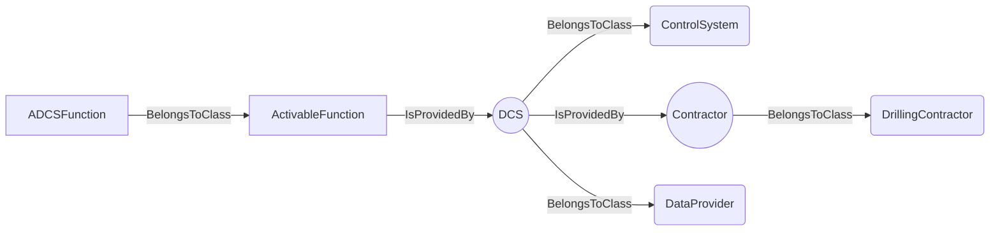
An example SparQL query looks like this:
```sparql
PREFIX rdf: <http://www.w3.org/1999/02/22-rdf-syntax-ns#>
PREFIX ddhub: <http://ddhub.no/>
PREFIX quantity: <http://ddhub.no/UnitAndQuantity>
SELECT ?ADCSFunction
WHERE {
	?ADCSFunction rdf:type ddhub:ActivableFunction .
	?DCS rdf:type ddhub:ControlSystem .
	?Contractor rdf:type ddhub:DrillingContractor .
	?DCS ddhub:IsProvidedBy ?Attribute000 .
	?DCS rdf:type ddhub:DataProvider .
	?ActivableFunction ddhub:IsProvidedBy ?Attribute001 .
  FILTER (
	?Attribute000 = Contractor
	&& 	?Attribute001 = DCS
  )
}
```
This example describes all `ActivableFunction` provided by the drilling control system, `DCS`. The `DCS` is 
defined as a `ControlSystem` provided by a drilling contractor.
## RunnableFunction <!-- NOUN -->
- Display name: Runnable Function
- Parent class: [ActivableFunction](#ActivableFunction)
- Attributes:
  - IsAuxiliary
    - Type: boolean
    - Description: This attribute specifies if the function is a main or an auxilary one. A main function impacts
        substantially the drilling process while an auxiliary function does not impact or only in limited fashion the
        drilling process. Example of a main functions are: Hoist, Tag Bottom, Start Circulation, Start Rotation, 
        Stop Circulation, Stop Rotation, Drill, Pull Out,Run In, Pull Out With Lubrication, Run In With Lubrication, Ream Up, 
        Ream Down,Test Friction, Reciprocate, Test Pressure Integrity, Place Cement, .... Example of auxiliary functions
        are: Boost Riser Flow, Down Link from ADCS, Rock Pipe, ...
- Description: 
A runnable function is a function that starts to run immediately when activated.
- Definition set: ADCS
- Examples:
```dwis runnableFunction
RunnableFunction:runnableFunction
runnableFunction IsAuxiliary false
ControlSystem:DCS
DrillingContractor:Contractor
DCS IsProvidedBy Contractor
DCS BelongsToClass DataProvider
runnableFunction IsProvidedBy DCS
```
An example semantic graph looks like as follow:
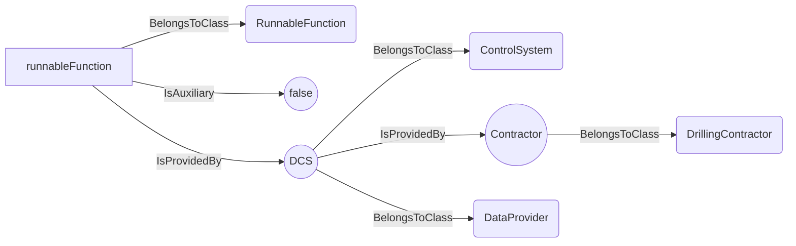
An example SparQL query looks like this:
```sparql
PREFIX rdf: <http://www.w3.org/1999/02/22-rdf-syntax-ns#>
PREFIX ddhub: <http://ddhub.no/>
PREFIX quantity: <http://ddhub.no/UnitAndQuantity>
SELECT ?runnableFunction
WHERE {
	?runnableFunction rdf:type ddhub:RunnableFunction .
	?runnableFunction ddhub:IsAuxiliary ?Attribute000 .
	?DCS rdf:type ddhub:ControlSystem .
	?Contractor rdf:type ddhub:DrillingContractor .
	?DCS ddhub:IsProvidedBy ?Attribute001 .
	?DCS rdf:type ddhub:DataProvider .
	?runnableFunction ddhub:IsProvidedBy ?Attribute002 .
  FILTER (
	?Attribute000 = false
	&& 	?Attribute001 = Contractor
	&& 	?Attribute002 = DCS
  )
}
```
This example describes all the main runnable functions provided by the drilling control system, `DCS`. The `DCS` is 
defined as a `ControlSystem` provided by a drilling contractor.
## ControllerFunction <!-- NOUN -->
- Display name: Controller Function
- Parent class: [RunnableFunction](#RunnableFunction)
- Description: 
A `ControllerFunction` is a `RunnableFunction` that executes a feedback control loop to follow as closely
as possible one or several desired values. A typical example of `ControllerFunction` is the `AutoDriller`. An `AutoDriller` 
follows as closely as possible, for instance, a desired `WOB`.
- Definition set: ADCS
- Examples:
```dwis autoDriller
ControllerFunction:autoDriller
autoDriller HasFunction "Drill"
autoDriller IsAuxiliary false
ControlSystem:DCS
DrillingContractor:Contractor
DCS IsProvidedBy Contractor
DCS BelongsToClass DataProvider
autoDriller IsProvidedBy DCS
```
An example semantic graph looks like as follow:
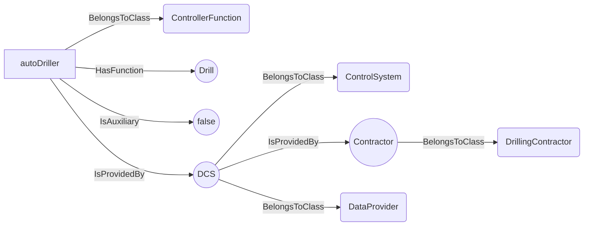
An example SparQL query looks like this:
```sparql
PREFIX rdf: <http://www.w3.org/1999/02/22-rdf-syntax-ns#>
PREFIX ddhub: <http://ddhub.no/>
PREFIX quantity: <http://ddhub.no/UnitAndQuantity>
SELECT ?autoDriller
WHERE {
	?autoDriller rdf:type ddhub:ControllerFunction .
	?autoDriller ddhub:HasFunction ?Attribute000 .
	?autoDriller ddhub:IsAuxiliary ?Attribute001 .
	?DCS rdf:type ddhub:ControlSystem .
	?Contractor rdf:type ddhub:DrillingContractor .
	?DCS ddhub:IsProvidedBy ?Attribute002 .
	?DCS rdf:type ddhub:DataProvider .
	?autoDriller ddhub:IsProvidedBy ?Attribute003 .
  FILTER (
	?Attribute000 = "Drill"
	&& 	?Attribute001 = false
	&& 	?Attribute002 = Contractor
	&& 	?Attribute003 = DCS
  )
}
```
This example describes the auto driller provided by the drilling control system, `DCS`. The `DCS` is 
defined as a `ControlSystem` provided by a drilling contractor. It is a main function and its purpose is to `Drill`.
## ProcedureFunction <!-- NOUN -->
- Display name: Procedure Function
- Parent class: [RunnableFunction](#RunnableFunction)
- Description: 
A `ProcedureFunction` is a `RunnableFunction` that executes a finites state automaton, i.e., a graph of
transitions between states. It should be noted that a `ProcedureFunction` may use control algorithms while being in one
state or when transiting from state to state. An example of `ProcedureFunction` is a friction test. A friction test has
at least three states: rotation off bottom, pick-up without rotation, slack-off without rotation. The transitions 
between the different states may depend on the implementation. Each of those states uses a controller, one that controls
the rotational speed and one that controls the axial speed.
- Definition set: ADCS
- Examples:
```dwis frictionTest
ProcedureFunction:frictionTest
frictionTest HasFunction "FrictionTest"
FrictionTest IsAuxiliary false
ControlSystem:DCS
DrillingContractor:Contractor
DCS IsProvidedBy Contractor
DCS BelongsToClass DataProvider
frictionTest IsProvidedBy DCS
```
An example semantic graph looks like as follow:
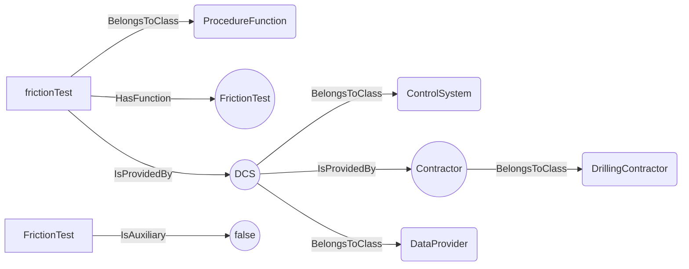
An example SparQL query looks like this:
```sparql
PREFIX rdf: <http://www.w3.org/1999/02/22-rdf-syntax-ns#>
PREFIX ddhub: <http://ddhub.no/>
PREFIX quantity: <http://ddhub.no/UnitAndQuantity>
SELECT ?frictionTest
WHERE {
	?frictionTest rdf:type ddhub:ProcedureFunction .
	?frictionTest ddhub:HasFunction ?Attribute000 .
	?FrictionTest ddhub:IsAuxiliary ?Attribute001 .
	?DCS rdf:type ddhub:ControlSystem .
	?Contractor rdf:type ddhub:DrillingContractor .
	?DCS ddhub:IsProvidedBy ?Attribute002 .
	?DCS rdf:type ddhub:DataProvider .
	?frictionTest ddhub:IsProvidedBy ?Attribute003 .
  FILTER (
	?Attribute000 = "FrictionTest"
	&& 	?Attribute001 = false
	&& 	?Attribute002 = Contractor
	&& 	?Attribute003 = DCS
  )
}
```
This example describes the friction test procedure provided by the drilling control system, `DCS`. The `DCS` is 
defined as a `ControlSystem` provided by a drilling contractor. It is a main function and its purpose is to perform a
`FrictionTest`.
## ProtectionFunction <!-- NOUN -->
- Display name: Protection Function
- Parent class: [ActivableFunction](#ActivableFunction)
- Description: 
A `ProtectionFunction` is an `ActivableFunction`. It must be activated to have an effect, but the effect
is to protect the drilling process, either by protecting the inputs to the drilling machines to avoid generating 
a drilling incident, or to detect an abnormal drilling process state and react to the situation.
detected.
- Definition set: ADCS
- Examples:
```dwis protectionFunction
ProtectionFunction:protectionFunction
ControlSystem:DCS
DrillingContractor:Contractor
DCS IsProvidedBy Contractor
DCS BelongsToClass DataProvider
protectionFunction IsProvidedBy DCS
```
An example semantic graph looks like as follow:
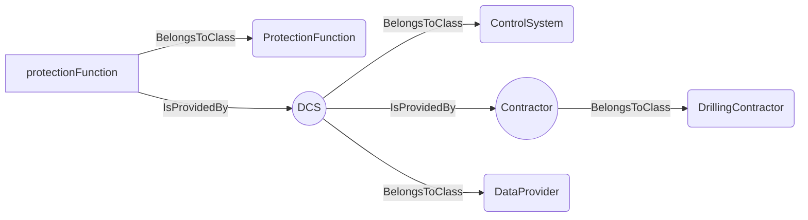
An example SparQL query looks like this:
```sparql
PREFIX rdf: <http://www.w3.org/1999/02/22-rdf-syntax-ns#>
PREFIX ddhub: <http://ddhub.no/>
PREFIX quantity: <http://ddhub.no/UnitAndQuantity>
SELECT ?protectionFunction
WHERE {
	?protectionFunction rdf:type ddhub:ProtectionFunction .
	?DCS rdf:type ddhub:ControlSystem .
	?Contractor rdf:type ddhub:DrillingContractor .
	?DCS ddhub:IsProvidedBy ?Attribute000 .
	?DCS rdf:type ddhub:DataProvider .
	?protectionFunction ddhub:IsProvidedBy ?Attribute001 .
  FILTER (
	?Attribute000 = Contractor
	&& 	?Attribute001 = DCS
  )
}
```
This example describes all the protection functions of the drilling control system, `DCS`. The `DCS` is 
defined as a `ControlSystem` provided by a drilling contractor.
## FDIRFunction <!-- NOUN -->
- Display name: FDIR Function
- Parent class: [ProtectionFunction](#ProtectionFunction)
- Description: 
A `FDIRFunction` is a `ProtectionFunction` that reacts to a particular state of the drilling process. FDIR
- Definition set: ADCS
- Examples:
```dwis packOffDectionAndReaction
FDIRFunction:packOffDetectionAndReaction
packOffDetectionAndReaction HasFunction "PackOffFDIR"
ControlSystem:DCS
DrillingContractor:Contractor
DCS IsProvidedBy Contractor
DCS BelongsToClass DataProvider
packOffDetectionAndReaction IsProvidedBy DCS
```
An example semantic graph looks like as follow:
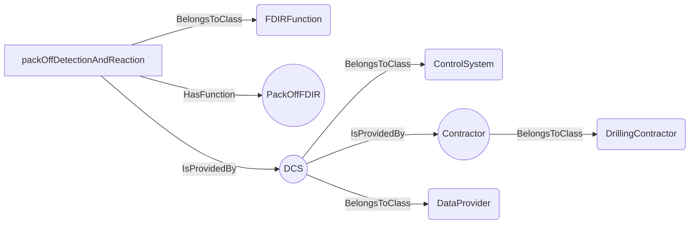
An example SparQL query looks like this:
```sparql
PREFIX rdf: <http://www.w3.org/1999/02/22-rdf-syntax-ns#>
PREFIX ddhub: <http://ddhub.no/>
PREFIX quantity: <http://ddhub.no/UnitAndQuantity>
SELECT ?packOffDectionAndReaction
WHERE {
	?packOffDetectionAndReaction rdf:type ddhub:FDIRFunction .
	?packOffDetectionAndReaction ddhub:HasFunction ?Attribute000 .
	?DCS rdf:type ddhub:ControlSystem .
	?Contractor rdf:type ddhub:DrillingContractor .
	?DCS ddhub:IsProvidedBy ?Attribute001 .
	?DCS rdf:type ddhub:DataProvider .
	?packOffDetectionAndReaction ddhub:IsProvidedBy ?Attribute002 .
  FILTER (
	?Attribute000 = "PackOffFDIR"
	&& 	?Attribute001 = Contractor
	&& 	?Attribute002 = DCS
  )
}
```
This example describes the `packOffDetectionAndReaction` fault detection and isolation procedure of the drilling control
system for pack-off events, `DCS`. The `DCS` is defined as a `ControlSystem` provided by a drilling contractor.
## SOEFunction <!-- NOUN -->
- Display name: SOE Function
- Parent class: [ProtectionFunction](#ProtectionFunction)
- Description: 
A `SOEFunction` is a `ProtectionFunction` that limits the commands that are send to the drilling machines
to avoid generating a drilling incident. SOE stands for Safe Operating Envelope. A `SOEFunction` protects the inputs
of the drilling process. An example `SOEFunction` is a swab/surge limits protection. This function limits the axial acceleration
and speed of the drill-stem to avoid generate swabbing pressure below the maximum of the collapse and pore pressure, and
surging pressure above the fracturing pressure.
- Definition set: ADCS
- Examples:
```dwis swabSurgeLimits
SOEFunction:swabSurgeLimits
swabSurgeLimits HasFunction "SwabSurgeSOE"
ControlSystem:DCS
DrillingContractor:Contractor
DCS IsProvidedBy Contractor
DCS BelongsToClass DataProvider
swabSurgeLimits IsProvidedBy DCS
```
An example semantic graph looks like as follow:
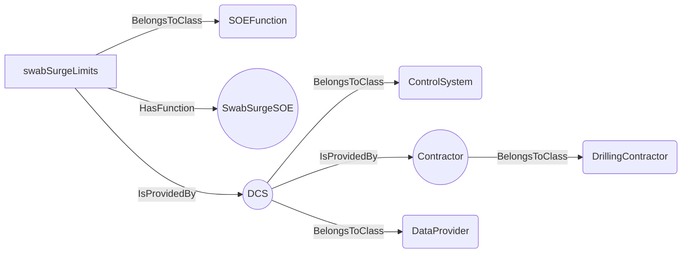
An example SparQL query looks like this:
```sparql
PREFIX rdf: <http://www.w3.org/1999/02/22-rdf-syntax-ns#>
PREFIX ddhub: <http://ddhub.no/>
PREFIX quantity: <http://ddhub.no/UnitAndQuantity>
SELECT ?swabSurgeLimits
WHERE {
	?swabSurgeLimits rdf:type ddhub:SOEFunction .
	?swabSurgeLimits ddhub:HasFunction ?Attribute000 .
	?DCS rdf:type ddhub:ControlSystem .
	?Contractor rdf:type ddhub:DrillingContractor .
	?DCS ddhub:IsProvidedBy ?Attribute001 .
	?DCS rdf:type ddhub:DataProvider .
	?swabSurgeLimits ddhub:IsProvidedBy ?Attribute002 .
  FILTER (
	?Attribute000 = "SwabSurgeSOE"
	&& 	?Attribute001 = Contractor
	&& 	?Attribute002 = DCS
  )
}
```
This example describes the `swabSurgeLimits` safe operating envelope limits to avoid detrimental swab/surge pressures in 
the open hole section of the borehole. 
## DataFlowNode <!-- NOUN -->
- Display name: DataFlowNode
- Parent class: [DWISNoun](#DWISNoun)
- Description: 

- Definition set: DataFlow
- Examples:
## Plan <!-- NOUN -->
- Display name: Plan
- Parent class: [DataFlowNode](#DataFlowNode)
- Description: 

- Definition set: DataFlow
- Examples:
## OperationalPlan <!-- NOUN -->
- Display name: OperationalPlan
- Parent class: [Plan](#Plan)
- Description: 

- Definition set: DataFlow
- Examples:
## DrillingProgram <!-- NOUN -->
- Display name: DrillingProgram
- Parent class: [Plan](#Plan)
- Description: 

- Definition set: DataFlow
- Examples:
## RigActionPlan <!-- NOUN -->
- Display name: RigActionPlan
- Parent class: [Plan](#Plan)
- Description: 

- Definition set: DataFlow
- Examples:
## ComputedState <!-- NOUN -->
- Display name: ComputedState
- Parent class: [ComputationUnit](#ComputationUnit)
- Description: 
A state represents the current configuation of a system.
- Definition set: DataFlow
- Examples:
## ProceduralState <!-- NOUN -->
- Display name: ComputedProceduralState
- Parent class: [ComputedState](#ComputedState)
- Description: 

- Definition set: DataFlow
- Examples:
## ProcessState <!-- NOUN -->
- Display name: ComputedProcessState
- Parent class: [ComputedState](#ComputedState)
- Description: 

- Definition set: DataFlow
- Examples:
## PhysicalState <!-- NOUN -->
- Display name: ComputedPhysicalState
- Parent class: [ComputedState](#ComputedState)
- Description: 

- Definition set: DataFlow
- Examples:
## ComputationUnit <!-- NOUN -->
- Display name: ComputationUnit
- Parent class: [DataFlowNode](#DataFlowNode)
- Description: 
Denotes a complex computation unit, typically based on advanced numerical modeling
- Definition set: DataFlow
- Examples:
## Advisor <!-- NOUN -->
- Display name: Advisor
- Parent class: [ComputationUnit](#ComputationUnit)
- Attributes:
  - AdviceType
    - Type: string
    - Description: 
- Description: 

- Definition set: DataFlow
- Examples:
## Simulator <!-- NOUN -->
- Display name: Simulator
- Parent class: [ComputationUnit](#ComputationUnit)
- Description: 

- Definition set: DataFlow
- Examples:
## Controller <!-- NOUN -->
- Display name: Controller
- Parent class: [DataFlowNode](#DataFlowNode)
- Description: 

- Definition set: DataFlow
- Examples:
## ControlSystem <!-- NOUN -->
- Display name: ControlSystem
- Parent class: [DataFlowNode](#DataFlowNode)
- Description: 

- Definition set: DataFlow
- Examples:
## DrawWorksControlSystem <!-- NOUN -->
- Display name: DrawWorksControlSystem
- Parent class: [ControlSystem](#ControlSystem)
- Description: 

- Definition set: DataFlow
- Examples:
## MudPumpsControlSystem <!-- NOUN -->
- Display name: MudPumpsControlSystem
- Parent class: [ControlSystem](#ControlSystem)
- Description: 

- Definition set: DataFlow
- Examples:
## TopDriveControlSystem <!-- NOUN -->
- Display name: TopDriveControlSystem
- Parent class: [ControlSystem](#ControlSystem)
- Description: 

- Definition set: DataFlow
- Examples:
## BOPControlSystem <!-- NOUN -->
- Display name: BOPControlSystem
- Parent class: [ControlSystem](#ControlSystem)
- Description: 

- Definition set: DataFlow
- Examples:
## RigChokeControlSystem <!-- NOUN -->
- Display name: RigChokeControlSystem
- Parent class: [ControlSystem](#ControlSystem)
- Description: 

- Definition set: DataFlow
- Examples:
## MeasurementDevice <!-- NOUN -->
- Display name: MeasurementDevice
- Parent class: [DataFlowNode](#DataFlowNode)
- Description: 
Denotes a physical sensor
- Definition set: DataFlow
- Examples:
## Transformation <!-- NOUN -->
- Display name: Transformation
- Parent class: [DataFlowNode](#DataFlowNode)
- Description: 
Represents a transformation applied to some signals that produces other signals
- Definition set: DataFlow
- Examples:
## DirectTransformation <!-- NOUN -->
- Display name: DirectTransformation
- Parent class: [Transformation](#Transformation)
- Description: 
Direct transformations are performed using only the current value of their inputs, time is not involved
- Definition set: DataFlow
- Examples:
## Aggregation <!-- NOUN -->
- Display name: Aggregation
- Parent class: [DirectTransformation](#DirectTransformation)
- Description: 

- Definition set: DataFlow
- Examples:
## ForceFromLoadPinsTransformation <!-- NOUN -->
- Display name: ForceFromLoadPinsTransformation
- Parent class: [DirectTransformation](#DirectTransformation)
- Description: 

- Definition set: DataFlow
- Examples:
## ForceToLoadTransformation <!-- NOUN -->
- Display name: ForceToLoadTransformation
- Parent class: [DirectTransformation](#DirectTransformation)
- Description: 

- Definition set: DataFlow
- Examples:
## MeasuredDepthToTrueVerticalDepthTransformation <!-- NOUN -->
- Display name: MeasuredDepthToTrueVerticalDepthTransformation
- Parent class: [DirectTransformation](#DirectTransformation)
- Description: 

- Definition set: DataFlow
- Examples:
## MeasuredDepthTranslation <!-- NOUN -->
- Display name: MeasuredDepthTranslation
- Parent class: [DirectTransformation](#DirectTransformation)
- Description: 

- Definition set: DataFlow
- Examples:
## PressureToEquivalentDensityTransformation <!-- NOUN -->
- Display name: PressureToEquivalentDensityTransformation
- Parent class: [DirectTransformation](#DirectTransformation)
- Description: 

- Definition set: DataFlow
- Examples:
## PressureToForceTransformation <!-- NOUN -->
- Display name: PressureToForceTransformation
- Parent class: [DirectTransformation](#DirectTransformation)
- Description: 

- Definition set: DataFlow
- Examples:
## TorqueToForceTransformation <!-- NOUN -->
- Display name: TorqueToForceTransformation
- Parent class: [DirectTransformation](#DirectTransformation)
- Description: 

- Definition set: DataFlow
- Examples:
## SignalProcessingUnit <!-- NOUN -->
- Display name: SignalProcessingUnit
- Parent class: [Transformation](#Transformation)
- Description: 
Represent any signal processing applied prior to the distribution of the considered signal. Signal processing refers to e.g. noise removal, filtering,..
- Definition set: DataFlow
- Examples:
## Filter <!-- NOUN -->
- Display name: Filter
- Parent class: [SignalProcessingUnit](#SignalProcessingUnit)
- Description: 

- Definition set: DataFlow
- Examples:
## BandPassFilter <!-- NOUN -->
- Display name: BandPassFilter
- Parent class: [Filter](#Filter)
- Attributes:
  - MinFrequency
    - Type: double
    - Description: 
  - MaxFrequency
    - Type: double
    - Description: 
- Description: 

- Definition set: DataFlow
- Examples:
## HighPassFilter <!-- NOUN -->
- Display name: HighPassFilter
- Parent class: [Filter](#Filter)
- Attributes:
  - CutOffFrequency
    - Type: double
    - Description: 
- Description: 

- Definition set: DataFlow
- Examples:
## LowPassFilter <!-- NOUN -->
- Display name: LowPassFilter
- Parent class: [Filter](#Filter)
- Attributes:
  - CutOffFrequency
    - Type: double
    - Description: 
- Description: 

- Definition set: DataFlow
- Examples:
## MovingAverage <!-- NOUN -->
- Display name: MovingAverage
- Parent class: [Filter](#Filter)
- Description: 

- Definition set: DataFlow
- Examples:
## MovingStandardDeviation <!-- NOUN -->
- Display name: MovingStandardDeviation
- Parent class: [Filter](#Filter)
- Description: 

- Definition set: DataFlow
- Examples:
## MovingMin <!-- NOUN -->
- Display name: MovingMin
- Parent class: [Filter](#Filter)
- Description: 

- Definition set: DataFlow
- Examples:
## MovingMax <!-- NOUN -->
- Display name: MovingMax
- Parent class: [Filter](#Filter)
- Description: 

- Definition set: DataFlow
- Examples:
## NumberOfSampleMovingAverage <!-- NOUN -->
- Display name: NumberOfSampleMovingAverage
- Parent class: [MovingAverage](#MovingAverage)
- Attributes:
  - NumberOfSamples
    - Type: int
    - Description: 
- Description: 

- Definition set: DataFlow
- Examples:
## TimeWindowMovingAverage <!-- NOUN -->
- Display name: TimeWindowMovingAverage
- Parent class: [MovingAverage](#MovingAverage)
- Attributes:
  - TimeWindow
    - Type: double
    - Description: 
- Description: 

- Definition set: DataFlow
- Examples:
## TimeBasedTransformation <!-- NOUN -->
- Display name: TimeBasedTransformation
- Parent class: [Transformation](#Transformation)
- Description: 
Transformations that apply only to time series: time derivations, time integration, averaging...
- Definition set: DataFlow
- Examples:
## Buffering <!-- NOUN -->
- Display name: Buffering
- Parent class: [TimeBasedTransformation](#TimeBasedTransformation)
- Attributes:
  - BufferingInterval
    - Type: double
    - Description: 
- Description: 

- Definition set: DataFlow
- Examples:
## Derivation <!-- NOUN -->
- Display name: Derivation
- Parent class: [TimeBasedTransformation](#TimeBasedTransformation)
- Description: 

- Definition set: DataFlow
- Examples:
## Integration <!-- NOUN -->
- Display name: Integration
- Parent class: [TimeBasedTransformation](#TimeBasedTransformation)
- Description: 

- Definition set: DataFlow
- Examples:
## RangeExtraction <!-- NOUN -->
- Display name: RangeExtraction
- Parent class: [TimeBasedTransformation](#TimeBasedTransformation)
- Description: 

- Definition set: DataFlow
- Examples:
## NumberOfItemsRangeExtraction <!-- NOUN -->
- Display name: NumberOfItemsRangeExtraction
- Parent class: [RangeExtraction](#RangeExtraction)
- Attributes:
  - NumberOfItems
    - Type: int
    - Description: 
- Description: 

- Definition set: DataFlow
- Examples:
## TimeWindowRangeExtraction <!-- NOUN -->
- Display name: TimeWindowRangeExtraction
- Parent class: [RangeExtraction](#RangeExtraction)
- Attributes:
  - TimeWindow
    - Type: double
    - Description: 
- Description: 

- Definition set: DataFlow
- Examples:
## Resampling <!-- NOUN -->
- Display name: Resampling
- Parent class: [TimeBasedTransformation](#TimeBasedTransformation)
- Attributes:
  - ResamplingRate
    - Type: double
    - Description: 
  - ResamplingDelay
    - Type: double
    - Description: 
  - Validity
    - Type: double
    - Description: 
- Description: 

- Definition set: DataFlow
- Examples:
## TransmissionLine <!-- NOUN -->
- Display name: TransmissionLine
- Parent class: [DataFlowNode](#DataFlowNode)
- Description: 

- Definition set: DataFlow
- Examples:
## UserInterface <!-- NOUN -->
- Display name: UserInterface
- Parent class: [DataFlowNode](#DataFlowNode)
- Description: 

- Definition set: DataFlow
- Examples:
## DataProvider <!-- NOUN -->
- Display name: DataProvider
- Parent class: [DWISNoun](#DWISNoun)
- Attributes:
  - ProviderName
    - Type: string
    - Description: 
- Description: 
A data provider is any sources for data
- Definition set: DataProviders
- Examples:
## OperatingCompany <!-- NOUN -->
- Display name: OperatingCompany
- Parent class: [DataProvider](#DataProvider)
- Attributes:
  - ProviderName
    - Type: string
    - Description: 
- Description: 
An operating company is an entity that holds the rights to explore, develop, and produce hydrocarbon resources from a particular oil or gas field or lease
- Definition set: DataProviders
- Examples:
## ServiceCompany <!-- NOUN -->
- Display name: ServiceCompany
- Parent class: [DataProvider](#DataProvider)
- Attributes:
  - ProviderName
    - Type: string
    - Description: 
- Description: 
A service company is an entity that provides services during the well construction.
- Definition set: DataProviders
- Examples:
## DirectionalServiceCompany <!-- NOUN -->
- Display name: DirectionalServiceCompany
- Parent class: [ServiceCompany](#ServiceCompany)
- Attributes:
  - ProviderName
    - Type: string
    - Description: 
- Description: 
A directional service company is an entity that provides services for downhole directional drilling and downhole measurements.
- Definition set: DataProviders
- Examples:
## DrillingFluidProvider <!-- NOUN -->
- Display name: DrillingFluidProvider
- Parent class: [ServiceCompany](#ServiceCompany)
- Attributes:
  - ProviderName
    - Type: string
    - Description: 
- Description: 
A drilling fluid provider is a company that provides and maintains the drilling fluids during well construction.
- Definition set: DataProviders
- Examples:
## LoggingServiceCompany <!-- NOUN -->
- Display name: LoggingServiceCompany
- Parent class: [ServiceCompany](#ServiceCompany)
- Attributes:
  - ProviderName
    - Type: string
    - Description: 
- Description: 
A logging service company is an entity that gathers measured information during well construction.
- Definition set: DataProviders
- Examples:
## CementingServiceCompany <!-- NOUN -->
- Display name: CementingServiceCompany
- Parent class: [ServiceCompany](#ServiceCompany)
- Attributes:
  - ProviderName
    - Type: string
    - Description: 
- Description: 

- Definition set: DataProviders
- Examples:
## DataAnalysisServiceCompany <!-- NOUN -->
- Display name: DataAnalysisServiceCompany
- Parent class: [ServiceCompany](#ServiceCompany)
- Attributes:
  - ProviderName
    - Type: string
    - Description: 
- Description: 
A data analysis service company is an entity that analyses measured data and provide new information from these measurements.
- Definition set: DataProviders
- Examples:
## DrillingContractor <!-- NOUN -->
- Display name: DrillingContractor
- Parent class: [DataProvider](#DataProvider)
- Attributes:
  - ProviderName
    - Type: string
    - Description: 
- Description: 

- Definition set: DataProviders
- Examples:
## DWISInternalService <!-- NOUN -->
- Display name: DWISInternalService
- Parent class: [DataProvider](#DataProvider)
- Attributes:
  - ProviderName
    - Type: string
    - Description: 
- Description: 
A DWIS internal service is an internal component of the DWIS infrastructure that generates information that can be used by any systems connected to the DWIS infrastructure.
- Definition set: DataProviders
- Examples:
## DWISDDHub <!-- NOUN -->
- Display name: DWISDDHub
- Parent class: [DWISInternalService](#DWISInternalService)
- Description: 

- Definition set: DataProviders
- Examples:
## DWISDrillingProcessStateInterpreter <!-- NOUN -->
- Display name: DWISDrillingProcessStateInterpreter
- Parent class: [DWISInternalService](#DWISInternalService)
- Description: 

- Definition set: DataProviders
- Examples:
## DWISAdviceComposer <!-- NOUN -->
- Display name: DWISAdviceComposer
- Parent class: [DWISInternalService](#DWISInternalService)
- Description: 

- Definition set: DataProviders
- Examples:
## DWISScheduler <!-- NOUN -->
- Display name: DWISScheduler
- Parent class: [DWISInternalService](#DWISInternalService)
- Description: 

- Definition set: DataProviders
- Examples:
## DWISContextualDataBuilder <!-- NOUN -->
- Display name: DWISContextualDataBuilder
- Parent class: [DWISInternalService](#DWISInternalService)
- Description: 

- Definition set: DataProviders
- Examples:
## DWISLogger <!-- NOUN -->
- Display name: DWISLogger
- Parent class: [DWISInternalService](#DWISInternalService)
- Description: 

- Definition set: DataProviders
- Examples:
## DWISADCSInterface <!-- NOUN -->
- Display name: DWISADCSInterface
- Parent class: [DWISInternalService](#DWISInternalService)
- Description: 

- Definition set: DataProviders
- Examples:
## DWISADCSCapabilityDescriptor <!-- NOUN -->
- Display name: DWISADCSCapabilityDescriptor
- Parent class: [DWISInternalService](#DWISInternalService)
- Description: 

- Definition set: DataProviders
- Examples:
## Telemetry <!-- NOUN -->
- Display name: Telemetry
- Parent class: [DWISNoun](#DWISNoun)
- Attributes:
  - NumberOfRepeaters
    - Type: int
    - Description: 
  - DistanceBetweenRepeaters
    - Type: double
    - Description: 
  - AverageDelayByRepeater
    - Type: double
    - Description: 
- Description: 
Technology used for transferring the data from its main origin.
- Definition set: DataTransmission
- Examples:
## DownHoleTelemetry <!-- NOUN -->
- Display name: DownHoleTelemetry
- Parent class: [Telemetry](#Telemetry)
- Description: 

- Definition set: DataTransmission
- Examples:
Technology that allows transfer of downhole data to the surface.
## MudPulseTelemetry <!-- NOUN -->
- Display name: MudPulseTelemetry
- Parent class: [DownHoleTelemetry](#DownHoleTelemetry)
- Description: 
A method that allows transfer of downhole data to the surface via pressure pulses sent trough the drilling fluid.
- Definition set: DataTransmission
- Examples:
NOV BlackStar II dual-telemetry MWD
## ElectromagneticTelemetry <!-- NOUN -->
- Display name: ElectromagneticTelemetry
- Parent class: [DownHoleTelemetry](#DownHoleTelemetry)
- Description: 
A method that allows transfer of downhole data to the surface via electromagnetic waves sent trough the drilling formation.
- Definition set: DataTransmission
- Examples:
APS SureShot-EM, NOV BlackStar II EM MWD
## WiredPipeTelemetry <!-- NOUN -->
- Display name: WiredPipeTelemetry
- Parent class: [DownHoleTelemetry](#DownHoleTelemetry)
- Description: 
A method that allows transfer of downhole data to the surface via electrical connections through the drill string.
- Definition set: DataTransmission
- Examples:
Intelliserv Wired Drill Pipe, Reelwell DualLink
## TopSideTelemetry <!-- NOUN -->
- Display name: TopSideTelemetry
- Parent class: [Telemetry](#Telemetry)
- Description: 
Method that allows transfer of data from surface systems.
- Definition set: DataTransmission
- Examples:
NOVOS, Cyberbase, DEAL
## ValidityCondition <!-- NOUN -->
- Display name: ValidityCondition
- Parent class: [DWISNoun](#DWISNoun)
- Description: 

- Definition set: DataValidity
- Examples:
## ConnectedCondition <!-- NOUN -->
- Display name: ConnectedCondition
- Parent class: [ValidityCondition](#ValidityCondition)
- Description: 

- Definition set: DataValidity
- Examples:
## EQ <!-- NOUN -->
- Display name: EQ
- Parent class: [ValidityCondition](#ValidityCondition)
- Description: 

- Definition set: DataValidity
- Examples:
## GT <!-- NOUN -->
- Display name: GT
- Parent class: [ValidityCondition](#ValidityCondition)
- Description: 

- Definition set: DataValidity
- Examples:
## LT <!-- NOUN -->
- Display name: LT
- Parent class: [ValidityCondition](#ValidityCondition)
- Description: 

- Definition set: DataValidity
- Examples:
## DataType <!-- NOUN -->
- Display name: Data Type
- Parent class: [DWISNoun](#DWISNoun)
- Description: 

- Definition set: DrillingDataSemantics
- Examples:
## ContinuousDataType <!-- NOUN -->
- Display name: Continuous Data Type
- Parent class: [DataType](#DataType)
- Description: 

- Definition set: DrillingDataSemantics
- Examples:
## NormalizedDataType <!-- NOUN -->
- Display name: Normalized Data Type
- Parent class: [ContinuousDataType](#ContinuousDataType)
- Description: 
between 0 and 1
- Definition set: DrillingDataSemantics
- Examples:
## DiscreteDataType <!-- NOUN -->
- Display name: Discrete Data Type
- Parent class: [DataType](#DataType)
- Description: 

- Definition set: DrillingDataSemantics
- Examples:
## EnumerationDataType <!-- NOUN -->
- Display name: Enumeration Data Type
- Parent class: [DiscreteDataType](#DiscreteDataType)
- Description: 

- Definition set: DrillingDataSemantics
- Examples:
## BooleanDataType <!-- NOUN -->
- Display name: Boolean Data Type
- Parent class: [EnumerationDataType](#EnumerationDataType)
- Description: 

- Definition set: DrillingDataSemantics
- Examples:
## StringDataType <!-- NOUN -->
- Display name: String Data Type
- Parent class: [DataType](#DataType)
- Description: 

- Definition set: DrillingDataSemantics
- Examples:
## DrillingDataPoint <!-- NOUN -->
- Display name: DrillingDataPoint
- Parent class: [DWISNoun](#DWISNoun)
- Attributes:
  - IsValid
    - Type: bool
    - Description: 
- Description: 
Main type of DDHub data. Represents a drilling signal.
Can be a dynamic signal (linked to a ValueNode) or a static parameter. 
- Definition set: DrillingDataSemantics
- Examples:
## PrototypeData <!-- NOUN -->
- Display name: PrototypeData
- Parent class: [DrillingDataPoint](#DrillingDataPoint)
- Description: 

- Definition set: DrillingDataSemantics
- Examples:
## ProcessData <!-- NOUN -->
- Display name: ProcessData
- Parent class: [DrillingDataPoint](#DrillingDataPoint)
- Description: 

- Definition set: DrillingDataSemantics
- Examples:
## SetPoint <!-- NOUN -->
- Display name: Set-point
- Parent class: [ProcessData](#ProcessData)
- Description: 

- Definition set: DrillingDataSemantics
- Examples:
## Command <!-- NOUN -->
- Display name: Command
- Parent class: [ProcessData](#ProcessData)
- Description: 

- Definition set: DrillingDataSemantics
- Examples:
## Recommendation <!-- NOUN -->
- Display name: Recommendation
- Parent class: [ProcessData](#ProcessData)
- Description: 

- Definition set: DrillingDataSemantics
- Examples:
## RecommendedTarget <!-- NOUN -->
- Display name: RecommendedTarget
- Parent class: [Recommendation](#Recommendation)
- Description: 

- Definition set: DrillingDataSemantics
- Examples:
## RecommendedMinimum <!-- NOUN -->
- Display name: RecommendedMinimum
- Parent class: [Recommendation](#Recommendation)
- Description: 

- Definition set: DrillingDataSemantics
- Examples:
## RecommendedMaximum <!-- NOUN -->
- Display name: RecommendedMaximum
- Parent class: [Recommendation](#Recommendation)
- Description: 

- Definition set: DrillingDataSemantics
- Examples:
## Advice <!-- NOUN -->
- Display name: Advice
- Parent class: [ProcessData](#ProcessData)
- Description: 

- Definition set: DrillingDataSemantics
- Examples:
## AdvisedTarget <!-- NOUN -->
- Display name: AdvisedTarget
- Parent class: [Advice](#Advice)
- Description: 

- Definition set: DrillingDataSemantics
- Examples:
## AdvisedMinimum <!-- NOUN -->
- Display name: AdvisedMinimum
- Parent class: [Advice](#Advice)
- Description: 

- Definition set: DrillingDataSemantics
- Examples:
## AdvisedMaximum <!-- NOUN -->
- Display name: AdvisedMaximum
- Parent class: [Advice](#Advice)
- Description: 

- Definition set: DrillingDataSemantics
- Examples:
## Limit <!-- NOUN -->
- Display name: Limit
- Parent class: [ProcessData](#ProcessData)
- Description: 

- Definition set: DrillingDataSemantics
- Examples:
## MinimumLimit <!-- NOUN -->
- Display name: Minimum Limit
- Parent class: [Limit](#Limit)
- Description: 

- Definition set: DrillingDataSemantics
- Examples:
## MaximumLimit <!-- NOUN -->
- Display name: Maximum Limit
- Parent class: [Limit](#Limit)
- Description: 

- Definition set: DrillingDataSemantics
- Examples:
## PhysicalData <!-- NOUN -->
- Display name: PhysicalData
- Parent class: [DrillingDataPoint](#DrillingDataPoint)
- Description: 

- Definition set: DrillingDataSemantics
- Examples:
## Measurement <!-- NOUN -->
- Display name: Measurement
- Parent class: [PhysicalData](#PhysicalData)
- Description: 
The noun Measurement represents individuals that are measured by some instrument and which value can be compared with another measurement.
- Definition set: DrillingDataSemantics
- Examples:
## DerivedMeasurement <!-- NOUN -->
- Display name: DerivedMeasurement
- Parent class: [Measurement](#Measurement)
- Description: 

- Definition set: DrillingDataSemantics
- Examples:
## CorrectedMeasurement <!-- NOUN -->
- Display name: CorrectedMeasurement
- Parent class: [Measurement](#Measurement)
- Description: 

- Definition set: DrillingDataSemantics
- Examples:
## ComputedData <!-- NOUN -->
- Display name: ComputedData
- Parent class: [PhysicalData](#PhysicalData)
- Description: 

- Definition set: DrillingDataSemantics
- Examples:
## DrillingSignal <!-- NOUN -->
- Display name: DrillingSignal
- Parent class: [DWISNoun](#DWISNoun)
- Attributes:
  - Value
    - Type: object
    - Description: 
- Description: 
Data structure used to store the streaming drilling data.
- Definition set: DrillingDataSemantics
- Examples:
## DynamicDrillingSignal <!-- NOUN -->
- Display name: DynamicDrillingSignal
- Parent class: [DrillingSignal](#DrillingSignal)
- Attributes:
  - TimeStampAtSource
    - Type: DateTime
    - Description: this is a UTC date-time value corresponding to the time at which the value has been taken.
  - TimeStampAcquisition
    - Type: DateTime
    - Description: this is a UTC date-time value at which the value has been acquired by the data acquisition system.
- Description: 

- Definition set: DrillingDataSemantics
- Examples:
## <equipment> <!-- NOUN -->
- Display name: <equipment>
- Parent class: [DWISNoun](#DWISNoun)
- Description: 

- Definition set: DrillingEquipment
- Examples:
## RigEquipment <!-- NOUN -->
- Display name: <Rig Equipment>
- Parent class: [<equipment>](#<equipment>)
- Description: 

- Definition set: DrillingEquipment
- Examples:
## PowerGenerationSystem <!-- NOUN -->
- Display name: Power Generation System
- Parent class: [RigEquipment](#RigEquipment)
- Description: 

- Definition set: DrillingEquipment
- Examples:
## PowerGenerators <!-- NOUN -->
- Display name: Power Generators
- Parent class: [PowerGenerationSystem](#PowerGenerationSystem)
- Description: 

- Definition set: DrillingEquipment
- Examples:
## ElectricalControlSystem <!-- NOUN -->
- Display name: Electrical Control System
- Parent class: [PowerGenerationSystem](#PowerGenerationSystem)
- Description: 

- Definition set: DrillingEquipment
- Examples:
## PowerScrSystem <!-- NOUN -->
- Display name: Power SCR System
- Parent class: [PowerGenerationSystem](#PowerGenerationSystem)
- Description: 

- Definition set: DrillingEquipment
- Examples:
## HoistingSystem <!-- NOUN -->
- Display name: Hoisting  System
- Parent class: [RigEquipment](#RigEquipment)
- Description: 

- Definition set: DrillingEquipment
- Examples:
## RackAndPinionHoistingSystem <!-- NOUN -->
- Display name: Rack and Pinion Hoisting System
- Parent class: [HoistingSystem](#HoistingSystem)
- Description: 

- Definition set: DrillingEquipment
- Examples:
## RamHoistingSystem <!-- NOUN -->
- Display name: Ram Hoisting System
- Parent class: [HoistingSystem](#HoistingSystem)
- Description: 

- Definition set: DrillingEquipment
- Examples:
## Derrick <!-- NOUN -->
- Display name: Derrick
- Parent class: [HoistingSystem](#HoistingSystem)
- Description: 

- Definition set: DrillingEquipment
- Examples:
## ConventionalDerrick <!-- NOUN -->
- Display name: Conventional Derrick
- Parent class: [Derrick](#Derrick)
- Description: 

- Definition set: DrillingEquipment
- Examples:
## SlantDerrick <!-- NOUN -->
- Display name: Slant Derrick
- Parent class: [Derrick](#Derrick)
- Description: 

- Definition set: DrillingEquipment
- Examples:
## QuadristandDerrick <!-- NOUN -->
- Display name: Quadri-Stand Derrick
- Parent class: [Derrick](#Derrick)
- Description: 

- Definition set: DrillingEquipment
- Examples:
## TripleStandDerrick <!-- NOUN -->
- Display name: Triple Stand Derrick
- Parent class: [Derrick](#Derrick)
- Description: 

- Definition set: DrillingEquipment
- Examples:
## DoubleStandDerrick <!-- NOUN -->
- Display name: Double Stand Derrick
- Parent class: [Derrick](#Derrick)
- Description: 

- Definition set: DrillingEquipment
- Examples:
## SingleJointDerrick <!-- NOUN -->
- Display name: Single Joint Derrick
- Parent class: [Derrick](#Derrick)
- Description: 

- Definition set: DrillingEquipment
- Examples:
## Drawworks <!-- NOUN -->
- Display name: Drawworks
- Parent class: [HoistingSystem](#HoistingSystem)
- Description: 

- Definition set: DrillingEquipment
- Examples:
## StandardElectricalDrawworks <!-- NOUN -->
- Display name: Standard Electrical Drawworks
- Parent class: [Drawworks](#Drawworks)
- Description: 

- Definition set: DrillingEquipment
- Examples:
## MechanicalDrawworks <!-- NOUN -->
- Display name: Mechanical Drawworks
- Parent class: [Drawworks](#Drawworks)
- Description: 

- Definition set: DrillingEquipment
- Examples:
## DieselElectricalDrawworks <!-- NOUN -->
- Display name: Diesel Electrical Drawworks
- Parent class: [Drawworks](#Drawworks)
- Description: 

- Definition set: DrillingEquipment
- Examples:
## RamRig <!-- NOUN -->
- Display name: Ram Rig
- Parent class: [Drawworks](#Drawworks)
- Description: 

- Definition set: DrillingEquipment
- Examples:
## MechanicalBlock <!-- NOUN -->
- Display name: Mechanical Block
- Parent class: [HoistingSystem](#HoistingSystem)
- Description: 

- Definition set: DrillingEquipment
- Examples:
## TravellingBlock <!-- NOUN -->
- Display name: Travelling Block
- Parent class: [MechanicalBlock](#MechanicalBlock)
- Description: 

- Definition set: DrillingEquipment
- Examples:
## CrownBlock <!-- NOUN -->
- Display name: Crown Block
- Parent class: [MechanicalBlock](#MechanicalBlock)
- Description: 

- Definition set: DrillingEquipment
- Examples:
## Hook <!-- NOUN -->
- Display name: Hook
- Parent class: [HoistingSystem](#HoistingSystem)
- Description: 

- Definition set: DrillingEquipment
- Examples:
## DrillLine <!-- NOUN -->
- Display name: Drill Line
- Parent class: [HoistingSystem](#HoistingSystem)
- Description: 

- Definition set: DrillingEquipment
- Examples:
## ActiveLine <!-- NOUN -->
- Display name: Active Line
- Parent class: [DrillLine](#DrillLine)
- Description: 

- Definition set: DrillingEquipment
- Examples:
## DeadLine <!-- NOUN -->
- Display name: Dead Line
- Parent class: [DrillLine](#DrillLine)
- Description: 

- Definition set: DrillingEquipment
- Examples:
## SupportLine <!-- NOUN -->
- Display name: Support Line
- Parent class: [DrillLine](#DrillLine)
- Description: 

- Definition set: DrillingEquipment
- Examples:
## DrillLineFastener <!-- NOUN -->
- Display name: Drill Line Fastener
- Parent class: [HoistingSystem](#HoistingSystem)
- Description: 

- Definition set: DrillingEquipment
- Examples:
## DeadLineAnchor <!-- NOUN -->
- Display name: Dead Line Anchor
- Parent class: [DrillLineFastener](#DrillLineFastener)
- Description: 

- Definition set: DrillingEquipment
- Examples:
## SurfaceRotationSystem <!-- NOUN -->
- Display name: Surface Rotation System
- Parent class: [RigEquipment](#RigEquipment)
- Description: 

- Definition set: DrillingEquipment
- Examples:
## TopDrive <!-- NOUN -->
- Display name: Top Drive
- Parent class: [SurfaceRotationSystem](#SurfaceRotationSystem)
- Description: 

- Definition set: DrillingEquipment
- Examples:
## TorqueTrack <!-- NOUN -->
- Display name: Torque Track
- Parent class: [TopDrive](#TopDrive)
- Description: 

- Definition set: DrillingEquipment
- Examples:
## TorqueBushing <!-- NOUN -->
- Display name: Torque Bushing
- Parent class: [TopDrive](#TopDrive)
- Description: 

- Definition set: DrillingEquipment
- Examples:
## SwivelSub <!-- NOUN -->
- Display name: Swivel Sub
- Parent class: [TopDrive](#TopDrive)
- Description: 

- Definition set: DrillingEquipment
- Examples:
## ExtendFrame <!-- NOUN -->
- Display name: Extend Frame
- Parent class: [TopDrive](#TopDrive)
- Description: 

- Definition set: DrillingEquipment
- Examples:
## Quill <!-- NOUN -->
- Display name: Quill
- Parent class: [TopDrive](#TopDrive)
- Description: 

- Definition set: DrillingEquipment
- Examples:
## MainframeAssembly <!-- NOUN -->
- Display name: Mainframe Assembly
- Parent class: [TopDrive](#TopDrive)
- Description: 

- Definition set: DrillingEquipment
- Examples:
## LoadNut <!-- NOUN -->
- Display name: Load Nut
- Parent class: [TopDrive](#TopDrive)
- Description: 

- Definition set: DrillingEquipment
- Examples:
## RotaryTable <!-- NOUN -->
- Display name: Rotary Table
- Parent class: [SurfaceRotationSystem](#SurfaceRotationSystem)
- Description: 

- Definition set: DrillingEquipment
- Examples:
## RotaryTableBushings <!-- NOUN -->
- Display name: Rotary Table Bushings
- Parent class: [RotaryTable](#RotaryTable)
- Description: 

- Definition set: DrillingEquipment
- Examples:
## Kelly <!-- NOUN -->
- Display name: Kelly
- Parent class: [RotaryTable](#RotaryTable)
- Description: 

- Definition set: DrillingEquipment
- Examples:
## KellyHose <!-- NOUN -->
- Display name: Kelly Hose
- Parent class: [Kelly](#Kelly)
- Description: 

- Definition set: DrillingEquipment
- Examples:
## KellyBushing <!-- NOUN -->
- Display name: Kelly Bushing
- Parent class: [Kelly](#Kelly)
- Description: 

- Definition set: DrillingEquipment
- Examples:
## KellyJoint <!-- NOUN -->
- Display name: Kelly Joint
- Parent class: [Kelly](#Kelly)
- Description: 

- Definition set: DrillingEquipment
- Examples:
## KellySwivel <!-- NOUN -->
- Display name: Kelly Swivel
- Parent class: [Kelly](#Kelly)
- Description: 

- Definition set: DrillingEquipment
- Examples:
## WellControlSystem <!-- NOUN -->
- Display name: Well Control System
- Parent class: [RigEquipment](#RigEquipment)
- Description: 

- Definition set: DrillingEquipment
- Examples:
## BellNipple <!-- NOUN -->
- Display name: Bell Nipple
- Parent class: [WellControlSystem](#WellControlSystem)
- Description: 

- Definition set: DrillingEquipment
- Examples:
## Accumulator <!-- NOUN -->
- Display name: Accumulator
- Parent class: [WellControlSystem](#WellControlSystem)
- Description: 

- Definition set: DrillingEquipment
- Examples:
## BopStack <!-- NOUN -->
- Display name: BOP Stack
- Parent class: [WellControlSystem](#WellControlSystem)
- Description: 

- Definition set: DrillingEquipment
- Examples:
## SurfaceBop <!-- NOUN -->
- Display name: Surface BOP
- Parent class: [BopStack](#BopStack)
- Description: 

- Definition set: DrillingEquipment
- Examples:
## LandBop <!-- NOUN -->
- Display name: Land BOP
- Parent class: [BopStack](#BopStack)
- Description: 

- Definition set: DrillingEquipment
- Examples:
## SubseaBop <!-- NOUN -->
- Display name: Subsea BOP
- Parent class: [BopStack](#BopStack)
- Description: 

- Definition set: DrillingEquipment
- Examples:
## BopElement <!-- NOUN -->
- Display name: BOP Element
- Parent class: [WellControlSystem](#WellControlSystem)
- Description: 

- Definition set: DrillingEquipment
- Examples:
## AnnularPreventer <!-- NOUN -->
- Display name: Annular Preventer
- Parent class: [BopElement](#BopElement)
- Description: 

- Definition set: DrillingEquipment
- Examples:
## PipeRam <!-- NOUN -->
- Display name: Pipe Ram
- Parent class: [BopElement](#BopElement)
- Description: 

- Definition set: DrillingEquipment
- Examples:
## ShearRam <!-- NOUN -->
- Display name: Shear  Ram
- Parent class: [BopElement](#BopElement)
- Description: 

- Definition set: DrillingEquipment
- Examples:
## BlindRam <!-- NOUN -->
- Display name: Blind Ram
- Parent class: [BopElement](#BopElement)
- Description: 

- Definition set: DrillingEquipment
- Examples:
## AdapterSpool <!-- NOUN -->
- Display name: Adapter Spool
- Parent class: [WellControlSystem](#WellControlSystem)
- Description: 

- Definition set: DrillingEquipment
- Examples:
## SpacingSpool <!-- NOUN -->
- Display name: Spacing Spool
- Parent class: [WellControlSystem](#WellControlSystem)
- Description: 

- Definition set: DrillingEquipment
- Examples:
## ChokeManifold <!-- NOUN -->
- Display name: Choke Manifold
- Parent class: [WellControlSystem](#WellControlSystem)
- Description: 

- Definition set: DrillingEquipment
- Examples:
## ChokeValve <!-- NOUN -->
- Display name: Choke Valve
- Parent class: [ChokeManifold](#ChokeManifold)
- Description: 

- Definition set: DrillingEquipment
- Examples:
## ChokeValveGatevalve <!-- NOUN -->
- Display name: Gate Valve
- Parent class: [ChokeValve](#ChokeValve)
- Description: 

- Definition set: DrillingEquipment
- Examples:
## KillLine <!-- NOUN -->
- Display name: Kill Line
- Parent class: [WellControlSystem](#WellControlSystem)
- Description: 

- Definition set: DrillingEquipment
- Examples:
## ChokeLine <!-- NOUN -->
- Display name: Choke Line
- Parent class: [WellControlSystem](#WellControlSystem)
- Description: 

- Definition set: DrillingEquipment
- Examples:
## ControlLines <!-- NOUN -->
- Display name: Control Lines
- Parent class: [WellControlSystem](#WellControlSystem)
- Description: 

- Definition set: DrillingEquipment
- Examples:
## Diverter <!-- NOUN -->
- Display name: Diverter
- Parent class: [WellControlSystem](#WellControlSystem)
- Description: 

- Definition set: DrillingEquipment
- Examples:
## DiverterLine <!-- NOUN -->
- Display name: Diverter Line
- Parent class: [Diverter](#Diverter)
- Description: 

- Definition set: DrillingEquipment
- Examples:
## DiverterLineHanger <!-- NOUN -->
- Display name: Diverter Line Hanger
- Parent class: [Diverter](#Diverter)
- Description: 

- Definition set: DrillingEquipment
- Examples:
## VentOverboardLine <!-- NOUN -->
- Display name: Vent (Overboard) Line
- Parent class: [Diverter](#Diverter)
- Description: 

- Definition set: DrillingEquipment
- Examples:
## ControlManifold <!-- NOUN -->
- Display name: Control Manifold
- Parent class: [WellControlSystem](#WellControlSystem)
- Description: 

- Definition set: DrillingEquipment
- Examples:
## IBOP <!-- NOUN -->
- Display name: IBOP
- Parent class: [WellControlSystem](#WellControlSystem)
- Description: 

- Definition set: DrillingEquipment
- Examples:
## KellyValve <!-- NOUN -->
- Display name: Kelly Valve
- Parent class: [WellControlSystem](#WellControlSystem)
- Description: 

- Definition set: DrillingEquipment
- Examples:
## FloatValveNonreturnValve <!-- NOUN -->
- Display name: Float Valve (Non-Return Valve)
- Parent class: [WellControlSystem](#WellControlSystem)
- Description: 

- Definition set: DrillingEquipment
- Examples:
## PlungerFloatValvesF <!-- NOUN -->
- Display name: Plunger Float Valves (F)
- Parent class: [FloatValveNonreturnValve](#FloatValveNonreturnValve)
- Description: 

- Definition set: DrillingEquipment
- Examples:
## PortedPlungerValvesFa <!-- NOUN -->
- Display name: Ported Plunger Valves (FA)
- Parent class: [FloatValveNonreturnValve](#FloatValveNonreturnValve)
- Description: 

- Definition set: DrillingEquipment
- Examples:
## FlapperFloatValvesG <!-- NOUN -->
- Display name: Flapper Float Valves (G)
- Parent class: [FloatValveNonreturnValve](#FloatValveNonreturnValve)
- Description: 

- Definition set: DrillingEquipment
- Examples:
## MpdChoke <!-- NOUN -->
- Display name: MPD Choke
- Parent class: [WellControlSystem](#WellControlSystem)
- Description: 

- Definition set: DrillingEquipment
- Examples:
## WellheadXmasTree <!-- NOUN -->
- Display name: Wellhead (Xmas) Tree
- Parent class: [WellControlSystem](#WellControlSystem)
- Description: 

- Definition set: DrillingEquipment
- Examples:
## CirculationSystem <!-- NOUN -->
- Display name: Circulation System
- Parent class: [RigEquipment](#RigEquipment)
- Description: 

- Definition set: DrillingEquipment
- Examples:
## MudPump <!-- NOUN -->
- Display name: Mud Pump
- Parent class: [CirculationSystem](#CirculationSystem)
- Description: 

- Definition set: DrillingEquipment
- Examples:
## PistonMudPump <!-- NOUN -->
- Display name: Piston Mud Pump
- Parent class: [MudPump](#MudPump)
- Description: 

- Definition set: DrillingEquipment
- Examples:
## PulsationDampener <!-- NOUN -->
- Display name: Pulsation Dampener
- Parent class: [PistonMudPump](#PistonMudPump)
- Description: 

- Definition set: DrillingEquipment
- Examples:
## Piston <!-- NOUN -->
- Display name: Piston
- Parent class: [PistonMudPump](#PistonMudPump)
- Description: 

- Definition set: DrillingEquipment
- Examples:
## Liner <!-- NOUN -->
- Display name: Liner
- Parent class: [PistonMudPump](#PistonMudPump)
- Description: 

- Definition set: DrillingEquipment
- Examples:
## Cylinders <!-- NOUN -->
- Display name: Cylinders
- Parent class: [PistonMudPump](#PistonMudPump)
- Description: 

- Definition set: DrillingEquipment
- Examples:
## Action <!-- NOUN -->
- Display name: Action
- Parent class: [PistonMudPump](#PistonMudPump)
- Description: 

- Definition set: DrillingEquipment
- Examples:
## SingleActing <!-- NOUN -->
- Display name: Single Acting
- Parent class: [Action](#Action)
- Description: 

- Definition set: DrillingEquipment
- Examples:
## DualActing <!-- NOUN -->
- Display name: Dual Acting
- Parent class: [Action](#Action)
- Description: 

- Definition set: DrillingEquipment
- Examples:
## PlungerMudPump <!-- NOUN -->
- Display name: Plunger Mud Pump
- Parent class: [MudPump](#MudPump)
- Description: 

- Definition set: DrillingEquipment
- Examples:
## CentrifugalMudPump <!-- NOUN -->
- Display name: Centrifugal Mud Pump
- Parent class: [MudPump](#MudPump)
- Description: 

- Definition set: DrillingEquipment
- Examples:
## HydraulicMudPump <!-- NOUN -->
- Display name: Hydraulic Mud Pump
- Parent class: [MudPump](#MudPump)
- Description: 

- Definition set: DrillingEquipment
- Examples:
## DiaphragmMudPump <!-- NOUN -->
- Display name: Diaphragm Mud Pump
- Parent class: [MudPump](#MudPump)
- Description: 

- Definition set: DrillingEquipment
- Examples:
## PeristalticMudPump <!-- NOUN -->
- Display name: Peristaltic Mud Pump
- Parent class: [MudPump](#MudPump)
- Description: 

- Definition set: DrillingEquipment
- Examples:
## RiserLiftPump <!-- NOUN -->
- Display name: Riser Lift Pump
- Parent class: [CirculationSystem](#CirculationSystem)
- Description: 

- Definition set: DrillingEquipment
- Examples:
## FillPump <!-- NOUN -->
- Display name: Fill Pump
- Parent class: [CirculationSystem](#CirculationSystem)
- Description: 

- Definition set: DrillingEquipment
- Examples:
## BackPressurePump <!-- NOUN -->
- Display name: Back Pressure Pump
- Parent class: [CirculationSystem](#CirculationSystem)
- Description: 

- Definition set: DrillingEquipment
- Examples:
## BoosterPump <!-- NOUN -->
- Display name: Booster Pump
- Parent class: [CirculationSystem](#CirculationSystem)
- Description: 

- Definition set: DrillingEquipment
- Examples:
## DrillingFluid <!-- NOUN -->
- Display name: Drilling Fluid
- Parent class: [CirculationSystem](#CirculationSystem)
- Description: 

- Definition set: DrillingEquipment
- Examples:
## DrillWater <!-- NOUN -->
- Display name: Drill Water
- Parent class: [DrillingFluid](#DrillingFluid)
- Description: 

- Definition set: DrillingEquipment
- Examples:
## PotableWater <!-- NOUN -->
- Display name: Potable Water
- Parent class: [DrillingFluid](#DrillingFluid)
- Description: 

- Definition set: DrillingEquipment
- Examples:
## SeaWater <!-- NOUN -->
- Display name: Sea Water
- Parent class: [DrillingFluid](#DrillingFluid)
- Description: 

- Definition set: DrillingEquipment
- Examples:
## OilBasedMudObm <!-- NOUN -->
- Display name: Oil Based Mud (OBM)
- Parent class: [DrillingFluid](#DrillingFluid)
- Description: 

- Definition set: DrillingEquipment
- Examples:
## WaterBasedMudWbm <!-- NOUN -->
- Display name: Water Based Mud (WBM)
- Parent class: [DrillingFluid](#DrillingFluid)
- Description: 

- Definition set: DrillingEquipment
- Examples:
## SyntheticOilBasedMudSobm <!-- NOUN -->
- Display name: Synthetic Oil Based Mud (SOBM)
- Parent class: [DrillingFluid](#DrillingFluid)
- Description: 

- Definition set: DrillingEquipment
- Examples:
## SpudMud <!-- NOUN -->
- Display name: Spud Mud
- Parent class: [DrillingFluid](#DrillingFluid)
- Description: 

- Definition set: DrillingEquipment
- Examples:
## MudPits <!-- NOUN -->
- Display name: Mud Pits
- Parent class: [CirculationSystem](#CirculationSystem)
- Description: 

- Definition set: DrillingEquipment
- Examples:
## ActiveDrillingSystem <!-- NOUN -->
- Display name: Active (Drilling) System
- Parent class: [MudPits](#MudPits)
- Description: 

- Definition set: DrillingEquipment
- Examples:
## TripTank <!-- NOUN -->
- Display name: Trip Tank
- Parent class: [MudPits](#MudPits)
- Description: 

- Definition set: DrillingEquipment
- Examples:
## MixingTank <!-- NOUN -->
- Display name: Mixing Tank
- Parent class: [MudPits](#MudPits)
- Description: 

- Definition set: DrillingEquipment
- Examples:
## ReservePit <!-- NOUN -->
- Display name: Reserve Pit
- Parent class: [MudPits](#MudPits)
- Description: 

- Definition set: DrillingEquipment
- Examples:
## SlugSettlingPit <!-- NOUN -->
- Display name: Slug (Settling) Pit
- Parent class: [MudPits](#MudPits)
- Description: 

- Definition set: DrillingEquipment
- Examples:
## SurgeTank <!-- NOUN -->
- Display name: Surge Tank
- Parent class: [MudPits](#MudPits)
- Description: 

- Definition set: DrillingEquipment
- Examples:
## StorageTank <!-- NOUN -->
- Display name: Storage Tank
- Parent class: [MudPits](#MudPits)
- Description: 

- Definition set: DrillingEquipment
- Examples:
## SandTrap <!-- NOUN -->
- Display name: Sand Trap
- Parent class: [MudPits](#MudPits)
- Description: 

- Definition set: DrillingEquipment
- Examples:
## ChemicalTank <!-- NOUN -->
- Display name: Chemical Tank
- Parent class: [MudPits](#MudPits)
- Description: 

- Definition set: DrillingEquipment
- Examples:
## BulkTank <!-- NOUN -->
- Display name: Bulk Tank
- Parent class: [MudPits](#MudPits)
- Description: 

- Definition set: DrillingEquipment
- Examples:
## ShaleShakers <!-- NOUN -->
- Display name: Shale Shakers
- Parent class: [CirculationSystem](#CirculationSystem)
- Description: 

- Definition set: DrillingEquipment
- Examples:
## ShakerHopper <!-- NOUN -->
- Display name: Shaker Hopper
- Parent class: [ShaleShakers](#ShaleShakers)
- Description: 

- Definition set: DrillingEquipment
- Examples:
## ShakerDecks <!-- NOUN -->
- Display name: Shaker Decks
- Parent class: [ShaleShakers](#ShaleShakers)
- Description: 

- Definition set: DrillingEquipment
- Examples:
## ShakerScreens <!-- NOUN -->
- Display name: Shaker Screens
- Parent class: [ShakerDecks](#ShakerDecks)
- Description: 

- Definition set: DrillingEquipment
- Examples:
## ShakerScreenMeshSize <!-- NOUN -->
- Display name: Shaker Screen Mesh Size
- Parent class: [ShakerDecks](#ShakerDecks)
- Description: 

- Definition set: DrillingEquipment
- Examples:
## ShakerCascadeLevels <!-- NOUN -->
- Display name: Shaker Cascade Levels
- Parent class: [ShaleShakers](#ShaleShakers)
- Description: 

- Definition set: DrillingEquipment
- Examples:
## Centrifuge <!-- NOUN -->
- Display name: Centrifuge
- Parent class: [CirculationSystem](#CirculationSystem)
- Description: 

- Definition set: DrillingEquipment
- Examples:
## Degasser <!-- NOUN -->
- Display name: Degasser
- Parent class: [CirculationSystem](#CirculationSystem)
- Description: 

- Definition set: DrillingEquipment
- Examples:
## CentrifugalDegasser <!-- NOUN -->
- Display name: Centrifugal Degasser
- Parent class: [Degasser](#Degasser)
- Description: 

- Definition set: DrillingEquipment
- Examples:
## VacuumDegasser <!-- NOUN -->
- Display name: Vacuum Degasser
- Parent class: [Degasser](#Degasser)
- Description: 

- Definition set: DrillingEquipment
- Examples:
## AfmAutofluidMeasSkid <!-- NOUN -->
- Display name: AFM (Auto-Fluid Meas.) Skid
- Parent class: [CirculationSystem](#CirculationSystem)
- Description: 

- Definition set: DrillingEquipment
- Examples:
## Hydrocyclones <!-- NOUN -->
- Display name: Hydrocyclones
- Parent class: [CirculationSystem](#CirculationSystem)
- Description: 

- Definition set: DrillingEquipment
- Examples:
## MudLines <!-- NOUN -->
- Display name: Mud Lines
- Parent class: [CirculationSystem](#CirculationSystem)
- Description: 

- Definition set: DrillingEquipment
- Examples:
## MudStandpipeManifold <!-- NOUN -->
- Display name: Mud Standpipe Manifold
- Parent class: [MudLines](#MudLines)
- Description: 

- Definition set: DrillingEquipment
- Examples:
## MudStandpipe <!-- NOUN -->
- Display name: Mud Standpipe
- Parent class: [MudLines](#MudLines)
- Description: 

- Definition set: DrillingEquipment
- Examples:
## MudHose <!-- NOUN -->
- Display name: Mud Hose
- Parent class: [MudLines](#MudLines)
- Description: 

- Definition set: DrillingEquipment
- Examples:
## Gooseneck <!-- NOUN -->
- Display name: Gooseneck
- Parent class: [MudLines](#MudLines)
- Description: 

- Definition set: DrillingEquipment
- Examples:
## FlowLine <!-- NOUN -->
- Display name: Flow Line
- Parent class: [MudLines](#MudLines)
- Description: 

- Definition set: DrillingEquipment
- Examples:
## MarineSystem <!-- NOUN -->
- Display name: Marine System
- Parent class: [RigEquipment](#RigEquipment)
- Description: 

- Definition set: DrillingEquipment
- Examples:
## DrillingRiser <!-- NOUN -->
- Display name: Drilling Riser
- Parent class: [MarineSystem](#MarineSystem)
- Description: 

- Definition set: DrillingEquipment
- Examples:
## MarineRiser <!-- NOUN -->
- Display name: Marine Riser
- Parent class: [DrillingRiser](#DrillingRiser)
- Description: 

- Definition set: DrillingEquipment
- Examples:
## SurfaceRiser <!-- NOUN -->
- Display name: Surface Riser
- Parent class: [DrillingRiser](#DrillingRiser)
- Description: 

- Definition set: DrillingEquipment
- Examples:
## LowPressureRiser <!-- NOUN -->
- Display name: Low Pressure Riser
- Parent class: [SurfaceRiser](#SurfaceRiser)
- Description: 

- Definition set: DrillingEquipment
- Examples:
## HighPressureRiser <!-- NOUN -->
- Display name: High Pressure Riser
- Parent class: [SurfaceRiser](#SurfaceRiser)
- Description: 

- Definition set: DrillingEquipment
- Examples:
## BallJoint <!-- NOUN -->
- Display name: Ball Joint
- Parent class: [DrillingRiser](#DrillingRiser)
- Description: 

- Definition set: DrillingEquipment
- Examples:
## CompletionWorkoverRiser <!-- NOUN -->
- Display name: Completion Workover Riser
- Parent class: [MarineSystem](#MarineSystem)
- Description: 

- Definition set: DrillingEquipment
- Examples:
## LowerMarineRiserPackageLmrp <!-- NOUN -->
- Display name: Lower Marine Riser Package (LMRP)
- Parent class: [MarineSystem](#MarineSystem)
- Description: 

- Definition set: DrillingEquipment
- Examples:
## BoosterLine <!-- NOUN -->
- Display name: Booster Line
- Parent class: [MarineSystem](#MarineSystem)
- Description: 

- Definition set: DrillingEquipment
- Examples:
## SlipJoint <!-- NOUN -->
- Display name: Slip Joint
- Parent class: [MarineSystem](#MarineSystem)
- Description: 

- Definition set: DrillingEquipment
- Examples:
## SpiderGimbal <!-- NOUN -->
- Display name: Spider Gimbal
- Parent class: [MarineSystem](#MarineSystem)
- Description: 

- Definition set: DrillingEquipment
- Examples:
## MarineRiserTensionerMrtRing <!-- NOUN -->
- Display name: Marine Riser Tensioner (MRT) ring
- Parent class: [MarineSystem](#MarineSystem)
- Description: 

- Definition set: DrillingEquipment
- Examples:
## RiserTensioners <!-- NOUN -->
- Display name: Riser Tensioners
- Parent class: [MarineSystem](#MarineSystem)
- Description: 

- Definition set: DrillingEquipment
- Examples:
## ConductorTensioners <!-- NOUN -->
- Display name: Conductor Tensioners
- Parent class: [MarineSystem](#MarineSystem)
- Description: 

- Definition set: DrillingEquipment
- Examples:
## RiserRecoilSystem <!-- NOUN -->
- Display name: Riser Recoil System
- Parent class: [MarineSystem](#MarineSystem)
- Description: 

- Definition set: DrillingEquipment
- Examples:
## LandingJoint <!-- NOUN -->
- Display name: Landing Joint
- Parent class: [MarineSystem](#MarineSystem)
- Description: 

- Definition set: DrillingEquipment
- Examples:
## ROV <!-- NOUN -->
- Display name: ROV
- Parent class: [MarineSystem](#MarineSystem)
- Description: 

- Definition set: DrillingEquipment
- Examples:
## BallastSystem <!-- NOUN -->
- Display name: Ballast System
- Parent class: [MarineSystem](#MarineSystem)
- Description: 

- Definition set: DrillingEquipment
- Examples:
## Beacons <!-- NOUN -->
- Display name: Beacons
- Parent class: [MarineSystem](#MarineSystem)
- Description: 

- Definition set: DrillingEquipment
- Examples:
## JackupLegs <!-- NOUN -->
- Display name: Jack-Up Legs
- Parent class: [MarineSystem](#MarineSystem)
- Description: 

- Definition set: DrillingEquipment
- Examples:
## MooringSystem <!-- NOUN -->
- Display name: Mooring System
- Parent class: [MarineSystem](#MarineSystem)
- Description: 

- Definition set: DrillingEquipment
- Examples:
## MooringLines <!-- NOUN -->
- Display name: Mooring lines
- Parent class: [MooringSystem](#MooringSystem)
- Description: 

- Definition set: DrillingEquipment
- Examples:
## Anchors <!-- NOUN -->
- Display name: Anchors
- Parent class: [MooringSystem](#MooringSystem)
- Description: 

- Definition set: DrillingEquipment
- Examples:
## MarineFuel <!-- NOUN -->
- Display name: Marine Fuel
- Parent class: [MarineSystem](#MarineSystem)
- Description: 

- Definition set: DrillingEquipment
- Examples:
## MudLineSystem <!-- NOUN -->
- Display name: Mud Line System
- Parent class: [MarineSystem](#MarineSystem)
- Description: 

- Definition set: DrillingEquipment
- Examples:
## StormLoop <!-- NOUN -->
- Display name: Storm Loop
- Parent class: [MarineSystem](#MarineSystem)
- Description: 

- Definition set: DrillingEquipment
- Examples:
## HeaveCompensationSystem <!-- NOUN -->
- Display name: Heave Compensation System
- Parent class: [MarineSystem](#MarineSystem)
- Description: 

- Definition set: DrillingEquipment
- Examples:
## DrillFloorSystems <!-- NOUN -->
- Display name: Drill Floor Systems
- Parent class: [RigEquipment](#RigEquipment)
- Description: 

- Definition set: DrillingEquipment
- Examples:
## DrillFloorStructure <!-- NOUN -->
- Display name: Drill Floor Structure
- Parent class: [DrillFloorSystems](#DrillFloorSystems)
- Description: 

- Definition set: DrillingEquipment
- Examples:
## DogHouse <!-- NOUN -->
- Display name: Dog House
- Parent class: [DrillFloorStructure](#DrillFloorStructure)
- Description: 

- Definition set: DrillingEquipment
- Examples:
## RigFloor <!-- NOUN -->
- Display name: Rig Floor
- Parent class: [DrillFloorStructure](#DrillFloorStructure)
- Description: 

- Definition set: DrillingEquipment
- Examples:
## Mousehole <!-- NOUN -->
- Display name: Mousehole
- Parent class: [DrillFloorStructure](#DrillFloorStructure)
- Description: 

- Definition set: DrillingEquipment
- Examples:
## DrillFloorSubstructure <!-- NOUN -->
- Display name: Drill Floor Substructure
- Parent class: [DrillFloorStructure](#DrillFloorStructure)
- Description: 

- Definition set: DrillingEquipment
- Examples:
## DrillFloorEquipment <!-- NOUN -->
- Display name: Drill Floor Equipment
- Parent class: [DrillFloorSystems](#DrillFloorSystems)
- Description: 

- Definition set: DrillingEquipment
- Examples:
## DrillersConsole <!-- NOUN -->
- Display name: Drillers Console
- Parent class: [DrillFloorEquipment](#DrillFloorEquipment)
- Description: 

- Definition set: DrillingEquipment
- Examples:
## IronRoughneck <!-- NOUN -->
- Display name: Iron Roughneck
- Parent class: [DrillFloorEquipment](#DrillFloorEquipment)
- Description: 

- Definition set: DrillingEquipment
- Examples:
## DrillPipeElevator <!-- NOUN -->
- Display name: Drill Pipe Elevator
- Parent class: [DrillFloorEquipment](#DrillFloorEquipment)
- Description: 

- Definition set: DrillingEquipment
- Examples:
## ElevatorBailsLinks <!-- NOUN -->
- Display name: Elevator Bails / Links
- Parent class: [DrillFloorEquipment](#DrillFloorEquipment)
- Description: 

- Definition set: DrillingEquipment
- Examples:
## DrillPipeTongs <!-- NOUN -->
- Display name: Drill Pipe Tongs
- Parent class: [DrillFloorEquipment](#DrillFloorEquipment)
- Description: 

- Definition set: DrillingEquipment
- Examples:
## ManualPipeTongs <!-- NOUN -->
- Display name: Manual Pipe Tongs
- Parent class: [DrillPipeTongs](#DrillPipeTongs)
- Description: 

- Definition set: DrillingEquipment
- Examples:
## PowerPipeTongs <!-- NOUN -->
- Display name: Power Pipe Tongs
- Parent class: [DrillPipeTongs](#DrillPipeTongs)
- Description: 

- Definition set: DrillingEquipment
- Examples:
## CasingTongs <!-- NOUN -->
- Display name: Casing Tongs
- Parent class: [DrillPipeTongs](#DrillPipeTongs)
- Description: 

- Definition set: DrillingEquipment
- Examples:
## RotarySlips <!-- NOUN -->
- Display name: Rotary Slips
- Parent class: [DrillFloorEquipment](#DrillFloorEquipment)
- Description: 

- Definition set: DrillingEquipment
- Examples:
## ManualSlips <!-- NOUN -->
- Display name: Manual Slips
- Parent class: [RotarySlips](#RotarySlips)
- Description: 

- Definition set: DrillingEquipment
- Examples:
## PowerSlips <!-- NOUN -->
- Display name: Power Slips
- Parent class: [RotarySlips](#RotarySlips)
- Description: 

- Definition set: DrillingEquipment
- Examples:
## PneumaticSlips <!-- NOUN -->
- Display name: Pneumatic Slips
- Parent class: [RotarySlips](#RotarySlips)
- Description: 

- Definition set: DrillingEquipment
- Examples:
## StabbingGuide <!-- NOUN -->
- Display name: Stabbing Guide
- Parent class: [DrillFloorEquipment](#DrillFloorEquipment)
- Description: 

- Definition set: DrillingEquipment
- Examples:
## SafetyClamps <!-- NOUN -->
- Display name: Safety Clamps
- Parent class: [DrillFloorEquipment](#DrillFloorEquipment)
- Description: 

- Definition set: DrillingEquipment
- Examples:
## RotatingControlDeviceRcd <!-- NOUN -->
- Display name: Rotating Control Device (RCD)
- Parent class: [DrillFloorEquipment](#DrillFloorEquipment)
- Description: 

- Definition set: DrillingEquipment
- Examples:
## Dolly <!-- NOUN -->
- Display name: Dolly
- Parent class: [DrillFloorEquipment](#DrillFloorEquipment)
- Description: 

- Definition set: DrillingEquipment
- Examples:
## DollyRail <!-- NOUN -->
- Display name: Dolly Rail
- Parent class: [DrillFloorEquipment](#DrillFloorEquipment)
- Description: 

- Definition set: DrillingEquipment
- Examples:
## SlickLine <!-- NOUN -->
- Display name: Slick Line
- Parent class: [DrillFloorEquipment](#DrillFloorEquipment)
- Description: 

- Definition set: DrillingEquipment
- Examples:
## CementingEquipment <!-- NOUN -->
- Display name: Cementing Equipment
- Parent class: [RigEquipment](#RigEquipment)
- Description: 

- Definition set: DrillingEquipment
- Examples:
## CementPump <!-- NOUN -->
- Display name: Cement Pump
- Parent class: [CementingEquipment](#CementingEquipment)
- Description: 

- Definition set: DrillingEquipment
- Examples:
## CementSlurry <!-- NOUN -->
- Display name: Cement Slurry
- Parent class: [CementingEquipment](#CementingEquipment)
- Description: 

- Definition set: DrillingEquipment
- Examples:
## CementSpacer <!-- NOUN -->
- Display name: Cement Spacer
- Parent class: [CementingEquipment](#CementingEquipment)
- Description: 

- Definition set: DrillingEquipment
- Examples:
## CementStand <!-- NOUN -->
- Display name: Cement Stand
- Parent class: [CementingEquipment](#CementingEquipment)
- Description: 

- Definition set: DrillingEquipment
- Examples:
## CementStinger <!-- NOUN -->
- Display name: Cement Stinger
- Parent class: [CementingEquipment](#CementingEquipment)
- Description: 

- Definition set: DrillingEquipment
- Examples:
## CementUnit <!-- NOUN -->
- Display name: Cement Unit
- Parent class: [CementingEquipment](#CementingEquipment)
- Description: 

- Definition set: DrillingEquipment
- Examples:
## CementHead <!-- NOUN -->
- Display name: Cement Head
- Parent class: [CementingEquipment](#CementingEquipment)
- Description: 

- Definition set: DrillingEquipment
- Examples:
## CementLines <!-- NOUN -->
- Display name: Cement Lines
- Parent class: [CementingEquipment](#CementingEquipment)
- Description: 

- Definition set: DrillingEquipment
- Examples:
## CementManifold <!-- NOUN -->
- Display name: Cement Manifold
- Parent class: [CementingEquipment](#CementingEquipment)
- Description: 

- Definition set: DrillingEquipment
- Examples:
## WellTestingEquipment <!-- NOUN -->
- Display name: Well Testing Equipment
- Parent class: [RigEquipment](#RigEquipment)
- Description: 

- Definition set: DrillingEquipment
- Examples:
## TestingTools <!-- NOUN -->
- Display name: Testing Tools
- Parent class: [WellTestingEquipment](#WellTestingEquipment)
- Description: 

- Definition set: DrillingEquipment
- Examples:
## TestPlug <!-- NOUN -->
- Display name: Test Plug
- Parent class: [WellTestingEquipment](#WellTestingEquipment)
- Description: 

- Definition set: DrillingEquipment
- Examples:
## SubseaTestTree <!-- NOUN -->
- Display name: Subsea Test Tree
- Parent class: [WellTestingEquipment](#WellTestingEquipment)
- Description: 

- Definition set: DrillingEquipment
- Examples:
## TestTools <!-- NOUN -->
- Display name: Test Tools
- Parent class: [WellTestingEquipment](#WellTestingEquipment)
- Description: 

- Definition set: DrillingEquipment
- Examples:
## Seperator <!-- NOUN -->
- Display name: Seperator
- Parent class: [WellTestingEquipment](#WellTestingEquipment)
- Description: 

- Definition set: DrillingEquipment
- Examples:
## SafetyEquipment <!-- NOUN -->
- Display name: Safety Equipment
- Parent class: [RigEquipment](#RigEquipment)
- Description: 

- Definition set: DrillingEquipment
- Examples:
## FireSafetySystems <!-- NOUN -->
- Display name: Fire Safety Systems
- Parent class: [SafetyEquipment](#SafetyEquipment)
- Description: 

- Definition set: DrillingEquipment
- Examples:
## GasSafetySystems <!-- NOUN -->
- Display name: Gas Safety Systems
- Parent class: [SafetyEquipment](#SafetyEquipment)
- Description: 

- Definition set: DrillingEquipment
- Examples:
## ThirdPartyRigEquipment <!-- NOUN -->
- Display name: Third Party Rig Equipment
- Parent class: [RigEquipment](#RigEquipment)
- Description: 

- Definition set: DrillingEquipment
- Examples:
## ThirdPartyTools <!-- NOUN -->
- Display name: Third Party Tools
- Parent class: [ThirdPartyRigEquipment](#ThirdPartyRigEquipment)
- Description: 

- Definition set: DrillingEquipment
- Examples:
## MudLoggingEquipment <!-- NOUN -->
- Display name: Mud Logging Equipment
- Parent class: [RigEquipment](#RigEquipment)
- Description: 

- Definition set: DrillingEquipment
- Examples:
## CuttingsSamplingEquipment <!-- NOUN -->
- Display name: Cuttings Sampling Equipment
- Parent class: [MudLoggingEquipment](#MudLoggingEquipment)
- Description: 

- Definition set: DrillingEquipment
- Examples:
## CuttingsAnalysisEquipmnet <!-- NOUN -->
- Display name: Cuttings Analysis Equipmnet
- Parent class: [MudLoggingEquipment](#MudLoggingEquipment)
- Description: 

- Definition set: DrillingEquipment
- Examples:
## GasAnalysisEquipment <!-- NOUN -->
- Display name: Gas Analysis Equipment
- Parent class: [MudLoggingEquipment](#MudLoggingEquipment)
- Description: 

- Definition set: DrillingEquipment
- Examples:
## FlowAnalysisEquipment <!-- NOUN -->
- Display name: Flow Analysis Equipment
- Parent class: [MudLoggingEquipment](#MudLoggingEquipment)
- Description: 

- Definition set: DrillingEquipment
- Examples:
## <Tubulars> <!-- NOUN -->
- Display name: <Tubulars>
- Parent class: [<equipment>](#<equipment>)
- Description: 

- Definition set: DrillingEquipment
- Examples:
## DrillString <!-- NOUN -->
- Display name: Drill String
- Parent class: [<Tubulars>](#<Tubulars>)
- Description: 

- Definition set: DrillingEquipment
- Examples:
## BottomholeAssembly <!-- NOUN -->
- Display name: Bottomhole Assembly
- Parent class: [DrillString](#DrillString)
- Description: 

- Definition set: DrillingEquipment
- Examples:
## DrillPipe <!-- NOUN -->
- Display name: Drill Pipe
- Parent class: [DrillString](#DrillString)
- Description: 

- Definition set: DrillingEquipment
- Examples:
## CompressiveDrillPipe <!-- NOUN -->
- Display name: Compressive Drill Pipe
- Parent class: [DrillString](#DrillString)
- Description: 

- Definition set: DrillingEquipment
- Examples:
## DrillCollars <!-- NOUN -->
- Display name: Drill Collars
- Parent class: [DrillString](#DrillString)
- Description: 

- Definition set: DrillingEquipment
- Examples:
## NonmagneticCollars <!-- NOUN -->
- Display name: Non-Magnetic Collars
- Parent class: [DrillString](#DrillString)
- Description: 

- Definition set: DrillingEquipment
- Examples:
## ShortDc <!-- NOUN -->
- Display name: Short DC
- Parent class: [DrillString](#DrillString)
- Description: 

- Definition set: DrillingEquipment
- Examples:
## Heavyweight <!-- NOUN -->
- Display name: Heavyweight
- Parent class: [DrillString](#DrillString)
- Description: 

- Definition set: DrillingEquipment
- Examples:
## PupJoints <!-- NOUN -->
- Display name: Pup joints
- Parent class: [DrillString](#DrillString)
- Description: 

- Definition set: DrillingEquipment
- Examples:
## Stabilizers <!-- NOUN -->
- Display name: Stabilizers
- Parent class: [DrillString](#DrillString)
- Description: 

- Definition set: DrillingEquipment
- Examples:
## BladeShape <!-- NOUN -->
- Display name: Blade Shape
- Parent class: [Stabilizers](#Stabilizers)
- Description: 

- Definition set: DrillingEquipment
- Examples:
## dynamic <!-- NOUN -->
- Display name: dynamic
- Parent class: [BladeShape](#BladeShape)
- Description: 

- Definition set: DrillingEquipment
- Examples:
## melon <!-- NOUN -->
- Display name: melon
- Parent class: [BladeShape](#BladeShape)
- Description: 

- Definition set: DrillingEquipment
- Examples:
## spiral <!-- NOUN -->
- Display name: spiral
- Parent class: [BladeShape](#BladeShape)
- Description: 

- Definition set: DrillingEquipment
- Examples:
## straight <!-- NOUN -->
- Display name: straight
- Parent class: [BladeShape](#BladeShape)
- Description: 

- Definition set: DrillingEquipment
- Examples:
## variable <!-- NOUN -->
- Display name: variable
- Parent class: [BladeShape](#BladeShape)
- Description: 

- Definition set: DrillingEquipment
- Examples:
## BladeType <!-- NOUN -->
- Display name: Blade Type
- Parent class: [Stabilizers](#Stabilizers)
- Description: 

- Definition set: DrillingEquipment
- Examples:
## clamp-on <!-- NOUN -->
- Display name: clamp-on
- Parent class: [BladeType](#BladeType)
- Description: 

- Definition set: DrillingEquipment
- Examples:
## integral <!-- NOUN -->
- Display name: integral
- Parent class: [BladeType](#BladeType)
- Description: 

- Definition set: DrillingEquipment
- Examples:
## sleeve <!-- NOUN -->
- Display name: sleeve
- Parent class: [BladeType](#BladeType)
- Description: 

- Definition set: DrillingEquipment
- Examples:
## BladeTypeWelded <!-- NOUN -->
- Display name: welded
- Parent class: [BladeType](#BladeType)
- Description: 

- Definition set: DrillingEquipment
- Examples:
## BladeDiameter <!-- NOUN -->
- Display name: Blade Diameter
- Parent class: [Stabilizers](#Stabilizers)
- Description: 

- Definition set: DrillingEquipment
- Examples:
## BladeLength <!-- NOUN -->
- Display name: Blade Length
- Parent class: [Stabilizers](#Stabilizers)
- Description: 

- Definition set: DrillingEquipment
- Examples:
## Non-Magnetic <!-- NOUN -->
- Display name: Non-Magnetic
- Parent class: [Stabilizers](#Stabilizers)
- Description: 

- Definition set: DrillingEquipment
- Examples:
## NearBit <!-- NOUN -->
- Display name: Near Bit
- Parent class: [Stabilizers](#Stabilizers)
- Description: 

- Definition set: DrillingEquipment
- Examples:
## Non-Rotating <!-- NOUN -->
- Display name: Non-Rotating
- Parent class: [Stabilizers](#Stabilizers)
- Description: 

- Definition set: DrillingEquipment
- Examples:
## Steerable <!-- NOUN -->
- Display name: Steerable
- Parent class: [Stabilizers](#Stabilizers)
- Description: 

- Definition set: DrillingEquipment
- Examples:
## Grouping <!-- NOUN -->
- Display name: Grouping
- Parent class: [DrillString](#DrillString)
- Description: 

- Definition set: DrillingEquipment
- Examples:
## Stands <!-- NOUN -->
- Display name: Stands
- Parent class: [Grouping](#Grouping)
- Description: 

- Definition set: DrillingEquipment
- Examples:
## Doubles <!-- NOUN -->
- Display name: Doubles
- Parent class: [Grouping](#Grouping)
- Description: 

- Definition set: DrillingEquipment
- Examples:
## Singles <!-- NOUN -->
- Display name: Singles
- Parent class: [Grouping](#Grouping)
- Description: 

- Definition set: DrillingEquipment
- Examples:
## MiscSubs <!-- NOUN -->
- Display name: Misc. Subs
- Parent class: [DrillString](#DrillString)
- Description: 

- Definition set: DrillingEquipment
- Examples:
## sub-bent <!-- NOUN -->
- Display name: sub-bent
- Parent class: [MiscSubs](#MiscSubs)
- Description: 

- Definition set: DrillingEquipment
- Examples:
## sub-bit <!-- NOUN -->
- Display name: sub-bit
- Parent class: [MiscSubs](#MiscSubs)
- Description: 

- Definition set: DrillingEquipment
- Examples:
## sub-bumper <!-- NOUN -->
- Display name: sub-bumper
- Parent class: [MiscSubs](#MiscSubs)
- Description: 

- Definition set: DrillingEquipment
- Examples:
## sub-catcher <!-- NOUN -->
- Display name: sub-catcher
- Parent class: [MiscSubs](#MiscSubs)
- Description: 

- Definition set: DrillingEquipment
- Examples:
## sub-circulation <!-- NOUN -->
- Display name: sub-circulation
- Parent class: [MiscSubs](#MiscSubs)
- Description: 

- Definition set: DrillingEquipment
- Examples:
## sub-cone <!-- NOUN -->
- Display name: sub-cone
- Parent class: [MiscSubs](#MiscSubs)
- Description: 

- Definition set: DrillingEquipment
- Examples:
## sub-crossover <!-- NOUN -->
- Display name: sub-crossover
- Parent class: [MiscSubs](#MiscSubs)
- Description: 

- Definition set: DrillingEquipment
- Examples:
## sub-dart <!-- NOUN -->
- Display name: sub-dart
- Parent class: [MiscSubs](#MiscSubs)
- Description: 

- Definition set: DrillingEquipment
- Examples:
## sub-filter <!-- NOUN -->
- Display name: sub-filter
- Parent class: [MiscSubs](#MiscSubs)
- Description: 

- Definition set: DrillingEquipment
- Examples:
## sub-float <!-- NOUN -->
- Display name: sub-float
- Parent class: [MiscSubs](#MiscSubs)
- Description: 

- Definition set: DrillingEquipment
- Examples:
## sub-jetting <!-- NOUN -->
- Display name: sub-jetting
- Parent class: [MiscSubs](#MiscSubs)
- Description: 

- Definition set: DrillingEquipment
- Examples:
## sub-junk <!-- NOUN -->
- Display name: sub-junk
- Parent class: [MiscSubs](#MiscSubs)
- Description: 

- Definition set: DrillingEquipment
- Examples:
## sub-orienting <!-- NOUN -->
- Display name: sub-orienting
- Parent class: [MiscSubs](#MiscSubs)
- Description: 

- Definition set: DrillingEquipment
- Examples:
## sub-ported <!-- NOUN -->
- Display name: sub-ported
- Parent class: [MiscSubs](#MiscSubs)
- Description: 

- Definition set: DrillingEquipment
- Examples:
## SubpressureRelief <!-- NOUN -->
- Display name: sub-pressure relief
- Parent class: [MiscSubs](#MiscSubs)
- Description: 

- Definition set: DrillingEquipment
- Examples:
## SubpumpOut <!-- NOUN -->
- Display name: sub-pump out
- Parent class: [MiscSubs](#MiscSubs)
- Description: 

- Definition set: DrillingEquipment
- Examples:
## sub-restrictor <!-- NOUN -->
- Display name: sub-restrictor
- Parent class: [MiscSubs](#MiscSubs)
- Description: 

- Definition set: DrillingEquipment
- Examples:
## sub-saver <!-- NOUN -->
- Display name: sub-saver
- Parent class: [MiscSubs](#MiscSubs)
- Description: 

- Definition set: DrillingEquipment
- Examples:
## sub-shock <!-- NOUN -->
- Display name: sub-shock
- Parent class: [MiscSubs](#MiscSubs)
- Description: 

- Definition set: DrillingEquipment
- Examples:
## SubsideEntry <!-- NOUN -->
- Display name: sub-side entry
- Parent class: [MiscSubs](#MiscSubs)
- Description: 

- Definition set: DrillingEquipment
- Examples:
## sub-stop <!-- NOUN -->
- Display name: sub-stop
- Parent class: [MiscSubs](#MiscSubs)
- Description: 

- Definition set: DrillingEquipment
- Examples:
## CasingString <!-- NOUN -->
- Display name: Casing String
- Parent class: [<Tubulars>](#<Tubulars>)
- Description: 

- Definition set: DrillingEquipment
- Examples:
## ConductorDrivePipe <!-- NOUN -->
- Display name: Conductor (Drive Pipe)
- Parent class: [CasingString](#CasingString)
- Description: 

- Definition set: DrillingEquipment
- Examples:
## Casing <!-- NOUN -->
- Display name: Casing
- Parent class: [CasingString](#CasingString)
- Description: 

- Definition set: DrillingEquipment
- Examples:
## Liners <!-- NOUN -->
- Display name: Liners
- Parent class: [CasingString](#CasingString)
- Description: 

- Definition set: DrillingEquipment
- Examples:
## Centralizers <!-- NOUN -->
- Display name: Centralizers
- Parent class: [CasingString](#CasingString)
- Description: 

- Definition set: DrillingEquipment
- Examples:
## Crossover <!-- NOUN -->
- Display name: Crossover
- Parent class: [CasingString](#CasingString)
- Description: 

- Definition set: DrillingEquipment
- Examples:
## Connection <!-- NOUN -->
- Display name: Connection
- Parent class: [CasingString](#CasingString)
- Description: 

- Definition set: DrillingEquipment
- Examples:
## box <!-- NOUN -->
- Display name: box
- Parent class: [Connection](#Connection)
- Description: 

- Definition set: DrillingEquipment
- Examples:
## flange <!-- NOUN -->
- Display name: flange
- Parent class: [Connection](#Connection)
- Description: 

- Definition set: DrillingEquipment
- Examples:
## mandrel <!-- NOUN -->
- Display name: mandrel
- Parent class: [Connection](#Connection)
- Description: 

- Definition set: DrillingEquipment
- Examples:
## pin <!-- NOUN -->
- Display name: pin
- Parent class: [Connection](#Connection)
- Description: 

- Definition set: DrillingEquipment
- Examples:
## ConnectionWelded <!-- NOUN -->
- Display name: welded
- Parent class: [Connection](#Connection)
- Description: 

- Definition set: DrillingEquipment
- Examples:
## self-sealing-threaded <!-- NOUN -->
- Display name: self-sealing-threaded
- Parent class: [Connection](#Connection)
- Description: 

- Definition set: DrillingEquipment
- Examples:
## Expandables <!-- NOUN -->
- Display name: Expandables
- Parent class: [<Tubulars>](#<Tubulars>)
- Description: 

- Definition set: DrillingEquipment
- Examples:
## TubingString <!-- NOUN -->
- Display name: Tubing String
- Parent class: [<Tubulars>](#<Tubulars>)
- Description: 

- Definition set: DrillingEquipment
- Examples:
## ScreenString <!-- NOUN -->
- Display name: Screen String
- Parent class: [<Tubulars>](#<Tubulars>)
- Description: 

- Definition set: DrillingEquipment
- Examples:
## TubularConnection <!-- NOUN -->
- Display name: Tubular Connection
- Parent class: [<Tubulars>](#<Tubulars>)
- Description: 

- Definition set: DrillingEquipment
- Examples:
## TubularConfiguration <!-- NOUN -->
- Display name: Tubular Configuration
- Parent class: [<Tubulars>](#<Tubulars>)
- Description: 

- Definition set: DrillingEquipment
- Examples:
## PinDown <!-- NOUN -->
- Display name: Pin Down
- Parent class: [TubularConfiguration](#TubularConfiguration)
- Description: 

- Definition set: DrillingEquipment
- Examples:
## PinUp <!-- NOUN -->
- Display name: Pin Up
- Parent class: [TubularConfiguration](#TubularConfiguration)
- Description: 

- Definition set: DrillingEquipment
- Examples:
## Box-Box <!-- NOUN -->
- Display name: Box-Box
- Parent class: [TubularConfiguration](#TubularConfiguration)
- Description: 

- Definition set: DrillingEquipment
- Examples:
## Pin-Pin <!-- NOUN -->
- Display name: Pin-Pin
- Parent class: [TubularConfiguration](#TubularConfiguration)
- Description: 

- Definition set: DrillingEquipment
- Examples:
## DownholeEquipment <!-- NOUN -->
- Display name: <Downhole Equipment>
- Parent class: [<equipment>](#<equipment>)
- Description: 

- Definition set: DrillingEquipment
- Examples:
## DrillingEquipment <!-- NOUN -->
- Display name: Drilling Equipment
- Parent class: [DownholeEquipment](#DownholeEquipment)
- Description: 

- Definition set: DrillingEquipment
- Examples:
## DrillstemTerminator <!-- NOUN -->
- Display name: Drillstem Terminator
- Parent class: [DrillingEquipment](#DrillingEquipment)
- Description: 

- Definition set: DrillingEquipment
- Examples:
## DrillingBit <!-- NOUN -->
- Display name: Drilling Bit
- Parent class: [DrillstemTerminator](#DrillstemTerminator)
- Description: 

- Definition set: DrillingEquipment
- Examples:
## RollingCutter <!-- NOUN -->
- Display name: Rolling Cutter
- Parent class: [DrillingBit](#DrillingBit)
- Description: 

- Definition set: DrillingEquipment
- Examples:
## MillTooth <!-- NOUN -->
- Display name: MillTooth
- Parent class: [RollingCutter](#RollingCutter)
- Description: 

- Definition set: DrillingEquipment
- Examples:
## InsertTci <!-- NOUN -->
- Display name: Insert (TCI)
- Parent class: [RollingCutter](#RollingCutter)
- Description: 

- Definition set: DrillingEquipment
- Examples:
## FixedCutter <!-- NOUN -->
- Display name: Fixed Cutter
- Parent class: [DrillingBit](#DrillingBit)
- Description: 

- Definition set: DrillingEquipment
- Examples:
## PDC <!-- NOUN -->
- Display name: PDC
- Parent class: [FixedCutter](#FixedCutter)
- Description: 

- Definition set: DrillingEquipment
- Examples:
## Diamond <!-- NOUN -->
- Display name: Diamond
- Parent class: [FixedCutter](#FixedCutter)
- Description: 

- Definition set: DrillingEquipment
- Examples:
## PdcCore <!-- NOUN -->
- Display name: PDC Core
- Parent class: [FixedCutter](#FixedCutter)
- Description: 

- Definition set: DrillingEquipment
- Examples:
## DiamondCore <!-- NOUN -->
- Display name: Diamond Core
- Parent class: [FixedCutter](#FixedCutter)
- Description: 

- Definition set: DrillingEquipment
- Examples:
## HybridKymera <!-- NOUN -->
- Display name: Hybrid (Kymera)
- Parent class: [DrillingBit](#DrillingBit)
- Description: 

- Definition set: DrillingEquipment
- Examples:
## Nozzles <!-- NOUN -->
- Display name: Nozzles
- Parent class: [DrillingBit](#DrillingBit)
- Description: 

- Definition set: DrillingEquipment
- Examples:
## BullNose <!-- NOUN -->
- Display name: Bull Nose
- Parent class: [DrillstemTerminator](#DrillstemTerminator)
- Description: 

- Definition set: DrillingEquipment
- Examples:
## Reamers <!-- NOUN -->
- Display name: Reamers
- Parent class: [DrillingEquipment](#DrillingEquipment)
- Description: 

- Definition set: DrillingEquipment
- Examples:
## RollerReamers <!-- NOUN -->
- Display name: Roller reamers
- Parent class: [Reamers](#Reamers)
- Description: 

- Definition set: DrillingEquipment
- Examples:
## RfidReamers <!-- NOUN -->
- Display name: RFID reamers
- Parent class: [Reamers](#Reamers)
- Description: 

- Definition set: DrillingEquipment
- Examples:
## NearbitReamers <!-- NOUN -->
- Display name: Near-bit reamers
- Parent class: [Reamers](#Reamers)
- Description: 

- Definition set: DrillingEquipment
- Examples:
## FixedBladeReamers <!-- NOUN -->
- Display name: Fixed blade reamers
- Parent class: [Reamers](#Reamers)
- Description: 

- Definition set: DrillingEquipment
- Examples:
## BicenterReamerBit <!-- NOUN -->
- Display name: Bi-center reamer bit
- Parent class: [Reamers](#Reamers)
- Description: 

- Definition set: DrillingEquipment
- Examples:
## ExpandableReamers <!-- NOUN -->
- Display name: Expandable reamers
- Parent class: [Reamers](#Reamers)
- Description: 

- Definition set: DrillingEquipment
- Examples:
## HoleOpener <!-- NOUN -->
- Display name: Hole Opener
- Parent class: [DrillingEquipment](#DrillingEquipment)
- Description: 

- Definition set: DrillingEquipment
- Examples:
## Underreamers <!-- NOUN -->
- Display name: Underreamers
- Parent class: [HoleOpener](#HoleOpener)
- Description: 

- Definition set: DrillingEquipment
- Examples:
## FixedBlade <!-- NOUN -->
- Display name: Fixed Blade
- Parent class: [HoleOpener](#HoleOpener)
- Description: 

- Definition set: DrillingEquipment
- Examples:
## CoringTool <!-- NOUN -->
- Display name: Coring Tool
- Parent class: [DrillingEquipment](#DrillingEquipment)
- Description: 

- Definition set: DrillingEquipment
- Examples:
## InnerBarrel <!-- NOUN -->
- Display name: Inner Barrel
- Parent class: [CoringTool](#CoringTool)
- Description: 

- Definition set: DrillingEquipment
- Examples:
## OuterBarrel <!-- NOUN -->
- Display name: Outer Barrel
- Parent class: [CoringTool](#CoringTool)
- Description: 

- Definition set: DrillingEquipment
- Examples:
## DownholeMotor <!-- NOUN -->
- Display name: Downhole Motor
- Parent class: [DrillingEquipment](#DrillingEquipment)
- Description: 

- Definition set: DrillingEquipment
- Examples:
## TurbineMotor <!-- NOUN -->
- Display name: Turbine Motor
- Parent class: [DownholeMotor](#DownholeMotor)
- Description: 

- Definition set: DrillingEquipment
- Examples:
## PositiveDisplacementMotor <!-- NOUN -->
- Display name: Positive Displacement Motor
- Parent class: [DownholeMotor](#DownholeMotor)
- Description: 

- Definition set: DrillingEquipment
- Examples:
## OilBearing <!-- NOUN -->
- Display name: Oil Bearing
- Parent class: [DownholeMotor](#DownholeMotor)
- Description: 

- Definition set: DrillingEquipment
- Examples:
## MudLubeBearing <!-- NOUN -->
- Display name: Mud Lube Bearing
- Parent class: [DownholeMotor](#DownholeMotor)
- Description: 

- Definition set: DrillingEquipment
- Examples:
## SteerableMotor <!-- NOUN -->
- Display name: Steerable Motor
- Parent class: [DownholeMotor](#DownholeMotor)
- Description: 

- Definition set: DrillingEquipment
- Examples:
## InstrumentedMotor <!-- NOUN -->
- Display name: Instrumented Motor
- Parent class: [DownholeMotor](#DownholeMotor)
- Description: 

- Definition set: DrillingEquipment
- Examples:
## AdjustableKickoffSub <!-- NOUN -->
- Display name: Adjustable Kick-Off Sub
- Parent class: [DrillingEquipment](#DrillingEquipment)
- Description: 

- Definition set: DrillingEquipment
- Examples:
## RotarySteerableSystems <!-- NOUN -->
- Display name: Rotary Steerable Systems
- Parent class: [DrillingEquipment](#DrillingEquipment)
- Description: 

- Definition set: DrillingEquipment
- Examples:
## Point-The-Bit <!-- NOUN -->
- Display name: Point-The-Bit
- Parent class: [RotarySteerableSystems](#RotarySteerableSystems)
- Description: 

- Definition set: DrillingEquipment
- Examples:
## Push-The-Bit <!-- NOUN -->
- Display name: Push-The-Bit
- Parent class: [RotarySteerableSystems](#RotarySteerableSystems)
- Description: 

- Definition set: DrillingEquipment
- Examples:
## ContinuousProportional <!-- NOUN -->
- Display name: Continuous Proportional
- Parent class: [RotarySteerableSystems](#RotarySteerableSystems)
- Description: 

- Definition set: DrillingEquipment
- Examples:
## JettingAssembly <!-- NOUN -->
- Display name: Jetting Assembly
- Parent class: [DrillingEquipment](#DrillingEquipment)
- Description: 

- Definition set: DrillingEquipment
- Examples:
## HammerAssembly <!-- NOUN -->
- Display name: Hammer Assembly
- Parent class: [DrillingEquipment](#DrillingEquipment)
- Description: 

- Definition set: DrillingEquipment
- Examples:
## JarringAssembly <!-- NOUN -->
- Display name: Jarring Assembly
- Parent class: [DrillingEquipment](#DrillingEquipment)
- Description: 

- Definition set: DrillingEquipment
- Examples:
## JarAction <!-- NOUN -->
- Display name: Jar Action
- Parent class: [JarringAssembly](#JarringAssembly)
- Description: 

- Definition set: DrillingEquipment
- Examples:
## MechanicalJar <!-- NOUN -->
- Display name: Mechanical Jar
- Parent class: [JarringAssembly](#JarringAssembly)
- Description: 

- Definition set: DrillingEquipment
- Examples:
## HydraulicJar <!-- NOUN -->
- Display name: Hydraulic Jar
- Parent class: [JarringAssembly](#JarringAssembly)
- Description: 

- Definition set: DrillingEquipment
- Examples:
## HydromechanicalJar <!-- NOUN -->
- Display name: Hydro-Mechanical Jar
- Parent class: [JarringAssembly](#JarringAssembly)
- Description: 

- Definition set: DrillingEquipment
- Examples:
## Accelerator <!-- NOUN -->
- Display name: Accelerator
- Parent class: [JarringAssembly](#JarringAssembly)
- Description: 

- Definition set: DrillingEquipment
- Examples:
## Casing-While-Drilling <!-- NOUN -->
- Display name: Casing-While-Drilling
- Parent class: [DrillingEquipment](#DrillingEquipment)
- Description: 

- Definition set: DrillingEquipment
- Examples:
## DirectionalCasingWhileDrilling <!-- NOUN -->
- Display name: Directional Casing While Drilling
- Parent class: [Casing-While-Drilling](#Casing-While-Drilling)
- Description: 

- Definition set: DrillingEquipment
- Examples:
## LinerDrilling <!-- NOUN -->
- Display name: Liner Drilling
- Parent class: [DrillingEquipment](#DrillingEquipment)
- Description: 

- Definition set: DrillingEquipment
- Examples:
## SteerableLinerDrilling <!-- NOUN -->
- Display name: Steerable Liner Drilling
- Parent class: [LinerDrilling](#LinerDrilling)
- Description: 

- Definition set: DrillingEquipment
- Examples:
## CirculationSub <!-- NOUN -->
- Display name: Circulation Sub
- Parent class: [DrillingEquipment](#DrillingEquipment)
- Description: 

- Definition set: DrillingEquipment
- Examples:
## Whipstock <!-- NOUN -->
- Display name: Whipstock
- Parent class: [DrillingEquipment](#DrillingEquipment)
- Description: 

- Definition set: DrillingEquipment
- Examples:
## FishingTools <!-- NOUN -->
- Display name: Fishing Tools
- Parent class: [DrillingEquipment](#DrillingEquipment)
- Description: 

- Definition set: DrillingEquipment
- Examples:
## Overshot <!-- NOUN -->
- Display name: Overshot
- Parent class: [FishingTools](#FishingTools)
- Description: 

- Definition set: DrillingEquipment
- Examples:
## Spear <!-- NOUN -->
- Display name: Spear
- Parent class: [FishingTools](#FishingTools)
- Description: 

- Definition set: DrillingEquipment
- Examples:
## JunkBasket <!-- NOUN -->
- Display name: Junk Basket
- Parent class: [FishingTools](#FishingTools)
- Description: 

- Definition set: DrillingEquipment
- Examples:
## Thruster <!-- NOUN -->
- Display name: Thruster
- Parent class: [DrillingEquipment](#DrillingEquipment)
- Description: 

- Definition set: DrillingEquipment
- Examples:
## ActiveVibrationTools <!-- NOUN -->
- Display name: Active Vibration Tools
- Parent class: [DrillingEquipment](#DrillingEquipment)
- Description: 

- Definition set: DrillingEquipment
- Examples:
## BhaVibrationDampers <!-- NOUN -->
- Display name: BHA Vibration Dampers
- Parent class: [ActiveVibrationTools](#ActiveVibrationTools)
- Description: 

- Definition set: DrillingEquipment
- Examples:
## VibrationIsolators <!-- NOUN -->
- Display name: Vibration Isolators
- Parent class: [ActiveVibrationTools](#ActiveVibrationTools)
- Description: 

- Definition set: DrillingEquipment
- Examples:
## NearBitVibrationDampers <!-- NOUN -->
- Display name: Near Bit Vibration Dampers
- Parent class: [ActiveVibrationTools](#ActiveVibrationTools)
- Description: 

- Definition set: DrillingEquipment
- Examples:
## IsolationSeal <!-- NOUN -->
- Display name: Isolation Seal
- Parent class: [DrillingEquipment](#DrillingEquipment)
- Description: 

- Definition set: DrillingEquipment
- Examples:
## CasingEquipment <!-- NOUN -->
- Display name: Casing Equipment
- Parent class: [DownholeEquipment](#DownholeEquipment)
- Description: 

- Definition set: DrillingEquipment
- Examples:
## CasingMillingTools <!-- NOUN -->
- Display name: Casing Milling Tools
- Parent class: [CasingEquipment](#CasingEquipment)
- Description: 

- Definition set: DrillingEquipment
- Examples:
## MillCasingCutting <!-- NOUN -->
- Display name: mill casing cutting
- Parent class: [CasingMillingTools](#CasingMillingTools)
- Description: 

- Definition set: DrillingEquipment
- Examples:
## MillDress <!-- NOUN -->
- Display name: mill dress
- Parent class: [CasingMillingTools](#CasingMillingTools)
- Description: 

- Definition set: DrillingEquipment
- Examples:
## MillFlatBottom <!-- NOUN -->
- Display name: mill flat bottom
- Parent class: [CasingMillingTools](#CasingMillingTools)
- Description: 

- Definition set: DrillingEquipment
- Examples:
## MillHollow <!-- NOUN -->
- Display name: mill hollow
- Parent class: [CasingMillingTools](#CasingMillingTools)
- Description: 

- Definition set: DrillingEquipment
- Examples:
## MillPackerPickerAssembly <!-- NOUN -->
- Display name: mill packer picker assembly
- Parent class: [CasingMillingTools](#CasingMillingTools)
- Description: 

- Definition set: DrillingEquipment
- Examples:
## MillPilot <!-- NOUN -->
- Display name: mill pilot
- Parent class: [CasingMillingTools](#CasingMillingTools)
- Description: 

- Definition set: DrillingEquipment
- Examples:
## MillPolish <!-- NOUN -->
- Display name: mill polish
- Parent class: [CasingMillingTools](#CasingMillingTools)
- Description: 

- Definition set: DrillingEquipment
- Examples:
## MillSection <!-- NOUN -->
- Display name: mill section
- Parent class: [CasingMillingTools](#CasingMillingTools)
- Description: 

- Definition set: DrillingEquipment
- Examples:
## MillTaper <!-- NOUN -->
- Display name: mill taper
- Parent class: [CasingMillingTools](#CasingMillingTools)
- Description: 

- Definition set: DrillingEquipment
- Examples:
## MillWashover <!-- NOUN -->
- Display name: mill washover
- Parent class: [CasingMillingTools](#CasingMillingTools)
- Description: 

- Definition set: DrillingEquipment
- Examples:
## MillWatermelon <!-- NOUN -->
- Display name: mill watermelon
- Parent class: [CasingMillingTools](#CasingMillingTools)
- Description: 

- Definition set: DrillingEquipment
- Examples:
## CasingLinerEquipment <!-- NOUN -->
- Display name: Casing Liner Equipment
- Parent class: [CasingEquipment](#CasingEquipment)
- Description: 

- Definition set: DrillingEquipment
- Examples:
## CasingHead <!-- NOUN -->
- Display name: Casing Head
- Parent class: [CasingEquipment](#CasingEquipment)
- Description: 

- Definition set: DrillingEquipment
- Examples:
## ShoeTrack <!-- NOUN -->
- Display name: Shoe Track
- Parent class: [CasingEquipment](#CasingEquipment)
- Description: 

- Definition set: DrillingEquipment
- Examples:
## FloatCollar <!-- NOUN -->
- Display name: Float Collar
- Parent class: [CasingEquipment](#CasingEquipment)
- Description: 

- Definition set: DrillingEquipment
- Examples:
## FloatShoe <!-- NOUN -->
- Display name: Float Shoe
- Parent class: [CasingEquipment](#CasingEquipment)
- Description: 

- Definition set: DrillingEquipment
- Examples:
## LinerPacker <!-- NOUN -->
- Display name: Liner Packer
- Parent class: [CasingEquipment](#CasingEquipment)
- Description: 

- Definition set: DrillingEquipment
- Examples:
## DownholeValveAssembly <!-- NOUN -->
- Display name: Downhole Valve Assembly
- Parent class: [CasingEquipment](#CasingEquipment)
- Description: 

- Definition set: DrillingEquipment
- Examples:
## PerforatingGuns <!-- NOUN -->
- Display name: Perforating Guns
- Parent class: [CasingEquipment](#CasingEquipment)
- Description: 

- Definition set: DrillingEquipment
- Examples:
## Hangers <!-- NOUN -->
- Display name: Hangers
- Parent class: [CasingEquipment](#CasingEquipment)
- Description: 

- Definition set: DrillingEquipment
- Examples:
## TubingHanger <!-- NOUN -->
- Display name: Tubing Hanger
- Parent class: [Hangers](#Hangers)
- Description: 

- Definition set: DrillingEquipment
- Examples:
## CasingHanger <!-- NOUN -->
- Display name: Casing Hanger
- Parent class: [Hangers](#Hangers)
- Description: 

- Definition set: DrillingEquipment
- Examples:
## LinerHanger <!-- NOUN -->
- Display name: Liner Hanger
- Parent class: [Hangers](#Hangers)
- Description: 

- Definition set: DrillingEquipment
- Examples:
## Plugs <!-- NOUN -->
- Display name: Plugs
- Parent class: [CasingEquipment](#CasingEquipment)
- Description: 

- Definition set: DrillingEquipment
- Examples:
## InnerString <!-- NOUN -->
- Display name: Inner String
- Parent class: [CasingEquipment](#CasingEquipment)
- Description: 

- Definition set: DrillingEquipment
- Examples:
## LandingString <!-- NOUN -->
- Display name: Landing String
- Parent class: [CasingEquipment](#CasingEquipment)
- Description: 

- Definition set: DrillingEquipment
- Examples:
## CasingShoe <!-- NOUN -->
- Display name: Casing Shoe
- Parent class: [CasingEquipment](#CasingEquipment)
- Description: 

- Definition set: DrillingEquipment
- Examples:
## CasingCutter <!-- NOUN -->
- Display name: Casing Cutter
- Parent class: [CasingEquipment](#CasingEquipment)
- Description: 

- Definition set: DrillingEquipment
- Examples:
## LoggingEquipment <!-- NOUN -->
- Display name: Logging Equipment
- Parent class: [DownholeEquipment](#DownholeEquipment)
- Description: 

- Definition set: DrillingEquipment
- Examples:
## EquipmentTelemetry <!-- NOUN -->
- Display name: Telemetry
- Parent class: [LoggingEquipment](#LoggingEquipment)
- Description: 

- Definition set: DrillingEquipment
- Examples:
## MudPulse <!-- NOUN -->
- Display name: Mud Pulse
- Parent class: [EquipmentTelemetry](#EquipmentTelemetry)
- Description: 

- Definition set: DrillingEquipment
- Examples:
## WiredPipe <!-- NOUN -->
- Display name: Wired Pipe
- Parent class: [EquipmentTelemetry](#EquipmentTelemetry)
- Description: 

- Definition set: DrillingEquipment
- Examples:
## Electro-Magnetic <!-- NOUN -->
- Display name: Electro-Magnetic
- Parent class: [EquipmentTelemetry](#EquipmentTelemetry)
- Description: 

- Definition set: DrillingEquipment
- Examples:
## Acoustic <!-- NOUN -->
- Display name: Acoustic
- Parent class: [EquipmentTelemetry](#EquipmentTelemetry)
- Description: 

- Definition set: DrillingEquipment
- Examples:
## Hybrid <!-- NOUN -->
- Display name: Hybrid
- Parent class: [EquipmentTelemetry](#EquipmentTelemetry)
- Description: 

- Definition set: DrillingEquipment
- Examples:
## WireCable <!-- NOUN -->
- Display name: Wire Cable
- Parent class: [EquipmentTelemetry](#EquipmentTelemetry)
- Description: 

- Definition set: DrillingEquipment
- Examples:
## PowerSystems <!-- NOUN -->
- Display name: Power Systems
- Parent class: [LoggingEquipment](#LoggingEquipment)
- Description: 

- Definition set: DrillingEquipment
- Examples:
## DownholeAlternator <!-- NOUN -->
- Display name: Downhole Alternator
- Parent class: [PowerSystems](#PowerSystems)
- Description: 

- Definition set: DrillingEquipment
- Examples:
## DownholeBatteries <!-- NOUN -->
- Display name: Downhole Batteries
- Parent class: [PowerSystems](#PowerSystems)
- Description: 

- Definition set: DrillingEquipment
- Examples:
## SurfacePower <!-- NOUN -->
- Display name: Surface Power
- Parent class: [PowerSystems](#PowerSystems)
- Description: 

- Definition set: DrillingEquipment
- Examples:
## LoggingWhileDrillingTools <!-- NOUN -->
- Display name: Logging While Drilling Tools
- Parent class: [LoggingEquipment](#LoggingEquipment)
- Description: 

- Definition set: DrillingEquipment
- Examples:
## LoggingWhileDrillingToolsAcoustictools <!-- NOUN -->
- Display name: Acoustic Tools
- Parent class: [LoggingWhileDrillingTools](#LoggingWhileDrillingTools)
- Description: 

- Definition set: DrillingEquipment
- Examples:
## AzimuthalTools <!-- NOUN -->
- Display name: Azimuthal Tools
- Parent class: [LoggingWhileDrillingTools](#LoggingWhileDrillingTools)
- Description: 

- Definition set: DrillingEquipment
- Examples:
## LoggingWhileDrillingToolsElectricalpropagation <!-- NOUN -->
- Display name: Electrical Propagation
- Parent class: [LoggingWhileDrillingTools](#LoggingWhileDrillingTools)
- Description: 

- Definition set: DrillingEquipment
- Examples:
## LoggingWhileDrillingToolsElectricalresistivity <!-- NOUN -->
- Display name: Electrical Resistivity
- Parent class: [LoggingWhileDrillingTools](#LoggingWhileDrillingTools)
- Description: 

- Definition set: DrillingEquipment
- Examples:
## FormationTestTools <!-- NOUN -->
- Display name: Formation Test Tools
- Parent class: [LoggingWhileDrillingTools](#LoggingWhileDrillingTools)
- Description: 

- Definition set: DrillingEquipment
- Examples:
## ImagingTools <!-- NOUN -->
- Display name: Imaging Tools
- Parent class: [LoggingWhileDrillingTools](#LoggingWhileDrillingTools)
- Description: 

- Definition set: DrillingEquipment
- Examples:
## LoggingWhileDrillingToolsNmrtools <!-- NOUN -->
- Display name: NMR Tools
- Parent class: [LoggingWhileDrillingTools](#LoggingWhileDrillingTools)
- Description: 

- Definition set: DrillingEquipment
- Examples:
## LoggingWhileDrillingToolsNucleartools <!-- NOUN -->
- Display name: Nuclear Tools
- Parent class: [LoggingWhileDrillingTools](#LoggingWhileDrillingTools)
- Description: 

- Definition set: DrillingEquipment
- Examples:
## LoggingWhileDrillingToolsSeismictools <!-- NOUN -->
- Display name: Seismic Tools
- Parent class: [LoggingWhileDrillingTools](#LoggingWhileDrillingTools)
- Description: 

- Definition set: DrillingEquipment
- Examples:
## MeasurementWhileDrillingTools <!-- NOUN -->
- Display name: Measurement While Drilling Tools
- Parent class: [LoggingEquipment](#LoggingEquipment)
- Description: 

- Definition set: DrillingEquipment
- Examples:
## DirectionalTool <!-- NOUN -->
- Display name: Directional Tool
- Parent class: [MeasurementWhileDrillingTools](#MeasurementWhileDrillingTools)
- Description: 

- Definition set: DrillingEquipment
- Examples:
## MechanicsAndVibrationTools <!-- NOUN -->
- Display name: Mechanics and Vibration Tools
- Parent class: [MeasurementWhileDrillingTools](#MeasurementWhileDrillingTools)
- Description: 

- Definition set: DrillingEquipment
- Examples:
## PwdPressure <!-- NOUN -->
- Display name: PWD - Pressure
- Parent class: [MeasurementWhileDrillingTools](#MeasurementWhileDrillingTools)
- Description: 

- Definition set: DrillingEquipment
- Examples:
## WirelineLoggingTools <!-- NOUN -->
- Display name: Wireline Logging Tools
- Parent class: [LoggingEquipment](#LoggingEquipment)
- Description: 

- Definition set: DrillingEquipment
- Examples:
## OpenholeTools <!-- NOUN -->
- Display name: Openhole Tools
- Parent class: [WirelineLoggingTools](#WirelineLoggingTools)
- Description: 

- Definition set: DrillingEquipment
- Examples:
## CasedHoleTools <!-- NOUN -->
- Display name: Cased Hole Tools
- Parent class: [WirelineLoggingTools](#WirelineLoggingTools)
- Description: 

- Definition set: DrillingEquipment
- Examples:
## ProductionTools <!-- NOUN -->
- Display name: Production Tools
- Parent class: [WirelineLoggingTools](#WirelineLoggingTools)
- Description: 

- Definition set: DrillingEquipment
- Examples:
## WirelineLoggingToolsElectricalresistivity <!-- NOUN -->
- Display name: Electrical Resistivity
- Parent class: [WirelineLoggingTools](#WirelineLoggingTools)
- Description: 

- Definition set: DrillingEquipment
- Examples:
## WirelineLoggingToolsElectricalpropagation <!-- NOUN -->
- Display name: Electrical Propagation
- Parent class: [WirelineLoggingTools](#WirelineLoggingTools)
- Description: 

- Definition set: DrillingEquipment
- Examples:
## SpontaneousPotential <!-- NOUN -->
- Display name: Spontaneous Potential
- Parent class: [WirelineLoggingTools](#WirelineLoggingTools)
- Description: 

- Definition set: DrillingEquipment
- Examples:
## WirelineLoggingToolsNucleartools <!-- NOUN -->
- Display name: Nuclear Tools
- Parent class: [WirelineLoggingTools](#WirelineLoggingTools)
- Description: 

- Definition set: DrillingEquipment
- Examples:
## WirelineLoggingToolsNmrtools <!-- NOUN -->
- Display name: NMR Tools
- Parent class: [WirelineLoggingTools](#WirelineLoggingTools)
- Description: 

- Definition set: DrillingEquipment
- Examples:
## WirelineLoggingToolsAcoustictools <!-- NOUN -->
- Display name: Acoustic Tools
- Parent class: [WirelineLoggingTools](#WirelineLoggingTools)
- Description: 

- Definition set: DrillingEquipment
- Examples:
## DipmeterAndImagingTools <!-- NOUN -->
- Display name: Dipmeter & Imaging Tools
- Parent class: [WirelineLoggingTools](#WirelineLoggingTools)
- Description: 

- Definition set: DrillingEquipment
- Examples:
## FormationTestingAndSampling <!-- NOUN -->
- Display name: Formation Testing and Sampling
- Parent class: [WirelineLoggingTools](#WirelineLoggingTools)
- Description: 

- Definition set: DrillingEquipment
- Examples:
## WirelineLoggingToolsSeismictools <!-- NOUN -->
- Display name: Seismic Tools
- Parent class: [WirelineLoggingTools](#WirelineLoggingTools)
- Description: 

- Definition set: DrillingEquipment
- Examples:
## CasingCollarLocator <!-- NOUN -->
- Display name: Casing Collar Locator
- Parent class: [WirelineLoggingTools](#WirelineLoggingTools)
- Description: 

- Definition set: DrillingEquipment
- Examples:
## FluidDensityTools <!-- NOUN -->
- Display name: Fluid Density Tools
- Parent class: [WirelineLoggingTools](#WirelineLoggingTools)
- Description: 

- Definition set: DrillingEquipment
- Examples:
## FlowmeterTools <!-- NOUN -->
- Display name: Flowmeter Tools
- Parent class: [WirelineLoggingTools](#WirelineLoggingTools)
- Description: 

- Definition set: DrillingEquipment
- Examples:
## CementBondLoggingTools <!-- NOUN -->
- Display name: Cement Bond Logging Tools
- Parent class: [WirelineLoggingTools](#WirelineLoggingTools)
- Description: 

- Definition set: DrillingEquipment
- Examples:
## PressureLoggingTools <!-- NOUN -->
- Display name: Pressure Logging Tools
- Parent class: [WirelineLoggingTools](#WirelineLoggingTools)
- Description: 

- Definition set: DrillingEquipment
- Examples:
## CoiledTubingEquipment <!-- NOUN -->
- Display name: <Coiled Tubing Equipment>
- Parent class: [<equipment>](#<equipment>)
- Description: 

- Definition set: DrillingEquipment
- Examples:
## CoiledTubingReel <!-- NOUN -->
- Display name: Coiled Tubing Reel
- Parent class: [CoiledTubingEquipment](#CoiledTubingEquipment)
- Description: 

- Definition set: DrillingEquipment
- Examples:
## InjectorHead <!-- NOUN -->
- Display name: Injector Head
- Parent class: [CoiledTubingEquipment](#CoiledTubingEquipment)
- Description: 

- Definition set: DrillingEquipment
- Examples:
## TubingGuideArch <!-- NOUN -->
- Display name: Tubing guide arch
- Parent class: [CoiledTubingEquipment](#CoiledTubingEquipment)
- Description: 

- Definition set: DrillingEquipment
- Examples:
## PowerSupply <!-- NOUN -->
- Display name: Power supply
- Parent class: [CoiledTubingEquipment](#CoiledTubingEquipment)
- Description: 

- Definition set: DrillingEquipment
- Examples:
## ControlConsole <!-- NOUN -->
- Display name: Control console
- Parent class: [CoiledTubingEquipment](#CoiledTubingEquipment)
- Description: 

- Definition set: DrillingEquipment
- Examples:
## ControlAndMonitoringEquipment <!-- NOUN -->
- Display name: Control and monitoring equipment
- Parent class: [ControlConsole](#ControlConsole)
- Description: 

- Definition set: DrillingEquipment
- Examples:
## DownholeCtConnectors <!-- NOUN -->
- Display name: Downhole CT connectors
- Parent class: [CoiledTubingEquipment](#CoiledTubingEquipment)
- Description: 

- Definition set: DrillingEquipment
- Examples:
## CtBhaComponents <!-- NOUN -->
- Display name: CT BHA Components
- Parent class: [CoiledTubingEquipment](#CoiledTubingEquipment)
- Description: 

- Definition set: DrillingEquipment
- Examples:
## WellcontrolStackEquipment <!-- NOUN -->
- Display name: Well-control stack equipment
- Parent class: [CoiledTubingEquipment](#CoiledTubingEquipment)
- Description: 

- Definition set: DrillingEquipment
- Examples:
## GenericEquipment <!-- NOUN -->
- Display name: <Generic Equipment>
- Parent class: [<equipment>](#<equipment>)
- Description: 

- Definition set: DrillingEquipment
- Examples:
## GenericEquipmentGatevalve <!-- NOUN -->
- Display name: Gate Valve
- Parent class: [GenericEquipment](#GenericEquipment)
- Description: 

- Definition set: DrillingEquipment
- Examples:
## ThreeWayManifold <!-- NOUN -->
- Display name: Three Way Manifold
- Parent class: [GenericEquipment](#GenericEquipment)
- Description: 

- Definition set: DrillingEquipment
- Examples:
## ThreeWayValve <!-- NOUN -->
- Display name: Three Way Valve
- Parent class: [GenericEquipment](#GenericEquipment)
- Description: 

- Definition set: DrillingEquipment
- Examples:
## DrillingIncident <!-- NOUN -->
- Display name: DrillingIncident
- Parent class: [DWISNoun](#DWISNoun)
- Description: 

- Definition set: DrillingIncident
- Examples:
## TwistOff <!-- NOUN -->
- Display name: TwistOff
- Parent class: [DrillingIncident](#DrillingIncident)
- Description: 

- Definition set: DrillingIncident
- Examples:
## Overpull <!-- NOUN -->
- Display name: Overpull
- Parent class: [DrillingIncident](#DrillingIncident)
- Description: 

- Definition set: DrillingIncident
- Examples:
## Underpull <!-- NOUN -->
- Display name: Underpull
- Parent class: [DrillingIncident](#DrillingIncident)
- Description: 

- Definition set: DrillingIncident
- Examples:
## Influx <!-- NOUN -->
- Display name: Influx
- Parent class: [DrillingIncident](#DrillingIncident)
- Description: 

- Definition set: DrillingIncident
- Examples:
## LossCirculation <!-- NOUN -->
- Display name: LossCirculation
- Parent class: [DrillingIncident](#DrillingIncident)
- Description: 

- Definition set: DrillingIncident
- Examples:
## HoleCollapse <!-- NOUN -->
- Display name: HoleCollapse
- Parent class: [DrillingIncident](#DrillingIncident)
- Description: 

- Definition set: DrillingIncident
- Examples:
## StuckPipe <!-- NOUN -->
- Display name: StuckPipe
- Parent class: [DrillingIncident](#DrillingIncident)
- Description: 

- Definition set: DrillingIncident
- Examples:
## PipeWashout <!-- NOUN -->
- Display name: PipeWashout
- Parent class: [DrillingIncident](#DrillingIncident)
- Description: 

- Definition set: DrillingIncident
- Examples:
## FormationWashout <!-- NOUN -->
- Display name: FormationWashout
- Parent class: [DrillingIncident](#DrillingIncident)
- Description: 

- Definition set: DrillingIncident
- Examples:
## OverTorque <!-- NOUN -->
- Display name: OverTorque
- Parent class: [DrillingIncident](#DrillingIncident)
- Description: 

- Definition set: DrillingIncident
- Examples:
## Plugged <!-- NOUN -->
- Display name: Plugged
- Parent class: [DrillingIncident](#DrillingIncident)
- Description: 

- Definition set: DrillingIncident
- Examples:
## DWISNoun <!-- NOUN -->
- Display name: DWIS noun
- Description: 
Nouns refer to the nature of a node in the graph. Implicitely a noun refers to a "is a" relation between the instance node and the noun. This is the root class for all the nouns defined in the DWIS vocabulary.
- Definition set: DWISSemantics
- Examples:
`DWISNoun` is not really intended to be used directly neither when defining semantic facts nor in sparql queries.
## DataEndPoint <!-- NOUN -->
- Display name: DataEndPoint
- Parent class: [DWISNoun](#DWISNoun)
- Attributes:
  - EndPointDescription
    - Type: string
    - Description: 
- Description: 

- Definition set: EndPoints
- Examples:
## WitsMLTimeBasedLogEndPoint <!-- NOUN -->
- Display name: WitsMLTimeBasedLogEndPoint
- Parent class: [DataEndPoint](#DataEndPoint)
- Attributes:
  - WellUID
    - Type: string
    - Description: 
  - WellName
    - Type: string
    - Description: 
  - WellboreUID
    - Type: string
    - Description: 
  - WellboreName
    - Type: string
    - Description: 
  - LogUID
    - Type: string
    - Description: 
  - LogName
    - Type: string
    - Description: 
  - Mnemonic
    - Type: string
    - Description: 
- Description: 

- Definition set: EndPoints
- Examples:
## EndPointMapping <!-- NOUN -->
- Display name: EndPointMapping
- Parent class: [DWISNoun](#DWISNoun)
- Attributes:
  - FixedIndices
    - Type: int[]
    - Description: 
  - ValuesIndices
    - Type: int[]
    - Description: 
  - MeasurementIndex
    - Type: int
    - Description: 
- Description: 

- Definition set: EndPoints
- Examples:
## PressureReference <!-- NOUN -->
- Display name: PressureReference
- Parent class: [DWISNoun](#DWISNoun)
- Description: 

- Definition set: Hydraulics
- Examples:
## AbsolutePressureReference <!-- NOUN -->
- Display name: AbsolutePressureReference
- Parent class: [PressureReference](#PressureReference)
- Description: 

- Definition set: Hydraulics
- Examples:
## RelativePressureReference <!-- NOUN -->
- Display name: RelativePressureReference
- Parent class: [PressureReference](#PressureReference)
- Description: 

- Definition set: Hydraulics
- Examples:
## GaugePressureReference <!-- NOUN -->
- Display name: GaugePressureReference
- Parent class: [RelativePressureReference](#RelativePressureReference)
- Description: 

- Definition set: Hydraulics
- Examples:
## HydraulicElementState <!-- NOUN -->
- Display name: HydraulicElementState
- Parent class: [DWISNoun](#DWISNoun)
- Description: 

- Definition set: Hydraulics
- Examples:
## HydraulicConnectedState <!-- NOUN -->
- Display name: HydraulicConnectedState
- Parent class: [HydraulicElementState](#HydraulicElementState)
- Attributes:
  - Value
    - Type: bool
    - Description: 
- Description: 

- Definition set: Hydraulics
- Examples:
## HydraulicLogicalElement <!-- NOUN -->
- Display name: HydraulicLogicalElement
- Parent class: [DWISNoun](#DWISNoun)
- Description: 

- Definition set: Hydraulics
- Examples:
## HydraulicBranch <!-- NOUN -->
- Display name: HydraulicBranch
- Parent class: [HydraulicLogicalElement](#HydraulicLogicalElement)
- Description: 

- Definition set: Hydraulics
- Examples:
## Annular <!-- NOUN -->
- Display name: Annular
- Parent class: [HydraulicBranch](#HydraulicBranch)
- Description: 

- Definition set: Hydraulics
- Examples:
## BHAAnnular <!-- NOUN -->
- Display name: BHAAnnular
- Parent class: [Annular](#Annular)
- Description: 

- Definition set: Hydraulics
- Examples:
## DrillPipesAnnular <!-- NOUN -->
- Display name: DrillPipesAnnular
- Parent class: [Annular](#Annular)
- Description: 

- Definition set: Hydraulics
- Examples:
## OpenChannel <!-- NOUN -->
- Display name: OpenChannel
- Parent class: [HydraulicBranch](#HydraulicBranch)
- Description: 

- Definition set: Hydraulics
- Examples:
## RectangularChannel <!-- NOUN -->
- Display name: RectangularChannel
- Parent class: [OpenChannel](#OpenChannel)
- Description: 

- Definition set: Hydraulics
- Examples:
## SemiCircularChannel <!-- NOUN -->
- Display name: SemiCircularChannel
- Parent class: [OpenChannel](#OpenChannel)
- Description: 

- Definition set: Hydraulics
- Examples:
## Pipe <!-- NOUN -->
- Display name: Pipe
- Parent class: [HydraulicBranch](#HydraulicBranch)
- Description: 

- Definition set: Hydraulics
- Examples:
## BHAInner <!-- NOUN -->
- Display name: BHAInner
- Parent class: [Pipe](#Pipe)
- Description: 

- Definition set: Hydraulics
- Examples:
## DrillPipesInner <!-- NOUN -->
- Display name: DrillPipesInner
- Parent class: [Pipe](#Pipe)
- Description: 

- Definition set: Hydraulics
- Examples:
## OpenHole <!-- NOUN -->
- Display name: OpenHole
- Parent class: [Pipe](#Pipe)
- Description: 

- Definition set: Hydraulics
- Examples:
## ReturnFlowLine <!-- NOUN -->
- Display name: ReturnFlowLine
- Parent class: [Pipe](#Pipe)
- Description: 

- Definition set: Hydraulics
- Examples:
## HydraulicJunction <!-- NOUN -->
- Display name: HydraulicJunction
- Parent class: [HydraulicLogicalElement](#HydraulicLogicalElement)
- Attributes:
  - LeftToRight
    - Type: bool
    - Description: Indicates whether the fluid can flow from the left branch to the right branch though the junction
  - RightToLeft
    - Type: bool
    - Description: Indicates whether the fluid can flow from the right branch to the left branch though the junction
- Specialization:
  - LeftToRight = true
  - RightToLeft = true
- Description: 

- Definition set: Hydraulics
- Examples:
## Tank <!-- NOUN -->
- Display name: Tank
- Parent class: [HydraulicLogicalElement](#HydraulicLogicalElement)
- Description: 

- Definition set: Hydraulics
- Examples:
## MudMixing <!-- NOUN -->
- Display name: MudMixing
- Parent class: [HydraulicJunction](#HydraulicJunction)
- Description: 

- Definition set: Hydraulics
- Examples:
## HydraulicNetwork <!-- NOUN -->
- Display name: HydraulicNetwork
- Parent class: [HydraulicLogicalElement](#HydraulicLogicalElement)
- Description: 

- Definition set: Hydraulics
- Examples:
## DownholeHydraulicNetwork <!-- NOUN -->
- Display name: DownholeHydraulicNetwork
- Parent class: [HydraulicNetwork](#HydraulicNetwork)
- Description: 

- Definition set: Hydraulics
- Examples:
## TopsideHydraulicNetwork <!-- NOUN -->
- Display name: TopsideHydraulicNetwork
- Parent class: [HydraulicNetwork](#HydraulicNetwork)
- Description: 

- Definition set: Hydraulics
- Examples:
## MPDMainFlowPath <!-- NOUN -->
- Display name: MPDMainFlowPath
- Parent class: [TopsideHydraulicNetwork](#TopsideHydraulicNetwork)
- Description: 

- Definition set: Hydraulics
- Examples:
## MPDAlternateFlowPath <!-- NOUN -->
- Display name: MPDAlternateFlowPath
- Parent class: [TopsideHydraulicNetwork](#TopsideHydraulicNetwork)
- Description: 

- Definition set: Hydraulics
- Examples:
## FluidComponent <!-- NOUN -->
- Display name: FluidComponent
- Parent class: [DWISNoun](#DWISNoun)
- Description: 

- Definition set: Hydraulics
- Examples:
## LiquidComponent <!-- NOUN -->
- Display name: LiquidComponent
- Parent class: [FluidComponent](#FluidComponent)
- Description: 

- Definition set: Hydraulics
- Examples:
## FormationLiquidComponent <!-- NOUN -->
- Display name: FormationLiquidComponent
- Parent class: [LiquidComponent](#LiquidComponent)
- Description: 

- Definition set: Hydraulics
- Examples:
## DrillingFluidLiquidComponent <!-- NOUN -->
- Display name: DrillingFluidLiquidComponent
- Parent class: [LiquidComponent](#LiquidComponent)
- Description: 

- Definition set: Hydraulics
- Examples:
## DrillingFluidOilComponent <!-- NOUN -->
- Display name: OilComponent
- Parent class: [DrillingFluidLiquidComponent](#DrillingFluidLiquidComponent)
- Description: 

- Definition set: Hydraulics
- Examples:
## DrillingFluidWaterComponent <!-- NOUN -->
- Display name: WaterComponent
- Parent class: [DrillingFluidLiquidComponent](#DrillingFluidLiquidComponent)
- Description: 

- Definition set: Hydraulics
- Examples:
## GasComponent <!-- NOUN -->
- Display name: GasComponent
- Parent class: [FluidComponent](#FluidComponent)
- Description: 

- Definition set: Hydraulics
- Examples:
## FormationGasComponent <!-- NOUN -->
- Display name: FormationGasComponent
- Parent class: [GasComponent](#GasComponent)
- Description: 

- Definition set: Hydraulics
- Examples:
## DrillingFluidGasComponent <!-- NOUN -->
- Display name: DrillingFluidGasComponent
- Parent class: [GasComponent](#GasComponent)
- Description: 

- Definition set: Hydraulics
- Examples:
## SolidComponent <!-- NOUN -->
- Display name: SolidComponent
- Parent class: [FluidComponent](#FluidComponent)
- Description: 

- Definition set: Hydraulics
- Examples:
## DrillingFluidSolidComponent <!-- NOUN -->
- Display name: DrillingFluidSolidComponent
- Parent class: [SolidComponent](#SolidComponent)
- Description: 

- Definition set: Hydraulics
- Examples:
## HighGravitySolidComponent <!-- NOUN -->
- Display name: HighGravitySolidComponent
- Parent class: [DrillingFluidSolidComponent](#DrillingFluidSolidComponent)
- Description: 

- Definition set: Hydraulics
- Examples:
## LowGravitySolidComponent <!-- NOUN -->
- Display name: LowGravitySolidComponent
- Parent class: [DrillingFluidSolidComponent](#DrillingFluidSolidComponent)
- Description: 

- Definition set: Hydraulics
- Examples:
## FormationSolidComponent <!-- NOUN -->
- Display name: FormationSolidComponent
- Parent class: [SolidComponent](#SolidComponent)
- Description: 

- Definition set: Hydraulics
- Examples:
## CuttingsComponent <!-- NOUN -->
- Display name: CuttingsComponent
- Parent class: [FormationSolidComponent](#FormationSolidComponent)
- Description: 

- Definition set: Hydraulics
- Examples:
## CavingsComponent <!-- NOUN -->
- Display name: CavingsComponent
- Parent class: [FormationSolidComponent](#FormationSolidComponent)
- Description: 

- Definition set: Hydraulics
- Examples:
  
## EarthMagneticFluxDensityQuantity <!-- NOUN -->
- Display name: EarthMagneticFluxDensity
- Parent class: [MeasurableQuantity](#MeasurableQuantity)
- Specialization:
  - MeaningfulPrecision = 1E-09
- Description: 

- Definition set: MeasurableQuantityTypes
- Examples:
## ElectricTensionQuantity <!-- NOUN -->
- Display name: ElectricTension
- Parent class: [MeasurableQuantity](#MeasurableQuantity)
- Specialization:
  - MeaningfulPrecision = 0.01
- Description: 

- Definition set: MeasurableQuantityTypes
- Examples:
## ImageScaleQuantity <!-- NOUN -->
- Display name: Image Scale
- Parent class: [MeasurableQuantity](#MeasurableQuantity)
- Specialization:
  - MeaningfulPrecision = 0.001
- Description: 

- Definition set: MeasurableQuantityTypes
- Examples:
## SmallLengthQuantity <!-- NOUN -->
- Display name: Small Length
- Parent class: [MeasurableQuantity](#MeasurableQuantity)
- Specialization:
  - MeaningfulPrecision = 1E-05
- Description: 

- Definition set: MeasurableQuantityTypes
- Examples:
## RotationFrequencyQuantity <!-- NOUN -->
- Display name: RotationFrequency
- Parent class: [MeasurableQuantity](#MeasurableQuantity)
- Specialization:
  - MeaningfulPrecision = 0.016666666666666666
- Description: 

- Definition set: MeasurableQuantityTypes
- Examples:
## LargeVolumeQuantity <!-- NOUN -->
- Display name: LargeVolume
- Parent class: [MeasurableQuantity](#MeasurableQuantity)
- Specialization:
  - MeaningfulPrecision = 0.1
- Description: 

- Definition set: MeasurableQuantityTypes
- Examples:
## PermeabilityQuantity <!-- NOUN -->
- Display name: Permeability
- Parent class: [MeasurableQuantity](#MeasurableQuantity)
- Specialization:
  - MeaningfulPrecision = 1E-10
- Description: 

- Definition set: MeasurableQuantityTypes
- Examples:
## YoungModulusQuantity <!-- NOUN -->
- Display name: YoungModulus
- Parent class: [MeasurableQuantity](#MeasurableQuantity)
- Specialization:
  - MeaningfulPrecision = 10000
- Description: 

- Definition set: MeasurableQuantityTypes
- Examples:
## StandardProportionQuantity <!-- NOUN -->
- Display name: StandardProportion
- Parent class: [MeasurableQuantity](#MeasurableQuantity)
- Specialization:
  - MeaningfulPrecision = 0.001
- Description: 

- Definition set: MeasurableQuantityTypes
- Examples:
## StandardDimensionlessQuantity <!-- NOUN -->
- Display name: StandardDimensionless
- Parent class: [MeasurableQuantity](#MeasurableQuantity)
- Specialization:
  - MeaningfulPrecision = 0.001
- Description: 

- Definition set: MeasurableQuantityTypes
- Examples:
## StandardLengthQuantity <!-- NOUN -->
- Display name: Standard Length
- Parent class: [MeasurableQuantity](#MeasurableQuantity)
- Specialization:
  - MeaningfulPrecision = 0.001
- Description: 

- Definition set: MeasurableQuantityTypes
- Examples:
## FluidShearRateQuantity <!-- NOUN -->
- Display name: FluidShearRate
- Parent class: [MeasurableQuantity](#MeasurableQuantity)
- Specialization:
  - MeaningfulPrecision = 0.01
- Description: 

- Definition set: MeasurableQuantityTypes
- Examples:
## FluidShearStressQuantity <!-- NOUN -->
- Display name: FluidShearStress
- Parent class: [MeasurableQuantity](#MeasurableQuantity)
- Specialization:
  - MeaningfulPrecision = 0.0001
- Description: 

- Definition set: MeasurableQuantityTypes
- Examples:
## RheologyConsistencyIndexQuantity <!-- NOUN -->
- Display name: RheologyConsistencyIndex
- Parent class: [MeasurableQuantity](#MeasurableQuantity)
- Specialization:
  - MeaningfulPrecision = 0.0001
- Description: 

- Definition set: MeasurableQuantityTypes
- Examples:
## SmallDiameterQuantity <!-- NOUN -->
- Display name: Small Diameter
- Parent class: [MeasurableQuantity](#MeasurableQuantity)
- Specialization:
  - MeaningfulPrecision = 0.0001
- Description: 

- Definition set: MeasurableQuantityTypes
- Examples:
## SmallTorqueQuantity <!-- NOUN -->
- Display name: Small Torque
- Parent class: [MeasurableQuantity](#MeasurableQuantity)
- Specialization:
  - MeaningfulPrecision = 1E-05
- Description: 

- Definition set: MeasurableQuantityTypes
- Examples:
## SmallRotationFrequencyQuantity <!-- NOUN -->
- Display name: Small Rotation Frequency
- Parent class: [MeasurableQuantity](#MeasurableQuantity)
- Specialization:
  - MeaningfulPrecision = 0.00016666
- Description: 

- Definition set: MeasurableQuantityTypes
- Examples:
## SmallProportionQuantity <!-- NOUN -->
- Display name: SmallProportion
- Parent class: [MeasurableQuantity](#MeasurableQuantity)
- Specialization:
  - MeaningfulPrecision = 1E-08
- Description: 

- Definition set: MeasurableQuantityTypes
- Examples:
## PorosityQuantity <!-- NOUN -->
- Display name: Porosity
- Parent class: [MeasurableQuantity](#MeasurableQuantity)
- Specialization:
  - MeaningfulPrecision = 0.001
- Description: 

- Definition set: MeasurableQuantityTypes
- Examples:
## BlockVelocityQuantity <!-- NOUN -->
- Display name: BlockVelocity
- Parent class: [MeasurableQuantity](#MeasurableQuantity)
- Specialization:
  - MeaningfulPrecision = 0.01
- Description: 

- Definition set: MeasurableQuantityTypes
- Examples:
## CableDiameterQuantity <!-- NOUN -->
- Display name: Cable Diameter
- Parent class: [MeasurableQuantity](#MeasurableQuantity)
- Specialization:
  - MeaningfulPrecision = 0.0005
- Description: 

- Definition set: MeasurableQuantityTypes
- Examples:
## CapillaryPressureQuantity <!-- NOUN -->
- Display name: CapillaryPressure
- Parent class: [MeasurableQuantity](#MeasurableQuantity)
- Specialization:
  - MeaningfulPrecision = 0.1
- Description: 

- Definition set: MeasurableQuantityTypes
- Examples:
## DepthQuantity <!-- NOUN -->
- Display name: Depth
- Parent class: [MeasurableQuantity](#MeasurableQuantity)
- Specialization:
  - MeaningfulPrecision = 0.001
- Description: 

- Definition set: MeasurableQuantityTypes
- Examples:
## DrillingAccelerationQuantity <!-- NOUN -->
- Display name: DrillingAcceleration
- Parent class: [MeasurableQuantity](#MeasurableQuantity)
- Specialization:
  - MeaningfulPrecision = 0.001
- Description: 

- Definition set: MeasurableQuantityTypes
- Examples:
## DrillingAngleVariationGradientQuantity <!-- NOUN -->
- Display name: DrillingAngleVariationGradient
- Parent class: [MeasurableQuantity](#MeasurableQuantity)
- Specialization:
  - MeaningfulPrecision = 0.00017453292519943296
- Description: 

- Definition set: MeasurableQuantityTypes
- Examples:
## DrillingAngularVelocityQuantity <!-- NOUN -->
- Display name: DrillingAngularVelocity
- Parent class: [MeasurableQuantity](#MeasurableQuantity)
- Specialization:
  - MeaningfulPrecision = 0.01
- Description: 

- Definition set: MeasurableQuantityTypes
- Examples:
## DrillingAreaQuantity <!-- NOUN -->
- Display name: DrillingArea
- Parent class: [MeasurableQuantity](#MeasurableQuantity)
- Specialization:
  - MeaningfulPrecision = 1E-06
- Description: 

- Definition set: MeasurableQuantityTypes
- Examples:
## DrillingAxialVelocityQuantity <!-- NOUN -->
- Display name: DrillingAxialVelocity
- Parent class: [MeasurableQuantity](#MeasurableQuantity)
- Specialization:
  - MeaningfulPrecision = 0.01
- Description: 

- Definition set: MeasurableQuantityTypes
- Examples:
## DrillingCompressibilityQuantity <!-- NOUN -->
- Display name: DrillingCompressibility
- Parent class: [MeasurableQuantity](#MeasurableQuantity)
- Specialization:
  - MeaningfulPrecision = 1E-13
- Description: 

- Definition set: MeasurableQuantityTypes
- Examples:
## DrillingCurvatureQuantity <!-- NOUN -->
- Display name: DrillingCurvature
- Parent class: [MeasurableQuantity](#MeasurableQuantity)
- Specialization:
  - MeaningfulPrecision = 5.817764173314432E-06
- Description: 

- Definition set: MeasurableQuantityTypes
- Examples:
## DrillingDensityGradientDepthQuantity <!-- NOUN -->
- Display name: DrillingDensityGradientDepth
- Parent class: [MeasurableQuantity](#MeasurableQuantity)
- Specialization:
  - MeaningfulPrecision = 0.001
- Description: 

- Definition set: MeasurableQuantityTypes
- Examples:
## DrillingDensityGradientTemperatureQuantity <!-- NOUN -->
- Display name: DrillingDensityGradientTemperature
- Parent class: [MeasurableQuantity](#MeasurableQuantity)
- Specialization:
  - MeaningfulPrecision = 0.001
- Description: 

- Definition set: MeasurableQuantityTypes
- Examples:
## DrillingDensityQuantity <!-- NOUN -->
- Display name: DrillingDensity
- Parent class: [MeasurableQuantity](#MeasurableQuantity)
- Specialization:
  - MeaningfulPrecision = 1
- Description: 

- Definition set: MeasurableQuantityTypes
- Examples:
## DrillingDensityRateOfChangeQuantity <!-- NOUN -->
- Display name: DrillingDensitySpeed
- Parent class: [MeasurableQuantity](#MeasurableQuantity)
- Specialization:
  - MeaningfulPrecision = 0.001
- Description: 

- Definition set: MeasurableQuantityTypes
- Examples:
## DrillingDrillStringMagneticFluxQuantity <!-- NOUN -->
- Display name: DrillingDrillStringMagneticFlux
- Parent class: [MeasurableQuantity](#MeasurableQuantity)
- Specialization:
  - MeaningfulPrecision = 1E-07
- Description: 

- Definition set: MeasurableQuantityTypes
- Examples:
## DrillingDurationQuantity <!-- NOUN -->
- Display name: DrillingDuration
- Parent class: [MeasurableQuantity](#MeasurableQuantity)
- Specialization:
  - MeaningfulPrecision = 0.001
- Description: 

- Definition set: MeasurableQuantityTypes
- Examples:
## DrillingDynamicViscosityQuantity <!-- NOUN -->
- Display name: DrillingDynamicViscosity
- Parent class: [MeasurableQuantity](#MeasurableQuantity)
- Specialization:
  - MeaningfulPrecision = 0.0001
- Description: 

- Definition set: MeasurableQuantityTypes
- Examples:
## DrillingElongationGradientQuantity <!-- NOUN -->
- Display name: DrillingElongationGradient
- Parent class: [MeasurableQuantity](#MeasurableQuantity)
- Specialization:
  - MeaningfulPrecision = 0.01
- Description: 

- Definition set: MeasurableQuantityTypes
- Examples:
## DrillingFluidVelocityQuantity <!-- NOUN -->
- Display name: DrillingFluidVelocity
- Parent class: [MeasurableQuantity](#MeasurableQuantity)
- Specialization:
  - MeaningfulPrecision = 0.01
- Description: 

- Definition set: MeasurableQuantityTypes
- Examples:
## DrillingForceGradientQuantity <!-- NOUN -->
- Display name: DrillingForceGradient
- Parent class: [MeasurableQuantity](#MeasurableQuantity)
- Specialization:
  - MeaningfulPrecision = 1
- Description: 

- Definition set: MeasurableQuantityTypes
- Examples:
## DrillingForceQuantity <!-- NOUN -->
- Display name: DrillingForce
- Parent class: [MeasurableQuantity](#MeasurableQuantity)
- Specialization:
  - MeaningfulPrecision = 0.1
- Description: 

- Definition set: MeasurableQuantityTypes
- Examples:
## DrillingHeatTransferCoefficientQuantity <!-- NOUN -->
- Display name: DrillingHeatTransferCoefficient
- Parent class: [MeasurableQuantity](#MeasurableQuantity)
- Specialization:
  - MeaningfulPrecision = 0.0001
- Description: 

- Definition set: MeasurableQuantityTypes
- Examples:
## DrillingHydraulicConductivityQuantity <!-- NOUN -->
- Display name: DrillingHydraulicConductivity
- Parent class: [MeasurableQuantity](#MeasurableQuantity)
- Specialization:
  - MeaningfulPrecision = 0.001
- Description: 

- Definition set: MeasurableQuantityTypes
- Examples:
## DrillingInterfacialTensionQuantity <!-- NOUN -->
- Display name: DrillingInterfacialTension
- Parent class: [MeasurableQuantity](#MeasurableQuantity)
- Specialization:
  - MeaningfulPrecision = 0.0001
- Description: 

- Definition set: MeasurableQuantityTypes
- Examples:
## DrillingMassGradientQuantity <!-- NOUN -->
- Display name: DrillingMassGradient
- Parent class: [MeasurableQuantity](#MeasurableQuantity)
- Specialization:
  - MeaningfulPrecision = 0.05
- Description: 

- Definition set: MeasurableQuantityTypes
- Examples:
## DrillingMassQuantity <!-- NOUN -->
- Display name: DrillingMass
- Parent class: [MeasurableQuantity](#MeasurableQuantity)
- Specialization:
  - MeaningfulPrecision = 0.1
- Description: 

- Definition set: MeasurableQuantityTypes
- Examples:
## DrillingMassRateQuantity <!-- NOUN -->
- Display name: DrillingMassRate
- Parent class: [MeasurableQuantity](#MeasurableQuantity)
- Specialization:
  - MeaningfulPrecision = 0.0001
- Description: 

- Definition set: MeasurableQuantityTypes
- Examples:
## DrillingPlaneAngleQuantity <!-- NOUN -->
- Display name: DrillingPlaneAngle
- Parent class: [MeasurableQuantity](#MeasurableQuantity)
- Specialization:
  - MeaningfulPrecision = 0.00017453292519943296
- Description: 

- Definition set: MeasurableQuantityTypes
- Examples:
## DrillingPressureGradientQuantity <!-- NOUN -->
- Display name: DrillingPressureGradient
- Parent class: [MeasurableQuantity](#MeasurableQuantity)
- Specialization:
  - MeaningfulPrecision = 10000
- Description: 

- Definition set: MeasurableQuantityTypes
- Examples:
## DrillingPressureLossConstantQuantity <!-- NOUN -->
- Display name: DrillingPressureLossConstant
- Parent class: [MeasurableQuantity](#MeasurableQuantity)
- Specialization:
  - MeaningfulPrecision = 0.1
- Description: 

- Definition set: MeasurableQuantityTypes
- Examples:
## DrillingPressureQuantity <!-- NOUN -->
- Display name: DrillingPressure
- Parent class: [MeasurableQuantity](#MeasurableQuantity)
- Specialization:
  - MeaningfulPrecision = 10000
- Description: 

- Definition set: MeasurableQuantityTypes
- Examples:
## DrillingRandomWalkQuantity <!-- NOUN -->
- Display name: DrillingRandomWalk
- Parent class: [MeasurableQuantity](#MeasurableQuantity)
- Specialization:
  - MeaningfulPrecision = 1E-05
- Description: 

- Definition set: MeasurableQuantityTypes
- Examples:
## DrillingRotationFrequencyRateOfChangeQuantity <!-- NOUN -->
- Display name: DrillingRotationFrequencyRateOfChange
- Parent class: [MeasurableQuantity](#MeasurableQuantity)
- Specialization:
  - MeaningfulPrecision = 0.016666666666666666
- Description: 

- Definition set: MeasurableQuantityTypes
- Examples:
## DrillingSpecificHeatCapacityQuantity <!-- NOUN -->
- Display name: DrillingSpecificHeatCapacity
- Parent class: [MeasurableQuantity](#MeasurableQuantity)
- Specialization:
  - MeaningfulPrecision = 0.01
- Description: 

- Definition set: MeasurableQuantityTypes
- Examples:
## DrillingSpecificHeatCapacityTemperatureGradientQuantity <!-- NOUN -->
- Display name: DrillingSpecificHeatCapacityTemperatureGradient
- Parent class: [MeasurableQuantity](#MeasurableQuantity)
- Specialization:
  - MeaningfulPrecision = 0.01
- Description: 

- Definition set: MeasurableQuantityTypes
- Examples:
## DrillingSurveyInstrumentAngleMagneticFluxDensityQuantity <!-- NOUN -->
- Display name: DrillingSurveyInstrumentMagneticFluxDensity
- Parent class: [MeasurableQuantity](#MeasurableQuantity)
- Specialization:
  - MeaningfulPrecision = 1E-09
- Description: 

- Definition set: MeasurableQuantityTypes
- Examples:
## DrillingSurveyInstrumentAngularVelocityQuantity <!-- NOUN -->
- Display name: DrillingSurveyInstrumentAngularVelocity
- Parent class: [MeasurableQuantity](#MeasurableQuantity)
- Specialization:
  - MeaningfulPrecision = 1E-07
- Description: 

- Definition set: MeasurableQuantityTypes
- Examples:
## DrillingSurveyInstrumentReciprocalLengthQuantity <!-- NOUN -->
- Display name: DrillingSurveyInstrumentReciprocalLength
- Parent class: [MeasurableQuantity](#MeasurableQuantity)
- Specialization:
  - MeaningfulPrecision = 1E-08
- Description: 

- Definition set: MeasurableQuantityTypes
- Examples:
## DrillingTemperatureGradientQuantity <!-- NOUN -->
- Display name: DrillingTemperatureGradient
- Parent class: [MeasurableQuantity](#MeasurableQuantity)
- Specialization:
  - MeaningfulPrecision = 0.001
- Description: 

- Definition set: MeasurableQuantityTypes
- Examples:
## DrillingTemperatureQuantity <!-- NOUN -->
- Display name: DrillingTemperature
- Parent class: [MeasurableQuantity](#MeasurableQuantity)
- Specialization:
  - MeaningfulPrecision = 0.01
- Description: 

- Definition set: MeasurableQuantityTypes
- Examples:
## DrillingTensionQuantity <!-- NOUN -->
- Display name: DrillingTension
- Parent class: [MeasurableQuantity](#MeasurableQuantity)
- Specialization:
  - MeaningfulPrecision = 100
- Description: 

- Definition set: MeasurableQuantityTypes
- Examples:
## DrillingThermalConductivityQuantity <!-- NOUN -->
- Display name: DrillingThermalConductivity
- Parent class: [MeasurableQuantity](#MeasurableQuantity)
- Specialization:
  - MeaningfulPrecision = 0.01
- Description: 

- Definition set: MeasurableQuantityTypes
- Examples:
## DrillingThermalConductivityTemperatureGradientQuantity <!-- NOUN -->
- Display name: DrillingThermalConductivityTemperatureGradient
- Parent class: [MeasurableQuantity](#MeasurableQuantity)
- Specialization:
  - MeaningfulPrecision = 0.01
- Description: 

- Definition set: MeasurableQuantityTypes
- Examples:
## DrillingTorqueQuantity <!-- NOUN -->
- Display name: DrillingTorque
- Parent class: [MeasurableQuantity](#MeasurableQuantity)
- Specialization:
  - MeaningfulPrecision = 0.1
- Description: 

- Definition set: MeasurableQuantityTypes
- Examples:
## DrillingVolumeQuantity <!-- NOUN -->
- Display name: DrillingVolume
- Parent class: [MeasurableQuantity](#MeasurableQuantity)
- Specialization:
  - MeaningfulPrecision = 0.0001
- Description: 

- Definition set: MeasurableQuantityTypes
- Examples:
## DrillingVolumetricFlowRateOfChangeQuantity <!-- NOUN -->
- Display name: DrillingVolumetricFlowRateOfChange
- Parent class: [MeasurableQuantity](#MeasurableQuantity)
- Specialization:
  - MeaningfulPrecision = 1E-06
- Description: 

- Definition set: MeasurableQuantityTypes
- Examples:
## DrillingVolumetricFlowrateQuantity <!-- NOUN -->
- Display name: DrillingVolumetricFlowrate
- Parent class: [MeasurableQuantity](#MeasurableQuantity)
- Specialization:
  - MeaningfulPrecision = 0.0001
- Description: 

- Definition set: MeasurableQuantityTypes
- Examples:
## DrillStemMaterialStrengthQuantity <!-- NOUN -->
- Display name: DrillStemMaterialStrength
- Parent class: [MeasurableQuantity](#MeasurableQuantity)
- Specialization:
  - MeaningfulPrecision = 10000
- Description: 

- Definition set: MeasurableQuantityTypes
- Examples:
## FormationResistivityQuantity <!-- NOUN -->
- Display name: FormationResistivity
- Parent class: [MeasurableQuantity](#MeasurableQuantity)
- Specialization:
  - MeaningfulPrecision = 10000
- Description: 

- Definition set: MeasurableQuantityTypes
- Examples:
## FormationStrengthQuantity <!-- NOUN -->
- Display name: FormationStrength
- Parent class: [MeasurableQuantity](#MeasurableQuantity)
- Specialization:
  - MeaningfulPrecision = 10000
- Description: 

- Definition set: MeasurableQuantityTypes
- Examples:
## GammaRayQuantity <!-- NOUN -->
- Display name: GammaRay
- Parent class: [MeasurableQuantity](#MeasurableQuantity)
- Specialization:
  - MeaningfulPrecision = 0.001
- Description: 

- Definition set: MeasurableQuantityTypes
- Examples:
## GasShowQuantity <!-- NOUN -->
- Display name: GasShow
- Parent class: [MeasurableQuantity](#MeasurableQuantity)
- Specialization:
  - MeaningfulPrecision = 1E-07
- Description: 

- Definition set: MeasurableQuantityTypes
- Examples:
## GasVolumetricFlowRateQuantity <!-- NOUN -->
- Display name: GasVolmetricFlowRate
- Parent class: [MeasurableQuantity](#MeasurableQuantity)
- Specialization:
  - MeaningfulPrecision = 0.01
- Description: 

- Definition set: MeasurableQuantityTypes
- Examples:
## HeightQuantity <!-- NOUN -->
- Display name: Height
- Parent class: [MeasurableQuantity](#MeasurableQuantity)
- Specialization:
  - MeaningfulPrecision = 0.001
- Description: 

- Definition set: MeasurableQuantityTypes
- Examples:
## HookLoadQuantity <!-- NOUN -->
- Display name: HookLoad
- Parent class: [MeasurableQuantity](#MeasurableQuantity)
- Specialization:
  - MeaningfulPrecision = 100
- Description: 

- Definition set: MeasurableQuantityTypes
- Examples:
## NozzleDiameterQuantity <!-- NOUN -->
- Display name: Nozzle Diameter
- Parent class: [MeasurableQuantity](#MeasurableQuantity)
- Specialization:
  - MeaningfulPrecision = 0.0001
- Description: 

- Definition set: MeasurableQuantityTypes
- Examples:
## PipeDiameterQuantity <!-- NOUN -->
- Display name: Pipe Diameter
- Parent class: [MeasurableQuantity](#MeasurableQuantity)
- Specialization:
  - MeaningfulPrecision = 0.0001
- Description: 

- Definition set: MeasurableQuantityTypes
- Examples:
## PoreDiameterQuantity <!-- NOUN -->
- Display name: Pore Diameter
- Parent class: [MeasurableQuantity](#MeasurableQuantity)
- Specialization:
  - MeaningfulPrecision = 1E-07
- Description: 

- Definition set: MeasurableQuantityTypes
- Examples:
## PoreSurfaceQuantity <!-- NOUN -->
- Display name: PoreSurface
- Parent class: [MeasurableQuantity](#MeasurableQuantity)
- Specialization:
  - MeaningfulPrecision = 1E-13
- Description: 

- Definition set: MeasurableQuantityTypes
- Examples:
## PositionQuantity <!-- NOUN -->
- Display name: Position
- Parent class: [MeasurableQuantity](#MeasurableQuantity)
- Specialization:
  - MeaningfulPrecision = 0.01
- Description: 

- Definition set: MeasurableQuantityTypes
- Examples:
## RateOfPenetrationQuantity <!-- NOUN -->
- Display name: RateOfPenetration
- Parent class: [MeasurableQuantity](#MeasurableQuantity)
- Specialization:
  - MeaningfulPrecision = 2.77778E-05
- Description: 

- Definition set: MeasurableQuantityTypes
- Examples:
## WeightOnBitQuantity <!-- NOUN -->
- Display name: WeightOnBit
- Parent class: [MeasurableQuantity](#MeasurableQuantity)
- Specialization:
  - MeaningfulPrecision = 10
- Description: 

- Definition set: MeasurableQuantityTypes
- Examples:
## DrillStemMechanicalModel <!-- NOUN -->
- Display name: Drill-stem mechanical model
- Parent class: [MathematicalModel](#MathematicalModel)
- Description: 
A mechanical model for a drill-stem. Another name for drill-stem mechanical models is a torque and drag model.
- Definition set: MechanicalModel
- Examples:
## MechanicalStiffnessType <!-- NOUN -->
- Display name: Mechanical stiffness type
- Parent class: [DWISNoun](#DWISNoun)
- Description: 
A description of how the drill-stem stiffness is modelled.
- Definition set: MechanicalModel
- Examples:
## MechanicalSoftModel <!-- NOUN -->
- Display name: Mechanical soft model
- Parent class: [MechanicalStiffnessType](#MechanicalStiffnessType)
- Description: 
An infinitively soft model assumes that the drill-stem deforms without any resistance when compressive loads are applied.
- Definition set: MechanicalModel
- Examples:
## MechanicalStiffModel <!-- NOUN -->
- Display name: Mechanical stiff model
- Parent class: [MechanicalStiffnessType](#MechanicalStiffnessType)
- Description: 
A stiff mechanical model considers that the drill-stem can deform laterally when put in compression.
- Definition set: MechanicalModel
- Examples:
## MechanicalStiffModelAssumedContacts <!-- NOUN -->
- Display name: Mechanical stiff model with assumed contacts
- Parent class: [MechanicalStiffModel](#MechanicalStiffModel)
- Description: 
Such a stiff mechanical model presuposes the position of the contact points.
- Definition set: MechanicalModel
- Examples:
## MechanicalStiffModelEstimatedContacts <!-- NOUN -->
- Display name: Mechanical stiff model with estimated contacts
- Parent class: [MechanicalStiffModel](#MechanicalStiffModel)
- Description: 
Such a stiff mechanical model estimates the position of the contact points.
- Definition set: MechanicalModel
- Examples:
## TangencyLength <!-- NOUN -->
- Display name: Tangency length
- Parent class: [DWISNoun](#DWISNoun)
- Description: 
the position along the drill-string, counted from the bit, from which we can consider that the pipes direction is tangential with the borehole direction.
- Definition set: MechanicalModel
- Examples:
## MechanicalElementState <!-- NOUN -->
- Display name: MechanicalElementState
- Parent class: [DWISNoun](#DWISNoun)
- Attributes:
  - Value
    - Type: bool
    - Description: 
- Description: 

- Definition set: Mechanics
- Examples:
## MechanicallyClosedState <!-- NOUN -->
- Display name: MechanicallyClosedState
- Parent class: [MechanicalElementState](#MechanicalElementState)
- Description: 

- Definition set: Mechanics
- Examples:
## MechanicallyOpenState <!-- NOUN -->
- Display name: MechanicallyOpenState
- Parent class: [MechanicalElementState](#MechanicalElementState)
- Description: 

- Definition set: Mechanics
- Examples:
## MechanicallyActiveState <!-- NOUN -->
- Display name: MechanicallyActiveState
- Parent class: [MechanicalElementState](#MechanicalElementState)
- Description: 

- Definition set: Mechanics
- Examples:
## MechanicallyInactiveState <!-- NOUN -->
- Display name: MechanicallyInactiveState
- Parent class: [MechanicalElementState](#MechanicalElementState)
- Description: 

- Definition set: Mechanics
- Examples:
## MechanicallyConnectedState <!-- NOUN -->
- Display name: MechanicallyConnectedState
- Parent class: [MechanicalElementState](#MechanicalElementState)
- Description: 

- Definition set: Mechanics
- Examples:
## MechanicalLogicalElement <!-- NOUN -->
- Display name: MechanicalLogicalElement
- Parent class: [DWISNoun](#DWISNoun)
- Description: 

- Definition set: Mechanics
- Examples:
## MotionType <!-- NOUN -->
- Display name: MotionType
- Parent class: [DWISNoun](#DWISNoun)
- Description: 

- Definition set: Mechanics
- Examples:
## AxialMotionType <!-- NOUN -->
- Display name: AxialMotionType
- Parent class: [MotionType](#MotionType)
- Description: 

- Definition set: Mechanics
- Examples:
## TorsionalMotionType <!-- NOUN -->
- Display name: TorsionalMotionType
- Parent class: [MotionType](#MotionType)
- Description: 

- Definition set: Mechanics
- Examples:
## LateralMotionType <!-- NOUN -->
- Display name: LateralMotionType
- Parent class: [MotionType](#MotionType)
- Description: 

- Definition set: Mechanics
- Examples:
## ModelType <!-- NOUN -->
- Display name: ModelType
- Parent class: [DWISNoun](#DWISNoun)
- Description: 

- Definition set: Model
- Examples:
## DeterministicModel <!-- NOUN -->
- Display name: DeterministicModel
- Parent class: [ModelType](#ModelType)
- Description: 

- Definition set: Model
- Examples:
## StochasticModel <!-- NOUN -->
- Display name: StochasticModel
- Parent class: [ModelType](#ModelType)
- Description: 

- Definition set: Model
- Examples:
## MathematicalModel <!-- NOUN -->
- Display name: Mathematical model
- Parent class: [DWISNoun](#DWISNoun)
- Description: 
A model for which the state variables do not change with time.
- Definition set: Model
- Examples:
## SteadyStateModel <!-- NOUN -->
- Display name: Steady state model
- Parent class: [MathematicalModel](#MathematicalModel)
- Description: 
A model for which the state variables do not change with time.
- Definition set: Model
- Examples:
## TransientModel <!-- NOUN -->
- Display name: Transient model
- Parent class: [MathematicalModel](#MathematicalModel)
- Description: 
A model for which the state variables changes with time.
- Definition set: Model
- Examples:
## ModelledDegreeOfFreedom <!-- NOUN -->
- Display name: Modelled degree of freedom
- Parent class: [DWISNoun](#DWISNoun)
- Description: 
In physics and chemistry, a degree of freedom is an independent physical parameter in the formal description of the state of a physical system. A model may account for some or all of the degrees of freedom of the physical system.
- Definition set: Model
- Examples:
Axial, rotational...
## AxialModelling <!-- NOUN -->
- Display name: Axial modelling
- Parent class: [ModelledDegreeOfFreedom](#ModelledDegreeOfFreedom)
- Description: 
The model accounts for the axial movement of some parts of the physical system.
- Definition set: Model
- Examples:
A hydraulic model accounts for the axial velocity of fluid inside a pipe or an annulus. A torque and drag model accounts for the axial displacement of a drill-stem.
## RotationalModelling <!-- NOUN -->
- Display name: Rotational modelling
- Parent class: [ModelledDegreeOfFreedom](#ModelledDegreeOfFreedom)
- Description: 
The model accounts for the rotational movement of some parts of the physical system.
- Definition set: Model
- Examples:
A hydraulic model accounts for the effect of pipe rotation on the fluid velocity in an annulus. A torque and drag model accounts for the rotational movement of a drill-stem.
## LateralModelling <!-- NOUN -->
- Display name: Lateral modelling
- Parent class: [ModelledDegreeOfFreedom](#ModelledDegreeOfFreedom)
- Description: 
The model accounts for the lateral movement of some parts of the physical system.
- Definition set: Model
- Examples:
A hydraulic model accounts for the effect of the lateral pipe displacement on the fluid velocity in an annulus. A torque and drag model accounts for the lateral  movement of a drill-stem.
## RadialModelling <!-- NOUN -->
- Display name: Radial modelling
- Parent class: [LateralModelling](#LateralModelling)
- Description: 
The model accounts for the radial movement of some parts of the physical system.
- Definition set: Model
- Examples:
A hydraulic model accounts for the effect of the radial pipe displacement on the fluid velocity in an annulus. A torque and drag model accounts for the radial  movement of a drill-stem.
## AngularLateralModelling <!-- NOUN -->
- Display name: Angular lateral modelling
- Parent class: [LateralModelling](#LateralModelling)
- Description: 
The model accounts for the angular lateral movement of some parts of the physical system.
- Definition set: Model
- Examples:
A hydraulic model accounts for the effect of the pipe wobbling on the fluid velocity in an annulus. A torque and drag model accounts for the wobbling of a drill-stem.
## TangentialModelling <!-- NOUN -->
- Display name: Tangential modelling
- Parent class: [LateralModelling](#LateralModelling)
- Description: 
The model accounts for the change of tangential direction of some parts of the physical system.
- Definition set: Model
- Examples:
A hydraulic model accounts for the effect of the pipe ondulation on the fluid velocity in an annulus. A torque and drag model accounts for the ondulation of a drill-stem.
## VerticalOndulationModelling <!-- NOUN -->
- Display name: Vertical ondulation modelling
- Parent class: [TangentialModelling](#TangentialModelling)
- Description: 
The model accounts for the change of inclination of some parts of the physical system.
- Definition set: Model
- Examples:
A hydraulic model accounts for the effect of the pipe vertical ondulation on the fluid velocity in an annulus. A torque and drag model accounts for the vertical ondulation of a drill-stem.
## HorizontalOndulationModelling <!-- NOUN -->
- Display name: Horizontal ondulation modelling
- Parent class: [TangentialModelling](#TangentialModelling)
- Description: 
The model accounts for the change of azimuth of some parts of the physical system.
- Definition set: Model
- Examples:
A hydraulic model accounts for the effect of the pipe horizontal ondulation on the fluid velocity in an annulus. A torque and drag model accounts for the horizontal ondulation of a drill-stem.
## ModellingDimensions <!-- NOUN -->
- Display name: Modelling dimensions
- Parent class: [DWISNoun](#DWISNoun)
- Description: 
The number of dimensions that are accounted by the model
- Definition set: Model
- Examples:
## OneDModelling <!-- NOUN -->
- Display name: 1D modelling
- Parent class: [ModellingDimensions](#ModellingDimensions)
- Description: 
The model only accounts for one dimension
- Definition set: Model
- Examples:
A hydraulic model only considers the axial direction for the flow in a pipe and in an annulus.
## TwoDModelling <!-- NOUN -->
- Display name: 2D modelling
- Parent class: [ModellingDimensions](#ModellingDimensions)
- Description: 
The model only accounts for two dimensions
- Definition set: Model
- Examples:
A hydraulic calculation considers the fluid velocity field in a cross-section but does not consider the axial direction. A heat transfer model considers the radial and axial heat transfer but assumes complete angular symmetry.
## ThreeDModelling <!-- NOUN -->
- Display name: 3D modelling
- Parent class: [ModellingDimensions](#ModellingDimensions)
- Description: 
The model only accounts for three dimensions
- Definition set: Model
- Examples:
A hydraulic calculation considers the fluid velocity field in a cross-section and in the axial direction. A heat transfer model considers the radial, angular and axial heat transfer.
## ModellingDiscretization <!-- NOUN -->
- Display name: Modelling discretization
- Parent class: [DWISNoun](#DWISNoun)
- Description: 
A characteristic of the discretization made by the model.
- Definition set: Model
- Examples:
## BoundaryDiscretization <!-- NOUN -->
- Display name: Boundary discretization
- Parent class: [ModellingDiscretization](#ModellingDiscretization)
- Description: 
A model only considers the bounds of the physical system and does not apply any intermediate discretization.
- Definition set: Model
- Examples:
The Kaasa model (https://doi.org/10.2118/143097-PA) is an example of hydraulic model that only accounts for the boundaries and does not utilize any intermediate discretization.
## StrainWaveBasedDiscretization <!-- NOUN -->
- Display name: Strain-wave based discretization
- Parent class: [ModellingDiscretization](#ModellingDiscretization)
- Description: 
A model can properly estimate values at the level of strain wave propagation.
- Definition set: Model
- Examples:
A transient mechanical model that is compatible with modelling acoustic waves in the drill-string.
## MassTransferBasedDiscretization <!-- NOUN -->
- Display name: Elasticity based discretization
- Parent class: [ModellingDiscretization](#ModellingDiscretization)
- Description: 
A model can properly estimate values at the level of mass transfer propagation.
- Definition set: Model
- Examples:
A transient mechanical model that is compatible with modelling axial, rotationa and lateral drill-string displacement. A transient hydraulic model that is compatible with modelling fluid mass transfer inside the string and the annulus.
## Location <!-- NOUN -->
- Display name: Location
- Parent class: [DWISNoun](#DWISNoun)
- Description: 
Physical location for a signal. Refers to: 1) a reference frame (via the HasReferenceFrame relation), that works as a system of coordinates 2) an origin (of type Location) via the HasReferenceFrameOrigin relation.
 - some coordinates
- Definition set: PhysicalLocation
- Examples:
## VerticalReferenceLocation <!-- NOUN -->
- Display name: VerticalReferenceLocation
- Parent class: [Location](#Location)
- Description: 

- Definition set: PhysicalLocation
- Examples:
## WGS84VerticalLocation <!-- NOUN -->
- Display name: WGS84VerticalLocation
- Parent class: [VerticalReferenceLocation](#VerticalReferenceLocation)
- Description: 

- Definition set: PhysicalLocation
- Examples:
## CasingFlangeVerticalLocation <!-- NOUN -->
- Display name: CasingFlangeVerticalLocation
- Parent class: [VerticalReferenceLocation](#VerticalReferenceLocation)
- Description: 

- Definition set: PhysicalLocation
- Examples:
## CrownValveVerticalLocation <!-- NOUN -->
- Display name: CrownValveVerticalLocation
- Parent class: [VerticalReferenceLocation](#VerticalReferenceLocation)
- Description: 

- Definition set: PhysicalLocation
- Examples:
## DerrickFloorVerticalLocation <!-- NOUN -->
- Display name: DerrickFloorVerticalLocation
- Parent class: [VerticalReferenceLocation](#VerticalReferenceLocation)
- Description: 

- Definition set: PhysicalLocation
- Examples:
## KellyBushingVerticalLocation <!-- NOUN -->
- Display name: KellyBushingVerticalLocation
- Parent class: [VerticalReferenceLocation](#VerticalReferenceLocation)
- Description: 

- Definition set: PhysicalLocation
- Examples:
## RotaryTableVerticalLocation <!-- NOUN -->
- Display name: RotaryTableVerticalLocation
- Parent class: [VerticalReferenceLocation](#VerticalReferenceLocation)
- Description: 

- Definition set: PhysicalLocation
- Examples:
## StickUpHeightVerticalLocation <!-- NOUN -->
- Display name: StickUpHeightVerticalLocation
- Parent class: [VerticalReferenceLocation](#VerticalReferenceLocation)
- Description: 

- Definition set: PhysicalLocation
- Examples:
## MinDrillHeightVerticalLocation <!-- NOUN -->
- Display name: MinDrillHeightVerticalLocation
- Parent class: [VerticalReferenceLocation](#VerticalReferenceLocation)
- Description: 

- Definition set: PhysicalLocation
- Examples:
## WellHeadVerticalLocation <!-- NOUN -->
- Display name: WellHeadVerticalLocation
- Parent class: [VerticalReferenceLocation](#VerticalReferenceLocation)
- Description: 

- Definition set: PhysicalLocation
- Examples:
## GroundLevelVerticalLocation <!-- NOUN -->
- Display name: GroundLevelVerticalLocation
- Parent class: [VerticalReferenceLocation](#VerticalReferenceLocation)
- Description: 

- Definition set: PhysicalLocation
- Examples:
## SeaFloorVerticalLocation <!-- NOUN -->
- Display name: SeaFloorVerticalLocation
- Parent class: [VerticalReferenceLocation](#VerticalReferenceLocation)
- Description: 

- Definition set: PhysicalLocation
- Examples:
## LowestAstronomicalTideVerticalLocation <!-- NOUN -->
- Display name: LowestAstronomicalTideVerticalLocation
- Parent class: [VerticalReferenceLocation](#VerticalReferenceLocation)
- Description: 

- Definition set: PhysicalLocation
- Examples:
## MeanSeaLevelVerticalLocation <!-- NOUN -->
- Display name: MeanSeaLevelVerticalLocation
- Parent class: [VerticalReferenceLocation](#VerticalReferenceLocation)
- Description: 

- Definition set: PhysicalLocation
- Examples:
## MeanHigherHighWaterVerticalLocation <!-- NOUN -->
- Display name: MeanHigherHighWaterVerticalLocation
- Parent class: [VerticalReferenceLocation](#VerticalReferenceLocation)
- Description: 

- Definition set: PhysicalLocation
- Examples:
## MeanHighWaterVerticalLocation <!-- NOUN -->
- Display name: MeanHighWaterVerticalLocation
- Parent class: [VerticalReferenceLocation](#VerticalReferenceLocation)
- Description: 

- Definition set: PhysicalLocation
- Examples:
## MeanLowerLowWaterVerticalLocation <!-- NOUN -->
- Display name: MeanLowerLowWaterVerticalLocation
- Parent class: [VerticalReferenceLocation](#VerticalReferenceLocation)
- Description: 

- Definition set: PhysicalLocation
- Examples:
## MeanLowWaterVerticalLocation <!-- NOUN -->
- Display name: MeanLowWaterVerticalLocation
- Parent class: [VerticalReferenceLocation](#VerticalReferenceLocation)
- Description: 

- Definition set: PhysicalLocation
- Examples:
## MeanTideLevelVerticalLocation <!-- NOUN -->
- Display name: MeanTideLevelVerticalLocation
- Parent class: [VerticalReferenceLocation](#VerticalReferenceLocation)
- Description: 

- Definition set: PhysicalLocation
- Examples:
## KickOffVerticalLocation <!-- NOUN -->
- Display name: KickOffVerticalLocation
- Parent class: [VerticalReferenceLocation](#VerticalReferenceLocation)
- Description: 

- Definition set: PhysicalLocation
- Examples:
## PositionReferenceLocation <!-- NOUN -->
- Display name: PositionReferenceLocation
- Parent class: [Location](#Location)
- Description: 

- Definition set: PhysicalLocation
- Examples:
## WGS84PositionLocation <!-- NOUN -->
- Display name: WGS84PositionLocation
- Parent class: [PositionReferenceLocation](#PositionReferenceLocation)
- Description: 

- Definition set: PhysicalLocation
- Examples:
## WellHeadPositionLocation <!-- NOUN -->
- Display name: WellHeadPositionLocation
- Parent class: [PositionReferenceLocation](#PositionReferenceLocation)
- Description: 

- Definition set: PhysicalLocation
- Examples:
## ClusterPositionLocation <!-- NOUN -->
- Display name: ClusterPositionLocation
- Parent class: [PositionReferenceLocation](#PositionReferenceLocation)
- Description: 

- Definition set: PhysicalLocation
- Examples:
## LeaseLinePositionLocation <!-- NOUN -->
- Display name: LeaseLinePositionLocation
- Parent class: [PositionReferenceLocation](#PositionReferenceLocation)
- Description: 

- Definition set: PhysicalLocation
- Examples:
## AxialReferenceLocation <!-- NOUN -->
- Display name: AxialReferenceLocation
- Parent class: [Location](#Location)
- Description: 

- Definition set: PhysicalLocation
- Examples:
## BottomShoulderAxialLocation <!-- NOUN -->
- Display name: BottomShoulderAxialLocation
- Parent class: [AxialReferenceLocation](#AxialReferenceLocation)
- Description: 

- Definition set: PhysicalLocation
- Examples:
## TopShoulderAxialLocation <!-- NOUN -->
- Display name: TopShoulderAxialLocation
- Parent class: [AxialReferenceLocation](#AxialReferenceLocation)
- Description: 

- Definition set: PhysicalLocation
- Examples:
## AbscissaReferenceLocation <!-- NOUN -->
- Display name: AbscissaReferenceLocation
- Parent class: [Location](#Location)
- Description: 

- Definition set: PhysicalLocation
- Examples:
## BottomOfStringReferenceLocation <!-- NOUN -->
- Display name: BottomOfStringReferenceLocation
- Parent class: [AbscissaReferenceLocation](#AbscissaReferenceLocation)
- Description: 

- Definition set: PhysicalLocation
- Examples:
## TopOfStringReferenceLocation <!-- NOUN -->
- Display name: TopOfStringReferenceLocation
- Parent class: [AbscissaReferenceLocation](#AbscissaReferenceLocation)
- Description: 

- Definition set: PhysicalLocation
- Examples:
## ToolJoint1ReferenceLocation <!-- NOUN -->
- Display name: ToolJoint1ReferenceLocation
- Parent class: [AbscissaReferenceLocation](#AbscissaReferenceLocation)
- Description: 

- Definition set: PhysicalLocation
- Examples:
## ToolJoint2ReferenceLocation <!-- NOUN -->
- Display name: ToolJoint2ReferenceLocation
- Parent class: [AbscissaReferenceLocation](#AbscissaReferenceLocation)
- Description: 

- Definition set: PhysicalLocation
- Examples:
## ToolJoint3ReferenceLocation <!-- NOUN -->
- Display name: ToolJoint3ReferenceLocation
- Parent class: [AbscissaReferenceLocation](#AbscissaReferenceLocation)
- Description: 

- Definition set: PhysicalLocation
- Examples:
## ToolJoint4ReferenceLocation <!-- NOUN -->
- Display name: ToolJoint4ReferenceLocation
- Parent class: [AbscissaReferenceLocation](#AbscissaReferenceLocation)
- Description: 

- Definition set: PhysicalLocation
- Examples:
## LastCasingShoeReferenceLocation <!-- NOUN -->
- Display name: LastCasingShoeReferenceLocation
- Parent class: [AbscissaReferenceLocation](#AbscissaReferenceLocation)
- Description: 

- Definition set: PhysicalLocation
- Examples:
## HoleBottomLocation <!-- NOUN -->
- Display name: HoleBottomLocation
- Parent class: [AbscissaReferenceLocation](#AbscissaReferenceLocation)
- Description: 

- Definition set: PhysicalLocation
- Examples:
## TopOfRatHoleLocation <!-- NOUN -->
- Display name: TopOfRatHoleLocation
- Parent class: [AbscissaReferenceLocation](#AbscissaReferenceLocation)
- Description: 

- Definition set: PhysicalLocation
- Examples:
## LedgeLocation <!-- NOUN -->
- Display name: LedgeLocation
- Parent class: [AbscissaReferenceLocation](#AbscissaReferenceLocation)
- Description: 

- Definition set: PhysicalLocation
- Examples:
## CuttingsBedLocation <!-- NOUN -->
- Display name: CuttingsBedLocation
- Parent class: [AbscissaReferenceLocation](#AbscissaReferenceLocation)
- Description: 

- Definition set: PhysicalLocation
- Examples:
## FormationFluidTransferLocation <!-- NOUN -->
- Display name: FormationFluidTransferLocation
- Parent class: [AbscissaReferenceLocation](#AbscissaReferenceLocation)
- Description: 

- Definition set: PhysicalLocation
- Examples:
## DifferentialStickingLocation <!-- NOUN -->
- Display name: DifferentialStickingLocation
- Parent class: [AbscissaReferenceLocation](#AbscissaReferenceLocation)
- Description: 

- Definition set: PhysicalLocation
- Examples:
## FormationCollapseLocation <!-- NOUN -->
- Display name: FormationCollapseLocation
- Parent class: [AbscissaReferenceLocation](#AbscissaReferenceLocation)
- Description: 

- Definition set: PhysicalLocation
- Examples:
## PipeWashoutLocation <!-- NOUN -->
- Display name: PipeWashoutLocation
- Parent class: [AbscissaReferenceLocation](#AbscissaReferenceLocation)
- Description: 

- Definition set: PhysicalLocation
- Examples:
## FormationWashoutLocation <!-- NOUN -->
- Display name: FormationWashoutLocation
- Parent class: [AbscissaReferenceLocation](#AbscissaReferenceLocation)
- Description: 

- Definition set: PhysicalLocation
- Examples:
## AngleReferenceLocation <!-- NOUN -->
- Display name: AngleReferenceLocation
- Parent class: [Location](#Location)
- Description: 

- Definition set: PhysicalLocation
- Examples:
## ScribeLineAngleLocation <!-- NOUN -->
- Display name: ScribeLineAngleLocation
- Parent class: [AngleReferenceLocation](#AngleReferenceLocation)
- Description: 

- Definition set: PhysicalLocation
- Examples:
## GravityHighSideAngleLocation <!-- NOUN -->
- Display name: GravityHighSideAngleLocation
- Parent class: [AngleReferenceLocation](#AngleReferenceLocation)
- Description: 

- Definition set: PhysicalLocation
- Examples:
## MagneticHighSideAngleLocation <!-- NOUN -->
- Display name: MagneticHighSideAngleLocation
- Parent class: [AngleReferenceLocation](#AngleReferenceLocation)
- Description: 

- Definition set: PhysicalLocation
- Examples:
## UpperSideAngleLocation <!-- NOUN -->
- Display name: UpperSideAngleLocation
- Parent class: [AngleReferenceLocation](#AngleReferenceLocation)
- Description: 

- Definition set: PhysicalLocation
- Examples:
## AzimuthReferenceLocation <!-- NOUN -->
- Display name: AzimuthReferenceLocation
- Parent class: [Location](#Location)
- Description: 

- Definition set: PhysicalLocation
- Examples:
## TrueNorthAzimuthLocation <!-- NOUN -->
- Display name: TrueNorthAzimuthLocation
- Parent class: [AzimuthReferenceLocation](#AzimuthReferenceLocation)
- Description: 

- Definition set: PhysicalLocation
- Examples:
## MagneticNorthAzimuthLocation <!-- NOUN -->
- Display name: MagneticNorthAzimuthLocation
- Parent class: [AzimuthReferenceLocation](#AzimuthReferenceLocation)
- Description: 

- Definition set: PhysicalLocation
- Examples:
## GridNorthAzimuthLocation <!-- NOUN -->
- Display name: GridNorthAzimuthLocation
- Parent class: [AzimuthReferenceLocation](#AzimuthReferenceLocation)
- Description: 

- Definition set: PhysicalLocation
- Examples:
## ReferenceFrame <!-- NOUN -->
- Display name: ReferenceFrame
- Parent class: [DWISNoun](#DWISNoun)
- Description: 
Represents a system of coordinates
- Definition set: PhysicalLocation
- Examples:
## OneDimensionalReferenceFrame <!-- NOUN -->
- Display name: OneDimensionalReferenceFrame
- Parent class: [ReferenceFrame](#ReferenceFrame)
- Attributes:
  - PostiveUpward
    - Type: bool
    - Description: 
- Description: 

- Definition set: PhysicalLocation
- Examples:
## AngleReferenceFrame <!-- NOUN -->
- Display name: AngleReferenceFrame
- Parent class: [OneDimensionalReferenceFrame](#OneDimensionalReferenceFrame)
- Description: 

- Definition set: PhysicalLocation
- Examples:
## OneDimensionalCartesianReferenceFrame <!-- NOUN -->
- Display name: OneDimensionalCartesianReferenceFrame
- Parent class: [OneDimensionalReferenceFrame](#OneDimensionalReferenceFrame)
- Description: 

- Definition set: PhysicalLocation
- Examples:
## VerticalDepthFrame <!-- NOUN -->
- Display name: VerticalDepthFrame
- Parent class: [OneDimensionalCartesianReferenceFrame](#OneDimensionalCartesianReferenceFrame)
- Description: 

- Definition set: PhysicalLocation
- Examples:
## OneDimensionalCurviLinearReferenceFrame <!-- NOUN -->
- Display name: OneDimensionalCurviLinearReferenceFrame
- Parent class: [OneDimensionalReferenceFrame](#OneDimensionalReferenceFrame)
- Description: 

- Definition set: PhysicalLocation
- Examples:
## DrillStringCenterLineFrame <!-- NOUN -->
- Display name: DrillStringCenterLineFrame
- Parent class: [OneDimensionalCurviLinearReferenceFrame](#OneDimensionalCurviLinearReferenceFrame)
- Description: 

- Definition set: PhysicalLocation
- Examples:
## WellboreCenterLineFrame <!-- NOUN -->
- Display name: WellboreCenterLineFrame
- Parent class: [OneDimensionalCurviLinearReferenceFrame](#OneDimensionalCurviLinearReferenceFrame)
- Description: 

- Definition set: PhysicalLocation
- Examples:
## DepthAndAngleFrame <!-- NOUN -->
- Display name: DepthAndAngleFrame
- Parent class: [ReferenceFrame](#ReferenceFrame)
- Description: 

- Definition set: PhysicalLocation
- Examples:
## TwoDimensionalReferenceFrame <!-- NOUN -->
- Display name: TwoDimensionalReferenceFrame
- Parent class: [ReferenceFrame](#ReferenceFrame)
- Description: 

- Definition set: PhysicalLocation
- Examples:
## CartesianTwoDimensionalReferenceFrame <!-- NOUN -->
- Display name: CartesianTwoDimensionalReferenceFrame
- Parent class: [TwoDimensionalReferenceFrame](#TwoDimensionalReferenceFrame)
- Description: 

- Definition set: PhysicalLocation
- Examples:
## NorthEastFrame <!-- NOUN -->
- Display name: NorthEastFrame
- Parent class: [CartesianTwoDimensionalReferenceFrame](#CartesianTwoDimensionalReferenceFrame)
- Description: 

- Definition set: PhysicalLocation
- Examples:
## PolarReferenceFrame <!-- NOUN -->
- Display name: PolarReferenceFrame
- Parent class: [TwoDimensionalReferenceFrame](#TwoDimensionalReferenceFrame)
- Description: 

- Definition set: PhysicalLocation
- Examples:
## RiemannianManifoldTwoDimensionalReferenceFrame <!-- NOUN -->
- Display name: RiemannianManifoldTwoDimensionalReferenceFrame
- Parent class: [TwoDimensionalReferenceFrame](#TwoDimensionalReferenceFrame)
- Description: 

- Definition set: PhysicalLocation
- Examples:
## ThreeDimensionalReferenceFrame <!-- NOUN -->
- Display name: ThreeDimensionalReferenceFrame
- Parent class: [ReferenceFrame](#ReferenceFrame)
- Description: 

- Definition set: PhysicalLocation
- Examples:
## CartesianThreeDimensionalReferenceFrame <!-- NOUN -->
- Display name: CartesianThreeDimensionalReferenceFrame
- Parent class: [ThreeDimensionalReferenceFrame](#ThreeDimensionalReferenceFrame)
- Description: 

- Definition set: PhysicalLocation
- Examples:
## NorthEastTVDFrame <!-- NOUN -->
- Display name: NorthEastTVDFrame
- Parent class: [CartesianThreeDimensionalReferenceFrame](#CartesianThreeDimensionalReferenceFrame)
- Description: 

- Definition set: PhysicalLocation
- Examples:
## FrenetSerretReferenceFrame <!-- NOUN -->
- Display name: FrenetSerretReferenceFrame
- Parent class: [ThreeDimensionalReferenceFrame](#ThreeDimensionalReferenceFrame)
- Description: 

- Definition set: PhysicalLocation
- Examples:
## RiemannianManifoldThreeDimensionalReferenceFrame <!-- NOUN -->
- Display name: RiemannianManifoldThreeDimensionalReferenceFrame
- Parent class: [ThreeDimensionalReferenceFrame](#ThreeDimensionalReferenceFrame)
- Description: 

- Definition set: PhysicalLocation
- Examples:
## CylindricalReferenceFrame <!-- NOUN -->
- Display name: CylindricalReferenceFrame
- Parent class: [ThreeDimensionalReferenceFrame](#ThreeDimensionalReferenceFrame)
- Description: 

- Definition set: PhysicalLocation
- Examples:
## SphericalReferenceFrame <!-- NOUN -->
- Display name: SphericalReferenceFrame
- Parent class: [ThreeDimensionalReferenceFrame](#ThreeDimensionalReferenceFrame)
- Description: 

- Definition set: PhysicalLocation
- Examples:
## FourDimensionalReferenceFrame <!-- NOUN -->
- Display name: FourDimensionalReferenceFrame
- Parent class: [ReferenceFrame](#ReferenceFrame)
- Description: 

- Definition set: PhysicalLocation
- Examples:
## CartesianFourDimensionalReferenceFrame <!-- NOUN -->
- Display name: CartesianFourDimensionalReferenceFrame
- Parent class: [FourDimensionalReferenceFrame](#FourDimensionalReferenceFrame)
- Description: 

- Definition set: PhysicalLocation
- Examples:
## RiemannianManifoldFourDimensionalReferenceFrame <!-- NOUN -->
- Display name: RiemannianManifoldFourDimensionalReferenceFrame
- Parent class: [FourDimensionalReferenceFrame](#FourDimensionalReferenceFrame)
- Description: 

- Definition set: PhysicalLocation
- Examples:
## MeasurableQuantity <!-- NOUN -->
- Display name: MeasurableQuantity
- Parent class: [DWISNoun](#DWISNoun)
- Attributes:
  - MeaningfulPrecision
    - Type: double
    - Description: 
- Description: 
Represents a quantity that allows meaningful comparisons.
Are related by a Quantity via the "IsObservableFrom" relation. 
Context dependent: for example, Fluid density and Equivalent Circulating Density are represented as two different "Measurable quantities", although they both refer to the same base SI quantities. 
- Definition set: Quantities
- Examples:
## MeasurableQuantityUnitAssociation <!-- NOUN -->
- Display name: MeasurableQuantityUnitAssociation
- Parent class: [DWISNoun](#DWISNoun)
- Description: 

- Definition set: Quantities
- Examples:
## Quantity <!-- NOUN -->
- Display name: Quantity
- Parent class: [DWISNoun](#DWISNoun)
- Attributes:
  - L
    - Type: int
    - Description: Length exponent.
    SI Unit: meter (m)
  - M
    - Type: int
    - Description: Mass exponent.
    SI Unit: Kilogram (kg)
  - T
    - Type: int
    - Description: Time exponent.
    SI Unit: Second (s)
  - I
    - Type: int
    - Description: Electric current exponent.
    SI Unit: Ampere (A)
  - ThT
    - Type: int
    - Description: Thermodynamic temperature exponent.
    SI Unit: Kelvin (K)
  - N
    - Type: int
    - Description: Amount of substance exponent.
    SI Unit: Mole (N)
  - J
    - Type: int
    - Description: Luminous intensity exponent.
    SI Unit: Candela (cd)
  - SIUnit
    - Type: string
    - Description: 
- Specialization:
  - L = 0
  - T = 0
  - M = 0
  - I = 0
  - ThT = 0
  - N = 0
  - J = 0
- Description: 

- Definition set: Quantities
- Examples:
## Unit <!-- NOUN -->
- Display name: Unit
- Parent class: [DWISNoun](#DWISNoun)
- Attributes:
  - Symbol
    - Type: string
    - Description: 
  - ConversionFactorA
    - Type: double
    - Description: Unit conversion from SI unit is performed as:
    ConvertedValue = ConversionFactorA + SIValue * ConversionFactorB
  - ConversionFactorB
    - Type: double
    - Description: Unit conversion from SI unit is performed as:
    ConvertedValue = ConversionFactorA + SIValue * ConversionFactorB
- Description: 

- Definition set: Quantities
- Examples:
## UnitSystem <!-- NOUN -->
- Display name: UnitSystem
- Parent class: [DWISNoun](#DWISNoun)
- Description: 
A set of associations between measurable quantities and units
- Definition set: Quantities
- Examples:
## AccelerationQuantity <!-- NOUN -->
- Display name: Acceleration
- Parent class: [Quantity](#Quantity)
- Specialization:
  - L = 1
  - T = -2
- Description: 

- Definition set: QuantityTypes
- Examples:
## AmountSubstanceQuantity <!-- NOUN -->
- Display name: Amount Substance
- Parent class: [Quantity](#Quantity)
- Specialization:
  - N = 1
- Description: 

- Definition set: QuantityTypes
- Examples:
## AngleMagneticFluxDensityQuantity <!-- NOUN -->
- Display name: AngleMagneticFluxDensity
- Parent class: [Quantity](#Quantity)
- Specialization:
  - M = 1
  - T = -2
  - I = -1
- Description: 

- Definition set: QuantityTypes
- Examples:
## AngleVariationGradientQuantity <!-- NOUN -->
- Display name: AngleVariationGradient
- Parent class: [Quantity](#Quantity)
- Specialization:
  - L = -1
- Description: 

- Definition set: QuantityTypes
- Examples:
## AngularVelocityQuantity <!-- NOUN -->
- Display name: AngularVelocity
- Parent class: [Quantity](#Quantity)
- Description: 

- Definition set: QuantityTypes
- Examples:
## AreaQuantity <!-- NOUN -->
- Display name: Area
- Parent class: [Quantity](#Quantity)
- Description: 

- Definition set: QuantityTypes
- Examples:
## CompressibilityQuantity <!-- NOUN -->
- Display name: Compressibility
- Parent class: [Quantity](#Quantity)
- Specialization:
  - L = 1
  - M = -1
  - T = 1
- Description: 

- Definition set: QuantityTypes
- Examples:
## CurvatureQuantity <!-- NOUN -->
- Display name: Curvature
- Parent class: [Quantity](#Quantity)
- Specialization:
  - L = -1
- Description: 

- Definition set: QuantityTypes
- Examples:
## DensityGradientDepthQuantity <!-- NOUN -->
- Display name: DensityGradientDepth
- Parent class: [Quantity](#Quantity)
- Specialization:
  - L = -4
  - M = 1
- Description: 

- Definition set: QuantityTypes
- Examples:
## DensityGradientTemperatureQuantity <!-- NOUN -->
- Display name: DensityGradientTemperature
- Parent class: [Quantity](#Quantity)
- Specialization:
  - L = -3
  - M = 1
  - ThT = -1
- Description: 

- Definition set: QuantityTypes
- Examples:
## DensityQuantity <!-- NOUN -->
- Display name: Density
- Parent class: [Quantity](#Quantity)
- Specialization:
  - L = -3
  - M = 1
- Description: 

- Definition set: QuantityTypes
- Examples:
## DensityRateOfChangeQuantity <!-- NOUN -->
- Display name: DensitySpeed
- Parent class: [Quantity](#Quantity)
- Specialization:
  - L = -3
  - M = 1
  - T = -1
- Description: 

- Definition set: QuantityTypes
- Examples:
## DimensionlessQuantity <!-- NOUN -->
- Display name: Dimensionless
- Parent class: [Quantity](#Quantity)
- Description: 

- Definition set: QuantityTypes
- Examples:
## DynamicViscosityQuantity <!-- NOUN -->
- Display name: DynamicViscosity
- Parent class: [Quantity](#Quantity)
- Specialization:
  - L = -1
  - M = 1
  - T = -1
- Description: 

- Definition set: QuantityTypes
- Examples:
## ElectricalCapacitanceQuantity <!-- NOUN -->
- Display name: Capacitance
- Parent class: [Quantity](#Quantity)
- Specialization:
  - L = -2
  - M = -1
  - T = 4
  - I = 2
- Description: 

- Definition set: QuantityTypes
- Examples:
## ElectricCurrentQuantity <!-- NOUN -->
- Display name: Electrical Current
- Parent class: [Quantity](#Quantity)
- Specialization:
  - I = 1
- Description: 

- Definition set: QuantityTypes
- Examples:
## ElongationGradientQuantity <!-- NOUN -->
- Display name: ElongationGradient
- Parent class: [Quantity](#Quantity)
- Description: 

- Definition set: QuantityTypes
- Examples:
## EnergyQuantity <!-- NOUN -->
- Display name: Energy
- Parent class: [Quantity](#Quantity)
- Specialization:
  - L = 2
  - M = 1
  - T = -2
- Description: 

- Definition set: QuantityTypes
- Examples:
## LengthQuantity <!-- NOUN -->
- Display name: Length
- Parent class: [Quantity](#Quantity)
- Specialization:
  - L = 1
- Description: 

- Definition set: QuantityTypes
- Examples:
## LuminousIntensityQuantity <!-- NOUN -->
- Display name: Luminous Intensity
- Parent class: [Quantity](#Quantity)
- Specialization:
  - J = 1
- Description: 

- Definition set: QuantityTypes
- Examples:
## MassQuantity <!-- NOUN -->
- Display name: Mass
- Parent class: [Quantity](#Quantity)
- Specialization:
  - M = 1
- Description: 

- Definition set: QuantityTypes
- Examples:
## PlaneAngleQuantity <!-- NOUN -->
- Display name: Plane Angle
- Parent class: [Quantity](#Quantity)
- Description: 

- Definition set: QuantityTypes
- Examples:
## RelativeTemperatureQuantity <!-- NOUN -->
- Display name: Relative Temperature
- Parent class: [Quantity](#Quantity)
- Specialization:
  - ThT = 1
- Description: 

- Definition set: QuantityTypes
- Examples:
## SolidAngleQuantity <!-- NOUN -->
- Display name: Solid Angle
- Parent class: [Quantity](#Quantity)
- Description: 

- Definition set: QuantityTypes
- Examples:
## TemperatureQuantity <!-- NOUN -->
- Display name: Temperature
- Parent class: [Quantity](#Quantity)
- Specialization:
  - ThT = 1
- Description: 

- Definition set: QuantityTypes
- Examples:
## TimeQuantity <!-- NOUN -->
- Display name: Time
- Parent class: [Quantity](#Quantity)
- Specialization:
  - T = 1
- Description: 

- Definition set: QuantityTypes
- Examples:
## PressureQuantity <!-- NOUN -->
- Display name: Pressure
- Parent class: [Quantity](#Quantity)
- Specialization:
  - L = -1
  - M = 1
  - T = -2
- Description: 

- Definition set: QuantityTypes
- Examples:
## VolumetricFlowRateQuantity <!-- NOUN -->
- Display name: FlowRate
- Parent class: [Quantity](#Quantity)
- Specialization:
  - L = 3
  - T = -1
- Description: 

- Definition set: QuantityTypes
- Examples:
## VolumetricFlowRateOfChangeQuantity <!-- NOUN -->
- Display name: VolumetricFlowRateRateOfChange
- Parent class: [Quantity](#Quantity)
- Specialization:
  - L = 3
  - T = -2
- Description: 

- Definition set: QuantityTypes
- Examples:
## VelocityQuantity <!-- NOUN -->
- Display name: Velocity
- Parent class: [Quantity](#Quantity)
- Specialization:
  - L = 1
  - T = -1
- Description: 

- Definition set: QuantityTypes
- Examples:
## ForceGradientQuantity <!-- NOUN -->
- Display name: ForceGradient
- Parent class: [Quantity](#Quantity)
- Specialization:
  - M = 1
  - T = -3
- Description: 

- Definition set: QuantityTypes
- Examples:
## ForceQuantity <!-- NOUN -->
- Display name: Force
- Parent class: [Quantity](#Quantity)
- Specialization:
  - L = 1
  - M = 1
  - T = -2
- Description: 

- Definition set: QuantityTypes
- Examples:
## MaterialStrengthQuantity <!-- NOUN -->
- Display name: MaterialStrength
- Parent class: [Quantity](#Quantity)
- Specialization:
  - L = -1
  - M = 1
  - T = -1
- Description: 

- Definition set: QuantityTypes
- Examples:
## FrequencyQuantity <!-- NOUN -->
- Display name: Frequency
- Parent class: [Quantity](#Quantity)
- Specialization:
  - T = -1
- Description: 

- Definition set: QuantityTypes
- Examples:
## ProportionQuantity <!-- NOUN -->
- Display name: Proportion
- Parent class: [Quantity](#Quantity)
- Description: 

- Definition set: QuantityTypes
- Examples:
## HeatTransferCoefficientQuantity <!-- NOUN -->
- Display name: HeatTransferCoefficient
- Parent class: [Quantity](#Quantity)
- Specialization:
  - M = 1
  - T = -3
  - ThT = -1
- Description: 

- Definition set: QuantityTypes
- Examples:
## GravitationalLoadQuantity <!-- NOUN -->
- Display name: GravitationalLoad
- Parent class: [Quantity](#Quantity)
- Specialization:
  - M = 1
- Description: 

- Definition set: QuantityTypes
- Examples:
## HydraulicConductivityQuantity <!-- NOUN -->
- Display name: HydraulicConductivity
- Parent class: [Quantity](#Quantity)
- Specialization:
  - L = 1
  - T = -1
- Description: 

- Definition set: QuantityTypes
- Examples:
## InterfacialTensionQuantity <!-- NOUN -->
- Display name: InterfacialTension
- Parent class: [Quantity](#Quantity)
- Specialization:
  - M = 1
  - T = -2
- Description: 

- Definition set: QuantityTypes
- Examples:
## VolumeQuantity <!-- NOUN -->
- Display name: Volume
- Parent class: [Quantity](#Quantity)
- Specialization:
  - L = 3
- Description: 

- Definition set: QuantityTypes
- Examples:
## MagneticFluxDensityQuantity <!-- NOUN -->
- Display name: MagneticFluxDensity
- Parent class: [Quantity](#Quantity)
- Specialization:
  - M = 1
  - T = -2
  - I = -1
- Description: 

- Definition set: QuantityTypes
- Examples:
## MassRateQuantity <!-- NOUN -->
- Display name: MassRate
- Parent class: [Quantity](#Quantity)
- Specialization:
  - M = 1
  - T = -1
- Description: 

- Definition set: QuantityTypes
- Examples:
## PressureGradientQuantity <!-- NOUN -->
- Display name: PressureGradient
- Parent class: [Quantity](#Quantity)
- Specialization:
  - L = -2
  - M = 1
  - T = -2
- Description: 

- Definition set: QuantityTypes
- Examples:
## PressureLossConstantQuantity <!-- NOUN -->
- Display name: PressureLossConstant
- Parent class: [Quantity](#Quantity)
- Specialization:
  - L = 4
- Description: 

- Definition set: QuantityTypes
- Examples:
## ResistivityQuantity <!-- NOUN -->
- Display name: Resistivity
- Parent class: [Quantity](#Quantity)
- Specialization:
  - L = 3
  - M = 1
  - T = -3
  - I = -2
- Description: 

- Definition set: QuantityTypes
- Examples:
## FrequencyRateOfChangeQuantity <!-- NOUN -->
- Display name: FrequencyRateOfChange
- Parent class: [Quantity](#Quantity)
- Specialization:
  - T = -2
- Description: 

- Definition set: QuantityTypes
- Examples:
## RotationFrequencyRateOfChangeQuantity <!-- NOUN -->
- Display name: RotationFreqencyRateOfChange
- Parent class: [Quantity](#Quantity)
- Specialization:
  - T = -2
- Description: 

- Definition set: QuantityTypes
- Examples:
## SpecificHeatCapacityQuantity <!-- NOUN -->
- Display name: SpecificHeatCapacity
- Parent class: [Quantity](#Quantity)
- Specialization:
  - L = 2
  - T = -2
  - ThT = -1
- Description: 

- Definition set: QuantityTypes
- Examples:
## SpecificHeatCapacityTemperatureGradientQuantity <!-- NOUN -->
- Display name: SpecificHeatCapcityTemperatureGradient
- Parent class: [Quantity](#Quantity)
- Specialization:
  - L = 2
  - T = -2
  - ThT = -2
- Description: 

- Definition set: QuantityTypes
- Examples:
## TemperatureGradientQuantity <!-- NOUN -->
- Display name: TemperatureGradient
- Parent class: [Quantity](#Quantity)
- Specialization:
  - L = -1
  - ThT = 1
- Description: 

- Definition set: QuantityTypes
- Examples:
## TensionQuantity <!-- NOUN -->
- Display name: Tension
- Parent class: [Quantity](#Quantity)
- Specialization:
  - L = 1
  - M = 1
  - T = -2
- Description: 

- Definition set: QuantityTypes
- Examples:
## ThermalConductivityQuantity <!-- NOUN -->
- Display name: ThermalConductivity
- Parent class: [Quantity](#Quantity)
- Specialization:
  - L = 1
  - M = 1
  - T = -3
  - ThT = -1
- Description: 

- Definition set: QuantityTypes
- Examples:
## MassGradientQuantity <!-- NOUN -->
- Display name: MassGradient
- Parent class: [Quantity](#Quantity)
- Specialization:
  - L = -1
  - M = 1
- Description: 

- Definition set: QuantityTypes
- Examples:
## ThermalConductivityTemperatureGradientQuantity <!-- NOUN -->
- Display name: ThermalConductivityTemperatureGradient
- Parent class: [Quantity](#Quantity)
- Specialization:
  - L = 1
  - M = 1
  - T = -3
  - ThT = -2
- Description: 

- Definition set: QuantityTypes
- Examples:
## TorqueQuantity <!-- NOUN -->
- Display name: Torque
- Parent class: [Quantity](#Quantity)
- Specialization:
  - L = 2
  - M = 1
  - T = -2
- Description: 

- Definition set: QuantityTypes
- Examples:
## MagneticFluxQuantity <!-- NOUN -->
- Display name: MagneticFlux
- Parent class: [Quantity](#Quantity)
- Specialization:
  - L = 2
  - M = 1
  - T = -2
  - I = -1
- Description: 

- Definition set: QuantityTypes
- Examples:
## RandomWalkQuantity <!-- NOUN -->
- Display name: RandomWalk
- Parent class: [Quantity](#Quantity)
- Specialization:
  - L = 1
- Description: 

- Definition set: QuantityTypes
- Examples:
## WaveNumberQuantity <!-- NOUN -->
- Display name: WaveNumber
- Parent class: [Quantity](#Quantity)
- Specialization:
  - L = -1
- Description: 

- Definition set: QuantityTypes
- Examples:
## ActiveVolume <!-- NOUN -->
- Display name: ActiveVolume
- Parent class: [PrototypeData](#PrototypeData)
- Description: 

- Definition set: SignalPrototypes
- Examples:
## Azimuth <!-- NOUN -->
- Display name: Azimuth
- Parent class: [PrototypeData](#PrototypeData)
- Description: 

- Definition set: SignalPrototypes
- Examples:
## BitDepth <!-- NOUN -->
- Display name: BitDepth
- Parent class: [PrototypeData](#PrototypeData)
- Description: 
Curvilinear abscissa of the bottom of the bit, in the reference frame centered in the wellbore.
- Definition set: SignalPrototypes
- Examples:
## DensityIn <!-- NOUN -->
- Display name: DensityIn
- Parent class: [PrototypeData](#PrototypeData)
- Description: 

- Definition set: SignalPrototypes
- Examples:
## DensityOut <!-- NOUN -->
- Display name: DensityOut
- Parent class: [PrototypeData](#PrototypeData)
- Description: 

- Definition set: SignalPrototypes
- Examples:
## DownholeECD <!-- NOUN -->
- Display name: DownholeECD
- Parent class: [PrototypeData](#PrototypeData)
- Description: 

- Definition set: SignalPrototypes
- Examples:
## DownholePressure <!-- NOUN -->
- Display name: DownholePressure
- Parent class: [PrototypeData](#PrototypeData)
- Description: 

- Definition set: SignalPrototypes
- Examples:
## DownholeRPM <!-- NOUN -->
- Display name: DownholeRPM
- Parent class: [PrototypeData](#PrototypeData)
- Description: 

- Definition set: SignalPrototypes
- Examples:
## DownholeTemperature <!-- NOUN -->
- Display name: DownholeTemperature
- Parent class: [PrototypeData](#PrototypeData)
- Description: 

- Definition set: SignalPrototypes
- Examples:
## DownholeTorque <!-- NOUN -->
- Display name: DownholeTorque
- Parent class: [PrototypeData](#PrototypeData)
- Description: 

- Definition set: SignalPrototypes
- Examples:
## FlowRateIn <!-- NOUN -->
- Display name: FlowRateIn
- Parent class: [PrototypeData](#PrototypeData)
- Description: 

- Definition set: SignalPrototypes
- Examples:
## FlowRateOut <!-- NOUN -->
- Display name: FlowRateOut
- Parent class: [PrototypeData](#PrototypeData)
- Description: 

- Definition set: SignalPrototypes
- Examples:
## HoleDepth <!-- NOUN -->
- Display name: HoleDepth
- Parent class: [PrototypeData](#PrototypeData)
- Description: 

- Definition set: SignalPrototypes
- Examples:
## HookLoad <!-- NOUN -->
- Display name: HookLoad
- Parent class: [PrototypeData](#PrototypeData)
- Description: 

- Definition set: SignalPrototypes
- Examples:
## HookPosition <!-- NOUN -->
- Display name: HookPosition
- Parent class: [PrototypeData](#PrototypeData)
- Description: 

- Definition set: SignalPrototypes
- Examples:
## HookVelocity <!-- NOUN -->
- Display name: HookVelocity
- Parent class: [PrototypeData](#PrototypeData)
- Description: 

- Definition set: SignalPrototypes
- Examples:
## Inclination <!-- NOUN -->
- Display name: Inclination
- Parent class: [PrototypeData](#PrototypeData)
- Description: 

- Definition set: SignalPrototypes
- Examples:
## MeasuredDepth <!-- NOUN -->
- Display name: MeasuredDepth
- Parent class: [PrototypeData](#PrototypeData)
- Description: 

- Definition set: SignalPrototypes
- Examples:
## PumpRate <!-- NOUN -->
- Display name: PumpRate
- Parent class: [PrototypeData](#PrototypeData)
- Description: 

- Definition set: SignalPrototypes
- Examples:
## ROP <!-- NOUN -->
- Display name: ROP
- Parent class: [PrototypeData](#PrototypeData)
- Description: 

- Definition set: SignalPrototypes
- Examples:
## SPP <!-- NOUN -->
- Display name: SPP
- Parent class: [PrototypeData](#PrototypeData)
- Description: 

- Definition set: SignalPrototypes
- Examples:
## SurfaceRPM <!-- NOUN -->
- Display name: SurfaceRPM
- Parent class: [PrototypeData](#PrototypeData)
- Description: 

- Definition set: SignalPrototypes
- Examples:
## SurfaceTorque <!-- NOUN -->
- Display name: SurfaceTorque
- Parent class: [PrototypeData](#PrototypeData)
- Description: 

- Definition set: SignalPrototypes
- Examples:
## TemperatureIn <!-- NOUN -->
- Display name: TemperatureIn
- Parent class: [PrototypeData](#PrototypeData)
- Description: 

- Definition set: SignalPrototypes
- Examples:
## TemperatureOut <!-- NOUN -->
- Display name: TemperatureOut
- Parent class: [PrototypeData](#PrototypeData)
- Description: 

- Definition set: SignalPrototypes
- Examples:
## TopOfStringPosition <!-- NOUN -->
- Display name: TopOfStringPosition
- Parent class: [PrototypeData](#PrototypeData)
- Description: 

- Definition set: SignalPrototypes
- Examples:
## WOB <!-- NOUN -->
- Display name: WOB
- Parent class: [PrototypeData](#PrototypeData)
- Description: 

- Definition set: SignalPrototypes
- Examples:
## PorePressure <!-- NOUN -->
- Display name: PorePressure
- Parent class: [PrototypeData](#PrototypeData)
- Description: 

- Definition set: SignalPrototypes
- Examples:
## PorePressureGradient <!-- NOUN -->
- Display name: PorePressureGradient
- Parent class: [PrototypeData](#PrototypeData)
- Description: 

- Definition set: SignalPrototypes
- Examples:
## FracturingPressure <!-- NOUN -->
- Display name: FracturingPressure
- Parent class: [PrototypeData](#PrototypeData)
- Description: 

- Definition set: SignalPrototypes
- Examples:
## FracturingPressureGradient <!-- NOUN -->
- Display name: FracturingPressureGradient
- Parent class: [PrototypeData](#PrototypeData)
- Description: 

- Definition set: SignalPrototypes
- Examples:
## CollapsePressure <!-- NOUN -->
- Display name: CollapsePressure
- Parent class: [PrototypeData](#PrototypeData)
- Description: 

- Definition set: SignalPrototypes
- Examples:
## CollapsePressureGradient <!-- NOUN -->
- Display name: CollapsePressureGradient
- Parent class: [PrototypeData](#PrototypeData)
- Description: 

- Definition set: SignalPrototypes
- Examples:
## ShearRate <!-- NOUN -->
- Display name: Shear rate
- Parent class: [PrototypeData](#PrototypeData)
- Description: 

- Definition set: SignalPrototypes
- Examples:
## ShearStress <!-- NOUN -->
- Display name: Shear stress
- Parent class: [PrototypeData](#PrototypeData)
- Description: 

- Definition set: SignalPrototypes
- Examples:
## MinimumHorizontalStress <!-- NOUN -->
- Display name: MinimumHorizontalStress
- Parent class: [PrototypeData](#PrototypeData)
- Description: 

- Definition set: SignalPrototypes
- Examples:
## MinimumHorizontalStressGradient <!-- NOUN -->
- Display name: MinimumHorizontalStressGradient
- Parent class: [PrototypeData](#PrototypeData)
- Description: 

- Definition set: SignalPrototypes
- Examples:
## OverburdenPressure <!-- NOUN -->
- Display name: OverburdenPressure
- Parent class: [PrototypeData](#PrototypeData)
- Description: 

- Definition set: SignalPrototypes
- Examples:
## OverburdenPressureGradient <!-- NOUN -->
- Display name: OverburdenPressureGradient
- Parent class: [PrototypeData](#PrototypeData)
- Description: 

- Definition set: SignalPrototypes
- Examples:
## BOPOpening <!-- NOUN -->
- Display name: BOPOpening
- Parent class: [PrototypeData](#PrototypeData)
- Description: 

- Definition set: SignalPrototypes
- Examples:
## BOPPressure <!-- NOUN -->
- Display name: BOPPressure
- Parent class: [PrototypeData](#PrototypeData)
- Description: 

- Definition set: SignalPrototypes
- Examples:
## MPDChokeOpening <!-- NOUN -->
- Display name: MPDChokeOpening
- Parent class: [PrototypeData](#PrototypeData)
- Description: 

- Definition set: SignalPrototypes
- Examples:
## MPDChokePressure <!-- NOUN -->
- Display name: MPDChokePressure
- Parent class: [PrototypeData](#PrototypeData)
- Description: 

- Definition set: SignalPrototypes
- Examples:
## MPDPumpRate <!-- NOUN -->
- Display name: MPDPumpRate
- Parent class: [PrototypeData](#PrototypeData)
- Description: 

- Definition set: SignalPrototypes
- Examples:
## MPDPumpFlowRate <!-- NOUN -->
- Display name: MPDPumpFlowRate
- Parent class: [PrototypeData](#PrototypeData)
- Description: 

- Definition set: SignalPrototypes
- Examples:
## GasFlowRate <!-- NOUN -->
- Display name: GasFlowRate
- Parent class: [PrototypeData](#PrototypeData)
- Description: 

- Definition set: SignalPrototypes
- Examples:
## BackPressurePumpPressure <!-- NOUN -->
- Display name: BackPressurePumpPressure
- Parent class: [PrototypeData](#PrototypeData)
- Description: 

- Definition set: SignalPrototypes
- Examples:
## MechanicalSpecificEnergy <!-- NOUN -->
- Display name: Mechanical Specific Energy
- Parent class: [PrototypeData](#PrototypeData)
- Description: 

- Definition set: SignalPrototypes
- Examples:
## Clock <!-- NOUN -->
- Display name: Clock
- Parent class: [DWISNoun](#DWISNoun)
- Attributes:
  - LeapSeconds
    - Type: int
    - Description: 
  - Stratum
    - Type: int
    - Description: 
  - NetworkSynchronizationLatencyAverage
    - Type: double
    - Description: 
  - NetworkSynchronizationLatencyStandardDeviation
    - Type: double
    - Description: 
  - Resolution
    - Type: double
    - Description: 
  - MaximumFluctuations
    - Type: double
    - Description: 
- Description: 
Represents a clock
- Definition set: TimeManagement
- Examples:
## SynchronizationGroup <!-- NOUN -->
- Display name: SynchronizationGroup
- Parent class: [DWISNoun](#DWISNoun)
- Attributes:
  - SynchronizationDelay
    - Type: double
    - Description: 
  - SamplingRate
    - Type: double
    - Description: 
- Description: 

- Definition set: TimeManagement
- Examples:
## TimeReference <!-- NOUN -->
- Display name: TimeReference
- Parent class: [DWISNoun](#DWISNoun)
- Description: 

- Definition set: TimeManagement
- Examples:
## AbsoluteTimeReference <!-- NOUN -->
- Display name: AbsoluteTimeReference
- Parent class: [TimeReference](#TimeReference)
- Description: 

- Definition set: TimeManagement
- Examples:
## RelativeTimeReference <!-- NOUN -->
- Display name: RelativeTimeReference
- Parent class: [TimeReference](#TimeReference)
- Description: 

- Definition set: TimeManagement
- Examples:
## GPSReference <!-- NOUN -->
- Display name: AbsoluteTimeReference
- Parent class: [TimeReference](#TimeReference)
- Description: 

- Definition set: TimeManagement
- Examples:
## UTCReference <!-- NOUN -->
- Display name: AbsoluteTimeReference
- Parent class: [TimeReference](#TimeReference)
- Description: 

- Definition set: TimeManagement
- Examples:
## LocalTimeReference <!-- NOUN -->
- Display name: LocalTimeReference
- Parent class: [RelativeTimeReference](#RelativeTimeReference)
- Description: 

- Definition set: TimeManagement
- Examples:
## TimeSpanReference <!-- NOUN -->
- Display name: TimeSpanReference
- Parent class: [RelativeTimeReference](#RelativeTimeReference)
- Description: 

- Definition set: TimeManagement
- Examples:
  
## SignalUncertainty <!-- NOUN -->
- Display name: SignalUncertainty
- Parent class: [DWISNoun](#DWISNoun)
- Description: 
Represent the uncertainty associated to a `DrillingDataPoint`.
- Definition set: Uncertainty
- Examples:
This noun is not intended to be used directly in describing a signal. However, it can be useful when formulating a query and then it serves as a generic way to check if there are facts related to uncertainty description for a `DrillingDataPoint`.
```dwis dataPoint
DrillingDataPoint:dataPoint
SignalUncertainty:uncertainty
dataPoint HasUncertainty uncertainty
```
An example semantic graph looks like as follow:
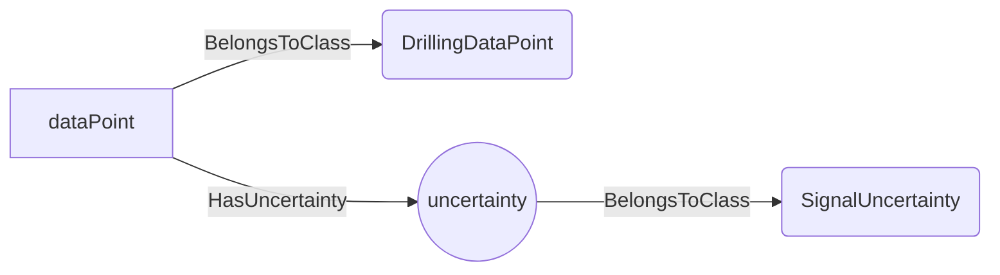
An example SparQL query looks like this:
```sparql
PREFIX rdf: <http://www.w3.org/1999/02/22-rdf-syntax-ns#>
PREFIX ddhub: <http://ddhub.no/>
PREFIX quantity: <http://ddhub.no/UnitAndQuantity>
SELECT ?dataPoint
WHERE {
	?dataPoint rdf:type ddhub:DrillingDataPoint .
	?uncertainty rdf:type ddhub:SignalUncertainty .
	?dataPoint ddhub:HasUncertainty ?Attribute000 .
  FILTER (
	?Attribute000 = uncertainty
  )
}
```
This query returns all the `DrillingDataPoint` for which an uncertainty is given.
## GaussianUncertainty <!-- NOUN -->
- Display name: GaussianUncertainty
- Parent class: [SignalUncertainty](#SignalUncertainty)
- Description: 
The uncertainty is represented by a Gaussian distribution, i.e., with a `Mean` and a `StandardDeviation`, $\mathcal{N}(\overline{x},{\sigma_{x}}^2)$ where $\overline{x}$ is the `Mean` value and $\sigma_{x}$ is the `StandardDeviation`.
- Definition set: Uncertainty
- Examples:
```dwis Signal#01 Signal#02
DrillingDataPoint:ddp#01
GaussianUncertainty:GU#01
ddp#01 HasUncertainty GU#01
DrillingDataPoint:Mean#01
DrillingDataPoint:StdDev#01
GU#01 HasUncertaintyMean Mean#01
GU#01 HasUncertaintyStandardDeviation StdDev#01
DynamicDrillingSignal:Signal#01
DynamicDrillingSignal:Signal#02
Mean#01 HasDynamicValue Signal#01
StdDev#01 HasDynamicValue Signal#02
```
An example semantic graph looks like as follow:
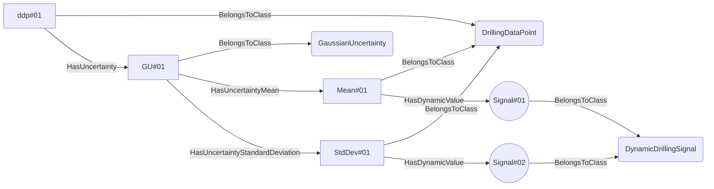
An example SparQL query looks like this:
```sparql
PREFIX rdf: <http://www.w3.org/1999/02/22-rdf-syntax-ns#>
PREFIX ddhub: <http://ddhub.no/>
PREFIX quantity: <http://ddhub.no/UnitAndQuantity>
SELECT ?Signal#01, ?Signal#02
WHERE {
	?ddp#01 rdf:type ddhub:DrillingDataPoint .
	?GU#01 rdf:type ddhub:GaussianUncertainty .
	?ddp#01 ddhub:HasUncertainty ?Attribute000 .
	?Mean#01 rdf:type ddhub:DrillingDataPoint .
	?StdDev#01 rdf:type ddhub:DrillingDataPoint .
	?GU#01 ddhub:HasUncertaintyMean ?Attribute001 .
	?GU#01 ddhub:HasUncertaintyStandardDeviation ?Attribute002 .
	?Signal#01 rdf:type ddhub:DynamicDrillingSignal .
	?Signal#02 rdf:type ddhub:DynamicDrillingSignal .
	?Mean#01 ddhub:HasDynamicValue ?Attribute003 .
	?StdDev#01 ddhub:HasDynamicValue ?Attribute004 .
  FILTER (
	?Attribute000 = GU#01
	&& 	?Attribute001 = Mean#01
	&& 	?Attribute002 = StdDev#01
	&& 	?Attribute003 = Signal#01
	&& 	?Attribute004 = Signal#02
  )
}
```
In this example, `ddp#01` is a `DrillingDataPoint` that has an uncertainty `GU#01`, which is a Gaussian distribution that is described by a `Mean` value called `Mean#01` and a `StandardDeviation` value called `StdDev#01`. `Mean#01` is a live signal that is attached to `Signal#01`. Similarly `StdDev#01` is a live signal attached to `Signal#02`.
## GenericUncertainty <!-- NOUN -->
- Display name: GenericUncertainty
- Parent class: [SignalUncertainty](#SignalUncertainty)
- Description: 
The uncertainty is represented by a `Histogram`.
- Definition set: Uncertainty
- Examples:
```dwis Signal#01
DrillingDataPoint:ddp#01
GenericUncertainty:GU#01
ddp#01 HasUncertainty GU#01
DrillingDataPoint:Histo#01
GU#01 HasUncertaintyHistogram Histo#01
DynamicDrillingSignal:Signal#01
Histo#01 HasDynamicValue Signal#01
```
An example semantic graph looks like as follow:
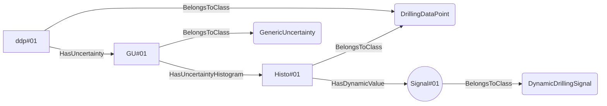
An example SparQL query looks like this:
```sparql
PREFIX rdf: <http://www.w3.org/1999/02/22-rdf-syntax-ns#>
PREFIX ddhub: <http://ddhub.no/>
PREFIX quantity: <http://ddhub.no/UnitAndQuantity>
SELECT ?Signal#01
WHERE {
	?ddp#01 rdf:type ddhub:DrillingDataPoint .
	?GU#01 rdf:type ddhub:GenericUncertainty .
	?ddp#01 ddhub:HasUncertainty ?Attribute000 .
	?Histo#01 rdf:type ddhub:DrillingDataPoint .
	?GU#01 ddhub:HasUncertaintyHistogram ?Attribute001 .
	?Signal#01 rdf:type ddhub:DynamicDrillingSignal .
	?Histo#01 ddhub:HasDynamicValue ?Attribute002 .
  FILTER (
	?Attribute000 = GU#01
	&& 	?Attribute001 = Histo#01
	&& 	?Attribute002 = Signal#01
  )
}
```
In this example, `ddp#01` is a `DrillingDataPoint` that has an uncertainty `GU#01`, which is a general probability distribution that is described by a histogram called `Histo#01`. `Histo#01` is a live signal that is attached to `Signal#01`.
## MinMaxUncertainty <!-- NOUN -->
- Display name: MinMaxUncertainty
- Parent class: [SignalUncertainty](#SignalUncertainty)
- Description: 
The uncertainty is represented by a uniform probability distribution between a `Min` and a `Max` value.
- Definition set: Uncertainty
- Examples:
```dwis Signal#01 Signal#02
DrillingDataPoint:ddp#01
MinMaxUncertainty:GU#01
ddp#01 HasUncertainty GU#01
DrillingDataPoint:Min#01
DrillingDataPoint:Max#01
GU#01 HasUncertaintyMin Min#01
GU#01 HasUncertaintyMax Max#01
DynamicDrillingSignal:Signal#01
DynamicDrillingSignal:Signal#02
Min#01 HasDynamicValue Signal#01
Max#01 HasDynamicValue Signal#02
```
An example semantic graph looks like as follow:
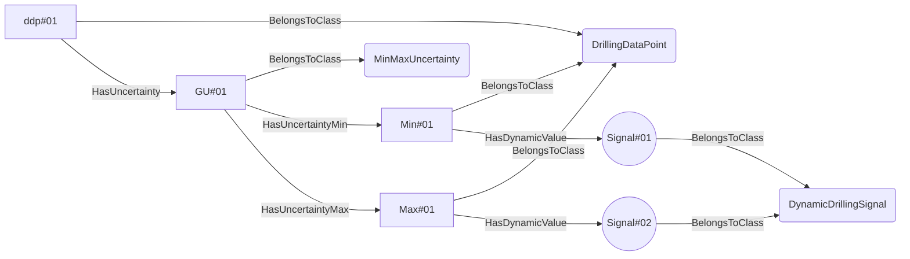
An example SparQL query looks like this:
```sparql
PREFIX rdf: <http://www.w3.org/1999/02/22-rdf-syntax-ns#>
PREFIX ddhub: <http://ddhub.no/>
PREFIX quantity: <http://ddhub.no/UnitAndQuantity>
SELECT ?Signal#01, ?Signal#02
WHERE {
	?ddp#01 rdf:type ddhub:DrillingDataPoint .
	?GU#01 rdf:type ddhub:MinMaxUncertainty .
	?ddp#01 ddhub:HasUncertainty ?Attribute000 .
	?Min#01 rdf:type ddhub:DrillingDataPoint .
	?Max#01 rdf:type ddhub:DrillingDataPoint .
	?GU#01 ddhub:HasUncertaintyMin ?Attribute001 .
	?GU#01 ddhub:HasUncertaintyMax ?Attribute002 .
	?Signal#01 rdf:type ddhub:DynamicDrillingSignal .
	?Signal#02 rdf:type ddhub:DynamicDrillingSignal .
	?Min#01 ddhub:HasDynamicValue ?Attribute003 .
	?Max#01 ddhub:HasDynamicValue ?Attribute004 .
  FILTER (
	?Attribute000 = GU#01
	&& 	?Attribute001 = Min#01
	&& 	?Attribute002 = Max#01
	&& 	?Attribute003 = Signal#01
	&& 	?Attribute004 = Signal#02
  )
}
```
In this example, `ddp#01` is a `DrillingDataPoint` that has an uncertainty `GU#01`, which is a uniform probability distribution that is described by a `Min` value called `Min#01` and a `Max` value called `Max#01`. `Min#01` is a live signal that is attached to `Signal#01`. Similarly `Max#01` is a live signal attached to `Signal#02`.
## FullScaleUncertainty <!-- NOUN -->
- Display name: FullScaleUncertainty
- Parent class: [GaussianUncertainty](#GaussianUncertainty)
- Attributes:
  - FullScale
    - Type: double
    - Description: The total range of measurement of the signal, i.e., $\left| max - min \right|$. The value is expected to be in the same physical quantity as the sensor value.
  - ProportionError
    - Type: double
    - Description: The proportion error on the signal. The value is expected to be a dimensionless physical quantity between 0 and 1 in SI unit. This proportion is applied to the `Fullscale` to obtain the standard deviation of the Gaussian probability distribution that describes the uncertainty of the signal. The mean value of that Gaussian distribution is the signal value.
- Description: 
The uncertainty on the signal is described as a Gaussian distribution with a standard deviation that is calculated using a proportion of the maximum range of the signal. The `Fullscale` or `ProportionError` can either be defined as attribute values, for example when they have fixed values, or using facts utilizing the verbs `HasFullScale` or repectively `HasProportionError` when these values may change through time.
- Definition set: Uncertainty
- Examples:
```dwis Signal#01 Signal#02
DrillingDataPoint:ddp#01
FullScaleUncertainty:GU#01
ddp#01 HasUncertainty GU#01
DrillingDataPoint:FullScale#01
DrillingDataPoint:ErrProp#01
GU#01 HasFullScale FullScale#01
GU#01 HasProportionError ErrProp#01
DrillingSignal:Signal#01
DrillingSignal:Signal#02
FullScale#01 HasStaticValue Signal#01
ErrProp#01 HasStaticValue Signal#02
```
An example semantic graph looks like as follow:
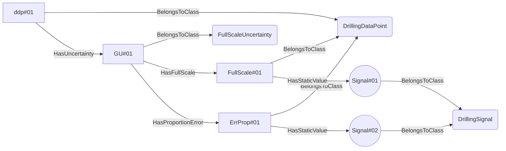
An example SparQL query looks like this:
```sparql
PREFIX rdf: <http://www.w3.org/1999/02/22-rdf-syntax-ns#>
PREFIX ddhub: <http://ddhub.no/>
PREFIX quantity: <http://ddhub.no/UnitAndQuantity>
SELECT ?Signal#01, ?Signal#02
WHERE {
	?ddp#01 rdf:type ddhub:DrillingDataPoint .
	?GU#01 rdf:type ddhub:FullScaleUncertainty .
	?ddp#01 ddhub:HasUncertainty ?Attribute000 .
	?FullScale#01 rdf:type ddhub:DrillingDataPoint .
	?ErrProp#01 rdf:type ddhub:DrillingDataPoint .
	?GU#01 ddhub:HasFullScale ?Attribute001 .
	?GU#01 ddhub:HasProportionError ?Attribute002 .
	?Signal#01 rdf:type ddhub:DrillingSignal .
	?Signal#02 rdf:type ddhub:DrillingSignal .
	?FullScale#01 ddhub:HasStaticValue ?Attribute003 .
	?ErrProp#01 ddhub:HasStaticValue ?Attribute004 .
  FILTER (
	?Attribute000 = GU#01
	&& 	?Attribute001 = FullScale#01
	&& 	?Attribute002 = ErrProp#01
	&& 	?Attribute003 = Signal#01
	&& 	?Attribute004 = Signal#02
  )
}
```
In this example, `ddp#01` is a `DrillingDataPoint` that has an uncertainty `GU#01`, which is representing a sensor having a Gaussian probability distibution that is described using a `ProportionError` (called `ErrProp#01`) of a `FullScale` value called `FullScale#01`. `FullScale#01` is a static signal that is attached to `Signal#01`. Similarly `ErrProp#01` is a static signal attached to `Signal#02`.
## SensorUncertainty <!-- NOUN -->
- Display name: SensorUncertainty
- Parent class: [GaussianUncertainty](#GaussianUncertainty)
- Attributes:
  - Accuracy
    - Type: double
    - Description: The standard deviation of the systematic bias component of the uncertainty of the sensor. The assumed mean value of the attached Gaussian distribution is the measured value. The value is expected to be in the same physical quantity as the sensor value.
  - Precision
    - Type: double
    - Description: The standard deviation of the repetitive error component of the uncertainty of the sensor. The assumed mean value of the attached Gaussian distribution is the measured value. The value is expected to be in the same physical quantity as the sensor value.
- Description: 
The uncertainty of the sensor is described by a systematic bias and repetitive error. The systematic bias is referred to as the `Accuracy` while the repetitive error is referred to as the `Precision`. The standard deviation of the overall Gaussian distribution is $\sqrt{\sigma^2{_a}+\sigma^2{_p}}$ where $\sigma_a$ is the accuracy and $\sigma_p$ is the precision. The `Accuracy` or the `Precision` can either be defined as attribute values, for example when they have fixed values, or using another facts utilizing the verbs `HasAccuracy` or respectively `HasPrecision` when these values may change through time.
- Definition set: Uncertainty
- Examples:
```dwis Signal#01 Signal#02
DrillingDataPoint:ddp#01
SensorUncertainty:GU#01
ddp#01 HasUncertainty GU#01
DrillingDataPoint:Acc#01
DrillingDataPoint:Prec#01
GU#01 HasUncertaintyAccuracy Acc#01
GU#01 HasUncertaintyPrecision Prec#01
DrillingSignal:Signal#01
DrillingSignal:Signal#02
Acc#01 HasStaticValue Signal#01
Prec#01 HasStaticValue Signal#02
```
An example semantic graph looks like as follow:
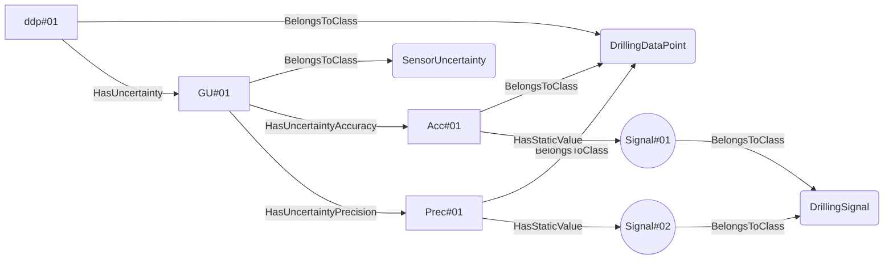
An example SparQL query looks like this:
```sparql
PREFIX rdf: <http://www.w3.org/1999/02/22-rdf-syntax-ns#>
PREFIX ddhub: <http://ddhub.no/>
PREFIX quantity: <http://ddhub.no/UnitAndQuantity>
SELECT ?Signal#01, ?Signal#02
WHERE {
	?ddp#01 rdf:type ddhub:DrillingDataPoint .
	?GU#01 rdf:type ddhub:SensorUncertainty .
	?ddp#01 ddhub:HasUncertainty ?Attribute000 .
	?Acc#01 rdf:type ddhub:DrillingDataPoint .
	?Prec#01 rdf:type ddhub:DrillingDataPoint .
	?GU#01 ddhub:HasUncertaintyAccuracy ?Attribute001 .
	?GU#01 ddhub:HasUncertaintyPrecision ?Attribute002 .
	?Signal#01 rdf:type ddhub:DrillingSignal .
	?Signal#02 rdf:type ddhub:DrillingSignal .
	?Acc#01 ddhub:HasStaticValue ?Attribute003 .
	?Prec#01 ddhub:HasStaticValue ?Attribute004 .
  FILTER (
	?Attribute000 = GU#01
	&& 	?Attribute001 = Acc#01
	&& 	?Attribute002 = Prec#01
	&& 	?Attribute003 = Signal#01
	&& 	?Attribute004 = Signal#02
  )
}
```
In this example, `ddp#01` is a `DrillingDataPoint` that has an uncertainty `GU#01`, which is representing a sensor having a Gaussian probability distibution that is described using an `Accuracy` (called `Acc#01`)  and a `Precision` called `Prec#01`. `Acc#01` is a static signal that is attached to `Signal#01`. Similarly `Prec#01` is a static signal attached to `Signal#02`.
# Verbs
## IsEnablingSignalFor <!-- VERB -->
- Display name: Is Enabling Signal For
- Parent verb: [DWISVerb](#DWISVerb)
- Subject class: [DrillingDataPoint](#DrillingDataPoint)
- Object class: [ActivableFunction](#ActivableFunction)
- Definition set: ADCS
- Description: 
This verb is used to define a `DrillingDataPoint` that is used to enable or disable an `ActivableFunction`.
It is expected that the `DrillingDataPoint` is a Boolean value.
- Examples:
```dwis packOffDectionAndReaction
FDIRFunction:packOffDetectionAndReaction
packOffDetectionAndReaction HasFunction "PackOffFDIR"
ControlSystem:DCS
DrillingContractor:Contractor
DCS IsProvidedBy Contractor
DCS BelongsToClass DataProvider
packOffDetectionAndReaction IsProvidedBy DCS
Command:enableSignalPackOffDetectionFDIR
enableSignalPackOffDetectionFDIR BelongsToClass BooleanDataType
enableSignalPackOffDetectionFDIR IsEnablingSignalFor packOffDetectionAndReaction
```
An example semantic graph looks like as follow:
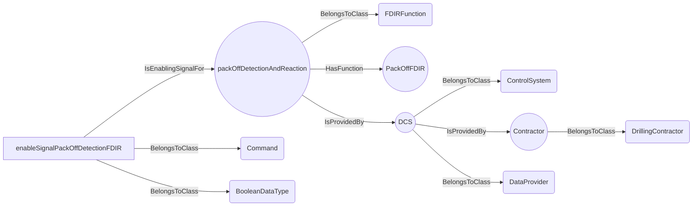
An example SparQL query looks like this:
```sparql
PREFIX rdf: <http://www.w3.org/1999/02/22-rdf-syntax-ns#>
PREFIX ddhub: <http://ddhub.no/>
PREFIX quantity: <http://ddhub.no/UnitAndQuantity>
SELECT ?packOffDectionAndReaction
WHERE {
	?packOffDetectionAndReaction rdf:type ddhub:FDIRFunction .
	?packOffDetectionAndReaction ddhub:HasFunction ?Attribute000 .
	?DCS rdf:type ddhub:ControlSystem .
	?Contractor rdf:type ddhub:DrillingContractor .
	?DCS ddhub:IsProvidedBy ?Attribute001 .
	?DCS rdf:type ddhub:DataProvider .
	?packOffDetectionAndReaction ddhub:IsProvidedBy ?Attribute002 .
	?enableSignalPackOffDetectionFDIR rdf:type ddhub:Command .
	?enableSignalPackOffDetectionFDIR rdf:type ddhub:BooleanDataType .
	?enableSignalPackOffDetectionFDIR ddhub:IsEnablingSignalFor ?Attribute003 .
  FILTER (
	?Attribute000 = "PackOffFDIR"
	&& 	?Attribute001 = Contractor
	&& 	?Attribute002 = DCS
	&& 	?Attribute003 = packOffDetectionAndReaction
  )
}
```
This example describes that the `Command` signal `enableSignalPackOffDetectionFDIR` is used to enable/disable the `FDIRFunction`.
## IsActivatedSignalFor <!-- VERB -->
- Display name: Is Activated Signal For
- Parent verb: [DWISVerb](#DWISVerb)
- Subject class: [DrillingDataPoint](#DrillingDataPoint)
- Object class: [ActivableFunction](#ActivableFunction)
- Definition set: ADCS
- Description: 
This verb is used to define a `DrillingDataPoint` that indicates if the `ActivableFunction` is activated or
not. It is expected that the `DrillingDataPoint` is a Boolean value.
- Examples:
```dwis packOffDectionAndReaction
FDIRFunction:packOffDetectionAndReaction
packOffDetectionAndReaction HasFunction "PackOffFDIR"
ControlSystem:DCS
DrillingContractor:Contractor
DCS IsProvidedBy Contractor
DCS BelongsToClass DataProvider
packOffDetectionAndReaction IsProvidedBy DCS
ComputedData:activatedSignalPackOffDetectionFDIR
activatedSignalPackOffDetectionFDIR BelongsToClass BooleanDataType
activatedSignalPackOffDetectionFDIR IsEnablingSignalFor packOffDetectionAndReaction
```
An example semantic graph looks like as follow:
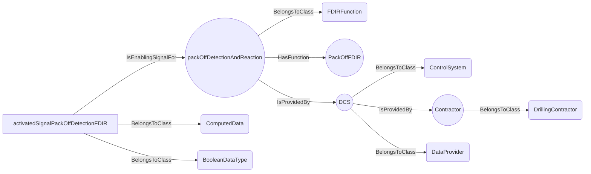
An example SparQL query looks like this:
```sparql
PREFIX rdf: <http://www.w3.org/1999/02/22-rdf-syntax-ns#>
PREFIX ddhub: <http://ddhub.no/>
PREFIX quantity: <http://ddhub.no/UnitAndQuantity>
SELECT ?packOffDectionAndReaction
WHERE {
	?packOffDetectionAndReaction rdf:type ddhub:FDIRFunction .
	?packOffDetectionAndReaction ddhub:HasFunction ?Attribute000 .
	?DCS rdf:type ddhub:ControlSystem .
	?Contractor rdf:type ddhub:DrillingContractor .
	?DCS ddhub:IsProvidedBy ?Attribute001 .
	?DCS rdf:type ddhub:DataProvider .
	?packOffDetectionAndReaction ddhub:IsProvidedBy ?Attribute002 .
	?activatedSignalPackOffDetectionFDIR rdf:type ddhub:ComputedData .
	?activatedSignalPackOffDetectionFDIR rdf:type ddhub:BooleanDataType .
	?activatedSignalPackOffDetectionFDIR ddhub:IsEnablingSignalFor ?Attribute003 .
  FILTER (
	?Attribute000 = "PackOffFDIR"
	&& 	?Attribute001 = Contractor
	&& 	?Attribute002 = DCS
	&& 	?Attribute003 = packOffDetectionAndReaction
  )
}
```
This example describes that the `ComputedData` signal `activatedSignalPackOffDetectionFDIR` informs whether the 
`packOffDetectionAndReaction` FDIR function is activated or not.
## AllowEnablementSignalFor <!-- VERB -->
- Display name: Allow Enablement Signal For
- Parent verb: [DWISVerb](#DWISVerb)
- Subject class: [DrillingDataPoint](#DrillingDataPoint)
- Object class: [ActivableFunction](#ActivableFunction)
- Definition set: ADCS
- Description: 
This verb is used to define a `DrillingDataPoint` tells if it is allowed or not to enable or
disable an activable function. It is expected that the `DrillingDataPoint` is a Boolean value. If the signal is true,
then it is possible to enable or disable the function using the signal associated with `IsEnablingSignalFor`. If it is
false, it is not allowed to enable or disable the `ActivableFunction`, meaning that the signal associated with `IsEnablingSignalFor`
is ignored.
- Examples:
```dwis packOffDectionAndReaction
FDIRFunction:packOffDetectionAndReaction
packOffDetectionAndReaction HasFunction "PackOffFDIR"
ControlSystem:DCS
DrillingContractor:Contractor
DCS IsProvidedBy Contractor
DCS BelongsToClass DataProvider
packOffDetectionAndReaction IsProvidedBy DCS
ComputedData:allowEnablementSignalPackOffDetectionFDIR
allowEnablementSignalPackOffDetectionFDIR BelongsToClass BooleanDataType
allowEnablementSignalPackOffDetectionFDIR IsEnablingSignalFor packOffDetectionAndReaction
Command:enableSignalPackOffDetectionFDIR
enableSignalPackOffDetectionFDIR BelongsToClass BooleanDataType
enableSignalPackOffDetectionFDIR IsEnablingSignalFor packOffDetectionAndReaction
```
An example semantic graph looks like as follow:
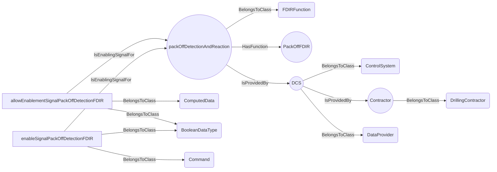
An example SparQL query looks like this:
```sparql
PREFIX rdf: <http://www.w3.org/1999/02/22-rdf-syntax-ns#>
PREFIX ddhub: <http://ddhub.no/>
PREFIX quantity: <http://ddhub.no/UnitAndQuantity>
SELECT ?packOffDectionAndReaction
WHERE {
	?packOffDetectionAndReaction rdf:type ddhub:FDIRFunction .
	?packOffDetectionAndReaction ddhub:HasFunction ?Attribute000 .
	?DCS rdf:type ddhub:ControlSystem .
	?Contractor rdf:type ddhub:DrillingContractor .
	?DCS ddhub:IsProvidedBy ?Attribute001 .
	?DCS rdf:type ddhub:DataProvider .
	?packOffDetectionAndReaction ddhub:IsProvidedBy ?Attribute002 .
	?allowEnablementSignalPackOffDetectionFDIR rdf:type ddhub:ComputedData .
	?allowEnablementSignalPackOffDetectionFDIR rdf:type ddhub:BooleanDataType .
	?allowEnablementSignalPackOffDetectionFDIR ddhub:IsEnablingSignalFor ?Attribute003 .
	?enableSignalPackOffDetectionFDIR rdf:type ddhub:Command .
	?enableSignalPackOffDetectionFDIR rdf:type ddhub:BooleanDataType .
	?enableSignalPackOffDetectionFDIR ddhub:IsEnablingSignalFor ?Attribute004 .
  FILTER (
	?Attribute000 = "PackOffFDIR"
	&& 	?Attribute001 = Contractor
	&& 	?Attribute002 = DCS
	&& 	?Attribute003 = packOffDetectionAndReaction
	&& 	?Attribute004 = packOffDetectionAndReaction
  )
}
```
This example describes that the `ComputedData` signal `allowEnablementSignalPackOffDetectionFDIR` tells whether the 
`packOffDetectionAndReaction` FDIR function can be allowed to be enabled or not. The state of the signal `allowEnablementSignalPackOffDetectionFDIR`
has an impact on whether the signal `enableSignalPackOffDetectionFDIR` is used or ignored.
## IsIdlingSignalFor <!-- VERB -->
- Display name: Is Idling Signal For
- Parent verb: [DWISVerb](#DWISVerb)
- Subject class: [DrillingDataPoint](#DrillingDataPoint)
- Object class: [RunnableFunction](#RunnableFunction)
- Definition set: ADCS
- Description: 
This verb is used to indicate a `DrillingDataPoint` that tells if the function is in an idle state.
A function that is idle must be enabled but does not perform any particular control on the machines. For instance, a 
`ProcedureFunction` that has reached its terminal state or a `ControllerFunction` that cannot control anymore its 
parameter because a limit is reached, e.g., autodriller when reaching the `MinDrillHeightVerticalLocation`, or an FDIR
function when there are no incidents that is detected. A SOE function is in idle state, if the used set-points are
within the limits, but if the limits are applied then the idle state is false, because the function acts on the set-points.
- Examples:
```dwis packOffDectionAndReaction
FDIRFunction:packOffDetectionAndReaction
packOffDetectionAndReaction HasFunction "PackOffFDIR"
ControlSystem:DCS
DrillingContractor:Contractor
DCS IsProvidedBy Contractor
DCS BelongsToClass DataProvider
packOffDetectionAndReaction IsProvidedBy DCS
ComputedData:idlingSignalPackOffDetectionFDIR
idlingSignalPackOffDetectionFDIR BelongsToClass BooleanDataType
idlingSignalPackOffDetectionFDIR IsIdlingSignalFor packOffDetectionAndReaction
ComputedData:activatedSignalPackOffDetectionFDIR
activatedSignalPackOffDetectionFDIR BelongsToClass BooleanDataType
activatedSignalPackOffDetectionFDIR IsEnablingSignalFor packOffDetectionAndReaction
```
An example semantic graph looks like as follow:
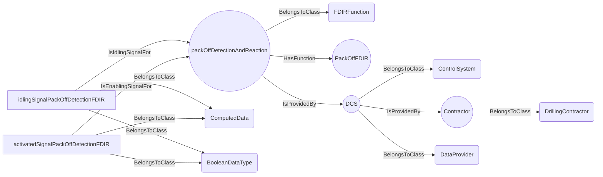
An example SparQL query looks like this:
```sparql
PREFIX rdf: <http://www.w3.org/1999/02/22-rdf-syntax-ns#>
PREFIX ddhub: <http://ddhub.no/>
PREFIX quantity: <http://ddhub.no/UnitAndQuantity>
SELECT ?packOffDectionAndReaction
WHERE {
	?packOffDetectionAndReaction rdf:type ddhub:FDIRFunction .
	?packOffDetectionAndReaction ddhub:HasFunction ?Attribute000 .
	?DCS rdf:type ddhub:ControlSystem .
	?Contractor rdf:type ddhub:DrillingContractor .
	?DCS ddhub:IsProvidedBy ?Attribute001 .
	?DCS rdf:type ddhub:DataProvider .
	?packOffDetectionAndReaction ddhub:IsProvidedBy ?Attribute002 .
	?idlingSignalPackOffDetectionFDIR rdf:type ddhub:ComputedData .
	?idlingSignalPackOffDetectionFDIR rdf:type ddhub:BooleanDataType .
	?idlingSignalPackOffDetectionFDIR ddhub:IsIdlingSignalFor ?Attribute003 .
	?activatedSignalPackOffDetectionFDIR rdf:type ddhub:ComputedData .
	?activatedSignalPackOffDetectionFDIR rdf:type ddhub:BooleanDataType .
	?activatedSignalPackOffDetectionFDIR ddhub:IsEnablingSignalFor ?Attribute004 .
  FILTER (
	?Attribute000 = "PackOffFDIR"
	&& 	?Attribute001 = Contractor
	&& 	?Attribute002 = DCS
	&& 	?Attribute003 = packOffDetectionAndReaction
	&& 	?Attribute004 = packOffDetectionAndReaction
  )
}
```
This example describes that the `ComputedData` signal `idlingSignalPackOffDetectionFDIR` informs whether the `packOffDetectionAndReaction`
FDIR function is in an idle state or not. Logically, this signal has a meaning only if the signal `activatedSignalPackOffDetectionFDIR` is
true.
## IsUserControllableExtraMarginSignalFor <!-- VERB -->
- Display name: Is User Controllable Extra Margin Signal For
- Parent verb: [DWISVerb](#DWISVerb)
- Subject class: [DrillingDataPoint](#DrillingDataPoint)
- Object class: [FDIRFunction](#FDIRFunction)
- Definition set: ADCS
- Description: 
This verb is used to indicate that a `DrillingDataPoint` used by an `FDIRFunction`, extends the calculated
threshold value for the fault detection by a user-defined amount. The value of this signal is supposed to be interpreted
in absolute value. If it is negative, then it is its magnitude that is used. This allows the end-user to increase the margin for
detection of an incident. 
- Examples:
```dwis packOffDectionAndReaction
FDIRFunction:packOffDetectionAndReaction
packOffDetectionAndReaction HasFunction "PackOffFDIR"
ControlSystem:DCS
DrillingContractor:Contractor
DCS IsProvidedBy Contractor
DCS BelongsToClass DataProvider
packOffDetectionAndReaction IsProvidedBy DCS
Command:extraMarginUserDefinedSignalPackOffDetectionFDIR
extraMarginUserDefinedSignalPackOffDetectionFDIR BelongsToClass ContinuousDataType
extraMarginUserDefinedSignalPackOffDetectionFDIR IsUserControllableExtraMarginSignalFor packOffDetectionAndReaction
```
An example semantic graph looks like as follow:
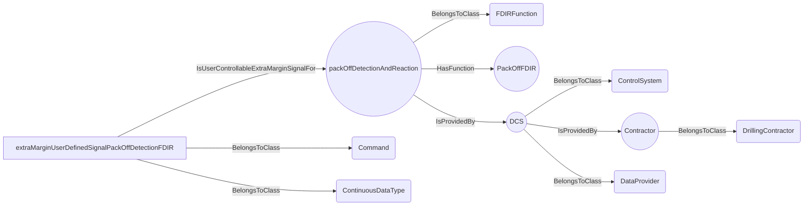
An example SparQL query looks like this:
```sparql
PREFIX rdf: <http://www.w3.org/1999/02/22-rdf-syntax-ns#>
PREFIX ddhub: <http://ddhub.no/>
PREFIX quantity: <http://ddhub.no/UnitAndQuantity>
SELECT ?packOffDectionAndReaction
WHERE {
	?packOffDetectionAndReaction rdf:type ddhub:FDIRFunction .
	?packOffDetectionAndReaction ddhub:HasFunction ?Attribute000 .
	?DCS rdf:type ddhub:ControlSystem .
	?Contractor rdf:type ddhub:DrillingContractor .
	?DCS ddhub:IsProvidedBy ?Attribute001 .
	?DCS rdf:type ddhub:DataProvider .
	?packOffDetectionAndReaction ddhub:IsProvidedBy ?Attribute002 .
	?extraMarginUserDefinedSignalPackOffDetectionFDIR rdf:type ddhub:Command .
	?extraMarginUserDefinedSignalPackOffDetectionFDIR rdf:type ddhub:ContinuousDataType .
	?extraMarginUserDefinedSignalPackOffDetectionFDIR ddhub:IsUserControllableExtraMarginSignalFor ?Attribute003 .
  FILTER (
	?Attribute000 = "PackOffFDIR"
	&& 	?Attribute001 = Contractor
	&& 	?Attribute002 = DCS
	&& 	?Attribute003 = packOffDetectionAndReaction
  )
}
```
This example descibes that the `Command` signal `extraMarginUserDefinedSignalPackOffDetectionFDIR` is used to extend
the threshold detection for pressure by a user defined value.
## IsUsedExtraMarginSignalFor <!-- VERB -->
- Display name: Is Used Extra Margin Signal For
- Parent verb: [DWISVerb](#DWISVerb)
- Subject class: [DrillingDataPoint](#DrillingDataPoint)
- Object class: [FDIRFunction](#FDIRFunction)
- Definition set: ADCS
- Description: 
This verb is used to indicate a `DrillingDataPoint` used by an `FDIRFunction` tells whether the
extra margin signal is used or not by the FDIR function. This signal is expected to be a boolean value.
- Examples:
```dwis packOffDectionAndReaction
FDIRFunction:packOffDetectionAndReaction
packOffDetectionAndReaction HasFunction "PackOffFDIR"
ControlSystem:DCS
DrillingContractor:Contractor
DCS IsProvidedBy Contractor
DCS BelongsToClass DataProvider
packOffDetectionAndReaction IsProvidedBy DCS
ComputedData:usedExtraMarginSignal
usedExtraMarginSignal BelongsToClass BooleanDataType
usedExtraMarginSignal IsUsedExtraMarginSignalFor packOffDetectionAndReaction
Command:extraMarginUserDefinedSignalPackOffDetectionFDIR
extraMarginUserDefinedSignalPackOffDetectionFDIR BelongsToClass ContinuousDataType
extraMarginUserDefinedSignalPackOffDetectionFDIR IsUserControllableExtraMarginSignalFor packOffDetectionAndReaction
```
An example semantic graph looks like as follow:
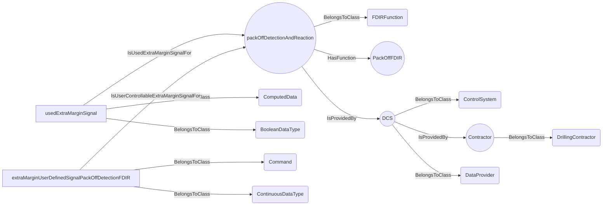
An example SparQL query looks like this:
```sparql
PREFIX rdf: <http://www.w3.org/1999/02/22-rdf-syntax-ns#>
PREFIX ddhub: <http://ddhub.no/>
PREFIX quantity: <http://ddhub.no/UnitAndQuantity>
SELECT ?packOffDectionAndReaction
WHERE {
	?packOffDetectionAndReaction rdf:type ddhub:FDIRFunction .
	?packOffDetectionAndReaction ddhub:HasFunction ?Attribute000 .
	?DCS rdf:type ddhub:ControlSystem .
	?Contractor rdf:type ddhub:DrillingContractor .
	?DCS ddhub:IsProvidedBy ?Attribute001 .
	?DCS rdf:type ddhub:DataProvider .
	?packOffDetectionAndReaction ddhub:IsProvidedBy ?Attribute002 .
	?usedExtraMarginSignal rdf:type ddhub:ComputedData .
	?usedExtraMarginSignal rdf:type ddhub:BooleanDataType .
	?usedExtraMarginSignal ddhub:IsUsedExtraMarginSignalFor ?Attribute003 .
	?extraMarginUserDefinedSignalPackOffDetectionFDIR rdf:type ddhub:Command .
	?extraMarginUserDefinedSignalPackOffDetectionFDIR rdf:type ddhub:ContinuousDataType .
	?extraMarginUserDefinedSignalPackOffDetectionFDIR ddhub:IsUserControllableExtraMarginSignalFor ?Attribute004 .
  FILTER (
	?Attribute000 = "PackOffFDIR"
	&& 	?Attribute001 = Contractor
	&& 	?Attribute002 = DCS
	&& 	?Attribute003 = packOffDetectionAndReaction
	&& 	?Attribute004 = packOffDetectionAndReaction
  )
}
```
This example describes a `ComputedData` signal that indicates whether an extra margin value is used for the threshold
detection. This extra margin is describes by `extraMarginUserDefinedSignalPackOffDetectionFDIR`.
## IsArmedSignalFor <!-- VERB -->
- Display name: Is Armed Signal For
- Parent verb: [DWISVerb](#DWISVerb)
- Subject class: [DrillingDataPoint](#DrillingDataPoint)
- Object class: [FDIRFunction](#FDIRFunction)
- Definition set: ADCS
- Description: 
This verb is used to indicate a `DrillingDataPoint` used by an `FDIRFunction` tells if the FDIR function is armed and operative.
The signal is supposed to be a Boolean value.
The FDIR function may be active, but the current state of the drilling process may imply that the function cannot be
triggered. For instance, a pack-off FDIR may be active but would react only if the flow is supposed to be steady state.
- Examples:
```dwis packOffDectionAndReaction
FDIRFunction:packOffDetectionAndReaction
packOffDetectionAndReaction HasFunction "PackOffFDIR"
ControlSystem:DCS
DrillingContractor:Contractor
DCS IsProvidedBy Contractor
DCS BelongsToClass DataProvider
packOffDetectionAndReaction IsProvidedBy DCS
ComputedData:armedSignalPackOffDetectionFDIR
armedSignalPackOffDetectionFDIR BelongsToClass BooleanValue
armedSignalPackOffDetectionFDIR IsArmedSignalFor packOffDetectionAndReaction
ComputedData:activatedSignalPackOffDetectionFDIR
activatedSignalPackOffDetectionFDIR BelongsToClass BooleanDataType
activatedSignalPackOffDetectionFDIR IsEnablingSignalFor packOffDetectionAndReaction
```
An example semantic graph looks like as follow:
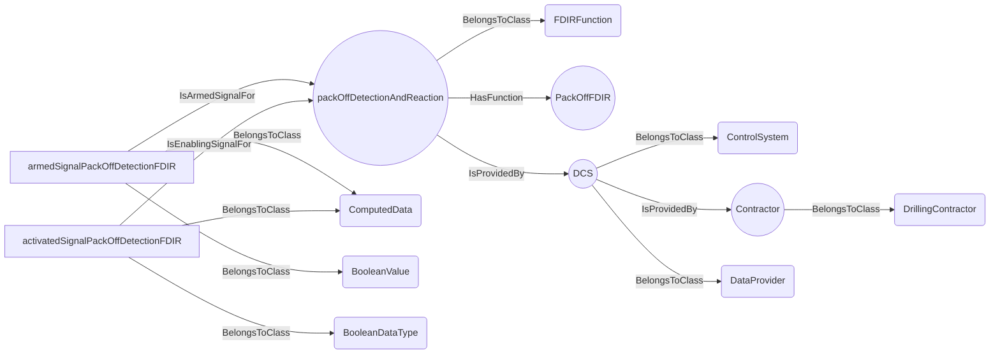
An example SparQL query looks like this:
```sparql
PREFIX rdf: <http://www.w3.org/1999/02/22-rdf-syntax-ns#>
PREFIX ddhub: <http://ddhub.no/>
PREFIX quantity: <http://ddhub.no/UnitAndQuantity>
SELECT ?packOffDectionAndReaction
WHERE {
	?packOffDetectionAndReaction rdf:type ddhub:FDIRFunction .
	?packOffDetectionAndReaction ddhub:HasFunction ?Attribute000 .
	?DCS rdf:type ddhub:ControlSystem .
	?Contractor rdf:type ddhub:DrillingContractor .
	?DCS ddhub:IsProvidedBy ?Attribute001 .
	?DCS rdf:type ddhub:DataProvider .
	?packOffDetectionAndReaction ddhub:IsProvidedBy ?Attribute002 .
	?armedSignalPackOffDetectionFDIR rdf:type ddhub:ComputedData .
	?armedSignalPackOffDetectionFDIR rdf:type ddhub:BooleanValue .
	?armedSignalPackOffDetectionFDIR ddhub:IsArmedSignalFor ?Attribute003 .
	?activatedSignalPackOffDetectionFDIR rdf:type ddhub:ComputedData .
	?activatedSignalPackOffDetectionFDIR rdf:type ddhub:BooleanDataType .
	?activatedSignalPackOffDetectionFDIR ddhub:IsEnablingSignalFor ?Attribute004 .
  FILTER (
	?Attribute000 = "PackOffFDIR"
	&& 	?Attribute001 = Contractor
	&& 	?Attribute002 = DCS
	&& 	?Attribute003 = packOffDetectionAndReaction
	&& 	?Attribute004 = packOffDetectionAndReaction
  )
}
```
This example describes a `ComputedData` signal used by an `FDIRFunction` to indicate when the packoff detection can trigger.
It also uses an `activatedSignalPackOffDetectionFDIR` signal that indicates when the function is active or not.
## IsTriggeredSignalFor <!-- VERB -->
- Display name: Is Triggered Signal For
- Parent verb: [DWISVerb](#DWISVerb)
- Subject class: [DrillingDataPoint](#DrillingDataPoint)
- Object class: [FDIRFunction](#FDIRFunction)
- Definition set: ADCS
- Description: 
This verb is used to indicate a `DrillingDataPoint` tells whether an `FDIRFunction` has been triggered
or not. This signal is expected to be a Boolean value. The signal is expected to be true from the moment the FDIR has triggered
to the moment it has recovered from the incident, if it has a recovery procedure, or to the moment the control is given
back to the end-user, in case of failure of the recovery procedure or at the end of the isolation procedure.
- Examples:
 ```dwis packOffDectionAndReaction
FDIRFunction:packOffDetectionAndReaction
packOffDetectionAndReaction HasFunction "PackOffFDIR"
ControlSystem:DCS
DrillingContractor:Contractor
DCS IsProvidedBy Contractor
DCS BelongsToClass DataProvider
packOffDetectionAndReaction IsProvidedBy DCS
ComputedData:triggeredSignalPackOffDetectionFDIR
triggeredSignalPackOffDetectionFDIR BelongsToClass BooleanValue
triggeredSignalPackOffDetectionFDIR IsTriggeredSignalFor packOffDetectionAndReaction
```
An example semantic graph looks like as follow:
```mermaid
graph LR
	N0000[packOffDetectionAndReaction] -->|BelongsToClass| N0001(FDIRFunction) 
	N0000[packOffDetectionAndReaction] -->|HasFunction| N0002(("PackOffFDIR")) 
	N0003[DCS] -->|BelongsToClass| N0004(ControlSystem) 
	N0005[Contractor] -->|BelongsToClass| N0006(DrillingContractor) 
	N0003[DCS] -->|IsProvidedBy| N0005((Contractor)) 
	N0003[DCS] -->|BelongsToClass| N0007(DataProvider) 
	N0000[packOffDetectionAndReaction] -->|IsProvidedBy| N0003((DCS)) 
	N0008[triggeredSignalPackOffDetectionFDIR] -->|BelongsToClass| N0009(ComputedData) 
	N0008[triggeredSignalPackOffDetectionFDIR] -->|BelongsToClass| N0010(BooleanValue) 
	N0008[triggeredSignalPackOffDetectionFDIR] -->|IsTriggeredSignalFor| N0000((packOffDetectionAndReaction)) 
```
An example SparQL query looks like this:
```sparql
PREFIX rdf: <http://www.w3.org/1999/02/22-rdf-syntax-ns#>
PREFIX ddhub: <http://ddhub.no/>
PREFIX quantity: <http://ddhub.no/UnitAndQuantity>
SELECT ?packOffDectionAndReaction
WHERE {
	?packOffDetectionAndReaction rdf:type ddhub:FDIRFunction .
	?packOffDetectionAndReaction ddhub:HasFunction ?Attribute000 .
	?DCS rdf:type ddhub:ControlSystem .
	?Contractor rdf:type ddhub:DrillingContractor .
	?DCS ddhub:IsProvidedBy ?Attribute001 .
	?DCS rdf:type ddhub:DataProvider .
	?packOffDetectionAndReaction ddhub:IsProvidedBy ?Attribute002 .
	?triggeredSignalPackOffDetectionFDIR rdf:type ddhub:ComputedData .
	?triggeredSignalPackOffDetectionFDIR rdf:type ddhub:BooleanValue .
	?triggeredSignalPackOffDetectionFDIR ddhub:IsTriggeredSignalFor ?Attribute003 .
  FILTER (
	?Attribute000 = "PackOffFDIR"
	&& 	?Attribute001 = Contractor
	&& 	?Attribute002 = DCS
	&& 	?Attribute003 = packOffDetectionAndReaction
  )
}
```
This example describes a `ComputedData` signal used by an `FDIRFunction` to indicate when whether the packoff detection
is triggered. 
## IsIdlingAfterTriggeredSignalFor <!-- VERB -->
- Display name: Is Idling After Triggered Signal For
- Parent verb: [DWISVerb](#DWISVerb)
- Subject class: [DrillingDataPoint](#DrillingDataPoint)
- Object class: [FDIRFunction](#FDIRFunction)
- Definition set: ADCS
- Description: 
This verb is used to indicate that a `DrillingDataPoint` tells whether the isolation or the recovery
- Examples:
```dwis packOffDectionAndReaction
FDIRFunction:packOffDetectionAndReaction
packOffDetectionAndReaction HasFunction "PackOffFDIR"
ControlSystem:DCS
DrillingContractor:Contractor
DCS IsProvidedBy Contractor
DCS BelongsToClass DataProvider
packOffDetectionAndReaction IsProvidedBy DCS
ComputedData:idleAfterTriggeredSignalPackOffDetectionFDIR
idleAfterTriggeredSignalPackOffDetectionFDIR BelongsToClass BooleanValue
idleAfterTriggeredSignalPackOffDetectionFDIR IsIdlingAfterTriggeredSignalFor packOffDetectionAndReaction
ComputedData:triggeredSignalPackOffDetectionFDIR
triggeredSignalPackOffDetectionFDIR BelongsToClass BooleanValue
triggeredSignalPackOffDetectionFDIR IsTriggeredSignalFor packOffDetectionAndReaction
```
An example semantic graph looks like as follow:
```mermaid
graph LR
	N0000[packOffDetectionAndReaction] -->|BelongsToClass| N0001(FDIRFunction) 
	N0000[packOffDetectionAndReaction] -->|HasFunction| N0002(("PackOffFDIR")) 
	N0003[DCS] -->|BelongsToClass| N0004(ControlSystem) 
	N0005[Contractor] -->|BelongsToClass| N0006(DrillingContractor) 
	N0003[DCS] -->|IsProvidedBy| N0005((Contractor)) 
	N0003[DCS] -->|BelongsToClass| N0007(DataProvider) 
	N0000[packOffDetectionAndReaction] -->|IsProvidedBy| N0003((DCS)) 
	N0008[idleAfterTriggeredSignalPackOffDetectionFDIR] -->|BelongsToClass| N0009(ComputedData) 
	N0008[idleAfterTriggeredSignalPackOffDetectionFDIR] -->|BelongsToClass| N0010(BooleanValue) 
	N0008[idleAfterTriggeredSignalPackOffDetectionFDIR] -->|IsIdlingAfterTriggeredSignalFor| N0000((packOffDetectionAndReaction)) 
	N0011[triggeredSignalPackOffDetectionFDIR] -->|BelongsToClass| N0009(ComputedData) 
	N0011[triggeredSignalPackOffDetectionFDIR] -->|BelongsToClass| N0010(BooleanValue) 
	N0011[triggeredSignalPackOffDetectionFDIR] -->|IsTriggeredSignalFor| N0000((packOffDetectionAndReaction)) 
```
An example SparQL query looks like this:
```sparql
PREFIX rdf: <http://www.w3.org/1999/02/22-rdf-syntax-ns#>
PREFIX ddhub: <http://ddhub.no/>
PREFIX quantity: <http://ddhub.no/UnitAndQuantity>
SELECT ?packOffDectionAndReaction
WHERE {
	?packOffDetectionAndReaction rdf:type ddhub:FDIRFunction .
	?packOffDetectionAndReaction ddhub:HasFunction ?Attribute000 .
	?DCS rdf:type ddhub:ControlSystem .
	?Contractor rdf:type ddhub:DrillingContractor .
	?DCS ddhub:IsProvidedBy ?Attribute001 .
	?DCS rdf:type ddhub:DataProvider .
	?packOffDetectionAndReaction ddhub:IsProvidedBy ?Attribute002 .
	?idleAfterTriggeredSignalPackOffDetectionFDIR rdf:type ddhub:ComputedData .
	?idleAfterTriggeredSignalPackOffDetectionFDIR rdf:type ddhub:BooleanValue .
	?idleAfterTriggeredSignalPackOffDetectionFDIR ddhub:IsIdlingAfterTriggeredSignalFor ?Attribute003 .
	?triggeredSignalPackOffDetectionFDIR rdf:type ddhub:ComputedData .
	?triggeredSignalPackOffDetectionFDIR rdf:type ddhub:BooleanValue .
	?triggeredSignalPackOffDetectionFDIR ddhub:IsTriggeredSignalFor ?Attribute004 .
  FILTER (
	?Attribute000 = "PackOffFDIR"
	&& 	?Attribute001 = Contractor
	&& 	?Attribute002 = DCS
	&& 	?Attribute003 = packOffDetectionAndReaction
	&& 	?Attribute004 = packOffDetectionAndReaction
  )
}
```
This example describes a `ComputedData` signal of an `FDIRFunction` that tells whether the isolation or the recovery 
procedures have reached a terminal state and have not managed to recover from the incident, therefore waiting to
return to manual mode. There is also an `triggeredSignalPackOffDetectionFDIR` signal that tells whether the function
has triggered or not.
## IsImpactDescriptionSignalFor <!-- VERB -->
- Display name: Is Impact Description Signal For
- Parent verb: [DWISVerb](#DWISVerb)
- Subject class: [DrillingDataPoint](#DrillingDataPoint)
- Object class: [FDIRFunction](#FDIRFunction)
- Definition set: ADCS
- Description: 
This verbs is used to indicate that a `DrillingDataPoint` used by an `FDIRFunction` can be used to
describe the impact of the function on the drilling process. This signal is supposed to be string value.
- Examples:
```dwis packOffDectionAndReaction
FDIRFunction:packOffDetectionAndReaction
packOffDetectionAndReaction HasFunction "PackOffFDIR"
ControlSystem:DCS
DrillingContractor:Contractor
DCS IsProvidedBy Contractor
DCS BelongsToClass DataProvider
packOffDetectionAndReaction IsProvidedBy DCS
Command:impactDescriptionSignalPackOffDetectionFDIR
impactDescriptionSignalPackOffDetectionFDIR BelongsToClass StringDataType
impactDescriptionSignalPackOffDetectionFDIR IsImpactDescriptionSignalFor packOffDetectionAndReaction
```
An example semantic graph looks like as follow:
```mermaid
graph LR
	N0000[packOffDetectionAndReaction] -->|BelongsToClass| N0001(FDIRFunction) 
	N0000[packOffDetectionAndReaction] -->|HasFunction| N0002(("PackOffFDIR")) 
	N0003[DCS] -->|BelongsToClass| N0004(ControlSystem) 
	N0005[Contractor] -->|BelongsToClass| N0006(DrillingContractor) 
	N0003[DCS] -->|IsProvidedBy| N0005((Contractor)) 
	N0003[DCS] -->|BelongsToClass| N0007(DataProvider) 
	N0000[packOffDetectionAndReaction] -->|IsProvidedBy| N0003((DCS)) 
	N0008[impactDescriptionSignalPackOffDetectionFDIR] -->|BelongsToClass| N0009(Command) 
	N0008[impactDescriptionSignalPackOffDetectionFDIR] -->|BelongsToClass| N0010(StringDataType) 
	N0008[impactDescriptionSignalPackOffDetectionFDIR] -->|IsImpactDescriptionSignalFor| N0000((packOffDetectionAndReaction)) 
```
An example SparQL query looks like this:
```sparql
PREFIX rdf: <http://www.w3.org/1999/02/22-rdf-syntax-ns#>
PREFIX ddhub: <http://ddhub.no/>
PREFIX quantity: <http://ddhub.no/UnitAndQuantity>
SELECT ?packOffDectionAndReaction
WHERE {
	?packOffDetectionAndReaction rdf:type ddhub:FDIRFunction .
	?packOffDetectionAndReaction ddhub:HasFunction ?Attribute000 .
	?DCS rdf:type ddhub:ControlSystem .
	?Contractor rdf:type ddhub:DrillingContractor .
	?DCS ddhub:IsProvidedBy ?Attribute001 .
	?DCS rdf:type ddhub:DataProvider .
	?packOffDetectionAndReaction ddhub:IsProvidedBy ?Attribute002 .
	?impactDescriptionSignalPackOffDetectionFDIR rdf:type ddhub:Command .
	?impactDescriptionSignalPackOffDetectionFDIR rdf:type ddhub:StringDataType .
	?impactDescriptionSignalPackOffDetectionFDIR ddhub:IsImpactDescriptionSignalFor ?Attribute003 .
  FILTER (
	?Attribute000 = "PackOffFDIR"
	&& 	?Attribute001 = Contractor
	&& 	?Attribute002 = DCS
	&& 	?Attribute003 = packOffDetectionAndReaction
  )
}
```
This example describes a `Command` signal of an `FDIRFunction` that is used to inform the ADCS about the impact of
triggering the FDIR function.
## IsDependentOn <!-- VERB -->
- Display name: IsDependentOn
- Parent verb: [DWISVerb](#DWISVerb)
- Subject class: [DrillingDataPoint](#DrillingDataPoint)
- Object class: [DWISNoun](#DWISNoun)
- Definition set: DataDependencies
- Description: 
This verb is used to describe a general dependence relationship between a `DrillingDataPoint` and something else.
- Examples:
```dwis DerrickFloorElevation HeaveElevation TideElevation
DerickFloorVerticalLocation:DerrickFloor
DerivedMeasurement:DerrickFloorElevation
Measurement:HeaveElevation
Measurement:TideElevation
DerrickFloorElevation IsOfMeasurableQuantity Height
DerrickFloorElevation IsPhysicallyLocatedAt DerrickFloor
HeaveElevation IsOfMeasurableQuantity Height
TideElevation IsOfMeasurableQuantity Height
DerrickFloorElevation IsDependentOn HeaveElevation
DerrickFloorElevation IsDependentOn TideElevation
```
An example semantic graph looks like as follow:
```mermaid
graph LR
	N0000[DerrickFloor] -->|BelongsToClass| N0001(DerickFloorVerticalLocation) 
	N0002[DerrickFloorElevation] -->|BelongsToClass| N0003(DerivedMeasurement) 
	N0004[HeaveElevation] -->|BelongsToClass| N0005(Measurement) 
	N0006[TideElevation] -->|BelongsToClass| N0005(Measurement) 
	N0002[DerrickFloorElevation] -->|IsOfMeasurableQuantity| N0007((Height)) 
	N0002[DerrickFloorElevation] -->|IsPhysicallyLocatedAt| N0000((DerrickFloor)) 
	N0004[HeaveElevation] -->|IsOfMeasurableQuantity| N0007((Height)) 
	N0006[TideElevation] -->|IsOfMeasurableQuantity| N0007((Height)) 
	N0002[DerrickFloorElevation] -->|IsDependentOn| N0004((HeaveElevation)) 
	N0002[DerrickFloorElevation] -->|IsDependentOn| N0006((TideElevation)) 
```
An example SparQL query looks like this:
```sparql
PREFIX rdf: <http://www.w3.org/1999/02/22-rdf-syntax-ns#>
PREFIX ddhub: <http://ddhub.no/>
PREFIX quantity: <http://ddhub.no/UnitAndQuantity>
SELECT ?DerrickFloorElevation, ?HeaveElevation, ?TideElevation
WHERE {
	?DerrickFloor rdf:type ddhub:DerickFloorVerticalLocation .
	?DerrickFloorElevation rdf:type ddhub:DerivedMeasurement .
	?HeaveElevation rdf:type ddhub:Measurement .
	?TideElevation rdf:type ddhub:Measurement .
	?DerrickFloorElevation ddhub:IsOfMeasurableQuantity ?Attribute000 .
	?DerrickFloorElevation ddhub:IsPhysicallyLocatedAt ?Attribute001 .
	?HeaveElevation ddhub:IsOfMeasurableQuantity ?Attribute002 .
	?TideElevation ddhub:IsOfMeasurableQuantity ?Attribute003 .
	?DerrickFloorElevation ddhub:IsDependentOn ?Attribute004 .
	?DerrickFloorElevation ddhub:IsDependentOn ?Attribute005 .
  FILTER (
	?Attribute000 = Height
	&& 	?Attribute001 = DerrickFloor
	&& 	?Attribute002 = Height
	&& 	?Attribute003 = Height
	&& 	?Attribute004 = HeaveElevation
	&& 	?Attribute005 = TideElevation
  )
}
```
In this example, it is described that the derrick floor elevation, `DerrickFloorElevation`, 
depends on the heave measurement, `HeaveElevation`, and the tide measurement, `TideElevation`.
## HasPressureReference <!-- VERB -->
- Display name: HasPressureReference
- Parent verb: [IsDependentOn](#IsDependentOn)
- Subject class: [DrillingDataPoint](#DrillingDataPoint)
- Object class: [DrillingDataPoint](#DrillingDataPoint)
- Definition set: DataDependencies
- Description: 
This verb is a specialization of `IsDependentOn` and refers to the specific dependence on a pressure reference.
- Examples:
```dwis MeasuredDrillingFluidDensity MeasuredTemperature MeasuredPressure
Measurement:MeasuredDrillingFluidDensity
Measurement:MeasuredTemperature
Measurement:MeasuredPressure
MeasuredDrillingFluidDensity IsOfMeasurableQuantity DrillingDensity
MeasuredTemperature IsOfMeasurableQuantity DrillingTemperature
MeasuredPressure IsOfMeasurableQuantity DrillingPressure
MeasuredDrillingFluidDensity HasTemperatureReference MeasuredTemperature
MeasuredDrillingFluidDensity HasPressureReference MeasuredPressure
```
An example semantic graph looks like as follow:
```mermaid
graph LR
	N0000[MeasuredDrillingFluidDensity] -->|BelongsToClass| N0001(Measurement) 
	N0002[MeasuredTemperature] -->|BelongsToClass| N0001(Measurement) 
	N0003[MeasuredPressure] -->|BelongsToClass| N0001(Measurement) 
	N0000[MeasuredDrillingFluidDensity] -->|IsOfMeasurableQuantity| N0004((DrillingDensity)) 
	N0002[MeasuredTemperature] -->|IsOfMeasurableQuantity| N0005((DrillingTemperature)) 
	N0003[MeasuredPressure] -->|IsOfMeasurableQuantity| N0006((DrillingPressure)) 
	N0000[MeasuredDrillingFluidDensity] -->|HasTemperatureReference| N0002((MeasuredTemperature)) 
	N0000[MeasuredDrillingFluidDensity] -->|HasPressureReference| N0003((MeasuredPressure)) 
```
An example SparQL query looks like this:
```sparql
PREFIX rdf: <http://www.w3.org/1999/02/22-rdf-syntax-ns#>
PREFIX ddhub: <http://ddhub.no/>
PREFIX quantity: <http://ddhub.no/UnitAndQuantity>
SELECT ?MeasuredDrillingFluidDensity, ?MeasuredTemperature, ?MeasuredPressure
WHERE {
	?MeasuredDrillingFluidDensity rdf:type ddhub:Measurement .
	?MeasuredTemperature rdf:type ddhub:Measurement .
	?MeasuredPressure rdf:type ddhub:Measurement .
	?MeasuredDrillingFluidDensity ddhub:IsOfMeasurableQuantity ?Attribute000 .
	?MeasuredTemperature ddhub:IsOfMeasurableQuantity ?Attribute001 .
	?MeasuredPressure ddhub:IsOfMeasurableQuantity ?Attribute002 .
	?MeasuredDrillingFluidDensity ddhub:HasTemperatureReference ?Attribute003 .
	?MeasuredDrillingFluidDensity ddhub:HasPressureReference ?Attribute004 .
  FILTER (
	?Attribute000 = DrillingDensity
	&& 	?Attribute001 = DrillingTemperature
	&& 	?Attribute002 = DrillingPressure
	&& 	?Attribute003 = MeasuredTemperature
	&& 	?Attribute004 = MeasuredPressure
  )
}
```
In this example, it is described that `MeasuredDrillingFluidDensity`, which is a measurement of the measurable quantity
`DrillingDensity` has a dependence on pressure and temperature, and that the associated measured pressure can be found
at `MeasuredPressure`.
## HasTemperatureReference <!-- VERB -->
- Display name: HasTemperatureReference
- Parent verb: [IsDependentOn](#IsDependentOn)
- Subject class: [DrillingDataPoint](#DrillingDataPoint)
- Object class: [DrillingDataPoint](#DrillingDataPoint)
- Definition set: DataDependencies
- Description: 
This verb is a specialization of `IsDependentOn` and refers to the specific dependence on a temperature reference.
- Examples:
```dwis MeasuredDrillingFluidDensity MeasuredTemperature MeasuredPressure
Measurement:MeasuredDrillingFluidDensity
Measurement:MeasuredTemperature
Measurement:MeasuredPressure
MeasuredDrillingFluidDensity IsOfMeasurableQuantity DrillingDensity
MeasuredTemperature IsOfMeasurableQuantity DrillingTemperature
MeasuredPressure IsOfMeasurableQuantity DrillingPressure
MeasuredDrillingFluidDensity HasTemperatureReference MeasuredTemperature
MeasuredDrillingFluidDensity HasPressureReference MeasuredPressure
```
An example semantic graph looks like as follow:
```mermaid
graph LR
	N0000[MeasuredDrillingFluidDensity] -->|BelongsToClass| N0001(Measurement) 
	N0002[MeasuredTemperature] -->|BelongsToClass| N0001(Measurement) 
	N0003[MeasuredPressure] -->|BelongsToClass| N0001(Measurement) 
	N0000[MeasuredDrillingFluidDensity] -->|IsOfMeasurableQuantity| N0004((DrillingDensity)) 
	N0002[MeasuredTemperature] -->|IsOfMeasurableQuantity| N0005((DrillingTemperature)) 
	N0003[MeasuredPressure] -->|IsOfMeasurableQuantity| N0006((DrillingPressure)) 
	N0000[MeasuredDrillingFluidDensity] -->|HasTemperatureReference| N0002((MeasuredTemperature)) 
	N0000[MeasuredDrillingFluidDensity] -->|HasPressureReference| N0003((MeasuredPressure)) 
```
An example SparQL query looks like this:
```sparql
PREFIX rdf: <http://www.w3.org/1999/02/22-rdf-syntax-ns#>
PREFIX ddhub: <http://ddhub.no/>
PREFIX quantity: <http://ddhub.no/UnitAndQuantity>
SELECT ?MeasuredDrillingFluidDensity, ?MeasuredTemperature, ?MeasuredPressure
WHERE {
	?MeasuredDrillingFluidDensity rdf:type ddhub:Measurement .
	?MeasuredTemperature rdf:type ddhub:Measurement .
	?MeasuredPressure rdf:type ddhub:Measurement .
	?MeasuredDrillingFluidDensity ddhub:IsOfMeasurableQuantity ?Attribute000 .
	?MeasuredTemperature ddhub:IsOfMeasurableQuantity ?Attribute001 .
	?MeasuredPressure ddhub:IsOfMeasurableQuantity ?Attribute002 .
	?MeasuredDrillingFluidDensity ddhub:HasTemperatureReference ?Attribute003 .
	?MeasuredDrillingFluidDensity ddhub:HasPressureReference ?Attribute004 .
  FILTER (
	?Attribute000 = DrillingDensity
	&& 	?Attribute001 = DrillingTemperature
	&& 	?Attribute002 = DrillingPressure
	&& 	?Attribute003 = MeasuredTemperature
	&& 	?Attribute004 = MeasuredPressure
  )
}
```
In this example, it is described that `MeasuredDrillingFluidDensity`, which is a measurement of the measurable quantity
`DrillingDensity` has a dependence on pressure and temperature, and that the associated measured temperaure can be found
at `MeasuredTemperature`.
## HasElevationReference <!-- VERB -->
- Display name: HasElevationReference
- Parent verb: [IsDependentOn](#IsDependentOn)
- Subject class: [DrillingDataPoint](#DrillingDataPoint)
- Object class: [Location](#Location)
- Definition set: DataDependencies
- Description: 
This verb is a specialization of `IsDependentOn` and refers to the specific dependence on an elevation reference.
- Examples:
```dwis MeasuredStandPipePressure DerrickFloorElevation HeaveElevation TideElevation
Measurement:MeasuredStandPipePressure
DerickFloorVerticalLocation:DerrickFloor
DerivedMeasurement:DerrickFloorElevation
Measurement:HeaveElevation
Measurement:TideElevation
StandPipe:StandPipeElement
MechanicalLogicalElement:LogicalRepresentationStandPipe
MeasuredStandPipePressure HasElevationReference DerrickFloor
LogicalRepresentationStandPipe IsAMechanicalRepresentationFor StandPipeElement
MeasuredStandPipePressure IsMechanicallyLocatedAt LogicalRepresentationStandPipe
MeasuredStandPipePressure IsOfMeasurableQuantity DrillingPressure
DerrickFloorElevation IsOfMeasurableQuantity Height
DerrickFloorElevation IsPhysicallyLocatedAt DerrickFloor
HeaveElevation IsOfMeasurableQuantity Height
TideElevation IsOfMeasurableQuantity Height
WGS84VerticalLocation:VerticalDatum
HeaveElevation HasElevationReference VerticalDatum
TideElevation HasElevationReference VerticalDatum
DerrickFloorElevation IsDependentOn HeaveElevation
DerrickFloorElevation IsDependentOn TideElevation
```
An example semantic graph looks like as follow:
```mermaid
graph LR
	N0000[MeasuredStandPipePressure] -->|BelongsToClass| N0001(Measurement) 
	N0002[DerrickFloor] -->|BelongsToClass| N0003(DerickFloorVerticalLocation) 
	N0004[DerrickFloorElevation] -->|BelongsToClass| N0005(DerivedMeasurement) 
	N0006[HeaveElevation] -->|BelongsToClass| N0001(Measurement) 
	N0007[TideElevation] -->|BelongsToClass| N0001(Measurement) 
	N0008[StandPipeElement] -->|BelongsToClass| N0009(StandPipe) 
	N0010[LogicalRepresentationStandPipe] -->|BelongsToClass| N0011(MechanicalLogicalElement) 
	N0000[MeasuredStandPipePressure] -->|HasElevationReference| N0002((DerrickFloor)) 
	N0010[LogicalRepresentationStandPipe] -->|IsAMechanicalRepresentationFor| N0008((StandPipeElement)) 
	N0000[MeasuredStandPipePressure] -->|IsMechanicallyLocatedAt| N0010((LogicalRepresentationStandPipe)) 
	N0000[MeasuredStandPipePressure] -->|IsOfMeasurableQuantity| N0012((DrillingPressure)) 
	N0004[DerrickFloorElevation] -->|IsOfMeasurableQuantity| N0013((Height)) 
	N0004[DerrickFloorElevation] -->|IsPhysicallyLocatedAt| N0002((DerrickFloor)) 
	N0006[HeaveElevation] -->|IsOfMeasurableQuantity| N0013((Height)) 
	N0007[TideElevation] -->|IsOfMeasurableQuantity| N0013((Height)) 
	N0014[VerticalDatum] -->|BelongsToClass| N0015(WGS84VerticalLocation) 
	N0006[HeaveElevation] -->|HasElevationReference| N0014((VerticalDatum)) 
	N0007[TideElevation] -->|HasElevationReference| N0014((VerticalDatum)) 
	N0004[DerrickFloorElevation] -->|IsDependentOn| N0006((HeaveElevation)) 
	N0004[DerrickFloorElevation] -->|IsDependentOn| N0007((TideElevation)) 
```
An example SparQL query looks like this:
```sparql
PREFIX rdf: <http://www.w3.org/1999/02/22-rdf-syntax-ns#>
PREFIX ddhub: <http://ddhub.no/>
PREFIX quantity: <http://ddhub.no/UnitAndQuantity>
SELECT ?MeasuredStandPipePressure, ?DerrickFloorElevation, ?HeaveElevation, ?TideElevation
WHERE {
	?MeasuredStandPipePressure rdf:type ddhub:Measurement .
	?DerrickFloor rdf:type ddhub:DerickFloorVerticalLocation .
	?DerrickFloorElevation rdf:type ddhub:DerivedMeasurement .
	?HeaveElevation rdf:type ddhub:Measurement .
	?TideElevation rdf:type ddhub:Measurement .
	?StandPipeElement rdf:type ddhub:StandPipe .
	?LogicalRepresentationStandPipe rdf:type ddhub:MechanicalLogicalElement .
	?MeasuredStandPipePressure ddhub:HasElevationReference ?Attribute000 .
	?LogicalRepresentationStandPipe ddhub:IsAMechanicalRepresentationFor ?Attribute001 .
	?MeasuredStandPipePressure ddhub:IsMechanicallyLocatedAt ?Attribute002 .
	?MeasuredStandPipePressure ddhub:IsOfMeasurableQuantity ?Attribute003 .
	?DerrickFloorElevation ddhub:IsOfMeasurableQuantity ?Attribute004 .
	?DerrickFloorElevation ddhub:IsPhysicallyLocatedAt ?Attribute005 .
	?HeaveElevation ddhub:IsOfMeasurableQuantity ?Attribute006 .
	?TideElevation ddhub:IsOfMeasurableQuantity ?Attribute007 .
	?VerticalDatum rdf:type ddhub:WGS84VerticalLocation .
	?HeaveElevation ddhub:HasElevationReference ?Attribute008 .
	?TideElevation ddhub:HasElevationReference ?Attribute009 .
	?DerrickFloorElevation ddhub:IsDependentOn ?Attribute010 .
	?DerrickFloorElevation ddhub:IsDependentOn ?Attribute011 .
  FILTER (
	?Attribute000 = DerrickFloor
	&& 	?Attribute001 = StandPipeElement
	&& 	?Attribute002 = LogicalRepresentationStandPipe
	&& 	?Attribute003 = DrillingPressure
	&& 	?Attribute004 = Height
	&& 	?Attribute005 = DerrickFloor
	&& 	?Attribute006 = Height
	&& 	?Attribute007 = Height
	&& 	?Attribute008 = VerticalDatum
	&& 	?Attribute009 = VerticalDatum
	&& 	?Attribute010 = HeaveElevation
	&& 	?Attribute011 = TideElevation
  )
}
```
In this example, it is described that the standpipe pressure measurement, `MeasuredStandPipePressure`, depends on
the derrick floor elevation, `DerrickFloor`, elevation and that the derrick floor elevation depends on the heave
elevation and on the tide elevation, which in turn have an elevation reference compared to the vertical datum, which
here is WGS84.
## Controls <!-- VERB -->
- Display name: Controls
- Parent verb: [DWISVerb](#DWISVerb)
- Subject class: [DWISNoun](#DWISNoun)
- Object class: [DWISNoun](#DWISNoun)
- Definition set: DataFlow
- Description: 

- Examples:
## HasFunction <!-- VERB -->
- Display name: HasFunction
- Parent verb: [DWISVerb](#DWISVerb)
- Subject class: [DrillingDataPoint](#DrillingDataPoint)
- Object class: [DataFlowNode](#DataFlowNode)
- Definition set: DataFlow
- Description: 

- Examples:
## IsCommandFor <!-- VERB -->
- Display name: IsCommandFor
- Parent verb: [HasFunction](#HasFunction)
- Subject class: [DrillingDataPoint](#DrillingDataPoint)
- Object class: [DWISNoun](#DWISNoun)
- Definition set: DataFlow
- Description: 

- Examples:
## IsComputationInput <!-- VERB -->
- Display name: Is Computation Input
- Parent verb: [HasFunction](#HasFunction)
- Subject class: [DrillingDataPoint](#DrillingDataPoint)
- Object class: [ComputationUnit](#ComputationUnit)
- Definition set: DataFlow
- Description: 

- Examples:
## IsLimitFor <!-- VERB -->
- Display name: Is Limit For
- Parent verb: [HasFunction](#HasFunction)
- Subject class: [DrillingDataPoint](#DrillingDataPoint)
- Object class: [DWISNoun](#DWISNoun)
- Definition set: DataFlow
- Description: 

- Examples:
## IsMinimumLimitFor <!-- VERB -->
- Display name: Is Minimum Limit For
- Parent verb: [IsLimitFor](#IsLimitFor)
- Subject class: [DrillingDataPoint](#DrillingDataPoint)
- Object class: [DWISNoun](#DWISNoun)
- Definition set: DataFlow
- Description: 

- Examples:
## IsMaximumLimitFor <!-- VERB -->
- Display name: Is Maximum Limit For
- Parent verb: [IsLimitFor](#IsLimitFor)
- Subject class: [DrillingDataPoint](#DrillingDataPoint)
- Object class: [DWISNoun](#DWISNoun)
- Definition set: DataFlow
- Description: 

- Examples:
## IsSetPointFor <!-- VERB -->
- Display name: Is Set-Point For
- Parent verb: [HasFunction](#HasFunction)
- Subject class: [DrillingDataPoint](#DrillingDataPoint)
- Object class: [Controller](#Controller)
- Definition set: DataFlow
- Description: 

- Examples:
## IsSetPointRecommendationFor <!-- VERB -->
- Display name: Is Set-Point Recommendation For
- Parent verb: [HasFunction](#HasFunction)
- Subject class: [DrillingDataPoint](#DrillingDataPoint)
- Object class: [ControlSystem](#ControlSystem)
- Definition set: DataFlow
- Description: 

- Examples:
## IsSetPointAdviceFor <!-- VERB -->
- Display name: Is Set-Point Advice For
- Parent verb: [HasFunction](#HasFunction)
- Subject class: [DrillingDataPoint](#DrillingDataPoint)
- Object class: [ControlSystem](#ControlSystem)
- Definition set: DataFlow
- Description: 

- Examples:
## IsSetPointMinimumRecommendationFor <!-- VERB -->
- Display name: Is Set-Point Minimum Recommendation For
- Parent verb: [HasFunction](#HasFunction)
- Subject class: [DrillingDataPoint](#DrillingDataPoint)
- Object class: [ControlSystem](#ControlSystem)
- Definition set: DataFlow
- Description: 

- Examples:
## IsSetPointMinimumAdviceFor <!-- VERB -->
- Display name: Is Set-Point Minimum Advice For
- Parent verb: [HasFunction](#HasFunction)
- Subject class: [DrillingDataPoint](#DrillingDataPoint)
- Object class: [ControlSystem](#ControlSystem)
- Definition set: DataFlow
- Description: 

- Examples:
## IsSetPointMaximumRecommendationFor <!-- VERB -->
- Display name: Is Set-Point Maximum Recommendation For
- Parent verb: [HasFunction](#HasFunction)
- Subject class: [DrillingDataPoint](#DrillingDataPoint)
- Object class: [ControlSystem](#ControlSystem)
- Definition set: DataFlow
- Description: 

- Examples:
## IsSetPointMaximumAdviceFor <!-- VERB -->
- Display name: Is Set-Point Maximum Advice For
- Parent verb: [HasFunction](#HasFunction)
- Subject class: [DrillingDataPoint](#DrillingDataPoint)
- Object class: [ControlSystem](#ControlSystem)
- Definition set: DataFlow
- Description: 

- Examples:
## IsTransformationInput <!-- VERB -->
- Display name: IsTransformationInput
- Parent verb: [HasFunction](#HasFunction)
- Subject class: [DrillingDataPoint](#DrillingDataPoint)
- Object class: [Transformation](#Transformation)
- Definition set: DataFlow
- Description: 

- Examples:
## IsBufferingInput <!-- VERB -->
- Display name: IsBufferingInput
- Parent verb: [IsTransformationInput](#IsTransformationInput)
- Subject class: [DrillingDataPoint](#DrillingDataPoint)
- Object class: [Buffering](#Buffering)
- Definition set: DataFlow
- Description: 

- Examples:
## IsDerivationInput <!-- VERB -->
- Display name: IsDerivationInput
- Parent verb: [IsTransformationInput](#IsTransformationInput)
- Subject class: [DWISNoun](#DWISNoun)
- Object class: [DWISNoun](#DWISNoun)
- Definition set: DataFlow
- Description: 

- Examples:
## IsResamplingInput <!-- VERB -->
- Display name: IsResamplingInput
- Parent verb: [IsTransformationInput](#IsTransformationInput)
- Subject class: [DrillingDataPoint](#DrillingDataPoint)
- Object class: [Resampling](#Resampling)
- Definition set: DataFlow
- Description: 

- Examples:
## IsTransmissionInput <!-- VERB -->
- Display name: IsTransmissionInput
- Parent verb: [HasFunction](#HasFunction)
- Subject class: [DrillingDataPoint](#DrillingDataPoint)
- Object class: [TransmissionLine](#TransmissionLine)
- Definition set: DataFlow
- Description: 

- Examples:
## IsGeneratedBy <!-- VERB -->
- Display name: IsGeneratedBy
- Parent verb: [DWISVerb](#DWISVerb)
- Subject class: [DrillingDataPoint](#DrillingDataPoint)
- Object class: [DataFlowNode](#DataFlowNode)
- Definition set: DataFlow
- Description: 

- Examples:
## IsComputedBy <!-- VERB -->
- Display name: IsComputedBy
- Parent verb: [IsGeneratedBy](#IsGeneratedBy)
- Subject class: [DWISNoun](#DWISNoun)
- Object class: [DWISNoun](#DWISNoun)
- Definition set: DataFlow
- Description: 

- Examples:
## IsMeasuredBy <!-- VERB -->
- Display name: IsMeasuredBy
- Parent verb: [IsGeneratedBy](#IsGeneratedBy)
- Subject class: [DWISNoun](#DWISNoun)
- Object class: [DWISNoun](#DWISNoun)
- Definition set: DataFlow
- Description: 

- Examples:
## IsRecordedFrom <!-- VERB -->
- Display name: IsRecordedFrom
- Parent verb: [IsGeneratedBy](#IsGeneratedBy)
- Subject class: [DWISNoun](#DWISNoun)
- Object class: [DWISNoun](#DWISNoun)
- Definition set: DataFlow
- Description: 

- Examples:
## IsTransformationOutput <!-- VERB -->
- Display name: IsTransformationOutput
- Parent verb: [IsGeneratedBy](#IsGeneratedBy)
- Subject class: [DrillingDataPoint](#DrillingDataPoint)
- Object class: [DataFlowNode](#DataFlowNode)
- Definition set: DataFlow
- Description: 

- Examples:
## IsBufferingOutput <!-- VERB -->
- Display name: IsBufferingOutput
- Parent verb: [IsTransformationOutput](#IsTransformationOutput)
- Subject class: [DrillingDataPoint](#DrillingDataPoint)
- Object class: [Buffering](#Buffering)
- Definition set: DataFlow
- Description: 

- Examples:
## IsDerivedFrom <!-- VERB -->
- Display name: IsDerivedFrom
- Parent verb: [IsTransformationOutput](#IsTransformationOutput)
- Subject class: [DWISNoun](#DWISNoun)
- Object class: [DWISNoun](#DWISNoun)
- Definition set: DataFlow
- Description: 

- Examples:
## IsIntegratedFrom <!-- VERB -->
- Display name: IsIntegratedFrom
- Parent verb: [IsTransformationOutput](#IsTransformationOutput)
- Subject class: [DWISNoun](#DWISNoun)
- Object class: [DWISNoun](#DWISNoun)
- Definition set: DataFlow
- Description: 

- Examples:
## IsResampledBy <!-- VERB -->
- Display name: IsResampledBy
- Parent verb: [IsTransformationOutput](#IsTransformationOutput)
- Subject class: [DrillingDataPoint](#DrillingDataPoint)
- Object class: [Resampling](#Resampling)
- Definition set: DataFlow
- Description: 

- Examples:
## IsTransmissionOutput <!-- VERB -->
- Display name: IsTransmissionOutput
- Parent verb: [IsGeneratedBy](#IsGeneratedBy)
- Subject class: [DrillingDataPoint](#DrillingDataPoint)
- Object class: [TransmissionLine](#TransmissionLine)
- Definition set: DataFlow
- Description: 

- Examples:
## IsProcessedBy <!-- VERB -->
- Display name: IsProcessedBy
- Parent verb: [DWISVerb](#DWISVerb)
- Subject class: [DWISNoun](#DWISNoun)
- Object class: [DWISNoun](#DWISNoun)
- Definition set: DataFlow
- Description: 

- Examples:
## IsProvidedBy <!-- VERB -->
- Display name: IsProvidedBy
- Parent verb: [DWISVerb](#DWISVerb)
- Subject class: [DWISNoun](#DWISNoun)
- Object class: [DataProvider](#DataProvider)
- Definition set: DataProviders
- Description: 

- Examples:
## IsProvidedTo <!-- VERB -->
- Display name: IsProvidedTo
- Parent verb: [DWISVerb](#DWISVerb)
- Subject class: [DWISNoun](#DWISNoun)
- Object class: [DataProvider](#DataProvider)
- Definition set: DataProviders
- Description: 

- Examples:
## IsTransmittedBy <!-- VERB -->
- Display name: IsTransmittedBy
- Parent verb: [DWISVerb](#DWISVerb)
- Subject class: [DrillingDataPoint](#DrillingDataPoint)
- Object class: [Telemetry](#Telemetry)
- Definition set: DataTransmission
- Description: 
Expresses that a signal is transmitted by some given telemetry system
- Examples:
EMS DWOB is transmitted by WiredPipeTelemetry
## IsConditionedBy <!-- VERB -->
- Display name: IsConditionedBy
- Parent verb: [DWISVerb](#DWISVerb)
- Subject class: [DrillingDataPoint](#DrillingDataPoint)
- Object class: [ValidityCondition](#ValidityCondition)
- Definition set: DataValidity
- Description: 

- Examples:
## IsConditionInput <!-- VERB -->
- Display name: IsConditionInput
- Parent verb: [DWISVerb](#DWISVerb)
- Subject class: [DrillingDataPoint](#DrillingDataPoint)
- Object class: [ValidityCondition](#ValidityCondition)
- Definition set: DataValidity
- Description: 

- Examples:
## IsConditionLeft <!-- VERB -->
- Display name: IsConditionLeft
- Parent verb: [IsConditionInput](#IsConditionInput)
- Subject class: [DWISNoun](#DWISNoun)
- Object class: [DWISNoun](#DWISNoun)
- Definition set: DataValidity
- Description: 

- Examples:
## IsConditionRight <!-- VERB -->
- Display name: IsConditionRight
- Parent verb: [IsConditionInput](#IsConditionInput)
- Subject class: [DWISNoun](#DWISNoun)
- Object class: [DWISNoun](#DWISNoun)
- Definition set: DataValidity
- Description: 

- Examples:
## IsValidBy <!-- VERB -->
- Display name: IsValidBy
- Parent verb: [DWISVerb](#DWISVerb)
- Subject class: [DWISNoun](#DWISNoun)
- Object class: [DWISNoun](#DWISNoun)
- Definition set: DataValidity
- Description: 

- Examples:
## HasDomain <!-- VERB -->
- Display name: HasDomain
- Parent verb: [DWISVerb](#DWISVerb)
- Subject class: [DrillingDataPoint](#DrillingDataPoint)
- Object class: [DrillingDataPoint](#DrillingDataPoint)
- Definition set: DrillingDataSemantics
- Description: 

- Examples:
## HasTimeIntervalDomain <!-- VERB -->
- Display name: HasTimeIntervalDomain
- Parent verb: [HasDomain](#HasDomain)
- Subject class: [DrillingDataPoint](#DrillingDataPoint)
- Object class: [DrillingDataPoint](#DrillingDataPoint)
- Definition set: DrillingDataSemantics
- Description: 

- Examples:
## HasValue <!-- VERB -->
- Display name: HasValue
- Parent verb: [DWISVerb](#DWISVerb)
- Subject class: [DrillingDataPoint](#DrillingDataPoint)
- Object class: [DrillingSignal](#DrillingSignal)
- Definition set: DrillingDataSemantics
- Description: 

- Examples:
## HasDynamicValue <!-- VERB -->
- Display name: HasDynamicValue
- Parent verb: [HasValue](#HasValue)
- Subject class: [DrillingDataPoint](#DrillingDataPoint)
- Object class: [DynamicDrillingSignal](#DynamicDrillingSignal)
- Definition set: DrillingDataSemantics
- Description: 

- Examples:
## HasStaticValue <!-- VERB -->
- Display name: HasStaticValue
- Parent verb: [HasValue](#HasValue)
- Subject class: [DrillingDataPoint](#DrillingDataPoint)
- Object class: [DrillingSignal](#DrillingSignal)
- Definition set: DrillingDataSemantics
- Description: 

- Examples:
## IsToBeComparedWith <!-- VERB -->
- Display name: IsToBeComparedWith
- Parent verb: [DWISVerb](#DWISVerb)
- Subject class: [DrillingDataPoint](#DrillingDataPoint)
- Object class: [DrillingDataPoint](#DrillingDataPoint)
- Definition set: DrillingDataSemantics
- Description: 

- Examples:
## IsToBeGreaterThan <!-- VERB -->
- Display name: IsToBeGreaterThan
- Parent verb: [IsToBeComparedWith](#IsToBeComparedWith)
- Subject class: [DrillingDataPoint](#DrillingDataPoint)
- Object class: [DrillingDataPoint](#DrillingDataPoint)
- Definition set: DrillingDataSemantics
- Description: 

- Examples:
## IsToBeGreaterOrEqualThan <!-- VERB -->
- Display name: IsToBeGreaterOrEqualThan
- Parent verb: [IsToBeGreaterThan](#IsToBeGreaterThan)
- Subject class: [DrillingDataPoint](#DrillingDataPoint)
- Object class: [DrillingDataPoint](#DrillingDataPoint)
- Definition set: DrillingDataSemantics
- Description: 

- Examples:
## IsToBeStrictlyGreaterThan <!-- VERB -->
- Display name: IsToBeStrictlyGreaterThan
- Parent verb: [IsToBeGreaterThan](#IsToBeGreaterThan)
- Subject class: [DrillingDataPoint](#DrillingDataPoint)
- Object class: [DrillingDataPoint](#DrillingDataPoint)
- Definition set: DrillingDataSemantics
- Description: 

- Examples:
## IsToBeSmallerThan <!-- VERB -->
- Display name: IsToBeSmallerThan
- Parent verb: [IsToBeComparedWith](#IsToBeComparedWith)
- Subject class: [DrillingDataPoint](#DrillingDataPoint)
- Object class: [DrillingDataPoint](#DrillingDataPoint)
- Definition set: DrillingDataSemantics
- Description: 

- Examples:
## IsToBeSmallerOrEqualThan <!-- VERB -->
- Display name: IsToBeSmallerOrEqualThan
- Parent verb: [IsToBeSmallerThan](#IsToBeSmallerThan)
- Subject class: [DrillingDataPoint](#DrillingDataPoint)
- Object class: [DrillingDataPoint](#DrillingDataPoint)
- Definition set: DrillingDataSemantics
- Description: 

- Examples:
## IsToBeStrictlySmallerThan <!-- VERB -->
- Display name: IsToBeStrictlySmallerThan
- Parent verb: [IsToBeSmallerThan](#IsToBeSmallerThan)
- Subject class: [DrillingDataPoint](#DrillingDataPoint)
- Object class: [DrillingDataPoint](#DrillingDataPoint)
- Definition set: DrillingDataSemantics
- Description: 

- Examples:
## IsToBeEqualTo <!-- VERB -->
- Display name: IsToBeEqualTo
- Parent verb: [IsToBeComparedWith](#IsToBeComparedWith)
- Subject class: [DrillingDataPoint](#DrillingDataPoint)
- Object class: [DrillingDataPoint](#DrillingDataPoint)
- Definition set: DrillingDataSemantics
- Description: 

- Examples:
## IsToBeDifferentFrom <!-- VERB -->
- Display name: IsToBeDifferentFrom
- Parent verb: [IsToBeComparedWith](#IsToBeComparedWith)
- Subject class: [DrillingDataPoint](#DrillingDataPoint)
- Object class: [DrillingDataPoint](#DrillingDataPoint)
- Definition set: DrillingDataSemantics
- Description: 

- Examples:
## IsSubPartOf <!-- VERB -->
- Display name: IsSubPartOf
- Parent verb: [DWISVerb](#DWISVerb)
- Subject class: [DrillingEquipment](#DrillingEquipment)
- Object class: [DrillingEquipment](#DrillingEquipment)
- Definition set: DrillingEquipment
- Description: 

- Examples:
## IsRelatedToDrillingIncident <!-- VERB -->
- Display name: IsRelatedToDrillingIncident
- Parent verb: [DWISVerb](#DWISVerb)
- Subject class: [DrillingDataPoint](#DrillingDataPoint)
- Object class: [DrillingIncident](#DrillingIncident)
- Definition set: DrillingIncident
- Description: 

- Examples:
## DWISVerb <!-- VERB -->
- Display name: DWIS verb
- Subject class: [DWISNoun](#DWISNoun)
- Object class: [DWISNoun](#DWISNoun)
- Definition set: DWISSemantics
- Description: 
This is the root class for all verbs defined in the DWIS vocabulary. It is used to define a relation between a subject, which can be of any `DWISNoun` and an object, also of any type of `DWISNoun`.
- Examples:
`DWISVerb` is not really intended to be used directly neither when defining facts nor in sparql queries.
## BelongsToClass <!-- VERB -->
- Display name: Belongs To Class
- Parent verb: [DWISVerb](#DWISVerb)
- Subject class: [DWISNoun](#DWISNoun)
- Object class: [DWISNoun](#DWISNoun)
- Definition set: DWISSemantics
- Description: 
The verb is used between a node and a Noun, i.e., a class. Semantically it can be considered as a synonym to `rdf:type`. It has been introduced to overcome limitations from OPC-UA that does not allow for multiple inheritance. Note that the same node can be in relation using `BelongsToClass` to several classes.
- Examples:
```ddhub
BitDepth:dat#01
DerivedMeasurement:dat#01
BitDepth:dat#02
ComputedData:dat#02
```
In this example, `dat#01` is a `BitDepth` that is a derived measurement, while `dat#02` is a `BitDepth` that has been estimated.
If one use the following sparql query:
```sparql
PREFIX rdf: <http://www.w3.org/1999/02/22-rdf-syntax-ns#>
PREFIX ddhub: <http://ddhub.no/>
SELECT ?dataPoint 
WHERE {
			?dataPoint rdf:type ddhub:BitDepth .
}
```
one obtain the result:
```
dat#01 dat#02
```
If now the sparql query is:
```sparql
PREFIX rdf: <http://www.w3.org/1999/02/22-rdf-syntax-ns#>
PREFIX ddhub: <http://ddhub.no/>
SELECT ?dataPoint 
WHERE {
			?dataPoint rdf:type ddhub:BitDepth .
			?dataPoint ddhub:BelongsToClass ddhub:Measurement .
}
```
one obtain the result:
```
dat#01
```
## HasEndPoint <!-- VERB -->
- Display name: HasEndPoint
- Parent verb: [DWISVerb](#DWISVerb)
- Subject class: [DrillingSignal](#DrillingSignal)
- Object class: [DataEndPoint](#DataEndPoint)
- Definition set: EndPoints
- Description: 

- Examples:
## HasPressureReferenceType <!-- VERB -->
- Display name: HasPressureReferenceType
- Parent verb: [DWISVerb](#DWISVerb)
- Subject class: [DrillingDataPoint](#DrillingDataPoint)
- Object class: [PressureReference](#PressureReference)
- Definition set: Hydraulics
- Description: 

- Examples:
## EndsHydraulicBranchDecomposition <!-- VERB -->
- Display name: EndsHydraulicBranchDecomposition
- Parent verb: [DWISVerb](#DWISVerb)
- Subject class: [HydraulicBranch](#HydraulicBranch)
- Object class: [HydraulicBranch](#HydraulicBranch)
- Definition set: Hydraulics
- Description: 

- Examples:
## IsAHydraulicRepresentationFor <!-- VERB -->
- Display name: IsAHydraulicRepresentationFor
- Parent verb: [DWISVerb](#DWISVerb)
- Subject class: [HydraulicLogicalElement](#HydraulicLogicalElement)
- Object class: [DrillingEquipment](#DrillingEquipment)
- Definition set: Hydraulics
- Description: 

- Examples:
## HasBranchComponent <!-- VERB -->
- Display name: HasBranchComponent
- Parent verb: [DWISVerb](#DWISVerb)
- Subject class: [HydraulicNetwork](#HydraulicNetwork)
- Object class: [HydraulicBranch](#HydraulicBranch)
- Definition set: Hydraulics
- Description: 

- Examples:
## HasBranchCoordinateSystem <!-- VERB -->
- Display name: HasBranchCoordinateSystem
- Parent verb: [DWISVerb](#DWISVerb)
- Subject class: [HydraulicBranch](#HydraulicBranch)
- Object class: [ReferenceFrame](#ReferenceFrame)
- Definition set: Hydraulics
- Description: 

- Examples:
## HasHydraulicState <!-- VERB -->
- Display name: HasHydraulicState
- Parent verb: [DWISVerb](#DWISVerb)
- Subject class: [HydraulicJunction](#HydraulicJunction)
- Object class: [HydraulicElementState](#HydraulicElementState)
- Definition set: Hydraulics
- Description: 

- Examples:
## HasHydraulicStateValueFrom <!-- VERB -->
- Display name: HasHydraulicStateValueFrom
- Parent verb: [DWISVerb](#DWISVerb)
- Subject class: [DWISNoun](#DWISNoun)
- Object class: [DWISNoun](#DWISNoun)
- Definition set: Hydraulics
- Description: 

- Examples:
## HasLeftBranchCoordinates <!-- VERB -->
- Display name: HasLeftBranchCoordinates
- Parent verb: [DWISVerb](#DWISVerb)
- Subject class: [HydraulicJunction](#HydraulicJunction)
- Object class: [DrillingDataPoint](#DrillingDataPoint)
- Definition set: Hydraulics
- Description: 

- Examples:
## HasRightBranchCoordinates <!-- VERB -->
- Display name: HasRightBranchCoordinates
- Parent verb: [DWISVerb](#DWISVerb)
- Subject class: [HydraulicJunction](#HydraulicJunction)
- Object class: [DrillingDataPoint](#DrillingDataPoint)
- Definition set: Hydraulics
- Description: 

- Examples:
## IsHydraulicallyLocatedAt <!-- VERB -->
- Display name: IsHydraulicallyLocatedAt
- Parent verb: [DWISVerb](#DWISVerb)
- Subject class: [DrillingDataPoint](#DrillingDataPoint)
- Object class: [HydraulicLogicalElement](#HydraulicLogicalElement)
- Definition set: Hydraulics
- Description: 

- Examples:
## IsEquivalentCirculationDensityAt <!-- VERB -->
- Display name: IsEquivalentCirculationDensityAt
- Parent verb: [IsHydraulicallyLocatedAt](#IsHydraulicallyLocatedAt)
- Subject class: [DrillingDataPoint](#DrillingDataPoint)
- Object class: [HydraulicLogicalElement](#HydraulicLogicalElement)
- Definition set: Hydraulics
- Description: 

- Examples:
## IsFluidDensityAt <!-- VERB -->
- Display name: IsFluidDensityAt
- Parent verb: [IsHydraulicallyLocatedAt](#IsHydraulicallyLocatedAt)
- Subject class: [DrillingDataPoint](#DrillingDataPoint)
- Object class: [HydraulicLogicalElement](#HydraulicLogicalElement)
- Definition set: Hydraulics
- Description: 

- Examples:
## IsFluidTemperatureAt <!-- VERB -->
- Display name: IsFluidTemperatureAt
- Parent verb: [IsHydraulicallyLocatedAt](#IsHydraulicallyLocatedAt)
- Subject class: [DrillingDataPoint](#DrillingDataPoint)
- Object class: [HydraulicLogicalElement](#HydraulicLogicalElement)
- Definition set: Hydraulics
- Description: 

- Examples:
## IsFluidVelocityAt <!-- VERB -->
- Display name: IsFluidVelocityAt
- Parent verb: [IsHydraulicallyLocatedAt](#IsHydraulicallyLocatedAt)
- Subject class: [DrillingDataPoint](#DrillingDataPoint)
- Object class: [HydraulicLogicalElement](#HydraulicLogicalElement)
- Definition set: Hydraulics
- Description: 

- Examples:
## IsOpeningRatioAt <!-- VERB -->
- Display name: IsOpeningRatioAt
- Parent verb: [IsHydraulicallyLocatedAt](#IsHydraulicallyLocatedAt)
- Subject class: [DrillingDataPoint](#DrillingDataPoint)
- Object class: [HydraulicLogicalElement](#HydraulicLogicalElement)
- Definition set: Hydraulics
- Description: 

- Examples:
## IsVolumeAt <!-- VERB -->
- Display name: IsVolumeAt
- Parent verb: [IsHydraulicallyLocatedAt](#IsHydraulicallyLocatedAt)
- Subject class: [DrillingDataPoint](#DrillingDataPoint)
- Object class: [Tank](#Tank)
- Definition set: Hydraulics
- Description: 

- Examples:
## IsHydraulicEstimationAt <!-- VERB -->
- Display name: IsHydraulicEstimationAt
- Parent verb: [IsHydraulicallyLocatedAt](#IsHydraulicallyLocatedAt)
- Subject class: [DrillingDataPoint](#DrillingDataPoint)
- Object class: [HydraulicLogicalElement](#HydraulicLogicalElement)
- Definition set: Hydraulics
- Description: 

- Examples:
## IsHydraulicMaximumAllowedRateOfChangeAt <!-- VERB -->
- Display name: IsHydraulicMaximumAllowedRateOfChangeAt
- Parent verb: [IsHydraulicallyLocatedAt](#IsHydraulicallyLocatedAt)
- Subject class: [DrillingDataPoint](#DrillingDataPoint)
- Object class: [HydraulicLogicalElement](#HydraulicLogicalElement)
- Definition set: Hydraulics
- Description: 

- Examples:
## IsHydraulicMaximumAllowedValueAt <!-- VERB -->
- Display name: IsHydraulicMaximumAllowedValueAt
- Parent verb: [IsHydraulicallyLocatedAt](#IsHydraulicallyLocatedAt)
- Subject class: [DrillingDataPoint](#DrillingDataPoint)
- Object class: [HydraulicLogicalElement](#HydraulicLogicalElement)
- Definition set: Hydraulics
- Description: 

- Examples:
## IsHydraulicMeasurementAt <!-- VERB -->
- Display name: IsHydraulicMeasurementAt
- Parent verb: [IsHydraulicallyLocatedAt](#IsHydraulicallyLocatedAt)
- Subject class: [DrillingDataPoint](#DrillingDataPoint)
- Object class: [HydraulicLogicalElement](#HydraulicLogicalElement)
- Definition set: Hydraulics
- Description: 

- Examples:
## IsMassFlowRateAt <!-- VERB -->
- Display name: IsMassFlowRateAt
- Parent verb: [IsHydraulicallyLocatedAt](#IsHydraulicallyLocatedAt)
- Subject class: [DrillingDataPoint](#DrillingDataPoint)
- Object class: [HydraulicLogicalElement](#HydraulicLogicalElement)
- Definition set: Hydraulics
- Description: 

- Examples:
## IsPressureAt <!-- VERB -->
- Display name: IsPressureAt
- Parent verb: [IsHydraulicallyLocatedAt](#IsHydraulicallyLocatedAt)
- Subject class: [DrillingDataPoint](#DrillingDataPoint)
- Object class: [HydraulicLogicalElement](#HydraulicLogicalElement)
- Definition set: Hydraulics
- Description: 

- Examples:
## IsPressureGradientAt <!-- VERB -->
- Display name: IsPressureGradientAt
- Parent verb: [IsHydraulicallyLocatedAt](#IsHydraulicallyLocatedAt)
- Subject class: [DrillingDataPoint](#DrillingDataPoint)
- Object class: [HydraulicLogicalElement](#HydraulicLogicalElement)
- Definition set: Hydraulics
- Description: 

- Examples:
## IsVolumetricFlowRateAt <!-- VERB -->
- Display name: IsVolumetricFlowRateAt
- Parent verb: [IsHydraulicallyLocatedAt](#IsHydraulicallyLocatedAt)
- Subject class: [DrillingDataPoint](#DrillingDataPoint)
- Object class: [HydraulicLogicalElement](#HydraulicLogicalElement)
- Definition set: Hydraulics
- Description: 

- Examples:
## IsHydraulicConnectedTo <!-- VERB -->
- Display name: IsHydraulicConnectedTo
- Parent verb: [DWISVerb](#DWISVerb)
- Subject class: [HydraulicLogicalElement](#HydraulicLogicalElement)
- Object class: [HydraulicLogicalElement](#HydraulicLogicalElement)
- Definition set: Hydraulics
- Description: 

- Examples:
## HasEndJunction <!-- VERB -->
- Display name: HasEndJunction
- Parent verb: [IsHydraulicConnectedTo](#IsHydraulicConnectedTo)
- Subject class: [HydraulicBranch](#HydraulicBranch)
- Object class: [HydraulicJunction](#HydraulicJunction)
- Definition set: Hydraulics
- Description: 

- Examples:
## HasLeftBranch <!-- VERB -->
- Display name: HasLeftBranch
- Parent verb: [IsHydraulicConnectedTo](#IsHydraulicConnectedTo)
- Subject class: [HydraulicJunction](#HydraulicJunction)
- Object class: [HydraulicBranch](#HydraulicBranch)
- Definition set: Hydraulics
- Description: 

- Examples:
## HasRightBranch <!-- VERB -->
- Display name: HasRightBranch
- Parent verb: [IsHydraulicConnectedTo](#IsHydraulicConnectedTo)
- Subject class: [HydraulicJunction](#HydraulicJunction)
- Object class: [HydraulicBranch](#HydraulicBranch)
- Definition set: Hydraulics
- Description: 

- Examples:
## HasStartJunction <!-- VERB -->
- Display name: HasStartJunction
- Parent verb: [IsHydraulicConnectedTo](#IsHydraulicConnectedTo)
- Subject class: [HydraulicBranch](#HydraulicBranch)
- Object class: [HydraulicJunction](#HydraulicJunction)
- Definition set: Hydraulics
- Description: 

- Examples:
## StartsHydraulicBranchDecomposition <!-- VERB -->
- Display name: StartsHydraulicBranchDecomposition
- Parent verb: [DWISVerb](#DWISVerb)
- Subject class: [DWISNoun](#DWISNoun)
- Object class: [DWISNoun](#DWISNoun)
- Definition set: Hydraulics
- Description: 

- Examples:
## ConcernsAFluidComponent <!-- VERB -->
- Display name: ConcernsAFluidComponent
- Parent verb: [DWISVerb](#DWISVerb)
- Subject class: [DrillingDataPoint](#DrillingDataPoint)
- Object class: [FluidComponent](#FluidComponent)
- Definition set: Hydraulics
- Description: 

- Examples:
## IsOfMechanicalStiffnessType <!-- VERB -->
- Display name: Is of mechanical stiffness type
- Parent verb: [DWISVerb](#DWISVerb)
- Subject class: [DrillStemMechanicalModel](#DrillStemMechanicalModel)
- Object class: [MechanicalStiffnessType](#MechanicalStiffnessType)
- Definition set: MechanicalModel
- Description: 
A relation to describe how the drill-stem mechanical model manage stiffness.
- Examples:
## IsAMechanicalRepresentationFor <!-- VERB -->
- Display name: IsAMechanicalRepresentationFor
- Parent verb: [DWISVerb](#DWISVerb)
- Subject class: [MechanicalLogicalElement](#MechanicalLogicalElement)
- Object class: [DrillingEquipment](#DrillingEquipment)
- Definition set: Mechanics
- Description: 

- Examples:
## HasMechanicalState <!-- VERB -->
- Display name: HasMechanicalState
- Parent verb: [DWISVerb](#DWISVerb)
- Subject class: [MechanicalLogicalElement](#MechanicalLogicalElement)
- Object class: [MechanicalElementState](#MechanicalElementState)
- Definition set: Mechanics
- Description: 

- Examples:
## HasMechanicalStateValueFrom <!-- VERB -->
- Display name: HasMechanicalStateValueFrom
- Parent verb: [DWISVerb](#DWISVerb)
- Subject class: [MechanicalElementState](#MechanicalElementState)
- Object class: [DrillingDataPoint](#DrillingDataPoint)
- Definition set: Mechanics
- Description: 

- Examples:
## IsMechanicallyConnectedTo <!-- VERB -->
- Display name: IsMechanicallyConnectTo
- Parent verb: [DWISVerb](#DWISVerb)
- Subject class: [MechanicalLogicalElement](#MechanicalLogicalElement)
- Object class: [MechanicalLogicalElement](#MechanicalLogicalElement)
- Definition set: Mechanics
- Description: 

- Examples:
## IsMechanicallyLocatedAt <!-- VERB -->
- Display name: IsMechanicallyLocatedAt
- Parent verb: [DWISVerb](#DWISVerb)
- Subject class: [DrillingDataPoint](#DrillingDataPoint)
- Object class: [MechanicalLogicalElement](#MechanicalLogicalElement)
- Definition set: Mechanics
- Description: 

- Examples:
## IsForMotionType <!-- VERB -->
- Display name: IsForMotionType
- Parent verb: [DWISVerb](#DWISVerb)
- Subject class: [DrillingDataPoint](#DrillingDataPoint)
- Object class: [MotionType](#MotionType)
- Definition set: Mechanics
- Description: 

- Examples:
## HasMotionType <!-- VERB -->
- Display name: HasMotionType
- Parent verb: [DWISVerb](#DWISVerb)
- Subject class: [MechanicalLogicalElement](#MechanicalLogicalElement)
- Object class: [MotionType](#MotionType)
- Definition set: Mechanics
- Description: 

- Examples:
## HasCoordinates <!-- VERB -->
- Display name: HasCoordinates
- Parent verb: [DWISVerb](#DWISVerb)
- Subject class: [Location](#Location)
- Object class: [DrillingDataPoint](#DrillingDataPoint)
- Definition set: PhysicalLocation
- Description: 

- Examples:
## HasReferenceFrame <!-- VERB -->
- Display name: HasReferenceFrame
- Parent verb: [DWISVerb](#DWISVerb)
- Subject class: [DrillingDataPoint](#DrillingDataPoint)
- Object class: [ReferenceFrame](#ReferenceFrame)
- Definition set: PhysicalLocation
- Description: 

- Examples:
## HasReferenceFrameOrigin <!-- VERB -->
- Display name: HasReferenceFrameOrigin
- Parent verb: [DWISVerb](#DWISVerb)
- Subject class: [ReferenceFrame](#ReferenceFrame)
- Object class: [Location](#Location)
- Definition set: PhysicalLocation
- Description: 

- Examples:
## IsPhysicallyLocatedAt <!-- VERB -->
- Display name: IsPhysicallyLocatedAt
- Parent verb: [DWISVerb](#DWISVerb)
- Subject class: [DrillingDataPoint](#DrillingDataPoint)
- Object class: [Location](#Location)
- Definition set: PhysicalLocation
- Description: 

- Examples:
## AssociatesMeasurableQuantity <!-- VERB -->
- Display name: AssociatesMeasurableQuantity
- Parent verb: [DWISVerb](#DWISVerb)
- Subject class: [MeasurableQuantityUnitAssociation](#MeasurableQuantityUnitAssociation)
- Object class: [MeasurableQuantity](#MeasurableQuantity)
- Definition set: Quantities
- Description: 

- Examples:
## AssociatesUnit <!-- VERB -->
- Display name: AssociatesUnit
- Parent verb: [DWISVerb](#DWISVerb)
- Subject class: [MeasurableQuantityUnitAssociation](#MeasurableQuantityUnitAssociation)
- Object class: [Unit](#Unit)
- Definition set: Quantities
- Description: 

- Examples:
## HasUnitAssociation <!-- VERB -->
- Display name: HasUnitAssociation
- Parent verb: [DWISVerb](#DWISVerb)
- Subject class: [UnitSystem](#UnitSystem)
- Object class: [MeasurableQuantityUnitAssociation](#MeasurableQuantityUnitAssociation)
- Definition set: Quantities
- Description: 

- Examples:
## IsObservableFrom <!-- VERB -->
- Display name: IsObservableFrom
- Parent verb: [DWISVerb](#DWISVerb)
- Subject class: [DWISNoun](#DWISNoun)
- Object class: [DWISNoun](#DWISNoun)
- Definition set: Quantities
- Description: 

- Examples:
## IsOfBaseQuantity <!-- VERB -->
- Display name: IsOfBaseQuantity
- Parent verb: [DWISVerb](#DWISVerb)
- Subject class: [MeasurableQuantity](#MeasurableQuantity)
- Object class: [Quantity](#Quantity)
- Definition set: Quantities
- Description: 

- Examples:
## IsOfMeasurableQuantity <!-- VERB -->
- Display name: IsOfMeasurableQuantity
- Parent verb: [DWISVerb](#DWISVerb)
- Subject class: [DrillingSignal](#DrillingSignal)
- Object class: [MeasurableQuantity](#MeasurableQuantity)
- Definition set: Quantities
- Description: 

- Examples:
## IsUnitForQuantity <!-- VERB -->
- Display name: IsUnitForQuantity
- Parent verb: [DWISVerb](#DWISVerb)
- Subject class: [Unit](#Unit)
- Object class: [Quantity](#Quantity)
- Definition set: Quantities
- Description: 

- Examples:
## HasSIUnit <!-- VERB -->
- Display name: HasSIUnit
- Parent verb: [DWISVerb](#DWISVerb)
- Subject class: [Quantity](#Quantity)
- Object class: [Unit](#Unit)
- Definition set: Quantities
- Description: 

- Examples:
## HasUnitOfMeasure <!-- VERB -->
- Display name: HasUnitOfMeasure
- Parent verb: [DWISVerb](#DWISVerb)
- Subject class: [DrillingSignal](#DrillingSignal)
- Object class: [Unit](#Unit)
- Definition set: Quantities
- Description: 

- Examples:
## BelongsToSynchronizationGroup <!-- VERB -->
- Display name: BelongsToSynchronizationGroup
- Parent verb: [DWISVerb](#DWISVerb)
- Subject class: [Resampling](#Resampling)
- Object class: [SynchronizationGroup](#SynchronizationGroup)
- Definition set: TimeManagement
- Description: 

- Examples:
## HasAcquisitionClock <!-- VERB -->
- Display name: HasAcquisitionClock
- Parent verb: [DWISVerb](#DWISVerb)
- Subject class: [DrillingDataPoint](#DrillingDataPoint)
- Object class: [Clock](#Clock)
- Definition set: TimeManagement
- Description: 

- Examples:
## HasSourceClock <!-- VERB -->
- Display name: HasSourceClock
- Parent verb: [DWISVerb](#DWISVerb)
- Subject class: [DrillingDataPoint](#DrillingDataPoint)
- Object class: [Clock](#Clock)
- Definition set: TimeManagement
- Description: 

- Examples:
## HasTransmissionDelay <!-- VERB -->
- Display name: HasTransmissionDelay
- Parent verb: [DWISVerb](#DWISVerb)
- Subject class: [DrillingDataPoint](#DrillingDataPoint)
- Object class: [DrillingDataPoint](#DrillingDataPoint)
- Definition set: TimeManagement
- Description: 

- Examples:
## IsSynchronizationGroupInput <!-- VERB -->
- Display name: IsSynchronizationGroupInput
- Parent verb: [DWISVerb](#DWISVerb)
- Subject class: [DrillingDataPoint](#DrillingDataPoint)
- Object class: [SynchronizationGroup](#SynchronizationGroup)
- Definition set: TimeManagement
- Description: 

- Examples:
## IsSynchronizationGroupOutput <!-- VERB -->
- Display name: IsSynchronizationGroupOutput
- Parent verb: [DWISVerb](#DWISVerb)
- Subject class: [DrillingDataPoint](#DrillingDataPoint)
- Object class: [SynchronizationGroup](#SynchronizationGroup)
- Definition set: TimeManagement
- Description: 

- Examples:
## HasTimeReference <!-- VERB -->
- Display name: HasTimeReference
- Parent verb: [DWISVerb](#DWISVerb)
- Subject class: [DrillingDataPoint](#DrillingDataPoint)
- Object class: [TimeReference](#TimeReference)
- Definition set: TimeManagement
- Description: 

- Examples:
## HasUncertainty <!-- VERB -->
- Display name: HasUncertainty
- Parent verb: [DWISVerb](#DWISVerb)
- Subject class: [DrillingDataPoint](#DrillingDataPoint)
- Object class: [SignalUncertainty](#SignalUncertainty)
- Definition set: Uncertainty
- Description: 
This verb allows to associate a `SignalUncertainty` to a `DrillingDataPoint`.
- Examples:
```dwis Signal#01 Signal#02
DrillingDataPoint:ddp#01
GaussianUncertainty:GU#01
ddp#01 HasUncertainty GU#01
DrillingDataPoint:Mean#01
DrillingDataPoint:StdDev#01
GU#01 HasUncertaintyMean Mean#01
GU#01 HasUncertaintyStandardDeviation StdDev#01
DynamicDrillingSignal:Signal#01
DynamicDrillingSignal:Signal#02
Mean#01 HasDynamicValue Signal#01
StdDev#01 HasDynamicValue Signal#02
```
An example semantic graph looks like as follow:
```mermaid
graph LR
	N0000[ddp#01] -->|BelongsToClass| N0001(DrillingDataPoint) 
	N0002[GU#01] -->|BelongsToClass| N0003(GaussianUncertainty) 
	N0000[ddp#01] -->|HasUncertainty| N0002((GU#01)) 
	N0004[Mean#01] -->|BelongsToClass| N0001(DrillingDataPoint) 
	N0005[StdDev#01] -->|BelongsToClass| N0001(DrillingDataPoint) 
	N0002[GU#01] -->|HasUncertaintyMean| N0004((Mean#01)) 
	N0002[GU#01] -->|HasUncertaintyStandardDeviation| N0005((StdDev#01)) 
	N0006[Signal#01] -->|BelongsToClass| N0007(DynamicDrillingSignal) 
	N0008[Signal#02] -->|BelongsToClass| N0007(DynamicDrillingSignal) 
	N0004[Mean#01] -->|HasDynamicValue| N0006((Signal#01)) 
	N0005[StdDev#01] -->|HasDynamicValue| N0008((Signal#02)) 
```
An example SparQL query looks like this:
```sparql
PREFIX rdf: <http://www.w3.org/1999/02/22-rdf-syntax-ns#>
PREFIX ddhub: <http://ddhub.no/>
PREFIX quantity: <http://ddhub.no/UnitAndQuantity>
SELECT ?Signal#01, ?Signal#02
WHERE {
	?ddp#01 rdf:type ddhub:DrillingDataPoint .
	?GU#01 rdf:type ddhub:GaussianUncertainty .
	?ddp#01 ddhub:HasUncertainty ?Attribute000 .
	?Mean#01 rdf:type ddhub:DrillingDataPoint .
	?StdDev#01 rdf:type ddhub:DrillingDataPoint .
	?GU#01 ddhub:HasUncertaintyMean ?Attribute001 .
	?GU#01 ddhub:HasUncertaintyStandardDeviation ?Attribute002 .
	?Signal#01 rdf:type ddhub:DynamicDrillingSignal .
	?Signal#02 rdf:type ddhub:DynamicDrillingSignal .
	?Mean#01 ddhub:HasDynamicValue ?Attribute003 .
	?StdDev#01 ddhub:HasDynamicValue ?Attribute004 .
  FILTER (
	?Attribute000 = GU#01
	&& 	?Attribute001 = Mean#01
	&& 	?Attribute002 = StdDev#01
	&& 	?Attribute003 = Signal#01
	&& 	?Attribute004 = Signal#02
  )
}
```
## HasUncertaintyAccuracy <!-- VERB -->
- Display name: HasUncertaintyAccuracy
- Parent verb: [DWISVerb](#DWISVerb)
- Subject class: [SensorUncertainty](#SensorUncertainty)
- Object class: [DrillingDataPoint](#DrillingDataPoint)
- Definition set: Uncertainty
- Description: 
This verb allows to associate a `DrillingDataPoint` as the `Accuracy` of a `SensorUncertainty`
- Examples:
```dwis Signal#01 Signal#02
DrillingDataPoint:ddp#01
SensorUncertainty:GU#01
ddp#01 HasUncertainty GU#01
DrillingDataPoint:Acc#01
DrillingDataPoint:Prec#01
GU#01 HasUncertaintyAccuracy Acc#01
GU#01 HasUncertaintyPrecision Prec#01
DrillingSignal:Signal#01
DrillingSignal:Signal#02
Acc#01 HasStaticValue Signal#01
Prec#01 HasStaticValue Signal#02
```
An example semantic graph looks like as follow:
```mermaid
graph LR
	N0000[ddp#01] -->|BelongsToClass| N0001(DrillingDataPoint) 
	N0002[GU#01] -->|BelongsToClass| N0003(SensorUncertainty) 
	N0000[ddp#01] -->|HasUncertainty| N0002((GU#01)) 
	N0004[Acc#01] -->|BelongsToClass| N0001(DrillingDataPoint) 
	N0005[Prec#01] -->|BelongsToClass| N0001(DrillingDataPoint) 
	N0002[GU#01] -->|HasUncertaintyAccuracy| N0004((Acc#01)) 
	N0002[GU#01] -->|HasUncertaintyPrecision| N0005((Prec#01)) 
	N0006[Signal#01] -->|BelongsToClass| N0007(DrillingSignal) 
	N0008[Signal#02] -->|BelongsToClass| N0007(DrillingSignal) 
	N0004[Acc#01] -->|HasStaticValue| N0006((Signal#01)) 
	N0005[Prec#01] -->|HasStaticValue| N0008((Signal#02)) 
```
An example SparQL query looks like this:
```sparql
PREFIX rdf: <http://www.w3.org/1999/02/22-rdf-syntax-ns#>
PREFIX ddhub: <http://ddhub.no/>
PREFIX quantity: <http://ddhub.no/UnitAndQuantity>
SELECT ?Signal#01, ?Signal#02
WHERE {
	?ddp#01 rdf:type ddhub:DrillingDataPoint .
	?GU#01 rdf:type ddhub:SensorUncertainty .
	?ddp#01 ddhub:HasUncertainty ?Attribute000 .
	?Acc#01 rdf:type ddhub:DrillingDataPoint .
	?Prec#01 rdf:type ddhub:DrillingDataPoint .
	?GU#01 ddhub:HasUncertaintyAccuracy ?Attribute001 .
	?GU#01 ddhub:HasUncertaintyPrecision ?Attribute002 .
	?Signal#01 rdf:type ddhub:DrillingSignal .
	?Signal#02 rdf:type ddhub:DrillingSignal .
	?Acc#01 ddhub:HasStaticValue ?Attribute003 .
	?Prec#01 ddhub:HasStaticValue ?Attribute004 .
  FILTER (
	?Attribute000 = GU#01
	&& 	?Attribute001 = Acc#01
	&& 	?Attribute002 = Prec#01
	&& 	?Attribute003 = Signal#01
	&& 	?Attribute004 = Signal#02
  )
}
```
In this example, `ddp#01` is a `DrillingDataPoint` that has an uncertainty `GU#01`, which is representing a sensor having a Gaussian probability distibution that is described using an `Accuracy` (called `Acc#01`)  and a `Precision` called `Prec#01`. `Acc#01` is a static signal that is attached to `Signal#01`. Similarly `Prec#01` is a static signal attached to `Signal#02`.
## HasUncertaintyPrecision <!-- VERB -->
- Display name: HasUncertaintyPrecision
- Parent verb: [DWISVerb](#DWISVerb)
- Subject class: [SensorUncertainty](#SensorUncertainty)
- Object class: [DrillingDataPoint](#DrillingDataPoint)
- Definition set: Uncertainty
- Description: 
This verb is used to associate a `DrillingDataPoint` as the `Precision` of a `SensorUncertainty`
- Examples:
```dwis Signal#01 Signal#02
DrillingDataPoint:ddp#01
SensorUncertainty:GU#01
ddp#01 HasUncertainty GU#01
DrillingDataPoint:Acc#01
DrillingDataPoint:Prec#01
GU#01 HasUncertaintyAccuracy Acc#01
GU#01 HasUncertaintyPrecision Prec#01
DrillingSignal:Signal#01
DrillingSignal:Signal#02
Acc#01 HasStaticValue Signal#01
Prec#01 HasStaticValue Signal#02
```
An example semantic graph looks like as follow:
```mermaid
graph LR
	N0000[ddp#01] -->|BelongsToClass| N0001(DrillingDataPoint) 
	N0002[GU#01] -->|BelongsToClass| N0003(SensorUncertainty) 
	N0000[ddp#01] -->|HasUncertainty| N0002((GU#01)) 
	N0004[Acc#01] -->|BelongsToClass| N0001(DrillingDataPoint) 
	N0005[Prec#01] -->|BelongsToClass| N0001(DrillingDataPoint) 
	N0002[GU#01] -->|HasUncertaintyAccuracy| N0004((Acc#01)) 
	N0002[GU#01] -->|HasUncertaintyPrecision| N0005((Prec#01)) 
	N0006[Signal#01] -->|BelongsToClass| N0007(DrillingSignal) 
	N0008[Signal#02] -->|BelongsToClass| N0007(DrillingSignal) 
	N0004[Acc#01] -->|HasStaticValue| N0006((Signal#01)) 
	N0005[Prec#01] -->|HasStaticValue| N0008((Signal#02)) 
```
An example SparQL query looks like this:
```sparql
PREFIX rdf: <http://www.w3.org/1999/02/22-rdf-syntax-ns#>
PREFIX ddhub: <http://ddhub.no/>
PREFIX quantity: <http://ddhub.no/UnitAndQuantity>
SELECT ?Signal#01, ?Signal#02
WHERE {
	?ddp#01 rdf:type ddhub:DrillingDataPoint .
	?GU#01 rdf:type ddhub:SensorUncertainty .
	?ddp#01 ddhub:HasUncertainty ?Attribute000 .
	?Acc#01 rdf:type ddhub:DrillingDataPoint .
	?Prec#01 rdf:type ddhub:DrillingDataPoint .
	?GU#01 ddhub:HasUncertaintyAccuracy ?Attribute001 .
	?GU#01 ddhub:HasUncertaintyPrecision ?Attribute002 .
	?Signal#01 rdf:type ddhub:DrillingSignal .
	?Signal#02 rdf:type ddhub:DrillingSignal .
	?Acc#01 ddhub:HasStaticValue ?Attribute003 .
	?Prec#01 ddhub:HasStaticValue ?Attribute004 .
  FILTER (
	?Attribute000 = GU#01
	&& 	?Attribute001 = Acc#01
	&& 	?Attribute002 = Prec#01
	&& 	?Attribute003 = Signal#01
	&& 	?Attribute004 = Signal#02
  )
}
```
In this example, `ddp#01` is a `DrillingDataPoint` that has an uncertainty `GU#01`, which is representing a sensor having a Gaussian probability distibution that is described using an `Accuracy` (called `Acc#01`)  and a `Precision` called `Prec#01`. `Acc#01` is a static signal that is attached to `Signal#01`. Similarly `Prec#01` is a static signal attached to `Signal#02`.
## HasUncertaintyMin <!-- VERB -->
- Display name: HasUncertaintyMin
- Parent verb: [DWISVerb](#DWISVerb)
- Subject class: [MinMaxUncertainty](#MinMaxUncertainty)
- Object class: [DrillingDataPoint](#DrillingDataPoint)
- Definition set: Uncertainty
- Description: 
This verb is used to associate a `DrillingDataPoint` as the `Min` value of `MinMaxUncertainty`
- Examples:
```dwis Signal#01 Signal#02
DrillingDataPoint:ddp#01
MinMaxUncertainty:GU#01
ddp#01 HasUncertainty GU#01
DrillingDataPoint:Min#01
DrillingDataPoint:Max#01
GU#01 HasUncertaintyMin Min#01
GU#01 HasUncertaintyMax Max#01
DynamicDrillingSignal:Signal#01
DynamicDrillingSignal:Signal#02
Min#01 HasDynamicValue Signal#01
Max#01 HasDynamicValue Signal#02
```
An example semantic graph looks like as follow:
```mermaid
graph LR
	N0000[ddp#01] -->|BelongsToClass| N0001(DrillingDataPoint) 
	N0002[GU#01] -->|BelongsToClass| N0003(MinMaxUncertainty) 
	N0000[ddp#01] -->|HasUncertainty| N0002((GU#01)) 
	N0004[Min#01] -->|BelongsToClass| N0001(DrillingDataPoint) 
	N0005[Max#01] -->|BelongsToClass| N0001(DrillingDataPoint) 
	N0002[GU#01] -->|HasUncertaintyMin| N0004((Min#01)) 
	N0002[GU#01] -->|HasUncertaintyMax| N0005((Max#01)) 
	N0006[Signal#01] -->|BelongsToClass| N0007(DynamicDrillingSignal) 
	N0008[Signal#02] -->|BelongsToClass| N0007(DynamicDrillingSignal) 
	N0004[Min#01] -->|HasDynamicValue| N0006((Signal#01)) 
	N0005[Max#01] -->|HasDynamicValue| N0008((Signal#02)) 
```
An example SparQL query looks like this:
```sparql
PREFIX rdf: <http://www.w3.org/1999/02/22-rdf-syntax-ns#>
PREFIX ddhub: <http://ddhub.no/>
PREFIX quantity: <http://ddhub.no/UnitAndQuantity>
SELECT ?Signal#01, ?Signal#02
WHERE {
	?ddp#01 rdf:type ddhub:DrillingDataPoint .
	?GU#01 rdf:type ddhub:MinMaxUncertainty .
	?ddp#01 ddhub:HasUncertainty ?Attribute000 .
	?Min#01 rdf:type ddhub:DrillingDataPoint .
	?Max#01 rdf:type ddhub:DrillingDataPoint .
	?GU#01 ddhub:HasUncertaintyMin ?Attribute001 .
	?GU#01 ddhub:HasUncertaintyMax ?Attribute002 .
	?Signal#01 rdf:type ddhub:DynamicDrillingSignal .
	?Signal#02 rdf:type ddhub:DynamicDrillingSignal .
	?Min#01 ddhub:HasDynamicValue ?Attribute003 .
	?Max#01 ddhub:HasDynamicValue ?Attribute004 .
  FILTER (
	?Attribute000 = GU#01
	&& 	?Attribute001 = Min#01
	&& 	?Attribute002 = Max#01
	&& 	?Attribute003 = Signal#01
	&& 	?Attribute004 = Signal#02
  )
}
```
In this example, `ddp#01` is a `DrillingDataPoint` that has an uncertainty `GU#01`, which is a uniform probability distribution that is described by a `Min` value called `Min#01` and a `Max` value called `Max#01`. `Min#01` is a live signal that is attached to `Signal#01`. Similarly `Max#01` is a live signal attached to `Signal#02`.
## HasUncertaintyMax <!-- VERB -->
- Display name: HasUncertaintyMax
- Parent verb: [DWISVerb](#DWISVerb)
- Subject class: [MinMaxUncertainty](#MinMaxUncertainty)
- Object class: [DrillingDataPoint](#DrillingDataPoint)
- Definition set: Uncertainty
- Description: 
This verb is used to associate a `DrillingDataPoint` as the `Max` value of a `MinMaxUncertainty`
- Examples:
```dwis Signal#01 Signal#02
DrillingDataPoint:ddp#01
MinMaxUncertainty:GU#01
ddp#01 HasUncertainty GU#01
DrillingDataPoint:Min#01
DrillingDataPoint:Max#01
GU#01 HasUncertaintyMin Min#01
GU#01 HasUncertaintyMax Max#01
DynamicDrillingSignal:Signal#01
DynamicDrillingSignal:Signal#02
Min#01 HasDynamicValue Signal#01
Max#01 HasDynamicValue Signal#02
```
An example semantic graph looks like as follow:
```mermaid
graph LR
	N0000[ddp#01] -->|BelongsToClass| N0001(DrillingDataPoint) 
	N0002[GU#01] -->|BelongsToClass| N0003(MinMaxUncertainty) 
	N0000[ddp#01] -->|HasUncertainty| N0002((GU#01)) 
	N0004[Min#01] -->|BelongsToClass| N0001(DrillingDataPoint) 
	N0005[Max#01] -->|BelongsToClass| N0001(DrillingDataPoint) 
	N0002[GU#01] -->|HasUncertaintyMin| N0004((Min#01)) 
	N0002[GU#01] -->|HasUncertaintyMax| N0005((Max#01)) 
	N0006[Signal#01] -->|BelongsToClass| N0007(DynamicDrillingSignal) 
	N0008[Signal#02] -->|BelongsToClass| N0007(DynamicDrillingSignal) 
	N0004[Min#01] -->|HasDynamicValue| N0006((Signal#01)) 
	N0005[Max#01] -->|HasDynamicValue| N0008((Signal#02)) 
```
An example SparQL query looks like this:
```sparql
PREFIX rdf: <http://www.w3.org/1999/02/22-rdf-syntax-ns#>
PREFIX ddhub: <http://ddhub.no/>
PREFIX quantity: <http://ddhub.no/UnitAndQuantity>
SELECT ?Signal#01, ?Signal#02
WHERE {
	?ddp#01 rdf:type ddhub:DrillingDataPoint .
	?GU#01 rdf:type ddhub:MinMaxUncertainty .
	?ddp#01 ddhub:HasUncertainty ?Attribute000 .
	?Min#01 rdf:type ddhub:DrillingDataPoint .
	?Max#01 rdf:type ddhub:DrillingDataPoint .
	?GU#01 ddhub:HasUncertaintyMin ?Attribute001 .
	?GU#01 ddhub:HasUncertaintyMax ?Attribute002 .
	?Signal#01 rdf:type ddhub:DynamicDrillingSignal .
	?Signal#02 rdf:type ddhub:DynamicDrillingSignal .
	?Min#01 ddhub:HasDynamicValue ?Attribute003 .
	?Max#01 ddhub:HasDynamicValue ?Attribute004 .
  FILTER (
	?Attribute000 = GU#01
	&& 	?Attribute001 = Min#01
	&& 	?Attribute002 = Max#01
	&& 	?Attribute003 = Signal#01
	&& 	?Attribute004 = Signal#02
  )
}
```
In this example, `ddp#01` is a `DrillingDataPoint` that has an uncertainty `GU#01`, which is a uniform probability distribution that is described by a `Min` value called `Min#01` and a `Max` value called `Max#01`. `Min#01` is a live signal that is attached to `Signal#01`. Similarly `Max#01` is a live signal attached to `Signal#02`.
## HasUncertaintyMean <!-- VERB -->
- Display name: HasUncertaintyMean
- Parent verb: [DWISVerb](#DWISVerb)
- Subject class: [GaussianUncertainty](#GaussianUncertainty)
- Object class: [DrillingDataPoint](#DrillingDataPoint)
- Definition set: Uncertainty
- Description: 
This verb is used to associate a `DrillingDataPoint` as the `Mean` value of a `GaussianUncertainty`
- Examples:
```dwis Signal#01 Signal#02
DrillingDataPoint:ddp#01
GaussianUncertainty:GU#01
ddp#01 HasUncertainty GU#01
DrillingDataPoint:Mean#01
DrillingDataPoint:StdDev#01
GU#01 HasUncertaintyMean Mean#01
GU#01 HasUncertaintyStandardDeviation StdDev#01
DynamicDrillingSignal:Signal#01
DynamicDrillingSignal:Signal#02
Mean#01 HasDynamicValue Signal#01
StdDev#01 HasDynamicValue Signal#02
```
An example semantic graph looks like as follow:
```mermaid
graph LR
	N0000[ddp#01] -->|BelongsToClass| N0001(DrillingDataPoint) 
	N0002[GU#01] -->|BelongsToClass| N0003(GaussianUncertainty) 
	N0000[ddp#01] -->|HasUncertainty| N0002((GU#01)) 
	N0004[Mean#01] -->|BelongsToClass| N0001(DrillingDataPoint) 
	N0005[StdDev#01] -->|BelongsToClass| N0001(DrillingDataPoint) 
	N0002[GU#01] -->|HasUncertaintyMean| N0004((Mean#01)) 
	N0002[GU#01] -->|HasUncertaintyStandardDeviation| N0005((StdDev#01)) 
	N0006[Signal#01] -->|BelongsToClass| N0007(DynamicDrillingSignal) 
	N0008[Signal#02] -->|BelongsToClass| N0007(DynamicDrillingSignal) 
	N0004[Mean#01] -->|HasDynamicValue| N0006((Signal#01)) 
	N0005[StdDev#01] -->|HasDynamicValue| N0008((Signal#02)) 
```
An example SparQL query looks like this:
```sparql
PREFIX rdf: <http://www.w3.org/1999/02/22-rdf-syntax-ns#>
PREFIX ddhub: <http://ddhub.no/>
PREFIX quantity: <http://ddhub.no/UnitAndQuantity>
SELECT ?Signal#01, ?Signal#02
WHERE {
	?ddp#01 rdf:type ddhub:DrillingDataPoint .
	?GU#01 rdf:type ddhub:GaussianUncertainty .
	?ddp#01 ddhub:HasUncertainty ?Attribute000 .
	?Mean#01 rdf:type ddhub:DrillingDataPoint .
	?StdDev#01 rdf:type ddhub:DrillingDataPoint .
	?GU#01 ddhub:HasUncertaintyMean ?Attribute001 .
	?GU#01 ddhub:HasUncertaintyStandardDeviation ?Attribute002 .
	?Signal#01 rdf:type ddhub:DynamicDrillingSignal .
	?Signal#02 rdf:type ddhub:DynamicDrillingSignal .
	?Mean#01 ddhub:HasDynamicValue ?Attribute003 .
	?StdDev#01 ddhub:HasDynamicValue ?Attribute004 .
  FILTER (
	?Attribute000 = GU#01
	&& 	?Attribute001 = Mean#01
	&& 	?Attribute002 = StdDev#01
	&& 	?Attribute003 = Signal#01
	&& 	?Attribute004 = Signal#02
  )
}
```
## HasUncertaintyStandardDeviation <!-- VERB -->
- Display name: HasUncertaintyStandardDeviation
- Parent verb: [DWISVerb](#DWISVerb)
- Subject class: [GaussianUncertainty](#GaussianUncertainty)
- Object class: [DrillingDataPoint](#DrillingDataPoint)
- Definition set: Uncertainty
- Description: 
This verb is used to associate a `DrillingDataPoint` as the `StandardDeviation` value of a `GaussianUncertainty`
- Examples:
```dwis Signal#01 Signal#02
DrillingDataPoint:ddp#01
GaussianUncertainty:GU#01
ddp#01 HasUncertainty GU#01
DrillingDataPoint:Mean#01
DrillingDataPoint:StdDev#01
GU#01 HasUncertaintyMean Mean#01
GU#01 HasUncertaintyStandardDeviation StdDev#01
DynamicDrillingSignal:Signal#01
DynamicDrillingSignal:Signal#02
Mean#01 HasDynamicValue Signal#01
StdDev#01 HasDynamicValue Signal#02
```
An example semantic graph looks like as follow:
```mermaid
graph LR
	N0000[ddp#01] -->|BelongsToClass| N0001(DrillingDataPoint) 
	N0002[GU#01] -->|BelongsToClass| N0003(GaussianUncertainty) 
	N0000[ddp#01] -->|HasUncertainty| N0002((GU#01)) 
	N0004[Mean#01] -->|BelongsToClass| N0001(DrillingDataPoint) 
	N0005[StdDev#01] -->|BelongsToClass| N0001(DrillingDataPoint) 
	N0002[GU#01] -->|HasUncertaintyMean| N0004((Mean#01)) 
	N0002[GU#01] -->|HasUncertaintyStandardDeviation| N0005((StdDev#01)) 
	N0006[Signal#01] -->|BelongsToClass| N0007(DynamicDrillingSignal) 
	N0008[Signal#02] -->|BelongsToClass| N0007(DynamicDrillingSignal) 
	N0004[Mean#01] -->|HasDynamicValue| N0006((Signal#01)) 
	N0005[StdDev#01] -->|HasDynamicValue| N0008((Signal#02)) 
```
An example SparQL query looks like this:
```sparql
PREFIX rdf: <http://www.w3.org/1999/02/22-rdf-syntax-ns#>
PREFIX ddhub: <http://ddhub.no/>
PREFIX quantity: <http://ddhub.no/UnitAndQuantity>
SELECT ?Signal#01, ?Signal#02
WHERE {
	?ddp#01 rdf:type ddhub:DrillingDataPoint .
	?GU#01 rdf:type ddhub:GaussianUncertainty .
	?ddp#01 ddhub:HasUncertainty ?Attribute000 .
	?Mean#01 rdf:type ddhub:DrillingDataPoint .
	?StdDev#01 rdf:type ddhub:DrillingDataPoint .
	?GU#01 ddhub:HasUncertaintyMean ?Attribute001 .
	?GU#01 ddhub:HasUncertaintyStandardDeviation ?Attribute002 .
	?Signal#01 rdf:type ddhub:DynamicDrillingSignal .
	?Signal#02 rdf:type ddhub:DynamicDrillingSignal .
	?Mean#01 ddhub:HasDynamicValue ?Attribute003 .
	?StdDev#01 ddhub:HasDynamicValue ?Attribute004 .
  FILTER (
	?Attribute000 = GU#01
	&& 	?Attribute001 = Mean#01
	&& 	?Attribute002 = StdDev#01
	&& 	?Attribute003 = Signal#01
	&& 	?Attribute004 = Signal#02
  )
}
```
## HasProportionError <!-- VERB -->
- Display name: HasProportionError
- Parent verb: [DWISVerb](#DWISVerb)
- Subject class: [FullScaleUncertainty](#FullScaleUncertainty)
- Object class: [DrillingDataPoint](#DrillingDataPoint)
- Definition set: Uncertainty
- Description: 
This verb is used to associate a `DrillingDataPoint` as the `ProportionError` value of a `FullScaleUncertainty`
- Examples:
```dwis Signal#01 Signal#02
DrillingDataPoint:ddp#01
FullScaleUncertainty:GU#01
ddp#01 HasUncertainty GU#01
DrillingDataPoint:FullScale#01
DrillingDataPoint:ErrProp#01
GU#01 HasFullScale FullScale#01
GU#01 HasProportionError ErrProp#01
DrillingSignal:Signal#01
DrillingSignal:Signal#02
FullScale#01 HasStaticValue Signal#01
ErrProp#01 HasStaticValue Signal#02
```
An example semantic graph looks like as follow:
```mermaid
graph LR
	N0000[ddp#01] -->|BelongsToClass| N0001(DrillingDataPoint) 
	N0002[GU#01] -->|BelongsToClass| N0003(FullScaleUncertainty) 
	N0000[ddp#01] -->|HasUncertainty| N0002((GU#01)) 
	N0004[FullScale#01] -->|BelongsToClass| N0001(DrillingDataPoint) 
	N0005[ErrProp#01] -->|BelongsToClass| N0001(DrillingDataPoint) 
	N0002[GU#01] -->|HasFullScale| N0004((FullScale#01)) 
	N0002[GU#01] -->|HasProportionError| N0005((ErrProp#01)) 
	N0006[Signal#01] -->|BelongsToClass| N0007(DrillingSignal) 
	N0008[Signal#02] -->|BelongsToClass| N0007(DrillingSignal) 
	N0004[FullScale#01] -->|HasStaticValue| N0006((Signal#01)) 
	N0005[ErrProp#01] -->|HasStaticValue| N0008((Signal#02)) 
```
An example SparQL query looks like this:
```sparql
PREFIX rdf: <http://www.w3.org/1999/02/22-rdf-syntax-ns#>
PREFIX ddhub: <http://ddhub.no/>
PREFIX quantity: <http://ddhub.no/UnitAndQuantity>
SELECT ?Signal#01, ?Signal#02
WHERE {
	?ddp#01 rdf:type ddhub:DrillingDataPoint .
	?GU#01 rdf:type ddhub:FullScaleUncertainty .
	?ddp#01 ddhub:HasUncertainty ?Attribute000 .
	?FullScale#01 rdf:type ddhub:DrillingDataPoint .
	?ErrProp#01 rdf:type ddhub:DrillingDataPoint .
	?GU#01 ddhub:HasFullScale ?Attribute001 .
	?GU#01 ddhub:HasProportionError ?Attribute002 .
	?Signal#01 rdf:type ddhub:DrillingSignal .
	?Signal#02 rdf:type ddhub:DrillingSignal .
	?FullScale#01 ddhub:HasStaticValue ?Attribute003 .
	?ErrProp#01 ddhub:HasStaticValue ?Attribute004 .
  FILTER (
	?Attribute000 = GU#01
	&& 	?Attribute001 = FullScale#01
	&& 	?Attribute002 = ErrProp#01
	&& 	?Attribute003 = Signal#01
	&& 	?Attribute004 = Signal#02
  )
}
```
In this example, `ddp#01` is a `DrillingDataPoint` that has an uncertainty `GU#01`, which is representing a sensor having a Gaussian probability distibution that is described using a `ProportionError` (called `ErrProp#01`) of a `FullScale` value called `FullScale#01`. `FullScale#01` is a static signal that is attached to `Signal#01`. Similarly `ErrProp#01` is a static signal attached to `Signal#02`.
## HasFullScale <!-- VERB -->
- Display name: HasFullScale
- Parent verb: [DWISVerb](#DWISVerb)
- Subject class: [FullScaleUncertainty](#FullScaleUncertainty)
- Object class: [DrillingDataPoint](#DrillingDataPoint)
- Definition set: Uncertainty
- Description: 
This verb is used to associate a `DrillingDataPoint` as the `FullScale` value of a `FullScaleUncertainty`
- Examples:
```dwis Signal#01 Signal#02
DrillingDataPoint:ddp#01
FullScaleUncertainty:GU#01
ddp#01 HasUncertainty GU#01
DrillingDataPoint:FullScale#01
DrillingDataPoint:ErrProp#01
GU#01 HasFullScale FullScale#01
GU#01 HasProportionError ErrProp#01
DrillingSignal:Signal#01
DrillingSignal:Signal#02
FullScale#01 HasStaticValue Signal#01
ErrProp#01 HasStaticValue Signal#02
```
An example semantic graph looks like as follow:
```mermaid
graph LR
	N0000[ddp#01] -->|BelongsToClass| N0001(DrillingDataPoint) 
	N0002[GU#01] -->|BelongsToClass| N0003(FullScaleUncertainty) 
	N0000[ddp#01] -->|HasUncertainty| N0002((GU#01)) 
	N0004[FullScale#01] -->|BelongsToClass| N0001(DrillingDataPoint) 
	N0005[ErrProp#01] -->|BelongsToClass| N0001(DrillingDataPoint) 
	N0002[GU#01] -->|HasFullScale| N0004((FullScale#01)) 
	N0002[GU#01] -->|HasProportionError| N0005((ErrProp#01)) 
	N0006[Signal#01] -->|BelongsToClass| N0007(DrillingSignal) 
	N0008[Signal#02] -->|BelongsToClass| N0007(DrillingSignal) 
	N0004[FullScale#01] -->|HasStaticValue| N0006((Signal#01)) 
	N0005[ErrProp#01] -->|HasStaticValue| N0008((Signal#02)) 
```
An example SparQL query looks like this:
```sparql
PREFIX rdf: <http://www.w3.org/1999/02/22-rdf-syntax-ns#>
PREFIX ddhub: <http://ddhub.no/>
PREFIX quantity: <http://ddhub.no/UnitAndQuantity>
SELECT ?Signal#01, ?Signal#02
WHERE {
	?ddp#01 rdf:type ddhub:DrillingDataPoint .
	?GU#01 rdf:type ddhub:FullScaleUncertainty .
	?ddp#01 ddhub:HasUncertainty ?Attribute000 .
	?FullScale#01 rdf:type ddhub:DrillingDataPoint .
	?ErrProp#01 rdf:type ddhub:DrillingDataPoint .
	?GU#01 ddhub:HasFullScale ?Attribute001 .
	?GU#01 ddhub:HasProportionError ?Attribute002 .
	?Signal#01 rdf:type ddhub:DrillingSignal .
	?Signal#02 rdf:type ddhub:DrillingSignal .
	?FullScale#01 ddhub:HasStaticValue ?Attribute003 .
	?ErrProp#01 ddhub:HasStaticValue ?Attribute004 .
  FILTER (
	?Attribute000 = GU#01
	&& 	?Attribute001 = FullScale#01
	&& 	?Attribute002 = ErrProp#01
	&& 	?Attribute003 = Signal#01
	&& 	?Attribute004 = Signal#02
  )
}
```
In this example, `ddp#01` is a `DrillingDataPoint` that has an uncertainty `GU#01`, which is representing a sensor having a Gaussian probability distibution that is described using a `ProportionError` (called `ErrProp#01`) of a `FullScale` value called `FullScale#01`. `FullScale#01` is a static signal that is attached to `Signal#01`. Similarly `ErrProp#01` is a static signal attached to `Signal#02`.
## HasUncertaintyHistogram <!-- VERB -->
- Display name: HasUncertaintyHistogram
- Parent verb: [DWISVerb](#DWISVerb)
- Subject class: [GenericUncertainty](#GenericUncertainty)
- Object class: [DrillingDataPoint](#DrillingDataPoint)
- Definition set: Uncertainty
- Description: 
This verb is used to associated a `DrillingDataPoint` as the `Histogram` value of a `GenericUncertainty`
- Examples:
```dwis Signal#01
DrillingDataPoint:ddp#01
GenericUncertainty:GU#01
ddp#01 HasUncertainty GU#01
DrillingDataPoint:Histo#01
GU#01 HasUncertaintyHistogram Histo#01
DynamicDrillingSignal:Signal#01
Histo#01 HasDynamicValue Signal#01
```
An example semantic graph looks like as follow:
```mermaid
graph LR
	N0000[ddp#01] -->|BelongsToClass| N0001(DrillingDataPoint) 
	N0002[GU#01] -->|BelongsToClass| N0003(GenericUncertainty) 
	N0000[ddp#01] -->|HasUncertainty| N0002((GU#01)) 
	N0004[Histo#01] -->|BelongsToClass| N0001(DrillingDataPoint) 
	N0002[GU#01] -->|HasUncertaintyHistogram| N0004((Histo#01)) 
	N0005[Signal#01] -->|BelongsToClass| N0006(DynamicDrillingSignal) 
	N0004[Histo#01] -->|HasDynamicValue| N0005((Signal#01)) 
```
An example SparQL query looks like this:
```sparql
PREFIX rdf: <http://www.w3.org/1999/02/22-rdf-syntax-ns#>
PREFIX ddhub: <http://ddhub.no/>
PREFIX quantity: <http://ddhub.no/UnitAndQuantity>
SELECT ?Signal#01
WHERE {
	?ddp#01 rdf:type ddhub:DrillingDataPoint .
	?GU#01 rdf:type ddhub:GenericUncertainty .
	?ddp#01 ddhub:HasUncertainty ?Attribute000 .
	?Histo#01 rdf:type ddhub:DrillingDataPoint .
	?GU#01 ddhub:HasUncertaintyHistogram ?Attribute001 .
	?Signal#01 rdf:type ddhub:DynamicDrillingSignal .
	?Histo#01 ddhub:HasDynamicValue ?Attribute002 .
  FILTER (
	?Attribute000 = GU#01
	&& 	?Attribute001 = Histo#01
	&& 	?Attribute002 = Signal#01
  )
}
```
In this example, `ddp#01` is a `DrillingDataPoint` that has an uncertainty `GU#01`, which is a general probability distribution that is described by a histogram called `Histo#01`. `Histo#01` is a live signal that is attached to `Signal#01`.
