# ADCS<!-- DEFINITION SET HEADER -->
- Description: 
this definition set refers to the various functions an ADCS implements. It is to be used for the ADCS capability description.

# Nouns
## Class Inheritance for Nouns
Here is a class inheritance diagram for the nouns contained in this definition set.
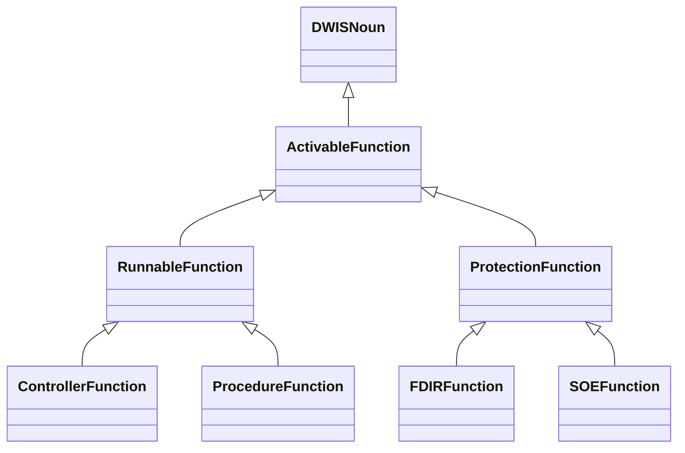
## ActivableFunction <!-- NOUN -->
- Display name: ActivableFunction
- Parent class: [DWISNoun](./DWISSemantics.md#DWISNoun)
- Description: 
An `ActivableFunction` is an ADCS function that can be activated. Here activation means that the
function may run immediately or that it is enabled and can trigger if some conditions are respected.
- Definition set: ADCS
- Examples:
```dwis ADCSFunction
ActivableFunction:ADCSFunction
ControlSystem:DCS
DrillingContractor:Contractor
DCS IsProvidedBy Contractor
DCS BelongsToClass DataProvider
ActivableFunction IsProvidedBy DCS
```
An example semantic graph looks like as follow:
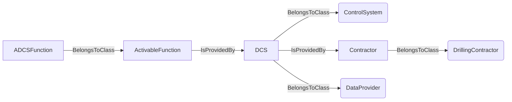
An example SparQL query looks like this:
```sparql
PREFIX rdf: <http://www.w3.org/1999/02/22-rdf-syntax-ns#>
PREFIX ddhub: <http://ddhub.no/>
PREFIX quantity: <http://ddhub.no/UnitAndQuantity>
SELECT ?ADCSFunction
WHERE {
	?ADCSFunction rdf:type ddhub:ActivableFunction .
	?DCS rdf:type ddhub:ControlSystem .
	?Contractor rdf:type ddhub:DrillingContractor .
	?DCS ddhub:IsProvidedBy ?Contractor .
	?DCS rdf:type ddhub:DataProvider .
	?ActivableFunction ddhub:IsProvidedBy ?DCS .
}
```
This example describes all `ActivableFunction` provided by the drilling control system, `DCS`. The `DCS` is 
defined as a `ControlSystem` provided by a drilling contractor.
## RunnableFunction <!-- NOUN -->
- Display name: RunnableFunction
- Parent class: [ActivableFunction](./ADCS.md#ActivableFunction)
- Attributes:
  - IsAuxiliary
    - Type: boolean
    - Description: This attribute specifies if the function is a main or an auxilary one. A main function impacts
    substantially the drilling process while an auxiliary function does not impact or only in limited fashion the
    drilling process. Example of a main functions are: Hoist, Tag Bottom, Start Circulation, Start Rotation,
    Stop Circulation, Stop Rotation, Drill, Pull Out,Run In, Pull Out With Lubrication, Run In With Lubrication, Ream Up,
    Ream Down,Test Friction, Reciprocate, Test Pressure Integrity, Place Cement, .... Example of auxiliary functions
    are: Boost Riser Flow, Down Link from ADCS, Rock Pipe, ...
- Description: 
A runnable function is a function that starts to run immediately when activated.
- Definition set: ADCS
- Examples:
```dwis runnableFunction
RunnableFunction:runnableFunction
runnableFunction.IsAuxiliary = "false"
ControlSystem:DCS
DrillingContractor:Contractor
DCS IsProvidedBy Contractor
DCS BelongsToClass DataProvider
runnableFunction IsProvidedBy DCS
```
An example semantic graph looks like as follow:
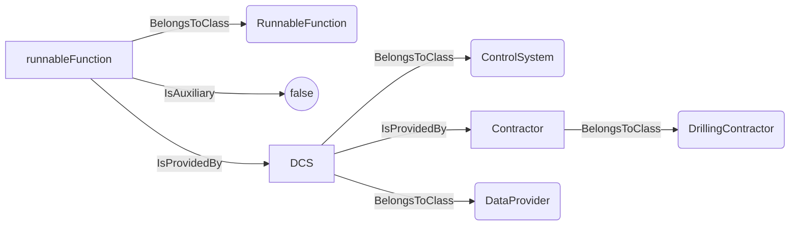
An example SparQL query looks like this:
```sparql
PREFIX rdf: <http://www.w3.org/1999/02/22-rdf-syntax-ns#>
PREFIX ddhub: <http://ddhub.no/>
PREFIX quantity: <http://ddhub.no/UnitAndQuantity>
SELECT ?runnableFunction
WHERE {
	?runnableFunction rdf:type ddhub:RunnableFunction .
	?runnableFunction ddhub:IsAuxiliary ?Attribute000 .
	?DCS rdf:type ddhub:ControlSystem .
	?Contractor rdf:type ddhub:DrillingContractor .
	?DCS ddhub:IsProvidedBy ?Contractor .
	?DCS rdf:type ddhub:DataProvider .
	?runnableFunction ddhub:IsProvidedBy ?DCS .
  FILTER (
	?Attribute000 = "false"
  )
}
```
This example describes all the main runnable functions provided by the drilling control system, `DCS`. The `DCS` is 
defined as a `ControlSystem` provided by a drilling contractor.
## ControllerFunction <!-- NOUN -->
- Display name: Controller Function
- Parent class: [RunnableFunction](./ADCS.md#RunnableFunction)
- Description: 
A `ControllerFunction` is a `RunnableFunction` that executes a feedback control loop to follow as closely
as possible one or several desired values. A typical example of `ControllerFunction` is the `AutoDriller`. An `AutoDriller` 
follows as closely as possible, for instance, a desired `WOB`.
- Definition set: ADCS
- Examples:
```dwis autoDriller
ControllerFunction:autoDriller
StableAxialVelocityObjective:stableROP
autoDriller ImplementsObjective stableROP
autoDriller.IsAuxiliary = "false"
ControlSystem:DCS
DrillingContractor:Contractor
DCS IsProvidedBy Contractor
DCS BelongsToClass DataProvider
autoDriller IsProvidedBy DCS
```
An example semantic graph looks like as follow:
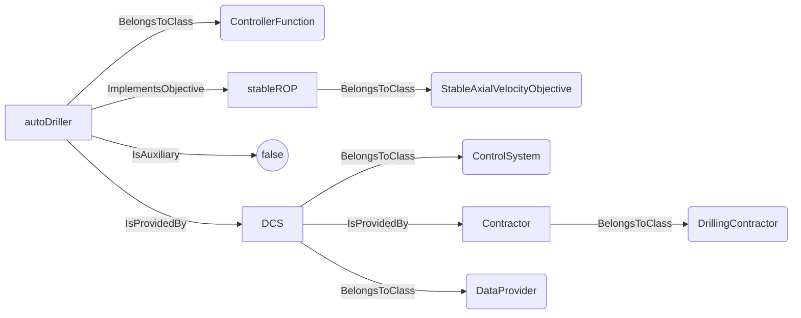
An example SparQL query looks like this:
```sparql
PREFIX rdf: <http://www.w3.org/1999/02/22-rdf-syntax-ns#>
PREFIX ddhub: <http://ddhub.no/>
PREFIX quantity: <http://ddhub.no/UnitAndQuantity>
SELECT ?autoDriller
WHERE {
	?autoDriller rdf:type ddhub:ControllerFunction .
	?stableROP rdf:type ddhub:StableAxialVelocityObjective .
	?autoDriller ddhub:ImplementsObjective ?stableROP .
	?autoDriller ddhub:IsAuxiliary ?Attribute000 .
	?DCS rdf:type ddhub:ControlSystem .
	?Contractor rdf:type ddhub:DrillingContractor .
	?DCS ddhub:IsProvidedBy ?Contractor .
	?DCS rdf:type ddhub:DataProvider .
	?autoDriller ddhub:IsProvidedBy ?DCS .
  FILTER (
	?Attribute000 = "false"
  )
}
```
This example describes the auto driller provided by the drilling control system, `DCS`. The `DCS` is 
defined as a `ControlSystem` provided by a drilling contractor. It is a main function and its purpose is to `Drill`.
## ProcedureFunction <!-- NOUN -->
- Display name: Procedure Function
- Parent class: [RunnableFunction](./ADCS.md#RunnableFunction)
- Description: 
A `ProcedureFunction` is a `RunnableFunction` that executes a finites state automaton, i.e., a graph of
transitions between states. It should be noted that a `ProcedureFunction` may use control algorithms while being in one
state or when transiting from state to state. An example of `ProcedureFunction` is a friction test. A friction test has
at least three states: rotation off bottom, pick-up without rotation, slack-off without rotation. The transitions 
between the different states may depend on the implementation. Each of those states uses a controller, one that controls
the rotational speed and one that controls the axial speed.
- Definition set: ADCS
- Examples:
```dwis frictionTest
ProcedureFunction:frictionTest
FrictionTestProcedure:frictionTestProcedure
frictionTest ImplementsProcedure frictionTestProcedure
FrictionTest.IsAuxiliary = "false"
ControlSystem:DCS
DrillingContractor:Contractor
DCS IsProvidedBy Contractor
DCS BelongsToClass DataProvider
frictionTest IsProvidedBy DCS
```
An example semantic graph looks like as follow:
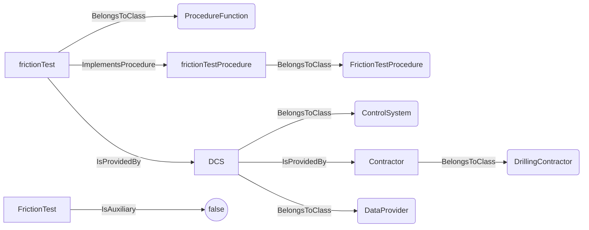
An example SparQL query looks like this:
```sparql
PREFIX rdf: <http://www.w3.org/1999/02/22-rdf-syntax-ns#>
PREFIX ddhub: <http://ddhub.no/>
PREFIX quantity: <http://ddhub.no/UnitAndQuantity>
SELECT ?frictionTest
WHERE {
	?frictionTest rdf:type ddhub:ProcedureFunction .
	?frictionTestProcedure rdf:type ddhub:FrictionTestProcedure .
	?frictionTest ddhub:ImplementsProcedure ?frictionTestProcedure .
	?FrictionTest ddhub:IsAuxiliary ?Attribute000 .
	?DCS rdf:type ddhub:ControlSystem .
	?Contractor rdf:type ddhub:DrillingContractor .
	?DCS ddhub:IsProvidedBy ?Contractor .
	?DCS rdf:type ddhub:DataProvider .
	?frictionTest ddhub:IsProvidedBy ?DCS .
  FILTER (
	?Attribute000 = "false"
  )
}
```
This example describes the friction test procedure provided by the drilling control system, `DCS`. The `DCS` is 
defined as a `ControlSystem` provided by a drilling contractor. It is a main function and its purpose is to perform a
`FrictionTest`.
## ProtectionFunction <!-- NOUN -->
- Display name: Protection Function
- Parent class: [ActivableFunction](./ADCS.md#ActivableFunction)
- Description: 
A `ProtectionFunction` is an `ActivableFunction`. It must be activated to have an effect, but the effect
is to protect the drilling process, either by protecting the inputs to the drilling machines to avoid generating 
a drilling incident, or to detect an abnormal drilling process state and react to the situation.
detected.
- Definition set: ADCS
- Examples:
```dwis protectionFunction
ProtectionFunction:protectionFunction
ControlSystem:DCS
DrillingContractor:Contractor
DCS IsProvidedBy Contractor
DCS BelongsToClass DataProvider
protectionFunction IsProvidedBy DCS
```
An example semantic graph looks like as follow:
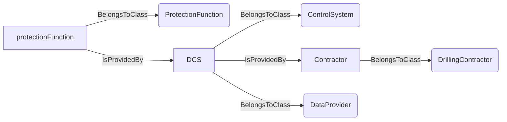
An example SparQL query looks like this:
```sparql
PREFIX rdf: <http://www.w3.org/1999/02/22-rdf-syntax-ns#>
PREFIX ddhub: <http://ddhub.no/>
PREFIX quantity: <http://ddhub.no/UnitAndQuantity>
SELECT ?protectionFunction
WHERE {
	?protectionFunction rdf:type ddhub:ProtectionFunction .
	?DCS rdf:type ddhub:ControlSystem .
	?Contractor rdf:type ddhub:DrillingContractor .
	?DCS ddhub:IsProvidedBy ?Contractor .
	?DCS rdf:type ddhub:DataProvider .
	?protectionFunction ddhub:IsProvidedBy ?DCS .
}
```
This example describes all the protection functions of the drilling control system, `DCS`. The `DCS` is 
defined as a `ControlSystem` provided by a drilling contractor.
## FDIRFunction <!-- NOUN -->
- Display name: FDIR Function
- Parent class: [ProtectionFunction](./ADCS.md#ProtectionFunction)
- Description: 
A `FDIRFunction` is a `ProtectionFunction` that reacts to a particular state of the drilling process. FDIR
stands for Fault Detection, Isolation and Recovery. An FDIR protects the drilling process by looking at its outputs.
When that state is detected, then an isolation procedure is run, and if successful and defined, a recovery procedure is
thereafter executed. In case of success of the recovery procedure, the drilling process is resumed. In all other cases,
the system returns in manual mode, usually using the safe mode management procedure. An example of `FDIRFunction` is an
packoff detection and reaction procedure.
- Definition set: ADCS
- Examples:
```dwis packOffDectionAndReaction
FDIRFunction:packOffDetectionAndReaction
PackOffIncident:packOffIncident
packOffDetectionAndReaction ManagesIncident packOffIncident
ControlSystem:DCS
DrillingContractor:Contractor
DCS IsProvidedBy Contractor
DCS BelongsToClass DataProvider
packOffDetectionAndReaction IsProvidedBy DCS
```
An example semantic graph looks like as follow:
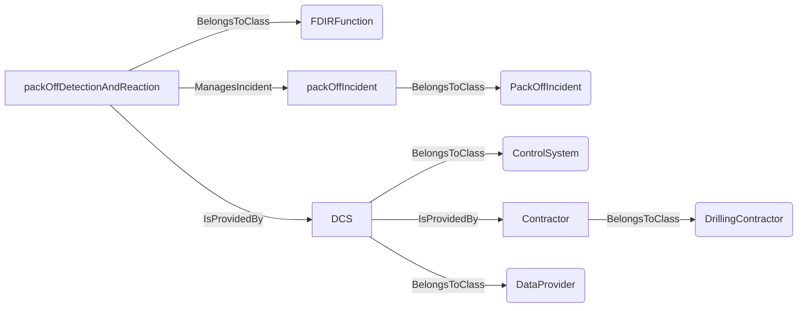
An example SparQL query looks like this:
```sparql
PREFIX rdf: <http://www.w3.org/1999/02/22-rdf-syntax-ns#>
PREFIX ddhub: <http://ddhub.no/>
PREFIX quantity: <http://ddhub.no/UnitAndQuantity>
SELECT ?packOffDectionAndReaction
WHERE {
	?packOffDetectionAndReaction rdf:type ddhub:FDIRFunction .
	?packOffIncident rdf:type ddhub:PackOffIncident .
	?packOffDetectionAndReaction ddhub:ManagesIncident ?packOffIncident .
	?DCS rdf:type ddhub:ControlSystem .
	?Contractor rdf:type ddhub:DrillingContractor .
	?DCS ddhub:IsProvidedBy ?Contractor .
	?DCS rdf:type ddhub:DataProvider .
	?packOffDetectionAndReaction ddhub:IsProvidedBy ?DCS .
}
```
This example describes the `packOffDetectionAndReaction` fault detection and isolation procedure of the drilling control
system for pack-off events, `DCS`. The `DCS` is defined as a `ControlSystem` provided by a drilling contractor.
## SOEFunction <!-- NOUN -->
- Display name: SOE Function
- Parent class: [ProtectionFunction](./ADCS.md#ProtectionFunction)
- Description: 
A `SOEFunction` is a `ProtectionFunction` that limits the commands that are send to the drilling machines
to avoid generating a drilling incident. SOE stands for Safe Operating Envelope. A `SOEFunction` protects the inputs
of the drilling process. An example `SOEFunction` is a swab/surge limits protection. This function limits the axial acceleration
and speed of the drill-stem to avoid generate swabbing pressure below the maximum of the collapse and pore pressure, and
surging pressure above the fracturing pressure.
- Definition set: ADCS
- Examples:
```dwis swabSurgeLimits
SOEFunction:swabSurgeLimits
AxialVelocityLimit:swabSurgeLimit
swabSurgeLimits ImplementsLimit swabSurgeLimit
ControlSystem:DCS
DrillingContractor:Contractor
DCS IsProvidedBy Contractor
DCS BelongsToClass DataProvider
swabSurgeLimits IsProvidedBy DCS
```
An example semantic graph looks like as follow:
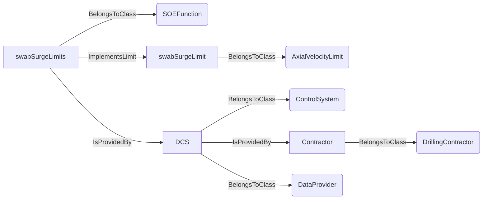
An example SparQL query looks like this:
```sparql
PREFIX rdf: <http://www.w3.org/1999/02/22-rdf-syntax-ns#>
PREFIX ddhub: <http://ddhub.no/>
PREFIX quantity: <http://ddhub.no/UnitAndQuantity>
SELECT ?swabSurgeLimits
WHERE {
	?swabSurgeLimits rdf:type ddhub:SOEFunction .
	?swabSurgeLimit rdf:type ddhub:AxialVelocityLimit .
	?swabSurgeLimits ddhub:ImplementsLimit ?swabSurgeLimit .
	?DCS rdf:type ddhub:ControlSystem .
	?Contractor rdf:type ddhub:DrillingContractor .
	?DCS ddhub:IsProvidedBy ?Contractor .
	?DCS rdf:type ddhub:DataProvider .
	?swabSurgeLimits ddhub:IsProvidedBy ?DCS .
}
```
This example describes the `swabSurgeLimits` safe operating envelope limits to avoid detrimental swab/surge pressures in 
the open hole section of the borehole. 
# Verbs
## Class Inheritance for Verbs
Here is a class inheritance diagram for the verbs contained in this definition set.
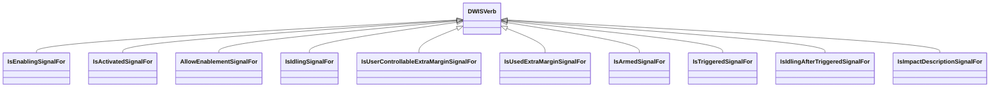
## Relations
Here is a graph representing the relations that can be made with the verbs defined in this definition set.
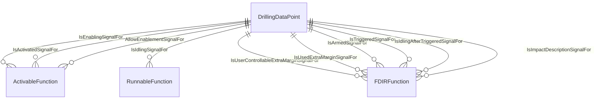
## IsEnablingSignalFor <!-- VERB -->
- Display name: Is Enabling Signal For
- Parent verb: [DWISVerb](./DWISSemantics.md#DWISVerb)
- Subject class: [DrillingDataPoint](./DrillingDataSemantics.md#DrillingDataPoint)
- Object class: [ActivableFunction](./ADCS.md#ActivableFunction)
- Definition set: ADCS
- Description: 
This verb is used to define a `DrillingDataPoint` that is used to enable or disable an `ActivableFunction`.
It is expected that the `DrillingDataPoint` is a Boolean value.
- Examples:
```dwis packOffDectionAndReaction
FDIRFunction:packOffDetectionAndReaction
PackOffIncident:packOffIncident
packOffDetectionAndReaction ManagesIncident packOffIncident
ControlSystem:DCS
DrillingContractor:Contractor
DCS IsProvidedBy Contractor
DCS BelongsToClass DataProvider
packOffDetectionAndReaction IsProvidedBy DCS
Command:enableSignalPackOffDetectionFDIR
enableSignalPackOffDetectionFDIR BelongsToClass BooleanDataType
enableSignalPackOffDetectionFDIR IsEnablingSignalFor packOffDetectionAndReaction
```
An example semantic graph looks like as follow:
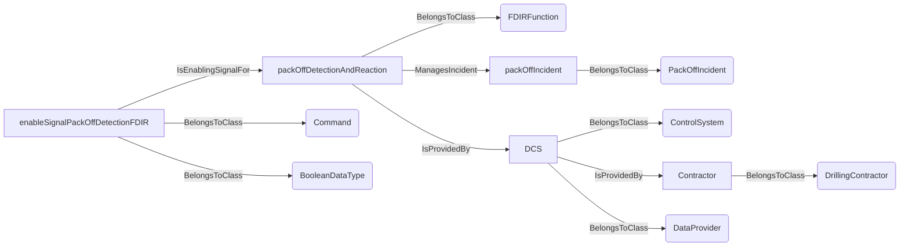
An example SparQL query looks like this:
```sparql
PREFIX rdf: <http://www.w3.org/1999/02/22-rdf-syntax-ns#>
PREFIX ddhub: <http://ddhub.no/>
PREFIX quantity: <http://ddhub.no/UnitAndQuantity>
SELECT ?packOffDectionAndReaction
WHERE {
	?packOffDetectionAndReaction rdf:type ddhub:FDIRFunction .
	?packOffIncident rdf:type ddhub:PackOffIncident .
	?packOffDetectionAndReaction ddhub:ManagesIncident ?packOffIncident .
	?DCS rdf:type ddhub:ControlSystem .
	?Contractor rdf:type ddhub:DrillingContractor .
	?DCS ddhub:IsProvidedBy ?Contractor .
	?DCS rdf:type ddhub:DataProvider .
	?packOffDetectionAndReaction ddhub:IsProvidedBy ?DCS .
	?enableSignalPackOffDetectionFDIR rdf:type ddhub:Command .
	?enableSignalPackOffDetectionFDIR rdf:type ddhub:BooleanDataType .
	?enableSignalPackOffDetectionFDIR ddhub:IsEnablingSignalFor ?packOffDetectionAndReaction .
}
```
This example describes that the `Command` signal `enableSignalPackOffDetectionFDIR` is used to enable/disable the `FDIRFunction`.
## IsActivatedSignalFor <!-- VERB -->
- Display name: Is Activated Signal For
- Parent verb: [DWISVerb](./DWISSemantics.md#DWISVerb)
- Subject class: [DrillingDataPoint](./DrillingDataSemantics.md#DrillingDataPoint)
- Object class: [ActivableFunction](./ADCS.md#ActivableFunction)
- Definition set: ADCS
- Description: 
This verb is used to define a `DrillingDataPoint` that indicates if the `ActivableFunction` is activated or
not. It is expected that the `DrillingDataPoint` is a Boolean value.
- Examples:
```dwis packOffDectionAndReaction
FDIRFunction:packOffDetectionAndReaction
PackOffIncident:packOffIncident
packOffDetectionAndReaction ManagesIncident packOffIncident
ControlSystem:DCS
DrillingContractor:Contractor
DCS IsProvidedBy Contractor
DCS BelongsToClass DataProvider
packOffDetectionAndReaction IsProvidedBy DCS
ComputedData:activatedSignalPackOffDetectionFDIR
activatedSignalPackOffDetectionFDIR BelongsToClass BooleanDataType
activatedSignalPackOffDetectionFDIR IsEnablingSignalFor packOffDetectionAndReaction
```
An example semantic graph looks like as follow:
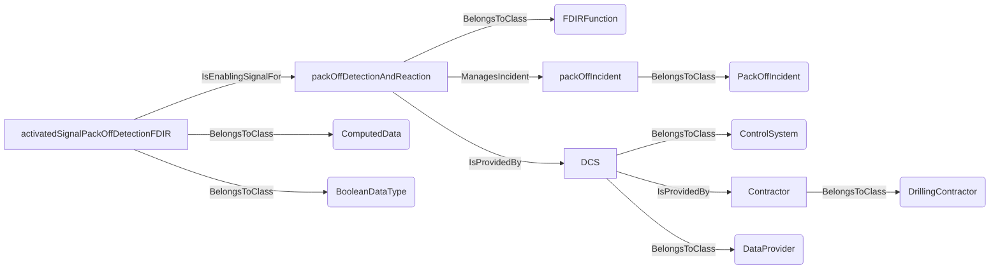
An example SparQL query looks like this:
```sparql
PREFIX rdf: <http://www.w3.org/1999/02/22-rdf-syntax-ns#>
PREFIX ddhub: <http://ddhub.no/>
PREFIX quantity: <http://ddhub.no/UnitAndQuantity>
SELECT ?packOffDectionAndReaction
WHERE {
	?packOffDetectionAndReaction rdf:type ddhub:FDIRFunction .
	?packOffIncident rdf:type ddhub:PackOffIncident .
	?packOffDetectionAndReaction ddhub:ManagesIncident ?packOffIncident .
	?DCS rdf:type ddhub:ControlSystem .
	?Contractor rdf:type ddhub:DrillingContractor .
	?DCS ddhub:IsProvidedBy ?Contractor .
	?DCS rdf:type ddhub:DataProvider .
	?packOffDetectionAndReaction ddhub:IsProvidedBy ?DCS .
	?activatedSignalPackOffDetectionFDIR rdf:type ddhub:ComputedData .
	?activatedSignalPackOffDetectionFDIR rdf:type ddhub:BooleanDataType .
	?activatedSignalPackOffDetectionFDIR ddhub:IsEnablingSignalFor ?packOffDetectionAndReaction .
}
```
This example describes that the `ComputedData` signal `activatedSignalPackOffDetectionFDIR` informs whether the 
`packOffDetectionAndReaction` FDIR function is activated or not.
## AllowEnablementSignalFor <!-- VERB -->
- Display name: Allow Enablement Signal For
- Parent verb: [DWISVerb](./DWISSemantics.md#DWISVerb)
- Subject class: [DrillingDataPoint](./DrillingDataSemantics.md#DrillingDataPoint)
- Object class: [ActivableFunction](./ADCS.md#ActivableFunction)
- Definition set: ADCS
- Description: 
This verb is used to define a `DrillingDataPoint` tells if it is allowed or not to enable or
disable an activable function. It is expected that the `DrillingDataPoint` is a Boolean value. If the signal is true,
then it is possible to enable or disable the function using the signal associated with `IsEnablingSignalFor`. If it is
false, it is not allowed to enable or disable the `ActivableFunction`, meaning that the signal associated with `IsEnablingSignalFor`
is ignored.
- Examples:
```dwis packOffDectionAndReaction
FDIRFunction:packOffDetectionAndReaction
PackOffIncident:packOffIncident
packOffDetectionAndReaction ManagesIncident packOffIncident
ControlSystem:DCS
DrillingContractor:Contractor
DCS IsProvidedBy Contractor
DCS BelongsToClass DataProvider
packOffDetectionAndReaction IsProvidedBy DCS
ComputedData:allowEnablementSignalPackOffDetectionFDIR
allowEnablementSignalPackOffDetectionFDIR BelongsToClass BooleanDataType
allowEnablementSignalPackOffDetectionFDIR IsEnablingSignalFor packOffDetectionAndReaction
Command:enableSignalPackOffDetectionFDIR
enableSignalPackOffDetectionFDIR BelongsToClass BooleanDataType
enableSignalPackOffDetectionFDIR IsEnablingSignalFor packOffDetectionAndReaction
```
An example semantic graph looks like as follow:
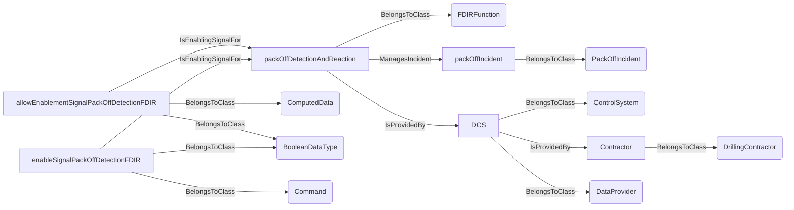
An example SparQL query looks like this:
```sparql
PREFIX rdf: <http://www.w3.org/1999/02/22-rdf-syntax-ns#>
PREFIX ddhub: <http://ddhub.no/>
PREFIX quantity: <http://ddhub.no/UnitAndQuantity>
SELECT ?packOffDectionAndReaction
WHERE {
	?packOffDetectionAndReaction rdf:type ddhub:FDIRFunction .
	?packOffIncident rdf:type ddhub:PackOffIncident .
	?packOffDetectionAndReaction ddhub:ManagesIncident ?packOffIncident .
	?DCS rdf:type ddhub:ControlSystem .
	?Contractor rdf:type ddhub:DrillingContractor .
	?DCS ddhub:IsProvidedBy ?Contractor .
	?DCS rdf:type ddhub:DataProvider .
	?packOffDetectionAndReaction ddhub:IsProvidedBy ?DCS .
	?allowEnablementSignalPackOffDetectionFDIR rdf:type ddhub:ComputedData .
	?allowEnablementSignalPackOffDetectionFDIR rdf:type ddhub:BooleanDataType .
	?allowEnablementSignalPackOffDetectionFDIR ddhub:IsEnablingSignalFor ?packOffDetectionAndReaction .
	?enableSignalPackOffDetectionFDIR rdf:type ddhub:Command .
	?enableSignalPackOffDetectionFDIR rdf:type ddhub:BooleanDataType .
	?enableSignalPackOffDetectionFDIR ddhub:IsEnablingSignalFor ?packOffDetectionAndReaction .
}
```
This example describes that the `ComputedData` signal `allowEnablementSignalPackOffDetectionFDIR` tells whether the 
`packOffDetectionAndReaction` FDIR function can be allowed to be enabled or not. The state of the signal `allowEnablementSignalPackOffDetectionFDIR`
has an impact on whether the signal `enableSignalPackOffDetectionFDIR` is used or ignored.
## IsIdlingSignalFor <!-- VERB -->
- Display name: Is Idling Signal For
- Parent verb: [DWISVerb](./DWISSemantics.md#DWISVerb)
- Subject class: [DrillingDataPoint](./DrillingDataSemantics.md#DrillingDataPoint)
- Object class: [RunnableFunction](./ADCS.md#RunnableFunction)
- Definition set: ADCS
- Description: 
This verb is used to indicate a `DrillingDataPoint` that tells if the function is in an idle state.
A function that is idle must be enabled but does not perform any particular control on the machines. For instance, a 
`ProcedureFunction` that has reached its terminal state or a `ControllerFunction` that cannot control anymore its 
parameter because a limit is reached, e.g., autodriller when reaching the `MinDrillHeightVerticalLocation`, or an FDIR
function when there are no incidents that is detected. A SOE function is in idle state, if the used set-points are
within the limits, but if the limits are applied then the idle state is false, because the function acts on the set-points.
- Examples:
```dwis packOffDectionAndReaction
FDIRFunction:packOffDetectionAndReaction
PackOffIncident:packOffIncident
packOffDetectionAndReaction ManagesIncident packOffIncident
ControlSystem:DCS
DrillingContractor:Contractor
DCS IsProvidedBy Contractor
DCS BelongsToClass DataProvider
packOffDetectionAndReaction IsProvidedBy DCS
ComputedData:idlingSignalPackOffDetectionFDIR
idlingSignalPackOffDetectionFDIR BelongsToClass BooleanDataType
idlingSignalPackOffDetectionFDIR IsIdlingSignalFor packOffDetectionAndReaction
ComputedData:activatedSignalPackOffDetectionFDIR
activatedSignalPackOffDetectionFDIR BelongsToClass BooleanDataType
activatedSignalPackOffDetectionFDIR IsEnablingSignalFor packOffDetectionAndReaction
```
An example semantic graph looks like as follow:
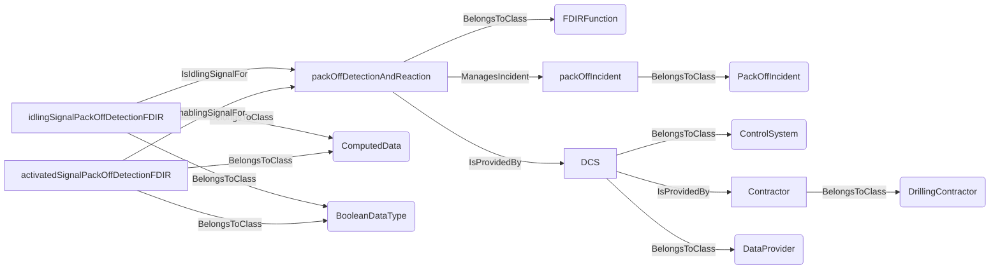
An example SparQL query looks like this:
```sparql
PREFIX rdf: <http://www.w3.org/1999/02/22-rdf-syntax-ns#>
PREFIX ddhub: <http://ddhub.no/>
PREFIX quantity: <http://ddhub.no/UnitAndQuantity>
SELECT ?packOffDectionAndReaction
WHERE {
	?packOffDetectionAndReaction rdf:type ddhub:FDIRFunction .
	?packOffIncident rdf:type ddhub:PackOffIncident .
	?packOffDetectionAndReaction ddhub:ManagesIncident ?packOffIncident .
	?DCS rdf:type ddhub:ControlSystem .
	?Contractor rdf:type ddhub:DrillingContractor .
	?DCS ddhub:IsProvidedBy ?Contractor .
	?DCS rdf:type ddhub:DataProvider .
	?packOffDetectionAndReaction ddhub:IsProvidedBy ?DCS .
	?idlingSignalPackOffDetectionFDIR rdf:type ddhub:ComputedData .
	?idlingSignalPackOffDetectionFDIR rdf:type ddhub:BooleanDataType .
	?idlingSignalPackOffDetectionFDIR ddhub:IsIdlingSignalFor ?packOffDetectionAndReaction .
	?activatedSignalPackOffDetectionFDIR rdf:type ddhub:ComputedData .
	?activatedSignalPackOffDetectionFDIR rdf:type ddhub:BooleanDataType .
	?activatedSignalPackOffDetectionFDIR ddhub:IsEnablingSignalFor ?packOffDetectionAndReaction .
}
```
This example describes that the `ComputedData` signal `idlingSignalPackOffDetectionFDIR` informs whether the `packOffDetectionAndReaction`
FDIR function is in an idle state or not. Logically, this signal has a meaning only if the signal `activatedSignalPackOffDetectionFDIR` is
true.
## IsUserControllableExtraMarginSignalFor <!-- VERB -->
- Display name: Is User Controllable Extra Margin Signal For
- Parent verb: [DWISVerb](./DWISSemantics.md#DWISVerb)
- Subject class: [DrillingDataPoint](./DrillingDataSemantics.md#DrillingDataPoint)
- Object class: [FDIRFunction](./ADCS.md#FDIRFunction)
- Definition set: ADCS
- Description: 
This verb is used to indicate that a `DrillingDataPoint` used by an `FDIRFunction`, extends the calculated
threshold value for the fault detection by a user-defined amount. The value of this signal is supposed to be interpreted
in absolute value. If it is negative, then it is its magnitude that is used. This allows the end-user to increase the margin for
detection of an incident. 
- Examples:
```dwis packOffDectionAndReaction
FDIRFunction:packOffDetectionAndReaction
PackOffIncident:packOffIncident
packOffDetectionAndReaction ManagesIncident packOffIncident
ControlSystem:DCS
DrillingContractor:Contractor
DCS IsProvidedBy Contractor
DCS BelongsToClass DataProvider
packOffDetectionAndReaction IsProvidedBy DCS
Command:extraMarginUserDefinedSignalPackOffDetectionFDIR
extraMarginUserDefinedSignalPackOffDetectionFDIR BelongsToClass ContinuousDataType
extraMarginUserDefinedSignalPackOffDetectionFDIR IsUserControllableExtraMarginSignalFor packOffDetectionAndReaction
```
An example semantic graph looks like as follow:
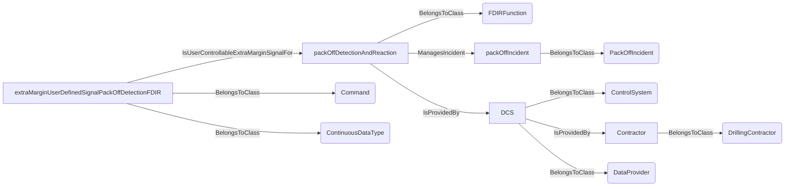
An example SparQL query looks like this:
```sparql
PREFIX rdf: <http://www.w3.org/1999/02/22-rdf-syntax-ns#>
PREFIX ddhub: <http://ddhub.no/>
PREFIX quantity: <http://ddhub.no/UnitAndQuantity>
SELECT ?packOffDectionAndReaction
WHERE {
	?packOffDetectionAndReaction rdf:type ddhub:FDIRFunction .
	?packOffIncident rdf:type ddhub:PackOffIncident .
	?packOffDetectionAndReaction ddhub:ManagesIncident ?packOffIncident .
	?DCS rdf:type ddhub:ControlSystem .
	?Contractor rdf:type ddhub:DrillingContractor .
	?DCS ddhub:IsProvidedBy ?Contractor .
	?DCS rdf:type ddhub:DataProvider .
	?packOffDetectionAndReaction ddhub:IsProvidedBy ?DCS .
	?extraMarginUserDefinedSignalPackOffDetectionFDIR rdf:type ddhub:Command .
	?extraMarginUserDefinedSignalPackOffDetectionFDIR rdf:type ddhub:ContinuousDataType .
	?extraMarginUserDefinedSignalPackOffDetectionFDIR ddhub:IsUserControllableExtraMarginSignalFor ?packOffDetectionAndReaction .
}
```
This example descibes that the `Command` signal `extraMarginUserDefinedSignalPackOffDetectionFDIR` is used to extend
the threshold detection for pressure by a user defined value.
## IsUsedExtraMarginSignalFor <!-- VERB -->
- Display name: Is Used Extra Margin Signal For
- Parent verb: [DWISVerb](./DWISSemantics.md#DWISVerb)
- Subject class: [DrillingDataPoint](./DrillingDataSemantics.md#DrillingDataPoint)
- Object class: [FDIRFunction](./ADCS.md#FDIRFunction)
- Definition set: ADCS
- Description: 
This verb is used to indicate a `DrillingDataPoint` used by an `FDIRFunction` tells whether the
extra margin signal is used or not by the FDIR function. This signal is expected to be a boolean value.
- Examples:
```dwis packOffDectionAndReaction
FDIRFunction:packOffDetectionAndReaction
PackOffIncident:packOffIncident
packOffDetectionAndReaction ManagesIncident packOffIncident
ControlSystem:DCS
DrillingContractor:Contractor
DCS IsProvidedBy Contractor
DCS BelongsToClass DataProvider
packOffDetectionAndReaction IsProvidedBy DCS
ComputedData:usedExtraMarginSignal
usedExtraMarginSignal BelongsToClass BooleanDataType
usedExtraMarginSignal IsUsedExtraMarginSignalFor packOffDetectionAndReaction
Command:extraMarginUserDefinedSignalPackOffDetectionFDIR
extraMarginUserDefinedSignalPackOffDetectionFDIR BelongsToClass ContinuousDataType
extraMarginUserDefinedSignalPackOffDetectionFDIR IsUserControllableExtraMarginSignalFor packOffDetectionAndReaction
```
An example semantic graph looks like as follow:
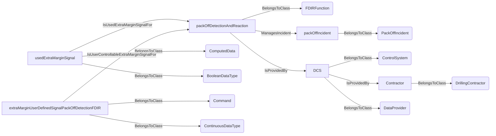
An example SparQL query looks like this:
```sparql
PREFIX rdf: <http://www.w3.org/1999/02/22-rdf-syntax-ns#>
PREFIX ddhub: <http://ddhub.no/>
PREFIX quantity: <http://ddhub.no/UnitAndQuantity>
SELECT ?packOffDectionAndReaction
WHERE {
	?packOffDetectionAndReaction rdf:type ddhub:FDIRFunction .
	?packOffIncident rdf:type ddhub:PackOffIncident .
	?packOffDetectionAndReaction ddhub:ManagesIncident ?packOffIncident .
	?DCS rdf:type ddhub:ControlSystem .
	?Contractor rdf:type ddhub:DrillingContractor .
	?DCS ddhub:IsProvidedBy ?Contractor .
	?DCS rdf:type ddhub:DataProvider .
	?packOffDetectionAndReaction ddhub:IsProvidedBy ?DCS .
	?usedExtraMarginSignal rdf:type ddhub:ComputedData .
	?usedExtraMarginSignal rdf:type ddhub:BooleanDataType .
	?usedExtraMarginSignal ddhub:IsUsedExtraMarginSignalFor ?packOffDetectionAndReaction .
	?extraMarginUserDefinedSignalPackOffDetectionFDIR rdf:type ddhub:Command .
	?extraMarginUserDefinedSignalPackOffDetectionFDIR rdf:type ddhub:ContinuousDataType .
	?extraMarginUserDefinedSignalPackOffDetectionFDIR ddhub:IsUserControllableExtraMarginSignalFor ?packOffDetectionAndReaction .
}
```
This example describes a `ComputedData` signal that indicates whether an extra margin value is used for the threshold
detection. This extra margin is describes by `extraMarginUserDefinedSignalPackOffDetectionFDIR`.
## IsArmedSignalFor <!-- VERB -->
- Display name: Is Armed Signal For
- Parent verb: [DWISVerb](./DWISSemantics.md#DWISVerb)
- Subject class: [DrillingDataPoint](./DrillingDataSemantics.md#DrillingDataPoint)
- Object class: [FDIRFunction](./ADCS.md#FDIRFunction)
- Definition set: ADCS
- Description: 
This verb is used to indicate a `DrillingDataPoint` used by an `FDIRFunction` tells if the FDIR function is armed and operative.
The signal is supposed to be a Boolean value.
The FDIR function may be active, but the current state of the drilling process may imply that the function cannot be
triggered. For instance, a pack-off FDIR may be active but would react only if the flow is supposed to be steady state.
- Examples:
```dwis packOffDectionAndReaction
FDIRFunction:packOffDetectionAndReaction
PackOffIncident:packOffIncident
packOffDetectionAndReaction ManagesIncident packOffIncident
ControlSystem:DCS
DrillingContractor:Contractor
DCS IsProvidedBy Contractor
DCS BelongsToClass DataProvider
packOffDetectionAndReaction IsProvidedBy DCS
ComputedData:armedSignalPackOffDetectionFDIR
armedSignalPackOffDetectionFDIR BelongsToClass BooleanValue
armedSignalPackOffDetectionFDIR IsArmedSignalFor packOffDetectionAndReaction
ComputedData:activatedSignalPackOffDetectionFDIR
activatedSignalPackOffDetectionFDIR BelongsToClass BooleanDataType
activatedSignalPackOffDetectionFDIR IsEnablingSignalFor packOffDetectionAndReaction
```
An example semantic graph looks like as follow:
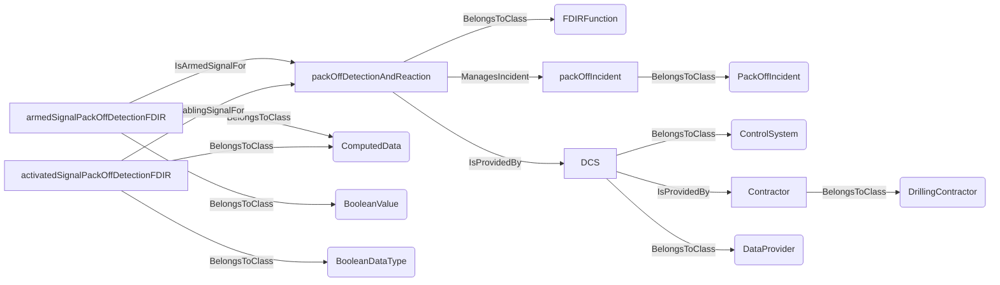
An example SparQL query looks like this:
```sparql
PREFIX rdf: <http://www.w3.org/1999/02/22-rdf-syntax-ns#>
PREFIX ddhub: <http://ddhub.no/>
PREFIX quantity: <http://ddhub.no/UnitAndQuantity>
SELECT ?packOffDectionAndReaction
WHERE {
	?packOffDetectionAndReaction rdf:type ddhub:FDIRFunction .
	?packOffIncident rdf:type ddhub:PackOffIncident .
	?packOffDetectionAndReaction ddhub:ManagesIncident ?packOffIncident .
	?DCS rdf:type ddhub:ControlSystem .
	?Contractor rdf:type ddhub:DrillingContractor .
	?DCS ddhub:IsProvidedBy ?Contractor .
	?DCS rdf:type ddhub:DataProvider .
	?packOffDetectionAndReaction ddhub:IsProvidedBy ?DCS .
	?armedSignalPackOffDetectionFDIR rdf:type ddhub:ComputedData .
	?armedSignalPackOffDetectionFDIR rdf:type ddhub:BooleanValue .
	?armedSignalPackOffDetectionFDIR ddhub:IsArmedSignalFor ?packOffDetectionAndReaction .
	?activatedSignalPackOffDetectionFDIR rdf:type ddhub:ComputedData .
	?activatedSignalPackOffDetectionFDIR rdf:type ddhub:BooleanDataType .
	?activatedSignalPackOffDetectionFDIR ddhub:IsEnablingSignalFor ?packOffDetectionAndReaction .
}
```
This example describes a `ComputedData` signal used by an `FDIRFunction` to indicate when the packoff detection can trigger.
It also uses an `activatedSignalPackOffDetectionFDIR` signal that indicates when the function is active or not.
## IsTriggeredSignalFor <!-- VERB -->
- Display name: Is Triggered Signal For
- Parent verb: [DWISVerb](./DWISSemantics.md#DWISVerb)
- Subject class: [DrillingDataPoint](./DrillingDataSemantics.md#DrillingDataPoint)
- Object class: [FDIRFunction](./ADCS.md#FDIRFunction)
- Definition set: ADCS
- Description: 
This verb is used to indicate a `DrillingDataPoint` tells whether an `FDIRFunction` has been triggered
or not. This signal is expected to be a Boolean value. The signal is expected to be true from the moment the FDIR has triggered
to the moment it has recovered from the incident, if it has a recovery procedure, or to the moment the control is given
back to the end-user, in case of failure of the recovery procedure or at the end of the isolation procedure.
- Examples:
```dwis packOffDectionAndReaction
FDIRFunction:packOffDetectionAndReaction
PackOffIncident:packOffIncident
packOffDetectionAndReaction ManagesIncident packOffIncident
ControlSystem:DCS
DrillingContractor:Contractor
DCS IsProvidedBy Contractor
DCS BelongsToClass DataProvider
packOffDetectionAndReaction IsProvidedBy DCS
ComputedData:triggeredSignalPackOffDetectionFDIR
triggeredSignalPackOffDetectionFDIR BelongsToClass BooleanValue
triggeredSignalPackOffDetectionFDIR IsTriggeredSignalFor packOffDetectionAndReaction
```
An example semantic graph looks like as follow:
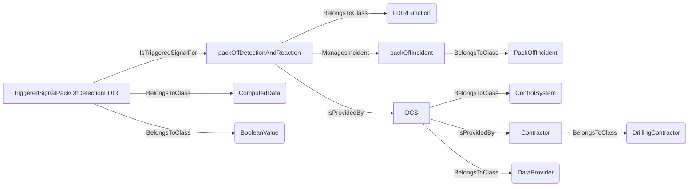
An example SparQL query looks like this:
```sparql
PREFIX rdf: <http://www.w3.org/1999/02/22-rdf-syntax-ns#>
PREFIX ddhub: <http://ddhub.no/>
PREFIX quantity: <http://ddhub.no/UnitAndQuantity>
SELECT ?packOffDectionAndReaction
WHERE {
	?packOffDetectionAndReaction rdf:type ddhub:FDIRFunction .
	?packOffIncident rdf:type ddhub:PackOffIncident .
	?packOffDetectionAndReaction ddhub:ManagesIncident ?packOffIncident .
	?DCS rdf:type ddhub:ControlSystem .
	?Contractor rdf:type ddhub:DrillingContractor .
	?DCS ddhub:IsProvidedBy ?Contractor .
	?DCS rdf:type ddhub:DataProvider .
	?packOffDetectionAndReaction ddhub:IsProvidedBy ?DCS .
	?triggeredSignalPackOffDetectionFDIR rdf:type ddhub:ComputedData .
	?triggeredSignalPackOffDetectionFDIR rdf:type ddhub:BooleanValue .
	?triggeredSignalPackOffDetectionFDIR ddhub:IsTriggeredSignalFor ?packOffDetectionAndReaction .
}
```
This example describes a `ComputedData` signal used by an `FDIRFunction` to indicate when whether the packoff detection
is triggered. 
## IsIdlingAfterTriggeredSignalFor <!-- VERB -->
- Display name: Is Idling After Triggered Signal For
- Parent verb: [DWISVerb](./DWISSemantics.md#DWISVerb)
- Subject class: [DrillingDataPoint](./DrillingDataSemantics.md#DrillingDataPoint)
- Object class: [FDIRFunction](./ADCS.md#FDIRFunction)
- Definition set: ADCS
- Description: 
This verb is used to indicate that a `DrillingDataPoint` tells whether the isolation or the recovery
- Examples:
```dwis packOffDectionAndReaction
FDIRFunction:packOffDetectionAndReaction
PackOffIncident:packOffIncident
packOffDetectionAndReaction ManagesIncident packOffIncident
ControlSystem:DCS
DrillingContractor:Contractor
DCS IsProvidedBy Contractor
DCS BelongsToClass DataProvider
packOffDetectionAndReaction IsProvidedBy DCS
ComputedData:idleAfterTriggeredSignalPackOffDetectionFDIR
idleAfterTriggeredSignalPackOffDetectionFDIR BelongsToClass BooleanValue
idleAfterTriggeredSignalPackOffDetectionFDIR IsIdlingAfterTriggeredSignalFor packOffDetectionAndReaction
ComputedData:triggeredSignalPackOffDetectionFDIR
triggeredSignalPackOffDetectionFDIR BelongsToClass BooleanValue
triggeredSignalPackOffDetectionFDIR IsTriggeredSignalFor packOffDetectionAndReaction
```
An example semantic graph looks like as follow:
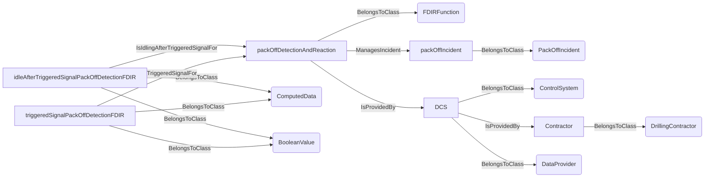
An example SparQL query looks like this:
```sparql
PREFIX rdf: <http://www.w3.org/1999/02/22-rdf-syntax-ns#>
PREFIX ddhub: <http://ddhub.no/>
PREFIX quantity: <http://ddhub.no/UnitAndQuantity>
SELECT ?packOffDectionAndReaction
WHERE {
	?packOffDetectionAndReaction rdf:type ddhub:FDIRFunction .
	?packOffIncident rdf:type ddhub:PackOffIncident .
	?packOffDetectionAndReaction ddhub:ManagesIncident ?packOffIncident .
	?DCS rdf:type ddhub:ControlSystem .
	?Contractor rdf:type ddhub:DrillingContractor .
	?DCS ddhub:IsProvidedBy ?Contractor .
	?DCS rdf:type ddhub:DataProvider .
	?packOffDetectionAndReaction ddhub:IsProvidedBy ?DCS .
	?idleAfterTriggeredSignalPackOffDetectionFDIR rdf:type ddhub:ComputedData .
	?idleAfterTriggeredSignalPackOffDetectionFDIR rdf:type ddhub:BooleanValue .
	?idleAfterTriggeredSignalPackOffDetectionFDIR ddhub:IsIdlingAfterTriggeredSignalFor ?packOffDetectionAndReaction .
	?triggeredSignalPackOffDetectionFDIR rdf:type ddhub:ComputedData .
	?triggeredSignalPackOffDetectionFDIR rdf:type ddhub:BooleanValue .
	?triggeredSignalPackOffDetectionFDIR ddhub:IsTriggeredSignalFor ?packOffDetectionAndReaction .
}
```
This example describes a `ComputedData` signal of an `FDIRFunction` that tells whether the isolation or the recovery 
procedures have reached a terminal state and have not managed to recover from the incident, therefore waiting to
return to manual mode. There is also an `triggeredSignalPackOffDetectionFDIR` signal that tells whether the function
has triggered or not.
## IsImpactDescriptionSignalFor <!-- VERB -->
- Display name: Is Impact Description Signal For
- Parent verb: [DWISVerb](./DWISSemantics.md#DWISVerb)
- Subject class: [DrillingDataPoint](./DrillingDataSemantics.md#DrillingDataPoint)
- Object class: [FDIRFunction](./ADCS.md#FDIRFunction)
- Definition set: ADCS
- Description: 
This verbs is used to indicate that a `DrillingDataPoint` used by an `FDIRFunction` can be used to
describe the impact of the function on the drilling process. This signal is supposed to be string value.
- Examples:
```dwis packOffDectionAndReaction
FDIRFunction:packOffDetectionAndReaction
PackOffIncident:packOffIncident
packOffDetectionAndReaction ManagesIncident packOffIncident
ControlSystem:DCS
DrillingContractor:Contractor
DCS IsProvidedBy Contractor
DCS BelongsToClass DataProvider
packOffDetectionAndReaction IsProvidedBy DCS
Command:impactDescriptionSignalPackOffDetectionFDIR
impactDescriptionSignalPackOffDetectionFDIR BelongsToClass StringDataType
impactDescriptionSignalPackOffDetectionFDIR IsImpactDescriptionSignalFor packOffDetectionAndReaction
```
An example semantic graph looks like as follow:
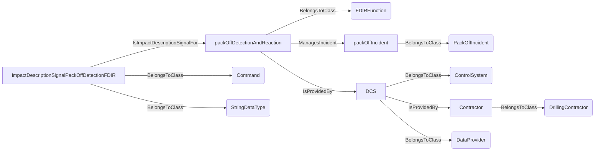
An example SparQL query looks like this:
```sparql
PREFIX rdf: <http://www.w3.org/1999/02/22-rdf-syntax-ns#>
PREFIX ddhub: <http://ddhub.no/>
PREFIX quantity: <http://ddhub.no/UnitAndQuantity>
SELECT ?packOffDectionAndReaction
WHERE {
	?packOffDetectionAndReaction rdf:type ddhub:FDIRFunction .
	?packOffIncident rdf:type ddhub:PackOffIncident .
	?packOffDetectionAndReaction ddhub:ManagesIncident ?packOffIncident .
	?DCS rdf:type ddhub:ControlSystem .
	?Contractor rdf:type ddhub:DrillingContractor .
	?DCS ddhub:IsProvidedBy ?Contractor .
	?DCS rdf:type ddhub:DataProvider .
	?packOffDetectionAndReaction ddhub:IsProvidedBy ?DCS .
	?impactDescriptionSignalPackOffDetectionFDIR rdf:type ddhub:Command .
	?impactDescriptionSignalPackOffDetectionFDIR rdf:type ddhub:StringDataType .
	?impactDescriptionSignalPackOffDetectionFDIR ddhub:IsImpactDescriptionSignalFor ?packOffDetectionAndReaction .
}
```
This example describes a `Command` signal of an `FDIRFunction` that is used to inform the ADCS about the impact of
triggering the FDIR function.
