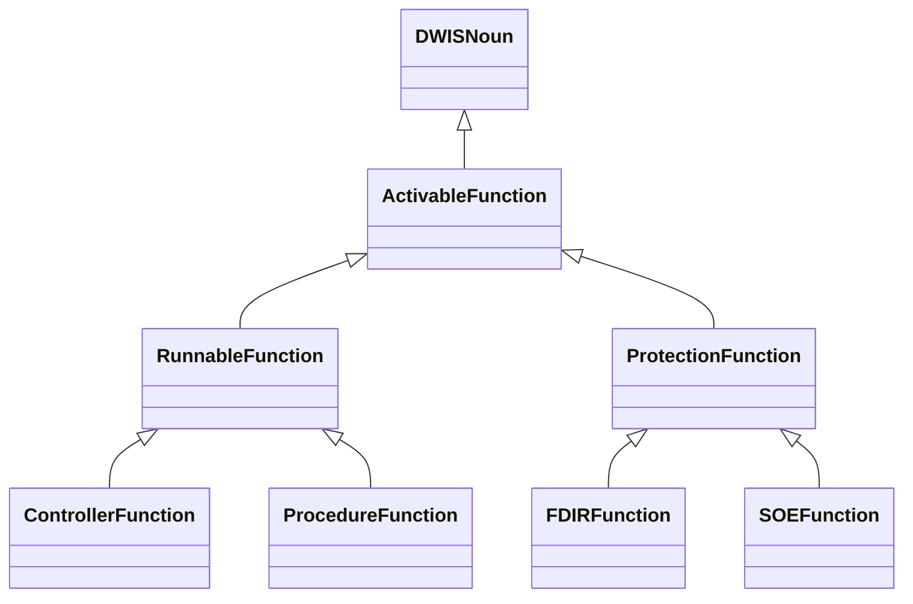
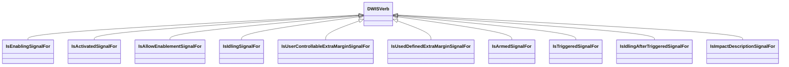
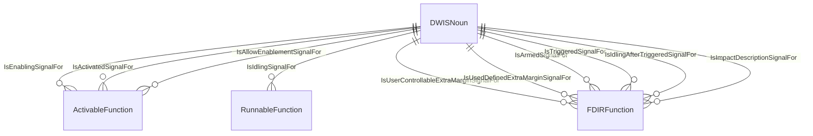

# ADCS<!-- DEFINITION SET HEADER -->
- Description: 
this category refers to the various functions an ADCS implements. It is to be used for the ADCS capability description.

# Nouns
## Class Inheritance for Nouns
Here is a class inheritance diagram for the nouns contained in this definition set.

## ActivableFunction <!-- NOUN -->
- Display name: Activable Function
- Parent class: [DWISNoun](./DWISSemantics.md#DWISNoun)
- Description: 

- Definition set: ADCS
- Examples:
## RunnableFunction <!-- NOUN -->
- Display name: Runnable Function
- Parent class: [ActivableFunction](./ADCS.md#ActivableFunction)
- Attributes:
  - MainFunction
    - Type: string
    - Description: 
  - AuxiliaryFunction
    - Type: string
    - Description: 
- Description: 

- Definition set: ADCS
- Examples:
## ProtectionFunction <!-- NOUN -->
- Display name: Protection Function
- Parent class: [ActivableFunction](./ADCS.md#ActivableFunction)
- Description: 

- Definition set: ADCS
- Examples:
## FDIRFunction <!-- NOUN -->
- Display name: FDIR Function
- Parent class: [ProtectionFunction](./ADCS.md#ProtectionFunction)
- Description: 

- Definition set: ADCS
- Examples:
## SOEFunction <!-- NOUN -->
- Display name: SOE Function
- Parent class: [ProtectionFunction](./ADCS.md#ProtectionFunction)
- Description: 

- Definition set: ADCS
- Examples:
## ControllerFunction <!-- NOUN -->
- Display name: Controller Function
- Parent class: [RunnableFunction](./ADCS.md#RunnableFunction)
- Description: 

- Definition set: ADCS
- Examples:
## ProcedureFunction <!-- NOUN -->
- Display name: Procedure Function
- Parent class: [RunnableFunction](./ADCS.md#RunnableFunction)
- Description: 

- Definition set: ADCS
- Examples:
# Verbs
## Class Inheritance for Verbs
Here is a class inheritance diagram for the verbs contained in this definition set.

## Relations
Here is a graph representing the relations that can be made with the verbs defined in this definition set.

## IsEnablingSignalFor <!-- VERB -->
- Display name: IsEnablingSignalFor
- Parent verb: [DWISVerb](./DWISSemantics.md#DWISVerb)
- Subject class: [DWISNoun](./DWISSemantics.md#DWISNoun)
- Object class: [ActivableFunction](./ADCS.md#ActivableFunction)
- Definition set: ADCS
- Description: 

- Examples:
## IsActivatedSignalFor <!-- VERB -->
- Display name: IsActivatedSignalFor
- Parent verb: [DWISVerb](./DWISSemantics.md#DWISVerb)
- Subject class: [DWISNoun](./DWISSemantics.md#DWISNoun)
- Object class: [ActivableFunction](./ADCS.md#ActivableFunction)
- Definition set: ADCS
- Description: 

- Examples:
## IsAllowEnablementSignalFor <!-- VERB -->
- Display name: IsAllowEnablementSignalFor
- Parent verb: [DWISVerb](./DWISSemantics.md#DWISVerb)
- Subject class: [DWISNoun](./DWISSemantics.md#DWISNoun)
- Object class: [ActivableFunction](./ADCS.md#ActivableFunction)
- Definition set: ADCS
- Description: 

- Examples:
## IsIdlingSignalFor <!-- VERB -->
- Display name: IsIdlingSignalFor
- Parent verb: [DWISVerb](./DWISSemantics.md#DWISVerb)
- Subject class: [DWISNoun](./DWISSemantics.md#DWISNoun)
- Object class: [RunnableFunction](./ADCS.md#RunnableFunction)
- Definition set: ADCS
- Description: 

- Examples:
## IsUserControllableExtraMarginSignalFor <!-- VERB -->
- Display name: IsUserControllableExtraMarginSignalFor
- Parent verb: [DWISVerb](./DWISSemantics.md#DWISVerb)
- Subject class: [DWISNoun](./DWISSemantics.md#DWISNoun)
- Object class: [FDIRFunction](./ADCS.md#FDIRFunction)
- Definition set: ADCS
- Description: 

- Examples:
## IsUsedDefinedExtraMarginSignalFor <!-- VERB -->
- Display name: IsUsedDefinedExtraMarginSignalFor
- Parent verb: [DWISVerb](./DWISSemantics.md#DWISVerb)
- Subject class: [DWISNoun](./DWISSemantics.md#DWISNoun)
- Object class: [FDIRFunction](./ADCS.md#FDIRFunction)
- Definition set: ADCS
- Description: 

- Examples:
## IsArmedSignalFor <!-- VERB -->
- Display name: IsArmedSignalFor
- Parent verb: [DWISVerb](./DWISSemantics.md#DWISVerb)
- Subject class: [DWISNoun](./DWISSemantics.md#DWISNoun)
- Object class: [FDIRFunction](./ADCS.md#FDIRFunction)
- Definition set: ADCS
- Description: 

- Examples:
## IsTriggeredSignalFor <!-- VERB -->
- Display name: IsTriggeredSignalFor
- Parent verb: [DWISVerb](./DWISSemantics.md#DWISVerb)
- Subject class: [DWISNoun](./DWISSemantics.md#DWISNoun)
- Object class: [FDIRFunction](./ADCS.md#FDIRFunction)
- Definition set: ADCS
- Description: 

- Examples:
## IsIdlingAfterTriggeredSignalFor <!-- VERB -->
- Display name: IsIdlingAfterTriggeredSignalFor
- Parent verb: [DWISVerb](./DWISSemantics.md#DWISVerb)
- Subject class: [DWISNoun](./DWISSemantics.md#DWISNoun)
- Object class: [FDIRFunction](./ADCS.md#FDIRFunction)
- Definition set: ADCS
- Description: 

- Examples:
## IsImpactDescriptionSignalFor <!-- VERB -->
- Display name: IsImpactDescriptionSignalFor
- Parent verb: [DWISVerb](./DWISSemantics.md#DWISVerb)
- Subject class: [DWISNoun](./DWISSemantics.md#DWISNoun)
- Object class: [FDIRFunction](./ADCS.md#FDIRFunction)
- Definition set: ADCS
- Description: 

- Examples:
