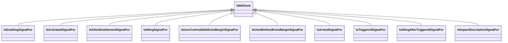

# ADCS<!-- DEFINITION SET HEADER -->
- Description: 
this definition set refers to the various functions an ADCS implements. It is to be used for the ADCS capability description.

# Nouns
## Class Inheritance for Nouns
Here is a class inheritance diagram for the nouns contained in this definition set.

## ActivableFunction <!-- NOUN -->
- Display name: Activable Function
- Parent class: [DWISNoun](./DWISSemantics.md#DWISNoun)
- Attributes:
  - HasFunction
    - Type: string
    - Description: this attribute describes the purpose of the activable function.
- Description: 
An `ActivableFunction` is an ADCS function that can be activated. Here activation means that the
function may run immediately or that it is enabled and can trigger if some conditions are respected.
- Definition set: ADCS
- Examples:
```dwis ADCSFunction
ActivableFunction:ADCSFunction
ControlSystem:DCS
DrillingContractor:Contractor
DCS IsProvidedBy Contractor
DCS BelongsToClass DataProvider
ActivableFunction IsProvidedBy DCS
```
An example semantic graph looks like as follow:

An example SparQL query looks like this:
```sparql
PREFIX rdf: <http://www.w3.org/1999/02/22-rdf-syntax-ns#>
PREFIX ddhub: <http://ddhub.no/>
PREFIX quantity: <http://ddhub.no/UnitAndQuantity>
SELECT ?ADCSFunction
WHERE {
	?ADCSFunction rdf:type ddhub:ActivableFunction .
	?DCS rdf:type ddhub:ControlSystem .
	?Contractor rdf:type ddhub:DrillingContractor .
	?DCS ddhub:IsProvidedBy ?Contractor .
	?DCS rdf:type ddhub:DataProvider .
	?ActivableFunction ddhub:IsProvidedBy ?DCS .
}
```
This example describes all `ActivableFunction` provided by the drilling control system, `DCS`. The `DCS` is 
defined as a `ControlSystem` provided by a drilling contractor.
## RunnableFunction <!-- NOUN -->
- Display name: Runnable Function
- Parent class: [ActivableFunction](./ADCS.md#ActivableFunction)
- Attributes:
  - IsAuxiliary
    - Type: boolean
    - Description: This attribute specifies if the function is a main or an auxilary one. A main function impacts
        substantially the drilling process while an auxiliary function does not impact or only in limited fashion the
        drilling process. Example of a main functions are: Hoist, Tag Bottom, Start Circulation, Start Rotation, 
        Stop Circulation, Stop Rotation, Drill, Pull Out,Run In, Pull Out With Lubrication, Run In With Lubrication, Ream Up, 
        Ream Down,Test Friction, Reciprocate, Test Pressure Integrity, Place Cement, .... Example of auxiliary functions
        are: Boost Riser Flow, Down Link from ADCS, Rock Pipe, ...
- Description: 
A runnable function is a function that starts to run immediately when activated.
- Definition set: ADCS
- Examples:
```dwis runnableFunction
RunnableFunction:runnableFunction
runnableFunction IsAuxiliary false
ControlSystem:DCS
DrillingContractor:Contractor
DCS IsProvidedBy Contractor
DCS BelongsToClass DataProvider
runnableFunction IsProvidedBy DCS
```
An example semantic graph looks like as follow:

An example SparQL query looks like this:
```sparql
PREFIX rdf: <http://www.w3.org/1999/02/22-rdf-syntax-ns#>
PREFIX ddhub: <http://ddhub.no/>
PREFIX quantity: <http://ddhub.no/UnitAndQuantity>
SELECT ?runnableFunction
WHERE {
	?runnableFunction rdf:type ddhub:RunnableFunction .
	?runnableFunction ddhub:IsAuxiliary ?Attribute000 .
	?DCS rdf:type ddhub:ControlSystem .
	?Contractor rdf:type ddhub:DrillingContractor .
	?DCS ddhub:IsProvidedBy ?Contractor .
	?DCS rdf:type ddhub:DataProvider .
	?runnableFunction ddhub:IsProvidedBy ?DCS .
  FILTER (
	?Attribute000 = false
  )
}
```
This example describes all the main runnable functions provided by the drilling control system, `DCS`. The `DCS` is 
defined as a `ControlSystem` provided by a drilling contractor.
## ControllerFunction <!-- NOUN -->
- Display name: Controller Function
- Parent class: [RunnableFunction](./ADCS.md#RunnableFunction)
- Description: 
A `ControllerFunction` is a `RunnableFunction` that executes a feedback control loop to follow as closely
as possible one or several desired values. A typical example of `ControllerFunction` is the `AutoDriller`. An `AutoDriller` 
follows as closely as possible, for instance, a desired `WOB`.
- Definition set: ADCS
- Examples:
```dwis autoDriller
ControllerFunction:autoDriller
autoDriller HasFunction "Drill"
autoDriller IsAuxiliary false
ControlSystem:DCS
DrillingContractor:Contractor
DCS IsProvidedBy Contractor
DCS BelongsToClass DataProvider
autoDriller IsProvidedBy DCS
```
An example semantic graph looks like as follow:

An example SparQL query looks like this:
```sparql
PREFIX rdf: <http://www.w3.org/1999/02/22-rdf-syntax-ns#>
PREFIX ddhub: <http://ddhub.no/>
PREFIX quantity: <http://ddhub.no/UnitAndQuantity>
SELECT ?autoDriller
WHERE {
	?autoDriller rdf:type ddhub:ControllerFunction .
	?autoDriller ddhub:HasFunction ?"Drill" .
	?autoDriller ddhub:IsAuxiliary ?Attribute000 .
	?DCS rdf:type ddhub:ControlSystem .
	?Contractor rdf:type ddhub:DrillingContractor .
	?DCS ddhub:IsProvidedBy ?Contractor .
	?DCS rdf:type ddhub:DataProvider .
	?autoDriller ddhub:IsProvidedBy ?DCS .
  FILTER (
	?Attribute000 = false
  )
}
```
This example describes the auto driller provided by the drilling control system, `DCS`. The `DCS` is 
defined as a `ControlSystem` provided by a drilling contractor. It is a main function and its purpose is to `Drill`.
## ProcedureFunction <!-- NOUN -->
- Display name: Procedure Function
- Parent class: [RunnableFunction](./ADCS.md#RunnableFunction)
- Description: 
A `ProcedureFunction` is a `RunnableFunction` that executes a finites state automaton, i.e., a graph of
transitions between states. It should be noted that a `ProcedureFunction` may use control algorithms while being in one
state or when transiting from state to state. An example of `ProcedureFunction` is a friction test. A friction test has
at least three states: rotation off bottom, pick-up without rotation, slack-off without rotation. The transitions 
between the different states may depend on the implementation. Each of those states uses a controller, one that controls
the rotational speed and one that controls the axial speed.
- Definition set: ADCS
- Examples:
```dwis frictionTest
ProcedureFunction:frictionTest
frictionTest HasFunction "FrictionTest"
FrictionTest IsAuxiliary false
ControlSystem:DCS
DrillingContractor:Contractor
DCS IsProvidedBy Contractor
DCS BelongsToClass DataProvider
frictionTest IsProvidedBy DCS
```
An example semantic graph looks like as follow:

An example SparQL query looks like this:
```sparql
PREFIX rdf: <http://www.w3.org/1999/02/22-rdf-syntax-ns#>
PREFIX ddhub: <http://ddhub.no/>
PREFIX quantity: <http://ddhub.no/UnitAndQuantity>
SELECT ?frictionTest
WHERE {
	?frictionTest rdf:type ddhub:ProcedureFunction .
	?frictionTest ddhub:HasFunction ?"FrictionTest" .
	?FrictionTest ddhub:IsAuxiliary ?Attribute000 .
	?DCS rdf:type ddhub:ControlSystem .
	?Contractor rdf:type ddhub:DrillingContractor .
	?DCS ddhub:IsProvidedBy ?Contractor .
	?DCS rdf:type ddhub:DataProvider .
	?frictionTest ddhub:IsProvidedBy ?DCS .
  FILTER (
	?Attribute000 = false
  )
}
```
This example describes the friction test procedure provided by the drilling control system, `DCS`. The `DCS` is 
defined as a `ControlSystem` provided by a drilling contractor. It is a main function and its purpose is to perform a
`FrictionTest`.
## ProtectionFunction <!-- NOUN -->
- Display name: Protection Function
- Parent class: [ActivableFunction](./ADCS.md#ActivableFunction)
- Description: 
A `ProtectionFunction` is an `ActivableFunction`. It must be activated to have an effect, but the effect
is to protect the drilling process, either by protecting the inputs to the drilling machines to avoid generating 
a drilling incident, or to detect an abnormal drilling process state and react to the situation.
detected.
- Definition set: ADCS
- Examples:
```dwis protectionFunction
ProtectionFunction:protectionFunction
ControlSystem:DCS
DrillingContractor:Contractor
DCS IsProvidedBy Contractor
DCS BelongsToClass DataProvider
protectionFunction IsProvidedBy DCS
```
An example semantic graph looks like as follow:

An example SparQL query looks like this:
```sparql
PREFIX rdf: <http://www.w3.org/1999/02/22-rdf-syntax-ns#>
PREFIX ddhub: <http://ddhub.no/>
PREFIX quantity: <http://ddhub.no/UnitAndQuantity>
SELECT ?protectionFunction
WHERE {
	?protectionFunction rdf:type ddhub:ProtectionFunction .
	?DCS rdf:type ddhub:ControlSystem .
	?Contractor rdf:type ddhub:DrillingContractor .
	?DCS ddhub:IsProvidedBy ?Contractor .
	?DCS rdf:type ddhub:DataProvider .
	?protectionFunction ddhub:IsProvidedBy ?DCS .
}
```
This example describes all the protection functions of the drilling control system, `DCS`. The `DCS` is 
defined as a `ControlSystem` provided by a drilling contractor.
## FDIRFunction <!-- NOUN -->
- Display name: FDIR Function
- Parent class: [ProtectionFunction](./ADCS.md#ProtectionFunction)
- Description: 
A `FDIRFunction` is a `ProtectionFunction` that reacts to a particular state of the drilling process. FDIR
- Definition set: ADCS
- Examples:
```dwis packOffDectionAndReaction
FDIRFunction:packOffDetectionAndReaction
packOffDetectionAndReaction HasFunction "PackOffFDIR"
ControlSystem:DCS
DrillingContractor:Contractor
DCS IsProvidedBy Contractor
DCS BelongsToClass DataProvider
packOffDetectionAndReaction IsProvidedBy DCS
```
An example semantic graph looks like as follow:

An example SparQL query looks like this:
```sparql
PREFIX rdf: <http://www.w3.org/1999/02/22-rdf-syntax-ns#>
PREFIX ddhub: <http://ddhub.no/>
PREFIX quantity: <http://ddhub.no/UnitAndQuantity>
SELECT ?packOffDectionAndReaction
WHERE {
	?packOffDetectionAndReaction rdf:type ddhub:FDIRFunction .
	?packOffDetectionAndReaction ddhub:HasFunction ?"PackOffFDIR" .
	?DCS rdf:type ddhub:ControlSystem .
	?Contractor rdf:type ddhub:DrillingContractor .
	?DCS ddhub:IsProvidedBy ?Contractor .
	?DCS rdf:type ddhub:DataProvider .
	?packOffDetectionAndReaction ddhub:IsProvidedBy ?DCS .
}
```
This example describes the `packOffDetectionAndReaction` fault detection and isolation procedure of the drilling control
system for pack-off events, `DCS`. The `DCS` is defined as a `ControlSystem` provided by a drilling contractor.
## SOEFunction <!-- NOUN -->
- Display name: SOE Function
- Parent class: [ProtectionFunction](./ADCS.md#ProtectionFunction)
- Description: 
A `SOEFunction` is a `ProtectionFunction` that limits the commands that are send to the drilling machines
to avoid generating a drilling incident. SOE stands for Safe Operating Envelope. A `SOEFunction` protects the inputs
of the drilling process. An example `SOEFunction` is a swab/surge limits protection. This function limits the axial acceleration
and speed of the drill-stem to avoid generate swabbing pressure below the maximum of the collapse and pore pressure, and
surging pressure above the fracturing pressure.
- Definition set: ADCS
- Examples:
```dwis swabSurgeLimits
SOEFunction:swabSurgeLimits
swabSurgeLimits HasFunction "SwabSurgeSOE"
ControlSystem:DCS
DrillingContractor:Contractor
DCS IsProvidedBy Contractor
DCS BelongsToClass DataProvider
swabSurgeLimits IsProvidedBy DCS
```
An example semantic graph looks like as follow:

An example SparQL query looks like this:
```sparql
PREFIX rdf: <http://www.w3.org/1999/02/22-rdf-syntax-ns#>
PREFIX ddhub: <http://ddhub.no/>
PREFIX quantity: <http://ddhub.no/UnitAndQuantity>
SELECT ?swabSurgeLimits
WHERE {
	?swabSurgeLimits rdf:type ddhub:SOEFunction .
	?swabSurgeLimits ddhub:HasFunction ?"SwabSurgeSOE" .
	?DCS rdf:type ddhub:ControlSystem .
	?Contractor rdf:type ddhub:DrillingContractor .
	?DCS ddhub:IsProvidedBy ?Contractor .
	?DCS rdf:type ddhub:DataProvider .
	?swabSurgeLimits ddhub:IsProvidedBy ?DCS .
}
```
This example describes the `swabSurgeLimits` safe operating envelope limits to avoid detrimental swab/surge pressures in 
the open hole section of the borehole. 
# Verbs
## Class Inheritance for Verbs
Here is a class inheritance diagram for the verbs contained in this definition set.

## Relations
Here is a graph representing the relations that can be made with the verbs defined in this definition set.

## IsEnablingSignalFor <!-- VERB -->
- Display name: IsEnablingSignalFor
- Parent verb: [DWISVerb](./DWISSemantics.md#DWISVerb)
- Subject class: [DWISNoun](./DWISSemantics.md#DWISNoun)
- Object class: [ActivableFunction](./ADCS.md#ActivableFunction)
- Definition set: ADCS
- Description: 

- Examples:
## IsActivatedSignalFor <!-- VERB -->
- Display name: IsActivatedSignalFor
- Parent verb: [DWISVerb](./DWISSemantics.md#DWISVerb)
- Subject class: [DWISNoun](./DWISSemantics.md#DWISNoun)
- Object class: [ActivableFunction](./ADCS.md#ActivableFunction)
- Definition set: ADCS
- Description: 

- Examples:
## IsAllowEnablementSignalFor <!-- VERB -->
- Display name: IsAllowEnablementSignalFor
- Parent verb: [DWISVerb](./DWISSemantics.md#DWISVerb)
- Subject class: [DWISNoun](./DWISSemantics.md#DWISNoun)
- Object class: [ActivableFunction](./ADCS.md#ActivableFunction)
- Definition set: ADCS
- Description: 

- Examples:
## IsIdlingSignalFor <!-- VERB -->
- Display name: IsIdlingSignalFor
- Parent verb: [DWISVerb](./DWISSemantics.md#DWISVerb)
- Subject class: [DWISNoun](./DWISSemantics.md#DWISNoun)
- Object class: [RunnableFunction](./ADCS.md#RunnableFunction)
- Definition set: ADCS
- Description: 

- Examples:
## IsUserControllableExtraMarginSignalFor <!-- VERB -->
- Display name: IsUserControllableExtraMarginSignalFor
- Parent verb: [DWISVerb](./DWISSemantics.md#DWISVerb)
- Subject class: [DWISNoun](./DWISSemantics.md#DWISNoun)
- Object class: [FDIRFunction](./ADCS.md#FDIRFunction)
- Definition set: ADCS
- Description: 

- Examples:
## IsUsedDefinedExtraMarginSignalFor <!-- VERB -->
- Display name: IsUsedDefinedExtraMarginSignalFor
- Parent verb: [DWISVerb](./DWISSemantics.md#DWISVerb)
- Subject class: [DWISNoun](./DWISSemantics.md#DWISNoun)
- Object class: [FDIRFunction](./ADCS.md#FDIRFunction)
- Definition set: ADCS
- Description: 

- Examples:
## IsArmedSignalFor <!-- VERB -->
- Display name: IsArmedSignalFor
- Parent verb: [DWISVerb](./DWISSemantics.md#DWISVerb)
- Subject class: [DWISNoun](./DWISSemantics.md#DWISNoun)
- Object class: [FDIRFunction](./ADCS.md#FDIRFunction)
- Definition set: ADCS
- Description: 

- Examples:
## IsTriggeredSignalFor <!-- VERB -->
- Display name: IsTriggeredSignalFor
- Parent verb: [DWISVerb](./DWISSemantics.md#DWISVerb)
- Subject class: [DWISNoun](./DWISSemantics.md#DWISNoun)
- Object class: [FDIRFunction](./ADCS.md#FDIRFunction)
- Definition set: ADCS
- Description: 

- Examples:
## IsIdlingAfterTriggeredSignalFor <!-- VERB -->
- Display name: IsIdlingAfterTriggeredSignalFor
- Parent verb: [DWISVerb](./DWISSemantics.md#DWISVerb)
- Subject class: [DWISNoun](./DWISSemantics.md#DWISNoun)
- Object class: [FDIRFunction](./ADCS.md#FDIRFunction)
- Definition set: ADCS
- Description: 

- Examples:
## IsImpactDescriptionSignalFor <!-- VERB -->
- Display name: IsImpactDescriptionSignalFor
- Parent verb: [DWISVerb](./DWISSemantics.md#DWISVerb)
- Subject class: [DWISNoun](./DWISSemantics.md#DWISNoun)
- Object class: [FDIRFunction](./ADCS.md#FDIRFunction)
- Definition set: ADCS
- Description: 

- Examples:
