# AdvisorySystemAdvice<!-- DEFINITION SET HEADER -->
- Description: 
this is the part associated to advices provided by advisory systems.

# Nouns
## Class Inheritance for Nouns
Here is a class inheritance diagram for the nouns contained in this definition set.

## AdvisorySystemAdvice <!-- NOUN -->
- Display name: Advisory System Advice
- Parent class: [JSonDataType](./DrillingDataSemantics.md#JSonDataType)
- Description: 
An advisory system provides one or several advices. These advices are structured data that are stored as a JSon
string. 
- Definition set: AdvisorySystemAdvice
- Examples:
``` dwis adviceInfo
DynamicDrillingSignal:adviceInfo
AdvisorySystemAdvice:adviceInfo_1
adviceInfo_1 HasDynamicValue adviceInfo
ServiceCompany:serviceCompany
adviceInfo_1 IsProvidedBy serviceCompany
Advisor:computationUnit
adviceInfo_1 IsRecommendedBy computationUnit
ActivableFunction:activableFunction
adviceInfo_1 IsRecommendedFor activableFunction
DWISAdviceComposer:adviceComposer
adviceInfo_1 IsProvidedTo adviceComposer
DWISScheduler:scheduler
adviceInfo_1 IsProvidedTo scheduler
```
An example semantic graph looks like as follow:
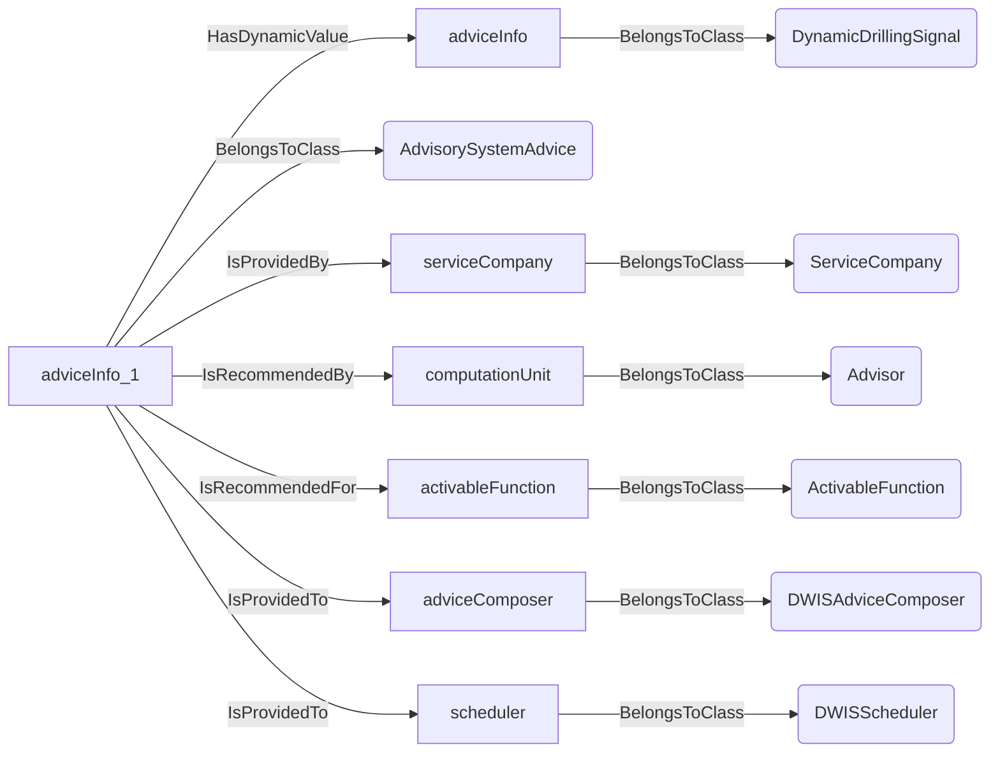
An example SparQL query looks like this:
```sparql
PREFIX rdf: <http://www.w3.org/1999/02/22-rdf-syntax-ns#>
PREFIX ddhub: <http://ddhub.no/>
PREFIX quantity: <http://ddhub.no/UnitAndQuantity>
SELECT ?adviceInfo
WHERE {
	?adviceInfo rdf:type ddhub:DynamicDrillingSignal .
	?adviceInfo_1 rdf:type ddhub:AdvisorySystemAdvice .
	?adviceInfo_1 ddhub:HasDynamicValue ?adviceInfo .
	?serviceCompany rdf:type ddhub:ServiceCompany .
	?adviceInfo_1 ddhub:IsProvidedBy ?serviceCompany .
	?computationUnit rdf:type ddhub:Advisor .
	?adviceInfo_1 ddhub:IsRecommendedBy ?computationUnit .
	?activableFunction rdf:type ddhub:ActivableFunction .
	?adviceInfo_1 ddhub:IsRecommendedFor ?activableFunction .
	?adviceComposer rdf:type ddhub:DWISAdviceComposer .
	?adviceInfo_1 ddhub:IsProvidedTo ?adviceComposer .
	?scheduler rdf:type ddhub:DWISScheduler .
	?adviceInfo_1 ddhub:IsProvidedTo ?scheduler .
}
```
## DigitalTwinAdvice <!-- NOUN -->
- Display name: Digital Twin Advice
- Parent class: [AdvisorySystemAdvice](./AdvisorySystemAdvice.md#AdvisorySystemAdvice)
- Description: 
A digital twin simulates the drilling operation using the boundary conditions applied to the drilling system.
It provides information about the plausible values that can be expected anywhere along the drilling system. These results
are stored in a DigitalTwinAdvice.
- Definition set: AdvisorySystemAdvice
- Examples:
``` dwis digitalTwinAdvice
DynamicDrillingSignal:digitalTwinAdvice
DigitalTwinAdvice:digitalTwinAdvice_1
digitalTwinAdvice_1 HasDynamicValue digitalTwinAdvice
OperatingCompany:operatingCompany
digitalTwinAdvice_1 IsProvidedBy operatingCompany
Simulator:simulator
digitalTwinAdvice_1 IsRecommendedBy simulator
DWISDrillingProcessStateInterpreter:microStateInterpreter
digitalTwinAdvice_1 IsProvidedTo microStateInterpreter
```
An example semantic graph looks like as follow:
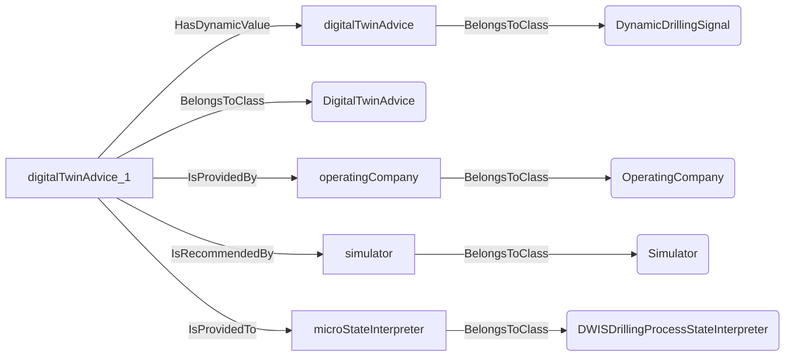
An example SparQL query looks like this:
```sparql
PREFIX rdf: <http://www.w3.org/1999/02/22-rdf-syntax-ns#>
PREFIX ddhub: <http://ddhub.no/>
PREFIX quantity: <http://ddhub.no/UnitAndQuantity>
SELECT ?digitalTwinAdvice
WHERE {
	?digitalTwinAdvice rdf:type ddhub:DynamicDrillingSignal .
	?digitalTwinAdvice_1 rdf:type ddhub:DigitalTwinAdvice .
	?digitalTwinAdvice_1 ddhub:HasDynamicValue ?digitalTwinAdvice .
	?operatingCompany rdf:type ddhub:OperatingCompany .
	?digitalTwinAdvice_1 ddhub:IsProvidedBy ?operatingCompany .
	?simulator rdf:type ddhub:Simulator .
	?digitalTwinAdvice_1 ddhub:IsRecommendedBy ?simulator .
	?microStateInterpreter rdf:type ddhub:DWISDrillingProcessStateInterpreter .
	?digitalTwinAdvice_1 ddhub:IsProvidedTo ?microStateInterpreter .
}
```
## DrillingStandardProcedureAdvice <!-- NOUN -->
- Display name: Drilling Standard Procedure Advice
- Parent class: [AdvisorySystemAdvice](./AdvisorySystemAdvice.md#AdvisorySystemAdvice)
- Description: 
A drilling standard procedure advisor provides parameters for a standard procedure like starting the mud pumps or
running a friction test.
- Definition set: AdvisorySystemAdvice
- Examples:
The circulation startup procedure defines how to start the mud pumps in order to fill the pipes, break circulation and 
establish a suitable flowrate in the drill-stem.
``` dwis circulationStartupProcedureInfo
DynamicDrillingSignal:circulationStartupProcedureInfo
DrillingStandardProcedureAdvice:circulationStartupProcedureInfo_1
circulationStartupProcedureInfo_1 HasDynamicValue circulationStartupProcedureInfo
CirculationStartupProcedure:circulationStartupProcedure
circulationStartupProcedureInfo_1 IsRelatedToDrillingProcedure circulationStartupProcedure
ServiceCompany:serviceCompany
circulationStartupProcedureInfo_1 IsProvidedBy serviceCompany
Advisor:computationUnit
circulationStartupProcedureInfo_1 IsRecommendedBy computationUnit
ProcedureFunction:procedureFunction
procedureFunction ImplementsProcedure circulationStartupProcedure
circulationStartupProcedureInfo_1 IsRecommendedFor procedureFunction
DWISAdviceComposer:adviceComposer
circulationStartupProcedureInfo_1 IsProvidedTo adviceComposer
DWISScheduler:scheduler
circulationStartupProcedureInfo_1 IsProvidedTo scheduler
```
An example semantic graph looks like as follow:

An example SparQL query looks like this:
```sparql
PREFIX rdf: <http://www.w3.org/1999/02/22-rdf-syntax-ns#>
PREFIX ddhub: <http://ddhub.no/>
PREFIX quantity: <http://ddhub.no/UnitAndQuantity>
SELECT ?circulationStartupProcedureInfo
WHERE {
	?circulationStartupProcedureInfo rdf:type ddhub:DynamicDrillingSignal .
	?circulationStartupProcedureInfo_1 rdf:type ddhub:DrillingStandardProcedureAdvice .
	?circulationStartupProcedureInfo_1 ddhub:HasDynamicValue ?circulationStartupProcedureInfo .
	?circulationStartupProcedure rdf:type ddhub:CirculationStartupProcedure .
	?circulationStartupProcedureInfo_1 ddhub:IsRelatedToDrillingProcedure ?circulationStartupProcedure .
	?serviceCompany rdf:type ddhub:ServiceCompany .
	?circulationStartupProcedureInfo_1 ddhub:IsProvidedBy ?serviceCompany .
	?computationUnit rdf:type ddhub:Advisor .
	?circulationStartupProcedureInfo_1 ddhub:IsRecommendedBy ?computationUnit .
	?procedureFunction rdf:type ddhub:ProcedureFunction .
	?procedureFunction ddhub:ImplementsProcedure ?circulationStartupProcedure .
	?circulationStartupProcedureInfo_1 ddhub:IsRecommendedFor ?procedureFunction .
	?adviceComposer rdf:type ddhub:DWISAdviceComposer .
	?circulationStartupProcedureInfo_1 ddhub:IsProvidedTo ?adviceComposer .
	?scheduler rdf:type ddhub:DWISScheduler .
	?circulationStartupProcedureInfo_1 ddhub:IsProvidedTo ?scheduler .
}
```
The circulation stop procedure defines how to stop the mud pumps in a way that limit potential bull-heading effects 
that could result in undesired downhole pressure conditions with regards to the geo-pressure window.
``` dwis circulationStopProcedureInfo
DynamicDrillingSignal:circulationStopProcedureInfo
DrillingStandardProcedureAdvice:circulationStopProcedureInfo_1
circulationStopProcedureInfo_1 HasDynamicValue circulationStopProcedureInfo
CirculationStopProcedure:circulationStopProcedure
circulationStopProcedureInfo_1 IsRelatedToDrillingProcedure circulationStopProcedure
ServiceCompany:serviceCompany
circulationStopProcedureInfo_1 IsProvidedBy serviceCompany
Advisor:computationUnit
circulationStopProcedureInfo_1 IsRecommendedBy computationUnit
ProcedureFunction:procedureFunction
procedureFunction ImplementsProcedure circulationStopProcedure
circulationStopProcedureInfo_1 IsRecommendedFor procedureFunction
DWISAdviceComposer:adviceComposer
circulationStopProcedureInfo_1 IsProvidedTo adviceComposer
DWISScheduler:scheduler
circulationStopProcedureInfo_1 IsProvidedTo scheduler
```
An example semantic graph looks like as follow:

An example SparQL query looks like this:
```sparql
PREFIX rdf: <http://www.w3.org/1999/02/22-rdf-syntax-ns#>
PREFIX ddhub: <http://ddhub.no/>
PREFIX quantity: <http://ddhub.no/UnitAndQuantity>
SELECT ?circulationStopProcedureInfo
WHERE {
	?circulationStopProcedureInfo rdf:type ddhub:DynamicDrillingSignal .
	?circulationStopProcedureInfo_1 rdf:type ddhub:DrillingStandardProcedureAdvice .
	?circulationStopProcedureInfo_1 ddhub:HasDynamicValue ?circulationStopProcedureInfo .
	?circulationStopProcedure rdf:type ddhub:CirculationStopProcedure .
	?circulationStopProcedureInfo_1 ddhub:IsRelatedToDrillingProcedure ?circulationStopProcedure .
	?serviceCompany rdf:type ddhub:ServiceCompany .
	?circulationStopProcedureInfo_1 ddhub:IsProvidedBy ?serviceCompany .
	?computationUnit rdf:type ddhub:Advisor .
	?circulationStopProcedureInfo_1 ddhub:IsRecommendedBy ?computationUnit .
	?procedureFunction rdf:type ddhub:ProcedureFunction .
	?procedureFunction ddhub:ImplementsProcedure ?circulationStopProcedure .
	?circulationStopProcedureInfo_1 ddhub:IsRecommendedFor ?procedureFunction .
	?adviceComposer rdf:type ddhub:DWISAdviceComposer .
	?circulationStopProcedureInfo_1 ddhub:IsProvidedTo ?adviceComposer .
	?scheduler rdf:type ddhub:DWISScheduler .
	?circulationStopProcedureInfo_1 ddhub:IsProvidedTo ?scheduler .
}
```
The rotation startup procedure controls the steps to start the rotation of the drill-stem to reach a target rotational
speed while attempting to avoid having too large torsional oscillations.
``` dwis rotationStartupProcedureInfo
DynamicDrillingSignal:rotationStartupProcedureInfo
DrillingStandardProcedureAdvice:rotationStartupProcedureInfo_1
rotationStartupProcedureInfo_1 HasDynamicValue rotationStartupProcedureInfo
RotationStartupProcedure:rotationStartupProcedure
rotationStartupProcedureInfo_1 IsRelatedToDrillingProcedure rotationStartupProcedure
ServiceCompany:serviceCompany
rotationStartupProcedureInfo_1 IsProvidedBy serviceCompany
Advisor:computationUnit
rotationStartupProcedureInfo_1 IsRecommendedBy computationUnit
ProcedureFunction:procedureFunction
procedureFunction ImplementsProcedure rotationStartupProcedure
rotationStartupProcedureInfo_1 IsRecommendedFor procedureFunction
DWISAdviceComposer:adviceComposer
rotationStartupProcedureInfo_1 IsProvidedTo adviceComposer
DWISScheduler:scheduler
rotationStartupProcedureInfo_1 IsProvidedTo scheduler
```
An example semantic graph looks like as follow:

An example SparQL query looks like this:
```sparql
PREFIX rdf: <http://www.w3.org/1999/02/22-rdf-syntax-ns#>
PREFIX ddhub: <http://ddhub.no/>
PREFIX quantity: <http://ddhub.no/UnitAndQuantity>
SELECT ?rotationStartupProcedureInfo
WHERE {
	?rotationStartupProcedureInfo rdf:type ddhub:DynamicDrillingSignal .
	?rotationStartupProcedureInfo_1 rdf:type ddhub:DrillingStandardProcedureAdvice .
	?rotationStartupProcedureInfo_1 ddhub:HasDynamicValue ?rotationStartupProcedureInfo .
	?rotationStartupProcedure rdf:type ddhub:RotationStartupProcedure .
	?rotationStartupProcedureInfo_1 ddhub:IsRelatedToDrillingProcedure ?rotationStartupProcedure .
	?serviceCompany rdf:type ddhub:ServiceCompany .
	?rotationStartupProcedureInfo_1 ddhub:IsProvidedBy ?serviceCompany .
	?computationUnit rdf:type ddhub:Advisor .
	?rotationStartupProcedureInfo_1 ddhub:IsRecommendedBy ?computationUnit .
	?procedureFunction rdf:type ddhub:ProcedureFunction .
	?procedureFunction ddhub:ImplementsProcedure ?rotationStartupProcedure .
	?rotationStartupProcedureInfo_1 ddhub:IsRecommendedFor ?procedureFunction .
	?adviceComposer rdf:type ddhub:DWISAdviceComposer .
	?rotationStartupProcedureInfo_1 ddhub:IsProvidedTo ?adviceComposer .
	?scheduler rdf:type ddhub:DWISScheduler .
	?rotationStartupProcedureInfo_1 ddhub:IsProvidedTo ?scheduler .
}
```
The rotation stop procedure controls the path for stopping the rotation of the drill-stem and remove as much torque 
along the drill-stem as possible.
``` dwis rotationStopProcedureInfo
DynamicDrillingSignal:rotationStopProcedureInfo
DrillingStandardProcedureAdvice:rotationStopProcedureInfo_1
rotationStopProcedureInfo_1 HasDynamicValue rotationStopProcedureInfo
RotationStopProcedure:rotationStopProcedure
rotationStopProcedureInfo_1 IsRelatedToDrillingProcedure rotationStopProcedure
ServiceCompany:serviceCompany
rotationStopProcedureInfo_1 IsProvidedBy serviceCompany
Advisor:computationUnit
rotationStopProcedureInfo_1 IsRecommendedBy computationUnit
ProcedureFunction:procedureFunction
procedureFunction ImplementsProcedure rotationStopProcedure
rotationStopProcedureInfo_1 IsRecommendedFor procedureFunction
DWISAdviceComposer:adviceComposer
rotationStopProcedureInfo_1 IsProvidedTo adviceComposer
DWISScheduler:scheduler
rotationStopProcedureInfo_1 IsProvidedTo scheduler
```
An example semantic graph looks like as follow:

An example SparQL query looks like this:
```sparql
PREFIX rdf: <http://www.w3.org/1999/02/22-rdf-syntax-ns#>
PREFIX ddhub: <http://ddhub.no/>
PREFIX quantity: <http://ddhub.no/UnitAndQuantity>
SELECT ?rotationStopProcedureInfo
WHERE {
	?rotationStopProcedureInfo rdf:type ddhub:DynamicDrillingSignal .
	?rotationStopProcedureInfo_1 rdf:type ddhub:DrillingStandardProcedureAdvice .
	?rotationStopProcedureInfo_1 ddhub:HasDynamicValue ?rotationStopProcedureInfo .
	?rotationStopProcedure rdf:type ddhub:RotationStopProcedure .
	?rotationStopProcedureInfo_1 ddhub:IsRelatedToDrillingProcedure ?rotationStopProcedure .
	?serviceCompany rdf:type ddhub:ServiceCompany .
	?rotationStopProcedureInfo_1 ddhub:IsProvidedBy ?serviceCompany .
	?computationUnit rdf:type ddhub:Advisor .
	?rotationStopProcedureInfo_1 ddhub:IsRecommendedBy ?computationUnit .
	?procedureFunction rdf:type ddhub:ProcedureFunction .
	?procedureFunction ddhub:ImplementsProcedure ?rotationStopProcedure .
	?rotationStopProcedureInfo_1 ddhub:IsRecommendedFor ?procedureFunction .
	?adviceComposer rdf:type ddhub:DWISAdviceComposer .
	?rotationStopProcedureInfo_1 ddhub:IsProvidedTo ?adviceComposer .
	?scheduler rdf:type ddhub:DWISScheduler .
	?rotationStopProcedureInfo_1 ddhub:IsProvidedTo ?scheduler .
}
```
The hoist procedure is used to move the top of the drill-stem from one elevation to another elevation while minimizing
the side effects of swab and surge.
``` dwis hoistProcedureInfo
DynamicDrillingSignal:hoistProcedureInfo
DrillingStandardProcedureAdvice:hoistProcedureInfo_1
hoistProcedureInfo_1 HasDynamicValue hoistProcedureInfo
HoistProcedure:hoistProcedure
hoistProcedureInfo_1 IsRelatedToDrillingProcedure hoistProcedure
ServiceCompany:serviceCompany
hoistProcedureInfo_1 IsProvidedBy serviceCompany
Advisor:computationUnit
hoistProcedureInfo_1 IsRecommendedBy computationUnit
ProcedureFunction:procedureFunction
procedureFunction ImplementsProcedure hoistProcedure
hoistProcedureInfo_1 IsRecommendedFor procedureFunction
DWISAdviceComposer:adviceComposer
hoistProcedureInfo_1 IsProvidedTo adviceComposer
DWISScheduler:scheduler
hoistProcedureInfo_1 IsProvidedTo scheduler
```
An example semantic graph looks like as follow:
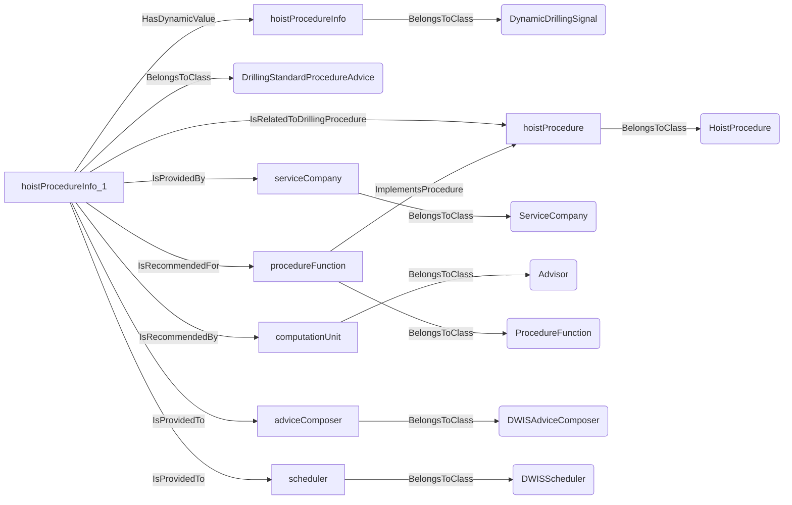
An example SparQL query looks like this:
```sparql
PREFIX rdf: <http://www.w3.org/1999/02/22-rdf-syntax-ns#>
PREFIX ddhub: <http://ddhub.no/>
PREFIX quantity: <http://ddhub.no/UnitAndQuantity>
SELECT ?hoistProcedureInfo
WHERE {
	?hoistProcedureInfo rdf:type ddhub:DynamicDrillingSignal .
	?hoistProcedureInfo_1 rdf:type ddhub:DrillingStandardProcedureAdvice .
	?hoistProcedureInfo_1 ddhub:HasDynamicValue ?hoistProcedureInfo .
	?hoistProcedure rdf:type ddhub:HoistProcedure .
	?hoistProcedureInfo_1 ddhub:IsRelatedToDrillingProcedure ?hoistProcedure .
	?serviceCompany rdf:type ddhub:ServiceCompany .
	?hoistProcedureInfo_1 ddhub:IsProvidedBy ?serviceCompany .
	?computationUnit rdf:type ddhub:Advisor .
	?hoistProcedureInfo_1 ddhub:IsRecommendedBy ?computationUnit .
	?procedureFunction rdf:type ddhub:ProcedureFunction .
	?procedureFunction ddhub:ImplementsProcedure ?hoistProcedure .
	?hoistProcedureInfo_1 ddhub:IsRecommendedFor ?procedureFunction .
	?adviceComposer rdf:type ddhub:DWISAdviceComposer .
	?hoistProcedureInfo_1 ddhub:IsProvidedTo ?adviceComposer .
	?scheduler rdf:type ddhub:DWISScheduler .
	?hoistProcedureInfo_1 ddhub:IsProvidedTo ?scheduler .
}
```
The tag bottom procedure is used to tag the bottom hole and establish the drilling parameters.
``` dwis tagBottomProcedureInfo
DynamicDrillingSignal:tagBottomProcedureInfo
DrillingStandardProcedureAdvice:tagBottomProcedureInfo_1
tagBottomProcedureInfo_1 HasDynamicValue tagBottomProcedureInfo
TagBottomProcedure:tagBottomProcedure
tagBottomProcedureInfo_1 IsRelatedToDrillingProcedure tagBottomProcedure
ServiceCompany:serviceCompany
tagBottomProcedureInfo_1 IsProvidedBy serviceCompany
Advisor:computationUnit
tagBottomProcedureInfo_1 IsRecommendedBy computationUnit
ProcedureFunction:procedureFunction
procedureFunction ImplementsProcedure tagBottomProcedure
tagBottomProcedureInfo_1 IsRecommendedFor procedureFunction
DWISAdviceComposer:adviceComposer
tagBottomProcedureInfo_1 IsProvidedTo adviceComposer
DWISScheduler:scheduler
tagBottomProcedureInfo_1 IsProvidedTo scheduler
```
An example semantic graph looks like as follow:

An example SparQL query looks like this:
```sparql
PREFIX rdf: <http://www.w3.org/1999/02/22-rdf-syntax-ns#>
PREFIX ddhub: <http://ddhub.no/>
PREFIX quantity: <http://ddhub.no/UnitAndQuantity>
SELECT ?tagBottomProcedureInfo
WHERE {
	?tagBottomProcedureInfo rdf:type ddhub:DynamicDrillingSignal .
	?tagBottomProcedureInfo_1 rdf:type ddhub:DrillingStandardProcedureAdvice .
	?tagBottomProcedureInfo_1 ddhub:HasDynamicValue ?tagBottomProcedureInfo .
	?tagBottomProcedure rdf:type ddhub:TagBottomProcedure .
	?tagBottomProcedureInfo_1 ddhub:IsRelatedToDrillingProcedure ?tagBottomProcedure .
	?serviceCompany rdf:type ddhub:ServiceCompany .
	?tagBottomProcedureInfo_1 ddhub:IsProvidedBy ?serviceCompany .
	?computationUnit rdf:type ddhub:Advisor .
	?tagBottomProcedureInfo_1 ddhub:IsRecommendedBy ?computationUnit .
	?procedureFunction rdf:type ddhub:ProcedureFunction .
	?procedureFunction ddhub:ImplementsProcedure ?tagBottomProcedure .
	?tagBottomProcedureInfo_1 ddhub:IsRecommendedFor ?procedureFunction .
	?adviceComposer rdf:type ddhub:DWISAdviceComposer .
	?tagBottomProcedureInfo_1 ddhub:IsProvidedTo ?adviceComposer .
	?scheduler rdf:type ddhub:DWISScheduler .
	?tagBottomProcedureInfo_1 ddhub:IsProvidedTo ?scheduler .
}
```
The reciprocation procedure is used to ream up and down with the same stand. The main purpose is often to clean the hole
while avoiding to wash out the formation.
``` dwis reciprocationProcedureInfo
DynamicDrillingSignal:reciprocationProcedureInfo
DrillingStandardProcedureAdvice:reciprocationProcedureInfo_1
reciprocationProcedureInfo_1 HasDynamicValue reciprocationProcedureInfo
ReciprocationProcedure:reciprocationProcedure
reciprocationProcedureInfo_1 IsRelatedToDrillingProcedure reciprocationProcedure
ServiceCompany:serviceCompany
reciprocationProcedureInfo_1 IsProvidedBy serviceCompany
Advisor:computationUnit
reciprocationProcedureInfo_1 IsRecommendedBy computationUnit
ProcedureFunction:procedureFunction
procedureFunction ImplementsProcedure reciprocationProcedure
reciprocationProcedureInfo_1 IsRecommendedFor procedureFunction
DWISAdviceComposer:adviceComposer
reciprocationProcedureInfo_1 IsProvidedTo adviceComposer
DWISScheduler:scheduler
reciprocationProcedureInfo_1 IsProvidedTo scheduler
```
An example semantic graph looks like as follow:
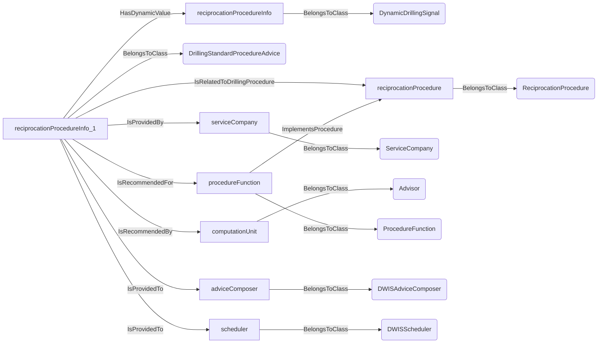
An example SparQL query looks like this:
```sparql
PREFIX rdf: <http://www.w3.org/1999/02/22-rdf-syntax-ns#>
PREFIX ddhub: <http://ddhub.no/>
PREFIX quantity: <http://ddhub.no/UnitAndQuantity>
SELECT ?reciprocationProcedureInfo
WHERE {
	?reciprocationProcedureInfo rdf:type ddhub:DynamicDrillingSignal .
	?reciprocationProcedureInfo_1 rdf:type ddhub:DrillingStandardProcedureAdvice .
	?reciprocationProcedureInfo_1 ddhub:HasDynamicValue ?reciprocationProcedureInfo .
	?reciprocationProcedure rdf:type ddhub:ReciprocationProcedure .
	?reciprocationProcedureInfo_1 ddhub:IsRelatedToDrillingProcedure ?reciprocationProcedure .
	?serviceCompany rdf:type ddhub:ServiceCompany .
	?reciprocationProcedureInfo_1 ddhub:IsProvidedBy ?serviceCompany .
	?computationUnit rdf:type ddhub:Advisor .
	?reciprocationProcedureInfo_1 ddhub:IsRecommendedBy ?computationUnit .
	?procedureFunction rdf:type ddhub:ProcedureFunction .
	?procedureFunction ddhub:ImplementsProcedure ?reciprocationProcedure .
	?reciprocationProcedureInfo_1 ddhub:IsRecommendedFor ?procedureFunction .
	?adviceComposer rdf:type ddhub:DWISAdviceComposer .
	?reciprocationProcedureInfo_1 ddhub:IsProvidedTo ?adviceComposer .
	?scheduler rdf:type ddhub:DWISScheduler .
	?reciprocationProcedureInfo_1 ddhub:IsProvidedTo ?scheduler .
}
```
A friction test procedure is used to measure the free rotating weight and torque and the pick-up and slack-off weights.
``` dwis frictionTestProcedureInfo
DynamicDrillingSignal:frictionTestProcedureInfo
DrillingStandardProcedureAdvice:frictionTestProcedureInfo_1
frictionTestProcedureInfo_1 HasDynamicValue frictionTestProcedureInfo
FrictionTestProcedure:frictionTestProcedure
frictionTestProcedureInfo_1 IsRelatedToDrillingProcedure frictionTestProcedure
ServiceCompany:serviceCompany
frictionTestProcedureInfo_1 IsProvidedBy serviceCompany
Advisor:computationUnit
frictionTestProcedureInfo_1 IsRecommendedBy computationUnit
ProcedureFunction:procedureFunction
procedureFunction ImplementsProcedure frictionTestProcedure
frictionTestProcedureInfo_1 IsRecommendedFor procedureFunction
DWISAdviceComposer:adviceComposer
frictionTestProcedureInfo_1 IsProvidedTo adviceComposer
DWISScheduler:scheduler
frictionTestProcedureInfo_1 IsProvidedTo scheduler
```
An example semantic graph looks like as follow:

An example SparQL query looks like this:
```sparql
PREFIX rdf: <http://www.w3.org/1999/02/22-rdf-syntax-ns#>
PREFIX ddhub: <http://ddhub.no/>
PREFIX quantity: <http://ddhub.no/UnitAndQuantity>
SELECT ?frictionTestProcedureInfo
WHERE {
	?frictionTestProcedureInfo rdf:type ddhub:DynamicDrillingSignal .
	?frictionTestProcedureInfo_1 rdf:type ddhub:DrillingStandardProcedureAdvice .
	?frictionTestProcedureInfo_1 ddhub:HasDynamicValue ?frictionTestProcedureInfo .
	?frictionTestProcedure rdf:type ddhub:FrictionTestProcedure .
	?frictionTestProcedureInfo_1 ddhub:IsRelatedToDrillingProcedure ?frictionTestProcedure .
	?serviceCompany rdf:type ddhub:ServiceCompany .
	?frictionTestProcedureInfo_1 ddhub:IsProvidedBy ?serviceCompany .
	?computationUnit rdf:type ddhub:Advisor .
	?frictionTestProcedureInfo_1 ddhub:IsRecommendedBy ?computationUnit .
	?procedureFunction rdf:type ddhub:ProcedureFunction .
	?procedureFunction ddhub:ImplementsProcedure ?frictionTestProcedure .
	?frictionTestProcedureInfo_1 ddhub:IsRecommendedFor ?procedureFunction .
	?adviceComposer rdf:type ddhub:DWISAdviceComposer .
	?frictionTestProcedureInfo_1 ddhub:IsProvidedTo ?adviceComposer .
	?scheduler rdf:type ddhub:DWISScheduler .
	?frictionTestProcedureInfo_1 ddhub:IsProvidedTo ?scheduler .
}
```
The slow circulation rate procedure is used to measure the pressure losses of the drilling system in conditions close
to what would be necessary while circulating out a kick.
``` dwis slowCirculationRateProcedureInfo
DynamicDrillingSignal:slowCirculationRateProcedureInfo
DrillingStandardProcedureAdvice:slowCirculationRateProcedureInfo_1
slowCirculationRateProcedureInfo_1 HasDynamicValue slowCirculationRateProcedureInfo
SlowCirculationRateProcedure:slowCirculationRateProcedure
slowCirculationRateProcedureInfo_1 IsRelatedToDrillingProcedure slowCirculationRateProcedure
ServiceCompany:serviceCompany
slowCirculationRateProcedureInfo_1 IsProvidedBy serviceCompany
Advisor:computationUnit
slowCirculationRateProcedureInfo_1 IsRecommendedBy computationUnit
ProcedureFunction:procedureFunction
procedureFunction ImplementsProcedure slowCirculationRateProcedure
slowCirculationRateProcedureInfo_1 IsRecommendedFor procedureFunction
DWISAdviceComposer:adviceComposer
slowCirculationRateProcedureInfo_1 IsProvidedTo adviceComposer
DWISScheduler:scheduler
slowCirculationRateProcedureInfo_1 IsProvidedTo scheduler
```
An example semantic graph looks like as follow:

An example SparQL query looks like this:
```sparql
PREFIX rdf: <http://www.w3.org/1999/02/22-rdf-syntax-ns#>
PREFIX ddhub: <http://ddhub.no/>
PREFIX quantity: <http://ddhub.no/UnitAndQuantity>
SELECT ?slowCirculationRateProcedureInfo
WHERE {
	?slowCirculationRateProcedureInfo rdf:type ddhub:DynamicDrillingSignal .
	?slowCirculationRateProcedureInfo_1 rdf:type ddhub:DrillingStandardProcedureAdvice .
	?slowCirculationRateProcedureInfo_1 ddhub:HasDynamicValue ?slowCirculationRateProcedureInfo .
	?slowCirculationRateProcedure rdf:type ddhub:SlowCirculationRateProcedure .
	?slowCirculationRateProcedureInfo_1 ddhub:IsRelatedToDrillingProcedure ?slowCirculationRateProcedure .
	?serviceCompany rdf:type ddhub:ServiceCompany .
	?slowCirculationRateProcedureInfo_1 ddhub:IsProvidedBy ?serviceCompany .
	?computationUnit rdf:type ddhub:Advisor .
	?slowCirculationRateProcedureInfo_1 ddhub:IsRecommendedBy ?computationUnit .
	?procedureFunction rdf:type ddhub:ProcedureFunction .
	?procedureFunction ddhub:ImplementsProcedure ?slowCirculationRateProcedure .
	?slowCirculationRateProcedureInfo_1 ddhub:IsRecommendedFor ?procedureFunction .
	?adviceComposer rdf:type ddhub:DWISAdviceComposer .
	?slowCirculationRateProcedureInfo_1 ddhub:IsProvidedTo ?adviceComposer .
	?scheduler rdf:type ddhub:DWISScheduler .
	?slowCirculationRateProcedureInfo_1 ddhub:IsProvidedTo ?scheduler .
}
```
The pressure integrity test procedure is used to either check that the formation can hold the maximum expected downhole
pressure (formation integrity test) or to test the strength of the formation and the minimum horizontal stress (leak-off test and 
extended leakoff test).
``` dwis pressureIntegrityTestProcedureInfo
DynamicDrillingSignal:pressureIntegrityTestProcedureInfo
DrillingStandardProcedureAdvice:pressureIntegrityTestProcedureInfo_1
pressureIntegrityTestProcedureInfo_1 HasDynamicValue pressureIntegrityTestProcedureInfo
PressureIntegrityTestProcedure:pressureIntegrityTestProcedure
pressureIntegrityTestProcedureInfo_1 IsRelatedToDrillingProcedure pressureIntegrityTestProcedure
ServiceCompany:serviceCompany
pressureIntegrityTestProcedureInfo_1 IsProvidedBy serviceCompany
Advisor:computationUnit
pressureIntegrityTestProcedureInfo_1 IsRecommendedBy computationUnit
ProcedureFunction:procedureFunction
procedureFunction ImplementsProcedure pressureIntegrityTestProcedure
pressureIntegrityTestProcedureInfo_1 IsRecommendedFor procedureFunction
DWISAdviceComposer:adviceComposer
pressureIntegrityTestProcedureInfo_1 IsProvidedTo adviceComposer
DWISScheduler:scheduler
pressureIntegrityTestProcedureInfo_1 IsProvidedTo scheduler
```
An example semantic graph looks like as follow:
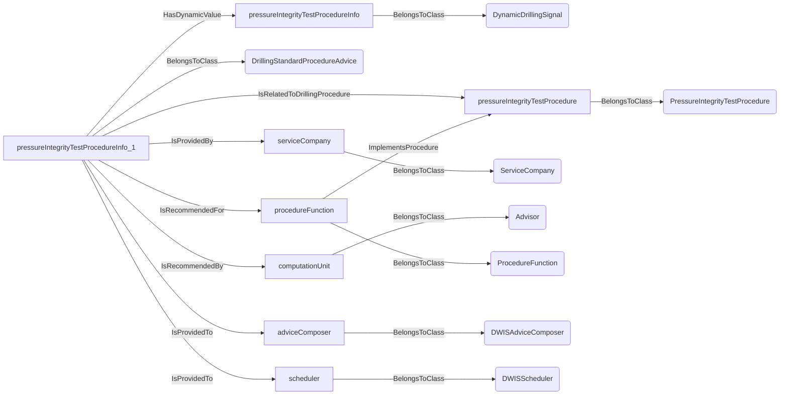
An example SparQL query looks like this:
```sparql
PREFIX rdf: <http://www.w3.org/1999/02/22-rdf-syntax-ns#>
PREFIX ddhub: <http://ddhub.no/>
PREFIX quantity: <http://ddhub.no/UnitAndQuantity>
SELECT ?pressureIntegrityTestProcedureInfo
WHERE {
	?pressureIntegrityTestProcedureInfo rdf:type ddhub:DynamicDrillingSignal .
	?pressureIntegrityTestProcedureInfo_1 rdf:type ddhub:DrillingStandardProcedureAdvice .
	?pressureIntegrityTestProcedureInfo_1 ddhub:HasDynamicValue ?pressureIntegrityTestProcedureInfo .
	?pressureIntegrityTestProcedure rdf:type ddhub:PressureIntegrityTestProcedure .
	?pressureIntegrityTestProcedureInfo_1 ddhub:IsRelatedToDrillingProcedure ?pressureIntegrityTestProcedure .
	?serviceCompany rdf:type ddhub:ServiceCompany .
	?pressureIntegrityTestProcedureInfo_1 ddhub:IsProvidedBy ?serviceCompany .
	?computationUnit rdf:type ddhub:Advisor .
	?pressureIntegrityTestProcedureInfo_1 ddhub:IsRecommendedBy ?computationUnit .
	?procedureFunction rdf:type ddhub:ProcedureFunction .
	?procedureFunction ddhub:ImplementsProcedure ?pressureIntegrityTestProcedure .
	?pressureIntegrityTestProcedureInfo_1 ddhub:IsRecommendedFor ?procedureFunction .
	?adviceComposer rdf:type ddhub:DWISAdviceComposer .
	?pressureIntegrityTestProcedureInfo_1 ddhub:IsProvidedTo ?adviceComposer .
	?scheduler rdf:type ddhub:DWISScheduler .
	?pressureIntegrityTestProcedureInfo_1 ddhub:IsProvidedTo ?scheduler .
}
```
The flow-check procedure is used to check the well is stable (no influx of formation fluids) while ensuring that the
drill-stem will not get stuck during the test.
``` dwis flowCheckProcedureInfo
DynamicDrillingSignal:flowCheckProcedureInfo
DrillingStandardProcedureAdvice:flowCheckProcedureInfo_1
flowCheckProcedureInfo_1 HasDynamicValue flowCheckProcedureInfo
FlowCheckProcedure:flowCheckProcedure
flowCheckProcedureInfo_1 IsRelatedToDrillingProcedure flowCheckProcedure
ServiceCompany:serviceCompany
flowCheckProcedureInfo_1 IsProvidedBy serviceCompany
Advisor:computationUnit
flowCheckProcedureInfo_1 IsRecommendedBy computationUnit
ProcedureFunction:procedureFunction
procedureFunction ImplementsProcedure flowCheckProcedure
flowCheckProcedureInfo_1 IsRecommendedFor procedureFunction
DWISAdviceComposer:adviceComposer
flowCheckProcedureInfo_1 IsProvidedTo adviceComposer
DWISScheduler:scheduler
flowCheckProcedureInfo_1 IsProvidedTo scheduler
```
An example semantic graph looks like as follow:
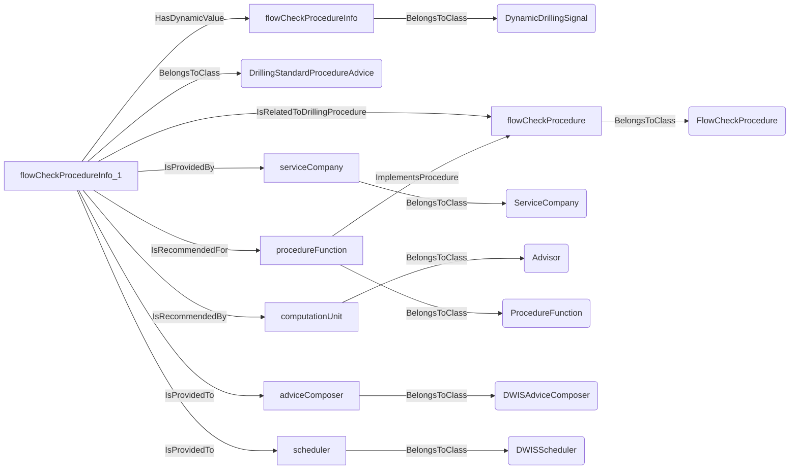
An example SparQL query looks like this:
```sparql
PREFIX rdf: <http://www.w3.org/1999/02/22-rdf-syntax-ns#>
PREFIX ddhub: <http://ddhub.no/>
PREFIX quantity: <http://ddhub.no/UnitAndQuantity>
SELECT ?flowCheckProcedureInfo
WHERE {
	?flowCheckProcedureInfo rdf:type ddhub:DynamicDrillingSignal .
	?flowCheckProcedureInfo_1 rdf:type ddhub:DrillingStandardProcedureAdvice .
	?flowCheckProcedureInfo_1 ddhub:HasDynamicValue ?flowCheckProcedureInfo .
	?flowCheckProcedure rdf:type ddhub:FlowCheckProcedure .
	?flowCheckProcedureInfo_1 ddhub:IsRelatedToDrillingProcedure ?flowCheckProcedure .
	?serviceCompany rdf:type ddhub:ServiceCompany .
	?flowCheckProcedureInfo_1 ddhub:IsProvidedBy ?serviceCompany .
	?computationUnit rdf:type ddhub:Advisor .
	?flowCheckProcedureInfo_1 ddhub:IsRecommendedBy ?computationUnit .
	?procedureFunction rdf:type ddhub:ProcedureFunction .
	?procedureFunction ddhub:ImplementsProcedure ?flowCheckProcedure .
	?flowCheckProcedureInfo_1 ddhub:IsRecommendedFor ?procedureFunction .
	?adviceComposer rdf:type ddhub:DWISAdviceComposer .
	?flowCheckProcedureInfo_1 ddhub:IsProvidedTo ?adviceComposer .
	?scheduler rdf:type ddhub:DWISScheduler .
	?flowCheckProcedureInfo_1 ddhub:IsProvidedTo ?scheduler .
}
```
The cementing procedure is used to displace the correct amount of cement at the right position while cleaning the borehole
to ensure good conditions for the cement setting.
``` dwis cementProcedureInfo
DynamicDrillingSignal:cementProcedureInfo
DrillingStandardProcedureAdvice:cementProcedureInfo_1
cementProcedureInfo_1 HasDynamicValue cementProcedureInfo
CementingProcedure:cementingProcedure
cementProcedureInfo_1 IsRelatedToDrillingProcedure cementingProcedure
ServiceCompany:serviceCompany
cementProcedureInfo_1 IsProvidedBy serviceCompany
Advisor:computationUnit
cementProcedureInfo_1 IsRecommendedBy computationUnit
ProcedureFunction:procedureFunction
procedureFunction ImplementsProcedure cementingProcedure
cementProcedureInfo_1 IsRecommendedFor procedureFunction
DWISAdviceComposer:adviceComposer
cementProcedureInfo_1 IsProvidedTo adviceComposer
DWISScheduler:scheduler
cementProcedureInfo_1 IsProvidedTo scheduler
```
An example semantic graph looks like as follow:
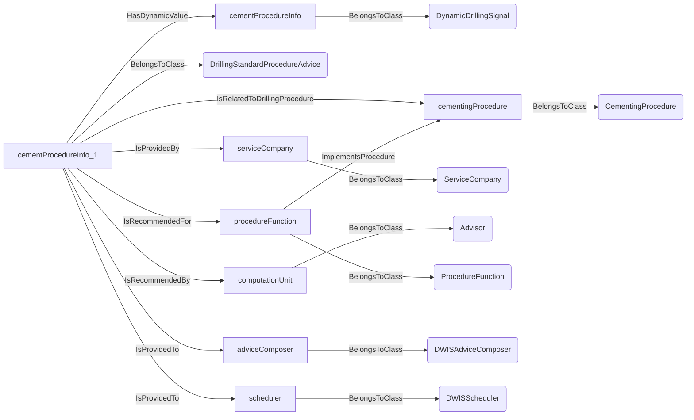
An example SparQL query looks like this:
```sparql
PREFIX rdf: <http://www.w3.org/1999/02/22-rdf-syntax-ns#>
PREFIX ddhub: <http://ddhub.no/>
PREFIX quantity: <http://ddhub.no/UnitAndQuantity>
SELECT ?cementProcedureInfo
WHERE {
	?cementProcedureInfo rdf:type ddhub:DynamicDrillingSignal .
	?cementProcedureInfo_1 rdf:type ddhub:DrillingStandardProcedureAdvice .
	?cementProcedureInfo_1 ddhub:HasDynamicValue ?cementProcedureInfo .
	?cementingProcedure rdf:type ddhub:CementingProcedure .
	?cementProcedureInfo_1 ddhub:IsRelatedToDrillingProcedure ?cementingProcedure .
	?serviceCompany rdf:type ddhub:ServiceCompany .
	?cementProcedureInfo_1 ddhub:IsProvidedBy ?serviceCompany .
	?computationUnit rdf:type ddhub:Advisor .
	?cementProcedureInfo_1 ddhub:IsRecommendedBy ?computationUnit .
	?procedureFunction rdf:type ddhub:ProcedureFunction .
	?procedureFunction ddhub:ImplementsProcedure ?cementingProcedure .
	?cementProcedureInfo_1 ddhub:IsRecommendedFor ?procedureFunction .
	?adviceComposer rdf:type ddhub:DWISAdviceComposer .
	?cementProcedureInfo_1 ddhub:IsProvidedTo ?adviceComposer .
	?scheduler rdf:type ddhub:DWISScheduler .
	?cementProcedureInfo_1 ddhub:IsProvidedTo ?scheduler .
}
```
The downlinking procedure is used to manipulate the flowrate/pressure or rotational speed to send a coded message to 
the rotary steerable system.
``` dwis downlinkProcedureInfo
DynamicDrillingSignal:downlinkProcedureInfo
DrillingStandardProcedureAdvice:downlinkProcedureInfo_1
downlinkProcedureInfo_1 HasDynamicValue downlinkProcedureInfo
DownlinkingProcedure:downlinkingProcedure
downlinkProcedureInfo_1 IsRelatedToDrillingProcedure downlinkingProcedure
ServiceCompany:serviceCompany
downlinkProcedureInfo_1 IsProvidedBy serviceCompany
Advisor:computationUnit
downlinkProcedureInfo_1 IsRecommendedBy computationUnit
ProcedureFunction:procedureFunction
procedureFunction ImplementsProcedure downlinkingProcedure
downlinkProcedureInfo_1 IsRecommendedFor procedureFunction
DWISAdviceComposer:adviceComposer
downlinkProcedureInfo_1 IsProvidedTo adviceComposer
DWISScheduler:scheduler
downlinkProcedureInfo_1 IsProvidedTo scheduler
```
An example semantic graph looks like as follow:

An example SparQL query looks like this:
```sparql
PREFIX rdf: <http://www.w3.org/1999/02/22-rdf-syntax-ns#>
PREFIX ddhub: <http://ddhub.no/>
PREFIX quantity: <http://ddhub.no/UnitAndQuantity>
SELECT ?downlinkProcedureInfo
WHERE {
	?downlinkProcedureInfo rdf:type ddhub:DynamicDrillingSignal .
	?downlinkProcedureInfo_1 rdf:type ddhub:DrillingStandardProcedureAdvice .
	?downlinkProcedureInfo_1 ddhub:HasDynamicValue ?downlinkProcedureInfo .
	?downlinkingProcedure rdf:type ddhub:DownlinkingProcedure .
	?downlinkProcedureInfo_1 ddhub:IsRelatedToDrillingProcedure ?downlinkingProcedure .
	?serviceCompany rdf:type ddhub:ServiceCompany .
	?downlinkProcedureInfo_1 ddhub:IsProvidedBy ?serviceCompany .
	?computationUnit rdf:type ddhub:Advisor .
	?downlinkProcedureInfo_1 ddhub:IsRecommendedBy ?computationUnit .
	?procedureFunction rdf:type ddhub:ProcedureFunction .
	?procedureFunction ddhub:ImplementsProcedure ?downlinkingProcedure .
	?downlinkProcedureInfo_1 ddhub:IsRecommendedFor ?procedureFunction .
	?adviceComposer rdf:type ddhub:DWISAdviceComposer .
	?downlinkProcedureInfo_1 ddhub:IsProvidedTo ?adviceComposer .
	?scheduler rdf:type ddhub:DWISScheduler .
	?downlinkProcedureInfo_1 ddhub:IsProvidedTo ?scheduler .
}
```
The toolface orientation procedure is used to manipulate the top of string angular position to ensure that the downhole
motor toolface is set to a desired set-point.
``` dwis toolfaceOrientationProcedureInfo
DynamicDrillingSignal:toolfaceOrientationProcedureInfo
DrillingStandardProcedureAdvice:toolfaceOrientationProcedureInfo_1
toolfaceOrientationProcedureInfo_1 HasDynamicValue toolfaceOrientationProcedureInfo
ToolfaceOrientationProcedure:toolfaceOrientationProcedure
toolfaceOrientationProcedureInfo_1 IsRelatedToDrillingProcedure toolfaceOrientationProcedure
ServiceCompany:serviceCompany
toolfaceOrientationProcedureInfo_1 IsProvidedBy serviceCompany
Advisor:computationUnit
toolfaceOrientationProcedureInfo_1 IsRecommendedBy computationUnit
ProcedureFunction:procedureFunction
procedureFunction ImplementsProcedure toolfaceOrientationProcedure
toolfaceOrientationProcedureInfo_1 IsRecommendedFor procedureFunction
DWISAdviceComposer:adviceComposer
toolfaceOrientationProcedureInfo_1 IsProvidedTo adviceComposer
DWISScheduler:scheduler
toolfaceOrientationProcedureInfo_1 IsProvidedTo scheduler
```
An example semantic graph looks like as follow:
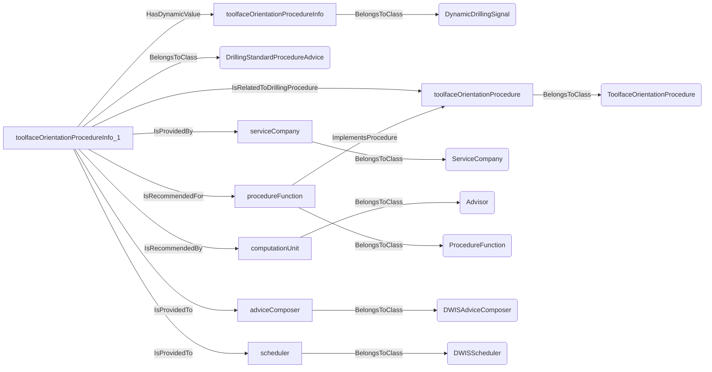
An example SparQL query looks like this:
```sparql
PREFIX rdf: <http://www.w3.org/1999/02/22-rdf-syntax-ns#>
PREFIX ddhub: <http://ddhub.no/>
PREFIX quantity: <http://ddhub.no/UnitAndQuantity>
SELECT ?toolfaceOrientationProcedureInfo
WHERE {
	?toolfaceOrientationProcedureInfo rdf:type ddhub:DynamicDrillingSignal .
	?toolfaceOrientationProcedureInfo_1 rdf:type ddhub:DrillingStandardProcedureAdvice .
	?toolfaceOrientationProcedureInfo_1 ddhub:HasDynamicValue ?toolfaceOrientationProcedureInfo .
	?toolfaceOrientationProcedure rdf:type ddhub:ToolfaceOrientationProcedure .
	?toolfaceOrientationProcedureInfo_1 ddhub:IsRelatedToDrillingProcedure ?toolfaceOrientationProcedure .
	?serviceCompany rdf:type ddhub:ServiceCompany .
	?toolfaceOrientationProcedureInfo_1 ddhub:IsProvidedBy ?serviceCompany .
	?computationUnit rdf:type ddhub:Advisor .
	?toolfaceOrientationProcedureInfo_1 ddhub:IsRecommendedBy ?computationUnit .
	?procedureFunction rdf:type ddhub:ProcedureFunction .
	?procedureFunction ddhub:ImplementsProcedure ?toolfaceOrientationProcedure .
	?toolfaceOrientationProcedureInfo_1 ddhub:IsRecommendedFor ?procedureFunction .
	?adviceComposer rdf:type ddhub:DWISAdviceComposer .
	?toolfaceOrientationProcedureInfo_1 ddhub:IsProvidedTo ?adviceComposer .
	?scheduler rdf:type ddhub:DWISScheduler .
	?toolfaceOrientationProcedureInfo_1 ddhub:IsProvidedTo ?scheduler .
}
```
## DrillingControlAdvice <!-- NOUN -->
- Display name: Drilling Control Advice
- Parent class: [AdvisorySystemAdvice](./AdvisorySystemAdvice.md#AdvisorySystemAdvice)
- Description: 
A drilling control advisor provides information on how to control a part of the drilling process to stay as close
as possible to one or several desired values.
- Definition set: AdvisorySystemAdvice
- Examples:
A ROP management controller adjusts the parameters of the auto-driller to manage the ROP. The ROP management may concern
potential problems with drill-string buckling, passing the bit founder point, vibration and cuttings transport.
``` dwis ROPManagementControllerInfo
DynamicDrillingSignal:ROPManagementControllerInfo
DrillingControlAdvice:ROPManagementControllerInfo_1
ROPManagementControllerInfo_1 HasDynamicValue ROPManagementControllerInfo
ROPLimit:ROPLimit_1
ROPManagementControllerInfo_1 HasControlLimit ROPLimit_1
WOBLimit:WOBLimit_1
ROPManagementControllerInfo_1 HasControlLimit WOBLimit_1
DifferentialPressureLimit:differentialPressureLimit
ROPManagementControllerInfo_1 HasControlLimit differentialPressureLimit
BottomOfStringReferenceLocation:bottomOfStringLocation
StableAxialVelocityObjective:stableAxialVelocityObjective
stableAxialVelocityObjective IsPhysicallyLocatedAt bottomOfStringLocation
ROPManagementControllerInfo_1 IsRelatedToDrillingObjective stableAxialVelocityObjective
StableAxialForceObjective:stableWOBObjective
stableWOBObjective IsPhysicallyLocatedAt bottomOfStringLocation
ROPManagementControllerInfo_1 IsRelatedToDrillingObjective stableWOBObjective
StablePressureObjective:stableDifferentialPressure
ROPManagementControllerInfo_1 IsRelatedToDrillingObjective stableDifferentialPressure
ServiceCompany:serviceCompany
ROPManagementControllerInfo_1 IsProvidedBy serviceCompany
Advisor:computationUnit
ROPManagementControllerInfo_1 IsRecommendedBy computationUnit
ControllerFunction:autoDriller
autoDriller ImplementsObjective stableAxialVelocityObjective
autoDriller ImplementsObjective stableWOBObjective
autoDriller ImplementsObjective stableDifferentialPressure
ROPManagementControllerInfo_1 IsRecommendedFor autoDriller
DWISAdviceComposer:adviceComposer
ROPManagementControllerInfo_1 IsProvidedTo adviceComposer
DWISScheduler:scheduler
ROPManagementControllerInfo_1 IsProvidedTo scheduler
```
An example semantic graph looks like as follow:
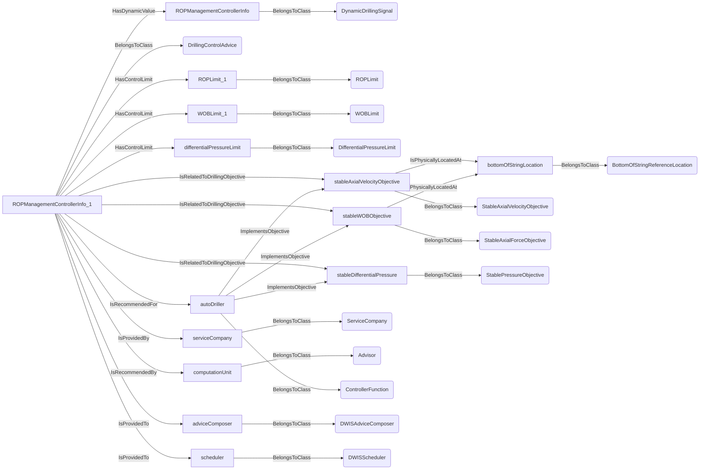
An example SparQL query looks like this:
```sparql
PREFIX rdf: <http://www.w3.org/1999/02/22-rdf-syntax-ns#>
PREFIX ddhub: <http://ddhub.no/>
PREFIX quantity: <http://ddhub.no/UnitAndQuantity>
SELECT ?ROPManagementControllerInfo
WHERE {
	?ROPManagementControllerInfo rdf:type ddhub:DynamicDrillingSignal .
	?ROPManagementControllerInfo_1 rdf:type ddhub:DrillingControlAdvice .
	?ROPManagementControllerInfo_1 ddhub:HasDynamicValue ?ROPManagementControllerInfo .
	?ROPLimit_1 rdf:type ddhub:ROPLimit .
	?ROPManagementControllerInfo_1 ddhub:HasControlLimit ?ROPLimit_1 .
	?WOBLimit_1 rdf:type ddhub:WOBLimit .
	?ROPManagementControllerInfo_1 ddhub:HasControlLimit ?WOBLimit_1 .
	?differentialPressureLimit rdf:type ddhub:DifferentialPressureLimit .
	?ROPManagementControllerInfo_1 ddhub:HasControlLimit ?differentialPressureLimit .
	?bottomOfStringLocation rdf:type ddhub:BottomOfStringReferenceLocation .
	?stableAxialVelocityObjective rdf:type ddhub:StableAxialVelocityObjective .
	?stableAxialVelocityObjective ddhub:IsPhysicallyLocatedAt ?bottomOfStringLocation .
	?ROPManagementControllerInfo_1 ddhub:IsRelatedToDrillingObjective ?stableAxialVelocityObjective .
	?stableWOBObjective rdf:type ddhub:StableAxialForceObjective .
	?stableWOBObjective ddhub:IsPhysicallyLocatedAt ?bottomOfStringLocation .
	?ROPManagementControllerInfo_1 ddhub:IsRelatedToDrillingObjective ?stableWOBObjective .
	?stableDifferentialPressure rdf:type ddhub:StablePressureObjective .
	?ROPManagementControllerInfo_1 ddhub:IsRelatedToDrillingObjective ?stableDifferentialPressure .
	?serviceCompany rdf:type ddhub:ServiceCompany .
	?ROPManagementControllerInfo_1 ddhub:IsProvidedBy ?serviceCompany .
	?computationUnit rdf:type ddhub:Advisor .
	?ROPManagementControllerInfo_1 ddhub:IsRecommendedBy ?computationUnit .
	?autoDriller rdf:type ddhub:ControllerFunction .
	?autoDriller ddhub:ImplementsObjective ?stableAxialVelocityObjective .
	?autoDriller ddhub:ImplementsObjective ?stableWOBObjective .
	?autoDriller ddhub:ImplementsObjective ?stableDifferentialPressure .
	?ROPManagementControllerInfo_1 ddhub:IsRecommendedFor ?autoDriller .
	?adviceComposer rdf:type ddhub:DWISAdviceComposer .
	?ROPManagementControllerInfo_1 ddhub:IsProvidedTo ?adviceComposer .
	?scheduler rdf:type ddhub:DWISScheduler .
	?ROPManagementControllerInfo_1 ddhub:IsProvidedTo ?scheduler .
}
```
When using a downhole motor for directional drilling, pipe rocking is used to assist with weight transmission during
slide periods.
``` dwis pipeRockingControllerInfo
DynamicDrillingSignal:pipeRockingControllerInfo
DrillingControlAdvice:pipeRockingControllerInfo_1
pipeRockingControllerInfo_1 HasDynamicValue pipeRockingControllerInfo
BottomOfStringReferenceLocation:bottomOfStringLocation
WeightTransferObjective:weightTransferObjective
weightTransferObjective IsPhysicallyLocatedAt bottomOfStringLocation
pipeRockingControllerInfo_1 IsRelatedToDrillingObjective weightTransferObjective
ServiceCompany:serviceCompany
pipeRockingControllerInfo_1 IsProvidedBy serviceCompany
Advisor:computationUnit
pipeRockingControllerInfo_1 IsRecommendedBy computationUnit
ControllerFunction:pipeRocking
pipeRocking ImplementsObjective weightTransferObjective
pipeRockingControllerInfo_1 IsRecommendedFor pipeRocking
DWISAdviceComposer:adviceComposer
pipeRockingControllerInfo_1 IsProvidedTo adviceComposer
DWISScheduler:scheduler
pipeRockingControllerInfo_1 IsProvidedTo scheduler
```
An example semantic graph looks like as follow:
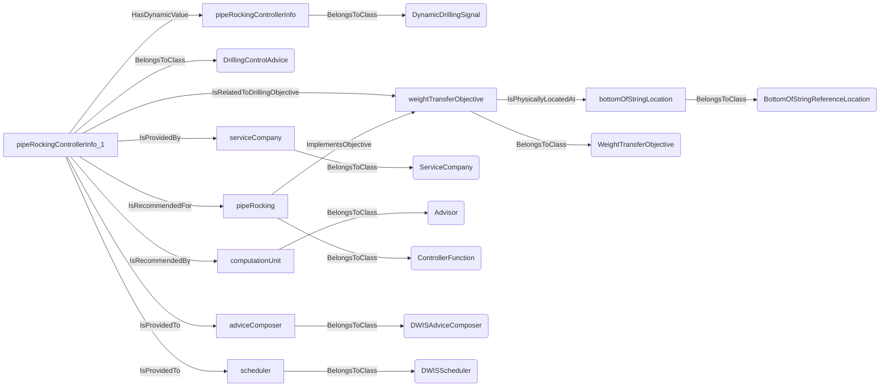
An example SparQL query looks like this:
```sparql
PREFIX rdf: <http://www.w3.org/1999/02/22-rdf-syntax-ns#>
PREFIX ddhub: <http://ddhub.no/>
PREFIX quantity: <http://ddhub.no/UnitAndQuantity>
SELECT ?pipeRockingControllerInfo
WHERE {
	?pipeRockingControllerInfo rdf:type ddhub:DynamicDrillingSignal .
	?pipeRockingControllerInfo_1 rdf:type ddhub:DrillingControlAdvice .
	?pipeRockingControllerInfo_1 ddhub:HasDynamicValue ?pipeRockingControllerInfo .
	?bottomOfStringLocation rdf:type ddhub:BottomOfStringReferenceLocation .
	?weightTransferObjective rdf:type ddhub:WeightTransferObjective .
	?weightTransferObjective ddhub:IsPhysicallyLocatedAt ?bottomOfStringLocation .
	?pipeRockingControllerInfo_1 ddhub:IsRelatedToDrillingObjective ?weightTransferObjective .
	?serviceCompany rdf:type ddhub:ServiceCompany .
	?pipeRockingControllerInfo_1 ddhub:IsProvidedBy ?serviceCompany .
	?computationUnit rdf:type ddhub:Advisor .
	?pipeRockingControllerInfo_1 ddhub:IsRecommendedBy ?computationUnit .
	?pipeRocking rdf:type ddhub:ControllerFunction .
	?pipeRocking ddhub:ImplementsObjective ?weightTransferObjective .
	?pipeRockingControllerInfo_1 ddhub:IsRecommendedFor ?pipeRocking .
	?adviceComposer rdf:type ddhub:DWISAdviceComposer .
	?pipeRockingControllerInfo_1 ddhub:IsProvidedTo ?adviceComposer .
	?scheduler rdf:type ddhub:DWISScheduler .
	?pipeRockingControllerInfo_1 ddhub:IsProvidedTo ?scheduler .
}
```
A stick-slip mitigation controller attempts at damping stick-slip oscillations by controlling the drill-string rotation 
system.
``` dwis stickSlipMitigationControllerInfo
DynamicDrillingSignal:stickSlipMitigationControllerInfo
DrillingControlAdvice:stickSlipMitigationControllerInfo_1
stickSlipMitigationControllerInfo_1 HasDynamicValue stickSlipMitigationControllerInfo
BottomOfStringReferenceLocation:bottomOfStringLocation
StableRotationalVelocityObjective:stableRotationalVelocityObjective
stableRotationalVelocityObjective IsPhysicallyLocatedAt bottomOfStringLocation
stickSlipMitigationControllerInfo_1 IsRelatedToDrillingObjective stableRotationalVelocityObjective
ServiceCompany:serviceCompany
stickSlipMitigationControllerInfo_1 IsProvidedBy serviceCompany
Advisor:computationUnit
stickSlipMitigationControllerInfo_1 IsRecommendedBy computationUnit
ControllerFunction:stickSlipMitigation
stickSlipMitigation ImplementsObjective stableRotationalVelocityObjective
stickSlipMitigationControllerInfo_1 IsRecommendedFor stickSlipMitigation
DWISAdviceComposer:adviceComposer
stickSlipMitigationControllerInfo_1 IsProvidedTo adviceComposer
DWISScheduler:scheduler
stickSlipMitigationControllerInfo_1 IsProvidedTo scheduler
```
An example semantic graph looks like as follow:
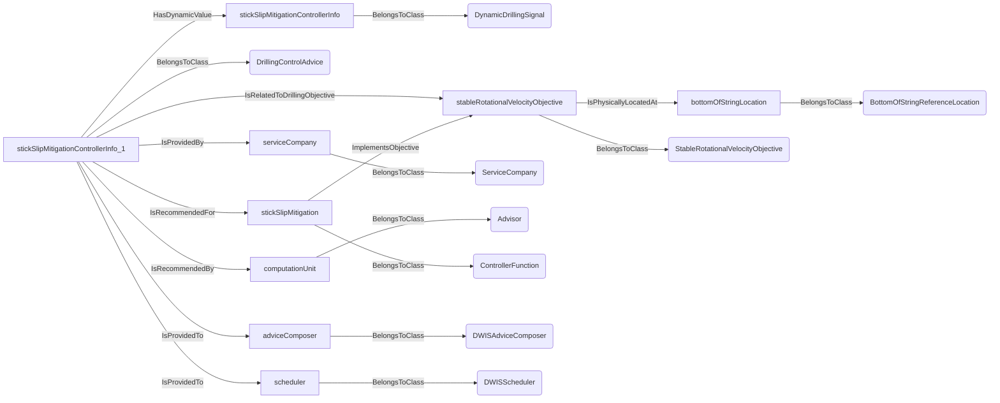
An example SparQL query looks like this:
```sparql
PREFIX rdf: <http://www.w3.org/1999/02/22-rdf-syntax-ns#>
PREFIX ddhub: <http://ddhub.no/>
PREFIX quantity: <http://ddhub.no/UnitAndQuantity>
SELECT ?stickSlipMitigationControllerInfo
WHERE {
	?stickSlipMitigationControllerInfo rdf:type ddhub:DynamicDrillingSignal .
	?stickSlipMitigationControllerInfo_1 rdf:type ddhub:DrillingControlAdvice .
	?stickSlipMitigationControllerInfo_1 ddhub:HasDynamicValue ?stickSlipMitigationControllerInfo .
	?bottomOfStringLocation rdf:type ddhub:BottomOfStringReferenceLocation .
	?stableRotationalVelocityObjective rdf:type ddhub:StableRotationalVelocityObjective .
	?stableRotationalVelocityObjective ddhub:IsPhysicallyLocatedAt ?bottomOfStringLocation .
	?stickSlipMitigationControllerInfo_1 ddhub:IsRelatedToDrillingObjective ?stableRotationalVelocityObjective .
	?serviceCompany rdf:type ddhub:ServiceCompany .
	?stickSlipMitigationControllerInfo_1 ddhub:IsProvidedBy ?serviceCompany .
	?computationUnit rdf:type ddhub:Advisor .
	?stickSlipMitigationControllerInfo_1 ddhub:IsRecommendedBy ?computationUnit .
	?stickSlipMitigation rdf:type ddhub:ControllerFunction .
	?stickSlipMitigation ddhub:ImplementsObjective ?stableRotationalVelocityObjective .
	?stickSlipMitigationControllerInfo_1 ddhub:IsRecommendedFor ?stickSlipMitigation .
	?adviceComposer rdf:type ddhub:DWISAdviceComposer .
	?stickSlipMitigationControllerInfo_1 ddhub:IsProvidedTo ?adviceComposer .
	?scheduler rdf:type ddhub:DWISScheduler .
	?stickSlipMitigationControllerInfo_1 ddhub:IsProvidedTo ?scheduler .
}
```
## DrillingSafeOperatingEnvelopeAdvice <!-- NOUN -->
- Display name: Drilling Safe Operating Envelope Advice
- Parent class: [AdvisorySystemAdvice](./AdvisorySystemAdvice.md#AdvisorySystemAdvice)
- Description: 
A safe operating envelope (SOE) advisor provides information on the limits that shall be used when controlling the drilling
process to avoid possible drilling incidents.
- Definition set: AdvisorySystemAdvice
- Examples:
The min-max axial velocity SOE is used to limit the axial drill-strem velocity to avoid generating swab and surge 
pressures that exceeds the geo-pressure window.
``` dwis minMaxAxialVelocitySOEInfo
DynamicDrillingSignal:minMaxAxialVelocitySOEInfo
DrillingSafeOperatingEnvelopeAdvice:minMaxAxialVelocitySOEInfo_1
minMaxAxialVelocitySOEInfo_1 HasDynamicValue minMaxAxialVelocitySOEInfo
AxialVelocityLimit:axialVelocityLimit
minMaxAxialVelocitySOEInfo_1 IsRelatedToDrillingLimit axialVelocityLimit
ServiceCompany:serviceCompany
minMaxAxialVelocitySOEInfo_1 IsProvidedBy serviceCompany
Advisor:computationUnit
minMaxAxialVelocitySOEInfo_1 IsRecommendedBy computationUnit
SOEFunction:soeFunction
soeFunction ImplementsLimit axialVelocityLimit
minMaxAxialVelocitySOEInfo_1 IsRecommendedFor soeFunction
DWISAdviceComposer:adviceComposer
minMaxAxialVelocitySOEInfo_1 IsProvidedTo adviceComposer
DWISScheduler:scheduler
minMaxAxialVelocitySOEInfo_1 IsProvidedTo scheduler
```
An example semantic graph looks like as follow:
```mermaid
graph LR
	N0000[minMaxAxialVelocitySOEInfo] -->|BelongsToClass| N0001(DynamicDrillingSignal) 
	N0002[minMaxAxialVelocitySOEInfo_1] -->|BelongsToClass| N0003(DrillingSafeOperatingEnvelopeAdvice) 
	N0002[minMaxAxialVelocitySOEInfo_1] -->|HasDynamicValue| N0000[minMaxAxialVelocitySOEInfo] 
	N0004[axialVelocityLimit] -->|BelongsToClass| N0005(AxialVelocityLimit) 
	N0002[minMaxAxialVelocitySOEInfo_1] -->|IsRelatedToDrillingLimit| N0004[axialVelocityLimit] 
	N0006[serviceCompany] -->|BelongsToClass| N0007(ServiceCompany) 
	N0002[minMaxAxialVelocitySOEInfo_1] -->|IsProvidedBy| N0006[serviceCompany] 
	N0008[computationUnit] -->|BelongsToClass| N0009(Advisor) 
	N0002[minMaxAxialVelocitySOEInfo_1] -->|IsRecommendedBy| N0008[computationUnit] 
	N0010[soeFunction] -->|BelongsToClass| N0011(SOEFunction) 
	N0010[soeFunction] -->|ImplementsLimit| N0004[axialVelocityLimit] 
	N0002[minMaxAxialVelocitySOEInfo_1] -->|IsRecommendedFor| N0010[soeFunction] 
	N0012[adviceComposer] -->|BelongsToClass| N0013(DWISAdviceComposer) 
	N0002[minMaxAxialVelocitySOEInfo_1] -->|IsProvidedTo| N0012[adviceComposer] 
	N0014[scheduler] -->|BelongsToClass| N0015(DWISScheduler) 
	N0002[minMaxAxialVelocitySOEInfo_1] -->|IsProvidedTo| N0014[scheduler] 
```
An example SparQL query looks like this:
```sparql
PREFIX rdf: <http://www.w3.org/1999/02/22-rdf-syntax-ns#>
PREFIX ddhub: <http://ddhub.no/>
PREFIX quantity: <http://ddhub.no/UnitAndQuantity>
SELECT ?minMaxAxialVelocitySOEInfo
WHERE {
	?minMaxAxialVelocitySOEInfo rdf:type ddhub:DynamicDrillingSignal .
	?minMaxAxialVelocitySOEInfo_1 rdf:type ddhub:DrillingSafeOperatingEnvelopeAdvice .
	?minMaxAxialVelocitySOEInfo_1 ddhub:HasDynamicValue ?minMaxAxialVelocitySOEInfo .
	?axialVelocityLimit rdf:type ddhub:AxialVelocityLimit .
	?minMaxAxialVelocitySOEInfo_1 ddhub:IsRelatedToDrillingLimit ?axialVelocityLimit .
	?serviceCompany rdf:type ddhub:ServiceCompany .
	?minMaxAxialVelocitySOEInfo_1 ddhub:IsProvidedBy ?serviceCompany .
	?computationUnit rdf:type ddhub:Advisor .
	?minMaxAxialVelocitySOEInfo_1 ddhub:IsRecommendedBy ?computationUnit .
	?soeFunction rdf:type ddhub:SOEFunction .
	?soeFunction ddhub:ImplementsLimit ?axialVelocityLimit .
	?minMaxAxialVelocitySOEInfo_1 ddhub:IsRecommendedFor ?soeFunction .
	?adviceComposer rdf:type ddhub:DWISAdviceComposer .
	?minMaxAxialVelocitySOEInfo_1 ddhub:IsProvidedTo ?adviceComposer .
	?scheduler rdf:type ddhub:DWISScheduler .
	?minMaxAxialVelocitySOEInfo_1 ddhub:IsProvidedTo ?scheduler .
}
```
The min-max flowrate SOE is used to limit the flowrate in order to stay below the fracturing pressure limit of the open
hole formation and have a sufficient flowrate to transport cuttings to the surface.
``` dwis minMaxFlowRateSOEInfo
DynamicDrillingSignal:minMaxFlowRateSOEInfo
DrillingSafeOperatingEnvelopeAdvice:minMaxFlowRateSOEInfo_1
minMaxFlowRateSOEInfo_1 HasDynamicValue minMaxFlowRateSOEInfo
FlowrateLimit:flowrateLimit
minMaxFlowRateSOEInfo_1 IsRelatedToDrillingLimit flowrateLimit
ServiceCompany:serviceCompany
minMaxFlowRateSOEInfo_1 IsProvidedBy serviceCompany
Advisor:computationUnit
minMaxFlowRateSOEInfo_1 IsRecommendedBy computationUnit
SOEFunction:soeFunction
soeFunction ImplementsLimit flowrateLimit
minMaxFlowRateSOEInfo_1 IsRecommendedFor soeFunction
DWISAdviceComposer:adviceComposer
minMaxFlowRateSOEInfo_1 IsProvidedTo adviceComposer
DWISScheduler:scheduler
minMaxFlowRateSOEInfo_1 IsProvidedTo scheduler
```
An example semantic graph looks like as follow:
```mermaid
graph LR
	N0000[minMaxFlowRateSOEInfo] -->|BelongsToClass| N0001(DynamicDrillingSignal) 
	N0002[minMaxFlowRateSOEInfo_1] -->|BelongsToClass| N0003(DrillingSafeOperatingEnvelopeAdvice) 
	N0002[minMaxFlowRateSOEInfo_1] -->|HasDynamicValue| N0000[minMaxFlowRateSOEInfo] 
	N0004[flowrateLimit] -->|BelongsToClass| N0005(FlowrateLimit) 
	N0002[minMaxFlowRateSOEInfo_1] -->|IsRelatedToDrillingLimit| N0004[flowrateLimit] 
	N0006[serviceCompany] -->|BelongsToClass| N0007(ServiceCompany) 
	N0002[minMaxFlowRateSOEInfo_1] -->|IsProvidedBy| N0006[serviceCompany] 
	N0008[computationUnit] -->|BelongsToClass| N0009(Advisor) 
	N0002[minMaxFlowRateSOEInfo_1] -->|IsRecommendedBy| N0008[computationUnit] 
	N0010[soeFunction] -->|BelongsToClass| N0011(SOEFunction) 
	N0010[soeFunction] -->|ImplementsLimit| N0004[flowrateLimit] 
	N0002[minMaxFlowRateSOEInfo_1] -->|IsRecommendedFor| N0010[soeFunction] 
	N0012[adviceComposer] -->|BelongsToClass| N0013(DWISAdviceComposer) 
	N0002[minMaxFlowRateSOEInfo_1] -->|IsProvidedTo| N0012[adviceComposer] 
	N0014[scheduler] -->|BelongsToClass| N0015(DWISScheduler) 
	N0002[minMaxFlowRateSOEInfo_1] -->|IsProvidedTo| N0014[scheduler] 
```
An example SparQL query looks like this:
```sparql
PREFIX rdf: <http://www.w3.org/1999/02/22-rdf-syntax-ns#>
PREFIX ddhub: <http://ddhub.no/>
PREFIX quantity: <http://ddhub.no/UnitAndQuantity>
SELECT ?minMaxFlowRateSOEInfo
WHERE {
	?minMaxFlowRateSOEInfo rdf:type ddhub:DynamicDrillingSignal .
	?minMaxFlowRateSOEInfo_1 rdf:type ddhub:DrillingSafeOperatingEnvelopeAdvice .
	?minMaxFlowRateSOEInfo_1 ddhub:HasDynamicValue ?minMaxFlowRateSOEInfo .
	?flowrateLimit rdf:type ddhub:FlowrateLimit .
	?minMaxFlowRateSOEInfo_1 ddhub:IsRelatedToDrillingLimit ?flowrateLimit .
	?serviceCompany rdf:type ddhub:ServiceCompany .
	?minMaxFlowRateSOEInfo_1 ddhub:IsProvidedBy ?serviceCompany .
	?computationUnit rdf:type ddhub:Advisor .
	?minMaxFlowRateSOEInfo_1 ddhub:IsRecommendedBy ?computationUnit .
	?soeFunction rdf:type ddhub:SOEFunction .
	?soeFunction ddhub:ImplementsLimit ?flowrateLimit .
	?minMaxFlowRateSOEInfo_1 ddhub:IsRecommendedFor ?soeFunction .
	?adviceComposer rdf:type ddhub:DWISAdviceComposer .
	?minMaxFlowRateSOEInfo_1 ddhub:IsProvidedTo ?adviceComposer .
	?scheduler rdf:type ddhub:DWISScheduler .
	?minMaxFlowRateSOEInfo_1 ddhub:IsProvidedTo ?scheduler .
}
```
The min-max rotational speed SOE limits the drill-stem rotational speed to avoid unwanted drill-stem vibrations while at
the same time be sufficient to facilitate cuttings transport.
``` dwis minMaxRotationalSpeedSOEInfo
DynamicDrillingSignal:minMaxRotationalSpeedSOEInfo
DrillingSafeOperatingEnvelopeAdvice:minMaxRotationalSpeedSOEInfo_1
minMaxRotationalSpeedSOEInfo_1 HasDynamicValue minMaxRotationalSpeedSOEInfo
RotationalVelocityLimit:rotationalVelocityLimit
minMaxRotationalSpeedSOEInfo_1 IsRelatedToDrillingLimit rotationalVelocityLimit
ServiceCompany:serviceCompany
minMaxRotationalSpeedSOEInfo_1 IsProvidedBy serviceCompany
Advisor:computationUnit
minMaxRotationalSpeedSOEInfo_1 IsRecommendedBy computationUnit
SOEFunction:soeFunction
soeFunction ImplementsLimit rotationalVelocityLimit
minMaxRotationalSpeedSOEInfo_1 IsRecommendedFor soeFunction
DWISAdviceComposer:adviceComposer
minMaxRotationalSpeedSOEInfo_1 IsProvidedTo adviceComposer
DWISScheduler:scheduler
minMaxRotationalSpeedSOEInfo_1 IsProvidedTo scheduler
```
An example semantic graph looks like as follow:
```mermaid
graph LR
	N0000[minMaxRotationalSpeedSOEInfo] -->|BelongsToClass| N0001(DynamicDrillingSignal) 
	N0002[minMaxRotationalSpeedSOEInfo_1] -->|BelongsToClass| N0003(DrillingSafeOperatingEnvelopeAdvice) 
	N0002[minMaxRotationalSpeedSOEInfo_1] -->|HasDynamicValue| N0000[minMaxRotationalSpeedSOEInfo] 
	N0004[rotationalVelocityLimit] -->|BelongsToClass| N0005(RotationalVelocityLimit) 
	N0002[minMaxRotationalSpeedSOEInfo_1] -->|IsRelatedToDrillingLimit| N0004[rotationalVelocityLimit] 
	N0006[serviceCompany] -->|BelongsToClass| N0007(ServiceCompany) 
	N0002[minMaxRotationalSpeedSOEInfo_1] -->|IsProvidedBy| N0006[serviceCompany] 
	N0008[computationUnit] -->|BelongsToClass| N0009(Advisor) 
	N0002[minMaxRotationalSpeedSOEInfo_1] -->|IsRecommendedBy| N0008[computationUnit] 
	N0010[soeFunction] -->|BelongsToClass| N0011(SOEFunction) 
	N0010[soeFunction] -->|ImplementsLimit| N0004[rotationalVelocityLimit] 
	N0002[minMaxRotationalSpeedSOEInfo_1] -->|IsRecommendedFor| N0010[soeFunction] 
	N0012[adviceComposer] -->|BelongsToClass| N0013(DWISAdviceComposer) 
	N0002[minMaxRotationalSpeedSOEInfo_1] -->|IsProvidedTo| N0012[adviceComposer] 
	N0014[scheduler] -->|BelongsToClass| N0015(DWISScheduler) 
	N0002[minMaxRotationalSpeedSOEInfo_1] -->|IsProvidedTo| N0014[scheduler] 
```
An example SparQL query looks like this:
```sparql
PREFIX rdf: <http://www.w3.org/1999/02/22-rdf-syntax-ns#>
PREFIX ddhub: <http://ddhub.no/>
PREFIX quantity: <http://ddhub.no/UnitAndQuantity>
SELECT ?minMaxRotationalSpeedSOEInfo
WHERE {
	?minMaxRotationalSpeedSOEInfo rdf:type ddhub:DynamicDrillingSignal .
	?minMaxRotationalSpeedSOEInfo_1 rdf:type ddhub:DrillingSafeOperatingEnvelopeAdvice .
	?minMaxRotationalSpeedSOEInfo_1 ddhub:HasDynamicValue ?minMaxRotationalSpeedSOEInfo .
	?rotationalVelocityLimit rdf:type ddhub:RotationalVelocityLimit .
	?minMaxRotationalSpeedSOEInfo_1 ddhub:IsRelatedToDrillingLimit ?rotationalVelocityLimit .
	?serviceCompany rdf:type ddhub:ServiceCompany .
	?minMaxRotationalSpeedSOEInfo_1 ddhub:IsProvidedBy ?serviceCompany .
	?computationUnit rdf:type ddhub:Advisor .
	?minMaxRotationalSpeedSOEInfo_1 ddhub:IsRecommendedBy ?computationUnit .
	?soeFunction rdf:type ddhub:SOEFunction .
	?soeFunction ddhub:ImplementsLimit ?rotationalVelocityLimit .
	?minMaxRotationalSpeedSOEInfo_1 ddhub:IsRecommendedFor ?soeFunction .
	?adviceComposer rdf:type ddhub:DWISAdviceComposer .
	?minMaxRotationalSpeedSOEInfo_1 ddhub:IsProvidedTo ?adviceComposer .
	?scheduler rdf:type ddhub:DWISScheduler .
	?minMaxRotationalSpeedSOEInfo_1 ddhub:IsProvidedTo ?scheduler .
}
```
## DrillingFaultDetectionIsolationAndRecoveryAdvice <!-- NOUN -->
- Display name: Drilling Fault Detection Isolation and Recovery Advice
- Parent class: [AdvisorySystemAdvice](./AdvisorySystemAdvice.md#AdvisorySystemAdvice)
- Description: 
A fault detection, isolation and recovery (FDIR) advisor provides information on how to detect an drilling incident
and parameters to procedure that is executed when a drilling incident is detected in order to first to isolate the drilling incident
and then possibly recover from that incident.
- Definition set: AdvisorySystemAdvice
- Examples:
A pack-off FDIR function detects an abornormal dowhole pressure and executes a procedure to avoid fracturing the
open hole formation and possibly continues with a procedure to remediate the cause of the pack-off and return to normal conditions.
``` dwis PackOffFDIRInfo
DynamicDrillingSignal:PackOffFDIRInfo
DrillingFaultDetectionIsolationAndRecoveryAdvice:PackOffFDIRInfo_1
PackOffFDIRInfo_1 HasDynamicValue PackOffFDIRInfo
PackOff:packOffIncident
PackOffFDIRInfo_1 IsRelatedToDrillingIncident packOffIncident
ServiceCompany:serviceCompany
PackOffFDIRInfo_1 IsProvidedBy serviceCompany
Advisor:computationUnit
PackOffFDIRInfo_1 IsRecommendedBy computationUnit
FDIRFunction:FDIRFunction_1
FDIRFunction_1 ManagesIncident packOffIncident
PackOffFDIRInfo_1 IsRecommendedFor FDIRFunction_1
DWISAdviceComposer:adviceComposer
PackOffFDIRInfo_1 IsProvidedTo adviceComposer
```
An example semantic graph looks like as follow:
```mermaid
graph LR
	N0000[PackOffFDIRInfo] -->|BelongsToClass| N0001(DynamicDrillingSignal) 
	N0002[PackOffFDIRInfo_1] -->|BelongsToClass| N0003(DrillingFaultDetectionIsolationAndRecoveryAdvice) 
	N0002[PackOffFDIRInfo_1] -->|HasDynamicValue| N0000[PackOffFDIRInfo] 
	N0004[packOffIncident] -->|BelongsToClass| N0005(PackOff) 
	N0002[PackOffFDIRInfo_1] -->|IsRelatedToDrillingIncident| N0004[packOffIncident] 
	N0006[serviceCompany] -->|BelongsToClass| N0007(ServiceCompany) 
	N0002[PackOffFDIRInfo_1] -->|IsProvidedBy| N0006[serviceCompany] 
	N0008[computationUnit] -->|BelongsToClass| N0009(Advisor) 
	N0002[PackOffFDIRInfo_1] -->|IsRecommendedBy| N0008[computationUnit] 
	N0010[FDIRFunction_1] -->|BelongsToClass| N0011(FDIRFunction) 
	N0010[FDIRFunction_1] -->|ManagesIncident| N0004[packOffIncident] 
	N0002[PackOffFDIRInfo_1] -->|IsRecommendedFor| N0010[FDIRFunction_1] 
	N0012[adviceComposer] -->|BelongsToClass| N0013(DWISAdviceComposer) 
	N0002[PackOffFDIRInfo_1] -->|IsProvidedTo| N0012[adviceComposer] 
```
An example SparQL query looks like this:
```sparql
PREFIX rdf: <http://www.w3.org/1999/02/22-rdf-syntax-ns#>
PREFIX ddhub: <http://ddhub.no/>
PREFIX quantity: <http://ddhub.no/UnitAndQuantity>
SELECT ?PackOffFDIRInfo
WHERE {
	?PackOffFDIRInfo rdf:type ddhub:DynamicDrillingSignal .
	?PackOffFDIRInfo_1 rdf:type ddhub:DrillingFaultDetectionIsolationAndRecoveryAdvice .
	?PackOffFDIRInfo_1 ddhub:HasDynamicValue ?PackOffFDIRInfo .
	?packOffIncident rdf:type ddhub:PackOff .
	?PackOffFDIRInfo_1 ddhub:IsRelatedToDrillingIncident ?packOffIncident .
	?serviceCompany rdf:type ddhub:ServiceCompany .
	?PackOffFDIRInfo_1 ddhub:IsProvidedBy ?serviceCompany .
	?computationUnit rdf:type ddhub:Advisor .
	?PackOffFDIRInfo_1 ddhub:IsRecommendedBy ?computationUnit .
	?FDIRFunction_1 rdf:type ddhub:FDIRFunction .
	?FDIRFunction_1 ddhub:ManagesIncident ?packOffIncident .
	?PackOffFDIRInfo_1 ddhub:IsRecommendedFor ?FDIRFunction_1 .
	?adviceComposer rdf:type ddhub:DWISAdviceComposer .
	?PackOffFDIRInfo_1 ddhub:IsProvidedTo ?adviceComposer .
}
```
An overpull/underpull function detects an abnormal hook-load either while moving upward (overpull) or downward (underpull).
It reacts to the situation by stopping the axial movement and possibly starts other actions to remediate for the cause of the abnormal
hook-load with the objective to return to normal conditions.
``` dwis overpullUnderpullFDIRInfo
DynamicDrillingSignal:overpullUnderpullFDIRInfo
DrillingFaultDetectionIsolationAndRecoveryAdvice:overpullUnderpullFDIRInfo_1
overpullUnderpullFDIRInfo_1 HasDynamicValue overpullUnderpullFDIRInfo
Overpull:overpullIncident
overpullUnderpullFDIRInfo_1 IsRelatedToDrillingIncident overpullIncident
Underpull:underpullIncident
overpullUnderpullFDIRInfo_1 IsRelatedToDrillingIncident underpullIncident
ServiceCompany:serviceCompany
overpullUnderpullFDIRInfo_1 IsProvidedBy serviceCompany
Advisor:computationUnit
overpullUnderpullFDIRInfo_1 IsRecommendedBy computationUnit
FDIRFunction:FDIRFunction_1
FDIRFunction_1 ManagesIncident overpullIncident
FDIRFunction_1 ManagesIncident underpullIncident
overpullUnderpullFDIRInfo_1 IsRecommendedFor FDIRFunction_1
DWISAdviceComposer:adviceComposer
overpullUnderpullFDIRInfo_1 IsProvidedTo adviceComposer
```
An example semantic graph looks like as follow:
```mermaid
graph LR
	N0000[overpullUnderpullFDIRInfo] -->|BelongsToClass| N0001(DynamicDrillingSignal) 
	N0002[overpullUnderpullFDIRInfo_1] -->|BelongsToClass| N0003(DrillingFaultDetectionIsolationAndRecoveryAdvice) 
	N0002[overpullUnderpullFDIRInfo_1] -->|HasDynamicValue| N0000[overpullUnderpullFDIRInfo] 
	N0004[overpullIncident] -->|BelongsToClass| N0005(Overpull) 
	N0002[overpullUnderpullFDIRInfo_1] -->|IsRelatedToDrillingIncident| N0004[overpullIncident] 
	N0006[underpullIncident] -->|BelongsToClass| N0007(Underpull) 
	N0002[overpullUnderpullFDIRInfo_1] -->|IsRelatedToDrillingIncident| N0006[underpullIncident] 
	N0008[serviceCompany] -->|BelongsToClass| N0009(ServiceCompany) 
	N0002[overpullUnderpullFDIRInfo_1] -->|IsProvidedBy| N0008[serviceCompany] 
	N0010[computationUnit] -->|BelongsToClass| N0011(Advisor) 
	N0002[overpullUnderpullFDIRInfo_1] -->|IsRecommendedBy| N0010[computationUnit] 
	N0012[FDIRFunction_1] -->|BelongsToClass| N0013(FDIRFunction) 
	N0012[FDIRFunction_1] -->|ManagesIncident| N0004[overpullIncident] 
	N0012[FDIRFunction_1] -->|ManagesIncident| N0006[underpullIncident] 
	N0002[overpullUnderpullFDIRInfo_1] -->|IsRecommendedFor| N0012[FDIRFunction_1] 
	N0014[adviceComposer] -->|BelongsToClass| N0015(DWISAdviceComposer) 
	N0002[overpullUnderpullFDIRInfo_1] -->|IsProvidedTo| N0014[adviceComposer] 
```
An example SparQL query looks like this:
```sparql
PREFIX rdf: <http://www.w3.org/1999/02/22-rdf-syntax-ns#>
PREFIX ddhub: <http://ddhub.no/>
PREFIX quantity: <http://ddhub.no/UnitAndQuantity>
SELECT ?overpullUnderpullFDIRInfo
WHERE {
	?overpullUnderpullFDIRInfo rdf:type ddhub:DynamicDrillingSignal .
	?overpullUnderpullFDIRInfo_1 rdf:type ddhub:DrillingFaultDetectionIsolationAndRecoveryAdvice .
	?overpullUnderpullFDIRInfo_1 ddhub:HasDynamicValue ?overpullUnderpullFDIRInfo .
	?overpullIncident rdf:type ddhub:Overpull .
	?overpullUnderpullFDIRInfo_1 ddhub:IsRelatedToDrillingIncident ?overpullIncident .
	?underpullIncident rdf:type ddhub:Underpull .
	?overpullUnderpullFDIRInfo_1 ddhub:IsRelatedToDrillingIncident ?underpullIncident .
	?serviceCompany rdf:type ddhub:ServiceCompany .
	?overpullUnderpullFDIRInfo_1 ddhub:IsProvidedBy ?serviceCompany .
	?computationUnit rdf:type ddhub:Advisor .
	?overpullUnderpullFDIRInfo_1 ddhub:IsRecommendedBy ?computationUnit .
	?FDIRFunction_1 rdf:type ddhub:FDIRFunction .
	?FDIRFunction_1 ddhub:ManagesIncident ?overpullIncident .
	?FDIRFunction_1 ddhub:ManagesIncident ?underpullIncident .
	?overpullUnderpullFDIRInfo_1 ddhub:IsRecommendedFor ?FDIRFunction_1 .
	?adviceComposer rdf:type ddhub:DWISAdviceComposer .
	?overpullUnderpullFDIRInfo_1 ddhub:IsProvidedTo ?adviceComposer .
}
```
This is the same as for an OverpullUnderpullFDIRAdvice but only deals with overpulls.
``` dwis overpullFDIRInfo
DynamicDrillingSignal:overpullFDIRInfo
DrillingFaultDetectionIsolationAndRecoveryAdvice:overpullFDIRInfo_1
overpullFDIRInfo_1 HasDynamicValue overpullFDIRInfo
Overpull:overpullIncident
overpullFDIRInfo_1 IsRelatedToDrillingIncident overpullIncident
ServiceCompany:serviceCompany
overpullFDIRInfo_1 IsProvidedBy serviceCompany
Advisor:computationUnit
overpullFDIRInfo_1 IsRecommendedBy computationUnit
FDIRFunction:FDIRFunction_1
FDIRFunction_1 ManagesIncident overpullIncident
overpullFDIRInfo_1 IsRecommendedFor FDIRFunction_1
DWISAdviceComposer:adviceComposer
overpullFDIRInfo_1 IsProvidedTo adviceComposer
```
An example semantic graph looks like as follow:
```mermaid
graph LR
	N0000[overpullFDIRInfo] -->|BelongsToClass| N0001(DynamicDrillingSignal) 
	N0002[overpullFDIRInfo_1] -->|BelongsToClass| N0003(DrillingFaultDetectionIsolationAndRecoveryAdvice) 
	N0002[overpullFDIRInfo_1] -->|HasDynamicValue| N0000[overpullFDIRInfo] 
	N0004[overpullIncident] -->|BelongsToClass| N0005(Overpull) 
	N0002[overpullFDIRInfo_1] -->|IsRelatedToDrillingIncident| N0004[overpullIncident] 
	N0006[serviceCompany] -->|BelongsToClass| N0007(ServiceCompany) 
	N0002[overpullFDIRInfo_1] -->|IsProvidedBy| N0006[serviceCompany] 
	N0008[computationUnit] -->|BelongsToClass| N0009(Advisor) 
	N0002[overpullFDIRInfo_1] -->|IsRecommendedBy| N0008[computationUnit] 
	N0010[FDIRFunction_1] -->|BelongsToClass| N0011(FDIRFunction) 
	N0010[FDIRFunction_1] -->|ManagesIncident| N0004[overpullIncident] 
	N0002[overpullFDIRInfo_1] -->|IsRecommendedFor| N0010[FDIRFunction_1] 
	N0012[adviceComposer] -->|BelongsToClass| N0013(DWISAdviceComposer) 
	N0002[overpullFDIRInfo_1] -->|IsProvidedTo| N0012[adviceComposer] 
```
An example SparQL query looks like this:
```sparql
PREFIX rdf: <http://www.w3.org/1999/02/22-rdf-syntax-ns#>
PREFIX ddhub: <http://ddhub.no/>
PREFIX quantity: <http://ddhub.no/UnitAndQuantity>
SELECT ?overpullFDIRInfo
WHERE {
	?overpullFDIRInfo rdf:type ddhub:DynamicDrillingSignal .
	?overpullFDIRInfo_1 rdf:type ddhub:DrillingFaultDetectionIsolationAndRecoveryAdvice .
	?overpullFDIRInfo_1 ddhub:HasDynamicValue ?overpullFDIRInfo .
	?overpullIncident rdf:type ddhub:Overpull .
	?overpullFDIRInfo_1 ddhub:IsRelatedToDrillingIncident ?overpullIncident .
	?serviceCompany rdf:type ddhub:ServiceCompany .
	?overpullFDIRInfo_1 ddhub:IsProvidedBy ?serviceCompany .
	?computationUnit rdf:type ddhub:Advisor .
	?overpullFDIRInfo_1 ddhub:IsRecommendedBy ?computationUnit .
	?FDIRFunction_1 rdf:type ddhub:FDIRFunction .
	?FDIRFunction_1 ddhub:ManagesIncident ?overpullIncident .
	?overpullFDIRInfo_1 ddhub:IsRecommendedFor ?FDIRFunction_1 .
	?adviceComposer rdf:type ddhub:DWISAdviceComposer .
	?overpullFDIRInfo_1 ddhub:IsProvidedTo ?adviceComposer .
}
```
This is the same as for an OverpullUnderpullFDIRAdvice but only deals with underpulls.
``` dwis underpullFDIRInfo
DynamicDrillingSignal:underpullFDIRInfo
DrillingFaultDetectionIsolationAndRecoveryAdvice:underpullFDIRInfo_1
underpullFDIRInfo_1 HasDynamicValue underpullFDIRInfo
Underpull:underpullIncident
underpullFDIRInfo_1 IsRelatedToDrillingIncident underpullIncident
ServiceCompany:serviceCompany
underpullFDIRInfo_1 IsProvidedBy serviceCompany
Advisor:computationUnit
underpullFDIRInfo_1 IsRecommendedBy computationUnit
FDIRFunction:FDIRFunction_1
FDIRFunction_1 ManagesIncident underpullIncident
underpullFDIRInfo_1 IsRecommendedFor FDIRFunction_1
DWISAdviceComposer:adviceComposer
underpullFDIRInfo_1 IsProvidedTo adviceComposer
```
An example semantic graph looks like as follow:
```mermaid
graph LR
	N0000[underpullFDIRInfo] -->|BelongsToClass| N0001(DynamicDrillingSignal) 
	N0002[underpullFDIRInfo_1] -->|BelongsToClass| N0003(DrillingFaultDetectionIsolationAndRecoveryAdvice) 
	N0002[underpullFDIRInfo_1] -->|HasDynamicValue| N0000[underpullFDIRInfo] 
	N0004[underpullIncident] -->|BelongsToClass| N0005(Underpull) 
	N0002[underpullFDIRInfo_1] -->|IsRelatedToDrillingIncident| N0004[underpullIncident] 
	N0006[serviceCompany] -->|BelongsToClass| N0007(ServiceCompany) 
	N0002[underpullFDIRInfo_1] -->|IsProvidedBy| N0006[serviceCompany] 
	N0008[computationUnit] -->|BelongsToClass| N0009(Advisor) 
	N0002[underpullFDIRInfo_1] -->|IsRecommendedBy| N0008[computationUnit] 
	N0010[FDIRFunction_1] -->|BelongsToClass| N0011(FDIRFunction) 
	N0010[FDIRFunction_1] -->|ManagesIncident| N0004[underpullIncident] 
	N0002[underpullFDIRInfo_1] -->|IsRecommendedFor| N0010[FDIRFunction_1] 
	N0012[adviceComposer] -->|BelongsToClass| N0013(DWISAdviceComposer) 
	N0002[underpullFDIRInfo_1] -->|IsProvidedTo| N0012[adviceComposer] 
```
An example SparQL query looks like this:
```sparql
PREFIX rdf: <http://www.w3.org/1999/02/22-rdf-syntax-ns#>
PREFIX ddhub: <http://ddhub.no/>
PREFIX quantity: <http://ddhub.no/UnitAndQuantity>
SELECT ?underpullFDIRInfo
WHERE {
	?underpullFDIRInfo rdf:type ddhub:DynamicDrillingSignal .
	?underpullFDIRInfo_1 rdf:type ddhub:DrillingFaultDetectionIsolationAndRecoveryAdvice .
	?underpullFDIRInfo_1 ddhub:HasDynamicValue ?underpullFDIRInfo .
	?underpullIncident rdf:type ddhub:Underpull .
	?underpullFDIRInfo_1 ddhub:IsRelatedToDrillingIncident ?underpullIncident .
	?serviceCompany rdf:type ddhub:ServiceCompany .
	?underpullFDIRInfo_1 ddhub:IsProvidedBy ?serviceCompany .
	?computationUnit rdf:type ddhub:Advisor .
	?underpullFDIRInfo_1 ddhub:IsRecommendedBy ?computationUnit .
	?FDIRFunction_1 rdf:type ddhub:FDIRFunction .
	?FDIRFunction_1 ddhub:ManagesIncident ?underpullIncident .
	?underpullFDIRInfo_1 ddhub:IsRecommendedFor ?FDIRFunction_1 .
	?adviceComposer rdf:type ddhub:DWISAdviceComposer .
	?underpullFDIRInfo_1 ddhub:IsProvidedTo ?adviceComposer .
}
```
An overtorque FDIR function reacts to abnormal torque conditions. The rotation is stopped and possibly counter measures
are applied to remediate the cause of the overtorque with the objective to return to normal conditions.
``` dwis overtorqueFDIRInfo
DynamicDrillingSignal:overtorqueFDIRInfo
DrillingFaultDetectionIsolationAndRecoveryAdvice:overtorqueFDIRInfo_1
overtorqueFDIRInfo_1 HasDynamicValue overtorqueFDIRInfo
OverTorque:overTorqueIncident
overtorqueFDIRInfo_1 IsRelatedToDrillingIncident overTorqueIncident
ServiceCompany:serviceCompany
overtorqueFDIRInfo_1 IsProvidedBy serviceCompany
Advisor:computationUnit
overtorqueFDIRInfo_1 IsRecommendedBy computationUnit
FDIRFunction:FDIRFunction_1
FDIRFunction_1 ManagesIncident overTorqueIncident
overtorqueFDIRInfo_1 IsRecommendedFor FDIRFunction_1
DWISAdviceComposer:adviceComposer
overtorqueFDIRInfo_1 IsProvidedTo adviceComposer
```
An example semantic graph looks like as follow:
```mermaid
graph LR
	N0000[overtorqueFDIRInfo] -->|BelongsToClass| N0001(DynamicDrillingSignal) 
	N0002[overtorqueFDIRInfo_1] -->|BelongsToClass| N0003(DrillingFaultDetectionIsolationAndRecoveryAdvice) 
	N0002[overtorqueFDIRInfo_1] -->|HasDynamicValue| N0000[overtorqueFDIRInfo] 
	N0004[overTorqueIncident] -->|BelongsToClass| N0005(OverTorque) 
	N0002[overtorqueFDIRInfo_1] -->|IsRelatedToDrillingIncident| N0004[overTorqueIncident] 
	N0006[serviceCompany] -->|BelongsToClass| N0007(ServiceCompany) 
	N0002[overtorqueFDIRInfo_1] -->|IsProvidedBy| N0006[serviceCompany] 
	N0008[computationUnit] -->|BelongsToClass| N0009(Advisor) 
	N0002[overtorqueFDIRInfo_1] -->|IsRecommendedBy| N0008[computationUnit] 
	N0010[FDIRFunction_1] -->|BelongsToClass| N0011(FDIRFunction) 
	N0010[FDIRFunction_1] -->|ManagesIncident| N0004[overTorqueIncident] 
	N0002[overtorqueFDIRInfo_1] -->|IsRecommendedFor| N0010[FDIRFunction_1] 
	N0012[adviceComposer] -->|BelongsToClass| N0013(DWISAdviceComposer) 
	N0002[overtorqueFDIRInfo_1] -->|IsProvidedTo| N0012[adviceComposer] 
```
An example SparQL query looks like this:
```sparql
PREFIX rdf: <http://www.w3.org/1999/02/22-rdf-syntax-ns#>
PREFIX ddhub: <http://ddhub.no/>
PREFIX quantity: <http://ddhub.no/UnitAndQuantity>
SELECT ?overtorqueFDIRInfo
WHERE {
	?overtorqueFDIRInfo rdf:type ddhub:DynamicDrillingSignal .
	?overtorqueFDIRInfo_1 rdf:type ddhub:DrillingFaultDetectionIsolationAndRecoveryAdvice .
	?overtorqueFDIRInfo_1 ddhub:HasDynamicValue ?overtorqueFDIRInfo .
	?overTorqueIncident rdf:type ddhub:OverTorque .
	?overtorqueFDIRInfo_1 ddhub:IsRelatedToDrillingIncident ?overTorqueIncident .
	?serviceCompany rdf:type ddhub:ServiceCompany .
	?overtorqueFDIRInfo_1 ddhub:IsProvidedBy ?serviceCompany .
	?computationUnit rdf:type ddhub:Advisor .
	?overtorqueFDIRInfo_1 ddhub:IsRecommendedBy ?computationUnit .
	?FDIRFunction_1 rdf:type ddhub:FDIRFunction .
	?FDIRFunction_1 ddhub:ManagesIncident ?overTorqueIncident .
	?overtorqueFDIRInfo_1 ddhub:IsRecommendedFor ?FDIRFunction_1 .
	?adviceComposer rdf:type ddhub:DWISAdviceComposer .
	?overtorqueFDIRInfo_1 ddhub:IsProvidedTo ?adviceComposer .
}
```
A gain-loss FDIR reacts to influx of formation fluids in the borehole or losses of drilling fluids to the formation. 
After detection, procedures may be applied to control the gain or loss situation.
``` dwis gainLossFDIRInfo
DynamicDrillingSignal:gainLossFDIRInfo
DrillingFaultDetectionIsolationAndRecoveryAdvice:gainLossFDIRInfo_1
gainLossFDIRInfo_1 HasDynamicValue gainLossFDIRInfo
Influx:influxIncident
gainLossFDIRInfo_1 IsRelatedToDrillingIncident influxIncident
LossCirculation:lossCirculationIncident
gainLossFDIRInfo_1 IsRelatedToDrillingIncident lossCirculationIncident
ServiceCompany:serviceCompany
gainLossFDIRInfo_1 IsProvidedBy serviceCompany
Advisor:computationUnit
gainLossFDIRInfo_1 IsRecommendedBy computationUnit
FDIRFunction:FDIRFunction_1
FDIRFunction_1 ManagesIncident influxIncident
FDIRFunction_1 ManagesIncident lossCirculationIncident
gainLossFDIRInfo_1 IsRecommendedFor FDIRFunction_1
DWISAdviceComposer:adviceComposer
gainLossFDIRInfo_1 IsProvidedTo adviceComposer
```
An example semantic graph looks like as follow:
```mermaid
graph LR
	N0000[gainLossFDIRInfo] -->|BelongsToClass| N0001(DynamicDrillingSignal) 
	N0002[gainLossFDIRInfo_1] -->|BelongsToClass| N0003(DrillingFaultDetectionIsolationAndRecoveryAdvice) 
	N0002[gainLossFDIRInfo_1] -->|HasDynamicValue| N0000[gainLossFDIRInfo] 
	N0004[influxIncident] -->|BelongsToClass| N0005(Influx) 
	N0002[gainLossFDIRInfo_1] -->|IsRelatedToDrillingIncident| N0004[influxIncident] 
	N0006[lossCirculationIncident] -->|BelongsToClass| N0007(LossCirculation) 
	N0002[gainLossFDIRInfo_1] -->|IsRelatedToDrillingIncident| N0006[lossCirculationIncident] 
	N0008[serviceCompany] -->|BelongsToClass| N0009(ServiceCompany) 
	N0002[gainLossFDIRInfo_1] -->|IsProvidedBy| N0008[serviceCompany] 
	N0010[computationUnit] -->|BelongsToClass| N0011(Advisor) 
	N0002[gainLossFDIRInfo_1] -->|IsRecommendedBy| N0010[computationUnit] 
	N0012[FDIRFunction_1] -->|BelongsToClass| N0013(FDIRFunction) 
	N0012[FDIRFunction_1] -->|ManagesIncident| N0004[influxIncident] 
	N0012[FDIRFunction_1] -->|ManagesIncident| N0006[lossCirculationIncident] 
	N0002[gainLossFDIRInfo_1] -->|IsRecommendedFor| N0012[FDIRFunction_1] 
	N0014[adviceComposer] -->|BelongsToClass| N0015(DWISAdviceComposer) 
	N0002[gainLossFDIRInfo_1] -->|IsProvidedTo| N0014[adviceComposer] 
```
An example SparQL query looks like this:
```sparql
PREFIX rdf: <http://www.w3.org/1999/02/22-rdf-syntax-ns#>
PREFIX ddhub: <http://ddhub.no/>
PREFIX quantity: <http://ddhub.no/UnitAndQuantity>
SELECT ?gainLossFDIRInfo
WHERE {
	?gainLossFDIRInfo rdf:type ddhub:DynamicDrillingSignal .
	?gainLossFDIRInfo_1 rdf:type ddhub:DrillingFaultDetectionIsolationAndRecoveryAdvice .
	?gainLossFDIRInfo_1 ddhub:HasDynamicValue ?gainLossFDIRInfo .
	?influxIncident rdf:type ddhub:Influx .
	?gainLossFDIRInfo_1 ddhub:IsRelatedToDrillingIncident ?influxIncident .
	?lossCirculationIncident rdf:type ddhub:LossCirculation .
	?gainLossFDIRInfo_1 ddhub:IsRelatedToDrillingIncident ?lossCirculationIncident .
	?serviceCompany rdf:type ddhub:ServiceCompany .
	?gainLossFDIRInfo_1 ddhub:IsProvidedBy ?serviceCompany .
	?computationUnit rdf:type ddhub:Advisor .
	?gainLossFDIRInfo_1 ddhub:IsRecommendedBy ?computationUnit .
	?FDIRFunction_1 rdf:type ddhub:FDIRFunction .
	?FDIRFunction_1 ddhub:ManagesIncident ?influxIncident .
	?FDIRFunction_1 ddhub:ManagesIncident ?lossCirculationIncident .
	?gainLossFDIRInfo_1 ddhub:IsRecommendedFor ?FDIRFunction_1 .
	?adviceComposer rdf:type ddhub:DWISAdviceComposer .
	?gainLossFDIRInfo_1 ddhub:IsProvidedTo ?adviceComposer .
}
```
It is similar to the gain-loss FDIR advice but only focuses on a kick situation.
``` dwis kickFDIRInfo
DynamicDrillingSignal:kickFDIRInfo
DrillingFaultDetectionIsolationAndRecoveryAdvice:kickFDIRInfo_1
kickFDIRInfo_1 HasDynamicValue kickFDIRInfo
Influx:influxIncident
kickFDIRInfo_1 IsRelatedToDrillingIncident influxIncident
ServiceCompany:serviceCompany
kickFDIRInfo_1 IsProvidedBy serviceCompany
Advisor:computationUnit
kickFDIRInfo_1 IsRecommendedBy computationUnit
FDIRFunction:FDIRFunction_1
FDIRFunction_1 ManagesIncident influxIncident
kickFDIRInfo_1 IsRecommendedFor FDIRFunction_1
DWISAdviceComposer:adviceComposer
kickFDIRInfo_1 IsProvidedTo adviceComposer
```
An example semantic graph looks like as follow:
```mermaid
graph LR
	N0000[kickFDIRInfo] -->|BelongsToClass| N0001(DynamicDrillingSignal) 
	N0002[kickFDIRInfo_1] -->|BelongsToClass| N0003(DrillingFaultDetectionIsolationAndRecoveryAdvice) 
	N0002[kickFDIRInfo_1] -->|HasDynamicValue| N0000[kickFDIRInfo] 
	N0004[influxIncident] -->|BelongsToClass| N0005(Influx) 
	N0002[kickFDIRInfo_1] -->|IsRelatedToDrillingIncident| N0004[influxIncident] 
	N0006[serviceCompany] -->|BelongsToClass| N0007(ServiceCompany) 
	N0002[kickFDIRInfo_1] -->|IsProvidedBy| N0006[serviceCompany] 
	N0008[computationUnit] -->|BelongsToClass| N0009(Advisor) 
	N0002[kickFDIRInfo_1] -->|IsRecommendedBy| N0008[computationUnit] 
	N0010[FDIRFunction_1] -->|BelongsToClass| N0011(FDIRFunction) 
	N0010[FDIRFunction_1] -->|ManagesIncident| N0004[influxIncident] 
	N0002[kickFDIRInfo_1] -->|IsRecommendedFor| N0010[FDIRFunction_1] 
	N0012[adviceComposer] -->|BelongsToClass| N0013(DWISAdviceComposer) 
	N0002[kickFDIRInfo_1] -->|IsProvidedTo| N0012[adviceComposer] 
```
An example SparQL query looks like this:
```sparql
PREFIX rdf: <http://www.w3.org/1999/02/22-rdf-syntax-ns#>
PREFIX ddhub: <http://ddhub.no/>
PREFIX quantity: <http://ddhub.no/UnitAndQuantity>
SELECT ?kickFDIRInfo
WHERE {
	?kickFDIRInfo rdf:type ddhub:DynamicDrillingSignal .
	?kickFDIRInfo_1 rdf:type ddhub:DrillingFaultDetectionIsolationAndRecoveryAdvice .
	?kickFDIRInfo_1 ddhub:HasDynamicValue ?kickFDIRInfo .
	?influxIncident rdf:type ddhub:Influx .
	?kickFDIRInfo_1 ddhub:IsRelatedToDrillingIncident ?influxIncident .
	?serviceCompany rdf:type ddhub:ServiceCompany .
	?kickFDIRInfo_1 ddhub:IsProvidedBy ?serviceCompany .
	?computationUnit rdf:type ddhub:Advisor .
	?kickFDIRInfo_1 ddhub:IsRecommendedBy ?computationUnit .
	?FDIRFunction_1 rdf:type ddhub:FDIRFunction .
	?FDIRFunction_1 ddhub:ManagesIncident ?influxIncident .
	?kickFDIRInfo_1 ddhub:IsRecommendedFor ?FDIRFunction_1 .
	?adviceComposer rdf:type ddhub:DWISAdviceComposer .
	?kickFDIRInfo_1 ddhub:IsProvidedTo ?adviceComposer .
}
```
It is similar to the gain-loss FDIR advice but only focuses on a loss circulation situation.
``` dwis lossCirculationFDIRInfo
DynamicDrillingSignal:lossCirculationFDIRInfo
DrillingFaultDetectionIsolationAndRecoveryAdvice:lossCirculationFDIRInfo_1
lossCirculationFDIRInfo_1 HasDynamicValue lossCirculationFDIRInfo
LossCirculation:lossCirculationIncident
lossCirculationFDIRInfo_1 IsRelatedToDrillingIncident lossCirculationIncident
ServiceCompany:serviceCompany
lossCirculationFDIRInfo_1 IsProvidedBy serviceCompany
Advisor:computationUnit
lossCirculationFDIRInfo_1 IsRecommendedBy computationUnit
FDIRFunction:FDIRFunction_1
FDIRFunction_1 ManagesIncident lossCirculationIncident
lossCirculationFDIRInfo_1 IsRecommendedFor FDIRFunction_1
DWISAdviceComposer:adviceComposer
lossCirculationFDIRInfo_1 IsProvidedTo adviceComposer
```
An example semantic graph looks like as follow:
```mermaid
graph LR
	N0000[lossCirculationFDIRInfo] -->|BelongsToClass| N0001(DynamicDrillingSignal) 
	N0002[lossCirculationFDIRInfo_1] -->|BelongsToClass| N0003(DrillingFaultDetectionIsolationAndRecoveryAdvice) 
	N0002[lossCirculationFDIRInfo_1] -->|HasDynamicValue| N0000[lossCirculationFDIRInfo] 
	N0004[lossCirculationIncident] -->|BelongsToClass| N0005(LossCirculation) 
	N0002[lossCirculationFDIRInfo_1] -->|IsRelatedToDrillingIncident| N0004[lossCirculationIncident] 
	N0006[serviceCompany] -->|BelongsToClass| N0007(ServiceCompany) 
	N0002[lossCirculationFDIRInfo_1] -->|IsProvidedBy| N0006[serviceCompany] 
	N0008[computationUnit] -->|BelongsToClass| N0009(Advisor) 
	N0002[lossCirculationFDIRInfo_1] -->|IsRecommendedBy| N0008[computationUnit] 
	N0010[FDIRFunction_1] -->|BelongsToClass| N0011(FDIRFunction) 
	N0010[FDIRFunction_1] -->|ManagesIncident| N0004[lossCirculationIncident] 
	N0002[lossCirculationFDIRInfo_1] -->|IsRecommendedFor| N0010[FDIRFunction_1] 
	N0012[adviceComposer] -->|BelongsToClass| N0013(DWISAdviceComposer) 
	N0002[lossCirculationFDIRInfo_1] -->|IsProvidedTo| N0012[adviceComposer] 
```
An example SparQL query looks like this:
```sparql
PREFIX rdf: <http://www.w3.org/1999/02/22-rdf-syntax-ns#>
PREFIX ddhub: <http://ddhub.no/>
PREFIX quantity: <http://ddhub.no/UnitAndQuantity>
SELECT ?lossCirculationFDIRInfo
WHERE {
	?lossCirculationFDIRInfo rdf:type ddhub:DynamicDrillingSignal .
	?lossCirculationFDIRInfo_1 rdf:type ddhub:DrillingFaultDetectionIsolationAndRecoveryAdvice .
	?lossCirculationFDIRInfo_1 ddhub:HasDynamicValue ?lossCirculationFDIRInfo .
	?lossCirculationIncident rdf:type ddhub:LossCirculation .
	?lossCirculationFDIRInfo_1 ddhub:IsRelatedToDrillingIncident ?lossCirculationIncident .
	?serviceCompany rdf:type ddhub:ServiceCompany .
	?lossCirculationFDIRInfo_1 ddhub:IsProvidedBy ?serviceCompany .
	?computationUnit rdf:type ddhub:Advisor .
	?lossCirculationFDIRInfo_1 ddhub:IsRecommendedBy ?computationUnit .
	?FDIRFunction_1 rdf:type ddhub:FDIRFunction .
	?FDIRFunction_1 ddhub:ManagesIncident ?lossCirculationIncident .
	?lossCirculationFDIRInfo_1 ddhub:IsRecommendedFor ?FDIRFunction_1 .
	?adviceComposer rdf:type ddhub:DWISAdviceComposer .
	?lossCirculationFDIRInfo_1 ddhub:IsProvidedTo ?adviceComposer .
}
```
A hole collapse FDIR detects whether a formation collapse is occurring. Possibly counter measures are applied to contain
the side effects of the hole collapse.
``` dwis HoleCollapseFDIRInfo
DynamicDrillingSignal:HoleCollapseFDIRInfo
DrillingFaultDetectionIsolationAndRecoveryAdvice:HoleCollapseFDIRInfo_1
HoleCollapseFDIRInfo_1 HasDynamicValue HoleCollapseFDIRInfo
HoleCollapse:holeCollapseIncident
HoleCollapseFDIRInfo_1 IsRelatedToDrillingIncident holeCollapseIncident
ServiceCompany:serviceCompany
HoleCollapseFDIRInfo_1 IsProvidedBy serviceCompany
Advisor:computationUnit
HoleCollapseFDIRInfo_1 IsRecommendedBy computationUnit
FDIRFunction:FDIRFunction_1
FDIRFunction_1 ManagesIncident holeCollapseIncident
HoleCollapseFDIRInfo_1 IsRecommendedFor FDIRFunction_1
DWISAdviceComposer:adviceComposer
HoleCollapseFDIRInfo_1 IsProvidedTo adviceComposer
```
An example semantic graph looks like as follow:
```mermaid
graph LR
	N0000[HoleCollapseFDIRInfo] -->|BelongsToClass| N0001(DynamicDrillingSignal) 
	N0002[HoleCollapseFDIRInfo_1] -->|BelongsToClass| N0003(DrillingFaultDetectionIsolationAndRecoveryAdvice) 
	N0002[HoleCollapseFDIRInfo_1] -->|HasDynamicValue| N0000[HoleCollapseFDIRInfo] 
	N0004[holeCollapseIncident] -->|BelongsToClass| N0005(HoleCollapse) 
	N0002[HoleCollapseFDIRInfo_1] -->|IsRelatedToDrillingIncident| N0004[holeCollapseIncident] 
	N0006[serviceCompany] -->|BelongsToClass| N0007(ServiceCompany) 
	N0002[HoleCollapseFDIRInfo_1] -->|IsProvidedBy| N0006[serviceCompany] 
	N0008[computationUnit] -->|BelongsToClass| N0009(Advisor) 
	N0002[HoleCollapseFDIRInfo_1] -->|IsRecommendedBy| N0008[computationUnit] 
	N0010[FDIRFunction_1] -->|BelongsToClass| N0011(FDIRFunction) 
	N0010[FDIRFunction_1] -->|ManagesIncident| N0004[holeCollapseIncident] 
	N0002[HoleCollapseFDIRInfo_1] -->|IsRecommendedFor| N0010[FDIRFunction_1] 
	N0012[adviceComposer] -->|BelongsToClass| N0013(DWISAdviceComposer) 
	N0002[HoleCollapseFDIRInfo_1] -->|IsProvidedTo| N0012[adviceComposer] 
```
An example SparQL query looks like this:
```sparql
PREFIX rdf: <http://www.w3.org/1999/02/22-rdf-syntax-ns#>
PREFIX ddhub: <http://ddhub.no/>
PREFIX quantity: <http://ddhub.no/UnitAndQuantity>
SELECT ?HoleCollapseFDIRInfo
WHERE {
	?HoleCollapseFDIRInfo rdf:type ddhub:DynamicDrillingSignal .
	?HoleCollapseFDIRInfo_1 rdf:type ddhub:DrillingFaultDetectionIsolationAndRecoveryAdvice .
	?HoleCollapseFDIRInfo_1 ddhub:HasDynamicValue ?HoleCollapseFDIRInfo .
	?holeCollapseIncident rdf:type ddhub:HoleCollapse .
	?HoleCollapseFDIRInfo_1 ddhub:IsRelatedToDrillingIncident ?holeCollapseIncident .
	?serviceCompany rdf:type ddhub:ServiceCompany .
	?HoleCollapseFDIRInfo_1 ddhub:IsProvidedBy ?serviceCompany .
	?computationUnit rdf:type ddhub:Advisor .
	?HoleCollapseFDIRInfo_1 ddhub:IsRecommendedBy ?computationUnit .
	?FDIRFunction_1 rdf:type ddhub:FDIRFunction .
	?FDIRFunction_1 ddhub:ManagesIncident ?holeCollapseIncident .
	?HoleCollapseFDIRInfo_1 ddhub:IsRecommendedFor ?FDIRFunction_1 .
	?adviceComposer rdf:type ddhub:DWISAdviceComposer .
	?HoleCollapseFDIRInfo_1 ddhub:IsProvidedTo ?adviceComposer .
}
```
A pipe washout FDIR reacts to a situation during which a leak between the drill-string and the annulus is detected. Possible
remedial actions may be applied to limit the side effects of the pipe washout.
``` dwis pipeWashoutFDIRInfo
DynamicDrillingSignal:pipeWashoutFDIRInfo
DrillingFaultDetectionIsolationAndRecoveryAdvice:pipeWashoutFDIRInfo_1
pipeWashoutFDIRInfo_1 HasDynamicValue pipeWashoutFDIRInfo
PipeWashout:pipeWashoutIncident
pipeWashoutFDIRInfo_1 IsRelatedToDrillingIncident pipeWashoutIncident
ServiceCompany:serviceCompany
pipeWashoutFDIRInfo_1 IsProvidedBy serviceCompany
Advisor:computationUnit
pipeWashoutFDIRInfo_1 IsRecommendedBy computationUnit
FDIRFunction:FDIRFunction_1
FDIRFunction_1 ManagesIncident pipeWashoutIncident
pipeWashoutFDIRInfo_1 IsRecommendedFor FDIRFunction_1
DWISAdviceComposer:adviceComposer
pipeWashoutFDIRInfo_1 IsProvidedTo adviceComposer
```
An example semantic graph looks like as follow:
```mermaid
graph LR
	N0000[pipeWashoutFDIRInfo] -->|BelongsToClass| N0001(DynamicDrillingSignal) 
	N0002[pipeWashoutFDIRInfo_1] -->|BelongsToClass| N0003(DrillingFaultDetectionIsolationAndRecoveryAdvice) 
	N0002[pipeWashoutFDIRInfo_1] -->|HasDynamicValue| N0000[pipeWashoutFDIRInfo] 
	N0004[pipeWashoutIncident] -->|BelongsToClass| N0005(PipeWashout) 
	N0002[pipeWashoutFDIRInfo_1] -->|IsRelatedToDrillingIncident| N0004[pipeWashoutIncident] 
	N0006[serviceCompany] -->|BelongsToClass| N0007(ServiceCompany) 
	N0002[pipeWashoutFDIRInfo_1] -->|IsProvidedBy| N0006[serviceCompany] 
	N0008[computationUnit] -->|BelongsToClass| N0009(Advisor) 
	N0002[pipeWashoutFDIRInfo_1] -->|IsRecommendedBy| N0008[computationUnit] 
	N0010[FDIRFunction_1] -->|BelongsToClass| N0011(FDIRFunction) 
	N0010[FDIRFunction_1] -->|ManagesIncident| N0004[pipeWashoutIncident] 
	N0002[pipeWashoutFDIRInfo_1] -->|IsRecommendedFor| N0010[FDIRFunction_1] 
	N0012[adviceComposer] -->|BelongsToClass| N0013(DWISAdviceComposer) 
	N0002[pipeWashoutFDIRInfo_1] -->|IsProvidedTo| N0012[adviceComposer] 
```
An example SparQL query looks like this:
```sparql
PREFIX rdf: <http://www.w3.org/1999/02/22-rdf-syntax-ns#>
PREFIX ddhub: <http://ddhub.no/>
PREFIX quantity: <http://ddhub.no/UnitAndQuantity>
SELECT ?pipeWashoutFDIRInfo
WHERE {
	?pipeWashoutFDIRInfo rdf:type ddhub:DynamicDrillingSignal .
	?pipeWashoutFDIRInfo_1 rdf:type ddhub:DrillingFaultDetectionIsolationAndRecoveryAdvice .
	?pipeWashoutFDIRInfo_1 ddhub:HasDynamicValue ?pipeWashoutFDIRInfo .
	?pipeWashoutIncident rdf:type ddhub:PipeWashout .
	?pipeWashoutFDIRInfo_1 ddhub:IsRelatedToDrillingIncident ?pipeWashoutIncident .
	?serviceCompany rdf:type ddhub:ServiceCompany .
	?pipeWashoutFDIRInfo_1 ddhub:IsProvidedBy ?serviceCompany .
	?computationUnit rdf:type ddhub:Advisor .
	?pipeWashoutFDIRInfo_1 ddhub:IsRecommendedBy ?computationUnit .
	?FDIRFunction_1 rdf:type ddhub:FDIRFunction .
	?FDIRFunction_1 ddhub:ManagesIncident ?pipeWashoutIncident .
	?pipeWashoutFDIRInfo_1 ddhub:IsRecommendedFor ?FDIRFunction_1 .
	?adviceComposer rdf:type ddhub:DWISAdviceComposer .
	?pipeWashoutFDIRInfo_1 ddhub:IsProvidedTo ?adviceComposer .
}
```
A twist-off FDIR reacts to the case of the undesired separation of part of the drill-stem. Possibly, a procedure may
be applied to remediate the parting of the drill-stem, like trying to reconnect if the cause of the separation was a back-off at the
level of one connection.
``` dwis twistOffFDIRInfo
DynamicDrillingSignal:twistOffFDIRInfo
DrillingFaultDetectionIsolationAndRecoveryAdvice:twistOffFDIRInfo_1
twistOffFDIRInfo_1 HasDynamicValue twistOffFDIRInfo
TwistOff:twistOffIncident
twistOffFDIRInfo_1 IsRelatedToDrillingIncident twistOffIncident
ServiceCompany:serviceCompany
twistOffFDIRInfo_1 IsProvidedBy serviceCompany
Advisor:computationUnit
twistOffFDIRInfo_1 IsRecommendedBy computationUnit
FDIRFunction:FDIRFunction_1
FDIRFunction_1 ManagesIncident twistOffIncident
twistOffFDIRInfo_1 IsRecommendedFor FDIRFunction_1
DWISAdviceComposer:adviceComposer
twistOffFDIRInfo_1 IsProvidedTo adviceComposer
```
An example semantic graph looks like as follow:
```mermaid
graph LR
	N0000[twistOffFDIRInfo] -->|BelongsToClass| N0001(DynamicDrillingSignal) 
	N0002[twistOffFDIRInfo_1] -->|BelongsToClass| N0003(DrillingFaultDetectionIsolationAndRecoveryAdvice) 
	N0002[twistOffFDIRInfo_1] -->|HasDynamicValue| N0000[twistOffFDIRInfo] 
	N0004[twistOffIncident] -->|BelongsToClass| N0005(TwistOff) 
	N0002[twistOffFDIRInfo_1] -->|IsRelatedToDrillingIncident| N0004[twistOffIncident] 
	N0006[serviceCompany] -->|BelongsToClass| N0007(ServiceCompany) 
	N0002[twistOffFDIRInfo_1] -->|IsProvidedBy| N0006[serviceCompany] 
	N0008[computationUnit] -->|BelongsToClass| N0009(Advisor) 
	N0002[twistOffFDIRInfo_1] -->|IsRecommendedBy| N0008[computationUnit] 
	N0010[FDIRFunction_1] -->|BelongsToClass| N0011(FDIRFunction) 
	N0010[FDIRFunction_1] -->|ManagesIncident| N0004[twistOffIncident] 
	N0002[twistOffFDIRInfo_1] -->|IsRecommendedFor| N0010[FDIRFunction_1] 
	N0012[adviceComposer] -->|BelongsToClass| N0013(DWISAdviceComposer) 
	N0002[twistOffFDIRInfo_1] -->|IsProvidedTo| N0012[adviceComposer] 
```
An example SparQL query looks like this:
```sparql
PREFIX rdf: <http://www.w3.org/1999/02/22-rdf-syntax-ns#>
PREFIX ddhub: <http://ddhub.no/>
PREFIX quantity: <http://ddhub.no/UnitAndQuantity>
SELECT ?twistOffFDIRInfo
WHERE {
	?twistOffFDIRInfo rdf:type ddhub:DynamicDrillingSignal .
	?twistOffFDIRInfo_1 rdf:type ddhub:DrillingFaultDetectionIsolationAndRecoveryAdvice .
	?twistOffFDIRInfo_1 ddhub:HasDynamicValue ?twistOffFDIRInfo .
	?twistOffIncident rdf:type ddhub:TwistOff .
	?twistOffFDIRInfo_1 ddhub:IsRelatedToDrillingIncident ?twistOffIncident .
	?serviceCompany rdf:type ddhub:ServiceCompany .
	?twistOffFDIRInfo_1 ddhub:IsProvidedBy ?serviceCompany .
	?computationUnit rdf:type ddhub:Advisor .
	?twistOffFDIRInfo_1 ddhub:IsRecommendedBy ?computationUnit .
	?FDIRFunction_1 rdf:type ddhub:FDIRFunction .
	?FDIRFunction_1 ddhub:ManagesIncident ?twistOffIncident .
	?twistOffFDIRInfo_1 ddhub:IsRecommendedFor ?FDIRFunction_1 .
	?adviceComposer rdf:type ddhub:DWISAdviceComposer .
	?twistOffFDIRInfo_1 ddhub:IsProvidedTo ?adviceComposer .
}
```
A motor stall FDIR detects when a downhole motor stalls. A procedure is applied to regain rotation of the rotor of the
downhole motor.
``` dwis motorStallFDIRInfo
DynamicDrillingSignal:motorStallFDIRInfo
DrillingFaultDetectionIsolationAndRecoveryAdvice:motorStallFDIRInfo_1
motorStallFDIRInfo_1 HasDynamicValue motorStallFDIRInfo
MotorStall:motorStallIncident
motorStallFDIRInfo_1 IsRelatedToDrillingIncident motorStallIncident
ServiceCompany:serviceCompany
motorStallFDIRInfo_1 IsProvidedBy serviceCompany
Advisor:computationUnit
motorStallFDIRInfo_1 IsRecommendedBy computationUnit
FDIRFunction:FDIRFunction_1
FDIRFunction_1 ManagesIncident motorStallIncident
motorStallFDIRInfo_1 IsRecommendedFor FDIRFunction_1
DWISAdviceComposer:adviceComposer
motorStallFDIRInfo_1 IsProvidedTo adviceComposer
```
An example semantic graph looks like as follow:
```mermaid
graph LR
	N0000[motorStallFDIRInfo] -->|BelongsToClass| N0001(DynamicDrillingSignal) 
	N0002[motorStallFDIRInfo_1] -->|BelongsToClass| N0003(DrillingFaultDetectionIsolationAndRecoveryAdvice) 
	N0002[motorStallFDIRInfo_1] -->|HasDynamicValue| N0000[motorStallFDIRInfo] 
	N0004[motorStallIncident] -->|BelongsToClass| N0005(MotorStall) 
	N0002[motorStallFDIRInfo_1] -->|IsRelatedToDrillingIncident| N0004[motorStallIncident] 
	N0006[serviceCompany] -->|BelongsToClass| N0007(ServiceCompany) 
	N0002[motorStallFDIRInfo_1] -->|IsProvidedBy| N0006[serviceCompany] 
	N0008[computationUnit] -->|BelongsToClass| N0009(Advisor) 
	N0002[motorStallFDIRInfo_1] -->|IsRecommendedBy| N0008[computationUnit] 
	N0010[FDIRFunction_1] -->|BelongsToClass| N0011(FDIRFunction) 
	N0010[FDIRFunction_1] -->|ManagesIncident| N0004[motorStallIncident] 
	N0002[motorStallFDIRInfo_1] -->|IsRecommendedFor| N0010[FDIRFunction_1] 
	N0012[adviceComposer] -->|BelongsToClass| N0013(DWISAdviceComposer) 
	N0002[motorStallFDIRInfo_1] -->|IsProvidedTo| N0012[adviceComposer] 
```
An example SparQL query looks like this:
```sparql
PREFIX rdf: <http://www.w3.org/1999/02/22-rdf-syntax-ns#>
PREFIX ddhub: <http://ddhub.no/>
PREFIX quantity: <http://ddhub.no/UnitAndQuantity>
SELECT ?motorStallFDIRInfo
WHERE {
	?motorStallFDIRInfo rdf:type ddhub:DynamicDrillingSignal .
	?motorStallFDIRInfo_1 rdf:type ddhub:DrillingFaultDetectionIsolationAndRecoveryAdvice .
	?motorStallFDIRInfo_1 ddhub:HasDynamicValue ?motorStallFDIRInfo .
	?motorStallIncident rdf:type ddhub:MotorStall .
	?motorStallFDIRInfo_1 ddhub:IsRelatedToDrillingIncident ?motorStallIncident .
	?serviceCompany rdf:type ddhub:ServiceCompany .
	?motorStallFDIRInfo_1 ddhub:IsProvidedBy ?serviceCompany .
	?computationUnit rdf:type ddhub:Advisor .
	?motorStallFDIRInfo_1 ddhub:IsRecommendedBy ?computationUnit .
	?FDIRFunction_1 rdf:type ddhub:FDIRFunction .
	?FDIRFunction_1 ddhub:ManagesIncident ?motorStallIncident .
	?motorStallFDIRInfo_1 ddhub:IsRecommendedFor ?FDIRFunction_1 .
	?adviceComposer rdf:type ddhub:DWISAdviceComposer .
	?motorStallFDIRInfo_1 ddhub:IsProvidedTo ?adviceComposer .
}
```
A whirl FDIR reacts to situation during which there is possibly harming whirling along the drill-stem. Counter-measures
may be applied to stop the whirling and return to normal conditions.
``` dwis whirlFDIRInfo
DynamicDrillingSignal:whirlFDIRInfo
DrillingFaultDetectionIsolationAndRecoveryAdvice:whirlFDIRInfo_1
whirlFDIRInfo_1 HasDynamicValue whirlFDIRInfo
Whirling:whirlingIncident
whirlFDIRInfo_1 IsRelatedToDrillingIncident whirlingIncident
ServiceCompany:serviceCompany
whirlFDIRInfo_1 IsProvidedBy serviceCompany
Advisor:computationUnit
whirlFDIRInfo_1 IsRecommendedBy computationUnit
FDIRFunction:FDIRFunction_1
FDIRFunction_1 ManagesIncident whirlingIncident
whirlFDIRInfo_1 IsRecommendedFor FDIRFunction_1
DWISAdviceComposer:adviceComposer
whirlFDIRInfo_1 IsProvidedTo adviceComposer
```
An example semantic graph looks like as follow:
```mermaid
graph LR
	N0000[whirlFDIRInfo] -->|BelongsToClass| N0001(DynamicDrillingSignal) 
	N0002[whirlFDIRInfo_1] -->|BelongsToClass| N0003(DrillingFaultDetectionIsolationAndRecoveryAdvice) 
	N0002[whirlFDIRInfo_1] -->|HasDynamicValue| N0000[whirlFDIRInfo] 
	N0004[whirlingIncident] -->|BelongsToClass| N0005(Whirling) 
	N0002[whirlFDIRInfo_1] -->|IsRelatedToDrillingIncident| N0004[whirlingIncident] 
	N0006[serviceCompany] -->|BelongsToClass| N0007(ServiceCompany) 
	N0002[whirlFDIRInfo_1] -->|IsProvidedBy| N0006[serviceCompany] 
	N0008[computationUnit] -->|BelongsToClass| N0009(Advisor) 
	N0002[whirlFDIRInfo_1] -->|IsRecommendedBy| N0008[computationUnit] 
	N0010[FDIRFunction_1] -->|BelongsToClass| N0011(FDIRFunction) 
	N0010[FDIRFunction_1] -->|ManagesIncident| N0004[whirlingIncident] 
	N0002[whirlFDIRInfo_1] -->|IsRecommendedFor| N0010[FDIRFunction_1] 
	N0012[adviceComposer] -->|BelongsToClass| N0013(DWISAdviceComposer) 
	N0002[whirlFDIRInfo_1] -->|IsProvidedTo| N0012[adviceComposer] 
```
An example SparQL query looks like this:
```sparql
PREFIX rdf: <http://www.w3.org/1999/02/22-rdf-syntax-ns#>
PREFIX ddhub: <http://ddhub.no/>
PREFIX quantity: <http://ddhub.no/UnitAndQuantity>
SELECT ?whirlFDIRInfo
WHERE {
	?whirlFDIRInfo rdf:type ddhub:DynamicDrillingSignal .
	?whirlFDIRInfo_1 rdf:type ddhub:DrillingFaultDetectionIsolationAndRecoveryAdvice .
	?whirlFDIRInfo_1 ddhub:HasDynamicValue ?whirlFDIRInfo .
	?whirlingIncident rdf:type ddhub:Whirling .
	?whirlFDIRInfo_1 ddhub:IsRelatedToDrillingIncident ?whirlingIncident .
	?serviceCompany rdf:type ddhub:ServiceCompany .
	?whirlFDIRInfo_1 ddhub:IsProvidedBy ?serviceCompany .
	?computationUnit rdf:type ddhub:Advisor .
	?whirlFDIRInfo_1 ddhub:IsRecommendedBy ?computationUnit .
	?FDIRFunction_1 rdf:type ddhub:FDIRFunction .
	?FDIRFunction_1 ddhub:ManagesIncident ?whirlingIncident .
	?whirlFDIRInfo_1 ddhub:IsRecommendedFor ?FDIRFunction_1 .
	?adviceComposer rdf:type ddhub:DWISAdviceComposer .
	?whirlFDIRInfo_1 ddhub:IsProvidedTo ?adviceComposer .
}
```
A differential sticking FDIR detects when the drill-stem is differentially stuck. It possibly applies counter-measures 
to free the drill-stem.
``` dwis differentialStickingFDIRInfo
DynamicDrillingSignal:differentialStickingFDIRInfo
DrillingFaultDetectionIsolationAndRecoveryAdvice:differentialStickingFDIRInfo_1
differentialStickingFDIRInfo_1 HasDynamicValue differentialStickingFDIRInfo
DifferentiallyStuck:differentiallyStuckIncident
differentialStickingFDIRInfo_1 IsRelatedToDrillingIncident differentiallyStuckIncident
ServiceCompany:serviceCompany
differentialStickingFDIRInfo_1 IsProvidedBy serviceCompany
Advisor:computationUnit
differentialStickingFDIRInfo_1 IsRecommendedBy computationUnit
FDIRFunction:FDIRFunction_1
FDIRFunction_1 ManagesIncident differentiallyStuckIncident
differentialStickingFDIRInfo_1 IsRecommendedFor FDIRFunction_1
DWISAdviceComposer:adviceComposer
differentialStickingFDIRInfo_1 IsProvidedTo adviceComposer
```
An example semantic graph looks like as follow:
```mermaid
graph LR
	N0000[differentialStickingFDIRInfo] -->|BelongsToClass| N0001(DynamicDrillingSignal) 
	N0002[differentialStickingFDIRInfo_1] -->|BelongsToClass| N0003(DrillingFaultDetectionIsolationAndRecoveryAdvice) 
	N0002[differentialStickingFDIRInfo_1] -->|HasDynamicValue| N0000[differentialStickingFDIRInfo] 
	N0004[differentiallyStuckIncident] -->|BelongsToClass| N0005(DifferentiallyStuck) 
	N0002[differentialStickingFDIRInfo_1] -->|IsRelatedToDrillingIncident| N0004[differentiallyStuckIncident] 
	N0006[serviceCompany] -->|BelongsToClass| N0007(ServiceCompany) 
	N0002[differentialStickingFDIRInfo_1] -->|IsProvidedBy| N0006[serviceCompany] 
	N0008[computationUnit] -->|BelongsToClass| N0009(Advisor) 
	N0002[differentialStickingFDIRInfo_1] -->|IsRecommendedBy| N0008[computationUnit] 
	N0010[FDIRFunction_1] -->|BelongsToClass| N0011(FDIRFunction) 
	N0010[FDIRFunction_1] -->|ManagesIncident| N0004[differentiallyStuckIncident] 
	N0002[differentialStickingFDIRInfo_1] -->|IsRecommendedFor| N0010[FDIRFunction_1] 
	N0012[adviceComposer] -->|BelongsToClass| N0013(DWISAdviceComposer) 
	N0002[differentialStickingFDIRInfo_1] -->|IsProvidedTo| N0012[adviceComposer] 
```
An example SparQL query looks like this:
```sparql
PREFIX rdf: <http://www.w3.org/1999/02/22-rdf-syntax-ns#>
PREFIX ddhub: <http://ddhub.no/>
PREFIX quantity: <http://ddhub.no/UnitAndQuantity>
SELECT ?differentialStickingFDIRInfo
WHERE {
	?differentialStickingFDIRInfo rdf:type ddhub:DynamicDrillingSignal .
	?differentialStickingFDIRInfo_1 rdf:type ddhub:DrillingFaultDetectionIsolationAndRecoveryAdvice .
	?differentialStickingFDIRInfo_1 ddhub:HasDynamicValue ?differentialStickingFDIRInfo .
	?differentiallyStuckIncident rdf:type ddhub:DifferentiallyStuck .
	?differentialStickingFDIRInfo_1 ddhub:IsRelatedToDrillingIncident ?differentiallyStuckIncident .
	?serviceCompany rdf:type ddhub:ServiceCompany .
	?differentialStickingFDIRInfo_1 ddhub:IsProvidedBy ?serviceCompany .
	?computationUnit rdf:type ddhub:Advisor .
	?differentialStickingFDIRInfo_1 ddhub:IsRecommendedBy ?computationUnit .
	?FDIRFunction_1 rdf:type ddhub:FDIRFunction .
	?FDIRFunction_1 ddhub:ManagesIncident ?differentiallyStuckIncident .
	?differentialStickingFDIRInfo_1 ddhub:IsRecommendedFor ?FDIRFunction_1 .
	?adviceComposer rdf:type ddhub:DWISAdviceComposer .
	?differentialStickingFDIRInfo_1 ddhub:IsProvidedTo ?adviceComposer .
}
```
# Verbs
## Class Inheritance for Verbs
Here is a class inheritance diagram for the verbs contained in this definition set.
```mermaid
classDiagram
DWISVerb <|-- IsRecommendedBy
DWISVerb <|-- IsRecommendedFor
IsRelatedToDrillingLimit <|-- HasControlLimit
```
## Relations
Here is a graph representing the relations that can be made with the verbs defined in this definition set.
```mermaid
erDiagram
AdvisorySystemAdvice ||--o{ ComputationUnit : IsRecommendedBy
AdvisorySystemAdvice ||--o{ ActivableFunction : IsRecommendedFor
DrillingDataPoint ||--o{ DrillingLimit : HasControlLimit
```
## IsRecommendedBy <!-- VERB -->
- Display name: Is Recommended By
- Parent verb: [DWISVerb](./DWISSemantics.md#DWISVerb)
- Subject class: [AdvisorySystemAdvice](./AdvisorySystemAdvice.md#AdvisorySystemAdvice)
- Object class: [ComputationUnit](./DataFlow.md#ComputationUnit)
- Definition set: AdvisorySystemAdvice
- Description: 
Indicates that the AdvisorySystemAdvice is recommended by an Advisor
- Examples:
``` dwis differentialStickingFDIRInfo
DynamicDrillingSignal:differentialStickingFDIRInfo
DrillingFaultDetectionIsolationAndRecoveryAdvice:differentialStickingFDIRInfo_1
differentialStickingFDIRInfo_1 HasDynamicValue differentialStickingFDIRInfo
DifferentiallyStuck:differentiallyStuckIncident
differentialStickingFDIRInfo_1 IsRelatedToDrillingIncident differentiallyStuckIncident
ServiceCompany:serviceCompany
differentialStickingFDIRInfo_1 IsProvidedBy serviceCompany
Advisor:computationUnit
differentialStickingFDIRInfo_1 IsRecommendedBy computationUnit
FDIRFunction:FDIRFunction_1
FDIRFunction_1 ManagesIncident differentiallyStuckIncident
differentialStickingFDIRInfo_1 IsRecommendedFor FDIRFunction_1
DWISAdviceComposer:adviceComposer
differentialStickingFDIRInfo_1 IsProvidedTo adviceComposer
```
An example semantic graph looks like as follow:
```mermaid
graph LR
	N0000[differentialStickingFDIRInfo] -->|BelongsToClass| N0001(DynamicDrillingSignal) 
	N0002[differentialStickingFDIRInfo_1] -->|BelongsToClass| N0003(DrillingFaultDetectionIsolationAndRecoveryAdvice) 
	N0002[differentialStickingFDIRInfo_1] -->|HasDynamicValue| N0000[differentialStickingFDIRInfo] 
	N0004[differentiallyStuckIncident] -->|BelongsToClass| N0005(DifferentiallyStuck) 
	N0002[differentialStickingFDIRInfo_1] -->|IsRelatedToDrillingIncident| N0004[differentiallyStuckIncident] 
	N0006[serviceCompany] -->|BelongsToClass| N0007(ServiceCompany) 
	N0002[differentialStickingFDIRInfo_1] -->|IsProvidedBy| N0006[serviceCompany] 
	N0008[computationUnit] -->|BelongsToClass| N0009(Advisor) 
	N0002[differentialStickingFDIRInfo_1] -->|IsRecommendedBy| N0008[computationUnit] 
	N0010[FDIRFunction_1] -->|BelongsToClass| N0011(FDIRFunction) 
	N0010[FDIRFunction_1] -->|ManagesIncident| N0004[differentiallyStuckIncident] 
	N0002[differentialStickingFDIRInfo_1] -->|IsRecommendedFor| N0010[FDIRFunction_1] 
	N0012[adviceComposer] -->|BelongsToClass| N0013(DWISAdviceComposer) 
	N0002[differentialStickingFDIRInfo_1] -->|IsProvidedTo| N0012[adviceComposer] 
```
An example SparQL query looks like this:
```sparql
PREFIX rdf: <http://www.w3.org/1999/02/22-rdf-syntax-ns#>
PREFIX ddhub: <http://ddhub.no/>
PREFIX quantity: <http://ddhub.no/UnitAndQuantity>
SELECT ?differentialStickingFDIRInfo
WHERE {
	?differentialStickingFDIRInfo rdf:type ddhub:DynamicDrillingSignal .
	?differentialStickingFDIRInfo_1 rdf:type ddhub:DrillingFaultDetectionIsolationAndRecoveryAdvice .
	?differentialStickingFDIRInfo_1 ddhub:HasDynamicValue ?differentialStickingFDIRInfo .
	?differentiallyStuckIncident rdf:type ddhub:DifferentiallyStuck .
	?differentialStickingFDIRInfo_1 ddhub:IsRelatedToDrillingIncident ?differentiallyStuckIncident .
	?serviceCompany rdf:type ddhub:ServiceCompany .
	?differentialStickingFDIRInfo_1 ddhub:IsProvidedBy ?serviceCompany .
	?computationUnit rdf:type ddhub:Advisor .
	?differentialStickingFDIRInfo_1 ddhub:IsRecommendedBy ?computationUnit .
	?FDIRFunction_1 rdf:type ddhub:FDIRFunction .
	?FDIRFunction_1 ddhub:ManagesIncident ?differentiallyStuckIncident .
	?differentialStickingFDIRInfo_1 ddhub:IsRecommendedFor ?FDIRFunction_1 .
	?adviceComposer rdf:type ddhub:DWISAdviceComposer .
	?differentialStickingFDIRInfo_1 ddhub:IsProvidedTo ?adviceComposer .
}
```
## IsRecommendedFor <!-- VERB -->
- Display name: Is Recommended For
- Parent verb: [DWISVerb](./DWISSemantics.md#DWISVerb)
- Subject class: [AdvisorySystemAdvice](./AdvisorySystemAdvice.md#AdvisorySystemAdvice)
- Object class: [ActivableFunction](./ADCS.md#ActivableFunction)
- Definition set: AdvisorySystemAdvice
- Description: 
Indicates that the AdvisorySystemAdvice is recommended for an ADCS Activable Function
- Examples:
``` dwis differentialStickingFDIRInfo
DynamicDrillingSignal:differentialStickingFDIRInfo
DrillingFaultDetectionIsolationAndRecoveryAdvice:differentialStickingFDIRInfo_1
differentialStickingFDIRInfo_1 HasDynamicValue differentialStickingFDIRInfo
DifferentiallyStuck:differentiallyStuckIncident
differentialStickingFDIRInfo_1 IsRelatedToDrillingIncident differentiallyStuckIncident
ServiceCompany:serviceCompany
differentialStickingFDIRInfo_1 IsProvidedBy serviceCompany
Advisor:computationUnit
differentialStickingFDIRInfo_1 IsRecommendedBy computationUnit
FDIRFunction:FDIRFunction_1
FDIRFunction_1 ManagesIncident differentiallyStuckIncident
differentialStickingFDIRInfo_1 IsRecommendedFor FDIRFunction_1
DWISAdviceComposer:adviceComposer
differentialStickingFDIRInfo_1 IsProvidedTo adviceComposer
```
An example semantic graph looks like as follow:
```mermaid
graph LR
	N0000[differentialStickingFDIRInfo] -->|BelongsToClass| N0001(DynamicDrillingSignal) 
	N0002[differentialStickingFDIRInfo_1] -->|BelongsToClass| N0003(DrillingFaultDetectionIsolationAndRecoveryAdvice) 
	N0002[differentialStickingFDIRInfo_1] -->|HasDynamicValue| N0000[differentialStickingFDIRInfo] 
	N0004[differentiallyStuckIncident] -->|BelongsToClass| N0005(DifferentiallyStuck) 
	N0002[differentialStickingFDIRInfo_1] -->|IsRelatedToDrillingIncident| N0004[differentiallyStuckIncident] 
	N0006[serviceCompany] -->|BelongsToClass| N0007(ServiceCompany) 
	N0002[differentialStickingFDIRInfo_1] -->|IsProvidedBy| N0006[serviceCompany] 
	N0008[computationUnit] -->|BelongsToClass| N0009(Advisor) 
	N0002[differentialStickingFDIRInfo_1] -->|IsRecommendedBy| N0008[computationUnit] 
	N0010[FDIRFunction_1] -->|BelongsToClass| N0011(FDIRFunction) 
	N0010[FDIRFunction_1] -->|ManagesIncident| N0004[differentiallyStuckIncident] 
	N0002[differentialStickingFDIRInfo_1] -->|IsRecommendedFor| N0010[FDIRFunction_1] 
	N0012[adviceComposer] -->|BelongsToClass| N0013(DWISAdviceComposer) 
	N0002[differentialStickingFDIRInfo_1] -->|IsProvidedTo| N0012[adviceComposer] 
```
An example SparQL query looks like this:
```sparql
PREFIX rdf: <http://www.w3.org/1999/02/22-rdf-syntax-ns#>
PREFIX ddhub: <http://ddhub.no/>
PREFIX quantity: <http://ddhub.no/UnitAndQuantity>
SELECT ?differentialStickingFDIRInfo
WHERE {
	?differentialStickingFDIRInfo rdf:type ddhub:DynamicDrillingSignal .
	?differentialStickingFDIRInfo_1 rdf:type ddhub:DrillingFaultDetectionIsolationAndRecoveryAdvice .
	?differentialStickingFDIRInfo_1 ddhub:HasDynamicValue ?differentialStickingFDIRInfo .
	?differentiallyStuckIncident rdf:type ddhub:DifferentiallyStuck .
	?differentialStickingFDIRInfo_1 ddhub:IsRelatedToDrillingIncident ?differentiallyStuckIncident .
	?serviceCompany rdf:type ddhub:ServiceCompany .
	?differentialStickingFDIRInfo_1 ddhub:IsProvidedBy ?serviceCompany .
	?computationUnit rdf:type ddhub:Advisor .
	?differentialStickingFDIRInfo_1 ddhub:IsRecommendedBy ?computationUnit .
	?FDIRFunction_1 rdf:type ddhub:FDIRFunction .
	?FDIRFunction_1 ddhub:ManagesIncident ?differentiallyStuckIncident .
	?differentialStickingFDIRInfo_1 ddhub:IsRecommendedFor ?FDIRFunction_1 .
	?adviceComposer rdf:type ddhub:DWISAdviceComposer .
	?differentialStickingFDIRInfo_1 ddhub:IsProvidedTo ?adviceComposer .
}
```
## HasControlLimit <!-- VERB -->
- Display name: Has Control Limit
- Parent verb: [IsRelatedToDrillingLimit](./DrillingLimit.md#IsRelatedToDrillingLimit)
- Subject class: [DrillingDataPoint](./DrillingDataSemantics.md#DrillingDataPoint)
- Object class: [DrillingLimit](./DrillingLimit.md#DrillingLimit)
- Definition set: AdvisorySystemAdvice
- Description: 
This Verb is used to indicate that a drilling data point has a control limit.
- Examples:
``` dwis ROPManagementControllerInfo
DynamicDrillingSignal:ROPManagementControllerInfo
DrillingControlAdvice:ROPManagementControllerInfo_1
ROPManagementControllerInfo_1 HasDynamicValue ROPManagementControllerInfo
ROPLimit:ROPLimit_1
ROPManagementControllerInfo_1 HasControlLimit ROPLimit_1
WOBLimit:WOBLimit_1
ROPManagementControllerInfo_1 HasControlLimit WOBLimit_1
DifferentialPressureLimit:differentialPressureLimit
ROPManagementControllerInfo_1 HasControlLimit differentialPressureLimit
BottomOfStringReferenceLocation:bottomOfStringLocation
StableAxialVelocityObjective:stableAxialVelocityObjective
stableAxialVelocityObjective IsPhysicallyLocatedAt bottomOfStringLocation
ROPManagementControllerInfo_1 IsRelatedToDrillingObjective stableAxialVelocityObjective
StableAxialForceObjective:stableWOBObjective
stableWOBObjective IsPhysicallyLocatedAt bottomOfStringLocation
ROPManagementControllerInfo_1 IsRelatedToDrillingObjective stableWOBObjective
StablePressureObjective:stableDifferentialPressure
ROPManagementControllerInfo_1 IsRelatedToDrillingObjective stableDifferentialPressure
ServiceCompany:serviceCompany
ROPManagementControllerInfo_1 IsProvidedBy serviceCompany
Advisor:computationUnit
ROPManagementControllerInfo_1 IsRecommendedBy computationUnit
ControllerFunction:autoDriller
autoDriller ImplementsObjective stableAxialVelocityObjective
autoDriller ImplementsObjective stableWOBObjective
autoDriller ImplementsObjective stableDifferentialPressure
ROPManagementControllerInfo_1 IsRecommendedFor autoDriller
DWISAdviceComposer:adviceComposer
ROPManagementControllerInfo_1 IsProvidedTo adviceComposer
DWISScheduler:scheduler
ROPManagementControllerInfo_1 IsProvidedTo scheduler
```
An example semantic graph looks like as follow:
```mermaid
graph LR
	N0000[ROPManagementControllerInfo] -->|BelongsToClass| N0001(DynamicDrillingSignal) 
	N0002[ROPManagementControllerInfo_1] -->|BelongsToClass| N0003(DrillingControlAdvice) 
	N0002[ROPManagementControllerInfo_1] -->|HasDynamicValue| N0000[ROPManagementControllerInfo] 
	N0004[ROPLimit_1] -->|BelongsToClass| N0005(ROPLimit) 
	N0002[ROPManagementControllerInfo_1] -->|HasControlLimit| N0004[ROPLimit_1] 
	N0006[WOBLimit_1] -->|BelongsToClass| N0007(WOBLimit) 
	N0002[ROPManagementControllerInfo_1] -->|HasControlLimit| N0006[WOBLimit_1] 
	N0008[differentialPressureLimit] -->|BelongsToClass| N0009(DifferentialPressureLimit) 
	N0002[ROPManagementControllerInfo_1] -->|HasControlLimit| N0008[differentialPressureLimit] 
	N0010[bottomOfStringLocation] -->|BelongsToClass| N0011(BottomOfStringReferenceLocation) 
	N0012[stableAxialVelocityObjective] -->|BelongsToClass| N0013(StableAxialVelocityObjective) 
	N0012[stableAxialVelocityObjective] -->|IsPhysicallyLocatedAt| N0010[bottomOfStringLocation] 
	N0002[ROPManagementControllerInfo_1] -->|IsRelatedToDrillingObjective| N0012[stableAxialVelocityObjective] 
	N0014[stableWOBObjective] -->|BelongsToClass| N0015(StableAxialForceObjective) 
	N0014[stableWOBObjective] -->|IsPhysicallyLocatedAt| N0010[bottomOfStringLocation] 
	N0002[ROPManagementControllerInfo_1] -->|IsRelatedToDrillingObjective| N0014[stableWOBObjective] 
	N0016[stableDifferentialPressure] -->|BelongsToClass| N0017(StablePressureObjective) 
	N0002[ROPManagementControllerInfo_1] -->|IsRelatedToDrillingObjective| N0016[stableDifferentialPressure] 
	N0018[serviceCompany] -->|BelongsToClass| N0019(ServiceCompany) 
	N0002[ROPManagementControllerInfo_1] -->|IsProvidedBy| N0018[serviceCompany] 
	N0020[computationUnit] -->|BelongsToClass| N0021(Advisor) 
	N0002[ROPManagementControllerInfo_1] -->|IsRecommendedBy| N0020[computationUnit] 
	N0022[autoDriller] -->|BelongsToClass| N0023(ControllerFunction) 
	N0022[autoDriller] -->|ImplementsObjective| N0012[stableAxialVelocityObjective] 
	N0022[autoDriller] -->|ImplementsObjective| N0014[stableWOBObjective] 
	N0022[autoDriller] -->|ImplementsObjective| N0016[stableDifferentialPressure] 
	N0002[ROPManagementControllerInfo_1] -->|IsRecommendedFor| N0022[autoDriller] 
	N0024[adviceComposer] -->|BelongsToClass| N0025(DWISAdviceComposer) 
	N0002[ROPManagementControllerInfo_1] -->|IsProvidedTo| N0024[adviceComposer] 
	N0026[scheduler] -->|BelongsToClass| N0027(DWISScheduler) 
	N0002[ROPManagementControllerInfo_1] -->|IsProvidedTo| N0026[scheduler] 
```
An example SparQL query looks like this:
```sparql
PREFIX rdf: <http://www.w3.org/1999/02/22-rdf-syntax-ns#>
PREFIX ddhub: <http://ddhub.no/>
PREFIX quantity: <http://ddhub.no/UnitAndQuantity>
SELECT ?ROPManagementControllerInfo
WHERE {
	?ROPManagementControllerInfo rdf:type ddhub:DynamicDrillingSignal .
	?ROPManagementControllerInfo_1 rdf:type ddhub:DrillingControlAdvice .
	?ROPManagementControllerInfo_1 ddhub:HasDynamicValue ?ROPManagementControllerInfo .
	?ROPLimit_1 rdf:type ddhub:ROPLimit .
	?ROPManagementControllerInfo_1 ddhub:HasControlLimit ?ROPLimit_1 .
	?WOBLimit_1 rdf:type ddhub:WOBLimit .
	?ROPManagementControllerInfo_1 ddhub:HasControlLimit ?WOBLimit_1 .
	?differentialPressureLimit rdf:type ddhub:DifferentialPressureLimit .
	?ROPManagementControllerInfo_1 ddhub:HasControlLimit ?differentialPressureLimit .
	?bottomOfStringLocation rdf:type ddhub:BottomOfStringReferenceLocation .
	?stableAxialVelocityObjective rdf:type ddhub:StableAxialVelocityObjective .
	?stableAxialVelocityObjective ddhub:IsPhysicallyLocatedAt ?bottomOfStringLocation .
	?ROPManagementControllerInfo_1 ddhub:IsRelatedToDrillingObjective ?stableAxialVelocityObjective .
	?stableWOBObjective rdf:type ddhub:StableAxialForceObjective .
	?stableWOBObjective ddhub:IsPhysicallyLocatedAt ?bottomOfStringLocation .
	?ROPManagementControllerInfo_1 ddhub:IsRelatedToDrillingObjective ?stableWOBObjective .
	?stableDifferentialPressure rdf:type ddhub:StablePressureObjective .
	?ROPManagementControllerInfo_1 ddhub:IsRelatedToDrillingObjective ?stableDifferentialPressure .
	?serviceCompany rdf:type ddhub:ServiceCompany .
	?ROPManagementControllerInfo_1 ddhub:IsProvidedBy ?serviceCompany .
	?computationUnit rdf:type ddhub:Advisor .
	?ROPManagementControllerInfo_1 ddhub:IsRecommendedBy ?computationUnit .
	?autoDriller rdf:type ddhub:ControllerFunction .
	?autoDriller ddhub:ImplementsObjective ?stableAxialVelocityObjective .
	?autoDriller ddhub:ImplementsObjective ?stableWOBObjective .
	?autoDriller ddhub:ImplementsObjective ?stableDifferentialPressure .
	?ROPManagementControllerInfo_1 ddhub:IsRecommendedFor ?autoDriller .
	?adviceComposer rdf:type ddhub:DWISAdviceComposer .
	?ROPManagementControllerInfo_1 ddhub:IsProvidedTo ?adviceComposer .
	?scheduler rdf:type ddhub:DWISScheduler .
	?ROPManagementControllerInfo_1 ddhub:IsProvidedTo ?scheduler .
}
```
