# ContextualData<!-- DEFINITION SET HEADER -->
- Description: 
This category defines the vocabulary to describe contextual data.

# Nouns
## Class Inheritance for Nouns
Here is a class inheritance diagram for the nouns contained in this definition set.
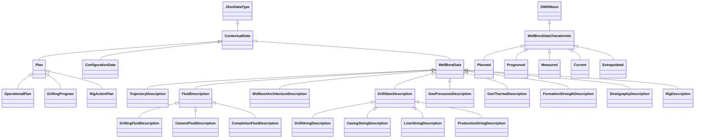
## ContextualData <!-- NOUN -->
- Display name: Contextual Data
- Parent class: [JSonDataType](./DrillingDataSemantics.md#JSonDataType)
- Description: 
Contextual data are structured objects stored in a JSon string.
- Definition set: ContextualData
## Plan <!-- NOUN -->
- Display name: Plan
- Parent class: [ContextualData](./ContextualData.md#ContextualData)
- Definition set: ContextualData
## OperationalPlan <!-- NOUN -->
- Display name: Operational Plan
- Parent class: [Plan](./ContextualData.md#Plan)
- Definition set: ContextualData
- Examples:
``` dwis operationalPlan_0
DynamicDrillingSignal:operationalPlan_0
OperationalPlan:OperationalPlan_1
OperationalPlan_1 HasDynamicValue operationalPlan_0
OperatingCompany:operatingCompany_1
OperationalPlan_1 IsProvidedBy operatingCompany_1
```
An example semantic graph looks like as follow:
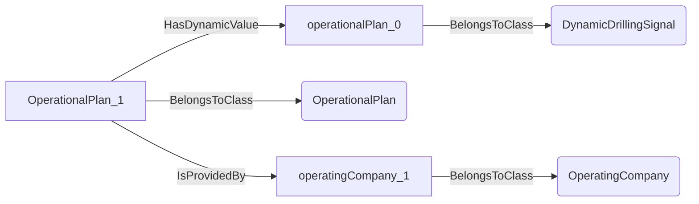
An example SparQL query looks like this:
```sparql
PREFIX rdf: <http://www.w3.org/1999/02/22-rdf-syntax-ns#>
PREFIX ddhub: <http://ddhub.no/>
PREFIX quantity: <http://ddhub.no/UnitAndQuantity>
SELECT ?operationalPlan_0
WHERE {
	?operationalPlan_0 rdf:type ddhub:DynamicDrillingSignal .
	?OperationalPlan_1 rdf:type ddhub:OperationalPlan .
	?OperationalPlan_1 ddhub:HasDynamicValue ?operationalPlan_0 .
	?operatingCompany_1 rdf:type ddhub:OperatingCompany .
	?OperationalPlan_1 ddhub:IsProvidedBy ?operatingCompany_1 .
}
```
## DrillingProgram <!-- NOUN -->
- Display name: Drilling Program
- Parent class: [Plan](./ContextualData.md#Plan)
- Definition set: ContextualData
- Examples:
``` dwis drillingProgram_0
DynamicDrillingSignal:drillingProgram_0
DrillingProgram:drillingProgram_1
drillingProgram_1 HasDynamicValue drillingProgram_0
OperatingCompany:operatingCompany_1
drillingProgram_1 IsProvidedBy operatingCompany_1
```
An example semantic graph looks like as follow:
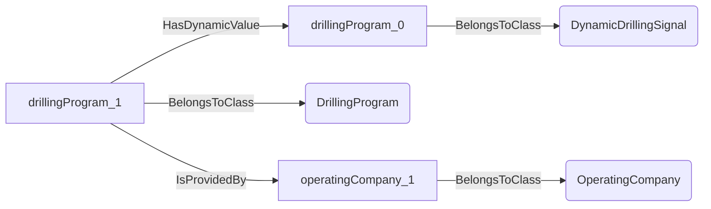
An example SparQL query looks like this:
```sparql
PREFIX rdf: <http://www.w3.org/1999/02/22-rdf-syntax-ns#>
PREFIX ddhub: <http://ddhub.no/>
PREFIX quantity: <http://ddhub.no/UnitAndQuantity>
SELECT ?drillingProgram_0
WHERE {
	?drillingProgram_0 rdf:type ddhub:DynamicDrillingSignal .
	?drillingProgram_1 rdf:type ddhub:DrillingProgram .
	?drillingProgram_1 ddhub:HasDynamicValue ?drillingProgram_0 .
	?operatingCompany_1 rdf:type ddhub:OperatingCompany .
	?drillingProgram_1 ddhub:IsProvidedBy ?operatingCompany_1 .
}
```
## RigActionPlan <!-- NOUN -->
- Display name: Rig Action Plan
- Parent class: [Plan](./ContextualData.md#Plan)
- Definition set: ContextualData
- Examples:
``` dwis rigActionPlan_0
DynamicDrillingSignal:rigActionPlan_0
RigActionPlan:rigActionPlan_1
rigActionPlan_1 HasDynamicValue rigActionPlan_0
OperatingCompany:operatingCompany_1
rigActionPlan_1 IsProvidedBy operatingCompany_1
DWISScheduler:scheduler_1
rigActionPlan_1 IsProvidedTo scheduler_1
```
An example semantic graph looks like as follow:
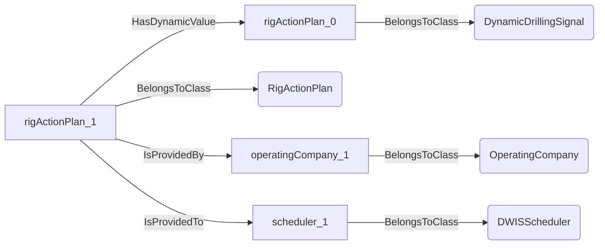
An example SparQL query looks like this:
```sparql
PREFIX rdf: <http://www.w3.org/1999/02/22-rdf-syntax-ns#>
PREFIX ddhub: <http://ddhub.no/>
PREFIX quantity: <http://ddhub.no/UnitAndQuantity>
SELECT ?rigActionPlan_0
WHERE {
	?rigActionPlan_0 rdf:type ddhub:DynamicDrillingSignal .
	?rigActionPlan_1 rdf:type ddhub:RigActionPlan .
	?rigActionPlan_1 ddhub:HasDynamicValue ?rigActionPlan_0 .
	?operatingCompany_1 rdf:type ddhub:OperatingCompany .
	?rigActionPlan_1 ddhub:IsProvidedBy ?operatingCompany_1 .
	?scheduler_1 rdf:type ddhub:DWISScheduler .
	?rigActionPlan_1 ddhub:IsProvidedTo ?scheduler_1 .
}
```
## ConfigurationData <!-- NOUN -->
- Display name: Configuration Data
- Parent class: [ContextualData](./ContextualData.md#ContextualData)
- Definition set: ContextualData
- Examples:
``` dwis configurationData_0
DynamicDrillingSignal:configurationData_0
ConfigurationData:configurationData_1
configurationData_1 HasDynamicValue configurationData_0
OperatingCompany:operatingCompany_1
configurationData_1 IsProvidedBy operatingCompany_1
DWISDrillingProcessStateInterpreter:microStateInterpreter_1
configurationData_1 IsProvidedTo microStateInterpreter_1
configurationData_1 IsLimitFor microStateInterpreter_1
```
An example semantic graph looks like as follow:
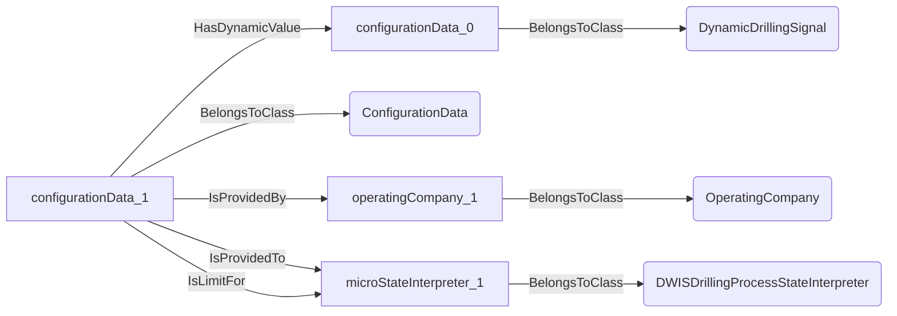
An example SparQL query looks like this:
```sparql
PREFIX rdf: <http://www.w3.org/1999/02/22-rdf-syntax-ns#>
PREFIX ddhub: <http://ddhub.no/>
PREFIX quantity: <http://ddhub.no/UnitAndQuantity>
SELECT ?configurationData_0
WHERE {
	?configurationData_0 rdf:type ddhub:DynamicDrillingSignal .
	?configurationData_1 rdf:type ddhub:ConfigurationData .
	?configurationData_1 ddhub:HasDynamicValue ?configurationData_0 .
	?operatingCompany_1 rdf:type ddhub:OperatingCompany .
	?configurationData_1 ddhub:IsProvidedBy ?operatingCompany_1 .
	?microStateInterpreter_1 rdf:type ddhub:DWISDrillingProcessStateInterpreter .
	?configurationData_1 ddhub:IsProvidedTo ?microStateInterpreter_1 .
	?configurationData_1 ddhub:IsLimitFor ?microStateInterpreter_1 .
}
```
## WellBoreData <!-- NOUN -->
- Display name: Wellbore Data
- Parent class: [ContextualData](./ContextualData.md#ContextualData)
- Definition set: ContextualData
- Examples:
``` dwis wellBoreData_0
DynamicDrillingSignal:wellBoreData_0
WellBoreData:wellBoreData_1
wellBoreData_1 HasDynamicValue wellBoreData_0
OperatingCompany:operatingCompany_1
wellBoreData_1 IsProvidedBy operatingCompany_1
DWISContextualDataBuilder:contextualDataBuilder_1
wellBoreData_1 IsProvidedTo contextualDataBuilder_1
```
An example semantic graph looks like as follow:
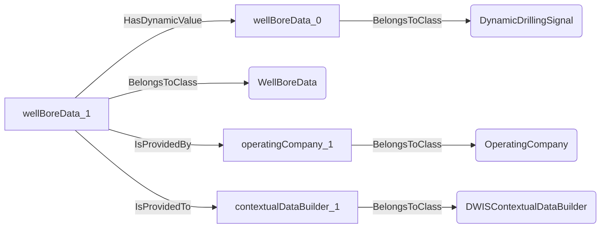
An example SparQL query looks like this:
```sparql
PREFIX rdf: <http://www.w3.org/1999/02/22-rdf-syntax-ns#>
PREFIX ddhub: <http://ddhub.no/>
PREFIX quantity: <http://ddhub.no/UnitAndQuantity>
SELECT ?wellBoreData_0
WHERE {
	?wellBoreData_0 rdf:type ddhub:DynamicDrillingSignal .
	?wellBoreData_1 rdf:type ddhub:WellBoreData .
	?wellBoreData_1 ddhub:HasDynamicValue ?wellBoreData_0 .
	?operatingCompany_1 rdf:type ddhub:OperatingCompany .
	?wellBoreData_1 ddhub:IsProvidedBy ?operatingCompany_1 .
	?contextualDataBuilder_1 rdf:type ddhub:DWISContextualDataBuilder .
	?wellBoreData_1 ddhub:IsProvidedTo ?contextualDataBuilder_1 .
}
```
## TrajectoryDescription <!-- NOUN -->
- Display name: Trajectory Description
- Parent class: [WellBoreData](./ContextualData.md#WellBoreData)
- Description: 
A trajectory contains information about the position of the wellbore.
- Definition set: ContextualData
- Examples:
``` dwis trajectoryDescription_0
DynamicDrillingSignal:trajectoryDescription_0
TrajectoryDescription:trajectoryDescription_1
trajectoryDescription_1 HasDynamicValue trajectoryDescription_0
DirectionalServiceCompany:directionalServiceCompany_1
trajectoryDescription_1 IsProvidedBy directionalServiceCompany_1
DWISContextualDataBuilder:contextualDataBuilder_1
trajectoryDescription_1 IsProvidedTo contextualDataBuilder_1
Current:current_1
trajectoryDescription_1 IsCharacterizedBy current_1
Extrapolated: extrapolated_1
trajectoryDescription_1 IsCharacterizedBy extrapolated_1
Measured:measured_1
trajectoryDescription_1 IsCharacterizedBy measured_1
```
An example semantic graph looks like as follow:
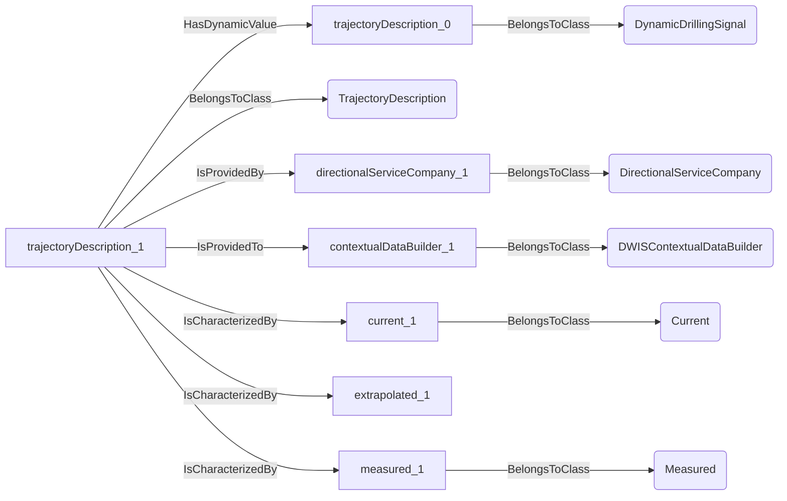
An example SparQL query looks like this:
```sparql
PREFIX rdf: <http://www.w3.org/1999/02/22-rdf-syntax-ns#>
PREFIX ddhub: <http://ddhub.no/>
PREFIX quantity: <http://ddhub.no/UnitAndQuantity>
SELECT ?trajectoryDescription_0
WHERE {
	?trajectoryDescription_0 rdf:type ddhub:DynamicDrillingSignal .
	?trajectoryDescription_1 rdf:type ddhub:TrajectoryDescription .
	?trajectoryDescription_1 ddhub:HasDynamicValue ?trajectoryDescription_0 .
	?directionalServiceCompany_1 rdf:type ddhub:DirectionalServiceCompany .
	?trajectoryDescription_1 ddhub:IsProvidedBy ?directionalServiceCompany_1 .
	?contextualDataBuilder_1 rdf:type ddhub:DWISContextualDataBuilder .
	?trajectoryDescription_1 ddhub:IsProvidedTo ?contextualDataBuilder_1 .
	?current_1 rdf:type ddhub:Current .
	?trajectoryDescription_1 ddhub:IsCharacterizedBy ?current_1 .
	?trajectoryDescription_1 ddhub:IsCharacterizedBy ?extrapolated_1 .
	?measured_1 rdf:type ddhub:Measured .
	?trajectoryDescription_1 ddhub:IsCharacterizedBy ?measured_1 .
}
```
## FluidDescription <!-- NOUN -->
- Display name: Fluid Description
- Parent class: [WellBoreData](./ContextualData.md#WellBoreData)
- Description: 
Drilling fluid contains information about the density, rheological behavior, thermo-physical and chemical characteristics of a fluid
used during a drilling operation.
- Definition set: ContextualData
- Examples:
``` dwis fluidDescription_0
DynamicDrillingSignal:fluidDescription_0
FluidDescription:fluidDescription_1
fluidDescription_1 HasDynamicValue fluidDescription_0
DrillingFluidProvider:drillingFluidProvider_1
fluidDescription_1 IsProvidedBy drillingFluidProvider_1
DWISContextualDataBuilder:contextualDataBuilder_1
fluidDescription_1 IsProvidedTo contextualDataBuilder_1
Current:current_1
fluidDescription_1 IsCharacterizedBy current_1
```
An example semantic graph looks like as follow:
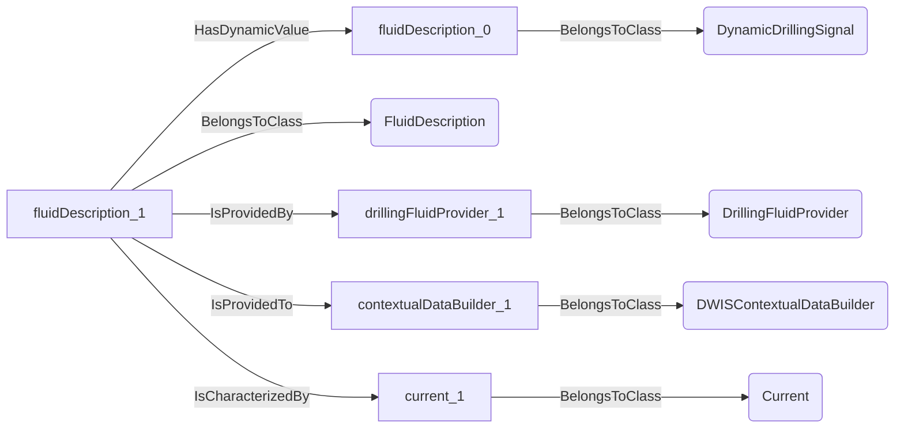
An example SparQL query looks like this:
```sparql
PREFIX rdf: <http://www.w3.org/1999/02/22-rdf-syntax-ns#>
PREFIX ddhub: <http://ddhub.no/>
PREFIX quantity: <http://ddhub.no/UnitAndQuantity>
SELECT ?fluidDescription_0
WHERE {
	?fluidDescription_0 rdf:type ddhub:DynamicDrillingSignal .
	?fluidDescription_1 rdf:type ddhub:FluidDescription .
	?fluidDescription_1 ddhub:HasDynamicValue ?fluidDescription_0 .
	?drillingFluidProvider_1 rdf:type ddhub:DrillingFluidProvider .
	?fluidDescription_1 ddhub:IsProvidedBy ?drillingFluidProvider_1 .
	?contextualDataBuilder_1 rdf:type ddhub:DWISContextualDataBuilder .
	?fluidDescription_1 ddhub:IsProvidedTo ?contextualDataBuilder_1 .
	?current_1 rdf:type ddhub:Current .
	?fluidDescription_1 ddhub:IsCharacterizedBy ?current_1 .
}
```
## DrillingFluidDescription <!-- NOUN -->
- Display name: Drilling Fluid Description
- Parent class: [FluidDescription](./ContextualData.md#FluidDescription)
- Description: 
A drilling fluid is a fluid that is used well
used during a drilling operation.
- Definition set: ContextualData
- Examples:
``` dwis fluidDescription_0
DynamicDrillingSignal:fluidDescription_0
DrillingFluidDescription:fluidDescription_1
fluidDescription_1 HasDynamicValue fluidDescription_0
DrillingFluidProvider:drillingFluidProvider_1
fluidDescription_1 IsProvidedBy drillingFluidProvider_1
DWISContextualDataBuilder:contextualDataBuilder_1
fluidDescription_1 IsProvidedTo contextualDataBuilder_1
Current:current_1
fluidDescription_1 IsCharacterizedBy current_1
Measured:measured_1
fluidDescription_1 IsCharacterizedBy measured_1
```
An example semantic graph looks like as follow:
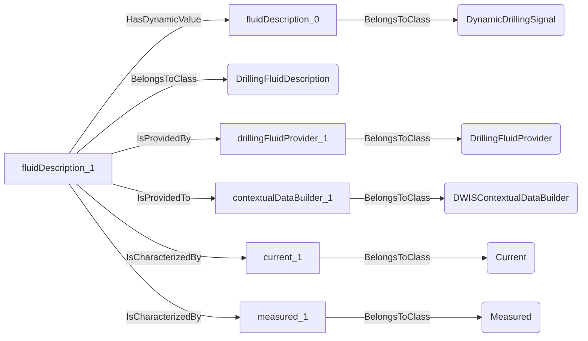
An example SparQL query looks like this:
```sparql
PREFIX rdf: <http://www.w3.org/1999/02/22-rdf-syntax-ns#>
PREFIX ddhub: <http://ddhub.no/>
PREFIX quantity: <http://ddhub.no/UnitAndQuantity>
SELECT ?fluidDescription_0
WHERE {
	?fluidDescription_0 rdf:type ddhub:DynamicDrillingSignal .
	?fluidDescription_1 rdf:type ddhub:DrillingFluidDescription .
	?fluidDescription_1 ddhub:HasDynamicValue ?fluidDescription_0 .
	?drillingFluidProvider_1 rdf:type ddhub:DrillingFluidProvider .
	?fluidDescription_1 ddhub:IsProvidedBy ?drillingFluidProvider_1 .
	?contextualDataBuilder_1 rdf:type ddhub:DWISContextualDataBuilder .
	?fluidDescription_1 ddhub:IsProvidedTo ?contextualDataBuilder_1 .
	?current_1 rdf:type ddhub:Current .
	?fluidDescription_1 ddhub:IsCharacterizedBy ?current_1 .
	?measured_1 rdf:type ddhub:Measured .
	?fluidDescription_1 ddhub:IsCharacterizedBy ?measured_1 .
}
```
## CementFluidDescription <!-- NOUN -->
- Display name: Cement Fluid Description
- Parent class: [FluidDescription](./ContextualData.md#FluidDescription)
- Description: 
Cement fluid contains information about the density, rheological behavior and chemical characteristics of fluids
used during a cementing operation, e.g., cement slurry but also spacer.
- Definition set: ContextualData
- Examples:
``` dwis fluidDescription_0
DynamicDrillingSignal:fluidDescription_0
CementFluidDescription:fluidDescription_1
fluidDescription_1 HasDynamicValue fluidDescription_0
CementingServiceCompany:cementFluidProvider_1
fluidDescription_1 IsProvidedBy cementFluidProvider_1
DWISContextualDataBuilder:contextualDataBuilder_1
fluidDescription_1 IsProvidedTo contextualDataBuilder_1
Measured:measured_1
fluidDescription_1 IsCharacterizedBy measured_1
```
An example semantic graph looks like as follow:
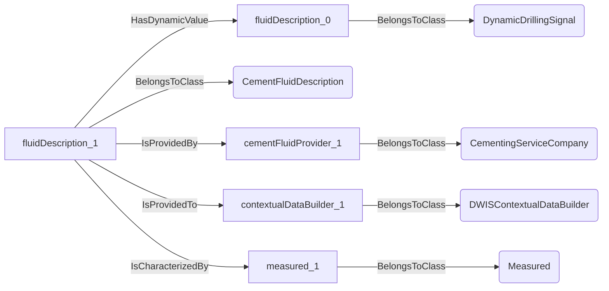
An example SparQL query looks like this:
```sparql
PREFIX rdf: <http://www.w3.org/1999/02/22-rdf-syntax-ns#>
PREFIX ddhub: <http://ddhub.no/>
PREFIX quantity: <http://ddhub.no/UnitAndQuantity>
SELECT ?fluidDescription_0
WHERE {
	?fluidDescription_0 rdf:type ddhub:DynamicDrillingSignal .
	?fluidDescription_1 rdf:type ddhub:CementFluidDescription .
	?fluidDescription_1 ddhub:HasDynamicValue ?fluidDescription_0 .
	?cementFluidProvider_1 rdf:type ddhub:CementingServiceCompany .
	?fluidDescription_1 ddhub:IsProvidedBy ?cementFluidProvider_1 .
	?contextualDataBuilder_1 rdf:type ddhub:DWISContextualDataBuilder .
	?fluidDescription_1 ddhub:IsProvidedTo ?contextualDataBuilder_1 .
	?measured_1 rdf:type ddhub:Measured .
	?fluidDescription_1 ddhub:IsCharacterizedBy ?measured_1 .
}
```
## CompletionFluidDescription <!-- NOUN -->
- Display name: Completion Fluid Description
- Parent class: [FluidDescription](./ContextualData.md#FluidDescription)
- Description: 
Completion fluid contains information about the density, rheological behavior and chemical characteristics of a
fluid used during a completion operation.
- Definition set: ContextualData
- Examples:
``` dwis fluidDescription_0
DynamicDrillingSignal:fluidDescription_0
CompletionFluidDescription:fluidDescription_1
fluidDescription_1 HasDynamicValue fluidDescription_0
CompletionServiceCompany:completionFluidProvider_1
fluidDescription_1 IsProvidedBy completionFluidProvider_1
DWISContextualDataBuilder:contextualDataBuilder_1
fluidDescription_1 IsProvidedTo contextualDataBuilder_1
Current:current_1
fluidDescription_1 IsCharacterizedBy current_1
```
An example semantic graph looks like as follow:
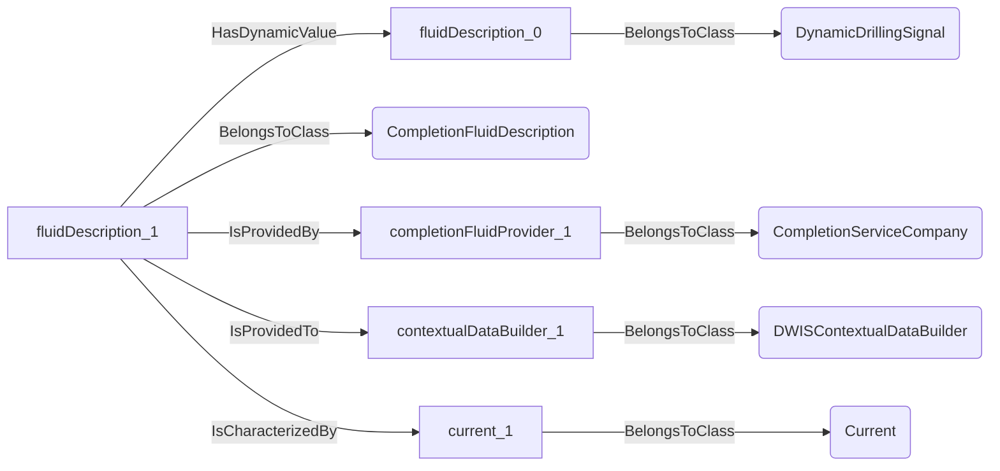
An example SparQL query looks like this:
```sparql
PREFIX rdf: <http://www.w3.org/1999/02/22-rdf-syntax-ns#>
PREFIX ddhub: <http://ddhub.no/>
PREFIX quantity: <http://ddhub.no/UnitAndQuantity>
SELECT ?fluidDescription_0
WHERE {
	?fluidDescription_0 rdf:type ddhub:DynamicDrillingSignal .
	?fluidDescription_1 rdf:type ddhub:CompletionFluidDescription .
	?fluidDescription_1 ddhub:HasDynamicValue ?fluidDescription_0 .
	?completionFluidProvider_1 rdf:type ddhub:CompletionServiceCompany .
	?fluidDescription_1 ddhub:IsProvidedBy ?completionFluidProvider_1 .
	?contextualDataBuilder_1 rdf:type ddhub:DWISContextualDataBuilder .
	?fluidDescription_1 ddhub:IsProvidedTo ?contextualDataBuilder_1 .
	?current_1 rdf:type ddhub:Current .
	?fluidDescription_1 ddhub:IsCharacterizedBy ?current_1 .
}
```
## WellboreArchitectureDescription <!-- NOUN -->
- Display name: Wellbore Architecture Description
- Parent class: [WellBoreData](./ContextualData.md#WellBoreData)
- Description: 
The wellbore architecture provides information about the casings and liners in place as well as the current
open hole configuration. Also the surface architecture, i.e., everything above the wellhead, is also described, e.g., BOP, high 
pressure riser, low pressure riser, expansion joint,...
- Definition set: ContextualData
- Examples:
``` dwis wellBoreArchitectureDescription_0
DynamicDrillingSignal:wellBoreArchitectureDescription_0
WellboreArchitectureDescription:wellBoreArchitectureDescription_1
wellBoreArchitectureDescription_1 HasDynamicValue wellBoreArchitectureDescription_0
OperatingCompany:operatingCompany_1
wellBoreArchitectureDescription_1 IsProvidedBy operatingCompany_1
DWISContextualDataBuilder:contextualDataBuilder_1
wellBoreArchitectureDescription_1 IsProvidedTo contextualDataBuilder_1
Planned:planned_1
wellBoreArchitectureDescription_1 IsCharacterizedBy planned_1
```
An example semantic graph looks like as follow:
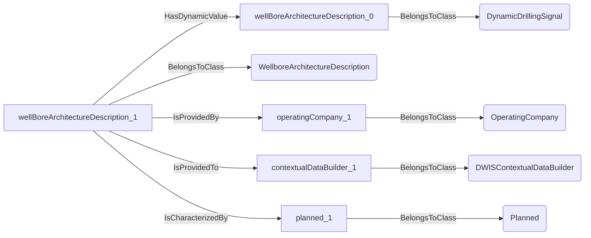
An example SparQL query looks like this:
```sparql
PREFIX rdf: <http://www.w3.org/1999/02/22-rdf-syntax-ns#>
PREFIX ddhub: <http://ddhub.no/>
PREFIX quantity: <http://ddhub.no/UnitAndQuantity>
SELECT ?wellBoreArchitectureDescription_0
WHERE {
	?wellBoreArchitectureDescription_0 rdf:type ddhub:DynamicDrillingSignal .
	?wellBoreArchitectureDescription_1 rdf:type ddhub:WellboreArchitectureDescription .
	?wellBoreArchitectureDescription_1 ddhub:HasDynamicValue ?wellBoreArchitectureDescription_0 .
	?operatingCompany_1 rdf:type ddhub:OperatingCompany .
	?wellBoreArchitectureDescription_1 ddhub:IsProvidedBy ?operatingCompany_1 .
	?contextualDataBuilder_1 rdf:type ddhub:DWISContextualDataBuilder .
	?wellBoreArchitectureDescription_1 ddhub:IsProvidedTo ?contextualDataBuilder_1 .
	?planned_1 rdf:type ddhub:Planned .
	?wellBoreArchitectureDescription_1 ddhub:IsCharacterizedBy ?planned_1 .
}
```
## DrillStemDescription <!-- NOUN -->
- Display name: Drill-stem Description
- Parent class: [WellBoreData](./ContextualData.md#WellBoreData)
- Description: 
A dill-stem is a generic term for all strings that are run in a borehole. The drill-stem describes the geometrical
and mechanical characteristics of such a string. 
- Definition set: ContextualData
## DrillStringDescription <!-- NOUN -->
- Display name: Drill-string Description
- Parent class: [DrillStemDescription](./ContextualData.md#DrillStemDescription)
- Description: 
A drill-string is a drill-stem that is used during a drilling operation. It is composed of drill-pipes, drill-collars,
BHA elements and is terminated either by a bit, a bull-nose, or other special elements such as fishing equipment, etc.
- Definition set: ContextualData
- Examples:
``` dwis drillStringDescription_0
DynamicDrillingSignal:drillStringDescription_0
DrillStringDescription:drillStringDescription_1
drillStringDescription_1 HasDynamicValue drillStringDescription_0
DrillingContractor:drillingContractor_1
drillStringDescription_1 IsProvidedBy drillingContractor_1
DWISContextualDataBuilder:contextualDataBuilder_1
drillStringDescription_1 IsProvidedTo contextualDataBuilder_1
Planned:planned_1
drillStringDescription_1 IsCharacterizedBy planned_1
```
An example semantic graph looks like as follow:
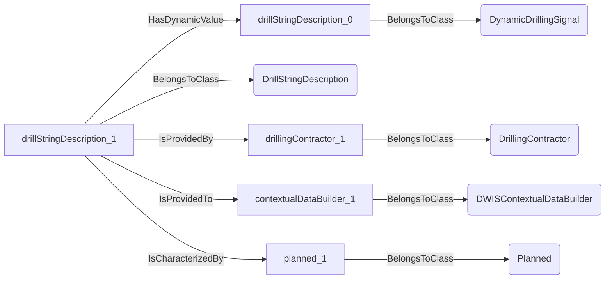
An example SparQL query looks like this:
```sparql
PREFIX rdf: <http://www.w3.org/1999/02/22-rdf-syntax-ns#>
PREFIX ddhub: <http://ddhub.no/>
PREFIX quantity: <http://ddhub.no/UnitAndQuantity>
SELECT ?drillStringDescription_0
WHERE {
	?drillStringDescription_0 rdf:type ddhub:DynamicDrillingSignal .
	?drillStringDescription_1 rdf:type ddhub:DrillStringDescription .
	?drillStringDescription_1 ddhub:HasDynamicValue ?drillStringDescription_0 .
	?drillingContractor_1 rdf:type ddhub:DrillingContractor .
	?drillStringDescription_1 ddhub:IsProvidedBy ?drillingContractor_1 .
	?contextualDataBuilder_1 rdf:type ddhub:DWISContextualDataBuilder .
	?drillStringDescription_1 ddhub:IsProvidedTo ?contextualDataBuilder_1 .
	?planned_1 rdf:type ddhub:Planned .
	?drillStringDescription_1 ddhub:IsCharacterizedBy ?planned_1 .
}
```
## CasingStringDescription <!-- NOUN -->
- Display name: Casing-string Description
- Parent class: [DrillStemDescription](./ContextualData.md#DrillStemDescription)
- Description: 
A casing string is a drill-stem that is used to complete a section. It is composed of casing joints and a shoe track.
- Definition set: ContextualData
- Examples:
``` dwis casingStringDescription_0
DynamicDrillingSignal:casingStringDescription_0
CasingStringDescription:casingStringDescription_1
casingStringDescription_1 HasDynamicValue casingStringDescription_0
DrillingContractor:drillingContractor_1
casingStringDescription_1 IsProvidedBy drillingContractor_1
DWISContextualDataBuilder:contextualDataBuilder_1
casingStringDescription_1 IsProvidedTo contextualDataBuilder_1
Planned:planned_1
casingStringDescription_1 IsCharacterizedBy planned_1
```
An example semantic graph looks like as follow:
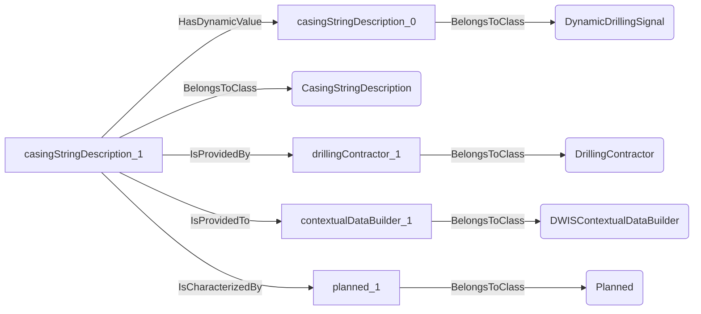
An example SparQL query looks like this:
```sparql
PREFIX rdf: <http://www.w3.org/1999/02/22-rdf-syntax-ns#>
PREFIX ddhub: <http://ddhub.no/>
PREFIX quantity: <http://ddhub.no/UnitAndQuantity>
SELECT ?casingStringDescription_0
WHERE {
	?casingStringDescription_0 rdf:type ddhub:DynamicDrillingSignal .
	?casingStringDescription_1 rdf:type ddhub:CasingStringDescription .
	?casingStringDescription_1 ddhub:HasDynamicValue ?casingStringDescription_0 .
	?drillingContractor_1 rdf:type ddhub:DrillingContractor .
	?casingStringDescription_1 ddhub:IsProvidedBy ?drillingContractor_1 .
	?contextualDataBuilder_1 rdf:type ddhub:DWISContextualDataBuilder .
	?casingStringDescription_1 ddhub:IsProvidedTo ?contextualDataBuilder_1 .
	?planned_1 rdf:type ddhub:Planned .
	?casingStringDescription_1 ddhub:IsCharacterizedBy ?planned_1 .
}
```
## LinerStringDescription <!-- NOUN -->
- Display name: Liner-string Description
- Parent class: [DrillStemDescription](./ContextualData.md#DrillStemDescription)
- Description: 
A liner string is a drill-stem that is used to complete a section. It is composed of casing joints, possibly a shoe track
a liner hanger and drill-pipes.
- Definition set: ContextualData
- Examples:
``` dwis linerStringDescription_0
DynamicDrillingSignal:linerStringDescription_0
LinerStringDescription:linerStringDescription_1
linerStringDescription_1 HasDynamicValue linerStringDescription_0
DrillingContractor:drillingContractor_1
linerStringDescription_1 IsProvidedBy drillingContractor_1
DWISContextualDataBuilder:contextualDataBuilder_1
linerStringDescription_1 IsProvidedTo contextualDataBuilder_1
Planned:planned_1
linerStringDescription_1 IsCharacterizedBy planned_1
```
An example semantic graph looks like as follow:

An example SparQL query looks like this:
```sparql
PREFIX rdf: <http://www.w3.org/1999/02/22-rdf-syntax-ns#>
PREFIX ddhub: <http://ddhub.no/>
PREFIX quantity: <http://ddhub.no/UnitAndQuantity>
SELECT ?linerStringDescription_0
WHERE {
	?linerStringDescription_0 rdf:type ddhub:DynamicDrillingSignal .
	?linerStringDescription_1 rdf:type ddhub:LinerStringDescription .
	?linerStringDescription_1 ddhub:HasDynamicValue ?linerStringDescription_0 .
	?drillingContractor_1 rdf:type ddhub:DrillingContractor .
	?linerStringDescription_1 ddhub:IsProvidedBy ?drillingContractor_1 .
	?contextualDataBuilder_1 rdf:type ddhub:DWISContextualDataBuilder .
	?linerStringDescription_1 ddhub:IsProvidedTo ?contextualDataBuilder_1 .
	?planned_1 rdf:type ddhub:Planned .
	?linerStringDescription_1 ddhub:IsCharacterizedBy ?planned_1 .
}
```
## ProductionStringDescription <!-- NOUN -->
- Display name: Production-string Description
- Parent class: [DrillStemDescription](./ContextualData.md#DrillStemDescription)
- Description: 
A production string is a drill-stem that is used to complete a wellbore. It is composed of tubings, expansion joints,
packers, etc.
- Definition set: ContextualData
- Examples:
``` dwis productionStringDescription_0
DynamicDrillingSignal:productionStringDescription_0
ProductionStringDescription:productionStringDescription_1
productionStringDescription_1 HasDynamicValue productionStringDescription_0
CompletionServiceCompany:completionServiceCompany_1
productionStringDescription_1 IsProvidedBy completionServiceCompany_1
DWISContextualDataBuilder:contextualDataBuilder_1
productionStringDescription_1 IsProvidedTo contextualDataBuilder_1
Planned:planned_1
productionStringDescription_1 IsCharacterizedBy planned_1
```
An example semantic graph looks like as follow:
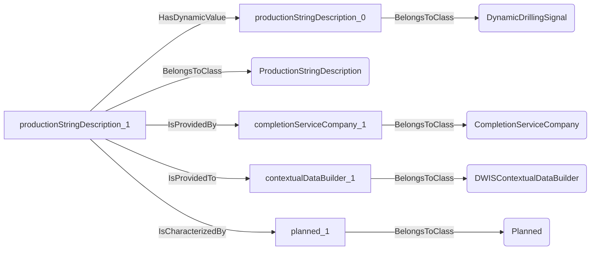
An example SparQL query looks like this:
```sparql
PREFIX rdf: <http://www.w3.org/1999/02/22-rdf-syntax-ns#>
PREFIX ddhub: <http://ddhub.no/>
PREFIX quantity: <http://ddhub.no/UnitAndQuantity>
SELECT ?productionStringDescription_0
WHERE {
	?productionStringDescription_0 rdf:type ddhub:DynamicDrillingSignal .
	?productionStringDescription_1 rdf:type ddhub:ProductionStringDescription .
	?productionStringDescription_1 ddhub:HasDynamicValue ?productionStringDescription_0 .
	?completionServiceCompany_1 rdf:type ddhub:CompletionServiceCompany .
	?productionStringDescription_1 ddhub:IsProvidedBy ?completionServiceCompany_1 .
	?contextualDataBuilder_1 rdf:type ddhub:DWISContextualDataBuilder .
	?productionStringDescription_1 ddhub:IsProvidedTo ?contextualDataBuilder_1 .
	?planned_1 rdf:type ddhub:Planned .
	?productionStringDescription_1 ddhub:IsCharacterizedBy ?planned_1 .
}
```
## GeoPressuresDescription <!-- NOUN -->
- Display name: Geo-pressures Description
- Parent class: [WellBoreData](./ContextualData.md#WellBoreData)
- Description: 
The geo-pressure data structure describes the pore pressure, collapse pressure, min horizontal stress, fracturing pressure
along the wellbore.
- Definition set: ContextualData
- Examples:
``` dwis geoPressuresDescription_0
DynamicDrillingSignal:geoPressuresDescription_0
GeoPressuresDescription:geoPressuresDescription_1
geoPressuresDescription_1 HasDynamicValue geoPressuresDescription_0
OperatingCompany:operatingCompany_1
geoPressuresDescription_1 IsProvidedBy operatingCompany_1
DWISContextualDataBuilder:contextualDataBuilder_1
geoPressuresDescription_1 IsProvidedTo contextualDataBuilder_1
Prognosed:prognosed_1
geoPressuresDescription_1 IsCharacterizedBy prognosed_1
```
An example semantic graph looks like as follow:
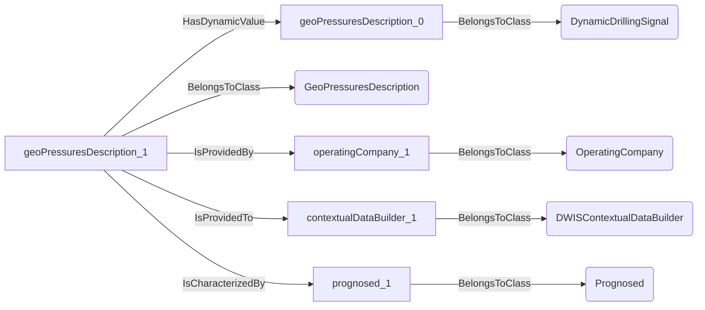
An example SparQL query looks like this:
```sparql
PREFIX rdf: <http://www.w3.org/1999/02/22-rdf-syntax-ns#>
PREFIX ddhub: <http://ddhub.no/>
PREFIX quantity: <http://ddhub.no/UnitAndQuantity>
SELECT ?geoPressuresDescription_0
WHERE {
	?geoPressuresDescription_0 rdf:type ddhub:DynamicDrillingSignal .
	?geoPressuresDescription_1 rdf:type ddhub:GeoPressuresDescription .
	?geoPressuresDescription_1 ddhub:HasDynamicValue ?geoPressuresDescription_0 .
	?operatingCompany_1 rdf:type ddhub:OperatingCompany .
	?geoPressuresDescription_1 ddhub:IsProvidedBy ?operatingCompany_1 .
	?contextualDataBuilder_1 rdf:type ddhub:DWISContextualDataBuilder .
	?geoPressuresDescription_1 ddhub:IsProvidedTo ?contextualDataBuilder_1 .
	?prognosed_1 rdf:type ddhub:Prognosed .
	?geoPressuresDescription_1 ddhub:IsCharacterizedBy ?prognosed_1 .
}
```
## GeoThermalDescription <!-- NOUN -->
- Display name: Geo-thermal Description
- Parent class: [WellBoreData](./ContextualData.md#WellBoreData)
- Description: 
The geothermal data structure describes the temperature and thermophysical properties of the formation encountered
along the wellbore.
- Definition set: ContextualData
- Examples:
``` dwis geoThermalDescription_0
DynamicDrillingSignal:geoThermalDescription_0
GeoThermalDescription:geoThermalDescription_1
geoThermalDescription_1 HasDynamicValue geoThermalDescription_0
OperatingCompany:operatingCompany_1
geoThermalDescription_1 IsProvidedBy operatingCompany_1
DWISContextualDataBuilder:contextualDataBuilder_1
geoThermalDescription_1 IsProvidedTo contextualDataBuilder_1
Prognosed:prognosed_1
geoThermalDescription_1 IsCharacterizedBy prognosed_1
```
An example semantic graph looks like as follow:
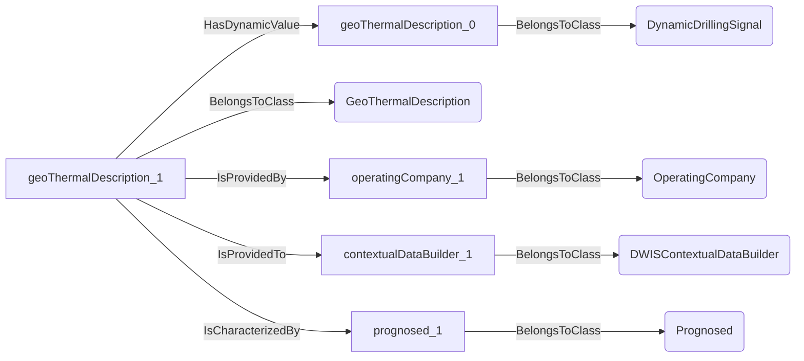
An example SparQL query looks like this:
```sparql
PREFIX rdf: <http://www.w3.org/1999/02/22-rdf-syntax-ns#>
PREFIX ddhub: <http://ddhub.no/>
PREFIX quantity: <http://ddhub.no/UnitAndQuantity>
SELECT ?geoThermalDescription_0
WHERE {
	?geoThermalDescription_0 rdf:type ddhub:DynamicDrillingSignal .
	?geoThermalDescription_1 rdf:type ddhub:GeoThermalDescription .
	?geoThermalDescription_1 ddhub:HasDynamicValue ?geoThermalDescription_0 .
	?operatingCompany_1 rdf:type ddhub:OperatingCompany .
	?geoThermalDescription_1 ddhub:IsProvidedBy ?operatingCompany_1 .
	?contextualDataBuilder_1 rdf:type ddhub:DWISContextualDataBuilder .
	?geoThermalDescription_1 ddhub:IsProvidedTo ?contextualDataBuilder_1 .
	?prognosed_1 rdf:type ddhub:Prognosed .
	?geoThermalDescription_1 ddhub:IsCharacterizedBy ?prognosed_1 .
}
```
## FormationStrengthDescription <!-- NOUN -->
- Display name: Formation strengths Description
- Parent class: [WellBoreData](./ContextualData.md#WellBoreData)
- Description: 
The formation strength data structure describes the formation strength and internal friction angle of the formation
encountered along the wellbore.
- Definition set: ContextualData
- Examples:
``` dwis formationStrengthDescription_0
DynamicDrillingSignal:formationStrengthDescription_0
FormationStrengthDescription:formationStrengthDescription_1
formationStrengthDescription_1 HasDynamicValue formationStrengthDescription_0
OperatingCompany:operatingCompany_1
formationStrengthDescription_1 IsProvidedBy operatingCompany_1
DWISContextualDataBuilder:contextualDataBuilder_1
formationStrengthDescription_1 IsProvidedTo contextualDataBuilder_1
Prognosed:prognosed_1
formationStrengthDescription_1 IsCharacterizedBy prognosed_1
```
An example semantic graph looks like as follow:
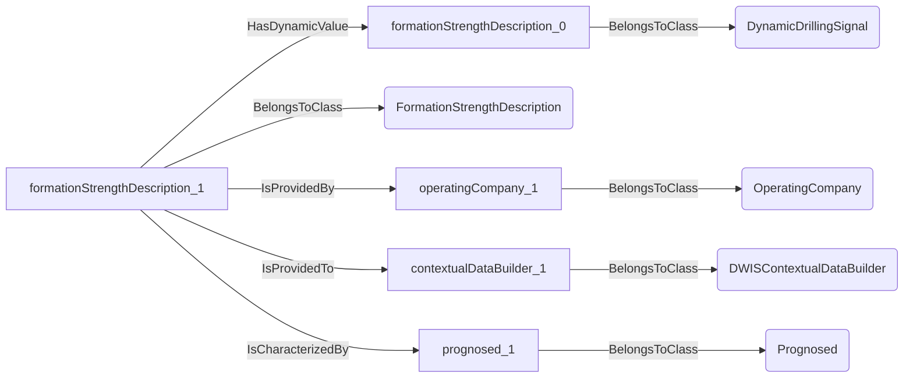
An example SparQL query looks like this:
```sparql
PREFIX rdf: <http://www.w3.org/1999/02/22-rdf-syntax-ns#>
PREFIX ddhub: <http://ddhub.no/>
PREFIX quantity: <http://ddhub.no/UnitAndQuantity>
SELECT ?formationStrengthDescription_0
WHERE {
	?formationStrengthDescription_0 rdf:type ddhub:DynamicDrillingSignal .
	?formationStrengthDescription_1 rdf:type ddhub:FormationStrengthDescription .
	?formationStrengthDescription_1 ddhub:HasDynamicValue ?formationStrengthDescription_0 .
	?operatingCompany_1 rdf:type ddhub:OperatingCompany .
	?formationStrengthDescription_1 ddhub:IsProvidedBy ?operatingCompany_1 .
	?contextualDataBuilder_1 rdf:type ddhub:DWISContextualDataBuilder .
	?formationStrengthDescription_1 ddhub:IsProvidedTo ?contextualDataBuilder_1 .
	?prognosed_1 rdf:type ddhub:Prognosed .
	?formationStrengthDescription_1 ddhub:IsCharacterizedBy ?prognosed_1 .
}
```
## StratigraphyDescription <!-- NOUN -->
- Display name: Stratigraphy Description
- Parent class: [WellBoreData](./ContextualData.md#WellBoreData)
- Description: 
The stratigraphy data structure describes the type of rock, the porosity, permeability and fluid saturations
of the formation layers that are encountered along the wellbore.
- Definition set: ContextualData
- Examples:
``` dwis stratigraphyDescription_0
DynamicDrillingSignal:stratigraphyDescription_0
StratigraphyDescription:stratigraphyDescription_1
stratigraphyDescription_1 HasDynamicValue stratigraphyDescription_0
LoggingServiceCompany:logginServiceCompany_1
stratigraphyDescription_1 IsProvidedBy logginServiceCompany_1
DWISContextualDataBuilder:contextualDataBuilder_1
stratigraphyDescription_1 IsProvidedTo contextualDataBuilder_1
Measured:measured_1
stratigraphyDescription_1 IsCharacterizedBy measured_1
```
An example semantic graph looks like as follow:
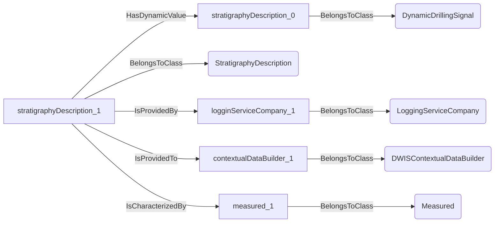
An example SparQL query looks like this:
```sparql
PREFIX rdf: <http://www.w3.org/1999/02/22-rdf-syntax-ns#>
PREFIX ddhub: <http://ddhub.no/>
PREFIX quantity: <http://ddhub.no/UnitAndQuantity>
SELECT ?stratigraphyDescription_0
WHERE {
	?stratigraphyDescription_0 rdf:type ddhub:DynamicDrillingSignal .
	?stratigraphyDescription_1 rdf:type ddhub:StratigraphyDescription .
	?stratigraphyDescription_1 ddhub:HasDynamicValue ?stratigraphyDescription_0 .
	?logginServiceCompany_1 rdf:type ddhub:LoggingServiceCompany .
	?stratigraphyDescription_1 ddhub:IsProvidedBy ?logginServiceCompany_1 .
	?contextualDataBuilder_1 rdf:type ddhub:DWISContextualDataBuilder .
	?stratigraphyDescription_1 ddhub:IsProvidedTo ?contextualDataBuilder_1 .
	?measured_1 rdf:type ddhub:Measured .
	?stratigraphyDescription_1 ddhub:IsCharacterizedBy ?measured_1 .
}
```
## RigDescription <!-- NOUN -->
- Display name: Rig Description
- Parent class: [WellBoreData](./ContextualData.md#WellBoreData)
- Description: 
The rig data structure describes the characteristics of the drilling equipment and any additional equipment
associated with non-standard drilling methods, e.g., back-pressure MPD, dual-gradient,...
- Definition set: ContextualData
- Examples:
``` dwis rigDescription_0
DynamicDrillingSignal:rigDescription_0
RigDescription:rigDescription_1
rigDescription_1 HasDynamicValue rigDescription_0
DrillingContractor:drillingContractor_1
rigDescription_1 IsProvidedBy drillingContractor_1
DWISContextualDataBuilder:contextualDataBuilder_1
rigDescription_1 IsProvidedTo contextualDataBuilder_1
Current:current_1
rigDescription_1 IsCharacterizedBy current_1
```
An example semantic graph looks like as follow:
```mermaid
graph LR
	N0000[rigDescription_0] -->|BelongsToClass| N0001(DynamicDrillingSignal) 
	N0002[rigDescription_1] -->|BelongsToClass| N0003(RigDescription) 
	N0002[rigDescription_1] -->|HasDynamicValue| N0000[rigDescription_0] 
	N0004[drillingContractor_1] -->|BelongsToClass| N0005(DrillingContractor) 
	N0002[rigDescription_1] -->|IsProvidedBy| N0004[drillingContractor_1] 
	N0006[contextualDataBuilder_1] -->|BelongsToClass| N0007(DWISContextualDataBuilder) 
	N0002[rigDescription_1] -->|IsProvidedTo| N0006[contextualDataBuilder_1] 
	N0008[current_1] -->|BelongsToClass| N0009(Current) 
	N0002[rigDescription_1] -->|IsCharacterizedBy| N0008[current_1] 
```
An example SparQL query looks like this:
```sparql
PREFIX rdf: <http://www.w3.org/1999/02/22-rdf-syntax-ns#>
PREFIX ddhub: <http://ddhub.no/>
PREFIX quantity: <http://ddhub.no/UnitAndQuantity>
SELECT ?rigDescription_0
WHERE {
	?rigDescription_0 rdf:type ddhub:DynamicDrillingSignal .
	?rigDescription_1 rdf:type ddhub:RigDescription .
	?rigDescription_1 ddhub:HasDynamicValue ?rigDescription_0 .
	?drillingContractor_1 rdf:type ddhub:DrillingContractor .
	?rigDescription_1 ddhub:IsProvidedBy ?drillingContractor_1 .
	?contextualDataBuilder_1 rdf:type ddhub:DWISContextualDataBuilder .
	?rigDescription_1 ddhub:IsProvidedTo ?contextualDataBuilder_1 .
	?current_1 rdf:type ddhub:Current .
	?rigDescription_1 ddhub:IsCharacterizedBy ?current_1 .
}
```
## WellBoreDataCharateristic <!-- NOUN -->
- Display name: Wellbore Data Charateristic
- Parent class: [DWISNoun](./DWISSemantics.md#DWISNoun)
- Description: 
This Noun is used to characterize a piece of wellbore data.
- Definition set: ContextualData
## Planned <!-- NOUN -->
- Display name: Planned
- Parent class: [WellBoreDataCharateristic](./ContextualData.md#WellBoreDataCharateristic)
- Description: 
Planned characterizes that the wellbore data is described in its planned stage. This applies to wellbore data
that is intended to be constructed.
- Definition set: ContextualData
- Examples:
``` dwis productionStringDescription_0
DynamicDrillingSignal:productionStringDescription_0
ProductionStringDescription:productionStringDescription_1
productionStringDescription_1 HasDynamicValue productionStringDescription_0
CompletionServiceCompany:completionServiceCompany_1
productionStringDescription_1 IsProvidedBy completionServiceCompany_1
DWISContextualDataBuilder:contextualDataBuilder_1
productionStringDescription_1 IsProvidedTo contextualDataBuilder_1
Planned:planned_1
productionStringDescription_1 IsCharacterizedBy planned_1
```
An example semantic graph looks like as follow:
```mermaid
graph LR
	N0000[productionStringDescription_0] -->|BelongsToClass| N0001(DynamicDrillingSignal) 
	N0002[productionStringDescription_1] -->|BelongsToClass| N0003(ProductionStringDescription) 
	N0002[productionStringDescription_1] -->|HasDynamicValue| N0000[productionStringDescription_0] 
	N0004[completionServiceCompany_1] -->|BelongsToClass| N0005(CompletionServiceCompany) 
	N0002[productionStringDescription_1] -->|IsProvidedBy| N0004[completionServiceCompany_1] 
	N0006[contextualDataBuilder_1] -->|BelongsToClass| N0007(DWISContextualDataBuilder) 
	N0002[productionStringDescription_1] -->|IsProvidedTo| N0006[contextualDataBuilder_1] 
	N0008[planned_1] -->|BelongsToClass| N0009(Planned) 
	N0002[productionStringDescription_1] -->|IsCharacterizedBy| N0008[planned_1] 
```
An example SparQL query looks like this:
```sparql
PREFIX rdf: <http://www.w3.org/1999/02/22-rdf-syntax-ns#>
PREFIX ddhub: <http://ddhub.no/>
PREFIX quantity: <http://ddhub.no/UnitAndQuantity>
SELECT ?productionStringDescription_0
WHERE {
	?productionStringDescription_0 rdf:type ddhub:DynamicDrillingSignal .
	?productionStringDescription_1 rdf:type ddhub:ProductionStringDescription .
	?productionStringDescription_1 ddhub:HasDynamicValue ?productionStringDescription_0 .
	?completionServiceCompany_1 rdf:type ddhub:CompletionServiceCompany .
	?productionStringDescription_1 ddhub:IsProvidedBy ?completionServiceCompany_1 .
	?contextualDataBuilder_1 rdf:type ddhub:DWISContextualDataBuilder .
	?productionStringDescription_1 ddhub:IsProvidedTo ?contextualDataBuilder_1 .
	?planned_1 rdf:type ddhub:Planned .
	?productionStringDescription_1 ddhub:IsCharacterizedBy ?planned_1 .
}
```
## Prognosed <!-- NOUN -->
- Display name: Prognosed
- Parent class: [WellBoreDataCharateristic](./ContextualData.md#WellBoreDataCharateristic)
- Description: 
Prognosed characterizes that the wellbore data is described in its prognosed stage. This applies to wellbore
data that exists from before but that may be associated with uncertainty like the geology.
- Definition set: ContextualData
- Examples:
``` dwis stratigraphyDescription_0
DynamicDrillingSignal:stratigraphyDescription_0
StratigraphyDescription:stratigraphyDescription_1
stratigraphyDescription_1 HasDynamicValue stratigraphyDescription_0
OperatingCompany:operatingCompany_1
stratigraphyDescription_1 IsProvidedBy operatingCompany_1
DWISContextualDataBuilder:contextualDataBuilder_1
stratigraphyDescription_1 IsProvidedTo contextualDataBuilder_1
Prognosed:prognosed_1
stratigraphyDescription_1 IsCharacterizedBy prognosed_1
```
An example semantic graph looks like as follow:
```mermaid
graph LR
	N0000[stratigraphyDescription_0] -->|BelongsToClass| N0001(DynamicDrillingSignal) 
	N0002[stratigraphyDescription_1] -->|BelongsToClass| N0003(StratigraphyDescription) 
	N0002[stratigraphyDescription_1] -->|HasDynamicValue| N0000[stratigraphyDescription_0] 
	N0004[operatingCompany_1] -->|BelongsToClass| N0005(OperatingCompany) 
	N0002[stratigraphyDescription_1] -->|IsProvidedBy| N0004[operatingCompany_1] 
	N0006[contextualDataBuilder_1] -->|BelongsToClass| N0007(DWISContextualDataBuilder) 
	N0002[stratigraphyDescription_1] -->|IsProvidedTo| N0006[contextualDataBuilder_1] 
	N0008[prognosed_1] -->|BelongsToClass| N0009(Prognosed) 
	N0002[stratigraphyDescription_1] -->|IsCharacterizedBy| N0008[prognosed_1] 
```
An example SparQL query looks like this:
```sparql
PREFIX rdf: <http://www.w3.org/1999/02/22-rdf-syntax-ns#>
PREFIX ddhub: <http://ddhub.no/>
PREFIX quantity: <http://ddhub.no/UnitAndQuantity>
SELECT ?stratigraphyDescription_0
WHERE {
	?stratigraphyDescription_0 rdf:type ddhub:DynamicDrillingSignal .
	?stratigraphyDescription_1 rdf:type ddhub:StratigraphyDescription .
	?stratigraphyDescription_1 ddhub:HasDynamicValue ?stratigraphyDescription_0 .
	?operatingCompany_1 rdf:type ddhub:OperatingCompany .
	?stratigraphyDescription_1 ddhub:IsProvidedBy ?operatingCompany_1 .
	?contextualDataBuilder_1 rdf:type ddhub:DWISContextualDataBuilder .
	?stratigraphyDescription_1 ddhub:IsProvidedTo ?contextualDataBuilder_1 .
	?prognosed_1 rdf:type ddhub:Prognosed .
	?stratigraphyDescription_1 ddhub:IsCharacterizedBy ?prognosed_1 .
}
```
## Measured <!-- NOUN -->
- Display name: Measured
- Parent class: [WellBoreDataCharateristic](./ContextualData.md#WellBoreDataCharateristic)
- Description: 
Measured characterizes that the wellbore data has been measured or observed.
- Definition set: ContextualData
- Examples:
``` dwis fluidDescription_0
DynamicDrillingSignal:fluidDescription_0
CementFluidDescription:fluidDescription_1
fluidDescription_1 HasDynamicValue fluidDescription_0
CementingServiceCompany:cementFluidProvider_1
fluidDescription_1 IsProvidedBy cementFluidProvider_1
DWISContextualDataBuilder:contextualDataBuilder_1
fluidDescription_1 IsProvidedTo contextualDataBuilder_1
Measured:measured_1
fluidDescription_1 IsCharacterizedBy measured_1
```
An example semantic graph looks like as follow:
```mermaid
graph LR
	N0000[fluidDescription_0] -->|BelongsToClass| N0001(DynamicDrillingSignal) 
	N0002[fluidDescription_1] -->|BelongsToClass| N0003(CementFluidDescription) 
	N0002[fluidDescription_1] -->|HasDynamicValue| N0000[fluidDescription_0] 
	N0004[cementFluidProvider_1] -->|BelongsToClass| N0005(CementingServiceCompany) 
	N0002[fluidDescription_1] -->|IsProvidedBy| N0004[cementFluidProvider_1] 
	N0006[contextualDataBuilder_1] -->|BelongsToClass| N0007(DWISContextualDataBuilder) 
	N0002[fluidDescription_1] -->|IsProvidedTo| N0006[contextualDataBuilder_1] 
	N0008[measured_1] -->|BelongsToClass| N0009(Measured) 
	N0002[fluidDescription_1] -->|IsCharacterizedBy| N0008[measured_1] 
```
An example SparQL query looks like this:
```sparql
PREFIX rdf: <http://www.w3.org/1999/02/22-rdf-syntax-ns#>
PREFIX ddhub: <http://ddhub.no/>
PREFIX quantity: <http://ddhub.no/UnitAndQuantity>
SELECT ?fluidDescription_0
WHERE {
	?fluidDescription_0 rdf:type ddhub:DynamicDrillingSignal .
	?fluidDescription_1 rdf:type ddhub:CementFluidDescription .
	?fluidDescription_1 ddhub:HasDynamicValue ?fluidDescription_0 .
	?cementFluidProvider_1 rdf:type ddhub:CementingServiceCompany .
	?fluidDescription_1 ddhub:IsProvidedBy ?cementFluidProvider_1 .
	?contextualDataBuilder_1 rdf:type ddhub:DWISContextualDataBuilder .
	?fluidDescription_1 ddhub:IsProvidedTo ?contextualDataBuilder_1 .
	?measured_1 rdf:type ddhub:Measured .
	?fluidDescription_1 ddhub:IsCharacterizedBy ?measured_1 .
}
```
## Current <!-- NOUN -->
- Display name: Current
- Parent class: [WellBoreDataCharateristic](./ContextualData.md#WellBoreDataCharateristic)
- Description: 
Current characterizes that the wellbore data is the currently selected one as the official one.
- Definition set: ContextualData
- Examples:
``` dwis rigDescription_0
DynamicDrillingSignal:rigDescription_0
RigDescription:rigDescription_1
rigDescription_1 HasDynamicValue rigDescription_0
DrillingContractor:drillingContractor_1
rigDescription_1 IsProvidedBy drillingContractor_1
DWISContextualDataBuilder:contextualDataBuilder_1
rigDescription_1 IsProvidedTo contextualDataBuilder_1
Current:current_1
rigDescription_1 IsCharacterizedBy current_1
```
An example semantic graph looks like as follow:
```mermaid
graph LR
	N0000[rigDescription_0] -->|BelongsToClass| N0001(DynamicDrillingSignal) 
	N0002[rigDescription_1] -->|BelongsToClass| N0003(RigDescription) 
	N0002[rigDescription_1] -->|HasDynamicValue| N0000[rigDescription_0] 
	N0004[drillingContractor_1] -->|BelongsToClass| N0005(DrillingContractor) 
	N0002[rigDescription_1] -->|IsProvidedBy| N0004[drillingContractor_1] 
	N0006[contextualDataBuilder_1] -->|BelongsToClass| N0007(DWISContextualDataBuilder) 
	N0002[rigDescription_1] -->|IsProvidedTo| N0006[contextualDataBuilder_1] 
	N0008[current_1] -->|BelongsToClass| N0009(Current) 
	N0002[rigDescription_1] -->|IsCharacterizedBy| N0008[current_1] 
```
An example SparQL query looks like this:
```sparql
PREFIX rdf: <http://www.w3.org/1999/02/22-rdf-syntax-ns#>
PREFIX ddhub: <http://ddhub.no/>
PREFIX quantity: <http://ddhub.no/UnitAndQuantity>
SELECT ?rigDescription_0
WHERE {
	?rigDescription_0 rdf:type ddhub:DynamicDrillingSignal .
	?rigDescription_1 rdf:type ddhub:RigDescription .
	?rigDescription_1 ddhub:HasDynamicValue ?rigDescription_0 .
	?drillingContractor_1 rdf:type ddhub:DrillingContractor .
	?rigDescription_1 ddhub:IsProvidedBy ?drillingContractor_1 .
	?contextualDataBuilder_1 rdf:type ddhub:DWISContextualDataBuilder .
	?rigDescription_1 ddhub:IsProvidedTo ?contextualDataBuilder_1 .
	?current_1 rdf:type ddhub:Current .
	?rigDescription_1 ddhub:IsCharacterizedBy ?current_1 .
}
```
## Extrapolated <!-- NOUN -->
- Display name: Extrapolated
- Parent class: [WellBoreDataCharateristic](./ContextualData.md#WellBoreDataCharateristic)
- Description: 
Extrapolated characterizes that the wellbore data is being partially measured/observed and also extended to
positions that have not been measured/observed yet.
- Definition set: ContextualData
- Examples:
``` dwis trajectoryDescription_0
DynamicDrillingSignal:trajectoryDescription_0
TrajectoryDescription:trajectoryDescription_1
trajectoryDescription_1 HasDynamicValue trajectoryDescription_0
DirectionalServiceCompany:directionalServiceCompany_1
trajectoryDescription_1 IsProvidedBy directionalServiceCompany_1
DWISContextualDataBuilder:contextualDataBuilder_1
trajectoryDescription_1 IsProvidedTo contextualDataBuilder_1
Current:current_1
trajectoryDescription_1 IsCharacterizedBy current_1
Extrapolated: extrapolated_1
trajectoryDescription_1 IsCharacterizedBy extrapolated_1
Measured:measured_1
trajectoryDescription_1 IsCharacterizedBy measured_1
```
An example semantic graph looks like as follow:
```mermaid
graph LR
	N0000[trajectoryDescription_0] -->|BelongsToClass| N0001(DynamicDrillingSignal) 
	N0002[trajectoryDescription_1] -->|BelongsToClass| N0003(TrajectoryDescription) 
	N0002[trajectoryDescription_1] -->|HasDynamicValue| N0000[trajectoryDescription_0] 
	N0004[directionalServiceCompany_1] -->|BelongsToClass| N0005(DirectionalServiceCompany) 
	N0002[trajectoryDescription_1] -->|IsProvidedBy| N0004[directionalServiceCompany_1] 
	N0006[contextualDataBuilder_1] -->|BelongsToClass| N0007(DWISContextualDataBuilder) 
	N0002[trajectoryDescription_1] -->|IsProvidedTo| N0006[contextualDataBuilder_1] 
	N0008[current_1] -->|BelongsToClass| N0009(Current) 
	N0002[trajectoryDescription_1] -->|IsCharacterizedBy| N0008[current_1] 
	N0002[trajectoryDescription_1] -->|IsCharacterizedBy| N0010[extrapolated_1] 
	N0011[measured_1] -->|BelongsToClass| N0012(Measured) 
	N0002[trajectoryDescription_1] -->|IsCharacterizedBy| N0011[measured_1] 
```
An example SparQL query looks like this:
```sparql
PREFIX rdf: <http://www.w3.org/1999/02/22-rdf-syntax-ns#>
PREFIX ddhub: <http://ddhub.no/>
PREFIX quantity: <http://ddhub.no/UnitAndQuantity>
SELECT ?trajectoryDescription_0
WHERE {
	?trajectoryDescription_0 rdf:type ddhub:DynamicDrillingSignal .
	?trajectoryDescription_1 rdf:type ddhub:TrajectoryDescription .
	?trajectoryDescription_1 ddhub:HasDynamicValue ?trajectoryDescription_0 .
	?directionalServiceCompany_1 rdf:type ddhub:DirectionalServiceCompany .
	?trajectoryDescription_1 ddhub:IsProvidedBy ?directionalServiceCompany_1 .
	?contextualDataBuilder_1 rdf:type ddhub:DWISContextualDataBuilder .
	?trajectoryDescription_1 ddhub:IsProvidedTo ?contextualDataBuilder_1 .
	?current_1 rdf:type ddhub:Current .
	?trajectoryDescription_1 ddhub:IsCharacterizedBy ?current_1 .
	?trajectoryDescription_1 ddhub:IsCharacterizedBy ?extrapolated_1 .
	?measured_1 rdf:type ddhub:Measured .
	?trajectoryDescription_1 ddhub:IsCharacterizedBy ?measured_1 .
}
```
# Verbs
## Class Inheritance for Verbs
Here is a class inheritance diagram for the verbs contained in this definition set.
```mermaid
classDiagram
DWISVerb <|-- IsCharacterizedBy
```
## Relations
Here is a graph representing the relations that can be made with the verbs defined in this definition set.
```mermaid
erDiagram
WellBoreData ||--o{ WellBoreDataCharateristic : IsCharacterizedBy
```
## IsCharacterizedBy <!-- VERB -->
- Display name: Is Characterized By
- Parent verb: [DWISVerb](./DWISSemantics.md#DWISVerb)
- Subject class: [WellBoreData](./ContextualData.md#WellBoreData)
- Object class: [WellBoreDataCharateristic](./ContextualData.md#WellBoreDataCharateristic)
- Definition set: ContextualData
- Description: 
this Verb is used to state some characteristics of a well bore data.
- Examples:
``` dwis trajectoryDescription_0
DynamicDrillingSignal:trajectoryDescription_0
TrajectoryDescription:trajectoryDescription_1
trajectoryDescription_1 HasDynamicValue trajectoryDescription_0
DirectionalServiceCompany:directionalServiceCompany_1
trajectoryDescription_1 IsProvidedBy directionalServiceCompany_1
DWISContextualDataBuilder:contextualDataBuilder_1
trajectoryDescription_1 IsProvidedTo contextualDataBuilder_1
Current:current_1
trajectoryDescription_1 IsCharacterizedBy current_1
Extrapolated: extrapolated_1
trajectoryDescription_1 IsCharacterizedBy extrapolated_1
Measured:measured_1
trajectoryDescription_1 IsCharacterizedBy measured_1
```
An example semantic graph looks like as follow:
```mermaid
graph LR
	N0000[trajectoryDescription_0] -->|BelongsToClass| N0001(DynamicDrillingSignal) 
	N0002[trajectoryDescription_1] -->|BelongsToClass| N0003(TrajectoryDescription) 
	N0002[trajectoryDescription_1] -->|HasDynamicValue| N0000[trajectoryDescription_0] 
	N0004[directionalServiceCompany_1] -->|BelongsToClass| N0005(DirectionalServiceCompany) 
	N0002[trajectoryDescription_1] -->|IsProvidedBy| N0004[directionalServiceCompany_1] 
	N0006[contextualDataBuilder_1] -->|BelongsToClass| N0007(DWISContextualDataBuilder) 
	N0002[trajectoryDescription_1] -->|IsProvidedTo| N0006[contextualDataBuilder_1] 
	N0008[current_1] -->|BelongsToClass| N0009(Current) 
	N0002[trajectoryDescription_1] -->|IsCharacterizedBy| N0008[current_1] 
	N0002[trajectoryDescription_1] -->|IsCharacterizedBy| N0010[extrapolated_1] 
	N0011[measured_1] -->|BelongsToClass| N0012(Measured) 
	N0002[trajectoryDescription_1] -->|IsCharacterizedBy| N0011[measured_1] 
```
An example SparQL query looks like this:
```sparql
PREFIX rdf: <http://www.w3.org/1999/02/22-rdf-syntax-ns#>
PREFIX ddhub: <http://ddhub.no/>
PREFIX quantity: <http://ddhub.no/UnitAndQuantity>
SELECT ?trajectoryDescription_0
WHERE {
	?trajectoryDescription_0 rdf:type ddhub:DynamicDrillingSignal .
	?trajectoryDescription_1 rdf:type ddhub:TrajectoryDescription .
	?trajectoryDescription_1 ddhub:HasDynamicValue ?trajectoryDescription_0 .
	?directionalServiceCompany_1 rdf:type ddhub:DirectionalServiceCompany .
	?trajectoryDescription_1 ddhub:IsProvidedBy ?directionalServiceCompany_1 .
	?contextualDataBuilder_1 rdf:type ddhub:DWISContextualDataBuilder .
	?trajectoryDescription_1 ddhub:IsProvidedTo ?contextualDataBuilder_1 .
	?current_1 rdf:type ddhub:Current .
	?trajectoryDescription_1 ddhub:IsCharacterizedBy ?current_1 .
	?trajectoryDescription_1 ddhub:IsCharacterizedBy ?extrapolated_1 .
	?measured_1 rdf:type ddhub:Measured .
	?trajectoryDescription_1 ddhub:IsCharacterizedBy ?measured_1 .
}
```
