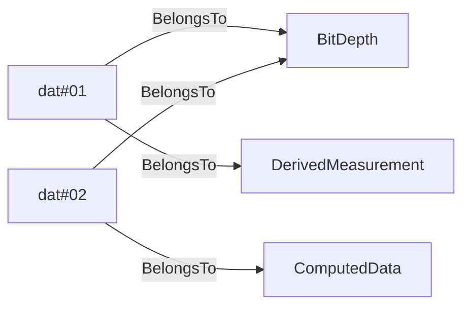

# DWISSemantics<!-- DEFINITION SET HEADER -->
- Description: 
definitions of the base noun and verb. All verbs and nouns in the DWIS vocabulary are children of those.

# Nouns
## DWISNoun <!-- NOUN -->
- Display name: DWIS noun
- Description: 
Nouns refer to the nature of a node in the graph. Implicitely a noun refers to a "is a" relation between the instance node and the noun. This is the root class for all the nouns defined in the DWIS vocabulary.
- Definition set: DWISSemantics
- Examples:
`DWISNoun` is not really intended to be used directly neither when defining semantic facts nor in sparql queries.
# Verbs
## DWISVerb <!-- VERB -->
- Display name: DWIS verb
- Subject class: [DWISNoun](./DWISSemantics.md#DWISNoun)
- Object class: [DWISNoun](./DWISSemantics.md#DWISNoun)
- Definition set: DWISSemantics
- Description: 
This is the root class for all verbs defined in the DWIS vocabulary. It is used to define a relation between a subject, which can be of any `DWISNoun` and an object, also of any type of `DWISNoun`.
- Examples:
`DWISVerb` is not really intended to be used directly neither when defining facts nor in sparql queries.
## BelongsToClass <!-- VERB -->
- Display name: Belongs To Class
- Parent verb: [DWISVerb](./DWISSemantics.md#DWISVerb)
- Subject class: [DWISNoun](./DWISSemantics.md#DWISNoun)
- Object class: [DWISNoun](./DWISSemantics.md#DWISNoun)
- Definition set: DWISSemantics
- Description: 
The verb is used between a node and a Noun, i.e., a class. Semantically it can be considered as a synonym to `rdf:type`. It has been introduced to overcome limitations from OPC-UA that does not allow for multiple inheritance. Note that the same node can be in relation using `BelongsToClass` to several classes.
- Examples:
```ddhub
BitDepth:dat#01
DerivedMeasurement:dat#01
BitDepth:dat#02
ComputedData:dat#02
```
An example semantic graph looks like as follow:

In this example, `dat#01` is a `BitDepth` that is a derived measurement, while `dat#02` is a `BitDepth` that has been estimated.
If one use the following sparql query:
```sparql
PREFIX rdf: <http://www.w3.org/1999/02/22-rdf-syntax-ns#>
PREFIX ddhub: <http://ddhub.no/>
SELECT ?dataPoint 
WHERE {
			?dataPoint rdf:type ddhub:BitDepth .
}
```
one obtain the result:
```
dat#01 dat#02
```
If now the sparql query is:
```sparql
PREFIX rdf: <http://www.w3.org/1999/02/22-rdf-syntax-ns#>
PREFIX ddhub: <http://ddhub.no/>
SELECT ?dataPoint 
WHERE {
			?dataPoint rdf:type ddhub:BitDepth .
			?dataPoint ddhub:BelongsToClass ddhub:Measurement .
}
```
one obtain the result:
```
dat#01
```
