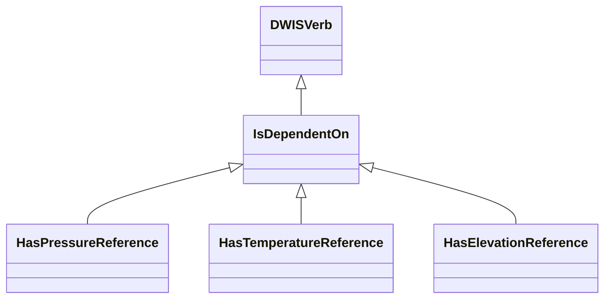
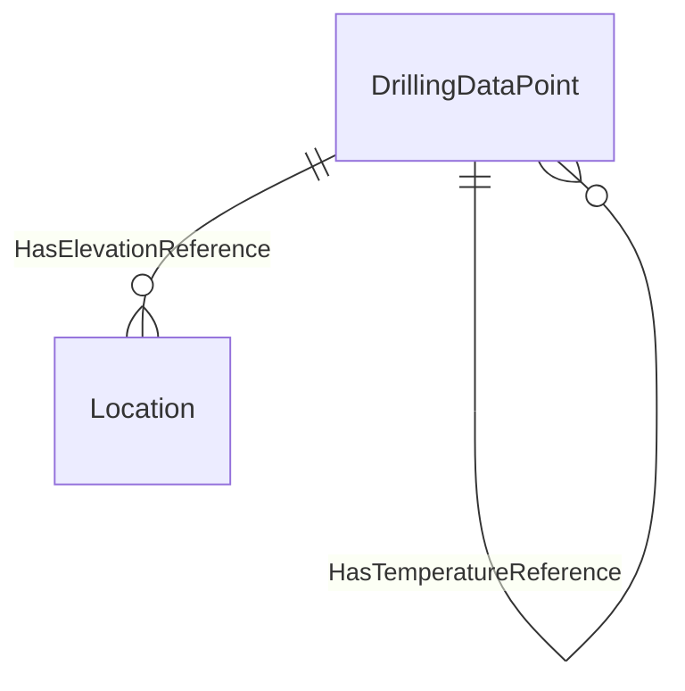

# DataDependencies<!-- DEFINITION SET HEADER -->
- Description: 
this part covers the physical dependencies between signals.

# Nouns
# Verbs
## Class Inheritance for Verbs
Here is a class inheritance diagram for the verbs contained in this definition set.

## Relations
Here is a graph representing the relations that can be made with the verbs defined in this definition set.

## IsDependentOn <!-- VERB -->
- Display name: IsDependentOn
- Parent verb: [DWISVerb](./DWISSemantics.md#DWISVerb)
- Subject class: [DrillingDataPoint](./DrillingDataSemantics.md#DrillingDataPoint)
- Object class: [DrillingDataPoint](./DrillingDataSemantics.md#DrillingDataPoint)
- Definition set: DataDependencies
- Description: 

- Examples:
## HasPressureReference <!-- VERB -->
- Display name: HasPressureReference
- Parent verb: [IsDependentOn](./DataDependencies.md#IsDependentOn)
- Subject class: [DrillingDataPoint](./DrillingDataSemantics.md#DrillingDataPoint)
- Object class: [DrillingDataPoint](./DrillingDataSemantics.md#DrillingDataPoint)
- Definition set: DataDependencies
- Description: 

- Examples:
## HasTemperatureReference <!-- VERB -->
- Display name: HasTemperatureReference
- Parent verb: [IsDependentOn](./DataDependencies.md#IsDependentOn)
- Subject class: [DrillingDataPoint](./DrillingDataSemantics.md#DrillingDataPoint)
- Object class: [DrillingDataPoint](./DrillingDataSemantics.md#DrillingDataPoint)
- Definition set: DataDependencies
- Description: 

- Examples:
## HasElevationReference <!-- VERB -->
- Display name: HasElevationReference
- Parent verb: [IsDependentOn](./DataDependencies.md#IsDependentOn)
- Subject class: [DrillingDataPoint](./DrillingDataSemantics.md#DrillingDataPoint)
- Object class: [Location](./PhysicalLocation.md#Location)
- Definition set: DataDependencies
- Description: 

- Examples:
