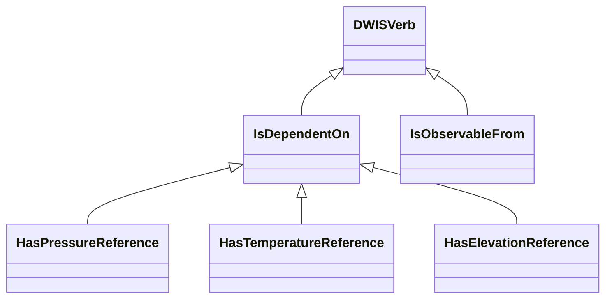
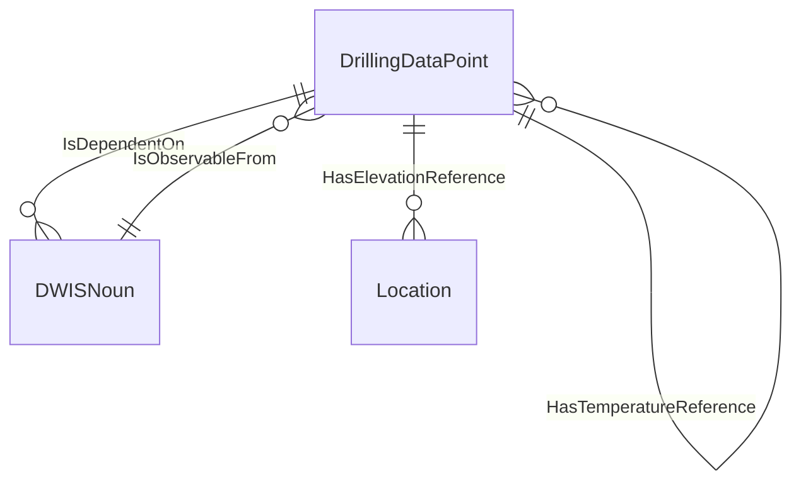
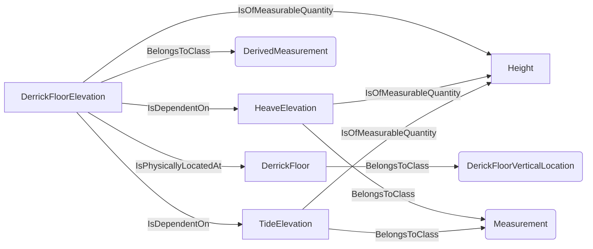
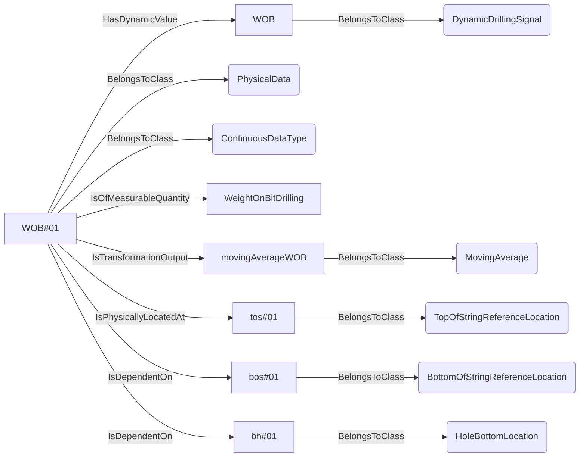
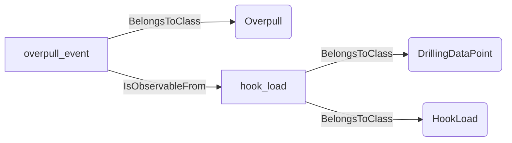
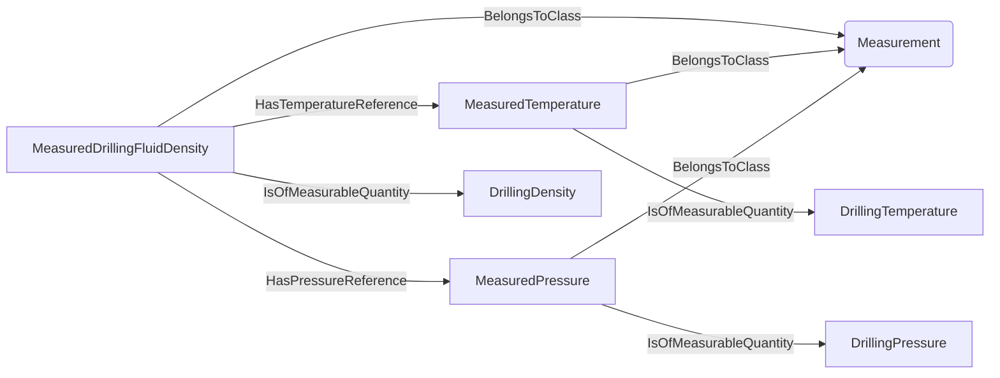
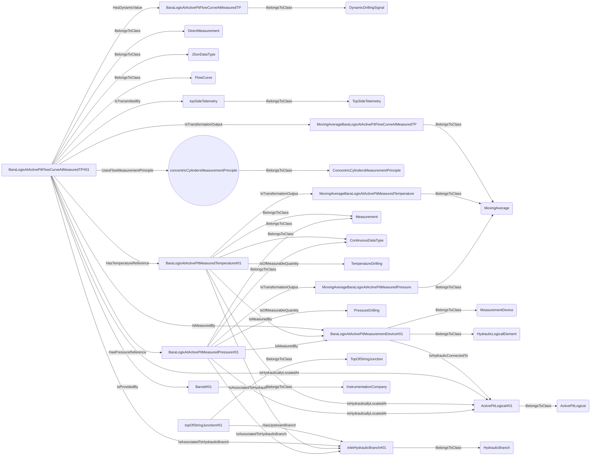
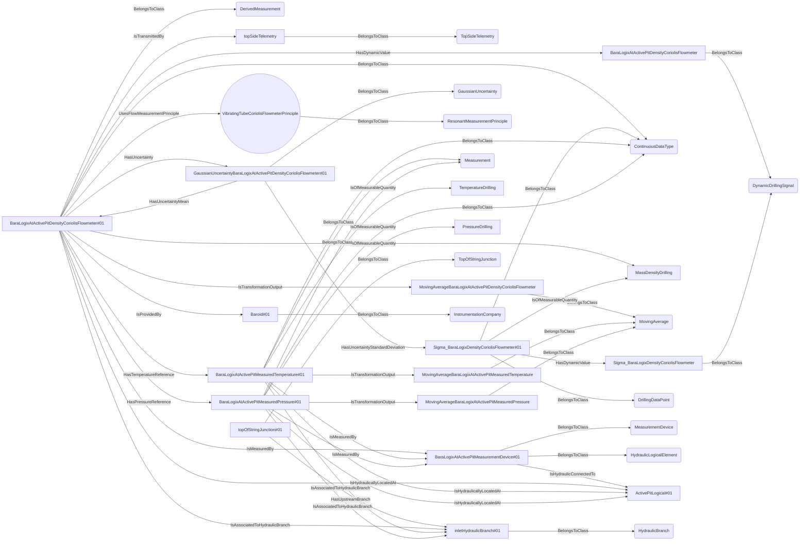
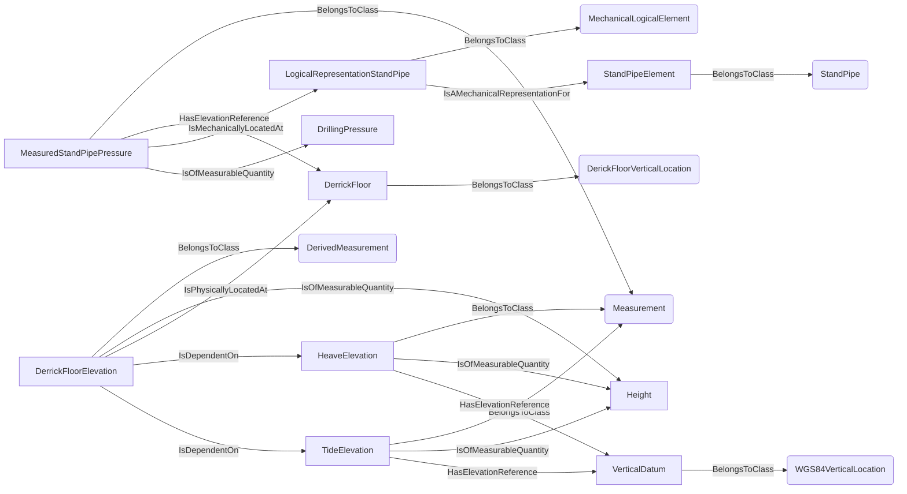

# DataDependencies<!-- DEFINITION SET HEADER -->
- Description: 
this definition set covers the physical dependence of a `DrillingDatPoint` on something else.

# Nouns
# Verbs
## Class Inheritance for Verbs
Here is a class inheritance diagram for the verbs contained in this definition set.

## Relations
Here is a graph representing the relations that can be made with the verbs defined in this definition set.

## IsDependentOn <!-- VERB -->
- Display name: IsDependentOn
- Parent verb: [DWISVerb](./DWISSemantics.md#DWISVerb)
- Subject class: [DrillingDataPoint](./DrillingDataSemantics.md#DrillingDataPoint)
- Object class: [DWISNoun](./DWISSemantics.md#DWISNoun)
- Definition set: DataDependencies
- Description: 
This verb is used to describe a general dependence relationship between a `DrillingDataPoint` and something else.
- Examples:
```dwis IsDependentOnExample
DerickFloorVerticalLocation:DerrickFloor
DerivedMeasurement:DerrickFloorElevation
Measurement:HeaveElevation
Measurement:TideElevation
DerrickFloorElevation IsOfMeasurableQuantity Height
DerrickFloorElevation IsPhysicallyLocatedAt DerrickFloor
HeaveElevation IsOfMeasurableQuantity Height
TideElevation IsOfMeasurableQuantity Height
DerrickFloorElevation IsDependentOn HeaveElevation
DerrickFloorElevation IsDependentOn TideElevation
```
An example semantic graph looks like as follow:

An example SparQL query looks like this:
```sparql
PREFIX rdf: <http://www.w3.org/1999/02/22-rdf-syntax-ns#>
PREFIX ddhub: <http://ddhub.no/>
PREFIX quantity: <http://ddhub.no/UnitAndQuantity>
SELECT ?IsDependentOnExample
WHERE {
	?DerrickFloor rdf:type ddhub:DerickFloorVerticalLocation .
	?DerrickFloorElevation rdf:type ddhub:DerivedMeasurement .
	?HeaveElevation rdf:type ddhub:Measurement .
	?TideElevation rdf:type ddhub:Measurement .
	?DerrickFloorElevation ddhub:IsOfMeasurableQuantity ?Height .
	?DerrickFloorElevation ddhub:IsPhysicallyLocatedAt ?DerrickFloor .
	?HeaveElevation ddhub:IsOfMeasurableQuantity ?Height .
	?TideElevation ddhub:IsOfMeasurableQuantity ?Height .
	?DerrickFloorElevation ddhub:IsDependentOn ?HeaveElevation .
	?DerrickFloorElevation ddhub:IsDependentOn ?TideElevation .
}
```
In this example, it is described that the derrick floor elevation, `DerrickFloorElevation`, 
depends on the heave measurement, `HeaveElevation`, and the tide measurement, `TideElevation`.
```dwis SWOBExample
DynamicDrillingSignal:WOB
PhysicalData:WOB#01
WOB#01 BelongsToClass ContinuousDataType
WOB#01 HasDynamicValue WOB
WOB#01 IsOfMeasurableQuantity WeightOnBitDrilling
MovingAverage:movingAverageWOB
WOB#01 IsTransformationOutput movingAverageWOB
TopOfStringReferenceLocation:tos#01
WOB#01 IsPhysicallyLocatedAt tos#01
BottomOfStringReferenceLocation:bos#01
HoleBottomLocation:bh#01
WOB#01 IsDependentOn bos#01
WOB#01 IsDependentOn bh#01
```
An example semantic graph looks like as follow:

An example SparQL query looks like this:
```sparql
PREFIX rdf: <http://www.w3.org/1999/02/22-rdf-syntax-ns#>
PREFIX ddhub: <http://ddhub.no/>
PREFIX quantity: <http://ddhub.no/UnitAndQuantity>
SELECT ?SWOBExample
WHERE {
	?WOB rdf:type ddhub:DynamicDrillingSignal .
	?WOB#01 rdf:type ddhub:PhysicalData .
	?WOB#01 rdf:type ddhub:ContinuousDataType .
	?WOB#01 ddhub:HasDynamicValue ?WOB .
	?WOB#01 ddhub:IsOfMeasurableQuantity ?WeightOnBitDrilling .
	?movingAverageWOB rdf:type ddhub:MovingAverage .
	?WOB#01 ddhub:IsTransformationOutput ?movingAverageWOB .
	?tos#01 rdf:type ddhub:TopOfStringReferenceLocation .
	?WOB#01 ddhub:IsPhysicallyLocatedAt ?tos#01 .
	?bos#01 rdf:type ddhub:BottomOfStringReferenceLocation .
	?bh#01 rdf:type ddhub:HoleBottomLocation .
	?WOB#01 ddhub:IsDependentOn ?bos#01 .
	?WOB#01 ddhub:IsDependentOn ?bh#01 .
}
```
In this example, it is described that the surface weight on bit drilling data point, `WOB#01`, depends on bottom of string location and hole bottom location.
## IsObservableFrom <!-- VERB -->
- Display name: IsObservableFrom
- Parent verb: [DWISVerb](./DWISSemantics.md#DWISVerb)
- Subject class: [DWISNoun](./DWISSemantics.md#DWISNoun)
- Object class: [DrillingDataPoint](./DrillingDataSemantics.md#DrillingDataPoint)
- Definition set: DataDependencies
- Description: 
This `Verb` means that something can be seen, detected, or noticed from a particular
location or perspective. It implies that there is a clear view or means of perception from one point 
to another.
- Examples:
``` dwis
Overpull:overpull_event
DrillingDataPoint:hook_load
hook_load BelongsToClass HookLoad
overpull_event IsObservableFrom hook_load
```
An example semantic graph looks like as follow:

## HasPressureReference <!-- VERB -->
- Display name: HasPressureReference
- Parent verb: [IsDependentOn](./DataDependencies.md#IsDependentOn)
- Subject class: [DrillingDataPoint](./DrillingDataSemantics.md#DrillingDataPoint)
- Object class: [DrillingDataPoint](./DrillingDataSemantics.md#DrillingDataPoint)
- Definition set: DataDependencies
- Description: 
This verb is a specialization of `IsDependentOn` and refers to the specific dependence on a pressure reference.
- Examples:
```dwis MeasuredDrillingFluidDensity MeasuredTemperature MeasuredPressure
Measurement:MeasuredDrillingFluidDensity
Measurement:MeasuredTemperature
Measurement:MeasuredPressure
MeasuredDrillingFluidDensity IsOfMeasurableQuantity DrillingDensity
MeasuredTemperature IsOfMeasurableQuantity DrillingTemperature
MeasuredPressure IsOfMeasurableQuantity DrillingPressure
MeasuredDrillingFluidDensity HasTemperatureReference MeasuredTemperature
MeasuredDrillingFluidDensity HasPressureReference MeasuredPressure
```
An example semantic graph looks like as follow:

An example SparQL query looks like this:
```sparql
PREFIX rdf: <http://www.w3.org/1999/02/22-rdf-syntax-ns#>
PREFIX ddhub: <http://ddhub.no/>
PREFIX quantity: <http://ddhub.no/UnitAndQuantity>
SELECT ?MeasuredDrillingFluidDensity, ?MeasuredTemperature, ?MeasuredPressure
WHERE {
	?MeasuredDrillingFluidDensity rdf:type ddhub:Measurement .
	?MeasuredTemperature rdf:type ddhub:Measurement .
	?MeasuredPressure rdf:type ddhub:Measurement .
	?MeasuredDrillingFluidDensity ddhub:IsOfMeasurableQuantity ?DrillingDensity .
	?MeasuredTemperature ddhub:IsOfMeasurableQuantity ?DrillingTemperature .
	?MeasuredPressure ddhub:IsOfMeasurableQuantity ?DrillingPressure .
	?MeasuredDrillingFluidDensity ddhub:HasTemperatureReference ?MeasuredTemperature .
	?MeasuredDrillingFluidDensity ddhub:HasPressureReference ?MeasuredPressure .
}
```
In this example, it is described that `MeasuredDrillingFluidDensity`, which is a measurement of the measurable quantity
`DrillingDensity` has a dependence on pressure and temperature, and that the associated measured pressure can be found
at `MeasuredPressure`.
```dwis FlowCurveExample
DynamicDrillingSignal:BaraLogixAtActivePitFlowCurveAtMeasuredTP
DirectMeasurement:BaraLogixAtActivePitFlowCurveAtMeasuredTP#01
BaraLogixAtActivePitFlowCurveAtMeasuredTP#01 BelongsToClass JSonDataType
BaraLogixAtActivePitFlowCurveAtMeasuredTP#01 BelongsToClass FlowCurve
BaraLogixAtActivePitFlowCurveAtMeasuredTP#01 HasDynamicValue BaraLogixAtActivePitFlowCurveAtMeasuredTP
TopSideTelemetry:topSideTelemetry
BaraLogixAtActivePitFlowCurveAtMeasuredTP#01 IsTransmittedBy topSideTelemetry
MovingAverage:MovingAverageBaraLogixAtActivePitFlowCurveAtMeasuredTP
BaraLogixAtActivePitFlowCurveAtMeasuredTP#01 IsTransformationOutput MovingAverageBaraLogixAtActivePitFlowCurveAtMeasuredTP
ConcentricCylindersMeasurementPrinciple:concentricCylindersMeasurementPrinciple
BaraLogixAtActivePitFlowCurveAtMeasuredTP#01 UsesFlowMeasurementPrinciple concentricCylindersMeasurementPrinciple
MeasurementDevice:BaraLogixAtActivePitMeasurementDevice#01
BaraLogixAtActivePitMeasurementDevice#01 BelongsToClass HydraulicLogicalElement
BaraLogixAtActivePitFlowCurveAtMeasuredTP#01 IsMeasuredBy BaraLogixAtActivePitMeasurementDevice#01
ActivePitLogical:ActivePitLogical#01
BaraLogixAtActivePitMeasurementDevice#01 IsHydraulicConnectedTo ActivePitLogical#01
BaraLogixAtActivePitFlowCurveAtMeasuredTP#01 IsHydraulicallyLocatedAt ActivePitLogical#01
Measurement:BaraLogixAtActivePitMeasuredTemperature#01
BaraLogixAtActivePitMeasuredTemperature#01 BelongsToClass ContinuousDataType
BaraLogixAtActivePitMeasuredTemperature#01 IsOfMeasurableQuantity TemperatureDrilling
MovingAverage:MovingAverageBaraLogixAtActivePitMeasuredTemperature
BaraLogixAtActivePitMeasuredTemperature#01 IsTransformationOutput MovingAverageBaraLogixAtActivePitMeasuredTemperature
BaraLogixAtActivePitMeasuredTemperature#01 IsMeasuredBy BaraLogixAtActivePitMeasurementDevice#01
BaraLogixAtActivePitMeasuredTemperature#01 IsHydraulicallyLocatedAt ActivePitLogical#01
BaraLogixAtActivePitFlowCurveAtMeasuredTP#01 HasTemperatureReference BaraLogixAtActivePitMeasuredTemperature#01
Measurement:BaraLogixAtActivePitMeasuredPressure#01
BaraLogixAtActivePitMeasuredPressure#01 BelongsToClass ContinuousDataType
BaraLogixAtActivePitMeasuredPressure#01 IsOfMeasurableQuantity PressureDrilling
MovingAverage:MovingAverageBaraLogixAtActivePitMeasuredPressure
BaraLogixAtActivePitMeasuredPressure#01 IsTransformationOutput MovingAverageBaraLogixAtActivePitMeasuredPressure
BaraLogixAtActivePitMeasuredPressure#01 IsMeasuredBy BaraLogixAtActivePitMeasurementDevice#01
BaraLogixAtActivePitMeasuredPressure#01 IsHydraulicallyLocatedAt ActivePitLogical#01
BaraLogixAtActivePitFlowCurveAtMeasuredTP#01 HasPressureReference BaraLogixAtActivePitMeasuredPressure#01
TopOfStringJunction:topOfStringJunction#01
HydraulicBranch:inletHydraulicBranch#01
topOfStringJunction#01 HasUpstreamBranch inletHydraulicBranch#01
BaraLogixAtActivePitFlowCurveAtMeasuredTP#01 IsAssociatedToHydraulicBranch inletHydraulicBranch#01
BaraLogixAtActivePitMeasuredTemperature#01 IsAssociatedToHydraulicBranch inletHydraulicBranch#01
BaraLogixAtActivePitMeasuredPressure#01 IsAssociatedToHydraulicBranch inletHydraulicBranch#01
InstrumentationCompany:Baroid#01
BaraLogixAtActivePitFlowCurveAtMeasuredTP#01 IsProvidedBy Baroid#01
```
An example semantic graph looks like as follow:

An example SparQL query looks like this:
```sparql
PREFIX rdf: <http://www.w3.org/1999/02/22-rdf-syntax-ns#>
PREFIX ddhub: <http://ddhub.no/>
PREFIX quantity: <http://ddhub.no/UnitAndQuantity>
SELECT ?FlowCurveExample
WHERE {
	?BaraLogixAtActivePitFlowCurveAtMeasuredTP rdf:type ddhub:DynamicDrillingSignal .
	?BaraLogixAtActivePitFlowCurveAtMeasuredTP#01 rdf:type ddhub:DirectMeasurement .
	?BaraLogixAtActivePitFlowCurveAtMeasuredTP#01 rdf:type ddhub:JSonDataType .
	?BaraLogixAtActivePitFlowCurveAtMeasuredTP#01 rdf:type ddhub:FlowCurve .
	?BaraLogixAtActivePitFlowCurveAtMeasuredTP#01 ddhub:HasDynamicValue ?BaraLogixAtActivePitFlowCurveAtMeasuredTP .
	?topSideTelemetry rdf:type ddhub:TopSideTelemetry .
	?BaraLogixAtActivePitFlowCurveAtMeasuredTP#01 ddhub:IsTransmittedBy ?topSideTelemetry .
	?MovingAverageBaraLogixAtActivePitFlowCurveAtMeasuredTP rdf:type ddhub:MovingAverage .
	?BaraLogixAtActivePitFlowCurveAtMeasuredTP#01 ddhub:IsTransformationOutput ?MovingAverageBaraLogixAtActivePitFlowCurveAtMeasuredTP .
	?concentricCylindersMeasurementPrinciple rdf:type ddhub:ConcentricCylindersMeasurementPrinciple .
	?BaraLogixAtActivePitMeasurementDevice#01 rdf:type ddhub:MeasurementDevice .
	?BaraLogixAtActivePitMeasurementDevice#01 rdf:type ddhub:HydraulicLogicalElement .
	?BaraLogixAtActivePitFlowCurveAtMeasuredTP#01 ddhub:IsMeasuredBy ?BaraLogixAtActivePitMeasurementDevice#01 .
	?ActivePitLogical#01 rdf:type ddhub:ActivePitLogical .
	?BaraLogixAtActivePitMeasurementDevice#01 ddhub:IsHydraulicConnectedTo ?ActivePitLogical#01 .
	?BaraLogixAtActivePitFlowCurveAtMeasuredTP#01 ddhub:IsHydraulicallyLocatedAt ?ActivePitLogical#01 .
	?BaraLogixAtActivePitMeasuredTemperature#01 rdf:type ddhub:Measurement .
	?BaraLogixAtActivePitMeasuredTemperature#01 rdf:type ddhub:ContinuousDataType .
	?BaraLogixAtActivePitMeasuredTemperature#01 ddhub:IsOfMeasurableQuantity ?TemperatureDrilling .
	?MovingAverageBaraLogixAtActivePitMeasuredTemperature rdf:type ddhub:MovingAverage .
	?BaraLogixAtActivePitMeasuredTemperature#01 ddhub:IsTransformationOutput ?MovingAverageBaraLogixAtActivePitMeasuredTemperature .
	?BaraLogixAtActivePitMeasuredTemperature#01 ddhub:IsMeasuredBy ?BaraLogixAtActivePitMeasurementDevice#01 .
	?BaraLogixAtActivePitMeasuredTemperature#01 ddhub:IsHydraulicallyLocatedAt ?ActivePitLogical#01 .
	?BaraLogixAtActivePitFlowCurveAtMeasuredTP#01 ddhub:HasTemperatureReference ?BaraLogixAtActivePitMeasuredTemperature#01 .
	?BaraLogixAtActivePitMeasuredPressure#01 rdf:type ddhub:Measurement .
	?BaraLogixAtActivePitMeasuredPressure#01 rdf:type ddhub:ContinuousDataType .
	?BaraLogixAtActivePitMeasuredPressure#01 ddhub:IsOfMeasurableQuantity ?PressureDrilling .
	?MovingAverageBaraLogixAtActivePitMeasuredPressure rdf:type ddhub:MovingAverage .
	?BaraLogixAtActivePitMeasuredPressure#01 ddhub:IsTransformationOutput ?MovingAverageBaraLogixAtActivePitMeasuredPressure .
	?BaraLogixAtActivePitMeasuredPressure#01 ddhub:IsMeasuredBy ?BaraLogixAtActivePitMeasurementDevice#01 .
	?BaraLogixAtActivePitMeasuredPressure#01 ddhub:IsHydraulicallyLocatedAt ?ActivePitLogical#01 .
	?BaraLogixAtActivePitFlowCurveAtMeasuredTP#01 ddhub:HasPressureReference ?BaraLogixAtActivePitMeasuredPressure#01 .
	?topOfStringJunction#01 rdf:type ddhub:TopOfStringJunction .
	?inletHydraulicBranch#01 rdf:type ddhub:HydraulicBranch .
	?topOfStringJunction#01 ddhub:HasUpstreamBranch ?inletHydraulicBranch#01 .
	?BaraLogixAtActivePitFlowCurveAtMeasuredTP#01 ddhub:IsAssociatedToHydraulicBranch ?inletHydraulicBranch#01 .
	?BaraLogixAtActivePitMeasuredTemperature#01 ddhub:IsAssociatedToHydraulicBranch ?inletHydraulicBranch#01 .
	?BaraLogixAtActivePitMeasuredPressure#01 ddhub:IsAssociatedToHydraulicBranch ?inletHydraulicBranch#01 .
	?Baroid#01 rdf:type ddhub:InstrumentationCompany .
	?BaraLogixAtActivePitFlowCurveAtMeasuredTP#01 ddhub:IsProvidedBy ?Baroid#01 .
  FILTER (
	?Attribute000 = concentricCylindersMeasurementPrinciple
  )
}
```
## HasTemperatureReference <!-- VERB -->
- Display name: HasTemperatureReference
- Parent verb: [IsDependentOn](./DataDependencies.md#IsDependentOn)
- Subject class: [DrillingDataPoint](./DrillingDataSemantics.md#DrillingDataPoint)
- Object class: [DrillingDataPoint](./DrillingDataSemantics.md#DrillingDataPoint)
- Definition set: DataDependencies
- Description: 
This verb is a specialization of `IsDependentOn` and refers to the specific dependence on a temperature reference.
- Examples:
```dwis MeasuredDrillingFluidDensity MeasuredTemperature MeasuredPressure
Measurement:MeasuredDrillingFluidDensity
Measurement:MeasuredTemperature
Measurement:MeasuredPressure
MeasuredDrillingFluidDensity IsOfMeasurableQuantity DrillingDensity
MeasuredTemperature IsOfMeasurableQuantity DrillingTemperature
MeasuredPressure IsOfMeasurableQuantity DrillingPressure
MeasuredDrillingFluidDensity HasTemperatureReference MeasuredTemperature
MeasuredDrillingFluidDensity HasPressureReference MeasuredPressure
```
An example semantic graph looks like as follow:

An example SparQL query looks like this:
```sparql
PREFIX rdf: <http://www.w3.org/1999/02/22-rdf-syntax-ns#>
PREFIX ddhub: <http://ddhub.no/>
PREFIX quantity: <http://ddhub.no/UnitAndQuantity>
SELECT ?MeasuredDrillingFluidDensity, ?MeasuredTemperature, ?MeasuredPressure
WHERE {
	?MeasuredDrillingFluidDensity rdf:type ddhub:Measurement .
	?MeasuredTemperature rdf:type ddhub:Measurement .
	?MeasuredPressure rdf:type ddhub:Measurement .
	?MeasuredDrillingFluidDensity ddhub:IsOfMeasurableQuantity ?DrillingDensity .
	?MeasuredTemperature ddhub:IsOfMeasurableQuantity ?DrillingTemperature .
	?MeasuredPressure ddhub:IsOfMeasurableQuantity ?DrillingPressure .
	?MeasuredDrillingFluidDensity ddhub:HasTemperatureReference ?MeasuredTemperature .
	?MeasuredDrillingFluidDensity ddhub:HasPressureReference ?MeasuredPressure .
}
```
In this example, it is described that `MeasuredDrillingFluidDensity`, which is a measurement of the measurable quantity
`DrillingDensity` has a dependence on pressure and temperature, and that the associated measured temperaure can be found
at `MeasuredTemperature`.
```dwis DensityExample
DynamicDrillingSignal:BaraLogixAtActivePitDensityCoriolisFlowmeter
DerivedMeasurement:BaraLogixAtActivePitDensityCoriolisFlowmeter#01
BaraLogixAtActivePitDensityCoriolisFlowmeter#01 BelongsToClass ContinuousDataType
BaraLogixAtActivePitDensityCoriolisFlowmeter#01 HasDynamicValue BaraLogixAtActivePitDensityCoriolisFlowmeter
BaraLogixAtActivePitDensityCoriolisFlowmeter#01 IsOfMeasurableQuantity MassDensityDrilling
TopSideTelemetry:topSideTelemetry
BaraLogixAtActivePitDensityCoriolisFlowmeter#01 IsTransmittedBy topSideTelemetry
MovingAverage:MovingAverageBaraLogixAtActivePitDensityCoriolisFlowmeter
BaraLogixAtActivePitDensityCoriolisFlowmeter#01 IsTransformationOutput MovingAverageBaraLogixAtActivePitDensityCoriolisFlowmeter
DynamicDrillingSignal:Sigma_BaraLogixDensityCoriolisFlowmeter
DrillingDataPoint:Sigma_BaraLogixDensityCoriolisFlowmeter#01
Sigma_BaraLogixDensityCoriolisFlowmeter#01 BelongsToClass ContinuousDataType
Sigma_BaraLogixDensityCoriolisFlowmeter#01 HasDynamicValue Sigma_BaraLogixDensityCoriolisFlowmeter
Sigma_BaraLogixDensityCoriolisFlowmeter#01 IsOfMeasurableQuantity MassDensityDrilling
GaussianUncertainty:GaussianUncertaintyBaraLogixAtActivePitDensityCoriolisFlowmeter#01
BaraLogixAtActivePitDensityCoriolisFlowmeter#01 HasUncertainty GaussianUncertaintyBaraLogixAtActivePitDensityCoriolisFlowmeter#01
GaussianUncertaintyBaraLogixAtActivePitDensityCoriolisFlowmeter#01 HasUncertaintyMean BaraLogixAtActivePitDensityCoriolisFlowmeter#01
GaussianUncertaintyBaraLogixAtActivePitDensityCoriolisFlowmeter#01 HasUncertaintyStandardDeviation Sigma_BaraLogixDensityCoriolisFlowmeter#01
ResonantMeasurementPrinciple:VibratingTubeCoriolisFlowmeterPrinciple
BaraLogixAtActivePitDensityCoriolisFlowmeter#01 UsesFlowMeasurementPrinciple VibratingTubeCoriolisFlowmeterPrinciple
MeasurementDevice:BaraLogixAtActivePitMeasurementDevice#01
BaraLogixAtActivePitMeasurementDevice#01 BelongsToClass HydraulicLogicalElement
BaraLogixAtActivePitMeasurementDevice#01 IsHydraulicConnectedTo ActivePitLogical#01
BaraLogixAtActivePitDensityCoriolisFlowmeter#01 IsMeasuredBy BaraLogixAtActivePitMeasurementDevice#01
BaraLogixAtActivePitDensityCoriolisFlowmeter#01 IsHydraulicallyLocatedAt ActivePitLogical#01
Measurement:BaraLogixAtActivePitMeasuredTemperature#01
BaraLogixAtActivePitMeasuredTemperature#01 BelongsToClass ContinuousDataType
BaraLogixAtActivePitMeasuredTemperature#01 IsOfMeasurableQuantity TemperatureDrilling
MovingAverage:MovingAverageBaraLogixAtActivePitMeasuredTemperature
BaraLogixAtActivePitMeasuredTemperature#01 IsTransformationOutput MovingAverageBaraLogixAtActivePitMeasuredTemperature
BaraLogixAtActivePitMeasuredTemperature#01 IsMeasuredBy BaraLogixAtActivePitMeasurementDevice#01
BaraLogixAtActivePitMeasuredTemperature#01 IsHydraulicallyLocatedAt ActivePitLogical#01
BaraLogixAtActivePitDensityCoriolisFlowmeter#01 HasTemperatureReference BaraLogixAtActivePitMeasuredTemperature#01
Measurement:BaraLogixAtActivePitMeasuredPressure#01
BaraLogixAtActivePitMeasuredPressure#01 BelongsToClass ContinuousDataType
BaraLogixAtActivePitMeasuredPressure#01 IsOfMeasurableQuantity PressureDrilling
MovingAverage:MovingAverageBaraLogixAtActivePitMeasuredPressure
BaraLogixAtActivePitMeasuredPressure#01 IsTransformationOutput MovingAverageBaraLogixAtActivePitMeasuredPressure
BaraLogixAtActivePitMeasuredPressure#01 IsMeasuredBy BaraLogixAtActivePitMeasurementDevice#01
BaraLogixAtActivePitMeasuredPressure#01 IsHydraulicallyLocatedAt ActivePitLogical#01
BaraLogixAtActivePitDensityCoriolisFlowmeter#01 HasPressureReference BaraLogixAtActivePitMeasuredPressure#01
TopOfStringJunction:topOfStringJunction#01
HydraulicBranch:inletHydraulicBranch#01
topOfStringJunction#01 HasUpstreamBranch inletHydraulicBranch#01
BaraLogixAtActivePitDensityCoriolisFlowmeter#01 IsAssociatedToHydraulicBranch inletHydraulicBranch#01
BaraLogixAtActivePitMeasuredTemperature#01 IsAssociatedToHydraulicBranch inletHydraulicBranch#01
BaraLogixAtActivePitMeasuredPressure#01 IsAssociatedToHydraulicBranch inletHydraulicBranch#01
InstrumentationCompany:Baroid#01
BaraLogixAtActivePitDensityCoriolisFlowmeter#01 IsProvidedBy Baroid#01
```
An example semantic graph looks like as follow:

An example SparQL query looks like this:
```sparql
PREFIX rdf: <http://www.w3.org/1999/02/22-rdf-syntax-ns#>
PREFIX ddhub: <http://ddhub.no/>
PREFIX quantity: <http://ddhub.no/UnitAndQuantity>
SELECT ?DensityExample
WHERE {
	?BaraLogixAtActivePitDensityCoriolisFlowmeter rdf:type ddhub:DynamicDrillingSignal .
	?BaraLogixAtActivePitDensityCoriolisFlowmeter#01 rdf:type ddhub:DerivedMeasurement .
	?BaraLogixAtActivePitDensityCoriolisFlowmeter#01 rdf:type ddhub:ContinuousDataType .
	?BaraLogixAtActivePitDensityCoriolisFlowmeter#01 ddhub:HasDynamicValue ?BaraLogixAtActivePitDensityCoriolisFlowmeter .
	?BaraLogixAtActivePitDensityCoriolisFlowmeter#01 ddhub:IsOfMeasurableQuantity ?MassDensityDrilling .
	?topSideTelemetry rdf:type ddhub:TopSideTelemetry .
	?BaraLogixAtActivePitDensityCoriolisFlowmeter#01 ddhub:IsTransmittedBy ?topSideTelemetry .
	?MovingAverageBaraLogixAtActivePitDensityCoriolisFlowmeter rdf:type ddhub:MovingAverage .
	?BaraLogixAtActivePitDensityCoriolisFlowmeter#01 ddhub:IsTransformationOutput ?MovingAverageBaraLogixAtActivePitDensityCoriolisFlowmeter .
	?Sigma_BaraLogixDensityCoriolisFlowmeter rdf:type ddhub:DynamicDrillingSignal .
	?Sigma_BaraLogixDensityCoriolisFlowmeter#01 rdf:type ddhub:DrillingDataPoint .
	?Sigma_BaraLogixDensityCoriolisFlowmeter#01 rdf:type ddhub:ContinuousDataType .
	?Sigma_BaraLogixDensityCoriolisFlowmeter#01 ddhub:HasDynamicValue ?Sigma_BaraLogixDensityCoriolisFlowmeter .
	?Sigma_BaraLogixDensityCoriolisFlowmeter#01 ddhub:IsOfMeasurableQuantity ?MassDensityDrilling .
	?GaussianUncertaintyBaraLogixAtActivePitDensityCoriolisFlowmeter#01 rdf:type ddhub:GaussianUncertainty .
	?BaraLogixAtActivePitDensityCoriolisFlowmeter#01 ddhub:HasUncertainty ?GaussianUncertaintyBaraLogixAtActivePitDensityCoriolisFlowmeter#01 .
	?GaussianUncertaintyBaraLogixAtActivePitDensityCoriolisFlowmeter#01 ddhub:HasUncertaintyMean ?BaraLogixAtActivePitDensityCoriolisFlowmeter#01 .
	?GaussianUncertaintyBaraLogixAtActivePitDensityCoriolisFlowmeter#01 ddhub:HasUncertaintyStandardDeviation ?Sigma_BaraLogixDensityCoriolisFlowmeter#01 .
	?VibratingTubeCoriolisFlowmeterPrinciple rdf:type ddhub:ResonantMeasurementPrinciple .
	?BaraLogixAtActivePitMeasurementDevice#01 rdf:type ddhub:MeasurementDevice .
	?BaraLogixAtActivePitMeasurementDevice#01 rdf:type ddhub:HydraulicLogicalElement .
	?BaraLogixAtActivePitMeasurementDevice#01 ddhub:IsHydraulicConnectedTo ?ActivePitLogical#01 .
	?BaraLogixAtActivePitDensityCoriolisFlowmeter#01 ddhub:IsMeasuredBy ?BaraLogixAtActivePitMeasurementDevice#01 .
	?BaraLogixAtActivePitDensityCoriolisFlowmeter#01 ddhub:IsHydraulicallyLocatedAt ?ActivePitLogical#01 .
	?BaraLogixAtActivePitMeasuredTemperature#01 rdf:type ddhub:Measurement .
	?BaraLogixAtActivePitMeasuredTemperature#01 rdf:type ddhub:ContinuousDataType .
	?BaraLogixAtActivePitMeasuredTemperature#01 ddhub:IsOfMeasurableQuantity ?TemperatureDrilling .
	?MovingAverageBaraLogixAtActivePitMeasuredTemperature rdf:type ddhub:MovingAverage .
	?BaraLogixAtActivePitMeasuredTemperature#01 ddhub:IsTransformationOutput ?MovingAverageBaraLogixAtActivePitMeasuredTemperature .
	?BaraLogixAtActivePitMeasuredTemperature#01 ddhub:IsMeasuredBy ?BaraLogixAtActivePitMeasurementDevice#01 .
	?BaraLogixAtActivePitMeasuredTemperature#01 ddhub:IsHydraulicallyLocatedAt ?ActivePitLogical#01 .
	?BaraLogixAtActivePitDensityCoriolisFlowmeter#01 ddhub:HasTemperatureReference ?BaraLogixAtActivePitMeasuredTemperature#01 .
	?BaraLogixAtActivePitMeasuredPressure#01 rdf:type ddhub:Measurement .
	?BaraLogixAtActivePitMeasuredPressure#01 rdf:type ddhub:ContinuousDataType .
	?BaraLogixAtActivePitMeasuredPressure#01 ddhub:IsOfMeasurableQuantity ?PressureDrilling .
	?MovingAverageBaraLogixAtActivePitMeasuredPressure rdf:type ddhub:MovingAverage .
	?BaraLogixAtActivePitMeasuredPressure#01 ddhub:IsTransformationOutput ?MovingAverageBaraLogixAtActivePitMeasuredPressure .
	?BaraLogixAtActivePitMeasuredPressure#01 ddhub:IsMeasuredBy ?BaraLogixAtActivePitMeasurementDevice#01 .
	?BaraLogixAtActivePitMeasuredPressure#01 ddhub:IsHydraulicallyLocatedAt ?ActivePitLogical#01 .
	?BaraLogixAtActivePitDensityCoriolisFlowmeter#01 ddhub:HasPressureReference ?BaraLogixAtActivePitMeasuredPressure#01 .
	?topOfStringJunction#01 rdf:type ddhub:TopOfStringJunction .
	?inletHydraulicBranch#01 rdf:type ddhub:HydraulicBranch .
	?topOfStringJunction#01 ddhub:HasUpstreamBranch ?inletHydraulicBranch#01 .
	?BaraLogixAtActivePitDensityCoriolisFlowmeter#01 ddhub:IsAssociatedToHydraulicBranch ?inletHydraulicBranch#01 .
	?BaraLogixAtActivePitMeasuredTemperature#01 ddhub:IsAssociatedToHydraulicBranch ?inletHydraulicBranch#01 .
	?BaraLogixAtActivePitMeasuredPressure#01 ddhub:IsAssociatedToHydraulicBranch ?inletHydraulicBranch#01 .
	?Baroid#01 rdf:type ddhub:InstrumentationCompany .
	?BaraLogixAtActivePitDensityCoriolisFlowmeter#01 ddhub:IsProvidedBy ?Baroid#01 .
  FILTER (
	?Attribute000 = VibratingTubeCoriolisFlowmeterPrinciple
  )
}
```
## HasElevationReference <!-- VERB -->
- Display name: HasElevationReference
- Parent verb: [IsDependentOn](./DataDependencies.md#IsDependentOn)
- Subject class: [DrillingDataPoint](./DrillingDataSemantics.md#DrillingDataPoint)
- Object class: [Location](./PhysicalLocation.md#Location)
- Definition set: DataDependencies
- Description: 
This verb is a specialization of `IsDependentOn` and refers to the specific dependence on an elevation reference.
- Examples:
```dwis MeasuredStandPipePressure DerrickFloorElevation HeaveElevation TideElevation
Measurement:MeasuredStandPipePressure
DerickFloorVerticalLocation:DerrickFloor
DerivedMeasurement:DerrickFloorElevation
Measurement:HeaveElevation
Measurement:TideElevation
StandPipe:StandPipeElement
MechanicalLogicalElement:LogicalRepresentationStandPipe
MeasuredStandPipePressure HasElevationReference DerrickFloor
LogicalRepresentationStandPipe IsAMechanicalRepresentationFor StandPipeElement
MeasuredStandPipePressure IsMechanicallyLocatedAt LogicalRepresentationStandPipe
MeasuredStandPipePressure IsOfMeasurableQuantity DrillingPressure
DerrickFloorElevation IsOfMeasurableQuantity Height
DerrickFloorElevation IsPhysicallyLocatedAt DerrickFloor
HeaveElevation IsOfMeasurableQuantity Height
TideElevation IsOfMeasurableQuantity Height
WGS84VerticalLocation:VerticalDatum
HeaveElevation HasElevationReference VerticalDatum
TideElevation HasElevationReference VerticalDatum
DerrickFloorElevation IsDependentOn HeaveElevation
DerrickFloorElevation IsDependentOn TideElevation
```
An example semantic graph looks like as follow:

An example SparQL query looks like this:
```sparql
PREFIX rdf: <http://www.w3.org/1999/02/22-rdf-syntax-ns#>
PREFIX ddhub: <http://ddhub.no/>
PREFIX quantity: <http://ddhub.no/UnitAndQuantity>
SELECT ?MeasuredStandPipePressure, ?DerrickFloorElevation, ?HeaveElevation, ?TideElevation
WHERE {
	?MeasuredStandPipePressure rdf:type ddhub:Measurement .
	?DerrickFloor rdf:type ddhub:DerickFloorVerticalLocation .
	?DerrickFloorElevation rdf:type ddhub:DerivedMeasurement .
	?HeaveElevation rdf:type ddhub:Measurement .
	?TideElevation rdf:type ddhub:Measurement .
	?StandPipeElement rdf:type ddhub:StandPipe .
	?LogicalRepresentationStandPipe rdf:type ddhub:MechanicalLogicalElement .
	?MeasuredStandPipePressure ddhub:HasElevationReference ?DerrickFloor .
	?LogicalRepresentationStandPipe ddhub:IsAMechanicalRepresentationFor ?StandPipeElement .
	?MeasuredStandPipePressure ddhub:IsMechanicallyLocatedAt ?LogicalRepresentationStandPipe .
	?MeasuredStandPipePressure ddhub:IsOfMeasurableQuantity ?DrillingPressure .
	?DerrickFloorElevation ddhub:IsOfMeasurableQuantity ?Height .
	?DerrickFloorElevation ddhub:IsPhysicallyLocatedAt ?DerrickFloor .
	?HeaveElevation ddhub:IsOfMeasurableQuantity ?Height .
	?TideElevation ddhub:IsOfMeasurableQuantity ?Height .
	?VerticalDatum rdf:type ddhub:WGS84VerticalLocation .
	?HeaveElevation ddhub:HasElevationReference ?VerticalDatum .
	?TideElevation ddhub:HasElevationReference ?VerticalDatum .
	?DerrickFloorElevation ddhub:IsDependentOn ?HeaveElevation .
	?DerrickFloorElevation ddhub:IsDependentOn ?TideElevation .
}
```
In this example, it is described that the standpipe pressure measurement, `MeasuredStandPipePressure`, depends on
the derrick floor elevation, `DerrickFloor`, elevation and that the derrick floor elevation depends on the heave
elevation and on the tide elevation, which in turn have an elevation reference compared to the vertical datum, which
here is WGS84.
