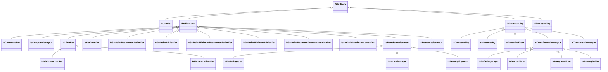

# DataFlow<!-- DEFINITION SET HEADER -->
- Description: 
this category refers to the data processing. It should probably be renamed accordingly. It should define and organize the different types of processing encountered during drilling operations. A Thursday session was devoted to those items. Note that in the current version, control flow is also included: a controller is seen as a special type of processing unit, that generates commands based on measurements and set-points. This can of course be modified if deemed necessary. Note also that transmission is included there as well. A telemetry system is seen as a processing unit that only duplicates a signal, and a delay is associated to the duplication process. While this is a useful way of looking at telemetry, it is probably not intuitive enough.

# Nouns
## Class Inheritance for Nouns
Here is a class inheritance diagram for the nouns contained in this definition set.

```mermaid
classDiagram
DWISNoun <|-- DataFlowNode
DataFlowNode <|-- Plan
Plan <|-- OperationalPlan
Plan <|-- DrillingProgram
Plan <|-- RigActionPlan
ComputationUnit <|-- ComputedState
ComputedState <|-- ProceduralState
ComputedState <|-- ProcessState
ComputedState <|-- PhysicalState
DataFlowNode <|-- ComputationUnit
ComputationUnit <|-- Advisor
ComputationUnit <|-- Simulator
DataFlowNode <|-- Controller
DataFlowNode <|-- ControlSystem
ControlSystem <|-- DrawWorksControlSystem
ControlSystem <|-- MudPumpsControlSystem
ControlSystem <|-- TopDriveControlSystem
ControlSystem <|-- BOPControlSystem
ControlSystem <|-- RigChokeControlSystem
DataFlowNode <|-- MeasurementDevice
DataFlowNode <|-- Transformation
Transformation <|-- DirectTransformation
DirectTransformation <|-- Aggregation
DirectTransformation <|-- ForceFromLoadPinsTransformation
DirectTransformation <|-- ForceToLoadTransformation
DirectTransformation <|-- MeasuredDepthToTrueVerticalDepthTransformation
DirectTransformation <|-- MeasuredDepthTranslation
DirectTransformation <|-- PressureToEquivalentDensityTransformation
DirectTransformation <|-- PressureToForceTransformation
DirectTransformation <|-- TorqueToForceTransformation
Transformation <|-- SignalProcessingUnit
SignalProcessingUnit <|-- Filter
Filter <|-- BandPassFilter
Filter <|-- HighPassFilter
Filter <|-- LowPassFilter
Filter <|-- MovingAverage
Filter <|-- MovingStandardDeviation
Filter <|-- MovingMin
Filter <|-- MovingMax
MovingAverage <|-- NumberOfSampleMovingAverage
MovingAverage <|-- TimeWindowMovingAverage
Transformation <|-- TimeBasedTransformation
TimeBasedTransformation <|-- Buffering
TimeBasedTransformation <|-- Derivation
TimeBasedTransformation <|-- Integration
TimeBasedTransformation <|-- RangeExtraction
RangeExtraction <|-- NumberOfItemsRangeExtraction
RangeExtraction <|-- TimeWindowRangeExtraction
TimeBasedTransformation <|-- Resampling
DataFlowNode <|-- TransmissionLine
DataFlowNode <|-- UserInterface
```

## DataFlowNode <!-- NOUN -->
- Display name: DataFlowNode
- Parent class: [DWISNoun](./DWISSemantics.md#DWISNoun)
- Description: 

- Definition set: DataFlow
- Examples:
## Plan <!-- NOUN -->
- Display name: Plan
- Parent class: [DataFlowNode](./DataFlow.md#DataFlowNode)
- Description: 

- Definition set: DataFlow
- Examples:
## OperationalPlan <!-- NOUN -->
- Display name: OperationalPlan
- Parent class: [Plan](./DataFlow.md#Plan)
- Description: 

- Definition set: DataFlow
- Examples:
## DrillingProgram <!-- NOUN -->
- Display name: DrillingProgram
- Parent class: [Plan](./DataFlow.md#Plan)
- Description: 

- Definition set: DataFlow
- Examples:
## RigActionPlan <!-- NOUN -->
- Display name: RigActionPlan
- Parent class: [Plan](./DataFlow.md#Plan)
- Description: 

- Definition set: DataFlow
- Examples:
## ComputedState <!-- NOUN -->
- Display name: ComputedState
- Parent class: [ComputationUnit](./DataFlow.md#ComputationUnit)
- Description: 
A state represents the current configuation of a system.
- Definition set: DataFlow
- Examples:
## ProceduralState <!-- NOUN -->
- Display name: ComputedProceduralState
- Parent class: [ComputedState](./DataFlow.md#ComputedState)
- Description: 

- Definition set: DataFlow
- Examples:
## ProcessState <!-- NOUN -->
- Display name: ComputedProcessState
- Parent class: [ComputedState](./DataFlow.md#ComputedState)
- Description: 

- Definition set: DataFlow
- Examples:
## PhysicalState <!-- NOUN -->
- Display name: ComputedPhysicalState
- Parent class: [ComputedState](./DataFlow.md#ComputedState)
- Description: 

- Definition set: DataFlow
- Examples:
## ComputationUnit <!-- NOUN -->
- Display name: ComputationUnit
- Parent class: [DataFlowNode](./DataFlow.md#DataFlowNode)
- Description: 
Denotes a complex computation unit, typically based on advanced numerical modeling
- Definition set: DataFlow
- Examples:
## Advisor <!-- NOUN -->
- Display name: Advisor
- Parent class: [ComputationUnit](./DataFlow.md#ComputationUnit)
- Attributes:
  - AdviceType
    - Type: string
    - Description: 
- Description: 

- Definition set: DataFlow
- Examples:
## Simulator <!-- NOUN -->
- Display name: Simulator
- Parent class: [ComputationUnit](./DataFlow.md#ComputationUnit)
- Description: 

- Definition set: DataFlow
- Examples:
## Controller <!-- NOUN -->
- Display name: Controller
- Parent class: [DataFlowNode](./DataFlow.md#DataFlowNode)
- Description: 

- Definition set: DataFlow
- Examples:
## ControlSystem <!-- NOUN -->
- Display name: ControlSystem
- Parent class: [DataFlowNode](./DataFlow.md#DataFlowNode)
- Description: 

- Definition set: DataFlow
- Examples:
## DrawWorksControlSystem <!-- NOUN -->
- Display name: DrawWorksControlSystem
- Parent class: [ControlSystem](./DataFlow.md#ControlSystem)
- Description: 

- Definition set: DataFlow
- Examples:
## MudPumpsControlSystem <!-- NOUN -->
- Display name: MudPumpsControlSystem
- Parent class: [ControlSystem](./DataFlow.md#ControlSystem)
- Description: 

- Definition set: DataFlow
- Examples:
## TopDriveControlSystem <!-- NOUN -->
- Display name: TopDriveControlSystem
- Parent class: [ControlSystem](./DataFlow.md#ControlSystem)
- Description: 

- Definition set: DataFlow
- Examples:
## BOPControlSystem <!-- NOUN -->
- Display name: BOPControlSystem
- Parent class: [ControlSystem](./DataFlow.md#ControlSystem)
- Description: 

- Definition set: DataFlow
- Examples:
## RigChokeControlSystem <!-- NOUN -->
- Display name: RigChokeControlSystem
- Parent class: [ControlSystem](./DataFlow.md#ControlSystem)
- Description: 

- Definition set: DataFlow
- Examples:
## MeasurementDevice <!-- NOUN -->
- Display name: MeasurementDevice
- Parent class: [DataFlowNode](./DataFlow.md#DataFlowNode)
- Description: 
Denotes a physical sensor
- Definition set: DataFlow
- Examples:
## Transformation <!-- NOUN -->
- Display name: Transformation
- Parent class: [DataFlowNode](./DataFlow.md#DataFlowNode)
- Description: 
Represents a transformation applied to some signals that produces other signals
- Definition set: DataFlow
- Examples:
## DirectTransformation <!-- NOUN -->
- Display name: DirectTransformation
- Parent class: [Transformation](./DataFlow.md#Transformation)
- Description: 
Direct transformations are performed using only the current value of their inputs, time is not involved
- Definition set: DataFlow
- Examples:
## Aggregation <!-- NOUN -->
- Display name: Aggregation
- Parent class: [DirectTransformation](./DataFlow.md#DirectTransformation)
- Description: 

- Definition set: DataFlow
- Examples:
## ForceFromLoadPinsTransformation <!-- NOUN -->
- Display name: ForceFromLoadPinsTransformation
- Parent class: [DirectTransformation](./DataFlow.md#DirectTransformation)
- Description: 

- Definition set: DataFlow
- Examples:
## ForceToLoadTransformation <!-- NOUN -->
- Display name: ForceToLoadTransformation
- Parent class: [DirectTransformation](./DataFlow.md#DirectTransformation)
- Description: 

- Definition set: DataFlow
- Examples:
## MeasuredDepthToTrueVerticalDepthTransformation <!-- NOUN -->
- Display name: MeasuredDepthToTrueVerticalDepthTransformation
- Parent class: [DirectTransformation](./DataFlow.md#DirectTransformation)
- Description: 

- Definition set: DataFlow
- Examples:
## MeasuredDepthTranslation <!-- NOUN -->
- Display name: MeasuredDepthTranslation
- Parent class: [DirectTransformation](./DataFlow.md#DirectTransformation)
- Description: 

- Definition set: DataFlow
- Examples:
## PressureToEquivalentDensityTransformation <!-- NOUN -->
- Display name: PressureToEquivalentDensityTransformation
- Parent class: [DirectTransformation](./DataFlow.md#DirectTransformation)
- Description: 

- Definition set: DataFlow
- Examples:
## PressureToForceTransformation <!-- NOUN -->
- Display name: PressureToForceTransformation
- Parent class: [DirectTransformation](./DataFlow.md#DirectTransformation)
- Description: 

- Definition set: DataFlow
- Examples:
## TorqueToForceTransformation <!-- NOUN -->
- Display name: TorqueToForceTransformation
- Parent class: [DirectTransformation](./DataFlow.md#DirectTransformation)
- Description: 

- Definition set: DataFlow
- Examples:
## SignalProcessingUnit <!-- NOUN -->
- Display name: SignalProcessingUnit
- Parent class: [Transformation](./DataFlow.md#Transformation)
- Description: 
Represent any signal processing applied prior to the distribution of the considered signal. Signal processing refers to e.g. noise removal, filtering,..
- Definition set: DataFlow
- Examples:
## Filter <!-- NOUN -->
- Display name: Filter
- Parent class: [SignalProcessingUnit](./DataFlow.md#SignalProcessingUnit)
- Description: 

- Definition set: DataFlow
- Examples:
## BandPassFilter <!-- NOUN -->
- Display name: BandPassFilter
- Parent class: [Filter](./DataFlow.md#Filter)
- Attributes:
  - MinFrequency
    - Type: double
    - Description: 
  - MaxFrequency
    - Type: double
    - Description: 
- Description: 

- Definition set: DataFlow
- Examples:
## HighPassFilter <!-- NOUN -->
- Display name: HighPassFilter
- Parent class: [Filter](./DataFlow.md#Filter)
- Attributes:
  - CutOffFrequency
    - Type: double
    - Description: 
- Description: 

- Definition set: DataFlow
- Examples:
## LowPassFilter <!-- NOUN -->
- Display name: LowPassFilter
- Parent class: [Filter](./DataFlow.md#Filter)
- Attributes:
  - CutOffFrequency
    - Type: double
    - Description: 
- Description: 

- Definition set: DataFlow
- Examples:
## MovingAverage <!-- NOUN -->
- Display name: MovingAverage
- Parent class: [Filter](./DataFlow.md#Filter)
- Description: 

- Definition set: DataFlow
- Examples:
## MovingStandardDeviation <!-- NOUN -->
- Display name: MovingStandardDeviation
- Parent class: [Filter](./DataFlow.md#Filter)
- Description: 

- Definition set: DataFlow
- Examples:
## MovingMin <!-- NOUN -->
- Display name: MovingMin
- Parent class: [Filter](./DataFlow.md#Filter)
- Description: 

- Definition set: DataFlow
- Examples:
## MovingMax <!-- NOUN -->
- Display name: MovingMax
- Parent class: [Filter](./DataFlow.md#Filter)
- Description: 

- Definition set: DataFlow
- Examples:
## NumberOfSampleMovingAverage <!-- NOUN -->
- Display name: NumberOfSampleMovingAverage
- Parent class: [MovingAverage](./DataFlow.md#MovingAverage)
- Attributes:
  - NumberOfSamples
    - Type: int
    - Description: 
- Description: 

- Definition set: DataFlow
- Examples:
## TimeWindowMovingAverage <!-- NOUN -->
- Display name: TimeWindowMovingAverage
- Parent class: [MovingAverage](./DataFlow.md#MovingAverage)
- Attributes:
  - TimeWindow
    - Type: double
    - Description: 
- Description: 

- Definition set: DataFlow
- Examples:
## TimeBasedTransformation <!-- NOUN -->
- Display name: TimeBasedTransformation
- Parent class: [Transformation](./DataFlow.md#Transformation)
- Description: 
Transformations that apply only to time series: time derivations, time integration, averaging...
- Definition set: DataFlow
- Examples:
## Buffering <!-- NOUN -->
- Display name: Buffering
- Parent class: [TimeBasedTransformation](./DataFlow.md#TimeBasedTransformation)
- Attributes:
  - BufferingInterval
    - Type: double
    - Description: 
- Description: 

- Definition set: DataFlow
- Examples:
## Derivation <!-- NOUN -->
- Display name: Derivation
- Parent class: [TimeBasedTransformation](./DataFlow.md#TimeBasedTransformation)
- Description: 

- Definition set: DataFlow
- Examples:
## Integration <!-- NOUN -->
- Display name: Integration
- Parent class: [TimeBasedTransformation](./DataFlow.md#TimeBasedTransformation)
- Description: 

- Definition set: DataFlow
- Examples:
## RangeExtraction <!-- NOUN -->
- Display name: RangeExtraction
- Parent class: [TimeBasedTransformation](./DataFlow.md#TimeBasedTransformation)
- Description: 

- Definition set: DataFlow
- Examples:
## NumberOfItemsRangeExtraction <!-- NOUN -->
- Display name: NumberOfItemsRangeExtraction
- Parent class: [RangeExtraction](./DataFlow.md#RangeExtraction)
- Attributes:
  - NumberOfItems
    - Type: int
    - Description: 
- Description: 

- Definition set: DataFlow
- Examples:
## TimeWindowRangeExtraction <!-- NOUN -->
- Display name: TimeWindowRangeExtraction
- Parent class: [RangeExtraction](./DataFlow.md#RangeExtraction)
- Attributes:
  - TimeWindow
    - Type: double
    - Description: 
- Description: 

- Definition set: DataFlow
- Examples:
## Resampling <!-- NOUN -->
- Display name: Resampling
- Parent class: [TimeBasedTransformation](./DataFlow.md#TimeBasedTransformation)
- Attributes:
  - ResamplingRate
    - Type: double
    - Description: 
  - ResamplingDelay
    - Type: double
    - Description: 
  - Validity
    - Type: double
    - Description: 
- Description: 

- Definition set: DataFlow
- Examples:
## TransmissionLine <!-- NOUN -->
- Display name: TransmissionLine
- Parent class: [DataFlowNode](./DataFlow.md#DataFlowNode)
- Description: 

- Definition set: DataFlow
- Examples:
## UserInterface <!-- NOUN -->
- Display name: UserInterface
- Parent class: [DataFlowNode](./DataFlow.md#DataFlowNode)
- Description: 

- Definition set: DataFlow
- Examples:
# Verbs
## Class Inheritance for Verbs
Here is a class inheritance diagram for the verbs contained in this definition set.

## Relations
Here is a graph representing the relations that can be made with the verbs defined in this definition set.

```mermaid
erDiagram
DWISNoun ||--o{ DWISNoun : Controls
DrillingDataPoint ||--o{ DataFlowNode : HasFunction
DrillingDataPoint ||--o{ DWISNoun : IsCommandFor
DrillingDataPoint ||--o{ ComputationUnit : IsComputationInput
DrillingDataPoint ||--o{ DWISNoun : IsLimitFor
DrillingDataPoint ||--o{ DWISNoun : IsMinimumLimitFor
DrillingDataPoint ||--o{ DWISNoun : IsMaximumLimitFor
DrillingDataPoint ||--o{ Controller : IsSetPointFor
DrillingDataPoint ||--o{ ControlSystem : IsSetPointRecommendationFor
DrillingDataPoint ||--o{ ControlSystem : IsSetPointAdviceFor
DrillingDataPoint ||--o{ ControlSystem : IsSetPointMinimumRecommendationFor
DrillingDataPoint ||--o{ ControlSystem : IsSetPointMinimumAdviceFor
DrillingDataPoint ||--o{ ControlSystem : IsSetPointMaximumRecommendationFor
DrillingDataPoint ||--o{ ControlSystem : IsSetPointMaximumAdviceFor
DrillingDataPoint ||--o{ Transformation : IsTransformationInput
DrillingDataPoint ||--o{ Buffering : IsBufferingInput
DWISNoun ||--o{ DWISNoun : IsDerivationInput
DrillingDataPoint ||--o{ Resampling : IsResamplingInput
DrillingDataPoint ||--o{ TransmissionLine : IsTransmissionInput
DrillingDataPoint ||--o{ DataFlowNode : IsGeneratedBy
DWISNoun ||--o{ DWISNoun : IsComputedBy
DWISNoun ||--o{ DWISNoun : IsMeasuredBy
DWISNoun ||--o{ DWISNoun : IsRecordedFrom
DrillingDataPoint ||--o{ DataFlowNode : IsTransformationOutput
DrillingDataPoint ||--o{ Buffering : IsBufferingOutput
DWISNoun ||--o{ DWISNoun : IsDerivedFrom
DWISNoun ||--o{ DWISNoun : IsIntegratedFrom
DrillingDataPoint ||--o{ Resampling : IsResampledBy
DrillingDataPoint ||--o{ TransmissionLine : IsTransmissionOutput
DWISNoun ||--o{ DWISNoun : IsProcessedBy
```

## Controls <!-- VERB -->
- Display name: Controls
- Parent verb: [DWISVerb](./DWISSemantics.md#DWISVerb)
- Subject class: [DWISNoun](./DWISSemantics.md#DWISNoun)
- Object class: [DWISNoun](./DWISSemantics.md#DWISNoun)
- Definition set: DataFlow
- Description: 

- Examples:
## HasFunction <!-- VERB -->
- Display name: HasFunction
- Parent verb: [DWISVerb](./DWISSemantics.md#DWISVerb)
- Subject class: [DrillingDataPoint](./DrillingDataSemantics.md#DrillingDataPoint)
- Object class: [DataFlowNode](./DataFlow.md#DataFlowNode)
- Definition set: DataFlow
- Description: 

- Examples:
## IsCommandFor <!-- VERB -->
- Display name: IsCommandFor
- Parent verb: [HasFunction](./DataFlow.md#HasFunction)
- Subject class: [DrillingDataPoint](./DrillingDataSemantics.md#DrillingDataPoint)
- Object class: [DWISNoun](./DWISSemantics.md#DWISNoun)
- Definition set: DataFlow
- Description: 

- Examples:
## IsComputationInput <!-- VERB -->
- Display name: Is Computation Input
- Parent verb: [HasFunction](./DataFlow.md#HasFunction)
- Subject class: [DrillingDataPoint](./DrillingDataSemantics.md#DrillingDataPoint)
- Object class: [ComputationUnit](./DataFlow.md#ComputationUnit)
- Definition set: DataFlow
- Description: 

- Examples:
## IsLimitFor <!-- VERB -->
- Display name: Is Limit For
- Parent verb: [HasFunction](./DataFlow.md#HasFunction)
- Subject class: [DrillingDataPoint](./DrillingDataSemantics.md#DrillingDataPoint)
- Object class: [DWISNoun](./DWISSemantics.md#DWISNoun)
- Definition set: DataFlow
- Description: 

- Examples:
## IsMinimumLimitFor <!-- VERB -->
- Display name: Is Minimum Limit For
- Parent verb: [IsLimitFor](./DataFlow.md#IsLimitFor)
- Subject class: [DrillingDataPoint](./DrillingDataSemantics.md#DrillingDataPoint)
- Object class: [DWISNoun](./DWISSemantics.md#DWISNoun)
- Definition set: DataFlow
- Description: 

- Examples:
## IsMaximumLimitFor <!-- VERB -->
- Display name: Is Maximum Limit For
- Parent verb: [IsLimitFor](./DataFlow.md#IsLimitFor)
- Subject class: [DrillingDataPoint](./DrillingDataSemantics.md#DrillingDataPoint)
- Object class: [DWISNoun](./DWISSemantics.md#DWISNoun)
- Definition set: DataFlow
- Description: 

- Examples:
## IsSetPointFor <!-- VERB -->
- Display name: Is Set-Point For
- Parent verb: [HasFunction](./DataFlow.md#HasFunction)
- Subject class: [DrillingDataPoint](./DrillingDataSemantics.md#DrillingDataPoint)
- Object class: [Controller](./DataFlow.md#Controller)
- Definition set: DataFlow
- Description: 

- Examples:
## IsSetPointRecommendationFor <!-- VERB -->
- Display name: Is Set-Point Recommendation For
- Parent verb: [HasFunction](./DataFlow.md#HasFunction)
- Subject class: [DrillingDataPoint](./DrillingDataSemantics.md#DrillingDataPoint)
- Object class: [ControlSystem](./DataFlow.md#ControlSystem)
- Definition set: DataFlow
- Description: 

- Examples:
## IsSetPointAdviceFor <!-- VERB -->
- Display name: Is Set-Point Advice For
- Parent verb: [HasFunction](./DataFlow.md#HasFunction)
- Subject class: [DrillingDataPoint](./DrillingDataSemantics.md#DrillingDataPoint)
- Object class: [ControlSystem](./DataFlow.md#ControlSystem)
- Definition set: DataFlow
- Description: 

- Examples:
## IsSetPointMinimumRecommendationFor <!-- VERB -->
- Display name: Is Set-Point Minimum Recommendation For
- Parent verb: [HasFunction](./DataFlow.md#HasFunction)
- Subject class: [DrillingDataPoint](./DrillingDataSemantics.md#DrillingDataPoint)
- Object class: [ControlSystem](./DataFlow.md#ControlSystem)
- Definition set: DataFlow
- Description: 

- Examples:
## IsSetPointMinimumAdviceFor <!-- VERB -->
- Display name: Is Set-Point Minimum Advice For
- Parent verb: [HasFunction](./DataFlow.md#HasFunction)
- Subject class: [DrillingDataPoint](./DrillingDataSemantics.md#DrillingDataPoint)
- Object class: [ControlSystem](./DataFlow.md#ControlSystem)
- Definition set: DataFlow
- Description: 

- Examples:
## IsSetPointMaximumRecommendationFor <!-- VERB -->
- Display name: Is Set-Point Maximum Recommendation For
- Parent verb: [HasFunction](./DataFlow.md#HasFunction)
- Subject class: [DrillingDataPoint](./DrillingDataSemantics.md#DrillingDataPoint)
- Object class: [ControlSystem](./DataFlow.md#ControlSystem)
- Definition set: DataFlow
- Description: 

- Examples:
## IsSetPointMaximumAdviceFor <!-- VERB -->
- Display name: Is Set-Point Maximum Advice For
- Parent verb: [HasFunction](./DataFlow.md#HasFunction)
- Subject class: [DrillingDataPoint](./DrillingDataSemantics.md#DrillingDataPoint)
- Object class: [ControlSystem](./DataFlow.md#ControlSystem)
- Definition set: DataFlow
- Description: 

- Examples:
## IsTransformationInput <!-- VERB -->
- Display name: IsTransformationInput
- Parent verb: [HasFunction](./DataFlow.md#HasFunction)
- Subject class: [DrillingDataPoint](./DrillingDataSemantics.md#DrillingDataPoint)
- Object class: [Transformation](./DataFlow.md#Transformation)
- Definition set: DataFlow
- Description: 

- Examples:
## IsBufferingInput <!-- VERB -->
- Display name: IsBufferingInput
- Parent verb: [IsTransformationInput](./DataFlow.md#IsTransformationInput)
- Subject class: [DrillingDataPoint](./DrillingDataSemantics.md#DrillingDataPoint)
- Object class: [Buffering](./DataFlow.md#Buffering)
- Definition set: DataFlow
- Description: 

- Examples:
## IsDerivationInput <!-- VERB -->
- Display name: IsDerivationInput
- Parent verb: [IsTransformationInput](./DataFlow.md#IsTransformationInput)
- Subject class: [DWISNoun](./DWISSemantics.md#DWISNoun)
- Object class: [DWISNoun](./DWISSemantics.md#DWISNoun)
- Definition set: DataFlow
- Description: 

- Examples:
## IsResamplingInput <!-- VERB -->
- Display name: IsResamplingInput
- Parent verb: [IsTransformationInput](./DataFlow.md#IsTransformationInput)
- Subject class: [DrillingDataPoint](./DrillingDataSemantics.md#DrillingDataPoint)
- Object class: [Resampling](./DataFlow.md#Resampling)
- Definition set: DataFlow
- Description: 

- Examples:
## IsTransmissionInput <!-- VERB -->
- Display name: IsTransmissionInput
- Parent verb: [HasFunction](./DataFlow.md#HasFunction)
- Subject class: [DrillingDataPoint](./DrillingDataSemantics.md#DrillingDataPoint)
- Object class: [TransmissionLine](./DataFlow.md#TransmissionLine)
- Definition set: DataFlow
- Description: 

- Examples:
## IsGeneratedBy <!-- VERB -->
- Display name: IsGeneratedBy
- Parent verb: [DWISVerb](./DWISSemantics.md#DWISVerb)
- Subject class: [DrillingDataPoint](./DrillingDataSemantics.md#DrillingDataPoint)
- Object class: [DataFlowNode](./DataFlow.md#DataFlowNode)
- Definition set: DataFlow
- Description: 

- Examples:
## IsComputedBy <!-- VERB -->
- Display name: IsComputedBy
- Parent verb: [IsGeneratedBy](./DataFlow.md#IsGeneratedBy)
- Subject class: [DWISNoun](./DWISSemantics.md#DWISNoun)
- Object class: [DWISNoun](./DWISSemantics.md#DWISNoun)
- Definition set: DataFlow
- Description: 

- Examples:
## IsMeasuredBy <!-- VERB -->
- Display name: IsMeasuredBy
- Parent verb: [IsGeneratedBy](./DataFlow.md#IsGeneratedBy)
- Subject class: [DWISNoun](./DWISSemantics.md#DWISNoun)
- Object class: [DWISNoun](./DWISSemantics.md#DWISNoun)
- Definition set: DataFlow
- Description: 

- Examples:
## IsRecordedFrom <!-- VERB -->
- Display name: IsRecordedFrom
- Parent verb: [IsGeneratedBy](./DataFlow.md#IsGeneratedBy)
- Subject class: [DWISNoun](./DWISSemantics.md#DWISNoun)
- Object class: [DWISNoun](./DWISSemantics.md#DWISNoun)
- Definition set: DataFlow
- Description: 

- Examples:
## IsTransformationOutput <!-- VERB -->
- Display name: IsTransformationOutput
- Parent verb: [IsGeneratedBy](./DataFlow.md#IsGeneratedBy)
- Subject class: [DrillingDataPoint](./DrillingDataSemantics.md#DrillingDataPoint)
- Object class: [DataFlowNode](./DataFlow.md#DataFlowNode)
- Definition set: DataFlow
- Description: 

- Examples:
## IsBufferingOutput <!-- VERB -->
- Display name: IsBufferingOutput
- Parent verb: [IsTransformationOutput](./DataFlow.md#IsTransformationOutput)
- Subject class: [DrillingDataPoint](./DrillingDataSemantics.md#DrillingDataPoint)
- Object class: [Buffering](./DataFlow.md#Buffering)
- Definition set: DataFlow
- Description: 

- Examples:
## IsDerivedFrom <!-- VERB -->
- Display name: IsDerivedFrom
- Parent verb: [IsTransformationOutput](./DataFlow.md#IsTransformationOutput)
- Subject class: [DWISNoun](./DWISSemantics.md#DWISNoun)
- Object class: [DWISNoun](./DWISSemantics.md#DWISNoun)
- Definition set: DataFlow
- Description: 

- Examples:
## IsIntegratedFrom <!-- VERB -->
- Display name: IsIntegratedFrom
- Parent verb: [IsTransformationOutput](./DataFlow.md#IsTransformationOutput)
- Subject class: [DWISNoun](./DWISSemantics.md#DWISNoun)
- Object class: [DWISNoun](./DWISSemantics.md#DWISNoun)
- Definition set: DataFlow
- Description: 

- Examples:
## IsResampledBy <!-- VERB -->
- Display name: IsResampledBy
- Parent verb: [IsTransformationOutput](./DataFlow.md#IsTransformationOutput)
- Subject class: [DrillingDataPoint](./DrillingDataSemantics.md#DrillingDataPoint)
- Object class: [Resampling](./DataFlow.md#Resampling)
- Definition set: DataFlow
- Description: 

- Examples:
## IsTransmissionOutput <!-- VERB -->
- Display name: IsTransmissionOutput
- Parent verb: [IsGeneratedBy](./DataFlow.md#IsGeneratedBy)
- Subject class: [DrillingDataPoint](./DrillingDataSemantics.md#DrillingDataPoint)
- Object class: [TransmissionLine](./DataFlow.md#TransmissionLine)
- Definition set: DataFlow
- Description: 

- Examples:
## IsProcessedBy <!-- VERB -->
- Display name: IsProcessedBy
- Parent verb: [DWISVerb](./DWISSemantics.md#DWISVerb)
- Subject class: [DWISNoun](./DWISSemantics.md#DWISNoun)
- Object class: [DWISNoun](./DWISSemantics.md#DWISNoun)
- Definition set: DataFlow
- Description: 

- Examples:
