# DataFlow<!-- DEFINITION SET HEADER -->
- Description: 
This category captures how data and commands move through the drilling system, covering computation, control, signal conditioning, and telemetry. Controllers are treated as processing units that generate commands from set-points and measurements, and telemetry is treated as a special processing unit that forwards signals with an associated delay.

# Nouns
## Class Inheritance for Nouns
Here is a class inheritance diagram for the nouns contained in this definition set.
```mermaid
classDiagram
DWISNoun <|-- DataFlowNode
ComputationUnit <|-- ComputedState
ComputedState <|-- ProceduralState
ProceduralState <|-- EnablementState
ProceduralState <|-- ActivationState
ProceduralState <|-- IdlingState
ComputedState <|-- ProcessState
ComputedState <|-- PhysicalState
DataFlowNode <|-- ComputationUnit
ComputationUnit <|-- Advisor
ComputationUnit <|-- Simulator
ComputationUnit <|-- Estimator
Estimator <|-- ModelFitter
ComputationUnit <|-- Interpreter
Interpreter <|-- ImageInterpreter
DataFlowNode <|-- Controller
DataFlowNode <|-- ControlSystem
ControlSystem <|-- HoistingControlSystem
ControlSystem <|-- CirculationControlSystem
ControlSystem <|-- RotationControlSystem
ControlSystem <|-- BOPControlSystem
ControlSystem <|-- RigChokeControlSystem
DataFlowNode <|-- MeasurementDevice
DataFlowNode <|-- Transformation
Transformation <|-- DirectTransformation
DirectTransformation <|-- Aggregation
DirectTransformation <|-- ForceFromLoadPinsTransformation
DirectTransformation <|-- ForceToLoadTransformation
DirectTransformation <|-- MeasuredDepthToTrueVerticalDepthTransformation
DirectTransformation <|-- SummationTransformation
SummationTransformation <|-- MeasuredDepthTranslation
DirectTransformation <|-- PressureToEquivalentDensityTransformation
DirectTransformation <|-- PressureToForceTransformation
DirectTransformation <|-- TorqueToForceTransformation
Transformation <|-- SignalProcessingUnit
SignalProcessingUnit <|-- Filter
Filter <|-- BandPassFilter
Filter <|-- HighPassFilter
Filter <|-- LowPassFilter
Filter <|-- MovingAverage
Filter <|-- MovingStandardDeviation
Filter <|-- MovingMin
Filter <|-- MovingMax
Filter <|-- MovingDistribution
MovingAverage <|-- NumberOfSampleMovingAverage
MovingAverage <|-- TimeWindowMovingAverage
Transformation <|-- TimeBasedTransformation
TimeBasedTransformation <|-- Buffering
TimeBasedTransformation <|-- Derivation
TimeBasedTransformation <|-- Integration
TimeBasedTransformation <|-- RangeExtraction
RangeExtraction <|-- NumberOfItemsRangeExtraction
RangeExtraction <|-- TimeWindowRangeExtraction
TimeBasedTransformation <|-- Resampling
DataFlowNode <|-- TransmissionLine
DataFlowNode <|-- UserInterface
```
## DataFlowNode <!-- NOUN -->
- Display name: Data Flow Node
- Parent class: [DWISNoun](./DWISSemantics.md#DWISNoun)
- Description: 
A data flow node is a generic term for any node in the data flow graph.
- Definition set: DataFlow
- Examples:
```dwis dataFlowHookload
MeasurementDevice:hookloadSensor
DrillingDataPoint:hookloadSignal
hookloadSignal IsGeneratedBy hookloadSensor
```
An example semantic graph looks like as follow:
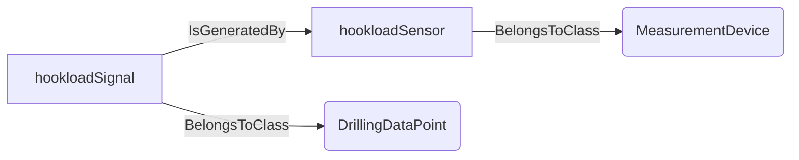
An example SparQL query looks like this:
```sparql
PREFIX rdf: <http://www.w3.org/1999/02/22-rdf-syntax-ns#>
PREFIX ddhub: <http://ddhub.no/>
PREFIX quantity: <http://ddhub.no/UnitAndQuantity>
SELECT ?dataFlowHookload
WHERE {
	?hookloadSensor rdf:type ddhub:MeasurementDevice .
	?hookloadSignal rdf:type ddhub:DrillingDataPoint .
	?hookloadSignal ddhub:IsGeneratedBy ?hookloadSensor .
}
```
This example shows a measurement device acting as a `DataFlowNode` that generates the `hookloadSignal`.
## ComputedState <!-- NOUN -->
- Display name: Computed State
- Parent class: [ComputationUnit](./DataFlow.md#ComputationUnit)
- Description: 
A state represents the current configuation of a system.
- Definition set: DataFlow
- Examples:
```dwis holeCleaningState
Interpreter:holeCleaningInterpreter
ComputedState:holeCleaningState
DWISNoun:holeCleaningProcess
holeCleaningState IsComputedBy holeCleaningInterpreter
holeCleaningState IsCurrentStateFor holeCleaningProcess
```
An example semantic graph looks like as follow:
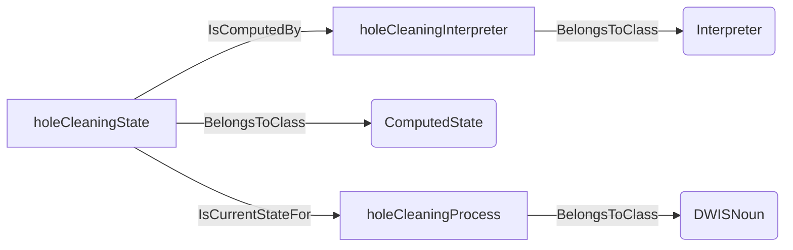
An example SparQL query looks like this:
```sparql
PREFIX rdf: <http://www.w3.org/1999/02/22-rdf-syntax-ns#>
PREFIX ddhub: <http://ddhub.no/>
PREFIX quantity: <http://ddhub.no/UnitAndQuantity>
SELECT ?holeCleaningState
WHERE {
	?holeCleaningInterpreter rdf:type ddhub:Interpreter .
	?holeCleaningState rdf:type ddhub:ComputedState .
	?holeCleaningProcess rdf:type ddhub:DWISNoun .
	?holeCleaningState ddhub:IsComputedBy ?holeCleaningInterpreter .
	?holeCleaningState ddhub:IsCurrentStateFor ?holeCleaningProcess .
}
```
This example shows an interpreter computing the current hole-cleaning state of the drilling process.
## ProceduralState <!-- NOUN -->
- Display name: Procedural State
- Parent class: [ComputedState](./DataFlow.md#ComputedState)
- Description: 
Describes the active state within a finite-state procedure such as startup, shutdown, or test sequences.
- Definition set: DataFlow
- Examples:
```dwis circulationStartupState
ProcedureFunction:circulationStartup
ProceduralState:circulationStartupState
circulationStartupState IsInformationForCurrentStateOf circulationStartup
```
An example semantic graph looks like as follow:
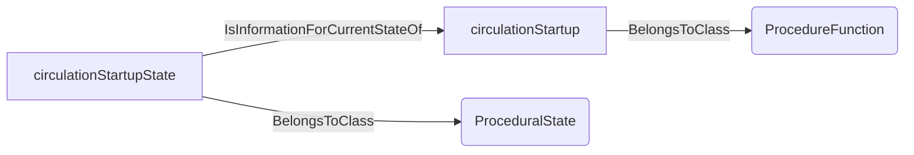
An example SparQL query looks like this:
```sparql
PREFIX rdf: <http://www.w3.org/1999/02/22-rdf-syntax-ns#>
PREFIX ddhub: <http://ddhub.no/>
PREFIX quantity: <http://ddhub.no/UnitAndQuantity>
SELECT ?circulationStartupState
WHERE {
	?circulationStartup rdf:type ddhub:ProcedureFunction .
	?circulationStartupState rdf:type ddhub:ProceduralState .
	?circulationStartupState ddhub:IsInformationForCurrentStateOf ?circulationStartup .
}
```
This example captures the current state of a circulation startup procedure.
## EnablementState <!-- NOUN -->
- Display name: Enablement State
- Parent class: [ProceduralState](./DataFlow.md#ProceduralState)
- Description: 
Indicates whether a procedure or function is allowed to run based on permissives or user choices.
- Definition set: DataFlow
- Examples:
```dwis autoDrillerEnablement
ControllerFunction:autoDriller
EnablementState:autoDrillerEnablement
autoDrillerEnablement IsInformationForCurrentStateOf autoDriller
```
An example semantic graph looks like as follow:
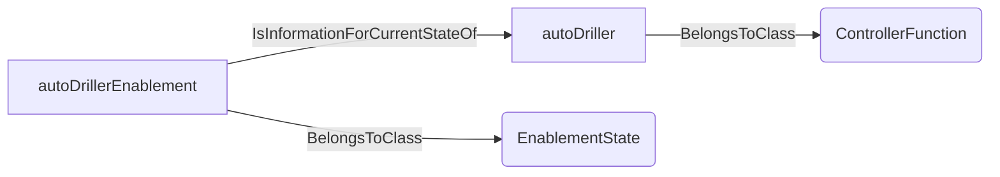
An example SparQL query looks like this:
```sparql
PREFIX rdf: <http://www.w3.org/1999/02/22-rdf-syntax-ns#>
PREFIX ddhub: <http://ddhub.no/>
PREFIX quantity: <http://ddhub.no/UnitAndQuantity>
SELECT ?autoDrillerEnablement
WHERE {
	?autoDriller rdf:type ddhub:ControllerFunction .
	?autoDrillerEnablement rdf:type ddhub:EnablementState .
	?autoDrillerEnablement ddhub:IsInformationForCurrentStateOf ?autoDriller .
}
```
This example states whether the `autoDriller` can be enabled.
## ActivationState <!-- NOUN -->
- Display name: Activation State
- Parent class: [ProceduralState](./DataFlow.md#ProceduralState)
- Description: 
Indicates that a procedure or function is currently activated and executing its logic.
- Definition set: DataFlow
- Examples:
```dwis autoDrillerActivation
ControllerFunction:autoDriller
ActivationState:autoDrillerActivation
autoDrillerActivation IsInformationForCurrentStateOf autoDriller
```
An example semantic graph looks like as follow:
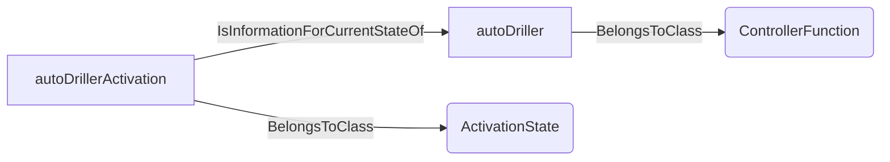
An example SparQL query looks like this:
```sparql
PREFIX rdf: <http://www.w3.org/1999/02/22-rdf-syntax-ns#>
PREFIX ddhub: <http://ddhub.no/>
PREFIX quantity: <http://ddhub.no/UnitAndQuantity>
SELECT ?autoDrillerActivation
WHERE {
	?autoDriller rdf:type ddhub:ControllerFunction .
	?autoDrillerActivation rdf:type ddhub:ActivationState .
	?autoDrillerActivation ddhub:IsInformationForCurrentStateOf ?autoDriller .
}
```
This example shows the activation state of the `autoDriller`.
## IdlingState <!-- NOUN -->
- Display name: Idling State
- Parent class: [ProceduralState](./DataFlow.md#ProceduralState)
- Description: 
Indicates that a function is enabled but not acting on the process because no transition or control action is required.
- Definition set: DataFlow
- Examples:
```dwis soeIdleState
SOEFunction:swabSurgeLimits
IdlingState:soeIdleState
soeIdleState IsInformationForCurrentStateOf swabSurgeLimits
```
An example semantic graph looks like as follow:
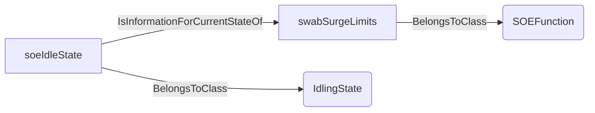
An example SparQL query looks like this:
```sparql
PREFIX rdf: <http://www.w3.org/1999/02/22-rdf-syntax-ns#>
PREFIX ddhub: <http://ddhub.no/>
PREFIX quantity: <http://ddhub.no/UnitAndQuantity>
SELECT ?soeIdleState
WHERE {
	?swabSurgeLimits rdf:type ddhub:SOEFunction .
	?soeIdleState rdf:type ddhub:IdlingState .
	?soeIdleState ddhub:IsInformationForCurrentStateOf ?swabSurgeLimits .
}
```
This example captures that the swab/surge limits function is currently idle.
## ProcessState <!-- NOUN -->
- Display name: Process State
- Parent class: [ComputedState](./DataFlow.md#ComputedState)
- Description: 
Describes the current operating condition of a continuous process such as circulation or drilling.
- Definition set: DataFlow
- Examples:
```dwis circulationState
DWISNoun:circulationProcess
ProcessState:stableCirculation
stableCirculation IsCurrentStateFor circulationProcess
```
An example semantic graph looks like as follow:
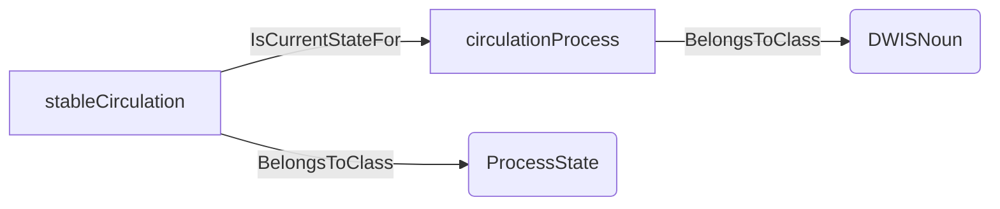
An example SparQL query looks like this:
```sparql
PREFIX rdf: <http://www.w3.org/1999/02/22-rdf-syntax-ns#>
PREFIX ddhub: <http://ddhub.no/>
PREFIX quantity: <http://ddhub.no/UnitAndQuantity>
SELECT ?circulationState
WHERE {
	?circulationProcess rdf:type ddhub:DWISNoun .
	?stableCirculation rdf:type ddhub:ProcessState .
	?stableCirculation ddhub:IsCurrentStateFor ?circulationProcess .
}
```
This example expresses that the circulation process is currently stable.
## PhysicalState <!-- NOUN -->
- Display name: Physical State
- Parent class: [ComputedState](./DataFlow.md#ComputedState)
- Description: 
Captures a computed representation of the physical condition of equipment or the well (e.g., pressure regime, torque state).
- Definition set: DataFlow
- Examples:
```dwis annulusPressureState
Interpreter:wellIntegrityInterpreter
PhysicalState:annulusPressureState
DWISNoun:annulusSection
annulusPressureState IsComputedBy wellIntegrityInterpreter
annulusPressureState IsCurrentStateFor annulusSection
```
An example semantic graph looks like as follow:
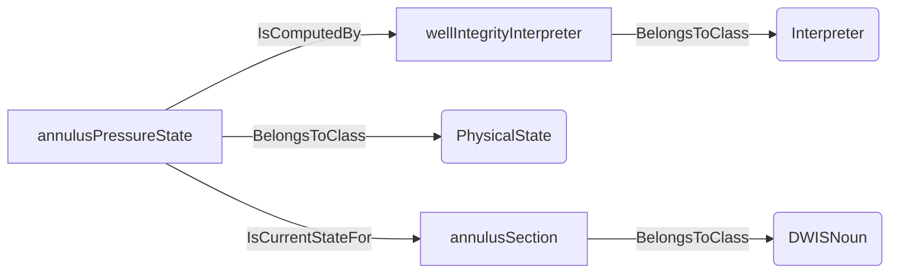
An example SparQL query looks like this:
```sparql
PREFIX rdf: <http://www.w3.org/1999/02/22-rdf-syntax-ns#>
PREFIX ddhub: <http://ddhub.no/>
PREFIX quantity: <http://ddhub.no/UnitAndQuantity>
SELECT ?annulusPressureState
WHERE {
	?wellIntegrityInterpreter rdf:type ddhub:Interpreter .
	?annulusPressureState rdf:type ddhub:PhysicalState .
	?annulusSection rdf:type ddhub:DWISNoun .
	?annulusPressureState ddhub:IsComputedBy ?wellIntegrityInterpreter .
	?annulusPressureState ddhub:IsCurrentStateFor ?annulusSection .
}
```
This example shows an interpreter estimating the pressure state of an annulus section.
## ComputationUnit <!-- NOUN -->
- Display name: Computation Unit
- Parent class: [DataFlowNode](./DataFlow.md#DataFlowNode)
- Description: 
Denotes a complex computation unit, typically based on advanced numerical modeling
- Definition set: DataFlow
- Examples:
```dwis hydraulicsModel
ComputationUnit:hydraulicsModel
DrillingDataPoint:standpipePressureRaw
DrillingDataPoint:predictedStandpipePressure
standpipePressureRaw IsComputationInput hydraulicsModel
predictedStandpipePressure IsComputedBy hydraulicsModel
```
An example semantic graph looks like as follow:
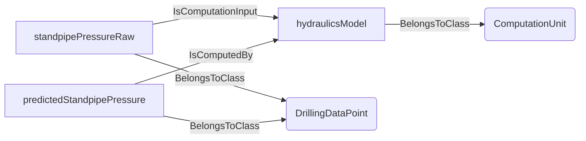
An example SparQL query looks like this:
```sparql
PREFIX rdf: <http://www.w3.org/1999/02/22-rdf-syntax-ns#>
PREFIX ddhub: <http://ddhub.no/>
PREFIX quantity: <http://ddhub.no/UnitAndQuantity>
SELECT ?hydraulicsModel
WHERE {
	?hydraulicsModel rdf:type ddhub:ComputationUnit .
	?standpipePressureRaw rdf:type ddhub:DrillingDataPoint .
	?predictedStandpipePressure rdf:type ddhub:DrillingDataPoint .
	?standpipePressureRaw ddhub:IsComputationInput ?hydraulicsModel .
	?predictedStandpipePressure ddhub:IsComputedBy ?hydraulicsModel .
}
```
This example models a hydraulics computation unit that predicts standpipe pressure.
## Advisor <!-- NOUN -->
- Display name: Advisor
- Parent class: [ComputationUnit](./DataFlow.md#ComputationUnit)
- Attributes:
  - AdviceType
    - Type: string
    - Description: 
- Description: 
An advisor is a computation unit that produces an advice on how to control a process. Its output is typically
an AdvisorySystemAdvice.
- Definition set: DataFlow
- Examples:
```dwis drillingAdvisor
Advisor:drillingAdvisor
DrillingControlAdvice:ropAdvice
ropAdvice IsRecommendedBy drillingAdvisor
```
An example semantic graph looks like as follow:
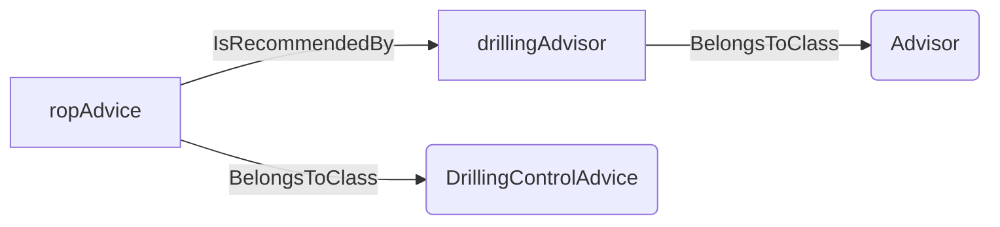
An example SparQL query looks like this:
```sparql
PREFIX rdf: <http://www.w3.org/1999/02/22-rdf-syntax-ns#>
PREFIX ddhub: <http://ddhub.no/>
PREFIX quantity: <http://ddhub.no/UnitAndQuantity>
SELECT ?drillingAdvisor
WHERE {
	?drillingAdvisor rdf:type ddhub:Advisor .
	?ropAdvice rdf:type ddhub:DrillingControlAdvice .
	?ropAdvice ddhub:IsRecommendedBy ?drillingAdvisor .
}
```
This example shows an advisor producing a drilling control advice.
## Simulator <!-- NOUN -->
- Display name: Simulator
- Parent class: [ComputationUnit](./DataFlow.md#ComputationUnit)
- Description: 
A simulator is a computation unit that tries to replicate the outputs of a process. Its output is typically
a set of ComputedData, i.e., a specialisation of DrillingDataPoint.
- Definition set: DataFlow
- Examples:
```dwis hydraulicsSimulator
Simulator:hydraulicsSimulator
DrillingDataPoint:annulusPressureForecast
annulusPressureForecast IsComputedBy hydraulicsSimulator
```
An example semantic graph looks like as follow:
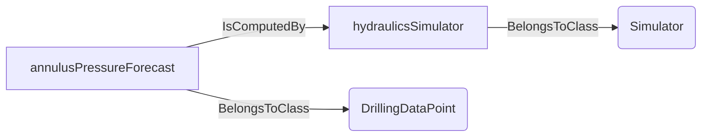
An example SparQL query looks like this:
```sparql
PREFIX rdf: <http://www.w3.org/1999/02/22-rdf-syntax-ns#>
PREFIX ddhub: <http://ddhub.no/>
PREFIX quantity: <http://ddhub.no/UnitAndQuantity>
SELECT ?hydraulicsSimulator
WHERE {
	?hydraulicsSimulator rdf:type ddhub:Simulator .
	?annulusPressureForecast rdf:type ddhub:DrillingDataPoint .
	?annulusPressureForecast ddhub:IsComputedBy ?hydraulicsSimulator .
}
```
This example shows a simulator generating a forecast of annulus pressure.
## Estimator <!-- NOUN -->
- Display name: Estimator
- Parent class: [ComputationUnit](./DataFlow.md#ComputationUnit)
- Description: 
An estimator is a computation unit that estimates unmeasured variables of a process. Its output is typically a set of ComputedData, i.e., a specialisation of DrillingDataPoint.
- Definition set: DataFlow
- Examples:
```dwis EstimatorExample
Estimator:cuttingFlowrateEstimator
ComputedData:cuttingFlowrate
cuttingFlowrate IsComputedBy cuttingFlowrateEstimator
```
An example semantic graph looks like as follow:
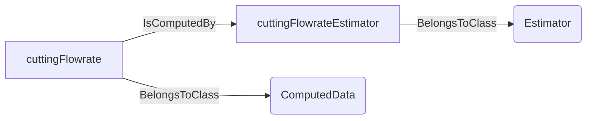
An example SparQL query looks like this:
```sparql
PREFIX rdf: <http://www.w3.org/1999/02/22-rdf-syntax-ns#>
PREFIX ddhub: <http://ddhub.no/>
PREFIX quantity: <http://ddhub.no/UnitAndQuantity>
SELECT ?EstimatorExample
WHERE {
	?cuttingFlowrateEstimator rdf:type ddhub:Estimator .
	?cuttingFlowrate rdf:type ddhub:ComputedData .
	?cuttingFlowrate ddhub:IsComputedBy ?cuttingFlowrateEstimator .
}
```
This example shows an estimator computing the cutting flowrate.
## ModelFitter <!-- NOUN -->
- Display name: Model Fitter
- Parent class: [Estimator](./DataFlow.md#Estimator)
- Description: 
A model fitter is a computation unit that fits a model to observed data in order to estimate unmeasured variables of a process. Its output is typically a set of ComputedData, i.e., a specialisation of DrillingDataPoint.
- Definition set: DataFlow
- Examples:
```dwis ModelFitterExample
ModelFitter:YPLModelFitter
DirectMeasurement:flowCurveData
ComputedData:YPLModelParameters
flowCurveData IsComputationInput YPLModelFitter
YPLModelParameters IsComputedBy YPLModelFitter
```
An example semantic graph looks like as follow:
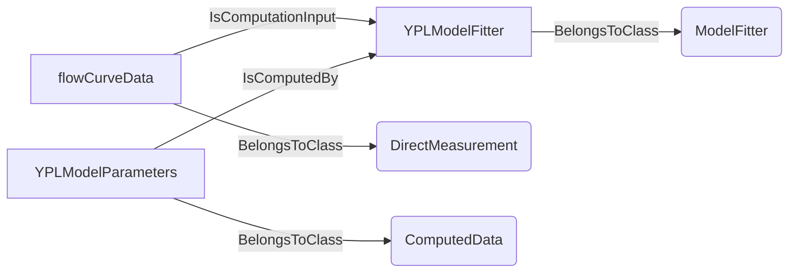
An example SparQL query looks like this:
```sparql
PREFIX rdf: <http://www.w3.org/1999/02/22-rdf-syntax-ns#>
PREFIX ddhub: <http://ddhub.no/>
PREFIX quantity: <http://ddhub.no/UnitAndQuantity>
SELECT ?ModelFitterExample
WHERE {
	?YPLModelFitter rdf:type ddhub:ModelFitter .
	?flowCurveData rdf:type ddhub:DirectMeasurement .
	?YPLModelParameters rdf:type ddhub:ComputedData .
	?flowCurveData ddhub:IsComputationInput ?YPLModelFitter .
	?YPLModelParameters ddhub:IsComputedBy ?YPLModelFitter .
}
```
This example shows a model fitter estimating YPL model parameters from flow curve data.
## Interpreter <!-- NOUN -->
- Display name: Interpreter
- Parent class: [ComputationUnit](./DataFlow.md#ComputationUnit)
- Description: 
An interpreter is a computation unit that interprets the state of a process. Its output is typically a
ComputedState.
- Definition set: DataFlow
- Examples:
```dwis stateInterpreter
Interpreter:stateInterpreter
ComputedState:circulationStable
DWISNoun:circulationProcess
circulationStable IsComputedBy stateInterpreter
circulationStable IsCurrentStateFor circulationProcess
```
An example semantic graph looks like as follow:
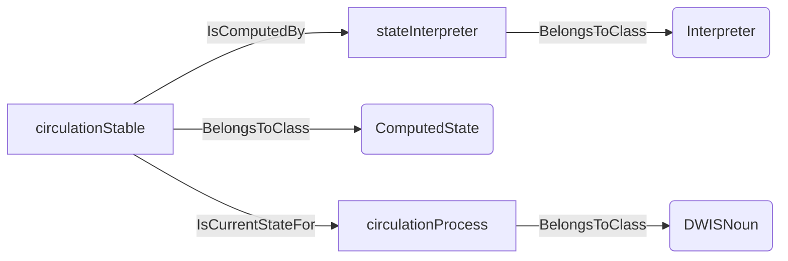
An example SparQL query looks like this:
```sparql
PREFIX rdf: <http://www.w3.org/1999/02/22-rdf-syntax-ns#>
PREFIX ddhub: <http://ddhub.no/>
PREFIX quantity: <http://ddhub.no/UnitAndQuantity>
SELECT ?stateInterpreter
WHERE {
	?stateInterpreter rdf:type ddhub:Interpreter .
	?circulationStable rdf:type ddhub:ComputedState .
	?circulationProcess rdf:type ddhub:DWISNoun .
	?circulationStable ddhub:IsComputedBy ?stateInterpreter .
	?circulationStable ddhub:IsCurrentStateFor ?circulationProcess .
}
```
This example shows an interpreter computing whether circulation is stable.
## ImageInterpreter <!-- NOUN -->
- Display name: Image Interpreter
- Parent class: [Interpreter](./DataFlow.md#Interpreter)
- Description: 
An image interpreter is a computation unit that interprets images to produce a computed state.
- Definition set: DataFlow
- Examples:
```dwis stateInterpreter
Interpreter:stateInterpreter
ComputedState:circulationStable
DWISNoun:circulationProcess
circulationStable IsComputedBy stateInterpreter
circulationStable IsCurrentStateFor circulationProcess
```
An example semantic graph looks like as follow:

An example SparQL query looks like this:
```sparql
PREFIX rdf: <http://www.w3.org/1999/02/22-rdf-syntax-ns#>
PREFIX ddhub: <http://ddhub.no/>
PREFIX quantity: <http://ddhub.no/UnitAndQuantity>
SELECT ?stateInterpreter
WHERE {
	?stateInterpreter rdf:type ddhub:Interpreter .
	?circulationStable rdf:type ddhub:ComputedState .
	?circulationProcess rdf:type ddhub:DWISNoun .
	?circulationStable ddhub:IsComputedBy ?stateInterpreter .
	?circulationStable ddhub:IsCurrentStateFor ?circulationProcess .
}
```
This example shows an interpreter computing whether circulation is stable.
## Controller <!-- NOUN -->
- Display name: Controller
- Parent class: [DataFlowNode](./DataFlow.md#DataFlowNode)
- Description: 
A processing unit that generates commands to drive equipment toward desired set-points using feedback.
- Definition set: DataFlow
- Examples:
```dwis autoDrillerController
Controller:autoDrillerController
DrillingDataPoint:weightOnBitSetPoint
DrillingDataPoint:hookloadSignal
weightOnBitSetPoint IsSetPointFor autoDrillerController
hookloadSignal IsComputationInput autoDrillerController
```
An example semantic graph looks like as follow:
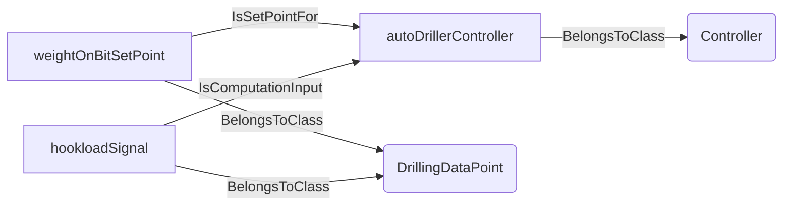
An example SparQL query looks like this:
```sparql
PREFIX rdf: <http://www.w3.org/1999/02/22-rdf-syntax-ns#>
PREFIX ddhub: <http://ddhub.no/>
PREFIX quantity: <http://ddhub.no/UnitAndQuantity>
SELECT ?autoDrillerController
WHERE {
	?autoDrillerController rdf:type ddhub:Controller .
	?weightOnBitSetPoint rdf:type ddhub:DrillingDataPoint .
	?hookloadSignal rdf:type ddhub:DrillingDataPoint .
	?weightOnBitSetPoint ddhub:IsSetPointFor ?autoDrillerController .
	?hookloadSignal ddhub:IsComputationInput ?autoDrillerController .
}
```
This example shows an autodriller controller consuming measurements and a set-point.
## ControlSystem <!-- NOUN -->
- Display name: ControlSystem
- Parent class: [DataFlowNode](./DataFlow.md#DataFlowNode)
- Description: 
A collection of controllers, logic, and I/O that supervises a portion of the drilling process.
- Definition set: DataFlow
- Examples:
```dwis drillingControlSystem
ControlSystem:dcs
Controller:autoDrillerController
DWISNoun:topDrive
autoDrillerController Controls topDrive
dcs HasFunction autoDrillerController
```
An example semantic graph looks like as follow:
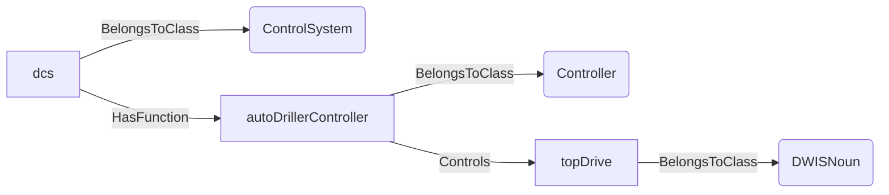
An example SparQL query looks like this:
```sparql
PREFIX rdf: <http://www.w3.org/1999/02/22-rdf-syntax-ns#>
PREFIX ddhub: <http://ddhub.no/>
PREFIX quantity: <http://ddhub.no/UnitAndQuantity>
SELECT ?drillingControlSystem
WHERE {
	?dcs rdf:type ddhub:ControlSystem .
	?autoDrillerController rdf:type ddhub:Controller .
	?topDrive rdf:type ddhub:DWISNoun .
	?autoDrillerController ddhub:Controls ?topDrive .
	?dcs ddhub:HasFunction ?autoDrillerController .
}
```
This example shows a drilling control system that hosts an autodriller controller acting on the top drive.
## HoistingControlSystem <!-- NOUN -->
- Display name: Hoisting Control System
- Parent class: [ControlSystem](./DataFlow.md#ControlSystem)
- Description: 
A control system focused on hoisting equipment such as the drawworks and blocks.
- Definition set: DataFlow
- Examples:
```dwis hoistingSystem
HoistingControlSystem:hoistingDCS
Controller:hoistController
DWISNoun:drawworks
DrillingDataPoint:hookloadSignal
hookloadSignal IsComputationInput hoistController
hoistController Controls drawworks
hoistingDCS HasFunction hoistController
```
An example semantic graph looks like as follow:
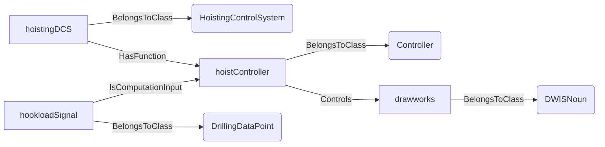
An example SparQL query looks like this:
```sparql
PREFIX rdf: <http://www.w3.org/1999/02/22-rdf-syntax-ns#>
PREFIX ddhub: <http://ddhub.no/>
PREFIX quantity: <http://ddhub.no/UnitAndQuantity>
SELECT ?hoistingSystem
WHERE {
	?hoistingDCS rdf:type ddhub:HoistingControlSystem .
	?hoistController rdf:type ddhub:Controller .
	?drawworks rdf:type ddhub:DWISNoun .
	?hookloadSignal rdf:type ddhub:DrillingDataPoint .
	?hookloadSignal ddhub:IsComputationInput ?hoistController .
	?hoistController ddhub:Controls ?drawworks .
	?hoistingDCS ddhub:HasFunction ?hoistController .
}
```
This example shows a hoisting control system governing the drawworks using hookload feedback.
## CirculationControlSystem <!-- NOUN -->
- Display name: Circulation Control System
- Parent class: [ControlSystem](./DataFlow.md#ControlSystem)
- Description: 
A control system that manages pumps, flow rate, and downhole pressure related to circulation.
- Definition set: DataFlow
- Examples:
```dwis circulationSystem
CirculationControlSystem:circulationDCS
Controller:flowController
DWISNoun:mudPumps
DrillingDataPoint:flowSetPoint
flowSetPoint IsSetPointFor flowController
flowController Controls mudPumps
circulationDCS HasFunction flowController
```
An example semantic graph looks like as follow:
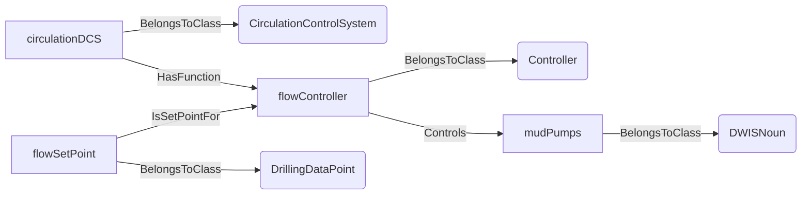
An example SparQL query looks like this:
```sparql
PREFIX rdf: <http://www.w3.org/1999/02/22-rdf-syntax-ns#>
PREFIX ddhub: <http://ddhub.no/>
PREFIX quantity: <http://ddhub.no/UnitAndQuantity>
SELECT ?circulationSystem
WHERE {
	?circulationDCS rdf:type ddhub:CirculationControlSystem .
	?flowController rdf:type ddhub:Controller .
	?mudPumps rdf:type ddhub:DWISNoun .
	?flowSetPoint rdf:type ddhub:DrillingDataPoint .
	?flowSetPoint ddhub:IsSetPointFor ?flowController .
	?flowController ddhub:Controls ?mudPumps .
	?circulationDCS ddhub:HasFunction ?flowController .
}
```
This example shows a circulation control system driving the mud pumps.
## RotationControlSystem <!-- NOUN -->
- Display name: Rotation Control System
- Parent class: [ControlSystem](./DataFlow.md#ControlSystem)
- Description: 
A control system managing rotary speed and torque for the drill-stem.
- Definition set: DataFlow
- Examples:
```dwis rotationSystem
RotationControlSystem:rotationDCS
Controller:rotationController
DWISNoun:topDrive
DrillingDataPoint:rotationalSpeedSetPoint
rotationalSpeedSetPoint IsSetPointFor rotationController
rotationController Controls topDrive
rotationDCS HasFunction rotationController
```
An example semantic graph looks like as follow:
```mermaid
graph LR
	N0000[rotationDCS] -->|BelongsToClass| N0001(RotationControlSystem) 
	N0002[rotationController] -->|BelongsToClass| N0003(Controller) 
	N0004[topDrive] -->|BelongsToClass| N0005(DWISNoun) 
	N0006[rotationalSpeedSetPoint] -->|BelongsToClass| N0007(DrillingDataPoint) 
	N0006[rotationalSpeedSetPoint] -->|IsSetPointFor| N0002[rotationController] 
	N0002[rotationController] -->|Controls| N0004[topDrive] 
	N0000[rotationDCS] -->|HasFunction| N0002[rotationController] 
```
An example SparQL query looks like this:
```sparql
PREFIX rdf: <http://www.w3.org/1999/02/22-rdf-syntax-ns#>
PREFIX ddhub: <http://ddhub.no/>
PREFIX quantity: <http://ddhub.no/UnitAndQuantity>
SELECT ?rotationSystem
WHERE {
	?rotationDCS rdf:type ddhub:RotationControlSystem .
	?rotationController rdf:type ddhub:Controller .
	?topDrive rdf:type ddhub:DWISNoun .
	?rotationalSpeedSetPoint rdf:type ddhub:DrillingDataPoint .
	?rotationalSpeedSetPoint ddhub:IsSetPointFor ?rotationController .
	?rotationController ddhub:Controls ?topDrive .
	?rotationDCS ddhub:HasFunction ?rotationController .
}
```
This example shows a rotation control system adjusting the top-drive speed.
## BOPControlSystem <!-- NOUN -->
- Display name: BOP Control System
- Parent class: [ControlSystem](./DataFlow.md#ControlSystem)
- Description: 
A control system supervising blowout preventer functions such as rams and annulars.
- Definition set: DataFlow
- Examples:
```dwis bopSystem
BOPControlSystem:bopControl
Controller:bopRamController
DWISNoun:bopRams
DrillingDataPoint:closeCommand
closeCommand IsCommandFor bopRamController
bopRamController Controls bopRams
bopControl HasFunction bopRamController
```
An example semantic graph looks like as follow:
```mermaid
graph LR
	N0000[bopControl] -->|BelongsToClass| N0001(BOPControlSystem) 
	N0002[bopRamController] -->|BelongsToClass| N0003(Controller) 
	N0004[bopRams] -->|BelongsToClass| N0005(DWISNoun) 
	N0006[closeCommand] -->|BelongsToClass| N0007(DrillingDataPoint) 
	N0006[closeCommand] -->|IsCommandFor| N0002[bopRamController] 
	N0002[bopRamController] -->|Controls| N0004[bopRams] 
	N0000[bopControl] -->|HasFunction| N0002[bopRamController] 
```
An example SparQL query looks like this:
```sparql
PREFIX rdf: <http://www.w3.org/1999/02/22-rdf-syntax-ns#>
PREFIX ddhub: <http://ddhub.no/>
PREFIX quantity: <http://ddhub.no/UnitAndQuantity>
SELECT ?bopSystem
WHERE {
	?bopControl rdf:type ddhub:BOPControlSystem .
	?bopRamController rdf:type ddhub:Controller .
	?bopRams rdf:type ddhub:DWISNoun .
	?closeCommand rdf:type ddhub:DrillingDataPoint .
	?closeCommand ddhub:IsCommandFor ?bopRamController .
	?bopRamController ddhub:Controls ?bopRams .
	?bopControl ddhub:HasFunction ?bopRamController .
}
```
This example shows a BOP control system issuing ram close commands.
## RigChokeControlSystem <!-- NOUN -->
- Display name: Rig Choke Control System
- Parent class: [ControlSystem](./DataFlow.md#ControlSystem)
- Description: 
A control system dedicated to surface choke management for well control operations.
- Definition set: DataFlow
- Examples:
```dwis chokeSystem
RigChokeControlSystem:chokeControl
Controller:chokeController
DWISNoun:surfaceChoke
DrillingDataPoint:standpipePressureSignal
standpipePressureSignal IsComputationInput chokeController
chokeController Controls surfaceChoke
chokeControl HasFunction chokeController
```
An example semantic graph looks like as follow:
```mermaid
graph LR
	N0000[chokeControl] -->|BelongsToClass| N0001(RigChokeControlSystem) 
	N0002[chokeController] -->|BelongsToClass| N0003(Controller) 
	N0004[surfaceChoke] -->|BelongsToClass| N0005(DWISNoun) 
	N0006[standpipePressureSignal] -->|BelongsToClass| N0007(DrillingDataPoint) 
	N0006[standpipePressureSignal] -->|IsComputationInput| N0002[chokeController] 
	N0002[chokeController] -->|Controls| N0004[surfaceChoke] 
	N0000[chokeControl] -->|HasFunction| N0002[chokeController] 
```
An example SparQL query looks like this:
```sparql
PREFIX rdf: <http://www.w3.org/1999/02/22-rdf-syntax-ns#>
PREFIX ddhub: <http://ddhub.no/>
PREFIX quantity: <http://ddhub.no/UnitAndQuantity>
SELECT ?chokeSystem
WHERE {
	?chokeControl rdf:type ddhub:RigChokeControlSystem .
	?chokeController rdf:type ddhub:Controller .
	?surfaceChoke rdf:type ddhub:DWISNoun .
	?standpipePressureSignal rdf:type ddhub:DrillingDataPoint .
	?standpipePressureSignal ddhub:IsComputationInput ?chokeController .
	?chokeController ddhub:Controls ?surfaceChoke .
	?chokeControl ddhub:HasFunction ?chokeController .
}
```
This example shows choke control adjusting a surface choke using standpipe pressure feedback.
## MeasurementDevice <!-- NOUN -->
- Display name: Measurement Device
- Parent class: [DataFlowNode](./DataFlow.md#DataFlowNode)
- Description: 
Denotes a physical sensor
- Definition set: DataFlow
- Examples:
```dwis standpipeSensor
MeasurementDevice:standpipePressureSensor
DrillingDataPoint:standpipePressureRaw
standpipePressureRaw IsMeasuredBy standpipePressureSensor
standpipePressureRaw IsGeneratedBy standpipePressureSensor
```
An example semantic graph looks like as follow:
```mermaid
graph LR
	N0000[standpipePressureSensor] -->|BelongsToClass| N0001(MeasurementDevice) 
	N0002[standpipePressureRaw] -->|BelongsToClass| N0003(DrillingDataPoint) 
	N0002[standpipePressureRaw] -->|IsMeasuredBy| N0000[standpipePressureSensor] 
	N0002[standpipePressureRaw] -->|IsGeneratedBy| N0000[standpipePressureSensor] 
```
An example SparQL query looks like this:
```sparql
PREFIX rdf: <http://www.w3.org/1999/02/22-rdf-syntax-ns#>
PREFIX ddhub: <http://ddhub.no/>
PREFIX quantity: <http://ddhub.no/UnitAndQuantity>
SELECT ?standpipeSensor
WHERE {
	?standpipePressureSensor rdf:type ddhub:MeasurementDevice .
	?standpipePressureRaw rdf:type ddhub:DrillingDataPoint .
	?standpipePressureRaw ddhub:IsMeasuredBy ?standpipePressureSensor .
	?standpipePressureRaw ddhub:IsGeneratedBy ?standpipePressureSensor .
}
```
This example shows a standpipe pressure sensor producing a raw signal.
## Transformation <!-- NOUN -->
- Display name: Transformation
- Parent class: [DataFlowNode](./DataFlow.md#DataFlowNode)
- Description: 
Represents a transformation applied to some signals that produces other signals
- Definition set: DataFlow
- Examples:
```dwis depthMerge
Transformation:depthMerge
DrillingDataPoint:pipeTallyDepth
DrillingDataPoint:blockHeightDepth
DrillingDataPoint:computedDepth
pipeTallyDepth IsTransformationInput depthMerge
blockHeightDepth IsTransformationInput depthMerge
computedDepth IsTransformationOutput depthMerge
```
An example semantic graph looks like as follow:
```mermaid
graph LR
	N0000[depthMerge] -->|BelongsToClass| N0001(Transformation) 
	N0002[pipeTallyDepth] -->|BelongsToClass| N0003(DrillingDataPoint) 
	N0004[blockHeightDepth] -->|BelongsToClass| N0003(DrillingDataPoint) 
	N0005[computedDepth] -->|BelongsToClass| N0003(DrillingDataPoint) 
	N0002[pipeTallyDepth] -->|IsTransformationInput| N0000[depthMerge] 
	N0004[blockHeightDepth] -->|IsTransformationInput| N0000[depthMerge] 
	N0005[computedDepth] -->|IsTransformationOutput| N0000[depthMerge] 
```
An example SparQL query looks like this:
```sparql
PREFIX rdf: <http://www.w3.org/1999/02/22-rdf-syntax-ns#>
PREFIX ddhub: <http://ddhub.no/>
PREFIX quantity: <http://ddhub.no/UnitAndQuantity>
SELECT ?depthMerge
WHERE {
	?depthMerge rdf:type ddhub:Transformation .
	?pipeTallyDepth rdf:type ddhub:DrillingDataPoint .
	?blockHeightDepth rdf:type ddhub:DrillingDataPoint .
	?computedDepth rdf:type ddhub:DrillingDataPoint .
	?pipeTallyDepth ddhub:IsTransformationInput ?depthMerge .
	?blockHeightDepth ddhub:IsTransformationInput ?depthMerge .
	?computedDepth ddhub:IsTransformationOutput ?depthMerge .
}
```
This example merges two depth sources into a computed depth signal.
## DirectTransformation <!-- NOUN -->
- Display name: Direct Transformation
- Parent class: [Transformation](./DataFlow.md#Transformation)
- Description: 
Direct transformations are performed using only the current value of their inputs, time is not involved
- Definition set: DataFlow
- Examples:
```dwis densityFromPressure
DirectTransformation:densityFromPressure
DrillingDataPoint:standpipePressureRaw
DrillingDataPoint:equivalentDensity
standpipePressureRaw IsTransformationInput densityFromPressure
equivalentDensity IsTransformationOutput densityFromPressure
```
An example semantic graph looks like as follow:
```mermaid
graph LR
	N0000[densityFromPressure] -->|BelongsToClass| N0001(DirectTransformation) 
	N0002[standpipePressureRaw] -->|BelongsToClass| N0003(DrillingDataPoint) 
	N0004[equivalentDensity] -->|BelongsToClass| N0003(DrillingDataPoint) 
	N0002[standpipePressureRaw] -->|IsTransformationInput| N0000[densityFromPressure] 
	N0004[equivalentDensity] -->|IsTransformationOutput| N0000[densityFromPressure] 
```
An example SparQL query looks like this:
```sparql
PREFIX rdf: <http://www.w3.org/1999/02/22-rdf-syntax-ns#>
PREFIX ddhub: <http://ddhub.no/>
PREFIX quantity: <http://ddhub.no/UnitAndQuantity>
SELECT ?densityFromPressure
WHERE {
	?densityFromPressure rdf:type ddhub:DirectTransformation .
	?standpipePressureRaw rdf:type ddhub:DrillingDataPoint .
	?equivalentDensity rdf:type ddhub:DrillingDataPoint .
	?standpipePressureRaw ddhub:IsTransformationInput ?densityFromPressure .
	?equivalentDensity ddhub:IsTransformationOutput ?densityFromPressure .
}
```
This example converts a pressure measurement to an equivalent circulating density using only the latest value.
## Aggregation <!-- NOUN -->
- Display name: Aggregation
- Parent class: [DirectTransformation](./DataFlow.md#DirectTransformation)
- Description: 
Combines several input signals into a single representative value such as an average or sum.
- Definition set: DataFlow
- Examples:
```dwis hookloadAggregation
Aggregation:hookloadAggregation
DrillingDataPoint:hookloadLeft
DrillingDataPoint:hookloadRight
DrillingDataPoint:hookloadAverage
hookloadLeft IsTransformationInput hookloadAggregation
hookloadRight IsTransformationInput hookloadAggregation
hookloadAverage IsTransformationOutput hookloadAggregation
```
An example semantic graph looks like as follow:
```mermaid
graph LR
	N0000[hookloadAggregation] -->|BelongsToClass| N0001(Aggregation) 
	N0002[hookloadLeft] -->|BelongsToClass| N0003(DrillingDataPoint) 
	N0004[hookloadRight] -->|BelongsToClass| N0003(DrillingDataPoint) 
	N0005[hookloadAverage] -->|BelongsToClass| N0003(DrillingDataPoint) 
	N0002[hookloadLeft] -->|IsTransformationInput| N0000[hookloadAggregation] 
	N0004[hookloadRight] -->|IsTransformationInput| N0000[hookloadAggregation] 
	N0005[hookloadAverage] -->|IsTransformationOutput| N0000[hookloadAggregation] 
```
An example SparQL query looks like this:
```sparql
PREFIX rdf: <http://www.w3.org/1999/02/22-rdf-syntax-ns#>
PREFIX ddhub: <http://ddhub.no/>
PREFIX quantity: <http://ddhub.no/UnitAndQuantity>
SELECT ?hookloadAggregation
WHERE {
	?hookloadAggregation rdf:type ddhub:Aggregation .
	?hookloadLeft rdf:type ddhub:DrillingDataPoint .
	?hookloadRight rdf:type ddhub:DrillingDataPoint .
	?hookloadAverage rdf:type ddhub:DrillingDataPoint .
	?hookloadLeft ddhub:IsTransformationInput ?hookloadAggregation .
	?hookloadRight ddhub:IsTransformationInput ?hookloadAggregation .
	?hookloadAverage ddhub:IsTransformationOutput ?hookloadAggregation .
}
```
This example averages two hookload measurements.
## ForceFromLoadPinsTransformation <!-- NOUN -->
- Display name: Force From Load Pins Transformation
- Parent class: [DirectTransformation](./DataFlow.md#DirectTransformation)
- Description: 
Converts raw load pin readings into a usable force signal.
- Definition set: DataFlow
- Examples:
```dwis loadPinForce
ForceFromLoadPinsTransformation:loadPinForce
DrillingDataPoint:loadPinReading
DrillingDataPoint:hookloadForce
loadPinReading IsTransformationInput loadPinForce
hookloadForce IsTransformationOutput loadPinForce
```
An example semantic graph looks like as follow:
```mermaid
graph LR
	N0000[loadPinForce] -->|BelongsToClass| N0001(ForceFromLoadPinsTransformation) 
	N0002[loadPinReading] -->|BelongsToClass| N0003(DrillingDataPoint) 
	N0004[hookloadForce] -->|BelongsToClass| N0003(DrillingDataPoint) 
	N0002[loadPinReading] -->|IsTransformationInput| N0000[loadPinForce] 
	N0004[hookloadForce] -->|IsTransformationOutput| N0000[loadPinForce] 
```
An example SparQL query looks like this:
```sparql
PREFIX rdf: <http://www.w3.org/1999/02/22-rdf-syntax-ns#>
PREFIX ddhub: <http://ddhub.no/>
PREFIX quantity: <http://ddhub.no/UnitAndQuantity>
SELECT ?loadPinForce
WHERE {
	?loadPinForce rdf:type ddhub:ForceFromLoadPinsTransformation .
	?loadPinReading rdf:type ddhub:DrillingDataPoint .
	?hookloadForce rdf:type ddhub:DrillingDataPoint .
	?loadPinReading ddhub:IsTransformationInput ?loadPinForce .
	?hookloadForce ddhub:IsTransformationOutput ?loadPinForce .
}
```
This example derives hookload force from load pin readings.
## ForceToLoadTransformation <!-- NOUN -->
- Display name: Force To Load Transformation
- Parent class: [DirectTransformation](./DataFlow.md#DirectTransformation)
- Description: 
Converts a force signal into a load expressed for another context (e.g., block load).
- Definition set: DataFlow
- Examples:
```dwis forceToBlockLoad
ForceToLoadTransformation:forceToBlockLoad
DrillingDataPoint:hookloadForce
DrillingDataPoint:blockLoad
hookloadForce IsTransformationInput forceToBlockLoad
blockLoad IsTransformationOutput forceToBlockLoad
```
An example semantic graph looks like as follow:
```mermaid
graph LR
	N0000[forceToBlockLoad] -->|BelongsToClass| N0001(ForceToLoadTransformation) 
	N0002[hookloadForce] -->|BelongsToClass| N0003(DrillingDataPoint) 
	N0004[blockLoad] -->|BelongsToClass| N0003(DrillingDataPoint) 
	N0002[hookloadForce] -->|IsTransformationInput| N0000[forceToBlockLoad] 
	N0004[blockLoad] -->|IsTransformationOutput| N0000[forceToBlockLoad] 
```
An example SparQL query looks like this:
```sparql
PREFIX rdf: <http://www.w3.org/1999/02/22-rdf-syntax-ns#>
PREFIX ddhub: <http://ddhub.no/>
PREFIX quantity: <http://ddhub.no/UnitAndQuantity>
SELECT ?forceToBlockLoad
WHERE {
	?forceToBlockLoad rdf:type ddhub:ForceToLoadTransformation .
	?hookloadForce rdf:type ddhub:DrillingDataPoint .
	?blockLoad rdf:type ddhub:DrillingDataPoint .
	?hookloadForce ddhub:IsTransformationInput ?forceToBlockLoad .
	?blockLoad ddhub:IsTransformationOutput ?forceToBlockLoad .
}
```
This example converts hookload force into an equivalent block load.
## MeasuredDepthToTrueVerticalDepthTransformation <!-- NOUN -->
- Display name: Measured Depth To True Vertical Depth Transformation
- Parent class: [DirectTransformation](./DataFlow.md#DirectTransformation)
- Description: 
Converts measured depth to true vertical depth using well trajectory information.
- Definition set: DataFlow
- Examples:
```dwis mdtvd
MeasuredDepthToTrueVerticalDepthTransformation:mdToTvd
DrillingDataPoint:measuredDepth
DrillingDataPoint:trueVerticalDepth
measuredDepth IsTransformationInput mdToTvd
trueVerticalDepth IsTransformationOutput mdToTvd
```
An example semantic graph looks like as follow:
```mermaid
graph LR
	N0000[mdToTvd] -->|BelongsToClass| N0001(MeasuredDepthToTrueVerticalDepthTransformation) 
	N0002[measuredDepth] -->|BelongsToClass| N0003(DrillingDataPoint) 
	N0004[trueVerticalDepth] -->|BelongsToClass| N0003(DrillingDataPoint) 
	N0002[measuredDepth] -->|IsTransformationInput| N0000[mdToTvd] 
	N0004[trueVerticalDepth] -->|IsTransformationOutput| N0000[mdToTvd] 
```
An example SparQL query looks like this:
```sparql
PREFIX rdf: <http://www.w3.org/1999/02/22-rdf-syntax-ns#>
PREFIX ddhub: <http://ddhub.no/>
PREFIX quantity: <http://ddhub.no/UnitAndQuantity>
SELECT ?mdtvd
WHERE {
	?mdToTvd rdf:type ddhub:MeasuredDepthToTrueVerticalDepthTransformation .
	?measuredDepth rdf:type ddhub:DrillingDataPoint .
	?trueVerticalDepth rdf:type ddhub:DrillingDataPoint .
	?measuredDepth ddhub:IsTransformationInput ?mdToTvd .
	?trueVerticalDepth ddhub:IsTransformationOutput ?mdToTvd .
}
```
This example computes true vertical depth from measured depth.
## SummationTransformation <!-- NOUN -->
- Display name: SummationTransformation
- Parent class: [DirectTransformation](./DataFlow.md#DirectTransformation)
- Description: 
Sums up all the input signals to produce the output signal.
- Definition set: DataFlow
- Examples:
```dwis DWOBTaringExample
SummationTransformation:taringTransformation
DrillingDataPoint:rawAxialLoad
DrillingDataPoint:tare
DrillingDataPoint:WOBTared
rawAxialLoad IsTransformationInput taringTransformation
tare IsTransformationInput taringTransformation
WOBTared IsTransformationOutput taringTransformation
```
An example semantic graph looks like as follow:
```mermaid
graph LR
	N0000[taringTransformation] -->|BelongsToClass| N0001(SummationTransformation) 
	N0002[rawAxialLoad] -->|BelongsToClass| N0003(DrillingDataPoint) 
	N0004[tare] -->|BelongsToClass| N0003(DrillingDataPoint) 
	N0005[WOBTared] -->|BelongsToClass| N0003(DrillingDataPoint) 
	N0002[rawAxialLoad] -->|IsTransformationInput| N0000[taringTransformation] 
	N0004[tare] -->|IsTransformationInput| N0000[taringTransformation] 
	N0005[WOBTared] -->|IsTransformationOutput| N0000[taringTransformation] 
```
An example SparQL query looks like this:
```sparql
PREFIX rdf: <http://www.w3.org/1999/02/22-rdf-syntax-ns#>
PREFIX ddhub: <http://ddhub.no/>
PREFIX quantity: <http://ddhub.no/UnitAndQuantity>
SELECT ?DWOBTaringExample
WHERE {
	?taringTransformation rdf:type ddhub:SummationTransformation .
	?rawAxialLoad rdf:type ddhub:DrillingDataPoint .
	?tare rdf:type ddhub:DrillingDataPoint .
	?WOBTared rdf:type ddhub:DrillingDataPoint .
	?rawAxialLoad ddhub:IsTransformationInput ?taringTransformation .
	?tare ddhub:IsTransformationInput ?taringTransformation .
	?WOBTared ddhub:IsTransformationOutput ?taringTransformation .
}
```
This example shows how the raw axial load is transformed into a tared WOB by adding a tare value.
## MeasuredDepthTranslation <!-- NOUN -->
- Display name: Measured Depth Translation
- Parent class: [SummationTransformation](./DataFlow.md#SummationTransformation)
- Description: 
Applies an offset or calibration factor to a measured depth signal.
- Definition set: DataFlow
- Examples:
```dwis depthTranslation
MeasuredDepthTranslation:depthTranslation
DrillingDataPoint:rawMeasuredDepth
DrillingDataPoint:correctedMeasuredDepth
rawMeasuredDepth IsTransformationInput depthTranslation
correctedMeasuredDepth IsTransformationOutput depthTranslation
```
An example semantic graph looks like as follow:
```mermaid
graph LR
	N0000[depthTranslation] -->|BelongsToClass| N0001(MeasuredDepthTranslation) 
	N0002[rawMeasuredDepth] -->|BelongsToClass| N0003(DrillingDataPoint) 
	N0004[correctedMeasuredDepth] -->|BelongsToClass| N0003(DrillingDataPoint) 
	N0002[rawMeasuredDepth] -->|IsTransformationInput| N0000[depthTranslation] 
	N0004[correctedMeasuredDepth] -->|IsTransformationOutput| N0000[depthTranslation] 
```
An example SparQL query looks like this:
```sparql
PREFIX rdf: <http://www.w3.org/1999/02/22-rdf-syntax-ns#>
PREFIX ddhub: <http://ddhub.no/>
PREFIX quantity: <http://ddhub.no/UnitAndQuantity>
SELECT ?depthTranslation
WHERE {
	?depthTranslation rdf:type ddhub:MeasuredDepthTranslation .
	?rawMeasuredDepth rdf:type ddhub:DrillingDataPoint .
	?correctedMeasuredDepth rdf:type ddhub:DrillingDataPoint .
	?rawMeasuredDepth ddhub:IsTransformationInput ?depthTranslation .
	?correctedMeasuredDepth ddhub:IsTransformationOutput ?depthTranslation .
}
```
This example corrects a measured depth value with an offset.
## PressureToEquivalentDensityTransformation <!-- NOUN -->
- Display name: Pressure To Equivalent Density Transformation
- Parent class: [DirectTransformation](./DataFlow.md#DirectTransformation)
- Description: 
Converts a pressure measurement into an equivalent circulating density for pressure management.
- Definition set: DataFlow
- Examples:
```dwis pressureToECD
PressureToEquivalentDensityTransformation:pressureToEcd
DrillingDataPoint:annulusPressure
DrillingDataPoint:equivalentDensity
annulusPressure IsTransformationInput pressureToEcd
equivalentDensity IsTransformationOutput pressureToEcd
```
An example semantic graph looks like as follow:
```mermaid
graph LR
	N0000[pressureToEcd] -->|BelongsToClass| N0001(PressureToEquivalentDensityTransformation) 
	N0002[annulusPressure] -->|BelongsToClass| N0003(DrillingDataPoint) 
	N0004[equivalentDensity] -->|BelongsToClass| N0003(DrillingDataPoint) 
	N0002[annulusPressure] -->|IsTransformationInput| N0000[pressureToEcd] 
	N0004[equivalentDensity] -->|IsTransformationOutput| N0000[pressureToEcd] 
```
An example SparQL query looks like this:
```sparql
PREFIX rdf: <http://www.w3.org/1999/02/22-rdf-syntax-ns#>
PREFIX ddhub: <http://ddhub.no/>
PREFIX quantity: <http://ddhub.no/UnitAndQuantity>
SELECT ?pressureToECD
WHERE {
	?pressureToEcd rdf:type ddhub:PressureToEquivalentDensityTransformation .
	?annulusPressure rdf:type ddhub:DrillingDataPoint .
	?equivalentDensity rdf:type ddhub:DrillingDataPoint .
	?annulusPressure ddhub:IsTransformationInput ?pressureToEcd .
	?equivalentDensity ddhub:IsTransformationOutput ?pressureToEcd .
}
```
This example computes equivalent circulating density from annulus pressure.
## PressureToForceTransformation <!-- NOUN -->
- Display name: Pressure To Force Transformation
- Parent class: [DirectTransformation](./DataFlow.md#DirectTransformation)
- Description: 
Converts pressure over an area into a resulting force signal.
- Definition set: DataFlow
- Examples:
```dwis pressureToForce
PressureToForceTransformation:pressureToForce
DrillingDataPoint:surfacePressure
DrillingDataPoint:appliedForce
surfacePressure IsTransformationInput pressureToForce
appliedForce IsTransformationOutput pressureToForce
```
An example semantic graph looks like as follow:
```mermaid
graph LR
	N0000[pressureToForce] -->|BelongsToClass| N0001(PressureToForceTransformation) 
	N0002[surfacePressure] -->|BelongsToClass| N0003(DrillingDataPoint) 
	N0004[appliedForce] -->|BelongsToClass| N0003(DrillingDataPoint) 
	N0002[surfacePressure] -->|IsTransformationInput| N0000[pressureToForce] 
	N0004[appliedForce] -->|IsTransformationOutput| N0000[pressureToForce] 
```
An example SparQL query looks like this:
```sparql
PREFIX rdf: <http://www.w3.org/1999/02/22-rdf-syntax-ns#>
PREFIX ddhub: <http://ddhub.no/>
PREFIX quantity: <http://ddhub.no/UnitAndQuantity>
SELECT ?pressureToForce
WHERE {
	?pressureToForce rdf:type ddhub:PressureToForceTransformation .
	?surfacePressure rdf:type ddhub:DrillingDataPoint .
	?appliedForce rdf:type ddhub:DrillingDataPoint .
	?surfacePressure ddhub:IsTransformationInput ?pressureToForce .
	?appliedForce ddhub:IsTransformationOutput ?pressureToForce .
}
```
This example converts pressure at the surface into force on a piston.
## TorqueToForceTransformation <!-- NOUN -->
- Display name: Torque To Force Transformation
- Parent class: [DirectTransformation](./DataFlow.md#DirectTransformation)
- Description: 
Converts torque measured at a radius into an equivalent tangential force.
- Definition set: DataFlow
- Examples:
```dwis torqueToForce
TorqueToForceTransformation:torqueToForce
DrillingDataPoint:surfaceTorque
DrillingDataPoint:tangentialForce
surfaceTorque IsTransformationInput torqueToForce
tangentialForce IsTransformationOutput torqueToForce
```
An example semantic graph looks like as follow:
```mermaid
graph LR
	N0000[torqueToForce] -->|BelongsToClass| N0001(TorqueToForceTransformation) 
	N0002[surfaceTorque] -->|BelongsToClass| N0003(DrillingDataPoint) 
	N0004[tangentialForce] -->|BelongsToClass| N0003(DrillingDataPoint) 
	N0002[surfaceTorque] -->|IsTransformationInput| N0000[torqueToForce] 
	N0004[tangentialForce] -->|IsTransformationOutput| N0000[torqueToForce] 
```
An example SparQL query looks like this:
```sparql
PREFIX rdf: <http://www.w3.org/1999/02/22-rdf-syntax-ns#>
PREFIX ddhub: <http://ddhub.no/>
PREFIX quantity: <http://ddhub.no/UnitAndQuantity>
SELECT ?torqueToForce
WHERE {
	?torqueToForce rdf:type ddhub:TorqueToForceTransformation .
	?surfaceTorque rdf:type ddhub:DrillingDataPoint .
	?tangentialForce rdf:type ddhub:DrillingDataPoint .
	?surfaceTorque ddhub:IsTransformationInput ?torqueToForce .
	?tangentialForce ddhub:IsTransformationOutput ?torqueToForce .
}
```
This example converts surface torque into tangential force at the bit radius.
## SignalProcessingUnit <!-- NOUN -->
- Display name: Signal Processing Unit
- Parent class: [Transformation](./DataFlow.md#Transformation)
- Description: 
Represent any signal processing applied prior to the distribution of the considered signal. Signal processing refers to e.g. noise removal, filtering..
- Definition set: DataFlow
- Examples:
```dwis standpipeSignalProcessing
SignalProcessingUnit:standpipeSignalProcessing
DrillingDataPoint:standpipePressureRaw
DrillingDataPoint:standpipePressureFiltered
standpipePressureRaw IsTransformationInput standpipeSignalProcessing
standpipePressureFiltered IsTransformationOutput standpipeSignalProcessing
```
An example semantic graph looks like as follow:
```mermaid
graph LR
	N0000[standpipeSignalProcessing] -->|BelongsToClass| N0001(SignalProcessingUnit) 
	N0002[standpipePressureRaw] -->|BelongsToClass| N0003(DrillingDataPoint) 
	N0004[standpipePressureFiltered] -->|BelongsToClass| N0003(DrillingDataPoint) 
	N0002[standpipePressureRaw] -->|IsTransformationInput| N0000[standpipeSignalProcessing] 
	N0004[standpipePressureFiltered] -->|IsTransformationOutput| N0000[standpipeSignalProcessing] 
```
An example SparQL query looks like this:
```sparql
PREFIX rdf: <http://www.w3.org/1999/02/22-rdf-syntax-ns#>
PREFIX ddhub: <http://ddhub.no/>
PREFIX quantity: <http://ddhub.no/UnitAndQuantity>
SELECT ?standpipeSignalProcessing
WHERE {
	?standpipeSignalProcessing rdf:type ddhub:SignalProcessingUnit .
	?standpipePressureRaw rdf:type ddhub:DrillingDataPoint .
	?standpipePressureFiltered rdf:type ddhub:DrillingDataPoint .
	?standpipePressureRaw ddhub:IsTransformationInput ?standpipeSignalProcessing .
	?standpipePressureFiltered ddhub:IsTransformationOutput ?standpipeSignalProcessing .
}
```
This example shows generic signal processing applied to standpipe pressure.
## Filter <!-- NOUN -->
- Display name: Filter
- Parent class: [SignalProcessingUnit](./DataFlow.md#SignalProcessingUnit)
- Description: 
A signal processing unit that attenuates unwanted frequency components.
- Definition set: DataFlow
- Examples:
```dwis hookloadFilter
Filter:hookloadFilter
DrillingDataPoint:hookloadRaw
DrillingDataPoint:hookloadFiltered
hookloadRaw IsTransformationInput hookloadFilter
hookloadFiltered IsTransformationOutput hookloadFilter
```
An example semantic graph looks like as follow:
```mermaid
graph LR
	N0000[hookloadFilter] -->|BelongsToClass| N0001(Filter) 
	N0002[hookloadRaw] -->|BelongsToClass| N0003(DrillingDataPoint) 
	N0004[hookloadFiltered] -->|BelongsToClass| N0003(DrillingDataPoint) 
	N0002[hookloadRaw] -->|IsTransformationInput| N0000[hookloadFilter] 
	N0004[hookloadFiltered] -->|IsTransformationOutput| N0000[hookloadFilter] 
```
An example SparQL query looks like this:
```sparql
PREFIX rdf: <http://www.w3.org/1999/02/22-rdf-syntax-ns#>
PREFIX ddhub: <http://ddhub.no/>
PREFIX quantity: <http://ddhub.no/UnitAndQuantity>
SELECT ?hookloadFilter
WHERE {
	?hookloadFilter rdf:type ddhub:Filter .
	?hookloadRaw rdf:type ddhub:DrillingDataPoint .
	?hookloadFiltered rdf:type ddhub:DrillingDataPoint .
	?hookloadRaw ddhub:IsTransformationInput ?hookloadFilter .
	?hookloadFiltered ddhub:IsTransformationOutput ?hookloadFilter .
}
```
This example filters high-frequency noise from a hookload signal.
## BandPassFilter <!-- NOUN -->
- Display name: Band Pass Filter
- Parent class: [Filter](./DataFlow.md#Filter)
- Attributes:
  - MinFrequency
    - Type: double
    - Description: 
  - MaxFrequency
    - Type: double
    - Description: 
- Description: 
A filter that only keeps signal components within a defined frequency band.
- Definition set: DataFlow
- Examples:
```dwis vibrationBandPass
BandPassFilter:vibrationBandPass
vibrationBandPass.MinFrequency = "0.5"
vibrationBandPass.MaxFrequency = "10.0"
DrillingDataPoint:torsionalVibrationRaw
DrillingDataPoint:torsionalVibrationBand
torsionalVibrationRaw IsTransformationInput vibrationBandPass
torsionalVibrationBand IsTransformationOutput vibrationBandPass
```
An example semantic graph looks like as follow:
```mermaid
graph LR
	N0000[vibrationBandPass] -->|BelongsToClass| N0001(BandPassFilter) 
	N0000[vibrationBandPass] -->|MinFrequency| N0002(("0.5")) 
	N0000[vibrationBandPass] -->|MaxFrequency| N0003(("10.0")) 
	N0004[torsionalVibrationRaw] -->|BelongsToClass| N0005(DrillingDataPoint) 
	N0006[torsionalVibrationBand] -->|BelongsToClass| N0005(DrillingDataPoint) 
	N0004[torsionalVibrationRaw] -->|IsTransformationInput| N0000[vibrationBandPass] 
	N0006[torsionalVibrationBand] -->|IsTransformationOutput| N0000[vibrationBandPass] 
```
An example SparQL query looks like this:
```sparql
PREFIX rdf: <http://www.w3.org/1999/02/22-rdf-syntax-ns#>
PREFIX ddhub: <http://ddhub.no/>
PREFIX quantity: <http://ddhub.no/UnitAndQuantity>
SELECT ?vibrationBandPass
WHERE {
	?vibrationBandPass rdf:type ddhub:BandPassFilter .
	?vibrationBandPass ddhub:MinFrequency ?Attribute000 .
	?vibrationBandPass ddhub:MaxFrequency ?Attribute001 .
	?torsionalVibrationRaw rdf:type ddhub:DrillingDataPoint .
	?torsionalVibrationBand rdf:type ddhub:DrillingDataPoint .
	?torsionalVibrationRaw ddhub:IsTransformationInput ?vibrationBandPass .
	?torsionalVibrationBand ddhub:IsTransformationOutput ?vibrationBandPass .
  FILTER (
	?Attribute000 = "0.5"
	&& 	?Attribute001 = "10.0"
  )
}
```
This example extracts torsional vibration content within a target band.
## HighPassFilter <!-- NOUN -->
- Display name: High Pass Filter
- Parent class: [Filter](./DataFlow.md#Filter)
- Attributes:
  - CutOffFrequency
    - Type: double
    - Description: 
- Description: 
A filter that removes low-frequency content below a chosen cutoff.
- Definition set: DataFlow
- Examples:
```dwis accelerationHighPass
HighPassFilter:accelerationHighPass
accelerationHighPass.CutOffFrequency = "0.2"
DrillingDataPoint:accelerometerRaw
DrillingDataPoint:accelerometerHighPassed
accelerometerRaw IsTransformationInput accelerationHighPass
accelerometerHighPassed IsTransformationOutput accelerationHighPass
```
An example semantic graph looks like as follow:
```mermaid
graph LR
	N0000[accelerationHighPass] -->|BelongsToClass| N0001(HighPassFilter) 
	N0000[accelerationHighPass] -->|CutOffFrequency| N0002(("0.2")) 
	N0003[accelerometerRaw] -->|BelongsToClass| N0004(DrillingDataPoint) 
	N0005[accelerometerHighPassed] -->|BelongsToClass| N0004(DrillingDataPoint) 
	N0003[accelerometerRaw] -->|IsTransformationInput| N0000[accelerationHighPass] 
	N0005[accelerometerHighPassed] -->|IsTransformationOutput| N0000[accelerationHighPass] 
```
An example SparQL query looks like this:
```sparql
PREFIX rdf: <http://www.w3.org/1999/02/22-rdf-syntax-ns#>
PREFIX ddhub: <http://ddhub.no/>
PREFIX quantity: <http://ddhub.no/UnitAndQuantity>
SELECT ?accelerationHighPass
WHERE {
	?accelerationHighPass rdf:type ddhub:HighPassFilter .
	?accelerationHighPass ddhub:CutOffFrequency ?Attribute000 .
	?accelerometerRaw rdf:type ddhub:DrillingDataPoint .
	?accelerometerHighPassed rdf:type ddhub:DrillingDataPoint .
	?accelerometerRaw ddhub:IsTransformationInput ?accelerationHighPass .
	?accelerometerHighPassed ddhub:IsTransformationOutput ?accelerationHighPass .
  FILTER (
	?Attribute000 = "0.2"
  )
}
```
This example high-pass filters an accelerometer signal.
## LowPassFilter <!-- NOUN -->
- Display name: Low Pass Filter
- Parent class: [Filter](./DataFlow.md#Filter)
- Attributes:
  - CutOffFrequency
    - Type: double
    - Description: 
- Description: 
A filter that removes high-frequency content above a chosen cutoff.
- Definition set: DataFlow
- Examples:
```dwis standpipeLowPass
LowPassFilter:standpipeLowPass
standpipeLowPass.CutOffFrequency = "2.5"
DrillingDataPoint:standpipePressureRaw
DrillingDataPoint:standpipePressureLowPassed
standpipePressureRaw IsTransformationInput standpipeLowPass
standpipePressureLowPassed IsTransformationOutput standpipeLowPass
```
An example semantic graph looks like as follow:
```mermaid
graph LR
	N0000[standpipeLowPass] -->|BelongsToClass| N0001(LowPassFilter) 
	N0000[standpipeLowPass] -->|CutOffFrequency| N0002(("2.5")) 
	N0003[standpipePressureRaw] -->|BelongsToClass| N0004(DrillingDataPoint) 
	N0005[standpipePressureLowPassed] -->|BelongsToClass| N0004(DrillingDataPoint) 
	N0003[standpipePressureRaw] -->|IsTransformationInput| N0000[standpipeLowPass] 
	N0005[standpipePressureLowPassed] -->|IsTransformationOutput| N0000[standpipeLowPass] 
```
An example SparQL query looks like this:
```sparql
PREFIX rdf: <http://www.w3.org/1999/02/22-rdf-syntax-ns#>
PREFIX ddhub: <http://ddhub.no/>
PREFIX quantity: <http://ddhub.no/UnitAndQuantity>
SELECT ?standpipeLowPass
WHERE {
	?standpipeLowPass rdf:type ddhub:LowPassFilter .
	?standpipeLowPass ddhub:CutOffFrequency ?Attribute000 .
	?standpipePressureRaw rdf:type ddhub:DrillingDataPoint .
	?standpipePressureLowPassed rdf:type ddhub:DrillingDataPoint .
	?standpipePressureRaw ddhub:IsTransformationInput ?standpipeLowPass .
	?standpipePressureLowPassed ddhub:IsTransformationOutput ?standpipeLowPass .
  FILTER (
	?Attribute000 = "2.5"
  )
}
```
This example low-pass filters standpipe pressure to remove spikes.
## MovingAverage <!-- NOUN -->
- Display name: Moving Average
- Parent class: [Filter](./DataFlow.md#Filter)
- Description: 
A filter computing a rolling mean over a fixed window.
- Definition set: DataFlow
- Examples:
```dwis hookloadMovingAverage
MovingAverage:hookloadMovingAverage
DrillingDataPoint:hookloadRaw
DrillingDataPoint:hookloadMean
hookloadRaw IsTransformationInput hookloadMovingAverage
hookloadMean IsTransformationOutput hookloadMovingAverage
```
An example semantic graph looks like as follow:
```mermaid
graph LR
	N0000[hookloadMovingAverage] -->|BelongsToClass| N0001(MovingAverage) 
	N0002[hookloadRaw] -->|BelongsToClass| N0003(DrillingDataPoint) 
	N0004[hookloadMean] -->|BelongsToClass| N0003(DrillingDataPoint) 
	N0002[hookloadRaw] -->|IsTransformationInput| N0000[hookloadMovingAverage] 
	N0004[hookloadMean] -->|IsTransformationOutput| N0000[hookloadMovingAverage] 
```
An example SparQL query looks like this:
```sparql
PREFIX rdf: <http://www.w3.org/1999/02/22-rdf-syntax-ns#>
PREFIX ddhub: <http://ddhub.no/>
PREFIX quantity: <http://ddhub.no/UnitAndQuantity>
SELECT ?hookloadMovingAverage
WHERE {
	?hookloadMovingAverage rdf:type ddhub:MovingAverage .
	?hookloadRaw rdf:type ddhub:DrillingDataPoint .
	?hookloadMean rdf:type ddhub:DrillingDataPoint .
	?hookloadRaw ddhub:IsTransformationInput ?hookloadMovingAverage .
	?hookloadMean ddhub:IsTransformationOutput ?hookloadMovingAverage .
}
```
This example applies a moving average to smooth hookload.
## MovingStandardDeviation <!-- NOUN -->
- Display name: Moving Standard Deviation
- Parent class: [Filter](./DataFlow.md#Filter)
- Description: 
Computes the rolling standard deviation of an input signal.
- Definition set: DataFlow
- Examples:
```dwis vibrationStd
MovingStandardDeviation:vibrationStd
DrillingDataPoint:torsionalVibrationBand
DrillingDataPoint:torsionalVibrationStd
torsionalVibrationBand IsTransformationInput vibrationStd
torsionalVibrationStd IsTransformationOutput vibrationStd
```
An example semantic graph looks like as follow:
```mermaid
graph LR
	N0000[vibrationStd] -->|BelongsToClass| N0001(MovingStandardDeviation) 
	N0002[torsionalVibrationBand] -->|BelongsToClass| N0003(DrillingDataPoint) 
	N0004[torsionalVibrationStd] -->|BelongsToClass| N0003(DrillingDataPoint) 
	N0002[torsionalVibrationBand] -->|IsTransformationInput| N0000[vibrationStd] 
	N0004[torsionalVibrationStd] -->|IsTransformationOutput| N0000[vibrationStd] 
```
An example SparQL query looks like this:
```sparql
PREFIX rdf: <http://www.w3.org/1999/02/22-rdf-syntax-ns#>
PREFIX ddhub: <http://ddhub.no/>
PREFIX quantity: <http://ddhub.no/UnitAndQuantity>
SELECT ?vibrationStd
WHERE {
	?vibrationStd rdf:type ddhub:MovingStandardDeviation .
	?torsionalVibrationBand rdf:type ddhub:DrillingDataPoint .
	?torsionalVibrationStd rdf:type ddhub:DrillingDataPoint .
	?torsionalVibrationBand ddhub:IsTransformationInput ?vibrationStd .
	?torsionalVibrationStd ddhub:IsTransformationOutput ?vibrationStd .
}
```
This example tracks the standard deviation of a vibration signal.
## MovingMin <!-- NOUN -->
- Display name: Moving Min
- Parent class: [Filter](./DataFlow.md#Filter)
- Description: 
Tracks the minimum value within a sliding window.
- Definition set: DataFlow
- Examples:
```dwis hookloadMovingMin
MovingMin:hookloadMovingMin
DrillingDataPoint:hookloadRaw
DrillingDataPoint:hookloadMin
hookloadRaw IsTransformationInput hookloadMovingMin
hookloadMin IsTransformationOutput hookloadMovingMin
```
An example semantic graph looks like as follow:
```mermaid
graph LR
	N0000[hookloadMovingMin] -->|BelongsToClass| N0001(MovingMin) 
	N0002[hookloadRaw] -->|BelongsToClass| N0003(DrillingDataPoint) 
	N0004[hookloadMin] -->|BelongsToClass| N0003(DrillingDataPoint) 
	N0002[hookloadRaw] -->|IsTransformationInput| N0000[hookloadMovingMin] 
	N0004[hookloadMin] -->|IsTransformationOutput| N0000[hookloadMovingMin] 
```
An example SparQL query looks like this:
```sparql
PREFIX rdf: <http://www.w3.org/1999/02/22-rdf-syntax-ns#>
PREFIX ddhub: <http://ddhub.no/>
PREFIX quantity: <http://ddhub.no/UnitAndQuantity>
SELECT ?hookloadMovingMin
WHERE {
	?hookloadMovingMin rdf:type ddhub:MovingMin .
	?hookloadRaw rdf:type ddhub:DrillingDataPoint .
	?hookloadMin rdf:type ddhub:DrillingDataPoint .
	?hookloadRaw ddhub:IsTransformationInput ?hookloadMovingMin .
	?hookloadMin ddhub:IsTransformationOutput ?hookloadMovingMin .
}
```
This example tracks the minimum hookload over a recent window.
## MovingMax <!-- NOUN -->
- Display name: Moving Max
- Parent class: [Filter](./DataFlow.md#Filter)
- Description: 
Tracks the maximum value within a sliding window.
- Definition set: DataFlow
- Examples:
```dwis hookloadMovingMax
MovingMax:hookloadMovingMax
DrillingDataPoint:hookloadRaw
DrillingDataPoint:hookloadMax
hookloadRaw IsTransformationInput hookloadMovingMax
hookloadMax IsTransformationOutput hookloadMovingMax
```
An example semantic graph looks like as follow:
```mermaid
graph LR
	N0000[hookloadMovingMax] -->|BelongsToClass| N0001(MovingMax) 
	N0002[hookloadRaw] -->|BelongsToClass| N0003(DrillingDataPoint) 
	N0004[hookloadMax] -->|BelongsToClass| N0003(DrillingDataPoint) 
	N0002[hookloadRaw] -->|IsTransformationInput| N0000[hookloadMovingMax] 
	N0004[hookloadMax] -->|IsTransformationOutput| N0000[hookloadMovingMax] 
```
An example SparQL query looks like this:
```sparql
PREFIX rdf: <http://www.w3.org/1999/02/22-rdf-syntax-ns#>
PREFIX ddhub: <http://ddhub.no/>
PREFIX quantity: <http://ddhub.no/UnitAndQuantity>
SELECT ?hookloadMovingMax
WHERE {
	?hookloadMovingMax rdf:type ddhub:MovingMax .
	?hookloadRaw rdf:type ddhub:DrillingDataPoint .
	?hookloadMax rdf:type ddhub:DrillingDataPoint .
	?hookloadRaw ddhub:IsTransformationInput ?hookloadMovingMax .
	?hookloadMax ddhub:IsTransformationOutput ?hookloadMovingMax .
}
```
This example tracks the maximum hookload over a recent window.
```dwis shakerLoadMovingMaxExample
DynamicDrillingSignal:CleanSightMaxCavingSize
ComputedData:CleanSightMaxCavingSize#01
CleanSightMaxCavingSize#01 BelongsToClass JSonDataType
CleanSightMaxCavingSize#01 HasDynamicValue CleanSightMaxCavingSize
CleanSightMaxCavingSize#01 IsOfMeasurableQuantity LengthSmall
TopSideTelemetry:topSideTelemetry
CleanSightMaxCavingSize#01 IsTransmittedBy topSideTelemetry
MovingMax:movingMaxCleanSightMaxCavingSize
CleanSightMaxCavingSize#01 IsTransformationOutput movingMaxCleanSightMaxCavingSize
CuttingSeparatorLogical:ShaleShakerElement#01
CleanSightMaxCavingSize#01 IsHydraulicEstimationAt ShaleShakerElement#01
DrillingLiquidType:DrillingFluid#01
DrillingFluid#01 IsFluidTypeLocatedAt ShaleShakerElement#01
CuttingsComponent:Cuttings#01
Cuttings#01 IsAComponentOf DrillingFluid#01
CleanSightMaxCavingSize#01 ConcernsAFluidComponent Cuttings#01
Interpreter:ImageInterprer#01
CleanSightMaxCavingSize#01 IsComputedBy ImageInterprer#01
InstrumentationCompany:DrillDocs#01
CleanSightMaxCavingSize#01 IsProvidedBy DrillDocs#01
```
An example semantic graph looks like as follow:
```mermaid
graph LR
	N0000[CleanSightMaxCavingSize] -->|BelongsToClass| N0001(DynamicDrillingSignal) 
	N0002[CleanSightMaxCavingSize#01] -->|BelongsToClass| N0003(ComputedData) 
	N0002[CleanSightMaxCavingSize#01] -->|BelongsToClass| N0004(JSonDataType) 
	N0002[CleanSightMaxCavingSize#01] -->|HasDynamicValue| N0000[CleanSightMaxCavingSize] 
	N0002[CleanSightMaxCavingSize#01] -->|IsOfMeasurableQuantity| N0005[LengthSmall] 
	N0006[topSideTelemetry] -->|BelongsToClass| N0007(TopSideTelemetry) 
	N0002[CleanSightMaxCavingSize#01] -->|IsTransmittedBy| N0006[topSideTelemetry] 
	N0008[movingMaxCleanSightMaxCavingSize] -->|BelongsToClass| N0009(MovingMax) 
	N0002[CleanSightMaxCavingSize#01] -->|IsTransformationOutput| N0008[movingMaxCleanSightMaxCavingSize] 
	N0010[ShaleShakerElement#01] -->|BelongsToClass| N0011(CuttingSeparatorLogical) 
	N0002[CleanSightMaxCavingSize#01] -->|IsHydraulicEstimationAt| N0010[ShaleShakerElement#01] 
	N0012[DrillingFluid#01] -->|BelongsToClass| N0013(DrillingLiquidType) 
	N0012[DrillingFluid#01] -->|IsFluidTypeLocatedAt| N0010[ShaleShakerElement#01] 
	N0014[Cuttings#01] -->|BelongsToClass| N0015(CuttingsComponent) 
	N0014[Cuttings#01] -->|IsAComponentOf| N0012[DrillingFluid#01] 
	N0002[CleanSightMaxCavingSize#01] -->|ConcernsAFluidComponent| N0014[Cuttings#01] 
	N0016[ImageInterprer#01] -->|BelongsToClass| N0017(Interpreter) 
	N0002[CleanSightMaxCavingSize#01] -->|IsComputedBy| N0016[ImageInterprer#01] 
	N0018[DrillDocs#01] -->|BelongsToClass| N0019(InstrumentationCompany) 
	N0002[CleanSightMaxCavingSize#01] -->|IsProvidedBy| N0018[DrillDocs#01] 
```
An example SparQL query looks like this:
```sparql
PREFIX rdf: <http://www.w3.org/1999/02/22-rdf-syntax-ns#>
PREFIX ddhub: <http://ddhub.no/>
PREFIX quantity: <http://ddhub.no/UnitAndQuantity>
SELECT ?shakerLoadMovingMaxExample
WHERE {
	?CleanSightMaxCavingSize rdf:type ddhub:DynamicDrillingSignal .
	?CleanSightMaxCavingSize#01 rdf:type ddhub:ComputedData .
	?CleanSightMaxCavingSize#01 rdf:type ddhub:JSonDataType .
	?CleanSightMaxCavingSize#01 ddhub:HasDynamicValue ?CleanSightMaxCavingSize .
	?CleanSightMaxCavingSize#01 ddhub:IsOfMeasurableQuantity ?LengthSmall .
	?topSideTelemetry rdf:type ddhub:TopSideTelemetry .
	?CleanSightMaxCavingSize#01 ddhub:IsTransmittedBy ?topSideTelemetry .
	?movingMaxCleanSightMaxCavingSize rdf:type ddhub:MovingMax .
	?CleanSightMaxCavingSize#01 ddhub:IsTransformationOutput ?movingMaxCleanSightMaxCavingSize .
	?ShaleShakerElement#01 rdf:type ddhub:CuttingSeparatorLogical .
	?CleanSightMaxCavingSize#01 ddhub:IsHydraulicEstimationAt ?ShaleShakerElement#01 .
	?DrillingFluid#01 rdf:type ddhub:DrillingLiquidType .
	?DrillingFluid#01 ddhub:IsFluidTypeLocatedAt ?ShaleShakerElement#01 .
	?Cuttings#01 rdf:type ddhub:CuttingsComponent .
	?Cuttings#01 ddhub:IsAComponentOf ?DrillingFluid#01 .
	?CleanSightMaxCavingSize#01 ddhub:ConcernsAFluidComponent ?Cuttings#01 .
	?ImageInterprer#01 rdf:type ddhub:Interpreter .
	?CleanSightMaxCavingSize#01 ddhub:IsComputedBy ?ImageInterprer#01 .
	?DrillDocs#01 rdf:type ddhub:InstrumentationCompany .
	?CleanSightMaxCavingSize#01 ddhub:IsProvidedBy ?DrillDocs#01 .
}
```
This example defines a moving max transformation that computes the maximum caving size from shaker load measurements.
## MovingDistribution <!-- NOUN -->
- Display name: Moving Distribution
- Parent class: [Filter](./DataFlow.md#Filter)
- Description: 
Tracks the distribution of a value within a sliding window.
- Definition set: DataFlow
- Examples:
```dwis hookloadMovingDistribution
MovingDistribution:hookloadMovingDistribution
Measurement:hookloadRaw
JSonDataType:hookloadDistribution
hookloadRaw IsTransformationInput hookloadMovingDistribution
hookloadDistribution IsTransformationOutput hookloadMovingDistribution
```
An example semantic graph looks like as follow:
```mermaid
graph LR
	N0000[hookloadMovingDistribution] -->|BelongsToClass| N0001(MovingDistribution) 
	N0002[hookloadRaw] -->|BelongsToClass| N0003(Measurement) 
	N0004[hookloadDistribution] -->|BelongsToClass| N0005(JSonDataType) 
	N0002[hookloadRaw] -->|IsTransformationInput| N0000[hookloadMovingDistribution] 
	N0004[hookloadDistribution] -->|IsTransformationOutput| N0000[hookloadMovingDistribution] 
```
An example SparQL query looks like this:
```sparql
PREFIX rdf: <http://www.w3.org/1999/02/22-rdf-syntax-ns#>
PREFIX ddhub: <http://ddhub.no/>
PREFIX quantity: <http://ddhub.no/UnitAndQuantity>
SELECT ?hookloadMovingDistribution
WHERE {
	?hookloadMovingDistribution rdf:type ddhub:MovingDistribution .
	?hookloadRaw rdf:type ddhub:Measurement .
	?hookloadDistribution rdf:type ddhub:JSonDataType .
	?hookloadRaw ddhub:IsTransformationInput ?hookloadMovingDistribution .
	?hookloadDistribution ddhub:IsTransformationOutput ?hookloadMovingDistribution .
}
```
This example indicates that the hookload distribution is calculated from raw hook load measurements over a moving window.
```dwis ShakerLoadDistributionExample
DynamicDrillingSignal:CleanSightShakerLoadDistribution
ComputedData:CleanSightShakerLoadDistribution#01
CleanSightShakerLoadDistribution#01 BelongsToClass JSonDataType
CleanSightShakerLoadDistribution#01 HasDynamicValue CleanSightShakerLoadDistribution
CleanSightShakerLoadDistribution#01 IsOfMeasurableQuantity ProportionStandard
TopSideTelemetry:topSideTelemetry
CleanSightShakerLoadDistribution#01 IsTransmittedBy topSideTelemetry
MovingDistribution:movingDistribution
CleanSightShakerLoadDistribution#01 IsTransformationOutput movingDistribution
CuttingSeparatorLogical:ShaleShakerElement#01
CleanSightShakerLoadDistribution#01 IsHydraulicEstimationAt ShaleShakerElement#01
DrillingLiquidType:DrillingFluid#01
DrillingFluid#01 IsFluidTypeLocatedAt ShaleShakerElement#01
Interpreter:ImageInterprer#01
CleanSightShakerLoadDistribution#01 IsComputedBy ImageInterprer#01
InstrumentationCompany:DrillDocs#01
CleanSightShakerLoadDistribution#01 IsProvidedBy DrillDocs#01
```
An example semantic graph looks like as follow:
```mermaid
graph LR
	N0000[CleanSightShakerLoadDistribution] -->|BelongsToClass| N0001(DynamicDrillingSignal) 
	N0002[CleanSightShakerLoadDistribution#01] -->|BelongsToClass| N0003(ComputedData) 
	N0002[CleanSightShakerLoadDistribution#01] -->|BelongsToClass| N0004(JSonDataType) 
	N0002[CleanSightShakerLoadDistribution#01] -->|HasDynamicValue| N0000[CleanSightShakerLoadDistribution] 
	N0002[CleanSightShakerLoadDistribution#01] -->|IsOfMeasurableQuantity| N0005[ProportionStandard] 
	N0006[topSideTelemetry] -->|BelongsToClass| N0007(TopSideTelemetry) 
	N0002[CleanSightShakerLoadDistribution#01] -->|IsTransmittedBy| N0006[topSideTelemetry] 
	N0008[movingDistribution] -->|BelongsToClass| N0009(MovingDistribution) 
	N0002[CleanSightShakerLoadDistribution#01] -->|IsTransformationOutput| N0008[movingDistribution] 
	N0010[ShaleShakerElement#01] -->|BelongsToClass| N0011(CuttingSeparatorLogical) 
	N0002[CleanSightShakerLoadDistribution#01] -->|IsHydraulicEstimationAt| N0010[ShaleShakerElement#01] 
	N0012[DrillingFluid#01] -->|BelongsToClass| N0013(DrillingLiquidType) 
	N0012[DrillingFluid#01] -->|IsFluidTypeLocatedAt| N0010[ShaleShakerElement#01] 
	N0014[ImageInterprer#01] -->|BelongsToClass| N0015(Interpreter) 
	N0002[CleanSightShakerLoadDistribution#01] -->|IsComputedBy| N0014[ImageInterprer#01] 
	N0016[DrillDocs#01] -->|BelongsToClass| N0017(InstrumentationCompany) 
	N0002[CleanSightShakerLoadDistribution#01] -->|IsProvidedBy| N0016[DrillDocs#01] 
```
An example SparQL query looks like this:
```sparql
PREFIX rdf: <http://www.w3.org/1999/02/22-rdf-syntax-ns#>
PREFIX ddhub: <http://ddhub.no/>
PREFIX quantity: <http://ddhub.no/UnitAndQuantity>
SELECT ?ShakerLoadDistributionExample
WHERE {
	?CleanSightShakerLoadDistribution rdf:type ddhub:DynamicDrillingSignal .
	?CleanSightShakerLoadDistribution#01 rdf:type ddhub:ComputedData .
	?CleanSightShakerLoadDistribution#01 rdf:type ddhub:JSonDataType .
	?CleanSightShakerLoadDistribution#01 ddhub:HasDynamicValue ?CleanSightShakerLoadDistribution .
	?CleanSightShakerLoadDistribution#01 ddhub:IsOfMeasurableQuantity ?ProportionStandard .
	?topSideTelemetry rdf:type ddhub:TopSideTelemetry .
	?CleanSightShakerLoadDistribution#01 ddhub:IsTransmittedBy ?topSideTelemetry .
	?movingDistribution rdf:type ddhub:MovingDistribution .
	?CleanSightShakerLoadDistribution#01 ddhub:IsTransformationOutput ?movingDistribution .
	?ShaleShakerElement#01 rdf:type ddhub:CuttingSeparatorLogical .
	?CleanSightShakerLoadDistribution#01 ddhub:IsHydraulicEstimationAt ?ShaleShakerElement#01 .
	?DrillingFluid#01 rdf:type ddhub:DrillingLiquidType .
	?DrillingFluid#01 ddhub:IsFluidTypeLocatedAt ?ShaleShakerElement#01 .
	?ImageInterprer#01 rdf:type ddhub:Interpreter .
	?CleanSightShakerLoadDistribution#01 ddhub:IsComputedBy ?ImageInterprer#01 .
	?DrillDocs#01 rdf:type ddhub:InstrumentationCompany .
	?CleanSightShakerLoadDistribution#01 ddhub:IsProvidedBy ?DrillDocs#01 .
}
```
This example defines a moving distribution transformation that computes the distribution of shaker load measurements.
## NumberOfSampleMovingAverage <!-- NOUN -->
- Display name: Number Of Sample Moving Average
- Parent class: [MovingAverage](./DataFlow.md#MovingAverage)
- Attributes:
  - NumberOfSamples
    - Type: int
    - Description: 
- Description: 
Moving average defined by a fixed number of samples.
- Definition set: DataFlow
- Examples:
```dwis hookloadSampleAverage
NumberOfSampleMovingAverage:hookloadSampleAverage
hookloadSampleAverage.NumberOfSamples = "50"
DrillingDataPoint:hookloadRaw
DrillingDataPoint:hookloadMean50
hookloadRaw IsTransformationInput hookloadSampleAverage
hookloadMean50 IsTransformationOutput hookloadSampleAverage
```
An example semantic graph looks like as follow:
```mermaid
graph LR
	N0000[hookloadSampleAverage] -->|BelongsToClass| N0001(NumberOfSampleMovingAverage) 
	N0000[hookloadSampleAverage] -->|NumberOfSamples| N0002(("50")) 
	N0003[hookloadRaw] -->|BelongsToClass| N0004(DrillingDataPoint) 
	N0005[hookloadMean50] -->|BelongsToClass| N0004(DrillingDataPoint) 
	N0003[hookloadRaw] -->|IsTransformationInput| N0000[hookloadSampleAverage] 
	N0005[hookloadMean50] -->|IsTransformationOutput| N0000[hookloadSampleAverage] 
```
An example SparQL query looks like this:
```sparql
PREFIX rdf: <http://www.w3.org/1999/02/22-rdf-syntax-ns#>
PREFIX ddhub: <http://ddhub.no/>
PREFIX quantity: <http://ddhub.no/UnitAndQuantity>
SELECT ?hookloadSampleAverage
WHERE {
	?hookloadSampleAverage rdf:type ddhub:NumberOfSampleMovingAverage .
	?hookloadSampleAverage ddhub:NumberOfSamples ?Attribute000 .
	?hookloadRaw rdf:type ddhub:DrillingDataPoint .
	?hookloadMean50 rdf:type ddhub:DrillingDataPoint .
	?hookloadRaw ddhub:IsTransformationInput ?hookloadSampleAverage .
	?hookloadMean50 ddhub:IsTransformationOutput ?hookloadSampleAverage .
  FILTER (
	?Attribute000 = "50"
  )
}
```
This example averages the last 50 hookload samples.
## TimeWindowMovingAverage <!-- NOUN -->
- Display name: Time Window Moving Average
- Parent class: [MovingAverage](./DataFlow.md#MovingAverage)
- Attributes:
  - TimeWindow
    - Type: double
    - Description: 
- Description: 
Moving average defined by a time duration window.
- Definition set: DataFlow
- Examples:
```dwis hookloadTimeAverage
TimeWindowMovingAverage:hookloadTimeAverage
hookloadTimeAverage.TimeWindow = "10.0"
DrillingDataPoint:hookloadRaw
DrillingDataPoint:hookloadMean10s
hookloadRaw IsTransformationInput hookloadTimeAverage
hookloadMean10s IsTransformationOutput hookloadTimeAverage
```
An example semantic graph looks like as follow:
```mermaid
graph LR
	N0000[hookloadTimeAverage] -->|BelongsToClass| N0001(TimeWindowMovingAverage) 
	N0000[hookloadTimeAverage] -->|TimeWindow| N0002(("10.0")) 
	N0003[hookloadRaw] -->|BelongsToClass| N0004(DrillingDataPoint) 
	N0005[hookloadMean10s] -->|BelongsToClass| N0004(DrillingDataPoint) 
	N0003[hookloadRaw] -->|IsTransformationInput| N0000[hookloadTimeAverage] 
	N0005[hookloadMean10s] -->|IsTransformationOutput| N0000[hookloadTimeAverage] 
```
An example SparQL query looks like this:
```sparql
PREFIX rdf: <http://www.w3.org/1999/02/22-rdf-syntax-ns#>
PREFIX ddhub: <http://ddhub.no/>
PREFIX quantity: <http://ddhub.no/UnitAndQuantity>
SELECT ?hookloadTimeAverage
WHERE {
	?hookloadTimeAverage rdf:type ddhub:TimeWindowMovingAverage .
	?hookloadTimeAverage ddhub:TimeWindow ?Attribute000 .
	?hookloadRaw rdf:type ddhub:DrillingDataPoint .
	?hookloadMean10s rdf:type ddhub:DrillingDataPoint .
	?hookloadRaw ddhub:IsTransformationInput ?hookloadTimeAverage .
	?hookloadMean10s ddhub:IsTransformationOutput ?hookloadTimeAverage .
  FILTER (
	?Attribute000 = "10.0"
  )
}
```
This example averages hookload over the last ten seconds.
## TimeBasedTransformation <!-- NOUN -->
- Display name: Time Based Transformation
- Parent class: [Transformation](./DataFlow.md#Transformation)
- Description: 
Transformations that apply only to time series: time derivations, time integration, averaging...
- Definition set: DataFlow
- Examples:
```dwis timeBasedDerivative
TimeBasedTransformation:timeDerivative
DrillingDataPoint:blockHeight
DrillingDataPoint:blockVelocity
blockHeight IsTransformationInput timeDerivative
blockVelocity IsTransformationOutput timeDerivative
```
An example semantic graph looks like as follow:
```mermaid
graph LR
	N0000[timeDerivative] -->|BelongsToClass| N0001(TimeBasedTransformation) 
	N0002[blockHeight] -->|BelongsToClass| N0003(DrillingDataPoint) 
	N0004[blockVelocity] -->|BelongsToClass| N0003(DrillingDataPoint) 
	N0002[blockHeight] -->|IsTransformationInput| N0000[timeDerivative] 
	N0004[blockVelocity] -->|IsTransformationOutput| N0000[timeDerivative] 
```
An example SparQL query looks like this:
```sparql
PREFIX rdf: <http://www.w3.org/1999/02/22-rdf-syntax-ns#>
PREFIX ddhub: <http://ddhub.no/>
PREFIX quantity: <http://ddhub.no/UnitAndQuantity>
SELECT ?timeBasedDerivative
WHERE {
	?timeDerivative rdf:type ddhub:TimeBasedTransformation .
	?blockHeight rdf:type ddhub:DrillingDataPoint .
	?blockVelocity rdf:type ddhub:DrillingDataPoint .
	?blockHeight ddhub:IsTransformationInput ?timeDerivative .
	?blockVelocity ddhub:IsTransformationOutput ?timeDerivative .
}
```
This example represents a time-based derivative computing block velocity from height.
## Buffering <!-- NOUN -->
- Display name: Buffering
- Parent class: [TimeBasedTransformation](./DataFlow.md#TimeBasedTransformation)
- Attributes:
  - BufferingInterval
    - Type: double
    - Description: 
- Description: 
Stores a time slice of data before forwarding it, often to align or batch records.
- Definition set: DataFlow
- Examples:
```dwis blockHeightBuffer
Buffering:blockHeightBuffer
blockHeightBuffer.BufferingInterval = "5.0"
DrillingDataPoint:blockHeight
DrillingDataPoint:blockHeightBuffered
blockHeight IsBufferingInput blockHeightBuffer
blockHeightBuffered IsBufferingOutput blockHeightBuffer
```
An example semantic graph looks like as follow:
```mermaid
graph LR
	N0000[blockHeightBuffer] -->|BelongsToClass| N0001(Buffering) 
	N0000[blockHeightBuffer] -->|BufferingInterval| N0002(("5.0")) 
	N0003[blockHeight] -->|BelongsToClass| N0004(DrillingDataPoint) 
	N0005[blockHeightBuffered] -->|BelongsToClass| N0004(DrillingDataPoint) 
	N0003[blockHeight] -->|IsBufferingInput| N0000[blockHeightBuffer] 
	N0005[blockHeightBuffered] -->|IsBufferingOutput| N0000[blockHeightBuffer] 
```
An example SparQL query looks like this:
```sparql
PREFIX rdf: <http://www.w3.org/1999/02/22-rdf-syntax-ns#>
PREFIX ddhub: <http://ddhub.no/>
PREFIX quantity: <http://ddhub.no/UnitAndQuantity>
SELECT ?blockHeightBuffer
WHERE {
	?blockHeightBuffer rdf:type ddhub:Buffering .
	?blockHeightBuffer ddhub:BufferingInterval ?Attribute000 .
	?blockHeight rdf:type ddhub:DrillingDataPoint .
	?blockHeightBuffered rdf:type ddhub:DrillingDataPoint .
	?blockHeight ddhub:IsBufferingInput ?blockHeightBuffer .
	?blockHeightBuffered ddhub:IsBufferingOutput ?blockHeightBuffer .
  FILTER (
	?Attribute000 = "5.0"
  )
}
```
This example buffers block height values over a five-second interval.
## Derivation <!-- NOUN -->
- Display name: Derivation
- Parent class: [TimeBasedTransformation](./DataFlow.md#TimeBasedTransformation)
- Description: 
Computes the derivative of a time series.
- Definition set: DataFlow
- Examples:
```dwis weightOnBitDerivative
Derivation:weightOnBitDerivative
DrillingDataPoint:weightOnBit
DrillingDataPoint:weightOnBitRate
weightOnBit IsDerivationInput weightOnBitDerivative
weightOnBitRate IsDerivedFrom weightOnBit
```
An example semantic graph looks like as follow:
```mermaid
graph LR
	N0000[weightOnBitDerivative] -->|BelongsToClass| N0001(Derivation) 
	N0002[weightOnBit] -->|BelongsToClass| N0003(DrillingDataPoint) 
	N0004[weightOnBitRate] -->|BelongsToClass| N0003(DrillingDataPoint) 
	N0002[weightOnBit] -->|IsDerivationInput| N0000[weightOnBitDerivative] 
	N0004[weightOnBitRate] -->|IsDerivedFrom| N0002[weightOnBit] 
```
An example SparQL query looks like this:
```sparql
PREFIX rdf: <http://www.w3.org/1999/02/22-rdf-syntax-ns#>
PREFIX ddhub: <http://ddhub.no/>
PREFIX quantity: <http://ddhub.no/UnitAndQuantity>
SELECT ?weightOnBitDerivative
WHERE {
	?weightOnBitDerivative rdf:type ddhub:Derivation .
	?weightOnBit rdf:type ddhub:DrillingDataPoint .
	?weightOnBitRate rdf:type ddhub:DrillingDataPoint .
	?weightOnBit ddhub:IsDerivationInput ?weightOnBitDerivative .
	?weightOnBitRate ddhub:IsDerivedFrom ?weightOnBit .
}
```
This example derives the rate of change of weight on bit.
## Integration <!-- NOUN -->
- Display name: Integration
- Parent class: [TimeBasedTransformation](./DataFlow.md#TimeBasedTransformation)
- Description: 
Integrates a time series over time.
- Definition set: DataFlow
- Examples:
```dwis flowIntegration
Integration:flowIntegration
DrillingDataPoint:flowRate
DrillingDataPoint:pumpedVolume
flowRate IsTransformationInput flowIntegration
pumpedVolume IsIntegratedFrom flowRate
```
An example semantic graph looks like as follow:
```mermaid
graph LR
	N0000[flowIntegration] -->|BelongsToClass| N0001(Integration) 
	N0002[flowRate] -->|BelongsToClass| N0003(DrillingDataPoint) 
	N0004[pumpedVolume] -->|BelongsToClass| N0003(DrillingDataPoint) 
	N0002[flowRate] -->|IsTransformationInput| N0000[flowIntegration] 
	N0004[pumpedVolume] -->|IsIntegratedFrom| N0002[flowRate] 
```
An example SparQL query looks like this:
```sparql
PREFIX rdf: <http://www.w3.org/1999/02/22-rdf-syntax-ns#>
PREFIX ddhub: <http://ddhub.no/>
PREFIX quantity: <http://ddhub.no/UnitAndQuantity>
SELECT ?flowIntegration
WHERE {
	?flowIntegration rdf:type ddhub:Integration .
	?flowRate rdf:type ddhub:DrillingDataPoint .
	?pumpedVolume rdf:type ddhub:DrillingDataPoint .
	?flowRate ddhub:IsTransformationInput ?flowIntegration .
	?pumpedVolume ddhub:IsIntegratedFrom ?flowRate .
}
```
This example integrates flow rate to compute pumped volume.
## RangeExtraction <!-- NOUN -->
- Display name: Range Extraction
- Parent class: [TimeBasedTransformation](./DataFlow.md#TimeBasedTransformation)
- Description: 
Extracts a subset of data either by count or time span.
- Definition set: DataFlow
- Examples:
```dwis windowSelection
RangeExtraction:windowSelection
DrillingDataPoint:standpipePressureRaw
DrillingDataPoint:standpipePressureWindow
standpipePressureRaw IsTransformationInput windowSelection
standpipePressureWindow IsTransformationOutput windowSelection
```
An example semantic graph looks like as follow:
```mermaid
graph LR
	N0000[windowSelection] -->|BelongsToClass| N0001(RangeExtraction) 
	N0002[standpipePressureRaw] -->|BelongsToClass| N0003(DrillingDataPoint) 
	N0004[standpipePressureWindow] -->|BelongsToClass| N0003(DrillingDataPoint) 
	N0002[standpipePressureRaw] -->|IsTransformationInput| N0000[windowSelection] 
	N0004[standpipePressureWindow] -->|IsTransformationOutput| N0000[windowSelection] 
```
An example SparQL query looks like this:
```sparql
PREFIX rdf: <http://www.w3.org/1999/02/22-rdf-syntax-ns#>
PREFIX ddhub: <http://ddhub.no/>
PREFIX quantity: <http://ddhub.no/UnitAndQuantity>
SELECT ?windowSelection
WHERE {
	?windowSelection rdf:type ddhub:RangeExtraction .
	?standpipePressureRaw rdf:type ddhub:DrillingDataPoint .
	?standpipePressureWindow rdf:type ddhub:DrillingDataPoint .
	?standpipePressureRaw ddhub:IsTransformationInput ?windowSelection .
	?standpipePressureWindow ddhub:IsTransformationOutput ?windowSelection .
}
```
This example extracts a recent window of standpipe pressure values.
## NumberOfItemsRangeExtraction <!-- NOUN -->
- Display name: Number Of Items Range Extraction
- Parent class: [RangeExtraction](./DataFlow.md#RangeExtraction)
- Attributes:
  - NumberOfItems
    - Type: int
    - Description: 
- Description: 
Extracts the latest N samples from a signal.
- Definition set: DataFlow
- Examples:
```dwis lastSamplesSelection
NumberOfItemsRangeExtraction:lastSamplesSelection
lastSamplesSelection.NumberOfItems = "200"
DrillingDataPoint:hookloadRaw
DrillingDataPoint:hookloadLast200
hookloadRaw IsTransformationInput lastSamplesSelection
hookloadLast200 IsTransformationOutput lastSamplesSelection
```
An example semantic graph looks like as follow:
```mermaid
graph LR
	N0000[lastSamplesSelection] -->|BelongsToClass| N0001(NumberOfItemsRangeExtraction) 
	N0000[lastSamplesSelection] -->|NumberOfItems| N0002(("200")) 
	N0003[hookloadRaw] -->|BelongsToClass| N0004(DrillingDataPoint) 
	N0005[hookloadLast200] -->|BelongsToClass| N0004(DrillingDataPoint) 
	N0003[hookloadRaw] -->|IsTransformationInput| N0000[lastSamplesSelection] 
	N0005[hookloadLast200] -->|IsTransformationOutput| N0000[lastSamplesSelection] 
```
An example SparQL query looks like this:
```sparql
PREFIX rdf: <http://www.w3.org/1999/02/22-rdf-syntax-ns#>
PREFIX ddhub: <http://ddhub.no/>
PREFIX quantity: <http://ddhub.no/UnitAndQuantity>
SELECT ?lastSamplesSelection
WHERE {
	?lastSamplesSelection rdf:type ddhub:NumberOfItemsRangeExtraction .
	?lastSamplesSelection ddhub:NumberOfItems ?Attribute000 .
	?hookloadRaw rdf:type ddhub:DrillingDataPoint .
	?hookloadLast200 rdf:type ddhub:DrillingDataPoint .
	?hookloadRaw ddhub:IsTransformationInput ?lastSamplesSelection .
	?hookloadLast200 ddhub:IsTransformationOutput ?lastSamplesSelection .
  FILTER (
	?Attribute000 = "200"
  )
}
```
This example selects the last 200 hookload samples.
## TimeWindowRangeExtraction <!-- NOUN -->
- Display name: Time Window Range Extraction
- Parent class: [RangeExtraction](./DataFlow.md#RangeExtraction)
- Attributes:
  - TimeWindow
    - Type: double
    - Description: 
- Description: 
Extracts samples from a signal over a defined time window.
- Definition set: DataFlow
- Examples:
```dwis lastTenSeconds
TimeWindowRangeExtraction:lastTenSeconds
lastTenSeconds.TimeWindow = "10.0"
DrillingDataPoint:standpipePressureRaw
DrillingDataPoint:standpipePressure10s
standpipePressureRaw IsTransformationInput lastTenSeconds
standpipePressure10s IsTransformationOutput lastTenSeconds
```
An example semantic graph looks like as follow:
```mermaid
graph LR
	N0000[lastTenSeconds] -->|BelongsToClass| N0001(TimeWindowRangeExtraction) 
	N0000[lastTenSeconds] -->|TimeWindow| N0002(("10.0")) 
	N0003[standpipePressureRaw] -->|BelongsToClass| N0004(DrillingDataPoint) 
	N0005[standpipePressure10s] -->|BelongsToClass| N0004(DrillingDataPoint) 
	N0003[standpipePressureRaw] -->|IsTransformationInput| N0000[lastTenSeconds] 
	N0005[standpipePressure10s] -->|IsTransformationOutput| N0000[lastTenSeconds] 
```
An example SparQL query looks like this:
```sparql
PREFIX rdf: <http://www.w3.org/1999/02/22-rdf-syntax-ns#>
PREFIX ddhub: <http://ddhub.no/>
PREFIX quantity: <http://ddhub.no/UnitAndQuantity>
SELECT ?lastTenSeconds
WHERE {
	?lastTenSeconds rdf:type ddhub:TimeWindowRangeExtraction .
	?lastTenSeconds ddhub:TimeWindow ?Attribute000 .
	?standpipePressureRaw rdf:type ddhub:DrillingDataPoint .
	?standpipePressure10s rdf:type ddhub:DrillingDataPoint .
	?standpipePressureRaw ddhub:IsTransformationInput ?lastTenSeconds .
	?standpipePressure10s ddhub:IsTransformationOutput ?lastTenSeconds .
  FILTER (
	?Attribute000 = "10.0"
  )
}
```
This example captures standpipe pressure values from the last ten seconds.
## Resampling <!-- NOUN -->
- Display name: Resampling
- Parent class: [TimeBasedTransformation](./DataFlow.md#TimeBasedTransformation)
- Attributes:
  - ResamplingRate
    - Type: double
    - Description: 
  - ResamplingDelay
    - Type: double
    - Description: 
  - Validity
    - Type: double
    - Description: 
- Description: 
Adjusts the sampling rate of a signal and can annotate the validity of the resampled points.
- Definition set: DataFlow
- Examples:
```dwis resampleHookload
Resampling:resampleHookload
resampleHookload.ResamplingRate = "1.0"
resampleHookload.ResamplingDelay = "0.1"
DrillingDataPoint:hookloadRaw
DrillingDataPoint:hookloadResampled
hookloadRaw IsResamplingInput resampleHookload
hookloadResampled IsResampledBy resampleHookload
```
An example semantic graph looks like as follow:
```mermaid
graph LR
	N0000[resampleHookload] -->|BelongsToClass| N0001(Resampling) 
	N0000[resampleHookload] -->|ResamplingRate| N0002(("1.0")) 
	N0000[resampleHookload] -->|ResamplingDelay| N0003(("0.1")) 
	N0004[hookloadRaw] -->|BelongsToClass| N0005(DrillingDataPoint) 
	N0006[hookloadResampled] -->|BelongsToClass| N0005(DrillingDataPoint) 
	N0004[hookloadRaw] -->|IsResamplingInput| N0000[resampleHookload] 
	N0006[hookloadResampled] -->|IsResampledBy| N0000[resampleHookload] 
```
An example SparQL query looks like this:
```sparql
PREFIX rdf: <http://www.w3.org/1999/02/22-rdf-syntax-ns#>
PREFIX ddhub: <http://ddhub.no/>
PREFIX quantity: <http://ddhub.no/UnitAndQuantity>
SELECT ?resampleHookload
WHERE {
	?resampleHookload rdf:type ddhub:Resampling .
	?resampleHookload ddhub:ResamplingRate ?Attribute000 .
	?resampleHookload ddhub:ResamplingDelay ?Attribute001 .
	?hookloadRaw rdf:type ddhub:DrillingDataPoint .
	?hookloadResampled rdf:type ddhub:DrillingDataPoint .
	?hookloadRaw ddhub:IsResamplingInput ?resampleHookload .
	?hookloadResampled ddhub:IsResampledBy ?resampleHookload .
  FILTER (
	?Attribute000 = "1.0"
	&& 	?Attribute001 = "0.1"
  )
}
```
This example resamples hookload to 1 Hz with a small delay.
## TransmissionLine <!-- NOUN -->
- Display name: Transmission Line
- Parent class: [DataFlowNode](./DataFlow.md#DataFlowNode)
- Description: 
Represents telemetry or wiring that forwards a signal, potentially with delay or duplication.
- Definition set: DataFlow
- Examples:
```dwis surfaceToDownholeTelemetry
TransmissionLine:surfaceToDownholeTelemetry
DrillingDataPoint:surfaceCommand
DrillingDataPoint:downholeCommand
surfaceCommand IsTransmissionInput surfaceToDownholeTelemetry
downholeCommand IsTransmissionOutput surfaceToDownholeTelemetry
```
An example semantic graph looks like as follow:
```mermaid
graph LR
	N0000[surfaceToDownholeTelemetry] -->|BelongsToClass| N0001(TransmissionLine) 
	N0002[surfaceCommand] -->|BelongsToClass| N0003(DrillingDataPoint) 
	N0004[downholeCommand] -->|BelongsToClass| N0003(DrillingDataPoint) 
	N0002[surfaceCommand] -->|IsTransmissionInput| N0000[surfaceToDownholeTelemetry] 
	N0004[downholeCommand] -->|IsTransmissionOutput| N0000[surfaceToDownholeTelemetry] 
```
An example SparQL query looks like this:
```sparql
PREFIX rdf: <http://www.w3.org/1999/02/22-rdf-syntax-ns#>
PREFIX ddhub: <http://ddhub.no/>
PREFIX quantity: <http://ddhub.no/UnitAndQuantity>
SELECT ?surfaceToDownholeTelemetry
WHERE {
	?surfaceToDownholeTelemetry rdf:type ddhub:TransmissionLine .
	?surfaceCommand rdf:type ddhub:DrillingDataPoint .
	?downholeCommand rdf:type ddhub:DrillingDataPoint .
	?surfaceCommand ddhub:IsTransmissionInput ?surfaceToDownholeTelemetry .
	?downholeCommand ddhub:IsTransmissionOutput ?surfaceToDownholeTelemetry .
}
```
This example models a telemetry link forwarding a surface command to a downhole tool.
## UserInterface <!-- NOUN -->
- Display name: User Interface
- Parent class: [DataFlowNode](./DataFlow.md#DataFlowNode)
- Description: 
The human-machine interface through which operators view data and enter commands.
- Definition set: DataFlow
- Examples:
```dwis drillerHMI
UserInterface:drillerHMI
DrillingDataPoint:standpipePressureDisplay
DrillingDataPoint:flowRateCommand
standpipePressureDisplay IsTransmissionOutput drillerHMI
flowRateCommand IsCommandFor drillerHMI
```
An example semantic graph looks like as follow:
```mermaid
graph LR
	N0000[drillerHMI] -->|BelongsToClass| N0001(UserInterface) 
	N0002[standpipePressureDisplay] -->|BelongsToClass| N0003(DrillingDataPoint) 
	N0004[flowRateCommand] -->|BelongsToClass| N0003(DrillingDataPoint) 
	N0002[standpipePressureDisplay] -->|IsTransmissionOutput| N0000[drillerHMI] 
	N0004[flowRateCommand] -->|IsCommandFor| N0000[drillerHMI] 
```
An example SparQL query looks like this:
```sparql
PREFIX rdf: <http://www.w3.org/1999/02/22-rdf-syntax-ns#>
PREFIX ddhub: <http://ddhub.no/>
PREFIX quantity: <http://ddhub.no/UnitAndQuantity>
SELECT ?drillerHMI
WHERE {
	?drillerHMI rdf:type ddhub:UserInterface .
	?standpipePressureDisplay rdf:type ddhub:DrillingDataPoint .
	?flowRateCommand rdf:type ddhub:DrillingDataPoint .
	?standpipePressureDisplay ddhub:IsTransmissionOutput ?drillerHMI .
	?flowRateCommand ddhub:IsCommandFor ?drillerHMI .
}
```
This example shows an HMI displaying pressure and accepting a flow-rate command.
# Verbs
## Class Inheritance for Verbs
Here is a class inheritance diagram for the verbs contained in this definition set.
```mermaid
classDiagram
DWISVerb <|-- IsSubSystemOf
DWISVerb <|-- Controls
DWISVerb <|-- HasFunction
HasFunction <|-- IsCommandFor
HasFunction <|-- IsComputationInput
HasFunction <|-- IsLimitFor
IsLimitFor <|-- IsMinimumLimitFor
IsLimitFor <|-- IsMaximumLimitFor
HasFunction <|-- IsCurrentStateFor
HasFunction <|-- IsInformationForCurrentStateOf
IsInformationForCurrentStateOf <|-- IsInSafeModeStateFor
HasFunction <|-- IsSetPointFor
HasFunction <|-- IsSetPointRecommendationFor
HasFunction <|-- IsSetPointAdviceFor
HasFunction <|-- IsSetPointMinimumRecommendationFor
HasFunction <|-- IsSetPointMinimumAdviceFor
HasFunction <|-- IsSetPointMaximumRecommendationFor
HasFunction <|-- IsSetPointMaximumAdviceFor
HasFunction <|-- IsTransformationInput
IsTransformationInput <|-- IsBufferingInput
IsTransformationInput <|-- IsDerivationInput
IsTransformationInput <|-- IsResamplingInput
HasFunction <|-- IsTransmissionInput
DWISVerb <|-- IsGeneratedBy
IsGeneratedBy <|-- IsComputedBy
IsGeneratedBy <|-- IsMeasuredBy
IsGeneratedBy <|-- IsRecordedFrom
IsGeneratedBy <|-- IsTransformationOutput
IsTransformationOutput <|-- IsBufferingOutput
IsTransformationOutput <|-- IsDerivedFrom
IsTransformationOutput <|-- IsIntegratedFrom
IsTransformationOutput <|-- IsResampledBy
IsGeneratedBy <|-- IsTransmissionOutput
DWISVerb <|-- IsProcessedBy
```
## Relations
Here is a graph representing the relations that can be made with the verbs defined in this definition set.
```mermaid
erDiagram
DataFlowNode ||--o{ DataFlowNode : IsSubSystemOf
DWISNoun ||--o{ DWISNoun : Controls
DrillingDataPoint ||--o{ DataFlowNode : HasFunction
DrillingDataPoint ||--o{ DWISNoun : IsCommandFor
DrillingDataPoint ||--o{ ComputationUnit : IsComputationInput
DrillingDataPoint ||--o{ DWISNoun : IsLimitFor
DrillingDataPoint ||--o{ DWISNoun : IsMinimumLimitFor
DrillingDataPoint ||--o{ DWISNoun : IsMaximumLimitFor
ComputedState ||--o{ DWISNoun : IsCurrentStateFor
ComputedState ||--o{ DWISNoun : IsInformationForCurrentStateOf
ComputedState ||--o{ DWISNoun : IsInSafeModeStateFor
DrillingDataPoint ||--o{ Controller : IsSetPointFor
DrillingDataPoint ||--o{ ControlSystem : IsSetPointRecommendationFor
DrillingDataPoint ||--o{ ControlSystem : IsSetPointAdviceFor
DrillingDataPoint ||--o{ ControlSystem : IsSetPointMinimumRecommendationFor
DrillingDataPoint ||--o{ ControlSystem : IsSetPointMinimumAdviceFor
DrillingDataPoint ||--o{ ControlSystem : IsSetPointMaximumRecommendationFor
DrillingDataPoint ||--o{ ControlSystem : IsSetPointMaximumAdviceFor
DrillingDataPoint ||--o{ Transformation : IsTransformationInput
DrillingDataPoint ||--o{ Buffering : IsBufferingInput
DWISNoun ||--o{ DWISNoun : IsDerivationInput
DrillingDataPoint ||--o{ Resampling : IsResamplingInput
DrillingDataPoint ||--o{ TransmissionLine : IsTransmissionInput
DrillingDataPoint ||--o{ DataFlowNode : IsGeneratedBy
DWISNoun ||--o{ DWISNoun : IsComputedBy
DWISNoun ||--o{ DWISNoun : IsMeasuredBy
DWISNoun ||--o{ DWISNoun : IsRecordedFrom
DrillingDataPoint ||--o{ DataFlowNode : IsTransformationOutput
DrillingDataPoint ||--o{ Buffering : IsBufferingOutput
DWISNoun ||--o{ DWISNoun : IsDerivedFrom
DWISNoun ||--o{ DWISNoun : IsIntegratedFrom
DrillingDataPoint ||--o{ Resampling : IsResampledBy
DrillingDataPoint ||--o{ TransmissionLine : IsTransmissionOutput
DWISNoun ||--o{ DWISNoun : IsProcessedBy
```
## IsSubSystemOf <!-- VERB -->
- Display name: IsSubSystemOf
- Parent verb: [DWISVerb](./DWISSemantics.md#DWISVerb)
- Subject class: [DataFlowNode](./DataFlow.md#DataFlowNode)
- Object class: [DataFlowNode](./DataFlow.md#DataFlowNode)
- Definition set: DataFlow
- Description: 
Indicates that a data flow node is part of a larger system or control structure.
- Examples:
```dwis IsSubSystemOfExample
MeasurementDevice:inlineRheometer
ModelFitter:YPLModelFitter
YPLModelFitter IsSubSystemOf inlineRheometer
```
An example semantic graph looks like as follow:
```mermaid
graph LR
	N0000[inlineRheometer] -->|BelongsToClass| N0001(MeasurementDevice) 
	N0002[YPLModelFitter] -->|BelongsToClass| N0003(ModelFitter) 
	N0002[YPLModelFitter] -->|IsSubSystemOf| N0000[inlineRheometer] 
```
An example SparQL query looks like this:
```sparql
PREFIX rdf: <http://www.w3.org/1999/02/22-rdf-syntax-ns#>
PREFIX ddhub: <http://ddhub.no/>
PREFIX quantity: <http://ddhub.no/UnitAndQuantity>
SELECT ?IsSubSystemOfExample
WHERE {
	?inlineRheometer rdf:type ddhub:MeasurementDevice .
	?YPLModelFitter rdf:type ddhub:ModelFitter .
	?YPLModelFitter ddhub:IsSubSystemOf ?inlineRheometer .
}
```
This example shows that the YPL model fitter is part of an inline rheometer.
## Controls <!-- VERB -->
- Display name: Controls
- Parent verb: [DWISVerb](./DWISSemantics.md#DWISVerb)
- Subject class: [DWISNoun](./DWISSemantics.md#DWISNoun)
- Object class: [DWISNoun](./DWISSemantics.md#DWISNoun)
- Definition set: DataFlow
- Description: 
Indicates that a data flow node drives or regulates another equipment or function.
- Examples:
```dwis hoistingControl
Controller:hoistController
DWISNoun:drawworks
hoistController Controls drawworks
```
An example semantic graph looks like as follow:
```mermaid
graph LR
	N0000[hoistController] -->|BelongsToClass| N0001(Controller) 
	N0002[drawworks] -->|BelongsToClass| N0003(DWISNoun) 
	N0000[hoistController] -->|Controls| N0002[drawworks] 
```
An example SparQL query looks like this:
```sparql
PREFIX rdf: <http://www.w3.org/1999/02/22-rdf-syntax-ns#>
PREFIX ddhub: <http://ddhub.no/>
PREFIX quantity: <http://ddhub.no/UnitAndQuantity>
SELECT ?hoistingControl
WHERE {
	?hoistController rdf:type ddhub:Controller .
	?drawworks rdf:type ddhub:DWISNoun .
	?hoistController ddhub:Controls ?drawworks .
}
```
This example shows a hoist controller acting on the drawworks.
## HasFunction <!-- VERB -->
- Display name: Has Function
- Parent verb: [DWISVerb](./DWISSemantics.md#DWISVerb)
- Subject class: [DrillingDataPoint](./DrillingDataSemantics.md#DrillingDataPoint)
- Object class: [DataFlowNode](./DataFlow.md#DataFlowNode)
- Definition set: DataFlow
- Description: 
Connects a signal to the data flow node that produced it or to the function it relates to.
- Examples:
```dwis autodrillerFunctionSignal
ControlSystem:dcs
DrillingDataPoint:autodrillerStatus
autodrillerStatus HasFunction dcs
```
An example semantic graph looks like as follow:
```mermaid
graph LR
	N0000[dcs] -->|BelongsToClass| N0001(ControlSystem) 
	N0002[autodrillerStatus] -->|BelongsToClass| N0003(DrillingDataPoint) 
	N0002[autodrillerStatus] -->|HasFunction| N0000[dcs] 
```
An example SparQL query looks like this:
```sparql
PREFIX rdf: <http://www.w3.org/1999/02/22-rdf-syntax-ns#>
PREFIX ddhub: <http://ddhub.no/>
PREFIX quantity: <http://ddhub.no/UnitAndQuantity>
SELECT ?autodrillerFunctionSignal
WHERE {
	?dcs rdf:type ddhub:ControlSystem .
	?autodrillerStatus rdf:type ddhub:DrillingDataPoint .
	?autodrillerStatus ddhub:HasFunction ?dcs .
}
```
This example links an autodriller status signal to the drilling control system providing it.
## IsCommandFor <!-- VERB -->
- Display name: Is Command For
- Parent verb: [HasFunction](./DataFlow.md#HasFunction)
- Subject class: [DrillingDataPoint](./DrillingDataSemantics.md#DrillingDataPoint)
- Object class: [DWISNoun](./DWISSemantics.md#DWISNoun)
- Definition set: DataFlow
- Description: 
Marks a signal as a command sent to a specific node or equipment.
- Examples:
```dwis pumpCommand
DrillingDataPoint:flowRateCommand
Controller:flowController
flowRateCommand IsCommandFor flowController
```
An example semantic graph looks like as follow:
```mermaid
graph LR
	N0000[flowRateCommand] -->|BelongsToClass| N0001(DrillingDataPoint) 
	N0002[flowController] -->|BelongsToClass| N0003(Controller) 
	N0000[flowRateCommand] -->|IsCommandFor| N0002[flowController] 
```
An example SparQL query looks like this:
```sparql
PREFIX rdf: <http://www.w3.org/1999/02/22-rdf-syntax-ns#>
PREFIX ddhub: <http://ddhub.no/>
PREFIX quantity: <http://ddhub.no/UnitAndQuantity>
SELECT ?pumpCommand
WHERE {
	?flowRateCommand rdf:type ddhub:DrillingDataPoint .
	?flowController rdf:type ddhub:Controller .
	?flowRateCommand ddhub:IsCommandFor ?flowController .
}
```
This example designates a flow-rate command for the flow controller.
## IsComputationInput <!-- VERB -->
- Display name: Is Computation Input
- Parent verb: [HasFunction](./DataFlow.md#HasFunction)
- Subject class: [DrillingDataPoint](./DrillingDataSemantics.md#DrillingDataPoint)
- Object class: [ComputationUnit](./DataFlow.md#ComputationUnit)
- Definition set: DataFlow
- Description: 
Indicates that a signal is used as an input by a computation unit.
- Examples:
```dwis computationInput
DrillingDataPoint:standpipePressureRaw
ComputationUnit:hydraulicsModel
standpipePressureRaw IsComputationInput hydraulicsModel
```
An example semantic graph looks like as follow:
```mermaid
graph LR
	N0000[standpipePressureRaw] -->|BelongsToClass| N0001(DrillingDataPoint) 
	N0002[hydraulicsModel] -->|BelongsToClass| N0003(ComputationUnit) 
	N0000[standpipePressureRaw] -->|IsComputationInput| N0002[hydraulicsModel] 
```
An example SparQL query looks like this:
```sparql
PREFIX rdf: <http://www.w3.org/1999/02/22-rdf-syntax-ns#>
PREFIX ddhub: <http://ddhub.no/>
PREFIX quantity: <http://ddhub.no/UnitAndQuantity>
SELECT ?computationInput
WHERE {
	?standpipePressureRaw rdf:type ddhub:DrillingDataPoint .
	?hydraulicsModel rdf:type ddhub:ComputationUnit .
	?standpipePressureRaw ddhub:IsComputationInput ?hydraulicsModel .
}
```
This example shows raw standpipe pressure used by a hydraulics model.
## IsLimitFor <!-- VERB -->
- Display name: Is Limit For
- Parent verb: [HasFunction](./DataFlow.md#HasFunction)
- Subject class: [DrillingDataPoint](./DrillingDataSemantics.md#DrillingDataPoint)
- Object class: [DWISNoun](./DWISSemantics.md#DWISNoun)
- Definition set: DataFlow
- Description: 
Declares that a signal expresses a limit relevant to a node or function.
- Examples:
```dwis wobLimit
DrillingDataPoint:wobLimit
ControllerFunction:autoDriller
wobLimit IsLimitFor autoDriller
```
An example semantic graph looks like as follow:
```mermaid
graph LR
	N0000[wobLimit] -->|BelongsToClass| N0001(DrillingDataPoint) 
	N0002[autoDriller] -->|BelongsToClass| N0003(ControllerFunction) 
	N0000[wobLimit] -->|IsLimitFor| N0002[autoDriller] 
```
An example SparQL query looks like this:
```sparql
PREFIX rdf: <http://www.w3.org/1999/02/22-rdf-syntax-ns#>
PREFIX ddhub: <http://ddhub.no/>
PREFIX quantity: <http://ddhub.no/UnitAndQuantity>
SELECT ?wobLimit
WHERE {
	?wobLimit rdf:type ddhub:DrillingDataPoint .
	?autoDriller rdf:type ddhub:ControllerFunction .
	?wobLimit ddhub:IsLimitFor ?autoDriller .
}
```
This example ties a WOB limit to the autodriller.
## IsMinimumLimitFor <!-- VERB -->
- Display name: Is Minimum Limit For
- Parent verb: [IsLimitFor](./DataFlow.md#IsLimitFor)
- Subject class: [DrillingDataPoint](./DrillingDataSemantics.md#DrillingDataPoint)
- Object class: [DWISNoun](./DWISSemantics.md#DWISNoun)
- Definition set: DataFlow
- Description: 
Indicates that the signal represents the minimum acceptable bound for a function or equipment.
- Examples:
```dwis minFlowLimit
DrillingDataPoint:minFlowRateLimit
CirculationControlSystem:circulationDCS
minFlowRateLimit IsMinimumLimitFor circulationDCS
```
An example semantic graph looks like as follow:
```mermaid
graph LR
	N0000[minFlowRateLimit] -->|BelongsToClass| N0001(DrillingDataPoint) 
	N0002[circulationDCS] -->|BelongsToClass| N0003(CirculationControlSystem) 
	N0000[minFlowRateLimit] -->|IsMinimumLimitFor| N0002[circulationDCS] 
```
An example SparQL query looks like this:
```sparql
PREFIX rdf: <http://www.w3.org/1999/02/22-rdf-syntax-ns#>
PREFIX ddhub: <http://ddhub.no/>
PREFIX quantity: <http://ddhub.no/UnitAndQuantity>
SELECT ?minFlowLimit
WHERE {
	?minFlowRateLimit rdf:type ddhub:DrillingDataPoint .
	?circulationDCS rdf:type ddhub:CirculationControlSystem .
	?minFlowRateLimit ddhub:IsMinimumLimitFor ?circulationDCS .
}
```
This example sets a minimum flow-rate limit for the circulation control system.
## IsMaximumLimitFor <!-- VERB -->
- Display name: Is Maximum Limit For
- Parent verb: [IsLimitFor](./DataFlow.md#IsLimitFor)
- Subject class: [DrillingDataPoint](./DrillingDataSemantics.md#DrillingDataPoint)
- Object class: [DWISNoun](./DWISSemantics.md#DWISNoun)
- Definition set: DataFlow
- Description: 
Indicates that the signal represents the maximum acceptable bound for a function or equipment.
- Examples:
```dwis maxTorqueLimit
DrillingDataPoint:maxTorqueLimit
RotationControlSystem:rotationDCS
maxTorqueLimit IsMaximumLimitFor rotationDCS
```
An example semantic graph looks like as follow:
```mermaid
graph LR
	N0000[maxTorqueLimit] -->|BelongsToClass| N0001(DrillingDataPoint) 
	N0002[rotationDCS] -->|BelongsToClass| N0003(RotationControlSystem) 
	N0000[maxTorqueLimit] -->|IsMaximumLimitFor| N0002[rotationDCS] 
```
An example SparQL query looks like this:
```sparql
PREFIX rdf: <http://www.w3.org/1999/02/22-rdf-syntax-ns#>
PREFIX ddhub: <http://ddhub.no/>
PREFIX quantity: <http://ddhub.no/UnitAndQuantity>
SELECT ?maxTorqueLimit
WHERE {
	?maxTorqueLimit rdf:type ddhub:DrillingDataPoint .
	?rotationDCS rdf:type ddhub:RotationControlSystem .
	?maxTorqueLimit ddhub:IsMaximumLimitFor ?rotationDCS .
}
```
This example sets a maximum torque limit for the rotation control system.
## IsCurrentStateFor <!-- VERB -->
- Display name: Is Current State For
- Parent verb: [HasFunction](./DataFlow.md#HasFunction)
- Subject class: [ComputedState](./DataFlow.md#ComputedState)
- Object class: [DWISNoun](./DWISSemantics.md#DWISNoun)
- Definition set: DataFlow
- Description: 
Indicates that a computed state represents the present state of a target object or process.
- Examples:
```dwis circulationStateInfo
ComputedState:circulationStable
DWISNoun:circulationProcess
circulationStable IsCurrentStateFor circulationProcess
```
An example semantic graph looks like as follow:
```mermaid
graph LR
	N0000[circulationStable] -->|BelongsToClass| N0001(ComputedState) 
	N0002[circulationProcess] -->|BelongsToClass| N0003(DWISNoun) 
	N0000[circulationStable] -->|IsCurrentStateFor| N0002[circulationProcess] 
```
An example SparQL query looks like this:
```sparql
PREFIX rdf: <http://www.w3.org/1999/02/22-rdf-syntax-ns#>
PREFIX ddhub: <http://ddhub.no/>
PREFIX quantity: <http://ddhub.no/UnitAndQuantity>
SELECT ?circulationStateInfo
WHERE {
	?circulationStable rdf:type ddhub:ComputedState .
	?circulationProcess rdf:type ddhub:DWISNoun .
	?circulationStable ddhub:IsCurrentStateFor ?circulationProcess .
}
```
This example declares that `circulationStable` is the current state of the circulation process.
## IsInformationForCurrentStateOf <!-- VERB -->
- Display name: Is Information For Current State Of
- Parent verb: [HasFunction](./DataFlow.md#HasFunction)
- Subject class: [ComputedState](./DataFlow.md#ComputedState)
- Object class: [DWISNoun](./DWISSemantics.md#DWISNoun)
- Definition set: DataFlow
- Description: 
Provides supporting information about the current state of an object or process.
- Examples:
```dwis autodrillerStatusInfo
ComputedState:autoDrillerActivation
ControllerFunction:autoDriller
autoDrillerActivation IsInformationForCurrentStateOf autoDriller
```
An example semantic graph looks like as follow:
```mermaid
graph LR
	N0000[autoDrillerActivation] -->|BelongsToClass| N0001(ComputedState) 
	N0002[autoDriller] -->|BelongsToClass| N0003(ControllerFunction) 
	N0000[autoDrillerActivation] -->|IsInformationForCurrentStateOf| N0002[autoDriller] 
```
An example SparQL query looks like this:
```sparql
PREFIX rdf: <http://www.w3.org/1999/02/22-rdf-syntax-ns#>
PREFIX ddhub: <http://ddhub.no/>
PREFIX quantity: <http://ddhub.no/UnitAndQuantity>
SELECT ?autodrillerStatusInfo
WHERE {
	?autoDrillerActivation rdf:type ddhub:ComputedState .
	?autoDriller rdf:type ddhub:ControllerFunction .
	?autoDrillerActivation ddhub:IsInformationForCurrentStateOf ?autoDriller .
}
```
This example supplies activation status for the autodriller.
## IsInSafeModeStateFor <!-- VERB -->
- Display name: Is In Safe Mode State For
- Parent verb: [IsInformationForCurrentStateOf](./DataFlow.md#IsInformationForCurrentStateOf)
- Subject class: [ComputedState](./DataFlow.md#ComputedState)
- Object class: [DWISNoun](./DWISSemantics.md#DWISNoun)
- Definition set: DataFlow
- Description: 
Indicates that the target object or process is currently in a safe or fallback mode.
- Examples:
```dwis safeModeState
ComputedState:safeModeActive
ControlSystem:dcs
safeModeActive IsInSafeModeStateFor dcs
```
An example semantic graph looks like as follow:
```mermaid
graph LR
	N0000[safeModeActive] -->|BelongsToClass| N0001(ComputedState) 
	N0002[dcs] -->|BelongsToClass| N0003(ControlSystem) 
	N0000[safeModeActive] -->|IsInSafeModeStateFor| N0002[dcs] 
```
An example SparQL query looks like this:
```sparql
PREFIX rdf: <http://www.w3.org/1999/02/22-rdf-syntax-ns#>
PREFIX ddhub: <http://ddhub.no/>
PREFIX quantity: <http://ddhub.no/UnitAndQuantity>
SELECT ?safeModeState
WHERE {
	?safeModeActive rdf:type ddhub:ComputedState .
	?dcs rdf:type ddhub:ControlSystem .
	?safeModeActive ddhub:IsInSafeModeStateFor ?dcs .
}
```
This example records that the control system is in safe mode.
## IsSetPointFor <!-- VERB -->
- Display name: Is Set-Point For
- Parent verb: [HasFunction](./DataFlow.md#HasFunction)
- Subject class: [DrillingDataPoint](./DrillingDataSemantics.md#DrillingDataPoint)
- Object class: [Controller](./DataFlow.md#Controller)
- Definition set: DataFlow
- Description: 
Identifies a signal that provides a target value to a controller.
- Examples:
```dwis weightOnBitSetPoint
DrillingDataPoint:wobSetPoint
Controller:autoDrillerController
wobSetPoint IsSetPointFor autoDrillerController
```
An example semantic graph looks like as follow:
```mermaid
graph LR
	N0000[wobSetPoint] -->|BelongsToClass| N0001(DrillingDataPoint) 
	N0002[autoDrillerController] -->|BelongsToClass| N0003(Controller) 
	N0000[wobSetPoint] -->|IsSetPointFor| N0002[autoDrillerController] 
```
An example SparQL query looks like this:
```sparql
PREFIX rdf: <http://www.w3.org/1999/02/22-rdf-syntax-ns#>
PREFIX ddhub: <http://ddhub.no/>
PREFIX quantity: <http://ddhub.no/UnitAndQuantity>
SELECT ?weightOnBitSetPoint
WHERE {
	?wobSetPoint rdf:type ddhub:DrillingDataPoint .
	?autoDrillerController rdf:type ddhub:Controller .
	?wobSetPoint ddhub:IsSetPointFor ?autoDrillerController .
}
```
This example assigns a weight-on-bit set-point to the autodriller controller.
## IsSetPointRecommendationFor <!-- VERB -->
- Display name: Is Set-Point Recommendation For
- Parent verb: [HasFunction](./DataFlow.md#HasFunction)
- Subject class: [DrillingDataPoint](./DrillingDataSemantics.md#DrillingDataPoint)
- Object class: [ControlSystem](./DataFlow.md#ControlSystem)
- Definition set: DataFlow
- Description: 
Marks a signal as a recommended set-point produced for a control system.
- Examples:
```dwis recommendedFlowRate
DrillingDataPoint:flowRateRecommendation
CirculationControlSystem:circulationDCS
flowRateRecommendation IsSetPointRecommendationFor circulationDCS
```
An example semantic graph looks like as follow:
```mermaid
graph LR
	N0000[flowRateRecommendation] -->|BelongsToClass| N0001(DrillingDataPoint) 
	N0002[circulationDCS] -->|BelongsToClass| N0003(CirculationControlSystem) 
	N0000[flowRateRecommendation] -->|IsSetPointRecommendationFor| N0002[circulationDCS] 
```
An example SparQL query looks like this:
```sparql
PREFIX rdf: <http://www.w3.org/1999/02/22-rdf-syntax-ns#>
PREFIX ddhub: <http://ddhub.no/>
PREFIX quantity: <http://ddhub.no/UnitAndQuantity>
SELECT ?recommendedFlowRate
WHERE {
	?flowRateRecommendation rdf:type ddhub:DrillingDataPoint .
	?circulationDCS rdf:type ddhub:CirculationControlSystem .
	?flowRateRecommendation ddhub:IsSetPointRecommendationFor ?circulationDCS .
}
```
This example recommends a flow-rate set-point for the circulation control system.
## IsSetPointAdviceFor <!-- VERB -->
- Display name: Is Set-Point Advice For
- Parent verb: [HasFunction](./DataFlow.md#HasFunction)
- Subject class: [DrillingDataPoint](./DrillingDataSemantics.md#DrillingDataPoint)
- Object class: [ControlSystem](./DataFlow.md#ControlSystem)
- Definition set: DataFlow
- Description: 
Indicates an advisory set-point that may be reviewed before being applied to a control system.
- Examples:
```dwis advisedRotarySpeed
DrillingDataPoint:rotarySpeedAdvice
RotationControlSystem:rotationDCS
rotarySpeedAdvice IsSetPointAdviceFor rotationDCS
```
An example semantic graph looks like as follow:
```mermaid
graph LR
	N0000[rotarySpeedAdvice] -->|BelongsToClass| N0001(DrillingDataPoint) 
	N0002[rotationDCS] -->|BelongsToClass| N0003(RotationControlSystem) 
	N0000[rotarySpeedAdvice] -->|IsSetPointAdviceFor| N0002[rotationDCS] 
```
An example SparQL query looks like this:
```sparql
PREFIX rdf: <http://www.w3.org/1999/02/22-rdf-syntax-ns#>
PREFIX ddhub: <http://ddhub.no/>
PREFIX quantity: <http://ddhub.no/UnitAndQuantity>
SELECT ?advisedRotarySpeed
WHERE {
	?rotarySpeedAdvice rdf:type ddhub:DrillingDataPoint .
	?rotationDCS rdf:type ddhub:RotationControlSystem .
	?rotarySpeedAdvice ddhub:IsSetPointAdviceFor ?rotationDCS .
}
```
This example provides an advisory rotational speed for the rotation control system.
## IsSetPointMinimumRecommendationFor <!-- VERB -->
- Display name: Is Set-Point Minimum Recommendation For
- Parent verb: [HasFunction](./DataFlow.md#HasFunction)
- Subject class: [DrillingDataPoint](./DrillingDataSemantics.md#DrillingDataPoint)
- Object class: [ControlSystem](./DataFlow.md#ControlSystem)
- Definition set: DataFlow
- Description: 
Indicates a recommended minimum bound for a control system set-point.
- Examples:
```dwis minFlowRecommendation
DrillingDataPoint:minFlowRecommendation
CirculationControlSystem:circulationDCS
minFlowRecommendation IsSetPointMinimumRecommendationFor circulationDCS
```
An example semantic graph looks like as follow:
```mermaid
graph LR
	N0000[minFlowRecommendation] -->|BelongsToClass| N0001(DrillingDataPoint) 
	N0002[circulationDCS] -->|BelongsToClass| N0003(CirculationControlSystem) 
	N0000[minFlowRecommendation] -->|IsSetPointMinimumRecommendationFor| N0002[circulationDCS] 
```
An example SparQL query looks like this:
```sparql
PREFIX rdf: <http://www.w3.org/1999/02/22-rdf-syntax-ns#>
PREFIX ddhub: <http://ddhub.no/>
PREFIX quantity: <http://ddhub.no/UnitAndQuantity>
SELECT ?minFlowRecommendation
WHERE {
	?minFlowRecommendation rdf:type ddhub:DrillingDataPoint .
	?circulationDCS rdf:type ddhub:CirculationControlSystem .
	?minFlowRecommendation ddhub:IsSetPointMinimumRecommendationFor ?circulationDCS .
}
```
This example sets a recommended minimum flow for the circulation control system.
## IsSetPointMinimumAdviceFor <!-- VERB -->
- Display name: Is Set-Point Minimum Advice For
- Parent verb: [HasFunction](./DataFlow.md#HasFunction)
- Subject class: [DrillingDataPoint](./DrillingDataSemantics.md#DrillingDataPoint)
- Object class: [ControlSystem](./DataFlow.md#ControlSystem)
- Definition set: DataFlow
- Description: 
Provides an advisory minimum bound for a control system set-point.
- Examples:
```dwis minTorqueAdvice
DrillingDataPoint:minTorqueAdvice
RotationControlSystem:rotationDCS
minTorqueAdvice IsSetPointMinimumAdviceFor rotationDCS
```
An example semantic graph looks like as follow:
```mermaid
graph LR
	N0000[minTorqueAdvice] -->|BelongsToClass| N0001(DrillingDataPoint) 
	N0002[rotationDCS] -->|BelongsToClass| N0003(RotationControlSystem) 
	N0000[minTorqueAdvice] -->|IsSetPointMinimumAdviceFor| N0002[rotationDCS] 
```
An example SparQL query looks like this:
```sparql
PREFIX rdf: <http://www.w3.org/1999/02/22-rdf-syntax-ns#>
PREFIX ddhub: <http://ddhub.no/>
PREFIX quantity: <http://ddhub.no/UnitAndQuantity>
SELECT ?minTorqueAdvice
WHERE {
	?minTorqueAdvice rdf:type ddhub:DrillingDataPoint .
	?rotationDCS rdf:type ddhub:RotationControlSystem .
	?minTorqueAdvice ddhub:IsSetPointMinimumAdviceFor ?rotationDCS .
}
```
This example advises a minimum torque limit for the rotation control system.
## IsSetPointMaximumRecommendationFor <!-- VERB -->
- Display name: Is Set-Point Maximum Recommendation For
- Parent verb: [HasFunction](./DataFlow.md#HasFunction)
- Subject class: [DrillingDataPoint](./DrillingDataSemantics.md#DrillingDataPoint)
- Object class: [ControlSystem](./DataFlow.md#ControlSystem)
- Definition set: DataFlow
- Description: 
Indicates a recommended maximum bound for a control system set-point.
- Examples:
```dwis maxFlowRecommendation
DrillingDataPoint:maxFlowRecommendation
CirculationControlSystem:circulationDCS
maxFlowRecommendation IsSetPointMaximumRecommendationFor circulationDCS
```
An example semantic graph looks like as follow:
```mermaid
graph LR
	N0000[maxFlowRecommendation] -->|BelongsToClass| N0001(DrillingDataPoint) 
	N0002[circulationDCS] -->|BelongsToClass| N0003(CirculationControlSystem) 
	N0000[maxFlowRecommendation] -->|IsSetPointMaximumRecommendationFor| N0002[circulationDCS] 
```
An example SparQL query looks like this:
```sparql
PREFIX rdf: <http://www.w3.org/1999/02/22-rdf-syntax-ns#>
PREFIX ddhub: <http://ddhub.no/>
PREFIX quantity: <http://ddhub.no/UnitAndQuantity>
SELECT ?maxFlowRecommendation
WHERE {
	?maxFlowRecommendation rdf:type ddhub:DrillingDataPoint .
	?circulationDCS rdf:type ddhub:CirculationControlSystem .
	?maxFlowRecommendation ddhub:IsSetPointMaximumRecommendationFor ?circulationDCS .
}
```
This example sets a recommended maximum flow rate for the circulation control system.
## IsSetPointMaximumAdviceFor <!-- VERB -->
- Display name: Is Set-Point Maximum Advice For
- Parent verb: [HasFunction](./DataFlow.md#HasFunction)
- Subject class: [DrillingDataPoint](./DrillingDataSemantics.md#DrillingDataPoint)
- Object class: [ControlSystem](./DataFlow.md#ControlSystem)
- Definition set: DataFlow
- Description: 
Provides an advisory maximum bound for a control system set-point.
- Examples:
```dwis maxRotarySpeedAdvice
DrillingDataPoint:maxRotarySpeedAdvice
RotationControlSystem:rotationDCS
maxRotarySpeedAdvice IsSetPointMaximumAdviceFor rotationDCS
```
An example semantic graph looks like as follow:
```mermaid
graph LR
	N0000[maxRotarySpeedAdvice] -->|BelongsToClass| N0001(DrillingDataPoint) 
	N0002[rotationDCS] -->|BelongsToClass| N0003(RotationControlSystem) 
	N0000[maxRotarySpeedAdvice] -->|IsSetPointMaximumAdviceFor| N0002[rotationDCS] 
```
An example SparQL query looks like this:
```sparql
PREFIX rdf: <http://www.w3.org/1999/02/22-rdf-syntax-ns#>
PREFIX ddhub: <http://ddhub.no/>
PREFIX quantity: <http://ddhub.no/UnitAndQuantity>
SELECT ?maxRotarySpeedAdvice
WHERE {
	?maxRotarySpeedAdvice rdf:type ddhub:DrillingDataPoint .
	?rotationDCS rdf:type ddhub:RotationControlSystem .
	?maxRotarySpeedAdvice ddhub:IsSetPointMaximumAdviceFor ?rotationDCS .
}
```
This example advises a maximum rotational speed for the rotation control system.
## IsTransformationInput <!-- VERB -->
- Display name: Is Transformation Input
- Parent verb: [HasFunction](./DataFlow.md#HasFunction)
- Subject class: [DrillingDataPoint](./DrillingDataSemantics.md#DrillingDataPoint)
- Object class: [Transformation](./DataFlow.md#Transformation)
- Definition set: DataFlow
- Description: 
Declares that a signal is used as an input to a transformation node.
- Examples:
```dwis hookloadToForceInput
DrillingDataPoint:hookloadRaw
ForceToLoadTransformation:forceToBlockLoad
hookloadRaw IsTransformationInput forceToBlockLoad
```
An example semantic graph looks like as follow:
```mermaid
graph LR
	N0000[hookloadRaw] -->|BelongsToClass| N0001(DrillingDataPoint) 
	N0002[forceToBlockLoad] -->|BelongsToClass| N0003(ForceToLoadTransformation) 
	N0000[hookloadRaw] -->|IsTransformationInput| N0002[forceToBlockLoad] 
```
An example SparQL query looks like this:
```sparql
PREFIX rdf: <http://www.w3.org/1999/02/22-rdf-syntax-ns#>
PREFIX ddhub: <http://ddhub.no/>
PREFIX quantity: <http://ddhub.no/UnitAndQuantity>
SELECT ?hookloadToForceInput
WHERE {
	?hookloadRaw rdf:type ddhub:DrillingDataPoint .
	?forceToBlockLoad rdf:type ddhub:ForceToLoadTransformation .
	?hookloadRaw ddhub:IsTransformationInput ?forceToBlockLoad .
}
```
This example shows hookload used as input to a conversion transformation.
## IsBufferingInput <!-- VERB -->
- Display name: Is Buffering Input
- Parent verb: [IsTransformationInput](./DataFlow.md#IsTransformationInput)
- Subject class: [DrillingDataPoint](./DrillingDataSemantics.md#DrillingDataPoint)
- Object class: [Buffering](./DataFlow.md#Buffering)
- Definition set: DataFlow
- Description: 
Identifies a signal that enters a buffering stage.
- Examples:
```dwis bufferingInput
DrillingDataPoint:blockHeight
Buffering:blockHeightBuffer
blockHeight IsBufferingInput blockHeightBuffer
```
An example semantic graph looks like as follow:
```mermaid
graph LR
	N0000[blockHeight] -->|BelongsToClass| N0001(DrillingDataPoint) 
	N0002[blockHeightBuffer] -->|BelongsToClass| N0003(Buffering) 
	N0000[blockHeight] -->|IsBufferingInput| N0002[blockHeightBuffer] 
```
An example SparQL query looks like this:
```sparql
PREFIX rdf: <http://www.w3.org/1999/02/22-rdf-syntax-ns#>
PREFIX ddhub: <http://ddhub.no/>
PREFIX quantity: <http://ddhub.no/UnitAndQuantity>
SELECT ?bufferingInput
WHERE {
	?blockHeight rdf:type ddhub:DrillingDataPoint .
	?blockHeightBuffer rdf:type ddhub:Buffering .
	?blockHeight ddhub:IsBufferingInput ?blockHeightBuffer .
}
```
This example shows block height entering a buffer.
## IsDerivationInput <!-- VERB -->
- Display name: Is Derivation Input
- Parent verb: [IsTransformationInput](./DataFlow.md#IsTransformationInput)
- Subject class: [DWISNoun](./DWISSemantics.md#DWISNoun)
- Object class: [DWISNoun](./DWISSemantics.md#DWISNoun)
- Definition set: DataFlow
- Description: 
Identifies a signal used as the basis for a derivative calculation.
- Examples:
```dwis derivativeInput
DrillingDataPoint:hookloadRaw
Derivation:hookloadDerivative
hookloadRaw IsDerivationInput hookloadDerivative
```
An example semantic graph looks like as follow:
```mermaid
graph LR
	N0000[hookloadRaw] -->|BelongsToClass| N0001(DrillingDataPoint) 
	N0002[hookloadDerivative] -->|BelongsToClass| N0003(Derivation) 
	N0000[hookloadRaw] -->|IsDerivationInput| N0002[hookloadDerivative] 
```
An example SparQL query looks like this:
```sparql
PREFIX rdf: <http://www.w3.org/1999/02/22-rdf-syntax-ns#>
PREFIX ddhub: <http://ddhub.no/>
PREFIX quantity: <http://ddhub.no/UnitAndQuantity>
SELECT ?derivativeInput
WHERE {
	?hookloadRaw rdf:type ddhub:DrillingDataPoint .
	?hookloadDerivative rdf:type ddhub:Derivation .
	?hookloadRaw ddhub:IsDerivationInput ?hookloadDerivative .
}
```
This example feeds hookload into a derivative computation.
## IsResamplingInput <!-- VERB -->
- Display name: Is Resampling Input
- Parent verb: [IsTransformationInput](./DataFlow.md#IsTransformationInput)
- Subject class: [DrillingDataPoint](./DrillingDataSemantics.md#DrillingDataPoint)
- Object class: [Resampling](./DataFlow.md#Resampling)
- Definition set: DataFlow
- Description: 
Marks a signal that will be resampled to a new rate.
- Examples:
```dwis resamplingInput
DrillingDataPoint:hookloadRaw
Resampling:resampleHookload
hookloadRaw IsResamplingInput resampleHookload
```
An example semantic graph looks like as follow:
```mermaid
graph LR
	N0000[hookloadRaw] -->|BelongsToClass| N0001(DrillingDataPoint) 
	N0002[resampleHookload] -->|BelongsToClass| N0003(Resampling) 
	N0000[hookloadRaw] -->|IsResamplingInput| N0002[resampleHookload] 
```
An example SparQL query looks like this:
```sparql
PREFIX rdf: <http://www.w3.org/1999/02/22-rdf-syntax-ns#>
PREFIX ddhub: <http://ddhub.no/>
PREFIX quantity: <http://ddhub.no/UnitAndQuantity>
SELECT ?resamplingInput
WHERE {
	?hookloadRaw rdf:type ddhub:DrillingDataPoint .
	?resampleHookload rdf:type ddhub:Resampling .
	?hookloadRaw ddhub:IsResamplingInput ?resampleHookload .
}
```
This example shows hookload as input to a resampling transformation.
## IsTransmissionInput <!-- VERB -->
- Display name: Is Transmission Input
- Parent verb: [HasFunction](./DataFlow.md#HasFunction)
- Subject class: [DrillingDataPoint](./DrillingDataSemantics.md#DrillingDataPoint)
- Object class: [TransmissionLine](./DataFlow.md#TransmissionLine)
- Definition set: DataFlow
- Description: 
Declares that a signal enters a transmission line for forwarding.
- Examples:
```dwis telemetryInput
DrillingDataPoint:surfaceCommand
TransmissionLine:surfaceToDownholeTelemetry
surfaceCommand IsTransmissionInput surfaceToDownholeTelemetry
```
An example semantic graph looks like as follow:
```mermaid
graph LR
	N0000[surfaceCommand] -->|BelongsToClass| N0001(DrillingDataPoint) 
	N0002[surfaceToDownholeTelemetry] -->|BelongsToClass| N0003(TransmissionLine) 
	N0000[surfaceCommand] -->|IsTransmissionInput| N0002[surfaceToDownholeTelemetry] 
```
An example SparQL query looks like this:
```sparql
PREFIX rdf: <http://www.w3.org/1999/02/22-rdf-syntax-ns#>
PREFIX ddhub: <http://ddhub.no/>
PREFIX quantity: <http://ddhub.no/UnitAndQuantity>
SELECT ?telemetryInput
WHERE {
	?surfaceCommand rdf:type ddhub:DrillingDataPoint .
	?surfaceToDownholeTelemetry rdf:type ddhub:TransmissionLine .
	?surfaceCommand ddhub:IsTransmissionInput ?surfaceToDownholeTelemetry .
}
```
This example shows a surface command entering a telemetry link.
## IsGeneratedBy <!-- VERB -->
- Display name: Is Generated By
- Parent verb: [DWISVerb](./DWISSemantics.md#DWISVerb)
- Subject class: [DrillingDataPoint](./DrillingDataSemantics.md#DrillingDataPoint)
- Object class: [DataFlowNode](./DataFlow.md#DataFlowNode)
- Definition set: DataFlow
- Description: 
Indicates which data flow node produced a given signal.
- Examples:
```dwis generatedBySensor
DrillingDataPoint:standpipePressureRaw
MeasurementDevice:standpipePressureSensor
standpipePressureRaw IsGeneratedBy standpipePressureSensor
```
An example semantic graph looks like as follow:
```mermaid
graph LR
	N0000[standpipePressureRaw] -->|BelongsToClass| N0001(DrillingDataPoint) 
	N0002[standpipePressureSensor] -->|BelongsToClass| N0003(MeasurementDevice) 
	N0000[standpipePressureRaw] -->|IsGeneratedBy| N0002[standpipePressureSensor] 
```
An example SparQL query looks like this:
```sparql
PREFIX rdf: <http://www.w3.org/1999/02/22-rdf-syntax-ns#>
PREFIX ddhub: <http://ddhub.no/>
PREFIX quantity: <http://ddhub.no/UnitAndQuantity>
SELECT ?generatedBySensor
WHERE {
	?standpipePressureRaw rdf:type ddhub:DrillingDataPoint .
	?standpipePressureSensor rdf:type ddhub:MeasurementDevice .
	?standpipePressureRaw ddhub:IsGeneratedBy ?standpipePressureSensor .
}
```
This example states that a standpipe pressure signal is generated by its sensor.
## IsComputedBy <!-- VERB -->
- Display name: Is Computed By
- Parent verb: [IsGeneratedBy](./DataFlow.md#IsGeneratedBy)
- Subject class: [DWISNoun](./DWISSemantics.md#DWISNoun)
- Object class: [DWISNoun](./DWISSemantics.md#DWISNoun)
- Definition set: DataFlow
- Description: 
Links a computed value or state to the computation unit that produced it.
- Examples:
```dwis computedByModel
DrillingDataPoint:predictedStandpipePressure
Simulator:hydraulicsSimulator
predictedStandpipePressure IsComputedBy hydraulicsSimulator
```
An example semantic graph looks like as follow:
```mermaid
graph LR
	N0000[predictedStandpipePressure] -->|BelongsToClass| N0001(DrillingDataPoint) 
	N0002[hydraulicsSimulator] -->|BelongsToClass| N0003(Simulator) 
	N0000[predictedStandpipePressure] -->|IsComputedBy| N0002[hydraulicsSimulator] 
```
An example SparQL query looks like this:
```sparql
PREFIX rdf: <http://www.w3.org/1999/02/22-rdf-syntax-ns#>
PREFIX ddhub: <http://ddhub.no/>
PREFIX quantity: <http://ddhub.no/UnitAndQuantity>
SELECT ?computedByModel
WHERE {
	?predictedStandpipePressure rdf:type ddhub:DrillingDataPoint .
	?hydraulicsSimulator rdf:type ddhub:Simulator .
	?predictedStandpipePressure ddhub:IsComputedBy ?hydraulicsSimulator .
}
```
This example attributes a predicted pressure signal to a simulator.
## IsMeasuredBy <!-- VERB -->
- Display name: Is Measured By
- Parent verb: [IsGeneratedBy](./DataFlow.md#IsGeneratedBy)
- Subject class: [DWISNoun](./DWISSemantics.md#DWISNoun)
- Object class: [DWISNoun](./DWISSemantics.md#DWISNoun)
- Definition set: DataFlow
- Description: 
Associates a measured signal with the physical measurement device that collected it.
- Examples:
```dwis measuredBySensor
DrillingDataPoint:hookloadRaw
MeasurementDevice:hookloadSensor
hookloadRaw IsMeasuredBy hookloadSensor
```
An example semantic graph looks like as follow:
```mermaid
graph LR
	N0000[hookloadRaw] -->|BelongsToClass| N0001(DrillingDataPoint) 
	N0002[hookloadSensor] -->|BelongsToClass| N0003(MeasurementDevice) 
	N0000[hookloadRaw] -->|IsMeasuredBy| N0002[hookloadSensor] 
```
An example SparQL query looks like this:
```sparql
PREFIX rdf: <http://www.w3.org/1999/02/22-rdf-syntax-ns#>
PREFIX ddhub: <http://ddhub.no/>
PREFIX quantity: <http://ddhub.no/UnitAndQuantity>
SELECT ?measuredBySensor
WHERE {
	?hookloadRaw rdf:type ddhub:DrillingDataPoint .
	?hookloadSensor rdf:type ddhub:MeasurementDevice .
	?hookloadRaw ddhub:IsMeasuredBy ?hookloadSensor .
}
```
This example shows hookload measured by a load-pin sensor.
## IsRecordedFrom <!-- VERB -->
- Display name: Is Recorded From
- Parent verb: [IsGeneratedBy](./DataFlow.md#IsGeneratedBy)
- Subject class: [DWISNoun](./DWISSemantics.md#DWISNoun)
- Object class: [DWISNoun](./DWISSemantics.md#DWISNoun)
- Definition set: DataFlow
- Description: 
Indicates that a signal was recorded from another data source or channel.
- Examples:
```dwis recordedFromTelemetry
DrillingDataPoint:downholeAnnulusPressure
TransmissionLine:surfaceToDownholeTelemetry
downholeAnnulusPressure IsRecordedFrom surfaceToDownholeTelemetry
```
An example semantic graph looks like as follow:
```mermaid
graph LR
	N0000[downholeAnnulusPressure] -->|BelongsToClass| N0001(DrillingDataPoint) 
	N0002[surfaceToDownholeTelemetry] -->|BelongsToClass| N0003(TransmissionLine) 
	N0000[downholeAnnulusPressure] -->|IsRecordedFrom| N0002[surfaceToDownholeTelemetry] 
```
An example SparQL query looks like this:
```sparql
PREFIX rdf: <http://www.w3.org/1999/02/22-rdf-syntax-ns#>
PREFIX ddhub: <http://ddhub.no/>
PREFIX quantity: <http://ddhub.no/UnitAndQuantity>
SELECT ?recordedFromTelemetry
WHERE {
	?downholeAnnulusPressure rdf:type ddhub:DrillingDataPoint .
	?surfaceToDownholeTelemetry rdf:type ddhub:TransmissionLine .
	?downholeAnnulusPressure ddhub:IsRecordedFrom ?surfaceToDownholeTelemetry .
}
```
This example records a downhole pressure signal received over telemetry.
## IsTransformationOutput <!-- VERB -->
- Display name: Is Transformation Output
- Parent verb: [IsGeneratedBy](./DataFlow.md#IsGeneratedBy)
- Subject class: [DrillingDataPoint](./DrillingDataSemantics.md#DrillingDataPoint)
- Object class: [DataFlowNode](./DataFlow.md#DataFlowNode)
- Definition set: DataFlow
- Description: 
Identifies a signal as the result of a transformation node.
- Examples:
```dwis transformedOutput
DrillingDataPoint:hookloadFiltered
Filter:hookloadFilter
hookloadFiltered IsTransformationOutput hookloadFilter
```
An example semantic graph looks like as follow:
```mermaid
graph LR
	N0000[hookloadFiltered] -->|BelongsToClass| N0001(DrillingDataPoint) 
	N0002[hookloadFilter] -->|BelongsToClass| N0003(Filter) 
	N0000[hookloadFiltered] -->|IsTransformationOutput| N0002[hookloadFilter] 
```
An example SparQL query looks like this:
```sparql
PREFIX rdf: <http://www.w3.org/1999/02/22-rdf-syntax-ns#>
PREFIX ddhub: <http://ddhub.no/>
PREFIX quantity: <http://ddhub.no/UnitAndQuantity>
SELECT ?transformedOutput
WHERE {
	?hookloadFiltered rdf:type ddhub:DrillingDataPoint .
	?hookloadFilter rdf:type ddhub:Filter .
	?hookloadFiltered ddhub:IsTransformationOutput ?hookloadFilter .
}
```
This example marks the filtered hookload as the output of a filter.
```dwis AverageShakerLoadEstimateExample
DynamicDrillingSignal:CleanSightAverageShakerLoadEstimate
ComputedData:CleanSightAverageShakerLoadEstimate#01
CleanSightAverageShakerLoadEstimate#01 BelongsToClass ContinuousDataType
CleanSightAverageShakerLoadEstimate#01 HasDynamicValue CleanSightAverageShakerLoadEstimate
CleanSightAverageShakerLoadEstimate#01 IsOfMeasurableQuantity DimensionLessStandard
TopSideTelemetry:topSideTelemetry
CleanSightAverageShakerLoadEstimate#01 IsTransmittedBy topSideTelemetry
MovingAverage:movingAverageCleanSightAverageShakerLoadEstimate
CleanSightAverageShakerLoadEstimate#01 IsTransformationOutput movingAverageCleanSightAverageShakerLoadEstimate
DynamicDrillingSignal:Sigma_AverageShakerLoadEstimate
DrillingDataPoint:Sigma_AverageShakerLoadEstimate#01
Sigma_AverageShakerLoadEstimate#01 BelongsToClass ContinuousDataType
Sigma_AverageShakerLoadEstimate#01 IsOfMeasurableQuantity DimensionLessStandard
Sigma_AverageShakerLoadEstimate#01 HasDynamicValue Sigma_AverageShakerLoadEstimate
GaussianUncertainty:GaussianUncertaintyCleanSightAverageShakerLoadEstimate#01
CleanSightAverageShakerLoadEstimate#01 HasUncertainty GaussianUncertaintyCleanSightAverageShakerLoadEstimate#01
GaussianUncertaintyCleanSightAverageShakerLoadEstimate#01 HasUncertaintyMean CleanSightAverageShakerLoadEstimate#01
GaussianUncertaintyCleanSightAverageShakerLoadEstimate#01 HasUncertaintyStandardDeviation Sigma_AverageShakerLoadEstimate#01
CuttingSeparatorLogical:ShaleShakerElement#01
DrillingLiquidType:DrillingFluid#01
DrillingFluid#01 IsFluidTypeLocatedAt ShaleShakerElement#01
CleanSightAverageShakerLoadEstimate#01 IsHydraulicEstimationAt ShaleShakerElement#01
Interpreter:ImageInterpreter#01
CleanSightAverageShakerLoadEstimate#01 IsComputedBy ImageInterpreter#01
InstrumentationCompany:DrillDocs#01
CleanSightAverageShakerLoadEstimate#01 IsProvidedBy DrillDocs#01
```
An example semantic graph looks like as follow:
```mermaid
graph LR
	N0000[CleanSightAverageShakerLoadEstimate] -->|BelongsToClass| N0001(DynamicDrillingSignal) 
	N0002[CleanSightAverageShakerLoadEstimate#01] -->|BelongsToClass| N0003(ComputedData) 
	N0002[CleanSightAverageShakerLoadEstimate#01] -->|BelongsToClass| N0004(ContinuousDataType) 
	N0002[CleanSightAverageShakerLoadEstimate#01] -->|HasDynamicValue| N0000[CleanSightAverageShakerLoadEstimate] 
	N0002[CleanSightAverageShakerLoadEstimate#01] -->|IsOfMeasurableQuantity| N0005[DimensionLessStandard] 
	N0006[topSideTelemetry] -->|BelongsToClass| N0007(TopSideTelemetry) 
	N0002[CleanSightAverageShakerLoadEstimate#01] -->|IsTransmittedBy| N0006[topSideTelemetry] 
	N0008[movingAverageCleanSightAverageShakerLoadEstimate] -->|BelongsToClass| N0009(MovingAverage) 
	N0002[CleanSightAverageShakerLoadEstimate#01] -->|IsTransformationOutput| N0008[movingAverageCleanSightAverageShakerLoadEstimate] 
	N0010[Sigma_AverageShakerLoadEstimate] -->|BelongsToClass| N0001(DynamicDrillingSignal) 
	N0011[Sigma_AverageShakerLoadEstimate#01] -->|BelongsToClass| N0012(DrillingDataPoint) 
	N0011[Sigma_AverageShakerLoadEstimate#01] -->|BelongsToClass| N0004(ContinuousDataType) 
	N0011[Sigma_AverageShakerLoadEstimate#01] -->|IsOfMeasurableQuantity| N0005[DimensionLessStandard] 
	N0011[Sigma_AverageShakerLoadEstimate#01] -->|HasDynamicValue| N0010[Sigma_AverageShakerLoadEstimate] 
	N0013[GaussianUncertaintyCleanSightAverageShakerLoadEstimate#01] -->|BelongsToClass| N0014(GaussianUncertainty) 
	N0002[CleanSightAverageShakerLoadEstimate#01] -->|HasUncertainty| N0013[GaussianUncertaintyCleanSightAverageShakerLoadEstimate#01] 
	N0013[GaussianUncertaintyCleanSightAverageShakerLoadEstimate#01] -->|HasUncertaintyMean| N0002[CleanSightAverageShakerLoadEstimate#01] 
	N0013[GaussianUncertaintyCleanSightAverageShakerLoadEstimate#01] -->|HasUncertaintyStandardDeviation| N0011[Sigma_AverageShakerLoadEstimate#01] 
	N0015[ShaleShakerElement#01] -->|BelongsToClass| N0016(CuttingSeparatorLogical) 
	N0017[DrillingFluid#01] -->|BelongsToClass| N0018(DrillingLiquidType) 
	N0017[DrillingFluid#01] -->|IsFluidTypeLocatedAt| N0015[ShaleShakerElement#01] 
	N0002[CleanSightAverageShakerLoadEstimate#01] -->|IsHydraulicEstimationAt| N0015[ShaleShakerElement#01] 
	N0019[ImageInterpreter#01] -->|BelongsToClass| N0020(Interpreter) 
	N0002[CleanSightAverageShakerLoadEstimate#01] -->|IsComputedBy| N0019[ImageInterpreter#01] 
	N0021[DrillDocs#01] -->|BelongsToClass| N0022(InstrumentationCompany) 
	N0002[CleanSightAverageShakerLoadEstimate#01] -->|IsProvidedBy| N0021[DrillDocs#01] 
```
An example SparQL query looks like this:
```sparql
PREFIX rdf: <http://www.w3.org/1999/02/22-rdf-syntax-ns#>
PREFIX ddhub: <http://ddhub.no/>
PREFIX quantity: <http://ddhub.no/UnitAndQuantity>
SELECT ?AverageShakerLoadEstimateExample
WHERE {
	?CleanSightAverageShakerLoadEstimate rdf:type ddhub:DynamicDrillingSignal .
	?CleanSightAverageShakerLoadEstimate#01 rdf:type ddhub:ComputedData .
	?CleanSightAverageShakerLoadEstimate#01 rdf:type ddhub:ContinuousDataType .
	?CleanSightAverageShakerLoadEstimate#01 ddhub:HasDynamicValue ?CleanSightAverageShakerLoadEstimate .
	?CleanSightAverageShakerLoadEstimate#01 ddhub:IsOfMeasurableQuantity ?DimensionLessStandard .
	?topSideTelemetry rdf:type ddhub:TopSideTelemetry .
	?CleanSightAverageShakerLoadEstimate#01 ddhub:IsTransmittedBy ?topSideTelemetry .
	?movingAverageCleanSightAverageShakerLoadEstimate rdf:type ddhub:MovingAverage .
	?CleanSightAverageShakerLoadEstimate#01 ddhub:IsTransformationOutput ?movingAverageCleanSightAverageShakerLoadEstimate .
	?Sigma_AverageShakerLoadEstimate rdf:type ddhub:DynamicDrillingSignal .
	?Sigma_AverageShakerLoadEstimate#01 rdf:type ddhub:DrillingDataPoint .
	?Sigma_AverageShakerLoadEstimate#01 rdf:type ddhub:ContinuousDataType .
	?Sigma_AverageShakerLoadEstimate#01 ddhub:IsOfMeasurableQuantity ?DimensionLessStandard .
	?Sigma_AverageShakerLoadEstimate#01 ddhub:HasDynamicValue ?Sigma_AverageShakerLoadEstimate .
	?GaussianUncertaintyCleanSightAverageShakerLoadEstimate#01 rdf:type ddhub:GaussianUncertainty .
	?CleanSightAverageShakerLoadEstimate#01 ddhub:HasUncertainty ?GaussianUncertaintyCleanSightAverageShakerLoadEstimate#01 .
	?GaussianUncertaintyCleanSightAverageShakerLoadEstimate#01 ddhub:HasUncertaintyMean ?CleanSightAverageShakerLoadEstimate#01 .
	?GaussianUncertaintyCleanSightAverageShakerLoadEstimate#01 ddhub:HasUncertaintyStandardDeviation ?Sigma_AverageShakerLoadEstimate#01 .
	?ShaleShakerElement#01 rdf:type ddhub:CuttingSeparatorLogical .
	?DrillingFluid#01 rdf:type ddhub:DrillingLiquidType .
	?DrillingFluid#01 ddhub:IsFluidTypeLocatedAt ?ShaleShakerElement#01 .
	?CleanSightAverageShakerLoadEstimate#01 ddhub:IsHydraulicEstimationAt ?ShaleShakerElement#01 .
	?ImageInterpreter#01 rdf:type ddhub:Interpreter .
	?CleanSightAverageShakerLoadEstimate#01 ddhub:IsComputedBy ?ImageInterpreter#01 .
	?DrillDocs#01 rdf:type ddhub:InstrumentationCompany .
	?CleanSightAverageShakerLoadEstimate#01 ddhub:IsProvidedBy ?DrillDocs#01 .
}
```
This example defines a moving average transformation that computes the average shaker load estimate.
## IsBufferingOutput <!-- VERB -->
- Display name: Is Buffering Output
- Parent verb: [IsTransformationOutput](./DataFlow.md#IsTransformationOutput)
- Subject class: [DrillingDataPoint](./DrillingDataSemantics.md#DrillingDataPoint)
- Object class: [Buffering](./DataFlow.md#Buffering)
- Definition set: DataFlow
- Description: 
Indicates a signal emitted after buffering.
- Examples:
```dwis bufferingOutput
DrillingDataPoint:blockHeightBuffered
Buffering:blockHeightBuffer
blockHeightBuffered IsBufferingOutput blockHeightBuffer
```
An example semantic graph looks like as follow:
```mermaid
graph LR
	N0000[blockHeightBuffered] -->|BelongsToClass| N0001(DrillingDataPoint) 
	N0002[blockHeightBuffer] -->|BelongsToClass| N0003(Buffering) 
	N0000[blockHeightBuffered] -->|IsBufferingOutput| N0002[blockHeightBuffer] 
```
An example SparQL query looks like this:
```sparql
PREFIX rdf: <http://www.w3.org/1999/02/22-rdf-syntax-ns#>
PREFIX ddhub: <http://ddhub.no/>
PREFIX quantity: <http://ddhub.no/UnitAndQuantity>
SELECT ?bufferingOutput
WHERE {
	?blockHeightBuffered rdf:type ddhub:DrillingDataPoint .
	?blockHeightBuffer rdf:type ddhub:Buffering .
	?blockHeightBuffered ddhub:IsBufferingOutput ?blockHeightBuffer .
}
```
This example identifies the buffered block height signal.
## IsDerivedFrom <!-- VERB -->
- Display name: Is Derived From
- Parent verb: [IsTransformationOutput](./DataFlow.md#IsTransformationOutput)
- Subject class: [DWISNoun](./DWISSemantics.md#DWISNoun)
- Object class: [DWISNoun](./DWISSemantics.md#DWISNoun)
- Definition set: DataFlow
- Description: 
States that a signal is obtained by differentiating another signal.
- Examples:
```dwis derivedFromHookload
DrillingDataPoint:hookloadRate
DrillingDataPoint:hookloadRaw
hookloadRate IsDerivedFrom hookloadRaw
```
An example semantic graph looks like as follow:
```mermaid
graph LR
	N0000[hookloadRate] -->|BelongsToClass| N0001(DrillingDataPoint) 
	N0002[hookloadRaw] -->|BelongsToClass| N0001(DrillingDataPoint) 
	N0000[hookloadRate] -->|IsDerivedFrom| N0002[hookloadRaw] 
```
An example SparQL query looks like this:
```sparql
PREFIX rdf: <http://www.w3.org/1999/02/22-rdf-syntax-ns#>
PREFIX ddhub: <http://ddhub.no/>
PREFIX quantity: <http://ddhub.no/UnitAndQuantity>
SELECT ?derivedFromHookload
WHERE {
	?hookloadRate rdf:type ddhub:DrillingDataPoint .
	?hookloadRaw rdf:type ddhub:DrillingDataPoint .
	?hookloadRate ddhub:IsDerivedFrom ?hookloadRaw .
}
```
This example notes that hookload rate is derived from the raw hookload.
## IsIntegratedFrom <!-- VERB -->
- Display name: Is Integrated From
- Parent verb: [IsTransformationOutput](./DataFlow.md#IsTransformationOutput)
- Subject class: [DWISNoun](./DWISSemantics.md#DWISNoun)
- Object class: [DWISNoun](./DWISSemantics.md#DWISNoun)
- Definition set: DataFlow
- Description: 
Indicates that a signal is obtained by integrating another signal.
- Examples:
```dwis integratedFromFlow
DrillingDataPoint:pumpedVolume
DrillingDataPoint:flowRate
pumpedVolume IsIntegratedFrom flowRate
```
An example semantic graph looks like as follow:
```mermaid
graph LR
	N0000[pumpedVolume] -->|BelongsToClass| N0001(DrillingDataPoint) 
	N0002[flowRate] -->|BelongsToClass| N0001(DrillingDataPoint) 
	N0000[pumpedVolume] -->|IsIntegratedFrom| N0002[flowRate] 
```
An example SparQL query looks like this:
```sparql
PREFIX rdf: <http://www.w3.org/1999/02/22-rdf-syntax-ns#>
PREFIX ddhub: <http://ddhub.no/>
PREFIX quantity: <http://ddhub.no/UnitAndQuantity>
SELECT ?integratedFromFlow
WHERE {
	?pumpedVolume rdf:type ddhub:DrillingDataPoint .
	?flowRate rdf:type ddhub:DrillingDataPoint .
	?pumpedVolume ddhub:IsIntegratedFrom ?flowRate .
}
```
This example shows pumped volume integrated from flow rate.
## IsResampledBy <!-- VERB -->
- Display name: Is Resampled By
- Parent verb: [IsTransformationOutput](./DataFlow.md#IsTransformationOutput)
- Subject class: [DrillingDataPoint](./DrillingDataSemantics.md#DrillingDataPoint)
- Object class: [Resampling](./DataFlow.md#Resampling)
- Definition set: DataFlow
- Description: 
Links a resampled signal to the resampling node that produced it.
- Examples:
```dwis resampledHookload
DrillingDataPoint:hookloadResampled
Resampling:resampleHookload
hookloadResampled IsResampledBy resampleHookload
```
An example semantic graph looks like as follow:
```mermaid
graph LR
	N0000[hookloadResampled] -->|BelongsToClass| N0001(DrillingDataPoint) 
	N0002[resampleHookload] -->|BelongsToClass| N0003(Resampling) 
	N0000[hookloadResampled] -->|IsResampledBy| N0002[resampleHookload] 
```
An example SparQL query looks like this:
```sparql
PREFIX rdf: <http://www.w3.org/1999/02/22-rdf-syntax-ns#>
PREFIX ddhub: <http://ddhub.no/>
PREFIX quantity: <http://ddhub.no/UnitAndQuantity>
SELECT ?resampledHookload
WHERE {
	?hookloadResampled rdf:type ddhub:DrillingDataPoint .
	?resampleHookload rdf:type ddhub:Resampling .
	?hookloadResampled ddhub:IsResampledBy ?resampleHookload .
}
```
This example ties the resampled hookload to its resampling process.
## IsTransmissionOutput <!-- VERB -->
- Display name: Is Transmission Output
- Parent verb: [IsGeneratedBy](./DataFlow.md#IsGeneratedBy)
- Subject class: [DrillingDataPoint](./DrillingDataSemantics.md#DrillingDataPoint)
- Object class: [TransmissionLine](./DataFlow.md#TransmissionLine)
- Definition set: DataFlow
- Description: 
Declares a signal as the output of a transmission line.
- Examples:
```dwis telemetryOutput
DrillingDataPoint:downholeCommand
TransmissionLine:surfaceToDownholeTelemetry
downholeCommand IsTransmissionOutput surfaceToDownholeTelemetry
```
An example semantic graph looks like as follow:
```mermaid
graph LR
	N0000[downholeCommand] -->|BelongsToClass| N0001(DrillingDataPoint) 
	N0002[surfaceToDownholeTelemetry] -->|BelongsToClass| N0003(TransmissionLine) 
	N0000[downholeCommand] -->|IsTransmissionOutput| N0002[surfaceToDownholeTelemetry] 
```
An example SparQL query looks like this:
```sparql
PREFIX rdf: <http://www.w3.org/1999/02/22-rdf-syntax-ns#>
PREFIX ddhub: <http://ddhub.no/>
PREFIX quantity: <http://ddhub.no/UnitAndQuantity>
SELECT ?telemetryOutput
WHERE {
	?downholeCommand rdf:type ddhub:DrillingDataPoint .
	?surfaceToDownholeTelemetry rdf:type ddhub:TransmissionLine .
	?downholeCommand ddhub:IsTransmissionOutput ?surfaceToDownholeTelemetry .
}
```
This example shows the downhole command as telemetry output.
## IsProcessedBy <!-- VERB -->
- Display name: Is Processed By
- Parent verb: [DWISVerb](./DWISSemantics.md#DWISVerb)
- Subject class: [DWISNoun](./DWISSemantics.md#DWISNoun)
- Object class: [DWISNoun](./DWISSemantics.md#DWISNoun)
- Definition set: DataFlow
- Description: 
Indicates that a signal or state is processed by a given data flow node.
- Examples:
```dwis processedByFilter
DrillingDataPoint:standpipePressureRaw
Filter:standpipeLowPass
standpipePressureRaw IsProcessedBy standpipeLowPass
```
An example semantic graph looks like as follow:
```mermaid
graph LR
	N0000[standpipePressureRaw] -->|BelongsToClass| N0001(DrillingDataPoint) 
	N0002[standpipeLowPass] -->|BelongsToClass| N0003(Filter) 
	N0000[standpipePressureRaw] -->|IsProcessedBy| N0002[standpipeLowPass] 
```
An example SparQL query looks like this:
```sparql
PREFIX rdf: <http://www.w3.org/1999/02/22-rdf-syntax-ns#>
PREFIX ddhub: <http://ddhub.no/>
PREFIX quantity: <http://ddhub.no/UnitAndQuantity>
SELECT ?processedByFilter
WHERE {
	?standpipePressureRaw rdf:type ddhub:DrillingDataPoint .
	?standpipeLowPass rdf:type ddhub:Filter .
	?standpipePressureRaw ddhub:IsProcessedBy ?standpipeLowPass .
}
```
This example shows standpipe pressure processed by a low-pass filter.
