# DataFlow<!-- DEFINITION SET HEADER -->
- Description: 
this category refers to the data processing. It should probably be renamed accordingly. It should define and organize the different types of processing encountered during drilling operations. A Thursday session was devoted to those items. Note that in the current version, control flow is also included: a controller is seen as a special type of processing unit, that generates commands based on measurements and set-points. This can of course be modified if deemed necessary. Note also that transmission is included there as well. A telemetry system is seen as a processing unit that only duplicates a signal, and a delay is associated to the duplication process. While this is a useful way of looking at telemetry, it is probably not intuitive enough.

# Nouns
## Class Inheritance for Nouns
Here is a class inheritance diagram for the nouns contained in this definition set.

```mermaid
classDiagram
DWISNoun <|-- DataFlowNode
ComputationUnit <|-- ComputedState
ComputedState <|-- ProceduralState
ProceduralState <|-- EnablementState
ProceduralState <|-- ActivationState
ProceduralState <|-- IdlingState
ComputedState <|-- ProcessState
ComputedState <|-- PhysicalState
DataFlowNode <|-- ComputationUnit
ComputationUnit <|-- Advisor
ComputationUnit <|-- Simulator
ComputationUnit <|-- Interpreter
DataFlowNode <|-- Controller
DataFlowNode <|-- ControlSystem
ControlSystem <|-- HoistingControlSystem
ControlSystem <|-- CirculationControlSystem
ControlSystem <|-- RotationControlSystem
ControlSystem <|-- BOPControlSystem
ControlSystem <|-- RigChokeControlSystem
DataFlowNode <|-- MeasurementDevice
DataFlowNode <|-- Transformation
Transformation <|-- DirectTransformation
DirectTransformation <|-- Aggregation
DirectTransformation <|-- ForceFromLoadPinsTransformation
DirectTransformation <|-- ForceToLoadTransformation
DirectTransformation <|-- MeasuredDepthToTrueVerticalDepthTransformation
DirectTransformation <|-- MeasuredDepthTranslation
DirectTransformation <|-- PressureToEquivalentDensityTransformation
DirectTransformation <|-- PressureToForceTransformation
DirectTransformation <|-- TorqueToForceTransformation
Transformation <|-- SignalProcessingUnit
SignalProcessingUnit <|-- Filter
Filter <|-- BandPassFilter
Filter <|-- HighPassFilter
Filter <|-- LowPassFilter
Filter <|-- MovingAverage
Filter <|-- MovingStandardDeviation
Filter <|-- MovingMin
Filter <|-- MovingMax
MovingAverage <|-- NumberOfSampleMovingAverage
MovingAverage <|-- TimeWindowMovingAverage
Transformation <|-- TimeBasedTransformation
TimeBasedTransformation <|-- Buffering
TimeBasedTransformation <|-- Derivation
TimeBasedTransformation <|-- Integration
TimeBasedTransformation <|-- RangeExtraction
RangeExtraction <|-- NumberOfItemsRangeExtraction
RangeExtraction <|-- TimeWindowRangeExtraction
TimeBasedTransformation <|-- Resampling
DataFlowNode <|-- TransmissionLine
DataFlowNode <|-- UserInterface
```

## DataFlowNode <!-- NOUN -->
- Display name: Data Flow Node
- Parent class: [DWISNoun](./DWISSemantics.md#DWISNoun)
- Description: 
A data flow node is a generic term for any node in the data flow graph.
- Definition set: DataFlow
## ComputedState <!-- NOUN -->
- Display name: Computed State
- Parent class: [ComputationUnit](./DataFlow.md#ComputationUnit)
- Description: 
A state represents the current configuation of a system.
- Definition set: DataFlow
## ProceduralState <!-- NOUN -->
- Display name: Procedural State
- Parent class: [ComputedState](./DataFlow.md#ComputedState)
- Definition set: DataFlow
## EnablementState <!-- NOUN -->
- Display name: Enablement State
- Parent class: [ProceduralState](./DataFlow.md#ProceduralState)
- Definition set: DataFlow
## ActivationState <!-- NOUN -->
- Display name: Activation State
- Parent class: [ProceduralState](./DataFlow.md#ProceduralState)
- Definition set: DataFlow
## IdlingState <!-- NOUN -->
- Display name: Idling State
- Parent class: [ProceduralState](./DataFlow.md#ProceduralState)
- Definition set: DataFlow
## ProcessState <!-- NOUN -->
- Display name: Process State
- Parent class: [ComputedState](./DataFlow.md#ComputedState)
- Definition set: DataFlow
## PhysicalState <!-- NOUN -->
- Display name: Physical State
- Parent class: [ComputedState](./DataFlow.md#ComputedState)
- Definition set: DataFlow
## ComputationUnit <!-- NOUN -->
- Display name: Computation Unit
- Parent class: [DataFlowNode](./DataFlow.md#DataFlowNode)
- Description: 
Denotes a complex computation unit, typically based on advanced numerical modeling
- Definition set: DataFlow
## Advisor <!-- NOUN -->
- Display name: Advisor
- Parent class: [ComputationUnit](./DataFlow.md#ComputationUnit)
- Attributes:
  - AdviceType
    - Type: string
    - Description: 
- Description: 
An advisor is a computation unit that produces an advice on how to control a process. Its output is typically
an AdvisorySystemAdvice.
- Definition set: DataFlow
## Simulator <!-- NOUN -->
- Display name: Simulator
- Parent class: [ComputationUnit](./DataFlow.md#ComputationUnit)
- Description: 
A simulator is a computation unit that tries to replicate the outputs of a process. Its output is typically
a set of ComputedData, i.e., a specialisation of DrillingDataPoint.
- Definition set: DataFlow
## Interpreter <!-- NOUN -->
- Display name: Interpreter
- Parent class: [ComputationUnit](./DataFlow.md#ComputationUnit)
- Description: 
An interpreter is a computation unit that interprets the state of a process. Its output is typically a
ComputedState.
- Definition set: DataFlow
## Controller <!-- NOUN -->
- Display name: Controller
- Parent class: [DataFlowNode](./DataFlow.md#DataFlowNode)
- Definition set: DataFlow
## ControlSystem <!-- NOUN -->
- Display name: ControlSystem
- Parent class: [DataFlowNode](./DataFlow.md#DataFlowNode)
- Definition set: DataFlow
## HoistingControlSystem <!-- NOUN -->
- Display name: Hoisting Control System
- Parent class: [ControlSystem](./DataFlow.md#ControlSystem)
- Definition set: DataFlow
## CirculationControlSystem <!-- NOUN -->
- Display name: Circulation Control System
- Parent class: [ControlSystem](./DataFlow.md#ControlSystem)
- Definition set: DataFlow
## RotationControlSystem <!-- NOUN -->
- Display name: Rotation Control System
- Parent class: [ControlSystem](./DataFlow.md#ControlSystem)
- Definition set: DataFlow
## BOPControlSystem <!-- NOUN -->
- Display name: BOP Control System
- Parent class: [ControlSystem](./DataFlow.md#ControlSystem)
- Definition set: DataFlow
## RigChokeControlSystem <!-- NOUN -->
- Display name: Rig Choke Control System
- Parent class: [ControlSystem](./DataFlow.md#ControlSystem)
- Definition set: DataFlow
## MeasurementDevice <!-- NOUN -->
- Display name: Measurement Device
- Parent class: [DataFlowNode](./DataFlow.md#DataFlowNode)
- Description: 
Denotes a physical sensor
- Definition set: DataFlow
## Transformation <!-- NOUN -->
- Display name: Transformation
- Parent class: [DataFlowNode](./DataFlow.md#DataFlowNode)
- Description: 
Represents a transformation applied to some signals that produces other signals
- Definition set: DataFlow
## DirectTransformation <!-- NOUN -->
- Display name: Direct Transformation
- Parent class: [Transformation](./DataFlow.md#Transformation)
- Description: 
Direct transformations are performed using only the current value of their inputs, time is not involved
- Definition set: DataFlow
## Aggregation <!-- NOUN -->
- Display name: Aggregation
- Parent class: [DirectTransformation](./DataFlow.md#DirectTransformation)
- Definition set: DataFlow
## ForceFromLoadPinsTransformation <!-- NOUN -->
- Display name: Force From Load Pins Transformation
- Parent class: [DirectTransformation](./DataFlow.md#DirectTransformation)
- Definition set: DataFlow
## ForceToLoadTransformation <!-- NOUN -->
- Display name: Force To Load Transformation
- Parent class: [DirectTransformation](./DataFlow.md#DirectTransformation)
- Definition set: DataFlow
## MeasuredDepthToTrueVerticalDepthTransformation <!-- NOUN -->
- Display name: Measured Depth To True Vertical Depth Transformation
- Parent class: [DirectTransformation](./DataFlow.md#DirectTransformation)
- Definition set: DataFlow
## MeasuredDepthTranslation <!-- NOUN -->
- Display name: Measured Depth Translation
- Parent class: [DirectTransformation](./DataFlow.md#DirectTransformation)
- Definition set: DataFlow
## PressureToEquivalentDensityTransformation <!-- NOUN -->
- Display name: Pressure To Equivalent Density Transformation
- Parent class: [DirectTransformation](./DataFlow.md#DirectTransformation)
- Definition set: DataFlow
## PressureToForceTransformation <!-- NOUN -->
- Display name: Pressure To Force Transformation
- Parent class: [DirectTransformation](./DataFlow.md#DirectTransformation)
- Definition set: DataFlow
## TorqueToForceTransformation <!-- NOUN -->
- Display name: Torque To Force Transformation
- Parent class: [DirectTransformation](./DataFlow.md#DirectTransformation)
- Definition set: DataFlow
## SignalProcessingUnit <!-- NOUN -->
- Display name: Signal Processing Unit
- Parent class: [Transformation](./DataFlow.md#Transformation)
- Description: 
Represent any signal processing applied prior to the distribution of the considered signal. Signal processing refers to e.g. noise removal, filtering,..
- Definition set: DataFlow
## Filter <!-- NOUN -->
- Display name: Filter
- Parent class: [SignalProcessingUnit](./DataFlow.md#SignalProcessingUnit)
- Definition set: DataFlow
## BandPassFilter <!-- NOUN -->
- Display name: Band Pass Filter
- Parent class: [Filter](./DataFlow.md#Filter)
- Attributes:
  - MinFrequency
    - Type: double
    - Description: 
  - MaxFrequency
    - Type: double
    - Description: 
- Definition set: DataFlow
## HighPassFilter <!-- NOUN -->
- Display name: High Pass Filter
- Parent class: [Filter](./DataFlow.md#Filter)
- Attributes:
  - CutOffFrequency
    - Type: double
    - Description: 
- Definition set: DataFlow
## LowPassFilter <!-- NOUN -->
- Display name: Low Pass Filter
- Parent class: [Filter](./DataFlow.md#Filter)
- Attributes:
  - CutOffFrequency
    - Type: double
    - Description: 
- Definition set: DataFlow
## MovingAverage <!-- NOUN -->
- Display name: Moving Average
- Parent class: [Filter](./DataFlow.md#Filter)
- Definition set: DataFlow
## MovingStandardDeviation <!-- NOUN -->
- Display name: Moving Standard Deviation
- Parent class: [Filter](./DataFlow.md#Filter)
- Definition set: DataFlow
## MovingMin <!-- NOUN -->
- Display name: Moving Min
- Parent class: [Filter](./DataFlow.md#Filter)
- Definition set: DataFlow
## MovingMax <!-- NOUN -->
- Display name: Moving Max
- Parent class: [Filter](./DataFlow.md#Filter)
- Definition set: DataFlow
## NumberOfSampleMovingAverage <!-- NOUN -->
- Display name: Number Of Sample Moving Average
- Parent class: [MovingAverage](./DataFlow.md#MovingAverage)
- Attributes:
  - NumberOfSamples
    - Type: int
    - Description: 
- Definition set: DataFlow
## TimeWindowMovingAverage <!-- NOUN -->
- Display name: Time Window Moving Average
- Parent class: [MovingAverage](./DataFlow.md#MovingAverage)
- Attributes:
  - TimeWindow
    - Type: double
    - Description: 
- Definition set: DataFlow
## TimeBasedTransformation <!-- NOUN -->
- Display name: Time Based Transformation
- Parent class: [Transformation](./DataFlow.md#Transformation)
- Description: 
Transformations that apply only to time series: time derivations, time integration, averaging...
- Definition set: DataFlow
## Buffering <!-- NOUN -->
- Display name: Buffering
- Parent class: [TimeBasedTransformation](./DataFlow.md#TimeBasedTransformation)
- Attributes:
  - BufferingInterval
    - Type: double
    - Description: 
- Definition set: DataFlow
## Derivation <!-- NOUN -->
- Display name: Derivation
- Parent class: [TimeBasedTransformation](./DataFlow.md#TimeBasedTransformation)
- Definition set: DataFlow
## Integration <!-- NOUN -->
- Display name: Integration
- Parent class: [TimeBasedTransformation](./DataFlow.md#TimeBasedTransformation)
- Definition set: DataFlow
## RangeExtraction <!-- NOUN -->
- Display name: Range Extraction
- Parent class: [TimeBasedTransformation](./DataFlow.md#TimeBasedTransformation)
- Definition set: DataFlow
## NumberOfItemsRangeExtraction <!-- NOUN -->
- Display name: Number Of Items Range Extraction
- Parent class: [RangeExtraction](./DataFlow.md#RangeExtraction)
- Attributes:
  - NumberOfItems
    - Type: int
    - Description: 
- Definition set: DataFlow
## TimeWindowRangeExtraction <!-- NOUN -->
- Display name: Time Window Range Extraction
- Parent class: [RangeExtraction](./DataFlow.md#RangeExtraction)
- Attributes:
  - TimeWindow
    - Type: double
    - Description: 
- Definition set: DataFlow
## Resampling <!-- NOUN -->
- Display name: Resampling
- Parent class: [TimeBasedTransformation](./DataFlow.md#TimeBasedTransformation)
- Attributes:
  - ResamplingRate
    - Type: double
    - Description: 
  - ResamplingDelay
    - Type: double
    - Description: 
  - Validity
    - Type: double
    - Description: 
- Definition set: DataFlow
## TransmissionLine <!-- NOUN -->
- Display name: Transmission Line
- Parent class: [DataFlowNode](./DataFlow.md#DataFlowNode)
- Definition set: DataFlow
## UserInterface <!-- NOUN -->
- Display name: User Interface
- Parent class: [DataFlowNode](./DataFlow.md#DataFlowNode)
- Definition set: DataFlow
# Verbs
## Class Inheritance for Verbs
Here is a class inheritance diagram for the verbs contained in this definition set.

## Relations
Here is a graph representing the relations that can be made with the verbs defined in this definition set.

## Controls <!-- VERB -->
- Display name: Controls
- Parent verb: [DWISVerb](./DWISSemantics.md#DWISVerb)
- Subject class: [DWISNoun](./DWISSemantics.md#DWISNoun)
- Object class: [DWISNoun](./DWISSemantics.md#DWISNoun)
- Definition set: DataFlow
## HasFunction <!-- VERB -->
- Display name: Has Function
- Parent verb: [DWISVerb](./DWISSemantics.md#DWISVerb)
- Subject class: [DrillingDataPoint](./DrillingDataSemantics.md#DrillingDataPoint)
- Object class: [DataFlowNode](./DataFlow.md#DataFlowNode)
- Definition set: DataFlow
## IsCommandFor <!-- VERB -->
- Display name: Is Command For
- Parent verb: [HasFunction](./DataFlow.md#HasFunction)
- Subject class: [DrillingDataPoint](./DrillingDataSemantics.md#DrillingDataPoint)
- Object class: [DWISNoun](./DWISSemantics.md#DWISNoun)
- Definition set: DataFlow
## IsComputationInput <!-- VERB -->
- Display name: Is Computation Input
- Parent verb: [HasFunction](./DataFlow.md#HasFunction)
- Subject class: [DrillingDataPoint](./DrillingDataSemantics.md#DrillingDataPoint)
- Object class: [ComputationUnit](./DataFlow.md#ComputationUnit)
- Definition set: DataFlow
## IsLimitFor <!-- VERB -->
- Display name: Is Limit For
- Parent verb: [HasFunction](./DataFlow.md#HasFunction)
- Subject class: [DrillingDataPoint](./DrillingDataSemantics.md#DrillingDataPoint)
- Object class: [DWISNoun](./DWISSemantics.md#DWISNoun)
- Definition set: DataFlow
## IsMinimumLimitFor <!-- VERB -->
- Display name: Is Minimum Limit For
- Parent verb: [IsLimitFor](./DataFlow.md#IsLimitFor)
- Subject class: [DrillingDataPoint](./DrillingDataSemantics.md#DrillingDataPoint)
- Object class: [DWISNoun](./DWISSemantics.md#DWISNoun)
- Definition set: DataFlow
## IsMaximumLimitFor <!-- VERB -->
- Display name: Is Maximum Limit For
- Parent verb: [IsLimitFor](./DataFlow.md#IsLimitFor)
- Subject class: [DrillingDataPoint](./DrillingDataSemantics.md#DrillingDataPoint)
- Object class: [DWISNoun](./DWISSemantics.md#DWISNoun)
- Definition set: DataFlow
## IsSetPointFor <!-- VERB -->
- Display name: Is Set-Point For
- Parent verb: [HasFunction](./DataFlow.md#HasFunction)
- Subject class: [DrillingDataPoint](./DrillingDataSemantics.md#DrillingDataPoint)
- Object class: [Controller](./DataFlow.md#Controller)
- Definition set: DataFlow
## IsSetPointRecommendationFor <!-- VERB -->
- Display name: Is Set-Point Recommendation For
- Parent verb: [HasFunction](./DataFlow.md#HasFunction)
- Subject class: [DrillingDataPoint](./DrillingDataSemantics.md#DrillingDataPoint)
- Object class: [ControlSystem](./DataFlow.md#ControlSystem)
- Definition set: DataFlow
## IsSetPointAdviceFor <!-- VERB -->
- Display name: Is Set-Point Advice For
- Parent verb: [HasFunction](./DataFlow.md#HasFunction)
- Subject class: [DrillingDataPoint](./DrillingDataSemantics.md#DrillingDataPoint)
- Object class: [ControlSystem](./DataFlow.md#ControlSystem)
- Definition set: DataFlow
## IsSetPointMinimumRecommendationFor <!-- VERB -->
- Display name: Is Set-Point Minimum Recommendation For
- Parent verb: [HasFunction](./DataFlow.md#HasFunction)
- Subject class: [DrillingDataPoint](./DrillingDataSemantics.md#DrillingDataPoint)
- Object class: [ControlSystem](./DataFlow.md#ControlSystem)
- Definition set: DataFlow
## IsSetPointMinimumAdviceFor <!-- VERB -->
- Display name: Is Set-Point Minimum Advice For
- Parent verb: [HasFunction](./DataFlow.md#HasFunction)
- Subject class: [DrillingDataPoint](./DrillingDataSemantics.md#DrillingDataPoint)
- Object class: [ControlSystem](./DataFlow.md#ControlSystem)
- Definition set: DataFlow
## IsSetPointMaximumRecommendationFor <!-- VERB -->
- Display name: Is Set-Point Maximum Recommendation For
- Parent verb: [HasFunction](./DataFlow.md#HasFunction)
- Subject class: [DrillingDataPoint](./DrillingDataSemantics.md#DrillingDataPoint)
- Object class: [ControlSystem](./DataFlow.md#ControlSystem)
- Definition set: DataFlow
## IsSetPointMaximumAdviceFor <!-- VERB -->
- Display name: Is Set-Point Maximum Advice For
- Parent verb: [HasFunction](./DataFlow.md#HasFunction)
- Subject class: [DrillingDataPoint](./DrillingDataSemantics.md#DrillingDataPoint)
- Object class: [ControlSystem](./DataFlow.md#ControlSystem)
- Definition set: DataFlow
## IsTransformationInput <!-- VERB -->
- Display name: Is Transformation Input
- Parent verb: [HasFunction](./DataFlow.md#HasFunction)
- Subject class: [DrillingDataPoint](./DrillingDataSemantics.md#DrillingDataPoint)
- Object class: [Transformation](./DataFlow.md#Transformation)
- Definition set: DataFlow
## IsBufferingInput <!-- VERB -->
- Display name: Is Buffering Input
- Parent verb: [IsTransformationInput](./DataFlow.md#IsTransformationInput)
- Subject class: [DrillingDataPoint](./DrillingDataSemantics.md#DrillingDataPoint)
- Object class: [Buffering](./DataFlow.md#Buffering)
- Definition set: DataFlow
## IsDerivationInput <!-- VERB -->
- Display name: Is Derivation Input
- Parent verb: [IsTransformationInput](./DataFlow.md#IsTransformationInput)
- Subject class: [DWISNoun](./DWISSemantics.md#DWISNoun)
- Object class: [DWISNoun](./DWISSemantics.md#DWISNoun)
- Definition set: DataFlow
## IsResamplingInput <!-- VERB -->
- Display name: Is Resampling Input
- Parent verb: [IsTransformationInput](./DataFlow.md#IsTransformationInput)
- Subject class: [DrillingDataPoint](./DrillingDataSemantics.md#DrillingDataPoint)
- Object class: [Resampling](./DataFlow.md#Resampling)
- Definition set: DataFlow
## IsTransmissionInput <!-- VERB -->
- Display name: Is Transmission Input
- Parent verb: [HasFunction](./DataFlow.md#HasFunction)
- Subject class: [DrillingDataPoint](./DrillingDataSemantics.md#DrillingDataPoint)
- Object class: [TransmissionLine](./DataFlow.md#TransmissionLine)
- Definition set: DataFlow
## IsGeneratedBy <!-- VERB -->
- Display name: Is Generated By
- Parent verb: [DWISVerb](./DWISSemantics.md#DWISVerb)
- Subject class: [DrillingDataPoint](./DrillingDataSemantics.md#DrillingDataPoint)
- Object class: [DataFlowNode](./DataFlow.md#DataFlowNode)
- Definition set: DataFlow
## IsComputedBy <!-- VERB -->
- Display name: Is Computed By
- Parent verb: [IsGeneratedBy](./DataFlow.md#IsGeneratedBy)
- Subject class: [DWISNoun](./DWISSemantics.md#DWISNoun)
- Object class: [DWISNoun](./DWISSemantics.md#DWISNoun)
- Definition set: DataFlow
## IsMeasuredBy <!-- VERB -->
- Display name: Is Measured By
- Parent verb: [IsGeneratedBy](./DataFlow.md#IsGeneratedBy)
- Subject class: [DWISNoun](./DWISSemantics.md#DWISNoun)
- Object class: [DWISNoun](./DWISSemantics.md#DWISNoun)
- Definition set: DataFlow
## IsRecordedFrom <!-- VERB -->
- Display name: Is Recorded From
- Parent verb: [IsGeneratedBy](./DataFlow.md#IsGeneratedBy)
- Subject class: [DWISNoun](./DWISSemantics.md#DWISNoun)
- Object class: [DWISNoun](./DWISSemantics.md#DWISNoun)
- Definition set: DataFlow
## IsTransformationOutput <!-- VERB -->
- Display name: Is Transformation Output
- Parent verb: [IsGeneratedBy](./DataFlow.md#IsGeneratedBy)
- Subject class: [DrillingDataPoint](./DrillingDataSemantics.md#DrillingDataPoint)
- Object class: [DataFlowNode](./DataFlow.md#DataFlowNode)
- Definition set: DataFlow
## IsBufferingOutput <!-- VERB -->
- Display name: Is Buffering Output
- Parent verb: [IsTransformationOutput](./DataFlow.md#IsTransformationOutput)
- Subject class: [DrillingDataPoint](./DrillingDataSemantics.md#DrillingDataPoint)
- Object class: [Buffering](./DataFlow.md#Buffering)
- Definition set: DataFlow
## IsDerivedFrom <!-- VERB -->
- Display name: Is Derived From
- Parent verb: [IsTransformationOutput](./DataFlow.md#IsTransformationOutput)
- Subject class: [DWISNoun](./DWISSemantics.md#DWISNoun)
- Object class: [DWISNoun](./DWISSemantics.md#DWISNoun)
- Definition set: DataFlow
## IsIntegratedFrom <!-- VERB -->
- Display name: Is Integrated From
- Parent verb: [IsTransformationOutput](./DataFlow.md#IsTransformationOutput)
- Subject class: [DWISNoun](./DWISSemantics.md#DWISNoun)
- Object class: [DWISNoun](./DWISSemantics.md#DWISNoun)
- Definition set: DataFlow
## IsResampledBy <!-- VERB -->
- Display name: Is Resampled By
- Parent verb: [IsTransformationOutput](./DataFlow.md#IsTransformationOutput)
- Subject class: [DrillingDataPoint](./DrillingDataSemantics.md#DrillingDataPoint)
- Object class: [Resampling](./DataFlow.md#Resampling)
- Definition set: DataFlow
## IsTransmissionOutput <!-- VERB -->
- Display name: Is Transmission Output
- Parent verb: [IsGeneratedBy](./DataFlow.md#IsGeneratedBy)
- Subject class: [DrillingDataPoint](./DrillingDataSemantics.md#DrillingDataPoint)
- Object class: [TransmissionLine](./DataFlow.md#TransmissionLine)
- Definition set: DataFlow
## IsProcessedBy <!-- VERB -->
- Display name: Is Processed By
- Parent verb: [DWISVerb](./DWISSemantics.md#DWISVerb)
- Subject class: [DWISNoun](./DWISSemantics.md#DWISNoun)
- Object class: [DWISNoun](./DWISSemantics.md#DWISNoun)
- Definition set: DataFlow
