# DataProviders<!-- DEFINITION SET HEADER -->
- Description: 
description of the different actors involved in the well construction process

# Nouns
## Class Inheritance for Nouns
Here is a class inheritance diagram for the nouns contained in this definition set.
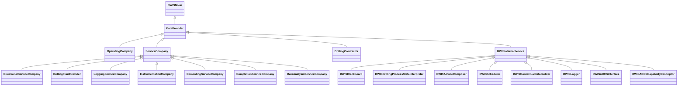
## DataProvider <!-- NOUN -->
- Display name: DataProvider
- Parent class: [DWISNoun](./DWISSemantics.md#DWISNoun)
- Attributes:
  - ProviderName
    - Type: string
    - Description: The name of the data provide.
- Description: 
A data provider is any sources for data.
- Definition set: DataProviders
- Examples:
```dwis dataProvider
DrillingDataPoint:dataProvider
dataProvider BelongsToClass DataProvider
```
An example semantic graph looks like as follow:
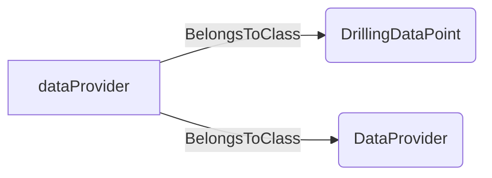
An example SparQL query looks like this:
```sparql
PREFIX rdf: <http://www.w3.org/1999/02/22-rdf-syntax-ns#>
PREFIX ddhub: <http://ddhub.no/>
PREFIX quantity: <http://ddhub.no/UnitAndQuantity>
SELECT ?dataProvider
WHERE {
	?dataProvider rdf:type ddhub:DrillingDataPoint .
	?dataProvider rdf:type ddhub:DataProvider .
}
```
This example links a drilling data point to the DataProvider definition.
## OperatingCompany <!-- NOUN -->
- Display name: OperatingCompany
- Parent class: [DataProvider](./DataProviders.md#DataProvider)
- Description: 
An operating company is an entity that holds the rights to explore, develop, and produce hydrocarbon resources from a particular oil or gas field or lease
- Definition set: DataProviders
- Examples:
``` dwis stratigraphyDescription_0
DynamicDrillingSignal:stratigraphyDescription_0
StratigraphyDescription:stratigraphyDescription_1
stratigraphyDescription_1 HasDynamicValue stratigraphyDescription_0
OperatingCompany:operatingCompany_1
stratigraphyDescription_1 IsProvidedBy operatingCompany_1
DWISContextualDataBuilder:contextualDataBuilder_1
stratigraphyDescription_1 IsProvidedTo contextualDataBuilder_1
Prognosed:prognosed_1
stratigraphyDescription_1 IsCharacterizedBy prognosed_1
```
An example semantic graph looks like as follow:
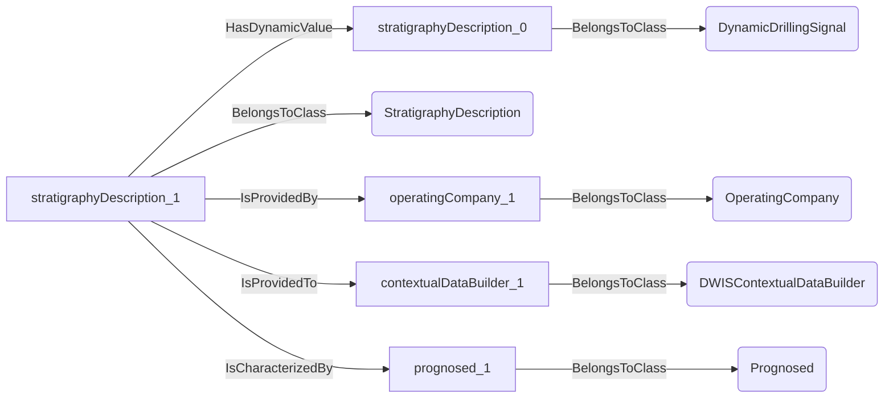
An example SparQL query looks like this:
```sparql
PREFIX rdf: <http://www.w3.org/1999/02/22-rdf-syntax-ns#>
PREFIX ddhub: <http://ddhub.no/>
PREFIX quantity: <http://ddhub.no/UnitAndQuantity>
SELECT ?stratigraphyDescription_0
WHERE {
	?stratigraphyDescription_0 rdf:type ddhub:DynamicDrillingSignal .
	?stratigraphyDescription_1 rdf:type ddhub:StratigraphyDescription .
	?stratigraphyDescription_1 ddhub:HasDynamicValue ?stratigraphyDescription_0 .
	?operatingCompany_1 rdf:type ddhub:OperatingCompany .
	?stratigraphyDescription_1 ddhub:IsProvidedBy ?operatingCompany_1 .
	?contextualDataBuilder_1 rdf:type ddhub:DWISContextualDataBuilder .
	?stratigraphyDescription_1 ddhub:IsProvidedTo ?contextualDataBuilder_1 .
	?prognosed_1 rdf:type ddhub:Prognosed .
	?stratigraphyDescription_1 ddhub:IsCharacterizedBy ?prognosed_1 .
}
```
## ServiceCompany <!-- NOUN -->
- Display name: ServiceCompany
- Parent class: [DataProvider](./DataProviders.md#DataProvider)
- Description: 
A service company is an entity that provides services during the well construction.
- Definition set: DataProviders
- Examples:
```dwis serviceCompany
DrillingDataPoint:serviceCompany
serviceCompany BelongsToClass ServiceCompany
```
An example semantic graph looks like as follow:
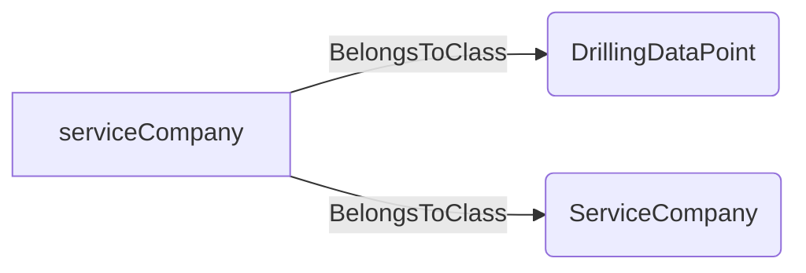
An example SparQL query looks like this:
```sparql
PREFIX rdf: <http://www.w3.org/1999/02/22-rdf-syntax-ns#>
PREFIX ddhub: <http://ddhub.no/>
PREFIX quantity: <http://ddhub.no/UnitAndQuantity>
SELECT ?serviceCompany
WHERE {
	?serviceCompany rdf:type ddhub:DrillingDataPoint .
	?serviceCompany rdf:type ddhub:ServiceCompany .
}
```
This example links a drilling data point to the ServiceCompany definition.
## DirectionalServiceCompany <!-- NOUN -->
- Display name: DirectionalServiceCompany
- Parent class: [ServiceCompany](./DataProviders.md#ServiceCompany)
- Description: 
A directional service company is an entity that provides services for downhole directional drilling and downhole measurements.
- Definition set: DataProviders
- Examples:
``` dwis trajectoryDescription_0
DynamicDrillingSignal:trajectoryDescription_0
TrajectoryDescription:trajectoryDescription_1
trajectoryDescription_1 HasDynamicValue trajectoryDescription_0
DirectionalServiceCompany:directionalServiceCompany_1
trajectoryDescription_1 IsProvidedBy directionalServiceCompany_1
DWISContextualDataBuilder:contextualDataBuilder_1
trajectoryDescription_1 IsProvidedTo contextualDataBuilder_1
Current:current_1
trajectoryDescription_1 IsCharacterizedBy current_1
Extrapolated: extrapolated_1
trajectoryDescription_1 IsCharacterizedBy extrapolated_1
Measured:measured_1
trajectoryDescription_1 IsCharacterizedBy measured_1
```
An example semantic graph looks like as follow:
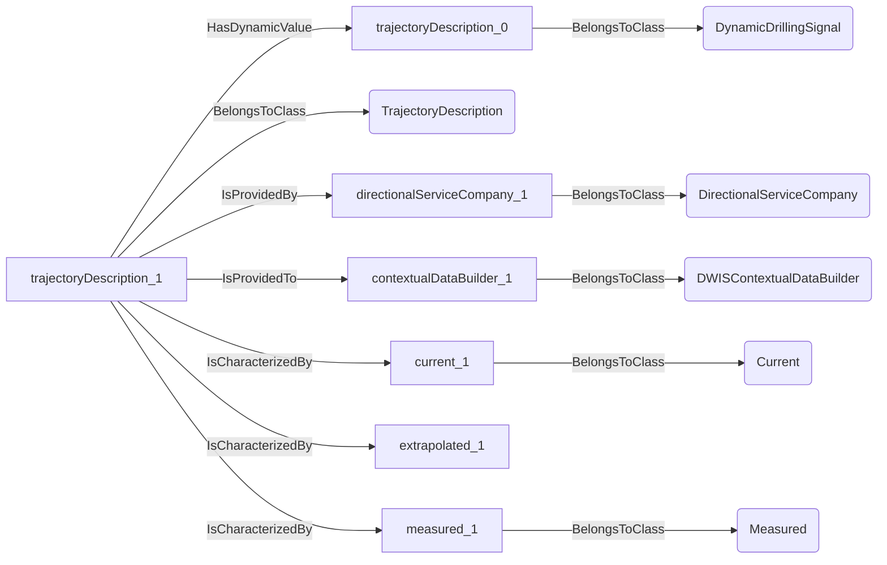
An example SparQL query looks like this:
```sparql
PREFIX rdf: <http://www.w3.org/1999/02/22-rdf-syntax-ns#>
PREFIX ddhub: <http://ddhub.no/>
PREFIX quantity: <http://ddhub.no/UnitAndQuantity>
SELECT ?trajectoryDescription_0
WHERE {
	?trajectoryDescription_0 rdf:type ddhub:DynamicDrillingSignal .
	?trajectoryDescription_1 rdf:type ddhub:TrajectoryDescription .
	?trajectoryDescription_1 ddhub:HasDynamicValue ?trajectoryDescription_0 .
	?directionalServiceCompany_1 rdf:type ddhub:DirectionalServiceCompany .
	?trajectoryDescription_1 ddhub:IsProvidedBy ?directionalServiceCompany_1 .
	?contextualDataBuilder_1 rdf:type ddhub:DWISContextualDataBuilder .
	?trajectoryDescription_1 ddhub:IsProvidedTo ?contextualDataBuilder_1 .
	?current_1 rdf:type ddhub:Current .
	?trajectoryDescription_1 ddhub:IsCharacterizedBy ?current_1 .
	?trajectoryDescription_1 ddhub:IsCharacterizedBy ?extrapolated_1 .
	?measured_1 rdf:type ddhub:Measured .
	?trajectoryDescription_1 ddhub:IsCharacterizedBy ?measured_1 .
}
```
## DrillingFluidProvider <!-- NOUN -->
- Display name: DrillingFluidProvider
- Parent class: [ServiceCompany](./DataProviders.md#ServiceCompany)
- Description: 
A drilling fluid provider is a company that provides and maintains the drilling fluids during well construction.
- Definition set: DataProviders
- Examples:
``` dwis fluidDescription_0
DynamicDrillingSignal:fluidDescription_0
DrillingFluidDescription:fluidDescription_1
fluidDescription_1 HasDynamicValue fluidDescription_0
DrillingFluidProvider:drillingFluidProvider_1
fluidDescription_1 IsProvidedBy drillingFluidProvider_1
DWISContextualDataBuilder:contextualDataBuilder_1
fluidDescription_1 IsProvidedTo contextualDataBuilder_1
Current:current_1
fluidDescription_1 IsCharacterizedBy current_1
Measured:measured_1
fluidDescription_1 IsCharacterizedBy measured_1
```
An example semantic graph looks like as follow:
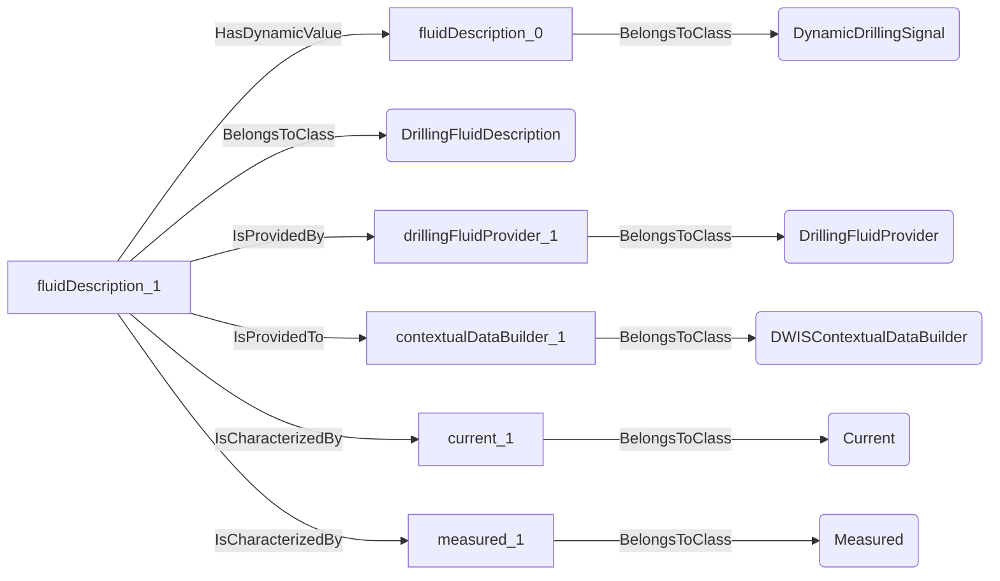
An example SparQL query looks like this:
```sparql
PREFIX rdf: <http://www.w3.org/1999/02/22-rdf-syntax-ns#>
PREFIX ddhub: <http://ddhub.no/>
PREFIX quantity: <http://ddhub.no/UnitAndQuantity>
SELECT ?fluidDescription_0
WHERE {
	?fluidDescription_0 rdf:type ddhub:DynamicDrillingSignal .
	?fluidDescription_1 rdf:type ddhub:DrillingFluidDescription .
	?fluidDescription_1 ddhub:HasDynamicValue ?fluidDescription_0 .
	?drillingFluidProvider_1 rdf:type ddhub:DrillingFluidProvider .
	?fluidDescription_1 ddhub:IsProvidedBy ?drillingFluidProvider_1 .
	?contextualDataBuilder_1 rdf:type ddhub:DWISContextualDataBuilder .
	?fluidDescription_1 ddhub:IsProvidedTo ?contextualDataBuilder_1 .
	?current_1 rdf:type ddhub:Current .
	?fluidDescription_1 ddhub:IsCharacterizedBy ?current_1 .
	?measured_1 rdf:type ddhub:Measured .
	?fluidDescription_1 ddhub:IsCharacterizedBy ?measured_1 .
}
```
## LoggingServiceCompany <!-- NOUN -->
- Display name: LoggingServiceCompany
- Parent class: [ServiceCompany](./DataProviders.md#ServiceCompany)
- Description: 
A logging service company is an entity that gathers measured information during well construction.
- Definition set: DataProviders
- Examples:
``` dwis stratigraphyDescription_0
DynamicDrillingSignal:stratigraphyDescription_0
StratigraphyDescription:stratigraphyDescription_1
stratigraphyDescription_1 HasDynamicValue stratigraphyDescription_0
LoggingServiceCompany:logginServiceCompany_1
stratigraphyDescription_1 IsProvidedBy logginServiceCompany_1
DWISContextualDataBuilder:contextualDataBuilder_1
stratigraphyDescription_1 IsProvidedTo contextualDataBuilder_1
Measured:measured_1
stratigraphyDescription_1 IsCharacterizedBy measured_1
```
An example semantic graph looks like as follow:
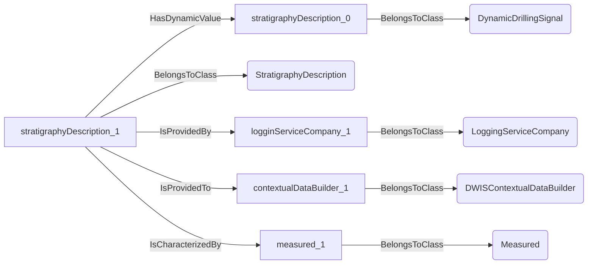
An example SparQL query looks like this:
```sparql
PREFIX rdf: <http://www.w3.org/1999/02/22-rdf-syntax-ns#>
PREFIX ddhub: <http://ddhub.no/>
PREFIX quantity: <http://ddhub.no/UnitAndQuantity>
SELECT ?stratigraphyDescription_0
WHERE {
	?stratigraphyDescription_0 rdf:type ddhub:DynamicDrillingSignal .
	?stratigraphyDescription_1 rdf:type ddhub:StratigraphyDescription .
	?stratigraphyDescription_1 ddhub:HasDynamicValue ?stratigraphyDescription_0 .
	?logginServiceCompany_1 rdf:type ddhub:LoggingServiceCompany .
	?stratigraphyDescription_1 ddhub:IsProvidedBy ?logginServiceCompany_1 .
	?contextualDataBuilder_1 rdf:type ddhub:DWISContextualDataBuilder .
	?stratigraphyDescription_1 ddhub:IsProvidedTo ?contextualDataBuilder_1 .
	?measured_1 rdf:type ddhub:Measured .
	?stratigraphyDescription_1 ddhub:IsCharacterizedBy ?measured_1 .
}
```
## InstrumentationCompany <!-- NOUN -->
- Display name: Instrumentation Company
- Parent class: [ServiceCompany](./DataProviders.md#ServiceCompany)
- Description: 
A service company providing measurement instruments and associated services.
- Definition set: DataProviders
- Examples:
``` dwis stratigraphyDescription_0
DynamicDrillingSignal:stratigraphyDescription_0
StratigraphyDescription:stratigraphyDescription_1
stratigraphyDescription_1 HasDynamicValue stratigraphyDescription_0
LoggingServiceCompany:logginServiceCompany_1
stratigraphyDescription_1 IsProvidedBy logginServiceCompany_1
DWISContextualDataBuilder:contextualDataBuilder_1
stratigraphyDescription_1 IsProvidedTo contextualDataBuilder_1
Measured:measured_1
stratigraphyDescription_1 IsCharacterizedBy measured_1
```
An example semantic graph looks like as follow:

An example SparQL query looks like this:
```sparql
PREFIX rdf: <http://www.w3.org/1999/02/22-rdf-syntax-ns#>
PREFIX ddhub: <http://ddhub.no/>
PREFIX quantity: <http://ddhub.no/UnitAndQuantity>
SELECT ?stratigraphyDescription_0
WHERE {
	?stratigraphyDescription_0 rdf:type ddhub:DynamicDrillingSignal .
	?stratigraphyDescription_1 rdf:type ddhub:StratigraphyDescription .
	?stratigraphyDescription_1 ddhub:HasDynamicValue ?stratigraphyDescription_0 .
	?logginServiceCompany_1 rdf:type ddhub:LoggingServiceCompany .
	?stratigraphyDescription_1 ddhub:IsProvidedBy ?logginServiceCompany_1 .
	?contextualDataBuilder_1 rdf:type ddhub:DWISContextualDataBuilder .
	?stratigraphyDescription_1 ddhub:IsProvidedTo ?contextualDataBuilder_1 .
	?measured_1 rdf:type ddhub:Measured .
	?stratigraphyDescription_1 ddhub:IsCharacterizedBy ?measured_1 .
}
```
## CementingServiceCompany <!-- NOUN -->
- Display name: CementingServiceCompany
- Parent class: [ServiceCompany](./DataProviders.md#ServiceCompany)
- Description: 
A cementing service company is an entity that provides the cement slurry used during cementing operations.
- Definition set: DataProviders
- Examples:
``` dwis fluidDescription_0
DynamicDrillingSignal:fluidDescription_0
CementFluidDescription:fluidDescription_1
fluidDescription_1 HasDynamicValue fluidDescription_0
CementingServiceCompany:cementFluidProvider_1
fluidDescription_1 IsProvidedBy cementFluidProvider_1
DWISContextualDataBuilder:contextualDataBuilder_1
fluidDescription_1 IsProvidedTo contextualDataBuilder_1
Measured:measured_1
fluidDescription_1 IsCharacterizedBy measured_1
```
An example semantic graph looks like as follow:
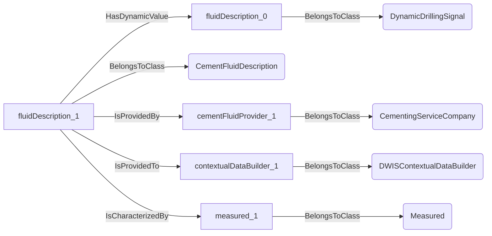
An example SparQL query looks like this:
```sparql
PREFIX rdf: <http://www.w3.org/1999/02/22-rdf-syntax-ns#>
PREFIX ddhub: <http://ddhub.no/>
PREFIX quantity: <http://ddhub.no/UnitAndQuantity>
SELECT ?fluidDescription_0
WHERE {
	?fluidDescription_0 rdf:type ddhub:DynamicDrillingSignal .
	?fluidDescription_1 rdf:type ddhub:CementFluidDescription .
	?fluidDescription_1 ddhub:HasDynamicValue ?fluidDescription_0 .
	?cementFluidProvider_1 rdf:type ddhub:CementingServiceCompany .
	?fluidDescription_1 ddhub:IsProvidedBy ?cementFluidProvider_1 .
	?contextualDataBuilder_1 rdf:type ddhub:DWISContextualDataBuilder .
	?fluidDescription_1 ddhub:IsProvidedTo ?contextualDataBuilder_1 .
	?measured_1 rdf:type ddhub:Measured .
	?fluidDescription_1 ddhub:IsCharacterizedBy ?measured_1 .
}
```
## CompletionServiceCompany <!-- NOUN -->
- Display name: CompletionServiceCompany
- Parent class: [ServiceCompany](./DataProviders.md#ServiceCompany)
- Description: 
A completion service company is an entity that provides the completion equipment and fluids used during completion operations.
- Definition set: DataProviders
- Examples:
``` dwis fluidDescription_0
DynamicDrillingSignal:fluidDescription_0
CompletionFluidDescription:fluidDescription_1
fluidDescription_1 HasDynamicValue fluidDescription_0
CompletionServiceCompany:completionFluidProvider_1
fluidDescription_1 IsProvidedBy completionFluidProvider_1
DWISContextualDataBuilder:contextualDataBuilder_1
fluidDescription_1 IsProvidedTo contextualDataBuilder_1
Current:current_1
fluidDescription_1 IsCharacterizedBy current_1
```
An example semantic graph looks like as follow:
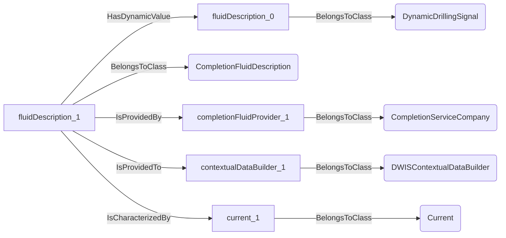
An example SparQL query looks like this:
```sparql
PREFIX rdf: <http://www.w3.org/1999/02/22-rdf-syntax-ns#>
PREFIX ddhub: <http://ddhub.no/>
PREFIX quantity: <http://ddhub.no/UnitAndQuantity>
SELECT ?fluidDescription_0
WHERE {
	?fluidDescription_0 rdf:type ddhub:DynamicDrillingSignal .
	?fluidDescription_1 rdf:type ddhub:CompletionFluidDescription .
	?fluidDescription_1 ddhub:HasDynamicValue ?fluidDescription_0 .
	?completionFluidProvider_1 rdf:type ddhub:CompletionServiceCompany .
	?fluidDescription_1 ddhub:IsProvidedBy ?completionFluidProvider_1 .
	?contextualDataBuilder_1 rdf:type ddhub:DWISContextualDataBuilder .
	?fluidDescription_1 ddhub:IsProvidedTo ?contextualDataBuilder_1 .
	?current_1 rdf:type ddhub:Current .
	?fluidDescription_1 ddhub:IsCharacterizedBy ?current_1 .
}
```
## DataAnalysisServiceCompany <!-- NOUN -->
- Display name: DataAnalysisServiceCompany
- Parent class: [ServiceCompany](./DataProviders.md#ServiceCompany)
- Description: 
A data analysis service company is an entity that analyses measured data and provide new information from these measurements.
- Definition set: DataProviders
- Examples:
``` dwis PackOffFDIRInfo
DynamicDrillingSignal:PackOffFDIRInfo
DrillingFaultDetectionIsolationAndRecoveryAdvice:PackOffFDIRInfo_1
PackOffFDIRInfo_1 HasDynamicValue PackOffFDIRInfo
PackOff:packOffIncident
PackOffFDIRInfo_1 IsRelatedToDrillingIncident packOffIncident
DataAnalysisServiceCompany:dataAnalysisServiceCompany_1
PackOffFDIRInfo_1 IsProvidedBy dataAnalysisServiceCompany_1
Advisor:computationUnit
PackOffFDIRInfo_1 IsRecommendedBy computationUnit
FDIRFunction:FDIRFunction_1
FDIRFunction_1 ManagesIncident packOffIncident
PackOffFDIRInfo_1 IsRecommendedFor FDIRFunction_1
DWISAdviceComposer:adviceComposer
PackOffFDIRInfo_1 IsProvidedTo adviceComposer
```
An example semantic graph looks like as follow:
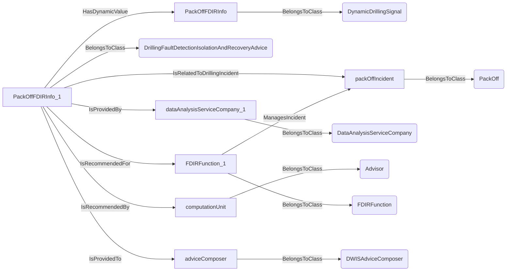
An example SparQL query looks like this:
```sparql
PREFIX rdf: <http://www.w3.org/1999/02/22-rdf-syntax-ns#>
PREFIX ddhub: <http://ddhub.no/>
PREFIX quantity: <http://ddhub.no/UnitAndQuantity>
SELECT ?PackOffFDIRInfo
WHERE {
	?PackOffFDIRInfo rdf:type ddhub:DynamicDrillingSignal .
	?PackOffFDIRInfo_1 rdf:type ddhub:DrillingFaultDetectionIsolationAndRecoveryAdvice .
	?PackOffFDIRInfo_1 ddhub:HasDynamicValue ?PackOffFDIRInfo .
	?packOffIncident rdf:type ddhub:PackOff .
	?PackOffFDIRInfo_1 ddhub:IsRelatedToDrillingIncident ?packOffIncident .
	?dataAnalysisServiceCompany_1 rdf:type ddhub:DataAnalysisServiceCompany .
	?PackOffFDIRInfo_1 ddhub:IsProvidedBy ?dataAnalysisServiceCompany_1 .
	?computationUnit rdf:type ddhub:Advisor .
	?PackOffFDIRInfo_1 ddhub:IsRecommendedBy ?computationUnit .
	?FDIRFunction_1 rdf:type ddhub:FDIRFunction .
	?FDIRFunction_1 ddhub:ManagesIncident ?packOffIncident .
	?PackOffFDIRInfo_1 ddhub:IsRecommendedFor ?FDIRFunction_1 .
	?adviceComposer rdf:type ddhub:DWISAdviceComposer .
	?PackOffFDIRInfo_1 ddhub:IsProvidedTo ?adviceComposer .
}
```
## DrillingContractor <!-- NOUN -->
- Display name: DrillingContractor
- Parent class: [DataProvider](./DataProviders.md#DataProvider)
- Description: 
A drilling contractor is a company that is primarily responsible for conducting drilling operations, including the construction and operation of drilling rigs.
- Definition set: DataProviders
- Examples:
``` dwis rigDescription_0
DynamicDrillingSignal:rigDescription_0
RigDescription:rigDescription_1
rigDescription_1 HasDynamicValue rigDescription_0
DrillingContractor:drillingContractor_1
rigDescription_1 IsProvidedBy drillingContractor_1
DWISContextualDataBuilder:contextualDataBuilder_1
rigDescription_1 IsProvidedTo contextualDataBuilder_1
Current:current_1
rigDescription_1 IsCharacterizedBy current_1
```
An example semantic graph looks like as follow:
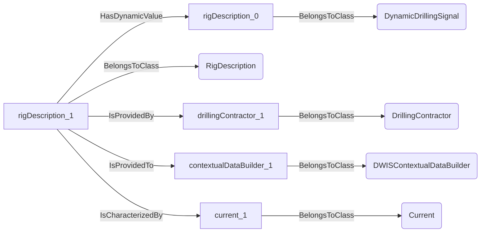
An example SparQL query looks like this:
```sparql
PREFIX rdf: <http://www.w3.org/1999/02/22-rdf-syntax-ns#>
PREFIX ddhub: <http://ddhub.no/>
PREFIX quantity: <http://ddhub.no/UnitAndQuantity>
SELECT ?rigDescription_0
WHERE {
	?rigDescription_0 rdf:type ddhub:DynamicDrillingSignal .
	?rigDescription_1 rdf:type ddhub:RigDescription .
	?rigDescription_1 ddhub:HasDynamicValue ?rigDescription_0 .
	?drillingContractor_1 rdf:type ddhub:DrillingContractor .
	?rigDescription_1 ddhub:IsProvidedBy ?drillingContractor_1 .
	?contextualDataBuilder_1 rdf:type ddhub:DWISContextualDataBuilder .
	?rigDescription_1 ddhub:IsProvidedTo ?contextualDataBuilder_1 .
	?current_1 rdf:type ddhub:Current .
	?rigDescription_1 ddhub:IsCharacterizedBy ?current_1 .
}
```
## DWISInternalService <!-- NOUN -->
- Display name: DWISInternalService
- Parent class: [DataProvider](./DataProviders.md#DataProvider)
- Description: 
A DWIS internal service is an internal component of the DWIS infrastructure that generates information that can be used by any systems connected to the DWIS infrastructure.
- Definition set: DataProviders
- Examples:
```dwis dWISInternalService
DrillingDataPoint:dWISInternalService
dWISInternalService BelongsToClass DWISInternalService
```
An example semantic graph looks like as follow:
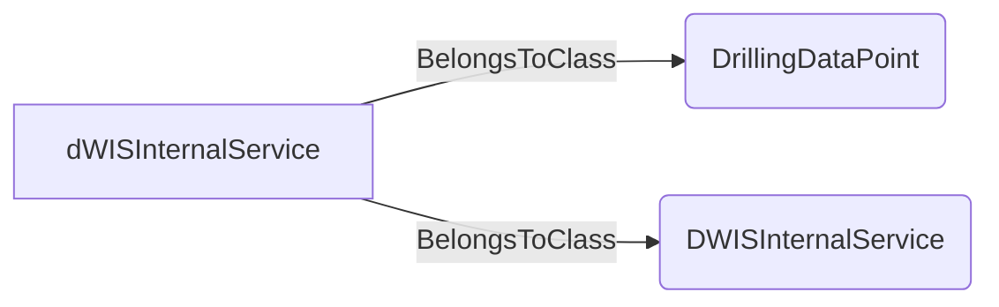
An example SparQL query looks like this:
```sparql
PREFIX rdf: <http://www.w3.org/1999/02/22-rdf-syntax-ns#>
PREFIX ddhub: <http://ddhub.no/>
PREFIX quantity: <http://ddhub.no/UnitAndQuantity>
SELECT ?dWISInternalService
WHERE {
	?dWISInternalService rdf:type ddhub:DrillingDataPoint .
	?dWISInternalService rdf:type ddhub:DWISInternalService .
}
```
This example links a drilling data point to the DWISInternalService definition.
## DWISBlackboard <!-- NOUN -->
- Display name: DWIS Blackboard
- Parent class: [DWISInternalService](./DataProviders.md#DWISInternalService)
- Description: 
The DWIS blackboard is a shared data structure that allows different DWIS components to share information and coordinate their activities.
- Definition set: DataProviders
- Examples:
```dwis dWISBlackboard
DrillingDataPoint:dWISBlackboard
dWISBlackboard BelongsToClass DWISBlackboard
```
An example semantic graph looks like as follow:
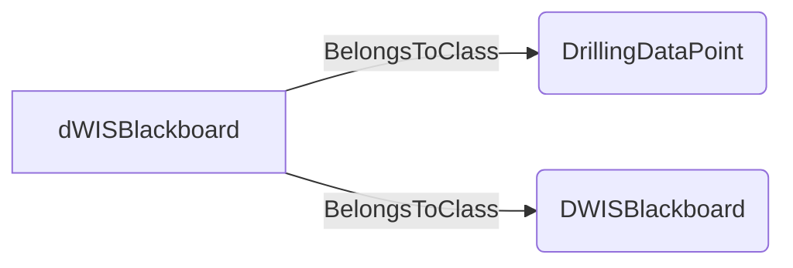
An example SparQL query looks like this:
```sparql
PREFIX rdf: <http://www.w3.org/1999/02/22-rdf-syntax-ns#>
PREFIX ddhub: <http://ddhub.no/>
PREFIX quantity: <http://ddhub.no/UnitAndQuantity>
SELECT ?dWISBlackboard
WHERE {
	?dWISBlackboard rdf:type ddhub:DrillingDataPoint .
	?dWISBlackboard rdf:type ddhub:DWISBlackboard .
}
```
This example links a drilling data point to the DWISBlackboard definition.
## DWISDrillingProcessStateInterpreter <!-- NOUN -->
- Display name: DWIS Drilling Process State Interpreter
- Parent class: [DWISInternalService](./DataProviders.md#DWISInternalService)
- Description: 
The DWIS Drilling Process State Interpreter is a component that analyses drilling data to determine the current state of the drilling process.
- Definition set: DataProviders
- Examples:
``` dwis configurationData_0
DynamicDrillingSignal:configurationData_0
ConfigurationData:configurationData_1
configurationData_1 HasDynamicValue configurationData_0
OperatingCompany:operatingCompany_1
configurationData_1 IsProvidedBy operatingCompany_1
DWISDrillingProcessStateInterpreter:microStateInterpreter_1
configurationData_1 IsProvidedTo microStateInterpreter_1
configurationData_1 IsLimitFor microStateInterpreter_1
```
An example semantic graph looks like as follow:
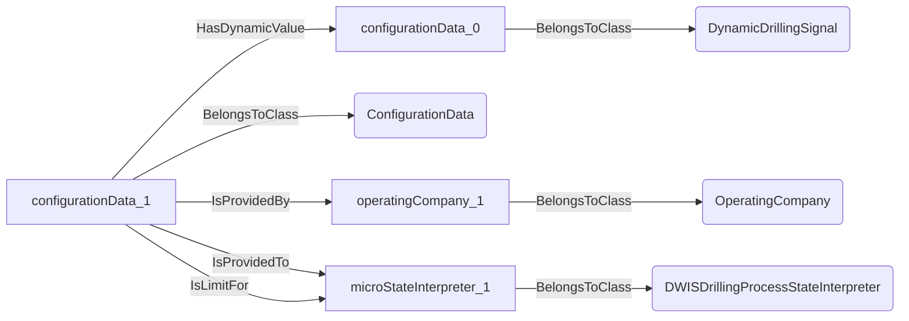
An example SparQL query looks like this:
```sparql
PREFIX rdf: <http://www.w3.org/1999/02/22-rdf-syntax-ns#>
PREFIX ddhub: <http://ddhub.no/>
PREFIX quantity: <http://ddhub.no/UnitAndQuantity>
SELECT ?configurationData_0
WHERE {
	?configurationData_0 rdf:type ddhub:DynamicDrillingSignal .
	?configurationData_1 rdf:type ddhub:ConfigurationData .
	?configurationData_1 ddhub:HasDynamicValue ?configurationData_0 .
	?operatingCompany_1 rdf:type ddhub:OperatingCompany .
	?configurationData_1 ddhub:IsProvidedBy ?operatingCompany_1 .
	?microStateInterpreter_1 rdf:type ddhub:DWISDrillingProcessStateInterpreter .
	?configurationData_1 ddhub:IsProvidedTo ?microStateInterpreter_1 .
	?configurationData_1 ddhub:IsLimitFor ?microStateInterpreter_1 .
}
```
## DWISAdviceComposer <!-- NOUN -->
- Display name: DWIS Advice Composer
- Parent class: [DWISInternalService](./DataProviders.md#DWISInternalService)
- Description: 
The DWIS Advice Composer is a component that composes different drilling advices based on priorities set by the DWIS Scheduler.
- Definition set: DataProviders
- Examples:
``` dwis ROPManagementControllerInfo
DynamicDrillingSignal:ROPManagementControllerInfo
DrillingControlAdvice:ROPManagementControllerInfo_1
ROPManagementControllerInfo_1 HasDynamicValue ROPManagementControllerInfo
ROPLimit:ROPLimit_1
ROPManagementControllerInfo_1 HasControlLimit ROPLimit_1
WOBLimit:WOBLimit_1
ROPManagementControllerInfo_1 HasControlLimit WOBLimit_1
DifferentialPressureLimit:differentialPressureLimit
ROPManagementControllerInfo_1 HasControlLimit differentialPressureLimit
BottomOfStringReferenceLocation:bottomOfStringLocation
StableAxialVelocityObjective:stableAxialVelocityObjective
stableAxialVelocityObjective IsPhysicallyLocatedAt bottomOfStringLocation
ROPManagementControllerInfo_1 IsRelatedToDrillingObjective stableAxialVelocityObjective
StableAxialForceObjective:stableWOBObjective
stableWOBObjective IsPhysicallyLocatedAt bottomOfStringLocation
ROPManagementControllerInfo_1 IsRelatedToDrillingObjective stableWOBObjective
StablePressureObjective:stableDifferentialPressure
ROPManagementControllerInfo_1 IsRelatedToDrillingObjective stableDifferentialPressure
ServiceCompany:serviceCompany
ROPManagementControllerInfo_1 IsProvidedBy serviceCompany
Advisor:computationUnit
ROPManagementControllerInfo_1 IsRecommendedBy computationUnit
ControllerFunction:autoDriller
autoDriller ImplementsObjective stableAxialVelocityObjective
autoDriller ImplementsObjective stableWOBObjective
autoDriller ImplementsObjective stableDifferentialPressure
ROPManagementControllerInfo_1 IsRecommendedFor autoDriller
DWISAdviceComposer:adviceComposer
ROPManagementControllerInfo_1 IsProvidedTo adviceComposer
DWISScheduler:scheduler
ROPManagementControllerInfo_1 IsProvidedTo scheduler
```
An example semantic graph looks like as follow:
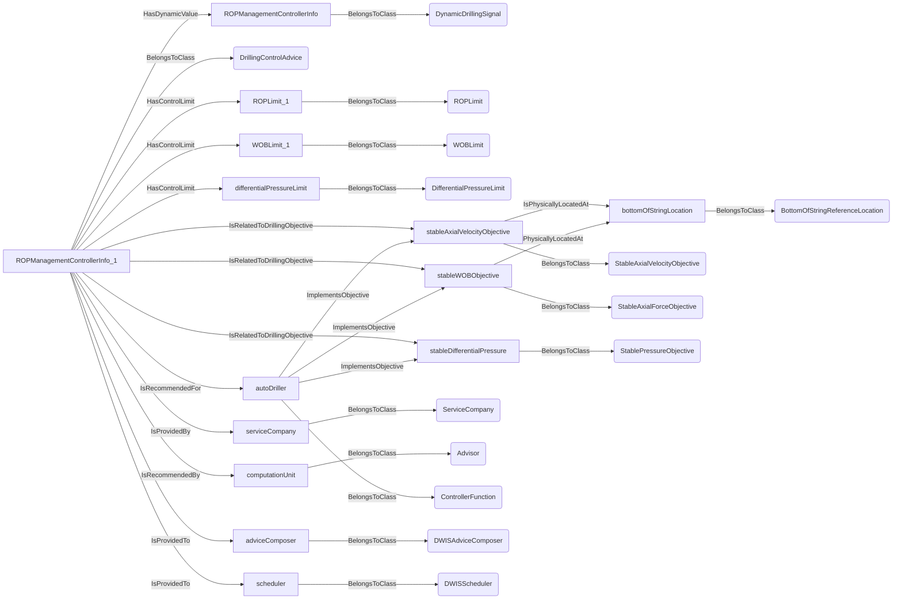
An example SparQL query looks like this:
```sparql
PREFIX rdf: <http://www.w3.org/1999/02/22-rdf-syntax-ns#>
PREFIX ddhub: <http://ddhub.no/>
PREFIX quantity: <http://ddhub.no/UnitAndQuantity>
SELECT ?ROPManagementControllerInfo
WHERE {
	?ROPManagementControllerInfo rdf:type ddhub:DynamicDrillingSignal .
	?ROPManagementControllerInfo_1 rdf:type ddhub:DrillingControlAdvice .
	?ROPManagementControllerInfo_1 ddhub:HasDynamicValue ?ROPManagementControllerInfo .
	?ROPLimit_1 rdf:type ddhub:ROPLimit .
	?ROPManagementControllerInfo_1 ddhub:HasControlLimit ?ROPLimit_1 .
	?WOBLimit_1 rdf:type ddhub:WOBLimit .
	?ROPManagementControllerInfo_1 ddhub:HasControlLimit ?WOBLimit_1 .
	?differentialPressureLimit rdf:type ddhub:DifferentialPressureLimit .
	?ROPManagementControllerInfo_1 ddhub:HasControlLimit ?differentialPressureLimit .
	?bottomOfStringLocation rdf:type ddhub:BottomOfStringReferenceLocation .
	?stableAxialVelocityObjective rdf:type ddhub:StableAxialVelocityObjective .
	?stableAxialVelocityObjective ddhub:IsPhysicallyLocatedAt ?bottomOfStringLocation .
	?ROPManagementControllerInfo_1 ddhub:IsRelatedToDrillingObjective ?stableAxialVelocityObjective .
	?stableWOBObjective rdf:type ddhub:StableAxialForceObjective .
	?stableWOBObjective ddhub:IsPhysicallyLocatedAt ?bottomOfStringLocation .
	?ROPManagementControllerInfo_1 ddhub:IsRelatedToDrillingObjective ?stableWOBObjective .
	?stableDifferentialPressure rdf:type ddhub:StablePressureObjective .
	?ROPManagementControllerInfo_1 ddhub:IsRelatedToDrillingObjective ?stableDifferentialPressure .
	?serviceCompany rdf:type ddhub:ServiceCompany .
	?ROPManagementControllerInfo_1 ddhub:IsProvidedBy ?serviceCompany .
	?computationUnit rdf:type ddhub:Advisor .
	?ROPManagementControllerInfo_1 ddhub:IsRecommendedBy ?computationUnit .
	?autoDriller rdf:type ddhub:ControllerFunction .
	?autoDriller ddhub:ImplementsObjective ?stableAxialVelocityObjective .
	?autoDriller ddhub:ImplementsObjective ?stableWOBObjective .
	?autoDriller ddhub:ImplementsObjective ?stableDifferentialPressure .
	?ROPManagementControllerInfo_1 ddhub:IsRecommendedFor ?autoDriller .
	?adviceComposer rdf:type ddhub:DWISAdviceComposer .
	?ROPManagementControllerInfo_1 ddhub:IsProvidedTo ?adviceComposer .
	?scheduler rdf:type ddhub:DWISScheduler .
	?ROPManagementControllerInfo_1 ddhub:IsProvidedTo ?scheduler .
}
```
## DWISScheduler <!-- NOUN -->
- Display name: DWIS Scheduler
- Parent class: [DWISInternalService](./DataProviders.md#DWISInternalService)
- Description: 
The DWIS Scheduler is a component that schedules drilling activities based on the rig action plan and the current context estimated by the DWIS Microstate Interpretation engine.
- Definition set: DataProviders
- Examples:
``` dwis rigActionPlan_0
DynamicDrillingSignal:rigActionPlan_0
RigActionPlan:rigActionPlan_1
rigActionPlan_1 HasDynamicValue rigActionPlan_0
OperatingCompany:operatingCompany_1
rigActionPlan_1 IsProvidedBy operatingCompany_1
DWISScheduler:scheduler_1
rigActionPlan_1 IsProvidedTo scheduler_1
```
An example semantic graph looks like as follow:
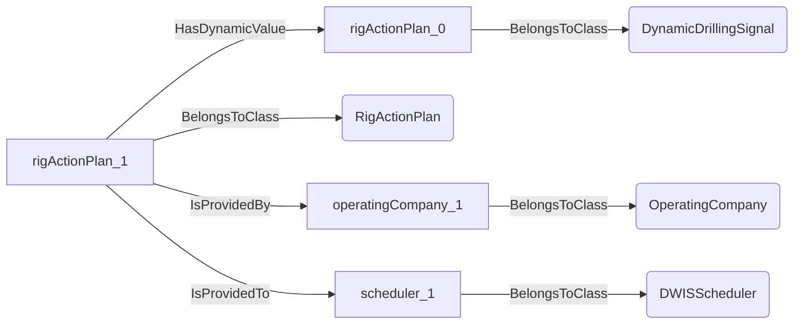
An example SparQL query looks like this:
```sparql
PREFIX rdf: <http://www.w3.org/1999/02/22-rdf-syntax-ns#>
PREFIX ddhub: <http://ddhub.no/>
PREFIX quantity: <http://ddhub.no/UnitAndQuantity>
SELECT ?rigActionPlan_0
WHERE {
	?rigActionPlan_0 rdf:type ddhub:DynamicDrillingSignal .
	?rigActionPlan_1 rdf:type ddhub:RigActionPlan .
	?rigActionPlan_1 ddhub:HasDynamicValue ?rigActionPlan_0 .
	?operatingCompany_1 rdf:type ddhub:OperatingCompany .
	?rigActionPlan_1 ddhub:IsProvidedBy ?operatingCompany_1 .
	?scheduler_1 rdf:type ddhub:DWISScheduler .
	?rigActionPlan_1 ddhub:IsProvidedTo ?scheduler_1 .
}
```
## DWISContextualDataBuilder <!-- NOUN -->
- Display name: DWIS Contextual Data Builder
- Parent class: [DWISInternalService](./DataProviders.md#DWISInternalService)
- Description: 
The DWIS Contextual Data Builder is a component that consolidates contextual data arising from multiple providers.
- Definition set: DataProviders
- Examples:
``` dwis fluidDescription_0
DynamicDrillingSignal:fluidDescription_0
FluidDescription:fluidDescription_1
fluidDescription_1 HasDynamicValue fluidDescription_0
DrillingFluidProvider:drillingFluidProvider_1
fluidDescription_1 IsProvidedBy drillingFluidProvider_1
DWISContextualDataBuilder:contextualDataBuilder_1
fluidDescription_1 IsProvidedTo contextualDataBuilder_1
Current:current_1
fluidDescription_1 IsCharacterizedBy current_1
```
An example semantic graph looks like as follow:
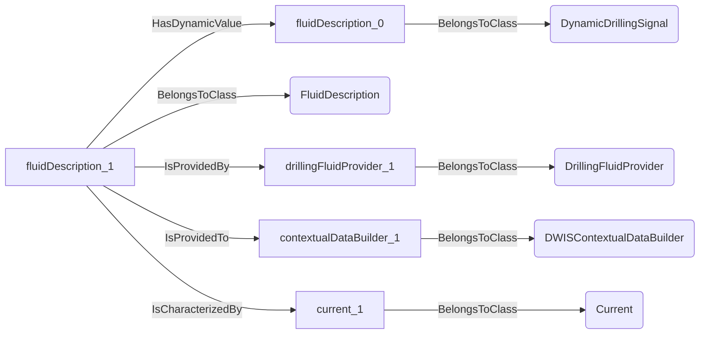
An example SparQL query looks like this:
```sparql
PREFIX rdf: <http://www.w3.org/1999/02/22-rdf-syntax-ns#>
PREFIX ddhub: <http://ddhub.no/>
PREFIX quantity: <http://ddhub.no/UnitAndQuantity>
SELECT ?fluidDescription_0
WHERE {
	?fluidDescription_0 rdf:type ddhub:DynamicDrillingSignal .
	?fluidDescription_1 rdf:type ddhub:FluidDescription .
	?fluidDescription_1 ddhub:HasDynamicValue ?fluidDescription_0 .
	?drillingFluidProvider_1 rdf:type ddhub:DrillingFluidProvider .
	?fluidDescription_1 ddhub:IsProvidedBy ?drillingFluidProvider_1 .
	?contextualDataBuilder_1 rdf:type ddhub:DWISContextualDataBuilder .
	?fluidDescription_1 ddhub:IsProvidedTo ?contextualDataBuilder_1 .
	?current_1 rdf:type ddhub:Current .
	?fluidDescription_1 ddhub:IsCharacterizedBy ?current_1 .
}
```
## DWISLogger <!-- NOUN -->
- Display name: DWIS Logger
- Parent class: [DWISInternalService](./DataProviders.md#DWISInternalService)
- Description: 
The DWIS Logger is a component that logs all the activity on DWIS Blackboard.
- Definition set: DataProviders
- Examples:
```dwis dWISLogger
DrillingDataPoint:dWISLogger
dWISLogger BelongsToClass DWISLogger
```
An example semantic graph looks like as follow:
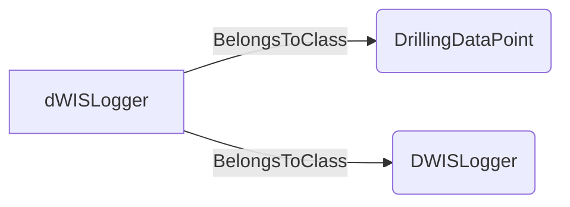
An example SparQL query looks like this:
```sparql
PREFIX rdf: <http://www.w3.org/1999/02/22-rdf-syntax-ns#>
PREFIX ddhub: <http://ddhub.no/>
PREFIX quantity: <http://ddhub.no/UnitAndQuantity>
SELECT ?dWISLogger
WHERE {
	?dWISLogger rdf:type ddhub:DrillingDataPoint .
	?dWISLogger rdf:type ddhub:DWISLogger .
}
```
This example links a drilling data point to the DWISLogger definition.
## DWISADCSInterface <!-- NOUN -->
- Display name: DWIS ADCS Interface
- Parent class: [DWISInternalService](./DataProviders.md#DWISInternalService)
- Description: 
The DWIS ADCS interface provides access to the actual ADCS.
- Definition set: DataProviders
- Examples:
``` dwis overpullUnderpullFDIRInfo
DynamicDrillingSignal:overpullUnderpullFDIRInfo
DrillingFaultDetectionIsolationAndRecoveryAdvice:overpullUnderpullFDIRInfo_1
overpullUnderpullFDIRInfo_1 HasDynamicValue overpullUnderpullFDIRInfo
Overpull:overpullIncident
overpullUnderpullFDIRInfo_1 IsRelatedToDrillingIncident overpullIncident
Underpull:underpullIncident
overpullUnderpullFDIRInfo_1 IsRelatedToDrillingIncident underpullIncident
ServiceCompany:serviceCompany
overpullUnderpullFDIRInfo_1 IsProvidedBy serviceCompany
DWISAdviceComposer:adviceComposer_1
overpullUnderpullFDIRInfo_1 IsRecommendedBy adviceComposer_1
FDIRFunction:FDIRFunction_1
FDIRFunction_1 ManagesIncident overpullIncident
FDIRFunction_1 ManagesIncident underpullIncident
overpullUnderpullFDIRInfo_1 IsRecommendedFor FDIRFunction_1
DWISADCSInterface:ADCSInterface_1
overpullUnderpullFDIRInfo_1 IsProvidedTo ADCSInterface_1
```
An example semantic graph looks like as follow:
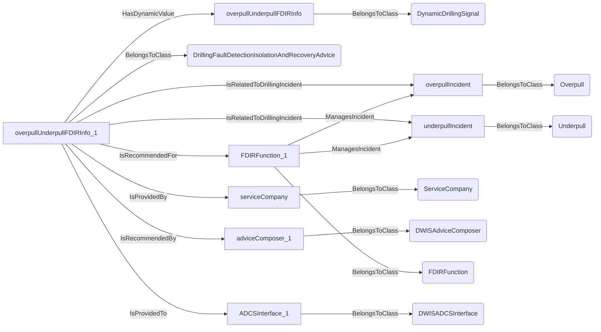
An example SparQL query looks like this:
```sparql
PREFIX rdf: <http://www.w3.org/1999/02/22-rdf-syntax-ns#>
PREFIX ddhub: <http://ddhub.no/>
PREFIX quantity: <http://ddhub.no/UnitAndQuantity>
SELECT ?overpullUnderpullFDIRInfo
WHERE {
	?overpullUnderpullFDIRInfo rdf:type ddhub:DynamicDrillingSignal .
	?overpullUnderpullFDIRInfo_1 rdf:type ddhub:DrillingFaultDetectionIsolationAndRecoveryAdvice .
	?overpullUnderpullFDIRInfo_1 ddhub:HasDynamicValue ?overpullUnderpullFDIRInfo .
	?overpullIncident rdf:type ddhub:Overpull .
	?overpullUnderpullFDIRInfo_1 ddhub:IsRelatedToDrillingIncident ?overpullIncident .
	?underpullIncident rdf:type ddhub:Underpull .
	?overpullUnderpullFDIRInfo_1 ddhub:IsRelatedToDrillingIncident ?underpullIncident .
	?serviceCompany rdf:type ddhub:ServiceCompany .
	?overpullUnderpullFDIRInfo_1 ddhub:IsProvidedBy ?serviceCompany .
	?adviceComposer_1 rdf:type ddhub:DWISAdviceComposer .
	?overpullUnderpullFDIRInfo_1 ddhub:IsRecommendedBy ?adviceComposer_1 .
	?FDIRFunction_1 rdf:type ddhub:FDIRFunction .
	?FDIRFunction_1 ddhub:ManagesIncident ?overpullIncident .
	?FDIRFunction_1 ddhub:ManagesIncident ?underpullIncident .
	?overpullUnderpullFDIRInfo_1 ddhub:IsRecommendedFor ?FDIRFunction_1 .
	?ADCSInterface_1 rdf:type ddhub:DWISADCSInterface .
	?overpullUnderpullFDIRInfo_1 ddhub:IsProvidedTo ?ADCSInterface_1 .
}
```
## DWISADCSCapabilityDescriptor <!-- NOUN -->
- Display name: DWIS ADCS Capability Descriptor
- Parent class: [DWISInternalService](./DataProviders.md#DWISInternalService)
- Description: 
The DWIS ADCS Capability descriptor describes the actual capabilities of the true ADCS.
- Definition set: DataProviders
- Examples:
``` dwis configurationData_0
DynamicDrillingSignal:configurationData_0
ConfigurationData:configurationData_1
configurationData_1 HasDynamicValue configurationData_0
DWISADCSInterface:ADCSCapabilityDescriptor_1
configurationData_1 IsProvidedBy ADCSCapabilityDescriptor_1
```
An example semantic graph looks like as follow:
```mermaid
graph LR
	N0000[configurationData_0] -->|BelongsToClass| N0001(DynamicDrillingSignal) 
	N0002[configurationData_1] -->|BelongsToClass| N0003(ConfigurationData) 
	N0002[configurationData_1] -->|HasDynamicValue| N0000[configurationData_0] 
	N0004[ADCSCapabilityDescriptor_1] -->|BelongsToClass| N0005(DWISADCSInterface) 
	N0002[configurationData_1] -->|IsProvidedBy| N0004[ADCSCapabilityDescriptor_1] 
```
An example SparQL query looks like this:
```sparql
PREFIX rdf: <http://www.w3.org/1999/02/22-rdf-syntax-ns#>
PREFIX ddhub: <http://ddhub.no/>
PREFIX quantity: <http://ddhub.no/UnitAndQuantity>
SELECT ?configurationData_0
WHERE {
	?configurationData_0 rdf:type ddhub:DynamicDrillingSignal .
	?configurationData_1 rdf:type ddhub:ConfigurationData .
	?configurationData_1 ddhub:HasDynamicValue ?configurationData_0 .
	?ADCSCapabilityDescriptor_1 rdf:type ddhub:DWISADCSInterface .
	?configurationData_1 ddhub:IsProvidedBy ?ADCSCapabilityDescriptor_1 .
}
```
# Verbs
## Class Inheritance for Verbs
Here is a class inheritance diagram for the verbs contained in this definition set.
```mermaid
classDiagram
DWISVerb <|-- IsProvidedBy
DWISVerb <|-- IsProvidedTo
```
## Relations
Here is a graph representing the relations that can be made with the verbs defined in this definition set.
```mermaid
erDiagram
DWISNoun ||--o{ DataProvider : IsProvidedBy
DWISNoun ||--o{ DataProvider : IsProvidedTo
```
## IsProvidedBy <!-- VERB -->
- Display name: IsProvidedBy
- Parent verb: [DWISVerb](./DWISSemantics.md#DWISVerb)
- Subject class: [DWISNoun](./DWISSemantics.md#DWISNoun)
- Object class: [DataProvider](./DataProviders.md#DataProvider)
- Definition set: DataProviders
- Description: 
This verb is used to stipulate that something is provided by a data provider.
- Examples:
``` dwis rigDescription_0
DynamicDrillingSignal:rigDescription_0
RigDescription:rigDescription_1
rigDescription_1 HasDynamicValue rigDescription_0
DrillingContractor:drillingContractor_1
rigDescription_1 IsProvidedBy drillingContractor_1
DWISContextualDataBuilder:contextualDataBuilder_1
rigDescription_1 IsProvidedTo contextualDataBuilder_1
Current:current_1
rigDescription_1 IsCharacterizedBy current_1
``` 
An example semantic graph looks like as follow:
```mermaid
graph LR
	N0000[rigDescription_0] -->|BelongsToClass| N0001(DynamicDrillingSignal) 
	N0002[rigDescription_1] -->|BelongsToClass| N0003(RigDescription) 
	N0002[rigDescription_1] -->|HasDynamicValue| N0000[rigDescription_0] 
	N0004[drillingContractor_1] -->|BelongsToClass| N0005(DrillingContractor) 
	N0002[rigDescription_1] -->|IsProvidedBy| N0004[drillingContractor_1] 
	N0006[contextualDataBuilder_1] -->|BelongsToClass| N0007(DWISContextualDataBuilder) 
	N0002[rigDescription_1] -->|IsProvidedTo| N0006[contextualDataBuilder_1] 
	N0008[current_1] -->|BelongsToClass| N0009(Current) 
	N0002[rigDescription_1] -->|IsCharacterizedBy| N0008[current_1] 
```
An example SparQL query looks like this:
```sparql
PREFIX rdf: <http://www.w3.org/1999/02/22-rdf-syntax-ns#>
PREFIX ddhub: <http://ddhub.no/>
PREFIX quantity: <http://ddhub.no/UnitAndQuantity>
SELECT ?rigDescription_0
WHERE {
	?rigDescription_0 rdf:type ddhub:DynamicDrillingSignal .
	?rigDescription_1 rdf:type ddhub:RigDescription .
	?rigDescription_1 ddhub:HasDynamicValue ?rigDescription_0 .
	?drillingContractor_1 rdf:type ddhub:DrillingContractor .
	?rigDescription_1 ddhub:IsProvidedBy ?drillingContractor_1 .
	?contextualDataBuilder_1 rdf:type ddhub:DWISContextualDataBuilder .
	?rigDescription_1 ddhub:IsProvidedTo ?contextualDataBuilder_1 .
	?current_1 rdf:type ddhub:Current .
	?rigDescription_1 ddhub:IsCharacterizedBy ?current_1 .
}
```
## IsProvidedTo <!-- VERB -->
- Display name: IsProvidedTo
- Parent verb: [DWISVerb](./DWISSemantics.md#DWISVerb)
- Subject class: [DWISNoun](./DWISSemantics.md#DWISNoun)
- Object class: [DataProvider](./DataProviders.md#DataProvider)
- Definition set: DataProviders
- Description: 
This verb is used to stipulate that something is provided to a data provider.
- Examples:
``` dwis rigDescription_0
DynamicDrillingSignal:rigDescription_0
RigDescription:rigDescription_1
rigDescription_1 HasDynamicValue rigDescription_0
DrillingContractor:drillingContractor_1
rigDescription_1 IsProvidedBy drillingContractor_1
DWISContextualDataBuilder:contextualDataBuilder_1
rigDescription_1 IsProvidedTo contextualDataBuilder_1
Current:current_1
rigDescription_1 IsCharacterizedBy current_1
```
An example semantic graph looks like as follow:
```mermaid
graph LR
	N0000[rigDescription_0] -->|BelongsToClass| N0001(DynamicDrillingSignal) 
	N0002[rigDescription_1] -->|BelongsToClass| N0003(RigDescription) 
	N0002[rigDescription_1] -->|HasDynamicValue| N0000[rigDescription_0] 
	N0004[drillingContractor_1] -->|BelongsToClass| N0005(DrillingContractor) 
	N0002[rigDescription_1] -->|IsProvidedBy| N0004[drillingContractor_1] 
	N0006[contextualDataBuilder_1] -->|BelongsToClass| N0007(DWISContextualDataBuilder) 
	N0002[rigDescription_1] -->|IsProvidedTo| N0006[contextualDataBuilder_1] 
	N0008[current_1] -->|BelongsToClass| N0009(Current) 
	N0002[rigDescription_1] -->|IsCharacterizedBy| N0008[current_1] 
```
An example SparQL query looks like this:
```sparql
PREFIX rdf: <http://www.w3.org/1999/02/22-rdf-syntax-ns#>
PREFIX ddhub: <http://ddhub.no/>
PREFIX quantity: <http://ddhub.no/UnitAndQuantity>
SELECT ?rigDescription_0
WHERE {
	?rigDescription_0 rdf:type ddhub:DynamicDrillingSignal .
	?rigDescription_1 rdf:type ddhub:RigDescription .
	?rigDescription_1 ddhub:HasDynamicValue ?rigDescription_0 .
	?drillingContractor_1 rdf:type ddhub:DrillingContractor .
	?rigDescription_1 ddhub:IsProvidedBy ?drillingContractor_1 .
	?contextualDataBuilder_1 rdf:type ddhub:DWISContextualDataBuilder .
	?rigDescription_1 ddhub:IsProvidedTo ?contextualDataBuilder_1 .
	?current_1 rdf:type ddhub:Current .
	?rigDescription_1 ddhub:IsCharacterizedBy ?current_1 .
}
```
