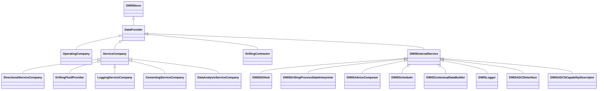

# DataProviders<!-- DEFINITION SET HEADER -->
- Description: 
description of the different actors involved in the well construction process

# Nouns
## Class Inheritance for Nouns
Here is a class inheritance diagram for the nouns contained in this definition set.

## DataProvider <!-- NOUN -->
- Display name: DataProvider
- Parent class: [DWISNoun](./DWISSemantics.md#DWISNoun)
- Attributes:
  - ProviderName
    - Type: string
    - Description: 
- Description: 
A data provider is any sources for data
- Definition set: DataProviders
## OperatingCompany <!-- NOUN -->
- Display name: OperatingCompany
- Parent class: [DataProvider](./DataProviders.md#DataProvider)
- Attributes:
  - ProviderName
    - Type: string
    - Description: 
- Description: 
An operating company is an entity that holds the rights to explore, develop, and produce hydrocarbon resources from a particular oil or gas field or lease
- Definition set: DataProviders
## ServiceCompany <!-- NOUN -->
- Display name: ServiceCompany
- Parent class: [DataProvider](./DataProviders.md#DataProvider)
- Attributes:
  - ProviderName
    - Type: string
    - Description: 
- Description: 
A service company is an entity that provides services during the well construction.
- Definition set: DataProviders
## DirectionalServiceCompany <!-- NOUN -->
- Display name: DirectionalServiceCompany
- Parent class: [ServiceCompany](./DataProviders.md#ServiceCompany)
- Attributes:
  - ProviderName
    - Type: string
    - Description: 
- Description: 
A directional service company is an entity that provides services for downhole directional drilling and downhole measurements.
- Definition set: DataProviders
## DrillingFluidProvider <!-- NOUN -->
- Display name: DrillingFluidProvider
- Parent class: [ServiceCompany](./DataProviders.md#ServiceCompany)
- Attributes:
  - ProviderName
    - Type: string
    - Description: 
- Description: 
A drilling fluid provider is a company that provides and maintains the drilling fluids during well construction.
- Definition set: DataProviders
## LoggingServiceCompany <!-- NOUN -->
- Display name: LoggingServiceCompany
- Parent class: [ServiceCompany](./DataProviders.md#ServiceCompany)
- Attributes:
  - ProviderName
    - Type: string
    - Description: 
- Description: 
A logging service company is an entity that gathers measured information during well construction.
- Definition set: DataProviders
## CementingServiceCompany <!-- NOUN -->
- Display name: CementingServiceCompany
- Parent class: [ServiceCompany](./DataProviders.md#ServiceCompany)
- Attributes:
  - ProviderName
    - Type: string
    - Description: 
- Definition set: DataProviders
## DataAnalysisServiceCompany <!-- NOUN -->
- Display name: DataAnalysisServiceCompany
- Parent class: [ServiceCompany](./DataProviders.md#ServiceCompany)
- Attributes:
  - ProviderName
    - Type: string
    - Description: 
- Description: 
A data analysis service company is an entity that analyses measured data and provide new information from these measurements.
- Definition set: DataProviders
## DrillingContractor <!-- NOUN -->
- Display name: DrillingContractor
- Parent class: [DataProvider](./DataProviders.md#DataProvider)
- Attributes:
  - ProviderName
    - Type: string
    - Description: 
- Definition set: DataProviders
## DWISInternalService <!-- NOUN -->
- Display name: DWISInternalService
- Parent class: [DataProvider](./DataProviders.md#DataProvider)
- Attributes:
  - ProviderName
    - Type: string
    - Description: 
- Description: 
A DWIS internal service is an internal component of the DWIS infrastructure that generates information that can be used by any systems connected to the DWIS infrastructure.
- Definition set: DataProviders
## DWISDDHub <!-- NOUN -->
- Display name: DWISDDHub
- Parent class: [DWISInternalService](./DataProviders.md#DWISInternalService)
- Definition set: DataProviders
## DWISDrillingProcessStateInterpreter <!-- NOUN -->
- Display name: DWISDrillingProcessStateInterpreter
- Parent class: [DWISInternalService](./DataProviders.md#DWISInternalService)
- Definition set: DataProviders
## DWISAdviceComposer <!-- NOUN -->
- Display name: DWISAdviceComposer
- Parent class: [DWISInternalService](./DataProviders.md#DWISInternalService)
- Definition set: DataProviders
## DWISScheduler <!-- NOUN -->
- Display name: DWISScheduler
- Parent class: [DWISInternalService](./DataProviders.md#DWISInternalService)
- Definition set: DataProviders
## DWISContextualDataBuilder <!-- NOUN -->
- Display name: DWISContextualDataBuilder
- Parent class: [DWISInternalService](./DataProviders.md#DWISInternalService)
- Definition set: DataProviders
## DWISLogger <!-- NOUN -->
- Display name: DWISLogger
- Parent class: [DWISInternalService](./DataProviders.md#DWISInternalService)
- Definition set: DataProviders
## DWISADCSInterface <!-- NOUN -->
- Display name: DWISADCSInterface
- Parent class: [DWISInternalService](./DataProviders.md#DWISInternalService)
- Definition set: DataProviders
## DWISADCSCapabilityDescriptor <!-- NOUN -->
- Display name: DWISADCSCapabilityDescriptor
- Parent class: [DWISInternalService](./DataProviders.md#DWISInternalService)
- Definition set: DataProviders
# Verbs
## Class Inheritance for Verbs
Here is a class inheritance diagram for the verbs contained in this definition set.

## Relations
Here is a graph representing the relations that can be made with the verbs defined in this definition set.

## IsProvidedBy <!-- VERB -->
- Display name: IsProvidedBy
- Parent verb: [DWISVerb](./DWISSemantics.md#DWISVerb)
- Subject class: [DWISNoun](./DWISSemantics.md#DWISNoun)
- Object class: [DataProvider](./DataProviders.md#DataProvider)
- Definition set: DataProviders
## IsProvidedTo <!-- VERB -->
- Display name: IsProvidedTo
- Parent verb: [DWISVerb](./DWISSemantics.md#DWISVerb)
- Subject class: [DWISNoun](./DWISSemantics.md#DWISNoun)
- Object class: [DataProvider](./DataProviders.md#DataProvider)
- Definition set: DataProviders
