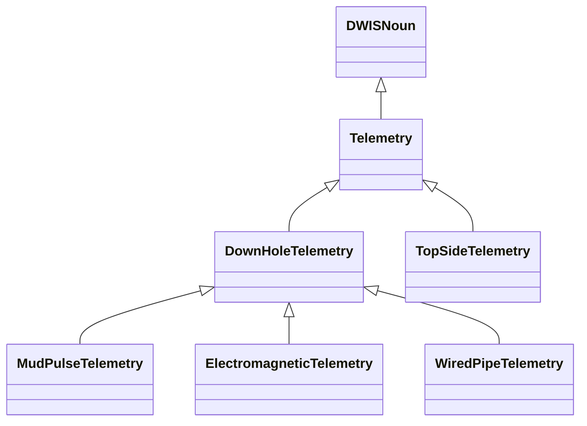
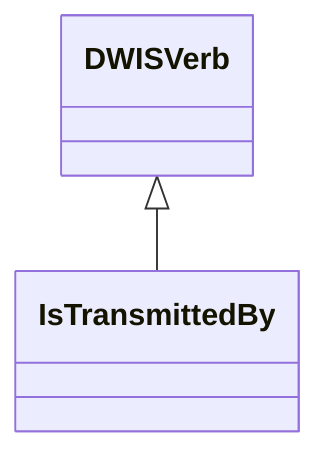
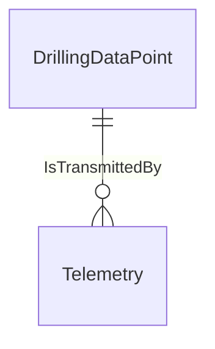

# DataTransmission<!-- DEFINITION SET HEADER -->
- Description: 
this category contains all nouns and verbs used to describe the rig's telemetry, for each signal. Downhole telemetry has focus.

# Nouns
## Class Inheritance for Nouns
Here is a class inheritance diagram for the nouns contained in this definition set.

## Telemetry <!-- NOUN -->
- Display name: Telemetry
- Parent class: [DWISNoun](./DWISSemantics.md#DWISNoun)
- Attributes:
  - NumberOfRepeaters
    - Type: int
    - Description: 
  - DistanceBetweenRepeaters
    - Type: double
    - Description: 
  - AverageDelayByRepeater
    - Type: double
    - Description: 
- Description: 
Technology used for transferring the data from its main origin.
- Definition set: DataTransmission
## DownHoleTelemetry <!-- NOUN -->
- Display name: DownHoleTelemetry
- Parent class: [Telemetry](./DataTransmission.md#Telemetry)
- Definition set: DataTransmission
- Examples:
Technology that allows transfer of downhole data to the surface.
## MudPulseTelemetry <!-- NOUN -->
- Display name: MudPulseTelemetry
- Parent class: [DownHoleTelemetry](./DataTransmission.md#DownHoleTelemetry)
- Description: 
A method that allows transfer of downhole data to the surface via pressure pulses sent trough the drilling fluid.
- Definition set: DataTransmission
- Examples:
NOV BlackStar II dual-telemetry MWD
## ElectromagneticTelemetry <!-- NOUN -->
- Display name: ElectromagneticTelemetry
- Parent class: [DownHoleTelemetry](./DataTransmission.md#DownHoleTelemetry)
- Description: 
A method that allows transfer of downhole data to the surface via electromagnetic waves sent trough the drilling formation.
- Definition set: DataTransmission
- Examples:
APS SureShot-EM, NOV BlackStar II EM MWD
## WiredPipeTelemetry <!-- NOUN -->
- Display name: WiredPipeTelemetry
- Parent class: [DownHoleTelemetry](./DataTransmission.md#DownHoleTelemetry)
- Description: 
A method that allows transfer of downhole data to the surface via electrical connections through the drill string.
- Definition set: DataTransmission
- Examples:
Intelliserv Wired Drill Pipe, Reelwell DualLink
## TopSideTelemetry <!-- NOUN -->
- Display name: TopSideTelemetry
- Parent class: [Telemetry](./DataTransmission.md#Telemetry)
- Description: 
Method that allows transfer of data from surface systems.
- Definition set: DataTransmission
- Examples:
NOVOS, Cyberbase, DEAL
# Verbs
## Class Inheritance for Verbs
Here is a class inheritance diagram for the verbs contained in this definition set.

## Relations
Here is a graph representing the relations that can be made with the verbs defined in this definition set.

## IsTransmittedBy <!-- VERB -->
- Display name: IsTransmittedBy
- Parent verb: [DWISVerb](./DWISSemantics.md#DWISVerb)
- Subject class: [DrillingDataPoint](./DrillingDataSemantics.md#DrillingDataPoint)
- Object class: [Telemetry](./DataTransmission.md#Telemetry)
- Definition set: DataTransmission
- Description: 
Expresses that a signal is transmitted by some given telemetry system
- Examples:
EMS DWOB is transmitted by WiredPipeTelemetry
