# DataTransmission<!-- DEFINITION SET HEADER -->
- Description: 
this category contains all nouns and verbs used to describe the rig's telemetry, for each signal. Downhole telemetry has focus.

# Nouns
## Class Inheritance for Nouns
Here is a class inheritance diagram for the nouns contained in this definition set.
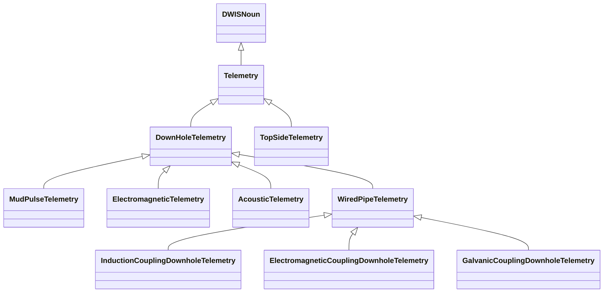
## Telemetry <!-- NOUN -->
- Display name: Telemetry
- Parent class: [DWISNoun](./DWISSemantics.md#DWISNoun)
- Attributes:
  - NumberOfRepeaters
    - Type: int
    - Description: The number of repeaters between the source of the signal and the receiver.
  - DistanceBetweenRepeaters
    - Type: double
    - Description: The average distance between two repeaters. The physical quantity is Length and the unit is metre.
  - AverageDelayByRepeater
    - Type: double
    - Description: The average delay caused by each repeater. The physical quantity is Time and the unit is second.
- Description: 
Technology used for transferring the data from its main origin.
- Definition set: DataTransmission
- Examples:
``` dwis downholePressure_1
DrillingDataPoint: downholePressure_1
downholePressure_1 BelongsToClass DownholePressure
downholePressure_1 IsOfMeasurableQuantity PressureDrillingQuantity
AcousticTelemetry: acousticTelemetry
acousticTelemetry.NumberOfRepeaters = 3
acousticTelemetry.DistanceBetweenRepeaters = 2000
acousticTelemetry.AverageDelayByRepeater = 1
downholePressure_1 IsTransmittedBy acousticTelemetry
```
An example semantic graph looks like as follow:
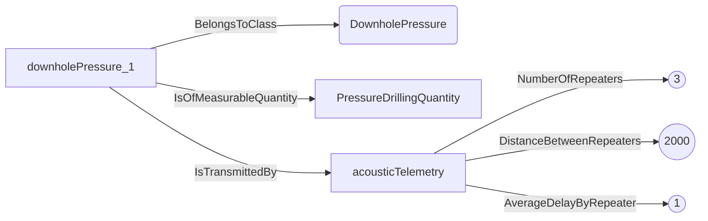
An example SparQL query looks like this:
```sparql
PREFIX rdf: <http://www.w3.org/1999/02/22-rdf-syntax-ns#>
PREFIX ddhub: <http://ddhub.no/>
PREFIX quantity: <http://ddhub.no/UnitAndQuantity>
SELECT ?downholePressure_1
WHERE {
	?downholePressure_1 rdf:type ddhub:DownholePressure .
	?downholePressure_1 ddhub:IsOfMeasurableQuantity ?PressureDrillingQuantity .
	?acousticTelemetry ddhub:NumberOfRepeaters ?Attribute000 .
	?acousticTelemetry ddhub:DistanceBetweenRepeaters ?Attribute001 .
	?acousticTelemetry ddhub:AverageDelayByRepeater ?Attribute002 .
	?downholePressure_1 ddhub:IsTransmittedBy ?acousticTelemetry .
  FILTER (
	?Attribute000 = 3
	&& 	?Attribute001 = 2000
	&& 	?Attribute002 = 1
  )
}
```
## DownHoleTelemetry <!-- NOUN -->
- Display name: DownHoleTelemetry
- Parent class: [Telemetry](./DataTransmission.md#Telemetry)
- Description: 
Technology that allows transfer of downhole data to the surface.
- Definition set: DataTransmission
- Examples:
``` dwis downholePressure_1
DrillingDataPoint: downholePressure_1
downholePressure_1 BelongsToClass DownholePressure
downholePressure_1 IsOfMeasurableQuantity PressureDrillingQuantity
DownHoleTelemetry: downholeTelemetry
downholePressure_1 IsTransmittedBy downholeTelemetry
```
An example semantic graph looks like as follow:
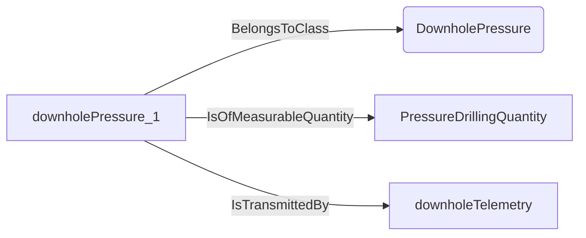
An example SparQL query looks like this:
```sparql
PREFIX rdf: <http://www.w3.org/1999/02/22-rdf-syntax-ns#>
PREFIX ddhub: <http://ddhub.no/>
PREFIX quantity: <http://ddhub.no/UnitAndQuantity>
SELECT ?downholePressure_1
WHERE {
	?downholePressure_1 rdf:type ddhub:DownholePressure .
	?downholePressure_1 ddhub:IsOfMeasurableQuantity ?PressureDrillingQuantity .
	?downholePressure_1 ddhub:IsTransmittedBy ?downholeTelemetry .
}
```
## MudPulseTelemetry <!-- NOUN -->
- Display name: MudPulseTelemetry
- Parent class: [DownHoleTelemetry](./DataTransmission.md#DownHoleTelemetry)
- Description: 
A method that allows transfer of downhole data to the surface via pressure pulses sent through the drilling fluid.
- Definition set: DataTransmission
- Examples:
``` dwis downholePressure_1
DrillingDataPoint: downholePressure_1
downholePressure_1 BelongsToClass DownholePressure
downholePressure_1 IsOfMeasurableQuantity PressureDrillingQuantity
MudPulseTelemetry: mudPulseTelemetry
downholePressure_1 IsTransmittedBy mudPulseTelemetry
```
An example semantic graph looks like as follow:
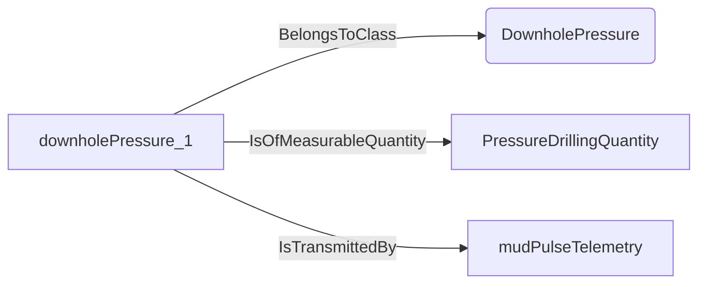
An example SparQL query looks like this:
```sparql
PREFIX rdf: <http://www.w3.org/1999/02/22-rdf-syntax-ns#>
PREFIX ddhub: <http://ddhub.no/>
PREFIX quantity: <http://ddhub.no/UnitAndQuantity>
SELECT ?downholePressure_1
WHERE {
	?downholePressure_1 rdf:type ddhub:DownholePressure .
	?downholePressure_1 ddhub:IsOfMeasurableQuantity ?PressureDrillingQuantity .
	?downholePressure_1 ddhub:IsTransmittedBy ?mudPulseTelemetry .
}
```
## ElectromagneticTelemetry <!-- NOUN -->
- Display name: ElectromagneticTelemetry
- Parent class: [DownHoleTelemetry](./DataTransmission.md#DownHoleTelemetry)
- Description: 
A method that allows transfer of downhole data to the surface via electromagnetic waves sent through the drilling formation.
- Definition set: DataTransmission
- Examples:
``` dwis downholePressure_1
DrillingDataPoint: downholePressure_1
downholePressure_1 BelongsToClass DownholePressure
downholePressure_1 IsOfMeasurableQuantity PressureDrillingQuantity
ElectromagneticTelemetry: electromagneticTelemetry
downholePressure_1 IsTransmittedBy electromagneticTelemetry
```
An example semantic graph looks like as follow:
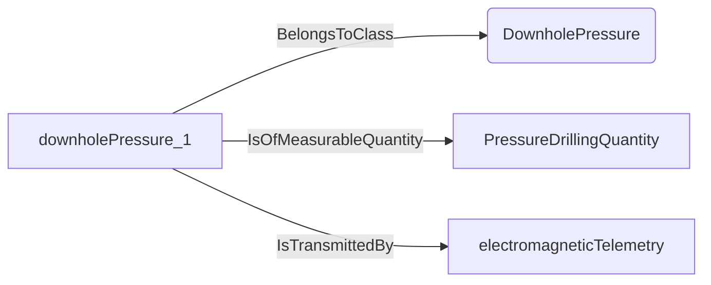
An example SparQL query looks like this:
```sparql
PREFIX rdf: <http://www.w3.org/1999/02/22-rdf-syntax-ns#>
PREFIX ddhub: <http://ddhub.no/>
PREFIX quantity: <http://ddhub.no/UnitAndQuantity>
SELECT ?downholePressure_1
WHERE {
	?downholePressure_1 rdf:type ddhub:DownholePressure .
	?downholePressure_1 ddhub:IsOfMeasurableQuantity ?PressureDrillingQuantity .
	?downholePressure_1 ddhub:IsTransmittedBy ?electromagneticTelemetry .
}
```
## AcousticTelemetry <!-- NOUN -->
- Display name: AcousticTelemetry
- Parent class: [DownHoleTelemetry](./DataTransmission.md#DownHoleTelemetry)
- Description: 
A method that allows transfer of downhole data to the surface via acoustic waves along the drill-string.
- Definition set: DataTransmission
- Examples:
``` dwis downholePressure_1
DrillingDataPoint: downholePressure_1
downholePressure_1 BelongsToClass DownholePressure
downholePressure_1 IsOfMeasurableQuantity PressureDrillingQuantity
AcousticTelemetry: acousticTelemetry
downholePressure_1 IsTransmittedBy acousticTelemetry
```
An example semantic graph looks like as follow:
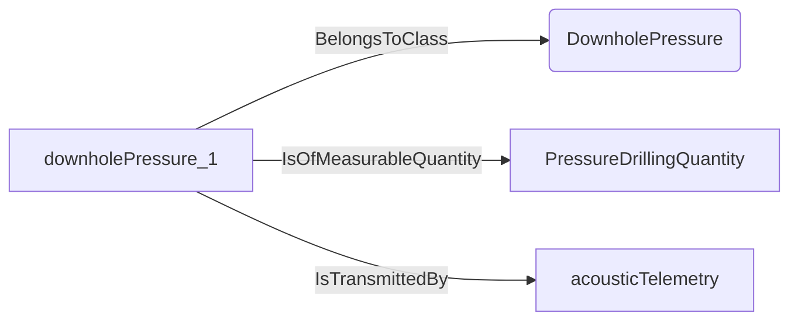
An example SparQL query looks like this:
```sparql
PREFIX rdf: <http://www.w3.org/1999/02/22-rdf-syntax-ns#>
PREFIX ddhub: <http://ddhub.no/>
PREFIX quantity: <http://ddhub.no/UnitAndQuantity>
SELECT ?downholePressure_1
WHERE {
	?downholePressure_1 rdf:type ddhub:DownholePressure .
	?downholePressure_1 ddhub:IsOfMeasurableQuantity ?PressureDrillingQuantity .
	?downholePressure_1 ddhub:IsTransmittedBy ?acousticTelemetry .
}
```
## WiredPipeTelemetry <!-- NOUN -->
- Display name: WiredPipeTelemetry
- Parent class: [DownHoleTelemetry](./DataTransmission.md#DownHoleTelemetry)
- Description: 
A method that allows transfer of downhole data to the surface via electrical connections along the drill string.
- Definition set: DataTransmission
- Examples:
``` dwis downholePressure_1
DrillingDataPoint: downholePressure_1
downholePressure_1 BelongsToClass DownholePressure
downholePressure_1 IsOfMeasurableQuantity PressureDrillingQuantity
WiredPipeTelemetry: wiredPipeTelemetry
downholePressure_1 IsTransmittedBy wiredPipeTelemetry
```
An example semantic graph looks like as follow:

An example SparQL query looks like this:
```sparql
PREFIX rdf: <http://www.w3.org/1999/02/22-rdf-syntax-ns#>
PREFIX ddhub: <http://ddhub.no/>
PREFIX quantity: <http://ddhub.no/UnitAndQuantity>
SELECT ?downholePressure_1
WHERE {
	?downholePressure_1 rdf:type ddhub:DownholePressure .
	?downholePressure_1 ddhub:IsOfMeasurableQuantity ?PressureDrillingQuantity .
	?downholePressure_1 ddhub:IsTransmittedBy ?wiredPipeTelemetry .
}
```
## InductionCouplingDownholeTelemetry <!-- NOUN -->
- Display name: InductionCouplingDownholeTelemetry
- Parent class: [WiredPipeTelemetry](./DataTransmission.md#WiredPipeTelemetry)
- Description: 
A method that allows transfer of downhole data to the surface via induction coupling between pipes along the drill-string.
- Definition set: DataTransmission
- Examples:
``` dwis downholePressure_1
DrillingDataPoint: downholePressure_1
downholePressure_1 BelongsToClass DownholePressure
downholePressure_1 IsOfMeasurableQuantity PressureDrillingQuantity
InductionCouplingDownholeTelemetry: inductionCouplingTelemetry
downholePressure_1 IsTransmittedBy inductionCouplingTelemetry
```
An example semantic graph looks like as follow:

An example SparQL query looks like this:
```sparql
PREFIX rdf: <http://www.w3.org/1999/02/22-rdf-syntax-ns#>
PREFIX ddhub: <http://ddhub.no/>
PREFIX quantity: <http://ddhub.no/UnitAndQuantity>
SELECT ?downholePressure_1
WHERE {
	?downholePressure_1 rdf:type ddhub:DownholePressure .
	?downholePressure_1 ddhub:IsOfMeasurableQuantity ?PressureDrillingQuantity .
	?downholePressure_1 ddhub:IsTransmittedBy ?inductionCouplingTelemetry .
}
```
## ElectromagneticCouplingDownholeTelemetry <!-- NOUN -->
- Display name: ElectromagneticCouplingDownholeTelemetry
- Parent class: [WiredPipeTelemetry](./DataTransmission.md#WiredPipeTelemetry)
- Description: 
A method that allows transfer of downhole data to the surface via electromagnetic coupling between pipes along the drill-string.
- Definition set: DataTransmission
- Examples:
``` dwis downholePressure_1
DrillingDataPoint: downholePressure_1
downholePressure_1 BelongsToClass DownholePressure
downholePressure_1 IsOfMeasurableQuantity PressureDrillingQuantity
ElectromagneticCouplingDownholeTelemetry: electromagneticCouplingTelemetry
downholePressure_1 IsTransmittedBy electromagneticCouplingTelemetry
```
An example semantic graph looks like as follow:
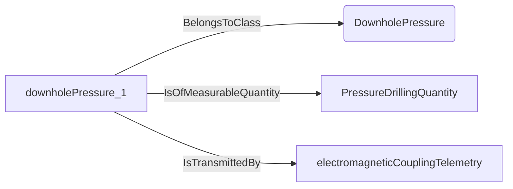
An example SparQL query looks like this:
```sparql
PREFIX rdf: <http://www.w3.org/1999/02/22-rdf-syntax-ns#>
PREFIX ddhub: <http://ddhub.no/>
PREFIX quantity: <http://ddhub.no/UnitAndQuantity>
SELECT ?downholePressure_1
WHERE {
	?downholePressure_1 rdf:type ddhub:DownholePressure .
	?downholePressure_1 ddhub:IsOfMeasurableQuantity ?PressureDrillingQuantity .
	?downholePressure_1 ddhub:IsTransmittedBy ?electromagneticCouplingTelemetry .
}
```
## GalvanicCouplingDownholeTelemetry <!-- NOUN -->
- Display name: GalvanicCouplingDownholeTelemetry
- Parent class: [WiredPipeTelemetry](./DataTransmission.md#WiredPipeTelemetry)
- Description: 
A method that allows transfer of downhole data to the surface via galvanic coupling between pipes along the drill-string.
- Definition set: DataTransmission
- Examples:
``` dwis downholePressure_1
DrillingDataPoint: downholePressure_1
downholePressure_1 BelongsToClass DownholePressure
downholePressure_1 IsOfMeasurableQuantity PressureDrillingQuantity
GalvanicCouplingDownholeTelemetry: galvanicCouplingTelemetry
downholePressure_1 IsTransmittedBy galvanicCouplingTelemetry
```
An example semantic graph looks like as follow:
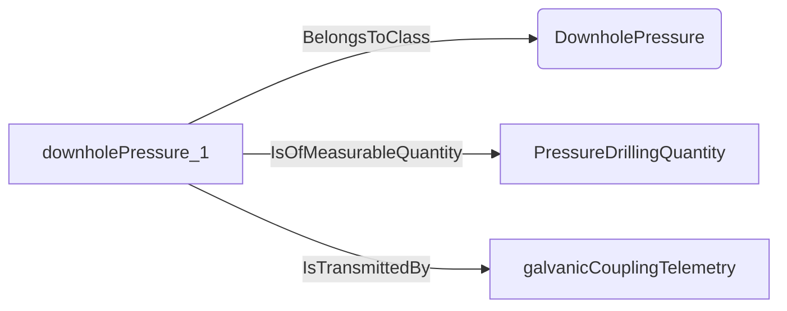
An example SparQL query looks like this:
```sparql
PREFIX rdf: <http://www.w3.org/1999/02/22-rdf-syntax-ns#>
PREFIX ddhub: <http://ddhub.no/>
PREFIX quantity: <http://ddhub.no/UnitAndQuantity>
SELECT ?downholePressure_1
WHERE {
	?downholePressure_1 rdf:type ddhub:DownholePressure .
	?downholePressure_1 ddhub:IsOfMeasurableQuantity ?PressureDrillingQuantity .
	?downholePressure_1 ddhub:IsTransmittedBy ?galvanicCouplingTelemetry .
}
```
## TopSideTelemetry <!-- NOUN -->
- Display name: TopSideTelemetry
- Parent class: [Telemetry](./DataTransmission.md#Telemetry)
- Description: 
Method that allows transfer of data from surface systems.
- Definition set: DataTransmission
- Examples:
``` dwis SPP_1
DrillingDataPoint: SPP_1
SPP_1 BelongsToClass SPP
SPP_1 IsOfMeasurableQuantity PressureDrillingQuantity
TopSideTelemetry: topSideTelemetry
SPP_1 IsTransmittedBy topSideTelemetry
```
An example semantic graph looks like as follow:
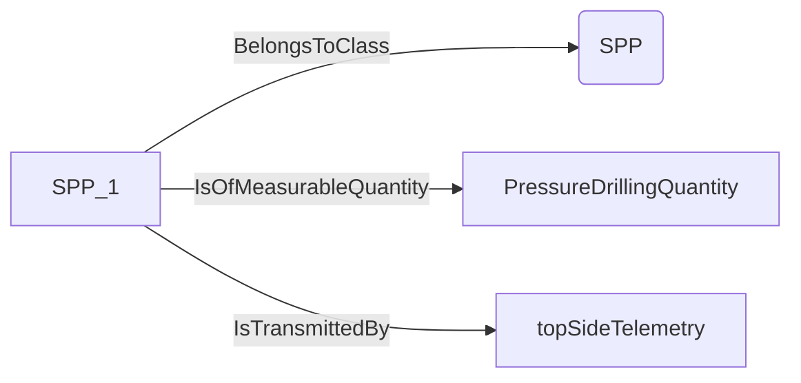
An example SparQL query looks like this:
```sparql
PREFIX rdf: <http://www.w3.org/1999/02/22-rdf-syntax-ns#>
PREFIX ddhub: <http://ddhub.no/>
PREFIX quantity: <http://ddhub.no/UnitAndQuantity>
SELECT ?SPP_1
WHERE {
	?SPP_1 rdf:type ddhub:SPP .
	?SPP_1 ddhub:IsOfMeasurableQuantity ?PressureDrillingQuantity .
	?SPP_1 ddhub:IsTransmittedBy ?topSideTelemetry .
}
```
# Verbs
## Class Inheritance for Verbs
Here is a class inheritance diagram for the verbs contained in this definition set.
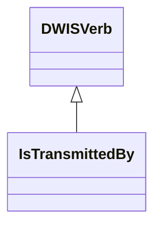
## Relations
Here is a graph representing the relations that can be made with the verbs defined in this definition set.
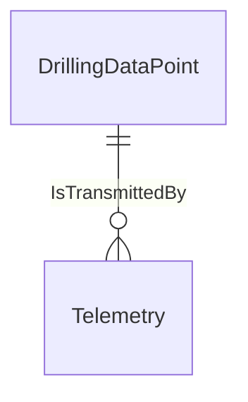
## IsTransmittedBy <!-- VERB -->
- Display name: IsTransmittedBy
- Parent verb: [DWISVerb](./DWISSemantics.md#DWISVerb)
- Subject class: [DrillingDataPoint](./DrillingDataSemantics.md#DrillingDataPoint)
- Object class: [Telemetry](./DataTransmission.md#Telemetry)
- Definition set: DataTransmission
- Description: 
Expresses that a signal is transmitted by some given telemetry system
- Examples:
``` dwis downholeWOB_1
DrillingDataPoint: downholeWOB_1
downholeWOB_1 BelongsToClass WOB
downholeWOB_1 IsOfMeasurableQuantity ForceQuantity
InductionCouplingDownholeTelemetry: inductionCouplingTelemetry
downholeWOB_1 IsTransmittedBy inductionCouplingTelemetry
```
An example semantic graph looks like as follow:
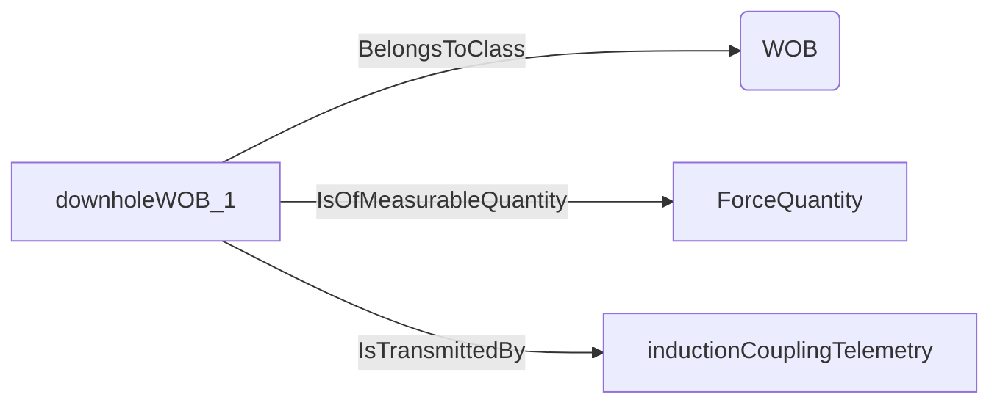
An example SparQL query looks like this:
```sparql
PREFIX rdf: <http://www.w3.org/1999/02/22-rdf-syntax-ns#>
PREFIX ddhub: <http://ddhub.no/>
PREFIX quantity: <http://ddhub.no/UnitAndQuantity>
SELECT ?downholeWOB_1
WHERE {
	?downholeWOB_1 rdf:type ddhub:WOB .
	?downholeWOB_1 ddhub:IsOfMeasurableQuantity ?ForceQuantity .
	?downholeWOB_1 ddhub:IsTransmittedBy ?inductionCouplingTelemetry .
}
```
