# DataValidity<!-- DEFINITION SET HEADER -->
- Description: 
This category groups the nouns and verbs used to describe when a drilling signal is valid. Typical cases include signals only valid off slips or downhole telemetry signals that are valid only while circulating.

# Nouns
## Class Inheritance for Nouns
Here is a class inheritance diagram for the nouns contained in this definition set.
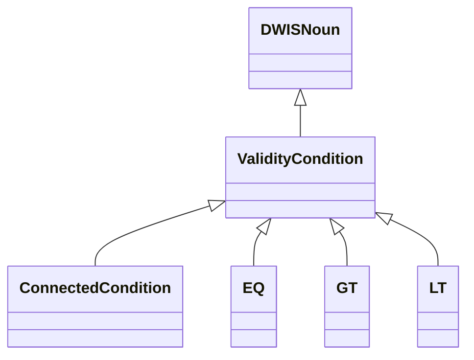
## ValidityCondition <!-- NOUN -->
- Display name: ValidityCondition
- Parent class: [DWISNoun](./DWISSemantics.md#DWISNoun)
- Description: 
A logical condition that must hold for a signal to be considered valid.
- Definition set: DataValidity
- Examples:
```dwis circulationValidity
ValidityCondition:circulationValidity
DrillingDataPoint:circulationStatus
circulationStatus IsConditionInput circulationValidity
```
An example semantic graph looks like as follow:
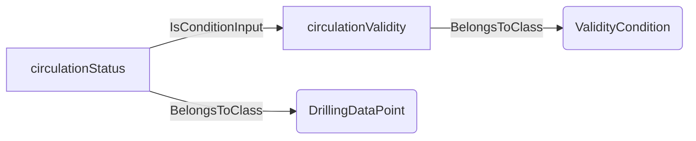
An example SparQL query looks like this:
```sparql
PREFIX rdf: <http://www.w3.org/1999/02/22-rdf-syntax-ns#>
PREFIX ddhub: <http://ddhub.no/>
PREFIX quantity: <http://ddhub.no/UnitAndQuantity>
SELECT ?circulationValidity
WHERE {
	?circulationValidity rdf:type ddhub:ValidityCondition .
	?circulationStatus rdf:type ddhub:DrillingDataPoint .
	?circulationStatus ddhub:IsConditionInput ?circulationValidity .
}
```
This example defines a validity condition driven by the circulation status signal.
## ConnectedCondition <!-- NOUN -->
- Display name: ConnectedCondition
- Parent class: [ValidityCondition](./DataValidity.md#ValidityCondition)
- Description: 
A condition expressing that a signal is valid only when two or more pieces of equipment are connected (e.g., toolface valid only when BHA is made up).
- Definition set: DataValidity
- Examples:
```dwis bhaConnectedCondition
ConnectedCondition:bhaConnected
DrillingDataPoint:bhaConnectionStatus
bhaConnectionStatus IsConditionInput bhaConnected
```
An example semantic graph looks like as follow:
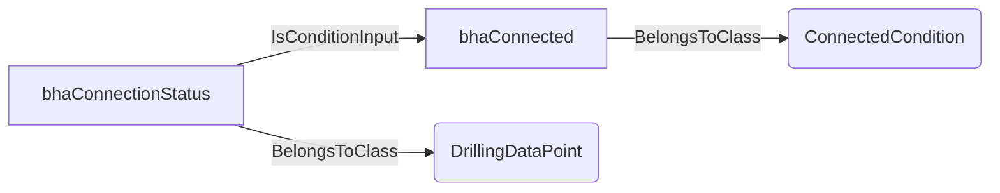
An example SparQL query looks like this:
```sparql
PREFIX rdf: <http://www.w3.org/1999/02/22-rdf-syntax-ns#>
PREFIX ddhub: <http://ddhub.no/>
PREFIX quantity: <http://ddhub.no/UnitAndQuantity>
SELECT ?bhaConnectedCondition
WHERE {
	?bhaConnected rdf:type ddhub:ConnectedCondition .
	?bhaConnectionStatus rdf:type ddhub:DrillingDataPoint .
	?bhaConnectionStatus ddhub:IsConditionInput ?bhaConnected .
}
```
This example states that validity depends on the BHA connection status.
## EQ <!-- NOUN -->
- Display name: EQ
- Parent class: [ValidityCondition](./DataValidity.md#ValidityCondition)
- Description: 
A condition that is true when its left and right inputs are equal.
- Definition set: DataValidity
- Examples:
```dwis slipsCondition
EQ:slipsOffCondition
DrillingDataPoint:slipsStatus
DrillingDataPoint:slipsOffValue
slipsStatus IsConditionLeft slipsOffCondition
slipsOffValue IsConditionRight slipsOffCondition
```
An example semantic graph looks like as follow:
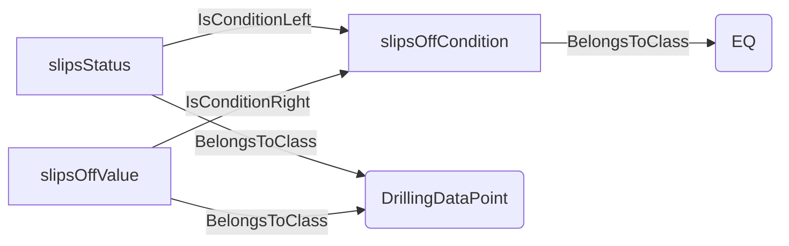
An example SparQL query looks like this:
```sparql
PREFIX rdf: <http://www.w3.org/1999/02/22-rdf-syntax-ns#>
PREFIX ddhub: <http://ddhub.no/>
PREFIX quantity: <http://ddhub.no/UnitAndQuantity>
SELECT ?slipsCondition
WHERE {
	?slipsOffCondition rdf:type ddhub:EQ .
	?slipsStatus rdf:type ddhub:DrillingDataPoint .
	?slipsOffValue rdf:type ddhub:DrillingDataPoint .
	?slipsStatus ddhub:IsConditionLeft ?slipsOffCondition .
	?slipsOffValue ddhub:IsConditionRight ?slipsOffCondition .
}
```
This example models validity when the slips status equals the “off” value.
## GT <!-- NOUN -->
- Display name: GT
- Parent class: [ValidityCondition](./DataValidity.md#ValidityCondition)
- Description: 
A condition that is true when the left input is greater than the right input.
- Definition set: DataValidity
- Examples:
```dwis pumpPressureCondition
GT:pumpPressureCondition
DrillingDataPoint:standpipePressure
DrillingDataPoint:pressureThreshold
standpipePressure IsConditionLeft pumpPressureCondition
pressureThreshold IsConditionRight pumpPressureCondition
```
An example semantic graph looks like as follow:
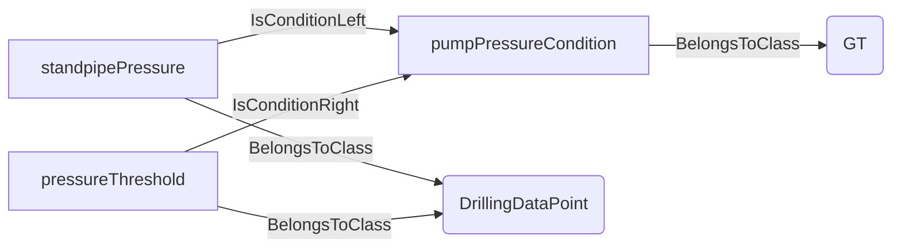
An example SparQL query looks like this:
```sparql
PREFIX rdf: <http://www.w3.org/1999/02/22-rdf-syntax-ns#>
PREFIX ddhub: <http://ddhub.no/>
PREFIX quantity: <http://ddhub.no/UnitAndQuantity>
SELECT ?pumpPressureCondition
WHERE {
	?pumpPressureCondition rdf:type ddhub:GT .
	?standpipePressure rdf:type ddhub:DrillingDataPoint .
	?pressureThreshold rdf:type ddhub:DrillingDataPoint .
	?standpipePressure ddhub:IsConditionLeft ?pumpPressureCondition .
	?pressureThreshold ddhub:IsConditionRight ?pumpPressureCondition .
}
```
This example makes validity depend on standpipe pressure being above a threshold.
## LT <!-- NOUN -->
- Display name: LT
- Parent class: [ValidityCondition](./DataValidity.md#ValidityCondition)
- Description: 
A condition that is true when the left input is lower than the right input.
- Definition set: DataValidity
- Examples:
```dwis bitDepthCondition
LT:bitDepthCondition
DrillingDataPoint:bitDepth
DrillingDataPoint:maxDepthForSensor
bitDepth IsConditionLeft bitDepthCondition
maxDepthForSensor IsConditionRight bitDepthCondition
```
An example semantic graph looks like as follow:
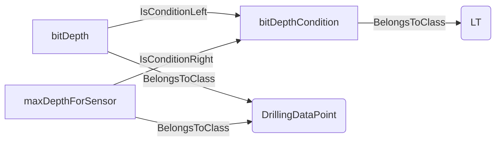
An example SparQL query looks like this:
```sparql
PREFIX rdf: <http://www.w3.org/1999/02/22-rdf-syntax-ns#>
PREFIX ddhub: <http://ddhub.no/>
PREFIX quantity: <http://ddhub.no/UnitAndQuantity>
SELECT ?bitDepthCondition
WHERE {
	?bitDepthCondition rdf:type ddhub:LT .
	?bitDepth rdf:type ddhub:DrillingDataPoint .
	?maxDepthForSensor rdf:type ddhub:DrillingDataPoint .
	?bitDepth ddhub:IsConditionLeft ?bitDepthCondition .
	?maxDepthForSensor ddhub:IsConditionRight ?bitDepthCondition .
}
```
This example makes validity depend on bit depth being below a sensor limit.
# Verbs
## Class Inheritance for Verbs
Here is a class inheritance diagram for the verbs contained in this definition set.
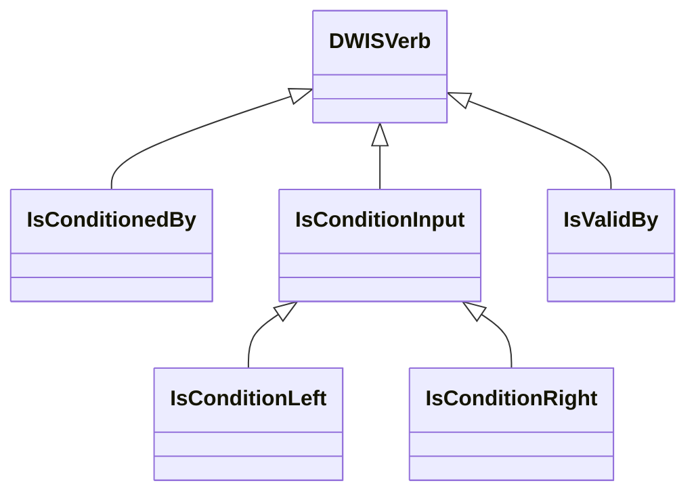
## Relations
Here is a graph representing the relations that can be made with the verbs defined in this definition set.
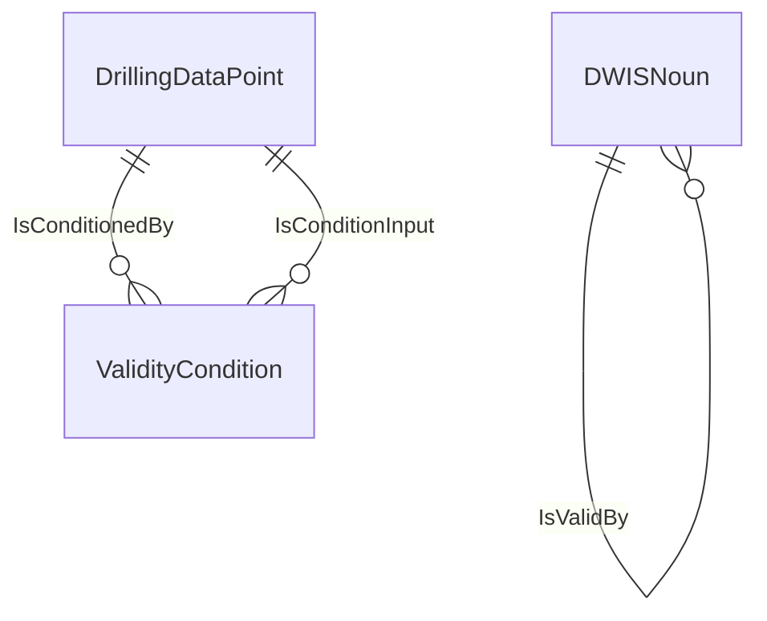
## IsConditionedBy <!-- VERB -->
- Display name: IsConditionedBy
- Parent verb: [DWISVerb](./DWISSemantics.md#DWISVerb)
- Subject class: [DrillingDataPoint](./DrillingDataSemantics.md#DrillingDataPoint)
- Object class: [ValidityCondition](./DataValidity.md#ValidityCondition)
- Definition set: DataValidity
- Description: 
Indicates that a data point is valid only when the referenced condition is satisfied.
- Examples:
```dwis downholePressureValidity
DrillingDataPoint:downholePressure
ValidityCondition:circulationValidity
downholePressure IsConditionedBy circulationValidity
```
An example semantic graph looks like as follow:
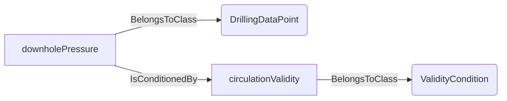
An example SparQL query looks like this:
```sparql
PREFIX rdf: <http://www.w3.org/1999/02/22-rdf-syntax-ns#>
PREFIX ddhub: <http://ddhub.no/>
PREFIX quantity: <http://ddhub.no/UnitAndQuantity>
SELECT ?downholePressureValidity
WHERE {
	?downholePressure rdf:type ddhub:DrillingDataPoint .
	?circulationValidity rdf:type ddhub:ValidityCondition .
	?downholePressure ddhub:IsConditionedBy ?circulationValidity .
}
```
This example ties downhole pressure validity to circulation being active.
## IsConditionInput <!-- VERB -->
- Display name: IsConditionInput
- Parent verb: [DWISVerb](./DWISSemantics.md#DWISVerb)
- Subject class: [DrillingDataPoint](./DrillingDataSemantics.md#DrillingDataPoint)
- Object class: [ValidityCondition](./DataValidity.md#ValidityCondition)
- Definition set: DataValidity
- Description: 
Declares that a signal feeds a validity condition evaluation.
- Examples:
```dwis conditionInputs
DrillingDataPoint:standpipePressure
ValidityCondition:pumpPressureCondition
standpipePressure IsConditionInput pumpPressureCondition
```
An example semantic graph looks like as follow:
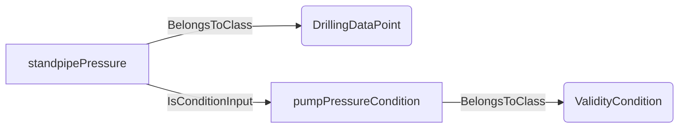
An example SparQL query looks like this:
```sparql
PREFIX rdf: <http://www.w3.org/1999/02/22-rdf-syntax-ns#>
PREFIX ddhub: <http://ddhub.no/>
PREFIX quantity: <http://ddhub.no/UnitAndQuantity>
SELECT ?conditionInputs
WHERE {
	?standpipePressure rdf:type ddhub:DrillingDataPoint .
	?pumpPressureCondition rdf:type ddhub:ValidityCondition .
	?standpipePressure ddhub:IsConditionInput ?pumpPressureCondition .
}
```
This example uses standpipe pressure as an input to a validity condition.
## IsConditionLeft <!-- VERB -->
- Display name: IsConditionLeft
- Parent verb: [IsConditionInput](./DataValidity.md#IsConditionInput)
- Subject class: [DWISNoun](./DWISSemantics.md#DWISNoun)
- Object class: [DWISNoun](./DWISSemantics.md#DWISNoun)
- Definition set: DataValidity
- Description: 
Identifies the left-hand operand of a binary validity condition.
- Examples:
```dwis leftOperand
DrillingDataPoint:standpipePressure
GT:pumpPressureCondition
standpipePressure IsConditionLeft pumpPressureCondition
```
An example semantic graph looks like as follow:
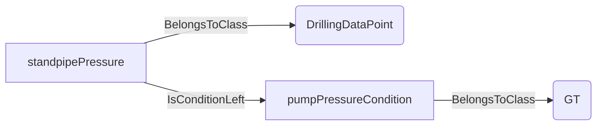
An example SparQL query looks like this:
```sparql
PREFIX rdf: <http://www.w3.org/1999/02/22-rdf-syntax-ns#>
PREFIX ddhub: <http://ddhub.no/>
PREFIX quantity: <http://ddhub.no/UnitAndQuantity>
SELECT ?leftOperand
WHERE {
	?standpipePressure rdf:type ddhub:DrillingDataPoint .
	?pumpPressureCondition rdf:type ddhub:GT .
	?standpipePressure ddhub:IsConditionLeft ?pumpPressureCondition .
}
```
This example sets standpipe pressure as the left operand in a greater-than condition.
## IsConditionRight <!-- VERB -->
- Display name: IsConditionRight
- Parent verb: [IsConditionInput](./DataValidity.md#IsConditionInput)
- Subject class: [DWISNoun](./DWISSemantics.md#DWISNoun)
- Object class: [DWISNoun](./DWISSemantics.md#DWISNoun)
- Definition set: DataValidity
- Description: 
Identifies the right-hand operand of a binary validity condition.
- Examples:
```dwis rightOperand
DrillingDataPoint:pressureThreshold
GT:pumpPressureCondition
pressureThreshold IsConditionRight pumpPressureCondition
```
An example semantic graph looks like as follow:
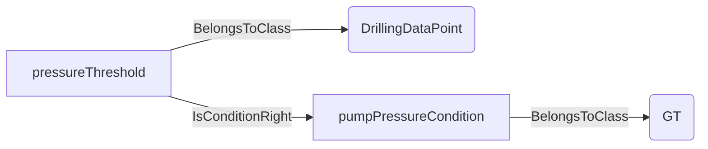
An example SparQL query looks like this:
```sparql
PREFIX rdf: <http://www.w3.org/1999/02/22-rdf-syntax-ns#>
PREFIX ddhub: <http://ddhub.no/>
PREFIX quantity: <http://ddhub.no/UnitAndQuantity>
SELECT ?rightOperand
WHERE {
	?pressureThreshold rdf:type ddhub:DrillingDataPoint .
	?pumpPressureCondition rdf:type ddhub:GT .
	?pressureThreshold ddhub:IsConditionRight ?pumpPressureCondition .
}
```
This example sets the pressure threshold as the right operand in a greater-than condition.
## IsValidBy <!-- VERB -->
- Display name: IsValidBy
- Parent verb: [DWISVerb](./DWISSemantics.md#DWISVerb)
- Subject class: [DWISNoun](./DWISSemantics.md#DWISNoun)
- Object class: [DWISNoun](./DWISSemantics.md#DWISNoun)
- Definition set: DataValidity
- Description: 
States that a validity condition applies to a data point or class of signals.
- Examples:
```dwis validityBinding
DrillingDataPoint:downholePressure
ValidityCondition:pumpPressureCondition
downholePressure IsValidBy pumpPressureCondition
```
An example semantic graph looks like as follow:
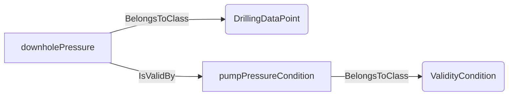
An example SparQL query looks like this:
```sparql
PREFIX rdf: <http://www.w3.org/1999/02/22-rdf-syntax-ns#>
PREFIX ddhub: <http://ddhub.no/>
PREFIX quantity: <http://ddhub.no/UnitAndQuantity>
SELECT ?validityBinding
WHERE {
	?downholePressure rdf:type ddhub:DrillingDataPoint .
	?pumpPressureCondition rdf:type ddhub:ValidityCondition .
	?downholePressure ddhub:IsValidBy ?pumpPressureCondition .
}
```
This example binds the pump pressure condition as the validity constraint for downhole pressure.
