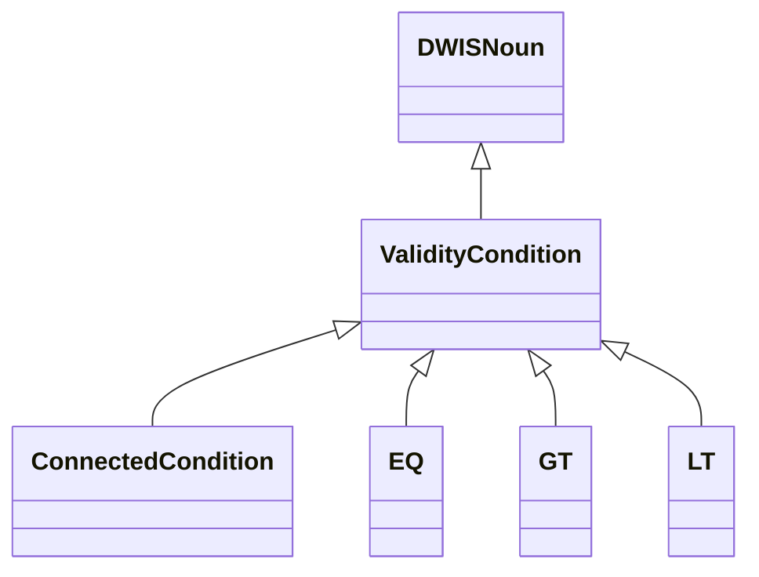
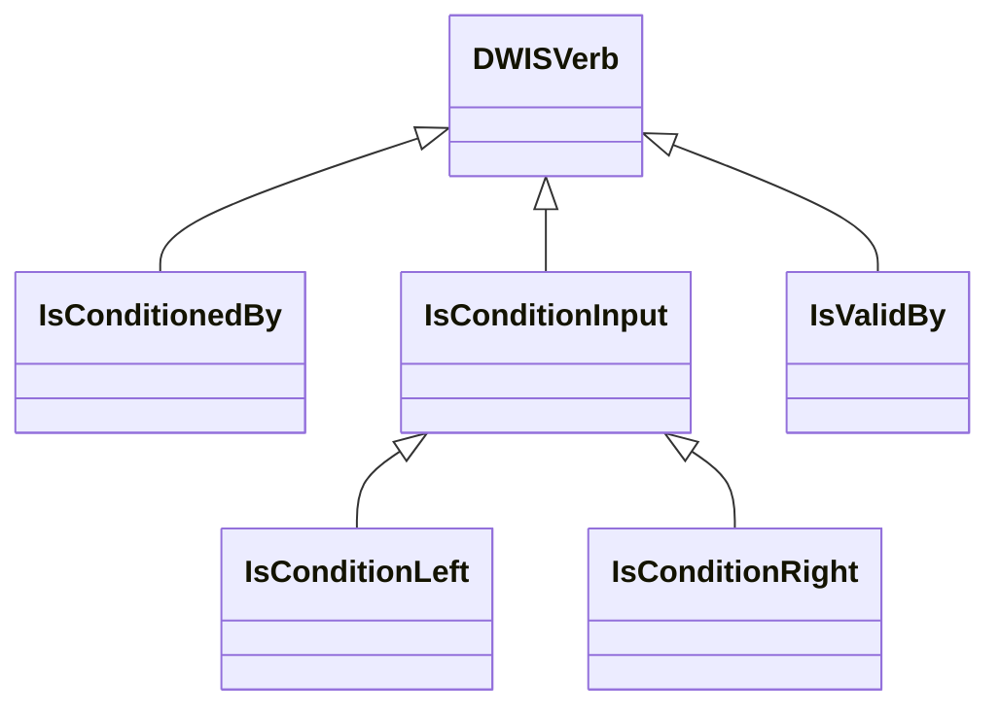
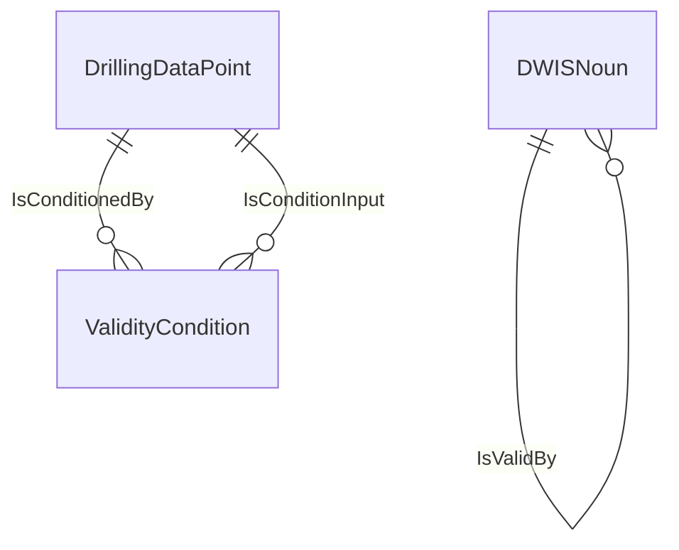

# DataValidity<!-- DEFINITION SET HEADER -->
- Description: 
this category contains all the nouns and verbs used to described the validity of signals. Some signals are for example only valid while off-slips, downhole signals transmitted via mud-pulse telemetry require circulation.

# Nouns
## Class Inheritance for Nouns
Here is a class inheritance diagram for the nouns contained in this definition set.

## ValidityCondition <!-- NOUN -->
- Display name: ValidityCondition
- Parent class: [DWISNoun](./DWISSemantics.md#DWISNoun)
- Definition set: DataValidity
## ConnectedCondition <!-- NOUN -->
- Display name: ConnectedCondition
- Parent class: [ValidityCondition](./DataValidity.md#ValidityCondition)
- Definition set: DataValidity
## EQ <!-- NOUN -->
- Display name: EQ
- Parent class: [ValidityCondition](./DataValidity.md#ValidityCondition)
- Definition set: DataValidity
## GT <!-- NOUN -->
- Display name: GT
- Parent class: [ValidityCondition](./DataValidity.md#ValidityCondition)
- Definition set: DataValidity
## LT <!-- NOUN -->
- Display name: LT
- Parent class: [ValidityCondition](./DataValidity.md#ValidityCondition)
- Definition set: DataValidity
# Verbs
## Class Inheritance for Verbs
Here is a class inheritance diagram for the verbs contained in this definition set.

## Relations
Here is a graph representing the relations that can be made with the verbs defined in this definition set.

## IsConditionedBy <!-- VERB -->
- Display name: IsConditionedBy
- Parent verb: [DWISVerb](./DWISSemantics.md#DWISVerb)
- Subject class: [DrillingDataPoint](./DrillingDataSemantics.md#DrillingDataPoint)
- Object class: [ValidityCondition](./DataValidity.md#ValidityCondition)
- Definition set: DataValidity
## IsConditionInput <!-- VERB -->
- Display name: IsConditionInput
- Parent verb: [DWISVerb](./DWISSemantics.md#DWISVerb)
- Subject class: [DrillingDataPoint](./DrillingDataSemantics.md#DrillingDataPoint)
- Object class: [ValidityCondition](./DataValidity.md#ValidityCondition)
- Definition set: DataValidity
## IsConditionLeft <!-- VERB -->
- Display name: IsConditionLeft
- Parent verb: [IsConditionInput](./DataValidity.md#IsConditionInput)
- Subject class: [DWISNoun](./DWISSemantics.md#DWISNoun)
- Object class: [DWISNoun](./DWISSemantics.md#DWISNoun)
- Definition set: DataValidity
## IsConditionRight <!-- VERB -->
- Display name: IsConditionRight
- Parent verb: [IsConditionInput](./DataValidity.md#IsConditionInput)
- Subject class: [DWISNoun](./DWISSemantics.md#DWISNoun)
- Object class: [DWISNoun](./DWISSemantics.md#DWISNoun)
- Definition set: DataValidity
## IsValidBy <!-- VERB -->
- Display name: IsValidBy
- Parent verb: [DWISVerb](./DWISSemantics.md#DWISVerb)
- Subject class: [DWISNoun](./DWISSemantics.md#DWISNoun)
- Object class: [DWISNoun](./DWISSemantics.md#DWISNoun)
- Definition set: DataValidity
