# DrillingDataSemantics<!-- DEFINITION SET HEADER -->
- Description: 
Describes the semantics of drilling signals: their data types, how values are carried, and how set-points, commands, recommendations, advices, limits, and measurements relate to each other.

# Nouns
## Class Inheritance for Nouns
Here is a class inheritance diagram for the nouns contained in this definition set.
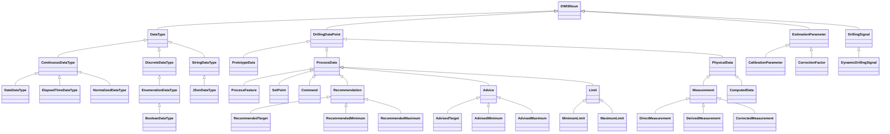
## DataType <!-- NOUN -->
- Display name: Data Type
- Parent class: [DWISNoun](./DWISSemantics.md#DWISNoun)
- Description: 
Characterizes the type of data that is stored in a signal.
- Definition set: DrillingDataSemantics
- Examples:
```dwis wobType
DataType:dataType
DrillingDataPoint:weightOnBit
weightOnBit BelongsToClass dataType
```
An example semantic graph looks like as follow:
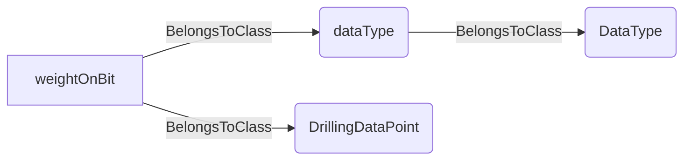
An example SparQL query looks like this:
```sparql
PREFIX rdf: <http://www.w3.org/1999/02/22-rdf-syntax-ns#>
PREFIX ddhub: <http://ddhub.no/>
PREFIX quantity: <http://ddhub.no/UnitAndQuantity>
SELECT ?wobType
WHERE {
	?dataType rdf:type ddhub:DataType .
	?weightOnBit rdf:type ddhub:DrillingDataPoint .
	?weightOnBit rdf:type ddhub:dataType .
}
```
This example defines that the weight-on-bit signal has a data type.
## ContinuousDataType <!-- NOUN -->
- Display name: Continuous Data Type
- Parent class: [DataType](./DrillingDataSemantics.md#DataType)
- Description: 
Specifies that the data is continuous.
- Definition set: DrillingDataSemantics
- Examples:
```dwis continuousWob
ContinuousDataType:continuous
DrillingDataPoint:weightOnBit
weightOnBit BelongsToClass continuous
```
An example semantic graph looks like as follow:
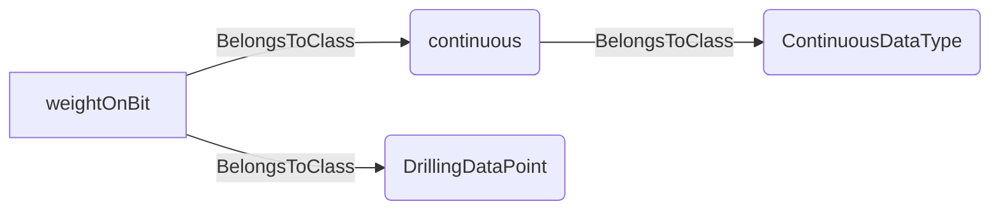
An example SparQL query looks like this:
```sparql
PREFIX rdf: <http://www.w3.org/1999/02/22-rdf-syntax-ns#>
PREFIX ddhub: <http://ddhub.no/>
PREFIX quantity: <http://ddhub.no/UnitAndQuantity>
SELECT ?continuousWob
WHERE {
	?continuous rdf:type ddhub:ContinuousDataType .
	?weightOnBit rdf:type ddhub:DrillingDataPoint .
	?weightOnBit rdf:type ddhub:continuous .
}
```
This example assigns a continuous type to weight on bit.
## DateDataType <!-- NOUN -->
- Display name: Date Data Type
- Parent class: [ContinuousDataType](./DrillingDataSemantics.md#ContinuousDataType)
- Description: 
Indicates that the data is a date.
- Definition set: DrillingDataSemantics
- Examples:
```dwis spudDateType
DateDataType:dateType
DrillingDataPoint:spudDate
spudDate BelongsToClass dateType
```
An example semantic graph looks like as follow:
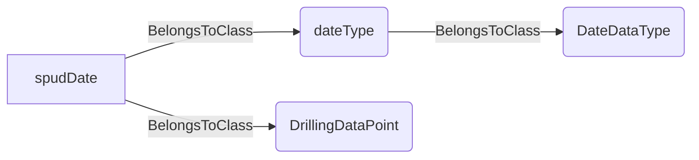
An example SparQL query looks like this:
```sparql
PREFIX rdf: <http://www.w3.org/1999/02/22-rdf-syntax-ns#>
PREFIX ddhub: <http://ddhub.no/>
PREFIX quantity: <http://ddhub.no/UnitAndQuantity>
SELECT ?spudDateType
WHERE {
	?dateType rdf:type ddhub:DateDataType .
	?spudDate rdf:type ddhub:DrillingDataPoint .
	?spudDate rdf:type ddhub:dateType .
}
```
This example states that the spud date signal is a date.
## ElapsedTimeDataType <!-- NOUN -->
- Display name: Elapsed Time Data Type
- Parent class: [ContinuousDataType](./DrillingDataSemantics.md#ContinuousDataType)
- Description: 
Indicates that the data is an elapsed time.
- Definition set: DrillingDataSemantics
- Examples:
```dwis circulationElapsed
ElapsedTimeDataType:elapsedType
DrillingDataPoint:circulationDuration
circulationDuration BelongsToClass elapsedType
```
An example semantic graph looks like as follow:
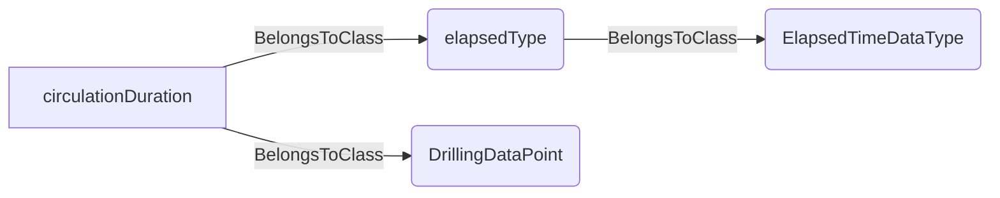
An example SparQL query looks like this:
```sparql
PREFIX rdf: <http://www.w3.org/1999/02/22-rdf-syntax-ns#>
PREFIX ddhub: <http://ddhub.no/>
PREFIX quantity: <http://ddhub.no/UnitAndQuantity>
SELECT ?circulationElapsed
WHERE {
	?elapsedType rdf:type ddhub:ElapsedTimeDataType .
	?circulationDuration rdf:type ddhub:DrillingDataPoint .
	?circulationDuration rdf:type ddhub:elapsedType .
}
```
This example tags circulation duration as elapsed time.
## NormalizedDataType <!-- NOUN -->
- Display name: Normalized Data Type
- Parent class: [ContinuousDataType](./DrillingDataSemantics.md#ContinuousDataType)
- Description: 
Indicates that the data has been normalized and stays between 0 and 1.
- Definition set: DrillingDataSemantics
- Examples:
```dwis normalizedTorque
NormalizedDataType:normalized
DrillingDataPoint:normalizedTorqueRatio
normalizedTorqueRatio BelongsToClass normalized
```
An example semantic graph looks like as follow:
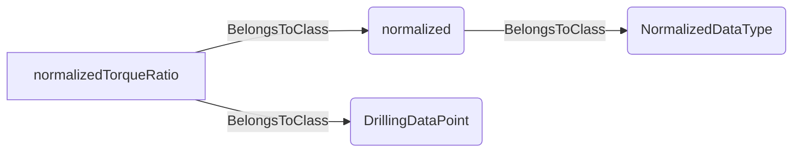
An example SparQL query looks like this:
```sparql
PREFIX rdf: <http://www.w3.org/1999/02/22-rdf-syntax-ns#>
PREFIX ddhub: <http://ddhub.no/>
PREFIX quantity: <http://ddhub.no/UnitAndQuantity>
SELECT ?normalizedTorque
WHERE {
	?normalized rdf:type ddhub:NormalizedDataType .
	?normalizedTorqueRatio rdf:type ddhub:DrillingDataPoint .
	?normalizedTorqueRatio rdf:type ddhub:normalized .
}
```
This example marks a normalized torque ratio between 0 and 1.
## DiscreteDataType <!-- NOUN -->
- Display name: Discrete Data Type
- Parent class: [DataType](./DrillingDataSemantics.md#DataType)
- Description: 
Specifies that the data is discrete.
- Definition set: DrillingDataSemantics
- Examples:
```dwis standStatusType
DiscreteDataType:discrete
DrillingDataPoint:standStatus
standStatus BelongsToClass discrete
```
An example semantic graph looks like as follow:
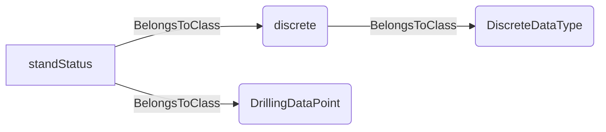
An example SparQL query looks like this:
```sparql
PREFIX rdf: <http://www.w3.org/1999/02/22-rdf-syntax-ns#>
PREFIX ddhub: <http://ddhub.no/>
PREFIX quantity: <http://ddhub.no/UnitAndQuantity>
SELECT ?standStatusType
WHERE {
	?discrete rdf:type ddhub:DiscreteDataType .
	?standStatus rdf:type ddhub:DrillingDataPoint .
	?standStatus rdf:type ddhub:discrete .
}
```
This example declares a stand status as discrete.
## EnumerationDataType <!-- NOUN -->
- Display name: Enumeration Data Type
- Parent class: [DiscreteDataType](./DrillingDataSemantics.md#DiscreteDataType)
- Description: 
Indicates that the data is an enumeration.
- Definition set: DrillingDataSemantics
- Examples:
```dwis connectionStateType
EnumerationDataType:enumType
DrillingDataPoint:connectionState
connectionState BelongsToClass enumType
```
An example semantic graph looks like as follow:
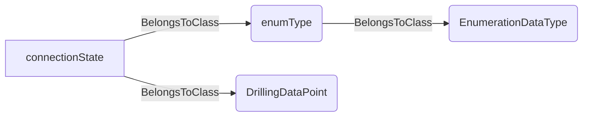
An example SparQL query looks like this:
```sparql
PREFIX rdf: <http://www.w3.org/1999/02/22-rdf-syntax-ns#>
PREFIX ddhub: <http://ddhub.no/>
PREFIX quantity: <http://ddhub.no/UnitAndQuantity>
SELECT ?connectionStateType
WHERE {
	?enumType rdf:type ddhub:EnumerationDataType .
	?connectionState rdf:type ddhub:DrillingDataPoint .
	?connectionState rdf:type ddhub:enumType .
}
```
This example assigns an enumeration type to connection state.
## BooleanDataType <!-- NOUN -->
- Display name: Boolean Data Type
- Parent class: [EnumerationDataType](./DrillingDataSemantics.md#EnumerationDataType)
- Description: 
Indicates that the data is a boolean.
- Definition set: DrillingDataSemantics
- Examples:
```dwis circulationFlagType
BooleanDataType:booleanType
DrillingDataPoint:isCirculating
isCirculating BelongsToClass booleanType
```
An example semantic graph looks like as follow:
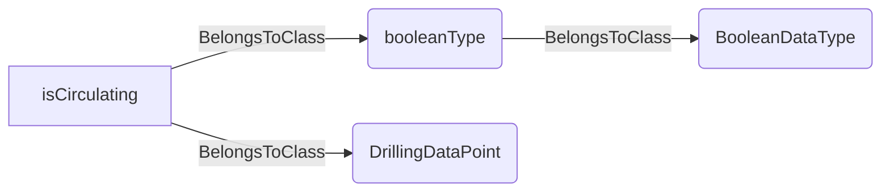
An example SparQL query looks like this:
```sparql
PREFIX rdf: <http://www.w3.org/1999/02/22-rdf-syntax-ns#>
PREFIX ddhub: <http://ddhub.no/>
PREFIX quantity: <http://ddhub.no/UnitAndQuantity>
SELECT ?circulationFlagType
WHERE {
	?booleanType rdf:type ddhub:BooleanDataType .
	?isCirculating rdf:type ddhub:DrillingDataPoint .
	?isCirculating rdf:type ddhub:booleanType .
}
```
This example sets the circulation flag as boolean.
## StringDataType <!-- NOUN -->
- Display name: String Data Type
- Parent class: [DataType](./DrillingDataSemantics.md#DataType)
- Description: 
Specifies that the data is a string.
- Definition set: DrillingDataSemantics
- Examples:
```dwis jobIdType
StringDataType:stringType
DrillingDataPoint:jobIdentifier
jobIdentifier BelongsToClass stringType
```
An example semantic graph looks like as follow:
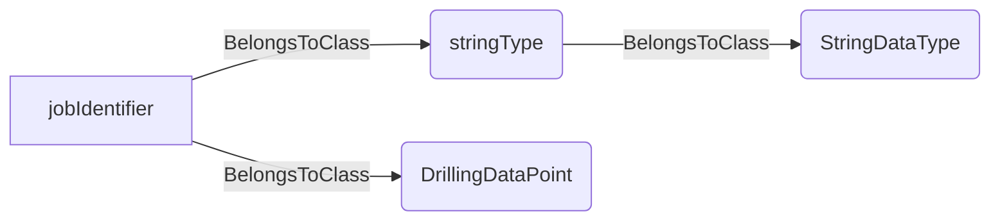
An example SparQL query looks like this:
```sparql
PREFIX rdf: <http://www.w3.org/1999/02/22-rdf-syntax-ns#>
PREFIX ddhub: <http://ddhub.no/>
PREFIX quantity: <http://ddhub.no/UnitAndQuantity>
SELECT ?jobIdType
WHERE {
	?stringType rdf:type ddhub:StringDataType .
	?jobIdentifier rdf:type ddhub:DrillingDataPoint .
	?jobIdentifier rdf:type ddhub:stringType .
}
```
This example marks a job identifier as string data.
## JSonDataType <!-- NOUN -->
- Display name: JSon Data Type
- Parent class: [StringDataType](./DrillingDataSemantics.md#StringDataType)
- Description: 
Specifies that the data is a string that contains the serialization in Json of an object.
- Definition set: DrillingDataSemantics
- Examples:
```dwis bhaJson
JSonDataType:jsonType
DrillingDataPoint:bhaConfiguration
bhaConfiguration BelongsToClass jsonType
```
An example semantic graph looks like as follow:
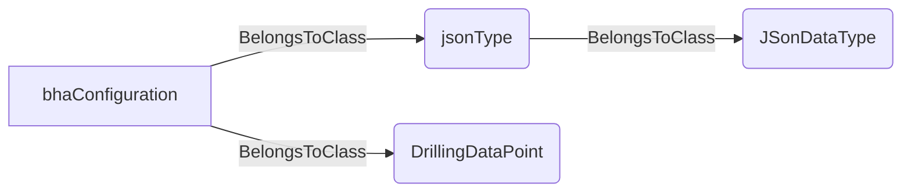
An example SparQL query looks like this:
```sparql
PREFIX rdf: <http://www.w3.org/1999/02/22-rdf-syntax-ns#>
PREFIX ddhub: <http://ddhub.no/>
PREFIX quantity: <http://ddhub.no/UnitAndQuantity>
SELECT ?bhaJson
WHERE {
	?jsonType rdf:type ddhub:JSonDataType .
	?bhaConfiguration rdf:type ddhub:DrillingDataPoint .
	?bhaConfiguration rdf:type ddhub:jsonType .
}
```
This example stores BHA configuration as JSON.
## DrillingDataPoint <!-- NOUN -->
- Display name: DrillingDataPoint
- Parent class: [DWISNoun](./DWISSemantics.md#DWISNoun)
- Attributes:
  - IsValid
    - Type: bool
    - Description: 
- Description: 
Main type of DDHub data. Represents a drilling signal. Can be a dynamic signal (linked to a ValueNode) or a static parameter.
- Definition set: DrillingDataSemantics
- Examples:
```dwis wobSignal
DrillingDataPoint:weightOnBit
DynamicDrillingSignal:wobSeries
weightOnBit HasDynamicValue wobSeries
```
An example semantic graph looks like as follow:
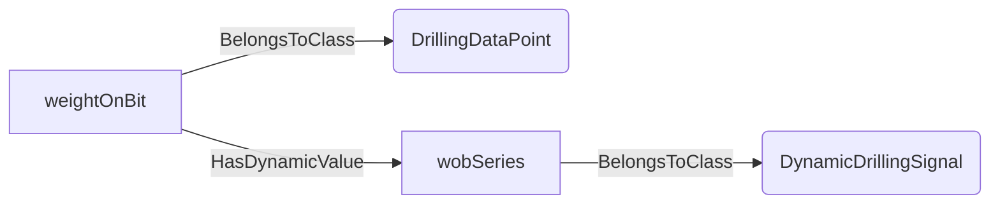
An example SparQL query looks like this:
```sparql
PREFIX rdf: <http://www.w3.org/1999/02/22-rdf-syntax-ns#>
PREFIX ddhub: <http://ddhub.no/>
PREFIX quantity: <http://ddhub.no/UnitAndQuantity>
SELECT ?wobSignal
WHERE {
	?weightOnBit rdf:type ddhub:DrillingDataPoint .
	?wobSeries rdf:type ddhub:DynamicDrillingSignal .
	?weightOnBit ddhub:HasDynamicValue ?wobSeries .
}
```
This example shows a drilling data point holding a dynamic time series.
## PrototypeData <!-- NOUN -->
- Display name: PrototypeData
- Parent class: [DrillingDataPoint](./DrillingDataSemantics.md#DrillingDataPoint)
- Description: 
Represents a prototypical or design value of a drilling signal used for templates or baselines.
- Definition set: DrillingDataSemantics
- Examples:
```dwis prototypeWob
PrototypeData:prototypeWob
DrillingDataPoint:weightOnBit
weightOnBit HasStaticValue prototypeWob
```
An example semantic graph looks like as follow:
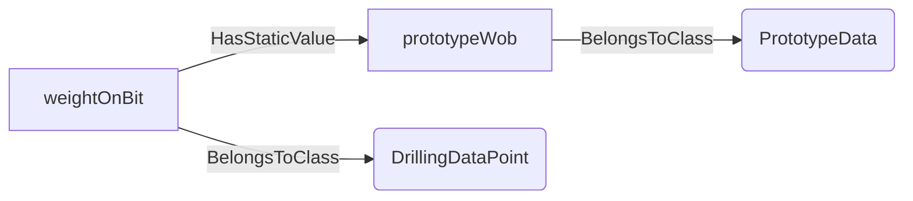
An example SparQL query looks like this:
```sparql
PREFIX rdf: <http://www.w3.org/1999/02/22-rdf-syntax-ns#>
PREFIX ddhub: <http://ddhub.no/>
PREFIX quantity: <http://ddhub.no/UnitAndQuantity>
SELECT ?prototypeWob
WHERE {
	?prototypeWob rdf:type ddhub:PrototypeData .
	?weightOnBit rdf:type ddhub:DrillingDataPoint .
	?weightOnBit ddhub:HasStaticValue ?prototypeWob .
}
```
This example stores a prototype weight-on-bit value.
## ProcessData <!-- NOUN -->
- Display name: ProcessData
- Parent class: [DrillingDataPoint](./DrillingDataSemantics.md#DrillingDataPoint)
- Description: 
A drilling signal directly tied to process control or monitoring.
- Definition set: DrillingDataSemantics
- Examples:
```dwis flowRateSignal
ProcessData:flowRate
DynamicDrillingSignal:flowRateSeries
flowRate HasDynamicValue flowRateSeries
```
An example semantic graph looks like as follow:
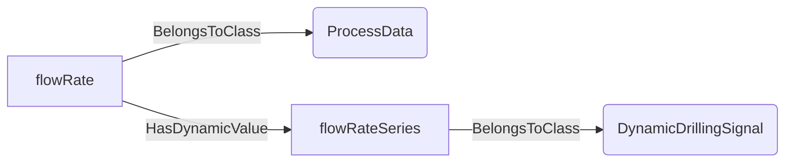
An example SparQL query looks like this:
```sparql
PREFIX rdf: <http://www.w3.org/1999/02/22-rdf-syntax-ns#>
PREFIX ddhub: <http://ddhub.no/>
PREFIX quantity: <http://ddhub.no/UnitAndQuantity>
SELECT ?flowRateSignal
WHERE {
	?flowRate rdf:type ddhub:ProcessData .
	?flowRateSeries rdf:type ddhub:DynamicDrillingSignal .
	?flowRate ddhub:HasDynamicValue ?flowRateSeries .
}
```
This example captures flow rate as process data.
## ProcessFeature <!-- NOUN -->
- Display name: Process feature
- Parent class: [ProcessData](./DrillingDataSemantics.md#ProcessData)
- Description: 
This Noun is used for signals that describe a process feature, typically assuming that this is a static signal.
- Definition set: DrillingDataSemantics
- Examples:
```dwis isUsedAutoDrillerWithOnlyLimit
DrillingSignal:isUsedAutoDrillerWithOnlyLimit
ProcessFeature:isUsedAutoDrillerWithOnlyLimit#01
BooleanDataType:isUsedAutoDrillerWithOnlyLimit#01
isUsedAutoDrillerWithOnlyLimit#01 HasStaticValue isUsedAutoDrillerWithOnlyLimit
ControllerFunction:AutoDriller
StableAxialVelocityObjective:stableROP
StableAxialForceObjective:stableWOB
AutoDriller ImplementsObjective stableROP
AutoDriller ImplementsObjective stableWOB
isUsedAutoDrillerWithOnlyLimit#01 IsFeatureSignalFor AutoDriller
OnlyLimits:onlyLimits
isUsedAutoDrillerWithOnlyLimit#01 IsRelatedToDrillingLimit onlyLimits
```
An example semantic graph looks like as follow:
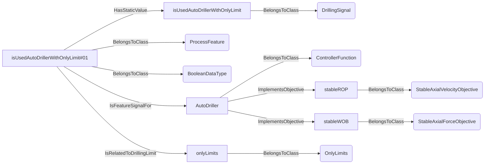
An example SparQL query looks like this:
```sparql
PREFIX rdf: <http://www.w3.org/1999/02/22-rdf-syntax-ns#>
PREFIX ddhub: <http://ddhub.no/>
PREFIX quantity: <http://ddhub.no/UnitAndQuantity>
SELECT ?isUsedAutoDrillerWithOnlyLimit
WHERE {
	?isUsedAutoDrillerWithOnlyLimit rdf:type ddhub:DrillingSignal .
	?isUsedAutoDrillerWithOnlyLimit#01 rdf:type ddhub:ProcessFeature .
	?isUsedAutoDrillerWithOnlyLimit#01 rdf:type ddhub:BooleanDataType .
	?isUsedAutoDrillerWithOnlyLimit#01 ddhub:HasStaticValue ?isUsedAutoDrillerWithOnlyLimit .
	?AutoDriller rdf:type ddhub:ControllerFunction .
	?stableROP rdf:type ddhub:StableAxialVelocityObjective .
	?stableWOB rdf:type ddhub:StableAxialForceObjective .
	?AutoDriller ddhub:ImplementsObjective ?stableROP .
	?AutoDriller ddhub:ImplementsObjective ?stableWOB .
	?isUsedAutoDrillerWithOnlyLimit#01 ddhub:IsFeatureSignalFor ?AutoDriller .
	?onlyLimits rdf:type ddhub:OnlyLimits .
	?isUsedAutoDrillerWithOnlyLimit#01 ddhub:IsRelatedToDrillingLimit ?onlyLimits .
}
```
## SetPoint <!-- NOUN -->
- Display name: Set-point
- Parent class: [ProcessData](./DrillingDataSemantics.md#ProcessData)
- Description: 
A process data point intended to serve as a target value for control.
- Definition set: DrillingDataSemantics
- Examples:
```dwis flowSetPoint
SetPoint:flowSetPoint
Controller:flowController
flowSetPoint IsSetPointFor flowController
```
An example semantic graph looks like as follow:
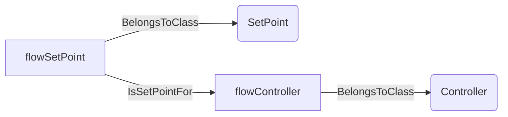
An example SparQL query looks like this:
```sparql
PREFIX rdf: <http://www.w3.org/1999/02/22-rdf-syntax-ns#>
PREFIX ddhub: <http://ddhub.no/>
PREFIX quantity: <http://ddhub.no/UnitAndQuantity>
SELECT ?flowSetPoint
WHERE {
	?flowSetPoint rdf:type ddhub:SetPoint .
	?flowController rdf:type ddhub:Controller .
	?flowSetPoint ddhub:IsSetPointFor ?flowController .
}
```
This example defines a flow-rate set-point for a controller.
## Command <!-- NOUN -->
- Display name: Command
- Parent class: [ProcessData](./DrillingDataSemantics.md#ProcessData)
- Description: 
A process data point used to instruct equipment or a controller.
- Definition set: DrillingDataSemantics
- Examples:
```dwis pumpCommand
Command:pumpStartCommand
ControlSystem:circulationDCS
pumpStartCommand IsCommandFor circulationDCS
```
An example semantic graph looks like as follow:
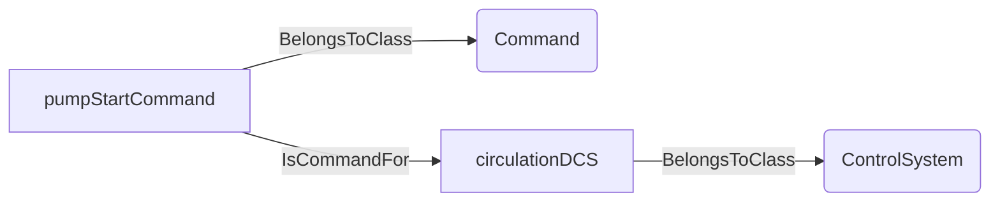
An example SparQL query looks like this:
```sparql
PREFIX rdf: <http://www.w3.org/1999/02/22-rdf-syntax-ns#>
PREFIX ddhub: <http://ddhub.no/>
PREFIX quantity: <http://ddhub.no/UnitAndQuantity>
SELECT ?pumpCommand
WHERE {
	?pumpStartCommand rdf:type ddhub:Command .
	?circulationDCS rdf:type ddhub:ControlSystem .
	?pumpStartCommand ddhub:IsCommandFor ?circulationDCS .
}
```
This example issues a start command to the circulation control system.
## Recommendation <!-- NOUN -->
- Display name: Recommendation
- Parent class: [ProcessData](./DrillingDataSemantics.md#ProcessData)
- Description: 
A suggested value or range for a process variable prior to operator acceptance.
- Definition set: DrillingDataSemantics
- Examples:
```dwis flowRecommendation
Recommendation:flowRateRecommendation
ControlSystem:circulationDCS
flowRateRecommendation IsSetPointRecommendationFor circulationDCS
```
An example semantic graph looks like as follow:
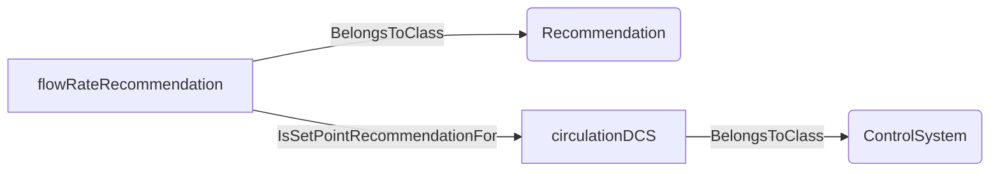
An example SparQL query looks like this:
```sparql
PREFIX rdf: <http://www.w3.org/1999/02/22-rdf-syntax-ns#>
PREFIX ddhub: <http://ddhub.no/>
PREFIX quantity: <http://ddhub.no/UnitAndQuantity>
SELECT ?flowRecommendation
WHERE {
	?flowRateRecommendation rdf:type ddhub:Recommendation .
	?circulationDCS rdf:type ddhub:ControlSystem .
	?flowRateRecommendation ddhub:IsSetPointRecommendationFor ?circulationDCS .
}
```
This example recommends a flow-rate to the circulation system.
## RecommendedTarget <!-- NOUN -->
- Display name: RecommendedTarget
- Parent class: [Recommendation](./DrillingDataSemantics.md#Recommendation)
- Description: 
A recommended single target value.
- Definition set: DrillingDataSemantics
- Examples:
```dwis wobTarget
RecommendedTarget:wobTarget
Controller:autoDrillerController
wobTarget IsSetPointRecommendationFor autoDrillerController
```
An example semantic graph looks like as follow:
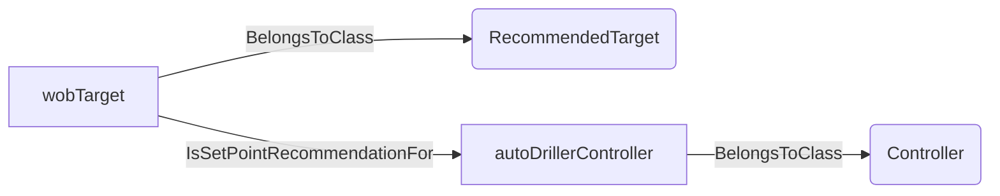
An example SparQL query looks like this:
```sparql
PREFIX rdf: <http://www.w3.org/1999/02/22-rdf-syntax-ns#>
PREFIX ddhub: <http://ddhub.no/>
PREFIX quantity: <http://ddhub.no/UnitAndQuantity>
SELECT ?wobTarget
WHERE {
	?wobTarget rdf:type ddhub:RecommendedTarget .
	?autoDrillerController rdf:type ddhub:Controller .
	?wobTarget ddhub:IsSetPointRecommendationFor ?autoDrillerController .
}
```
This example recommends a weight-on-bit target to the autodriller.
## RecommendedMinimum <!-- NOUN -->
- Display name: RecommendedMinimum
- Parent class: [Recommendation](./DrillingDataSemantics.md#Recommendation)
- Description: 
A recommended lower bound for a process variable.
- Definition set: DrillingDataSemantics
- Examples:
```dwis minRpmRec
RecommendedMinimum:minRpmRecommendation
RotationControlSystem:rotationDCS
minRpmRecommendation IsSetPointMinimumRecommendationFor rotationDCS
```
An example semantic graph looks like as follow:
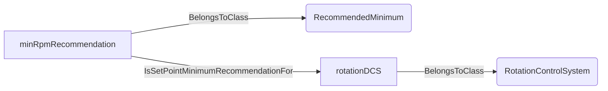
An example SparQL query looks like this:
```sparql
PREFIX rdf: <http://www.w3.org/1999/02/22-rdf-syntax-ns#>
PREFIX ddhub: <http://ddhub.no/>
PREFIX quantity: <http://ddhub.no/UnitAndQuantity>
SELECT ?minRpmRec
WHERE {
	?minRpmRecommendation rdf:type ddhub:RecommendedMinimum .
	?rotationDCS rdf:type ddhub:RotationControlSystem .
	?minRpmRecommendation ddhub:IsSetPointMinimumRecommendationFor ?rotationDCS .
}
```
This example provides a minimum RPM recommendation.
## RecommendedMaximum <!-- NOUN -->
- Display name: RecommendedMaximum
- Parent class: [Recommendation](./DrillingDataSemantics.md#Recommendation)
- Description: 
A recommended upper bound for a process variable.
- Definition set: DrillingDataSemantics
- Examples:
```dwis maxRpmRec
RecommendedMaximum:maxRpmRecommendation
RotationControlSystem:rotationDCS
maxRpmRecommendation IsSetPointMaximumRecommendationFor rotationDCS
```
An example semantic graph looks like as follow:
```mermaid
graph LR
	N0000[maxRpmRecommendation] -->|BelongsToClass| N0001(RecommendedMaximum) 
	N0002[rotationDCS] -->|BelongsToClass| N0003(RotationControlSystem) 
	N0000[maxRpmRecommendation] -->|IsSetPointMaximumRecommendationFor| N0002[rotationDCS] 
```
An example SparQL query looks like this:
```sparql
PREFIX rdf: <http://www.w3.org/1999/02/22-rdf-syntax-ns#>
PREFIX ddhub: <http://ddhub.no/>
PREFIX quantity: <http://ddhub.no/UnitAndQuantity>
SELECT ?maxRpmRec
WHERE {
	?maxRpmRecommendation rdf:type ddhub:RecommendedMaximum .
	?rotationDCS rdf:type ddhub:RotationControlSystem .
	?maxRpmRecommendation ddhub:IsSetPointMaximumRecommendationFor ?rotationDCS .
}
```
This example provides a maximum RPM recommendation.
## Advice <!-- NOUN -->
- Display name: Advice
- Parent class: [ProcessData](./DrillingDataSemantics.md#ProcessData)
- Description: 
An advisory value or range proposed by a system or expert, typically requiring confirmation.
- Definition set: DrillingDataSemantics
- Examples:
```dwis flowAdvice
Advice:flowAdvice
ControlSystem:circulationDCS
flowAdvice IsSetPointAdviceFor circulationDCS
```
An example semantic graph looks like as follow:
```mermaid
graph LR
	N0000[flowAdvice] -->|BelongsToClass| N0001(Advice) 
	N0002[circulationDCS] -->|BelongsToClass| N0003(ControlSystem) 
	N0000[flowAdvice] -->|IsSetPointAdviceFor| N0002[circulationDCS] 
```
An example SparQL query looks like this:
```sparql
PREFIX rdf: <http://www.w3.org/1999/02/22-rdf-syntax-ns#>
PREFIX ddhub: <http://ddhub.no/>
PREFIX quantity: <http://ddhub.no/UnitAndQuantity>
SELECT ?flowAdvice
WHERE {
	?flowAdvice rdf:type ddhub:Advice .
	?circulationDCS rdf:type ddhub:ControlSystem .
	?flowAdvice ddhub:IsSetPointAdviceFor ?circulationDCS .
}
```
This example provides advisory flow guidance.
## AdvisedTarget <!-- NOUN -->
- Display name: AdvisedTarget
- Parent class: [Advice](./DrillingDataSemantics.md#Advice)
- Description: 
An advised single target value.
- Definition set: DrillingDataSemantics
- Examples:
```dwis advisedWob
AdvisedTarget:advisedWob
Controller:autoDrillerController
advisedWob IsSetPointAdviceFor autoDrillerController
```
An example semantic graph looks like as follow:
```mermaid
graph LR
	N0000[advisedWob] -->|BelongsToClass| N0001(AdvisedTarget) 
	N0002[autoDrillerController] -->|BelongsToClass| N0003(Controller) 
	N0000[advisedWob] -->|IsSetPointAdviceFor| N0002[autoDrillerController] 
```
An example SparQL query looks like this:
```sparql
PREFIX rdf: <http://www.w3.org/1999/02/22-rdf-syntax-ns#>
PREFIX ddhub: <http://ddhub.no/>
PREFIX quantity: <http://ddhub.no/UnitAndQuantity>
SELECT ?advisedWob
WHERE {
	?advisedWob rdf:type ddhub:AdvisedTarget .
	?autoDrillerController rdf:type ddhub:Controller .
	?advisedWob ddhub:IsSetPointAdviceFor ?autoDrillerController .
}
```
This example advises a weight-on-bit target.
## AdvisedMinimum <!-- NOUN -->
- Display name: AdvisedMinimum
- Parent class: [Advice](./DrillingDataSemantics.md#Advice)
- Description: 
An advised lower bound for a process variable.
- Definition set: DrillingDataSemantics
- Examples:
```dwis advisedMinFlow
AdvisedMinimum:advisedMinFlow
CirculationControlSystem:circulationDCS
advisedMinFlow IsSetPointMinimumAdviceFor circulationDCS
```
An example semantic graph looks like as follow:
```mermaid
graph LR
	N0000[advisedMinFlow] -->|BelongsToClass| N0001(AdvisedMinimum) 
	N0002[circulationDCS] -->|BelongsToClass| N0003(CirculationControlSystem) 
	N0000[advisedMinFlow] -->|IsSetPointMinimumAdviceFor| N0002[circulationDCS] 
```
An example SparQL query looks like this:
```sparql
PREFIX rdf: <http://www.w3.org/1999/02/22-rdf-syntax-ns#>
PREFIX ddhub: <http://ddhub.no/>
PREFIX quantity: <http://ddhub.no/UnitAndQuantity>
SELECT ?advisedMinFlow
WHERE {
	?advisedMinFlow rdf:type ddhub:AdvisedMinimum .
	?circulationDCS rdf:type ddhub:CirculationControlSystem .
	?advisedMinFlow ddhub:IsSetPointMinimumAdviceFor ?circulationDCS .
}
```
This example advises a minimum flow limit.
## AdvisedMaximum <!-- NOUN -->
- Display name: AdvisedMaximum
- Parent class: [Advice](./DrillingDataSemantics.md#Advice)
- Description: 
An advised upper bound for a process variable.
- Definition set: DrillingDataSemantics
- Examples:
```dwis advisedMaxTorque
AdvisedMaximum:advisedMaxTorque
RotationControlSystem:rotationDCS
advisedMaxTorque IsSetPointMaximumAdviceFor rotationDCS
```
An example semantic graph looks like as follow:
```mermaid
graph LR
	N0000[advisedMaxTorque] -->|BelongsToClass| N0001(AdvisedMaximum) 
	N0002[rotationDCS] -->|BelongsToClass| N0003(RotationControlSystem) 
	N0000[advisedMaxTorque] -->|IsSetPointMaximumAdviceFor| N0002[rotationDCS] 
```
An example SparQL query looks like this:
```sparql
PREFIX rdf: <http://www.w3.org/1999/02/22-rdf-syntax-ns#>
PREFIX ddhub: <http://ddhub.no/>
PREFIX quantity: <http://ddhub.no/UnitAndQuantity>
SELECT ?advisedMaxTorque
WHERE {
	?advisedMaxTorque rdf:type ddhub:AdvisedMaximum .
	?rotationDCS rdf:type ddhub:RotationControlSystem .
	?advisedMaxTorque ddhub:IsSetPointMaximumAdviceFor ?rotationDCS .
}
```
This example advises a maximum torque limit.
## Limit <!-- NOUN -->
- Display name: Limit
- Parent class: [ProcessData](./DrillingDataSemantics.md#ProcessData)
- Description: 
A boundary value that should not be exceeded by a process variable.
- Definition set: DrillingDataSemantics
- Examples:
```dwis wobLimit
Limit:wobLimit
ControllerFunction:autoDriller
wobLimit IsLimitFor autoDriller
```
An example semantic graph looks like as follow:
```mermaid
graph LR
	N0000[wobLimit] -->|BelongsToClass| N0001(Limit) 
	N0002[autoDriller] -->|BelongsToClass| N0003(ControllerFunction) 
	N0000[wobLimit] -->|IsLimitFor| N0002[autoDriller] 
```
An example SparQL query looks like this:
```sparql
PREFIX rdf: <http://www.w3.org/1999/02/22-rdf-syntax-ns#>
PREFIX ddhub: <http://ddhub.no/>
PREFIX quantity: <http://ddhub.no/UnitAndQuantity>
SELECT ?wobLimit
WHERE {
	?wobLimit rdf:type ddhub:Limit .
	?autoDriller rdf:type ddhub:ControllerFunction .
	?wobLimit ddhub:IsLimitFor ?autoDriller .
}
```
This example sets a WOB limit for the autodriller.
## MinimumLimit <!-- NOUN -->
- Display name: Minimum Limit
- Parent class: [Limit](./DrillingDataSemantics.md#Limit)
- Description: 
A lower boundary for a process variable.
- Definition set: DrillingDataSemantics
- Examples:
```dwis minFlowLimit
MinimumLimit:minFlowLimit
CirculationControlSystem:circulationDCS
minFlowLimit IsMinimumLimitFor circulationDCS
```
An example semantic graph looks like as follow:
```mermaid
graph LR
	N0000[minFlowLimit] -->|BelongsToClass| N0001(MinimumLimit) 
	N0002[circulationDCS] -->|BelongsToClass| N0003(CirculationControlSystem) 
	N0000[minFlowLimit] -->|IsMinimumLimitFor| N0002[circulationDCS] 
```
An example SparQL query looks like this:
```sparql
PREFIX rdf: <http://www.w3.org/1999/02/22-rdf-syntax-ns#>
PREFIX ddhub: <http://ddhub.no/>
PREFIX quantity: <http://ddhub.no/UnitAndQuantity>
SELECT ?minFlowLimit
WHERE {
	?minFlowLimit rdf:type ddhub:MinimumLimit .
	?circulationDCS rdf:type ddhub:CirculationControlSystem .
	?minFlowLimit ddhub:IsMinimumLimitFor ?circulationDCS .
}
```
This example provides a minimum flow limit.
## MaximumLimit <!-- NOUN -->
- Display name: Maximum Limit
- Parent class: [Limit](./DrillingDataSemantics.md#Limit)
- Description: 
An upper boundary for a process variable.
- Definition set: DrillingDataSemantics
- Examples:
```dwis maxFlowLimit
MaximumLimit:maxFlowLimit
CirculationControlSystem:circulationDCS
maxFlowLimit IsMaximumLimitFor circulationDCS
```
An example semantic graph looks like as follow:
```mermaid
graph LR
	N0000[maxFlowLimit] -->|BelongsToClass| N0001(MaximumLimit) 
	N0002[circulationDCS] -->|BelongsToClass| N0003(CirculationControlSystem) 
	N0000[maxFlowLimit] -->|IsMaximumLimitFor| N0002[circulationDCS] 
```
An example SparQL query looks like this:
```sparql
PREFIX rdf: <http://www.w3.org/1999/02/22-rdf-syntax-ns#>
PREFIX ddhub: <http://ddhub.no/>
PREFIX quantity: <http://ddhub.no/UnitAndQuantity>
SELECT ?maxFlowLimit
WHERE {
	?maxFlowLimit rdf:type ddhub:MaximumLimit .
	?circulationDCS rdf:type ddhub:CirculationControlSystem .
	?maxFlowLimit ddhub:IsMaximumLimitFor ?circulationDCS .
}
```
This example provides a maximum flow limit.
## PhysicalData <!-- NOUN -->
- Display name: PhysicalData
- Parent class: [DrillingDataPoint](./DrillingDataSemantics.md#DrillingDataPoint)
- Description: 
Represents a physical quantity measured or computed from the drilling system.
- Definition set: DrillingDataSemantics
- Examples:
```dwis standpipePressure
PhysicalData:standpipePressure
DynamicDrillingSignal:standpipeSeries
standpipePressure HasDynamicValue standpipeSeries
```
An example semantic graph looks like as follow:
```mermaid
graph LR
	N0000[standpipePressure] -->|BelongsToClass| N0001(PhysicalData) 
	N0002[standpipeSeries] -->|BelongsToClass| N0003(DynamicDrillingSignal) 
	N0000[standpipePressure] -->|HasDynamicValue| N0002[standpipeSeries] 
```
An example SparQL query looks like this:
```sparql
PREFIX rdf: <http://www.w3.org/1999/02/22-rdf-syntax-ns#>
PREFIX ddhub: <http://ddhub.no/>
PREFIX quantity: <http://ddhub.no/UnitAndQuantity>
SELECT ?standpipePressure
WHERE {
	?standpipePressure rdf:type ddhub:PhysicalData .
	?standpipeSeries rdf:type ddhub:DynamicDrillingSignal .
	?standpipePressure ddhub:HasDynamicValue ?standpipeSeries .
}
```
This example stores a physical standpipe pressure signal.
## Measurement <!-- NOUN -->
- Display name: Measurement
- Parent class: [PhysicalData](./DrillingDataSemantics.md#PhysicalData)
- Description: 
Represents individuals that are measured by some instrument and whose value can be compared with another measurement.
- Definition set: DrillingDataSemantics
- Examples:
```dwis hookloadMeasurement
Measurement:hookloadMeasurement
DynamicDrillingSignal:hookloadSeries
hookloadMeasurement HasDynamicValue hookloadSeries
```
An example semantic graph looks like as follow:
```mermaid
graph LR
	N0000[hookloadMeasurement] -->|BelongsToClass| N0001(Measurement) 
	N0002[hookloadSeries] -->|BelongsToClass| N0003(DynamicDrillingSignal) 
	N0000[hookloadMeasurement] -->|HasDynamicValue| N0002[hookloadSeries] 
```
An example SparQL query looks like this:
```sparql
PREFIX rdf: <http://www.w3.org/1999/02/22-rdf-syntax-ns#>
PREFIX ddhub: <http://ddhub.no/>
PREFIX quantity: <http://ddhub.no/UnitAndQuantity>
SELECT ?hookloadMeasurement
WHERE {
	?hookloadMeasurement rdf:type ddhub:Measurement .
	?hookloadSeries rdf:type ddhub:DynamicDrillingSignal .
	?hookloadMeasurement ddhub:HasDynamicValue ?hookloadSeries .
}
```
This example captures hookload as a measurement.
## DirectMeasurement <!-- NOUN -->
- Display name: Direct Measurement
- Parent class: [Measurement](./DrillingDataSemantics.md#Measurement)
- Description: 
A measurement obtained directly without corrections or signal processing.
- Definition set: DrillingDataSemantics
- Examples:
```dwis MeasuredPressureExample
DirectMeasurement:OmniViewMeasuredPressure#01
OmniViewMeasuredPressure#01 BelongsToClass ContinuousDataType
OmniViewMeasuredPressure#01 HasDynamicValue OmniViewMeasuredPressure
OmniViewMeasuredPressure#01 IsOfMeasurableQuantity PressureDrilling
TopSideTelemetry:topSideTelemetry
OmniViewMeasuredPressure#01 IsTransmittedBy topSideTelemetry
DynamicDrillingSignal:Sigma_OmniViewMeasuredPressure
DrillingDataPoint:Sigma_OmniViewMeasuredPressure#01
Sigma_OmniViewMeasuredPressure#01 BelongsToClass ContinuousDataType
Sigma_OmniViewMeasuredPressure#01 IsOfMeasurableQuantity PressureDrilling
Sigma_OmniViewMeasuredPressure#01 HasDynamicValue Sigma_OmniViewMeasuredPressure
GaussianUncertainty:OmniViewMeasuredPressureGaussianUncertainty#01
OmniViewMeasuredPressure#01 HasUncertainty OmniViewMeasuredPressureGaussianUncertainty#01
OmniViewMeasuredPressureGaussianUncertainty#01 HasUncertaintyMean OmniViewMeasuredPressure#01
OmniViewMeasuredPressureGaussianUncertainty#01 HasUncertaintyStandardDeviation Sigma_OmniViewMeasuredPressure#01
MeasurementDevice:OmniViewDevice#01
OmniViewDevice#01 BelongsToClass HydraulicLogicalElement
OmniViewMeasuredPressure#01 IsMeasuredBy OmniViewDevice#01
SwivelLogical:SwivelLogical#01
OmniViewDevice#01 IsHydraulicConnectedTo SwivelLogical#01
OmniViewMeasuredPressure#01 IsHydraulicallyLocatedAt SwivelLogical#01
TopOfStringJunction:topOfStringJunction#01
HydraulicBranch:inletHydraulicBranch#01
topOfStringJunction#01 HasUpstreamBranch inletHydraulicBranch#01
OmniViewMeasuredPressure#01 IsAssociatedToHydraulicBranch inletHydraulicBranch#01
InstrumentationCompany:Petromar#01
OmniViewMeasuredPressure#01 IsProvidedBy Petromar#01
```
An example semantic graph looks like as follow:
```mermaid
graph LR
	N0000[OmniViewMeasuredPressure#01] -->|BelongsToClass| N0001(DirectMeasurement) 
	N0000[OmniViewMeasuredPressure#01] -->|BelongsToClass| N0002(ContinuousDataType) 
	N0000[OmniViewMeasuredPressure#01] -->|HasDynamicValue| N0003[OmniViewMeasuredPressure] 
	N0000[OmniViewMeasuredPressure#01] -->|IsOfMeasurableQuantity| N0004[PressureDrilling] 
	N0005[topSideTelemetry] -->|BelongsToClass| N0006(TopSideTelemetry) 
	N0000[OmniViewMeasuredPressure#01] -->|IsTransmittedBy| N0005[topSideTelemetry] 
	N0007[Sigma_OmniViewMeasuredPressure] -->|BelongsToClass| N0008(DynamicDrillingSignal) 
	N0009[Sigma_OmniViewMeasuredPressure#01] -->|BelongsToClass| N0010(DrillingDataPoint) 
	N0009[Sigma_OmniViewMeasuredPressure#01] -->|BelongsToClass| N0002(ContinuousDataType) 
	N0009[Sigma_OmniViewMeasuredPressure#01] -->|IsOfMeasurableQuantity| N0004[PressureDrilling] 
	N0009[Sigma_OmniViewMeasuredPressure#01] -->|HasDynamicValue| N0007[Sigma_OmniViewMeasuredPressure] 
	N0011[OmniViewMeasuredPressureGaussianUncertainty#01] -->|BelongsToClass| N0012(GaussianUncertainty) 
	N0000[OmniViewMeasuredPressure#01] -->|HasUncertainty| N0011[OmniViewMeasuredPressureGaussianUncertainty#01] 
	N0011[OmniViewMeasuredPressureGaussianUncertainty#01] -->|HasUncertaintyMean| N0000[OmniViewMeasuredPressure#01] 
	N0011[OmniViewMeasuredPressureGaussianUncertainty#01] -->|HasUncertaintyStandardDeviation| N0009[Sigma_OmniViewMeasuredPressure#01] 
	N0013[OmniViewDevice#01] -->|BelongsToClass| N0014(MeasurementDevice) 
	N0013[OmniViewDevice#01] -->|BelongsToClass| N0015(HydraulicLogicalElement) 
	N0000[OmniViewMeasuredPressure#01] -->|IsMeasuredBy| N0013[OmniViewDevice#01] 
	N0016[SwivelLogical#01] -->|BelongsToClass| N0017(SwivelLogical) 
	N0013[OmniViewDevice#01] -->|IsHydraulicConnectedTo| N0016[SwivelLogical#01] 
	N0000[OmniViewMeasuredPressure#01] -->|IsHydraulicallyLocatedAt| N0016[SwivelLogical#01] 
	N0018[topOfStringJunction#01] -->|BelongsToClass| N0019(TopOfStringJunction) 
	N0020[inletHydraulicBranch#01] -->|BelongsToClass| N0021(HydraulicBranch) 
	N0018[topOfStringJunction#01] -->|HasUpstreamBranch| N0020[inletHydraulicBranch#01] 
	N0000[OmniViewMeasuredPressure#01] -->|IsAssociatedToHydraulicBranch| N0020[inletHydraulicBranch#01] 
	N0022[Petromar#01] -->|BelongsToClass| N0023(InstrumentationCompany) 
	N0000[OmniViewMeasuredPressure#01] -->|IsProvidedBy| N0022[Petromar#01] 
```
An example SparQL query looks like this:
```sparql
PREFIX rdf: <http://www.w3.org/1999/02/22-rdf-syntax-ns#>
PREFIX ddhub: <http://ddhub.no/>
PREFIX quantity: <http://ddhub.no/UnitAndQuantity>
SELECT ?MeasuredPressureExample
WHERE {
	?OmniViewMeasuredPressure#01 rdf:type ddhub:DirectMeasurement .
	?OmniViewMeasuredPressure#01 rdf:type ddhub:ContinuousDataType .
	?OmniViewMeasuredPressure#01 ddhub:HasDynamicValue ?OmniViewMeasuredPressure .
	?OmniViewMeasuredPressure#01 ddhub:IsOfMeasurableQuantity ?PressureDrilling .
	?topSideTelemetry rdf:type ddhub:TopSideTelemetry .
	?OmniViewMeasuredPressure#01 ddhub:IsTransmittedBy ?topSideTelemetry .
	?Sigma_OmniViewMeasuredPressure rdf:type ddhub:DynamicDrillingSignal .
	?Sigma_OmniViewMeasuredPressure#01 rdf:type ddhub:DrillingDataPoint .
	?Sigma_OmniViewMeasuredPressure#01 rdf:type ddhub:ContinuousDataType .
	?Sigma_OmniViewMeasuredPressure#01 ddhub:IsOfMeasurableQuantity ?PressureDrilling .
	?Sigma_OmniViewMeasuredPressure#01 ddhub:HasDynamicValue ?Sigma_OmniViewMeasuredPressure .
	?OmniViewMeasuredPressureGaussianUncertainty#01 rdf:type ddhub:GaussianUncertainty .
	?OmniViewMeasuredPressure#01 ddhub:HasUncertainty ?OmniViewMeasuredPressureGaussianUncertainty#01 .
	?OmniViewMeasuredPressureGaussianUncertainty#01 ddhub:HasUncertaintyMean ?OmniViewMeasuredPressure#01 .
	?OmniViewMeasuredPressureGaussianUncertainty#01 ddhub:HasUncertaintyStandardDeviation ?Sigma_OmniViewMeasuredPressure#01 .
	?OmniViewDevice#01 rdf:type ddhub:MeasurementDevice .
	?OmniViewDevice#01 rdf:type ddhub:HydraulicLogicalElement .
	?OmniViewMeasuredPressure#01 ddhub:IsMeasuredBy ?OmniViewDevice#01 .
	?SwivelLogical#01 rdf:type ddhub:SwivelLogical .
	?OmniViewDevice#01 ddhub:IsHydraulicConnectedTo ?SwivelLogical#01 .
	?OmniViewMeasuredPressure#01 ddhub:IsHydraulicallyLocatedAt ?SwivelLogical#01 .
	?topOfStringJunction#01 rdf:type ddhub:TopOfStringJunction .
	?inletHydraulicBranch#01 rdf:type ddhub:HydraulicBranch .
	?topOfStringJunction#01 ddhub:HasUpstreamBranch ?inletHydraulicBranch#01 .
	?OmniViewMeasuredPressure#01 ddhub:IsAssociatedToHydraulicBranch ?inletHydraulicBranch#01 .
	?Petromar#01 rdf:type ddhub:InstrumentationCompany .
	?OmniViewMeasuredPressure#01 ddhub:IsProvidedBy ?Petromar#01 .
}
```
This example defines a direct measurement of pressure from an instrumented sub.
## DerivedMeasurement <!-- NOUN -->
- Display name: DerivedMeasurement
- Parent class: [Measurement](./DrillingDataSemantics.md#Measurement)
- Description: 
A measurement obtained through transformation or computation rather than direct sensing.
- Definition set: DrillingDataSemantics
- Examples:
```dwis equivalentDensity
DynamicDrillingSignal:downholeECD
DerivedMeasurement:downholeECD#01
downholeECD#01 BelongsToClass ContinuousDataType
downholeECD#01 HasDynamicValue downholeECD
downholeECD#01 IsOfMeasurableQuantity MassDensityDrilling
DirectMeasurement:downholePressure#01
downholePressure#01 BelongsToClass ContinuousDataType
downholePressure#01 IsOfMeasurableQuantity PressureDrilling
PressureToEquivalentDensityTransformation:pressureToDownholeECD
downholePressure#01 IsTransformationInput pressureToDownholeECD
downholeECD#01 IsTransformationOutput pressureToDownholeECD
```
An example semantic graph looks like as follow:
```mermaid
graph LR
	N0000[downholeECD] -->|BelongsToClass| N0001(DynamicDrillingSignal) 
	N0002[downholeECD#01] -->|BelongsToClass| N0003(DerivedMeasurement) 
	N0002[downholeECD#01] -->|BelongsToClass| N0004(ContinuousDataType) 
	N0002[downholeECD#01] -->|HasDynamicValue| N0000[downholeECD] 
	N0002[downholeECD#01] -->|IsOfMeasurableQuantity| N0005[MassDensityDrilling] 
	N0006[downholePressure#01] -->|BelongsToClass| N0007(DirectMeasurement) 
	N0006[downholePressure#01] -->|BelongsToClass| N0004(ContinuousDataType) 
	N0006[downholePressure#01] -->|IsOfMeasurableQuantity| N0008[PressureDrilling] 
	N0009[pressureToDownholeECD] -->|BelongsToClass| N0010(PressureToEquivalentDensityTransformation) 
	N0006[downholePressure#01] -->|IsTransformationInput| N0009[pressureToDownholeECD] 
	N0002[downholeECD#01] -->|IsTransformationOutput| N0009[pressureToDownholeECD] 
```
An example SparQL query looks like this:
```sparql
PREFIX rdf: <http://www.w3.org/1999/02/22-rdf-syntax-ns#>
PREFIX ddhub: <http://ddhub.no/>
PREFIX quantity: <http://ddhub.no/UnitAndQuantity>
SELECT ?equivalentDensity
WHERE {
	?downholeECD rdf:type ddhub:DynamicDrillingSignal .
	?downholeECD#01 rdf:type ddhub:DerivedMeasurement .
	?downholeECD#01 rdf:type ddhub:ContinuousDataType .
	?downholeECD#01 ddhub:HasDynamicValue ?downholeECD .
	?downholeECD#01 ddhub:IsOfMeasurableQuantity ?MassDensityDrilling .
	?downholePressure#01 rdf:type ddhub:DirectMeasurement .
	?downholePressure#01 rdf:type ddhub:ContinuousDataType .
	?downholePressure#01 ddhub:IsOfMeasurableQuantity ?PressureDrilling .
	?pressureToDownholeECD rdf:type ddhub:PressureToEquivalentDensityTransformation .
	?downholePressure#01 ddhub:IsTransformationInput ?pressureToDownholeECD .
	?downholeECD#01 ddhub:IsTransformationOutput ?pressureToDownholeECD .
}
```
This example computes downhole equivalent circulating density from pressure.
```dwis averageTemperatureExample
DerivedMeasurement:averageMudTemperature
MovingAverage:averageTemperatureCalculator
averageMudTemperature IsTransformationOutput averageTemperatureCalculator
```
An example semantic graph looks like as follow:
```mermaid
graph LR
	N0000[averageMudTemperature] -->|BelongsToClass| N0001(DerivedMeasurement) 
	N0002[averageTemperatureCalculator] -->|BelongsToClass| N0003(MovingAverage) 
	N0000[averageMudTemperature] -->|IsTransformationOutput| N0002[averageTemperatureCalculator] 
```
An example SparQL query looks like this:
```sparql
PREFIX rdf: <http://www.w3.org/1999/02/22-rdf-syntax-ns#>
PREFIX ddhub: <http://ddhub.no/>
PREFIX quantity: <http://ddhub.no/UnitAndQuantity>
SELECT ?averageTemperatureExample
WHERE {
	?averageMudTemperature rdf:type ddhub:DerivedMeasurement .
	?averageTemperatureCalculator rdf:type ddhub:MovingAverage .
	?averageMudTemperature ddhub:IsTransformationOutput ?averageTemperatureCalculator .
}
```
This example computes average mud temperature using a moving average.
## CorrectedMeasurement <!-- NOUN -->
- Display name: CorrectedMeasurement
- Parent class: [Measurement](./DrillingDataSemantics.md#Measurement)
- Description: 
A measurement that has been corrected for bias or known offsets.
- Definition set: DrillingDataSemantics
- Examples:
```dwis correctedDepth
CorrectedMeasurement:correctedDepth
DrillingDataPoint:rawMeasuredDepth
correctedDepth IsTransformationOutput depthTranslation
```
An example semantic graph looks like as follow:
```mermaid
graph LR
	N0000[correctedDepth] -->|BelongsToClass| N0001(CorrectedMeasurement) 
	N0002[rawMeasuredDepth] -->|BelongsToClass| N0003(DrillingDataPoint) 
	N0000[correctedDepth] -->|IsTransformationOutput| N0004[depthTranslation] 
```
An example SparQL query looks like this:
```sparql
PREFIX rdf: <http://www.w3.org/1999/02/22-rdf-syntax-ns#>
PREFIX ddhub: <http://ddhub.no/>
PREFIX quantity: <http://ddhub.no/UnitAndQuantity>
SELECT ?correctedDepth
WHERE {
	?correctedDepth rdf:type ddhub:CorrectedMeasurement .
	?rawMeasuredDepth rdf:type ddhub:DrillingDataPoint .
	?correctedDepth ddhub:IsTransformationOutput ?depthTranslation .
}
```
This example records a depth after applying a correction.
## ComputedData <!-- NOUN -->
- Display name: ComputedData
- Parent class: [PhysicalData](./DrillingDataSemantics.md#PhysicalData)
- Description: 
A physical data point generated by a computation or model rather than direct measurement.
- Definition set: DrillingDataSemantics
- Examples:
```dwis predictedStandpipePressure
ComputedData:predictedStandpipePressure
Simulator:hydraulicsSimulator
predictedStandpipePressure IsComputedBy hydraulicsSimulator
```
An example semantic graph looks like as follow:
```mermaid
graph LR
	N0000[predictedStandpipePressure] -->|BelongsToClass| N0001(ComputedData) 
	N0002[hydraulicsSimulator] -->|BelongsToClass| N0003(Simulator) 
	N0000[predictedStandpipePressure] -->|IsComputedBy| N0002[hydraulicsSimulator] 
```
An example SparQL query looks like this:
```sparql
PREFIX rdf: <http://www.w3.org/1999/02/22-rdf-syntax-ns#>
PREFIX ddhub: <http://ddhub.no/>
PREFIX quantity: <http://ddhub.no/UnitAndQuantity>
SELECT ?predictedStandpipePressure
WHERE {
	?predictedStandpipePressure rdf:type ddhub:ComputedData .
	?hydraulicsSimulator rdf:type ddhub:Simulator .
	?predictedStandpipePressure ddhub:IsComputedBy ?hydraulicsSimulator .
}
```
This example shows a computed standpipe pressure from a simulator.
## EstimationParameter <!-- NOUN -->
- Display name: Estimation Parameter
- Parent class: [DWISNoun](./DWISSemantics.md#DWISNoun)
- Description: 
A quantity describing the configuration or internal state of a data interpretation
or estimation model rather than the physical drilling process.
- Definition set: DrillingDataSemantics
- Examples:
```dwis KalmanFilterStateConfidenceExample
DynamicDrillingSignal:KalmanFilterStateConfidence
ComputedData:KalmanFilterStateConfidence#01
KalmanFilterStateConfidence#01 BelongsToClass ContinuousDataType
KalmanFilterStateConfidence#01 BelongsToClass EstimationParameter
KalmanFilterStateConfidence#01 IsOfMeasurableQuantity DimensionLessStandard
KalmanFilterStateConfidence#01 HasDynamicValue KalmanFilterStateConfidence
DataAnalysisService:pitVolumeEstimator#01
KalmanFilterStateConfidence#01 IsProvidedBy pitVolumeEstimator#01
```
An example semantic graph looks like as follow:
```mermaid
graph LR
	N0000[KalmanFilterStateConfidence] -->|BelongsToClass| N0001(DynamicDrillingSignal) 
	N0002[KalmanFilterStateConfidence#01] -->|BelongsToClass| N0003(ComputedData) 
	N0002[KalmanFilterStateConfidence#01] -->|BelongsToClass| N0004(ContinuousDataType) 
	N0002[KalmanFilterStateConfidence#01] -->|BelongsToClass| N0005(EstimationParameter) 
	N0002[KalmanFilterStateConfidence#01] -->|IsOfMeasurableQuantity| N0006[DimensionLessStandard] 
	N0002[KalmanFilterStateConfidence#01] -->|HasDynamicValue| N0000[KalmanFilterStateConfidence] 
	N0007[pitVolumeEstimator#01] -->|BelongsToClass| N0008(DataAnalysisService) 
	N0002[KalmanFilterStateConfidence#01] -->|IsProvidedBy| N0007[pitVolumeEstimator#01] 
```
An example SparQL query looks like this:
```sparql
PREFIX rdf: <http://www.w3.org/1999/02/22-rdf-syntax-ns#>
PREFIX ddhub: <http://ddhub.no/>
PREFIX quantity: <http://ddhub.no/UnitAndQuantity>
SELECT ?KalmanFilterStateConfidenceExample
WHERE {
	?KalmanFilterStateConfidence rdf:type ddhub:DynamicDrillingSignal .
	?KalmanFilterStateConfidence#01 rdf:type ddhub:ComputedData .
	?KalmanFilterStateConfidence#01 rdf:type ddhub:ContinuousDataType .
	?KalmanFilterStateConfidence#01 rdf:type ddhub:EstimationParameter .
	?KalmanFilterStateConfidence#01 ddhub:IsOfMeasurableQuantity ?DimensionLessStandard .
	?KalmanFilterStateConfidence#01 ddhub:HasDynamicValue ?KalmanFilterStateConfidence .
	?pitVolumeEstimator#01 rdf:type ddhub:DataAnalysisService .
	?KalmanFilterStateConfidence#01 ddhub:IsProvidedBy ?pitVolumeEstimator#01 .
}
```
A confidence indicator describing the estimator internal state quality.
## CalibrationParameter <!-- NOUN -->
- Display name: Calibration Parameter
- Parent class: [EstimationParameter](./DrillingDataSemantics.md#EstimationParameter)
- Description: 
An estimation parameter that maps a sensor representation to a physical quantity through scaling or conversion.
- Definition set: DrillingDataSemantics
- Examples:
```dwis ReturnFlowCapacityScaleExample
DynamicDrillingSignal:ReturnFlowCapacityScale
ComputedData:ReturnFlowCapacityScale#01
ReturnFlowCapacityScale#01 BelongsToClass ContinuousDataType
ReturnFlowCapacityScale#01 BelongsToClass CalibrationParameter
ReturnFlowCapacityScale#01 IsOfMeasurableQuantity VolumetricFlowrateDrilling
ReturnFlowCapacityScale#01 HasDynamicValue ReturnFlowCapacityScale
DynamicDrillingSignal:ReturnFlowProportion
ReturnFlowCapacityScale#01 Calibrates ReturnFlowProportion
DataAnalysisService:pitVolumeEstimator#01
ReturnFlowCapacityScale#01 IsProvidedBy pitVolumeEstimator#01
```
An example semantic graph looks like as follow:
```mermaid
graph LR
	N0000[ReturnFlowCapacityScale] -->|BelongsToClass| N0001(DynamicDrillingSignal) 
	N0002[ReturnFlowCapacityScale#01] -->|BelongsToClass| N0003(ComputedData) 
	N0002[ReturnFlowCapacityScale#01] -->|BelongsToClass| N0004(ContinuousDataType) 
	N0002[ReturnFlowCapacityScale#01] -->|BelongsToClass| N0005(CalibrationParameter) 
	N0002[ReturnFlowCapacityScale#01] -->|IsOfMeasurableQuantity| N0006[VolumetricFlowrateDrilling] 
	N0002[ReturnFlowCapacityScale#01] -->|HasDynamicValue| N0000[ReturnFlowCapacityScale] 
	N0007[ReturnFlowProportion] -->|BelongsToClass| N0001(DynamicDrillingSignal) 
	N0002[ReturnFlowCapacityScale#01] -->|Calibrates| N0007((ReturnFlowProportion)) 
	N0008[pitVolumeEstimator#01] -->|BelongsToClass| N0009(DataAnalysisService) 
	N0002[ReturnFlowCapacityScale#01] -->|IsProvidedBy| N0008[pitVolumeEstimator#01] 
```
An example SparQL query looks like this:
```sparql
PREFIX rdf: <http://www.w3.org/1999/02/22-rdf-syntax-ns#>
PREFIX ddhub: <http://ddhub.no/>
PREFIX quantity: <http://ddhub.no/UnitAndQuantity>
SELECT ?ReturnFlowCapacityScaleExample
WHERE {
	?ReturnFlowCapacityScale rdf:type ddhub:DynamicDrillingSignal .
	?ReturnFlowCapacityScale#01 rdf:type ddhub:ComputedData .
	?ReturnFlowCapacityScale#01 rdf:type ddhub:ContinuousDataType .
	?ReturnFlowCapacityScale#01 rdf:type ddhub:CalibrationParameter .
	?ReturnFlowCapacityScale#01 ddhub:IsOfMeasurableQuantity ?VolumetricFlowrateDrilling .
	?ReturnFlowCapacityScale#01 ddhub:HasDynamicValue ?ReturnFlowCapacityScale .
	?ReturnFlowProportion rdf:type ddhub:DynamicDrillingSignal .
	?pitVolumeEstimator#01 rdf:type ddhub:DataAnalysisService .
	?ReturnFlowCapacityScale#01 ddhub:IsProvidedBy ?pitVolumeEstimator#01 .
  FILTER (
	?Attribute000 = ReturnFlowProportion
  )
}
```
Scale factor converting return proportion -> volumetric flowrate.
## CorrectionFactor <!-- NOUN -->
- Display name: Correction Factor
- Parent class: [EstimationParameter](./DrillingDataSemantics.md#EstimationParameter)
- Description: 
An estimation parameter used to compensate systematic bias or mismatch in a computed or measured quantity.
- Definition set: DrillingDataSemantics
- Examples:
```dwis ReturnFlowCapacityScaleExample
DynamicDrillingSignal:EstimatedPitVolumeFlowBias
ComputedData:EstimatedPitVolumeFlowBias#01
EstimatedPitVolumeFlowBias#01 BelongsToClass ContinuousDataType
EstimatedPitVolumeFlowBias#01 BelongsToClass CorrectionFactor
EstimatedPitVolumeFlowBias#01 IsOfMeasurableQuantity VolumetricFlowrateDrilling
EstimatedPitVolumeFlowBias#01 HasDynamicValue EstimatedPitVolumeFlowBias
DynamicDrillingSignal:CorrectedActiveVolume
EstimatedPitVolumeFlowBias#01 Corrects CorrectedActiveVolume
DataAnalysisService:pitVolumeEstimator#01
EstimatedPitVolumeFlowBias#01 IsProvidedBy pitVolumeEstimator#01
```
An example semantic graph looks like as follow:
```mermaid
graph LR
	N0000[EstimatedPitVolumeFlowBias] -->|BelongsToClass| N0001(DynamicDrillingSignal) 
	N0002[EstimatedPitVolumeFlowBias#01] -->|BelongsToClass| N0003(ComputedData) 
	N0002[EstimatedPitVolumeFlowBias#01] -->|BelongsToClass| N0004(ContinuousDataType) 
	N0002[EstimatedPitVolumeFlowBias#01] -->|BelongsToClass| N0005(CorrectionFactor) 
	N0002[EstimatedPitVolumeFlowBias#01] -->|IsOfMeasurableQuantity| N0006[VolumetricFlowrateDrilling] 
	N0002[EstimatedPitVolumeFlowBias#01] -->|HasDynamicValue| N0000[EstimatedPitVolumeFlowBias] 
	N0007[CorrectedActiveVolume] -->|BelongsToClass| N0001(DynamicDrillingSignal) 
	N0002[EstimatedPitVolumeFlowBias#01] -->|Corrects| N0007[CorrectedActiveVolume] 
	N0008[pitVolumeEstimator#01] -->|BelongsToClass| N0009(DataAnalysisService) 
	N0002[EstimatedPitVolumeFlowBias#01] -->|IsProvidedBy| N0008[pitVolumeEstimator#01] 
```
An example SparQL query looks like this:
```sparql
PREFIX rdf: <http://www.w3.org/1999/02/22-rdf-syntax-ns#>
PREFIX ddhub: <http://ddhub.no/>
PREFIX quantity: <http://ddhub.no/UnitAndQuantity>
SELECT ?ReturnFlowCapacityScaleExample
WHERE {
	?EstimatedPitVolumeFlowBias rdf:type ddhub:DynamicDrillingSignal .
	?EstimatedPitVolumeFlowBias#01 rdf:type ddhub:ComputedData .
	?EstimatedPitVolumeFlowBias#01 rdf:type ddhub:ContinuousDataType .
	?EstimatedPitVolumeFlowBias#01 rdf:type ddhub:CorrectionFactor .
	?EstimatedPitVolumeFlowBias#01 ddhub:IsOfMeasurableQuantity ?VolumetricFlowrateDrilling .
	?EstimatedPitVolumeFlowBias#01 ddhub:HasDynamicValue ?EstimatedPitVolumeFlowBias .
	?CorrectedActiveVolume rdf:type ddhub:DynamicDrillingSignal .
	?EstimatedPitVolumeFlowBias#01 ddhub:Corrects ?CorrectedActiveVolume .
	?pitVolumeEstimator#01 rdf:type ddhub:DataAnalysisService .
	?EstimatedPitVolumeFlowBias#01 ddhub:IsProvidedBy ?pitVolumeEstimator#01 .
}
```
Estimated bias used to compensate mismatch in pit volume balance.
## DrillingSignal <!-- NOUN -->
- Display name: DrillingSignal
- Parent class: [DWISNoun](./DWISSemantics.md#DWISNoun)
- Attributes:
  - Value
    - Type: object
    - Description: 
- Description: 
Data structure used to store the streaming drilling data.
- Definition set: DrillingDataSemantics
- Examples:
```dwis wobSignalValue
DrillingSignal:wobSignal
DrillingDataPoint:weightOnBit
weightOnBit HasValue wobSignal
```
An example semantic graph looks like as follow:
```mermaid
graph LR
	N0000[wobSignal] -->|BelongsToClass| N0001(DrillingSignal) 
	N0002[weightOnBit] -->|BelongsToClass| N0003(DrillingDataPoint) 
	N0002[weightOnBit] -->|HasValue| N0000[wobSignal] 
```
An example SparQL query looks like this:
```sparql
PREFIX rdf: <http://www.w3.org/1999/02/22-rdf-syntax-ns#>
PREFIX ddhub: <http://ddhub.no/>
PREFIX quantity: <http://ddhub.no/UnitAndQuantity>
SELECT ?wobSignalValue
WHERE {
	?wobSignal rdf:type ddhub:DrillingSignal .
	?weightOnBit rdf:type ddhub:DrillingDataPoint .
	?weightOnBit ddhub:HasValue ?wobSignal .
}
```
This example links a drilling data point to its signal value container.
## DynamicDrillingSignal <!-- NOUN -->
- Display name: DynamicDrillingSignal
- Parent class: [DrillingSignal](./DrillingDataSemantics.md#DrillingSignal)
- Attributes:
  - TimeStampAtSource
    - Type: DateTime
    - Description: this is a UTC date-time value corresponding to the time at which the value has been taken.
  - TimeStampAcquisition
    - Type: DateTime
    - Description: this is a UTC date-time value at which the value has been acquired by the data acquisition system.
- Description: 
Represents a time-stamped drilling signal acquired or recorded over time.
- Definition set: DrillingDataSemantics
- Examples:
```dwis timeStampedWob
DynamicDrillingSignal:wobSeries
DrillingDataPoint:weightOnBit
weightOnBit HasDynamicValue wobSeries
wobSeries.TimeStampAtSource = "2024-06-01T12:00:00Z"
wobSeries.TimeStampAcquisition = "2024-06-01T12:00:00Z"
```
An example semantic graph looks like as follow:
```mermaid
graph LR
	N0000[wobSeries] -->|BelongsToClass| N0001(DynamicDrillingSignal) 
	N0002[weightOnBit] -->|BelongsToClass| N0003(DrillingDataPoint) 
	N0002[weightOnBit] -->|HasDynamicValue| N0000[wobSeries] 
	N0004[=] -->|BelongsToClass| N0005(wobSeries.TimeStampAtSource) 
	N0004[=] -->|BelongsToClass| N0006(wobSeries.TimeStampAcquisition) 
```
An example SparQL query looks like this:
```sparql
PREFIX rdf: <http://www.w3.org/1999/02/22-rdf-syntax-ns#>
PREFIX ddhub: <http://ddhub.no/>
PREFIX quantity: <http://ddhub.no/UnitAndQuantity>
SELECT ?timeStampedWob
WHERE {
	?wobSeries rdf:type ddhub:DynamicDrillingSignal .
	?weightOnBit rdf:type ddhub:DrillingDataPoint .
	?weightOnBit ddhub:HasDynamicValue ?wobSeries .
	?= rdf:type ddhub:wobSeries.TimeStampAtSource .
	?= rdf:type ddhub:wobSeries.TimeStampAcquisition .
}
```
This example stores time-stamped weight-on-bit samples.
# Verbs
## Class Inheritance for Verbs
Here is a class inheritance diagram for the verbs contained in this definition set.
```mermaid
classDiagram
DWISVerb <|-- HasDomain
HasDomain <|-- HasTimeIntervalDomain
DWISVerb <|-- HasValue
HasValue <|-- HasDynamicValue
HasValue <|-- HasStaticValue
DWISVerb <|-- IsToBeComparedWith
IsToBeComparedWith <|-- IsToBeGreaterThan
IsToBeGreaterThan <|-- IsToBeGreaterOrEqualThan
IsToBeGreaterThan <|-- IsToBeStrictlyGreaterThan
IsToBeComparedWith <|-- IsToBeSmallerThan
IsToBeSmallerThan <|-- IsToBeSmallerOrEqualThan
IsToBeSmallerThan <|-- IsToBeStrictlySmallerThan
IsToBeComparedWith <|-- IsToBeEqualTo
IsToBeComparedWith <|-- IsToBeDifferentFrom
DWISVerb <|-- IsLocatedAtEquipment
DWISVerb <|-- Adjusts
Adjusts <|-- Corrects
Adjusts <|-- Scales
Adjusts <|-- IsGainOf
```
## Relations
Here is a graph representing the relations that can be made with the verbs defined in this definition set.
```mermaid
erDiagram
DrillingDataPoint ||--o{ DrillingDataPoint : HasDomain
DrillingDataPoint ||--o{ DrillingDataPoint : HasTimeIntervalDomain
DrillingDataPoint ||--o{ DrillingSignal : HasValue
DrillingDataPoint ||--o{ DynamicDrillingSignal : HasDynamicValue
DrillingDataPoint ||--o{ DrillingSignal : HasStaticValue
DrillingDataPoint ||--o{ DrillingDataPoint : IsToBeComparedWith
DrillingDataPoint ||--o{ DrillingDataPoint : IsToBeGreaterThan
DrillingDataPoint ||--o{ DrillingDataPoint : IsToBeGreaterOrEqualThan
DrillingDataPoint ||--o{ DrillingDataPoint : IsToBeStrictlyGreaterThan
DrillingDataPoint ||--o{ DrillingDataPoint : IsToBeSmallerThan
DrillingDataPoint ||--o{ DrillingDataPoint : IsToBeSmallerOrEqualThan
DrillingDataPoint ||--o{ DrillingDataPoint : IsToBeStrictlySmallerThan
DrillingDataPoint ||--o{ DrillingDataPoint : IsToBeEqualTo
DrillingDataPoint ||--o{ DrillingDataPoint : IsToBeDifferentFrom
DrillingDataPoint ||--o{ Equipment : IsLocatedAtEquipment
EstimationParameter ||--o{ DrillingDataPoint : Adjusts
CorrectionFactor ||--o{ DrillingDataPoint : Corrects
CalibrationParameter ||--o{ DrillingDataPoint : Scales
CalibrationParameter ||--o{ Transformation : IsGainOf
```
## HasDomain <!-- VERB -->
- Display name: HasDomain
- Parent verb: [DWISVerb](./DWISSemantics.md#DWISVerb)
- Subject class: [DrillingDataPoint](./DrillingDataSemantics.md#DrillingDataPoint)
- Object class: [DrillingDataPoint](./DrillingDataSemantics.md#DrillingDataPoint)
- Definition set: DrillingDataSemantics
- Description: 
Declares the domain (e.g., depth or time interval) over which a data point is valid.
- Examples:
```dwis domainExample
DrillingDataPoint:standpipePressure
DrillingDataPoint:measuredDepth
standpipePressure HasDomain measuredDepth
```
An example semantic graph looks like as follow:
```mermaid
graph LR
	N0000[standpipePressure] -->|BelongsToClass| N0001(DrillingDataPoint) 
	N0002[measuredDepth] -->|BelongsToClass| N0001(DrillingDataPoint) 
	N0000[standpipePressure] -->|HasDomain| N0002[measuredDepth] 
```
An example SparQL query looks like this:
```sparql
PREFIX rdf: <http://www.w3.org/1999/02/22-rdf-syntax-ns#>
PREFIX ddhub: <http://ddhub.no/>
PREFIX quantity: <http://ddhub.no/UnitAndQuantity>
SELECT ?domainExample
WHERE {
	?standpipePressure rdf:type ddhub:DrillingDataPoint .
	?measuredDepth rdf:type ddhub:DrillingDataPoint .
	?standpipePressure ddhub:HasDomain ?measuredDepth .
}
```
This example sets measured depth as the domain for standpipe pressure values.
## HasTimeIntervalDomain <!-- VERB -->
- Display name: HasTimeIntervalDomain
- Parent verb: [HasDomain](./DrillingDataSemantics.md#HasDomain)
- Subject class: [DrillingDataPoint](./DrillingDataSemantics.md#DrillingDataPoint)
- Object class: [DrillingDataPoint](./DrillingDataSemantics.md#DrillingDataPoint)
- Definition set: DrillingDataSemantics
- Description: 
Indicates that the domain of a data point is defined over a time interval.
- Examples:
```dwis timeDomainExample
DrillingDataPoint:circulationPressure
DrillingDataPoint:circulationTimeWindow
circulationPressure HasTimeIntervalDomain circulationTimeWindow
```
An example semantic graph looks like as follow:
```mermaid
graph LR
	N0000[circulationPressure] -->|BelongsToClass| N0001(DrillingDataPoint) 
	N0002[circulationTimeWindow] -->|BelongsToClass| N0001(DrillingDataPoint) 
	N0000[circulationPressure] -->|HasTimeIntervalDomain| N0002[circulationTimeWindow] 
```
An example SparQL query looks like this:
```sparql
PREFIX rdf: <http://www.w3.org/1999/02/22-rdf-syntax-ns#>
PREFIX ddhub: <http://ddhub.no/>
PREFIX quantity: <http://ddhub.no/UnitAndQuantity>
SELECT ?timeDomainExample
WHERE {
	?circulationPressure rdf:type ddhub:DrillingDataPoint .
	?circulationTimeWindow rdf:type ddhub:DrillingDataPoint .
	?circulationPressure ddhub:HasTimeIntervalDomain ?circulationTimeWindow .
}
```
This example associates circulation pressure with a time-window domain.
## HasValue <!-- VERB -->
- Display name: HasValue
- Parent verb: [DWISVerb](./DWISSemantics.md#DWISVerb)
- Subject class: [DrillingDataPoint](./DrillingDataSemantics.md#DrillingDataPoint)
- Object class: [DrillingSignal](./DrillingDataSemantics.md#DrillingSignal)
- Definition set: DrillingDataSemantics
- Description: 
Associates a data point with its stored value.
- Examples:
```dwis valueExample
DrillingDataPoint:flowRate
DrillingSignal:flowSignal
flowRate HasValue flowSignal
```
An example semantic graph looks like as follow:
```mermaid
graph LR
	N0000[flowRate] -->|BelongsToClass| N0001(DrillingDataPoint) 
	N0002[flowSignal] -->|BelongsToClass| N0003(DrillingSignal) 
	N0000[flowRate] -->|HasValue| N0002[flowSignal] 
```
An example SparQL query looks like this:
```sparql
PREFIX rdf: <http://www.w3.org/1999/02/22-rdf-syntax-ns#>
PREFIX ddhub: <http://ddhub.no/>
PREFIX quantity: <http://ddhub.no/UnitAndQuantity>
SELECT ?valueExample
WHERE {
	?flowRate rdf:type ddhub:DrillingDataPoint .
	?flowSignal rdf:type ddhub:DrillingSignal .
	?flowRate ddhub:HasValue ?flowSignal .
}
```
This example links flow rate to its signal payload.
## HasDynamicValue <!-- VERB -->
- Display name: HasDynamicValue
- Parent verb: [HasValue](./DrillingDataSemantics.md#HasValue)
- Subject class: [DrillingDataPoint](./DrillingDataSemantics.md#DrillingDataPoint)
- Object class: [DynamicDrillingSignal](./DrillingDataSemantics.md#DynamicDrillingSignal)
- Definition set: DrillingDataSemantics
- Description: 
Indicates that the value is a time-varying drilling signal.
- Examples:
```dwis dynamicValueExample
DrillingDataPoint:hookload
DynamicDrillingSignal:hookloadSeries
hookload HasDynamicValue hookloadSeries
```
An example semantic graph looks like as follow:
```mermaid
graph LR
	N0000[hookload] -->|BelongsToClass| N0001(DrillingDataPoint) 
	N0002[hookloadSeries] -->|BelongsToClass| N0003(DynamicDrillingSignal) 
	N0000[hookload] -->|HasDynamicValue| N0002[hookloadSeries] 
```
An example SparQL query looks like this:
```sparql
PREFIX rdf: <http://www.w3.org/1999/02/22-rdf-syntax-ns#>
PREFIX ddhub: <http://ddhub.no/>
PREFIX quantity: <http://ddhub.no/UnitAndQuantity>
SELECT ?dynamicValueExample
WHERE {
	?hookload rdf:type ddhub:DrillingDataPoint .
	?hookloadSeries rdf:type ddhub:DynamicDrillingSignal .
	?hookload ddhub:HasDynamicValue ?hookloadSeries .
}
```
This example shows a hookload data point with dynamic samples.
## HasStaticValue <!-- VERB -->
- Display name: HasStaticValue
- Parent verb: [HasValue](./DrillingDataSemantics.md#HasValue)
- Subject class: [DrillingDataPoint](./DrillingDataSemantics.md#DrillingDataPoint)
- Object class: [DrillingSignal](./DrillingDataSemantics.md#DrillingSignal)
- Definition set: DrillingDataSemantics
- Description: 
Indicates that the value is static (non time-varying).
- Examples:
```dwis staticValueExample
DrillingDataPoint:pipeInnerDiameter
DrillingSignal:pipeInnerDiameterValue
pipeInnerDiameter HasStaticValue pipeInnerDiameterValue
```
An example semantic graph looks like as follow:
```mermaid
graph LR
	N0000[pipeInnerDiameter] -->|BelongsToClass| N0001(DrillingDataPoint) 
	N0002[pipeInnerDiameterValue] -->|BelongsToClass| N0003(DrillingSignal) 
	N0000[pipeInnerDiameter] -->|HasStaticValue| N0002[pipeInnerDiameterValue] 
```
An example SparQL query looks like this:
```sparql
PREFIX rdf: <http://www.w3.org/1999/02/22-rdf-syntax-ns#>
PREFIX ddhub: <http://ddhub.no/>
PREFIX quantity: <http://ddhub.no/UnitAndQuantity>
SELECT ?staticValueExample
WHERE {
	?pipeInnerDiameter rdf:type ddhub:DrillingDataPoint .
	?pipeInnerDiameterValue rdf:type ddhub:DrillingSignal .
	?pipeInnerDiameter ddhub:HasStaticValue ?pipeInnerDiameterValue .
}
```
This example stores a static inner diameter value.
## IsToBeComparedWith <!-- VERB -->
- Display name: IsToBeComparedWith
- Parent verb: [DWISVerb](./DWISSemantics.md#DWISVerb)
- Subject class: [DrillingDataPoint](./DrillingDataSemantics.md#DrillingDataPoint)
- Object class: [DrillingDataPoint](./DrillingDataSemantics.md#DrillingDataPoint)
- Definition set: DrillingDataSemantics
- Description: 
States that two data points should be compared for validation or control.
- Examples:
```dwis comparisonExample
DrillingDataPoint:standpipePressure
DrillingDataPoint:pressureLimit
standpipePressure IsToBeComparedWith pressureLimit
```
An example semantic graph looks like as follow:
```mermaid
graph LR
	N0000[standpipePressure] -->|BelongsToClass| N0001(DrillingDataPoint) 
	N0002[pressureLimit] -->|BelongsToClass| N0001(DrillingDataPoint) 
	N0000[standpipePressure] -->|IsToBeComparedWith| N0002[pressureLimit] 
```
An example SparQL query looks like this:
```sparql
PREFIX rdf: <http://www.w3.org/1999/02/22-rdf-syntax-ns#>
PREFIX ddhub: <http://ddhub.no/>
PREFIX quantity: <http://ddhub.no/UnitAndQuantity>
SELECT ?comparisonExample
WHERE {
	?standpipePressure rdf:type ddhub:DrillingDataPoint .
	?pressureLimit rdf:type ddhub:DrillingDataPoint .
	?standpipePressure ddhub:IsToBeComparedWith ?pressureLimit .
}
```
This example indicates the pressure should be checked against a limit.
## IsToBeGreaterThan <!-- VERB -->
- Display name: IsToBeGreaterThan
- Parent verb: [IsToBeComparedWith](./DrillingDataSemantics.md#IsToBeComparedWith)
- Subject class: [DrillingDataPoint](./DrillingDataSemantics.md#DrillingDataPoint)
- Object class: [DrillingDataPoint](./DrillingDataSemantics.md#DrillingDataPoint)
- Definition set: DrillingDataSemantics
- Description: 
Indicates that the subject should stay greater than the object.
- Examples:
```dwis greaterThanExample
DrillingDataPoint:annularVelocity
DrillingDataPoint:minAnnularVelocity
annularVelocity IsToBeGreaterThan minAnnularVelocity
```
An example semantic graph looks like as follow:
```mermaid
graph LR
	N0000[annularVelocity] -->|BelongsToClass| N0001(DrillingDataPoint) 
	N0002[minAnnularVelocity] -->|BelongsToClass| N0001(DrillingDataPoint) 
	N0000[annularVelocity] -->|IsToBeGreaterThan| N0002[minAnnularVelocity] 
```
An example SparQL query looks like this:
```sparql
PREFIX rdf: <http://www.w3.org/1999/02/22-rdf-syntax-ns#>
PREFIX ddhub: <http://ddhub.no/>
PREFIX quantity: <http://ddhub.no/UnitAndQuantity>
SELECT ?greaterThanExample
WHERE {
	?annularVelocity rdf:type ddhub:DrillingDataPoint .
	?minAnnularVelocity rdf:type ddhub:DrillingDataPoint .
	?annularVelocity ddhub:IsToBeGreaterThan ?minAnnularVelocity .
}
```
This example requires annular velocity to exceed a minimum.
## IsToBeGreaterOrEqualThan <!-- VERB -->
- Display name: IsToBeGreaterOrEqualThan
- Parent verb: [IsToBeGreaterThan](./DrillingDataSemantics.md#IsToBeGreaterThan)
- Subject class: [DrillingDataPoint](./DrillingDataSemantics.md#DrillingDataPoint)
- Object class: [DrillingDataPoint](./DrillingDataSemantics.md#DrillingDataPoint)
- Definition set: DrillingDataSemantics
- Description: 
Indicates that the subject should stay greater than or equal to the object.
- Examples:
```dwis greaterOrEqualExample
DrillingDataPoint:flowRate
DrillingDataPoint:targetFlowRate
flowRate IsToBeGreaterOrEqualThan targetFlowRate
```
An example semantic graph looks like as follow:
```mermaid
graph LR
	N0000[flowRate] -->|BelongsToClass| N0001(DrillingDataPoint) 
	N0002[targetFlowRate] -->|BelongsToClass| N0001(DrillingDataPoint) 
	N0000[flowRate] -->|IsToBeGreaterOrEqualThan| N0002[targetFlowRate] 
```
An example SparQL query looks like this:
```sparql
PREFIX rdf: <http://www.w3.org/1999/02/22-rdf-syntax-ns#>
PREFIX ddhub: <http://ddhub.no/>
PREFIX quantity: <http://ddhub.no/UnitAndQuantity>
SELECT ?greaterOrEqualExample
WHERE {
	?flowRate rdf:type ddhub:DrillingDataPoint .
	?targetFlowRate rdf:type ddhub:DrillingDataPoint .
	?flowRate ddhub:IsToBeGreaterOrEqualThan ?targetFlowRate .
}
```
This example requires flow rate to meet or exceed a target.
## IsToBeStrictlyGreaterThan <!-- VERB -->
- Display name: IsToBeStrictlyGreaterThan
- Parent verb: [IsToBeGreaterThan](./DrillingDataSemantics.md#IsToBeGreaterThan)
- Subject class: [DrillingDataPoint](./DrillingDataSemantics.md#DrillingDataPoint)
- Object class: [DrillingDataPoint](./DrillingDataSemantics.md#DrillingDataPoint)
- Definition set: DrillingDataSemantics
- Description: 
Indicates that the subject should stay strictly greater than the object.
- Examples:
```dwis strictlyGreaterExample
DrillingDataPoint:standpipePressure
DrillingDataPoint:circulationThreshold
standpipePressure IsToBeStrictlyGreaterThan circulationThreshold
```
An example semantic graph looks like as follow:
```mermaid
graph LR
	N0000[standpipePressure] -->|BelongsToClass| N0001(DrillingDataPoint) 
	N0002[circulationThreshold] -->|BelongsToClass| N0001(DrillingDataPoint) 
	N0000[standpipePressure] -->|IsToBeStrictlyGreaterThan| N0002[circulationThreshold] 
```
An example SparQL query looks like this:
```sparql
PREFIX rdf: <http://www.w3.org/1999/02/22-rdf-syntax-ns#>
PREFIX ddhub: <http://ddhub.no/>
PREFIX quantity: <http://ddhub.no/UnitAndQuantity>
SELECT ?strictlyGreaterExample
WHERE {
	?standpipePressure rdf:type ddhub:DrillingDataPoint .
	?circulationThreshold rdf:type ddhub:DrillingDataPoint .
	?standpipePressure ddhub:IsToBeStrictlyGreaterThan ?circulationThreshold .
}
```
This example enforces pressure above a circulation threshold.
## IsToBeSmallerThan <!-- VERB -->
- Display name: IsToBeSmallerThan
- Parent verb: [IsToBeComparedWith](./DrillingDataSemantics.md#IsToBeComparedWith)
- Subject class: [DrillingDataPoint](./DrillingDataSemantics.md#DrillingDataPoint)
- Object class: [DrillingDataPoint](./DrillingDataSemantics.md#DrillingDataPoint)
- Definition set: DrillingDataSemantics
- Description: 
Indicates that the subject should stay below the object.
- Examples:
```dwis smallerThanExample
DrillingDataPoint:torque
DrillingDataPoint:torqueLimit
torque IsToBeSmallerThan torqueLimit
```
An example semantic graph looks like as follow:
```mermaid
graph LR
	N0000[torque] -->|BelongsToClass| N0001(DrillingDataPoint) 
	N0002[torqueLimit] -->|BelongsToClass| N0001(DrillingDataPoint) 
	N0000[torque] -->|IsToBeSmallerThan| N0002[torqueLimit] 
```
An example SparQL query looks like this:
```sparql
PREFIX rdf: <http://www.w3.org/1999/02/22-rdf-syntax-ns#>
PREFIX ddhub: <http://ddhub.no/>
PREFIX quantity: <http://ddhub.no/UnitAndQuantity>
SELECT ?smallerThanExample
WHERE {
	?torque rdf:type ddhub:DrillingDataPoint .
	?torqueLimit rdf:type ddhub:DrillingDataPoint .
	?torque ddhub:IsToBeSmallerThan ?torqueLimit .
}
```
This example requires torque to remain under a limit.
## IsToBeSmallerOrEqualThan <!-- VERB -->
- Display name: IsToBeSmallerOrEqualThan
- Parent verb: [IsToBeSmallerThan](./DrillingDataSemantics.md#IsToBeSmallerThan)
- Subject class: [DrillingDataPoint](./DrillingDataSemantics.md#DrillingDataPoint)
- Object class: [DrillingDataPoint](./DrillingDataSemantics.md#DrillingDataPoint)
- Definition set: DrillingDataSemantics
- Description: 
Indicates that the subject should stay below or equal to the object.
- Examples:
```dwis smallerOrEqualExample
DrillingDataPoint:mudWeight
DrillingDataPoint:maxMudWeight
mudWeight IsToBeSmallerOrEqualThan maxMudWeight
```
An example semantic graph looks like as follow:
```mermaid
graph LR
	N0000[mudWeight] -->|BelongsToClass| N0001(DrillingDataPoint) 
	N0002[maxMudWeight] -->|BelongsToClass| N0001(DrillingDataPoint) 
	N0000[mudWeight] -->|IsToBeSmallerOrEqualThan| N0002[maxMudWeight] 
```
An example SparQL query looks like this:
```sparql
PREFIX rdf: <http://www.w3.org/1999/02/22-rdf-syntax-ns#>
PREFIX ddhub: <http://ddhub.no/>
PREFIX quantity: <http://ddhub.no/UnitAndQuantity>
SELECT ?smallerOrEqualExample
WHERE {
	?mudWeight rdf:type ddhub:DrillingDataPoint .
	?maxMudWeight rdf:type ddhub:DrillingDataPoint .
	?mudWeight ddhub:IsToBeSmallerOrEqualThan ?maxMudWeight .
}
```
This example keeps mud weight at or below a maximum.
## IsToBeStrictlySmallerThan <!-- VERB -->
- Display name: IsToBeStrictlySmallerThan
- Parent verb: [IsToBeSmallerThan](./DrillingDataSemantics.md#IsToBeSmallerThan)
- Subject class: [DrillingDataPoint](./DrillingDataSemantics.md#DrillingDataPoint)
- Object class: [DrillingDataPoint](./DrillingDataSemantics.md#DrillingDataPoint)
- Definition set: DrillingDataSemantics
- Description: 
Indicates that the subject should stay strictly below the object.
- Examples:
```dwis strictlySmallerExample
DrillingDataPoint:wellheadPressure
DrillingDataPoint:fracPressureLimit
wellheadPressure IsToBeStrictlySmallerThan fracPressureLimit
```
An example semantic graph looks like as follow:
```mermaid
graph LR
	N0000[wellheadPressure] -->|BelongsToClass| N0001(DrillingDataPoint) 
	N0002[fracPressureLimit] -->|BelongsToClass| N0001(DrillingDataPoint) 
	N0000[wellheadPressure] -->|IsToBeStrictlySmallerThan| N0002[fracPressureLimit] 
```
An example SparQL query looks like this:
```sparql
PREFIX rdf: <http://www.w3.org/1999/02/22-rdf-syntax-ns#>
PREFIX ddhub: <http://ddhub.no/>
PREFIX quantity: <http://ddhub.no/UnitAndQuantity>
SELECT ?strictlySmallerExample
WHERE {
	?wellheadPressure rdf:type ddhub:DrillingDataPoint .
	?fracPressureLimit rdf:type ddhub:DrillingDataPoint .
	?wellheadPressure ddhub:IsToBeStrictlySmallerThan ?fracPressureLimit .
}
```
This example requires wellhead pressure to be strictly below the fracturing limit.
## IsToBeEqualTo <!-- VERB -->
- Display name: IsToBeEqualTo
- Parent verb: [IsToBeComparedWith](./DrillingDataSemantics.md#IsToBeComparedWith)
- Subject class: [DrillingDataPoint](./DrillingDataSemantics.md#DrillingDataPoint)
- Object class: [DrillingDataPoint](./DrillingDataSemantics.md#DrillingDataPoint)
- Definition set: DrillingDataSemantics
- Description: 
Indicates that the subject should match the object.
- Examples:
```dwis equalExample
DrillingDataPoint:rotarySpeed
DrillingDataPoint:rotarySetPoint
rotarySpeed IsToBeEqualTo rotarySetPoint
```
An example semantic graph looks like as follow:
```mermaid
graph LR
	N0000[rotarySpeed] -->|BelongsToClass| N0001(DrillingDataPoint) 
	N0002[rotarySetPoint] -->|BelongsToClass| N0001(DrillingDataPoint) 
	N0000[rotarySpeed] -->|IsToBeEqualTo| N0002[rotarySetPoint] 
```
An example SparQL query looks like this:
```sparql
PREFIX rdf: <http://www.w3.org/1999/02/22-rdf-syntax-ns#>
PREFIX ddhub: <http://ddhub.no/>
PREFIX quantity: <http://ddhub.no/UnitAndQuantity>
SELECT ?equalExample
WHERE {
	?rotarySpeed rdf:type ddhub:DrillingDataPoint .
	?rotarySetPoint rdf:type ddhub:DrillingDataPoint .
	?rotarySpeed ddhub:IsToBeEqualTo ?rotarySetPoint .
}
```
This example requires rotary speed to equal its set-point.
## IsToBeDifferentFrom <!-- VERB -->
- Display name: IsToBeDifferentFrom
- Parent verb: [IsToBeComparedWith](./DrillingDataSemantics.md#IsToBeComparedWith)
- Subject class: [DrillingDataPoint](./DrillingDataSemantics.md#DrillingDataPoint)
- Object class: [DrillingDataPoint](./DrillingDataSemantics.md#DrillingDataPoint)
- Definition set: DrillingDataSemantics
- Description: 
Indicates that the subject should differ from the object.
- Examples:
```dwis differentFromExample
DrillingDataPoint:selectedBitType
DrillingDataPoint:previousBitType
selectedBitType IsToBeDifferentFrom previousBitType
```
An example semantic graph looks like as follow:
```mermaid
graph LR
	N0000[selectedBitType] -->|BelongsToClass| N0001(DrillingDataPoint) 
	N0002[previousBitType] -->|BelongsToClass| N0001(DrillingDataPoint) 
	N0000[selectedBitType] -->|IsToBeDifferentFrom| N0002[previousBitType] 
```
An example SparQL query looks like this:
```sparql
PREFIX rdf: <http://www.w3.org/1999/02/22-rdf-syntax-ns#>
PREFIX ddhub: <http://ddhub.no/>
PREFIX quantity: <http://ddhub.no/UnitAndQuantity>
SELECT ?differentFromExample
WHERE {
	?selectedBitType rdf:type ddhub:DrillingDataPoint .
	?previousBitType rdf:type ddhub:DrillingDataPoint .
	?selectedBitType ddhub:IsToBeDifferentFrom ?previousBitType .
}
```
This example states that the selected bit type must differ from the previous one.
## IsLocatedAtEquipment <!-- VERB -->
- Display name: Is Located At Equipment
- Parent verb: [DWISVerb](./DWISSemantics.md#DWISVerb)
- Subject class: [DrillingDataPoint](./DrillingDataSemantics.md#DrillingDataPoint)
- Object class: [Equipment](./DrillingEquipment.md#Equipment)
- Definition set: DrillingDataSemantics
- Description: 
Indicates that the drilling data point is associated with a specific piece of equipment.
- Examples:
```dwis IsLocatedAtEquipmentExample
DrillingDataPoint:measurement
Equipment:equiment
measurement IsLocatedAtEquipment equiment
```
An example semantic graph looks like as follow:
```mermaid
graph LR
	N0000[measurement] -->|BelongsToClass| N0001(DrillingDataPoint) 
	N0002[equiment] -->|BelongsToClass| N0003(Equipment) 
	N0000[measurement] -->|IsLocatedAtEquipment| N0002[equiment] 
```
An example SparQL query looks like this:
```sparql
PREFIX rdf: <http://www.w3.org/1999/02/22-rdf-syntax-ns#>
PREFIX ddhub: <http://ddhub.no/>
PREFIX quantity: <http://ddhub.no/UnitAndQuantity>
SELECT ?IsLocatedAtEquipmentExample
WHERE {
	?measurement rdf:type ddhub:DrillingDataPoint .
	?equiment rdf:type ddhub:Equipment .
	?measurement ddhub:IsLocatedAtEquipment ?equiment .
}
```
This example states that a measurement is located at specific piece of equipment.
## Adjusts <!-- VERB -->
- Display name: Adjusts
- Parent verb: [DWISVerb](./DWISSemantics.md#DWISVerb)
- Subject class: [EstimationParameter](./DrillingDataSemantics.md#EstimationParameter)
- Object class: [DrillingDataPoint](./DrillingDataSemantics.md#DrillingDataPoint)
- Definition set: DrillingDataSemantics
- Description: 
Indicates that an EstimationParameter is applied to modify the interpretation of a DrillingDataPoint.
- Examples:
```dwis CorrectsExample
DynamicDrillingSignal:ActivePitVolumeAdjustmentParameter
ComputedData:ActivePitVolumeAdjustmentParameter#01
ActivePitVolumeAdjustmentParameter#01 BelongsToClass ContinuousDataType
ActivePitVolumeAdjustmentParameter#01 BelongsToClass EstimationParameter
ActivePitVolumeAdjustmentParameter#01 IsOfMeasurableQuantity VolumeDrilling
ActivePitVolumeAdjustmentParameter#01 HasDynamicValue ActivePitVolumeAdjustmentParameter
DynamicDrillingSignal:ActivePitVolume
DerivedMeasurement:ActivePitVolume#01
ActivePitVolume#01 BelongsToClass ContinuousDataType
ActivePitVolume#01 IsOfMeasurableQuantity VolumeDrilling
ActivePitVolume#01 HasDynamicValue ActivePitVolume
ActivePitVolumeAdjustmentParameter#01 Adjusts ActivePitVolume#01
```
An example semantic graph looks like as follow:
```mermaid
graph LR
	N0000[ActivePitVolumeAdjustmentParameter] -->|BelongsToClass| N0001(DynamicDrillingSignal) 
	N0002[ActivePitVolumeAdjustmentParameter#01] -->|BelongsToClass| N0003(ComputedData) 
	N0002[ActivePitVolumeAdjustmentParameter#01] -->|BelongsToClass| N0004(ContinuousDataType) 
	N0002[ActivePitVolumeAdjustmentParameter#01] -->|BelongsToClass| N0005(EstimationParameter) 
	N0002[ActivePitVolumeAdjustmentParameter#01] -->|IsOfMeasurableQuantity| N0006[VolumeDrilling] 
	N0002[ActivePitVolumeAdjustmentParameter#01] -->|HasDynamicValue| N0000[ActivePitVolumeAdjustmentParameter] 
	N0007[ActivePitVolume] -->|BelongsToClass| N0001(DynamicDrillingSignal) 
	N0008[ActivePitVolume#01] -->|BelongsToClass| N0009(DerivedMeasurement) 
	N0008[ActivePitVolume#01] -->|BelongsToClass| N0004(ContinuousDataType) 
	N0008[ActivePitVolume#01] -->|IsOfMeasurableQuantity| N0006[VolumeDrilling] 
	N0008[ActivePitVolume#01] -->|HasDynamicValue| N0007[ActivePitVolume] 
	N0002[ActivePitVolumeAdjustmentParameter#01] -->|Adjusts| N0008[ActivePitVolume#01] 
```
An example SparQL query looks like this:
```sparql
PREFIX rdf: <http://www.w3.org/1999/02/22-rdf-syntax-ns#>
PREFIX ddhub: <http://ddhub.no/>
PREFIX quantity: <http://ddhub.no/UnitAndQuantity>
SELECT ?CorrectsExample
WHERE {
	?ActivePitVolumeAdjustmentParameter rdf:type ddhub:DynamicDrillingSignal .
	?ActivePitVolumeAdjustmentParameter#01 rdf:type ddhub:ComputedData .
	?ActivePitVolumeAdjustmentParameter#01 rdf:type ddhub:ContinuousDataType .
	?ActivePitVolumeAdjustmentParameter#01 rdf:type ddhub:EstimationParameter .
	?ActivePitVolumeAdjustmentParameter#01 ddhub:IsOfMeasurableQuantity ?VolumeDrilling .
	?ActivePitVolumeAdjustmentParameter#01 ddhub:HasDynamicValue ?ActivePitVolumeAdjustmentParameter .
	?ActivePitVolume rdf:type ddhub:DynamicDrillingSignal .
	?ActivePitVolume#01 rdf:type ddhub:DerivedMeasurement .
	?ActivePitVolume#01 rdf:type ddhub:ContinuousDataType .
	?ActivePitVolume#01 ddhub:IsOfMeasurableQuantity ?VolumeDrilling .
	?ActivePitVolume#01 ddhub:HasDynamicValue ?ActivePitVolume .
	?ActivePitVolumeAdjustmentParameter#01 ddhub:Adjusts ?ActivePitVolume#01 .
}
```
An estimator-produced parameter modifies how the active pit volume measurement must be interpreted, 
without specifying whether the adjustment is additive (bias) or multiplicative (scale).
## Corrects <!-- VERB -->
- Display name: Corrects
- Parent verb: [Adjusts](./DrillingDataSemantics.md#Adjusts)
- Subject class: [CorrectionFactor](./DrillingDataSemantics.md#CorrectionFactor)
- Object class: [DrillingDataPoint](./DrillingDataSemantics.md#DrillingDataPoint)
- Definition set: DrillingDataSemantics
- Description: 
Indicates that a CorrectionFactor is applied to compensate systematic bias
in a DrillingDataPoint during interpretation or computation.
- Examples:
```dwis CorrectsExample
DynamicDrillingSignal:EstimatedPitVolumeFlowBias
ComputedData:EstimatedPitVolumeFlowBias#01
EstimatedPitVolumeFlowBias#01 BelongsToClass ContinuousDataType
EstimatedPitVolumeFlowBias#01 BelongsToClass CorrectionFactor
EstimatedPitVolumeFlowBias#01 IsOfMeasurableQuantity VolumetricFlowrateDrilling
EstimatedPitVolumeFlowBias#01 HasDynamicValue EstimatedPitVolumeFlowBias
DynamicDrillingSignal:CorrectedActiveVolume
DerivedMeasurement:CorrectedActiveVolume#01
CorrectedActiveVolume#01 BelongsToClass ContinuousDataType
CorrectedActiveVolume#01 HasDynamicValue CorrectedActiveVolume
CorrectedActiveVolume#01 IsOfMeasurableQuantity VolumeDrilling
EstimatedPitVolumeFlowBias#01 Corrects CorrectedActiveVolume#01
```
An example semantic graph looks like as follow:
```mermaid
graph LR
	N0000[EstimatedPitVolumeFlowBias] -->|BelongsToClass| N0001(DynamicDrillingSignal) 
	N0002[EstimatedPitVolumeFlowBias#01] -->|BelongsToClass| N0003(ComputedData) 
	N0002[EstimatedPitVolumeFlowBias#01] -->|BelongsToClass| N0004(ContinuousDataType) 
	N0002[EstimatedPitVolumeFlowBias#01] -->|BelongsToClass| N0005(CorrectionFactor) 
	N0002[EstimatedPitVolumeFlowBias#01] -->|IsOfMeasurableQuantity| N0006[VolumetricFlowrateDrilling] 
	N0002[EstimatedPitVolumeFlowBias#01] -->|HasDynamicValue| N0000[EstimatedPitVolumeFlowBias] 
	N0007[CorrectedActiveVolume] -->|BelongsToClass| N0001(DynamicDrillingSignal) 
	N0008[CorrectedActiveVolume#01] -->|BelongsToClass| N0009(DerivedMeasurement) 
	N0008[CorrectedActiveVolume#01] -->|BelongsToClass| N0004(ContinuousDataType) 
	N0008[CorrectedActiveVolume#01] -->|HasDynamicValue| N0007[CorrectedActiveVolume] 
	N0008[CorrectedActiveVolume#01] -->|IsOfMeasurableQuantity| N0010[VolumeDrilling] 
	N0002[EstimatedPitVolumeFlowBias#01] -->|Corrects| N0008[CorrectedActiveVolume#01] 
```
An example SparQL query looks like this:
```sparql
PREFIX rdf: <http://www.w3.org/1999/02/22-rdf-syntax-ns#>
PREFIX ddhub: <http://ddhub.no/>
PREFIX quantity: <http://ddhub.no/UnitAndQuantity>
SELECT ?CorrectsExample
WHERE {
	?EstimatedPitVolumeFlowBias rdf:type ddhub:DynamicDrillingSignal .
	?EstimatedPitVolumeFlowBias#01 rdf:type ddhub:ComputedData .
	?EstimatedPitVolumeFlowBias#01 rdf:type ddhub:ContinuousDataType .
	?EstimatedPitVolumeFlowBias#01 rdf:type ddhub:CorrectionFactor .
	?EstimatedPitVolumeFlowBias#01 ddhub:IsOfMeasurableQuantity ?VolumetricFlowrateDrilling .
	?EstimatedPitVolumeFlowBias#01 ddhub:HasDynamicValue ?EstimatedPitVolumeFlowBias .
	?CorrectedActiveVolume rdf:type ddhub:DynamicDrillingSignal .
	?CorrectedActiveVolume#01 rdf:type ddhub:DerivedMeasurement .
	?CorrectedActiveVolume#01 rdf:type ddhub:ContinuousDataType .
	?CorrectedActiveVolume#01 ddhub:HasDynamicValue ?CorrectedActiveVolume .
	?CorrectedActiveVolume#01 ddhub:IsOfMeasurableQuantity ?VolumeDrilling .
	?EstimatedPitVolumeFlowBias#01 ddhub:Corrects ?CorrectedActiveVolume#01 .
}
```
Estimated bias used to compensate mismatch in pit volume balance.
## Scales <!-- VERB -->
- Display name: Scales
- Parent verb: [Adjusts](./DrillingDataSemantics.md#Adjusts)
- Subject class: [CalibrationParameter](./DrillingDataSemantics.md#CalibrationParameter)
- Object class: [DrillingDataPoint](./DrillingDataSemantics.md#DrillingDataPoint)
- Definition set: DrillingDataSemantics
- Description: 
Indicates that a CalibrationParameter is applied as a multiplicative factor
when converting or correcting a DrillingDataPoint.
- Examples:
```dwis ScalesExample
DynamicDrillingSignal:ReturnFlowCapacityScale
ComputedData:ReturnFlowCapacityScale#01
ReturnFlowCapacityScale#01 BelongsToClass ContinuousDataType
ReturnFlowCapacityScale#01 BelongsToClass CalibrationParameter
ReturnFlowCapacityScale#01 IsOfMeasurableQuantity VolumetricFlowrateDrilling
ReturnFlowCapacityScale#01 HasDynamicValue ReturnFlowCapacityScale
DynamicDrillingSignal:ReturnFlowProportion
DerivedMeasurement:ReturnFlowProportion#01
ReturnFlowProportion#01 BelongsToClass ContinuousDataType
ReturnFlowProportion#01 IsOfMeasurableQuantity DimensionLessStandard
ReturnFlowProportion#01 HasDynamicValue ReturnFlowProportion
ReturnFlowCapacityScale#01 Scales ReturnFlowProportion#01
```
An example semantic graph looks like as follow:
```mermaid
graph LR
	N0000[ReturnFlowCapacityScale] -->|BelongsToClass| N0001(DynamicDrillingSignal) 
	N0002[ReturnFlowCapacityScale#01] -->|BelongsToClass| N0003(ComputedData) 
	N0002[ReturnFlowCapacityScale#01] -->|BelongsToClass| N0004(ContinuousDataType) 
	N0002[ReturnFlowCapacityScale#01] -->|BelongsToClass| N0005(CalibrationParameter) 
	N0002[ReturnFlowCapacityScale#01] -->|IsOfMeasurableQuantity| N0006[VolumetricFlowrateDrilling] 
	N0002[ReturnFlowCapacityScale#01] -->|HasDynamicValue| N0000[ReturnFlowCapacityScale] 
	N0007[ReturnFlowProportion] -->|BelongsToClass| N0001(DynamicDrillingSignal) 
	N0008[ReturnFlowProportion#01] -->|BelongsToClass| N0009(DerivedMeasurement) 
	N0008[ReturnFlowProportion#01] -->|BelongsToClass| N0004(ContinuousDataType) 
	N0008[ReturnFlowProportion#01] -->|IsOfMeasurableQuantity| N0010[DimensionLessStandard] 
	N0008[ReturnFlowProportion#01] -->|HasDynamicValue| N0007[ReturnFlowProportion] 
	N0002[ReturnFlowCapacityScale#01] -->|Scales| N0008[ReturnFlowProportion#01] 
```
An example SparQL query looks like this:
```sparql
PREFIX rdf: <http://www.w3.org/1999/02/22-rdf-syntax-ns#>
PREFIX ddhub: <http://ddhub.no/>
PREFIX quantity: <http://ddhub.no/UnitAndQuantity>
SELECT ?ScalesExample
WHERE {
	?ReturnFlowCapacityScale rdf:type ddhub:DynamicDrillingSignal .
	?ReturnFlowCapacityScale#01 rdf:type ddhub:ComputedData .
	?ReturnFlowCapacityScale#01 rdf:type ddhub:ContinuousDataType .
	?ReturnFlowCapacityScale#01 rdf:type ddhub:CalibrationParameter .
	?ReturnFlowCapacityScale#01 ddhub:IsOfMeasurableQuantity ?VolumetricFlowrateDrilling .
	?ReturnFlowCapacityScale#01 ddhub:HasDynamicValue ?ReturnFlowCapacityScale .
	?ReturnFlowProportion rdf:type ddhub:DynamicDrillingSignal .
	?ReturnFlowProportion#01 rdf:type ddhub:DerivedMeasurement .
	?ReturnFlowProportion#01 rdf:type ddhub:ContinuousDataType .
	?ReturnFlowProportion#01 ddhub:IsOfMeasurableQuantity ?DimensionLessStandard .
	?ReturnFlowProportion#01 ddhub:HasDynamicValue ?ReturnFlowProportion .
	?ReturnFlowCapacityScale#01 ddhub:Scales ?ReturnFlowProportion#01 .
}
```
A computed calibration parameter representing a volumetric flowrate scale factor is used to 
convert a dimensionless return-flow proportion measurement into a physically interpretable flow quantity.
## IsGainOf <!-- VERB -->
- Display name: Is Gain Of
- Parent verb: [Adjusts](./DrillingDataSemantics.md#Adjusts)
- Subject class: [CalibrationParameter](./DrillingDataSemantics.md#CalibrationParameter)
- Object class: [Transformation](./DataFlow.md#Transformation)
- Definition set: DrillingDataSemantics
- Description: 
Indicates that a CalibrationParameter defines the multiplicative gain used by a
Transformation when producing its output.
- Examples:
```dwis IsGainOfExample
CalibrationParameter:ReturnFlowCapacityScale
ReturnFlowCapacityScale#01 BelongsToClass ContinuousDataType
ReturnFlowCapacityScale#01 HasDynamicValue ReturnFlowCapacityScale
Transformation:ReturnFlowConversion
ReturnFlowCapacityScale#01 IsGainOf ReturnFlowConversion
```
An example semantic graph looks like as follow:
```mermaid
graph LR
	N0000[ReturnFlowCapacityScale] -->|BelongsToClass| N0001(CalibrationParameter) 
	N0002[ReturnFlowCapacityScale#01] -->|BelongsToClass| N0003(ContinuousDataType) 
	N0002[ReturnFlowCapacityScale#01] -->|HasDynamicValue| N0000[ReturnFlowCapacityScale] 
	N0004[ReturnFlowConversion] -->|BelongsToClass| N0005(Transformation) 
	N0002[ReturnFlowCapacityScale#01] -->|IsGainOf| N0004[ReturnFlowConversion] 
```
An example SparQL query looks like this:
```sparql
PREFIX rdf: <http://www.w3.org/1999/02/22-rdf-syntax-ns#>
PREFIX ddhub: <http://ddhub.no/>
PREFIX quantity: <http://ddhub.no/UnitAndQuantity>
SELECT ?IsGainOfExample
WHERE {
	?ReturnFlowCapacityScale rdf:type ddhub:CalibrationParameter .
	?ReturnFlowCapacityScale#01 rdf:type ddhub:ContinuousDataType .
	?ReturnFlowCapacityScale#01 ddhub:HasDynamicValue ?ReturnFlowCapacityScale .
	?ReturnFlowConversion rdf:type ddhub:Transformation .
	?ReturnFlowCapacityScale#01 ddhub:IsGainOf ?ReturnFlowConversion .
}
```
A calibration parameter defines the multiplicative gain used by the return-flow conversion 
transformation when computing its output.
