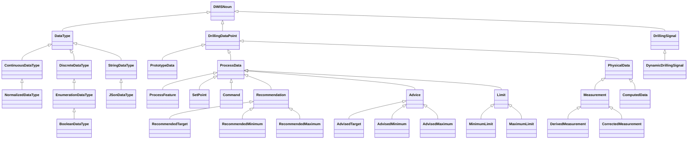
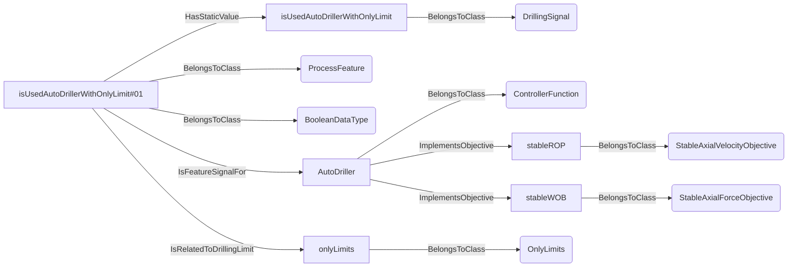
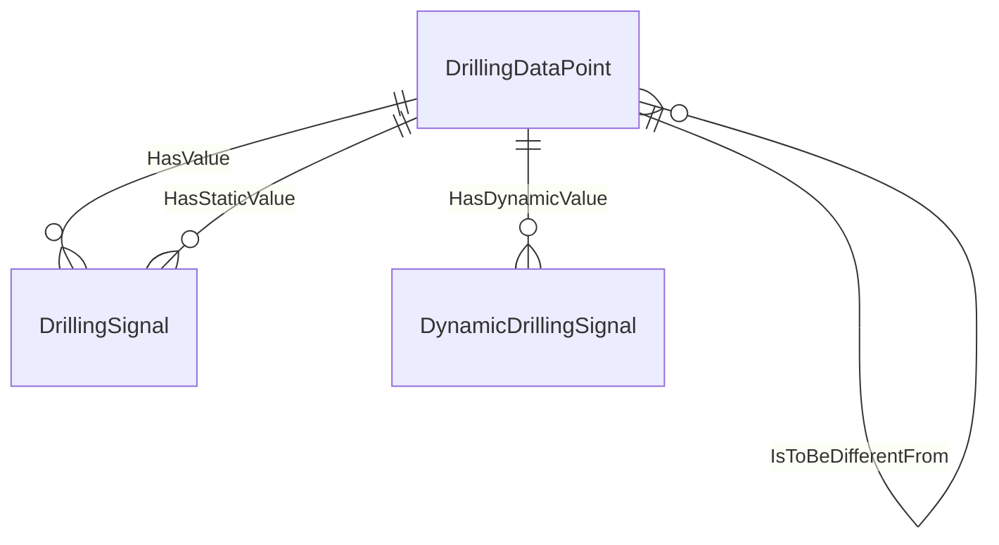

# DrillingDataSemantics<!-- DEFINITION SET HEADER -->
- Description: 
this is the part associated to the signal's description themselves. Dimensionality, data type are the main items to be described.

# Nouns
## Class Inheritance for Nouns
Here is a class inheritance diagram for the nouns contained in this definition set.

## DataType <!-- NOUN -->
- Display name: Data Type
- Parent class: [DWISNoun](./DWISSemantics.md#DWISNoun)
- Definition set: DrillingDataSemantics
## ContinuousDataType <!-- NOUN -->
- Display name: Continuous Data Type
- Parent class: [DataType](./DrillingDataSemantics.md#DataType)
- Definition set: DrillingDataSemantics
## NormalizedDataType <!-- NOUN -->
- Display name: Normalized Data Type
- Parent class: [ContinuousDataType](./DrillingDataSemantics.md#ContinuousDataType)
- Description: 
between 0 and 1
- Definition set: DrillingDataSemantics
## DiscreteDataType <!-- NOUN -->
- Display name: Discrete Data Type
- Parent class: [DataType](./DrillingDataSemantics.md#DataType)
- Definition set: DrillingDataSemantics
## EnumerationDataType <!-- NOUN -->
- Display name: Enumeration Data Type
- Parent class: [DiscreteDataType](./DrillingDataSemantics.md#DiscreteDataType)
- Definition set: DrillingDataSemantics
## BooleanDataType <!-- NOUN -->
- Display name: Boolean Data Type
- Parent class: [EnumerationDataType](./DrillingDataSemantics.md#EnumerationDataType)
- Definition set: DrillingDataSemantics
## StringDataType <!-- NOUN -->
- Display name: String Data Type
- Parent class: [DataType](./DrillingDataSemantics.md#DataType)
- Definition set: DrillingDataSemantics
## JSonDataType <!-- NOUN -->
- Display name: JSon Data Type
- Parent class: [StringDataType](./DrillingDataSemantics.md#StringDataType)
- Description: 
A string that contained the serialization in Json of an object.
- Definition set: DrillingDataSemantics
## DrillingDataPoint <!-- NOUN -->
- Display name: DrillingDataPoint
- Parent class: [DWISNoun](./DWISSemantics.md#DWISNoun)
- Attributes:
  - IsValid
    - Type: bool
    - Description: 
- Description: 
Main type of DDHub data. Represents a drilling signal.
Can be a dynamic signal (linked to a ValueNode) or a static parameter. 
- Definition set: DrillingDataSemantics
## PrototypeData <!-- NOUN -->
- Display name: PrototypeData
- Parent class: [DrillingDataPoint](./DrillingDataSemantics.md#DrillingDataPoint)
- Definition set: DrillingDataSemantics
## ProcessData <!-- NOUN -->
- Display name: ProcessData
- Parent class: [DrillingDataPoint](./DrillingDataSemantics.md#DrillingDataPoint)
- Definition set: DrillingDataSemantics
## ProcessFeature <!-- NOUN -->
- Display name: Process feature
- Parent class: [ProcessData](./DrillingDataSemantics.md#ProcessData)
- Description: 
This Noun is used for signals that describe a process feature, typically assuming that this is a static signal.
- Definition set: DrillingDataSemantics
- Examples:
```dwis isUsedAutoDrillerWithOnlyLimit
DrillingSignal:isUsedAutoDrillerWithOnlyLimit
ProcessFeature:isUsedAutoDrillerWithOnlyLimit#01
BooleanDataType:isUsedAutoDrillerWithOnlyLimit#01
isUsedAutoDrillerWithOnlyLimit#01 HasStaticValue isUsedAutoDrillerWithOnlyLimit
ControllerFunction:AutoDriller
StableAxialVelocityObjective:stableROP
StableAxialForceObjective:stableWOB
AutoDriller ImplementsObjective stableROP
AutoDriller ImplementsObjective stableWOB
isUsedAutoDrillerWithOnlyLimit#01 IsFeatureSignalFor AutoDriller
OnlyLimits:onlyLimits
isUsedAutoDrillerWithOnlyLimit#01 IsRelatedToDrillingLimit onlyLimits
```
An example semantic graph looks like as follow:

An example SparQL query looks like this:
```sparql
PREFIX rdf: <http://www.w3.org/1999/02/22-rdf-syntax-ns#>
PREFIX ddhub: <http://ddhub.no/>
PREFIX quantity: <http://ddhub.no/UnitAndQuantity>
SELECT ?isUsedAutoDrillerWithOnlyLimit
WHERE {
	?isUsedAutoDrillerWithOnlyLimit rdf:type ddhub:DrillingSignal .
	?isUsedAutoDrillerWithOnlyLimit#01 rdf:type ddhub:ProcessFeature .
	?isUsedAutoDrillerWithOnlyLimit#01 rdf:type ddhub:BooleanDataType .
	?isUsedAutoDrillerWithOnlyLimit#01 ddhub:HasStaticValue ?isUsedAutoDrillerWithOnlyLimit .
	?AutoDriller rdf:type ddhub:ControllerFunction .
	?stableROP rdf:type ddhub:StableAxialVelocityObjective .
	?stableWOB rdf:type ddhub:StableAxialForceObjective .
	?AutoDriller ddhub:ImplementsObjective ?stableROP .
	?AutoDriller ddhub:ImplementsObjective ?stableWOB .
	?isUsedAutoDrillerWithOnlyLimit#01 ddhub:IsFeatureSignalFor ?AutoDriller .
	?onlyLimits rdf:type ddhub:OnlyLimits .
	?isUsedAutoDrillerWithOnlyLimit#01 ddhub:IsRelatedToDrillingLimit ?onlyLimits .
}
```
## SetPoint <!-- NOUN -->
- Display name: Set-point
- Parent class: [ProcessData](./DrillingDataSemantics.md#ProcessData)
- Definition set: DrillingDataSemantics
## Command <!-- NOUN -->
- Display name: Command
- Parent class: [ProcessData](./DrillingDataSemantics.md#ProcessData)
- Definition set: DrillingDataSemantics
## Recommendation <!-- NOUN -->
- Display name: Recommendation
- Parent class: [ProcessData](./DrillingDataSemantics.md#ProcessData)
- Definition set: DrillingDataSemantics
## RecommendedTarget <!-- NOUN -->
- Display name: RecommendedTarget
- Parent class: [Recommendation](./DrillingDataSemantics.md#Recommendation)
- Definition set: DrillingDataSemantics
## RecommendedMinimum <!-- NOUN -->
- Display name: RecommendedMinimum
- Parent class: [Recommendation](./DrillingDataSemantics.md#Recommendation)
- Definition set: DrillingDataSemantics
## RecommendedMaximum <!-- NOUN -->
- Display name: RecommendedMaximum
- Parent class: [Recommendation](./DrillingDataSemantics.md#Recommendation)
- Definition set: DrillingDataSemantics
## Advice <!-- NOUN -->
- Display name: Advice
- Parent class: [ProcessData](./DrillingDataSemantics.md#ProcessData)
- Definition set: DrillingDataSemantics
## AdvisedTarget <!-- NOUN -->
- Display name: AdvisedTarget
- Parent class: [Advice](./DrillingDataSemantics.md#Advice)
- Definition set: DrillingDataSemantics
## AdvisedMinimum <!-- NOUN -->
- Display name: AdvisedMinimum
- Parent class: [Advice](./DrillingDataSemantics.md#Advice)
- Definition set: DrillingDataSemantics
## AdvisedMaximum <!-- NOUN -->
- Display name: AdvisedMaximum
- Parent class: [Advice](./DrillingDataSemantics.md#Advice)
- Definition set: DrillingDataSemantics
## Limit <!-- NOUN -->
- Display name: Limit
- Parent class: [ProcessData](./DrillingDataSemantics.md#ProcessData)
- Definition set: DrillingDataSemantics
## MinimumLimit <!-- NOUN -->
- Display name: Minimum Limit
- Parent class: [Limit](./DrillingDataSemantics.md#Limit)
- Definition set: DrillingDataSemantics
## MaximumLimit <!-- NOUN -->
- Display name: Maximum Limit
- Parent class: [Limit](./DrillingDataSemantics.md#Limit)
- Definition set: DrillingDataSemantics
## PhysicalData <!-- NOUN -->
- Display name: PhysicalData
- Parent class: [DrillingDataPoint](./DrillingDataSemantics.md#DrillingDataPoint)
- Definition set: DrillingDataSemantics
## Measurement <!-- NOUN -->
- Display name: Measurement
- Parent class: [PhysicalData](./DrillingDataSemantics.md#PhysicalData)
- Description: 
The noun Measurement represents individuals that are measured by some instrument and which value can be compared with another measurement.
- Definition set: DrillingDataSemantics
## DerivedMeasurement <!-- NOUN -->
- Display name: DerivedMeasurement
- Parent class: [Measurement](./DrillingDataSemantics.md#Measurement)
- Definition set: DrillingDataSemantics
## CorrectedMeasurement <!-- NOUN -->
- Display name: CorrectedMeasurement
- Parent class: [Measurement](./DrillingDataSemantics.md#Measurement)
- Definition set: DrillingDataSemantics
## ComputedData <!-- NOUN -->
- Display name: ComputedData
- Parent class: [PhysicalData](./DrillingDataSemantics.md#PhysicalData)
- Definition set: DrillingDataSemantics
## DrillingSignal <!-- NOUN -->
- Display name: DrillingSignal
- Parent class: [DWISNoun](./DWISSemantics.md#DWISNoun)
- Attributes:
  - Value
    - Type: object
    - Description: 
- Description: 
Data structure used to store the streaming drilling data.
- Definition set: DrillingDataSemantics
## DynamicDrillingSignal <!-- NOUN -->
- Display name: DynamicDrillingSignal
- Parent class: [DrillingSignal](./DrillingDataSemantics.md#DrillingSignal)
- Attributes:
  - TimeStampAtSource
    - Type: DateTime
    - Description: this is a UTC date-time value corresponding to the time at which the value has been taken.
  - TimeStampAcquisition
    - Type: DateTime
    - Description: this is a UTC date-time value at which the value has been acquired by the data acquisition system.
- Definition set: DrillingDataSemantics
# Verbs
## Class Inheritance for Verbs
Here is a class inheritance diagram for the verbs contained in this definition set.

## Relations
Here is a graph representing the relations that can be made with the verbs defined in this definition set.

## HasDomain <!-- VERB -->
- Display name: HasDomain
- Parent verb: [DWISVerb](./DWISSemantics.md#DWISVerb)
- Subject class: [DrillingDataPoint](./DrillingDataSemantics.md#DrillingDataPoint)
- Object class: [DrillingDataPoint](./DrillingDataSemantics.md#DrillingDataPoint)
- Definition set: DrillingDataSemantics
## HasTimeIntervalDomain <!-- VERB -->
- Display name: HasTimeIntervalDomain
- Parent verb: [HasDomain](./DrillingDataSemantics.md#HasDomain)
- Subject class: [DrillingDataPoint](./DrillingDataSemantics.md#DrillingDataPoint)
- Object class: [DrillingDataPoint](./DrillingDataSemantics.md#DrillingDataPoint)
- Definition set: DrillingDataSemantics
## HasValue <!-- VERB -->
- Display name: HasValue
- Parent verb: [DWISVerb](./DWISSemantics.md#DWISVerb)
- Subject class: [DrillingDataPoint](./DrillingDataSemantics.md#DrillingDataPoint)
- Object class: [DrillingSignal](./DrillingDataSemantics.md#DrillingSignal)
- Definition set: DrillingDataSemantics
## HasDynamicValue <!-- VERB -->
- Display name: HasDynamicValue
- Parent verb: [HasValue](./DrillingDataSemantics.md#HasValue)
- Subject class: [DrillingDataPoint](./DrillingDataSemantics.md#DrillingDataPoint)
- Object class: [DynamicDrillingSignal](./DrillingDataSemantics.md#DynamicDrillingSignal)
- Definition set: DrillingDataSemantics
## HasStaticValue <!-- VERB -->
- Display name: HasStaticValue
- Parent verb: [HasValue](./DrillingDataSemantics.md#HasValue)
- Subject class: [DrillingDataPoint](./DrillingDataSemantics.md#DrillingDataPoint)
- Object class: [DrillingSignal](./DrillingDataSemantics.md#DrillingSignal)
- Definition set: DrillingDataSemantics
## IsToBeComparedWith <!-- VERB -->
- Display name: IsToBeComparedWith
- Parent verb: [DWISVerb](./DWISSemantics.md#DWISVerb)
- Subject class: [DrillingDataPoint](./DrillingDataSemantics.md#DrillingDataPoint)
- Object class: [DrillingDataPoint](./DrillingDataSemantics.md#DrillingDataPoint)
- Definition set: DrillingDataSemantics
## IsToBeGreaterThan <!-- VERB -->
- Display name: IsToBeGreaterThan
- Parent verb: [IsToBeComparedWith](./DrillingDataSemantics.md#IsToBeComparedWith)
- Subject class: [DrillingDataPoint](./DrillingDataSemantics.md#DrillingDataPoint)
- Object class: [DrillingDataPoint](./DrillingDataSemantics.md#DrillingDataPoint)
- Definition set: DrillingDataSemantics
## IsToBeGreaterOrEqualThan <!-- VERB -->
- Display name: IsToBeGreaterOrEqualThan
- Parent verb: [IsToBeGreaterThan](./DrillingDataSemantics.md#IsToBeGreaterThan)
- Subject class: [DrillingDataPoint](./DrillingDataSemantics.md#DrillingDataPoint)
- Object class: [DrillingDataPoint](./DrillingDataSemantics.md#DrillingDataPoint)
- Definition set: DrillingDataSemantics
## IsToBeStrictlyGreaterThan <!-- VERB -->
- Display name: IsToBeStrictlyGreaterThan
- Parent verb: [IsToBeGreaterThan](./DrillingDataSemantics.md#IsToBeGreaterThan)
- Subject class: [DrillingDataPoint](./DrillingDataSemantics.md#DrillingDataPoint)
- Object class: [DrillingDataPoint](./DrillingDataSemantics.md#DrillingDataPoint)
- Definition set: DrillingDataSemantics
## IsToBeSmallerThan <!-- VERB -->
- Display name: IsToBeSmallerThan
- Parent verb: [IsToBeComparedWith](./DrillingDataSemantics.md#IsToBeComparedWith)
- Subject class: [DrillingDataPoint](./DrillingDataSemantics.md#DrillingDataPoint)
- Object class: [DrillingDataPoint](./DrillingDataSemantics.md#DrillingDataPoint)
- Definition set: DrillingDataSemantics
## IsToBeSmallerOrEqualThan <!-- VERB -->
- Display name: IsToBeSmallerOrEqualThan
- Parent verb: [IsToBeSmallerThan](./DrillingDataSemantics.md#IsToBeSmallerThan)
- Subject class: [DrillingDataPoint](./DrillingDataSemantics.md#DrillingDataPoint)
- Object class: [DrillingDataPoint](./DrillingDataSemantics.md#DrillingDataPoint)
- Definition set: DrillingDataSemantics
## IsToBeStrictlySmallerThan <!-- VERB -->
- Display name: IsToBeStrictlySmallerThan
- Parent verb: [IsToBeSmallerThan](./DrillingDataSemantics.md#IsToBeSmallerThan)
- Subject class: [DrillingDataPoint](./DrillingDataSemantics.md#DrillingDataPoint)
- Object class: [DrillingDataPoint](./DrillingDataSemantics.md#DrillingDataPoint)
- Definition set: DrillingDataSemantics
## IsToBeEqualTo <!-- VERB -->
- Display name: IsToBeEqualTo
- Parent verb: [IsToBeComparedWith](./DrillingDataSemantics.md#IsToBeComparedWith)
- Subject class: [DrillingDataPoint](./DrillingDataSemantics.md#DrillingDataPoint)
- Object class: [DrillingDataPoint](./DrillingDataSemantics.md#DrillingDataPoint)
- Definition set: DrillingDataSemantics
## IsToBeDifferentFrom <!-- VERB -->
- Display name: IsToBeDifferentFrom
- Parent verb: [IsToBeComparedWith](./DrillingDataSemantics.md#IsToBeComparedWith)
- Subject class: [DrillingDataPoint](./DrillingDataSemantics.md#DrillingDataPoint)
- Object class: [DrillingDataPoint](./DrillingDataSemantics.md#DrillingDataPoint)
- Definition set: DrillingDataSemantics
