# DrillingDataSemantics<!-- DEFINITION SET HEADER -->
- Description: 
this is the part associated to the signal's description themselves. Dimensionality, data type are the main items to be described.

# Nouns
## Class Inheritance for Nouns
Here is a class inheritance diagram for the nouns contained in this definition set.

```mermaid
classDiagram
DWISNoun <|-- DataType
DataType <|-- ContinuousDataType
ContinuousDataType <|-- NormalizedDataType
DataType <|-- DiscreteDataType
DiscreteDataType <|-- EnumerationDataType
EnumerationDataType <|-- BooleanDataType
DWISNoun <|-- DrillingDataPoint
DrillingDataPoint <|-- PrototypeData
PrototypeData <|-- ActiveVolume
PrototypeData <|-- Azimuth
PrototypeData <|-- BitDepth
PrototypeData <|-- DensityIn
PrototypeData <|-- DensityOut
PrototypeData <|-- DownholeECD
PrototypeData <|-- DownholePressure
PrototypeData <|-- DownholeRPM
PrototypeData <|-- DownholeTemperature
PrototypeData <|-- DownholeTorque
PrototypeData <|-- FlowRateIn
PrototypeData <|-- FlowRateOut
PrototypeData <|-- HoleDepth
PrototypeData <|-- HookLoad
PrototypeData <|-- HookPosition
PrototypeData <|-- HookVelocity
PrototypeData <|-- Inclination
PrototypeData <|-- MeasuredDepth
PrototypeData <|-- PumpRate
PrototypeData <|-- ROP
PrototypeData <|-- SPP
PrototypeData <|-- SurfaceRPM
PrototypeData <|-- SurfaceTorque
PrototypeData <|-- TemperatureIn
PrototypeData <|-- TemperatureOut
PrototypeData <|-- TopOfStringPosition
PrototypeData <|-- WOB
PrototypeData <|-- PorePressure
PrototypeData <|-- PorePressureGradient
PrototypeData <|-- FracturingPressure
PrototypeData <|-- FracturingPressureGradient
PrototypeData <|-- CollapsePressure
PrototypeData <|-- CollapsePressureGradient
PrototypeData <|-- ShearRate
PrototypeData <|-- ShearStress
PrototypeData <|-- MinimumHorizontalStress
PrototypeData <|-- MinimumHorizontalStressGradient
PrototypeData <|-- OverburdenPressure
PrototypeData <|-- OverburdenPressureGradient
PrototypeData <|-- BOPOpening
PrototypeData <|-- BOPPressure
PrototypeData <|-- MPDChokeOpening
PrototypeData <|-- MPDChokePressure
PrototypeData <|-- MPDPumpRate
PrototypeData <|-- MPDPumpFlowRate
PrototypeData <|-- GasFlowRate
PrototypeData <|-- BackPressurePumpPressure
PrototypeData <|-- MechanicalSpecificEnergy
DrillingDataPoint <|-- ProcessData
ProcessData <|-- SetPoint
ProcessData <|-- Command
ProcessData <|-- Recommendation
Recommendation <|-- RecommendedTarget
Recommendation <|-- RecommendedMinimum
Recommendation <|-- RecommendedMaximum
ProcessData <|-- Advice
Advice <|-- AdvisedTarget
Advice <|-- AdvisedMinimum
Advice <|-- AdvisedMaximum
ProcessData <|-- Limit
Limit <|-- MinimumLimit
Limit <|-- MaximumLimit
DrillingDataPoint <|-- PhysicalData
PhysicalData <|-- Measurement
Measurement <|-- DerivedMeasurement
Measurement <|-- CorrectedMeasurement
PhysicalData <|-- ComputedData
DWISNoun <|-- DrillingSignal
DrillingSignal <|-- DynamicDrillingSignal
```

## DataType <!-- NOUN -->
- Display name: DataType
- Parent class: [DWISNoun](./DWISSemantics.md#DWISNoun)
- Description: 

- Definition set: DrillingDataSemantics
- Examples:
## ContinuousDataType <!-- NOUN -->
- Display name: ContinuousDataType
- Parent class: [DataType](./DrillingDataSemantics.md#DataType)
- Description: 

- Definition set: DrillingDataSemantics
- Examples:
## NormalizedDataType <!-- NOUN -->
- Display name: NormalizedDataType
- Parent class: [ContinuousDataType](./DrillingDataSemantics.md#ContinuousDataType)
- Description: 
between 0 and 1
- Definition set: DrillingDataSemantics
- Examples:
## DiscreteDataType <!-- NOUN -->
- Display name: DiscreteDataType
- Parent class: [DataType](./DrillingDataSemantics.md#DataType)
- Description: 

- Definition set: DrillingDataSemantics
- Examples:
## EnumerationDataType <!-- NOUN -->
- Display name: EnumerationDataType
- Parent class: [DiscreteDataType](./DrillingDataSemantics.md#DiscreteDataType)
- Description: 

- Definition set: DrillingDataSemantics
- Examples:
## BooleanDataType <!-- NOUN -->
- Display name: BooleanDataType
- Parent class: [EnumerationDataType](./DrillingDataSemantics.md#EnumerationDataType)
- Description: 

- Definition set: DrillingDataSemantics
- Examples:
## DrillingDataPoint <!-- NOUN -->
- Display name: DrillingDataPoint
- Parent class: [DWISNoun](./DWISSemantics.md#DWISNoun)
- Attributes:
  - IsValid
    - Type: bool
    - Description: 
- Description: 
Main type of DDHub data. Represents a drilling signal.
Can be a dynamic signal (linked to a ValueNode) or a static parameter. 
- Definition set: DrillingDataSemantics
- Examples:
## PrototypeData <!-- NOUN -->
- Display name: PrototypeData
- Parent class: [DrillingDataPoint](./DrillingDataSemantics.md#DrillingDataPoint)
- Description: 

- Definition set: DrillingDataSemantics
- Examples:
## ActiveVolume <!-- NOUN -->
- Display name: ActiveVolume
- Parent class: [PrototypeData](./DrillingDataSemantics.md#PrototypeData)
- Description: 

- Definition set: DrillingDataSemantics
- Examples:
## Azimuth <!-- NOUN -->
- Display name: Azimuth
- Parent class: [PrototypeData](./DrillingDataSemantics.md#PrototypeData)
- Description: 

- Definition set: DrillingDataSemantics
- Examples:
## BitDepth <!-- NOUN -->
- Display name: BitDepth
- Parent class: [PrototypeData](./DrillingDataSemantics.md#PrototypeData)
- Description: 
Curvilinear abscissa of the bottom of the bit, in the reference frame centered in the wellbore.
- Definition set: DrillingDataSemantics
- Examples:
## DensityIn <!-- NOUN -->
- Display name: DensityIn
- Parent class: [PrototypeData](./DrillingDataSemantics.md#PrototypeData)
- Description: 

- Definition set: DrillingDataSemantics
- Examples:
## DensityOut <!-- NOUN -->
- Display name: DensityOut
- Parent class: [PrototypeData](./DrillingDataSemantics.md#PrototypeData)
- Description: 

- Definition set: DrillingDataSemantics
- Examples:
## DownholeECD <!-- NOUN -->
- Display name: DownholeECD
- Parent class: [PrototypeData](./DrillingDataSemantics.md#PrototypeData)
- Description: 

- Definition set: DrillingDataSemantics
- Examples:
## DownholePressure <!-- NOUN -->
- Display name: DownholePressure
- Parent class: [PrototypeData](./DrillingDataSemantics.md#PrototypeData)
- Description: 

- Definition set: DrillingDataSemantics
- Examples:
## DownholeRPM <!-- NOUN -->
- Display name: DownholeRPM
- Parent class: [PrototypeData](./DrillingDataSemantics.md#PrototypeData)
- Description: 

- Definition set: DrillingDataSemantics
- Examples:
## DownholeTemperature <!-- NOUN -->
- Display name: DownholeTemperature
- Parent class: [PrototypeData](./DrillingDataSemantics.md#PrototypeData)
- Description: 

- Definition set: DrillingDataSemantics
- Examples:
## DownholeTorque <!-- NOUN -->
- Display name: DownholeTorque
- Parent class: [PrototypeData](./DrillingDataSemantics.md#PrototypeData)
- Description: 

- Definition set: DrillingDataSemantics
- Examples:
## FlowRateIn <!-- NOUN -->
- Display name: FlowRateIn
- Parent class: [PrototypeData](./DrillingDataSemantics.md#PrototypeData)
- Description: 

- Definition set: DrillingDataSemantics
- Examples:
## FlowRateOut <!-- NOUN -->
- Display name: FlowRateOut
- Parent class: [PrototypeData](./DrillingDataSemantics.md#PrototypeData)
- Description: 

- Definition set: DrillingDataSemantics
- Examples:
## HoleDepth <!-- NOUN -->
- Display name: HoleDepth
- Parent class: [PrototypeData](./DrillingDataSemantics.md#PrototypeData)
- Description: 

- Definition set: DrillingDataSemantics
- Examples:
## HookLoad <!-- NOUN -->
- Display name: HookLoad
- Parent class: [PrototypeData](./DrillingDataSemantics.md#PrototypeData)
- Description: 

- Definition set: DrillingDataSemantics
- Examples:
## HookPosition <!-- NOUN -->
- Display name: HookPosition
- Parent class: [PrototypeData](./DrillingDataSemantics.md#PrototypeData)
- Description: 

- Definition set: DrillingDataSemantics
- Examples:
## HookVelocity <!-- NOUN -->
- Display name: HookVelocity
- Parent class: [PrototypeData](./DrillingDataSemantics.md#PrototypeData)
- Description: 

- Definition set: DrillingDataSemantics
- Examples:
## Inclination <!-- NOUN -->
- Display name: Inclination
- Parent class: [PrototypeData](./DrillingDataSemantics.md#PrototypeData)
- Description: 

- Definition set: DrillingDataSemantics
- Examples:
## MeasuredDepth <!-- NOUN -->
- Display name: MeasuredDepth
- Parent class: [PrototypeData](./DrillingDataSemantics.md#PrototypeData)
- Description: 

- Definition set: DrillingDataSemantics
- Examples:
## PumpRate <!-- NOUN -->
- Display name: PumpRate
- Parent class: [PrototypeData](./DrillingDataSemantics.md#PrototypeData)
- Description: 

- Definition set: DrillingDataSemantics
- Examples:
## ROP <!-- NOUN -->
- Display name: ROP
- Parent class: [PrototypeData](./DrillingDataSemantics.md#PrototypeData)
- Description: 

- Definition set: DrillingDataSemantics
- Examples:
## SPP <!-- NOUN -->
- Display name: SPP
- Parent class: [PrototypeData](./DrillingDataSemantics.md#PrototypeData)
- Description: 

- Definition set: DrillingDataSemantics
- Examples:
## SurfaceRPM <!-- NOUN -->
- Display name: SurfaceRPM
- Parent class: [PrototypeData](./DrillingDataSemantics.md#PrototypeData)
- Description: 

- Definition set: DrillingDataSemantics
- Examples:
## SurfaceTorque <!-- NOUN -->
- Display name: SurfaceTorque
- Parent class: [PrototypeData](./DrillingDataSemantics.md#PrototypeData)
- Description: 

- Definition set: DrillingDataSemantics
- Examples:
## TemperatureIn <!-- NOUN -->
- Display name: TemperatureIn
- Parent class: [PrototypeData](./DrillingDataSemantics.md#PrototypeData)
- Description: 

- Definition set: DrillingDataSemantics
- Examples:
## TemperatureOut <!-- NOUN -->
- Display name: TemperatureOut
- Parent class: [PrototypeData](./DrillingDataSemantics.md#PrototypeData)
- Description: 

- Definition set: DrillingDataSemantics
- Examples:
## TopOfStringPosition <!-- NOUN -->
- Display name: TopOfStringPosition
- Parent class: [PrototypeData](./DrillingDataSemantics.md#PrototypeData)
- Description: 

- Definition set: DrillingDataSemantics
- Examples:
## WOB <!-- NOUN -->
- Display name: WOB
- Parent class: [PrototypeData](./DrillingDataSemantics.md#PrototypeData)
- Description: 

- Definition set: DrillingDataSemantics
- Examples:
## PorePressure <!-- NOUN -->
- Display name: PorePressure
- Parent class: [PrototypeData](./DrillingDataSemantics.md#PrototypeData)
- Description: 

- Definition set: DrillingDataSemantics
- Examples:
## PorePressureGradient <!-- NOUN -->
- Display name: PorePressureGradient
- Parent class: [PrototypeData](./DrillingDataSemantics.md#PrototypeData)
- Description: 

- Definition set: DrillingDataSemantics
- Examples:
## FracturingPressure <!-- NOUN -->
- Display name: FracturingPressure
- Parent class: [PrototypeData](./DrillingDataSemantics.md#PrototypeData)
- Description: 

- Definition set: DrillingDataSemantics
- Examples:
## FracturingPressureGradient <!-- NOUN -->
- Display name: FracturingPressureGradient
- Parent class: [PrototypeData](./DrillingDataSemantics.md#PrototypeData)
- Description: 

- Definition set: DrillingDataSemantics
- Examples:
## CollapsePressure <!-- NOUN -->
- Display name: CollapsePressure
- Parent class: [PrototypeData](./DrillingDataSemantics.md#PrototypeData)
- Description: 

- Definition set: DrillingDataSemantics
- Examples:
## CollapsePressureGradient <!-- NOUN -->
- Display name: CollapsePressureGradient
- Parent class: [PrototypeData](./DrillingDataSemantics.md#PrototypeData)
- Description: 

- Definition set: DrillingDataSemantics
- Examples:
## ShearRate <!-- NOUN -->
- Display name: Shear rate
- Parent class: [PrototypeData](./DrillingDataSemantics.md#PrototypeData)
- Description: 

- Definition set: DrillingDataSemantics
- Examples:
## ShearStress <!-- NOUN -->
- Display name: Shear stress
- Parent class: [PrototypeData](./DrillingDataSemantics.md#PrototypeData)
- Description: 

- Definition set: DrillingDataSemantics
- Examples:
## MinimumHorizontalStress <!-- NOUN -->
- Display name: MinimumHorizontalStress
- Parent class: [PrototypeData](./DrillingDataSemantics.md#PrototypeData)
- Description: 

- Definition set: DrillingDataSemantics
- Examples:
## MinimumHorizontalStressGradient <!-- NOUN -->
- Display name: MinimumHorizontalStressGradient
- Parent class: [PrototypeData](./DrillingDataSemantics.md#PrototypeData)
- Description: 

- Definition set: DrillingDataSemantics
- Examples:
## OverburdenPressure <!-- NOUN -->
- Display name: OverburdenPressure
- Parent class: [PrototypeData](./DrillingDataSemantics.md#PrototypeData)
- Description: 

- Definition set: DrillingDataSemantics
- Examples:
## OverburdenPressureGradient <!-- NOUN -->
- Display name: OverburdenPressureGradient
- Parent class: [PrototypeData](./DrillingDataSemantics.md#PrototypeData)
- Description: 

- Definition set: DrillingDataSemantics
- Examples:
## BOPOpening <!-- NOUN -->
- Display name: BOPOpening
- Parent class: [PrototypeData](./DrillingDataSemantics.md#PrototypeData)
- Description: 

- Definition set: DrillingDataSemantics
- Examples:
## BOPPressure <!-- NOUN -->
- Display name: BOPPressure
- Parent class: [PrototypeData](./DrillingDataSemantics.md#PrototypeData)
- Description: 

- Definition set: DrillingDataSemantics
- Examples:
## MPDChokeOpening <!-- NOUN -->
- Display name: MPDChokeOpening
- Parent class: [PrototypeData](./DrillingDataSemantics.md#PrototypeData)
- Description: 

- Definition set: DrillingDataSemantics
- Examples:
## MPDChokePressure <!-- NOUN -->
- Display name: MPDChokePressure
- Parent class: [PrototypeData](./DrillingDataSemantics.md#PrototypeData)
- Description: 

- Definition set: DrillingDataSemantics
- Examples:
## MPDPumpRate <!-- NOUN -->
- Display name: MPDPumpRate
- Parent class: [PrototypeData](./DrillingDataSemantics.md#PrototypeData)
- Description: 

- Definition set: DrillingDataSemantics
- Examples:
## MPDPumpFlowRate <!-- NOUN -->
- Display name: MPDPumpFlowRate
- Parent class: [PrototypeData](./DrillingDataSemantics.md#PrototypeData)
- Description: 

- Definition set: DrillingDataSemantics
- Examples:
## GasFlowRate <!-- NOUN -->
- Display name: GasFlowRate
- Parent class: [PrototypeData](./DrillingDataSemantics.md#PrototypeData)
- Description: 

- Definition set: DrillingDataSemantics
- Examples:
## BackPressurePumpPressure <!-- NOUN -->
- Display name: BackPressurePumpPressure
- Parent class: [PrototypeData](./DrillingDataSemantics.md#PrototypeData)
- Description: 

- Definition set: DrillingDataSemantics
- Examples:
## MechanicalSpecificEnergy <!-- NOUN -->
- Display name: Mechanical Specific Energy
- Parent class: [PrototypeData](./DrillingDataSemantics.md#PrototypeData)
- Description: 

- Definition set: DrillingDataSemantics
- Examples:
## ProcessData <!-- NOUN -->
- Display name: ProcessData
- Parent class: [DrillingDataPoint](./DrillingDataSemantics.md#DrillingDataPoint)
- Description: 

- Definition set: DrillingDataSemantics
- Examples:
## SetPoint <!-- NOUN -->
- Display name: Set-point
- Parent class: [ProcessData](./DrillingDataSemantics.md#ProcessData)
- Description: 

- Definition set: DrillingDataSemantics
- Examples:
## Command <!-- NOUN -->
- Display name: Command
- Parent class: [ProcessData](./DrillingDataSemantics.md#ProcessData)
- Description: 

- Definition set: DrillingDataSemantics
- Examples:
## Recommendation <!-- NOUN -->
- Display name: Recommendation
- Parent class: [ProcessData](./DrillingDataSemantics.md#ProcessData)
- Description: 

- Definition set: DrillingDataSemantics
- Examples:
## RecommendedTarget <!-- NOUN -->
- Display name: RecommendedTarget
- Parent class: [Recommendation](./DrillingDataSemantics.md#Recommendation)
- Description: 

- Definition set: DrillingDataSemantics
- Examples:
## RecommendedMinimum <!-- NOUN -->
- Display name: RecommendedMinimum
- Parent class: [Recommendation](./DrillingDataSemantics.md#Recommendation)
- Description: 

- Definition set: DrillingDataSemantics
- Examples:
## RecommendedMaximum <!-- NOUN -->
- Display name: RecommendedMaximum
- Parent class: [Recommendation](./DrillingDataSemantics.md#Recommendation)
- Description: 

- Definition set: DrillingDataSemantics
- Examples:
## Advice <!-- NOUN -->
- Display name: Advice
- Parent class: [ProcessData](./DrillingDataSemantics.md#ProcessData)
- Description: 

- Definition set: DrillingDataSemantics
- Examples:
## AdvisedTarget <!-- NOUN -->
- Display name: AdvisedTarget
- Parent class: [Advice](./DrillingDataSemantics.md#Advice)
- Description: 

- Definition set: DrillingDataSemantics
- Examples:
## AdvisedMinimum <!-- NOUN -->
- Display name: AdvisedMinimum
- Parent class: [Advice](./DrillingDataSemantics.md#Advice)
- Description: 

- Definition set: DrillingDataSemantics
- Examples:
## AdvisedMaximum <!-- NOUN -->
- Display name: AdvisedMaximum
- Parent class: [Advice](./DrillingDataSemantics.md#Advice)
- Description: 

- Definition set: DrillingDataSemantics
- Examples:
## Limit <!-- NOUN -->
- Display name: Limit
- Parent class: [ProcessData](./DrillingDataSemantics.md#ProcessData)
- Description: 

- Definition set: DrillingDataSemantics
- Examples:
## MinimumLimit <!-- NOUN -->
- Display name: Minimum Limit
- Parent class: [Limit](./DrillingDataSemantics.md#Limit)
- Description: 

- Definition set: DrillingDataSemantics
- Examples:
## MaximumLimit <!-- NOUN -->
- Display name: Maximum Limit
- Parent class: [Limit](./DrillingDataSemantics.md#Limit)
- Description: 

- Definition set: DrillingDataSemantics
- Examples:
## PhysicalData <!-- NOUN -->
- Display name: PhysicalData
- Parent class: [DrillingDataPoint](./DrillingDataSemantics.md#DrillingDataPoint)
- Description: 

- Definition set: DrillingDataSemantics
- Examples:
## Measurement <!-- NOUN -->
- Display name: Measurement
- Parent class: [PhysicalData](./DrillingDataSemantics.md#PhysicalData)
- Description: 
The noun Measurement represents individuals that are measured by some instrument and which value can be compared with another measurement.
- Definition set: DrillingDataSemantics
- Examples:
## DerivedMeasurement <!-- NOUN -->
- Display name: DerivedMeasurement
- Parent class: [Measurement](./DrillingDataSemantics.md#Measurement)
- Description: 

- Definition set: DrillingDataSemantics
- Examples:
## CorrectedMeasurement <!-- NOUN -->
- Display name: CorrectedMeasurement
- Parent class: [Measurement](./DrillingDataSemantics.md#Measurement)
- Description: 

- Definition set: DrillingDataSemantics
- Examples:
## ComputedData <!-- NOUN -->
- Display name: ComputedData
- Parent class: [PhysicalData](./DrillingDataSemantics.md#PhysicalData)
- Description: 

- Definition set: DrillingDataSemantics
- Examples:
## DrillingSignal <!-- NOUN -->
- Display name: DrillingSignal
- Parent class: [DWISNoun](./DWISSemantics.md#DWISNoun)
- Attributes:
  - Value
    - Type: object
    - Description: 
- Description: 
Data structure used to store the streaming drilling data.
- Definition set: DrillingDataSemantics
- Examples:
## DynamicDrillingSignal <!-- NOUN -->
- Display name: DynamicDrillingSignal
- Parent class: [DrillingSignal](./DrillingDataSemantics.md#DrillingSignal)
- Attributes:
  - TimeStampAtSource
    - Type: DateTime
    - Description: this is a UTC date-time value corresponding to the time at which the value has been taken.
  - TimeStampAcquisition
    - Type: DateTime
    - Description: this is a UTC date-time value at which the value has been acquired by the data acquisition system.
- Description: 

- Definition set: DrillingDataSemantics
- Examples:
# Verbs
## Class Inheritance for Verbs
Here is a class inheritance diagram for the verbs contained in this definition set.

## Relations
Here is a graph representing the relations that can be made with the verbs defined in this definition set.

## HasDomain <!-- VERB -->
- Display name: HasDomain
- Parent verb: [DWISVerb](./DWISSemantics.md#DWISVerb)
- Subject class: [DrillingDataPoint](./DrillingDataSemantics.md#DrillingDataPoint)
- Object class: [DrillingDataPoint](./DrillingDataSemantics.md#DrillingDataPoint)
- Definition set: DrillingDataSemantics
- Description: 

- Examples:
## HasTimeIntervalDomain <!-- VERB -->
- Display name: HasTimeIntervalDomain
- Parent verb: [HasDomain](./DrillingDataSemantics.md#HasDomain)
- Subject class: [DrillingDataPoint](./DrillingDataSemantics.md#DrillingDataPoint)
- Object class: [DrillingDataPoint](./DrillingDataSemantics.md#DrillingDataPoint)
- Definition set: DrillingDataSemantics
- Description: 

- Examples:
## HasValue <!-- VERB -->
- Display name: HasValue
- Parent verb: [DWISVerb](./DWISSemantics.md#DWISVerb)
- Subject class: [DrillingDataPoint](./DrillingDataSemantics.md#DrillingDataPoint)
- Object class: [DrillingSignal](./DrillingDataSemantics.md#DrillingSignal)
- Definition set: DrillingDataSemantics
- Description: 

- Examples:
## HasDynamicValue <!-- VERB -->
- Display name: HasDynamicValue
- Parent verb: [HasValue](./DrillingDataSemantics.md#HasValue)
- Subject class: [DrillingDataPoint](./DrillingDataSemantics.md#DrillingDataPoint)
- Object class: [DynamicDrillingSignal](./DrillingDataSemantics.md#DynamicDrillingSignal)
- Definition set: DrillingDataSemantics
- Description: 

- Examples:
## HasStaticValue <!-- VERB -->
- Display name: HasStaticValue
- Parent verb: [HasValue](./DrillingDataSemantics.md#HasValue)
- Subject class: [DrillingDataPoint](./DrillingDataSemantics.md#DrillingDataPoint)
- Object class: [DrillingSignal](./DrillingDataSemantics.md#DrillingSignal)
- Definition set: DrillingDataSemantics
- Description: 

- Examples:
## IsToBeComparedWith <!-- VERB -->
- Display name: IsToBeComparedWith
- Parent verb: [DWISVerb](./DWISSemantics.md#DWISVerb)
- Subject class: [DrillingDataPoint](./DrillingDataSemantics.md#DrillingDataPoint)
- Object class: [DrillingDataPoint](./DrillingDataSemantics.md#DrillingDataPoint)
- Definition set: DrillingDataSemantics
- Description: 

- Examples:
## IsToBeGreaterThan <!-- VERB -->
- Display name: IsToBeGreaterThan
- Parent verb: [IsToBeComparedWith](./DrillingDataSemantics.md#IsToBeComparedWith)
- Subject class: [DrillingDataPoint](./DrillingDataSemantics.md#DrillingDataPoint)
- Object class: [DrillingDataPoint](./DrillingDataSemantics.md#DrillingDataPoint)
- Definition set: DrillingDataSemantics
- Description: 

- Examples:
## IsToBeGreaterOrEqualThan <!-- VERB -->
- Display name: IsToBeGreaterOrEqualThan
- Parent verb: [IsToBeGreaterThan](./DrillingDataSemantics.md#IsToBeGreaterThan)
- Subject class: [DrillingDataPoint](./DrillingDataSemantics.md#DrillingDataPoint)
- Object class: [DrillingDataPoint](./DrillingDataSemantics.md#DrillingDataPoint)
- Definition set: DrillingDataSemantics
- Description: 

- Examples:
## IsToBeStrictlyGreaterThan <!-- VERB -->
- Display name: IsToBeStrictlyGreaterThan
- Parent verb: [IsToBeGreaterThan](./DrillingDataSemantics.md#IsToBeGreaterThan)
- Subject class: [DrillingDataPoint](./DrillingDataSemantics.md#DrillingDataPoint)
- Object class: [DrillingDataPoint](./DrillingDataSemantics.md#DrillingDataPoint)
- Definition set: DrillingDataSemantics
- Description: 

- Examples:
## IsToBeSmallerThan <!-- VERB -->
- Display name: IsToBeSmallerThan
- Parent verb: [IsToBeComparedWith](./DrillingDataSemantics.md#IsToBeComparedWith)
- Subject class: [DrillingDataPoint](./DrillingDataSemantics.md#DrillingDataPoint)
- Object class: [DrillingDataPoint](./DrillingDataSemantics.md#DrillingDataPoint)
- Definition set: DrillingDataSemantics
- Description: 

- Examples:
## IsToBeSmallerOrEqualThan <!-- VERB -->
- Display name: IsToBeSmallerOrEqualThan
- Parent verb: [IsToBeSmallerThan](./DrillingDataSemantics.md#IsToBeSmallerThan)
- Subject class: [DrillingDataPoint](./DrillingDataSemantics.md#DrillingDataPoint)
- Object class: [DrillingDataPoint](./DrillingDataSemantics.md#DrillingDataPoint)
- Definition set: DrillingDataSemantics
- Description: 

- Examples:
## IsToBeStrictlySmallerThan <!-- VERB -->
- Display name: IsToBeStrictlySmallerThan
- Parent verb: [IsToBeSmallerThan](./DrillingDataSemantics.md#IsToBeSmallerThan)
- Subject class: [DrillingDataPoint](./DrillingDataSemantics.md#DrillingDataPoint)
- Object class: [DrillingDataPoint](./DrillingDataSemantics.md#DrillingDataPoint)
- Definition set: DrillingDataSemantics
- Description: 

- Examples:
## IsToBeEqualTo <!-- VERB -->
- Display name: IsToBeEqualTo
- Parent verb: [IsToBeComparedWith](./DrillingDataSemantics.md#IsToBeComparedWith)
- Subject class: [DrillingDataPoint](./DrillingDataSemantics.md#DrillingDataPoint)
- Object class: [DrillingDataPoint](./DrillingDataSemantics.md#DrillingDataPoint)
- Definition set: DrillingDataSemantics
- Description: 

- Examples:
## IsToBeDifferentFrom <!-- VERB -->
- Display name: IsToBeDifferentFrom
- Parent verb: [IsToBeComparedWith](./DrillingDataSemantics.md#IsToBeComparedWith)
- Subject class: [DrillingDataPoint](./DrillingDataSemantics.md#DrillingDataPoint)
- Object class: [DrillingDataPoint](./DrillingDataSemantics.md#DrillingDataPoint)
- Definition set: DrillingDataSemantics
- Description: 

- Examples:
