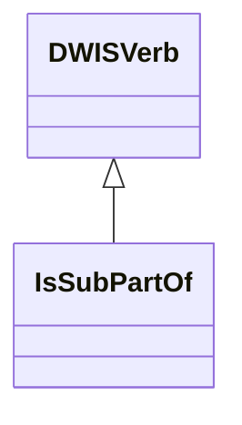
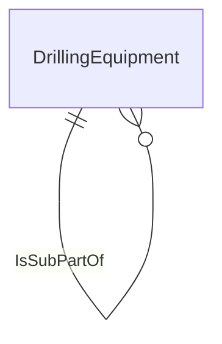

# DrillingEquipment<!-- DEFINITION SET HEADER -->
- Description: 
in this category fall all the standard equipment encountered on a drilling rig. Note that the goal of the vocabulary is not to provide a detailed description of the rig. Therefore we only consider nouns that can help providing a signal context.

# Nouns
## Class Inheritance for Nouns
Here is a class inheritance diagram for the nouns contained in this definition set.
```mermaid
classDiagram
DWISNoun <|-- <equipment>
<equipment> <|-- RigEquipment
RigEquipment <|-- PowerGenerationSystem
PowerGenerationSystem <|-- PowerGenerators
PowerGenerationSystem <|-- ElectricalControlSystem
PowerGenerationSystem <|-- PowerScrSystem
RigEquipment <|-- HoistingSystem
HoistingSystem <|-- RackAndPinionHoistingSystem
HoistingSystem <|-- RamHoistingSystem
HoistingSystem <|-- Derrick
Derrick <|-- ConventionalDerrick
Derrick <|-- SlantDerrick
Derrick <|-- QuadristandDerrick
Derrick <|-- TripleStandDerrick
Derrick <|-- DoubleStandDerrick
Derrick <|-- SingleJointDerrick
HoistingSystem <|-- Drawworks
Drawworks <|-- StandardElectricalDrawworks
Drawworks <|-- MechanicalDrawworks
Drawworks <|-- DieselElectricalDrawworks
Drawworks <|-- RamRig
HoistingSystem <|-- MechanicalBlock
MechanicalBlock <|-- TravellingBlock
MechanicalBlock <|-- CrownBlock
HoistingSystem <|-- Hook
HoistingSystem <|-- DrillLine
DrillLine <|-- ActiveLine
DrillLine <|-- DeadLine
DrillLine <|-- SupportLine
HoistingSystem <|-- DrillLineFastener
DrillLineFastener <|-- DeadLineAnchor
RigEquipment <|-- SurfaceRotationSystem
SurfaceRotationSystem <|-- TopDrive
TopDrive <|-- TorqueTrack
TopDrive <|-- TorqueBushing
TopDrive <|-- SwivelSub
TopDrive <|-- ExtendFrame
TopDrive <|-- Quill
TopDrive <|-- MainframeAssembly
TopDrive <|-- LoadNut
SurfaceRotationSystem <|-- RotaryTable
RotaryTable <|-- RotaryTableBushings
RotaryTable <|-- Kelly
Kelly <|-- KellyHose
Kelly <|-- KellyBushing
Kelly <|-- KellyJoint
Kelly <|-- KellySwivel
RigEquipment <|-- WellControlSystem
WellControlSystem <|-- BellNipple
WellControlSystem <|-- Accumulator
WellControlSystem <|-- BopStack
BopStack <|-- SurfaceBop
BopStack <|-- LandBop
BopStack <|-- SubseaBop
WellControlSystem <|-- BopElement
BopElement <|-- AnnularPreventer
BopElement <|-- PipeRam
BopElement <|-- ShearRam
BopElement <|-- BlindRam
WellControlSystem <|-- AdapterSpool
WellControlSystem <|-- SpacingSpool
WellControlSystem <|-- ChokeManifold
ChokeManifold <|-- ChokeValve
ChokeValve <|-- ChokeValveGatevalve
WellControlSystem <|-- KillLine
WellControlSystem <|-- ChokeLine
WellControlSystem <|-- ControlLines
WellControlSystem <|-- Diverter
Diverter <|-- DiverterLine
Diverter <|-- DiverterLineHanger
Diverter <|-- VentOverboardLine
WellControlSystem <|-- ControlManifold
WellControlSystem <|-- IBOP
WellControlSystem <|-- KellyValve
WellControlSystem <|-- FloatValveNonreturnValve
FloatValveNonreturnValve <|-- PlungerFloatValvesF
FloatValveNonreturnValve <|-- PortedPlungerValvesFa
FloatValveNonreturnValve <|-- FlapperFloatValvesG
WellControlSystem <|-- MpdChoke
WellControlSystem <|-- WellheadXmasTree
RigEquipment <|-- CirculationSystem
CirculationSystem <|-- MudPump
MudPump <|-- PistonMudPump
PistonMudPump <|-- PulsationDampener
PistonMudPump <|-- Piston
PistonMudPump <|-- Liner
PistonMudPump <|-- Cylinders
PistonMudPump <|-- Action
Action <|-- SingleActing
Action <|-- DualActing
MudPump <|-- PlungerMudPump
MudPump <|-- CentrifugalMudPump
MudPump <|-- HydraulicMudPump
MudPump <|-- DiaphragmMudPump
MudPump <|-- PeristalticMudPump
CirculationSystem <|-- RiserLiftPump
CirculationSystem <|-- FillPump
CirculationSystem <|-- BackPressurePump
CirculationSystem <|-- BoosterPump
CirculationSystem <|-- DrillingFluid
DrillingFluid <|-- DrillWater
DrillingFluid <|-- PotableWater
DrillingFluid <|-- SeaWater
DrillingFluid <|-- OilBasedMudObm
DrillingFluid <|-- WaterBasedMudWbm
DrillingFluid <|-- SyntheticOilBasedMudSobm
DrillingFluid <|-- SpudMud
CirculationSystem <|-- MudPits
MudPits <|-- ActiveDrillingSystem
MudPits <|-- TripTank
MudPits <|-- MixingTank
MudPits <|-- ReservePit
MudPits <|-- SlugSettlingPit
MudPits <|-- SurgeTank
MudPits <|-- StorageTank
MudPits <|-- SandTrap
MudPits <|-- ChemicalTank
MudPits <|-- BulkTank
CirculationSystem <|-- ShaleShakers
ShaleShakers <|-- ShakerHopper
ShaleShakers <|-- ShakerDecks
ShakerDecks <|-- ShakerScreens
ShakerDecks <|-- ShakerScreenMeshSize
ShaleShakers <|-- ShakerCascadeLevels
CirculationSystem <|-- Centrifuge
CirculationSystem <|-- Degasser
Degasser <|-- CentrifugalDegasser
Degasser <|-- VacuumDegasser
CirculationSystem <|-- AfmAutofluidMeasSkid
CirculationSystem <|-- Hydrocyclones
CirculationSystem <|-- MudLines
MudLines <|-- MudStandpipeManifold
MudLines <|-- MudStandpipe
MudLines <|-- MudHose
MudLines <|-- Gooseneck
MudLines <|-- FlowLine
RigEquipment <|-- MarineSystem
MarineSystem <|-- DrillingRiser
DrillingRiser <|-- MarineRiser
DrillingRiser <|-- SurfaceRiser
SurfaceRiser <|-- LowPressureRiser
SurfaceRiser <|-- HighPressureRiser
DrillingRiser <|-- BallJoint
MarineSystem <|-- CompletionWorkoverRiser
MarineSystem <|-- LowerMarineRiserPackageLmrp
MarineSystem <|-- BoosterLine
MarineSystem <|-- SlipJoint
MarineSystem <|-- SpiderGimbal
MarineSystem <|-- MarineRiserTensionerMrtRing
MarineSystem <|-- RiserTensioners
MarineSystem <|-- ConductorTensioners
MarineSystem <|-- RiserRecoilSystem
MarineSystem <|-- LandingJoint
MarineSystem <|-- ROV
MarineSystem <|-- BallastSystem
MarineSystem <|-- Beacons
MarineSystem <|-- JackupLegs
MarineSystem <|-- MooringSystem
MooringSystem <|-- MooringLines
MooringSystem <|-- Anchors
MarineSystem <|-- MarineFuel
MarineSystem <|-- MudLineSystem
MarineSystem <|-- StormLoop
MarineSystem <|-- HeaveCompensationSystem
RigEquipment <|-- DrillFloorSystems
DrillFloorSystems <|-- DrillFloorStructure
DrillFloorStructure <|-- DogHouse
DrillFloorStructure <|-- RigFloor
DrillFloorStructure <|-- Mousehole
DrillFloorStructure <|-- DrillFloorSubstructure
DrillFloorSystems <|-- DrillFloorEquipment
DrillFloorEquipment <|-- DrillersConsole
DrillFloorEquipment <|-- IronRoughneck
DrillFloorEquipment <|-- DrillPipeElevator
DrillFloorEquipment <|-- ElevatorBailsLinks
DrillFloorEquipment <|-- DrillPipeTongs
DrillPipeTongs <|-- ManualPipeTongs
DrillPipeTongs <|-- PowerPipeTongs
DrillPipeTongs <|-- CasingTongs
DrillFloorEquipment <|-- RotarySlips
RotarySlips <|-- ManualSlips
RotarySlips <|-- PowerSlips
RotarySlips <|-- PneumaticSlips
DrillFloorEquipment <|-- StabbingGuide
DrillFloorEquipment <|-- SafetyClamps
DrillFloorEquipment <|-- RotatingControlDeviceRcd
DrillFloorEquipment <|-- Dolly
DrillFloorEquipment <|-- DollyRail
DrillFloorEquipment <|-- SlickLine
RigEquipment <|-- CementingEquipment
CementingEquipment <|-- CementPump
CementingEquipment <|-- CementSlurry
CementingEquipment <|-- CementSpacer
CementingEquipment <|-- CementStand
CementingEquipment <|-- CementStinger
CementingEquipment <|-- CementUnit
CementingEquipment <|-- CementHead
CementingEquipment <|-- CementLines
CementingEquipment <|-- CementManifold
RigEquipment <|-- WellTestingEquipment
WellTestingEquipment <|-- TestingTools
WellTestingEquipment <|-- TestPlug
WellTestingEquipment <|-- SubseaTestTree
WellTestingEquipment <|-- TestTools
WellTestingEquipment <|-- Seperator
RigEquipment <|-- SafetyEquipment
SafetyEquipment <|-- FireSafetySystems
SafetyEquipment <|-- GasSafetySystems
RigEquipment <|-- ThirdPartyRigEquipment
ThirdPartyRigEquipment <|-- ThirdPartyTools
RigEquipment <|-- MudLoggingEquipment
MudLoggingEquipment <|-- CuttingsSamplingEquipment
MudLoggingEquipment <|-- CuttingsAnalysisEquipmnet
MudLoggingEquipment <|-- GasAnalysisEquipment
MudLoggingEquipment <|-- FlowAnalysisEquipment
<equipment> <|-- <Tubulars>
<Tubulars> <|-- DrillString
DrillString <|-- BottomholeAssembly
DrillString <|-- DrillPipe
DrillString <|-- CompressiveDrillPipe
DrillString <|-- DrillCollars
DrillString <|-- NonmagneticCollars
DrillString <|-- ShortDc
DrillString <|-- Heavyweight
DrillString <|-- PupJoints
DrillString <|-- Stabilizers
Stabilizers <|-- BladeShape
BladeShape <|-- dynamic
BladeShape <|-- melon
BladeShape <|-- spiral
BladeShape <|-- straight
BladeShape <|-- variable
Stabilizers <|-- BladeType
BladeType <|-- clamp-on
BladeType <|-- integral
BladeType <|-- sleeve
BladeType <|-- BladeTypeWelded
Stabilizers <|-- BladeDiameter
Stabilizers <|-- BladeLength
Stabilizers <|-- Non-Magnetic
Stabilizers <|-- NearBit
Stabilizers <|-- Non-Rotating
Stabilizers <|-- Steerable
DrillString <|-- Grouping
Grouping <|-- Stands
Grouping <|-- Doubles
Grouping <|-- Singles
DrillString <|-- MiscSubs
MiscSubs <|-- sub-bent
MiscSubs <|-- sub-bit
MiscSubs <|-- sub-bumper
MiscSubs <|-- sub-catcher
MiscSubs <|-- sub-circulation
MiscSubs <|-- sub-cone
MiscSubs <|-- sub-crossover
MiscSubs <|-- sub-dart
MiscSubs <|-- sub-filter
MiscSubs <|-- sub-float
MiscSubs <|-- sub-jetting
MiscSubs <|-- sub-junk
MiscSubs <|-- sub-orienting
MiscSubs <|-- sub-ported
MiscSubs <|-- SubpressureRelief
MiscSubs <|-- SubpumpOut
MiscSubs <|-- sub-restrictor
MiscSubs <|-- sub-saver
MiscSubs <|-- sub-shock
MiscSubs <|-- SubsideEntry
MiscSubs <|-- sub-stop
<Tubulars> <|-- CasingString
CasingString <|-- ConductorDrivePipe
CasingString <|-- Casing
CasingString <|-- Liners
CasingString <|-- Centralizers
CasingString <|-- Crossover
CasingString <|-- Connection
Connection <|-- box
Connection <|-- flange
Connection <|-- mandrel
Connection <|-- pin
Connection <|-- ConnectionWelded
Connection <|-- self-sealing-threaded
<Tubulars> <|-- Expandables
<Tubulars> <|-- TubingString
<Tubulars> <|-- ScreenString
<Tubulars> <|-- TubularConnection
<Tubulars> <|-- TubularConfiguration
TubularConfiguration <|-- PinDown
TubularConfiguration <|-- PinUp
TubularConfiguration <|-- Box-Box
TubularConfiguration <|-- Pin-Pin
<equipment> <|-- DownholeEquipment
DownholeEquipment <|-- DrillingEquipment
DrillingEquipment <|-- DrillstemTerminator
DrillstemTerminator <|-- DrillingBit
DrillingBit <|-- RollingCutter
RollingCutter <|-- MillTooth
RollingCutter <|-- InsertTci
DrillingBit <|-- FixedCutter
FixedCutter <|-- PDC
FixedCutter <|-- Diamond
FixedCutter <|-- PdcCore
FixedCutter <|-- DiamondCore
DrillingBit <|-- HybridKymera
DrillingBit <|-- Nozzles
DrillstemTerminator <|-- BullNose
DrillingEquipment <|-- Reamers
Reamers <|-- RollerReamers
Reamers <|-- RfidReamers
Reamers <|-- NearbitReamers
Reamers <|-- FixedBladeReamers
Reamers <|-- BicenterReamerBit
Reamers <|-- ExpandableReamers
DrillingEquipment <|-- HoleOpener
HoleOpener <|-- Underreamers
HoleOpener <|-- FixedBlade
DrillingEquipment <|-- CoringTool
CoringTool <|-- InnerBarrel
CoringTool <|-- OuterBarrel
DrillingEquipment <|-- DownholeMotor
DownholeMotor <|-- TurbineMotor
DownholeMotor <|-- PositiveDisplacementMotor
DownholeMotor <|-- OilBearing
DownholeMotor <|-- MudLubeBearing
DownholeMotor <|-- SteerableMotor
DownholeMotor <|-- InstrumentedMotor
DrillingEquipment <|-- AdjustableKickoffSub
DrillingEquipment <|-- RotarySteerableSystems
RotarySteerableSystems <|-- Point-The-Bit
RotarySteerableSystems <|-- Push-The-Bit
RotarySteerableSystems <|-- ContinuousProportional
DrillingEquipment <|-- JettingAssembly
DrillingEquipment <|-- HammerAssembly
DrillingEquipment <|-- JarringAssembly
JarringAssembly <|-- JarAction
JarringAssembly <|-- MechanicalJar
JarringAssembly <|-- HydraulicJar
JarringAssembly <|-- HydromechanicalJar
JarringAssembly <|-- Accelerator
DrillingEquipment <|-- Casing-While-Drilling
Casing-While-Drilling <|-- DirectionalCasingWhileDrilling
DrillingEquipment <|-- LinerDrilling
LinerDrilling <|-- SteerableLinerDrilling
DrillingEquipment <|-- CirculationSub
DrillingEquipment <|-- Whipstock
DrillingEquipment <|-- FishingTools
FishingTools <|-- Overshot
FishingTools <|-- Spear
FishingTools <|-- JunkBasket
DrillingEquipment <|-- Thruster
DrillingEquipment <|-- ActiveVibrationTools
ActiveVibrationTools <|-- BhaVibrationDampers
ActiveVibrationTools <|-- VibrationIsolators
ActiveVibrationTools <|-- NearBitVibrationDampers
DrillingEquipment <|-- IsolationSeal
DownholeEquipment <|-- CasingEquipment
CasingEquipment <|-- CasingMillingTools
CasingMillingTools <|-- MillCasingCutting
CasingMillingTools <|-- MillDress
CasingMillingTools <|-- MillFlatBottom
CasingMillingTools <|-- MillHollow
CasingMillingTools <|-- MillPackerPickerAssembly
CasingMillingTools <|-- MillPilot
CasingMillingTools <|-- MillPolish
CasingMillingTools <|-- MillSection
CasingMillingTools <|-- MillTaper
CasingMillingTools <|-- MillWashover
CasingMillingTools <|-- MillWatermelon
CasingEquipment <|-- CasingLinerEquipment
CasingEquipment <|-- CasingHead
CasingEquipment <|-- ShoeTrack
CasingEquipment <|-- FloatCollar
CasingEquipment <|-- FloatShoe
CasingEquipment <|-- LinerPacker
CasingEquipment <|-- DownholeValveAssembly
CasingEquipment <|-- PerforatingGuns
CasingEquipment <|-- Hangers
Hangers <|-- TubingHanger
Hangers <|-- CasingHanger
Hangers <|-- LinerHanger
CasingEquipment <|-- Plugs
CasingEquipment <|-- InnerString
CasingEquipment <|-- LandingString
CasingEquipment <|-- CasingShoe
CasingEquipment <|-- CasingCutter
DownholeEquipment <|-- LoggingEquipment
LoggingEquipment <|-- EquipmentTelemetry
EquipmentTelemetry <|-- MudPulse
EquipmentTelemetry <|-- WiredPipe
EquipmentTelemetry <|-- Electro-Magnetic
EquipmentTelemetry <|-- Acoustic
EquipmentTelemetry <|-- Hybrid
EquipmentTelemetry <|-- WireCable
LoggingEquipment <|-- PowerSystems
PowerSystems <|-- DownholeAlternator
PowerSystems <|-- DownholeBatteries
PowerSystems <|-- SurfacePower
LoggingEquipment <|-- LoggingWhileDrillingTools
LoggingWhileDrillingTools <|-- LoggingWhileDrillingToolsAcoustictools
LoggingWhileDrillingTools <|-- AzimuthalTools
LoggingWhileDrillingTools <|-- LoggingWhileDrillingToolsElectricalpropagation
LoggingWhileDrillingTools <|-- LoggingWhileDrillingToolsElectricalresistivity
LoggingWhileDrillingTools <|-- FormationTestTools
LoggingWhileDrillingTools <|-- ImagingTools
LoggingWhileDrillingTools <|-- LoggingWhileDrillingToolsNmrtools
LoggingWhileDrillingTools <|-- LoggingWhileDrillingToolsNucleartools
LoggingWhileDrillingTools <|-- LoggingWhileDrillingToolsSeismictools
LoggingEquipment <|-- MeasurementWhileDrillingTools
MeasurementWhileDrillingTools <|-- DirectionalTool
MeasurementWhileDrillingTools <|-- MechanicsAndVibrationTools
MeasurementWhileDrillingTools <|-- PwdPressure
LoggingEquipment <|-- WirelineLoggingTools
WirelineLoggingTools <|-- OpenholeTools
WirelineLoggingTools <|-- CasedHoleTools
WirelineLoggingTools <|-- ProductionTools
WirelineLoggingTools <|-- WirelineLoggingToolsElectricalresistivity
WirelineLoggingTools <|-- WirelineLoggingToolsElectricalpropagation
WirelineLoggingTools <|-- SpontaneousPotential
WirelineLoggingTools <|-- WirelineLoggingToolsNucleartools
WirelineLoggingTools <|-- WirelineLoggingToolsNmrtools
WirelineLoggingTools <|-- WirelineLoggingToolsAcoustictools
WirelineLoggingTools <|-- DipmeterAndImagingTools
WirelineLoggingTools <|-- FormationTestingAndSampling
WirelineLoggingTools <|-- WirelineLoggingToolsSeismictools
WirelineLoggingTools <|-- CasingCollarLocator
WirelineLoggingTools <|-- FluidDensityTools
WirelineLoggingTools <|-- FlowmeterTools
WirelineLoggingTools <|-- CementBondLoggingTools
WirelineLoggingTools <|-- PressureLoggingTools
<equipment> <|-- CoiledTubingEquipment
CoiledTubingEquipment <|-- CoiledTubingReel
CoiledTubingEquipment <|-- InjectorHead
CoiledTubingEquipment <|-- TubingGuideArch
CoiledTubingEquipment <|-- PowerSupply
CoiledTubingEquipment <|-- ControlConsole
ControlConsole <|-- ControlAndMonitoringEquipment
CoiledTubingEquipment <|-- DownholeCtConnectors
CoiledTubingEquipment <|-- CtBhaComponents
CoiledTubingEquipment <|-- WellcontrolStackEquipment
<equipment> <|-- GenericEquipment
GenericEquipment <|-- GenericEquipmentGatevalve
GenericEquipment <|-- ThreeWayManifold
GenericEquipment <|-- ThreeWayValve
```
## <equipment> <!-- NOUN -->
- Display name: <equipment>
- Parent class: [DWISNoun](./DWISSemantics.md#DWISNoun)
- Description: 

- Definition set: DrillingEquipment
- Examples:
## RigEquipment <!-- NOUN -->
- Display name: <Rig Equipment>
- Parent class: [<equipment>](./DrillingEquipment.md#<equipment>)
- Description: 

- Definition set: DrillingEquipment
- Examples:
## PowerGenerationSystem <!-- NOUN -->
- Display name: Power Generation System
- Parent class: [RigEquipment](./DrillingEquipment.md#RigEquipment)
- Description: 

- Definition set: DrillingEquipment
- Examples:
## PowerGenerators <!-- NOUN -->
- Display name: Power Generators
- Parent class: [PowerGenerationSystem](./DrillingEquipment.md#PowerGenerationSystem)
- Description: 

- Definition set: DrillingEquipment
- Examples:
## ElectricalControlSystem <!-- NOUN -->
- Display name: Electrical Control System
- Parent class: [PowerGenerationSystem](./DrillingEquipment.md#PowerGenerationSystem)
- Description: 

- Definition set: DrillingEquipment
- Examples:
## PowerScrSystem <!-- NOUN -->
- Display name: Power SCR System
- Parent class: [PowerGenerationSystem](./DrillingEquipment.md#PowerGenerationSystem)
- Description: 

- Definition set: DrillingEquipment
- Examples:
## HoistingSystem <!-- NOUN -->
- Display name: Hoisting  System
- Parent class: [RigEquipment](./DrillingEquipment.md#RigEquipment)
- Description: 

- Definition set: DrillingEquipment
- Examples:
## RackAndPinionHoistingSystem <!-- NOUN -->
- Display name: Rack and Pinion Hoisting System
- Parent class: [HoistingSystem](./DrillingEquipment.md#HoistingSystem)
- Description: 

- Definition set: DrillingEquipment
- Examples:
## RamHoistingSystem <!-- NOUN -->
- Display name: Ram Hoisting System
- Parent class: [HoistingSystem](./DrillingEquipment.md#HoistingSystem)
- Description: 

- Definition set: DrillingEquipment
- Examples:
## Derrick <!-- NOUN -->
- Display name: Derrick
- Parent class: [HoistingSystem](./DrillingEquipment.md#HoistingSystem)
- Description: 

- Definition set: DrillingEquipment
- Examples:
## ConventionalDerrick <!-- NOUN -->
- Display name: Conventional Derrick
- Parent class: [Derrick](./DrillingEquipment.md#Derrick)
- Description: 

- Definition set: DrillingEquipment
- Examples:
## SlantDerrick <!-- NOUN -->
- Display name: Slant Derrick
- Parent class: [Derrick](./DrillingEquipment.md#Derrick)
- Description: 

- Definition set: DrillingEquipment
- Examples:
## QuadristandDerrick <!-- NOUN -->
- Display name: Quadri-Stand Derrick
- Parent class: [Derrick](./DrillingEquipment.md#Derrick)
- Description: 

- Definition set: DrillingEquipment
- Examples:
## TripleStandDerrick <!-- NOUN -->
- Display name: Triple Stand Derrick
- Parent class: [Derrick](./DrillingEquipment.md#Derrick)
- Description: 

- Definition set: DrillingEquipment
- Examples:
## DoubleStandDerrick <!-- NOUN -->
- Display name: Double Stand Derrick
- Parent class: [Derrick](./DrillingEquipment.md#Derrick)
- Description: 

- Definition set: DrillingEquipment
- Examples:
## SingleJointDerrick <!-- NOUN -->
- Display name: Single Joint Derrick
- Parent class: [Derrick](./DrillingEquipment.md#Derrick)
- Description: 

- Definition set: DrillingEquipment
- Examples:
## Drawworks <!-- NOUN -->
- Display name: Drawworks
- Parent class: [HoistingSystem](./DrillingEquipment.md#HoistingSystem)
- Description: 

- Definition set: DrillingEquipment
- Examples:
## StandardElectricalDrawworks <!-- NOUN -->
- Display name: Standard Electrical Drawworks
- Parent class: [Drawworks](./DrillingEquipment.md#Drawworks)
- Description: 

- Definition set: DrillingEquipment
- Examples:
## MechanicalDrawworks <!-- NOUN -->
- Display name: Mechanical Drawworks
- Parent class: [Drawworks](./DrillingEquipment.md#Drawworks)
- Description: 

- Definition set: DrillingEquipment
- Examples:
## DieselElectricalDrawworks <!-- NOUN -->
- Display name: Diesel Electrical Drawworks
- Parent class: [Drawworks](./DrillingEquipment.md#Drawworks)
- Description: 

- Definition set: DrillingEquipment
- Examples:
## RamRig <!-- NOUN -->
- Display name: Ram Rig
- Parent class: [Drawworks](./DrillingEquipment.md#Drawworks)
- Description: 

- Definition set: DrillingEquipment
- Examples:
## MechanicalBlock <!-- NOUN -->
- Display name: Mechanical Block
- Parent class: [HoistingSystem](./DrillingEquipment.md#HoistingSystem)
- Description: 

- Definition set: DrillingEquipment
- Examples:
## TravellingBlock <!-- NOUN -->
- Display name: Travelling Block
- Parent class: [MechanicalBlock](./DrillingEquipment.md#MechanicalBlock)
- Description: 

- Definition set: DrillingEquipment
- Examples:
## CrownBlock <!-- NOUN -->
- Display name: Crown Block
- Parent class: [MechanicalBlock](./DrillingEquipment.md#MechanicalBlock)
- Description: 

- Definition set: DrillingEquipment
- Examples:
## Hook <!-- NOUN -->
- Display name: Hook
- Parent class: [HoistingSystem](./DrillingEquipment.md#HoistingSystem)
- Description: 

- Definition set: DrillingEquipment
- Examples:
## DrillLine <!-- NOUN -->
- Display name: Drill Line
- Parent class: [HoistingSystem](./DrillingEquipment.md#HoistingSystem)
- Description: 

- Definition set: DrillingEquipment
- Examples:
## ActiveLine <!-- NOUN -->
- Display name: Active Line
- Parent class: [DrillLine](./DrillingEquipment.md#DrillLine)
- Description: 

- Definition set: DrillingEquipment
- Examples:
## DeadLine <!-- NOUN -->
- Display name: Dead Line
- Parent class: [DrillLine](./DrillingEquipment.md#DrillLine)
- Description: 

- Definition set: DrillingEquipment
- Examples:
## SupportLine <!-- NOUN -->
- Display name: Support Line
- Parent class: [DrillLine](./DrillingEquipment.md#DrillLine)
- Description: 

- Definition set: DrillingEquipment
- Examples:
## DrillLineFastener <!-- NOUN -->
- Display name: Drill Line Fastener
- Parent class: [HoistingSystem](./DrillingEquipment.md#HoistingSystem)
- Description: 

- Definition set: DrillingEquipment
- Examples:
## DeadLineAnchor <!-- NOUN -->
- Display name: Dead Line Anchor
- Parent class: [DrillLineFastener](./DrillingEquipment.md#DrillLineFastener)
- Description: 

- Definition set: DrillingEquipment
- Examples:
## SurfaceRotationSystem <!-- NOUN -->
- Display name: Surface Rotation System
- Parent class: [RigEquipment](./DrillingEquipment.md#RigEquipment)
- Description: 

- Definition set: DrillingEquipment
- Examples:
## TopDrive <!-- NOUN -->
- Display name: Top Drive
- Parent class: [SurfaceRotationSystem](./DrillingEquipment.md#SurfaceRotationSystem)
- Description: 

- Definition set: DrillingEquipment
- Examples:
## TorqueTrack <!-- NOUN -->
- Display name: Torque Track
- Parent class: [TopDrive](./DrillingEquipment.md#TopDrive)
- Description: 

- Definition set: DrillingEquipment
- Examples:
## TorqueBushing <!-- NOUN -->
- Display name: Torque Bushing
- Parent class: [TopDrive](./DrillingEquipment.md#TopDrive)
- Description: 

- Definition set: DrillingEquipment
- Examples:
## SwivelSub <!-- NOUN -->
- Display name: Swivel Sub
- Parent class: [TopDrive](./DrillingEquipment.md#TopDrive)
- Description: 

- Definition set: DrillingEquipment
- Examples:
## ExtendFrame <!-- NOUN -->
- Display name: Extend Frame
- Parent class: [TopDrive](./DrillingEquipment.md#TopDrive)
- Description: 

- Definition set: DrillingEquipment
- Examples:
## Quill <!-- NOUN -->
- Display name: Quill
- Parent class: [TopDrive](./DrillingEquipment.md#TopDrive)
- Description: 

- Definition set: DrillingEquipment
- Examples:
## MainframeAssembly <!-- NOUN -->
- Display name: Mainframe Assembly
- Parent class: [TopDrive](./DrillingEquipment.md#TopDrive)
- Description: 

- Definition set: DrillingEquipment
- Examples:
## LoadNut <!-- NOUN -->
- Display name: Load Nut
- Parent class: [TopDrive](./DrillingEquipment.md#TopDrive)
- Description: 

- Definition set: DrillingEquipment
- Examples:
## RotaryTable <!-- NOUN -->
- Display name: Rotary Table
- Parent class: [SurfaceRotationSystem](./DrillingEquipment.md#SurfaceRotationSystem)
- Description: 

- Definition set: DrillingEquipment
- Examples:
## RotaryTableBushings <!-- NOUN -->
- Display name: Rotary Table Bushings
- Parent class: [RotaryTable](./DrillingEquipment.md#RotaryTable)
- Description: 

- Definition set: DrillingEquipment
- Examples:
## Kelly <!-- NOUN -->
- Display name: Kelly
- Parent class: [RotaryTable](./DrillingEquipment.md#RotaryTable)
- Description: 

- Definition set: DrillingEquipment
- Examples:
## KellyHose <!-- NOUN -->
- Display name: Kelly Hose
- Parent class: [Kelly](./DrillingEquipment.md#Kelly)
- Description: 

- Definition set: DrillingEquipment
- Examples:
## KellyBushing <!-- NOUN -->
- Display name: Kelly Bushing
- Parent class: [Kelly](./DrillingEquipment.md#Kelly)
- Description: 

- Definition set: DrillingEquipment
- Examples:
## KellyJoint <!-- NOUN -->
- Display name: Kelly Joint
- Parent class: [Kelly](./DrillingEquipment.md#Kelly)
- Description: 

- Definition set: DrillingEquipment
- Examples:
## KellySwivel <!-- NOUN -->
- Display name: Kelly Swivel
- Parent class: [Kelly](./DrillingEquipment.md#Kelly)
- Description: 

- Definition set: DrillingEquipment
- Examples:
## WellControlSystem <!-- NOUN -->
- Display name: Well Control System
- Parent class: [RigEquipment](./DrillingEquipment.md#RigEquipment)
- Description: 

- Definition set: DrillingEquipment
- Examples:
## BellNipple <!-- NOUN -->
- Display name: Bell Nipple
- Parent class: [WellControlSystem](./DrillingEquipment.md#WellControlSystem)
- Description: 

- Definition set: DrillingEquipment
- Examples:
## Accumulator <!-- NOUN -->
- Display name: Accumulator
- Parent class: [WellControlSystem](./DrillingEquipment.md#WellControlSystem)
- Description: 

- Definition set: DrillingEquipment
- Examples:
## BopStack <!-- NOUN -->
- Display name: BOP Stack
- Parent class: [WellControlSystem](./DrillingEquipment.md#WellControlSystem)
- Description: 

- Definition set: DrillingEquipment
- Examples:
## SurfaceBop <!-- NOUN -->
- Display name: Surface BOP
- Parent class: [BopStack](./DrillingEquipment.md#BopStack)
- Description: 

- Definition set: DrillingEquipment
- Examples:
## LandBop <!-- NOUN -->
- Display name: Land BOP
- Parent class: [BopStack](./DrillingEquipment.md#BopStack)
- Description: 

- Definition set: DrillingEquipment
- Examples:
## SubseaBop <!-- NOUN -->
- Display name: Subsea BOP
- Parent class: [BopStack](./DrillingEquipment.md#BopStack)
- Description: 

- Definition set: DrillingEquipment
- Examples:
## BopElement <!-- NOUN -->
- Display name: BOP Element
- Parent class: [WellControlSystem](./DrillingEquipment.md#WellControlSystem)
- Description: 

- Definition set: DrillingEquipment
- Examples:
## AnnularPreventer <!-- NOUN -->
- Display name: Annular Preventer
- Parent class: [BopElement](./DrillingEquipment.md#BopElement)
- Description: 

- Definition set: DrillingEquipment
- Examples:
## PipeRam <!-- NOUN -->
- Display name: Pipe Ram
- Parent class: [BopElement](./DrillingEquipment.md#BopElement)
- Description: 

- Definition set: DrillingEquipment
- Examples:
## ShearRam <!-- NOUN -->
- Display name: Shear  Ram
- Parent class: [BopElement](./DrillingEquipment.md#BopElement)
- Description: 

- Definition set: DrillingEquipment
- Examples:
## BlindRam <!-- NOUN -->
- Display name: Blind Ram
- Parent class: [BopElement](./DrillingEquipment.md#BopElement)
- Description: 

- Definition set: DrillingEquipment
- Examples:
## AdapterSpool <!-- NOUN -->
- Display name: Adapter Spool
- Parent class: [WellControlSystem](./DrillingEquipment.md#WellControlSystem)
- Description: 

- Definition set: DrillingEquipment
- Examples:
## SpacingSpool <!-- NOUN -->
- Display name: Spacing Spool
- Parent class: [WellControlSystem](./DrillingEquipment.md#WellControlSystem)
- Description: 

- Definition set: DrillingEquipment
- Examples:
## ChokeManifold <!-- NOUN -->
- Display name: Choke Manifold
- Parent class: [WellControlSystem](./DrillingEquipment.md#WellControlSystem)
- Description: 

- Definition set: DrillingEquipment
- Examples:
## ChokeValve <!-- NOUN -->
- Display name: Choke Valve
- Parent class: [ChokeManifold](./DrillingEquipment.md#ChokeManifold)
- Description: 

- Definition set: DrillingEquipment
- Examples:
## ChokeValveGatevalve <!-- NOUN -->
- Display name: Gate Valve
- Parent class: [ChokeValve](./DrillingEquipment.md#ChokeValve)
- Description: 

- Definition set: DrillingEquipment
- Examples:
## KillLine <!-- NOUN -->
- Display name: Kill Line
- Parent class: [WellControlSystem](./DrillingEquipment.md#WellControlSystem)
- Description: 

- Definition set: DrillingEquipment
- Examples:
## ChokeLine <!-- NOUN -->
- Display name: Choke Line
- Parent class: [WellControlSystem](./DrillingEquipment.md#WellControlSystem)
- Description: 

- Definition set: DrillingEquipment
- Examples:
## ControlLines <!-- NOUN -->
- Display name: Control Lines
- Parent class: [WellControlSystem](./DrillingEquipment.md#WellControlSystem)
- Description: 

- Definition set: DrillingEquipment
- Examples:
## Diverter <!-- NOUN -->
- Display name: Diverter
- Parent class: [WellControlSystem](./DrillingEquipment.md#WellControlSystem)
- Description: 

- Definition set: DrillingEquipment
- Examples:
## DiverterLine <!-- NOUN -->
- Display name: Diverter Line
- Parent class: [Diverter](./DrillingEquipment.md#Diverter)
- Description: 

- Definition set: DrillingEquipment
- Examples:
## DiverterLineHanger <!-- NOUN -->
- Display name: Diverter Line Hanger
- Parent class: [Diverter](./DrillingEquipment.md#Diverter)
- Description: 

- Definition set: DrillingEquipment
- Examples:
## VentOverboardLine <!-- NOUN -->
- Display name: Vent (Overboard) Line
- Parent class: [Diverter](./DrillingEquipment.md#Diverter)
- Description: 

- Definition set: DrillingEquipment
- Examples:
## ControlManifold <!-- NOUN -->
- Display name: Control Manifold
- Parent class: [WellControlSystem](./DrillingEquipment.md#WellControlSystem)
- Description: 

- Definition set: DrillingEquipment
- Examples:
## IBOP <!-- NOUN -->
- Display name: IBOP
- Parent class: [WellControlSystem](./DrillingEquipment.md#WellControlSystem)
- Description: 

- Definition set: DrillingEquipment
- Examples:
## KellyValve <!-- NOUN -->
- Display name: Kelly Valve
- Parent class: [WellControlSystem](./DrillingEquipment.md#WellControlSystem)
- Description: 

- Definition set: DrillingEquipment
- Examples:
## FloatValveNonreturnValve <!-- NOUN -->
- Display name: Float Valve (Non-Return Valve)
- Parent class: [WellControlSystem](./DrillingEquipment.md#WellControlSystem)
- Description: 

- Definition set: DrillingEquipment
- Examples:
## PlungerFloatValvesF <!-- NOUN -->
- Display name: Plunger Float Valves (F)
- Parent class: [FloatValveNonreturnValve](./DrillingEquipment.md#FloatValveNonreturnValve)
- Description: 

- Definition set: DrillingEquipment
- Examples:
## PortedPlungerValvesFa <!-- NOUN -->
- Display name: Ported Plunger Valves (FA)
- Parent class: [FloatValveNonreturnValve](./DrillingEquipment.md#FloatValveNonreturnValve)
- Description: 

- Definition set: DrillingEquipment
- Examples:
## FlapperFloatValvesG <!-- NOUN -->
- Display name: Flapper Float Valves (G)
- Parent class: [FloatValveNonreturnValve](./DrillingEquipment.md#FloatValveNonreturnValve)
- Description: 

- Definition set: DrillingEquipment
- Examples:
## MpdChoke <!-- NOUN -->
- Display name: MPD Choke
- Parent class: [WellControlSystem](./DrillingEquipment.md#WellControlSystem)
- Description: 

- Definition set: DrillingEquipment
- Examples:
## WellheadXmasTree <!-- NOUN -->
- Display name: Wellhead (Xmas) Tree
- Parent class: [WellControlSystem](./DrillingEquipment.md#WellControlSystem)
- Description: 

- Definition set: DrillingEquipment
- Examples:
## CirculationSystem <!-- NOUN -->
- Display name: Circulation System
- Parent class: [RigEquipment](./DrillingEquipment.md#RigEquipment)
- Description: 

- Definition set: DrillingEquipment
- Examples:
## MudPump <!-- NOUN -->
- Display name: Mud Pump
- Parent class: [CirculationSystem](./DrillingEquipment.md#CirculationSystem)
- Description: 

- Definition set: DrillingEquipment
- Examples:
## PistonMudPump <!-- NOUN -->
- Display name: Piston Mud Pump
- Parent class: [MudPump](./DrillingEquipment.md#MudPump)
- Description: 

- Definition set: DrillingEquipment
- Examples:
## PulsationDampener <!-- NOUN -->
- Display name: Pulsation Dampener
- Parent class: [PistonMudPump](./DrillingEquipment.md#PistonMudPump)
- Description: 

- Definition set: DrillingEquipment
- Examples:
## Piston <!-- NOUN -->
- Display name: Piston
- Parent class: [PistonMudPump](./DrillingEquipment.md#PistonMudPump)
- Description: 

- Definition set: DrillingEquipment
- Examples:
## Liner <!-- NOUN -->
- Display name: Liner
- Parent class: [PistonMudPump](./DrillingEquipment.md#PistonMudPump)
- Description: 

- Definition set: DrillingEquipment
- Examples:
## Cylinders <!-- NOUN -->
- Display name: Cylinders
- Parent class: [PistonMudPump](./DrillingEquipment.md#PistonMudPump)
- Description: 

- Definition set: DrillingEquipment
- Examples:
## Action <!-- NOUN -->
- Display name: Action
- Parent class: [PistonMudPump](./DrillingEquipment.md#PistonMudPump)
- Description: 

- Definition set: DrillingEquipment
- Examples:
## SingleActing <!-- NOUN -->
- Display name: Single Acting
- Parent class: [Action](./DrillingEquipment.md#Action)
- Description: 

- Definition set: DrillingEquipment
- Examples:
## DualActing <!-- NOUN -->
- Display name: Dual Acting
- Parent class: [Action](./DrillingEquipment.md#Action)
- Description: 

- Definition set: DrillingEquipment
- Examples:
## PlungerMudPump <!-- NOUN -->
- Display name: Plunger Mud Pump
- Parent class: [MudPump](./DrillingEquipment.md#MudPump)
- Description: 

- Definition set: DrillingEquipment
- Examples:
## CentrifugalMudPump <!-- NOUN -->
- Display name: Centrifugal Mud Pump
- Parent class: [MudPump](./DrillingEquipment.md#MudPump)
- Description: 

- Definition set: DrillingEquipment
- Examples:
## HydraulicMudPump <!-- NOUN -->
- Display name: Hydraulic Mud Pump
- Parent class: [MudPump](./DrillingEquipment.md#MudPump)
- Description: 

- Definition set: DrillingEquipment
- Examples:
## DiaphragmMudPump <!-- NOUN -->
- Display name: Diaphragm Mud Pump
- Parent class: [MudPump](./DrillingEquipment.md#MudPump)
- Description: 

- Definition set: DrillingEquipment
- Examples:
## PeristalticMudPump <!-- NOUN -->
- Display name: Peristaltic Mud Pump
- Parent class: [MudPump](./DrillingEquipment.md#MudPump)
- Description: 

- Definition set: DrillingEquipment
- Examples:
## RiserLiftPump <!-- NOUN -->
- Display name: Riser Lift Pump
- Parent class: [CirculationSystem](./DrillingEquipment.md#CirculationSystem)
- Description: 

- Definition set: DrillingEquipment
- Examples:
## FillPump <!-- NOUN -->
- Display name: Fill Pump
- Parent class: [CirculationSystem](./DrillingEquipment.md#CirculationSystem)
- Description: 

- Definition set: DrillingEquipment
- Examples:
## BackPressurePump <!-- NOUN -->
- Display name: Back Pressure Pump
- Parent class: [CirculationSystem](./DrillingEquipment.md#CirculationSystem)
- Description: 

- Definition set: DrillingEquipment
- Examples:
## BoosterPump <!-- NOUN -->
- Display name: Booster Pump
- Parent class: [CirculationSystem](./DrillingEquipment.md#CirculationSystem)
- Description: 

- Definition set: DrillingEquipment
- Examples:
## DrillingFluid <!-- NOUN -->
- Display name: Drilling Fluid
- Parent class: [CirculationSystem](./DrillingEquipment.md#CirculationSystem)
- Description: 

- Definition set: DrillingEquipment
- Examples:
## DrillWater <!-- NOUN -->
- Display name: Drill Water
- Parent class: [DrillingFluid](./DrillingEquipment.md#DrillingFluid)
- Description: 

- Definition set: DrillingEquipment
- Examples:
## PotableWater <!-- NOUN -->
- Display name: Potable Water
- Parent class: [DrillingFluid](./DrillingEquipment.md#DrillingFluid)
- Description: 

- Definition set: DrillingEquipment
- Examples:
## SeaWater <!-- NOUN -->
- Display name: Sea Water
- Parent class: [DrillingFluid](./DrillingEquipment.md#DrillingFluid)
- Description: 

- Definition set: DrillingEquipment
- Examples:
## OilBasedMudObm <!-- NOUN -->
- Display name: Oil Based Mud (OBM)
- Parent class: [DrillingFluid](./DrillingEquipment.md#DrillingFluid)
- Description: 

- Definition set: DrillingEquipment
- Examples:
## WaterBasedMudWbm <!-- NOUN -->
- Display name: Water Based Mud (WBM)
- Parent class: [DrillingFluid](./DrillingEquipment.md#DrillingFluid)
- Description: 

- Definition set: DrillingEquipment
- Examples:
## SyntheticOilBasedMudSobm <!-- NOUN -->
- Display name: Synthetic Oil Based Mud (SOBM)
- Parent class: [DrillingFluid](./DrillingEquipment.md#DrillingFluid)
- Description: 

- Definition set: DrillingEquipment
- Examples:
## SpudMud <!-- NOUN -->
- Display name: Spud Mud
- Parent class: [DrillingFluid](./DrillingEquipment.md#DrillingFluid)
- Description: 

- Definition set: DrillingEquipment
- Examples:
## MudPits <!-- NOUN -->
- Display name: Mud Pits
- Parent class: [CirculationSystem](./DrillingEquipment.md#CirculationSystem)
- Description: 

- Definition set: DrillingEquipment
- Examples:
## ActiveDrillingSystem <!-- NOUN -->
- Display name: Active (Drilling) System
- Parent class: [MudPits](./DrillingEquipment.md#MudPits)
- Description: 

- Definition set: DrillingEquipment
- Examples:
## TripTank <!-- NOUN -->
- Display name: Trip Tank
- Parent class: [MudPits](./DrillingEquipment.md#MudPits)
- Description: 

- Definition set: DrillingEquipment
- Examples:
## MixingTank <!-- NOUN -->
- Display name: Mixing Tank
- Parent class: [MudPits](./DrillingEquipment.md#MudPits)
- Description: 

- Definition set: DrillingEquipment
- Examples:
## ReservePit <!-- NOUN -->
- Display name: Reserve Pit
- Parent class: [MudPits](./DrillingEquipment.md#MudPits)
- Description: 

- Definition set: DrillingEquipment
- Examples:
## SlugSettlingPit <!-- NOUN -->
- Display name: Slug (Settling) Pit
- Parent class: [MudPits](./DrillingEquipment.md#MudPits)
- Description: 

- Definition set: DrillingEquipment
- Examples:
## SurgeTank <!-- NOUN -->
- Display name: Surge Tank
- Parent class: [MudPits](./DrillingEquipment.md#MudPits)
- Description: 

- Definition set: DrillingEquipment
- Examples:
## StorageTank <!-- NOUN -->
- Display name: Storage Tank
- Parent class: [MudPits](./DrillingEquipment.md#MudPits)
- Description: 

- Definition set: DrillingEquipment
- Examples:
## SandTrap <!-- NOUN -->
- Display name: Sand Trap
- Parent class: [MudPits](./DrillingEquipment.md#MudPits)
- Description: 

- Definition set: DrillingEquipment
- Examples:
## ChemicalTank <!-- NOUN -->
- Display name: Chemical Tank
- Parent class: [MudPits](./DrillingEquipment.md#MudPits)
- Description: 

- Definition set: DrillingEquipment
- Examples:
## BulkTank <!-- NOUN -->
- Display name: Bulk Tank
- Parent class: [MudPits](./DrillingEquipment.md#MudPits)
- Description: 

- Definition set: DrillingEquipment
- Examples:
## ShaleShakers <!-- NOUN -->
- Display name: Shale Shakers
- Parent class: [CirculationSystem](./DrillingEquipment.md#CirculationSystem)
- Description: 

- Definition set: DrillingEquipment
- Examples:
## ShakerHopper <!-- NOUN -->
- Display name: Shaker Hopper
- Parent class: [ShaleShakers](./DrillingEquipment.md#ShaleShakers)
- Description: 

- Definition set: DrillingEquipment
- Examples:
## ShakerDecks <!-- NOUN -->
- Display name: Shaker Decks
- Parent class: [ShaleShakers](./DrillingEquipment.md#ShaleShakers)
- Description: 

- Definition set: DrillingEquipment
- Examples:
## ShakerScreens <!-- NOUN -->
- Display name: Shaker Screens
- Parent class: [ShakerDecks](./DrillingEquipment.md#ShakerDecks)
- Description: 

- Definition set: DrillingEquipment
- Examples:
## ShakerScreenMeshSize <!-- NOUN -->
- Display name: Shaker Screen Mesh Size
- Parent class: [ShakerDecks](./DrillingEquipment.md#ShakerDecks)
- Description: 

- Definition set: DrillingEquipment
- Examples:
## ShakerCascadeLevels <!-- NOUN -->
- Display name: Shaker Cascade Levels
- Parent class: [ShaleShakers](./DrillingEquipment.md#ShaleShakers)
- Description: 

- Definition set: DrillingEquipment
- Examples:
## Centrifuge <!-- NOUN -->
- Display name: Centrifuge
- Parent class: [CirculationSystem](./DrillingEquipment.md#CirculationSystem)
- Description: 

- Definition set: DrillingEquipment
- Examples:
## Degasser <!-- NOUN -->
- Display name: Degasser
- Parent class: [CirculationSystem](./DrillingEquipment.md#CirculationSystem)
- Description: 

- Definition set: DrillingEquipment
- Examples:
## CentrifugalDegasser <!-- NOUN -->
- Display name: Centrifugal Degasser
- Parent class: [Degasser](./DrillingEquipment.md#Degasser)
- Description: 

- Definition set: DrillingEquipment
- Examples:
## VacuumDegasser <!-- NOUN -->
- Display name: Vacuum Degasser
- Parent class: [Degasser](./DrillingEquipment.md#Degasser)
- Description: 

- Definition set: DrillingEquipment
- Examples:
## AfmAutofluidMeasSkid <!-- NOUN -->
- Display name: AFM (Auto-Fluid Meas.) Skid
- Parent class: [CirculationSystem](./DrillingEquipment.md#CirculationSystem)
- Description: 

- Definition set: DrillingEquipment
- Examples:
## Hydrocyclones <!-- NOUN -->
- Display name: Hydrocyclones
- Parent class: [CirculationSystem](./DrillingEquipment.md#CirculationSystem)
- Description: 

- Definition set: DrillingEquipment
- Examples:
## MudLines <!-- NOUN -->
- Display name: Mud Lines
- Parent class: [CirculationSystem](./DrillingEquipment.md#CirculationSystem)
- Description: 

- Definition set: DrillingEquipment
- Examples:
## MudStandpipeManifold <!-- NOUN -->
- Display name: Mud Standpipe Manifold
- Parent class: [MudLines](./DrillingEquipment.md#MudLines)
- Description: 

- Definition set: DrillingEquipment
- Examples:
## MudStandpipe <!-- NOUN -->
- Display name: Mud Standpipe
- Parent class: [MudLines](./DrillingEquipment.md#MudLines)
- Description: 

- Definition set: DrillingEquipment
- Examples:
## MudHose <!-- NOUN -->
- Display name: Mud Hose
- Parent class: [MudLines](./DrillingEquipment.md#MudLines)
- Description: 

- Definition set: DrillingEquipment
- Examples:
## Gooseneck <!-- NOUN -->
- Display name: Gooseneck
- Parent class: [MudLines](./DrillingEquipment.md#MudLines)
- Description: 

- Definition set: DrillingEquipment
- Examples:
## FlowLine <!-- NOUN -->
- Display name: Flow Line
- Parent class: [MudLines](./DrillingEquipment.md#MudLines)
- Description: 

- Definition set: DrillingEquipment
- Examples:
## MarineSystem <!-- NOUN -->
- Display name: Marine System
- Parent class: [RigEquipment](./DrillingEquipment.md#RigEquipment)
- Description: 

- Definition set: DrillingEquipment
- Examples:
## DrillingRiser <!-- NOUN -->
- Display name: Drilling Riser
- Parent class: [MarineSystem](./DrillingEquipment.md#MarineSystem)
- Description: 

- Definition set: DrillingEquipment
- Examples:
## MarineRiser <!-- NOUN -->
- Display name: Marine Riser
- Parent class: [DrillingRiser](./DrillingEquipment.md#DrillingRiser)
- Description: 

- Definition set: DrillingEquipment
- Examples:
## SurfaceRiser <!-- NOUN -->
- Display name: Surface Riser
- Parent class: [DrillingRiser](./DrillingEquipment.md#DrillingRiser)
- Description: 

- Definition set: DrillingEquipment
- Examples:
## LowPressureRiser <!-- NOUN -->
- Display name: Low Pressure Riser
- Parent class: [SurfaceRiser](./DrillingEquipment.md#SurfaceRiser)
- Description: 

- Definition set: DrillingEquipment
- Examples:
## HighPressureRiser <!-- NOUN -->
- Display name: High Pressure Riser
- Parent class: [SurfaceRiser](./DrillingEquipment.md#SurfaceRiser)
- Description: 

- Definition set: DrillingEquipment
- Examples:
## BallJoint <!-- NOUN -->
- Display name: Ball Joint
- Parent class: [DrillingRiser](./DrillingEquipment.md#DrillingRiser)
- Description: 

- Definition set: DrillingEquipment
- Examples:
## CompletionWorkoverRiser <!-- NOUN -->
- Display name: Completion Workover Riser
- Parent class: [MarineSystem](./DrillingEquipment.md#MarineSystem)
- Description: 

- Definition set: DrillingEquipment
- Examples:
## LowerMarineRiserPackageLmrp <!-- NOUN -->
- Display name: Lower Marine Riser Package (LMRP)
- Parent class: [MarineSystem](./DrillingEquipment.md#MarineSystem)
- Description: 

- Definition set: DrillingEquipment
- Examples:
## BoosterLine <!-- NOUN -->
- Display name: Booster Line
- Parent class: [MarineSystem](./DrillingEquipment.md#MarineSystem)
- Description: 

- Definition set: DrillingEquipment
- Examples:
## SlipJoint <!-- NOUN -->
- Display name: Slip Joint
- Parent class: [MarineSystem](./DrillingEquipment.md#MarineSystem)
- Description: 

- Definition set: DrillingEquipment
- Examples:
## SpiderGimbal <!-- NOUN -->
- Display name: Spider Gimbal
- Parent class: [MarineSystem](./DrillingEquipment.md#MarineSystem)
- Description: 

- Definition set: DrillingEquipment
- Examples:
## MarineRiserTensionerMrtRing <!-- NOUN -->
- Display name: Marine Riser Tensioner (MRT) ring
- Parent class: [MarineSystem](./DrillingEquipment.md#MarineSystem)
- Description: 

- Definition set: DrillingEquipment
- Examples:
## RiserTensioners <!-- NOUN -->
- Display name: Riser Tensioners
- Parent class: [MarineSystem](./DrillingEquipment.md#MarineSystem)
- Description: 

- Definition set: DrillingEquipment
- Examples:
## ConductorTensioners <!-- NOUN -->
- Display name: Conductor Tensioners
- Parent class: [MarineSystem](./DrillingEquipment.md#MarineSystem)
- Description: 

- Definition set: DrillingEquipment
- Examples:
## RiserRecoilSystem <!-- NOUN -->
- Display name: Riser Recoil System
- Parent class: [MarineSystem](./DrillingEquipment.md#MarineSystem)
- Description: 

- Definition set: DrillingEquipment
- Examples:
## LandingJoint <!-- NOUN -->
- Display name: Landing Joint
- Parent class: [MarineSystem](./DrillingEquipment.md#MarineSystem)
- Description: 

- Definition set: DrillingEquipment
- Examples:
## ROV <!-- NOUN -->
- Display name: ROV
- Parent class: [MarineSystem](./DrillingEquipment.md#MarineSystem)
- Description: 

- Definition set: DrillingEquipment
- Examples:
## BallastSystem <!-- NOUN -->
- Display name: Ballast System
- Parent class: [MarineSystem](./DrillingEquipment.md#MarineSystem)
- Description: 

- Definition set: DrillingEquipment
- Examples:
## Beacons <!-- NOUN -->
- Display name: Beacons
- Parent class: [MarineSystem](./DrillingEquipment.md#MarineSystem)
- Description: 

- Definition set: DrillingEquipment
- Examples:
## JackupLegs <!-- NOUN -->
- Display name: Jack-Up Legs
- Parent class: [MarineSystem](./DrillingEquipment.md#MarineSystem)
- Description: 

- Definition set: DrillingEquipment
- Examples:
## MooringSystem <!-- NOUN -->
- Display name: Mooring System
- Parent class: [MarineSystem](./DrillingEquipment.md#MarineSystem)
- Description: 

- Definition set: DrillingEquipment
- Examples:
## MooringLines <!-- NOUN -->
- Display name: Mooring lines
- Parent class: [MooringSystem](./DrillingEquipment.md#MooringSystem)
- Description: 

- Definition set: DrillingEquipment
- Examples:
## Anchors <!-- NOUN -->
- Display name: Anchors
- Parent class: [MooringSystem](./DrillingEquipment.md#MooringSystem)
- Description: 

- Definition set: DrillingEquipment
- Examples:
## MarineFuel <!-- NOUN -->
- Display name: Marine Fuel
- Parent class: [MarineSystem](./DrillingEquipment.md#MarineSystem)
- Description: 

- Definition set: DrillingEquipment
- Examples:
## MudLineSystem <!-- NOUN -->
- Display name: Mud Line System
- Parent class: [MarineSystem](./DrillingEquipment.md#MarineSystem)
- Description: 

- Definition set: DrillingEquipment
- Examples:
## StormLoop <!-- NOUN -->
- Display name: Storm Loop
- Parent class: [MarineSystem](./DrillingEquipment.md#MarineSystem)
- Description: 

- Definition set: DrillingEquipment
- Examples:
## HeaveCompensationSystem <!-- NOUN -->
- Display name: Heave Compensation System
- Parent class: [MarineSystem](./DrillingEquipment.md#MarineSystem)
- Description: 

- Definition set: DrillingEquipment
- Examples:
## DrillFloorSystems <!-- NOUN -->
- Display name: Drill Floor Systems
- Parent class: [RigEquipment](./DrillingEquipment.md#RigEquipment)
- Description: 

- Definition set: DrillingEquipment
- Examples:
## DrillFloorStructure <!-- NOUN -->
- Display name: Drill Floor Structure
- Parent class: [DrillFloorSystems](./DrillingEquipment.md#DrillFloorSystems)
- Description: 

- Definition set: DrillingEquipment
- Examples:
## DogHouse <!-- NOUN -->
- Display name: Dog House
- Parent class: [DrillFloorStructure](./DrillingEquipment.md#DrillFloorStructure)
- Description: 

- Definition set: DrillingEquipment
- Examples:
## RigFloor <!-- NOUN -->
- Display name: Rig Floor
- Parent class: [DrillFloorStructure](./DrillingEquipment.md#DrillFloorStructure)
- Description: 

- Definition set: DrillingEquipment
- Examples:
## Mousehole <!-- NOUN -->
- Display name: Mousehole
- Parent class: [DrillFloorStructure](./DrillingEquipment.md#DrillFloorStructure)
- Description: 

- Definition set: DrillingEquipment
- Examples:
## DrillFloorSubstructure <!-- NOUN -->
- Display name: Drill Floor Substructure
- Parent class: [DrillFloorStructure](./DrillingEquipment.md#DrillFloorStructure)
- Description: 

- Definition set: DrillingEquipment
- Examples:
## DrillFloorEquipment <!-- NOUN -->
- Display name: Drill Floor Equipment
- Parent class: [DrillFloorSystems](./DrillingEquipment.md#DrillFloorSystems)
- Description: 

- Definition set: DrillingEquipment
- Examples:
## DrillersConsole <!-- NOUN -->
- Display name: Drillers Console
- Parent class: [DrillFloorEquipment](./DrillingEquipment.md#DrillFloorEquipment)
- Description: 

- Definition set: DrillingEquipment
- Examples:
## IronRoughneck <!-- NOUN -->
- Display name: Iron Roughneck
- Parent class: [DrillFloorEquipment](./DrillingEquipment.md#DrillFloorEquipment)
- Description: 

- Definition set: DrillingEquipment
- Examples:
## DrillPipeElevator <!-- NOUN -->
- Display name: Drill Pipe Elevator
- Parent class: [DrillFloorEquipment](./DrillingEquipment.md#DrillFloorEquipment)
- Description: 

- Definition set: DrillingEquipment
- Examples:
## ElevatorBailsLinks <!-- NOUN -->
- Display name: Elevator Bails / Links
- Parent class: [DrillFloorEquipment](./DrillingEquipment.md#DrillFloorEquipment)
- Description: 

- Definition set: DrillingEquipment
- Examples:
## DrillPipeTongs <!-- NOUN -->
- Display name: Drill Pipe Tongs
- Parent class: [DrillFloorEquipment](./DrillingEquipment.md#DrillFloorEquipment)
- Description: 

- Definition set: DrillingEquipment
- Examples:
## ManualPipeTongs <!-- NOUN -->
- Display name: Manual Pipe Tongs
- Parent class: [DrillPipeTongs](./DrillingEquipment.md#DrillPipeTongs)
- Description: 

- Definition set: DrillingEquipment
- Examples:
## PowerPipeTongs <!-- NOUN -->
- Display name: Power Pipe Tongs
- Parent class: [DrillPipeTongs](./DrillingEquipment.md#DrillPipeTongs)
- Description: 

- Definition set: DrillingEquipment
- Examples:
## CasingTongs <!-- NOUN -->
- Display name: Casing Tongs
- Parent class: [DrillPipeTongs](./DrillingEquipment.md#DrillPipeTongs)
- Description: 

- Definition set: DrillingEquipment
- Examples:
## RotarySlips <!-- NOUN -->
- Display name: Rotary Slips
- Parent class: [DrillFloorEquipment](./DrillingEquipment.md#DrillFloorEquipment)
- Description: 

- Definition set: DrillingEquipment
- Examples:
## ManualSlips <!-- NOUN -->
- Display name: Manual Slips
- Parent class: [RotarySlips](./DrillingEquipment.md#RotarySlips)
- Description: 

- Definition set: DrillingEquipment
- Examples:
## PowerSlips <!-- NOUN -->
- Display name: Power Slips
- Parent class: [RotarySlips](./DrillingEquipment.md#RotarySlips)
- Description: 

- Definition set: DrillingEquipment
- Examples:
## PneumaticSlips <!-- NOUN -->
- Display name: Pneumatic Slips
- Parent class: [RotarySlips](./DrillingEquipment.md#RotarySlips)
- Description: 

- Definition set: DrillingEquipment
- Examples:
## StabbingGuide <!-- NOUN -->
- Display name: Stabbing Guide
- Parent class: [DrillFloorEquipment](./DrillingEquipment.md#DrillFloorEquipment)
- Description: 

- Definition set: DrillingEquipment
- Examples:
## SafetyClamps <!-- NOUN -->
- Display name: Safety Clamps
- Parent class: [DrillFloorEquipment](./DrillingEquipment.md#DrillFloorEquipment)
- Description: 

- Definition set: DrillingEquipment
- Examples:
## RotatingControlDeviceRcd <!-- NOUN -->
- Display name: Rotating Control Device (RCD)
- Parent class: [DrillFloorEquipment](./DrillingEquipment.md#DrillFloorEquipment)
- Description: 

- Definition set: DrillingEquipment
- Examples:
## Dolly <!-- NOUN -->
- Display name: Dolly
- Parent class: [DrillFloorEquipment](./DrillingEquipment.md#DrillFloorEquipment)
- Description: 

- Definition set: DrillingEquipment
- Examples:
## DollyRail <!-- NOUN -->
- Display name: Dolly Rail
- Parent class: [DrillFloorEquipment](./DrillingEquipment.md#DrillFloorEquipment)
- Description: 

- Definition set: DrillingEquipment
- Examples:
## SlickLine <!-- NOUN -->
- Display name: Slick Line
- Parent class: [DrillFloorEquipment](./DrillingEquipment.md#DrillFloorEquipment)
- Description: 

- Definition set: DrillingEquipment
- Examples:
## CementingEquipment <!-- NOUN -->
- Display name: Cementing Equipment
- Parent class: [RigEquipment](./DrillingEquipment.md#RigEquipment)
- Description: 

- Definition set: DrillingEquipment
- Examples:
## CementPump <!-- NOUN -->
- Display name: Cement Pump
- Parent class: [CementingEquipment](./DrillingEquipment.md#CementingEquipment)
- Description: 

- Definition set: DrillingEquipment
- Examples:
## CementSlurry <!-- NOUN -->
- Display name: Cement Slurry
- Parent class: [CementingEquipment](./DrillingEquipment.md#CementingEquipment)
- Description: 

- Definition set: DrillingEquipment
- Examples:
## CementSpacer <!-- NOUN -->
- Display name: Cement Spacer
- Parent class: [CementingEquipment](./DrillingEquipment.md#CementingEquipment)
- Description: 

- Definition set: DrillingEquipment
- Examples:
## CementStand <!-- NOUN -->
- Display name: Cement Stand
- Parent class: [CementingEquipment](./DrillingEquipment.md#CementingEquipment)
- Description: 

- Definition set: DrillingEquipment
- Examples:
## CementStinger <!-- NOUN -->
- Display name: Cement Stinger
- Parent class: [CementingEquipment](./DrillingEquipment.md#CementingEquipment)
- Description: 

- Definition set: DrillingEquipment
- Examples:
## CementUnit <!-- NOUN -->
- Display name: Cement Unit
- Parent class: [CementingEquipment](./DrillingEquipment.md#CementingEquipment)
- Description: 

- Definition set: DrillingEquipment
- Examples:
## CementHead <!-- NOUN -->
- Display name: Cement Head
- Parent class: [CementingEquipment](./DrillingEquipment.md#CementingEquipment)
- Description: 

- Definition set: DrillingEquipment
- Examples:
## CementLines <!-- NOUN -->
- Display name: Cement Lines
- Parent class: [CementingEquipment](./DrillingEquipment.md#CementingEquipment)
- Description: 

- Definition set: DrillingEquipment
- Examples:
## CementManifold <!-- NOUN -->
- Display name: Cement Manifold
- Parent class: [CementingEquipment](./DrillingEquipment.md#CementingEquipment)
- Description: 

- Definition set: DrillingEquipment
- Examples:
## WellTestingEquipment <!-- NOUN -->
- Display name: Well Testing Equipment
- Parent class: [RigEquipment](./DrillingEquipment.md#RigEquipment)
- Description: 

- Definition set: DrillingEquipment
- Examples:
## TestingTools <!-- NOUN -->
- Display name: Testing Tools
- Parent class: [WellTestingEquipment](./DrillingEquipment.md#WellTestingEquipment)
- Description: 

- Definition set: DrillingEquipment
- Examples:
## TestPlug <!-- NOUN -->
- Display name: Test Plug
- Parent class: [WellTestingEquipment](./DrillingEquipment.md#WellTestingEquipment)
- Description: 

- Definition set: DrillingEquipment
- Examples:
## SubseaTestTree <!-- NOUN -->
- Display name: Subsea Test Tree
- Parent class: [WellTestingEquipment](./DrillingEquipment.md#WellTestingEquipment)
- Description: 

- Definition set: DrillingEquipment
- Examples:
## TestTools <!-- NOUN -->
- Display name: Test Tools
- Parent class: [WellTestingEquipment](./DrillingEquipment.md#WellTestingEquipment)
- Description: 

- Definition set: DrillingEquipment
- Examples:
## Seperator <!-- NOUN -->
- Display name: Seperator
- Parent class: [WellTestingEquipment](./DrillingEquipment.md#WellTestingEquipment)
- Description: 

- Definition set: DrillingEquipment
- Examples:
## SafetyEquipment <!-- NOUN -->
- Display name: Safety Equipment
- Parent class: [RigEquipment](./DrillingEquipment.md#RigEquipment)
- Description: 

- Definition set: DrillingEquipment
- Examples:
## FireSafetySystems <!-- NOUN -->
- Display name: Fire Safety Systems
- Parent class: [SafetyEquipment](./DrillingEquipment.md#SafetyEquipment)
- Description: 

- Definition set: DrillingEquipment
- Examples:
## GasSafetySystems <!-- NOUN -->
- Display name: Gas Safety Systems
- Parent class: [SafetyEquipment](./DrillingEquipment.md#SafetyEquipment)
- Description: 

- Definition set: DrillingEquipment
- Examples:
## ThirdPartyRigEquipment <!-- NOUN -->
- Display name: Third Party Rig Equipment
- Parent class: [RigEquipment](./DrillingEquipment.md#RigEquipment)
- Description: 

- Definition set: DrillingEquipment
- Examples:
## ThirdPartyTools <!-- NOUN -->
- Display name: Third Party Tools
- Parent class: [ThirdPartyRigEquipment](./DrillingEquipment.md#ThirdPartyRigEquipment)
- Description: 

- Definition set: DrillingEquipment
- Examples:
## MudLoggingEquipment <!-- NOUN -->
- Display name: Mud Logging Equipment
- Parent class: [RigEquipment](./DrillingEquipment.md#RigEquipment)
- Description: 

- Definition set: DrillingEquipment
- Examples:
## CuttingsSamplingEquipment <!-- NOUN -->
- Display name: Cuttings Sampling Equipment
- Parent class: [MudLoggingEquipment](./DrillingEquipment.md#MudLoggingEquipment)
- Description: 

- Definition set: DrillingEquipment
- Examples:
## CuttingsAnalysisEquipmnet <!-- NOUN -->
- Display name: Cuttings Analysis Equipmnet
- Parent class: [MudLoggingEquipment](./DrillingEquipment.md#MudLoggingEquipment)
- Description: 

- Definition set: DrillingEquipment
- Examples:
## GasAnalysisEquipment <!-- NOUN -->
- Display name: Gas Analysis Equipment
- Parent class: [MudLoggingEquipment](./DrillingEquipment.md#MudLoggingEquipment)
- Description: 

- Definition set: DrillingEquipment
- Examples:
## FlowAnalysisEquipment <!-- NOUN -->
- Display name: Flow Analysis Equipment
- Parent class: [MudLoggingEquipment](./DrillingEquipment.md#MudLoggingEquipment)
- Description: 

- Definition set: DrillingEquipment
- Examples:
## <Tubulars> <!-- NOUN -->
- Display name: <Tubulars>
- Parent class: [<equipment>](./DrillingEquipment.md#<equipment>)
- Description: 

- Definition set: DrillingEquipment
- Examples:
## DrillString <!-- NOUN -->
- Display name: Drill String
- Parent class: [<Tubulars>](./DrillingEquipment.md#<Tubulars>)
- Description: 

- Definition set: DrillingEquipment
- Examples:
## BottomholeAssembly <!-- NOUN -->
- Display name: Bottomhole Assembly
- Parent class: [DrillString](./DrillingEquipment.md#DrillString)
- Description: 

- Definition set: DrillingEquipment
- Examples:
## DrillPipe <!-- NOUN -->
- Display name: Drill Pipe
- Parent class: [DrillString](./DrillingEquipment.md#DrillString)
- Description: 

- Definition set: DrillingEquipment
- Examples:
## CompressiveDrillPipe <!-- NOUN -->
- Display name: Compressive Drill Pipe
- Parent class: [DrillString](./DrillingEquipment.md#DrillString)
- Description: 

- Definition set: DrillingEquipment
- Examples:
## DrillCollars <!-- NOUN -->
- Display name: Drill Collars
- Parent class: [DrillString](./DrillingEquipment.md#DrillString)
- Description: 

- Definition set: DrillingEquipment
- Examples:
## NonmagneticCollars <!-- NOUN -->
- Display name: Non-Magnetic Collars
- Parent class: [DrillString](./DrillingEquipment.md#DrillString)
- Description: 

- Definition set: DrillingEquipment
- Examples:
## ShortDc <!-- NOUN -->
- Display name: Short DC
- Parent class: [DrillString](./DrillingEquipment.md#DrillString)
- Description: 

- Definition set: DrillingEquipment
- Examples:
## Heavyweight <!-- NOUN -->
- Display name: Heavyweight
- Parent class: [DrillString](./DrillingEquipment.md#DrillString)
- Description: 

- Definition set: DrillingEquipment
- Examples:
## PupJoints <!-- NOUN -->
- Display name: Pup joints
- Parent class: [DrillString](./DrillingEquipment.md#DrillString)
- Description: 

- Definition set: DrillingEquipment
- Examples:
## Stabilizers <!-- NOUN -->
- Display name: Stabilizers
- Parent class: [DrillString](./DrillingEquipment.md#DrillString)
- Description: 

- Definition set: DrillingEquipment
- Examples:
## BladeShape <!-- NOUN -->
- Display name: Blade Shape
- Parent class: [Stabilizers](./DrillingEquipment.md#Stabilizers)
- Description: 

- Definition set: DrillingEquipment
- Examples:
## dynamic <!-- NOUN -->
- Display name: dynamic
- Parent class: [BladeShape](./DrillingEquipment.md#BladeShape)
- Description: 

- Definition set: DrillingEquipment
- Examples:
## melon <!-- NOUN -->
- Display name: melon
- Parent class: [BladeShape](./DrillingEquipment.md#BladeShape)
- Description: 

- Definition set: DrillingEquipment
- Examples:
## spiral <!-- NOUN -->
- Display name: spiral
- Parent class: [BladeShape](./DrillingEquipment.md#BladeShape)
- Description: 

- Definition set: DrillingEquipment
- Examples:
## straight <!-- NOUN -->
- Display name: straight
- Parent class: [BladeShape](./DrillingEquipment.md#BladeShape)
- Description: 

- Definition set: DrillingEquipment
- Examples:
## variable <!-- NOUN -->
- Display name: variable
- Parent class: [BladeShape](./DrillingEquipment.md#BladeShape)
- Description: 

- Definition set: DrillingEquipment
- Examples:
## BladeType <!-- NOUN -->
- Display name: Blade Type
- Parent class: [Stabilizers](./DrillingEquipment.md#Stabilizers)
- Description: 

- Definition set: DrillingEquipment
- Examples:
## clamp-on <!-- NOUN -->
- Display name: clamp-on
- Parent class: [BladeType](./DrillingEquipment.md#BladeType)
- Description: 

- Definition set: DrillingEquipment
- Examples:
## integral <!-- NOUN -->
- Display name: integral
- Parent class: [BladeType](./DrillingEquipment.md#BladeType)
- Description: 

- Definition set: DrillingEquipment
- Examples:
## sleeve <!-- NOUN -->
- Display name: sleeve
- Parent class: [BladeType](./DrillingEquipment.md#BladeType)
- Description: 

- Definition set: DrillingEquipment
- Examples:
## BladeTypeWelded <!-- NOUN -->
- Display name: welded
- Parent class: [BladeType](./DrillingEquipment.md#BladeType)
- Description: 

- Definition set: DrillingEquipment
- Examples:
## BladeDiameter <!-- NOUN -->
- Display name: Blade Diameter
- Parent class: [Stabilizers](./DrillingEquipment.md#Stabilizers)
- Description: 

- Definition set: DrillingEquipment
- Examples:
## BladeLength <!-- NOUN -->
- Display name: Blade Length
- Parent class: [Stabilizers](./DrillingEquipment.md#Stabilizers)
- Description: 

- Definition set: DrillingEquipment
- Examples:
## Non-Magnetic <!-- NOUN -->
- Display name: Non-Magnetic
- Parent class: [Stabilizers](./DrillingEquipment.md#Stabilizers)
- Description: 

- Definition set: DrillingEquipment
- Examples:
## NearBit <!-- NOUN -->
- Display name: Near Bit
- Parent class: [Stabilizers](./DrillingEquipment.md#Stabilizers)
- Description: 

- Definition set: DrillingEquipment
- Examples:
## Non-Rotating <!-- NOUN -->
- Display name: Non-Rotating
- Parent class: [Stabilizers](./DrillingEquipment.md#Stabilizers)
- Description: 

- Definition set: DrillingEquipment
- Examples:
## Steerable <!-- NOUN -->
- Display name: Steerable
- Parent class: [Stabilizers](./DrillingEquipment.md#Stabilizers)
- Description: 

- Definition set: DrillingEquipment
- Examples:
## Grouping <!-- NOUN -->
- Display name: Grouping
- Parent class: [DrillString](./DrillingEquipment.md#DrillString)
- Description: 

- Definition set: DrillingEquipment
- Examples:
## Stands <!-- NOUN -->
- Display name: Stands
- Parent class: [Grouping](./DrillingEquipment.md#Grouping)
- Description: 

- Definition set: DrillingEquipment
- Examples:
## Doubles <!-- NOUN -->
- Display name: Doubles
- Parent class: [Grouping](./DrillingEquipment.md#Grouping)
- Description: 

- Definition set: DrillingEquipment
- Examples:
## Singles <!-- NOUN -->
- Display name: Singles
- Parent class: [Grouping](./DrillingEquipment.md#Grouping)
- Description: 

- Definition set: DrillingEquipment
- Examples:
## MiscSubs <!-- NOUN -->
- Display name: Misc. Subs
- Parent class: [DrillString](./DrillingEquipment.md#DrillString)
- Description: 

- Definition set: DrillingEquipment
- Examples:
## sub-bent <!-- NOUN -->
- Display name: sub-bent
- Parent class: [MiscSubs](./DrillingEquipment.md#MiscSubs)
- Description: 

- Definition set: DrillingEquipment
- Examples:
## sub-bit <!-- NOUN -->
- Display name: sub-bit
- Parent class: [MiscSubs](./DrillingEquipment.md#MiscSubs)
- Description: 

- Definition set: DrillingEquipment
- Examples:
## sub-bumper <!-- NOUN -->
- Display name: sub-bumper
- Parent class: [MiscSubs](./DrillingEquipment.md#MiscSubs)
- Description: 

- Definition set: DrillingEquipment
- Examples:
## sub-catcher <!-- NOUN -->
- Display name: sub-catcher
- Parent class: [MiscSubs](./DrillingEquipment.md#MiscSubs)
- Description: 

- Definition set: DrillingEquipment
- Examples:
## sub-circulation <!-- NOUN -->
- Display name: sub-circulation
- Parent class: [MiscSubs](./DrillingEquipment.md#MiscSubs)
- Description: 

- Definition set: DrillingEquipment
- Examples:
## sub-cone <!-- NOUN -->
- Display name: sub-cone
- Parent class: [MiscSubs](./DrillingEquipment.md#MiscSubs)
- Description: 

- Definition set: DrillingEquipment
- Examples:
## sub-crossover <!-- NOUN -->
- Display name: sub-crossover
- Parent class: [MiscSubs](./DrillingEquipment.md#MiscSubs)
- Description: 

- Definition set: DrillingEquipment
- Examples:
## sub-dart <!-- NOUN -->
- Display name: sub-dart
- Parent class: [MiscSubs](./DrillingEquipment.md#MiscSubs)
- Description: 

- Definition set: DrillingEquipment
- Examples:
## sub-filter <!-- NOUN -->
- Display name: sub-filter
- Parent class: [MiscSubs](./DrillingEquipment.md#MiscSubs)
- Description: 

- Definition set: DrillingEquipment
- Examples:
## sub-float <!-- NOUN -->
- Display name: sub-float
- Parent class: [MiscSubs](./DrillingEquipment.md#MiscSubs)
- Description: 

- Definition set: DrillingEquipment
- Examples:
## sub-jetting <!-- NOUN -->
- Display name: sub-jetting
- Parent class: [MiscSubs](./DrillingEquipment.md#MiscSubs)
- Description: 

- Definition set: DrillingEquipment
- Examples:
## sub-junk <!-- NOUN -->
- Display name: sub-junk
- Parent class: [MiscSubs](./DrillingEquipment.md#MiscSubs)
- Description: 

- Definition set: DrillingEquipment
- Examples:
## sub-orienting <!-- NOUN -->
- Display name: sub-orienting
- Parent class: [MiscSubs](./DrillingEquipment.md#MiscSubs)
- Description: 

- Definition set: DrillingEquipment
- Examples:
## sub-ported <!-- NOUN -->
- Display name: sub-ported
- Parent class: [MiscSubs](./DrillingEquipment.md#MiscSubs)
- Description: 

- Definition set: DrillingEquipment
- Examples:
## SubpressureRelief <!-- NOUN -->
- Display name: sub-pressure relief
- Parent class: [MiscSubs](./DrillingEquipment.md#MiscSubs)
- Description: 

- Definition set: DrillingEquipment
- Examples:
## SubpumpOut <!-- NOUN -->
- Display name: sub-pump out
- Parent class: [MiscSubs](./DrillingEquipment.md#MiscSubs)
- Description: 

- Definition set: DrillingEquipment
- Examples:
## sub-restrictor <!-- NOUN -->
- Display name: sub-restrictor
- Parent class: [MiscSubs](./DrillingEquipment.md#MiscSubs)
- Description: 

- Definition set: DrillingEquipment
- Examples:
## sub-saver <!-- NOUN -->
- Display name: sub-saver
- Parent class: [MiscSubs](./DrillingEquipment.md#MiscSubs)
- Description: 

- Definition set: DrillingEquipment
- Examples:
## sub-shock <!-- NOUN -->
- Display name: sub-shock
- Parent class: [MiscSubs](./DrillingEquipment.md#MiscSubs)
- Description: 

- Definition set: DrillingEquipment
- Examples:
## SubsideEntry <!-- NOUN -->
- Display name: sub-side entry
- Parent class: [MiscSubs](./DrillingEquipment.md#MiscSubs)
- Description: 

- Definition set: DrillingEquipment
- Examples:
## sub-stop <!-- NOUN -->
- Display name: sub-stop
- Parent class: [MiscSubs](./DrillingEquipment.md#MiscSubs)
- Description: 

- Definition set: DrillingEquipment
- Examples:
## CasingString <!-- NOUN -->
- Display name: Casing String
- Parent class: [<Tubulars>](./DrillingEquipment.md#<Tubulars>)
- Description: 

- Definition set: DrillingEquipment
- Examples:
## ConductorDrivePipe <!-- NOUN -->
- Display name: Conductor (Drive Pipe)
- Parent class: [CasingString](./DrillingEquipment.md#CasingString)
- Description: 

- Definition set: DrillingEquipment
- Examples:
## Casing <!-- NOUN -->
- Display name: Casing
- Parent class: [CasingString](./DrillingEquipment.md#CasingString)
- Description: 

- Definition set: DrillingEquipment
- Examples:
## Liners <!-- NOUN -->
- Display name: Liners
- Parent class: [CasingString](./DrillingEquipment.md#CasingString)
- Description: 

- Definition set: DrillingEquipment
- Examples:
## Centralizers <!-- NOUN -->
- Display name: Centralizers
- Parent class: [CasingString](./DrillingEquipment.md#CasingString)
- Description: 

- Definition set: DrillingEquipment
- Examples:
## Crossover <!-- NOUN -->
- Display name: Crossover
- Parent class: [CasingString](./DrillingEquipment.md#CasingString)
- Description: 

- Definition set: DrillingEquipment
- Examples:
## Connection <!-- NOUN -->
- Display name: Connection
- Parent class: [CasingString](./DrillingEquipment.md#CasingString)
- Description: 

- Definition set: DrillingEquipment
- Examples:
## box <!-- NOUN -->
- Display name: box
- Parent class: [Connection](./DrillingEquipment.md#Connection)
- Description: 

- Definition set: DrillingEquipment
- Examples:
## flange <!-- NOUN -->
- Display name: flange
- Parent class: [Connection](./DrillingEquipment.md#Connection)
- Description: 

- Definition set: DrillingEquipment
- Examples:
## mandrel <!-- NOUN -->
- Display name: mandrel
- Parent class: [Connection](./DrillingEquipment.md#Connection)
- Description: 

- Definition set: DrillingEquipment
- Examples:
## pin <!-- NOUN -->
- Display name: pin
- Parent class: [Connection](./DrillingEquipment.md#Connection)
- Description: 

- Definition set: DrillingEquipment
- Examples:
## ConnectionWelded <!-- NOUN -->
- Display name: welded
- Parent class: [Connection](./DrillingEquipment.md#Connection)
- Description: 

- Definition set: DrillingEquipment
- Examples:
## self-sealing-threaded <!-- NOUN -->
- Display name: self-sealing-threaded
- Parent class: [Connection](./DrillingEquipment.md#Connection)
- Description: 

- Definition set: DrillingEquipment
- Examples:
## Expandables <!-- NOUN -->
- Display name: Expandables
- Parent class: [<Tubulars>](./DrillingEquipment.md#<Tubulars>)
- Description: 

- Definition set: DrillingEquipment
- Examples:
## TubingString <!-- NOUN -->
- Display name: Tubing String
- Parent class: [<Tubulars>](./DrillingEquipment.md#<Tubulars>)
- Description: 

- Definition set: DrillingEquipment
- Examples:
## ScreenString <!-- NOUN -->
- Display name: Screen String
- Parent class: [<Tubulars>](./DrillingEquipment.md#<Tubulars>)
- Description: 

- Definition set: DrillingEquipment
- Examples:
## TubularConnection <!-- NOUN -->
- Display name: Tubular Connection
- Parent class: [<Tubulars>](./DrillingEquipment.md#<Tubulars>)
- Description: 

- Definition set: DrillingEquipment
- Examples:
## TubularConfiguration <!-- NOUN -->
- Display name: Tubular Configuration
- Parent class: [<Tubulars>](./DrillingEquipment.md#<Tubulars>)
- Description: 

- Definition set: DrillingEquipment
- Examples:
## PinDown <!-- NOUN -->
- Display name: Pin Down
- Parent class: [TubularConfiguration](./DrillingEquipment.md#TubularConfiguration)
- Description: 

- Definition set: DrillingEquipment
- Examples:
## PinUp <!-- NOUN -->
- Display name: Pin Up
- Parent class: [TubularConfiguration](./DrillingEquipment.md#TubularConfiguration)
- Description: 

- Definition set: DrillingEquipment
- Examples:
## Box-Box <!-- NOUN -->
- Display name: Box-Box
- Parent class: [TubularConfiguration](./DrillingEquipment.md#TubularConfiguration)
- Description: 

- Definition set: DrillingEquipment
- Examples:
## Pin-Pin <!-- NOUN -->
- Display name: Pin-Pin
- Parent class: [TubularConfiguration](./DrillingEquipment.md#TubularConfiguration)
- Description: 

- Definition set: DrillingEquipment
- Examples:
## DownholeEquipment <!-- NOUN -->
- Display name: <Downhole Equipment>
- Parent class: [<equipment>](./DrillingEquipment.md#<equipment>)
- Description: 

- Definition set: DrillingEquipment
- Examples:
## DrillingEquipment <!-- NOUN -->
- Display name: Drilling Equipment
- Parent class: [DownholeEquipment](./DrillingEquipment.md#DownholeEquipment)
- Description: 

- Definition set: DrillingEquipment
- Examples:
## DrillstemTerminator <!-- NOUN -->
- Display name: Drillstem Terminator
- Parent class: [DrillingEquipment](./DrillingEquipment.md#DrillingEquipment)
- Description: 

- Definition set: DrillingEquipment
- Examples:
## DrillingBit <!-- NOUN -->
- Display name: Drilling Bit
- Parent class: [DrillstemTerminator](./DrillingEquipment.md#DrillstemTerminator)
- Description: 

- Definition set: DrillingEquipment
- Examples:
## RollingCutter <!-- NOUN -->
- Display name: Rolling Cutter
- Parent class: [DrillingBit](./DrillingEquipment.md#DrillingBit)
- Description: 

- Definition set: DrillingEquipment
- Examples:
## MillTooth <!-- NOUN -->
- Display name: MillTooth
- Parent class: [RollingCutter](./DrillingEquipment.md#RollingCutter)
- Description: 

- Definition set: DrillingEquipment
- Examples:
## InsertTci <!-- NOUN -->
- Display name: Insert (TCI)
- Parent class: [RollingCutter](./DrillingEquipment.md#RollingCutter)
- Description: 

- Definition set: DrillingEquipment
- Examples:
## FixedCutter <!-- NOUN -->
- Display name: Fixed Cutter
- Parent class: [DrillingBit](./DrillingEquipment.md#DrillingBit)
- Description: 

- Definition set: DrillingEquipment
- Examples:
## PDC <!-- NOUN -->
- Display name: PDC
- Parent class: [FixedCutter](./DrillingEquipment.md#FixedCutter)
- Description: 

- Definition set: DrillingEquipment
- Examples:
## Diamond <!-- NOUN -->
- Display name: Diamond
- Parent class: [FixedCutter](./DrillingEquipment.md#FixedCutter)
- Description: 

- Definition set: DrillingEquipment
- Examples:
## PdcCore <!-- NOUN -->
- Display name: PDC Core
- Parent class: [FixedCutter](./DrillingEquipment.md#FixedCutter)
- Description: 

- Definition set: DrillingEquipment
- Examples:
## DiamondCore <!-- NOUN -->
- Display name: Diamond Core
- Parent class: [FixedCutter](./DrillingEquipment.md#FixedCutter)
- Description: 

- Definition set: DrillingEquipment
- Examples:
## HybridKymera <!-- NOUN -->
- Display name: Hybrid (Kymera)
- Parent class: [DrillingBit](./DrillingEquipment.md#DrillingBit)
- Description: 

- Definition set: DrillingEquipment
- Examples:
## Nozzles <!-- NOUN -->
- Display name: Nozzles
- Parent class: [DrillingBit](./DrillingEquipment.md#DrillingBit)
- Description: 

- Definition set: DrillingEquipment
- Examples:
## BullNose <!-- NOUN -->
- Display name: Bull Nose
- Parent class: [DrillstemTerminator](./DrillingEquipment.md#DrillstemTerminator)
- Description: 

- Definition set: DrillingEquipment
- Examples:
## Reamers <!-- NOUN -->
- Display name: Reamers
- Parent class: [DrillingEquipment](./DrillingEquipment.md#DrillingEquipment)
- Description: 

- Definition set: DrillingEquipment
- Examples:
## RollerReamers <!-- NOUN -->
- Display name: Roller reamers
- Parent class: [Reamers](./DrillingEquipment.md#Reamers)
- Description: 

- Definition set: DrillingEquipment
- Examples:
## RfidReamers <!-- NOUN -->
- Display name: RFID reamers
- Parent class: [Reamers](./DrillingEquipment.md#Reamers)
- Description: 

- Definition set: DrillingEquipment
- Examples:
## NearbitReamers <!-- NOUN -->
- Display name: Near-bit reamers
- Parent class: [Reamers](./DrillingEquipment.md#Reamers)
- Description: 

- Definition set: DrillingEquipment
- Examples:
## FixedBladeReamers <!-- NOUN -->
- Display name: Fixed blade reamers
- Parent class: [Reamers](./DrillingEquipment.md#Reamers)
- Description: 

- Definition set: DrillingEquipment
- Examples:
## BicenterReamerBit <!-- NOUN -->
- Display name: Bi-center reamer bit
- Parent class: [Reamers](./DrillingEquipment.md#Reamers)
- Description: 

- Definition set: DrillingEquipment
- Examples:
## ExpandableReamers <!-- NOUN -->
- Display name: Expandable reamers
- Parent class: [Reamers](./DrillingEquipment.md#Reamers)
- Description: 

- Definition set: DrillingEquipment
- Examples:
## HoleOpener <!-- NOUN -->
- Display name: Hole Opener
- Parent class: [DrillingEquipment](./DrillingEquipment.md#DrillingEquipment)
- Description: 

- Definition set: DrillingEquipment
- Examples:
## Underreamers <!-- NOUN -->
- Display name: Underreamers
- Parent class: [HoleOpener](./DrillingEquipment.md#HoleOpener)
- Description: 

- Definition set: DrillingEquipment
- Examples:
## FixedBlade <!-- NOUN -->
- Display name: Fixed Blade
- Parent class: [HoleOpener](./DrillingEquipment.md#HoleOpener)
- Description: 

- Definition set: DrillingEquipment
- Examples:
## CoringTool <!-- NOUN -->
- Display name: Coring Tool
- Parent class: [DrillingEquipment](./DrillingEquipment.md#DrillingEquipment)
- Description: 

- Definition set: DrillingEquipment
- Examples:
## InnerBarrel <!-- NOUN -->
- Display name: Inner Barrel
- Parent class: [CoringTool](./DrillingEquipment.md#CoringTool)
- Description: 

- Definition set: DrillingEquipment
- Examples:
## OuterBarrel <!-- NOUN -->
- Display name: Outer Barrel
- Parent class: [CoringTool](./DrillingEquipment.md#CoringTool)
- Description: 

- Definition set: DrillingEquipment
- Examples:
## DownholeMotor <!-- NOUN -->
- Display name: Downhole Motor
- Parent class: [DrillingEquipment](./DrillingEquipment.md#DrillingEquipment)
- Description: 

- Definition set: DrillingEquipment
- Examples:
## TurbineMotor <!-- NOUN -->
- Display name: Turbine Motor
- Parent class: [DownholeMotor](./DrillingEquipment.md#DownholeMotor)
- Description: 

- Definition set: DrillingEquipment
- Examples:
## PositiveDisplacementMotor <!-- NOUN -->
- Display name: Positive Displacement Motor
- Parent class: [DownholeMotor](./DrillingEquipment.md#DownholeMotor)
- Description: 

- Definition set: DrillingEquipment
- Examples:
## OilBearing <!-- NOUN -->
- Display name: Oil Bearing
- Parent class: [DownholeMotor](./DrillingEquipment.md#DownholeMotor)
- Description: 

- Definition set: DrillingEquipment
- Examples:
## MudLubeBearing <!-- NOUN -->
- Display name: Mud Lube Bearing
- Parent class: [DownholeMotor](./DrillingEquipment.md#DownholeMotor)
- Description: 

- Definition set: DrillingEquipment
- Examples:
## SteerableMotor <!-- NOUN -->
- Display name: Steerable Motor
- Parent class: [DownholeMotor](./DrillingEquipment.md#DownholeMotor)
- Description: 

- Definition set: DrillingEquipment
- Examples:
## InstrumentedMotor <!-- NOUN -->
- Display name: Instrumented Motor
- Parent class: [DownholeMotor](./DrillingEquipment.md#DownholeMotor)
- Description: 

- Definition set: DrillingEquipment
- Examples:
## AdjustableKickoffSub <!-- NOUN -->
- Display name: Adjustable Kick-Off Sub
- Parent class: [DrillingEquipment](./DrillingEquipment.md#DrillingEquipment)
- Description: 

- Definition set: DrillingEquipment
- Examples:
## RotarySteerableSystems <!-- NOUN -->
- Display name: Rotary Steerable Systems
- Parent class: [DrillingEquipment](./DrillingEquipment.md#DrillingEquipment)
- Description: 

- Definition set: DrillingEquipment
- Examples:
## Point-The-Bit <!-- NOUN -->
- Display name: Point-The-Bit
- Parent class: [RotarySteerableSystems](./DrillingEquipment.md#RotarySteerableSystems)
- Description: 

- Definition set: DrillingEquipment
- Examples:
## Push-The-Bit <!-- NOUN -->
- Display name: Push-The-Bit
- Parent class: [RotarySteerableSystems](./DrillingEquipment.md#RotarySteerableSystems)
- Description: 

- Definition set: DrillingEquipment
- Examples:
## ContinuousProportional <!-- NOUN -->
- Display name: Continuous Proportional
- Parent class: [RotarySteerableSystems](./DrillingEquipment.md#RotarySteerableSystems)
- Description: 

- Definition set: DrillingEquipment
- Examples:
## JettingAssembly <!-- NOUN -->
- Display name: Jetting Assembly
- Parent class: [DrillingEquipment](./DrillingEquipment.md#DrillingEquipment)
- Description: 

- Definition set: DrillingEquipment
- Examples:
## HammerAssembly <!-- NOUN -->
- Display name: Hammer Assembly
- Parent class: [DrillingEquipment](./DrillingEquipment.md#DrillingEquipment)
- Description: 

- Definition set: DrillingEquipment
- Examples:
## JarringAssembly <!-- NOUN -->
- Display name: Jarring Assembly
- Parent class: [DrillingEquipment](./DrillingEquipment.md#DrillingEquipment)
- Description: 

- Definition set: DrillingEquipment
- Examples:
## JarAction <!-- NOUN -->
- Display name: Jar Action
- Parent class: [JarringAssembly](./DrillingEquipment.md#JarringAssembly)
- Description: 

- Definition set: DrillingEquipment
- Examples:
## MechanicalJar <!-- NOUN -->
- Display name: Mechanical Jar
- Parent class: [JarringAssembly](./DrillingEquipment.md#JarringAssembly)
- Description: 

- Definition set: DrillingEquipment
- Examples:
## HydraulicJar <!-- NOUN -->
- Display name: Hydraulic Jar
- Parent class: [JarringAssembly](./DrillingEquipment.md#JarringAssembly)
- Description: 

- Definition set: DrillingEquipment
- Examples:
## HydromechanicalJar <!-- NOUN -->
- Display name: Hydro-Mechanical Jar
- Parent class: [JarringAssembly](./DrillingEquipment.md#JarringAssembly)
- Description: 

- Definition set: DrillingEquipment
- Examples:
## Accelerator <!-- NOUN -->
- Display name: Accelerator
- Parent class: [JarringAssembly](./DrillingEquipment.md#JarringAssembly)
- Description: 

- Definition set: DrillingEquipment
- Examples:
## Casing-While-Drilling <!-- NOUN -->
- Display name: Casing-While-Drilling
- Parent class: [DrillingEquipment](./DrillingEquipment.md#DrillingEquipment)
- Description: 

- Definition set: DrillingEquipment
- Examples:
## DirectionalCasingWhileDrilling <!-- NOUN -->
- Display name: Directional Casing While Drilling
- Parent class: [Casing-While-Drilling](./DrillingEquipment.md#Casing-While-Drilling)
- Description: 

- Definition set: DrillingEquipment
- Examples:
## LinerDrilling <!-- NOUN -->
- Display name: Liner Drilling
- Parent class: [DrillingEquipment](./DrillingEquipment.md#DrillingEquipment)
- Description: 

- Definition set: DrillingEquipment
- Examples:
## SteerableLinerDrilling <!-- NOUN -->
- Display name: Steerable Liner Drilling
- Parent class: [LinerDrilling](./DrillingEquipment.md#LinerDrilling)
- Description: 

- Definition set: DrillingEquipment
- Examples:
## CirculationSub <!-- NOUN -->
- Display name: Circulation Sub
- Parent class: [DrillingEquipment](./DrillingEquipment.md#DrillingEquipment)
- Description: 

- Definition set: DrillingEquipment
- Examples:
## Whipstock <!-- NOUN -->
- Display name: Whipstock
- Parent class: [DrillingEquipment](./DrillingEquipment.md#DrillingEquipment)
- Description: 

- Definition set: DrillingEquipment
- Examples:
## FishingTools <!-- NOUN -->
- Display name: Fishing Tools
- Parent class: [DrillingEquipment](./DrillingEquipment.md#DrillingEquipment)
- Description: 

- Definition set: DrillingEquipment
- Examples:
## Overshot <!-- NOUN -->
- Display name: Overshot
- Parent class: [FishingTools](./DrillingEquipment.md#FishingTools)
- Description: 

- Definition set: DrillingEquipment
- Examples:
## Spear <!-- NOUN -->
- Display name: Spear
- Parent class: [FishingTools](./DrillingEquipment.md#FishingTools)
- Description: 

- Definition set: DrillingEquipment
- Examples:
## JunkBasket <!-- NOUN -->
- Display name: Junk Basket
- Parent class: [FishingTools](./DrillingEquipment.md#FishingTools)
- Description: 

- Definition set: DrillingEquipment
- Examples:
## Thruster <!-- NOUN -->
- Display name: Thruster
- Parent class: [DrillingEquipment](./DrillingEquipment.md#DrillingEquipment)
- Description: 

- Definition set: DrillingEquipment
- Examples:
## ActiveVibrationTools <!-- NOUN -->
- Display name: Active Vibration Tools
- Parent class: [DrillingEquipment](./DrillingEquipment.md#DrillingEquipment)
- Description: 

- Definition set: DrillingEquipment
- Examples:
## BhaVibrationDampers <!-- NOUN -->
- Display name: BHA Vibration Dampers
- Parent class: [ActiveVibrationTools](./DrillingEquipment.md#ActiveVibrationTools)
- Description: 

- Definition set: DrillingEquipment
- Examples:
## VibrationIsolators <!-- NOUN -->
- Display name: Vibration Isolators
- Parent class: [ActiveVibrationTools](./DrillingEquipment.md#ActiveVibrationTools)
- Description: 

- Definition set: DrillingEquipment
- Examples:
## NearBitVibrationDampers <!-- NOUN -->
- Display name: Near Bit Vibration Dampers
- Parent class: [ActiveVibrationTools](./DrillingEquipment.md#ActiveVibrationTools)
- Description: 

- Definition set: DrillingEquipment
- Examples:
## IsolationSeal <!-- NOUN -->
- Display name: Isolation Seal
- Parent class: [DrillingEquipment](./DrillingEquipment.md#DrillingEquipment)
- Description: 

- Definition set: DrillingEquipment
- Examples:
## CasingEquipment <!-- NOUN -->
- Display name: Casing Equipment
- Parent class: [DownholeEquipment](./DrillingEquipment.md#DownholeEquipment)
- Description: 

- Definition set: DrillingEquipment
- Examples:
## CasingMillingTools <!-- NOUN -->
- Display name: Casing Milling Tools
- Parent class: [CasingEquipment](./DrillingEquipment.md#CasingEquipment)
- Description: 

- Definition set: DrillingEquipment
- Examples:
## MillCasingCutting <!-- NOUN -->
- Display name: mill casing cutting
- Parent class: [CasingMillingTools](./DrillingEquipment.md#CasingMillingTools)
- Description: 

- Definition set: DrillingEquipment
- Examples:
## MillDress <!-- NOUN -->
- Display name: mill dress
- Parent class: [CasingMillingTools](./DrillingEquipment.md#CasingMillingTools)
- Description: 

- Definition set: DrillingEquipment
- Examples:
## MillFlatBottom <!-- NOUN -->
- Display name: mill flat bottom
- Parent class: [CasingMillingTools](./DrillingEquipment.md#CasingMillingTools)
- Description: 

- Definition set: DrillingEquipment
- Examples:
## MillHollow <!-- NOUN -->
- Display name: mill hollow
- Parent class: [CasingMillingTools](./DrillingEquipment.md#CasingMillingTools)
- Description: 

- Definition set: DrillingEquipment
- Examples:
## MillPackerPickerAssembly <!-- NOUN -->
- Display name: mill packer picker assembly
- Parent class: [CasingMillingTools](./DrillingEquipment.md#CasingMillingTools)
- Description: 

- Definition set: DrillingEquipment
- Examples:
## MillPilot <!-- NOUN -->
- Display name: mill pilot
- Parent class: [CasingMillingTools](./DrillingEquipment.md#CasingMillingTools)
- Description: 

- Definition set: DrillingEquipment
- Examples:
## MillPolish <!-- NOUN -->
- Display name: mill polish
- Parent class: [CasingMillingTools](./DrillingEquipment.md#CasingMillingTools)
- Description: 

- Definition set: DrillingEquipment
- Examples:
## MillSection <!-- NOUN -->
- Display name: mill section
- Parent class: [CasingMillingTools](./DrillingEquipment.md#CasingMillingTools)
- Description: 

- Definition set: DrillingEquipment
- Examples:
## MillTaper <!-- NOUN -->
- Display name: mill taper
- Parent class: [CasingMillingTools](./DrillingEquipment.md#CasingMillingTools)
- Description: 

- Definition set: DrillingEquipment
- Examples:
## MillWashover <!-- NOUN -->
- Display name: mill washover
- Parent class: [CasingMillingTools](./DrillingEquipment.md#CasingMillingTools)
- Description: 

- Definition set: DrillingEquipment
- Examples:
## MillWatermelon <!-- NOUN -->
- Display name: mill watermelon
- Parent class: [CasingMillingTools](./DrillingEquipment.md#CasingMillingTools)
- Description: 

- Definition set: DrillingEquipment
- Examples:
## CasingLinerEquipment <!-- NOUN -->
- Display name: Casing Liner Equipment
- Parent class: [CasingEquipment](./DrillingEquipment.md#CasingEquipment)
- Description: 

- Definition set: DrillingEquipment
- Examples:
## CasingHead <!-- NOUN -->
- Display name: Casing Head
- Parent class: [CasingEquipment](./DrillingEquipment.md#CasingEquipment)
- Description: 

- Definition set: DrillingEquipment
- Examples:
## ShoeTrack <!-- NOUN -->
- Display name: Shoe Track
- Parent class: [CasingEquipment](./DrillingEquipment.md#CasingEquipment)
- Description: 

- Definition set: DrillingEquipment
- Examples:
## FloatCollar <!-- NOUN -->
- Display name: Float Collar
- Parent class: [CasingEquipment](./DrillingEquipment.md#CasingEquipment)
- Description: 

- Definition set: DrillingEquipment
- Examples:
## FloatShoe <!-- NOUN -->
- Display name: Float Shoe
- Parent class: [CasingEquipment](./DrillingEquipment.md#CasingEquipment)
- Description: 

- Definition set: DrillingEquipment
- Examples:
## LinerPacker <!-- NOUN -->
- Display name: Liner Packer
- Parent class: [CasingEquipment](./DrillingEquipment.md#CasingEquipment)
- Description: 

- Definition set: DrillingEquipment
- Examples:
## DownholeValveAssembly <!-- NOUN -->
- Display name: Downhole Valve Assembly
- Parent class: [CasingEquipment](./DrillingEquipment.md#CasingEquipment)
- Description: 

- Definition set: DrillingEquipment
- Examples:
## PerforatingGuns <!-- NOUN -->
- Display name: Perforating Guns
- Parent class: [CasingEquipment](./DrillingEquipment.md#CasingEquipment)
- Description: 

- Definition set: DrillingEquipment
- Examples:
## Hangers <!-- NOUN -->
- Display name: Hangers
- Parent class: [CasingEquipment](./DrillingEquipment.md#CasingEquipment)
- Description: 

- Definition set: DrillingEquipment
- Examples:
## TubingHanger <!-- NOUN -->
- Display name: Tubing Hanger
- Parent class: [Hangers](./DrillingEquipment.md#Hangers)
- Description: 

- Definition set: DrillingEquipment
- Examples:
## CasingHanger <!-- NOUN -->
- Display name: Casing Hanger
- Parent class: [Hangers](./DrillingEquipment.md#Hangers)
- Description: 

- Definition set: DrillingEquipment
- Examples:
## LinerHanger <!-- NOUN -->
- Display name: Liner Hanger
- Parent class: [Hangers](./DrillingEquipment.md#Hangers)
- Description: 

- Definition set: DrillingEquipment
- Examples:
## Plugs <!-- NOUN -->
- Display name: Plugs
- Parent class: [CasingEquipment](./DrillingEquipment.md#CasingEquipment)
- Description: 

- Definition set: DrillingEquipment
- Examples:
## InnerString <!-- NOUN -->
- Display name: Inner String
- Parent class: [CasingEquipment](./DrillingEquipment.md#CasingEquipment)
- Description: 

- Definition set: DrillingEquipment
- Examples:
## LandingString <!-- NOUN -->
- Display name: Landing String
- Parent class: [CasingEquipment](./DrillingEquipment.md#CasingEquipment)
- Description: 

- Definition set: DrillingEquipment
- Examples:
## CasingShoe <!-- NOUN -->
- Display name: Casing Shoe
- Parent class: [CasingEquipment](./DrillingEquipment.md#CasingEquipment)
- Description: 

- Definition set: DrillingEquipment
- Examples:
## CasingCutter <!-- NOUN -->
- Display name: Casing Cutter
- Parent class: [CasingEquipment](./DrillingEquipment.md#CasingEquipment)
- Description: 

- Definition set: DrillingEquipment
- Examples:
## LoggingEquipment <!-- NOUN -->
- Display name: Logging Equipment
- Parent class: [DownholeEquipment](./DrillingEquipment.md#DownholeEquipment)
- Description: 

- Definition set: DrillingEquipment
- Examples:
## EquipmentTelemetry <!-- NOUN -->
- Display name: Telemetry
- Parent class: [LoggingEquipment](./DrillingEquipment.md#LoggingEquipment)
- Description: 

- Definition set: DrillingEquipment
- Examples:
## MudPulse <!-- NOUN -->
- Display name: Mud Pulse
- Parent class: [EquipmentTelemetry](./DrillingEquipment.md#EquipmentTelemetry)
- Description: 

- Definition set: DrillingEquipment
- Examples:
## WiredPipe <!-- NOUN -->
- Display name: Wired Pipe
- Parent class: [EquipmentTelemetry](./DrillingEquipment.md#EquipmentTelemetry)
- Description: 

- Definition set: DrillingEquipment
- Examples:
## Electro-Magnetic <!-- NOUN -->
- Display name: Electro-Magnetic
- Parent class: [EquipmentTelemetry](./DrillingEquipment.md#EquipmentTelemetry)
- Description: 

- Definition set: DrillingEquipment
- Examples:
## Acoustic <!-- NOUN -->
- Display name: Acoustic
- Parent class: [EquipmentTelemetry](./DrillingEquipment.md#EquipmentTelemetry)
- Description: 

- Definition set: DrillingEquipment
- Examples:
## Hybrid <!-- NOUN -->
- Display name: Hybrid
- Parent class: [EquipmentTelemetry](./DrillingEquipment.md#EquipmentTelemetry)
- Description: 

- Definition set: DrillingEquipment
- Examples:
## WireCable <!-- NOUN -->
- Display name: Wire Cable
- Parent class: [EquipmentTelemetry](./DrillingEquipment.md#EquipmentTelemetry)
- Description: 

- Definition set: DrillingEquipment
- Examples:
## PowerSystems <!-- NOUN -->
- Display name: Power Systems
- Parent class: [LoggingEquipment](./DrillingEquipment.md#LoggingEquipment)
- Description: 

- Definition set: DrillingEquipment
- Examples:
## DownholeAlternator <!-- NOUN -->
- Display name: Downhole Alternator
- Parent class: [PowerSystems](./DrillingEquipment.md#PowerSystems)
- Description: 

- Definition set: DrillingEquipment
- Examples:
## DownholeBatteries <!-- NOUN -->
- Display name: Downhole Batteries
- Parent class: [PowerSystems](./DrillingEquipment.md#PowerSystems)
- Description: 

- Definition set: DrillingEquipment
- Examples:
## SurfacePower <!-- NOUN -->
- Display name: Surface Power
- Parent class: [PowerSystems](./DrillingEquipment.md#PowerSystems)
- Description: 

- Definition set: DrillingEquipment
- Examples:
## LoggingWhileDrillingTools <!-- NOUN -->
- Display name: Logging While Drilling Tools
- Parent class: [LoggingEquipment](./DrillingEquipment.md#LoggingEquipment)
- Description: 

- Definition set: DrillingEquipment
- Examples:
## LoggingWhileDrillingToolsAcoustictools <!-- NOUN -->
- Display name: Acoustic Tools
- Parent class: [LoggingWhileDrillingTools](./DrillingEquipment.md#LoggingWhileDrillingTools)
- Description: 

- Definition set: DrillingEquipment
- Examples:
## AzimuthalTools <!-- NOUN -->
- Display name: Azimuthal Tools
- Parent class: [LoggingWhileDrillingTools](./DrillingEquipment.md#LoggingWhileDrillingTools)
- Description: 

- Definition set: DrillingEquipment
- Examples:
## LoggingWhileDrillingToolsElectricalpropagation <!-- NOUN -->
- Display name: Electrical Propagation
- Parent class: [LoggingWhileDrillingTools](./DrillingEquipment.md#LoggingWhileDrillingTools)
- Description: 

- Definition set: DrillingEquipment
- Examples:
## LoggingWhileDrillingToolsElectricalresistivity <!-- NOUN -->
- Display name: Electrical Resistivity
- Parent class: [LoggingWhileDrillingTools](./DrillingEquipment.md#LoggingWhileDrillingTools)
- Description: 

- Definition set: DrillingEquipment
- Examples:
## FormationTestTools <!-- NOUN -->
- Display name: Formation Test Tools
- Parent class: [LoggingWhileDrillingTools](./DrillingEquipment.md#LoggingWhileDrillingTools)
- Description: 

- Definition set: DrillingEquipment
- Examples:
## ImagingTools <!-- NOUN -->
- Display name: Imaging Tools
- Parent class: [LoggingWhileDrillingTools](./DrillingEquipment.md#LoggingWhileDrillingTools)
- Description: 

- Definition set: DrillingEquipment
- Examples:
## LoggingWhileDrillingToolsNmrtools <!-- NOUN -->
- Display name: NMR Tools
- Parent class: [LoggingWhileDrillingTools](./DrillingEquipment.md#LoggingWhileDrillingTools)
- Description: 

- Definition set: DrillingEquipment
- Examples:
## LoggingWhileDrillingToolsNucleartools <!-- NOUN -->
- Display name: Nuclear Tools
- Parent class: [LoggingWhileDrillingTools](./DrillingEquipment.md#LoggingWhileDrillingTools)
- Description: 

- Definition set: DrillingEquipment
- Examples:
## LoggingWhileDrillingToolsSeismictools <!-- NOUN -->
- Display name: Seismic Tools
- Parent class: [LoggingWhileDrillingTools](./DrillingEquipment.md#LoggingWhileDrillingTools)
- Description: 

- Definition set: DrillingEquipment
- Examples:
## MeasurementWhileDrillingTools <!-- NOUN -->
- Display name: Measurement While Drilling Tools
- Parent class: [LoggingEquipment](./DrillingEquipment.md#LoggingEquipment)
- Description: 

- Definition set: DrillingEquipment
- Examples:
## DirectionalTool <!-- NOUN -->
- Display name: Directional Tool
- Parent class: [MeasurementWhileDrillingTools](./DrillingEquipment.md#MeasurementWhileDrillingTools)
- Description: 

- Definition set: DrillingEquipment
- Examples:
## MechanicsAndVibrationTools <!-- NOUN -->
- Display name: Mechanics and Vibration Tools
- Parent class: [MeasurementWhileDrillingTools](./DrillingEquipment.md#MeasurementWhileDrillingTools)
- Description: 

- Definition set: DrillingEquipment
- Examples:
## PwdPressure <!-- NOUN -->
- Display name: PWD - Pressure
- Parent class: [MeasurementWhileDrillingTools](./DrillingEquipment.md#MeasurementWhileDrillingTools)
- Description: 

- Definition set: DrillingEquipment
- Examples:
## WirelineLoggingTools <!-- NOUN -->
- Display name: Wireline Logging Tools
- Parent class: [LoggingEquipment](./DrillingEquipment.md#LoggingEquipment)
- Description: 

- Definition set: DrillingEquipment
- Examples:
## OpenholeTools <!-- NOUN -->
- Display name: Openhole Tools
- Parent class: [WirelineLoggingTools](./DrillingEquipment.md#WirelineLoggingTools)
- Description: 

- Definition set: DrillingEquipment
- Examples:
## CasedHoleTools <!-- NOUN -->
- Display name: Cased Hole Tools
- Parent class: [WirelineLoggingTools](./DrillingEquipment.md#WirelineLoggingTools)
- Description: 

- Definition set: DrillingEquipment
- Examples:
## ProductionTools <!-- NOUN -->
- Display name: Production Tools
- Parent class: [WirelineLoggingTools](./DrillingEquipment.md#WirelineLoggingTools)
- Description: 

- Definition set: DrillingEquipment
- Examples:
## WirelineLoggingToolsElectricalresistivity <!-- NOUN -->
- Display name: Electrical Resistivity
- Parent class: [WirelineLoggingTools](./DrillingEquipment.md#WirelineLoggingTools)
- Description: 

- Definition set: DrillingEquipment
- Examples:
## WirelineLoggingToolsElectricalpropagation <!-- NOUN -->
- Display name: Electrical Propagation
- Parent class: [WirelineLoggingTools](./DrillingEquipment.md#WirelineLoggingTools)
- Description: 

- Definition set: DrillingEquipment
- Examples:
## SpontaneousPotential <!-- NOUN -->
- Display name: Spontaneous Potential
- Parent class: [WirelineLoggingTools](./DrillingEquipment.md#WirelineLoggingTools)
- Description: 

- Definition set: DrillingEquipment
- Examples:
## WirelineLoggingToolsNucleartools <!-- NOUN -->
- Display name: Nuclear Tools
- Parent class: [WirelineLoggingTools](./DrillingEquipment.md#WirelineLoggingTools)
- Description: 

- Definition set: DrillingEquipment
- Examples:
## WirelineLoggingToolsNmrtools <!-- NOUN -->
- Display name: NMR Tools
- Parent class: [WirelineLoggingTools](./DrillingEquipment.md#WirelineLoggingTools)
- Description: 

- Definition set: DrillingEquipment
- Examples:
## WirelineLoggingToolsAcoustictools <!-- NOUN -->
- Display name: Acoustic Tools
- Parent class: [WirelineLoggingTools](./DrillingEquipment.md#WirelineLoggingTools)
- Description: 

- Definition set: DrillingEquipment
- Examples:
## DipmeterAndImagingTools <!-- NOUN -->
- Display name: Dipmeter & Imaging Tools
- Parent class: [WirelineLoggingTools](./DrillingEquipment.md#WirelineLoggingTools)
- Description: 

- Definition set: DrillingEquipment
- Examples:
## FormationTestingAndSampling <!-- NOUN -->
- Display name: Formation Testing and Sampling
- Parent class: [WirelineLoggingTools](./DrillingEquipment.md#WirelineLoggingTools)
- Description: 

- Definition set: DrillingEquipment
- Examples:
## WirelineLoggingToolsSeismictools <!-- NOUN -->
- Display name: Seismic Tools
- Parent class: [WirelineLoggingTools](./DrillingEquipment.md#WirelineLoggingTools)
- Description: 

- Definition set: DrillingEquipment
- Examples:
## CasingCollarLocator <!-- NOUN -->
- Display name: Casing Collar Locator
- Parent class: [WirelineLoggingTools](./DrillingEquipment.md#WirelineLoggingTools)
- Description: 

- Definition set: DrillingEquipment
- Examples:
## FluidDensityTools <!-- NOUN -->
- Display name: Fluid Density Tools
- Parent class: [WirelineLoggingTools](./DrillingEquipment.md#WirelineLoggingTools)
- Description: 

- Definition set: DrillingEquipment
- Examples:
## FlowmeterTools <!-- NOUN -->
- Display name: Flowmeter Tools
- Parent class: [WirelineLoggingTools](./DrillingEquipment.md#WirelineLoggingTools)
- Description: 

- Definition set: DrillingEquipment
- Examples:
## CementBondLoggingTools <!-- NOUN -->
- Display name: Cement Bond Logging Tools
- Parent class: [WirelineLoggingTools](./DrillingEquipment.md#WirelineLoggingTools)
- Description: 

- Definition set: DrillingEquipment
- Examples:
## PressureLoggingTools <!-- NOUN -->
- Display name: Pressure Logging Tools
- Parent class: [WirelineLoggingTools](./DrillingEquipment.md#WirelineLoggingTools)
- Description: 

- Definition set: DrillingEquipment
- Examples:
## CoiledTubingEquipment <!-- NOUN -->
- Display name: <Coiled Tubing Equipment>
- Parent class: [<equipment>](./DrillingEquipment.md#<equipment>)
- Description: 

- Definition set: DrillingEquipment
- Examples:
## CoiledTubingReel <!-- NOUN -->
- Display name: Coiled Tubing Reel
- Parent class: [CoiledTubingEquipment](./DrillingEquipment.md#CoiledTubingEquipment)
- Description: 

- Definition set: DrillingEquipment
- Examples:
## InjectorHead <!-- NOUN -->
- Display name: Injector Head
- Parent class: [CoiledTubingEquipment](./DrillingEquipment.md#CoiledTubingEquipment)
- Description: 

- Definition set: DrillingEquipment
- Examples:
## TubingGuideArch <!-- NOUN -->
- Display name: Tubing guide arch
- Parent class: [CoiledTubingEquipment](./DrillingEquipment.md#CoiledTubingEquipment)
- Description: 

- Definition set: DrillingEquipment
- Examples:
## PowerSupply <!-- NOUN -->
- Display name: Power supply
- Parent class: [CoiledTubingEquipment](./DrillingEquipment.md#CoiledTubingEquipment)
- Description: 

- Definition set: DrillingEquipment
- Examples:
## ControlConsole <!-- NOUN -->
- Display name: Control console
- Parent class: [CoiledTubingEquipment](./DrillingEquipment.md#CoiledTubingEquipment)
- Description: 

- Definition set: DrillingEquipment
- Examples:
## ControlAndMonitoringEquipment <!-- NOUN -->
- Display name: Control and monitoring equipment
- Parent class: [ControlConsole](./DrillingEquipment.md#ControlConsole)
- Description: 

- Definition set: DrillingEquipment
- Examples:
## DownholeCtConnectors <!-- NOUN -->
- Display name: Downhole CT connectors
- Parent class: [CoiledTubingEquipment](./DrillingEquipment.md#CoiledTubingEquipment)
- Description: 

- Definition set: DrillingEquipment
- Examples:
## CtBhaComponents <!-- NOUN -->
- Display name: CT BHA Components
- Parent class: [CoiledTubingEquipment](./DrillingEquipment.md#CoiledTubingEquipment)
- Description: 

- Definition set: DrillingEquipment
- Examples:
## WellcontrolStackEquipment <!-- NOUN -->
- Display name: Well-control stack equipment
- Parent class: [CoiledTubingEquipment](./DrillingEquipment.md#CoiledTubingEquipment)
- Description: 

- Definition set: DrillingEquipment
- Examples:
## GenericEquipment <!-- NOUN -->
- Display name: <Generic Equipment>
- Parent class: [<equipment>](./DrillingEquipment.md#<equipment>)
- Description: 

- Definition set: DrillingEquipment
- Examples:
## GenericEquipmentGatevalve <!-- NOUN -->
- Display name: Gate Valve
- Parent class: [GenericEquipment](./DrillingEquipment.md#GenericEquipment)
- Description: 

- Definition set: DrillingEquipment
- Examples:
## ThreeWayManifold <!-- NOUN -->
- Display name: Three Way Manifold
- Parent class: [GenericEquipment](./DrillingEquipment.md#GenericEquipment)
- Description: 

- Definition set: DrillingEquipment
- Examples:
## ThreeWayValve <!-- NOUN -->
- Display name: Three Way Valve
- Parent class: [GenericEquipment](./DrillingEquipment.md#GenericEquipment)
- Description: 

- Definition set: DrillingEquipment
- Examples:
# Verbs
## Class Inheritance for Verbs
Here is a class inheritance diagram for the verbs contained in this definition set.

## Relations
Here is a graph representing the relations that can be made with the verbs defined in this definition set.

## IsSubPartOf <!-- VERB -->
- Display name: IsSubPartOf
- Parent verb: [DWISVerb](./DWISSemantics.md#DWISVerb)
- Subject class: [DrillingEquipment](./DrillingEquipment.md#DrillingEquipment)
- Object class: [DrillingEquipment](./DrillingEquipment.md#DrillingEquipment)
- Definition set: DrillingEquipment
- Description: 

- Examples:
