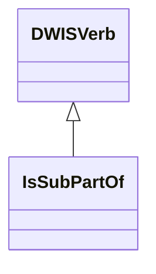
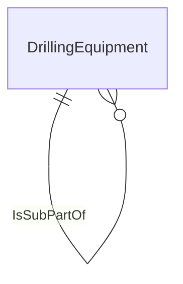

# DrillingEquipment<!-- DEFINITION SET HEADER -->
- Description: 
in this category fall all the standard equipment encountered on a drilling rig. Note that the goal of the vocabulary is not to provide a detailed description of the rig. Therefore we only consider nouns that can help providing a signal context.

# Nouns
## Class Inheritance for Nouns
Here is a class inheritance diagram for the nouns contained in this definition set.

## Equipment <!-- NOUN -->
- Display name: <equipment>
- Parent class: [DWISNoun](./DWISSemantics.md#DWISNoun)
- Definition set: DrillingEquipment
## RigEquipment <!-- NOUN -->
- Display name: <Rig Equipment>
- Parent class: [Equipment](./DrillingEquipment.md#Equipment)
- Definition set: DrillingEquipment
## PowerGenerationSystem <!-- NOUN -->
- Display name: Power Generation System
- Parent class: [RigEquipment](./DrillingEquipment.md#RigEquipment)
- Definition set: DrillingEquipment
## PowerGenerators <!-- NOUN -->
- Display name: Power Generators
- Parent class: [PowerGenerationSystem](./DrillingEquipment.md#PowerGenerationSystem)
- Definition set: DrillingEquipment
## ElectricalControlSystem <!-- NOUN -->
- Display name: Electrical Control System
- Parent class: [PowerGenerationSystem](./DrillingEquipment.md#PowerGenerationSystem)
- Definition set: DrillingEquipment
## PowerScrSystem <!-- NOUN -->
- Display name: Power SCR System
- Parent class: [PowerGenerationSystem](./DrillingEquipment.md#PowerGenerationSystem)
- Definition set: DrillingEquipment
## HoistingSystem <!-- NOUN -->
- Display name: Hoisting  System
- Parent class: [RigEquipment](./DrillingEquipment.md#RigEquipment)
- Definition set: DrillingEquipment
## RackAndPinionHoistingSystem <!-- NOUN -->
- Display name: Rack and Pinion Hoisting System
- Parent class: [HoistingSystem](./DrillingEquipment.md#HoistingSystem)
- Definition set: DrillingEquipment
## RamHoistingSystem <!-- NOUN -->
- Display name: Ram Hoisting System
- Parent class: [HoistingSystem](./DrillingEquipment.md#HoistingSystem)
- Definition set: DrillingEquipment
## Derrick <!-- NOUN -->
- Display name: Derrick
- Parent class: [HoistingSystem](./DrillingEquipment.md#HoistingSystem)
- Definition set: DrillingEquipment
## ConventionalDerrick <!-- NOUN -->
- Display name: Conventional Derrick
- Parent class: [Derrick](./DrillingEquipment.md#Derrick)
- Definition set: DrillingEquipment
## SlantDerrick <!-- NOUN -->
- Display name: Slant Derrick
- Parent class: [Derrick](./DrillingEquipment.md#Derrick)
- Definition set: DrillingEquipment
## QuadristandDerrick <!-- NOUN -->
- Display name: Quadri-Stand Derrick
- Parent class: [Derrick](./DrillingEquipment.md#Derrick)
- Definition set: DrillingEquipment
## TripleStandDerrick <!-- NOUN -->
- Display name: Triple Stand Derrick
- Parent class: [Derrick](./DrillingEquipment.md#Derrick)
- Definition set: DrillingEquipment
## DoubleStandDerrick <!-- NOUN -->
- Display name: Double Stand Derrick
- Parent class: [Derrick](./DrillingEquipment.md#Derrick)
- Definition set: DrillingEquipment
## SingleJointDerrick <!-- NOUN -->
- Display name: Single Joint Derrick
- Parent class: [Derrick](./DrillingEquipment.md#Derrick)
- Definition set: DrillingEquipment
## Drawworks <!-- NOUN -->
- Display name: Drawworks
- Parent class: [HoistingSystem](./DrillingEquipment.md#HoistingSystem)
- Definition set: DrillingEquipment
## StandardElectricalDrawworks <!-- NOUN -->
- Display name: Standard Electrical Drawworks
- Parent class: [Drawworks](./DrillingEquipment.md#Drawworks)
- Definition set: DrillingEquipment
## MechanicalDrawworks <!-- NOUN -->
- Display name: Mechanical Drawworks
- Parent class: [Drawworks](./DrillingEquipment.md#Drawworks)
- Definition set: DrillingEquipment
## DieselElectricalDrawworks <!-- NOUN -->
- Display name: Diesel Electrical Drawworks
- Parent class: [Drawworks](./DrillingEquipment.md#Drawworks)
- Definition set: DrillingEquipment
## RamRig <!-- NOUN -->
- Display name: Ram Rig
- Parent class: [Drawworks](./DrillingEquipment.md#Drawworks)
- Definition set: DrillingEquipment
## MechanicalBlock <!-- NOUN -->
- Display name: Mechanical Block
- Parent class: [HoistingSystem](./DrillingEquipment.md#HoistingSystem)
- Definition set: DrillingEquipment
## TravellingBlock <!-- NOUN -->
- Display name: Travelling Block
- Parent class: [MechanicalBlock](./DrillingEquipment.md#MechanicalBlock)
- Definition set: DrillingEquipment
## CrownBlock <!-- NOUN -->
- Display name: Crown Block
- Parent class: [MechanicalBlock](./DrillingEquipment.md#MechanicalBlock)
- Definition set: DrillingEquipment
## Hook <!-- NOUN -->
- Display name: Hook
- Parent class: [HoistingSystem](./DrillingEquipment.md#HoistingSystem)
- Definition set: DrillingEquipment
## DrillLine <!-- NOUN -->
- Display name: Drill Line
- Parent class: [HoistingSystem](./DrillingEquipment.md#HoistingSystem)
- Definition set: DrillingEquipment
## ActiveLine <!-- NOUN -->
- Display name: Active Line
- Parent class: [DrillLine](./DrillingEquipment.md#DrillLine)
- Definition set: DrillingEquipment
## DeadLine <!-- NOUN -->
- Display name: Dead Line
- Parent class: [DrillLine](./DrillingEquipment.md#DrillLine)
- Definition set: DrillingEquipment
## SupportLine <!-- NOUN -->
- Display name: Support Line
- Parent class: [DrillLine](./DrillingEquipment.md#DrillLine)
- Definition set: DrillingEquipment
## DrillLineFastener <!-- NOUN -->
- Display name: Drill Line Fastener
- Parent class: [HoistingSystem](./DrillingEquipment.md#HoistingSystem)
- Definition set: DrillingEquipment
## DeadLineAnchor <!-- NOUN -->
- Display name: Dead Line Anchor
- Parent class: [DrillLineFastener](./DrillingEquipment.md#DrillLineFastener)
- Definition set: DrillingEquipment
## SurfaceRotationSystem <!-- NOUN -->
- Display name: Surface Rotation System
- Parent class: [RigEquipment](./DrillingEquipment.md#RigEquipment)
- Definition set: DrillingEquipment
## TopDrive <!-- NOUN -->
- Display name: Top Drive
- Parent class: [SurfaceRotationSystem](./DrillingEquipment.md#SurfaceRotationSystem)
- Definition set: DrillingEquipment
## TorqueTrack <!-- NOUN -->
- Display name: Torque Track
- Parent class: [TopDrive](./DrillingEquipment.md#TopDrive)
- Definition set: DrillingEquipment
## TorqueBushing <!-- NOUN -->
- Display name: Torque Bushing
- Parent class: [TopDrive](./DrillingEquipment.md#TopDrive)
- Definition set: DrillingEquipment
## SwivelSub <!-- NOUN -->
- Display name: Swivel Sub
- Parent class: [TopDrive](./DrillingEquipment.md#TopDrive)
- Definition set: DrillingEquipment
## ExtendFrame <!-- NOUN -->
- Display name: Extend Frame
- Parent class: [TopDrive](./DrillingEquipment.md#TopDrive)
- Definition set: DrillingEquipment
## Quill <!-- NOUN -->
- Display name: Quill
- Parent class: [TopDrive](./DrillingEquipment.md#TopDrive)
- Definition set: DrillingEquipment
## MainframeAssembly <!-- NOUN -->
- Display name: Mainframe Assembly
- Parent class: [TopDrive](./DrillingEquipment.md#TopDrive)
- Definition set: DrillingEquipment
## LoadNut <!-- NOUN -->
- Display name: Load Nut
- Parent class: [TopDrive](./DrillingEquipment.md#TopDrive)
- Definition set: DrillingEquipment
## RotaryTable <!-- NOUN -->
- Display name: Rotary Table
- Parent class: [SurfaceRotationSystem](./DrillingEquipment.md#SurfaceRotationSystem)
- Definition set: DrillingEquipment
## RotaryTableBushings <!-- NOUN -->
- Display name: Rotary Table Bushings
- Parent class: [RotaryTable](./DrillingEquipment.md#RotaryTable)
- Definition set: DrillingEquipment
## Kelly <!-- NOUN -->
- Display name: Kelly
- Parent class: [RotaryTable](./DrillingEquipment.md#RotaryTable)
- Definition set: DrillingEquipment
## KellyHose <!-- NOUN -->
- Display name: Kelly Hose
- Parent class: [Kelly](./DrillingEquipment.md#Kelly)
- Definition set: DrillingEquipment
## KellyBushing <!-- NOUN -->
- Display name: Kelly Bushing
- Parent class: [Kelly](./DrillingEquipment.md#Kelly)
- Definition set: DrillingEquipment
## KellyJoint <!-- NOUN -->
- Display name: Kelly Joint
- Parent class: [Kelly](./DrillingEquipment.md#Kelly)
- Definition set: DrillingEquipment
## KellySwivel <!-- NOUN -->
- Display name: Kelly Swivel
- Parent class: [Kelly](./DrillingEquipment.md#Kelly)
- Definition set: DrillingEquipment
## WellControlSystem <!-- NOUN -->
- Display name: Well Control System
- Parent class: [RigEquipment](./DrillingEquipment.md#RigEquipment)
- Definition set: DrillingEquipment
## BellNipple <!-- NOUN -->
- Display name: Bell Nipple
- Parent class: [WellControlSystem](./DrillingEquipment.md#WellControlSystem)
- Definition set: DrillingEquipment
## Accumulator <!-- NOUN -->
- Display name: Accumulator
- Parent class: [WellControlSystem](./DrillingEquipment.md#WellControlSystem)
- Definition set: DrillingEquipment
## BopStack <!-- NOUN -->
- Display name: BOP Stack
- Parent class: [WellControlSystem](./DrillingEquipment.md#WellControlSystem)
- Definition set: DrillingEquipment
## SurfaceBop <!-- NOUN -->
- Display name: Surface BOP
- Parent class: [BopStack](./DrillingEquipment.md#BopStack)
- Definition set: DrillingEquipment
## LandBop <!-- NOUN -->
- Display name: Land BOP
- Parent class: [BopStack](./DrillingEquipment.md#BopStack)
- Definition set: DrillingEquipment
## SubseaBop <!-- NOUN -->
- Display name: Subsea BOP
- Parent class: [BopStack](./DrillingEquipment.md#BopStack)
- Definition set: DrillingEquipment
## BopElement <!-- NOUN -->
- Display name: BOP Element
- Parent class: [WellControlSystem](./DrillingEquipment.md#WellControlSystem)
- Definition set: DrillingEquipment
## AnnularPreventer <!-- NOUN -->
- Display name: Annular Preventer
- Parent class: [BopElement](./DrillingEquipment.md#BopElement)
- Definition set: DrillingEquipment
## PipeRam <!-- NOUN -->
- Display name: Pipe Ram
- Parent class: [BopElement](./DrillingEquipment.md#BopElement)
- Definition set: DrillingEquipment
## ShearRam <!-- NOUN -->
- Display name: Shear  Ram
- Parent class: [BopElement](./DrillingEquipment.md#BopElement)
- Definition set: DrillingEquipment
## BlindRam <!-- NOUN -->
- Display name: Blind Ram
- Parent class: [BopElement](./DrillingEquipment.md#BopElement)
- Definition set: DrillingEquipment
## AdapterSpool <!-- NOUN -->
- Display name: Adapter Spool
- Parent class: [WellControlSystem](./DrillingEquipment.md#WellControlSystem)
- Definition set: DrillingEquipment
## SpacingSpool <!-- NOUN -->
- Display name: Spacing Spool
- Parent class: [WellControlSystem](./DrillingEquipment.md#WellControlSystem)
- Definition set: DrillingEquipment
## ChokeManifold <!-- NOUN -->
- Display name: Choke Manifold
- Parent class: [WellControlSystem](./DrillingEquipment.md#WellControlSystem)
- Definition set: DrillingEquipment
## ChokeValve <!-- NOUN -->
- Display name: Choke Valve
- Parent class: [ChokeManifold](./DrillingEquipment.md#ChokeManifold)
- Definition set: DrillingEquipment
## ChokeValveGatevalve <!-- NOUN -->
- Display name: Gate Valve
- Parent class: [ChokeValve](./DrillingEquipment.md#ChokeValve)
- Definition set: DrillingEquipment
## KillLine <!-- NOUN -->
- Display name: Kill Line
- Parent class: [WellControlSystem](./DrillingEquipment.md#WellControlSystem)
- Definition set: DrillingEquipment
## ChokeLine <!-- NOUN -->
- Display name: Choke Line
- Parent class: [WellControlSystem](./DrillingEquipment.md#WellControlSystem)
- Definition set: DrillingEquipment
## ControlLines <!-- NOUN -->
- Display name: Control Lines
- Parent class: [WellControlSystem](./DrillingEquipment.md#WellControlSystem)
- Definition set: DrillingEquipment
## Diverter <!-- NOUN -->
- Display name: Diverter
- Parent class: [WellControlSystem](./DrillingEquipment.md#WellControlSystem)
- Definition set: DrillingEquipment
## DiverterLine <!-- NOUN -->
- Display name: Diverter Line
- Parent class: [Diverter](./DrillingEquipment.md#Diverter)
- Definition set: DrillingEquipment
## DiverterLineHanger <!-- NOUN -->
- Display name: Diverter Line Hanger
- Parent class: [Diverter](./DrillingEquipment.md#Diverter)
- Definition set: DrillingEquipment
## VentOverboardLine <!-- NOUN -->
- Display name: Vent (Overboard) Line
- Parent class: [Diverter](./DrillingEquipment.md#Diverter)
- Definition set: DrillingEquipment
## ControlManifold <!-- NOUN -->
- Display name: Control Manifold
- Parent class: [WellControlSystem](./DrillingEquipment.md#WellControlSystem)
- Definition set: DrillingEquipment
## Ibop <!-- NOUN -->
- Display name: IBOP
- Parent class: [WellControlSystem](./DrillingEquipment.md#WellControlSystem)
- Definition set: DrillingEquipment
## KellyValve <!-- NOUN -->
- Display name: Kelly Valve
- Parent class: [WellControlSystem](./DrillingEquipment.md#WellControlSystem)
- Definition set: DrillingEquipment
## FloatValveNonreturnValve <!-- NOUN -->
- Display name: Float Valve (Non-Return Valve)
- Parent class: [WellControlSystem](./DrillingEquipment.md#WellControlSystem)
- Definition set: DrillingEquipment
## PlungerFloatValvesF <!-- NOUN -->
- Display name: Plunger Float Valves (F)
- Parent class: [FloatValveNonreturnValve](./DrillingEquipment.md#FloatValveNonreturnValve)
- Definition set: DrillingEquipment
## PortedPlungerValvesFa <!-- NOUN -->
- Display name: Ported Plunger Valves (FA)
- Parent class: [FloatValveNonreturnValve](./DrillingEquipment.md#FloatValveNonreturnValve)
- Definition set: DrillingEquipment
## FlapperFloatValvesG <!-- NOUN -->
- Display name: Flapper Float Valves (G)
- Parent class: [FloatValveNonreturnValve](./DrillingEquipment.md#FloatValveNonreturnValve)
- Definition set: DrillingEquipment
## MpdChoke <!-- NOUN -->
- Display name: MPD Choke
- Parent class: [WellControlSystem](./DrillingEquipment.md#WellControlSystem)
- Definition set: DrillingEquipment
## WellheadXmasTree <!-- NOUN -->
- Display name: Wellhead (Xmas) Tree
- Parent class: [WellControlSystem](./DrillingEquipment.md#WellControlSystem)
- Definition set: DrillingEquipment
## CirculationSystem <!-- NOUN -->
- Display name: Circulation System
- Parent class: [RigEquipment](./DrillingEquipment.md#RigEquipment)
- Definition set: DrillingEquipment
## MudPump <!-- NOUN -->
- Display name: Mud Pump
- Parent class: [CirculationSystem](./DrillingEquipment.md#CirculationSystem)
- Definition set: DrillingEquipment
## PistonMudPump <!-- NOUN -->
- Display name: Piston Mud Pump
- Parent class: [MudPump](./DrillingEquipment.md#MudPump)
- Definition set: DrillingEquipment
## PulsationDampener <!-- NOUN -->
- Display name: Pulsation Dampener
- Parent class: [PistonMudPump](./DrillingEquipment.md#PistonMudPump)
- Definition set: DrillingEquipment
## Piston <!-- NOUN -->
- Display name: Piston
- Parent class: [PistonMudPump](./DrillingEquipment.md#PistonMudPump)
- Definition set: DrillingEquipment
## Liner <!-- NOUN -->
- Display name: Liner
- Parent class: [PistonMudPump](./DrillingEquipment.md#PistonMudPump)
- Definition set: DrillingEquipment
## Cylinders <!-- NOUN -->
- Display name: Cylinders
- Parent class: [PistonMudPump](./DrillingEquipment.md#PistonMudPump)
- Definition set: DrillingEquipment
## Action <!-- NOUN -->
- Display name: Action
- Parent class: [PistonMudPump](./DrillingEquipment.md#PistonMudPump)
- Definition set: DrillingEquipment
## SingleActing <!-- NOUN -->
- Display name: Single Acting
- Parent class: [Action](./DrillingEquipment.md#Action)
- Definition set: DrillingEquipment
## DualActing <!-- NOUN -->
- Display name: Dual Acting
- Parent class: [Action](./DrillingEquipment.md#Action)
- Definition set: DrillingEquipment
## PlungerMudPump <!-- NOUN -->
- Display name: Plunger Mud Pump
- Parent class: [MudPump](./DrillingEquipment.md#MudPump)
- Definition set: DrillingEquipment
## CentrifugalMudPump <!-- NOUN -->
- Display name: Centrifugal Mud Pump
- Parent class: [MudPump](./DrillingEquipment.md#MudPump)
- Definition set: DrillingEquipment
## HydraulicMudPump <!-- NOUN -->
- Display name: Hydraulic Mud Pump
- Parent class: [MudPump](./DrillingEquipment.md#MudPump)
- Definition set: DrillingEquipment
## DiaphragmMudPump <!-- NOUN -->
- Display name: Diaphragm Mud Pump
- Parent class: [MudPump](./DrillingEquipment.md#MudPump)
- Definition set: DrillingEquipment
## PeristalticMudPump <!-- NOUN -->
- Display name: Peristaltic Mud Pump
- Parent class: [MudPump](./DrillingEquipment.md#MudPump)
- Definition set: DrillingEquipment
## RiserLiftPump <!-- NOUN -->
- Display name: Riser Lift Pump
- Parent class: [CirculationSystem](./DrillingEquipment.md#CirculationSystem)
- Definition set: DrillingEquipment
## FillPump <!-- NOUN -->
- Display name: Fill Pump
- Parent class: [CirculationSystem](./DrillingEquipment.md#CirculationSystem)
- Definition set: DrillingEquipment
## BackPressurePump <!-- NOUN -->
- Display name: Back Pressure Pump
- Parent class: [CirculationSystem](./DrillingEquipment.md#CirculationSystem)
- Definition set: DrillingEquipment
## BoosterPump <!-- NOUN -->
- Display name: Booster Pump
- Parent class: [CirculationSystem](./DrillingEquipment.md#CirculationSystem)
- Definition set: DrillingEquipment
## DrillingFluid <!-- NOUN -->
- Display name: Drilling Fluid
- Parent class: [CirculationSystem](./DrillingEquipment.md#CirculationSystem)
- Definition set: DrillingEquipment
## DrillWater <!-- NOUN -->
- Display name: Drill Water
- Parent class: [DrillingFluid](./DrillingEquipment.md#DrillingFluid)
- Definition set: DrillingEquipment
## PotableWater <!-- NOUN -->
- Display name: Potable Water
- Parent class: [DrillingFluid](./DrillingEquipment.md#DrillingFluid)
- Definition set: DrillingEquipment
## SeaWater <!-- NOUN -->
- Display name: Sea Water
- Parent class: [DrillingFluid](./DrillingEquipment.md#DrillingFluid)
- Definition set: DrillingEquipment
## OilBasedMudObm <!-- NOUN -->
- Display name: Oil Based Mud (OBM)
- Parent class: [DrillingFluid](./DrillingEquipment.md#DrillingFluid)
- Definition set: DrillingEquipment
## WaterBasedMudWbm <!-- NOUN -->
- Display name: Water Based Mud (WBM)
- Parent class: [DrillingFluid](./DrillingEquipment.md#DrillingFluid)
- Definition set: DrillingEquipment
## SyntheticOilBasedMudSobm <!-- NOUN -->
- Display name: Synthetic Oil Based Mud (SOBM)
- Parent class: [DrillingFluid](./DrillingEquipment.md#DrillingFluid)
- Definition set: DrillingEquipment
## SpudMud <!-- NOUN -->
- Display name: Spud Mud
- Parent class: [DrillingFluid](./DrillingEquipment.md#DrillingFluid)
- Definition set: DrillingEquipment
## MudPits <!-- NOUN -->
- Display name: Mud Pits
- Parent class: [CirculationSystem](./DrillingEquipment.md#CirculationSystem)
- Definition set: DrillingEquipment
## ActiveDrillingSystem <!-- NOUN -->
- Display name: Active (Drilling) System
- Parent class: [MudPits](./DrillingEquipment.md#MudPits)
- Definition set: DrillingEquipment
## TripTank <!-- NOUN -->
- Display name: Trip Tank
- Parent class: [MudPits](./DrillingEquipment.md#MudPits)
- Definition set: DrillingEquipment
## MixingTank <!-- NOUN -->
- Display name: Mixing Tank
- Parent class: [MudPits](./DrillingEquipment.md#MudPits)
- Definition set: DrillingEquipment
## ReservePit <!-- NOUN -->
- Display name: Reserve Pit
- Parent class: [MudPits](./DrillingEquipment.md#MudPits)
- Definition set: DrillingEquipment
## SlugSettlingPit <!-- NOUN -->
- Display name: Slug (Settling) Pit
- Parent class: [MudPits](./DrillingEquipment.md#MudPits)
- Definition set: DrillingEquipment
## SurgeTank <!-- NOUN -->
- Display name: Surge Tank
- Parent class: [MudPits](./DrillingEquipment.md#MudPits)
- Definition set: DrillingEquipment
## StorageTank <!-- NOUN -->
- Display name: Storage Tank
- Parent class: [MudPits](./DrillingEquipment.md#MudPits)
- Definition set: DrillingEquipment
## SandTrap <!-- NOUN -->
- Display name: Sand Trap
- Parent class: [MudPits](./DrillingEquipment.md#MudPits)
- Definition set: DrillingEquipment
## ChemicalTank <!-- NOUN -->
- Display name: Chemical Tank
- Parent class: [MudPits](./DrillingEquipment.md#MudPits)
- Definition set: DrillingEquipment
## BulkTank <!-- NOUN -->
- Display name: Bulk Tank
- Parent class: [MudPits](./DrillingEquipment.md#MudPits)
- Definition set: DrillingEquipment
## ShaleShakers <!-- NOUN -->
- Display name: Shale Shakers
- Parent class: [CirculationSystem](./DrillingEquipment.md#CirculationSystem)
- Definition set: DrillingEquipment
## ShakerHopper <!-- NOUN -->
- Display name: Shaker Hopper
- Parent class: [ShaleShakers](./DrillingEquipment.md#ShaleShakers)
- Definition set: DrillingEquipment
## ShakerDecks <!-- NOUN -->
- Display name: Shaker Decks
- Parent class: [ShaleShakers](./DrillingEquipment.md#ShaleShakers)
- Definition set: DrillingEquipment
## ShakerScreens <!-- NOUN -->
- Display name: Shaker Screens
- Parent class: [ShakerDecks](./DrillingEquipment.md#ShakerDecks)
- Definition set: DrillingEquipment
## ShakerScreenMeshSize <!-- NOUN -->
- Display name: Shaker Screen Mesh Size
- Parent class: [ShakerDecks](./DrillingEquipment.md#ShakerDecks)
- Definition set: DrillingEquipment
## ShakerCascadeLevels <!-- NOUN -->
- Display name: Shaker Cascade Levels
- Parent class: [ShaleShakers](./DrillingEquipment.md#ShaleShakers)
- Definition set: DrillingEquipment
## Centrifuge <!-- NOUN -->
- Display name: Centrifuge
- Parent class: [CirculationSystem](./DrillingEquipment.md#CirculationSystem)
- Definition set: DrillingEquipment
## Degasser <!-- NOUN -->
- Display name: Degasser
- Parent class: [CirculationSystem](./DrillingEquipment.md#CirculationSystem)
- Definition set: DrillingEquipment
## CentrifugalDegasser <!-- NOUN -->
- Display name: Centrifugal Degasser
- Parent class: [Degasser](./DrillingEquipment.md#Degasser)
- Definition set: DrillingEquipment
## VacuumDegasser <!-- NOUN -->
- Display name: Vacuum Degasser
- Parent class: [Degasser](./DrillingEquipment.md#Degasser)
- Definition set: DrillingEquipment
## AfmAutofluidMeasSkid <!-- NOUN -->
- Display name: AFM (Auto-Fluid Meas.) Skid
- Parent class: [CirculationSystem](./DrillingEquipment.md#CirculationSystem)
- Definition set: DrillingEquipment
## Hydrocyclones <!-- NOUN -->
- Display name: Hydrocyclones
- Parent class: [CirculationSystem](./DrillingEquipment.md#CirculationSystem)
- Definition set: DrillingEquipment
## MudLines <!-- NOUN -->
- Display name: Mud Lines
- Parent class: [CirculationSystem](./DrillingEquipment.md#CirculationSystem)
- Definition set: DrillingEquipment
## MudStandpipeManifold <!-- NOUN -->
- Display name: Mud Standpipe Manifold
- Parent class: [MudLines](./DrillingEquipment.md#MudLines)
- Definition set: DrillingEquipment
## MudStandpipe <!-- NOUN -->
- Display name: Mud Standpipe
- Parent class: [MudLines](./DrillingEquipment.md#MudLines)
- Definition set: DrillingEquipment
## MudHose <!-- NOUN -->
- Display name: Mud Hose
- Parent class: [MudLines](./DrillingEquipment.md#MudLines)
- Definition set: DrillingEquipment
## Gooseneck <!-- NOUN -->
- Display name: Gooseneck
- Parent class: [MudLines](./DrillingEquipment.md#MudLines)
- Definition set: DrillingEquipment
## FlowLine <!-- NOUN -->
- Display name: Flow Line
- Parent class: [MudLines](./DrillingEquipment.md#MudLines)
- Definition set: DrillingEquipment
## MarineSystem <!-- NOUN -->
- Display name: Marine System
- Parent class: [RigEquipment](./DrillingEquipment.md#RigEquipment)
- Definition set: DrillingEquipment
## DrillingRiser <!-- NOUN -->
- Display name: Drilling Riser
- Parent class: [MarineSystem](./DrillingEquipment.md#MarineSystem)
- Definition set: DrillingEquipment
## MarineRiser <!-- NOUN -->
- Display name: Marine Riser
- Parent class: [DrillingRiser](./DrillingEquipment.md#DrillingRiser)
- Definition set: DrillingEquipment
## SurfaceRiser <!-- NOUN -->
- Display name: Surface Riser
- Parent class: [DrillingRiser](./DrillingEquipment.md#DrillingRiser)
- Definition set: DrillingEquipment
## LowPressureRiser <!-- NOUN -->
- Display name: Low Pressure Riser
- Parent class: [SurfaceRiser](./DrillingEquipment.md#SurfaceRiser)
- Definition set: DrillingEquipment
## HighPressureRiser <!-- NOUN -->
- Display name: High Pressure Riser
- Parent class: [SurfaceRiser](./DrillingEquipment.md#SurfaceRiser)
- Definition set: DrillingEquipment
## BallJoint <!-- NOUN -->
- Display name: Ball Joint
- Parent class: [DrillingRiser](./DrillingEquipment.md#DrillingRiser)
- Definition set: DrillingEquipment
## CompletionWorkoverRiser <!-- NOUN -->
- Display name: Completion Workover Riser
- Parent class: [MarineSystem](./DrillingEquipment.md#MarineSystem)
- Definition set: DrillingEquipment
## LowerMarineRiserPackageLmrp <!-- NOUN -->
- Display name: Lower Marine Riser Package (LMRP)
- Parent class: [MarineSystem](./DrillingEquipment.md#MarineSystem)
- Definition set: DrillingEquipment
## BoosterLine <!-- NOUN -->
- Display name: Booster Line
- Parent class: [MarineSystem](./DrillingEquipment.md#MarineSystem)
- Definition set: DrillingEquipment
## SlipJoint <!-- NOUN -->
- Display name: Slip Joint
- Parent class: [MarineSystem](./DrillingEquipment.md#MarineSystem)
- Definition set: DrillingEquipment
## SpiderGimbal <!-- NOUN -->
- Display name: Spider Gimbal
- Parent class: [MarineSystem](./DrillingEquipment.md#MarineSystem)
- Definition set: DrillingEquipment
## MarineRiserTensionerMrtRing <!-- NOUN -->
- Display name: Marine Riser Tensioner (MRT) ring
- Parent class: [MarineSystem](./DrillingEquipment.md#MarineSystem)
- Definition set: DrillingEquipment
## RiserTensioners <!-- NOUN -->
- Display name: Riser Tensioners
- Parent class: [MarineSystem](./DrillingEquipment.md#MarineSystem)
- Definition set: DrillingEquipment
## ConductorTensioners <!-- NOUN -->
- Display name: Conductor Tensioners
- Parent class: [MarineSystem](./DrillingEquipment.md#MarineSystem)
- Definition set: DrillingEquipment
## RiserRecoilSystem <!-- NOUN -->
- Display name: Riser Recoil System
- Parent class: [MarineSystem](./DrillingEquipment.md#MarineSystem)
- Definition set: DrillingEquipment
## LandingJoint <!-- NOUN -->
- Display name: Landing Joint
- Parent class: [MarineSystem](./DrillingEquipment.md#MarineSystem)
- Definition set: DrillingEquipment
## Rov <!-- NOUN -->
- Display name: ROV
- Parent class: [MarineSystem](./DrillingEquipment.md#MarineSystem)
- Definition set: DrillingEquipment
## BallastSystem <!-- NOUN -->
- Display name: Ballast System
- Parent class: [MarineSystem](./DrillingEquipment.md#MarineSystem)
- Definition set: DrillingEquipment
## Beacons <!-- NOUN -->
- Display name: Beacons
- Parent class: [MarineSystem](./DrillingEquipment.md#MarineSystem)
- Definition set: DrillingEquipment
## JackupLegs <!-- NOUN -->
- Display name: Jack-Up Legs
- Parent class: [MarineSystem](./DrillingEquipment.md#MarineSystem)
- Definition set: DrillingEquipment
## MooringSystem <!-- NOUN -->
- Display name: Mooring System
- Parent class: [MarineSystem](./DrillingEquipment.md#MarineSystem)
- Definition set: DrillingEquipment
## MooringLines <!-- NOUN -->
- Display name: Mooring lines
- Parent class: [MooringSystem](./DrillingEquipment.md#MooringSystem)
- Definition set: DrillingEquipment
## Anchors <!-- NOUN -->
- Display name: Anchors
- Parent class: [MooringSystem](./DrillingEquipment.md#MooringSystem)
- Definition set: DrillingEquipment
## MarineFuel <!-- NOUN -->
- Display name: Marine Fuel
- Parent class: [MarineSystem](./DrillingEquipment.md#MarineSystem)
- Definition set: DrillingEquipment
## MudLineSystem <!-- NOUN -->
- Display name: Mud Line System
- Parent class: [MarineSystem](./DrillingEquipment.md#MarineSystem)
- Definition set: DrillingEquipment
## StormLoop <!-- NOUN -->
- Display name: Storm Loop
- Parent class: [MarineSystem](./DrillingEquipment.md#MarineSystem)
- Definition set: DrillingEquipment
## HeaveCompensationSystem <!-- NOUN -->
- Display name: Heave Compensation System
- Parent class: [MarineSystem](./DrillingEquipment.md#MarineSystem)
- Definition set: DrillingEquipment
## DrillFloorSystems <!-- NOUN -->
- Display name: Drill Floor Systems
- Parent class: [RigEquipment](./DrillingEquipment.md#RigEquipment)
- Definition set: DrillingEquipment
## DrillFloorStructure <!-- NOUN -->
- Display name: Drill Floor Structure
- Parent class: [DrillFloorSystems](./DrillingEquipment.md#DrillFloorSystems)
- Definition set: DrillingEquipment
## DogHouse <!-- NOUN -->
- Display name: Dog House
- Parent class: [DrillFloorStructure](./DrillingEquipment.md#DrillFloorStructure)
- Definition set: DrillingEquipment
## RigFloor <!-- NOUN -->
- Display name: Rig Floor
- Parent class: [DrillFloorStructure](./DrillingEquipment.md#DrillFloorStructure)
- Definition set: DrillingEquipment
## Mousehole <!-- NOUN -->
- Display name: Mousehole
- Parent class: [DrillFloorStructure](./DrillingEquipment.md#DrillFloorStructure)
- Definition set: DrillingEquipment
## DrillFloorSubstructure <!-- NOUN -->
- Display name: Drill Floor Substructure
- Parent class: [DrillFloorStructure](./DrillingEquipment.md#DrillFloorStructure)
- Definition set: DrillingEquipment
## DrillFloorEquipment <!-- NOUN -->
- Display name: Drill Floor Equipment
- Parent class: [DrillFloorSystems](./DrillingEquipment.md#DrillFloorSystems)
- Definition set: DrillingEquipment
## DrillersConsole <!-- NOUN -->
- Display name: Drillers Console
- Parent class: [DrillFloorEquipment](./DrillingEquipment.md#DrillFloorEquipment)
- Definition set: DrillingEquipment
## IronRoughneck <!-- NOUN -->
- Display name: Iron Roughneck
- Parent class: [DrillFloorEquipment](./DrillingEquipment.md#DrillFloorEquipment)
- Definition set: DrillingEquipment
## DrillPipeElevator <!-- NOUN -->
- Display name: Drill Pipe Elevator
- Parent class: [DrillFloorEquipment](./DrillingEquipment.md#DrillFloorEquipment)
- Definition set: DrillingEquipment
## ElevatorBailsLinks <!-- NOUN -->
- Display name: Elevator Bails / Links
- Parent class: [DrillFloorEquipment](./DrillingEquipment.md#DrillFloorEquipment)
- Definition set: DrillingEquipment
## DrillPipeTongs <!-- NOUN -->
- Display name: Drill Pipe Tongs
- Parent class: [DrillFloorEquipment](./DrillingEquipment.md#DrillFloorEquipment)
- Definition set: DrillingEquipment
## ManualPipeTongs <!-- NOUN -->
- Display name: Manual Pipe Tongs
- Parent class: [DrillPipeTongs](./DrillingEquipment.md#DrillPipeTongs)
- Definition set: DrillingEquipment
## PowerPipeTongs <!-- NOUN -->
- Display name: Power Pipe Tongs
- Parent class: [DrillPipeTongs](./DrillingEquipment.md#DrillPipeTongs)
- Definition set: DrillingEquipment
## CasingTongs <!-- NOUN -->
- Display name: Casing Tongs
- Parent class: [DrillPipeTongs](./DrillingEquipment.md#DrillPipeTongs)
- Definition set: DrillingEquipment
## RotarySlips <!-- NOUN -->
- Display name: Rotary Slips
- Parent class: [DrillFloorEquipment](./DrillingEquipment.md#DrillFloorEquipment)
- Definition set: DrillingEquipment
## ManualSlips <!-- NOUN -->
- Display name: Manual Slips
- Parent class: [RotarySlips](./DrillingEquipment.md#RotarySlips)
- Definition set: DrillingEquipment
## PowerSlips <!-- NOUN -->
- Display name: Power Slips
- Parent class: [RotarySlips](./DrillingEquipment.md#RotarySlips)
- Definition set: DrillingEquipment
## PneumaticSlips <!-- NOUN -->
- Display name: Pneumatic Slips
- Parent class: [RotarySlips](./DrillingEquipment.md#RotarySlips)
- Definition set: DrillingEquipment
## StabbingGuide <!-- NOUN -->
- Display name: Stabbing Guide
- Parent class: [DrillFloorEquipment](./DrillingEquipment.md#DrillFloorEquipment)
- Definition set: DrillingEquipment
## SafetyClamps <!-- NOUN -->
- Display name: Safety Clamps
- Parent class: [DrillFloorEquipment](./DrillingEquipment.md#DrillFloorEquipment)
- Definition set: DrillingEquipment
## RotatingControlDeviceRcd <!-- NOUN -->
- Display name: Rotating Control Device (RCD)
- Parent class: [DrillFloorEquipment](./DrillingEquipment.md#DrillFloorEquipment)
- Definition set: DrillingEquipment
## Dolly <!-- NOUN -->
- Display name: Dolly
- Parent class: [DrillFloorEquipment](./DrillingEquipment.md#DrillFloorEquipment)
- Definition set: DrillingEquipment
## DollyRail <!-- NOUN -->
- Display name: Dolly Rail
- Parent class: [DrillFloorEquipment](./DrillingEquipment.md#DrillFloorEquipment)
- Definition set: DrillingEquipment
## SlickLine <!-- NOUN -->
- Display name: Slick Line
- Parent class: [DrillFloorEquipment](./DrillingEquipment.md#DrillFloorEquipment)
- Definition set: DrillingEquipment
## CementingEquipment <!-- NOUN -->
- Display name: Cementing Equipment
- Parent class: [RigEquipment](./DrillingEquipment.md#RigEquipment)
- Definition set: DrillingEquipment
## CementPump <!-- NOUN -->
- Display name: Cement Pump
- Parent class: [CementingEquipment](./DrillingEquipment.md#CementingEquipment)
- Definition set: DrillingEquipment
## CementSlurry <!-- NOUN -->
- Display name: Cement Slurry
- Parent class: [CementingEquipment](./DrillingEquipment.md#CementingEquipment)
- Definition set: DrillingEquipment
## CementSpacer <!-- NOUN -->
- Display name: Cement Spacer
- Parent class: [CementingEquipment](./DrillingEquipment.md#CementingEquipment)
- Definition set: DrillingEquipment
## CementStand <!-- NOUN -->
- Display name: Cement Stand
- Parent class: [CementingEquipment](./DrillingEquipment.md#CementingEquipment)
- Definition set: DrillingEquipment
## CementStinger <!-- NOUN -->
- Display name: Cement Stinger
- Parent class: [CementingEquipment](./DrillingEquipment.md#CementingEquipment)
- Definition set: DrillingEquipment
## CementUnit <!-- NOUN -->
- Display name: Cement Unit
- Parent class: [CementingEquipment](./DrillingEquipment.md#CementingEquipment)
- Definition set: DrillingEquipment
## CementHead <!-- NOUN -->
- Display name: Cement Head
- Parent class: [CementingEquipment](./DrillingEquipment.md#CementingEquipment)
- Definition set: DrillingEquipment
## CementLines <!-- NOUN -->
- Display name: Cement Lines
- Parent class: [CementingEquipment](./DrillingEquipment.md#CementingEquipment)
- Definition set: DrillingEquipment
## CementManifold <!-- NOUN -->
- Display name: Cement Manifold
- Parent class: [CementingEquipment](./DrillingEquipment.md#CementingEquipment)
- Definition set: DrillingEquipment
## WellTestingEquipment <!-- NOUN -->
- Display name: Well Testing Equipment
- Parent class: [RigEquipment](./DrillingEquipment.md#RigEquipment)
- Definition set: DrillingEquipment
## TestingTools <!-- NOUN -->
- Display name: Testing Tools
- Parent class: [WellTestingEquipment](./DrillingEquipment.md#WellTestingEquipment)
- Definition set: DrillingEquipment
## TestPlug <!-- NOUN -->
- Display name: Test Plug
- Parent class: [WellTestingEquipment](./DrillingEquipment.md#WellTestingEquipment)
- Definition set: DrillingEquipment
## SubseaTestTree <!-- NOUN -->
- Display name: Subsea Test Tree
- Parent class: [WellTestingEquipment](./DrillingEquipment.md#WellTestingEquipment)
- Definition set: DrillingEquipment
## TestTools <!-- NOUN -->
- Display name: Test Tools
- Parent class: [WellTestingEquipment](./DrillingEquipment.md#WellTestingEquipment)
- Definition set: DrillingEquipment
## Seperator <!-- NOUN -->
- Display name: Seperator
- Parent class: [WellTestingEquipment](./DrillingEquipment.md#WellTestingEquipment)
- Definition set: DrillingEquipment
## SafetyEquipment <!-- NOUN -->
- Display name: Safety Equipment
- Parent class: [RigEquipment](./DrillingEquipment.md#RigEquipment)
- Definition set: DrillingEquipment
## FireSafetySystems <!-- NOUN -->
- Display name: Fire Safety Systems
- Parent class: [SafetyEquipment](./DrillingEquipment.md#SafetyEquipment)
- Definition set: DrillingEquipment
## GasSafetySystems <!-- NOUN -->
- Display name: Gas Safety Systems
- Parent class: [SafetyEquipment](./DrillingEquipment.md#SafetyEquipment)
- Definition set: DrillingEquipment
## ThirdPartyRigEquipment <!-- NOUN -->
- Display name: Third Party Rig Equipment
- Parent class: [RigEquipment](./DrillingEquipment.md#RigEquipment)
- Definition set: DrillingEquipment
## ThirdPartyTools <!-- NOUN -->
- Display name: Third Party Tools
- Parent class: [ThirdPartyRigEquipment](./DrillingEquipment.md#ThirdPartyRigEquipment)
- Definition set: DrillingEquipment
## MudLoggingEquipment <!-- NOUN -->
- Display name: Mud Logging Equipment
- Parent class: [RigEquipment](./DrillingEquipment.md#RigEquipment)
- Definition set: DrillingEquipment
## CuttingsSamplingEquipment <!-- NOUN -->
- Display name: Cuttings Sampling Equipment
- Parent class: [MudLoggingEquipment](./DrillingEquipment.md#MudLoggingEquipment)
- Definition set: DrillingEquipment
## CuttingsAnalysisEquipmnet <!-- NOUN -->
- Display name: Cuttings Analysis Equipmnet
- Parent class: [MudLoggingEquipment](./DrillingEquipment.md#MudLoggingEquipment)
- Definition set: DrillingEquipment
## GasAnalysisEquipment <!-- NOUN -->
- Display name: Gas Analysis Equipment
- Parent class: [MudLoggingEquipment](./DrillingEquipment.md#MudLoggingEquipment)
- Definition set: DrillingEquipment
## FlowAnalysisEquipment <!-- NOUN -->
- Display name: Flow Analysis Equipment
- Parent class: [MudLoggingEquipment](./DrillingEquipment.md#MudLoggingEquipment)
- Definition set: DrillingEquipment
## Tubulars <!-- NOUN -->
- Display name: <Tubulars>
- Parent class: [Equipment](./DrillingEquipment.md#Equipment)
- Definition set: DrillingEquipment
## DrillString <!-- NOUN -->
- Display name: Drill String
- Parent class: [Tubulars](./DrillingEquipment.md#Tubulars)
- Definition set: DrillingEquipment
## BottomholeAssembly <!-- NOUN -->
- Display name: Bottomhole Assembly
- Parent class: [DrillString](./DrillingEquipment.md#DrillString)
- Definition set: DrillingEquipment
## DrillPipe <!-- NOUN -->
- Display name: Drill Pipe
- Parent class: [DrillString](./DrillingEquipment.md#DrillString)
- Definition set: DrillingEquipment
## CompressiveDrillPipe <!-- NOUN -->
- Display name: Compressive Drill Pipe
- Parent class: [DrillString](./DrillingEquipment.md#DrillString)
- Definition set: DrillingEquipment
## DrillCollars <!-- NOUN -->
- Display name: Drill Collars
- Parent class: [DrillString](./DrillingEquipment.md#DrillString)
- Definition set: DrillingEquipment
## NonmagneticCollars <!-- NOUN -->
- Display name: Non-Magnetic Collars
- Parent class: [DrillString](./DrillingEquipment.md#DrillString)
- Definition set: DrillingEquipment
## ShortDc <!-- NOUN -->
- Display name: Short DC
- Parent class: [DrillString](./DrillingEquipment.md#DrillString)
- Definition set: DrillingEquipment
## Heavyweight <!-- NOUN -->
- Display name: Heavyweight
- Parent class: [DrillString](./DrillingEquipment.md#DrillString)
- Definition set: DrillingEquipment
## PupJoints <!-- NOUN -->
- Display name: Pup joints
- Parent class: [DrillString](./DrillingEquipment.md#DrillString)
- Definition set: DrillingEquipment
## Stabilizers <!-- NOUN -->
- Display name: Stabilizers
- Parent class: [DrillString](./DrillingEquipment.md#DrillString)
- Definition set: DrillingEquipment
## BladeShape <!-- NOUN -->
- Display name: Blade Shape
- Parent class: [Stabilizers](./DrillingEquipment.md#Stabilizers)
- Definition set: DrillingEquipment
## Dynamic <!-- NOUN -->
- Display name: dynamic
- Parent class: [BladeShape](./DrillingEquipment.md#BladeShape)
- Definition set: DrillingEquipment
## Melon <!-- NOUN -->
- Display name: melon
- Parent class: [BladeShape](./DrillingEquipment.md#BladeShape)
- Definition set: DrillingEquipment
## Spiral <!-- NOUN -->
- Display name: spiral
- Parent class: [BladeShape](./DrillingEquipment.md#BladeShape)
- Definition set: DrillingEquipment
## Straight <!-- NOUN -->
- Display name: straight
- Parent class: [BladeShape](./DrillingEquipment.md#BladeShape)
- Definition set: DrillingEquipment
## Variable <!-- NOUN -->
- Display name: variable
- Parent class: [BladeShape](./DrillingEquipment.md#BladeShape)
- Definition set: DrillingEquipment
## BladeType <!-- NOUN -->
- Display name: Blade Type
- Parent class: [Stabilizers](./DrillingEquipment.md#Stabilizers)
- Definition set: DrillingEquipment
## Clampon <!-- NOUN -->
- Display name: clamp-on
- Parent class: [BladeType](./DrillingEquipment.md#BladeType)
- Definition set: DrillingEquipment
## Integral <!-- NOUN -->
- Display name: integral
- Parent class: [BladeType](./DrillingEquipment.md#BladeType)
- Definition set: DrillingEquipment
## Sleeve <!-- NOUN -->
- Display name: sleeve
- Parent class: [BladeType](./DrillingEquipment.md#BladeType)
- Definition set: DrillingEquipment
## BladeTypeWelded <!-- NOUN -->
- Display name: welded
- Parent class: [BladeType](./DrillingEquipment.md#BladeType)
- Definition set: DrillingEquipment
## BladeDiameter <!-- NOUN -->
- Display name: Blade Diameter
- Parent class: [Stabilizers](./DrillingEquipment.md#Stabilizers)
- Definition set: DrillingEquipment
## BladeLength <!-- NOUN -->
- Display name: Blade Length
- Parent class: [Stabilizers](./DrillingEquipment.md#Stabilizers)
- Definition set: DrillingEquipment
## Nonmagnetic <!-- NOUN -->
- Display name: Non-Magnetic
- Parent class: [Stabilizers](./DrillingEquipment.md#Stabilizers)
- Definition set: DrillingEquipment
## NearBit <!-- NOUN -->
- Display name: Near Bit
- Parent class: [Stabilizers](./DrillingEquipment.md#Stabilizers)
- Definition set: DrillingEquipment
## Nonrotating <!-- NOUN -->
- Display name: Non-Rotating
- Parent class: [Stabilizers](./DrillingEquipment.md#Stabilizers)
- Definition set: DrillingEquipment
## Steerable <!-- NOUN -->
- Display name: Steerable
- Parent class: [Stabilizers](./DrillingEquipment.md#Stabilizers)
- Definition set: DrillingEquipment
## Grouping <!-- NOUN -->
- Display name: Grouping
- Parent class: [DrillString](./DrillingEquipment.md#DrillString)
- Definition set: DrillingEquipment
## Stands <!-- NOUN -->
- Display name: Stands
- Parent class: [Grouping](./DrillingEquipment.md#Grouping)
- Definition set: DrillingEquipment
## Doubles <!-- NOUN -->
- Display name: Doubles
- Parent class: [Grouping](./DrillingEquipment.md#Grouping)
- Definition set: DrillingEquipment
## Singles <!-- NOUN -->
- Display name: Singles
- Parent class: [Grouping](./DrillingEquipment.md#Grouping)
- Definition set: DrillingEquipment
## MiscSubs <!-- NOUN -->
- Display name: Misc. Subs
- Parent class: [DrillString](./DrillingEquipment.md#DrillString)
- Definition set: DrillingEquipment
## Subbent <!-- NOUN -->
- Display name: sub-bent
- Parent class: [MiscSubs](./DrillingEquipment.md#MiscSubs)
- Definition set: DrillingEquipment
## Subbit <!-- NOUN -->
- Display name: sub-bit
- Parent class: [MiscSubs](./DrillingEquipment.md#MiscSubs)
- Definition set: DrillingEquipment
## Subbumper <!-- NOUN -->
- Display name: sub-bumper
- Parent class: [MiscSubs](./DrillingEquipment.md#MiscSubs)
- Definition set: DrillingEquipment
## Subcatcher <!-- NOUN -->
- Display name: sub-catcher
- Parent class: [MiscSubs](./DrillingEquipment.md#MiscSubs)
- Definition set: DrillingEquipment
## Subcirculation <!-- NOUN -->
- Display name: sub-circulation
- Parent class: [MiscSubs](./DrillingEquipment.md#MiscSubs)
- Definition set: DrillingEquipment
## Subcone <!-- NOUN -->
- Display name: sub-cone
- Parent class: [MiscSubs](./DrillingEquipment.md#MiscSubs)
- Definition set: DrillingEquipment
## Subcrossover <!-- NOUN -->
- Display name: sub-crossover
- Parent class: [MiscSubs](./DrillingEquipment.md#MiscSubs)
- Definition set: DrillingEquipment
## Subdart <!-- NOUN -->
- Display name: sub-dart
- Parent class: [MiscSubs](./DrillingEquipment.md#MiscSubs)
- Definition set: DrillingEquipment
## Subfilter <!-- NOUN -->
- Display name: sub-filter
- Parent class: [MiscSubs](./DrillingEquipment.md#MiscSubs)
- Definition set: DrillingEquipment
## Subfloat <!-- NOUN -->
- Display name: sub-float
- Parent class: [MiscSubs](./DrillingEquipment.md#MiscSubs)
- Definition set: DrillingEquipment
## Subjetting <!-- NOUN -->
- Display name: sub-jetting
- Parent class: [MiscSubs](./DrillingEquipment.md#MiscSubs)
- Definition set: DrillingEquipment
## Subjunk <!-- NOUN -->
- Display name: sub-junk
- Parent class: [MiscSubs](./DrillingEquipment.md#MiscSubs)
- Definition set: DrillingEquipment
## Suborienting <!-- NOUN -->
- Display name: sub-orienting
- Parent class: [MiscSubs](./DrillingEquipment.md#MiscSubs)
- Definition set: DrillingEquipment
## Subported <!-- NOUN -->
- Display name: sub-ported
- Parent class: [MiscSubs](./DrillingEquipment.md#MiscSubs)
- Definition set: DrillingEquipment
## SubpressureRelief <!-- NOUN -->
- Display name: sub-pressure relief
- Parent class: [MiscSubs](./DrillingEquipment.md#MiscSubs)
- Definition set: DrillingEquipment
## SubpumpOut <!-- NOUN -->
- Display name: sub-pump out
- Parent class: [MiscSubs](./DrillingEquipment.md#MiscSubs)
- Definition set: DrillingEquipment
## Subrestrictor <!-- NOUN -->
- Display name: sub-restrictor
- Parent class: [MiscSubs](./DrillingEquipment.md#MiscSubs)
- Definition set: DrillingEquipment
## Subsaver <!-- NOUN -->
- Display name: sub-saver
- Parent class: [MiscSubs](./DrillingEquipment.md#MiscSubs)
- Definition set: DrillingEquipment
## Subshock <!-- NOUN -->
- Display name: sub-shock
- Parent class: [MiscSubs](./DrillingEquipment.md#MiscSubs)
- Definition set: DrillingEquipment
## SubsideEntry <!-- NOUN -->
- Display name: sub-side entry
- Parent class: [MiscSubs](./DrillingEquipment.md#MiscSubs)
- Definition set: DrillingEquipment
## Substop <!-- NOUN -->
- Display name: sub-stop
- Parent class: [MiscSubs](./DrillingEquipment.md#MiscSubs)
- Definition set: DrillingEquipment
## CasingString <!-- NOUN -->
- Display name: Casing String
- Parent class: [Tubulars](./DrillingEquipment.md#Tubulars)
- Definition set: DrillingEquipment
## ConductorDrivePipe <!-- NOUN -->
- Display name: Conductor (Drive Pipe)
- Parent class: [CasingString](./DrillingEquipment.md#CasingString)
- Definition set: DrillingEquipment
## Casing <!-- NOUN -->
- Display name: Casing
- Parent class: [CasingString](./DrillingEquipment.md#CasingString)
- Definition set: DrillingEquipment
## Liners <!-- NOUN -->
- Display name: Liners
- Parent class: [CasingString](./DrillingEquipment.md#CasingString)
- Definition set: DrillingEquipment
## Centralizers <!-- NOUN -->
- Display name: Centralizers
- Parent class: [CasingString](./DrillingEquipment.md#CasingString)
- Definition set: DrillingEquipment
## Crossover <!-- NOUN -->
- Display name: Crossover
- Parent class: [CasingString](./DrillingEquipment.md#CasingString)
- Definition set: DrillingEquipment
## Connection <!-- NOUN -->
- Display name: Connection
- Parent class: [CasingString](./DrillingEquipment.md#CasingString)
- Definition set: DrillingEquipment
## Box <!-- NOUN -->
- Display name: box
- Parent class: [Connection](./DrillingEquipment.md#Connection)
- Definition set: DrillingEquipment
## Flange <!-- NOUN -->
- Display name: flange
- Parent class: [Connection](./DrillingEquipment.md#Connection)
- Definition set: DrillingEquipment
## Mandrel <!-- NOUN -->
- Display name: mandrel
- Parent class: [Connection](./DrillingEquipment.md#Connection)
- Definition set: DrillingEquipment
## Pin <!-- NOUN -->
- Display name: pin
- Parent class: [Connection](./DrillingEquipment.md#Connection)
- Definition set: DrillingEquipment
## ConnectionWelded <!-- NOUN -->
- Display name: welded
- Parent class: [Connection](./DrillingEquipment.md#Connection)
- Definition set: DrillingEquipment
## Selfsealingthreaded <!-- NOUN -->
- Display name: self-sealing-threaded
- Parent class: [Connection](./DrillingEquipment.md#Connection)
- Definition set: DrillingEquipment
## Expandables <!-- NOUN -->
- Display name: Expandables
- Parent class: [Tubulars](./DrillingEquipment.md#Tubulars)
- Definition set: DrillingEquipment
## TubingString <!-- NOUN -->
- Display name: Tubing String
- Parent class: [Tubulars](./DrillingEquipment.md#Tubulars)
- Definition set: DrillingEquipment
## ScreenString <!-- NOUN -->
- Display name: Screen String
- Parent class: [Tubulars](./DrillingEquipment.md#Tubulars)
- Definition set: DrillingEquipment
## TubularConnection <!-- NOUN -->
- Display name: Tubular Connection
- Parent class: [Tubulars](./DrillingEquipment.md#Tubulars)
- Definition set: DrillingEquipment
## TubularConfiguration <!-- NOUN -->
- Display name: Tubular Configuration
- Parent class: [Tubulars](./DrillingEquipment.md#Tubulars)
- Definition set: DrillingEquipment
## PinDown <!-- NOUN -->
- Display name: Pin Down
- Parent class: [TubularConfiguration](./DrillingEquipment.md#TubularConfiguration)
- Definition set: DrillingEquipment
## PinUp <!-- NOUN -->
- Display name: Pin Up
- Parent class: [TubularConfiguration](./DrillingEquipment.md#TubularConfiguration)
- Definition set: DrillingEquipment
## Boxbox <!-- NOUN -->
- Display name: Box-Box
- Parent class: [TubularConfiguration](./DrillingEquipment.md#TubularConfiguration)
- Definition set: DrillingEquipment
## Pinpin <!-- NOUN -->
- Display name: Pin-Pin
- Parent class: [TubularConfiguration](./DrillingEquipment.md#TubularConfiguration)
- Definition set: DrillingEquipment
## DownholeEquipment <!-- NOUN -->
- Display name: <Downhole Equipment>
- Parent class: [Equipment](./DrillingEquipment.md#Equipment)
- Definition set: DrillingEquipment
## DrillingEquipment <!-- NOUN -->
- Display name: Drilling Equipment
- Parent class: [DownholeEquipment](./DrillingEquipment.md#DownholeEquipment)
- Definition set: DrillingEquipment
## DrillstemTerminator <!-- NOUN -->
- Display name: Drillstem Terminator
- Parent class: [DrillingEquipment](./DrillingEquipment.md#DrillingEquipment)
- Definition set: DrillingEquipment
## DrillingBit <!-- NOUN -->
- Display name: Drilling Bit
- Parent class: [DrillstemTerminator](./DrillingEquipment.md#DrillstemTerminator)
- Definition set: DrillingEquipment
## RollingCutter <!-- NOUN -->
- Display name: Rolling Cutter
- Parent class: [DrillingBit](./DrillingEquipment.md#DrillingBit)
- Definition set: DrillingEquipment
## Milltooth <!-- NOUN -->
- Display name: MillTooth
- Parent class: [RollingCutter](./DrillingEquipment.md#RollingCutter)
- Definition set: DrillingEquipment
## InsertTci <!-- NOUN -->
- Display name: Insert (TCI)
- Parent class: [RollingCutter](./DrillingEquipment.md#RollingCutter)
- Definition set: DrillingEquipment
## FixedCutter <!-- NOUN -->
- Display name: Fixed Cutter
- Parent class: [DrillingBit](./DrillingEquipment.md#DrillingBit)
- Definition set: DrillingEquipment
## Pdc <!-- NOUN -->
- Display name: PDC
- Parent class: [FixedCutter](./DrillingEquipment.md#FixedCutter)
- Definition set: DrillingEquipment
## Diamond <!-- NOUN -->
- Display name: Diamond
- Parent class: [FixedCutter](./DrillingEquipment.md#FixedCutter)
- Definition set: DrillingEquipment
## PdcCore <!-- NOUN -->
- Display name: PDC Core
- Parent class: [FixedCutter](./DrillingEquipment.md#FixedCutter)
- Definition set: DrillingEquipment
## DiamondCore <!-- NOUN -->
- Display name: Diamond Core
- Parent class: [FixedCutter](./DrillingEquipment.md#FixedCutter)
- Definition set: DrillingEquipment
## HybridKymera <!-- NOUN -->
- Display name: Hybrid (Kymera)
- Parent class: [DrillingBit](./DrillingEquipment.md#DrillingBit)
- Definition set: DrillingEquipment
## Nozzles <!-- NOUN -->
- Display name: Nozzles
- Parent class: [DrillingBit](./DrillingEquipment.md#DrillingBit)
- Definition set: DrillingEquipment
## BullNose <!-- NOUN -->
- Display name: Bull Nose
- Parent class: [DrillstemTerminator](./DrillingEquipment.md#DrillstemTerminator)
- Definition set: DrillingEquipment
## Reamers <!-- NOUN -->
- Display name: Reamers
- Parent class: [DrillingEquipment](./DrillingEquipment.md#DrillingEquipment)
- Definition set: DrillingEquipment
## RollerReamers <!-- NOUN -->
- Display name: Roller reamers
- Parent class: [Reamers](./DrillingEquipment.md#Reamers)
- Definition set: DrillingEquipment
## RfidReamers <!-- NOUN -->
- Display name: RFID reamers
- Parent class: [Reamers](./DrillingEquipment.md#Reamers)
- Definition set: DrillingEquipment
## NearbitReamers <!-- NOUN -->
- Display name: Near-bit reamers
- Parent class: [Reamers](./DrillingEquipment.md#Reamers)
- Definition set: DrillingEquipment
## FixedBladeReamers <!-- NOUN -->
- Display name: Fixed blade reamers
- Parent class: [Reamers](./DrillingEquipment.md#Reamers)
- Definition set: DrillingEquipment
## BicenterReamerBit <!-- NOUN -->
- Display name: Bi-center reamer bit
- Parent class: [Reamers](./DrillingEquipment.md#Reamers)
- Definition set: DrillingEquipment
## ExpandableReamers <!-- NOUN -->
- Display name: Expandable reamers
- Parent class: [Reamers](./DrillingEquipment.md#Reamers)
- Definition set: DrillingEquipment
## HoleOpener <!-- NOUN -->
- Display name: Hole Opener
- Parent class: [DrillingEquipment](./DrillingEquipment.md#DrillingEquipment)
- Definition set: DrillingEquipment
## Underreamers <!-- NOUN -->
- Display name: Underreamers
- Parent class: [HoleOpener](./DrillingEquipment.md#HoleOpener)
- Definition set: DrillingEquipment
## FixedBlade <!-- NOUN -->
- Display name: Fixed Blade
- Parent class: [HoleOpener](./DrillingEquipment.md#HoleOpener)
- Definition set: DrillingEquipment
## CoringTool <!-- NOUN -->
- Display name: Coring Tool
- Parent class: [DrillingEquipment](./DrillingEquipment.md#DrillingEquipment)
- Definition set: DrillingEquipment
## InnerBarrel <!-- NOUN -->
- Display name: Inner Barrel
- Parent class: [CoringTool](./DrillingEquipment.md#CoringTool)
- Definition set: DrillingEquipment
## OuterBarrel <!-- NOUN -->
- Display name: Outer Barrel
- Parent class: [CoringTool](./DrillingEquipment.md#CoringTool)
- Definition set: DrillingEquipment
## DownholeMotor <!-- NOUN -->
- Display name: Downhole Motor
- Parent class: [DrillingEquipment](./DrillingEquipment.md#DrillingEquipment)
- Definition set: DrillingEquipment
## TurbineMotor <!-- NOUN -->
- Display name: Turbine Motor
- Parent class: [DownholeMotor](./DrillingEquipment.md#DownholeMotor)
- Definition set: DrillingEquipment
## PositiveDisplacementMotor <!-- NOUN -->
- Display name: Positive Displacement Motor
- Parent class: [DownholeMotor](./DrillingEquipment.md#DownholeMotor)
- Definition set: DrillingEquipment
## OilBearing <!-- NOUN -->
- Display name: Oil Bearing
- Parent class: [DownholeMotor](./DrillingEquipment.md#DownholeMotor)
- Definition set: DrillingEquipment
## MudLubeBearing <!-- NOUN -->
- Display name: Mud Lube Bearing
- Parent class: [DownholeMotor](./DrillingEquipment.md#DownholeMotor)
- Definition set: DrillingEquipment
## SteerableMotor <!-- NOUN -->
- Display name: Steerable Motor
- Parent class: [DownholeMotor](./DrillingEquipment.md#DownholeMotor)
- Definition set: DrillingEquipment
## InstrumentedMotor <!-- NOUN -->
- Display name: Instrumented Motor
- Parent class: [DownholeMotor](./DrillingEquipment.md#DownholeMotor)
- Definition set: DrillingEquipment
## AdjustableKickoffSub <!-- NOUN -->
- Display name: Adjustable Kick-Off Sub
- Parent class: [DrillingEquipment](./DrillingEquipment.md#DrillingEquipment)
- Definition set: DrillingEquipment
## RotarySteerableSystems <!-- NOUN -->
- Display name: Rotary Steerable Systems
- Parent class: [DrillingEquipment](./DrillingEquipment.md#DrillingEquipment)
- Definition set: DrillingEquipment
## Pointthebit <!-- NOUN -->
- Display name: Point-The-Bit
- Parent class: [RotarySteerableSystems](./DrillingEquipment.md#RotarySteerableSystems)
- Definition set: DrillingEquipment
## Pushthebit <!-- NOUN -->
- Display name: Push-The-Bit
- Parent class: [RotarySteerableSystems](./DrillingEquipment.md#RotarySteerableSystems)
- Definition set: DrillingEquipment
## ContinuousProportional <!-- NOUN -->
- Display name: Continuous Proportional
- Parent class: [RotarySteerableSystems](./DrillingEquipment.md#RotarySteerableSystems)
- Definition set: DrillingEquipment
## JettingAssembly <!-- NOUN -->
- Display name: Jetting Assembly
- Parent class: [DrillingEquipment](./DrillingEquipment.md#DrillingEquipment)
- Definition set: DrillingEquipment
## HammerAssembly <!-- NOUN -->
- Display name: Hammer Assembly
- Parent class: [DrillingEquipment](./DrillingEquipment.md#DrillingEquipment)
- Definition set: DrillingEquipment
## JarringAssembly <!-- NOUN -->
- Display name: Jarring Assembly
- Parent class: [DrillingEquipment](./DrillingEquipment.md#DrillingEquipment)
- Definition set: DrillingEquipment
## JarAction <!-- NOUN -->
- Display name: Jar Action
- Parent class: [JarringAssembly](./DrillingEquipment.md#JarringAssembly)
- Definition set: DrillingEquipment
## MechanicalJar <!-- NOUN -->
- Display name: Mechanical Jar
- Parent class: [JarringAssembly](./DrillingEquipment.md#JarringAssembly)
- Definition set: DrillingEquipment
## HydraulicJar <!-- NOUN -->
- Display name: Hydraulic Jar
- Parent class: [JarringAssembly](./DrillingEquipment.md#JarringAssembly)
- Definition set: DrillingEquipment
## HydromechanicalJar <!-- NOUN -->
- Display name: Hydro-Mechanical Jar
- Parent class: [JarringAssembly](./DrillingEquipment.md#JarringAssembly)
- Definition set: DrillingEquipment
## Accelerator <!-- NOUN -->
- Display name: Accelerator
- Parent class: [JarringAssembly](./DrillingEquipment.md#JarringAssembly)
- Definition set: DrillingEquipment
## Casingwhiledrilling <!-- NOUN -->
- Display name: Casing-While-Drilling
- Parent class: [DrillingEquipment](./DrillingEquipment.md#DrillingEquipment)
- Definition set: DrillingEquipment
## DirectionalCasingWhileDrilling <!-- NOUN -->
- Display name: Directional Casing While Drilling
- Parent class: [Casingwhiledrilling](./DrillingEquipment.md#Casingwhiledrilling)
- Definition set: DrillingEquipment
## LinerDrilling <!-- NOUN -->
- Display name: Liner Drilling
- Parent class: [DrillingEquipment](./DrillingEquipment.md#DrillingEquipment)
- Definition set: DrillingEquipment
## SteerableLinerDrilling <!-- NOUN -->
- Display name: Steerable Liner Drilling
- Parent class: [LinerDrilling](./DrillingEquipment.md#LinerDrilling)
- Definition set: DrillingEquipment
## CirculationSub <!-- NOUN -->
- Display name: Circulation Sub
- Parent class: [DrillingEquipment](./DrillingEquipment.md#DrillingEquipment)
- Definition set: DrillingEquipment
## Whipstock <!-- NOUN -->
- Display name: Whipstock
- Parent class: [DrillingEquipment](./DrillingEquipment.md#DrillingEquipment)
- Definition set: DrillingEquipment
## FishingTools <!-- NOUN -->
- Display name: Fishing Tools
- Parent class: [DrillingEquipment](./DrillingEquipment.md#DrillingEquipment)
- Definition set: DrillingEquipment
## Overshot <!-- NOUN -->
- Display name: Overshot
- Parent class: [FishingTools](./DrillingEquipment.md#FishingTools)
- Definition set: DrillingEquipment
## Spear <!-- NOUN -->
- Display name: Spear
- Parent class: [FishingTools](./DrillingEquipment.md#FishingTools)
- Definition set: DrillingEquipment
## JunkBasket <!-- NOUN -->
- Display name: Junk Basket
- Parent class: [FishingTools](./DrillingEquipment.md#FishingTools)
- Definition set: DrillingEquipment
## Thruster <!-- NOUN -->
- Display name: Thruster
- Parent class: [DrillingEquipment](./DrillingEquipment.md#DrillingEquipment)
- Definition set: DrillingEquipment
## ActiveVibrationTools <!-- NOUN -->
- Display name: Active Vibration Tools
- Parent class: [DrillingEquipment](./DrillingEquipment.md#DrillingEquipment)
- Definition set: DrillingEquipment
## BhaVibrationDampers <!-- NOUN -->
- Display name: BHA Vibration Dampers
- Parent class: [ActiveVibrationTools](./DrillingEquipment.md#ActiveVibrationTools)
- Definition set: DrillingEquipment
## VibrationIsolators <!-- NOUN -->
- Display name: Vibration Isolators
- Parent class: [ActiveVibrationTools](./DrillingEquipment.md#ActiveVibrationTools)
- Definition set: DrillingEquipment
## NearBitVibrationDampers <!-- NOUN -->
- Display name: Near Bit Vibration Dampers
- Parent class: [ActiveVibrationTools](./DrillingEquipment.md#ActiveVibrationTools)
- Definition set: DrillingEquipment
## IsolationSeal <!-- NOUN -->
- Display name: Isolation Seal
- Parent class: [DrillingEquipment](./DrillingEquipment.md#DrillingEquipment)
- Definition set: DrillingEquipment
## CasingEquipment <!-- NOUN -->
- Display name: Casing Equipment
- Parent class: [DownholeEquipment](./DrillingEquipment.md#DownholeEquipment)
- Definition set: DrillingEquipment
## CasingMillingTools <!-- NOUN -->
- Display name: Casing Milling Tools
- Parent class: [CasingEquipment](./DrillingEquipment.md#CasingEquipment)
- Definition set: DrillingEquipment
## MillCasingCutting <!-- NOUN -->
- Display name: mill casing cutting
- Parent class: [CasingMillingTools](./DrillingEquipment.md#CasingMillingTools)
- Definition set: DrillingEquipment
## MillDress <!-- NOUN -->
- Display name: mill dress
- Parent class: [CasingMillingTools](./DrillingEquipment.md#CasingMillingTools)
- Definition set: DrillingEquipment
## MillFlatBottom <!-- NOUN -->
- Display name: mill flat bottom
- Parent class: [CasingMillingTools](./DrillingEquipment.md#CasingMillingTools)
- Definition set: DrillingEquipment
## MillHollow <!-- NOUN -->
- Display name: mill hollow
- Parent class: [CasingMillingTools](./DrillingEquipment.md#CasingMillingTools)
- Definition set: DrillingEquipment
## MillPackerPickerAssembly <!-- NOUN -->
- Display name: mill packer picker assembly
- Parent class: [CasingMillingTools](./DrillingEquipment.md#CasingMillingTools)
- Definition set: DrillingEquipment
## MillPilot <!-- NOUN -->
- Display name: mill pilot
- Parent class: [CasingMillingTools](./DrillingEquipment.md#CasingMillingTools)
- Definition set: DrillingEquipment
## MillPolish <!-- NOUN -->
- Display name: mill polish
- Parent class: [CasingMillingTools](./DrillingEquipment.md#CasingMillingTools)
- Definition set: DrillingEquipment
## MillSection <!-- NOUN -->
- Display name: mill section
- Parent class: [CasingMillingTools](./DrillingEquipment.md#CasingMillingTools)
- Definition set: DrillingEquipment
## MillTaper <!-- NOUN -->
- Display name: mill taper
- Parent class: [CasingMillingTools](./DrillingEquipment.md#CasingMillingTools)
- Definition set: DrillingEquipment
## MillWashover <!-- NOUN -->
- Display name: mill washover
- Parent class: [CasingMillingTools](./DrillingEquipment.md#CasingMillingTools)
- Definition set: DrillingEquipment
## MillWatermelon <!-- NOUN -->
- Display name: mill watermelon
- Parent class: [CasingMillingTools](./DrillingEquipment.md#CasingMillingTools)
- Definition set: DrillingEquipment
## CasingLinerEquipment <!-- NOUN -->
- Display name: Casing Liner Equipment
- Parent class: [CasingEquipment](./DrillingEquipment.md#CasingEquipment)
- Definition set: DrillingEquipment
## CasingHead <!-- NOUN -->
- Display name: Casing Head
- Parent class: [CasingEquipment](./DrillingEquipment.md#CasingEquipment)
- Definition set: DrillingEquipment
## ShoeTrack <!-- NOUN -->
- Display name: Shoe Track
- Parent class: [CasingEquipment](./DrillingEquipment.md#CasingEquipment)
- Definition set: DrillingEquipment
## FloatCollar <!-- NOUN -->
- Display name: Float Collar
- Parent class: [CasingEquipment](./DrillingEquipment.md#CasingEquipment)
- Definition set: DrillingEquipment
## FloatShoe <!-- NOUN -->
- Display name: Float Shoe
- Parent class: [CasingEquipment](./DrillingEquipment.md#CasingEquipment)
- Definition set: DrillingEquipment
## LinerPacker <!-- NOUN -->
- Display name: Liner Packer
- Parent class: [CasingEquipment](./DrillingEquipment.md#CasingEquipment)
- Definition set: DrillingEquipment
## DownholeValveAssembly <!-- NOUN -->
- Display name: Downhole Valve Assembly
- Parent class: [CasingEquipment](./DrillingEquipment.md#CasingEquipment)
- Definition set: DrillingEquipment
## PerforatingGuns <!-- NOUN -->
- Display name: Perforating Guns
- Parent class: [CasingEquipment](./DrillingEquipment.md#CasingEquipment)
- Definition set: DrillingEquipment
## Hangers <!-- NOUN -->
- Display name: Hangers
- Parent class: [CasingEquipment](./DrillingEquipment.md#CasingEquipment)
- Definition set: DrillingEquipment
## TubingHanger <!-- NOUN -->
- Display name: Tubing Hanger
- Parent class: [Hangers](./DrillingEquipment.md#Hangers)
- Definition set: DrillingEquipment
## CasingHanger <!-- NOUN -->
- Display name: Casing Hanger
- Parent class: [Hangers](./DrillingEquipment.md#Hangers)
- Definition set: DrillingEquipment
## LinerHanger <!-- NOUN -->
- Display name: Liner Hanger
- Parent class: [Hangers](./DrillingEquipment.md#Hangers)
- Definition set: DrillingEquipment
## Plugs <!-- NOUN -->
- Display name: Plugs
- Parent class: [CasingEquipment](./DrillingEquipment.md#CasingEquipment)
- Definition set: DrillingEquipment
## InnerString <!-- NOUN -->
- Display name: Inner String
- Parent class: [CasingEquipment](./DrillingEquipment.md#CasingEquipment)
- Definition set: DrillingEquipment
## LandingString <!-- NOUN -->
- Display name: Landing String
- Parent class: [CasingEquipment](./DrillingEquipment.md#CasingEquipment)
- Definition set: DrillingEquipment
## CasingShoe <!-- NOUN -->
- Display name: Casing Shoe
- Parent class: [CasingEquipment](./DrillingEquipment.md#CasingEquipment)
- Definition set: DrillingEquipment
## CasingCutter <!-- NOUN -->
- Display name: Casing Cutter
- Parent class: [CasingEquipment](./DrillingEquipment.md#CasingEquipment)
- Definition set: DrillingEquipment
## LoggingEquipment <!-- NOUN -->
- Display name: Logging Equipment
- Parent class: [DownholeEquipment](./DrillingEquipment.md#DownholeEquipment)
- Definition set: DrillingEquipment
## EquipmentTelemetry <!-- NOUN -->
- Display name: Telemetry
- Parent class: [LoggingEquipment](./DrillingEquipment.md#LoggingEquipment)
- Definition set: DrillingEquipment
## MudPulse <!-- NOUN -->
- Display name: Mud Pulse
- Parent class: [EquipmentTelemetry](./DrillingEquipment.md#EquipmentTelemetry)
- Definition set: DrillingEquipment
## WiredPipe <!-- NOUN -->
- Display name: Wired Pipe
- Parent class: [EquipmentTelemetry](./DrillingEquipment.md#EquipmentTelemetry)
- Definition set: DrillingEquipment
## Electromagnetic <!-- NOUN -->
- Display name: Electro-Magnetic
- Parent class: [EquipmentTelemetry](./DrillingEquipment.md#EquipmentTelemetry)
- Definition set: DrillingEquipment
## Acoustic <!-- NOUN -->
- Display name: Acoustic
- Parent class: [EquipmentTelemetry](./DrillingEquipment.md#EquipmentTelemetry)
- Definition set: DrillingEquipment
## Hybrid <!-- NOUN -->
- Display name: Hybrid
- Parent class: [EquipmentTelemetry](./DrillingEquipment.md#EquipmentTelemetry)
- Definition set: DrillingEquipment
## WireCable <!-- NOUN -->
- Display name: Wire Cable
- Parent class: [EquipmentTelemetry](./DrillingEquipment.md#EquipmentTelemetry)
- Definition set: DrillingEquipment
## PowerSystems <!-- NOUN -->
- Display name: Power Systems
- Parent class: [LoggingEquipment](./DrillingEquipment.md#LoggingEquipment)
- Definition set: DrillingEquipment
## DownholeAlternator <!-- NOUN -->
- Display name: Downhole Alternator
- Parent class: [PowerSystems](./DrillingEquipment.md#PowerSystems)
- Definition set: DrillingEquipment
## DownholeBatteries <!-- NOUN -->
- Display name: Downhole Batteries
- Parent class: [PowerSystems](./DrillingEquipment.md#PowerSystems)
- Definition set: DrillingEquipment
## SurfacePower <!-- NOUN -->
- Display name: Surface Power
- Parent class: [PowerSystems](./DrillingEquipment.md#PowerSystems)
- Definition set: DrillingEquipment
## LoggingWhileDrillingTools <!-- NOUN -->
- Display name: Logging While Drilling Tools
- Parent class: [LoggingEquipment](./DrillingEquipment.md#LoggingEquipment)
- Definition set: DrillingEquipment
## LoggingWhileDrillingToolsAcoustictools <!-- NOUN -->
- Display name: Acoustic Tools
- Parent class: [LoggingWhileDrillingTools](./DrillingEquipment.md#LoggingWhileDrillingTools)
- Definition set: DrillingEquipment
## AzimuthalTools <!-- NOUN -->
- Display name: Azimuthal Tools
- Parent class: [LoggingWhileDrillingTools](./DrillingEquipment.md#LoggingWhileDrillingTools)
- Definition set: DrillingEquipment
## LoggingWhileDrillingToolsElectricalpropagation <!-- NOUN -->
- Display name: Electrical Propagation
- Parent class: [LoggingWhileDrillingTools](./DrillingEquipment.md#LoggingWhileDrillingTools)
- Definition set: DrillingEquipment
## LoggingWhileDrillingToolsElectricalresistivity <!-- NOUN -->
- Display name: Electrical Resistivity
- Parent class: [LoggingWhileDrillingTools](./DrillingEquipment.md#LoggingWhileDrillingTools)
- Definition set: DrillingEquipment
## FormationTestTools <!-- NOUN -->
- Display name: Formation Test Tools
- Parent class: [LoggingWhileDrillingTools](./DrillingEquipment.md#LoggingWhileDrillingTools)
- Definition set: DrillingEquipment
## ImagingTools <!-- NOUN -->
- Display name: Imaging Tools
- Parent class: [LoggingWhileDrillingTools](./DrillingEquipment.md#LoggingWhileDrillingTools)
- Definition set: DrillingEquipment
## LoggingWhileDrillingToolsNmrtools <!-- NOUN -->
- Display name: NMR Tools
- Parent class: [LoggingWhileDrillingTools](./DrillingEquipment.md#LoggingWhileDrillingTools)
- Definition set: DrillingEquipment
## LoggingWhileDrillingToolsNucleartools <!-- NOUN -->
- Display name: Nuclear Tools
- Parent class: [LoggingWhileDrillingTools](./DrillingEquipment.md#LoggingWhileDrillingTools)
- Definition set: DrillingEquipment
## LoggingWhileDrillingToolsSeismictools <!-- NOUN -->
- Display name: Seismic Tools
- Parent class: [LoggingWhileDrillingTools](./DrillingEquipment.md#LoggingWhileDrillingTools)
- Definition set: DrillingEquipment
## MeasurementWhileDrillingTools <!-- NOUN -->
- Display name: Measurement While Drilling Tools
- Parent class: [LoggingEquipment](./DrillingEquipment.md#LoggingEquipment)
- Definition set: DrillingEquipment
## DirectionalTool <!-- NOUN -->
- Display name: Directional Tool
- Parent class: [MeasurementWhileDrillingTools](./DrillingEquipment.md#MeasurementWhileDrillingTools)
- Definition set: DrillingEquipment
## MechanicsAndVibrationTools <!-- NOUN -->
- Display name: Mechanics and Vibration Tools
- Parent class: [MeasurementWhileDrillingTools](./DrillingEquipment.md#MeasurementWhileDrillingTools)
- Definition set: DrillingEquipment
## PwdPressure <!-- NOUN -->
- Display name: PWD - Pressure
- Parent class: [MeasurementWhileDrillingTools](./DrillingEquipment.md#MeasurementWhileDrillingTools)
- Definition set: DrillingEquipment
## WirelineLoggingTools <!-- NOUN -->
- Display name: Wireline Logging Tools
- Parent class: [LoggingEquipment](./DrillingEquipment.md#LoggingEquipment)
- Definition set: DrillingEquipment
## OpenholeTools <!-- NOUN -->
- Display name: Openhole Tools
- Parent class: [WirelineLoggingTools](./DrillingEquipment.md#WirelineLoggingTools)
- Definition set: DrillingEquipment
## CasedHoleTools <!-- NOUN -->
- Display name: Cased Hole Tools
- Parent class: [WirelineLoggingTools](./DrillingEquipment.md#WirelineLoggingTools)
- Definition set: DrillingEquipment
## ProductionTools <!-- NOUN -->
- Display name: Production Tools
- Parent class: [WirelineLoggingTools](./DrillingEquipment.md#WirelineLoggingTools)
- Definition set: DrillingEquipment
## WirelineLoggingToolsElectricalresistivity <!-- NOUN -->
- Display name: Electrical Resistivity
- Parent class: [WirelineLoggingTools](./DrillingEquipment.md#WirelineLoggingTools)
- Definition set: DrillingEquipment
## WirelineLoggingToolsElectricalpropagation <!-- NOUN -->
- Display name: Electrical Propagation
- Parent class: [WirelineLoggingTools](./DrillingEquipment.md#WirelineLoggingTools)
- Definition set: DrillingEquipment
## SpontaneousPotential <!-- NOUN -->
- Display name: Spontaneous Potential
- Parent class: [WirelineLoggingTools](./DrillingEquipment.md#WirelineLoggingTools)
- Definition set: DrillingEquipment
## WirelineLoggingToolsNucleartools <!-- NOUN -->
- Display name: Nuclear Tools
- Parent class: [WirelineLoggingTools](./DrillingEquipment.md#WirelineLoggingTools)
- Definition set: DrillingEquipment
## WirelineLoggingToolsNmrtools <!-- NOUN -->
- Display name: NMR Tools
- Parent class: [WirelineLoggingTools](./DrillingEquipment.md#WirelineLoggingTools)
- Definition set: DrillingEquipment
## WirelineLoggingToolsAcoustictools <!-- NOUN -->
- Display name: Acoustic Tools
- Parent class: [WirelineLoggingTools](./DrillingEquipment.md#WirelineLoggingTools)
- Definition set: DrillingEquipment
## DipmeterAndImagingTools <!-- NOUN -->
- Display name: Dipmeter & Imaging Tools
- Parent class: [WirelineLoggingTools](./DrillingEquipment.md#WirelineLoggingTools)
- Definition set: DrillingEquipment
## FormationTestingAndSampling <!-- NOUN -->
- Display name: Formation Testing and Sampling
- Parent class: [WirelineLoggingTools](./DrillingEquipment.md#WirelineLoggingTools)
- Definition set: DrillingEquipment
## WirelineLoggingToolsSeismictools <!-- NOUN -->
- Display name: Seismic Tools
- Parent class: [WirelineLoggingTools](./DrillingEquipment.md#WirelineLoggingTools)
- Definition set: DrillingEquipment
## CasingCollarLocator <!-- NOUN -->
- Display name: Casing Collar Locator
- Parent class: [WirelineLoggingTools](./DrillingEquipment.md#WirelineLoggingTools)
- Definition set: DrillingEquipment
## FluidDensityTools <!-- NOUN -->
- Display name: Fluid Density Tools
- Parent class: [WirelineLoggingTools](./DrillingEquipment.md#WirelineLoggingTools)
- Definition set: DrillingEquipment
## FlowmeterTools <!-- NOUN -->
- Display name: Flowmeter Tools
- Parent class: [WirelineLoggingTools](./DrillingEquipment.md#WirelineLoggingTools)
- Definition set: DrillingEquipment
## CementBondLoggingTools <!-- NOUN -->
- Display name: Cement Bond Logging Tools
- Parent class: [WirelineLoggingTools](./DrillingEquipment.md#WirelineLoggingTools)
- Definition set: DrillingEquipment
## PressureLoggingTools <!-- NOUN -->
- Display name: Pressure Logging Tools
- Parent class: [WirelineLoggingTools](./DrillingEquipment.md#WirelineLoggingTools)
- Definition set: DrillingEquipment
## CoiledTubingEquipment <!-- NOUN -->
- Display name: <Coiled Tubing Equipment>
- Parent class: [Equipment](./DrillingEquipment.md#Equipment)
- Definition set: DrillingEquipment
## CoiledTubingReel <!-- NOUN -->
- Display name: Coiled Tubing Reel
- Parent class: [CoiledTubingEquipment](./DrillingEquipment.md#CoiledTubingEquipment)
- Definition set: DrillingEquipment
## InjectorHead <!-- NOUN -->
- Display name: Injector Head
- Parent class: [CoiledTubingEquipment](./DrillingEquipment.md#CoiledTubingEquipment)
- Definition set: DrillingEquipment
## TubingGuideArch <!-- NOUN -->
- Display name: Tubing guide arch
- Parent class: [CoiledTubingEquipment](./DrillingEquipment.md#CoiledTubingEquipment)
- Definition set: DrillingEquipment
## PowerSupply <!-- NOUN -->
- Display name: Power supply
- Parent class: [CoiledTubingEquipment](./DrillingEquipment.md#CoiledTubingEquipment)
- Definition set: DrillingEquipment
## ControlConsole <!-- NOUN -->
- Display name: Control console
- Parent class: [CoiledTubingEquipment](./DrillingEquipment.md#CoiledTubingEquipment)
- Definition set: DrillingEquipment
## ControlAndMonitoringEquipment <!-- NOUN -->
- Display name: Control and monitoring equipment
- Parent class: [ControlConsole](./DrillingEquipment.md#ControlConsole)
- Definition set: DrillingEquipment
## DownholeCtConnectors <!-- NOUN -->
- Display name: Downhole CT connectors
- Parent class: [CoiledTubingEquipment](./DrillingEquipment.md#CoiledTubingEquipment)
- Definition set: DrillingEquipment
## CtBhaComponents <!-- NOUN -->
- Display name: CT BHA Components
- Parent class: [CoiledTubingEquipment](./DrillingEquipment.md#CoiledTubingEquipment)
- Definition set: DrillingEquipment
## WellcontrolStackEquipment <!-- NOUN -->
- Display name: Well-control stack equipment
- Parent class: [CoiledTubingEquipment](./DrillingEquipment.md#CoiledTubingEquipment)
- Definition set: DrillingEquipment
## GenericEquipment <!-- NOUN -->
- Display name: <Generic Equipment>
- Parent class: [Equipment](./DrillingEquipment.md#Equipment)
- Definition set: DrillingEquipment
## GenericEquipmentGatevalve <!-- NOUN -->
- Display name: Gate Valve
- Parent class: [GenericEquipment](./DrillingEquipment.md#GenericEquipment)
- Definition set: DrillingEquipment
## ThreeWayManifold <!-- NOUN -->
- Display name: Three Way Manifold
- Parent class: [GenericEquipment](./DrillingEquipment.md#GenericEquipment)
- Definition set: DrillingEquipment
## ThreeWayValve <!-- NOUN -->
- Display name: Three Way Valve
- Parent class: [GenericEquipment](./DrillingEquipment.md#GenericEquipment)
- Definition set: DrillingEquipment
# Verbs
## Class Inheritance for Verbs
Here is a class inheritance diagram for the verbs contained in this definition set.

## Relations
Here is a graph representing the relations that can be made with the verbs defined in this definition set.

## IsSubPartOf <!-- VERB -->
- Display name: IsSubPartOf
- Parent verb: [DWISVerb](./DWISSemantics.md#DWISVerb)
- Subject class: [DrillingEquipment](./DrillingEquipment.md#DrillingEquipment)
- Object class: [DrillingEquipment](./DrillingEquipment.md#DrillingEquipment)
- Definition set: DrillingEquipment
