# DrillingEquipment<!-- DEFINITION SET HEADER -->
- Description: 
in this category fall all the standard equipment encountered on a drilling rig. Note that the goal of the vocabulary is not to provide a detailed description of the rig. Therefore we only consider nouns that can help providing a signal context.

# Nouns
## Class Inheritance for Nouns
Here is a class inheritance diagram for the nouns contained in this definition set.

```mermaid
classDiagram
DWISNoun <|-- DrillingEquipment
DrillingEquipment <|-- Pit
Pit <|-- ActivePit
Pit <|-- ReservePit
Pit <|-- SlugPit
Pit <|-- TripTank
DrillingEquipment <|-- AnnulusTerminator
DrillingEquipment <|-- Riser
Riser <|-- MarineRiser
Riser <|-- SurfaceRiser
SurfaceRiser <|-- LowPressureRiser
SurfaceRiser <|-- HighPressureRiser
DrillingEquipment <|-- SlipJoint
AnnulusTerminator <|-- BellNipple
AnnulusTerminator <|-- Diverter
DrillingEquipment <|-- FlowLine
DrillingEquipment <|-- RotatingControlDevice
DrillingEquipment <|-- IsolationSeal
DrillingEquipment <|-- BlowOutPreventerStack
DrillingEquipment <|-- BlowOutPreventerElement
BlowOutPreventerElement <|-- AnnularPreventer
BlowOutPreventerElement <|-- BOPRam
BlowOutPreventerElement <|-- BOPShearRam
DrillingEquipment <|-- DrillStemTerminator
DrillStemTerminator <|-- Bit
DrillStemTerminator <|-- BullNose
DrillStemTerminator <|-- CasingShoe
DrillingEquipment <|-- Dolly
DrillingEquipment <|-- DollyRail
DrillingEquipment <|-- DrillLine
DrillLine <|-- ActiveLine
DrillLine <|-- DeadLine
DrillLine <|-- SupportLine
DrillingEquipment <|-- DrillLineFastener
DrillLineFastener <|-- DeadLineAnchor
HoistingSystem <|-- DrawWorks
HoistingSystem <|-- RackAndPinionHoistingSystem
HoistingSystem <|-- RamHoistingSystem
DrillingEquipment <|-- DrillStem
DrillStem <|-- DrillString
DrillStem <|-- CasingString
DrillStem <|-- Liner
DrillStem <|-- TubingString
DrillStem <|-- ScreenString
DrillStem <|-- CoiledTubing
DrillingEquipment <|-- Elevator
DrillingEquipment <|-- GateValve
GateValve <|-- Choke
Choke <|-- RigChoke
GateValve <|-- FloatValve
Choke <|-- MPDChoke
DrillingEquipment <|-- MechanicalBlock
MechanicalBlock <|-- CrownBlock
MechanicalBlock <|-- TravellingBlock
DrillingEquipment <|-- Pump
Pump <|-- CementPump
Pump <|-- MudPump
Pump <|-- BoosterPump
Pump <|-- BackPressurePump
Pump <|-- FillPump
Pump <|-- LiftPump
DrillingEquipment <|-- ShaleShakers
DrillingEquipment <|-- Slips
Slips <|-- ManualSlips
Slips <|-- PowerSlips
PowerSlips <|-- PneumaticSlips
PowerSlips <|-- HydraulicSlips
DrillingEquipment <|-- SurfacePipe
SurfacePipe <|-- StandPipe
SurfacePipe <|-- MudHose
DrillingEquipment <|-- ThreeWayManifold
DrillingEquipment <|-- ThreeWayValve
DrillingEquipment <|-- ThreeWayValveInternalValve
DrillingEquipment <|-- StringRotationSystem
StringRotationSystem <|-- RotaryTable
DrillingEquipment <|-- Kelly
StringRotationSystem <|-- TopDrive
DrillingEquipment <|-- TopDriveBody
DrillingEquipment <|-- TopDriveHook
DrillingEquipment <|-- TopDriveShaft
DrillingEquipment <|-- HoleEnlargementElement
HoleEnlargementElement <|-- UnderReamer
HoleEnlargementElement <|-- HoleOpener
DrillingEquipment <|-- CirculationSub
DrillingEquipment <|-- PortedFloat
DrillingEquipment <|-- Whipstock
DrillingEquipment <|-- Plug
DrillingEquipment <|-- BearingAssembly
DrillingEquipment <|-- MPDScreen
DrillingEquipment <|-- HeaveCompensation
DrillingEquipment <|-- HoistingSystem
DrillingEquipment <|-- Rig
DrillingEquipment <|-- Sea
DrillingEquipment <|-- Ground
```

## DrillingEquipment <!-- NOUN -->
- Display name: DrillingEquipment
- Parent class: [DWISNoun](./DWISSemantics.md#DWISNoun)
- Description: 

- Definition set: DrillingEquipment
- Examples:
## Pit <!-- NOUN -->
- Display name: Pit
- Parent class: [DrillingEquipment](./DrillingEquipment.md#DrillingEquipment)
- Description: 

- Definition set: DrillingEquipment
- Examples:
## ActivePit <!-- NOUN -->
- Display name: ActivePit
- Parent class: [Pit](./DrillingEquipment.md#Pit)
- Description: 

- Definition set: DrillingEquipment
- Examples:
## ReservePit <!-- NOUN -->
- Display name: ReservePit
- Parent class: [Pit](./DrillingEquipment.md#Pit)
- Description: 

- Definition set: DrillingEquipment
- Examples:
## SlugPit <!-- NOUN -->
- Display name: SlugPit
- Parent class: [Pit](./DrillingEquipment.md#Pit)
- Description: 

- Definition set: DrillingEquipment
- Examples:
## TripTank <!-- NOUN -->
- Display name: TripTank
- Parent class: [Pit](./DrillingEquipment.md#Pit)
- Description: 

- Definition set: DrillingEquipment
- Examples:
## AnnulusTerminator <!-- NOUN -->
- Display name: AnnulusTerminator
- Parent class: [DrillingEquipment](./DrillingEquipment.md#DrillingEquipment)
- Description: 

- Definition set: DrillingEquipment
- Examples:
## Riser <!-- NOUN -->
- Display name: Riser
- Parent class: [DrillingEquipment](./DrillingEquipment.md#DrillingEquipment)
- Description: 

- Definition set: DrillingEquipment
- Examples:
## MarineRiser <!-- NOUN -->
- Display name: MarineRiser
- Parent class: [Riser](./DrillingEquipment.md#Riser)
- Description: 

- Definition set: DrillingEquipment
- Examples:
## SurfaceRiser <!-- NOUN -->
- Display name: SurfaceRiser
- Parent class: [Riser](./DrillingEquipment.md#Riser)
- Description: 

- Definition set: DrillingEquipment
- Examples:
## LowPressureRiser <!-- NOUN -->
- Display name: LowPressureRiser
- Parent class: [SurfaceRiser](./DrillingEquipment.md#SurfaceRiser)
- Description: 

- Definition set: DrillingEquipment
- Examples:
## HighPressureRiser <!-- NOUN -->
- Display name: HighPressureRiser
- Parent class: [SurfaceRiser](./DrillingEquipment.md#SurfaceRiser)
- Description: 

- Definition set: DrillingEquipment
- Examples:
## SlipJoint <!-- NOUN -->
- Display name: SlipJoint
- Parent class: [DrillingEquipment](./DrillingEquipment.md#DrillingEquipment)
- Description: 

- Definition set: DrillingEquipment
- Examples:
## BellNipple <!-- NOUN -->
- Display name: BellNipple
- Parent class: [AnnulusTerminator](./DrillingEquipment.md#AnnulusTerminator)
- Description: 

- Definition set: DrillingEquipment
- Examples:
## Diverter <!-- NOUN -->
- Display name: Diverter
- Parent class: [AnnulusTerminator](./DrillingEquipment.md#AnnulusTerminator)
- Description: 

- Definition set: DrillingEquipment
- Examples:
## FlowLine <!-- NOUN -->
- Display name: FlowLine
- Parent class: [DrillingEquipment](./DrillingEquipment.md#DrillingEquipment)
- Description: 

- Definition set: DrillingEquipment
- Examples:
## RotatingControlDevice <!-- NOUN -->
- Display name: RotatingControlDevice
- Parent class: [DrillingEquipment](./DrillingEquipment.md#DrillingEquipment)
- Description: 

- Definition set: DrillingEquipment
- Examples:
## IsolationSeal <!-- NOUN -->
- Display name: IsolationSeal
- Parent class: [DrillingEquipment](./DrillingEquipment.md#DrillingEquipment)
- Description: 

- Definition set: DrillingEquipment
- Examples:
## BlowOutPreventerStack <!-- NOUN -->
- Display name: BlowOutPreventerStack
- Parent class: [DrillingEquipment](./DrillingEquipment.md#DrillingEquipment)
- Description: 

- Definition set: DrillingEquipment
- Examples:
## BlowOutPreventerElement <!-- NOUN -->
- Display name: BlowOutPreventerElement
- Parent class: [DrillingEquipment](./DrillingEquipment.md#DrillingEquipment)
- Description: 

- Definition set: DrillingEquipment
- Examples:
## AnnularPreventer <!-- NOUN -->
- Display name: AnnularPreventer
- Parent class: [BlowOutPreventerElement](./DrillingEquipment.md#BlowOutPreventerElement)
- Description: 

- Definition set: DrillingEquipment
- Examples:
## BOPRam <!-- NOUN -->
- Display name: BOPRam
- Parent class: [BlowOutPreventerElement](./DrillingEquipment.md#BlowOutPreventerElement)
- Description: 

- Definition set: DrillingEquipment
- Examples:
## BOPShearRam <!-- NOUN -->
- Display name: BOPShearRam
- Parent class: [BlowOutPreventerElement](./DrillingEquipment.md#BlowOutPreventerElement)
- Description: 

- Definition set: DrillingEquipment
- Examples:
## DrillStemTerminator <!-- NOUN -->
- Display name: DrillStemTerminator
- Parent class: [DrillingEquipment](./DrillingEquipment.md#DrillingEquipment)
- Description: 

- Definition set: DrillingEquipment
- Examples:
## Bit <!-- NOUN -->
- Display name: Bit
- Parent class: [DrillStemTerminator](./DrillingEquipment.md#DrillStemTerminator)
- Description: 

- Definition set: DrillingEquipment
- Examples:
## BullNose <!-- NOUN -->
- Display name: BullNose
- Parent class: [DrillStemTerminator](./DrillingEquipment.md#DrillStemTerminator)
- Description: 

- Definition set: DrillingEquipment
- Examples:
## CasingShoe <!-- NOUN -->
- Display name: CasingShoe
- Parent class: [DrillStemTerminator](./DrillingEquipment.md#DrillStemTerminator)
- Description: 

- Definition set: DrillingEquipment
- Examples:
## Dolly <!-- NOUN -->
- Display name: Dolly
- Parent class: [DrillingEquipment](./DrillingEquipment.md#DrillingEquipment)
- Description: 

- Definition set: DrillingEquipment
- Examples:
## DollyRail <!-- NOUN -->
- Display name: DollyRail
- Parent class: [DrillingEquipment](./DrillingEquipment.md#DrillingEquipment)
- Description: 

- Definition set: DrillingEquipment
- Examples:
## DrillLine <!-- NOUN -->
- Display name: DrillLine
- Parent class: [DrillingEquipment](./DrillingEquipment.md#DrillingEquipment)
- Description: 

- Definition set: DrillingEquipment
- Examples:
## ActiveLine <!-- NOUN -->
- Display name: ActiveLine
- Parent class: [DrillLine](./DrillingEquipment.md#DrillLine)
- Description: 

- Definition set: DrillingEquipment
- Examples:
## DeadLine <!-- NOUN -->
- Display name: DeadLine
- Parent class: [DrillLine](./DrillingEquipment.md#DrillLine)
- Description: 

- Definition set: DrillingEquipment
- Examples:
## SupportLine <!-- NOUN -->
- Display name: SupportLine
- Parent class: [DrillLine](./DrillingEquipment.md#DrillLine)
- Description: 

- Definition set: DrillingEquipment
- Examples:
## DrillLineFastener <!-- NOUN -->
- Display name: DrillLineFastener
- Parent class: [DrillingEquipment](./DrillingEquipment.md#DrillingEquipment)
- Description: 

- Definition set: DrillingEquipment
- Examples:
## DeadLineAnchor <!-- NOUN -->
- Display name: DeadLineAnchor
- Parent class: [DrillLineFastener](./DrillingEquipment.md#DrillLineFastener)
- Description: 

- Definition set: DrillingEquipment
- Examples:
## DrawWorks <!-- NOUN -->
- Display name: DrawWorks
- Parent class: [HoistingSystem](./DrillingEquipment.md#HoistingSystem)
- Description: 

- Definition set: DrillingEquipment
- Examples:
## RackAndPinionHoistingSystem <!-- NOUN -->
- Display name: RackAndPinionHoistingSystem
- Parent class: [HoistingSystem](./DrillingEquipment.md#HoistingSystem)
- Description: 

- Definition set: DrillingEquipment
- Examples:
## RamHoistingSystem <!-- NOUN -->
- Display name: RamHoistingSystem
- Parent class: [HoistingSystem](./DrillingEquipment.md#HoistingSystem)
- Description: 

- Definition set: DrillingEquipment
- Examples:
## DrillStem <!-- NOUN -->
- Display name: DrillStem
- Parent class: [DrillingEquipment](./DrillingEquipment.md#DrillingEquipment)
- Description: 

- Definition set: DrillingEquipment
- Examples:
## DrillString <!-- NOUN -->
- Display name: DrillString
- Parent class: [DrillStem](./DrillingEquipment.md#DrillStem)
- Description: 

- Definition set: DrillingEquipment
- Examples:
## CasingString <!-- NOUN -->
- Display name: CasingString
- Parent class: [DrillStem](./DrillingEquipment.md#DrillStem)
- Description: 

- Definition set: DrillingEquipment
- Examples:
## Liner <!-- NOUN -->
- Display name: Liner
- Parent class: [DrillStem](./DrillingEquipment.md#DrillStem)
- Description: 

- Definition set: DrillingEquipment
- Examples:
## TubingString <!-- NOUN -->
- Display name: TubingString
- Parent class: [DrillStem](./DrillingEquipment.md#DrillStem)
- Description: 

- Definition set: DrillingEquipment
- Examples:
## ScreenString <!-- NOUN -->
- Display name: ScreenString
- Parent class: [DrillStem](./DrillingEquipment.md#DrillStem)
- Description: 

- Definition set: DrillingEquipment
- Examples:
## CoiledTubing <!-- NOUN -->
- Display name: CoiledTubing
- Parent class: [DrillStem](./DrillingEquipment.md#DrillStem)
- Description: 

- Definition set: DrillingEquipment
- Examples:
## Elevator <!-- NOUN -->
- Display name: Elevator
- Parent class: [DrillingEquipment](./DrillingEquipment.md#DrillingEquipment)
- Description: 

- Definition set: DrillingEquipment
- Examples:
## GateValve <!-- NOUN -->
- Display name: GateValve
- Parent class: [DrillingEquipment](./DrillingEquipment.md#DrillingEquipment)
- Description: 

- Definition set: DrillingEquipment
- Examples:
## Choke <!-- NOUN -->
- Display name: Choke
- Parent class: [GateValve](./DrillingEquipment.md#GateValve)
- Description: 

- Definition set: DrillingEquipment
- Examples:
## RigChoke <!-- NOUN -->
- Display name: RigChoke
- Parent class: [Choke](./DrillingEquipment.md#Choke)
- Description: 

- Definition set: DrillingEquipment
- Examples:
## FloatValve <!-- NOUN -->
- Display name: FloatValve
- Parent class: [GateValve](./DrillingEquipment.md#GateValve)
- Description: 

- Definition set: DrillingEquipment
- Examples:
## MPDChoke <!-- NOUN -->
- Display name: MPDChoke
- Parent class: [Choke](./DrillingEquipment.md#Choke)
- Description: 

- Definition set: DrillingEquipment
- Examples:
## MechanicalBlock <!-- NOUN -->
- Display name: MechanicalBlock
- Parent class: [DrillingEquipment](./DrillingEquipment.md#DrillingEquipment)
- Description: 

- Definition set: DrillingEquipment
- Examples:
## CrownBlock <!-- NOUN -->
- Display name: CrownBlock
- Parent class: [MechanicalBlock](./DrillingEquipment.md#MechanicalBlock)
- Description: 

- Definition set: DrillingEquipment
- Examples:
## TravellingBlock <!-- NOUN -->
- Display name: TravellingBlock
- Parent class: [MechanicalBlock](./DrillingEquipment.md#MechanicalBlock)
- Description: 

- Definition set: DrillingEquipment
- Examples:
## Pump <!-- NOUN -->
- Display name: Pump
- Parent class: [DrillingEquipment](./DrillingEquipment.md#DrillingEquipment)
- Description: 

- Definition set: DrillingEquipment
- Examples:
## CementPump <!-- NOUN -->
- Display name: CementPump
- Parent class: [Pump](./DrillingEquipment.md#Pump)
- Description: 

- Definition set: DrillingEquipment
- Examples:
## MudPump <!-- NOUN -->
- Display name: MudPump
- Parent class: [Pump](./DrillingEquipment.md#Pump)
- Description: 

- Definition set: DrillingEquipment
- Examples:
## BoosterPump <!-- NOUN -->
- Display name: BoosterPump
- Parent class: [Pump](./DrillingEquipment.md#Pump)
- Description: 

- Definition set: DrillingEquipment
- Examples:
## BackPressurePump <!-- NOUN -->
- Display name: BackPressurePump
- Parent class: [Pump](./DrillingEquipment.md#Pump)
- Description: 

- Definition set: DrillingEquipment
- Examples:
## FillPump <!-- NOUN -->
- Display name: FillPump
- Parent class: [Pump](./DrillingEquipment.md#Pump)
- Description: 

- Definition set: DrillingEquipment
- Examples:
## LiftPump <!-- NOUN -->
- Display name: LiftPump
- Parent class: [Pump](./DrillingEquipment.md#Pump)
- Description: 

- Definition set: DrillingEquipment
- Examples:
## ShaleShakers <!-- NOUN -->
- Display name: ShaleShakers
- Parent class: [DrillingEquipment](./DrillingEquipment.md#DrillingEquipment)
- Description: 

- Definition set: DrillingEquipment
- Examples:
## Slips <!-- NOUN -->
- Display name: Slips
- Parent class: [DrillingEquipment](./DrillingEquipment.md#DrillingEquipment)
- Description: 

- Definition set: DrillingEquipment
- Examples:
## ManualSlips <!-- NOUN -->
- Display name: ManualSlips
- Parent class: [Slips](./DrillingEquipment.md#Slips)
- Description: 

- Definition set: DrillingEquipment
- Examples:
## PowerSlips <!-- NOUN -->
- Display name: PowerSlips
- Parent class: [Slips](./DrillingEquipment.md#Slips)
- Description: 

- Definition set: DrillingEquipment
- Examples:
## PneumaticSlips <!-- NOUN -->
- Display name: PneumaticSlips
- Parent class: [PowerSlips](./DrillingEquipment.md#PowerSlips)
- Description: 

- Definition set: DrillingEquipment
- Examples:
## HydraulicSlips <!-- NOUN -->
- Display name: PneumaticSlips
- Parent class: [PowerSlips](./DrillingEquipment.md#PowerSlips)
- Description: 

- Definition set: DrillingEquipment
- Examples:
## SurfacePipe <!-- NOUN -->
- Display name: SurfacePipe
- Parent class: [DrillingEquipment](./DrillingEquipment.md#DrillingEquipment)
- Description: 

- Definition set: DrillingEquipment
- Examples:
## StandPipe <!-- NOUN -->
- Display name: StandPipe
- Parent class: [SurfacePipe](./DrillingEquipment.md#SurfacePipe)
- Description: 

- Definition set: DrillingEquipment
- Examples:
## MudHose <!-- NOUN -->
- Display name: MudHose
- Parent class: [SurfacePipe](./DrillingEquipment.md#SurfacePipe)
- Description: 

- Definition set: DrillingEquipment
- Examples:
## ThreeWayManifold <!-- NOUN -->
- Display name: ThreeWayManifold
- Parent class: [DrillingEquipment](./DrillingEquipment.md#DrillingEquipment)
- Description: 

- Definition set: DrillingEquipment
- Obsolete: true
- Will be removed by: 12/31/2024
- Replaced by: ThreeWayValve
- Examples:
## ThreeWayValve <!-- NOUN -->
- Display name: ThreeWayValve
- Parent class: [DrillingEquipment](./DrillingEquipment.md#DrillingEquipment)
- Description: 

- Definition set: DrillingEquipment
- Examples:
## ThreeWayValveInternalValve <!-- NOUN -->
- Display name: ThreeWayValveInternalValve
- Parent class: [DrillingEquipment](./DrillingEquipment.md#DrillingEquipment)
- Description: 

- Definition set: DrillingEquipment
- Examples:
## StringRotationSystem <!-- NOUN -->
- Display name: StringRotationSystem
- Parent class: [DrillingEquipment](./DrillingEquipment.md#DrillingEquipment)
- Description: 

- Definition set: DrillingEquipment
- Examples:
## RotaryTable <!-- NOUN -->
- Display name: RotaryTable
- Parent class: [StringRotationSystem](./DrillingEquipment.md#StringRotationSystem)
- Description: 

- Definition set: DrillingEquipment
- Examples:
## Kelly <!-- NOUN -->
- Display name: Kelly
- Parent class: [DrillingEquipment](./DrillingEquipment.md#DrillingEquipment)
- Description: 

- Definition set: DrillingEquipment
- Examples:
## TopDrive <!-- NOUN -->
- Display name: TopDrive
- Parent class: [StringRotationSystem](./DrillingEquipment.md#StringRotationSystem)
- Description: 

- Definition set: DrillingEquipment
- Examples:
## TopDriveBody <!-- NOUN -->
- Display name: TopDriveBody
- Parent class: [DrillingEquipment](./DrillingEquipment.md#DrillingEquipment)
- Description: 

- Definition set: DrillingEquipment
- Examples:
## TopDriveHook <!-- NOUN -->
- Display name: TopDriveHook
- Parent class: [DrillingEquipment](./DrillingEquipment.md#DrillingEquipment)
- Description: 

- Definition set: DrillingEquipment
- Examples:
## TopDriveShaft <!-- NOUN -->
- Display name: TopDriveShaft
- Parent class: [DrillingEquipment](./DrillingEquipment.md#DrillingEquipment)
- Description: 

- Definition set: DrillingEquipment
- Examples:
## HoleEnlargementElement <!-- NOUN -->
- Display name: HoleEnlargementElement
- Parent class: [DrillingEquipment](./DrillingEquipment.md#DrillingEquipment)
- Description: 

- Definition set: DrillingEquipment
- Examples:
## UnderReamer <!-- NOUN -->
- Display name: UnderReamer
- Parent class: [HoleEnlargementElement](./DrillingEquipment.md#HoleEnlargementElement)
- Description: 

- Definition set: DrillingEquipment
- Examples:
## HoleOpener <!-- NOUN -->
- Display name: HoleOpener
- Parent class: [HoleEnlargementElement](./DrillingEquipment.md#HoleEnlargementElement)
- Description: 

- Definition set: DrillingEquipment
- Examples:
## CirculationSub <!-- NOUN -->
- Display name: CirculationSub
- Parent class: [DrillingEquipment](./DrillingEquipment.md#DrillingEquipment)
- Description: 

- Definition set: DrillingEquipment
- Examples:
## PortedFloat <!-- NOUN -->
- Display name: PortedFloat
- Parent class: [DrillingEquipment](./DrillingEquipment.md#DrillingEquipment)
- Description: 

- Definition set: DrillingEquipment
- Examples:
## Whipstock <!-- NOUN -->
- Display name: Whipstock
- Parent class: [DrillingEquipment](./DrillingEquipment.md#DrillingEquipment)
- Description: 

- Definition set: DrillingEquipment
- Examples:
## Plug <!-- NOUN -->
- Display name: Plug
- Parent class: [DrillingEquipment](./DrillingEquipment.md#DrillingEquipment)
- Description: 

- Definition set: DrillingEquipment
- Examples:
## BearingAssembly <!-- NOUN -->
- Display name: BearingAssembly
- Parent class: [DrillingEquipment](./DrillingEquipment.md#DrillingEquipment)
- Description: 

- Definition set: DrillingEquipment
- Examples:
## MPDScreen <!-- NOUN -->
- Display name: MPDScreen
- Parent class: [DrillingEquipment](./DrillingEquipment.md#DrillingEquipment)
- Description: 

- Definition set: DrillingEquipment
- Examples:
## HeaveCompensation <!-- NOUN -->
- Display name: HeaveCompensation
- Parent class: [DrillingEquipment](./DrillingEquipment.md#DrillingEquipment)
- Description: 

- Definition set: DrillingEquipment
- Examples:
## HoistingSystem <!-- NOUN -->
- Display name: HoistingSystem
- Parent class: [DrillingEquipment](./DrillingEquipment.md#DrillingEquipment)
- Description: 

- Definition set: DrillingEquipment
- Examples:
## Rig <!-- NOUN -->
- Display name: Rig
- Parent class: [DrillingEquipment](./DrillingEquipment.md#DrillingEquipment)
- Description: 

- Definition set: DrillingEquipment
- Examples:
## Sea <!-- NOUN -->
- Display name: Sea
- Parent class: [DrillingEquipment](./DrillingEquipment.md#DrillingEquipment)
- Description: 

- Definition set: DrillingEquipment
- Examples:
## Ground <!-- NOUN -->
- Display name: Ground
- Parent class: [DrillingEquipment](./DrillingEquipment.md#DrillingEquipment)
- Description: 

- Definition set: DrillingEquipment
- Examples:
# Verbs
## Class Inheritance for Verbs
Here is a class inheritance diagram for the verbs contained in this definition set.

## Relations
Here is a graph representing the relations that can be made with the verbs defined in this definition set.

## IsSubPartOf <!-- VERB -->
- Display name: IsSubPartOf
- Parent verb: [DWISVerb](./DWISSemantics.md#DWISVerb)
- Subject class: [DrillingEquipment](./DrillingEquipment.md#DrillingEquipment)
- Object class: [DrillingEquipment](./DrillingEquipment.md#DrillingEquipment)
- Definition set: DrillingEquipment
- Description: 

- Examples:
