# DrillingFeature<!-- DEFINITION SET HEADER -->
- Description: 
this definition set refers various drilling features that something may support.

# Nouns
## Class Inheritance for Nouns
Here is a class inheritance diagram for the nouns contained in this definition set.
```mermaid
classDiagram
DWISNoun <|-- Feature
Feature <|-- DataTransmissionFeature
DataTransmissionFeature <|-- LookupTableFeature
Feature <|-- ModellingFeature
ModellingFeature <|-- SteadyStateFeature
ModellingFeature <|-- TransientFeature
ModellingFeature <|-- GelledStateFeature
ModellingFeature <|-- StaticFrictionFeature
ModellingFeature <|-- HydraulicallyInducedForceFeature
ModellingFeature <|-- ShockedModellingFeature
ModellingFeature <|-- FluidCompressibilityFeature
ModellingFeature <|-- StringElasticityFeature
ModellingFeature <|-- FluidThermalExpansionFeature
ModellingFeature <|-- StringThermalExpansionFeature
ModellingFeature <|-- StringPressureBallooningFeature
ModellingFeature <|-- AirGapInStringFeature
Feature <|-- DrillingManagementFeature
DrillingManagementFeature <|-- FillPipeFeature
DrillingManagementFeature <|-- GelBreakingFeature
DrillingManagementFeature <|-- CirculationFeature
CirculationFeature <|-- DrillingFluidDisplacementFeature
CirculationFeature <|-- DrillingFluidSweepFeature
DrillingFluidDisplacementFeature <|-- CementingFeature
CirculationFeature <|-- FormationWashoutFeature
CirculationFeature <|-- CuttingsTransportFeature
CuttingsTransportFeature <|-- PackOffFeature
DrillingManagementFeature <|-- DrillStemMovementFeature
DrillStemMovementFeature <|-- DrillStemAxialMovementFeature
DrillStemMovementFeature <|-- DrillStemRotationalMovementFeature
DrillStemMovementFeature <|-- StuckPipeFeature
StuckPipeFeature <|-- DrillStemAxialImpedimentFeature
StuckPipeFeature <|-- DrillStemRotationalImpedimentFeature
DrillStemMovementFeature <|-- DrillStemVibrationFeature
DrillStemVibrationFeature <|-- DrillStemAxialVibrationFeature
DrillStemAxialVibrationFeature <|-- DrillStemAxialStickSlipFeature
DrillStemVibrationFeature <|-- DrillStemTorsionalVibrationFeature
DrillStemTorsionalVibrationFeature <|-- DrillStemTorsionalStickSlipFeature
DrillStemVibrationFeature <|-- DrillStemLateralVibrationFeature
DrillStemLateralVibrationFeature <|-- DrillStemWhirlingFeature
DrillStemWhirlingFeature <|-- DrillStemForwardWhirlingFeature
DrillStemWhirlingFeature <|-- DrillStemBackwardWhirlingFeature
DrillStemWhirlingFeature <|-- DrillStemChaoticWhirlingFeature
DrillingManagementFeature <|-- DownholePressureFeature
DownholePressureFeature <|-- SwabSurgeFeature
DownholePressureFeature <|-- ManagedDownholePressureFeature
DownholePressureFeature <|-- UnderBalanceFeature
DownholePressureFeature <|-- GasAbsorptionFeature
DownholePressureFeature <|-- FormationFracturingFeature
DownholePressureFeature <|-- FormationFluidInfluxFeature
DownholePressureFeature <|-- FormationCollapseFeature
DownholePressureFeature <|-- HeaveFeature
DrillingManagementFeature <|-- OnBottomDrillingFeature
OnBottomDrillingFeature <|-- HoleOpeningFeature
HoleOpeningFeature <|-- UnderReamingFeature
DrillingManagementFeature <|-- DrillStemBucklingFeature
DrillingManagementFeature <|-- HeatTransferFeature
DrillingManagementFeature <|-- RigActionPlanFeature
DrillingManagementFeature <|-- DrillingProgramFeature
```
## Feature <!-- NOUN -->
- Display name: Feature
- Parent class: [DWISNoun](./DWISSemantics.md#DWISNoun)
- Description: 
A feature is a characteristic of something.
- Definition set: DrillingFeature
- Examples:
```dwis genericFeature
Feature:dataFeature
DWISNoun:drillingSystem
drillingSystem BelongsToClass DWISNoun
dataFeature BelongsToClass Feature
```
An example semantic graph looks like as follow:
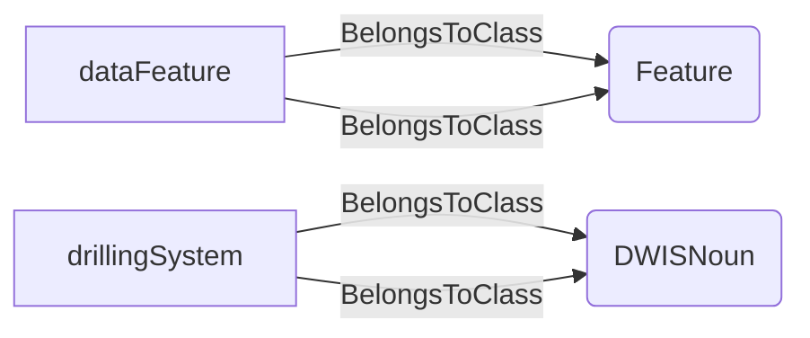
An example SparQL query looks like this:
```sparql
PREFIX rdf: <http://www.w3.org/1999/02/22-rdf-syntax-ns#>
PREFIX ddhub: <http://ddhub.no/>
PREFIX quantity: <http://ddhub.no/UnitAndQuantity>
SELECT ?genericFeature
WHERE {
	?dataFeature rdf:type ddhub:Feature .
	?drillingSystem rdf:type ddhub:DWISNoun .
	?drillingSystem rdf:type ddhub:DWISNoun .
	?dataFeature rdf:type ddhub:Feature .
}
```
This example declares a generic feature associated with a drilling system.
## DataTransmissionFeature <!-- NOUN -->
- Display name: Data Transmission Feature
- Parent class: [Feature](./DrillingFeature.md#Feature)
- Description: 
A data transmission feature is a characteristic about how data is transferred from one place to another.
- Definition set: DrillingFeature
- Examples:
```dwis telemetryFeature
DataTransmissionFeature:telemetryLatencySupport
TransmissionLine:mudPulseTelemetry
telemetryLatencySupport BelongsToClass DataTransmissionFeature
mudPulseTelemetry BelongsToClass TransmissionLine
```
An example semantic graph looks like as follow:
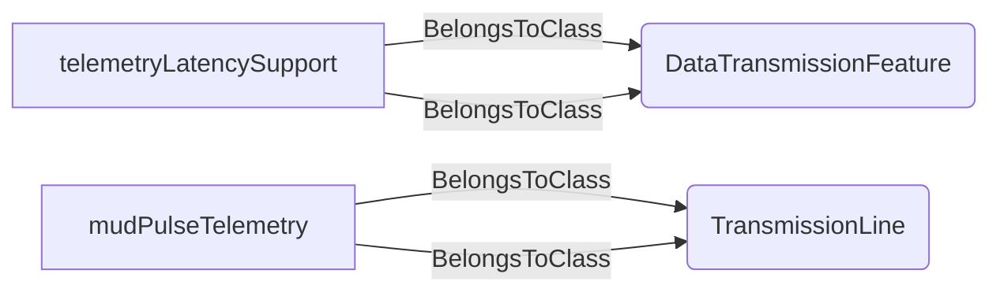
An example SparQL query looks like this:
```sparql
PREFIX rdf: <http://www.w3.org/1999/02/22-rdf-syntax-ns#>
PREFIX ddhub: <http://ddhub.no/>
PREFIX quantity: <http://ddhub.no/UnitAndQuantity>
SELECT ?telemetryFeature
WHERE {
	?telemetryLatencySupport rdf:type ddhub:DataTransmissionFeature .
	?mudPulseTelemetry rdf:type ddhub:TransmissionLine .
	?telemetryLatencySupport rdf:type ddhub:DataTransmissionFeature .
	?mudPulseTelemetry rdf:type ddhub:TransmissionLine .
}
```
This example notes that mud-pulse telemetry supports a data transmission feature.
## LookupTableFeature <!-- NOUN -->
- Display name: Lookup Table Feature
- Parent class: [DataTransmissionFeature](./DrillingFeature.md#DataTransmissionFeature)
- Description: 
Such a feature indicates that something accounts for lookup table.
- Definition set: DrillingFeature
- Examples:
```dwis lookupTable
LookupTableFeature:lookupTable
TransmissionLine:rigToDownholeTelemetry
rigToDownholeTelemetry BelongsToClass TransmissionLine
lookupTable BelongsToClass LookupTableFeature
```
An example semantic graph looks like as follow:
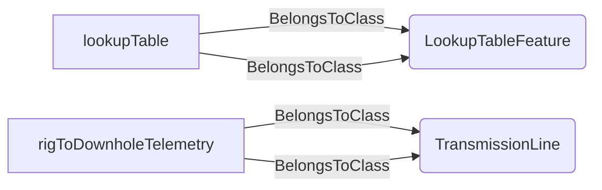
An example SparQL query looks like this:
```sparql
PREFIX rdf: <http://www.w3.org/1999/02/22-rdf-syntax-ns#>
PREFIX ddhub: <http://ddhub.no/>
PREFIX quantity: <http://ddhub.no/UnitAndQuantity>
SELECT ?lookupTable
WHERE {
	?lookupTable rdf:type ddhub:LookupTableFeature .
	?rigToDownholeTelemetry rdf:type ddhub:TransmissionLine .
	?rigToDownholeTelemetry rdf:type ddhub:TransmissionLine .
	?lookupTable rdf:type ddhub:LookupTableFeature .
}
```
This example highlights telemetry that uses lookup tables.
## ModellingFeature <!-- NOUN -->
- Display name: Modelling Feature
- Parent class: [Feature](./DrillingFeature.md#Feature)
- Description: 
A modelling feature is a characteristic about how system is modelled.
- Definition set: DrillingFeature
- Examples:
```dwis modellingApproach
ModellingFeature:modellingApproach
Simulator:hydraulicsSimulator
modellingApproach BelongsToClass ModellingFeature
hydraulicsSimulator BelongsToClass Simulator
```
An example semantic graph looks like as follow:
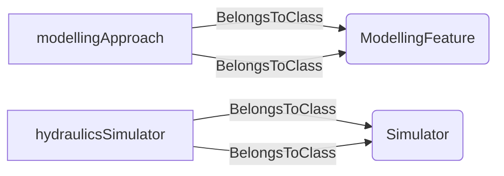
An example SparQL query looks like this:
```sparql
PREFIX rdf: <http://www.w3.org/1999/02/22-rdf-syntax-ns#>
PREFIX ddhub: <http://ddhub.no/>
PREFIX quantity: <http://ddhub.no/UnitAndQuantity>
SELECT ?modellingApproach
WHERE {
	?modellingApproach rdf:type ddhub:ModellingFeature .
	?hydraulicsSimulator rdf:type ddhub:Simulator .
	?modellingApproach rdf:type ddhub:ModellingFeature .
	?hydraulicsSimulator rdf:type ddhub:Simulator .
}
```
This example links a modelling feature to a hydraulics simulator.
## SteadyStateFeature <!-- NOUN -->
- Display name: Steady State Feature
- Parent class: [ModellingFeature](./DrillingFeature.md#ModellingFeature)
- Description: 
A steady state feature is a characteristic about a model that only accounts for steady state conditions.
- Definition set: DrillingFeature
- Examples:
```dwis steadyStateModel
SteadyStateFeature:steadyStateAssumption
Simulator:hydraulicsSimulator
steadyStateAssumption BelongsToClass SteadyStateFeature
hydraulicsSimulator BelongsToClass Simulator
```
An example semantic graph looks like as follow:
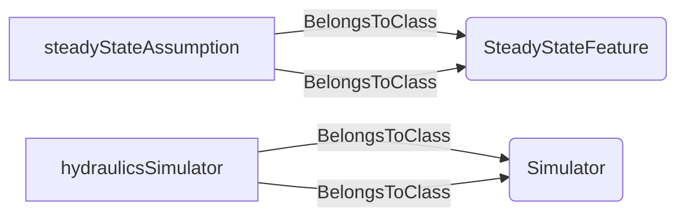
An example SparQL query looks like this:
```sparql
PREFIX rdf: <http://www.w3.org/1999/02/22-rdf-syntax-ns#>
PREFIX ddhub: <http://ddhub.no/>
PREFIX quantity: <http://ddhub.no/UnitAndQuantity>
SELECT ?steadyStateModel
WHERE {
	?steadyStateAssumption rdf:type ddhub:SteadyStateFeature .
	?hydraulicsSimulator rdf:type ddhub:Simulator .
	?steadyStateAssumption rdf:type ddhub:SteadyStateFeature .
	?hydraulicsSimulator rdf:type ddhub:Simulator .
}
```
This example marks that the hydraulics simulator assumes steady-state behavior.
## TransientFeature <!-- NOUN -->
- Display name: Transient Feature
- Parent class: [ModellingFeature](./DrillingFeature.md#ModellingFeature)
- Description: 
A transient feature is a characteristic about a model that accounts for transient effects.
- Definition set: DrillingFeature
- Examples:
```dwis transientModel
TransientFeature:transientEffects
Simulator:surgeSwabSimulator
transientEffects BelongsToClass TransientFeature
surgeSwabSimulator BelongsToClass Simulator
```
An example semantic graph looks like as follow:
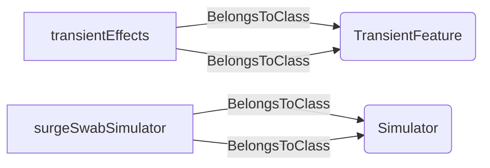
An example SparQL query looks like this:
```sparql
PREFIX rdf: <http://www.w3.org/1999/02/22-rdf-syntax-ns#>
PREFIX ddhub: <http://ddhub.no/>
PREFIX quantity: <http://ddhub.no/UnitAndQuantity>
SELECT ?transientModel
WHERE {
	?transientEffects rdf:type ddhub:TransientFeature .
	?surgeSwabSimulator rdf:type ddhub:Simulator .
	?transientEffects rdf:type ddhub:TransientFeature .
	?surgeSwabSimulator rdf:type ddhub:Simulator .
}
```
This example marks that a surge/swab simulator accounts for transient effects.
## GelledStateFeature <!-- NOUN -->
- Display name: Gelled State Feature
- Parent class: [ModellingFeature](./DrillingFeature.md#ModellingFeature)
- Description: 
A gelled state feature is a characteristic about a model that accounts for the gelled state of a fluid.
- Definition set: DrillingFeature
- Examples:
```dwis gelledState
GelledStateFeature:gelledState
Simulator:fluidModel
gelledState BelongsToClass GelledStateFeature
fluidModel BelongsToClass Simulator
```
An example semantic graph looks like as follow:
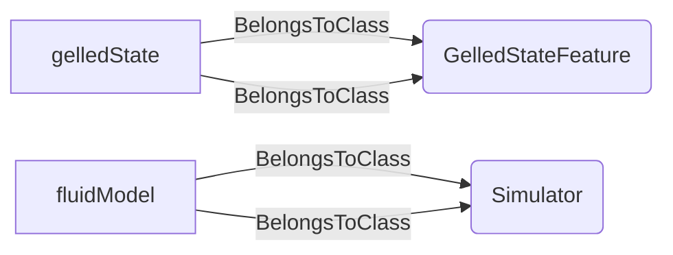
An example SparQL query looks like this:
```sparql
PREFIX rdf: <http://www.w3.org/1999/02/22-rdf-syntax-ns#>
PREFIX ddhub: <http://ddhub.no/>
PREFIX quantity: <http://ddhub.no/UnitAndQuantity>
SELECT ?gelledState
WHERE {
	?gelledState rdf:type ddhub:GelledStateFeature .
	?fluidModel rdf:type ddhub:Simulator .
	?gelledState rdf:type ddhub:GelledStateFeature .
	?fluidModel rdf:type ddhub:Simulator .
}
```
This example notes that a fluid model captures gelled-state behavior.
## StaticFrictionFeature <!-- NOUN -->
- Display name: Static Friction Feature
- Parent class: [ModellingFeature](./DrillingFeature.md#ModellingFeature)
- Description: 
A static friction feature is a characteristic about a model that accounts for the static friction along the string.
- Definition set: DrillingFeature
- Examples:
```dwis staticFriction
StaticFrictionFeature:staticFriction
Simulator:stringMechanicsModel
staticFriction BelongsToClass StaticFrictionFeature
stringMechanicsModel BelongsToClass Simulator
```
An example semantic graph looks like as follow:
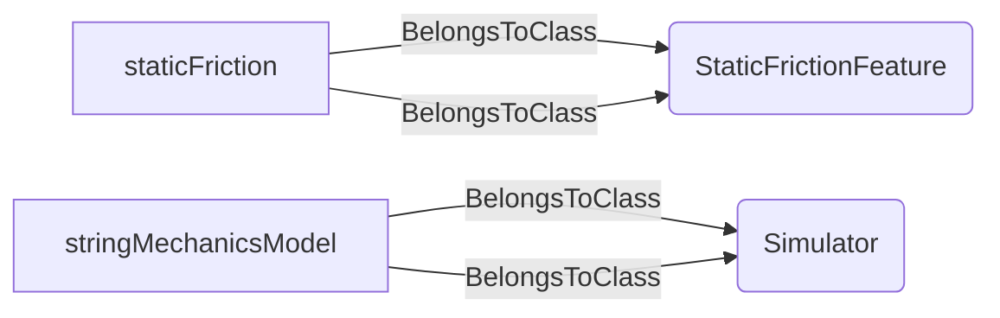
An example SparQL query looks like this:
```sparql
PREFIX rdf: <http://www.w3.org/1999/02/22-rdf-syntax-ns#>
PREFIX ddhub: <http://ddhub.no/>
PREFIX quantity: <http://ddhub.no/UnitAndQuantity>
SELECT ?staticFriction
WHERE {
	?staticFriction rdf:type ddhub:StaticFrictionFeature .
	?stringMechanicsModel rdf:type ddhub:Simulator .
	?staticFriction rdf:type ddhub:StaticFrictionFeature .
	?stringMechanicsModel rdf:type ddhub:Simulator .
}
```
This example captures static friction in a string mechanics model.
## HydraulicallyInducedForceFeature <!-- NOUN -->
- Display name: Hydraulically Induced Force Feature
- Parent class: [ModellingFeature](./DrillingFeature.md#ModellingFeature)
- Description: 
A hydraulically induced force feature is a characteristic about a model that accounts for hydraulically induced force on the string.
- Definition set: DrillingFeature
- Examples:
```dwis hydraulicForce
HydraulicallyInducedForceFeature:hydraulicForce
Simulator:hydraulicsSimulator
hydraulicForce BelongsToClass HydraulicallyInducedForceFeature
hydraulicsSimulator BelongsToClass Simulator
```
An example semantic graph looks like as follow:
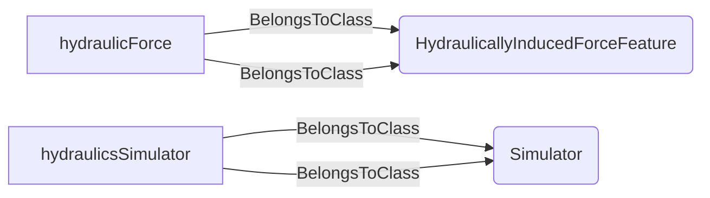
An example SparQL query looks like this:
```sparql
PREFIX rdf: <http://www.w3.org/1999/02/22-rdf-syntax-ns#>
PREFIX ddhub: <http://ddhub.no/>
PREFIX quantity: <http://ddhub.no/UnitAndQuantity>
SELECT ?hydraulicForce
WHERE {
	?hydraulicForce rdf:type ddhub:HydraulicallyInducedForceFeature .
	?hydraulicsSimulator rdf:type ddhub:Simulator .
	?hydraulicForce rdf:type ddhub:HydraulicallyInducedForceFeature .
	?hydraulicsSimulator rdf:type ddhub:Simulator .
}
```
This example shows hydraulically induced forces included in a simulator.
## ShockedModellingFeature <!-- NOUN -->
- Display name: Shock Modelling Feature
- Parent class: [ModellingFeature](./DrillingFeature.md#ModellingFeature)
- Description: 
A shock modelling feature is a characteristic about a model that accounts for shocks along the string.
- Definition set: DrillingFeature
- Examples:
```dwis shockModel
ShockedModellingFeature:shockEffects
Simulator:vibrationSimulator
shockEffects BelongsToClass ShockedModellingFeature
vibrationSimulator BelongsToClass Simulator
```
An example semantic graph looks like as follow:
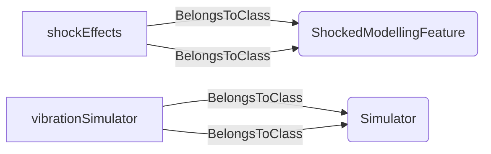
An example SparQL query looks like this:
```sparql
PREFIX rdf: <http://www.w3.org/1999/02/22-rdf-syntax-ns#>
PREFIX ddhub: <http://ddhub.no/>
PREFIX quantity: <http://ddhub.no/UnitAndQuantity>
SELECT ?shockModel
WHERE {
	?shockEffects rdf:type ddhub:ShockedModellingFeature .
	?vibrationSimulator rdf:type ddhub:Simulator .
	?shockEffects rdf:type ddhub:ShockedModellingFeature .
	?vibrationSimulator rdf:type ddhub:Simulator .
}
```
This example indicates shock effects are modelled in a vibration simulator.
## FluidCompressibilityFeature <!-- NOUN -->
- Display name: Fluid Compressibility Feature
- Parent class: [ModellingFeature](./DrillingFeature.md#ModellingFeature)
- Description: 
A fluid compressibility feature is a characteristic about a model that accounts for fluid compressibility.
- Definition set: DrillingFeature
- Examples:
```dwis fluidCompressibility
FluidCompressibilityFeature:fluidCompressibility
Simulator:hydraulicsSimulator
fluidCompressibility BelongsToClass FluidCompressibilityFeature
hydraulicsSimulator BelongsToClass Simulator
```
An example semantic graph looks like as follow:
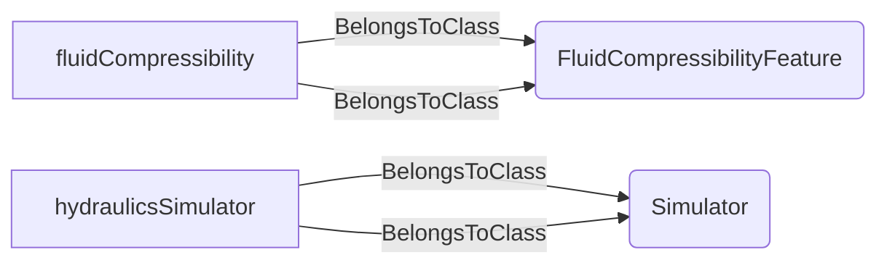
An example SparQL query looks like this:
```sparql
PREFIX rdf: <http://www.w3.org/1999/02/22-rdf-syntax-ns#>
PREFIX ddhub: <http://ddhub.no/>
PREFIX quantity: <http://ddhub.no/UnitAndQuantity>
SELECT ?fluidCompressibility
WHERE {
	?fluidCompressibility rdf:type ddhub:FluidCompressibilityFeature .
	?hydraulicsSimulator rdf:type ddhub:Simulator .
	?fluidCompressibility rdf:type ddhub:FluidCompressibilityFeature .
	?hydraulicsSimulator rdf:type ddhub:Simulator .
}
```
This example notes fluid compressibility captured in hydraulics simulation.
## StringElasticityFeature <!-- NOUN -->
- Display name: String Elasticity Feature
- Parent class: [ModellingFeature](./DrillingFeature.md#ModellingFeature)
- Description: 
A string elasticity feature is a characteristic about a model that accounts for string elasticity.
- Definition set: DrillingFeature
- Examples:
```dwis stringElasticity
StringElasticityFeature:stringElasticity
Simulator:stringMechanicsModel
stringElasticity BelongsToClass StringElasticityFeature
stringMechanicsModel BelongsToClass Simulator
```
An example semantic graph looks like as follow:
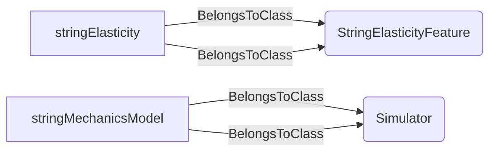
An example SparQL query looks like this:
```sparql
PREFIX rdf: <http://www.w3.org/1999/02/22-rdf-syntax-ns#>
PREFIX ddhub: <http://ddhub.no/>
PREFIX quantity: <http://ddhub.no/UnitAndQuantity>
SELECT ?stringElasticity
WHERE {
	?stringElasticity rdf:type ddhub:StringElasticityFeature .
	?stringMechanicsModel rdf:type ddhub:Simulator .
	?stringElasticity rdf:type ddhub:StringElasticityFeature .
	?stringMechanicsModel rdf:type ddhub:Simulator .
}
```
This example shows string elasticity represented in a mechanics model.
## FluidThermalExpansionFeature <!-- NOUN -->
- Display name: Fluid Thermal Expansion Feature
- Parent class: [ModellingFeature](./DrillingFeature.md#ModellingFeature)
- Description: 
A fluid thermal expansion feature is a characteristic about a model that accounts for the fluid thermal expansion.
- Definition set: DrillingFeature
- Examples:
```dwis fluidThermalExpansion
FluidThermalExpansionFeature:fluidThermalExpansion
Simulator:hydraulicsSimulator
fluidThermalExpansion BelongsToClass FluidThermalExpansionFeature
hydraulicsSimulator BelongsToClass Simulator
```
An example semantic graph looks like as follow:
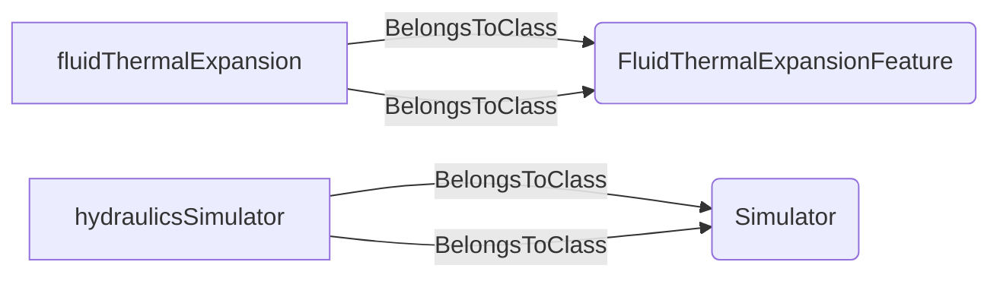
An example SparQL query looks like this:
```sparql
PREFIX rdf: <http://www.w3.org/1999/02/22-rdf-syntax-ns#>
PREFIX ddhub: <http://ddhub.no/>
PREFIX quantity: <http://ddhub.no/UnitAndQuantity>
SELECT ?fluidThermalExpansion
WHERE {
	?fluidThermalExpansion rdf:type ddhub:FluidThermalExpansionFeature .
	?hydraulicsSimulator rdf:type ddhub:Simulator .
	?fluidThermalExpansion rdf:type ddhub:FluidThermalExpansionFeature .
	?hydraulicsSimulator rdf:type ddhub:Simulator .
}
```
This example captures fluid thermal expansion in a hydraulics model.
## StringThermalExpansionFeature <!-- NOUN -->
- Display name: String Thermal Expansion Feature
- Parent class: [ModellingFeature](./DrillingFeature.md#ModellingFeature)
- Description: 
A string thermal expansion feature is a characteristic about a model that accounts for the string thermal expansion.
- Definition set: DrillingFeature
- Examples:
```dwis stringThermalExpansion
StringThermalExpansionFeature:stringThermalExpansion
Simulator:stringMechanicsModel
stringThermalExpansion BelongsToClass StringThermalExpansionFeature
stringMechanicsModel BelongsToClass Simulator
```
An example semantic graph looks like as follow:
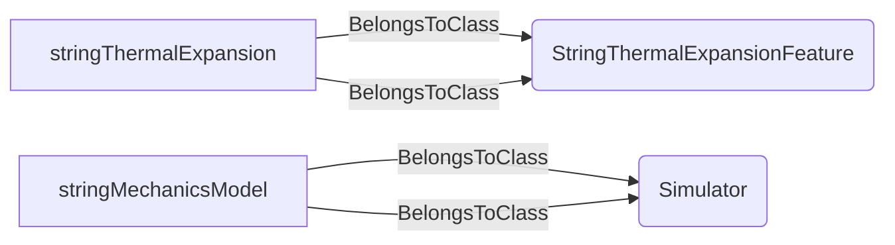
An example SparQL query looks like this:
```sparql
PREFIX rdf: <http://www.w3.org/1999/02/22-rdf-syntax-ns#>
PREFIX ddhub: <http://ddhub.no/>
PREFIX quantity: <http://ddhub.no/UnitAndQuantity>
SELECT ?stringThermalExpansion
WHERE {
	?stringThermalExpansion rdf:type ddhub:StringThermalExpansionFeature .
	?stringMechanicsModel rdf:type ddhub:Simulator .
	?stringThermalExpansion rdf:type ddhub:StringThermalExpansionFeature .
	?stringMechanicsModel rdf:type ddhub:Simulator .
}
```
This example captures string thermal expansion in a mechanics model.
## StringPressureBallooningFeature <!-- NOUN -->
- Display name: String Pressure Ballooning Feature
- Parent class: [ModellingFeature](./DrillingFeature.md#ModellingFeature)
- Description: 
A string pressure ballooning feature is a characteristic about a model that accounts for the string pressure ballooning.
- Definition set: DrillingFeature
- Examples:
```dwis pressureBallooning
StringPressureBallooningFeature:pressureBallooning
Simulator:stringMechanicsModel
pressureBallooning BelongsToClass StringPressureBallooningFeature
stringMechanicsModel BelongsToClass Simulator
```
An example semantic graph looks like as follow:
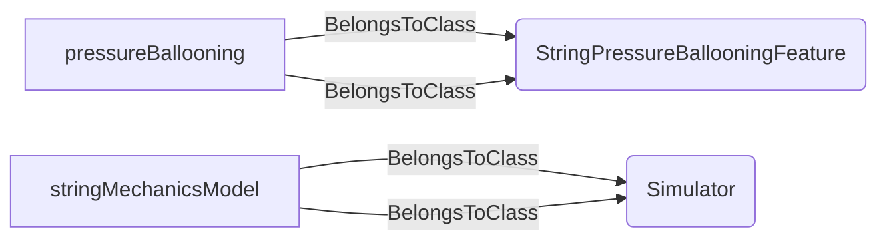
An example SparQL query looks like this:
```sparql
PREFIX rdf: <http://www.w3.org/1999/02/22-rdf-syntax-ns#>
PREFIX ddhub: <http://ddhub.no/>
PREFIX quantity: <http://ddhub.no/UnitAndQuantity>
SELECT ?pressureBallooning
WHERE {
	?pressureBallooning rdf:type ddhub:StringPressureBallooningFeature .
	?stringMechanicsModel rdf:type ddhub:Simulator .
	?pressureBallooning rdf:type ddhub:StringPressureBallooningFeature .
	?stringMechanicsModel rdf:type ddhub:Simulator .
}
```
This example shows pressure ballooning effects included in a mechanics model.
## AirGapInStringFeature <!-- NOUN -->
- Display name: Air Gap In String Feature
- Parent class: [ModellingFeature](./DrillingFeature.md#ModellingFeature)
- Description: 
An air gap in string feature is a characteristic about a model that accounts for the possible air gap at the top of the liquid column in the string.
- Definition set: DrillingFeature
- Examples:
```dwis airGapFeature
AirGapInStringFeature:airGap
Simulator:hydraulicsSimulator
airGap BelongsToClass AirGapInStringFeature
hydraulicsSimulator BelongsToClass Simulator
```
An example semantic graph looks like as follow:
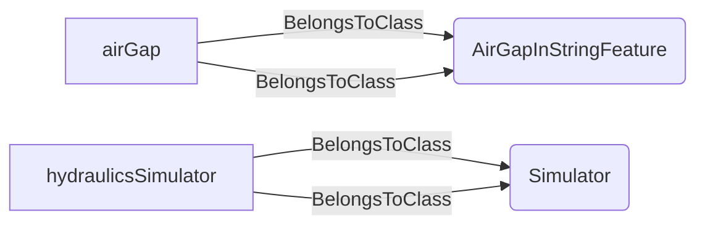
An example SparQL query looks like this:
```sparql
PREFIX rdf: <http://www.w3.org/1999/02/22-rdf-syntax-ns#>
PREFIX ddhub: <http://ddhub.no/>
PREFIX quantity: <http://ddhub.no/UnitAndQuantity>
SELECT ?airGapFeature
WHERE {
	?airGap rdf:type ddhub:AirGapInStringFeature .
	?hydraulicsSimulator rdf:type ddhub:Simulator .
	?airGap rdf:type ddhub:AirGapInStringFeature .
	?hydraulicsSimulator rdf:type ddhub:Simulator .
}
```
This example notes air-gap effects captured in a hydraulics model.
## DrillingManagementFeature <!-- NOUN -->
- Display name: Drilling Management Feature
- Parent class: [Feature](./DrillingFeature.md#Feature)
- Description: 
A drilling management feature is a drilling management characteristic that is supported by something. For instance
an advisory system may provide ROP management parameters accounting for cuttings transport.
- Definition set: DrillingFeature
- Examples:
```dwis drillingManagement
DrillingManagementFeature:drillingManagement
Advisor:drillingAdvisor
drillingAdvisor AccountsFor drillingManagement
```
An example semantic graph looks like as follow:
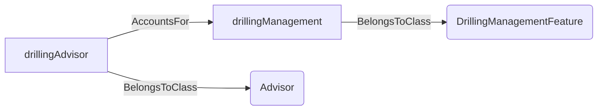
An example SparQL query looks like this:
```sparql
PREFIX rdf: <http://www.w3.org/1999/02/22-rdf-syntax-ns#>
PREFIX ddhub: <http://ddhub.no/>
PREFIX quantity: <http://ddhub.no/UnitAndQuantity>
SELECT ?drillingManagement
WHERE {
	?drillingManagement rdf:type ddhub:DrillingManagementFeature .
	?drillingAdvisor rdf:type ddhub:Advisor .
	?drillingAdvisor ddhub:AccountsFor ?drillingManagement .
}
```
This example shows an advisor accounting for a drilling management feature.
## FillPipeFeature <!-- NOUN -->
- Display name: Fill Pipe Feature
- Parent class: [DrillingManagementFeature](./DrillingFeature.md#DrillingManagementFeature)
- Description: 
A fill pipe feature indicates that something accounts for filling the pipe when there is an air gap.
- Definition set: DrillingFeature
- Examples:
```dwis fillPipeFeature
FillPipeFeature:fillPipe
ControlSystem:circulationDCS
circulationDCS AccountsFor fillPipe
```
An example semantic graph looks like as follow:
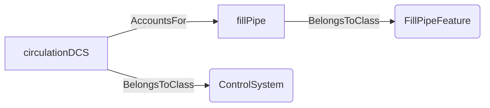
An example SparQL query looks like this:
```sparql
PREFIX rdf: <http://www.w3.org/1999/02/22-rdf-syntax-ns#>
PREFIX ddhub: <http://ddhub.no/>
PREFIX quantity: <http://ddhub.no/UnitAndQuantity>
SELECT ?fillPipeFeature
WHERE {
	?fillPipe rdf:type ddhub:FillPipeFeature .
	?circulationDCS rdf:type ddhub:ControlSystem .
	?circulationDCS ddhub:AccountsFor ?fillPipe .
}
```
This example shows a circulation control system accounting for pipe filling.
## GelBreakingFeature <!-- NOUN -->
- Display name: Gel Breaking Feature
- Parent class: [DrillingManagementFeature](./DrillingFeature.md#DrillingManagementFeature)
- Description: 
A gel breaking feature indicates that something accounts for breaking the gel in a drilling fluid that has stayed
quiet for some time.
- Definition set: DrillingFeature
- Examples:
```dwis gelBreakFeature
GelBreakingFeature:gelBreak
Advisor:fluidAdvisor
fluidAdvisor AccountsFor gelBreak
```
An example semantic graph looks like as follow:
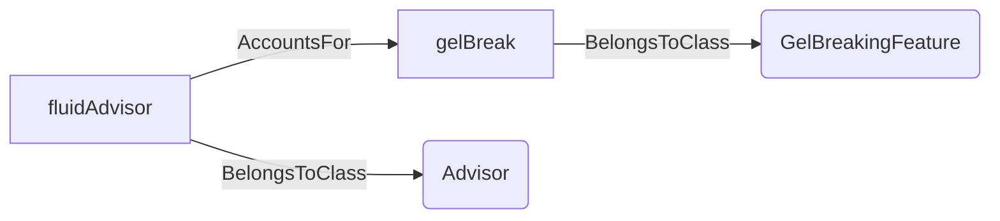
An example SparQL query looks like this:
```sparql
PREFIX rdf: <http://www.w3.org/1999/02/22-rdf-syntax-ns#>
PREFIX ddhub: <http://ddhub.no/>
PREFIX quantity: <http://ddhub.no/UnitAndQuantity>
SELECT ?gelBreakFeature
WHERE {
	?gelBreak rdf:type ddhub:GelBreakingFeature .
	?fluidAdvisor rdf:type ddhub:Advisor .
	?fluidAdvisor ddhub:AccountsFor ?gelBreak .
}
```
This example shows an advisor accounting for gel breaking.
## CirculationFeature <!-- NOUN -->
- Display name: Circulation Feature
- Parent class: [DrillingManagementFeature](./DrillingFeature.md#DrillingManagementFeature)
- Description: 
A circulation feature indicates that something accounts for circulation.
- Definition set: DrillingFeature
- Examples:
```dwis circulationFeature
CirculationFeature:circulationSupport
ControlSystem:circulationDCS
circulationDCS AccountsFor circulationSupport
```
An example semantic graph looks like as follow:
```mermaid
graph LR
	N0000[circulationSupport] -->|BelongsToClass| N0001(CirculationFeature) 
	N0002[circulationDCS] -->|BelongsToClass| N0003(ControlSystem) 
	N0002[circulationDCS] -->|AccountsFor| N0000[circulationSupport] 
```
An example SparQL query looks like this:
```sparql
PREFIX rdf: <http://www.w3.org/1999/02/22-rdf-syntax-ns#>
PREFIX ddhub: <http://ddhub.no/>
PREFIX quantity: <http://ddhub.no/UnitAndQuantity>
SELECT ?circulationFeature
WHERE {
	?circulationSupport rdf:type ddhub:CirculationFeature .
	?circulationDCS rdf:type ddhub:ControlSystem .
	?circulationDCS ddhub:AccountsFor ?circulationSupport .
}
```
This example shows a control system accounting for circulation.
## DrillingFluidDisplacementFeature <!-- NOUN -->
- Display name: Drilling Fluid Displacement Feature
- Parent class: [CirculationFeature](./DrillingFeature.md#CirculationFeature)
- Description: 
A drilling fluid displacement feature indicates that something accounts for displacing a drilling fluid with another.
- Definition set: DrillingFeature
- Examples:
```dwis displacementFeature
DrillingFluidDisplacementFeature:fluidDisplacement
ControlSystem:circulationDCS
circulationDCS AccountsFor fluidDisplacement
```
An example semantic graph looks like as follow:
```mermaid
graph LR
	N0000[fluidDisplacement] -->|BelongsToClass| N0001(DrillingFluidDisplacementFeature) 
	N0002[circulationDCS] -->|BelongsToClass| N0003(ControlSystem) 
	N0002[circulationDCS] -->|AccountsFor| N0000[fluidDisplacement] 
```
An example SparQL query looks like this:
```sparql
PREFIX rdf: <http://www.w3.org/1999/02/22-rdf-syntax-ns#>
PREFIX ddhub: <http://ddhub.no/>
PREFIX quantity: <http://ddhub.no/UnitAndQuantity>
SELECT ?displacementFeature
WHERE {
	?fluidDisplacement rdf:type ddhub:DrillingFluidDisplacementFeature .
	?circulationDCS rdf:type ddhub:ControlSystem .
	?circulationDCS ddhub:AccountsFor ?fluidDisplacement .
}
```
This example shows support for displacing drilling fluids.
## DrillingFluidSweepFeature <!-- NOUN -->
- Display name: Drilling Fluid Sweep Feature
- Parent class: [CirculationFeature](./DrillingFeature.md#CirculationFeature)
- Description: 
A drilling fluid sweep feature indicates that something accounts for sweeping the borehole with one or several fluids of
different densities and/or viscosities.
- Definition set: DrillingFeature
- Examples:
```dwis sweepFeature
DrillingFluidSweepFeature:fluidSweep
Advisor:drillingAdvisor
drillingAdvisor AccountsFor fluidSweep
```
An example semantic graph looks like as follow:
```mermaid
graph LR
	N0000[fluidSweep] -->|BelongsToClass| N0001(DrillingFluidSweepFeature) 
	N0002[drillingAdvisor] -->|BelongsToClass| N0003(Advisor) 
	N0002[drillingAdvisor] -->|AccountsFor| N0000[fluidSweep] 
```
An example SparQL query looks like this:
```sparql
PREFIX rdf: <http://www.w3.org/1999/02/22-rdf-syntax-ns#>
PREFIX ddhub: <http://ddhub.no/>
PREFIX quantity: <http://ddhub.no/UnitAndQuantity>
SELECT ?sweepFeature
WHERE {
	?fluidSweep rdf:type ddhub:DrillingFluidSweepFeature .
	?drillingAdvisor rdf:type ddhub:Advisor .
	?drillingAdvisor ddhub:AccountsFor ?fluidSweep .
}
```
This example shows advisory support for fluid sweeps.
## CementingFeature <!-- NOUN -->
- Display name: Cementing Feature
- Parent class: [DrillingFluidDisplacementFeature](./DrillingFeature.md#DrillingFluidDisplacementFeature)
- Description: 
A cementing feature indicates that something accounts for displacing a train of drilling fluids and cement slurries to perform
a cement operation.
- Definition set: DrillingFeature
- Examples:
```dwis cementingFeature
CementingFeature:cementing
Advisor:cementingAdvisor
cementingAdvisor AccountsFor cementing
```
An example semantic graph looks like as follow:
```mermaid
graph LR
	N0000[cementing] -->|BelongsToClass| N0001(CementingFeature) 
	N0002[cementingAdvisor] -->|BelongsToClass| N0003(Advisor) 
	N0002[cementingAdvisor] -->|AccountsFor| N0000[cementing] 
```
An example SparQL query looks like this:
```sparql
PREFIX rdf: <http://www.w3.org/1999/02/22-rdf-syntax-ns#>
PREFIX ddhub: <http://ddhub.no/>
PREFIX quantity: <http://ddhub.no/UnitAndQuantity>
SELECT ?cementingFeature
WHERE {
	?cementing rdf:type ddhub:CementingFeature .
	?cementingAdvisor rdf:type ddhub:Advisor .
	?cementingAdvisor ddhub:AccountsFor ?cementing .
}
```
This example shows a system accounting for cementing operations.
## FormationWashoutFeature <!-- NOUN -->
- Display name: Formation Washout Feature
- Parent class: [CirculationFeature](./DrillingFeature.md#CirculationFeature)
- Description: 
A formation washout feature indicates that something accounts for formation washout while circulating.
- Definition set: DrillingFeature
- Examples:
```dwis washoutFeature
FormationWashoutFeature:washout
Advisor:circulationAdvisor
circulationAdvisor AccountsFor washout
```
An example semantic graph looks like as follow:
```mermaid
graph LR
	N0000[washout] -->|BelongsToClass| N0001(FormationWashoutFeature) 
	N0002[circulationAdvisor] -->|BelongsToClass| N0003(Advisor) 
	N0002[circulationAdvisor] -->|AccountsFor| N0000[washout] 
```
An example SparQL query looks like this:
```sparql
PREFIX rdf: <http://www.w3.org/1999/02/22-rdf-syntax-ns#>
PREFIX ddhub: <http://ddhub.no/>
PREFIX quantity: <http://ddhub.no/UnitAndQuantity>
SELECT ?washoutFeature
WHERE {
	?washout rdf:type ddhub:FormationWashoutFeature .
	?circulationAdvisor rdf:type ddhub:Advisor .
	?circulationAdvisor ddhub:AccountsFor ?washout .
}
```
This example captures formation washout considerations.
## CuttingsTransportFeature <!-- NOUN -->
- Display name: Cuttings Transport Feature
- Parent class: [CirculationFeature](./DrillingFeature.md#CirculationFeature)
- Description: 
A cuttings transport feature indicates that something accounts for cuttings transport while circulating.
- Definition set: DrillingFeature
- Examples:
```dwis cuttingsTransport
CuttingsTransportFeature:cuttingsTransport
Advisor:drillingAdvisor
drillingAdvisor AccountsFor cuttingsTransport
```
An example semantic graph looks like as follow:
```mermaid
graph LR
	N0000[cuttingsTransport] -->|BelongsToClass| N0001(CuttingsTransportFeature) 
	N0002[drillingAdvisor] -->|BelongsToClass| N0003(Advisor) 
	N0002[drillingAdvisor] -->|AccountsFor| N0000[cuttingsTransport] 
```
An example SparQL query looks like this:
```sparql
PREFIX rdf: <http://www.w3.org/1999/02/22-rdf-syntax-ns#>
PREFIX ddhub: <http://ddhub.no/>
PREFIX quantity: <http://ddhub.no/UnitAndQuantity>
SELECT ?cuttingsTransport
WHERE {
	?cuttingsTransport rdf:type ddhub:CuttingsTransportFeature .
	?drillingAdvisor rdf:type ddhub:Advisor .
	?drillingAdvisor ddhub:AccountsFor ?cuttingsTransport .
}
```
This example shows accounting for cuttings transport.
## PackOffFeature <!-- NOUN -->
- Display name: Pack-off Feature
- Parent class: [CuttingsTransportFeature](./DrillingFeature.md#CuttingsTransportFeature)
- Description: 
A pack-off feature indicates that something accounts for the possibility to pack-off while circulating cuttings.
- Definition set: DrillingFeature
- Examples:
```dwis packOffFeature
PackOffFeature:packOff
Advisor:drillingAdvisor
drillingAdvisor AccountsFor packOff
```
An example semantic graph looks like as follow:
```mermaid
graph LR
	N0000[packOff] -->|BelongsToClass| N0001(PackOffFeature) 
	N0002[drillingAdvisor] -->|BelongsToClass| N0003(Advisor) 
	N0002[drillingAdvisor] -->|AccountsFor| N0000[packOff] 
```
An example SparQL query looks like this:
```sparql
PREFIX rdf: <http://www.w3.org/1999/02/22-rdf-syntax-ns#>
PREFIX ddhub: <http://ddhub.no/>
PREFIX quantity: <http://ddhub.no/UnitAndQuantity>
SELECT ?packOffFeature
WHERE {
	?packOff rdf:type ddhub:PackOffFeature .
	?drillingAdvisor rdf:type ddhub:Advisor .
	?drillingAdvisor ddhub:AccountsFor ?packOff .
}
```
This example shows a system accounting for pack-off risk.
## DrillStemMovementFeature <!-- NOUN -->
- Display name: Drill-stem Movement Feature
- Parent class: [DrillingManagementFeature](./DrillingFeature.md#DrillingManagementFeature)
- Description: 
A drill-stem movement feature indicates that something accounts for the drill-stem movement.
- Definition set: DrillingFeature
- Examples:
```dwis movementFeature
DrillStemMovementFeature:movement
ControlSystem:dcs
dcs AccountsFor movement
```
An example semantic graph looks like as follow:
```mermaid
graph LR
	N0000[movement] -->|BelongsToClass| N0001(DrillStemMovementFeature) 
	N0002[dcs] -->|BelongsToClass| N0003(ControlSystem) 
	N0002[dcs] -->|AccountsFor| N0000[movement] 
```
An example SparQL query looks like this:
```sparql
PREFIX rdf: <http://www.w3.org/1999/02/22-rdf-syntax-ns#>
PREFIX ddhub: <http://ddhub.no/>
PREFIX quantity: <http://ddhub.no/UnitAndQuantity>
SELECT ?movementFeature
WHERE {
	?movement rdf:type ddhub:DrillStemMovementFeature .
	?dcs rdf:type ddhub:ControlSystem .
	?dcs ddhub:AccountsFor ?movement .
}
```
This example shows a control system accounting for drill-stem movement.
## DrillStemAxialMovementFeature <!-- NOUN -->
- Display name: Drill-stem Axial Movement Feature
- Parent class: [DrillStemMovementFeature](./DrillingFeature.md#DrillStemMovementFeature)
- Description: 
A drill-stem axial movement feature indicates that something accounts for drill-stem axial movement.
- Definition set: DrillingFeature
- Examples:
```dwis axialMovementFeature
DrillStemAxialMovementFeature:axialMovement
ControlSystem:dcs
dcs AccountsFor axialMovement
```
An example semantic graph looks like as follow:
```mermaid
graph LR
	N0000[axialMovement] -->|BelongsToClass| N0001(DrillStemAxialMovementFeature) 
	N0002[dcs] -->|BelongsToClass| N0003(ControlSystem) 
	N0002[dcs] -->|AccountsFor| N0000[axialMovement] 
```
An example SparQL query looks like this:
```sparql
PREFIX rdf: <http://www.w3.org/1999/02/22-rdf-syntax-ns#>
PREFIX ddhub: <http://ddhub.no/>
PREFIX quantity: <http://ddhub.no/UnitAndQuantity>
SELECT ?axialMovementFeature
WHERE {
	?axialMovement rdf:type ddhub:DrillStemAxialMovementFeature .
	?dcs rdf:type ddhub:ControlSystem .
	?dcs ddhub:AccountsFor ?axialMovement .
}
```
This example shows accounting for axial movement.
## DrillStemRotationalMovementFeature <!-- NOUN -->
- Display name: Drill-stem Rotational Movement Feature
- Parent class: [DrillStemMovementFeature](./DrillingFeature.md#DrillStemMovementFeature)
- Description: 
A drill-stem rotational movement feature indicates that something accounts for drill-stem rotational movement.
- Definition set: DrillingFeature
- Examples:
```dwis rotationalMovementFeature
DrillStemRotationalMovementFeature:rotationalMovement
ControlSystem:rotationDCS
rotationDCS AccountsFor rotationalMovement
```
An example semantic graph looks like as follow:
```mermaid
graph LR
	N0000[rotationalMovement] -->|BelongsToClass| N0001(DrillStemRotationalMovementFeature) 
	N0002[rotationDCS] -->|BelongsToClass| N0003(ControlSystem) 
	N0002[rotationDCS] -->|AccountsFor| N0000[rotationalMovement] 
```
An example SparQL query looks like this:
```sparql
PREFIX rdf: <http://www.w3.org/1999/02/22-rdf-syntax-ns#>
PREFIX ddhub: <http://ddhub.no/>
PREFIX quantity: <http://ddhub.no/UnitAndQuantity>
SELECT ?rotationalMovementFeature
WHERE {
	?rotationalMovement rdf:type ddhub:DrillStemRotationalMovementFeature .
	?rotationDCS rdf:type ddhub:ControlSystem .
	?rotationDCS ddhub:AccountsFor ?rotationalMovement .
}
```
This example shows accounting for rotational movement.
## StuckPipeFeature <!-- NOUN -->
- Display name: Stuck-pipe Feature
- Parent class: [DrillStemMovementFeature](./DrillingFeature.md#DrillStemMovementFeature)
- Description: 
A stuck-pipe feature indicates that something accounts for stuck-pipes.
- Definition set: DrillingFeature
- Examples:
```dwis stuckPipeFeature
StuckPipeFeature:stuckPipe
Advisor:drillingAdvisor
drillingAdvisor AccountsFor stuckPipe
```
An example semantic graph looks like as follow:
```mermaid
graph LR
	N0000[stuckPipe] -->|BelongsToClass| N0001(StuckPipeFeature) 
	N0002[drillingAdvisor] -->|BelongsToClass| N0003(Advisor) 
	N0002[drillingAdvisor] -->|AccountsFor| N0000[stuckPipe] 
```
An example SparQL query looks like this:
```sparql
PREFIX rdf: <http://www.w3.org/1999/02/22-rdf-syntax-ns#>
PREFIX ddhub: <http://ddhub.no/>
PREFIX quantity: <http://ddhub.no/UnitAndQuantity>
SELECT ?stuckPipeFeature
WHERE {
	?stuckPipe rdf:type ddhub:StuckPipeFeature .
	?drillingAdvisor rdf:type ddhub:Advisor .
	?drillingAdvisor ddhub:AccountsFor ?stuckPipe .
}
```
This example shows an advisor considering stuck-pipe risk.
## DrillStemAxialImpedimentFeature <!-- NOUN -->
- Display name: Drill-stem Axial Impediment Feature
- Parent class: [StuckPipeFeature](./DrillingFeature.md#StuckPipeFeature)
- Description: 
A drill-stem axial impediment feature indicates that something accounts for drill-stem axial impediment.
- Definition set: DrillingFeature
- Examples:
```dwis axialImpedimentFeature
DrillStemAxialImpedimentFeature:axialImpediment
Advisor:drillingAdvisor
drillingAdvisor AccountsFor axialImpediment
```
An example semantic graph looks like as follow:
```mermaid
graph LR
	N0000[axialImpediment] -->|BelongsToClass| N0001(DrillStemAxialImpedimentFeature) 
	N0002[drillingAdvisor] -->|BelongsToClass| N0003(Advisor) 
	N0002[drillingAdvisor] -->|AccountsFor| N0000[axialImpediment] 
```
An example SparQL query looks like this:
```sparql
PREFIX rdf: <http://www.w3.org/1999/02/22-rdf-syntax-ns#>
PREFIX ddhub: <http://ddhub.no/>
PREFIX quantity: <http://ddhub.no/UnitAndQuantity>
SELECT ?axialImpedimentFeature
WHERE {
	?axialImpediment rdf:type ddhub:DrillStemAxialImpedimentFeature .
	?drillingAdvisor rdf:type ddhub:Advisor .
	?drillingAdvisor ddhub:AccountsFor ?axialImpediment .
}
```
This example shows accounting for axial impediment.
## DrillStemRotationalImpedimentFeature <!-- NOUN -->
- Display name: Drill-stem Rotational Impediment Feature
- Parent class: [StuckPipeFeature](./DrillingFeature.md#StuckPipeFeature)
- Description: 
A drill-stem rotational impediment feature indicates that something accounts for drill-stem rotational impediment.
- Definition set: DrillingFeature
- Examples:
```dwis rotationalImpedimentFeature
DrillStemRotationalImpedimentFeature:rotationalImpediment
Advisor:drillingAdvisor
drillingAdvisor AccountsFor rotationalImpediment
```
An example semantic graph looks like as follow:
```mermaid
graph LR
	N0000[rotationalImpediment] -->|BelongsToClass| N0001(DrillStemRotationalImpedimentFeature) 
	N0002[drillingAdvisor] -->|BelongsToClass| N0003(Advisor) 
	N0002[drillingAdvisor] -->|AccountsFor| N0000[rotationalImpediment] 
```
An example SparQL query looks like this:
```sparql
PREFIX rdf: <http://www.w3.org/1999/02/22-rdf-syntax-ns#>
PREFIX ddhub: <http://ddhub.no/>
PREFIX quantity: <http://ddhub.no/UnitAndQuantity>
SELECT ?rotationalImpedimentFeature
WHERE {
	?rotationalImpediment rdf:type ddhub:DrillStemRotationalImpedimentFeature .
	?drillingAdvisor rdf:type ddhub:Advisor .
	?drillingAdvisor ddhub:AccountsFor ?rotationalImpediment .
}
```
This example shows accounting for rotational impediment.
## DrillStemVibrationFeature <!-- NOUN -->
- Display name: Drill-stem Vibration Feature
- Parent class: [DrillStemMovementFeature](./DrillingFeature.md#DrillStemMovementFeature)
- Description: 
A drill-stem vibration feature indicates that something accounts for drill-stem vibrations.
- Definition set: DrillingFeature
- Examples:
```dwis vibrationFeature
DrillStemVibrationFeature:vibration
Advisor:vibrationAdvisor
vibrationAdvisor AccountsFor vibration
```
An example semantic graph looks like as follow:
```mermaid
graph LR
	N0000[vibration] -->|BelongsToClass| N0001(DrillStemVibrationFeature) 
	N0002[vibrationAdvisor] -->|BelongsToClass| N0003(Advisor) 
	N0002[vibrationAdvisor] -->|AccountsFor| N0000[vibration] 
```
An example SparQL query looks like this:
```sparql
PREFIX rdf: <http://www.w3.org/1999/02/22-rdf-syntax-ns#>
PREFIX ddhub: <http://ddhub.no/>
PREFIX quantity: <http://ddhub.no/UnitAndQuantity>
SELECT ?vibrationFeature
WHERE {
	?vibration rdf:type ddhub:DrillStemVibrationFeature .
	?vibrationAdvisor rdf:type ddhub:Advisor .
	?vibrationAdvisor ddhub:AccountsFor ?vibration .
}
```
This example shows accounting for drill-stem vibrations.
## DrillStemAxialVibrationFeature <!-- NOUN -->
- Display name: Drill-stem Axial Vibration Feature
- Parent class: [DrillStemVibrationFeature](./DrillingFeature.md#DrillStemVibrationFeature)
- Description: 
A drill-stem axial vibration feature indicates that something accounts for in particular axial drill-stem vibrations.
- Definition set: DrillingFeature
- Examples:
```dwis axialVibrationFeature
DrillStemAxialVibrationFeature:axialVibration
Advisor:vibrationAdvisor
vibrationAdvisor AccountsFor axialVibration
```
An example semantic graph looks like as follow:
```mermaid
graph LR
	N0000[axialVibration] -->|BelongsToClass| N0001(DrillStemAxialVibrationFeature) 
	N0002[vibrationAdvisor] -->|BelongsToClass| N0003(Advisor) 
	N0002[vibrationAdvisor] -->|AccountsFor| N0000[axialVibration] 
```
An example SparQL query looks like this:
```sparql
PREFIX rdf: <http://www.w3.org/1999/02/22-rdf-syntax-ns#>
PREFIX ddhub: <http://ddhub.no/>
PREFIX quantity: <http://ddhub.no/UnitAndQuantity>
SELECT ?axialVibrationFeature
WHERE {
	?axialVibration rdf:type ddhub:DrillStemAxialVibrationFeature .
	?vibrationAdvisor rdf:type ddhub:Advisor .
	?vibrationAdvisor ddhub:AccountsFor ?axialVibration .
}
```
This example shows axial vibration coverage.
## DrillStemAxialStickSlipFeature <!-- NOUN -->
- Display name: Drill-stem Axial Stick-Slip Feature
- Parent class: [DrillStemAxialVibrationFeature](./DrillingFeature.md#DrillStemAxialVibrationFeature)
- Description: 
A drill-stem axial stick-slip feature indicates that something acconts for in particular axial stick-slip drill-stem vibrations.
- Definition set: DrillingFeature
- Examples:
```dwis axialStickSlipFeature
DrillStemAxialStickSlipFeature:axialStickSlip
Advisor:vibrationAdvisor
vibrationAdvisor AccountsFor axialStickSlip
```
An example semantic graph looks like as follow:
```mermaid
graph LR
	N0000[axialStickSlip] -->|BelongsToClass| N0001(DrillStemAxialStickSlipFeature) 
	N0002[vibrationAdvisor] -->|BelongsToClass| N0003(Advisor) 
	N0002[vibrationAdvisor] -->|AccountsFor| N0000[axialStickSlip] 
```
An example SparQL query looks like this:
```sparql
PREFIX rdf: <http://www.w3.org/1999/02/22-rdf-syntax-ns#>
PREFIX ddhub: <http://ddhub.no/>
PREFIX quantity: <http://ddhub.no/UnitAndQuantity>
SELECT ?axialStickSlipFeature
WHERE {
	?axialStickSlip rdf:type ddhub:DrillStemAxialStickSlipFeature .
	?vibrationAdvisor rdf:type ddhub:Advisor .
	?vibrationAdvisor ddhub:AccountsFor ?axialStickSlip .
}
```
This example notes axial stick-slip is considered.
## DrillStemTorsionalVibrationFeature <!-- NOUN -->
- Display name: Drill-stem Torsional Vibration Feature
- Parent class: [DrillStemVibrationFeature](./DrillingFeature.md#DrillStemVibrationFeature)
- Description: 
A drill-stem torsional vibration feature indicates that something acconts for in particular torsional drill-stem vibrations.
- Definition set: DrillingFeature
- Examples:
```dwis torsionalVibrationFeature
DrillStemTorsionalVibrationFeature:torsionalVibration
Advisor:vibrationAdvisor
vibrationAdvisor AccountsFor torsionalVibration
```
An example semantic graph looks like as follow:
```mermaid
graph LR
	N0000[torsionalVibration] -->|BelongsToClass| N0001(DrillStemTorsionalVibrationFeature) 
	N0002[vibrationAdvisor] -->|BelongsToClass| N0003(Advisor) 
	N0002[vibrationAdvisor] -->|AccountsFor| N0000[torsionalVibration] 
```
An example SparQL query looks like this:
```sparql
PREFIX rdf: <http://www.w3.org/1999/02/22-rdf-syntax-ns#>
PREFIX ddhub: <http://ddhub.no/>
PREFIX quantity: <http://ddhub.no/UnitAndQuantity>
SELECT ?torsionalVibrationFeature
WHERE {
	?torsionalVibration rdf:type ddhub:DrillStemTorsionalVibrationFeature .
	?vibrationAdvisor rdf:type ddhub:Advisor .
	?vibrationAdvisor ddhub:AccountsFor ?torsionalVibration .
}
```
This example shows torsional vibrations covered.
## DrillStemTorsionalStickSlipFeature <!-- NOUN -->
- Display name: Drill-stem Torsional Stick-Slip Feature
- Parent class: [DrillStemTorsionalVibrationFeature](./DrillingFeature.md#DrillStemTorsionalVibrationFeature)
- Description: 
A drill-stem torsional stick-slip feature indicates that something acconts for in particular torsional stick-slip drill-stem vibrations.
- Definition set: DrillingFeature
- Examples:
```dwis torsionalStickSlipFeature
DrillStemTorsionalStickSlipFeature:torsionalStickSlip
Advisor:vibrationAdvisor
vibrationAdvisor AccountsFor torsionalStickSlip
```
An example semantic graph looks like as follow:
```mermaid
graph LR
	N0000[torsionalStickSlip] -->|BelongsToClass| N0001(DrillStemTorsionalStickSlipFeature) 
	N0002[vibrationAdvisor] -->|BelongsToClass| N0003(Advisor) 
	N0002[vibrationAdvisor] -->|AccountsFor| N0000[torsionalStickSlip] 
```
An example SparQL query looks like this:
```sparql
PREFIX rdf: <http://www.w3.org/1999/02/22-rdf-syntax-ns#>
PREFIX ddhub: <http://ddhub.no/>
PREFIX quantity: <http://ddhub.no/UnitAndQuantity>
SELECT ?torsionalStickSlipFeature
WHERE {
	?torsionalStickSlip rdf:type ddhub:DrillStemTorsionalStickSlipFeature .
	?vibrationAdvisor rdf:type ddhub:Advisor .
	?vibrationAdvisor ddhub:AccountsFor ?torsionalStickSlip .
}
```
This example shows torsional stick-slip considered.
## DrillStemLateralVibrationFeature <!-- NOUN -->
- Display name: Drill-stem Lateral Vibration Feature
- Parent class: [DrillStemVibrationFeature](./DrillingFeature.md#DrillStemVibrationFeature)
- Description: 
A drill-stem lateral vibration feature indicates that something accounts for in particular lateral drill-stem vibrations.
- Definition set: DrillingFeature
- Examples:
```dwis lateralVibrationFeature
DrillStemLateralVibrationFeature:lateralVibration
Advisor:vibrationAdvisor
vibrationAdvisor AccountsFor lateralVibration
```
An example semantic graph looks like as follow:
```mermaid
graph LR
	N0000[lateralVibration] -->|BelongsToClass| N0001(DrillStemLateralVibrationFeature) 
	N0002[vibrationAdvisor] -->|BelongsToClass| N0003(Advisor) 
	N0002[vibrationAdvisor] -->|AccountsFor| N0000[lateralVibration] 
```
An example SparQL query looks like this:
```sparql
PREFIX rdf: <http://www.w3.org/1999/02/22-rdf-syntax-ns#>
PREFIX ddhub: <http://ddhub.no/>
PREFIX quantity: <http://ddhub.no/UnitAndQuantity>
SELECT ?lateralVibrationFeature
WHERE {
	?lateralVibration rdf:type ddhub:DrillStemLateralVibrationFeature .
	?vibrationAdvisor rdf:type ddhub:Advisor .
	?vibrationAdvisor ddhub:AccountsFor ?lateralVibration .
}
```
This example shows lateral vibrations accounted for.
## DrillStemWhirlingFeature <!-- NOUN -->
- Display name: Drill-stem Whirling Feature
- Parent class: [DrillStemLateralVibrationFeature](./DrillingFeature.md#DrillStemLateralVibrationFeature)
- Description: 
A drill-stem whirling feature indicates that something accounts for in particular drill-stem whirling.
- Definition set: DrillingFeature
- Examples:
```dwis whirlingFeature
DrillStemWhirlingFeature:whirling
Advisor:vibrationAdvisor
vibrationAdvisor AccountsFor whirling
```
An example semantic graph looks like as follow:
```mermaid
graph LR
	N0000[whirling] -->|BelongsToClass| N0001(DrillStemWhirlingFeature) 
	N0002[vibrationAdvisor] -->|BelongsToClass| N0003(Advisor) 
	N0002[vibrationAdvisor] -->|AccountsFor| N0000[whirling] 
```
An example SparQL query looks like this:
```sparql
PREFIX rdf: <http://www.w3.org/1999/02/22-rdf-syntax-ns#>
PREFIX ddhub: <http://ddhub.no/>
PREFIX quantity: <http://ddhub.no/UnitAndQuantity>
SELECT ?whirlingFeature
WHERE {
	?whirling rdf:type ddhub:DrillStemWhirlingFeature .
	?vibrationAdvisor rdf:type ddhub:Advisor .
	?vibrationAdvisor ddhub:AccountsFor ?whirling .
}
```
This example shows whirling considered.
## DrillStemForwardWhirlingFeature <!-- NOUN -->
- Display name: Drill-stem Forward Whirling Feature
- Parent class: [DrillStemWhirlingFeature](./DrillingFeature.md#DrillStemWhirlingFeature)
- Description: 
A drill-stem forward whirling feature indicates that something accounts for in particular drill-stem forward whirling.
- Definition set: DrillingFeature
- Examples:
```dwis forwardWhirlingFeature
DrillStemForwardWhirlingFeature:forwardWhirling
Advisor:vibrationAdvisor
vibrationAdvisor AccountsFor forwardWhirling
```
An example semantic graph looks like as follow:
```mermaid
graph LR
	N0000[forwardWhirling] -->|BelongsToClass| N0001(DrillStemForwardWhirlingFeature) 
	N0002[vibrationAdvisor] -->|BelongsToClass| N0003(Advisor) 
	N0002[vibrationAdvisor] -->|AccountsFor| N0000[forwardWhirling] 
```
An example SparQL query looks like this:
```sparql
PREFIX rdf: <http://www.w3.org/1999/02/22-rdf-syntax-ns#>
PREFIX ddhub: <http://ddhub.no/>
PREFIX quantity: <http://ddhub.no/UnitAndQuantity>
SELECT ?forwardWhirlingFeature
WHERE {
	?forwardWhirling rdf:type ddhub:DrillStemForwardWhirlingFeature .
	?vibrationAdvisor rdf:type ddhub:Advisor .
	?vibrationAdvisor ddhub:AccountsFor ?forwardWhirling .
}
```
This example shows forward whirling covered.
## DrillStemBackwardWhirlingFeature <!-- NOUN -->
- Display name: Drill-stem Backward Whirling Feature
- Parent class: [DrillStemWhirlingFeature](./DrillingFeature.md#DrillStemWhirlingFeature)
- Description: 
A drill-stem backward whirling feature indicates that something accounts for in particular drill-stem backward whirling.
- Definition set: DrillingFeature
- Examples:
```dwis backwardWhirlingFeature
DrillStemBackwardWhirlingFeature:backwardWhirling
Advisor:vibrationAdvisor
vibrationAdvisor AccountsFor backwardWhirling
```
An example semantic graph looks like as follow:
```mermaid
graph LR
	N0000[backwardWhirling] -->|BelongsToClass| N0001(DrillStemBackwardWhirlingFeature) 
	N0002[vibrationAdvisor] -->|BelongsToClass| N0003(Advisor) 
	N0002[vibrationAdvisor] -->|AccountsFor| N0000[backwardWhirling] 
```
An example SparQL query looks like this:
```sparql
PREFIX rdf: <http://www.w3.org/1999/02/22-rdf-syntax-ns#>
PREFIX ddhub: <http://ddhub.no/>
PREFIX quantity: <http://ddhub.no/UnitAndQuantity>
SELECT ?backwardWhirlingFeature
WHERE {
	?backwardWhirling rdf:type ddhub:DrillStemBackwardWhirlingFeature .
	?vibrationAdvisor rdf:type ddhub:Advisor .
	?vibrationAdvisor ddhub:AccountsFor ?backwardWhirling .
}
```
This example shows backward whirling covered.
## DrillStemChaoticWhirlingFeature <!-- NOUN -->
- Display name: Drill-stem Chaotic Whirling Feature
- Parent class: [DrillStemWhirlingFeature](./DrillingFeature.md#DrillStemWhirlingFeature)
- Description: 
A drill-stem chaotic whirling feature indicates that something accounts for in particular drill-stem chaotic whirling.
- Definition set: DrillingFeature
- Examples:
```dwis chaoticWhirlingFeature
DrillStemChaoticWhirlingFeature:chaoticWhirling
Advisor:vibrationAdvisor
vibrationAdvisor AccountsFor chaoticWhirling
```
An example semantic graph looks like as follow:
```mermaid
graph LR
	N0000[chaoticWhirling] -->|BelongsToClass| N0001(DrillStemChaoticWhirlingFeature) 
	N0002[vibrationAdvisor] -->|BelongsToClass| N0003(Advisor) 
	N0002[vibrationAdvisor] -->|AccountsFor| N0000[chaoticWhirling] 
```
An example SparQL query looks like this:
```sparql
PREFIX rdf: <http://www.w3.org/1999/02/22-rdf-syntax-ns#>
PREFIX ddhub: <http://ddhub.no/>
PREFIX quantity: <http://ddhub.no/UnitAndQuantity>
SELECT ?chaoticWhirlingFeature
WHERE {
	?chaoticWhirling rdf:type ddhub:DrillStemChaoticWhirlingFeature .
	?vibrationAdvisor rdf:type ddhub:Advisor .
	?vibrationAdvisor ddhub:AccountsFor ?chaoticWhirling .
}
```
This example shows chaotic whirling covered.
## DownholePressureFeature <!-- NOUN -->
- Display name: Downhole Pressure Feature
- Parent class: [DrillingManagementFeature](./DrillingFeature.md#DrillingManagementFeature)
- Description: 
A downhole pressure feature indicates that something accounts for downhole pressure.
- Definition set: DrillingFeature
- Examples:
```dwis downholePressureFeature
DownholePressureFeature:downholePressure
Advisor:pressureAdvisor
pressureAdvisor AccountsFor downholePressure
```
An example semantic graph looks like as follow:
```mermaid
graph LR
	N0000[downholePressure] -->|BelongsToClass| N0001(DownholePressureFeature) 
	N0002[pressureAdvisor] -->|BelongsToClass| N0003(Advisor) 
	N0002[pressureAdvisor] -->|AccountsFor| N0000[downholePressure] 
```
An example SparQL query looks like this:
```sparql
PREFIX rdf: <http://www.w3.org/1999/02/22-rdf-syntax-ns#>
PREFIX ddhub: <http://ddhub.no/>
PREFIX quantity: <http://ddhub.no/UnitAndQuantity>
SELECT ?downholePressureFeature
WHERE {
	?downholePressure rdf:type ddhub:DownholePressureFeature .
	?pressureAdvisor rdf:type ddhub:Advisor .
	?pressureAdvisor ddhub:AccountsFor ?downholePressure .
}
```
This example shows downhole pressure management considered.
## SwabSurgeFeature <!-- NOUN -->
- Display name: Swab and Surge Feature
- Parent class: [DownholePressureFeature](./DrillingFeature.md#DownholePressureFeature)
- Description: 
A swab and surge feature indicates that something accounts for swab and surge pressure variations.
- Definition set: DrillingFeature
- Examples:
```dwis swabSurgeFeature
SwabSurgeFeature:swabSurge
Advisor:pressureAdvisor
pressureAdvisor AccountsFor swabSurge
```
An example semantic graph looks like as follow:
```mermaid
graph LR
	N0000[swabSurge] -->|BelongsToClass| N0001(SwabSurgeFeature) 
	N0002[pressureAdvisor] -->|BelongsToClass| N0003(Advisor) 
	N0002[pressureAdvisor] -->|AccountsFor| N0000[swabSurge] 
```
An example SparQL query looks like this:
```sparql
PREFIX rdf: <http://www.w3.org/1999/02/22-rdf-syntax-ns#>
PREFIX ddhub: <http://ddhub.no/>
PREFIX quantity: <http://ddhub.no/UnitAndQuantity>
SELECT ?swabSurgeFeature
WHERE {
	?swabSurge rdf:type ddhub:SwabSurgeFeature .
	?pressureAdvisor rdf:type ddhub:Advisor .
	?pressureAdvisor ddhub:AccountsFor ?swabSurge .
}
```
This example shows swab/surge variations considered.
## ManagedDownholePressureFeature <!-- NOUN -->
- Display name: Managed Downhole Pressure Feature
- Parent class: [DownholePressureFeature](./DrillingFeature.md#DownholePressureFeature)
- Description: 
A managed downhole pressure feature indicates that something manages downhole pressure.
- Definition set: DrillingFeature
- Examples:
```dwis managedPressureFeature
ManagedDownholePressureFeature:managedPressure
Advisor:pressureAdvisor
pressureAdvisor AccountsFor managedPressure
```
An example semantic graph looks like as follow:
```mermaid
graph LR
	N0000[managedPressure] -->|BelongsToClass| N0001(ManagedDownholePressureFeature) 
	N0002[pressureAdvisor] -->|BelongsToClass| N0003(Advisor) 
	N0002[pressureAdvisor] -->|AccountsFor| N0000[managedPressure] 
```
An example SparQL query looks like this:
```sparql
PREFIX rdf: <http://www.w3.org/1999/02/22-rdf-syntax-ns#>
PREFIX ddhub: <http://ddhub.no/>
PREFIX quantity: <http://ddhub.no/UnitAndQuantity>
SELECT ?managedPressureFeature
WHERE {
	?managedPressure rdf:type ddhub:ManagedDownholePressureFeature .
	?pressureAdvisor rdf:type ddhub:Advisor .
	?pressureAdvisor ddhub:AccountsFor ?managedPressure .
}
```
This example shows managed pressure support.
## UnderBalanceFeature <!-- NOUN -->
- Display name: Under-balance Feature
- Parent class: [DownholePressureFeature](./DrillingFeature.md#DownholePressureFeature)
- Description: 
An under-balance feature indicates that something accounts for under-balance conditions.
- Definition set: DrillingFeature
- Examples:
```dwis underBalanceFeature
UnderBalanceFeature:underBalance
Advisor:pressureAdvisor
pressureAdvisor AccountsFor underBalance
```
An example semantic graph looks like as follow:
```mermaid
graph LR
	N0000[underBalance] -->|BelongsToClass| N0001(UnderBalanceFeature) 
	N0002[pressureAdvisor] -->|BelongsToClass| N0003(Advisor) 
	N0002[pressureAdvisor] -->|AccountsFor| N0000[underBalance] 
```
An example SparQL query looks like this:
```sparql
PREFIX rdf: <http://www.w3.org/1999/02/22-rdf-syntax-ns#>
PREFIX ddhub: <http://ddhub.no/>
PREFIX quantity: <http://ddhub.no/UnitAndQuantity>
SELECT ?underBalanceFeature
WHERE {
	?underBalance rdf:type ddhub:UnderBalanceFeature .
	?pressureAdvisor rdf:type ddhub:Advisor .
	?pressureAdvisor ddhub:AccountsFor ?underBalance .
}
```
This example shows under-balance conditions considered.
## GasAbsorptionFeature <!-- NOUN -->
- Display name: Gas Absorption Feature
- Parent class: [DownholePressureFeature](./DrillingFeature.md#DownholePressureFeature)
- Description: 
A gas absorption feature indicates that something accounts for conditions by which gas can be absorbed by the drilling fluid.
- Definition set: DrillingFeature
- Examples:
```dwis gasAbsorptionFeature
GasAbsorptionFeature:gasAbsorption
Advisor:pressureAdvisor
pressureAdvisor AccountsFor gasAbsorption
```
An example semantic graph looks like as follow:
```mermaid
graph LR
	N0000[gasAbsorption] -->|BelongsToClass| N0001(GasAbsorptionFeature) 
	N0002[pressureAdvisor] -->|BelongsToClass| N0003(Advisor) 
	N0002[pressureAdvisor] -->|AccountsFor| N0000[gasAbsorption] 
```
An example SparQL query looks like this:
```sparql
PREFIX rdf: <http://www.w3.org/1999/02/22-rdf-syntax-ns#>
PREFIX ddhub: <http://ddhub.no/>
PREFIX quantity: <http://ddhub.no/UnitAndQuantity>
SELECT ?gasAbsorptionFeature
WHERE {
	?gasAbsorption rdf:type ddhub:GasAbsorptionFeature .
	?pressureAdvisor rdf:type ddhub:Advisor .
	?pressureAdvisor ddhub:AccountsFor ?gasAbsorption .
}
```
This example shows gas absorption considered.
## FormationFracturingFeature <!-- NOUN -->
- Display name: Formation Fracturing Feature
- Parent class: [DownholePressureFeature](./DrillingFeature.md#DownholePressureFeature)
- Description: 
A formation fracturing feature indicates that something accounts for formation fracturing pressure limits.
- Definition set: DrillingFeature
- Examples:
```dwis formationFractureFeature
FormationFracturingFeature:formationFracture
Advisor:pressureAdvisor
pressureAdvisor AccountsFor formationFracture
```
An example semantic graph looks like as follow:
```mermaid
graph LR
	N0000[formationFracture] -->|BelongsToClass| N0001(FormationFracturingFeature) 
	N0002[pressureAdvisor] -->|BelongsToClass| N0003(Advisor) 
	N0002[pressureAdvisor] -->|AccountsFor| N0000[formationFracture] 
```
An example SparQL query looks like this:
```sparql
PREFIX rdf: <http://www.w3.org/1999/02/22-rdf-syntax-ns#>
PREFIX ddhub: <http://ddhub.no/>
PREFIX quantity: <http://ddhub.no/UnitAndQuantity>
SELECT ?formationFractureFeature
WHERE {
	?formationFracture rdf:type ddhub:FormationFracturingFeature .
	?pressureAdvisor rdf:type ddhub:Advisor .
	?pressureAdvisor ddhub:AccountsFor ?formationFracture .
}
```
This example shows fracture pressure limits considered.
## FormationFluidInfluxFeature <!-- NOUN -->
- Display name: Formation Fluid Influx Feature
- Parent class: [DownholePressureFeature](./DrillingFeature.md#DownholePressureFeature)
- Description: 
A formation fluid influx feature indicates that something accounts for formation pore pressure limits.
- Definition set: DrillingFeature
- Examples:
```dwis influxFeature
FormationFluidInfluxFeature:fluidInflux
Advisor:pressureAdvisor
pressureAdvisor AccountsFor fluidInflux
```
An example semantic graph looks like as follow:
```mermaid
graph LR
	N0000[fluidInflux] -->|BelongsToClass| N0001(FormationFluidInfluxFeature) 
	N0002[pressureAdvisor] -->|BelongsToClass| N0003(Advisor) 
	N0002[pressureAdvisor] -->|AccountsFor| N0000[fluidInflux] 
```
An example SparQL query looks like this:
```sparql
PREFIX rdf: <http://www.w3.org/1999/02/22-rdf-syntax-ns#>
PREFIX ddhub: <http://ddhub.no/>
PREFIX quantity: <http://ddhub.no/UnitAndQuantity>
SELECT ?influxFeature
WHERE {
	?fluidInflux rdf:type ddhub:FormationFluidInfluxFeature .
	?pressureAdvisor rdf:type ddhub:Advisor .
	?pressureAdvisor ddhub:AccountsFor ?fluidInflux .
}
```
This example shows pore pressure/influx considered.
## FormationCollapseFeature <!-- NOUN -->
- Display name: Formation Collapse Feature
- Parent class: [DownholePressureFeature](./DrillingFeature.md#DownholePressureFeature)
- Description: 
A formation collapse feature indicates that something accounts for formation collapse pressure limits.
- Definition set: DrillingFeature
- Examples:
```dwis collapseFeature
FormationCollapseFeature:collapse
Advisor:pressureAdvisor
pressureAdvisor AccountsFor collapse
```
An example semantic graph looks like as follow:
```mermaid
graph LR
	N0000[collapse] -->|BelongsToClass| N0001(FormationCollapseFeature) 
	N0002[pressureAdvisor] -->|BelongsToClass| N0003(Advisor) 
	N0002[pressureAdvisor] -->|AccountsFor| N0000[collapse] 
```
An example SparQL query looks like this:
```sparql
PREFIX rdf: <http://www.w3.org/1999/02/22-rdf-syntax-ns#>
PREFIX ddhub: <http://ddhub.no/>
PREFIX quantity: <http://ddhub.no/UnitAndQuantity>
SELECT ?collapseFeature
WHERE {
	?collapse rdf:type ddhub:FormationCollapseFeature .
	?pressureAdvisor rdf:type ddhub:Advisor .
	?pressureAdvisor ddhub:AccountsFor ?collapse .
}
```
This example shows formation collapse limits considered.
## HeaveFeature <!-- NOUN -->
- Display name: Heave Feature
- Parent class: [DownholePressureFeature](./DrillingFeature.md#DownholePressureFeature)
- Description: 
A heave feature indicates that something accounts for the heave movement on downhole pressure effects.
- Definition set: DrillingFeature
- Examples:
```dwis heaveFeature
HeaveFeature:heave
Advisor:pressureAdvisor
pressureAdvisor AccountsFor heave
```
An example semantic graph looks like as follow:
```mermaid
graph LR
	N0000[heave] -->|BelongsToClass| N0001(HeaveFeature) 
	N0002[pressureAdvisor] -->|BelongsToClass| N0003(Advisor) 
	N0002[pressureAdvisor] -->|AccountsFor| N0000[heave] 
```
An example SparQL query looks like this:
```sparql
PREFIX rdf: <http://www.w3.org/1999/02/22-rdf-syntax-ns#>
PREFIX ddhub: <http://ddhub.no/>
PREFIX quantity: <http://ddhub.no/UnitAndQuantity>
SELECT ?heaveFeature
WHERE {
	?heave rdf:type ddhub:HeaveFeature .
	?pressureAdvisor rdf:type ddhub:Advisor .
	?pressureAdvisor ddhub:AccountsFor ?heave .
}
```
This example shows heave effects considered.
## OnBottomDrillingFeature <!-- NOUN -->
- Display name: On Bottom Drilling Feature
- Parent class: [DrillingManagementFeature](./DrillingFeature.md#DrillingManagementFeature)
- Description: 
An on bottom drilling feature indicates that something accounts for on bottom drilling.
- Definition set: DrillingFeature
- Examples:
```dwis onBottomFeature
OnBottomDrillingFeature:onBottomDrilling
ControlSystem:dcs
dcs AccountsFor onBottomDrilling
```
An example semantic graph looks like as follow:
```mermaid
graph LR
	N0000[onBottomDrilling] -->|BelongsToClass| N0001(OnBottomDrillingFeature) 
	N0002[dcs] -->|BelongsToClass| N0003(ControlSystem) 
	N0002[dcs] -->|AccountsFor| N0000[onBottomDrilling] 
```
An example SparQL query looks like this:
```sparql
PREFIX rdf: <http://www.w3.org/1999/02/22-rdf-syntax-ns#>
PREFIX ddhub: <http://ddhub.no/>
PREFIX quantity: <http://ddhub.no/UnitAndQuantity>
SELECT ?onBottomFeature
WHERE {
	?onBottomDrilling rdf:type ddhub:OnBottomDrillingFeature .
	?dcs rdf:type ddhub:ControlSystem .
	?dcs ddhub:AccountsFor ?onBottomDrilling .
}
```
This example shows on-bottom drilling coverage.
## HoleOpeningFeature <!-- NOUN -->
- Display name: Hole Opening Feature
- Parent class: [OnBottomDrillingFeature](./DrillingFeature.md#OnBottomDrillingFeature)
- Description: 
An hole opening feature indicates that something accounts for opening the borehole diameter.
- Definition set: DrillingFeature
- Examples:
```dwis holeOpeningFeature
HoleOpeningFeature:holeOpening
Advisor:drillingAdvisor
drillingAdvisor AccountsFor holeOpening
```
An example semantic graph looks like as follow:
```mermaid
graph LR
	N0000[holeOpening] -->|BelongsToClass| N0001(HoleOpeningFeature) 
	N0002[drillingAdvisor] -->|BelongsToClass| N0003(Advisor) 
	N0002[drillingAdvisor] -->|AccountsFor| N0000[holeOpening] 
```
An example SparQL query looks like this:
```sparql
PREFIX rdf: <http://www.w3.org/1999/02/22-rdf-syntax-ns#>
PREFIX ddhub: <http://ddhub.no/>
PREFIX quantity: <http://ddhub.no/UnitAndQuantity>
SELECT ?holeOpeningFeature
WHERE {
	?holeOpening rdf:type ddhub:HoleOpeningFeature .
	?drillingAdvisor rdf:type ddhub:Advisor .
	?drillingAdvisor ddhub:AccountsFor ?holeOpening .
}
```
This example shows hole opening considered.
## UnderReamingFeature <!-- NOUN -->
- Display name: Under-reaming Feature
- Parent class: [HoleOpeningFeature](./DrillingFeature.md#HoleOpeningFeature)
- Description: 
An under-reaming feature indicates that something accounts for under-reaming a borehole.
- Definition set: DrillingFeature
- Examples:
```dwis underReamingFeature
UnderReamingFeature:underReaming
Advisor:drillingAdvisor
drillingAdvisor AccountsFor underReaming
```
An example semantic graph looks like as follow:
```mermaid
graph LR
	N0000[underReaming] -->|BelongsToClass| N0001(UnderReamingFeature) 
	N0002[drillingAdvisor] -->|BelongsToClass| N0003(Advisor) 
	N0002[drillingAdvisor] -->|AccountsFor| N0000[underReaming] 
```
An example SparQL query looks like this:
```sparql
PREFIX rdf: <http://www.w3.org/1999/02/22-rdf-syntax-ns#>
PREFIX ddhub: <http://ddhub.no/>
PREFIX quantity: <http://ddhub.no/UnitAndQuantity>
SELECT ?underReamingFeature
WHERE {
	?underReaming rdf:type ddhub:UnderReamingFeature .
	?drillingAdvisor rdf:type ddhub:Advisor .
	?drillingAdvisor ddhub:AccountsFor ?underReaming .
}
```
This example shows under-reaming considered.
## DrillStemBucklingFeature <!-- NOUN -->
- Display name: Drill-stem Buckling Feature
- Parent class: [DrillingManagementFeature](./DrillingFeature.md#DrillingManagementFeature)
- Description: 
A drill-stem buckling feature indicates that something accounts for drill-stem buckling.
- Definition set: DrillingFeature
- Examples:
```dwis bucklingFeature
DrillStemBucklingFeature:buckling
Advisor:drillingAdvisor
drillingAdvisor AccountsFor buckling
```
An example semantic graph looks like as follow:
```mermaid
graph LR
	N0000[buckling] -->|BelongsToClass| N0001(DrillStemBucklingFeature) 
	N0002[drillingAdvisor] -->|BelongsToClass| N0003(Advisor) 
	N0002[drillingAdvisor] -->|AccountsFor| N0000[buckling] 
```
An example SparQL query looks like this:
```sparql
PREFIX rdf: <http://www.w3.org/1999/02/22-rdf-syntax-ns#>
PREFIX ddhub: <http://ddhub.no/>
PREFIX quantity: <http://ddhub.no/UnitAndQuantity>
SELECT ?bucklingFeature
WHERE {
	?buckling rdf:type ddhub:DrillStemBucklingFeature .
	?drillingAdvisor rdf:type ddhub:Advisor .
	?drillingAdvisor ddhub:AccountsFor ?buckling .
}
```
This example shows buckling risk considered.
## HeatTransferFeature <!-- NOUN -->
- Display name: Heat Transfer Feature
- Parent class: [DrillingManagementFeature](./DrillingFeature.md#DrillingManagementFeature)
- Description: 
A heat transfer feature indicates that something accounts for heat transfer.
- Definition set: DrillingFeature
- Examples:
```dwis heatTransferFeature
HeatTransferFeature:heatTransfer
Advisor:thermalAdvisor
thermalAdvisor AccountsFor heatTransfer
```
An example semantic graph looks like as follow:
```mermaid
graph LR
	N0000[heatTransfer] -->|BelongsToClass| N0001(HeatTransferFeature) 
	N0002[thermalAdvisor] -->|BelongsToClass| N0003(Advisor) 
	N0002[thermalAdvisor] -->|AccountsFor| N0000[heatTransfer] 
```
An example SparQL query looks like this:
```sparql
PREFIX rdf: <http://www.w3.org/1999/02/22-rdf-syntax-ns#>
PREFIX ddhub: <http://ddhub.no/>
PREFIX quantity: <http://ddhub.no/UnitAndQuantity>
SELECT ?heatTransferFeature
WHERE {
	?heatTransfer rdf:type ddhub:HeatTransferFeature .
	?thermalAdvisor rdf:type ddhub:Advisor .
	?thermalAdvisor ddhub:AccountsFor ?heatTransfer .
}
```
This example shows heat transfer considered.
## RigActionPlanFeature <!-- NOUN -->
- Display name: Rig Action Plan Feature
- Parent class: [DrillingManagementFeature](./DrillingFeature.md#DrillingManagementFeature)
- Description: 
A rig action plan feature indicates that something accounts for the rig action plan.
- Definition set: DrillingFeature
- Examples:
```dwis rigActionPlanFeature
RigActionPlanFeature:rigActionPlan
ControlSystem:dcs
dcs AccountsFor rigActionPlan
```
An example semantic graph looks like as follow:
```mermaid
graph LR
	N0000[rigActionPlan] -->|BelongsToClass| N0001(RigActionPlanFeature) 
	N0002[dcs] -->|BelongsToClass| N0003(ControlSystem) 
	N0002[dcs] -->|AccountsFor| N0000[rigActionPlan] 
```
An example SparQL query looks like this:
```sparql
PREFIX rdf: <http://www.w3.org/1999/02/22-rdf-syntax-ns#>
PREFIX ddhub: <http://ddhub.no/>
PREFIX quantity: <http://ddhub.no/UnitAndQuantity>
SELECT ?rigActionPlanFeature
WHERE {
	?rigActionPlan rdf:type ddhub:RigActionPlanFeature .
	?dcs rdf:type ddhub:ControlSystem .
	?dcs ddhub:AccountsFor ?rigActionPlan .
}
```
This example shows accounting for rig action plans.
## DrillingProgramFeature <!-- NOUN -->
- Display name: Drilling Program Feature
- Parent class: [DrillingManagementFeature](./DrillingFeature.md#DrillingManagementFeature)
- Description: 
A drilling program feature indicates that something accounts for the drilling program.
- Definition set: DrillingFeature
- Examples:
```dwis drillingProgramFeature
DrillingProgramFeature:drillingProgram
Advisor:drillingAdvisor
drillingAdvisor AccountsFor drillingProgram
```
An example semantic graph looks like as follow:
```mermaid
graph LR
	N0000[drillingProgram] -->|BelongsToClass| N0001(DrillingProgramFeature) 
	N0002[drillingAdvisor] -->|BelongsToClass| N0003(Advisor) 
	N0002[drillingAdvisor] -->|AccountsFor| N0000[drillingProgram] 
```
An example SparQL query looks like this:
```sparql
PREFIX rdf: <http://www.w3.org/1999/02/22-rdf-syntax-ns#>
PREFIX ddhub: <http://ddhub.no/>
PREFIX quantity: <http://ddhub.no/UnitAndQuantity>
SELECT ?drillingProgramFeature
WHERE {
	?drillingProgram rdf:type ddhub:DrillingProgramFeature .
	?drillingAdvisor rdf:type ddhub:Advisor .
	?drillingAdvisor ddhub:AccountsFor ?drillingProgram .
}
```
This example shows coverage of a drilling program.
# Verbs
## Class Inheritance for Verbs
Here is a class inheritance diagram for the verbs contained in this definition set.
```mermaid
classDiagram
DWISVerb <|-- AccountsFor
```
## Relations
Here is a graph representing the relations that can be made with the verbs defined in this definition set.
```mermaid
erDiagram
DWISNoun ||--o{ DrillingManagementFeature : AccountsFor
```
## AccountsFor <!-- VERB -->
- Display name: Accounts For
- Parent verb: [DWISVerb](./DWISSemantics.md#DWISVerb)
- Subject class: [DWISNoun](./DWISSemantics.md#DWISNoun)
- Object class: [DrillingManagementFeature](./DrillingFeature.md#DrillingManagementFeature)
- Definition set: DrillingFeature
- Description: 
This verb is used to indicate something accounts for a drilling management feature.
- Examples:
```dwis accountsForExample
Advisor:drillingAdvisor
DrillingManagementFeature:cuttingsTransport
drillingAdvisor AccountsFor cuttingsTransport
```
An example semantic graph looks like as follow:
```mermaid
graph LR
	N0000[drillingAdvisor] -->|BelongsToClass| N0001(Advisor) 
	N0002[cuttingsTransport] -->|BelongsToClass| N0003(DrillingManagementFeature) 
	N0000[drillingAdvisor] -->|AccountsFor| N0002[cuttingsTransport] 
```
An example SparQL query looks like this:
```sparql
PREFIX rdf: <http://www.w3.org/1999/02/22-rdf-syntax-ns#>
PREFIX ddhub: <http://ddhub.no/>
PREFIX quantity: <http://ddhub.no/UnitAndQuantity>
SELECT ?accountsForExample
WHERE {
	?drillingAdvisor rdf:type ddhub:Advisor .
	?cuttingsTransport rdf:type ddhub:DrillingManagementFeature .
	?drillingAdvisor ddhub:AccountsFor ?cuttingsTransport .
}
```
This example shows an advisor accounting for cuttings transport.
