# DrillingFeature<!-- DEFINITION SET HEADER -->
- Description: 
this definition set refers various drilling features that something may support.

# Nouns
## Class Inheritance for Nouns
Here is a class inheritance diagram for the nouns contained in this definition set.

```mermaid
classDiagram
DWISNoun <|-- DrillingManagementFeature
DrillingManagementFeature <|-- CirculationFeature
CirculationFeature <|-- DrillingFluidDisplacementFeature
CirculationFeature <|-- DrillingFluidSweepFeature
DrillingFluidDisplacementFeature <|-- CementingFeature
CirculationFeature <|-- FormationWashoutFeature
CirculationFeature <|-- CuttingsTransportFeature
CuttingsTransportFeature <|-- PackOffFeature
DrillingManagementFeature <|-- DrillStemMovementFeature
DrillStemMovementFeature <|-- DrillStemAxialMovementFeature
DrillStemMovementFeature <|-- DrillStemRotationalMovementFeature
DrillStemMovementFeature <|-- StuckPipeFeature
StuckPipeFeature <|-- DrillStemAxialImpedimentFeature
StuckPipeFeature <|-- DrillSteRotationalImpedimentFeature
DrillStemMovementFeature <|-- DrillStemVibrationFeature
DrillStemVibrationFeature <|-- DrillStemAxialVibrationFeature
DrillStemAxialVibrationFeature <|-- DrillStemAxialStickSlipFeature
DrillStemVibrationFeature <|-- DrillStemTorsionalVibrationFeature
DrillStemTorsionalVibrationFeature <|-- DrillStemTorsionalStickSlipFeature
DrillStemVibrationFeature <|-- DrillStemLateralVibrationFeature
DrillStemLateralVibrationFeature <|-- DrillStemWhirlingFeature
DrillStemWhirlingFeature <|-- DrillStemForwardWhirlingFeature
DrillStemWhirlingFeature <|-- DrillStemBackwardWhirlingFeature
DrillStemWhirlingFeature <|-- DrillStemChaoticWhirlingFeature
DrillingManagementFeature <|-- DownholePressureFeature
DownholePressureFeature <|-- SwabSurgeFeature
DownholePressureFeature <|-- ManagedDownholePressureFeature
DownholePressureFeature <|-- UnderBalanceFeature
DownholePressureFeature <|-- GasAbsorptionFeature
DownholePressureFeature <|-- FormationFracturingFeature
DownholePressureFeature <|-- FormationCollapseFeature
DrillingManagementFeature <|-- OnBottomDrillingFeature
OnBottomDrillingFeature <|-- HoleOpeningFeature
HoleOpeningFeature <|-- UnderReamingFeature
DrillingManagementFeature <|-- DrillStemBucklingFeature
DrillingManagementFeature <|-- HeatTransferFeature
```

## DrillingManagementFeature <!-- NOUN -->
- Display name: Drilling Management Feature
- Parent class: [DWISNoun](./DWISSemantics.md#DWISNoun)
- Description: 
A drilling management feature is a drilling management characteristic that is supported by something. For instance
an advisory system may provide ROP management parameters accounting for cuttings transport.
- Definition set: DrillingFeature
## CirculationFeature <!-- NOUN -->
- Display name: Circulation Feature
- Parent class: [DrillingManagementFeature](./DrillingFeature.md#DrillingManagementFeature)
- Description: 
A circulation feature indicates that something accounts for circulation.
- Definition set: DrillingFeature
## DrillingFluidDisplacementFeature <!-- NOUN -->
- Display name: Drilling Fluid Displacement Feature
- Parent class: [CirculationFeature](./DrillingFeature.md#CirculationFeature)
- Description: 
A drilling fluid displacement feature indicates that something accounts for displacing a drilling fluid with another.
- Definition set: DrillingFeature
## DrillingFluidSweepFeature <!-- NOUN -->
- Display name: Drilling Fluid Sweep Feature
- Parent class: [CirculationFeature](./DrillingFeature.md#CirculationFeature)
- Description: 
A drilling fluid sweep feature indicates that something accounts for sweeping the borehole with one or several fluids of
different densities and/or viscosities.
- Definition set: DrillingFeature
## CementingFeature <!-- NOUN -->
- Display name: Cementing Feature
- Parent class: [DrillingFluidDisplacementFeature](./DrillingFeature.md#DrillingFluidDisplacementFeature)
- Description: 
A cementing feature indicates that something accounts for displacing a train of drilling fluids and cement slurries to perform
a cement operation.
- Definition set: DrillingFeature
## FormationWashoutFeature <!-- NOUN -->
- Display name: Formation Washout Feature
- Parent class: [CirculationFeature](./DrillingFeature.md#CirculationFeature)
- Description: 
A formation washout feature indicates that something accounts for formation washout while circulating.
- Definition set: DrillingFeature
## CuttingsTransportFeature <!-- NOUN -->
- Display name: Cuttings Transport Feature
- Parent class: [CirculationFeature](./DrillingFeature.md#CirculationFeature)
- Description: 
A cuttings transport feature indicates that something accounts for cuttings transport while circulating.
- Definition set: DrillingFeature
## PackOffFeature <!-- NOUN -->
- Display name: Pack-off Feature
- Parent class: [CuttingsTransportFeature](./DrillingFeature.md#CuttingsTransportFeature)
- Description: 
A pack-off feature indicates that something accounts for the possibility to pack-off while circulating cuttings.
- Definition set: DrillingFeature
## DrillStemMovementFeature <!-- NOUN -->
- Display name: Drill-stem Movement Feature
- Parent class: [DrillingManagementFeature](./DrillingFeature.md#DrillingManagementFeature)
- Description: 
A drill-stem movement feature indicates that something accounts for the drill-stem movement.
- Definition set: DrillingFeature
## DrillStemAxialMovementFeature <!-- NOUN -->
- Display name: Drill-stem Axial Movement Feature
- Parent class: [DrillStemMovementFeature](./DrillingFeature.md#DrillStemMovementFeature)
- Description: 
A drill-stem axial movement feature indicates that something accounts for drill-stem axial movement.
- Definition set: DrillingFeature
## DrillStemRotationalMovementFeature <!-- NOUN -->
- Display name: Drill-stem Rotational Movement Feature
- Parent class: [DrillStemMovementFeature](./DrillingFeature.md#DrillStemMovementFeature)
- Description: 
A drill-stem rotational movement feature indicates that something accounts for drill-stem rotational movement.
- Definition set: DrillingFeature
## StuckPipeFeature <!-- NOUN -->
- Display name: Stuck-pipe Feature
- Parent class: [DrillStemMovementFeature](./DrillingFeature.md#DrillStemMovementFeature)
- Description: 
A stuck-pipe feature indicates that something accounts for stuck-pipes.
- Definition set: DrillingFeature
## DrillStemAxialImpedimentFeature <!-- NOUN -->
- Display name: Drill-stem Axial Impediment Feature
- Parent class: [StuckPipeFeature](./DrillingFeature.md#StuckPipeFeature)
- Description: 
A drill-stem axial impediment feature indicates that something accounts for drill-stem axial impediment.
- Definition set: DrillingFeature
## DrillSteRotationalImpedimentFeature <!-- NOUN -->
- Display name: Drill-stem Rotational Impediment Feature
- Parent class: [StuckPipeFeature](./DrillingFeature.md#StuckPipeFeature)
- Description: 
A drill-stem rotational impediment feature indicates that something accounts for drill-stem rotational impediment.
- Definition set: DrillingFeature
## DrillStemVibrationFeature <!-- NOUN -->
- Display name: Drill-stem Vibration Feature
- Parent class: [DrillStemMovementFeature](./DrillingFeature.md#DrillStemMovementFeature)
- Description: 
A drill-stem vibration feature indicates that something accounts for drill-stem vibrations.
- Definition set: DrillingFeature
## DrillStemAxialVibrationFeature <!-- NOUN -->
- Display name: Drill-stem Axial Vibration Feature
- Parent class: [DrillStemVibrationFeature](./DrillingFeature.md#DrillStemVibrationFeature)
- Description: 
A drill-stem axial vibration feature indicates that something accounts for in particular axial drill-stem vibrations.
- Definition set: DrillingFeature
## DrillStemAxialStickSlipFeature <!-- NOUN -->
- Display name: Drill-stem Axial Stick-Slip Feature
- Parent class: [DrillStemAxialVibrationFeature](./DrillingFeature.md#DrillStemAxialVibrationFeature)
- Description: 
A drill-stem axial stick-slip feature indicates that something acconts for in particular axial stick-slip drill-stem vibrations.
- Definition set: DrillingFeature
## DrillStemTorsionalVibrationFeature <!-- NOUN -->
- Display name: Drill-stem Torsional Vibration Feature
- Parent class: [DrillStemVibrationFeature](./DrillingFeature.md#DrillStemVibrationFeature)
- Description: 
A drill-stem torsional vibration feature indicates that something acconts for in particular torsional drill-stem vibrations.
- Definition set: DrillingFeature
## DrillStemTorsionalStickSlipFeature <!-- NOUN -->
- Display name: Drill-stem Torsional Stick-Slip Feature
- Parent class: [DrillStemTorsionalVibrationFeature](./DrillingFeature.md#DrillStemTorsionalVibrationFeature)
- Description: 
A drill-stem torsional stick-slip feature indicates that something acconts for in particular torsional stick-slip drill-stem vibrations.
- Definition set: DrillingFeature
## DrillStemLateralVibrationFeature <!-- NOUN -->
- Display name: Drill-stem Lateral Vibration Feature
- Parent class: [DrillStemVibrationFeature](./DrillingFeature.md#DrillStemVibrationFeature)
- Description: 
A drill-stem lateral vibration feature indicates that something accounts for in particular lateral drill-stem vibrations.
- Definition set: DrillingFeature
## DrillStemWhirlingFeature <!-- NOUN -->
- Display name: Drill-stem Whirling Feature
- Parent class: [DrillStemLateralVibrationFeature](./DrillingFeature.md#DrillStemLateralVibrationFeature)
- Description: 
A drill-stem whirling feature indicates that something accounts for in particular drill-stem whirling.
- Definition set: DrillingFeature
## DrillStemForwardWhirlingFeature <!-- NOUN -->
- Display name: Drill-stem Forward Whirling Feature
- Parent class: [DrillStemWhirlingFeature](./DrillingFeature.md#DrillStemWhirlingFeature)
- Description: 
A drill-stem forward whirling feature indicates that something accounts for in particular drill-stem forward whirling.
- Definition set: DrillingFeature
## DrillStemBackwardWhirlingFeature <!-- NOUN -->
- Display name: Drill-stem Backward Whirling Feature
- Parent class: [DrillStemWhirlingFeature](./DrillingFeature.md#DrillStemWhirlingFeature)
- Description: 
A drill-stem backward whirling feature indicates that something accounts for in particular drill-stem backward whirling.
- Definition set: DrillingFeature
## DrillStemChaoticWhirlingFeature <!-- NOUN -->
- Display name: Drill-stem Chaotic Whirling Feature
- Parent class: [DrillStemWhirlingFeature](./DrillingFeature.md#DrillStemWhirlingFeature)
- Description: 
A drill-stem chaotic whirling feature indicates that something accounts for in particular drill-stem chaotic whirling.
- Definition set: DrillingFeature
## DownholePressureFeature <!-- NOUN -->
- Display name: Downhole Pressure Feature
- Parent class: [DrillingManagementFeature](./DrillingFeature.md#DrillingManagementFeature)
- Description: 
A downhole pressure feature indicates that something accounts for downhole pressure.
- Definition set: DrillingFeature
## SwabSurgeFeature <!-- NOUN -->
- Display name: Swab and Surge Feature
- Parent class: [DownholePressureFeature](./DrillingFeature.md#DownholePressureFeature)
- Description: 
A swab and surge feature indicates that something accounts for swab and surge pressure variations.
- Definition set: DrillingFeature
## ManagedDownholePressureFeature <!-- NOUN -->
- Display name: Managed Downhole Pressure Feature
- Parent class: [DownholePressureFeature](./DrillingFeature.md#DownholePressureFeature)
- Description: 
A managed downhole pressure feature indicates that something manages downhole pressure.
- Definition set: DrillingFeature
## UnderBalanceFeature <!-- NOUN -->
- Display name: Under-balance Feature
- Parent class: [DownholePressureFeature](./DrillingFeature.md#DownholePressureFeature)
- Description: 
An under-balance feature indicates that something accounts for under-balance conditions.
- Definition set: DrillingFeature
## GasAbsorptionFeature <!-- NOUN -->
- Display name: Gas Absorption Feature
- Parent class: [DownholePressureFeature](./DrillingFeature.md#DownholePressureFeature)
- Description: 
A gas absorption feature indicates that something accounts for conditions by which gas can be absorbed by the drilling fluid.
- Definition set: DrillingFeature
## FormationFracturingFeature <!-- NOUN -->
- Display name: Formation Fracturing Feature
- Parent class: [DownholePressureFeature](./DrillingFeature.md#DownholePressureFeature)
- Description: 
A formation fracturing feature indicates that something accounts for formation fracturing limits.
- Definition set: DrillingFeature
## FormationCollapseFeature <!-- NOUN -->
- Display name: Formation Collapse Feature
- Parent class: [DownholePressureFeature](./DrillingFeature.md#DownholePressureFeature)
- Description: 
A formation collapse feature indicates that something accounts for formation collapse limits.
- Definition set: DrillingFeature
## OnBottomDrillingFeature <!-- NOUN -->
- Display name: On Bottom Drilling Feature
- Parent class: [DrillingManagementFeature](./DrillingFeature.md#DrillingManagementFeature)
- Description: 
An on bottom drilling feature indicates that something accounts for on bottom drilling.
- Definition set: DrillingFeature
## HoleOpeningFeature <!-- NOUN -->
- Display name: Hole Opening Feature
- Parent class: [OnBottomDrillingFeature](./DrillingFeature.md#OnBottomDrillingFeature)
- Description: 
An hole opening feature indicates that something accounts for opening the borehole diameter.
- Definition set: DrillingFeature
## UnderReamingFeature <!-- NOUN -->
- Display name: Under-reaming Feature
- Parent class: [HoleOpeningFeature](./DrillingFeature.md#HoleOpeningFeature)
- Description: 
An under-reaming feature indicates that something accounts for under-reaming a borehole.
- Definition set: DrillingFeature
## DrillStemBucklingFeature <!-- NOUN -->
- Display name: Drill-stem Buckling Feature
- Parent class: [DrillingManagementFeature](./DrillingFeature.md#DrillingManagementFeature)
- Description: 
A drill-stem buckling feature indicates that something accounts for drill-stem buckling.
- Definition set: DrillingFeature
## HeatTransferFeature <!-- NOUN -->
- Display name: Heat Transfer Feature
- Parent class: [DrillingManagementFeature](./DrillingFeature.md#DrillingManagementFeature)
- Description: 
A heat transfer feature indicates that something accounts for heat transfer.
- Definition set: DrillingFeature
# Verbs
## Class Inheritance for Verbs
Here is a class inheritance diagram for the verbs contained in this definition set.

## Relations
Here is a graph representing the relations that can be made with the verbs defined in this definition set.

## AccountsFor <!-- VERB -->
- Display name: Accounts For
- Parent verb: [DWISVerb](./DWISSemantics.md#DWISVerb)
- Subject class: [DWISNoun](./DWISSemantics.md#DWISNoun)
- Object class: [DrillingManagementFeature](./DrillingFeature.md#DrillingManagementFeature)
- Definition set: DrillingFeature
- Description: 
This verb is used to indicate something accounts for a drilling management feature.
