# DrillingIncident<!-- DEFINITION SET HEADER -->
- Description: 
this category refers mostly to the description of drilling incidents.

# Nouns
## Class Inheritance for Nouns
Here is a class inheritance diagram for the nouns contained in this definition set.
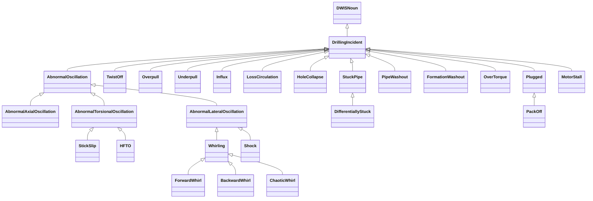
## DrillingIncident <!-- NOUN -->
- Display name: Drilling Incident
- Parent class: [DWISNoun](./DWISSemantics.md#DWISNoun)
- Description: 
This is the parent class for drilling incidents. A drilling incident is often detectable by an abnormal value of a process variable, i.e., a variable that is influenced
by the drilling process.
- Definition set: DrillingIncident
## AbnormalOscillation <!-- NOUN -->
- Display name: Abnormal Oscillation
- Parent class: [DrillingIncident](./DrillingIncident.md#DrillingIncident)
- Description: 
This Noun represents abnormal oscillations along the drill-stem.
- Definition set: DrillingIncident
## AbnormalAxialOscillation <!-- NOUN -->
- Display name: Abnormal Axial Oscillation
- Parent class: [AbnormalOscillation](./DrillingIncident.md#AbnormalOscillation)
- Description: 
This Noun is used to refer to abnormal axial oscillations.
- Definition set: DrillingIncident
## AbnormalTorsionalOscillation <!-- NOUN -->
- Display name: Abnormal Torsional Oscillation
- Parent class: [AbnormalOscillation](./DrillingIncident.md#AbnormalOscillation)
- Description: 
This Noun is used to refer to abnormal torsional oscillations.
- Definition set: DrillingIncident
## AbnormalLateralOscillation <!-- NOUN -->
- Display name: Abnormal Lateral Oscillation
- Parent class: [AbnormalOscillation](./DrillingIncident.md#AbnormalOscillation)
- Description: 
This Noun is used to refer to abnormal lateral oscillations.
- Definition set: DrillingIncident
## StickSlip <!-- NOUN -->
- Display name: Stick-slip
- Parent class: [AbnormalTorsionalOscillation](./DrillingIncident.md#AbnormalTorsionalOscillation)
- Description: 
This Noun is used to refer to stick-slips.
- Definition set: DrillingIncident
## HFTO <!-- NOUN -->
- Display name: High Frequency Torsional Oscillation
- Parent class: [AbnormalTorsionalOscillation](./DrillingIncident.md#AbnormalTorsionalOscillation)
- Description: 
This Noun is used to refer to high frequency torsional oscillations.
- Definition set: DrillingIncident
## Whirling <!-- NOUN -->
- Display name: Whirling
- Parent class: [AbnormalLateralOscillation](./DrillingIncident.md#AbnormalLateralOscillation)
- Description: 
This Noun is used to refer to abnormal lateral oscillations.
- Definition set: DrillingIncident
- Examples:
``` dwis whirlFDIRInfo
DynamicDrillingSignal: whirlFDIRInfo
DrillingFaultDetectionIsolationAndRecoveryAdvice: whirlFDIRInfo_1
whirlFDIRInfo_1 HasDynamicValue whirlFDIRInfo
Whirling: whirlingIncident
whirlFDIRInfo_1 IsRelatedToDrillingIncident whirlingIncident
ServiceCompany: serviceCompany
whirlFDIRInfo_1 IsProvidedBy serviceCompany
Advisor: computationUnit
whirlFDIRInfo_1 IsRecommendedBy computationUnit
FDIRFunction: FDIRFunction_1
FDIRFunction_1 ManagesIncident whirlingIncident
whirlFDIRInfo_1 IsRecommendedFor FDIRFunction_1
DWISAdviceComposer: adviceComposer
whirlFDIRInfo_1 IsProvidedTo adviceComposer
```
An example semantic graph looks like as follow:
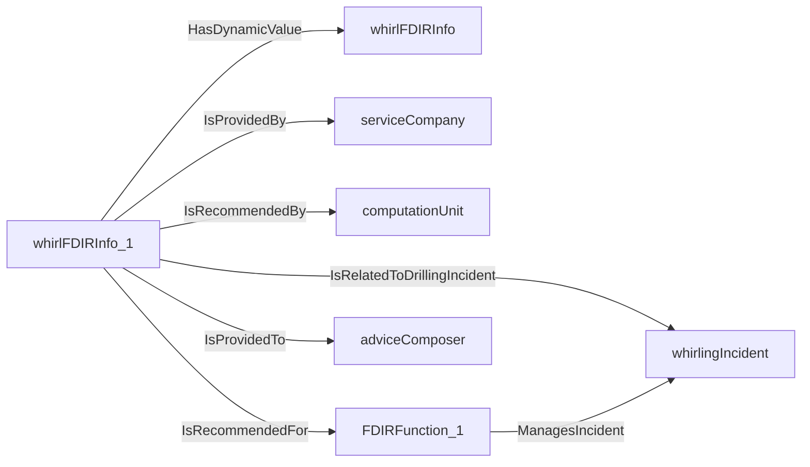
An example SparQL query looks like this:
```sparql
PREFIX rdf: <http://www.w3.org/1999/02/22-rdf-syntax-ns#>
PREFIX ddhub: <http://ddhub.no/>
PREFIX quantity: <http://ddhub.no/UnitAndQuantity>
SELECT ?whirlFDIRInfo
WHERE {
	?whirlFDIRInfo_1 ddhub:HasDynamicValue ?whirlFDIRInfo .
	?whirlFDIRInfo_1 ddhub:IsRelatedToDrillingIncident ?whirlingIncident .
	?whirlFDIRInfo_1 ddhub:IsProvidedBy ?serviceCompany .
	?whirlFDIRInfo_1 ddhub:IsRecommendedBy ?computationUnit .
	?FDIRFunction_1 ddhub:ManagesIncident ?whirlingIncident .
	?whirlFDIRInfo_1 ddhub:IsRecommendedFor ?FDIRFunction_1 .
	?whirlFDIRInfo_1 ddhub:IsProvidedTo ?adviceComposer .
}
```
## ForwardWhirl <!-- NOUN -->
- Display name: Forward Whirl
- Parent class: [Whirling](./DrillingIncident.md#Whirling)
- Description: 
This Noun is used to refer to forward whirl.
- Definition set: DrillingIncident
## BackwardWhirl <!-- NOUN -->
- Display name: Backward Whirl
- Parent class: [Whirling](./DrillingIncident.md#Whirling)
- Description: 
This Noun is used to refer to backward whirl.
- Definition set: DrillingIncident
## ChaoticWhirl <!-- NOUN -->
- Display name: Chaotic Whirl
- Parent class: [Whirling](./DrillingIncident.md#Whirling)
- Description: 
This Noun is used to refer to chaotic whirl.
- Definition set: DrillingIncident
## Shock <!-- NOUN -->
- Display name: Shock
- Parent class: [AbnormalLateralOscillation](./DrillingIncident.md#AbnormalLateralOscillation)
- Description: 
This Noun is used to refer to lateral shocks.
- Definition set: DrillingIncident
## TwistOff <!-- NOUN -->
- Display name: Twist-off
- Parent class: [DrillingIncident](./DrillingIncident.md#DrillingIncident)
- Description: 
This Noun is used to refer to a twist-off situation.
- Definition set: DrillingIncident
- Examples:
``` dwis twistOffFDIRInfo
DynamicDrillingSignal: twistOffFDIRInfo
DrillingFaultDetectionIsolationAndRecoveryAdvice: twistOffFDIRInfo_1
twistOffFDIRInfo_1 HasDynamicValue twistOffFDIRInfo
TwistOff: twistOffIncident
twistOffFDIRInfo_1 IsRelatedToDrillingIncident twistOffIncident
ServiceCompany: serviceCompany
twistOffFDIRInfo_1 IsProvidedBy serviceCompany
Advisor: computationUnit
twistOffFDIRInfo_1 IsRecommendedBy computationUnit
FDIRFunction: FDIRFunction_1
FDIRFunction_1 ManagesIncident twistOffIncident
twistOffFDIRInfo_1 IsRecommendedFor FDIRFunction_1
DWISAdviceComposer: adviceComposer
twistOffFDIRInfo_1 IsProvidedTo adviceComposer
```
An example semantic graph looks like as follow:

An example SparQL query looks like this:
```sparql
PREFIX rdf: <http://www.w3.org/1999/02/22-rdf-syntax-ns#>
PREFIX ddhub: <http://ddhub.no/>
PREFIX quantity: <http://ddhub.no/UnitAndQuantity>
SELECT ?twistOffFDIRInfo
WHERE {
	?twistOffFDIRInfo_1 ddhub:HasDynamicValue ?twistOffFDIRInfo .
	?twistOffFDIRInfo_1 ddhub:IsRelatedToDrillingIncident ?twistOffIncident .
	?twistOffFDIRInfo_1 ddhub:IsProvidedBy ?serviceCompany .
	?twistOffFDIRInfo_1 ddhub:IsRecommendedBy ?computationUnit .
	?FDIRFunction_1 ddhub:ManagesIncident ?twistOffIncident .
	?twistOffFDIRInfo_1 ddhub:IsRecommendedFor ?FDIRFunction_1 .
	?twistOffFDIRInfo_1 ddhub:IsProvidedTo ?adviceComposer .
}
```
## Overpull <!-- NOUN -->
- Display name: Overpull
- Parent class: [DrillingIncident](./DrillingIncident.md#DrillingIncident)
- Description: 
This Noun is used to refer to a situation during which the drill-stem hangs in something in the upward direction.
- Definition set: DrillingIncident
- Examples:
``` dwis overpullFDIRInfo
DynamicDrillingSignal: overpullFDIRInfo
DrillingFaultDetectionIsolationAndRecoveryAdvice: overpullFDIRInfo_1
overpullFDIRInfo_1 HasDynamicValue overpullFDIRInfo
Overpull: overpullIncident
overpullFDIRInfo_1 IsRelatedToDrillingIncident overpullIncident
ServiceCompany: serviceCompany
overpullFDIRInfo_1 IsProvidedBy serviceCompany
Advisor: computationUnit
overpullFDIRInfo_1 IsRecommendedBy computationUnit
FDIRFunction: FDIRFunction_1
FDIRFunction_1. ManagesIncident overpullIncident
overpullFDIRInfo_1 IsRecommendedFor FDIRFunction_1
DWISAdviceComposer: adviceComposer
overpullFDIRInfo_1 IsProvidedTo adviceComposer
```
An example semantic graph looks like as follow:
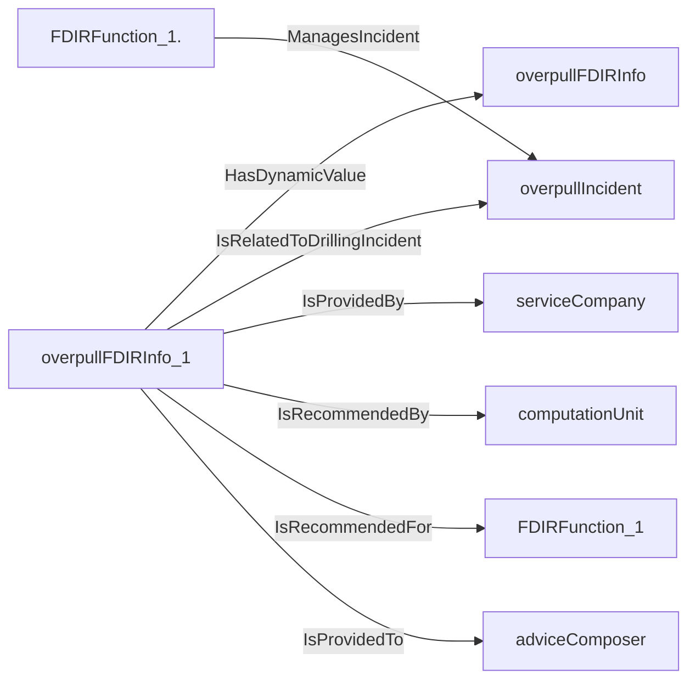
An example SparQL query looks like this:
```sparql
PREFIX rdf: <http://www.w3.org/1999/02/22-rdf-syntax-ns#>
PREFIX ddhub: <http://ddhub.no/>
PREFIX quantity: <http://ddhub.no/UnitAndQuantity>
SELECT ?overpullFDIRInfo
WHERE {
	?overpullFDIRInfo_1 ddhub:HasDynamicValue ?overpullFDIRInfo .
	?overpullFDIRInfo_1 ddhub:IsRelatedToDrillingIncident ?overpullIncident .
	?overpullFDIRInfo_1 ddhub:IsProvidedBy ?serviceCompany .
	?overpullFDIRInfo_1 ddhub:IsRecommendedBy ?computationUnit .
	?FDIRFunction_1. ddhub:ManagesIncident ?overpullIncident .
	?overpullFDIRInfo_1 ddhub:IsRecommendedFor ?FDIRFunction_1 .
	?overpullFDIRInfo_1 ddhub:IsProvidedTo ?adviceComposer .
}
```
## Underpull <!-- NOUN -->
- Display name: Underpull
- Parent class: [DrillingIncident](./DrillingIncident.md#DrillingIncident)
- Description: 
This Noun is used to refer to a situation during which the drill-stem hangs in something in the downward direction.
- Definition set: DrillingIncident
- Examples:
``` dwis underpullFDIRInfo
DynamicDrillingSignal: underpullFDIRInfo
DrillingFaultDetectionIsolationAndRecoveryAdvice: underpullFDIRInfo_1
underpullFDIRInfo_1 HasDynamicValue underpullFDIRInfo
Underpull: underpullIncident
underpullFDIRInfo_1 IsRelatedToDrillingIncident underpullIncident
ServiceCompany: serviceCompany
underpullFDIRInfo_1 IsProvidedBy serviceCompany
Advisor: computationUnit
underpullFDIRInfo_1 IsRecommendedBy computationUnit
FDIRFunction: FDIRFunction_1
FDIRFunction_1 ManagesIncident underpullIncident
underpullFDIRInfo_1 IsRecommendedFor FDIRFunction_1
DWISAdviceComposer: adviceComposer
underpullFDIRInfo_1 IsProvidedTo adviceComposer
```
An example semantic graph looks like as follow:

An example SparQL query looks like this:
```sparql
PREFIX rdf: <http://www.w3.org/1999/02/22-rdf-syntax-ns#>
PREFIX ddhub: <http://ddhub.no/>
PREFIX quantity: <http://ddhub.no/UnitAndQuantity>
SELECT ?underpullFDIRInfo
WHERE {
	?underpullFDIRInfo_1 ddhub:HasDynamicValue ?underpullFDIRInfo .
	?underpullFDIRInfo_1 ddhub:IsRelatedToDrillingIncident ?underpullIncident .
	?underpullFDIRInfo_1 ddhub:IsProvidedBy ?serviceCompany .
	?underpullFDIRInfo_1 ddhub:IsRecommendedBy ?computationUnit .
	?FDIRFunction_1 ddhub:ManagesIncident ?underpullIncident .
	?underpullFDIRInfo_1 ddhub:IsRecommendedFor ?FDIRFunction_1 .
	?underpullFDIRInfo_1 ddhub:IsProvidedTo ?adviceComposer .
}
```
## Influx <!-- NOUN -->
- Display name: Influx
- Parent class: [DrillingIncident](./DrillingIncident.md#DrillingIncident)
- Description: 
This Noun is used to refer to a situation during which there is an influx of formation fluids in the borehole.
- Definition set: DrillingIncident
- Examples:
``` dwis kickFDIRInfo
DynamicDrillingSignal: kickFDIRInfo
DrillingFaultDetectionIsolationAndRecoveryAdvice: kickFDIRInfo_1
kickFDIRInfo_1 HasDynamicValue kickFDIRInfo
Influx: influxIncident
kickFDIRInfo_1 IsRelatedToDrillingIncident influxIncident
ServiceCompany: serviceCompany
kickFDIRInfo_1 IsProvidedBy serviceCompany
Advisor: computationUnit
kickFDIRInfo_1 IsRecommendedBy computationUnit
FDIRFunction: FDIRFunction_1
FDIRFunction_1 ManagesIncident influxIncident
kickFDIRInfo_1 IsRecommendedFor FDIRFunction_1
DWISAdviceComposer: adviceComposer
kickFDIRInfo_1 IsProvidedTo adviceComposer
```
An example semantic graph looks like as follow:
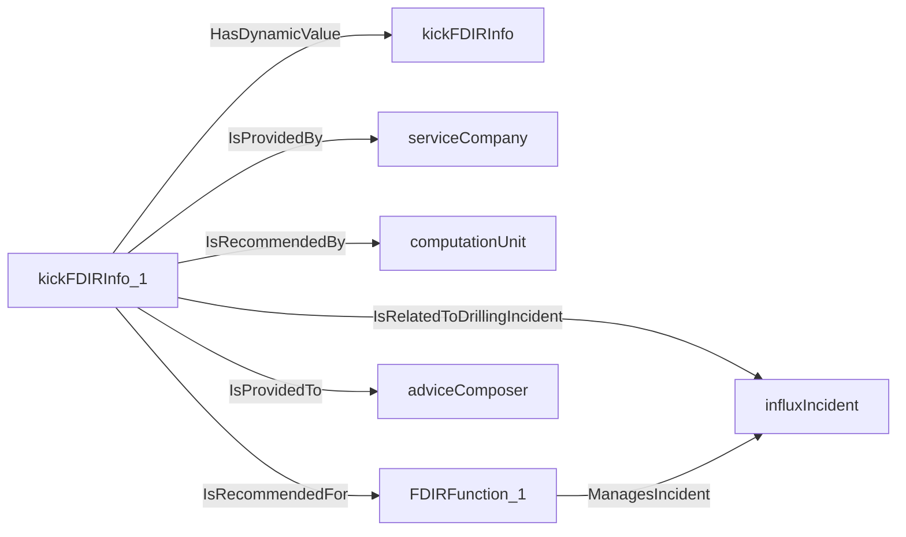
An example SparQL query looks like this:
```sparql
PREFIX rdf: <http://www.w3.org/1999/02/22-rdf-syntax-ns#>
PREFIX ddhub: <http://ddhub.no/>
PREFIX quantity: <http://ddhub.no/UnitAndQuantity>
SELECT ?kickFDIRInfo
WHERE {
	?kickFDIRInfo_1 ddhub:HasDynamicValue ?kickFDIRInfo .
	?kickFDIRInfo_1 ddhub:IsRelatedToDrillingIncident ?influxIncident .
	?kickFDIRInfo_1 ddhub:IsProvidedBy ?serviceCompany .
	?kickFDIRInfo_1 ddhub:IsRecommendedBy ?computationUnit .
	?FDIRFunction_1 ddhub:ManagesIncident ?influxIncident .
	?kickFDIRInfo_1 ddhub:IsRecommendedFor ?FDIRFunction_1 .
	?kickFDIRInfo_1 ddhub:IsProvidedTo ?adviceComposer .
}
```
## LossCirculation <!-- NOUN -->
- Display name: Loss Circulation
- Parent class: [DrillingIncident](./DrillingIncident.md#DrillingIncident)
- Description: 
This Noun is used to refer to a situation during which drilling fluid is lost to the formation.
- Definition set: DrillingIncident
- Examples:
``` dwis lossCirculationFDIRInfo
DynamicDrillingSignal: lossCirculationFDIRInfo
DrillingFaultDetectionIsolationAndRecoveryAdvice: lossCirculationFDIRInfo_1
lossCirculationFDIRInfo_1 HasDynamicValue lossCirculationFDIRInfo
LossCirculation: lossCirculationIncident
lossCirculationFDIRInfo_1 IsRelatedToDrillingIncident lossCirculationIncident
ServiceCompany: serviceCompany
lossCirculationFDIRInfo_1 IsProvidedBy serviceCompany
Advisor: computationUnit
lossCirculationFDIRInfo_1 IsRecommendedBy computationUnit
FDIRFunction: FDIRFunction_1
FDIRFunction_1 ManagesIncident lossCirculationIncident
lossCirculationFDIRInfo_1 IsRecommendedFor FDIRFunction_1
DWISAdviceComposer: adviceComposer
lossCirculationFDIRInfo_1 IsProvidedTo adviceComposer
```
An example semantic graph looks like as follow:
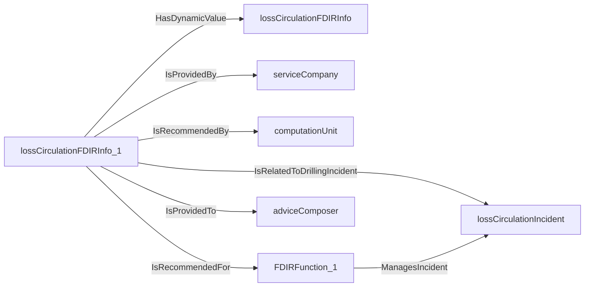
An example SparQL query looks like this:
```sparql
PREFIX rdf: <http://www.w3.org/1999/02/22-rdf-syntax-ns#>
PREFIX ddhub: <http://ddhub.no/>
PREFIX quantity: <http://ddhub.no/UnitAndQuantity>
SELECT ?lossCirculationFDIRInfo
WHERE {
	?lossCirculationFDIRInfo_1 ddhub:HasDynamicValue ?lossCirculationFDIRInfo .
	?lossCirculationFDIRInfo_1 ddhub:IsRelatedToDrillingIncident ?lossCirculationIncident .
	?lossCirculationFDIRInfo_1 ddhub:IsProvidedBy ?serviceCompany .
	?lossCirculationFDIRInfo_1 ddhub:IsRecommendedBy ?computationUnit .
	?FDIRFunction_1 ddhub:ManagesIncident ?lossCirculationIncident .
	?lossCirculationFDIRInfo_1 ddhub:IsRecommendedFor ?FDIRFunction_1 .
	?lossCirculationFDIRInfo_1 ddhub:IsProvidedTo ?adviceComposer .
}
```
## HoleCollapse <!-- NOUN -->
- Display name: Hole Collapse
- Parent class: [DrillingIncident](./DrillingIncident.md#DrillingIncident)
- Description: 
This Noun is used to refer to a situation during which there is a hole collapse.
- Definition set: DrillingIncident
- Examples:
``` dwis HoleCollapseFDIRInfo
DynamicDrillingSignal: HoleCollapseFDIRInfo
DrillingFaultDetectionIsolationAndRecoveryAdvice: HoleCollapseFDIRInfo_1
HoleCollapseFDIRInfo_1 HasDynamicValue HoleCollapseFDIRInfo
HoleCollapse: holeCollapseIncident
HoleCollapseFDIRInfo_1 IsRelatedToDrillingIncident holeCollapseIncident
ServiceCompany: serviceCompany
HoleCollapseFDIRInfo_1 IsProvidedBy serviceCompany
Advisor: computationUnit
HoleCollapseFDIRInfo_1 IsRecommendedBy computationUnit
FDIRFunction: FDIRFunction_1
FDIRFunction_1 ManagesIncident holeCollapseIncident
HoleCollapseFDIRInfo_1 IsRecommendedFor FDIRFunction_1
DWISAdviceComposer: adviceComposer
HoleCollapseFDIRInfo_1 IsProvidedTo adviceComposer
```
An example semantic graph looks like as follow:
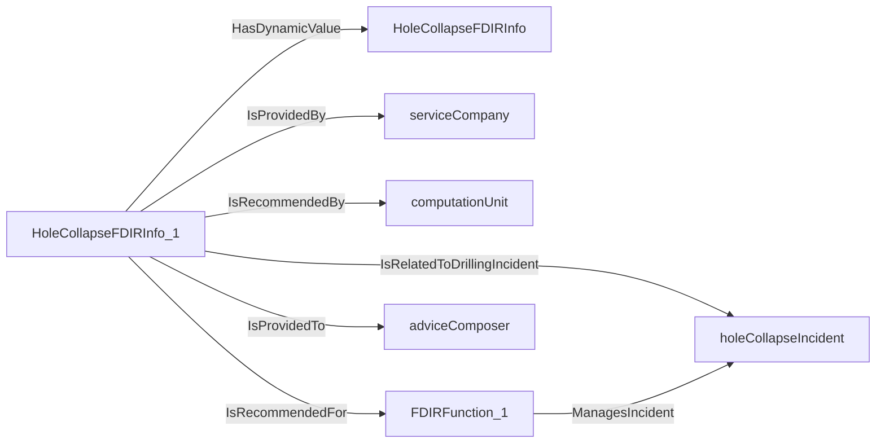
An example SparQL query looks like this:
```sparql
PREFIX rdf: <http://www.w3.org/1999/02/22-rdf-syntax-ns#>
PREFIX ddhub: <http://ddhub.no/>
PREFIX quantity: <http://ddhub.no/UnitAndQuantity>
SELECT ?HoleCollapseFDIRInfo
WHERE {
	?HoleCollapseFDIRInfo_1 ddhub:HasDynamicValue ?HoleCollapseFDIRInfo .
	?HoleCollapseFDIRInfo_1 ddhub:IsRelatedToDrillingIncident ?holeCollapseIncident .
	?HoleCollapseFDIRInfo_1 ddhub:IsProvidedBy ?serviceCompany .
	?HoleCollapseFDIRInfo_1 ddhub:IsRecommendedBy ?computationUnit .
	?FDIRFunction_1 ddhub:ManagesIncident ?holeCollapseIncident .
	?HoleCollapseFDIRInfo_1 ddhub:IsRecommendedFor ?FDIRFunction_1 .
	?HoleCollapseFDIRInfo_1 ddhub:IsProvidedTo ?adviceComposer .
}
```
## StuckPipe <!-- NOUN -->
- Display name: Stuck-pipe
- Parent class: [DrillingIncident](./DrillingIncident.md#DrillingIncident)
- Description: 
This Noun is used to refer to a situation during which the drill-stem is impeded to move either axially or rotationally or both.
- Definition set: DrillingIncident
## DifferentiallyStuck <!-- NOUN -->
- Display name: Differentially Stuck
- Parent class: [StuckPipe](./DrillingIncident.md#StuckPipe)
- Description: 
This Noun is used to refer to a situation during which the drill-stem is stuck because of differential sticking.
- Definition set: DrillingIncident
- Examples:
``` dwis differentialStickingFDIRInfo
DynamicDrillingSignal: differentialStickingFDIRInfo
DrillingFaultDetectionIsolationAndRecoveryAdvice: differentialStickingFDIRInfo_1
differentialStickingFDIRInfo_1 HasDynamicValue differentialStickingFDIRInfo
DifferentiallyStuck: differentiallyStuckIncident
differentialStickingFDIRInfo_1 IsRelatedToDrillingIncident differentiallyStuckIncident
ServiceCompany: serviceCompany
differentialStickingFDIRInfo_1 IsProvidedBy serviceCompany
Advisor: computationUnit
differentialStickingFDIRInfo_1 IsRecommendedBy computationUnit
FDIRFunction: FDIRFunction_1
FDIRFunction_1 ManagesIncident differentiallyStuckIncident
differentialStickingFDIRInfo_1 IsRecommendedFor FDIRFunction_1
DWISAdviceComposer: adviceComposer
differentialStickingFDIRInfo_1 IsProvidedTo adviceComposer
```
An example semantic graph looks like as follow:

An example SparQL query looks like this:
```sparql
PREFIX rdf: <http://www.w3.org/1999/02/22-rdf-syntax-ns#>
PREFIX ddhub: <http://ddhub.no/>
PREFIX quantity: <http://ddhub.no/UnitAndQuantity>
SELECT ?differentialStickingFDIRInfo
WHERE {
	?differentialStickingFDIRInfo_1 ddhub:HasDynamicValue ?differentialStickingFDIRInfo .
	?differentialStickingFDIRInfo_1 ddhub:IsRelatedToDrillingIncident ?differentiallyStuckIncident .
	?differentialStickingFDIRInfo_1 ddhub:IsProvidedBy ?serviceCompany .
	?differentialStickingFDIRInfo_1 ddhub:IsRecommendedBy ?computationUnit .
	?FDIRFunction_1 ddhub:ManagesIncident ?differentiallyStuckIncident .
	?differentialStickingFDIRInfo_1 ddhub:IsRecommendedFor ?FDIRFunction_1 .
	?differentialStickingFDIRInfo_1 ddhub:IsProvidedTo ?adviceComposer .
}
```
## PipeWashout <!-- NOUN -->
- Display name: Pipe Washout
- Parent class: [DrillingIncident](./DrillingIncident.md#DrillingIncident)
- Description: 
This Noun is used to refer to a situation during which there is leak between the inside of the drill-stem and the annulus.
- Definition set: DrillingIncident
- Examples:
``` dwis pipeWashoutFDIRInfo
DynamicDrillingSignal: pipeWashoutFDIRInfo
DrillingFaultDetectionIsolationAndRecoveryAdvice: pipeWashoutFDIRInfo_1
pipeWashoutFDIRInfo_1 HasDynamicValue pipeWashoutFDIRInfo
PipeWashout: pipeWashoutIncident
pipeWashoutFDIRInfo_1 IsRelatedToDrillingIncident pipeWashoutIncident
ServiceCompany: serviceCompany
pipeWashoutFDIRInfo_1 IsProvidedBy serviceCompany
Advisor: computationUnit
pipeWashoutFDIRInfo_1 IsRecommendedBy computationUnit
FDIRFunction: FDIRFunction_1
FDIRFunction_1 ManagesIncident pipeWashoutIncident
pipeWashoutFDIRInfo_1 IsRecommendedFor FDIRFunction_1
DWISAdviceComposer: adviceComposer
pipeWashoutFDIRInfo_1 IsProvidedTo adviceComposer
```
An example semantic graph looks like as follow:

An example SparQL query looks like this:
```sparql
PREFIX rdf: <http://www.w3.org/1999/02/22-rdf-syntax-ns#>
PREFIX ddhub: <http://ddhub.no/>
PREFIX quantity: <http://ddhub.no/UnitAndQuantity>
SELECT ?pipeWashoutFDIRInfo
WHERE {
	?pipeWashoutFDIRInfo_1 ddhub:HasDynamicValue ?pipeWashoutFDIRInfo .
	?pipeWashoutFDIRInfo_1 ddhub:IsRelatedToDrillingIncident ?pipeWashoutIncident .
	?pipeWashoutFDIRInfo_1 ddhub:IsProvidedBy ?serviceCompany .
	?pipeWashoutFDIRInfo_1 ddhub:IsRecommendedBy ?computationUnit .
	?FDIRFunction_1 ddhub:ManagesIncident ?pipeWashoutIncident .
	?pipeWashoutFDIRInfo_1 ddhub:IsRecommendedFor ?FDIRFunction_1 .
	?pipeWashoutFDIRInfo_1 ddhub:IsProvidedTo ?adviceComposer .
}
```
## FormationWashout <!-- NOUN -->
- Display name: Formation Washout
- Parent class: [DrillingIncident](./DrillingIncident.md#DrillingIncident)
- Description: 
This Noun is used to refer to a situation during which the formation is being washed out.
- Definition set: DrillingIncident
## OverTorque <!-- NOUN -->
- Display name: Over-torque
- Parent class: [DrillingIncident](./DrillingIncident.md#DrillingIncident)
- Description: 
This Noun is used to refer to a situation during which the rotation of the drill-stem is impeded.
- Definition set: DrillingIncident
- Examples:
``` dwis overtorqueFDIRInfo
DynamicDrillingSignal: overtorqueFDIRInfo
DrillingFaultDetectionIsolationAndRecoveryAdvice: overtorqueFDIRInfo_1
overtorqueFDIRInfo_1 HasDynamicValue overtorqueFDIRInfo
OverTorque: overTorqueIncident
overtorqueFDIRInfo_1 IsRelatedToDrillingIncident overTorqueIncident
ServiceCompany: serviceCompany
overtorqueFDIRInfo_1 IsProvidedBy serviceCompany
Advisor: computationUnit
overtorqueFDIRInfo_1 IsRecommendedBy computationUnit
FDIRFunction: FDIRFunction_1
FDIRFunction_1 ManagesIncident overTorqueIncident
overtorqueFDIRInfo_1 IsRecommendedFor FDIRFunction_1
DWISAdviceComposer: adviceComposer
overtorqueFDIRInfo_1 IsProvidedTo adviceComposer
```
An example semantic graph looks like as follow:
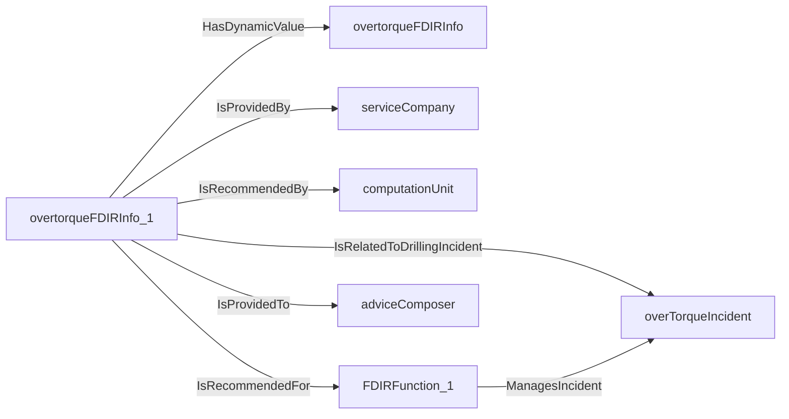
An example SparQL query looks like this:
```sparql
PREFIX rdf: <http://www.w3.org/1999/02/22-rdf-syntax-ns#>
PREFIX ddhub: <http://ddhub.no/>
PREFIX quantity: <http://ddhub.no/UnitAndQuantity>
SELECT ?overtorqueFDIRInfo
WHERE {
	?overtorqueFDIRInfo_1 ddhub:HasDynamicValue ?overtorqueFDIRInfo .
	?overtorqueFDIRInfo_1 ddhub:IsRelatedToDrillingIncident ?overTorqueIncident .
	?overtorqueFDIRInfo_1 ddhub:IsProvidedBy ?serviceCompany .
	?overtorqueFDIRInfo_1 ddhub:IsRecommendedBy ?computationUnit .
	?FDIRFunction_1 ddhub:ManagesIncident ?overTorqueIncident .
	?overtorqueFDIRInfo_1 ddhub:IsRecommendedFor ?FDIRFunction_1 .
	?overtorqueFDIRInfo_1 ddhub:IsProvidedTo ?adviceComposer .
}
```
## Plugged <!-- NOUN -->
- Display name: Plugged
- Parent class: [DrillingIncident](./DrillingIncident.md#DrillingIncident)
- Description: 
This Noun is used to refer to a situation during which the hydraulic flow-path is partially or fully blocked.
- Definition set: DrillingIncident
## PackOff <!-- NOUN -->
- Display name: Pack-off
- Parent class: [Plugged](./DrillingIncident.md#Plugged)
- Description: 
This Noun is used to refer to a situation during which the annulus hydraulic flow-path is partially or fully blocked.
- Definition set: DrillingIncident
- Examples:
``` dwis PackOffFDIRInfo
DynamicDrillingSignal: PackOffFDIRInfo
DrillingFaultDetectionIsolationAndRecoveryAdvice: PackOffFDIRInfo_1
PackOffFDIRInfo_1 HasDynamicValue PackOffFDIRInfo
PackOff: packOffIncident
PackOffFDIRInfo_1 IsRelatedToDrillingIncident packOffIncident
ServiceCompany: serviceCompany
PackOffFDIRInfo_1 IsProvidedBy serviceCompany
Advisor: computationUnit
PackOffFDIRInfo_1 IsRecommendedBy computationUnit
FDIRFunction: FDIRFunction_1
FDIRFunction_1 ManagesIncident packOffIncident
PackOffFDIRInfo_1 IsRecommendedFor FDIRFunction_1
DWISAdviceComposer: adviceComposer
PackOffFDIRInfo_1 IsProvidedTo adviceComposer
```
An example semantic graph looks like as follow:
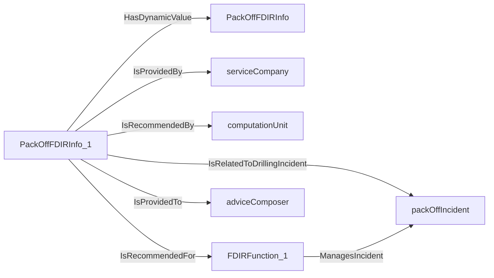
An example SparQL query looks like this:
```sparql
PREFIX rdf: <http://www.w3.org/1999/02/22-rdf-syntax-ns#>
PREFIX ddhub: <http://ddhub.no/>
PREFIX quantity: <http://ddhub.no/UnitAndQuantity>
SELECT ?PackOffFDIRInfo
WHERE {
	?PackOffFDIRInfo_1 ddhub:HasDynamicValue ?PackOffFDIRInfo .
	?PackOffFDIRInfo_1 ddhub:IsRelatedToDrillingIncident ?packOffIncident .
	?PackOffFDIRInfo_1 ddhub:IsProvidedBy ?serviceCompany .
	?PackOffFDIRInfo_1 ddhub:IsRecommendedBy ?computationUnit .
	?FDIRFunction_1 ddhub:ManagesIncident ?packOffIncident .
	?PackOffFDIRInfo_1 ddhub:IsRecommendedFor ?FDIRFunction_1 .
	?PackOffFDIRInfo_1 ddhub:IsProvidedTo ?adviceComposer .
}
```
## MotorStall <!-- NOUN -->
- Display name: Motor-stall
- Parent class: [DrillingIncident](./DrillingIncident.md#DrillingIncident)
- Description: 
This Noun is used to refer to a situation during which the downhole motor is stalled.
- Definition set: DrillingIncident
- Examples:
``` dwis motorStallFDIRInfo
DynamicDrillingSignal: motorStallFDIRInfo
DrillingFaultDetectionIsolationAndRecoveryAdvice: motorStallFDIRInfo_1
motorStallFDIRInfo_1 HasDynamicValue motorStallFDIRInfo
MotorStall: motorStallIncident
motorStallFDIRInfo_1 IsRelatedToDrillingIncident motorStallIncident
ServiceCompany: serviceCompany
motorStallFDIRInfo_1 IsProvidedBy serviceCompany
Advisor: computationUnit
motorStallFDIRInfo_1 IsRecommendedBy computationUnit
FDIRFunction: FDIRFunction_1
FDIRFunction_1 ManagesIncident motorStallIncident
motorStallFDIRInfo_1 IsRecommendedFor FDIRFunction_1
DWISAdviceComposer: adviceComposer
motorStallFDIRInfo_1 IsProvidedTo adviceComposer
```
An example semantic graph looks like as follow:
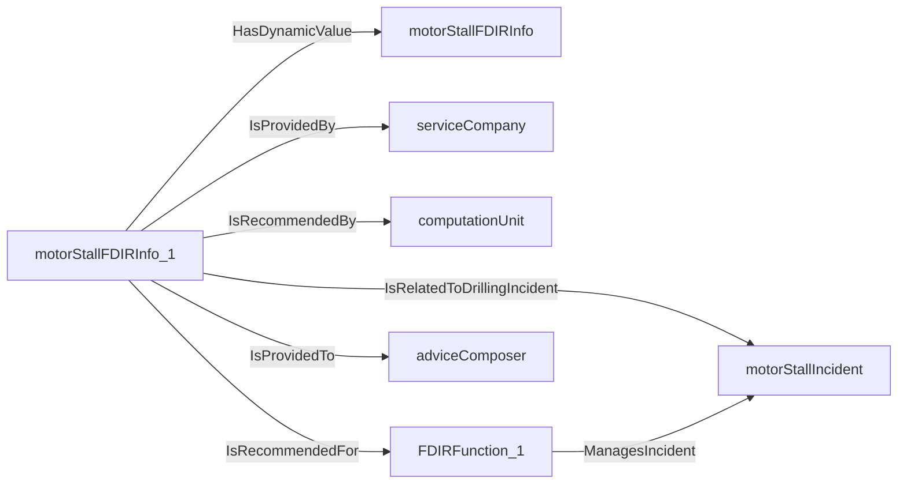
An example SparQL query looks like this:
```sparql
PREFIX rdf: <http://www.w3.org/1999/02/22-rdf-syntax-ns#>
PREFIX ddhub: <http://ddhub.no/>
PREFIX quantity: <http://ddhub.no/UnitAndQuantity>
SELECT ?motorStallFDIRInfo
WHERE {
	?motorStallFDIRInfo_1 ddhub:HasDynamicValue ?motorStallFDIRInfo .
	?motorStallFDIRInfo_1 ddhub:IsRelatedToDrillingIncident ?motorStallIncident .
	?motorStallFDIRInfo_1 ddhub:IsProvidedBy ?serviceCompany .
	?motorStallFDIRInfo_1 ddhub:IsRecommendedBy ?computationUnit .
	?FDIRFunction_1 ddhub:ManagesIncident ?motorStallIncident .
	?motorStallFDIRInfo_1 ddhub:IsRecommendedFor ?FDIRFunction_1 .
	?motorStallFDIRInfo_1 ddhub:IsProvidedTo ?adviceComposer .
}
```
# Verbs
## Class Inheritance for Verbs
Here is a class inheritance diagram for the verbs contained in this definition set.
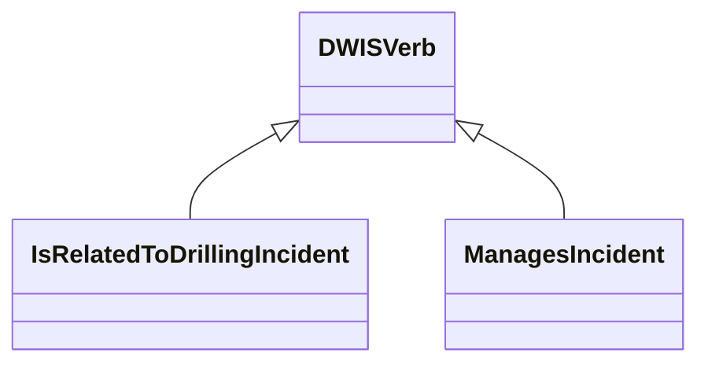
## Relations
Here is a graph representing the relations that can be made with the verbs defined in this definition set.
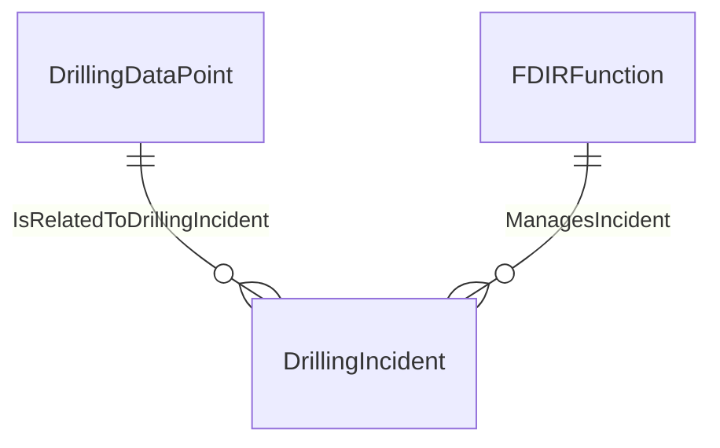
## IsRelatedToDrillingIncident <!-- VERB -->
- Display name: Is Related to Drilling Incident
- Parent verb: [DWISVerb](./DWISSemantics.md#DWISVerb)
- Subject class: [DrillingDataPoint](./DrillingDataSemantics.md#DrillingDataPoint)
- Object class: [DrillingIncident](./DrillingIncident.md#DrillingIncident)
- Definition set: DrillingIncident
- Description: 
This Verb is used to indicate that a drilling data point is related to a drilling incident.
- Examples:
``` dwis motorStallFDIRInfo
DynamicDrillingSignal: motorStallFDIRInfo
DrillingFaultDetectionIsolationAndRecoveryAdvice: motorStallFDIRInfo_1
motorStallFDIRInfo_1 HasDynamicValue motorStallFDIRInfo
MotorStall: motorStallIncident
motorStallFDIRInfo_1 IsRelatedToDrillingIncident motorStallIncident
ServiceCompany: serviceCompany
motorStallFDIRInfo_1 IsProvidedBy serviceCompany
Advisor: computationUnit
motorStallFDIRInfo_1 IsRecommendedBy computationUnit
FDIRFunction: FDIRFunction_1
FDIRFunction_1.HasFunction = "MotorStallFDIR"
motorStallFDIRInfo_1 IsRecommendedFor FDIRFunction_1
DWISAdviceComposer: adviceComposer
motorStallFDIRInfo_1 IsProvidedTo adviceComposer
```
An example semantic graph looks like as follow:
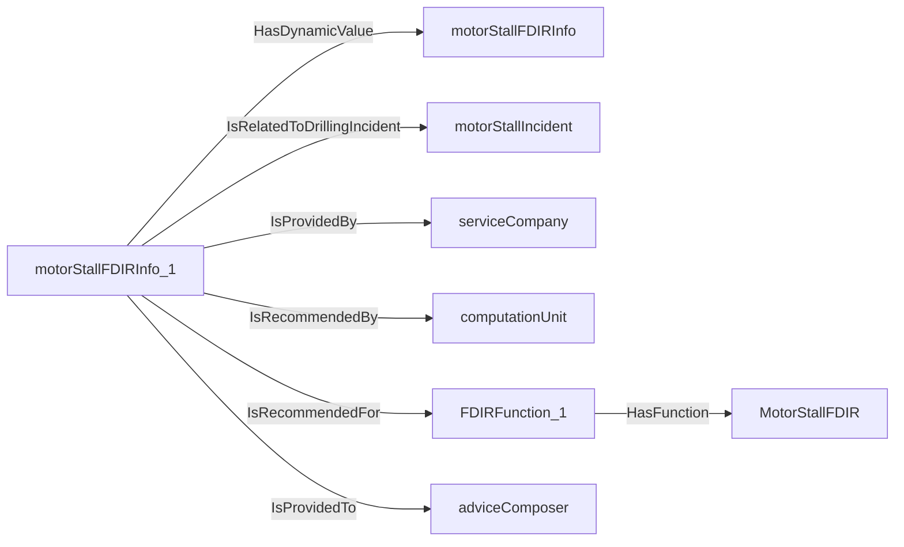
An example SparQL query looks like this:
```sparql
PREFIX rdf: <http://www.w3.org/1999/02/22-rdf-syntax-ns#>
PREFIX ddhub: <http://ddhub.no/>
PREFIX quantity: <http://ddhub.no/UnitAndQuantity>
SELECT ?motorStallFDIRInfo
WHERE {
	?motorStallFDIRInfo_1 ddhub:HasDynamicValue ?motorStallFDIRInfo .
	?motorStallFDIRInfo_1 ddhub:IsRelatedToDrillingIncident ?motorStallIncident .
	?motorStallFDIRInfo_1 ddhub:IsProvidedBy ?serviceCompany .
	?motorStallFDIRInfo_1 ddhub:IsRecommendedBy ?computationUnit .
	?FDIRFunction_1 ddhub:HasFunction ?Attribute000 .
	?motorStallFDIRInfo_1 ddhub:IsRecommendedFor ?FDIRFunction_1 .
	?motorStallFDIRInfo_1 ddhub:IsProvidedTo ?adviceComposer .
  FILTER (
	?Attribute000 = "MotorStallFDIR"
  )
}
```
## ManagesIncident <!-- VERB -->
- Display name: Manages Incident
- Parent verb: [DWISVerb](./DWISSemantics.md#DWISVerb)
- Subject class: [FDIRFunction](./ADCS.md#FDIRFunction)
- Object class: [DrillingIncident](./DrillingIncident.md#DrillingIncident)
- Definition set: DrillingIncident
- Description: 
This Verb is used to indicate that a fault detection isolation and recovery function manages a drilling incident.
