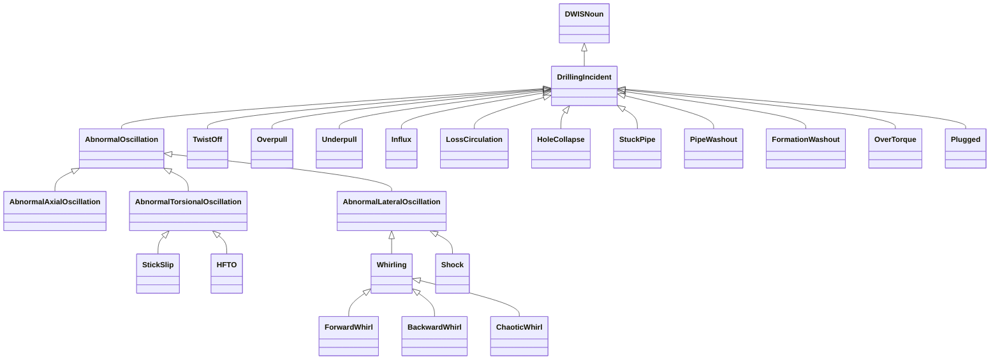
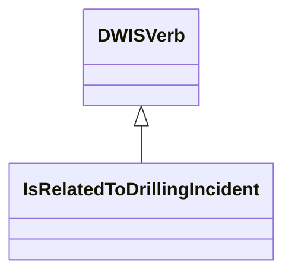
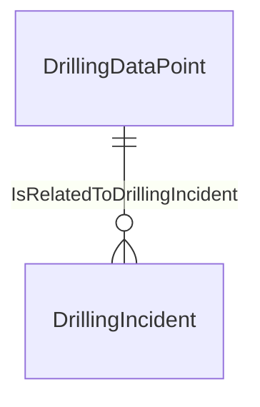

# DrillingIncident<!-- DEFINITION SET HEADER -->
- Description: 
this category refers mostly to the description of drilling incidents.

# Nouns
## Class Inheritance for Nouns
Here is a class inheritance diagram for the nouns contained in this definition set.

## DrillingIncident <!-- NOUN -->
- Display name: DrillingIncident
- Parent class: [DWISNoun](./DWISSemantics.md#DWISNoun)
- Description: 

- Definition set: DrillingIncident
- Examples:
## AbnormalOscillation <!-- NOUN -->
- Display name: Abnormal Oscillation
- Parent class: [DrillingIncident](./DrillingIncident.md#DrillingIncident)
- Description: 

- Definition set: DrillingIncident
- Examples:
## AbnormalAxialOscillation <!-- NOUN -->
- Display name: Abnormal Axial Oscillation
- Parent class: [AbnormalOscillation](./DrillingIncident.md#AbnormalOscillation)
- Description: 

- Definition set: DrillingIncident
- Examples:
## AbnormalTorsionalOscillation <!-- NOUN -->
- Display name: Abnormal Torsional Oscillation
- Parent class: [AbnormalOscillation](./DrillingIncident.md#AbnormalOscillation)
- Description: 

- Definition set: DrillingIncident
- Examples:
## AbnormalLateralOscillation <!-- NOUN -->
- Display name: Abnormal Lateral Oscillation
- Parent class: [AbnormalOscillation](./DrillingIncident.md#AbnormalOscillation)
- Description: 

- Definition set: DrillingIncident
- Examples:
## StickSlip <!-- NOUN -->
- Display name: Stick-slip
- Parent class: [AbnormalTorsionalOscillation](./DrillingIncident.md#AbnormalTorsionalOscillation)
- Description: 

- Definition set: DrillingIncident
- Examples:
## HFTO <!-- NOUN -->
- Display name: High Frequency Torsional Oscillation
- Parent class: [AbnormalTorsionalOscillation](./DrillingIncident.md#AbnormalTorsionalOscillation)
- Description: 

- Definition set: DrillingIncident
- Examples:
## Whirling <!-- NOUN -->
- Display name: Whirling
- Parent class: [AbnormalLateralOscillation](./DrillingIncident.md#AbnormalLateralOscillation)
- Description: 

- Definition set: DrillingIncident
- Examples:
## ForwardWhirl <!-- NOUN -->
- Display name: Forward Whirl
- Parent class: [Whirling](./DrillingIncident.md#Whirling)
- Description: 

- Definition set: DrillingIncident
- Examples:
## BackwardWhirl <!-- NOUN -->
- Display name: Backward Whirl
- Parent class: [Whirling](./DrillingIncident.md#Whirling)
- Description: 

- Definition set: DrillingIncident
- Examples:
## ChaoticWhirl <!-- NOUN -->
- Display name: Chaotic Whirl
- Parent class: [Whirling](./DrillingIncident.md#Whirling)
- Description: 

- Definition set: DrillingIncident
- Examples:
## Shock <!-- NOUN -->
- Display name: Shock
- Parent class: [AbnormalLateralOscillation](./DrillingIncident.md#AbnormalLateralOscillation)
- Description: 

- Definition set: DrillingIncident
- Examples:
## TwistOff <!-- NOUN -->
- Display name: TwistOff
- Parent class: [DrillingIncident](./DrillingIncident.md#DrillingIncident)
- Description: 

- Definition set: DrillingIncident
- Examples:
## Overpull <!-- NOUN -->
- Display name: Overpull
- Parent class: [DrillingIncident](./DrillingIncident.md#DrillingIncident)
- Description: 

- Definition set: DrillingIncident
- Examples:
## Underpull <!-- NOUN -->
- Display name: Underpull
- Parent class: [DrillingIncident](./DrillingIncident.md#DrillingIncident)
- Description: 

- Definition set: DrillingIncident
- Examples:
## Influx <!-- NOUN -->
- Display name: Influx
- Parent class: [DrillingIncident](./DrillingIncident.md#DrillingIncident)
- Description: 

- Definition set: DrillingIncident
- Examples:
## LossCirculation <!-- NOUN -->
- Display name: LossCirculation
- Parent class: [DrillingIncident](./DrillingIncident.md#DrillingIncident)
- Description: 

- Definition set: DrillingIncident
- Examples:
## HoleCollapse <!-- NOUN -->
- Display name: HoleCollapse
- Parent class: [DrillingIncident](./DrillingIncident.md#DrillingIncident)
- Description: 

- Definition set: DrillingIncident
- Examples:
## StuckPipe <!-- NOUN -->
- Display name: StuckPipe
- Parent class: [DrillingIncident](./DrillingIncident.md#DrillingIncident)
- Description: 

- Definition set: DrillingIncident
- Examples:
## PipeWashout <!-- NOUN -->
- Display name: PipeWashout
- Parent class: [DrillingIncident](./DrillingIncident.md#DrillingIncident)
- Description: 

- Definition set: DrillingIncident
- Examples:
## FormationWashout <!-- NOUN -->
- Display name: FormationWashout
- Parent class: [DrillingIncident](./DrillingIncident.md#DrillingIncident)
- Description: 

- Definition set: DrillingIncident
- Examples:
## OverTorque <!-- NOUN -->
- Display name: OverTorque
- Parent class: [DrillingIncident](./DrillingIncident.md#DrillingIncident)
- Description: 

- Definition set: DrillingIncident
- Examples:
## Plugged <!-- NOUN -->
- Display name: Plugged
- Parent class: [DrillingIncident](./DrillingIncident.md#DrillingIncident)
- Description: 

- Definition set: DrillingIncident
- Examples:
# Verbs
## Class Inheritance for Verbs
Here is a class inheritance diagram for the verbs contained in this definition set.

## Relations
Here is a graph representing the relations that can be made with the verbs defined in this definition set.

## IsRelatedToDrillingIncident <!-- VERB -->
- Display name: IsRelatedToDrillingIncident
- Parent verb: [DWISVerb](./DWISSemantics.md#DWISVerb)
- Subject class: [DrillingDataPoint](./DrillingDataSemantics.md#DrillingDataPoint)
- Object class: [DrillingIncident](./DrillingIncident.md#DrillingIncident)
- Definition set: DrillingIncident
- Description: 

- Examples:
