# DrillingIncident<!-- DEFINITION SET HEADER -->
- Description: 
this category refers mostly to the description of drilling incidents.

# Nouns
## Class Inheritance for Nouns
Here is a class inheritance diagram for the nouns contained in this definition set.
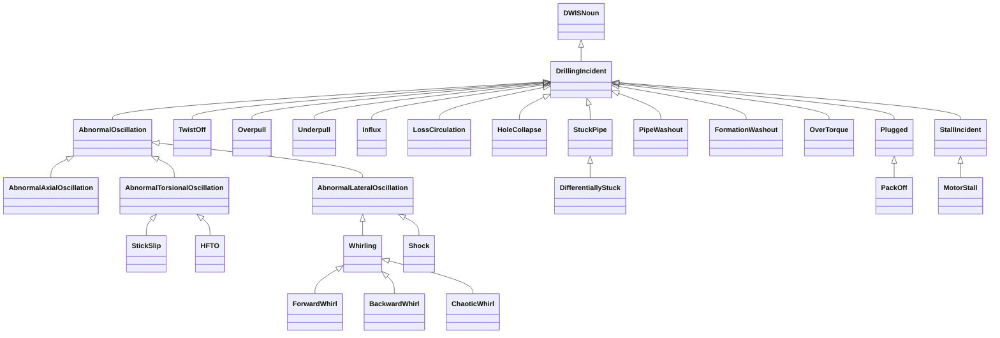
## DrillingIncident <!-- NOUN -->
- Display name: Drilling Incident
- Parent class: [DWISNoun](./DWISSemantics.md#DWISNoun)
- Description: 
This is the parent class for drilling incidents. A drilling incident is often detectable by an abnormal value of a process variable, i.e., a variable that is influenced
by the drilling process.
- Definition set: DrillingIncident
- Examples:
```dwis genericIncident
DrillingIncident:incident
DrillingDataPoint:triggerSignal
triggerSignal IsRelatedToDrillingIncident incident
```
An example semantic graph looks like as follow:
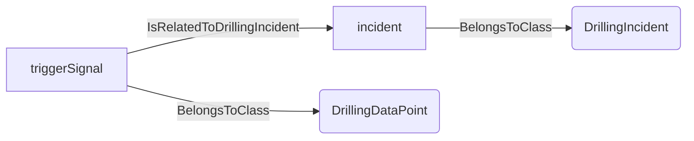
An example SparQL query looks like this:
```sparql
PREFIX rdf: <http://www.w3.org/1999/02/22-rdf-syntax-ns#>
PREFIX ddhub: <http://ddhub.no/>
PREFIX quantity: <http://ddhub.no/UnitAndQuantity>
SELECT ?genericIncident
WHERE {
	?incident rdf:type ddhub:DrillingIncident .
	?triggerSignal rdf:type ddhub:DrillingDataPoint .
	?triggerSignal ddhub:IsRelatedToDrillingIncident ?incident .
}
```
This example shows a generic incident associated with a trigger signal.
## AbnormalOscillation <!-- NOUN -->
- Display name: Abnormal Oscillation
- Parent class: [DrillingIncident](./DrillingIncident.md#DrillingIncident)
- Description: 
This Noun represents abnormal oscillations along the drill-stem.
- Definition set: DrillingIncident
- Examples:
```dwis abnormalOscillation
AbnormalOscillation:oscillationIncident
DrillingDataPoint:vibrationSignal
vibrationSignal IsRelatedToDrillingIncident oscillationIncident
```
An example semantic graph looks like as follow:
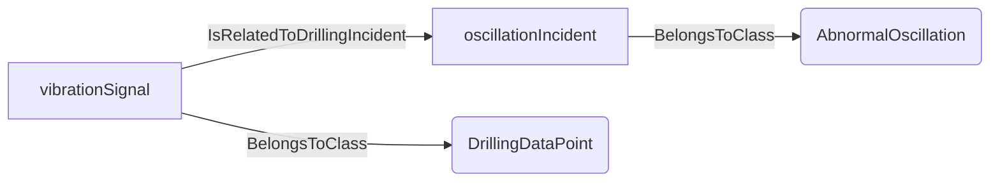
An example SparQL query looks like this:
```sparql
PREFIX rdf: <http://www.w3.org/1999/02/22-rdf-syntax-ns#>
PREFIX ddhub: <http://ddhub.no/>
PREFIX quantity: <http://ddhub.no/UnitAndQuantity>
SELECT ?abnormalOscillation
WHERE {
	?oscillationIncident rdf:type ddhub:AbnormalOscillation .
	?vibrationSignal rdf:type ddhub:DrillingDataPoint .
	?vibrationSignal ddhub:IsRelatedToDrillingIncident ?oscillationIncident .
}
```
This example links an abnormal oscillation incident to a vibration signal.
## AbnormalAxialOscillation <!-- NOUN -->
- Display name: Abnormal Axial Oscillation
- Parent class: [AbnormalOscillation](./DrillingIncident.md#AbnormalOscillation)
- Description: 
This Noun is used to refer to abnormal axial oscillations.
- Definition set: DrillingIncident
- Examples:
```dwis axialOscillation
AbnormalAxialOscillation:axialOscillationIncident
DrillingDataPoint:axialAcceleration
axialAcceleration IsRelatedToDrillingIncident axialOscillationIncident
```
An example semantic graph looks like as follow:
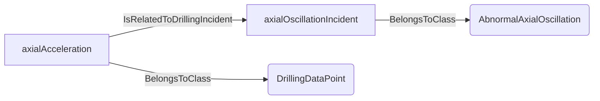
An example SparQL query looks like this:
```sparql
PREFIX rdf: <http://www.w3.org/1999/02/22-rdf-syntax-ns#>
PREFIX ddhub: <http://ddhub.no/>
PREFIX quantity: <http://ddhub.no/UnitAndQuantity>
SELECT ?axialOscillation
WHERE {
	?axialOscillationIncident rdf:type ddhub:AbnormalAxialOscillation .
	?axialAcceleration rdf:type ddhub:DrillingDataPoint .
	?axialAcceleration ddhub:IsRelatedToDrillingIncident ?axialOscillationIncident .
}
```
This example associates axial acceleration anomalies with an axial oscillation incident.
## AbnormalTorsionalOscillation <!-- NOUN -->
- Display name: Abnormal Torsional Oscillation
- Parent class: [AbnormalOscillation](./DrillingIncident.md#AbnormalOscillation)
- Description: 
This Noun is used to refer to abnormal torsional oscillations.
- Definition set: DrillingIncident
- Examples:
```dwis torsionalOscillation
AbnormalTorsionalOscillation:torsionalOscillationIncident
DrillingDataPoint:torsionalVibration
torsionalVibration IsRelatedToDrillingIncident torsionalOscillationIncident
```
An example semantic graph looks like as follow:
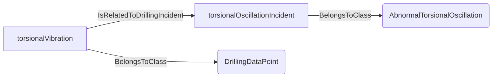
An example SparQL query looks like this:
```sparql
PREFIX rdf: <http://www.w3.org/1999/02/22-rdf-syntax-ns#>
PREFIX ddhub: <http://ddhub.no/>
PREFIX quantity: <http://ddhub.no/UnitAndQuantity>
SELECT ?torsionalOscillation
WHERE {
	?torsionalOscillationIncident rdf:type ddhub:AbnormalTorsionalOscillation .
	?torsionalVibration rdf:type ddhub:DrillingDataPoint .
	?torsionalVibration ddhub:IsRelatedToDrillingIncident ?torsionalOscillationIncident .
}
```
This example links torsional vibration to an abnormal torsional oscillation.
## AbnormalLateralOscillation <!-- NOUN -->
- Display name: Abnormal Lateral Oscillation
- Parent class: [AbnormalOscillation](./DrillingIncident.md#AbnormalOscillation)
- Description: 
This Noun is used to refer to abnormal lateral oscillations.
- Definition set: DrillingIncident
- Examples:
```dwis lateralOscillation
AbnormalLateralOscillation:lateralOscillationIncident
DrillingDataPoint:lateralAcceleration
lateralAcceleration IsRelatedToDrillingIncident lateralOscillationIncident
```
An example semantic graph looks like as follow:
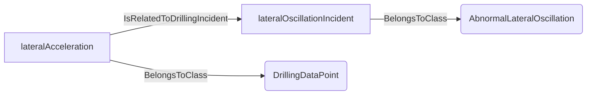
An example SparQL query looks like this:
```sparql
PREFIX rdf: <http://www.w3.org/1999/02/22-rdf-syntax-ns#>
PREFIX ddhub: <http://ddhub.no/>
PREFIX quantity: <http://ddhub.no/UnitAndQuantity>
SELECT ?lateralOscillation
WHERE {
	?lateralOscillationIncident rdf:type ddhub:AbnormalLateralOscillation .
	?lateralAcceleration rdf:type ddhub:DrillingDataPoint .
	?lateralAcceleration ddhub:IsRelatedToDrillingIncident ?lateralOscillationIncident .
}
```
This example ties lateral acceleration anomalies to a lateral oscillation incident.
## StickSlip <!-- NOUN -->
- Display name: Stick-slip
- Parent class: [AbnormalTorsionalOscillation](./DrillingIncident.md#AbnormalTorsionalOscillation)
- Description: 
This Noun is used to refer to stick-slips.
- Definition set: DrillingIncident
- Examples:
```dwis stickSlipIncident
StickSlip:stickSlipIncident
DrillingDataPoint:surfaceTorque
surfaceTorque IsRelatedToDrillingIncident stickSlipIncident
```
An example semantic graph looks like as follow:
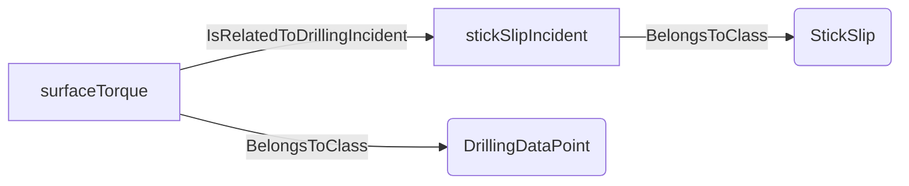
An example SparQL query looks like this:
```sparql
PREFIX rdf: <http://www.w3.org/1999/02/22-rdf-syntax-ns#>
PREFIX ddhub: <http://ddhub.no/>
PREFIX quantity: <http://ddhub.no/UnitAndQuantity>
SELECT ?stickSlipIncident
WHERE {
	?stickSlipIncident rdf:type ddhub:StickSlip .
	?surfaceTorque rdf:type ddhub:DrillingDataPoint .
	?surfaceTorque ddhub:IsRelatedToDrillingIncident ?stickSlipIncident .
}
```
This example shows stick-slip identified from torque variations.
## HFTO <!-- NOUN -->
- Display name: High Frequency Torsional Oscillation
- Parent class: [AbnormalTorsionalOscillation](./DrillingIncident.md#AbnormalTorsionalOscillation)
- Description: 
This Noun is used to refer to high frequency torsional oscillations.
- Definition set: DrillingIncident
- Examples:
```dwis hftoIncident
HFTO:hftoIncident
DrillingDataPoint:torsionalSpectrum
torsionalSpectrum IsRelatedToDrillingIncident hftoIncident
```
An example semantic graph looks like as follow:
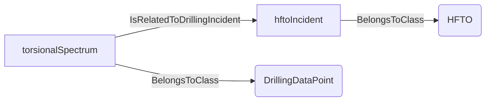
An example SparQL query looks like this:
```sparql
PREFIX rdf: <http://www.w3.org/1999/02/22-rdf-syntax-ns#>
PREFIX ddhub: <http://ddhub.no/>
PREFIX quantity: <http://ddhub.no/UnitAndQuantity>
SELECT ?hftoIncident
WHERE {
	?hftoIncident rdf:type ddhub:HFTO .
	?torsionalSpectrum rdf:type ddhub:DrillingDataPoint .
	?torsionalSpectrum ddhub:IsRelatedToDrillingIncident ?hftoIncident .
}
```
This example ties a torsional spectrum to an HFTO incident.
## Whirling <!-- NOUN -->
- Display name: Whirling
- Parent class: [AbnormalLateralOscillation](./DrillingIncident.md#AbnormalLateralOscillation)
- Description: 
This Noun is used to refer to abnormal lateral oscillations.
- Definition set: DrillingIncident
- Examples:
``` dwis whirlFDIRInfo
DynamicDrillingSignal:whirlFDIRInfo
DrillingFaultDetectionIsolationAndRecoveryAdvice:whirlFDIRInfo_1
whirlFDIRInfo_1 HasDynamicValue whirlFDIRInfo
Whirling:whirlingIncident
whirlFDIRInfo_1 IsRelatedToDrillingIncident whirlingIncident
ServiceCompany:serviceCompany
whirlFDIRInfo_1 IsProvidedBy serviceCompany
Advisor:computationUnit
whirlFDIRInfo_1 IsRecommendedBy computationUnit
FDIRFunction:FDIRFunction_1
FDIRFunction_1 ManagesIncident whirlingIncident
whirlFDIRInfo_1 IsRecommendedFor FDIRFunction_1
DWISAdviceComposer:adviceComposer
whirlFDIRInfo_1 IsProvidedTo adviceComposer
```
An example semantic graph looks like as follow:
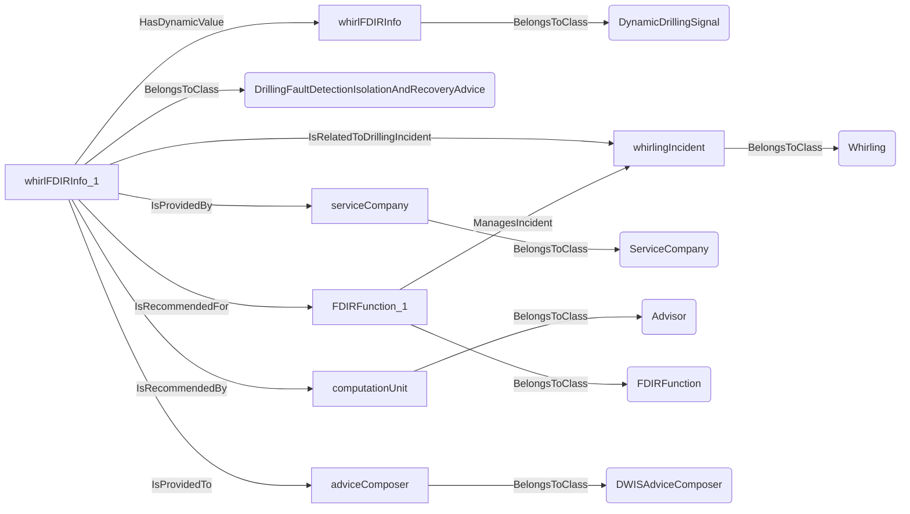
An example SparQL query looks like this:
```sparql
PREFIX rdf: <http://www.w3.org/1999/02/22-rdf-syntax-ns#>
PREFIX ddhub: <http://ddhub.no/>
PREFIX quantity: <http://ddhub.no/UnitAndQuantity>
SELECT ?whirlFDIRInfo
WHERE {
	?whirlFDIRInfo rdf:type ddhub:DynamicDrillingSignal .
	?whirlFDIRInfo_1 rdf:type ddhub:DrillingFaultDetectionIsolationAndRecoveryAdvice .
	?whirlFDIRInfo_1 ddhub:HasDynamicValue ?whirlFDIRInfo .
	?whirlingIncident rdf:type ddhub:Whirling .
	?whirlFDIRInfo_1 ddhub:IsRelatedToDrillingIncident ?whirlingIncident .
	?serviceCompany rdf:type ddhub:ServiceCompany .
	?whirlFDIRInfo_1 ddhub:IsProvidedBy ?serviceCompany .
	?computationUnit rdf:type ddhub:Advisor .
	?whirlFDIRInfo_1 ddhub:IsRecommendedBy ?computationUnit .
	?FDIRFunction_1 rdf:type ddhub:FDIRFunction .
	?FDIRFunction_1 ddhub:ManagesIncident ?whirlingIncident .
	?whirlFDIRInfo_1 ddhub:IsRecommendedFor ?FDIRFunction_1 .
	?adviceComposer rdf:type ddhub:DWISAdviceComposer .
	?whirlFDIRInfo_1 ddhub:IsProvidedTo ?adviceComposer .
}
```
## ForwardWhirl <!-- NOUN -->
- Display name: Forward Whirl
- Parent class: [Whirling](./DrillingIncident.md#Whirling)
- Description: 
This Noun is used to refer to forward whirl.
- Definition set: DrillingIncident
- Examples:
```dwis forwardWhirlIncident
ForwardWhirl:forwardWhirlIncident
DrillingDataPoint:lateralVibration
lateralVibration IsRelatedToDrillingIncident forwardWhirlIncident
```
An example semantic graph looks like as follow:
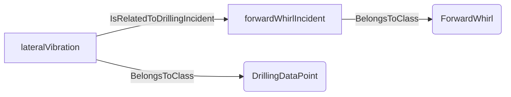
An example SparQL query looks like this:
```sparql
PREFIX rdf: <http://www.w3.org/1999/02/22-rdf-syntax-ns#>
PREFIX ddhub: <http://ddhub.no/>
PREFIX quantity: <http://ddhub.no/UnitAndQuantity>
SELECT ?forwardWhirlIncident
WHERE {
	?forwardWhirlIncident rdf:type ddhub:ForwardWhirl .
	?lateralVibration rdf:type ddhub:DrillingDataPoint .
	?lateralVibration ddhub:IsRelatedToDrillingIncident ?forwardWhirlIncident .
}
```
This example links lateral vibration to forward whirl.
## BackwardWhirl <!-- NOUN -->
- Display name: Backward Whirl
- Parent class: [Whirling](./DrillingIncident.md#Whirling)
- Description: 
This Noun is used to refer to backward whirl.
- Definition set: DrillingIncident
- Examples:
```dwis backwardWhirlIncident
BackwardWhirl:backwardWhirlIncident
DrillingDataPoint:lateralVibration
lateralVibration IsRelatedToDrillingIncident backwardWhirlIncident
```
An example semantic graph looks like as follow:
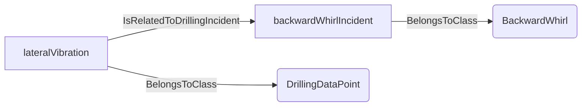
An example SparQL query looks like this:
```sparql
PREFIX rdf: <http://www.w3.org/1999/02/22-rdf-syntax-ns#>
PREFIX ddhub: <http://ddhub.no/>
PREFIX quantity: <http://ddhub.no/UnitAndQuantity>
SELECT ?backwardWhirlIncident
WHERE {
	?backwardWhirlIncident rdf:type ddhub:BackwardWhirl .
	?lateralVibration rdf:type ddhub:DrillingDataPoint .
	?lateralVibration ddhub:IsRelatedToDrillingIncident ?backwardWhirlIncident .
}
```
This example ties vibration to backward whirl.
## ChaoticWhirl <!-- NOUN -->
- Display name: Chaotic Whirl
- Parent class: [Whirling](./DrillingIncident.md#Whirling)
- Description: 
This Noun is used to refer to chaotic whirl.
- Definition set: DrillingIncident
- Examples:
```dwis chaoticWhirlIncident
ChaoticWhirl:chaoticWhirlIncident
DrillingDataPoint:lateralVibration
lateralVibration IsRelatedToDrillingIncident chaoticWhirlIncident
```
An example semantic graph looks like as follow:
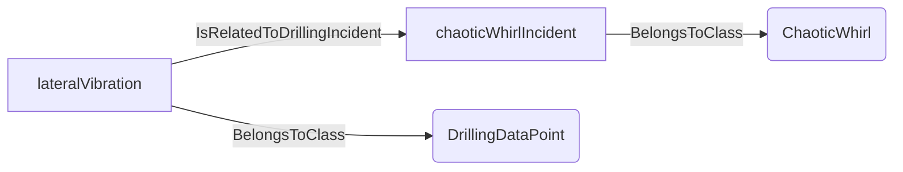
An example SparQL query looks like this:
```sparql
PREFIX rdf: <http://www.w3.org/1999/02/22-rdf-syntax-ns#>
PREFIX ddhub: <http://ddhub.no/>
PREFIX quantity: <http://ddhub.no/UnitAndQuantity>
SELECT ?chaoticWhirlIncident
WHERE {
	?chaoticWhirlIncident rdf:type ddhub:ChaoticWhirl .
	?lateralVibration rdf:type ddhub:DrillingDataPoint .
	?lateralVibration ddhub:IsRelatedToDrillingIncident ?chaoticWhirlIncident .
}
```
This example links chaotic whirl to lateral vibration signatures.
## Shock <!-- NOUN -->
- Display name: Shock
- Parent class: [AbnormalLateralOscillation](./DrillingIncident.md#AbnormalLateralOscillation)
- Description: 
This Noun is used to refer to lateral shocks.
- Definition set: DrillingIncident
- Examples:
```dwis shockIncident
Shock:shockIncident
DrillingDataPoint:shockSensorSignal
shockSensorSignal IsRelatedToDrillingIncident shockIncident
```
An example semantic graph looks like as follow:
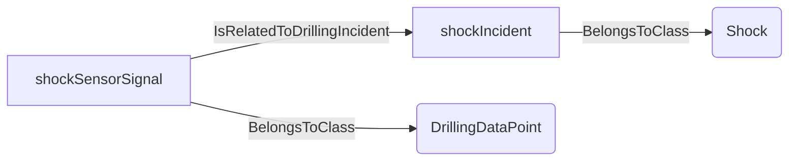
An example SparQL query looks like this:
```sparql
PREFIX rdf: <http://www.w3.org/1999/02/22-rdf-syntax-ns#>
PREFIX ddhub: <http://ddhub.no/>
PREFIX quantity: <http://ddhub.no/UnitAndQuantity>
SELECT ?shockIncident
WHERE {
	?shockIncident rdf:type ddhub:Shock .
	?shockSensorSignal rdf:type ddhub:DrillingDataPoint .
	?shockSensorSignal ddhub:IsRelatedToDrillingIncident ?shockIncident .
}
```
This example shows a shock sensor signal tied to a shock incident.
## TwistOff <!-- NOUN -->
- Display name: Twist-off
- Parent class: [DrillingIncident](./DrillingIncident.md#DrillingIncident)
- Description: 
This Noun is used to refer to a twist-off situation.
- Definition set: DrillingIncident
- Examples:
``` dwis twistOffFDIRInfo
DynamicDrillingSignal:twistOffFDIRInfo
DrillingFaultDetectionIsolationAndRecoveryAdvice:twistOffFDIRInfo_1
twistOffFDIRInfo_1 HasDynamicValue twistOffFDIRInfo
TwistOff:twistOffIncident
twistOffFDIRInfo_1 IsRelatedToDrillingIncident twistOffIncident
ServiceCompany:serviceCompany
twistOffFDIRInfo_1 IsProvidedBy serviceCompany
Advisor:computationUnit
twistOffFDIRInfo_1 IsRecommendedBy computationUnit
FDIRFunction:FDIRFunction_1
FDIRFunction_1 ManagesIncident twistOffIncident
twistOffFDIRInfo_1 IsRecommendedFor FDIRFunction_1
DWISAdviceComposer:adviceComposer
twistOffFDIRInfo_1 IsProvidedTo adviceComposer
```
An example semantic graph looks like as follow:
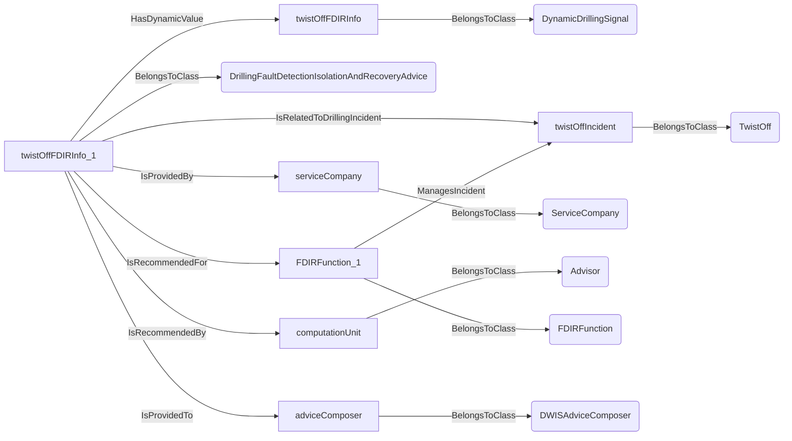
An example SparQL query looks like this:
```sparql
PREFIX rdf: <http://www.w3.org/1999/02/22-rdf-syntax-ns#>
PREFIX ddhub: <http://ddhub.no/>
PREFIX quantity: <http://ddhub.no/UnitAndQuantity>
SELECT ?twistOffFDIRInfo
WHERE {
	?twistOffFDIRInfo rdf:type ddhub:DynamicDrillingSignal .
	?twistOffFDIRInfo_1 rdf:type ddhub:DrillingFaultDetectionIsolationAndRecoveryAdvice .
	?twistOffFDIRInfo_1 ddhub:HasDynamicValue ?twistOffFDIRInfo .
	?twistOffIncident rdf:type ddhub:TwistOff .
	?twistOffFDIRInfo_1 ddhub:IsRelatedToDrillingIncident ?twistOffIncident .
	?serviceCompany rdf:type ddhub:ServiceCompany .
	?twistOffFDIRInfo_1 ddhub:IsProvidedBy ?serviceCompany .
	?computationUnit rdf:type ddhub:Advisor .
	?twistOffFDIRInfo_1 ddhub:IsRecommendedBy ?computationUnit .
	?FDIRFunction_1 rdf:type ddhub:FDIRFunction .
	?FDIRFunction_1 ddhub:ManagesIncident ?twistOffIncident .
	?twistOffFDIRInfo_1 ddhub:IsRecommendedFor ?FDIRFunction_1 .
	?adviceComposer rdf:type ddhub:DWISAdviceComposer .
	?twistOffFDIRInfo_1 ddhub:IsProvidedTo ?adviceComposer .
}
```
## Overpull <!-- NOUN -->
- Display name: Overpull
- Parent class: [DrillingIncident](./DrillingIncident.md#DrillingIncident)
- Description: 
This Noun is used to refer to a situation during which the drill-stem hangs in something in the upward direction.
- Definition set: DrillingIncident
- Examples:
``` dwis overpullFDIRInfo
DynamicDrillingSignal:overpullFDIRInfo
DrillingFaultDetectionIsolationAndRecoveryAdvice:overpullFDIRInfo_1
overpullFDIRInfo_1 HasDynamicValue overpullFDIRInfo
Overpull:overpullIncident
overpullFDIRInfo_1 IsRelatedToDrillingIncident overpullIncident
ServiceCompany:serviceCompany
overpullFDIRInfo_1 IsProvidedBy serviceCompany
Advisor:computationUnit
overpullFDIRInfo_1 IsRecommendedBy computationUnit
FDIRFunction:FDIRFunction_1
FDIRFunction_1 ManagesIncident overpullIncident
overpullFDIRInfo_1 IsRecommendedFor FDIRFunction_1
DWISAdviceComposer:adviceComposer
overpullFDIRInfo_1 IsProvidedTo adviceComposer
```
An example semantic graph looks like as follow:
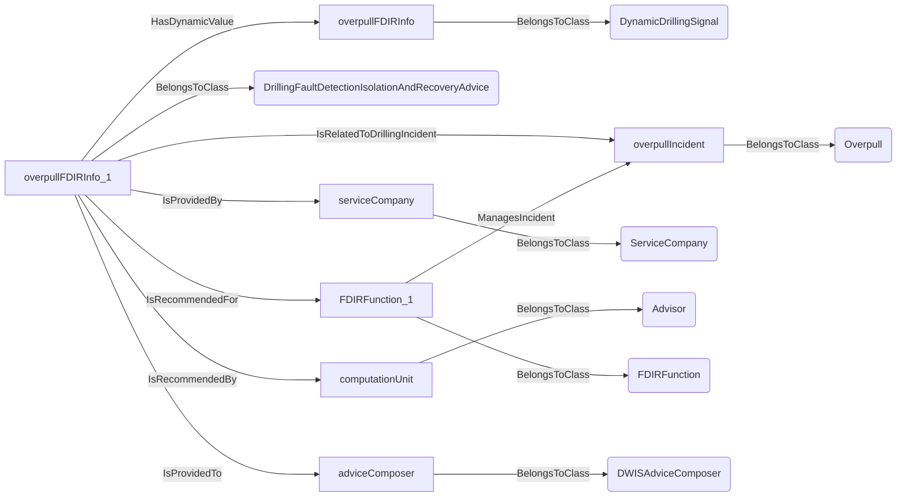
An example SparQL query looks like this:
```sparql
PREFIX rdf: <http://www.w3.org/1999/02/22-rdf-syntax-ns#>
PREFIX ddhub: <http://ddhub.no/>
PREFIX quantity: <http://ddhub.no/UnitAndQuantity>
SELECT ?overpullFDIRInfo
WHERE {
	?overpullFDIRInfo rdf:type ddhub:DynamicDrillingSignal .
	?overpullFDIRInfo_1 rdf:type ddhub:DrillingFaultDetectionIsolationAndRecoveryAdvice .
	?overpullFDIRInfo_1 ddhub:HasDynamicValue ?overpullFDIRInfo .
	?overpullIncident rdf:type ddhub:Overpull .
	?overpullFDIRInfo_1 ddhub:IsRelatedToDrillingIncident ?overpullIncident .
	?serviceCompany rdf:type ddhub:ServiceCompany .
	?overpullFDIRInfo_1 ddhub:IsProvidedBy ?serviceCompany .
	?computationUnit rdf:type ddhub:Advisor .
	?overpullFDIRInfo_1 ddhub:IsRecommendedBy ?computationUnit .
	?FDIRFunction_1 rdf:type ddhub:FDIRFunction .
	?FDIRFunction_1 ddhub:ManagesIncident ?overpullIncident .
	?overpullFDIRInfo_1 ddhub:IsRecommendedFor ?FDIRFunction_1 .
	?adviceComposer rdf:type ddhub:DWISAdviceComposer .
	?overpullFDIRInfo_1 ddhub:IsProvidedTo ?adviceComposer .
}
```
## Underpull <!-- NOUN -->
- Display name: Underpull
- Parent class: [DrillingIncident](./DrillingIncident.md#DrillingIncident)
- Description: 
This Noun is used to refer to a situation during which the drill-stem hangs in something in the downward direction.
- Definition set: DrillingIncident
- Examples:
``` dwis underpullFDIRInfo
DynamicDrillingSignal:underpullFDIRInfo
DrillingFaultDetectionIsolationAndRecoveryAdvice:underpullFDIRInfo_1
underpullFDIRInfo_1 HasDynamicValue underpullFDIRInfo
Underpull:underpullIncident
underpullFDIRInfo_1 IsRelatedToDrillingIncident underpullIncident
ServiceCompany:serviceCompany
underpullFDIRInfo_1 IsProvidedBy serviceCompany
Advisor:computationUnit
underpullFDIRInfo_1 IsRecommendedBy computationUnit
FDIRFunction:FDIRFunction_1
FDIRFunction_1 ManagesIncident underpullIncident
underpullFDIRInfo_1 IsRecommendedFor FDIRFunction_1
DWISAdviceComposer:adviceComposer
underpullFDIRInfo_1 IsProvidedTo adviceComposer
```
An example semantic graph looks like as follow:
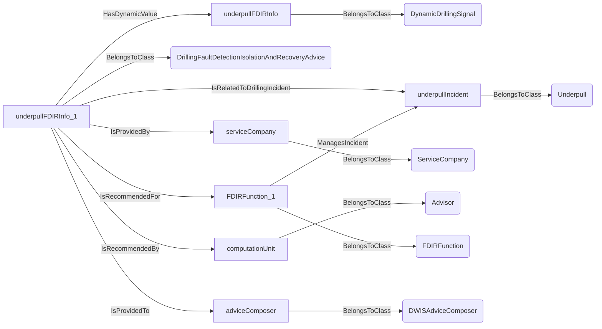
An example SparQL query looks like this:
```sparql
PREFIX rdf: <http://www.w3.org/1999/02/22-rdf-syntax-ns#>
PREFIX ddhub: <http://ddhub.no/>
PREFIX quantity: <http://ddhub.no/UnitAndQuantity>
SELECT ?underpullFDIRInfo
WHERE {
	?underpullFDIRInfo rdf:type ddhub:DynamicDrillingSignal .
	?underpullFDIRInfo_1 rdf:type ddhub:DrillingFaultDetectionIsolationAndRecoveryAdvice .
	?underpullFDIRInfo_1 ddhub:HasDynamicValue ?underpullFDIRInfo .
	?underpullIncident rdf:type ddhub:Underpull .
	?underpullFDIRInfo_1 ddhub:IsRelatedToDrillingIncident ?underpullIncident .
	?serviceCompany rdf:type ddhub:ServiceCompany .
	?underpullFDIRInfo_1 ddhub:IsProvidedBy ?serviceCompany .
	?computationUnit rdf:type ddhub:Advisor .
	?underpullFDIRInfo_1 ddhub:IsRecommendedBy ?computationUnit .
	?FDIRFunction_1 rdf:type ddhub:FDIRFunction .
	?FDIRFunction_1 ddhub:ManagesIncident ?underpullIncident .
	?underpullFDIRInfo_1 ddhub:IsRecommendedFor ?FDIRFunction_1 .
	?adviceComposer rdf:type ddhub:DWISAdviceComposer .
	?underpullFDIRInfo_1 ddhub:IsProvidedTo ?adviceComposer .
}
```
## Influx <!-- NOUN -->
- Display name: Influx
- Parent class: [DrillingIncident](./DrillingIncident.md#DrillingIncident)
- Description: 
This Noun is used to refer to a situation during which there is an influx of formation fluids in the borehole.
- Definition set: DrillingIncident
- Examples:
``` dwis kickFDIRInfo
DynamicDrillingSignal:kickFDIRInfo
DrillingFaultDetectionIsolationAndRecoveryAdvice:kickFDIRInfo_1
kickFDIRInfo_1 HasDynamicValue kickFDIRInfo
Influx:influxIncident
kickFDIRInfo_1 IsRelatedToDrillingIncident influxIncident
ServiceCompany:serviceCompany
kickFDIRInfo_1 IsProvidedBy serviceCompany
Advisor:computationUnit
kickFDIRInfo_1 IsRecommendedBy computationUnit
FDIRFunction:FDIRFunction_1
FDIRFunction_1 ManagesIncident influxIncident
kickFDIRInfo_1 IsRecommendedFor FDIRFunction_1
DWISAdviceComposer:adviceComposer
kickFDIRInfo_1 IsProvidedTo adviceComposer
```
An example semantic graph looks like as follow:
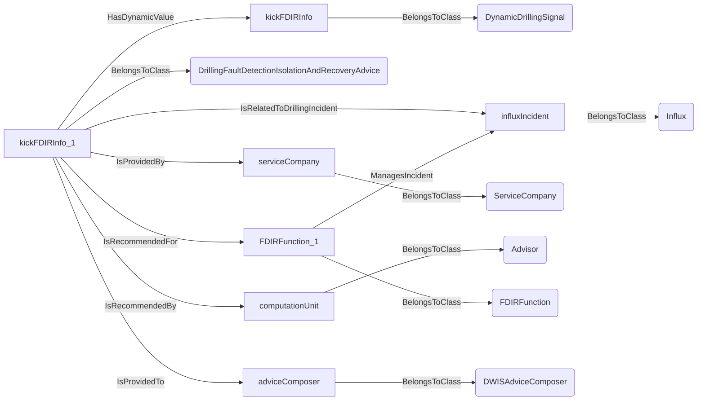
An example SparQL query looks like this:
```sparql
PREFIX rdf: <http://www.w3.org/1999/02/22-rdf-syntax-ns#>
PREFIX ddhub: <http://ddhub.no/>
PREFIX quantity: <http://ddhub.no/UnitAndQuantity>
SELECT ?kickFDIRInfo
WHERE {
	?kickFDIRInfo rdf:type ddhub:DynamicDrillingSignal .
	?kickFDIRInfo_1 rdf:type ddhub:DrillingFaultDetectionIsolationAndRecoveryAdvice .
	?kickFDIRInfo_1 ddhub:HasDynamicValue ?kickFDIRInfo .
	?influxIncident rdf:type ddhub:Influx .
	?kickFDIRInfo_1 ddhub:IsRelatedToDrillingIncident ?influxIncident .
	?serviceCompany rdf:type ddhub:ServiceCompany .
	?kickFDIRInfo_1 ddhub:IsProvidedBy ?serviceCompany .
	?computationUnit rdf:type ddhub:Advisor .
	?kickFDIRInfo_1 ddhub:IsRecommendedBy ?computationUnit .
	?FDIRFunction_1 rdf:type ddhub:FDIRFunction .
	?FDIRFunction_1 ddhub:ManagesIncident ?influxIncident .
	?kickFDIRInfo_1 ddhub:IsRecommendedFor ?FDIRFunction_1 .
	?adviceComposer rdf:type ddhub:DWISAdviceComposer .
	?kickFDIRInfo_1 ddhub:IsProvidedTo ?adviceComposer .
}
```
## LossCirculation <!-- NOUN -->
- Display name: Loss Circulation
- Parent class: [DrillingIncident](./DrillingIncident.md#DrillingIncident)
- Description: 
This Noun is used to refer to a situation during which drilling fluid is lost to the formation.
- Definition set: DrillingIncident
- Examples:
``` dwis lossCirculationFDIRInfo
DynamicDrillingSignal:lossCirculationFDIRInfo
DrillingFaultDetectionIsolationAndRecoveryAdvice:lossCirculationFDIRInfo_1
lossCirculationFDIRInfo_1 HasDynamicValue lossCirculationFDIRInfo
LossCirculation:lossCirculationIncident
lossCirculationFDIRInfo_1 IsRelatedToDrillingIncident lossCirculationIncident
ServiceCompany:serviceCompany
lossCirculationFDIRInfo_1 IsProvidedBy serviceCompany
Advisor:computationUnit
lossCirculationFDIRInfo_1 IsRecommendedBy computationUnit
FDIRFunction:FDIRFunction_1
FDIRFunction_1 ManagesIncident lossCirculationIncident
lossCirculationFDIRInfo_1 IsRecommendedFor FDIRFunction_1
DWISAdviceComposer:adviceComposer
lossCirculationFDIRInfo_1 IsProvidedTo adviceComposer
```
An example semantic graph looks like as follow:
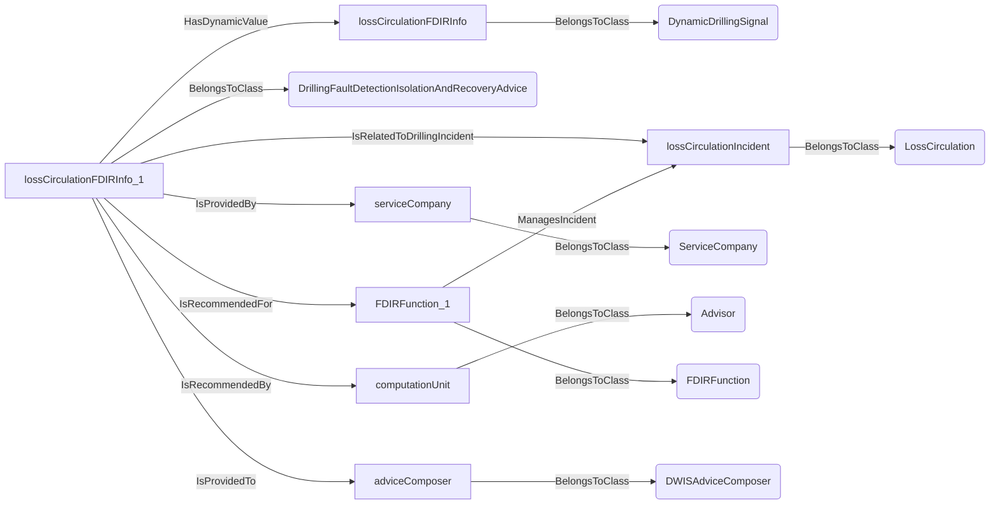
An example SparQL query looks like this:
```sparql
PREFIX rdf: <http://www.w3.org/1999/02/22-rdf-syntax-ns#>
PREFIX ddhub: <http://ddhub.no/>
PREFIX quantity: <http://ddhub.no/UnitAndQuantity>
SELECT ?lossCirculationFDIRInfo
WHERE {
	?lossCirculationFDIRInfo rdf:type ddhub:DynamicDrillingSignal .
	?lossCirculationFDIRInfo_1 rdf:type ddhub:DrillingFaultDetectionIsolationAndRecoveryAdvice .
	?lossCirculationFDIRInfo_1 ddhub:HasDynamicValue ?lossCirculationFDIRInfo .
	?lossCirculationIncident rdf:type ddhub:LossCirculation .
	?lossCirculationFDIRInfo_1 ddhub:IsRelatedToDrillingIncident ?lossCirculationIncident .
	?serviceCompany rdf:type ddhub:ServiceCompany .
	?lossCirculationFDIRInfo_1 ddhub:IsProvidedBy ?serviceCompany .
	?computationUnit rdf:type ddhub:Advisor .
	?lossCirculationFDIRInfo_1 ddhub:IsRecommendedBy ?computationUnit .
	?FDIRFunction_1 rdf:type ddhub:FDIRFunction .
	?FDIRFunction_1 ddhub:ManagesIncident ?lossCirculationIncident .
	?lossCirculationFDIRInfo_1 ddhub:IsRecommendedFor ?FDIRFunction_1 .
	?adviceComposer rdf:type ddhub:DWISAdviceComposer .
	?lossCirculationFDIRInfo_1 ddhub:IsProvidedTo ?adviceComposer .
}
```
## HoleCollapse <!-- NOUN -->
- Display name: Hole Collapse
- Parent class: [DrillingIncident](./DrillingIncident.md#DrillingIncident)
- Description: 
This Noun is used to refer to a situation during which there is a hole collapse.
- Definition set: DrillingIncident
- Examples:
``` dwis HoleCollapseFDIRInfo
DynamicDrillingSignal:HoleCollapseFDIRInfo
DrillingFaultDetectionIsolationAndRecoveryAdvice:HoleCollapseFDIRInfo_1
HoleCollapseFDIRInfo_1 HasDynamicValue HoleCollapseFDIRInfo
HoleCollapse:holeCollapseIncident
HoleCollapseFDIRInfo_1 IsRelatedToDrillingIncident holeCollapseIncident
ServiceCompany:serviceCompany
HoleCollapseFDIRInfo_1 IsProvidedBy serviceCompany
Advisor:computationUnit
HoleCollapseFDIRInfo_1 IsRecommendedBy computationUnit
FDIRFunction:FDIRFunction_1
FDIRFunction_1 ManagesIncident holeCollapseIncident
HoleCollapseFDIRInfo_1 IsRecommendedFor FDIRFunction_1
DWISAdviceComposer:adviceComposer
HoleCollapseFDIRInfo_1 IsProvidedTo adviceComposer
```
An example semantic graph looks like as follow:
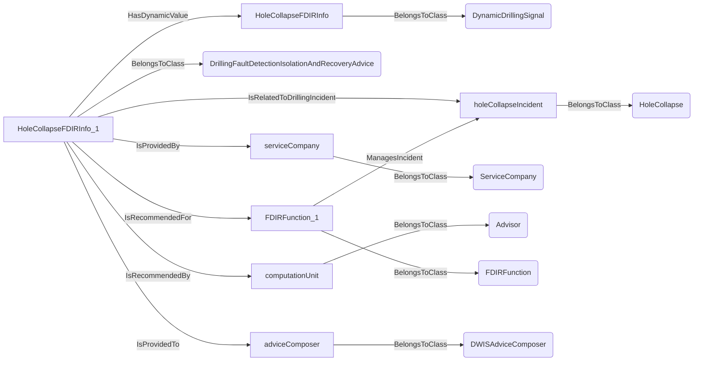
An example SparQL query looks like this:
```sparql
PREFIX rdf: <http://www.w3.org/1999/02/22-rdf-syntax-ns#>
PREFIX ddhub: <http://ddhub.no/>
PREFIX quantity: <http://ddhub.no/UnitAndQuantity>
SELECT ?HoleCollapseFDIRInfo
WHERE {
	?HoleCollapseFDIRInfo rdf:type ddhub:DynamicDrillingSignal .
	?HoleCollapseFDIRInfo_1 rdf:type ddhub:DrillingFaultDetectionIsolationAndRecoveryAdvice .
	?HoleCollapseFDIRInfo_1 ddhub:HasDynamicValue ?HoleCollapseFDIRInfo .
	?holeCollapseIncident rdf:type ddhub:HoleCollapse .
	?HoleCollapseFDIRInfo_1 ddhub:IsRelatedToDrillingIncident ?holeCollapseIncident .
	?serviceCompany rdf:type ddhub:ServiceCompany .
	?HoleCollapseFDIRInfo_1 ddhub:IsProvidedBy ?serviceCompany .
	?computationUnit rdf:type ddhub:Advisor .
	?HoleCollapseFDIRInfo_1 ddhub:IsRecommendedBy ?computationUnit .
	?FDIRFunction_1 rdf:type ddhub:FDIRFunction .
	?FDIRFunction_1 ddhub:ManagesIncident ?holeCollapseIncident .
	?HoleCollapseFDIRInfo_1 ddhub:IsRecommendedFor ?FDIRFunction_1 .
	?adviceComposer rdf:type ddhub:DWISAdviceComposer .
	?HoleCollapseFDIRInfo_1 ddhub:IsProvidedTo ?adviceComposer .
}
```
## StuckPipe <!-- NOUN -->
- Display name: Stuck-pipe
- Parent class: [DrillingIncident](./DrillingIncident.md#DrillingIncident)
- Description: 
This Noun is used to refer to a situation during which the drill-stem is impeded to move either axially or rotationally or both.
- Definition set: DrillingIncident
- Examples:
```dwis stuckPipeIncident
StuckPipe:stuckPipeIncident
DrillingDataPoint:hookload
hookload IsRelatedToDrillingIncident stuckPipeIncident
```
An example semantic graph looks like as follow:
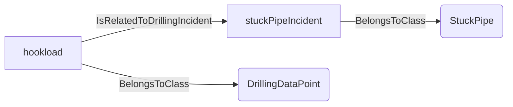
An example SparQL query looks like this:
```sparql
PREFIX rdf: <http://www.w3.org/1999/02/22-rdf-syntax-ns#>
PREFIX ddhub: <http://ddhub.no/>
PREFIX quantity: <http://ddhub.no/UnitAndQuantity>
SELECT ?stuckPipeIncident
WHERE {
	?stuckPipeIncident rdf:type ddhub:StuckPipe .
	?hookload rdf:type ddhub:DrillingDataPoint .
	?hookload ddhub:IsRelatedToDrillingIncident ?stuckPipeIncident .
}
```
This example links abnormal hookload to a stuck-pipe incident.
## DifferentiallyStuck <!-- NOUN -->
- Display name: Differentially Stuck
- Parent class: [StuckPipe](./DrillingIncident.md#StuckPipe)
- Description: 
This Noun is used to refer to a situation during which the drill-stem is stuck because of differential sticking.
- Definition set: DrillingIncident
- Examples:
``` dwis differentialStickingFDIRInfo
DynamicDrillingSignal:differentialStickingFDIRInfo
DrillingFaultDetectionIsolationAndRecoveryAdvice:differentialStickingFDIRInfo_1
differentialStickingFDIRInfo_1 HasDynamicValue differentialStickingFDIRInfo
DifferentiallyStuck:differentiallyStuckIncident
differentialStickingFDIRInfo_1 IsRelatedToDrillingIncident differentiallyStuckIncident
ServiceCompany:serviceCompany
differentialStickingFDIRInfo_1 IsProvidedBy serviceCompany
Advisor:computationUnit
differentialStickingFDIRInfo_1 IsRecommendedBy computationUnit
FDIRFunction:FDIRFunction_1
FDIRFunction_1 ManagesIncident differentiallyStuckIncident
differentialStickingFDIRInfo_1 IsRecommendedFor FDIRFunction_1
DWISAdviceComposer:adviceComposer
differentialStickingFDIRInfo_1 IsProvidedTo adviceComposer
```
An example semantic graph looks like as follow:
```mermaid
graph LR
	N0000[differentialStickingFDIRInfo] -->|BelongsToClass| N0001(DynamicDrillingSignal) 
	N0002[differentialStickingFDIRInfo_1] -->|BelongsToClass| N0003(DrillingFaultDetectionIsolationAndRecoveryAdvice) 
	N0002[differentialStickingFDIRInfo_1] -->|HasDynamicValue| N0000[differentialStickingFDIRInfo] 
	N0004[differentiallyStuckIncident] -->|BelongsToClass| N0005(DifferentiallyStuck) 
	N0002[differentialStickingFDIRInfo_1] -->|IsRelatedToDrillingIncident| N0004[differentiallyStuckIncident] 
	N0006[serviceCompany] -->|BelongsToClass| N0007(ServiceCompany) 
	N0002[differentialStickingFDIRInfo_1] -->|IsProvidedBy| N0006[serviceCompany] 
	N0008[computationUnit] -->|BelongsToClass| N0009(Advisor) 
	N0002[differentialStickingFDIRInfo_1] -->|IsRecommendedBy| N0008[computationUnit] 
	N0010[FDIRFunction_1] -->|BelongsToClass| N0011(FDIRFunction) 
	N0010[FDIRFunction_1] -->|ManagesIncident| N0004[differentiallyStuckIncident] 
	N0002[differentialStickingFDIRInfo_1] -->|IsRecommendedFor| N0010[FDIRFunction_1] 
	N0012[adviceComposer] -->|BelongsToClass| N0013(DWISAdviceComposer) 
	N0002[differentialStickingFDIRInfo_1] -->|IsProvidedTo| N0012[adviceComposer] 
```
An example SparQL query looks like this:
```sparql
PREFIX rdf: <http://www.w3.org/1999/02/22-rdf-syntax-ns#>
PREFIX ddhub: <http://ddhub.no/>
PREFIX quantity: <http://ddhub.no/UnitAndQuantity>
SELECT ?differentialStickingFDIRInfo
WHERE {
	?differentialStickingFDIRInfo rdf:type ddhub:DynamicDrillingSignal .
	?differentialStickingFDIRInfo_1 rdf:type ddhub:DrillingFaultDetectionIsolationAndRecoveryAdvice .
	?differentialStickingFDIRInfo_1 ddhub:HasDynamicValue ?differentialStickingFDIRInfo .
	?differentiallyStuckIncident rdf:type ddhub:DifferentiallyStuck .
	?differentialStickingFDIRInfo_1 ddhub:IsRelatedToDrillingIncident ?differentiallyStuckIncident .
	?serviceCompany rdf:type ddhub:ServiceCompany .
	?differentialStickingFDIRInfo_1 ddhub:IsProvidedBy ?serviceCompany .
	?computationUnit rdf:type ddhub:Advisor .
	?differentialStickingFDIRInfo_1 ddhub:IsRecommendedBy ?computationUnit .
	?FDIRFunction_1 rdf:type ddhub:FDIRFunction .
	?FDIRFunction_1 ddhub:ManagesIncident ?differentiallyStuckIncident .
	?differentialStickingFDIRInfo_1 ddhub:IsRecommendedFor ?FDIRFunction_1 .
	?adviceComposer rdf:type ddhub:DWISAdviceComposer .
	?differentialStickingFDIRInfo_1 ddhub:IsProvidedTo ?adviceComposer .
}
```
## PipeWashout <!-- NOUN -->
- Display name: Pipe Washout
- Parent class: [DrillingIncident](./DrillingIncident.md#DrillingIncident)
- Description: 
This Noun is used to refer to a situation during which there is leak between the inside of the drill-stem and the annulus.
- Definition set: DrillingIncident
- Examples:
``` dwis pipeWashoutFDIRInfo
DynamicDrillingSignal:pipeWashoutFDIRInfo
DrillingFaultDetectionIsolationAndRecoveryAdvice:pipeWashoutFDIRInfo_1
pipeWashoutFDIRInfo_1 HasDynamicValue pipeWashoutFDIRInfo
PipeWashout:pipeWashoutIncident
pipeWashoutFDIRInfo_1 IsRelatedToDrillingIncident pipeWashoutIncident
ServiceCompany:serviceCompany
pipeWashoutFDIRInfo_1 IsProvidedBy serviceCompany
Advisor:computationUnit
pipeWashoutFDIRInfo_1 IsRecommendedBy computationUnit
FDIRFunction:FDIRFunction_1
FDIRFunction_1 ManagesIncident pipeWashoutIncident
pipeWashoutFDIRInfo_1 IsRecommendedFor FDIRFunction_1
DWISAdviceComposer:adviceComposer
pipeWashoutFDIRInfo_1 IsProvidedTo adviceComposer
```
An example semantic graph looks like as follow:
```mermaid
graph LR
	N0000[pipeWashoutFDIRInfo] -->|BelongsToClass| N0001(DynamicDrillingSignal) 
	N0002[pipeWashoutFDIRInfo_1] -->|BelongsToClass| N0003(DrillingFaultDetectionIsolationAndRecoveryAdvice) 
	N0002[pipeWashoutFDIRInfo_1] -->|HasDynamicValue| N0000[pipeWashoutFDIRInfo] 
	N0004[pipeWashoutIncident] -->|BelongsToClass| N0005(PipeWashout) 
	N0002[pipeWashoutFDIRInfo_1] -->|IsRelatedToDrillingIncident| N0004[pipeWashoutIncident] 
	N0006[serviceCompany] -->|BelongsToClass| N0007(ServiceCompany) 
	N0002[pipeWashoutFDIRInfo_1] -->|IsProvidedBy| N0006[serviceCompany] 
	N0008[computationUnit] -->|BelongsToClass| N0009(Advisor) 
	N0002[pipeWashoutFDIRInfo_1] -->|IsRecommendedBy| N0008[computationUnit] 
	N0010[FDIRFunction_1] -->|BelongsToClass| N0011(FDIRFunction) 
	N0010[FDIRFunction_1] -->|ManagesIncident| N0004[pipeWashoutIncident] 
	N0002[pipeWashoutFDIRInfo_1] -->|IsRecommendedFor| N0010[FDIRFunction_1] 
	N0012[adviceComposer] -->|BelongsToClass| N0013(DWISAdviceComposer) 
	N0002[pipeWashoutFDIRInfo_1] -->|IsProvidedTo| N0012[adviceComposer] 
```
An example SparQL query looks like this:
```sparql
PREFIX rdf: <http://www.w3.org/1999/02/22-rdf-syntax-ns#>
PREFIX ddhub: <http://ddhub.no/>
PREFIX quantity: <http://ddhub.no/UnitAndQuantity>
SELECT ?pipeWashoutFDIRInfo
WHERE {
	?pipeWashoutFDIRInfo rdf:type ddhub:DynamicDrillingSignal .
	?pipeWashoutFDIRInfo_1 rdf:type ddhub:DrillingFaultDetectionIsolationAndRecoveryAdvice .
	?pipeWashoutFDIRInfo_1 ddhub:HasDynamicValue ?pipeWashoutFDIRInfo .
	?pipeWashoutIncident rdf:type ddhub:PipeWashout .
	?pipeWashoutFDIRInfo_1 ddhub:IsRelatedToDrillingIncident ?pipeWashoutIncident .
	?serviceCompany rdf:type ddhub:ServiceCompany .
	?pipeWashoutFDIRInfo_1 ddhub:IsProvidedBy ?serviceCompany .
	?computationUnit rdf:type ddhub:Advisor .
	?pipeWashoutFDIRInfo_1 ddhub:IsRecommendedBy ?computationUnit .
	?FDIRFunction_1 rdf:type ddhub:FDIRFunction .
	?FDIRFunction_1 ddhub:ManagesIncident ?pipeWashoutIncident .
	?pipeWashoutFDIRInfo_1 ddhub:IsRecommendedFor ?FDIRFunction_1 .
	?adviceComposer rdf:type ddhub:DWISAdviceComposer .
	?pipeWashoutFDIRInfo_1 ddhub:IsProvidedTo ?adviceComposer .
}
```
## FormationWashout <!-- NOUN -->
- Display name: Formation Washout
- Parent class: [DrillingIncident](./DrillingIncident.md#DrillingIncident)
- Description: 
This Noun is used to refer to a situation during which the formation is being washed out.
- Definition set: DrillingIncident
- Examples:
```dwis formationWashoutIncident
FormationWashout:formationWashoutIncident
DrillingDataPoint:lossCirculationIndicator
lossCirculationIndicator IsRelatedToDrillingIncident formationWashoutIncident
```
An example semantic graph looks like as follow:
```mermaid
graph LR
	N0000[formationWashoutIncident] -->|BelongsToClass| N0001(FormationWashout) 
	N0002[lossCirculationIndicator] -->|BelongsToClass| N0003(DrillingDataPoint) 
	N0002[lossCirculationIndicator] -->|IsRelatedToDrillingIncident| N0000[formationWashoutIncident] 
```
An example SparQL query looks like this:
```sparql
PREFIX rdf: <http://www.w3.org/1999/02/22-rdf-syntax-ns#>
PREFIX ddhub: <http://ddhub.no/>
PREFIX quantity: <http://ddhub.no/UnitAndQuantity>
SELECT ?formationWashoutIncident
WHERE {
	?formationWashoutIncident rdf:type ddhub:FormationWashout .
	?lossCirculationIndicator rdf:type ddhub:DrillingDataPoint .
	?lossCirculationIndicator ddhub:IsRelatedToDrillingIncident ?formationWashoutIncident .
}
```
This example ties a loss indicator to formation washout.
## OverTorque <!-- NOUN -->
- Display name: Over-torque
- Parent class: [DrillingIncident](./DrillingIncident.md#DrillingIncident)
- Description: 
This Noun is used to refer to a situation during which the rotation of the drill-stem is impeded.
- Definition set: DrillingIncident
- Examples:
``` dwis overtorqueFDIRInfo
DynamicDrillingSignal:overtorqueFDIRInfo
DrillingFaultDetectionIsolationAndRecoveryAdvice:overtorqueFDIRInfo_1
overtorqueFDIRInfo_1 HasDynamicValue overtorqueFDIRInfo
OverTorque:overTorqueIncident
overtorqueFDIRInfo_1 IsRelatedToDrillingIncident overTorqueIncident
ServiceCompany:serviceCompany
overtorqueFDIRInfo_1 IsProvidedBy serviceCompany
Advisor:computationUnit
overtorqueFDIRInfo_1 IsRecommendedBy computationUnit
FDIRFunction:FDIRFunction_1
FDIRFunction_1 ManagesIncident overTorqueIncident
overtorqueFDIRInfo_1 IsRecommendedFor FDIRFunction_1
DWISAdviceComposer:adviceComposer
overtorqueFDIRInfo_1 IsProvidedTo adviceComposer
```
An example semantic graph looks like as follow:
```mermaid
graph LR
	N0000[overtorqueFDIRInfo] -->|BelongsToClass| N0001(DynamicDrillingSignal) 
	N0002[overtorqueFDIRInfo_1] -->|BelongsToClass| N0003(DrillingFaultDetectionIsolationAndRecoveryAdvice) 
	N0002[overtorqueFDIRInfo_1] -->|HasDynamicValue| N0000[overtorqueFDIRInfo] 
	N0004[overTorqueIncident] -->|BelongsToClass| N0005(OverTorque) 
	N0002[overtorqueFDIRInfo_1] -->|IsRelatedToDrillingIncident| N0004[overTorqueIncident] 
	N0006[serviceCompany] -->|BelongsToClass| N0007(ServiceCompany) 
	N0002[overtorqueFDIRInfo_1] -->|IsProvidedBy| N0006[serviceCompany] 
	N0008[computationUnit] -->|BelongsToClass| N0009(Advisor) 
	N0002[overtorqueFDIRInfo_1] -->|IsRecommendedBy| N0008[computationUnit] 
	N0010[FDIRFunction_1] -->|BelongsToClass| N0011(FDIRFunction) 
	N0010[FDIRFunction_1] -->|ManagesIncident| N0004[overTorqueIncident] 
	N0002[overtorqueFDIRInfo_1] -->|IsRecommendedFor| N0010[FDIRFunction_1] 
	N0012[adviceComposer] -->|BelongsToClass| N0013(DWISAdviceComposer) 
	N0002[overtorqueFDIRInfo_1] -->|IsProvidedTo| N0012[adviceComposer] 
```
An example SparQL query looks like this:
```sparql
PREFIX rdf: <http://www.w3.org/1999/02/22-rdf-syntax-ns#>
PREFIX ddhub: <http://ddhub.no/>
PREFIX quantity: <http://ddhub.no/UnitAndQuantity>
SELECT ?overtorqueFDIRInfo
WHERE {
	?overtorqueFDIRInfo rdf:type ddhub:DynamicDrillingSignal .
	?overtorqueFDIRInfo_1 rdf:type ddhub:DrillingFaultDetectionIsolationAndRecoveryAdvice .
	?overtorqueFDIRInfo_1 ddhub:HasDynamicValue ?overtorqueFDIRInfo .
	?overTorqueIncident rdf:type ddhub:OverTorque .
	?overtorqueFDIRInfo_1 ddhub:IsRelatedToDrillingIncident ?overTorqueIncident .
	?serviceCompany rdf:type ddhub:ServiceCompany .
	?overtorqueFDIRInfo_1 ddhub:IsProvidedBy ?serviceCompany .
	?computationUnit rdf:type ddhub:Advisor .
	?overtorqueFDIRInfo_1 ddhub:IsRecommendedBy ?computationUnit .
	?FDIRFunction_1 rdf:type ddhub:FDIRFunction .
	?FDIRFunction_1 ddhub:ManagesIncident ?overTorqueIncident .
	?overtorqueFDIRInfo_1 ddhub:IsRecommendedFor ?FDIRFunction_1 .
	?adviceComposer rdf:type ddhub:DWISAdviceComposer .
	?overtorqueFDIRInfo_1 ddhub:IsProvidedTo ?adviceComposer .
}
```
## Plugged <!-- NOUN -->
- Display name: Plugged
- Parent class: [DrillingIncident](./DrillingIncident.md#DrillingIncident)
- Description: 
This Noun is used to refer to a situation during which the hydraulic flow-path is partially or fully blocked.
- Definition set: DrillingIncident
- Examples:
```dwis pluggedIncident
Plugged:pluggedIncident
DrillingDataPoint:standpipePressure
standpipePressure IsRelatedToDrillingIncident pluggedIncident
```
An example semantic graph looks like as follow:
```mermaid
graph LR
	N0000[pluggedIncident] -->|BelongsToClass| N0001(Plugged) 
	N0002[standpipePressure] -->|BelongsToClass| N0003(DrillingDataPoint) 
	N0002[standpipePressure] -->|IsRelatedToDrillingIncident| N0000[pluggedIncident] 
```
An example SparQL query looks like this:
```sparql
PREFIX rdf: <http://www.w3.org/1999/02/22-rdf-syntax-ns#>
PREFIX ddhub: <http://ddhub.no/>
PREFIX quantity: <http://ddhub.no/UnitAndQuantity>
SELECT ?pluggedIncident
WHERE {
	?pluggedIncident rdf:type ddhub:Plugged .
	?standpipePressure rdf:type ddhub:DrillingDataPoint .
	?standpipePressure ddhub:IsRelatedToDrillingIncident ?pluggedIncident .
}
```
This example relates rising standpipe pressure to a plugged condition.
## PackOff <!-- NOUN -->
- Display name: Pack-off
- Parent class: [Plugged](./DrillingIncident.md#Plugged)
- Description: 
This Noun is used to refer to a situation during which the annulus hydraulic flow-path is partially or fully blocked.
- Definition set: DrillingIncident
- Examples:
``` dwis PackOffFDIRInfo
DynamicDrillingSignal:PackOffFDIRInfo
DrillingFaultDetectionIsolationAndRecoveryAdvice:PackOffFDIRInfo_1
PackOffFDIRInfo_1 HasDynamicValue PackOffFDIRInfo
PackOff:packOffIncident
PackOffFDIRInfo_1 IsRelatedToDrillingIncident packOffIncident
ServiceCompany:serviceCompany
PackOffFDIRInfo_1 IsProvidedBy serviceCompany
Advisor:computationUnit
PackOffFDIRInfo_1 IsRecommendedBy computationUnit
FDIRFunction:FDIRFunction_1
FDIRFunction_1 ManagesIncident packOffIncident
PackOffFDIRInfo_1 IsRecommendedFor FDIRFunction_1
DWISAdviceComposer:adviceComposer
PackOffFDIRInfo_1 IsProvidedTo adviceComposer
```
An example semantic graph looks like as follow:
```mermaid
graph LR
	N0000[PackOffFDIRInfo] -->|BelongsToClass| N0001(DynamicDrillingSignal) 
	N0002[PackOffFDIRInfo_1] -->|BelongsToClass| N0003(DrillingFaultDetectionIsolationAndRecoveryAdvice) 
	N0002[PackOffFDIRInfo_1] -->|HasDynamicValue| N0000[PackOffFDIRInfo] 
	N0004[packOffIncident] -->|BelongsToClass| N0005(PackOff) 
	N0002[PackOffFDIRInfo_1] -->|IsRelatedToDrillingIncident| N0004[packOffIncident] 
	N0006[serviceCompany] -->|BelongsToClass| N0007(ServiceCompany) 
	N0002[PackOffFDIRInfo_1] -->|IsProvidedBy| N0006[serviceCompany] 
	N0008[computationUnit] -->|BelongsToClass| N0009(Advisor) 
	N0002[PackOffFDIRInfo_1] -->|IsRecommendedBy| N0008[computationUnit] 
	N0010[FDIRFunction_1] -->|BelongsToClass| N0011(FDIRFunction) 
	N0010[FDIRFunction_1] -->|ManagesIncident| N0004[packOffIncident] 
	N0002[PackOffFDIRInfo_1] -->|IsRecommendedFor| N0010[FDIRFunction_1] 
	N0012[adviceComposer] -->|BelongsToClass| N0013(DWISAdviceComposer) 
	N0002[PackOffFDIRInfo_1] -->|IsProvidedTo| N0012[adviceComposer] 
```
An example SparQL query looks like this:
```sparql
PREFIX rdf: <http://www.w3.org/1999/02/22-rdf-syntax-ns#>
PREFIX ddhub: <http://ddhub.no/>
PREFIX quantity: <http://ddhub.no/UnitAndQuantity>
SELECT ?PackOffFDIRInfo
WHERE {
	?PackOffFDIRInfo rdf:type ddhub:DynamicDrillingSignal .
	?PackOffFDIRInfo_1 rdf:type ddhub:DrillingFaultDetectionIsolationAndRecoveryAdvice .
	?PackOffFDIRInfo_1 ddhub:HasDynamicValue ?PackOffFDIRInfo .
	?packOffIncident rdf:type ddhub:PackOff .
	?PackOffFDIRInfo_1 ddhub:IsRelatedToDrillingIncident ?packOffIncident .
	?serviceCompany rdf:type ddhub:ServiceCompany .
	?PackOffFDIRInfo_1 ddhub:IsProvidedBy ?serviceCompany .
	?computationUnit rdf:type ddhub:Advisor .
	?PackOffFDIRInfo_1 ddhub:IsRecommendedBy ?computationUnit .
	?FDIRFunction_1 rdf:type ddhub:FDIRFunction .
	?FDIRFunction_1 ddhub:ManagesIncident ?packOffIncident .
	?PackOffFDIRInfo_1 ddhub:IsRecommendedFor ?FDIRFunction_1 .
	?adviceComposer rdf:type ddhub:DWISAdviceComposer .
	?PackOffFDIRInfo_1 ddhub:IsProvidedTo ?adviceComposer .
}
```
## StallIncident <!-- NOUN -->
- Display name: Motor-stall
- Parent class: [DrillingIncident](./DrillingIncident.md#DrillingIncident)
- Description: 
This Noun is used to refer to a situation during which the drill-stem rotation stalled.
- Definition set: DrillingIncident
- Examples:
``` dwis motorStallFDIRInfo
DynamicDrillingSignal:motorStallFDIRInfo
DrillingFaultDetectionIsolationAndRecoveryAdvice:motorStallFDIRInfo_1
motorStallFDIRInfo_1 HasDynamicValue motorStallFDIRInfo
MotorStall:motorStallIncident
motorStallFDIRInfo_1 IsRelatedToDrillingIncident motorStallIncident
ServiceCompany:serviceCompany
motorStallFDIRInfo_1 IsProvidedBy serviceCompany
Advisor:computationUnit
motorStallFDIRInfo_1 IsRecommendedBy computationUnit
FDIRFunction:FDIRFunction_1
FDIRFunction_1 ManagesIncident motorStallIncident
motorStallFDIRInfo_1 IsRecommendedFor FDIRFunction_1
DWISAdviceComposer:adviceComposer
motorStallFDIRInfo_1 IsProvidedTo adviceComposer
```
An example semantic graph looks like as follow:
```mermaid
graph LR
	N0000[motorStallFDIRInfo] -->|BelongsToClass| N0001(DynamicDrillingSignal) 
	N0002[motorStallFDIRInfo_1] -->|BelongsToClass| N0003(DrillingFaultDetectionIsolationAndRecoveryAdvice) 
	N0002[motorStallFDIRInfo_1] -->|HasDynamicValue| N0000[motorStallFDIRInfo] 
	N0004[motorStallIncident] -->|BelongsToClass| N0005(MotorStall) 
	N0002[motorStallFDIRInfo_1] -->|IsRelatedToDrillingIncident| N0004[motorStallIncident] 
	N0006[serviceCompany] -->|BelongsToClass| N0007(ServiceCompany) 
	N0002[motorStallFDIRInfo_1] -->|IsProvidedBy| N0006[serviceCompany] 
	N0008[computationUnit] -->|BelongsToClass| N0009(Advisor) 
	N0002[motorStallFDIRInfo_1] -->|IsRecommendedBy| N0008[computationUnit] 
	N0010[FDIRFunction_1] -->|BelongsToClass| N0011(FDIRFunction) 
	N0010[FDIRFunction_1] -->|ManagesIncident| N0004[motorStallIncident] 
	N0002[motorStallFDIRInfo_1] -->|IsRecommendedFor| N0010[FDIRFunction_1] 
	N0012[adviceComposer] -->|BelongsToClass| N0013(DWISAdviceComposer) 
	N0002[motorStallFDIRInfo_1] -->|IsProvidedTo| N0012[adviceComposer] 
```
An example SparQL query looks like this:
```sparql
PREFIX rdf: <http://www.w3.org/1999/02/22-rdf-syntax-ns#>
PREFIX ddhub: <http://ddhub.no/>
PREFIX quantity: <http://ddhub.no/UnitAndQuantity>
SELECT ?motorStallFDIRInfo
WHERE {
	?motorStallFDIRInfo rdf:type ddhub:DynamicDrillingSignal .
	?motorStallFDIRInfo_1 rdf:type ddhub:DrillingFaultDetectionIsolationAndRecoveryAdvice .
	?motorStallFDIRInfo_1 ddhub:HasDynamicValue ?motorStallFDIRInfo .
	?motorStallIncident rdf:type ddhub:MotorStall .
	?motorStallFDIRInfo_1 ddhub:IsRelatedToDrillingIncident ?motorStallIncident .
	?serviceCompany rdf:type ddhub:ServiceCompany .
	?motorStallFDIRInfo_1 ddhub:IsProvidedBy ?serviceCompany .
	?computationUnit rdf:type ddhub:Advisor .
	?motorStallFDIRInfo_1 ddhub:IsRecommendedBy ?computationUnit .
	?FDIRFunction_1 rdf:type ddhub:FDIRFunction .
	?FDIRFunction_1 ddhub:ManagesIncident ?motorStallIncident .
	?motorStallFDIRInfo_1 ddhub:IsRecommendedFor ?FDIRFunction_1 .
	?adviceComposer rdf:type ddhub:DWISAdviceComposer .
	?motorStallFDIRInfo_1 ddhub:IsProvidedTo ?adviceComposer .
}
```
## MotorStall <!-- NOUN -->
- Display name: Motor-stall
- Parent class: [StallIncident](./DrillingIncident.md#StallIncident)
- Description: 
This Noun is used to refer to a situation during which the downhole motor is stalled.
- Definition set: DrillingIncident
- Examples:
``` dwis motorStallFDIRInfo
DynamicDrillingSignal:motorStallFDIRInfo
DrillingFaultDetectionIsolationAndRecoveryAdvice:motorStallFDIRInfo_1
motorStallFDIRInfo_1 HasDynamicValue motorStallFDIRInfo
MotorStall:motorStallIncident
motorStallFDIRInfo_1 IsRelatedToDrillingIncident motorStallIncident
ServiceCompany:serviceCompany
motorStallFDIRInfo_1 IsProvidedBy serviceCompany
Advisor:computationUnit
motorStallFDIRInfo_1 IsRecommendedBy computationUnit
FDIRFunction:FDIRFunction_1
FDIRFunction_1 ManagesIncident motorStallIncident
motorStallFDIRInfo_1 IsRecommendedFor FDIRFunction_1
DWISAdviceComposer:adviceComposer
motorStallFDIRInfo_1 IsProvidedTo adviceComposer
```
An example semantic graph looks like as follow:
```mermaid
graph LR
	N0000[motorStallFDIRInfo] -->|BelongsToClass| N0001(DynamicDrillingSignal) 
	N0002[motorStallFDIRInfo_1] -->|BelongsToClass| N0003(DrillingFaultDetectionIsolationAndRecoveryAdvice) 
	N0002[motorStallFDIRInfo_1] -->|HasDynamicValue| N0000[motorStallFDIRInfo] 
	N0004[motorStallIncident] -->|BelongsToClass| N0005(MotorStall) 
	N0002[motorStallFDIRInfo_1] -->|IsRelatedToDrillingIncident| N0004[motorStallIncident] 
	N0006[serviceCompany] -->|BelongsToClass| N0007(ServiceCompany) 
	N0002[motorStallFDIRInfo_1] -->|IsProvidedBy| N0006[serviceCompany] 
	N0008[computationUnit] -->|BelongsToClass| N0009(Advisor) 
	N0002[motorStallFDIRInfo_1] -->|IsRecommendedBy| N0008[computationUnit] 
	N0010[FDIRFunction_1] -->|BelongsToClass| N0011(FDIRFunction) 
	N0010[FDIRFunction_1] -->|ManagesIncident| N0004[motorStallIncident] 
	N0002[motorStallFDIRInfo_1] -->|IsRecommendedFor| N0010[FDIRFunction_1] 
	N0012[adviceComposer] -->|BelongsToClass| N0013(DWISAdviceComposer) 
	N0002[motorStallFDIRInfo_1] -->|IsProvidedTo| N0012[adviceComposer] 
```
An example SparQL query looks like this:
```sparql
PREFIX rdf: <http://www.w3.org/1999/02/22-rdf-syntax-ns#>
PREFIX ddhub: <http://ddhub.no/>
PREFIX quantity: <http://ddhub.no/UnitAndQuantity>
SELECT ?motorStallFDIRInfo
WHERE {
	?motorStallFDIRInfo rdf:type ddhub:DynamicDrillingSignal .
	?motorStallFDIRInfo_1 rdf:type ddhub:DrillingFaultDetectionIsolationAndRecoveryAdvice .
	?motorStallFDIRInfo_1 ddhub:HasDynamicValue ?motorStallFDIRInfo .
	?motorStallIncident rdf:type ddhub:MotorStall .
	?motorStallFDIRInfo_1 ddhub:IsRelatedToDrillingIncident ?motorStallIncident .
	?serviceCompany rdf:type ddhub:ServiceCompany .
	?motorStallFDIRInfo_1 ddhub:IsProvidedBy ?serviceCompany .
	?computationUnit rdf:type ddhub:Advisor .
	?motorStallFDIRInfo_1 ddhub:IsRecommendedBy ?computationUnit .
	?FDIRFunction_1 rdf:type ddhub:FDIRFunction .
	?FDIRFunction_1 ddhub:ManagesIncident ?motorStallIncident .
	?motorStallFDIRInfo_1 ddhub:IsRecommendedFor ?FDIRFunction_1 .
	?adviceComposer rdf:type ddhub:DWISAdviceComposer .
	?motorStallFDIRInfo_1 ddhub:IsProvidedTo ?adviceComposer .
}
```
# Verbs
## Class Inheritance for Verbs
Here is a class inheritance diagram for the verbs contained in this definition set.
```mermaid
classDiagram
DWISVerb <|-- IsRelatedToDrillingIncident
DWISVerb <|-- ManagesIncident
```
## Relations
Here is a graph representing the relations that can be made with the verbs defined in this definition set.
```mermaid
erDiagram
DrillingDataPoint ||--o{ DrillingIncident : IsRelatedToDrillingIncident
FDIRFunction ||--o{ DrillingIncident : ManagesIncident
```
## IsRelatedToDrillingIncident <!-- VERB -->
- Display name: Is Related to Drilling Incident
- Parent verb: [DWISVerb](./DWISSemantics.md#DWISVerb)
- Subject class: [DrillingDataPoint](./DrillingDataSemantics.md#DrillingDataPoint)
- Object class: [DrillingIncident](./DrillingIncident.md#DrillingIncident)
- Definition set: DrillingIncident
- Description: 
This Verb is used to indicate that a drilling data point is related to a drilling incident.
- Examples:
``` dwis motorStallFDIRInfo
DynamicDrillingSignal:motorStallFDIRInfo
DrillingFaultDetectionIsolationAndRecoveryAdvice:motorStallFDIRInfo_1
motorStallFDIRInfo_1 HasDynamicValue motorStallFDIRInfo
MotorStall:motorStallIncident
motorStallFDIRInfo_1 IsRelatedToDrillingIncident motorStallIncident
ServiceCompany:serviceCompany
motorStallFDIRInfo_1 IsProvidedBy serviceCompany
Advisor:computationUnit
motorStallFDIRInfo_1 IsRecommendedBy computationUnit
FDIRFunction:FDIRFunction_1
FDIRFunction_1 ManagesIncident motorStallIncident
motorStallFDIRInfo_1 IsRecommendedFor FDIRFunction_1
DWISAdviceComposer:adviceComposer
motorStallFDIRInfo_1 IsProvidedTo adviceComposer
```
An example semantic graph looks like as follow:
```mermaid
graph LR
	N0000[motorStallFDIRInfo] -->|BelongsToClass| N0001(DynamicDrillingSignal) 
	N0002[motorStallFDIRInfo_1] -->|BelongsToClass| N0003(DrillingFaultDetectionIsolationAndRecoveryAdvice) 
	N0002[motorStallFDIRInfo_1] -->|HasDynamicValue| N0000[motorStallFDIRInfo] 
	N0004[motorStallIncident] -->|BelongsToClass| N0005(MotorStall) 
	N0002[motorStallFDIRInfo_1] -->|IsRelatedToDrillingIncident| N0004[motorStallIncident] 
	N0006[serviceCompany] -->|BelongsToClass| N0007(ServiceCompany) 
	N0002[motorStallFDIRInfo_1] -->|IsProvidedBy| N0006[serviceCompany] 
	N0008[computationUnit] -->|BelongsToClass| N0009(Advisor) 
	N0002[motorStallFDIRInfo_1] -->|IsRecommendedBy| N0008[computationUnit] 
	N0010[FDIRFunction_1] -->|BelongsToClass| N0011(FDIRFunction) 
	N0010[FDIRFunction_1] -->|ManagesIncident| N0004[motorStallIncident] 
	N0002[motorStallFDIRInfo_1] -->|IsRecommendedFor| N0010[FDIRFunction_1] 
	N0012[adviceComposer] -->|BelongsToClass| N0013(DWISAdviceComposer) 
	N0002[motorStallFDIRInfo_1] -->|IsProvidedTo| N0012[adviceComposer] 
```
An example SparQL query looks like this:
```sparql
PREFIX rdf: <http://www.w3.org/1999/02/22-rdf-syntax-ns#>
PREFIX ddhub: <http://ddhub.no/>
PREFIX quantity: <http://ddhub.no/UnitAndQuantity>
SELECT ?motorStallFDIRInfo
WHERE {
	?motorStallFDIRInfo rdf:type ddhub:DynamicDrillingSignal .
	?motorStallFDIRInfo_1 rdf:type ddhub:DrillingFaultDetectionIsolationAndRecoveryAdvice .
	?motorStallFDIRInfo_1 ddhub:HasDynamicValue ?motorStallFDIRInfo .
	?motorStallIncident rdf:type ddhub:MotorStall .
	?motorStallFDIRInfo_1 ddhub:IsRelatedToDrillingIncident ?motorStallIncident .
	?serviceCompany rdf:type ddhub:ServiceCompany .
	?motorStallFDIRInfo_1 ddhub:IsProvidedBy ?serviceCompany .
	?computationUnit rdf:type ddhub:Advisor .
	?motorStallFDIRInfo_1 ddhub:IsRecommendedBy ?computationUnit .
	?FDIRFunction_1 rdf:type ddhub:FDIRFunction .
	?FDIRFunction_1 ddhub:ManagesIncident ?motorStallIncident .
	?motorStallFDIRInfo_1 ddhub:IsRecommendedFor ?FDIRFunction_1 .
	?adviceComposer rdf:type ddhub:DWISAdviceComposer .
	?motorStallFDIRInfo_1 ddhub:IsProvidedTo ?adviceComposer .
}
```
## ManagesIncident <!-- VERB -->
- Display name: Manages Incident
- Parent verb: [DWISVerb](./DWISSemantics.md#DWISVerb)
- Subject class: [FDIRFunction](./ADCS.md#FDIRFunction)
- Object class: [DrillingIncident](./DrillingIncident.md#DrillingIncident)
- Definition set: DrillingIncident
- Description: 
This Verb is used to indicate that a fault detection isolation and recovery function manages a drilling incident.
- Examples:
``` dwis motorStallFDIRInfo
DynamicDrillingSignal:motorStallFDIRInfo
DrillingFaultDetectionIsolationAndRecoveryAdvice:motorStallFDIRInfo_1
motorStallFDIRInfo_1 HasDynamicValue motorStallFDIRInfo
MotorStall:motorStallIncident
motorStallFDIRInfo_1 IsRelatedToDrillingIncident motorStallIncident
ServiceCompany:serviceCompany
motorStallFDIRInfo_1 IsProvidedBy serviceCompany
Advisor:computationUnit
motorStallFDIRInfo_1 IsRecommendedBy computationUnit
FDIRFunction:FDIRFunction_1
FDIRFunction_1 ManagesIncident motorStallIncident
motorStallFDIRInfo_1 IsRecommendedFor FDIRFunction_1
DWISAdviceComposer:adviceComposer
motorStallFDIRInfo_1 IsProvidedTo adviceComposer
```
An example semantic graph looks like as follow:
```mermaid
graph LR
	N0000[motorStallFDIRInfo] -->|BelongsToClass| N0001(DynamicDrillingSignal) 
	N0002[motorStallFDIRInfo_1] -->|BelongsToClass| N0003(DrillingFaultDetectionIsolationAndRecoveryAdvice) 
	N0002[motorStallFDIRInfo_1] -->|HasDynamicValue| N0000[motorStallFDIRInfo] 
	N0004[motorStallIncident] -->|BelongsToClass| N0005(MotorStall) 
	N0002[motorStallFDIRInfo_1] -->|IsRelatedToDrillingIncident| N0004[motorStallIncident] 
	N0006[serviceCompany] -->|BelongsToClass| N0007(ServiceCompany) 
	N0002[motorStallFDIRInfo_1] -->|IsProvidedBy| N0006[serviceCompany] 
	N0008[computationUnit] -->|BelongsToClass| N0009(Advisor) 
	N0002[motorStallFDIRInfo_1] -->|IsRecommendedBy| N0008[computationUnit] 
	N0010[FDIRFunction_1] -->|BelongsToClass| N0011(FDIRFunction) 
	N0010[FDIRFunction_1] -->|ManagesIncident| N0004[motorStallIncident] 
	N0002[motorStallFDIRInfo_1] -->|IsRecommendedFor| N0010[FDIRFunction_1] 
	N0012[adviceComposer] -->|BelongsToClass| N0013(DWISAdviceComposer) 
	N0002[motorStallFDIRInfo_1] -->|IsProvidedTo| N0012[adviceComposer] 
```
An example SparQL query looks like this:
```sparql
PREFIX rdf: <http://www.w3.org/1999/02/22-rdf-syntax-ns#>
PREFIX ddhub: <http://ddhub.no/>
PREFIX quantity: <http://ddhub.no/UnitAndQuantity>
SELECT ?motorStallFDIRInfo
WHERE {
	?motorStallFDIRInfo rdf:type ddhub:DynamicDrillingSignal .
	?motorStallFDIRInfo_1 rdf:type ddhub:DrillingFaultDetectionIsolationAndRecoveryAdvice .
	?motorStallFDIRInfo_1 ddhub:HasDynamicValue ?motorStallFDIRInfo .
	?motorStallIncident rdf:type ddhub:MotorStall .
	?motorStallFDIRInfo_1 ddhub:IsRelatedToDrillingIncident ?motorStallIncident .
	?serviceCompany rdf:type ddhub:ServiceCompany .
	?motorStallFDIRInfo_1 ddhub:IsProvidedBy ?serviceCompany .
	?computationUnit rdf:type ddhub:Advisor .
	?motorStallFDIRInfo_1 ddhub:IsRecommendedBy ?computationUnit .
	?FDIRFunction_1 rdf:type ddhub:FDIRFunction .
	?FDIRFunction_1 ddhub:ManagesIncident ?motorStallIncident .
	?motorStallFDIRInfo_1 ddhub:IsRecommendedFor ?FDIRFunction_1 .
	?adviceComposer rdf:type ddhub:DWISAdviceComposer .
	?motorStallFDIRInfo_1 ddhub:IsProvidedTo ?adviceComposer .
}
```
