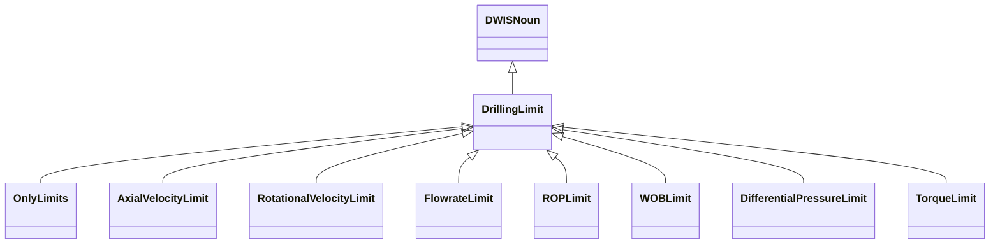
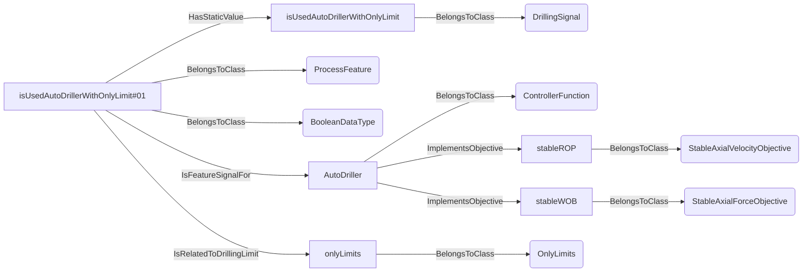
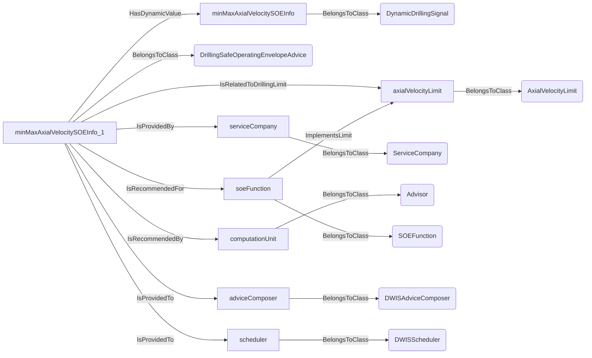
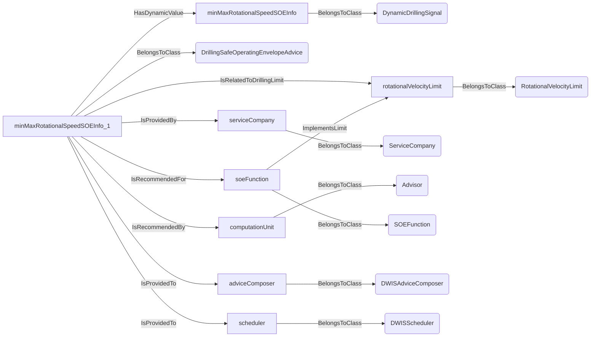
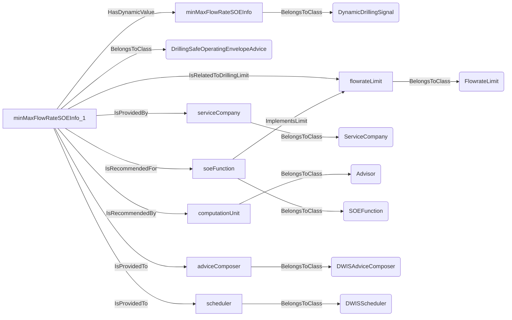
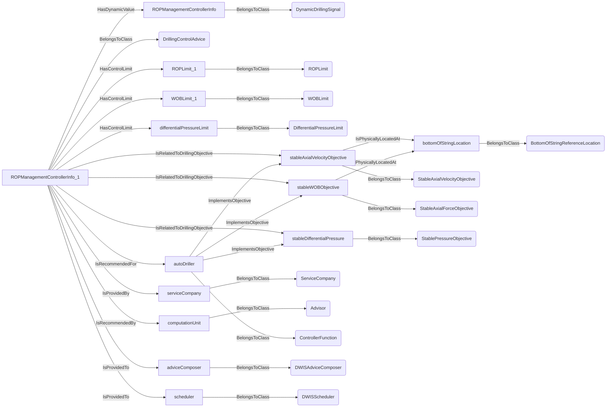
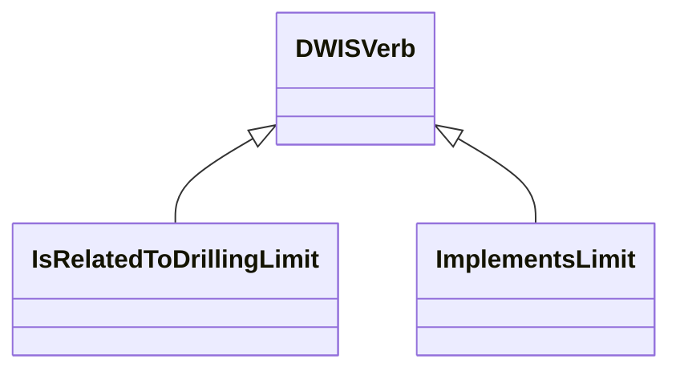
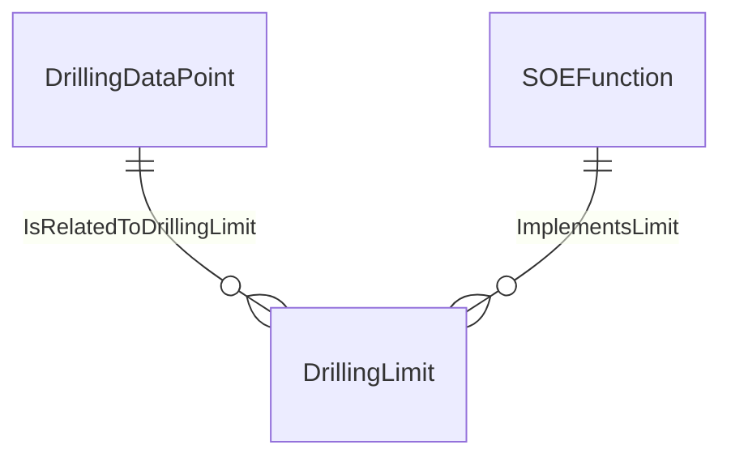
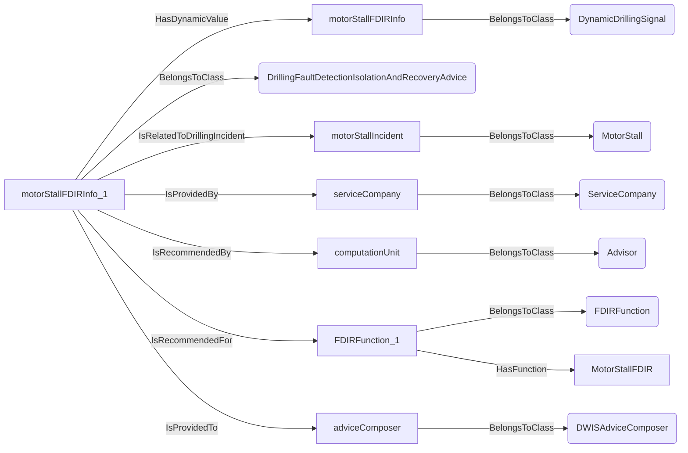

# DrillingLimit<!-- DEFINITION SET HEADER -->
- Description: 
this category refers mostly to the description of drilling limits.

# Nouns
## Class Inheritance for Nouns
Here is a class inheritance diagram for the nouns contained in this definition set.

## DrillingLimit <!-- NOUN -->
- Display name: Drilling Limit
- Parent class: [DWISNoun](./DWISSemantics.md#DWISNoun)
- Description: 
This is the parent class for drilling limits. A limit applies typically on a desired value as controlled by a controller.
- Definition set: DrillingLimit
## OnlyLimits <!-- NOUN -->
- Display name: Only Limits
- Parent class: [DrillingLimit](./DrillingLimit.md#DrillingLimit)
- Description: 
This noun states that something works with only limits, for example excluding the relation to set-points, etc.
- Definition set: DrillingLimit
- Examples:
```dwis isUsedAutoDrillerWithOnlyLimit
DrillingSignal:isUsedAutoDrillerWithOnlyLimit
ProcessFeature:isUsedAutoDrillerWithOnlyLimit#01
BooleanDataType:isUsedAutoDrillerWithOnlyLimit#01
isUsedAutoDrillerWithOnlyLimit#01 HasStaticValue isUsedAutoDrillerWithOnlyLimit
ControllerFunction:AutoDriller
StableAxialVelocityObjective:stableROP
StableAxialForceObjective:stableWOB
AutoDriller ImplementsObjective stableROP
AutoDriller ImplementsObjective stableWOB
isUsedAutoDrillerWithOnlyLimit#01 IsFeatureSignalFor AutoDriller
OnlyLimits:onlyLimits
isUsedAutoDrillerWithOnlyLimit#01 IsRelatedToDrillingLimit onlyLimits
```
An example semantic graph looks like as follow:

An example SparQL query looks like this:
```sparql
PREFIX rdf: <http://www.w3.org/1999/02/22-rdf-syntax-ns#>
PREFIX ddhub: <http://ddhub.no/>
PREFIX quantity: <http://ddhub.no/UnitAndQuantity>
SELECT ?isUsedAutoDrillerWithOnlyLimit
WHERE {
	?isUsedAutoDrillerWithOnlyLimit rdf:type ddhub:DrillingSignal .
	?isUsedAutoDrillerWithOnlyLimit#01 rdf:type ddhub:ProcessFeature .
	?isUsedAutoDrillerWithOnlyLimit#01 rdf:type ddhub:BooleanDataType .
	?isUsedAutoDrillerWithOnlyLimit#01 ddhub:HasStaticValue ?isUsedAutoDrillerWithOnlyLimit .
	?AutoDriller rdf:type ddhub:ControllerFunction .
	?stableROP rdf:type ddhub:StableAxialVelocityObjective .
	?stableWOB rdf:type ddhub:StableAxialForceObjective .
	?AutoDriller ddhub:ImplementsObjective ?stableROP .
	?AutoDriller ddhub:ImplementsObjective ?stableWOB .
	?isUsedAutoDrillerWithOnlyLimit#01 ddhub:IsFeatureSignalFor ?AutoDriller .
	?onlyLimits rdf:type ddhub:OnlyLimits .
	?isUsedAutoDrillerWithOnlyLimit#01 ddhub:IsRelatedToDrillingLimit ?onlyLimits .
}
```
## AxialVelocityLimit <!-- NOUN -->
- Display name: Axial Velocity Limit
- Parent class: [DrillingLimit](./DrillingLimit.md#DrillingLimit)
- Description: 
This Noun is used to refer to an axial velocity limit.
- Definition set: DrillingLimit
- Examples:
``` dwis minMaxAxialVelocitySOEInfo
DynamicDrillingSignal:minMaxAxialVelocitySOEInfo
DrillingSafeOperatingEnvelopeAdvice:minMaxAxialVelocitySOEInfo_1
minMaxAxialVelocitySOEInfo_1 HasDynamicValue minMaxAxialVelocitySOEInfo
AxialVelocityLimit:axialVelocityLimit
minMaxAxialVelocitySOEInfo_1 IsRelatedToDrillingLimit axialVelocityLimit
ServiceCompany:serviceCompany
minMaxAxialVelocitySOEInfo_1 IsProvidedBy serviceCompany
Advisor:computationUnit
minMaxAxialVelocitySOEInfo_1 IsRecommendedBy computationUnit
SOEFunction:soeFunction
soeFunction ImplementsLimit axialVelocityLimit
minMaxAxialVelocitySOEInfo_1 IsRecommendedFor soeFunction
DWISAdviceComposer:adviceComposer
minMaxAxialVelocitySOEInfo_1 IsProvidedTo adviceComposer
DWISScheduler:scheduler
minMaxAxialVelocitySOEInfo_1 IsProvidedTo scheduler
```
An example semantic graph looks like as follow:

An example SparQL query looks like this:
```sparql
PREFIX rdf: <http://www.w3.org/1999/02/22-rdf-syntax-ns#>
PREFIX ddhub: <http://ddhub.no/>
PREFIX quantity: <http://ddhub.no/UnitAndQuantity>
SELECT ?minMaxAxialVelocitySOEInfo
WHERE {
	?minMaxAxialVelocitySOEInfo rdf:type ddhub:DynamicDrillingSignal .
	?minMaxAxialVelocitySOEInfo_1 rdf:type ddhub:DrillingSafeOperatingEnvelopeAdvice .
	?minMaxAxialVelocitySOEInfo_1 ddhub:HasDynamicValue ?minMaxAxialVelocitySOEInfo .
	?axialVelocityLimit rdf:type ddhub:AxialVelocityLimit .
	?minMaxAxialVelocitySOEInfo_1 ddhub:IsRelatedToDrillingLimit ?axialVelocityLimit .
	?serviceCompany rdf:type ddhub:ServiceCompany .
	?minMaxAxialVelocitySOEInfo_1 ddhub:IsProvidedBy ?serviceCompany .
	?computationUnit rdf:type ddhub:Advisor .
	?minMaxAxialVelocitySOEInfo_1 ddhub:IsRecommendedBy ?computationUnit .
	?soeFunction rdf:type ddhub:SOEFunction .
	?soeFunction ddhub:ImplementsLimit ?axialVelocityLimit .
	?minMaxAxialVelocitySOEInfo_1 ddhub:IsRecommendedFor ?soeFunction .
	?adviceComposer rdf:type ddhub:DWISAdviceComposer .
	?minMaxAxialVelocitySOEInfo_1 ddhub:IsProvidedTo ?adviceComposer .
	?scheduler rdf:type ddhub:DWISScheduler .
	?minMaxAxialVelocitySOEInfo_1 ddhub:IsProvidedTo ?scheduler .
}
```
## RotationalVelocityLimit <!-- NOUN -->
- Display name: Rotational Velocity Limit
- Parent class: [DrillingLimit](./DrillingLimit.md#DrillingLimit)
- Description: 
This Noun is used to refer to a rotational velocity limit.
- Definition set: DrillingLimit
- Examples:
``` dwis minMaxRotationalSpeedSOEInfo
DynamicDrillingSignal:minMaxRotationalSpeedSOEInfo
DrillingSafeOperatingEnvelopeAdvice:minMaxRotationalSpeedSOEInfo_1
minMaxRotationalSpeedSOEInfo_1 HasDynamicValue minMaxRotationalSpeedSOEInfo
RotationalVelocityLimit:rotationalVelocityLimit
minMaxRotationalSpeedSOEInfo_1 IsRelatedToDrillingLimit rotationalVelocityLimit
ServiceCompany:serviceCompany
minMaxRotationalSpeedSOEInfo_1 IsProvidedBy serviceCompany
Advisor:computationUnit
minMaxRotationalSpeedSOEInfo_1 IsRecommendedBy computationUnit
SOEFunction:soeFunction
soeFunction ImplementsLimit rotationalVelocityLimit
minMaxRotationalSpeedSOEInfo_1 IsRecommendedFor soeFunction
DWISAdviceComposer:adviceComposer
minMaxRotationalSpeedSOEInfo_1 IsProvidedTo adviceComposer
DWISScheduler:scheduler
minMaxRotationalSpeedSOEInfo_1 IsProvidedTo scheduler
```
An example semantic graph looks like as follow:

An example SparQL query looks like this:
```sparql
PREFIX rdf: <http://www.w3.org/1999/02/22-rdf-syntax-ns#>
PREFIX ddhub: <http://ddhub.no/>
PREFIX quantity: <http://ddhub.no/UnitAndQuantity>
SELECT ?minMaxRotationalSpeedSOEInfo
WHERE {
	?minMaxRotationalSpeedSOEInfo rdf:type ddhub:DynamicDrillingSignal .
	?minMaxRotationalSpeedSOEInfo_1 rdf:type ddhub:DrillingSafeOperatingEnvelopeAdvice .
	?minMaxRotationalSpeedSOEInfo_1 ddhub:HasDynamicValue ?minMaxRotationalSpeedSOEInfo .
	?rotationalVelocityLimit rdf:type ddhub:RotationalVelocityLimit .
	?minMaxRotationalSpeedSOEInfo_1 ddhub:IsRelatedToDrillingLimit ?rotationalVelocityLimit .
	?serviceCompany rdf:type ddhub:ServiceCompany .
	?minMaxRotationalSpeedSOEInfo_1 ddhub:IsProvidedBy ?serviceCompany .
	?computationUnit rdf:type ddhub:Advisor .
	?minMaxRotationalSpeedSOEInfo_1 ddhub:IsRecommendedBy ?computationUnit .
	?soeFunction rdf:type ddhub:SOEFunction .
	?soeFunction ddhub:ImplementsLimit ?rotationalVelocityLimit .
	?minMaxRotationalSpeedSOEInfo_1 ddhub:IsRecommendedFor ?soeFunction .
	?adviceComposer rdf:type ddhub:DWISAdviceComposer .
	?minMaxRotationalSpeedSOEInfo_1 ddhub:IsProvidedTo ?adviceComposer .
	?scheduler rdf:type ddhub:DWISScheduler .
	?minMaxRotationalSpeedSOEInfo_1 ddhub:IsProvidedTo ?scheduler .
}
```
## FlowrateLimit <!-- NOUN -->
- Display name: Flowrate Limit
- Parent class: [DrillingLimit](./DrillingLimit.md#DrillingLimit)
- Description: 
This Noun is used to refer to a flowrate limit.
- Definition set: DrillingLimit
- Examples:
``` dwis minMaxFlowRateSOEInfo
DynamicDrillingSignal:minMaxFlowRateSOEInfo
DrillingSafeOperatingEnvelopeAdvice:minMaxFlowRateSOEInfo_1
minMaxFlowRateSOEInfo_1 HasDynamicValue minMaxFlowRateSOEInfo
FlowrateLimit:flowrateLimit
minMaxFlowRateSOEInfo_1 IsRelatedToDrillingLimit flowrateLimit
ServiceCompany:serviceCompany
minMaxFlowRateSOEInfo_1 IsProvidedBy serviceCompany
Advisor:computationUnit
minMaxFlowRateSOEInfo_1 IsRecommendedBy computationUnit
SOEFunction:soeFunction
soeFunction ImplementsLimit flowrateLimit
minMaxFlowRateSOEInfo_1 IsRecommendedFor soeFunction
DWISAdviceComposer:adviceComposer
minMaxFlowRateSOEInfo_1 IsProvidedTo adviceComposer
DWISScheduler:scheduler
minMaxFlowRateSOEInfo_1 IsProvidedTo scheduler
```
An example semantic graph looks like as follow:

An example SparQL query looks like this:
```sparql
PREFIX rdf: <http://www.w3.org/1999/02/22-rdf-syntax-ns#>
PREFIX ddhub: <http://ddhub.no/>
PREFIX quantity: <http://ddhub.no/UnitAndQuantity>
SELECT ?minMaxFlowRateSOEInfo
WHERE {
	?minMaxFlowRateSOEInfo rdf:type ddhub:DynamicDrillingSignal .
	?minMaxFlowRateSOEInfo_1 rdf:type ddhub:DrillingSafeOperatingEnvelopeAdvice .
	?minMaxFlowRateSOEInfo_1 ddhub:HasDynamicValue ?minMaxFlowRateSOEInfo .
	?flowrateLimit rdf:type ddhub:FlowrateLimit .
	?minMaxFlowRateSOEInfo_1 ddhub:IsRelatedToDrillingLimit ?flowrateLimit .
	?serviceCompany rdf:type ddhub:ServiceCompany .
	?minMaxFlowRateSOEInfo_1 ddhub:IsProvidedBy ?serviceCompany .
	?computationUnit rdf:type ddhub:Advisor .
	?minMaxFlowRateSOEInfo_1 ddhub:IsRecommendedBy ?computationUnit .
	?soeFunction rdf:type ddhub:SOEFunction .
	?soeFunction ddhub:ImplementsLimit ?flowrateLimit .
	?minMaxFlowRateSOEInfo_1 ddhub:IsRecommendedFor ?soeFunction .
	?adviceComposer rdf:type ddhub:DWISAdviceComposer .
	?minMaxFlowRateSOEInfo_1 ddhub:IsProvidedTo ?adviceComposer .
	?scheduler rdf:type ddhub:DWISScheduler .
	?minMaxFlowRateSOEInfo_1 ddhub:IsProvidedTo ?scheduler .
}
```
## ROPLimit <!-- NOUN -->
- Display name: ROP Limit
- Parent class: [DrillingLimit](./DrillingLimit.md#DrillingLimit)
- Description: 
This Noun is used to refer to a rate of penetration limit.
- Definition set: DrillingLimit
- Examples:
``` dwis ROPManagementControllerInfo
DynamicDrillingSignal:ROPManagementControllerInfo
DrillingControlAdvice:ROPManagementControllerInfo_1
ROPManagementControllerInfo_1 HasDynamicValue ROPManagementControllerInfo
ROPLimit:ROPLimit_1
ROPManagementControllerInfo_1 HasControlLimit ROPLimit_1
WOBLimit:WOBLimit_1
ROPManagementControllerInfo_1 HasControlLimit WOBLimit_1
DifferentialPressureLimit:differentialPressureLimit
ROPManagementControllerInfo_1 HasControlLimit differentialPressureLimit
BottomOfStringReferenceLocation:bottomOfStringLocation
StableAxialVelocityObjective:stableAxialVelocityObjective
stableAxialVelocityObjective IsPhysicallyLocatedAt bottomOfStringLocation
ROPManagementControllerInfo_1 IsRelatedToDrillingObjective stableAxialVelocityObjective
StableAxialForceObjective:stableWOBObjective
stableWOBObjective IsPhysicallyLocatedAt bottomOfStringLocation
ROPManagementControllerInfo_1 IsRelatedToDrillingObjective stableWOBObjective
StablePressureObjective:stableDifferentialPressure
ROPManagementControllerInfo_1 IsRelatedToDrillingObjective stableDifferentialPressure
ServiceCompany:serviceCompany
ROPManagementControllerInfo_1 IsProvidedBy serviceCompany
Advisor:computationUnit
ROPManagementControllerInfo_1 IsRecommendedBy computationUnit
ControllerFunction:autoDriller
autoDriller ImplementsObjective stableAxialVelocityObjective
autoDriller ImplementsObjective stableWOBObjective
autoDriller ImplementsObjective stableDifferentialPressure
ROPManagementControllerInfo_1 IsRecommendedFor autoDriller
DWISAdviceComposer:adviceComposer
ROPManagementControllerInfo_1 IsProvidedTo adviceComposer
DWISScheduler:scheduler
ROPManagementControllerInfo_1 IsProvidedTo scheduler
```
An example semantic graph looks like as follow:

An example SparQL query looks like this:
```sparql
PREFIX rdf: <http://www.w3.org/1999/02/22-rdf-syntax-ns#>
PREFIX ddhub: <http://ddhub.no/>
PREFIX quantity: <http://ddhub.no/UnitAndQuantity>
SELECT ?ROPManagementControllerInfo
WHERE {
	?ROPManagementControllerInfo rdf:type ddhub:DynamicDrillingSignal .
	?ROPManagementControllerInfo_1 rdf:type ddhub:DrillingControlAdvice .
	?ROPManagementControllerInfo_1 ddhub:HasDynamicValue ?ROPManagementControllerInfo .
	?ROPLimit_1 rdf:type ddhub:ROPLimit .
	?ROPManagementControllerInfo_1 ddhub:HasControlLimit ?ROPLimit_1 .
	?WOBLimit_1 rdf:type ddhub:WOBLimit .
	?ROPManagementControllerInfo_1 ddhub:HasControlLimit ?WOBLimit_1 .
	?differentialPressureLimit rdf:type ddhub:DifferentialPressureLimit .
	?ROPManagementControllerInfo_1 ddhub:HasControlLimit ?differentialPressureLimit .
	?bottomOfStringLocation rdf:type ddhub:BottomOfStringReferenceLocation .
	?stableAxialVelocityObjective rdf:type ddhub:StableAxialVelocityObjective .
	?stableAxialVelocityObjective ddhub:IsPhysicallyLocatedAt ?bottomOfStringLocation .
	?ROPManagementControllerInfo_1 ddhub:IsRelatedToDrillingObjective ?stableAxialVelocityObjective .
	?stableWOBObjective rdf:type ddhub:StableAxialForceObjective .
	?stableWOBObjective ddhub:IsPhysicallyLocatedAt ?bottomOfStringLocation .
	?ROPManagementControllerInfo_1 ddhub:IsRelatedToDrillingObjective ?stableWOBObjective .
	?stableDifferentialPressure rdf:type ddhub:StablePressureObjective .
	?ROPManagementControllerInfo_1 ddhub:IsRelatedToDrillingObjective ?stableDifferentialPressure .
	?serviceCompany rdf:type ddhub:ServiceCompany .
	?ROPManagementControllerInfo_1 ddhub:IsProvidedBy ?serviceCompany .
	?computationUnit rdf:type ddhub:Advisor .
	?ROPManagementControllerInfo_1 ddhub:IsRecommendedBy ?computationUnit .
	?autoDriller rdf:type ddhub:ControllerFunction .
	?autoDriller ddhub:ImplementsObjective ?stableAxialVelocityObjective .
	?autoDriller ddhub:ImplementsObjective ?stableWOBObjective .
	?autoDriller ddhub:ImplementsObjective ?stableDifferentialPressure .
	?ROPManagementControllerInfo_1 ddhub:IsRecommendedFor ?autoDriller .
	?adviceComposer rdf:type ddhub:DWISAdviceComposer .
	?ROPManagementControllerInfo_1 ddhub:IsProvidedTo ?adviceComposer .
	?scheduler rdf:type ddhub:DWISScheduler .
	?ROPManagementControllerInfo_1 ddhub:IsProvidedTo ?scheduler .
}
```
## WOBLimit <!-- NOUN -->
- Display name: WOB Limit
- Parent class: [DrillingLimit](./DrillingLimit.md#DrillingLimit)
- Description: 
This Noun is used to refer to a weight on bit limit.
- Definition set: DrillingLimit
- Examples:
``` dwis ROPManagementControllerInfo
DynamicDrillingSignal:ROPManagementControllerInfo
DrillingControlAdvice:ROPManagementControllerInfo_1
ROPManagementControllerInfo_1 HasDynamicValue ROPManagementControllerInfo
ROPLimit:ROPLimit_1
ROPManagementControllerInfo_1 HasControlLimit ROPLimit_1
WOBLimit:WOBLimit_1
ROPManagementControllerInfo_1 HasControlLimit WOBLimit_1
DifferentialPressureLimit:differentialPressureLimit
ROPManagementControllerInfo_1 HasControlLimit differentialPressureLimit
BottomOfStringReferenceLocation:bottomOfStringLocation
StableAxialVelocityObjective:stableAxialVelocityObjective
stableAxialVelocityObjective IsPhysicallyLocatedAt bottomOfStringLocation
ROPManagementControllerInfo_1 IsRelatedToDrillingObjective stableAxialVelocityObjective
StableAxialForceObjective:stableWOBObjective
stableWOBObjective IsPhysicallyLocatedAt bottomOfStringLocation
ROPManagementControllerInfo_1 IsRelatedToDrillingObjective stableWOBObjective
StablePressureObjective:stableDifferentialPressure
ROPManagementControllerInfo_1 IsRelatedToDrillingObjective stableDifferentialPressure
ServiceCompany:serviceCompany
ROPManagementControllerInfo_1 IsProvidedBy serviceCompany
Advisor:computationUnit
ROPManagementControllerInfo_1 IsRecommendedBy computationUnit
ControllerFunction:autoDriller
autoDriller ImplementsObjective stableAxialVelocityObjective
autoDriller ImplementsObjective stableWOBObjective
autoDriller ImplementsObjective stableDifferentialPressure
ROPManagementControllerInfo_1 IsRecommendedFor autoDriller
DWISAdviceComposer:adviceComposer
ROPManagementControllerInfo_1 IsProvidedTo adviceComposer
DWISScheduler:scheduler
ROPManagementControllerInfo_1 IsProvidedTo scheduler
```
An example semantic graph looks like as follow:

An example SparQL query looks like this:
```sparql
PREFIX rdf: <http://www.w3.org/1999/02/22-rdf-syntax-ns#>
PREFIX ddhub: <http://ddhub.no/>
PREFIX quantity: <http://ddhub.no/UnitAndQuantity>
SELECT ?ROPManagementControllerInfo
WHERE {
	?ROPManagementControllerInfo rdf:type ddhub:DynamicDrillingSignal .
	?ROPManagementControllerInfo_1 rdf:type ddhub:DrillingControlAdvice .
	?ROPManagementControllerInfo_1 ddhub:HasDynamicValue ?ROPManagementControllerInfo .
	?ROPLimit_1 rdf:type ddhub:ROPLimit .
	?ROPManagementControllerInfo_1 ddhub:HasControlLimit ?ROPLimit_1 .
	?WOBLimit_1 rdf:type ddhub:WOBLimit .
	?ROPManagementControllerInfo_1 ddhub:HasControlLimit ?WOBLimit_1 .
	?differentialPressureLimit rdf:type ddhub:DifferentialPressureLimit .
	?ROPManagementControllerInfo_1 ddhub:HasControlLimit ?differentialPressureLimit .
	?bottomOfStringLocation rdf:type ddhub:BottomOfStringReferenceLocation .
	?stableAxialVelocityObjective rdf:type ddhub:StableAxialVelocityObjective .
	?stableAxialVelocityObjective ddhub:IsPhysicallyLocatedAt ?bottomOfStringLocation .
	?ROPManagementControllerInfo_1 ddhub:IsRelatedToDrillingObjective ?stableAxialVelocityObjective .
	?stableWOBObjective rdf:type ddhub:StableAxialForceObjective .
	?stableWOBObjective ddhub:IsPhysicallyLocatedAt ?bottomOfStringLocation .
	?ROPManagementControllerInfo_1 ddhub:IsRelatedToDrillingObjective ?stableWOBObjective .
	?stableDifferentialPressure rdf:type ddhub:StablePressureObjective .
	?ROPManagementControllerInfo_1 ddhub:IsRelatedToDrillingObjective ?stableDifferentialPressure .
	?serviceCompany rdf:type ddhub:ServiceCompany .
	?ROPManagementControllerInfo_1 ddhub:IsProvidedBy ?serviceCompany .
	?computationUnit rdf:type ddhub:Advisor .
	?ROPManagementControllerInfo_1 ddhub:IsRecommendedBy ?computationUnit .
	?autoDriller rdf:type ddhub:ControllerFunction .
	?autoDriller ddhub:ImplementsObjective ?stableAxialVelocityObjective .
	?autoDriller ddhub:ImplementsObjective ?stableWOBObjective .
	?autoDriller ddhub:ImplementsObjective ?stableDifferentialPressure .
	?ROPManagementControllerInfo_1 ddhub:IsRecommendedFor ?autoDriller .
	?adviceComposer rdf:type ddhub:DWISAdviceComposer .
	?ROPManagementControllerInfo_1 ddhub:IsProvidedTo ?adviceComposer .
	?scheduler rdf:type ddhub:DWISScheduler .
	?ROPManagementControllerInfo_1 ddhub:IsProvidedTo ?scheduler .
}
```
## DifferentialPressureLimit <!-- NOUN -->
- Display name: Differential Pressure Limit
- Parent class: [DrillingLimit](./DrillingLimit.md#DrillingLimit)
- Description: 
This Noun is used to refer to a differential pressure limit.
- Definition set: DrillingLimit
- Examples:
``` dwis ROPManagementControllerInfo
DynamicDrillingSignal:ROPManagementControllerInfo
DrillingControlAdvice:ROPManagementControllerInfo_1
ROPManagementControllerInfo_1 HasDynamicValue ROPManagementControllerInfo
ROPLimit:ROPLimit_1
ROPManagementControllerInfo_1 HasControlLimit ROPLimit_1
WOBLimit:WOBLimit_1
ROPManagementControllerInfo_1 HasControlLimit WOBLimit_1
DifferentialPressureLimit:differentialPressureLimit
ROPManagementControllerInfo_1 HasControlLimit differentialPressureLimit
BottomOfStringReferenceLocation:bottomOfStringLocation
StableAxialVelocityObjective:stableAxialVelocityObjective
stableAxialVelocityObjective IsPhysicallyLocatedAt bottomOfStringLocation
ROPManagementControllerInfo_1 IsRelatedToDrillingObjective stableAxialVelocityObjective
StableAxialForceObjective:stableWOBObjective
stableWOBObjective IsPhysicallyLocatedAt bottomOfStringLocation
ROPManagementControllerInfo_1 IsRelatedToDrillingObjective stableWOBObjective
StablePressureObjective:stableDifferentialPressure
ROPManagementControllerInfo_1 IsRelatedToDrillingObjective stableDifferentialPressure
ServiceCompany:serviceCompany
ROPManagementControllerInfo_1 IsProvidedBy serviceCompany
Advisor:computationUnit
ROPManagementControllerInfo_1 IsRecommendedBy computationUnit
ControllerFunction:autoDriller
autoDriller ImplementsObjective stableAxialVelocityObjective
autoDriller ImplementsObjective stableWOBObjective
autoDriller ImplementsObjective stableDifferentialPressure
ROPManagementControllerInfo_1 IsRecommendedFor autoDriller
DWISAdviceComposer:adviceComposer
ROPManagementControllerInfo_1 IsProvidedTo adviceComposer
DWISScheduler:scheduler
ROPManagementControllerInfo_1 IsProvidedTo scheduler
```
An example semantic graph looks like as follow:

An example SparQL query looks like this:
```sparql
PREFIX rdf: <http://www.w3.org/1999/02/22-rdf-syntax-ns#>
PREFIX ddhub: <http://ddhub.no/>
PREFIX quantity: <http://ddhub.no/UnitAndQuantity>
SELECT ?ROPManagementControllerInfo
WHERE {
	?ROPManagementControllerInfo rdf:type ddhub:DynamicDrillingSignal .
	?ROPManagementControllerInfo_1 rdf:type ddhub:DrillingControlAdvice .
	?ROPManagementControllerInfo_1 ddhub:HasDynamicValue ?ROPManagementControllerInfo .
	?ROPLimit_1 rdf:type ddhub:ROPLimit .
	?ROPManagementControllerInfo_1 ddhub:HasControlLimit ?ROPLimit_1 .
	?WOBLimit_1 rdf:type ddhub:WOBLimit .
	?ROPManagementControllerInfo_1 ddhub:HasControlLimit ?WOBLimit_1 .
	?differentialPressureLimit rdf:type ddhub:DifferentialPressureLimit .
	?ROPManagementControllerInfo_1 ddhub:HasControlLimit ?differentialPressureLimit .
	?bottomOfStringLocation rdf:type ddhub:BottomOfStringReferenceLocation .
	?stableAxialVelocityObjective rdf:type ddhub:StableAxialVelocityObjective .
	?stableAxialVelocityObjective ddhub:IsPhysicallyLocatedAt ?bottomOfStringLocation .
	?ROPManagementControllerInfo_1 ddhub:IsRelatedToDrillingObjective ?stableAxialVelocityObjective .
	?stableWOBObjective rdf:type ddhub:StableAxialForceObjective .
	?stableWOBObjective ddhub:IsPhysicallyLocatedAt ?bottomOfStringLocation .
	?ROPManagementControllerInfo_1 ddhub:IsRelatedToDrillingObjective ?stableWOBObjective .
	?stableDifferentialPressure rdf:type ddhub:StablePressureObjective .
	?ROPManagementControllerInfo_1 ddhub:IsRelatedToDrillingObjective ?stableDifferentialPressure .
	?serviceCompany rdf:type ddhub:ServiceCompany .
	?ROPManagementControllerInfo_1 ddhub:IsProvidedBy ?serviceCompany .
	?computationUnit rdf:type ddhub:Advisor .
	?ROPManagementControllerInfo_1 ddhub:IsRecommendedBy ?computationUnit .
	?autoDriller rdf:type ddhub:ControllerFunction .
	?autoDriller ddhub:ImplementsObjective ?stableAxialVelocityObjective .
	?autoDriller ddhub:ImplementsObjective ?stableWOBObjective .
	?autoDriller ddhub:ImplementsObjective ?stableDifferentialPressure .
	?ROPManagementControllerInfo_1 ddhub:IsRecommendedFor ?autoDriller .
	?adviceComposer rdf:type ddhub:DWISAdviceComposer .
	?ROPManagementControllerInfo_1 ddhub:IsProvidedTo ?adviceComposer .
	?scheduler rdf:type ddhub:DWISScheduler .
	?ROPManagementControllerInfo_1 ddhub:IsProvidedTo ?scheduler .
}
```
## TorqueLimit <!-- NOUN -->
- Display name: Torque Limit
- Parent class: [DrillingLimit](./DrillingLimit.md#DrillingLimit)
- Description: 
This Noun is used to refer to a torque limit.
- Definition set: DrillingLimit
# Verbs
## Class Inheritance for Verbs
Here is a class inheritance diagram for the verbs contained in this definition set.

## Relations
Here is a graph representing the relations that can be made with the verbs defined in this definition set.

## IsRelatedToDrillingLimit <!-- VERB -->
- Display name: Is Related to Drilling Limit
- Parent verb: [DWISVerb](./DWISSemantics.md#DWISVerb)
- Subject class: [DrillingDataPoint](./DrillingDataSemantics.md#DrillingDataPoint)
- Object class: [DrillingLimit](./DrillingLimit.md#DrillingLimit)
- Definition set: DrillingLimit
- Description: 
This Verb is used to indicate that a drilling data point is related to a drilling incident.
- Examples:
``` dwis motorStallFDIRInfo
DynamicDrillingSignal:motorStallFDIRInfo
DrillingFaultDetectionIsolationAndRecoveryAdvice:motorStallFDIRInfo_1
motorStallFDIRInfo_1 HasDynamicValue motorStallFDIRInfo
MotorStall:motorStallIncident
motorStallFDIRInfo_1 IsRelatedToDrillingIncident motorStallIncident
ServiceCompany:serviceCompany
motorStallFDIRInfo_1 IsProvidedBy serviceCompany
Advisor:computationUnit
motorStallFDIRInfo_1 IsRecommendedBy computationUnit
FDIRFunction:FDIRFunction_1
FDIRFunction_1.HasFunction = "MotorStallFDIR"
motorStallFDIRInfo_1 IsRecommendedFor FDIRFunction_1
DWISAdviceComposer:adviceComposer
motorStallFDIRInfo_1 IsProvidedTo adviceComposer
```
An example semantic graph looks like as follow:

An example SparQL query looks like this:
```sparql
PREFIX rdf: <http://www.w3.org/1999/02/22-rdf-syntax-ns#>
PREFIX ddhub: <http://ddhub.no/>
PREFIX quantity: <http://ddhub.no/UnitAndQuantity>
SELECT ?motorStallFDIRInfo
WHERE {
	?motorStallFDIRInfo rdf:type ddhub:DynamicDrillingSignal .
	?motorStallFDIRInfo_1 rdf:type ddhub:DrillingFaultDetectionIsolationAndRecoveryAdvice .
	?motorStallFDIRInfo_1 ddhub:HasDynamicValue ?motorStallFDIRInfo .
	?motorStallIncident rdf:type ddhub:MotorStall .
	?motorStallFDIRInfo_1 ddhub:IsRelatedToDrillingIncident ?motorStallIncident .
	?serviceCompany rdf:type ddhub:ServiceCompany .
	?motorStallFDIRInfo_1 ddhub:IsProvidedBy ?serviceCompany .
	?computationUnit rdf:type ddhub:Advisor .
	?motorStallFDIRInfo_1 ddhub:IsRecommendedBy ?computationUnit .
	?FDIRFunction_1 rdf:type ddhub:FDIRFunction .
	?FDIRFunction_1 ddhub:HasFunction ?Attribute000 .
	?motorStallFDIRInfo_1 ddhub:IsRecommendedFor ?FDIRFunction_1 .
	?adviceComposer rdf:type ddhub:DWISAdviceComposer .
	?motorStallFDIRInfo_1 ddhub:IsProvidedTo ?adviceComposer .
  FILTER (
	?Attribute000 = "MotorStallFDIR"
  )
}
```
## ImplementsLimit <!-- VERB -->
- Display name: Implements Limit
- Parent verb: [DWISVerb](./DWISSemantics.md#DWISVerb)
- Subject class: [SOEFunction](./ADCS.md#SOEFunction)
- Object class: [DrillingLimit](./DrillingLimit.md#DrillingLimit)
- Definition set: DrillingLimit
- Description: 
This Verb is used to indicate that a safe operating envelope function implements a drilling limit.
- Examples:
``` dwis minMaxAxialVelocitySOEInfo
DynamicDrillingSignal:minMaxAxialVelocitySOEInfo
DrillingSafeOperatingEnvelopeAdvice:minMaxAxialVelocitySOEInfo_1
minMaxAxialVelocitySOEInfo_1 HasDynamicValue minMaxAxialVelocitySOEInfo
AxialVelocityLimit:axialVelocityLimit
minMaxAxialVelocitySOEInfo_1 IsRelatedToDrillingLimit axialVelocityLimit
ServiceCompany:serviceCompany
minMaxAxialVelocitySOEInfo_1 IsProvidedBy serviceCompany
Advisor:computationUnit
minMaxAxialVelocitySOEInfo_1 IsRecommendedBy computationUnit
SOEFunction:soeFunction
soeFunction ImplementsLimit axialVelocityLimit
minMaxAxialVelocitySOEInfo_1 IsRecommendedFor soeFunction
DWISAdviceComposer:adviceComposer
minMaxAxialVelocitySOEInfo_1 IsProvidedTo adviceComposer
DWISScheduler:scheduler
minMaxAxialVelocitySOEInfo_1 IsProvidedTo scheduler
```
An example semantic graph looks like as follow:

An example SparQL query looks like this:
```sparql
PREFIX rdf: <http://www.w3.org/1999/02/22-rdf-syntax-ns#>
PREFIX ddhub: <http://ddhub.no/>
PREFIX quantity: <http://ddhub.no/UnitAndQuantity>
SELECT ?minMaxAxialVelocitySOEInfo
WHERE {
	?minMaxAxialVelocitySOEInfo rdf:type ddhub:DynamicDrillingSignal .
	?minMaxAxialVelocitySOEInfo_1 rdf:type ddhub:DrillingSafeOperatingEnvelopeAdvice .
	?minMaxAxialVelocitySOEInfo_1 ddhub:HasDynamicValue ?minMaxAxialVelocitySOEInfo .
	?axialVelocityLimit rdf:type ddhub:AxialVelocityLimit .
	?minMaxAxialVelocitySOEInfo_1 ddhub:IsRelatedToDrillingLimit ?axialVelocityLimit .
	?serviceCompany rdf:type ddhub:ServiceCompany .
	?minMaxAxialVelocitySOEInfo_1 ddhub:IsProvidedBy ?serviceCompany .
	?computationUnit rdf:type ddhub:Advisor .
	?minMaxAxialVelocitySOEInfo_1 ddhub:IsRecommendedBy ?computationUnit .
	?soeFunction rdf:type ddhub:SOEFunction .
	?soeFunction ddhub:ImplementsLimit ?axialVelocityLimit .
	?minMaxAxialVelocitySOEInfo_1 ddhub:IsRecommendedFor ?soeFunction .
	?adviceComposer rdf:type ddhub:DWISAdviceComposer .
	?minMaxAxialVelocitySOEInfo_1 ddhub:IsProvidedTo ?adviceComposer .
	?scheduler rdf:type ddhub:DWISScheduler .
	?minMaxAxialVelocitySOEInfo_1 ddhub:IsProvidedTo ?scheduler .
}
```
