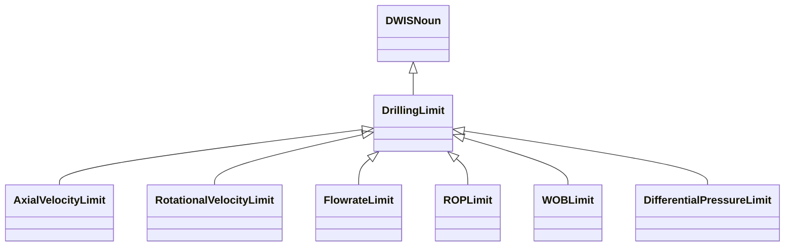
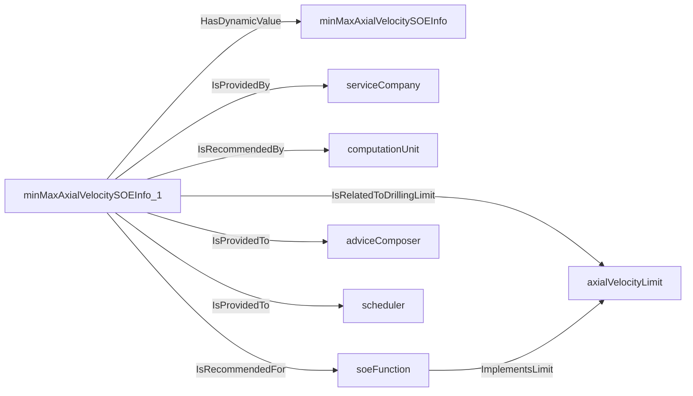
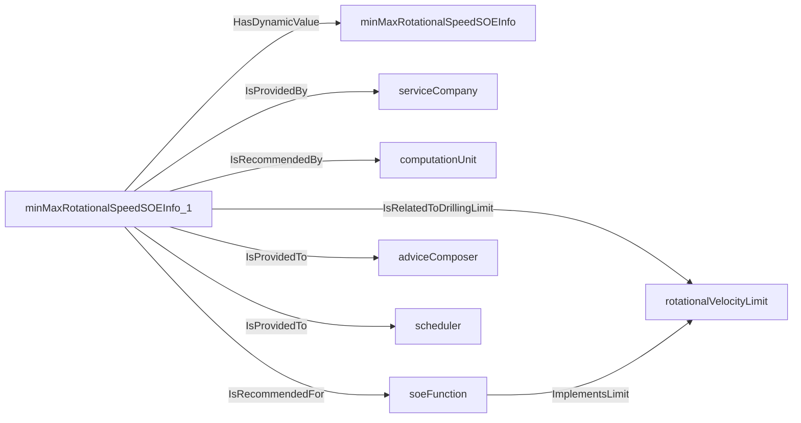
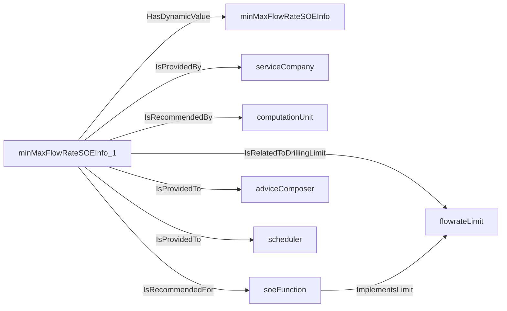
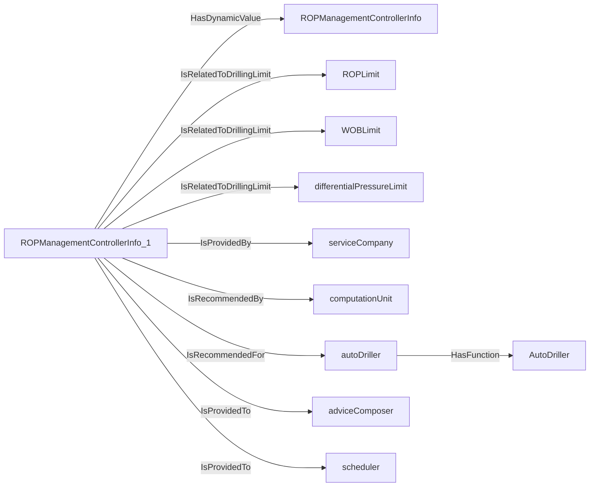
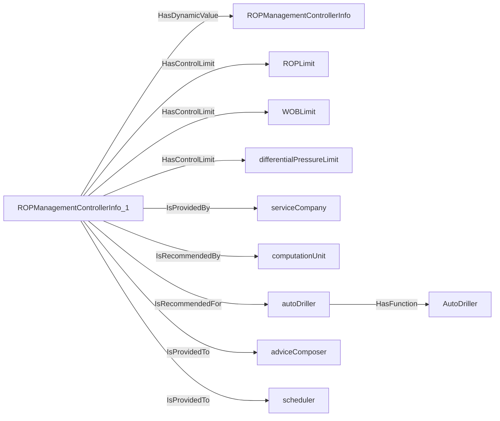
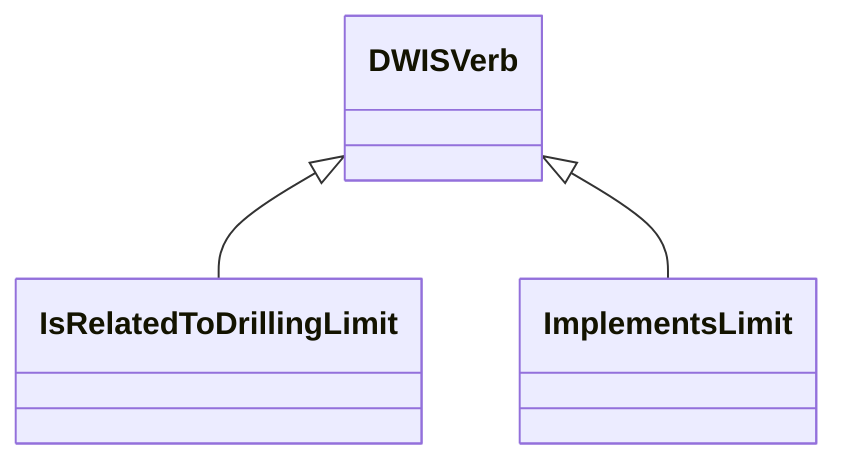
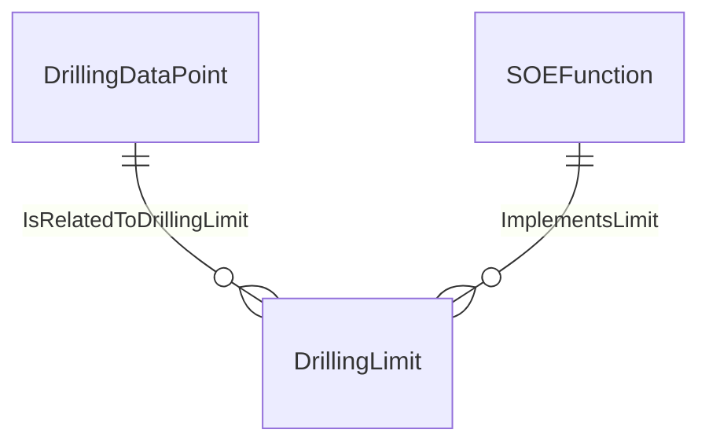
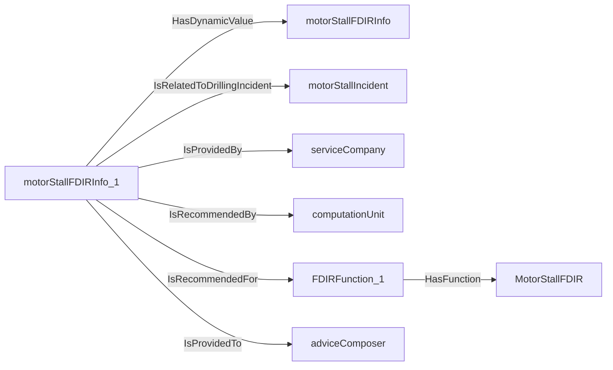

# DrillingLimit<!-- DEFINITION SET HEADER -->
- Description: 
this category refers mostly to the description of drilling limits.

# Nouns
## Class Inheritance for Nouns
Here is a class inheritance diagram for the nouns contained in this definition set.

## DrillingLimit <!-- NOUN -->
- Display name: Drilling Limit
- Parent class: [DWISNoun](./DWISSemantics.md#DWISNoun)
- Description: 
This is the parent class for drilling limits. A limit applies typically on a desired value as controlled by a controller.
- Definition set: DrillingLimit
## AxialVelocityLimit <!-- NOUN -->
- Display name: Axial Velocity Limit
- Parent class: [DrillingLimit](./DrillingLimit.md#DrillingLimit)
- Description: 
This Noun is used to refer to an axial velocity limit.
- Definition set: DrillingLimit
- Examples:
``` dwis minMaxAxialVelocitySOEInfo
DynamicDrillingSignal: minMaxAxialVelocitySOEInfo
DrillingSafeOperatingEnvelopeAdvice: minMaxAxialVelocitySOEInfo_1
minMaxAxialVelocitySOEInfo_1 HasDynamicValue minMaxAxialVelocitySOEInfo
AxialVelocityLimit: axialVelocityLimit
minMaxAxialVelocitySOEInfo_1 IsRelatedToDrillingLimit axialVelocityLimit
ServiceCompany: serviceCompany
minMaxAxialVelocitySOEInfo_1 IsProvidedBy serviceCompany
Advisor: computationUnit
minMaxAxialVelocitySOEInfo_1 IsRecommendedBy computationUnit
SOEFunction: soeFunction
soeFunction ImplementsLimit axialVelocityLimit
minMaxAxialVelocitySOEInfo_1 IsRecommendedFor soeFunction
DWISAdviceComposer: adviceComposer
minMaxAxialVelocitySOEInfo_1 IsProvidedTo adviceComposer
DWISScheduler: scheduler
minMaxAxialVelocitySOEInfo_1 IsProvidedTo scheduler
```
An example semantic graph looks like as follow:

An example SparQL query looks like this:
```sparql
PREFIX rdf: <http://www.w3.org/1999/02/22-rdf-syntax-ns#>
PREFIX ddhub: <http://ddhub.no/>
PREFIX quantity: <http://ddhub.no/UnitAndQuantity>
SELECT ?minMaxAxialVelocitySOEInfo
WHERE {
	?minMaxAxialVelocitySOEInfo_1 ddhub:HasDynamicValue ?minMaxAxialVelocitySOEInfo .
	?minMaxAxialVelocitySOEInfo_1 ddhub:IsRelatedToDrillingLimit ?axialVelocityLimit .
	?minMaxAxialVelocitySOEInfo_1 ddhub:IsProvidedBy ?serviceCompany .
	?minMaxAxialVelocitySOEInfo_1 ddhub:IsRecommendedBy ?computationUnit .
	?soeFunction ddhub:ImplementsLimit ?axialVelocityLimit .
	?minMaxAxialVelocitySOEInfo_1 ddhub:IsRecommendedFor ?soeFunction .
	?minMaxAxialVelocitySOEInfo_1 ddhub:IsProvidedTo ?adviceComposer .
	?minMaxAxialVelocitySOEInfo_1 ddhub:IsProvidedTo ?scheduler .
}
```
## RotationalVelocityLimit <!-- NOUN -->
- Display name: Rotational Velocity Limit
- Parent class: [DrillingLimit](./DrillingLimit.md#DrillingLimit)
- Description: 
This Noun is used to refer to a rotational velocity limit.
- Definition set: DrillingLimit
- Examples:
``` dwis minMaxRotationalSpeedSOEInfo
DynamicDrillingSignal: minMaxRotationalSpeedSOEInfo
DrillingSafeOperatingEnvelopeAdvice: minMaxRotationalSpeedSOEInfo_1
minMaxRotationalSpeedSOEInfo_1 HasDynamicValue minMaxRotationalSpeedSOEInfo
RotationalVelocityLimit: rotationalVelocityLimit
minMaxRotationalSpeedSOEInfo_1 IsRelatedToDrillingLimit rotationalVelocityLimit
ServiceCompany: serviceCompany
minMaxRotationalSpeedSOEInfo_1 IsProvidedBy serviceCompany
Advisor: computationUnit
minMaxRotationalSpeedSOEInfo_1 IsRecommendedBy computationUnit
SOEFunction: soeFunction
soeFunction ImplementsLimit rotationalVelocityLimit
minMaxRotationalSpeedSOEInfo_1 IsRecommendedFor soeFunction
DWISAdviceComposer: adviceComposer
minMaxRotationalSpeedSOEInfo_1 IsProvidedTo adviceComposer
DWISScheduler: scheduler
minMaxRotationalSpeedSOEInfo_1 IsProvidedTo scheduler
```
An example semantic graph looks like as follow:

An example SparQL query looks like this:
```sparql
PREFIX rdf: <http://www.w3.org/1999/02/22-rdf-syntax-ns#>
PREFIX ddhub: <http://ddhub.no/>
PREFIX quantity: <http://ddhub.no/UnitAndQuantity>
SELECT ?minMaxRotationalSpeedSOEInfo
WHERE {
	?minMaxRotationalSpeedSOEInfo_1 ddhub:HasDynamicValue ?minMaxRotationalSpeedSOEInfo .
	?minMaxRotationalSpeedSOEInfo_1 ddhub:IsRelatedToDrillingLimit ?rotationalVelocityLimit .
	?minMaxRotationalSpeedSOEInfo_1 ddhub:IsProvidedBy ?serviceCompany .
	?minMaxRotationalSpeedSOEInfo_1 ddhub:IsRecommendedBy ?computationUnit .
	?soeFunction ddhub:ImplementsLimit ?rotationalVelocityLimit .
	?minMaxRotationalSpeedSOEInfo_1 ddhub:IsRecommendedFor ?soeFunction .
	?minMaxRotationalSpeedSOEInfo_1 ddhub:IsProvidedTo ?adviceComposer .
	?minMaxRotationalSpeedSOEInfo_1 ddhub:IsProvidedTo ?scheduler .
}
```
## FlowrateLimit <!-- NOUN -->
- Display name: Flowrate Limit
- Parent class: [DrillingLimit](./DrillingLimit.md#DrillingLimit)
- Description: 
This Noun is used to refer to a flowrate limit.
- Definition set: DrillingLimit
- Examples:
``` dwis minMaxFlowRateSOEInfo
DynamicDrillingSignal: minMaxFlowRateSOEInfo
DrillingSafeOperatingEnvelopeAdvice: minMaxFlowRateSOEInfo_1
minMaxFlowRateSOEInfo_1 HasDynamicValue minMaxFlowRateSOEInfo
FlowrateLimit: flowrateLimit
minMaxFlowRateSOEInfo_1 IsRelatedToDrillingLimit flowrateLimit
ServiceCompany: serviceCompany
minMaxFlowRateSOEInfo_1 IsProvidedBy serviceCompany
Advisor: computationUnit
minMaxFlowRateSOEInfo_1 IsRecommendedBy computationUnit
SOEFunction: soeFunction
soeFunction ImplementsLimit flowrateLimit
minMaxFlowRateSOEInfo_1 IsRecommendedFor soeFunction
DWISAdviceComposer: adviceComposer
minMaxFlowRateSOEInfo_1 IsProvidedTo adviceComposer
DWISScheduler: scheduler
minMaxFlowRateSOEInfo_1 IsProvidedTo scheduler
```
An example semantic graph looks like as follow:

An example SparQL query looks like this:
```sparql
PREFIX rdf: <http://www.w3.org/1999/02/22-rdf-syntax-ns#>
PREFIX ddhub: <http://ddhub.no/>
PREFIX quantity: <http://ddhub.no/UnitAndQuantity>
SELECT ?minMaxFlowRateSOEInfo
WHERE {
	?minMaxFlowRateSOEInfo_1 ddhub:HasDynamicValue ?minMaxFlowRateSOEInfo .
	?minMaxFlowRateSOEInfo_1 ddhub:IsRelatedToDrillingLimit ?flowrateLimit .
	?minMaxFlowRateSOEInfo_1 ddhub:IsProvidedBy ?serviceCompany .
	?minMaxFlowRateSOEInfo_1 ddhub:IsRecommendedBy ?computationUnit .
	?soeFunction ddhub:ImplementsLimit ?flowrateLimit .
	?minMaxFlowRateSOEInfo_1 ddhub:IsRecommendedFor ?soeFunction .
	?minMaxFlowRateSOEInfo_1 ddhub:IsProvidedTo ?adviceComposer .
	?minMaxFlowRateSOEInfo_1 ddhub:IsProvidedTo ?scheduler .
}
```
## ROPLimit <!-- NOUN -->
- Display name: ROP Limit
- Parent class: [DrillingLimit](./DrillingLimit.md#DrillingLimit)
- Description: 
This Noun is used to refer to a rate of penetration limit.
- Definition set: DrillingLimit
- Examples:
``` dwis ROPManagementControllerInfo
DynamicDrillingSignal: ROPManagementControllerInfo
ROPManagementContolAdvice: ROPManagementControllerInfo_1
ROPManagementControllerInfo_1 HasDynamicValue ROPManagementControllerInfo
ROPLimit: ROPLimit
ROPManagementControllerInfo_1 IsRelatedToDrillingLimit ROPLimit
WOBLimit: WOBLimit
ROPManagementControllerInfo_1 IsRelatedToDrillingLimit WOBLimit
DifferentialPressureLimit: differentialPressureLimit
ROPManagementControllerInfo_1 IsRelatedToDrillingLimit differentialPressureLimit
ServiceCompany: serviceCompany
ROPManagementControllerInfo_1 IsProvidedBy serviceCompany
Advisor: computationUnit
ROPManagementControllerInfo_1 IsRecommendedBy computationUnit
ControllerFunction: autoDriller
autoDriller.HasFunction = "AutoDriller"
ROPManagementControllerInfo_1 IsRecommendedFor autoDriller
DWISAdviceComposer: adviceComposer
ROPManagementControllerInfo_1 IsProvidedTo adviceComposer
DWISScheduler: scheduler
ROPManagementControllerInfo_1 IsProvidedTo scheduler
```
An example semantic graph looks like as follow:

An example SparQL query looks like this:
```sparql
PREFIX rdf: <http://www.w3.org/1999/02/22-rdf-syntax-ns#>
PREFIX ddhub: <http://ddhub.no/>
PREFIX quantity: <http://ddhub.no/UnitAndQuantity>
SELECT ?ROPManagementControllerInfo
WHERE {
	?ROPManagementControllerInfo_1 ddhub:HasDynamicValue ?ROPManagementControllerInfo .
	?ROPManagementControllerInfo_1 ddhub:IsRelatedToDrillingLimit ?ROPLimit .
	?ROPManagementControllerInfo_1 ddhub:IsRelatedToDrillingLimit ?WOBLimit .
	?ROPManagementControllerInfo_1 ddhub:IsRelatedToDrillingLimit ?differentialPressureLimit .
	?ROPManagementControllerInfo_1 ddhub:IsProvidedBy ?serviceCompany .
	?ROPManagementControllerInfo_1 ddhub:IsRecommendedBy ?computationUnit .
	?autoDriller ddhub:HasFunction ?Attribute000 .
	?ROPManagementControllerInfo_1 ddhub:IsRecommendedFor ?autoDriller .
	?ROPManagementControllerInfo_1 ddhub:IsProvidedTo ?adviceComposer .
	?ROPManagementControllerInfo_1 ddhub:IsProvidedTo ?scheduler .
  FILTER (
	?Attribute000 = "AutoDriller"
  )
}
```
## WOBLimit <!-- NOUN -->
- Display name: WOB Limit
- Parent class: [DrillingLimit](./DrillingLimit.md#DrillingLimit)
- Description: 
This Noun is used to refer to a weight on bit limit.
- Definition set: DrillingLimit
- Examples:
``` dwis ROPManagementControllerInfo
DynamicDrillingSignal: ROPManagementControllerInfo
ROPManagementContolAdvice: ROPManagementControllerInfo_1
ROPManagementControllerInfo_1 HasDynamicValue ROPManagementControllerInfo
ROPLimit: ROPLimit
ROPManagementControllerInfo_1 IsRelatedToDrillingLimit ROPLimit
WOBLimit: WOBLimit
ROPManagementControllerInfo_1 IsRelatedToDrillingLimit WOBLimit
DifferentialPressureLimit: differentialPressureLimit
ROPManagementControllerInfo_1 IsRelatedToDrillingLimit differentialPressureLimit
ServiceCompany: serviceCompany
ROPManagementControllerInfo_1 IsProvidedBy serviceCompany
Advisor: computationUnit
ROPManagementControllerInfo_1 IsRecommendedBy computationUnit
ControllerFunction: autoDriller
autoDriller.HasFunction = "AutoDriller"
ROPManagementControllerInfo_1 IsRecommendedFor autoDriller
DWISAdviceComposer: adviceComposer
ROPManagementControllerInfo_1 IsProvidedTo adviceComposer
DWISScheduler: scheduler
ROPManagementControllerInfo_1 IsProvidedTo scheduler
```
An example semantic graph looks like as follow:

An example SparQL query looks like this:
```sparql
PREFIX rdf: <http://www.w3.org/1999/02/22-rdf-syntax-ns#>
PREFIX ddhub: <http://ddhub.no/>
PREFIX quantity: <http://ddhub.no/UnitAndQuantity>
SELECT ?ROPManagementControllerInfo
WHERE {
	?ROPManagementControllerInfo_1 ddhub:HasDynamicValue ?ROPManagementControllerInfo .
	?ROPManagementControllerInfo_1 ddhub:IsRelatedToDrillingLimit ?ROPLimit .
	?ROPManagementControllerInfo_1 ddhub:IsRelatedToDrillingLimit ?WOBLimit .
	?ROPManagementControllerInfo_1 ddhub:IsRelatedToDrillingLimit ?differentialPressureLimit .
	?ROPManagementControllerInfo_1 ddhub:IsProvidedBy ?serviceCompany .
	?ROPManagementControllerInfo_1 ddhub:IsRecommendedBy ?computationUnit .
	?autoDriller ddhub:HasFunction ?Attribute000 .
	?ROPManagementControllerInfo_1 ddhub:IsRecommendedFor ?autoDriller .
	?ROPManagementControllerInfo_1 ddhub:IsProvidedTo ?adviceComposer .
	?ROPManagementControllerInfo_1 ddhub:IsProvidedTo ?scheduler .
  FILTER (
	?Attribute000 = "AutoDriller"
  )
}
```
## DifferentialPressureLimit <!-- NOUN -->
- Display name: Differential Pressure Limit
- Parent class: [DrillingLimit](./DrillingLimit.md#DrillingLimit)
- Description: 
This Noun is used to refer to a differential pressure limit.
- Definition set: DrillingLimit
- Examples:
``` dwis ROPManagementControllerInfo
DynamicDrillingSignal: ROPManagementControllerInfo
ROPManagementContolAdvice: ROPManagementControllerInfo_1
ROPManagementControllerInfo_1 HasDynamicValue ROPManagementControllerInfo
ROPLimit: ROPLimit
ROPManagementControllerInfo_1 HasControlLimit ROPLimit
WOBLimit: WOBLimit
ROPManagementControllerInfo_1 HasControlLimit WOBLimit
DifferentialPressureLimit: differentialPressureLimit
ROPManagementControllerInfo_1 HasControlLimit differentialPressureLimit
ServiceCompany: serviceCompany
ROPManagementControllerInfo_1 IsProvidedBy serviceCompany
Advisor: computationUnit
ROPManagementControllerInfo_1 IsRecommendedBy computationUnit
ControllerFunction: autoDriller
autoDriller.HasFunction = "AutoDriller"
ROPManagementControllerInfo_1 IsRecommendedFor autoDriller
DWISAdviceComposer: adviceComposer
ROPManagementControllerInfo_1 IsProvidedTo adviceComposer
DWISScheduler: scheduler
ROPManagementControllerInfo_1 IsProvidedTo scheduler
```
An example semantic graph looks like as follow:

An example SparQL query looks like this:
```sparql
PREFIX rdf: <http://www.w3.org/1999/02/22-rdf-syntax-ns#>
PREFIX ddhub: <http://ddhub.no/>
PREFIX quantity: <http://ddhub.no/UnitAndQuantity>
SELECT ?ROPManagementControllerInfo
WHERE {
	?ROPManagementControllerInfo_1 ddhub:HasDynamicValue ?ROPManagementControllerInfo .
	?ROPManagementControllerInfo_1 ddhub:HasControlLimit ?ROPLimit .
	?ROPManagementControllerInfo_1 ddhub:HasControlLimit ?WOBLimit .
	?ROPManagementControllerInfo_1 ddhub:HasControlLimit ?differentialPressureLimit .
	?ROPManagementControllerInfo_1 ddhub:IsProvidedBy ?serviceCompany .
	?ROPManagementControllerInfo_1 ddhub:IsRecommendedBy ?computationUnit .
	?autoDriller ddhub:HasFunction ?Attribute000 .
	?ROPManagementControllerInfo_1 ddhub:IsRecommendedFor ?autoDriller .
	?ROPManagementControllerInfo_1 ddhub:IsProvidedTo ?adviceComposer .
	?ROPManagementControllerInfo_1 ddhub:IsProvidedTo ?scheduler .
  FILTER (
	?Attribute000 = "AutoDriller"
  )
}
```
# Verbs
## Class Inheritance for Verbs
Here is a class inheritance diagram for the verbs contained in this definition set.

## Relations
Here is a graph representing the relations that can be made with the verbs defined in this definition set.

## IsRelatedToDrillingLimit <!-- VERB -->
- Display name: Is Related to Drilling Limit
- Parent verb: [DWISVerb](./DWISSemantics.md#DWISVerb)
- Subject class: [DrillingDataPoint](./DrillingDataSemantics.md#DrillingDataPoint)
- Object class: [DrillingLimit](./DrillingLimit.md#DrillingLimit)
- Definition set: DrillingLimit
- Description: 
This Verb is used to indicate that a drilling data point is related to a drilling incident.
- Examples:
``` dwis motorStallFDIRInfo
DynamicDrillingSignal: motorStallFDIRInfo
DrillingFaultDetectionIsolationAndRecoveryAdvice: motorStallFDIRInfo_1
motorStallFDIRInfo_1 HasDynamicValue motorStallFDIRInfo
MotorStall: motorStallIncident
motorStallFDIRInfo_1 IsRelatedToDrillingIncident motorStallIncident
ServiceCompany: serviceCompany
motorStallFDIRInfo_1 IsProvidedBy serviceCompany
Advisor: computationUnit
motorStallFDIRInfo_1 IsRecommendedBy computationUnit
FDIRFunction: FDIRFunction_1
FDIRFunction_1.HasFunction = "MotorStallFDIR"
motorStallFDIRInfo_1 IsRecommendedFor FDIRFunction_1
DWISAdviceComposer: adviceComposer
motorStallFDIRInfo_1 IsProvidedTo adviceComposer
```
An example semantic graph looks like as follow:

An example SparQL query looks like this:
```sparql
PREFIX rdf: <http://www.w3.org/1999/02/22-rdf-syntax-ns#>
PREFIX ddhub: <http://ddhub.no/>
PREFIX quantity: <http://ddhub.no/UnitAndQuantity>
SELECT ?motorStallFDIRInfo
WHERE {
	?motorStallFDIRInfo_1 ddhub:HasDynamicValue ?motorStallFDIRInfo .
	?motorStallFDIRInfo_1 ddhub:IsRelatedToDrillingIncident ?motorStallIncident .
	?motorStallFDIRInfo_1 ddhub:IsProvidedBy ?serviceCompany .
	?motorStallFDIRInfo_1 ddhub:IsRecommendedBy ?computationUnit .
	?FDIRFunction_1 ddhub:HasFunction ?Attribute000 .
	?motorStallFDIRInfo_1 ddhub:IsRecommendedFor ?FDIRFunction_1 .
	?motorStallFDIRInfo_1 ddhub:IsProvidedTo ?adviceComposer .
  FILTER (
	?Attribute000 = "MotorStallFDIR"
  )
}
```
## ImplementsLimit <!-- VERB -->
- Display name: Implements Limit
- Parent verb: [DWISVerb](./DWISSemantics.md#DWISVerb)
- Subject class: [SOEFunction](./ADCS.md#SOEFunction)
- Object class: [DrillingLimit](./DrillingLimit.md#DrillingLimit)
- Definition set: DrillingLimit
- Description: 
This Verb is used to indicate that a safe operating envelope function implements a drilling limit.
