# DrillingObjective<!-- DEFINITION SET HEADER -->
- Description: 
this category refers mostly to the description of drilling objectives.

# Nouns
## Class Inheritance for Nouns
Here is a class inheritance diagram for the nouns contained in this definition set.
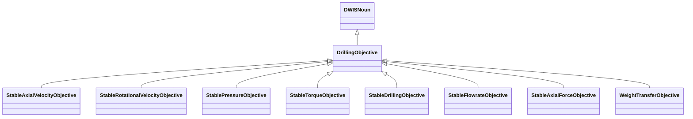
## DrillingObjective <!-- NOUN -->
- Display name: Drilling Objective
- Parent class: [DWISNoun](./DWISSemantics.md#DWISNoun)
- Description: 
This is the parent class for drilling objectives.
- Definition set: DrillingObjective
- Examples:
```dwis drillingObjective
DrillingDataPoint:drillingObjective
drillingObjective BelongsToClass DrillingObjective
```
An example semantic graph looks like as follow:
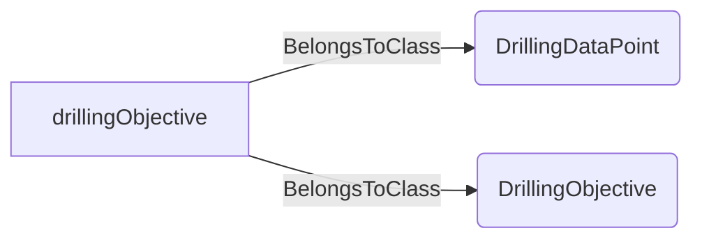
An example SparQL query looks like this:
```sparql
PREFIX rdf: <http://www.w3.org/1999/02/22-rdf-syntax-ns#>
PREFIX ddhub: <http://ddhub.no/>
PREFIX quantity: <http://ddhub.no/UnitAndQuantity>
SELECT ?drillingObjective
WHERE {
	?drillingObjective rdf:type ddhub:DrillingDataPoint .
	?drillingObjective rdf:type ddhub:DrillingObjective .
}
```
This example links a drilling data point to the DrillingObjective definition.
## StableAxialVelocityObjective <!-- NOUN -->
- Display name: Stable Axial Velocity Objective
- Parent class: [DrillingObjective](./DrillingObjective.md#DrillingObjective)
- Description: 
This Noun is used to refer to the objective of obtaining stable axial velocity.
- Definition set: DrillingObjective
- Examples:
``` dwis ROPManagementControllerInfo
DynamicDrillingSignal:ROPManagementControllerInfo
DrillingControlAdvice:ROPManagementControllerInfo_1
ROPManagementControllerInfo_1 HasDynamicValue ROPManagementControllerInfo
ROPLimit:ROPLimit_1
ROPManagementControllerInfo_1 HasControlLimit ROPLimit_1
WOBLimit:WOBLimit_1
ROPManagementControllerInfo_1 HasControlLimit WOBLimit_1
DifferentialPressureLimit:differentialPressureLimit
ROPManagementControllerInfo_1 HasControlLimit differentialPressureLimit
StableDrillingObjective:stableDrillingObjective
ROPManagementControllerInfo_1 IsRelatedToDrillingObjective stableDrillingObjective
BottomOfStringReferenceLocation:bottomOfStringLocation
StableAxialVelocityObjective:stableAxialVelocityObjective
stableAxialVelocityObjective IsPhysicallyLocatedAt bottomOfStringLocation
ROPManagementControllerInfo_1 IsRelatedToDrillingObjective stableAxialVelocityObjective
ServiceCompany:serviceCompany
ROPManagementControllerInfo_1 IsProvidedBy serviceCompany
Advisor:computationUnit
ROPManagementControllerInfo_1 IsRecommendedBy computationUnit
StableDrillingObject:stableDrillingObjective
ControllerFunction:autoDriller
autoDriller ImplementsObjective stableDrillingObjective
autoDriller ImplementsObjective stableAxialVelocityObjective
ROPManagementControllerInfo_1 IsRecommendedFor autoDriller
DWISAdviceComposer:adviceComposer
ROPManagementControllerInfo_1 IsProvidedTo adviceComposer
DWISScheduler:scheduler
ROPManagementControllerInfo_1 IsProvidedTo scheduler
```
An example semantic graph looks like as follow:
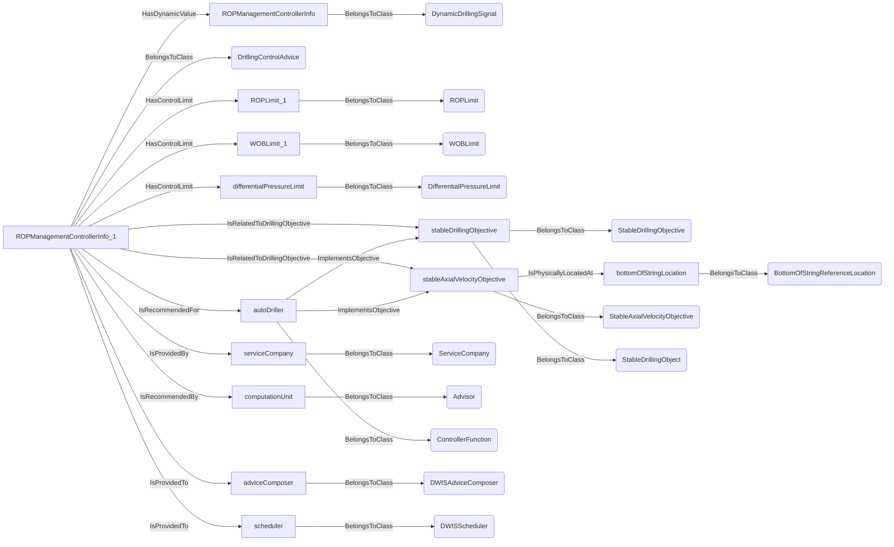
An example SparQL query looks like this:
```sparql
PREFIX rdf: <http://www.w3.org/1999/02/22-rdf-syntax-ns#>
PREFIX ddhub: <http://ddhub.no/>
PREFIX quantity: <http://ddhub.no/UnitAndQuantity>
SELECT ?ROPManagementControllerInfo
WHERE {
	?ROPManagementControllerInfo rdf:type ddhub:DynamicDrillingSignal .
	?ROPManagementControllerInfo_1 rdf:type ddhub:DrillingControlAdvice .
	?ROPManagementControllerInfo_1 ddhub:HasDynamicValue ?ROPManagementControllerInfo .
	?ROPLimit_1 rdf:type ddhub:ROPLimit .
	?ROPManagementControllerInfo_1 ddhub:HasControlLimit ?ROPLimit_1 .
	?WOBLimit_1 rdf:type ddhub:WOBLimit .
	?ROPManagementControllerInfo_1 ddhub:HasControlLimit ?WOBLimit_1 .
	?differentialPressureLimit rdf:type ddhub:DifferentialPressureLimit .
	?ROPManagementControllerInfo_1 ddhub:HasControlLimit ?differentialPressureLimit .
	?stableDrillingObjective rdf:type ddhub:StableDrillingObjective .
	?ROPManagementControllerInfo_1 ddhub:IsRelatedToDrillingObjective ?stableDrillingObjective .
	?bottomOfStringLocation rdf:type ddhub:BottomOfStringReferenceLocation .
	?stableAxialVelocityObjective rdf:type ddhub:StableAxialVelocityObjective .
	?stableAxialVelocityObjective ddhub:IsPhysicallyLocatedAt ?bottomOfStringLocation .
	?ROPManagementControllerInfo_1 ddhub:IsRelatedToDrillingObjective ?stableAxialVelocityObjective .
	?serviceCompany rdf:type ddhub:ServiceCompany .
	?ROPManagementControllerInfo_1 ddhub:IsProvidedBy ?serviceCompany .
	?computationUnit rdf:type ddhub:Advisor .
	?ROPManagementControllerInfo_1 ddhub:IsRecommendedBy ?computationUnit .
	?stableDrillingObjective rdf:type ddhub:StableDrillingObject .
	?autoDriller rdf:type ddhub:ControllerFunction .
	?autoDriller ddhub:ImplementsObjective ?stableDrillingObjective .
	?autoDriller ddhub:ImplementsObjective ?stableAxialVelocityObjective .
	?ROPManagementControllerInfo_1 ddhub:IsRecommendedFor ?autoDriller .
	?adviceComposer rdf:type ddhub:DWISAdviceComposer .
	?ROPManagementControllerInfo_1 ddhub:IsProvidedTo ?adviceComposer .
	?scheduler rdf:type ddhub:DWISScheduler .
	?ROPManagementControllerInfo_1 ddhub:IsProvidedTo ?scheduler .
}
```
## StableRotationalVelocityObjective <!-- NOUN -->
- Display name: Stable Rotational Velocity Objective
- Parent class: [DrillingObjective](./DrillingObjective.md#DrillingObjective)
- Description: 
This Noun is used to refer to the objective of obtaining stable rotational velocity.
- Definition set: DrillingObjective
- Examples:
``` dwis stickSlipMitigationControllerInfo
DynamicDrillingSignal:stickSlipMitigationControllerInfo
DrillingControlAdvice:stickSlipMitigationControllerInfo_1
stickSlipMitigationControllerInfo_1 HasDynamicValue stickSlipMitigationControllerInfo
BottomOfStringReferenceLocation:bottomOfStringLocation
StableRotationalVelocityObjective:stableRotationalVelocityObjective
stableRotationalVelocityObjective IsPhysicallyLocatedAt bottomOfStringLocation
stickSlipMitigationControllerInfo_1 IsRelatedToDrillingObjective stableRotationalVelocityObjective
ServiceCompany:serviceCompany
stickSlipMitigationControllerInfo_1 IsProvidedBy serviceCompany
Advisor:computationUnit
stickSlipMitigationControllerInfo_1 IsRecommendedBy computationUnit
ControllerFunction:stickSlipMitigation
stickSlipMitigation ImplementsObjective stableRotationalVelocityObjective
stickSlipMitigationControllerInfo_1 IsRecommendedFor stickSlipMitigation
DWISAdviceComposer:adviceComposer
stickSlipMitigationControllerInfo_1 IsProvidedTo adviceComposer
DWISScheduler:scheduler
stickSlipMitigationControllerInfo_1 IsProvidedTo scheduler
```
An example semantic graph looks like as follow:
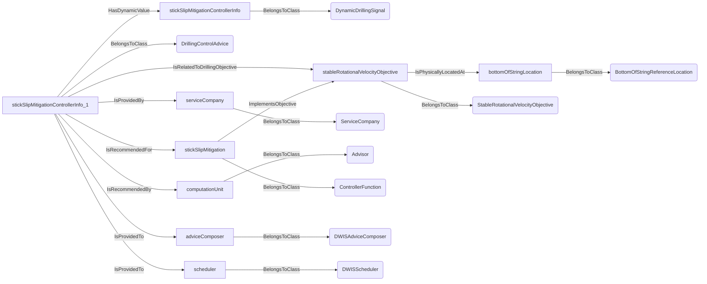
An example SparQL query looks like this:
```sparql
PREFIX rdf: <http://www.w3.org/1999/02/22-rdf-syntax-ns#>
PREFIX ddhub: <http://ddhub.no/>
PREFIX quantity: <http://ddhub.no/UnitAndQuantity>
SELECT ?stickSlipMitigationControllerInfo
WHERE {
	?stickSlipMitigationControllerInfo rdf:type ddhub:DynamicDrillingSignal .
	?stickSlipMitigationControllerInfo_1 rdf:type ddhub:DrillingControlAdvice .
	?stickSlipMitigationControllerInfo_1 ddhub:HasDynamicValue ?stickSlipMitigationControllerInfo .
	?bottomOfStringLocation rdf:type ddhub:BottomOfStringReferenceLocation .
	?stableRotationalVelocityObjective rdf:type ddhub:StableRotationalVelocityObjective .
	?stableRotationalVelocityObjective ddhub:IsPhysicallyLocatedAt ?bottomOfStringLocation .
	?stickSlipMitigationControllerInfo_1 ddhub:IsRelatedToDrillingObjective ?stableRotationalVelocityObjective .
	?serviceCompany rdf:type ddhub:ServiceCompany .
	?stickSlipMitigationControllerInfo_1 ddhub:IsProvidedBy ?serviceCompany .
	?computationUnit rdf:type ddhub:Advisor .
	?stickSlipMitigationControllerInfo_1 ddhub:IsRecommendedBy ?computationUnit .
	?stickSlipMitigation rdf:type ddhub:ControllerFunction .
	?stickSlipMitigation ddhub:ImplementsObjective ?stableRotationalVelocityObjective .
	?stickSlipMitigationControllerInfo_1 ddhub:IsRecommendedFor ?stickSlipMitigation .
	?adviceComposer rdf:type ddhub:DWISAdviceComposer .
	?stickSlipMitigationControllerInfo_1 ddhub:IsProvidedTo ?adviceComposer .
	?scheduler rdf:type ddhub:DWISScheduler .
	?stickSlipMitigationControllerInfo_1 ddhub:IsProvidedTo ?scheduler .
}
```
## StablePressureObjective <!-- NOUN -->
- Display name: Stable Pressure Objective
- Parent class: [DrillingObjective](./DrillingObjective.md#DrillingObjective)
- Description: 
This Noun is used to refer to the objective of obtaining stable pressure.
- Definition set: DrillingObjective
- Examples:
``` dwis ROPManagementControllerInfo
DynamicDrillingSignal:ROPManagementControllerInfo
DrillingControlAdvice:ROPManagementControllerInfo_1
ROPManagementControllerInfo_1 HasDynamicValue ROPManagementControllerInfo
ROPLimit:ROPLimit_1
ROPManagementControllerInfo_1 HasControlLimit ROPLimit_1
WOBLimit:WOBLimit_1
ROPManagementControllerInfo_1 HasControlLimit WOBLimit_1
DifferentialPressureLimit:differentialPressureLimit
ROPManagementControllerInfo_1 HasControlLimit differentialPressureLimit
StableDrillingObjective:stableDrillingObjective
ROPManagementControllerInfo_1 IsRelatedToDrillingObjective stableDrillingObjective
BottomOfStringReferenceLocation:bottomOfStringLocation
StablePressureObjective:stableDifferentialPressure
ROPManagementControllerInfo_1 IsRelatedToDrillingObjective stableDifferentialPressure
ServiceCompany:serviceCompany
ROPManagementControllerInfo_1 IsProvidedBy serviceCompany
Advisor:computationUnit
ROPManagementControllerInfo_1 IsRecommendedBy computationUnit
ControllerFunction:autoDriller
autoDriller ImplementsObjective stableDrillingObjective
autoDriller ImplementsObjective stableDifferentialPressure
ROPManagementControllerInfo_1 IsRecommendedFor autoDriller
DWISAdviceComposer:adviceComposer
ROPManagementControllerInfo_1 IsProvidedTo adviceComposer
DWISScheduler:scheduler
ROPManagementControllerInfo_1 IsProvidedTo scheduler
```
An example semantic graph looks like as follow:
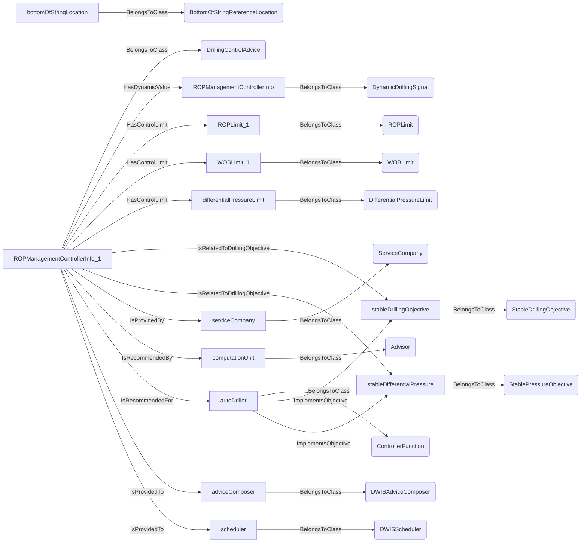
An example SparQL query looks like this:
```sparql
PREFIX rdf: <http://www.w3.org/1999/02/22-rdf-syntax-ns#>
PREFIX ddhub: <http://ddhub.no/>
PREFIX quantity: <http://ddhub.no/UnitAndQuantity>
SELECT ?ROPManagementControllerInfo
WHERE {
	?ROPManagementControllerInfo rdf:type ddhub:DynamicDrillingSignal .
	?ROPManagementControllerInfo_1 rdf:type ddhub:DrillingControlAdvice .
	?ROPManagementControllerInfo_1 ddhub:HasDynamicValue ?ROPManagementControllerInfo .
	?ROPLimit_1 rdf:type ddhub:ROPLimit .
	?ROPManagementControllerInfo_1 ddhub:HasControlLimit ?ROPLimit_1 .
	?WOBLimit_1 rdf:type ddhub:WOBLimit .
	?ROPManagementControllerInfo_1 ddhub:HasControlLimit ?WOBLimit_1 .
	?differentialPressureLimit rdf:type ddhub:DifferentialPressureLimit .
	?ROPManagementControllerInfo_1 ddhub:HasControlLimit ?differentialPressureLimit .
	?stableDrillingObjective rdf:type ddhub:StableDrillingObjective .
	?ROPManagementControllerInfo_1 ddhub:IsRelatedToDrillingObjective ?stableDrillingObjective .
	?bottomOfStringLocation rdf:type ddhub:BottomOfStringReferenceLocation .
	?stableDifferentialPressure rdf:type ddhub:StablePressureObjective .
	?ROPManagementControllerInfo_1 ddhub:IsRelatedToDrillingObjective ?stableDifferentialPressure .
	?serviceCompany rdf:type ddhub:ServiceCompany .
	?ROPManagementControllerInfo_1 ddhub:IsProvidedBy ?serviceCompany .
	?computationUnit rdf:type ddhub:Advisor .
	?ROPManagementControllerInfo_1 ddhub:IsRecommendedBy ?computationUnit .
	?autoDriller rdf:type ddhub:ControllerFunction .
	?autoDriller ddhub:ImplementsObjective ?stableDrillingObjective .
	?autoDriller ddhub:ImplementsObjective ?stableDifferentialPressure .
	?ROPManagementControllerInfo_1 ddhub:IsRecommendedFor ?autoDriller .
	?adviceComposer rdf:type ddhub:DWISAdviceComposer .
	?ROPManagementControllerInfo_1 ddhub:IsProvidedTo ?adviceComposer .
	?scheduler rdf:type ddhub:DWISScheduler .
	?ROPManagementControllerInfo_1 ddhub:IsProvidedTo ?scheduler .
}
```
## StableTorqueObjective <!-- NOUN -->
- Display name: Stable Torque Objective
- Parent class: [DrillingObjective](./DrillingObjective.md#DrillingObjective)
- Description: 
This Noun is used to refer to the objective of obtaining stable torque.
- Definition set: DrillingObjective
- Examples:
```dwis stableTorqueObjective
DrillingDataPoint:stableTorqueObjective
stableTorqueObjective BelongsToClass StableTorqueObjective
```
An example semantic graph looks like as follow:

An example SparQL query looks like this:
```sparql
PREFIX rdf: <http://www.w3.org/1999/02/22-rdf-syntax-ns#>
PREFIX ddhub: <http://ddhub.no/>
PREFIX quantity: <http://ddhub.no/UnitAndQuantity>
SELECT ?stableTorqueObjective
WHERE {
	?stableTorqueObjective rdf:type ddhub:DrillingDataPoint .
	?stableTorqueObjective rdf:type ddhub:StableTorqueObjective .
}
```
This example links a drilling data point to the StableTorqueObjective definition.
## StableDrillingObjective <!-- NOUN -->
- Display name: Stable Drilling Objective
- Parent class: [DrillingObjective](./DrillingObjective.md#DrillingObjective)
- Description: 
This Noun is used to refer to the objective of obtaining stable torque.
- Definition set: DrillingObjective
- Examples:
```dwis stableDrillingObjective
DrillingDataPoint:stableDrillingObjective
stableDrillingObjective BelongsToClass StableDrillingObjective
```
An example semantic graph looks like as follow:
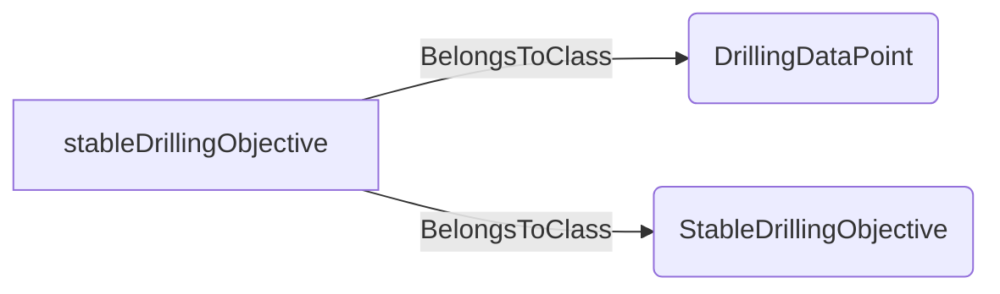
An example SparQL query looks like this:
```sparql
PREFIX rdf: <http://www.w3.org/1999/02/22-rdf-syntax-ns#>
PREFIX ddhub: <http://ddhub.no/>
PREFIX quantity: <http://ddhub.no/UnitAndQuantity>
SELECT ?stableDrillingObjective
WHERE {
	?stableDrillingObjective rdf:type ddhub:DrillingDataPoint .
	?stableDrillingObjective rdf:type ddhub:StableDrillingObjective .
}
```
This example links a drilling data point to the StableDrillingObjective definition.
## StableFlowrateObjective <!-- NOUN -->
- Display name: Stable Flowrate Objective
- Parent class: [DrillingObjective](./DrillingObjective.md#DrillingObjective)
- Description: 
This Noun is used to refer to the objective of obtaining stable torque.
- Definition set: DrillingObjective
- Examples:
```dwis stableFlowrateObjective
DrillingDataPoint:stableFlowrateObjective
stableFlowrateObjective BelongsToClass StableFlowrateObjective
```
An example semantic graph looks like as follow:
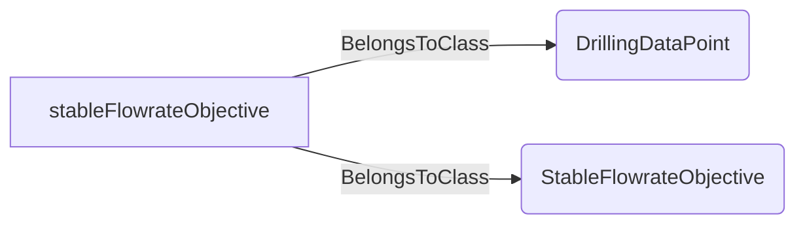
An example SparQL query looks like this:
```sparql
PREFIX rdf: <http://www.w3.org/1999/02/22-rdf-syntax-ns#>
PREFIX ddhub: <http://ddhub.no/>
PREFIX quantity: <http://ddhub.no/UnitAndQuantity>
SELECT ?stableFlowrateObjective
WHERE {
	?stableFlowrateObjective rdf:type ddhub:DrillingDataPoint .
	?stableFlowrateObjective rdf:type ddhub:StableFlowrateObjective .
}
```
This example links a drilling data point to the StableFlowrateObjective definition.
## StableAxialForceObjective <!-- NOUN -->
- Display name: Stable Axial Force Objective
- Parent class: [DrillingObjective](./DrillingObjective.md#DrillingObjective)
- Description: 
This Noun is used to refer to the objective of obtaining stable axial force.
- Definition set: DrillingObjective
- Examples:
``` dwis ROPManagementControllerInfo
DynamicDrillingSignal:ROPManagementControllerInfo
DrillingControlAdvice:ROPManagementControllerInfo_1
ROPManagementControllerInfo_1 HasDynamicValue ROPManagementControllerInfo
ROPLimit:ROPLimit_1
ROPManagementControllerInfo_1 HasControlLimit ROPLimit_1
WOBLimit:WOBLimit_1
ROPManagementControllerInfo_1 HasControlLimit WOBLimit_1
DifferentialPressureLimit:differentialPressureLimit
ROPManagementControllerInfo_1 HasControlLimit differentialPressureLimit
BottomOfStringReferenceLocation:bottomOfStringLocation
StableDrillingObjective:stableDrillingObjective
ROPManagementControllerInfo_1 IsRelatedToDrillingObjective stableDrillingObjective
StableAxialForceObjective:stableWOBObjective
stableWOBObjective IsPhysicallyLocatedAt bottomOfStringLocation
ROPManagementControllerInfo_1 IsRelatedToDrillingObjective stableWOBObjective
ServiceCompany:serviceCompany
ROPManagementControllerInfo_1 IsProvidedBy serviceCompany
Advisor:computationUnit
ROPManagementControllerInfo_1 IsRecommendedBy computationUnit
ControllerFunction:autoDriller
autoDriller ImplementsObjective stableDrillingObjective
autoDriller ImplementsObjective stableWOBObjective
ROPManagementControllerInfo_1 IsRecommendedFor autoDriller
DWISAdviceComposer:adviceComposer
ROPManagementControllerInfo_1 IsProvidedTo adviceComposer
DWISScheduler:scheduler
ROPManagementControllerInfo_1 IsProvidedTo scheduler
```
An example semantic graph looks like as follow:
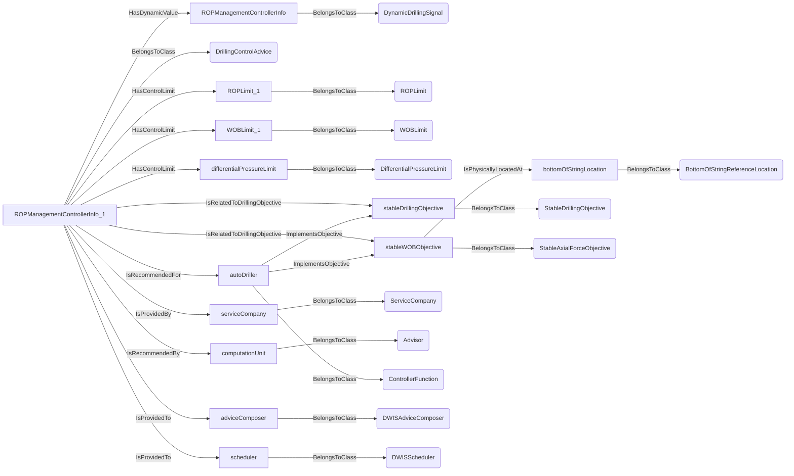
An example SparQL query looks like this:
```sparql
PREFIX rdf: <http://www.w3.org/1999/02/22-rdf-syntax-ns#>
PREFIX ddhub: <http://ddhub.no/>
PREFIX quantity: <http://ddhub.no/UnitAndQuantity>
SELECT ?ROPManagementControllerInfo
WHERE {
	?ROPManagementControllerInfo rdf:type ddhub:DynamicDrillingSignal .
	?ROPManagementControllerInfo_1 rdf:type ddhub:DrillingControlAdvice .
	?ROPManagementControllerInfo_1 ddhub:HasDynamicValue ?ROPManagementControllerInfo .
	?ROPLimit_1 rdf:type ddhub:ROPLimit .
	?ROPManagementControllerInfo_1 ddhub:HasControlLimit ?ROPLimit_1 .
	?WOBLimit_1 rdf:type ddhub:WOBLimit .
	?ROPManagementControllerInfo_1 ddhub:HasControlLimit ?WOBLimit_1 .
	?differentialPressureLimit rdf:type ddhub:DifferentialPressureLimit .
	?ROPManagementControllerInfo_1 ddhub:HasControlLimit ?differentialPressureLimit .
	?bottomOfStringLocation rdf:type ddhub:BottomOfStringReferenceLocation .
	?stableDrillingObjective rdf:type ddhub:StableDrillingObjective .
	?ROPManagementControllerInfo_1 ddhub:IsRelatedToDrillingObjective ?stableDrillingObjective .
	?stableWOBObjective rdf:type ddhub:StableAxialForceObjective .
	?stableWOBObjective ddhub:IsPhysicallyLocatedAt ?bottomOfStringLocation .
	?ROPManagementControllerInfo_1 ddhub:IsRelatedToDrillingObjective ?stableWOBObjective .
	?serviceCompany rdf:type ddhub:ServiceCompany .
	?ROPManagementControllerInfo_1 ddhub:IsProvidedBy ?serviceCompany .
	?computationUnit rdf:type ddhub:Advisor .
	?ROPManagementControllerInfo_1 ddhub:IsRecommendedBy ?computationUnit .
	?autoDriller rdf:type ddhub:ControllerFunction .
	?autoDriller ddhub:ImplementsObjective ?stableDrillingObjective .
	?autoDriller ddhub:ImplementsObjective ?stableWOBObjective .
	?ROPManagementControllerInfo_1 ddhub:IsRecommendedFor ?autoDriller .
	?adviceComposer rdf:type ddhub:DWISAdviceComposer .
	?ROPManagementControllerInfo_1 ddhub:IsProvidedTo ?adviceComposer .
	?scheduler rdf:type ddhub:DWISScheduler .
	?ROPManagementControllerInfo_1 ddhub:IsProvidedTo ?scheduler .
}
```
## WeightTransferObjective <!-- NOUN -->
- Display name: Weight Transfer Objective
- Parent class: [DrillingObjective](./DrillingObjective.md#DrillingObjective)
- Description: 
This Noun is used to refer to the objective of transferring weight to the bottom of the drill-stem.
- Definition set: DrillingObjective
- Examples:
``` dwis pipeRockingControllerInfo
DynamicDrillingSignal:pipeRockingControllerInfo
DrillingControlAdvice:pipeRockingControllerInfo_1
pipeRockingControllerInfo_1 HasDynamicValue pipeRockingControllerInfo
BottomOfStringReferenceLocation:bottomOfStringLocation
WeightTransferObjective:weightTransferObjective
weightTransferObjective IsPhysicallyLocatedAt bottomOfStringLocation
pipeRockingControllerInfo_1 IsRelatedToDrillingObjective weightTransferObjective
ServiceCompany:serviceCompany
pipeRockingControllerInfo_1 IsProvidedBy serviceCompany
Advisor:computationUnit
pipeRockingControllerInfo_1 IsRecommendedBy computationUnit
ControllerFunction:pipeRocking
pipeRocking ImplementsObjective weightTransferObjective
pipeRockingControllerInfo_1 IsRecommendedFor pipeRocking
DWISAdviceComposer:adviceComposer
pipeRockingControllerInfo_1 IsProvidedTo adviceComposer
DWISScheduler:scheduler
pipeRockingControllerInfo_1 IsProvidedTo scheduler
```
An example semantic graph looks like as follow:
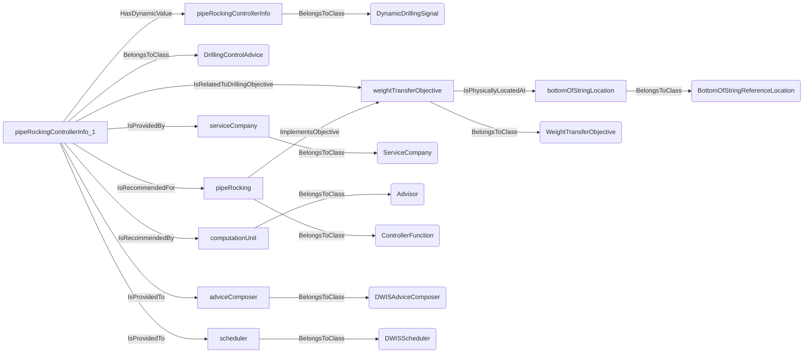
An example SparQL query looks like this:
```sparql
PREFIX rdf: <http://www.w3.org/1999/02/22-rdf-syntax-ns#>
PREFIX ddhub: <http://ddhub.no/>
PREFIX quantity: <http://ddhub.no/UnitAndQuantity>
SELECT ?pipeRockingControllerInfo
WHERE {
	?pipeRockingControllerInfo rdf:type ddhub:DynamicDrillingSignal .
	?pipeRockingControllerInfo_1 rdf:type ddhub:DrillingControlAdvice .
	?pipeRockingControllerInfo_1 ddhub:HasDynamicValue ?pipeRockingControllerInfo .
	?bottomOfStringLocation rdf:type ddhub:BottomOfStringReferenceLocation .
	?weightTransferObjective rdf:type ddhub:WeightTransferObjective .
	?weightTransferObjective ddhub:IsPhysicallyLocatedAt ?bottomOfStringLocation .
	?pipeRockingControllerInfo_1 ddhub:IsRelatedToDrillingObjective ?weightTransferObjective .
	?serviceCompany rdf:type ddhub:ServiceCompany .
	?pipeRockingControllerInfo_1 ddhub:IsProvidedBy ?serviceCompany .
	?computationUnit rdf:type ddhub:Advisor .
	?pipeRockingControllerInfo_1 ddhub:IsRecommendedBy ?computationUnit .
	?pipeRocking rdf:type ddhub:ControllerFunction .
	?pipeRocking ddhub:ImplementsObjective ?weightTransferObjective .
	?pipeRockingControllerInfo_1 ddhub:IsRecommendedFor ?pipeRocking .
	?adviceComposer rdf:type ddhub:DWISAdviceComposer .
	?pipeRockingControllerInfo_1 ddhub:IsProvidedTo ?adviceComposer .
	?scheduler rdf:type ddhub:DWISScheduler .
	?pipeRockingControllerInfo_1 ddhub:IsProvidedTo ?scheduler .
}
```
# Verbs
## Class Inheritance for Verbs
Here is a class inheritance diagram for the verbs contained in this definition set.
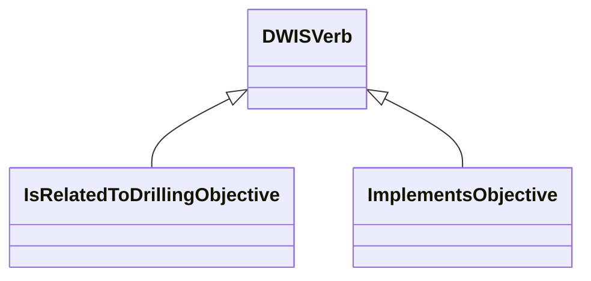
## Relations
Here is a graph representing the relations that can be made with the verbs defined in this definition set.
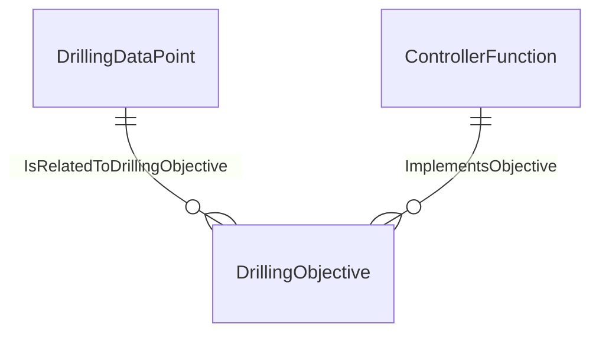
## IsRelatedToDrillingObjective <!-- VERB -->
- Display name: Is Related To Drilling Objective
- Parent verb: [DWISVerb](./DWISSemantics.md#DWISVerb)
- Subject class: [DrillingDataPoint](./DrillingDataSemantics.md#DrillingDataPoint)
- Object class: [DrillingObjective](./DrillingObjective.md#DrillingObjective)
- Definition set: DrillingObjective
- Description: 
This Verb is used to indicate that a drilling data point is related to a drilling objective.
- Examples:
``` dwis ROPManagementControllerInfo
DynamicDrillingSignal:ROPManagementControllerInfo
DrillingControlAdvice:ROPManagementControllerInfo_1
ROPManagementControllerInfo_1 HasDynamicValue ROPManagementControllerInfo
ROPLimit:ROPLimit_1
ROPManagementControllerInfo_1 HasControlLimit ROPLimit_1
WOBLimit:WOBLimit_1
ROPManagementControllerInfo_1 HasControlLimit WOBLimit_1
DifferentialPressureLimit:differentialPressureLimit
ROPManagementControllerInfo_1 HasControlLimit differentialPressureLimit
BottomOfStringReferenceLocation:bottomOfStringLocation
StableAxialVelocityObjective:stableAxialVelocityObjective
stableAxialVelocityObjective IsPhysicallyLocatedAt bottomOfStringLocation
ROPManagementControllerInfo_1 IsRelatedToDrillingObjective stableAxialVelocityObjective
StableAxialForceObjective:stableWOBObjective
stableWOBObjective IsPhysicallyLocatedAt bottomOfStringLocation
ROPManagementControllerInfo_1 IsRelatedToDrillingObjective stableWOBObjective
StablePressureObjective:stableDifferentialPressure
ROPManagementControllerInfo_1 IsRelatedToDrillingObjective stableDifferentialPressure
ServiceCompany:serviceCompany
ROPManagementControllerInfo_1 IsProvidedBy serviceCompany
Advisor:computationUnit
ROPManagementControllerInfo_1 IsRecommendedBy computationUnit
ControllerFunction:autoDriller
autoDriller ImplementsObjective stableAxialVelocityObjective
autoDriller ImplementsObjective stableWOBObjective
autoDriller ImplementsObjective stableDifferentialPressure
ROPManagementControllerInfo_1 IsRecommendedFor autoDriller
DWISAdviceComposer:adviceComposer
ROPManagementControllerInfo_1 IsProvidedTo adviceComposer
DWISScheduler:scheduler
ROPManagementControllerInfo_1 IsProvidedTo scheduler
```
An example semantic graph looks like as follow:
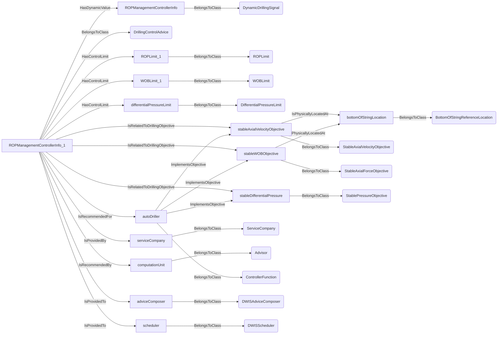
An example SparQL query looks like this:
```sparql
PREFIX rdf: <http://www.w3.org/1999/02/22-rdf-syntax-ns#>
PREFIX ddhub: <http://ddhub.no/>
PREFIX quantity: <http://ddhub.no/UnitAndQuantity>
SELECT ?ROPManagementControllerInfo
WHERE {
	?ROPManagementControllerInfo rdf:type ddhub:DynamicDrillingSignal .
	?ROPManagementControllerInfo_1 rdf:type ddhub:DrillingControlAdvice .
	?ROPManagementControllerInfo_1 ddhub:HasDynamicValue ?ROPManagementControllerInfo .
	?ROPLimit_1 rdf:type ddhub:ROPLimit .
	?ROPManagementControllerInfo_1 ddhub:HasControlLimit ?ROPLimit_1 .
	?WOBLimit_1 rdf:type ddhub:WOBLimit .
	?ROPManagementControllerInfo_1 ddhub:HasControlLimit ?WOBLimit_1 .
	?differentialPressureLimit rdf:type ddhub:DifferentialPressureLimit .
	?ROPManagementControllerInfo_1 ddhub:HasControlLimit ?differentialPressureLimit .
	?bottomOfStringLocation rdf:type ddhub:BottomOfStringReferenceLocation .
	?stableAxialVelocityObjective rdf:type ddhub:StableAxialVelocityObjective .
	?stableAxialVelocityObjective ddhub:IsPhysicallyLocatedAt ?bottomOfStringLocation .
	?ROPManagementControllerInfo_1 ddhub:IsRelatedToDrillingObjective ?stableAxialVelocityObjective .
	?stableWOBObjective rdf:type ddhub:StableAxialForceObjective .
	?stableWOBObjective ddhub:IsPhysicallyLocatedAt ?bottomOfStringLocation .
	?ROPManagementControllerInfo_1 ddhub:IsRelatedToDrillingObjective ?stableWOBObjective .
	?stableDifferentialPressure rdf:type ddhub:StablePressureObjective .
	?ROPManagementControllerInfo_1 ddhub:IsRelatedToDrillingObjective ?stableDifferentialPressure .
	?serviceCompany rdf:type ddhub:ServiceCompany .
	?ROPManagementControllerInfo_1 ddhub:IsProvidedBy ?serviceCompany .
	?computationUnit rdf:type ddhub:Advisor .
	?ROPManagementControllerInfo_1 ddhub:IsRecommendedBy ?computationUnit .
	?autoDriller rdf:type ddhub:ControllerFunction .
	?autoDriller ddhub:ImplementsObjective ?stableAxialVelocityObjective .
	?autoDriller ddhub:ImplementsObjective ?stableWOBObjective .
	?autoDriller ddhub:ImplementsObjective ?stableDifferentialPressure .
	?ROPManagementControllerInfo_1 ddhub:IsRecommendedFor ?autoDriller .
	?adviceComposer rdf:type ddhub:DWISAdviceComposer .
	?ROPManagementControllerInfo_1 ddhub:IsProvidedTo ?adviceComposer .
	?scheduler rdf:type ddhub:DWISScheduler .
	?ROPManagementControllerInfo_1 ddhub:IsProvidedTo ?scheduler .
}
```
## ImplementsObjective <!-- VERB -->
- Display name: Implements Objective
- Parent verb: [DWISVerb](./DWISSemantics.md#DWISVerb)
- Subject class: [ControllerFunction](./ADCS.md#ControllerFunction)
- Object class: [DrillingObjective](./DrillingObjective.md#DrillingObjective)
- Definition set: DrillingObjective
- Description: 
This Verb is used to indicate that a control function implements a drilling objective.
- Examples:
``` dwis ROPManagementControllerInfo
DynamicDrillingSignal:ROPManagementControllerInfo
DrillingControlAdvice:ROPManagementControllerInfo_1
ROPManagementControllerInfo_1 HasDynamicValue ROPManagementControllerInfo
ROPLimit:ROPLimit_1
ROPManagementControllerInfo_1 HasControlLimit ROPLimit_1
WOBLimit:WOBLimit_1
ROPManagementControllerInfo_1 HasControlLimit WOBLimit_1
DifferentialPressureLimit:differentialPressureLimit
ROPManagementControllerInfo_1 HasControlLimit differentialPressureLimit
BottomOfStringReferenceLocation:bottomOfStringLocation
StableAxialVelocityObjective:stableAxialVelocityObjective
stableAxialVelocityObjective IsPhysicallyLocatedAt bottomOfStringLocation
ROPManagementControllerInfo_1 IsRelatedToDrillingObjective stableAxialVelocityObjective
StableAxialForceObjective:stableWOBObjective
stableWOBObjective IsPhysicallyLocatedAt bottomOfStringLocation
ROPManagementControllerInfo_1 IsRelatedToDrillingObjective stableWOBObjective
StablePressureObjective:stableDifferentialPressure
ROPManagementControllerInfo_1 IsRelatedToDrillingObjective stableDifferentialPressure
ServiceCompany:serviceCompany
ROPManagementControllerInfo_1 IsProvidedBy serviceCompany
Advisor:computationUnit
ROPManagementControllerInfo_1 IsRecommendedBy computationUnit
ControllerFunction:autoDriller
autoDriller ImplementsObjective stableAxialVelocityObjective
autoDriller ImplementsObjective stableWOBObjective
autoDriller ImplementsObjective stableDifferentialPressure
ROPManagementControllerInfo_1 IsRecommendedFor autoDriller
DWISAdviceComposer:adviceComposer
ROPManagementControllerInfo_1 IsProvidedTo adviceComposer
DWISScheduler:scheduler
ROPManagementControllerInfo_1 IsProvidedTo scheduler
```
An example semantic graph looks like as follow:

An example SparQL query looks like this:
```sparql
PREFIX rdf: <http://www.w3.org/1999/02/22-rdf-syntax-ns#>
PREFIX ddhub: <http://ddhub.no/>
PREFIX quantity: <http://ddhub.no/UnitAndQuantity>
SELECT ?ROPManagementControllerInfo
WHERE {
	?ROPManagementControllerInfo rdf:type ddhub:DynamicDrillingSignal .
	?ROPManagementControllerInfo_1 rdf:type ddhub:DrillingControlAdvice .
	?ROPManagementControllerInfo_1 ddhub:HasDynamicValue ?ROPManagementControllerInfo .
	?ROPLimit_1 rdf:type ddhub:ROPLimit .
	?ROPManagementControllerInfo_1 ddhub:HasControlLimit ?ROPLimit_1 .
	?WOBLimit_1 rdf:type ddhub:WOBLimit .
	?ROPManagementControllerInfo_1 ddhub:HasControlLimit ?WOBLimit_1 .
	?differentialPressureLimit rdf:type ddhub:DifferentialPressureLimit .
	?ROPManagementControllerInfo_1 ddhub:HasControlLimit ?differentialPressureLimit .
	?bottomOfStringLocation rdf:type ddhub:BottomOfStringReferenceLocation .
	?stableAxialVelocityObjective rdf:type ddhub:StableAxialVelocityObjective .
	?stableAxialVelocityObjective ddhub:IsPhysicallyLocatedAt ?bottomOfStringLocation .
	?ROPManagementControllerInfo_1 ddhub:IsRelatedToDrillingObjective ?stableAxialVelocityObjective .
	?stableWOBObjective rdf:type ddhub:StableAxialForceObjective .
	?stableWOBObjective ddhub:IsPhysicallyLocatedAt ?bottomOfStringLocation .
	?ROPManagementControllerInfo_1 ddhub:IsRelatedToDrillingObjective ?stableWOBObjective .
	?stableDifferentialPressure rdf:type ddhub:StablePressureObjective .
	?ROPManagementControllerInfo_1 ddhub:IsRelatedToDrillingObjective ?stableDifferentialPressure .
	?serviceCompany rdf:type ddhub:ServiceCompany .
	?ROPManagementControllerInfo_1 ddhub:IsProvidedBy ?serviceCompany .
	?computationUnit rdf:type ddhub:Advisor .
	?ROPManagementControllerInfo_1 ddhub:IsRecommendedBy ?computationUnit .
	?autoDriller rdf:type ddhub:ControllerFunction .
	?autoDriller ddhub:ImplementsObjective ?stableAxialVelocityObjective .
	?autoDriller ddhub:ImplementsObjective ?stableWOBObjective .
	?autoDriller ddhub:ImplementsObjective ?stableDifferentialPressure .
	?ROPManagementControllerInfo_1 ddhub:IsRecommendedFor ?autoDriller .
	?adviceComposer rdf:type ddhub:DWISAdviceComposer .
	?ROPManagementControllerInfo_1 ddhub:IsProvidedTo ?adviceComposer .
	?scheduler rdf:type ddhub:DWISScheduler .
	?ROPManagementControllerInfo_1 ddhub:IsProvidedTo ?scheduler .
}
```
