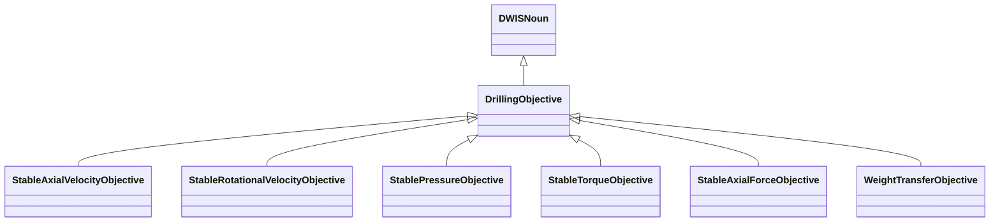

# DrillingObjective<!-- DEFINITION SET HEADER -->
- Description: 
this category refers mostly to the description of drilling objectives.

# Nouns
## Class Inheritance for Nouns
Here is a class inheritance diagram for the nouns contained in this definition set.

## DrillingObjective <!-- NOUN -->
- Display name: Drilling Objective
- Parent class: [DWISNoun](./DWISSemantics.md#DWISNoun)
- Description: 
This is the parent class for drilling objectives.
- Definition set: DrillingObjective
## StableAxialVelocityObjective <!-- NOUN -->
- Display name: Stable Axial Velocity Objective
- Parent class: [DrillingObjective](./DrillingObjective.md#DrillingObjective)
- Description: 
This Noun is used to refer to the objective of obtaining stable axial velocity.
- Definition set: DrillingObjective
- Examples:
``` dwis ROPManagementControllerInfo
DynamicDrillingSignal: ROPManagementControllerInfo
DrillingControlAdvice: ROPManagementControllerInfo_1
ROPManagementControllerInfo_1 HasDynamicValue ROPManagementControllerInfo
ROPLimit: ROPLimit
ROPManagementControllerInfo_1 HasControlLimit ROPLimit
WOBLimit: WOBLimit
ROPManagementControllerInfo_1 HasControlLimit WOBLimit
DifferentialPressureLimit: differentialPressureLimit
ROPManagementControllerInfo_1 HasControlLimit differentialPressureLimit
StableAxialVelocityObjective: stableAxialVelocityObjective
ROPManagementControllerInfo_1 IsRelatedToDrillingObjective stableAxialVelocityObjective
StableAxialForceObjective: stableWOBObjective
ROPManagementControllerInfo_1 IsRelatedToDrillingObjective stableWOBObjective
StablePressureObjective: stableDifferentialPressure
ROPManagementControllerInfo_1 IsRelatedToDrillingObjective stableDifferentialPressure
ServiceCompany: serviceCompany
ROPManagementControllerInfo_1 IsProvidedBy serviceCompany
Advisor: computationUnit
ROPManagementControllerInfo_1 IsRecommendedBy computationUnit
ControllerFunction: autoDriller
autoDriller ImplementsObjective stableAxialVelocityObjective
autoDriller ImplementsObjective stableWOBObjective
autoDriller ImplementsObjective stableDifferentialPressure
ROPManagementControllerInfo_1 IsRecommendedFor autoDriller
DWISAdviceComposer: adviceComposer
ROPManagementControllerInfo_1 IsProvidedTo adviceComposer
DWISScheduler: scheduler
ROPManagementControllerInfo_1 IsProvidedTo scheduler
```
An example semantic graph looks like as follow:

An example SparQL query looks like this:
```sparql
PREFIX rdf: <http://www.w3.org/1999/02/22-rdf-syntax-ns#>
PREFIX ddhub: <http://ddhub.no/>
PREFIX quantity: <http://ddhub.no/UnitAndQuantity>
SELECT ?ROPManagementControllerInfo
WHERE {
	?ROPManagementControllerInfo_1 ddhub:HasDynamicValue ?ROPManagementControllerInfo .
	?ROPManagementControllerInfo_1 ddhub:HasControlLimit ?ROPLimit .
	?ROPManagementControllerInfo_1 ddhub:HasControlLimit ?WOBLimit .
	?ROPManagementControllerInfo_1 ddhub:HasControlLimit ?differentialPressureLimit .
	?ROPManagementControllerInfo_1 ddhub:IsRelatedToDrillingObjective ?stableAxialVelocityObjective .
	?ROPManagementControllerInfo_1 ddhub:IsRelatedToDrillingObjective ?stableWOBObjective .
	?ROPManagementControllerInfo_1 ddhub:IsRelatedToDrillingObjective ?stableDifferentialPressure .
	?ROPManagementControllerInfo_1 ddhub:IsProvidedBy ?serviceCompany .
	?ROPManagementControllerInfo_1 ddhub:IsRecommendedBy ?computationUnit .
	?autoDriller ddhub:ImplementsObjective ?stableAxialVelocityObjective .
	?autoDriller ddhub:ImplementsObjective ?stableWOBObjective .
	?autoDriller ddhub:ImplementsObjective ?stableDifferentialPressure .
	?ROPManagementControllerInfo_1 ddhub:IsRecommendedFor ?autoDriller .
	?ROPManagementControllerInfo_1 ddhub:IsProvidedTo ?adviceComposer .
	?ROPManagementControllerInfo_1 ddhub:IsProvidedTo ?scheduler .
}
```
## StableRotationalVelocityObjective <!-- NOUN -->
- Display name: Stable Rotational Velocity Objective
- Parent class: [DrillingObjective](./DrillingObjective.md#DrillingObjective)
- Description: 
This Noun is used to refer to the objective of obtaining stable rotational velocity.
- Definition set: DrillingObjective
- Examples:
``` dwis stickSlipMitigationControllerInfo
DynamicDrillingSignal: stickSlipMitigationControllerInfo
DrillingControlAdvice: stickSlipMitigationControllerInfo_1
stickSlipMitigationControllerInfo_1 HasDynamicValue stickSlipMitigationControllerInfo
StableRotationalVelocityObjective: stableRotationalVelocityObjective
stickSlipMitigationControllerInfo_1 IsRelatedToDrillingObjective stableRotationalVelocityObjective
ServiceCompany: serviceCompany
stickSlipMitigationControllerInfo_1 IsProvidedBy serviceCompany
Advisor: computationUnit
stickSlipMitigationControllerInfo_1 IsRecommendedBy computationUnit
ControllerFunction: stickSlipMitigation
stickSlipMitigation ImplementsObjective stableRotationalVelocityObjective
stickSlipMitigationControllerInfo_1 IsRecommendedFor stickSlipMitigation
DWISAdviceComposer: adviceComposer
stickSlipMitigationControllerInfo_1 IsProvidedTo adviceComposer
DWISScheduler: scheduler
stickSlipMitigationControllerInfo_1 IsProvidedTo scheduler
```
An example semantic graph looks like as follow:

An example SparQL query looks like this:
```sparql
PREFIX rdf: <http://www.w3.org/1999/02/22-rdf-syntax-ns#>
PREFIX ddhub: <http://ddhub.no/>
PREFIX quantity: <http://ddhub.no/UnitAndQuantity>
SELECT ?stickSlipMitigationControllerInfo
WHERE {
	?stickSlipMitigationControllerInfo_1 ddhub:HasDynamicValue ?stickSlipMitigationControllerInfo .
	?stickSlipMitigationControllerInfo_1 ddhub:IsRelatedToDrillingObjective ?stableRotationalVelocityObjective .
	?stickSlipMitigationControllerInfo_1 ddhub:IsProvidedBy ?serviceCompany .
	?stickSlipMitigationControllerInfo_1 ddhub:IsRecommendedBy ?computationUnit .
	?stickSlipMitigation ddhub:ImplementsObjective ?stableRotationalVelocityObjective .
	?stickSlipMitigationControllerInfo_1 ddhub:IsRecommendedFor ?stickSlipMitigation .
	?stickSlipMitigationControllerInfo_1 ddhub:IsProvidedTo ?adviceComposer .
	?stickSlipMitigationControllerInfo_1 ddhub:IsProvidedTo ?scheduler .
}
```
## StablePressureObjective <!-- NOUN -->
- Display name: Stable Pressure Objective
- Parent class: [DrillingObjective](./DrillingObjective.md#DrillingObjective)
- Description: 
This Noun is used to refer to the objective of obtaining stable pressure.
- Definition set: DrillingObjective
- Examples:
``` dwis ROPManagementControllerInfo
DynamicDrillingSignal: ROPManagementControllerInfo
DrillingControlAdvice: ROPManagementControllerInfo_1
ROPManagementControllerInfo_1 HasDynamicValue ROPManagementControllerInfo
ROPLimit: ROPLimit
ROPManagementControllerInfo_1 HasControlLimit ROPLimit
WOBLimit: WOBLimit
ROPManagementControllerInfo_1 HasControlLimit WOBLimit
DifferentialPressureLimit: differentialPressureLimit
ROPManagementControllerInfo_1 HasControlLimit differentialPressureLimit
StableAxialVelocityObjective: stableAxialVelocityObjective
ROPManagementControllerInfo_1 IsRelatedToDrillingObjective stableAxialVelocityObjective
StableAxialForceObjective: stableWOBObjective
ROPManagementControllerInfo_1 IsRelatedToDrillingObjective stableWOBObjective
StablePressureObjective: stableDifferentialPressure
ROPManagementControllerInfo_1 IsRelatedToDrillingObjective stableDifferentialPressure
ServiceCompany: serviceCompany
ROPManagementControllerInfo_1 IsProvidedBy serviceCompany
Advisor: computationUnit
ROPManagementControllerInfo_1 IsRecommendedBy computationUnit
ControllerFunction: autoDriller
autoDriller ImplementsObjective stableAxialVelocityObjective
autoDriller ImplementsObjective stableWOBObjective
autoDriller ImplementsObjective stableDifferentialPressure
ROPManagementControllerInfo_1 IsRecommendedFor autoDriller
DWISAdviceComposer: adviceComposer
ROPManagementControllerInfo_1 IsProvidedTo adviceComposer
DWISScheduler: scheduler
ROPManagementControllerInfo_1 IsProvidedTo scheduler
```
An example semantic graph looks like as follow:

An example SparQL query looks like this:
```sparql
PREFIX rdf: <http://www.w3.org/1999/02/22-rdf-syntax-ns#>
PREFIX ddhub: <http://ddhub.no/>
PREFIX quantity: <http://ddhub.no/UnitAndQuantity>
SELECT ?ROPManagementControllerInfo
WHERE {
	?ROPManagementControllerInfo_1 ddhub:HasDynamicValue ?ROPManagementControllerInfo .
	?ROPManagementControllerInfo_1 ddhub:HasControlLimit ?ROPLimit .
	?ROPManagementControllerInfo_1 ddhub:HasControlLimit ?WOBLimit .
	?ROPManagementControllerInfo_1 ddhub:HasControlLimit ?differentialPressureLimit .
	?ROPManagementControllerInfo_1 ddhub:IsRelatedToDrillingObjective ?stableAxialVelocityObjective .
	?ROPManagementControllerInfo_1 ddhub:IsRelatedToDrillingObjective ?stableWOBObjective .
	?ROPManagementControllerInfo_1 ddhub:IsRelatedToDrillingObjective ?stableDifferentialPressure .
	?ROPManagementControllerInfo_1 ddhub:IsProvidedBy ?serviceCompany .
	?ROPManagementControllerInfo_1 ddhub:IsRecommendedBy ?computationUnit .
	?autoDriller ddhub:ImplementsObjective ?stableAxialVelocityObjective .
	?autoDriller ddhub:ImplementsObjective ?stableWOBObjective .
	?autoDriller ddhub:ImplementsObjective ?stableDifferentialPressure .
	?ROPManagementControllerInfo_1 ddhub:IsRecommendedFor ?autoDriller .
	?ROPManagementControllerInfo_1 ddhub:IsProvidedTo ?adviceComposer .
	?ROPManagementControllerInfo_1 ddhub:IsProvidedTo ?scheduler .
}
```
## StableTorqueObjective <!-- NOUN -->
- Display name: Stable Torque Objective
- Parent class: [DrillingObjective](./DrillingObjective.md#DrillingObjective)
- Description: 
This Noun is used to refer to the objective of obtaining stable torque.
- Definition set: DrillingObjective
## StableAxialForceObjective <!-- NOUN -->
- Display name: Stable Axial Force Objective
- Parent class: [DrillingObjective](./DrillingObjective.md#DrillingObjective)
- Description: 
This Noun is used to refer to the objective of obtaining stable axial force.
- Definition set: DrillingObjective
- Examples:
``` dwis ROPManagementControllerInfo
DynamicDrillingSignal: ROPManagementControllerInfo
DrillingControlAdvice: ROPManagementControllerInfo_1
ROPManagementControllerInfo_1 HasDynamicValue ROPManagementControllerInfo
ROPLimit: ROPLimit
ROPManagementControllerInfo_1 HasControlLimit ROPLimit
WOBLimit: WOBLimit
ROPManagementControllerInfo_1 HasControlLimit WOBLimit
DifferentialPressureLimit: differentialPressureLimit
ROPManagementControllerInfo_1 HasControlLimit differentialPressureLimit
StableAxialVelocityObjective: stableAxialVelocityObjective
ROPManagementControllerInfo_1 IsRelatedToDrillingObjective stableAxialVelocityObjective
StableAxialForceObjective: stableWOBObjective
ROPManagementControllerInfo_1 IsRelatedToDrillingObjective stableWOBObjective
StablePressureObjective: stableDifferentialPressure
ROPManagementControllerInfo_1 IsRelatedToDrillingObjective stableDifferentialPressure
ServiceCompany: serviceCompany
ROPManagementControllerInfo_1 IsProvidedBy serviceCompany
Advisor: computationUnit
ROPManagementControllerInfo_1 IsRecommendedBy computationUnit
ControllerFunction: autoDriller
autoDriller ImplementsObjective stableAxialVelocityObjective
autoDriller ImplementsObjective stableWOBObjective
autoDriller ImplementsObjective stableDifferentialPressure
ROPManagementControllerInfo_1 IsRecommendedFor autoDriller
DWISAdviceComposer: adviceComposer
ROPManagementControllerInfo_1 IsProvidedTo adviceComposer
DWISScheduler: scheduler
ROPManagementControllerInfo_1 IsProvidedTo scheduler
```
An example semantic graph looks like as follow:

An example SparQL query looks like this:
```sparql
PREFIX rdf: <http://www.w3.org/1999/02/22-rdf-syntax-ns#>
PREFIX ddhub: <http://ddhub.no/>
PREFIX quantity: <http://ddhub.no/UnitAndQuantity>
SELECT ?ROPManagementControllerInfo
WHERE {
	?ROPManagementControllerInfo_1 ddhub:HasDynamicValue ?ROPManagementControllerInfo .
	?ROPManagementControllerInfo_1 ddhub:HasControlLimit ?ROPLimit .
	?ROPManagementControllerInfo_1 ddhub:HasControlLimit ?WOBLimit .
	?ROPManagementControllerInfo_1 ddhub:HasControlLimit ?differentialPressureLimit .
	?ROPManagementControllerInfo_1 ddhub:IsRelatedToDrillingObjective ?stableAxialVelocityObjective .
	?ROPManagementControllerInfo_1 ddhub:IsRelatedToDrillingObjective ?stableWOBObjective .
	?ROPManagementControllerInfo_1 ddhub:IsRelatedToDrillingObjective ?stableDifferentialPressure .
	?ROPManagementControllerInfo_1 ddhub:IsProvidedBy ?serviceCompany .
	?ROPManagementControllerInfo_1 ddhub:IsRecommendedBy ?computationUnit .
	?autoDriller ddhub:ImplementsObjective ?stableAxialVelocityObjective .
	?autoDriller ddhub:ImplementsObjective ?stableWOBObjective .
	?autoDriller ddhub:ImplementsObjective ?stableDifferentialPressure .
	?ROPManagementControllerInfo_1 ddhub:IsRecommendedFor ?autoDriller .
	?ROPManagementControllerInfo_1 ddhub:IsProvidedTo ?adviceComposer .
	?ROPManagementControllerInfo_1 ddhub:IsProvidedTo ?scheduler .
}
```
## WeightTransferObjective <!-- NOUN -->
- Display name: Weight Transfer Objective
- Parent class: [DrillingObjective](./DrillingObjective.md#DrillingObjective)
- Description: 
This Noun is used to refer to the objective of transferring weight to the bottom of the drill-stem.
- Definition set: DrillingObjective
- Examples:
``` dwis pipeRockingControllerInfo
DynamicDrillingSignal: pipeRockingControllerInfo
DrillingControlAdvice: pipeRockingControllerInfo_1
pipeRockingControllerInfo_1 HasDynamicValue pipeRockingControllerInfo
WeightTransferObjective: weightTransferObjective
pipeRockingControllerInfo_1 IsRelatedToDrillingObjective weightTransferObjective
ServiceCompany: serviceCompany
pipeRockingControllerInfo_1 IsProvidedBy serviceCompany
Advisor: computationUnit
pipeRockingControllerInfo_1 IsRecommendedBy computationUnit
ControllerFunction: pipeRocking
pipeRocking ImplementsObjective weightTransferObjective
pipeRockingControllerInfo_1 IsRecommendedFor pipeRocking
DWISAdviceComposer: adviceComposer
pipeRockingControllerInfo_1 IsProvidedTo adviceComposer
DWISScheduler: scheduler
pipeRockingControllerInfo_1 IsProvidedTo scheduler
```
An example semantic graph looks like as follow:

An example SparQL query looks like this:
```sparql
PREFIX rdf: <http://www.w3.org/1999/02/22-rdf-syntax-ns#>
PREFIX ddhub: <http://ddhub.no/>
PREFIX quantity: <http://ddhub.no/UnitAndQuantity>
SELECT ?pipeRockingControllerInfo
WHERE {
	?pipeRockingControllerInfo_1 ddhub:HasDynamicValue ?pipeRockingControllerInfo .
	?pipeRockingControllerInfo_1 ddhub:IsRelatedToDrillingObjective ?weightTransferObjective .
	?pipeRockingControllerInfo_1 ddhub:IsProvidedBy ?serviceCompany .
	?pipeRockingControllerInfo_1 ddhub:IsRecommendedBy ?computationUnit .
	?pipeRocking ddhub:ImplementsObjective ?weightTransferObjective .
	?pipeRockingControllerInfo_1 ddhub:IsRecommendedFor ?pipeRocking .
	?pipeRockingControllerInfo_1 ddhub:IsProvidedTo ?adviceComposer .
	?pipeRockingControllerInfo_1 ddhub:IsProvidedTo ?scheduler .
}
```
# Verbs
## Class Inheritance for Verbs
Here is a class inheritance diagram for the verbs contained in this definition set.

## Relations
Here is a graph representing the relations that can be made with the verbs defined in this definition set.

## IsRelatedToDrillingObjective <!-- VERB -->
- Display name: Is Related To Drilling Objective
- Parent verb: [DWISVerb](./DWISSemantics.md#DWISVerb)
- Subject class: [DrillingDataPoint](./DrillingDataSemantics.md#DrillingDataPoint)
- Object class: [DrillingObjective](./DrillingObjective.md#DrillingObjective)
- Definition set: DrillingObjective
- Description: 
This Verb is used to indicate that a drilling data point is related to a drilling objective.
## ImplementsObjective <!-- VERB -->
- Display name: Implements Objective
- Parent verb: [DWISVerb](./DWISSemantics.md#DWISVerb)
- Subject class: [ControlFunction](./.md#ControlFunction)
- Object class: [DrillingObjective](./DrillingObjective.md#DrillingObjective)
- Definition set: DrillingObjective
- Description: 
This Verb is used to indicate that a control function implements a drilling objective.
