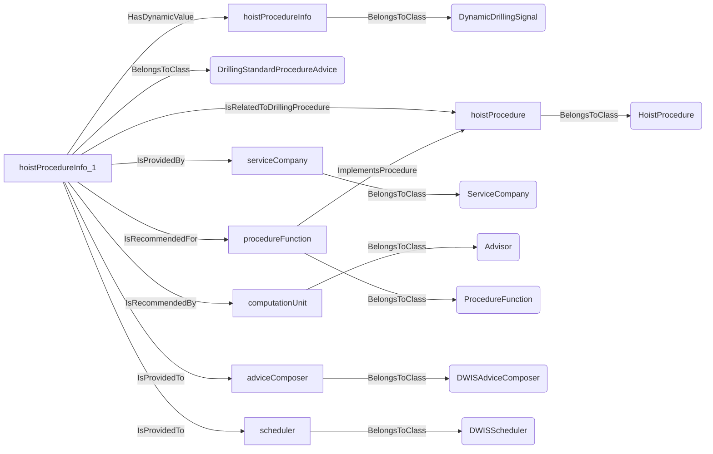
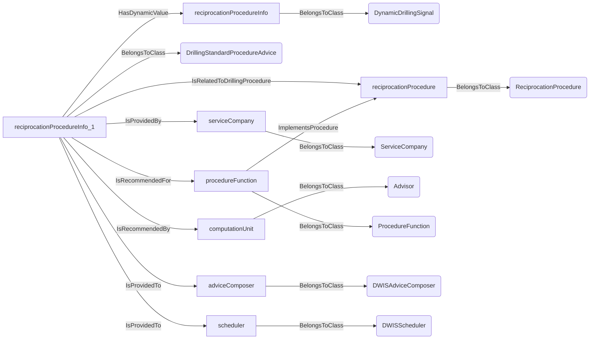
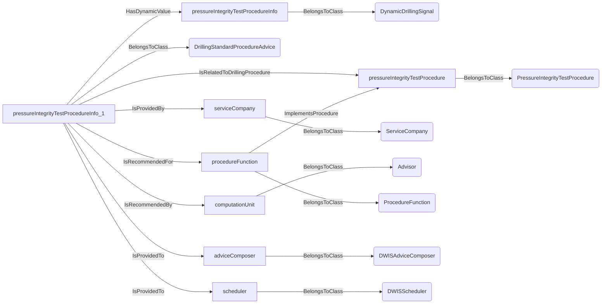
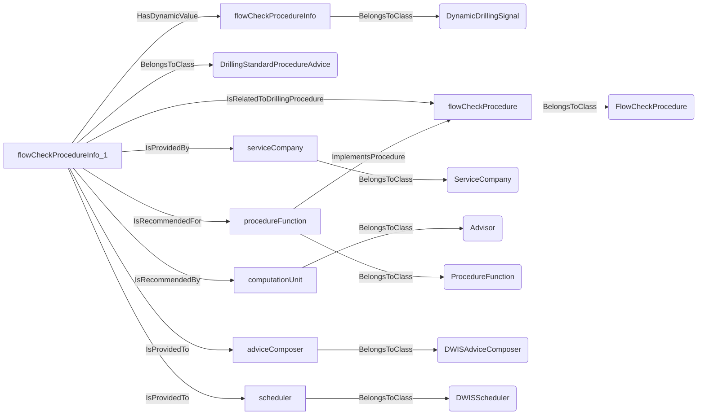
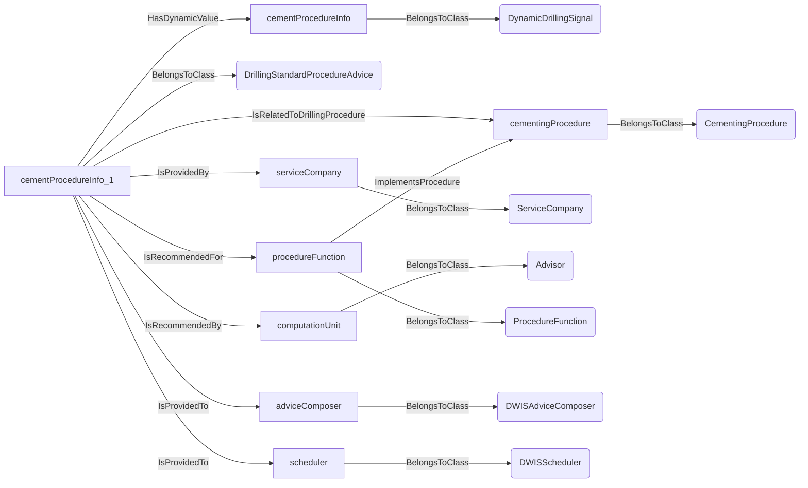
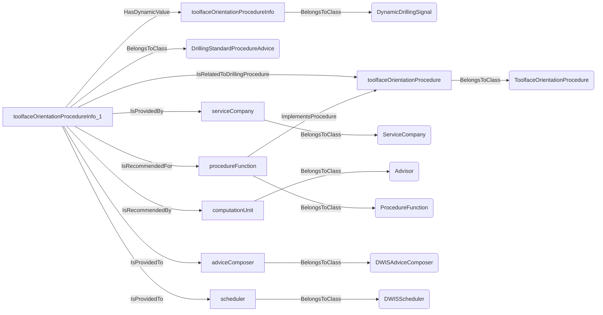
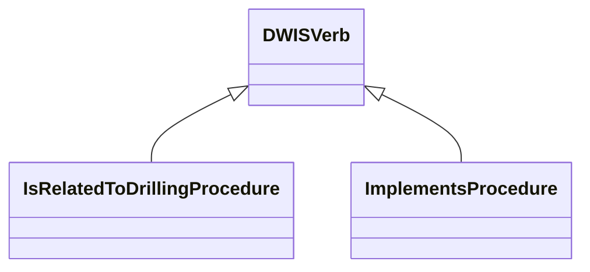
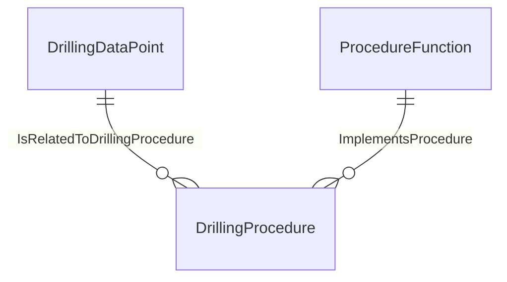

# DrillingProcedure<!-- DEFINITION SET HEADER -->
- Description: 
this category refers mostly to the description of drilling procedures.

# Nouns
## Class Inheritance for Nouns
Here is a class inheritance diagram for the nouns contained in this definition set.

## DrillingProcedure <!-- NOUN -->
- Display name: Drilling Procedure
- Parent class: [DWISNoun](./DWISSemantics.md#DWISNoun)
- Description: 
This is the parent class for drilling procedures.
- Definition set: DrillingProcedure
## CirculationStartupProcedure <!-- NOUN -->
- Display name: Circulation Startup Procedure
- Parent class: [DrillingProcedure](./DrillingProcedure.md#DrillingProcedure)
- Description: 
The circulation stop procedure defines how to stop the mud pumps in a way that limit potential bull-heading effects
that could result in undesired downhole pressure conditions with regards to the geo-pressure window.
- Definition set: DrillingProcedure
- Examples:
``` dwis circulationStartupProcedureInfo
DynamicDrillingSignal:circulationStartupProcedureInfo
DrillingStandardProcedureAdvice:circulationStartupProcedureInfo_1
circulationStartupProcedureInfo_1 HasDynamicValue circulationStartupProcedureInfo
CirculationStartupProcedure:circulationStartupProcedure
circulationStartupProcedureInfo_1 IsRelatedToDrillingProcedure circulationStartupProcedure
ServiceCompany:serviceCompany
circulationStartupProcedureInfo_1 IsProvidedBy serviceCompany
Advisor:computationUnit
circulationStartupProcedureInfo_1 IsRecommendedBy computationUnit
ProcedureFunction:procedureFunction
procedureFunction ImplementsProcedure circulationStartupProcedure
circulationStartupProcedureInfo_1 IsRecommendedFor procedureFunction
DWISAdviceComposer:adviceComposer
circulationStartupProcedureInfo_1 IsProvidedTo adviceComposer
DWISScheduler:scheduler
circulationStartupProcedureInfo_1 IsProvidedTo scheduler
```
An example semantic graph looks like as follow:

An example SparQL query looks like this:
```sparql
PREFIX rdf: <http://www.w3.org/1999/02/22-rdf-syntax-ns#>
PREFIX ddhub: <http://ddhub.no/>
PREFIX quantity: <http://ddhub.no/UnitAndQuantity>
SELECT ?circulationStartupProcedureInfo
WHERE {
	?circulationStartupProcedureInfo rdf:type ddhub:DynamicDrillingSignal .
	?circulationStartupProcedureInfo_1 rdf:type ddhub:DrillingStandardProcedureAdvice .
	?circulationStartupProcedureInfo_1 ddhub:HasDynamicValue ?circulationStartupProcedureInfo .
	?circulationStartupProcedure rdf:type ddhub:CirculationStartupProcedure .
	?circulationStartupProcedureInfo_1 ddhub:IsRelatedToDrillingProcedure ?circulationStartupProcedure .
	?serviceCompany rdf:type ddhub:ServiceCompany .
	?circulationStartupProcedureInfo_1 ddhub:IsProvidedBy ?serviceCompany .
	?computationUnit rdf:type ddhub:Advisor .
	?circulationStartupProcedureInfo_1 ddhub:IsRecommendedBy ?computationUnit .
	?procedureFunction rdf:type ddhub:ProcedureFunction .
	?procedureFunction ddhub:ImplementsProcedure ?circulationStartupProcedure .
	?circulationStartupProcedureInfo_1 ddhub:IsRecommendedFor ?procedureFunction .
	?adviceComposer rdf:type ddhub:DWISAdviceComposer .
	?circulationStartupProcedureInfo_1 ddhub:IsProvidedTo ?adviceComposer .
	?scheduler rdf:type ddhub:DWISScheduler .
	?circulationStartupProcedureInfo_1 ddhub:IsProvidedTo ?scheduler .
}
```
## CirculationStopProcedure <!-- NOUN -->
- Display name: Circulation Stop Procedure
- Parent class: [DrillingProcedure](./DrillingProcedure.md#DrillingProcedure)
- Description: 
The rotation startup procedure controls the steps to start the rotation of the drill-stem to reach a target rotational
speed while attempting to avoid having too large torsional oscillations.
- Definition set: DrillingProcedure
- Examples:
``` dwis circulationStopProcedureInfo
DynamicDrillingSignal:circulationStopProcedureInfo
DrillingStandardProcedureAdvice:circulationStopProcedureInfo_1
circulationStopProcedureInfo_1 HasDynamicValue circulationStopProcedureInfo
CirculationStopProcedure:circulationStopProcedure
circulationStopProcedureInfo_1 IsRelatedToDrillingProcedure circulationStopProcedure
ServiceCompany:serviceCompany
circulationStopProcedureInfo_1 IsProvidedBy serviceCompany
Advisor:computationUnit
circulationStopProcedureInfo_1 IsRecommendedBy computationUnit
ProcedureFunction:procedureFunction
procedureFunction ImplementsProcedure circulationStopProcedure
circulationStopProcedureInfo_1 IsRecommendedFor procedureFunction
DWISAdviceComposer:adviceComposer
circulationStopProcedureInfo_1 IsProvidedTo adviceComposer
DWISScheduler:scheduler
circulationStopProcedureInfo_1 IsProvidedTo scheduler
```
An example semantic graph looks like as follow:

An example SparQL query looks like this:
```sparql
PREFIX rdf: <http://www.w3.org/1999/02/22-rdf-syntax-ns#>
PREFIX ddhub: <http://ddhub.no/>
PREFIX quantity: <http://ddhub.no/UnitAndQuantity>
SELECT ?circulationStopProcedureInfo
WHERE {
	?circulationStopProcedureInfo rdf:type ddhub:DynamicDrillingSignal .
	?circulationStopProcedureInfo_1 rdf:type ddhub:DrillingStandardProcedureAdvice .
	?circulationStopProcedureInfo_1 ddhub:HasDynamicValue ?circulationStopProcedureInfo .
	?circulationStopProcedure rdf:type ddhub:CirculationStopProcedure .
	?circulationStopProcedureInfo_1 ddhub:IsRelatedToDrillingProcedure ?circulationStopProcedure .
	?serviceCompany rdf:type ddhub:ServiceCompany .
	?circulationStopProcedureInfo_1 ddhub:IsProvidedBy ?serviceCompany .
	?computationUnit rdf:type ddhub:Advisor .
	?circulationStopProcedureInfo_1 ddhub:IsRecommendedBy ?computationUnit .
	?procedureFunction rdf:type ddhub:ProcedureFunction .
	?procedureFunction ddhub:ImplementsProcedure ?circulationStopProcedure .
	?circulationStopProcedureInfo_1 ddhub:IsRecommendedFor ?procedureFunction .
	?adviceComposer rdf:type ddhub:DWISAdviceComposer .
	?circulationStopProcedureInfo_1 ddhub:IsProvidedTo ?adviceComposer .
	?scheduler rdf:type ddhub:DWISScheduler .
	?circulationStopProcedureInfo_1 ddhub:IsProvidedTo ?scheduler .
}
```
## RotationStartupProcedure <!-- NOUN -->
- Display name: Rotation Startup Procedure
- Parent class: [DrillingProcedure](./DrillingProcedure.md#DrillingProcedure)
- Description: 
The rotation startup procedure controls the steps to start the rotation of the drill-stem to reach a target rotational
speed while attempting to avoid having too large torsional oscillations.
- Definition set: DrillingProcedure
- Examples:
``` dwis rotationStartupProcedureInfo
DynamicDrillingSignal:rotationStartupProcedureInfo
DrillingStandardProcedureAdvice:rotationStartupProcedureInfo_1
rotationStartupProcedureInfo_1 HasDynamicValue rotationStartupProcedureInfo
RotationStartupProcedure:rotationStartupProcedure
rotationStartupProcedureInfo_1 IsRelatedToDrillingProcedure rotationStartupProcedure
ServiceCompany:serviceCompany
rotationStartupProcedureInfo_1 IsProvidedBy serviceCompany
Advisor:computationUnit
rotationStartupProcedureInfo_1 IsRecommendedBy computationUnit
ProcedureFunction:procedureFunction
procedureFunction ImplementsProcedure rotationStartupProcedure
rotationStartupProcedureInfo_1 IsRecommendedFor procedureFunction
DWISAdviceComposer:adviceComposer
rotationStartupProcedureInfo_1 IsProvidedTo adviceComposer
DWISScheduler:scheduler
rotationStartupProcedureInfo_1 IsProvidedTo scheduler
```
An example semantic graph looks like as follow:

An example SparQL query looks like this:
```sparql
PREFIX rdf: <http://www.w3.org/1999/02/22-rdf-syntax-ns#>
PREFIX ddhub: <http://ddhub.no/>
PREFIX quantity: <http://ddhub.no/UnitAndQuantity>
SELECT ?rotationStartupProcedureInfo
WHERE {
	?rotationStartupProcedureInfo rdf:type ddhub:DynamicDrillingSignal .
	?rotationStartupProcedureInfo_1 rdf:type ddhub:DrillingStandardProcedureAdvice .
	?rotationStartupProcedureInfo_1 ddhub:HasDynamicValue ?rotationStartupProcedureInfo .
	?rotationStartupProcedure rdf:type ddhub:RotationStartupProcedure .
	?rotationStartupProcedureInfo_1 ddhub:IsRelatedToDrillingProcedure ?rotationStartupProcedure .
	?serviceCompany rdf:type ddhub:ServiceCompany .
	?rotationStartupProcedureInfo_1 ddhub:IsProvidedBy ?serviceCompany .
	?computationUnit rdf:type ddhub:Advisor .
	?rotationStartupProcedureInfo_1 ddhub:IsRecommendedBy ?computationUnit .
	?procedureFunction rdf:type ddhub:ProcedureFunction .
	?procedureFunction ddhub:ImplementsProcedure ?rotationStartupProcedure .
	?rotationStartupProcedureInfo_1 ddhub:IsRecommendedFor ?procedureFunction .
	?adviceComposer rdf:type ddhub:DWISAdviceComposer .
	?rotationStartupProcedureInfo_1 ddhub:IsProvidedTo ?adviceComposer .
	?scheduler rdf:type ddhub:DWISScheduler .
	?rotationStartupProcedureInfo_1 ddhub:IsProvidedTo ?scheduler .
}
```
## RotationStopProcedure <!-- NOUN -->
- Display name: Rotation Stop Procedure
- Parent class: [DrillingProcedure](./DrillingProcedure.md#DrillingProcedure)
- Description: 
The rotation stop procedure controls the path for stopping the rotation of the drill-stem and remove as much torque
along the drill-stem as possible.
- Definition set: DrillingProcedure
- Examples:
``` dwis rotationStopProcedureInfo
DynamicDrillingSignal:rotationStopProcedureInfo
DrillingStandardProcedureAdvice:rotationStopProcedureInfo_1
rotationStopProcedureInfo_1 HasDynamicValue rotationStopProcedureInfo
RotationStopProcedure:rotationStopProcedure
rotationStopProcedureInfo_1 IsRelatedToDrillingProcedure rotationStopProcedure
ServiceCompany:serviceCompany
rotationStopProcedureInfo_1 IsProvidedBy serviceCompany
Advisor:computationUnit
rotationStopProcedureInfo_1 IsRecommendedBy computationUnit
ProcedureFunction:procedureFunction
procedureFunction ImplementsProcedure rotationStopProcedure
rotationStopProcedureInfo_1 IsRecommendedFor procedureFunction
DWISAdviceComposer:adviceComposer
rotationStopProcedureInfo_1 IsProvidedTo adviceComposer
DWISScheduler:scheduler
rotationStopProcedureInfo_1 IsProvidedTo scheduler
```
An example semantic graph looks like as follow:

An example SparQL query looks like this:
```sparql
PREFIX rdf: <http://www.w3.org/1999/02/22-rdf-syntax-ns#>
PREFIX ddhub: <http://ddhub.no/>
PREFIX quantity: <http://ddhub.no/UnitAndQuantity>
SELECT ?rotationStopProcedureInfo
WHERE {
	?rotationStopProcedureInfo rdf:type ddhub:DynamicDrillingSignal .
	?rotationStopProcedureInfo_1 rdf:type ddhub:DrillingStandardProcedureAdvice .
	?rotationStopProcedureInfo_1 ddhub:HasDynamicValue ?rotationStopProcedureInfo .
	?rotationStopProcedure rdf:type ddhub:RotationStopProcedure .
	?rotationStopProcedureInfo_1 ddhub:IsRelatedToDrillingProcedure ?rotationStopProcedure .
	?serviceCompany rdf:type ddhub:ServiceCompany .
	?rotationStopProcedureInfo_1 ddhub:IsProvidedBy ?serviceCompany .
	?computationUnit rdf:type ddhub:Advisor .
	?rotationStopProcedureInfo_1 ddhub:IsRecommendedBy ?computationUnit .
	?procedureFunction rdf:type ddhub:ProcedureFunction .
	?procedureFunction ddhub:ImplementsProcedure ?rotationStopProcedure .
	?rotationStopProcedureInfo_1 ddhub:IsRecommendedFor ?procedureFunction .
	?adviceComposer rdf:type ddhub:DWISAdviceComposer .
	?rotationStopProcedureInfo_1 ddhub:IsProvidedTo ?adviceComposer .
	?scheduler rdf:type ddhub:DWISScheduler .
	?rotationStopProcedureInfo_1 ddhub:IsProvidedTo ?scheduler .
}
```
## HoistProcedure <!-- NOUN -->
- Display name: Hoist Procedure
- Parent class: [DrillingProcedure](./DrillingProcedure.md#DrillingProcedure)
- Description: 
The hoist procedure is used to move the top of the drill-stem from one elevation to another elevation while minimizing
the side effects of swab and surge. 
- Definition set: DrillingProcedure
- Examples:
``` dwis hoistProcedureInfo
DynamicDrillingSignal:hoistProcedureInfo
DrillingStandardProcedureAdvice:hoistProcedureInfo_1
hoistProcedureInfo_1 HasDynamicValue hoistProcedureInfo
HoistProcedure:hoistProcedure
hoistProcedureInfo_1 IsRelatedToDrillingProcedure hoistProcedure
ServiceCompany:serviceCompany
hoistProcedureInfo_1 IsProvidedBy serviceCompany
Advisor:computationUnit
hoistProcedureInfo_1 IsRecommendedBy computationUnit
ProcedureFunction:procedureFunction
procedureFunction ImplementsProcedure hoistProcedure
hoistProcedureInfo_1 IsRecommendedFor procedureFunction
DWISAdviceComposer:adviceComposer
hoistProcedureInfo_1 IsProvidedTo adviceComposer
DWISScheduler:scheduler
hoistProcedureInfo_1 IsProvidedTo scheduler
```
An example semantic graph looks like as follow:

An example SparQL query looks like this:
```sparql
PREFIX rdf: <http://www.w3.org/1999/02/22-rdf-syntax-ns#>
PREFIX ddhub: <http://ddhub.no/>
PREFIX quantity: <http://ddhub.no/UnitAndQuantity>
SELECT ?hoistProcedureInfo
WHERE {
	?hoistProcedureInfo rdf:type ddhub:DynamicDrillingSignal .
	?hoistProcedureInfo_1 rdf:type ddhub:DrillingStandardProcedureAdvice .
	?hoistProcedureInfo_1 ddhub:HasDynamicValue ?hoistProcedureInfo .
	?hoistProcedure rdf:type ddhub:HoistProcedure .
	?hoistProcedureInfo_1 ddhub:IsRelatedToDrillingProcedure ?hoistProcedure .
	?serviceCompany rdf:type ddhub:ServiceCompany .
	?hoistProcedureInfo_1 ddhub:IsProvidedBy ?serviceCompany .
	?computationUnit rdf:type ddhub:Advisor .
	?hoistProcedureInfo_1 ddhub:IsRecommendedBy ?computationUnit .
	?procedureFunction rdf:type ddhub:ProcedureFunction .
	?procedureFunction ddhub:ImplementsProcedure ?hoistProcedure .
	?hoistProcedureInfo_1 ddhub:IsRecommendedFor ?procedureFunction .
	?adviceComposer rdf:type ddhub:DWISAdviceComposer .
	?hoistProcedureInfo_1 ddhub:IsProvidedTo ?adviceComposer .
	?scheduler rdf:type ddhub:DWISScheduler .
	?hoistProcedureInfo_1 ddhub:IsProvidedTo ?scheduler .
}
```
## TagBottomProcedure <!-- NOUN -->
- Display name: Tag Bottom Procedure
- Parent class: [DrillingProcedure](./DrillingProcedure.md#DrillingProcedure)
- Description: 
The tag bottom procedure is used to tag the bottom hole and establish the drilling parameters.
- Definition set: DrillingProcedure
- Examples:
``` dwis tagBottomProcedureInfo
DynamicDrillingSignal:tagBottomProcedureInfo
DrillingStandardProcedureAdvice:tagBottomProcedureInfo_1
tagBottomProcedureInfo_1 HasDynamicValue tagBottomProcedureInfo
TagBottomProcedure:tagBottomProcedure
tagBottomProcedureInfo_1 IsRelatedToDrillingProcedure tagBottomProcedure
ServiceCompany:serviceCompany
tagBottomProcedureInfo_1 IsProvidedBy serviceCompany
Advisor:computationUnit
tagBottomProcedureInfo_1 IsRecommendedBy computationUnit
ProcedureFunction:procedureFunction
procedureFunction ImplementsProcedure tagBottomProcedure
tagBottomProcedureInfo_1 IsRecommendedFor procedureFunction
DWISAdviceComposer:adviceComposer
tagBottomProcedureInfo_1 IsProvidedTo adviceComposer
DWISScheduler:scheduler
tagBottomProcedureInfo_1 IsProvidedTo scheduler
```
An example semantic graph looks like as follow:

An example SparQL query looks like this:
```sparql
PREFIX rdf: <http://www.w3.org/1999/02/22-rdf-syntax-ns#>
PREFIX ddhub: <http://ddhub.no/>
PREFIX quantity: <http://ddhub.no/UnitAndQuantity>
SELECT ?tagBottomProcedureInfo
WHERE {
	?tagBottomProcedureInfo rdf:type ddhub:DynamicDrillingSignal .
	?tagBottomProcedureInfo_1 rdf:type ddhub:DrillingStandardProcedureAdvice .
	?tagBottomProcedureInfo_1 ddhub:HasDynamicValue ?tagBottomProcedureInfo .
	?tagBottomProcedure rdf:type ddhub:TagBottomProcedure .
	?tagBottomProcedureInfo_1 ddhub:IsRelatedToDrillingProcedure ?tagBottomProcedure .
	?serviceCompany rdf:type ddhub:ServiceCompany .
	?tagBottomProcedureInfo_1 ddhub:IsProvidedBy ?serviceCompany .
	?computationUnit rdf:type ddhub:Advisor .
	?tagBottomProcedureInfo_1 ddhub:IsRecommendedBy ?computationUnit .
	?procedureFunction rdf:type ddhub:ProcedureFunction .
	?procedureFunction ddhub:ImplementsProcedure ?tagBottomProcedure .
	?tagBottomProcedureInfo_1 ddhub:IsRecommendedFor ?procedureFunction .
	?adviceComposer rdf:type ddhub:DWISAdviceComposer .
	?tagBottomProcedureInfo_1 ddhub:IsProvidedTo ?adviceComposer .
	?scheduler rdf:type ddhub:DWISScheduler .
	?tagBottomProcedureInfo_1 ddhub:IsProvidedTo ?scheduler .
}
```
## ReciprocationProcedure <!-- NOUN -->
- Display name: Reciprocation Procedure
- Parent class: [DrillingProcedure](./DrillingProcedure.md#DrillingProcedure)
- Description: 
The reciprocation procedure is used to ream up and down with the same stand. The main purpose is often to clean the hole
while avoiding to wash out the formation. 
- Definition set: DrillingProcedure
- Examples:
``` dwis reciprocationProcedureInfo
DynamicDrillingSignal:reciprocationProcedureInfo
DrillingStandardProcedureAdvice:reciprocationProcedureInfo_1
reciprocationProcedureInfo_1 HasDynamicValue reciprocationProcedureInfo
ReciprocationProcedure:reciprocationProcedure
reciprocationProcedureInfo_1 IsRelatedToDrillingProcedure reciprocationProcedure
ServiceCompany:serviceCompany
reciprocationProcedureInfo_1 IsProvidedBy serviceCompany
Advisor:computationUnit
reciprocationProcedureInfo_1 IsRecommendedBy computationUnit
ProcedureFunction:procedureFunction
procedureFunction ImplementsProcedure reciprocationProcedure
reciprocationProcedureInfo_1 IsRecommendedFor procedureFunction
DWISAdviceComposer:adviceComposer
reciprocationProcedureInfo_1 IsProvidedTo adviceComposer
DWISScheduler:scheduler
reciprocationProcedureInfo_1 IsProvidedTo scheduler
```
An example semantic graph looks like as follow:

An example SparQL query looks like this:
```sparql
PREFIX rdf: <http://www.w3.org/1999/02/22-rdf-syntax-ns#>
PREFIX ddhub: <http://ddhub.no/>
PREFIX quantity: <http://ddhub.no/UnitAndQuantity>
SELECT ?reciprocationProcedureInfo
WHERE {
	?reciprocationProcedureInfo rdf:type ddhub:DynamicDrillingSignal .
	?reciprocationProcedureInfo_1 rdf:type ddhub:DrillingStandardProcedureAdvice .
	?reciprocationProcedureInfo_1 ddhub:HasDynamicValue ?reciprocationProcedureInfo .
	?reciprocationProcedure rdf:type ddhub:ReciprocationProcedure .
	?reciprocationProcedureInfo_1 ddhub:IsRelatedToDrillingProcedure ?reciprocationProcedure .
	?serviceCompany rdf:type ddhub:ServiceCompany .
	?reciprocationProcedureInfo_1 ddhub:IsProvidedBy ?serviceCompany .
	?computationUnit rdf:type ddhub:Advisor .
	?reciprocationProcedureInfo_1 ddhub:IsRecommendedBy ?computationUnit .
	?procedureFunction rdf:type ddhub:ProcedureFunction .
	?procedureFunction ddhub:ImplementsProcedure ?reciprocationProcedure .
	?reciprocationProcedureInfo_1 ddhub:IsRecommendedFor ?procedureFunction .
	?adviceComposer rdf:type ddhub:DWISAdviceComposer .
	?reciprocationProcedureInfo_1 ddhub:IsProvidedTo ?adviceComposer .
	?scheduler rdf:type ddhub:DWISScheduler .
	?reciprocationProcedureInfo_1 ddhub:IsProvidedTo ?scheduler .
}
```
## FrictionTestProcedure <!-- NOUN -->
- Display name: Friction Test Procedure
- Parent class: [DrillingProcedure](./DrillingProcedure.md#DrillingProcedure)
- Description: 
A friction test procedure is used to measure the free rotating weight and torque and the pick-up and slack-off weights.
- Definition set: DrillingProcedure
- Examples:
``` dwis frictionTestProcedureInfo
DynamicDrillingSignal:frictionTestProcedureInfo
DrillingStandardProcedureAdvice:frictionTestProcedureInfo_1
frictionTestProcedureInfo_1 HasDynamicValue frictionTestProcedureInfo
FrictionTestProcedure:frictionTestProcedure
frictionTestProcedureInfo_1 IsRelatedToDrillingProcedure frictionTestProcedure
ServiceCompany:serviceCompany
frictionTestProcedureInfo_1 IsProvidedBy serviceCompany
Advisor:computationUnit
frictionTestProcedureInfo_1 IsRecommendedBy computationUnit
ProcedureFunction:procedureFunction
procedureFunction ImplementsProcedure frictionTestProcedure
frictionTestProcedureInfo_1 IsRecommendedFor procedureFunction
DWISAdviceComposer:adviceComposer
frictionTestProcedureInfo_1 IsProvidedTo adviceComposer
DWISScheduler:scheduler
frictionTestProcedureInfo_1 IsProvidedTo scheduler
```
An example semantic graph looks like as follow:

An example SparQL query looks like this:
```sparql
PREFIX rdf: <http://www.w3.org/1999/02/22-rdf-syntax-ns#>
PREFIX ddhub: <http://ddhub.no/>
PREFIX quantity: <http://ddhub.no/UnitAndQuantity>
SELECT ?frictionTestProcedureInfo
WHERE {
	?frictionTestProcedureInfo rdf:type ddhub:DynamicDrillingSignal .
	?frictionTestProcedureInfo_1 rdf:type ddhub:DrillingStandardProcedureAdvice .
	?frictionTestProcedureInfo_1 ddhub:HasDynamicValue ?frictionTestProcedureInfo .
	?frictionTestProcedure rdf:type ddhub:FrictionTestProcedure .
	?frictionTestProcedureInfo_1 ddhub:IsRelatedToDrillingProcedure ?frictionTestProcedure .
	?serviceCompany rdf:type ddhub:ServiceCompany .
	?frictionTestProcedureInfo_1 ddhub:IsProvidedBy ?serviceCompany .
	?computationUnit rdf:type ddhub:Advisor .
	?frictionTestProcedureInfo_1 ddhub:IsRecommendedBy ?computationUnit .
	?procedureFunction rdf:type ddhub:ProcedureFunction .
	?procedureFunction ddhub:ImplementsProcedure ?frictionTestProcedure .
	?frictionTestProcedureInfo_1 ddhub:IsRecommendedFor ?procedureFunction .
	?adviceComposer rdf:type ddhub:DWISAdviceComposer .
	?frictionTestProcedureInfo_1 ddhub:IsProvidedTo ?adviceComposer .
	?scheduler rdf:type ddhub:DWISScheduler .
	?frictionTestProcedureInfo_1 ddhub:IsProvidedTo ?scheduler .
}
```
## SlowCirculationRateProcedure <!-- NOUN -->
- Display name: Slow Circulation Rate Procedure
- Parent class: [DrillingProcedure](./DrillingProcedure.md#DrillingProcedure)
- Description: 
The slow circulation rate procedure is used to measure the pressure losses of the drilling system in conditions close
to what would be necessary while circulating out a kick.
- Definition set: DrillingProcedure
- Examples:
``` dwis slowCirculationRateProcedureInfo
DynamicDrillingSignal:slowCirculationRateProcedureInfo
DrillingStandardProcedureAdvice:slowCirculationRateProcedureInfo_1
slowCirculationRateProcedureInfo_1 HasDynamicValue slowCirculationRateProcedureInfo
SlowCirculationRateProcedure:slowCirculationRateProcedure
slowCirculationRateProcedureInfo_1 IsRelatedToDrillingProcedure slowCirculationRateProcedure
ServiceCompany:serviceCompany
slowCirculationRateProcedureInfo_1 IsProvidedBy serviceCompany
Advisor:computationUnit
slowCirculationRateProcedureInfo_1 IsRecommendedBy computationUnit
ProcedureFunction:procedureFunction
procedureFunction ImplementsProcedure slowCirculationRateProcedure
slowCirculationRateProcedureInfo_1 IsRecommendedFor procedureFunction
DWISAdviceComposer:adviceComposer
slowCirculationRateProcedureInfo_1 IsProvidedTo adviceComposer
DWISScheduler:scheduler
slowCirculationRateProcedureInfo_1 IsProvidedTo scheduler
```
An example semantic graph looks like as follow:

An example SparQL query looks like this:
```sparql
PREFIX rdf: <http://www.w3.org/1999/02/22-rdf-syntax-ns#>
PREFIX ddhub: <http://ddhub.no/>
PREFIX quantity: <http://ddhub.no/UnitAndQuantity>
SELECT ?slowCirculationRateProcedureInfo
WHERE {
	?slowCirculationRateProcedureInfo rdf:type ddhub:DynamicDrillingSignal .
	?slowCirculationRateProcedureInfo_1 rdf:type ddhub:DrillingStandardProcedureAdvice .
	?slowCirculationRateProcedureInfo_1 ddhub:HasDynamicValue ?slowCirculationRateProcedureInfo .
	?slowCirculationRateProcedure rdf:type ddhub:SlowCirculationRateProcedure .
	?slowCirculationRateProcedureInfo_1 ddhub:IsRelatedToDrillingProcedure ?slowCirculationRateProcedure .
	?serviceCompany rdf:type ddhub:ServiceCompany .
	?slowCirculationRateProcedureInfo_1 ddhub:IsProvidedBy ?serviceCompany .
	?computationUnit rdf:type ddhub:Advisor .
	?slowCirculationRateProcedureInfo_1 ddhub:IsRecommendedBy ?computationUnit .
	?procedureFunction rdf:type ddhub:ProcedureFunction .
	?procedureFunction ddhub:ImplementsProcedure ?slowCirculationRateProcedure .
	?slowCirculationRateProcedureInfo_1 ddhub:IsRecommendedFor ?procedureFunction .
	?adviceComposer rdf:type ddhub:DWISAdviceComposer .
	?slowCirculationRateProcedureInfo_1 ddhub:IsProvidedTo ?adviceComposer .
	?scheduler rdf:type ddhub:DWISScheduler .
	?slowCirculationRateProcedureInfo_1 ddhub:IsProvidedTo ?scheduler .
}
```
## PressureIntegrityTestProcedure <!-- NOUN -->
- Display name: Pressure Integrity Test Procedure
- Parent class: [DrillingProcedure](./DrillingProcedure.md#DrillingProcedure)
- Description: 
The pressure integrity test procedure is used to either check that the formation can hold the maximum expected downhole
pressure (formation integrity test) or to test the strength of the formation and the minimum horizontal stress (leak-off test and 
extended leakoff test). 
- Definition set: DrillingProcedure
- Examples:
``` dwis pressureIntegrityTestProcedureInfo
DynamicDrillingSignal:pressureIntegrityTestProcedureInfo
DrillingStandardProcedureAdvice:pressureIntegrityTestProcedureInfo_1
pressureIntegrityTestProcedureInfo_1 HasDynamicValue pressureIntegrityTestProcedureInfo
PressureIntegrityTestProcedure:pressureIntegrityTestProcedure
pressureIntegrityTestProcedureInfo_1 IsRelatedToDrillingProcedure pressureIntegrityTestProcedure
ServiceCompany:serviceCompany
pressureIntegrityTestProcedureInfo_1 IsProvidedBy serviceCompany
Advisor:computationUnit
pressureIntegrityTestProcedureInfo_1 IsRecommendedBy computationUnit
ProcedureFunction:procedureFunction
procedureFunction ImplementsProcedure pressureIntegrityTestProcedure
pressureIntegrityTestProcedureInfo_1 IsRecommendedFor procedureFunction
DWISAdviceComposer:adviceComposer
pressureIntegrityTestProcedureInfo_1 IsProvidedTo adviceComposer
DWISScheduler:scheduler
pressureIntegrityTestProcedureInfo_1 IsProvidedTo scheduler
```
An example semantic graph looks like as follow:

An example SparQL query looks like this:
```sparql
PREFIX rdf: <http://www.w3.org/1999/02/22-rdf-syntax-ns#>
PREFIX ddhub: <http://ddhub.no/>
PREFIX quantity: <http://ddhub.no/UnitAndQuantity>
SELECT ?pressureIntegrityTestProcedureInfo
WHERE {
	?pressureIntegrityTestProcedureInfo rdf:type ddhub:DynamicDrillingSignal .
	?pressureIntegrityTestProcedureInfo_1 rdf:type ddhub:DrillingStandardProcedureAdvice .
	?pressureIntegrityTestProcedureInfo_1 ddhub:HasDynamicValue ?pressureIntegrityTestProcedureInfo .
	?pressureIntegrityTestProcedure rdf:type ddhub:PressureIntegrityTestProcedure .
	?pressureIntegrityTestProcedureInfo_1 ddhub:IsRelatedToDrillingProcedure ?pressureIntegrityTestProcedure .
	?serviceCompany rdf:type ddhub:ServiceCompany .
	?pressureIntegrityTestProcedureInfo_1 ddhub:IsProvidedBy ?serviceCompany .
	?computationUnit rdf:type ddhub:Advisor .
	?pressureIntegrityTestProcedureInfo_1 ddhub:IsRecommendedBy ?computationUnit .
	?procedureFunction rdf:type ddhub:ProcedureFunction .
	?procedureFunction ddhub:ImplementsProcedure ?pressureIntegrityTestProcedure .
	?pressureIntegrityTestProcedureInfo_1 ddhub:IsRecommendedFor ?procedureFunction .
	?adviceComposer rdf:type ddhub:DWISAdviceComposer .
	?pressureIntegrityTestProcedureInfo_1 ddhub:IsProvidedTo ?adviceComposer .
	?scheduler rdf:type ddhub:DWISScheduler .
	?pressureIntegrityTestProcedureInfo_1 ddhub:IsProvidedTo ?scheduler .
}
```
## FlowCheckProcedure <!-- NOUN -->
- Display name: Flow Check Procedure
- Parent class: [DrillingProcedure](./DrillingProcedure.md#DrillingProcedure)
- Description: 
The flow-check procedure is used to check the well is stable (no influx of formation fluids) while ensuring that the
drill-stem will not get stuck during the test.
- Definition set: DrillingProcedure
- Examples:
``` dwis flowCheckProcedureInfo
DynamicDrillingSignal:flowCheckProcedureInfo
DrillingStandardProcedureAdvice:flowCheckProcedureInfo_1
flowCheckProcedureInfo_1 HasDynamicValue flowCheckProcedureInfo
FlowCheckProcedure:flowCheckProcedure
flowCheckProcedureInfo_1 IsRelatedToDrillingProcedure flowCheckProcedure
ServiceCompany:serviceCompany
flowCheckProcedureInfo_1 IsProvidedBy serviceCompany
Advisor:computationUnit
flowCheckProcedureInfo_1 IsRecommendedBy computationUnit
ProcedureFunction:procedureFunction
procedureFunction ImplementsProcedure flowCheckProcedure
flowCheckProcedureInfo_1 IsRecommendedFor procedureFunction
DWISAdviceComposer:adviceComposer
flowCheckProcedureInfo_1 IsProvidedTo adviceComposer
DWISScheduler:scheduler
flowCheckProcedureInfo_1 IsProvidedTo scheduler
```
An example semantic graph looks like as follow:

An example SparQL query looks like this:
```sparql
PREFIX rdf: <http://www.w3.org/1999/02/22-rdf-syntax-ns#>
PREFIX ddhub: <http://ddhub.no/>
PREFIX quantity: <http://ddhub.no/UnitAndQuantity>
SELECT ?flowCheckProcedureInfo
WHERE {
	?flowCheckProcedureInfo rdf:type ddhub:DynamicDrillingSignal .
	?flowCheckProcedureInfo_1 rdf:type ddhub:DrillingStandardProcedureAdvice .
	?flowCheckProcedureInfo_1 ddhub:HasDynamicValue ?flowCheckProcedureInfo .
	?flowCheckProcedure rdf:type ddhub:FlowCheckProcedure .
	?flowCheckProcedureInfo_1 ddhub:IsRelatedToDrillingProcedure ?flowCheckProcedure .
	?serviceCompany rdf:type ddhub:ServiceCompany .
	?flowCheckProcedureInfo_1 ddhub:IsProvidedBy ?serviceCompany .
	?computationUnit rdf:type ddhub:Advisor .
	?flowCheckProcedureInfo_1 ddhub:IsRecommendedBy ?computationUnit .
	?procedureFunction rdf:type ddhub:ProcedureFunction .
	?procedureFunction ddhub:ImplementsProcedure ?flowCheckProcedure .
	?flowCheckProcedureInfo_1 ddhub:IsRecommendedFor ?procedureFunction .
	?adviceComposer rdf:type ddhub:DWISAdviceComposer .
	?flowCheckProcedureInfo_1 ddhub:IsProvidedTo ?adviceComposer .
	?scheduler rdf:type ddhub:DWISScheduler .
	?flowCheckProcedureInfo_1 ddhub:IsProvidedTo ?scheduler .
}
```
## CementingProcedure <!-- NOUN -->
- Display name: Cementing Procedure
- Parent class: [DrillingProcedure](./DrillingProcedure.md#DrillingProcedure)
- Description: 
The cementing procedure is used to displace the correct amount of cement at the right position while cleaning the borehole
to ensure good conditions for the cement setting.
- Definition set: DrillingProcedure
- Examples:
``` dwis cementProcedureInfo
DynamicDrillingSignal:cementProcedureInfo
DrillingStandardProcedureAdvice:cementProcedureInfo_1
cementProcedureInfo_1 HasDynamicValue cementProcedureInfo
CementingProcedure:cementingProcedure
cementProcedureInfo_1 IsRelatedToDrillingProcedure cementingProcedure
ServiceCompany:serviceCompany
cementProcedureInfo_1 IsProvidedBy serviceCompany
Advisor:computationUnit
cementProcedureInfo_1 IsRecommendedBy computationUnit
ProcedureFunction:procedureFunction
procedureFunction ImplementsProcedure cementingProcedure
cementProcedureInfo_1 IsRecommendedFor procedureFunction
DWISAdviceComposer:adviceComposer
cementProcedureInfo_1 IsProvidedTo adviceComposer
DWISScheduler:scheduler
cementProcedureInfo_1 IsProvidedTo scheduler
```
An example semantic graph looks like as follow:

An example SparQL query looks like this:
```sparql
PREFIX rdf: <http://www.w3.org/1999/02/22-rdf-syntax-ns#>
PREFIX ddhub: <http://ddhub.no/>
PREFIX quantity: <http://ddhub.no/UnitAndQuantity>
SELECT ?cementProcedureInfo
WHERE {
	?cementProcedureInfo rdf:type ddhub:DynamicDrillingSignal .
	?cementProcedureInfo_1 rdf:type ddhub:DrillingStandardProcedureAdvice .
	?cementProcedureInfo_1 ddhub:HasDynamicValue ?cementProcedureInfo .
	?cementingProcedure rdf:type ddhub:CementingProcedure .
	?cementProcedureInfo_1 ddhub:IsRelatedToDrillingProcedure ?cementingProcedure .
	?serviceCompany rdf:type ddhub:ServiceCompany .
	?cementProcedureInfo_1 ddhub:IsProvidedBy ?serviceCompany .
	?computationUnit rdf:type ddhub:Advisor .
	?cementProcedureInfo_1 ddhub:IsRecommendedBy ?computationUnit .
	?procedureFunction rdf:type ddhub:ProcedureFunction .
	?procedureFunction ddhub:ImplementsProcedure ?cementingProcedure .
	?cementProcedureInfo_1 ddhub:IsRecommendedFor ?procedureFunction .
	?adviceComposer rdf:type ddhub:DWISAdviceComposer .
	?cementProcedureInfo_1 ddhub:IsProvidedTo ?adviceComposer .
	?scheduler rdf:type ddhub:DWISScheduler .
	?cementProcedureInfo_1 ddhub:IsProvidedTo ?scheduler .
}
```
## DownlinkingProcedure <!-- NOUN -->
- Display name: Downlinking Procedure
- Parent class: [DrillingProcedure](./DrillingProcedure.md#DrillingProcedure)
- Description: 
The downlinking procedure is used to manipulate the flowrate/pressure or rotational speed to send a coded message to
the rotary steerable system.
- Definition set: DrillingProcedure
- Examples:
``` dwis downlinkProcedureInfo
DynamicDrillingSignal:downlinkProcedureInfo
DrillingStandardProcedureAdvice:downlinkProcedureInfo_1
downlinkProcedureInfo_1 HasDynamicValue downlinkProcedureInfo
DownlinkingProcedure:downlinkingProcedure
downlinkProcedureInfo_1 IsRelatedToDrillingProcedure downlinkingProcedure
ServiceCompany:serviceCompany
downlinkProcedureInfo_1 IsProvidedBy serviceCompany
Advisor:computationUnit
downlinkProcedureInfo_1 IsRecommendedBy computationUnit
ProcedureFunction:procedureFunction
procedureFunction ImplementsProcedure downlinkingProcedure
downlinkProcedureInfo_1 IsRecommendedFor procedureFunction
DWISAdviceComposer:adviceComposer
downlinkProcedureInfo_1 IsProvidedTo adviceComposer
DWISScheduler:scheduler
downlinkProcedureInfo_1 IsProvidedTo scheduler
```
An example semantic graph looks like as follow:

An example SparQL query looks like this:
```sparql
PREFIX rdf: <http://www.w3.org/1999/02/22-rdf-syntax-ns#>
PREFIX ddhub: <http://ddhub.no/>
PREFIX quantity: <http://ddhub.no/UnitAndQuantity>
SELECT ?downlinkProcedureInfo
WHERE {
	?downlinkProcedureInfo rdf:type ddhub:DynamicDrillingSignal .
	?downlinkProcedureInfo_1 rdf:type ddhub:DrillingStandardProcedureAdvice .
	?downlinkProcedureInfo_1 ddhub:HasDynamicValue ?downlinkProcedureInfo .
	?downlinkingProcedure rdf:type ddhub:DownlinkingProcedure .
	?downlinkProcedureInfo_1 ddhub:IsRelatedToDrillingProcedure ?downlinkingProcedure .
	?serviceCompany rdf:type ddhub:ServiceCompany .
	?downlinkProcedureInfo_1 ddhub:IsProvidedBy ?serviceCompany .
	?computationUnit rdf:type ddhub:Advisor .
	?downlinkProcedureInfo_1 ddhub:IsRecommendedBy ?computationUnit .
	?procedureFunction rdf:type ddhub:ProcedureFunction .
	?procedureFunction ddhub:ImplementsProcedure ?downlinkingProcedure .
	?downlinkProcedureInfo_1 ddhub:IsRecommendedFor ?procedureFunction .
	?adviceComposer rdf:type ddhub:DWISAdviceComposer .
	?downlinkProcedureInfo_1 ddhub:IsProvidedTo ?adviceComposer .
	?scheduler rdf:type ddhub:DWISScheduler .
	?downlinkProcedureInfo_1 ddhub:IsProvidedTo ?scheduler .
}
```
## ToolfaceOrientationProcedure <!-- NOUN -->
- Display name: Toolface Orientation Procedure
- Parent class: [DrillingProcedure](./DrillingProcedure.md#DrillingProcedure)
- Description: 
The toolface orientation procedure is used to manipulate the top of string angular position to ensure that the downhole
motor toolface is set to a desired set-point.
- Definition set: DrillingProcedure
- Examples:
``` dwis toolfaceOrientationProcedureInfo
DynamicDrillingSignal:toolfaceOrientationProcedureInfo
DrillingStandardProcedureAdvice:toolfaceOrientationProcedureInfo_1
toolfaceOrientationProcedureInfo_1 HasDynamicValue toolfaceOrientationProcedureInfo
ToolfaceOrientationProcedure:toolfaceOrientationProcedure
toolfaceOrientationProcedureInfo_1 IsRelatedToDrillingProcedure toolfaceOrientationProcedure
ServiceCompany:serviceCompany
toolfaceOrientationProcedureInfo_1 IsProvidedBy serviceCompany
Advisor:computationUnit
toolfaceOrientationProcedureInfo_1 IsRecommendedBy computationUnit
ProcedureFunction:procedureFunction
procedureFunction ImplementsProcedure toolfaceOrientationProcedure
toolfaceOrientationProcedureInfo_1 IsRecommendedFor procedureFunction
DWISAdviceComposer:adviceComposer
toolfaceOrientationProcedureInfo_1 IsProvidedTo adviceComposer
DWISScheduler:scheduler
toolfaceOrientationProcedureInfo_1 IsProvidedTo scheduler
```
An example semantic graph looks like as follow:

An example SparQL query looks like this:
```sparql
PREFIX rdf: <http://www.w3.org/1999/02/22-rdf-syntax-ns#>
PREFIX ddhub: <http://ddhub.no/>
PREFIX quantity: <http://ddhub.no/UnitAndQuantity>
SELECT ?toolfaceOrientationProcedureInfo
WHERE {
	?toolfaceOrientationProcedureInfo rdf:type ddhub:DynamicDrillingSignal .
	?toolfaceOrientationProcedureInfo_1 rdf:type ddhub:DrillingStandardProcedureAdvice .
	?toolfaceOrientationProcedureInfo_1 ddhub:HasDynamicValue ?toolfaceOrientationProcedureInfo .
	?toolfaceOrientationProcedure rdf:type ddhub:ToolfaceOrientationProcedure .
	?toolfaceOrientationProcedureInfo_1 ddhub:IsRelatedToDrillingProcedure ?toolfaceOrientationProcedure .
	?serviceCompany rdf:type ddhub:ServiceCompany .
	?toolfaceOrientationProcedureInfo_1 ddhub:IsProvidedBy ?serviceCompany .
	?computationUnit rdf:type ddhub:Advisor .
	?toolfaceOrientationProcedureInfo_1 ddhub:IsRecommendedBy ?computationUnit .
	?procedureFunction rdf:type ddhub:ProcedureFunction .
	?procedureFunction ddhub:ImplementsProcedure ?toolfaceOrientationProcedure .
	?toolfaceOrientationProcedureInfo_1 ddhub:IsRecommendedFor ?procedureFunction .
	?adviceComposer rdf:type ddhub:DWISAdviceComposer .
	?toolfaceOrientationProcedureInfo_1 ddhub:IsProvidedTo ?adviceComposer .
	?scheduler rdf:type ddhub:DWISScheduler .
	?toolfaceOrientationProcedureInfo_1 ddhub:IsProvidedTo ?scheduler .
}
```
# Verbs
## Class Inheritance for Verbs
Here is a class inheritance diagram for the verbs contained in this definition set.

## Relations
Here is a graph representing the relations that can be made with the verbs defined in this definition set.

## IsRelatedToDrillingProcedure <!-- VERB -->
- Display name: Is Related to Drilling Procedure
- Parent verb: [DWISVerb](./DWISSemantics.md#DWISVerb)
- Subject class: [DrillingDataPoint](./DrillingDataSemantics.md#DrillingDataPoint)
- Object class: [DrillingProcedure](./DrillingProcedure.md#DrillingProcedure)
- Definition set: DrillingProcedure
- Description: 
This Verb is used to indicate that a drilling data point is related to a drilling procedure.
- Examples:
``` dwis circulationStartupProcedureInfo
DynamicDrillingSignal:circulationStartupProcedureInfo
DrillingStandardProcedureAdvice:circulationStartupProcedureInfo_1
circulationStartupProcedureInfo_1 HasDynamicValue circulationStartupProcedureInfo
CirculationStartupProcedure:circulationStartupProcedure
circulationStartupProcedureInfo_1 IsRelatedToDrillingProcedure circulationStartupProcedure
ServiceCompany:serviceCompany
circulationStartupProcedureInfo_1 IsProvidedBy serviceCompany
Advisor:computationUnit
circulationStartupProcedureInfo_1 IsRecommendedBy computationUnit
ProcedureFunction:procedureFunction
procedureFunction ImplementsProcedure circulationStartupProcedure
circulationStartupProcedureInfo_1 IsRecommendedFor procedureFunction
DWISAdviceComposer:adviceComposer
circulationStartupProcedureInfo_1 IsProvidedTo adviceComposer
DWISScheduler:scheduler
circulationStartupProcedureInfo_1 IsProvidedTo scheduler
```
An example semantic graph looks like as follow:

An example SparQL query looks like this:
```sparql
PREFIX rdf: <http://www.w3.org/1999/02/22-rdf-syntax-ns#>
PREFIX ddhub: <http://ddhub.no/>
PREFIX quantity: <http://ddhub.no/UnitAndQuantity>
SELECT ?circulationStartupProcedureInfo
WHERE {
	?circulationStartupProcedureInfo rdf:type ddhub:DynamicDrillingSignal .
	?circulationStartupProcedureInfo_1 rdf:type ddhub:DrillingStandardProcedureAdvice .
	?circulationStartupProcedureInfo_1 ddhub:HasDynamicValue ?circulationStartupProcedureInfo .
	?circulationStartupProcedure rdf:type ddhub:CirculationStartupProcedure .
	?circulationStartupProcedureInfo_1 ddhub:IsRelatedToDrillingProcedure ?circulationStartupProcedure .
	?serviceCompany rdf:type ddhub:ServiceCompany .
	?circulationStartupProcedureInfo_1 ddhub:IsProvidedBy ?serviceCompany .
	?computationUnit rdf:type ddhub:Advisor .
	?circulationStartupProcedureInfo_1 ddhub:IsRecommendedBy ?computationUnit .
	?procedureFunction rdf:type ddhub:ProcedureFunction .
	?procedureFunction ddhub:ImplementsProcedure ?circulationStartupProcedure .
	?circulationStartupProcedureInfo_1 ddhub:IsRecommendedFor ?procedureFunction .
	?adviceComposer rdf:type ddhub:DWISAdviceComposer .
	?circulationStartupProcedureInfo_1 ddhub:IsProvidedTo ?adviceComposer .
	?scheduler rdf:type ddhub:DWISScheduler .
	?circulationStartupProcedureInfo_1 ddhub:IsProvidedTo ?scheduler .
}
```
## ImplementsProcedure <!-- VERB -->
- Display name: Implements Procedure
- Parent verb: [DWISVerb](./DWISSemantics.md#DWISVerb)
- Subject class: [ProcedureFunction](./ADCS.md#ProcedureFunction)
- Object class: [DrillingProcedure](./DrillingProcedure.md#DrillingProcedure)
- Definition set: DrillingProcedure
- Description: 
This Verb is used to indicate that a Procedure Function implements a drilling procedure.
- Examples:
``` dwis circulationStartupProcedureInfo
DynamicDrillingSignal:circulationStartupProcedureInfo
DrillingStandardProcedureAdvice:circulationStartupProcedureInfo_1
circulationStartupProcedureInfo_1 HasDynamicValue circulationStartupProcedureInfo
CirculationStartupProcedure:circulationStartupProcedure
circulationStartupProcedureInfo_1 IsRelatedToDrillingProcedure circulationStartupProcedure
ServiceCompany:serviceCompany
circulationStartupProcedureInfo_1 IsProvidedBy serviceCompany
Advisor:computationUnit
circulationStartupProcedureInfo_1 IsRecommendedBy computationUnit
ProcedureFunction:procedureFunction
procedureFunction ImplementsProcedure circulationStartupProcedure
circulationStartupProcedureInfo_1 IsRecommendedFor procedureFunction
DWISAdviceComposer:adviceComposer
circulationStartupProcedureInfo_1 IsProvidedTo adviceComposer
DWISScheduler:scheduler
circulationStartupProcedureInfo_1 IsProvidedTo scheduler
```
An example semantic graph looks like as follow:

An example SparQL query looks like this:
```sparql
PREFIX rdf: <http://www.w3.org/1999/02/22-rdf-syntax-ns#>
PREFIX ddhub: <http://ddhub.no/>
PREFIX quantity: <http://ddhub.no/UnitAndQuantity>
SELECT ?circulationStartupProcedureInfo
WHERE {
	?circulationStartupProcedureInfo rdf:type ddhub:DynamicDrillingSignal .
	?circulationStartupProcedureInfo_1 rdf:type ddhub:DrillingStandardProcedureAdvice .
	?circulationStartupProcedureInfo_1 ddhub:HasDynamicValue ?circulationStartupProcedureInfo .
	?circulationStartupProcedure rdf:type ddhub:CirculationStartupProcedure .
	?circulationStartupProcedureInfo_1 ddhub:IsRelatedToDrillingProcedure ?circulationStartupProcedure .
	?serviceCompany rdf:type ddhub:ServiceCompany .
	?circulationStartupProcedureInfo_1 ddhub:IsProvidedBy ?serviceCompany .
	?computationUnit rdf:type ddhub:Advisor .
	?circulationStartupProcedureInfo_1 ddhub:IsRecommendedBy ?computationUnit .
	?procedureFunction rdf:type ddhub:ProcedureFunction .
	?procedureFunction ddhub:ImplementsProcedure ?circulationStartupProcedure .
	?circulationStartupProcedureInfo_1 ddhub:IsRecommendedFor ?procedureFunction .
	?adviceComposer rdf:type ddhub:DWISAdviceComposer .
	?circulationStartupProcedureInfo_1 ddhub:IsProvidedTo ?adviceComposer .
	?scheduler rdf:type ddhub:DWISScheduler .
	?circulationStartupProcedureInfo_1 ddhub:IsProvidedTo ?scheduler .
}
```
