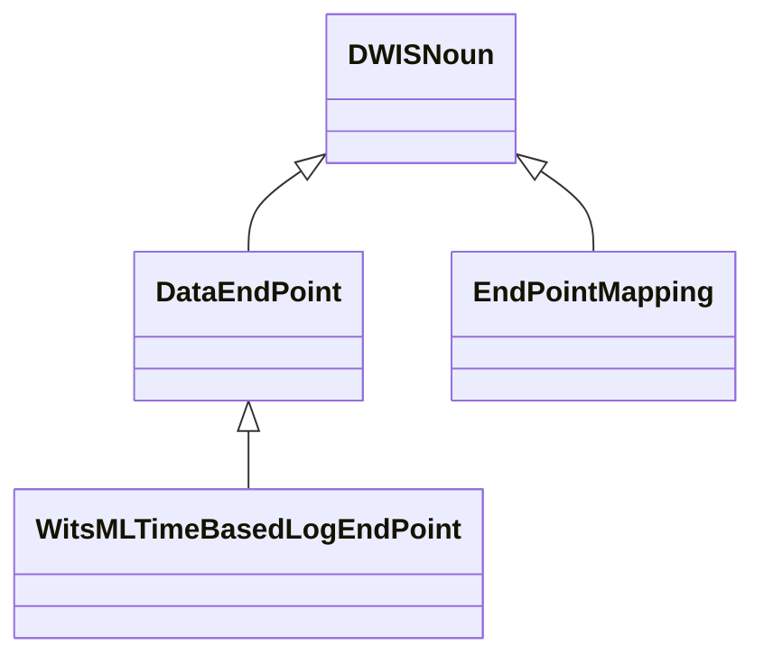
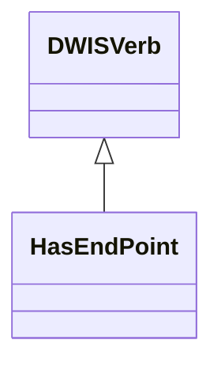
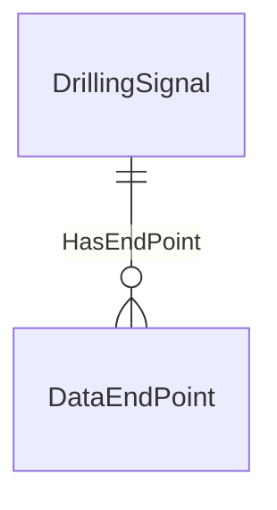

# EndPoints<!-- DEFINITION SET HEADER -->
- Description: 
this is the part associated to the description of external end-points.

# Nouns
## Class Inheritance for Nouns
Here is a class inheritance diagram for the nouns contained in this definition set.

## DataEndPoint <!-- NOUN -->
- Display name: DataEndPoint
- Parent class: [DWISNoun](./DWISSemantics.md#DWISNoun)
- Attributes:
  - EndPointDescription
    - Type: string
    - Description: 
- Definition set: EndPoints
## WitsMLTimeBasedLogEndPoint <!-- NOUN -->
- Display name: WitsMLTimeBasedLogEndPoint
- Parent class: [DataEndPoint](./EndPoints.md#DataEndPoint)
- Attributes:
  - WellUID
    - Type: string
    - Description: 
  - WellName
    - Type: string
    - Description: 
  - WellboreUID
    - Type: string
    - Description: 
  - WellboreName
    - Type: string
    - Description: 
  - LogUID
    - Type: string
    - Description: 
  - LogName
    - Type: string
    - Description: 
  - Mnemonic
    - Type: string
    - Description: 
- Definition set: EndPoints
## EndPointMapping <!-- NOUN -->
- Display name: EndPointMapping
- Parent class: [DWISNoun](./DWISSemantics.md#DWISNoun)
- Attributes:
  - FixedIndices
    - Type: int[]
    - Description: 
  - ValuesIndices
    - Type: int[]
    - Description: 
  - MeasurementIndex
    - Type: int
    - Description: 
- Definition set: EndPoints
# Verbs
## Class Inheritance for Verbs
Here is a class inheritance diagram for the verbs contained in this definition set.

## Relations
Here is a graph representing the relations that can be made with the verbs defined in this definition set.

## HasEndPoint <!-- VERB -->
- Display name: HasEndPoint
- Parent verb: [DWISVerb](./DWISSemantics.md#DWISVerb)
- Subject class: [DrillingSignal](./DrillingDataSemantics.md#DrillingSignal)
- Object class: [DataEndPoint](./EndPoints.md#DataEndPoint)
- Definition set: EndPoints
