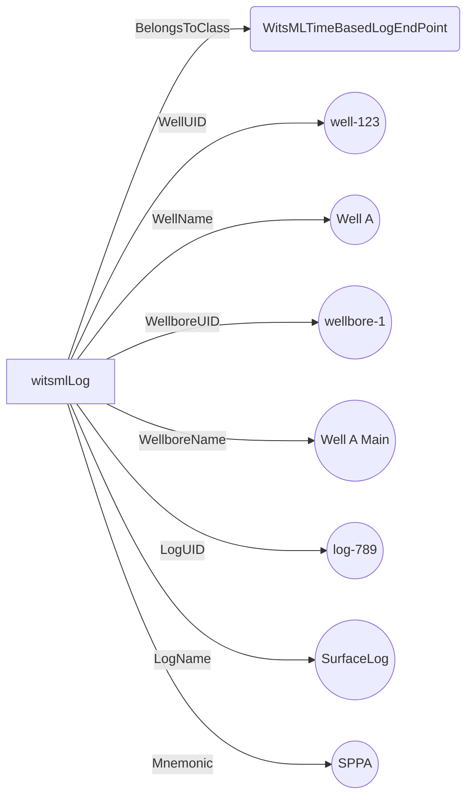

# EndPoints<!-- DEFINITION SET HEADER -->
- Description: 
Describes external endpoints where drilling data is sourced or delivered, and how signals map to those endpoints.

# Nouns
## Class Inheritance for Nouns
Here is a class inheritance diagram for the nouns contained in this definition set.

## DataEndPoint <!-- NOUN -->
- Display name: DataEndPoint
- Parent class: [DWISNoun](./DWISSemantics.md#DWISNoun)
- Attributes:
  - EndPointDescription
    - Type: string
    - Description: 
- Description: 
A generic external endpoint for reading or writing drilling data.
- Definition set: EndPoints
- Examples:
```dwis dataEndpointExample
DataEndPoint:surfaceLogEndpoint
surfaceLogEndpoint.EndPointDescription = "Surface logging service endpoint"
```
An example semantic graph looks like as follow:

An example SparQL query looks like this:
```sparql
PREFIX rdf: <http://www.w3.org/1999/02/22-rdf-syntax-ns#>
PREFIX ddhub: <http://ddhub.no/>
PREFIX quantity: <http://ddhub.no/UnitAndQuantity>
SELECT ?dataEndpointExample
WHERE {
	?surfaceLogEndpoint rdf:type ddhub:DataEndPoint .
	?surfaceLogEndpoint ddhub:EndPointDescription ?Attribute000 .
  FILTER (
	?Attribute000 = "Surface logging service endpoint"
  )
}
```
This example declares a generic data endpoint for surface logging.
## WitsMLTimeBasedLogEndPoint <!-- NOUN -->
- Display name: WitsMLTimeBasedLogEndPoint
- Parent class: [DataEndPoint](./EndPoints.md#DataEndPoint)
- Attributes:
  - WellUID
    - Type: string
    - Description: 
  - WellName
    - Type: string
    - Description: 
  - WellboreUID
    - Type: string
    - Description: 
  - WellboreName
    - Type: string
    - Description: 
  - LogUID
    - Type: string
    - Description: 
  - LogName
    - Type: string
    - Description: 
  - Mnemonic
    - Type: string
    - Description: 
- Description: 
Represents a WITSML time-based log endpoint identifying a specific well, wellbore, log, and mnemonic.
- Definition set: EndPoints
- Examples:
```dwis witsmlEndpoint
WitsMLTimeBasedLogEndPoint:witsmlLog
witsmlLog.WellUID = "well-123"
witsmlLog.WellName = "Well A"
witsmlLog.WellboreUID = "wellbore-1"
witsmlLog.WellboreName = "Well A Main"
witsmlLog.LogUID = "log-789"
witsmlLog.LogName = "SurfaceLog"
witsmlLog.Mnemonic = "SPPA"
```
An example semantic graph looks like as follow:

An example SparQL query looks like this:
```sparql
PREFIX rdf: <http://www.w3.org/1999/02/22-rdf-syntax-ns#>
PREFIX ddhub: <http://ddhub.no/>
PREFIX quantity: <http://ddhub.no/UnitAndQuantity>
SELECT ?witsmlEndpoint
WHERE {
	?witsmlLog rdf:type ddhub:WitsMLTimeBasedLogEndPoint .
	?witsmlLog ddhub:WellUID ?Attribute000 .
	?witsmlLog ddhub:WellName ?Attribute001 .
	?witsmlLog ddhub:WellboreUID ?Attribute002 .
	?witsmlLog ddhub:WellboreName ?Attribute003 .
	?witsmlLog ddhub:LogUID ?Attribute004 .
	?witsmlLog ddhub:LogName ?Attribute005 .
	?witsmlLog ddhub:Mnemonic ?Attribute006 .
  FILTER (
	?Attribute000 = "well-123"
	&& 	?Attribute001 = "Well A"
	&& 	?Attribute002 = "wellbore-1"
	&& 	?Attribute003 = "Well A Main"
	&& 	?Attribute004 = "log-789"
	&& 	?Attribute005 = "SurfaceLog"
	&& 	?Attribute006 = "SPPA"
  )
}
```
This example defines a WITSML time-based log endpoint for standpipe pressure.
## EndPointMapping <!-- NOUN -->
- Display name: EndPointMapping
- Parent class: [DWISNoun](./DWISSemantics.md#DWISNoun)
- Attributes:
  - FixedIndices
    - Type: int[]
    - Description: 
  - ValuesIndices
    - Type: int[]
    - Description: 
  - MeasurementIndex
    - Type: int
    - Description: 
- Description: 
Describes how a signal’s fields map to indices within an external endpoint payload.
- Definition set: EndPoints
- Examples:
```dwis endpointMapping
EndPointMapping:standpipeMapping
standpipeMapping.FixedIndices = "[0,1]"
standpipeMapping.ValuesIndices = "[2]"
standpipeMapping.MeasurementIndex = "2"
```
An example semantic graph looks like as follow:

An example SparQL query looks like this:
```sparql
PREFIX rdf: <http://www.w3.org/1999/02/22-rdf-syntax-ns#>
PREFIX ddhub: <http://ddhub.no/>
PREFIX quantity: <http://ddhub.no/UnitAndQuantity>
SELECT ?endpointMapping
WHERE {
	?standpipeMapping rdf:type ddhub:EndPointMapping .
	?standpipeMapping ddhub:FixedIndices ?Attribute000 .
	?standpipeMapping ddhub:ValuesIndices ?Attribute001 .
	?standpipeMapping ddhub:MeasurementIndex ?Attribute002 .
  FILTER (
	?Attribute000 = "[0,1]"
	&& 	?Attribute001 = "[2]"
	&& 	?Attribute002 = "2"
  )
}
```
This example maps standpipe pressure values to positions in an endpoint payload.
# Verbs
## Class Inheritance for Verbs
Here is a class inheritance diagram for the verbs contained in this definition set.

## Relations
Here is a graph representing the relations that can be made with the verbs defined in this definition set.

## HasEndPoint <!-- VERB -->
- Display name: HasEndPoint
- Parent verb: [DWISVerb](./DWISSemantics.md#DWISVerb)
- Subject class: [DrillingSignal](./DrillingDataSemantics.md#DrillingSignal)
- Object class: [DataEndPoint](./EndPoints.md#DataEndPoint)
- Definition set: EndPoints
- Description: 
Associates a drilling signal with an external endpoint that provides or receives it.
- Examples:
```dwis endpointAssociation
DrillingSignal:standpipePressureSignal
WitsMLTimeBasedLogEndPoint:witsmlLog
standpipePressureSignal HasEndPoint witsmlLog
```
An example semantic graph looks like as follow:

An example SparQL query looks like this:
```sparql
PREFIX rdf: <http://www.w3.org/1999/02/22-rdf-syntax-ns#>
PREFIX ddhub: <http://ddhub.no/>
PREFIX quantity: <http://ddhub.no/UnitAndQuantity>
SELECT ?endpointAssociation
WHERE {
	?standpipePressureSignal rdf:type ddhub:DrillingSignal .
	?witsmlLog rdf:type ddhub:WitsMLTimeBasedLogEndPoint .
	?standpipePressureSignal ddhub:HasEndPoint ?witsmlLog .
}
```
This example links the standpipe pressure signal to its WITSML endpoint.
