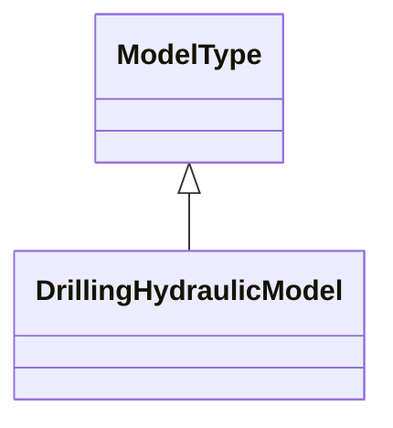
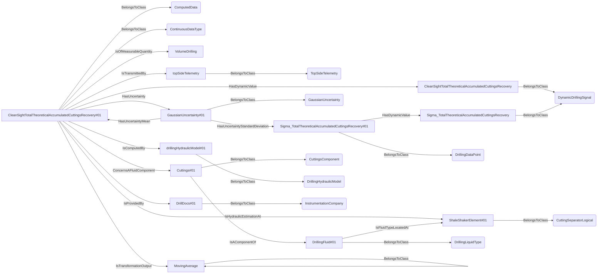

# HydraulicModel<!-- DEFINITION SET HEADER -->
- Description: 
specialized vocabulary for the hydraulic modelling

# Nouns
## Class Inheritance for Nouns
Here is a class inheritance diagram for the nouns contained in this definition set.

## DrillingHydraulicModel <!-- NOUN -->
- Display name: Drilling Hydraulic Model
- Parent class: [ModelType](./Model.md#ModelType)
- Description: 
A hydraulic model for drilling operations. This model simulates the behavior of drilling fluids within the wellbore and their interaction with the drilling equipment.
- Definition set: HydraulicModel
- Examples:
```dwis TotalTheoreticalAccumulatedCuttingsRecoveryExample
DynamicDrillingSignal:CleanSightTotalTheoreticalAccumulatedCuttingsRecovery
ComputedData:CleanSightTotalTheoreticalAccumulatedCuttingsRecovery#01
CleanSightTotalTheoreticalAccumulatedCuttingsRecovery#01 BelongsToClass ContinuousDataType
CleanSightTotalTheoreticalAccumulatedCuttingsRecovery#01 HasDynamicValue CleanSightTotalTheoreticalAccumulatedCuttingsRecovery
CleanSightTotalTheoreticalAccumulatedCuttingsRecovery#01 IsOfMeasurableQuantity VolumeDrilling
TopSideTelemetry:topSideTelemetry
CleanSightTotalTheoreticalAccumulatedCuttingsRecovery#01 IsTransmittedBy topSideTelemetry
MovingAverage:MovingAverage
CleanSightTotalTheoreticalAccumulatedCuttingsRecovery#01 IsTransformationOutput MovingAverage
DynamicDrillingSignal:Sigma_TotalTheoreticalAccumulatedCuttingsRecovery
DrillingDataPoint:Sigma_TotalTheoreticalAccumulatedCuttingsRecovery#01
Sigma_TotalTheoreticalAccumulatedCuttingsRecovery#01 HasDynamicValue Sigma_TotalTheoreticalAccumulatedCuttingsRecovery
GaussianUncertainty:GaussianUncertainty#01
CleanSightTotalTheoreticalAccumulatedCuttingsRecovery#01 HasUncertainty GaussianUncertainty#01
GaussianUncertainty#01 HasUncertaintyMean CleanSightTotalTheoreticalAccumulatedCuttingsRecovery#01
GaussianUncertainty#01 HasUncertaintyStandardDeviation Sigma_TotalTheoreticalAccumulatedCuttingsRecovery#01
CuttingSeparatorLogical:ShaleShakerElement#01
CleanSightTotalTheoreticalAccumulatedCuttingsRecovery#01 IsHydraulicEstimationAt ShaleShakerElement#01
DrillingLiquidType:DrillingFluid#01
DrillingFluid#01 IsFluidTypeLocatedAt ShaleShakerElement#01
CuttingsComponent:Cuttings#01
Cuttings#01 IsAComponentOf DrillingFluid#01
CleanSightTotalTheoreticalAccumulatedCuttingsRecovery#01 ConcernsAFluidComponent Cuttings#01
DrillingHydraulicModel:drillingHydraulicModel#01
CleanSightTotalTheoreticalAccumulatedCuttingsRecovery#01 IsComputedBy drillingHydraulicModel#01
InstrumentationCompany:DrillDocs#01
CleanSightTotalTheoreticalAccumulatedCuttingsRecovery#01 IsProvidedBy DrillDocs#01
```
An example semantic graph looks like as follow:

An example SparQL query looks like this:
```sparql
PREFIX rdf: <http://www.w3.org/1999/02/22-rdf-syntax-ns#>
PREFIX ddhub: <http://ddhub.no/>
PREFIX quantity: <http://ddhub.no/UnitAndQuantity>
SELECT ?TotalTheoreticalAccumulatedCuttingsRecoveryExample
WHERE {
	?CleanSightTotalTheoreticalAccumulatedCuttingsRecovery rdf:type ddhub:DynamicDrillingSignal .
	?CleanSightTotalTheoreticalAccumulatedCuttingsRecovery#01 rdf:type ddhub:ComputedData .
	?CleanSightTotalTheoreticalAccumulatedCuttingsRecovery#01 rdf:type ddhub:ContinuousDataType .
	?CleanSightTotalTheoreticalAccumulatedCuttingsRecovery#01 ddhub:HasDynamicValue ?CleanSightTotalTheoreticalAccumulatedCuttingsRecovery .
	?CleanSightTotalTheoreticalAccumulatedCuttingsRecovery#01 ddhub:IsOfMeasurableQuantity ?VolumeDrilling .
	?topSideTelemetry rdf:type ddhub:TopSideTelemetry .
	?CleanSightTotalTheoreticalAccumulatedCuttingsRecovery#01 ddhub:IsTransmittedBy ?topSideTelemetry .
	?MovingAverage rdf:type ddhub:MovingAverage .
	?CleanSightTotalTheoreticalAccumulatedCuttingsRecovery#01 ddhub:IsTransformationOutput ?MovingAverage .
	?Sigma_TotalTheoreticalAccumulatedCuttingsRecovery rdf:type ddhub:DynamicDrillingSignal .
	?Sigma_TotalTheoreticalAccumulatedCuttingsRecovery#01 rdf:type ddhub:DrillingDataPoint .
	?Sigma_TotalTheoreticalAccumulatedCuttingsRecovery#01 ddhub:HasDynamicValue ?Sigma_TotalTheoreticalAccumulatedCuttingsRecovery .
	?GaussianUncertainty#01 rdf:type ddhub:GaussianUncertainty .
	?CleanSightTotalTheoreticalAccumulatedCuttingsRecovery#01 ddhub:HasUncertainty ?GaussianUncertainty#01 .
	?GaussianUncertainty#01 ddhub:HasUncertaintyMean ?CleanSightTotalTheoreticalAccumulatedCuttingsRecovery#01 .
	?GaussianUncertainty#01 ddhub:HasUncertaintyStandardDeviation ?Sigma_TotalTheoreticalAccumulatedCuttingsRecovery#01 .
	?ShaleShakerElement#01 rdf:type ddhub:CuttingSeparatorLogical .
	?CleanSightTotalTheoreticalAccumulatedCuttingsRecovery#01 ddhub:IsHydraulicEstimationAt ?ShaleShakerElement#01 .
	?DrillingFluid#01 rdf:type ddhub:DrillingLiquidType .
	?DrillingFluid#01 ddhub:IsFluidTypeLocatedAt ?ShaleShakerElement#01 .
	?Cuttings#01 rdf:type ddhub:CuttingsComponent .
	?Cuttings#01 ddhub:IsAComponentOf ?DrillingFluid#01 .
	?CleanSightTotalTheoreticalAccumulatedCuttingsRecovery#01 ddhub:ConcernsAFluidComponent ?Cuttings#01 .
	?drillingHydraulicModel#01 rdf:type ddhub:DrillingHydraulicModel .
	?CleanSightTotalTheoreticalAccumulatedCuttingsRecovery#01 ddhub:IsComputedBy ?drillingHydraulicModel#01 .
	?DrillDocs#01 rdf:type ddhub:InstrumentationCompany .
	?CleanSightTotalTheoreticalAccumulatedCuttingsRecovery#01 ddhub:IsProvidedBy ?DrillDocs#01 .
}
```
This example defines a drilling hydraulic model and links it to a computed data point for accumulated cuttings recovery.
# Verbs
