# Hydraulics<!-- DEFINITION SET HEADER -->
- Description: 
this part refers to the hydraulic circuit, and should only contain the "abstract" or conceptual part of the vocabulary. Additional nouns coming from the drilling equipment category will be used when constructing the semantic graphs.

# Nouns
## Class Inheritance for Nouns
Here is a class inheritance diagram for the nouns contained in this definition set.

```mermaid
classDiagram
DWISNoun <|-- PressureReference
PressureReference <|-- AbsolutePressureReference
PressureReference <|-- RelativePressureReference
RelativePressureReference <|-- GaugePressureReference
DWISNoun <|-- HydraulicElementState
HydraulicElementState <|-- HydraulicConnectedState
DWISNoun <|-- HydraulicLogicalElement
HydraulicLogicalElement <|-- HydraulicBranch
HydraulicBranch <|-- Annular
Annular <|-- BHAAnnular
Annular <|-- DrillPipesAnnular
HydraulicBranch <|-- OpenChannel
OpenChannel <|-- RectangularChannel
OpenChannel <|-- SemiCircularChannel
HydraulicBranch <|-- Pipe
Pipe <|-- BHAInner
Pipe <|-- DrillPipesInner
Pipe <|-- OpenHole
Pipe <|-- ReturnFlowLine
HydraulicLogicalElement <|-- HydraulicJunction
HydraulicLogicalElement <|-- Tank
HydraulicJunction <|-- MudMixing
HydraulicLogicalElement <|-- HydraulicNetwork
HydraulicNetwork <|-- DownholeHydraulicNetwork
HydraulicNetwork <|-- TopsideHydraulicNetwork
TopsideHydraulicNetwork <|-- MPDMainFlowPath
TopsideHydraulicNetwork <|-- MPDAlternateFlowPath
DWISNoun <|-- FluidComponent
FluidComponent <|-- LiquidComponent
LiquidComponent <|-- FormationLiquidComponent
LiquidComponent <|-- DrillingFluidLiquidComponent
DrillingFluidLiquidComponent <|-- DrillingFluidOilComponent
DrillingFluidLiquidComponent <|-- DrillingFluidWaterComponent
FluidComponent <|-- GasComponent
GasComponent <|-- FormationGasComponent
GasComponent <|-- DrillingFluidGasComponent
FluidComponent <|-- SolidComponent
SolidComponent <|-- DrillingFluidSolidComponent
DrillingFluidSolidComponent <|-- HighGravitySolidComponent
DrillingFluidSolidComponent <|-- LowGravitySolidComponent
SolidComponent <|-- FormationSolidComponent
FormationSolidComponent <|-- CuttingsComponent
FormationSolidComponent <|-- CavingsComponent
```

## PressureReference <!-- NOUN -->
- Display name: PressureReference
- Parent class: [DWISNoun](./DWISSemantics.md#DWISNoun)
- Description: 

- Definition set: Hydraulics
- Examples:
## AbsolutePressureReference <!-- NOUN -->
- Display name: AbsolutePressureReference
- Parent class: [PressureReference](./Hydraulics.md#PressureReference)
- Description: 

- Definition set: Hydraulics
- Examples:
## RelativePressureReference <!-- NOUN -->
- Display name: RelativePressureReference
- Parent class: [PressureReference](./Hydraulics.md#PressureReference)
- Description: 

- Definition set: Hydraulics
- Examples:
## GaugePressureReference <!-- NOUN -->
- Display name: GaugePressureReference
- Parent class: [RelativePressureReference](./Hydraulics.md#RelativePressureReference)
- Description: 

- Definition set: Hydraulics
- Examples:
## HydraulicElementState <!-- NOUN -->
- Display name: HydraulicElementState
- Parent class: [DWISNoun](./DWISSemantics.md#DWISNoun)
- Description: 

- Definition set: Hydraulics
- Examples:
## HydraulicConnectedState <!-- NOUN -->
- Display name: HydraulicConnectedState
- Parent class: [HydraulicElementState](./Hydraulics.md#HydraulicElementState)
- Attributes:
  - Value
    - Type: bool
    - Description: 
- Description: 

- Definition set: Hydraulics
- Examples:
## HydraulicLogicalElement <!-- NOUN -->
- Display name: HydraulicLogicalElement
- Parent class: [DWISNoun](./DWISSemantics.md#DWISNoun)
- Description: 

- Definition set: Hydraulics
- Examples:
## HydraulicBranch <!-- NOUN -->
- Display name: HydraulicBranch
- Parent class: [HydraulicLogicalElement](./Hydraulics.md#HydraulicLogicalElement)
- Description: 

- Definition set: Hydraulics
- Examples:
## Annular <!-- NOUN -->
- Display name: Annular
- Parent class: [HydraulicBranch](./Hydraulics.md#HydraulicBranch)
- Description: 

- Definition set: Hydraulics
- Examples:
## BHAAnnular <!-- NOUN -->
- Display name: BHAAnnular
- Parent class: [Annular](./Hydraulics.md#Annular)
- Description: 

- Definition set: Hydraulics
- Examples:
## DrillPipesAnnular <!-- NOUN -->
- Display name: DrillPipesAnnular
- Parent class: [Annular](./Hydraulics.md#Annular)
- Description: 

- Definition set: Hydraulics
- Examples:
## OpenChannel <!-- NOUN -->
- Display name: OpenChannel
- Parent class: [HydraulicBranch](./Hydraulics.md#HydraulicBranch)
- Description: 

- Definition set: Hydraulics
- Examples:
## RectangularChannel <!-- NOUN -->
- Display name: RectangularChannel
- Parent class: [OpenChannel](./Hydraulics.md#OpenChannel)
- Description: 

- Definition set: Hydraulics
- Examples:
## SemiCircularChannel <!-- NOUN -->
- Display name: SemiCircularChannel
- Parent class: [OpenChannel](./Hydraulics.md#OpenChannel)
- Description: 

- Definition set: Hydraulics
- Examples:
## Pipe <!-- NOUN -->
- Display name: Pipe
- Parent class: [HydraulicBranch](./Hydraulics.md#HydraulicBranch)
- Description: 

- Definition set: Hydraulics
- Examples:
## BHAInner <!-- NOUN -->
- Display name: BHAInner
- Parent class: [Pipe](./Hydraulics.md#Pipe)
- Description: 

- Definition set: Hydraulics
- Examples:
## DrillPipesInner <!-- NOUN -->
- Display name: DrillPipesInner
- Parent class: [Pipe](./Hydraulics.md#Pipe)
- Description: 

- Definition set: Hydraulics
- Examples:
## OpenHole <!-- NOUN -->
- Display name: OpenHole
- Parent class: [Pipe](./Hydraulics.md#Pipe)
- Description: 

- Definition set: Hydraulics
- Examples:
## ReturnFlowLine <!-- NOUN -->
- Display name: ReturnFlowLine
- Parent class: [Pipe](./Hydraulics.md#Pipe)
- Description: 

- Definition set: Hydraulics
- Examples:
## HydraulicJunction <!-- NOUN -->
- Display name: HydraulicJunction
- Parent class: [HydraulicLogicalElement](./Hydraulics.md#HydraulicLogicalElement)
- Attributes:
  - LeftToRight
    - Type: bool
    - Description: Indicates whether the fluid can flow from the left branch to the right branch though the junction
  - RightToLeft
    - Type: bool
    - Description: Indicates whether the fluid can flow from the right branch to the left branch though the junction
- Specialization:
  - LeftToRight = true
  - RightToLeft = true
- Description: 

- Definition set: Hydraulics
- Examples:
## Tank <!-- NOUN -->
- Display name: Tank
- Parent class: [HydraulicLogicalElement](./Hydraulics.md#HydraulicLogicalElement)
- Description: 

- Definition set: Hydraulics
- Examples:
## MudMixing <!-- NOUN -->
- Display name: MudMixing
- Parent class: [HydraulicJunction](./Hydraulics.md#HydraulicJunction)
- Description: 

- Definition set: Hydraulics
- Examples:
## HydraulicNetwork <!-- NOUN -->
- Display name: HydraulicNetwork
- Parent class: [HydraulicLogicalElement](./Hydraulics.md#HydraulicLogicalElement)
- Description: 

- Definition set: Hydraulics
- Examples:
## DownholeHydraulicNetwork <!-- NOUN -->
- Display name: DownholeHydraulicNetwork
- Parent class: [HydraulicNetwork](./Hydraulics.md#HydraulicNetwork)
- Description: 

- Definition set: Hydraulics
- Examples:
## TopsideHydraulicNetwork <!-- NOUN -->
- Display name: TopsideHydraulicNetwork
- Parent class: [HydraulicNetwork](./Hydraulics.md#HydraulicNetwork)
- Description: 

- Definition set: Hydraulics
- Examples:
## MPDMainFlowPath <!-- NOUN -->
- Display name: MPDMainFlowPath
- Parent class: [TopsideHydraulicNetwork](./Hydraulics.md#TopsideHydraulicNetwork)
- Description: 

- Definition set: Hydraulics
- Examples:
## MPDAlternateFlowPath <!-- NOUN -->
- Display name: MPDAlternateFlowPath
- Parent class: [TopsideHydraulicNetwork](./Hydraulics.md#TopsideHydraulicNetwork)
- Description: 

- Definition set: Hydraulics
- Examples:
## FluidComponent <!-- NOUN -->
- Display name: FluidComponent
- Parent class: [DWISNoun](./DWISSemantics.md#DWISNoun)
- Description: 

- Definition set: Hydraulics
- Examples:
## LiquidComponent <!-- NOUN -->
- Display name: LiquidComponent
- Parent class: [FluidComponent](./Hydraulics.md#FluidComponent)
- Description: 

- Definition set: Hydraulics
- Examples:
## FormationLiquidComponent <!-- NOUN -->
- Display name: FormationLiquidComponent
- Parent class: [LiquidComponent](./Hydraulics.md#LiquidComponent)
- Description: 

- Definition set: Hydraulics
- Examples:
## DrillingFluidLiquidComponent <!-- NOUN -->
- Display name: DrillingFluidLiquidComponent
- Parent class: [LiquidComponent](./Hydraulics.md#LiquidComponent)
- Description: 

- Definition set: Hydraulics
- Examples:
## DrillingFluidOilComponent <!-- NOUN -->
- Display name: OilComponent
- Parent class: [DrillingFluidLiquidComponent](./Hydraulics.md#DrillingFluidLiquidComponent)
- Description: 

- Definition set: Hydraulics
- Examples:
## DrillingFluidWaterComponent <!-- NOUN -->
- Display name: WaterComponent
- Parent class: [DrillingFluidLiquidComponent](./Hydraulics.md#DrillingFluidLiquidComponent)
- Description: 

- Definition set: Hydraulics
- Examples:
## GasComponent <!-- NOUN -->
- Display name: GasComponent
- Parent class: [FluidComponent](./Hydraulics.md#FluidComponent)
- Description: 

- Definition set: Hydraulics
- Examples:
## FormationGasComponent <!-- NOUN -->
- Display name: FormationGasComponent
- Parent class: [GasComponent](./Hydraulics.md#GasComponent)
- Description: 

- Definition set: Hydraulics
- Examples:
## DrillingFluidGasComponent <!-- NOUN -->
- Display name: DrillingFluidGasComponent
- Parent class: [GasComponent](./Hydraulics.md#GasComponent)
- Description: 

- Definition set: Hydraulics
- Examples:
## SolidComponent <!-- NOUN -->
- Display name: SolidComponent
- Parent class: [FluidComponent](./Hydraulics.md#FluidComponent)
- Description: 

- Definition set: Hydraulics
- Examples:
## DrillingFluidSolidComponent <!-- NOUN -->
- Display name: DrillingFluidSolidComponent
- Parent class: [SolidComponent](./Hydraulics.md#SolidComponent)
- Description: 

- Definition set: Hydraulics
- Examples:
## HighGravitySolidComponent <!-- NOUN -->
- Display name: HighGravitySolidComponent
- Parent class: [DrillingFluidSolidComponent](./Hydraulics.md#DrillingFluidSolidComponent)
- Description: 

- Definition set: Hydraulics
- Examples:
## LowGravitySolidComponent <!-- NOUN -->
- Display name: LowGravitySolidComponent
- Parent class: [DrillingFluidSolidComponent](./Hydraulics.md#DrillingFluidSolidComponent)
- Description: 

- Definition set: Hydraulics
- Examples:
## FormationSolidComponent <!-- NOUN -->
- Display name: FormationSolidComponent
- Parent class: [SolidComponent](./Hydraulics.md#SolidComponent)
- Description: 

- Definition set: Hydraulics
- Examples:
## CuttingsComponent <!-- NOUN -->
- Display name: CuttingsComponent
- Parent class: [FormationSolidComponent](./Hydraulics.md#FormationSolidComponent)
- Description: 

- Definition set: Hydraulics
- Examples:
## CavingsComponent <!-- NOUN -->
- Display name: CavingsComponent
- Parent class: [FormationSolidComponent](./Hydraulics.md#FormationSolidComponent)
- Description: 

- Definition set: Hydraulics
- Examples:
  
# Verbs
## Class Inheritance for Verbs
Here is a class inheritance diagram for the verbs contained in this definition set.

## Relations
Here is a graph representing the relations that can be made with the verbs defined in this definition set.

## HasPressureReferenceType <!-- VERB -->
- Display name: HasPressureReferenceType
- Parent verb: [DWISVerb](./DWISSemantics.md#DWISVerb)
- Subject class: [DrillingDataPoint](./DrillingDataSemantics.md#DrillingDataPoint)
- Object class: [PressureReference](./Hydraulics.md#PressureReference)
- Definition set: Hydraulics
- Description: 

- Examples:
## EndsHydraulicBranchDecomposition <!-- VERB -->
- Display name: EndsHydraulicBranchDecomposition
- Parent verb: [DWISVerb](./DWISSemantics.md#DWISVerb)
- Subject class: [HydraulicBranch](./Hydraulics.md#HydraulicBranch)
- Object class: [HydraulicBranch](./Hydraulics.md#HydraulicBranch)
- Definition set: Hydraulics
- Description: 

- Examples:
## IsAHydraulicRepresentationFor <!-- VERB -->
- Display name: IsAHydraulicRepresentationFor
- Parent verb: [DWISVerb](./DWISSemantics.md#DWISVerb)
- Subject class: [HydraulicLogicalElement](./Hydraulics.md#HydraulicLogicalElement)
- Object class: [DrillingEquipment](./DrillingEquipment.md#DrillingEquipment)
- Definition set: Hydraulics
- Description: 

- Examples:
## HasBranchComponent <!-- VERB -->
- Display name: HasBranchComponent
- Parent verb: [DWISVerb](./DWISSemantics.md#DWISVerb)
- Subject class: [HydraulicNetwork](./Hydraulics.md#HydraulicNetwork)
- Object class: [HydraulicBranch](./Hydraulics.md#HydraulicBranch)
- Definition set: Hydraulics
- Description: 

- Examples:
## HasBranchCoordinateSystem <!-- VERB -->
- Display name: HasBranchCoordinateSystem
- Parent verb: [DWISVerb](./DWISSemantics.md#DWISVerb)
- Subject class: [HydraulicBranch](./Hydraulics.md#HydraulicBranch)
- Object class: [ReferenceFrame](./PhysicalLocation.md#ReferenceFrame)
- Definition set: Hydraulics
- Description: 

- Examples:
## HasHydraulicState <!-- VERB -->
- Display name: HasHydraulicState
- Parent verb: [DWISVerb](./DWISSemantics.md#DWISVerb)
- Subject class: [HydraulicJunction](./Hydraulics.md#HydraulicJunction)
- Object class: [HydraulicElementState](./Hydraulics.md#HydraulicElementState)
- Definition set: Hydraulics
- Description: 

- Examples:
## HasHydraulicStateValueFrom <!-- VERB -->
- Display name: HasHydraulicStateValueFrom
- Parent verb: [DWISVerb](./DWISSemantics.md#DWISVerb)
- Subject class: [DWISNoun](./DWISSemantics.md#DWISNoun)
- Object class: [DWISNoun](./DWISSemantics.md#DWISNoun)
- Definition set: Hydraulics
- Description: 

- Examples:
## HasLeftBranchCoordinates <!-- VERB -->
- Display name: HasLeftBranchCoordinates
- Parent verb: [DWISVerb](./DWISSemantics.md#DWISVerb)
- Subject class: [HydraulicJunction](./Hydraulics.md#HydraulicJunction)
- Object class: [DrillingDataPoint](./DrillingDataSemantics.md#DrillingDataPoint)
- Definition set: Hydraulics
- Description: 

- Examples:
## HasRightBranchCoordinates <!-- VERB -->
- Display name: HasRightBranchCoordinates
- Parent verb: [DWISVerb](./DWISSemantics.md#DWISVerb)
- Subject class: [HydraulicJunction](./Hydraulics.md#HydraulicJunction)
- Object class: [DrillingDataPoint](./DrillingDataSemantics.md#DrillingDataPoint)
- Definition set: Hydraulics
- Description: 

- Examples:
## IsHydraulicallyLocatedAt <!-- VERB -->
- Display name: IsHydraulicallyLocatedAt
- Parent verb: [DWISVerb](./DWISSemantics.md#DWISVerb)
- Subject class: [DrillingDataPoint](./DrillingDataSemantics.md#DrillingDataPoint)
- Object class: [HydraulicLogicalElement](./Hydraulics.md#HydraulicLogicalElement)
- Definition set: Hydraulics
- Description: 

- Examples:
## IsEquivalentCirculationDensityAt <!-- VERB -->
- Display name: IsEquivalentCirculationDensityAt
- Parent verb: [IsHydraulicallyLocatedAt](./Hydraulics.md#IsHydraulicallyLocatedAt)
- Subject class: [DrillingDataPoint](./DrillingDataSemantics.md#DrillingDataPoint)
- Object class: [HydraulicLogicalElement](./Hydraulics.md#HydraulicLogicalElement)
- Definition set: Hydraulics
- Description: 

- Examples:
## IsFluidDensityAt <!-- VERB -->
- Display name: IsFluidDensityAt
- Parent verb: [IsHydraulicallyLocatedAt](./Hydraulics.md#IsHydraulicallyLocatedAt)
- Subject class: [DrillingDataPoint](./DrillingDataSemantics.md#DrillingDataPoint)
- Object class: [HydraulicLogicalElement](./Hydraulics.md#HydraulicLogicalElement)
- Definition set: Hydraulics
- Description: 

- Examples:
## IsFluidTemperatureAt <!-- VERB -->
- Display name: IsFluidTemperatureAt
- Parent verb: [IsHydraulicallyLocatedAt](./Hydraulics.md#IsHydraulicallyLocatedAt)
- Subject class: [DrillingDataPoint](./DrillingDataSemantics.md#DrillingDataPoint)
- Object class: [HydraulicLogicalElement](./Hydraulics.md#HydraulicLogicalElement)
- Definition set: Hydraulics
- Description: 

- Examples:
## IsFluidVelocityAt <!-- VERB -->
- Display name: IsFluidVelocityAt
- Parent verb: [IsHydraulicallyLocatedAt](./Hydraulics.md#IsHydraulicallyLocatedAt)
- Subject class: [DrillingDataPoint](./DrillingDataSemantics.md#DrillingDataPoint)
- Object class: [HydraulicLogicalElement](./Hydraulics.md#HydraulicLogicalElement)
- Definition set: Hydraulics
- Description: 

- Examples:
## IsOpeningRatioAt <!-- VERB -->
- Display name: IsOpeningRatioAt
- Parent verb: [IsHydraulicallyLocatedAt](./Hydraulics.md#IsHydraulicallyLocatedAt)
- Subject class: [DrillingDataPoint](./DrillingDataSemantics.md#DrillingDataPoint)
- Object class: [HydraulicLogicalElement](./Hydraulics.md#HydraulicLogicalElement)
- Definition set: Hydraulics
- Description: 

- Examples:
## IsVolumeAt <!-- VERB -->
- Display name: IsVolumeAt
- Parent verb: [IsHydraulicallyLocatedAt](./Hydraulics.md#IsHydraulicallyLocatedAt)
- Subject class: [DrillingDataPoint](./DrillingDataSemantics.md#DrillingDataPoint)
- Object class: [Tank](./Hydraulics.md#Tank)
- Definition set: Hydraulics
- Description: 

- Examples:
## IsHydraulicEstimationAt <!-- VERB -->
- Display name: IsHydraulicEstimationAt
- Parent verb: [IsHydraulicallyLocatedAt](./Hydraulics.md#IsHydraulicallyLocatedAt)
- Subject class: [DrillingDataPoint](./DrillingDataSemantics.md#DrillingDataPoint)
- Object class: [HydraulicLogicalElement](./Hydraulics.md#HydraulicLogicalElement)
- Definition set: Hydraulics
- Description: 

- Examples:
## IsHydraulicMaximumAllowedRateOfChangeAt <!-- VERB -->
- Display name: IsHydraulicMaximumAllowedRateOfChangeAt
- Parent verb: [IsHydraulicallyLocatedAt](./Hydraulics.md#IsHydraulicallyLocatedAt)
- Subject class: [DrillingDataPoint](./DrillingDataSemantics.md#DrillingDataPoint)
- Object class: [HydraulicLogicalElement](./Hydraulics.md#HydraulicLogicalElement)
- Definition set: Hydraulics
- Description: 

- Examples:
## IsHydraulicMaximumAllowedValueAt <!-- VERB -->
- Display name: IsHydraulicMaximumAllowedValueAt
- Parent verb: [IsHydraulicallyLocatedAt](./Hydraulics.md#IsHydraulicallyLocatedAt)
- Subject class: [DrillingDataPoint](./DrillingDataSemantics.md#DrillingDataPoint)
- Object class: [HydraulicLogicalElement](./Hydraulics.md#HydraulicLogicalElement)
- Definition set: Hydraulics
- Description: 

- Examples:
## IsHydraulicMeasurementAt <!-- VERB -->
- Display name: IsHydraulicMeasurementAt
- Parent verb: [IsHydraulicallyLocatedAt](./Hydraulics.md#IsHydraulicallyLocatedAt)
- Subject class: [DrillingDataPoint](./DrillingDataSemantics.md#DrillingDataPoint)
- Object class: [HydraulicLogicalElement](./Hydraulics.md#HydraulicLogicalElement)
- Definition set: Hydraulics
- Description: 

- Examples:
## IsMassFlowRateAt <!-- VERB -->
- Display name: IsMassFlowRateAt
- Parent verb: [IsHydraulicallyLocatedAt](./Hydraulics.md#IsHydraulicallyLocatedAt)
- Subject class: [DrillingDataPoint](./DrillingDataSemantics.md#DrillingDataPoint)
- Object class: [HydraulicLogicalElement](./Hydraulics.md#HydraulicLogicalElement)
- Definition set: Hydraulics
- Description: 

- Examples:
## IsPressureAt <!-- VERB -->
- Display name: IsPressureAt
- Parent verb: [IsHydraulicallyLocatedAt](./Hydraulics.md#IsHydraulicallyLocatedAt)
- Subject class: [DrillingDataPoint](./DrillingDataSemantics.md#DrillingDataPoint)
- Object class: [HydraulicLogicalElement](./Hydraulics.md#HydraulicLogicalElement)
- Definition set: Hydraulics
- Description: 

- Examples:
## IsPressureGradientAt <!-- VERB -->
- Display name: IsPressureGradientAt
- Parent verb: [IsHydraulicallyLocatedAt](./Hydraulics.md#IsHydraulicallyLocatedAt)
- Subject class: [DrillingDataPoint](./DrillingDataSemantics.md#DrillingDataPoint)
- Object class: [HydraulicLogicalElement](./Hydraulics.md#HydraulicLogicalElement)
- Definition set: Hydraulics
- Description: 

- Examples:
## IsVolumetricFlowRateAt <!-- VERB -->
- Display name: IsVolumetricFlowRateAt
- Parent verb: [IsHydraulicallyLocatedAt](./Hydraulics.md#IsHydraulicallyLocatedAt)
- Subject class: [DrillingDataPoint](./DrillingDataSemantics.md#DrillingDataPoint)
- Object class: [HydraulicLogicalElement](./Hydraulics.md#HydraulicLogicalElement)
- Definition set: Hydraulics
- Description: 

- Examples:
## IsHydraulicConnectedTo <!-- VERB -->
- Display name: IsHydraulicConnectedTo
- Parent verb: [DWISVerb](./DWISSemantics.md#DWISVerb)
- Subject class: [HydraulicLogicalElement](./Hydraulics.md#HydraulicLogicalElement)
- Object class: [HydraulicLogicalElement](./Hydraulics.md#HydraulicLogicalElement)
- Definition set: Hydraulics
- Description: 

- Examples:
## HasEndJunction <!-- VERB -->
- Display name: HasEndJunction
- Parent verb: [IsHydraulicConnectedTo](./Hydraulics.md#IsHydraulicConnectedTo)
- Subject class: [HydraulicBranch](./Hydraulics.md#HydraulicBranch)
- Object class: [HydraulicJunction](./Hydraulics.md#HydraulicJunction)
- Definition set: Hydraulics
- Description: 

- Examples:
## HasLeftBranch <!-- VERB -->
- Display name: HasLeftBranch
- Parent verb: [IsHydraulicConnectedTo](./Hydraulics.md#IsHydraulicConnectedTo)
- Subject class: [HydraulicJunction](./Hydraulics.md#HydraulicJunction)
- Object class: [HydraulicBranch](./Hydraulics.md#HydraulicBranch)
- Definition set: Hydraulics
- Description: 

- Examples:
## HasRightBranch <!-- VERB -->
- Display name: HasRightBranch
- Parent verb: [IsHydraulicConnectedTo](./Hydraulics.md#IsHydraulicConnectedTo)
- Subject class: [HydraulicJunction](./Hydraulics.md#HydraulicJunction)
- Object class: [HydraulicBranch](./Hydraulics.md#HydraulicBranch)
- Definition set: Hydraulics
- Description: 

- Examples:
## HasStartJunction <!-- VERB -->
- Display name: HasStartJunction
- Parent verb: [IsHydraulicConnectedTo](./Hydraulics.md#IsHydraulicConnectedTo)
- Subject class: [HydraulicBranch](./Hydraulics.md#HydraulicBranch)
- Object class: [HydraulicJunction](./Hydraulics.md#HydraulicJunction)
- Definition set: Hydraulics
- Description: 

- Examples:
## StartsHydraulicBranchDecomposition <!-- VERB -->
- Display name: StartsHydraulicBranchDecomposition
- Parent verb: [DWISVerb](./DWISSemantics.md#DWISVerb)
- Subject class: [DWISNoun](./DWISSemantics.md#DWISNoun)
- Object class: [DWISNoun](./DWISSemantics.md#DWISNoun)
- Definition set: Hydraulics
- Description: 

- Examples:
## ConcernsAFluidComponent <!-- VERB -->
- Display name: ConcernsAFluidComponent
- Parent verb: [DWISVerb](./DWISSemantics.md#DWISVerb)
- Subject class: [DrillingDataPoint](./DrillingDataSemantics.md#DrillingDataPoint)
- Object class: [FluidComponent](./Hydraulics.md#FluidComponent)
- Definition set: Hydraulics
- Description: 

- Examples:
