# Hydraulics<!-- DEFINITION SET HEADER -->
- Description: 
this part refers to the hydraulic circuit, and should only contain the "abstract" or conceptual part of the vocabulary. Additional nouns coming from the drilling equipment category will be used when constructing the semantic graphs.

# Nouns
## Class Inheritance for Nouns
Here is a class inheritance diagram for the nouns contained in this definition set.

## PressureReference <!-- NOUN -->
- Display name: PressureReference
- Parent class: [DWISNoun](./DWISSemantics.md#DWISNoun)
- Definition set: Hydraulics
## AbsolutePressureReference <!-- NOUN -->
- Display name: AbsolutePressureReference
- Parent class: [PressureReference](./Hydraulics.md#PressureReference)
- Definition set: Hydraulics
## RelativePressureReference <!-- NOUN -->
- Display name: RelativePressureReference
- Parent class: [PressureReference](./Hydraulics.md#PressureReference)
- Definition set: Hydraulics
## GaugePressureReference <!-- NOUN -->
- Display name: GaugePressureReference
- Parent class: [RelativePressureReference](./Hydraulics.md#RelativePressureReference)
- Definition set: Hydraulics
## HydraulicElementState <!-- NOUN -->
- Display name: HydraulicElementState
- Parent class: [DWISNoun](./DWISSemantics.md#DWISNoun)
- Definition set: Hydraulics
## HydraulicConnectedState <!-- NOUN -->
- Display name: HydraulicConnectedState
- Parent class: [HydraulicElementState](./Hydraulics.md#HydraulicElementState)
- Attributes:
  - Value
    - Type: bool
    - Description: 
- Definition set: Hydraulics
## HydraulicLogicalElement <!-- NOUN -->
- Display name: HydraulicLogicalElement
- Parent class: [DWISNoun](./DWISSemantics.md#DWISNoun)
- Definition set: Hydraulics
## HydraulicBranch <!-- NOUN -->
- Display name: HydraulicBranch
- Parent class: [HydraulicLogicalElement](./Hydraulics.md#HydraulicLogicalElement)
- Definition set: Hydraulics
## Annular <!-- NOUN -->
- Display name: Annular
- Parent class: [HydraulicBranch](./Hydraulics.md#HydraulicBranch)
- Definition set: Hydraulics
## BHAAnnular <!-- NOUN -->
- Display name: BHAAnnular
- Parent class: [Annular](./Hydraulics.md#Annular)
- Definition set: Hydraulics
## DrillPipesAnnular <!-- NOUN -->
- Display name: DrillPipesAnnular
- Parent class: [Annular](./Hydraulics.md#Annular)
- Definition set: Hydraulics
## OpenChannel <!-- NOUN -->
- Display name: OpenChannel
- Parent class: [HydraulicBranch](./Hydraulics.md#HydraulicBranch)
- Definition set: Hydraulics
## RectangularChannel <!-- NOUN -->
- Display name: RectangularChannel
- Parent class: [OpenChannel](./Hydraulics.md#OpenChannel)
- Definition set: Hydraulics
## SemiCircularChannel <!-- NOUN -->
- Display name: SemiCircularChannel
- Parent class: [OpenChannel](./Hydraulics.md#OpenChannel)
- Definition set: Hydraulics
## Pipe <!-- NOUN -->
- Display name: Pipe
- Parent class: [HydraulicBranch](./Hydraulics.md#HydraulicBranch)
- Definition set: Hydraulics
## BHAInner <!-- NOUN -->
- Display name: BHAInner
- Parent class: [Pipe](./Hydraulics.md#Pipe)
- Definition set: Hydraulics
## DrillPipesInner <!-- NOUN -->
- Display name: DrillPipesInner
- Parent class: [Pipe](./Hydraulics.md#Pipe)
- Definition set: Hydraulics
## OpenHole <!-- NOUN -->
- Display name: OpenHole
- Parent class: [Pipe](./Hydraulics.md#Pipe)
- Definition set: Hydraulics
## ReturnFlowLine <!-- NOUN -->
- Display name: ReturnFlowLine
- Parent class: [Pipe](./Hydraulics.md#Pipe)
- Definition set: Hydraulics
## HydraulicJunction <!-- NOUN -->
- Display name: HydraulicJunction
- Parent class: [HydraulicLogicalElement](./Hydraulics.md#HydraulicLogicalElement)
- Attributes:
  - LeftToRight
    - Type: bool
    - Description: Indicates whether the fluid can flow from the left branch to the right branch though the junction
  - RightToLeft
    - Type: bool
    - Description: Indicates whether the fluid can flow from the right branch to the left branch though the junction
- Specialization:
  - LeftToRight = true
  - RightToLeft = true
- Definition set: Hydraulics
## Tank <!-- NOUN -->
- Display name: Tank
- Parent class: [HydraulicLogicalElement](./Hydraulics.md#HydraulicLogicalElement)
- Definition set: Hydraulics
## MudMixing <!-- NOUN -->
- Display name: MudMixing
- Parent class: [HydraulicJunction](./Hydraulics.md#HydraulicJunction)
- Definition set: Hydraulics
## HydraulicNetwork <!-- NOUN -->
- Display name: HydraulicNetwork
- Parent class: [HydraulicLogicalElement](./Hydraulics.md#HydraulicLogicalElement)
- Definition set: Hydraulics
## DownholeHydraulicNetwork <!-- NOUN -->
- Display name: DownholeHydraulicNetwork
- Parent class: [HydraulicNetwork](./Hydraulics.md#HydraulicNetwork)
- Definition set: Hydraulics
## TopsideHydraulicNetwork <!-- NOUN -->
- Display name: TopsideHydraulicNetwork
- Parent class: [HydraulicNetwork](./Hydraulics.md#HydraulicNetwork)
- Definition set: Hydraulics
## MPDMainFlowPath <!-- NOUN -->
- Display name: MPDMainFlowPath
- Parent class: [TopsideHydraulicNetwork](./Hydraulics.md#TopsideHydraulicNetwork)
- Definition set: Hydraulics
## MPDAlternateFlowPath <!-- NOUN -->
- Display name: MPDAlternateFlowPath
- Parent class: [TopsideHydraulicNetwork](./Hydraulics.md#TopsideHydraulicNetwork)
- Definition set: Hydraulics
## FluidComponent <!-- NOUN -->
- Display name: FluidComponent
- Parent class: [DWISNoun](./DWISSemantics.md#DWISNoun)
- Definition set: Hydraulics
## LiquidComponent <!-- NOUN -->
- Display name: LiquidComponent
- Parent class: [FluidComponent](./Hydraulics.md#FluidComponent)
- Definition set: Hydraulics
## FormationLiquidComponent <!-- NOUN -->
- Display name: FormationLiquidComponent
- Parent class: [LiquidComponent](./Hydraulics.md#LiquidComponent)
- Definition set: Hydraulics
## DrillingFluidLiquidComponent <!-- NOUN -->
- Display name: DrillingFluidLiquidComponent
- Parent class: [LiquidComponent](./Hydraulics.md#LiquidComponent)
- Definition set: Hydraulics
## DrillingFluidOilComponent <!-- NOUN -->
- Display name: OilComponent
- Parent class: [DrillingFluidLiquidComponent](./Hydraulics.md#DrillingFluidLiquidComponent)
- Definition set: Hydraulics
## DrillingFluidWaterComponent <!-- NOUN -->
- Display name: WaterComponent
- Parent class: [DrillingFluidLiquidComponent](./Hydraulics.md#DrillingFluidLiquidComponent)
- Definition set: Hydraulics
## GasComponent <!-- NOUN -->
- Display name: GasComponent
- Parent class: [FluidComponent](./Hydraulics.md#FluidComponent)
- Definition set: Hydraulics
## FormationGasComponent <!-- NOUN -->
- Display name: FormationGasComponent
- Parent class: [GasComponent](./Hydraulics.md#GasComponent)
- Definition set: Hydraulics
## DrillingFluidGasComponent <!-- NOUN -->
- Display name: DrillingFluidGasComponent
- Parent class: [GasComponent](./Hydraulics.md#GasComponent)
- Definition set: Hydraulics
## SolidComponent <!-- NOUN -->
- Display name: SolidComponent
- Parent class: [FluidComponent](./Hydraulics.md#FluidComponent)
- Definition set: Hydraulics
## DrillingFluidSolidComponent <!-- NOUN -->
- Display name: DrillingFluidSolidComponent
- Parent class: [SolidComponent](./Hydraulics.md#SolidComponent)
- Definition set: Hydraulics
## HighGravitySolidComponent <!-- NOUN -->
- Display name: HighGravitySolidComponent
- Parent class: [DrillingFluidSolidComponent](./Hydraulics.md#DrillingFluidSolidComponent)
- Definition set: Hydraulics
## LowGravitySolidComponent <!-- NOUN -->
- Display name: LowGravitySolidComponent
- Parent class: [DrillingFluidSolidComponent](./Hydraulics.md#DrillingFluidSolidComponent)
- Definition set: Hydraulics
## FormationSolidComponent <!-- NOUN -->
- Display name: FormationSolidComponent
- Parent class: [SolidComponent](./Hydraulics.md#SolidComponent)
- Definition set: Hydraulics
## CuttingsComponent <!-- NOUN -->
- Display name: CuttingsComponent
- Parent class: [FormationSolidComponent](./Hydraulics.md#FormationSolidComponent)
- Definition set: Hydraulics
## CavingsComponent <!-- NOUN -->
- Display name: CavingsComponent
- Parent class: [FormationSolidComponent](./Hydraulics.md#FormationSolidComponent)
- Definition set: Hydraulics
## FluidInterface <!-- NOUN -->
- Display name: Fluid Interface
- Parent class: [DWISNoun](./DWISSemantics.md#DWISNoun)
- Description: 
The interface between two fluids in a hydraulic system.
- Definition set: Hydraulics
## FluidType <!-- NOUN -->
- Display name: Fluid Type
- Parent class: [DWISNoun](./DWISSemantics.md#DWISNoun)
- Description: 
A symbolic representation of the type of a fluid to be found in a hydraulic system.
- Definition set: Hydraulics
## Gas <!-- NOUN -->
- Display name: Gas
- Parent class: [FluidType](./Hydraulics.md#FluidType)
- Description: 
A symbolic representation of gas when encountered in a hydraulic system.
- Definition set: Hydraulics
## Air <!-- NOUN -->
- Display name: Air
- Parent class: [Gas](./Hydraulics.md#Gas)
- Description: 
A symbolic representation of air when encountered in a hydraulic system.
- Definition set: Hydraulics
## FormationGas <!-- NOUN -->
- Display name: Formation Gas
- Parent class: [Gas](./Hydraulics.md#Gas)
- Description: 
A symbolic representation of formation gas when encountered in a hydraulic system.
- Definition set: Hydraulics
## Liquid <!-- NOUN -->
- Display name: Liquid
- Parent class: [FluidType](./Hydraulics.md#FluidType)
- Description: 
A symbolic representation of liquid when encountered in a hydraulic system.
- Definition set: Hydraulics
## DrillingLiquid <!-- NOUN -->
- Display name: Drilling Liquid
- Parent class: [Liquid](./Hydraulics.md#Liquid)
- Description: 
A symbolic representation of drilling liquid when encountered in a hydraulic system.
- Definition set: Hydraulics
- Examples:
  
# Verbs
## Class Inheritance for Verbs
Here is a class inheritance diagram for the verbs contained in this definition set.

```mermaid
classDiagram
DWISVerb <|-- HasPressureReferenceType
DWISVerb <|-- EndsHydraulicBranchDecomposition
DWISVerb <|-- IsAHydraulicRepresentationFor
DWISVerb <|-- HasBranchComponent
DWISVerb <|-- HasBranchCoordinateSystem
DWISVerb <|-- HasHydraulicState
DWISVerb <|-- HasHydraulicStateValueFrom
DWISVerb <|-- HasLeftBranchCoordinates
DWISVerb <|-- HasRightBranchCoordinates
DWISVerb <|-- IsHydraulicallyLocatedAt
IsHydraulicallyLocatedAt <|-- IsEquivalentCirculationDensityAt
IsHydraulicallyLocatedAt <|-- IsFluidDensityAt
IsHydraulicallyLocatedAt <|-- IsFluidTemperatureAt
IsHydraulicallyLocatedAt <|-- IsFluidVelocityAt
IsHydraulicallyLocatedAt <|-- IsOpeningRatioAt
IsHydraulicallyLocatedAt <|-- IsVolumeAt
IsHydraulicallyLocatedAt <|-- IsHydraulicEstimationAt
IsHydraulicallyLocatedAt <|-- IsHydraulicMaximumAllowedRateOfChangeAt
IsHydraulicallyLocatedAt <|-- IsHydraulicMaximumAllowedValueAt
IsHydraulicallyLocatedAt <|-- IsHydraulicMeasurementAt
IsHydraulicallyLocatedAt <|-- IsMassFlowRateAt
IsHydraulicallyLocatedAt <|-- IsPressureAt
IsHydraulicallyLocatedAt <|-- IsPressureGradientAt
IsHydraulicallyLocatedAt <|-- IsVolumetricFlowRateAt
DWISVerb <|-- IsHydraulicConnectedTo
IsHydraulicConnectedTo <|-- HasEndJunction
IsHydraulicConnectedTo <|-- HasLeftBranch
IsHydraulicConnectedTo <|-- HasRightBranch
IsHydraulicConnectedTo <|-- HasStartJunction
DWISVerb <|-- StartsHydraulicBranchDecomposition
DWISVerb <|-- ConcernsAFluidComponent
DWISVerb <|-- IsUpstreamOf
DWISVerb <|-- IsDownstreamOf
```

## Relations
Here is a graph representing the relations that can be made with the verbs defined in this definition set.

## HasPressureReferenceType <!-- VERB -->
- Display name: HasPressureReferenceType
- Parent verb: [DWISVerb](./DWISSemantics.md#DWISVerb)
- Subject class: [DrillingDataPoint](./DrillingDataSemantics.md#DrillingDataPoint)
- Object class: [PressureReference](./Hydraulics.md#PressureReference)
- Definition set: Hydraulics
## EndsHydraulicBranchDecomposition <!-- VERB -->
- Display name: EndsHydraulicBranchDecomposition
- Parent verb: [DWISVerb](./DWISSemantics.md#DWISVerb)
- Subject class: [HydraulicBranch](./Hydraulics.md#HydraulicBranch)
- Object class: [HydraulicBranch](./Hydraulics.md#HydraulicBranch)
- Definition set: Hydraulics
## IsAHydraulicRepresentationFor <!-- VERB -->
- Display name: IsAHydraulicRepresentationFor
- Parent verb: [DWISVerb](./DWISSemantics.md#DWISVerb)
- Subject class: [HydraulicLogicalElement](./Hydraulics.md#HydraulicLogicalElement)
- Object class: [DrillingEquipment](./DrillingEquipment.md#DrillingEquipment)
- Definition set: Hydraulics
## HasBranchComponent <!-- VERB -->
- Display name: HasBranchComponent
- Parent verb: [DWISVerb](./DWISSemantics.md#DWISVerb)
- Subject class: [HydraulicNetwork](./Hydraulics.md#HydraulicNetwork)
- Object class: [HydraulicBranch](./Hydraulics.md#HydraulicBranch)
- Definition set: Hydraulics
## HasBranchCoordinateSystem <!-- VERB -->
- Display name: HasBranchCoordinateSystem
- Parent verb: [DWISVerb](./DWISSemantics.md#DWISVerb)
- Subject class: [HydraulicBranch](./Hydraulics.md#HydraulicBranch)
- Object class: [ReferenceFrame](./PhysicalLocation.md#ReferenceFrame)
- Definition set: Hydraulics
## HasHydraulicState <!-- VERB -->
- Display name: HasHydraulicState
- Parent verb: [DWISVerb](./DWISSemantics.md#DWISVerb)
- Subject class: [HydraulicJunction](./Hydraulics.md#HydraulicJunction)
- Object class: [HydraulicElementState](./Hydraulics.md#HydraulicElementState)
- Definition set: Hydraulics
## HasHydraulicStateValueFrom <!-- VERB -->
- Display name: HasHydraulicStateValueFrom
- Parent verb: [DWISVerb](./DWISSemantics.md#DWISVerb)
- Subject class: [DWISNoun](./DWISSemantics.md#DWISNoun)
- Object class: [DWISNoun](./DWISSemantics.md#DWISNoun)
- Definition set: Hydraulics
## HasLeftBranchCoordinates <!-- VERB -->
- Display name: HasLeftBranchCoordinates
- Parent verb: [DWISVerb](./DWISSemantics.md#DWISVerb)
- Subject class: [HydraulicJunction](./Hydraulics.md#HydraulicJunction)
- Object class: [DrillingDataPoint](./DrillingDataSemantics.md#DrillingDataPoint)
- Definition set: Hydraulics
## HasRightBranchCoordinates <!-- VERB -->
- Display name: HasRightBranchCoordinates
- Parent verb: [DWISVerb](./DWISSemantics.md#DWISVerb)
- Subject class: [HydraulicJunction](./Hydraulics.md#HydraulicJunction)
- Object class: [DrillingDataPoint](./DrillingDataSemantics.md#DrillingDataPoint)
- Definition set: Hydraulics
## IsHydraulicallyLocatedAt <!-- VERB -->
- Display name: IsHydraulicallyLocatedAt
- Parent verb: [DWISVerb](./DWISSemantics.md#DWISVerb)
- Subject class: [DrillingDataPoint](./DrillingDataSemantics.md#DrillingDataPoint)
- Object class: [HydraulicLogicalElement](./Hydraulics.md#HydraulicLogicalElement)
- Definition set: Hydraulics
## IsEquivalentCirculationDensityAt <!-- VERB -->
- Display name: IsEquivalentCirculationDensityAt
- Parent verb: [IsHydraulicallyLocatedAt](./Hydraulics.md#IsHydraulicallyLocatedAt)
- Subject class: [DrillingDataPoint](./DrillingDataSemantics.md#DrillingDataPoint)
- Object class: [HydraulicLogicalElement](./Hydraulics.md#HydraulicLogicalElement)
- Definition set: Hydraulics
## IsFluidDensityAt <!-- VERB -->
- Display name: IsFluidDensityAt
- Parent verb: [IsHydraulicallyLocatedAt](./Hydraulics.md#IsHydraulicallyLocatedAt)
- Subject class: [DrillingDataPoint](./DrillingDataSemantics.md#DrillingDataPoint)
- Object class: [HydraulicLogicalElement](./Hydraulics.md#HydraulicLogicalElement)
- Definition set: Hydraulics
## IsFluidTemperatureAt <!-- VERB -->
- Display name: IsFluidTemperatureAt
- Parent verb: [IsHydraulicallyLocatedAt](./Hydraulics.md#IsHydraulicallyLocatedAt)
- Subject class: [DrillingDataPoint](./DrillingDataSemantics.md#DrillingDataPoint)
- Object class: [HydraulicLogicalElement](./Hydraulics.md#HydraulicLogicalElement)
- Definition set: Hydraulics
## IsFluidVelocityAt <!-- VERB -->
- Display name: IsFluidVelocityAt
- Parent verb: [IsHydraulicallyLocatedAt](./Hydraulics.md#IsHydraulicallyLocatedAt)
- Subject class: [DrillingDataPoint](./DrillingDataSemantics.md#DrillingDataPoint)
- Object class: [HydraulicLogicalElement](./Hydraulics.md#HydraulicLogicalElement)
- Definition set: Hydraulics
## IsOpeningRatioAt <!-- VERB -->
- Display name: IsOpeningRatioAt
- Parent verb: [IsHydraulicallyLocatedAt](./Hydraulics.md#IsHydraulicallyLocatedAt)
- Subject class: [DrillingDataPoint](./DrillingDataSemantics.md#DrillingDataPoint)
- Object class: [HydraulicLogicalElement](./Hydraulics.md#HydraulicLogicalElement)
- Definition set: Hydraulics
## IsVolumeAt <!-- VERB -->
- Display name: IsVolumeAt
- Parent verb: [IsHydraulicallyLocatedAt](./Hydraulics.md#IsHydraulicallyLocatedAt)
- Subject class: [DrillingDataPoint](./DrillingDataSemantics.md#DrillingDataPoint)
- Object class: [Tank](./Hydraulics.md#Tank)
- Definition set: Hydraulics
## IsHydraulicEstimationAt <!-- VERB -->
- Display name: IsHydraulicEstimationAt
- Parent verb: [IsHydraulicallyLocatedAt](./Hydraulics.md#IsHydraulicallyLocatedAt)
- Subject class: [DrillingDataPoint](./DrillingDataSemantics.md#DrillingDataPoint)
- Object class: [HydraulicLogicalElement](./Hydraulics.md#HydraulicLogicalElement)
- Definition set: Hydraulics
## IsHydraulicMaximumAllowedRateOfChangeAt <!-- VERB -->
- Display name: IsHydraulicMaximumAllowedRateOfChangeAt
- Parent verb: [IsHydraulicallyLocatedAt](./Hydraulics.md#IsHydraulicallyLocatedAt)
- Subject class: [DrillingDataPoint](./DrillingDataSemantics.md#DrillingDataPoint)
- Object class: [HydraulicLogicalElement](./Hydraulics.md#HydraulicLogicalElement)
- Definition set: Hydraulics
## IsHydraulicMaximumAllowedValueAt <!-- VERB -->
- Display name: IsHydraulicMaximumAllowedValueAt
- Parent verb: [IsHydraulicallyLocatedAt](./Hydraulics.md#IsHydraulicallyLocatedAt)
- Subject class: [DrillingDataPoint](./DrillingDataSemantics.md#DrillingDataPoint)
- Object class: [HydraulicLogicalElement](./Hydraulics.md#HydraulicLogicalElement)
- Definition set: Hydraulics
## IsHydraulicMeasurementAt <!-- VERB -->
- Display name: IsHydraulicMeasurementAt
- Parent verb: [IsHydraulicallyLocatedAt](./Hydraulics.md#IsHydraulicallyLocatedAt)
- Subject class: [DrillingDataPoint](./DrillingDataSemantics.md#DrillingDataPoint)
- Object class: [HydraulicLogicalElement](./Hydraulics.md#HydraulicLogicalElement)
- Definition set: Hydraulics
## IsMassFlowRateAt <!-- VERB -->
- Display name: IsMassFlowRateAt
- Parent verb: [IsHydraulicallyLocatedAt](./Hydraulics.md#IsHydraulicallyLocatedAt)
- Subject class: [DrillingDataPoint](./DrillingDataSemantics.md#DrillingDataPoint)
- Object class: [HydraulicLogicalElement](./Hydraulics.md#HydraulicLogicalElement)
- Definition set: Hydraulics
## IsPressureAt <!-- VERB -->
- Display name: IsPressureAt
- Parent verb: [IsHydraulicallyLocatedAt](./Hydraulics.md#IsHydraulicallyLocatedAt)
- Subject class: [DrillingDataPoint](./DrillingDataSemantics.md#DrillingDataPoint)
- Object class: [HydraulicLogicalElement](./Hydraulics.md#HydraulicLogicalElement)
- Definition set: Hydraulics
## IsPressureGradientAt <!-- VERB -->
- Display name: IsPressureGradientAt
- Parent verb: [IsHydraulicallyLocatedAt](./Hydraulics.md#IsHydraulicallyLocatedAt)
- Subject class: [DrillingDataPoint](./DrillingDataSemantics.md#DrillingDataPoint)
- Object class: [HydraulicLogicalElement](./Hydraulics.md#HydraulicLogicalElement)
- Definition set: Hydraulics
## IsVolumetricFlowRateAt <!-- VERB -->
- Display name: IsVolumetricFlowRateAt
- Parent verb: [IsHydraulicallyLocatedAt](./Hydraulics.md#IsHydraulicallyLocatedAt)
- Subject class: [DrillingDataPoint](./DrillingDataSemantics.md#DrillingDataPoint)
- Object class: [HydraulicLogicalElement](./Hydraulics.md#HydraulicLogicalElement)
- Definition set: Hydraulics
## IsHydraulicConnectedTo <!-- VERB -->
- Display name: IsHydraulicConnectedTo
- Parent verb: [DWISVerb](./DWISSemantics.md#DWISVerb)
- Subject class: [HydraulicLogicalElement](./Hydraulics.md#HydraulicLogicalElement)
- Object class: [HydraulicLogicalElement](./Hydraulics.md#HydraulicLogicalElement)
- Definition set: Hydraulics
## HasEndJunction <!-- VERB -->
- Display name: HasEndJunction
- Parent verb: [IsHydraulicConnectedTo](./Hydraulics.md#IsHydraulicConnectedTo)
- Subject class: [HydraulicBranch](./Hydraulics.md#HydraulicBranch)
- Object class: [HydraulicJunction](./Hydraulics.md#HydraulicJunction)
- Definition set: Hydraulics
## HasLeftBranch <!-- VERB -->
- Display name: HasLeftBranch
- Parent verb: [IsHydraulicConnectedTo](./Hydraulics.md#IsHydraulicConnectedTo)
- Subject class: [HydraulicJunction](./Hydraulics.md#HydraulicJunction)
- Object class: [HydraulicBranch](./Hydraulics.md#HydraulicBranch)
- Definition set: Hydraulics
## HasRightBranch <!-- VERB -->
- Display name: HasRightBranch
- Parent verb: [IsHydraulicConnectedTo](./Hydraulics.md#IsHydraulicConnectedTo)
- Subject class: [HydraulicJunction](./Hydraulics.md#HydraulicJunction)
- Object class: [HydraulicBranch](./Hydraulics.md#HydraulicBranch)
- Definition set: Hydraulics
## HasStartJunction <!-- VERB -->
- Display name: HasStartJunction
- Parent verb: [IsHydraulicConnectedTo](./Hydraulics.md#IsHydraulicConnectedTo)
- Subject class: [HydraulicBranch](./Hydraulics.md#HydraulicBranch)
- Object class: [HydraulicJunction](./Hydraulics.md#HydraulicJunction)
- Definition set: Hydraulics
## StartsHydraulicBranchDecomposition <!-- VERB -->
- Display name: StartsHydraulicBranchDecomposition
- Parent verb: [DWISVerb](./DWISSemantics.md#DWISVerb)
- Subject class: [DWISNoun](./DWISSemantics.md#DWISNoun)
- Object class: [DWISNoun](./DWISSemantics.md#DWISNoun)
- Definition set: Hydraulics
## ConcernsAFluidComponent <!-- VERB -->
- Display name: ConcernsAFluidComponent
- Parent verb: [DWISVerb](./DWISSemantics.md#DWISVerb)
- Subject class: [DrillingDataPoint](./DrillingDataSemantics.md#DrillingDataPoint)
- Object class: [FluidComponent](./Hydraulics.md#FluidComponent)
- Definition set: Hydraulics
## IsUpstreamOf <!-- VERB -->
- Display name: Is Upstream Of
- Parent verb: [DWISVerb](./DWISSemantics.md#DWISVerb)
- Subject class: [FluidType](./Hydraulics.md#FluidType)
- Object class: [FluidInterface](./Hydraulics.md#FluidInterface)
- Definition set: Hydraulics
## IsDownstreamOf <!-- VERB -->
- Display name: Is downstream of
- Parent verb: [DWISVerb](./DWISSemantics.md#DWISVerb)
- Subject class: [FluidType](./Hydraulics.md#FluidType)
- Object class: [FluidInterface](./Hydraulics.md#FluidInterface)
- Definition set: Hydraulics
