# Hydraulics<!-- DEFINITION SET HEADER -->
- Description: 
Describes abstract hydraulic concepts used to model drilling circulation systems and fluids.

# Nouns
## Class Inheritance for Nouns
Here is a class inheritance diagram for the nouns contained in this definition set.

```mermaid
classDiagram
DWISNoun <|-- PressureReference
PressureReference <|-- AbsolutePressureReference
PressureReference <|-- RelativePressureReference
RelativePressureReference <|-- GaugePressureReference
DWISNoun <|-- HydraulicElementState
HydraulicElementState <|-- HydraulicConnectedState
DWISNoun <|-- HydraulicLogicalElement
HydraulicLogicalElement <|-- HydraulicBranch
HydraulicBranch <|-- Annular
Annular <|-- BHAAnnular
Annular <|-- DrillPipesAnnular
HydraulicBranch <|-- OpenChannel
OpenChannel <|-- RectangularChannel
OpenChannel <|-- SemiCircularChannel
HydraulicBranch <|-- Pipe
Pipe <|-- BHAInner
Pipe <|-- DrillPipesInner
Pipe <|-- OpenHole
Pipe <|-- ReturnFlowLine
HydraulicLogicalElement <|-- HydraulicJunction
HydraulicLogicalElement <|-- SwivelLogical
HydraulicLogicalElement <|-- FlowLineLogical
HydraulicLogicalElement <|-- SolidSeparatorLogical
SolidSeparatorLogical <|-- CuttingSeparatorLogical
SolidSeparatorLogical <|-- SandSeparatorLogical
SolidSeparatorLogical <|-- SiltSeparatorLogical
HydraulicLogicalElement <|-- TankLogical
TankLogical <|-- ActivePitLogical
TankLogical <|-- ReservePitLogical
TankLogical <|-- SlugPitLogical
TankLogical <|-- TripTankLogical
HydraulicJunction <|-- MudMixing
HydraulicJunction <|-- TopOfStringJunction
HydraulicJunction <|-- AnnulusOutletJunction
HydraulicLogicalElement <|-- HydraulicNetwork
HydraulicNetwork <|-- DownholeHydraulicNetwork
HydraulicNetwork <|-- TopsideHydraulicNetwork
TopsideHydraulicNetwork <|-- MPDMainFlowPath
TopsideHydraulicNetwork <|-- MPDAlternateFlowPath
DWISNoun <|-- HydraulicCondition
HydraulicCondition <|-- HydraulicCirculationCondition
HydraulicCondition <|-- HydraulicStaticCondition
DWISNoun <|-- FluidComponent
FluidComponent <|-- LiquidComponent
LiquidComponent <|-- FormationLiquidComponent
LiquidComponent <|-- DrillingFluidLiquidComponent
DrillingFluidLiquidComponent <|-- DrillingFluidOilComponent
DrillingFluidLiquidComponent <|-- DrillingFluidWaterComponent
FluidComponent <|-- GasComponent
GasComponent <|-- FormationGasComponent
GasComponent <|-- DrillingFluidGasComponent
FluidComponent <|-- SolidComponent
SolidComponent <|-- DrillingFluidSolidComponent
DrillingFluidSolidComponent <|-- HighGravitySolidComponent
DrillingFluidSolidComponent <|-- LowGravitySolidComponent
SolidComponent <|-- FormationSolidComponent
FormationSolidComponent <|-- CuttingsComponent
FormationSolidComponent <|-- CavingsComponent
DWISNoun <|-- FluidInterface
DWISNoun <|-- FluidType
FluidType <|-- GasType
GasType <|-- AirType
GasType <|-- FormationGasType
FluidType <|-- LiquidType
LiquidType <|-- DrillingLiquidType
DWISNoun <|-- FlowCurve
DWISNoun <|-- RheologicalBehavior
RheologicalBehavior <|-- NewtonianFluid
RheologicalBehavior <|-- NonNewtonianFluid
NonNewtonianFluid <|-- BinghamPlastic
NonNewtonianFluid <|-- YieldPowerLaw
NonNewtonianFluid <|-- Quemada
DWISNoun <|-- FlowMeasurementPrinciple
FlowMeasurementPrinciple <|-- ResonantMeasurementPrinciple
FlowMeasurementPrinciple <|-- ConcentricCylindersMeasurementPrinciple
FlowMeasurementPrinciple <|-- DifferentialPressureMeasurementPrinciple
FlowMeasurementPrinciple <|-- RotatingWheelMeasurementPrinciple
FlowMeasurementPrinciple <|-- MechanicalMomentumMeasurementPrinciple
FlowMeasurementPrinciple <|-- CalorimetricMeasurementPrinciple
FlowMeasurementPrinciple <|-- AcousticMeasurementPrinciple
FlowMeasurementPrinciple <|-- ElectromagneticMeasurementPrinciple
FlowMeasurementPrinciple <|-- RadiometricMeasurementPrinciple
FlowMeasurementPrinciple <|-- OpticalMeasurementPrinciple
FlowMeasurementPrinciple <|-- GravimetricMeasurementPrinciple
```

## PressureReference <!-- NOUN -->
- Display name: PressureReference
- Parent class: [DWISNoun](./DWISSemantics.md#DWISNoun)
- Description: 
Indicates the reference basis used to express a pressure measurement.
- Definition set: Hydraulics
- Examples:
```dwis pressureRef
PressureReference:pressureReference
DrillingDataPoint:standpipePressure
standpipePressure HasPressureReferenceType pressureReference
```
An example semantic graph looks like as follow:

An example SparQL query looks like this:
```sparql
PREFIX rdf: <http://www.w3.org/1999/02/22-rdf-syntax-ns#>
PREFIX ddhub: <http://ddhub.no/>
PREFIX quantity: <http://ddhub.no/UnitAndQuantity>
SELECT ?pressureRef
WHERE {
	?pressureReference rdf:type ddhub:PressureReference .
	?standpipePressure rdf:type ddhub:DrillingDataPoint .
	?standpipePressure ddhub:HasPressureReferenceType ?pressureReference .
}
```
This example shows a standpipe pressure tagged with a pressure reference.
## AbsolutePressureReference <!-- NOUN -->
- Display name: AbsolutePressureReference
- Parent class: [PressureReference](./Hydraulics.md#PressureReference)
- Description: 
Pressure expressed relative to absolute vacuum.
- Definition set: Hydraulics
- Examples:
```dwis absoluteRef
AbsolutePressureReference:absolutePressure
DrillingDataPoint:annulusPressure
annulusPressure HasPressureReferenceType absolutePressure
```
An example semantic graph looks like as follow:

An example SparQL query looks like this:
```sparql
PREFIX rdf: <http://www.w3.org/1999/02/22-rdf-syntax-ns#>
PREFIX ddhub: <http://ddhub.no/>
PREFIX quantity: <http://ddhub.no/UnitAndQuantity>
SELECT ?absoluteRef
WHERE {
	?absolutePressure rdf:type ddhub:AbsolutePressureReference .
	?annulusPressure rdf:type ddhub:DrillingDataPoint .
	?annulusPressure ddhub:HasPressureReferenceType ?absolutePressure .
}
```
This example sets annulus pressure to absolute reference.
## RelativePressureReference <!-- NOUN -->
- Display name: RelativePressureReference
- Parent class: [PressureReference](./Hydraulics.md#PressureReference)
- Description: 
Pressure expressed relative to another reference pressure.
- Definition set: Hydraulics
- Examples:
```dwis relativeRef
RelativePressureReference:relativePressure
DrillingDataPoint:chokePressure
chokePressure HasPressureReferenceType relativePressure
```
An example semantic graph looks like as follow:

An example SparQL query looks like this:
```sparql
PREFIX rdf: <http://www.w3.org/1999/02/22-rdf-syntax-ns#>
PREFIX ddhub: <http://ddhub.no/>
PREFIX quantity: <http://ddhub.no/UnitAndQuantity>
SELECT ?relativeRef
WHERE {
	?relativePressure rdf:type ddhub:RelativePressureReference .
	?chokePressure rdf:type ddhub:DrillingDataPoint .
	?chokePressure ddhub:HasPressureReferenceType ?relativePressure .
}
```
This example marks choke pressure as relative.
## GaugePressureReference <!-- NOUN -->
- Display name: GaugePressureReference
- Parent class: [RelativePressureReference](./Hydraulics.md#RelativePressureReference)
- Description: 
Pressure expressed relative to atmospheric pressure.
- Definition set: Hydraulics
- Examples:
```dwis gaugeRef
GaugePressureReference:gaugePressure
DrillingDataPoint:standpipePressure
standpipePressure HasPressureReferenceType gaugePressure
```
An example semantic graph looks like as follow:

An example SparQL query looks like this:
```sparql
PREFIX rdf: <http://www.w3.org/1999/02/22-rdf-syntax-ns#>
PREFIX ddhub: <http://ddhub.no/>
PREFIX quantity: <http://ddhub.no/UnitAndQuantity>
SELECT ?gaugeRef
WHERE {
	?gaugePressure rdf:type ddhub:GaugePressureReference .
	?standpipePressure rdf:type ddhub:DrillingDataPoint .
	?standpipePressure ddhub:HasPressureReferenceType ?gaugePressure .
}
```
This example sets standpipe pressure to gauge reference.
## HydraulicElementState <!-- NOUN -->
- Display name: HydraulicElementState
- Parent class: [DWISNoun](./DWISSemantics.md#DWISNoun)
- Description: 
Represents the state of a hydraulic element such as open/closed or connected/disconnected.
- Definition set: Hydraulics
- Examples:
```dwis elementState
HydraulicElementState:elementState
HydraulicJunction:standpipeJunction
standpipeJunction HasHydraulicState elementState
```
An example semantic graph looks like as follow:

An example SparQL query looks like this:
```sparql
PREFIX rdf: <http://www.w3.org/1999/02/22-rdf-syntax-ns#>
PREFIX ddhub: <http://ddhub.no/>
PREFIX quantity: <http://ddhub.no/UnitAndQuantity>
SELECT ?elementState
WHERE {
	?elementState rdf:type ddhub:HydraulicElementState .
	?standpipeJunction rdf:type ddhub:HydraulicJunction .
	?standpipeJunction ddhub:HasHydraulicState ?elementState .
}
```
This example attaches a state to a junction.
## HydraulicConnectedState <!-- NOUN -->
- Display name: HydraulicConnectedState
- Parent class: [HydraulicElementState](./Hydraulics.md#HydraulicElementState)
- Attributes:
  - Value
    - Type: bool
    - Description: 
- Description: 
Boolean state indicating if two hydraulic branches are connected.
- Definition set: Hydraulics
- Examples:
```dwis connectedState
HydraulicConnectedState:connectedState
connectedState.Value = "true"
HydraulicJunction:standpipeJunction
standpipeJunction HasHydraulicState connectedState
```
An example semantic graph looks like as follow:

An example SparQL query looks like this:
```sparql
PREFIX rdf: <http://www.w3.org/1999/02/22-rdf-syntax-ns#>
PREFIX ddhub: <http://ddhub.no/>
PREFIX quantity: <http://ddhub.no/UnitAndQuantity>
SELECT ?connectedState
WHERE {
	?connectedState rdf:type ddhub:HydraulicConnectedState .
	?connectedState ddhub:Value ?Attribute000 .
	?standpipeJunction rdf:type ddhub:HydraulicJunction .
	?standpipeJunction ddhub:HasHydraulicState ?connectedState .
  FILTER (
	?Attribute000 = "true"
  )
}
```
This example records a connected state for a junction.
## HydraulicLogicalElement <!-- NOUN -->
- Display name: HydraulicLogicalElement
- Parent class: [DWISNoun](./DWISSemantics.md#DWISNoun)
- Description: 
Abstract element in a hydraulic network (branch, junction, tank, etc.).
- Definition set: Hydraulics
- Examples:
```dwis logicalElement
HydraulicLogicalElement:logicalElement1
HydraulicLogicalElement:logicalElement2
logicalElement1 IsHydraulicConnectedTo logicalElement2
```
An example semantic graph looks like as follow:

An example SparQL query looks like this:
```sparql
PREFIX rdf: <http://www.w3.org/1999/02/22-rdf-syntax-ns#>
PREFIX ddhub: <http://ddhub.no/>
PREFIX quantity: <http://ddhub.no/UnitAndQuantity>
SELECT ?logicalElement
WHERE {
	?logicalElement1 rdf:type ddhub:HydraulicLogicalElement .
	?logicalElement2 rdf:type ddhub:HydraulicLogicalElement .
	?logicalElement1 ddhub:IsHydraulicConnectedTo ?logicalElement2 .
}
```
This example shows hydraulic logical element 1 is hydraulically connected to hydraulic logical element 2.
## HydraulicBranch <!-- NOUN -->
- Display name: HydraulicBranch
- Parent class: [HydraulicLogicalElement](./Hydraulics.md#HydraulicLogicalElement)
- Description: 
A flow path segment in the hydraulic circuit.
- Definition set: Hydraulics
- Examples:
```dwis branch
HydraulicBranch:standpipeBranch
HydraulicNetwork:topsideNetwork
topsideNetwork HasBranchComponent standpipeBranch
```
An example semantic graph looks like as follow:

An example SparQL query looks like this:
```sparql
PREFIX rdf: <http://www.w3.org/1999/02/22-rdf-syntax-ns#>
PREFIX ddhub: <http://ddhub.no/>
PREFIX quantity: <http://ddhub.no/UnitAndQuantity>
SELECT ?branch
WHERE {
	?standpipeBranch rdf:type ddhub:HydraulicBranch .
	?topsideNetwork rdf:type ddhub:HydraulicNetwork .
	?topsideNetwork ddhub:HasBranchComponent ?standpipeBranch .
}
```
This example defines a standpipe branch in the topside network.
```dwis flowRateOutProportionExample
DynamicDrillingSignal:flowRateOutProportion
PhysicalData:flowRateOutProportion#01
flowRateOutProportion#01 BelongsToClass ContinuousDataType
flowRateOutProportion#01 HasDynamicValue flowRateOutProportion
flowRateOutProportion#01 IsOfMeasurableQuantity ProportionStandard
MovingAverage:movingAverageFlowRateOutProportion
flowRateOutProportion#01 IsTransformationOutput movingAverageFlowRateOutProportion
AnnulusOutletJunction:annulusOutletJunction#01
HydraulicBranch:outletHydraulicBranch#01
annulusOutletJunction#01 HasDownstreamBranch outletHydraulicBranch#01
flowRateOutProportion#01 IsAssociatedToHydraulicBranch outletHydraulicBranch#01
```
An example semantic graph looks like as follow:

An example SparQL query looks like this:
```sparql
PREFIX rdf: <http://www.w3.org/1999/02/22-rdf-syntax-ns#>
PREFIX ddhub: <http://ddhub.no/>
PREFIX quantity: <http://ddhub.no/UnitAndQuantity>
SELECT ?flowRateOutProportionExample
WHERE {
	?flowRateOutProportion rdf:type ddhub:DynamicDrillingSignal .
	?flowRateOutProportion#01 rdf:type ddhub:PhysicalData .
	?flowRateOutProportion#01 rdf:type ddhub:ContinuousDataType .
	?flowRateOutProportion#01 ddhub:HasDynamicValue ?flowRateOutProportion .
	?flowRateOutProportion#01 ddhub:IsOfMeasurableQuantity ?ProportionStandard .
	?movingAverageFlowRateOutProportion rdf:type ddhub:MovingAverage .
	?flowRateOutProportion#01 ddhub:IsTransformationOutput ?movingAverageFlowRateOutProportion .
	?annulusOutletJunction#01 rdf:type ddhub:AnnulusOutletJunction .
	?outletHydraulicBranch#01 rdf:type ddhub:HydraulicBranch .
	?annulusOutletJunction#01 ddhub:HasDownstreamBranch ?outletHydraulicBranch#01 .
	?flowRateOutProportion#01 ddhub:IsAssociatedToHydraulicBranch ?outletHydraulicBranch#01 .
}
```
This example describes flow rate proportion in the outlet hydraulic branch.
## Annular <!-- NOUN -->
- Display name: Annular
- Parent class: [HydraulicBranch](./Hydraulics.md#HydraulicBranch)
- Description: 
A branch representing the annular space between two cylindrical elements.
- Definition set: Hydraulics
- Examples:
```dwis annularBranch
Annular:annulus
HydraulicNetwork:downholeNetwork
downholeNetwork HasBranchComponent annulus
```
An example semantic graph looks like as follow:

An example SparQL query looks like this:
```sparql
PREFIX rdf: <http://www.w3.org/1999/02/22-rdf-syntax-ns#>
PREFIX ddhub: <http://ddhub.no/>
PREFIX quantity: <http://ddhub.no/UnitAndQuantity>
SELECT ?annularBranch
WHERE {
	?annulus rdf:type ddhub:Annular .
	?downholeNetwork rdf:type ddhub:HydraulicNetwork .
	?downholeNetwork ddhub:HasBranchComponent ?annulus .
}
```
This example adds an annular branch to a downhole network.
## BHAAnnular <!-- NOUN -->
- Display name: BHAAnnular
- Parent class: [Annular](./Hydraulics.md#Annular)
- Description: 
Annular space around the bottom-hole assembly.
- Definition set: Hydraulics
- Examples:
```dwis bhaAnnular
BHAAnnular:bhaAnnulus
HydraulicNetwork:downholeNetwork
downholeNetwork HasBranchComponent bhaAnnulus
```
An example semantic graph looks like as follow:

An example SparQL query looks like this:
```sparql
PREFIX rdf: <http://www.w3.org/1999/02/22-rdf-syntax-ns#>
PREFIX ddhub: <http://ddhub.no/>
PREFIX quantity: <http://ddhub.no/UnitAndQuantity>
SELECT ?bhaAnnular
WHERE {
	?bhaAnnulus rdf:type ddhub:BHAAnnular .
	?downholeNetwork rdf:type ddhub:HydraulicNetwork .
	?downholeNetwork ddhub:HasBranchComponent ?bhaAnnulus .
}
```
This example represents the BHA annulus in the downhole network.
```dwis downholeGammaRayExample
DynamicDrillingSignal:downholeGammaRay
PhysicalData:downholeGammaRay#01
downholeGammaRay#01 BelongsToClass ContinuousDataType
downholeGammaRay#01 HasDynamicValue downholeGammaRay
downholeGammaRay#01 IsOfMeasurableQuantity GammaRayIndexDrilling
MovingAverage:movingAverageDownholeGammaRay
downholeGammaRay#01 IsTransformationOutput movingAverageDownholeGammaRay
BHAAnnular:bhaAnnulus
downholeGammaRay#01 IsPhysicallyLocatedAt bhaAnnulus
```
An example semantic graph looks like as follow:

An example SparQL query looks like this:
```sparql
PREFIX rdf: <http://www.w3.org/1999/02/22-rdf-syntax-ns#>
PREFIX ddhub: <http://ddhub.no/>
PREFIX quantity: <http://ddhub.no/UnitAndQuantity>
SELECT ?downholeGammaRayExample
WHERE {
	?downholeGammaRay rdf:type ddhub:DynamicDrillingSignal .
	?downholeGammaRay#01 rdf:type ddhub:PhysicalData .
	?downholeGammaRay#01 rdf:type ddhub:ContinuousDataType .
	?downholeGammaRay#01 ddhub:HasDynamicValue ?downholeGammaRay .
	?downholeGammaRay#01 ddhub:IsOfMeasurableQuantity ?GammaRayIndexDrilling .
	?movingAverageDownholeGammaRay rdf:type ddhub:MovingAverage .
	?downholeGammaRay#01 ddhub:IsTransformationOutput ?movingAverageDownholeGammaRay .
	?bhaAnnulus rdf:type ddhub:BHAAnnular .
	?downholeGammaRay#01 ddhub:IsPhysicallyLocatedAt ?bhaAnnulus .
}
```
This example describes downhole gamma ray located at the BHA annulus.
## DrillPipesAnnular <!-- NOUN -->
- Display name: DrillPipesAnnular
- Parent class: [Annular](./Hydraulics.md#Annular)
- Description: 
Annular space around the drill pipe string.
- Definition set: Hydraulics
- Examples:
```dwis dpAnnular
DrillPipesAnnular:dpAnnulus
HydraulicNetwork:downholeNetwork
downholeNetwork HasBranchComponent dpAnnulus
```
An example semantic graph looks like as follow:

An example SparQL query looks like this:
```sparql
PREFIX rdf: <http://www.w3.org/1999/02/22-rdf-syntax-ns#>
PREFIX ddhub: <http://ddhub.no/>
PREFIX quantity: <http://ddhub.no/UnitAndQuantity>
SELECT ?dpAnnular
WHERE {
	?dpAnnulus rdf:type ddhub:DrillPipesAnnular .
	?downholeNetwork rdf:type ddhub:HydraulicNetwork .
	?downholeNetwork ddhub:HasBranchComponent ?dpAnnulus .
}
```
This example represents the drill pipe annulus.
## OpenChannel <!-- NOUN -->
- Display name: OpenChannel
- Parent class: [HydraulicBranch](./Hydraulics.md#HydraulicBranch)
- Description: 
A branch representing an open-channel flow path.
- Definition set: Hydraulics
- Examples:
```dwis openChannel
OpenChannel:openChannel
HydraulicNetwork:surfaceNetwork
surfaceNetwork HasBranchComponent openChannel
```
An example semantic graph looks like as follow:

An example SparQL query looks like this:
```sparql
PREFIX rdf: <http://www.w3.org/1999/02/22-rdf-syntax-ns#>
PREFIX ddhub: <http://ddhub.no/>
PREFIX quantity: <http://ddhub.no/UnitAndQuantity>
SELECT ?openChannel
WHERE {
	?openChannel rdf:type ddhub:OpenChannel .
	?surfaceNetwork rdf:type ddhub:HydraulicNetwork .
	?surfaceNetwork ddhub:HasBranchComponent ?openChannel .
}
```
This example adds an open channel to a surface network.
## RectangularChannel <!-- NOUN -->
- Display name: RectangularChannel
- Parent class: [OpenChannel](./Hydraulics.md#OpenChannel)
- Description: 
An open channel with a rectangular cross-section.
- Definition set: Hydraulics
- Examples:
```dwis rectangularChannel
RectangularChannel:rectChannel
HydraulicNetwork:surfaceNetwork
surfaceNetwork HasBranchComponent rectChannel
```
An example semantic graph looks like as follow:

An example SparQL query looks like this:
```sparql
PREFIX rdf: <http://www.w3.org/1999/02/22-rdf-syntax-ns#>
PREFIX ddhub: <http://ddhub.no/>
PREFIX quantity: <http://ddhub.no/UnitAndQuantity>
SELECT ?rectangularChannel
WHERE {
	?rectChannel rdf:type ddhub:RectangularChannel .
	?surfaceNetwork rdf:type ddhub:HydraulicNetwork .
	?surfaceNetwork ddhub:HasBranchComponent ?rectChannel .
}
```
This example defines a rectangular channel branch.
## SemiCircularChannel <!-- NOUN -->
- Display name: SemiCircularChannel
- Parent class: [OpenChannel](./Hydraulics.md#OpenChannel)
- Description: 
An open channel with a semi-circular cross-section.
- Definition set: Hydraulics
- Examples:
```dwis semiCircularChannel
SemiCircularChannel:semiChannel
HydraulicNetwork:surfaceNetwork
surfaceNetwork HasBranchComponent semiChannel
```
An example semantic graph looks like as follow:

An example SparQL query looks like this:
```sparql
PREFIX rdf: <http://www.w3.org/1999/02/22-rdf-syntax-ns#>
PREFIX ddhub: <http://ddhub.no/>
PREFIX quantity: <http://ddhub.no/UnitAndQuantity>
SELECT ?semiCircularChannel
WHERE {
	?semiChannel rdf:type ddhub:SemiCircularChannel .
	?surfaceNetwork rdf:type ddhub:HydraulicNetwork .
	?surfaceNetwork ddhub:HasBranchComponent ?semiChannel .
}
```
This example defines a semi-circular channel branch.
## Pipe <!-- NOUN -->
- Display name: Pipe
- Parent class: [HydraulicBranch](./Hydraulics.md#HydraulicBranch)
- Description: 
A closed conduit branch used to transport fluid.
- Definition set: Hydraulics
- Examples:
```dwis pipeBranch
Pipe:standpipe
HydraulicNetwork:surfaceNetwork
surfaceNetwork HasBranchComponent standpipe
```
An example semantic graph looks like as follow:

An example SparQL query looks like this:
```sparql
PREFIX rdf: <http://www.w3.org/1999/02/22-rdf-syntax-ns#>
PREFIX ddhub: <http://ddhub.no/>
PREFIX quantity: <http://ddhub.no/UnitAndQuantity>
SELECT ?pipeBranch
WHERE {
	?standpipe rdf:type ddhub:Pipe .
	?surfaceNetwork rdf:type ddhub:HydraulicNetwork .
	?surfaceNetwork ddhub:HasBranchComponent ?standpipe .
}
```
This example adds a standpipe branch.
## BHAInner <!-- NOUN -->
- Display name: BHAInner
- Parent class: [Pipe](./Hydraulics.md#Pipe)
- Description: 
Inner flow path through the bottom-hole assembly.
- Definition set: Hydraulics
- Examples:
```dwis bhaInner
BHAInner:bhaInner
HydraulicNetwork:downholeNetwork
downholeNetwork HasBranchComponent bhaInner
```
An example semantic graph looks like as follow:

An example SparQL query looks like this:
```sparql
PREFIX rdf: <http://www.w3.org/1999/02/22-rdf-syntax-ns#>
PREFIX ddhub: <http://ddhub.no/>
PREFIX quantity: <http://ddhub.no/UnitAndQuantity>
SELECT ?bhaInner
WHERE {
	?bhaInner rdf:type ddhub:BHAInner .
	?downholeNetwork rdf:type ddhub:HydraulicNetwork .
	?downholeNetwork ddhub:HasBranchComponent ?bhaInner .
}
```
This example represents the inner BHA flow path.
## DrillPipesInner <!-- NOUN -->
- Display name: DrillPipesInner
- Parent class: [Pipe](./Hydraulics.md#Pipe)
- Description: 
Inner flow path through the drill pipes.
- Definition set: Hydraulics
- Examples:
```dwis dpInner
DrillPipesInner:dpInner
HydraulicNetwork:downholeNetwork
downholeNetwork HasBranchComponent dpInner
```
An example semantic graph looks like as follow:

An example SparQL query looks like this:
```sparql
PREFIX rdf: <http://www.w3.org/1999/02/22-rdf-syntax-ns#>
PREFIX ddhub: <http://ddhub.no/>
PREFIX quantity: <http://ddhub.no/UnitAndQuantity>
SELECT ?dpInner
WHERE {
	?dpInner rdf:type ddhub:DrillPipesInner .
	?downholeNetwork rdf:type ddhub:HydraulicNetwork .
	?downholeNetwork ddhub:HasBranchComponent ?dpInner .
}
```
This example represents the drill pipe inner flow path.
## OpenHole <!-- NOUN -->
- Display name: OpenHole
- Parent class: [Pipe](./Hydraulics.md#Pipe)
- Description: 
Flow path within the uncased borehole section.
- Definition set: Hydraulics
- Examples:
```dwis openHoleBranch
OpenHole:openHole
HydraulicNetwork:downholeNetwork
downholeNetwork HasBranchComponent openHole
```
An example semantic graph looks like as follow:
```mermaid
graph LR
	N0000[openHole] -->|BelongsToClass| N0001(OpenHole) 
	N0002[downholeNetwork] -->|BelongsToClass| N0003(HydraulicNetwork) 
	N0002[downholeNetwork] -->|HasBranchComponent| N0000[openHole] 
```
An example SparQL query looks like this:
```sparql
PREFIX rdf: <http://www.w3.org/1999/02/22-rdf-syntax-ns#>
PREFIX ddhub: <http://ddhub.no/>
PREFIX quantity: <http://ddhub.no/UnitAndQuantity>
SELECT ?openHoleBranch
WHERE {
	?openHole rdf:type ddhub:OpenHole .
	?downholeNetwork rdf:type ddhub:HydraulicNetwork .
	?downholeNetwork ddhub:HasBranchComponent ?openHole .
}
```
This example models the open hole as a hydraulic branch.
## ReturnFlowLine <!-- NOUN -->
- Display name: ReturnFlowLine
- Parent class: [Pipe](./Hydraulics.md#Pipe)
- Description: 
Surface return line carrying mud back to tanks.
- Definition set: Hydraulics
- Examples:
```dwis returnLine
ReturnFlowLine:returnLine
HydraulicNetwork:surfaceNetwork
surfaceNetwork HasBranchComponent returnLine
```
An example semantic graph looks like as follow:
```mermaid
graph LR
	N0000[returnLine] -->|BelongsToClass| N0001(ReturnFlowLine) 
	N0002[surfaceNetwork] -->|BelongsToClass| N0003(HydraulicNetwork) 
	N0002[surfaceNetwork] -->|HasBranchComponent| N0000[returnLine] 
```
An example SparQL query looks like this:
```sparql
PREFIX rdf: <http://www.w3.org/1999/02/22-rdf-syntax-ns#>
PREFIX ddhub: <http://ddhub.no/>
PREFIX quantity: <http://ddhub.no/UnitAndQuantity>
SELECT ?returnLine
WHERE {
	?returnLine rdf:type ddhub:ReturnFlowLine .
	?surfaceNetwork rdf:type ddhub:HydraulicNetwork .
	?surfaceNetwork ddhub:HasBranchComponent ?returnLine .
}
```
This example adds a return flow line to the surface network.
## HydraulicJunction <!-- NOUN -->
- Display name: HydraulicJunction
- Parent class: [HydraulicLogicalElement](./Hydraulics.md#HydraulicLogicalElement)
- Attributes:
  - LeftToRight
    - Type: bool
    - Description: Indicates whether the fluid can flow from the left branch to the right branch though the junction
  - RightToLeft
    - Type: bool
    - Description: Indicates whether the fluid can flow from the right branch to the left branch though the junction
- Specialization:
  - LeftToRight = true
  - RightToLeft = true
- Description: 
Connection point where branches meet and flow can pass based on allowed directions.
- Definition set: Hydraulics
- Examples:
```dwis junction
HydraulicJunction:flowJunction
HydraulicBranch:standpipe
HydraulicBranch:returnLine
flowJunction HasUpstreamBranch standpipe
flowJunction HasDownstreamBranch returnLine
```
An example semantic graph looks like as follow:
```mermaid
graph LR
	N0000[flowJunction] -->|BelongsToClass| N0001(HydraulicJunction) 
	N0002[standpipe] -->|BelongsToClass| N0003(HydraulicBranch) 
	N0004[returnLine] -->|BelongsToClass| N0003(HydraulicBranch) 
	N0000[flowJunction] -->|HasUpstreamBranch| N0002[standpipe] 
	N0000[flowJunction] -->|HasDownstreamBranch| N0004[returnLine] 
```
An example SparQL query looks like this:
```sparql
PREFIX rdf: <http://www.w3.org/1999/02/22-rdf-syntax-ns#>
PREFIX ddhub: <http://ddhub.no/>
PREFIX quantity: <http://ddhub.no/UnitAndQuantity>
SELECT ?junction
WHERE {
	?flowJunction rdf:type ddhub:HydraulicJunction .
	?standpipe rdf:type ddhub:HydraulicBranch .
	?returnLine rdf:type ddhub:HydraulicBranch .
	?flowJunction ddhub:HasUpstreamBranch ?standpipe .
	?flowJunction ddhub:HasDownstreamBranch ?returnLine .
}
```
This example defines a junction connecting standpipe and return line.
## SwivelLogical <!-- NOUN -->
- Display name: Swivel Logical
- Parent class: [HydraulicLogicalElement](./Hydraulics.md#HydraulicLogicalElement)
- Description: 
A logical representation of a swivel like the one used for a top-drive or with a kelly.
- Definition set: Hydraulics
- Examples:
```dwis SwivelLogicalExample
SwivelLogical:swivelLogical
TopsideHydraulicNetwork:surfaceNetwork
surfaceNetwork HasLogicalElementComponent swivelLogical
```
An example semantic graph looks like as follow:
```mermaid
graph LR
	N0000[swivelLogical] -->|BelongsToClass| N0001(SwivelLogical) 
	N0002[surfaceNetwork] -->|BelongsToClass| N0003(TopsideHydraulicNetwork) 
	N0002[surfaceNetwork] -->|HasLogicalElementComponent| N0000[swivelLogical] 
```
An example SparQL query looks like this:
```sparql
PREFIX rdf: <http://www.w3.org/1999/02/22-rdf-syntax-ns#>
PREFIX ddhub: <http://ddhub.no/>
PREFIX quantity: <http://ddhub.no/UnitAndQuantity>
SELECT ?SwivelLogicalExample
WHERE {
	?swivelLogical rdf:type ddhub:SwivelLogical .
	?surfaceNetwork rdf:type ddhub:TopsideHydraulicNetwork .
	?surfaceNetwork ddhub:HasLogicalElementComponent ?swivelLogical .
}
```
This example represents a swivel logical element in the surface network.
## FlowLineLogical <!-- NOUN -->
- Display name: Flow Line Logical
- Parent class: [HydraulicLogicalElement](./Hydraulics.md#HydraulicLogicalElement)
- Description: 
A logical representation of a flow line.
- Definition set: Hydraulics
- Examples:
```dwis FlowLineLogicalExample
FlowLineLogical:flowLineLogical
TopsideHydraulicNetwork:surfaceNetwork
surfaceNetwork HasLogicalElementComponent flowLineLogical
```
An example semantic graph looks like as follow:
```mermaid
graph LR
	N0000[flowLineLogical] -->|BelongsToClass| N0001(FlowLineLogical) 
	N0002[surfaceNetwork] -->|BelongsToClass| N0003(TopsideHydraulicNetwork) 
	N0002[surfaceNetwork] -->|HasLogicalElementComponent| N0000[flowLineLogical] 
```
An example SparQL query looks like this:
```sparql
PREFIX rdf: <http://www.w3.org/1999/02/22-rdf-syntax-ns#>
PREFIX ddhub: <http://ddhub.no/>
PREFIX quantity: <http://ddhub.no/UnitAndQuantity>
SELECT ?FlowLineLogicalExample
WHERE {
	?flowLineLogical rdf:type ddhub:FlowLineLogical .
	?surfaceNetwork rdf:type ddhub:TopsideHydraulicNetwork .
	?surfaceNetwork ddhub:HasLogicalElementComponent ?flowLineLogical .
}
```
This example represents a flow-line logical element in the surface network.
## SolidSeparatorLogical <!-- NOUN -->
- Display name: Solid Separator
- Parent class: [HydraulicLogicalElement](./Hydraulics.md#HydraulicLogicalElement)
- Description: 
A logical element to separate solid components from the drilling fluid within the hydraulic system.
- Definition set: Hydraulics
- Examples:
```dwis SolidSeparatorLogicalExample
SolidSeparatorLogical:SolidSeparatorLogical
TopsideHydraulicNetwork:surfaceNetwork
surfaceNetwork HasLogicalElementComponent SolidSeparatorLogical
```
An example semantic graph looks like as follow:
```mermaid
graph LR
	N0000[SolidSeparatorLogical] -->|BelongsToClass| N0000(SolidSeparatorLogical) 
	N0001[surfaceNetwork] -->|BelongsToClass| N0002(TopsideHydraulicNetwork) 
	N0001[surfaceNetwork] -->|HasLogicalElementComponent| N0000[SolidSeparatorLogical] 
```
An example SparQL query looks like this:
```sparql
PREFIX rdf: <http://www.w3.org/1999/02/22-rdf-syntax-ns#>
PREFIX ddhub: <http://ddhub.no/>
PREFIX quantity: <http://ddhub.no/UnitAndQuantity>
SELECT ?SolidSeparatorLogicalExample
WHERE {
	?SolidSeparatorLogical rdf:type ddhub:SolidSeparatorLogical .
	?surfaceNetwork rdf:type ddhub:TopsideHydraulicNetwork .
	?surfaceNetwork ddhub:HasLogicalElementComponent ?SolidSeparatorLogical .
}
```
This example represents a solid separator logical element in the surface network.
## CuttingSeparatorLogical <!-- NOUN -->
- Display name: Cutting Separator
- Parent class: [SolidSeparatorLogical](./Hydraulics.md#SolidSeparatorLogical)
- Description: 
A logical element to separate cuttings from the drilling fluid within the hydraulic system.
- Definition set: Hydraulics
- Examples:
```dwis CuttingSeparatorLogicalExample
CuttingSeparatorLogical:CuttingSeparatorLogical
TopsideHydraulicNetwork:surfaceNetwork
surfaceNetwork HasLogicalElementComponent CuttingSeparatorLogical
```
An example semantic graph looks like as follow:
```mermaid
graph LR
	N0000[CuttingSeparatorLogical] -->|BelongsToClass| N0000(CuttingSeparatorLogical) 
	N0001[surfaceNetwork] -->|BelongsToClass| N0002(TopsideHydraulicNetwork) 
	N0001[surfaceNetwork] -->|HasLogicalElementComponent| N0000[CuttingSeparatorLogical] 
```
An example SparQL query looks like this:
```sparql
PREFIX rdf: <http://www.w3.org/1999/02/22-rdf-syntax-ns#>
PREFIX ddhub: <http://ddhub.no/>
PREFIX quantity: <http://ddhub.no/UnitAndQuantity>
SELECT ?CuttingSeparatorLogicalExample
WHERE {
	?CuttingSeparatorLogical rdf:type ddhub:CuttingSeparatorLogical .
	?surfaceNetwork rdf:type ddhub:TopsideHydraulicNetwork .
	?surfaceNetwork ddhub:HasLogicalElementComponent ?CuttingSeparatorLogical .
}
```
This example represents a cuttings separator, i.e., a shale shaker, logical element in the surface network.
## SandSeparatorLogical <!-- NOUN -->
- Display name: Sand Separator
- Parent class: [SolidSeparatorLogical](./Hydraulics.md#SolidSeparatorLogical)
- Description: 
A logical element to separate sand particles from the drilling fluid within the hydraulic system.
- Definition set: Hydraulics
- Examples:
```dwis SandSeparatorLogicalExample
SandSeparatorLogical:SandSeparatorLogical
TopsideHydraulicNetwork:surfaceNetwork
surfaceNetwork HasLogicalElementComponent SandSeparatorLogical
```
An example semantic graph looks like as follow:
```mermaid
graph LR
	N0000[SandSeparatorLogical] -->|BelongsToClass| N0000(SandSeparatorLogical) 
	N0001[surfaceNetwork] -->|BelongsToClass| N0002(TopsideHydraulicNetwork) 
	N0001[surfaceNetwork] -->|HasLogicalElementComponent| N0000[SandSeparatorLogical] 
```
An example SparQL query looks like this:
```sparql
PREFIX rdf: <http://www.w3.org/1999/02/22-rdf-syntax-ns#>
PREFIX ddhub: <http://ddhub.no/>
PREFIX quantity: <http://ddhub.no/UnitAndQuantity>
SELECT ?SandSeparatorLogicalExample
WHERE {
	?SandSeparatorLogical rdf:type ddhub:SandSeparatorLogical .
	?surfaceNetwork rdf:type ddhub:TopsideHydraulicNetwork .
	?surfaceNetwork ddhub:HasLogicalElementComponent ?SandSeparatorLogical .
}
```
This example represents a sand separator, i.e., a desander, logical element in the surface network.
## SiltSeparatorLogical <!-- NOUN -->
- Display name: Silt Separator
- Parent class: [SolidSeparatorLogical](./Hydraulics.md#SolidSeparatorLogical)
- Description: 
A logical element to separate silt particles from the drilling fluid within the hydraulic system.
- Definition set: Hydraulics
- Examples:
```dwis SiltSeparatorLogicalExample
SiltSeparatorLogical:SiltSeparatorLogical
TopsideHydraulicNetwork:surfaceNetwork
surfaceNetwork HasLogicalElementComponent SiltSeparatorLogical
```
An example semantic graph looks like as follow:
```mermaid
graph LR
	N0000[SiltSeparatorLogical] -->|BelongsToClass| N0000(SiltSeparatorLogical) 
	N0001[surfaceNetwork] -->|BelongsToClass| N0002(TopsideHydraulicNetwork) 
	N0001[surfaceNetwork] -->|HasLogicalElementComponent| N0000[SiltSeparatorLogical] 
```
An example SparQL query looks like this:
```sparql
PREFIX rdf: <http://www.w3.org/1999/02/22-rdf-syntax-ns#>
PREFIX ddhub: <http://ddhub.no/>
PREFIX quantity: <http://ddhub.no/UnitAndQuantity>
SELECT ?SiltSeparatorLogicalExample
WHERE {
	?SiltSeparatorLogical rdf:type ddhub:SiltSeparatorLogical .
	?surfaceNetwork rdf:type ddhub:TopsideHydraulicNetwork .
	?surfaceNetwork ddhub:HasLogicalElementComponent ?SiltSeparatorLogical .
}
```
This example represents a sand separator, i.e., a desander, logical element in the surface network.
## TankLogical <!-- NOUN -->
- Display name: TankLogical
- Parent class: [HydraulicLogicalElement](./Hydraulics.md#HydraulicLogicalElement)
- Description: 
A storage element for drilling fluid within the hydraulic system.
- Definition set: Hydraulics
- Examples:
```dwis mudTankLogicalExample
TankLogical:mudTankLogical
TopsideHydraulicNetwork:surfaceNetwork
surfaceNetwork HasLogicalElementComponent mudTankLogical
```
An example semantic graph looks like as follow:
```mermaid
graph LR
	N0000[mudTankLogical] -->|BelongsToClass| N0001(TankLogical) 
	N0002[surfaceNetwork] -->|BelongsToClass| N0003(TopsideHydraulicNetwork) 
	N0002[surfaceNetwork] -->|HasLogicalElementComponent| N0000[mudTankLogical] 
```
An example SparQL query looks like this:
```sparql
PREFIX rdf: <http://www.w3.org/1999/02/22-rdf-syntax-ns#>
PREFIX ddhub: <http://ddhub.no/>
PREFIX quantity: <http://ddhub.no/UnitAndQuantity>
SELECT ?mudTankLogicalExample
WHERE {
	?mudTankLogical rdf:type ddhub:TankLogical .
	?surfaceNetwork rdf:type ddhub:TopsideHydraulicNetwork .
	?surfaceNetwork ddhub:HasLogicalElementComponent ?mudTankLogical .
}
```
This example represents a mud tank in the surface network.
## ActivePitLogical <!-- NOUN -->
- Display name: Active Pit
- Parent class: [TankLogical](./Hydraulics.md#TankLogical)
- Description: 
The active pit that is used during the drilling operation.
- Definition set: Hydraulics
- Examples:
```dwis ActivePitLogicalExample
ActivePitLogical:ActivePitLogical
TopsideHydraulicNetwork:topsideHydraulicNetwork
topsideHydraulicNetwork HasLogicalElementComponent ActivePitLogical
```
An example semantic graph looks like as follow:
```mermaid
graph LR
	N0000[ActivePitLogical] -->|BelongsToClass| N0000(ActivePitLogical) 
	N0001[topsideHydraulicNetwork] -->|BelongsToClass| N0002(TopsideHydraulicNetwork) 
	N0001[topsideHydraulicNetwork] -->|HasLogicalElementComponent| N0000[ActivePitLogical] 
```
An example SparQL query looks like this:
```sparql
PREFIX rdf: <http://www.w3.org/1999/02/22-rdf-syntax-ns#>
PREFIX ddhub: <http://ddhub.no/>
PREFIX quantity: <http://ddhub.no/UnitAndQuantity>
SELECT ?ActivePitLogicalExample
WHERE {
	?ActivePitLogical rdf:type ddhub:ActivePitLogical .
	?topsideHydraulicNetwork rdf:type ddhub:TopsideHydraulicNetwork .
	?topsideHydraulicNetwork ddhub:HasLogicalElementComponent ?ActivePitLogical .
}
```
This example indicates that the top side hydraulic network has an active pit.
## ReservePitLogical <!-- NOUN -->
- Display name: Reserve Pit
- Parent class: [TankLogical](./Hydraulics.md#TankLogical)
- Description: 
The reserve pit that is used during the drilling operation.
- Definition set: Hydraulics
- Examples:
```dwis ReservePitLogicalExample
ReservePitLogical:ReservePitLogical
TopsideHydraulicNetwork:topsideHydraulicNetwork
topsideHydraulicNetwork HasLogicalElementComponent ReservePitLogical
```
An example semantic graph looks like as follow:
```mermaid
graph LR
	N0000[ReservePitLogical] -->|BelongsToClass| N0000(ReservePitLogical) 
	N0001[topsideHydraulicNetwork] -->|BelongsToClass| N0002(TopsideHydraulicNetwork) 
	N0001[topsideHydraulicNetwork] -->|HasLogicalElementComponent| N0000[ReservePitLogical] 
```
An example SparQL query looks like this:
```sparql
PREFIX rdf: <http://www.w3.org/1999/02/22-rdf-syntax-ns#>
PREFIX ddhub: <http://ddhub.no/>
PREFIX quantity: <http://ddhub.no/UnitAndQuantity>
SELECT ?ReservePitLogicalExample
WHERE {
	?ReservePitLogical rdf:type ddhub:ReservePitLogical .
	?topsideHydraulicNetwork rdf:type ddhub:TopsideHydraulicNetwork .
	?topsideHydraulicNetwork ddhub:HasLogicalElementComponent ?ReservePitLogical .
}
```
This example indicates that the top side hydraulic network has an reserve pit.
## SlugPitLogical <!-- NOUN -->
- Display name: Slug Pit
- Parent class: [TankLogical](./Hydraulics.md#TankLogical)
- Description: 
The slug pit that is used during the drilling operation.
- Definition set: Hydraulics
- Examples:
```dwis SlugPitLogicalExample
SlugPitLogical:SlugPitLogical
TopsideHydraulicNetwork:topsideHydraulicNetwork
topsideHydraulicNetwork HasLogicalElementComponent SlugPitLogical
```
An example semantic graph looks like as follow:
```mermaid
graph LR
	N0000[SlugPitLogical] -->|BelongsToClass| N0000(SlugPitLogical) 
	N0001[topsideHydraulicNetwork] -->|BelongsToClass| N0002(TopsideHydraulicNetwork) 
	N0001[topsideHydraulicNetwork] -->|HasLogicalElementComponent| N0000[SlugPitLogical] 
```
An example SparQL query looks like this:
```sparql
PREFIX rdf: <http://www.w3.org/1999/02/22-rdf-syntax-ns#>
PREFIX ddhub: <http://ddhub.no/>
PREFIX quantity: <http://ddhub.no/UnitAndQuantity>
SELECT ?SlugPitLogicalExample
WHERE {
	?SlugPitLogical rdf:type ddhub:SlugPitLogical .
	?topsideHydraulicNetwork rdf:type ddhub:TopsideHydraulicNetwork .
	?topsideHydraulicNetwork ddhub:HasLogicalElementComponent ?SlugPitLogical .
}
```
This example indicates that the top side hydraulic network has an slug pit.
## TripTankLogical <!-- NOUN -->
- Display name: Trip-tank
- Parent class: [TankLogical](./Hydraulics.md#TankLogical)
- Description: 
The trip TankLogical that is used during the drilling operation.
- Definition set: Hydraulics
- Examples:
```dwis TripTankLogicalExample
TripTankLogical:TripTankLogical
TopsideHydraulicNetwork:topsideHydraulicNetwork
topsideHydraulicNetwork HasLogicalElementComponent TripTankLogical
```
An example semantic graph looks like as follow:
```mermaid
graph LR
	N0000[TripTankLogical] -->|BelongsToClass| N0000(TripTankLogical) 
	N0001[topsideHydraulicNetwork] -->|BelongsToClass| N0002(TopsideHydraulicNetwork) 
	N0001[topsideHydraulicNetwork] -->|HasLogicalElementComponent| N0000[TripTankLogical] 
```
An example SparQL query looks like this:
```sparql
PREFIX rdf: <http://www.w3.org/1999/02/22-rdf-syntax-ns#>
PREFIX ddhub: <http://ddhub.no/>
PREFIX quantity: <http://ddhub.no/UnitAndQuantity>
SELECT ?TripTankLogicalExample
WHERE {
	?TripTankLogical rdf:type ddhub:TripTankLogical .
	?topsideHydraulicNetwork rdf:type ddhub:TopsideHydraulicNetwork .
	?topsideHydraulicNetwork ddhub:HasLogicalElementComponent ?TripTankLogical .
}
```
This example indicates that the top side hydraulic network has an trip tank.
## MudMixing <!-- NOUN -->
- Display name: MudMixing
- Parent class: [HydraulicJunction](./Hydraulics.md#HydraulicJunction)
- Description: 
Junction where fluids are blended to create or condition drilling mud.
- Definition set: Hydraulics
- Examples:
```dwis mixingJunction
MudMixing:mudMixingJunction
HydraulicBranch:returnLine
HydraulicBranch:mudTankInlet
mudMixingJunction HasLeftBranch returnLine
mudMixingJunction HasRightBranch mudTankInlet
```
An example semantic graph looks like as follow:
```mermaid
graph LR
	N0000[mudMixingJunction] -->|BelongsToClass| N0001(MudMixing) 
	N0002[returnLine] -->|BelongsToClass| N0003(HydraulicBranch) 
	N0004[mudTankInlet] -->|BelongsToClass| N0003(HydraulicBranch) 
	N0000[mudMixingJunction] -->|HasLeftBranch| N0002[returnLine] 
	N0000[mudMixingJunction] -->|HasRightBranch| N0004[mudTankInlet] 
```
An example SparQL query looks like this:
```sparql
PREFIX rdf: <http://www.w3.org/1999/02/22-rdf-syntax-ns#>
PREFIX ddhub: <http://ddhub.no/>
PREFIX quantity: <http://ddhub.no/UnitAndQuantity>
SELECT ?mixingJunction
WHERE {
	?mudMixingJunction rdf:type ddhub:MudMixing .
	?returnLine rdf:type ddhub:HydraulicBranch .
	?mudTankInlet rdf:type ddhub:HydraulicBranch .
	?mudMixingJunction ddhub:HasLeftBranch ?returnLine .
	?mudMixingJunction ddhub:HasRightBranch ?mudTankInlet .
}
```
This example shows a mud mixing junction between return line and tank inlet.
## TopOfStringJunction <!-- NOUN -->
- Display name: Top Of String Junction
- Parent class: [HydraulicJunction](./Hydraulics.md#HydraulicJunction)
- Description: 
the hydraulic junction at the top of the drill string where flow can enter the string.
- Definition set: Hydraulics
- Examples:
```dwis TopOfStringJunctionExample
TopOfStringJunction:topOfStringJunction
HydraulicBranch:inletBranch
topOfStringJunction HasUpstreamBranch inletBranch
```
An example semantic graph looks like as follow:
```mermaid
graph LR
	N0000[topOfStringJunction] -->|BelongsToClass| N0001(TopOfStringJunction) 
	N0002[inletBranch] -->|BelongsToClass| N0003(HydraulicBranch) 
	N0000[topOfStringJunction] -->|HasUpstreamBranch| N0002[inletBranch] 
```
An example SparQL query looks like this:
```sparql
PREFIX rdf: <http://www.w3.org/1999/02/22-rdf-syntax-ns#>
PREFIX ddhub: <http://ddhub.no/>
PREFIX quantity: <http://ddhub.no/UnitAndQuantity>
SELECT ?TopOfStringJunctionExample
WHERE {
	?topOfStringJunction rdf:type ddhub:TopOfStringJunction .
	?inletBranch rdf:type ddhub:HydraulicBranch .
	?topOfStringJunction ddhub:HasUpstreamBranch ?inletBranch .
}
```
This example shows top of string junction with an inlet branch.
```dwis densityInExample
DynamicDrillingSignal:densityIn
PhysicalData:densityIn#01
densityIn#01 BelongsToClass ContinuousDataType
densityIn#01 HasDynamicValue densityIn
densityIn#01 IsOfMeasurableQuantity MassDensityDrilling
MovingAverage:movingAverageDensityIn
densityIn#01 IsTransformationOutput movingAverageDensityIn
TopOfStringJunction:topOfStringJunction#01
HydraulicBranch:inletHydraulicBranch#01
topOfStringJunction#01 HasUpstreamBranch inletHydraulicBranch#01
densityIn#01 IsAssociatedToHydraulicBranch inletHydraulicBranch#01
```
An example semantic graph looks like as follow:
```mermaid
graph LR
	N0000[densityIn] -->|BelongsToClass| N0001(DynamicDrillingSignal) 
	N0002[densityIn#01] -->|BelongsToClass| N0003(PhysicalData) 
	N0002[densityIn#01] -->|BelongsToClass| N0004(ContinuousDataType) 
	N0002[densityIn#01] -->|HasDynamicValue| N0000[densityIn] 
	N0002[densityIn#01] -->|IsOfMeasurableQuantity| N0005[MassDensityDrilling] 
	N0006[movingAverageDensityIn] -->|BelongsToClass| N0007(MovingAverage) 
	N0002[densityIn#01] -->|IsTransformationOutput| N0006[movingAverageDensityIn] 
	N0008[topOfStringJunction#01] -->|BelongsToClass| N0009(TopOfStringJunction) 
	N0010[inletHydraulicBranch#01] -->|BelongsToClass| N0011(HydraulicBranch) 
	N0008[topOfStringJunction#01] -->|HasUpstreamBranch| N0010[inletHydraulicBranch#01] 
	N0002[densityIn#01] -->|IsAssociatedToHydraulicBranch| N0010[inletHydraulicBranch#01] 
```
An example SparQL query looks like this:
```sparql
PREFIX rdf: <http://www.w3.org/1999/02/22-rdf-syntax-ns#>
PREFIX ddhub: <http://ddhub.no/>
PREFIX quantity: <http://ddhub.no/UnitAndQuantity>
SELECT ?densityInExample
WHERE {
	?densityIn rdf:type ddhub:DynamicDrillingSignal .
	?densityIn#01 rdf:type ddhub:PhysicalData .
	?densityIn#01 rdf:type ddhub:ContinuousDataType .
	?densityIn#01 ddhub:HasDynamicValue ?densityIn .
	?densityIn#01 ddhub:IsOfMeasurableQuantity ?MassDensityDrilling .
	?movingAverageDensityIn rdf:type ddhub:MovingAverage .
	?densityIn#01 ddhub:IsTransformationOutput ?movingAverageDensityIn .
	?topOfStringJunction#01 rdf:type ddhub:TopOfStringJunction .
	?inletHydraulicBranch#01 rdf:type ddhub:HydraulicBranch .
	?topOfStringJunction#01 ddhub:HasUpstreamBranch ?inletHydraulicBranch#01 .
	?densityIn#01 ddhub:IsAssociatedToHydraulicBranch ?inletHydraulicBranch#01 .
}
```
This example describes the density of the fluid entering the drill string.
## AnnulusOutletJunction <!-- NOUN -->
- Display name: Annulus Outlet Junction
- Parent class: [HydraulicJunction](./Hydraulics.md#HydraulicJunction)
- Description: 
the hydraulic junction at the end of the annulus where flow can exit the annulus.
- Definition set: Hydraulics
- Examples:
```dwis AnnulusOutletJunctionExample
AnnulusOutletJunction:annulusOutletJunction
HydraulicBranch:outletBranch
annulusOutletJunction HasDownstreamBranch outletBranch
```
An example semantic graph looks like as follow:
```mermaid
graph LR
	N0000[annulusOutletJunction] -->|BelongsToClass| N0001(AnnulusOutletJunction) 
	N0002[outletBranch] -->|BelongsToClass| N0003(HydraulicBranch) 
	N0000[annulusOutletJunction] -->|HasDownstreamBranch| N0002[outletBranch] 
```
An example SparQL query looks like this:
```sparql
PREFIX rdf: <http://www.w3.org/1999/02/22-rdf-syntax-ns#>
PREFIX ddhub: <http://ddhub.no/>
PREFIX quantity: <http://ddhub.no/UnitAndQuantity>
SELECT ?AnnulusOutletJunctionExample
WHERE {
	?annulusOutletJunction rdf:type ddhub:AnnulusOutletJunction .
	?outletBranch rdf:type ddhub:HydraulicBranch .
	?annulusOutletJunction ddhub:HasDownstreamBranch ?outletBranch .
}
```
This example shows annulus outlet junction with an outlet branch.
```dwis densityOutExample
DynamicDrillingSignal:densityOut
PhysicalData:densityOut#01
densityOut#01 BelongsToClass ContinuousDataType
densityOut#01 HasDynamicValue densityOut
densityOut#01 IsOfMeasurableQuantity MassDensityDrilling
MovingAverage:movingAverageDensityOut
densityOut#01 IsTransformationOutput movingAverageDensityOut
ReturnFlowLine:returnFlowLine#01
densityOut#01 IsPhysicallyLocatedAt returnFlowLine#01
AnnulusOutletJunction:annulusOutletJunction#01
HydraulicBranch:outletHydraulicBranch#01
annulusOutletJunction#01 HasDownstreamBranch outletHydraulicBranch#01
densityOut#01 IsAssociatedToHydraulicBranch outletHydraulicBranch#01
```
An example semantic graph looks like as follow:
```mermaid
graph LR
	N0000[densityOut] -->|BelongsToClass| N0001(DynamicDrillingSignal) 
	N0002[densityOut#01] -->|BelongsToClass| N0003(PhysicalData) 
	N0002[densityOut#01] -->|BelongsToClass| N0004(ContinuousDataType) 
	N0002[densityOut#01] -->|HasDynamicValue| N0000[densityOut] 
	N0002[densityOut#01] -->|IsOfMeasurableQuantity| N0005[MassDensityDrilling] 
	N0006[movingAverageDensityOut] -->|BelongsToClass| N0007(MovingAverage) 
	N0002[densityOut#01] -->|IsTransformationOutput| N0006[movingAverageDensityOut] 
	N0008[returnFlowLine#01] -->|BelongsToClass| N0009(ReturnFlowLine) 
	N0002[densityOut#01] -->|IsPhysicallyLocatedAt| N0008[returnFlowLine#01] 
	N0010[annulusOutletJunction#01] -->|BelongsToClass| N0011(AnnulusOutletJunction) 
	N0012[outletHydraulicBranch#01] -->|BelongsToClass| N0013(HydraulicBranch) 
	N0010[annulusOutletJunction#01] -->|HasDownstreamBranch| N0012[outletHydraulicBranch#01] 
	N0002[densityOut#01] -->|IsAssociatedToHydraulicBranch| N0012[outletHydraulicBranch#01] 
```
An example SparQL query looks like this:
```sparql
PREFIX rdf: <http://www.w3.org/1999/02/22-rdf-syntax-ns#>
PREFIX ddhub: <http://ddhub.no/>
PREFIX quantity: <http://ddhub.no/UnitAndQuantity>
SELECT ?densityOutExample
WHERE {
	?densityOut rdf:type ddhub:DynamicDrillingSignal .
	?densityOut#01 rdf:type ddhub:PhysicalData .
	?densityOut#01 rdf:type ddhub:ContinuousDataType .
	?densityOut#01 ddhub:HasDynamicValue ?densityOut .
	?densityOut#01 ddhub:IsOfMeasurableQuantity ?MassDensityDrilling .
	?movingAverageDensityOut rdf:type ddhub:MovingAverage .
	?densityOut#01 ddhub:IsTransformationOutput ?movingAverageDensityOut .
	?returnFlowLine#01 rdf:type ddhub:ReturnFlowLine .
	?densityOut#01 ddhub:IsPhysicallyLocatedAt ?returnFlowLine#01 .
	?annulusOutletJunction#01 rdf:type ddhub:AnnulusOutletJunction .
	?outletHydraulicBranch#01 rdf:type ddhub:HydraulicBranch .
	?annulusOutletJunction#01 ddhub:HasDownstreamBranch ?outletHydraulicBranch#01 .
	?densityOut#01 ddhub:IsAssociatedToHydraulicBranch ?outletHydraulicBranch#01 .
}
```
This example describes the density of the fluid exiting the annulus.
## HydraulicNetwork <!-- NOUN -->
- Display name: HydraulicNetwork
- Parent class: [HydraulicLogicalElement](./Hydraulics.md#HydraulicLogicalElement)
- Description: 
A collection of hydraulic elements representing a portion of the circulation system.
- Definition set: Hydraulics
- Examples:
```dwis HydraulicNetworkExample
HydraulicNetwork:overallNetwork
TopsideHydraulicNetwork:topsideNetwork
DownholeHydraulicNetwork:downholeNetwork
topsideNetwork IsASubHydraulicNetwork overallNetwork
downholeNetwork IsASubHydraulicNetwork overallNetwork
```
An example semantic graph looks like as follow:
```mermaid
graph LR
	N0000[overallNetwork] -->|BelongsToClass| N0001(HydraulicNetwork) 
	N0002[topsideNetwork] -->|BelongsToClass| N0003(TopsideHydraulicNetwork) 
	N0004[downholeNetwork] -->|BelongsToClass| N0005(DownholeHydraulicNetwork) 
	N0002[topsideNetwork] -->|IsASubHydraulicNetwork| N0000[overallNetwork] 
	N0004[downholeNetwork] -->|IsASubHydraulicNetwork| N0000[overallNetwork] 
```
An example SparQL query looks like this:
```sparql
PREFIX rdf: <http://www.w3.org/1999/02/22-rdf-syntax-ns#>
PREFIX ddhub: <http://ddhub.no/>
PREFIX quantity: <http://ddhub.no/UnitAndQuantity>
SELECT ?HydraulicNetworkExample
WHERE {
	?overallNetwork rdf:type ddhub:HydraulicNetwork .
	?topsideNetwork rdf:type ddhub:TopsideHydraulicNetwork .
	?downholeNetwork rdf:type ddhub:DownholeHydraulicNetwork .
	?topsideNetwork ddhub:IsASubHydraulicNetwork ?overallNetwork .
	?downholeNetwork ddhub:IsASubHydraulicNetwork ?overallNetwork .
}
```
This example defines a surface hydraulic network.
## DownholeHydraulicNetwork <!-- NOUN -->
- Display name: DownholeHydraulicNetwork
- Parent class: [HydraulicNetwork](./Hydraulics.md#HydraulicNetwork)
- Description: 
Hydraulic network representing downhole flow paths.
- Definition set: Hydraulics
- Examples:
```dwis DownholeHydraulicNetworkExample
DownholeHydraulicNetwork:downholeNetwork
Annular:annularBranch
downholeNetwork HasBranchComponent annularBranch
```
An example semantic graph looks like as follow:
```mermaid
graph LR
	N0000[downholeNetwork] -->|BelongsToClass| N0001(DownholeHydraulicNetwork) 
	N0002[annularBranch] -->|BelongsToClass| N0003(Annular) 
	N0000[downholeNetwork] -->|HasBranchComponent| N0002[annularBranch] 
```
An example SparQL query looks like this:
```sparql
PREFIX rdf: <http://www.w3.org/1999/02/22-rdf-syntax-ns#>
PREFIX ddhub: <http://ddhub.no/>
PREFIX quantity: <http://ddhub.no/UnitAndQuantity>
SELECT ?DownholeHydraulicNetworkExample
WHERE {
	?downholeNetwork rdf:type ddhub:DownholeHydraulicNetwork .
	?annularBranch rdf:type ddhub:Annular .
	?downholeNetwork ddhub:HasBranchComponent ?annularBranch .
}
```
This example identifies the downhole portion of the network.
## TopsideHydraulicNetwork <!-- NOUN -->
- Display name: TopsideHydraulicNetwork
- Parent class: [HydraulicNetwork](./Hydraulics.md#HydraulicNetwork)
- Description: 
Hydraulic network representing surface flow paths.
- Definition set: Hydraulics
- Examples:
```dwis TopsideHydraulicNetworkExample
TopsideHydraulicNetwork:topsideNetwork
ReturnFlowLine:returnLine
topsideNetwork HasBranchComponent returnLine
```
An example semantic graph looks like as follow:
```mermaid
graph LR
	N0000[topsideNetwork] -->|BelongsToClass| N0001(TopsideHydraulicNetwork) 
	N0002[returnLine] -->|BelongsToClass| N0003(ReturnFlowLine) 
	N0000[topsideNetwork] -->|HasBranchComponent| N0002[returnLine] 
```
An example SparQL query looks like this:
```sparql
PREFIX rdf: <http://www.w3.org/1999/02/22-rdf-syntax-ns#>
PREFIX ddhub: <http://ddhub.no/>
PREFIX quantity: <http://ddhub.no/UnitAndQuantity>
SELECT ?TopsideHydraulicNetworkExample
WHERE {
	?topsideNetwork rdf:type ddhub:TopsideHydraulicNetwork .
	?returnLine rdf:type ddhub:ReturnFlowLine .
	?topsideNetwork ddhub:HasBranchComponent ?returnLine .
}
```
This example identifies the topside network.
## MPDMainFlowPath <!-- NOUN -->
- Display name: MPDMainFlowPath
- Parent class: [TopsideHydraulicNetwork](./Hydraulics.md#TopsideHydraulicNetwork)
- Description: 
Managed pressure drilling main flow path at surface.
- Definition set: Hydraulics
- Examples:
```dwis MPDMainFlowPathExample
TopsideHydraulicNetwork:surfaceNetwork
MPDMainFlowPath:mainFlowPath
mainFlowPath IsASubHydraulicNetwork surfaceNetwork
```
An example semantic graph looks like as follow:
```mermaid
graph LR
	N0000[surfaceNetwork] -->|BelongsToClass| N0001(TopsideHydraulicNetwork) 
	N0002[mainFlowPath] -->|BelongsToClass| N0003(MPDMainFlowPath) 
	N0002[mainFlowPath] -->|IsASubHydraulicNetwork| N0000[surfaceNetwork] 
```
An example SparQL query looks like this:
```sparql
PREFIX rdf: <http://www.w3.org/1999/02/22-rdf-syntax-ns#>
PREFIX ddhub: <http://ddhub.no/>
PREFIX quantity: <http://ddhub.no/UnitAndQuantity>
SELECT ?MPDMainFlowPathExample
WHERE {
	?surfaceNetwork rdf:type ddhub:TopsideHydraulicNetwork .
	?mainFlowPath rdf:type ddhub:MPDMainFlowPath .
	?mainFlowPath ddhub:IsASubHydraulicNetwork ?surfaceNetwork .
}
```
This example defines the MPD main flow path.
## MPDAlternateFlowPath <!-- NOUN -->
- Display name: MPDAlternateFlowPath
- Parent class: [TopsideHydraulicNetwork](./Hydraulics.md#TopsideHydraulicNetwork)
- Description: 
Alternate managed pressure drilling flow path (e.g., bypass or choke line).
- Definition set: Hydraulics
- Examples:
```dwis MPDAlternateFlowPathExample
TopsideHydraulicNetwork:surfaceNetwork
MPDAlternateFlowPath:alternateFlowPath
alternateFlowPath IsASubHydraulicNetwork surfaceNetwork
```
An example semantic graph looks like as follow:
```mermaid
graph LR
	N0000[surfaceNetwork] -->|BelongsToClass| N0001(TopsideHydraulicNetwork) 
	N0002[alternateFlowPath] -->|BelongsToClass| N0003(MPDAlternateFlowPath) 
	N0002[alternateFlowPath] -->|IsASubHydraulicNetwork| N0000[surfaceNetwork] 
```
An example SparQL query looks like this:
```sparql
PREFIX rdf: <http://www.w3.org/1999/02/22-rdf-syntax-ns#>
PREFIX ddhub: <http://ddhub.no/>
PREFIX quantity: <http://ddhub.no/UnitAndQuantity>
SELECT ?MPDAlternateFlowPathExample
WHERE {
	?surfaceNetwork rdf:type ddhub:TopsideHydraulicNetwork .
	?alternateFlowPath rdf:type ddhub:MPDAlternateFlowPath .
	?alternateFlowPath ddhub:IsASubHydraulicNetwork ?surfaceNetwork .
}
```
This example defines that an alternate MPD flow path is a sub-hydraulic network of the surface network.
## HydraulicCondition <!-- NOUN -->
- Display name: Hydraulic Condition
- Parent class: [DWISNoun](./DWISSemantics.md#DWISNoun)
- Description: 
A general category to describe high-level states of the hydraulic system.
- Definition set: Hydraulics
## HydraulicCirculationCondition <!-- NOUN -->
- Display name: Hydraulic Circulation Condition
- Parent class: [HydraulicCondition](./Hydraulics.md#HydraulicCondition)
- Description: 
Represents a condition where circulation exists along the hydraulic logical element.
- Definition set: Hydraulics
- Examples:
```dwis DownholeECD
DynamicDrillingSignal:downholeECD
PhysicalData:downholeECD#01
downholeECD#01 BelongsToClass ContinuousDataType
downholeECD#01 HasDynamicValue downholeECD
downholeECD#01 IsOfMeasurableQuantity MassDensityDrilling
Measurement:downholePressure#01
downholePressure#01 BelongsToClass ContinuousDataType
downholePressure#01 IsOfMeasurableQuantity PressureDrilling
MovingAverage:movingAverageDownholePressure
downholePressure#01 IsTransformationOutput movingAverageDownholePressure
PressureToEquivalentDensityTransformation:pressureToDownholeECD
downholePressure#01 IsTransformationInput pressureToDownholeECD
downholeECD#01 IsTransformationOutput pressureToDownholeECD
DownholeHydraulicNetwork:downholeNetwork
BHAAnnular:bhaAnnulus
downholeNetwork HasBranchComponent bhaAnnulus
downholeECD#01 IsEquivalentCirculationDensityAt bhaAnnulus
downholePressure#01 IsPressureAt bhaAnnulus
HydraulicCirculationCondition:circulating
circulating IsHydraulicConditionFor bhaAnnulus
```
An example semantic graph looks like as follow:
```mermaid
graph LR
	N0000[downholeECD] -->|BelongsToClass| N0001(DynamicDrillingSignal) 
	N0002[downholeECD#01] -->|BelongsToClass| N0003(PhysicalData) 
	N0002[downholeECD#01] -->|BelongsToClass| N0004(ContinuousDataType) 
	N0002[downholeECD#01] -->|HasDynamicValue| N0000[downholeECD] 
	N0002[downholeECD#01] -->|IsOfMeasurableQuantity| N0005[MassDensityDrilling] 
	N0006[downholePressure#01] -->|BelongsToClass| N0007(Measurement) 
	N0006[downholePressure#01] -->|BelongsToClass| N0004(ContinuousDataType) 
	N0006[downholePressure#01] -->|IsOfMeasurableQuantity| N0008[PressureDrilling] 
	N0009[movingAverageDownholePressure] -->|BelongsToClass| N0010(MovingAverage) 
	N0006[downholePressure#01] -->|IsTransformationOutput| N0009[movingAverageDownholePressure] 
	N0011[pressureToDownholeECD] -->|BelongsToClass| N0012(PressureToEquivalentDensityTransformation) 
	N0006[downholePressure#01] -->|IsTransformationInput| N0011[pressureToDownholeECD] 
	N0002[downholeECD#01] -->|IsTransformationOutput| N0011[pressureToDownholeECD] 
	N0013[downholeNetwork] -->|BelongsToClass| N0014(DownholeHydraulicNetwork) 
	N0015[bhaAnnulus] -->|BelongsToClass| N0016(BHAAnnular) 
	N0013[downholeNetwork] -->|HasBranchComponent| N0015[bhaAnnulus] 
	N0002[downholeECD#01] -->|IsEquivalentCirculationDensityAt| N0015[bhaAnnulus] 
	N0006[downholePressure#01] -->|IsPressureAt| N0015[bhaAnnulus] 
	N0017[circulating] -->|BelongsToClass| N0018(HydraulicCirculationCondition) 
	N0017[circulating] -->|IsHydraulicConditionFor| N0015[bhaAnnulus] 
```
An example SparQL query looks like this:
```sparql
PREFIX rdf: <http://www.w3.org/1999/02/22-rdf-syntax-ns#>
PREFIX ddhub: <http://ddhub.no/>
PREFIX quantity: <http://ddhub.no/UnitAndQuantity>
SELECT ?DownholeECD
WHERE {
	?downholeECD rdf:type ddhub:DynamicDrillingSignal .
	?downholeECD#01 rdf:type ddhub:PhysicalData .
	?downholeECD#01 rdf:type ddhub:ContinuousDataType .
	?downholeECD#01 ddhub:HasDynamicValue ?downholeECD .
	?downholeECD#01 ddhub:IsOfMeasurableQuantity ?MassDensityDrilling .
	?downholePressure#01 rdf:type ddhub:Measurement .
	?downholePressure#01 rdf:type ddhub:ContinuousDataType .
	?downholePressure#01 ddhub:IsOfMeasurableQuantity ?PressureDrilling .
	?movingAverageDownholePressure rdf:type ddhub:MovingAverage .
	?downholePressure#01 ddhub:IsTransformationOutput ?movingAverageDownholePressure .
	?pressureToDownholeECD rdf:type ddhub:PressureToEquivalentDensityTransformation .
	?downholePressure#01 ddhub:IsTransformationInput ?pressureToDownholeECD .
	?downholeECD#01 ddhub:IsTransformationOutput ?pressureToDownholeECD .
	?downholeNetwork rdf:type ddhub:DownholeHydraulicNetwork .
	?bhaAnnulus rdf:type ddhub:BHAAnnular .
	?downholeNetwork ddhub:HasBranchComponent ?bhaAnnulus .
	?downholeECD#01 ddhub:IsEquivalentCirculationDensityAt ?bhaAnnulus .
	?downholePressure#01 ddhub:IsPressureAt ?bhaAnnulus .
	?circulating rdf:type ddhub:HydraulicCirculationCondition .
	?circulating ddhub:IsHydraulicConditionFor ?bhaAnnulus .
}
```
This example describes the downhole ECD.
## HydraulicStaticCondition <!-- NOUN -->
- Display name: Hydraulic Static Condition
- Parent class: [HydraulicCondition](./Hydraulics.md#HydraulicCondition)
- Description: 
Represents a condition where the fluid in the hydraulic logical element is static (no circulation).
- Definition set: Hydraulics
- Examples:
```dwis DownholeESDExample
DynamicDrillingSignal:downholeESD
PhysicalData:downholeESD#01
downholeESD#01 BelongsToClass ContinuousDataType
downholeESD#01 HasDynamicValue downholeESD
downholeESD#01 IsOfMeasurableQuantity MassDensityDrilling
Measurement:downholePressure#01
downholePressure#01 BelongsToClass ContinuousDataType
downholePressure#01 IsOfMeasurableQuantity PressureDrilling
MovingAverage:movingAverageDownholePressure
downholePressure#01 IsTransformationOutput movingAverageDownholePressure
PressureToEquivalentDensityTransformation:pressureToDownholeESD
downholePressure#01 IsTransformationInput pressureToDownholeESD
downholeESD#01 IsTransformationOutput pressureToDownholeESD
DownholeHydraulicNetwork:downholeNetwork
BHAAnnular:bhaAnnulus
downholeNetwork HasBranchComponent bhaAnnulus
downholeESD#01 IsEquivalentCirculationDensityAt bhaAnnulus
downholePressure#01 IsPressureAt bhaAnnulus
HydraulicStaticCondition:static
static IsHydraulicConditionFor bhaAnnulus
```
An example semantic graph looks like as follow:
```mermaid
graph LR
	N0000[downholeESD] -->|BelongsToClass| N0001(DynamicDrillingSignal) 
	N0002[downholeESD#01] -->|BelongsToClass| N0003(PhysicalData) 
	N0002[downholeESD#01] -->|BelongsToClass| N0004(ContinuousDataType) 
	N0002[downholeESD#01] -->|HasDynamicValue| N0000[downholeESD] 
	N0002[downholeESD#01] -->|IsOfMeasurableQuantity| N0005[MassDensityDrilling] 
	N0006[downholePressure#01] -->|BelongsToClass| N0007(Measurement) 
	N0006[downholePressure#01] -->|BelongsToClass| N0004(ContinuousDataType) 
	N0006[downholePressure#01] -->|IsOfMeasurableQuantity| N0008[PressureDrilling] 
	N0009[movingAverageDownholePressure] -->|BelongsToClass| N0010(MovingAverage) 
	N0006[downholePressure#01] -->|IsTransformationOutput| N0009[movingAverageDownholePressure] 
	N0011[pressureToDownholeESD] -->|BelongsToClass| N0012(PressureToEquivalentDensityTransformation) 
	N0006[downholePressure#01] -->|IsTransformationInput| N0011[pressureToDownholeESD] 
	N0002[downholeESD#01] -->|IsTransformationOutput| N0011[pressureToDownholeESD] 
	N0013[downholeNetwork] -->|BelongsToClass| N0014(DownholeHydraulicNetwork) 
	N0015[bhaAnnulus] -->|BelongsToClass| N0016(BHAAnnular) 
	N0013[downholeNetwork] -->|HasBranchComponent| N0015[bhaAnnulus] 
	N0002[downholeESD#01] -->|IsEquivalentCirculationDensityAt| N0015[bhaAnnulus] 
	N0006[downholePressure#01] -->|IsPressureAt| N0015[bhaAnnulus] 
	N0017[static] -->|BelongsToClass| N0018(HydraulicStaticCondition) 
	N0017[static] -->|IsHydraulicConditionFor| N0015[bhaAnnulus] 
```
An example SparQL query looks like this:
```sparql
PREFIX rdf: <http://www.w3.org/1999/02/22-rdf-syntax-ns#>
PREFIX ddhub: <http://ddhub.no/>
PREFIX quantity: <http://ddhub.no/UnitAndQuantity>
SELECT ?DownholeESDExample
WHERE {
	?downholeESD rdf:type ddhub:DynamicDrillingSignal .
	?downholeESD#01 rdf:type ddhub:PhysicalData .
	?downholeESD#01 rdf:type ddhub:ContinuousDataType .
	?downholeESD#01 ddhub:HasDynamicValue ?downholeESD .
	?downholeESD#01 ddhub:IsOfMeasurableQuantity ?MassDensityDrilling .
	?downholePressure#01 rdf:type ddhub:Measurement .
	?downholePressure#01 rdf:type ddhub:ContinuousDataType .
	?downholePressure#01 ddhub:IsOfMeasurableQuantity ?PressureDrilling .
	?movingAverageDownholePressure rdf:type ddhub:MovingAverage .
	?downholePressure#01 ddhub:IsTransformationOutput ?movingAverageDownholePressure .
	?pressureToDownholeESD rdf:type ddhub:PressureToEquivalentDensityTransformation .
	?downholePressure#01 ddhub:IsTransformationInput ?pressureToDownholeESD .
	?downholeESD#01 ddhub:IsTransformationOutput ?pressureToDownholeESD .
	?downholeNetwork rdf:type ddhub:DownholeHydraulicNetwork .
	?bhaAnnulus rdf:type ddhub:BHAAnnular .
	?downholeNetwork ddhub:HasBranchComponent ?bhaAnnulus .
	?downholeESD#01 ddhub:IsEquivalentCirculationDensityAt ?bhaAnnulus .
	?downholePressure#01 ddhub:IsPressureAt ?bhaAnnulus .
	?static rdf:type ddhub:HydraulicStaticCondition .
	?static ddhub:IsHydraulicConditionFor ?bhaAnnulus .
}
```
This example describes the downhole ESD.
## FluidComponent <!-- NOUN -->
- Display name: FluidComponent
- Parent class: [DWISNoun](./DWISSemantics.md#DWISNoun)
- Description: 
Component substance of a fluid mixture.
- Definition set: Hydraulics
- Examples:
```dwis fluidComponent
FluidComponent:component
DrillingDataPoint:componentFraction
componentFraction ConcernsAFluidComponent component
```
An example semantic graph looks like as follow:
```mermaid
graph LR
	N0000[component] -->|BelongsToClass| N0001(FluidComponent) 
	N0002[componentFraction] -->|BelongsToClass| N0003(DrillingDataPoint) 
	N0002[componentFraction] -->|ConcernsAFluidComponent| N0000[component] 
```
An example SparQL query looks like this:
```sparql
PREFIX rdf: <http://www.w3.org/1999/02/22-rdf-syntax-ns#>
PREFIX ddhub: <http://ddhub.no/>
PREFIX quantity: <http://ddhub.no/UnitAndQuantity>
SELECT ?fluidComponent
WHERE {
	?component rdf:type ddhub:FluidComponent .
	?componentFraction rdf:type ddhub:DrillingDataPoint .
	?componentFraction ddhub:ConcernsAFluidComponent ?component .
}
```
This example links a component fraction to a fluid component.
## LiquidComponent <!-- NOUN -->
- Display name: LiquidComponent
- Parent class: [FluidComponent](./Hydraulics.md#FluidComponent)
- Description: 
Liquid portion of a fluid mixture.
- Definition set: Hydraulics
- Examples:
```dwis liquidComponent
LiquidComponent:liquidComponent
DrillingDataPoint:liquidFraction
liquidFraction ConcernsAFluidComponent liquidComponent
```
An example semantic graph looks like as follow:
```mermaid
graph LR
	N0000[liquidComponent] -->|BelongsToClass| N0001(LiquidComponent) 
	N0002[liquidFraction] -->|BelongsToClass| N0003(DrillingDataPoint) 
	N0002[liquidFraction] -->|ConcernsAFluidComponent| N0000[liquidComponent] 
```
An example SparQL query looks like this:
```sparql
PREFIX rdf: <http://www.w3.org/1999/02/22-rdf-syntax-ns#>
PREFIX ddhub: <http://ddhub.no/>
PREFIX quantity: <http://ddhub.no/UnitAndQuantity>
SELECT ?liquidComponent
WHERE {
	?liquidComponent rdf:type ddhub:LiquidComponent .
	?liquidFraction rdf:type ddhub:DrillingDataPoint .
	?liquidFraction ddhub:ConcernsAFluidComponent ?liquidComponent .
}
```
This example ties a liquid fraction to a liquid component.
## FormationLiquidComponent <!-- NOUN -->
- Display name: FormationLiquidComponent
- Parent class: [LiquidComponent](./Hydraulics.md#LiquidComponent)
- Description: 
Liquid originating from the formation.
- Definition set: Hydraulics
- Examples:
```dwis formationLiquid
FormationLiquidComponent:formationLiquid
DrillingDataPoint:formationLiquidFraction
formationLiquidFraction ConcernsAFluidComponent formationLiquid
```
An example semantic graph looks like as follow:
```mermaid
graph LR
	N0000[formationLiquid] -->|BelongsToClass| N0001(FormationLiquidComponent) 
	N0002[formationLiquidFraction] -->|BelongsToClass| N0003(DrillingDataPoint) 
	N0002[formationLiquidFraction] -->|ConcernsAFluidComponent| N0000[formationLiquid] 
```
An example SparQL query looks like this:
```sparql
PREFIX rdf: <http://www.w3.org/1999/02/22-rdf-syntax-ns#>
PREFIX ddhub: <http://ddhub.no/>
PREFIX quantity: <http://ddhub.no/UnitAndQuantity>
SELECT ?formationLiquid
WHERE {
	?formationLiquid rdf:type ddhub:FormationLiquidComponent .
	?formationLiquidFraction rdf:type ddhub:DrillingDataPoint .
	?formationLiquidFraction ddhub:ConcernsAFluidComponent ?formationLiquid .
}
```
This example references formation liquid in the mixture.
## DrillingFluidLiquidComponent <!-- NOUN -->
- Display name: DrillingFluidLiquidComponent
- Parent class: [LiquidComponent](./Hydraulics.md#LiquidComponent)
- Description: 
Liquid portion belonging to the drilling fluid.
- Definition set: Hydraulics
- Examples:
```dwis mudLiquid
DrillingFluidLiquidComponent:mudLiquid
DrillingDataPoint:mudLiquidFraction
mudLiquidFraction ConcernsAFluidComponent mudLiquid
```
An example semantic graph looks like as follow:
```mermaid
graph LR
	N0000[mudLiquid] -->|BelongsToClass| N0001(DrillingFluidLiquidComponent) 
	N0002[mudLiquidFraction] -->|BelongsToClass| N0003(DrillingDataPoint) 
	N0002[mudLiquidFraction] -->|ConcernsAFluidComponent| N0000[mudLiquid] 
```
An example SparQL query looks like this:
```sparql
PREFIX rdf: <http://www.w3.org/1999/02/22-rdf-syntax-ns#>
PREFIX ddhub: <http://ddhub.no/>
PREFIX quantity: <http://ddhub.no/UnitAndQuantity>
SELECT ?mudLiquid
WHERE {
	?mudLiquid rdf:type ddhub:DrillingFluidLiquidComponent .
	?mudLiquidFraction rdf:type ddhub:DrillingDataPoint .
	?mudLiquidFraction ddhub:ConcernsAFluidComponent ?mudLiquid .
}
```
This example links a mud liquid fraction.
## DrillingFluidOilComponent <!-- NOUN -->
- Display name: OilComponent
- Parent class: [DrillingFluidLiquidComponent](./Hydraulics.md#DrillingFluidLiquidComponent)
- Description: 
Oil component of an oil- or synthetic-based mud.
- Definition set: Hydraulics
- Examples:
```dwis oilComponent
DrillingFluidOilComponent:oilComponent
DrillingDataPoint:oilFraction
oilFraction ConcernsAFluidComponent oilComponent
```
An example semantic graph looks like as follow:
```mermaid
graph LR
	N0000[oilComponent] -->|BelongsToClass| N0001(DrillingFluidOilComponent) 
	N0002[oilFraction] -->|BelongsToClass| N0003(DrillingDataPoint) 
	N0002[oilFraction] -->|ConcernsAFluidComponent| N0000[oilComponent] 
```
An example SparQL query looks like this:
```sparql
PREFIX rdf: <http://www.w3.org/1999/02/22-rdf-syntax-ns#>
PREFIX ddhub: <http://ddhub.no/>
PREFIX quantity: <http://ddhub.no/UnitAndQuantity>
SELECT ?oilComponent
WHERE {
	?oilComponent rdf:type ddhub:DrillingFluidOilComponent .
	?oilFraction rdf:type ddhub:DrillingDataPoint .
	?oilFraction ddhub:ConcernsAFluidComponent ?oilComponent .
}
```
This example references oil fraction in the mud.
## DrillingFluidWaterComponent <!-- NOUN -->
- Display name: WaterComponent
- Parent class: [DrillingFluidLiquidComponent](./Hydraulics.md#DrillingFluidLiquidComponent)
- Description: 
Water component of the drilling fluid.
- Definition set: Hydraulics
- Examples:
```dwis waterComponent
DrillingFluidWaterComponent:waterComponent
DrillingDataPoint:waterFraction
waterFraction ConcernsAFluidComponent waterComponent
```
An example semantic graph looks like as follow:
```mermaid
graph LR
	N0000[waterComponent] -->|BelongsToClass| N0001(DrillingFluidWaterComponent) 
	N0002[waterFraction] -->|BelongsToClass| N0003(DrillingDataPoint) 
	N0002[waterFraction] -->|ConcernsAFluidComponent| N0000[waterComponent] 
```
An example SparQL query looks like this:
```sparql
PREFIX rdf: <http://www.w3.org/1999/02/22-rdf-syntax-ns#>
PREFIX ddhub: <http://ddhub.no/>
PREFIX quantity: <http://ddhub.no/UnitAndQuantity>
SELECT ?waterComponent
WHERE {
	?waterComponent rdf:type ddhub:DrillingFluidWaterComponent .
	?waterFraction rdf:type ddhub:DrillingDataPoint .
	?waterFraction ddhub:ConcernsAFluidComponent ?waterComponent .
}
```
This example references water fraction in the mud.
## GasComponent <!-- NOUN -->
- Display name: GasComponent
- Parent class: [FluidComponent](./Hydraulics.md#FluidComponent)
- Description: 
Gas portion of a fluid mixture.
- Definition set: Hydraulics
- Examples:
```dwis gasComponent
GasComponent:gasComponent
DrillingDataPoint:gasCut
gasCut ConcernsAFluidComponent gasComponent
```
An example semantic graph looks like as follow:
```mermaid
graph LR
	N0000[gasComponent] -->|BelongsToClass| N0001(GasComponent) 
	N0002[gasCut] -->|BelongsToClass| N0003(DrillingDataPoint) 
	N0002[gasCut] -->|ConcernsAFluidComponent| N0000[gasComponent] 
```
An example SparQL query looks like this:
```sparql
PREFIX rdf: <http://www.w3.org/1999/02/22-rdf-syntax-ns#>
PREFIX ddhub: <http://ddhub.no/>
PREFIX quantity: <http://ddhub.no/UnitAndQuantity>
SELECT ?gasComponent
WHERE {
	?gasComponent rdf:type ddhub:GasComponent .
	?gasCut rdf:type ddhub:DrillingDataPoint .
	?gasCut ddhub:ConcernsAFluidComponent ?gasComponent .
}
```
This example links gas cut to a gas component.
```dwis gasProportionFlowOutProportionExample
DynamicDrillingSignal:gasProportionFlowOutProportion
PhysicalData:gasProportionFlowOutProportion#01
gasProportionFlowOutProportion#01 BelongsToClass ContinuousDataType
gasProportionFlowOutProportion#01 HasDynamicValue gasProportionFlowOutProportion
gasProportionFlowOutProportion#01 IsOfMeasurableQuantity ProportionStandard
MovingAverage:movingAverageGasProportionFlowOutProportion
gasProportionFlowOutProportion#01 IsTransformationOutput movingAverageGasProportionFlowOutProportion
FlowLine:returnFlowLine#01
gasProportionFlowOutProportion#01 IsPhysicallyLocatedAt returnFlowLine#01
GasComponent:GasComponent#01
gasProportionFlowOutProportion#01 ConcernsAFluidComponent GasComponent#01
```
An example semantic graph looks like as follow:
```mermaid
graph LR
	N0000[gasProportionFlowOutProportion] -->|BelongsToClass| N0001(DynamicDrillingSignal) 
	N0002[gasProportionFlowOutProportion#01] -->|BelongsToClass| N0003(PhysicalData) 
	N0002[gasProportionFlowOutProportion#01] -->|BelongsToClass| N0004(ContinuousDataType) 
	N0002[gasProportionFlowOutProportion#01] -->|HasDynamicValue| N0000[gasProportionFlowOutProportion] 
	N0002[gasProportionFlowOutProportion#01] -->|IsOfMeasurableQuantity| N0005[ProportionStandard] 
	N0006[movingAverageGasProportionFlowOutProportion] -->|BelongsToClass| N0007(MovingAverage) 
	N0002[gasProportionFlowOutProportion#01] -->|IsTransformationOutput| N0006[movingAverageGasProportionFlowOutProportion] 
	N0008[returnFlowLine#01] -->|BelongsToClass| N0009(FlowLine) 
	N0002[gasProportionFlowOutProportion#01] -->|IsPhysicallyLocatedAt| N0008[returnFlowLine#01] 
	N0010[GasComponent#01] -->|BelongsToClass| N0011(GasComponent) 
	N0002[gasProportionFlowOutProportion#01] -->|ConcernsAFluidComponent| N0010[GasComponent#01] 
```
An example SparQL query looks like this:
```sparql
PREFIX rdf: <http://www.w3.org/1999/02/22-rdf-syntax-ns#>
PREFIX ddhub: <http://ddhub.no/>
PREFIX quantity: <http://ddhub.no/UnitAndQuantity>
SELECT ?gasProportionFlowOutProportionExample
WHERE {
	?gasProportionFlowOutProportion rdf:type ddhub:DynamicDrillingSignal .
	?gasProportionFlowOutProportion#01 rdf:type ddhub:PhysicalData .
	?gasProportionFlowOutProportion#01 rdf:type ddhub:ContinuousDataType .
	?gasProportionFlowOutProportion#01 ddhub:HasDynamicValue ?gasProportionFlowOutProportion .
	?gasProportionFlowOutProportion#01 ddhub:IsOfMeasurableQuantity ?ProportionStandard .
	?movingAverageGasProportionFlowOutProportion rdf:type ddhub:MovingAverage .
	?gasProportionFlowOutProportion#01 ddhub:IsTransformationOutput ?movingAverageGasProportionFlowOutProportion .
	?returnFlowLine#01 rdf:type ddhub:FlowLine .
	?gasProportionFlowOutProportion#01 ddhub:IsPhysicallyLocatedAt ?returnFlowLine#01 .
	?GasComponent#01 rdf:type ddhub:GasComponent .
	?gasProportionFlowOutProportion#01 ddhub:ConcernsAFluidComponent ?GasComponent#01 .
}
```
This example describes gas proportion in the return flow line.
## FormationGasComponent <!-- NOUN -->
- Display name: FormationGasComponent
- Parent class: [GasComponent](./Hydraulics.md#GasComponent)
- Description: 
Gas originating from the formation.
- Definition set: Hydraulics
- Examples:
```dwis formationGas
FormationGasComponent:formationGas
DrillingDataPoint:formationGasFraction
formationGasFraction ConcernsAFluidComponent formationGas
```
An example semantic graph looks like as follow:
```mermaid
graph LR
	N0000[formationGas] -->|BelongsToClass| N0001(FormationGasComponent) 
	N0002[formationGasFraction] -->|BelongsToClass| N0003(DrillingDataPoint) 
	N0002[formationGasFraction] -->|ConcernsAFluidComponent| N0000[formationGas] 
```
An example SparQL query looks like this:
```sparql
PREFIX rdf: <http://www.w3.org/1999/02/22-rdf-syntax-ns#>
PREFIX ddhub: <http://ddhub.no/>
PREFIX quantity: <http://ddhub.no/UnitAndQuantity>
SELECT ?formationGas
WHERE {
	?formationGas rdf:type ddhub:FormationGasComponent .
	?formationGasFraction rdf:type ddhub:DrillingDataPoint .
	?formationGasFraction ddhub:ConcernsAFluidComponent ?formationGas .
}
```
This example references formation gas in the mixture.
## DrillingFluidGasComponent <!-- NOUN -->
- Display name: DrillingFluidGasComponent
- Parent class: [GasComponent](./Hydraulics.md#GasComponent)
- Description: 
Gas intentionally present in the drilling fluid (e.g., aerated mud).
- Definition set: Hydraulics
- Examples:
```dwis drillingGas
DrillingFluidGasComponent:drillingGas
DrillingDataPoint:drillingGasFraction
drillingGasFraction ConcernsAFluidComponent drillingGas
```
An example semantic graph looks like as follow:
```mermaid
graph LR
	N0000[drillingGas] -->|BelongsToClass| N0001(DrillingFluidGasComponent) 
	N0002[drillingGasFraction] -->|BelongsToClass| N0003(DrillingDataPoint) 
	N0002[drillingGasFraction] -->|ConcernsAFluidComponent| N0000[drillingGas] 
```
An example SparQL query looks like this:
```sparql
PREFIX rdf: <http://www.w3.org/1999/02/22-rdf-syntax-ns#>
PREFIX ddhub: <http://ddhub.no/>
PREFIX quantity: <http://ddhub.no/UnitAndQuantity>
SELECT ?drillingGas
WHERE {
	?drillingGas rdf:type ddhub:DrillingFluidGasComponent .
	?drillingGasFraction rdf:type ddhub:DrillingDataPoint .
	?drillingGasFraction ddhub:ConcernsAFluidComponent ?drillingGas .
}
```
This example notes gas component within the mud.
## SolidComponent <!-- NOUN -->
- Display name: SolidComponent
- Parent class: [FluidComponent](./Hydraulics.md#FluidComponent)
- Description: 
Solid portion of a fluid mixture.
- Definition set: Hydraulics
- Examples:
```dwis solidComponent
SolidComponent:solidComponent
DrillingDataPoint:solidsFraction
solidsFraction ConcernsAFluidComponent solidComponent
```
An example semantic graph looks like as follow:
```mermaid
graph LR
	N0000[solidComponent] -->|BelongsToClass| N0001(SolidComponent) 
	N0002[solidsFraction] -->|BelongsToClass| N0003(DrillingDataPoint) 
	N0002[solidsFraction] -->|ConcernsAFluidComponent| N0000[solidComponent] 
```
An example SparQL query looks like this:
```sparql
PREFIX rdf: <http://www.w3.org/1999/02/22-rdf-syntax-ns#>
PREFIX ddhub: <http://ddhub.no/>
PREFIX quantity: <http://ddhub.no/UnitAndQuantity>
SELECT ?solidComponent
WHERE {
	?solidComponent rdf:type ddhub:SolidComponent .
	?solidsFraction rdf:type ddhub:DrillingDataPoint .
	?solidsFraction ddhub:ConcernsAFluidComponent ?solidComponent .
}
```
This example references solids fraction.
## DrillingFluidSolidComponent <!-- NOUN -->
- Display name: DrillingFluidSolidComponent
- Parent class: [SolidComponent](./Hydraulics.md#SolidComponent)
- Description: 
Solids intentionally present in the drilling fluid (e.g., barite, bentonite).
- Definition set: Hydraulics
- Examples:
```dwis mudSolid
DrillingFluidSolidComponent:mudSolid
DrillingDataPoint:mudSolidFraction
mudSolidFraction ConcernsAFluidComponent mudSolid
```
An example semantic graph looks like as follow:
```mermaid
graph LR
	N0000[mudSolid] -->|BelongsToClass| N0001(DrillingFluidSolidComponent) 
	N0002[mudSolidFraction] -->|BelongsToClass| N0003(DrillingDataPoint) 
	N0002[mudSolidFraction] -->|ConcernsAFluidComponent| N0000[mudSolid] 
```
An example SparQL query looks like this:
```sparql
PREFIX rdf: <http://www.w3.org/1999/02/22-rdf-syntax-ns#>
PREFIX ddhub: <http://ddhub.no/>
PREFIX quantity: <http://ddhub.no/UnitAndQuantity>
SELECT ?mudSolid
WHERE {
	?mudSolid rdf:type ddhub:DrillingFluidSolidComponent .
	?mudSolidFraction rdf:type ddhub:DrillingDataPoint .
	?mudSolidFraction ddhub:ConcernsAFluidComponent ?mudSolid .
}
```
This example notes a mud solid component.
## HighGravitySolidComponent <!-- NOUN -->
- Display name: HighGravitySolidComponent
- Parent class: [DrillingFluidSolidComponent](./Hydraulics.md#DrillingFluidSolidComponent)
- Description: 
High-density solids such as weighting agents.
- Definition set: Hydraulics
- Examples:
```dwis hgsComponent
HighGravitySolidComponent:hgsComponent
DrillingDataPoint:bariteFraction
bariteFraction ConcernsAFluidComponent hgsComponent
```
An example semantic graph looks like as follow:
```mermaid
graph LR
	N0000[hgsComponent] -->|BelongsToClass| N0001(HighGravitySolidComponent) 
	N0002[bariteFraction] -->|BelongsToClass| N0003(DrillingDataPoint) 
	N0002[bariteFraction] -->|ConcernsAFluidComponent| N0000[hgsComponent] 
```
An example SparQL query looks like this:
```sparql
PREFIX rdf: <http://www.w3.org/1999/02/22-rdf-syntax-ns#>
PREFIX ddhub: <http://ddhub.no/>
PREFIX quantity: <http://ddhub.no/UnitAndQuantity>
SELECT ?hgsComponent
WHERE {
	?hgsComponent rdf:type ddhub:HighGravitySolidComponent .
	?bariteFraction rdf:type ddhub:DrillingDataPoint .
	?bariteFraction ddhub:ConcernsAFluidComponent ?hgsComponent .
}
```
This example references barite as a high-gravity solid.
## LowGravitySolidComponent <!-- NOUN -->
- Display name: LowGravitySolidComponent
- Parent class: [DrillingFluidSolidComponent](./Hydraulics.md#DrillingFluidSolidComponent)
- Description: 
Low-density solids such as drilled solids and clays.
- Definition set: Hydraulics
- Examples:
```dwis lgsComponent
LowGravitySolidComponent:lgsComponent
DrillingDataPoint:lgsFraction
lgsFraction ConcernsAFluidComponent lgsComponent
```
An example semantic graph looks like as follow:
```mermaid
graph LR
	N0000[lgsComponent] -->|BelongsToClass| N0001(LowGravitySolidComponent) 
	N0002[lgsFraction] -->|BelongsToClass| N0003(DrillingDataPoint) 
	N0002[lgsFraction] -->|ConcernsAFluidComponent| N0000[lgsComponent] 
```
An example SparQL query looks like this:
```sparql
PREFIX rdf: <http://www.w3.org/1999/02/22-rdf-syntax-ns#>
PREFIX ddhub: <http://ddhub.no/>
PREFIX quantity: <http://ddhub.no/UnitAndQuantity>
SELECT ?lgsComponent
WHERE {
	?lgsComponent rdf:type ddhub:LowGravitySolidComponent .
	?lgsFraction rdf:type ddhub:DrillingDataPoint .
	?lgsFraction ddhub:ConcernsAFluidComponent ?lgsComponent .
}
```
This example notes low-gravity solids fraction.
## FormationSolidComponent <!-- NOUN -->
- Display name: FormationSolidComponent
- Parent class: [SolidComponent](./Hydraulics.md#SolidComponent)
- Description: 
Solids originating from the formation.
- Definition set: Hydraulics
- Examples:
```dwis formationSolid
FormationSolidComponent:formationSolid
DrillingDataPoint:formationSolidFraction
formationSolidFraction ConcernsAFluidComponent formationSolid
```
An example semantic graph looks like as follow:
```mermaid
graph LR
	N0000[formationSolid] -->|BelongsToClass| N0001(FormationSolidComponent) 
	N0002[formationSolidFraction] -->|BelongsToClass| N0003(DrillingDataPoint) 
	N0002[formationSolidFraction] -->|ConcernsAFluidComponent| N0000[formationSolid] 
```
An example SparQL query looks like this:
```sparql
PREFIX rdf: <http://www.w3.org/1999/02/22-rdf-syntax-ns#>
PREFIX ddhub: <http://ddhub.no/>
PREFIX quantity: <http://ddhub.no/UnitAndQuantity>
SELECT ?formationSolid
WHERE {
	?formationSolid rdf:type ddhub:FormationSolidComponent .
	?formationSolidFraction rdf:type ddhub:DrillingDataPoint .
	?formationSolidFraction ddhub:ConcernsAFluidComponent ?formationSolid .
}
```
This example references formation solids.
## CuttingsComponent <!-- NOUN -->
- Display name: CuttingsComponent
- Parent class: [FormationSolidComponent](./Hydraulics.md#FormationSolidComponent)
- Description: 
Solid component representing drilled cuttings.
- Definition set: Hydraulics
- Examples:
```dwis cuttingsComponent
CuttingsComponent:cuttings
DrillingDataPoint:cuttingsFraction
cuttingsFraction ConcernsAFluidComponent cuttings
```
An example semantic graph looks like as follow:
```mermaid
graph LR
	N0000[cuttings] -->|BelongsToClass| N0001(CuttingsComponent) 
	N0002[cuttingsFraction] -->|BelongsToClass| N0003(DrillingDataPoint) 
	N0002[cuttingsFraction] -->|ConcernsAFluidComponent| N0000[cuttings] 
```
An example SparQL query looks like this:
```sparql
PREFIX rdf: <http://www.w3.org/1999/02/22-rdf-syntax-ns#>
PREFIX ddhub: <http://ddhub.no/>
PREFIX quantity: <http://ddhub.no/UnitAndQuantity>
SELECT ?cuttingsComponent
WHERE {
	?cuttings rdf:type ddhub:CuttingsComponent .
	?cuttingsFraction rdf:type ddhub:DrillingDataPoint .
	?cuttingsFraction ddhub:ConcernsAFluidComponent ?cuttings .
}
```
This example references cuttings fraction.
```dwis lagTimeExample
DynamicDrillingSignal:lagTime
PhysicalData:lagTime#01
lagTime#01 BelongsToClass ContinuousDataType
lagTime#01 HasDynamicValue lagTime
lagTime#01 IsOfMeasurableQuantity DurationDrilling
MovingAverage:movingAverageLagTime
lagTime#01 IsTransformationOutput movingAverageLagTime
CuttingsComponent:cuttings
lagTime#01 ConcernsAFluidComponent cuttings
BottomOfStringReferenceLocation:bos#01
ReturnFlowLine:returnFlowLine#01
lagTime#01 IsDependentOn bos#01
lagTime#01 IsDependentOn returnFlowLine#01
lagTime#01 IsHydraulicallyLocatedAt returnFlowLine#01
```
An example semantic graph looks like as follow:
```mermaid
graph LR
	N0000[lagTime] -->|BelongsToClass| N0001(DynamicDrillingSignal) 
	N0002[lagTime#01] -->|BelongsToClass| N0003(PhysicalData) 
	N0002[lagTime#01] -->|BelongsToClass| N0004(ContinuousDataType) 
	N0002[lagTime#01] -->|HasDynamicValue| N0000[lagTime] 
	N0002[lagTime#01] -->|IsOfMeasurableQuantity| N0005[DurationDrilling] 
	N0006[movingAverageLagTime] -->|BelongsToClass| N0007(MovingAverage) 
	N0002[lagTime#01] -->|IsTransformationOutput| N0006[movingAverageLagTime] 
	N0008[cuttings] -->|BelongsToClass| N0009(CuttingsComponent) 
	N0002[lagTime#01] -->|ConcernsAFluidComponent| N0008[cuttings] 
	N0010[bos#01] -->|BelongsToClass| N0011(BottomOfStringReferenceLocation) 
	N0012[returnFlowLine#01] -->|BelongsToClass| N0013(ReturnFlowLine) 
	N0002[lagTime#01] -->|IsDependentOn| N0010[bos#01] 
	N0002[lagTime#01] -->|IsDependentOn| N0012[returnFlowLine#01] 
	N0002[lagTime#01] -->|IsHydraulicallyLocatedAt| N0012[returnFlowLine#01] 
```
An example SparQL query looks like this:
```sparql
PREFIX rdf: <http://www.w3.org/1999/02/22-rdf-syntax-ns#>
PREFIX ddhub: <http://ddhub.no/>
PREFIX quantity: <http://ddhub.no/UnitAndQuantity>
SELECT ?lagTimeExample
WHERE {
	?lagTime rdf:type ddhub:DynamicDrillingSignal .
	?lagTime#01 rdf:type ddhub:PhysicalData .
	?lagTime#01 rdf:type ddhub:ContinuousDataType .
	?lagTime#01 ddhub:HasDynamicValue ?lagTime .
	?lagTime#01 ddhub:IsOfMeasurableQuantity ?DurationDrilling .
	?movingAverageLagTime rdf:type ddhub:MovingAverage .
	?lagTime#01 ddhub:IsTransformationOutput ?movingAverageLagTime .
	?cuttings rdf:type ddhub:CuttingsComponent .
	?lagTime#01 ddhub:ConcernsAFluidComponent ?cuttings .
	?bos#01 rdf:type ddhub:BottomOfStringReferenceLocation .
	?returnFlowLine#01 rdf:type ddhub:ReturnFlowLine .
	?lagTime#01 ddhub:IsDependentOn ?bos#01 .
	?lagTime#01 ddhub:IsDependentOn ?returnFlowLine#01 .
	?lagTime#01 ddhub:IsHydraulicallyLocatedAt ?returnFlowLine#01 .
}
```
This example describes lag time for cuttings to reach the return flow line.
## CavingsComponent <!-- NOUN -->
- Display name: CavingsComponent
- Parent class: [FormationSolidComponent](./Hydraulics.md#FormationSolidComponent)
- Description: 
Larger rock fragments (cavings) originating from unstable formations.
- Definition set: Hydraulics
- Examples:
```dwis cavingsComponent
CavingsComponent:cavings
DrillingDataPoint:cavingsFraction
cavingsFraction ConcernsAFluidComponent cavings
```
An example semantic graph looks like as follow:
```mermaid
graph LR
	N0000[cavings] -->|BelongsToClass| N0001(CavingsComponent) 
	N0002[cavingsFraction] -->|BelongsToClass| N0003(DrillingDataPoint) 
	N0002[cavingsFraction] -->|ConcernsAFluidComponent| N0000[cavings] 
```
An example SparQL query looks like this:
```sparql
PREFIX rdf: <http://www.w3.org/1999/02/22-rdf-syntax-ns#>
PREFIX ddhub: <http://ddhub.no/>
PREFIX quantity: <http://ddhub.no/UnitAndQuantity>
SELECT ?cavingsComponent
WHERE {
	?cavings rdf:type ddhub:CavingsComponent .
	?cavingsFraction rdf:type ddhub:DrillingDataPoint .
	?cavingsFraction ddhub:ConcernsAFluidComponent ?cavings .
}
```
This example references cavings fraction.
## FluidInterface <!-- NOUN -->
- Display name: Fluid Interface
- Parent class: [DWISNoun](./DWISSemantics.md#DWISNoun)
- Description: 
The interface between two fluids in a hydraulic system.
- Definition set: Hydraulics
- Examples:
```dwis fluidInterface
FluidInterface:fluidInterface
DrillingLiquidType:drillingLiquidType
FormationGas:formationGas
formationGas IsUpstreamOf fluidInterface
drillingLiquidType IsDownstreamOf fluidInterface
```
An example semantic graph looks like as follow:
```mermaid
graph LR
	N0000[fluidInterface] -->|BelongsToClass| N0001(FluidInterface) 
	N0002[drillingLiquidType] -->|BelongsToClass| N0003(DrillingLiquidType) 
	N0004[formationGas] -->|BelongsToClass| N0005(FormationGas) 
	N0004[formationGas] -->|IsUpstreamOf| N0000[fluidInterface] 
	N0002[drillingLiquidType] -->|IsDownstreamOf| N0000[fluidInterface] 
```
An example SparQL query looks like this:
```sparql
PREFIX rdf: <http://www.w3.org/1999/02/22-rdf-syntax-ns#>
PREFIX ddhub: <http://ddhub.no/>
PREFIX quantity: <http://ddhub.no/UnitAndQuantity>
SELECT ?fluidInterface
WHERE {
	?fluidInterface rdf:type ddhub:FluidInterface .
	?drillingLiquidType rdf:type ddhub:DrillingLiquidType .
	?formationGas rdf:type ddhub:FormationGas .
	?formationGas ddhub:IsUpstreamOf ?fluidInterface .
	?drillingLiquidType ddhub:IsDownstreamOf ?fluidInterface .
}
```
This example shows an interface between formation gas and drilling liquid.
## FluidType <!-- NOUN -->
- Display name: Fluid Type
- Parent class: [DWISNoun](./DWISSemantics.md#DWISNoun)
- Description: 
A symbolic representation of the type of a fluid to be found in a hydraulic system.
- Definition set: Hydraulics
- Examples:
```dwis fluidTypeExample
FluidInterface:fluidInterface
DrillingLiquidType:drillingLiquidType
FormationGas:formationGas
formationGas IsUpstreamOf fluidInterface
drillingLiquidType IsDownstreamOf fluidInterface
```
An example semantic graph looks like as follow:
```mermaid
graph LR
	N0000[fluidInterface] -->|BelongsToClass| N0001(FluidInterface) 
	N0002[drillingLiquidType] -->|BelongsToClass| N0003(DrillingLiquidType) 
	N0004[formationGas] -->|BelongsToClass| N0005(FormationGas) 
	N0004[formationGas] -->|IsUpstreamOf| N0000[fluidInterface] 
	N0002[drillingLiquidType] -->|IsDownstreamOf| N0000[fluidInterface] 
```
An example SparQL query looks like this:
```sparql
PREFIX rdf: <http://www.w3.org/1999/02/22-rdf-syntax-ns#>
PREFIX ddhub: <http://ddhub.no/>
PREFIX quantity: <http://ddhub.no/UnitAndQuantity>
SELECT ?fluidTypeExample
WHERE {
	?fluidInterface rdf:type ddhub:FluidInterface .
	?drillingLiquidType rdf:type ddhub:DrillingLiquidType .
	?formationGas rdf:type ddhub:FormationGas .
	?formationGas ddhub:IsUpstreamOf ?fluidInterface .
	?drillingLiquidType ddhub:IsDownstreamOf ?fluidInterface .
}
```
This example shows that there are fluid types for which gas is upstream of the drilling fluid.
## GasType <!-- NOUN -->
- Display name: Gas Type
- Parent class: [FluidType](./Hydraulics.md#FluidType)
- Description: 
A symbolic representation of gas when encountered in a hydraulic system.
- Definition set: Hydraulics
- Examples:
```dwis gasTypeExample
GasType:gasType
FluidInterface:gasLiquidInterface
gasType IsUpstreamOf gasLiquidInterface
```
An example semantic graph looks like as follow:
```mermaid
graph LR
	N0000[gasType] -->|BelongsToClass| N0001(GasType) 
	N0002[gasLiquidInterface] -->|BelongsToClass| N0003(FluidInterface) 
	N0000[gasType] -->|IsUpstreamOf| N0002[gasLiquidInterface] 
```
An example SparQL query looks like this:
```sparql
PREFIX rdf: <http://www.w3.org/1999/02/22-rdf-syntax-ns#>
PREFIX ddhub: <http://ddhub.no/>
PREFIX quantity: <http://ddhub.no/UnitAndQuantity>
SELECT ?gasTypeExample
WHERE {
	?gasType rdf:type ddhub:GasType .
	?gasLiquidInterface rdf:type ddhub:FluidInterface .
	?gasType ddhub:IsUpstreamOf ?gasLiquidInterface .
}
```
This example uses a gas type upstream of a gasliquid interface.
## AirType <!-- NOUN -->
- Display name: Air Type
- Parent class: [GasType](./Hydraulics.md#GasType)
- Description: 
A symbolic representation of air when encountered in a hydraulic system.
- Definition set: Hydraulics
- Examples:
```dwis airTypeExample
AirType:airType
HydraulicLogicalElement:returnLine
airType IsFluidTypeLocatedAt returnLine
```
An example semantic graph looks like as follow:
```mermaid
graph LR
	N0000[airType] -->|BelongsToClass| N0001(AirType) 
	N0002[returnLine] -->|BelongsToClass| N0003(HydraulicLogicalElement) 
	N0000[airType] -->|IsFluidTypeLocatedAt| N0002[returnLine] 
```
An example SparQL query looks like this:
```sparql
PREFIX rdf: <http://www.w3.org/1999/02/22-rdf-syntax-ns#>
PREFIX ddhub: <http://ddhub.no/>
PREFIX quantity: <http://ddhub.no/UnitAndQuantity>
SELECT ?airTypeExample
WHERE {
	?airType rdf:type ddhub:AirType .
	?returnLine rdf:type ddhub:HydraulicLogicalElement .
	?airType ddhub:IsFluidTypeLocatedAt ?returnLine .
}
```
This example places air within the return line context.
## FormationGasType <!-- NOUN -->
- Display name: Formation Gas Type
- Parent class: [GasType](./Hydraulics.md#GasType)
- Description: 
A symbolic representation of formation gas when encountered in a hydraulic system.
- Definition set: Hydraulics
- Examples:
```dwis formationGasTypeExample
FormationGasType:formationGasType
FluidInterface:gasLiquidInterface
formationGasType IsUpstreamOf gasLiquidInterface
```
An example semantic graph looks like as follow:
```mermaid
graph LR
	N0000[formationGasType] -->|BelongsToClass| N0001(FormationGasType) 
	N0002[gasLiquidInterface] -->|BelongsToClass| N0003(FluidInterface) 
	N0000[formationGasType] -->|IsUpstreamOf| N0002[gasLiquidInterface] 
```
An example SparQL query looks like this:
```sparql
PREFIX rdf: <http://www.w3.org/1999/02/22-rdf-syntax-ns#>
PREFIX ddhub: <http://ddhub.no/>
PREFIX quantity: <http://ddhub.no/UnitAndQuantity>
SELECT ?formationGasTypeExample
WHERE {
	?formationGasType rdf:type ddhub:FormationGasType .
	?gasLiquidInterface rdf:type ddhub:FluidInterface .
	?formationGasType ddhub:IsUpstreamOf ?gasLiquidInterface .
}
```
This example uses formation gas as the upstream fluid at an interface.
## LiquidType <!-- NOUN -->
- Display name: Liquid Type
- Parent class: [FluidType](./Hydraulics.md#FluidType)
- Description: 
A symbolic representation of liquid when encountered in a hydraulic system.
- Definition set: Hydraulics
- Examples:
```dwis liquidTypeExample
Liquid:liquid
HydraulicLogicalElement:standpipe
liquid IsFluidTypeLocatedAt standpipe
```
An example semantic graph looks like as follow:
```mermaid
graph LR
	N0000[liquid] -->|BelongsToClass| N0001(Liquid) 
	N0002[standpipe] -->|BelongsToClass| N0003(HydraulicLogicalElement) 
	N0000[liquid] -->|IsFluidTypeLocatedAt| N0002[standpipe] 
```
An example SparQL query looks like this:
```sparql
PREFIX rdf: <http://www.w3.org/1999/02/22-rdf-syntax-ns#>
PREFIX ddhub: <http://ddhub.no/>
PREFIX quantity: <http://ddhub.no/UnitAndQuantity>
SELECT ?liquidTypeExample
WHERE {
	?liquid rdf:type ddhub:Liquid .
	?standpipe rdf:type ddhub:HydraulicLogicalElement .
	?liquid ddhub:IsFluidTypeLocatedAt ?standpipe .
}
```
This example assigns a liquid to the standpipe.
## DrillingLiquidType <!-- NOUN -->
- Display name: Drilling Liquid Type
- Parent class: [LiquidType](./Hydraulics.md#LiquidType)
- Description: 
A symbolic representation of drilling liquid when encountered in a hydraulic system.
- Definition set: Hydraulics
- Examples:
```dwis drillingLiquidType
DrillingLiquidType:drillingLiquidType
HydraulicLogicalElement:annulus
drillingLiquidType IsFluidTypeLocatedAt annulus
```
An example semantic graph looks like as follow:
```mermaid
graph LR
	N0000[drillingLiquidType] -->|BelongsToClass| N0001(DrillingLiquidType) 
	N0002[annulus] -->|BelongsToClass| N0003(HydraulicLogicalElement) 
	N0000[drillingLiquidType] -->|IsFluidTypeLocatedAt| N0002[annulus] 
```
An example SparQL query looks like this:
```sparql
PREFIX rdf: <http://www.w3.org/1999/02/22-rdf-syntax-ns#>
PREFIX ddhub: <http://ddhub.no/>
PREFIX quantity: <http://ddhub.no/UnitAndQuantity>
SELECT ?drillingLiquidType
WHERE {
	?drillingLiquidType rdf:type ddhub:DrillingLiquidType .
	?annulus rdf:type ddhub:HydraulicLogicalElement .
	?drillingLiquidType ddhub:IsFluidTypeLocatedAt ?annulus .
}
```
This example tags drilling liquid in the annulus.
## FlowCurve <!-- NOUN -->
- Display name: Flow Curve
- Parent class: [DWISNoun](./DWISSemantics.md#DWISNoun)
- Description: 
A flow curve defines the relationship between shear stress and shear rate for a given material.
- Definition set: Hydraulics
- Examples:
```dwis flowCurveExample
DrillingLiquidType:drillingFluidType
FlowCurve:flowCurve
drillingFluidType HasFlowCurve flowCurve
```
An example semantic graph looks like as follow:
```mermaid
graph LR
	N0000[drillingFluidType] -->|BelongsToClass| N0001(DrillingLiquidType) 
	N0002[flowCurve] -->|BelongsToClass| N0003(FlowCurve) 
	N0000[drillingFluidType] -->|HasFlowCurve| N0002[flowCurve] 
```
An example SparQL query looks like this:
```sparql
PREFIX rdf: <http://www.w3.org/1999/02/22-rdf-syntax-ns#>
PREFIX ddhub: <http://ddhub.no/>
PREFIX quantity: <http://ddhub.no/UnitAndQuantity>
SELECT ?flowCurveExample
WHERE {
	?drillingFluidType rdf:type ddhub:DrillingLiquidType .
	?flowCurve rdf:type ddhub:FlowCurve .
	?drillingFluidType ddhub:HasFlowCurve ?flowCurve .
}
```
This example states that a drilling liquid has a flow curve.
## RheologicalBehavior <!-- NOUN -->
- Display name: Rheological Behavior
- Parent class: [DWISNoun](./DWISSemantics.md#DWISNoun)
- Description: 
The rheological behavior defines how materials deform and flow under applied forces,
spanning from viscous flow to elastic deformation. The rheological behavior of a FluidType depends in 
a non-obvious way of the rheological behaviors of its components.
- Definition set: Hydraulics
- Examples:
```dwis rheologicalBehaviorExample
DrillingLiquidType:drillingLiquidType
RheologicalBehavior:rheologicalBehavior
drillingLiquidType HasRheologicalBehavior rheologicalBehavior
```
An example semantic graph looks like as follow:
```mermaid
graph LR
	N0000[drillingLiquidType] -->|BelongsToClass| N0001(DrillingLiquidType) 
	N0002[rheologicalBehavior] -->|BelongsToClass| N0003(RheologicalBehavior) 
	N0000[drillingLiquidType] -->|HasRheologicalBehavior| N0002[rheologicalBehavior] 
```
An example SparQL query looks like this:
```sparql
PREFIX rdf: <http://www.w3.org/1999/02/22-rdf-syntax-ns#>
PREFIX ddhub: <http://ddhub.no/>
PREFIX quantity: <http://ddhub.no/UnitAndQuantity>
SELECT ?rheologicalBehaviorExample
WHERE {
	?drillingLiquidType rdf:type ddhub:DrillingLiquidType .
	?rheologicalBehavior rdf:type ddhub:RheologicalBehavior .
	?drillingLiquidType ddhub:HasRheologicalBehavior ?rheologicalBehavior .
}
```
This example states that a drilling liquid has a rheological behavior.
## NewtonianFluid <!-- NOUN -->
- Display name: Newtonian Fluid
- Parent class: [RheologicalBehavior](./Hydraulics.md#RheologicalBehavior)
- Description: 
A Newtonian rheological behavior is such that the shear stress is proportional to the shear rate at
constant conditions of pressure and temperature, i.e., the viscosity remains constant regardless of the applied shear rate.
- Definition set: Hydraulics
- Examples:
```dwis NewtonianFluidExample
DrillingLiquidType:drillingLiquidType
NewtonianFluid:newtonianFluid
drillingLiquidType HasRheologicalBehavior newtonianFluid
```
An example semantic graph looks like as follow:
```mermaid
graph LR
	N0000[drillingLiquidType] -->|BelongsToClass| N0001(DrillingLiquidType) 
	N0002[newtonianFluid] -->|BelongsToClass| N0003(NewtonianFluid) 
	N0000[drillingLiquidType] -->|HasRheologicalBehavior| N0002[newtonianFluid] 
```
An example SparQL query looks like this:
```sparql
PREFIX rdf: <http://www.w3.org/1999/02/22-rdf-syntax-ns#>
PREFIX ddhub: <http://ddhub.no/>
PREFIX quantity: <http://ddhub.no/UnitAndQuantity>
SELECT ?NewtonianFluidExample
WHERE {
	?drillingLiquidType rdf:type ddhub:DrillingLiquidType .
	?newtonianFluid rdf:type ddhub:NewtonianFluid .
	?drillingLiquidType ddhub:HasRheologicalBehavior ?newtonianFluid .
}
```
This example states that a drilling liquid has a Newtonian rheological behavior.
## NonNewtonianFluid <!-- NOUN -->
- Display name: Non Newtonian Fluid
- Parent class: [RheologicalBehavior](./Hydraulics.md#RheologicalBehavior)
- Description: 
A non-Newtonian rheological behavior is such that the shear stress is not directly proportional
to the shear rate when the pressure and temperature are constant, i.e., the viscosity changes with shear rate
- Definition set: Hydraulics
- Examples:
```dwis NonNewtonianFluidExample
DrillingLiquidType:drillingLiquidType
NonNewtonianFluid:nonNewtonianFluid
drillingLiquidType HasRheologicalBehavior nonNewtonianFluid
```
An example semantic graph looks like as follow:
```mermaid
graph LR
	N0000[drillingLiquidType] -->|BelongsToClass| N0001(DrillingLiquidType) 
	N0002[nonNewtonianFluid] -->|BelongsToClass| N0003(NonNewtonianFluid) 
	N0000[drillingLiquidType] -->|HasRheologicalBehavior| N0002[nonNewtonianFluid] 
```
An example SparQL query looks like this:
```sparql
PREFIX rdf: <http://www.w3.org/1999/02/22-rdf-syntax-ns#>
PREFIX ddhub: <http://ddhub.no/>
PREFIX quantity: <http://ddhub.no/UnitAndQuantity>
SELECT ?NonNewtonianFluidExample
WHERE {
	?drillingLiquidType rdf:type ddhub:DrillingLiquidType .
	?nonNewtonianFluid rdf:type ddhub:NonNewtonianFluid .
	?drillingLiquidType ddhub:HasRheologicalBehavior ?nonNewtonianFluid .
}
```
## BinghamPlastic <!-- NOUN -->
- Display name: Bingham Plastic
- Parent class: [NonNewtonianFluid](./Hydraulics.md#NonNewtonianFluid)
- Description: 
A Bingham plastic rheological behavior is characterized by a yield stress that must be exceeded
before the material begins to flow,
- Definition set: Hydraulics
- Examples:
```dwis BinghamPlasticFluidExample
DrillingLiquidType:drillingLiquidType
BinghamPlastic:binghamPlastic
drillingLiquidType HasRheologicalBehavior binghamPlastic
```
An example semantic graph looks like as follow:
```mermaid
graph LR
	N0000[drillingLiquidType] -->|BelongsToClass| N0001(DrillingLiquidType) 
	N0002[binghamPlastic] -->|BelongsToClass| N0003(BinghamPlastic) 
	N0000[drillingLiquidType] -->|HasRheologicalBehavior| N0002[binghamPlastic] 
```
An example SparQL query looks like this:
```sparql
PREFIX rdf: <http://www.w3.org/1999/02/22-rdf-syntax-ns#>
PREFIX ddhub: <http://ddhub.no/>
PREFIX quantity: <http://ddhub.no/UnitAndQuantity>
SELECT ?BinghamPlasticFluidExample
WHERE {
	?drillingLiquidType rdf:type ddhub:DrillingLiquidType .
	?binghamPlastic rdf:type ddhub:BinghamPlastic .
	?drillingLiquidType ddhub:HasRheologicalBehavior ?binghamPlastic .
}
```
This example states that a drilling liquid has a Bingham plastic rheological behavior.
```dwis BinghamPlasticFluidExample2
DynamicDrillingSignal:YieldPointInlet
PhysicalData:YieldPointInlet#01
YieldPointInlet#01 BelongsToClass ContinuousDataType
YieldPointInlet#01 HasDynamicValue YieldPointInlet
YieldPointInlet#01 IsOfMeasurableQuantity FluidShearStress
MovingAverage:movingAverageYieldPointInlet
YieldPointInlet#01 IsTransformationOutput movingAverageYieldPointInlet
TopOfStringJunction:topOfStringJunction#01
HydraulicBranch:inletHydraulicBranch#01
topOfStringJunction#01 HasUpstreamBranch inletHydraulicBranch#01
YieldPointInlet#01 IsAssociatedToHydraulicBranch inletHydraulicBranch#01
BinghamPlastic:BinghamPlasticFluid#01
BinghamPlasticFluid#01 HasYieldPoint YieldPointInlet#01
```
An example semantic graph looks like as follow:
```mermaid
graph LR
	N0000[YieldPointInlet] -->|BelongsToClass| N0001(DynamicDrillingSignal) 
	N0002[YieldPointInlet#01] -->|BelongsToClass| N0003(PhysicalData) 
	N0002[YieldPointInlet#01] -->|BelongsToClass| N0004(ContinuousDataType) 
	N0002[YieldPointInlet#01] -->|HasDynamicValue| N0000[YieldPointInlet] 
	N0002[YieldPointInlet#01] -->|IsOfMeasurableQuantity| N0005[FluidShearStress] 
	N0006[movingAverageYieldPointInlet] -->|BelongsToClass| N0007(MovingAverage) 
	N0002[YieldPointInlet#01] -->|IsTransformationOutput| N0006[movingAverageYieldPointInlet] 
	N0008[topOfStringJunction#01] -->|BelongsToClass| N0009(TopOfStringJunction) 
	N0010[inletHydraulicBranch#01] -->|BelongsToClass| N0011(HydraulicBranch) 
	N0008[topOfStringJunction#01] -->|HasUpstreamBranch| N0010[inletHydraulicBranch#01] 
	N0002[YieldPointInlet#01] -->|IsAssociatedToHydraulicBranch| N0010[inletHydraulicBranch#01] 
	N0012[BinghamPlasticFluid#01] -->|BelongsToClass| N0013(BinghamPlastic) 
	N0012[BinghamPlasticFluid#01] -->|HasYieldPoint| N0002[YieldPointInlet#01] 
```
An example SparQL query looks like this:
```sparql
PREFIX rdf: <http://www.w3.org/1999/02/22-rdf-syntax-ns#>
PREFIX ddhub: <http://ddhub.no/>
PREFIX quantity: <http://ddhub.no/UnitAndQuantity>
SELECT ?BinghamPlasticFluidExample2
WHERE {
	?YieldPointInlet rdf:type ddhub:DynamicDrillingSignal .
	?YieldPointInlet#01 rdf:type ddhub:PhysicalData .
	?YieldPointInlet#01 rdf:type ddhub:ContinuousDataType .
	?YieldPointInlet#01 ddhub:HasDynamicValue ?YieldPointInlet .
	?YieldPointInlet#01 ddhub:IsOfMeasurableQuantity ?FluidShearStress .
	?movingAverageYieldPointInlet rdf:type ddhub:MovingAverage .
	?YieldPointInlet#01 ddhub:IsTransformationOutput ?movingAverageYieldPointInlet .
	?topOfStringJunction#01 rdf:type ddhub:TopOfStringJunction .
	?inletHydraulicBranch#01 rdf:type ddhub:HydraulicBranch .
	?topOfStringJunction#01 ddhub:HasUpstreamBranch ?inletHydraulicBranch#01 .
	?YieldPointInlet#01 ddhub:IsAssociatedToHydraulicBranch ?inletHydraulicBranch#01 .
	?BinghamPlasticFluid#01 rdf:type ddhub:BinghamPlastic .
	?BinghamPlasticFluid#01 ddhub:HasYieldPoint ?YieldPointInlet#01 .
}
```
This example describes the yield point of a Bingham plastic fluid at the inlet of the top of string junction.
## YieldPowerLaw <!-- NOUN -->
- Display name: Yield Power Law
- Parent class: [NonNewtonianFluid](./Hydraulics.md#NonNewtonianFluid)
- Description: 
A Yield Power Law rheological behavior is characterized by a yield stress and a shear thinning or shear thickening properties where the viscosity changes with shear rate
before the material begins to flow,
- Definition set: Hydraulics
- Examples:
```dwis YieldPowerLawFluidExample
DrillingLiquidType:drillingLiquidType
YieldPowerLaw:yieldPowerLaw
drillingLiquidType HasRheologicalBehavior yieldPowerLaw
```
An example semantic graph looks like as follow:
```mermaid
graph LR
	N0000[drillingLiquidType] -->|BelongsToClass| N0001(DrillingLiquidType) 
	N0002[yieldPowerLaw] -->|BelongsToClass| N0003(YieldPowerLaw) 
	N0000[drillingLiquidType] -->|HasRheologicalBehavior| N0002[yieldPowerLaw] 
```
An example SparQL query looks like this:
```sparql
PREFIX rdf: <http://www.w3.org/1999/02/22-rdf-syntax-ns#>
PREFIX ddhub: <http://ddhub.no/>
PREFIX quantity: <http://ddhub.no/UnitAndQuantity>
SELECT ?YieldPowerLawFluidExample
WHERE {
	?drillingLiquidType rdf:type ddhub:DrillingLiquidType .
	?yieldPowerLaw rdf:type ddhub:YieldPowerLaw .
	?drillingLiquidType ddhub:HasRheologicalBehavior ?yieldPowerLaw .
}
```
This example states that a drilling liquid has a yield power law rheological behavior.
## Quemada <!-- NOUN -->
- Display name: Quemada
- Parent class: [NonNewtonianFluid](./Hydraulics.md#NonNewtonianFluid)
- Description: 
A Quemada rheological behavior exhibits shear thinning and shear thickening properties, yet with limits
at low and high shear rates that tend to constant viscosity values.
- Definition set: Hydraulics
- Examples:
```dwis QuemadaExample
DrillingLiquidType:drillingLiquidType
Quemada:quemada
drillingLiquidType HasRheologicalBehavior quemada
```
An example semantic graph looks like as follow:
```mermaid
graph LR
	N0000[drillingLiquidType] -->|BelongsToClass| N0001(DrillingLiquidType) 
	N0002[quemada] -->|BelongsToClass| N0003(Quemada) 
	N0000[drillingLiquidType] -->|HasRheologicalBehavior| N0002[quemada] 
```
An example SparQL query looks like this:
```sparql
PREFIX rdf: <http://www.w3.org/1999/02/22-rdf-syntax-ns#>
PREFIX ddhub: <http://ddhub.no/>
PREFIX quantity: <http://ddhub.no/UnitAndQuantity>
SELECT ?QuemadaExample
WHERE {
	?drillingLiquidType rdf:type ddhub:DrillingLiquidType .
	?quemada rdf:type ddhub:Quemada .
	?drillingLiquidType ddhub:HasRheologicalBehavior ?quemada .
}
```
This example states that a drilling liquid has a Quemada rheological behavior.
## FlowMeasurementPrinciple <!-- NOUN -->
- Display name: Flow Measurement Principle
- Parent class: [DWISNoun](./DWISSemantics.md#DWISNoun)
- Description: 
Describes the underlying principle used to obtain a measurement about a flowing medium.
- Definition set: Hydraulics
- Examples:
```dwis FlowMeasurementPrincipleExample
DrillingDataPoint:realtimeSignal
FlowMeasurementPrinciple:flowMeasurementPrinciple
realtimeSignal UsesFlowMeasurementPrinciple flowMeasurementPrinciple
```
An example semantic graph looks like as follow:
```mermaid
graph LR
	N0000[realtimeSignal] -->|BelongsToClass| N0001(DrillingDataPoint) 
	N0002[flowMeasurementPrinciple] -->|BelongsToClass| N0003(FlowMeasurementPrinciple) 
	N0000[realtimeSignal] -->|UsesFlowMeasurementPrinciple| N0002((flowMeasurementPrinciple)) 
```
An example SparQL query looks like this:
```sparql
PREFIX rdf: <http://www.w3.org/1999/02/22-rdf-syntax-ns#>
PREFIX ddhub: <http://ddhub.no/>
PREFIX quantity: <http://ddhub.no/UnitAndQuantity>
SELECT ?FlowMeasurementPrincipleExample
WHERE {
	?realtimeSignal rdf:type ddhub:DrillingDataPoint .
	?flowMeasurementPrinciple rdf:type ddhub:FlowMeasurementPrinciple .
  FILTER (
	?Attribute000 = flowMeasurementPrinciple
  )
}
```
This example states that a realtime signal uses a flow mearurement principle.
## ResonantMeasurementPrinciple <!-- NOUN -->
- Display name: Resonant Measurement Principle
- Parent class: [FlowMeasurementPrinciple](./Hydraulics.md#FlowMeasurementPrinciple)
- Description: 
Describes that a resonant measurement principle is used to perform a measurement, e.g., vibrating tube or fork or cantilever.
- Definition set: Hydraulics
- Examples:
```dwis ResonantMeasurementPrincipleExample
DrillingDataPoint:densitySignal
ResonantMeasurementPrinciple:resonantMeasurementPrinciple
densitySignal UsesFlowMeasurementPrinciple resonantMeasurementPrinciple
```
An example semantic graph looks like as follow:
```mermaid
graph LR
	N0000[densitySignal] -->|BelongsToClass| N0001(DrillingDataPoint) 
	N0002[resonantMeasurementPrinciple] -->|BelongsToClass| N0003(ResonantMeasurementPrinciple) 
	N0000[densitySignal] -->|UsesFlowMeasurementPrinciple| N0002((resonantMeasurementPrinciple)) 
```
An example SparQL query looks like this:
```sparql
PREFIX rdf: <http://www.w3.org/1999/02/22-rdf-syntax-ns#>
PREFIX ddhub: <http://ddhub.no/>
PREFIX quantity: <http://ddhub.no/UnitAndQuantity>
SELECT ?ResonantMeasurementPrincipleExample
WHERE {
	?densitySignal rdf:type ddhub:DrillingDataPoint .
	?resonantMeasurementPrinciple rdf:type ddhub:ResonantMeasurementPrinciple .
  FILTER (
	?Attribute000 = resonantMeasurementPrinciple
  )
}
```
This example states that a mass density signal uses a resonant tube or fork or cantilever measurement principle.
## ConcentricCylindersMeasurementPrinciple <!-- NOUN -->
- Display name: Concentric Cylinder Measurement Principle
- Parent class: [FlowMeasurementPrinciple](./Hydraulics.md#FlowMeasurementPrinciple)
- Description: 
Describes that a measurement principle utilizing concentric cylinders is used to perform a measurement, like typically a Couette rheometer.
- Definition set: Hydraulics
- Examples:
```dwis ConcentricCylindersMeasurementPrincipleExample
DrillingDataPoint:shearStressSignal
ConcentricCylindersMeasurementPrinciple:concentricCylindersMeasurementPrinciple
shearStressSignal UsesFlowMeasurementPrinciple concentricCylindersMeasurementPrinciple
```
An example semantic graph looks like as follow:
```mermaid
graph LR
	N0000[shearStressSignal] -->|BelongsToClass| N0001(DrillingDataPoint) 
	N0002[concentricCylindersMeasurementPrinciple] -->|BelongsToClass| N0003(ConcentricCylindersMeasurementPrinciple) 
	N0000[shearStressSignal] -->|UsesFlowMeasurementPrinciple| N0002((concentricCylindersMeasurementPrinciple)) 
```
An example SparQL query looks like this:
```sparql
PREFIX rdf: <http://www.w3.org/1999/02/22-rdf-syntax-ns#>
PREFIX ddhub: <http://ddhub.no/>
PREFIX quantity: <http://ddhub.no/UnitAndQuantity>
SELECT ?ConcentricCylindersMeasurementPrincipleExample
WHERE {
	?shearStressSignal rdf:type ddhub:DrillingDataPoint .
	?concentricCylindersMeasurementPrinciple rdf:type ddhub:ConcentricCylindersMeasurementPrinciple .
  FILTER (
	?Attribute000 = concentricCylindersMeasurementPrinciple
  )
}
```
This example states that a shear stress signal uses a measurement principle utilizing concentric cylinders.
## DifferentialPressureMeasurementPrinciple <!-- NOUN -->
- Display name: Vibrating Tube Measurement Principle
- Parent class: [FlowMeasurementPrinciple](./Hydraulics.md#FlowMeasurementPrinciple)
- Description: 
Describes that a differential pressure measurement principle is used to perform a measurement.
- Definition set: Hydraulics
- Examples:
```dwis DifferentialPressureMeasurementPrincipleExample
DrillingDataPoint:densitySignal
DifferentialPressureMeasurementPrinciple:differentialPressureMeasurementPrinciple
densitySignal UsesFlowMeasurementPrinciple differentialPressureMeasurementPrinciple
```
An example semantic graph looks like as follow:
```mermaid
graph LR
	N0000[densitySignal] -->|BelongsToClass| N0001(DrillingDataPoint) 
	N0002[differentialPressureMeasurementPrinciple] -->|BelongsToClass| N0003(DifferentialPressureMeasurementPrinciple) 
	N0000[densitySignal] -->|UsesFlowMeasurementPrinciple| N0002((differentialPressureMeasurementPrinciple)) 
```
An example SparQL query looks like this:
```sparql
PREFIX rdf: <http://www.w3.org/1999/02/22-rdf-syntax-ns#>
PREFIX ddhub: <http://ddhub.no/>
PREFIX quantity: <http://ddhub.no/UnitAndQuantity>
SELECT ?DifferentialPressureMeasurementPrincipleExample
WHERE {
	?densitySignal rdf:type ddhub:DrillingDataPoint .
	?differentialPressureMeasurementPrinciple rdf:type ddhub:DifferentialPressureMeasurementPrinciple .
  FILTER (
	?Attribute000 = differentialPressureMeasurementPrinciple
  )
}
```
This example states that a mass density signal uses a differential pressure measurement principle.
## RotatingWheelMeasurementPrinciple <!-- NOUN -->
- Display name: Rotating Wheel Measurement Principle
- Parent class: [FlowMeasurementPrinciple](./Hydraulics.md#FlowMeasurementPrinciple)
- Description: 
Describes that a rotating wheel measurement principle is used to perform a measurement.
- Definition set: Hydraulics
- Examples:
```dwis RotatingWheelMeasurementPrincipleExample
DrillingDataPoint:massFlowRateSignal
RotatingWheelMeasurementPrinciple:rotatingWheelMeasurementPrinciple
massFlowRateSignal UsesFlowMeasurementPrinciple rotatingWheelMeasurementPrinciple
```
An example semantic graph looks like as follow:
```mermaid
graph LR
	N0000[massFlowRateSignal] -->|BelongsToClass| N0001(DrillingDataPoint) 
	N0002[rotatingWheelMeasurementPrinciple] -->|BelongsToClass| N0003(RotatingWheelMeasurementPrinciple) 
	N0000[massFlowRateSignal] -->|UsesFlowMeasurementPrinciple| N0002((rotatingWheelMeasurementPrinciple)) 
```
An example SparQL query looks like this:
```sparql
PREFIX rdf: <http://www.w3.org/1999/02/22-rdf-syntax-ns#>
PREFIX ddhub: <http://ddhub.no/>
PREFIX quantity: <http://ddhub.no/UnitAndQuantity>
SELECT ?RotatingWheelMeasurementPrincipleExample
WHERE {
	?massFlowRateSignal rdf:type ddhub:DrillingDataPoint .
	?rotatingWheelMeasurementPrinciple rdf:type ddhub:RotatingWheelMeasurementPrinciple .
  FILTER (
	?Attribute000 = rotatingWheelMeasurementPrinciple
  )
}
```
This example states that a mass flowrate signal uses a rotating wheel measurement principle.
## MechanicalMomentumMeasurementPrinciple <!-- NOUN -->
- Display name: Mechanical Momentum Measurement Principle
- Parent class: [FlowMeasurementPrinciple](./Hydraulics.md#FlowMeasurementPrinciple)
- Description: 
Describes that a mechanical momentum measurement principle is used to perform a measurement.
- Definition set: Hydraulics
- Examples:
```dwis MechanicalMomentumMeasurementPrincipleExample
DrillingDataPoint:volumetricFlowRateSignal
MechanicalMomentumMeasurementPrinciple:mechanicalMomentumMeasurementPrinciple
volumetricFlowRateSignal UsesFlowMeasurementPrinciple mechanicalMomentumMeasurementPrinciple
```
An example semantic graph looks like as follow:
```mermaid
graph LR
	N0000[volumetricFlowRateSignal] -->|BelongsToClass| N0001(DrillingDataPoint) 
	N0002[mechanicalMomentumMeasurementPrinciple] -->|BelongsToClass| N0003(MechanicalMomentumMeasurementPrinciple) 
	N0000[volumetricFlowRateSignal] -->|UsesFlowMeasurementPrinciple| N0002((mechanicalMomentumMeasurementPrinciple)) 
```
An example SparQL query looks like this:
```sparql
PREFIX rdf: <http://www.w3.org/1999/02/22-rdf-syntax-ns#>
PREFIX ddhub: <http://ddhub.no/>
PREFIX quantity: <http://ddhub.no/UnitAndQuantity>
SELECT ?MechanicalMomentumMeasurementPrincipleExample
WHERE {
	?volumetricFlowRateSignal rdf:type ddhub:DrillingDataPoint .
	?mechanicalMomentumMeasurementPrinciple rdf:type ddhub:MechanicalMomentumMeasurementPrinciple .
  FILTER (
	?Attribute000 = mechanicalMomentumMeasurementPrinciple
  )
}
```
This example states that a volumetric flowrate signal uses a mechanical momentum measurement principle.
## CalorimetricMeasurementPrinciple <!-- NOUN -->
- Display name: Calorimetric Measurement Principle
- Parent class: [FlowMeasurementPrinciple](./Hydraulics.md#FlowMeasurementPrinciple)
- Description: 
Describes that a calorimetric measurement principle is used to perform a measurement.
- Definition set: Hydraulics
- Examples:
```dwis CalorimetricMeasurementPrincipleExample
DrillingDataPoint:massFlowRateSignal
CalorimetricMeasurementPrinciple:calorimetricMeasurementPrinciple
massFlowRateSignal UsesFlowMeasurementPrinciple calorimetricMeasurementPrinciple
```
An example semantic graph looks like as follow:
```mermaid
graph LR
	N0000[massFlowRateSignal] -->|BelongsToClass| N0001(DrillingDataPoint) 
	N0002[calorimetricMeasurementPrinciple] -->|BelongsToClass| N0003(CalorimetricMeasurementPrinciple) 
	N0000[massFlowRateSignal] -->|UsesFlowMeasurementPrinciple| N0002((calorimetricMeasurementPrinciple)) 
```
An example SparQL query looks like this:
```sparql
PREFIX rdf: <http://www.w3.org/1999/02/22-rdf-syntax-ns#>
PREFIX ddhub: <http://ddhub.no/>
PREFIX quantity: <http://ddhub.no/UnitAndQuantity>
SELECT ?CalorimetricMeasurementPrincipleExample
WHERE {
	?massFlowRateSignal rdf:type ddhub:DrillingDataPoint .
	?calorimetricMeasurementPrinciple rdf:type ddhub:CalorimetricMeasurementPrinciple .
  FILTER (
	?Attribute000 = calorimetricMeasurementPrinciple
  )
}
```
This example states that a mass flowrate signal uses a calorimetric measurement principle.
## AcousticMeasurementPrinciple <!-- NOUN -->
- Display name: Acoustic Measurement Principle
- Parent class: [FlowMeasurementPrinciple](./Hydraulics.md#FlowMeasurementPrinciple)
- Description: 
Describes that an acoustic measurement principle is used to perform a measurement.
- Definition set: Hydraulics
- Examples:
```dwis AcousticMeasurementPrincipleExample
DrillingDataPoint:volumetricFlowRateSignal
AcousticMeasurementPrinciple:acousticMeasurementPrinciple
volumetricFlowRateSignal UsesFlowMeasurementPrinciple acousticMeasurementPrinciple
```
An example semantic graph looks like as follow:
```mermaid
graph LR
	N0000[volumetricFlowRateSignal] -->|BelongsToClass| N0001(DrillingDataPoint) 
	N0002[acousticMeasurementPrinciple] -->|BelongsToClass| N0003(AcousticMeasurementPrinciple) 
	N0000[volumetricFlowRateSignal] -->|UsesFlowMeasurementPrinciple| N0002((acousticMeasurementPrinciple)) 
```
An example SparQL query looks like this:
```sparql
PREFIX rdf: <http://www.w3.org/1999/02/22-rdf-syntax-ns#>
PREFIX ddhub: <http://ddhub.no/>
PREFIX quantity: <http://ddhub.no/UnitAndQuantity>
SELECT ?AcousticMeasurementPrincipleExample
WHERE {
	?volumetricFlowRateSignal rdf:type ddhub:DrillingDataPoint .
	?acousticMeasurementPrinciple rdf:type ddhub:AcousticMeasurementPrinciple .
  FILTER (
	?Attribute000 = acousticMeasurementPrinciple
  )
}
```
This example states that a volumetric flowrate signal uses an acoustic measurement principle.
## ElectromagneticMeasurementPrinciple <!-- NOUN -->
- Display name: Electromagnetic Measurement Principle
- Parent class: [FlowMeasurementPrinciple](./Hydraulics.md#FlowMeasurementPrinciple)
- Description: 
Describes that an electromagnetic measurement principle is used to perform a measurement.
- Definition set: Hydraulics
- Examples:
```dwis ElectromagneticMeasurementPrincipleExample
DrillingDataPoint:volumetricFlowRateSignal
ElectromagneticMeasurementPrinciple:electromagneticMeasurementPrinciple
volumetricFlowRateSignal UsesFlowMeasurementPrinciple electromagneticMeasurementPrinciple
```
An example semantic graph looks like as follow:
```mermaid
graph LR
	N0000[volumetricFlowRateSignal] -->|BelongsToClass| N0001(DrillingDataPoint) 
	N0002[electromagneticMeasurementPrinciple] -->|BelongsToClass| N0003(ElectromagneticMeasurementPrinciple) 
	N0000[volumetricFlowRateSignal] -->|UsesFlowMeasurementPrinciple| N0002((electromagneticMeasurementPrinciple)) 
```
An example SparQL query looks like this:
```sparql
PREFIX rdf: <http://www.w3.org/1999/02/22-rdf-syntax-ns#>
PREFIX ddhub: <http://ddhub.no/>
PREFIX quantity: <http://ddhub.no/UnitAndQuantity>
SELECT ?ElectromagneticMeasurementPrincipleExample
WHERE {
	?volumetricFlowRateSignal rdf:type ddhub:DrillingDataPoint .
	?electromagneticMeasurementPrinciple rdf:type ddhub:ElectromagneticMeasurementPrinciple .
  FILTER (
	?Attribute000 = electromagneticMeasurementPrinciple
  )
}
```
This example states that a volumetric flowrate signal uses an electromagnetic measurement principle.
## RadiometricMeasurementPrinciple <!-- NOUN -->
- Display name: Radiometric Measurement Principle
- Parent class: [FlowMeasurementPrinciple](./Hydraulics.md#FlowMeasurementPrinciple)
- Description: 
Describes that an radiometric measurement principle is used to perform a measurement.
- Definition set: Hydraulics
- Examples:
```dwis RadiometricMeasurementPrincipleExample
DrillingDataPoint:densitySignal
RadiometricMeasurementPrinciple:radiometricMeasurementPrinciple
densitySignal UsesFlowMeasurementPrinciple radiometricMeasurementPrinciple
```
An example semantic graph looks like as follow:
```mermaid
graph LR
	N0000[densitySignal] -->|BelongsToClass| N0001(DrillingDataPoint) 
	N0002[radiometricMeasurementPrinciple] -->|BelongsToClass| N0003(RadiometricMeasurementPrinciple) 
	N0000[densitySignal] -->|UsesFlowMeasurementPrinciple| N0002((radiometricMeasurementPrinciple)) 
```
An example SparQL query looks like this:
```sparql
PREFIX rdf: <http://www.w3.org/1999/02/22-rdf-syntax-ns#>
PREFIX ddhub: <http://ddhub.no/>
PREFIX quantity: <http://ddhub.no/UnitAndQuantity>
SELECT ?RadiometricMeasurementPrincipleExample
WHERE {
	?densitySignal rdf:type ddhub:DrillingDataPoint .
	?radiometricMeasurementPrinciple rdf:type ddhub:RadiometricMeasurementPrinciple .
  FILTER (
	?Attribute000 = radiometricMeasurementPrinciple
  )
}
```
This example states that a mass density signal uses an radiometric measurement principle.
## OpticalMeasurementPrinciple <!-- NOUN -->
- Display name: Optical Measurement Principle
- Parent class: [FlowMeasurementPrinciple](./Hydraulics.md#FlowMeasurementPrinciple)
- Description: 
Describes that an optical measurement principle is used to perform a measurement.
- Definition set: Hydraulics
- Examples:
```dwis OpticalMeasurementPrincipleExample
DrillingDataPoint:volumetricFlowRateSignal
OpticalMeasurementPrinciple:opticalMeasurementPrinciple
volumetricFlowRateSignal UsesFlowMeasurementPrinciple radiometricMeasurementPrinciple
```
An example semantic graph looks like as follow:
```mermaid
graph LR
	N0000[volumetricFlowRateSignal] -->|BelongsToClass| N0001(DrillingDataPoint) 
	N0002[opticalMeasurementPrinciple] -->|BelongsToClass| N0003(OpticalMeasurementPrinciple) 
	N0000[volumetricFlowRateSignal] -->|UsesFlowMeasurementPrinciple| N0004((radiometricMeasurementPrinciple)) 
```
An example SparQL query looks like this:
```sparql
PREFIX rdf: <http://www.w3.org/1999/02/22-rdf-syntax-ns#>
PREFIX ddhub: <http://ddhub.no/>
PREFIX quantity: <http://ddhub.no/UnitAndQuantity>
SELECT ?OpticalMeasurementPrincipleExample
WHERE {
	?volumetricFlowRateSignal rdf:type ddhub:DrillingDataPoint .
	?opticalMeasurementPrinciple rdf:type ddhub:OpticalMeasurementPrinciple .
  FILTER (
	?Attribute000 = radiometricMeasurementPrinciple
  )
}
```
This example states that a volumetric flowrate signal uses an optical measurement principle.
## GravimetricMeasurementPrinciple <!-- NOUN -->
- Display name: Gravimetric Measurement Principle
- Parent class: [FlowMeasurementPrinciple](./Hydraulics.md#FlowMeasurementPrinciple)
- Description: 
Describes that a gravimetric measurement principle is used to perform a measurement.
- Definition set: Hydraulics
- Examples:
```dwis GravimetricMeasurementPrincipleExample
DrillingDataPoint:densitySignal
GravimetricMeasurementPrinciple:gravimetricMeasurementPrinciple
densitySignal UsesFlowMeasurementPrinciple gravimetricMeasurementPrinciple
```
An example semantic graph looks like as follow:
```mermaid
graph LR
	N0000[densitySignal] -->|BelongsToClass| N0001(DrillingDataPoint) 
	N0002[gravimetricMeasurementPrinciple] -->|BelongsToClass| N0003(GravimetricMeasurementPrinciple) 
	N0000[densitySignal] -->|UsesFlowMeasurementPrinciple| N0002((gravimetricMeasurementPrinciple)) 
```
An example SparQL query looks like this:
```sparql
PREFIX rdf: <http://www.w3.org/1999/02/22-rdf-syntax-ns#>
PREFIX ddhub: <http://ddhub.no/>
PREFIX quantity: <http://ddhub.no/UnitAndQuantity>
SELECT ?GravimetricMeasurementPrincipleExample
WHERE {
	?densitySignal rdf:type ddhub:DrillingDataPoint .
	?gravimetricMeasurementPrinciple rdf:type ddhub:GravimetricMeasurementPrinciple .
  FILTER (
	?Attribute000 = gravimetricMeasurementPrinciple
  )
}
```
This example states that a mass density signal uses an gravimetric measurement principle.
# Verbs
## Class Inheritance for Verbs
Here is a class inheritance diagram for the verbs contained in this definition set.
```mermaid
classDiagram
DWISVerb <|-- HasPressureReferenceType
DWISVerb <|-- EndsHydraulicBranchDecomposition
DWISVerb <|-- IsAHydraulicRepresentationFor
DWISVerb <|-- IsASubHydraulicNetwork
DWISVerb <|-- HasLogicalElementComponent
DWISVerb <|-- HasBranchComponent
DWISVerb <|-- HasBranchCoordinateSystem
DWISVerb <|-- IsAssociatedToHydraulicBranch
DWISVerb <|-- HasHydraulicState
DWISVerb <|-- HasHydraulicStateValueFrom
DWISVerb <|-- HasLeftBranchCoordinates
DWISVerb <|-- HasRightBranchCoordinates
DWISVerb <|-- IsHydraulicallyLocatedAt
IsHydraulicallyLocatedAt <|-- IsEquivalentCirculationDensityAt
IsHydraulicallyLocatedAt <|-- IsFluidDensityAt
IsHydraulicallyLocatedAt <|-- IsFluidTemperatureAt
IsHydraulicallyLocatedAt <|-- IsFluidVelocityAt
IsHydraulicallyLocatedAt <|-- IsOpeningRatioAt
Is Hydraulically Located At <|-- IsVolumeAt
IsHydraulicallyLocatedAt <|-- IsHydraulicEstimationAt
IsHydraulicallyLocatedAt <|-- IsHydraulicMaximumAllowedRateOfChangeAt
IsHydraulicallyLocatedAt <|-- IsHydraulicMaximumAllowedValueAt
IsHydraulicallyLocatedAt <|-- IsHydraulicMeasurementAt
IsHydraulicallyLocatedAt <|-- IsMassFlowRateAt
IsHydraulicallyLocatedAt <|-- IsPressureAt
IsHydraulicallyLocatedAt <|-- IsPressureGradientAt
IsHydraulicallyLocatedAt <|-- IsVolumetricFlowRateAt
DWISVerb <|-- IsHydraulicConnectedTo
IsHydraulicConnectedTo <|-- HasEndJunction
IsHydraulicConnectedTo <|-- HasLeftBranch
IsHydraulicConnectedTo <|-- HasRightBranch
IsHydraulicConnectedTo <|-- HasUpstreamBranch
IsHydraulicConnectedTo <|-- HasDownstreamBranch
IsHydraulicConnectedTo <|-- HasStartJunction
DWISVerb <|-- StartsHydraulicBranchDecomposition
DWISVerb <|-- IsAComponentOf
DWISVerb <|-- ConcernsAFluidComponent
DWISVerb <|-- IsUpstreamOf
DWISVerb <|-- IsDownstreamOf
DWISVerb <|-- IsFluidTypeLocatedAt
DWISVerb <|-- IsHydraulicConditionFor
DWISVerb <|-- HasFlowCurve
DWISVerb <|-- IsSourceFlowCurveFor
DWISVerb <|-- HasRheologicalBehavior
DWISVerb <|-- HasComponentRheologicalBehavior
DWISVerb <|-- IsCalculatedUsingRheologicalHypothesis
DWISVerb <|-- HasPlasticViscosity
DWISVerb <|-- HasYieldPoint
DWISVerb <|-- HasPowerLawConsistencyIndex
DWISVerb <|-- HasYieldPowerLawConsistencyIndex
DWISVerb <|-- HasPowerLawFlowBehaviorIndex
DWISVerb <|-- HasYieldPowerLawFlowBehaviorIndex
DWISVerb <|-- HasYieldStress
DWISVerb <|-- HasQuemadaReferenceShearRate
DWISVerb <|-- HasQuemadaViscosityAtZeroShearRate
DWISVerb <|-- HasQuemadaViscosityAtInfiniteShearRate
DWISVerb <|-- UsesMeasurementPrinciple
DWISVerb <|-- ControlsMeasurementPrinciple
```
## Relations
Here is a graph representing the relations that can be made with the verbs defined in this definition set.
```mermaid
erDiagram
DrillingDataPoint ||--o{ PressureReference : HasPressureReferenceType
HydraulicBranch ||--o{ HydraulicBranch : EndsHydraulicBranchDecomposition
HydraulicLogicalElement ||--o{ DrillingEquipment : IsAHydraulicRepresentationFor
HydraulicNetwork ||--o{ HydraulicNetwork : IsASubHydraulicNetwork
HydraulicNetwork ||--o{ HydraulicLogicalElement : HasLogicalElementComponent
HydraulicNetwork ||--o{ HydraulicBranch : HasBranchComponent
HydraulicBranch ||--o{ ReferenceFrame : HasBranchCoordinateSystem
DrillingDataPoint ||--o{ HydraulicBranch : IsAssociatedToHydraulicBranch
HydraulicLogicalElement ||--o{ HydraulicElementState : HasHydraulicState
DWISNoun ||--o{ DWISNoun : HasHydraulicStateValueFrom
HydraulicJunction ||--o{ DrillingDataPoint : HasLeftBranchCoordinates
HydraulicJunction ||--o{ DrillingDataPoint : HasRightBranchCoordinates
DrillingDataPoint ||--o{ HydraulicLogicalElement : IsHydraulicallyLocatedAt
DrillingDataPoint ||--o{ HydraulicLogicalElement : IsEquivalentCirculationDensityAt
DrillingDataPoint ||--o{ HydraulicLogicalElement : IsFluidDensityAt
DrillingDataPoint ||--o{ HydraulicLogicalElement : IsFluidTemperatureAt
DrillingDataPoint ||--o{ HydraulicLogicalElement : IsFluidVelocityAt
DrillingDataPoint ||--o{ HydraulicLogicalElement : IsOpeningRatioAt
DrillingDataPoint ||--o{ HydraulicLogicalElement : IsVolumeAt
DrillingDataPoint ||--o{ HydraulicLogicalElement : IsHydraulicEstimationAt
DrillingDataPoint ||--o{ HydraulicLogicalElement : IsHydraulicMaximumAllowedRateOfChangeAt
DrillingDataPoint ||--o{ HydraulicLogicalElement : IsHydraulicMaximumAllowedValueAt
DrillingDataPoint ||--o{ HydraulicLogicalElement : IsHydraulicMeasurementAt
DrillingDataPoint ||--o{ HydraulicLogicalElement : IsMassFlowRateAt
DrillingDataPoint ||--o{ HydraulicLogicalElement : IsPressureAt
DrillingDataPoint ||--o{ HydraulicLogicalElement : IsPressureGradientAt
DrillingDataPoint ||--o{ HydraulicLogicalElement : IsVolumetricFlowRateAt
HydraulicLogicalElement ||--o{ HydraulicLogicalElement : IsHydraulicConnectedTo
HydraulicBranch ||--o{ HydraulicJunction : HasEndJunction
HydraulicJunction ||--o{ HydraulicBranch : HasLeftBranch
HydraulicJunction ||--o{ HydraulicBranch : HasRightBranch
HydraulicJunction ||--o{ HydraulicBranch : HasUpstreamBranch
HydraulicJunction ||--o{ HydraulicBranch : HasDownstreamBranch
HydraulicBranch ||--o{ HydraulicJunction : HasStartJunction
DWISNoun ||--o{ DWISNoun : StartsHydraulicBranchDecomposition
FluidComponent ||--o{ FluidType : IsAComponentOf
DrillingDataPoint ||--o{ FluidComponent : ConcernsAFluidComponent
FluidType ||--o{ FluidInterface : IsUpstreamOf
FluidType ||--o{ FluidInterface : IsDownstreamOf
FluidType ||--o{ HydraulicLogicalElement : IsFluidTypeLocatedAt
HydraulicCondition ||--o{ HydraulicLogicalElement : IsHydraulicConditionFor
FluidType ||--o{ FlowCurve : HasFlowCurve
FlowCurve ||--o{ RheologicalBehavior : IsSourceFlowCurveFor
FluidType ||--o{ RheologicalBehavior : HasRheologicalBehavior
FluidComponent ||--o{ RheologicalBehavior : HasComponentRheologicalBehavior
DrillingDataPoint ||--o{ RheologicalBehavior : IsCalculatedUsingRheologicalHypothesis
RheologicalBehavior ||--o{ DrillingDataPoint : HasPlasticViscosity
RheologicalBehavior ||--o{ DrillingDataPoint : HasYieldPoint
RheologicalBehavior ||--o{ DrillingDataPoint : HasPowerLawConsistencyIndex
RheologicalBehavior ||--o{ DrillingDataPoint : HasYieldPowerLawConsistencyIndex
RheologicalBehavior ||--o{ DrillingDataPoint : HasPowerLawFlowBehaviorIndex
RheologicalBehavior ||--o{ DrillingDataPoint : HasYieldPowerLawFlowBehaviorIndex
RheologicalBehavior ||--o{ DrillingDataPoint : HasYieldStress
RheologicalBehavior ||--o{ DrillingDataPoint : HasQuemadaReferenceShearRate
RheologicalBehavior ||--o{ DrillingDataPoint : HasQuemadaViscosityAtZeroShearRate
RheologicalBehavior ||--o{ DrillingDataPoint : HasQuemadaViscosityAtInfiniteShearRate
DrillingDataPoint ||--o{ FlowMeasurementPrinciple : UsesMeasurementPrinciple
DrillingDataPoint ||--o{ FlowMeasurementPrinciple : ControlsMeasurementPrinciple
```
## HasPressureReferenceType <!-- VERB -->
- Display name: HasPressureReferenceType
- Parent verb: [DWISVerb](./DWISSemantics.md#DWISVerb)
- Subject class: [DrillingDataPoint](./DrillingDataSemantics.md#DrillingDataPoint)
- Object class: [PressureReference](./Hydraulics.md#PressureReference)
- Definition set: Hydraulics
- Description: 
Indicates the pressure reference basis used for a pressure data point.
- Examples:
```dwis pressureReferenceExample
DrillingDataPoint:standpipePressure
GaugePressureReference:gaugePressure
standpipePressure HasPressureReferenceType gaugePressure
```
An example semantic graph looks like as follow:
```mermaid
graph LR
	N0000[standpipePressure] -->|BelongsToClass| N0001(DrillingDataPoint) 
	N0002[gaugePressure] -->|BelongsToClass| N0003(GaugePressureReference) 
	N0000[standpipePressure] -->|HasPressureReferenceType| N0002[gaugePressure] 
```
An example SparQL query looks like this:
```sparql
PREFIX rdf: <http://www.w3.org/1999/02/22-rdf-syntax-ns#>
PREFIX ddhub: <http://ddhub.no/>
PREFIX quantity: <http://ddhub.no/UnitAndQuantity>
SELECT ?pressureReferenceExample
WHERE {
	?standpipePressure rdf:type ddhub:DrillingDataPoint .
	?gaugePressure rdf:type ddhub:GaugePressureReference .
	?standpipePressure ddhub:HasPressureReferenceType ?gaugePressure .
}
```
This example sets a gauge reference for standpipe pressure.
## EndsHydraulicBranchDecomposition <!-- VERB -->
- Display name: EndsHydraulicBranchDecomposition
- Parent verb: [DWISVerb](./DWISSemantics.md#DWISVerb)
- Subject class: [HydraulicBranch](./Hydraulics.md#HydraulicBranch)
- Object class: [HydraulicBranch](./Hydraulics.md#HydraulicBranch)
- Definition set: Hydraulics
- Description: 
Marks the terminating branch when decomposing a hydraulic path.
- Examples:
```dwis endBranch
HydraulicBranch:standpipeBranch
HydraulicBranch:openHole
standpipeBranch EndsHydraulicBranchDecomposition openHole
```
An example semantic graph looks like as follow:
```mermaid
graph LR
	N0000[standpipeBranch] -->|BelongsToClass| N0001(HydraulicBranch) 
	N0002[openHole] -->|BelongsToClass| N0001(HydraulicBranch) 
	N0000[standpipeBranch] -->|EndsHydraulicBranchDecomposition| N0002[openHole] 
```
An example SparQL query looks like this:
```sparql
PREFIX rdf: <http://www.w3.org/1999/02/22-rdf-syntax-ns#>
PREFIX ddhub: <http://ddhub.no/>
PREFIX quantity: <http://ddhub.no/UnitAndQuantity>
SELECT ?endBranch
WHERE {
	?standpipeBranch rdf:type ddhub:HydraulicBranch .
	?openHole rdf:type ddhub:HydraulicBranch .
	?standpipeBranch ddhub:EndsHydraulicBranchDecomposition ?openHole .
}
```
This example declares that the standpipe branch ends at the open hole branch.
## IsAHydraulicRepresentationFor <!-- VERB -->
- Display name: IsAHydraulicRepresentationFor
- Parent verb: [DWISVerb](./DWISSemantics.md#DWISVerb)
- Subject class: [HydraulicLogicalElement](./Hydraulics.md#HydraulicLogicalElement)
- Object class: [DrillingEquipment](./DrillingEquipment.md#DrillingEquipment)
- Definition set: Hydraulics
- Description: 
Links a hydraulic element to the piece of equipment it represents.
- Examples:
```dwis hydraulicRepresentation
HydraulicBranch:standpipeBranch
DrillingEquipment:standpipe
standpipeBranch IsAHydraulicRepresentationFor standpipe
```
An example semantic graph looks like as follow:
```mermaid
graph LR
	N0000[standpipeBranch] -->|BelongsToClass| N0001(HydraulicBranch) 
	N0002[standpipe] -->|BelongsToClass| N0003(DrillingEquipment) 
	N0000[standpipeBranch] -->|IsAHydraulicRepresentationFor| N0002[standpipe] 
```
An example SparQL query looks like this:
```sparql
PREFIX rdf: <http://www.w3.org/1999/02/22-rdf-syntax-ns#>
PREFIX ddhub: <http://ddhub.no/>
PREFIX quantity: <http://ddhub.no/UnitAndQuantity>
SELECT ?hydraulicRepresentation
WHERE {
	?standpipeBranch rdf:type ddhub:HydraulicBranch .
	?standpipe rdf:type ddhub:DrillingEquipment .
	?standpipeBranch ddhub:IsAHydraulicRepresentationFor ?standpipe .
}
```
This example represents a standpipe with a hydraulic branch.
## IsASubHydraulicNetwork <!-- VERB -->
- Display name: Is a sub-hydraulic network
- Parent verb: [DWISVerb](./DWISSemantics.md#DWISVerb)
- Subject class: [HydraulicNetwork](./Hydraulics.md#HydraulicNetwork)
- Object class: [HydraulicNetwork](./Hydraulics.md#HydraulicNetwork)
- Definition set: Hydraulics
- Description: 
Declares that a hydraulic network is a sub-hydraulic network of another one.
- Examples:
```dwis IsASubHydraulicNetworkExample
HydraulicNetwork:surfaceNetwork
MPDMainFlowPath:mainFlowPath
mainFlowPath IsASubHydraulicNetwork surfaceNetwork
```
An example semantic graph looks like as follow:
```mermaid
graph LR
	N0000[surfaceNetwork] -->|BelongsToClass| N0001(HydraulicNetwork) 
	N0002[mainFlowPath] -->|BelongsToClass| N0003(MPDMainFlowPath) 
	N0002[mainFlowPath] -->|IsASubHydraulicNetwork| N0000[surfaceNetwork] 
```
An example SparQL query looks like this:
```sparql
PREFIX rdf: <http://www.w3.org/1999/02/22-rdf-syntax-ns#>
PREFIX ddhub: <http://ddhub.no/>
PREFIX quantity: <http://ddhub.no/UnitAndQuantity>
SELECT ?IsASubHydraulicNetworkExample
WHERE {
	?surfaceNetwork rdf:type ddhub:HydraulicNetwork .
	?mainFlowPath rdf:type ddhub:MPDMainFlowPath .
	?mainFlowPath ddhub:IsASubHydraulicNetwork ?surfaceNetwork .
}
```
This example indicates that the mainFlowPath is a sub-hydraulic network of the surface network.
## HasLogicalElementComponent <!-- VERB -->
- Display name: Has Logical Element Component
- Parent verb: [DWISVerb](./DWISSemantics.md#DWISVerb)
- Subject class: [HydraulicNetwork](./Hydraulics.md#HydraulicNetwork)
- Object class: [HydraulicLogicalElement](./Hydraulics.md#HydraulicLogicalElement)
- Definition set: Hydraulics
- Description: 
Declares that a hydraulic network has a hydraulic logical element.
- Examples:
```dwis HasLogicalElementComponentExample
TopsideHydraulicNetwork:topsideHydraulicNetwork
ActivePitLogical:ActivePitLogical
topsideHydraulicNetwork HasLogicalElementComponent ActivePitLogical
```
An example semantic graph looks like as follow:
```mermaid
graph LR
	N0000[topsideHydraulicNetwork] -->|BelongsToClass| N0001(TopsideHydraulicNetwork) 
	N0002[ActivePitLogical] -->|BelongsToClass| N0002(ActivePitLogical) 
	N0000[topsideHydraulicNetwork] -->|HasLogicalElementComponent| N0002[ActivePitLogical] 
```
An example SparQL query looks like this:
```sparql
PREFIX rdf: <http://www.w3.org/1999/02/22-rdf-syntax-ns#>
PREFIX ddhub: <http://ddhub.no/>
PREFIX quantity: <http://ddhub.no/UnitAndQuantity>
SELECT ?HasLogicalElementComponentExample
WHERE {
	?topsideHydraulicNetwork rdf:type ddhub:TopsideHydraulicNetwork .
	?ActivePitLogical rdf:type ddhub:ActivePitLogical .
	?topsideHydraulicNetwork ddhub:HasLogicalElementComponent ?ActivePitLogical .
}
```
This example indicates that the top side hydraulic network has a hydraulic logical component that is an active pit.
## HasBranchComponent <!-- VERB -->
- Display name: Has Branch Component
- Parent verb: [DWISVerb](./DWISSemantics.md#DWISVerb)
- Subject class: [HydraulicNetwork](./Hydraulics.md#HydraulicNetwork)
- Object class: [HydraulicBranch](./Hydraulics.md#HydraulicBranch)
- Definition set: Hydraulics
- Description: 
Declares that a hydraulic network contains a branch.
- Examples:
```dwis branchComponent
HydraulicNetwork:surfaceNetwork
HydraulicBranch:returnLine
surfaceNetwork HasBranchComponent returnLine
```
An example semantic graph looks like as follow:
```mermaid
graph LR
	N0000[surfaceNetwork] -->|BelongsToClass| N0001(HydraulicNetwork) 
	N0002[returnLine] -->|BelongsToClass| N0003(HydraulicBranch) 
	N0000[surfaceNetwork] -->|HasBranchComponent| N0002[returnLine] 
```
An example SparQL query looks like this:
```sparql
PREFIX rdf: <http://www.w3.org/1999/02/22-rdf-syntax-ns#>
PREFIX ddhub: <http://ddhub.no/>
PREFIX quantity: <http://ddhub.no/UnitAndQuantity>
SELECT ?branchComponent
WHERE {
	?surfaceNetwork rdf:type ddhub:HydraulicNetwork .
	?returnLine rdf:type ddhub:HydraulicBranch .
	?surfaceNetwork ddhub:HasBranchComponent ?returnLine .
}
```
This example adds a return line branch to the surface network.
## HasBranchCoordinateSystem <!-- VERB -->
- Display name: Has Branch Coordinate System
- Parent verb: [DWISVerb](./DWISSemantics.md#DWISVerb)
- Subject class: [HydraulicBranch](./Hydraulics.md#HydraulicBranch)
- Object class: [ReferenceFrame](./PhysicalLocation.md#ReferenceFrame)
- Definition set: Hydraulics
- Description: 
Associates a coordinate system with a hydraulic branch.
- Examples:
```dwis branchCoordinates
HydraulicBranch:annulus
ReferenceFrame:annulusFrame
annulus HasBranchCoordinateSystem annulusFrame
```
An example semantic graph looks like as follow:
```mermaid
graph LR
	N0000[annulus] -->|BelongsToClass| N0001(HydraulicBranch) 
	N0002[annulusFrame] -->|BelongsToClass| N0003(ReferenceFrame) 
	N0000[annulus] -->|HasBranchCoordinateSystem| N0002[annulusFrame] 
```
An example SparQL query looks like this:
```sparql
PREFIX rdf: <http://www.w3.org/1999/02/22-rdf-syntax-ns#>
PREFIX ddhub: <http://ddhub.no/>
PREFIX quantity: <http://ddhub.no/UnitAndQuantity>
SELECT ?branchCoordinates
WHERE {
	?annulus rdf:type ddhub:HydraulicBranch .
	?annulusFrame rdf:type ddhub:ReferenceFrame .
	?annulus ddhub:HasBranchCoordinateSystem ?annulusFrame .
}
```
This example assigns a reference frame to the annulus branch.
## IsAssociatedToHydraulicBranch <!-- VERB -->
- Display name: Is Associated To Hydraulic Branch
- Parent verb: [DWISVerb](./DWISSemantics.md#DWISVerb)
- Subject class: [DrillingDataPoint](./DrillingDataSemantics.md#DrillingDataPoint)
- Object class: [HydraulicBranch](./Hydraulics.md#HydraulicBranch)
- Definition set: Hydraulics
- Description: 
Associates drilling data point to a hydraulic branch.
- Examples:
```dwis IsAssociatedToHydraulicBranch
HydraulicBranch:inletToDrillstring
DrillingDataPoint:inletPressure
inletPressure IsAssociatedToHydraulicBranch inletToDrillstring
```
An example semantic graph looks like as follow:
```mermaid
graph LR
	N0000[inletToDrillstring] -->|BelongsToClass| N0001(HydraulicBranch) 
	N0002[inletPressure] -->|BelongsToClass| N0003(DrillingDataPoint) 
	N0002[inletPressure] -->|IsAssociatedToHydraulicBranch| N0000[inletToDrillstring] 
```
An example SparQL query looks like this:
```sparql
PREFIX rdf: <http://www.w3.org/1999/02/22-rdf-syntax-ns#>
PREFIX ddhub: <http://ddhub.no/>
PREFIX quantity: <http://ddhub.no/UnitAndQuantity>
SELECT ?IsAssociatedToHydraulicBranch
WHERE {
	?inletToDrillstring rdf:type ddhub:HydraulicBranch .
	?inletPressure rdf:type ddhub:DrillingDataPoint .
	?inletPressure ddhub:IsAssociatedToHydraulicBranch ?inletToDrillstring .
}
```
This example associates the inlet pressure data point to the inlet to drillstring branch.
```dwis ASMAnnulusPressureExample
DynamicDrillingSignal:BlackStreamMeasuredAnnulusPressure
DerivedMeasurement:BlackStreamMeasuredAnnulusPressure#01
BlackStreamMeasuredAnnulusPressure#01 BelongsToClass JSonDataType
BlackStreamMeasuredAnnulusPressure#01 HasDynamicValue BlackStreamMeasuredAnnulusPressure
BlackStreamMeasuredAnnulusPressure#01 IsOfMeasurableQuantity PressureDrilling
MovingAverage:movingAverageBlackStreamMeasuredAnnulusPressure
BlackStreamMeasuredAnnulusPressure#01 IsTransformationOutput movingAverageBlackStreamMeasuredAnnulusPressure
WiredPipeTelemetry:wiredPipeTelemetry
BlackStreamMeasuredAnnulusPressure#01 IsTransmittedBy wiredPipeTelemetry
DynamicDrillingSignal:BlackStreamMeasuredAnnulusPressureUncertainty
DrillingDataPoint:BlackStreamMeasuredAnnulusPressureUncertainty#01
BlackStreamMeasuredAnnulusPressureUncertainty#01 BelongsToClass ContinuousDataType
BlackStreamMeasuredAnnulusPressureUncertainty#01 IsOfMeasurableQuantity PressureDrilling
BlackStreamMeasuredAnnulusPressureUncertainty#01 HasDynamicValue BlackStreamMeasuredAnnulusPressureUncertainty
GaussianUncertainty:BlackStreamMeasuredAnnulusPressureGaussianUncertainty#01
BlackStreamMeasuredAnnulusPressureGaussianUncertainty#01 HasUncertaintyStandardDeviation BlackStreamMeasuredAnnulusPressureUncertainty#01
BlackStreamMeasuredAnnulusPressure#01 HasUncertainty BlackStreamMeasuredAnnulusPressureGaussianUncertainty#01
AnnulusOutletJunction:annulusOutletJunction#01
HydraulicBranch:annulusHydraulicBranch#01
annulusOutletJunction#01 HasUpstreamBranch annulusHydraulicBranch#01
BlackStreamMeasuredAnnulusPressure#01 IsAssociatedToHydraulicBranch annulusHydraulicBranch#01
PipeSectionMechanicalLogicalElement:pipeSection#01
BlackStreamMeasuredAnnulusPressure#01 IsMechanicallyLocatedAt pipeSection#01
InstrumentationCompany:NOV#01
BlackStreamMeasuredAnnulusPressure#01 IsProvidedBy NOV#01
```
An example semantic graph looks like as follow:
```mermaid
graph LR
	N0000[BlackStreamMeasuredAnnulusPressure] -->|BelongsToClass| N0001(DynamicDrillingSignal) 
	N0002[BlackStreamMeasuredAnnulusPressure#01] -->|BelongsToClass| N0003(DerivedMeasurement) 
	N0002[BlackStreamMeasuredAnnulusPressure#01] -->|BelongsToClass| N0004(JSonDataType) 
	N0002[BlackStreamMeasuredAnnulusPressure#01] -->|HasDynamicValue| N0000[BlackStreamMeasuredAnnulusPressure] 
	N0002[BlackStreamMeasuredAnnulusPressure#01] -->|IsOfMeasurableQuantity| N0005[PressureDrilling] 
	N0006[movingAverageBlackStreamMeasuredAnnulusPressure] -->|BelongsToClass| N0007(MovingAverage) 
	N0002[BlackStreamMeasuredAnnulusPressure#01] -->|IsTransformationOutput| N0006[movingAverageBlackStreamMeasuredAnnulusPressure] 
	N0008[wiredPipeTelemetry] -->|BelongsToClass| N0009(WiredPipeTelemetry) 
	N0002[BlackStreamMeasuredAnnulusPressure#01] -->|IsTransmittedBy| N0008[wiredPipeTelemetry] 
	N0010[BlackStreamMeasuredAnnulusPressureUncertainty] -->|BelongsToClass| N0001(DynamicDrillingSignal) 
	N0011[BlackStreamMeasuredAnnulusPressureUncertainty#01] -->|BelongsToClass| N0012(DrillingDataPoint) 
	N0011[BlackStreamMeasuredAnnulusPressureUncertainty#01] -->|BelongsToClass| N0013(ContinuousDataType) 
	N0011[BlackStreamMeasuredAnnulusPressureUncertainty#01] -->|IsOfMeasurableQuantity| N0005[PressureDrilling] 
	N0011[BlackStreamMeasuredAnnulusPressureUncertainty#01] -->|HasDynamicValue| N0010[BlackStreamMeasuredAnnulusPressureUncertainty] 
	N0014[BlackStreamMeasuredAnnulusPressureGaussianUncertainty#01] -->|BelongsToClass| N0015(GaussianUncertainty) 
	N0014[BlackStreamMeasuredAnnulusPressureGaussianUncertainty#01] -->|HasUncertaintyStandardDeviation| N0011[BlackStreamMeasuredAnnulusPressureUncertainty#01] 
	N0002[BlackStreamMeasuredAnnulusPressure#01] -->|HasUncertainty| N0014[BlackStreamMeasuredAnnulusPressureGaussianUncertainty#01] 
	N0016[annulusOutletJunction#01] -->|BelongsToClass| N0017(AnnulusOutletJunction) 
	N0018[annulusHydraulicBranch#01] -->|BelongsToClass| N0019(HydraulicBranch) 
	N0016[annulusOutletJunction#01] -->|HasUpstreamBranch| N0018[annulusHydraulicBranch#01] 
	N0002[BlackStreamMeasuredAnnulusPressure#01] -->|IsAssociatedToHydraulicBranch| N0018[annulusHydraulicBranch#01] 
	N0020[pipeSection#01] -->|BelongsToClass| N0021(PipeSectionMechanicalLogicalElement) 
	N0002[BlackStreamMeasuredAnnulusPressure#01] -->|IsMechanicallyLocatedAt| N0020[pipeSection#01] 
	N0022[NOV#01] -->|BelongsToClass| N0023(InstrumentationCompany) 
	N0002[BlackStreamMeasuredAnnulusPressure#01] -->|IsProvidedBy| N0022[NOV#01] 
```
An example SparQL query looks like this:
```sparql
PREFIX rdf: <http://www.w3.org/1999/02/22-rdf-syntax-ns#>
PREFIX ddhub: <http://ddhub.no/>
PREFIX quantity: <http://ddhub.no/UnitAndQuantity>
SELECT ?ASMAnnulusPressureExample
WHERE {
	?BlackStreamMeasuredAnnulusPressure rdf:type ddhub:DynamicDrillingSignal .
	?BlackStreamMeasuredAnnulusPressure#01 rdf:type ddhub:DerivedMeasurement .
	?BlackStreamMeasuredAnnulusPressure#01 rdf:type ddhub:JSonDataType .
	?BlackStreamMeasuredAnnulusPressure#01 ddhub:HasDynamicValue ?BlackStreamMeasuredAnnulusPressure .
	?BlackStreamMeasuredAnnulusPressure#01 ddhub:IsOfMeasurableQuantity ?PressureDrilling .
	?movingAverageBlackStreamMeasuredAnnulusPressure rdf:type ddhub:MovingAverage .
	?BlackStreamMeasuredAnnulusPressure#01 ddhub:IsTransformationOutput ?movingAverageBlackStreamMeasuredAnnulusPressure .
	?wiredPipeTelemetry rdf:type ddhub:WiredPipeTelemetry .
	?BlackStreamMeasuredAnnulusPressure#01 ddhub:IsTransmittedBy ?wiredPipeTelemetry .
	?BlackStreamMeasuredAnnulusPressureUncertainty rdf:type ddhub:DynamicDrillingSignal .
	?BlackStreamMeasuredAnnulusPressureUncertainty#01 rdf:type ddhub:DrillingDataPoint .
	?BlackStreamMeasuredAnnulusPressureUncertainty#01 rdf:type ddhub:ContinuousDataType .
	?BlackStreamMeasuredAnnulusPressureUncertainty#01 ddhub:IsOfMeasurableQuantity ?PressureDrilling .
	?BlackStreamMeasuredAnnulusPressureUncertainty#01 ddhub:HasDynamicValue ?BlackStreamMeasuredAnnulusPressureUncertainty .
	?BlackStreamMeasuredAnnulusPressureGaussianUncertainty#01 rdf:type ddhub:GaussianUncertainty .
	?BlackStreamMeasuredAnnulusPressureGaussianUncertainty#01 ddhub:HasUncertaintyStandardDeviation ?BlackStreamMeasuredAnnulusPressureUncertainty#01 .
	?BlackStreamMeasuredAnnulusPressure#01 ddhub:HasUncertainty ?BlackStreamMeasuredAnnulusPressureGaussianUncertainty#01 .
	?annulusOutletJunction#01 rdf:type ddhub:AnnulusOutletJunction .
	?annulusHydraulicBranch#01 rdf:type ddhub:HydraulicBranch .
	?annulusOutletJunction#01 ddhub:HasUpstreamBranch ?annulusHydraulicBranch#01 .
	?BlackStreamMeasuredAnnulusPressure#01 ddhub:IsAssociatedToHydraulicBranch ?annulusHydraulicBranch#01 .
	?pipeSection#01 rdf:type ddhub:PipeSectionMechanicalLogicalElement .
	?BlackStreamMeasuredAnnulusPressure#01 ddhub:IsMechanicallyLocatedAt ?pipeSection#01 .
	?NOV#01 rdf:type ddhub:InstrumentationCompany .
	?BlackStreamMeasuredAnnulusPressure#01 ddhub:IsProvidedBy ?NOV#01 .
}
```
This example declares a pressure signal that is measured in the annulus along the drill string.
## HasHydraulicState <!-- VERB -->
- Display name: Has Hydraulic State
- Parent verb: [DWISVerb](./DWISSemantics.md#DWISVerb)
- Subject class: [HydraulicLogicalElement](./Hydraulics.md#HydraulicLogicalElement)
- Object class: [HydraulicElementState](./Hydraulics.md#HydraulicElementState)
- Definition set: Hydraulics
- Description: 
Indicates the current state of a hydraulic logical element.
- Examples:
```dwis junctionState
HydraulicJunction:chokeJunction
HydraulicConnectedState:connectedState
chokeJunction HasHydraulicState connectedState
```
An example semantic graph looks like as follow:
```mermaid
graph LR
	N0000[chokeJunction] -->|BelongsToClass| N0001(HydraulicJunction) 
	N0002[connectedState] -->|BelongsToClass| N0003(HydraulicConnectedState) 
	N0000[chokeJunction] -->|HasHydraulicState| N0002[connectedState] 
```
An example SparQL query looks like this:
```sparql
PREFIX rdf: <http://www.w3.org/1999/02/22-rdf-syntax-ns#>
PREFIX ddhub: <http://ddhub.no/>
PREFIX quantity: <http://ddhub.no/UnitAndQuantity>
SELECT ?junctionState
WHERE {
	?chokeJunction rdf:type ddhub:HydraulicJunction .
	?connectedState rdf:type ddhub:HydraulicConnectedState .
	?chokeJunction ddhub:HasHydraulicState ?connectedState .
}
```
This example records the connection state of a junction.
## HasHydraulicStateValueFrom <!-- VERB -->
- Display name: Has Hydraulic State Value From
- Parent verb: [DWISVerb](./DWISSemantics.md#DWISVerb)
- Subject class: [DWISNoun](./DWISSemantics.md#DWISNoun)
- Object class: [DWISNoun](./DWISSemantics.md#DWISNoun)
- Definition set: Hydraulics
- Description: 
Indicates that the state value is provided by another signal or computation.
- Examples:
```dwis stateValueSource
HydraulicConnectedState:connectedState
DrillingDataPoint:valveOpenFlag
connectedState HasHydraulicStateValueFrom valveOpenFlag
```
An example semantic graph looks like as follow:
```mermaid
graph LR
	N0000[connectedState] -->|BelongsToClass| N0001(HydraulicConnectedState) 
	N0002[valveOpenFlag] -->|BelongsToClass| N0003(DrillingDataPoint) 
	N0000[connectedState] -->|HasHydraulicStateValueFrom| N0002[valveOpenFlag] 
```
An example SparQL query looks like this:
```sparql
PREFIX rdf: <http://www.w3.org/1999/02/22-rdf-syntax-ns#>
PREFIX ddhub: <http://ddhub.no/>
PREFIX quantity: <http://ddhub.no/UnitAndQuantity>
SELECT ?stateValueSource
WHERE {
	?connectedState rdf:type ddhub:HydraulicConnectedState .
	?valveOpenFlag rdf:type ddhub:DrillingDataPoint .
	?connectedState ddhub:HasHydraulicStateValueFrom ?valveOpenFlag .
}
```
This example sets a connection state value from a valve open flag.
## HasLeftBranchCoordinates <!-- VERB -->
- Display name: Has Left Branch Coordinates
- Parent verb: [DWISVerb](./DWISSemantics.md#DWISVerb)
- Subject class: [HydraulicJunction](./Hydraulics.md#HydraulicJunction)
- Object class: [DrillingDataPoint](./DrillingDataSemantics.md#DrillingDataPoint)
- Definition set: Hydraulics
- Description: 
Associates coordinate data for the left branch of a junction.
- Examples:
```dwis leftCoords
HydraulicJunction:flowJunction
DrillingDataPoint:leftBranchMD
flowJunction HasLeftBranchCoordinates leftBranchMD
```
An example semantic graph looks like as follow:
```mermaid
graph LR
	N0000[flowJunction] -->|BelongsToClass| N0001(HydraulicJunction) 
	N0002[leftBranchMD] -->|BelongsToClass| N0003(DrillingDataPoint) 
	N0000[flowJunction] -->|HasLeftBranchCoordinates| N0002[leftBranchMD] 
```
An example SparQL query looks like this:
```sparql
PREFIX rdf: <http://www.w3.org/1999/02/22-rdf-syntax-ns#>
PREFIX ddhub: <http://ddhub.no/>
PREFIX quantity: <http://ddhub.no/UnitAndQuantity>
SELECT ?leftCoords
WHERE {
	?flowJunction rdf:type ddhub:HydraulicJunction .
	?leftBranchMD rdf:type ddhub:DrillingDataPoint .
	?flowJunction ddhub:HasLeftBranchCoordinates ?leftBranchMD .
}
```
This example sets measured depth coordinates for the left branch.
## HasRightBranchCoordinates <!-- VERB -->
- Display name: Has Right Branch Coordinates
- Parent verb: [DWISVerb](./DWISSemantics.md#DWISVerb)
- Subject class: [HydraulicJunction](./Hydraulics.md#HydraulicJunction)
- Object class: [DrillingDataPoint](./DrillingDataSemantics.md#DrillingDataPoint)
- Definition set: Hydraulics
- Description: 
Associates coordinate data for the right branch of a junction.
- Examples:
```dwis rightCoords
HydraulicJunction:flowJunction
DrillingDataPoint:rightBranchMD
flowJunction HasRightBranchCoordinates rightBranchMD
```
An example semantic graph looks like as follow:
```mermaid
graph LR
	N0000[flowJunction] -->|BelongsToClass| N0001(HydraulicJunction) 
	N0002[rightBranchMD] -->|BelongsToClass| N0003(DrillingDataPoint) 
	N0000[flowJunction] -->|HasRightBranchCoordinates| N0002[rightBranchMD] 
```
An example SparQL query looks like this:
```sparql
PREFIX rdf: <http://www.w3.org/1999/02/22-rdf-syntax-ns#>
PREFIX ddhub: <http://ddhub.no/>
PREFIX quantity: <http://ddhub.no/UnitAndQuantity>
SELECT ?rightCoords
WHERE {
	?flowJunction rdf:type ddhub:HydraulicJunction .
	?rightBranchMD rdf:type ddhub:DrillingDataPoint .
	?flowJunction ddhub:HasRightBranchCoordinates ?rightBranchMD .
}
```
This example sets coordinates for the right branch.
## IsHydraulicallyLocatedAt <!-- VERB -->
- Display name: Is Hydraulically Located At
- Parent verb: [DWISVerb](./DWISSemantics.md#DWISVerb)
- Subject class: [DrillingDataPoint](./DrillingDataSemantics.md#DrillingDataPoint)
- Object class: [HydraulicLogicalElement](./Hydraulics.md#HydraulicLogicalElement)
- Definition set: Hydraulics
- Description: 
Places a measurement or estimation at a specific hydraulic element.
- Examples:
```dwis locatedAtBranch
DrillingDataPoint:standpipePressure
HydraulicBranch:standpipeBranch
standpipePressure IsHydraulicallyLocatedAt standpipeBranch
```
An example semantic graph looks like as follow:
```mermaid
graph LR
	N0000[standpipePressure] -->|BelongsToClass| N0001(DrillingDataPoint) 
	N0002[standpipeBranch] -->|BelongsToClass| N0003(HydraulicBranch) 
	N0000[standpipePressure] -->|IsHydraulicallyLocatedAt| N0002[standpipeBranch] 
```
An example SparQL query looks like this:
```sparql
PREFIX rdf: <http://www.w3.org/1999/02/22-rdf-syntax-ns#>
PREFIX ddhub: <http://ddhub.no/>
PREFIX quantity: <http://ddhub.no/UnitAndQuantity>
SELECT ?locatedAtBranch
WHERE {
	?standpipePressure rdf:type ddhub:DrillingDataPoint .
	?standpipeBranch rdf:type ddhub:HydraulicBranch .
	?standpipePressure ddhub:IsHydraulicallyLocatedAt ?standpipeBranch .
}
```
This example locates standpipe pressure at the standpipe branch.
## IsEquivalentCirculationDensityAt <!-- VERB -->
- Display name: Is Equivalent Circulation Density At
- Parent verb: [IsHydraulicallyLocatedAt](./Hydraulics.md#IsHydraulicallyLocatedAt)
- Subject class: [DrillingDataPoint](./DrillingDataSemantics.md#DrillingDataPoint)
- Object class: [HydraulicLogicalElement](./Hydraulics.md#HydraulicLogicalElement)
- Definition set: Hydraulics
- Description: 
Indicates that a data point represents ECD at a hydraulic element.
- Examples:
```dwis ecdAt
DrillingDataPoint:ecd
HydraulicLogicalElement:annulus
ecd IsEquivalentCirculationDensityAt annulus
```
An example semantic graph looks like as follow:
```mermaid
graph LR
	N0000[ecd] -->|BelongsToClass| N0001(DrillingDataPoint) 
	N0002[annulus] -->|BelongsToClass| N0003(HydraulicLogicalElement) 
	N0000[ecd] -->|IsEquivalentCirculationDensityAt| N0002[annulus] 
```
An example SparQL query looks like this:
```sparql
PREFIX rdf: <http://www.w3.org/1999/02/22-rdf-syntax-ns#>
PREFIX ddhub: <http://ddhub.no/>
PREFIX quantity: <http://ddhub.no/UnitAndQuantity>
SELECT ?ecdAt
WHERE {
	?ecd rdf:type ddhub:DrillingDataPoint .
	?annulus rdf:type ddhub:HydraulicLogicalElement .
	?ecd ddhub:IsEquivalentCirculationDensityAt ?annulus .
}
```
This example places ECD at the annulus.
## IsFluidDensityAt <!-- VERB -->
- Display name: Is Fluid Density At
- Parent verb: [IsHydraulicallyLocatedAt](./Hydraulics.md#IsHydraulicallyLocatedAt)
- Subject class: [DrillingDataPoint](./DrillingDataSemantics.md#DrillingDataPoint)
- Object class: [HydraulicLogicalElement](./Hydraulics.md#HydraulicLogicalElement)
- Definition set: Hydraulics
- Description: 
Indicates fluid density at a hydraulic element.
- Examples:
```dwis densityAt
DrillingDataPoint:fluidDensity
HydraulicLogicalElement:standpipeBranch
fluidDensity IsFluidDensityAt standpipeBranch
```
An example semantic graph looks like as follow:
```mermaid
graph LR
	N0000[fluidDensity] -->|BelongsToClass| N0001(DrillingDataPoint) 
	N0002[standpipeBranch] -->|BelongsToClass| N0003(HydraulicLogicalElement) 
	N0000[fluidDensity] -->|IsFluidDensityAt| N0002[standpipeBranch] 
```
An example SparQL query looks like this:
```sparql
PREFIX rdf: <http://www.w3.org/1999/02/22-rdf-syntax-ns#>
PREFIX ddhub: <http://ddhub.no/>
PREFIX quantity: <http://ddhub.no/UnitAndQuantity>
SELECT ?densityAt
WHERE {
	?fluidDensity rdf:type ddhub:DrillingDataPoint .
	?standpipeBranch rdf:type ddhub:HydraulicLogicalElement .
	?fluidDensity ddhub:IsFluidDensityAt ?standpipeBranch .
}
```
This example assigns fluid density to the standpipe branch.
## IsFluidTemperatureAt <!-- VERB -->
- Display name: Is Fluid Temperature At
- Parent verb: [IsHydraulicallyLocatedAt](./Hydraulics.md#IsHydraulicallyLocatedAt)
- Subject class: [DrillingDataPoint](./DrillingDataSemantics.md#DrillingDataPoint)
- Object class: [HydraulicLogicalElement](./Hydraulics.md#HydraulicLogicalElement)
- Definition set: Hydraulics
- Description: 
Indicates fluid temperature at a hydraulic element.
- Examples:
```dwis temperatureAt
DrillingDataPoint:fluidTemperature
HydraulicLogicalElement:annulus
fluidTemperature IsFluidTemperatureAt annulus
```
An example semantic graph looks like as follow:
```mermaid
graph LR
	N0000[fluidTemperature] -->|BelongsToClass| N0001(DrillingDataPoint) 
	N0002[annulus] -->|BelongsToClass| N0003(HydraulicLogicalElement) 
	N0000[fluidTemperature] -->|IsFluidTemperatureAt| N0002[annulus] 
```
An example SparQL query looks like this:
```sparql
PREFIX rdf: <http://www.w3.org/1999/02/22-rdf-syntax-ns#>
PREFIX ddhub: <http://ddhub.no/>
PREFIX quantity: <http://ddhub.no/UnitAndQuantity>
SELECT ?temperatureAt
WHERE {
	?fluidTemperature rdf:type ddhub:DrillingDataPoint .
	?annulus rdf:type ddhub:HydraulicLogicalElement .
	?fluidTemperature ddhub:IsFluidTemperatureAt ?annulus .
}
```
This example reports temperature in the annulus.
## IsFluidVelocityAt <!-- VERB -->
- Display name: Is Fluid Velocity At
- Parent verb: [IsHydraulicallyLocatedAt](./Hydraulics.md#IsHydraulicallyLocatedAt)
- Subject class: [DrillingDataPoint](./DrillingDataSemantics.md#DrillingDataPoint)
- Object class: [HydraulicLogicalElement](./Hydraulics.md#HydraulicLogicalElement)
- Definition set: Hydraulics
- Description: 
Indicates fluid velocity at a hydraulic element.
- Examples:
```dwis velocityAt
DrillingDataPoint:fluidVelocity
HydraulicLogicalElement:dpInner
fluidVelocity IsFluidVelocityAt dpInner
```
An example semantic graph looks like as follow:
```mermaid
graph LR
	N0000[fluidVelocity] -->|BelongsToClass| N0001(DrillingDataPoint) 
	N0002[dpInner] -->|BelongsToClass| N0003(HydraulicLogicalElement) 
	N0000[fluidVelocity] -->|IsFluidVelocityAt| N0002[dpInner] 
```
An example SparQL query looks like this:
```sparql
PREFIX rdf: <http://www.w3.org/1999/02/22-rdf-syntax-ns#>
PREFIX ddhub: <http://ddhub.no/>
PREFIX quantity: <http://ddhub.no/UnitAndQuantity>
SELECT ?velocityAt
WHERE {
	?fluidVelocity rdf:type ddhub:DrillingDataPoint .
	?dpInner rdf:type ddhub:HydraulicLogicalElement .
	?fluidVelocity ddhub:IsFluidVelocityAt ?dpInner .
}
```
This example assigns fluid velocity to the drill pipe inner.
## IsOpeningRatioAt <!-- VERB -->
- Display name: Is Opening Ratio At
- Parent verb: [IsHydraulicallyLocatedAt](./Hydraulics.md#IsHydraulicallyLocatedAt)
- Subject class: [DrillingDataPoint](./DrillingDataSemantics.md#DrillingDataPoint)
- Object class: [HydraulicLogicalElement](./Hydraulics.md#HydraulicLogicalElement)
- Definition set: Hydraulics
- Description: 
Indicates an opening ratio (e.g., choke valve) at a hydraulic element.
- Examples:
```dwis openingRatio
DrillingDataPoint:chokeOpening
HydraulicLogicalElement:chokeJunction
chokeOpening IsOpeningRatioAt chokeJunction
```
An example semantic graph looks like as follow:
```mermaid
graph LR
	N0000[chokeOpening] -->|BelongsToClass| N0001(DrillingDataPoint) 
	N0002[chokeJunction] -->|BelongsToClass| N0003(HydraulicLogicalElement) 
	N0000[chokeOpening] -->|IsOpeningRatioAt| N0002[chokeJunction] 
```
An example SparQL query looks like this:
```sparql
PREFIX rdf: <http://www.w3.org/1999/02/22-rdf-syntax-ns#>
PREFIX ddhub: <http://ddhub.no/>
PREFIX quantity: <http://ddhub.no/UnitAndQuantity>
SELECT ?openingRatio
WHERE {
	?chokeOpening rdf:type ddhub:DrillingDataPoint .
	?chokeJunction rdf:type ddhub:HydraulicLogicalElement .
	?chokeOpening ddhub:IsOpeningRatioAt ?chokeJunction .
}
```
This example sets choke opening ratio at a junction.
## IsVolumeAt <!-- VERB -->
- Display name: IsVolumeAt
- Parent verb: [Is Hydraulically Located At](./.md#Is Hydraulically Located At)
- Subject class: [DrillingDataPoint](./DrillingDataSemantics.md#DrillingDataPoint)
- Object class: [HydraulicLogicalElement](./Hydraulics.md#HydraulicLogicalElement)
- Definition set: Hydraulics
- Description: 
Indicates a volume measurement for a HydraulicLogicalElement.
- Examples:
```dwis tankVolume
DrillingDataPoint:mudVolume
TankLogical:mudTank
mudVolume IsVolumeAt mudTank
```
An example semantic graph looks like as follow:
```mermaid
graph LR
	N0000[mudVolume] -->|BelongsToClass| N0001(DrillingDataPoint) 
	N0002[mudTank] -->|BelongsToClass| N0003(TankLogical) 
	N0000[mudVolume] -->|IsVolumeAt| N0002[mudTank] 
```
An example SparQL query looks like this:
```sparql
PREFIX rdf: <http://www.w3.org/1999/02/22-rdf-syntax-ns#>
PREFIX ddhub: <http://ddhub.no/>
PREFIX quantity: <http://ddhub.no/UnitAndQuantity>
SELECT ?tankVolume
WHERE {
	?mudVolume rdf:type ddhub:DrillingDataPoint .
	?mudTank rdf:type ddhub:TankLogical .
	?mudVolume ddhub:IsVolumeAt ?mudTank .
}
```
This example records mud volume in a tank.
## IsHydraulicEstimationAt <!-- VERB -->
- Display name: Is Hydraulic Estimation At
- Parent verb: [IsHydraulicallyLocatedAt](./Hydraulics.md#IsHydraulicallyLocatedAt)
- Subject class: [DrillingDataPoint](./DrillingDataSemantics.md#DrillingDataPoint)
- Object class: [HydraulicLogicalElement](./Hydraulics.md#HydraulicLogicalElement)
- Definition set: Hydraulics
- Description: 
Indicates that a value is an estimated hydraulic parameter at an element.
- Examples:
```dwis estimatedPressureExample
DrillingDataPoint:estimatedAnnulusPressure
HydraulicLogicalElement:annulus
estimatedAnnulusPressure IsHydraulicEstimationAt annulus
```
An example semantic graph looks like as follow:
```mermaid
graph LR
	N0000[estimatedAnnulusPressure] -->|BelongsToClass| N0001(DrillingDataPoint) 
	N0002[annulus] -->|BelongsToClass| N0003(HydraulicLogicalElement) 
	N0000[estimatedAnnulusPressure] -->|IsHydraulicEstimationAt| N0002[annulus] 
```
An example SparQL query looks like this:
```sparql
PREFIX rdf: <http://www.w3.org/1999/02/22-rdf-syntax-ns#>
PREFIX ddhub: <http://ddhub.no/>
PREFIX quantity: <http://ddhub.no/UnitAndQuantity>
SELECT ?estimatedPressureExample
WHERE {
	?estimatedAnnulusPressure rdf:type ddhub:DrillingDataPoint .
	?annulus rdf:type ddhub:HydraulicLogicalElement .
	?estimatedAnnulusPressure ddhub:IsHydraulicEstimationAt ?annulus .
}
```
This example shows an estimated annulus pressure.
```dwis ShakerLoadEstimateExample
DynamicDrillingSignal:CleanSightShakerLoadEstimate
ComputedData:CleanSightShakerLoadEstimate#01
CleanSightShakerLoadEstimate#01 BelongsToClass JSonDataType
CleanSightShakerLoadEstimate#01 HasDynamicValue CleanSightShakerLoadEstimate
CleanSightShakerLoadEstimate#01 IsOfMeasurableQuantity DimensionLessStandard
TopSideTelemetry:topSideTelemetry
CleanSightShakerLoadEstimate#01 IsTransmittedBy topSideTelemetry
MovingAverage:movingAverageCleanSightShakerLoadEstimate
CleanSightShakerLoadEstimate#01 IsTransformationOutput movingAverageCleanSightShakerLoadEstimate
CuttingSeparatorLogical:ShaleShakerElement#01
CleanSightShakerLoadEstimate#01 IsHydraulicEstimationAt ShaleShakerElement#01
DrillingLiquidType:DrillingFluid#01
DrillingFluid#01 IsFluidTypeLocatedAt ShaleShakerElement#01
InstrumentationCompany:DrillDocs#01
CleanSightShakerLoadEstimate#01 IsProvidedBy DrillDocs#01
```
An example semantic graph looks like as follow:
```mermaid
graph LR
	N0000[CleanSightShakerLoadEstimate] -->|BelongsToClass| N0001(DynamicDrillingSignal) 
	N0002[CleanSightShakerLoadEstimate#01] -->|BelongsToClass| N0003(ComputedData) 
	N0002[CleanSightShakerLoadEstimate#01] -->|BelongsToClass| N0004(JSonDataType) 
	N0002[CleanSightShakerLoadEstimate#01] -->|HasDynamicValue| N0000[CleanSightShakerLoadEstimate] 
	N0002[CleanSightShakerLoadEstimate#01] -->|IsOfMeasurableQuantity| N0005[DimensionLessStandard] 
	N0006[topSideTelemetry] -->|BelongsToClass| N0007(TopSideTelemetry) 
	N0002[CleanSightShakerLoadEstimate#01] -->|IsTransmittedBy| N0006[topSideTelemetry] 
	N0008[movingAverageCleanSightShakerLoadEstimate] -->|BelongsToClass| N0009(MovingAverage) 
	N0002[CleanSightShakerLoadEstimate#01] -->|IsTransformationOutput| N0008[movingAverageCleanSightShakerLoadEstimate] 
	N0010[ShaleShakerElement#01] -->|BelongsToClass| N0011(CuttingSeparatorLogical) 
	N0002[CleanSightShakerLoadEstimate#01] -->|IsHydraulicEstimationAt| N0010[ShaleShakerElement#01] 
	N0012[DrillingFluid#01] -->|BelongsToClass| N0013(DrillingLiquidType) 
	N0012[DrillingFluid#01] -->|IsFluidTypeLocatedAt| N0010[ShaleShakerElement#01] 
	N0014[DrillDocs#01] -->|BelongsToClass| N0015(InstrumentationCompany) 
	N0002[CleanSightShakerLoadEstimate#01] -->|IsProvidedBy| N0014[DrillDocs#01] 
```
An example SparQL query looks like this:
```sparql
PREFIX rdf: <http://www.w3.org/1999/02/22-rdf-syntax-ns#>
PREFIX ddhub: <http://ddhub.no/>
PREFIX quantity: <http://ddhub.no/UnitAndQuantity>
SELECT ?ShakerLoadEstimateExample
WHERE {
	?CleanSightShakerLoadEstimate rdf:type ddhub:DynamicDrillingSignal .
	?CleanSightShakerLoadEstimate#01 rdf:type ddhub:ComputedData .
	?CleanSightShakerLoadEstimate#01 rdf:type ddhub:JSonDataType .
	?CleanSightShakerLoadEstimate#01 ddhub:HasDynamicValue ?CleanSightShakerLoadEstimate .
	?CleanSightShakerLoadEstimate#01 ddhub:IsOfMeasurableQuantity ?DimensionLessStandard .
	?topSideTelemetry rdf:type ddhub:TopSideTelemetry .
	?CleanSightShakerLoadEstimate#01 ddhub:IsTransmittedBy ?topSideTelemetry .
	?movingAverageCleanSightShakerLoadEstimate rdf:type ddhub:MovingAverage .
	?CleanSightShakerLoadEstimate#01 ddhub:IsTransformationOutput ?movingAverageCleanSightShakerLoadEstimate .
	?ShaleShakerElement#01 rdf:type ddhub:CuttingSeparatorLogical .
	?CleanSightShakerLoadEstimate#01 ddhub:IsHydraulicEstimationAt ?ShaleShakerElement#01 .
	?DrillingFluid#01 rdf:type ddhub:DrillingLiquidType .
	?DrillingFluid#01 ddhub:IsFluidTypeLocatedAt ?ShaleShakerElement#01 .
	?DrillDocs#01 rdf:type ddhub:InstrumentationCompany .
	?CleanSightShakerLoadEstimate#01 ddhub:IsProvidedBy ?DrillDocs#01 .
}
```
This example declares a shaker load estimate as a hydraulic estimation at a shale shaker element.
## IsHydraulicMaximumAllowedRateOfChangeAt <!-- VERB -->
- Display name: Is Hydraulic Maximum Allowed Rate Of Change At
- Parent verb: [IsHydraulicallyLocatedAt](./Hydraulics.md#IsHydraulicallyLocatedAt)
- Subject class: [DrillingDataPoint](./DrillingDataSemantics.md#DrillingDataPoint)
- Object class: [HydraulicLogicalElement](./Hydraulics.md#HydraulicLogicalElement)
- Definition set: Hydraulics
- Description: 
Maximum allowable rate of change for a hydraulic parameter at an element.
- Examples:
```dwis maxRateOfChange
DrillingDataPoint:maxPressureRamp
HydraulicLogicalElement:chokeJunction
maxPressureRamp IsHydraulicMaximumAllowedRateOfChangeAt chokeJunction
```
An example semantic graph looks like as follow:
```mermaid
graph LR
	N0000[maxPressureRamp] -->|BelongsToClass| N0001(DrillingDataPoint) 
	N0002[chokeJunction] -->|BelongsToClass| N0003(HydraulicLogicalElement) 
	N0000[maxPressureRamp] -->|IsHydraulicMaximumAllowedRateOfChangeAt| N0002[chokeJunction] 
```
An example SparQL query looks like this:
```sparql
PREFIX rdf: <http://www.w3.org/1999/02/22-rdf-syntax-ns#>
PREFIX ddhub: <http://ddhub.no/>
PREFIX quantity: <http://ddhub.no/UnitAndQuantity>
SELECT ?maxRateOfChange
WHERE {
	?maxPressureRamp rdf:type ddhub:DrillingDataPoint .
	?chokeJunction rdf:type ddhub:HydraulicLogicalElement .
	?maxPressureRamp ddhub:IsHydraulicMaximumAllowedRateOfChangeAt ?chokeJunction .
}
```
This example sets a max pressure ramp rate at the choke.
## IsHydraulicMaximumAllowedValueAt <!-- VERB -->
- Display name: Is Hydraulic Maximum Allowed Value At
- Parent verb: [IsHydraulicallyLocatedAt](./Hydraulics.md#IsHydraulicallyLocatedAt)
- Subject class: [DrillingDataPoint](./DrillingDataSemantics.md#DrillingDataPoint)
- Object class: [HydraulicLogicalElement](./Hydraulics.md#HydraulicLogicalElement)
- Definition set: Hydraulics
- Description: 
Maximum allowable value of a hydraulic parameter at an element.
- Examples:
```dwis maxAllowedPressure
DrillingDataPoint:maxAllowedPressure
HydraulicLogicalElement:annulus
maxAllowedPressure IsHydraulicMaximumAllowedValueAt annulus
```
An example semantic graph looks like as follow:
```mermaid
graph LR
	N0000[maxAllowedPressure] -->|BelongsToClass| N0001(DrillingDataPoint) 
	N0002[annulus] -->|BelongsToClass| N0003(HydraulicLogicalElement) 
	N0000[maxAllowedPressure] -->|IsHydraulicMaximumAllowedValueAt| N0002[annulus] 
```
An example SparQL query looks like this:
```sparql
PREFIX rdf: <http://www.w3.org/1999/02/22-rdf-syntax-ns#>
PREFIX ddhub: <http://ddhub.no/>
PREFIX quantity: <http://ddhub.no/UnitAndQuantity>
SELECT ?maxAllowedPressure
WHERE {
	?maxAllowedPressure rdf:type ddhub:DrillingDataPoint .
	?annulus rdf:type ddhub:HydraulicLogicalElement .
	?maxAllowedPressure ddhub:IsHydraulicMaximumAllowedValueAt ?annulus .
}
```
This example provides a max allowed pressure at the annulus.
## IsHydraulicMeasurementAt <!-- VERB -->
- Display name: Is Hydraulic Measurement At
- Parent verb: [IsHydraulicallyLocatedAt](./Hydraulics.md#IsHydraulicallyLocatedAt)
- Subject class: [DrillingDataPoint](./DrillingDataSemantics.md#DrillingDataPoint)
- Object class: [HydraulicLogicalElement](./Hydraulics.md#HydraulicLogicalElement)
- Definition set: Hydraulics
- Description: 
Indicates a measurement taken at a hydraulic element.
- Examples:
```dwis hydraulicMeasurement
DrillingDataPoint:standpipePressure
HydraulicLogicalElement:standpipeBranch
standpipePressure IsHydraulicMeasurementAt standpipeBranch
```
An example semantic graph looks like as follow:
```mermaid
graph LR
	N0000[standpipePressure] -->|BelongsToClass| N0001(DrillingDataPoint) 
	N0002[standpipeBranch] -->|BelongsToClass| N0003(HydraulicLogicalElement) 
	N0000[standpipePressure] -->|IsHydraulicMeasurementAt| N0002[standpipeBranch] 
```
An example SparQL query looks like this:
```sparql
PREFIX rdf: <http://www.w3.org/1999/02/22-rdf-syntax-ns#>
PREFIX ddhub: <http://ddhub.no/>
PREFIX quantity: <http://ddhub.no/UnitAndQuantity>
SELECT ?hydraulicMeasurement
WHERE {
	?standpipePressure rdf:type ddhub:DrillingDataPoint .
	?standpipeBranch rdf:type ddhub:HydraulicLogicalElement .
	?standpipePressure ddhub:IsHydraulicMeasurementAt ?standpipeBranch .
}
```
This example sets a pressure measurement location.
## IsMassFlowRateAt <!-- VERB -->
- Display name: Is Mass Flow Rate At
- Parent verb: [IsHydraulicallyLocatedAt](./Hydraulics.md#IsHydraulicallyLocatedAt)
- Subject class: [DrillingDataPoint](./DrillingDataSemantics.md#DrillingDataPoint)
- Object class: [HydraulicLogicalElement](./Hydraulics.md#HydraulicLogicalElement)
- Definition set: Hydraulics
- Description: 
Indicates a mass flow rate value at a hydraulic element.
- Examples:
```dwis massFlowRate
DrillingDataPoint:massFlowRate
HydraulicLogicalElement:standpipeBranch
massFlowRate IsMassFlowRateAt standpipeBranch
```
An example semantic graph looks like as follow:
```mermaid
graph LR
	N0000[massFlowRate] -->|BelongsToClass| N0001(DrillingDataPoint) 
	N0002[standpipeBranch] -->|BelongsToClass| N0003(HydraulicLogicalElement) 
	N0000[massFlowRate] -->|IsMassFlowRateAt| N0002[standpipeBranch] 
```
An example SparQL query looks like this:
```sparql
PREFIX rdf: <http://www.w3.org/1999/02/22-rdf-syntax-ns#>
PREFIX ddhub: <http://ddhub.no/>
PREFIX quantity: <http://ddhub.no/UnitAndQuantity>
SELECT ?massFlowRate
WHERE {
	?massFlowRate rdf:type ddhub:DrillingDataPoint .
	?standpipeBranch rdf:type ddhub:HydraulicLogicalElement .
	?massFlowRate ddhub:IsMassFlowRateAt ?standpipeBranch .
}
```
This example places mass flow rate at the standpipe.
## IsPressureAt <!-- VERB -->
- Display name: Is Pressure At
- Parent verb: [IsHydraulicallyLocatedAt](./Hydraulics.md#IsHydraulicallyLocatedAt)
- Subject class: [DrillingDataPoint](./DrillingDataSemantics.md#DrillingDataPoint)
- Object class: [HydraulicLogicalElement](./Hydraulics.md#HydraulicLogicalElement)
- Definition set: Hydraulics
- Description: 
Indicates a pressure value at a hydraulic element.
- Examples:
```dwis pressureAt
DrillingDataPoint:annulusPressure
HydraulicLogicalElement:annulus
annulusPressure IsPressureAt annulus
```
An example semantic graph looks like as follow:
```mermaid
graph LR
	N0000[annulusPressure] -->|BelongsToClass| N0001(DrillingDataPoint) 
	N0002[annulus] -->|BelongsToClass| N0003(HydraulicLogicalElement) 
	N0000[annulusPressure] -->|IsPressureAt| N0002[annulus] 
```
An example SparQL query looks like this:
```sparql
PREFIX rdf: <http://www.w3.org/1999/02/22-rdf-syntax-ns#>
PREFIX ddhub: <http://ddhub.no/>
PREFIX quantity: <http://ddhub.no/UnitAndQuantity>
SELECT ?pressureAt
WHERE {
	?annulusPressure rdf:type ddhub:DrillingDataPoint .
	?annulus rdf:type ddhub:HydraulicLogicalElement .
	?annulusPressure ddhub:IsPressureAt ?annulus .
}
```
This example locates annulus pressure.
## IsPressureGradientAt <!-- VERB -->
- Display name: Is Pressure Gradient At
- Parent verb: [IsHydraulicallyLocatedAt](./Hydraulics.md#IsHydraulicallyLocatedAt)
- Subject class: [DrillingDataPoint](./DrillingDataSemantics.md#DrillingDataPoint)
- Object class: [HydraulicLogicalElement](./Hydraulics.md#HydraulicLogicalElement)
- Definition set: Hydraulics
- Description: 
Indicates a pressure gradient at a hydraulic element.
- Examples:
```dwis pressureGradient
DrillingDataPoint:pressureGradient
HydraulicLogicalElement:openHole
pressureGradient IsPressureGradientAt openHole
```
An example semantic graph looks like as follow:
```mermaid
graph LR
	N0000[pressureGradient] -->|BelongsToClass| N0001(DrillingDataPoint) 
	N0002[openHole] -->|BelongsToClass| N0003(HydraulicLogicalElement) 
	N0000[pressureGradient] -->|IsPressureGradientAt| N0002[openHole] 
```
An example SparQL query looks like this:
```sparql
PREFIX rdf: <http://www.w3.org/1999/02/22-rdf-syntax-ns#>
PREFIX ddhub: <http://ddhub.no/>
PREFIX quantity: <http://ddhub.no/UnitAndQuantity>
SELECT ?pressureGradient
WHERE {
	?pressureGradient rdf:type ddhub:DrillingDataPoint .
	?openHole rdf:type ddhub:HydraulicLogicalElement .
	?pressureGradient ddhub:IsPressureGradientAt ?openHole .
}
```
This example sets a pressure gradient in the open hole.
## IsVolumetricFlowRateAt <!-- VERB -->
- Display name: Is Volumetric Flow Rate At
- Parent verb: [IsHydraulicallyLocatedAt](./Hydraulics.md#IsHydraulicallyLocatedAt)
- Subject class: [DrillingDataPoint](./DrillingDataSemantics.md#DrillingDataPoint)
- Object class: [HydraulicLogicalElement](./Hydraulics.md#HydraulicLogicalElement)
- Definition set: Hydraulics
- Description: 
Indicates a volumetric flow rate at a hydraulic element.
- Examples:
```dwis volumetricFlow
DrillingDataPoint:flowRate
HydraulicLogicalElement:returnLine
flowRate IsVolumetricFlowRateAt returnLine
```
An example semantic graph looks like as follow:
```mermaid
graph LR
	N0000[flowRate] -->|BelongsToClass| N0001(DrillingDataPoint) 
	N0002[returnLine] -->|BelongsToClass| N0003(HydraulicLogicalElement) 
	N0000[flowRate] -->|IsVolumetricFlowRateAt| N0002[returnLine] 
```
An example SparQL query looks like this:
```sparql
PREFIX rdf: <http://www.w3.org/1999/02/22-rdf-syntax-ns#>
PREFIX ddhub: <http://ddhub.no/>
PREFIX quantity: <http://ddhub.no/UnitAndQuantity>
SELECT ?volumetricFlow
WHERE {
	?flowRate rdf:type ddhub:DrillingDataPoint .
	?returnLine rdf:type ddhub:HydraulicLogicalElement .
	?flowRate ddhub:IsVolumetricFlowRateAt ?returnLine .
}
```
This example places flow rate at the return line.
## IsHydraulicConnectedTo <!-- VERB -->
- Display name: Is Hydraulic Connected To
- Parent verb: [DWISVerb](./DWISSemantics.md#DWISVerb)
- Subject class: [HydraulicLogicalElement](./Hydraulics.md#HydraulicLogicalElement)
- Object class: [HydraulicLogicalElement](./Hydraulics.md#HydraulicLogicalElement)
- Definition set: Hydraulics
- Description: 
Connects two hydraulic elements within the network.
- Examples:
```dwis connection
HydraulicBranch:standpipeBranch
HydraulicJunction:chokeJunction
standpipeBranch IsHydraulicConnectedTo chokeJunction
```
An example semantic graph looks like as follow:
```mermaid
graph LR
	N0000[standpipeBranch] -->|BelongsToClass| N0001(HydraulicBranch) 
	N0002[chokeJunction] -->|BelongsToClass| N0003(HydraulicJunction) 
	N0000[standpipeBranch] -->|IsHydraulicConnectedTo| N0002[chokeJunction] 
```
An example SparQL query looks like this:
```sparql
PREFIX rdf: <http://www.w3.org/1999/02/22-rdf-syntax-ns#>
PREFIX ddhub: <http://ddhub.no/>
PREFIX quantity: <http://ddhub.no/UnitAndQuantity>
SELECT ?connection
WHERE {
	?standpipeBranch rdf:type ddhub:HydraulicBranch .
	?chokeJunction rdf:type ddhub:HydraulicJunction .
	?standpipeBranch ddhub:IsHydraulicConnectedTo ?chokeJunction .
}
```
This example connects a branch to a junction.
## HasEndJunction <!-- VERB -->
- Display name: Has End Junction
- Parent verb: [IsHydraulicConnectedTo](./Hydraulics.md#IsHydraulicConnectedTo)
- Subject class: [HydraulicBranch](./Hydraulics.md#HydraulicBranch)
- Object class: [HydraulicJunction](./Hydraulics.md#HydraulicJunction)
- Definition set: Hydraulics
- Description: 
Specifies the terminal junction of a branch.
- Examples:
```dwis endJunction
HydraulicBranch:returnLine
HydraulicJunction:mudMixingJunction
returnLine HasEndJunction mudMixingJunction
```
An example semantic graph looks like as follow:
```mermaid
graph LR
	N0000[returnLine] -->|BelongsToClass| N0001(HydraulicBranch) 
	N0002[mudMixingJunction] -->|BelongsToClass| N0003(HydraulicJunction) 
	N0000[returnLine] -->|HasEndJunction| N0002[mudMixingJunction] 
```
An example SparQL query looks like this:
```sparql
PREFIX rdf: <http://www.w3.org/1999/02/22-rdf-syntax-ns#>
PREFIX ddhub: <http://ddhub.no/>
PREFIX quantity: <http://ddhub.no/UnitAndQuantity>
SELECT ?endJunction
WHERE {
	?returnLine rdf:type ddhub:HydraulicBranch .
	?mudMixingJunction rdf:type ddhub:HydraulicJunction .
	?returnLine ddhub:HasEndJunction ?mudMixingJunction .
}
```
This example sets the end junction of the return line.
## HasLeftBranch <!-- VERB -->
- Display name: Has Left Branch
- Parent verb: [IsHydraulicConnectedTo](./Hydraulics.md#IsHydraulicConnectedTo)
- Subject class: [HydraulicJunction](./Hydraulics.md#HydraulicJunction)
- Object class: [HydraulicBranch](./Hydraulics.md#HydraulicBranch)
- Definition set: Hydraulics
- Description: 
Assigns the left branch connected to a junction.
- Examples:
```dwis leftBranch
HydraulicJunction:flowJunction
HydraulicBranch:standpipeBranch
flowJunction HasLeftBranch standpipeBranch
```
An example semantic graph looks like as follow:
```mermaid
graph LR
	N0000[flowJunction] -->|BelongsToClass| N0001(HydraulicJunction) 
	N0002[standpipeBranch] -->|BelongsToClass| N0003(HydraulicBranch) 
	N0000[flowJunction] -->|HasLeftBranch| N0002[standpipeBranch] 
```
An example SparQL query looks like this:
```sparql
PREFIX rdf: <http://www.w3.org/1999/02/22-rdf-syntax-ns#>
PREFIX ddhub: <http://ddhub.no/>
PREFIX quantity: <http://ddhub.no/UnitAndQuantity>
SELECT ?leftBranch
WHERE {
	?flowJunction rdf:type ddhub:HydraulicJunction .
	?standpipeBranch rdf:type ddhub:HydraulicBranch .
	?flowJunction ddhub:HasLeftBranch ?standpipeBranch .
}
```
This example sets the left branch of a junction.
## HasRightBranch <!-- VERB -->
- Display name: Has Right Branch
- Parent verb: [IsHydraulicConnectedTo](./Hydraulics.md#IsHydraulicConnectedTo)
- Subject class: [HydraulicJunction](./Hydraulics.md#HydraulicJunction)
- Object class: [HydraulicBranch](./Hydraulics.md#HydraulicBranch)
- Definition set: Hydraulics
- Description: 
Assigns the right branch connected to a junction.
- Examples:
```dwis rightBranch
HydraulicJunction:flowJunction
HydraulicBranch:returnLine
flowJunction HasRightBranch returnLine
```
An example semantic graph looks like as follow:
```mermaid
graph LR
	N0000[flowJunction] -->|BelongsToClass| N0001(HydraulicJunction) 
	N0002[returnLine] -->|BelongsToClass| N0003(HydraulicBranch) 
	N0000[flowJunction] -->|HasRightBranch| N0002[returnLine] 
```
An example SparQL query looks like this:
```sparql
PREFIX rdf: <http://www.w3.org/1999/02/22-rdf-syntax-ns#>
PREFIX ddhub: <http://ddhub.no/>
PREFIX quantity: <http://ddhub.no/UnitAndQuantity>
SELECT ?rightBranch
WHERE {
	?flowJunction rdf:type ddhub:HydraulicJunction .
	?returnLine rdf:type ddhub:HydraulicBranch .
	?flowJunction ddhub:HasRightBranch ?returnLine .
}
```
This example sets the right branch of a junction.
## HasUpstreamBranch <!-- VERB -->
- Display name: Has Upstream Branch
- Parent verb: [IsHydraulicConnectedTo](./Hydraulics.md#IsHydraulicConnectedTo)
- Subject class: [HydraulicJunction](./Hydraulics.md#HydraulicJunction)
- Object class: [HydraulicBranch](./Hydraulics.md#HydraulicBranch)
- Definition set: Hydraulics
- Description: 
Assigns the upstream branch connected to a junction.
- Examples:
```dwis HasUpstreamBranchExample
HydraulicJunction:topOfStringJunction
HydraulicBranch:inlineBranch
topOfStringJunction HasUpstreamBranch inlineBranch
```
An example semantic graph looks like as follow:
```mermaid
graph LR
	N0000[topOfStringJunction] -->|BelongsToClass| N0001(HydraulicJunction) 
	N0002[inlineBranch] -->|BelongsToClass| N0003(HydraulicBranch) 
	N0000[topOfStringJunction] -->|HasUpstreamBranch| N0002[inlineBranch] 
```
An example SparQL query looks like this:
```sparql
PREFIX rdf: <http://www.w3.org/1999/02/22-rdf-syntax-ns#>
PREFIX ddhub: <http://ddhub.no/>
PREFIX quantity: <http://ddhub.no/UnitAndQuantity>
SELECT ?HasUpstreamBranchExample
WHERE {
	?topOfStringJunction rdf:type ddhub:HydraulicJunction .
	?inlineBranch rdf:type ddhub:HydraulicBranch .
	?topOfStringJunction ddhub:HasUpstreamBranch ?inlineBranch .
}
```
This example sets the inline branch upstream of the top of string junction.
## HasDownstreamBranch <!-- VERB -->
- Display name: Has Downstream Branch
- Parent verb: [IsHydraulicConnectedTo](./Hydraulics.md#IsHydraulicConnectedTo)
- Subject class: [HydraulicJunction](./Hydraulics.md#HydraulicJunction)
- Object class: [HydraulicBranch](./Hydraulics.md#HydraulicBranch)
- Definition set: Hydraulics
- Description: 
Assigns the downstream branch connected to a junction.
- Examples:
```dwis HasDownstreamBranchExample
HydraulicJunction:annulusOutletJunction
HydraulicBranch:returnFlowBranch
annulusOutletJunction HasDownstreamBranch returnFlowBranch
```
An example semantic graph looks like as follow:
```mermaid
graph LR
	N0000[annulusOutletJunction] -->|BelongsToClass| N0001(HydraulicJunction) 
	N0002[returnFlowBranch] -->|BelongsToClass| N0003(HydraulicBranch) 
	N0000[annulusOutletJunction] -->|HasDownstreamBranch| N0002[returnFlowBranch] 
```
An example SparQL query looks like this:
```sparql
PREFIX rdf: <http://www.w3.org/1999/02/22-rdf-syntax-ns#>
PREFIX ddhub: <http://ddhub.no/>
PREFIX quantity: <http://ddhub.no/UnitAndQuantity>
SELECT ?HasDownstreamBranchExample
WHERE {
	?annulusOutletJunction rdf:type ddhub:HydraulicJunction .
	?returnFlowBranch rdf:type ddhub:HydraulicBranch .
	?annulusOutletJunction ddhub:HasDownstreamBranch ?returnFlowBranch .
}
```
This example sets the return flow branch as downstream of a annulus outlet junction.
## HasStartJunction <!-- VERB -->
- Display name: Has Start Junction
- Parent verb: [IsHydraulicConnectedTo](./Hydraulics.md#IsHydraulicConnectedTo)
- Subject class: [HydraulicBranch](./Hydraulics.md#HydraulicBranch)
- Object class: [HydraulicJunction](./Hydraulics.md#HydraulicJunction)
- Definition set: Hydraulics
- Description: 
Specifies the starting junction of a branch.
- Examples:
```dwis startJunction
HydraulicBranch:standpipeBranch
HydraulicJunction:pumpDischarge
standpipeBranch HasStartJunction pumpDischarge
```
An example semantic graph looks like as follow:
```mermaid
graph LR
	N0000[standpipeBranch] -->|BelongsToClass| N0001(HydraulicBranch) 
	N0002[pumpDischarge] -->|BelongsToClass| N0003(HydraulicJunction) 
	N0000[standpipeBranch] -->|HasStartJunction| N0002[pumpDischarge] 
```
An example SparQL query looks like this:
```sparql
PREFIX rdf: <http://www.w3.org/1999/02/22-rdf-syntax-ns#>
PREFIX ddhub: <http://ddhub.no/>
PREFIX quantity: <http://ddhub.no/UnitAndQuantity>
SELECT ?startJunction
WHERE {
	?standpipeBranch rdf:type ddhub:HydraulicBranch .
	?pumpDischarge rdf:type ddhub:HydraulicJunction .
	?standpipeBranch ddhub:HasStartJunction ?pumpDischarge .
}
```
This example defines the start junction for the standpipe.
## StartsHydraulicBranchDecomposition <!-- VERB -->
- Display name: Starts Hydraulic Branch Decomposition
- Parent verb: [DWISVerb](./DWISSemantics.md#DWISVerb)
- Subject class: [DWISNoun](./DWISSemantics.md#DWISNoun)
- Object class: [DWISNoun](./DWISSemantics.md#DWISNoun)
- Definition set: Hydraulics
- Description: 
Marks the starting point when decomposing a hydraulic branch.
- Examples:
```dwis startBranchDecomp
HydraulicBranch:standpipeBranch
HydraulicBranch:dpInner
standpipeBranch StartsHydraulicBranchDecomposition dpInner
```
An example semantic graph looks like as follow:
```mermaid
graph LR
	N0000[standpipeBranch] -->|BelongsToClass| N0001(HydraulicBranch) 
	N0002[dpInner] -->|BelongsToClass| N0001(HydraulicBranch) 
	N0000[standpipeBranch] -->|StartsHydraulicBranchDecomposition| N0002[dpInner] 
```
An example SparQL query looks like this:
```sparql
PREFIX rdf: <http://www.w3.org/1999/02/22-rdf-syntax-ns#>
PREFIX ddhub: <http://ddhub.no/>
PREFIX quantity: <http://ddhub.no/UnitAndQuantity>
SELECT ?startBranchDecomp
WHERE {
	?standpipeBranch rdf:type ddhub:HydraulicBranch .
	?dpInner rdf:type ddhub:HydraulicBranch .
	?standpipeBranch ddhub:StartsHydraulicBranchDecomposition ?dpInner .
}
```
This example denotes the start of a branch decomposition.
## IsAComponentOf <!-- VERB -->
- Display name: Is a component of
- Parent verb: [DWISVerb](./DWISSemantics.md#DWISVerb)
- Subject class: [FluidComponent](./Hydraulics.md#FluidComponent)
- Object class: [FluidType](./Hydraulics.md#FluidType)
- Definition set: Hydraulics
- Description: 
Associate a fluid component with a fluid type.
- Examples:
```dwis IsAComponentOfExample
DrillingLiquidType:mud
SolidComponent:cuttings
cuttings IsAComponentOf mud
```
An example semantic graph looks like as follow:
```mermaid
graph LR
	N0000[mud] -->|BelongsToClass| N0001(DrillingLiquidType) 
	N0002[cuttings] -->|BelongsToClass| N0003(SolidComponent) 
	N0002[cuttings] -->|IsAComponentOf| N0000[mud] 
```
An example SparQL query looks like this:
```sparql
PREFIX rdf: <http://www.w3.org/1999/02/22-rdf-syntax-ns#>
PREFIX ddhub: <http://ddhub.no/>
PREFIX quantity: <http://ddhub.no/UnitAndQuantity>
SELECT ?IsAComponentOfExample
WHERE {
	?mud rdf:type ddhub:DrillingLiquidType .
	?cuttings rdf:type ddhub:SolidComponent .
	?cuttings ddhub:IsAComponentOf ?mud .
}
```
This example ties cuttings as being a component of a drilling mud.
## ConcernsAFluidComponent <!-- VERB -->
- Display name: Concerns A Fluid Component
- Parent verb: [DWISVerb](./DWISSemantics.md#DWISVerb)
- Subject class: [DrillingDataPoint](./DrillingDataSemantics.md#DrillingDataPoint)
- Object class: [FluidComponent](./Hydraulics.md#FluidComponent)
- Definition set: Hydraulics
- Description: 
Indicates that a data point relates to a specific fluid component.
- Examples:
```dwis ConcernsAFluidComponentExample
DrillingDataPoint:gasCut
FluidComponent:gasComponent
gasCut ConcernsAFluidComponent gasComponent
```
An example semantic graph looks like as follow:
```mermaid
graph LR
	N0000[gasCut] -->|BelongsToClass| N0001(DrillingDataPoint) 
	N0002[gasComponent] -->|BelongsToClass| N0003(FluidComponent) 
	N0000[gasCut] -->|ConcernsAFluidComponent| N0002[gasComponent] 
```
An example SparQL query looks like this:
```sparql
PREFIX rdf: <http://www.w3.org/1999/02/22-rdf-syntax-ns#>
PREFIX ddhub: <http://ddhub.no/>
PREFIX quantity: <http://ddhub.no/UnitAndQuantity>
SELECT ?ConcernsAFluidComponentExample
WHERE {
	?gasCut rdf:type ddhub:DrillingDataPoint .
	?gasComponent rdf:type ddhub:FluidComponent .
	?gasCut ddhub:ConcernsAFluidComponent ?gasComponent .
}
```
This example ties gas cut to a gas component.
```dwis CuttingRecoveryRateExample
DynamicDrillingSignal:CleanSightCuttingsRecoveryRate
ComputedData:CleanSightCuttingsRecoveryRate#01
CleanSightCuttingsRecoveryRate#01 BelongsToClass JSonDataType
CleanSightCuttingsRecoveryRate#01 HasDynamicValue CleanSightCuttingsRecoveryRate
CleanSightCuttingsRecoveryRate#01 IsOfMeasurableQuantity VolumetricFlowrateDrilling
TopSideTelemetry:topSideTelemetry
CleanSightCuttingsRecoveryRate#01 IsTransmittedBy topSideTelemetry
MovingAverage:movingAverageCleanSightCuttingsRecoveryRate
CleanSightCuttingsRecoveryRate#01 IsTransformationOutput movingAverageCleanSightCuttingsRecoveryRate
CuttingSeparatorLogical:ShaleShakerElement#01
CleanSightCuttingsRecoveryRate#01 IsHydraulicEstimationAt ShaleShakerElement#01
DrillingLiquidType:DrillingFluid#01
DrillingFluid#01 IsFluidTypeLocatedAt ShaleShakerElement#01
CuttingsComponent:Cuttings#01
Cuttings#01 IsAComponentOf DrillingFluid#01
CleanSightCuttingsRecoveryRate#01 ConcernsAFluidComponent Cuttings#01
InstrumentationCompany:DrillDocs#01
CleanSightCuttingsRecoveryRate#01 IsProvidedBy DrillDocs#01
```
An example semantic graph looks like as follow:
```mermaid
graph LR
	N0000[CleanSightCuttingsRecoveryRate] -->|BelongsToClass| N0001(DynamicDrillingSignal) 
	N0002[CleanSightCuttingsRecoveryRate#01] -->|BelongsToClass| N0003(ComputedData) 
	N0002[CleanSightCuttingsRecoveryRate#01] -->|BelongsToClass| N0004(JSonDataType) 
	N0002[CleanSightCuttingsRecoveryRate#01] -->|HasDynamicValue| N0000[CleanSightCuttingsRecoveryRate] 
	N0002[CleanSightCuttingsRecoveryRate#01] -->|IsOfMeasurableQuantity| N0005[VolumetricFlowrateDrilling] 
	N0006[topSideTelemetry] -->|BelongsToClass| N0007(TopSideTelemetry) 
	N0002[CleanSightCuttingsRecoveryRate#01] -->|IsTransmittedBy| N0006[topSideTelemetry] 
	N0008[movingAverageCleanSightCuttingsRecoveryRate] -->|BelongsToClass| N0009(MovingAverage) 
	N0002[CleanSightCuttingsRecoveryRate#01] -->|IsTransformationOutput| N0008[movingAverageCleanSightCuttingsRecoveryRate] 
	N0010[ShaleShakerElement#01] -->|BelongsToClass| N0011(CuttingSeparatorLogical) 
	N0002[CleanSightCuttingsRecoveryRate#01] -->|IsHydraulicEstimationAt| N0010[ShaleShakerElement#01] 
	N0012[DrillingFluid#01] -->|BelongsToClass| N0013(DrillingLiquidType) 
	N0012[DrillingFluid#01] -->|IsFluidTypeLocatedAt| N0010[ShaleShakerElement#01] 
	N0014[Cuttings#01] -->|BelongsToClass| N0015(CuttingsComponent) 
	N0014[Cuttings#01] -->|IsAComponentOf| N0012[DrillingFluid#01] 
	N0002[CleanSightCuttingsRecoveryRate#01] -->|ConcernsAFluidComponent| N0014[Cuttings#01] 
	N0016[DrillDocs#01] -->|BelongsToClass| N0017(InstrumentationCompany) 
	N0002[CleanSightCuttingsRecoveryRate#01] -->|IsProvidedBy| N0016[DrillDocs#01] 
```
An example SparQL query looks like this:
```sparql
PREFIX rdf: <http://www.w3.org/1999/02/22-rdf-syntax-ns#>
PREFIX ddhub: <http://ddhub.no/>
PREFIX quantity: <http://ddhub.no/UnitAndQuantity>
SELECT ?CuttingRecoveryRateExample
WHERE {
	?CleanSightCuttingsRecoveryRate rdf:type ddhub:DynamicDrillingSignal .
	?CleanSightCuttingsRecoveryRate#01 rdf:type ddhub:ComputedData .
	?CleanSightCuttingsRecoveryRate#01 rdf:type ddhub:JSonDataType .
	?CleanSightCuttingsRecoveryRate#01 ddhub:HasDynamicValue ?CleanSightCuttingsRecoveryRate .
	?CleanSightCuttingsRecoveryRate#01 ddhub:IsOfMeasurableQuantity ?VolumetricFlowrateDrilling .
	?topSideTelemetry rdf:type ddhub:TopSideTelemetry .
	?CleanSightCuttingsRecoveryRate#01 ddhub:IsTransmittedBy ?topSideTelemetry .
	?movingAverageCleanSightCuttingsRecoveryRate rdf:type ddhub:MovingAverage .
	?CleanSightCuttingsRecoveryRate#01 ddhub:IsTransformationOutput ?movingAverageCleanSightCuttingsRecoveryRate .
	?ShaleShakerElement#01 rdf:type ddhub:CuttingSeparatorLogical .
	?CleanSightCuttingsRecoveryRate#01 ddhub:IsHydraulicEstimationAt ?ShaleShakerElement#01 .
	?DrillingFluid#01 rdf:type ddhub:DrillingLiquidType .
	?DrillingFluid#01 ddhub:IsFluidTypeLocatedAt ?ShaleShakerElement#01 .
	?Cuttings#01 rdf:type ddhub:CuttingsComponent .
	?Cuttings#01 ddhub:IsAComponentOf ?DrillingFluid#01 .
	?CleanSightCuttingsRecoveryRate#01 ddhub:ConcernsAFluidComponent ?Cuttings#01 .
	?DrillDocs#01 rdf:type ddhub:InstrumentationCompany .
	?CleanSightCuttingsRecoveryRate#01 ddhub:IsProvidedBy ?DrillDocs#01 .
}
```
This example declares a cuttings recovery rate data point that concerns a cuttings fluid component from a drilling fluid.
## IsUpstreamOf <!-- VERB -->
- Display name: Is Upstream Of
- Parent verb: [DWISVerb](./DWISSemantics.md#DWISVerb)
- Subject class: [FluidType](./Hydraulics.md#FluidType)
- Object class: [FluidInterface](./Hydraulics.md#FluidInterface)
- Definition set: Hydraulics
- Description: 
Identifies a fluid type located upstream of an interface.
- Examples:
```dwis upstreamFluid
FormationGasType:formationGasType
FluidInterface:gasLiquidInterface
formationGasType IsUpstreamOf gasLiquidInterface
```
An example semantic graph looks like as follow:
```mermaid
graph LR
	N0000[formationGasType] -->|BelongsToClass| N0001(FormationGasType) 
	N0002[gasLiquidInterface] -->|BelongsToClass| N0003(FluidInterface) 
	N0000[formationGasType] -->|IsUpstreamOf| N0002[gasLiquidInterface] 
```
An example SparQL query looks like this:
```sparql
PREFIX rdf: <http://www.w3.org/1999/02/22-rdf-syntax-ns#>
PREFIX ddhub: <http://ddhub.no/>
PREFIX quantity: <http://ddhub.no/UnitAndQuantity>
SELECT ?upstreamFluid
WHERE {
	?formationGasType rdf:type ddhub:FormationGasType .
	?gasLiquidInterface rdf:type ddhub:FluidInterface .
	?formationGasType ddhub:IsUpstreamOf ?gasLiquidInterface .
}
```
This example places formation gas upstream of an interface.
## IsDownstreamOf <!-- VERB -->
- Display name: Is downstream of
- Parent verb: [DWISVerb](./DWISSemantics.md#DWISVerb)
- Subject class: [FluidType](./Hydraulics.md#FluidType)
- Object class: [FluidInterface](./Hydraulics.md#FluidInterface)
- Definition set: Hydraulics
- Description: 
Identifies a fluid type located downstream of an interface.
- Examples:
```dwis downstreamFluid
DrillingLiquidType:drillingLiquidType
FluidInterface:gasLiquidInterface
drillingLiquidType IsDownstreamOf gasLiquidInterface
```
An example semantic graph looks like as follow:
```mermaid
graph LR
	N0000[drillingLiquidType] -->|BelongsToClass| N0001(DrillingLiquidType) 
	N0002[gasLiquidInterface] -->|BelongsToClass| N0003(FluidInterface) 
	N0000[drillingLiquidType] -->|IsDownstreamOf| N0002[gasLiquidInterface] 
```
An example SparQL query looks like this:
```sparql
PREFIX rdf: <http://www.w3.org/1999/02/22-rdf-syntax-ns#>
PREFIX ddhub: <http://ddhub.no/>
PREFIX quantity: <http://ddhub.no/UnitAndQuantity>
SELECT ?downstreamFluid
WHERE {
	?drillingLiquidType rdf:type ddhub:DrillingLiquidType .
	?gasLiquidInterface rdf:type ddhub:FluidInterface .
	?drillingLiquidType ddhub:IsDownstreamOf ?gasLiquidInterface .
}
```
This example places drilling liquid downstream of an interface.
## IsFluidTypeLocatedAt <!-- VERB -->
- Display name: Is Fluid Type Located At
- Parent verb: [DWISVerb](./DWISSemantics.md#DWISVerb)
- Subject class: [FluidType](./Hydraulics.md#FluidType)
- Object class: [HydraulicLogicalElement](./Hydraulics.md#HydraulicLogicalElement)
- Definition set: Hydraulics
- Description: 
Indicates that a fluid type is hydraulically located at a hydraulic logical element.
- Examples:
```dwis IsFluidTypeLocatedAtExample
DrillingLiquidType:drillingLiquidType
ActivePitLogical:ActivePitLogical
drillingLiquidType IsFluidTypeLocatedAt ActivePitLogical
```
An example semantic graph looks like as follow:
```mermaid
graph LR
	N0000[drillingLiquidType] -->|BelongsToClass| N0001(DrillingLiquidType) 
	N0002[ActivePitLogical] -->|BelongsToClass| N0002(ActivePitLogical) 
	N0000[drillingLiquidType] -->|IsFluidTypeLocatedAt| N0002[ActivePitLogical] 
```
An example SparQL query looks like this:
```sparql
PREFIX rdf: <http://www.w3.org/1999/02/22-rdf-syntax-ns#>
PREFIX ddhub: <http://ddhub.no/>
PREFIX quantity: <http://ddhub.no/UnitAndQuantity>
SELECT ?IsFluidTypeLocatedAtExample
WHERE {
	?drillingLiquidType rdf:type ddhub:DrillingLiquidType .
	?ActivePitLogical rdf:type ddhub:ActivePitLogical .
	?drillingLiquidType ddhub:IsFluidTypeLocatedAt ?ActivePitLogical .
}
```
This example places drilling liquid at the active pit.
## IsHydraulicConditionFor <!-- VERB -->
- Display name: is Hydraulic Condition For
- Parent verb: [DWISVerb](./DWISSemantics.md#DWISVerb)
- Subject class: [HydraulicCondition](./Hydraulics.md#HydraulicCondition)
- Object class: [HydraulicLogicalElement](./Hydraulics.md#HydraulicLogicalElement)
- Definition set: Hydraulics
- Description: 
define the hydraulic condition of a hydraulic logical element.
- Examples:
```dwis hydraulicConditionExample
BHAAnnular:bhaAnnulus
HydraulicStaticCondition:static
static IsHydraulicConditionFor bhaAnnulus 
```
An example semantic graph looks like as follow:
```mermaid
graph LR
	N0000[bhaAnnulus] -->|BelongsToClass| N0001(BHAAnnular) 
	N0002[static] -->|BelongsToClass| N0003(HydraulicStaticCondition) 
	N0002[static] -->|IsHydraulicConditionFor| N0004[bhaAnnulus ] 
```
An example SparQL query looks like this:
```sparql
PREFIX rdf: <http://www.w3.org/1999/02/22-rdf-syntax-ns#>
PREFIX ddhub: <http://ddhub.no/>
PREFIX quantity: <http://ddhub.no/UnitAndQuantity>
SELECT ?hydraulicConditionExample
WHERE {
	?bhaAnnulus rdf:type ddhub:BHAAnnular .
	?static rdf:type ddhub:HydraulicStaticCondition .
	?static ddhub:IsHydraulicConditionFor ?bhaAnnulus  .
}
```
This example indicates that the BHA annulus has a static hydraulic condition.
```dwis downholeESDExample
DynamicDrillingSignal:downholeESD
PhysicalData:downholeESD#01
downholeESD#01 BelongsToClass ContinuousDataType
downholeESD#01 HasDynamicValue downholeESD
downholeESD#01 IsOfMeasurableQuantity MassDensityDrilling
Measurement:downholePressure#01
downholePressure#01 BelongsToClass ContinuousDataType
downholePressure#01 IsOfMeasurableQuantity PressureDrilling
MovingAverage:movingAverageDownholePressure
downholePressure#01 IsTransformationOutput movingAverageDownholePressure
PressureToEquivalentDensityTransformation:pressureToDownholeESD
downholePressure#01 IsTransformationInput pressureToDownholeESD
downholeESD#01 IsTransformationOutput pressureToDownholeESD
DownholeHydraulicNetwork:downholeNetwork
BHAAnnular:bhaAnnulus
downholeNetwork HasBranchComponent bhaAnnulus
downholeESD#01 IsEquivalentCirculationDensityAt bhaAnnulus
downholePressure#01 IsPressureAt bhaAnnulus
HydraulicStaticCondition:static
static IsHydraulicConditionFor bhaAnnulus
```
An example semantic graph looks like as follow:
```mermaid
graph LR
	N0000[downholeESD] -->|BelongsToClass| N0001(DynamicDrillingSignal) 
	N0002[downholeESD#01] -->|BelongsToClass| N0003(PhysicalData) 
	N0002[downholeESD#01] -->|BelongsToClass| N0004(ContinuousDataType) 
	N0002[downholeESD#01] -->|HasDynamicValue| N0000[downholeESD] 
	N0002[downholeESD#01] -->|IsOfMeasurableQuantity| N0005[MassDensityDrilling] 
	N0006[downholePressure#01] -->|BelongsToClass| N0007(Measurement) 
	N0006[downholePressure#01] -->|BelongsToClass| N0004(ContinuousDataType) 
	N0006[downholePressure#01] -->|IsOfMeasurableQuantity| N0008[PressureDrilling] 
	N0009[movingAverageDownholePressure] -->|BelongsToClass| N0010(MovingAverage) 
	N0006[downholePressure#01] -->|IsTransformationOutput| N0009[movingAverageDownholePressure] 
	N0011[pressureToDownholeESD] -->|BelongsToClass| N0012(PressureToEquivalentDensityTransformation) 
	N0006[downholePressure#01] -->|IsTransformationInput| N0011[pressureToDownholeESD] 
	N0002[downholeESD#01] -->|IsTransformationOutput| N0011[pressureToDownholeESD] 
	N0013[downholeNetwork] -->|BelongsToClass| N0014(DownholeHydraulicNetwork) 
	N0015[bhaAnnulus] -->|BelongsToClass| N0016(BHAAnnular) 
	N0013[downholeNetwork] -->|HasBranchComponent| N0015[bhaAnnulus] 
	N0002[downholeESD#01] -->|IsEquivalentCirculationDensityAt| N0015[bhaAnnulus] 
	N0006[downholePressure#01] -->|IsPressureAt| N0015[bhaAnnulus] 
	N0017[static] -->|BelongsToClass| N0018(HydraulicStaticCondition) 
	N0017[static] -->|IsHydraulicConditionFor| N0015[bhaAnnulus] 
```
An example SparQL query looks like this:
```sparql
PREFIX rdf: <http://www.w3.org/1999/02/22-rdf-syntax-ns#>
PREFIX ddhub: <http://ddhub.no/>
PREFIX quantity: <http://ddhub.no/UnitAndQuantity>
SELECT ?downholeESDExample
WHERE {
	?downholeESD rdf:type ddhub:DynamicDrillingSignal .
	?downholeESD#01 rdf:type ddhub:PhysicalData .
	?downholeESD#01 rdf:type ddhub:ContinuousDataType .
	?downholeESD#01 ddhub:HasDynamicValue ?downholeESD .
	?downholeESD#01 ddhub:IsOfMeasurableQuantity ?MassDensityDrilling .
	?downholePressure#01 rdf:type ddhub:Measurement .
	?downholePressure#01 rdf:type ddhub:ContinuousDataType .
	?downholePressure#01 ddhub:IsOfMeasurableQuantity ?PressureDrilling .
	?movingAverageDownholePressure rdf:type ddhub:MovingAverage .
	?downholePressure#01 ddhub:IsTransformationOutput ?movingAverageDownholePressure .
	?pressureToDownholeESD rdf:type ddhub:PressureToEquivalentDensityTransformation .
	?downholePressure#01 ddhub:IsTransformationInput ?pressureToDownholeESD .
	?downholeESD#01 ddhub:IsTransformationOutput ?pressureToDownholeESD .
	?downholeNetwork rdf:type ddhub:DownholeHydraulicNetwork .
	?bhaAnnulus rdf:type ddhub:BHAAnnular .
	?downholeNetwork ddhub:HasBranchComponent ?bhaAnnulus .
	?downholeESD#01 ddhub:IsEquivalentCirculationDensityAt ?bhaAnnulus .
	?downholePressure#01 ddhub:IsPressureAt ?bhaAnnulus .
	?static rdf:type ddhub:HydraulicStaticCondition .
	?static ddhub:IsHydraulicConditionFor ?bhaAnnulus .
}
```
This example declares a downhole equivalent static density signal with a static hydraulic condition at the BHA annulus.
## HasFlowCurve <!-- VERB -->
- Display name: Has Flow Curve
- Parent verb: [DWISVerb](./DWISSemantics.md#DWISVerb)
- Subject class: [FluidType](./Hydraulics.md#FluidType)
- Object class: [FlowCurve](./Hydraulics.md#FlowCurve)
- Definition set: Hydraulics
- Description: 
Relate a fluid type to its flow curve.
- Examples:
```dwis HasFlowCurveExample
DrillingLiquidType:mud
FlowCurve:flowCurve
mud HasFlowCurve flowCurve
```
An example semantic graph looks like as follow:
```mermaid
graph LR
	N0000[mud] -->|BelongsToClass| N0001(DrillingLiquidType) 
	N0002[flowCurve] -->|BelongsToClass| N0003(FlowCurve) 
	N0000[mud] -->|HasFlowCurve| N0002[flowCurve] 
```
An example SparQL query looks like this:
```sparql
PREFIX rdf: <http://www.w3.org/1999/02/22-rdf-syntax-ns#>
PREFIX ddhub: <http://ddhub.no/>
PREFIX quantity: <http://ddhub.no/UnitAndQuantity>
SELECT ?HasFlowCurveExample
WHERE {
	?mud rdf:type ddhub:DrillingLiquidType .
	?flowCurve rdf:type ddhub:FlowCurve .
	?mud ddhub:HasFlowCurve ?flowCurve .
}
```
This example states that a drilling liquid has a flow curve.
## IsSourceFlowCurveFor <!-- VERB -->
- Display name: Is Source Flow Curve For
- Parent verb: [DWISVerb](./DWISSemantics.md#DWISVerb)
- Subject class: [FlowCurve](./Hydraulics.md#FlowCurve)
- Object class: [RheologicalBehavior](./Hydraulics.md#RheologicalBehavior)
- Definition set: Hydraulics
- Description: 
Relate a flow curve is used to estimate a rheological behavior.
- Examples:
```dwis IsSourceFlowCurveForExample
FlowCurve:flowCurve
RheologicalBehavior:rheologicalBehavior
flowCurve IsSourceFlowCurveFor rheologicalBehavior
```
An example semantic graph looks like as follow:
```mermaid
graph LR
	N0000[flowCurve] -->|BelongsToClass| N0001(FlowCurve) 
	N0002[rheologicalBehavior] -->|BelongsToClass| N0003(RheologicalBehavior) 
	N0000[flowCurve] -->|IsSourceFlowCurveFor| N0002[rheologicalBehavior] 
```
An example SparQL query looks like this:
```sparql
PREFIX rdf: <http://www.w3.org/1999/02/22-rdf-syntax-ns#>
PREFIX ddhub: <http://ddhub.no/>
PREFIX quantity: <http://ddhub.no/UnitAndQuantity>
SELECT ?IsSourceFlowCurveForExample
WHERE {
	?flowCurve rdf:type ddhub:FlowCurve .
	?rheologicalBehavior rdf:type ddhub:RheologicalBehavior .
	?flowCurve ddhub:IsSourceFlowCurveFor ?rheologicalBehavior .
}
```
This example states that a flow curve is used to estimate a rheological behavior.
## HasRheologicalBehavior <!-- VERB -->
- Display name: Has rheological behavior
- Parent verb: [DWISVerb](./DWISSemantics.md#DWISVerb)
- Subject class: [FluidType](./Hydraulics.md#FluidType)
- Object class: [RheologicalBehavior](./Hydraulics.md#RheologicalBehavior)
- Definition set: Hydraulics
- Description: 
Relate a fluid type to its rheological behavior.
- Examples:
```dwis HasRheologicalBehaviorExample
DrillingLiquidType:drillingLiquidType
RheologicalBehavior:rheologicalBehavior
drillingLiquidType HasRheologicalBehavior rheologicalBehavior
```
An example semantic graph looks like as follow:
```mermaid
graph LR
	N0000[drillingLiquidType] -->|BelongsToClass| N0001(DrillingLiquidType) 
	N0002[rheologicalBehavior] -->|BelongsToClass| N0003(RheologicalBehavior) 
	N0000[drillingLiquidType] -->|HasRheologicalBehavior| N0002[rheologicalBehavior] 
```
An example SparQL query looks like this:
```sparql
PREFIX rdf: <http://www.w3.org/1999/02/22-rdf-syntax-ns#>
PREFIX ddhub: <http://ddhub.no/>
PREFIX quantity: <http://ddhub.no/UnitAndQuantity>
SELECT ?HasRheologicalBehaviorExample
WHERE {
	?drillingLiquidType rdf:type ddhub:DrillingLiquidType .
	?rheologicalBehavior rdf:type ddhub:RheologicalBehavior .
	?drillingLiquidType ddhub:HasRheologicalBehavior ?rheologicalBehavior .
}
```
This example states that a drilling liquid has a rheological behavior.
## HasComponentRheologicalBehavior <!-- VERB -->
- Display name: Has component rheological behavior
- Parent verb: [DWISVerb](./DWISSemantics.md#DWISVerb)
- Subject class: [FluidComponent](./Hydraulics.md#FluidComponent)
- Object class: [RheologicalBehavior](./Hydraulics.md#RheologicalBehavior)
- Definition set: Hydraulics
- Description: 
Relate a fluid component to its rheological behavior.
- Examples:
```dwis HasComponentRheologicalBehaviorExample
LiquidComponent:baseOil
NewtonianFluid:baseOilRheologicalBehavior
baseOil HasComponentRheologicalBehavior baseOilRheologicalBehavior
```
An example semantic graph looks like as follow:
```mermaid
graph LR
	N0000[baseOil] -->|BelongsToClass| N0001(LiquidComponent) 
	N0002[baseOilRheologicalBehavior] -->|BelongsToClass| N0003(NewtonianFluid) 
	N0000[baseOil] -->|HasComponentRheologicalBehavior| N0002[baseOilRheologicalBehavior] 
```
An example SparQL query looks like this:
```sparql
PREFIX rdf: <http://www.w3.org/1999/02/22-rdf-syntax-ns#>
PREFIX ddhub: <http://ddhub.no/>
PREFIX quantity: <http://ddhub.no/UnitAndQuantity>
SELECT ?HasComponentRheologicalBehaviorExample
WHERE {
	?baseOil rdf:type ddhub:LiquidComponent .
	?baseOilRheologicalBehavior rdf:type ddhub:NewtonianFluid .
	?baseOil ddhub:HasComponentRheologicalBehavior ?baseOilRheologicalBehavior .
}
```
This example states that a liquid component has a rheological behavior.
## IsCalculatedUsingRheologicalHypothesis <!-- VERB -->
- Display name: Is Calculated Using Rheological Hypothesis
- Parent verb: [DWISVerb](./DWISSemantics.md#DWISVerb)
- Subject class: [DrillingDataPoint](./DrillingDataSemantics.md#DrillingDataPoint)
- Object class: [RheologicalBehavior](./Hydraulics.md#RheologicalBehavior)
- Definition set: Hydraulics
- Description: 
Define that a drilling data point is calculated using a rheological behavior hypothesis.
- Examples:
```dwis IsCalculatedUsingRheologicalHypothesis
NewtonianFluid:newtonianFluid
DrillingDataPoint:shearRateAtTheWallWithNewtonianHypothesis
shearRateAtTheWallWithNewtonianHypothesis IsCalculatedUsingRheologicalHypothesis newtonianFluid
```
An example semantic graph looks like as follow:
```mermaid
graph LR
	N0000[newtonianFluid] -->|BelongsToClass| N0001(NewtonianFluid) 
	N0002[shearRateAtTheWallWithNewtonianHypothesis] -->|BelongsToClass| N0003(DrillingDataPoint) 
	N0002[shearRateAtTheWallWithNewtonianHypothesis] -->|IsCalculatedUsingRheologicalHypothesis| N0000[newtonianFluid] 
```
An example SparQL query looks like this:
```sparql
PREFIX rdf: <http://www.w3.org/1999/02/22-rdf-syntax-ns#>
PREFIX ddhub: <http://ddhub.no/>
PREFIX quantity: <http://ddhub.no/UnitAndQuantity>
SELECT ?IsCalculatedUsingRheologicalHypothesis
WHERE {
	?newtonianFluid rdf:type ddhub:NewtonianFluid .
	?shearRateAtTheWallWithNewtonianHypothesis rdf:type ddhub:DrillingDataPoint .
	?shearRateAtTheWallWithNewtonianHypothesis ddhub:IsCalculatedUsingRheologicalHypothesis ?newtonianFluid .
}
```
This example states that the shear rate at the wall is calculated using a Newtonian rheological behavior hypothesis.
## HasPlasticViscosity <!-- VERB -->
- Display name: Has plastic viscosity
- Parent verb: [DWISVerb](./DWISSemantics.md#DWISVerb)
- Subject class: [RheologicalBehavior](./Hydraulics.md#RheologicalBehavior)
- Object class: [DrillingDataPoint](./DrillingDataSemantics.md#DrillingDataPoint)
- Definition set: Hydraulics
- Description: 
Associate a plastic viscosity signal with a rheological behavior.
- Examples:
```dwis plasticViscosityExample
BinghamPlastic:binghamPlastic
DrillingDataPoint:PV
binghamPlastic HasPlasticViscosity PV
```
An example semantic graph looks like as follow:
```mermaid
graph LR
	N0000[binghamPlastic] -->|BelongsToClass| N0001(BinghamPlastic) 
	N0002[PV] -->|BelongsToClass| N0003(DrillingDataPoint) 
	N0000[binghamPlastic] -->|HasPlasticViscosity| N0002[PV] 
```
An example SparQL query looks like this:
```sparql
PREFIX rdf: <http://www.w3.org/1999/02/22-rdf-syntax-ns#>
PREFIX ddhub: <http://ddhub.no/>
PREFIX quantity: <http://ddhub.no/UnitAndQuantity>
SELECT ?plasticViscosityExample
WHERE {
	?binghamPlastic rdf:type ddhub:BinghamPlastic .
	?PV rdf:type ddhub:DrillingDataPoint .
	?binghamPlastic ddhub:HasPlasticViscosity ?PV .
}
```
This example states that a Bingham plastic rheological behavior as a plastic viscosity defined by a drilling data point.
```dwis PlasticViscosityInletExample
DynamicDrillingSignal:PlasticViscosityInlet
PhysicalData:PlasticViscosityInlet#01
PlasticViscosityInlet#01 BelongsToClass ContinuousDataType
PlasticViscosityInlet#01 HasDynamicValue PlasticViscosityInlet
PlasticViscosityInlet#01 IsOfMeasurableQuantity DynamicViscosityDrilling
MovingAverage:movingAveragePlasticViscosityInlet
PlasticViscosityInlet#01 IsTransformationOutput movingAveragePlasticViscosityInlet
TopOfStringJunction:topOfStringJunction#01
HydraulicBranch:inletHydraulicBranch#01
topOfStringJunction#01 HasUpstreamBranch inletHydraulicBranch#01
PlasticViscosityInlet#01 IsAssociatedToHydraulicBranch inletHydraulicBranch#01
BinghamPlastic:BinghamPlasticFluid#01
BinghamPlasticFluid#01 HasPlasticViscosity PlasticViscosityInlet#01
```
An example semantic graph looks like as follow:
```mermaid
graph LR
	N0000[PlasticViscosityInlet] -->|BelongsToClass| N0001(DynamicDrillingSignal) 
	N0002[PlasticViscosityInlet#01] -->|BelongsToClass| N0003(PhysicalData) 
	N0002[PlasticViscosityInlet#01] -->|BelongsToClass| N0004(ContinuousDataType) 
	N0002[PlasticViscosityInlet#01] -->|HasDynamicValue| N0000[PlasticViscosityInlet] 
	N0002[PlasticViscosityInlet#01] -->|IsOfMeasurableQuantity| N0005[DynamicViscosityDrilling] 
	N0006[movingAveragePlasticViscosityInlet] -->|BelongsToClass| N0007(MovingAverage) 
	N0002[PlasticViscosityInlet#01] -->|IsTransformationOutput| N0006[movingAveragePlasticViscosityInlet] 
	N0008[topOfStringJunction#01] -->|BelongsToClass| N0009(TopOfStringJunction) 
	N0010[inletHydraulicBranch#01] -->|BelongsToClass| N0011(HydraulicBranch) 
	N0008[topOfStringJunction#01] -->|HasUpstreamBranch| N0010[inletHydraulicBranch#01] 
	N0002[PlasticViscosityInlet#01] -->|IsAssociatedToHydraulicBranch| N0010[inletHydraulicBranch#01] 
	N0012[BinghamPlasticFluid#01] -->|BelongsToClass| N0013(BinghamPlastic) 
	N0012[BinghamPlasticFluid#01] -->|HasPlasticViscosity| N0002[PlasticViscosityInlet#01] 
```
An example SparQL query looks like this:
```sparql
PREFIX rdf: <http://www.w3.org/1999/02/22-rdf-syntax-ns#>
PREFIX ddhub: <http://ddhub.no/>
PREFIX quantity: <http://ddhub.no/UnitAndQuantity>
SELECT ?PlasticViscosityInletExample
WHERE {
	?PlasticViscosityInlet rdf:type ddhub:DynamicDrillingSignal .
	?PlasticViscosityInlet#01 rdf:type ddhub:PhysicalData .
	?PlasticViscosityInlet#01 rdf:type ddhub:ContinuousDataType .
	?PlasticViscosityInlet#01 ddhub:HasDynamicValue ?PlasticViscosityInlet .
	?PlasticViscosityInlet#01 ddhub:IsOfMeasurableQuantity ?DynamicViscosityDrilling .
	?movingAveragePlasticViscosityInlet rdf:type ddhub:MovingAverage .
	?PlasticViscosityInlet#01 ddhub:IsTransformationOutput ?movingAveragePlasticViscosityInlet .
	?topOfStringJunction#01 rdf:type ddhub:TopOfStringJunction .
	?inletHydraulicBranch#01 rdf:type ddhub:HydraulicBranch .
	?topOfStringJunction#01 ddhub:HasUpstreamBranch ?inletHydraulicBranch#01 .
	?PlasticViscosityInlet#01 ddhub:IsAssociatedToHydraulicBranch ?inletHydraulicBranch#01 .
	?BinghamPlasticFluid#01 rdf:type ddhub:BinghamPlastic .
	?BinghamPlasticFluid#01 ddhub:HasPlasticViscosity ?PlasticViscosityInlet#01 .
}
```
This example declares a plastic viscosity signal at the inlet of the top of string junction associated to a Bingham plastic rheological behavior.
## HasYieldPoint <!-- VERB -->
- Display name: Has yield point
- Parent verb: [DWISVerb](./DWISSemantics.md#DWISVerb)
- Subject class: [RheologicalBehavior](./Hydraulics.md#RheologicalBehavior)
- Object class: [DrillingDataPoint](./DrillingDataSemantics.md#DrillingDataPoint)
- Definition set: Hydraulics
- Description: 
Associate a yield point signal with a rheological behavior.
- Examples:
```dwis yieldPointExample
BinghamPlastic:binghamPlastic
DrillingDataPoint:YP
binghamPlastic HasYieldPoint YP
```
An example semantic graph looks like as follow:
```mermaid
graph LR
	N0000[binghamPlastic] -->|BelongsToClass| N0001(BinghamPlastic) 
	N0002[YP] -->|BelongsToClass| N0003(DrillingDataPoint) 
	N0000[binghamPlastic] -->|HasYieldPoint| N0002[YP] 
```
An example SparQL query looks like this:
```sparql
PREFIX rdf: <http://www.w3.org/1999/02/22-rdf-syntax-ns#>
PREFIX ddhub: <http://ddhub.no/>
PREFIX quantity: <http://ddhub.no/UnitAndQuantity>
SELECT ?yieldPointExample
WHERE {
	?binghamPlastic rdf:type ddhub:BinghamPlastic .
	?YP rdf:type ddhub:DrillingDataPoint .
	?binghamPlastic ddhub:HasYieldPoint ?YP .
}
```
This example states that a Bingham plastic rheological behavior as a yield point defined by a drilling data point.
## HasPowerLawConsistencyIndex <!-- VERB -->
- Display name: Has Power Law Consistency Index
- Parent verb: [DWISVerb](./DWISSemantics.md#DWISVerb)
- Subject class: [RheologicalBehavior](./Hydraulics.md#RheologicalBehavior)
- Object class: [DrillingDataPoint](./DrillingDataSemantics.md#DrillingDataPoint)
- Definition set: Hydraulics
- Description: 
Associate a power law consistency index signal with a rheological behavior.
- Examples:
```dwis powerLawConsistencyIndexExample
PowerLaw:powerLaw
DrillingDataPoint:K
powerLaw HasPowerLawConsistencyIndex K
```
An example semantic graph looks like as follow:
```mermaid
graph LR
	N0000[powerLaw] -->|BelongsToClass| N0001(PowerLaw) 
	N0002[K] -->|BelongsToClass| N0003(DrillingDataPoint) 
	N0000[powerLaw] -->|HasPowerLawConsistencyIndex| N0002[K] 
```
An example SparQL query looks like this:
```sparql
PREFIX rdf: <http://www.w3.org/1999/02/22-rdf-syntax-ns#>
PREFIX ddhub: <http://ddhub.no/>
PREFIX quantity: <http://ddhub.no/UnitAndQuantity>
SELECT ?powerLawConsistencyIndexExample
WHERE {
	?powerLaw rdf:type ddhub:PowerLaw .
	?K rdf:type ddhub:DrillingDataPoint .
	?powerLaw ddhub:HasPowerLawConsistencyIndex ?K .
}
```
This example states that a power law rheological behavior as a consistency index defined by a drilling data point.
## HasYieldPowerLawConsistencyIndex <!-- VERB -->
- Display name: Has Yield Power Law Consistency Index
- Parent verb: [DWISVerb](./DWISSemantics.md#DWISVerb)
- Subject class: [RheologicalBehavior](./Hydraulics.md#RheologicalBehavior)
- Object class: [DrillingDataPoint](./DrillingDataSemantics.md#DrillingDataPoint)
- Definition set: Hydraulics
- Description: 
Associate a yield power law consistency index signal with a rheological behavior.
- Examples:
```dwis yieldPowerLawConsistencyIndexExample
YieldPowerLaw:yieldPowerLaw
DrillingDataPoint:K
yieldPowerLaw HasYieldPowerLawConsistencyIndex K
```
An example semantic graph looks like as follow:
```mermaid
graph LR
	N0000[yieldPowerLaw] -->|BelongsToClass| N0001(YieldPowerLaw) 
	N0002[K] -->|BelongsToClass| N0003(DrillingDataPoint) 
	N0000[yieldPowerLaw] -->|HasYieldPowerLawConsistencyIndex| N0002[K] 
```
An example SparQL query looks like this:
```sparql
PREFIX rdf: <http://www.w3.org/1999/02/22-rdf-syntax-ns#>
PREFIX ddhub: <http://ddhub.no/>
PREFIX quantity: <http://ddhub.no/UnitAndQuantity>
SELECT ?yieldPowerLawConsistencyIndexExample
WHERE {
	?yieldPowerLaw rdf:type ddhub:YieldPowerLaw .
	?K rdf:type ddhub:DrillingDataPoint .
	?yieldPowerLaw ddhub:HasYieldPowerLawConsistencyIndex ?K .
}
```
This example states that a yield power law rheological behavior as a consistency index defined by a drilling data point.
## HasPowerLawFlowBehaviorIndex <!-- VERB -->
- Display name: Has Power Law Flow Behavior Index
- Parent verb: [DWISVerb](./DWISSemantics.md#DWISVerb)
- Subject class: [RheologicalBehavior](./Hydraulics.md#RheologicalBehavior)
- Object class: [DrillingDataPoint](./DrillingDataSemantics.md#DrillingDataPoint)
- Definition set: Hydraulics
- Description: 
Associate a power law flow behavior index signal with a rheological behavior.
- Examples:
```dwis powerLawFlowBehaviorIndexExample
PowerLaw:powerLaw
DrillingDataPoint:n
powerLaw HasPowerLawFlowBehaviorIndex n
```
An example semantic graph looks like as follow:
```mermaid
graph LR
	N0000[powerLaw] -->|BelongsToClass| N0001(PowerLaw) 
	N0002[n] -->|BelongsToClass| N0003(DrillingDataPoint) 
	N0000[powerLaw] -->|HasPowerLawFlowBehaviorIndex| N0002[n] 
```
An example SparQL query looks like this:
```sparql
PREFIX rdf: <http://www.w3.org/1999/02/22-rdf-syntax-ns#>
PREFIX ddhub: <http://ddhub.no/>
PREFIX quantity: <http://ddhub.no/UnitAndQuantity>
SELECT ?powerLawFlowBehaviorIndexExample
WHERE {
	?powerLaw rdf:type ddhub:PowerLaw .
	?n rdf:type ddhub:DrillingDataPoint .
	?powerLaw ddhub:HasPowerLawFlowBehaviorIndex ?n .
}
```
This example states that a power law rheological behavior as a flow behavior index defined by a drilling data point.
## HasYieldPowerLawFlowBehaviorIndex <!-- VERB -->
- Display name: Has Yield Power Law Flow Behavior Index
- Parent verb: [DWISVerb](./DWISSemantics.md#DWISVerb)
- Subject class: [RheologicalBehavior](./Hydraulics.md#RheologicalBehavior)
- Object class: [DrillingDataPoint](./DrillingDataSemantics.md#DrillingDataPoint)
- Definition set: Hydraulics
- Description: 
Associate a yield power law flow behavior index signal with a rheological behavior.
- Examples:
```dwis yieldPowerLawFlowBehaviorIndexExample
YieldPowerLaw:yieldPowerLaw
DrillingDataPoint:n
yieldPowerLaw HasYieldPowerLawFlowBehaviorIndex n
```
An example semantic graph looks like as follow:
```mermaid
graph LR
	N0000[yieldPowerLaw] -->|BelongsToClass| N0001(YieldPowerLaw) 
	N0002[n] -->|BelongsToClass| N0003(DrillingDataPoint) 
	N0000[yieldPowerLaw] -->|HasYieldPowerLawFlowBehaviorIndex| N0002[n] 
```
An example SparQL query looks like this:
```sparql
PREFIX rdf: <http://www.w3.org/1999/02/22-rdf-syntax-ns#>
PREFIX ddhub: <http://ddhub.no/>
PREFIX quantity: <http://ddhub.no/UnitAndQuantity>
SELECT ?yieldPowerLawFlowBehaviorIndexExample
WHERE {
	?yieldPowerLaw rdf:type ddhub:YieldPowerLaw .
	?n rdf:type ddhub:DrillingDataPoint .
	?yieldPowerLaw ddhub:HasYieldPowerLawFlowBehaviorIndex ?n .
}
```
This example states that a yield power law rheological behavior as a flow behavior index defined by a drilling data point.
## HasYieldStress <!-- VERB -->
- Display name: Has yield stress
- Parent verb: [DWISVerb](./DWISSemantics.md#DWISVerb)
- Subject class: [RheologicalBehavior](./Hydraulics.md#RheologicalBehavior)
- Object class: [DrillingDataPoint](./DrillingDataSemantics.md#DrillingDataPoint)
- Definition set: Hydraulics
- Description: 
Associate a yield stress signal with a rheological behavior.
- Examples:
```dwis yieldStressExample
YieldPowerLaw:yieldPowerLaw
DrillingDataPoint:gamma_y
yieldPowerLaw HasYieldStress gamma_y
```
An example semantic graph looks like as follow:
```mermaid
graph LR
	N0000[yieldPowerLaw] -->|BelongsToClass| N0001(YieldPowerLaw) 
	N0002[gamma_y] -->|BelongsToClass| N0003(DrillingDataPoint) 
	N0000[yieldPowerLaw] -->|HasYieldStress| N0002[gamma_y] 
```
An example SparQL query looks like this:
```sparql
PREFIX rdf: <http://www.w3.org/1999/02/22-rdf-syntax-ns#>
PREFIX ddhub: <http://ddhub.no/>
PREFIX quantity: <http://ddhub.no/UnitAndQuantity>
SELECT ?yieldStressExample
WHERE {
	?yieldPowerLaw rdf:type ddhub:YieldPowerLaw .
	?gamma_y rdf:type ddhub:DrillingDataPoint .
	?yieldPowerLaw ddhub:HasYieldStress ?gamma_y .
}
```
This example states that a yield power law rheological behavior as a yield stress defined by a drilling data point.
## HasQuemadaReferenceShearRate <!-- VERB -->
- Display name: Has Quemada Reference Shear Rate
- Parent verb: [DWISVerb](./DWISSemantics.md#DWISVerb)
- Subject class: [RheologicalBehavior](./Hydraulics.md#RheologicalBehavior)
- Object class: [DrillingDataPoint](./DrillingDataSemantics.md#DrillingDataPoint)
- Definition set: Hydraulics
- Description: 
Associate a reference shear rate signal with a rheological behavior.
- Examples:
```dwis QuemadaReferenceShearRateExample
Quemada:quemada
DrillingDataPoint:gamma_c
quemada HasQuemadaReferenceShearRate gamma_c
```
An example semantic graph looks like as follow:
```mermaid
graph LR
	N0000[quemada] -->|BelongsToClass| N0001(Quemada) 
	N0002[gamma_c] -->|BelongsToClass| N0003(DrillingDataPoint) 
	N0000[quemada] -->|HasQuemadaReferenceShearRate| N0002[gamma_c] 
```
An example SparQL query looks like this:
```sparql
PREFIX rdf: <http://www.w3.org/1999/02/22-rdf-syntax-ns#>
PREFIX ddhub: <http://ddhub.no/>
PREFIX quantity: <http://ddhub.no/UnitAndQuantity>
SELECT ?QuemadaReferenceShearRateExample
WHERE {
	?quemada rdf:type ddhub:Quemada .
	?gamma_c rdf:type ddhub:DrillingDataPoint .
	?quemada ddhub:HasQuemadaReferenceShearRate ?gamma_c .
}
```
This example states that a Quemada rheological behavior as a reference shear rate defined by a drilling data point.
## HasQuemadaViscosityAtZeroShearRate <!-- VERB -->
- Display name: Has Quemada Viscosity at Zero Shear Rate
- Parent verb: [DWISVerb](./DWISSemantics.md#DWISVerb)
- Subject class: [RheologicalBehavior](./Hydraulics.md#RheologicalBehavior)
- Object class: [DrillingDataPoint](./DrillingDataSemantics.md#DrillingDataPoint)
- Definition set: Hydraulics
- Description: 
Associate a viscosity at shear rate tending to zero to a signal for a rheological behavior.
- Examples:
```dwis HasQuemadaViscosityAtZeroShearRateExample
Quemada:quemada
DrillingDataPoint:etha_0
quemada HasQuemadaViscosityAtZeroShearRate etha_0
```
An example semantic graph looks like as follow:
```mermaid
graph LR
	N0000[quemada] -->|BelongsToClass| N0001(Quemada) 
	N0002[etha_0] -->|BelongsToClass| N0003(DrillingDataPoint) 
	N0000[quemada] -->|HasQuemadaViscosityAtZeroShearRate| N0002[etha_0] 
```
An example SparQL query looks like this:
```sparql
PREFIX rdf: <http://www.w3.org/1999/02/22-rdf-syntax-ns#>
PREFIX ddhub: <http://ddhub.no/>
PREFIX quantity: <http://ddhub.no/UnitAndQuantity>
SELECT ?HasQuemadaViscosityAtZeroShearRateExample
WHERE {
	?quemada rdf:type ddhub:Quemada .
	?etha_0 rdf:type ddhub:DrillingDataPoint .
	?quemada ddhub:HasQuemadaViscosityAtZeroShearRate ?etha_0 .
}
```
This example states that a Quemada rheological behavior as a viscosity at zero shear rate defined by a drilling data point.
## HasQuemadaViscosityAtInfiniteShearRate <!-- VERB -->
- Display name: Has Quemada Viscosity at Infinite Shear Rate
- Parent verb: [DWISVerb](./DWISSemantics.md#DWISVerb)
- Subject class: [RheologicalBehavior](./Hydraulics.md#RheologicalBehavior)
- Object class: [DrillingDataPoint](./DrillingDataSemantics.md#DrillingDataPoint)
- Definition set: Hydraulics
- Description: 
Associate a viscosity at shear rate tending to infinity to a signal for a rheological behavior.
- Examples:
```dwis HasQuemadaViscosityAtInfiniteShearRateExample
Quemada:quemada
DrillingDataPoint:etha_infinity
quemada HasQuemadaViscosityAtInfiniteShearRate etha_infinity
```
An example semantic graph looks like as follow:
```mermaid
graph LR
	N0000[quemada] -->|BelongsToClass| N0001(Quemada) 
	N0002[etha_infinity] -->|BelongsToClass| N0003(DrillingDataPoint) 
	N0000[quemada] -->|HasQuemadaViscosityAtInfiniteShearRate| N0002[etha_infinity] 
```
An example SparQL query looks like this:
```sparql
PREFIX rdf: <http://www.w3.org/1999/02/22-rdf-syntax-ns#>
PREFIX ddhub: <http://ddhub.no/>
PREFIX quantity: <http://ddhub.no/UnitAndQuantity>
SELECT ?HasQuemadaViscosityAtInfiniteShearRateExample
WHERE {
	?quemada rdf:type ddhub:Quemada .
	?etha_infinity rdf:type ddhub:DrillingDataPoint .
	?quemada ddhub:HasQuemadaViscosityAtInfiniteShearRate ?etha_infinity .
}
```
This example states that a Quemada rheological behavior as a viscosity at infinite shear rate defined by a drilling data point.
## UsesMeasurementPrinciple <!-- VERB -->
- Display name: Uses Flow Measurement Principle
- Parent verb: [DWISVerb](./DWISSemantics.md#DWISVerb)
- Subject class: [DrillingDataPoint](./DrillingDataSemantics.md#DrillingDataPoint)
- Object class: [FlowMeasurementPrinciple](./Hydraulics.md#FlowMeasurementPrinciple)
- Definition set: Hydraulics
- Description: 
Associate a realtime signal to its measurement principle.
- Examples:
```dwis UsesMeasurementPrincipleExample
DrillingDataPoint:densitySignal
ResonantMeasurementPrinciple:resonantMeasurementPrinciple
densitySignal UsesFlowMeasurementPrinciple resonantMeasurementPrinciple
```
An example semantic graph looks like as follow:
```mermaid
graph LR
	N0000[densitySignal] -->|BelongsToClass| N0001(DrillingDataPoint) 
	N0002[resonantMeasurementPrinciple] -->|BelongsToClass| N0003(ResonantMeasurementPrinciple) 
	N0000[densitySignal] -->|UsesFlowMeasurementPrinciple| N0002((resonantMeasurementPrinciple)) 
```
An example SparQL query looks like this:
```sparql
PREFIX rdf: <http://www.w3.org/1999/02/22-rdf-syntax-ns#>
PREFIX ddhub: <http://ddhub.no/>
PREFIX quantity: <http://ddhub.no/UnitAndQuantity>
SELECT ?UsesMeasurementPrincipleExample
WHERE {
	?densitySignal rdf:type ddhub:DrillingDataPoint .
	?resonantMeasurementPrinciple rdf:type ddhub:ResonantMeasurementPrinciple .
  FILTER (
	?Attribute000 = resonantMeasurementPrinciple
  )
}
```
This example states that a mass density signal uses a resonant tube or fork or cantilever measurement principle.
## ControlsMeasurementPrinciple <!-- VERB -->
- Display name: Controls Flow Measurement Principle
- Parent verb: [DWISVerb](./DWISSemantics.md#DWISVerb)
- Subject class: [DrillingDataPoint](./DrillingDataSemantics.md#DrillingDataPoint)
- Object class: [FlowMeasurementPrinciple](./Hydraulics.md#FlowMeasurementPrinciple)
- Definition set: Hydraulics
- Description: 
Associate a realtime signal to its measurement principle.
- Examples:
```dwis ControlsMeasurementPrincipleExample
DrillingDataPoint:rotationalSpeedSignal
ConcentricCylindersMeasurementPrinciple:concentricCylindersMeasurementPrinciple
rotationalSpeedSignal ControlsFlowMeasurementPrinciple concentricCylindersMeasurementPrinciple
```
An example semantic graph looks like as follow:
```mermaid
graph LR
	N0000[rotationalSpeedSignal] -->|BelongsToClass| N0001(DrillingDataPoint) 
	N0002[concentricCylindersMeasurementPrinciple] -->|BelongsToClass| N0003(ConcentricCylindersMeasurementPrinciple) 
	N0000[rotationalSpeedSignal] -->|ControlsFlowMeasurementPrinciple| N0002((concentricCylindersMeasurementPrinciple)) 
```
An example SparQL query looks like this:
```sparql
PREFIX rdf: <http://www.w3.org/1999/02/22-rdf-syntax-ns#>
PREFIX ddhub: <http://ddhub.no/>
PREFIX quantity: <http://ddhub.no/UnitAndQuantity>
SELECT ?ControlsMeasurementPrincipleExample
WHERE {
	?rotationalSpeedSignal rdf:type ddhub:DrillingDataPoint .
	?concentricCylindersMeasurementPrinciple rdf:type ddhub:ConcentricCylindersMeasurementPrinciple .
  FILTER (
	?Attribute000 = concentricCylindersMeasurementPrinciple
  )
}
```
This example states that a mass density signal uses a resonant tube or fork or cantilever measurement principle.
