# MeasurableQuantityTypes<!-- DEFINITION SET HEADER -->
# Nouns
## Class Inheritance for Nouns
Here is a class inheritance diagram for the nouns contained in this definition set.

## ConsistencyIndexRheologyQuantity <!-- NOUN -->
- Display name: ConsistencyIndexRheology
- Parent class: [MeasurableQuantity](./Quantities.md#MeasurableQuantity)
- Specialization:
  - MeaningfulPrecision = 0.0001
- Description: 
Dynamic viscosity is a measure of a fluid's resistance to shear or flow when a force is applied. It quantifies how thick or thin the fluid is.
The dimension of dynamic viscosity is:
$$[ML^{-1}T^{-1}]$$.
The SI unit for **dynamic viscosity** is: pascal second with the associated unit label $Pa \cdot s$
The consistency index in rheology measures a fluid's resistance to flow; it quantifies the fluid's viscosity and how it changes with shear rate.
The meaningful precision of a consistency index in rheology is typically: 0.0001 Pa•s
- Definition set: MeasurableQuantityTypes
- Examples:
``` dwis ConsistencyIndexRheology-Value
DynamicDrillingSignal:ConsistencyIndexRheology_Value
Measurement:ConsistencyIndexRheology_Signal
ConsistencyIndexRheology_Signal HasDynamicValue ConsistencyIndexRheology_Value
ConsistencyIndexRheology_Signal IsOfMeasurableQuantity ConsistencyIndexRheology
```
An example semantic graph looks like as follow:

An example SparQL query looks like this:
```sparql
PREFIX rdf: <http://www.w3.org/1999/02/22-rdf-syntax-ns#>
PREFIX ddhub: <http://ddhub.no/>
PREFIX quantity: <http://ddhub.no/UnitAndQuantity>
SELECT ?ConsistencyIndexRheology-Value
WHERE {
	?ConsistencyIndexRheology_Value rdf:type ddhub:DynamicDrillingSignal .
	?ConsistencyIndexRheology_Signal rdf:type ddhub:Measurement .
	?ConsistencyIndexRheology_Signal ddhub:HasDynamicValue ?ConsistencyIndexRheology_Value .
	?ConsistencyIndexRheology_Signal ddhub:IsOfMeasurableQuantity ?ConsistencyIndexRheology .
}
```
## ElectricTensionQuantity <!-- NOUN -->
- Display name: ElectricTension
- Parent class: [MeasurableQuantity](./Quantities.md#MeasurableQuantity)
- Specialization:
  - MeaningfulPrecision = 0.01
- Description: 
Electric tension is the difference in electric potential between two points.In a static electric field, it corresponds to the work needed per unit of charge to move a positive test charge from the first point to the second point.
The dimension of electric tension is:
$$[L^{2}MI^{-1}T^{-3}]$$.
The SI unit for **electric tension** is: volt with the associated unit label $V$
- Definition set: MeasurableQuantityTypes
- Examples:
``` dwis ElectricTension-Value
DynamicDrillingSignal:ElectricTension_Value
Measurement:ElectricTension_Signal
ElectricTension_Signal HasDynamicValue ElectricTension_Value
ElectricTension_Signal IsOfMeasurableQuantity ElectricTension
```
An example semantic graph looks like as follow:

An example SparQL query looks like this:
```sparql
PREFIX rdf: <http://www.w3.org/1999/02/22-rdf-syntax-ns#>
PREFIX ddhub: <http://ddhub.no/>
PREFIX quantity: <http://ddhub.no/UnitAndQuantity>
SELECT ?ElectricTension-Value
WHERE {
	?ElectricTension_Value rdf:type ddhub:DynamicDrillingSignal .
	?ElectricTension_Signal rdf:type ddhub:Measurement .
	?ElectricTension_Signal ddhub:HasDynamicValue ?ElectricTension_Value .
	?ElectricTension_Signal ddhub:IsOfMeasurableQuantity ?ElectricTension .
}
```
## ImageScaleQuantity <!-- NOUN -->
- Display name: ImageScale
- Parent class: [MeasurableQuantity](./Quantities.md#MeasurableQuantity)
- Specialization:
  - MeaningfulPrecision = 0.001
- Description: 
Image scale refers to the resolution or level of detail in an image.
The dimension of image scale is:
$$[L^{-1}]$$.
The SI unit for **image scale** is: dot per metre with the associated unit label $dpm$
- Definition set: MeasurableQuantityTypes
- Examples:
``` dwis ImageScale-Value
DynamicDrillingSignal:ImageScale_Value
Measurement:ImageScale_Signal
ImageScale_Signal HasDynamicValue ImageScale_Value
ImageScale_Signal IsOfMeasurableQuantity ImageScale
```
An example semantic graph looks like as follow:
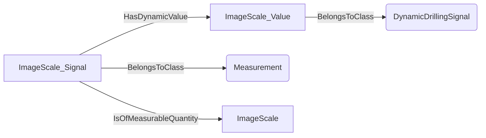
An example SparQL query looks like this:
```sparql
PREFIX rdf: <http://www.w3.org/1999/02/22-rdf-syntax-ns#>
PREFIX ddhub: <http://ddhub.no/>
PREFIX quantity: <http://ddhub.no/UnitAndQuantity>
SELECT ?ImageScale-Value
WHERE {
	?ImageScale_Value rdf:type ddhub:DynamicDrillingSignal .
	?ImageScale_Signal rdf:type ddhub:Measurement .
	?ImageScale_Signal ddhub:HasDynamicValue ?ImageScale_Value .
	?ImageScale_Signal ddhub:IsOfMeasurableQuantity ?ImageScale .
}
```
## DiameterSmallQuantity <!-- NOUN -->
- Display name: DiameterSmall
- Parent class: [MeasurableQuantity](./Quantities.md#MeasurableQuantity)
- Specialization:
  - MeaningfulPrecision = 0.0001
- Description: 
Length is a measure of distance.
The dimension of length is:
$$[L]$$.
The SI unit for **length** is: metre with the associated unit label $m$
The meaningful precision of small diameter is typically: 0.0001 m
- Definition set: MeasurableQuantityTypes
- Examples:
``` dwis DiameterSmall-Value
DynamicDrillingSignal:DiameterSmall_Value
Measurement:DiameterSmall_Signal
DiameterSmall_Signal HasDynamicValue DiameterSmall_Value
DiameterSmall_Signal IsOfMeasurableQuantity DiameterSmall
```
An example semantic graph looks like as follow:
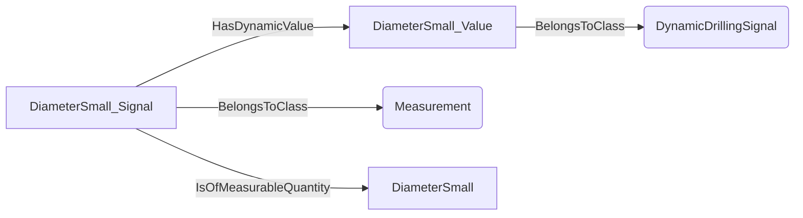
An example SparQL query looks like this:
```sparql
PREFIX rdf: <http://www.w3.org/1999/02/22-rdf-syntax-ns#>
PREFIX ddhub: <http://ddhub.no/>
PREFIX quantity: <http://ddhub.no/UnitAndQuantity>
SELECT ?DiameterSmall-Value
WHERE {
	?DiameterSmall_Value rdf:type ddhub:DynamicDrillingSignal .
	?DiameterSmall_Signal rdf:type ddhub:Measurement .
	?DiameterSmall_Signal ddhub:HasDynamicValue ?DiameterSmall_Value .
	?DiameterSmall_Signal ddhub:IsOfMeasurableQuantity ?DiameterSmall .
}
```
## DimensionLessStandardQuantity <!-- NOUN -->
- Display name: DimensionLessStandard
- Parent class: [MeasurableQuantity](./Quantities.md#MeasurableQuantity)
- Specialization:
  - MeaningfulPrecision = 0.001
- Description: 
As its name indicates, a dimensionless quantity has no dimension:
The meaningful precision of standard dimensionless values is typically: 0.001 
- Definition set: MeasurableQuantityTypes
- Examples:
``` dwis DimensionLessStandard-Value
DynamicDrillingSignal:DimensionLessStandard_Value
Measurement:DimensionLessStandard_Signal
DimensionLessStandard_Signal HasDynamicValue DimensionLessStandard_Value
DimensionLessStandard_Signal IsOfMeasurableQuantity DimensionLessStandard
```
An example semantic graph looks like as follow:
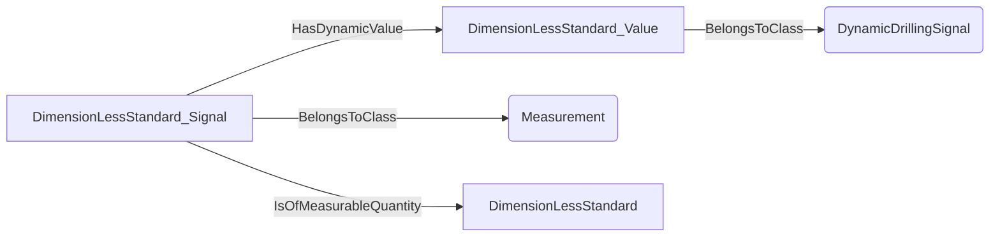
An example SparQL query looks like this:
```sparql
PREFIX rdf: <http://www.w3.org/1999/02/22-rdf-syntax-ns#>
PREFIX ddhub: <http://ddhub.no/>
PREFIX quantity: <http://ddhub.no/UnitAndQuantity>
SELECT ?DimensionLessStandard-Value
WHERE {
	?DimensionLessStandard_Value rdf:type ddhub:DynamicDrillingSignal .
	?DimensionLessStandard_Signal rdf:type ddhub:Measurement .
	?DimensionLessStandard_Signal ddhub:HasDynamicValue ?DimensionLessStandard_Value .
	?DimensionLessStandard_Signal ddhub:IsOfMeasurableQuantity ?DimensionLessStandard .
}
```
## EarthMagneticFluxDensityQuantity <!-- NOUN -->
- Display name: EarthMagneticFluxDensity
- Parent class: [MeasurableQuantity](./Quantities.md#MeasurableQuantity)
- Specialization:
  - MeaningfulPrecision = 1E-09
- Description: 
Magnetic flux density is the measure of the strength of a magnetic field per unit area through which the magnetic flux passes. It indicates how concentrated the magnetic field is.
The dimension of magnetic flux density is:
$$[MI^{-1}T^{-2}]$$.
The SI unit for **magnetic flux density** is: tesla with the associated unit label $T$
Earth's magnetic flux density refers to the strength and direction of the Earth's magnetic field at a specific location.
The meaningful precision of earth magnetic flux density is: 1E-09 T
- Definition set: MeasurableQuantityTypes
- Examples:
``` dwis EarthMagneticFluxDensity-Value
DynamicDrillingSignal:EarthMagneticFluxDensity_Value
Measurement:EarthMagneticFluxDensity_Signal
EarthMagneticFluxDensity_Signal HasDynamicValue EarthMagneticFluxDensity_Value
EarthMagneticFluxDensity_Signal IsOfMeasurableQuantity EarthMagneticFluxDensity
```
An example semantic graph looks like as follow:
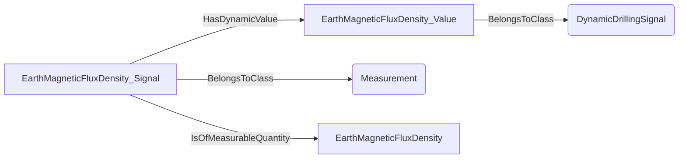
An example SparQL query looks like this:
```sparql
PREFIX rdf: <http://www.w3.org/1999/02/22-rdf-syntax-ns#>
PREFIX ddhub: <http://ddhub.no/>
PREFIX quantity: <http://ddhub.no/UnitAndQuantity>
SELECT ?EarthMagneticFluxDensity-Value
WHERE {
	?EarthMagneticFluxDensity_Value rdf:type ddhub:DynamicDrillingSignal .
	?EarthMagneticFluxDensity_Signal rdf:type ddhub:Measurement .
	?EarthMagneticFluxDensity_Signal ddhub:HasDynamicValue ?EarthMagneticFluxDensity_Value .
	?EarthMagneticFluxDensity_Signal ddhub:IsOfMeasurableQuantity ?EarthMagneticFluxDensity .
}
```
## ElasticModulusQuantity <!-- NOUN -->
- Display name: ElasticModulus
- Parent class: [MeasurableQuantity](./Quantities.md#MeasurableQuantity)
- Specialization:
  - MeaningfulPrecision = 10000
- Description: 
Pressure is the force applied per unit area on a surface.
The dimension of pressure is:
$$[ML^{-1}T^{-2}]$$.
The SI unit for **pressure** is: pascal with the associated unit label $Pa$
Elastic modulus is a measure of a material's ability to resist deformation under stress. It quantifies the ratio of stress to strain in the material's elastic region
The meaningful precision of an elastic modulus is typically: 10000 Pa
- Definition set: MeasurableQuantityTypes
- Examples:
``` dwis ElasticModulus-Value
DynamicDrillingSignal:ElasticModulus_Value
Measurement:ElasticModulus_Signal
ElasticModulus_Signal HasDynamicValue ElasticModulus_Value
ElasticModulus_Signal IsOfMeasurableQuantity ElasticModulus
```
An example semantic graph looks like as follow:
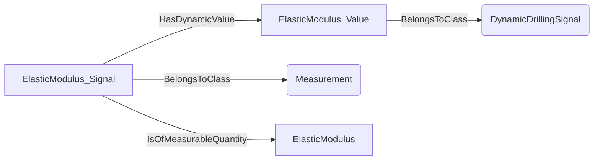
An example SparQL query looks like this:
```sparql
PREFIX rdf: <http://www.w3.org/1999/02/22-rdf-syntax-ns#>
PREFIX ddhub: <http://ddhub.no/>
PREFIX quantity: <http://ddhub.no/UnitAndQuantity>
SELECT ?ElasticModulus-Value
WHERE {
	?ElasticModulus_Value rdf:type ddhub:DynamicDrillingSignal .
	?ElasticModulus_Signal rdf:type ddhub:Measurement .
	?ElasticModulus_Signal ddhub:HasDynamicValue ?ElasticModulus_Value .
	?ElasticModulus_Signal ddhub:IsOfMeasurableQuantity ?ElasticModulus .
}
```
## LengthSmallQuantity <!-- NOUN -->
- Display name: LengthSmall
- Parent class: [MeasurableQuantity](./Quantities.md#MeasurableQuantity)
- Specialization:
  - MeaningfulPrecision = 1E-05
- Description: 
Length is a measure of distance.
The dimension of length is:
$$[L]$$.
The SI unit for **length** is: metre with the associated unit label $m$
The meaningful precision of small length is typically: 1E-05 m
- Definition set: MeasurableQuantityTypes
- Examples:
``` dwis LengthSmall-Value
DynamicDrillingSignal:LengthSmall_Value
Measurement:LengthSmall_Signal
LengthSmall_Signal HasDynamicValue LengthSmall_Value
LengthSmall_Signal IsOfMeasurableQuantity LengthSmall
```
An example semantic graph looks like as follow:

An example SparQL query looks like this:
```sparql
PREFIX rdf: <http://www.w3.org/1999/02/22-rdf-syntax-ns#>
PREFIX ddhub: <http://ddhub.no/>
PREFIX quantity: <http://ddhub.no/UnitAndQuantity>
SELECT ?LengthSmall-Value
WHERE {
	?LengthSmall_Value rdf:type ddhub:DynamicDrillingSignal .
	?LengthSmall_Signal rdf:type ddhub:Measurement .
	?LengthSmall_Signal ddhub:HasDynamicValue ?LengthSmall_Value .
	?LengthSmall_Signal ddhub:IsOfMeasurableQuantity ?LengthSmall .
}
```
## RotationalFrequencyQuantity <!-- NOUN -->
- Display name: RotationalFrequency
- Parent class: [MeasurableQuantity](./Quantities.md#MeasurableQuantity)
- Specialization:
  - MeaningfulPrecision = 0.016666666666666666
- Description: 
Rotation frequency is the number of complete rotations or cycles an object makes per unit of time.
The dimension of rotational frequency is:
$$[T^{-1}]$$.
- Definition set: MeasurableQuantityTypes
- Examples:
``` dwis RotationalFrequency-Value
DynamicDrillingSignal:RotationalFrequency_Value
Measurement:RotationalFrequency_Signal
RotationalFrequency_Signal HasDynamicValue RotationalFrequency_Value
RotationalFrequency_Signal IsOfMeasurableQuantity RotationalFrequency
```
An example semantic graph looks like as follow:
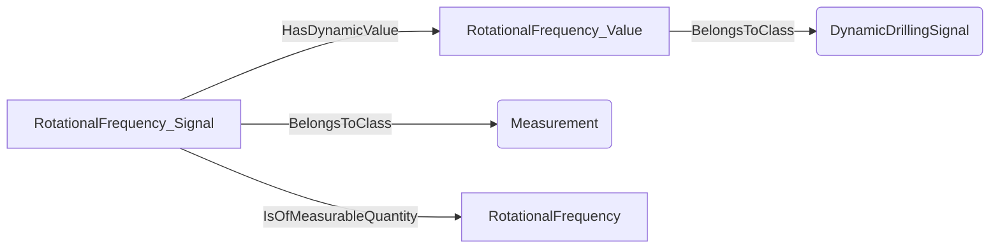
An example SparQL query looks like this:
```sparql
PREFIX rdf: <http://www.w3.org/1999/02/22-rdf-syntax-ns#>
PREFIX ddhub: <http://ddhub.no/>
PREFIX quantity: <http://ddhub.no/UnitAndQuantity>
SELECT ?RotationalFrequency-Value
WHERE {
	?RotationalFrequency_Value rdf:type ddhub:DynamicDrillingSignal .
	?RotationalFrequency_Signal rdf:type ddhub:Measurement .
	?RotationalFrequency_Signal ddhub:HasDynamicValue ?RotationalFrequency_Value .
	?RotationalFrequency_Signal ddhub:IsOfMeasurableQuantity ?RotationalFrequency .
}
```
## VolumeLargeQuantity <!-- NOUN -->
- Display name: VolumeLarge
- Parent class: [MeasurableQuantity](./Quantities.md#MeasurableQuantity)
- Specialization:
  - MeaningfulPrecision = 0.1
- Description: 
A volume is the amount of three-dimensional space occupied by a body.
The dimension of volume is:
$$[L^{3}]$$.
The SI unit for **volume** is: cubic metre with the associated unit label $m^{3}$
The meaningful precision of a large volume is typically: 0.1 m³
- Definition set: MeasurableQuantityTypes
- Examples:
``` dwis VolumeLarge-Value
DynamicDrillingSignal:VolumeLarge_Value
Measurement:VolumeLarge_Signal
VolumeLarge_Signal HasDynamicValue VolumeLarge_Value
VolumeLarge_Signal IsOfMeasurableQuantity VolumeLarge
```
An example semantic graph looks like as follow:
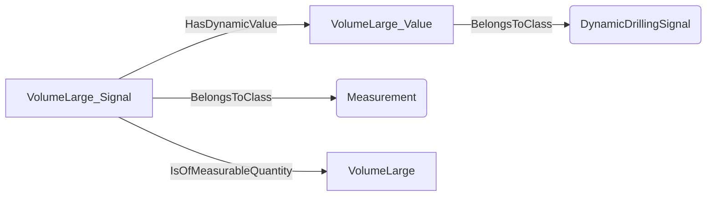
An example SparQL query looks like this:
```sparql
PREFIX rdf: <http://www.w3.org/1999/02/22-rdf-syntax-ns#>
PREFIX ddhub: <http://ddhub.no/>
PREFIX quantity: <http://ddhub.no/UnitAndQuantity>
SELECT ?VolumeLarge-Value
WHERE {
	?VolumeLarge_Value rdf:type ddhub:DynamicDrillingSignal .
	?VolumeLarge_Signal rdf:type ddhub:Measurement .
	?VolumeLarge_Signal ddhub:HasDynamicValue ?VolumeLarge_Value .
	?VolumeLarge_Signal ddhub:IsOfMeasurableQuantity ?VolumeLarge .
}
```
## ProportionStandardQuantity <!-- NOUN -->
- Display name: ProportionStandard
- Parent class: [MeasurableQuantity](./Quantities.md#MeasurableQuantity)
- Specialization:
  - MeaningfulPrecision = 0.001
- Description: 
A proportion is the ratio of two quantities with the same dimension. It represents how one quantity compares to another in relative terms.
A proportion is dimensionless:
The meaningful precision of a standard proportion is typically: 0.001 
- Definition set: MeasurableQuantityTypes
- Examples:
``` dwis ProportionStandard-Value
DynamicDrillingSignal:ProportionStandard_Value
Measurement:ProportionStandard_Signal
ProportionStandard_Signal HasDynamicValue ProportionStandard_Value
ProportionStandard_Signal IsOfMeasurableQuantity ProportionStandard
```
An example semantic graph looks like as follow:

An example SparQL query looks like this:
```sparql
PREFIX rdf: <http://www.w3.org/1999/02/22-rdf-syntax-ns#>
PREFIX ddhub: <http://ddhub.no/>
PREFIX quantity: <http://ddhub.no/UnitAndQuantity>
SELECT ?ProportionStandard-Value
WHERE {
	?ProportionStandard_Value rdf:type ddhub:DynamicDrillingSignal .
	?ProportionStandard_Signal rdf:type ddhub:Measurement .
	?ProportionStandard_Signal ddhub:HasDynamicValue ?ProportionStandard_Value .
	?ProportionStandard_Signal ddhub:IsOfMeasurableQuantity ?ProportionStandard .
}
```
## LengthStandardQuantity <!-- NOUN -->
- Display name: LengthStandard
- Parent class: [MeasurableQuantity](./Quantities.md#MeasurableQuantity)
- Specialization:
  - MeaningfulPrecision = 0.001
- Description: 
Length is a measure of distance.
The dimension of length is:
$$[L]$$.
The SI unit for **length** is: metre with the associated unit label $m$
The meaningful precision of a standard length is typically: 0.001 m
- Definition set: MeasurableQuantityTypes
- Examples:
``` dwis LengthStandard-Value
DynamicDrillingSignal:LengthStandard_Value
Measurement:LengthStandard_Signal
LengthStandard_Signal HasDynamicValue LengthStandard_Value
LengthStandard_Signal IsOfMeasurableQuantity LengthStandard
```
An example semantic graph looks like as follow:

An example SparQL query looks like this:
```sparql
PREFIX rdf: <http://www.w3.org/1999/02/22-rdf-syntax-ns#>
PREFIX ddhub: <http://ddhub.no/>
PREFIX quantity: <http://ddhub.no/UnitAndQuantity>
SELECT ?LengthStandard-Value
WHERE {
	?LengthStandard_Value rdf:type ddhub:DynamicDrillingSignal .
	?LengthStandard_Signal rdf:type ddhub:Measurement .
	?LengthStandard_Signal ddhub:HasDynamicValue ?LengthStandard_Value .
	?LengthStandard_Signal ddhub:IsOfMeasurableQuantity ?LengthStandard .
}
```
## FluidShearRateQuantity <!-- NOUN -->
- Display name: FluidShearRate
- Parent class: [MeasurableQuantity](./Quantities.md#MeasurableQuantity)
- Specialization:
  - MeaningfulPrecision = 0.01
- Description: 
Frequency is the number of occurrences of a repeating event per unit of time.
The dimension of frequency is:
$$[T^{-1}]$$.
The SI unit for **frequency** is: hertz with the associated unit label $Hz$
Shear rate in a fluid is the rate at which adjacent layers of the fluid move relative to each other, typically expressed as the change in velocity per unit distance between the layers. It measures how quickly the fluid is being deformed by shear stress.
The meaningful precision of a shear rate for a fluid is typically: 0.01 Hz
- Definition set: MeasurableQuantityTypes
- Examples:
``` dwis FluidShearRate-Value
DynamicDrillingSignal:FluidShearRate_Value
Measurement:FluidShearRate_Signal
FluidShearRate_Signal HasDynamicValue FluidShearRate_Value
FluidShearRate_Signal IsOfMeasurableQuantity FluidShearRate
```
An example semantic graph looks like as follow:
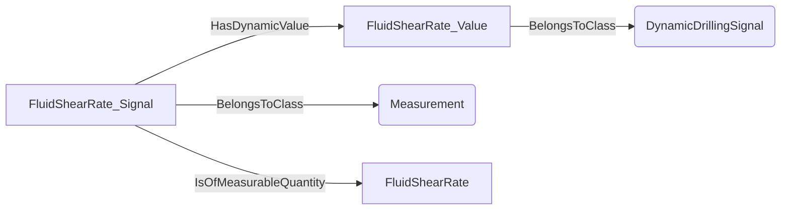
An example SparQL query looks like this:
```sparql
PREFIX rdf: <http://www.w3.org/1999/02/22-rdf-syntax-ns#>
PREFIX ddhub: <http://ddhub.no/>
PREFIX quantity: <http://ddhub.no/UnitAndQuantity>
SELECT ?FluidShearRate-Value
WHERE {
	?FluidShearRate_Value rdf:type ddhub:DynamicDrillingSignal .
	?FluidShearRate_Signal rdf:type ddhub:Measurement .
	?FluidShearRate_Signal ddhub:HasDynamicValue ?FluidShearRate_Value .
	?FluidShearRate_Signal ddhub:IsOfMeasurableQuantity ?FluidShearRate .
}
```
## FluidShearStressQuantity <!-- NOUN -->
- Display name: FluidShearStress
- Parent class: [MeasurableQuantity](./Quantities.md#MeasurableQuantity)
- Specialization:
  - MeaningfulPrecision = 0.0001
- Description: 
Pressure is the force applied per unit area on a surface.
The dimension of pressure is:
$$[ML^{-1}T^{-2}]$$.
The SI unit for **pressure** is: pascal with the associated unit label $Pa$
Shear stress in a fluid is the force per unit area exerted parallel to the fluid's surface, causing layers of the fluid to slide relative to each other. It measures the fluid's resistance to this shearing action.
The meaningful precision of a shear stress for a fluid is typically: 0.0001 Pa
- Definition set: MeasurableQuantityTypes
- Examples:
``` dwis FluidShearStress-Value
DynamicDrillingSignal:FluidShearStress_Value
Measurement:FluidShearStress_Signal
FluidShearStress_Signal HasDynamicValue FluidShearStress_Value
FluidShearStress_Signal IsOfMeasurableQuantity FluidShearStress
```
An example semantic graph looks like as follow:
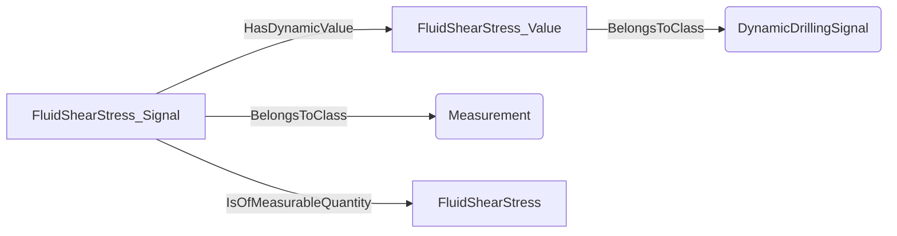
An example SparQL query looks like this:
```sparql
PREFIX rdf: <http://www.w3.org/1999/02/22-rdf-syntax-ns#>
PREFIX ddhub: <http://ddhub.no/>
PREFIX quantity: <http://ddhub.no/UnitAndQuantity>
SELECT ?FluidShearStress-Value
WHERE {
	?FluidShearStress_Value rdf:type ddhub:DynamicDrillingSignal .
	?FluidShearStress_Signal rdf:type ddhub:Measurement .
	?FluidShearStress_Signal ddhub:HasDynamicValue ?FluidShearStress_Value .
	?FluidShearStress_Signal ddhub:IsOfMeasurableQuantity ?FluidShearStress .
}
```
## TorqueSmallQuantity <!-- NOUN -->
- Display name: TorqueSmall
- Parent class: [MeasurableQuantity](./Quantities.md#MeasurableQuantity)
- Specialization:
  - MeaningfulPrecision = 1E-05
- Description: 
A torque is a measure of the rotational force applied to a body around an axis.
The dimension of torque is:
$$[L^{2}MT^{-2}]$$.
The SI unit for **torque** is: newton metre with the associated unit label $N \cdot m$
The meaningful precision of small torque is typically: 1E-05 N•m
- Definition set: MeasurableQuantityTypes
- Examples:
``` dwis TorqueSmall-Value
DynamicDrillingSignal:TorqueSmall_Value
Measurement:TorqueSmall_Signal
TorqueSmall_Signal HasDynamicValue TorqueSmall_Value
TorqueSmall_Signal IsOfMeasurableQuantity TorqueSmall
```
An example semantic graph looks like as follow:
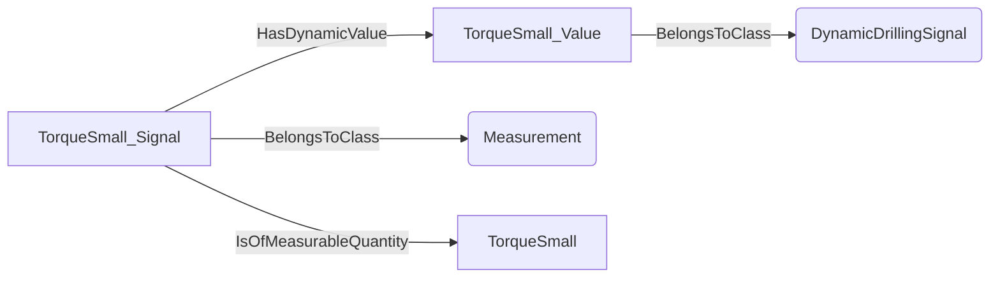
An example SparQL query looks like this:
```sparql
PREFIX rdf: <http://www.w3.org/1999/02/22-rdf-syntax-ns#>
PREFIX ddhub: <http://ddhub.no/>
PREFIX quantity: <http://ddhub.no/UnitAndQuantity>
SELECT ?TorqueSmall-Value
WHERE {
	?TorqueSmall_Value rdf:type ddhub:DynamicDrillingSignal .
	?TorqueSmall_Signal rdf:type ddhub:Measurement .
	?TorqueSmall_Signal ddhub:HasDynamicValue ?TorqueSmall_Value .
	?TorqueSmall_Signal ddhub:IsOfMeasurableQuantity ?TorqueSmall .
}
```
## RotationalFrequencySmallQuantity <!-- NOUN -->
- Display name: RotationalFrequencySmall
- Parent class: [MeasurableQuantity](./Quantities.md#MeasurableQuantity)
- Specialization:
  - MeaningfulPrecision = 0.00016666
- Description: 
Rotation frequency is the number of complete rotations or cycles an object makes per unit of time.
The dimension of rotational frequency is:
$$[T^{-1}]$$.
The meaningful precision of small rotational frequency is typically: 0.00016666 Hz
- Definition set: MeasurableQuantityTypes
- Examples:
``` dwis RotationalFrequencySmall-Value
DynamicDrillingSignal:RotationalFrequencySmall_Value
Measurement:RotationalFrequencySmall_Signal
RotationalFrequencySmall_Signal HasDynamicValue RotationalFrequencySmall_Value
RotationalFrequencySmall_Signal IsOfMeasurableQuantity RotationalFrequencySmall
```
An example semantic graph looks like as follow:
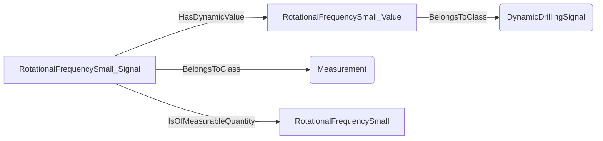
An example SparQL query looks like this:
```sparql
PREFIX rdf: <http://www.w3.org/1999/02/22-rdf-syntax-ns#>
PREFIX ddhub: <http://ddhub.no/>
PREFIX quantity: <http://ddhub.no/UnitAndQuantity>
SELECT ?RotationalFrequencySmall-Value
WHERE {
	?RotationalFrequencySmall_Value rdf:type ddhub:DynamicDrillingSignal .
	?RotationalFrequencySmall_Signal rdf:type ddhub:Measurement .
	?RotationalFrequencySmall_Signal ddhub:HasDynamicValue ?RotationalFrequencySmall_Value .
	?RotationalFrequencySmall_Signal ddhub:IsOfMeasurableQuantity ?RotationalFrequencySmall .
}
```
## ProportionSmallQuantity <!-- NOUN -->
- Display name: ProportionSmall
- Parent class: [MeasurableQuantity](./Quantities.md#MeasurableQuantity)
- Specialization:
  - MeaningfulPrecision = 1E-08
- Description: 
A proportion is the ratio of two quantities with the same dimension. It represents how one quantity compares to another in relative terms.
A proportion is dimensionless:
The meaningful precision of small proportion is typically: 1E-08 
- Definition set: MeasurableQuantityTypes
- Examples:
``` dwis ProportionSmall-Value
DynamicDrillingSignal:ProportionSmall_Value
Measurement:ProportionSmall_Signal
ProportionSmall_Signal HasDynamicValue ProportionSmall_Value
ProportionSmall_Signal IsOfMeasurableQuantity ProportionSmall
```
An example semantic graph looks like as follow:
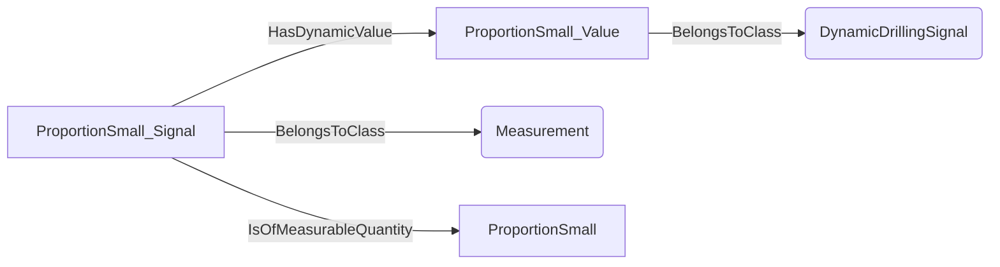
An example SparQL query looks like this:
```sparql
PREFIX rdf: <http://www.w3.org/1999/02/22-rdf-syntax-ns#>
PREFIX ddhub: <http://ddhub.no/>
PREFIX quantity: <http://ddhub.no/UnitAndQuantity>
SELECT ?ProportionSmall-Value
WHERE {
	?ProportionSmall_Value rdf:type ddhub:DynamicDrillingSignal .
	?ProportionSmall_Signal rdf:type ddhub:Measurement .
	?ProportionSmall_Signal ddhub:HasDynamicValue ?ProportionSmall_Value .
	?ProportionSmall_Signal ddhub:IsOfMeasurableQuantity ?ProportionSmall .
}
```
## PorosityQuantity <!-- NOUN -->
- Display name: Porosity
- Parent class: [MeasurableQuantity](./Quantities.md#MeasurableQuantity)
- Specialization:
  - MeaningfulPrecision = 0.001
- Description: 
A proportion is the ratio of two quantities with the same dimension. It represents how one quantity compares to another in relative terms.
A proportion is dimensionless:
Porosity is the measure of the void spaces or pores within a material, expressed as a fraction or percentage of the total volume.
The meaningful precision of porosity is typically: 0.001 
- Definition set: MeasurableQuantityTypes
- Examples:
``` dwis Porosity-Value
DynamicDrillingSignal:Porosity_Value
Measurement:Porosity_Signal
Porosity_Signal HasDynamicValue Porosity_Value
Porosity_Signal IsOfMeasurableQuantity Porosity
```
An example semantic graph looks like as follow:
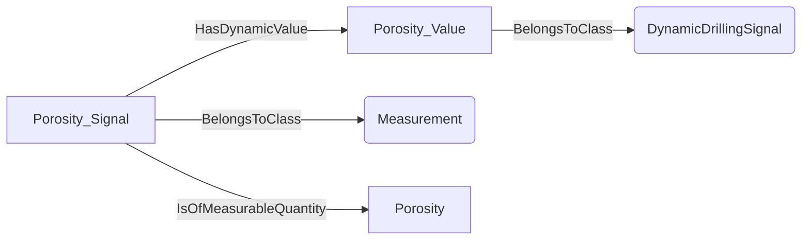
An example SparQL query looks like this:
```sparql
PREFIX rdf: <http://www.w3.org/1999/02/22-rdf-syntax-ns#>
PREFIX ddhub: <http://ddhub.no/>
PREFIX quantity: <http://ddhub.no/UnitAndQuantity>
SELECT ?Porosity-Value
WHERE {
	?Porosity_Value rdf:type ddhub:DynamicDrillingSignal .
	?Porosity_Signal rdf:type ddhub:Measurement .
	?Porosity_Signal ddhub:HasDynamicValue ?Porosity_Value .
	?Porosity_Signal ddhub:IsOfMeasurableQuantity ?Porosity .
}
```
## StrokeFrequencyQuantity <!-- NOUN -->
- Display name: StrokeFrequency
- Parent class: [MeasurableQuantity](./Quantities.md#MeasurableQuantity)
- Specialization:
  - MeaningfulPrecision = 0.016666666666666666
- Description: 
A stroke frequency is the number of stokes per unit time
The meaningful precision of a stroke frequency is typically: 0.016666666666666666 Hz
- Definition set: MeasurableQuantityTypes
- Examples:
``` dwis StrokeFrequency-Value
DynamicDrillingSignal:StrokeFrequency_Value
Measurement:StrokeFrequency_Signal
StrokeFrequency_Signal HasDynamicValue StrokeFrequency_Value
StrokeFrequency_Signal IsOfMeasurableQuantity StrokeFrequency
```
An example semantic graph looks like as follow:
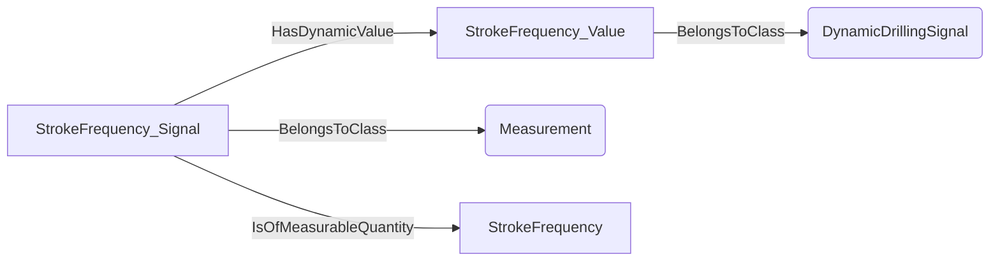
An example SparQL query looks like this:
```sparql
PREFIX rdf: <http://www.w3.org/1999/02/22-rdf-syntax-ns#>
PREFIX ddhub: <http://ddhub.no/>
PREFIX quantity: <http://ddhub.no/UnitAndQuantity>
SELECT ?StrokeFrequency-Value
WHERE {
	?StrokeFrequency_Value rdf:type ddhub:DynamicDrillingSignal .
	?StrokeFrequency_Signal rdf:type ddhub:Measurement .
	?StrokeFrequency_Signal ddhub:HasDynamicValue ?StrokeFrequency_Value .
	?StrokeFrequency_Signal ddhub:IsOfMeasurableQuantity ?StrokeFrequency .
}
```
## ShockRateQuantity <!-- NOUN -->
- Display name: ShockRate
- Parent class: [MeasurableQuantity](./Quantities.md#MeasurableQuantity)
- Specialization:
  - MeaningfulPrecision = 0.016666666666666666
- Description: 
A shock rate is the number of shocks per unit time.
The meaningful precision of shock rate is typically: 0.016666666666666666 Hz/s
- Definition set: MeasurableQuantityTypes
- Examples:
``` dwis ShockRate-Value
DynamicDrillingSignal:ShockRate_Value
Measurement:ShockRate_Signal
ShockRate_Signal HasDynamicValue ShockRate_Value
ShockRate_Signal IsOfMeasurableQuantity ShockRate
```
An example semantic graph looks like as follow:
```mermaid
graph LR
	N0000[ShockRate_Value] -->|BelongsToClass| N0001(DynamicDrillingSignal) 
	N0002[ShockRate_Signal] -->|BelongsToClass| N0003(Measurement) 
	N0002[ShockRate_Signal] -->|HasDynamicValue| N0000[ShockRate_Value] 
	N0002[ShockRate_Signal] -->|IsOfMeasurableQuantity| N0004[ShockRate] 
```
An example SparQL query looks like this:
```sparql
PREFIX rdf: <http://www.w3.org/1999/02/22-rdf-syntax-ns#>
PREFIX ddhub: <http://ddhub.no/>
PREFIX quantity: <http://ddhub.no/UnitAndQuantity>
SELECT ?ShockRate-Value
WHERE {
	?ShockRate_Value rdf:type ddhub:DynamicDrillingSignal .
	?ShockRate_Signal rdf:type ddhub:Measurement .
	?ShockRate_Signal ddhub:HasDynamicValue ?ShockRate_Value .
	?ShockRate_Signal ddhub:IsOfMeasurableQuantity ?ShockRate .
}
```
## AccelerationDrillingQuantity <!-- NOUN -->
- Display name: AccelerationDrilling
- Parent class: [MeasurableQuantity](./Quantities.md#MeasurableQuantity)
- Specialization:
  - MeaningfulPrecision = 0.001
- Description: 
**Acceleration** is defined as the rate of change of velocity with respect to time. Velocity itself is the rate of change of displacement (or position) with respect to time. Therefore, acceleration is the rate of change of displacement twice with respect to time.
Let's break this down:
1. **Displacement** (or position) has the dimension of **Length(L)**.
2. **Velocity** is displacement per unit time:
$$\text{Velocity} = \frac{\text{Length}}{\text{Time}} = \frac{L}{T}$$
So, the dimension of velocity is **$[L T^{ -1}]$**.
3. **Acceleration** is the rate of change of velocity with respect to time:
$$\text{Acceleration} = \frac{\text{Velocity}}{\text{Time}} = \frac{L T^{ -1}}{T} = L T ^{-2}$$
Therefore, the dimension of acceleration is $[LT^{-2}]$.
The SI unit for **acceleration** is: metre per second squared with the associated unit label $\frac{m}{s^{2}}$
The meaningful precision of acceleration in the drilling context is typically: 0.001 m/s²
- Definition set: MeasurableQuantityTypes
- Examples:
``` dwis AccelerationDrilling-Value
DynamicDrillingSignal:AccelerationDrilling_Value
Measurement:AccelerationDrilling_Signal
AccelerationDrilling_Signal HasDynamicValue AccelerationDrilling_Value
AccelerationDrilling_Signal IsOfMeasurableQuantity AccelerationDrilling
```
An example semantic graph looks like as follow:
```mermaid
graph LR
	N0000[AccelerationDrilling_Value] -->|BelongsToClass| N0001(DynamicDrillingSignal) 
	N0002[AccelerationDrilling_Signal] -->|BelongsToClass| N0003(Measurement) 
	N0002[AccelerationDrilling_Signal] -->|HasDynamicValue| N0000[AccelerationDrilling_Value] 
	N0002[AccelerationDrilling_Signal] -->|IsOfMeasurableQuantity| N0004[AccelerationDrilling] 
```
An example SparQL query looks like this:
```sparql
PREFIX rdf: <http://www.w3.org/1999/02/22-rdf-syntax-ns#>
PREFIX ddhub: <http://ddhub.no/>
PREFIX quantity: <http://ddhub.no/UnitAndQuantity>
SELECT ?AccelerationDrilling-Value
WHERE {
	?AccelerationDrilling_Value rdf:type ddhub:DynamicDrillingSignal .
	?AccelerationDrilling_Signal rdf:type ddhub:Measurement .
	?AccelerationDrilling_Signal ddhub:HasDynamicValue ?AccelerationDrilling_Value .
	?AccelerationDrilling_Signal ddhub:IsOfMeasurableQuantity ?AccelerationDrilling .
}
```
## AngleGradientPerLengthDrillingQuantity <!-- NOUN -->
- Display name: AngleGradientPerLengthDrilling
- Parent class: [MeasurableQuantity](./Quantities.md#MeasurableQuantity)
- Specialization:
  - MeaningfulPrecision = 0.00017453292519943296
- Description: 
Consider a situation where you have a length $L$ along which an angle $\theta$ changes. The angle variation gradient is defined as the **rate of change of the angle** per unit change in length. Mathematically, it can be expressed as: 
$$\text{ Angle Variation Gradient} = \frac{ d\theta}{ dL}$$
where: 
- Definition set: MeasurableQuantityTypes
- Examples:
``` dwis AngleGradientPerLengthDrilling-Value
DynamicDrillingSignal:AngleGradientPerLengthDrilling_Value
Measurement:AngleGradientPerLengthDrilling_Signal
AngleGradientPerLengthDrilling_Signal HasDynamicValue AngleGradientPerLengthDrilling_Value
AngleGradientPerLengthDrilling_Signal IsOfMeasurableQuantity AngleGradientPerLengthDrilling
```
An example semantic graph looks like as follow:
```mermaid
graph LR
	N0000[AngleGradientPerLengthDrilling_Value] -->|BelongsToClass| N0001(DynamicDrillingSignal) 
	N0002[AngleGradientPerLengthDrilling_Signal] -->|BelongsToClass| N0003(Measurement) 
	N0002[AngleGradientPerLengthDrilling_Signal] -->|HasDynamicValue| N0000[AngleGradientPerLengthDrilling_Value] 
	N0002[AngleGradientPerLengthDrilling_Signal] -->|IsOfMeasurableQuantity| N0004[AngleGradientPerLengthDrilling] 
```
An example SparQL query looks like this:
```sparql
PREFIX rdf: <http://www.w3.org/1999/02/22-rdf-syntax-ns#>
PREFIX ddhub: <http://ddhub.no/>
PREFIX quantity: <http://ddhub.no/UnitAndQuantity>
SELECT ?AngleGradientPerLengthDrilling-Value
WHERE {
	?AngleGradientPerLengthDrilling_Value rdf:type ddhub:DynamicDrillingSignal .
	?AngleGradientPerLengthDrilling_Signal rdf:type ddhub:Measurement .
	?AngleGradientPerLengthDrilling_Signal ddhub:HasDynamicValue ?AngleGradientPerLengthDrilling_Value .
	?AngleGradientPerLengthDrilling_Signal ddhub:IsOfMeasurableQuantity ?AngleGradientPerLengthDrilling .
}
```
## AngleMagneticFluxDensitySurveyInstrumentDrillingQuantity <!-- NOUN -->
- Display name: AngleMagneticFluxDensitySurveyInstrumentDrilling
- Parent class: [MeasurableQuantity](./Quantities.md#MeasurableQuantity)
- Specialization:
  - MeaningfulPrecision = 1E-09
- Description: 
The **angle magnetic flux density** is the product of an angle by a magnetic flux density. Let's break it down step by step:
1. Magnetic Flux Density
The **magnetic flux density** $\mathbf{B}$ is a measure of the strength and direction of the magnetic field at a particular point in space. It represents the amount of magnetic flux passing through a unit area perpendicular to the direction of the magnetic field. In simpler terms, it describes how dense or concentrated the magnetic field lines are in a given region.It can be expressed in terms of the fundamental dimensions as:
$$[M][T]^{-2}[I]^{-1}$$
Where:
- Definition set: MeasurableQuantityTypes
- Examples:
``` dwis AngleMagneticFluxDensitySurveyInstrumentDrilling-Value
DynamicDrillingSignal:AngleMagneticFluxDensitySurveyInstrumentDrilling_Value
Measurement:AngleMagneticFluxDensitySurveyInstrumentDrilling_Signal
AngleMagneticFluxDensitySurveyInstrumentDrilling_Signal HasDynamicValue AngleMagneticFluxDensitySurveyInstrumentDrilling_Value
AngleMagneticFluxDensitySurveyInstrumentDrilling_Signal IsOfMeasurableQuantity AngleMagneticFluxDensitySurveyInstrumentDrilling
```
An example semantic graph looks like as follow:
```mermaid
graph LR
	N0000[AngleMagneticFluxDensitySurveyInstrumentDrilling_Value] -->|BelongsToClass| N0001(DynamicDrillingSignal) 
	N0002[AngleMagneticFluxDensitySurveyInstrumentDrilling_Signal] -->|BelongsToClass| N0003(Measurement) 
	N0002[AngleMagneticFluxDensitySurveyInstrumentDrilling_Signal] -->|HasDynamicValue| N0000[AngleMagneticFluxDensitySurveyInstrumentDrilling_Value] 
	N0002[AngleMagneticFluxDensitySurveyInstrumentDrilling_Signal] -->|IsOfMeasurableQuantity| N0004[AngleMagneticFluxDensitySurveyInstrumentDrilling] 
```
An example SparQL query looks like this:
```sparql
PREFIX rdf: <http://www.w3.org/1999/02/22-rdf-syntax-ns#>
PREFIX ddhub: <http://ddhub.no/>
PREFIX quantity: <http://ddhub.no/UnitAndQuantity>
SELECT ?AngleMagneticFluxDensitySurveyInstrumentDrilling-Value
WHERE {
	?AngleMagneticFluxDensitySurveyInstrumentDrilling_Value rdf:type ddhub:DynamicDrillingSignal .
	?AngleMagneticFluxDensitySurveyInstrumentDrilling_Signal rdf:type ddhub:Measurement .
	?AngleMagneticFluxDensitySurveyInstrumentDrilling_Signal ddhub:HasDynamicValue ?AngleMagneticFluxDensitySurveyInstrumentDrilling_Value .
	?AngleMagneticFluxDensitySurveyInstrumentDrilling_Signal ddhub:IsOfMeasurableQuantity ?AngleMagneticFluxDensitySurveyInstrumentDrilling .
}
```
## AngularAccelerationDrillingQuantity <!-- NOUN -->
- Display name: AngularAccelerationDrilling
- Parent class: [MeasurableQuantity](./Quantities.md#MeasurableQuantity)
- Specialization:
  - MeaningfulPrecision = 0.01
- Description: 
An angular acceleration is the second derivative compared to time of a plan angle: $\frac{d^2\theta}{dt^2}$.
The dimension of angular acceleration is:
$$[{\theta}T^{-2}]$$.
The SI unit for **angular acceleration** is: radian per second squared with the associated unit label $\frac{rad}{s^{2}}$
The meaningful precision of angular acceleration in the drilling context is typically: 0.01 rad/s²
- Definition set: MeasurableQuantityTypes
- Examples:
``` dwis AngularAccelerationDrilling-Value
DynamicDrillingSignal:AngularAccelerationDrilling_Value
Measurement:AngularAccelerationDrilling_Signal
AngularAccelerationDrilling_Signal HasDynamicValue AngularAccelerationDrilling_Value
AngularAccelerationDrilling_Signal IsOfMeasurableQuantity AngularAccelerationDrilling
```
An example semantic graph looks like as follow:
```mermaid
graph LR
	N0000[AngularAccelerationDrilling_Value] -->|BelongsToClass| N0001(DynamicDrillingSignal) 
	N0002[AngularAccelerationDrilling_Signal] -->|BelongsToClass| N0003(Measurement) 
	N0002[AngularAccelerationDrilling_Signal] -->|HasDynamicValue| N0000[AngularAccelerationDrilling_Value] 
	N0002[AngularAccelerationDrilling_Signal] -->|IsOfMeasurableQuantity| N0004[AngularAccelerationDrilling] 
```
An example SparQL query looks like this:
```sparql
PREFIX rdf: <http://www.w3.org/1999/02/22-rdf-syntax-ns#>
PREFIX ddhub: <http://ddhub.no/>
PREFIX quantity: <http://ddhub.no/UnitAndQuantity>
SELECT ?AngularAccelerationDrilling-Value
WHERE {
	?AngularAccelerationDrilling_Value rdf:type ddhub:DynamicDrillingSignal .
	?AngularAccelerationDrilling_Signal rdf:type ddhub:Measurement .
	?AngularAccelerationDrilling_Signal ddhub:HasDynamicValue ?AngularAccelerationDrilling_Value .
	?AngularAccelerationDrilling_Signal ddhub:IsOfMeasurableQuantity ?AngularAccelerationDrilling .
}
```
## AngularVelocityDrillingQuantity <!-- NOUN -->
- Display name: AngularVelocityDrilling
- Parent class: [MeasurableQuantity](./Quantities.md#MeasurableQuantity)
- Specialization:
  - MeaningfulPrecision = 0.01
- Description: 
An angular velocity is the first derivative compared to time of a plan angle: $\frac{d\theta}{dt}$.
The dimension of angular velocity is:
$$[{\theta}T^{-1}]$$.
The SI unit for **angular velocity** is: radian per second with the associated unit label $\frac{rad}{s}$
The meaningful precision of angular velocity in the drilling context is typically: 0.01 rad/s
- Definition set: MeasurableQuantityTypes
- Examples:
``` dwis AngularVelocityDrilling-Value
DynamicDrillingSignal:AngularVelocityDrilling_Value
Measurement:AngularVelocityDrilling_Signal
AngularVelocityDrilling_Signal HasDynamicValue AngularVelocityDrilling_Value
AngularVelocityDrilling_Signal IsOfMeasurableQuantity AngularVelocityDrilling
```
An example semantic graph looks like as follow:
```mermaid
graph LR
	N0000[AngularVelocityDrilling_Value] -->|BelongsToClass| N0001(DynamicDrillingSignal) 
	N0002[AngularVelocityDrilling_Signal] -->|BelongsToClass| N0003(Measurement) 
	N0002[AngularVelocityDrilling_Signal] -->|HasDynamicValue| N0000[AngularVelocityDrilling_Value] 
	N0002[AngularVelocityDrilling_Signal] -->|IsOfMeasurableQuantity| N0004[AngularVelocityDrilling] 
```
An example SparQL query looks like this:
```sparql
PREFIX rdf: <http://www.w3.org/1999/02/22-rdf-syntax-ns#>
PREFIX ddhub: <http://ddhub.no/>
PREFIX quantity: <http://ddhub.no/UnitAndQuantity>
SELECT ?AngularVelocityDrilling-Value
WHERE {
	?AngularVelocityDrilling_Value rdf:type ddhub:DynamicDrillingSignal .
	?AngularVelocityDrilling_Signal rdf:type ddhub:Measurement .
	?AngularVelocityDrilling_Signal ddhub:HasDynamicValue ?AngularVelocityDrilling_Value .
	?AngularVelocityDrilling_Signal ddhub:IsOfMeasurableQuantity ?AngularVelocityDrilling .
}
```
## AngularVelocitySurveyInstrumentDrillingQuantity <!-- NOUN -->
- Display name: AngularVelocitySurveyInstrumentDrilling
- Parent class: [MeasurableQuantity](./Quantities.md#MeasurableQuantity)
- Specialization:
  - MeaningfulPrecision = 1E-07
- Description: 
An angular velocity is the first derivative compared to time of a plan angle: $\frac{d\theta}{dt}$.
The dimension of angular velocity is:
$$[{\theta}T^{-1}]$$.
The SI unit for **angular velocity** is: radian per second with the associated unit label $\frac{rad}{s}$
The meaningful precision of angular velocity related to survey instrument performance models in the drilling context is typically: 1E-07 rad•T
- Definition set: MeasurableQuantityTypes
- Examples:
``` dwis AngularVelocitySurveyInstrumentDrilling-Value
DynamicDrillingSignal:AngularVelocitySurveyInstrumentDrilling_Value
Measurement:AngularVelocitySurveyInstrumentDrilling_Signal
AngularVelocitySurveyInstrumentDrilling_Signal HasDynamicValue AngularVelocitySurveyInstrumentDrilling_Value
AngularVelocitySurveyInstrumentDrilling_Signal IsOfMeasurableQuantity AngularVelocitySurveyInstrumentDrilling
```
An example semantic graph looks like as follow:
```mermaid
graph LR
	N0000[AngularVelocitySurveyInstrumentDrilling_Value] -->|BelongsToClass| N0001(DynamicDrillingSignal) 
	N0002[AngularVelocitySurveyInstrumentDrilling_Signal] -->|BelongsToClass| N0003(Measurement) 
	N0002[AngularVelocitySurveyInstrumentDrilling_Signal] -->|HasDynamicValue| N0000[AngularVelocitySurveyInstrumentDrilling_Value] 
	N0002[AngularVelocitySurveyInstrumentDrilling_Signal] -->|IsOfMeasurableQuantity| N0004[AngularVelocitySurveyInstrumentDrilling] 
```
An example SparQL query looks like this:
```sparql
PREFIX rdf: <http://www.w3.org/1999/02/22-rdf-syntax-ns#>
PREFIX ddhub: <http://ddhub.no/>
PREFIX quantity: <http://ddhub.no/UnitAndQuantity>
SELECT ?AngularVelocitySurveyInstrumentDrilling-Value
WHERE {
	?AngularVelocitySurveyInstrumentDrilling_Value rdf:type ddhub:DynamicDrillingSignal .
	?AngularVelocitySurveyInstrumentDrilling_Signal rdf:type ddhub:Measurement .
	?AngularVelocitySurveyInstrumentDrilling_Signal ddhub:HasDynamicValue ?AngularVelocitySurveyInstrumentDrilling_Value .
	?AngularVelocitySurveyInstrumentDrilling_Signal ddhub:IsOfMeasurableQuantity ?AngularVelocitySurveyInstrumentDrilling .
}
```
## AreaDrillingQuantity <!-- NOUN -->
- Display name: AreaDrilling
- Parent class: [MeasurableQuantity](./Quantities.md#MeasurableQuantity)
- Specialization:
  - MeaningfulPrecision = 1E-06
- Description: 
Area is the measure of the extent of a surface or the size of a two-dimensional shape.
The dimension of area is:
$$[L^{2}]$$.
The SI unit for **area** is: square metre with the associated unit label $m^{2}$
The meaningful precision of area in the drilling context is typically: 1E-06 m²
- Definition set: MeasurableQuantityTypes
- Examples:
``` dwis AreaDrilling-Value
DynamicDrillingSignal:AreaDrilling_Value
Measurement:AreaDrilling_Signal
AreaDrilling_Signal HasDynamicValue AreaDrilling_Value
AreaDrilling_Signal IsOfMeasurableQuantity AreaDrilling
```
An example semantic graph looks like as follow:
```mermaid
graph LR
	N0000[AreaDrilling_Value] -->|BelongsToClass| N0001(DynamicDrillingSignal) 
	N0002[AreaDrilling_Signal] -->|BelongsToClass| N0003(Measurement) 
	N0002[AreaDrilling_Signal] -->|HasDynamicValue| N0000[AreaDrilling_Value] 
	N0002[AreaDrilling_Signal] -->|IsOfMeasurableQuantity| N0004[AreaDrilling] 
```
An example SparQL query looks like this:
```sparql
PREFIX rdf: <http://www.w3.org/1999/02/22-rdf-syntax-ns#>
PREFIX ddhub: <http://ddhub.no/>
PREFIX quantity: <http://ddhub.no/UnitAndQuantity>
SELECT ?AreaDrilling-Value
WHERE {
	?AreaDrilling_Value rdf:type ddhub:DynamicDrillingSignal .
	?AreaDrilling_Signal rdf:type ddhub:Measurement .
	?AreaDrilling_Signal ddhub:HasDynamicValue ?AreaDrilling_Value .
	?AreaDrilling_Signal ddhub:IsOfMeasurableQuantity ?AreaDrilling .
}
```
## AxialVelocityDrillingQuantity <!-- NOUN -->
- Display name: AxialVelocityDrilling
- Parent class: [MeasurableQuantity](./Quantities.md#MeasurableQuantity)
- Specialization:
  - MeaningfulPrecision = 0.01
- Description: 
A velocity is the time derivative of a position or a displacement: $\frac{dx}{dt}$, where $x$ is a position and $t$ is time.
The dimension of velocity is:
$$[LT^{-1}]$$.
The SI unit for **velocity** is: metre per second with the associated unit label $\frac{m}{s}$
The meaningful precision of velocity in the drilling context is typically: 0.01 m/s
- Definition set: MeasurableQuantityTypes
- Examples:
``` dwis AxialVelocityDrilling-Value
DynamicDrillingSignal:AxialVelocityDrilling_Value
Measurement:AxialVelocityDrilling_Signal
AxialVelocityDrilling_Signal HasDynamicValue AxialVelocityDrilling_Value
AxialVelocityDrilling_Signal IsOfMeasurableQuantity AxialVelocityDrilling
```
An example semantic graph looks like as follow:
```mermaid
graph LR
	N0000[AxialVelocityDrilling_Value] -->|BelongsToClass| N0001(DynamicDrillingSignal) 
	N0002[AxialVelocityDrilling_Signal] -->|BelongsToClass| N0003(Measurement) 
	N0002[AxialVelocityDrilling_Signal] -->|HasDynamicValue| N0000[AxialVelocityDrilling_Value] 
	N0002[AxialVelocityDrilling_Signal] -->|IsOfMeasurableQuantity| N0004[AxialVelocityDrilling] 
```
An example SparQL query looks like this:
```sparql
PREFIX rdf: <http://www.w3.org/1999/02/22-rdf-syntax-ns#>
PREFIX ddhub: <http://ddhub.no/>
PREFIX quantity: <http://ddhub.no/UnitAndQuantity>
SELECT ?AxialVelocityDrilling-Value
WHERE {
	?AxialVelocityDrilling_Value rdf:type ddhub:DynamicDrillingSignal .
	?AxialVelocityDrilling_Signal rdf:type ddhub:Measurement .
	?AxialVelocityDrilling_Signal ddhub:HasDynamicValue ?AxialVelocityDrilling_Value .
	?AxialVelocityDrilling_Signal ddhub:IsOfMeasurableQuantity ?AxialVelocityDrilling .
}
```
## BlockVelocityDrillingQuantity <!-- NOUN -->
- Display name: BlockVelocityDrilling
- Parent class: [MeasurableQuantity](./Quantities.md#MeasurableQuantity)
- Specialization:
  - MeaningfulPrecision = 0.01
- Description: 
A velocity is the time derivative of a position or a displacement: $\frac{dx}{dt}$, where $x$ is a position and $t$ is time.
The dimension of velocity is:
$$[LT^{-1}]$$.
The SI unit for **velocity** is: metre per second with the associated unit label $\frac{m}{s}$
The meaningful precision of block velocity in the drilling context is typically: 0.01 m/s
- Definition set: MeasurableQuantityTypes
- Examples:
``` dwis BlockVelocityDrilling-Value
DynamicDrillingSignal:BlockVelocityDrilling_Value
Measurement:BlockVelocityDrilling_Signal
BlockVelocityDrilling_Signal HasDynamicValue BlockVelocityDrilling_Value
BlockVelocityDrilling_Signal IsOfMeasurableQuantity BlockVelocityDrilling
```
An example semantic graph looks like as follow:
```mermaid
graph LR
	N0000[BlockVelocityDrilling_Value] -->|BelongsToClass| N0001(DynamicDrillingSignal) 
	N0002[BlockVelocityDrilling_Signal] -->|BelongsToClass| N0003(Measurement) 
	N0002[BlockVelocityDrilling_Signal] -->|HasDynamicValue| N0000[BlockVelocityDrilling_Value] 
	N0002[BlockVelocityDrilling_Signal] -->|IsOfMeasurableQuantity| N0004[BlockVelocityDrilling] 
```
An example SparQL query looks like this:
```sparql
PREFIX rdf: <http://www.w3.org/1999/02/22-rdf-syntax-ns#>
PREFIX ddhub: <http://ddhub.no/>
PREFIX quantity: <http://ddhub.no/UnitAndQuantity>
SELECT ?BlockVelocityDrilling-Value
WHERE {
	?BlockVelocityDrilling_Value rdf:type ddhub:DynamicDrillingSignal .
	?BlockVelocityDrilling_Signal rdf:type ddhub:Measurement .
	?BlockVelocityDrilling_Signal ddhub:HasDynamicValue ?BlockVelocityDrilling_Value .
	?BlockVelocityDrilling_Signal ddhub:IsOfMeasurableQuantity ?BlockVelocityDrilling .
}
```
## CableDiameterDrillingQuantity <!-- NOUN -->
- Display name: CableDiameterDrilling
- Parent class: [MeasurableQuantity](./Quantities.md#MeasurableQuantity)
- Specialization:
  - MeaningfulPrecision = 0.0005
- Description: 
Length is a measure of distance.
The dimension of length is:
$$[L]$$.
The SI unit for **length** is: metre with the associated unit label $m$
The meaningful precision of small length is typically: 0.0005 m
The meaningful precision of a cable diameter in the drilling context is typically: 0.0005 m
- Definition set: MeasurableQuantityTypes
- Examples:
``` dwis CableDiameterDrilling-Value
DynamicDrillingSignal:CableDiameterDrilling_Value
Measurement:CableDiameterDrilling_Signal
CableDiameterDrilling_Signal HasDynamicValue CableDiameterDrilling_Value
CableDiameterDrilling_Signal IsOfMeasurableQuantity CableDiameterDrilling
```
An example semantic graph looks like as follow:
```mermaid
graph LR
	N0000[CableDiameterDrilling_Value] -->|BelongsToClass| N0001(DynamicDrillingSignal) 
	N0002[CableDiameterDrilling_Signal] -->|BelongsToClass| N0003(Measurement) 
	N0002[CableDiameterDrilling_Signal] -->|HasDynamicValue| N0000[CableDiameterDrilling_Value] 
	N0002[CableDiameterDrilling_Signal] -->|IsOfMeasurableQuantity| N0004[CableDiameterDrilling] 
```
An example SparQL query looks like this:
```sparql
PREFIX rdf: <http://www.w3.org/1999/02/22-rdf-syntax-ns#>
PREFIX ddhub: <http://ddhub.no/>
PREFIX quantity: <http://ddhub.no/UnitAndQuantity>
SELECT ?CableDiameterDrilling-Value
WHERE {
	?CableDiameterDrilling_Value rdf:type ddhub:DynamicDrillingSignal .
	?CableDiameterDrilling_Signal rdf:type ddhub:Measurement .
	?CableDiameterDrilling_Signal ddhub:HasDynamicValue ?CableDiameterDrilling_Value .
	?CableDiameterDrilling_Signal ddhub:IsOfMeasurableQuantity ?CableDiameterDrilling .
}
```
## CapillaryPressureDrillingQuantity <!-- NOUN -->
- Display name: CapillaryPressureDrilling
- Parent class: [MeasurableQuantity](./Quantities.md#MeasurableQuantity)
- Specialization:
  - MeaningfulPrecision = 0.1
- Description: 
Pressure is the force applied per unit area on a surface.
The dimension of pressure is:
$$[ML^{-1}T^{-2}]$$.
The SI unit for **pressure** is: pascal with the associated unit label $Pa$
The meaningful precision of capilary pressure in the drilling context is typically: 0.1 Pa
- Definition set: MeasurableQuantityTypes
- Examples:
``` dwis CapillaryPressureDrilling-Value
DynamicDrillingSignal:CapillaryPressureDrilling_Value
Measurement:CapillaryPressureDrilling_Signal
CapillaryPressureDrilling_Signal HasDynamicValue CapillaryPressureDrilling_Value
CapillaryPressureDrilling_Signal IsOfMeasurableQuantity CapillaryPressureDrilling
```
An example semantic graph looks like as follow:
```mermaid
graph LR
	N0000[CapillaryPressureDrilling_Value] -->|BelongsToClass| N0001(DynamicDrillingSignal) 
	N0002[CapillaryPressureDrilling_Signal] -->|BelongsToClass| N0003(Measurement) 
	N0002[CapillaryPressureDrilling_Signal] -->|HasDynamicValue| N0000[CapillaryPressureDrilling_Value] 
	N0002[CapillaryPressureDrilling_Signal] -->|IsOfMeasurableQuantity| N0004[CapillaryPressureDrilling] 
```
An example SparQL query looks like this:
```sparql
PREFIX rdf: <http://www.w3.org/1999/02/22-rdf-syntax-ns#>
PREFIX ddhub: <http://ddhub.no/>
PREFIX quantity: <http://ddhub.no/UnitAndQuantity>
SELECT ?CapillaryPressureDrilling-Value
WHERE {
	?CapillaryPressureDrilling_Value rdf:type ddhub:DynamicDrillingSignal .
	?CapillaryPressureDrilling_Signal rdf:type ddhub:Measurement .
	?CapillaryPressureDrilling_Signal ddhub:HasDynamicValue ?CapillaryPressureDrilling_Value .
	?CapillaryPressureDrilling_Signal ddhub:IsOfMeasurableQuantity ?CapillaryPressureDrilling .
}
```
## CompressibilityDrillingQuantity <!-- NOUN -->
- Display name: CompressibilityDrilling
- Parent class: [MeasurableQuantity](./Quantities.md#MeasurableQuantity)
- Specialization:
  - MeaningfulPrecision = 1E-13
- Description: 
Compressibility is the measure of how much a substance's volume decreases under pressure. It indicates how easily a material or fluid can be compressed and is typically expressed as a change in volume per unit change in pressure.
The dimension of compressibility is:
$$[T^{2}LM^{-1}]$$.
The SI unit for **compressibility** is: inverse pascal with the associated unit label $\frac{1}{Pa}$
The meaningful precision of compressibility in the drilling context is typically: 1E-13 1/Pa
- Definition set: MeasurableQuantityTypes
- Examples:
``` dwis CompressibilityDrilling-Value
DynamicDrillingSignal:CompressibilityDrilling_Value
Measurement:CompressibilityDrilling_Signal
CompressibilityDrilling_Signal HasDynamicValue CompressibilityDrilling_Value
CompressibilityDrilling_Signal IsOfMeasurableQuantity CompressibilityDrilling
```
An example semantic graph looks like as follow:
```mermaid
graph LR
	N0000[CompressibilityDrilling_Value] -->|BelongsToClass| N0001(DynamicDrillingSignal) 
	N0002[CompressibilityDrilling_Signal] -->|BelongsToClass| N0003(Measurement) 
	N0002[CompressibilityDrilling_Signal] -->|HasDynamicValue| N0000[CompressibilityDrilling_Value] 
	N0002[CompressibilityDrilling_Signal] -->|IsOfMeasurableQuantity| N0004[CompressibilityDrilling] 
```
An example SparQL query looks like this:
```sparql
PREFIX rdf: <http://www.w3.org/1999/02/22-rdf-syntax-ns#>
PREFIX ddhub: <http://ddhub.no/>
PREFIX quantity: <http://ddhub.no/UnitAndQuantity>
SELECT ?CompressibilityDrilling-Value
WHERE {
	?CompressibilityDrilling_Value rdf:type ddhub:DynamicDrillingSignal .
	?CompressibilityDrilling_Signal rdf:type ddhub:Measurement .
	?CompressibilityDrilling_Signal ddhub:HasDynamicValue ?CompressibilityDrilling_Value .
	?CompressibilityDrilling_Signal ddhub:IsOfMeasurableQuantity ?CompressibilityDrilling .
}
```
## CurvatureDrillingQuantity <!-- NOUN -->
- Display name: CurvatureDrilling
- Parent class: [MeasurableQuantity](./Quantities.md#MeasurableQuantity)
- Specialization:
  - MeaningfulPrecision = 5.817764173314432E-06
- Description: 
A curvature is the second derivative of a position compared to the curvilinear abscissa: $\frac{d^2x}{ds^2}$, where $x$ is the position and $s$ is the curvilinear abscissa.
The dimension of curvature is:
$$[{\theta}L^{-1}]$$.
The SI unit for **curvature** is: radian per metre with the associated unit label $\frac{rad}{m}$
The meaningful precision of curvature in the drilling context is typically: 5.817764173314432E-06 rad/m
- Definition set: MeasurableQuantityTypes
- Examples:
``` dwis CurvatureDrilling-Value
DynamicDrillingSignal:CurvatureDrilling_Value
Measurement:CurvatureDrilling_Signal
CurvatureDrilling_Signal HasDynamicValue CurvatureDrilling_Value
CurvatureDrilling_Signal IsOfMeasurableQuantity CurvatureDrilling
```
An example semantic graph looks like as follow:
```mermaid
graph LR
	N0000[CurvatureDrilling_Value] -->|BelongsToClass| N0001(DynamicDrillingSignal) 
	N0002[CurvatureDrilling_Signal] -->|BelongsToClass| N0003(Measurement) 
	N0002[CurvatureDrilling_Signal] -->|HasDynamicValue| N0000[CurvatureDrilling_Value] 
	N0002[CurvatureDrilling_Signal] -->|IsOfMeasurableQuantity| N0004[CurvatureDrilling] 
```
An example SparQL query looks like this:
```sparql
PREFIX rdf: <http://www.w3.org/1999/02/22-rdf-syntax-ns#>
PREFIX ddhub: <http://ddhub.no/>
PREFIX quantity: <http://ddhub.no/UnitAndQuantity>
SELECT ?CurvatureDrilling-Value
WHERE {
	?CurvatureDrilling_Value rdf:type ddhub:DynamicDrillingSignal .
	?CurvatureDrilling_Signal rdf:type ddhub:Measurement .
	?CurvatureDrilling_Signal ddhub:HasDynamicValue ?CurvatureDrilling_Value .
	?CurvatureDrilling_Signal ddhub:IsOfMeasurableQuantity ?CurvatureDrilling .
}
```
## DepthDrillingQuantity <!-- NOUN -->
- Display name: DepthDrilling
- Parent class: [MeasurableQuantity](./Quantities.md#MeasurableQuantity)
- Specialization:
  - MeaningfulPrecision = 0.001
- Description: 
Length is a measure of distance.
The dimension of length is:
$$[L]$$.
The SI unit for **length** is: metre with the associated unit label $m$
The meaningful precision of depth in the drilling context is typically: 0.001 m
- Definition set: MeasurableQuantityTypes
- Examples:
``` dwis DepthDrilling-Value
DynamicDrillingSignal:DepthDrilling_Value
Measurement:DepthDrilling_Signal
DepthDrilling_Signal HasDynamicValue DepthDrilling_Value
DepthDrilling_Signal IsOfMeasurableQuantity DepthDrilling
```
An example semantic graph looks like as follow:
```mermaid
graph LR
	N0000[DepthDrilling_Value] -->|BelongsToClass| N0001(DynamicDrillingSignal) 
	N0002[DepthDrilling_Signal] -->|BelongsToClass| N0003(Measurement) 
	N0002[DepthDrilling_Signal] -->|HasDynamicValue| N0000[DepthDrilling_Value] 
	N0002[DepthDrilling_Signal] -->|IsOfMeasurableQuantity| N0004[DepthDrilling] 
```
An example SparQL query looks like this:
```sparql
PREFIX rdf: <http://www.w3.org/1999/02/22-rdf-syntax-ns#>
PREFIX ddhub: <http://ddhub.no/>
PREFIX quantity: <http://ddhub.no/UnitAndQuantity>
SELECT ?DepthDrilling-Value
WHERE {
	?DepthDrilling_Value rdf:type ddhub:DynamicDrillingSignal .
	?DepthDrilling_Signal rdf:type ddhub:Measurement .
	?DepthDrilling_Signal ddhub:HasDynamicValue ?DepthDrilling_Value .
	?DepthDrilling_Signal ddhub:IsOfMeasurableQuantity ?DepthDrilling .
}
```
## DiameterPipeDrillingQuantity <!-- NOUN -->
- Display name: DiameterPipeDrilling
- Parent class: [MeasurableQuantity](./Quantities.md#MeasurableQuantity)
- Specialization:
  - MeaningfulPrecision = 0.0001
- Description: 
Length is a measure of distance.
The dimension of length is:
$$[L]$$.
The SI unit for **length** is: metre with the associated unit label $m$
The meaningful precision of small length is typically: 0.0001 m
The meaningful precision of pipe diameter in the drilling context is typically: 0.0001 m
- Definition set: MeasurableQuantityTypes
- Examples:
``` dwis DiameterPipeDrilling-Value
DynamicDrillingSignal:DiameterPipeDrilling_Value
Measurement:DiameterPipeDrilling_Signal
DiameterPipeDrilling_Signal HasDynamicValue DiameterPipeDrilling_Value
DiameterPipeDrilling_Signal IsOfMeasurableQuantity DiameterPipeDrilling
```
An example semantic graph looks like as follow:
```mermaid
graph LR
	N0000[DiameterPipeDrilling_Value] -->|BelongsToClass| N0001(DynamicDrillingSignal) 
	N0002[DiameterPipeDrilling_Signal] -->|BelongsToClass| N0003(Measurement) 
	N0002[DiameterPipeDrilling_Signal] -->|HasDynamicValue| N0000[DiameterPipeDrilling_Value] 
	N0002[DiameterPipeDrilling_Signal] -->|IsOfMeasurableQuantity| N0004[DiameterPipeDrilling] 
```
An example SparQL query looks like this:
```sparql
PREFIX rdf: <http://www.w3.org/1999/02/22-rdf-syntax-ns#>
PREFIX ddhub: <http://ddhub.no/>
PREFIX quantity: <http://ddhub.no/UnitAndQuantity>
SELECT ?DiameterPipeDrilling-Value
WHERE {
	?DiameterPipeDrilling_Value rdf:type ddhub:DynamicDrillingSignal .
	?DiameterPipeDrilling_Signal rdf:type ddhub:Measurement .
	?DiameterPipeDrilling_Signal ddhub:HasDynamicValue ?DiameterPipeDrilling_Value .
	?DiameterPipeDrilling_Signal ddhub:IsOfMeasurableQuantity ?DiameterPipeDrilling .
}
```
## DiameterPoreDrillingQuantity <!-- NOUN -->
- Display name: DiameterPoreDrilling
- Parent class: [MeasurableQuantity](./Quantities.md#MeasurableQuantity)
- Specialization:
  - MeaningfulPrecision = 1E-07
- Description: 
Length is a measure of distance.
The dimension of length is:
$$[L]$$.
The SI unit for **length** is: metre with the associated unit label $m$
The meaningful precision of small length is typically: 1E-07 m
The meaningful precision of pore diameter in the drilling context is typically: 1E-07 m
- Definition set: MeasurableQuantityTypes
- Examples:
``` dwis DiameterPoreDrilling-Value
DynamicDrillingSignal:DiameterPoreDrilling_Value
Measurement:DiameterPoreDrilling_Signal
DiameterPoreDrilling_Signal HasDynamicValue DiameterPoreDrilling_Value
DiameterPoreDrilling_Signal IsOfMeasurableQuantity DiameterPoreDrilling
```
An example semantic graph looks like as follow:
```mermaid
graph LR
	N0000[DiameterPoreDrilling_Value] -->|BelongsToClass| N0001(DynamicDrillingSignal) 
	N0002[DiameterPoreDrilling_Signal] -->|BelongsToClass| N0003(Measurement) 
	N0002[DiameterPoreDrilling_Signal] -->|HasDynamicValue| N0000[DiameterPoreDrilling_Value] 
	N0002[DiameterPoreDrilling_Signal] -->|IsOfMeasurableQuantity| N0004[DiameterPoreDrilling] 
```
An example SparQL query looks like this:
```sparql
PREFIX rdf: <http://www.w3.org/1999/02/22-rdf-syntax-ns#>
PREFIX ddhub: <http://ddhub.no/>
PREFIX quantity: <http://ddhub.no/UnitAndQuantity>
SELECT ?DiameterPoreDrilling-Value
WHERE {
	?DiameterPoreDrilling_Value rdf:type ddhub:DynamicDrillingSignal .
	?DiameterPoreDrilling_Signal rdf:type ddhub:Measurement .
	?DiameterPoreDrilling_Signal ddhub:HasDynamicValue ?DiameterPoreDrilling_Value .
	?DiameterPoreDrilling_Signal ddhub:IsOfMeasurableQuantity ?DiameterPoreDrilling .
}
```
## DrillStemMaterialStrengthDrillingQuantity <!-- NOUN -->
- Display name: DrillStemMaterialStrengthDrilling
- Parent class: [MeasurableQuantity](./Quantities.md#MeasurableQuantity)
- Specialization:
  - MeaningfulPrecision = 10000
- Description: 
Material strength refers to the ability of a material to withstand an applied force or load without failing or deforming. It measures how much stress a material can endure before it breaks, bends, or permanently deforms, often categorized into types like tensile, compressive, and shear strength.
The dimension of material strength is:
$$[ML^{-1}T^{-2}]$$.
The SI unit for **material strength** is: pascal with the associated unit label $Pa$
The meaningful precision of drill stem material strength in the drilling context is typically: 10000 Pa
- Definition set: MeasurableQuantityTypes
- Examples:
``` dwis DrillStemMaterialStrengthDrilling-Value
DynamicDrillingSignal:DrillStemMaterialStrengthDrilling_Value
Measurement:DrillStemMaterialStrengthDrilling_Signal
DrillStemMaterialStrengthDrilling_Signal HasDynamicValue DrillStemMaterialStrengthDrilling_Value
DrillStemMaterialStrengthDrilling_Signal IsOfMeasurableQuantity DrillStemMaterialStrengthDrilling
```
An example semantic graph looks like as follow:
```mermaid
graph LR
	N0000[DrillStemMaterialStrengthDrilling_Value] -->|BelongsToClass| N0001(DynamicDrillingSignal) 
	N0002[DrillStemMaterialStrengthDrilling_Signal] -->|BelongsToClass| N0003(Measurement) 
	N0002[DrillStemMaterialStrengthDrilling_Signal] -->|HasDynamicValue| N0000[DrillStemMaterialStrengthDrilling_Value] 
	N0002[DrillStemMaterialStrengthDrilling_Signal] -->|IsOfMeasurableQuantity| N0004[DrillStemMaterialStrengthDrilling] 
```
An example SparQL query looks like this:
```sparql
PREFIX rdf: <http://www.w3.org/1999/02/22-rdf-syntax-ns#>
PREFIX ddhub: <http://ddhub.no/>
PREFIX quantity: <http://ddhub.no/UnitAndQuantity>
SELECT ?DrillStemMaterialStrengthDrilling-Value
WHERE {
	?DrillStemMaterialStrengthDrilling_Value rdf:type ddhub:DynamicDrillingSignal .
	?DrillStemMaterialStrengthDrilling_Signal rdf:type ddhub:Measurement .
	?DrillStemMaterialStrengthDrilling_Signal ddhub:HasDynamicValue ?DrillStemMaterialStrengthDrilling_Value .
	?DrillStemMaterialStrengthDrilling_Signal ddhub:IsOfMeasurableQuantity ?DrillStemMaterialStrengthDrilling .
}
```
## DrillStringMagneticFluxDrillingQuantity <!-- NOUN -->
- Display name: DrillStringMagneticFluxDrilling
- Parent class: [MeasurableQuantity](./Quantities.md#MeasurableQuantity)
- Specialization:
  - MeaningfulPrecision = 1E-07
- Description: 
Magnetic flux is the measure of the total magnetic field passing through a given area. It quantifies the strength and distribution of a magnetic field over a surface.
The dimension of magnetic flux is:
$$[L^{2}MI^{-1}T^{-2}]$$.
The SI unit for **magnetic flux** is: weber with the associated unit label $Wb$
The meaningful precision of magnetic flux in the drilling context is typically: 1E-07 Wb
- Definition set: MeasurableQuantityTypes
- Examples:
``` dwis DrillStringMagneticFluxDrilling-Value
DynamicDrillingSignal:DrillStringMagneticFluxDrilling_Value
Measurement:DrillStringMagneticFluxDrilling_Signal
DrillStringMagneticFluxDrilling_Signal HasDynamicValue DrillStringMagneticFluxDrilling_Value
DrillStringMagneticFluxDrilling_Signal IsOfMeasurableQuantity DrillStringMagneticFluxDrilling
```
An example semantic graph looks like as follow:
```mermaid
graph LR
	N0000[DrillStringMagneticFluxDrilling_Value] -->|BelongsToClass| N0001(DynamicDrillingSignal) 
	N0002[DrillStringMagneticFluxDrilling_Signal] -->|BelongsToClass| N0003(Measurement) 
	N0002[DrillStringMagneticFluxDrilling_Signal] -->|HasDynamicValue| N0000[DrillStringMagneticFluxDrilling_Value] 
	N0002[DrillStringMagneticFluxDrilling_Signal] -->|IsOfMeasurableQuantity| N0004[DrillStringMagneticFluxDrilling] 
```
An example SparQL query looks like this:
```sparql
PREFIX rdf: <http://www.w3.org/1999/02/22-rdf-syntax-ns#>
PREFIX ddhub: <http://ddhub.no/>
PREFIX quantity: <http://ddhub.no/UnitAndQuantity>
SELECT ?DrillStringMagneticFluxDrilling-Value
WHERE {
	?DrillStringMagneticFluxDrilling_Value rdf:type ddhub:DynamicDrillingSignal .
	?DrillStringMagneticFluxDrilling_Signal rdf:type ddhub:Measurement .
	?DrillStringMagneticFluxDrilling_Signal ddhub:HasDynamicValue ?DrillStringMagneticFluxDrilling_Value .
	?DrillStringMagneticFluxDrilling_Signal ddhub:IsOfMeasurableQuantity ?DrillStringMagneticFluxDrilling .
}
```
## DurationDrillingQuantity <!-- NOUN -->
- Display name: DurationDrilling
- Parent class: [MeasurableQuantity](./Quantities.md#MeasurableQuantity)
- Specialization:
  - MeaningfulPrecision = 0.001
- Description: 
Time is a continuous, measurable progression in which events occur, from the past through the present to the future.
The dimension of time is:
$$[T]$$.
The SI unit for **time** is: second with the associated unit label $s$
The meaningful precision of time in the drilling context is typically: 0.001 s
- Definition set: MeasurableQuantityTypes
- Examples:
``` dwis DurationDrilling-Value
DynamicDrillingSignal:DurationDrilling_Value
Measurement:DurationDrilling_Signal
DurationDrilling_Signal HasDynamicValue DurationDrilling_Value
DurationDrilling_Signal IsOfMeasurableQuantity DurationDrilling
```
An example semantic graph looks like as follow:
```mermaid
graph LR
	N0000[DurationDrilling_Value] -->|BelongsToClass| N0001(DynamicDrillingSignal) 
	N0002[DurationDrilling_Signal] -->|BelongsToClass| N0003(Measurement) 
	N0002[DurationDrilling_Signal] -->|HasDynamicValue| N0000[DurationDrilling_Value] 
	N0002[DurationDrilling_Signal] -->|IsOfMeasurableQuantity| N0004[DurationDrilling] 
```
An example SparQL query looks like this:
```sparql
PREFIX rdf: <http://www.w3.org/1999/02/22-rdf-syntax-ns#>
PREFIX ddhub: <http://ddhub.no/>
PREFIX quantity: <http://ddhub.no/UnitAndQuantity>
SELECT ?DurationDrilling-Value
WHERE {
	?DurationDrilling_Value rdf:type ddhub:DynamicDrillingSignal .
	?DurationDrilling_Signal rdf:type ddhub:Measurement .
	?DurationDrilling_Signal ddhub:HasDynamicValue ?DurationDrilling_Value .
	?DurationDrilling_Signal ddhub:IsOfMeasurableQuantity ?DurationDrilling .
}
```
## DynamicViscosityDrillingQuantity <!-- NOUN -->
- Display name: DynamicViscosityDrilling
- Parent class: [MeasurableQuantity](./Quantities.md#MeasurableQuantity)
- Specialization:
  - MeaningfulPrecision = 0.0001
- Description: 
Dynamic viscosity is a measure of a fluid's resistance to shear or flow when a force is applied. It quantifies how thick or thin the fluid is.
The dimension of dynamic viscosity is:
$$[ML^{-1}T^{-1}]$$.
The SI unit for **dynamic viscosity** is: pascal second with the associated unit label $Pa \cdot s$
The meaningful precision of dynamic viscosity in the drilling context is typically: 0.0001 Pa•s
- Definition set: MeasurableQuantityTypes
- Examples:
``` dwis DynamicViscosityDrilling-Value
DynamicDrillingSignal:DynamicViscosityDrilling_Value
Measurement:DynamicViscosityDrilling_Signal
DynamicViscosityDrilling_Signal HasDynamicValue DynamicViscosityDrilling_Value
DynamicViscosityDrilling_Signal IsOfMeasurableQuantity DynamicViscosityDrilling
```
An example semantic graph looks like as follow:
```mermaid
graph LR
	N0000[DynamicViscosityDrilling_Value] -->|BelongsToClass| N0001(DynamicDrillingSignal) 
	N0002[DynamicViscosityDrilling_Signal] -->|BelongsToClass| N0003(Measurement) 
	N0002[DynamicViscosityDrilling_Signal] -->|HasDynamicValue| N0000[DynamicViscosityDrilling_Value] 
	N0002[DynamicViscosityDrilling_Signal] -->|IsOfMeasurableQuantity| N0004[DynamicViscosityDrilling] 
```
An example SparQL query looks like this:
```sparql
PREFIX rdf: <http://www.w3.org/1999/02/22-rdf-syntax-ns#>
PREFIX ddhub: <http://ddhub.no/>
PREFIX quantity: <http://ddhub.no/UnitAndQuantity>
SELECT ?DynamicViscosityDrilling-Value
WHERE {
	?DynamicViscosityDrilling_Value rdf:type ddhub:DynamicDrillingSignal .
	?DynamicViscosityDrilling_Signal rdf:type ddhub:Measurement .
	?DynamicViscosityDrilling_Signal ddhub:HasDynamicValue ?DynamicViscosityDrilling_Value .
	?DynamicViscosityDrilling_Signal ddhub:IsOfMeasurableQuantity ?DynamicViscosityDrilling .
}
```
## ElongationGradientPerLengthDrillingQuantity <!-- NOUN -->
- Display name: ElongationGradientPerLengthDrilling
- Parent class: [MeasurableQuantity](./Quantities.md#MeasurableQuantity)
- Specialization:
  - MeaningfulPrecision = 1E-05
- Description: 
An elongation gradient per length is the first derivative of an elongation compared to a distance: $\frac{d\epsilon}{ds}$, where $\epsilon$ is an elongation and $s$ is a distance.
It is dimensionless.
The SI unit for **elongation gradient per length** is: metre per metre with the associated unit label $\frac{m}{m}$
The meaningful precision of elongation gradient per length in the drilling context is typically: 1E-05 m/m
- Definition set: MeasurableQuantityTypes
- Examples:
``` dwis ElongationGradientPerLengthDrilling-Value
DynamicDrillingSignal:ElongationGradientPerLengthDrilling_Value
Measurement:ElongationGradientPerLengthDrilling_Signal
ElongationGradientPerLengthDrilling_Signal HasDynamicValue ElongationGradientPerLengthDrilling_Value
ElongationGradientPerLengthDrilling_Signal IsOfMeasurableQuantity ElongationGradientPerLengthDrilling
```
An example semantic graph looks like as follow:
```mermaid
graph LR
	N0000[ElongationGradientPerLengthDrilling_Value] -->|BelongsToClass| N0001(DynamicDrillingSignal) 
	N0002[ElongationGradientPerLengthDrilling_Signal] -->|BelongsToClass| N0003(Measurement) 
	N0002[ElongationGradientPerLengthDrilling_Signal] -->|HasDynamicValue| N0000[ElongationGradientPerLengthDrilling_Value] 
	N0002[ElongationGradientPerLengthDrilling_Signal] -->|IsOfMeasurableQuantity| N0004[ElongationGradientPerLengthDrilling] 
```
An example SparQL query looks like this:
```sparql
PREFIX rdf: <http://www.w3.org/1999/02/22-rdf-syntax-ns#>
PREFIX ddhub: <http://ddhub.no/>
PREFIX quantity: <http://ddhub.no/UnitAndQuantity>
SELECT ?ElongationGradientPerLengthDrilling-Value
WHERE {
	?ElongationGradientPerLengthDrilling_Value rdf:type ddhub:DynamicDrillingSignal .
	?ElongationGradientPerLengthDrilling_Signal rdf:type ddhub:Measurement .
	?ElongationGradientPerLengthDrilling_Signal ddhub:HasDynamicValue ?ElongationGradientPerLengthDrilling_Value .
	?ElongationGradientPerLengthDrilling_Signal ddhub:IsOfMeasurableQuantity ?ElongationGradientPerLengthDrilling .
}
```
## EnergyDensityDrillingQuantity <!-- NOUN -->
- Display name: EnergyDensityDrilling
- Parent class: [MeasurableQuantity](./Quantities.md#MeasurableQuantity)
- Specialization:
  - MeaningfulPrecision = 0.01
- Description: 
Energy density is the amount of energy stored per unit volume or mass of a substance or system.
The dimension of energy density is:
$$[ML^{-1}T^{-2}]$$.
The SI unit for **energy density** is: joule per cubic metre with the associated unit label $\frac{J}{m^{3}}$
The meaningful precision of energy density in the drilling context is typically: 0.01 J/m³
- Definition set: MeasurableQuantityTypes
- Examples:
``` dwis EnergyDensityDrilling-Value
DynamicDrillingSignal:EnergyDensityDrilling_Value
Measurement:EnergyDensityDrilling_Signal
EnergyDensityDrilling_Signal HasDynamicValue EnergyDensityDrilling_Value
EnergyDensityDrilling_Signal IsOfMeasurableQuantity EnergyDensityDrilling
```
An example semantic graph looks like as follow:
```mermaid
graph LR
	N0000[EnergyDensityDrilling_Value] -->|BelongsToClass| N0001(DynamicDrillingSignal) 
	N0002[EnergyDensityDrilling_Signal] -->|BelongsToClass| N0003(Measurement) 
	N0002[EnergyDensityDrilling_Signal] -->|HasDynamicValue| N0000[EnergyDensityDrilling_Value] 
	N0002[EnergyDensityDrilling_Signal] -->|IsOfMeasurableQuantity| N0004[EnergyDensityDrilling] 
```
An example SparQL query looks like this:
```sparql
PREFIX rdf: <http://www.w3.org/1999/02/22-rdf-syntax-ns#>
PREFIX ddhub: <http://ddhub.no/>
PREFIX quantity: <http://ddhub.no/UnitAndQuantity>
SELECT ?EnergyDensityDrilling-Value
WHERE {
	?EnergyDensityDrilling_Value rdf:type ddhub:DynamicDrillingSignal .
	?EnergyDensityDrilling_Signal rdf:type ddhub:Measurement .
	?EnergyDensityDrilling_Signal ddhub:HasDynamicValue ?EnergyDensityDrilling_Value .
	?EnergyDensityDrilling_Signal ddhub:IsOfMeasurableQuantity ?EnergyDensityDrilling .
}
```
## MassDensityRateOfChangeDrillingQuantity <!-- NOUN -->
- Display name: MassDensityRateOfChangeDrilling
- Parent class: [MeasurableQuantity](./Quantities.md#MeasurableQuantity)
- Specialization:
  - MeaningfulPrecision = 0.001
- Description: 
A mass density rate of change is the time derivative of a mass density: $\frac{d\rho}{dt}$, where $\rho$ is the mass density and $t$ is time.
The dimension of mass density rate of change is:
$$[MT^{-1}L^{-3}]$$.
The SI unit for **mass density rate of change** is: kilogram per cubic metre per second with the associated unit label $\frac{\frac{kg}{m^{3}}}{s}$
The meaningful precision of mass density rate of change in the drilling context is typically: 0.001 kg/m³/s
- Definition set: MeasurableQuantityTypes
- Examples:
``` dwis MassDensityRateOfChangeDrilling-Value
DynamicDrillingSignal:MassDensityRateOfChangeDrilling_Value
Measurement:MassDensityRateOfChangeDrilling_Signal
MassDensityRateOfChangeDrilling_Signal HasDynamicValue MassDensityRateOfChangeDrilling_Value
MassDensityRateOfChangeDrilling_Signal IsOfMeasurableQuantity MassDensityRateOfChangeDrilling
```
An example semantic graph looks like as follow:
```mermaid
graph LR
	N0000[MassDensityRateOfChangeDrilling_Value] -->|BelongsToClass| N0001(DynamicDrillingSignal) 
	N0002[MassDensityRateOfChangeDrilling_Signal] -->|BelongsToClass| N0003(Measurement) 
	N0002[MassDensityRateOfChangeDrilling_Signal] -->|HasDynamicValue| N0000[MassDensityRateOfChangeDrilling_Value] 
	N0002[MassDensityRateOfChangeDrilling_Signal] -->|IsOfMeasurableQuantity| N0004[MassDensityRateOfChangeDrilling] 
```
An example SparQL query looks like this:
```sparql
PREFIX rdf: <http://www.w3.org/1999/02/22-rdf-syntax-ns#>
PREFIX ddhub: <http://ddhub.no/>
PREFIX quantity: <http://ddhub.no/UnitAndQuantity>
SELECT ?MassDensityRateOfChangeDrilling-Value
WHERE {
	?MassDensityRateOfChangeDrilling_Value rdf:type ddhub:DynamicDrillingSignal .
	?MassDensityRateOfChangeDrilling_Signal rdf:type ddhub:Measurement .
	?MassDensityRateOfChangeDrilling_Signal ddhub:HasDynamicValue ?MassDensityRateOfChangeDrilling_Value .
	?MassDensityRateOfChangeDrilling_Signal ddhub:IsOfMeasurableQuantity ?MassDensityRateOfChangeDrilling .
}
```
## MassDensityGradientPerTemperatureDrillingQuantity <!-- NOUN -->
- Display name: MassDensityGradientPerTemperatureDrilling
- Parent class: [MeasurableQuantity](./Quantities.md#MeasurableQuantity)
- Specialization:
  - MeaningfulPrecision = 0.001
- Description: 
A mass density gradient per temperature is the first derivative of a mass density compared to temperature: $\frac{d\rho}{dT}$, where $\rho$ is a mass density and $T$ is temperature.
The dimension of mass density gradient per temperature is:
$$[MK^{-1}L^{-3}]$$.
The SI unit for **mass density gradient per temperature** is: kilogram per cubic metre per kelvin with the associated unit label $\frac{\frac{kg}{m^{3}}}{K}$
The meaningful precision of mass density gradient per temperature in the drilling context is typically: 0.001 kg/m³/K
- Definition set: MeasurableQuantityTypes
- Examples:
``` dwis MassDensityGradientPerTemperatureDrilling-Value
DynamicDrillingSignal:MassDensityGradientPerTemperatureDrilling_Value
Measurement:MassDensityGradientPerTemperatureDrilling_Signal
MassDensityGradientPerTemperatureDrilling_Signal HasDynamicValue MassDensityGradientPerTemperatureDrilling_Value
MassDensityGradientPerTemperatureDrilling_Signal IsOfMeasurableQuantity MassDensityGradientPerTemperatureDrilling
```
An example semantic graph looks like as follow:
```mermaid
graph LR
	N0000[MassDensityGradientPerTemperatureDrilling_Value] -->|BelongsToClass| N0001(DynamicDrillingSignal) 
	N0002[MassDensityGradientPerTemperatureDrilling_Signal] -->|BelongsToClass| N0003(Measurement) 
	N0002[MassDensityGradientPerTemperatureDrilling_Signal] -->|HasDynamicValue| N0000[MassDensityGradientPerTemperatureDrilling_Value] 
	N0002[MassDensityGradientPerTemperatureDrilling_Signal] -->|IsOfMeasurableQuantity| N0004[MassDensityGradientPerTemperatureDrilling] 
```
An example SparQL query looks like this:
```sparql
PREFIX rdf: <http://www.w3.org/1999/02/22-rdf-syntax-ns#>
PREFIX ddhub: <http://ddhub.no/>
PREFIX quantity: <http://ddhub.no/UnitAndQuantity>
SELECT ?MassDensityGradientPerTemperatureDrilling-Value
WHERE {
	?MassDensityGradientPerTemperatureDrilling_Value rdf:type ddhub:DynamicDrillingSignal .
	?MassDensityGradientPerTemperatureDrilling_Signal rdf:type ddhub:Measurement .
	?MassDensityGradientPerTemperatureDrilling_Signal ddhub:HasDynamicValue ?MassDensityGradientPerTemperatureDrilling_Value .
	?MassDensityGradientPerTemperatureDrilling_Signal ddhub:IsOfMeasurableQuantity ?MassDensityGradientPerTemperatureDrilling .
}
```
## MassDensityGradientPerLengthDrillingQuantity <!-- NOUN -->
- Display name: MassDensityGradientPerLengthDrilling
- Parent class: [MeasurableQuantity](./Quantities.md#MeasurableQuantity)
- Specialization:
  - MeaningfulPrecision = 0.001
- Description: 
A mass density gradient per length is the first derivative of a mass density compared to a distance: $\frac{d\rho}{ds}$, where $\rho$ is the mass density and $s$ is a distance.
The dimension of mass density gradient per length is:
$$[ML^{-4}]$$.
The SI unit for **mass density gradient per length** is: kilogram per cubic metre per metre with the associated unit label $\frac{\frac{kg}{m^{3}}}{m}$
The meaningful precision of mass density gradient per length in the drilling context is typically: 0.001 kg/m³/m
- Definition set: MeasurableQuantityTypes
- Examples:
``` dwis MassDensityGradientPerLengthDrilling-Value
DynamicDrillingSignal:MassDensityGradientPerLengthDrilling_Value
Measurement:MassDensityGradientPerLengthDrilling_Signal
MassDensityGradientPerLengthDrilling_Signal HasDynamicValue MassDensityGradientPerLengthDrilling_Value
MassDensityGradientPerLengthDrilling_Signal IsOfMeasurableQuantity MassDensityGradientPerLengthDrilling
```
An example semantic graph looks like as follow:
```mermaid
graph LR
	N0000[MassDensityGradientPerLengthDrilling_Value] -->|BelongsToClass| N0001(DynamicDrillingSignal) 
	N0002[MassDensityGradientPerLengthDrilling_Signal] -->|BelongsToClass| N0003(Measurement) 
	N0002[MassDensityGradientPerLengthDrilling_Signal] -->|HasDynamicValue| N0000[MassDensityGradientPerLengthDrilling_Value] 
	N0002[MassDensityGradientPerLengthDrilling_Signal] -->|IsOfMeasurableQuantity| N0004[MassDensityGradientPerLengthDrilling] 
```
An example SparQL query looks like this:
```sparql
PREFIX rdf: <http://www.w3.org/1999/02/22-rdf-syntax-ns#>
PREFIX ddhub: <http://ddhub.no/>
PREFIX quantity: <http://ddhub.no/UnitAndQuantity>
SELECT ?MassDensityGradientPerLengthDrilling-Value
WHERE {
	?MassDensityGradientPerLengthDrilling_Value rdf:type ddhub:DynamicDrillingSignal .
	?MassDensityGradientPerLengthDrilling_Signal rdf:type ddhub:Measurement .
	?MassDensityGradientPerLengthDrilling_Signal ddhub:HasDynamicValue ?MassDensityGradientPerLengthDrilling_Value .
	?MassDensityGradientPerLengthDrilling_Signal ddhub:IsOfMeasurableQuantity ?MassDensityGradientPerLengthDrilling .
}
```
## MassDensityDrillingQuantity <!-- NOUN -->
- Display name: MassDensityDrilling
- Parent class: [MeasurableQuantity](./Quantities.md#MeasurableQuantity)
- Specialization:
  - MeaningfulPrecision = 1
- Description: 
Mass density is the amount of mass per unit volume of a substance.
The dimension of mass density is:
$$[ML^{-3}]$$.
The SI unit for **mass density** is: kilogram per cubic metre with the associated unit label $\frac{kg}{m^{3}}$
The meaningful precision of mass density in the drilling context is typically: 1 kg/m³
- Definition set: MeasurableQuantityTypes
- Examples:
``` dwis MassDensityDrilling-Value
DynamicDrillingSignal:MassDensityDrilling_Value
Measurement:MassDensityDrilling_Signal
MassDensityDrilling_Signal HasDynamicValue MassDensityDrilling_Value
MassDensityDrilling_Signal IsOfMeasurableQuantity MassDensityDrilling
```
An example semantic graph looks like as follow:
```mermaid
graph LR
	N0000[MassDensityDrilling_Value] -->|BelongsToClass| N0001(DynamicDrillingSignal) 
	N0002[MassDensityDrilling_Signal] -->|BelongsToClass| N0003(Measurement) 
	N0002[MassDensityDrilling_Signal] -->|HasDynamicValue| N0000[MassDensityDrilling_Value] 
	N0002[MassDensityDrilling_Signal] -->|IsOfMeasurableQuantity| N0004[MassDensityDrilling] 
```
An example SparQL query looks like this:
```sparql
PREFIX rdf: <http://www.w3.org/1999/02/22-rdf-syntax-ns#>
PREFIX ddhub: <http://ddhub.no/>
PREFIX quantity: <http://ddhub.no/UnitAndQuantity>
SELECT ?MassDensityDrilling-Value
WHERE {
	?MassDensityDrilling_Value rdf:type ddhub:DynamicDrillingSignal .
	?MassDensityDrilling_Signal rdf:type ddhub:Measurement .
	?MassDensityDrilling_Signal ddhub:HasDynamicValue ?MassDensityDrilling_Value .
	?MassDensityDrilling_Signal ddhub:IsOfMeasurableQuantity ?MassDensityDrilling .
}
```
## FluidVelocityDrillingQuantity <!-- NOUN -->
- Display name: FluidVelocityDrilling
- Parent class: [MeasurableQuantity](./Quantities.md#MeasurableQuantity)
- Specialization:
  - MeaningfulPrecision = 0.01
- Description: 
A velocity is the time derivative of a position or a displacement: $\frac{dx}{dt}$, where $x$ is a position and $t$ is time.
The dimension of velocity is:
$$[LT^{-1}]$$.
The SI unit for **velocity** is: metre per second with the associated unit label $\frac{m}{s}$
The meaningful precision of fluid velocity in the drilling context is typically: 0.01 m/s
- Definition set: MeasurableQuantityTypes
- Examples:
``` dwis FluidVelocityDrilling-Value
DynamicDrillingSignal:FluidVelocityDrilling_Value
Measurement:FluidVelocityDrilling_Signal
FluidVelocityDrilling_Signal HasDynamicValue FluidVelocityDrilling_Value
FluidVelocityDrilling_Signal IsOfMeasurableQuantity FluidVelocityDrilling
```
An example semantic graph looks like as follow:
```mermaid
graph LR
	N0000[FluidVelocityDrilling_Value] -->|BelongsToClass| N0001(DynamicDrillingSignal) 
	N0002[FluidVelocityDrilling_Signal] -->|BelongsToClass| N0003(Measurement) 
	N0002[FluidVelocityDrilling_Signal] -->|HasDynamicValue| N0000[FluidVelocityDrilling_Value] 
	N0002[FluidVelocityDrilling_Signal] -->|IsOfMeasurableQuantity| N0004[FluidVelocityDrilling] 
```
An example SparQL query looks like this:
```sparql
PREFIX rdf: <http://www.w3.org/1999/02/22-rdf-syntax-ns#>
PREFIX ddhub: <http://ddhub.no/>
PREFIX quantity: <http://ddhub.no/UnitAndQuantity>
SELECT ?FluidVelocityDrilling-Value
WHERE {
	?FluidVelocityDrilling_Value rdf:type ddhub:DynamicDrillingSignal .
	?FluidVelocityDrilling_Signal rdf:type ddhub:Measurement .
	?FluidVelocityDrilling_Signal ddhub:HasDynamicValue ?FluidVelocityDrilling_Value .
	?FluidVelocityDrilling_Signal ddhub:IsOfMeasurableQuantity ?FluidVelocityDrilling .
}
```
## ForceGradientPerLengthDrillingQuantity <!-- NOUN -->
- Display name: ForceGradientPerLengthDrilling
- Parent class: [MeasurableQuantity](./Quantities.md#MeasurableQuantity)
- Specialization:
  - MeaningfulPrecision = 1
- Description: 
A force gradient per length is the first derivative compared to a distance of a force: $\frac{dF}{ds}$ where $F$ is a force and $s$ is a distance.
The dimension of force gradient per length is:
$$[MT^{-2}]$$.
The SI unit for **force gradient per length** is: newton per metre with the associated unit label $\frac{N}{m}$
The meaningful precision of force gradient per length in the drilling context is typically: 1 N/m
- Definition set: MeasurableQuantityTypes
- Examples:
``` dwis ForceGradientPerLengthDrilling-Value
DynamicDrillingSignal:ForceGradientPerLengthDrilling_Value
Measurement:ForceGradientPerLengthDrilling_Signal
ForceGradientPerLengthDrilling_Signal HasDynamicValue ForceGradientPerLengthDrilling_Value
ForceGradientPerLengthDrilling_Signal IsOfMeasurableQuantity ForceGradientPerLengthDrilling
```
An example semantic graph looks like as follow:
```mermaid
graph LR
	N0000[ForceGradientPerLengthDrilling_Value] -->|BelongsToClass| N0001(DynamicDrillingSignal) 
	N0002[ForceGradientPerLengthDrilling_Signal] -->|BelongsToClass| N0003(Measurement) 
	N0002[ForceGradientPerLengthDrilling_Signal] -->|HasDynamicValue| N0000[ForceGradientPerLengthDrilling_Value] 
	N0002[ForceGradientPerLengthDrilling_Signal] -->|IsOfMeasurableQuantity| N0004[ForceGradientPerLengthDrilling] 
```
An example SparQL query looks like this:
```sparql
PREFIX rdf: <http://www.w3.org/1999/02/22-rdf-syntax-ns#>
PREFIX ddhub: <http://ddhub.no/>
PREFIX quantity: <http://ddhub.no/UnitAndQuantity>
SELECT ?ForceGradientPerLengthDrilling-Value
WHERE {
	?ForceGradientPerLengthDrilling_Value rdf:type ddhub:DynamicDrillingSignal .
	?ForceGradientPerLengthDrilling_Signal rdf:type ddhub:Measurement .
	?ForceGradientPerLengthDrilling_Signal ddhub:HasDynamicValue ?ForceGradientPerLengthDrilling_Value .
	?ForceGradientPerLengthDrilling_Signal ddhub:IsOfMeasurableQuantity ?ForceGradientPerLengthDrilling .
}
```
## ForceDrillingQuantity <!-- NOUN -->
- Display name: ForceDrilling
- Parent class: [MeasurableQuantity](./Quantities.md#MeasurableQuantity)
- Specialization:
  - MeaningfulPrecision = 0.1
- Description: 
A force is an influence that can cause an object to change its velocity unless counterbalanced by other forces.
The dimension of force is:
$$[LMT^{-2}]$$.
The SI unit for **force** is: newton with the associated unit label $N$
The meaningful precision of force in the drilling context is typically: 0.1 N
- Definition set: MeasurableQuantityTypes
- Examples:
``` dwis ForceDrilling-Value
DynamicDrillingSignal:ForceDrilling_Value
Measurement:ForceDrilling_Signal
ForceDrilling_Signal HasDynamicValue ForceDrilling_Value
ForceDrilling_Signal IsOfMeasurableQuantity ForceDrilling
```
An example semantic graph looks like as follow:
```mermaid
graph LR
	N0000[ForceDrilling_Value] -->|BelongsToClass| N0001(DynamicDrillingSignal) 
	N0002[ForceDrilling_Signal] -->|BelongsToClass| N0003(Measurement) 
	N0002[ForceDrilling_Signal] -->|HasDynamicValue| N0000[ForceDrilling_Value] 
	N0002[ForceDrilling_Signal] -->|IsOfMeasurableQuantity| N0004[ForceDrilling] 
```
An example SparQL query looks like this:
```sparql
PREFIX rdf: <http://www.w3.org/1999/02/22-rdf-syntax-ns#>
PREFIX ddhub: <http://ddhub.no/>
PREFIX quantity: <http://ddhub.no/UnitAndQuantity>
SELECT ?ForceDrilling-Value
WHERE {
	?ForceDrilling_Value rdf:type ddhub:DynamicDrillingSignal .
	?ForceDrilling_Signal rdf:type ddhub:Measurement .
	?ForceDrilling_Signal ddhub:HasDynamicValue ?ForceDrilling_Value .
	?ForceDrilling_Signal ddhub:IsOfMeasurableQuantity ?ForceDrilling .
}
```
## HeatTransferCoefficientDrillingQuantity <!-- NOUN -->
- Display name: HeatTransferCoefficientDrilling
- Parent class: [MeasurableQuantity](./Quantities.md#MeasurableQuantity)
- Specialization:
  - MeaningfulPrecision = 0.0001
- Description: 
Heat transfer coefficient is a measure of the efficiency with which heat is transferred between a solid surface and a fluid (or between two fluids) per unit area and temperature difference.
The dimension of heat transfer coefficient is:
$$[MK^{-1}T^{-3}]$$.
The SI unit for **heat transfer coefficient** is: watt per square metre per kelvin with the associated unit label $\frac{W}{m^{2} \cdot K}$
The meaningful precision of heat transfer coefficient in the drilling context is typically: 0.0001 W/m²/K
- Definition set: MeasurableQuantityTypes
- Examples:
``` dwis HeatTransferCoefficientDrilling-Value
DynamicDrillingSignal:HeatTransferCoefficientDrilling_Value
Measurement:HeatTransferCoefficientDrilling_Signal
HeatTransferCoefficientDrilling_Signal HasDynamicValue HeatTransferCoefficientDrilling_Value
HeatTransferCoefficientDrilling_Signal IsOfMeasurableQuantity HeatTransferCoefficientDrilling
```
An example semantic graph looks like as follow:
```mermaid
graph LR
	N0000[HeatTransferCoefficientDrilling_Value] -->|BelongsToClass| N0001(DynamicDrillingSignal) 
	N0002[HeatTransferCoefficientDrilling_Signal] -->|BelongsToClass| N0003(Measurement) 
	N0002[HeatTransferCoefficientDrilling_Signal] -->|HasDynamicValue| N0000[HeatTransferCoefficientDrilling_Value] 
	N0002[HeatTransferCoefficientDrilling_Signal] -->|IsOfMeasurableQuantity| N0004[HeatTransferCoefficientDrilling] 
```
An example SparQL query looks like this:
```sparql
PREFIX rdf: <http://www.w3.org/1999/02/22-rdf-syntax-ns#>
PREFIX ddhub: <http://ddhub.no/>
PREFIX quantity: <http://ddhub.no/UnitAndQuantity>
SELECT ?HeatTransferCoefficientDrilling-Value
WHERE {
	?HeatTransferCoefficientDrilling_Value rdf:type ddhub:DynamicDrillingSignal .
	?HeatTransferCoefficientDrilling_Signal rdf:type ddhub:Measurement .
	?HeatTransferCoefficientDrilling_Signal ddhub:HasDynamicValue ?HeatTransferCoefficientDrilling_Value .
	?HeatTransferCoefficientDrilling_Signal ddhub:IsOfMeasurableQuantity ?HeatTransferCoefficientDrilling .
}
```
## HydraulicConductivityDrillingQuantity <!-- NOUN -->
- Display name: HydraulicConductivityDrilling
- Parent class: [MeasurableQuantity](./Quantities.md#MeasurableQuantity)
- Specialization:
  - MeaningfulPrecision = 0.001
- Description: 
A velocity is the time derivative of a position or a displacement: $\frac{dx}{dt}$, where $x$ is a position and $t$ is time.
The dimension of velocity is:
$$[LT^{-1}]$$.
The SI unit for **velocity** is: metre per second with the associated unit label $\frac{m}{s}$
The meaningful precision of hydraulic conductivity in the drilling context is typically: 0.001 m/s
- Definition set: MeasurableQuantityTypes
- Examples:
``` dwis HydraulicConductivityDrilling-Value
DynamicDrillingSignal:HydraulicConductivityDrilling_Value
Measurement:HydraulicConductivityDrilling_Signal
HydraulicConductivityDrilling_Signal HasDynamicValue HydraulicConductivityDrilling_Value
HydraulicConductivityDrilling_Signal IsOfMeasurableQuantity HydraulicConductivityDrilling
```
An example semantic graph looks like as follow:
```mermaid
graph LR
	N0000[HydraulicConductivityDrilling_Value] -->|BelongsToClass| N0001(DynamicDrillingSignal) 
	N0002[HydraulicConductivityDrilling_Signal] -->|BelongsToClass| N0003(Measurement) 
	N0002[HydraulicConductivityDrilling_Signal] -->|HasDynamicValue| N0000[HydraulicConductivityDrilling_Value] 
	N0002[HydraulicConductivityDrilling_Signal] -->|IsOfMeasurableQuantity| N0004[HydraulicConductivityDrilling] 
```
An example SparQL query looks like this:
```sparql
PREFIX rdf: <http://www.w3.org/1999/02/22-rdf-syntax-ns#>
PREFIX ddhub: <http://ddhub.no/>
PREFIX quantity: <http://ddhub.no/UnitAndQuantity>
SELECT ?HydraulicConductivityDrilling-Value
WHERE {
	?HydraulicConductivityDrilling_Value rdf:type ddhub:DynamicDrillingSignal .
	?HydraulicConductivityDrilling_Signal rdf:type ddhub:Measurement .
	?HydraulicConductivityDrilling_Signal ddhub:HasDynamicValue ?HydraulicConductivityDrilling_Value .
	?HydraulicConductivityDrilling_Signal ddhub:IsOfMeasurableQuantity ?HydraulicConductivityDrilling .
}
```
## InterfacialTensionDrillingQuantity <!-- NOUN -->
- Display name: InterfacialTensionDrilling
- Parent class: [MeasurableQuantity](./Quantities.md#MeasurableQuantity)
- Specialization:
  - MeaningfulPrecision = 0.0001
- Description: 
Interfacial tension is the force per unit length acting along the boundary between two immiscible liquids, resisting their mixing.
The dimension of interfacial tension is:
$$[MT^{-2}]$$.
The SI unit for **interfacial tension** is: newton per metre with the associated unit label $\frac{N}{m}$
The meaningful precision of interfacial tension in the drilling context is typically: 0.0001 N/m
- Definition set: MeasurableQuantityTypes
- Examples:
``` dwis InterfacialTensionDrilling-Value
DynamicDrillingSignal:InterfacialTensionDrilling_Value
Measurement:InterfacialTensionDrilling_Signal
InterfacialTensionDrilling_Signal HasDynamicValue InterfacialTensionDrilling_Value
InterfacialTensionDrilling_Signal IsOfMeasurableQuantity InterfacialTensionDrilling
```
An example semantic graph looks like as follow:
```mermaid
graph LR
	N0000[InterfacialTensionDrilling_Value] -->|BelongsToClass| N0001(DynamicDrillingSignal) 
	N0002[InterfacialTensionDrilling_Signal] -->|BelongsToClass| N0003(Measurement) 
	N0002[InterfacialTensionDrilling_Signal] -->|HasDynamicValue| N0000[InterfacialTensionDrilling_Value] 
	N0002[InterfacialTensionDrilling_Signal] -->|IsOfMeasurableQuantity| N0004[InterfacialTensionDrilling] 
```
An example SparQL query looks like this:
```sparql
PREFIX rdf: <http://www.w3.org/1999/02/22-rdf-syntax-ns#>
PREFIX ddhub: <http://ddhub.no/>
PREFIX quantity: <http://ddhub.no/UnitAndQuantity>
SELECT ?InterfacialTensionDrilling-Value
WHERE {
	?InterfacialTensionDrilling_Value rdf:type ddhub:DynamicDrillingSignal .
	?InterfacialTensionDrilling_Signal rdf:type ddhub:Measurement .
	?InterfacialTensionDrilling_Signal ddhub:HasDynamicValue ?InterfacialTensionDrilling_Value .
	?InterfacialTensionDrilling_Signal ddhub:IsOfMeasurableQuantity ?InterfacialTensionDrilling .
}
```
## MassGradientPerLengthDrillingQuantity <!-- NOUN -->
- Display name: MassGradientPerLengthDrilling
- Parent class: [MeasurableQuantity](./Quantities.md#MeasurableQuantity)
- Specialization:
  - MeaningfulPrecision = 0.05
- Description: 
A mass gradient per length is the first derivative of a mass compared to a distance: $\frac{dm}{ds}$, where $m$ is a mass and $s$ is a distance.
The dimension of mass gradient per length is:
$$[ML^{-1}]$$.
The SI unit for **mass gradient per length** is: kilogram per metre with the associated unit label $\frac{kg}{m}$
The meaningful precision of mass gradient per length in the drilling context is typically: 0.05 kg/m
- Definition set: MeasurableQuantityTypes
- Examples:
``` dwis MassGradientPerLengthDrilling-Value
DynamicDrillingSignal:MassGradientPerLengthDrilling_Value
Measurement:MassGradientPerLengthDrilling_Signal
MassGradientPerLengthDrilling_Signal HasDynamicValue MassGradientPerLengthDrilling_Value
MassGradientPerLengthDrilling_Signal IsOfMeasurableQuantity MassGradientPerLengthDrilling
```
An example semantic graph looks like as follow:
```mermaid
graph LR
	N0000[MassGradientPerLengthDrilling_Value] -->|BelongsToClass| N0001(DynamicDrillingSignal) 
	N0002[MassGradientPerLengthDrilling_Signal] -->|BelongsToClass| N0003(Measurement) 
	N0002[MassGradientPerLengthDrilling_Signal] -->|HasDynamicValue| N0000[MassGradientPerLengthDrilling_Value] 
	N0002[MassGradientPerLengthDrilling_Signal] -->|IsOfMeasurableQuantity| N0004[MassGradientPerLengthDrilling] 
```
An example SparQL query looks like this:
```sparql
PREFIX rdf: <http://www.w3.org/1999/02/22-rdf-syntax-ns#>
PREFIX ddhub: <http://ddhub.no/>
PREFIX quantity: <http://ddhub.no/UnitAndQuantity>
SELECT ?MassGradientPerLengthDrilling-Value
WHERE {
	?MassGradientPerLengthDrilling_Value rdf:type ddhub:DynamicDrillingSignal .
	?MassGradientPerLengthDrilling_Signal rdf:type ddhub:Measurement .
	?MassGradientPerLengthDrilling_Signal ddhub:HasDynamicValue ?MassGradientPerLengthDrilling_Value .
	?MassGradientPerLengthDrilling_Signal ddhub:IsOfMeasurableQuantity ?MassGradientPerLengthDrilling .
}
```
## MassDrillingQuantity <!-- NOUN -->
- Display name: MassDrilling
- Parent class: [MeasurableQuantity](./Quantities.md#MeasurableQuantity)
- Specialization:
  - MeaningfulPrecision = 0.1
- Description: 
Mass can be experimentally defined as a measure of the body's inertia, meaning the resistance to acceleration (change of velocity) when a net force is applied. The object's mass also determines the strength of its gravitational attraction to other bodies.
The dimension of mass is:
$$[M]$$.
The SI unit for **mass** is: kilogram with the associated unit label $kg$
The meaningful precision of mass density in the drilling context is typically: 0.1 kg
- Definition set: MeasurableQuantityTypes
- Examples:
``` dwis MassDrilling-Value
DynamicDrillingSignal:MassDrilling_Value
Measurement:MassDrilling_Signal
MassDrilling_Signal HasDynamicValue MassDrilling_Value
MassDrilling_Signal IsOfMeasurableQuantity MassDrilling
```
An example semantic graph looks like as follow:
```mermaid
graph LR
	N0000[MassDrilling_Value] -->|BelongsToClass| N0001(DynamicDrillingSignal) 
	N0002[MassDrilling_Signal] -->|BelongsToClass| N0003(Measurement) 
	N0002[MassDrilling_Signal] -->|HasDynamicValue| N0000[MassDrilling_Value] 
	N0002[MassDrilling_Signal] -->|IsOfMeasurableQuantity| N0004[MassDrilling] 
```
An example SparQL query looks like this:
```sparql
PREFIX rdf: <http://www.w3.org/1999/02/22-rdf-syntax-ns#>
PREFIX ddhub: <http://ddhub.no/>
PREFIX quantity: <http://ddhub.no/UnitAndQuantity>
SELECT ?MassDrilling-Value
WHERE {
	?MassDrilling_Value rdf:type ddhub:DynamicDrillingSignal .
	?MassDrilling_Signal rdf:type ddhub:Measurement .
	?MassDrilling_Signal ddhub:HasDynamicValue ?MassDrilling_Value .
	?MassDrilling_Signal ddhub:IsOfMeasurableQuantity ?MassDrilling .
}
```
## MassRateDrillingQuantity <!-- NOUN -->
- Display name: MassRateDrilling
- Parent class: [MeasurableQuantity](./Quantities.md#MeasurableQuantity)
- Specialization:
  - MeaningfulPrecision = 0.0001
- Description: 
A mass rate is the time derivative of a mass: $\frac{dm}{dt}$, where $m$ is a mass and $t$ is time.
The dimension of mass rate is:
$$[MT^{-1}]$$.
The SI unit for **mass rate** is: kilogram per second with the associated unit label $\frac{kg}{s}$
The meaningful precision of mass rate in the drilling context is typically: 0.0001 kg/s
- Definition set: MeasurableQuantityTypes
- Examples:
``` dwis MassRateDrilling-Value
DynamicDrillingSignal:MassRateDrilling_Value
Measurement:MassRateDrilling_Signal
MassRateDrilling_Signal HasDynamicValue MassRateDrilling_Value
MassRateDrilling_Signal IsOfMeasurableQuantity MassRateDrilling
```
An example semantic graph looks like as follow:
```mermaid
graph LR
	N0000[MassRateDrilling_Value] -->|BelongsToClass| N0001(DynamicDrillingSignal) 
	N0002[MassRateDrilling_Signal] -->|BelongsToClass| N0003(Measurement) 
	N0002[MassRateDrilling_Signal] -->|HasDynamicValue| N0000[MassRateDrilling_Value] 
	N0002[MassRateDrilling_Signal] -->|IsOfMeasurableQuantity| N0004[MassRateDrilling] 
```
An example SparQL query looks like this:
```sparql
PREFIX rdf: <http://www.w3.org/1999/02/22-rdf-syntax-ns#>
PREFIX ddhub: <http://ddhub.no/>
PREFIX quantity: <http://ddhub.no/UnitAndQuantity>
SELECT ?MassRateDrilling-Value
WHERE {
	?MassRateDrilling_Value rdf:type ddhub:DynamicDrillingSignal .
	?MassRateDrilling_Signal rdf:type ddhub:Measurement .
	?MassRateDrilling_Signal ddhub:HasDynamicValue ?MassRateDrilling_Value .
	?MassRateDrilling_Signal ddhub:IsOfMeasurableQuantity ?MassRateDrilling .
}
```
## PlaneAngleDrillingQuantity <!-- NOUN -->
- Display name: PlaneAngleDrilling
- Parent class: [MeasurableQuantity](./Quantities.md#MeasurableQuantity)
- Specialization:
  - MeaningfulPrecision = 0.00017453292519943296
- Description: 
A plane angle is the angle formed between two intersecting lines or planes in a two-dimensional or three-dimensional space.
The dimension of plane angle is:
$$[{\theta}]$$.
The SI unit for **plane angle** is: radian with the associated unit label $rad$
The meaningful precision of plane angle in the drilling context is typically: 0.00017453292519943296 rad
- Definition set: MeasurableQuantityTypes
- Examples:
``` dwis PlaneAngleDrilling-Value
DynamicDrillingSignal:PlaneAngleDrilling_Value
Measurement:PlaneAngleDrilling_Signal
PlaneAngleDrilling_Signal HasDynamicValue PlaneAngleDrilling_Value
PlaneAngleDrilling_Signal IsOfMeasurableQuantity PlaneAngleDrilling
```
An example semantic graph looks like as follow:
```mermaid
graph LR
	N0000[PlaneAngleDrilling_Value] -->|BelongsToClass| N0001(DynamicDrillingSignal) 
	N0002[PlaneAngleDrilling_Signal] -->|BelongsToClass| N0003(Measurement) 
	N0002[PlaneAngleDrilling_Signal] -->|HasDynamicValue| N0000[PlaneAngleDrilling_Value] 
	N0002[PlaneAngleDrilling_Signal] -->|IsOfMeasurableQuantity| N0004[PlaneAngleDrilling] 
```
An example SparQL query looks like this:
```sparql
PREFIX rdf: <http://www.w3.org/1999/02/22-rdf-syntax-ns#>
PREFIX ddhub: <http://ddhub.no/>
PREFIX quantity: <http://ddhub.no/UnitAndQuantity>
SELECT ?PlaneAngleDrilling-Value
WHERE {
	?PlaneAngleDrilling_Value rdf:type ddhub:DynamicDrillingSignal .
	?PlaneAngleDrilling_Signal rdf:type ddhub:Measurement .
	?PlaneAngleDrilling_Signal ddhub:HasDynamicValue ?PlaneAngleDrilling_Value .
	?PlaneAngleDrilling_Signal ddhub:IsOfMeasurableQuantity ?PlaneAngleDrilling .
}
```
## PowerDrillingQuantity <!-- NOUN -->
- Display name: PowerDrilling
- Parent class: [MeasurableQuantity](./Quantities.md#MeasurableQuantity)
- Specialization:
  - MeaningfulPrecision = 0.1
- Description: 
Power is the rate at which work is done or energy is transferred over time.
The dimension of power is:
$$[L^{2}MT^{-3}]$$.
The SI unit for **power** is: watt with the associated unit label $W$
The meaningful precision of power in the drilling context is typically: 0.1 W
- Definition set: MeasurableQuantityTypes
- Examples:
``` dwis PowerDrilling-Value
DynamicDrillingSignal:PowerDrilling_Value
Measurement:PowerDrilling_Signal
PowerDrilling_Signal HasDynamicValue PowerDrilling_Value
PowerDrilling_Signal IsOfMeasurableQuantity PowerDrilling
```
An example semantic graph looks like as follow:
```mermaid
graph LR
	N0000[PowerDrilling_Value] -->|BelongsToClass| N0001(DynamicDrillingSignal) 
	N0002[PowerDrilling_Signal] -->|BelongsToClass| N0003(Measurement) 
	N0002[PowerDrilling_Signal] -->|HasDynamicValue| N0000[PowerDrilling_Value] 
	N0002[PowerDrilling_Signal] -->|IsOfMeasurableQuantity| N0004[PowerDrilling] 
```
An example SparQL query looks like this:
```sparql
PREFIX rdf: <http://www.w3.org/1999/02/22-rdf-syntax-ns#>
PREFIX ddhub: <http://ddhub.no/>
PREFIX quantity: <http://ddhub.no/UnitAndQuantity>
SELECT ?PowerDrilling-Value
WHERE {
	?PowerDrilling_Value rdf:type ddhub:DynamicDrillingSignal .
	?PowerDrilling_Signal rdf:type ddhub:Measurement .
	?PowerDrilling_Signal ddhub:HasDynamicValue ?PowerDrilling_Value .
	?PowerDrilling_Signal ddhub:IsOfMeasurableQuantity ?PowerDrilling .
}
```
## PressureGradientPerLengthDrillingQuantity <!-- NOUN -->
- Display name: PressureGradientPerLengthDrilling
- Parent class: [MeasurableQuantity](./Quantities.md#MeasurableQuantity)
- Specialization:
  - MeaningfulPrecision = 10000
- Description: 
A pressure gradient per length is the first derivative of a pressure compared to a distance: $\frac{dp}{ds}$, where $p$ is a pressure and $s$ is a distance.
The dimension of pressure gradient per length is:
$$[ML^{-2}T^{-2}]$$.
The SI unit for **pressure gradient per length** is: pascal per metre with the associated unit label $\frac{Pa}{m}$
The meaningful precision of pressure gradient per length in the drilling context is typically: 10000 Pa/m
- Definition set: MeasurableQuantityTypes
- Examples:
``` dwis PressureGradientPerLengthDrilling-Value
DynamicDrillingSignal:PressureGradientPerLengthDrilling_Value
Measurement:PressureGradientPerLengthDrilling_Signal
PressureGradientPerLengthDrilling_Signal HasDynamicValue PressureGradientPerLengthDrilling_Value
PressureGradientPerLengthDrilling_Signal IsOfMeasurableQuantity PressureGradientPerLengthDrilling
```
An example semantic graph looks like as follow:
```mermaid
graph LR
	N0000[PressureGradientPerLengthDrilling_Value] -->|BelongsToClass| N0001(DynamicDrillingSignal) 
	N0002[PressureGradientPerLengthDrilling_Signal] -->|BelongsToClass| N0003(Measurement) 
	N0002[PressureGradientPerLengthDrilling_Signal] -->|HasDynamicValue| N0000[PressureGradientPerLengthDrilling_Value] 
	N0002[PressureGradientPerLengthDrilling_Signal] -->|IsOfMeasurableQuantity| N0004[PressureGradientPerLengthDrilling] 
```
An example SparQL query looks like this:
```sparql
PREFIX rdf: <http://www.w3.org/1999/02/22-rdf-syntax-ns#>
PREFIX ddhub: <http://ddhub.no/>
PREFIX quantity: <http://ddhub.no/UnitAndQuantity>
SELECT ?PressureGradientPerLengthDrilling-Value
WHERE {
	?PressureGradientPerLengthDrilling_Value rdf:type ddhub:DynamicDrillingSignal .
	?PressureGradientPerLengthDrilling_Signal rdf:type ddhub:Measurement .
	?PressureGradientPerLengthDrilling_Signal ddhub:HasDynamicValue ?PressureGradientPerLengthDrilling_Value .
	?PressureGradientPerLengthDrilling_Signal ddhub:IsOfMeasurableQuantity ?PressureGradientPerLengthDrilling .
}
```
## PressureLossConstantDrillingQuantity <!-- NOUN -->
- Display name: PressureLossConstantDrilling
- Parent class: [MeasurableQuantity](./Quantities.md#MeasurableQuantity)
- Specialization:
  - MeaningfulPrecision = 0.1
- Description: 
The pressure loss constant is a parameter used to quantify the resistance to flow in a system, such as a pipe or more complex tubulars, which leads to a reduction in pressure. It helps in calculating the pressure drop due to friction or other factors in fluid dynamics.
The dimension of pressure loss constant is:
$$[L^{4}]$$.
The SI unit for **pressure loss constant** is: pressure loss constant SI with the associated unit label $(\frac{m^{3}}{s})^{2} \cdot \frac{(\frac{kg}{m^{3}})}{Pa}$
The meaningful precision of pressure loss constant in the drilling context is typically: 0.1 (m³/s)²•(kg/m³)/Pa
- Definition set: MeasurableQuantityTypes
- Examples:
``` dwis PressureLossConstantDrilling-Value
DynamicDrillingSignal:PressureLossConstantDrilling_Value
Measurement:PressureLossConstantDrilling_Signal
PressureLossConstantDrilling_Signal HasDynamicValue PressureLossConstantDrilling_Value
PressureLossConstantDrilling_Signal IsOfMeasurableQuantity PressureLossConstantDrilling
```
An example semantic graph looks like as follow:
```mermaid
graph LR
	N0000[PressureLossConstantDrilling_Value] -->|BelongsToClass| N0001(DynamicDrillingSignal) 
	N0002[PressureLossConstantDrilling_Signal] -->|BelongsToClass| N0003(Measurement) 
	N0002[PressureLossConstantDrilling_Signal] -->|HasDynamicValue| N0000[PressureLossConstantDrilling_Value] 
	N0002[PressureLossConstantDrilling_Signal] -->|IsOfMeasurableQuantity| N0004[PressureLossConstantDrilling] 
```
An example SparQL query looks like this:
```sparql
PREFIX rdf: <http://www.w3.org/1999/02/22-rdf-syntax-ns#>
PREFIX ddhub: <http://ddhub.no/>
PREFIX quantity: <http://ddhub.no/UnitAndQuantity>
SELECT ?PressureLossConstantDrilling-Value
WHERE {
	?PressureLossConstantDrilling_Value rdf:type ddhub:DynamicDrillingSignal .
	?PressureLossConstantDrilling_Signal rdf:type ddhub:Measurement .
	?PressureLossConstantDrilling_Signal ddhub:HasDynamicValue ?PressureLossConstantDrilling_Value .
	?PressureLossConstantDrilling_Signal ddhub:IsOfMeasurableQuantity ?PressureLossConstantDrilling .
}
```
## PressureDrillingQuantity <!-- NOUN -->
- Display name: PressureDrilling
- Parent class: [MeasurableQuantity](./Quantities.md#MeasurableQuantity)
- Specialization:
  - MeaningfulPrecision = 10000
- Description: 
Pressure is the force applied per unit area on a surface.
The dimension of pressure is:
$$[ML^{-1}T^{-2}]$$.
The SI unit for **pressure** is: pascal with the associated unit label $Pa$
The meaningful precision of pressure in the drilling context is typically: 10000 Pa
- Definition set: MeasurableQuantityTypes
- Examples:
``` dwis PressureDrilling-Value
DynamicDrillingSignal:PressureDrilling_Value
Measurement:PressureDrilling_Signal
PressureDrilling_Signal HasDynamicValue PressureDrilling_Value
PressureDrilling_Signal IsOfMeasurableQuantity PressureDrilling
```
An example semantic graph looks like as follow:
```mermaid
graph LR
	N0000[PressureDrilling_Value] -->|BelongsToClass| N0001(DynamicDrillingSignal) 
	N0002[PressureDrilling_Signal] -->|BelongsToClass| N0003(Measurement) 
	N0002[PressureDrilling_Signal] -->|HasDynamicValue| N0000[PressureDrilling_Value] 
	N0002[PressureDrilling_Signal] -->|IsOfMeasurableQuantity| N0004[PressureDrilling] 
```
An example SparQL query looks like this:
```sparql
PREFIX rdf: <http://www.w3.org/1999/02/22-rdf-syntax-ns#>
PREFIX ddhub: <http://ddhub.no/>
PREFIX quantity: <http://ddhub.no/UnitAndQuantity>
SELECT ?PressureDrilling-Value
WHERE {
	?PressureDrilling_Value rdf:type ddhub:DynamicDrillingSignal .
	?PressureDrilling_Signal rdf:type ddhub:Measurement .
	?PressureDrilling_Signal ddhub:HasDynamicValue ?PressureDrilling_Value .
	?PressureDrilling_Signal ddhub:IsOfMeasurableQuantity ?PressureDrilling .
}
```
## RandomWalkDrillingQuantity <!-- NOUN -->
- Display name: RandomWalkDrilling
- Parent class: [MeasurableQuantity](./Quantities.md#MeasurableQuantity)
- Specialization:
  - MeaningfulPrecision = 1E-05
- Description: 
A random walk is a mathematical concept describing a path consisting of a series of random steps or movements, where each step's direction or magnitude is determined probabilistically. It is used to model various phenomena in fields like physics, finance, and computer science.
The dimension of random walk is:
$$[{\theta}T^{-0.5}]$$.
The SI unit for **random walk** is: radian per square root second with the associated unit label $\frac{rad}{\sqrt{s}}$
The meaningful precision of random walk in the drilling context is typically: 1E-05 rad/√s
- Definition set: MeasurableQuantityTypes
- Examples:
``` dwis RandomWalkDrilling-Value
DynamicDrillingSignal:RandomWalkDrilling_Value
Measurement:RandomWalkDrilling_Signal
RandomWalkDrilling_Signal HasDynamicValue RandomWalkDrilling_Value
RandomWalkDrilling_Signal IsOfMeasurableQuantity RandomWalkDrilling
```
An example semantic graph looks like as follow:
```mermaid
graph LR
	N0000[RandomWalkDrilling_Value] -->|BelongsToClass| N0001(DynamicDrillingSignal) 
	N0002[RandomWalkDrilling_Signal] -->|BelongsToClass| N0003(Measurement) 
	N0002[RandomWalkDrilling_Signal] -->|HasDynamicValue| N0000[RandomWalkDrilling_Value] 
	N0002[RandomWalkDrilling_Signal] -->|IsOfMeasurableQuantity| N0004[RandomWalkDrilling] 
```
An example SparQL query looks like this:
```sparql
PREFIX rdf: <http://www.w3.org/1999/02/22-rdf-syntax-ns#>
PREFIX ddhub: <http://ddhub.no/>
PREFIX quantity: <http://ddhub.no/UnitAndQuantity>
SELECT ?RandomWalkDrilling-Value
WHERE {
	?RandomWalkDrilling_Value rdf:type ddhub:DynamicDrillingSignal .
	?RandomWalkDrilling_Signal rdf:type ddhub:Measurement .
	?RandomWalkDrilling_Signal ddhub:HasDynamicValue ?RandomWalkDrilling_Value .
	?RandomWalkDrilling_Signal ddhub:IsOfMeasurableQuantity ?RandomWalkDrilling .
}
```
## RotationalFrequencyRateOfChangeDrillingQuantity <!-- NOUN -->
- Display name: RotationalFrequencyRateOfChangeDrilling
- Parent class: [MeasurableQuantity](./Quantities.md#MeasurableQuantity)
- Specialization:
  - MeaningfulPrecision = 0.016666666666666666
- Description: 
A frequency rate of change is the time derivative of a frequency: $\frac{df}{dt}$, where $f$ is a frequency and $t$ is time.
The dimension of frequency rate of change is:
$$[T^{-2}]$$.
The SI unit for **frequency rate of change** is: hertz per second with the associated unit label $\frac{Hz}{s}$
A rotation frequency rate of change is the time derivative of a rotation frequency.
The meaningful precision of rotational frequency is typically: 0.016666666666666666 Hz/s
The meaningful precision of rotational frequency rate of change in the drilling context is typically: 0.016666666666666666 Hz/s
- Definition set: MeasurableQuantityTypes
- Examples:
``` dwis RotationalFrequencyRateOfChangeDrilling-Value
DynamicDrillingSignal:RotationalFrequencyRateOfChangeDrilling_Value
Measurement:RotationalFrequencyRateOfChangeDrilling_Signal
RotationalFrequencyRateOfChangeDrilling_Signal HasDynamicValue RotationalFrequencyRateOfChangeDrilling_Value
RotationalFrequencyRateOfChangeDrilling_Signal IsOfMeasurableQuantity RotationalFrequencyRateOfChangeDrilling
```
An example semantic graph looks like as follow:
```mermaid
graph LR
	N0000[RotationalFrequencyRateOfChangeDrilling_Value] -->|BelongsToClass| N0001(DynamicDrillingSignal) 
	N0002[RotationalFrequencyRateOfChangeDrilling_Signal] -->|BelongsToClass| N0003(Measurement) 
	N0002[RotationalFrequencyRateOfChangeDrilling_Signal] -->|HasDynamicValue| N0000[RotationalFrequencyRateOfChangeDrilling_Value] 
	N0002[RotationalFrequencyRateOfChangeDrilling_Signal] -->|IsOfMeasurableQuantity| N0004[RotationalFrequencyRateOfChangeDrilling] 
```
An example SparQL query looks like this:
```sparql
PREFIX rdf: <http://www.w3.org/1999/02/22-rdf-syntax-ns#>
PREFIX ddhub: <http://ddhub.no/>
PREFIX quantity: <http://ddhub.no/UnitAndQuantity>
SELECT ?RotationalFrequencyRateOfChangeDrilling-Value
WHERE {
	?RotationalFrequencyRateOfChangeDrilling_Value rdf:type ddhub:DynamicDrillingSignal .
	?RotationalFrequencyRateOfChangeDrilling_Signal rdf:type ddhub:Measurement .
	?RotationalFrequencyRateOfChangeDrilling_Signal ddhub:HasDynamicValue ?RotationalFrequencyRateOfChangeDrilling_Value .
	?RotationalFrequencyRateOfChangeDrilling_Signal ddhub:IsOfMeasurableQuantity ?RotationalFrequencyRateOfChangeDrilling .
}
```
## IsobaricSpecificHeatCapacityDrillingQuantity <!-- NOUN -->
- Display name: IsobaricSpecificHeatCapacityDrilling
- Parent class: [MeasurableQuantity](./Quantities.md#MeasurableQuantity)
- Specialization:
  - MeaningfulPrecision = 0.01
- Description: 
Isobaric specific heat capacity is the amount of heat required to raise the temperature of one unit mass of a substance by one unit of temperature at constant pressure. It indicates how much heat energy a material can store.
The dimension of specific heat capacity is:
$$[L^{2}K^{-1}T^{-2}]$$.
The SI unit for **isobaric specific heat capacity** is: joule per kilogram kelvin with the associated unit label $\frac{J}{kg \cdot K}$
The meaningful precision of specific heat capacity in the drilling context is typically: 0.01 J/kg•K
- Definition set: MeasurableQuantityTypes
- Examples:
``` dwis IsobaricSpecificHeatCapacityDrilling-Value
DynamicDrillingSignal:IsobaricSpecificHeatCapacityDrilling_Value
Measurement:IsobaricSpecificHeatCapacityDrilling_Signal
IsobaricSpecificHeatCapacityDrilling_Signal HasDynamicValue IsobaricSpecificHeatCapacityDrilling_Value
IsobaricSpecificHeatCapacityDrilling_Signal IsOfMeasurableQuantity IsobaricSpecificHeatCapacityDrilling
```
An example semantic graph looks like as follow:
```mermaid
graph LR
	N0000[IsobaricSpecificHeatCapacityDrilling_Value] -->|BelongsToClass| N0001(DynamicDrillingSignal) 
	N0002[IsobaricSpecificHeatCapacityDrilling_Signal] -->|BelongsToClass| N0003(Measurement) 
	N0002[IsobaricSpecificHeatCapacityDrilling_Signal] -->|HasDynamicValue| N0000[IsobaricSpecificHeatCapacityDrilling_Value] 
	N0002[IsobaricSpecificHeatCapacityDrilling_Signal] -->|IsOfMeasurableQuantity| N0004[IsobaricSpecificHeatCapacityDrilling] 
```
An example SparQL query looks like this:
```sparql
PREFIX rdf: <http://www.w3.org/1999/02/22-rdf-syntax-ns#>
PREFIX ddhub: <http://ddhub.no/>
PREFIX quantity: <http://ddhub.no/UnitAndQuantity>
SELECT ?IsobaricSpecificHeatCapacityDrilling-Value
WHERE {
	?IsobaricSpecificHeatCapacityDrilling_Value rdf:type ddhub:DynamicDrillingSignal .
	?IsobaricSpecificHeatCapacityDrilling_Signal rdf:type ddhub:Measurement .
	?IsobaricSpecificHeatCapacityDrilling_Signal ddhub:HasDynamicValue ?IsobaricSpecificHeatCapacityDrilling_Value .
	?IsobaricSpecificHeatCapacityDrilling_Signal ddhub:IsOfMeasurableQuantity ?IsobaricSpecificHeatCapacityDrilling .
}
```
## IsobaricSpecificHeatCapacityGradientPerTemperatureDrillingQuantity <!-- NOUN -->
- Display name: IsobaricSpecificHeatCapacityGradientPerTemperatureDrilling
- Parent class: [MeasurableQuantity](./Quantities.md#MeasurableQuantity)
- Specialization:
  - MeaningfulPrecision = 0.01
- Description: 
An isobaric specific heat capacity gradient per temperature is the first derivative of an isobaric specific heat capacity compared to temperature: $\frac{dC_p}{dT}$, where $C_p$ is a isobaric specific heat capacity and $T$ is a temperature.
The dimension of specific heat capacity gradient per temperature is:
$$[L^{2}T^{-2}K^{-2}]$$.
The SI unit for **isobaric specific heat capacity gradient per temperature** is: joule per kilogram squared kelvin with the associated unit label $\frac{J}{kg \cdot K^{2}}$
The meaningful precision of isobaric specific heat capacity gradient per temperature in the drilling context is typically: 0.01 J/kg•K²
- Definition set: MeasurableQuantityTypes
- Examples:
``` dwis IsobaricSpecificHeatCapacityGradientPerTemperatureDrilling-Value
DynamicDrillingSignal:IsobaricSpecificHeatCapacityGradientPerTemperatureDrilling_Value
Measurement:IsobaricSpecificHeatCapacityGradientPerTemperatureDrilling_Signal
IsobaricSpecificHeatCapacityGradientPerTemperatureDrilling_Signal HasDynamicValue IsobaricSpecificHeatCapacityGradientPerTemperatureDrilling_Value
IsobaricSpecificHeatCapacityGradientPerTemperatureDrilling_Signal IsOfMeasurableQuantity IsobaricSpecificHeatCapacityGradientPerTemperatureDrilling
```
An example semantic graph looks like as follow:
```mermaid
graph LR
	N0000[IsobaricSpecificHeatCapacityGradientPerTemperatureDrilling_Value] -->|BelongsToClass| N0001(DynamicDrillingSignal) 
	N0002[IsobaricSpecificHeatCapacityGradientPerTemperatureDrilling_Signal] -->|BelongsToClass| N0003(Measurement) 
	N0002[IsobaricSpecificHeatCapacityGradientPerTemperatureDrilling_Signal] -->|HasDynamicValue| N0000[IsobaricSpecificHeatCapacityGradientPerTemperatureDrilling_Value] 
	N0002[IsobaricSpecificHeatCapacityGradientPerTemperatureDrilling_Signal] -->|IsOfMeasurableQuantity| N0004[IsobaricSpecificHeatCapacityGradientPerTemperatureDrilling] 
```
An example SparQL query looks like this:
```sparql
PREFIX rdf: <http://www.w3.org/1999/02/22-rdf-syntax-ns#>
PREFIX ddhub: <http://ddhub.no/>
PREFIX quantity: <http://ddhub.no/UnitAndQuantity>
SELECT ?IsobaricSpecificHeatCapacityGradientPerTemperatureDrilling-Value
WHERE {
	?IsobaricSpecificHeatCapacityGradientPerTemperatureDrilling_Value rdf:type ddhub:DynamicDrillingSignal .
	?IsobaricSpecificHeatCapacityGradientPerTemperatureDrilling_Signal rdf:type ddhub:Measurement .
	?IsobaricSpecificHeatCapacityGradientPerTemperatureDrilling_Signal ddhub:HasDynamicValue ?IsobaricSpecificHeatCapacityGradientPerTemperatureDrilling_Value .
	?IsobaricSpecificHeatCapacityGradientPerTemperatureDrilling_Signal ddhub:IsOfMeasurableQuantity ?IsobaricSpecificHeatCapacityGradientPerTemperatureDrilling .
}
```
## StickDurationDrillingQuantity <!-- NOUN -->
- Display name: StickDurationDrilling
- Parent class: [MeasurableQuantity](./Quantities.md#MeasurableQuantity)
- Specialization:
  - MeaningfulPrecision = 0.001
- Description: 
Time is a continuous, measurable progression in which events occur, from the past through the present to the future.
The dimension of time is:
$$[T]$$.
The SI unit for **time** is: second with the associated unit label $s$
The meaningful precision of stick duration in the drilling context is typically: 0.001 s
- Definition set: MeasurableQuantityTypes
- Examples:
``` dwis StickDurationDrilling-Value
DynamicDrillingSignal:StickDurationDrilling_Value
Measurement:StickDurationDrilling_Signal
StickDurationDrilling_Signal HasDynamicValue StickDurationDrilling_Value
StickDurationDrilling_Signal IsOfMeasurableQuantity StickDurationDrilling
```
An example semantic graph looks like as follow:
```mermaid
graph LR
	N0000[StickDurationDrilling_Value] -->|BelongsToClass| N0001(DynamicDrillingSignal) 
	N0002[StickDurationDrilling_Signal] -->|BelongsToClass| N0003(Measurement) 
	N0002[StickDurationDrilling_Signal] -->|HasDynamicValue| N0000[StickDurationDrilling_Value] 
	N0002[StickDurationDrilling_Signal] -->|IsOfMeasurableQuantity| N0004[StickDurationDrilling] 
```
An example SparQL query looks like this:
```sparql
PREFIX rdf: <http://www.w3.org/1999/02/22-rdf-syntax-ns#>
PREFIX ddhub: <http://ddhub.no/>
PREFIX quantity: <http://ddhub.no/UnitAndQuantity>
SELECT ?StickDurationDrilling-Value
WHERE {
	?StickDurationDrilling_Value rdf:type ddhub:DynamicDrillingSignal .
	?StickDurationDrilling_Signal rdf:type ddhub:Measurement .
	?StickDurationDrilling_Signal ddhub:HasDynamicValue ?StickDurationDrilling_Value .
	?StickDurationDrilling_Signal ddhub:IsOfMeasurableQuantity ?StickDurationDrilling .
}
```
## ReciprocalLengthSurveyInstrumentDrillingQuantity <!-- NOUN -->
- Display name: ReciprocalLengthSurveyInstrumentDrilling
- Parent class: [MeasurableQuantity](./Quantities.md#MeasurableQuantity)
- Specialization:
  - MeaningfulPrecision = 1E-08
- Description: 
A wave number is the number of wave lengths per unit distance.
The dimension of wave number is:
$$[L^{-1}]$$.
The SI unit for **wave number** is: reciprocal metre with the associated unit label $\frac{1}{m}$
The meaningful precision of reciprocal length related to survey instrument performance models in the drilling context is typically: 1E-08 1/m
- Definition set: MeasurableQuantityTypes
- Examples:
``` dwis ReciprocalLengthSurveyInstrumentDrilling-Value
DynamicDrillingSignal:ReciprocalLengthSurveyInstrumentDrilling_Value
Measurement:ReciprocalLengthSurveyInstrumentDrilling_Signal
ReciprocalLengthSurveyInstrumentDrilling_Signal HasDynamicValue ReciprocalLengthSurveyInstrumentDrilling_Value
ReciprocalLengthSurveyInstrumentDrilling_Signal IsOfMeasurableQuantity ReciprocalLengthSurveyInstrumentDrilling
```
An example semantic graph looks like as follow:
```mermaid
graph LR
	N0000[ReciprocalLengthSurveyInstrumentDrilling_Value] -->|BelongsToClass| N0001(DynamicDrillingSignal) 
	N0002[ReciprocalLengthSurveyInstrumentDrilling_Signal] -->|BelongsToClass| N0003(Measurement) 
	N0002[ReciprocalLengthSurveyInstrumentDrilling_Signal] -->|HasDynamicValue| N0000[ReciprocalLengthSurveyInstrumentDrilling_Value] 
	N0002[ReciprocalLengthSurveyInstrumentDrilling_Signal] -->|IsOfMeasurableQuantity| N0004[ReciprocalLengthSurveyInstrumentDrilling] 
```
An example SparQL query looks like this:
```sparql
PREFIX rdf: <http://www.w3.org/1999/02/22-rdf-syntax-ns#>
PREFIX ddhub: <http://ddhub.no/>
PREFIX quantity: <http://ddhub.no/UnitAndQuantity>
SELECT ?ReciprocalLengthSurveyInstrumentDrilling-Value
WHERE {
	?ReciprocalLengthSurveyInstrumentDrilling_Value rdf:type ddhub:DynamicDrillingSignal .
	?ReciprocalLengthSurveyInstrumentDrilling_Signal rdf:type ddhub:Measurement .
	?ReciprocalLengthSurveyInstrumentDrilling_Signal ddhub:HasDynamicValue ?ReciprocalLengthSurveyInstrumentDrilling_Value .
	?ReciprocalLengthSurveyInstrumentDrilling_Signal ddhub:IsOfMeasurableQuantity ?ReciprocalLengthSurveyInstrumentDrilling .
}
```
## TemperatureGradientPerLengthDrillingQuantity <!-- NOUN -->
- Display name: TemperatureGradientPerLengthDrilling
- Parent class: [MeasurableQuantity](./Quantities.md#MeasurableQuantity)
- Specialization:
  - MeaningfulPrecision = 0.001
- Description: 
A temperature gradient per lenth is the first derivative of a temperature compared to a distance: $\frac{dT}{ds}$, where $T$ is a temperature and $s$ is a distance.
The dimension of temperature gradient per length is:
$$[KL^{-1}]$$.
The SI unit for **temperature gradient per length** is: kelvin per metre with the associated unit label $\frac{K}{m}$
The meaningful precision of temperature gradient per length in the drilling context is typically: 0.001 K/m
- Definition set: MeasurableQuantityTypes
- Examples:
``` dwis TemperatureGradientPerLengthDrilling-Value
DynamicDrillingSignal:TemperatureGradientPerLengthDrilling_Value
Measurement:TemperatureGradientPerLengthDrilling_Signal
TemperatureGradientPerLengthDrilling_Signal HasDynamicValue TemperatureGradientPerLengthDrilling_Value
TemperatureGradientPerLengthDrilling_Signal IsOfMeasurableQuantity TemperatureGradientPerLengthDrilling
```
An example semantic graph looks like as follow:
```mermaid
graph LR
	N0000[TemperatureGradientPerLengthDrilling_Value] -->|BelongsToClass| N0001(DynamicDrillingSignal) 
	N0002[TemperatureGradientPerLengthDrilling_Signal] -->|BelongsToClass| N0003(Measurement) 
	N0002[TemperatureGradientPerLengthDrilling_Signal] -->|HasDynamicValue| N0000[TemperatureGradientPerLengthDrilling_Value] 
	N0002[TemperatureGradientPerLengthDrilling_Signal] -->|IsOfMeasurableQuantity| N0004[TemperatureGradientPerLengthDrilling] 
```
An example SparQL query looks like this:
```sparql
PREFIX rdf: <http://www.w3.org/1999/02/22-rdf-syntax-ns#>
PREFIX ddhub: <http://ddhub.no/>
PREFIX quantity: <http://ddhub.no/UnitAndQuantity>
SELECT ?TemperatureGradientPerLengthDrilling-Value
WHERE {
	?TemperatureGradientPerLengthDrilling_Value rdf:type ddhub:DynamicDrillingSignal .
	?TemperatureGradientPerLengthDrilling_Signal rdf:type ddhub:Measurement .
	?TemperatureGradientPerLengthDrilling_Signal ddhub:HasDynamicValue ?TemperatureGradientPerLengthDrilling_Value .
	?TemperatureGradientPerLengthDrilling_Signal ddhub:IsOfMeasurableQuantity ?TemperatureGradientPerLengthDrilling .
}
```
## TemperatureDrillingQuantity <!-- NOUN -->
- Display name: TemperatureDrilling
- Parent class: [MeasurableQuantity](./Quantities.md#MeasurableQuantity)
- Specialization:
  - MeaningfulPrecision = 0.01
- Description: 
Temperature is a measure of the average kinetic energy of particles in a substance, indicating how hot or cold the substance is.
The dimension of temperature is:
$$[K]$$.
The SI unit for **temperature** is: kelvin with the associated unit label $K$
The meaningful precision of temperature in the drilling context is typically: 0.01 K
- Definition set: MeasurableQuantityTypes
- Examples:
``` dwis TemperatureDrilling-Value
DynamicDrillingSignal:TemperatureDrilling_Value
Measurement:TemperatureDrilling_Signal
TemperatureDrilling_Signal HasDynamicValue TemperatureDrilling_Value
TemperatureDrilling_Signal IsOfMeasurableQuantity TemperatureDrilling
```
An example semantic graph looks like as follow:
```mermaid
graph LR
	N0000[TemperatureDrilling_Value] -->|BelongsToClass| N0001(DynamicDrillingSignal) 
	N0002[TemperatureDrilling_Signal] -->|BelongsToClass| N0003(Measurement) 
	N0002[TemperatureDrilling_Signal] -->|HasDynamicValue| N0000[TemperatureDrilling_Value] 
	N0002[TemperatureDrilling_Signal] -->|IsOfMeasurableQuantity| N0004[TemperatureDrilling] 
```
An example SparQL query looks like this:
```sparql
PREFIX rdf: <http://www.w3.org/1999/02/22-rdf-syntax-ns#>
PREFIX ddhub: <http://ddhub.no/>
PREFIX quantity: <http://ddhub.no/UnitAndQuantity>
SELECT ?TemperatureDrilling-Value
WHERE {
	?TemperatureDrilling_Value rdf:type ddhub:DynamicDrillingSignal .
	?TemperatureDrilling_Signal rdf:type ddhub:Measurement .
	?TemperatureDrilling_Signal ddhub:HasDynamicValue ?TemperatureDrilling_Value .
	?TemperatureDrilling_Signal ddhub:IsOfMeasurableQuantity ?TemperatureDrilling .
}
```
## TensionDrillingQuantity <!-- NOUN -->
- Display name: TensionDrilling
- Parent class: [MeasurableQuantity](./Quantities.md#MeasurableQuantity)
- Specialization:
  - MeaningfulPrecision = 100
- Description: 
Tension is the pulling or stretching force transmitted axially along an object such as a string, rope, chain, rod, truss member, or other object, so as to stretch or pull apart the object. In terms of force, it is the opposite of compression. Tension might also be described as the action-reaction pair of forces acting at each end of an object.
The dimension of tension is:
$$[LMT^{-2}]$$.
The meaningful precision of tension in the drilling context is typically: 100 N
- Definition set: MeasurableQuantityTypes
- Examples:
``` dwis TensionDrilling-Value
DynamicDrillingSignal:TensionDrilling_Value
Measurement:TensionDrilling_Signal
TensionDrilling_Signal HasDynamicValue TensionDrilling_Value
TensionDrilling_Signal IsOfMeasurableQuantity TensionDrilling
```
An example semantic graph looks like as follow:
```mermaid
graph LR
	N0000[TensionDrilling_Value] -->|BelongsToClass| N0001(DynamicDrillingSignal) 
	N0002[TensionDrilling_Signal] -->|BelongsToClass| N0003(Measurement) 
	N0002[TensionDrilling_Signal] -->|HasDynamicValue| N0000[TensionDrilling_Value] 
	N0002[TensionDrilling_Signal] -->|IsOfMeasurableQuantity| N0004[TensionDrilling] 
```
An example SparQL query looks like this:
```sparql
PREFIX rdf: <http://www.w3.org/1999/02/22-rdf-syntax-ns#>
PREFIX ddhub: <http://ddhub.no/>
PREFIX quantity: <http://ddhub.no/UnitAndQuantity>
SELECT ?TensionDrilling-Value
WHERE {
	?TensionDrilling_Value rdf:type ddhub:DynamicDrillingSignal .
	?TensionDrilling_Signal rdf:type ddhub:Measurement .
	?TensionDrilling_Signal ddhub:HasDynamicValue ?TensionDrilling_Value .
	?TensionDrilling_Signal ddhub:IsOfMeasurableQuantity ?TensionDrilling .
}
```
## ThermalConductivityDrillingQuantity <!-- NOUN -->
- Display name: ThermalConductivityDrilling
- Parent class: [MeasurableQuantity](./Quantities.md#MeasurableQuantity)
- Specialization:
  - MeaningfulPrecision = 0.01
- Description: 
Thermal conductivity is a material's ability to conduct heat. It measures how efficiently heat is transferred through a material when there is a temperature difference.
The dimension of thermal conductivity is:
$$[LMK^{-1}T^{-3}]$$.
The SI unit for **thermal conductivity** is: watt per metre kelvin with the associated unit label $\frac{W}{m \cdot K}$
The meaningful precision of thermal conductivity in the drilling context is typically: 0.01 W/m•K
- Definition set: MeasurableQuantityTypes
- Examples:
``` dwis ThermalConductivityDrilling-Value
DynamicDrillingSignal:ThermalConductivityDrilling_Value
Measurement:ThermalConductivityDrilling_Signal
ThermalConductivityDrilling_Signal HasDynamicValue ThermalConductivityDrilling_Value
ThermalConductivityDrilling_Signal IsOfMeasurableQuantity ThermalConductivityDrilling
```
An example semantic graph looks like as follow:
```mermaid
graph LR
	N0000[ThermalConductivityDrilling_Value] -->|BelongsToClass| N0001(DynamicDrillingSignal) 
	N0002[ThermalConductivityDrilling_Signal] -->|BelongsToClass| N0003(Measurement) 
	N0002[ThermalConductivityDrilling_Signal] -->|HasDynamicValue| N0000[ThermalConductivityDrilling_Value] 
	N0002[ThermalConductivityDrilling_Signal] -->|IsOfMeasurableQuantity| N0004[ThermalConductivityDrilling] 
```
An example SparQL query looks like this:
```sparql
PREFIX rdf: <http://www.w3.org/1999/02/22-rdf-syntax-ns#>
PREFIX ddhub: <http://ddhub.no/>
PREFIX quantity: <http://ddhub.no/UnitAndQuantity>
SELECT ?ThermalConductivityDrilling-Value
WHERE {
	?ThermalConductivityDrilling_Value rdf:type ddhub:DynamicDrillingSignal .
	?ThermalConductivityDrilling_Signal rdf:type ddhub:Measurement .
	?ThermalConductivityDrilling_Signal ddhub:HasDynamicValue ?ThermalConductivityDrilling_Value .
	?ThermalConductivityDrilling_Signal ddhub:IsOfMeasurableQuantity ?ThermalConductivityDrilling .
}
```
## TorqueDrillingQuantity <!-- NOUN -->
- Display name: TorqueDrilling
- Parent class: [MeasurableQuantity](./Quantities.md#MeasurableQuantity)
- Specialization:
  - MeaningfulPrecision = 0.1
- Description: 
A torque is a measure of the rotational force applied to a body around an axis.
The dimension of torque is:
$$[L^{2}MT^{-2}]$$.
The SI unit for **torque** is: newton metre with the associated unit label $N \cdot m$
The meaningful precision of torque in the drilling context is typically: 0.1 N•m
- Definition set: MeasurableQuantityTypes
- Examples:
``` dwis TorqueDrilling-Value
DynamicDrillingSignal:TorqueDrilling_Value
Measurement:TorqueDrilling_Signal
TorqueDrilling_Signal HasDynamicValue TorqueDrilling_Value
TorqueDrilling_Signal IsOfMeasurableQuantity TorqueDrilling
```
An example semantic graph looks like as follow:
```mermaid
graph LR
	N0000[TorqueDrilling_Value] -->|BelongsToClass| N0001(DynamicDrillingSignal) 
	N0002[TorqueDrilling_Signal] -->|BelongsToClass| N0003(Measurement) 
	N0002[TorqueDrilling_Signal] -->|HasDynamicValue| N0000[TorqueDrilling_Value] 
	N0002[TorqueDrilling_Signal] -->|IsOfMeasurableQuantity| N0004[TorqueDrilling] 
```
An example SparQL query looks like this:
```sparql
PREFIX rdf: <http://www.w3.org/1999/02/22-rdf-syntax-ns#>
PREFIX ddhub: <http://ddhub.no/>
PREFIX quantity: <http://ddhub.no/UnitAndQuantity>
SELECT ?TorqueDrilling-Value
WHERE {
	?TorqueDrilling_Value rdf:type ddhub:DynamicDrillingSignal .
	?TorqueDrilling_Signal rdf:type ddhub:Measurement .
	?TorqueDrilling_Signal ddhub:HasDynamicValue ?TorqueDrilling_Value .
	?TorqueDrilling_Signal ddhub:IsOfMeasurableQuantity ?TorqueDrilling .
}
```
## VolumeDrillingQuantity <!-- NOUN -->
- Display name: VolumeDrilling
- Parent class: [MeasurableQuantity](./Quantities.md#MeasurableQuantity)
- Specialization:
  - MeaningfulPrecision = 0.0001
- Description: 
A volume is the amount of three-dimensional space occupied by a body.
The dimension of volume is:
$$[L^{3}]$$.
The SI unit for **volume** is: cubic metre with the associated unit label $m^{3}$
The meaningful precision of volume in the drilling context is typically: 0.0001 m³
- Definition set: MeasurableQuantityTypes
- Examples:
``` dwis VolumeDrilling-Value
DynamicDrillingSignal:VolumeDrilling_Value
Measurement:VolumeDrilling_Signal
VolumeDrilling_Signal HasDynamicValue VolumeDrilling_Value
VolumeDrilling_Signal IsOfMeasurableQuantity VolumeDrilling
```
An example semantic graph looks like as follow:
```mermaid
graph LR
	N0000[VolumeDrilling_Value] -->|BelongsToClass| N0001(DynamicDrillingSignal) 
	N0002[VolumeDrilling_Signal] -->|BelongsToClass| N0003(Measurement) 
	N0002[VolumeDrilling_Signal] -->|HasDynamicValue| N0000[VolumeDrilling_Value] 
	N0002[VolumeDrilling_Signal] -->|IsOfMeasurableQuantity| N0004[VolumeDrilling] 
```
An example SparQL query looks like this:
```sparql
PREFIX rdf: <http://www.w3.org/1999/02/22-rdf-syntax-ns#>
PREFIX ddhub: <http://ddhub.no/>
PREFIX quantity: <http://ddhub.no/UnitAndQuantity>
SELECT ?VolumeDrilling-Value
WHERE {
	?VolumeDrilling_Value rdf:type ddhub:DynamicDrillingSignal .
	?VolumeDrilling_Signal rdf:type ddhub:Measurement .
	?VolumeDrilling_Signal ddhub:HasDynamicValue ?VolumeDrilling_Value .
	?VolumeDrilling_Signal ddhub:IsOfMeasurableQuantity ?VolumeDrilling .
}
```
## VolumetricFlowRateOfChangeDrillingQuantity <!-- NOUN -->
- Display name: VolumetricFlowRateOfChangeDrilling
- Parent class: [MeasurableQuantity](./Quantities.md#MeasurableQuantity)
- Specialization:
  - MeaningfulPrecision = 1E-06
- Description: 
A volumetric flow rate of change is the time derivative of a volumetric flowrate: $\frac{dQ}{dt}$, where $Q$ is a volumetric flowrate and $t$ is time.
The dimension of volumetric flow rate of change is:
$$[L^{3}T^{-2}]$$.
The SI unit for **volumetric flow Rate rate of change** is: cubic metre per second squared with the associated unit label $\frac{m^{3}}{s^{2}}$
The meaningful precision of volumetric flow rate of change in the drilling context is typically: 1E-06 m³/s²
- Definition set: MeasurableQuantityTypes
- Examples:
``` dwis VolumetricFlowRateOfChangeDrilling-Value
DynamicDrillingSignal:VolumetricFlowRateOfChangeDrilling_Value
Measurement:VolumetricFlowRateOfChangeDrilling_Signal
VolumetricFlowRateOfChangeDrilling_Signal HasDynamicValue VolumetricFlowRateOfChangeDrilling_Value
VolumetricFlowRateOfChangeDrilling_Signal IsOfMeasurableQuantity VolumetricFlowRateOfChangeDrilling
```
An example semantic graph looks like as follow:
```mermaid
graph LR
	N0000[VolumetricFlowRateOfChangeDrilling_Value] -->|BelongsToClass| N0001(DynamicDrillingSignal) 
	N0002[VolumetricFlowRateOfChangeDrilling_Signal] -->|BelongsToClass| N0003(Measurement) 
	N0002[VolumetricFlowRateOfChangeDrilling_Signal] -->|HasDynamicValue| N0000[VolumetricFlowRateOfChangeDrilling_Value] 
	N0002[VolumetricFlowRateOfChangeDrilling_Signal] -->|IsOfMeasurableQuantity| N0004[VolumetricFlowRateOfChangeDrilling] 
```
An example SparQL query looks like this:
```sparql
PREFIX rdf: <http://www.w3.org/1999/02/22-rdf-syntax-ns#>
PREFIX ddhub: <http://ddhub.no/>
PREFIX quantity: <http://ddhub.no/UnitAndQuantity>
SELECT ?VolumetricFlowRateOfChangeDrilling-Value
WHERE {
	?VolumetricFlowRateOfChangeDrilling_Value rdf:type ddhub:DynamicDrillingSignal .
	?VolumetricFlowRateOfChangeDrilling_Signal rdf:type ddhub:Measurement .
	?VolumetricFlowRateOfChangeDrilling_Signal ddhub:HasDynamicValue ?VolumetricFlowRateOfChangeDrilling_Value .
	?VolumetricFlowRateOfChangeDrilling_Signal ddhub:IsOfMeasurableQuantity ?VolumetricFlowRateOfChangeDrilling .
}
```
## VolumetricFlowrateDrillingQuantity <!-- NOUN -->
- Display name: VolumetricFlowrateDrilling
- Parent class: [MeasurableQuantity](./Quantities.md#MeasurableQuantity)
- Specialization:
  - MeaningfulPrecision = 0.0001
- Description: 
A volumetric flowrate is the volume of fluid that passes per unit time: $\frac{dV}{dt}$, where $V$ is a volume and $t$ is time.
The dimension of volumetric flowrate is:
$$[L^{3}T^{-1}]$$.
The SI unit for **volumetric flow rate** is: cubic metre per second with the associated unit label $\frac{m^{3}}{s}$
The meaningful precision of volumetric flowrate in the drilling context is typically: 0.0001 ft³/s
- Definition set: MeasurableQuantityTypes
- Examples:
``` dwis VolumetricFlowrateDrilling-Value
DynamicDrillingSignal:VolumetricFlowrateDrilling_Value
Measurement:VolumetricFlowrateDrilling_Signal
VolumetricFlowrateDrilling_Signal HasDynamicValue VolumetricFlowrateDrilling_Value
VolumetricFlowrateDrilling_Signal IsOfMeasurableQuantity VolumetricFlowrateDrilling
```
An example semantic graph looks like as follow:
```mermaid
graph LR
	N0000[VolumetricFlowrateDrilling_Value] -->|BelongsToClass| N0001(DynamicDrillingSignal) 
	N0002[VolumetricFlowrateDrilling_Signal] -->|BelongsToClass| N0003(Measurement) 
	N0002[VolumetricFlowrateDrilling_Signal] -->|HasDynamicValue| N0000[VolumetricFlowrateDrilling_Value] 
	N0002[VolumetricFlowrateDrilling_Signal] -->|IsOfMeasurableQuantity| N0004[VolumetricFlowrateDrilling] 
```
An example SparQL query looks like this:
```sparql
PREFIX rdf: <http://www.w3.org/1999/02/22-rdf-syntax-ns#>
PREFIX ddhub: <http://ddhub.no/>
PREFIX quantity: <http://ddhub.no/UnitAndQuantity>
SELECT ?VolumetricFlowrateDrilling-Value
WHERE {
	?VolumetricFlowrateDrilling_Value rdf:type ddhub:DynamicDrillingSignal .
	?VolumetricFlowrateDrilling_Signal rdf:type ddhub:Measurement .
	?VolumetricFlowrateDrilling_Signal ddhub:HasDynamicValue ?VolumetricFlowrateDrilling_Value .
	?VolumetricFlowrateDrilling_Signal ddhub:IsOfMeasurableQuantity ?VolumetricFlowrateDrilling .
}
```
## FormationResistivityDrillingQuantity <!-- NOUN -->
- Display name: FormationResistivityDrilling
- Parent class: [MeasurableQuantity](./Quantities.md#MeasurableQuantity)
- Specialization:
  - MeaningfulPrecision = 0.01
- Description: 
Electric resistivity is a material's inherent property that measures how strongly it resists the flow of electric current.
The dimension of resistivity is:
$$[L^{3}MI^{-2}T^{-3}]$$.
The SI unit for **electric resistivity** is: ohm metre with the associated unit label $\Omega \cdot m$
The meaningful precision of formation electric resistivity in the drilling context is typically: 0.01 Ω•m
- Definition set: MeasurableQuantityTypes
- Examples:
``` dwis FormationResistivityDrilling-Value
DynamicDrillingSignal:FormationResistivityDrilling_Value
Measurement:FormationResistivityDrilling_Signal
FormationResistivityDrilling_Signal HasDynamicValue FormationResistivityDrilling_Value
FormationResistivityDrilling_Signal IsOfMeasurableQuantity FormationResistivityDrilling
```
An example semantic graph looks like as follow:
```mermaid
graph LR
	N0000[FormationResistivityDrilling_Value] -->|BelongsToClass| N0001(DynamicDrillingSignal) 
	N0002[FormationResistivityDrilling_Signal] -->|BelongsToClass| N0003(Measurement) 
	N0002[FormationResistivityDrilling_Signal] -->|HasDynamicValue| N0000[FormationResistivityDrilling_Value] 
	N0002[FormationResistivityDrilling_Signal] -->|IsOfMeasurableQuantity| N0004[FormationResistivityDrilling] 
```
An example SparQL query looks like this:
```sparql
PREFIX rdf: <http://www.w3.org/1999/02/22-rdf-syntax-ns#>
PREFIX ddhub: <http://ddhub.no/>
PREFIX quantity: <http://ddhub.no/UnitAndQuantity>
SELECT ?FormationResistivityDrilling-Value
WHERE {
	?FormationResistivityDrilling_Value rdf:type ddhub:DynamicDrillingSignal .
	?FormationResistivityDrilling_Signal rdf:type ddhub:Measurement .
	?FormationResistivityDrilling_Signal ddhub:HasDynamicValue ?FormationResistivityDrilling_Value .
	?FormationResistivityDrilling_Signal ddhub:IsOfMeasurableQuantity ?FormationResistivityDrilling .
}
```
## FormationStrengthDrillingQuantity <!-- NOUN -->
- Display name: FormationStrengthDrilling
- Parent class: [MeasurableQuantity](./Quantities.md#MeasurableQuantity)
- Specialization:
  - MeaningfulPrecision = 10000
- Description: 
Material strength refers to the ability of a material to withstand an applied force or load without failing or deforming. It measures how much stress a material can endure before it breaks, bends, or permanently deforms, often categorized into types like tensile, compressive, and shear strength.
The dimension of material strength is:
$$[ML^{-1}T^{-2}]$$.
The SI unit for **material strength** is: pascal with the associated unit label $Pa$
The meaningful precision of formation strength in the drilling context is typically: 10000 Pa
- Definition set: MeasurableQuantityTypes
- Examples:
``` dwis FormationStrengthDrilling-Value
DynamicDrillingSignal:FormationStrengthDrilling_Value
Measurement:FormationStrengthDrilling_Signal
FormationStrengthDrilling_Signal HasDynamicValue FormationStrengthDrilling_Value
FormationStrengthDrilling_Signal IsOfMeasurableQuantity FormationStrengthDrilling
```
An example semantic graph looks like as follow:
```mermaid
graph LR
	N0000[FormationStrengthDrilling_Value] -->|BelongsToClass| N0001(DynamicDrillingSignal) 
	N0002[FormationStrengthDrilling_Signal] -->|BelongsToClass| N0003(Measurement) 
	N0002[FormationStrengthDrilling_Signal] -->|HasDynamicValue| N0000[FormationStrengthDrilling_Value] 
	N0002[FormationStrengthDrilling_Signal] -->|IsOfMeasurableQuantity| N0004[FormationStrengthDrilling] 
```
An example SparQL query looks like this:
```sparql
PREFIX rdf: <http://www.w3.org/1999/02/22-rdf-syntax-ns#>
PREFIX ddhub: <http://ddhub.no/>
PREFIX quantity: <http://ddhub.no/UnitAndQuantity>
SELECT ?FormationStrengthDrilling-Value
WHERE {
	?FormationStrengthDrilling_Value rdf:type ddhub:DynamicDrillingSignal .
	?FormationStrengthDrilling_Signal rdf:type ddhub:Measurement .
	?FormationStrengthDrilling_Signal ddhub:HasDynamicValue ?FormationStrengthDrilling_Value .
	?FormationStrengthDrilling_Signal ddhub:IsOfMeasurableQuantity ?FormationStrengthDrilling .
}
```
## GammaRayIndexDrillingQuantity <!-- NOUN -->
- Display name: GammaRayIndexDrilling
- Parent class: [MeasurableQuantity](./Quantities.md#MeasurableQuantity)
- Specialization:
  - MeaningfulPrecision = 0.001
- Description: 
The Gamma Ray API is a unit used in the petroleum industry to measure the natural gamma radiation of formations. Specifically, the Gamma Ray Index (GRI) is used in well logging to measure the gamma ray activity of the rock surrounding the borehole.
Gamma rays are a form of electromagnetic radiation, and in well logging, they are used to assess the radioactive content of the formations, which helps in identifying rock types (shales, sandstones, etc.).
Since the Gamma Ray API is a measure of gamma radiation intensity, let's break down its physical nature:
- Definition set: MeasurableQuantityTypes
- Examples:
``` dwis GammaRayIndexDrilling-Value
DynamicDrillingSignal:GammaRayIndexDrilling_Value
Measurement:GammaRayIndexDrilling_Signal
GammaRayIndexDrilling_Signal HasDynamicValue GammaRayIndexDrilling_Value
GammaRayIndexDrilling_Signal IsOfMeasurableQuantity GammaRayIndexDrilling
```
An example semantic graph looks like as follow:
```mermaid
graph LR
	N0000[GammaRayIndexDrilling_Value] -->|BelongsToClass| N0001(DynamicDrillingSignal) 
	N0002[GammaRayIndexDrilling_Signal] -->|BelongsToClass| N0003(Measurement) 
	N0002[GammaRayIndexDrilling_Signal] -->|HasDynamicValue| N0000[GammaRayIndexDrilling_Value] 
	N0002[GammaRayIndexDrilling_Signal] -->|IsOfMeasurableQuantity| N0004[GammaRayIndexDrilling] 
```
An example SparQL query looks like this:
```sparql
PREFIX rdf: <http://www.w3.org/1999/02/22-rdf-syntax-ns#>
PREFIX ddhub: <http://ddhub.no/>
PREFIX quantity: <http://ddhub.no/UnitAndQuantity>
SELECT ?GammaRayIndexDrilling-Value
WHERE {
	?GammaRayIndexDrilling_Value rdf:type ddhub:DynamicDrillingSignal .
	?GammaRayIndexDrilling_Signal rdf:type ddhub:Measurement .
	?GammaRayIndexDrilling_Signal ddhub:HasDynamicValue ?GammaRayIndexDrilling_Value .
	?GammaRayIndexDrilling_Signal ddhub:IsOfMeasurableQuantity ?GammaRayIndexDrilling .
}
```
## GasShowDrillingQuantity <!-- NOUN -->
- Display name: GasShowDrilling
- Parent class: [MeasurableQuantity](./Quantities.md#MeasurableQuantity)
- Specialization:
  - MeaningfulPrecision = 1E-07
- Description: 
A proportion is the ratio of two quantities with the same dimension. It represents how one quantity compares to another in relative terms.
A proportion is dimensionless:
The meaningful precision of gas show in the drilling context is typically: 1E-07 
- Definition set: MeasurableQuantityTypes
- Examples:
``` dwis GasShowDrilling-Value
DynamicDrillingSignal:GasShowDrilling_Value
Measurement:GasShowDrilling_Signal
GasShowDrilling_Signal HasDynamicValue GasShowDrilling_Value
GasShowDrilling_Signal IsOfMeasurableQuantity GasShowDrilling
```
An example semantic graph looks like as follow:
```mermaid
graph LR
	N0000[GasShowDrilling_Value] -->|BelongsToClass| N0001(DynamicDrillingSignal) 
	N0002[GasShowDrilling_Signal] -->|BelongsToClass| N0003(Measurement) 
	N0002[GasShowDrilling_Signal] -->|HasDynamicValue| N0000[GasShowDrilling_Value] 
	N0002[GasShowDrilling_Signal] -->|IsOfMeasurableQuantity| N0004[GasShowDrilling] 
```
An example SparQL query looks like this:
```sparql
PREFIX rdf: <http://www.w3.org/1999/02/22-rdf-syntax-ns#>
PREFIX ddhub: <http://ddhub.no/>
PREFIX quantity: <http://ddhub.no/UnitAndQuantity>
SELECT ?GasShowDrilling-Value
WHERE {
	?GasShowDrilling_Value rdf:type ddhub:DynamicDrillingSignal .
	?GasShowDrilling_Signal rdf:type ddhub:Measurement .
	?GasShowDrilling_Signal ddhub:HasDynamicValue ?GasShowDrilling_Value .
	?GasShowDrilling_Signal ddhub:IsOfMeasurableQuantity ?GasShowDrilling .
}
```
## GasVolumetricFlowRateDrillingQuantity <!-- NOUN -->
- Display name: GasVolumetricFlowRateDrilling
- Parent class: [MeasurableQuantity](./Quantities.md#MeasurableQuantity)
- Specialization:
  - MeaningfulPrecision = 0.01
- Description: 
A volumetric flowrate is the volume of fluid that passes per unit time: $\frac{dV}{dt}$, where $V$ is a volume and $t$ is time.
The dimension of volumetric flowrate is:
$$[L^{3}T^{-1}]$$.
The SI unit for **volumetric flow rate** is: cubic metre per second with the associated unit label $\frac{m^{3}}{s}$
The meaningful precision of gas volumetric flowrate in the drilling context is typically: 0.01 m³/s
- Definition set: MeasurableQuantityTypes
- Examples:
``` dwis GasVolumetricFlowRateDrilling-Value
DynamicDrillingSignal:GasVolumetricFlowRateDrilling_Value
Measurement:GasVolumetricFlowRateDrilling_Signal
GasVolumetricFlowRateDrilling_Signal HasDynamicValue GasVolumetricFlowRateDrilling_Value
GasVolumetricFlowRateDrilling_Signal IsOfMeasurableQuantity GasVolumetricFlowRateDrilling
```
An example semantic graph looks like as follow:
```mermaid
graph LR
	N0000[GasVolumetricFlowRateDrilling_Value] -->|BelongsToClass| N0001(DynamicDrillingSignal) 
	N0002[GasVolumetricFlowRateDrilling_Signal] -->|BelongsToClass| N0003(Measurement) 
	N0002[GasVolumetricFlowRateDrilling_Signal] -->|HasDynamicValue| N0000[GasVolumetricFlowRateDrilling_Value] 
	N0002[GasVolumetricFlowRateDrilling_Signal] -->|IsOfMeasurableQuantity| N0004[GasVolumetricFlowRateDrilling] 
```
An example SparQL query looks like this:
```sparql
PREFIX rdf: <http://www.w3.org/1999/02/22-rdf-syntax-ns#>
PREFIX ddhub: <http://ddhub.no/>
PREFIX quantity: <http://ddhub.no/UnitAndQuantity>
SELECT ?GasVolumetricFlowRateDrilling-Value
WHERE {
	?GasVolumetricFlowRateDrilling_Value rdf:type ddhub:DynamicDrillingSignal .
	?GasVolumetricFlowRateDrilling_Signal rdf:type ddhub:Measurement .
	?GasVolumetricFlowRateDrilling_Signal ddhub:HasDynamicValue ?GasVolumetricFlowRateDrilling_Value .
	?GasVolumetricFlowRateDrilling_Signal ddhub:IsOfMeasurableQuantity ?GasVolumetricFlowRateDrilling .
}
```
## HeightDrillingQuantity <!-- NOUN -->
- Display name: HeightDrilling
- Parent class: [MeasurableQuantity](./Quantities.md#MeasurableQuantity)
- Specialization:
  - MeaningfulPrecision = 0.001
- Description: 
Length is a measure of distance.
The dimension of length is:
$$[L]$$.
The SI unit for **length** is: metre with the associated unit label $m$
The meaningful precision of height in the drilling context is typically: 0.001 m
- Definition set: MeasurableQuantityTypes
- Examples:
``` dwis HeightDrilling-Value
DynamicDrillingSignal:HeightDrilling_Value
Measurement:HeightDrilling_Signal
HeightDrilling_Signal HasDynamicValue HeightDrilling_Value
HeightDrilling_Signal IsOfMeasurableQuantity HeightDrilling
```
An example semantic graph looks like as follow:
```mermaid
graph LR
	N0000[HeightDrilling_Value] -->|BelongsToClass| N0001(DynamicDrillingSignal) 
	N0002[HeightDrilling_Signal] -->|BelongsToClass| N0003(Measurement) 
	N0002[HeightDrilling_Signal] -->|HasDynamicValue| N0000[HeightDrilling_Value] 
	N0002[HeightDrilling_Signal] -->|IsOfMeasurableQuantity| N0004[HeightDrilling] 
```
An example SparQL query looks like this:
```sparql
PREFIX rdf: <http://www.w3.org/1999/02/22-rdf-syntax-ns#>
PREFIX ddhub: <http://ddhub.no/>
PREFIX quantity: <http://ddhub.no/UnitAndQuantity>
SELECT ?HeightDrilling-Value
WHERE {
	?HeightDrilling_Value rdf:type ddhub:DynamicDrillingSignal .
	?HeightDrilling_Signal rdf:type ddhub:Measurement .
	?HeightDrilling_Signal ddhub:HasDynamicValue ?HeightDrilling_Value .
	?HeightDrilling_Signal ddhub:IsOfMeasurableQuantity ?HeightDrilling .
}
```
## HookLoadDrillingQuantity <!-- NOUN -->
- Display name: HookLoadDrilling
- Parent class: [MeasurableQuantity](./Quantities.md#MeasurableQuantity)
- Specialization:
  - MeaningfulPrecision = 100
- Description: 
Mass can be experimentally defined as a measure of the body's inertia, meaning the resistance to acceleration (change of velocity) when a net force is applied. The object's mass also determines the strength of its gravitational attraction to other bodies.
The dimension of mass is:
$$[M]$$.
The SI unit for **mass** is: kilogram with the associated unit label $kg$
The meaningful precision of hook load in the drilling context is typically: 100 kg
- Definition set: MeasurableQuantityTypes
- Examples:
``` dwis HookLoadDrilling-Value
DynamicDrillingSignal:HookLoadDrilling_Value
Measurement:HookLoadDrilling_Signal
HookLoadDrilling_Signal HasDynamicValue HookLoadDrilling_Value
HookLoadDrilling_Signal IsOfMeasurableQuantity HookLoadDrilling
```
An example semantic graph looks like as follow:
```mermaid
graph LR
	N0000[HookLoadDrilling_Value] -->|BelongsToClass| N0001(DynamicDrillingSignal) 
	N0002[HookLoadDrilling_Signal] -->|BelongsToClass| N0003(Measurement) 
	N0002[HookLoadDrilling_Signal] -->|HasDynamicValue| N0000[HookLoadDrilling_Value] 
	N0002[HookLoadDrilling_Signal] -->|IsOfMeasurableQuantity| N0004[HookLoadDrilling] 
```
An example SparQL query looks like this:
```sparql
PREFIX rdf: <http://www.w3.org/1999/02/22-rdf-syntax-ns#>
PREFIX ddhub: <http://ddhub.no/>
PREFIX quantity: <http://ddhub.no/UnitAndQuantity>
SELECT ?HookLoadDrilling-Value
WHERE {
	?HookLoadDrilling_Value rdf:type ddhub:DynamicDrillingSignal .
	?HookLoadDrilling_Signal rdf:type ddhub:Measurement .
	?HookLoadDrilling_Signal ddhub:HasDynamicValue ?HookLoadDrilling_Value .
	?HookLoadDrilling_Signal ddhub:IsOfMeasurableQuantity ?HookLoadDrilling .
}
```
## NozzleDiameterDrillingQuantity <!-- NOUN -->
- Display name: NozzleDiameterDrilling
- Parent class: [MeasurableQuantity](./Quantities.md#MeasurableQuantity)
- Specialization:
  - MeaningfulPrecision = 0.0001
- Description: 
Length is a measure of distance.
The dimension of length is:
$$[L]$$.
The SI unit for **length** is: metre with the associated unit label $m$
The meaningful precision of small length is typically: 0.0001 m
The meaningful precision of nozzle diameter in the drilling context is typically: 0.0001 m
- Definition set: MeasurableQuantityTypes
- Examples:
``` dwis NozzleDiameterDrilling-Value
DynamicDrillingSignal:NozzleDiameterDrilling_Value
Measurement:NozzleDiameterDrilling_Signal
NozzleDiameterDrilling_Signal HasDynamicValue NozzleDiameterDrilling_Value
NozzleDiameterDrilling_Signal IsOfMeasurableQuantity NozzleDiameterDrilling
```
An example semantic graph looks like as follow:
```mermaid
graph LR
	N0000[NozzleDiameterDrilling_Value] -->|BelongsToClass| N0001(DynamicDrillingSignal) 
	N0002[NozzleDiameterDrilling_Signal] -->|BelongsToClass| N0003(Measurement) 
	N0002[NozzleDiameterDrilling_Signal] -->|HasDynamicValue| N0000[NozzleDiameterDrilling_Value] 
	N0002[NozzleDiameterDrilling_Signal] -->|IsOfMeasurableQuantity| N0004[NozzleDiameterDrilling] 
```
An example SparQL query looks like this:
```sparql
PREFIX rdf: <http://www.w3.org/1999/02/22-rdf-syntax-ns#>
PREFIX ddhub: <http://ddhub.no/>
PREFIX quantity: <http://ddhub.no/UnitAndQuantity>
SELECT ?NozzleDiameterDrilling-Value
WHERE {
	?NozzleDiameterDrilling_Value rdf:type ddhub:DynamicDrillingSignal .
	?NozzleDiameterDrilling_Signal rdf:type ddhub:Measurement .
	?NozzleDiameterDrilling_Signal ddhub:HasDynamicValue ?NozzleDiameterDrilling_Value .
	?NozzleDiameterDrilling_Signal ddhub:IsOfMeasurableQuantity ?NozzleDiameterDrilling .
}
```
## SurfacePoreDrillingQuantity <!-- NOUN -->
- Display name: SurfacePoreDrilling
- Parent class: [MeasurableQuantity](./Quantities.md#MeasurableQuantity)
- Specialization:
  - MeaningfulPrecision = 1E-13
- Description: 
Area is the measure of the extent of a surface or the size of a two-dimensional shape.
The dimension of area is:
$$[L^{2}]$$.
The SI unit for **area** is: square metre with the associated unit label $m^{2}$
The meaningful precision of pore surface in the drilling context is typically: 1E-13 m²
- Definition set: MeasurableQuantityTypes
- Examples:
``` dwis SurfacePoreDrilling-Value
DynamicDrillingSignal:SurfacePoreDrilling_Value
Measurement:SurfacePoreDrilling_Signal
SurfacePoreDrilling_Signal HasDynamicValue SurfacePoreDrilling_Value
SurfacePoreDrilling_Signal IsOfMeasurableQuantity SurfacePoreDrilling
```
An example semantic graph looks like as follow:
```mermaid
graph LR
	N0000[SurfacePoreDrilling_Value] -->|BelongsToClass| N0001(DynamicDrillingSignal) 
	N0002[SurfacePoreDrilling_Signal] -->|BelongsToClass| N0003(Measurement) 
	N0002[SurfacePoreDrilling_Signal] -->|HasDynamicValue| N0000[SurfacePoreDrilling_Value] 
	N0002[SurfacePoreDrilling_Signal] -->|IsOfMeasurableQuantity| N0004[SurfacePoreDrilling] 
```
An example SparQL query looks like this:
```sparql
PREFIX rdf: <http://www.w3.org/1999/02/22-rdf-syntax-ns#>
PREFIX ddhub: <http://ddhub.no/>
PREFIX quantity: <http://ddhub.no/UnitAndQuantity>
SELECT ?SurfacePoreDrilling-Value
WHERE {
	?SurfacePoreDrilling_Value rdf:type ddhub:DynamicDrillingSignal .
	?SurfacePoreDrilling_Signal rdf:type ddhub:Measurement .
	?SurfacePoreDrilling_Signal ddhub:HasDynamicValue ?SurfacePoreDrilling_Value .
	?SurfacePoreDrilling_Signal ddhub:IsOfMeasurableQuantity ?SurfacePoreDrilling .
}
```
## PositionDrillingQuantity <!-- NOUN -->
- Display name: PositionDrilling
- Parent class: [MeasurableQuantity](./Quantities.md#MeasurableQuantity)
- Specialization:
  - MeaningfulPrecision = 0.01
- Description: 
Length is a measure of distance.
The dimension of length is:
$$[L]$$.
The SI unit for **length** is: metre with the associated unit label $m$
The meaningful precision of position in the drilling context is typically: 0.01 m
- Definition set: MeasurableQuantityTypes
- Examples:
``` dwis PositionDrilling-Value
DynamicDrillingSignal:PositionDrilling_Value
Measurement:PositionDrilling_Signal
PositionDrilling_Signal HasDynamicValue PositionDrilling_Value
PositionDrilling_Signal IsOfMeasurableQuantity PositionDrilling
```
An example semantic graph looks like as follow:
```mermaid
graph LR
	N0000[PositionDrilling_Value] -->|BelongsToClass| N0001(DynamicDrillingSignal) 
	N0002[PositionDrilling_Signal] -->|BelongsToClass| N0003(Measurement) 
	N0002[PositionDrilling_Signal] -->|HasDynamicValue| N0000[PositionDrilling_Value] 
	N0002[PositionDrilling_Signal] -->|IsOfMeasurableQuantity| N0004[PositionDrilling] 
```
An example SparQL query looks like this:
```sparql
PREFIX rdf: <http://www.w3.org/1999/02/22-rdf-syntax-ns#>
PREFIX ddhub: <http://ddhub.no/>
PREFIX quantity: <http://ddhub.no/UnitAndQuantity>
SELECT ?PositionDrilling-Value
WHERE {
	?PositionDrilling_Value rdf:type ddhub:DynamicDrillingSignal .
	?PositionDrilling_Signal rdf:type ddhub:Measurement .
	?PositionDrilling_Signal ddhub:HasDynamicValue ?PositionDrilling_Value .
	?PositionDrilling_Signal ddhub:IsOfMeasurableQuantity ?PositionDrilling .
}
```
## RateOfPenetrationDrillingQuantity <!-- NOUN -->
- Display name: RateOfPenetrationDrilling
- Parent class: [MeasurableQuantity](./Quantities.md#MeasurableQuantity)
- Specialization:
  - MeaningfulPrecision = 2.77778E-05
- Description: 
A velocity is the time derivative of a position or a displacement: $\frac{dx}{dt}$, where $x$ is a position and $t$ is time.
The dimension of velocity is:
$$[LT^{-1}]$$.
The SI unit for **velocity** is: metre per second with the associated unit label $\frac{m}{s}$
The meaningful precision of rate of penetration in the drilling context is typically: 2.77778E-05 m/min
- Definition set: MeasurableQuantityTypes
- Examples:
``` dwis RateOfPenetrationDrilling-Value
DynamicDrillingSignal:RateOfPenetrationDrilling_Value
Measurement:RateOfPenetrationDrilling_Signal
RateOfPenetrationDrilling_Signal HasDynamicValue RateOfPenetrationDrilling_Value
RateOfPenetrationDrilling_Signal IsOfMeasurableQuantity RateOfPenetrationDrilling
```
An example semantic graph looks like as follow:
```mermaid
graph LR
	N0000[RateOfPenetrationDrilling_Value] -->|BelongsToClass| N0001(DynamicDrillingSignal) 
	N0002[RateOfPenetrationDrilling_Signal] -->|BelongsToClass| N0003(Measurement) 
	N0002[RateOfPenetrationDrilling_Signal] -->|HasDynamicValue| N0000[RateOfPenetrationDrilling_Value] 
	N0002[RateOfPenetrationDrilling_Signal] -->|IsOfMeasurableQuantity| N0004[RateOfPenetrationDrilling] 
```
An example SparQL query looks like this:
```sparql
PREFIX rdf: <http://www.w3.org/1999/02/22-rdf-syntax-ns#>
PREFIX ddhub: <http://ddhub.no/>
PREFIX quantity: <http://ddhub.no/UnitAndQuantity>
SELECT ?RateOfPenetrationDrilling-Value
WHERE {
	?RateOfPenetrationDrilling_Value rdf:type ddhub:DynamicDrillingSignal .
	?RateOfPenetrationDrilling_Signal rdf:type ddhub:Measurement .
	?RateOfPenetrationDrilling_Signal ddhub:HasDynamicValue ?RateOfPenetrationDrilling_Value .
	?RateOfPenetrationDrilling_Signal ddhub:IsOfMeasurableQuantity ?RateOfPenetrationDrilling .
}
```
## WeightOnBitDrillingQuantity <!-- NOUN -->
- Display name: WeightOnBitDrilling
- Parent class: [MeasurableQuantity](./Quantities.md#MeasurableQuantity)
- Specialization:
  - MeaningfulPrecision = 10
- Description: 
Mass can be experimentally defined as a measure of the body's inertia, meaning the resistance to acceleration (change of velocity) when a net force is applied. The object's mass also determines the strength of its gravitational attraction to other bodies.
The dimension of mass is:
$$[M]$$.
The SI unit for **mass** is: kilogram with the associated unit label $kg$
The meaningful precision of weight on bit in the drilling context is typically: 10 kg
- Definition set: MeasurableQuantityTypes
- Examples:
``` dwis WeightOnBitDrilling-Value
DynamicDrillingSignal:WeightOnBitDrilling_Value
Measurement:WeightOnBitDrilling_Signal
WeightOnBitDrilling_Signal HasDynamicValue WeightOnBitDrilling_Value
WeightOnBitDrilling_Signal IsOfMeasurableQuantity WeightOnBitDrilling
```
An example semantic graph looks like as follow:
```mermaid
graph LR
	N0000[WeightOnBitDrilling_Value] -->|BelongsToClass| N0001(DynamicDrillingSignal) 
	N0002[WeightOnBitDrilling_Signal] -->|BelongsToClass| N0003(Measurement) 
	N0002[WeightOnBitDrilling_Signal] -->|HasDynamicValue| N0000[WeightOnBitDrilling_Value] 
	N0002[WeightOnBitDrilling_Signal] -->|IsOfMeasurableQuantity| N0004[WeightOnBitDrilling] 
```
An example SparQL query looks like this:
```sparql
PREFIX rdf: <http://www.w3.org/1999/02/22-rdf-syntax-ns#>
PREFIX ddhub: <http://ddhub.no/>
PREFIX quantity: <http://ddhub.no/UnitAndQuantity>
SELECT ?WeightOnBitDrilling-Value
WHERE {
	?WeightOnBitDrilling_Value rdf:type ddhub:DynamicDrillingSignal .
	?WeightOnBitDrilling_Signal rdf:type ddhub:Measurement .
	?WeightOnBitDrilling_Signal ddhub:HasDynamicValue ?WeightOnBitDrilling_Value .
	?WeightOnBitDrilling_Signal ddhub:IsOfMeasurableQuantity ?WeightOnBitDrilling .
}
```
## ThermalConductivityGradientPerTemperatureDrillingQuantity <!-- NOUN -->
- Display name: ThermalConductivityGradientPerTemperatureDrilling
- Parent class: [MeasurableQuantity](./Quantities.md#MeasurableQuantity)
- Specialization:
  - MeaningfulPrecision = 0.01
- Description: 
A thermal conductivity gradient per temperature is the first derivative of a thermal conductivity compared to temperature: $\frac{dk}{dT}$, where $k$ is a thermal conductivity and $T$ is temperature. 
The dimension of thermal conductivity gradient per temperature is:
$$[LMK^{-2}T^{-3}]$$.
The SI unit for **thermal conductivity gradient per temperature** is: watt per metre kelvin per kelvin with the associated unit label $\frac{(\frac{W}{(m \cdot K)}}{K}$
The meaningful precision of thermal conductivity gradient per temperature in the drilling context is typically: 0.01 (W/(m•K))/K
- Definition set: MeasurableQuantityTypes
- Examples:
``` dwis ThermalConductivityGradientPerTemperatureDrilling-Value
DynamicDrillingSignal:ThermalConductivityGradientPerTemperatureDrilling_Value
Measurement:ThermalConductivityGradientPerTemperatureDrilling_Signal
ThermalConductivityGradientPerTemperatureDrilling_Signal HasDynamicValue ThermalConductivityGradientPerTemperatureDrilling_Value
ThermalConductivityGradientPerTemperatureDrilling_Signal IsOfMeasurableQuantity ThermalConductivityGradientPerTemperatureDrilling
```
An example semantic graph looks like as follow:
```mermaid
graph LR
	N0000[ThermalConductivityGradientPerTemperatureDrilling_Value] -->|BelongsToClass| N0001(DynamicDrillingSignal) 
	N0002[ThermalConductivityGradientPerTemperatureDrilling_Signal] -->|BelongsToClass| N0003(Measurement) 
	N0002[ThermalConductivityGradientPerTemperatureDrilling_Signal] -->|HasDynamicValue| N0000[ThermalConductivityGradientPerTemperatureDrilling_Value] 
	N0002[ThermalConductivityGradientPerTemperatureDrilling_Signal] -->|IsOfMeasurableQuantity| N0004[ThermalConductivityGradientPerTemperatureDrilling] 
```
An example SparQL query looks like this:
```sparql
PREFIX rdf: <http://www.w3.org/1999/02/22-rdf-syntax-ns#>
PREFIX ddhub: <http://ddhub.no/>
PREFIX quantity: <http://ddhub.no/UnitAndQuantity>
SELECT ?ThermalConductivityGradientPerTemperatureDrilling-Value
WHERE {
	?ThermalConductivityGradientPerTemperatureDrilling_Value rdf:type ddhub:DynamicDrillingSignal .
	?ThermalConductivityGradientPerTemperatureDrilling_Signal rdf:type ddhub:Measurement .
	?ThermalConductivityGradientPerTemperatureDrilling_Signal ddhub:HasDynamicValue ?ThermalConductivityGradientPerTemperatureDrilling_Value .
	?ThermalConductivityGradientPerTemperatureDrilling_Signal ddhub:IsOfMeasurableQuantity ?ThermalConductivityGradientPerTemperatureDrilling .
}
```
## TorqueGradientPerLengthDrillingQuantity <!-- NOUN -->
- Display name: TorqueGradientPerLengthDrilling
- Parent class: [MeasurableQuantity](./Quantities.md#MeasurableQuantity)
- Specialization:
  - MeaningfulPrecision = 1
- Description: 
A torque gradient per length is the first derivative of torque compared to a distance: $\frac{d\tau}{ds}$, where $\tau$ is a torque and $s$ is a distance.
The dimension of torque gradient per length is:
$$[LMT^{-2}]$$.
The SI unit for **torque gradient per length** is: newton metre per metre with the associated unit label $\frac{N \cdot m}{m}$
The meaningful precision of torque gradient per length in the drilling context is typically: 1 N•m/m
- Definition set: MeasurableQuantityTypes
- Examples:
``` dwis TorqueGradientPerLengthDrilling-Value
DynamicDrillingSignal:TorqueGradientPerLengthDrilling_Value
Measurement:TorqueGradientPerLengthDrilling_Signal
TorqueGradientPerLengthDrilling_Signal HasDynamicValue TorqueGradientPerLengthDrilling_Value
TorqueGradientPerLengthDrilling_Signal IsOfMeasurableQuantity TorqueGradientPerLengthDrilling
```
An example semantic graph looks like as follow:
```mermaid
graph LR
	N0000[TorqueGradientPerLengthDrilling_Value] -->|BelongsToClass| N0001(DynamicDrillingSignal) 
	N0002[TorqueGradientPerLengthDrilling_Signal] -->|BelongsToClass| N0003(Measurement) 
	N0002[TorqueGradientPerLengthDrilling_Signal] -->|HasDynamicValue| N0000[TorqueGradientPerLengthDrilling_Value] 
	N0002[TorqueGradientPerLengthDrilling_Signal] -->|IsOfMeasurableQuantity| N0004[TorqueGradientPerLengthDrilling] 
```
An example SparQL query looks like this:
```sparql
PREFIX rdf: <http://www.w3.org/1999/02/22-rdf-syntax-ns#>
PREFIX ddhub: <http://ddhub.no/>
PREFIX quantity: <http://ddhub.no/UnitAndQuantity>
SELECT ?TorqueGradientPerLengthDrilling-Value
WHERE {
	?TorqueGradientPerLengthDrilling_Value rdf:type ddhub:DynamicDrillingSignal .
	?TorqueGradientPerLengthDrilling_Signal rdf:type ddhub:Measurement .
	?TorqueGradientPerLengthDrilling_Signal ddhub:HasDynamicValue ?TorqueGradientPerLengthDrilling_Value .
	?TorqueGradientPerLengthDrilling_Signal ddhub:IsOfMeasurableQuantity ?TorqueGradientPerLengthDrilling .
}
```
## PorousMediumPermeabilityDrillingQuantity <!-- NOUN -->
- Display name: PorousMediumPermeabilityDrilling
- Parent class: [MeasurableQuantity](./Quantities.md#MeasurableQuantity)
- Specialization:
  - MeaningfulPrecision = 1E-10
- Description: 
The permeability is a property of porous medium that quantifies its ability to allow fluids to pass through it.
The dimension of porous medium permeability is:
$$[L^{2}]$$.
The SI unit for **porous medium permeability** is: square metre with the associated unit label $m^{2}$
The meaningful precision of permeability in the drilling context is typically: 1E-10 m²
- Definition set: MeasurableQuantityTypes
- Examples:
``` dwis PorousMediumPermeabilityDrilling-Value
DynamicDrillingSignal:PorousMediumPermeabilityDrilling_Value
Measurement:PorousMediumPermeabilityDrilling_Signal
PorousMediumPermeabilityDrilling_Signal HasDynamicValue PorousMediumPermeabilityDrilling_Value
PorousMediumPermeabilityDrilling_Signal IsOfMeasurableQuantity PorousMediumPermeabilityDrilling
```
An example semantic graph looks like as follow:
```mermaid
graph LR
	N0000[PorousMediumPermeabilityDrilling_Value] -->|BelongsToClass| N0001(DynamicDrillingSignal) 
	N0002[PorousMediumPermeabilityDrilling_Signal] -->|BelongsToClass| N0003(Measurement) 
	N0002[PorousMediumPermeabilityDrilling_Signal] -->|HasDynamicValue| N0000[PorousMediumPermeabilityDrilling_Value] 
	N0002[PorousMediumPermeabilityDrilling_Signal] -->|IsOfMeasurableQuantity| N0004[PorousMediumPermeabilityDrilling] 
```
An example SparQL query looks like this:
```sparql
PREFIX rdf: <http://www.w3.org/1999/02/22-rdf-syntax-ns#>
PREFIX ddhub: <http://ddhub.no/>
PREFIX quantity: <http://ddhub.no/UnitAndQuantity>
SELECT ?PorousMediumPermeabilityDrilling-Value
WHERE {
	?PorousMediumPermeabilityDrilling_Value rdf:type ddhub:DynamicDrillingSignal .
	?PorousMediumPermeabilityDrilling_Signal rdf:type ddhub:Measurement .
	?PorousMediumPermeabilityDrilling_Signal ddhub:HasDynamicValue ?PorousMediumPermeabilityDrilling_Value .
	?PorousMediumPermeabilityDrilling_Signal ddhub:IsOfMeasurableQuantity ?PorousMediumPermeabilityDrilling .
}
```
# Verbs
