# MeasurableQuantityTypes<!-- DEFINITION SET HEADER -->
# Nouns
## Class Inheritance for Nouns
Here is a class inheritance diagram for the nouns contained in this definition set.

## ConsistencyIndexRheologyQuantity <!-- NOUN -->
- Display name: ConsistencyIndexRheology
- Parent class: [MeasurableQuantity](./Quantities.md#MeasurableQuantity)
- Specialization:
  - MeaningfulPrecision = 0.0001
- Description: 
Dynamic viscosity is a measure of a fluid's resistance to shear or flow when a force is applied. It quantifies how thick or thin the fluid is.
The dimension of dynamic viscosity is:
$$[ML^{-1}T^{-1}]$$.
The SI unit for **dynamic viscosity** is: pascal second with the associated unit label $Pa \cdot s$
The consistency index in rheology measures a fluid's resistance to flow; it quantifies the fluid's viscosity and how it changes with shear rate.
The meaningful precision of a consistency index in rheology is typically: 0.0001 Pa•s
- Definition set: MeasurableQuantityTypes
- Examples:
``` dwis
DrillingSignal:ConsistencyIndexRheology_Signal
DrillingDataPoint:ConsistencyIndexRheology_DataPoint
ConsistencyIndexRheology_DataPoint HasValue ConsistencyIndexRheology_Signal
ConsistencyIndexRheology_DataPoint IsOfMeasurableQuantity ConsistencyIndexRheologyQuantity
ConsistencyIndexRheology_Signal HasUnitOfMeasure PascalSecond
```
An example semantic graph looks like as follow:
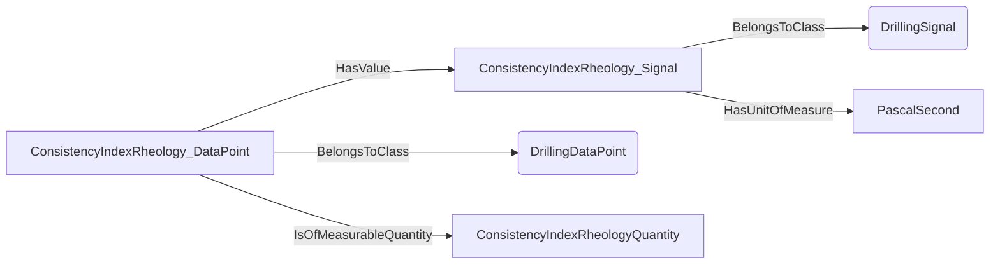
## ElectricTensionQuantity <!-- NOUN -->
- Display name: ElectricTension
- Parent class: [MeasurableQuantity](./Quantities.md#MeasurableQuantity)
- Specialization:
  - MeaningfulPrecision = 0.01
- Description: 
Electric tension is the difference in electric potential between two points.In a static electric field, it corresponds to the work needed per unit of charge to move a positive test charge from the first point to the second point.
The dimension of electric tension is:
$$[L^{2}MI^{-1}T^{-3}]$$.
The SI unit for **electric tension** is: volt with the associated unit label $V$
- Definition set: MeasurableQuantityTypes
- Examples:
``` dwis
DrillingSignal:ElectricTension_Signal
DrillingDataPoint:ElectricTension_DataPoint
ElectricTension_DataPoint HasValue ElectricTension_Signal
ElectricTension_DataPoint IsOfMeasurableQuantity ElectricTensionQuantity
ElectricTension_Signal HasUnitOfMeasure Volt
```
An example semantic graph looks like as follow:
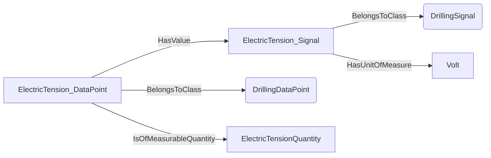
## ImageScaleQuantity <!-- NOUN -->
- Display name: ImageScale
- Parent class: [MeasurableQuantity](./Quantities.md#MeasurableQuantity)
- Specialization:
  - MeaningfulPrecision = 0.001
- Description: 
Image scale refers to the resolution or level of detail in an image.
The dimension of image scale is:
$$[L^{-1}]$$.
The SI unit for **image scale** is: dot per metre with the associated unit label $dpm$
- Definition set: MeasurableQuantityTypes
- Examples:
``` dwis
DrillingSignal:ImageScale_Signal
DrillingDataPoint:ImageScale_DataPoint
ImageScale_DataPoint HasValue ImageScale_Signal
ImageScale_DataPoint IsOfMeasurableQuantity ImageScaleQuantity
ImageScale_Signal HasUnitOfMeasure DotPerMetre
```
An example semantic graph looks like as follow:
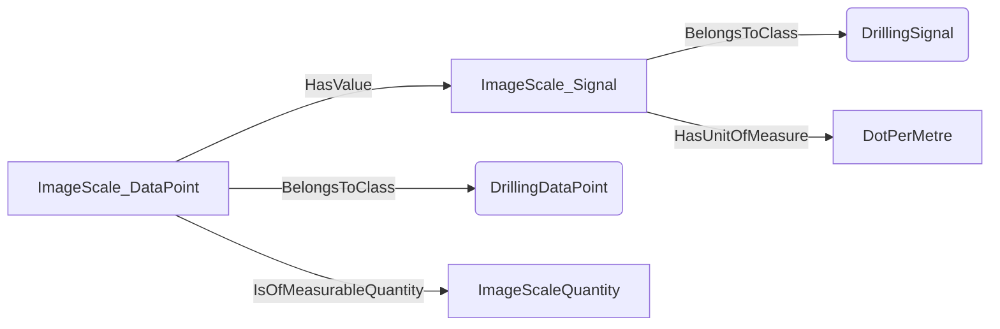
## DiameterSmallQuantity <!-- NOUN -->
- Display name: DiameterSmall
- Parent class: [MeasurableQuantity](./Quantities.md#MeasurableQuantity)
- Specialization:
  - MeaningfulPrecision = 0.0001
- Description: 
Length is a measure of distance.
The dimension of length is:
$$[L]$$.
The SI unit for **length** is: metre with the associated unit label $m$
The meaningful precision of small diameter is typically: 0.0001 m
- Definition set: MeasurableQuantityTypes
- Examples:
``` dwis
DrillingSignal:DiameterSmall_Signal
DrillingDataPoint:DiameterSmall_DataPoint
DiameterSmall_DataPoint HasValue DiameterSmall_Signal
DiameterSmall_DataPoint IsOfMeasurableQuantity DiameterSmallQuantity
DiameterSmall_Signal HasUnitOfMeasure Metre
```
An example semantic graph looks like as follow:

## DimensionLessStandardQuantity <!-- NOUN -->
- Display name: DimensionLessStandard
- Parent class: [MeasurableQuantity](./Quantities.md#MeasurableQuantity)
- Specialization:
  - MeaningfulPrecision = 0.001
- Description: 
As its name indicates, a dimensionless quantity has no dimension:
The meaningful precision of standard dimensionless values is typically: 0.001 
- Definition set: MeasurableQuantityTypes
- Examples:
``` dwis
DrillingSignal:DimensionLessStandard_Signal
DrillingDataPoint:DimensionLessStandard_DataPoint
DimensionLessStandard_DataPoint HasValue DimensionLessStandard_Signal
DimensionLessStandard_DataPoint IsOfMeasurableQuantity DimensionLessStandardQuantity
DimensionLessStandard_Signal HasUnitOfMeasure Dimensionless
```
An example semantic graph looks like as follow:
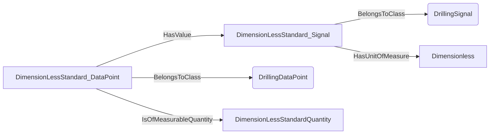
## EarthMagneticFluxDensityQuantity <!-- NOUN -->
- Display name: EarthMagneticFluxDensity
- Parent class: [MeasurableQuantity](./Quantities.md#MeasurableQuantity)
- Specialization:
  - MeaningfulPrecision = 1E-09
- Description: 
Magnetic flux density is the measure of the strength of a magnetic field per unit area through which the magnetic flux passes. It indicates how concentrated the magnetic field is.
The dimension of magnetic flux density is:
$$[MI^{-1}T^{-2}]$$.
The SI unit for **magnetic flux density** is: tesla with the associated unit label $T$
Earth's magnetic flux density refers to the strength and direction of the Earth's magnetic field at a specific location.
The meaningful precision of earth magnetic flux density is: 1E-09 T
- Definition set: MeasurableQuantityTypes
- Examples:
``` dwis
DrillingSignal:EarthMagneticFluxDensity_Signal
DrillingDataPoint:EarthMagneticFluxDensity_DataPoint
EarthMagneticFluxDensity_DataPoint HasValue EarthMagneticFluxDensity_Signal
EarthMagneticFluxDensity_DataPoint IsOfMeasurableQuantity EarthMagneticFluxDensityQuantity
EarthMagneticFluxDensity_Signal HasUnitOfMeasure Tesla
```
An example semantic graph looks like as follow:

## ElasticModulusQuantity <!-- NOUN -->
- Display name: ElasticModulus
- Parent class: [MeasurableQuantity](./Quantities.md#MeasurableQuantity)
- Specialization:
  - MeaningfulPrecision = 10000
- Description: 
Pressure is the force applied per unit area on a surface.
The dimension of pressure is:
$$[ML^{-1}T^{-2}]$$.
The SI unit for **pressure** is: pascal with the associated unit label $Pa$
Elastic modulus is a measure of a material's ability to resist deformation under stress. It quantifies the ratio of stress to strain in the material's elastic region
The meaningful precision of an elastic modulus is typically: 10000 Pa
- Definition set: MeasurableQuantityTypes
- Examples:
``` dwis
DrillingSignal:ElasticModulus_Signal
DrillingDataPoint:ElasticModulus_DataPoint
ElasticModulus_DataPoint HasValue ElasticModulus_Signal
ElasticModulus_DataPoint IsOfMeasurableQuantity ElasticModulusQuantity
ElasticModulus_Signal HasUnitOfMeasure Pascal
```
An example semantic graph looks like as follow:
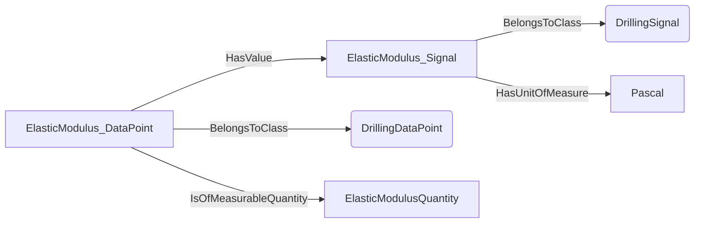
## LengthSmallQuantity <!-- NOUN -->
- Display name: LengthSmall
- Parent class: [MeasurableQuantity](./Quantities.md#MeasurableQuantity)
- Specialization:
  - MeaningfulPrecision = 1E-05
- Description: 
Length is a measure of distance.
The dimension of length is:
$$[L]$$.
The SI unit for **length** is: metre with the associated unit label $m$
The meaningful precision of small length is typically: 1E-05 m
- Definition set: MeasurableQuantityTypes
- Examples:
``` dwis
DrillingSignal:LengthSmall_Signal
DrillingDataPoint:LengthSmall_DataPoint
LengthSmall_DataPoint HasValue LengthSmall_Signal
LengthSmall_DataPoint IsOfMeasurableQuantity LengthSmallQuantity
LengthSmall_Signal HasUnitOfMeasure Metre
```
An example semantic graph looks like as follow:
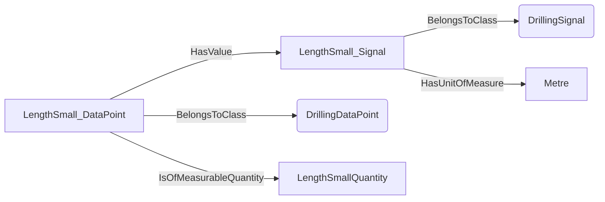
## RotationalFrequencyQuantity <!-- NOUN -->
- Display name: RotationalFrequency
- Parent class: [MeasurableQuantity](./Quantities.md#MeasurableQuantity)
- Specialization:
  - MeaningfulPrecision = 0.016666666666666666
- Description: 
Rotation frequency is the number of complete rotations or cycles an object makes per unit of time.
The dimension of rotational frequency is:
$$[T^{-1}]$$.
- Definition set: MeasurableQuantityTypes
- Examples:
``` dwis
DrillingSignal:RotationalFrequency_Signal
DrillingDataPoint:RotationalFrequency_DataPoint
RotationalFrequency_DataPoint HasValue RotationalFrequency_Signal
RotationalFrequency_DataPoint IsOfMeasurableQuantity RotationalFrequencyQuantity
RotationalFrequency_Signal HasUnitOfMeasure Hertz
```
An example semantic graph looks like as follow:
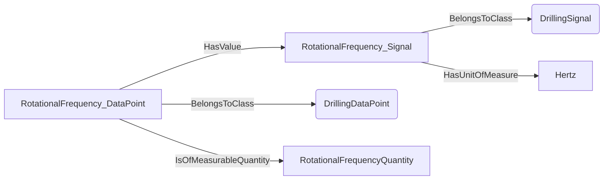
## VolumeLargeQuantity <!-- NOUN -->
- Display name: VolumeLarge
- Parent class: [MeasurableQuantity](./Quantities.md#MeasurableQuantity)
- Specialization:
  - MeaningfulPrecision = 0.1
- Description: 
A volume is the amount of three-dimensional space occupied by a body.
The dimension of volume is:
$$[L^{3}]$$.
The SI unit for **volume** is: cubic metre with the associated unit label $m^{3}$
The meaningful precision of a large volume is typically: 0.1 m³
- Definition set: MeasurableQuantityTypes
- Examples:
``` dwis
DrillingSignal:VolumeLarge_Signal
DrillingDataPoint:VolumeLarge_DataPoint
VolumeLarge_DataPoint HasValue VolumeLarge_Signal
VolumeLarge_DataPoint IsOfMeasurableQuantity VolumeLargeQuantity
VolumeLarge_Signal HasUnitOfMeasure CubicMetre
```
An example semantic graph looks like as follow:
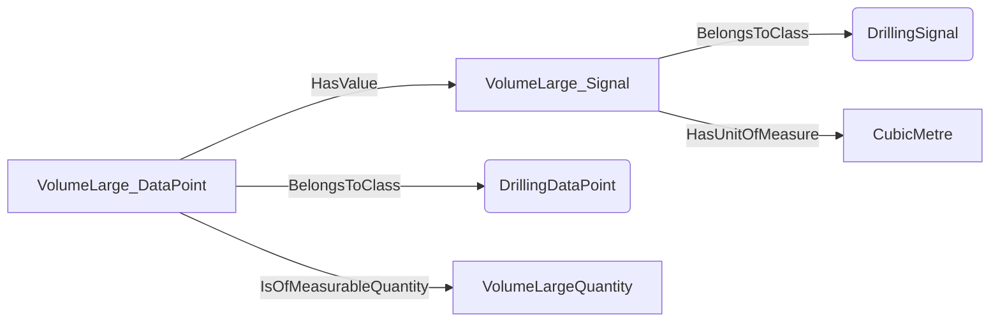
## ProportionStandardQuantity <!-- NOUN -->
- Display name: ProportionStandard
- Parent class: [MeasurableQuantity](./Quantities.md#MeasurableQuantity)
- Specialization:
  - MeaningfulPrecision = 0.001
- Description: 
A proportion is the ratio of two quantities with the same dimension. It represents how one quantity compares to another in relative terms.
A proportion is dimensionless:
The meaningful precision of a standard proportion is typically: 0.001 
- Definition set: MeasurableQuantityTypes
- Examples:
``` dwis
DrillingSignal:ProportionStandard_Signal
DrillingDataPoint:ProportionStandard_DataPoint
ProportionStandard_DataPoint HasValue ProportionStandard_Signal
ProportionStandard_DataPoint IsOfMeasurableQuantity ProportionStandardQuantity
ProportionStandard_Signal HasUnitOfMeasure Proportion
```
An example semantic graph looks like as follow:
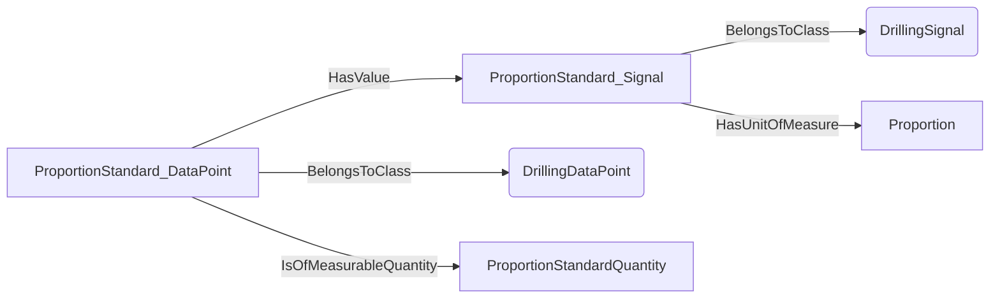
## LengthStandardQuantity <!-- NOUN -->
- Display name: LengthStandard
- Parent class: [MeasurableQuantity](./Quantities.md#MeasurableQuantity)
- Specialization:
  - MeaningfulPrecision = 0.001
- Description: 
Length is a measure of distance.
The dimension of length is:
$$[L]$$.
The SI unit for **length** is: metre with the associated unit label $m$
The meaningful precision of a standard length is typically: 0.001 m
- Definition set: MeasurableQuantityTypes
- Examples:
``` dwis
DrillingSignal:LengthStandard_Signal
DrillingDataPoint:LengthStandard_DataPoint
LengthStandard_DataPoint HasValue LengthStandard_Signal
LengthStandard_DataPoint IsOfMeasurableQuantity LengthStandardQuantity
LengthStandard_Signal HasUnitOfMeasure Metre
```
An example semantic graph looks like as follow:

## FluidShearRateQuantity <!-- NOUN -->
- Display name: FluidShearRate
- Parent class: [MeasurableQuantity](./Quantities.md#MeasurableQuantity)
- Specialization:
  - MeaningfulPrecision = 0.01
- Description: 
Frequency is the number of occurrences of a repeating event per unit of time.
The dimension of frequency is:
$$[T^{-1}]$$.
The SI unit for **frequency** is: hertz with the associated unit label $Hz$
Shear rate in a fluid is the rate at which adjacent layers of the fluid move relative to each other, typically expressed as the change in velocity per unit distance between the layers. It measures how quickly the fluid is being deformed by shear stress.
The meaningful precision of a shear rate for a fluid is typically: 0.01 Hz
- Definition set: MeasurableQuantityTypes
- Examples:
``` dwis
DrillingSignal:FluidShearRate_Signal
DrillingDataPoint:FluidShearRate_DataPoint
FluidShearRate_DataPoint HasValue FluidShearRate_Signal
FluidShearRate_DataPoint IsOfMeasurableQuantity FluidShearRateQuantity
FluidShearRate_Signal HasUnitOfMeasure Hertz
```
An example semantic graph looks like as follow:
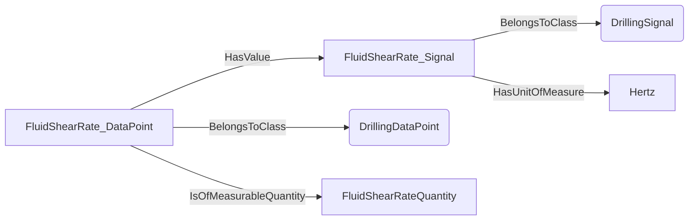
## FluidShearStressQuantity <!-- NOUN -->
- Display name: FluidShearStress
- Parent class: [MeasurableQuantity](./Quantities.md#MeasurableQuantity)
- Specialization:
  - MeaningfulPrecision = 0.0001
- Description: 
Pressure is the force applied per unit area on a surface.
The dimension of pressure is:
$$[ML^{-1}T^{-2}]$$.
The SI unit for **pressure** is: pascal with the associated unit label $Pa$
Shear stress in a fluid is the force per unit area exerted parallel to the fluid's surface, causing layers of the fluid to slide relative to each other. It measures the fluid's resistance to this shearing action.
The meaningful precision of a shear stress for a fluid is typically: 0.0001 Pa
- Definition set: MeasurableQuantityTypes
- Examples:
``` dwis
DrillingSignal:FluidShearStress_Signal
DrillingDataPoint:FluidShearStress_DataPoint
FluidShearStress_DataPoint HasValue FluidShearStress_Signal
FluidShearStress_DataPoint IsOfMeasurableQuantity FluidShearStressQuantity
FluidShearStress_Signal HasUnitOfMeasure Pascal
```
An example semantic graph looks like as follow:
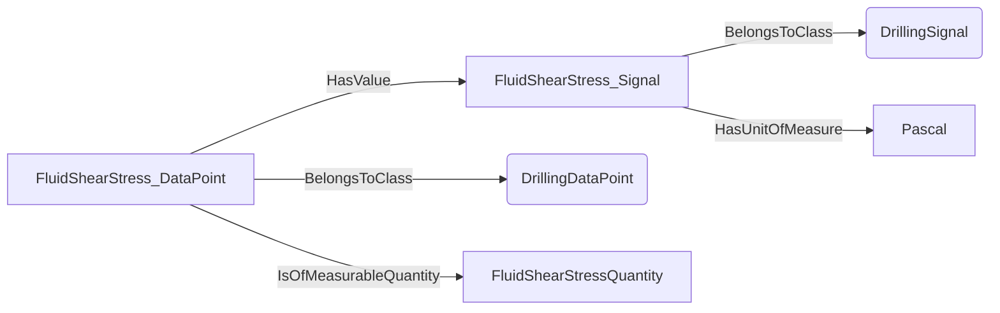
## TorqueSmallQuantity <!-- NOUN -->
- Display name: TorqueSmall
- Parent class: [MeasurableQuantity](./Quantities.md#MeasurableQuantity)
- Specialization:
  - MeaningfulPrecision = 1E-05
- Description: 
A torque is a measure of the rotational force applied to a body around an axis.
The dimension of torque is:
$$[L^{2}MT^{-2}]$$.
The SI unit for **torque** is: newton metre with the associated unit label $N \cdot m$
The meaningful precision of small torque is typically: 1E-05 N•m
- Definition set: MeasurableQuantityTypes
- Examples:
``` dwis
DrillingSignal:TorqueSmall_Signal
DrillingDataPoint:TorqueSmall_DataPoint
TorqueSmall_DataPoint HasValue TorqueSmall_Signal
TorqueSmall_DataPoint IsOfMeasurableQuantity TorqueSmallQuantity
TorqueSmall_Signal HasUnitOfMeasure NewtonMetre
```
An example semantic graph looks like as follow:
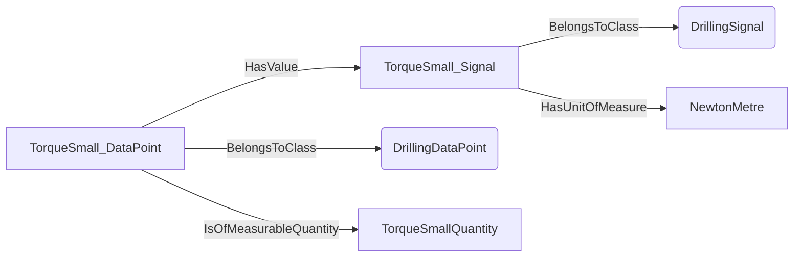
## RotationalFrequencySmallQuantity <!-- NOUN -->
- Display name: RotationalFrequencySmall
- Parent class: [MeasurableQuantity](./Quantities.md#MeasurableQuantity)
- Specialization:
  - MeaningfulPrecision = 0.00016666
- Description: 
Rotation frequency is the number of complete rotations or cycles an object makes per unit of time.
The dimension of rotational frequency is:
$$[T^{-1}]$$.
The meaningful precision of small rotational frequency is typically: 0.00016666 Hz
- Definition set: MeasurableQuantityTypes
- Examples:
``` dwis
DrillingSignal:RotationalFrequencySmall_Signal
DrillingDataPoint:RotationalFrequencySmall_DataPoint
RotationalFrequencySmall_DataPoint HasValue RotationalFrequencySmall_Signal
RotationalFrequencySmall_DataPoint IsOfMeasurableQuantity RotationalFrequencySmallQuantity
RotationalFrequencySmall_Signal HasUnitOfMeasure Hertz
```
An example semantic graph looks like as follow:
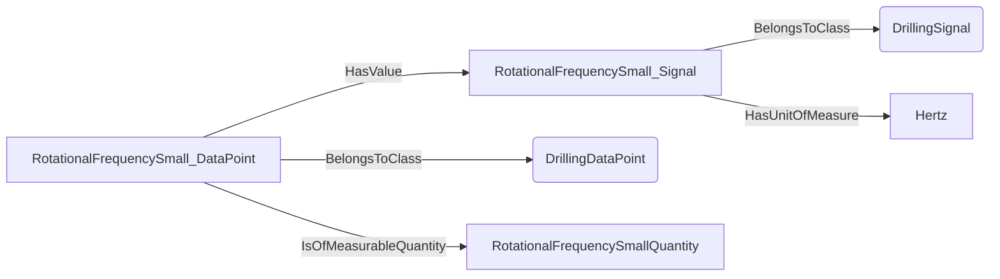
## ProportionSmallQuantity <!-- NOUN -->
- Display name: ProportionSmall
- Parent class: [MeasurableQuantity](./Quantities.md#MeasurableQuantity)
- Specialization:
  - MeaningfulPrecision = 1E-08
- Description: 
A proportion is the ratio of two quantities with the same dimension. It represents how one quantity compares to another in relative terms.
A proportion is dimensionless:
The meaningful precision of small proportion is typically: 1E-08 
- Definition set: MeasurableQuantityTypes
- Examples:
``` dwis
DrillingSignal:ProportionSmall_Signal
DrillingDataPoint:ProportionSmall_DataPoint
ProportionSmall_DataPoint HasValue ProportionSmall_Signal
ProportionSmall_DataPoint IsOfMeasurableQuantity ProportionSmallQuantity
ProportionSmall_Signal HasUnitOfMeasure Proportion
```
An example semantic graph looks like as follow:
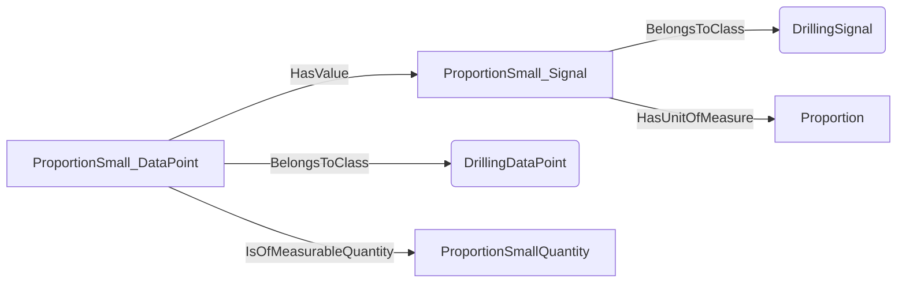
## PorosityQuantity <!-- NOUN -->
- Display name: Porosity
- Parent class: [MeasurableQuantity](./Quantities.md#MeasurableQuantity)
- Specialization:
  - MeaningfulPrecision = 0.001
- Description: 
A proportion is the ratio of two quantities with the same dimension. It represents how one quantity compares to another in relative terms.
A proportion is dimensionless:
Porosity is the measure of the void spaces or pores within a material, expressed as a fraction or percentage of the total volume.
The meaningful precision of porosity is typically: 0.001 
- Definition set: MeasurableQuantityTypes
- Examples:
``` dwis
DrillingSignal:Porosity_Signal
DrillingDataPoint:Porosity_DataPoint
Porosity_DataPoint HasValue Porosity_Signal
Porosity_DataPoint IsOfMeasurableQuantity PorosityQuantity
Porosity_Signal HasUnitOfMeasure Proportion
```
An example semantic graph looks like as follow:
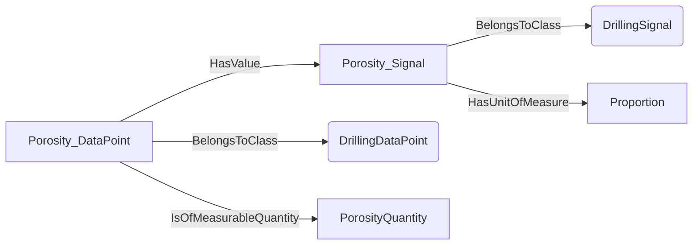
## StrokeFrequencyQuantity <!-- NOUN -->
- Display name: StrokeFrequency
- Parent class: [MeasurableQuantity](./Quantities.md#MeasurableQuantity)
- Specialization:
  - MeaningfulPrecision = 0.016666666666666666
- Description: 
A stroke frequency is the number of stokes per unit time
The meaningful precision of a stroke frequency is typically: 0.016666666666666666 Hz
- Definition set: MeasurableQuantityTypes
- Examples:
``` dwis
DrillingSignal:StrokeFrequency_Signal
DrillingDataPoint:StrokeFrequency_DataPoint
StrokeFrequency_DataPoint HasValue StrokeFrequency_Signal
StrokeFrequency_DataPoint IsOfMeasurableQuantity StrokeFrequencyQuantity
StrokeFrequency_Signal HasUnitOfMeasure Hertz
```
An example semantic graph looks like as follow:

## ShockRateQuantity <!-- NOUN -->
- Display name: ShockRate
- Parent class: [MeasurableQuantity](./Quantities.md#MeasurableQuantity)
- Specialization:
  - MeaningfulPrecision = 0.016666666666666666
- Description: 
A shock rate is the number of shocks per unit time.
The meaningful precision of shock rate is typically: 0.016666666666666666 Hz/s
- Definition set: MeasurableQuantityTypes
- Examples:
``` dwis
DrillingSignal:ShockRate_Signal
DrillingDataPoint:ShockRate_DataPoint
ShockRate_DataPoint HasValue ShockRate_Signal
ShockRate_DataPoint IsOfMeasurableQuantity ShockRateQuantity
ShockRate_Signal HasUnitOfMeasure Hertz
```
An example semantic graph looks like as follow:
```mermaid
graph LR
	N0000[ShockRate_Signal] -->|BelongsToClass| N0001(DrillingSignal) 
	N0002[ShockRate_DataPoint] -->|BelongsToClass| N0003(DrillingDataPoint) 
	N0002[ShockRate_DataPoint] -->|HasValue| N0000[ShockRate_Signal] 
	N0002[ShockRate_DataPoint] -->|IsOfMeasurableQuantity| N0004[ShockRateQuantity] 
	N0000[ShockRate_Signal] -->|HasUnitOfMeasure| N0005[Hertz] 
```
## AccelerationDrillingQuantity <!-- NOUN -->
- Display name: AccelerationDrilling
- Parent class: [MeasurableQuantity](./Quantities.md#MeasurableQuantity)
- Specialization:
  - MeaningfulPrecision = 0.001
- Description: 
**Acceleration** is defined as the rate of change of velocity with respect to time. Velocity itself is the rate of change of displacement (or position) with respect to time. Therefore, acceleration is the rate of change of displacement twice with respect to time.
Let's break this down:
1. **Displacement** (or position) has the dimension of **Length(L)**.
2. **Velocity** is displacement per unit time:
$$\text{Velocity} = \frac{\text{Length}}{\text{Time}} = \frac{L}{T}$$
So, the dimension of velocity is **$[L T^{ -1}]$**.
3. **Acceleration** is the rate of change of velocity with respect to time:
$$\text{Acceleration} = \frac{\text{Velocity}}{\text{Time}} = \frac{L T^{ -1}}{T} = L T ^{-2}$$
Therefore, the dimension of acceleration is $[LT^{-2}]$.
The SI unit for **acceleration** is: metre per second squared with the associated unit label $\frac{m}{s^{2}}$
The meaningful precision of acceleration in the drilling context is typically: 0.001 m/s²
- Definition set: MeasurableQuantityTypes
- Examples:
``` dwis
DrillingSignal:AccelerationDrilling_Signal
DrillingDataPoint:AccelerationDrilling_DataPoint
AccelerationDrilling_DataPoint HasValue AccelerationDrilling_Signal
AccelerationDrilling_DataPoint IsOfMeasurableQuantity AccelerationDrillingQuantity
AccelerationDrilling_Signal HasUnitOfMeasure MetrePerSecondSquared
```
An example semantic graph looks like as follow:
```mermaid
graph LR
	N0000[AccelerationDrilling_Signal] -->|BelongsToClass| N0001(DrillingSignal) 
	N0002[AccelerationDrilling_DataPoint] -->|BelongsToClass| N0003(DrillingDataPoint) 
	N0002[AccelerationDrilling_DataPoint] -->|HasValue| N0000[AccelerationDrilling_Signal] 
	N0002[AccelerationDrilling_DataPoint] -->|IsOfMeasurableQuantity| N0004[AccelerationDrillingQuantity] 
	N0000[AccelerationDrilling_Signal] -->|HasUnitOfMeasure| N0005[MetrePerSecondSquared] 
```
## AngleGradientPerLengthDrillingQuantity <!-- NOUN -->
- Display name: AngleGradientPerLengthDrilling
- Parent class: [MeasurableQuantity](./Quantities.md#MeasurableQuantity)
- Specialization:
  - MeaningfulPrecision = 0.00017453292519943296
- Description: 
Consider a situation where you have a length $L$ along which an angle $\theta$ changes. The angle variation gradient is defined as the **rate of change of the angle** per unit change in length. Mathematically, it can be expressed as: 
$$\text{ Angle Variation Gradient} = \frac{ d\theta}{ dL}$$
where: 
- Definition set: MeasurableQuantityTypes
- Examples:
``` dwis
DrillingSignal:AngleGradientPerLengthDrilling_Signal
DrillingDataPoint:AngleGradientPerLengthDrilling_DataPoint
AngleGradientPerLengthDrilling_DataPoint HasValue AngleGradientPerLengthDrilling_Signal
AngleGradientPerLengthDrilling_DataPoint IsOfMeasurableQuantity AngleGradientPerLengthDrillingQuantity
AngleGradientPerLengthDrilling_Signal HasUnitOfMeasure RadianPerMetre
```
An example semantic graph looks like as follow:
```mermaid
graph LR
	N0000[AngleGradientPerLengthDrilling_Signal] -->|BelongsToClass| N0001(DrillingSignal) 
	N0002[AngleGradientPerLengthDrilling_DataPoint] -->|BelongsToClass| N0003(DrillingDataPoint) 
	N0002[AngleGradientPerLengthDrilling_DataPoint] -->|HasValue| N0000[AngleGradientPerLengthDrilling_Signal] 
	N0002[AngleGradientPerLengthDrilling_DataPoint] -->|IsOfMeasurableQuantity| N0004[AngleGradientPerLengthDrillingQuantity] 
	N0000[AngleGradientPerLengthDrilling_Signal] -->|HasUnitOfMeasure| N0005[RadianPerMetre] 
```
## AngleMagneticFluxDensitySurveyInstrumentDrillingQuantity <!-- NOUN -->
- Display name: AngleMagneticFluxDensitySurveyInstrumentDrilling
- Parent class: [MeasurableQuantity](./Quantities.md#MeasurableQuantity)
- Specialization:
  - MeaningfulPrecision = 1E-09
- Description: 
The **angle magnetic flux density** is the product of an angle by a magnetic flux density. Let's break it down step by step:
1. Magnetic Flux Density
The **magnetic flux density** $\mathbf{B}$ is a measure of the strength and direction of the magnetic field at a particular point in space. It represents the amount of magnetic flux passing through a unit area perpendicular to the direction of the magnetic field. In simpler terms, it describes how dense or concentrated the magnetic field lines are in a given region.It can be expressed in terms of the fundamental dimensions as:
$$[M][T]^{-2}[I]^{-1}$$
Where:
- Definition set: MeasurableQuantityTypes
- Examples:
``` dwis
DrillingSignal:AngleMagneticFluxDensitySurveyInstrumentDrilling_Signal
DrillingDataPoint:AngleMagneticFluxDensitySurveyInstrumentDrilling_DataPoint
AngleMagneticFluxDensitySurveyInstrumentDrilling_DataPoint HasValue AngleMagneticFluxDensitySurveyInstrumentDrilling_Signal
AngleMagneticFluxDensitySurveyInstrumentDrilling_DataPoint IsOfMeasurableQuantity AngleMagneticFluxDensitySurveyInstrumentDrillingQuantity
AngleMagneticFluxDensitySurveyInstrumentDrilling_Signal HasUnitOfMeasure RadianTesla
```
An example semantic graph looks like as follow:
```mermaid
graph LR
	N0000[AngleMagneticFluxDensitySurveyInstrumentDrilling_Signal] -->|BelongsToClass| N0001(DrillingSignal) 
	N0002[AngleMagneticFluxDensitySurveyInstrumentDrilling_DataPoint] -->|BelongsToClass| N0003(DrillingDataPoint) 
	N0002[AngleMagneticFluxDensitySurveyInstrumentDrilling_DataPoint] -->|HasValue| N0000[AngleMagneticFluxDensitySurveyInstrumentDrilling_Signal] 
	N0002[AngleMagneticFluxDensitySurveyInstrumentDrilling_DataPoint] -->|IsOfMeasurableQuantity| N0004[AngleMagneticFluxDensitySurveyInstrumentDrillingQuantity] 
	N0000[AngleMagneticFluxDensitySurveyInstrumentDrilling_Signal] -->|HasUnitOfMeasure| N0005[RadianTesla] 
```
## AngularAccelerationDrillingQuantity <!-- NOUN -->
- Display name: AngularAccelerationDrilling
- Parent class: [MeasurableQuantity](./Quantities.md#MeasurableQuantity)
- Specialization:
  - MeaningfulPrecision = 0.01
- Description: 
An angular acceleration is the second derivative compared to time of a plan angle: $\frac{d^2\theta}{dt^2}$.
The dimension of angular acceleration is:
$$[{\theta}T^{-2}]$$.
The SI unit for **angular acceleration** is: radian per second squared with the associated unit label $\frac{rad}{s^{2}}$
The meaningful precision of angular acceleration in the drilling context is typically: 0.01 rad/s²
- Definition set: MeasurableQuantityTypes
- Examples:
``` dwis
DrillingSignal:AngularAccelerationDrilling_Signal
DrillingDataPoint:AngularAccelerationDrilling_DataPoint
AngularAccelerationDrilling_DataPoint HasValue AngularAccelerationDrilling_Signal
AngularAccelerationDrilling_DataPoint IsOfMeasurableQuantity AngularAccelerationDrillingQuantity
AngularAccelerationDrilling_Signal HasUnitOfMeasure RadianPerSecondSquared
```
An example semantic graph looks like as follow:
```mermaid
graph LR
	N0000[AngularAccelerationDrilling_Signal] -->|BelongsToClass| N0001(DrillingSignal) 
	N0002[AngularAccelerationDrilling_DataPoint] -->|BelongsToClass| N0003(DrillingDataPoint) 
	N0002[AngularAccelerationDrilling_DataPoint] -->|HasValue| N0000[AngularAccelerationDrilling_Signal] 
	N0002[AngularAccelerationDrilling_DataPoint] -->|IsOfMeasurableQuantity| N0004[AngularAccelerationDrillingQuantity] 
	N0000[AngularAccelerationDrilling_Signal] -->|HasUnitOfMeasure| N0005[RadianPerSecondSquared] 
```
## AngularVelocityDrillingQuantity <!-- NOUN -->
- Display name: AngularVelocityDrilling
- Parent class: [MeasurableQuantity](./Quantities.md#MeasurableQuantity)
- Specialization:
  - MeaningfulPrecision = 0.01
- Description: 
An angular velocity is the first derivative compared to time of a plan angle: $\frac{d\theta}{dt}$.
The dimension of angular velocity is:
$$[{\theta}T^{-1}]$$.
The SI unit for **angular velocity** is: radian per second with the associated unit label $\frac{rad}{s}$
The meaningful precision of angular velocity in the drilling context is typically: 0.01 rad/s
- Definition set: MeasurableQuantityTypes
- Examples:
``` dwis
DrillingSignal:AngularVelocityDrilling_Signal
DrillingDataPoint:AngularVelocityDrilling_DataPoint
AngularVelocityDrilling_DataPoint HasValue AngularVelocityDrilling_Signal
AngularVelocityDrilling_DataPoint IsOfMeasurableQuantity AngularVelocityDrillingQuantity
AngularVelocityDrilling_Signal HasUnitOfMeasure RadianPerSecond
```
An example semantic graph looks like as follow:
```mermaid
graph LR
	N0000[AngularVelocityDrilling_Signal] -->|BelongsToClass| N0001(DrillingSignal) 
	N0002[AngularVelocityDrilling_DataPoint] -->|BelongsToClass| N0003(DrillingDataPoint) 
	N0002[AngularVelocityDrilling_DataPoint] -->|HasValue| N0000[AngularVelocityDrilling_Signal] 
	N0002[AngularVelocityDrilling_DataPoint] -->|IsOfMeasurableQuantity| N0004[AngularVelocityDrillingQuantity] 
	N0000[AngularVelocityDrilling_Signal] -->|HasUnitOfMeasure| N0005[RadianPerSecond] 
```
## AngularVelocitySurveyInstrumentDrillingQuantity <!-- NOUN -->
- Display name: AngularVelocitySurveyInstrumentDrilling
- Parent class: [MeasurableQuantity](./Quantities.md#MeasurableQuantity)
- Specialization:
  - MeaningfulPrecision = 1E-07
- Description: 
An angular velocity is the first derivative compared to time of a plan angle: $\frac{d\theta}{dt}$.
The dimension of angular velocity is:
$$[{\theta}T^{-1}]$$.
The SI unit for **angular velocity** is: radian per second with the associated unit label $\frac{rad}{s}$
The meaningful precision of angular velocity related to survey instrument performance models in the drilling context is typically: 1E-07 rad•T
- Definition set: MeasurableQuantityTypes
- Examples:
``` dwis
DrillingSignal:AngularVelocitySurveyInstrumentDrilling_Signal
DrillingDataPoint:AngularVelocitySurveyInstrumentDrilling_DataPoint
AngularVelocitySurveyInstrumentDrilling_DataPoint HasValue AngularVelocitySurveyInstrumentDrilling_Signal
AngularVelocitySurveyInstrumentDrilling_DataPoint IsOfMeasurableQuantity AngularVelocitySurveyInstrumentDrillingQuantity
AngularVelocitySurveyInstrumentDrilling_Signal HasUnitOfMeasure RadianPerSecond
```
An example semantic graph looks like as follow:
```mermaid
graph LR
	N0000[AngularVelocitySurveyInstrumentDrilling_Signal] -->|BelongsToClass| N0001(DrillingSignal) 
	N0002[AngularVelocitySurveyInstrumentDrilling_DataPoint] -->|BelongsToClass| N0003(DrillingDataPoint) 
	N0002[AngularVelocitySurveyInstrumentDrilling_DataPoint] -->|HasValue| N0000[AngularVelocitySurveyInstrumentDrilling_Signal] 
	N0002[AngularVelocitySurveyInstrumentDrilling_DataPoint] -->|IsOfMeasurableQuantity| N0004[AngularVelocitySurveyInstrumentDrillingQuantity] 
	N0000[AngularVelocitySurveyInstrumentDrilling_Signal] -->|HasUnitOfMeasure| N0005[RadianPerSecond] 
```
## AreaDrillingQuantity <!-- NOUN -->
- Display name: AreaDrilling
- Parent class: [MeasurableQuantity](./Quantities.md#MeasurableQuantity)
- Specialization:
  - MeaningfulPrecision = 1E-06
- Description: 
Area is the measure of the extent of a surface or the size of a two-dimensional shape.
The dimension of area is:
$$[L^{2}]$$.
The SI unit for **area** is: square metre with the associated unit label $m^{2}$
The meaningful precision of area in the drilling context is typically: 1E-06 m²
- Definition set: MeasurableQuantityTypes
- Examples:
``` dwis
DrillingSignal:AreaDrilling_Signal
DrillingDataPoint:AreaDrilling_DataPoint
AreaDrilling_DataPoint HasValue AreaDrilling_Signal
AreaDrilling_DataPoint IsOfMeasurableQuantity AreaDrillingQuantity
AreaDrilling_Signal HasUnitOfMeasure SquareMetre
```
An example semantic graph looks like as follow:
```mermaid
graph LR
	N0000[AreaDrilling_Signal] -->|BelongsToClass| N0001(DrillingSignal) 
	N0002[AreaDrilling_DataPoint] -->|BelongsToClass| N0003(DrillingDataPoint) 
	N0002[AreaDrilling_DataPoint] -->|HasValue| N0000[AreaDrilling_Signal] 
	N0002[AreaDrilling_DataPoint] -->|IsOfMeasurableQuantity| N0004[AreaDrillingQuantity] 
	N0000[AreaDrilling_Signal] -->|HasUnitOfMeasure| N0005[SquareMetre] 
```
## AxialVelocityDrillingQuantity <!-- NOUN -->
- Display name: AxialVelocityDrilling
- Parent class: [MeasurableQuantity](./Quantities.md#MeasurableQuantity)
- Specialization:
  - MeaningfulPrecision = 0.01
- Description: 
A velocity is the time derivative of a position or a displacement: $\frac{dx}{dt}$, where $x$ is a position and $t$ is time.
The dimension of velocity is:
$$[LT^{-1}]$$.
The SI unit for **velocity** is: metre per second with the associated unit label $\frac{m}{s}$
The meaningful precision of velocity in the drilling context is typically: 0.01 m/s
- Definition set: MeasurableQuantityTypes
- Examples:
``` dwis
DrillingSignal:AxialVelocityDrilling_Signal
DrillingDataPoint:AxialVelocityDrilling_DataPoint
AxialVelocityDrilling_DataPoint HasValue AxialVelocityDrilling_Signal
AxialVelocityDrilling_DataPoint IsOfMeasurableQuantity AxialVelocityDrillingQuantity
AxialVelocityDrilling_Signal HasUnitOfMeasure MetrePerSecond
```
An example semantic graph looks like as follow:
```mermaid
graph LR
	N0000[AxialVelocityDrilling_Signal] -->|BelongsToClass| N0001(DrillingSignal) 
	N0002[AxialVelocityDrilling_DataPoint] -->|BelongsToClass| N0003(DrillingDataPoint) 
	N0002[AxialVelocityDrilling_DataPoint] -->|HasValue| N0000[AxialVelocityDrilling_Signal] 
	N0002[AxialVelocityDrilling_DataPoint] -->|IsOfMeasurableQuantity| N0004[AxialVelocityDrillingQuantity] 
	N0000[AxialVelocityDrilling_Signal] -->|HasUnitOfMeasure| N0005[MetrePerSecond] 
```
## BlockVelocityDrillingQuantity <!-- NOUN -->
- Display name: BlockVelocityDrilling
- Parent class: [MeasurableQuantity](./Quantities.md#MeasurableQuantity)
- Specialization:
  - MeaningfulPrecision = 0.01
- Description: 
A velocity is the time derivative of a position or a displacement: $\frac{dx}{dt}$, where $x$ is a position and $t$ is time.
The dimension of velocity is:
$$[LT^{-1}]$$.
The SI unit for **velocity** is: metre per second with the associated unit label $\frac{m}{s}$
The meaningful precision of block velocity in the drilling context is typically: 0.01 m/s
- Definition set: MeasurableQuantityTypes
- Examples:
``` dwis
DrillingSignal:BlockVelocityDrilling_Signal
DrillingDataPoint:BlockVelocityDrilling_DataPoint
BlockVelocityDrilling_DataPoint HasValue BlockVelocityDrilling_Signal
BlockVelocityDrilling_DataPoint IsOfMeasurableQuantity BlockVelocityDrillingQuantity
BlockVelocityDrilling_Signal HasUnitOfMeasure MetrePerSecond
```
An example semantic graph looks like as follow:
```mermaid
graph LR
	N0000[BlockVelocityDrilling_Signal] -->|BelongsToClass| N0001(DrillingSignal) 
	N0002[BlockVelocityDrilling_DataPoint] -->|BelongsToClass| N0003(DrillingDataPoint) 
	N0002[BlockVelocityDrilling_DataPoint] -->|HasValue| N0000[BlockVelocityDrilling_Signal] 
	N0002[BlockVelocityDrilling_DataPoint] -->|IsOfMeasurableQuantity| N0004[BlockVelocityDrillingQuantity] 
	N0000[BlockVelocityDrilling_Signal] -->|HasUnitOfMeasure| N0005[MetrePerSecond] 
```
## CableDiameterDrillingQuantity <!-- NOUN -->
- Display name: CableDiameterDrilling
- Parent class: [MeasurableQuantity](./Quantities.md#MeasurableQuantity)
- Specialization:
  - MeaningfulPrecision = 0.0005
- Description: 
Length is a measure of distance.
The dimension of length is:
$$[L]$$.
The SI unit for **length** is: metre with the associated unit label $m$
The meaningful precision of small length is typically: 0.0005 m
The meaningful precision of a cable diameter in the drilling context is typically: 0.0005 m
- Definition set: MeasurableQuantityTypes
- Examples:
``` dwis
DrillingSignal:CableDiameterDrilling_Signal
DrillingDataPoint:CableDiameterDrilling_DataPoint
CableDiameterDrilling_DataPoint HasValue CableDiameterDrilling_Signal
CableDiameterDrilling_DataPoint IsOfMeasurableQuantity CableDiameterDrillingQuantity
CableDiameterDrilling_Signal HasUnitOfMeasure Metre
```
An example semantic graph looks like as follow:
```mermaid
graph LR
	N0000[CableDiameterDrilling_Signal] -->|BelongsToClass| N0001(DrillingSignal) 
	N0002[CableDiameterDrilling_DataPoint] -->|BelongsToClass| N0003(DrillingDataPoint) 
	N0002[CableDiameterDrilling_DataPoint] -->|HasValue| N0000[CableDiameterDrilling_Signal] 
	N0002[CableDiameterDrilling_DataPoint] -->|IsOfMeasurableQuantity| N0004[CableDiameterDrillingQuantity] 
	N0000[CableDiameterDrilling_Signal] -->|HasUnitOfMeasure| N0005[Metre] 
```
## CapillaryPressureDrillingQuantity <!-- NOUN -->
- Display name: CapillaryPressureDrilling
- Parent class: [MeasurableQuantity](./Quantities.md#MeasurableQuantity)
- Specialization:
  - MeaningfulPrecision = 0.1
- Description: 
Pressure is the force applied per unit area on a surface.
The dimension of pressure is:
$$[ML^{-1}T^{-2}]$$.
The SI unit for **pressure** is: pascal with the associated unit label $Pa$
The meaningful precision of capilary pressure in the drilling context is typically: 0.1 Pa
- Definition set: MeasurableQuantityTypes
- Examples:
``` dwis
DrillingSignal:CapillaryPressureDrilling_Signal
DrillingDataPoint:CapillaryPressureDrilling_DataPoint
CapillaryPressureDrilling_DataPoint HasValue CapillaryPressureDrilling_Signal
CapillaryPressureDrilling_DataPoint IsOfMeasurableQuantity CapillaryPressureDrillingQuantity
CapillaryPressureDrilling_Signal HasUnitOfMeasure Pascal
```
An example semantic graph looks like as follow:
```mermaid
graph LR
	N0000[CapillaryPressureDrilling_Signal] -->|BelongsToClass| N0001(DrillingSignal) 
	N0002[CapillaryPressureDrilling_DataPoint] -->|BelongsToClass| N0003(DrillingDataPoint) 
	N0002[CapillaryPressureDrilling_DataPoint] -->|HasValue| N0000[CapillaryPressureDrilling_Signal] 
	N0002[CapillaryPressureDrilling_DataPoint] -->|IsOfMeasurableQuantity| N0004[CapillaryPressureDrillingQuantity] 
	N0000[CapillaryPressureDrilling_Signal] -->|HasUnitOfMeasure| N0005[Pascal] 
```
## CompressibilityDrillingQuantity <!-- NOUN -->
- Display name: CompressibilityDrilling
- Parent class: [MeasurableQuantity](./Quantities.md#MeasurableQuantity)
- Specialization:
  - MeaningfulPrecision = 1E-13
- Description: 
Compressibility is the measure of how much a substance's volume decreases under pressure. It indicates how easily a material or fluid can be compressed and is typically expressed as a change in volume per unit change in pressure.
The dimension of compressibility is:
$$[T^{2}LM^{-1}]$$.
The SI unit for **compressibility** is: inverse pascal with the associated unit label $\frac{1}{Pa}$
The meaningful precision of compressibility in the drilling context is typically: 1E-13 1/Pa
- Definition set: MeasurableQuantityTypes
- Examples:
``` dwis
DrillingSignal:CompressibilityDrilling_Signal
DrillingDataPoint:CompressibilityDrilling_DataPoint
CompressibilityDrilling_DataPoint HasValue CompressibilityDrilling_Signal
CompressibilityDrilling_DataPoint IsOfMeasurableQuantity CompressibilityDrillingQuantity
CompressibilityDrilling_Signal HasUnitOfMeasure InversePascal
```
An example semantic graph looks like as follow:
```mermaid
graph LR
	N0000[CompressibilityDrilling_Signal] -->|BelongsToClass| N0001(DrillingSignal) 
	N0002[CompressibilityDrilling_DataPoint] -->|BelongsToClass| N0003(DrillingDataPoint) 
	N0002[CompressibilityDrilling_DataPoint] -->|HasValue| N0000[CompressibilityDrilling_Signal] 
	N0002[CompressibilityDrilling_DataPoint] -->|IsOfMeasurableQuantity| N0004[CompressibilityDrillingQuantity] 
	N0000[CompressibilityDrilling_Signal] -->|HasUnitOfMeasure| N0005[InversePascal] 
```
## CurvatureDrillingQuantity <!-- NOUN -->
- Display name: CurvatureDrilling
- Parent class: [MeasurableQuantity](./Quantities.md#MeasurableQuantity)
- Specialization:
  - MeaningfulPrecision = 5.817764173314432E-06
- Description: 
A curvature is the second derivative of a position compared to the curvilinear abscissa: $\frac{d^2x}{ds^2}$, where $x$ is the position and $s$ is the curvilinear abscissa.
The dimension of curvature is:
$$[{\theta}L^{-1}]$$.
The SI unit for **curvature** is: radian per metre with the associated unit label $\frac{rad}{m}$
The meaningful precision of curvature in the drilling context is typically: 5.817764173314432E-06 rad/m
- Definition set: MeasurableQuantityTypes
- Examples:
``` dwis
DrillingSignal:CurvatureDrilling_Signal
DrillingDataPoint:CurvatureDrilling_DataPoint
CurvatureDrilling_DataPoint HasValue CurvatureDrilling_Signal
CurvatureDrilling_DataPoint IsOfMeasurableQuantity CurvatureDrillingQuantity
CurvatureDrilling_Signal HasUnitOfMeasure RadianPerMetre
```
An example semantic graph looks like as follow:
```mermaid
graph LR
	N0000[CurvatureDrilling_Signal] -->|BelongsToClass| N0001(DrillingSignal) 
	N0002[CurvatureDrilling_DataPoint] -->|BelongsToClass| N0003(DrillingDataPoint) 
	N0002[CurvatureDrilling_DataPoint] -->|HasValue| N0000[CurvatureDrilling_Signal] 
	N0002[CurvatureDrilling_DataPoint] -->|IsOfMeasurableQuantity| N0004[CurvatureDrillingQuantity] 
	N0000[CurvatureDrilling_Signal] -->|HasUnitOfMeasure| N0005[RadianPerMetre] 
```
## DepthDrillingQuantity <!-- NOUN -->
- Display name: DepthDrilling
- Parent class: [MeasurableQuantity](./Quantities.md#MeasurableQuantity)
- Specialization:
  - MeaningfulPrecision = 0.001
- Description: 
Length is a measure of distance.
The dimension of length is:
$$[L]$$.
The SI unit for **length** is: metre with the associated unit label $m$
The meaningful precision of depth in the drilling context is typically: 0.001 m
- Definition set: MeasurableQuantityTypes
- Examples:
``` dwis
DrillingSignal:DepthDrilling_Signal
DrillingDataPoint:DepthDrilling_DataPoint
DepthDrilling_DataPoint HasValue DepthDrilling_Signal
DepthDrilling_DataPoint IsOfMeasurableQuantity DepthDrillingQuantity
DepthDrilling_Signal HasUnitOfMeasure Metre
```
An example semantic graph looks like as follow:
```mermaid
graph LR
	N0000[DepthDrilling_Signal] -->|BelongsToClass| N0001(DrillingSignal) 
	N0002[DepthDrilling_DataPoint] -->|BelongsToClass| N0003(DrillingDataPoint) 
	N0002[DepthDrilling_DataPoint] -->|HasValue| N0000[DepthDrilling_Signal] 
	N0002[DepthDrilling_DataPoint] -->|IsOfMeasurableQuantity| N0004[DepthDrillingQuantity] 
	N0000[DepthDrilling_Signal] -->|HasUnitOfMeasure| N0005[Metre] 
```
## DiameterPipeDrillingQuantity <!-- NOUN -->
- Display name: DiameterPipeDrilling
- Parent class: [MeasurableQuantity](./Quantities.md#MeasurableQuantity)
- Specialization:
  - MeaningfulPrecision = 0.0001
- Description: 
Length is a measure of distance.
The dimension of length is:
$$[L]$$.
The SI unit for **length** is: metre with the associated unit label $m$
The meaningful precision of small length is typically: 0.0001 m
The meaningful precision of pipe diameter in the drilling context is typically: 0.0001 m
- Definition set: MeasurableQuantityTypes
- Examples:
``` dwis
DrillingSignal:DiameterPipeDrilling_Signal
DrillingDataPoint:DiameterPipeDrilling_DataPoint
DiameterPipeDrilling_DataPoint HasValue DiameterPipeDrilling_Signal
DiameterPipeDrilling_DataPoint IsOfMeasurableQuantity DiameterPipeDrillingQuantity
DiameterPipeDrilling_Signal HasUnitOfMeasure Metre
```
An example semantic graph looks like as follow:
```mermaid
graph LR
	N0000[DiameterPipeDrilling_Signal] -->|BelongsToClass| N0001(DrillingSignal) 
	N0002[DiameterPipeDrilling_DataPoint] -->|BelongsToClass| N0003(DrillingDataPoint) 
	N0002[DiameterPipeDrilling_DataPoint] -->|HasValue| N0000[DiameterPipeDrilling_Signal] 
	N0002[DiameterPipeDrilling_DataPoint] -->|IsOfMeasurableQuantity| N0004[DiameterPipeDrillingQuantity] 
	N0000[DiameterPipeDrilling_Signal] -->|HasUnitOfMeasure| N0005[Metre] 
```
## DiameterPoreDrillingQuantity <!-- NOUN -->
- Display name: DiameterPoreDrilling
- Parent class: [MeasurableQuantity](./Quantities.md#MeasurableQuantity)
- Specialization:
  - MeaningfulPrecision = 1E-07
- Description: 
Length is a measure of distance.
The dimension of length is:
$$[L]$$.
The SI unit for **length** is: metre with the associated unit label $m$
The meaningful precision of small length is typically: 1E-07 m
The meaningful precision of pore diameter in the drilling context is typically: 1E-07 m
- Definition set: MeasurableQuantityTypes
- Examples:
``` dwis
DrillingSignal:DiameterPoreDrilling_Signal
DrillingDataPoint:DiameterPoreDrilling_DataPoint
DiameterPoreDrilling_DataPoint HasValue DiameterPoreDrilling_Signal
DiameterPoreDrilling_DataPoint IsOfMeasurableQuantity DiameterPoreDrillingQuantity
DiameterPoreDrilling_Signal HasUnitOfMeasure Metre
```
An example semantic graph looks like as follow:
```mermaid
graph LR
	N0000[DiameterPoreDrilling_Signal] -->|BelongsToClass| N0001(DrillingSignal) 
	N0002[DiameterPoreDrilling_DataPoint] -->|BelongsToClass| N0003(DrillingDataPoint) 
	N0002[DiameterPoreDrilling_DataPoint] -->|HasValue| N0000[DiameterPoreDrilling_Signal] 
	N0002[DiameterPoreDrilling_DataPoint] -->|IsOfMeasurableQuantity| N0004[DiameterPoreDrillingQuantity] 
	N0000[DiameterPoreDrilling_Signal] -->|HasUnitOfMeasure| N0005[Metre] 
```
## DrillStemMaterialStrengthDrillingQuantity <!-- NOUN -->
- Display name: DrillStemMaterialStrengthDrilling
- Parent class: [MeasurableQuantity](./Quantities.md#MeasurableQuantity)
- Specialization:
  - MeaningfulPrecision = 10000
- Description: 
Material strength refers to the ability of a material to withstand an applied force or load without failing or deforming. It measures how much stress a material can endure before it breaks, bends, or permanently deforms, often categorized into types like tensile, compressive, and shear strength.
The dimension of material strength is:
$$[ML^{-1}T^{-2}]$$.
The SI unit for **material strength** is: pascal with the associated unit label $Pa$
The meaningful precision of drill stem material strength in the drilling context is typically: 10000 Pa
- Definition set: MeasurableQuantityTypes
- Examples:
``` dwis
DrillingSignal:DrillStemMaterialStrengthDrilling_Signal
DrillingDataPoint:DrillStemMaterialStrengthDrilling_DataPoint
DrillStemMaterialStrengthDrilling_DataPoint HasValue DrillStemMaterialStrengthDrilling_Signal
DrillStemMaterialStrengthDrilling_DataPoint IsOfMeasurableQuantity DrillStemMaterialStrengthDrillingQuantity
DrillStemMaterialStrengthDrilling_Signal HasUnitOfMeasure Pascal
```
An example semantic graph looks like as follow:
```mermaid
graph LR
	N0000[DrillStemMaterialStrengthDrilling_Signal] -->|BelongsToClass| N0001(DrillingSignal) 
	N0002[DrillStemMaterialStrengthDrilling_DataPoint] -->|BelongsToClass| N0003(DrillingDataPoint) 
	N0002[DrillStemMaterialStrengthDrilling_DataPoint] -->|HasValue| N0000[DrillStemMaterialStrengthDrilling_Signal] 
	N0002[DrillStemMaterialStrengthDrilling_DataPoint] -->|IsOfMeasurableQuantity| N0004[DrillStemMaterialStrengthDrillingQuantity] 
	N0000[DrillStemMaterialStrengthDrilling_Signal] -->|HasUnitOfMeasure| N0005[Pascal] 
```
## DrillStringMagneticFluxDrillingQuantity <!-- NOUN -->
- Display name: DrillStringMagneticFluxDrilling
- Parent class: [MeasurableQuantity](./Quantities.md#MeasurableQuantity)
- Specialization:
  - MeaningfulPrecision = 1E-07
- Description: 
Magnetic flux is the measure of the total magnetic field passing through a given area. It quantifies the strength and distribution of a magnetic field over a surface.
The dimension of magnetic flux is:
$$[L^{2}MI^{-1}T^{-2}]$$.
The SI unit for **magnetic flux** is: weber with the associated unit label $Wb$
The meaningful precision of magnetic flux in the drilling context is typically: 1E-07 Wb
- Definition set: MeasurableQuantityTypes
- Examples:
``` dwis
DrillingSignal:DrillStringMagneticFluxDrilling_Signal
DrillingDataPoint:DrillStringMagneticFluxDrilling_DataPoint
DrillStringMagneticFluxDrilling_DataPoint HasValue DrillStringMagneticFluxDrilling_Signal
DrillStringMagneticFluxDrilling_DataPoint IsOfMeasurableQuantity DrillStringMagneticFluxDrillingQuantity
DrillStringMagneticFluxDrilling_Signal HasUnitOfMeasure Weber
```
An example semantic graph looks like as follow:
```mermaid
graph LR
	N0000[DrillStringMagneticFluxDrilling_Signal] -->|BelongsToClass| N0001(DrillingSignal) 
	N0002[DrillStringMagneticFluxDrilling_DataPoint] -->|BelongsToClass| N0003(DrillingDataPoint) 
	N0002[DrillStringMagneticFluxDrilling_DataPoint] -->|HasValue| N0000[DrillStringMagneticFluxDrilling_Signal] 
	N0002[DrillStringMagneticFluxDrilling_DataPoint] -->|IsOfMeasurableQuantity| N0004[DrillStringMagneticFluxDrillingQuantity] 
	N0000[DrillStringMagneticFluxDrilling_Signal] -->|HasUnitOfMeasure| N0005[Weber] 
```
## DurationDrillingQuantity <!-- NOUN -->
- Display name: DurationDrilling
- Parent class: [MeasurableQuantity](./Quantities.md#MeasurableQuantity)
- Specialization:
  - MeaningfulPrecision = 0.001
- Description: 
Time is a continuous, measurable progression in which events occur, from the past through the present to the future.
The dimension of time is:
$$[T]$$.
The SI unit for **time** is: second with the associated unit label $s$
The meaningful precision of time in the drilling context is typically: 0.001 s
- Definition set: MeasurableQuantityTypes
- Examples:
``` dwis
DrillingSignal:DurationDrilling_Signal
DrillingDataPoint:DurationDrilling_DataPoint
DurationDrilling_DataPoint HasValue DurationDrilling_Signal
DurationDrilling_DataPoint IsOfMeasurableQuantity DurationDrillingQuantity
DurationDrilling_Signal HasUnitOfMeasure Second
```
An example semantic graph looks like as follow:
```mermaid
graph LR
	N0000[DurationDrilling_Signal] -->|BelongsToClass| N0001(DrillingSignal) 
	N0002[DurationDrilling_DataPoint] -->|BelongsToClass| N0003(DrillingDataPoint) 
	N0002[DurationDrilling_DataPoint] -->|HasValue| N0000[DurationDrilling_Signal] 
	N0002[DurationDrilling_DataPoint] -->|IsOfMeasurableQuantity| N0004[DurationDrillingQuantity] 
	N0000[DurationDrilling_Signal] -->|HasUnitOfMeasure| N0005[Second] 
```
## DynamicViscosityDrillingQuantity <!-- NOUN -->
- Display name: DynamicViscosityDrilling
- Parent class: [MeasurableQuantity](./Quantities.md#MeasurableQuantity)
- Specialization:
  - MeaningfulPrecision = 0.0001
- Description: 
Dynamic viscosity is a measure of a fluid's resistance to shear or flow when a force is applied. It quantifies how thick or thin the fluid is.
The dimension of dynamic viscosity is:
$$[ML^{-1}T^{-1}]$$.
The SI unit for **dynamic viscosity** is: pascal second with the associated unit label $Pa \cdot s$
The meaningful precision of dynamic viscosity in the drilling context is typically: 0.0001 Pa•s
- Definition set: MeasurableQuantityTypes
- Examples:
``` dwis
DrillingSignal:DynamicViscosityDrilling_Signal
DrillingDataPoint:DynamicViscosityDrilling_DataPoint
DynamicViscosityDrilling_DataPoint HasValue DynamicViscosityDrilling_Signal
DynamicViscosityDrilling_DataPoint IsOfMeasurableQuantity DynamicViscosityDrillingQuantity
DynamicViscosityDrilling_Signal HasUnitOfMeasure PascalSecond
```
An example semantic graph looks like as follow:
```mermaid
graph LR
	N0000[DynamicViscosityDrilling_Signal] -->|BelongsToClass| N0001(DrillingSignal) 
	N0002[DynamicViscosityDrilling_DataPoint] -->|BelongsToClass| N0003(DrillingDataPoint) 
	N0002[DynamicViscosityDrilling_DataPoint] -->|HasValue| N0000[DynamicViscosityDrilling_Signal] 
	N0002[DynamicViscosityDrilling_DataPoint] -->|IsOfMeasurableQuantity| N0004[DynamicViscosityDrillingQuantity] 
	N0000[DynamicViscosityDrilling_Signal] -->|HasUnitOfMeasure| N0005[PascalSecond] 
```
## ElongationGradientPerLengthDrillingQuantity <!-- NOUN -->
- Display name: ElongationGradientPerLengthDrilling
- Parent class: [MeasurableQuantity](./Quantities.md#MeasurableQuantity)
- Specialization:
  - MeaningfulPrecision = 1E-05
- Description: 
An elongation gradient per length is the first derivative of an elongation compared to a distance: $\frac{d\epsilon}{ds}$, where $\epsilon$ is an elongation and $s$ is a distance.
It is dimensionless.
The SI unit for **elongation gradient per length** is: metre per metre with the associated unit label $\frac{m}{m}$
The meaningful precision of elongation gradient per length in the drilling context is typically: 1E-05 m/m
- Definition set: MeasurableQuantityTypes
- Examples:
``` dwis
DrillingSignal:ElongationGradientPerLengthDrilling_Signal
DrillingDataPoint:ElongationGradientPerLengthDrilling_DataPoint
ElongationGradientPerLengthDrilling_DataPoint HasValue ElongationGradientPerLengthDrilling_Signal
ElongationGradientPerLengthDrilling_DataPoint IsOfMeasurableQuantity ElongationGradientPerLengthDrillingQuantity
ElongationGradientPerLengthDrilling_Signal HasUnitOfMeasure MetrePerMetre
```
An example semantic graph looks like as follow:
```mermaid
graph LR
	N0000[ElongationGradientPerLengthDrilling_Signal] -->|BelongsToClass| N0001(DrillingSignal) 
	N0002[ElongationGradientPerLengthDrilling_DataPoint] -->|BelongsToClass| N0003(DrillingDataPoint) 
	N0002[ElongationGradientPerLengthDrilling_DataPoint] -->|HasValue| N0000[ElongationGradientPerLengthDrilling_Signal] 
	N0002[ElongationGradientPerLengthDrilling_DataPoint] -->|IsOfMeasurableQuantity| N0004[ElongationGradientPerLengthDrillingQuantity] 
	N0000[ElongationGradientPerLengthDrilling_Signal] -->|HasUnitOfMeasure| N0005[MetrePerMetre] 
```
## EnergyDensityDrillingQuantity <!-- NOUN -->
- Display name: EnergyDensityDrilling
- Parent class: [MeasurableQuantity](./Quantities.md#MeasurableQuantity)
- Specialization:
  - MeaningfulPrecision = 0.01
- Description: 
Energy density is the amount of energy stored per unit volume or mass of a substance or system.
The dimension of energy density is:
$$[ML^{-1}T^{-2}]$$.
The SI unit for **energy density** is: joule per cubic metre with the associated unit label $\frac{J}{m^{3}}$
The meaningful precision of energy density in the drilling context is typically: 0.01 J/m³
- Definition set: MeasurableQuantityTypes
- Examples:
``` dwis
DrillingSignal:EnergyDensityDrilling_Signal
DrillingDataPoint:EnergyDensityDrilling_DataPoint
EnergyDensityDrilling_DataPoint HasValue EnergyDensityDrilling_Signal
EnergyDensityDrilling_DataPoint IsOfMeasurableQuantity EnergyDensityDrillingQuantity
EnergyDensityDrilling_Signal HasUnitOfMeasure JoulePerCubicMetre
```
An example semantic graph looks like as follow:
```mermaid
graph LR
	N0000[EnergyDensityDrilling_Signal] -->|BelongsToClass| N0001(DrillingSignal) 
	N0002[EnergyDensityDrilling_DataPoint] -->|BelongsToClass| N0003(DrillingDataPoint) 
	N0002[EnergyDensityDrilling_DataPoint] -->|HasValue| N0000[EnergyDensityDrilling_Signal] 
	N0002[EnergyDensityDrilling_DataPoint] -->|IsOfMeasurableQuantity| N0004[EnergyDensityDrillingQuantity] 
	N0000[EnergyDensityDrilling_Signal] -->|HasUnitOfMeasure| N0005[JoulePerCubicMetre] 
```
## FluidVelocityDrillingQuantity <!-- NOUN -->
- Display name: FluidVelocityDrilling
- Parent class: [MeasurableQuantity](./Quantities.md#MeasurableQuantity)
- Specialization:
  - MeaningfulPrecision = 0.01
- Description: 
A velocity is the time derivative of a position or a displacement: $\frac{dx}{dt}$, where $x$ is a position and $t$ is time.
The dimension of velocity is:
$$[LT^{-1}]$$.
The SI unit for **velocity** is: metre per second with the associated unit label $\frac{m}{s}$
The meaningful precision of fluid velocity in the drilling context is typically: 0.01 m/s
- Definition set: MeasurableQuantityTypes
- Examples:
``` dwis
DrillingSignal:FluidVelocityDrilling_Signal
DrillingDataPoint:FluidVelocityDrilling_DataPoint
FluidVelocityDrilling_DataPoint HasValue FluidVelocityDrilling_Signal
FluidVelocityDrilling_DataPoint IsOfMeasurableQuantity FluidVelocityDrillingQuantity
FluidVelocityDrilling_Signal HasUnitOfMeasure MetrePerSecond
```
An example semantic graph looks like as follow:
```mermaid
graph LR
	N0000[FluidVelocityDrilling_Signal] -->|BelongsToClass| N0001(DrillingSignal) 
	N0002[FluidVelocityDrilling_DataPoint] -->|BelongsToClass| N0003(DrillingDataPoint) 
	N0002[FluidVelocityDrilling_DataPoint] -->|HasValue| N0000[FluidVelocityDrilling_Signal] 
	N0002[FluidVelocityDrilling_DataPoint] -->|IsOfMeasurableQuantity| N0004[FluidVelocityDrillingQuantity] 
	N0000[FluidVelocityDrilling_Signal] -->|HasUnitOfMeasure| N0005[MetrePerSecond] 
```
## ForceDrillingQuantity <!-- NOUN -->
- Display name: ForceDrilling
- Parent class: [MeasurableQuantity](./Quantities.md#MeasurableQuantity)
- Specialization:
  - MeaningfulPrecision = 0.1
- Description: 
A force is an influence that can cause an object to change its velocity unless counterbalanced by other forces.
The dimension of force is:
$$[LMT^{-2}]$$.
The SI unit for **force** is: newton with the associated unit label $N$
The meaningful precision of force in the drilling context is typically: 0.1 N
- Definition set: MeasurableQuantityTypes
- Examples:
``` dwis
DrillingSignal:ForceDrilling_Signal
DrillingDataPoint:ForceDrilling_DataPoint
ForceDrilling_DataPoint HasValue ForceDrilling_Signal
ForceDrilling_DataPoint IsOfMeasurableQuantity ForceDrillingQuantity
ForceDrilling_Signal HasUnitOfMeasure Newton
```
An example semantic graph looks like as follow:
```mermaid
graph LR
	N0000[ForceDrilling_Signal] -->|BelongsToClass| N0001(DrillingSignal) 
	N0002[ForceDrilling_DataPoint] -->|BelongsToClass| N0003(DrillingDataPoint) 
	N0002[ForceDrilling_DataPoint] -->|HasValue| N0000[ForceDrilling_Signal] 
	N0002[ForceDrilling_DataPoint] -->|IsOfMeasurableQuantity| N0004[ForceDrillingQuantity] 
	N0000[ForceDrilling_Signal] -->|HasUnitOfMeasure| N0005[Newton] 
```
## ForceGradientPerLengthDrillingQuantity <!-- NOUN -->
- Display name: ForceGradientPerLengthDrilling
- Parent class: [MeasurableQuantity](./Quantities.md#MeasurableQuantity)
- Specialization:
  - MeaningfulPrecision = 1
- Description: 
A force gradient per length is the first derivative compared to a distance of a force: $\frac{dF}{ds}$ where $F$ is a force and $s$ is a distance.
The dimension of force gradient per length is:
$$[MT^{-2}]$$.
The SI unit for **force gradient per length** is: newton per metre with the associated unit label $\frac{N}{m}$
The meaningful precision of force gradient per length in the drilling context is typically: 1 N/m
- Definition set: MeasurableQuantityTypes
- Examples:
``` dwis
DrillingSignal:ForceGradientPerLengthDrilling_Signal
DrillingDataPoint:ForceGradientPerLengthDrilling_DataPoint
ForceGradientPerLengthDrilling_DataPoint HasValue ForceGradientPerLengthDrilling_Signal
ForceGradientPerLengthDrilling_DataPoint IsOfMeasurableQuantity ForceGradientPerLengthDrillingQuantity
ForceGradientPerLengthDrilling_Signal HasUnitOfMeasure NewtonPerMetre
```
An example semantic graph looks like as follow:
```mermaid
graph LR
	N0000[ForceGradientPerLengthDrilling_Signal] -->|BelongsToClass| N0001(DrillingSignal) 
	N0002[ForceGradientPerLengthDrilling_DataPoint] -->|BelongsToClass| N0003(DrillingDataPoint) 
	N0002[ForceGradientPerLengthDrilling_DataPoint] -->|HasValue| N0000[ForceGradientPerLengthDrilling_Signal] 
	N0002[ForceGradientPerLengthDrilling_DataPoint] -->|IsOfMeasurableQuantity| N0004[ForceGradientPerLengthDrillingQuantity] 
	N0000[ForceGradientPerLengthDrilling_Signal] -->|HasUnitOfMeasure| N0005[NewtonPerMetre] 
```
## ForceRateOfChangeDrillingQuantity <!-- NOUN -->
- Display name: ForceRateOfChangeDrilling
- Parent class: [MeasurableQuantity](./Quantities.md#MeasurableQuantity)
- Specialization:
  - MeaningfulPrecision = 0.1
- Description: 
A force rate of change is the time derivative of a force: $\frac{dF}{dt}$, where $F$ is the mass density and $t$ is time.
The dimension of force rate of change is:
$$[LMT^{-3}]$$.
The SI unit for **force rate of change** is: Newton per second with the associated unit label $\frac{N}{s}$
The meaningful precision of force rate of change in the drilling context is typically: 0.1 N/s
- Definition set: MeasurableQuantityTypes
- Examples:
``` dwis
DrillingSignal:ForceRateOfChangeDrilling_Signal
DrillingDataPoint:ForceRateOfChangeDrilling_DataPoint
ForceRateOfChangeDrilling_DataPoint HasValue ForceRateOfChangeDrilling_Signal
ForceRateOfChangeDrilling_DataPoint IsOfMeasurableQuantity ForceRateOfChangeDrillingQuantity
ForceRateOfChangeDrilling_Signal HasUnitOfMeasure NewtonPerSecond
```
An example semantic graph looks like as follow:
```mermaid
graph LR
	N0000[ForceRateOfChangeDrilling_Signal] -->|BelongsToClass| N0001(DrillingSignal) 
	N0002[ForceRateOfChangeDrilling_DataPoint] -->|BelongsToClass| N0003(DrillingDataPoint) 
	N0002[ForceRateOfChangeDrilling_DataPoint] -->|HasValue| N0000[ForceRateOfChangeDrilling_Signal] 
	N0002[ForceRateOfChangeDrilling_DataPoint] -->|IsOfMeasurableQuantity| N0004[ForceRateOfChangeDrillingQuantity] 
	N0000[ForceRateOfChangeDrilling_Signal] -->|HasUnitOfMeasure| N0005[NewtonPerSecond] 
```
## FormationResistivityDrillingQuantity <!-- NOUN -->
- Display name: FormationResistivityDrilling
- Parent class: [MeasurableQuantity](./Quantities.md#MeasurableQuantity)
- Specialization:
  - MeaningfulPrecision = 0.01
- Description: 
Electric resistivity is a material's inherent property that measures how strongly it resists the flow of electric current.
The dimension of resistivity is:
$$[L^{3}MI^{-2}T^{-3}]$$.
The SI unit for **electric resistivity** is: ohm metre with the associated unit label $\Omega \cdot m$
The meaningful precision of formation electric resistivity in the drilling context is typically: 0.01 Ω•m
- Definition set: MeasurableQuantityTypes
- Examples:
``` dwis
DrillingSignal:FormationResistivityDrilling_Signal
DrillingDataPoint:FormationResistivityDrilling_DataPoint
FormationResistivityDrilling_DataPoint HasValue FormationResistivityDrilling_Signal
FormationResistivityDrilling_DataPoint IsOfMeasurableQuantity FormationResistivityDrillingQuantity
FormationResistivityDrilling_Signal HasUnitOfMeasure OhmMetre
```
An example semantic graph looks like as follow:
```mermaid
graph LR
	N0000[FormationResistivityDrilling_Signal] -->|BelongsToClass| N0001(DrillingSignal) 
	N0002[FormationResistivityDrilling_DataPoint] -->|BelongsToClass| N0003(DrillingDataPoint) 
	N0002[FormationResistivityDrilling_DataPoint] -->|HasValue| N0000[FormationResistivityDrilling_Signal] 
	N0002[FormationResistivityDrilling_DataPoint] -->|IsOfMeasurableQuantity| N0004[FormationResistivityDrillingQuantity] 
	N0000[FormationResistivityDrilling_Signal] -->|HasUnitOfMeasure| N0005[OhmMetre] 
```
## FormationStrengthDrillingQuantity <!-- NOUN -->
- Display name: FormationStrengthDrilling
- Parent class: [MeasurableQuantity](./Quantities.md#MeasurableQuantity)
- Specialization:
  - MeaningfulPrecision = 10000
- Description: 
Material strength refers to the ability of a material to withstand an applied force or load without failing or deforming. It measures how much stress a material can endure before it breaks, bends, or permanently deforms, often categorized into types like tensile, compressive, and shear strength.
The dimension of material strength is:
$$[ML^{-1}T^{-2}]$$.
The SI unit for **material strength** is: pascal with the associated unit label $Pa$
The meaningful precision of formation strength in the drilling context is typically: 10000 Pa
- Definition set: MeasurableQuantityTypes
- Examples:
``` dwis
DrillingSignal:FormationStrengthDrilling_Signal
DrillingDataPoint:FormationStrengthDrilling_DataPoint
FormationStrengthDrilling_DataPoint HasValue FormationStrengthDrilling_Signal
FormationStrengthDrilling_DataPoint IsOfMeasurableQuantity FormationStrengthDrillingQuantity
FormationStrengthDrilling_Signal HasUnitOfMeasure Pascal
```
An example semantic graph looks like as follow:
```mermaid
graph LR
	N0000[FormationStrengthDrilling_Signal] -->|BelongsToClass| N0001(DrillingSignal) 
	N0002[FormationStrengthDrilling_DataPoint] -->|BelongsToClass| N0003(DrillingDataPoint) 
	N0002[FormationStrengthDrilling_DataPoint] -->|HasValue| N0000[FormationStrengthDrilling_Signal] 
	N0002[FormationStrengthDrilling_DataPoint] -->|IsOfMeasurableQuantity| N0004[FormationStrengthDrillingQuantity] 
	N0000[FormationStrengthDrilling_Signal] -->|HasUnitOfMeasure| N0005[Pascal] 
```
## GammaRayIndexDrillingQuantity <!-- NOUN -->
- Display name: GammaRayIndexDrilling
- Parent class: [MeasurableQuantity](./Quantities.md#MeasurableQuantity)
- Specialization:
  - MeaningfulPrecision = 0.001
- Description: 
The Gamma Ray API is a unit used in the petroleum industry to measure the natural gamma radiation of formations. Specifically, the Gamma Ray Index (GRI) is used in well logging to measure the gamma ray activity of the rock surrounding the borehole.
Gamma rays are a form of electromagnetic radiation, and in well logging, they are used to assess the radioactive content of the formations, which helps in identifying rock types (shales, sandstones, etc.).
Since the Gamma Ray API is a measure of gamma radiation intensity, let's break down its physical nature:
- Definition set: MeasurableQuantityTypes
- Examples:
``` dwis
DrillingSignal:GammaRayIndexDrilling_Signal
DrillingDataPoint:GammaRayIndexDrilling_DataPoint
GammaRayIndexDrilling_DataPoint HasValue GammaRayIndexDrilling_Signal
GammaRayIndexDrilling_DataPoint IsOfMeasurableQuantity GammaRayIndexDrillingQuantity
GammaRayIndexDrilling_Signal HasUnitOfMeasure Dimensionless
```
An example semantic graph looks like as follow:
```mermaid
graph LR
	N0000[GammaRayIndexDrilling_Signal] -->|BelongsToClass| N0001(DrillingSignal) 
	N0002[GammaRayIndexDrilling_DataPoint] -->|BelongsToClass| N0003(DrillingDataPoint) 
	N0002[GammaRayIndexDrilling_DataPoint] -->|HasValue| N0000[GammaRayIndexDrilling_Signal] 
	N0002[GammaRayIndexDrilling_DataPoint] -->|IsOfMeasurableQuantity| N0004[GammaRayIndexDrillingQuantity] 
	N0000[GammaRayIndexDrilling_Signal] -->|HasUnitOfMeasure| N0005[Dimensionless] 
```
## GasShowDrillingQuantity <!-- NOUN -->
- Display name: GasShowDrilling
- Parent class: [MeasurableQuantity](./Quantities.md#MeasurableQuantity)
- Specialization:
  - MeaningfulPrecision = 1E-07
- Description: 
A proportion is the ratio of two quantities with the same dimension. It represents how one quantity compares to another in relative terms.
A proportion is dimensionless:
The meaningful precision of gas show in the drilling context is typically: 1E-07 
- Definition set: MeasurableQuantityTypes
- Examples:
``` dwis
DrillingSignal:GasShowDrilling_Signal
DrillingDataPoint:GasShowDrilling_DataPoint
GasShowDrilling_DataPoint HasValue GasShowDrilling_Signal
GasShowDrilling_DataPoint IsOfMeasurableQuantity GasShowDrillingQuantity
GasShowDrilling_Signal HasUnitOfMeasure Proportion
```
An example semantic graph looks like as follow:
```mermaid
graph LR
	N0000[GasShowDrilling_Signal] -->|BelongsToClass| N0001(DrillingSignal) 
	N0002[GasShowDrilling_DataPoint] -->|BelongsToClass| N0003(DrillingDataPoint) 
	N0002[GasShowDrilling_DataPoint] -->|HasValue| N0000[GasShowDrilling_Signal] 
	N0002[GasShowDrilling_DataPoint] -->|IsOfMeasurableQuantity| N0004[GasShowDrillingQuantity] 
	N0000[GasShowDrilling_Signal] -->|HasUnitOfMeasure| N0005[Proportion] 
```
## GasVolumetricFlowRateDrillingQuantity <!-- NOUN -->
- Display name: GasVolumetricFlowRateDrilling
- Parent class: [MeasurableQuantity](./Quantities.md#MeasurableQuantity)
- Specialization:
  - MeaningfulPrecision = 0.01
- Description: 
A volumetric flowrate is the volume of fluid that passes per unit time: $\frac{dV}{dt}$, where $V$ is a volume and $t$ is time.
The dimension of volumetric flowrate is:
$$[L^{3}T^{-1}]$$.
The SI unit for **volumetric flow rate** is: cubic metre per second with the associated unit label $\frac{m^{3}}{s}$
The meaningful precision of gas volumetric flowrate in the drilling context is typically: 0.01 m³/s
- Definition set: MeasurableQuantityTypes
- Examples:
``` dwis
DrillingSignal:GasVolumetricFlowRateDrilling_Signal
DrillingDataPoint:GasVolumetricFlowRateDrilling_DataPoint
GasVolumetricFlowRateDrilling_DataPoint HasValue GasVolumetricFlowRateDrilling_Signal
GasVolumetricFlowRateDrilling_DataPoint IsOfMeasurableQuantity GasVolumetricFlowRateDrillingQuantity
GasVolumetricFlowRateDrilling_Signal HasUnitOfMeasure CubicMetrePerSecond
```
An example semantic graph looks like as follow:
```mermaid
graph LR
	N0000[GasVolumetricFlowRateDrilling_Signal] -->|BelongsToClass| N0001(DrillingSignal) 
	N0002[GasVolumetricFlowRateDrilling_DataPoint] -->|BelongsToClass| N0003(DrillingDataPoint) 
	N0002[GasVolumetricFlowRateDrilling_DataPoint] -->|HasValue| N0000[GasVolumetricFlowRateDrilling_Signal] 
	N0002[GasVolumetricFlowRateDrilling_DataPoint] -->|IsOfMeasurableQuantity| N0004[GasVolumetricFlowRateDrillingQuantity] 
	N0000[GasVolumetricFlowRateDrilling_Signal] -->|HasUnitOfMeasure| N0005[CubicMetrePerSecond] 
```
## HeatTransferCoefficientDrillingQuantity <!-- NOUN -->
- Display name: HeatTransferCoefficientDrilling
- Parent class: [MeasurableQuantity](./Quantities.md#MeasurableQuantity)
- Specialization:
  - MeaningfulPrecision = 0.0001
- Description: 
Heat transfer coefficient is a measure of the efficiency with which heat is transferred between a solid surface and a fluid (or between two fluids) per unit area and temperature difference.
The dimension of heat transfer coefficient is:
$$[MK^{-1}T^{-3}]$$.
The SI unit for **heat transfer coefficient** is: watt per square metre per kelvin with the associated unit label $\frac{W}{m^{2} \cdot K}$
The meaningful precision of heat transfer coefficient in the drilling context is typically: 0.0001 W/m²/K
- Definition set: MeasurableQuantityTypes
- Examples:
``` dwis
DrillingSignal:HeatTransferCoefficientDrilling_Signal
DrillingDataPoint:HeatTransferCoefficientDrilling_DataPoint
HeatTransferCoefficientDrilling_DataPoint HasValue HeatTransferCoefficientDrilling_Signal
HeatTransferCoefficientDrilling_DataPoint IsOfMeasurableQuantity HeatTransferCoefficientDrillingQuantity
HeatTransferCoefficientDrilling_Signal HasUnitOfMeasure WattPerSquareMetrePerKelvin
```
An example semantic graph looks like as follow:
```mermaid
graph LR
	N0000[HeatTransferCoefficientDrilling_Signal] -->|BelongsToClass| N0001(DrillingSignal) 
	N0002[HeatTransferCoefficientDrilling_DataPoint] -->|BelongsToClass| N0003(DrillingDataPoint) 
	N0002[HeatTransferCoefficientDrilling_DataPoint] -->|HasValue| N0000[HeatTransferCoefficientDrilling_Signal] 
	N0002[HeatTransferCoefficientDrilling_DataPoint] -->|IsOfMeasurableQuantity| N0004[HeatTransferCoefficientDrillingQuantity] 
	N0000[HeatTransferCoefficientDrilling_Signal] -->|HasUnitOfMeasure| N0005[WattPerSquareMetrePerKelvin] 
```
## HeightDrillingQuantity <!-- NOUN -->
- Display name: HeightDrilling
- Parent class: [MeasurableQuantity](./Quantities.md#MeasurableQuantity)
- Specialization:
  - MeaningfulPrecision = 0.001
- Description: 
Length is a measure of distance.
The dimension of length is:
$$[L]$$.
The SI unit for **length** is: metre with the associated unit label $m$
The meaningful precision of height in the drilling context is typically: 0.001 m
- Definition set: MeasurableQuantityTypes
- Examples:
``` dwis
DrillingSignal:HeightDrilling_Signal
DrillingDataPoint:HeightDrilling_DataPoint
HeightDrilling_DataPoint HasValue HeightDrilling_Signal
HeightDrilling_DataPoint IsOfMeasurableQuantity HeightDrillingQuantity
HeightDrilling_Signal HasUnitOfMeasure Metre
```
An example semantic graph looks like as follow:
```mermaid
graph LR
	N0000[HeightDrilling_Signal] -->|BelongsToClass| N0001(DrillingSignal) 
	N0002[HeightDrilling_DataPoint] -->|BelongsToClass| N0003(DrillingDataPoint) 
	N0002[HeightDrilling_DataPoint] -->|HasValue| N0000[HeightDrilling_Signal] 
	N0002[HeightDrilling_DataPoint] -->|IsOfMeasurableQuantity| N0004[HeightDrillingQuantity] 
	N0000[HeightDrilling_Signal] -->|HasUnitOfMeasure| N0005[Metre] 
```
## HookLoadDrillingQuantity <!-- NOUN -->
- Display name: HookLoadDrilling
- Parent class: [MeasurableQuantity](./Quantities.md#MeasurableQuantity)
- Specialization:
  - MeaningfulPrecision = 1000
- Description: 
A force is an influence that can cause an object to change its velocity unless counterbalanced by other forces.
The dimension of force is:
$$[LMT^{-2}]$$.
The SI unit for **force** is: newton with the associated unit label $N$
The meaningful precision of hook load in the drilling context is typically: 1000 N
- Definition set: MeasurableQuantityTypes
- Examples:
``` dwis
DrillingSignal:HookLoadDrilling_Signal
DrillingDataPoint:HookLoadDrilling_DataPoint
HookLoadDrilling_DataPoint HasValue HookLoadDrilling_Signal
HookLoadDrilling_DataPoint IsOfMeasurableQuantity HookLoadDrillingQuantity
HookLoadDrilling_Signal HasUnitOfMeasure Newton
```
An example semantic graph looks like as follow:
```mermaid
graph LR
	N0000[HookLoadDrilling_Signal] -->|BelongsToClass| N0001(DrillingSignal) 
	N0002[HookLoadDrilling_DataPoint] -->|BelongsToClass| N0003(DrillingDataPoint) 
	N0002[HookLoadDrilling_DataPoint] -->|HasValue| N0000[HookLoadDrilling_Signal] 
	N0002[HookLoadDrilling_DataPoint] -->|IsOfMeasurableQuantity| N0004[HookLoadDrillingQuantity] 
	N0000[HookLoadDrilling_Signal] -->|HasUnitOfMeasure| N0005[Newton] 
```
## HydraulicConductivityDrillingQuantity <!-- NOUN -->
- Display name: HydraulicConductivityDrilling
- Parent class: [MeasurableQuantity](./Quantities.md#MeasurableQuantity)
- Specialization:
  - MeaningfulPrecision = 0.001
- Description: 
A velocity is the time derivative of a position or a displacement: $\frac{dx}{dt}$, where $x$ is a position and $t$ is time.
The dimension of velocity is:
$$[LT^{-1}]$$.
The SI unit for **velocity** is: metre per second with the associated unit label $\frac{m}{s}$
The meaningful precision of hydraulic conductivity in the drilling context is typically: 0.001 m/s
- Definition set: MeasurableQuantityTypes
- Examples:
``` dwis
DrillingSignal:HydraulicConductivityDrilling_Signal
DrillingDataPoint:HydraulicConductivityDrilling_DataPoint
HydraulicConductivityDrilling_DataPoint HasValue HydraulicConductivityDrilling_Signal
HydraulicConductivityDrilling_DataPoint IsOfMeasurableQuantity HydraulicConductivityDrillingQuantity
HydraulicConductivityDrilling_Signal HasUnitOfMeasure MetrePerSecond
```
An example semantic graph looks like as follow:
```mermaid
graph LR
	N0000[HydraulicConductivityDrilling_Signal] -->|BelongsToClass| N0001(DrillingSignal) 
	N0002[HydraulicConductivityDrilling_DataPoint] -->|BelongsToClass| N0003(DrillingDataPoint) 
	N0002[HydraulicConductivityDrilling_DataPoint] -->|HasValue| N0000[HydraulicConductivityDrilling_Signal] 
	N0002[HydraulicConductivityDrilling_DataPoint] -->|IsOfMeasurableQuantity| N0004[HydraulicConductivityDrillingQuantity] 
	N0000[HydraulicConductivityDrilling_Signal] -->|HasUnitOfMeasure| N0005[MetrePerSecond] 
```
## InterfacialTensionDrillingQuantity <!-- NOUN -->
- Display name: InterfacialTensionDrilling
- Parent class: [MeasurableQuantity](./Quantities.md#MeasurableQuantity)
- Specialization:
  - MeaningfulPrecision = 0.0001
- Description: 
Interfacial tension is the force per unit length acting along the boundary between two immiscible liquids, resisting their mixing.
The dimension of interfacial tension is:
$$[MT^{-2}]$$.
The SI unit for **interfacial tension** is: newton per metre with the associated unit label $\frac{N}{m}$
The meaningful precision of interfacial tension in the drilling context is typically: 0.0001 N/m
- Definition set: MeasurableQuantityTypes
- Examples:
``` dwis
DrillingSignal:InterfacialTensionDrilling_Signal
DrillingDataPoint:InterfacialTensionDrilling_DataPoint
InterfacialTensionDrilling_DataPoint HasValue InterfacialTensionDrilling_Signal
InterfacialTensionDrilling_DataPoint IsOfMeasurableQuantity InterfacialTensionDrillingQuantity
InterfacialTensionDrilling_Signal HasUnitOfMeasure NewtonPerMetre
```
An example semantic graph looks like as follow:
```mermaid
graph LR
	N0000[InterfacialTensionDrilling_Signal] -->|BelongsToClass| N0001(DrillingSignal) 
	N0002[InterfacialTensionDrilling_DataPoint] -->|BelongsToClass| N0003(DrillingDataPoint) 
	N0002[InterfacialTensionDrilling_DataPoint] -->|HasValue| N0000[InterfacialTensionDrilling_Signal] 
	N0002[InterfacialTensionDrilling_DataPoint] -->|IsOfMeasurableQuantity| N0004[InterfacialTensionDrillingQuantity] 
	N0000[InterfacialTensionDrilling_Signal] -->|HasUnitOfMeasure| N0005[NewtonPerMetre] 
```
## IsobaricSpecificHeatCapacityDrillingQuantity <!-- NOUN -->
- Display name: IsobaricSpecificHeatCapacityDrilling
- Parent class: [MeasurableQuantity](./Quantities.md#MeasurableQuantity)
- Specialization:
  - MeaningfulPrecision = 0.01
- Description: 
Isobaric specific heat capacity is the amount of heat required to raise the temperature of one unit mass of a substance by one unit of temperature at constant pressure. It indicates how much heat energy a material can store.
The dimension of specific heat capacity is:
$$[L^{2}K^{-1}T^{-2}]$$.
The SI unit for **isobaric specific heat capacity** is: joule per kilogram kelvin with the associated unit label $\frac{J}{kg \cdot K}$
The meaningful precision of specific heat capacity in the drilling context is typically: 0.01 J/kg•K
- Definition set: MeasurableQuantityTypes
- Examples:
``` dwis
DrillingSignal:IsobaricSpecificHeatCapacityDrilling_Signal
DrillingDataPoint:IsobaricSpecificHeatCapacityDrilling_DataPoint
IsobaricSpecificHeatCapacityDrilling_DataPoint HasValue IsobaricSpecificHeatCapacityDrilling_Signal
IsobaricSpecificHeatCapacityDrilling_DataPoint IsOfMeasurableQuantity IsobaricSpecificHeatCapacityDrillingQuantity
IsobaricSpecificHeatCapacityDrilling_Signal HasUnitOfMeasure JoulePerKilogramKelvin
```
An example semantic graph looks like as follow:
```mermaid
graph LR
	N0000[IsobaricSpecificHeatCapacityDrilling_Signal] -->|BelongsToClass| N0001(DrillingSignal) 
	N0002[IsobaricSpecificHeatCapacityDrilling_DataPoint] -->|BelongsToClass| N0003(DrillingDataPoint) 
	N0002[IsobaricSpecificHeatCapacityDrilling_DataPoint] -->|HasValue| N0000[IsobaricSpecificHeatCapacityDrilling_Signal] 
	N0002[IsobaricSpecificHeatCapacityDrilling_DataPoint] -->|IsOfMeasurableQuantity| N0004[IsobaricSpecificHeatCapacityDrillingQuantity] 
	N0000[IsobaricSpecificHeatCapacityDrilling_Signal] -->|HasUnitOfMeasure| N0005[JoulePerKilogramKelvin] 
```
## IsobaricSpecificHeatCapacityGradientPerTemperatureDrillingQuantity <!-- NOUN -->
- Display name: IsobaricSpecificHeatCapacityGradientPerTemperatureDrilling
- Parent class: [MeasurableQuantity](./Quantities.md#MeasurableQuantity)
- Specialization:
  - MeaningfulPrecision = 0.01
- Description: 
An isobaric specific heat capacity gradient per temperature is the first derivative of an isobaric specific heat capacity compared to temperature: $\frac{dC_p}{dT}$, where $C_p$ is a isobaric specific heat capacity and $T$ is a temperature.
The dimension of specific heat capacity gradient per temperature is:
$$[L^{2}T^{-2}K^{-2}]$$.
The SI unit for **isobaric specific heat capacity gradient per temperature** is: joule per kilogram squared kelvin with the associated unit label $\frac{J}{kg \cdot K^{2}}$
The meaningful precision of isobaric specific heat capacity gradient per temperature in the drilling context is typically: 0.01 J/kg•K²
- Definition set: MeasurableQuantityTypes
- Examples:
``` dwis
DrillingSignal:IsobaricSpecificHeatCapacityGradientPerTemperatureDrilling_Signal
DrillingDataPoint:IsobaricSpecificHeatCapacityGradientPerTemperatureDrilling_DataPoint
IsobaricSpecificHeatCapacityGradientPerTemperatureDrilling_DataPoint HasValue IsobaricSpecificHeatCapacityGradientPerTemperatureDrilling_Signal
IsobaricSpecificHeatCapacityGradientPerTemperatureDrilling_DataPoint IsOfMeasurableQuantity IsobaricSpecificHeatCapacityGradientPerTemperatureDrillingQuantity
IsobaricSpecificHeatCapacityGradientPerTemperatureDrilling_Signal HasUnitOfMeasure JoulePerKilogramSquaredKelvin
```
An example semantic graph looks like as follow:
```mermaid
graph LR
	N0000[IsobaricSpecificHeatCapacityGradientPerTemperatureDrilling_Signal] -->|BelongsToClass| N0001(DrillingSignal) 
	N0002[IsobaricSpecificHeatCapacityGradientPerTemperatureDrilling_DataPoint] -->|BelongsToClass| N0003(DrillingDataPoint) 
	N0002[IsobaricSpecificHeatCapacityGradientPerTemperatureDrilling_DataPoint] -->|HasValue| N0000[IsobaricSpecificHeatCapacityGradientPerTemperatureDrilling_Signal] 
	N0002[IsobaricSpecificHeatCapacityGradientPerTemperatureDrilling_DataPoint] -->|IsOfMeasurableQuantity| N0004[IsobaricSpecificHeatCapacityGradientPerTemperatureDrillingQuantity] 
	N0000[IsobaricSpecificHeatCapacityGradientPerTemperatureDrilling_Signal] -->|HasUnitOfMeasure| N0005[JoulePerKilogramSquaredKelvin] 
```
## MassDensityDrillingQuantity <!-- NOUN -->
- Display name: MassDensityDrilling
- Parent class: [MeasurableQuantity](./Quantities.md#MeasurableQuantity)
- Specialization:
  - MeaningfulPrecision = 1
- Description: 
Mass density is the amount of mass per unit volume of a substance.
The dimension of mass density is:
$$[ML^{-3}]$$.
The SI unit for **mass density** is: kilogram per cubic metre with the associated unit label $\frac{kg}{m^{3}}$
The meaningful precision of mass density in the drilling context is typically: 1 kg/m³
- Definition set: MeasurableQuantityTypes
- Examples:
``` dwis
DrillingSignal:MassDensityDrilling_Signal
DrillingDataPoint:MassDensityDrilling_DataPoint
MassDensityDrilling_DataPoint HasValue MassDensityDrilling_Signal
MassDensityDrilling_DataPoint IsOfMeasurableQuantity MassDensityDrillingQuantity
MassDensityDrilling_Signal HasUnitOfMeasure KilogramPerCubicMetre
```
An example semantic graph looks like as follow:
```mermaid
graph LR
	N0000[MassDensityDrilling_Signal] -->|BelongsToClass| N0001(DrillingSignal) 
	N0002[MassDensityDrilling_DataPoint] -->|BelongsToClass| N0003(DrillingDataPoint) 
	N0002[MassDensityDrilling_DataPoint] -->|HasValue| N0000[MassDensityDrilling_Signal] 
	N0002[MassDensityDrilling_DataPoint] -->|IsOfMeasurableQuantity| N0004[MassDensityDrillingQuantity] 
	N0000[MassDensityDrilling_Signal] -->|HasUnitOfMeasure| N0005[KilogramPerCubicMetre] 
```
## MassDensityGradientPerLengthDrillingQuantity <!-- NOUN -->
- Display name: MassDensityGradientPerLengthDrilling
- Parent class: [MeasurableQuantity](./Quantities.md#MeasurableQuantity)
- Specialization:
  - MeaningfulPrecision = 0.001
- Description: 
A mass density gradient per length is the first derivative of a mass density compared to a distance: $\frac{d\rho}{ds}$, where $\rho$ is the mass density and $s$ is a distance.
The dimension of mass density gradient per length is:
$$[ML^{-4}]$$.
The SI unit for **mass density gradient per length** is: kilogram per cubic metre per metre with the associated unit label $\frac{\frac{kg}{m^{3}}}{m}$
The meaningful precision of mass density gradient per length in the drilling context is typically: 0.001 kg/m³/m
- Definition set: MeasurableQuantityTypes
- Examples:
``` dwis
DrillingSignal:MassDensityGradientPerLengthDrilling_Signal
DrillingDataPoint:MassDensityGradientPerLengthDrilling_DataPoint
MassDensityGradientPerLengthDrilling_DataPoint HasValue MassDensityGradientPerLengthDrilling_Signal
MassDensityGradientPerLengthDrilling_DataPoint IsOfMeasurableQuantity MassDensityGradientPerLengthDrillingQuantity
MassDensityGradientPerLengthDrilling_Signal HasUnitOfMeasure KilogramPerCubicMetrePerMetre
```
An example semantic graph looks like as follow:
```mermaid
graph LR
	N0000[MassDensityGradientPerLengthDrilling_Signal] -->|BelongsToClass| N0001(DrillingSignal) 
	N0002[MassDensityGradientPerLengthDrilling_DataPoint] -->|BelongsToClass| N0003(DrillingDataPoint) 
	N0002[MassDensityGradientPerLengthDrilling_DataPoint] -->|HasValue| N0000[MassDensityGradientPerLengthDrilling_Signal] 
	N0002[MassDensityGradientPerLengthDrilling_DataPoint] -->|IsOfMeasurableQuantity| N0004[MassDensityGradientPerLengthDrillingQuantity] 
	N0000[MassDensityGradientPerLengthDrilling_Signal] -->|HasUnitOfMeasure| N0005[KilogramPerCubicMetrePerMetre] 
```
## MassDensityGradientPerTemperatureDrillingQuantity <!-- NOUN -->
- Display name: MassDensityGradientPerTemperatureDrilling
- Parent class: [MeasurableQuantity](./Quantities.md#MeasurableQuantity)
- Specialization:
  - MeaningfulPrecision = 0.001
- Description: 
A mass density gradient per temperature is the first derivative of a mass density compared to temperature: $\frac{d\rho}{dT}$, where $\rho$ is a mass density and $T$ is temperature.
The dimension of mass density gradient per temperature is:
$$[MK^{-1}L^{-3}]$$.
The SI unit for **mass density gradient per temperature** is: kilogram per cubic metre per kelvin with the associated unit label $\frac{\frac{kg}{m^{3}}}{K}$
The meaningful precision of mass density gradient per temperature in the drilling context is typically: 0.001 kg/m³/K
- Definition set: MeasurableQuantityTypes
- Examples:
``` dwis
DrillingSignal:MassDensityGradientPerTemperatureDrilling_Signal
DrillingDataPoint:MassDensityGradientPerTemperatureDrilling_DataPoint
MassDensityGradientPerTemperatureDrilling_DataPoint HasValue MassDensityGradientPerTemperatureDrilling_Signal
MassDensityGradientPerTemperatureDrilling_DataPoint IsOfMeasurableQuantity MassDensityGradientPerTemperatureDrillingQuantity
MassDensityGradientPerTemperatureDrilling_Signal HasUnitOfMeasure KilogramPerCubicMetrePerKelvin
```
An example semantic graph looks like as follow:
```mermaid
graph LR
	N0000[MassDensityGradientPerTemperatureDrilling_Signal] -->|BelongsToClass| N0001(DrillingSignal) 
	N0002[MassDensityGradientPerTemperatureDrilling_DataPoint] -->|BelongsToClass| N0003(DrillingDataPoint) 
	N0002[MassDensityGradientPerTemperatureDrilling_DataPoint] -->|HasValue| N0000[MassDensityGradientPerTemperatureDrilling_Signal] 
	N0002[MassDensityGradientPerTemperatureDrilling_DataPoint] -->|IsOfMeasurableQuantity| N0004[MassDensityGradientPerTemperatureDrillingQuantity] 
	N0000[MassDensityGradientPerTemperatureDrilling_Signal] -->|HasUnitOfMeasure| N0005[KilogramPerCubicMetrePerKelvin] 
```
## MassDensityRateOfChangeDrillingQuantity <!-- NOUN -->
- Display name: MassDensityRateOfChangeDrilling
- Parent class: [MeasurableQuantity](./Quantities.md#MeasurableQuantity)
- Specialization:
  - MeaningfulPrecision = 0.001
- Description: 
A mass density rate of change is the time derivative of a mass density: $\frac{d\rho}{dt}$, where $\rho$ is the mass density and $t$ is time.
The dimension of mass density rate of change is:
$$[MT^{-1}L^{-3}]$$.
The SI unit for **mass density rate of change** is: kilogram per cubic metre per second with the associated unit label $\frac{\frac{kg}{m^{3}}}{s}$
The meaningful precision of mass density rate of change in the drilling context is typically: 0.001 kg/m³/s
- Definition set: MeasurableQuantityTypes
- Examples:
``` dwis
DrillingSignal:MassDensityRateOfChangeDrilling_Signal
DrillingDataPoint:MassDensityRateOfChangeDrilling_DataPoint
MassDensityRateOfChangeDrilling_DataPoint HasValue MassDensityRateOfChangeDrilling_Signal
MassDensityRateOfChangeDrilling_DataPoint IsOfMeasurableQuantity MassDensityRateOfChangeDrillingQuantity
MassDensityRateOfChangeDrilling_Signal HasUnitOfMeasure KilogramPerCubicMetrePerSecond
```
An example semantic graph looks like as follow:
```mermaid
graph LR
	N0000[MassDensityRateOfChangeDrilling_Signal] -->|BelongsToClass| N0001(DrillingSignal) 
	N0002[MassDensityRateOfChangeDrilling_DataPoint] -->|BelongsToClass| N0003(DrillingDataPoint) 
	N0002[MassDensityRateOfChangeDrilling_DataPoint] -->|HasValue| N0000[MassDensityRateOfChangeDrilling_Signal] 
	N0002[MassDensityRateOfChangeDrilling_DataPoint] -->|IsOfMeasurableQuantity| N0004[MassDensityRateOfChangeDrillingQuantity] 
	N0000[MassDensityRateOfChangeDrilling_Signal] -->|HasUnitOfMeasure| N0005[KilogramPerCubicMetrePerSecond] 
```
## MassDrillingQuantity <!-- NOUN -->
- Display name: MassDrilling
- Parent class: [MeasurableQuantity](./Quantities.md#MeasurableQuantity)
- Specialization:
  - MeaningfulPrecision = 0.1
- Description: 
Mass can be experimentally defined as a measure of the body's inertia, meaning the resistance to acceleration (change of velocity) when a net force is applied. The object's mass also determines the strength of its gravitational attraction to other bodies.
The dimension of mass is:
$$[M]$$.
The SI unit for **mass** is: kilogram with the associated unit label $kg$
The meaningful precision of mass density in the drilling context is typically: 0.1 kg
- Definition set: MeasurableQuantityTypes
- Examples:
``` dwis
DrillingSignal:MassDrilling_Signal
DrillingDataPoint:MassDrilling_DataPoint
MassDrilling_DataPoint HasValue MassDrilling_Signal
MassDrilling_DataPoint IsOfMeasurableQuantity MassDrillingQuantity
MassDrilling_Signal HasUnitOfMeasure Kilogram
```
An example semantic graph looks like as follow:
```mermaid
graph LR
	N0000[MassDrilling_Signal] -->|BelongsToClass| N0001(DrillingSignal) 
	N0002[MassDrilling_DataPoint] -->|BelongsToClass| N0003(DrillingDataPoint) 
	N0002[MassDrilling_DataPoint] -->|HasValue| N0000[MassDrilling_Signal] 
	N0002[MassDrilling_DataPoint] -->|IsOfMeasurableQuantity| N0004[MassDrillingQuantity] 
	N0000[MassDrilling_Signal] -->|HasUnitOfMeasure| N0005[Kilogram] 
```
## MassGradientPerLengthDrillingQuantity <!-- NOUN -->
- Display name: MassGradientPerLengthDrilling
- Parent class: [MeasurableQuantity](./Quantities.md#MeasurableQuantity)
- Specialization:
  - MeaningfulPrecision = 0.05
- Description: 
A mass gradient per length is the first derivative of a mass compared to a distance: $\frac{dm}{ds}$, where $m$ is a mass and $s$ is a distance.
The dimension of mass gradient per length is:
$$[ML^{-1}]$$.
The SI unit for **mass gradient per length** is: kilogram per metre with the associated unit label $\frac{kg}{m}$
The meaningful precision of mass gradient per length in the drilling context is typically: 0.05 kg/m
- Definition set: MeasurableQuantityTypes
- Examples:
``` dwis
DrillingSignal:MassGradientPerLengthDrilling_Signal
DrillingDataPoint:MassGradientPerLengthDrilling_DataPoint
MassGradientPerLengthDrilling_DataPoint HasValue MassGradientPerLengthDrilling_Signal
MassGradientPerLengthDrilling_DataPoint IsOfMeasurableQuantity MassGradientPerLengthDrillingQuantity
MassGradientPerLengthDrilling_Signal HasUnitOfMeasure KilogramPerMetre
```
An example semantic graph looks like as follow:
```mermaid
graph LR
	N0000[MassGradientPerLengthDrilling_Signal] -->|BelongsToClass| N0001(DrillingSignal) 
	N0002[MassGradientPerLengthDrilling_DataPoint] -->|BelongsToClass| N0003(DrillingDataPoint) 
	N0002[MassGradientPerLengthDrilling_DataPoint] -->|HasValue| N0000[MassGradientPerLengthDrilling_Signal] 
	N0002[MassGradientPerLengthDrilling_DataPoint] -->|IsOfMeasurableQuantity| N0004[MassGradientPerLengthDrillingQuantity] 
	N0000[MassGradientPerLengthDrilling_Signal] -->|HasUnitOfMeasure| N0005[KilogramPerMetre] 
```
## MassRateDrillingQuantity <!-- NOUN -->
- Display name: MassRateDrilling
- Parent class: [MeasurableQuantity](./Quantities.md#MeasurableQuantity)
- Specialization:
  - MeaningfulPrecision = 0.0001
- Description: 
A mass rate is the time derivative of a mass: $\frac{dm}{dt}$, where $m$ is a mass and $t$ is time.
The dimension of mass rate is:
$$[MT^{-1}]$$.
The SI unit for **mass rate** is: kilogram per second with the associated unit label $\frac{kg}{s}$
The meaningful precision of mass rate in the drilling context is typically: 0.0001 kg/s
- Definition set: MeasurableQuantityTypes
- Examples:
``` dwis
DrillingSignal:MassRateDrilling_Signal
DrillingDataPoint:MassRateDrilling_DataPoint
MassRateDrilling_DataPoint HasValue MassRateDrilling_Signal
MassRateDrilling_DataPoint IsOfMeasurableQuantity MassRateDrillingQuantity
MassRateDrilling_Signal HasUnitOfMeasure KilogramPerSecond
```
An example semantic graph looks like as follow:
```mermaid
graph LR
	N0000[MassRateDrilling_Signal] -->|BelongsToClass| N0001(DrillingSignal) 
	N0002[MassRateDrilling_DataPoint] -->|BelongsToClass| N0003(DrillingDataPoint) 
	N0002[MassRateDrilling_DataPoint] -->|HasValue| N0000[MassRateDrilling_Signal] 
	N0002[MassRateDrilling_DataPoint] -->|IsOfMeasurableQuantity| N0004[MassRateDrillingQuantity] 
	N0000[MassRateDrilling_Signal] -->|HasUnitOfMeasure| N0005[KilogramPerSecond] 
```
## NozzleDiameterDrillingQuantity <!-- NOUN -->
- Display name: NozzleDiameterDrilling
- Parent class: [MeasurableQuantity](./Quantities.md#MeasurableQuantity)
- Specialization:
  - MeaningfulPrecision = 0.0001
- Description: 
Length is a measure of distance.
The dimension of length is:
$$[L]$$.
The SI unit for **length** is: metre with the associated unit label $m$
The meaningful precision of small length is typically: 0.0001 m
The meaningful precision of nozzle diameter in the drilling context is typically: 0.0001 m
- Definition set: MeasurableQuantityTypes
- Examples:
``` dwis
DrillingSignal:NozzleDiameterDrilling_Signal
DrillingDataPoint:NozzleDiameterDrilling_DataPoint
NozzleDiameterDrilling_DataPoint HasValue NozzleDiameterDrilling_Signal
NozzleDiameterDrilling_DataPoint IsOfMeasurableQuantity NozzleDiameterDrillingQuantity
NozzleDiameterDrilling_Signal HasUnitOfMeasure Metre
```
An example semantic graph looks like as follow:
```mermaid
graph LR
	N0000[NozzleDiameterDrilling_Signal] -->|BelongsToClass| N0001(DrillingSignal) 
	N0002[NozzleDiameterDrilling_DataPoint] -->|BelongsToClass| N0003(DrillingDataPoint) 
	N0002[NozzleDiameterDrilling_DataPoint] -->|HasValue| N0000[NozzleDiameterDrilling_Signal] 
	N0002[NozzleDiameterDrilling_DataPoint] -->|IsOfMeasurableQuantity| N0004[NozzleDiameterDrillingQuantity] 
	N0000[NozzleDiameterDrilling_Signal] -->|HasUnitOfMeasure| N0005[Metre] 
```
## PlaneAngleDrillingQuantity <!-- NOUN -->
- Display name: PlaneAngleDrilling
- Parent class: [MeasurableQuantity](./Quantities.md#MeasurableQuantity)
- Specialization:
  - MeaningfulPrecision = 0.00017453292519943296
- Description: 
A plane angle is the angle formed between two intersecting lines or planes in a two-dimensional or three-dimensional space.
The dimension of plane angle is:
$$[{\theta}]$$.
The SI unit for **plane angle** is: radian with the associated unit label $rad$
The meaningful precision of plane angle in the drilling context is typically: 0.00017453292519943296 rad
- Definition set: MeasurableQuantityTypes
- Examples:
``` dwis
DrillingSignal:PlaneAngleDrilling_Signal
DrillingDataPoint:PlaneAngleDrilling_DataPoint
PlaneAngleDrilling_DataPoint HasValue PlaneAngleDrilling_Signal
PlaneAngleDrilling_DataPoint IsOfMeasurableQuantity PlaneAngleDrillingQuantity
PlaneAngleDrilling_Signal HasUnitOfMeasure Radian
```
An example semantic graph looks like as follow:
```mermaid
graph LR
	N0000[PlaneAngleDrilling_Signal] -->|BelongsToClass| N0001(DrillingSignal) 
	N0002[PlaneAngleDrilling_DataPoint] -->|BelongsToClass| N0003(DrillingDataPoint) 
	N0002[PlaneAngleDrilling_DataPoint] -->|HasValue| N0000[PlaneAngleDrilling_Signal] 
	N0002[PlaneAngleDrilling_DataPoint] -->|IsOfMeasurableQuantity| N0004[PlaneAngleDrillingQuantity] 
	N0000[PlaneAngleDrilling_Signal] -->|HasUnitOfMeasure| N0005[Radian] 
```
## PorousMediumPermeabilityDrillingQuantity <!-- NOUN -->
- Display name: PorousMediumPermeabilityDrilling
- Parent class: [MeasurableQuantity](./Quantities.md#MeasurableQuantity)
- Specialization:
  - MeaningfulPrecision = 1E-10
- Description: 
The permeability is a property of porous medium that quantifies its ability to allow fluids to pass through it.
The dimension of porous medium permeability is:
$$[L^{2}]$$.
The SI unit for **porous medium permeability** is: square metre with the associated unit label $m^{2}$
The meaningful precision of permeability in the drilling context is typically: 1E-10 m²
- Definition set: MeasurableQuantityTypes
- Examples:
``` dwis
DrillingSignal:PorousMediumPermeabilityDrilling_Signal
DrillingDataPoint:PorousMediumPermeabilityDrilling_DataPoint
PorousMediumPermeabilityDrilling_DataPoint HasValue PorousMediumPermeabilityDrilling_Signal
PorousMediumPermeabilityDrilling_DataPoint IsOfMeasurableQuantity PorousMediumPermeabilityDrillingQuantity
PorousMediumPermeabilityDrilling_Signal HasUnitOfMeasure SquareMetre
```
An example semantic graph looks like as follow:
```mermaid
graph LR
	N0000[PorousMediumPermeabilityDrilling_Signal] -->|BelongsToClass| N0001(DrillingSignal) 
	N0002[PorousMediumPermeabilityDrilling_DataPoint] -->|BelongsToClass| N0003(DrillingDataPoint) 
	N0002[PorousMediumPermeabilityDrilling_DataPoint] -->|HasValue| N0000[PorousMediumPermeabilityDrilling_Signal] 
	N0002[PorousMediumPermeabilityDrilling_DataPoint] -->|IsOfMeasurableQuantity| N0004[PorousMediumPermeabilityDrillingQuantity] 
	N0000[PorousMediumPermeabilityDrilling_Signal] -->|HasUnitOfMeasure| N0005[SquareMetre] 
```
## PositionDrillingQuantity <!-- NOUN -->
- Display name: PositionDrilling
- Parent class: [MeasurableQuantity](./Quantities.md#MeasurableQuantity)
- Specialization:
  - MeaningfulPrecision = 0.01
- Description: 
Length is a measure of distance.
The dimension of length is:
$$[L]$$.
The SI unit for **length** is: metre with the associated unit label $m$
The meaningful precision of position in the drilling context is typically: 0.01 m
- Definition set: MeasurableQuantityTypes
- Examples:
``` dwis
DrillingSignal:PositionDrilling_Signal
DrillingDataPoint:PositionDrilling_DataPoint
PositionDrilling_DataPoint HasValue PositionDrilling_Signal
PositionDrilling_DataPoint IsOfMeasurableQuantity PositionDrillingQuantity
PositionDrilling_Signal HasUnitOfMeasure Metre
```
An example semantic graph looks like as follow:
```mermaid
graph LR
	N0000[PositionDrilling_Signal] -->|BelongsToClass| N0001(DrillingSignal) 
	N0002[PositionDrilling_DataPoint] -->|BelongsToClass| N0003(DrillingDataPoint) 
	N0002[PositionDrilling_DataPoint] -->|HasValue| N0000[PositionDrilling_Signal] 
	N0002[PositionDrilling_DataPoint] -->|IsOfMeasurableQuantity| N0004[PositionDrillingQuantity] 
	N0000[PositionDrilling_Signal] -->|HasUnitOfMeasure| N0005[Metre] 
```
## PowerDrillingQuantity <!-- NOUN -->
- Display name: PowerDrilling
- Parent class: [MeasurableQuantity](./Quantities.md#MeasurableQuantity)
- Specialization:
  - MeaningfulPrecision = 0.1
- Description: 
Power is the rate at which work is done or energy is transferred over time.
The dimension of power is:
$$[L^{2}MT^{-3}]$$.
The SI unit for **power** is: watt with the associated unit label $W$
The meaningful precision of power in the drilling context is typically: 0.1 W
- Definition set: MeasurableQuantityTypes
- Examples:
``` dwis
DrillingSignal:PowerDrilling_Signal
DrillingDataPoint:PowerDrilling_DataPoint
PowerDrilling_DataPoint HasValue PowerDrilling_Signal
PowerDrilling_DataPoint IsOfMeasurableQuantity PowerDrillingQuantity
PowerDrilling_Signal HasUnitOfMeasure Watt
```
An example semantic graph looks like as follow:
```mermaid
graph LR
	N0000[PowerDrilling_Signal] -->|BelongsToClass| N0001(DrillingSignal) 
	N0002[PowerDrilling_DataPoint] -->|BelongsToClass| N0003(DrillingDataPoint) 
	N0002[PowerDrilling_DataPoint] -->|HasValue| N0000[PowerDrilling_Signal] 
	N0002[PowerDrilling_DataPoint] -->|IsOfMeasurableQuantity| N0004[PowerDrillingQuantity] 
	N0000[PowerDrilling_Signal] -->|HasUnitOfMeasure| N0005[Watt] 
```
## PressureDrillingQuantity <!-- NOUN -->
- Display name: PressureDrilling
- Parent class: [MeasurableQuantity](./Quantities.md#MeasurableQuantity)
- Specialization:
  - MeaningfulPrecision = 10000
- Description: 
Pressure is the force applied per unit area on a surface.
The dimension of pressure is:
$$[ML^{-1}T^{-2}]$$.
The SI unit for **pressure** is: pascal with the associated unit label $Pa$
The meaningful precision of pressure in the drilling context is typically: 10000 Pa
- Definition set: MeasurableQuantityTypes
- Examples:
``` dwis
DrillingSignal:PressureDrilling_Signal
DrillingDataPoint:PressureDrilling_DataPoint
PressureDrilling_DataPoint HasValue PressureDrilling_Signal
PressureDrilling_DataPoint IsOfMeasurableQuantity PressureDrillingQuantity
PressureDrilling_Signal HasUnitOfMeasure Pascal
```
An example semantic graph looks like as follow:
```mermaid
graph LR
	N0000[PressureDrilling_Signal] -->|BelongsToClass| N0001(DrillingSignal) 
	N0002[PressureDrilling_DataPoint] -->|BelongsToClass| N0003(DrillingDataPoint) 
	N0002[PressureDrilling_DataPoint] -->|HasValue| N0000[PressureDrilling_Signal] 
	N0002[PressureDrilling_DataPoint] -->|IsOfMeasurableQuantity| N0004[PressureDrillingQuantity] 
	N0000[PressureDrilling_Signal] -->|HasUnitOfMeasure| N0005[Pascal] 
```
## PressureGradientPerLengthDrillingQuantity <!-- NOUN -->
- Display name: PressureGradientPerLengthDrilling
- Parent class: [MeasurableQuantity](./Quantities.md#MeasurableQuantity)
- Specialization:
  - MeaningfulPrecision = 10000
- Description: 
A pressure gradient per length is the first derivative of a pressure compared to a distance: $\frac{dp}{ds}$, where $p$ is a pressure and $s$ is a distance.
The dimension of pressure gradient per length is:
$$[ML^{-2}T^{-2}]$$.
The SI unit for **pressure gradient per length** is: pascal per metre with the associated unit label $\frac{Pa}{m}$
The meaningful precision of pressure gradient per length in the drilling context is typically: 10000 Pa/m
- Definition set: MeasurableQuantityTypes
- Examples:
``` dwis
DrillingSignal:PressureGradientPerLengthDrilling_Signal
DrillingDataPoint:PressureGradientPerLengthDrilling_DataPoint
PressureGradientPerLengthDrilling_DataPoint HasValue PressureGradientPerLengthDrilling_Signal
PressureGradientPerLengthDrilling_DataPoint IsOfMeasurableQuantity PressureGradientPerLengthDrillingQuantity
PressureGradientPerLengthDrilling_Signal HasUnitOfMeasure PascalPerMetre
```
An example semantic graph looks like as follow:
```mermaid
graph LR
	N0000[PressureGradientPerLengthDrilling_Signal] -->|BelongsToClass| N0001(DrillingSignal) 
	N0002[PressureGradientPerLengthDrilling_DataPoint] -->|BelongsToClass| N0003(DrillingDataPoint) 
	N0002[PressureGradientPerLengthDrilling_DataPoint] -->|HasValue| N0000[PressureGradientPerLengthDrilling_Signal] 
	N0002[PressureGradientPerLengthDrilling_DataPoint] -->|IsOfMeasurableQuantity| N0004[PressureGradientPerLengthDrillingQuantity] 
	N0000[PressureGradientPerLengthDrilling_Signal] -->|HasUnitOfMeasure| N0005[PascalPerMetre] 
```
## PressureLossConstantDrillingQuantity <!-- NOUN -->
- Display name: PressureLossConstantDrilling
- Parent class: [MeasurableQuantity](./Quantities.md#MeasurableQuantity)
- Specialization:
  - MeaningfulPrecision = 0.1
- Description: 
The pressure loss constant is a parameter used to quantify the resistance to flow in a system, such as a pipe or more complex tubulars, which leads to a reduction in pressure. It helps in calculating the pressure drop due to friction or other factors in fluid dynamics.
The dimension of pressure loss constant is:
$$[L^{4}]$$.
The SI unit for **pressure loss constant** is: pressure loss constant SI with the associated unit label $(\frac{m^{3}}{s})^{2} \cdot \frac{(\frac{kg}{m^{3}})}{Pa}$
The meaningful precision of pressure loss constant in the drilling context is typically: 0.1 (m³/s)²•(kg/m³)/Pa
- Definition set: MeasurableQuantityTypes
- Examples:
``` dwis
DrillingSignal:PressureLossConstantDrilling_Signal
DrillingDataPoint:PressureLossConstantDrilling_DataPoint
PressureLossConstantDrilling_DataPoint HasValue PressureLossConstantDrilling_Signal
PressureLossConstantDrilling_DataPoint IsOfMeasurableQuantity PressureLossConstantDrillingQuantity
PressureLossConstantDrilling_Signal HasUnitOfMeasure PressureLossConstantSi
```
An example semantic graph looks like as follow:
```mermaid
graph LR
	N0000[PressureLossConstantDrilling_Signal] -->|BelongsToClass| N0001(DrillingSignal) 
	N0002[PressureLossConstantDrilling_DataPoint] -->|BelongsToClass| N0003(DrillingDataPoint) 
	N0002[PressureLossConstantDrilling_DataPoint] -->|HasValue| N0000[PressureLossConstantDrilling_Signal] 
	N0002[PressureLossConstantDrilling_DataPoint] -->|IsOfMeasurableQuantity| N0004[PressureLossConstantDrillingQuantity] 
	N0000[PressureLossConstantDrilling_Signal] -->|HasUnitOfMeasure| N0005[PressureLossConstantSi] 
```
## PressureRateOfChangeDrillingQuantity <!-- NOUN -->
- Display name: PressureRateOfChangeDrilling
- Parent class: [MeasurableQuantity](./Quantities.md#MeasurableQuantity)
- Specialization:
  - MeaningfulPrecision = 10000
- Description: 
A pressure rate of change is the time derivative of a pressure.
The dimension of pressure rate of change is:
$$[ML^{-1}T^{-3}]$$.
The SI unit for **pressure rate of change** is: pascal per second with the associated unit label $\frac{Pa}{s}$
The meaningful precision of pressure rate of change in the drilling context is typically: 10000 Pa/s
- Definition set: MeasurableQuantityTypes
- Examples:
``` dwis
DrillingSignal:PressureRateOfChangeDrilling_Signal
DrillingDataPoint:PressureRateOfChangeDrilling_DataPoint
PressureRateOfChangeDrilling_DataPoint HasValue PressureRateOfChangeDrilling_Signal
PressureRateOfChangeDrilling_DataPoint IsOfMeasurableQuantity PressureRateOfChangeDrillingQuantity
PressureRateOfChangeDrilling_Signal HasUnitOfMeasure PascalPerSecond
```
An example semantic graph looks like as follow:
```mermaid
graph LR
	N0000[PressureRateOfChangeDrilling_Signal] -->|BelongsToClass| N0001(DrillingSignal) 
	N0002[PressureRateOfChangeDrilling_DataPoint] -->|BelongsToClass| N0003(DrillingDataPoint) 
	N0002[PressureRateOfChangeDrilling_DataPoint] -->|HasValue| N0000[PressureRateOfChangeDrilling_Signal] 
	N0002[PressureRateOfChangeDrilling_DataPoint] -->|IsOfMeasurableQuantity| N0004[PressureRateOfChangeDrillingQuantity] 
	N0000[PressureRateOfChangeDrilling_Signal] -->|HasUnitOfMeasure| N0005[PascalPerSecond] 
```
## RandomWalkDrillingQuantity <!-- NOUN -->
- Display name: RandomWalkDrilling
- Parent class: [MeasurableQuantity](./Quantities.md#MeasurableQuantity)
- Specialization:
  - MeaningfulPrecision = 1E-05
- Description: 
A random walk is a mathematical concept describing a path consisting of a series of random steps or movements, where each step's direction or magnitude is determined probabilistically. It is used to model various phenomena in fields like physics, finance, and computer science.
The dimension of random walk is:
$$[{\theta}T^{-0.5}]$$.
The SI unit for **random walk** is: radian per square root second with the associated unit label $\frac{rad}{\sqrt{s}}$
The meaningful precision of random walk in the drilling context is typically: 1E-05 rad/√s
- Definition set: MeasurableQuantityTypes
- Examples:
``` dwis
DrillingSignal:RandomWalkDrilling_Signal
DrillingDataPoint:RandomWalkDrilling_DataPoint
RandomWalkDrilling_DataPoint HasValue RandomWalkDrilling_Signal
RandomWalkDrilling_DataPoint IsOfMeasurableQuantity RandomWalkDrillingQuantity
RandomWalkDrilling_Signal HasUnitOfMeasure RadianPerSquareRootSecond
```
An example semantic graph looks like as follow:
```mermaid
graph LR
	N0000[RandomWalkDrilling_Signal] -->|BelongsToClass| N0001(DrillingSignal) 
	N0002[RandomWalkDrilling_DataPoint] -->|BelongsToClass| N0003(DrillingDataPoint) 
	N0002[RandomWalkDrilling_DataPoint] -->|HasValue| N0000[RandomWalkDrilling_Signal] 
	N0002[RandomWalkDrilling_DataPoint] -->|IsOfMeasurableQuantity| N0004[RandomWalkDrillingQuantity] 
	N0000[RandomWalkDrilling_Signal] -->|HasUnitOfMeasure| N0005[RadianPerSquareRootSecond] 
```
## RateOfPenetrationDrillingQuantity <!-- NOUN -->
- Display name: RateOfPenetrationDrilling
- Parent class: [MeasurableQuantity](./Quantities.md#MeasurableQuantity)
- Specialization:
  - MeaningfulPrecision = 2.77778E-05
- Description: 
A velocity is the time derivative of a position or a displacement: $\frac{dx}{dt}$, where $x$ is a position and $t$ is time.
The dimension of velocity is:
$$[LT^{-1}]$$.
The SI unit for **velocity** is: metre per second with the associated unit label $\frac{m}{s}$
The meaningful precision of rate of penetration in the drilling context is typically: 2.77778E-05 m/min
- Definition set: MeasurableQuantityTypes
- Examples:
``` dwis
DrillingSignal:RateOfPenetrationDrilling_Signal
DrillingDataPoint:RateOfPenetrationDrilling_DataPoint
RateOfPenetrationDrilling_DataPoint HasValue RateOfPenetrationDrilling_Signal
RateOfPenetrationDrilling_DataPoint IsOfMeasurableQuantity RateOfPenetrationDrillingQuantity
RateOfPenetrationDrilling_Signal HasUnitOfMeasure MetrePerSecond
```
An example semantic graph looks like as follow:
```mermaid
graph LR
	N0000[RateOfPenetrationDrilling_Signal] -->|BelongsToClass| N0001(DrillingSignal) 
	N0002[RateOfPenetrationDrilling_DataPoint] -->|BelongsToClass| N0003(DrillingDataPoint) 
	N0002[RateOfPenetrationDrilling_DataPoint] -->|HasValue| N0000[RateOfPenetrationDrilling_Signal] 
	N0002[RateOfPenetrationDrilling_DataPoint] -->|IsOfMeasurableQuantity| N0004[RateOfPenetrationDrillingQuantity] 
	N0000[RateOfPenetrationDrilling_Signal] -->|HasUnitOfMeasure| N0005[MetrePerSecond] 
```
## ReciprocalLengthSurveyInstrumentDrillingQuantity <!-- NOUN -->
- Display name: ReciprocalLengthSurveyInstrumentDrilling
- Parent class: [MeasurableQuantity](./Quantities.md#MeasurableQuantity)
- Specialization:
  - MeaningfulPrecision = 1E-08
- Description: 
A wave number is the number of wave lengths per unit distance.
The dimension of wave number is:
$$[L^{-1}]$$.
The SI unit for **wave number** is: reciprocal metre with the associated unit label $\frac{1}{m}$
The meaningful precision of reciprocal length related to survey instrument performance models in the drilling context is typically: 1E-08 1/m
- Definition set: MeasurableQuantityTypes
- Examples:
``` dwis
DrillingSignal:ReciprocalLengthSurveyInstrumentDrilling_Signal
DrillingDataPoint:ReciprocalLengthSurveyInstrumentDrilling_DataPoint
ReciprocalLengthSurveyInstrumentDrilling_DataPoint HasValue ReciprocalLengthSurveyInstrumentDrilling_Signal
ReciprocalLengthSurveyInstrumentDrilling_DataPoint IsOfMeasurableQuantity ReciprocalLengthSurveyInstrumentDrillingQuantity
ReciprocalLengthSurveyInstrumentDrilling_Signal HasUnitOfMeasure ReciprocalMetre
```
An example semantic graph looks like as follow:
```mermaid
graph LR
	N0000[ReciprocalLengthSurveyInstrumentDrilling_Signal] -->|BelongsToClass| N0001(DrillingSignal) 
	N0002[ReciprocalLengthSurveyInstrumentDrilling_DataPoint] -->|BelongsToClass| N0003(DrillingDataPoint) 
	N0002[ReciprocalLengthSurveyInstrumentDrilling_DataPoint] -->|HasValue| N0000[ReciprocalLengthSurveyInstrumentDrilling_Signal] 
	N0002[ReciprocalLengthSurveyInstrumentDrilling_DataPoint] -->|IsOfMeasurableQuantity| N0004[ReciprocalLengthSurveyInstrumentDrillingQuantity] 
	N0000[ReciprocalLengthSurveyInstrumentDrilling_Signal] -->|HasUnitOfMeasure| N0005[ReciprocalMetre] 
```
## RotationalFrequencyRateOfChangeDrillingQuantity <!-- NOUN -->
- Display name: RotationalFrequencyRateOfChangeDrilling
- Parent class: [MeasurableQuantity](./Quantities.md#MeasurableQuantity)
- Specialization:
  - MeaningfulPrecision = 0.016666666666666666
- Description: 
A frequency rate of change is the time derivative of a frequency: $\frac{df}{dt}$, where $f$ is a frequency and $t$ is time.
The dimension of frequency rate of change is:
$$[T^{-2}]$$.
The SI unit for **frequency rate of change** is: hertz per second with the associated unit label $\frac{Hz}{s}$
A rotation frequency rate of change is the time derivative of a rotation frequency.
The meaningful precision of rotational frequency is typically: 0.016666666666666666 Hz/s
The meaningful precision of rotational frequency rate of change in the drilling context is typically: 0.016666666666666666 Hz/s
- Definition set: MeasurableQuantityTypes
- Examples:
``` dwis
DrillingSignal:RotationalFrequencyRateOfChangeDrilling_Signal
DrillingDataPoint:RotationalFrequencyRateOfChangeDrilling_DataPoint
RotationalFrequencyRateOfChangeDrilling_DataPoint HasValue RotationalFrequencyRateOfChangeDrilling_Signal
RotationalFrequencyRateOfChangeDrilling_DataPoint IsOfMeasurableQuantity RotationalFrequencyRateOfChangeDrillingQuantity
RotationalFrequencyRateOfChangeDrilling_Signal HasUnitOfMeasure HertzPerSecond
```
An example semantic graph looks like as follow:
```mermaid
graph LR
	N0000[RotationalFrequencyRateOfChangeDrilling_Signal] -->|BelongsToClass| N0001(DrillingSignal) 
	N0002[RotationalFrequencyRateOfChangeDrilling_DataPoint] -->|BelongsToClass| N0003(DrillingDataPoint) 
	N0002[RotationalFrequencyRateOfChangeDrilling_DataPoint] -->|HasValue| N0000[RotationalFrequencyRateOfChangeDrilling_Signal] 
	N0002[RotationalFrequencyRateOfChangeDrilling_DataPoint] -->|IsOfMeasurableQuantity| N0004[RotationalFrequencyRateOfChangeDrillingQuantity] 
	N0000[RotationalFrequencyRateOfChangeDrilling_Signal] -->|HasUnitOfMeasure| N0005[HertzPerSecond] 
```
## StickDurationDrillingQuantity <!-- NOUN -->
- Display name: StickDurationDrilling
- Parent class: [MeasurableQuantity](./Quantities.md#MeasurableQuantity)
- Specialization:
  - MeaningfulPrecision = 0.001
- Description: 
Time is a continuous, measurable progression in which events occur, from the past through the present to the future.
The dimension of time is:
$$[T]$$.
The SI unit for **time** is: second with the associated unit label $s$
The meaningful precision of stick duration in the drilling context is typically: 0.001 s
- Definition set: MeasurableQuantityTypes
- Examples:
``` dwis
DrillingSignal:StickDurationDrilling_Signal
DrillingDataPoint:StickDurationDrilling_DataPoint
StickDurationDrilling_DataPoint HasValue StickDurationDrilling_Signal
StickDurationDrilling_DataPoint IsOfMeasurableQuantity StickDurationDrillingQuantity
StickDurationDrilling_Signal HasUnitOfMeasure Second
```
An example semantic graph looks like as follow:
```mermaid
graph LR
	N0000[StickDurationDrilling_Signal] -->|BelongsToClass| N0001(DrillingSignal) 
	N0002[StickDurationDrilling_DataPoint] -->|BelongsToClass| N0003(DrillingDataPoint) 
	N0002[StickDurationDrilling_DataPoint] -->|HasValue| N0000[StickDurationDrilling_Signal] 
	N0002[StickDurationDrilling_DataPoint] -->|IsOfMeasurableQuantity| N0004[StickDurationDrillingQuantity] 
	N0000[StickDurationDrilling_Signal] -->|HasUnitOfMeasure| N0005[Second] 
```
## SurfacePoreDrillingQuantity <!-- NOUN -->
- Display name: SurfacePoreDrilling
- Parent class: [MeasurableQuantity](./Quantities.md#MeasurableQuantity)
- Specialization:
  - MeaningfulPrecision = 1E-13
- Description: 
Area is the measure of the extent of a surface or the size of a two-dimensional shape.
The dimension of area is:
$$[L^{2}]$$.
The SI unit for **area** is: square metre with the associated unit label $m^{2}$
The meaningful precision of pore surface in the drilling context is typically: 1E-13 m²
- Definition set: MeasurableQuantityTypes
- Examples:
``` dwis
DrillingSignal:SurfacePoreDrilling_Signal
DrillingDataPoint:SurfacePoreDrilling_DataPoint
SurfacePoreDrilling_DataPoint HasValue SurfacePoreDrilling_Signal
SurfacePoreDrilling_DataPoint IsOfMeasurableQuantity SurfacePoreDrillingQuantity
SurfacePoreDrilling_Signal HasUnitOfMeasure SquareMetre
```
An example semantic graph looks like as follow:
```mermaid
graph LR
	N0000[SurfacePoreDrilling_Signal] -->|BelongsToClass| N0001(DrillingSignal) 
	N0002[SurfacePoreDrilling_DataPoint] -->|BelongsToClass| N0003(DrillingDataPoint) 
	N0002[SurfacePoreDrilling_DataPoint] -->|HasValue| N0000[SurfacePoreDrilling_Signal] 
	N0002[SurfacePoreDrilling_DataPoint] -->|IsOfMeasurableQuantity| N0004[SurfacePoreDrillingQuantity] 
	N0000[SurfacePoreDrilling_Signal] -->|HasUnitOfMeasure| N0005[SquareMetre] 
```
## TemperatureDrillingQuantity <!-- NOUN -->
- Display name: TemperatureDrilling
- Parent class: [MeasurableQuantity](./Quantities.md#MeasurableQuantity)
- Specialization:
  - MeaningfulPrecision = 0.01
- Description: 
Temperature is a measure of the average kinetic energy of particles in a substance, indicating how hot or cold the substance is.
The dimension of temperature is:
$$[K]$$.
The SI unit for **temperature** is: kelvin with the associated unit label $K$
The meaningful precision of temperature in the drilling context is typically: 0.01 K
- Definition set: MeasurableQuantityTypes
- Examples:
``` dwis
DrillingSignal:TemperatureDrilling_Signal
DrillingDataPoint:TemperatureDrilling_DataPoint
TemperatureDrilling_DataPoint HasValue TemperatureDrilling_Signal
TemperatureDrilling_DataPoint IsOfMeasurableQuantity TemperatureDrillingQuantity
TemperatureDrilling_Signal HasUnitOfMeasure Kelvin
```
An example semantic graph looks like as follow:
```mermaid
graph LR
	N0000[TemperatureDrilling_Signal] -->|BelongsToClass| N0001(DrillingSignal) 
	N0002[TemperatureDrilling_DataPoint] -->|BelongsToClass| N0003(DrillingDataPoint) 
	N0002[TemperatureDrilling_DataPoint] -->|HasValue| N0000[TemperatureDrilling_Signal] 
	N0002[TemperatureDrilling_DataPoint] -->|IsOfMeasurableQuantity| N0004[TemperatureDrillingQuantity] 
	N0000[TemperatureDrilling_Signal] -->|HasUnitOfMeasure| N0005[Kelvin] 
```
## TemperatureGradientPerLengthDrillingQuantity <!-- NOUN -->
- Display name: TemperatureGradientPerLengthDrilling
- Parent class: [MeasurableQuantity](./Quantities.md#MeasurableQuantity)
- Specialization:
  - MeaningfulPrecision = 0.001
- Description: 
A temperature gradient per lenth is the first derivative of a temperature compared to a distance: $\frac{dT}{ds}$, where $T$ is a temperature and $s$ is a distance.
The dimension of temperature gradient per length is:
$$[KL^{-1}]$$.
The SI unit for **temperature gradient per length** is: kelvin per metre with the associated unit label $\frac{K}{m}$
The meaningful precision of temperature gradient per length in the drilling context is typically: 0.001 K/m
- Definition set: MeasurableQuantityTypes
- Examples:
``` dwis
DrillingSignal:TemperatureGradientPerLengthDrilling_Signal
DrillingDataPoint:TemperatureGradientPerLengthDrilling_DataPoint
TemperatureGradientPerLengthDrilling_DataPoint HasValue TemperatureGradientPerLengthDrilling_Signal
TemperatureGradientPerLengthDrilling_DataPoint IsOfMeasurableQuantity TemperatureGradientPerLengthDrillingQuantity
TemperatureGradientPerLengthDrilling_Signal HasUnitOfMeasure KelvinPerMetre
```
An example semantic graph looks like as follow:
```mermaid
graph LR
	N0000[TemperatureGradientPerLengthDrilling_Signal] -->|BelongsToClass| N0001(DrillingSignal) 
	N0002[TemperatureGradientPerLengthDrilling_DataPoint] -->|BelongsToClass| N0003(DrillingDataPoint) 
	N0002[TemperatureGradientPerLengthDrilling_DataPoint] -->|HasValue| N0000[TemperatureGradientPerLengthDrilling_Signal] 
	N0002[TemperatureGradientPerLengthDrilling_DataPoint] -->|IsOfMeasurableQuantity| N0004[TemperatureGradientPerLengthDrillingQuantity] 
	N0000[TemperatureGradientPerLengthDrilling_Signal] -->|HasUnitOfMeasure| N0005[KelvinPerMetre] 
```
## TensionDrillingQuantity <!-- NOUN -->
- Display name: TensionDrilling
- Parent class: [MeasurableQuantity](./Quantities.md#MeasurableQuantity)
- Specialization:
  - MeaningfulPrecision = 100
- Description: 
Tension is the pulling or stretching force transmitted axially along an object such as a string, rope, chain, rod, truss member, or other object, so as to stretch or pull apart the object. In terms of force, it is the opposite of compression. Tension might also be described as the action-reaction pair of forces acting at each end of an object.
The dimension of tension is:
$$[LMT^{-2}]$$.
The meaningful precision of tension in the drilling context is typically: 100 N
- Definition set: MeasurableQuantityTypes
- Examples:
``` dwis
DrillingSignal:TensionDrilling_Signal
DrillingDataPoint:TensionDrilling_DataPoint
TensionDrilling_DataPoint HasValue TensionDrilling_Signal
TensionDrilling_DataPoint IsOfMeasurableQuantity TensionDrillingQuantity
TensionDrilling_Signal HasUnitOfMeasure Newton
```
An example semantic graph looks like as follow:
```mermaid
graph LR
	N0000[TensionDrilling_Signal] -->|BelongsToClass| N0001(DrillingSignal) 
	N0002[TensionDrilling_DataPoint] -->|BelongsToClass| N0003(DrillingDataPoint) 
	N0002[TensionDrilling_DataPoint] -->|HasValue| N0000[TensionDrilling_Signal] 
	N0002[TensionDrilling_DataPoint] -->|IsOfMeasurableQuantity| N0004[TensionDrillingQuantity] 
	N0000[TensionDrilling_Signal] -->|HasUnitOfMeasure| N0005[Newton] 
```
## ThermalConductivityDrillingQuantity <!-- NOUN -->
- Display name: ThermalConductivityDrilling
- Parent class: [MeasurableQuantity](./Quantities.md#MeasurableQuantity)
- Specialization:
  - MeaningfulPrecision = 0.01
- Description: 
Thermal conductivity is a material's ability to conduct heat. It measures how efficiently heat is transferred through a material when there is a temperature difference.
The dimension of thermal conductivity is:
$$[LMK^{-1}T^{-3}]$$.
The SI unit for **thermal conductivity** is: watt per metre kelvin with the associated unit label $\frac{W}{m \cdot K}$
The meaningful precision of thermal conductivity in the drilling context is typically: 0.01 W/m•K
- Definition set: MeasurableQuantityTypes
- Examples:
``` dwis
DrillingSignal:ThermalConductivityDrilling_Signal
DrillingDataPoint:ThermalConductivityDrilling_DataPoint
ThermalConductivityDrilling_DataPoint HasValue ThermalConductivityDrilling_Signal
ThermalConductivityDrilling_DataPoint IsOfMeasurableQuantity ThermalConductivityDrillingQuantity
ThermalConductivityDrilling_Signal HasUnitOfMeasure WattPerMetreKelvin
```
An example semantic graph looks like as follow:
```mermaid
graph LR
	N0000[ThermalConductivityDrilling_Signal] -->|BelongsToClass| N0001(DrillingSignal) 
	N0002[ThermalConductivityDrilling_DataPoint] -->|BelongsToClass| N0003(DrillingDataPoint) 
	N0002[ThermalConductivityDrilling_DataPoint] -->|HasValue| N0000[ThermalConductivityDrilling_Signal] 
	N0002[ThermalConductivityDrilling_DataPoint] -->|IsOfMeasurableQuantity| N0004[ThermalConductivityDrillingQuantity] 
	N0000[ThermalConductivityDrilling_Signal] -->|HasUnitOfMeasure| N0005[WattPerMetreKelvin] 
```
## ThermalConductivityGradientPerTemperatureDrillingQuantity <!-- NOUN -->
- Display name: ThermalConductivityGradientPerTemperatureDrilling
- Parent class: [MeasurableQuantity](./Quantities.md#MeasurableQuantity)
- Specialization:
  - MeaningfulPrecision = 0.01
- Description: 
A thermal conductivity gradient per temperature is the first derivative of a thermal conductivity compared to temperature: $\frac{dk}{dT}$, where $k$ is a thermal conductivity and $T$ is temperature. 
The dimension of thermal conductivity gradient per temperature is:
$$[LMK^{-2}T^{-3}]$$.
The SI unit for **thermal conductivity gradient per temperature** is: watt per metre kelvin per kelvin with the associated unit label $\frac{(\frac{W}{(m \cdot K)}}{K}$
The meaningful precision of thermal conductivity gradient per temperature in the drilling context is typically: 0.01 (W/(m•K))/K
- Definition set: MeasurableQuantityTypes
- Examples:
``` dwis
DrillingSignal:ThermalConductivityGradientPerTemperatureDrilling_Signal
DrillingDataPoint:ThermalConductivityGradientPerTemperatureDrilling_DataPoint
ThermalConductivityGradientPerTemperatureDrilling_DataPoint HasValue ThermalConductivityGradientPerTemperatureDrilling_Signal
ThermalConductivityGradientPerTemperatureDrilling_DataPoint IsOfMeasurableQuantity ThermalConductivityGradientPerTemperatureDrillingQuantity
ThermalConductivityGradientPerTemperatureDrilling_Signal HasUnitOfMeasure WattPerMetreKelvinPerKelvin
```
An example semantic graph looks like as follow:
```mermaid
graph LR
	N0000[ThermalConductivityGradientPerTemperatureDrilling_Signal] -->|BelongsToClass| N0001(DrillingSignal) 
	N0002[ThermalConductivityGradientPerTemperatureDrilling_DataPoint] -->|BelongsToClass| N0003(DrillingDataPoint) 
	N0002[ThermalConductivityGradientPerTemperatureDrilling_DataPoint] -->|HasValue| N0000[ThermalConductivityGradientPerTemperatureDrilling_Signal] 
	N0002[ThermalConductivityGradientPerTemperatureDrilling_DataPoint] -->|IsOfMeasurableQuantity| N0004[ThermalConductivityGradientPerTemperatureDrillingQuantity] 
	N0000[ThermalConductivityGradientPerTemperatureDrilling_Signal] -->|HasUnitOfMeasure| N0005[WattPerMetreKelvinPerKelvin] 
```
## TorqueDrillingQuantity <!-- NOUN -->
- Display name: TorqueDrilling
- Parent class: [MeasurableQuantity](./Quantities.md#MeasurableQuantity)
- Specialization:
  - MeaningfulPrecision = 0.1
- Description: 
A torque is a measure of the rotational force applied to a body around an axis.
The dimension of torque is:
$$[L^{2}MT^{-2}]$$.
The SI unit for **torque** is: newton metre with the associated unit label $N \cdot m$
The meaningful precision of torque in the drilling context is typically: 0.1 N•m
- Definition set: MeasurableQuantityTypes
- Examples:
``` dwis
DrillingSignal:TorqueDrilling_Signal
DrillingDataPoint:TorqueDrilling_DataPoint
TorqueDrilling_DataPoint HasValue TorqueDrilling_Signal
TorqueDrilling_DataPoint IsOfMeasurableQuantity TorqueDrillingQuantity
TorqueDrilling_Signal HasUnitOfMeasure NewtonMetre
```
An example semantic graph looks like as follow:
```mermaid
graph LR
	N0000[TorqueDrilling_Signal] -->|BelongsToClass| N0001(DrillingSignal) 
	N0002[TorqueDrilling_DataPoint] -->|BelongsToClass| N0003(DrillingDataPoint) 
	N0002[TorqueDrilling_DataPoint] -->|HasValue| N0000[TorqueDrilling_Signal] 
	N0002[TorqueDrilling_DataPoint] -->|IsOfMeasurableQuantity| N0004[TorqueDrillingQuantity] 
	N0000[TorqueDrilling_Signal] -->|HasUnitOfMeasure| N0005[NewtonMetre] 
```
## TorqueGradientPerLengthDrillingQuantity <!-- NOUN -->
- Display name: TorqueGradientPerLengthDrilling
- Parent class: [MeasurableQuantity](./Quantities.md#MeasurableQuantity)
- Specialization:
  - MeaningfulPrecision = 1
- Description: 
A torque gradient per length is the first derivative of torque compared to a distance: $\frac{d\tau}{ds}$, where $\tau$ is a torque and $s$ is a distance.
The dimension of torque gradient per length is:
$$[LMT^{-2}]$$.
The SI unit for **torque gradient per length** is: newton metre per metre with the associated unit label $\frac{N \cdot m}{m}$
The meaningful precision of torque gradient per length in the drilling context is typically: 1 N•m/m
- Definition set: MeasurableQuantityTypes
- Examples:
``` dwis
DrillingSignal:TorqueGradientPerLengthDrilling_Signal
DrillingDataPoint:TorqueGradientPerLengthDrilling_DataPoint
TorqueGradientPerLengthDrilling_DataPoint HasValue TorqueGradientPerLengthDrilling_Signal
TorqueGradientPerLengthDrilling_DataPoint IsOfMeasurableQuantity TorqueGradientPerLengthDrillingQuantity
TorqueGradientPerLengthDrilling_Signal HasUnitOfMeasure NewtonMetrePerMetre
```
An example semantic graph looks like as follow:
```mermaid
graph LR
	N0000[TorqueGradientPerLengthDrilling_Signal] -->|BelongsToClass| N0001(DrillingSignal) 
	N0002[TorqueGradientPerLengthDrilling_DataPoint] -->|BelongsToClass| N0003(DrillingDataPoint) 
	N0002[TorqueGradientPerLengthDrilling_DataPoint] -->|HasValue| N0000[TorqueGradientPerLengthDrilling_Signal] 
	N0002[TorqueGradientPerLengthDrilling_DataPoint] -->|IsOfMeasurableQuantity| N0004[TorqueGradientPerLengthDrillingQuantity] 
	N0000[TorqueGradientPerLengthDrilling_Signal] -->|HasUnitOfMeasure| N0005[NewtonMetrePerMetre] 
```
## TorqueRateOfChangeDrillingQuantity <!-- NOUN -->
- Display name: TorqueRateOfChangeDrilling
- Parent class: [MeasurableQuantity](./Quantities.md#MeasurableQuantity)
- Specialization:
  - MeaningfulPrecision = 0.1
- Description: 
A torque rate of change is the time derivative of a torque.
The dimension of torque rate of change is:
$$[L^{2}MT^{-3}]$$.
The SI unit for **torque** is: newton metre per second with the associated unit label $\frac{N \cdot m}{s}$
The meaningful precision of torque rate of change in the drilling context is typically: 0.1 N•m/s
- Definition set: MeasurableQuantityTypes
- Examples:
``` dwis
DrillingSignal:TorqueRateOfChangeDrilling_Signal
DrillingDataPoint:TorqueRateOfChangeDrilling_DataPoint
TorqueRateOfChangeDrilling_DataPoint HasValue TorqueRateOfChangeDrilling_Signal
TorqueRateOfChangeDrilling_DataPoint IsOfMeasurableQuantity TorqueRateOfChangeDrillingQuantity
TorqueRateOfChangeDrilling_Signal HasUnitOfMeasure NewtonMetrePerSecond
```
An example semantic graph looks like as follow:
```mermaid
graph LR
	N0000[TorqueRateOfChangeDrilling_Signal] -->|BelongsToClass| N0001(DrillingSignal) 
	N0002[TorqueRateOfChangeDrilling_DataPoint] -->|BelongsToClass| N0003(DrillingDataPoint) 
	N0002[TorqueRateOfChangeDrilling_DataPoint] -->|HasValue| N0000[TorqueRateOfChangeDrilling_Signal] 
	N0002[TorqueRateOfChangeDrilling_DataPoint] -->|IsOfMeasurableQuantity| N0004[TorqueRateOfChangeDrillingQuantity] 
	N0000[TorqueRateOfChangeDrilling_Signal] -->|HasUnitOfMeasure| N0005[NewtonMetrePerSecond] 
```
## VolumeDrillingQuantity <!-- NOUN -->
- Display name: VolumeDrilling
- Parent class: [MeasurableQuantity](./Quantities.md#MeasurableQuantity)
- Specialization:
  - MeaningfulPrecision = 0.0001
- Description: 
A volume is the amount of three-dimensional space occupied by a body.
The dimension of volume is:
$$[L^{3}]$$.
The SI unit for **volume** is: cubic metre with the associated unit label $m^{3}$
The meaningful precision of volume in the drilling context is typically: 0.0001 m³
- Definition set: MeasurableQuantityTypes
- Examples:
``` dwis
DrillingSignal:VolumeDrilling_Signal
DrillingDataPoint:VolumeDrilling_DataPoint
VolumeDrilling_DataPoint HasValue VolumeDrilling_Signal
VolumeDrilling_DataPoint IsOfMeasurableQuantity VolumeDrillingQuantity
VolumeDrilling_Signal HasUnitOfMeasure CubicMetre
```
An example semantic graph looks like as follow:
```mermaid
graph LR
	N0000[VolumeDrilling_Signal] -->|BelongsToClass| N0001(DrillingSignal) 
	N0002[VolumeDrilling_DataPoint] -->|BelongsToClass| N0003(DrillingDataPoint) 
	N0002[VolumeDrilling_DataPoint] -->|HasValue| N0000[VolumeDrilling_Signal] 
	N0002[VolumeDrilling_DataPoint] -->|IsOfMeasurableQuantity| N0004[VolumeDrillingQuantity] 
	N0000[VolumeDrilling_Signal] -->|HasUnitOfMeasure| N0005[CubicMetre] 
```
## VolumetricFlowrateDrillingQuantity <!-- NOUN -->
- Display name: VolumetricFlowrateDrilling
- Parent class: [MeasurableQuantity](./Quantities.md#MeasurableQuantity)
- Specialization:
  - MeaningfulPrecision = 0.0001
- Description: 
A volumetric flowrate is the volume of fluid that passes per unit time: $\frac{dV}{dt}$, where $V$ is a volume and $t$ is time.
The dimension of volumetric flowrate is:
$$[L^{3}T^{-1}]$$.
The SI unit for **volumetric flow rate** is: cubic metre per second with the associated unit label $\frac{m^{3}}{s}$
The meaningful precision of volumetric flowrate in the drilling context is typically: 0.0001 ft³/s
- Definition set: MeasurableQuantityTypes
- Examples:
``` dwis
DrillingSignal:VolumetricFlowrateDrilling_Signal
DrillingDataPoint:VolumetricFlowrateDrilling_DataPoint
VolumetricFlowrateDrilling_DataPoint HasValue VolumetricFlowrateDrilling_Signal
VolumetricFlowrateDrilling_DataPoint IsOfMeasurableQuantity VolumetricFlowrateDrillingQuantity
VolumetricFlowrateDrilling_Signal HasUnitOfMeasure CubicMetrePerSecond
```
An example semantic graph looks like as follow:
```mermaid
graph LR
	N0000[VolumetricFlowrateDrilling_Signal] -->|BelongsToClass| N0001(DrillingSignal) 
	N0002[VolumetricFlowrateDrilling_DataPoint] -->|BelongsToClass| N0003(DrillingDataPoint) 
	N0002[VolumetricFlowrateDrilling_DataPoint] -->|HasValue| N0000[VolumetricFlowrateDrilling_Signal] 
	N0002[VolumetricFlowrateDrilling_DataPoint] -->|IsOfMeasurableQuantity| N0004[VolumetricFlowrateDrillingQuantity] 
	N0000[VolumetricFlowrateDrilling_Signal] -->|HasUnitOfMeasure| N0005[CubicMetrePerSecond] 
```
## VolumetricFlowRateOfChangeDrillingQuantity <!-- NOUN -->
- Display name: VolumetricFlowRateOfChangeDrilling
- Parent class: [MeasurableQuantity](./Quantities.md#MeasurableQuantity)
- Specialization:
  - MeaningfulPrecision = 1E-06
- Description: 
A volumetric flow rate of change is the time derivative of a volumetric flowrate: $\frac{dQ}{dt}$, where $Q$ is a volumetric flowrate and $t$ is time.
The dimension of volumetric flow rate of change is:
$$[L^{3}T^{-2}]$$.
The SI unit for **volumetric flow Rate rate of change** is: cubic metre per second squared with the associated unit label $\frac{m^{3}}{s^{2}}$
The meaningful precision of volumetric flow rate of change in the drilling context is typically: 1E-06 m³/s²
- Definition set: MeasurableQuantityTypes
- Examples:
``` dwis
DrillingSignal:VolumetricFlowRateOfChangeDrilling_Signal
DrillingDataPoint:VolumetricFlowRateOfChangeDrilling_DataPoint
VolumetricFlowRateOfChangeDrilling_DataPoint HasValue VolumetricFlowRateOfChangeDrilling_Signal
VolumetricFlowRateOfChangeDrilling_DataPoint IsOfMeasurableQuantity VolumetricFlowRateOfChangeDrillingQuantity
VolumetricFlowRateOfChangeDrilling_Signal HasUnitOfMeasure CubicMetrePerSecondSquared
```
An example semantic graph looks like as follow:
```mermaid
graph LR
	N0000[VolumetricFlowRateOfChangeDrilling_Signal] -->|BelongsToClass| N0001(DrillingSignal) 
	N0002[VolumetricFlowRateOfChangeDrilling_DataPoint] -->|BelongsToClass| N0003(DrillingDataPoint) 
	N0002[VolumetricFlowRateOfChangeDrilling_DataPoint] -->|HasValue| N0000[VolumetricFlowRateOfChangeDrilling_Signal] 
	N0002[VolumetricFlowRateOfChangeDrilling_DataPoint] -->|IsOfMeasurableQuantity| N0004[VolumetricFlowRateOfChangeDrillingQuantity] 
	N0000[VolumetricFlowRateOfChangeDrilling_Signal] -->|HasUnitOfMeasure| N0005[CubicMetrePerSecondSquared] 
```
## MomentOfInertiaDrillingQuantity <!-- NOUN -->
- Display name: MomentOfInertiaDrilling
- Parent class: [MeasurableQuantity](./Quantities.md#MeasurableQuantity)
- Specialization:
  - MeaningfulPrecision = 1E-11
- Description: 
The moment of inertia is is a measure of an object's resistance to changes in its rotation rate. It is the rotational analog of mass for linear motion. The moment of inertia depends on the mass distribution of an object and the axis of rotation.
The dimension of moment of inertia is:
$$[L^{2}M]$$.
The SI unit for **moment of inertia** is: kilogram metre squared with the associated unit label $kg \cdot m^{2}}$
The meaningful precision of the moment of inertia in the drilling context is typically: 1E-11 N
- Definition set: MeasurableQuantityTypes
- Examples:
``` dwis
DrillingSignal:MomentOfInertiaDrilling_Signal
DrillingDataPoint:MomentOfInertiaDrilling_DataPoint
MomentOfInertiaDrilling_DataPoint HasValue MomentOfInertiaDrilling_Signal
MomentOfInertiaDrilling_DataPoint IsOfMeasurableQuantity MomentOfInertiaDrillingQuantity
MomentOfInertiaDrilling_Signal HasUnitOfMeasure GramCentimetreSquared
```
An example semantic graph looks like as follow:
```mermaid
graph LR
	N0000[MomentOfInertiaDrilling_Signal] -->|BelongsToClass| N0001(DrillingSignal) 
	N0002[MomentOfInertiaDrilling_DataPoint] -->|BelongsToClass| N0003(DrillingDataPoint) 
	N0002[MomentOfInertiaDrilling_DataPoint] -->|HasValue| N0000[MomentOfInertiaDrilling_Signal] 
	N0002[MomentOfInertiaDrilling_DataPoint] -->|IsOfMeasurableQuantity| N0004[MomentOfInertiaDrillingQuantity] 
	N0000[MomentOfInertiaDrilling_Signal] -->|HasUnitOfMeasure| N0005[GramCentimetreSquared] 
```
## WeightOnBitDrillingQuantity <!-- NOUN -->
- Display name: WeightOnBitDrilling
- Parent class: [MeasurableQuantity](./Quantities.md#MeasurableQuantity)
- Specialization:
  - MeaningfulPrecision = 100
- Description: 
A force is an influence that can cause an object to change its velocity unless counterbalanced by other forces.
The dimension of force is:
$$[LMT^{-2}]$$.
The SI unit for **force** is: newton with the associated unit label $N$
The meaningful precision of weight on bit in the drilling context is typically: 100 N
- Definition set: MeasurableQuantityTypes
- Examples:
``` dwis
DrillingSignal:WeightOnBitDrilling_Signal
DrillingDataPoint:WeightOnBitDrilling_DataPoint
WeightOnBitDrilling_DataPoint HasValue WeightOnBitDrilling_Signal
WeightOnBitDrilling_DataPoint IsOfMeasurableQuantity WeightOnBitDrillingQuantity
WeightOnBitDrilling_Signal HasUnitOfMeasure Newton
```
An example semantic graph looks like as follow:
```mermaid
graph LR
	N0000[WeightOnBitDrilling_Signal] -->|BelongsToClass| N0001(DrillingSignal) 
	N0002[WeightOnBitDrilling_DataPoint] -->|BelongsToClass| N0003(DrillingDataPoint) 
	N0002[WeightOnBitDrilling_DataPoint] -->|HasValue| N0000[WeightOnBitDrilling_Signal] 
	N0002[WeightOnBitDrilling_DataPoint] -->|IsOfMeasurableQuantity| N0004[WeightOnBitDrillingQuantity] 
	N0000[WeightOnBitDrilling_Signal] -->|HasUnitOfMeasure| N0005[Newton] 
```
## MomentOfAreaDrillingQuantity <!-- NOUN -->
- Display name: MomentOfAreaDrilling
- Parent class: [MeasurableQuantity](./Quantities.md#MeasurableQuantity)
- Specialization:
  - MeaningfulPrecision = 1E-16
- Description: 
A moment of area is a geometrical property of an area which reflects how its points are distributed with regard to an arbitrary axis. It is used in the study of beam bending and deflection in structural engineering.
The dimension of moment of area is:
$$[L^{4}]$$.
The SI unit for **moment of area** is: metres to the fourth power with the associated unit label $m^{4}$
The meaningful precision of the moment of area in the drilling context is typically: 1E-16 N
- Definition set: MeasurableQuantityTypes
- Examples:
``` dwis
DrillingSignal:MomentOfAreaDrilling_Signal
DrillingDataPoint:MomentOfAreaDrilling_DataPoint
MomentOfAreaDrilling_DataPoint HasValue MomentOfAreaDrilling_Signal
MomentOfAreaDrilling_DataPoint IsOfMeasurableQuantity MomentOfAreaDrillingQuantity
MomentOfAreaDrilling_Signal HasUnitOfMeasure MetresToTheFourthPower
```
An example semantic graph looks like as follow:
```mermaid
graph LR
	N0000[MomentOfAreaDrilling_Signal] -->|BelongsToClass| N0001(DrillingSignal) 
	N0002[MomentOfAreaDrilling_DataPoint] -->|BelongsToClass| N0003(DrillingDataPoint) 
	N0002[MomentOfAreaDrilling_DataPoint] -->|HasValue| N0000[MomentOfAreaDrilling_Signal] 
	N0002[MomentOfAreaDrilling_DataPoint] -->|IsOfMeasurableQuantity| N0004[MomentOfAreaDrillingQuantity] 
	N0000[MomentOfAreaDrilling_Signal] -->|HasUnitOfMeasure| N0005[MetresToTheFourthPower] 
```
# Verbs
