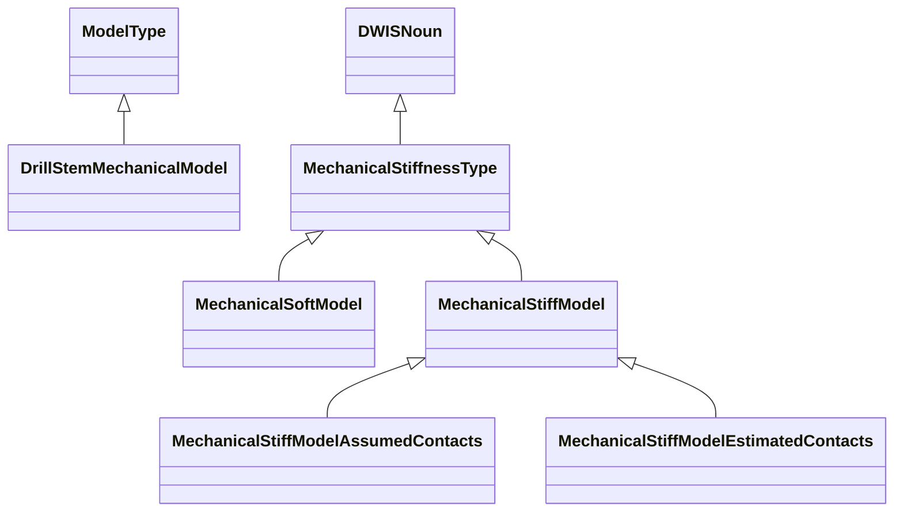
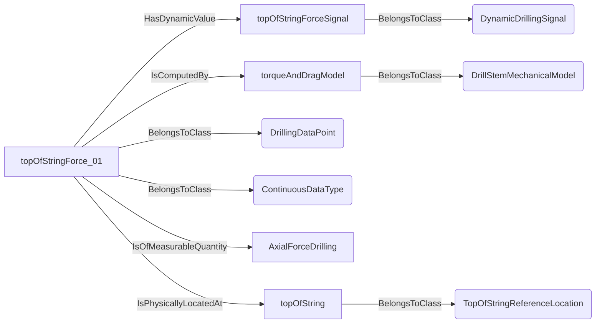
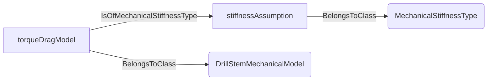
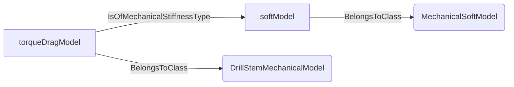
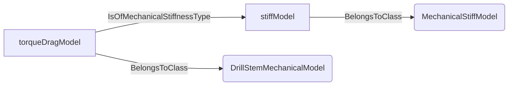
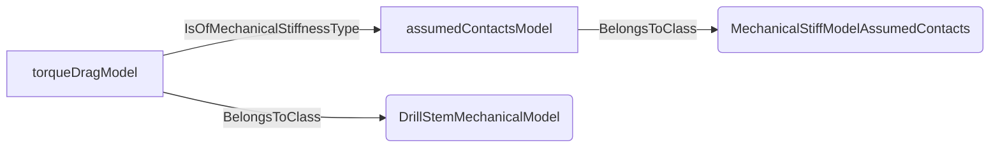
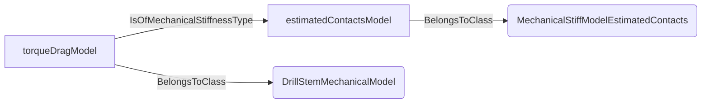
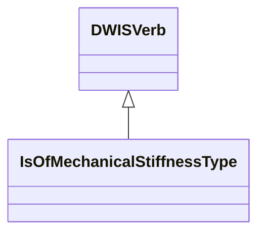
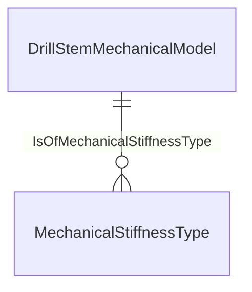
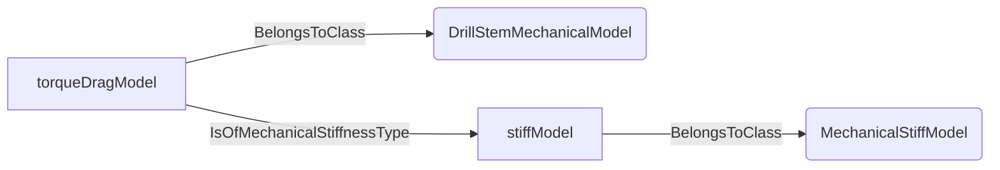

# MechanicalModel<!-- DEFINITION SET HEADER -->
- Description: 
specialized vocabulary for the modelling of the drilling mechanics. Covers in particular torque and drag models

# Nouns
## Class Inheritance for Nouns
Here is a class inheritance diagram for the nouns contained in this definition set.

## DrillStemMechanicalModel <!-- NOUN -->
- Display name: Drill-stem mechanical model
- Parent class: [ModelType](./Model.md#ModelType)
- Description: 
A mechanical model for a drill-stem. Another standard name for drill-stem mechanical models is a torque and drag model.
- Definition set: MechanicalModel
- Examples:
```dwis torqueDragModelExample
DrillStemMechanicalModel:torqueAndDragModel
DynamicDrillingSignal:topOfStringForceSignal
DrillingDataPoint:topOfStringForce_01
topOfStringForce_01 BelongsToClass ContinuousDataType
topOfStringForce_01 HasDynamicValue topOfStringForceSignal
topOfStringForce_01 IsOfMeasurableQuantity AxialForceDrilling
topOfStringForce_01 IsComputedBy torqueAndDragModel
TopOfStringReferenceLocation:topOfString
topOfStringForce_01 IsPhysicallyLocatedAt topOfString
```
An example semantic graph looks like as follow:

An example SparQL query looks like this:
```sparql
PREFIX rdf: <http://www.w3.org/1999/02/22-rdf-syntax-ns#>
PREFIX ddhub: <http://ddhub.no/>
PREFIX quantity: <http://ddhub.no/UnitAndQuantity>
SELECT ?torqueDragModelExample
WHERE {
	?torqueAndDragModel rdf:type ddhub:DrillStemMechanicalModel .
	?topOfStringForceSignal rdf:type ddhub:DynamicDrillingSignal .
	?topOfStringForce_01 rdf:type ddhub:DrillingDataPoint .
	?topOfStringForce_01 rdf:type ddhub:ContinuousDataType .
	?topOfStringForce_01 ddhub:HasDynamicValue ?topOfStringForceSignal .
	?topOfStringForce_01 ddhub:IsOfMeasurableQuantity ?AxialForceDrilling .
	?topOfStringForce_01 ddhub:IsComputedBy ?torqueAndDragModel .
	?topOfString rdf:type ddhub:TopOfStringReferenceLocation .
	?topOfStringForce_01 ddhub:IsPhysicallyLocatedAt ?topOfString .
}
```
This example defines a torque and drag model and links it to a computed top-of-string force data point.
## MechanicalStiffnessType <!-- NOUN -->
- Display name: Mechanical stiffness type
- Parent class: [DWISNoun](./DWISSemantics.md#DWISNoun)
- Description: 
A description of how the drill-stem stiffness is modelled.
- Definition set: MechanicalModel
- Examples:
```dwis stiffnessTypeExample
MechanicalStiffnessType:stiffnessAssumption
DrillStemMechanicalModel:torqueDragModel
torqueDragModel IsOfMechanicalStiffnessType stiffnessAssumption
```
An example semantic graph looks like as follow:

An example SparQL query looks like this:
```sparql
PREFIX rdf: <http://www.w3.org/1999/02/22-rdf-syntax-ns#>
PREFIX ddhub: <http://ddhub.no/>
PREFIX quantity: <http://ddhub.no/UnitAndQuantity>
SELECT ?stiffnessTypeExample
WHERE {
	?stiffnessAssumption rdf:type ddhub:MechanicalStiffnessType .
	?torqueDragModel rdf:type ddhub:DrillStemMechanicalModel .
	?torqueDragModel ddhub:IsOfMechanicalStiffnessType ?stiffnessAssumption .
}
```
This example attaches a stiffness assumption to a drill-stem mechanical model.
## MechanicalSoftModel <!-- NOUN -->
- Display name: Mechanical soft model
- Parent class: [MechanicalStiffnessType](./MechanicalModel.md#MechanicalStiffnessType)
- Description: 
An infinitively soft model assumes that the drill-stem deforms without any resistance when compressive loads are applied.
- Definition set: MechanicalModel
- Examples:
```dwis softModelExample
MechanicalSoftModel:softModel
DrillStemMechanicalModel:torqueDragModel
torqueDragModel IsOfMechanicalStiffnessType softModel
```
An example semantic graph looks like as follow:

An example SparQL query looks like this:
```sparql
PREFIX rdf: <http://www.w3.org/1999/02/22-rdf-syntax-ns#>
PREFIX ddhub: <http://ddhub.no/>
PREFIX quantity: <http://ddhub.no/UnitAndQuantity>
SELECT ?softModelExample
WHERE {
	?softModel rdf:type ddhub:MechanicalSoftModel .
	?torqueDragModel rdf:type ddhub:DrillStemMechanicalModel .
	?torqueDragModel ddhub:IsOfMechanicalStiffnessType ?softModel .
}
```
This example sets a soft stiffness assumption.
## MechanicalStiffModel <!-- NOUN -->
- Display name: Mechanical stiff model
- Parent class: [MechanicalStiffnessType](./MechanicalModel.md#MechanicalStiffnessType)
- Description: 
A stiff mechanical model considers that the drill-stem can deform laterally when put in compression.
- Definition set: MechanicalModel
- Examples:
```dwis stiffModelExample
MechanicalStiffModel:stiffModel
DrillStemMechanicalModel:torqueDragModel
torqueDragModel IsOfMechanicalStiffnessType stiffModel
```
An example semantic graph looks like as follow:

An example SparQL query looks like this:
```sparql
PREFIX rdf: <http://www.w3.org/1999/02/22-rdf-syntax-ns#>
PREFIX ddhub: <http://ddhub.no/>
PREFIX quantity: <http://ddhub.no/UnitAndQuantity>
SELECT ?stiffModelExample
WHERE {
	?stiffModel rdf:type ddhub:MechanicalStiffModel .
	?torqueDragModel rdf:type ddhub:DrillStemMechanicalModel .
	?torqueDragModel ddhub:IsOfMechanicalStiffnessType ?stiffModel .
}
```
This example sets a stiff stiffness assumption.
## MechanicalStiffModelAssumedContacts <!-- NOUN -->
- Display name: Mechanical stiff model with assumed contacts
- Parent class: [MechanicalStiffModel](./MechanicalModel.md#MechanicalStiffModel)
- Description: 
Such a stiff mechanical model presuposes the position of the contact points.
- Definition set: MechanicalModel
- Examples:
```dwis stiffAssumedContactsExample
MechanicalStiffModelAssumedContacts:assumedContactsModel
DrillStemMechanicalModel:torqueDragModel
torqueDragModel IsOfMechanicalStiffnessType assumedContactsModel
```
An example semantic graph looks like as follow:

An example SparQL query looks like this:
```sparql
PREFIX rdf: <http://www.w3.org/1999/02/22-rdf-syntax-ns#>
PREFIX ddhub: <http://ddhub.no/>
PREFIX quantity: <http://ddhub.no/UnitAndQuantity>
SELECT ?stiffAssumedContactsExample
WHERE {
	?assumedContactsModel rdf:type ddhub:MechanicalStiffModelAssumedContacts .
	?torqueDragModel rdf:type ddhub:DrillStemMechanicalModel .
	?torqueDragModel ddhub:IsOfMechanicalStiffnessType ?assumedContactsModel .
}
```
This example uses assumed contact points.
## MechanicalStiffModelEstimatedContacts <!-- NOUN -->
- Display name: Mechanical stiff model with estimated contacts
- Parent class: [MechanicalStiffModel](./MechanicalModel.md#MechanicalStiffModel)
- Description: 
Such a stiff mechanical model estimates the position of the contact points.
- Definition set: MechanicalModel
- Examples:
```dwis stiffEstimatedContactsExample
MechanicalStiffModelEstimatedContacts:estimatedContactsModel
DrillStemMechanicalModel:torqueDragModel
torqueDragModel IsOfMechanicalStiffnessType estimatedContactsModel
```
An example semantic graph looks like as follow:

An example SparQL query looks like this:
```sparql
PREFIX rdf: <http://www.w3.org/1999/02/22-rdf-syntax-ns#>
PREFIX ddhub: <http://ddhub.no/>
PREFIX quantity: <http://ddhub.no/UnitAndQuantity>
SELECT ?stiffEstimatedContactsExample
WHERE {
	?estimatedContactsModel rdf:type ddhub:MechanicalStiffModelEstimatedContacts .
	?torqueDragModel rdf:type ddhub:DrillStemMechanicalModel .
	?torqueDragModel ddhub:IsOfMechanicalStiffnessType ?estimatedContactsModel .
}
```
This example uses estimated contact points.
# Verbs
## Class Inheritance for Verbs
Here is a class inheritance diagram for the verbs contained in this definition set.

## Relations
Here is a graph representing the relations that can be made with the verbs defined in this definition set.

## IsOfMechanicalStiffnessType <!-- VERB -->
- Display name: Is of mechanical stiffness type
- Parent verb: [DWISVerb](./DWISSemantics.md#DWISVerb)
- Subject class: [DrillStemMechanicalModel](./MechanicalModel.md#DrillStemMechanicalModel)
- Object class: [MechanicalStiffnessType](./MechanicalModel.md#MechanicalStiffnessType)
- Definition set: MechanicalModel
- Description: 
A relation to describe how the drill-stem mechanical model manage stiffness.
- Examples:
```dwis stiffnessRelationExample
DrillStemMechanicalModel:torqueDragModel
MechanicalStiffModel:stiffModel
torqueDragModel IsOfMechanicalStiffnessType stiffModel
```
An example semantic graph looks like as follow:

An example SparQL query looks like this:
```sparql
PREFIX rdf: <http://www.w3.org/1999/02/22-rdf-syntax-ns#>
PREFIX ddhub: <http://ddhub.no/>
PREFIX quantity: <http://ddhub.no/UnitAndQuantity>
SELECT ?stiffnessRelationExample
WHERE {
	?torqueDragModel rdf:type ddhub:DrillStemMechanicalModel .
	?stiffModel rdf:type ddhub:MechanicalStiffModel .
	?torqueDragModel ddhub:IsOfMechanicalStiffnessType ?stiffModel .
}
```
This example links a torque and drag model to a stiff stiffness assumption.
